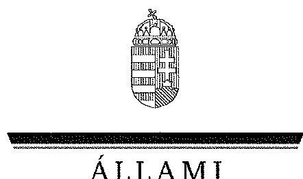
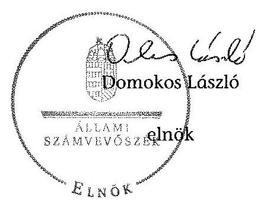
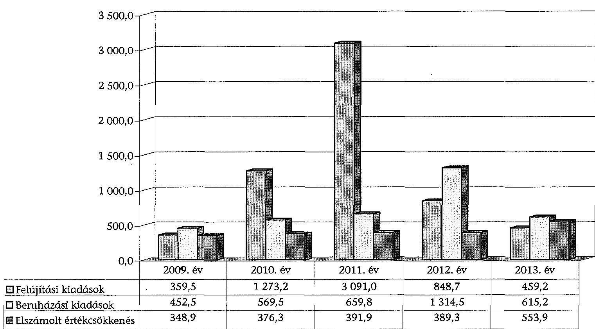
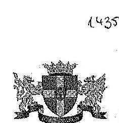
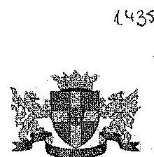
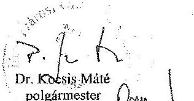
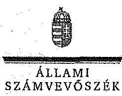

ÁLLAMI
SZÁMVEVŐSZÉK

# JELENTÉS 

az önkormányzatok vagyongazdálkodása szabályszerűségének ellenőrzéséről
Budapest Főváros VIII. kerület Józsefváros

---

# Állami Számvevőszék 

Iktatószám: V-0541-123/2014.
Témaszám: 1575
Vizsgálat-azonosító szám: V068306
Az ellenőrzést felügyelte:
Makkai Mária
felügyeleti vezető
Az ellenőrzést vezette és az ellenőrzés végrehajtásáért felelős:
Páncsics Judit
ellenőrzésvezető
A számvevőszéki jelentés összeállításában közreműködtek:
Pogány Kinga Beatrix
számvevő
Szepes Béla Bálint
számvevő tanácsos
Szikszainé Király Mária
számvevő tanácsos
Varsányiné Dudás Eleonóra
számvevő
Az ellenőrzést végezték:
Pogány Kinga Beatrix Szepes Béla Bálint
számvevő
Szikszainé Király Mária számvevő tanácsos
Varsányiné Dudás Eleonóra
számvevő

A témához kapcsolódó eddig készített számvevőszéki jelentések:
címe
sorszáma
Jelentés Budapest Főváros VIII. kerület Józsefvárosi Önkormányzat 1015
gazdálkodási rendszerének 2010. évi ellenőrzéséről

---

# TARTALOMJEGYZÉK 

BEVEZETÉS ..... 3
I. ÖSSZEGZŐ MEGÁLLAPÍTÁSOK, KÖVETKEZTETÉSEK, JAVASLATOK ..... 7
II. RÉSZLETES MEGÁLLAPÍTÁSOK ..... 15

1. A vagyongazdálkodási tevékenység szabályozása ..... 15
1.1. A vagyongazdálkodási feladatellátás szabályozása ..... 15
1.2. A vagyon kezelésére, koncesszióba adására, üzemeltetésére kötött szerződések megfelelősége ..... 18
2. A vagyongazdálkodási tevékenység szabályszerűsége ..... 20
2.1. A vagyon nyilvántartása és leltározása ..... 20
2.2. Meghatározó mértékű vagyonváltozások ..... 23
2.3. Beruházások, felújítások szabályszerűsége ..... 25
2.4. A vagyon értékesítésének, hasznosításának, a követelés elengedésének szabályszerűsége ..... 27
3. Az önkormányzati tulajdonosi jog gyakorlása ..... 30
4. Integritás érvényesülése ..... 30
5. A belső és a külső ellenőrzések hasznosulása ..... 31
5.1. A belső ellenőrzés javaslatainak hasznosulása ..... 31
5.2. A külső ellenőrzések javaslatainak hasznosulása ..... 33
MELLÉKLETEK
6. számú Budapest Főváros VIII. kerület Józsefvárosi Önkormányzat vagyonának főbb adatai 2009. január 1-je és 2013. december 31-e között
7. számú Budapest Főváros VIII. kerület Józsefvárosi Önkormányzat felújítási és beruházási kiadásai, valamint az elszámolt értékcsökkenés bemutatása 2009-2013 között
8. számú Budapest Főváros VIII. kerület Józsefvárosi Önkormányzat polgármesterének észrevétele
9. számú Budapest Főváros VIII. kerület Józsefvárosi Önkormányzat polgármesterének észrevételére adott válasz

## FÜGGELÉKEK

1. számú Rövidítések jegyzéke
2. számú Értelmező szótár

---

# 2.1.2.2.2.2.3. Integrals 

Integrals are functions of the same type of system, i.e., functions of the same type of system, e.g., functions of the same type of system, and functions of the same type of system, e.g., functions of the same type of system, e.g., functions of the same type of system, and functions of the same type of system, e.g., functions of the same type of system, and functions of the same type of system, e.g., functions of the same type of system, and functions of the same type of system, e.g., functions of the same type of system, and functions of the same type of system, e.g., functions of the same type of system, and functions of the same type of system, e.g., functions of the same type of system, and functions of the same type of system, e.g., functions of the same type of system, and functions of the same type of system, e.g., functions of the same type of system, and functions of the same type of system, e.g., functions of the same type of system, and functions of the same type of system, e.g., functions of the same type of system, and functions of the same type of system, e.g., functions of the same type of system, and functions of the same type of system, e.g., functions of the same type of system, and functions of the same type of system, e.g., functions of the same type of system, and functions of the same type of system, e.g., functions of the same type of system, and functions of the same type of system, e.g., functions of the same type of system, and functions of the same type of system, e.g., functions of the same type of system, and functions of the same type of system, e.g., functions of the same type of system, and functions of the same type of system, e.g., functions of the same type of system, and functions of the same type of system, e.g., functions of the same type of system, and functions of the same type of system, e.g., functions of the same type of system, and functions of the same type of system, e.g., functions of the same type of system, and functions of the same type of system, e.g., functions of the same type of system, and functions of the same type of system, e.g., functions of the same type of system, and functions of the same type of system, e.g., functions of the same type of system, and functions of the same type of system, e.g., functions of the same type of system, and functions of the same type of system, e.g., functions of the same type of system, and functions of the same type of system, e.g., functions of the same type of system, and functions of the same type of system, e.g., functions of the same type of system, and functions of the same type of system, e.g., functions of the same type of system, and functions of the same type of system, e.g., functions of the
 same type of system, and functions of the same type of system, e.g., functions of the same type of system, and functions of the same type of system, e.g., functions of the same type of system, and functions of the same type of system, e.g., functions of the same type of system, and functions of the same type of system, e.g., functions of the same type of system, and functions of the same type of system, e.g., functions of the same type of system, and functions of the same type of system, e.g., functions of the same type of system, and functions of the same type of system, e.g., functions of the same type of system, and functions of the same type of system, e.g., functions of the same type of system, and functions of the same type of system, e.g., functions of the same type of system, and functions of the same type of system, e.g., functions of the same type of system, and functions of the same type of system, e.g., functions of the same type of system, and functions of the same type of system, e.g., functions of the same type of system, and functions of the same type of system, e.g., functions of the same type of system, and functions of the same type of system, e.g., functions of the same type of system, and functions of the same type of system, e.g., functions of the same type of system, and functions of the same type of system, e.g., functions of the same type of system, and functions of the same type of system, e.g., functions of the same type of system, and functions of the same type of system, e.g., functions of the same type of system, and functions of the same type of system, e.g., functions of the same type of system, and functions of the same type of system, e.g., functions of the same type of system, and functions of the same type of system, e.g., functions of the same type of system, and functions of the same type of system, e.g., functions of the same type of system, and functions of the same type of system, e.g., functions of the same type of system, and functions of the same type of system, e.g., functions of the
 same type of system, and functions of the same type of system, e.g., functions of the same type of system, and functions of the same type of system, e.g., functions of the same type of system, and functions of the same type of system, e.g., functions of the same type of system, and functions of the same type of system, e.g., functions of the same type of system, and functions of the same type of system, e.g., functions of the same type of system, and functions of the same type of system, e.g., functions of the same type of system, and functions of the same type of system, e.g., functions of the same type of system, and functions of the same type of system, e.g., functions of the same type of system, and functions of the same type of system, e.g., functions of the same type of system, and functions of the same type of system, e.g., functions of the same type of system, and functions of the same type of system, e.g., functions of the same type of system, and functions of the same type of system, e.g., functions of the same type of system, and functions of the same type of system, e.g., functions of the same type of system, and functions of the same type of system, e.g., functions of the same type of system, and functions of the same type of system, e.g., functions of the same type of system, and functions of the same type of system, e.g., functions of the same type of system, and functions of the same type of system, e.g., functions of the same type of system, and functions of the same type of system, e.g., functions of the same type of system, and functions of the same type of system, e.g., functions of the same type of system, and functions of the same type of system, e.g., functions of the same type of system, and functions of the same type of system, e.g., functions of the same type of system, and functions of the same type of system, e.g., functions of the same type of system, and functions of the same type of system, e.g., functions of the same type of system, and functions of the same type of system, e.g., functions of the
 same type of system, and functions of the same type of system, e.g., functions of the same type of system, and functions of the same type of system, e.g., functions of the same type of system, and functions of the same type of system, e.g., functions of the same type of system, and functions of the same type of system, e.g., functions of the same type of system, and functions of the same type of system, e.g., functions of the same type of system, and functions of the same type of system, e.g., functions of the same type of system, and functions of the same type of system, e.g., functions of the same type of system, and functions of the same type of system, e.g., functions of the same type of system, and functions of the same type of system, e.g., functions of the same type of system, and functions of the same type of system, e.g., functions of the same type of system, and functions of the same type of system, e.g., functions of the same type of system, and functions of the same type of system, e.g., functions of the same type of system, and functions of the same type of system, e.g., functions of the same type of system, and functions of the same type of system, e.g., functions of the same type of system, and functions of the same type of system, e.g., functions of the same type of system, and functions of the same type of system, e.g., functions of the same type of system, and functions of the same type of system, e.g., functions of the same type of system, and functions of the same type of system, e.g., functions of the same type of system, and functions of the same type of system, e.g., functions of the same type of system, and functions of the same type of system, e.g., functions of the same type of system, and functions of the same type of system, e.g., functions of the same type of system, and functions of the same type of system, e.g., functions of the same type of system, and functions of the same type of system, e.g., functions of the same type of system, and functions of the same type of system, e.g., functions of the
 same type of system, and functions of the same type of system, e.g., functions of the same type of system, and functions of the same type of system, e.g., functions of the same type of system, and functions of the same type of system, e.g., functions of the same type of system, and functions of the same type of system, e.g., functions of the same type of system, and functions of the same type of system, e.g., functions of the same type of system, and functions of the same type of system, e.g., functions of the same type of system, and functions of the same type of system, e.g., functions of the same type of system, and functions of the same type of system, e.g., functions of the same type of system, and functions of the same type of system, e.g., functions of the same type of system, and functions of the same type of system, e.g., functions of the same type of system, and functions of the same type of system, e.g., functions of the same type of system, and functions of the same type of system, e.g., functions of the same type of system, and functions of the same type of system, e.g., functions of the same type of system, and functions of the same type of system, e.g., functions of the same type of system, and functions of the same type of system, e.g., functions of the same type of system, and functions of the same type of system, e.g., functions of the same type of system, and functions of the same type of system, e.g., functions of the same type of system, and functions of the same type of system, e.g., functions of the same type of system, and functions of the same type of system, e.g., functions of the same type of system, and functions of the same type of system, e.g., functions of the same type of system, and functions of the same type of system, e.g., functions of the same type of system, and functions of the same type of system, e.g., functions of the same type of system, and functions of the same type of system, e.g., functions of the same type of system, and functions of the same type of system, e.g., functions of the
 same type of system, and functions of the same type of system, e.g., functions of the same type of system, and functions of the same type of system, e.g., functions of the same type of system, and functions of the same type of system, e.g., functions of the same type of system, and functions of the same type of system, e.g., functions of the same type of system, and functions of the same type of system, e.g., functions of the same type of system, and functions of the same type of system, e.g., functions of the same type of system, and functions of the same type of system, e.g., functions of the same type of system, and functions of the same type of system, e.g., functions of the same type of system, and functions of the same type of system, e.g., functions of the same type of system, and functions of the same type of system, e.g., functions of the same type of system, and functions of the same type of system, e.g., functions of the same type of system, and functions of the same type of system, e.g., functions of the same type of system, and functions of the same type of system, e.g., functions of the same type of system, and functions of the same type of system, e.g., functions of the same type of system, and functions of the same type of system, e.g., functions of the same type of system, and functions of the same type of system, e.g., functions of the same type of system, and functions of the same type of system, e.g., functions of the same type of system, and functions of the same type of system, e.g., functions of the same type of system, and functions of the same type of system, e.g., functions of the same type of system, and functions of the same type of system, e.g., functions of the same type of system, and functions of the same type of system, e.g., functions of the same type of system, and functions of the same type of system, e.g., functions of the same type of system, and functions of the same type of system, e.g., functions of the same type of system, and functions of the same type of system, e.g., functions of the
 same type of system, and functions of the same type of system, e.g., functions of the same type of system, and functions of the same type of system, e.g., functions of the same type of system, and functions of the same type of system, e.g., functions of the same type of system, and functions of the same type of system, e.g., functions of the same type of system, and functions of the same type of system, e.g., functions of the same type of system, and functions of the same type of system, e.g., functions of the same type of system, and functions of the same type of system, e.g., functions of the same type of system, and functions of the same type of system, e.g., functions of the same type of system, and functions of the same type of system, e.g., functions of the same type of system, and functions of the same type of system, e.g., functions of the same type of system, and functions of the same type of system, e.g., functions of the same type of system, and functions of the same type of system, e.g., functions of the same type of system, and functions of the same type of system, e.g., functions of the same type of system, and functions of the same type of system, e.g., functions of the same type of system, and functions of the same type of system, e.g., functions of the same type of system, and functions of the same type of system, e.g., functions of the same type of system, and functions of the same type of system, e.g., functions of the same type of system, and functions of the same type of system, e.g., functions of the same type of system, and functions of the same type of system, e.g., functions of the same type of system, and functions of the same type of system, e.g., functions of the same type of system, and functions of the same type of system, e.g., functions of the same type of system, and functions of the same type of system, e.g., functions of the same type of system, and functions of the same type of system, e.g., functions of the same type of system, and functions of the same type of system, e.g., functions of the same type of system, and functions of the same type of system, e.g., functions of the same type of system, and functions of the same type of system, e.g., functions of the same type of system, and functions of the same type of system, e.g., functions of the same type of system, and functions of the same type of system, e.g., functions of the same type of system, and functions of the same type of system, e.g., functions of the same type of system, and functions of the same type of system, e.g., functions of the same type of system, and functions of the same type of system, e.g., functions of the same type of system, and functions of the same type of system, e.g., functions of the same type of system, and functions of the same type of system, e.g., functions of the same type of system, and functions of the same type of system, e.g., functions of the same type of system, and functions of the same type of system, e.g., functions of the same type of system, and functions of the same type of system, e.g., functions of the same type of system, and functions of the same type of system, e.g., functions of the same type of system, and functions of the same type of system, e.g., functions of the same type of system, and functions of the same type of system, e.g., functions of the same type of system, and functions of the same type of system, e.g., functions of the same type of system, and functions of the same type of system, e.g., functions of the same type of system, and functions of the same type of system, e.g., functions of the same type of system, and functions of the same type of system, e.g., functions of the same type of system, and functions of the same type of system, e.g., functions of the same type of system, and functions of the same type of system, e.g., functions of the same type of system, and functions of the same type of system, e.g., functions of the same type of system, and functions of the same type of system, e.g., functions of the same type of system, and functions of the same type of system, e.g., functions of the same type of system, and functions of the same type of system, e.g., functions of the same type of system, and functions of the same type of system, e.g., functions of the same type of system, and functions of the same type of system, e.g., functions of the same type of system, and functions of the same type of system, e.g., functions of the same type of system, and functions of the same type of system, e.g., functions of the same type of system, and functions of the same type of system, e.g., functions of the same type of system, and functions of the same type of system, e.g., functions of the same type of system, and functions of the same type of system, e.g., functions of the same type of system, and functions of the same type of system, e.g., functions of the same type of system, and functions of the same type of system, e.g., functions of the same type of system, and functions of the same type of system, e.g., functions of the same type of system, and functions of the same type of system, e.g., functions of the same type of system, and functions of the same type of system, e.g., functions of the same type of system, and functions of the same type of system, e.g., functions of the same type of system, and functions of the same type of system, e.g., functions of the same type of system, and functions of the same type of system, e.g., functions of the same type of system, and functions of the same type of system, e.g., functions of the
 same type of system, and functions of the same type of system, e.g., functions of the same type of system, and functions of the same type of system, e.g., functions of the same type of system, and functions of the same type of system, e.g., functions of the same type of system, and functions of the same type of system, e.g., functions of the same type of system, and functions of the same type of system, e.g., functions of the same type of system, and functions of the same type of system, e.g., functions of the same type of system, and functions of the same type of system, e.g., functions of the same type of system, and functions of the same type of system, e.g., functions of the same type of system, and functions of the same type of system, e.g., functions of the same type of system, and functions of the same type of system, e.g., functions of the same type of system, and functions of the same type of system, e.g., functions of the same type of system, and functions of the same type of system, e.g., functions of the same type of system, and functions of the same type of system, e.g., functions of the same type of system, and functions of the same type of system, e.g., functions of the same type of system, and functions of the same type of system, e.g., functions of the same type of system, and functions of the same type of system, e.g., functions of the same type of system, and functions of the same type of system, e.g., functions of the same type of system, and functions of the same type of system, e.g., functions of the same type of system, and functions of the same type of system, e.g., functions of the same type of system, and functions of the same type of system, e.g., functions of the same type of system, and functions of the same type of system, e.g., functions of the same type of system, and functions of the same type of system, e.g., functions of the same type of system, and functions of the same type of system, e.g., functions of the same type of system, and functions of the same type of system, e.g., functions of the same type of system, and functions of the same type of system, e.g., functions of the same type of system, and functions of the same type of system, e.g., functions of the same type of system, and functions of the same type of system, e.g., functions of the same type of system, and functions of the same type of system, e.g., functions of the same type of system, and functions of the same type of system, e.g., functions of the same type of system, and functions of the same type of system, e.g., functions of the same type of system, and functions of the same type of system, e.g., functions of the same type of system, and functions of the same type of system, e.g., functions of the same type of system, and functions of the same type of system, e.g., functions of the same type of system, and functions of the same type of system, e.g., functions of the same type of system, and functions of the same type of system, e.g., functions of the same type of system, and functions of the same type of system, e.g., functions of the same type of system, and functions of the same type of system, e.g., functions of the same type of system, and functions of the same type of system, e.g., functions of the same type of system, and functions of the same type of system, e.g., functions of the same type of system, and functions of the same type of system, e.g., functions of the same type of system, and functions of the same type of system, e.g., functions of the same type of system, and functions of the same type of system, e.g., functions of the same type of system, and functions of the same type of system, e.g., functions of the same type of system, and functions of the same type of system, e.g., functions of the same type of system, and functions of the same type of system, e.g., functions of the same type of system, and functions of the same type of system, e.g., functions of the same type of system, and functions of the same type of system, e.g., functions of the same type of system, and functions of the same type of system, e.g., functions of the same type of system, and functions of the same type of system, e.g., functions of the same type of system, and functions of the same type of system, e.g., functions of the same type of system, and functions of the same type of system, e.g., functions of the same type of system, and functions of the same type of system, e.g., functions of the same type of system, and functions of the same type of system, e.g., functions of the same type of system, and functions of the same type of system, e.g., functions of the same type of system, and functions of the same type of system, e.g., functions of the same type of system, and functions of the same type of system, e.g., functions of the same type of system, and functions of the same type of system, e.g., functions of the same type of system, and functions of the same type of system, e.g., functions of the same type of system, and functions of the same type of system, e.g., functions of the same type of system, and functions of the same type of system, e.g., functions of the
 same type of system, and functions of the same type of system, e.g., functions of the same type of system, and functions of the same type of system, e.g., functions of the same type of system, and functions of the same type of system, e.g., functions of the same type of system, and functions of the same type of system, e.g., functions of the same type of system, and functions of the same type of system, e.g., functions of the same type of system, and functions of the same type of system, e.g., functions of the same type of system, and functions of the same type of system, e.g., functions of the same type of system, and functions of the same type of system, e.g., functions of the same type of system, and functions of the same type of system, e.g., functions of the same type of system, and functions of the same type of system, e.g., functions of the same type of system, and functions of the same type of system, e.g., functions of the same type of system, and functions of the same type of system, e.g., functions of the same type of system, and functions of the same type of system, e.g., functions of the same type of system, and functions of the same type of system, e.g., functions of the same type of system, and functions of the same type of system, e.g., functions of the same type of system, and functions of the same type of system, e.g., functions of the same type of system, and functions of the same type of system, e.g., functions of the same type of system, and functions of the same type of system, e.g., functions of the same type of system, and functions of the same type of system, e.g., functions of the same type of system, and functions of the same type of system, e.g., functions of the same type of system, and functions of the same type of system, e.g., functions of the same type of system, and functions of the same type of system, e.g., functions of the same type of system, and functions of the same type of system, e.g., functions of the same type of system, and functions of the same type of system, e.g., functions of the same type of system, and functions of the same type of system, e.g., functions of the same type of system, and functions of the same type of system, e.g., functions of the same type of system, and functions of the same type of system, e.g., functions of the same type of system, and functions of the same type of system, e.g., functions of the same type of system, e.g., functions of the same type of system, and functions of the same type of system, e.g., functions of the same type of system, and functions of the same type of system, e.g., functions of the same type of system, and functions of the same type of system, e.g., functions of the same type of system, and functions of the same type of system, e.g., functions of the same type of system, and functions of the same type of system, e.g., functions of the
 same type of system, e.g., functions of the same type of system, e.g., functions of the same type of system, e.g., functions of the same type of system, e.g., functions of the same type of system, e.g., functions of the same type of system, e.g., functions of the same type of system, e.g., functions of the same type of system, e.g., functions of the same type of system, e.g., functions of the same type of system, e.g., functions of the same type of system, e.g., functions of the same type of system, e.g., functions of the same type of system, e.g., functions of the same type of system, e.g., functions of the same type of system, e.g., functions of the same type of system, e.g., functions of the same type of system, e.g., functions of the same type of system, e.g., functions of the same type of system, e.g., functions of the same type of system, e.g., functions of the same type of system, e.g., functions of the same type of system, e.g., functions of the same type of system, e.g., functions of the same type of system, e.g., functions of the same type of system, e.g., functions of the same type of system, e.g., functions of the same type of system, e.g., functions of the same type of system, e.g., functions of the same type of system, e.g., functions of the same type of system, e.g., functions of the same type of system, e.g., functions of the same type of system, e.g., functions of the same type of system, e.g., functions of the same type of system, e.g., functions of the same type of system, e.g., functions of the same type of system, e.g., functions of the same type of system, e.g., functions of the same type of system, e.g., functions of the same type of system, e.g., functions of the same type of system, e.g., functions of the same type of system, e.g., functions of the same type of system, e.g., functions of the same type of system, e.g., functions of the same type of system, e.g., functions of the same type of system, e.g., functions of the same type of system, e.g., functions of the same type of system, e.g., functions of the same type of system, e.g., functions of the same type of system, e.g., functions of the same type of system, e.g., functions of the same type of system, e.g., functions of the
 same type of system, e.g., functions of the same type of system, e.g., functions of the same type of system, e.g., functions of the same type of system, e.g., functions of the same type of system, e.g., functions of the same type of system, e.g., functions of the same type of system, e.g., functions of the same type of system, e.g., functions of the same type of system, e.g., functions of the same type of system, e.g., functions of the same type of system, e.g., functions of the same type of system, e.g., functions of the same type of system, e.g., functions of the same type of system, e.g., functions of the same type of system, e.g., functions of the same type of system, e.g., functions of the same type of system, e.g., functions of the same type of system, e.g., functions of the same type of system, e.g., functions of the same type of system, e.g., functions of the same type of system, e.g., functions of the same type of system, e.g., functions of the same type of system, e.g., functions of the same type of system, e.g., functions of the same type of system, e.g., functions of the same type of system, e.g., functions of the same type of system, e.g., functions of the same type of system, e.g., functions of the same type of system, e.g., functions of the same type of system, e.g., functions of the same type of system, e.g., functions of the same type of system, e.g., functions of the same type of system, e.g., functions of the same type of system, e.g., functions of the same type of system, e.g., functions of the same type of system, e.g., functions of the same type of system, e.g., functions of the same type of system, e.g., functions of the same type of system, e.g., functions of the same type of system, e.g., functions of the same type of system, e.g., functions of the same type of system, e.g., functions of the same type of system, e.g., functions of the same type of system, e.g., functions of the same type of system, e.g., functions of the same type of system, e.g., functions of the same type of system, e.g., functions of the same type of system, e.g., functions of the same type of system, e.g., functions of the same type of system, e.g., functions of the same type of system, e.g., functions of the
 same type of system, e.g., functions of the same type of system, e.g., functions of the same type of system, e.g., functions of the same type of system, e.g., functions of the same type of system, e.g., functions of the same type of system, e.g., functions of the same type of system, e.g., functions of the same type of system, e.g., functions of the same type of system, e.g., functions of the same type of system, e.g., functions of the same type of system, e.g., functions of the same type of system, e.g., functions of the same type of system, e.g., functions of the same type of system, e.g., functions of the same type of system, e.g., functions of the same type of system, e.g., functions of the same type of system, e.g., functions of the same type of system, e.g., functions of the same type of system, e.g., functions of the same type of system, e.g., functions of the same type of system, e.g., functions of the same type of system, e.g., functions of the same type of system, e.g., functions of the same type of system, e.g., functions of the same type of system, e.g., functions of the same type of system, e.g., functions of the same type of system, e.g., functions of the same type of system, e.g., functions of the same type of system, e.g., functions of the same type of system, e.g., functions of the same type of system, e.g., functions of the same type of system, e.g., functions of the same type of system, e.g., functions of the same type of system, e.g., functions of the same type of system, e.g., functions of the same type of system, e.g., functions of the same type of system, e.g., functions of the same type of system, e.g., functions of the same type of system, e.g., functions of the same type of system, e.g., functions of the same type of system, e.g., functions of the same type of system, e.g., functions of the same type of system, e.g., functions of the same type of system, e.g., functions of the same type of system, e.g., functions of the same type of system, e.g., functions of the same type of system, e.g., functions of the same type of system, e.g., functions of the same type of system, e.g., functions of the same type of system, e.g., functions of the same type of system, e.g., functions of the same type of system, e.g., functions of the
 same type of system, e.g., functions of the same type of system, e.g., functions of the same type of system, e.g., functions of the same type of system, e.g., functions of the same type of system, e.g., functions of the same type of system, e.g., functions of the same type of system, e.g., functions of the same type of system, e.g., functions of the same type of system, e.g., functions of the same type of system, e.g., functions of the same type of system, e.g., functions of the same type of system, e.g., functions of the same type of system, e.g., functions of the same type of system, e.g., functions of the same type of system, e.g., functions of the same type of system, e.g., functions of the same type of system, e.g., functions of the same type of system, e.g., functions of the same type of system, e.g., functions of the same type of system, e.g., functions of the same type of system, e.g., functions of the same type of system, e.g., functions of the same type of system, e.g., functions of the same type of system, e.g., functions of the same type of system, e.g., functions of the same type of system, e.g., functions of the same type of system, e.g., functions of the same type of system, e.g., functions of the same type of system, e.g., functions of the same type of system, e.g., functions of the same type of system, e.g., functions of the same type of system, e.g., functions of the same type of system, e.g., functions of the same type of system, e.g., functions of the same type of system, e.g., functions of the same type of system, e.g., functions of the same type of system, e.g., functions of the same type of system, e.g., functions of the same type of system, e.g., functions of the same type of system, e.g., functions of the same type of system, e.g., functions of the same type of system, e.g., functions of the same type of system, e.g., functions of the same type of system, e.g., functions of the same type of system, e.g., functions of the same type of system, e.g., functions of the same type of system, e.g., functions of the same type of system, e.g., functions of the same type of system, e.g., functions of the same type of system, e.g., functions of the same type of system, e.g., functions of the
 same type of system, e.g., functions of the same type of system, e.g., functions of the same type of system, e.g., functions of the same type of system, e.g., functions of the same type of system, e.g., functions of the same type of system, e.g., functions of the same type of system, e.g., functions of the same type of system, e.g., functions of the same type of system, e.g., functions of the same type of system, e.g., functions of the same type of system, e.g., functions of the same type of system, e.g., functions of the same type of system, e.g., functions of the same type of system, e.g., functions of the same type of system, e.g., functions of the same type of system, e.g., functions of the same type of system, e.g., functions of the same type of system, e.g., functions of the same type of system, e.g., functions of the same type of system, e.g., functions of the same type of system, e.g., functions of the same type of system, e.g., functions of the same type of system, e.g., functions of the same type of system, e.g., functions of the same type of system, e.g., functions of the same type of system, e.g., functions of the same type of system, e.g., functions of the same type of system, e.g., functions of the same type of system, e.g., functions of the same type of system, e.g., functions of the same type of system, e.g., functions of the same type of system, e.g., functions of the same type of system, e.g., functions of the same type of system, e.g., functions of the same type of system, e.g., functions of the same type of system, e.g., functions of the same type of system, e.g., functions of the same type of system, e.g., functions of the same type of system, e.g., functions of the same type of system, e.g., functions of the same type of system, e.g., functions of the same type of system, e.g., functions of the same type of system, e.g., functions of the same type of system, e.g., functions of the same type of system, e.g., functions of the same type of system, e.g., functions of the same type of system, e.g., functions of the same type of system, e.g., functions of the same type of system, e.g., functions of the same type of system, e.g., functions of the same type of system, e.g., functions of the same type of system, e.g., functions of the
 same type of system, e.g., functions of the same type of system, e.g., functions of the same type of system, e.g., functions of the same type of system, e.g., functions of the same type of system, e.g., functions of the same type of system, e.g., functions of the same type of system, e.g., functions of the same type of system, e.g., functions of the same type of system, e.g., functions of the same type of system, e.g., functions of the same type of system, e.g., functions of the same type of system, e.g., functions of the same type of system, e.g., functions of the same type of system, e.g., functions of the same type of system, e.g., functions of the same type of system, e.g., functions of the same type of system, e.g., functions of the same type of system, e.g., functions of the same type of system, e.g., functions of the same type of system, e.g., functions of the same type of system, e.g., functions of the same type of system, e.g., functions of the same type of system, e.g., functions of the same type of system, e.g., functions of the same type of system, e.g., functions of the same type of system, e.g., functions of the same type of system, e.g., functions of the same type of system, e.g., functions of the same type of system, e.g., functions of the same type of system, e.g., functions of the same type of system, e.g., functions of the same type of system, e.g., functions of the same type of system, e.g., functions of the same type of system, e.g., functions of the same type of system, e.g., functions of the same type of system, e.g., functions of the same type of system, e.g., functions of the same type of system, e.g., functions of the same type of system, e.g., functions of the same type of system, e.g., functions of the same type of system, e.g., functions of the same type of system, e.g., functions of the same type of system, e.g., functions of the same type of system, e.g., functions of the same type of system, e.g., functions of the same type of system, e.g., functions of the same type of system, e.g., functions of the same type of system, e.g., functions of the same type of system, e.g., functions of the same type of system, e.g., functions of the same type of system, e.g., functions of the
 same type of system, e.g., functions of the same type of system, e.g., functions of the same type of system, e.g., functions of the same type of system, e.g., functions of the same type of system, e.g., functions of the same type of system, e.g., functions of the same type of system, e.g., functions of the same type of system, e.g., functions of the same type of system, e.g., functions of the same type of system, e.g., functions of the same type of system, e.g., functions of the same type of system, e.g., functions of the same type of system, e.g., functions of the same type of system, e.g., functions of the same type of system, e.g., functions of the same type of system, e.g., functions of the same type of system, e.g., functions of the same type of system, e.g., functions of the same type of system, e.g., functions of the same type of system, e.g., functions of the same type of system, e.g., functions of the same type of system, e.g., functions of the same type of system, e.g., functions of the same type of system, e.g., functions of the same type of system, e.g., functions of the same type of system, e.g., functions of the same type of system, e.g., functions of the same type of system, e.g., functions of the same type of system, e.g., functions of the same type of system, e.g., functions of the same type of system, e.g., functions of the same type of system, e.g., functions of the same type of system, e.g., functions of the same type of system, e.g., functions of the same type of system, e.g., functions of the same type of system, e.g., functions of the same type of system, e.g., functions of the same type of system, e.g., functions of the same type of system, e.g., functions of the same type of system, e.g., functions of the same type of system, e.g., functions of the same type of system, e.g., functions of the same type of system, e.g., functions of the same type of system, e.g., functions of the same type of system, e.g., functions of the same type of system, e.g., functions of the same type of system, e.g., functions of the same type of system, e.g., functions of the same type of system, e.g., functions of the same type of system, e.g., functions of the same type of system, e.g., functions of the
 same type of system, e.g., functions of the same type of system, e.g., functions of the same type of system, e.g., functions of the same type of system, e.g., functions of the same type of system, e.g., functions of the same type of system, e.g., functions of the same type of system, e.g., functions of the same type of system, e.g., functions of the same type of system, e.g., functions of the same type of system, e.g., functions of the same type of system, e.g., functions of the same type of system, e.g., functions of the same type of system, e.g., functions of the same type of system, e.g., functions of the same type of system, e.g., functions of the same type of system, e.g., functions of the same type of system, e.g., functions of the same type of system, e.g., functions of the same type of system, e.g., functions of the same type of system, e.g., functions of the same type of system, e.g., functions of the same type of system, e.g., functions of the same type of system, e.g., functions of the same type of system, e.g., functions of the same type of system, e.g., functions of the same type of system, e.g., functions of the same type of system, e.g., functions of the same type of system, e.g., functions of the same type of system, e.g., functions of the same type of system, e.g., functions of the same type of system, e.g., functions of the same type of system, e.g., functions of the same type of system, e.g., functions of the same type of system, e.g., functions of the same type of system, e.g., functions of the same type of system, e.g., functions of the same type of system, e.g., functions of the same type of system, e.g., functions of the same type of system, e.g., functions of the same type of system, e.g., functions of the same type of system, e.g., functions of the same type of system, e.g., functions of the same type of system, e.g., functions of the same type of system, e.g., functions of the same type of system, e.g., functions of the same type of system, e.g., functions of the same type of system, e.g., functions of the same type of system, e.g., functions of the same type of system, e.g., functions of the same type of system, e.g., functions of the same type of system, e.g., functions of the same type of system, e.g., functions of the
 same type of system, e.g., functions of the same type of system, e.g., functions of the same type of system, e.g., functions of the same type of system, e.g., functions of the same type of system, e.g., functions of the same type of system, e.g., functions of the same type of system, e.g., functions of the same type of system, e.g., functions of the same type of system, e.g., functions of the same type of system, e.g., functions of the same type of system, e.g., functions of the same type of system, e.g., functions of the same type of system, e.g., functions of the same type of system, e.g., functions of the same type of system, e.g., functions of the same type of system, e.g., functions of the same type of system, e.g., functions of the same type of system, e.g., functions of the same type of system, e.g., functions of the same type of system, e.g., functions of the same type of system, e.g., functions of the same type of system, e.g., functions of the same type of system, e.g., functions of the same type of system, e.g., functions of the same type of system, e.g., functions of the same type of system, e.g., functions of the same type of system, e.g., functions of the same type of system, e.g., functions of the same type of system, e.g., functions of the same type of system, e.g., functions of the same type of system, e.g., functions of the same type of system, e.g., functions of the same type of system, e.g., functions of the same type of system, e.g., functions of the same type of system, e.g., functions of the same type of system, e.g., functions of the same type of system, e.g., functions of the same type of system, e.g., functions of the same type of system, e.g., functions of the same type of system, e.g., functions of the same type of system, e.g., functions of the same type of system, e.g., functions of the same type of system, e.g., functions of the same type of system, e.g., functions of the same type of system, e.g., functions of the same type of system, e.g., functions of the same type of system, e.g., functions of the same type of system, e.g., functions of the same type of system, e.g., functions of the same type of system, e.g., functions of the same type of system, e.g., functions of the
 same type of system, e.g., functions of the same type of system, e.g., functions of the same type of system, e.g., functions of the same type of system, e.g., functions of the same type of system, e.g., functions of the same type of system, e.g., functions of the same type of system, e.g., functions of the same type of system, e.g., functions of the same type of system, e.g., functions of the same type of system, e.g., functions of the same type of system, e.g., functions of the same type of system, e.g., functions of the same type of system, e.g., functions of the same type of system, e.g., functions of the same type of system, e.g., functions of the same type of system, e.g., functions of the same type of system, e.g., functions of the same type of system, e.g., functions of the same type of system, e.g., functions of the same type of system, e.g., functions of the same type of system, e.g., functions of the same type of system, e.g., functions of the same type of system, e.g., functions of the same type of system, e.g., functions of the same type of system, e.g., functions of the same type of system, e.g., functions of the same type of system, e.g., functions of the same type of system, e.g., functions of the same type of system, e.g., functions of the same type of system, e.g., functions of the same type of system, e.g., functions of the same type of system, e.g., functions of the same type of system, e.g., functions of the same type of system, e.g., functions of the same type of system, e.g., functions of the same type of system, e.g., functions of the same type of system, e.g., functions of the same type of system, e.g., functions of the same type of system, e.g., functions of the same type of system, e.g., functions of the same type of system, e.g., functions of the same type of system, e.g., functions of the same type of system, e.g., functions of the same type of system, e.g., functions of the same type of system, e.g., functions of the same type of system, e.g., functions of the same type of system, e.g., functions of the same type of system, e.g., functions of the same type of system, e.g., functions of the same type of system, e.g., functions of the same type of system, e.g., functions of the
 same type of system, e.g., functions of the same type of system, e.g., functions of the same type of system, e.g., functions of the same type of system, e.g., functions of the same type of system, e.g., functions of the same type of system, e.g., functions of the same type of system, e.g., functions of the same type of system, e.g., functions of the same type of system, e.g., functions of the same type of system, e.g., functions of the same type of system, e.g., functions of the same type of system, e.g., functions of the same type of system, e.g., functions of the same type of system, e.g., functions of the same type of system, e.g., functions of the same type of system, e.g., functions of the same type of system, e.g., functions of the same type of system, e.g., functions of the same type of system, e.g., functions of the same type of system, e.g., functions of the same type of system, e.g., functions of the same type of system, e.g., functions of the same type of system, e.g., functions of the same type of system, e.g., functions of the same type of system, e.g., functions of the same type of system, e.g., functions of the same type of system, e.g., functions of the same type of system, e.g., functions of the same type of system, e.g., functions of the same type of system, e.g., functions of the same type of system, e.g., functions of the same type of system, e.g., functions of the same type of system, e.g., functions of the same type of system, e.g., functions of the same type of system, e.g., functions of the same type of system, e.g., functions of the same type of system, e.g., functions of the same type of system, e.g., functions of the same type of system, e.g., functions of the same type of system, e.g., functions of the same type of system, e.g., functions of the same type of system, e.g., functions of the same type of system, e.g., functions of the same type of system, e.g., functions of the same type of system, e.g., functions of the same type of system, e.g., functions of the same type of system, e.g., functions of the same type of system, e.g., functions of the same type of system, e.g., functions of the same type of system, e.g., functions of the same type of system, e.g., functions of the same type of system, e.g., functions of the
 ---

# JELENTÉS 

## az önkormányzatok vagyongazdálkodása szabályszerűségének ellenőrzéséről Budapest Főváros VIII. kerület Józsefváros

## BEVEZETÉS

Az ÁSZ stratégiai célkitűzése, hogy ellenőrzéseivel mind jobban segítse az átláthatóságot, az elszámoltathatóságot és elszámoltatást a közpénzekkel és a közvagyonnal való gazdálkodásban. Magyarország Alaptörvénye rögzíti, hogy az állam és a helyi önkormányzat tulajdona a nemzeti vagyon része. Az önkormányzati vagyon alapvető funkciója, hogy a közérdeket és egyúttal az önkormányzati célok - elsősorban a kötelezően ellátandó feladatok, és emellett a lehetőségek mértékéig az önként vállalt feladatok - megvalósítását szolgálja.

Az ÁSZ az önkormányzati vagyongazdálkodás 2012. évben indított és 2013. évben folytatott ellenőrzéseinek tapasztalatai alapján indokoltnak látta, hogy a 2014. évi ellenőrzési tervébe is beépítésre kerüljön a vagyongazdálkodási tevékenységek ellenőrzése. Az eddig elvégzett ellenőrzések rámutattak, hogy az önkormányzatok vagyongazdálkodási tevékenységét érintő szabályozottság, a kapcsolódó nyilvántartások, a beszámolók leltárral történő alátámasztása, a gazdálkodási jogkörök szabályszerű gyakorlása és a döntések megalapozottsága terén hiányosságok tapasztalhatók. Ez indokolttá tette a vagyongazdálkodás ellenőrzésének folytatását a jelentős vagyonnal rendelkező, vagy az ÁSZ kockázatelemzése alapján magas vagyoni kockázatot mutató önkormányzatoknál.

Az ellenőrzés célja annak megállapítása volt, hogy az önkormányzat vagyongazdálkodási tevékenységét a jogszabályi előírásokkal összhangban szabályozta-e, a vagyon nyilvántartása és a vagyongazdálkodási tevékenységek végrehajtása a jogszabályoknak és a belső előírásoknak megfelelően történt-e. Az ellenőrzés célja továbbá annak megállapítása, hogy az önkormányzatnál a vagyongazdálkodás során biztosították-e az átláthatóságot, valamint a külső és belső ellenőrzések megállapításai, javaslatai hozzájárultak-e a szabályszerű vagyongazdálkodáshoz.

Ennek keretében értékeltük, hogy az Önkormányzat:

- szabályszerűen alakította-e ki vagyongazdálkodási tevékenységének kereteit;
- biztosította-e a vagyongazdálkodás szabályszerűségét, megalapozottan hozta-e és jogszerűen, szabályszerűen hajtotta-e végre a vagyonváltozást eredményező meghatározó jelentőségű döntéseket;

---

- gondoskodott-e a tulajdonosi jogok gyakorlásáról;
- vagyongazdálkodási tevékenysége során biztosította-e az átláthatóság és az integritás érvényesülését;
- belső ellenőrzése elősegítette-e a vagyongazdálkodás szabályszerű működését, valamint hasznosította-e a vagyongazdálkodási tevékenységével kapcsolatos külső és belső ellenőrzések megállapításait, javaslatait.

Az ellenőrzés várható hasznosulása, hogy feltárja az önkormányzati vagyongazdálkodást meghatározó szabályok, szabályozások összhangjának hiányosságait, a szabályozással nem érintett vagyongazdálkodási területeket, a vagyongazdálkodási tevékenység gyakorlásának esetleges szabálytalanságait, valamint a jó gyakorlat kialakításán és terjesztésén keresztül az ellenőrzések elősegíthetik a vagyongazdálkodás szabályszerűségének javítását.

Az ellenőrzés típusa: szabályszerűségi ellenőrzés
Az ellenőrzött időszak: 2009. január 1-jétől 2013. december 31-ig, illetve a közbeszerzési eljárások lefolytatásának ellenőrzése 2012. január 1-jétől az Önkormányzat helyszíni ellenőrzésének kezdetét megelőző negyedév végéig (2014. március 31-ig) tartott.

Ellenőrzött szervezet: Budapest Főváros VIII. kerület Józsefvárosi Önkormányzat

Az ellenőrzés végrehajtásának jogszabályi alapját az Állami Számvevőszékről szóló 2011. évi LXVI. törvény 1. § (3) bekezdése, az 5. § (2)-(6) bekezdései, valamint az államháztartásról szóló 2011. évi CXCV. törvény 61. § (2) bekezdésének előírásai képezik.

Az ellenőrzés
 szakmai módszertana az ÁSZ hivatalos honlapján közzétett szakmai szabályokon alapult, amely a Legfőbb Ellenőrző Intézmények Nemzetközi Szervezete (INTOSAI) által kiadott nemzetközi standardok (ISSAI) figyelembevételével készült.

Az ellenőrzést az ÁSZ hatályos szervezeti szabályai és az ellenőrzési programban foglalt értékelési szempontok szerint folytattuk le. Megállapításainkat a helyszíni ellenőrzés tapasztalataira, az ellenőrzött szervezettől bekért dokumentumokra, a kitöltött tanúsítványok elemzésére, az adott időszakban hatályos jogszabályok és belső szabályzatok előírásaira alapoztuk. A részesedések értékelését tételesen ellenőriztük, míg irányított mintavétellel választottuk ki az ellenőrzött térítésmentes átadás-átvételeket, a beruházásokat, felújításokat, a közbeszerzési eljárásokat, a vagyon értékesítését, hasznosítását és a követelés elengedést, illetve leírást. A belső kontrollok megfelelő működését (a szakmai teljesítésigazolást, valamint a 2009-2011. években az utalvány ellenjegyzést, a 2012-2013. években az érvényesítést) a Polgármesteri hivatal felhalmozási kiadásaiból választott véletlen minta alapján, megfelelőségi teszttel ellenőriztük.

Budapest Főváros VIII. kerület lakosainak száma 2013. január 1-jén 71160 fő volt. A 2010. évi önkormányzati választásokig a 27 tagú Képviselő-testület munkáját négy állandó bizottság segítette. A választások után a Képviselő-testület létszáma 18 főre csökkent és két állandó bizottság működött. A jelenlegi polgármester a 2009. évi időközi önkormányzati választás óta tölti be a tisztségét, a jegyző 2012. márciusától látja el a feladatait. A Polgármesteri hivatal 2013. december 31-én hét ügyosztályra, ezen belül 19 irodára tagolódott, elkülönített gazdasági szervezettel rendelkezett. A vagyongazdálkodással kapcsolatos feladatokat a Pénzügyi Ügyosztály, a Vagyongazdálkodási és Üzemeltetési Ügyosztály, valamint a Belső Ellátási Iroda látták el és részt vett benne hat 100%-os és négy többségi önkormányzati tulajdonban álló gazdasági társaság.

Az Önkormányzat a 2013. évben a Polgármesteri hivatalon kívül öt önállóan működő és gazdálkodó, valamint 15 önállóan működő költségvetési szervvel látta el feladatait. A 100%-os önkormányzati tulajdonban álló társaságok közül a lakások és nem lakás céljára szolgáló helyiségek üzemeltetését és hasznosítását a Kisfalu Kft., a kulturális, közművelődési és művészeti közfeladatok ellátását a Bárka Színház, a közösségi házak üzemeltetését a Közösségi Házak Nkft. útján biztosították. A közrend és a közlekedés biztonságáról, a gyermek- és ifjúságvédelemről a Közbiztonsági és Köztisztasági Nkft.-vel, az iskolák diákjainak és tanárainak szervezett üdültetéséről az Üdültetési Nkft.-vel, az Orczy Park működtetéséről a Jóhír Nkft.-vel gondoskodtak. A többségi önkormányzati tulajdonú társaságok közül a városfejlesztési és projekt-menedzseri feladatokat a Rév8 Zrt., az intézmények energetikai-, fűtés- és melegvíz-ellátásának korszerűsítését és üzemeltetését az RFV Kft., a Corvin sétány közterületének megépítését és hasznosítását a Corvin Sétány Kft. látta el, a rendelőintézet felújításáról és működtetéséről a Mikszáth4 Kft. gondoskodott.

A Képviselő-testület a 2009-2013. évek között négy intézmény alapító okiratában engedélyezte a vállalkozási tevékenység végzését. A Közösségi Házak Nkft.-vel 2012-2013-ban két vagyonkezelési szerződést kötöttek, az RFV Kft.-vel kötött vagyonkezelési szerződés 2007-től volt érvényben. Haszonélvezeti és koncessziós jogot alapító szerződést nem kötöttek. PPP konstrukcióban megvalósított fejlesztésre nem került sor. Az ÁSZ 2009-2013 között az Önkormányzatnál a 2010. évben végzett ellenőrzést.

Az Önkormányzat könyvviteli mérleg szerinti vagyona a 2009. évi 132 598,2 millió Ft-os nyitó értékről a 2013. év végére 128 021,0 millió Ft-ra, 4577,2 millió Ft-tal (3,5%-kal) csökkent. A vagyon értékének alakulását befolyásolta a forgalomképes ingatlanok piaci értéken való értékelése, az értékhelyesbítés hatását (7669,8 millió Ft-os csökkenését) kiszűrve a vagyon a 2009. évi 95 109,1 millió Ft-os nyitó értékről 2013. év végére 98 201,7 millió Ft-ra, 3,3%-kal (3092,6 millió Ft-tal) emelkedett. Az ellenőrzött időszakban a befejezett felújítások és beruházások 8120,3 millió Ft-tal növelték az Önkormányzat tárgyi eszközeinek értékét, továbbá a befejezetlen beruházások és felújítások értéke 337,3 millió Ft-tal nőtt, 2013. december 31-én 807,4 millió Ft volt. A 2009-2013. években összesen 9643,1 millió Ft-ot fordítottak felújításokra és beruházásokra, ami közel ötszöröse volt az elszámolt értékcsökkenés összegének, ezáltal hozzájárultak az elhasználódott eszközök pótlásához. Az Önkormányzat összes kötelezettségének állományi értéke 2013. december 31-én 6203,5 millió Ft volt, ebből a rövid és hosszú lejáratú kötelezettségek értéke 6177,5 millió Ft-ot tett ki. A pénzintézeti kötelezettség állományi értéke 5463,4 millió Ft volt, mely az 5409,9 millió Ft összegű 2014. évi adósság átvállalás eredményeként 2014. február végére megszűnt. Az Önkormányzat 2013-ban az éves költségvetési beszámolója szerint 16 981,3 millió Ft költségvetési bevételt ért el és 15 563,0 millió Ft költségvetési kiadást teljesített. Felhalmozási célú kiadásra 1347,7 millió Ft-ot, ezen belül felújítási és beruházási kiadásokra 1074,4 millió Ft-ot fordítottak.

Az Önkormányzat vagyonának főbb adatait az 1. számú, a felújítási és beruházási kiadásokat, valamint az elszámolt értékcsökkenést a 2. számú melléklet mutatja be. Az alkalmazott rövidítéseket az 1. számú, az egyes fogalmak magyarázatát a 2. számú függelék tartalmazza.

Az ÁSZ a 2011. évi LXVI. törvény 29. §-a szerint a jelentéstervezetet megküldte Budapest Főváros VIII. kerület Józsefvárosi Önkormányzat polgármesterének egyeztetésre. A polgármester észrevételét és az arra adott választ a jelentés 3-4. számú mellékletei tartalmazzák.

---

# I. ÖSSZEGZŐ MEGÁLLAPÍTÁSOK, KÖVETKEZTETÉSEK, JAVASLATOK 

A Képviselő-testület a vagyongazdálkodási tevékenység kereteit a teljes vagyoni körre kiterjedően az önkormányzati SZMSZ$_{1-3}$-ban, a vagyongazdálkodási rendelet$_{1,2}$-ben, a lakásbérleti rendelet$_{1,2}$-ben, a helyiségbérleti rendelet$_{1,3}$-ben, a lakáselidegenítési rendelet$_{1,3}$-ben, a helyiség-elidegenítési rendelet$_{1,2}$-ben, a közterület-használati rendelet$_{1,2}$-ben, valamint a piacrendeletben szabályozta.

A vagyongazdálkodási rendelet$_{1,3}$-ben szabályozták - a törzsvagyon, ezen belül a forgalomképtelen és a korlátozottan forgalomképes vagyonelemek körét, az önkormányzati SZMSZ$_{2,3}$-ban rendelkeztek a vagyontárgyak forgalomképességének megváltoztatási módjáról.

A Képviselő-testület az önkormányzati SZMSZ$_{2,3}$-ban és a vagyongazdálkodási rendelet$_{1,3}$-ben a polgármester$_{1,2}$-nek, a Városgazdálkodási és Pénzügyi Bizottságnak és a Humánszolgáltatási Bizottságnak adott át vagyongazdálkodási hatáskört. Az átruházott hatáskörök gyakorlásáról a beszámolási kötelezettséget éves gyakorisággal írták elő, amelynek a hatáskörök gyakorlói eleget tettek. A Képviselő-testület a vagyon értékesítésére, hasznosítására, kezelésbe adására, használati jogának átadására a nyilvános versenyeztetési kötelezettséget - az Áht.$_{1}$, illetve az Nvtv. alapján a vagyongazdálkodási rendelet$_{1,3}$-ben - a mindenkori költségvetési törvényben meghatározott értékhatárt meghaladó esetekben írta elő. A vagyongazdálkodási rendelet$_{1}$-ben szabályozták a vagyonkezelői jog megszerzésének, gyakorlásának, illetve a vagyonkezelés ellenőrzésének részletes szabályait, a vagyongazdálkodási rendelet$_{2}$-ben az Mötv.-ben előírtak ellenére nem rendelkeztek a vagyonkezelői jog ellenértékéről és a vagyonkezelés ellenőrzésének részletes szabályairól, továbbá nem határozták meg azt a vagyoni kört, melyre vagyonkezelői jog létesíthető. A Képviselő-testület 2012. novemberében, illetve 2013. májusában döntött - a 100%-os tulajdonában álló Közösségi Házak Nkft.-vel - a vagyonkezelési szerződés$_{2,3}$ megkötéséről.

A Polgármesteri hivatal rendelkezett az Áhsz.$_{1}$-nek és a helyi sajátosságoknak megfelelő számviteli politika$_{1-3}$-mal és az annak részét képező pénzügyiszámviteli szabályzatokkal. Az értékelési szabályzat$_{1-3}$ nem felelt meg az Áhsz.$_{1}$-ben előírtaknak, mivel nem határozták meg benne a vagyonkezelésbe adott eszközök értékelése során alkalmazott elveket és módszert, a dokumentálás szabályait és felelőseit.

A Polgármesteri hivatalban az operatív gazdálkodási jogkörök gyakorlásának szabályait és az összeférhetetlenségi követelményeket a gazdálkodási jogkörök szabályzata$_{1-7}$ tartalmazta. A szakmai teljesítésigazolás szabályozásának részletes eljárásrendje - az Ámr.$_{1,2}$ és az Ávr. előírásai ellenére - nem rögzítette az eseti megbízások rendjét, valamint az előirányzatok feletti rendelkezési jogosultságok egyértelmű azonosíthatóságát. Az ellenőrzött felhalmozási kiadásoknak 2009-ben több mint 60%-át, 2010-ben közel 40%-át érintően a kontrollok működése nem felelt meg a jogszabályi előírásoknak és a belső szabályozásnak, a 2011-2013. években a kontrollok - néhány kivételtől eltekintve - megfelelően működtek.

A jegyző$_{1,2}$ az Áht.$_{1}$-ben, a jegyző$_{3}$ a vagyongazdálkodási rendelet$_{2}$-ben és az Áhsz.$_{1}$-ben rögzített kötelezettsége ellenére nem határozta meg, hogy a vagyonkezelőknek milyen módon és formában kell adatot szolgáltatniuk a vagyonban bekövetkezett változásokról. Ennek következtében a vagyonkezelők adatszolgáltatást nem teljesítettek, így az Áhsz.$_{1}$-ben előírtak ellenére a Polgármesteri hivatal nem vezette át a vagyonváltozást a számviteli nyilvántartásokon.

Az Önkormányzatnál a vagyongazdálkodás szabályszerűsége a nyilvántartási és az eljárási hiányosságok miatt nem volt biztosított. A főkönyvi számlák alábontásával, a számlákhoz kapcsolódó analitikus nyilvántartások vezetésével gondoskodtak a törzsvagyon, ezen belül a forgalomképtelen és korlátozottan forgalomképes, illetve a forgalomképes (üzleti) vagyon elkülönített nyilvántartásáról. A polgármester$_{1,2}$ a vagyonkimutatást minden évben a zárszámadási rendelettervezet előterjesztésekor a Képviselő-testület részére tájékoztatásul bemutatta. A vagyonkimutatás tartalma, szerkezete megfelelt az Áhsz. előírásainak, azonban abban 2009-ben a „0”-ra írt eszközök értékét, a 2009-2013. években a nem lakás célú helyiségek értékét elkülönítetten nem mutatták be, a közműveket pedig az utak és a parkok építményeiben, valamint az épületek értékében mutatták ki.

Az Önkormányzatnál a számviteli nyilvántartásban szereplő ingatlanvagyon bruttó értékadatait az ingatlanvagyon-kataszterrel minden évben dokumentáltan egyeztették. A két nyilvántartás főösszegének egyezőségét biztosították, az egyes eszközök vonatkozásában azonban a számviteli és a kataszteri nyilvántartás adatai a 2013. évben nem minden esetben mutattak egyezőséget. Az ellenőrzött tételek közül egy esetben az ingatlanvagyon-kataszter adatlapjain a vagyonváltozást a földhivatali törlés ellenére nem vezették át. Emiatt 2013-ban az ingatlanvagyon-kataszter és a földhivatali ingatlan nyilvántartás azonos tartalmú adatai közötti egyezőség a 147/1992. (XI. 6.) Korm. rendelet előírása ellenére nem igazolt. Az ingatlant a számviteli nyilvántartásokból sem vezették ki.

Az Önkormányzat, a Polgármesteri hivatal és a Közterület-felügyelet számviteli nyilvántartásában az ellenőrzött tételek több mint egyötödénél a felhalmozási kiadások elszámolása nem a Számv. tv.-ben, az Áhsz.$_{1}$-ben, valamint a számviteli politika$_{1-3}$-ban előírtaknak megfelelően történt. Az ellenőrzött időszakban a lakásbérleti jog pénzbeli megváltására, valamint a felújításra kerülő önkormányzati bérlakások lakóinak költöztetésére kifizetett kiadásoknak a bekerülési érték részeként történő elszámolása mintegy 300,0 millió Ft-tal indokolatlanul növelte az Önkormányzat befektetett eszközeinek értékét. A Közterület-felügyeletnél 2013-ban a befejezett felújításokat 42,8 millió Ft értékben az Áhsz.$_{1}$-ben előírtakkal ellentétben a műszaki átadás-átvétel, illetve a rendeltetésszerű használatba vétel időpontjában nem aktiválták, emiatt az értékcsökkenést nem a használatba vételtől kezdődően számolták el.

Az Önkormányzatnál a 2009-2013. évi könyvviteli mérlegekben kimutatott eszközöket és forrásokat - a vagyonkezelésbe adott eszközök kivételével - kiértékelt leltárakkal támasztották alá. A 2010-2013. években a vagyonkezelésbe adott eszközök mérleg szerinti értékét az Áhsz.$_{1}$ előírása ellenére a vagyonkezelő szervek által - mennyiségi felvétellel - elkészített, hitelesített leltárral nem támasztották alá, azokat a Polgármesteri hivatal egyeztetéssel leltározta. Az ingatlanokat sem leltározták kétévente mennyiségi felvétellel az Áhsz.$_{1}$, a leltározási rendelet és az ezzel összhangban lévő leltározási szabályzat$_{1-3}$ előírásai ellenére, helyette egyeztetéssel készült a leltár. A Számv. tv. 59. § (2) bekezdésében, valamint az Áhsz.$_{1}$ 46. § (4) bekezdésében foglaltak ellenére az értékeléseket dokumentált módon a 2009. és a 2011-2013. években könyvvizsgálóval nem vizsgáltatták felül.
 A 2013. év végén a befejezetlen beruházások közül 481,5 millió Ft kivezetésre került anélkül, hogy a selejtezési szabályzat ${ }_{4}$-ben foglaltaknak megfelelően a beruházások selejtezését elvégezték, illetve az Áhsz. ${ }_{1}$-ben előírtaknak megfelelően a terven felüli értékcsökkenést elszámolták volna.

Az Önkormányzatnál 2012-től 2014. év I. negyedév végéig a közbeszerzési értékhatárt elérő, vagy azt meghaladó felújítási és beruházási feladatokhoz - a Német u. 17-19. szám alatti épület felújításához kapcsolódó kiegészítő munkákat kivéve - lefolytatták a közbeszerzési eljárásokat, melyek megfeleltek a Kbt. előírásainak. Az ellenőrzött időszakban az Önkormányzat megalapozottan, az Integrált Városfejlesztési Stratégiában és a gazdasági programban ${ }_{1,2}$-ben foglalt fejlesztési célkitűzésekkel, az önkormányzati feladatellátással összhangban dokumentumokkal alátámasztottan döntött a beruházásokról és a felújításokról, azok finanszírozhatóságát és fenntarthatóságát biztosította.

A vagyontárgyak hasznosítása, a vagyon értékének és összetételének változását befolyásoló gazdasági eseményekhez kapcsolódó döntések előkészítése és meghozatala során betartották a vagyongazdálkodási rendelet ${ }_{1,2}$, a helyiségbérleti rendelet ${ }_{1,3}$, a helyiség elidegenítési rendelet ${ }_{1,3}$, továbbá a versenyeztetési szabályzat előírásait.

A térítésmentes vagyonátadás-átvétel a közfeladat ellátás érdekében történt, azonban államháztartáson kívülre egy átadás és államháztartáson kívülről egy átvétel nem felelt meg az előírásoknak. A Közterület-felügyelet - figyelmen kívül hagyva a Számv. tv.-ben, illetve az Áhsz. ${ }_{1}$-ben előírt valódiság számviteli alapelvét - olyan 23,1 millió Ft bruttó értékű, „0”-ra leírt - a Közbiztonsági és Köztisztasági Nkft. használatában lévő - takarítógépeket mutatott ki térítésmentes átadásként az Nkft. részére, melyeket az Nkft. már az ellenőrzött időszakot megelőzően szabálytalanul értékesített. Az átruházásról szóló megállapodás tervezetét nem terjesztették a Városgazdálkodási és Pénzügyi Bizottság elé annak ellenére, hogy a vagyongazdálkodási rendelet ${ }_{1}$ előírta a bizottsági döntés szükségességét. A vagyongazdálkodási rendelet ${ }_{1}$-ben foglaltakkal ellentétesen a Vajda Péter Általános Iskola a Városgazdálkodási és Pénzügyi Bizottság előzetes jóváhagyása nélkül vett át 2012-ben 0,2 millió Ft bruttó értékű projektort.

Az Önkormányzatnál az ellenőrzött időszakban az elengedett követelés összege 28,9 millió Ft volt. Az ellenőrzött elengedett követelésekről szabályszerűen, dokumentumok alapján az arra jogosultak döntöttek. Az elengedett követeléseket az Áhsz. ${ }_{1}$-ben foglaltak ellenére a 2012-2013. években hitelezési veszteségként nem számolták el. Az ellenőrzött behajthatatlan követelések törlésénél a behajthatatlanság feltételeinek fennállását két esetben (5,1 millió Ft összegben) a Számv. tv. és az Áhsz. előírása ellenére dokumentumokkal nem tudták igazolni.

A Képviselő-testület a 2009-2013. években a 100%-os vagy többségi tulajdonában álló gazdasági társaságok esetében a tulajdonosi jogokat gyakorolta. Az üzleti terveket, az éves beszámolókat, valamint a közhasznúsági jelentéseket - mellékelve a társaságok felügyelő bizottságainak beszámolóit és a könyvvizsgálók jelentéseit - megtárgyalták és elfogadták.

Az Önkormányzat a tulajdonában lévő társasági részesedések esetében határidőben eleget tett az Nvtv.-ben előírt felülvizsgálati kötelezettségének, de határidőn túl kezdeményezte a nem átlátható társaság tulajdonosi szerkezetének átalakítását. Egy korlátolt felelősségű társaság kivételével, csak átlátható szervezetben rendelkeznek részesedéssel. A nem átlátható taggal rendelkező szervezet átalakítása folyamatban van, mert a vagyoni kérdésekben még nem született egyezség.

Az Önkormányzatnál a vagyongazdálkodási tevékenység integritása (feddhetetlensége) szempontjából az eredendő és a korrupciós kockázatok értéke - az ÁSZ által a 2013. évben mért - az önkormányzati alrendszer átlagértékéhez képest magasabb. Az Önkormányzatnál kiépült kontrollok azonban képesek kezelni a kockázatokat, valamint támogatni a szervezet feladatellátását.

A jegyző ${ }_{1-3}$ biztosította a belső ellenőrzés szervezeti függetlenségét és elkészítette a Bkr. előírásainak megfelelő etikai szabályzatot. A belső ellenőrzési vezető által jóváhagyott ellenőrzési programok alapján az ellenőrzött időszakban 60 ellenőrzést folytattak le, amelyből 16 érintette a vagyongazdálkodási feladatokat. A belső ellenőrzés a szabályozási és működési hiányosságok feltárásával, javaslataival segítette a vagyongazdálkodási tevékenység szabályszerűségét. A lezárt ellenőrzések során feltárt hiányosságokra összesen 102 javaslatot fogalmaztak meg, amelyekből 90 hasznosult. A Ber. és a Bkr. előírásai ellenére az intézkedési terv végrehajtásáról 12 javaslat esetében az ellenőrzöttek nem számoltak be.

A jegyző ${ }_{1,2}$ a 2009-2011. években a Ber. rendelkezései ellenére a külső ellenőrzések nyilvántartásáról nem gondoskodott. Az Önkormányzat adatszolgáltatása szerint a 2009-2013. években külső szervek 33 esetben végeztek ellenőrzést. A Kormányhivatal törvényességi felügyelete hat önkormányzati rendeletre tett törvényességi felhívást. A hazai és uniós támogatásokkal megvalósított beruházásokat a közreműködő hatóság három esetben ellenőrizte. Az Önkormányzat a 2009-2012. években könyvvizsgálatra kötelezett volt, a könyvvizsgáló megbízását 2013-ban is fenntartották. A könyvvizsgálói jelentésekben a vagyoni helyzetet és a vagyongazdálkodást érintő figyelemfelhívásokra az Önkormányzat intézkedéseket tett.

Az ÁSZ az Önkormányzat gazdálkodási rendszerének 2010. évi ellenőrzése során a számvevőszéki jelentésben a jegyző ${ }_{1}$-nek 12 javaslatot fogalmazott meg. Az Önkormányzat által elkészített intézkedési tervben meghatározott határidőre kilenc javaslatot hasznosítottak. A jegyző ${ }_{2,3}$ az intézkedési tervben meghatározott határidőn túl hasznosította a nemzetiségi önkormányzatokkal kötött együttműködési megállapodások felülvizsgálatára tett javaslatot. A céljellegű juttatások közzétételére és a belső ellenőrzési feladatokat megalapozó kockázatelemzésre tett számvevőszéki javaslatokat az ellenőrzött időszak végéig nem hasznosították.

Az Állami Számvevőszékről szóló 2011. évi LXVI. törvény 33. § (1) bekezdésében foglaltak értelmében a jelentésben foglalt megállapításokhoz kapcsolódó intézkedési tervet köteles az ellenőrzött szervezet vezetője összeállítani, és azt a jelentés kézhezvételétől számított 30 napon belül az ÁSZ részére megküldeni. Amennyiben az intézkedési tervet határidőben nem küldi meg a szervezet, vagy az nem elfogadható, az ÁSZ elnöke a hivatkozott törvény 33. § (3) bekezdés a)-b) pontjaiban foglaltakat érvényesítheti.

Az ellenőrzés intézkedést igénylő megállapításai és javaslatai:

# a polgármesternek 

A Közterület-felügyelet olyan 23,1 millió Ft bruttó értékű, „0”-ra leírt - a Közbiztonsági és Köztisztasági Nkft. használatában lévő - takarítógépeket mutatott ki 2010-ben térítésmentes átadásként az Nkft. részére, melyeket már az ellenőrzött időszakot megelőzően az Nkft. szabálytalanul értékesített. Ezzel megsértették a Számv. tv. 15. § (3) bekezdésében, illetve az Áhsz. 9. § (11) bekezdésében előírt valódiság számviteli alapelvét. Az átruházásról szóló megállapodás tervezetét nem terjesztették a Városgazdálkodási és Pénzügyi Bizottság elé annak ellenére, hogy a vagyongazdálkodási rendelet 17. §-a előírta a bizottsági döntés szükségességét.

Javaslat:
Intézkedjen a számvevőszéki jelentés megállapítása alapján a takarítógépek átruházásával, illetve térítésmentes átadásával kapcsolatban a munkajogi felelősség kivizsgálására irányuló eljárás megindítása iránt, és annak eredményének ismeretében a szükséges intézkedéseket tegye meg.

## a Jegyzönek

1. A vagyongazdálkodási rendeletben - vagy más rendeletben - az Mötv. 143. § (4) bekezdés i) pontjában előírtak ellenére nem határozták meg azt a vagyoni kört, melyre vagyonkezelői jog létesíthető, továbbá az Mötv. 109. § (4) bekezdésében előírtak ellenére nem rendelkeztek a vagyonkezelői jog ellenértékéről és a vagyonkezelés ellenőrzésének részletes szabályairól.

Javaslat:
Készítse elő a vagyonkezelői jog ellenértékét, a vagyonkezelés ellenőrzésének részletes szabályait, valamint azon vagyonelemeket meghatározó rendelet-tervezetet, amelyre vagyonkezelői jog létesíthető és kezdeményezze a polgármesternél annak Képviselő-testület elé terjesztését.

2. Az értékelési szabályzat ${ }_{1-3}$ nem felelt meg az Áhsz. ${ }_{1}$ 8/A. §-ában előírtaknak, mivel nem határozta meg a vagyonkezelésbe adott eszközök vagyonértékelése során alkalmazandó értékelési eljárás elveit, módszerét, dokumentálásának szabályait, felelőseit.

Javaslat:
Intézkedjen annak érdekében, hogy a vagyonkezelésbe adott eszközök értékelését a jogszabályi előírásoknak megfelelően szabályozzák.
3. Az Áht. ${ }_{1}$ 105/B. § (3) bekezdésében rögzített kötelezettsége ellenére a jegyző ${ }_{1}$, 2013-ban a vagyongazdálkodási rendelet ${ }_{2}$ 11. § (5) bekezdésében rögzítettek ellenére a jegyző ${ }_{3}$ nem határozta meg, hogy milyen módon és formában kell adatot szolgáltatnia a vagyonkezelőnek az Önkormányzat felé. Ennek következtében a vagyonkezelők a vagyonban bekövetkezett változásokról az ellenőrzött időszakban adatszolgáltatást nem teljesítettek, ezért az Áhsz. ${ }_{1}$ 34. § (4) bekezdésében és 9. számú melléklet 1. f) pontjában előírtak ellenére a Polgármesteri hivatal a vagyonváltozást a számviteli nyilvántartásokon nem vezette át.

Javaslat:
Határozza meg a vonatkozó törvénynek megfelelően, hogy a vagyonkezelőknek a vagyonban bekövetkezett változásokról milyen módon és formában kell adatot szolgáltatnia az Önkormányzat felé annak érdekében, hogy a számviteli nyilvántartások tartalmazzák a vagyonváltozásokat.
4. A vagyonkimutatások az Áhsz. ${ }_{1}$ 44/A. § (2)-(3) bekezdéseiben, a zárszámadás mellékleteit szabályozó rendelet ${ }_{1,2}$ 27. számú mellékletében, a 2013. évtől a vagyongazdálkodási rendelet ${ }_{2}$ 1. számú mellékletében meghatározott tagolásban tartalmazták az Önkormányzat vagyonát, de abban tartalmi hiányosságok voltak. A 2010-2011. és a 2013. években a helyi szabályozásban foglaltak ellenére nem mutatták be a nem lakás céljára szolgáló helyiségek értékadatait, azokat a lakások értékében szerepeltették. Az adatszolgáltatások hiányában a közművek értékét az utak és parkok építményeiben, valamint az épületek értékében mutatták ki.

Javaslat:
Intézkedjen, hogy az Önkormányzat vagyonkimutatását a vagyonrendelet ${ }_{2}$ 1. számú mellékletében előírt tagolásban, a tényeknek megfelelő adatokat tartalmazva készítsék el és mutassák be a Képviselő-testületnek.
5. Az ingatlanvagyon számviteli nyilvántartás szerinti bruttó érték adatainak az ingatlanvagyon-kataszter adataival való egyezősége a 2013. évben - a 147/1992. (XI. 6.) Korm. rendeletben foglaltak ellenére - nem minden egyedi eszköz tekintetben volt biztosított. A vagyonkezelésbe adott eszközök esetében a számviteli nyilvántartás bruttó érték adata 2013-ban 50 ezer Ft összegben eltért az ingatlanvagyonkataszterben ugyanezen eszközök kimutatott bruttó érték adatától.

A vagyonkataszterben az ellenőrzött időszakban nem mutatták ki az üzemeltetésre, illetve 2013-tól a vagyonkezelésbe adott ingatlanokat, azokat az ingatlanok és telkek értékadatai között szerepeltették. Az ingatlanvagyon-kataszter megfelelő adatait a 147/1992. (XI. 6.) Korm. rendelet 1. § (2) bekezdésében előírt egyezőség megteremtése érdekében a közhiteles nyilvántartást vezető Földhivatal azonos tartalmú adataival átfogóan nem egyeztették. Az ellenőrzött tételek közül egy ingatlan 2013. december 31-én az ingatlanvagyon-kataszterben annak ellenére szerepelt, hogy azt az Önkormányzat értékesítette. Az Önkormányzat tulajdonjogát megszüntető földhivatali határozat beérkezéséig a kataszteri nyilvántartásban az ingatlan nem a földhivatallal rendezendő tételként szerepelt.

Javaslat:
Intézkedjen az ingatlanvagyon-kataszter és a számviteli nyilvántartások bruttó érték adatainak, továbbá az ingatlanvagyon-kataszter és földhivatali nyilvántartás adatainak - a vonatkozó kormányrendeletben foglaltaknak megfelelő - egyezőségének biztosításáról.
6. A számviteli nyilvántartásban az egyes vagyonelemek besorolása a befektetett eszközök közé az ellenőrzött tételek 23,4%-ánál (62 esetben) nem a Számv. tv. 47-48. §-aiban, az Áhsz. 16-20. és 28. §-aiban, valamint a számviteli politika ${ }_{1-3}$-ban rögzített szabályoknak megfelelően történt. Az ellenőrzött időszakban a lakásbérleti jog megváltására, valamint a felújításra kerülő önkormányzati bérlakások lakóinak költöztetésére kifizetett kiadásoknak a bekerülési érték részeként történő elszámolása mintegy 300,0 millió Ft-tal indokolatlanul növelte az Önkormányzat befektetett eszközeinek értékét.

Javaslat:
Intézkedjen arról, hogy a beruházási és felújítási kiadások elszámolásakor, illetve a bekerülési érték meghatározásakor tartsák be a jogszabályokban és a számviteli politikában meghatározott előírásokat.
7. A 2013-ban elvégzett és befejezett felújításokat, összesen 42,8 millió Ft értékben a Közterület-felügyelet az Áhsz. 30. § (1) bekezdésében előírtakkal ellentétben a műszaki átadás-átvétel, illetve a rendeltetésszerű használatba vétel időpontjában nem aktiválta, ezért az értékcsökkenést nem a használatba vételtől kezdődően számolták el.

Javaslat:
Intézkedjen arról, hogy a beruházások, felújítások aktiválása a számviteli politika ${ }_{3}$-ban meghatározott dokumentálási
 szabályok betartásával, a műszaki átadást követően, a használatba vételt megelőzően történjen meg.
8. Az Önkormányzatnál a forgalomképes épületek, építmények és földterületek piaci értékének megállapítására minden évben ingatlanszakértőt vettek igénybe. A Számv. tv. 59. § (2) bekezdésében, valamint az Áhsz. 46. § (4) bekezdésében foglaltak ellenére az értékeléseket dokumentált módon a 2009. és a 2011-2013. években könyvvizsgálóval nem vizsgáltatták felül.

Javaslat:
Intézkedjen arról, hogy a törvényi előírásnak megfelelően az ingatlanszakértő által megállapított piaci értéket független könyvvizsgáló vizsgálja felül.

---

9. Az ingatlanok mennyiségi felvétellel történő leltározását - az Áhsz. 137. § (3) bekezdés és az ezzel összhangban lévő leltározási szabályzat ${ }_{1-3}$ előírásai ellenére - kétévente nem végezték el. A 2010-2013. években a vagyonkezelésbe adott ingatlanok mérleg szerinti értékét az Áhsz. 137. § (3)-(4) bekezdéseiben előírtak ellenére nem a vagyonkezelést végzők által készített, hitelesített leltárral támasztották alá, azokat a Polgármesteri hivatal egyeztetés módszerével leltározta.

A selejtezési szabályzat ${ }_{4}$-ben foglaltak szerint a beruházások selejtezését nem végezték el annak ellenére, hogy a 2013. év végén a befejezetlen beruházások közül 481,5 millió Ft kivezetésre került. A Számv. tv. 53. § (1) bekezdés b) pontjában rögzítettek ellenére a nem aktiválható befejezetlen beruházásokat terven felüli értékcsökkenésként nem számolták el, az eszközt a tőkeváltozás számlával szemben kivezették.

Javaslat:
a) Intézkedjen arról, hogy az ingatlanok leltározása a jogszabályokban, a vagyongazdálkodási rendelet ${ }_{2}$-ben és a leltározási szabályzatban előírtaknak megfelelő gyakorisággal történjen meg, továbbá arról, hogy a vagyonkezelésbe adott eszközökről a könyvviteli mérleg alátámasztásához a vagyonkezelő szervek által elkészített, hitelesített leltárak rendelkezésre álljanak.
b) Gondoskodjon arról, hogy a beruházások selejtezését a belső szabályzatnak megfelelően végezzék, továbbá azt a jogszabályi előírások szerint terven felüli értékcsökkenésként számolják el.
10. Az ellenőrzött tételek közül két esetben (5,1 millió Ft) a Számv. tv. 3. § (4) bekezdés 10. pontjának és az Áhsz. 15. § 3. pontjának előírása ellenére a behajthatatlanság tényét, illetve feltételeinek fennállását dokumentumokkal a Polgármesteri hivatal nem tudta igazolni.

Az elengedett követeléseket a 2012-2013. években az Áhsz. 19. számú mellékletének 2. ck) pontjában foglaltakkal ellentétesen hitelezési veszteségként nem számolták el, azokat a Számv. tv. 15. § (9) bekezdésében és az Áhsz. 19. § (6) bekezdésében foglalt bruttó elszámolás számviteli alapelvet megsértve a vevő analitikából egyéb csökkenésként vezették ki.

Javaslat:
a) Intézkedjen arról, hogy a behajthatatlan követelések törlésére a jogszabályi feltételek fennállása, azoknak dokumentumokkal történő alátámasztás esetén kerüljön sor.
b) Intézkedjen arról, hogy az elengedett követeléseket a jogszabályi előírásoknak megfelelően hitelezési veszteségként számolják el.

---

# II. RÉSZLETES MEGÁLLAPÍTÁSOK 

## 1. A VAGYONGAZDÁLKODÁSI TEVÉKENYSÉG SZABÁLYOZÁSA

### 1.1. A vagyongazdálkodási feladatellátás szabályozása

A Képviselő-testület a 2009-2013. évekre a gazdasági program ${ }_{1,2}$-ben határozta meg a vagyongazdálkodással kapcsolatos célkitűzéseit, feladatait. Az Nvtv. 9. § (1) bekezdésében előírt közép- és hosszú távú vagyongazdálkodási tervet az Önkormányzat 2013. december 31-ig nem készítette el.

A Képviselő-testület az önként vállalt önkormányzati feladatokat 2009 májusától 2010 októberéig az önkormányzati SZMSZ ${ }_{3}$ 2. számú függelékében, 2013 májusától az önkormányzati SZMSZ ${ }_{3}$ 8. számú mellékletében rögzítette. Az Önkormányzatnál a 2009-2012. években a kötelező és az önként vállalt feladatok ellátásának módját és mértékét az Ötv.-ben ${ }^{1}$ foglaltak szerint rendeletben nem határozták meg, 2013-ban az Áht. ${ }_{2}$-ben előírtaknak megfelelően a 2013. évi költségvetési rendelet mellékleteiben szabályozták. A kötelező és önként vállalt feladatok ellátásáról a Polgármesteri hivatalon, a költségvetési intézményein, az önkormányzati tulajdonban lévő gazdasági társaságokon keresztül, továbbá vállalkozásokkal kötött szerződések útján gondoskodtak.

A Képviselő-testület a vagyongazdálkodási rendelet ${ }_{1}$ 7. § (6) bekezdésében, illetve a vagyongazdálkodási rendelet ${ }_{2}$ 45. § (4) bekezdésében előírtak alapján az ellenőrzött időszakban két általános iskolának, valamint az Intézmény Működtető Központnak és a Közterület-felügyeletnek az alapító okiratában engedélyezte vállalkozási tevékenység végzését. A közfeladatok ellátása érdekében egy gazdasági társaság alapításáról, egy átalakulásáról és három megszüntetéséről döntött².

A Képviselő-testület a vagyongazdálkodási tevékenység kereteit a teljes vagyoni körre kiterjedően az önkormányzati SZMSZ ${ }_{1,2}$-ben, a vagyongazdálkodási rendelet ${ }_{1,2}$-ben, a lakásbérleti rendelet ${ }_{1,2}$-ben, a helyiségbérleti rendelet ${ }_{1,2}$-ben, a lakás-elidegenítési rendelet ${ }_{1,2}$-ben, a helyiség-elidegenítési rendelet ${ }_{1,2}$-ben, a közterület-használati rendelet ${ }_{1,2}$-ben és a piacrendeletben szabályozta.

A vagyongazdálkodási rendelet ${ }_{1,2}$-ben szabályozták az önkormányzati feladatellátást biztosító - az Önkormányzat kizárólagos tulajdonát képező - törzsvagyon, ezen belül a forgalomképtelen és a korlátozottan forgalomképes vagyonelemek körét, továbbá az önkormányzati SZMSZ ${ }_{2,3}$-ban rendelkeztek a vagyontárgyak forgalomképességének megváltoztatási módjáról, amelyhez a Képvise-

[^0]
[^0]:    ${ }^{1}$ 2013. január 1-jétől az Mötv. 13. § (1) bekezdése szabályozza.
    ${ }^{2}$ Megalapította a Közösségi Házak Nkft.-t, átalakulással létrehozta a Jóhír Kft.-t, megszüntette a Tér-regény Kulturális és Vagyonkezelő Kft.-t, a Józsefvárosi Vagyongazdálkodó Kft.-t, valamint a Józsefváros Közbiztonságáért Szolgáltató Kht.-t.

---

lő-testület minősített többségű döntését írták elő. A Képviselő-testület az Nvtv. 18. § (1) bekezdésében előírt 2012. március 1-jei határidőre dokumentáltan nem vizsgálta felül a törzsvagyonba tartozó forgalomképtelen vagyonelemeit és nem rendelkezett arról, hogy azok közül minősít-e vagyonelemeket nemzetgazdasági szempontból kiemelt jelentőségű nemzeti vagyonnak ${ }^{3}$.

A Képviselő-testület az Ötv., illetve az Mötv. alapján az önkormányzati SZMSZ $_{2,3}$-ban és a vagyongazdálkodási rendelet ${ }_{1,2}$-ben a polgármester ${ }_{1,2}$-nek, a Városgazdálkodási és Pénzügyi Bizottságnak, valamint a Humánszolgáltatási Bizottságnak adott át vagyongazdálkodási hatáskört. Az átruházott hatáskörök gyakorlásáról a beszámolási kötelezettséget éves gyakorisággal írták elő, amelynek a hatáskörök gyakorlói eleget tettek.

A Képviselő-testület a vagyon értékesítésére, hasznosítására, kezelésbe adására, használati jogának átadására a nyilvános versenyeztetési kötelezettséget - az Áht. ${ }_{1}$ 108. § (1) bekezdése, illetve az Nvtv. 11. § (16) bekezdése és a 13. § (1) bekezdése alapján a vagyongazdálkodási rendelet ${ }_{1,2}$-ben - a mindenkori költségvetési törvényben meghatározott értékhatárt meghaladó esetekben írta elő. A vagyongazdálkodási rendelet ${ }_{1}$ 9. § (3) bekezdése 2012. december 31-ig kivételként az ipari parkban lévő vagyontárgyaknál 50,0 millió Ft forgalmi érték fölött tette kötelezővé a nyilvános pályáztatást a Magyar Köztársaság 2006. évi költségvetéséről szóló 2005. évi CLIII. törvény 7. § (1) bekezdése alapján. Az 50 millió Ft-os értékhatár megállapítása a 2007-2012. években nem felelt meg a költségvetési törvényekben foglaltaknak, mert azok 2007. január 1-jétől erre nem adtak lehetőséget ${ }^{4}$. A vagyontárgyak értékesítéséhez kapcsolódóan a forgalmi érték meghatározását hat hónapnál nem régebbi vagy nem régebben aktualizált értékbecsléshez kötötték. A vagyongazdálkodási rendelet ${ }_{2}$-ben előírták, hogy vagyonértékesítési, vagyonhasznosítási pályázati eljárás résztvevője csak természetes személy vagy az Nvtv.-ben meghatározott átlátható szervezet lehet.

A Képviselő-testület a vagyongazdálkodási rendelet ${ }_{1}$-ben szabályozta a vagyonkezelői jog megszerzésének, gyakorlásának, illetve a vagyonkezelés ellenőrzésének részletes szabályait. A vagyongazdálkodási rendelet ${ }_{2}$-ben - vagy más rendeletben - az Mötv. 143. § (4) bekezdés i) pontjában előírtak ellenére nem határozták meg azt a vagyoni kört, melyre vagyonkezelői jog létesíthető, továbbá az Mötv. 109. § (4) bekezdésében előírtak ellenére nem rendelkeztek a vagyonkezelői jog ellenértékéről és a vagyonkezelés ellenőrzésének részletes szabályairól. A vagyongazdálkodási rendelet ${ }_{1,2}$-ben az Áht ${ }_{1,2}$, illetve az Nvtv. előírásainak megfelelően szabályozták a vagyon ingyenes átadásának, valamint a követelések elengedésének eseteit és azok módját. A Képviselő-testület a vagyontárgyak feletti tulajdonosi jogok gyakorlásának módját a vagyongaz-

[^0]
[^0]:    ${ }^{3}$ A Képviselő-testület 2013. májusi ülésén a 7/1. számú napirendként tárgyalta a vagyongazdálkodási rendelet ${ }_{2}$ módosítására vonatkozó előterjesztést, amelyben a polgármester ${ }_{2}$ egyetlen forgalomképtelen vagyonelemet sem javasolt nemzetgazdasági szempontból kiemelt jelentőségű nemzeti vagyonná nyilvánítani.
    ${ }^{4}$ A Polgármesteri hivatal nyilatkozata szerint 2009-2012 között ipari parkban lévő vagyon értékesítése, kezelésbe adása, használati jog átadása az Önkormányzatnál nem fordult elő.

---

dálkodási rendelet ${ }_{1,2}$-ben meghatározta, az egyes vagyonelemekre vonatkozó részletszabályokat külön rendeletek tartalmazták.

Az Önkormányzat a vagyonkimutatás részletezését, tételes alábontását az Áhsz. ${ }_{1}$ 44/A. § (2) bekezdésének ${ }^{5}$ megfelelően a 2010-2011. évben a zárszámadás mellékleteit szabályozó rendelet ${ }_{1,2}$-ben, a 2013. évtől a vagyongazdálkodási rendelet ${ }_{2}$-ben határozta meg. A Polgármesteri hivatal rendelkezett az Áhsz. ${ }_{1}$-nek és a helyi sajátosságoknak megfelelő számviteli politika ${ }_{1-2}$-mal és az annak részét képező pénzügy-számviteli szabályzatokkal. Az értékelési szabályzat ${ }_{1-3}$ nem felelt meg az Áhsz. ${ }_{1}$ 8/A. §-ában előírtaknak ${ }^{6}$, mivel nem határozta meg a vagyonkezelésbe adott eszközök értékelése során alkalmazandó értékelési eljárás elveit, módszerét, a dokumentálás szabályait és felelőseit. A leltározási rendelet az eszközök mennyiségi felvétellel történő leltározásának kötelezettségét - az Áhsz. ${ }_{1}$ 37. § (7) bekezdésében előírt feltételek megléte esetén - kétévente írta elő. A vagyonkezelésbe adott eszközök leltározásának módját a 2010. évtől a leltározási szabályzat ${ }_{2,3}$ nem tartalmazta az Áhsz. ${ }_{1}$ 37. § (1) és (4) bekezdésében ${ }^{7}$ előírtakkal összhangban.

A piaci értékelés lehetőségével az Áhsz. ${ }_{1}$-ben foglaltaknak megfelelően a forgalomképes épületek, építmények és földterületek esetében éltek. Az értékelési szabályzat ${ }_{1-3}$-ban a piaci értékeléshez ingatlanszakértő igénybe vételét írták elő.

A jegyző ${ }_{1-3}$ - a gazdálkodási jogkörök szabályzata ${ }_{1-7}$-ben, az Ámr. ${ }_{1,2}$-ben és az Ávr.-ben előírtaknak megfelelően - meghatározta az operatív gazdálkodással kapcsolatos eljárásrendet és az összeférhetetlenségi követelményeket ${ }^{8}$. A szabályozás azonban - az Ámr. ${ }_{1}$ 135. § (1) és (2) bekezdéseiben és az Ámr. ${ }_{2}$ 20. § (3) bekezdésében, illetve az Ávr. 13. § (2) bekezdés a) pontjában előírtak ellenére nem tartalmazta a teljesítés igazolás gyakorlásának módjára vonatkozó belső előírásokat, mert az eseti megbízások rendjéről, valamint az előirányzatok feletti rendelkezési jogosultságok egyértelmű beazonosíthatóságáról nem rendelkezett.

A Polgármesteri hivatalban a gazdasági szervezet feladatait több szervezeti egység látta el. A hivatali SZMSZ ${ }_{7}$-ben az Ávr. 11. § (2) bekezdésének előírása ellenére nem határozták meg a gazdasági vezető személyét. A gazdasági vezető feladatait 2012. december 31-ig kijelölés hiányában a jegyző ${ }_{3}$ látta el, aki nem rendelkezett az Ámr. ${ }_{2}$ 18. §-ában, illetve az Ávr. 12. § (1) bekezdésében a gazdasági vezetőre előírt képzettséggel. A jegyző ${ }_{1-3}$, illetve 2013 januárjától a gazdasági vezető az érvényesítésre és a kötelezettségvállalások (pénzügyi) ellenjegyzésére az Ámr. ${ }_{1,2}$-ben és az Ávr.-ben előírtaknak megfelelő végzettséggel rendelkező személyeket jelölte ki.

[^0]
[^0]:    ${ }^{5}$ 2014. január 1-jétől az Áhsz. ${ }_{2}$ 30. § (1)-(3) bekezdései szabályozzák.
    ${ }^{6}$ 2014. január 1-jétől az Áhsz. ${ }_{2}$ 50. § (2) bekezdés d) pontja írja elő.
    ${ }^{7}$ 2014. január 1-jétől az Áhsz. ${

 }_{2}$ 22. § (2) bekezdés a) pontja írja elő.
    ${ }^{8}$ az Ámr. ${ }_{1}$ 134-137. § és 138. § (1)-(3) bekezdése, Ámr. ${ }_{2}$ 72. §, 74-79. § és 80. § (1)-(2) bekezdése, valamint az Ávr. 52. § (1) bekezdés c) pontja, 53-59. §-ai, és a 60. § (1)-(2) bekezdései írták elő

---

# 1.2. A vagyon kezelésére, koncesszióba adására, üzemeltetésére kötött szerződések megfelelősége 

Az Önkormányzat az ellenőrzött időszakot megelőzően - 2007 júliusában - 15 évre szóló vagyonkezelési szerződést ${ }_{1}$ kötött a többségi ( $51 \%$-os) tulajdonában álló RFV Kft.-vel. A társaság a kötelező önkormányzati feladatok közül az Önkormányzat által fenntartott intézmények távhő- és melegvíz szolgáltatását biztosította. A Képviselő-testület 2012 novemberében, illetve 2013 májusában döntött - a 100\%-os tulajdonában álló Közösségi Házak Nkft.-vel - a vagyonkezelési szerződés ${ }_{2,3}$ megkötéséről.

A vagyonkezelési szerződés ${ }_{2}$ a gyermek és ifjúsági feladatokról való gondoskodás, a közösségi tér biztosítása, a közművelődési, tudományos, művészeti tevékenység támogatása céljából, a vagyonkezelési szerződés ${ }_{3}$ az egészséges életmód segítése érdekében, a kerületi sport és szabadidősport támogatására, ifjúsági ügyek ellátására jött létre határozatlan időtartamra.

A vagyonkezelési szerződés ${ }_{2}$-ról szóló képviselő-testületi döntést megelőzően a vagyonkezelésbe adott ingatlanról a vagyongazdálkodási rendelet ${ }_{2}$ 13. § (3) bekezdésében foglaltak ellenére nem készült hat hónapnál nem régebbi, vagy nem régebben aktualizált értékbecslés.

Az RFV Kft.-vel megkötött vagyonkezelői szerződés ${ }_{1}$ nem felelt meg az Áht. 1 105/B. § (1) bekezdés c) pontjában és a vagyongazdálkodási rendelet ${ }_{1}$ 18/G. § c) pontjában rögzített előírásoknak, mert nem tartalmazta a közfeladat ellátása érdekében vagyonkezelésbe adott eszközöknek a számviteli adatokkal megegyező értéket tartalmazó tételes jegyzékét, azon belül a kötelező önkormányzati feladathoz kapcsolódó vagyon megjelölését. Hiányzott a szerződésből az Áht. ${ }_{1}$ 105/B. § (1) bekezdés f) pontjában és a vagyongazdálkodási rendelet ${ }_{1}$ 18/G. § e) pontjában meghatározott, az önkormányzati vagyonnal kapcsolatos nyilvántartási és adatszolgáltatási kötelezettségek teljesítésének módja és formája. Az Áht. ${ }_{1}$ 105/A. § (14) bekezdésében foglaltak ellenére a vagyonkezelőnek a szerződésben nem írták elő, hogy a vagyonkezelésébe vett eszközök után elszámolt - elkülönítetten nyilvántartott - értékcsökkenésnek megfelelő összeget a vagyon pótlására, bővítésére, a kezelt vagyon felújítására kell fordítania. A Közösségi Házak Nkft.-vel megkötött vagyonkezelői szerződés ${ }_{2}$ nem felelt meg a vagyongazdálkodási rendelet ${ }_{1}$ 18/G. § c) és e) pontjainak, a vagyonkezelési szerződés ${ }_{3}$ a vagyongazdálkodási rendelet ${ }_{2}$ 37. § (5) bekezdésének és a 38. § b) pontjának, valamint az Mötv. 109. § (6) bekezdése előírásainak, mert nem tartalmazta az átadott eszközök jegyzékét, a vagyonkezelő adatszolgáltatási kötelezettségének módját és formáját, továbbá a vagyonkezelői szerződés ${ }_{2,3}$-ban nem írták elő az elszámolt értékcsökkenéshez igazodó felújítási, pótlási, illetve tartalék képzési kötelezettséget ${ }^{9}$.

[^0]
[^0]:    ${ }^{9}$ A vagyonkezelési szerződés ${ }_{2,3}$ hiányosságait a Képviselő-testület 2014 márciusában a szerződések módosításával megszüntette.

---

Az Áht. 1 105/B. § (3) bekezdésében rögzített kötelezettsége ellenére ${ }^{10}$ a jegyző ${ }_{1}$, 2013-ban a vagyongazdálkodási rendelet ${ }_{2}$ 11. § (5) bekezdésében rögzítettek ellenére a jegyző ${ }_{3}$ nem határozta meg, hogy a vagyonkezelőnek milyen módon és formában kell adatot szolgáltatnia az Önkormányzat felé. Ennek következtében a vagyonkezelők a vagyonban bekövetkezett változásokról az ellenőrzött időszakban adatszolgáltatást nem teljesítettek ${ }^{11}$, ezért az Áhsz. 1 34. § (4) bekezdésében és 9. számú melléklet 1. f) pontjában előírtak ellenére a Polgármesteri hivatal a vagyonváltozást a számviteli nyilvántartásokon ${ }^{12}$ nem vezette át.

Az ellenőrzött időszakban egy vagyonüzemeltetési szerződés volt hatályban, melyet 2003-ban kötöttek az Üdültetési Kft.-vel. Az üzemeltetésről szóló megállapodásban nem rögzítették a vagyonnal való gazdálkodással kapcsolatos beszámolási kötelezettséget, a szerződési feltételek nem teljesítésének esetére szankciókat nem írtak elő. Nem határozták meg az évenkénti leltározási és a kapcsolódó adatszolgáltatási kötelezettséget sem, továbbá nem rendelkeztek közfeladat önkormányzati finanszírozási módjáról és feltételeiről.

Az Önkormányzat a tulajdonában lévő társasági részesedések esetében határidőben eleget tett az Nvtv. 18. § (4) bekezdésében előírt felülvizsgálati kötelezettségének, de határidőn túl, 2013-ban kezdeményezte a nem átlátható társaságok tulajdonosi szerkezetének átalakítását. A Józsefvárosi Egészségközpont Ingatlanfejlesztő és Hasznosító Kft., valamint a Mikszáth4 Kft. kivételével csak olyan gazdálkodó szervezetekben rendelkezett társasági részesedéssel, amelyek az Nvtv. 3. § (1) bekezdés 1. pontja alapján átlátható szervezetnek minősültek.

Az Önkormányzat kisebbségi tulajdonában álló Józsefvárosi Egészségközpont Ingatlanfejlesztő és Hasznosító Kft. tulajdonostársa felajánlotta a cég 20,8 millió Ftos jegyzett tőkéből a 93%-os üzletrészét az Önkormányzatnak, de az árban a helyszíni ellenőrzés befejezéséig nem tudtak megegyezni. A társaság alapítási célja megszűnt, tevékenységet nem folytat, árbevétele nincs. A Mikszáth4 Kft. az Önkormányzat felhívásának eleget téve a tulajdonostárs szervezetét átláthatóvá tette.

A Képviselő-testület a 477/2012. (XII. 19.) számú határozatában felkérte a Kisfalu Kft.-t, hogy szólítsa fel az önkormányzati vagyont használó gazdálkodó szervezeteket a tulajdonosi szerkezetük feltárására, amennyiben az nem ismert. A felülvizsgálat eredményét a Képviselő-testület 2013. február 6-i, 2013. március 6-i és 2013. április 3-i ülésein megtárgyalta és elfogadta. A vagyongazdálkodásban megbízási jogviszony keretében az Önkormányzat nevében eljáró Kisfalu Kft. szerződéses partnerei átlátható szervezetnek minősültek.

[^0]
[^0]:    ${ }^{10}$ A jogszabályi rendelkezés 2012. január 1-jétől hatálytalan. 2013. január 1-jétől a vagyonrendelet ${ }_{2}$ 11. § (5) bekezdése rendelkezik arról, hogy az adatszolgáltatás rendjét a jegyző határozza meg.
    ${ }^{11}$ Az RFV Kft. a vagyonkezelésében lévő, nyilvántartott eszközökről 2014. év májusában adatot szolgáltatott az Önkormányzat felé.
    ${ }^{12}$ 2014. év január 1-jétől az Áhsz. 14. számú melléklete IX. pont 2. pontja írja elő.

---

# 2. A VAGYONGAZDÁLKODÁSI TEVÉKENYSÉG SZABÁLYSZERŰSÉGE 

### 2.1. A vagyon nyilvántartása és leltározása

A polgármester ${ }_{1,2}$ a 2009-2013. években a vagyonkimutatást az Áht. ${ }_{1,2}$ előírása szerint a zárszámadási rendelettervezetekkel egyidejűleg a Képviselő-testület elé terjesztette. A vagyonkimutatások az Áhsz. ${ }_{1}$ 44/A. § (2)-(3) bekezdéseiben ${ }^{13}$, a zárszámadás mellékleteit szabályozó rendelet ${ }_{1,2}$ 27. számú mellékletében, a 2013. évtől a vagyongazdálkodási rendelet ${ }_{2}$ 1. számú mellékletében meghatározott tagolásban tartalmazták az Önkormányzat vagyonát, de abban tartalmi hiányosságok voltak. A 2009. évben a vagyonkimutatás nem tartalmazta a „0"-ra leírt, de használatban lévő eszközök állományát az Áhsz. ${ }_{1}$ 44/A. § (3) bekezdésében előírtak szerint, továbbá a 2010-2011. és a 2013. években a helyi szabályozásban foglaltak ellenére elkülönítetten nem mutatták be a nem lakás céljára szolgáló helyiségek értékadatait, azokat a lakások értékében szerepeltették. A Rév8 Zrt. hiányos adatszolgáltatása miatt a közművek értékét nem a valóságnak megfelelően tüntették fel, azokat az utak és a parkok építményeiben, valamint az épületek értékében mutatták ki.

Az Önkormányzatnál a vagyon nyilvántartása során az Áhsz. ${ }_{1}$-nek megfelelően a főkönyvi számlák alábontásával, a számlákhoz kapcsolódó analitikus nyilvántartások vezetésével biztosították a törzsvagyon, ezen belül a forgalomképtelen és korlátozottan forgalomképes, illetve a forgalomképes (üzleti) vagyon elkülönített nyilvántartását. A számviteli nyilvántartásban a felhalmozási kiadások helytelen elszámolása miatt az egyes vagyonelemek besorolása a befektetett eszközök közé az ellenőrzött tételek 23,4%-ánál (62 esetben) nem a Számv.tv. 47-48. §-aiban, az Áhsz. ${ }_{1}$ 16-20. §-ai és 28. §-ában, valamint a számviteli politika ${ }_{1-3}$-ban rögzített szabályoknak megfelelően történt:

- A Polgármesteri hivatal az Orczy út 1. szám alatti ingatlant (Orczy park) a számviteli nyilvántartásban nem mutatta ki vagyonkezelésbe vett eszközként. Az RFV Kft.-nek 2007 júliusában, valamint a Közösségi Házak Nkft.-nek 2012 novemberében vagyonkezelésbe adott eszközök értékét 2012. december 31-ig nem vagyonkezelésbe adott eszközként tartotta nyilván. A 2013 májusában a Közösségi Házak Nkft.-nek vagyonkezelésbe adott ingatlanok elszámolásakor az új bekerülési érték megállapítása során nem tartották be az Áhsz. ${ }_{1}$ 29/A. § (2) bekezdésének előírását ${ }^{14}$, mert nem a vagyonkezelői szerződésben meghatározott értéket tekintették a vagyonkezelésbe adott eszköz bekerülési értékének.
- Az Önkormányzat a 2010. évben a Vajdahunyad u. 48. szám alatti $595 \mathrm{~m}^{2}$ telekingatlan vételáraként 168,0 millió Ft, valamint átalány kártérítés címén 32,0 millió Ft összegű bankgaranciát teljesített, melyet teljes összegében befejezetlen beruházásként vettek nyilvántartásba és a 2010-2012. években ott tartották nyilván annak ellenére, hogy az opciós joggal megvásárolt ingatlant még 2006-ban értékesítették. A telket a Corvin negyed kialakításához 2003-ban kötött keretszerződés alapján bruttó 44,5 millió Ft-ért értékesí-

[^0]
[^0]:    ${ }^{13}$ 2014. január 1-jétől az Áhsz. ${ }_{2}$ 30. § (2)-(3) bekezdései szabályozzák.
    ${ }^{14}$ az előírás 2014. január 1-jétől hatálytalan

---

tették. Az opciós vásárlás és az értékesítés az Önkormányzatnál 162,9 millió Ft pénzügyi veszteséget okozott ${ }^{15}$.

- Az ellenőrzött időszakban a lakásbérleti jog megváltására, valamint a felújításra kerülő önkormányzati bérlakások lakóinak költöztetésére kifizetett kiadásoknak a bekerülési érték részeként történő elszámolása mintegy 300,0 millió Ft-tal indokolatlanul növelte az Önkormányzat befektetett eszközeinek értékét ${ }^{16}$.
- Nem szerepeltek az üzemeltetésre átadott eszközök között a szolgáltatóknak ideiglenes üzemeltetésre átadott közművek, valamint a rendőrségnek térítésmentesen tartós használatba adott járművek.
- A 2009. évben két esetben összesen 5,8 millió Ft, 2012-ben egy esetben 12,1 millió Ft karbantartási kiadást felújításként vettek számba. A sportudvarok építéséhez kapcsolódó beruházási kiadások elszámolásakor a késedelmes teljesítés miatti - 4,9 millió Ft kötbér levonásával - csökkentett értéket aktiváltak.

Az Önkormányzatnál a forgalomképes épületek, építmények és földterületek piaci értékének megállapítására minden évben ingatlanszakértőt vettek igénybe. Az Áhsz., 32. § (7) bekezdésének megfelelően az aktuális érték, illetve a piaci és könyvszerinti érték különbözetének megállapítása a szakértői jelentésben egyedileg történt meg, amely alapján a Polgármesteri hivatal analitikus nyilvántartást készített. A Kisfalu Kft. által az ingatlanokról vezetett egyedi nyilvántartó kartonokon az értékhelyesbítés évenkénti összegét, valamint annak visszaírását a számviteli politika ${ }_{1,3}$-ban foglaltakkal ellentétben nem tüntették fel. Az értékhelyesbítés és visszaírás elszámolása összevontan a főkönyvi könyvelésben történt meg. A piaci forgalmi értéket a vagyonkataszterben minden évben becsült értékként felvezették. A Számv. tv. 59. § (2) bekezdésében, valamint az Áhsz., 46. § (4) bekezdésében foglaltak ellenére az értékeléseket dokumentált módon a 2009. és a 2011-2013. években könyvvizsgálóval nem vizsgáltatták felül.

A Számv. tv. 59. § (2) bekezdésben foglaltak ellenére az értékeléseket könyvvizsgálóval nem vizsgáltatták felül.

A 2009-2011. években a Polgármesteri hivatal gondoskodott arról, hogy a könyvviteli számlák további tagolásával vagy a könyvviteli számlákhoz kapcsolódó analitikus nyilvántartások vezetésével a költségvetési beszámoló adatait a valóságnak megfelelően, áttekinthető módon alátámasszák. A mérleg adatainak alátámasztását a főkönyvi könyveléssel egyező analitikus nyilvántartásokkal biztosították.

[^0]
[^0]:    ${ }^{15}$ A nyomozóhatóság a Corvin sétány
 megvalósításához kapcsolódó ingatlanértékesítések és vásárlások ügyiratait különösen nagy kárt okozó hűtlen kezelés alapos gyanúja miatt az önkormányzatnál lefoglalta.
    ${ }^{16}$ A 2010-2011. években a mintatételek közül kilenc esetben az önkormányzati lakások bérleti jogának megváltására fordított 77,1 millió Ft-ot, valamint 2011-2012-ben a felújított önkormányzati bérlakásokból a lakók ki- és visszaköltöztetésére 11 esetben 11,2 millió Ft-ot befektetett eszközként aktiváltak.

---

A jegyző ${ }_{1-3}$ az önkormányzat tulajdonában lévő ingatlanvagyonról - a 147/1992. (XI. 6.) Korm. rendeletben előírtak szerint - biztosította az ingatlan-vagyon-kataszter vezetését és az ingatlanvagyon törzsvagyon és egyéb vagyon szerinti bontásban történő elkülönítését. A számviteli nyilvántartás szerinti ingatlanvagyon bruttó érték adatát az ingatlanvagyon-kataszter adataival minden évben dokumentáltan egyeztették. A jegyző ${ }_{1-3}$ a nyilvántartások főösszegének egyezőségét a 147/1992. (XI. 6.) Korm. rendelet 1. § (3) bekezdésében és 2. számú mellékletében foglalt előírásnak megfelelően biztosította. A könyvvizsgáló a 2009-2012. évi zárszámadási rendelettervezetek felülvizsgálatát, valamint a vagyonkimutatások ellenőrzését, továbbá az ingatlanvagyon kataszteri és főkönyvi nyilvántartás egyezőségének vizsgálatát minden évben elvégezte, melynek során hiányosságot nem állapított meg.

Az ingatlanvagyon számviteli nyilvántartás szerinti bruttó érték adatainak az ingatlanvagyon-kataszter adataival való egyezősége a 2013. évben - a 147/1992. (XI. 6.) Korm. rendeletben foglaltak ellenére - nem minden egyedi eszköz tekintetben volt biztosított. A vagyonkataszterben a számviteli nyilvántartással ellentétben az ellenőrzött időszakban nem mutatták ki az üzemeltetésre, illetve 2013-tól a vagyonkezelésbe adott ingatlanokat ${ }^{17}$, mert azokat az ingatlanok és telkek értékadatai között szerepeltették. A vagyonkezelésbe adott eszközök esetében a számviteli nyilvántartás bruttó érték adata 2013-ban 50 ezer Ft összegben eltért az ingatlanvagyon-kataszterben ugyanezen eszközök kimutatott bruttó érték adatától.

Az ingatlanvagyon-kataszter megfelelő adatait a 147/1992. (XI. 6.) Korm. rendelet 1. § (2) bekezdésében előírt egyezőség megteremtése érdekében a közhiteles nyilvántartást vezető földhivatal azonos tartalmú adataival átfogóan nem egyeztették. Az ellenőrzött tételek közül a Bérkocsis u. 12-14. szám alatt található ingatlan 2013. december 31-én az ingatlanvagyon-kataszterben annak ellenére szerepelt, hogy azt az önkormányzat értékesítette. Az önkormányzat tulajdonjogát megszüntető földhivatali határozat beérkezéséig a kataszteri nyilvántartásban az ingatlan nem a földhivatallal rendezendő tételként szerepelt.

Az önkormányzat könyvviteli mérlegeiben az eszközök és a források értékét az Áhsz. 37. § (2) bekezdésében előírtak szerint - kiértékelt leltárral támasztották alá. A leltározási rendeletben lehetővé tett kétévenkénti mennyiségi felvétellel történő leltározást a 2009-2010. és a 2012-2013. években az ingatlanok és a vagyonkezelésbe adott eszközök kivételével elvégezték. A mennyiségben és értékben nyilvántartott eszközök közül az ingatlanok mennyiségi felvétellel történő leltározását - az Áhsz. 37. § (3) bekezdésében ${ }^{18}$ és az ezzel összhangban lévő leltározási szabályzat ${ }_{1-3}$-ban előírtak ellenére - kétévente nem végezték el. A vagyonkezelésbe adott ingatlanok mérleg szerinti értékét a 2010-2013. években - az Áhsz. 37. § (3)-(4) bekezdéseiben ${ }^{19}$ előírtak ellenére - nem a vagyonkezelést végző RFV Kft. és a Közösségi Házak Nkft. által hitelesített, mennyiségi

[^0]
[^0]:    ${ }^{17}$ A vagyonkataszter javítása, a számviteli nyilvántartással történő egyezőségének megteremtése a helyszíni ellenőrzés során megtörtént.
    ${ }^{18}$ 2014. január 1-jétől az Áhsz. 22. § (2) bekezdése szerint a Számv. tv. 69. § (3) bekezdése rendelkezik a leltározás végrehajtásáról.
    ${ }^{19}$ 2014. január 1-jétől az Áhsz. 22. § (2)-(3) bekezdése szabályozza.

---

felvétel alapján készített leltárral támasztották alá, azokat a polgármesteri hivatal egyeztetés módszerével leltározta. A 2011. évben a leltár egyeztetéssel készült, melynek során a leltározási szabályzat ${ }_{1}$-ben meghatározott eljárási szabályokat nem tartották be, mert nem készült leltározási utasítás, ütemterv és jegyzőkönyv, így nem történt meg a leltározás elrendelése, a leltárfelelősök kijelölése.

A 2009. évben a leltárak kiértékelése során - a számítástechnikai eszközöknél és az egyéb gépek, berendezéseknél - 13,7 millió Ft hiányt állapítottak meg. Az eltérések okait nem vizsgálták, a hiány elszámolását a jegyző nem engedélyezte, elrendelte az ismételt mennyiségben történő leltárfelvételt, amelyet 2010. év végén folytattak le. Az ismételt mennyiségi leltárfelvétel kiértékelésekor 0,7 millió Ft hiányt állapítottak meg. A 2012. évben a mennyiségi felvétellel történt leltározáskor a hiány összege 0,5 millió Ft volt. A 2013. évben a számviteli rend 2014. január 1-jei változása miatt rendelték el a mennyiségben történő leltározást, melynek során 42,2 millió Ft hiányt mutattak ki. A 2010., a 2012. és a 2013. években a leltározási jegyzőkönyvekben az eltéréseket (hiányokat és többleteket) megállapították, a hiányok számviteli nyilvántartásokból való kivezetését a jegyző ${ }_{2,3}$ jóváhagyását követően elvégezték. A 2013. évi leltárhiány elszámolását követően a jegyző ${ }_{3}$ szabálytalansági eljárást rendelt el.

Az ellenőrzött időszakban - 2010-ben és 2013-ban - lefolytatott három selejtezési eljárás megfelelt a selejtezési szabályzat ${ }_{2,4}$-ben foglaltaknak. Az eszközök minden esetben megsemmisítésre kerültek. A selejtezési szabályzat ${ }_{4}$-ben foglaltak szerint a beruházások selejtezését nem végezték el annak ellenére, hogy a 2013. év végén 481,5 millió Ft kiadás a befejezetlen beruházások közül kivezetésre került. A Számv. tv. 53. § (1) bekezdés b) pontjában rögzítettek ellenére a nem aktiválható befejezetlen beruházásokat terven felüli értékcsökkenésként nem számolták el, az eszközöket helytelenül a tőkeváltozás számlával szemben kivezették.

A polgármester ${ }_{2}$ a 2010. évben az önkormányzati képviselők és polgármesterek általános választását megelőző 30 nappal nem készítette el, így az Áht. ${ }_{1}$ 50/A. § (4) bekezdésében foglaltak ellenére nem tette közzé az önkormányzat vagyoni és pénzügyi helyzetéről, valamint a képviselő-testület megalakulását követően keletkezett, a későbbi éveket terhelő pénzügyi kötelezettségekről (hitelfelvételek, váltó kibocsátás) szóló részletes jelentést.

# 2.2. Meghatározó mértékű vagyonváltozások 

Az önkormányzat könyvviteli mérleg szerinti vagyona a 2009. évi 132598,2 millió Ft-os nyitó értékről 2013. év végére 128021,0 millió Ft-ra, 3,5%-kal csökkent. A vagyon mérleg szerinti értékének alakulására jelentős hatást gyakorolt, hogy az önkormányzat a forgalomképes ingatlanait piaci értéken mutatta ki. A forgalomképes ingatlanok értékhelyesbítése a 2009. január 1-jei 37 489,1 millió Ft-ról az ingatlanpiaci forgalom csökkenése következtében 2013. év végére 29819,3 millió Ft-ra (7669,8 millió Ft-tal) csökkent. A piaci értékelés hatását kiszűrve az önkormányzat vagyona a 2009. évi 95 109,1 millió Ft-os nyitó értékről a 2013. év végére 98201,7 millió Ft-ra, 3,3%-kal emelkedett. A befektetett eszközökön belül vagyonnövekedés az

---

immateriális javak, az üzembe nem helyezett beruházások és felújítások, valamint a vagyonkezelésbe adott eszközök esetében, míg a forgóeszközökön belül a követelések és a pénzeszközök értékének emelkedése miatt következett be.

Az ingatlanok és a kapcsolódó vagyoni értékű jogok értéke a 2009. évi 87551,6 millió Ft-os nyitó értékről a 2013. évre 87157,2 millió Ft-ra csökkent, az üzemeltetésre átadott és vagyonkezelésbe adott ingatlanok értéke 2009-ben 219,9 millió, 2013-ban 1326,0 millió Ft-ot tett ki. A befejezetlen beruházások és felújítások értéke 470,1 millió Ft-ról, 71,8%-kal 807,4 millió Ft-ra emelkedett. A 2013. év végén a Teleki téri piac, az MNP III., út- és park beruházások, továbbá a város-rehabilitációhoz kapcsolódó egészségügyi központ fejlesztése és lakóház felújítási munkák voltak a folyamatban lévő beruházások.

Az önkormányzat vagyonának növekedéséhez hozzájárultak az ellenőrzött időszakban a 2060,3 millió Ft elszámolt értékcsökkenést meghaladó összegű fejlesztések. Az ellenőrzött időszakban 9643,1 millió Ft felújítási és beruházási kiadást teljesítettek. A befejezett felújítások 5491,0 millió Ft-tal, a beruházások 2629,3 millió Ft-tal, összesen 8120,3 millió Ft-tal növelték az önkormányzat tárgyi eszközeinek értékét.

A forgóeszközök mérleg szerinti értéke a 2009. év eleji 5526,6 millió Ft-ról a 2013. év végére 1831,6 millió Ft-tal (7358,2 millió Ft-ra) növekedett, melynek döntő részét a követelések 1190,0 millió Ft-os, valamint a pénzeszközök 1009,9 millió Ft-os növekedése tette ki. A követelések emelkedését elsősorban a Kisfalu Kft. által kezelt bérlakások és a nem lakás céljára szolgáló helyiségek bérleti díjából fennálló kintlévőségek növekedése okozta.

Az önkormányzat könyvviteli mérleg szerinti forrásain belül a 2009. évről a 2013. évre a saját tőke 2986,6 millió Ft-tal (2,5%-kal) csökkent, a tartalék 944,0 millió Ft-tal (25,8%-kal) nőtt, a kötelezettségek 2534,6 millió Ft-tal (29,0%-kal) csökkentek. A hosszú lejáratú kötelezettségek a 2009. évi 7391,0 millió Ft-ról 2013-ra 5409,9 millió Ft-ra, 26,8%-kal csökkentek az állami adósság-átvállalás eredményeként. A rövid lejáratú kötelezettségek állománya a 2009. évről a 2013. évre 24,0%-kal, 241,9 millió Ft-tal csökkent, amelyen belül a szállítók felé fennálló tartozások 22,4%-kal (49,7 millió Ft-tal), 272,2 millió Ft-ra emelkedtek.

Az önkormányzat 2012. december 31-én fennálló 11846,1 millió Ft${ }^{20}$ kötelezettségéből a pénzintézeti kötelezettség (hitel- és váltótartozások) állománya 11161,7 millió Ft volt, amelyből a Magyar Állam 2013. június 28-án 4461,1 millió Ft-ot (40%-ot) vállalt át. Az önkormányzat adósságának 2013. december 31-én fennálló összegéből (5463,4 millió Ft) a pénzintézetek felé még fennálló 5429,5 millió Ft-ot (tőke és járulékait) a Magyar Állam 2014. február 28-án ugyancsak átvállalta, melynek következtében a pénzintézetek felé fennálló kötelezettség megszűnt.

[^0]
[^0]:    ${ }^{20}$ Az Egyéb passzív pénzügyi elszámolások értéke nélkül.

---

# 2.3. Beruházások, felújítások szabályszerűsége 

Az ellenőrzött időszakban a gazdasági program ${ }_{1,2}$ tartalmazta az adott időtávban megvalósítandó fejlesztéseket és a 2014-ig terjedő időszak elképzeléseit. A megvalósított beruházások és felújítások egy része a gazdasági program ${ }_{1,2}$-ben, az MNP II. és az EUB projektek az Integrált Városfejlesztési Stratégiában szerepeltek. A megvalósított beruházások a kötelező és önként vállalt feladatok ellátását szolgálták. A beruházások finanszírozhatóságáról, működtetésükről a képviselő-testület az éves költségvetési rendeletek elfogadásakor, illetve módosításakor döntött, a fejlesztések finanszírozhatóságát és fenntarthatóságát biztosították. Az önkormányzat adatszolgáltatása szerint 2009-2013 között az aktivált fejlesztésekhez felhasznált 8120,3 millió Ft fedezetét 2774,7 millió Ft összegben uniós forrás, 2643,3 millió Ft értékben hitelfelvétel, 86,4 millió Ft összegben központi támogatás, valamint 2615,9 millió Ft összegben saját bevételek képezték. A teljes bekerülési érték 8,7%-át kötelező feladatokra, a tényleges bekerülési költség 68,7%-át eszközpótlásra fordították.

Az ellenőrzött beruházások és felújítások közül a polgármesteri hivatal megrendelésére megvalósított fejlesztések minden esetben a képviselő-testület jóváhagyásával, közbeszerzési eljárás alapján kötött szerződések keretében valósultak meg. Meghatározták a vállalkozói kötelezettségeket, valamint a pénzügyi és garanciális biztosítékokat. Az elkészült beruházások műszaki átvétele és a teljesítés igazolása jegyzőkönyvek alapján, az üzembe helyezések megfelelő dokumentumokkal alátámasztva a számviteli politika ${ }_{1-3}$ és az Áhsz. ${ }_{1}$ előírásainak megfelelően történtek. Az aktivált ingatlan-beruházások és felújítások bruttó nyilvántartási értékét a vagyonkataszteri nyilvántartásban átvezették.

Az ellenőrzött tételek közül a Közterület-felügyelet megrendelésére megvalósított fejlesztések esetében az alábbi hiányosságok fordultak elő, amelyek miatt a Közterület-felügyelet befektetett eszközeinek nyilvántartási értéke nem felelt meg a valóságnak.

- A 2013-ban elvégzett és befejezett Német u. 17-19. szám alatti épület felújítást,
 összesen 42,8 millió Ft értékben a Közterület-felügyelet az Áhsz. 1. 30. § (1) bekezdésében ${ }^{21}$ előírtakkal ellentétben a műszaki átadás-átvétel, illetve a rendeltetésszerű használatba vétel időpontjában nem aktiválta, ezért az értékcsökkenést nem a használatbavételtől kezdődően számolták el.
- A parkolási rendszer 2012. évi felújításával, bővítésével kapcsolatosan 61,7 millió Ft beruházást aktivált a Közterület-felügyelet. A 2012/62. sorszámú állományba vételi bizonylat egy összegben tartalmazott 43,9 millió Ft értéknövekedést, amelyben 12,0 millió Ft értékben nyolc, az egyedi eszköz értékében el nem számolható tétel is volt.
- A parkolási rendszer 2013. évi bővítésével kapcsolatban 11,9 millió Ft beruházást aktiváltak, amelyhez üzembe helyezési okmány és állományba vételi bizonylat 0,7 millió Ft összegben készült. Az aktivált érték megállapításához az ellenőrzés során bemutatott számlák - 0,7 millió Ft kivételével - a beruházáshoz nem voltak hozzárendelhetőek.

[^0]
[^0]:    ${ }^{21}$ 2014. január 1-jétől a Számv. tv. 52. § (2) bekezdése szabályozza.

---

Az Önkormányzatnál 2012-től 2014. év I. negyedév végéig összesen 46 jogorvoslati eljárás nélküli, eredményes közbeszerzési eljárást folytattak le. A közbeszerzési eljárásokból 30 eljárás a felhalmozási kiadásokhoz (3322,6 millió $\mathrm{Ft}+$ áfa értékben), míg 16 eljárás a működési kiadásokhoz (1027,1 millió $\mathrm{Ft}+$ áfa értékben) kapcsolódott. Az eljárások közül 26 nyílt, 14 hirdetmény közzététele nélküli tárgyalásos, négy konzultációs felhívás, egy keret-megállapodásos és egy uniós értékhatárt elérő szolgáltatás beszerzésére irányuló nyílt eljárás volt. Az ellenőrzött közbeszerzési eljárások lebonyolítása egy kivétellel megfelelt a Kbt. és a közbeszerzési szabályzat ${ }_{3-4}$ előírásainak. A szerződéseket a legelőnyösebb ajánlattevővel kötötték meg. Az eljárás összegzőjét határidőben elkészítették és közzétették.

A Német u. 17-19. szám alatti épület hátsó szárnyának 2013. évi felújításával (30,0 millió Ft) az ugyanott végzett egyéb felújítási, átalakítási munkákat (összesen 12,8 millió Ft) a Kbt. 18. §-ában foglaltak ellenére nem kezelték egy beszerzésnek.

A Polgármesteri hivatalban az ellenőrzött időszakban a gazdálkodási jogkörök gyakorlása során az Ámr. ${ }_{1,2}$-ben és az Ávr.-ben előírt összeférhetetlenségi követelményeket betartották. A vagyongazdálkodással kapcsolatban a gazdálkodási jogkörök gyakorlása a felhalmozási kiadások esetében a 2009-2010. évekhez képest a 2011-2013. években javuló tendenciát mutatott.

A szakmai teljesítésigazolást végzők a 2009-2010. években - az Ámr. ${ }_{1}$ 135. § (1) bekezdésében, illetve az Ámr. ${ }_{2}$ 76. § (1) bekezdésében, valamint a gazdálkodási jogkörök szabályzata ${ }_{1-3}$-ban előírtak ellenére - nem tettek eleget ellenőrzési kötelezettségüknek. Ezen kiadások esetében az utalvány ellenjegyzője az Ámr. ${ }_{1}$ 137. § (3), illetve az Ámr. ${ }_{2}$ 79. § (2) bekezdésben előírt feladatát nem végezte el, mivel nem ellenőrizte a szakmai teljesítésigazolás meglétét, illetve a szakmai teljesítésigazoló jogosultságát.

A 2009. évben a szakmai teljesítésigazolás hiányzott az ellenőrzött tételek 20,7%-ánál (7,1 millió Ft). Nem volt megalapozott 3,8%-ánál (3,0 millió Ft), mivel a számla nem az Önkormányzat nevére szólt vagy a szolgáltatás elvégzése dokumentummal nem volt igazolt. További 17,0%-ánál (34,9 millió Ft) a teljesítés igazolója nem a gazdálkodási jogkörök szabályzata-ban előírtak szerint igazolta a kifizetés jogosságát. A 2010. évben teljesítésigazolás nélküli kifizetés egy esetben, bankgarancia lehívásánál (168,0 millió Ft) történt. A mintatételek 5,7%-ánál elmaradt a kiadások jogosságának, összegszerűségének és az ellenszolgáltatás teljesítésének igazolása, 3,8%-ánál (1,7 millió Ft) pedig az Önkormányzat előirányzatának felhasználásakor felhatalmazás hiányában a jegyző igazolta a szakmai teljesítést.

A 2009-2010. években az Ámr. ${ }_{1}$ 137. § (3) bekezdése, illetve az Ámr. ${ }_{2}$ 79. § (2) bekezdése ellenére elmaradt az utalvány ellenjegyzése. Az utalványok ellenjegyzésével megbízott személy az Ámr. ${ }_{1}$ 137. § (3) bekezdése, illetve az Ámr. ${ }_{2}$ 79. § (2) bekezdése ellenére nem győződött meg a szakmai teljesítésigazolás és az érvényesítés szabályszerű végrehajtásáról.

A 2009. évben elmaradt az utalvány ellenjegyzése az ellenőrzött tételek 3,8%-ánál (170,3 millió Ft), további 9,4%-ánál (11,0 millió Ft) a gazdálkodási jogkörök szabályzata-ban foglaltak ellenére az ellenjegyzés dátumát nem tüntették fel. Az utalvány ellenjegyzője 9,2 millió Ft felhalmozási kiadás kifizetése esetében nem

---

jelezte, hogy a szakmai teljesítésigazolás nem, vagy nem az előírásoknak megfelelően történt. A 2010. évben elmaradt az utalvány ellenjegyzése az ellenőrzött tételek 3,8%-ának (3,9 millió Ft) kifizetésekor.

Az Önkormányzatnál a 2009-2010. években a felhalmozási kiadások teljesítése nem szabályszerű kötelezettségvállalás alapján történt, mert az Áht. ${ }_{1}$ 100/C. § (3) bekezdésében és az Ámr. ${ }_{1}$ 134. § (8) bekezdésében, illetve az Ámr. ${ }_{2}$ 74. § (1) bekezdésében előírtak ellenére az arra kijelölt személy ellenjegyzése nem előzte meg a kötelezettségvállalást. A kötelezettségvállalások ellenjegyzésének hiányában - az Ámr. ${ }_{1}$ 134. § (9) bekezdésében, illetve az Ámr. ${ }_{2}$ 74. § (3) bekezdésében előírtak ellenére - elmaradt a szabad előirányzat és a pénzügyi fedezet rendelkezésre állásának, valamint annak ellenőrzése, hogy a kötelezettségvállalás során a jogszabályi előírásokat betartották-e.

A 2009. évben nem történt írásbeli kötelezettségvállalás az ellenőrzött tételek 7,6%-ánál (3,0 millió Ft), elmaradt a kötelezettségvállalás ellenjegyzése 39,6%-ánál (72,4 millió Ft), illetve nem a gazdálkodási jogkörök szabályzata ${ }_{1-2}$-ban előírtaknak megfelelően történt 15,1%-ánál (27,7 millió Ft). A 2010. évben az ellenőrzött tételek 39,6%-ánál (194,3 millió Ft) a kötelezettségvállalást nem ellenjegyezték vagy elmaradt az ellenjegyzés időpontjának feltüntetése.

A 2011-2013. években a gazdálkodási jogkörök gyakorlása az ellenőrzött kiadások esetében a jogszabályoknak és a gazdálkodási jogkörök szabályzata ${ }_{3-7}$ előírásainak - néhány kivételtől ${ }^{22}$ eltekintve - megfelelt. A szakmai teljesítésigazolás, valamint az utalvány ellenjegyzésére vonatkozóan az Ámr. ${ }_{2}$-ben és a gazdálkodási jogkörök szabályzata ${ }_{2,4}$-ben meghatározott előírásokat betartották. A gazdasági események bizonylatain a tevékenységre előírt (folyamatba épített) ellenőrzést elvégezték. A kötelezettségvállalásra minden esetben a pénzügyi ellenjegyzést követően került sor.

# 2.4. A vagyon értékesítésének, hasznosításának, a követelés elengedésének szabályszerűsége 

Az Önkormányzat - a 2009-2013. évek között - a vagyontárgyak hasznosítása, a vagyon értékének és összetételének változását befolyásoló gazdasági eseményekhez kapcsolódó döntések előkészítése és meghozatala során betartotta a vagyongazdálkodási rendelet ${ }_{1,2}$, a helyiségbérleti rendelet ${ }_{1,2}$, a helyiség elidegenítési rendelet ${ }_{1,2}$, továbbá a versenyeztetési szabályzat előírásait.

Az Önkormányzatnak az éves költségvetési beszámolók adatai szerint az ellenőrzött időszakban az önkormányzati lakások értékesítéséből (774 db adásvételi szerződésből) 1361,0 millió Ft, 167 db nem lakás célú helyiség értékesítéséből 1622,6 millió Ft, árveréseken eladott lakások és nem lakás célú helyiségek értékesítéséből 695,9 millió Ft, egyéb tárgyi eszközök értékesítéséből 883,3 millió Ft bevétele keletkezett. A lakásbérleti szerződésekben meghatározott lakásbérleti díj összege 2013. december 31-én 422,1 millió Ft volt.

[^0]
[^0]:    ${ }^{22}$ A 2013. évben két esetben 0,2 millió Ft összegre vonatkozóan nem a gazdálkodási jogkörök szabályzata ${ }_{7}$-nek megfelelően történt a pénzügyi ellenjegyzés, mert a dátum feltüntetése, valamint az „ellenjegyzem" szó használata elmaradt.

---

Az Önkormányzat a saját tulajdonú helyiségeinek hasznosítása során - az ellenőrzött tételek esetében - a vagyongazdálkodási rendelet ${ }_{1,2}$-ben foglaltaknak megfelelően, szabályszerűen járt el. A vagyonhasznosítás érdekében a Képvise-lő-testület, illetve a Városgazdálkodási és Pénzügyi Bizottság számára készített előterjesztések megfelelő információt tartalmaztak a hasznosításra vonatkozó döntésekhez, amelyeket az arra felhatalmazottak hoztak meg.

A bérleti díj alapját képező ingatlanérték meghatározásához szükség esetén, az értékesítésekhez pedig minden esetben a vagyongazdálkodási rendelet ${ }_{1,2}$-nek megfelelően értékbecslések készültek, amelyeket a döntés során figyelembe vettek. A hasznosításra kötött szerződésekben szerepeltek az Önkormányzat érdekeit védő garanciális elemek. A vagyonelemekben bekövetkezett változások számviteli nyilvántartásokban való rögzítése szabályszerűen kiállított bizonylatok alapján történt.

Az önkormányzati tulajdonú lakóépületek eladásából származó bevételeket a Lakás tv. szerint elkülönített számlán tartották nyilván. A Kincstár számára 2013. június 30-áig dokumentumokkal alátámasztva igazolták, hogy a befizetési kötelezettség összegének megfelelő mértékben saját forrásból lakáscélokat, illetve az alapfeladatokhoz kapcsolódó infrastrukturális beruházásokat, felújításokat, társasházi felújítási célú pályázatokat finanszíroztak.

Az ellenőrzött időszakban az üresen álló lakások száma 633-ról 559-re csökkent, az üresen álló nem lakás célú helyiségek száma 653-ról 738-ra nőtt. Az üres ingatlanokkal kapcsolatos önkormányzati kiadások folyamatosan nőttek, 2009-ben 138,8 millió Ft-ot, 2013-ban 174,9 millió Ft-ot, 26%-kal többet fordítottak azok fenntartására. A 2013. év végén meglévő üres önkormányzati lakásoknak - a vagyongazdálkodási feladatokat ellátó Kisfalu Kft. kimutatása szerint - mindössze 39,5%-a volt hasznosítható, további 12,1%-a elidegenítés miatt zárolt, 11,6%-a bontásra kijelölt. Nem volt hasznosítható az üresen álló lakások 36,8%-a (206 db lakás), mert rossz műszaki állapotúak, bérlőkijelölési joggal terhelt szolgálati lakások, házfelügyelői szolgálati lakások, társbérleti lakrészek, szükséglakások, továbbá önkormányzati pályázatokra kijelölt lakások voltak.

Az Önkormányzat adatszolgáltatása szerint 2009-2013 között államháztartáson kívülre három térítésmentes átadás történt, összesen 32,9 millió Ft bruttó értékben. 2012-ben a Német utcai iskola pedagógusainak 4,5 millió Ft bruttó értékű, „0”-ra leírt számítógépet adtak át szabályszerűen. 2009-ben együttműködési megállapodás keretében a Fővárosi Polgári Védelmi és Katasztrófavédelmi Szövetség részére 5,3 millió Ft bruttó értékben gépjárművet és utánfutót, 2010-ben a Közbiztonsági és Köztisztasági Nkft. részére 23,1 millió Ft bruttó értékű, „0”-ra leírt utcai takarítógépeket adtak át. A Közterület-felügyelet olyan utcai takarítógépeket adott át a Közbiztonsági és Köztisztasági Nkft. részére, amely korábban, már - az ellenőrzött időszakot megelőzően az Nkft. által szabálytalanul - értékesítésre került, ezzel megsértették a Számv. tv. 15. § (3) bekezdésében, illetve az Áhsz. 9. § (11) bekezdésében előírt valódiság számviteli alapelvét. Az átruházásról szóló megállapodás tervezetét nem terjesztették a Városgazdálkodási és Pénzügyi Bizottság elé annak ellenére, hogy a vagyongazdálkodási rendelet ${ }_{1}$ 17. §-a előírta a bizottsági döntés szükségességét. A vagyongazdálkodási rendelet ${ }_{1}$ 17. § (1) bekezdés a) pontjával ellentétben a Vajda

---

Péter Általános Iskola a Városgazdálkodási és Pénzügyi Bizottság előzetes jóváhagyása nélkül vett át 2012-ben 0,2 millió Ft bruttó értékű projektort.

Az Önkormányzat adatszolgáltatása szerint az államháztartáson belüli térítésmentes átadásokra - az ellenőrzött időszakban - 44 esetben került sor. A térítésmentes átadás-átvételek egyetlen eset kivételével az Önkormányzat intézményrendszerén belül történtek. A Képviselő-testület a 301/2010. (VII. 14.) számú határozatával 5,0 millió Ft bruttó értékben adott át számítógépeket a BRFK VIII. kerületi Rendőrkapitánysága részére.

A 2009-2013. évek során követelés elengedésről a vagyongazdálkodási rendelet ${ }_{1,2}$ alapján 28,9 millió Ft összegben szabályszerűen, dokumentumokkal alátámasztva döntöttek. Az Áht. ${ }_{1}$ 108. § (2) és az Áht. ${ }_{2}$ 97. § (2) bekezdéseiben előírtak szerint, a vagyongazdálkodási rendelet ${ }_{1,2}$-ben foglaltaknak megfelelő előkészítést követően az értékhatárokhoz igazodóan a Városgazdálkodási és Pénzügyi Bizottság, adóhatósági jogkörben a jegyző ${ }_{1-3}$ hozta meg döntést. Az értékesített bérlakásokra a Lakás tv. és a
 lakás-elidegenítési rendelet ${ }_{1,2}$ alapján adott lakásár-kedvezményt - a Kisfalu Kft. feladása alapján - az Önkormányzat adatszolgáltatásában elengedett követelésként (a 2009-2013. években összesen 469,3 millió Ft-ot) mutatták ki, amelyről bizottsági döntések is születtek. A kedvezmény (közvetett támogatás) elengedett követelésként való értelmezése téves volt, mert az Áhsz. ${ }_{1} 22 . \S$ (1) bekezdése alapján nem minősült a vevő által elismert követelésnek, mivel számlázása sem történt meg. Az elengedett követeléseket az Áhsz. ${ }_{1} 9$. számú mellékletének 2. ck) pontjában ${ }^{23}$ foglaltak ellenére a 2012-2013. években hitelezési veszteségként nem számolták el ${ }^{24}$, azokat - a Számv. tv. 15. § (9) bekezdésében és az Áhsz. ${ }_{1} 9 . \S$ (6) bekezdésében foglalt bruttó elszámolás számviteli alapelvét figyelmen kívül hagyva - a vevő analitikából egyéb csökkenésként vezették ki.

Behajthatatlanság címén az ellenőrzött időszakban 543,8 millió Ft követelést töröltek, melyből döntő részt tett ki a helyiség- és lakásbérleti díjak 464,4 millió Ft összege. A behajthatatlan követelések leírására három jogcímen került sor: a vevő a cégjegyzékből törlésre került, a követelés elévült és a hagyatéki eljárás sikertelen volt. Az ellenőrzött tételek közül két esetben, 5,1 millió Ft értékben a Számv. tv. 3. § (4) bekezdés 10. pontjának és az Áhsz. ${ }_{1} 5 . \S$ 3. pontjának előírása ellenére a behajthatatlanság tényét, illetve feltételeinek fennállását dokumentumokkal a Polgármesteri hivatal nem tudta igazolni. A behajthatatlan követeléseket az Áhsz. ${ }_{1} 34 . \S$ (10) bekezdésében ${ }^{25}$, valamint 9. számú mellékletének 2. ch) pontjában ${ }^{26}$ foglaltaknak megfelelően hitelezési veszteségként elszámolták, továbbá az Áhsz. ${ }_{1} 38 . \S$ (6) bekezdése n) pontjában ${ }^{27}$ foglalt előírások szerint bemutatták az éves költségvetési beszámolók tájékoztató adatai között.

[^0]
[^0]:    ${ }^{23}$ 2011. december 31-éig az Áhsz. 1 9. számú melléklete 9. d) pontja szabályozta.
    ${ }^{24}$ 2014. január 1-jétől a Számv. tv. 65. § (7) bekezdése írja elő.
    ${ }^{25}$ 2014. január 1-jétől az Áhsz. ${ }_{2}$ 43. § (1) bekezdése tartalmazza.
    ${ }^{26}$ 2010. január 1-jétől az Áhsz. 1 9. számú melléklete 2. c) pontja szabályozta.
    ${ }^{27}$ 2014. január 1-jétől az Áhsz. 10. számú melléklete 10. pontja szabályozza.

---

# 3. Az önkormányzati tulajdonos jog gyakorlása 

Az ellenőrzött időszakban a Képviselő-testület, illetve (átruházott hatáskörben eljárva) a Városgazdálkodási és Pénzügyi Bizottság a vagyongazdálkodási rendelet ${ }_{1,2}$ szerint megtárgyalta és elfogadta az Önkormányzat 100%-os vagy többségi tulajdonában álló gazdasági társaságok üzleti tervét, éves beszámolóit, valamint közhasznú társaság esetében a közhasznúsági jelentést. Az éves beszámolók mellékletét képezték a társaságok felügyelő bizottságainak beszámolói és könyvvizsgálói jelentései. A beszámolók elfogadását kezdeményező előterjesztések tartalmazták a helyzetértékelést, az érintett társaságok pénzügyi, jövedelmi helyzetének elemzését és értékelését. Ezen túlmenően - a Kisfalu Kft. és a Jóhír Nkft. kivételével - az Önkormányzat a társaságokat nem számoltatta be, nem ellenőrizte.

Az Önkormányzat élt a társasági szerződésekben rögzített tulajdonosi jogaival. Képviselőket delegált a felügyelő bizottságokba, a vagyongazdálkodási rendelet ${ }_{1,2}$-ben foglaltak szerint a polgármester ${ }_{1,2}$, illetve az általa megbízott személy útján gondoskodtak az Önkormányzat képviseletéről. A képviselet kiterjedt a gazdasági társaságok feladatainak meghatározására, a tisztségviselők, illetve tulajdonosi képviselők megválasztására, díjazásának megállapítására, visszahívásuk módjára, valamint egyéb - a beszámoló elfogadására, többségi tulajdonossal való elszámolásokra, osztalékfizetésre, üzletrész-értékesítést érintő - döntésekre.

A 2009-2013. években az Önkormányzatnál a Corvin Sétány Kft. esetében keletkezett tőkepótlási kötelezettség 43,5 millió Ft értékben, amelyet a társaság veszteséges működése indokolt. Az ellenőrzött időszakban az Önkormányzat három gazdasági társasága részére 119,2 millió Ft összegű tagi kölcsönt nyújtott, melyből 2013. december 31-éig 99,2 millió Ft-ot visszafizettek. A szerződésekben meghatározták a felhasználás célját és rögzítették a kölcsön nyújtás feltételeit, késedelmes teljesítés esetére garanciális elemeket építettek be. A gazdasági társaságok által vállalt kötelezettségekhez önkormányzati garancia- és kezességvállalás nem kapcsolódott.

Az Önkormányzatnál a tartós részesedéseket könyv szerinti értéken tartották nyilván. Minden évben vizsgálták az értékvesztés elszámolásának, illetve visszaírásának szükségességét. A 2009. és 2013. évek között 89,2 millió Ft értékvesztés elszámolására és 13,7 millió Ft visszaírására szabályszerűen került sor.

## 4. Integritás érvényesülése

Az Önkormányzat az ellenőrzés során az integritás-szemlélet érvényesülésének értékeléséhez a 2011-2013. évi működésével (uniós támogatásokkal, közbeszerzésekkel, hatósági jogkörgyakorlással, a közvagyonnal és a közpénzekkel, valamint a humán erőforrással való gazdálkodással, a belső szabályozottsággal, a korrupcióellenes és a belső kontroll rendszerekkel) kapcsolatos információkat, adatokat szolgáltatott. Az Önkormányzatnál a vagyongazdálkodási tevékenység integritása (feddhetetlensége) szempontjából az eredendő és a korrupciós kockázatok értéke - az ÁSZ által a 2013. évben mért - az önkormányzati alrendszer átlagértékéhez képest magasabb. Az Önkormányzatnál kiépült

---

kontrollok azonban képesek kezelni a kockázatokat, valamint támogatni a szervezet feladatellátását.

Az eredendő veszélyeztetettségi tényező szintjét növelte, hogy a Polgármesteri hivatal hatósági jogkörei szerteágazóak. Az Önkormányzat 2013-ban 51 kötelező feladatot látott el, az önként vállalt feladatok száma 46 volt. A feladatok ellátásában az Önkormányzat irányítása alá tartozó költségvetési szerveken kívül 10 gazdasági társasága vett részt. A Polgármesteri hivatalon belül 2013-ban a foglalkoztatottak 20,2%-a cserélődött ki.

A korrupciós veszélyeket növelő tényező szintjét emelte, hogy az Önkormányzat az ellenőrzött években négy projekthez ${ }^{28}$ összesen 4928,0 millió Ft összegű európai uniós támogatásban részesült. 2012-2013 között 30 közbeszerzési eljárást bonyolítottak le, amelyekben három alkalommal volt nyertes ugyanaz az ajánlattevő.

A kockázatokat mérséklő kontrolltényező szintjét emelte, hogy a szervezeti és feladatköri változásokkal párhuzamosan többször módosították a Polgármesteri hivatal alapító okiratát és a hivatali SZMSZ-t. A munkatársak rendelkeztek aktualizált munkaköri leírással. A gazdasági összeférhetetlenségről a gazdálkodási jogkörök szabályzata ${ }_{1,7}$-ben rendelkeztek, valamint a közbeszerzési szabályzat ${ }_{1,4}$ is tartalmazott összeférhetetlenségi és titoktartásra vonatkozó nyilatkozatot. A vagyonnyilatkozat-tételi kötelezettségről szóló képviselő-testületi határozat kötelezővé tette a munkatársaknak, hogy nyilatkozzanak gazdasági vagy - a szervezet tevékenysége szempontjából releváns - egyéb érdekeltségeikről.

A kontrollkörnyezet kialakítása során a Képviselő-testület a 390/2013. (X. 16.) számú határozatával jóváhagyta az Etikai szabályzatot, amely megfelelt a Bkr. 6. § (1) bekezdés c) pontja szerinti etikai elvárásoknak, a Kttv. 83. §-ában és 231. § (1) bekezdésében rögzített, a köztisztviselőkre vonatkozó hivatásetikai alapelvek részletes tartalmának.

# 5. A belső és a külső ellenőrzések hasznosulása 

### 5.1. A belső ellenőrzés javaslatainak hasznosulása

A jegyző ${ }_{1-3}$ biztosította a belső ellenőrzés szervezeti függetlenségét. Az éves ellenőrzési tervek kockázatelemzéssel alátámasztott stratégiai terven alapultak. A belső ellenőrzési feladatokat 2009-2012 között az önkormányzati SZMSZ ${ }_{1-3}$ rendelkezése alapján a Polgármesteri hivatal állományába tartozó 2 fő belső ellenőr végezte a Polgármesteri hivatalnál, az Önkormányzat intézményeinél és gazdasági társaságainál. 2010. július 1-jétől az Egészségügyi Szolgálatnál, 2013-tól az Önkormányzat intézményeinél is megbízási szerződéseket kötöttek a belső ellenőrzési feladatok ellátására, amelynek felügyeletét a Belső Ellenőrzési Iroda látta el.

A Képviselő-testület által elfogadott 2009-2013. évi éves ellenőrzési terveket a Belső Ellenőrzési Iroda kapacitáshiánya - az alacsony ellenőri létszám, illetve a

[^0]
[^0]:    ${ }^{28}$ MNP III. 3820,0 millió Ft, energiaracionalizálás a Józsefvárosban 98,0 millió Ft, szervezeti reformok a Józsefvárosi Önkormányzatnál 40,0 millió Ft, az Egészségügyi Szolgálat komplex fejlesztése 970,0 millió Ft

---

jegyző ${ }_{1-3}$ által elrendelt soron kívül ellenőrzések, a tanácsadói tevékenység megnövekedett időigénye - miatt egyik évben sem hajtották végre maradéktalanul, de a terveket csak 2010-ben és 2013-ban módosították. Az elmaradt ellenőrzések közül a magas kockázati pontszámú témák a következő évi tervben ismét megjelentek.

A 2009-2013. években a belső ellenőrzési vezető által jóváhagyott ellenőrzési programok alapján 60 ellenőrzést végeztek el, amelyekből a Polgármesteri hivatalnál 12, az intézményeknél három, az Önkormányzat gazdasági társaságainál egy belső ellenőrzés érintette a vagyongazdálkodási feladatokat.

A vagyongazdálkodás témakörében a belső ellenőrzés célvizsgálat keretében ellenőrizte a Közterület-felügyeletet, a Corvin Sétány Projektet, az EUB projekthez kapcsolódó utalványozást, a Pénzügyi Ügyosztály Adóügyi Csoportját, az ingatlanokkal kapcsolatos kötbérek érvényesítését és a Jóhír NKft.-t. Vizsgálta a selejtezés végrehajtását, a szabad pénzeszközök lekötését, a közbeszerzési eljárások alkalmazását és lebonyolítását, az ingatlanvagyon-kataszter vezetését, a belső kontrollrendszert, az európai uniós forrással megvalósított fejlesztéseket (MNP III.), az 50 ezer Ft alatti kötelezettségvállalások nyilvántartását, a nettó 500 ezer Ft alatti beszerzések folyamatát és a közterület-használatot.

Az ellenőrök az elvégzett és lezárt 16 ellenőrzés során feltárt hiányosságok alapján összesen 102 javaslatot tettek. A belső ellenőrzési jelentésekben feltárt hibák kijavítására 2010-ben jegyzői intézkedéseket adtak ki, a többi évben az ellenőrzöttek intézkedési terveket készítettek a felelősök és a határidők meghatározásával, amelyeket véleményezésre megküldtek a jegyző ${ }_{2,3}$-nak, aki a belső ellenőrzéssel egyeztetve döntött azok elfogadásáról.

Az intézkedési tervekben foglalt feladatok végrehajtásának nyomon követése 2009-2011-ben a Ber. 8. § f) pontja, 2012-2013-ban a Bkr. 21. § (2) bekezdés d) pontjában előírtak ellenére az Önkormányzatnál kapacitáshiány miatt nem valósult meg. Utóellenőrzést 2011-ben két előző évi ellenőrzést érintően, az elkészített intézkedési tervek végrehajtására 2011-ben és 2013-ban egy-egy előző évi ellenőrzéshez kapcsolódóan folytattak le. Az ellenőrzött szervezeti egységek, illetve az intézmények vezetői a Ber. 29/A. § és a Bkr. 46. § előírásai ellenére az intézkedési terv szerinti feladatok végrehajtásáról négy esetben (12 javaslatról) nem számoltak be. Az ellenőrzési megállapítások 90 esetben hasznosultak.

A belső ellenőrzés a szabályozási és a működési hiányosságok feltárásával, valamint a javaslataival segítette a vagyongazdálkodás szabályszerűségét. A belső ellenőrzési vezető az elvégzett ellenőrzésekről a 2009-2011. években a Ber. 32. §, illetve 2012-2013-ban a Bkr. 50. § előírásainak megfelelő nyilvántartást vezetett. A nyilvántartás 2009-2011 között nem biztosította a Ber. 12. § n) pontjának, illetve 2012-ben a Bkr. 47. § (1) bekezdésének megfelelően a belső ellenőrzési jelentésekben tett megállapítások, javaslatok és a vonatkozó intézkedési tervek végrehajtásának nyomon követését, mert az előírtak ellenére nem tartalmazta az intézkedési tervek alapján végrehajtott intézkedések leírását, illetve az intézkedés elmaradásának okát. A jegyző ${ }_{1-3}$ a 2009-2013. években

---

- a 2011. év kivételével ${ }^{29}$ - az Ámr. ${ }_{1,2}$, illetve a Bkr. előírásának megfelelően nyilatkozott a belső kontrollrendszer működéséről.


# 5.2. A külső ellenőrzések javaslatainak hasznosulása 

Az Önkormányzat a 2009-2012. években az Ötv. 92/A. § (1) bekezdése alapján könyvvizsgálatra kötelezett volt. A 2010-2012. évi beszámolókról szóló könyvvizsgálói jelentésekben megfogalmazott - vagyoni helyzetet és a vagyongazdálkodást érintő - figyelemfelhívásokra az Önkormányzat intézkedéseket tett, az auditálási eltérést okozó tételek rendezése megtörtént.

A jegyző ${ }_{1,2}$ a 2009-2011. években a Ber. 29/A. § rendelkezései ellenére a külső ellenőrzések nyilvántartásáról nem gondoskodott. Az Önkormányzat adatszolgáltatása szerint a 2009-2013. években külső szervek 33 esetben végeztek ellenőrzést, melynek keretében hatósági ellenőrzéseket végzett az NRSZH,
 a Kormányhivatal, a NAV és a Földhivatal.

A Kormányhivatal az ellenőrzött időszakban hat önkormányzati rendeletre tett törvényességi felhívást. A Képviselő-testület a felhívásokat megtárgyalta és a kifogásolt rendeleteit módosította, melyekről tájékoztatta a Kormányhivatalt. A vagyongazdálkodást érintően 2009-2013 között az Önkormányzatnál a hazai és uniós támogatásokkal megvalósuló beruházásokat az EUTAF, a MAG Zrt. és a Pro Regio NKft. a 2012. év során három esetben ellenőrizte. Az ellenőrzések megállapításai szerint a projektek megfelelő tartalommal valósultak meg.

Az ÁSZ az Önkormányzat gazdálkodási rendszerének 2010. évi ellenőrzése során a polgármester${ }_{2}$-nek egy célszerűségi, a jegyző${ }_{1}$-nek 10 szabályszerűségi és két célszerűségi javaslatot fogalmazott meg. A polgármester${ }_{2}$-nek tett célszerűségi javaslat hasznosult, mert a Képviselő-testület elfogadta a jelentést és a feltárt hiányosságok megszüntetése érdekében elkészített intézkedési tervet, amelyet 2010. szeptember 28-án megküldtek az ÁSZ-nak.

Az Önkormányzatnál az intézkedési tervben meghatározott határidőre a jegyző${ }_{1}$-nek tett javaslatok közül kilenc, határidőn túl egy hasznosult. Határidőre elkészítették az Önköltség-számítási szabályzatot, kiegészítették a Kockázatkezelési szabályzatot, valamint a hivatali SZMSZ${ }_{6}$-ot (a költségvetési szervek felsorolásával). A nettó 5,0 millió Ft-ot elérő vagy azt meghaladó összegű szerződések adatait a honlapon közzétették, az éves ellenőrzési terveket a Képviselőtestület az Ötv. szerinti határidőben megtárgyalta és jóváhagyta. A 2011-2013. évi költségvetési rendelettervezetek elkészítésekor a költségvetés eredeti előirányzatainak kialakításánál a források tartalmazták az előző évi várható pénzmaradvány összegét és az áthúzódó feladatok előirányzatait. Bővült a belső ellenőrzési kapacitás 2010. július 1-jétől, illetve 2013-tól az Egészségügyi Szolgálatnál és egyéb intézményeknél kötött megbízási szerződéssel foglalkoztatott belső ellenőri létszám következtében. A 2011. évtől a költségvetési kon-

[^0]
[^0]:    ${ }^{29}$ A jegyző${ }_{2}$ az NGM Államháztartási Belső Kontroll Főosztályától 2012 novemberében a Bkr. 53. §-ával és a 11. § szerinti, a belső kontrollok működésére vonatkozó nyilatkozattal kapcsolatban kapott állásfoglalás (a hivatkozott pontok megfogalmazása pontatlan volt, módosításra került) alapján nem tette meg a nyilatkozatot.

---

cepció előterjesztésének melléklete tartalmazta a hosszú távú, adósságot keletkeztető kötelezettségvállalásokból adódó tőke- és kamatfizetési kötelezettségeket. Az éves belső ellenőrzési terveket ugyan egyik évben sem hajtották végre teljes körűen, de a terveket 2010-ben és 2013-ban is módosították. Az intézkedési tervben meghatározott határidőt jelentősen túllépve, 2012 júniusában kötöttek új együttműködési megállapodásokat a nemzetiségi önkormányzatokkal.

A jegyző${ }_{2,3}$ az intézkedési tervben meghatározott határidőre, valamint az ellenőrzött időszakban nem hasznosította a következő javaslatokat:

- a belső ellenőrzési feladatokat megalapozó kockázatelemzés nem terjedt ki az Önkormányzat többségi irányítása alatt álló gazdasági társaságok működésére, valamint az európai uniós forrásokból megvalósított feladatok végrehajtására.
- a céljellegű juttatások közzétételére az Info tv. 1. számú melléklete III./3. pontjában előírtak ellenére az érintett intézmények honlapján 2013. december 31-ig nem került sor.

Budapest, 2015. 03. hó 44. nap

Melléklet: 4 db
Függelék:  2 db


---

# Budapest Főváros VIII. kerület Józsefvárosi Önkormányzat vagyonának főbb adatai 2009. január 1-je és 2013. december 31-e között

|  ㅈ
ㅇ
ㅇ
ㅇ |  | 2009. január 1.
(millió Ft) | 2009. december 31.
(millió Ft) | 2010. december 31.
(millió Ft) | 2011. december 31.
(millió Ft) | 2012. december 31.
(millió Ft) | 2013. december 31.
(millió Ft) | 2013. december 31.
(2009. január 1.
(2013. decen | 2013. decen  |
| --- | --- | --- | --- | --- | --- | --- | --- | --- | --- |
|  1. | Immateriális javak | 28,5 | 12,0 | 9 | 54,0 | 67,4 | 63,2 | 221,9\% |   |
|  2. | Tárgyi eszközök | 125733,3 | 123861,9 | 124465 | 122749,0 | 121332,1 | 118233,2 | 94,0\% |   |
|  3. | ebből: ingatlanok | 87551,6 | 87435,9 | 87195,2 | 88550,4 | 89477,6 | 87157,2 | 99,5\% |   |
|  4. | beruházások, felújítások | 470,1 | 437,9 | 1233,4 | 1749,1 | 1264,2 | 807,4 | 171,8\% |   |
|  5. | Befektetett pénzügyi eszközök | 1089,9 | 1064,0 | 1050,3 | 1376,7 | 1235,7 | 1040,4 | 95,5\% |   |
|  6. | Üzemeltetésre átadott és vagyonkezelésbe adott eszközök | 219,9 | 216,4 | 213,1 | 239,1 | 233,7 | 1326,0 | 603,0\% |   |
|  7. | Befektetett eszközök összesen | 127071,6 | 125154,3 | 125737,4 | 124418,8 | 122868,9 | 120662,8 | 95,0\% |   |
|  8. | Forgóeszközök összesen | 5526,6 | 5222,1 | 5682,1 | 6823,8 | 6835,6 | 7358,2 | 133,1\% |   |
|  9. | ebből: követelések | 1516,9 | 1568,3 | 1961,0 | 2285,9 | 2385,8 | 2706,9 | 178,4\% |   |
|  10. | pénzeszközök | 3374,0 | 2870,8 | 2371,9 | 3225,5 | 4018,9 | 4383,9 | 129,9\% |   |
|  11. | Eszközök összesen | 132598,2 | 130376,4 | 131419,5 | 131242,6 | 129704,5 | 128021,0 | 96,5\% |   |
|  12. | Saját tőke összesen | 120202,9 | 118085,4 | 116540,4 | 113010,3 | 113431,8 | 117216,3 | 97,5\% |   |
|  13. | Tartalék összesen | 3657,2 | 3346,4 | 3132,8 | 3884,0 | 4204,9 | 4601,2 | 125,8\% |   |
|  14. | Kötelezettségek összesen | 8738,1 | 8944,6 | 11746,3 | 14348,3 | 12067,8 | 6203,5 | 71,0\% |   |
|  15. | ebből: hosszú lejáratú kötelezettségek | 7391,0 | 7211,7 | 8660,2 | 10795465,0 | 10049,6 | 5409,9 | 73,2\% |   |
|  16. | ebből: kötvény | 0,0 | 0,0 | 0,0 | 0,0 | 0,0 | 0,0 |  |   |
|  17. | hitel | 3268,9 | 3269,4 | 4188,4 | 5977,6 | 5808,5 | 3267,0 | 99,9\% |   |
|  18. | rövid lejáratú kötelezettségek | 1009,4 | 1445,6 | 2517,1 | 2919,5 | 1796,5 | 767,5 | 76,0\% |   |
|  19. | ebből: kötvény | 0,0 | 0,0 | 0,0 | 0,0 | 0,0 | 0,0 |  |   |
|  20. | hitel | 110,6 | 211,3 | 347,9 | 418,7 | 809,2 | 53,5 | 48,4\% |   |
|  21. | Források összesen: | 132598,2 | 130376,4 | 131419,5 | 131242,6 | 129704,5 | 128021,0 | 96,5\% |   |

Forrás: Magyar Államkincstár éves költségvetési beszámoló "01" számú úrlap adatai.

---

# Budapest Főváros VIII. kerület Józsefvárosi Önkormányzat felújítási és beruházási kiadásai, valamint az elszámolt értékcsökkenés bemutatása 2009-2013 között

|  Felújítási kiadások | 2009. év | 2010. év | 2011. év | 2012. év | 2013. év  |
| --- | --- | --- | --- | --- | --- |
|  ☐ Felújítási kiadások | 359,5 | 1 273,2 | 3 091,0 | 848,7 | 459,2  |
|  ☐ Beruházási kiadások | 452,5 | 569,5 | 659,8 | 1 314,5 | 615,2  |
|  ☐ Elszámolt értékcsökkenés | 348,9 | 376,3 | 391,9 | 389,3 | 553,9  |



---



1435.



Állami Számvevőszék
Domokos László elnök úr részére

Iktatószám: 03-109/2014.

Budapest

Tárgy: V-0541-118/2014. számú számvevőszéki jelentéstervezetre válasz

Tisztelt Elnök Úr!

„Az önkormányzatok vagyongazdálkodása szabályszerűségének ellenőrzéséről – Budapest Főváros VIII. kerület Józsefváros” címmel készített számvevőszéki jelentéstervezetet áttekintettük és alábbi észrevételeket és javaslatokat tesszük:

A polgármester részére tett

1. számú megállapítás és javaslat

- a jelentéstervezet 11. oldalán a Polgármester részére tett megállapítás, valamint az ehhez kapcsolódó szövegrészek - a 9. oldal negyedik bekezdés második mondata, valamint a 28. oldal ötödik bekezdésének harmadik mondata -

„A Közterület-felügyelet olyan 23,1 millió Ft bruttó értékű, „0”-ra leírt – Közbiztonsági és Köztisztasági Nkft. használatában lévő – takarítógépeket mutatott ki 2010-ben térítésmentesen átadásként az Nkft. részére, melyeket már az ellenőrzött időszakot megelőzően az Nkft. szabálytalanul értékesített. Ezzel megsértették a Számv. tv. 15.§ (3) bekezdésében, illetve az Áhsz.; 9.§ (11) bekezdésében előírt valódiság számviteli alapelvét. ...”

A megállapításokat és a hozzá kapcsolódó javaslatot törölni szíveskedjen, az alábbiak miatt:

A Közterület-felügyelet 2010. év végén kivezette a könyveiből a 23,1 millió Ft bruttó értékű „0”-ra leírt takarítógépeket. A kivezetés indokolt volt, a számviteli rendezés azonban nem megfelelő jogcímen történt, leltárhiány helyett térítésmentes átadásként. A használatba vevő Nkft. az értékesítésről nem újjékoztatta a Közterület-felügyeletet, akinek a könyveiben szerepelt az eszköz. A térítésmentes átruházás ténye a valóságban nem állt fent, ezáltal nem kellett hozzá tulajdonosi döntés. Az ellenőrzött időszakban nem történt vagyonvesztés.

A jegyző részére tett

1. számú megállapítás és javaslat

- a jelentéstervezet 11. oldalán a Jegyző részére tett megállapítás, valamint az ehhez kapcsolódó szövegrészek - a 7. oldal harmadik bekezdés negyedik mondata, valamint a 16. oldal negyedik

1002 Budapest, Baross u. 63-67. Telefon: 06-1 459 2100 • E-mail: polgarmester@rosselvaros.hu • www.rosselvaros.hu

JÓZSEFVÁRÓS
ÚJJÁÉPÜLÉS

IDŐSBÁRAT
ÖNKORMÁNYZAT

---

# BUDAPEST FÖVÁROS VIII. KERÜLET JÓZSEFVÁROSI ÖNKORMÁNYZAT 

Dísz. KOCSIS MÁTÉ
POLGÁRMESTER
bekezdésének második mondata - „A vagyongazdálkodási rendelet${ }_{2}$ben - vagy más rendeletben - az Mötv. 143. § (4) bekezdés i) pontjában előírtak ellenére nem határozták meg azt a vagyoni kört, melyre vagyonkezelői jog létesíthető, továbbá az Mötv. 109. § (4) bekezdésében előírtak ellenére nem rendelkeztek a vagyonkezelői jog ellenértékéről és a vagyonkezelés ellenőrzésének részletes szabályairól."

## A fenti szövegrész helyett javaslom:

- „A vagyongazdálkodási rendelet${ }_{2}$ben - vagy más rendeletben - az Mötv. 143. § (4) bekezdés i) pontjában előírtak ellenére nem határozták meg - a la${ }^{\text {I }}$. 3.§-a foglalt többszintű szabályozás tilalma és a kormányhivatal törvényességi észrevételezése miatt - azt a vagyoni kört, melyre vagyonkezelői jog létesíthető, továbbá az Mötv. 109. § (4) bekezdésében előírtak ellenére nem rendelkeztek a vagyonkezelői jog ellenértékéről - ugyanakkor vagyonkezelői jog ellenérték fejében történő engedésére a vizsgált időszakban nem került sor - és a vagyonkezelés ellenőrzésének részletes szabályairól."
A Nemzeti vagyonról szóló 2011. évi CXCVI.tv. (továbbiakban: NvL) 6.§ (1) és (5) bekezdései többek között szabályozzák, hogy a helyi önkormányzat kizárólagos tulajdonában álló nemzeti vagyon és a nemzetgazdasági szempontból kiemelt jelentőségű nemzeti vagyon a vagyonkezelői jog kivételével nem terhelhető meg.
A hivatkozott jogszabály az üzleti és korlátozottan forgalomképes vagyon vonatkozásában nem tartalmaz korlátozásokat a vagyon hasznosítására vonatkozóan, így azok vagyonkezelésbe adhatók.
A Képviselő-testület 2012. december 06. napján döntött a Budapest Józsefváros Önkormányzat vagyonáról és a vagyon feletti tulajdonosi jogok gyakorlásáról szóló 66/2012. (XII.13.) önkormányzati rendelet (továbbiakban: vagyonrendelet)

 elfogadásáról.
A vagyonrendelet 35. § (1) bekezdése értelmében: „A Képviselő-testület az Önkormányzat tulajdonában lévő vagyonra a nemzeti vagyonról szóló törvény rendelkezéseit szerint az önkormányzati közfeladat átadásához kapcsolódva vagyonkezelői jogot létesíthet."
(3) bekezdés szerint: „Vagyonkezelői jog az Önkormányzat lakóépületére és vegyes rendeltetésű épületére, társasházban lévő önkormányzati lakására és nem lakás céljára szolgáló helyiségére kizárólag az Önkormányzat 100%-os tulajdonában álló gazdálkodó szervezettel, vagy annak 100%-os tulajdonában álló gazdálkodó szervezettel létesíthető, és kizárólag általuk gyakorolható."
(4) bekezdés szerint: „Az Önkormányzat tulajdonában lévő védett természeti területek és értékek, az erdők, véderdők, a műemlékingatlanok, védetté nyilvánított kulturális javak, valamint történeti (régészeti) emlékek tekintetében az illetékes miniszter, a védművek és védelmi létesítmények esetében az illetékes szerv hozzájárulása szükséges a vagyonkezelői jog létesítéséhez."
A fentiek értelmében az Önkormányzat Képviselő-testülete rendelkezett arról, hogy a vagyonkezelői jog létesítése csak közfeladat átadásához kapcsolódhat, illetve az Önkormányzat lakóépületére és vegyes rendeltetésű épületére, társasházban lévő önkormányzati lakására és nem lakás céljára szolgáló helyiségére történő vagyonkezelői jog létesítéséről.

[^0]
[^0]:    ${ }^{1}$ Int. - A jogalkotásról szóló 2010. évi CXXX. törvény
    1092 Budapest, Baross 12. 63-67. - Telefon 06.14592100 - E-mail: polgarmester@icsefi.vatic.hu - www.icssefi.vatic.hu

---

# BUDAPEST FŐVÁROS VIII. KERÜLET JÓZSEFVÁROSI ÖNKORMÁNYZAT 

DR. KOCSIS MÁTÉ

A kormányhivatal BPB/004/00216-1/2013. iktatószámú törvényességi felhívásában ${ }^{2}$ kifogásolta a szabályozást arra való hivatkozással, hogy a Magyarország helyi önkormányzatairól szóló 2011. évi CLXXXIX. törvény szó szerinti tartalommal történő idézésére csak akkor kerülhet sor, ha ahhoz az önkormányzati rendeletben rögzített új szabályozási tartalom is tartozik. A Képviselő-testület elé beterjesztésre került a rendelet törvényességi felhívásban történő módosítása, melyet a Testület a 2013. május 22-i ülésén elfogadott, és a fentebb hivatkozott három bekezdést hatályon kívül helyezte.
Nvt. 11.§ (13) bekezdése szerint: „Nemzeti vagyon ingyenesen kizárólag közfeladat ellátása céljából, a közfeladat ellátásához szükséges mértékben hasznosítható, valamint adható vagyonkezelésbe."
A vagyonrendelet megalkotásakor a képviselő-testület alapvető célja az volt, hogy a közfeladat ellátásához szükséges vagyont ingyenesen átengedi vagyonkezelésbe az önkormányzat 100%-os tulajdonában álló nonprofit kft. részére, ez tükröződik a 36. § (5) bekezdés rendelkezésében is. Vagyonkezelői jog ellenérték fejében történő, nem közfeladat ellátásához - önként vállalt feladatként - biztosított vagyonelem átengedésére az Nvt. és az Mötv. hatálybalépése óta nem került sor a szándékának megfelelően. Ezért a rendelet megalkotásakor a képviselő-testület a vagyonkezelői jog ellenértékének meghatározásáról nem rendelkezett.

A vagyonkezelői jog ellenértékének normatív meghatározására nem került sor, tekintettel arra, hogy a vagyonkezelői jog ellenértékének a meghatározása szorosan összefügg a vagyon jellegével és azzal, hogy a vagyonkezelői jog létesítése milyen közfeladatot szolgál. Mivel ezt a rendelet megalkotásakor a döntéshozó nem tudta, ezért a vagyonkezelői jog ellenértékének a meghatározása vagyonkezelésbe adásról szóló döntéssel egyidejűleg történhet meg.

## 4. számú megállapítás és javaslat

- A jelentéstervezet 12. oldalán a Jegyző részére tett megállapítás, valamint az ehhez kapcsolódó szövegrészek - a 8. oldal harmadik bekezdés negyedik mondata, valamint a 20. oldal első bekezdés harmadik mondata -
„A vagyonkimutatások az Átaz.; 44/A. § (2)-(3) bekezdéseiben, a számadás mellékleteit szabályozó rendelet c; 27. számú mellékletében, a 2013. évtől a vagyongazdálkodási rendelet 1. számú mellékletében meghatározott tagolásban tartalmazzák az Önkormányzat vagyonát, de abban tartalmi hiányosságok voltak. A 2010-2011. és a 2015. években a helyi szabályozásban foglaltak ellenére nem mutatták be a nem lakás céljára szolgáló helyiségek értékadatait, azokat a lakások értékében szerepeltették. Az adatszolgáltatások hiányában a közművek értékét az utak és parkok építményeiben, valamint az épületek értékében mutatták ki."

A megállapításokat és a hozzá kapcsolódó javaslatot módosítani szíveskedjen, az alábbi észrevételek figyelembevételével:

[^0]
[^0]:    ${ }^{2}$ 22. tanárítványban a Kormányhivatal törvényességi felügyeleti eljárás 2013. év 1. pontja, DVD3-4- 2014.06.13.16 Belső_kölső sll, nyomromat/Törvényességi észrevétel kia_2013

---

# BUDAPEST FŐVÁROS VIII. KERÜLET JÓZSEFVÁROSI ÖNKORMÁNYZAT 

DR. KOCSIS MÁTÉ
POLGÁRMESTER

A 100%-os önkormányzati tulajdonú lakóépületek túlnyomó része nincs albetétesítve, ezért ezekben a lakóépületekben a nem lakás céljára szolgáló helyiségek értékadatai nem különíthetők el pontosan a lakások értékadataitól. A társasházzá történő alapítás - önként vállalt feladat - több éves folyamat a lakóépületek (lakóépületeken belül albetétek) magas darabszáma (180 db lakóépület) miatt, mely jelentős költségvonzattal is jár. A jelenleg hatályos 4/2013. (I. 11.) Korm. rendelet 30. § előírásai már más tagolással, részletességgel kéri a kimutatást, ennek megfelelően kerül módosításra a vagyonrendelet 1. számú melléklete.

## 5. számú megállapítás és javaslat

- A jelentéstervezet 12. oldalán a Jegyző részére tett megállapítás, valamint az ehhez kapcsolódó szövegrészek - a 8. oldal negyedik bekezdés harmadik mondata, valamint a 22. oldal harmadik bekezdés második mondata - „... Az ellenőrzött tételek közül egy ingatlan 2013. december 31-én a vagyonkataszterben annak ellenére szerepelt, hogy az Önkormányzat tulajdonjogát 2013. augusztus 7-ével a földhivatali nyilvántartásából az ingatlan értékesítése miatt törölték...."

A fenti szövegrészt javaslom törölni tekintettel arra, hogy a tárgyban érintett adásvételt a Földhivatal 2013. augusztus 07. napjával csak széljegyre jegyezte be ${ }^{3}$. Az Önkormányzathoz 2013. december 10. napi keltezésű, 2013. december 20. napjával érkezett az Önkormányzat tulajdonjogát megszüntető határozat, amely nem jogerős, az ellen 30 naptári napon belül lehet fellebbezéssel élni. Erre tekintettel 2013. december 31. napjáig az ingatlan a vagyonkataszterből a tulajdonjogot kivezetni még nem lehetett, csak elkülönítetten, földhivatallal rendezendő tételként kellett volna nyilvántartani.

## 6. számú megállapítás és javaslat

- A jelentéstervezet 13. oldalán a Jegyző részére tett megállapítás, valamint az ehhez kapcsolódó szövegrészeket - 8. oldal ötödik bekezdése, 21. oldal második bekezdés - „ A számviteli nyilvántartásban az egyes vagyonelemek besorolása a befektetett eszközök közé az ellenőrzött tételek 23,4%-ánál (62 esetben) nem a Számv.tv. 47-48. §-aiban, az Ához. 16-20 és 28. §-aiban, valamint a számviteli politikában rögzített szabályoknak megfelelően történt. Az ellenőrzött időszakban a lakásbérleti jog megváltására, valamint a felújításra kerülő önkormányzati bérlakások lakóinak költöztetésére kifizetett kiadásoknak a bekerülési érték részeként történő elszámolása mintegy 300,0 millió Ft-tal indokolatlanul megnövelte az Önkormányzat befektetett eszközeinek értékét."

A megállapításokat és a hozzá kapcsolódó javaslatot törölni szíveskedjen, az alábbiak miatt:
A Számv. tv. 47.§ (1) bekezdése alapján. „Az eszköz bekerülési (beszerzési, előállítási) értéke az eszköz megszerzése, létesítése, üzembe helyezése érdekében az üzembe helyezésig, a raktárba történő beérkezéséig felmerült, az eszközhöz egyedileg hozzákapcsolható tételek együttes összege...." alapján álláspontunk szerint a bekerülési érték részét képezi a beruházás során felmerült lakásbérleti jogviszonyok megszüntetése miatt kifizetett összeg és a költöztetés költsége, melyek az eszközhöz

[^0]
[^0]:    ${ }^{3}$ Tulajdoni lap bejegyzés 127323/2013.08.07

---

# BUDAPEST FŐVÁROS VIII. KERÜLET JÓZSEFVÁROSI ÖNKORMÁNYZAT 

DR. KOCSIS MÁTÉ

POLGÁRMESTER
egyedileg hozzárendelhetőek, az eszköz megszerzése érdekében merültek fel. A kiürítés a beruházás megkezdésének a feltétele volt. Ezt az álláspontot a vizsgálat során is már jeleztük.

## 8. számú megállapítás és javaslat

- A jelentéstervezet 13. oldalán a Jegyző részére tett megállapítás, valamint az ehhez kapcsolódó szövegrészeket - 9. oldal első bekezdés negyedik mondata, 21. oldal ötödik bekezdés első és hatodik mondata - „Az Önkormányzatnál a forgalomképes épületek, építmények és földterületek piaci értékének megállapítására minden évben ingatlanszakértőt vettek igénybe. A Számv. tv. 59. § (2) bekezdésében foglaltak ellenére az értékeléseket könyvvizsgálóval nem vizsgáltatták felül."
A megállapítást és a hozzá kapcsolódó javaslatot módosítani szíveskedjen, az alábbi észrevételek figyelembevételével:
A hivatkozott Számv. tv. 59. § (2) bekezdését az önkormányzatoknak csak a 249/2000. (XII.24.) Korm. rendeletben (Áhsz.) foglalt eltérésekkel kellett alkalmazniuk, melyet az Áhsz. 2.§ (2) bekezdése tartalmaz. Véleményünk szerint megfelelőbb hivatkozás lenne az Áhsz. 46.§ (4) bekezdése, mely az alábbiakat tartalmazza: „A piaci értéken történő értékeléskor kimutatott értékhelyesbítések megállapításának, elszámolásának szabályszerűségét a könyvvizsgálónak a könyvvizsgálat keretében ellenőriznie kell. Amennyiben az államháztartás szervezeténél a könyvvizsgálatról külön jogszabály kötelezően nem rendelkezik, az értékelés felülvizsgálatával független könyvvizsgálót kell megbízni."
A könyvvizsgáló az éves beszámoló könyvvizsgálatának keretében ellenőrizte a mérlegben értékkel bemutatott vagyon elemek valóságtartalmát. Ez jelentette a mérlegtételeket alátámasztó szintetikus és analitikus nyilvántartások, illetve a mérleget alátámasztó leltár ellenőrzését is. Kockázatelemzés alapján meghatározásra került minden esetben a jelentősebb változásokat alapozó tételes, dokumentumvizsgálat.
A könyvvizsgáló minden évben kiemelt figyelemmel volt a piaci értékelés értékhelyesbítés, ingatlanértékben való megfelelő szerepeltetésére, a mérleg, a vagyonkimutatás, illetve az ingatlanvagyon-kataszteri nyilvántartás vonatkozásában egyaránt. A könyvvizsgáló tehát ellenőrzés alá vonta minden évben a piaci értékelés dokumentumát, illetve a vagyonkimutatás megfelelőségét.
A könyvvizsgálói jelentésben szereplő vélemény - megfelelve a Magyar Nemzeti Könyvvizsgálati Standardoknak - hitelesíti többek között az önkormányzat vagyoni helyzetének megbízhatóságát és valóságát.


## 9. számú megállapítás és javaslat

- A jelentéstervezet 13. oldalán a Jegyző részére tett megállapítás, valamint az ehhez kapcsolódó szövegrészek - a 9. oldal első bekezdés harmadik mondata és 22. oldal negyedik bekezdés harmadik mondata - „Az ingatlanok mennyiségi felvétellel történő leltározását - az Áhsz. 37.§ (3) bekezdés és ezzel összhangban lévő leltározási szabályzat előírásai ellenére - kétévente nem végezték el...".

A fenti szövegrész helyett javaslom:

---

# BUDAPEST FŐVÁROS VIII. KERÜLET JÓZSEFVÁROSI ÖNKORMÁNYZAT 

DR. KOCSIS MÁTÉ
POLGÁRMESTER
„Az ingatlanok mennyiségi felvétellel történő leltározását - az Áhsz. 37.§ (3) bekezdés és ezzel összhangban lévő leltározási szabályzat ${ }_{1,3}$ előírásai ellenére - kétévente csak egyeztetéssel végezték el.
Indok: a jelentéstervezet említett részeiben tett megállapítások és következtetések arra utalnak, hogy az ingatlanok leltározását kétévente egyáltalán nem végeztük el, holott egyeztetéssel kerültek leltározásra.
A fenti megállapításhoz kapcsolódó a) javaslat
„...megfelelő gyakorlattal történjen meg, ..."
szövegrész helyett javaslom:
„...megfelelő leltározási módszerrel - mennyiségi felvétellel - történjen meg,..."

## 10. számú megállapítás

- A jelentéstervezet 14. oldalán a Jegyző részére tett megállapítás első mondatához és az a) javaslathoz, valamint az ehhez kapcsolódó szövegrészekhez - 10. oldal első bekezdés második mondata, 29. oldal negyedik bekezdés harmadik mondata - „Az ellenőrzött tételek közül két esetben (5,1 millió Ft) a Számv. tv. 3.§ (4) bekezdés 10. pontjának és az Áhsz. 3.§ 3. pontjának előírása ellenére a behajthatatlanság tényét, illetve feltételeinek fennállását dokumentumokkal a Polgármesteri hivatal nem tudta igazolni."
A megállapítást törölni szíveskedjen az alábbi észrevételek miatt:
A megállapításban szereplő két tétel, mint behajthatatlan követelés elévülés címen lett törölve az Áhsz. 5.§ (3) bekezdése alapján, mert elévülést megszakító, dokumentálható cselekmény 5 évre visszamenőleg nem történt. A 2,6 millió forint elévült követelés esetében a GKKPEB 2092/2009.(XII.15.) az. határozatában a behajthatatlannak minősített összeggel csökkentette az önkormányzat a követelését. ${ }^{4}$ A 2,5 millió forint elévült követelés esetében az elévülést alátámasztotta az a tény, hogy a felszámolási eljárás kezdete 2001.12.11. és befejezése 2013.02.26. A Fővárosi Bíróság a felszámolási eljárás megindítását a Cégközlönyben - az adós fizetőképtelensége miatt - 2002. november 14-én tette közzé, értesítés az önkormányzathoz a felszámoló részéről nem érkezett.
Kérem a fenti észrevételek és javaslatok
 figyelembevételét a végleges és lezárt jelentés elkészítésekor.

Egyidejűleg megköszönöm az Állami Számvevőszék munkatársainak a vizsgálat során tapasztalt segítő együttműködését és szakmai útmutatásait.

Budapest, 2014. november 11.
Tisztelettel:


[^0]
[^0]:    ${ }^{4}$ DVD1 2014.04.23./3.2. árszámodás/2-1 2009. évi zárszámodás II. rész. 83. oldal (2009. évben ködözési veszteségkövetelések részén feltüntetett összes behajthatatlan követelés), DVD1 2014.04.23. /7.9/világtartások/1.Határozatok nyilvántartása/össz/zetsig/2009/UKKPEB/00 12.15.kin.

---



ELKÖK

Ikt.szám: V-0541-124/2014.

Dr. Kocsis Máté úr
polgármester
Budapest Főváros VIII. kerület Józsefvárosi Önkormányzat

Budapest

Tisztelt Polgármester Úr!

A „Jelentéstervezet az önkormányzatok vagyongazdálkodása szabályszerűségének ellenőrzéséről – Budapest Főváros VIII. kerület Józsefváros” című jelentéstervezetre tett észrevételeit köszönettel megkaptam.

Az Állami Számvevőszék észrevételekre vonatkozó álláspontjáról a felügyeleti vezető által készített részletes tájékoztatást csatoltan megküldöm.

Tájékoztatom Polgármester urat, hogy a számvevőszéki jelentés szövegezése az elfogadott észrevételek figyelembevételével készül.

Budapest, 2014. 12. hó 4. nap

Tisztelettel:

Domokos László

Melléklet: Tájékoztatás az elfogadott és az el nem fogadott észrevételekről

1552 BUDAPEST, AFRICANA COSTA JÁNOS UTCA 10. 1264 Budapest IV. Pl. 54 telefon: 484 8181 fax: 484 8281

---

# Tájékoztatás 

az elfogadott és az el nem fogadott észrevételekről

A „Jelentéstervezet az önkormányzatok vagyongazdálkodása szabályszerűségének ellenőrzéséről - Budapest Főváros VIII. kerület Józsefváros" című jelentéstervezetre 2014. november 12-én érkezett észrevételeit áttekintettük, azok kezelésével kapcsolatban a következő tájékoztatást adom.

## A polgármester részére tett 1. számú megállapítás és javaslat

A térítésmentes átadással kapcsolatos tájékoztatást köszönjük, amely nem mond ellent a jelentéstervezetben foglalt megállapításoknak, magyarázatot nyújt azokra. Tény, hogy a térítésmentes átruházás a valóságban nem állt (állhatott) fent, azonban az átruházáskor azt nem észlelték, az arra vonatkozó megállapodás is elkészült. A jelentéstervezet az ügylettel kapcsolatban vagyonvesztést nem állapított meg. Mindezekre tekintettel a megállapítás és javaslat módosítása nem indokolt.

## A jegyző részére tett 1. számú megállapítás és javaslat

A vagyonkezelői joggal kapcsolatos tájékoztatást köszönjük, amelyben nem vitatják a megállapítást. A leírtak magyarázatot adnak arra, hogy a vagyonkezelői jog szabályozása miért nem történt meg.

A Jogalkotásról szóló 2010. évi CXXX. törvény (Jat.) 3. §-a alapján a szabályozás nem lehet indokolatlanul párhuzamos vagy többszintű. Ennek megfelelően kifogásolta a kormányhivatal a Képviselő-testület 2012. december 6-án elfogadott 66/2012. (XII. 13.) önkormányzati rendelet 35. § hivatkozott bekezdéseit. A Kúria Önkormányzati Tanácsa 2013. október 1-jén kelt Köf.5.042/2013/5. számú határozatban kimondja, „ha az érintett önkormányzat más jogszabály szövegét akarja rendeletébe beépíteni, ezt a törvényhely pontos megjelölésével teheti meg", azaz „a helyi önkormányzatok képviselő-testületei a rendeletalkotás során nem sértik meg a Jat. 3. §-át, ha szakasz és bekezdés megjelölésével más jogszabályi rendelkezésre utalnak".

A Kúria döntése a továbbiakban az alábbiakat tartalmazza. „Az Alaptörvény 32. cikk (2) bekezdése szerint feladatkörében eljárva a helyi önkormányzat törvény által nem szabályozott helyi társadalmi viszonyok rendezésére, illetve törvényben kapott felhatalmazás alapján önkormányzati rendelet alkot. Ez alapján az önkormányzatok ún. eredeti jogalkotói hatáskörükben, másrészt törvény felhatalmazása alapján alkotnak rendeletet." A Nemzeti vagyonról szóló 2011. évi CXCVI. törvény (Nvt.) 1. § (2) bekezdésében lévő „felsorolás általános", így hogy mely vagyontárgyak tartoznak a nemzeti vagyon körébe az önkormányzatonként más és más vagyontárgyat jelenthet, amelyeket a Mötv. 143. § (4) bekezdés i) pontja alapján az önkormányzatnak rendeletben kell meghatároznia. „A Mötv. fenti

---

# felhatalmazásának megfelelően az önkormányzatoknak - a Nvt. a nemzeti vagyont leíró rendelkezéseihez képest - a helyi sajátosságoknak megfelelő szabályokat kell megalkotni., 

Az előzőekben leírtak alapján a jelentéstervezetben foglalt megállapítás és javaslat módosítása nem indokolt.

## A jegyző részére tett 4. számú megállapítás és javaslat

Az észrevétel szerint a 100%-os önkormányzati tulajdonban lévő lakóépületek túlnyomó része nincs albetétesítve, ezért ezekben az épületekben nem különbözették el a lakás és a nem lakás céljára szolgáló helyiségek érték adatait.

A jelentéstervezetben szereplő megállapítás helytálló. Az ellenőrzés során a nem lakás célú helyiség bérbeadására vonatkozóan közel ezer adatot tartalmazó - az Önkormányzat által kitöltött - 5. számú tanúsítvány adatai alapján az Önkormányzat túlnyomó többségben rendelkezik albetétesített önálló helyrajzi számmal rendelkező nem lakás célú helyiséggel. Továbbá az értékesített ingatlanokról készített 6. számú tanúsítvány adatai szerint több mint 150 önálló helyrajzi számmal rendelkező nem lakás céljára szolgáló helyiséget értékesítettek 2009-2013 évek között. Minderre tekintettel a jelentéstervezet módosítása nem indokolt.

## A jegyző részére tett 5. számú megállapítás és javaslat

Az észrevétel a megállapítás és a javaslat törlését kéri, mert egy ingatlan értékesítéséről a földhivatalnál 2013. augusztus 7-ével csak széljegyre történt a bejegyzés. Az Önkormányzat tulajdonjogát megszüntető határozat 2013. december 20-án érkezett meg, ami ellen 30 napon belül fellebbezési lehetőség volt. Erre tekintettel az Önkormányzat tulajdonjogát az ingatlanvagyon-kataszterből 2013. december 31-ével nem lehetett kivezetni, azt földhivatallal rendezendő tételként kellett volna nyilvántartani.

A dokumentumok ismételt áttekintése alapján a javaslatot fenntartjuk, a megállapítást a következőre pontosítjuk:
„Az ellenőrzött tételek közül egy ingatlan 2013. december 31-én az ingatlanvagyonkataszterben annak ellenére szerepelt, hogy azt az Önkormányzat értékesítette. Az Önkormányzat tulajdonjogát megszüntető földhivatali határozat beérkezéséig a kataszteri nyilvántartásban az ingatlan nem földhivatallal rendezendő tételként szerepelt."

Ezzel összefüggésben a jelentéstervezet 22. oldal harmadik bekezdés második mondatát is a fentiekkel összhangban pontosítjuk.

A helyszíni ellenőrzés tapasztalata szerint az ingatlan 2014. június 30-án is szerepelt az ingatlanvagyon-kataszterben.

## A jegyzőnek tett 6. számú megállapítás és javaslat

Az észrevétel szerint - a számviteli törvény 47. § (1) bekezdésére hivatkozva - a lakásbérleti jogviszony megszüntetése miatti kifizetések és a költöztetés költsége az eszközhöz egyedileg hozzárendelhető, mivel az eszköz megszerzése érdekében merült fel.

---

Az ellenőrzés megállapítása megfelelő, mivel a lakásbérleti jogviszony megszüntetése esetében az önkormányzati tulajdonban lévő lakásért fizetett pénzbeli térítés jogalapját a Lakás tv. 23. § (3) bekezdése adja. A bérleti jogviszony megszüntetése esetén az önkormányzat a bérlőnek fizetett pénzbeli térítéssel a lakás bérlőjét kártalanítja, az önkormányzat nem szerez eszközt, mivel annak a tulajdonosa. A költségvetési szervek részletes költségvetési előirányzatainak összeállítására szolgáló PM/NGM Útmutatók szerint 2009-2013 között a helyi önkormányzatoknak a lakásért fizetett pénzbeli térítést az állambáztartáson kívüli, felhalmozási célú pénzeszköz átadásként kellett terveznük és elszámolniuk és nem a beruházási kiadások között. Minderre tekintettel a jelentéstervezet módosítása nem indokolt.

# A jegyzőnek tett 8. számú megállapítás és javaslat 

Az észrevétel szerint a megállapításban a Számv. tv. 59. § (2) bekezdése helyett megfelelőbbnek tartják az Áhsz. 46. § (4) bekezdését, mely azt tartalmazza, hogy ,,A piaci értéken történő értékeléskor kimutatott értékhelyesbítések megállapításának, elszámolásának szabályszerűségét a könyvvizsgálónak a kötelező könyvvizsgálat keretében ellenőriznie kell. Amennyiben az állambáztartás szervezeténél a könyvvizsgálatról külön jogszabály kötelezően nem rendelkezik, az értékelés felülvizsgálatával független könyvvizsgálót kell megbízni."

Továbbá jelzik, hogy a könyvvizsgáló az éves beszámoló könyvvizsgálatának keretében ellenőrizte a mérlegben értékkel bemutatott vagyonelemek valóságtartalmát.

A dokumentumok ismételt áttekintése alapján a 2009. és a 2011-2013. évi könyvvizsgálói jelentések nem tartalmaznak utalást, véleményt arra vonatkozóan, hogy a könyvvizsgáló az eszközök piaci értékelését felülvizsgálta volna az Áhsz. 46. § (4) bekezdésében előírtakra tekintettel. Az értékelés felülvizsgálatáról dokumentum az ellenőrzésnek nem áll rendelkezésre. A 2010. évi zárszámadáshoz készült könyvvizsgálói jelentés kiegészítése azt tartalmazza, hogy a piaci értékelés a beszámoló elkészítéséig nem állt a rendelkezésre, ezért a valós vagyoni adatokat auditálási eltérésként lehetséges nyilvántartásba venni.

Minderre tekintettel a megállapítást és a javaslatot fenntartjuk, ugyanakkor a megállapítás második mondatát az alábbiakra módosítjuk.
„A Számv. tv. 59. § (2) bekezdésében, valamint az Áhsz. 46. § (4) bekezdésében foglaltak ellenére az értékeléseket dokumentált módon a 2009. és a 2011-2013. években könyvvizsgálóval nem vizsgáltatták felül."

Ezzel összefüggésben 9. oldal első bekezdés negyedik mondatát, valamint a 21. oldal ötödik bekezdés első és hatodik mondatát is pontosítjuk.

## 9. számú megállapítás és javaslat

Az észrevétel szerint a megállapítás és az ehhez kapcsolódó szövegrészek - a 9. oldal első bekezdés harmadik mondata és 22. oldal negyedik bekezdés harmadik mondata - arra utalnak, hogy az ingatlanok leltározását kétévente egyáltalán nem végezték el, holott egyeztetéssel leltározták.

A jelentéstervezet 9. oldal első bekezdés második mondata, a 22. oldal negyedik bekezdés negyedik mondata tartalmazza az egyeztetéssel történt leltározás tényét. A megállapítás és a

---

javaslat megfogalmazása ennek megfelelően történt, ezért a jelentéstervezet módosítása nem indokolt.

# 10. számú megállapítás és javaslat 

Az észrevétel szerint a megállapításban szereplő két tétel, mint behajthatatlan követelés elévülés címen lett törölve, mert elévülést megszakító, dokumentálható cselekmény 5 évre visszamenőleg nem történt. A leírtak szerint a 2,6 M Ft elévült követelés esetében a GKKPEB2092/2009. (XII.15.) sz. határozatában a behajthatatlannak minősített összeggel csökkentette az önkormányzat a követelését. A 2,5 M Ft elévült követelés esetében az elévülést az támasztja alá, hogy a felszámolási eljárás kezdete 2001. december 11., a befejezése 2013. február 26., a felszámolási eljárás megindítását a Cégközlönyben 2002. november 14-én tették közzé és az önkormányzathoz a felszámoló részéről értesítés nem érkezett. Minderre hivatkozással kérték a megállapítás törlését.

A dokumentumok ismételt áttekintése alapján a hivatkozott GKKPEB határozat nem alapozza meg a behajthatatlanság tényét. A határozat az Alföldi u. 16-18. szám alatti társasház kérelmére - a jogi út kizárásával történő rendezés érdekében - a függő folyosó felújítására nyújtott kamatmentes kölcsön törlesztésével kapcsolatosan új fizetési feltételeket állapított meg és a megállapodás aláírására 2010. január 15-ig adott határidőt. Továbbá felkérték a jegyzőt, hogy ha a társasház részéről a megállapodás nem kerül aláírásra, intézkedjen a követelés jogi úton történő behajtására.

A helyszíni ellenőrzés során a Pénzügyi Ügyosztályvezető 2014. június 25-én írásbeli nyilatkozatot tett. E szerint a hivatkozott két tétel esetében a behajtásra tett intézkedésre vonatkozó dokumentum nem volt fellelhető.

Fentiek alapján megállapításunk, miszerint a behajthatatlanság tényét, illetve feltételeinek fennállását dokumentumokkal a Polgármesteri hivatal nem tudta igazolni helytálló, a jelentéstervezet módosítása nem indokolt.

Tájékoztatom Polgármester urat, hogy a számvevőszéki jelentés mellékleteként szerepeltetjük a jelentéstervezethez tett észrevételeit, valamint az azokra adott válaszunkat.

Budapest, 2014. év  hó  nap

Makkai Mária
felügyeleti vezető

---

.

---

# RÖVIDÍTÉSEK JEGYZÉKE 

| Törvények |  |
| :--: | :--: |
| Áht. 1 | az államháztartásról szóló 1992. évi XXXVIII. törvény (hatályos 2011. december 31-ig) |
| Áht. 2 | az államháztartásról szóló 2011. évi CXCV. törvény (hatályos 2012. január 1-jétől) |
| ÁSZ tv. | 2011. évi LXVI. törvény az Állami Számvevőszékről |
| Eisztv. | az elektronikus információszabadságról szóló 2005. évi XC. törvény (hatályos 2011. december 31-éig) |
| Gt. | A gazdasági társaságokról szóló 2006. évi IV. törvény (hatálytalan 2014. március 15-étől) |
| Htv. | a helyi önkormányzatok és szerveik, a köztársasági megbízottak, valamint egyes centrális alárendeltségű szervek feladat- és hatásköreiről szóló 1991. évi XX. törvény |
| Info tv. | az információs önrendelkezési jogról és az információszabadságról szóló 2011. évi CXII. törvény (hatályos 2012. január 1-jétől) |
| Kbt. | a közbeszerzésekről szóló 2011. évi CVIII. törvény (hatályos 2011. augusztus 21-től, kivéve a 180. §
 (2) bekezdésében meghatározott paragrafusok egyes bekezdéseit és a mellékleteket, amelyek 2012. január 1-jétől léptek hatályba) |
| Kttv. | a közszolgálati tisztviselőkről szóló 2011. évi CXCIX. törvény |
| Lakás tv. | a lakások és helyiségek bérletére, valamint az elidegenítésükre vonatkozó egyes szabályokról szóló 1993. évi LXXVIII. törvény |
| Mötv. | Magyarország helyi önkormányzatairól szóló 2011. évi CLXXXIX. törvény (hatályos 2012. január 1-jétől, kivéve a 144. § (2)-(5) bekezdéseiben meghatározott paragrafusok egyes bekezdéseit, pontjait, amelyek 2013. január 1-jén, illetve a 2014. évi általános önkormányzati választások napján lépnek hatályba) |
| Nek. tv. | a nemzetiségek jogairól szóló 2011. évi CLXXIX. törvény |
| Nvtv. | a nemzeti vagyonról szóló 2011. évi CXCVI. törvény (hatályos 2011. december 31-től, kivéve a 20. § (2)-(3) bekezdéseiben meghatározott paragrafusokat) |
| Ötv. | a helyi önkormányzatokról szóló 1990. évi LXV. törvény |
| Számv. tv. | a számvitelről szóló 2000. évi C. törvény |
| Rendeletek |  |
| Áhsz. 1 | az államháztartás szervezetei beszámolási és könyvvezetési kötelezettségének sajátosságairól szóló 249/2000. (XII. 24.) Korm. rendelet (hatályos 2013. december 31-ig) |
| Áhsz. ${ }_{2}$ | az államháztartás számviteléről szóló 4/2013. (I. 11.) Korm. rendelet (hatályos 2014. január 1-jétől) |

---

Ámr. $_{1} \quad$ az államháztartás működési rendjéről szóló 217/1998. (XII. 30.) Korm. rendelet (hatályos 2009. december 31-ig)
Ámr. 2
Az államháztartás működési rendjéről szóló 292/2009. (XII. 19.) Korm. rendelet (hatályos 2010. január 1-jétől 2011. december 31-ig)
Ávr. az államháztartásról szóló törvény végrehajtásáról szóló 368/2011. (XII. 31.) Korm. rendelet (hatályos 2012. január 1-jétől)
Ber. a költségvetési szervek belső ellenőrzéséről szóló 193/2003. (XI. 26.) Korm. rendelet (hatályos 2011. december 31-ig)
Bkr. a költségvetési szervek belső kontrollrendszeréről és belső ellenőrzéséről szóló 370/2011. (XII. 31.) Korm. rendelet (hatályos 2012. január 1-jétől, kivéve a 15.§ (5) bekezdését, mely 2012. július 1-jétől hatályos)
147/1992. (XI. 6.) az önkormányzatok tulajdonában lévő ingatlanvagyon nyil-
Korm. rendelet vántartási és adatszolgáltatási rendjéről szóló 147/1992. (XI. 6.) Korm. rendelet
helyiségbérleti rendelet ${ }_{1}$
ayviselő-testületének 17/2005. (IV. 20.) számú rendelete az Önkormányzat tulajdonában álló nem lakáscélú helyiségek bérbeadásának feltételeiről (hatályos 2013. június 19-ig)
helyiségbérleti
Rendelet $_{2}$
Budapest Főváros VIII. kerület Józsefvárosi Önkormányzat Képviselő-testületének 35/2013. (VI. 20.) számú rendelete az Önkormányzat tulajdonában álló nem lakáscélú helyiségek bérbeadásának feltételeiről (hatályos 2013. június 20-ától)
helyiség-
Budapest Főváros VIII. kerület Józsefvárosi Önkormányzat elidegenítési rendelet $_{1}$
Képviselő-testületének 15/2005.(IV. 20.) számú rendelete az Önkormányzat tulajdonában álló nem lakáscélú helyiségek elidegenítési feltételeiről (hatályos 2013. július 14-ig)
elidegenítési rendelet $_{2}$
Budapest Főváros VIII. kerület Józsefvárosi Önkormányzat Képviselő-testületének 32/2013.(VII. 15.) számú rendelete az Önkormányzat tulajdonában álló nem lakáscélú helyiségek elidegenítési feltételeiről (hatályos 2013. július 15-től)
közterülethasználati rendelet $_{1}$
Budapest Főváros VIII. kerület Józsefvárosi Önkormányzat Képviselő-testületének 35/2013.(VI. 20.) számú rendelete az Önkormányzat tulajdonában álló közterületek használatáról és használatának rendjéről (hatályos 2013. április 23-ig)
közterülethasználati rendelet $_{2}$
Budapest Főváros VIII. kerület Józsefvárosi Önkormányzat Képviselő-testületének 18/2013. (IV. 24.) számú rendelete az Önkormányzat tulajdonában álló közterületek használatáról és használatának rendjéről (hatályos 2013. április 24-től)
lakásbérleti rendelet $_{2}$
Budapest Főváros VIII. kerület Józsefvárosi Önkormányzat Képviselő-testületének 41/2003. (VII. 11.) számú rendelete az Önkormányzat tulajdonában álló lakások bérbeadásának feltételeiről, valamint a lakbér mértékéről (hatályos 2010. március 7-ig)
lakásbérleti rendelet $_{2}$
Budapest Főváros VIII. kerület Józsefvárosi Önkormányzat Képviselő-testületének 16/2010. (III. 8.) számú rendelete az Ön-

---

| lakás-elidegenítési rendelet ${ }_{1}$ | ```kormányzat tulajdonában álló lakások bérbeadásának felté- eleiről, valamint a lakbér mértékéről (hatályos 2010. március 8-tól)``` |
| :--: | :--: |
| lakás-elidegenítési rendelet ${ }_{2}$ | Budapest Főváros VIII. kerület Józsefvárosi Önkormányzat Képviselő-testületének 16/2005. (IV. 20.) számú rendelete az Önkormányzat tulajdonában álló lakások elidegenítéséről (hatályos 2013. július 14-ig) |
| lakás-elidegenítési rendelet ${ }_{2}$ | Budapest Főváros VIII. kerület Józsefvárosi Önkormányzat Képviselő-testületének 33/2013. (VII. 15.) számú rendelete az Önkormányzat tulajdonában álló lakások elidegenítéséről (hatályos 2013. július 15-től) |
| leltározási rendelet | Budapest Főváros VIII. kerület Józsefvárosi Önkormányzat Képviselő-testületének 67/2008. (XII. 19.) számú rendelete a leltározási kötelezettségről |
| 2009. évi költségvetési rendelet | Budapest Főváros VIII. kerület Józsefvárosi Önkormányzat Képviselő-testületének a 2009. évi költségvetésről szóló 7/2009 (II. 27.) számú rendelete |
| 2010. évi költségvetési rendelet | Budapest Főváros VIII. kerület Józsefvárosi Önkormányzat Képviselő-testületének a 2010. évi költségvetésről szóló 9/2010. (II. 22.) számú rendelete |
| 2011. évi költségvetési rendelet | Budapest Főváros VIII. kerület Józsefvárosi Önkormányzat Képviselő-testületének a 2011. évi költségvetésről szóló 9/2011. (II. 21.) számú rendelete |
| 2012. évi költségvetési rendelet | Budapest Főváros VIII. kerület Józsefvárosi Önkormányzat Képviselő-testületének a 2012. évi költségvetésről szóló 7/2012. (II. 21.) számú rendelete |
| 2013. évi költségvetési rendelet | Budapest Főváros VIII. kerület Józsefvárosi Önkormányzat Képviselő-testületének a 2013. évi költségvetésről szóló 9/2013. (II. 29.) számú rendelete |
| zárszámadási rendelet ${ }_{1}$ | Budapest Főváros VIII. kerület Józsefvárosi Önkormányzat Képviselő-testületének 20/2010. (V. 10.) számú rendelete az Önkormányzat 2009. évi zárszámadásáról |
| zárszámadási rendelet ${ }_{2}$ | Budapest Főváros VIII. kerület Józsefvárosi Önkormányzat Képviselő-testületének 29/2011. (V. 10.) számú rendelete az Önkormányzat 2010. évi zárszámadásáról |
| zárszámadási rendelet ${ }_{3}$ | Budapest Főváros VIII. kerület Józsefvárosi Önkormányzat Képviselő-testületének 28/2012. (V. 10.) számú rendelete az Önkormányzat 2011. évi zárszámadásáról |
| zárszámadási rendelet ${ }_{4}$ | Budapest Főváros VIII. kerület Józsefvárosi Önkormányzat Képviselő-testületének 20/2013. (V. 10.) számú rendelete az Önkormányzat 2012. évi zárszámadásáról |
| zárszámadási rendelet ${ }_{5}$ | Budapest Főváros VIII. kerület Józsefvárosi Önkormányzat Képviselő-testületének 16/2014. (V. 15.) számú rendelete az Önkormányzat 2013. évi zárszámadásáról |
| önkormányzati SZMSZ $_{1}$ | Budapest Főváros VIII. kerület Józsefvárosi Önkormányzat Képviselő-testületének 38/2002. (XI. 7.) számú rendelete az Önkormányzat Képviselő-testületének Szervezeti és Működési Szabályzatáról (hatályos 2009. május 5-ig) |

---

önkormányzati
SZMSZ $_{2}$
önkormányzati
SZMSZ $_{3}$
piacrendelet
vagyongazdálkodási rendelet ${ }_{1}$
vagyongazdálkodási rendelet ${ }_{2}$
zárszámadás mellékleteit szabályozó rendelet ${ }_{1}$
zárszámadás mellékleteit szabályozó rendelet ${ }_{2}$

## Szórövidítések

áfa
ÁSZ
Bárka Színház
Belső Ellátási Iroda
Belső Ellenőrzési Iroda
BRFK
Corvin Sétány Kft.
Egészségügyi Szolgálat
EUB
EUTAF

Budapest Főváros VIII. kerület Józsefvárosi Önkormányzat Képviselő-testületének 19/2009. (V. 6.) számú rendelete az Önkormányzat Képviselő-testületének Szervezeti és Működési Szabályzatáról (hatályos 2009. május 6-ától 2013. május 27-ig)
Budapest Főváros VIII. kerület Józsefvárosi Önkormányzat Képviselő-testületének 25/2013. (V. 27.) számú rendelete az Önkormányzat Képviselő-testületének Szervezeti és Működési Szabályzatáról (hatályos 2013. május 27-től)
Budapest Főváros VIII. kerület Józsefvárosi Önkormányzat Képviselő-testületének 10/2009. (II. 27.) számú rendelete a Teleki László téri élelmiszerpiacról (hatályos 2009. február 27-től)
Budapest Főváros VIII. kerület Józsefvárosi Önkormányzat Képviselő-testületének 37/2003. (VII. 7.) számú rendelete az Önkormányzat vagyonáról, valamint a versenyeztetés és a helyi költségvetési szervek beszerzési eljárásainak szabályairól és módosításai (hatályos 2012. december 31-ig)
Budapest Főváros VIII. kerület Józsefvárosi Önkormányzat Képviselő-testületének 66/2012. (XII. 13.) számú rendelete az Önkormányzat vagyonáról, a vagyontárgyak feletti tulajdonosi jogok gyakorlásáról (hatályos 2013. január 1-jétől)
Budapest Főváros VIII. kerület Józsefvárosi Önkormányzat Képviselő-testületének 30/2009. (VII. 17.) számú önkormányzati rendelete a költségvetési rendelet és a zárszámadási rendelet mellékleteként bemutatandó mérlegek és kimutatások tartalmi követelményeiről (hatályos 2010. január 1-jétől 2011. január 23-ig)
Budapest Főváros VIII. kerület Józsefvárosi Önkormányzat Képviselő-testületének 1/2011. (I. 24.) számú önkormányzati rendelete a költségvetési rendelet és a zárszámadási rendelet mellékleteként bemutatandó mérlegek és kimutatások tartalmi követelményeiről (hatályos 2011. január 24-től 2012. december 13-ig)
általános forgalmi adó
Állami Számvevőszék
Bárka Józsefvárosi Színházi- és Kulturális Nonprofit Korlátolt Felelősségű Társaság
Budapest Főváros VIII. kerület Józsefvárosi Polgármesteri Hivatal Jegyzői kabinet Belső ellátási iroda
Budapest Főváros VIII. kerület Józsefvárosi Polgármesteri Hivatal Belső Ellenőrzési Iroda
Budapesti Rendőr-főkapitányság
Corvin Sétány Hasznosító és Üzemeltető Korlátolt Felelősségű Társaság
Józsefvárosi Egészségügyi Szolgálat
Európa Belvárosa Program
Európai Támogatásokat Auditáló Főigazgatóság

---

értékelési szabályzat${ }_{1}$
értékelési szabályzat${ }_{2}$
értékelési szabályzat${ }_{3}$
Földhivatal
gazdálkodási jogkörök szabályzata ${ }_{1}$
gazdálkodási jogkörök szabályzata ${ }_{2}$
gazdálkodási jogkörök szabályzata ${ }_{3}$
gazdálkodási jogkörök szabályzata ${ }_{5}$
A jegyző által 2007. január 1-jén kiadott Eszközök és Források Értékelési Szabályzata (hatályos 2010. június 14-ig)
A jegyző által 2010. június 15-én kiadott Eszközök és Források Értékelési Szabályzata (hatályos 2010. június 15-étől 2012. december 14-ig)
A jegyző által 2012. december 15-én kiadott Eszközök és Források Értékelési Szabályzata (hatályos 2012. december 15-től)
Budapest 1. számú Körzeti Földhivatal
5/2009. (XII. 9.) polgármesteri-jegyzői utasítás a Budapest Józsefvárosi Önkormányzat Polgármesteri hivatalának és önállóan működő intézményeinek, valamint a kisebbségi önkormányzatoknak a kötelezettségvállalással, utalványozással, ellenjegyzéssel, érvényesítéssel és szakmai teljesítésigazolással kapcsolatos eljárási rendjéről (hatályos 2010. január 14-ig)
2/2010. (I. 15.) polgármesteri-jegyzői utasítás a Budapest Józsefvárosi Önkormányzat Polgármesteri hivatalának és önállóan működő intézményeinek, valamint a kisebbségi önkormányzatoknak a kötelezettségvállalással, utalványozással, ellenjegyzéssel, érvényesítéssel és szakmai teljesítésigazolással kapcsolatos eljárási rendjéről (hatályos 2010. január 15-től 2010. augusztus 31-ig)
14/2010. (IX. 1.) polgármesteri-jegyzői utasítás a Budapest Józsefvárosi Önkormányzat Polgármesteri hivatalának és önállóan működő intézményeinek, valamint a kisebbségi önkormányzatoknak a kötelezettségvállalással, utalványozással, ellenjegyzéssel, érvényesítéssel és szakmai teljesítésigazolással kapcsolatos eljárási rendjéről (hatályos 2010. szeptember 1-jétől 2011. szeptember 21-ig)
4/2011. (IX. 22.) polgármesteri-jegyzői utasítás a Budapest Józsefvárosi Önkormányzat Polgármesteri hivatalának és önállóan működő intézményeinek, valamint a kisebbségi önkormányzatoknak a kötelezettségvállalással, utalványozással, ellenjegyzéssel, érvényesítéssel és szakmai teljesítésigazolással kapcsolatos eljárási rendjéről (hatályos 2010. szeptember 22-től 2012. január 29-ig)
1/2012. (I. 30.) számú polgármesteri-jegyzői együttes utasítás a kötelezettségvállalás, ellenjegyzés, szakmai teljesítésigazolás, érvényesítés és utalványozás szabályzatáról (hatályos 2012. január 30-tól 2012. március 4-ig, kivéve az 1a; 5a; 9. mellékleteket)
4/2012. (III. 5.) polgármesteri-jegyzői utasítás a Budapest Józsefvárosi Önkormányzat Polgármesteri hivatalának és önállóan működő intézményeinek, valamint a kisebbségi önkormányzatoknak a kötelezettségvállalással, utalványozással, ellenjegyzéssel, érvényesítéssel és szakmai teljesítésigazolással kapcsolatos eljárási rendjéről (hatályos 2012. március 5-től 2013. január 16-ig, kivéve az 1a; 5a; 9. mellékleteket)

---

gazdálkodási jogkörök szabályzata ${ }_{7}$
gazdasági program${ }_{1}$
gazdasági program${ }_{2}$
hivatali SZMSZ ${ }_{1}$
hivatali SZMSZ ${ }_{2}$
hivatali SZMSZ ${ }_{3}$
hivatali SZMSZ ${ }_{4}$
hivatali SZMSZ ${ }_{5}$
hivatali SZMSZ ${ }_{6}$
hivatali SZMSZ ${ }_{7}$
1/2013. (I. 17.) polgármesteri-jegyzői utasítás a Budapest Józsefvárosi Önkormányzat Polgármesteri hivatalának és önállóan működő intézményeinek, valamint a kisebbségi önkormányzatoknak a kötelezettségvállalással, utalványozással, ellenjegyzéssel, érvényesítéssel és szakmai teljesítésigazolással kapcsolatos eljárási rendjéről (hatályos 2013. január 17-től)
Budapest Főváros VIII. kerület Józsefvárosi Önkormányzat Képviselő-testületének a 139/2008. (III. 12.) számú határozatával elfogadott 2008-2014. évekre vonatkozó Gazdasági programja
Budapest Főváros VIII. kerület Józsefvárosi Önkormányzat Képviselő-testületének a 195/2011. (IV. 21.) számú határozatával elfogadott 2010-2014. évekre vonatkozó Gazdasági programja
Budapest Főváros VIII. kerület Józsefvárosi Önkormányzat Polgármesteri Hivatalának Szervezeti és Működési szabályzata, melyet a Képviselő-testület a 135/2007. (IV. 19.) számú határozatával fogadott el (hatálytalan 2009. március 4-től)
Budapest Főváros VIII. kerület Józsefvárosi Önkormányzat Polgármesteri Hivatalának Szervezeti és Működési szabályzata, melyet a Képviselő-testület a 71/2009. (III. 4.) számú határozatával fogadott el (hatálytalan 2009. március 6-tól)
Budapest Főváros VIII. kerület Józsefvárosi Önkormányzat Polgármesteri Hivatalának Szervezeti és Működési szabályzata, melyet a Képviselő-testület a 183/2009. (V. 6.) számú határozatával fogadott el (hatálytalan 2009. december 22-től)
a Képviselő-testület szervezeti és a működési szabályzatáról szóló 19/2009. (V. 6.) számú rendelet 54.§ (3) bekezdése alapján a polgármester és a jegyző által 2009. december
 22-én kiadott Budapest Főváros VIII. kerület Józsefvárosi Önkormányzat Polgármesteri Hivatalának Szervezeti és Működési szabályzata (hatálytalan 2010. november 29-től)
a Képviselő-testület szervezeti és a működési szabályzatáról szóló 19/2009. (V. 6.) számú rendelet 54. § (3) bekezdése alapján a polgármester és a jegyző által 2010. november 29-én kiadott Budapest Főváros VIII. kerület Józsefvárosi Önkormányzat Polgármesteri Hivatalának Szervezeti és Működési szabályzata (hatálytalan 2011. február 25-től)
a Képviselő-testület szervezeti és a működési szabályzatáról szóló 19/2009. (V. 6.) számú rendelet 54. § (3) bekezdése alapján a polgármester és a jegyző által 2011. február 25-én kiadott Budapest Főváros VIII. kerület Józsefvárosi Önkormányzat Polgármesteri Hivatalának Szervezeti és Működési szabályzata (hatálytalan 2011. december 20-tól)
a Képviselő-testület szervezeti és a működési szabályzatáról szóló 19/2009. (V. 6.) számú rendelet 54. § (3) bekezdése alapján a polgármester és a jegyző által 2011. december 20-án kiadott Budapest Főváros VIII. kerület Józsefvárosi Önkormányzat Polgármesteri Hivatalának Szervezeti és Működési szabály-

---

hivatali SZMSZ $_{8}$
hivatali SZMSZ $_{9}$
hivatali SZMSZ $_{10}$
hivatali SZMSZ $_{11}$
humánszolgáltatási Bizottság
Intézmény Működtető központ
jegyző $_{1}$
jegyző $_{2}$
jegyző $_{2}$
jegyző $_{3}$
Jóhír Nkft.

Kockázatkezelési szabályzat
Képviselő-testület
Kincstár
Kisfalu Kft.
Kormányhivatal közbeszerzési szabályzat $_{1}$
közbeszerzési szabályzat $_{2}$
zata (hatálytalan 2013. január 1-jétől)
a Képviselő-testület szervezeti és a működési szabályzatáról szóló 19/2009. (V. 6.) számú rendelet 54. § (3) bekezdése alapján a polgármester és a jegyző által 2013. január 1-jén kiadott Budapest Főváros VIII. kerület Józsefvárosi Önkormányzat Polgármesteri Hivatalának Szervezeti és Működési szabályzata (hatálytalan 2013. május 22-től)
Budapest Főváros VIII. kerület Józsefvárosi Önkormányzat Polgármesteri Hivatal Szervezeti és Működési szabályzata, melyet a Képviselő-testület a 204/2013. (V. 22.) számú határozatával fogadott el (hatálytalan 2013. szeptember 18-tól)
Budapest Főváros VIII. kerület Józsefvárosi Önkormányzat Polgármesteri Hivatal Szervezeti és Működési szabályzata, melyet a Képviselő-testület a 486/2013. (XII. 18.) számú határozatával fogadott el (hatályos 2013. december 18-tól)
Budapest Főváros VIII. kerület Józsefvárosi Önkormányzat Humánszolgáltatási Bizottság
Józsefvárosi Intézményműködtető Központ (alapítva 2012. december 10.)
Budapest Főváros VIII. kerület Józsefvárosi Önkormányzat jegyzője (2003. február 1-jétől 2011. április 30-ig, felmentve 2010. augusztus 31-től 2011. április 30-ig)
Budapest Főváros VIII. kerület Józsefvárosi Önkormányzat jegyzőjét helyettesítő aljegyzője (2010. augusztus 1-jétől 2012. március 1-jéig)
Budapest Főváros VIII. kerület Józsefvárosi Önkormányzat jegyzője (2012. március 1-jétől)
Jóhír Józsefvárosi Nonprofit Korlátolt Felelősségű Társaság (jogelődje a Józsefvárosi Kulturális és Sport Kiemelten Közhasznú Nonprofit Korlátolt Felelősségű Társaság)
Minőségirányítási kézikönyv Minőségirányítási eljárások ME37 Kockázatkezelés (hatályos 2012. október 1-jétől)
Budapest Főváros VIII. kerület Józsefvárosi Önkormányzatának Képviselő-testülete
Magyar Államkincstár
Kisfalu Józsefvárosi Vagyongazdálkodó Korlátolt Felelősségű Társaság
Budapest Főváros Kormányhivatala
440/2010. (XI. 3.) számú képviselő-testületi határozattal jóváhagyott Józsefvárosi Önkormányzat Közbeszerzési és Beszerzési Szabályzata (hatálytalan 2012. február 16-tól)
68/2012. (II. 16.) számú képviselő-testületi határozattal jóváhagyott Józsefvárosi Önkormányzat Közbeszerzési és Beszerzési Szabályzata (hatálytalan 2013. március 13-tól)

---

közbeszerzési szabályzat $_{3}$
közbeszerzési szabályzat $_{4}$

Közbiztonsági és Köztisztasági Nkft.

Közterületfelügyelet
Közösségi Házak Nkft.
leltározási szabályzat ${ }_{1}$
leltározási szabályzat ${ }_{2}$
leltározási szabályzat ${ }_{3}$
MAG Zrt.
Mikszáth4 Kft.
MNP I.
MNP II.
MNP III.
NAV
NGM
NRSZH
Önkormányzat
Önköltségszámítási szabályzat
Pénzügyi Ügyosztály
polgármester $_{1}$
polgármester $_{2}$
polgármester $_{2}$
Pro Regio NKft.
Polgármesteri hivatal
RFV Kft.
Rév8 Zrt.

84/2013. (III. 13.) számú Képviselő-testület határozattal jóváhagyott Józsefvárosi Önkormányzat Közbeszerzési és Beszerzési Szabályzata (hatálytalan 2014. január 1-jétől)
485/2013. (XII. 18.) számú képviselő-testületi határozattal jóváhagyott Józsefvárosi Önkormányzat Közbeszerzési és Beszerzési Szabályzata (hatályos 2014. január 1-jétől)
Józsefváros Közbiztonságáért és Köztisztaságáért Nonprofit Korlátolt Felelősségű Társaság (Józsefváros Közbiztonságáért Szolgáltató Kht. jogutódja)
Józsefvárosi Közterület-felügyelet (2013. november 1-jétől Józsefvárosi Parkolás-üzemeltetési Szolgálat)
Józsefvárosi Közösségi Házak Nonprofit Korlátolt Felelősségű Társaság
A 2007. (IV. 1.) keltű, eszközök és források leltározási és leltárkészítési szabályzata (hatálytalan 2012. december 15-től)
A 2012. (XII. 15.) keltű, eszközök és források leltározási és leltárkészítési szabályzata (hatálytalan 2013. december 1-jétől)
A 2013. (XII. 1.) keltű, eszközök és források leltározási és leltárkészítési szabályzata (hatályos 2013. december 1-jétől)
Magyar Gazdaságfejlesztési Központ Zrt.
Mikszáth 4. Egészségügyi Szolgáltató és Ingatlanhasznosító Korlátolt Felelősségű Társaság
Magdolna Negyed Program I. projektje.
Magdolna Negyed Program II. (a KMOP-5.1.1./B-2008-0001 projekt 2008. augusztus 7-e és 2012. június 5-e között)
Magdolna Negyed Program III. (a KMOP-5.1.1./B-12-k-20120001 projektje)
Nemzeti Adó- és Vámhivatal
Nemzetgazdasági Minisztérium
Nemzeti Rehabilitációs és Szociális Hivatal
Budapest Főváros VIII. kerület Józsefvárosi Önkormányzat
A jegyző által 2010. december 21-én kiadott Önköltségszámítási Szabályzat (hatályos 2011. január 1-jétől)
Budapest Főváros VIII. kerület Józsefvárosi Polgármesteri Hivatal Pénzügyi Ügyosztálya
Budapest Főváros VIII. kerület Józsefvárosi Önkormányzat Polgármestere (2009. szeptember 2-ig)
Budapest Főváros VIII. kerület Józsefvárosi Önkormányzat Polgármestere (2009. november 22-től)
Pro Régio Közép-Magyarországi Regionális Fejlesztési és Szolgáltató Nonprofit Közhasznú Korlátolt Felelősségű Társaság
Budapest Főváros VIII. kerület Józsefvárosi Önkormányzat Polgármesteri Hivatala
RFV Józsefváros Szolgáltató Korlátolt Felelősségű Társaság
Rév8 Józsefvárosi Rehabilitációs és Városfejlesztési Zártkörűen működő Részvénytársaság

---

selejtezési szabályzat $_{1}$
selejtezési szabályzat $_{2}$
selejtezési szabályzat $_{3}$
selejtezési szabályzat $_{4}$
számviteli politika $_{1}$
számviteli politika $_{2}$
számviteli politika $_{3}$
Vagyongazdálkodási és Üzemeltetési Ügyosztály vagyonkezelési szerződés $_{1}$ vagyonkezelési szerződés $_{2}$
vagyonkezelési szerződés $_{3}$

Városüzemeltetési Szolgálat

Városgazdálkodási és Pénzügyi Bizottság
versenyeztetési szabályzat
a jegyző által 2007. február 2-án kiadott a felesleges vagyontárgyak hasznosításának és selejtezésének rendjéről szóló szabályzata (hatálytalan 2010. június 20-tól)
a jegyző által 2010. június 20-án kiadott a felesleges vagyontárgyak hasznosításának és selejtezésének rendjéről szóló szabályzata (hatálytalan 2012. december 4-től)
a jegyző által 2012. december 5-én kiadott a felesleges vagyontárgyak hasznosításának és selejtezésének rendjéről szóló szabályzata (hatálytalan 2012. december 31-től)
a jegyző által 2013. október 10-én kiadott a felesleges vagyontárgyak hasznosításának és selejtezésének rendjéről szóló szabályzata (hatályos 2013. január 1-jétől)
a jegyző által 2006. december 15-én kiadott szabályzat a Polgármesteri Hivatal számviteli politikájáról (hatálytalan 2011. december 31-től)
a jegyző által 2012. december 15-én kiadott szabályzat a Polgármesteri Hivatal számviteli politikájáról (hatálytalan 2012. december 31-től)
a jegyző által 2013. december 1-jén kiadott szabályzat a Polgármesteri Hivatal számviteli politikájáról (hatályos 2013. január 1-jétől)
Józsefvárosi Gyermekek Üdültetéséért Közhasznú Nonprofit Kft. Budapest Főváros VIII. kerület Józsefvárosi Polgármesteri Hivatal Vagyongazdálkodási és Üzemeltetési Ügyosztály

A Budapest Józsefvárosi Önkormányzat és az RFV Kft. 2007. július 24-én aláírt vagyonkezelési szerződése
A Budapest Józsefvárosi Önkormányzat és a Józsefvárosi Közösségi Házak Nonprofit Kft. 2012. november 7-én aláírt vagyonkezelési szerződése
A Budapest Józsefvárosi Önkormányzat és a Józsefvárosi Közösségi Házak Nonprofit Kft. 2013. május 27-én aláírt vagyonkezelési szerződése
Józsefvárosi Városüzemeltetési Szolgálat (2013. november 1-jétől Józsefvárosi Közterület-felügyeleti és Városüzemeltetési Szolgálat)
Budapest Főváros VIII. kerület Józsefvárosi Önkormányzat Városgazdálkodási és Pénzügyi Bizottsága (2010. október 15-ét megelőzően ugyanolyan vagyongazdálkodási hatásköröket gyakorló Gazdasági, Kerületfejlesztési és Közbeszerzési Bizottság)
Budapest Főváros VIII. kerület Józsefvárosi Önkormányzat Képviselő-testületének a Versenyeztetési Szabályzatról szóló 428/2012. (XII. 6.) számú határozata

---

.

---

# ÉRTELMEZŐ SZÓTÁR 

átlátható szervezet
befektetett eszközök
beruházás
eredendő veszélyeztetetségi tényezők (EVT)
fejlesztés
felújítás
forgalomképtelen vagyon

Államigazgatási, egyházi, köztestületi, önkormányzati, nemzetközi szervezet vagy gazdálkodó szervezet, amely a törvényben meghatározott feltételek szerinti tulajdonosi szerkezettel rendelkezik, illetve azon civil szervezet vagy vízi társulat, amelynek a törvényben meghatározott feltételek szerint vezető tisztségviselői megismerhetők. (Forrás: Nvtv. 3. § (1) bekezdés 1. pontja)
Befektetett eszközként csak olyan eszközt szabad kimutatni, amelynek az a rendeltetése, hogy az államháztartás szervezetének tevékenységét tartósan, legalább egy éven túl szolgálja. A befektetett eszközök közé az immateriális javakat, a tárgyi eszközöket, a befektetett pénzügyi eszközöket és az üzemeltetésre, kezelésre átadott, koncesszióba, vagyonkezelésbe adott, illetve vagyonkezelésbe vett eszközöket kell besorolni. (Forrás: Áhsz., 16. § (1)-(2) bekezdései)
A tárgyi eszköz beszerzése, létesítése, saját vállalkozásban történő előállítása, a beszerzett tárgyi eszköz üzembe helyezése. A beruházás a meglévő tárgyi eszköz bővítését, rendeltetésének megváltoztatását, átalakítását, élettartamának, teljesítőképességének közvetlen növelését eredményező tevékenység. (Forrás: Számv. tv. 3. § (4) bekezdés 7. pontja)
Az eredendő veszélyeztetettségi tényezők (EVT) index a szervezetek jogállásától és feladatköreitől függő eredendő veszélyeztetettség összetevőit teszi mérhetővé. Olyan tényezők határozzák meg, melyek alakítása az alapítószerv jogalkotási hatáskörébe tartozik, így például a hatósági jogalkalmazás, a (jogi) szabályozás, vagy a különféle (oktatási, egészségügyi, szociális és kulturális) közszolgáltatások nyújtása. A mutató százalékos formában kerül megadásra, minél magasabb a mutató értéke, annál nagyobb az adott szervezet eredendő korrupciós veszélyeztetettsége. (Forrás: Elemzés a 2013. évi integritás felmérés „Helyi önkormányzatok" intézménycsoportban mért eredményeiről 2014.)
Alapvetően felhalmozási kiadásokban megtestesülő tevékenység, amely új, vagy a korábbinál műszaki, technikai szempontból korszerűbb tárgyi eszköz létrehozására irányul, illetve meglévő tárgyi eszköz műszaki, technikai paramétereinek korszerűsítését valósítja meg. (Forrás: Ávr. 1. § b) pontja)
Az elhasználódott tárgyi eszköz eredeti állaga (kapacitása, pontossága) helyreállítását szolgáló időszakonként visszatérő olyan tevékenység, melynek során az eszköz élettartama megnövekszik, minősége, használata jelentősen javul, így a pótlólagos ráfordításból a jövőben gazdasági előnyök származnak. (Forrás: Számv. tv. 3. § (4) bekezdés 8. pontja)
Forgalomképtelenek a helyi közutak és műtárgyaik, a terek, a parkok, továbbá a helyi önkormányzat kizárólagos tulaj-

---

garanciavállalás

A garanciavállalás valamilyen esemény jövőbeni bekövetkezéséhez kapcsolódó kötelezettségvállalás. Az önkormányzat kötelezettségvállalása arra vonatkozóan, hogy a szerződésben meghatározott feltételek beálltakor a garancia kedvezményezettje számára, meghatározott összegig, határozott időpontig, felszólításra azonnal fizet. Ez a kötelezettség az önkormányzat számára azzal a bizonytalansággal jár, hogy nem tudja, hogy ezt a kötelezettségvállalását igénybe veszik-e vagy nem, és ha igen, mikor, milyen összeg erejéig. (Forrás: Ptk. 272-276. §-ai)
ingatlanvagyon-
kataszter
integritás
kezességvállalás
ingatlanvagyon-
kataszter elkülönítetten tartalmazza törzsvagyon és egyéb vagyon szerinti bontásban - az ingatlanra vonatkozó főbb adatokat, továbbá, ha rendelkezésre áll, az ingatlan számviteli nyilvántartás szerinti bruttó értékét, értékbecslés esetén a becsült értékét. (Forrás: 147/1992. (XI. 6.) Korm. rendelet 1. § (3) bekezdése)

Az államigazgatási szerv működésére vonatkozó szabályoknak, valamint a hivatali szervezet vezetője és az irányító szerv által meghatározott célkitűzéseknek, értékeknek és elveknek megfelelő működés. (Forrás: 50/2013. (II. 25.) Korm. rendelet 2. § a) pontja)
A kezesség járulékos kötelezettségvállalás, amely lehet egyszerű vagy készfizető, és mindig feltételezi a főkötelezettet. Az egyszerű kezességvállalás esetén a kezes mindaddig megtagadhatja a teljesítést, míg az mindazoktól behajtható, akik őt megelőzően vállaltak kötelezettséget. A készfizető kezességet nem illeti meg a sortartás kifogása. A fentiek következtében a kezességvállalás esetében az önkormányzatnak a futamidő teljes időtartama alatt azzal kell számolnia, hogy ha a főkö-

---

telezett elmulasztja teljesíteni a fizetést, a vállalt kötelezettséget vele szemben érvényesítik az adott időpontban fennálló összeg erejéig. (Forrás: Ptk. 272-276. §-ai)
kockázatokat mérséklő A kockázatokat mérséklő kontrollok tényező azt tükrözi, hogy az adott szervezetnél léteznek-e intézményesült kontrollok, illetőleg, hogy ezek ténylegesen működnek-e, betöltik-e rendeltetésüket. Ehhez az indexhez olyan faktorok tartoznak, mint a szervezet belső szabályozása, a külső és belső ellenőrzés, valamint az egyéb integritás kontrollok: etikai követelmények meghatározása, összeférhetetlenségi helyzetek kezelése, a bejelentések, panaszok kezelése, rendszeres kockázatelemzés és tudatos stratégiai menedzsment. A mutató százalékos formában kerül megadásra, minél magasabb a mutató értéke, annál nagyobb a korrupciós kockázatokat mérséklő kontrollok kiépítettsége. (Forrás: Elemzés a 2013. évi integritás felmérés „Helyi önkormányzatok" intézménycsoportban mért eredményeiről 2014.)
korlátozottan forgalomképes vagyon

Korlátozottan forgalomképesek a közművek, az intézmények és középületek, továbbá a helyi önkormányzat által meghatározott ingatlanok és ingó vagyontárgyak. (Forrás: Ötv. 79. § (2) bekezdés b) pontja, hatálytalan 2012. január 1-jétől)
A helyi önkormányzat kizárólagos tulajdonába, valamint a nemzetgazdasági szempontból kiemelt jelentőségű nemzeti vagyonba nem tartozó azon nemzeti vagyon, amelyről törvényben, illetve - a helyi önkormányzat tulajdonában álló vagyon esetében - törvényben vagy a helyi önkormányzat rendeletében meghatározott feltételek szerint lehet rendelkezni. (Forrás: Nvtv. 3.
 § (1) bekezdése, hatályos 2012. január 1-jétől)
korrupciós kockázat korrupciós veszélyeket növelő tényezők (KVNT)
közfeladat

A jogtalan előny nyújtásának vagy megszerzésének lehetősége (Forrás: 50/2013. (II. 25.) Korm. rendelet 2. § d) pontja) A korrupciós veszélyeket növelő tényezők (KVNT) index az egyes intézmények napi működésétől függő - az eredendő veszélyeztetettséget növelő - összetevőket jeleníti meg. Leképezi a költségvetési szervek jogi/intézményi környezetének jellemzőit, működésük kiszámíthatóságát, stabilitását, továbbá az intézmények működtetése során jelentkező - alapvetően a mindenkori menedzsment döntéseitől befolyásolt - olyan változó tényezőket, mint a stratégiai célok meghatározása, a szervezeti struktúra és kultúra alakítása, valamint a személyi és költségvetési erőforrásokkal, illetve a közbeszerzésekkel való gazdálkodás. A mutató százalékos formában kerül megadásra, minél magasabb a mutató értéke, annál nagyobb a korrupciós kockázatokat növelő tényezők jelenléte az adott intézménynél. (Forrás: Elemzés a 2013. évi integritás felmérés „Helyi önkormányzatok" intézménycsoportban mért eredményeiről 2014.)
Jogszabályban meghatározott állami vagy önkormányzati feladat, amit az arra kötelezett közérdekből, jogszabályban

---

nemzeti vagyon használója

PPP (Public Private
Partnership)
saját vagyon
törzsvagyon
meghatározott követelményeknek és feltételeknek megfelelve végez, ideértve a lakosság közszolgáltatásokkal való ellátását, továbbá az állam nemzetközi szerződésekben vállalt kötelezettségeiből adódó közérdekű feladatokat, valamint e feladatok ellátásához szükséges infrastruktúra biztosítását is. (Forrás: Nvtv. 3. § (1) bekezdés 7. pontja)
Az a természetes személy, jogi személy vagy jogi személyiséggel nem rendelkező szervezet, aki vagy amely állami vagyont törvény vagy szerződés alapján, a helyi önkormányzat vagyonát törvény, a helyi önkormányzat rendelete vagy szerződés alapján bármely jogcímen birtokol, használ, szedi annak hasznait. Nem tartozik e körbe a tulajdonosi joggyakorló. (Forrás: Nvtv. 3. § (1) bekezdés 11. pontja)
A köz- és a magánszféra partnersége, az állam (önkormányzat) és a magánszféra olyan együttműködési formája, amelyben a felek a közszolgáltatás nyújtásának felelősségét és kockázatát közösen viselik. Az állam (önkormányzat) a közszolgáltatások létrehozását a tradicionálisnál komplexebb módon bízza a magánszférára. Az állam (önkormányzat) a közszolgáltatás hosszú távú biztosítását rendeli meg a magánszférától. A magán partner felelőssége az infrastruktúra tervezésére, megépítésére, működtetésére és legalább részben a projekt finanszírozására terjed ki. A PPP keretében a magánpartner szolgáltatást nyújt az állam (önkormányzat) részére, átvállalja azok feladatait és ezért a szolgáltatásért az állam (önkormányzat) és/vagy a szolgáltatások tényleges igénybevevője szolgáltatási díjat fizet. (Forrás: PPP kézikönyv - A köz- és magánszféra sikeres együttműködése, Gazdasági és Közlekedési Minisztérium 2004.)
A könyvviteli mérlegben szereplő eszközöknek a kötelezettségekkel csökkentett összege, amellyel azonos a források között szereplő saját tőke és tartalékok együttes összege. A saját vagyonhoz tartoznak továbbá a számviteli nyilvántartásban érték nélkül szereplő eszközök.
A törzsvagyon körébe tartozó tulajdon vagy forgalomképtelen, vagy korlátozottan forgalomképes. (Forrás: Ötv. 78. § és 79. §, hatálytalan 2012. január 1-jétől)

A helyi önkormányzat tulajdonában lévő azon vagyon, amely közvetlenül a kötelező önkormányzati feladatkör ellátását vagy hatáskör gyakorlását szolgálja, és amelyet
a) az Nvtv. kizárólagos önkormányzati tulajdonban álló vagyonnak minősít;
b) törvény vagy a helyi önkormányzat rendelete nemzetgazdasági szempontból kiemelt jelentőségű nemzeti vagyonnak minősít;
c) törvény vagy a helyi önkormányzat rendelete korlátozottan forgalomképes vagyonelemként állapít meg. (Forrás: Nvtv. 5. § (2) bekezdése, hatályos 2012. január 1-jétől)

---

tulajdonosi joggyakorló
üzleti vagyon
vagyongazdálkodás
vagyonkezelő
vagyonkimutatás

Aki a nemzeti vagyon felett az államot vagy a helyi önkormányzatot megillető tulajdonosi jogok és kötelezettségek összességének gyakorlására jogosult. (Forrás: Nvtv. 3. § (1) bekezdés 17. pontja)
A nemzeti vagyon azon része, amely nem tartozik az önkormányzati vagyon esetén a törzsvagyonba. (Forrás: Nvtv. 3. § (1) bekezdés 18. pontja)

A vagyonnal felelős módon, rendeltetésszerűen kell gazdálkodni. (Forrás: Áht.; 104. § (3) bekezdése, hatálytalan 2012. január 1-jétől)
A nemzeti vagyongazdálkodás feladata a nemzeti vagyon rendeltetésének megfelelő, az állam, az önkormányzat mindenkori teherbíró képességéhez igazodó, elsődlegesen a közfeladatok ellátásához és a mindenkori társadalmi szükségletek kielégítéséhez szükséges, egységes elveken alapuló, átlátható, hatékony és költségtakarékos működtetése, értékének megőrzése, állagának védelme, értéknövelő használata, hasznosítása, gyarapítása, továbbá az állam vagy a helyi önkormányzat feladatának ellátása szempontjából feleslegessé váló vagyontárgyak elidegenítése. (Forrás: Nvtv. 7. § (2) bekezdése, hatályos 2012. január 1-jétől)
A helyi önkormányzat tulajdonában álló nemzeti vagyon tekintetében az önkormányzati társulás, a költségvetési szerv vagy önkormányzati intézmény, a köztestület, az állam, a helyi önkormányzat, annak szervei és intézményei 100%-os tulajdonában álló gazdálkodó szervezet, illetve annak 100%-os tulajdonában álló gazdálkodó szervezet. (Forrás: Nvtv. 3. § (1) bekezdés 19. pontja)

A helyi önkormányzat Képviselő-testülete részére a zárszámadáshoz csatolt vagyonkimutatás az önkormányzat és intézményei saját vagyonának adatait (eszközeit és kötelezettségeit) mutatja be. (Forrás: Áhsz.; 44/A. § (1) bekezdése)
