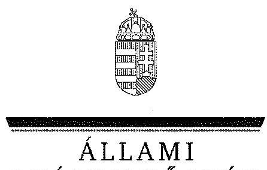
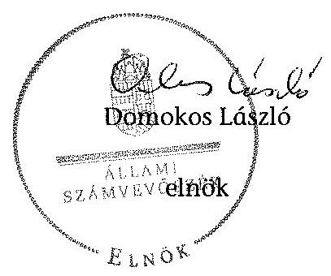
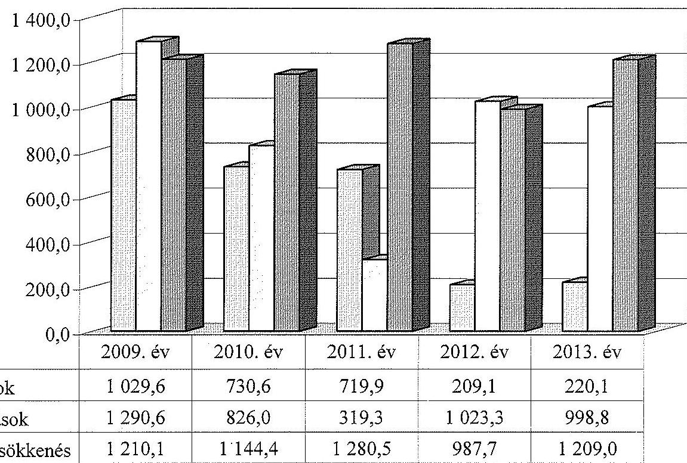
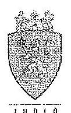
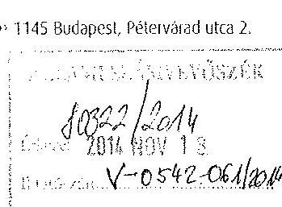
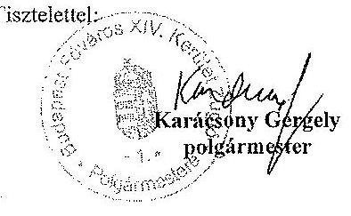
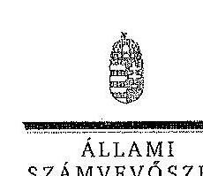
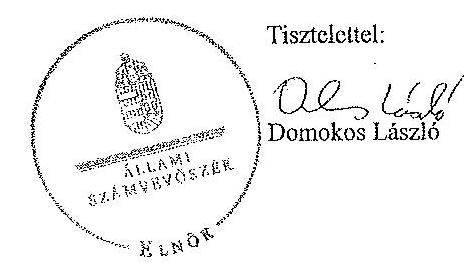
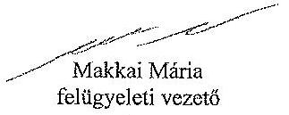

ÁLLAMI
SZÁMVEVŐSZÉK

# JELENTÉS 

az önkormányzatok vagyongazdálkodása szabályszerűségének ellenőrzéséről
Budapest Főváros XIV. kerület Zugló

---

Állami Számvevőszék
Iktatószám: V-0542-062/2014.
Témaszám: 1576
Vizsgálat-azonosító szám: V068307
Az ellenőrzést felügyelte:
Makkai Mária
felügyeleti vezető
Az ellenőrzést vezette és az ellenőrzés végrehajtásáért felelős:
Páncsics Judit
ellenőrzésvezető
A számvevőszéki jelentés összeállításában közreműködtek:
Deák Tamásné
számvevő tanácsos
Pető Krisztina
számvevő tanácsos
Szabó Balázsné Zsíros Andrea
számvevő
Az ellenőrzést végezték:
Deák Tamásné
Számvevő tanácsos
Pető Krisztina
számvevő tanácsos

# Szabó Balázsné Zsíros Andrea 

számvevő

A témához kapcsolódó eddig készített számvevőszéki jelentések:
címe
sorszáma
Jelentés Budapest Főváros XIV. kerület Zugló Önkormányzata gaz- 0943 dálkodási rendszerének 2009. évi ellenőrzéséről

---

# TARTALOMJEGYZÉK 

BEVEZETÉS ..... 3
I. ÖSSZEGZŐ MEGÁLLAPÍTÁSOK, KÖVETKEZTETÉSEK, JAVASLATOK ..... 6
II. RÉSZLETES MEGÁLLAPÍTÁSOK ..... 12

1. A vagyongazdálkodási tevékenység szabályozása ..... 12
1.1. A vagyongazdálkodási feladatellátás szabályozása ..... 12
1.2. A vagyon kezelésére, koncesszióba adására, üzemeltetésére kötött szerződések megfelelősége ..... 15
2. A vagyongazdálkodási tevékenység szabályszerűsége ..... 16
2.1. A vagyon nyilvántartása és leltározása ..... 16
2.2. Meghatározó mértékű vagyonváltozások ..... 19
2.3. Beruházások, felújítások szabályszerűsége ..... 20
2.4. A vagyon értékesítésének, hasznosításának, a követelés elengedésének szabályszerűsége ..... 23
3. Az önkormányzati tulajdonosi jog gyakorlása ..... 26
4. Integritás érvényesülése ..... 27
5. A belső és a külső ellenőrzések hasznosulása ..... 28
5.1. A belső ellenőrzés javaslatainak hasznosulása ..... 28
5.2. A külső ellenőrzések javaslatainak hasznosulása ..... 30
MELLÉKLETEK
6. számú Budapest Főváros XIV. kerület Zugló Önkormányzata vagyonának főbb adatai 2009. január 1-je és 2013. december 31-e között
7. számú Budapest Főváros XIV. kerület Zugló Önkormányzata felújítási és beruházási kiadásai, valamint az elszámolt értékcsökkenés bemutatása 2009-2013 között
8. számú Budapest Főváros XIV. kerület Zugló Önkormányzata polgármesterének észrevétele
9. számú Budapest Főváros XIV. kerület Zugló Önkormányzata polgármesterének észrevételére adott válasz

## FÜGGELÉKEK

1. számú Rövidítések jegyzéke
2. számú Értelmező szótár

---

2

---

# JELENTÉS 

## az önkormányzatok vagyongazdálkodása szabályszerűségének ellenőrzéséről Budapest Főváros XIV. kerület Zugló

## BEVEZETÉS

Az ÁSZ stratégiai célkitűzése, hogy ellenőrzéseivel mind jobban segítse az átláthatóságot, az elszámoltathatóságot és elszámoltatást a közpénzekkel és a közvagyonnal való gazdálkodásban. Magyarország Alaptörvénye rögzíti, hogy az állam és a helyi önkormányzat tulajdona a nemzeti vagyon része. Az önkormányzati vagyon alapvető funkciója, hogy a közérdeket és egyúttal az önkormányzati célok - elsősorban a kötelezően ellátandó feladatok, és emellett a lehetőségek mértékéig az önként vállalt feladatok - megvalósítását szolgálja.

Az ÁSZ az önkormányzati vagyongazdálkodás 2012. évben indított és 2013. évben folytatott ellenőrzéseinek tapasztalatai alapján indokoltnak látta, hogy a 2014. évi ellenőrzési tervébe is beépítésre kerüljön a vagyongazdálkodási tevékenységek ellenőrzése. Az eddig elvégzett ellenőrzések rámutattak, hogy az önkormányzatok vagyongazdálkodási tevékenységét érintő szabályozottság, a kapcsolódó nyilvántartások, a beszámolók leltárral történő alátámasztása, a gazdálkodási jogkörök szabályszerű gyakorlása és a döntések megalapozottsága terén hiányosságok tapasztalhatók. Ez indokolttá tette a vagyongazdálkodás ellenőrzésének folytatását a jelentős vagyonnal rendelkező vagy az ÁSZ kockázatelemzése alapján magas vagyoni kockázatot mutató önkormányzatoknál.

Az ellenőrzés célja annak megállapítása volt, hogy az önkormányzat vagyongazdálkodási tevékenységét a jogszabályi előírásokkal összhangban szabályozta-e, a vagyon nyilvántartása és a vagyongazdálkodási tevékenységek végrehajtása a jogszabályoknak és a belső előírásoknak megfelelően történt-e. Az ellenőrzés célja továbbá annak megállapítása, hogy az önkormányzatnál a vagyongazdálkodás során biztosították-e az átláthatóságot, valamint a külső és belső ellenőrzések megállapításai, javaslatai hozzájárultak-e a szabályszerű vagyongazdálkodáshoz.

Ennek keretében értékeltük, hogy az Önkormányzat:

- szabályszerűen alakította-e ki vagyongazdálkodási tevékenységének kereteit;
- biztosította-e a vagyongazdálkodás szabályszerűségét, megalapozottan hozta-e és jogszerűen, szabályszerűen hajtotta-e végre a vagyonváltozást eredményező meghatározó jelentőségű döntéseket;
- gondoskodott-e a tulajdonosi jogok gyakorlásáról;

---

- vagyongazdálkodási tevékenysége során biztosította-e az átláthatóság és az integritás érvényesülését;
- belső ellenőrzése elősegítette-e a vagyongazdálkodás szabályszerű működését, valamint hasznosította-e a vagyongazdálkodási tevékenységével kapcsolatos külső és belső ellenőrzések megállapításait, javaslatait.

Az ellenőrzés várható hasznosulása, hogy feltárja az önkormányzati vagyongazdálkodást meghatározó szabályok, szabályozások összhangjának hiányosságait, a szabályozással nem érintett vagyongazdálkodási területeket, a vagyongazdálkodási tevékenység gyakorlásának esetleges szabálytalanságait, valamint a jó gyakorlat kialakításán és terjesztésén keresztül az ellenőrzések elősegíthetik a vagyongazdálkodás szabályszerűségének javítását.

Az ellenőrzés típusa: szabályszerűségi ellenőrzés
Az ellenőrzött időszak: 2009. január 1-jétől 2013. december 31-ig, illetve a közbeszerzési eljárások lefolytatásának ellenőrzése 2012. január 1-jétől az Önkormányzat helyszíni ellenőrzésének kezdetét megelőző negyedév végéig (2014. március 31-ig) tartott.

Ellenőrzött szervezet: Budapest Főváros XIV. kerület Zugló Önkormányzata
Az ellenőrzés végrehajtásának jogszabályi alapját az Állami Számvevőszékről szóló 2011. évi LXVI. törvény 1. § (3) bekezdése, az 5. § (2)-(6) bekezdései, valamint az államháztartásról szóló 2011. évi CXCV. törvény 61. § (2) bekezdésének előírásai képezik.

Az ellenőrzés szakmai módszertana az ÁSZ hivatalos honlapján közzétett szakmai szabályokon alapult, amely a Legfőbb Ellenőrző Intézmények Nemzetközi Szervezete (INTOSAI) által kiadott nemzetközi standardok (ISSAI) figyelembevételével készült.

Az ellenőrzést az ÁSZ hatályos szervezeti szabályai és az ellenőrzési programban foglalt értékelési szempontok szerint folytattuk le. Megállapításainkat a helyszíni ellenőrzés tapasztalataira, az ellenőrzött szervezettől bekért dokumentumokra, a kitöltött tanúsítványok elemzésére, az adott időszakban hatályos jogszabályok és belső szabályzatok előírásaira alapoztuk. A részesedések értékelését tételesen ellenőriztük, míg irányított mintavétellel választottuk ki az ellenőrzött térítésmentes átadás-átvételeket, a beruházásokat, felújításokat, a közbeszerzési eljárásokat, a vagyon értékesítését, hasznosítását és a követelés elengedést, illetve leírást. A belső kontrollok megfelelő működését (a szakmai teljesítésigazolást, valamint a 2009-2011. években az utalvány ellenjegyzést, a 2012-2013. években az érvényesítést) a Polgármesteri hivatal felhalmozási kiadásaiból választott véletlen minta alapján, megfelelőségi teszttel ellenőriztük.

A XIV. kerület lakosainak száma 2013. január 1-jén 114189 fő volt. A 2010. évi önkormányzati választásokig a 34 tagú Képviselő-testület munkáját 11 állandó bizottság segítette. Az önkormányzati választások után a Képviselőtestület létszáma 22 főre csökkent és négy állandó bizottság működött. A jelenlegi polgármester a 2010. évi önkormányzati választás óta tölti be a tisztségét, a jegyző 2011. október 1-jétől látja el a feladatait. A Polgármesteri hivatal 12

---

szervezeti egységre tagolódott, elkülönített gazdasági szervezettel nem rendelkezett. A vagyongazdálkodással kapcsolatos feladatokat a Polgármesteri hivatal Gazdálkodási Osztálya és a Városépítési Osztálya, valamint az Önkormányzat 100%-os tulajdonában álló Vagyonüzemeltető Zrt. látta el.

Az Önkormányzat a 2013. évben az önállóan működő és gazdálkodó Polgármesteri hivatalon felül két önállóan működő és gazdálkodó, valamint 28 önállóan működő költségvetési szervvel látta el a feladatait. Az Önkormányzatnak 2013-ban öt 100%-os tulajdonában álló gazdasági társasága volt. A sportolási és testedzési igények kielégítéséről, a diáksport, a szabadidő-, verseny- és élsport feltételeinek biztosításáról a Sport- és Rendezvényszervező Kft., a közbiztonsági feladatokról a Közbiztonsági Kft., a közművelődési és a kulturális tevékenységről a Cserepes Kft., a városgazdálkodási, a vagyon-üzemeltetői tevékenységről a Vagyonüzemeltető Zrt., a kerület zenei kultúrájának fejlesztéséről, ápolásáról, a komolyzenei oktatás elősegítéséről a Filharmónia Kft. útján gondoskodtak.

Az Önkormányzat a 2009-2013. évek között vállalkozási tevékenységet nem végzett, vagyonkezelési, haszonélvezeti és koncessziós jogot alapító szerződést nem kötött. Az ellenőrzött időszakban PPP konstrukcióban megvalósított fejlesztésre nem került sor. Az ÁSZ 2009-2013 között az Önkormányzatnál a 2009. évben végzett ellenőrzést.

Az Önkormányzat könyvviteli mérleg szerinti vagyona a 2009. évi 89 867,1 millió Ft-os nyitó értékről a 2013. év végére 89740,8 millió Ft-ra, 0,1%-kal csökkent. A 126,3 millió Ft-os vagyoncsökkenést a befektetett eszközök 6151,4 millió Ft-os növekedése mellett a forgóeszközök 6277,7 millió Ft-os csökkenése idézte elő. A befektetett eszközökön belül az ingatlanok értéke 7699,1 millió Ft-tal, 12,1%-kal emelkedett, az immateriális javak értéke 573,6 millió Ft-tal, a befejezetlen beruházások 273,8 millió Ft-tal, a befektetett pénzügyi eszközök 509,7 millió Ft-tal csökkentek. A forgóeszközökön belül a követelések összege (79,8%-kal) 402,4 millió Ft-tal nőtt, a pénzeszközöké (68,5%-kal) 5790,2 millió Ft-tal csökkent. Az Önkormányzat összes kötelezettségének állományi értéke 2013. december 31-én 4902,3 millió Ft volt, ebből a rövid és hosszú lejáratú kötelezettségek értéke 4694,6 millió Ft-ot tett ki. A pénzintézeti kötelezettség állományi értéke 4511,7 millió Ft volt, melyből az állam az adósságkonszolidáció keretében 4501,4 millió Ft-ot vállalt át. Az Önkormányzat 2013. évi költségvetési beszámolója szerint 17500,6 millió Ft költségvetési bevételt ért el és 17532,7 millió Ft költségvetési kiadást teljesített. Felhalmozási célú kiadásokra 1453,8 millió Ft-ot, ezen belül felújítási és beruházási kiadásokra 1218,9 millió Ft-ot fordítottak.

Az Önkormányzat vagyonának főbb adatait, továbbá a felújítási és beruházási kiadásokat, valamint az elszámolt értékcsökkenést az 1-2. számú mellékletek mutatják be. Az alkalmazott rövidítéseket és az egyes fogalmak magyarázatát az 1-2. számú függelék tartalmazza.

Az ÁSZ a 2011. évi LXVI. törvény 29. §-a szerint a jelentéstervezetet megküldte Budapest Főváros XIV. kerület Zugló Önkormányzata polgármesterének egyeztetésre. A polgármester észrevételét és az arra adott választ a jelentés 3-4. számú mellékletei tartalmazzák.

---

# I. ÖSSZEGZŐ MEGÁLLAPÍTÁSOK, KÖVETKEZTETÉSEK, JAVASLATOK 

Az Önkormányzatnál a 2009-2013. évek között a vagyongazdálkodási tevékenység kereteit kialakították. A Képviselő-testület a vagyongazdálkodási rendeletben - az Ötv.-ben és az Nvtv.-ben előírtaknak megfelelően - meghatározta az önkormányzati feladatellátást biztosító törzsvagyont, ezen belül a forgalomképtelen és a korlátozottan forgalomképes vagyonelemek körét, valamint a forgalomképesség szerinti besorolás megváltoztatásának módját. Az Áht. 1,2 és az Nvtv. előírásainak megfelelően a vagyongazdálkodási- és a helyiségek bérbeadásáról szóló rendeletekben rögzítették azt az értékhatárt, amely felett csak nyilvános pályázat útján lehet a vagyont értékesíteni, a használat jogát átadni, továbbá szabályozták a vagyon ingyenes vagy kedvezményes átadásának eseteit és módját.

Az Önkormányzat - az Ötv. és az Mötv. előírásaival ellentétben - csak 2013. május 28-tól jelölte meg azt a vagyoni kört, amelyre vagyonkezelői jog létesíthető. A vagyongazdálkodási rendelet nem tartalmazta a vagyonkezelői jog megszerzésének, gyakorlásának, a vagyonkezelés ellenőrzésének részletes szabályait. Az Önkormányzatnál a 2009-2013. években vagyonkezelői jogot nem létesítettek. Az Önkormányzat az Nvtv.-ben meghatározott - 2012. március 1-jei - határidőn túl, 2012. március 30-án határozta meg a forgalomképtelen vagyonából azokat a vagyonelemeket, amelyeket nemzetgazdasági szempontból kiemelt jelentőségű nemzeti vagyonnak minősített.

A Polgármesteri hivatal az ellenőrzött időszakban rendelkezett az Áhsz. 1 előírásainak megfelelő számviteli politika 1-4-gyel, és a hozzá kapcsolódó pénzügyiszámviteli szabályzatokkal. A 2012-2013. években a számviteli politika 4-et - a Számv. tv.-ben foglaltak ellenére - nem aktualizálták.

Az Önkormányzat a lakás és nem lakáscélú ingatlanokat a 100%-os tulajdonában álló Vagyonüzemeltető Zrt.-nek adta át üzemeltetésre. Az Önkormányzat adatszolgáltatása szerint öt gazdasági társaságban lévő kisebbségi részesedés esetében nem vizsgálták, hogy azok tulajdonosi szerkezete az Nvtv. szerint átlátható-e.

Az Önkormányzatnál a vagyongazdálkodási tevékenység szabályszerűsége nyilvántartási és eljárási hiányosságok miatt nem volt biztosított. A vagyonkimutatások felépítése megfelelő volt, azonban a tartalmuk a 2009. és a 2013. években nem felelt meg az Áhsz. 1-ben foglalt előírásoknak. A 2009. évi vagyonkimutatás a „0”-ra leírt eszközök állományát nem mutatta be, a 2013. évi vagyonkimutatás nem tartalmazta az Önkormányzat tárgyi eszközeit és az üzemeltetésre, kezelésre átadott eszközeit törzsvagyon, illetve üzleti vagyon szerinti bontásban, valamint a beruházásokra adott előlegek értékét. A Polgármesteri hivatalban a 2012. évben az ingatlanok, a 2013. évben az ingatlanok és az üzemeltetésre, kezelésre átadott eszközök egyes főkönyvi számláinak értékét - az Áhsz. 1-ben előírtak

 ellenére – nem támasztották alá azzal megegyező analitikus nyilvántartásokkal. Az Önkormányzatnál 2009. január 1-je és 2013.

---

június 30-a között az ingatlanvagyon-kataszteri nyilvántartás vezetése nem felelt meg a 147/1992. (XI. 6.) Korm. rendeletben előírtaknak, 2013. július 1-je és december 31-e között az ingatlankataszteri nyilvántartást nem vezették. A 2009-2013. években a könyvviteli mérleget az Áhsz. ${ }_{1}$-ben előírtaknak megfelelően leltárral alátámasztották. A 2010-2013. években az üzemeltetésre átadott eszközök mérleg szerinti értékét – az Áhsz. ${ }_{1}$-ben és a számviteli politika ${ }_{4}$ ben előírtak ellenére – nem mennyiségi felvétel alapján elkészített, az üzemeltetést végző szerv által hitelesített leltárral támasztották alá, a leltározást a Polgármesteri hivatal egyeztetési módszerével végezte el.

Az Önkormányzat minden évben megalapozottan, a gazdasági program ${ }_{1,2}$-ben foglalt fejlesztési célkitűzésekkel és az önkormányzati feladatellátással összhangban döntött a beruházásokról és a felújításokról. A fejlesztések finanszírozhatóságát és fenntarthatóságát biztosították. Az ellenőrzött beruházásokra és felújításokra kötött szerződések adatainak közzététele az Eisztv.-ben, illetve az Info tv.-ben előírtak ellenére nem teljes körűen történt meg, mivel az ellenőrzött 30 beruházás és felújítás közül kilenc szerződés adata nem szerepelt az Önkormányzat honlapján a nettó 5,0 millió Ft-ot elérő vagy azt meghaladó értékű árubeszerzések, építési beruházások, szolgáltatások listájában. A Polgármesteri hivatalban az Áhsz. ${ }_{1}$-ben és a számviteli politika ${ }_{1-4}$-ben előírtak ellenére az üzembe helyezési okmányt nem a műszaki átadás-átvétel, illetve a rendeltetésszerű használatba vétel időpontjának megfelelően állították ki, emiatt a terv szerinti értékcsökkenést sem a tényleges használatba vétel időpontjától kezdték elszámolni. Az Önkormányzat 2012. január 1-jétől 2014. év I. negyedév végéig 62 közbeszerzési eljárást indított összesen 3025,9 millió Ft értékben. Egy ajánlattevő egy közbeszerzés ellen jogorvoslati eljárást kezdeményezett, melynek eredményeként az Önkormányzat addigi döntéseit megsemmisítették. Az Önkormányzatnál az ellenőrzött közbeszerzési eljárások lebonyolítása két esetben nem felelt meg a Kbt. ${ }_{1,2}$ előírásainak, mert a nyertes ajánlatban megadott teljesítési határidőtől eltérő határidővel kötötték meg a beruházási szerződést, továbbá egy esetben – egy bölcsőde bővítés pótmunkáira – elmulasztották a hirdetmény közzététele nélküli tárgyalásos eljárást lefolytatni. Az Önkormányzatnál – a Kbt. ${ }_{2}$-ben és az Info tv.-ben előírtak ellenére – nem tettek eleget a közzétételi kötelezettségnek, mert a 2012. év és a 2014. év I. negyedéve között 29 közbeszerzési eljárás adatai nem szerepeltek a honlapon.

A gazdálkodási jogkörök szabályzata ${ }_{1-16}$-ban rögzítették az operatív gazdálkodással kapcsolatos eljárásrendet és az összeférhetetlenségi követelményeket. A Polgármesteri hivatalban az ellenőrzött időszakban – az Ámr. ${ }_{1,2}$-ben és az Ávr.-ben foglaltak ellenére – a (szakmai) teljesítésigazolók, az utalvány ellenjegyzők és az érvényesítők szabályszerű kijelölése hiányában látták el feladataikat, mivel az aláírás-mintájukról naprakész nyilvántartást nem vezettek. A hiányosság azonban jogosulatlan kiadást nem eredményezett. A felhalmozási kiadások esetében a gazdálkodási jogkörök gyakorlása a 2009-2013. években nem felelt meg az Ámr. ${ }_{1,2}$-ben, az Ávr.-ben, illetve a gazdálkodási jogkörök szabályzata ${ }_{1-16}$-ban előírtaknak. A gazdálkodási jogkörök gyakorlása a 2009-2011. években az ellenőrzött tételek 96,0-97,0%-át, a 2012. évben 70,9%-át, a 2013. évben 52,9%-át érintően nem működött megfelelően.

Az Önkormányzatnál az ingatlanok hasznosítása során a 2009-2010. években négy ingatlanértékesítés esetében nem tartották be a vagyongazdálkodási

---

rendeletben foglaltakat. A döntésekhez három esetben nem állt rendelkezésre két ingatlanforgalmi értékbecslő által készített értékbecslés, egy esetben az értékesítésre nyilvános versenytárgyalás nélkül került sor, melyhez ugyanaz az ingatlanforgalmi értékbecslő – három hónap különbséggel – jelentős értékbeli eltéréssel készítette el a két forgalmi értékbecslést. Az ingatlanértékesítések számviteli nyilvántartásban való dokumentálása nem a Számv. tv.-ben foglaltaknak megfelelően történt, mert 2009-ben két esetben, 2010-ben egy esetben, 2013-ban két esetben az ellenőrzött ingatlanértékesítésekről a megkötött adásvételi szerződések alapján a számlákat nem állították ki.

Az Önkormányzatnál a 2009-2011. években államháztartáson kívülre 47,6 millió Ft bruttó értékű közvilágítási eszközt adtak át a szolgáltatónak. A közvilágítási eszközök átadásáról az ellenőrzött mintatételek esetében a vagyongazdálkodási rendeletben előírtaknak megfelelően a polgármester ${ }_{1,2}$ szabályosan döntött. Az Önkormányzat a 2013. évben 5944,6 millió Ft értékű sport célú ingatlant vett át a MÁV Zrt.-től, amelyről a vagyongazdálkodási rendelet előírásának megfelelően a Tulajdonosi Bizottság véleménye alapján a Képviselő-testület döntött.

Az Önkormányzatnál az ellenőrzött időszakban az elengedett követelés 104,7 millió Ft, a behajthatatlan követelés 141,8 millió Ft volt. Az ellenőrzött követelés elengedések szabályszerűen, dokumentumokkal alátámasztottan történtek. Az Önkormányzatnál az elengedett követeléseket a 2012-2013. években az Áhsz.-ben foglaltak ellenére hitelezési veszteségként nem számolták el. Az ellenőrzött behajthatatlan követelések esetében a behajthatatlanság tényét, illetve a feltételek fennállását dokumentumokkal alátámasztották. Az Önkormányzatnál az elévülés miatt behajthatatlan 10,6 millió Ft-os adókövetelést a 2009-2013. években az Áhsz.-ben előírtak ellenére hitelezési veszteségként nem számolták el.

A Képviselő-testület a tulajdonosi jogainak gyakorlása keretében megtárgyalta és elfogadta az Önkormányzat 100%-os tulajdonában álló gazdasági társaságok éves beszámolóit, a közhasznú társaságok esetében a közhasznúsági jelentést. Az éves beszámolók mellékletét képezték – egy eset kivételével – a könyvvizsgálói jelentések, valamint – négy eset kivételével – a felügyelőbizottsági határozatok.

Az Önkormányzatnál a tartós részesedéseket könyv szerinti értéken tartották nyilván. Értékvesztés elszámolására az év végi értékelések keretében egy esetben került sor, amelyet a társaság felszámolási eljárás alatt állása indokolt. Az Önkormányzatnál az ellenőrzött időszakban nem tartották be az értékelési szabályzat ${ }_{1,4}$-ben foglaltakat, mivel a mérleg készítésekor elmulasztották a részesedések minősítését elvégezni és erről az előírt jegyzőkönyvet felvenni, amelyet akkor is el kellett volna készíteni, ha értékvesztés elszámolására nem került sor.

Az Önkormányzatnál a vagyongazdálkodási tevékenység integritása (feddhetetlensége) szempontjából az eredendő és a korrupciós kockázatok értéke – az ÁSZ által a 2013. évben mért – az önkormányzati alrendszer átlagértékéhez képest magasabb. Az Önkormányzatnál kiépült kontrollok azonban képesek kezelni a kockázatokat, valamint támogatni a szervezet feladatellátását.

---

A belső ellenőrzési kézikönyv ${ }_{1-3}$ tartalmazta a belső ellenőrök szakmai etikai kódexét, ugyanakkor a 2012-2013. években a Bkr. előírásának megfelelő, a Kttv.-ben előírtak szerinti, a szervezet egészére vonatkozó, a Képviselő-testület által elfogadott etikai szabályzat nem készült.

Az ellenőrzött időszakban a belső ellenőrzés összesen 99 ellenőrzést végzett, melyből 92 érintett a vagyongazdálkodással összefüggő feladatokat. Az ellenőrzöttek az ellenőrzési jelentésekben foglalt javaslatokra – a Ber.-ben, illetve a Bkr.-ben előírtaknak megfelelően – hat esetet kivéve intézkedési tervet készítettek, illetve az intézkedési tervekben foglaltakat három eset kivételével végrehajtották. Az ellenőrzöttek a megtett intézkedésekről a 2012. évben – négy eset kivételével – a Bkr.-ben előírtaknak megfelelően, a 2009. évben – egy eset kivételével – a Ber.-ben előírtaknak megfelelően írásban tájékoztatták a belső ellenőrzési vezetőt. A belső ellenőrzés a megállapításaival és a javaslataival hozzájárult a vagyongazdálkodás szabályszerű működéséhez.

A könyvvizsgáló az Önkormányzat 2009-2013. évi beszámolóit megbízhatónak és hitelesnek minősítette, jelentéseiben a vagyongazdálkodással kapcsolatos hiányosságot a 2011. és a 2013. évekre állapított meg.

Az Önkormányzatnál az ellenőrzött időszakban a külső ellenőrző szervek 18 ellenőrzést végeztek. Két esetben állapítottak meg az uniós támogatások elszámolásához kapcsolódóan dokumentálási hiányosságot, a hiányzó dokumentumok pótlása megtörtént.

A vagyongazdálkodást érintően a Kormányhivatal a vagyongazdálkodási rendeletre vonatkozóan tett törvényességi észrevételt, amely alapján a Képviselőtestület a kifogásolt rendelkezéseket módosította.

Az ÁSZ az Önkormányzat gazdálkodási rendszerének 2009. évi ellenőrzésekor hét javaslatot fogalmazott meg. A Képviselő-testület a jelentést megtárgyalta és az intézkedési tervet elfogadta. A számvevőszéki jelentésben foglalt javaslatokat – egy szabályszerűségi javaslatot kivéve – hasznosították. A jegyző nem tett eleget intézkedési kötelezettségének, mert a 2009. évi költségvetési beszámoló mellékletének szöveges indoklását továbbra sem az Áhsz. ${ }_{1}$-ben előírt tartalommal készítette el.

Az Állami Számvevőszékről szóló 2011. évi LXVI. törvény 33. § (1) bekezdésében foglaltak értelmében a jelentésben foglalt megállapításokhoz kapcsolódó intézkedési tervet köteles az ellenőrzött szervezet vezetője összeállítani, és azt a jelentés kézhezvételétől számított 30 napon belül az ÁSZ részére megküldeni. Amennyiben az intézkedési tervet határidőben nem küldi meg a szervezet, vagy az nem elfogadható, az ÁSZ elnöke a hivatkozott törvény 33. § (3) bekezdés a)-b) pontjaiban foglaltakat érvényesítheti.

---

Az ellenőrzés intézkedést igénylő megállapításai és javaslatai:

# a jegyzőnek

1. Az Ömtv. 109. § (4) bekezdésében és a 143. § (4) bekezdés i) pontjában foglaltak ellenére a vagyongazdálkodási rendelet nem tartalmazta a vagyonkezelői jog megszerzésének, gyakorlásának és a vagyonkezelés ellenőrzésének részletes szabályait.

Javaslat:
Készítse elő a vagyonkezelői jog megszerzésének, gyakorlásának és a vagyonkezelés ellenőrzésének részletes szabályait meghatározó rendelettervezetet és kezdeményezze a Képviselő-testület elé terjesztését.
2. Az Önkormányzatnál a 2013. évi vagyonkimutatás tartalma nem felelt meg az Áhsz. 44/A. § (2) bekezdésében foglalt előírásoknak, mivel nem tartalmazta az Önkormányzat tárgyi eszközeit és az üzemeltetésre, kezelésre átadott eszközeit törzsvagyon (forgalomképtelen és korlátozottan forgalomképes), illetve üzleti (forgalomképes) vagyon bontásban, továbbá a beruházásokra adott előlegek értékét.

Javaslat:
Intézkedjen arról, hogy a vagyonkimutatás a jogszabályi előírásoknak megfelelően tartalmazza az Önkormányzat vagyonát.
3. Az Önkormányzatnál 2009. január 1-je és 2013. június 30-a között az ingatlanvagyon-kataszteri nyilvántartás vezetése nem felelt meg a 147/1992. (XI. 6.) Korm. rendelet 4. § (1)-(2) bekezdésében előírtaknak, 2013. július 1-je és december 31-e között az ingatlankataszteri nyilvántartást nem vezették.

Javaslat:
Intézkedjen az ingatlanvagyon-kataszter felfektetéséről és folyamatos vezetéséről.
4. A 2010-2013. években az üzemeltetésre átadott eszközök mérleg szerinti értékét az Áhsz. 37. § (3)-(4) bekezdésében és a számviteli politika-ben előírtak ellenére nem az üzemeltetést végző szerv által hitelesített leltárral támasztották alá. A leltározást a Polgármesteri hivatal egyeztetési módszerével végezte el.

Javaslat:
Intézkedjen arról, hogy az üzemeltetésre átadott eszközökről a könyvviteli mérleg alátámasztásához az üzemeltetést végzők által elkészített, hitelesített leltárak rendelkezésre álljanak.
5. Az Önkormányzat az elévülés miatti behajthatatlan adóköveteléseket a 2009-2013. években, az elengedett követeléseket a 2012-2013. években az Áhsz. 34. § (10) bekezdésében és a 9. számú melléklet 2. ci) és 2. ck) pontjában foglaltaknak megfelelően hitelezési veszteségként nem számolta el.

---

Javaslat:
Intézkedjen arról, hogy a behajthatatlan adóköveteléseket és az elengedett követeléseket a jogszabályi előírásoknak megfelelően hitelezési veszteségként számolják el.
6. Az ellenőrzött beruházásokra és felújításokra kötött szerződések adatainak közzététele teljes körűen nem történt meg az Eisztv. mellékletének III./4. pontjában, illetve az Info tv. 1. számú mellékletének III./4. pontjában előírtak ellenére, mivel az ellenőrzött 30 beruházási és felújítási tétel közül kilenc szerződés adatai nem szerepeltek az Önkormányzat honlapján a nettó 5,0 millió Ft-ot elérő vagy azt meghaladó értékű árubeszerzések, építési beruházások, szolgáltatások listájában. Az Önkormányzatnál – a Kbt. 31. § (1) bekezdés e) pontjában és az Info tv. 1. számú melléklete III./8. pontjában foglaltak ellenére – nem tettek eleget a közzétételi kötelezettségnek, mert 2012. január 1-je és 2014. március 31-e között az 52 eredményes eljárás közül 29 közbeszerzés adatai nem szerepeltek az Önkormányzat honlapján.

Javaslat:
Intézkedjen arról, hogy az Önkormányzat honlapján a közérdekű adatok között a
 nettó 5,0 millió Ft-ot elérő vagy azt meghaladó értékű árubeszerzések, építési beruházások, szolgáltatások, valamint a közbeszerzési eljárások adatai közzétételre kerüljenek.
7. A jegyző, a 2012-2013. években a kontrollkörnyezet kialakítása során nem határozta meg - a 8kr. 6. § (1) bekezdés c) pontjában előírtaknak megfelelően - az etikai elvárásokat, valamint a Képviselő-testület nem állapította meg a Kttv. 231. § (1) bekezdésében előírtak szerint - a Kttv. 83. §-ában rögzített - a köztisztviselőkre vonatkozó hivatásetikai alapelvek részletes tartalmát és az etikai eljárás szabályait.

Javaslat:
Készítse elő a vonatkozó jogszabályi előírásoknak megfelelő etikai elvárásokat, hivatásetikai alapelveket, az etikai eljárás szabályait és terjessze a Képviselő-testület elé jóváhagyásra.

---

# II. RÉSZLETES MEGÁLLAPÍTÁSOK 

## 1. A VAGYONGAZDÁLKODÁSI TEVÉKENYSÉG SZABÁLYOZÁSA

### 1.1. A vagyongazdálkodási feladatellátás szabályozása

A Képviselő-testület a 2007-2010. évekre és a 2011-2014. évekre szóló gazdasági program${ }_{1,2}$-ben meghatározta a vagyongazdálkodással kapcsolatos feladatait, célkitűzéseit. Az Önkormányzatnál a gazdasági program${ }_{1,2}$-ben a Bosnyák téri városközpont létrehozását, út- és közműfejlesztést, járdaépítést, útburkolat felújítást, az M3 zajvédő fal megépítését, gépjármű parkolók, sportcentrum létrehozását, sportpályák fenntartását, felújítását, fejlesztését, parkok és játszóterek felújítását, kulturális központ létesítését, intézmény-felújításokat és energiaracionalizálást, tömb rehabilitáció végrehajtását tűzték ki célul.

Az Önkormányzatnál az Nvtv. 9. § (1) bekezdésében előírt közép- és hosszú távú vagyongazdálkodási tervet 2013. december 31-ig nem készítettek.

A Képviselő-testület az ellenőrzött időszakban a kötelező és az önként vállalt feladatok körét, azok ellátásának módját és mértékét - az Ötv. 8. § (1)(2) bekezdésében és az Mötv. 10. § (1) bekezdés, a 12. § (2) bekezdés és a 111. § (3) bekezdésében foglaltak szerint - a 2009-2013. évi költségvetési rendeletek függelékében, illetve mellékleteiben${ }^{1}$ rögzítette. Az Önkormányzatnál a kötelező és az önként vállalt feladatok ellátásáról a Polgármesteri hivatalon, a költségvetési intézményein, a 100%-os önkormányzati tulajdonban álló közhasznú nonprofit társaságokon és gazdasági társaságokon keresztül gondoskodtak.

#### Abstract

A Képviselő-testület a 2010. évben létrehozta az Eszközkezelő Kft.-t 284,5 millió Ft törzstőkével, a cégalapítás célja a kerületi devizaadósok számára kidolgozandó programban való önkormányzati részvétel volt. Az Önkormányzat a Kft.-be apportként vitte be a tulajdonában lévő OTP részvényeket (könyv szerinti értéke 5,2 millió Ft), melynek transzferálására 2011. január 17-én került sor. A 2012. évben a Képviselő-testület az Eszközkezelő Kft.-t beapportálta a Vagyonüzemeltető Zrt.-be, majd feladatainak kibővítése és nevének megváltoztatását (Sport- és Rendezvényszervező Kft.-re) követően 2012 novemberében a Képviselő-testület döntött annak önkormányzati tulajdonba történő visszavételéről. A Képviselőtestület 2011-ben a közbiztonsági feladatok ellátására megalapította a Közbiztonsági Kft.-t 1,5 millió Ft törzstőkével, majd a 2012. évben a közművelődési tevékenységek tervezése, szervezése és lebonyolítása érdekében létrehozta a Cserepes Kft.-t 0,5 millió Ft törzstőkével.

[^0]
[^0]:    ${ }^{1}$ a 2009. évi költségvetési rendelet 3. számú függeléke, a 2010. évi költségvetési rendelet 17. számú melléklete, a 2011. évi költségvetési rendelet 17. számú melléklete, a 2012. évi költségvetési rendelet 16. számú melléklete, a 2013. évi költségvetési rendelet 16. számú melléklete

---

A Képviselő-testület - a Htv. 138. § (1) bekezdés j) pontjában előírtaknak megfelelően - az önkormányzati vagyongazdálkodási feladat- és hatásköröket a teljes vagyoni körre kiterjedően a vagyongazdálkodási rendeletben, a helyiségek bérbeadásáról szóló rendeletben, a lakások bérbeadásáról szóló rendelet${ }_{1,2}$-ben, valamint a lakások és egyéb helyiségek értékesítési rendeletében szabályozta. Meghatározták az önkormányzati feladatellátást biztosító törzsvagyont, ezen belül a forgalomképtelen és a korlátozottan forgalomképes vagyonelemek körét. A vagyongazdálkodási rendelet tartalmazta a forgalomképesség megváltoztatásának módjára vonatkozó rendelkezést, amelynek tartalmára a Kormányhivatal törvényességi ellenőrzése kifogást tett. Észrevételezték, hogy azokat a forgalomképtelen vagyonelemeket, amelyeket törvény nyilvánít nemzetgazdasági szempontból kiemelt jelentőségű nemzeti vagyonnak, a Képviselőtestület rendeletében nem sorolhatja át sem korlátozottan forgalomképes, sem üzleti vagyonná. A Képviselő-testület az észrevételnek megfelelően a vagyongazdálkodási rendeletét a 18/2013. (IV. 29.) számú rendeletével módosította. Az Önkormányzat az Nvtv. 18. § (1) bekezdésében meghatározott - 60 napos határidőn túl, 2012. március 30-án határozta meg a forgalomképtelen vagyonából azon vagyonelemeket, amelyeket nemzetgazdasági szempontból kiemelt jelentőségű nemzeti vagyonnak minősített.

A Képviselő-testület az Ötv. 9. § (3) bekezdése és az Mötv. 41. § (4) bekezdése alapján az önkormányzati SZMSZ${ }_{1,2}$-ben és a vagyongazdálkodási rendeletben - értékhatárokhoz kötve - a polgármester${ }_{1,2}$-nek és a Képviselő-testület bizottságainak adott át vagyongazdálkodási hatáskört. Az önkormányzati SZMSZ${ }_{1,2}$ évenként egyszeri beszámolási kötelezettséget írt elő az átadott hatáskörök gyakorlásáról a Képviselő-testület bizottságainak és a polgármester${ }_{1,2}$-nek. A vagyongazdálkodási rendelet évenként egyszeri beszámolási kötelezettséget írt elő a polgármester${ }_{1,2}$-nek az üzletrészek és a részvényesi jogok gyakorlásáról, valamint a tulajdonosi ellenőrzési megállapításaiból készült összefoglaló jelentésről. A Képviselő-testület bizottságai és a polgármester${ }_{1,2}$ - az önkormányzati SZMSZ${ }_{1}$ 16. § (2) és az önkormányzati SZMSZ${ }_{2}$ 14. § (3) bekezdéseiben, valamint a vagyongazdálkodási rendelet 7/B. § (3) bekezdésében${ }^{2}$ foglaltak ellenére - a beszámolási kötelezettségüknek nem tettek eleget.

A Képviselő-testület a vagyonkezelői joggal kapcsolatos részletszabályokat - az Ötv. 80/A. § (1) bekezdésében és az Mötv. 143. § (4) bekezdés i) pontjában foglaltak ellenére - rendeletben nem határozta meg. 2013. május 27-től a vagyongazdálkodási rendeletben - meghatározták azt a vagyoni kört, amelyre vagyonkezelői jog létesíthető. Önkormányzati rendeletben azonban továbbra sem rögzítették - az Mötv. 109. § (4) bekezdésében és a 143. § (4) bekezdés i) pontjában foglaltak ellenére - a vagyonkezelői jog megszerzésének, gyakorlásának és ellenőrzésének részletes szabályait.

A vagyon tulajdonjogának, valamint az önállóan forgalomképes vagyoni értékű jogok ingyenes vagy kedvezményes átruházásának módját és eseteit, az átadás célját és az átvevők körét a vagyongazdálkodási rendelet 11. §-ában - az Áht.${ }_{1}$, illetve az Nvtv. előírásainak megfelelően - meghatározták.

[^0]
[^0]:    ${ }^{2}$ hatályos 2010. október 28-tól

---

A Képviselő-testület a vagyongazdálkodási rendelet 13. §-ában - az Áht. 108. § (1), illetve az Nvtv. 13. § (1) bekezdésében foglaltakra tekintettel - előírta, hogy nyilvános versenytárgyalás útján kell értékesíteni - 2012 márciusáig a bruttó 5,0 millió Ft, ezt követően a bruttó 10,0 millió Ft összeget meghaladó értékű - önkormányzati vagyont. A Képviselő-testület a helyiségek bérbeadásáról szóló rendelet 4. § (1) bekezdésében meghatározta, hogy ha a helyiségre megállapítandó bérleti díj mértéke meghaladja 2009. május 7-ig az 1600 Ft/m²/hó, 2009. május 8-tól a 2000 Ft/m²/hó, 2012. április 1-jétől a 10 millió Ft/év összeget, az üres helyiség bérlőjét pályázat útján kell kiválasztani.

A Képviselő-testület a követelések elengedésének és mérséklésének eseteit és módját - az Áht. 108. § (2), illetve az Áht. 97. § (2) bekezdéseiben előírtaknak megfelelően - a vagyongazdálkodási rendelet 11/A. §-ában, a 11/B. §-ában, valamint a 11/C. §-ában${ }^{3}$, a felújítási támogatásokról szóló rendelet 6. §-ában és a személyes gondoskodást nyújtó ellátásokról szóló rendelet 7. §-ában szabályozta.

A Kormányhivatal 2013. március 25-én törvényességi ellenőrzése keretében kifogásolta a vagyongazdálkodási rendelet felépítését, a fogalmak, az értékhatárok, a vagyonkezelő jogállásának pontatlan meghatározását, hiányolta a vagyonelemek azon körének megjelölését, amelyre az Önkormányzat vagyonkezelői jogot alapíthat, a versenyeztetésre és a vagyon elidegenítésre vonatkozó rendelkezéseket. A Képviselő-testület a vagyongazdálkodási rendelet kifogásolt rendelkezéseit a 18/2013. (IV. 29.) számú és a 23/2013. (V. 27.) számú rendeleteivel módosította.

A jegyző${ }_{1-3}$ - a Htv. előírása szerint - kialakította a Polgármesteri hivatal számviteli rendjét, elkészítette az Áhsz.${ }_{1}$-nek megfelelően a számviteli politika${ }_{1-4}$-t és annak keretében a pénzkezelési szabályzat${ }_{1-6}$-t, a leltározási szabályzat${ }_{1,2}$-t, a selejtezési szabályzat${ }_{1,3}$-t és az értékelési szabályzat${ }_{1,4}$-t. A Polgármesteri hivatal számviteli rendje${ }_{1,2}$ alkalmazását előírták az önkormányzati költségvetési szervek számára. A számviteli politika${ }_{1-4}$ - a Számv.tv. 161. § (2) bekezdés b) pontjában előírtak ellenére - nem teljes körűen tartalmazta a gazdasági eseményeket, azok más számlákkal való kapcsolatát, a dokumentálás eljárásrendjét.

A számviteli politika${ }_{1-4}$ nem tartalmazta a térítés nélküli átadás-átvételi eljárásra, a követelés elengedésre, az ingatlanvagyon-kataszter vezetésére és az analitikus nyilvántartással történő egyeztetési kötelezettségre, az intézményi épületek önkormányzati finanszírozásban történő beruházásának, felújításának aktiválására vonatkozó gazdasági események elszámolási szabályait és dokumentumait.

A Polgármesteri hivatalban - a Számv. tv. 14. § (11) bekezdésében előírtak ellenére - a 2012-2013. években nem gondoskodtak a jogszabályi előírások és egyéb (informatikai rendszer) változásoknak megfelelően a számviteli politika${ }_{4}$ aktualizálásáról. Az Önkormányzatnál nem éltek az immateriális javak, tárgyi eszközök, továbbá a befektetett pénzügyi eszközök Áhsz. 32. § (7) bekezdésében biztosított piaci értéken történő értékelésének lehetőségével.

[^0]
[^0]:    ${ }^{3}$ hatályos 2012. március 31-tól

---

A leltározási szabályzat${ }_{1,2}$ - az Áhsz.${ }_{1}$ 37. § (1)-(3) bekezdésével összhangban - évenkénti, december 31-i forduló nappal az eszközök mennyiségi felvétellel, illetve a csak értékben kimutatott eszközök egyeztetés módszerével történő leltározását írta elő. Az üzemeltetésre átadott eszközök leltározási módját a 2010. évben a számviteli politika${ }_{2,3}$ nem az Áhsz.${ }_{1}$ 37. § (4) bekezdésben${ }^{4}$ előírtaknak megfelelően tartalmazta, mivel nem írta elő, hogy ezen eszközöket az üzemeltetést végző szerv által elkészített, hiteles leltárral kell alátámasztani. A számviteli politika${ }_{4}$ a szabályozást a jogszabályi előírásnak megfelelően tartalmazta.

A gazdálkodási jogkörök szabályzata${ }_{1-16}$ - az Ámr.${ }_{1,2}$-ben és az Ávr.-ben előírtaknak megfelelően - meghatározta az operatív gazdálkodással kapcsolatos eljárásrendet és az összeférhetetlenségi követelményeket.

A közérdekű adatok közzétételi kötelezettségével kapcsolatos eljárásokat, a közzététellel kapcsolatos feladat- és hatásköröket, a nyilvánosságra hozatal határidejét, az ellenőrzés feladatait az Eisztv., illetve az Info. tv. előírásainak megfelelő közzétételi szabályzat${ }_{1-3}$ tartalmazta.

# 1.2. A vagyon kezelésére, koncesszióba adására, üzemeltetésére kötött szerződések megfelelősége 

Az Önkormányzat az ellenőrzött időszakban vagyonkezelői jogot nem alapított, koncessziós szerződést, valamint az Ötv. 80/A. § és az Mötv. 109. § előírása szerinti vagyonkezelési szerződést nem kötött.

Az ellenőrzött időszakban az önkormányzati tulajdonú lakás és a nem lakáscélú ingatlanok (üzlethelyiségek) üzemeltetésre történő átadása a Képviselőtestület döntése alapján, szabályszerűen történt. Az Önkormányzat az üzemeltetéssel kapcsolatos feladatok ellátásáról a 100%-os tulajdonában álló Vagyonüzemeltető Zrt.-vel kötött megbízási szerződés útján gondoskodott 2009. január 1-je és 2013. január 31-e között. A Képviselő-testület 2013. február 1-jétől hagyta jóvá a társasággal kötött közszolgáltatási szerződést. A szerződések tartalmazták az üzemeltető által kötelezően ellátandó önkormányzati közfeladatokat, azonban - annak célszerűsége ellenére - az üzemeltetésre átadott vagyonnal való gazdálkodás szabályait, a vagyon állagának, értékének megőrzési feladatát nem rögzítették, nem írták elő a szerződési feltételek nem teljesítésének esetére a szankciókat, garanciális elemeket. A 2009-2012 közötti években előírták az
 adatszolgáltatási és elszámolási, a 2013. évtől kezdődően a beszámolási kötelezettséget is. A közszolgáltatási szerződésben meghatározták a finanszírozás módját és az ütemezését is.

A Vagyonüzemeltető Zrt. az ellenőrzött időszakban a negyedévenkénti pénzügyi elszámolási kötelezettségen túl az ellátott közfeladatokról szakmai beszámolót a közszolgáltatási szerződés 8.1. pontjában előírt határidőig - 2014. április 30-ig - nem készített.

[^0]
[^0]:    ${ }^{4}$ 2014. január 1-jétől az Áhsz. ${ }_{2}$ 22. § (2) bekezdés a) pontja csak a koncesszióba, vagyonkezelésbe adott eszközöket működtető, vagyonkezelő által elkészített és hitelesített leltárakat írja elő.

---

Az Önkormányzat a vagyongazdálkodási feladatai keretében az üzemeltetésre átadott vagyon tekintetében is teljesítette az Nvtv. 7. § (2) bekezdésében előírt, az érték megőrzésére, az állag védelmére és az értéknövelő használatra irányuló kötelezettségét. Az ellenőrzött időszakban az üzemeltetésre átadott eszközök után összesen 521,4 millió Ft értékcsökkenést számoltak el, az eszközök pótlására, felújítására 678,1 millió Ft-ot fordítottak.

A Képviselő-testület a 804/2012. (IX. 25.) számú határozatával 2012. december 31-ével a költségvetési szervként működő Zuglói Sportközpontot jogutód nélkül megszüntette. Az Önkormányzat a kötelező sportfeladatai ellátásáról 2013-tól a Sport- és Rendezvényszervező Kft. útján gondoskodott, mely feladatra a Kft.-vel 2013. január 1-je és 2017. december 31-e közötti időszakra szóló közszolgáltatási szerződést kötött. Az Önkormányzat a kizárólagos tulajdonát képező három sport célú ingatlanját 2017. december 31-ig, valamint a sporttelepek működéséhez szükséges ingóvagyont határozatlan ideig a sportfeladatok ellátásához a Kft.-nek haszonkölcsönbe adta. A haszonkölcsön szerződésben rendelkeztek arról, hogy az ingatlanok állagmegóvási munkái, az értéknövelő beruházások, felújítások az Önkormányzatot, az egyéb üzemeltetési, karbantartási, javítási munkák, a közüzemi költségek, a rendeltetés- vagy szerződésellenes, és jogellenes használatból eredő károk a Kft.-t terhelik. A közszolgáltatási szerződésben éves szakmai beszámoló készítési kötelezettséget írtak elő (a tárgyévet követő május 31-ig), melynek a Kft. 2013. decemberében eleget tett.

Az Önkormányzat adatszolgáltatása szerint öt gazdasági társaságban lévő kisebbségi részesedés esetében (Budapesti Erőmű Zrt., MAHIR Zrt., REANAL Zrt., TESCO Tanácsadó Kft., Centrum Kft.) 2012. december 31-ig, illetve az ellenőrzött időszak végéig nem vizsgálták, hogy a társaságok tulajdonosi szerkezete az Nvtv. 3. § (2) bekezdése szerint átlátható-e.

# 2. A VAGYONGAZDÁLKODÁSI TEVÉKENYSÉG SZABÁLYSZERŰSÉGE 

### 2.1. A vagyon nyilvántartása és leltározása

A jegyző ${ }_{1-3}$ a 2009-2013. években elkészítette az Ötv. 78. § (2) és az Mötv. 110. § (2) bekezdésében meghatározott vagyonkimutatást, amelyet a polgármester ${ }_{1,2}$ - az Áht. ${ }_{1}$ 118. § (2) bekezdés c) és az Áht. ${ }_{2}$ 91. § (2) bekezdés c) pontjaiban előírtak szerint - a zárszámadási rendelettervezettel egyidejűleg terjesztett a Képviselő-testület elé.

A vagyonkimutatások - a 2013. év kivételével - tartalmazták az Önkormányzat és intézményei saját vagyonát törzsvagyon (forgalomképtelen és korlátozottan forgalomképes), illetve üzleti (forgalomképes) vagyon bontásban. A vagyonkimutatások felépítése az ellenőrzött időszakban megfelelt, míg a tartalma a 2009. és a 2013. években nem felelt meg az Áhsz. ${ }_{1}$ 44/A. § (2)-(3) bekezdéseiben ${ }^{5}$ előírtaknak. A 2009. évi vagyonkimutatás nem tartalmazta a „0"ra leírt, de használatban lévő, illetve használaton kívüli eszközök Áhsz. ${ }_{1}$ 44/A. § (3) bekezdésében meghatározott állományát. A 2013. évi va-

[^0]
[^0]:    ${ }^{5}$ 2014. január 1-jétől az Áhsz. ${ }_{2}$ 30. § (2)-(3) bekezdései szabályozzák.

---

gyonkimutatásban nem mutatták be az Áhsz. ${ }_{1}$ 44/A. § (2) bekezdésében előírtak ellenére az önkormányzat vagyonát törzsvagyon (forgalomképtelen és korlátozottan forgalomképes), illetve üzleti (forgalomképes) vagyon bontásban, továbbá nem tartalmazta a beruházásokra adott előlegek értékét.

A Polgármesteri hivatal a számviteli nyilvántartásában a főkönyvi számlák alábontásával, valamint a számlákhoz kapcsolódó analitikus nyilvántartások vezetésével gondoskodott a törzsvagyon többi vagyontárgytól elkülönített nyilvántartásáról.

A Polgármesteri hivatalban a tárgyi eszközök 2009-2011. évi analitikus nyilvántartását a helyszíni ellenőrzés időszakában állították helyre, mivel azok olvasható formában - a könyvvezetéshez alkalmazott főkönyvi könyvelési és a tárgyi eszköz analitikus nyilvántartási program 2012. június 30-ai cseréje miatt - sem elektronikusan, sem nyomtatott formában nem álltak rendelkezésre.

A Polgármesteri hivatalban a 2012. évben az ingatlanok egyes főkönyvi számláinak értékét nem támasztották alá azzal megegyező analitikus nyilvántartással, így - az Áhsz. ${ }_{1}$ 49. § (3) bekezdésében ${ }^{6}$ előírtak ellenére - nem gondoskodtak az áttekinthetően vezetett analitikus nyilvántartásról.

A 2012. évben az 1211 „Földterületek aktivált állományának értéke" és az 1212 „Telkek aktivált állományának értéke" zárás előtti főkönyvi számlák adatai nem voltak összhangban az analitikus nyilvántartás megfelelő adataival.

Az ellenőrzött időszakban a részesedések és az üzemeltetésre, kezelésre átadott eszközök főkönyvi számláihoz kapcsolódó analitikus nyilvántartások a számviteli politika ${ }_{1-4}$-ben előírt tartalmi elemeket nem tartalmazták maradéktalanul.

A részesedések analitikus nyilvántartása nem tartalmazta a társaság, vállalkozás címét, a befektetés idejét, az eredeti befektetés összegét összetétele szerint (készpénz, apport), az elszámolt értékvesztést, a lejárat idejét, a befektetés céljának meghatározását, az osztalék, hozam mértékének feltételeit. Az üzemeltetésre, kezelésre átadott eszközanalitika nem tartalmazta az üzemeltető szerv címét és az üzemeltetésbe adás idejét.

Az Önkormányzatnál 2009. január 1-je és 2013. június 30-a között az ingatlanvagyon-kataszter vezetése nem felelt meg a 147/1992. (XI. 6.) Korm. rendelet 4. § (1)-(2) bekezdésben előírtaknak. 2013. július 1-je és december 31-e között a 147/1992. (XI. 6.) Korm. rendelet 1. § (1) bekezdésében foglaltak ellenére az ingatlanvagyon-katasztert - számítástechnikai program hiányában - nem vezették. A jegyző ${ }_{1-3}$ az ingatlanvagyon számviteli nyilvántartás szerinti bruttó érték adatainak az ingatlanvagyon-kataszter azonos adataival való egyezőségét a 2009., a 2010. és a 2012. években - a 147/1992. (XI. 6.) Korm. rendelet 1. § (3) bekezdésében és 2. számú mellékletében foglaltaknak megfelelően - biztosította, mivel a számviteli (főkönyvi) nyilvántartásban és az ingatlanvagyon-kataszterben kimutatott ingatlanok bruttó értéke év végén megegyezett. A számviteli nyilvántartásban szereplő ingatlanvagyont, valamint az ingatlanvagyon-kataszter bruttó érték adatait a 2009., a 2010. és a 2012. év végén dokumentáltan egyeztették. A 2011. év végi ingatlanvagyon-kataszter

[^0]
[^0]:    ${ }^{6}$ 2014. január 1-jétől az Áhsz. ${ }_{2}$ 30. § (2)-(3) bekezdései szabályozzák.

---

adatai egyeztetését alátámasztó dokumentumok nem álltak rendelkezésre. A 2013. évben az ingatlanok számviteli nyilvántartás szerinti bruttó értéke 6724,7 millió Ft-tal több volt, mint az ingatlanvagyon-kataszterben lévő bruttó érték. Ebből 58,6 millió Ft az idegen tulajdonú (fővárosi önkormányzati tulajdonban lévő) épületen végzett beruházás volt. A 6666,1 millió Ft-os eltérés oka az, hogy 2013. júliusától az Önkormányzatnál nem vezették a 147/1992. (XI. 6.) Korm. rendeletben előírt ingatlanvagyon-kataszteri nyilvántartást, mert a szoftver üzemeltetési szerződését az Önkormányzat és a szolgáltató - a szolgáltatás elégtelensége okán - közös megegyezéssel megszüntette.

A könyvvizsgáló a 2009-2013. évi zárszámadási rendelettervezetek felülvizsgálatát, a vagyonkimutatások ellenőrzését, továbbá az ingatlanvagyon-kataszteri és számviteli nyilvántartás egyezőségének ellenőrzését minden évben elvégezte, melynek során - a 2013. év kivételével - hiányosságot nem állapított meg. A könyvvizsgáló a 2013. évi költségvetés végrehajtásának ellenőrzéséről készült jelentésében megállapította a számviteli nyilvántartás szerinti bruttó érték és az ingatlanvagyon-kataszterben lévő bruttó érték közötti eltérést. A könyvvizsgálói jelentéseket a zárszámadási rendelettervezettel egyidejűleg a Képviselő-testület elé terjesztették, melyeket a Képviselő-testület elfogadott.

Az Önkormányzatnál a 2009-2013. években az Áhsz. ${ }_{1}$ 37. § (1) bekezdésében foglalt leltározási kötelezettségnek - a leltározási szabályzat ${ }_{1,2}$-ben előírt leltározási utasítás és ütemterv alapján - eleget tettek december 31-ei fordulónappal. A 2009-2013. években az Önkormányzat könyvviteli mérlegeiben az eszközöket és forrásokat - az Áhsz. ${ }_{1}$ 37. § (2) bekezdésének előírása szerint - kiértékelt leltárral támasztották alá. A 2010-2013. években az üzemeltetésre átadott eszközök mérleg szerinti értékét az Áhsz. ${ }_{1}$ 37. § (3)-(4) bekezdéseiben és a számviteli politika ${ }_{4}$-ben előírtak ellenére nem mennyiségi felvétel alapján elkészített, az üzemeltetést végző szerv által hitelesített leltárral támasztották alá, azokat a Polgármesteri hivatal egyeztetés módszerével leltározta.

A 2009. és a 2010. évi leltározás során a nagy értékű tárgyi eszközök körében három, továbbá a kis értékű tárgyi eszközök körében 24 eszköznél állapítottak meg mennyiségi hiányt. A hiányok okait kivizsgálták, 2009-ben a felelősség megállapíthatóságának hiányában kártérítési vagy fegyelmi eljárást nem kezdeményeztek. A 2010. évben a felelősség a személyre szólóan kiadott eszköz esetében megállapítható volt, azonban kártérítési vagy fegyelmi eljárást nem kezdeményeztek. A jegyző ${ }_{1a}$ hiányt a leltározási jegyzőkönyv aláírásával elfogadta és engedélyezte a leltáreltéréseknek a számviteli nyilvántartásokban való átvezetését.

A Polgármesteri hivatalban az eszközök 2009., 2010. és 2013. évi selejtezése során betartották a selejtezési szabályzat ${ }_{1-2}$ előírásait, a selejtté minősítést az arra jogosult selejtezési bizottság végezte, valamint megtörtént az eljárás szabályszerű végrehajtásának folyamatba épített ellenőrzése. A 2012. évben a leselejtezett, megsemmisített eszközök főkönyvi nyilvántartásból történő kivezetése nem az Áhsz. ${ }_{1}$ 9. számú melléklete számlaosztályok tartalmára vonatkozó elő-

---

írások 1. pont e) alpontjában ${ }^{7}$ és a számviteli politika ${ }_{4}$-ben foglaltaknak megfelelően történt, mert az eszközök selejtezését nem terven felüli értékcsökkenésként, hanem a 413 „Tőkeváltozás (Saját)" főkönyvi számlával szemben számolták el.

# 2.2. Meghatározó mértékű vagyonváltozások 

Az Önkormányzat 2009. évi nyitó mérleg szerinti 89 867,1 millió Ft értékű vagyona a 2013. év végére 89 740,8 millió Ft-ra, (0,1%-kal) 126,3 millió Ft-tal csökkent. A 126,3 millió Ft-os vagyoncsökkenést a befektetett eszközök 6151,4 millió Ft-os növekedése mellett a forgóeszközök 6277,7 millió Ft-os csökkenése idézte elő.

Az ingatlanok és a kapcsolódó vagyoni értékű jogok könyvviteli mérlegben kimutatott állományi értéke a 2009. évi 63 848,9 millió Ft-os nyitó értékről a 2013. évre 12,1%-kal, 71 548,0 millió Ft-ra növekedett a beruházások és felújítások hatására. A 2009-2013. évek között nem történt olyan változás az önkormányzati intézményeket érintően, amely befolyásolta volna az önkormányzati vagyon alakulását. A gépek, berendezések, felszerelések értéke a 2009. évi nyitó 678,1 millió Ft-ról a 2013. év végére 328,8 millió Ft-ra (51,5%-kal) csökkent, mivel az elszámolt értékcsökkenés jelentősen meghaladta a beszerzésekből és a felújításokból származó vagyonnövekedés összegét.

A befektetett pénzügyi eszközök állományi értékének 2013-ig tartó fokozatos (509,7 millió Ft-os, 21,9%-os) csökkenését a tartósan adott kölcsönök (a helyi támogatási kölcsön követelések és az önkormányzati dolgozóknak adott munkáltatói lakásépítési, vásárlási és korszerűsítési támogatási kölcsön követelések) és az egyéb hosszúlejáratú követelések (az önkormányzati lakóingatlanok és nem lakás célú helyiségek értékesítéséből eredő vevői követelések) állományának csökkenése okozta.

A forgóeszközök állományi értéke a 2009. év elején kimutatott 9911,9 millió Ft-ról a 2013. év végére 6277,7 millió Ft-tal, 3634,2 millió Ft-ra csökkent. Ezen belül a követelések 504,2 millió Ft-ról 906,6 millió Ft-ra emelkedtek, a pénzeszközök állománya a fejlesztésekre fordított kiadások miatt 8447,5 millió Ft-ról 2657,3 millió Ft-ra csökkent.

A hosszú lejáratú kötelezettségek állományi értékének 2011-ig tartó fokozatos növekedését a Panel Plusz hitelprogramra
 és az önkormányzati tulajdonú lakások felújítására felvett hitelek, valamint a korábbi kötvénykibocsátásból származó kötelezettségekhez kapcsolódó árfolyamváltozás ${ }^{8}$ okozta. A 2013. évre a hosszú lejáratú kötelezettségek állománya 41,4%-kal, 3652,2 millió Ft-ra csökkent az állami adósságkonszolidáció következtében. A 2009-2012. évek kö-

[^0]
[^0]:    ${ }^{7}$ 2014. január 1-jétől a Számv. tv. 53. § (1) bekezdés b) pontja írja elő a terven felüli értékcsökkenés elszámolásának kötelezettségét.
    ${ }^{8}$ Az Önkormányzat a 2008. évben 5000,0 millió Ft értékű svájci frank alapú - összesen 32010 243,00 CHF - kibocsátott kötvényének törlesztése évente két részletben történik, a törlesztés napján esedékes CHF/HUF árfolyamon. A 2009-2013. években az esedékes törlesztések alapján a ténylegesen realizált árfolyamveszteség 1971,7 millió Ft volt.

---

zött a rövid lejáratú kötelezettségek állományi értéke fokozatosan, 675,2 millió Ft-ról 1427,7 millió Ft-ra emelkedett a szállítói állomány növekedése, valamint a kötvénykibocsátásból eredő fizetési kötelezettség következő évi törlesztő részlete miatt. A 2012. évről a 2013. évre bekövetkezett 27,0%-os csökkenést a szállítói kötelezettségek és a kötvény törlesztő részletének csökkenése eredményezte.

A Polgármesteri hivatalban az Áhsz. ${ }_{1}$-nek megfelelően határozták meg a számviteli politika ${ }_{1-4}$-ben a befektetett eszközök értékcsökkenési leírás elszámolásának módját és mértékét. Az Önkormányzatnál 2009-2013 között elszámolt értékcsökkenés összege 5831,7 millió Ft volt, miközben felújításra és beruházásra összesen 7367,3 millió Ft-ot, az elszámolt értékcsökkenés közel 1,3-szeres összegét fordították.

Az Önkormányzat 2012. december 31-i adósságállománya (pénzintézeti kötelezettségállomány) és annak járuléka 6840,8 millió Ft volt, amelyből a Magyar Állam 2013-ban 2849,6 millió Ft-ot vállalt át. Az Önkormányzat 2013. december 31-én fennálló pénzintézeti kötelezettségének állományi értéke 4511,7 millió Ft volt, melyből a Magyar Állam 2014-ben 4501,4 millió Ft-ot vállalt át.

# 2.3. Beruházások, felújítások szabályszerűsége 

Az ellenőrzött időszakban az Önkormányzat által teljesített beruházások és felújítások az elfogadott gazdasági program ${ }_{1,2}$-ben szerepeltek, azzal összhangban voltak, a kötelező és önként vállalt feladatok ellátását szolgálták. A beruházások finanszírozhatóságáról, működtetésükről a Képviselő-testület a gazdasági program ${ }_{1,2}$, valamint az éves költségvetési rendeletek elfogadásakor döntött, a fejlesztések fenntarthatóságát biztosították.

Az Önkormányzat a 2009-2013. években összesen 4458,0 millió Ft összegű beruházási és 2909,3 millió Ft összegű felújítási kiadást teljesített. Az Önkormányzat adatszolgáltatása szerint ugyanebben az időszakban 6136,7 millió Ft összegű fejlesztést aktiváltak. A fejlesztések fedezetét 141,1 millió Ft összegben uniós forrás, 1782,5 millió Ft értékben kötvény kibocsátásból származó bevétel, 14,4 millió Ft összegben központi támogatás, valamint 4198,7 millió Ft összegben saját bevételek képezték. Az ellenőrzött beruházások és felújítások a Képviselő-testület jóváhagyásával, közbeszerzési eljárás alapján kötött szerződések keretében valósultak meg. A beruházási szerződésekben az Önkormányzat részletesen meghatározta a vállalkozói kötelezettségeket, valamint a megvalósulást és a jó teljesítést elősegítő pénzügyi és garanciális biztosítékokat.

Az elkészült beruházások műszaki átvétele és a teljesítés igazolása a jegyzőkönyvek szerint a szerződésekben vállalt határidőben megtörtént. Az Önkormányzatnál az üzembe helyezési okmányokat az ellenőrzött beruházások esetében a műszaki átadást és a tényleges használatba vételt követően 1,5 és 16 hónap közötti, a felújítások esetében 2,5 és 14 hónap közötti késéssel állították ki és aktiválták azokat a számviteli nyilvántartásokban. A Polgármesteri hivatalban az üzembe helyezés dokumentálását nem az Áhsz. ${ }_{1}$ 30. § (1) bekezdésében

---

ben ${ }^{9}$ és a számviteli politika ${ }_{1-4}$-ben előírtaknak megfelelően végezték el, mivel az üzembe helyezési okmányt nem a műszaki átadás-átvétel, illetve a rendeltetésszerű használatba vétel időpontjának megfelelően állították ki, emiatt a terv szerinti értékcsökkenés elszámolását sem a tényleges használatba vétel időpontjától kezdték meg. Az ingatlanvagyon-kataszterben az aktivált beruházások bruttó nyilvántartási értékét a 147/1992. (XI. 6.) Korm. rendelet 4. § (1)-(2) bekezdésében foglalt határidőn belül nem vezették át.

Az ellenőrzött beruházásokra és felújításokra kötött szerződések adatainak közzététele teljes körűen nem történt meg az Eisztv. mellékletének III./4. pontjában, illetve az Info tv. 1. számú mellékletének III./4. pontjában előírtak szerint, mivel az ellenőrzött 30 beruházási és felújítási tétel közül kilenc szerződés adatai nem szerepeltek az Önkormányzat honlapján a nettó 5,0 millió Ft-ot elérő vagy azt meghaladó értékű árubeszerzések, építési beruházások, szolgáltatások listájában.

Az Önkormányzat 2012. január 1-jétől 2014. év I. negyedév végéig összesen 62 közbeszerzési eljárást indított. A közbeszerzési eljárásokból 42 a felhalmozási tevékenységhez kapcsolódott 2752,7 millió Ft + áfa értékben, míg 20 a működési kiadásokkal volt összefüggésben 273,2 millió Ft + áfa értékben. Az eljárások közül hat eredménytelenül zárult, három esetben az eljárás fedezet hiányában meghiúsult. Az eljárások közül öt hirdetmény közzétételével induló tárgyalásos, 13 közvetlen felhívással induló tárgyalás nélküli eljárás, 35 hirdetmény nélkül induló tárgyalásos eljárás, egy egyszerű (közzététel nélküli), nyolc pedig nyílt eljárás volt. Az Önkormányzat által indított közbeszerzési eljárások ellen a 2012-2013. években egy esetben kezdeményeztek jogorvoslati eljárást.

A Közbeszerzési Döntőbizottság a Zugló Civil Ház átalakításának pótmunkájával kapcsolatos közbeszerzési eljárással szemben kezdeményezett jogorvoslati eljárást, melyben megállapította, hogy az Önkormányzat által benyújtott kilenc tételes pótmunka közül a 3. és az 5. tételszámú pótmunkák esetében az ajánlatkérő megsértette a Kbt. 2 94. § (3) bekezdés a) pontját. A Közbeszerzési Döntőbizottság az Önkormányzat ajánlattételi felhívását és a közbeszerzési eljárásban azt követően meghozott valamennyi döntését megsemmisítette és a Kbt. 2 152. § (3) bekezdés e) pontja szerint 200 ezer Ft bírságot szabott ki.

Az ellenőrzött közbeszerzési eljárások ${ }^{10}$ lebonyolítása - két kivétellel - megfelelt a Kbt. ${ }_{1,2}$ előírásainak. Az ajánlattételi felhívásokban rögzítették a bírálati szempontokat, a bíráló bizottság kijelölése az előírásoknak megfelelően történt. Az ajánlattevők ajánlatait a bíráló bizottság értékelte. Az ajánlati felhívásokban a bírálati szempontok között elsődleges értékelési szempontot minden esetben a legkedvezőbb ár jelentette.

A Liszt Ferenc Általános Iskola épületének energia-megtakarítást célzó felújítására kötött szerződésben - a Kbt. 2 124. § (1) bekezdésében előírtakat megsértve - a

[^0]
[^0]:    ${ }^{9}$ 2014. január 1-jétől a Számv. tv. 52. § (2) bekezdése szabályozza
    ${ }^{10}$ A tételes ellenőrzés út-, tér-, parkoló építési, közvilágítás hálózat létesítési, intézmények energiaracionalizáló és férőhely-bővítési beruházásokat megelőző kilenc közbeszerzési eljárásra terjedt ki.

---

nyertes ajánlatban megadott 150 napos teljesítési határidő helyett 210 napos határidő került rögzítésre.

Az Egyesült Bölcsődék épületének férőhely bővítése tárgyában a 2010. október 7-én kötött szerződéstől eltérően a Vagyonüzemeltető Zrt. megrendelésére a vállalkozó pótmunkát is végzett. Az Önkormányzat - a Kbt. ${ }_{1}$ 303. § (1) bekezdésében és a 307. §-ában foglaltak ellenére - nem tett eleget a Közbeszerzési Döntőbizottság felé történő tájékoztatási kötelezettségének, valamint nem folytatták le a pótmunkára vonatkozóan a közzététel nélküli tárgyalásos közbeszerzési eljárást. Az Önkormányzat a pótmunkát felülvizsgáltatta, majd az egyeztetés keretében a Képviselő-testület döntött az elismert pótmunka díjának kifizethetőségéről. Az elvégzett pótmunkáról 2011. szeptember 27-én kötött háromoldalú megállapodást az Önkormányzat, a Vagyonüzemeltető Zrt. és a vállalkozó.

Az Önkormányzatnál - a Kbt. 2 31. § (1) bekezdés e) pontjában és az Info tv. 1. számú mellékletének III./8. pontjában foglaltak ellenére - nem tettek eleget a közzétételi kötelezettségnek, mert 2012. január 1-je és 2014. március 31-e között az 52 eredményes eljárás közül 29 közbeszerzés adatai nem szerepeltek az Önkormányzat honlapján.

A Polgármesteri hivatalban az ellenőrzött időszakban a gazdálkodási jogkörök gyakorlása során a 2009-2011. években az Ámr. ${ }_{1}$ 138. § (1)-(3) bekezdésében és az Ámr. ${ }_{2}$ 80. § (1)-(2) bekezdésében, valamint a 2012-2013. években az Ávr. 60. § (1)-(2) bekezdésében rögzített összeférhetetlenségi követelményeket betartották.

A Polgármesteri hivatalban 2009-2013 között a gazdálkodási jogkörök gyakorlása az ellenőrzött felhalmozási kiadások teljesítését megelőzően nem felelt meg az Ámr. ${ }_{1,2}$-ben és az Ávr.-ben előírtaknak. A gazdálkodási jogkörök gyakorlása a 2009-2011. években az ellenőrzött tételek 96,0-97,0%-át érintően, a 2012-2013. években 70,9%-át, illetve 52,9%-át érintően nem működött megfelelően.

- A (szakmai) teljesítésigazolók, az utalvány ellenjegyzők, illetve az érvényesítők 2009-2013 között - az Ámr. ${ }_{1}$ 135. § (2) és (4), a 137. § (1), az Ámr. ${ }_{2}$ 16. § (7) bekezdésében és a 74. § (2) bekezdés b) pontjában, valamint az Ávr. 57. § (4) és az 58. § (4) bekezdésében foglaltak ellenére - szabályszerű kijelölés hiányában, mivel az aláírás-mintájukról naprakész nyilvántartást nem vezettek, látták el feladataikat. A hiányosság azonban jogosulatlan kiadás teljesítését nem eredményezte.
- A Polgármesteri hivatalban 2009-2013 között a (szakmai) teljesítésigazoló a kifizetés jogosságának, összegszerűségének és a szerződésben foglaltak teljesítésének igazolását ugyan a gazdálkodási jogkörök szabályzata ${ }_{1-16}$-ban előírt módon elvégezte, azonban az abban foglalt előírás nem felelt meg az Ámr. ${ }_{1}$ 135. § (2), az Ámr. ${ }_{2}$ 76. § (3) és az Ávr. 57. § (3) bekezdésében foglaltaknak. Az előre meghatározott formaszöveg kitöltése és aláírása alapján a mintatételek 37,0%-ánál nem állapítható meg, hogy a (szakmai) teljesítésigazoló az igazolási kötelezettségét végrehajtotta-e, továbbá az ellenőrizhető okmányok alapján ellenőrizte-e a teljesítés jogosságát, összegszerűségét, az ellenszolgáltatást is magában foglaló kötelezettségvállalás teljesítését.

---

- A 2009-2011. években az utalvány ellenjegyzője az Ámr. ${ }_{1}$ 137. § (3) bekezdésében, illetve az Ámr. ${ }_{2}$ 79. § (2) bekezdésében és a 2012-2013. években az érvényesítő az Ávr. 58. § (1)-(2) bekezdésében előírtak ellenére nem ellenőrizte és nem jelezte az utalványozónak, hogy a megelőző ügymenetben a (szakmai) teljesítésigazolást nem végezték el a mintatételek 35,8%-ánál, összesen 715,7 millió Ft értékű beruházási és felújítási kiadásnál.

Az ellenőrzött felhalmozási kiadások teljesítése a 2009-2013. években nem szabályszerű kötelezettségvállalás alapján történt, mert - az Áht. ${ }_{1}$ 100/C. § (3), az Ámr. ${ }_{1}$ 134. § (8) bekezdésében, az Ámr. ${ }_{2}$ 74. § (1) bekezdésében, továbbá az Áht. ${ }_{2}$ 37. § (1) és az Ávr. 55. § (1) bekezdésében, valamint a gazdálkodási jogkörök szabályzata ${ }_{1-16}$-ban előírtak ellenére - a mintatételek 58,1%-ánál, összesen 1365,5 millió Ft értékű beruházási és felújítási kiadáshoz kapcsolódó kötelezettségvállalást nem előzött meg az arra kijelölt személy ellenjegyzése. A kötelezettségvállalások ellenjegyzésének hiányában - az Ámr. ${ }_{1}$ 134. § (9) bekezdésében, illetve az Ámr. ${ }_{2}$ 74. § (3) bekezdésében, az Ávr. 56. § (3) bekezdésében előírtak ellenére - elmaradt a szabad előirányzat és a pénzügyi fedezet rendelkezésre állásának, valamint annak ellenőrzése, hogy a kötelezettségvállalás során a jogszabályi előírásokat betartották-e.

A Polgármesteri hivatalban 2009-2013 között - az Ámr. ${ }_{1}$ 134. § (2) és (8), a 135. § (2) és (4) bekezdésében, valamint a 136. § (4) bekezdés g) pontjában, az Ámr. ${ }_{2}$ 80. § (3), továbbá az Ávr. 60. § (3) bekezdésében foglaltak ellenére
 - a kötelezettségvállalásra, (pénzügyi) ellenjegyzésre, (szakmai) teljesítés igazolására, érvényesítésre, utalványozásra, utalvány ellenjegyzésére jogosult személyek aláírás-mintájáról naprakész nyilvántartást nem vezettek.

A Polgármesteri hivatalban - a Számv. tv. 169. § (2) bekezdésében előírtak ellenére - 2009-2013 között a mintatételek 3,0%-ánál, összesen 5,0 millió Ft értékű beruházási és felújítási kiadásnál a könyvviteli elszámolást közvetlenül és közvetetten alátámasztó számviteli bizonylatokat (pl. számla, utalványrendelet, kötelezettségvállalás dokumentuma stb.) legalább nyolc évig olvasható formában, a könyvelési feljegyzések hivatkozása alapján visszakereshető módon nem őrizték meg.

A polgármester ${ }_{1}$ a 2010. évben az önkormányzati képviselők és polgármesterek általános választását megelőző 30 nappal - az Áht. ${ }_{1}$ 50/A. § (4) bekezdésében foglaltak ellenére - nem készítette el és nem tette közzé az Önkormányzat vagyoni és pénzügyi helyzetéről, valamint a Képviselő-testület megalakulását követően keletkezett, a későbbi éveket terhelő pénzügyi kötelezettségekről (hitelfelvételek, kötvény kibocsátás) szóló részletes jelentést.

# 2.4. A vagyon értékesítésének, hasznosításának, a követelés elengedésének szabályszerűsége 

Az Önkormányzatnál 2009-2013 között 38 ingatlant értékesítettek 482,2 millió Ft összegben és egy 10 ezer Ft névértékű gazdasági társasági részesedést, 5,0 millió Ft értékben. Az értékesítések közül tételesen három lakás, hat üzlet és egy irodahelyiség 434,0 millió Ft-ért történt értékesítési folyamatát ellenőriztük. Az Önkormányzatnál a vagyontárgyak értékesítése, a vagyon értékének és összetételének változását befolyásoló gazdasági eseményekhez kapcsolódó döntések előkészítése és meghozatala során négy ellenőrzött ingatlanérté-

---

kesítés esetében nem tartották be a vagyongazdálkodási rendeletben foglaltakat. A 2009-2010. években a döntésekhez három esetben - a vagyongazdálkodási rendelet 9. § (2) bekezdés a) és b) pontjában előírtak ellenére - nem készíttettek két ingatlanforgalmi értékbecslővel, illetve ingatlanforgalmi szakértővel értékbecslést. Az Önkormányzatnál az értékesítésre vonatkozó döntések során 2009-ben egy üresen álló, nem lakás céljára szolgáló helyiség értékesítésénél nem tartották be az Áht. ${ }_{1}$ 108. § (1) bekezdésének ${ }^{11}$ és a vagyongazdálkodási rendelet 13. § (1) bekezdésének a) pontjában és az 1. számú mellékletében szereplő előírást, amely szerint önkormányzati vagyont elidegeníteni csak nyilvános versenytárgyalás útján lehet. A vagyongazdálkodási rendelet 9. § (2) bekezdés a) és b) pontjában foglaltak ellenére ugyanezen üresen álló, nem lakás céljára szolgáló helyiség értékesítését megelőzően a két db forgalmi értékbecslést jelentős értékbeli eltéréssel - három hónap különbséggel - ugyanaz az ingatlanforgalmi értékbecslő készítette el. A 2013. évben az ellenőrzött mintatételek esetében a vagyongazdálkodási rendelet 9. § (2) bekezdésében előírtaknak megfelelően az ingatlanforgalmi szakértő által készített értékbecslések rendelkezésre álltak.

Az Önkormányzatnál a helyiségek hasznosítása az ellenőrzött időszakban 298 helységre kiterjedően, 1223,2 millió Ft bérleti díj bevétel mellett valósult meg. Az ellenőrzött szerződések alapján az Önkormányzatnak 2009-2013 között 232,0 millió Ft bérleti díj bevétele keletkezett. Az ingatlan bérbeadások pályázati és hirdetményi dokumentációkkal alátámasztottan, a helyiségek bérbeadásáról szóló rendeletben felhatalmazottak (Tulajdonosi Bizottság, polgármester ${ }_{1,2}$ ) döntései alapján, megalapozottan történtek.

Az önkormányzati tulajdonú ingatlanok értékesítési és bérbeadási - a tulajdonosi döntések előkészítésével és végrehajtásával kapcsolatos - feladatait a 2009-2013. évek között a Vagyonüzemeltető Zrt. látta el. Az ellenőrzött vagyonértékesítések és vagyonhasznosítások esetében - az előterjesztésekkel megegyező - tulajdonosi bizottsági, képviselő-testületi döntésekkel azonos tartalmú szerződést, megállapodást kötöttek. A szerződésekbe az Önkormányzat érdekeit védő garanciális elemeket - a tulajdonjog bejegyzését megelőzően a teljes vételár kifizetését, továbbá a késedelmes fizetés esetére szankcióként késedelmi kamat felszámítását, a bérleti díj meg nem fizetése esetére a bérleti jogviszony felmondását - beépítették.

A vagyonelemekben bekövetkezett változások számviteli nyilvántartásban való dokumentálása nem a Számv. tv. 165. § (1) bekezdésében foglaltaknak megfelelően történt, mert öt ellenőrzött ingatlanértékesítés esetében nem állítottak ki bizonylatot (számlát). A Vagyonüzemeltető Zrt. a bérleti díjakat a szerződésekben meghatározott összegben számlázta ki a bérlőknek.

Az ellenőrzött időszak végén az egy éven túl üresen álló ingatlanok (lakás- és nem lakás célú ingatlanok, telkek) száma - az Önkormányzat adatszolgáltatása szerint - 96 db volt.

[^0]
[^0]:    ${ }^{11}$ 2012. január 1-jétől az Nvtv. 13. § (1) bekezdése szabályozza.

---

Az Önkormányzatnál nem állt rendelkezésre olyan elkülönített nyilvántartás, amelyből megállapítható lenne, hogy az Önkormányzat az ellenőrzött időszakban mennyi tartósan üresen álló ingatlant hasznosított, pályáztatott bérbeadás, illetve eladás céljából, továbbá mennyit költött az üresen álló ingatlanok állagmegóvására.
2009. január 1-je és 2013. április 23-a között az önkormányzati tulajdonú lakóépületek eladásából származó bevételeket az Önkormányzat - a Lakás tv. 62. § (1) bekezdésében foglaltak ellenére - elkülönített számlán nem tartotta nyilván. A Lakás tv. 63/A. § (1) bekezdésében foglaltak szerint a Kincstár számára 2013. június 30-ig dokumentumokkal alátámasztva igazolták, hogy a lakás elidegenítési bevételekből a befizetési kötelezettség összegének megfelelő mértékben, saját forrásból a Lakás tv. 62. § (3) bekezdése szerinti lakáscélokat, illetve az alapfeladataihoz kapcsolódó infrastrukturális beruházásokat, felújításokat, társasházi felújítási célú pályázatokat finanszíroztak. A Kincstár a benyújtott igazolást elfogadta.

Az Önkormányzatnál a 2009-2011. években államháztartáson kívülre 47,6 millió Ft bruttó értékű közvilágítási eszközt adtak át a szolgáltatónak. A közvilágítási eszközök átadásáról az ellenőrzött mintatételek esetében a vagyonrendelet 11. § (1) bekezdés f) pontjában előírtaknak megfelelően a polgármester ${ }_{1,2}$ szabályosan döntött. Az Önkormányzat államháztartáson kívülről a 2013. évben 5944,6 millió Ft értékű sport ingatlant vett át.

A Kormány az „Egyes MÁV Zrt. és a magyar állam közötti vagyonrendezés által érintett ingatlanok ingyenes önkormányzati tulajdonba adásáról" szóló 1665/2012. (XII. 20.) számú határozatával döntött (a 29889 helyrajzi számú) BVSC ingatlannak az Önkormányzat részére történő ingyenes tulajdonba adásáról. A MÁV Zrt.-től az 5944,6 millió Ft értékű BVSC sporttelep átvételéről - a vagyongazdálkodási rendelet előírása szerint - a Tulajdonosi Bizottság véleménye alapján a Képviselő-testület döntött a 162/2013. (III. 14.) számú határozatával. A tulajdoni lapra az Önkormányzat tulajdonjogát - a 2013. március 27-én kelt megállapodás alapján - 2013. május 22-én bejegyezték. Az átadás-átvételi jegyzőkönyvet a MÁV Zrt., az MNV Zrt. és az Önkormányzat képviselői 2013. december 19-én írták alá és az ingatlan számviteli nyilvántartásba vétele 2013. december 31-én történt meg. A nyilvántartásba vétel az Áhsz. ${ }_{1}$ 32. § (3) bekezdésében foglaltaknak megfelelően az MNV Zrt. által a 29889 helyrajzi számra elkészíttetett értékbecslésben meghatározott piaci értéken történt. Az ingatlanvagyonkataszterben a nyilvántartásba vétel a vagyonkataszteri program hiányában elmaradt.

Az Önkormányzatnál az éves költségvetési beszámolók adatai szerint a 2009. évben 52,4 millió Ft, 2010-ben 36,4 millió Ft, 2011-ben 15,9 millió Ft behajthatatlan követelés leírása történt meg az adósokkal és a vevőkkel szembeni követelésekből, valamint a tartósan adott kölcsönökből.

A behajthatatlan követeléseket a 2009-2013. években az elévülés miatt kivezetett adókövetelésekből választott minta alapján ellenőriztük. Az ellenőrzött dokumentumok alapján megállapítható volt, hogy az Önkormányzatnál megtették a szükséges intézkedéseket mielőtt az adóköveteléseket elévülés miatt behajthatatlanná minősítették volna. A behajthatatlanság tényét, illetve feltételeinek fennállását dokumentumokkal alátámasztották. Az elévülés miatti behajthatatlan 10,6 millió Ft összegű adókövetelést a 2009-2013. években az

---

Áhsz. ${ }_{1}$ 34. § (10) bekezdésében ${ }^{12}$, valamint a 9. számú melléklete 2. ci) alpontjában előírtak ellenére hitelezési veszteségként az Önkormányzatnál nem számolták el. Az Áhsz. ${ }_{1}$ 38. § (6) bekezdés n) pontjában ${ }^{13}$ foglalt előírás ellenére a behajthatatlan adókövetelést nem mutatták be az éves költségvetési beszámolók tájékoztató adatai között.

A 2009. évben 77,4 millió Ft, 2010-ben 24,6 millió Ft, a 2011. évben 39,8 millió Ft követelés került elengedésre a tartósan adott kölcsönökből és az adósokkal szembeni követelésekből. Az ellenőrzött tételek alapján megállapítható volt, hogy a követelések elengedése szabályszerűen, dokumentumokkal alátámasztva történt, a döntéseket az arra felhatalmazottak hozták meg.

A Tulajdonosi Bizottság 2009-ben peren kívüli egyezség keretében elengedett egy volt bérlőnek a bíróság által megítélt 4,5 millió Ft bérleti díj + kamatai tartozásából 1,5 millió Ft-ot. A bizottság a követelés elengedését a bérlő által elvégzett fűtéskorszerűsítés költségeit figyelembe véve, műszaki szakértői vélemény alapján, az önkormányzati vagyongyarapodásra tekintettel hagyta jóvá.

2009-ben a társasházaknak nyújtott fejlesztési célú támogatási kölcsönből - a felújítási támogatásokról szóló rendelet, valamint a megkötött támogatási megállapodások alapján - egyösszegű kölcsön törlesztés esetében annyiszor 0,5% került utólag elengedésre, ahány hónap a törlesztésből még fennállt.

A 2011-2013. években a Humán Közszolgáltatási Bizottság a szociális ellátásban részesülők személyes térítési díját a személyes gondoskodást nyújtó ellátásokról szóló rendelet 7. §-a alapján egyedi kérelemre mérsékelhette, elengedhette. A bizottsági határozatok közül kiválasztott tételek esetében megállapítható volt, hogy a követelések elengedése szabályszerűen, dokumentumokkal alátámasztva történt meg.

Az Önkormányzatnál az elengedett követeléseket a 2012-2013. években az Áhsz. ${ }_{1}$ 9. számú mellékletének 2. ck) alpontjában foglaltakkal ellentétben hitelezési veszteségként nem számolták el ${ }^{14}$, valamint az Áhsz. ${ }_{1}$ 38. § (6) bekezdés n) pontjában előírtak ellenére a beszámolók kiegészítő mellékletében - a tájékoztató adatok között - sem mutatták ki.

# 3. AZ ÖNKORMÁNYZATI TULAJDONOSI JOG GYAKORLÁSA 

Az Önkormányzat a részesedései tekintetében élt a gazdasági társaságok alapító okirataiban rögzített tulajdonosi jogaival, így a 100%-os tulajdonában álló gazdasági társaságok esetében a Képviselő-testület döntött az alaptőke felemeléséről, leszállításáról, módosította az alapító okiratokat, megválasztotta, visszahívta a cégvezetőket, ügyvezetőket, a felügyelőbizottságok tagjait, a könyvvizsgálókat, megállapította díjazásuk mértékét.

[^0]
[^0]:    ${ }^{12}$ 2014. január 1-jétől az Áhsz. ${ }_{2}$ 43. § (1) bekezdése vonatkozik a behajthatatlan és az elengedett követelések nyilvántartására.
    ${ }^{13}$ 2014. január 1-jétől az Áhsz. 10. számú melléklete 10. pontja szabályozza.
    ${ }^{14}$ 2014. január 1-jétől a Számv. tv. 65. § (7) bekezdése írja elő.

---

A Képviselő-testület megtárgyalta és elfogadta az Önkormányzat 100%-os tulajdonában álló gazdasági társaságok éves beszámolóit, a közhasznú társaságok esetében a közhasznúsági jelentést. Az éves beszámoló mellékletét képezték - egy eset kivételével - a könyvvizsgálói jelentések, valamint - négy eset kivétellel - a felügyelő bizottsági határozatok.

Az Önkormányzat a Vagyonüzemeltető Zrt.-ben, az Eszközkezelő Kft.-ben és a Sport- és Rendezvényszervező Kft.-ben a tulajdonosi felügyeletet közvetlenül, a Képviselő-testület tagjaiból választott felügyelőbizottsággal biztosította. A közhasznú gazdasági társaságainak (Cserepes Kft., Közbiztonsági Kft., Filharmónia Kft.) felügyelőbizottsági tagjait - az összeférhetetlenségi követelményeket figyelembe véve - a Képviselő-testület választotta meg.

A Képviselő-testület a beszámoltatás rendjét eltérő módon szabályozta a három 100%-os tulajdonában álló társaságában. A beszámoltatás a Filharmónia Kft. esetében folyamatos volt, a Vagyonüzemeltető Zrt. és a Sport- és Rendezvényszervező Kft. esetében azonban nem az alapító okiratban foglaltaknak megfelelően történt.

A Vagyonüzemeltető Zrt. vezérigazgatója nem számolt be 3 havonta a társaság ügyvezetéséről, vagyoni helyzetéről, és üzletpolitikájáról. A Sport- és Rendezvényszervező Kft. ügyvezetője nem készített jelentést félévente az ügyvezetésről, a társaság vagyoni helyzetéről és üzletpolitikájáról, a 2013. évi szakmai tevékenységéről azonban az Önkormányzat felé beszámolt.

Az Önkormányzatnál a tartós részesedéseket könyv szerinti értéken
 tartották nyilván. Értékvesztés elszámolására 2009-ben az év végi értékelések keretében egy esetben került sor a felszámolási eljárás alatt álló Budapesti Vegyiművek Zrt.-nél. 2012-ben értékvesztés elszámolására az Eszközkezelő Kft.-nél került sor a gazdasági társaság jegyzett tőke apportjának könyvvizsgálói értékelését követően. A részesedések értékeléséhez szükséges információk rendelkezésre álltak. Az ellenőrzött időszakban az Önkormányzatnál nem tartották be az értékelési szabályzat ${ }_{1-4}$-ben foglaltakat, mivel a mérleg készítésekor elmulasztották a részesedések minősítését elvégezni és erről jegyzőkönyvet felvenni, amelyet akkor is el kellett volna készíteni, ha az értékvesztés elszámolására nem került sor.

Az ellenőrzött időszakban az Önkormányzatnak a tulajdonában lévő gazdasági társaságok esetében nem volt tőkepótlási kötelezettsége. Az Önkormányzat 100%-os tulajdonában álló gazdasági társaságok az ellenőrzött időszakban hitelt nem vettek fel, kötvényt nem bocsátottak ki. A Képviselő-testület a gazdasági társaságai részére garancia- és kezességvállalásról nem döntött, garancia és kezességvállalás miatt az Önkormányzatnál kifizetésre nem került sor. A Képviselő-testület az önkormányzati feladatot ellátó gazdasági társaságok részére felhalmozási vagy működési célú tagi kölcsönt nem nyújtott.

# 4. INTEGRITÁS ÉRVÉNYESÜLÉSE 

Az Önkormányzat az ellenőrzés során az integritás szemlélet érvényesülésének értékeléséhez a 2011-2013. évi működésével (uniós támogatásokkal, közbeszerzésekkel, hatósági jogkörgyakorlással, a közvagyonnal és a közpénzekkel, valamint a humán erőforrással való gazdálkodással, a belső szabályozottsággal,

---

a korrupció ellenes és a belső kontroll rendszerekkel) kapcsolatos információkat, adatokat szolgáltatott. Az Önkormányzatnál a vagyongazdálkodási tevékenység integritása (feddhetetlensége) szempontjából az eredendő és a korrupciós kockázatok értéke - az ÁSZ által a 2013. évben mért - az önkormányzati alrendszer átlagértékéhez képest magasabb. Az Önkormányzatnál kiépült kontrollok azonban képesek kezelni a kockázatokat, valamint támogatni a szervezet feladatellátását.

Az eredendő veszélyeztetettségi tényező szintjét növelte, hogy a Polgármesteri hivatal a Képviselő-testület hivatali szerveként önállóan működő és gazdálkodó költségvetési szerv. Hatósági jogkörei szerteágazóak. Az Önkormányzat 2013-ban 18 kötelező feladatot látott el, az önként vállalt feladatok száma 14 volt. A feladatok ellátásában az Önkormányzat irányítása alá tartozó költségvetési szerveken kívül öt gazdasági társasága vett részt. A Polgármesteri hivatalon belül 2013-ban a foglalkoztatottak 26,7%-a cserélődött ki. 2013. év végén 202 volt a főállásban alkalmazott munkatársak száma. Az év során 34 fő új munkatárs érkezett és 20 fő távozott.

A korrupciós veszélyeket növelő tényező szintjét emelte, hogy az Önkormányzat az elmúlt három évben kilenc projekthez 240,1 millió Ft összegű európai uniós támogatásban részesült. 2012-2013 között 38 közbeszerzési eljárást bonyolítottak le, melyekben három alkalommal volt a nyertes ugyanaz az ajánlattevő. A Közbeszerzési Döntőbizottság egy alkalommal marasztalta el jogerősen az Önkormányzatot közbeszerzési eljárás jogsértése miatt. A Polgármesteri hivatalban öt fegyelmi és három büntető eljárást kezdeményeztek. A munkaügyi jogvita miatt három ügyben folyt peres eljárás munkaügyi bíróságon.

A kockázatokat mérséklő kontroll tényező szintjét emelte, hogy a közigazgatási reformok következtében a szervezeti és feladatköri változásokkal párhuzamosan módosították a Polgármesteri hivatal alapító okirat ${ }_{1-2}$-öt és a hivatali SZMSZ ${ }_{1-4}$-ot. A munkatársak rendelkeztek aktualizált munkaköri leírással. A gazdasági összeférhetetlenségről a gazdálkodási jogkörök szabályzat ${ }_{1-16}$-ban rendelkeztek, valamint a közbeszerzési szabályzat ${ }_{1-2}$ is tartalmazott összeférhetetlenségi és titoktartásra vonatkozó nyilatkozatot. A vagyonnyilatkozat tételi kötelezettséget, valamint a vagyonnyilatkozat tételre kötelezettek munkakör szerinti meghatározását jegyzői utasítások írták elő. Az új munkatársak kiválasztása során az esetek több mint felében pályázatot írtak ki.

A belső ellenőrzési kézikönyv ${ }_{1-3}$ tartalmazta a belső ellenőrök szakmai etikai kódexét, ugyanakkor a 2012-2013. években a Bkr. 6. § (1) bekezdés c) pontja előírásának megfelelő, a Kttv. 231. § (1) bekezdésében előírtak szerinti, - a Kttv. 83. §-ában rögzített - a szervezet egészére vonatkozó, a Képviselő-testület által elfogadott etikai szabályzat nem készült.

# 5. A BELSŐ ÉS A KÜLSŐ ELLENŐRZÉSEK HASZNOSULÁSA 

### 5.1. A belső ellenőrzés javaslatainak hasznosulása

A belső ellenőrzési feladatot a jegyző ${ }_{1-3}$ közvetlen irányítása alatt álló Ellenőrzési Csoport látta el (2012-ben 4 fővel, 2013-ban 2 fővel). A szervezeti és a funkcionális függetlenségük a hivatali SZMSZ $_{1-6}$ rendelkezése alapján biztosított volt.

---

A Képviselő-testület által elfogadott éves ellenőrzési tervekben foglalt ellenőrzéseket a belső ellenőrzési vezető által jóváhagyott ellenőrzési programok alapján végrehajtották, és soron kívüli ellenőrzéseket is végeztek. A 2009-2013. években elvégzett 99 ellenőrzésből a Polgármesteri hivatalnál 30, a gazdasági társaságoknál nyolc, az intézményeknél 54 belső ellenőrzés érintette a vagyongazdálkodási feladatokat.

A Polgármesteri hivatalnál a vagyongazdálkodási feladatokon belül vizsgálták a leltározás és selejtezés szabályszerűségét, a közbeszerzések lebonyolítását, az EU-s pályázatokkal kapcsolatos pénzügyi, gazdasági folyamatokat, a közbeszerzés alá nem tartozó beszerzéseket, pénzmaradvány elszámolást, céljelleggel juttatott támogatások felhasználását. Az intézményeknél elsősorban az intézményi gazdálkodást ellenőrizték, gazdasági társaságok közül a Vagyonüzemeltető Zrt.-nél az Önkormányzattól átvett lakásgazdálkodási, beruházási, ingatlanhasznosítási feladatok ellátását, a gazdálkodás szabályozottságát, szabályszerűségét, a belső kontrollrendszer működését, a Cserepes Kft.-nél a pénzkezelés szabályosságát, valamint az önkormányzati támogatás felhasználását ellenőrizték.

Az ellenőrzési jelentésekben foglalt javaslatokra a Ber. 29. § (1) bekezdése, valamint a Bkr. 28. § c) pontjában előírtaknak megfelelően - hat kivétellel - intézkedési tervek készültek a felelősök és a határidők meghatározásával.

A Vagyonüzemeltető Zrt.-nél lefolytatott két ellenőrzés esetében, a Kaffka Margit Általános Iskola, a Teleki Blanka Gimnázium, valamint a Polgármesteri hivatal szervezeti egységeinél és a Zuglói Intézménygazdálkodási Központnál lefolytatott ellenőrzések javaslataira intézkedési tervek nem készültek.

Az intézkedési tervekben meghatározott feladatokat három eset kivételével végrehajtották. Az ellenőrzöttek - a Bkr. 46. § (1)-(2) bekezdésében előírtak ellenére - négy esetben nem tájékoztatták írásban a belső ellenőrzési vezetőt a megtett intézkedésekről. Egy ellenőrzés esetében pedig a tájékoztatás csak részben történt meg, mivel a kettő intézkedésre kötelezett közül csak az egyik számolt be a teljesítésről. A belső ellenőrzés az intézkedési tervek végrehajtásáról, a hiányosságok megszüntetéséről hét utóellenőrzés keretében, valamint 10 esetben az aktuális ellenőrzés keretében győződött meg.

A belső ellenőrzés 533 javaslatából 425 javaslat hasznosult. A belső ellenőrzés megállapításaival, javaslataival és azok végrehajtásának nyomon követésével hozzájárult az Önkormányzati vagyongazdálkodás szabályszerű működéséhez.

A polgármester ${ }_{1,2}$ az éves ellenőrzési jelentést, valamint az Önkormányzat felügyelete alá tartozó költségvetési szervek éves jelentései alapján készített 2009-2011. és 2013. évi éves összefoglaló ellenőrzési jelentést az Ötv. 92. § (10) bekezdése, valamint a Bkr. 49. § (3a) bekezdése alapján a Képviselő-testület elé terjesztette, amelyet a Képviselő-testület elfogadott. 2012-ben a Pénzügyi Bizottság tárgyalta és fogadta el az ellenőrzési tevékenységről szóló beszámolót. A 2009-2013. években a jegyző ${ }_{1-3}$ az Ámr. ${ }_{1,2}$ és a Bkr. előírásának megfelelően nyilatkozatban értékelte a belső kontrollok megfelelő működését.

---

# 5.2. A külső ellenőrzések javaslatainak hasznosulása 

A Kormányhivatal a 2009-2013. évek között a törvényességi felügyeleti ellenőrzése keretében hat alkalommal élt törvényességi felhívással. A vagyongazdálkodási rendeletre a 2013. évben tett törvényességi észrevétel alapján a Képviselő-testület a kifogásolt rendelkezéseket módosította és a megtett intézkedésekről a Kormányhivatalt tájékoztatta.

Az Önkormányzat a 2009-2012. években az Ötv. 92/A. § (1) bekezdése ${ }^{15}$ alapján könyvvizsgálatra kötelezett volt, 2013. január 1-jétől a Képviselő-testület továbbra is fenntartotta a könyvvizsgáló megbízatását.

A könyvvizsgálói vélemény szerint az Önkormányzat a 2009-2013. években készült egyszerűsített összevont éves költségvetési beszámolói megbízható és valós képet adtak az Önkormányzat éves költségvetésének teljesítéséről, a december 31-én fennálló vagyoni, pénzügyi és jövedelmi helyzetéről és megfeleltek a jogszabályi előírásoknak. A könyvvizsgáló a jelentéseiben az Önkormányzat vagyongazdálkodására vonatkozóan javaslatot nem tett, míg a 2013. évre a vagyongazdálkodással kapcsolatosan hiányosságot állapított meg.

A könyvvizsgáló megállapította, hogy a 2013. évben az ingatlanvagyonkataszter bruttó érték adatai, valamint a zárszámadáshoz készített vagyonkimutatás év végi bruttó értékadatai eltértek, valamint a 2011. évben felhívta a figyelmet a tartós részesedések év végi értékelésének elmaradására.

Az Önkormányzatnál a 2009-2013. években 18 külső ellenőrzést végeztek. Ellenőrzött a Kincstár, az EUTAF, a MAG Zrt. és a VÁTI Kft., valamint a Képviselő-testület által létrehozott ideiglenes bizottság. Hiányosságot a VÁTI Kft. és a MAG Zrt. állapított meg.

A VÁTI Kft. 2012-ben egy komplex akadálymentesítéssel kapcsolatos, a MAG Zrt. 2013-ban egy új épületrész kialakításával kapcsolatos uniós pályázat ellenőrzése kapcsán írt elő dokumentum-pótlást, melyet az Önkormányzat teljesített.

Az ÁSZ az Önkormányzat gazdálkodási rendszerének 2009. évi ellenőrzése során a polgármester ${ }_{1}$-nek címezve egy célszerűségi, a jegyző ${ }_{1}$-nek öt szabályszerűségi és egy célszerűségi javaslatot tett. Az Önkormányzatnál a javaslatokat egy szabályszerűségi javaslatot kivéve - az intézkedési tervben meghatározott határidőre hasznosították.

A polgármester kezdeményezte a számvevőszéki jelentésben foglaltak Képviselő-testület általi megtárgyalását és a feltárt hiányosságok megszüntetése érdekében a határidők és felelősök megjelölésével intézkedési tervet készíttetett.

A jegyző ${ }_{1}$ gondoskodott arról, hogy az Önkormányzat 2010. évi költségvetési rendeletének 14. számú mellékletében az intézmények által elnyert európai uniós támogatások előirányzatait bemutassák az Áht. ${ }_{1}$-ben, valamint az Ámr. ${ }_{2}$-ben előírtaknak megfelelően. Gondoskodott 2010. június 30-ával a kockázatkezelési eljárásról szóló 19/2010. számú jegyzői utasítás kiadásáról, va-

[^0]
[^0]:    ${ }^{15}$ 2013. január 1-jétől hatályon kívül helyezte az Mötv. 156. § (2) bekezdése.

---

lamint 2010. június 22-től hatályba léptette a működési folyamatok szabálytalanságkezelési eljárásrendjéről szóló 18/2010. számú jegyzői utasítást. A célszerűségi javaslatnak megfelelően 2009-ben és 2010-ben intézkedett annak érdekében, hogy a belső ellenőrzési tervekben foglalt közbeszerzési tárgyú célvizsgálatokat végrehajtsák. Az intézkedési tervben meghatározott határidőn túl hasznosult a kockázatelemzésen alapuló stratégiai ellenőrzési terv elkészítésére vonatkozó szabályszerűségi javaslat, mert a jegyző, csak 2011. április 14-én hagyta jóvá a kockázatelemzésen alapuló stratégiai ellenőrzési tervet.

A jegyző, nem tett eleget egy esetben az intézkedési kötelezettségének, mert a 2009. évi költségvetési beszámoló kiegészítő mellékletének szöveges indoklását továbbra sem az Áhsz., 40. §-ában előírt tartalommal készítették el.

Budapest, 2015. 03. hó AA. nap

Melléklet: $\quad 4 \mathrm{db}$
Függelék: $\quad 2 \mathrm{db}$

---

.

---

# Budapest Főváros XIV. kerület Zugló Önkormányzata vagyonának főbb adatai 2009. január 1-je és 2013. december 31-e között

|  Sorszám | Mérlegsor megnevezése | 2009. január 1. (millió Ft) | 2009. december 31. (millió Ft) | 2010. december 31. (millió Ft) | 2011. december 31. (millió Ft) | 2012. december 31. (millió Ft) | 2013. december 31. (millió Ft) | Változás %-a 2013. december 31. / 2009. január 1. (Előző időszak=100\%)  |
| --- | --- | --- | --- | --- | --- | --- | --- | --- |
|  1. | 2. | 3. | 4. | 5. | 6. | 7. | 8. | 9.  |
|  1. | Immateriális javak | 677,4 | 632,9 | 487,5 | 340,3 | 213,7 | 103,8 | 15,3\%  |
|  2. | Tárgyi eszközök | 65323,1 | 65477,1 | 65478,1 | 65621,4 | 65889,6 | 72401,1 | 110,8\%  |
|  3. | ebből: ingatlanok |

 63848,9 | 64129,9 | 64233,5 | 64171,3 | 64148,3 | 71548,0 | 112,1%  |
|  4. | beruházások, felújítások | 784,2 | 758,0 | 705,5 | 1030,9 | 1380,1 | 510,4 | 65,1%  |
|  5. | Befektetett pénzügyi eszközök | 2328,7 | 2142,9 | 2309,3 | 2152,7 | 2018,5 | 1819,0 | 78,1%  |
|  6. | Üzemeltetésre átadott eszközök | 11626,0 | 12327,8 | 12255,6 | 12037,1 | 12019,3 | 11782,7 | 101,3%  |
|  7. | Befektetett eszközök összesen | 79955,2 | 80580,7 | 80530,5 | 80151,5 | 80141,1 | 86106,6 | 107,7%  |
|  8. | Forgóeszközök összesen | 9911,9 | 7368,8 | 5801,3 | 4742,5 | 3598,1 | 3634,2 | 36,7%  |
|  9. | ebből: követelések | 504,2 | 450,5 | 556,6 | 715,1 | 723,4 | 906,6 | 179,8%  |
|  10. | pénzeszközök | 8447,5 | 6068,8 | 4332,0 | 3058,1 | 2693,8 | 2657,3 | 31,5%  |
|  11. | Eszközök összesen | 89867,1 | 87949,5 | 86331,8 | 84894,0 | 83739,2 | 89740,8 | 99,9%  |
|  12. | Saját tőke összesen | 73586,2 | 74296,5 | 72802,9 | 72438,3 | 72905,1 | 82337,6 | 111,9%  |
|  13. | Tartalék összesen | 8341,8 | 5995,9 | 4545,8 | 3246,9 | 2561,3 | 2500,9 | 30,0%  |
|  14. | Kötelezettségek összesen | 7939,1 | 7657,1 | 8983,1 | 9208,8 | 8272,8 | 4902,3 | 61,7%  |
|  15. | ebből: hosszú lejáratú kötelezettségek | 6234,4 | 6065,4 | 7026,6 | 7453,8 | 6558,1 | 3652,2 | 58,6%  |
|  16. | ebből: kötvény | 5738,8 | 5860,4 | 6765,7 | 7241,1 | 6396,4 | 3623,3 | 63,1%  |
|  17. | hitel | 495,6 | 204,9 | 260,9 | 212,7 | 161,6 | 28,9 | 5,8%  |
|  18. | rövid lejáratú kötelezettségek | 675,2 | 697,8 | 1285,0 | 1000,1 | 1427,7 | 1042,4 | 154,4%  |
|  19. | ebből: kötvény | 0,0 | 0,0 | 410,0 | 467,0 | 440,9 | 268,1 |   |
|  20. | hitel | 368,4 | 290,7 | 239,9 | 114,8 | 130,9 | 591,4 | 160,5%  |
|  21. | Források összesen: | 89867,1 | 87949,5 | 86331,8 | 84894,0 | 83739,2 | 89740,8 | 99,9%  |

Forrás: Magyar Államkincstár éves költségvetési beszámoló "01" számú űrlap adatai.

---

# Budapest Főváros XIV. kerület Zugló Önkormányzata felújítási és beruházási kiadásai, valamint az elszámolt értékcsökkenés bemutatása 2009-2013 között 

millió Ft

---

Állami Számvevőszék
Domokos László elnök részére

Budapest 4.
Pf. 54.
1364

Budapest Főváros XIV. Kerület
Zugló Önkormányzat Polgármestere

> 1145 Budapest, Pétervárad utca 2.

Tárgy: észrevétel a V-0542-053/2014 iktatószámú jelentés-tervezetre

Halkai 14.

Tisztelt Elnök Úr!

Budapest Főváros XIV. Kerület Zugló Önkormányzata (1145 Budapest, Pétervárad utca 2., képviselői: Karácsony Gergely polgármester) a V-0542-053/2014 iktatószámú és V068307 vizsgálat-azonosítószámú jelentéstervezetre az alábbi észrevételeket teszi:

Magyarország helyi önkormányzatairól szóló 2011. évi CLXXXIX. törvény (a továbbiakban: Mötv.) 109. § (4) bekezdése értelmében „A képviselő-testület rendeletében határozza meg a vagyonkezelői jog ellenértékét, az ingyenes átengedés, a vagyonkezelői jog gyakorlásának, valamint a vagyonkezelés ellenőrzésének részletes szabályait.”

A 143. § (4) bekezdés szerint felhatalmazást kap a helyi önkormányzat képviselő-testülete, hogy rendeletben határozza meg:

i) azon vagyonelemeket, amelyekre a helyi önkormányzat vagyonkezelői jogot létesíthet, továbbá a vagyonkezelői jog megszerzésének, gyakorlásának, valamint a vagyonkezelés ellenőrzésének szabályait.

Az Állami Számvevőszék kifogásolta, hogy az Önkormányzat rendeletben csak 2013. május 28-tól jelölte meg azt a vagyoni kört, amelyre vagyonkezelői jog létesíthető, valamint azt, hogy rendeletben nem szabályozta a vagyonkezelői jog megszerzésének, gyakorlásának, a vagyonkezelés ellenőrzésének szabályait.

Az Mötv. rendelkezése alapján, amennyiben az Önkormányzat egyes vagyontárgyaira vagyonkezelési jogot kíván alapítani, akkor annak részletszabályait rendeletben kell megállapítania. Ez a jogalkotási kötelezettség csak ebben az esetben merül fel.

Az Mötv. téves értelmezésén alapul az a vélemény, hogy az Önkormányzatnak - akár van vagyonkezelésbe adható vagyontárgya, akár nincs, akár szeretne egyes vagyontárgyain vagyonkezelési jogot alapítani, akár nem - kötelező a vagyonkezelés részletes szabályait rendeletben megállapítania. Az Mötv szabályozása arra vonatkozik, hogy, ha az

---

Önkormányzat vagyonkezelői jogot kíván alapítani, akkor azt csak rendeletben teheti meg.

A jogalkotás és jogszabályszerkesztés alapvető szabályaival is ellentétes lenne rendeletet alkotni jogalkotói akarat hiányában is, hiszen a rendelet világosan, ellentmondásmentesen nem szövegezhető meg. A tételes szabályok nem határozhatóak meg konkrétan és egyértelműen úgy, hogy a jogalkotó előtt ismeretlen - hiszen nem kíván ilyen jogot alapítani -, hogy mely vagyoni körre (az önkormányzati lakóépületre és vegyes rendeltetésű épületre, társasházban lévő önkormányzati lakásra és nem lakás céljára szolgáló helyiségre vagy ezek egyik csoportjára) és milyen feltételekkel alapít vagyonkezelői jogot. Ezen belül a vagyonkezelői jog ellenértéke, a vagyonkezelés gyakorlásának és ehhez kapcsolódóan az ellenőrzésnek a szabályai is akkor határozhatóak meg részletesen, következetesen, szakmailag, jogilag, pénzügyileg megfelelően, ha tudja a jogalkotó, hogy mit és milyen feltételek, elvárások mentén kíván szabályozni.

A jogalkotás törvény által szabályozott folyamata szerint a rendeletalkotás előtt előzetes hatásvizsgálatot kell végezni, amelynek egyik része annak a megvizsgálása, hogy a jogalkotás szükséges-e, milyen társadalmi körülmény indokolja a megalkotását.

Zuglóban idáig és jelenleg sincsen jogalkotói szándék vagyonkezelői jog alapítására, és társadalmi szükséglet sem merül fel.

Fentiek alapján jogalkotási kötelezettsége nincsen az önkormányzatnak, és a jegyző nem terjeszthet a Képviselő-testület elé elfogadásra megfelelő tartalommal ilyen önkormányzati rendeletet.

Tájékoztatom, hogy az Önkormányzat törvényességi felügyeletét ellátó Budapest Főváros Kormányhivatalával az Állami Számvevőszék jelentése nyomán egyeztettem ezen kérdésről.
Budapest Főváros Kormányhivatala tájékoztatott és egyúttal felhatalmazott arra, hogy ismertessem Önnel, hogy az Állami Számvevőszék véleményét nem osztják. A kormányhivatalok és a Belügyminisztérium, mint szakmai iránymutató egyeztetésén az a jogi álláspont alakult ki, hogy, ha nincs vagyonkezelője az önkormányzatnak, nem kell a vagyonrendeletben a részletszabályokat sem megállapítani. Budapest Főváros Kormányhivatala ebben a szellemben bocsátotta ki a törvényességi felhívásokat 2013-ban.

Az Állami Számvevőszék vizsgálat alá vonta az Önkormányzat ingatlan értékesítésével kapcsolatos eljárásait.

Az ingatlanok értékesítése, más képviselő-testületi vagy bizottsági döntésekhez hasonlóan Budapest Főváros Kormányhivatalának szoros törvényességi felügyelete alatt állnak, és észrevétel jogszabálysértés miatt nem érkezett, illetve, ahol észrevételt tett, az orvoslásra került.

---

Az ingatlanértékesítések során kiemelt figyelmet fordít az Önkormányzat az önkormányzati rendeletek betartására és betartatására.

Az ingatlan értékesítésekhez elkészített értékbecslések tartalmának felülvizsgálatára nincsen lehetősége az Önkormányzatnak. Amennyiben az értékesítésről döntő önkormányzati szervben kétely merül fel a jelentős értékkülönbségek miatt, dönthet arról, hogy az értékesítést előkészítő (jelen esetben a Zuglói Zrt.) kérjen be más értékbecslést, vagy az eset körülményei, és egyéb szempontok alapján döntést hoz az értékesítésről vagy annak a megtagadásáról. Bármely döntést is hozza az önkormányzati szerv - Tulajdonosi Bizottság jogszerűen jár el.

Az Állami Számvevőszék megállapította, hogy a vizsgált időszakban 62 közbeszerzési eljárást indított az Önkormányzat, amelyből 52 zárult eredményesen.
Az Állami Számvevőszék két eljárásban talált hibát, a többi vizsgált eljárás mindenben megfelelt a Kbt. előírásainak.
A két eset közül az egyik - a Liszt Ferenc Általános Iskola épületének energia-megtakarítást célzó felújítása - esetén a megkötött szerződésben szerepelt a nyertes ajánlatban szereplő teljesítési határidőnél rövidebb határidő. Azonban ennek a beruházásra nem volt kihatása, tekintve, hogy a munkálatok a nyertes ajánlatban foglalt határidőn belül befejeződtek. Az eltérés feltehetően adminisztratív hibából adódott.

Az Állami Számvevőszék megállapította, hogy „... 29 közbeszerzés adatai nem szerepeltek az Önkormányzat honlapján."
A vizsgálat lefolytatásakor a jogi és közbeszerzési referens jelezte a vizsgálatot végző számvevőnek, hogy bizonyos közbeszerzési adatok tévesen, a költségvetési adatokhoz tartozó link alatt szerepeltek az Önkormányzat weboldalán. Az Önkormányzat természetesen azóta intézkedett, hogy a közbeszerzéshez tartozó oldalon legyen valamennyi közbeszerzési adat elérhető. A 29 közbeszerzés adatait hiányoló megállapítás feltehetően nem vette figyelembe a fenti tájékoztatást, miszerint a weboldalon, a „közbeszerzés" linktől eltérő helyen is elérhetőek voltak közbeszerzésre vonatkozó adatok.

A számviteli politika aktualizálása kapcsán tett megállapításokkal részben egyetértve jelezni kívánom, hogy több szabályzat került módosításra 2013-ban, úgy mint a feltárási, selejtezési, pénzkezelési, eszközgazdálkodási szabályzatok. A számviteli politika módosítására az előre jelzett államháztartási számvitelben 2014. 01. 01-től bekövetkezett, a számvitel alapjait is befolyásoló változások miatt 2014-ben került sor.

---

Az analitikus nyilvántartásokra tett megállapításokkal kapcsolatban megjegyezni kívánom, hogy a 2012. évben nem integrált pénzügyi rendszerben történt a könyvelés, amely esetében az analitikában szereplő tételeket főkönyvi számonként külön könyvelési tételekkel kellett rögzíteni a könyvelési programba, mely egyes esetekben a főkönyvi számok alábontásai miatt nem volt pontos. A 2013. évtől az analitika egy rendszeren belül van a könyveléssel, az analitikából kerülnek az adatok a mérlegbe közvetlenül, így kérdéses, hogy miért lehet eltérés, ezért amennyiben lehetséges kérjük pontosítani az eltérés meghatározását.

Kérem, hogy a fent részletezettek figyelembevételével tegye meg végleges jelentését!

Budapest, 2014. november 12.

---

# Karácsony Gergely Szilveszter úr 

polgármester
Budapest Főváros XIV. kerület Zugló Önkormányzata

## Budapest

## Tisztelt Polgármester Úr!

A „Jelentéstervezet az önkormányzatok vagyongazdálkodása szabályszerűségének ellenőrzéséről - Budapest Főváros XIV. kerület Zugló" című jelentéstervezetre tett észrevételeit köszönettel megkaptam.

Az Állami Számvevőszék észrevételekre vonatkozó álláspontjáról a felügyeleti vezető által készített részletes tájékoztatást csatoltan megküldöm.

Tájékoztatom Polgármester urat, hogy a számvevőszéki jelentés szövegezése az elfogadott észrevételek figyelembevételével készül.

Budapest, 2014. 12. hó 4. nap

Melléklet: Tájékoztatás az elfogadott és el nem fogadott észrevételekről

---

# Tájékoztatás   az elfogadott és el nem fogadott észrevételekről 

A „Jelentéstervezet az önkormányzatok vagyongazdálkodása szabályszerűségének ellenőrzéséről - Budapest Főváros XIV. kerület Zugló" című jelentéstervezetre 2014. november 13-án érkezett észrevételeit áttekintettük, azok kezelésével kapcsolatban a következő tájékoztatást adom.

Az Állami Számvevőszékről szóló 2011. évi LXVI. törvény 33. § (1) bekezdésében foglaltaknak megfelelően az ellenőrzött szervezet vezetője köteles a számvevőszéki jelentésben foglalt megállapításokhoz kapcsolódóan intézkedési tervet készíteni és azt a jelentés kézhezvételétől számított 30 napon belül az ÁSZ részére megküldeni. A számvevőszéki jelentésben az intézkedést igénylő megállapítások alapján tett javaslatok hasznosítására vonatkozó tervezett vagy már végrehajtott intézkedéseket, így az észrevételben foglalt intézkedéseket is ezen intézkedési tervben indokolt szerepeltetni.

Az észrevétel megerősíti azon megállapításunkat, miszerint az Önkormányzat csak 2013. május 28-tól jelölte meg azt a vagyoni kört, amelyre vagyonkezelői jog létesíthető. A vagyongazdálkodási rendelet nem tartalmazta a vagyonkezelői jog megszerzésének, gyakorlásának, a vagyonkezelés ellenőrzésének részletes szabályait.

Az észrevétel szerint a Magyarország helyi önkormányzatairól szóló 2011. évi CLXXXIX. törvény (Mötv.) 143. § (4) bekezdés i) pontjában foglalt szabályozás arra vonatkozik, hogy ha az önkormányzat vagyonkezelői jogot kíván alapítani, akkor azt csak rendeleti szinten teheti meg. Továbbá jelzi, hogy „Zuglóban idáig és jelenleg
 sincsen jogalkotói szándék vagyonkezelői jog alapítására". Ezek alapján jogértelmezésük szerint nincs jogalkotási kötelezettsége az Önkormányzatnak.
A kifogásolt megállapítás és javaslat helytálló. A Mötv. 143. § (4) bekezdés i) pontja azt tartalmazza, hogy a helyi önkormányzat képviselő-testülete rendeletben határozza meg azon vagyonelemeket, amelyekre a helyi önkormányzat vagyonkezelői jogot létesíthet. A törvény szabályozásában nem az szerepel, hogy amelyekre az önkormányzat vagyonkezelői jogot kíván alapítani. Ezzel az Önkormányzat is egyetértett, mivel 2013. május 28-ától megjelölte azt a vagyoni kört, amelyre vagyonkezelői jog létesíthető. Ennek megfelelően rendeletben kell szabályozni a hivatkozott jogszabály második fordulatában szereplő előírást is, azaz a vagyonkezelői jog megszerzésének, gyakorlásának és a vagyonkezelés ellenőrzésének részletes szabályait. Fentiekre tekintettel a jelentéstervezet módosítása nem indokolt.

Az ingatlan értékesítéssel és értékbecslésekkel kapcsolatos tájékoztatást köszönjük. A tájékoztatás nem mond ellent a jelentéstervezetben foglalt megállapításoknak, magyarázatot nyújt az azokban foglaltakra, ezért a jelentéstervezet módosítása nem indokolt.

---

A Liszt Ferenc Általános Iskola épületének energia-megtakarítást célzó felújítására kötött szerződéssel kapcsolatos megállapításunk helytálló. A tájékoztatást a beruházás nyertes ajánlatban foglalt határidőn belül történő befejezéséről és az eltérés lehetséges okáról köszönjük. Az észrevétel megállapításunkat helytelenül tartalmazza, tekintettel arra, hogy a felújításra kötött szerződésben a nyertes ajánlatban megadott 150 napos teljesítési határidő helyett 210 napos határidő került rögzítésre, azaz nem rövidebb határidő. Fentiekre tekintettel a jelentéstervezet módosítása nem indokolt.

A helyszíni ellenőrzés időpontjában a honlapon a közbeszerzések adatai nem szerepeltek, melyeknek a pótlása tájékoztatása szerint megtörtént, ezért a megállapítás módosítása nem indokolt.

A számviteli politika és további belső szabályzatok módosításával kapcsolatos tájékoztatását köszönjük, amely nem vitatja a jelentéstervezetben foglalt megállapításokat, így módosítás nem indokolt.

Az analitikus nyilvántartással kapcsolatos észrevételek alapján ismételten áttekintettük a 2013. évi dokumentumokat, azok alapján a jelentéstervezet 17. oldal 4. bekezdéséből és az alatta lévő részbekezdésből a 2013. évre vonatkozó részt töröljük.

Tájékoztatom Polgármester urat, hogy a számvevőszéki jelentés mellékleteként szerepeltetjük a jelentéstervezethez tett észrevételeit, valamint az azokra adott válaszunkat.

Budapest, 2014. év 12. hó 04. nap

---

.

---

# RÖVIDÍTÉSEK JEGYZÉKE 

| Törvények |  |
| :--: | :--: |
| Áht. 1 | az államháztartásról szóló 1992. évi XXXVIII. törvény (hatálytalan 2012. január 1-jétől) |
| Áht. 2 | az államháztartásról szóló 2011. évi CXCV. törvény (hatályos 2012. január 1-jétől) |
| ÁSZ tv. | 2011. évi LXVI. törvény az Állami Számvevőszékről |
| Eisztv. | az elektronikus információszabadságról szóló 2005. évi XC. törvény (hatálytalan 2012. január 1-jétől) |
| Htv. | a helyi önkormányzatok és szerveik, a köztársasági megbízottak, valamint egyes centrális alárendeltségű szervek feladat- és hatásköreiről szóló 1991. évi XX. törvény |
| Info tv. | az információs önrendelkezési jogról és az információszabadságról szóló 2011. évi CXII. törvény (hatályos 2012. január 1-jétől) |
| Kbt. $_{1}$ | a közbeszerzésekről szóló 2003. évi CXXIX. törvény (hatálytalan 2012. január 1-jétől) |
| Kbt. 2 | a közbeszerzésekről szóló 2011. évi CVIII. törvény (hatályos 2011. augusztus 21-étől, kivéve a 180. § (2) bekezdésében meghatározott paragrafusok egyes bekezdéseit és a mellékleteket, amelyek 2012. január 1-jétől léptek hatályba) |
| Kttv. | 2011. évi CXCIX. törvény a közszolgálati tisztviselőkről (hatályos 2012. március 1-jétől) |
| Lakás tv. | a lakások és helyiségek bérletére, valamint az elidegesítésükre vonatkozó egyes szabályokról szóló 1993. évi LXXVIII. törvény |
| Mötv. | Magyarország helyi önkormányzatairól szóló 2011. évi CLXXXIX. törvény (hatályos 2012. január 1-jétől, kivéve a 144. § (2)-(5) bekezdéseiben meghatározott paragrafusok egyes bekezdéseit, pontjait, amelyek 2013. január 1-jén, illetve a 2014. évi általános önkormányzati választások napján lépnek hatályba) |
| Nvtv. | a nemzeti vagyonról szóló 2011. évi CXCVI. törvény (hatályos 2011. december 31-étől, kivéve a 20. § (2)-(3) bekezdésben meghatározott paragrafusokat) |
| Ötv. | a helyi önkormányzatokról szóló 1990. évi LXV. törvény |
| Számv. tv. | a számvitelről szóló 2000. évi C. törvény |
| Rendeletek |  |
| Áhsz. 1 | az államháztartás szervezetei beszámolási és könyvvezetési kötelezettségének sajátosságairól szóló 249/2000. (XII. 24.) Korm. rendelet (hatálytalan 2014. január 1-jétől) |
| Áhsz. 2 | az államháztartás számviteléről szóló 4/2013. (I. 11.) Korm. rendelet (hatályos 2014. január 1-jétől) |

---

Ámr. $_{1} \quad$ az államháztartás működési rendjéről szóló 217/1998. (XII. 30.) Korm. rendelet (hatálytalan 2010. január 1-jétől)
Ámr. 2
Az államháztartás működési rendjéről szóló 292/2009. (XII. 19.) Korm. rendelet (hatálytalan 2012. január 1-jétől)
Ávr. az államháztartásról szóló törvény végrehajtásáról szóló 368/2011. (XII. 31.) Korm. rendelet (hatályos 2012. január 1-jétől)
Ber. a költségvetési szervek belső ellenőrzéséről szóló 193/2003. (XI. 26.) Korm. rendelet (hatálytalan 2012. január 1-jétől)
Bkr. a költségvetési szervek belső kontrollrendszeréről és belső ellenőrzéséről szóló 370/2011. (XII. 31.) Korm. rendelet (hatályos 2012. január 1-jétől, kivéve a 15. § (5) bekezdése, mely 2012. július 1-jétől hatályos)
felújítási támogatásokról szóló rendelet
helyiségek bérbeadásáról szóló rendelet
lakások bérbeadásáról szóló rendelet $_{1}$
lakások bérbeadásáról szóló rendelet $_{2}$
lakások és egyéb helyiségek értékesítési rendelet
önkormányzati SZMSZ $_{1}$
önkormányzati SZMSZ $_{2}$
Budapest Főváros XIV. kerület Zugló Önkormányzata Képviselő-testületének 16/2008. (V. 05.) rendelete a társasházaknak és a lakásszövetkezeti épületeknek nyújtható felújítási támogatásokról
Budapest Főváros XIV. kerület Zugló Önkormányzata Képviselő-testületének 18/2005. (V. 2.) számú rendelete az Önkormányzat tulajdonában álló helyiségek bérletének szabályozásáról
Budapest Főváros XIV. kerület Zugló Önkormányzata Képviselő-testületének 16/2006. (V. 2.) önkormányzati rendelete Budapest Főváros XIV. kerület Zugló Önkormányzat tulajdonában álló lakások bérletének szabályozásáról (hatálytalan 2010. július 1-jétől)
Budapest Főváros XIV. kerület Zugló Önkormányzata Képviselő-testületének 22/2010. (VI. 18.) önkormányzati rendelete Budapest Főváros XIV. kerület Zugló Önkormányzat tulajdonában álló lakások bérletének szabályozásáról (hatályos 2010. július 1-jétől)
Budapest Főváros XIV. kerület Zugló Önkormányzata Képviselő-testületének 37/2004. (VI. 23.) számú rendelete a lakások és nem lakás céljára szolgáló helyiségek elidegenítésének egyes feltételeiről
Budapest Főváros XIV. kerület Zugló Önkormányzata Képviselő-testületének 1/2007. (II. 23.) számú rendelete az Önkormányzat Képviselő-testületének Szervezeti és Működési Szabályzatáról (hatálytalan 2010. május 1-jétől)
Budapest Főváros XIV. kerület Zugló Önkormányzata Képviselő-testületének 13/2010. (IV. 23.) számú rendelete az Önkormányzat Képviselő-testületének Szervezeti és Működési Szabályzatáról (hatályos 2010. május 1-jétől)

---

személyes gondoskodást nyújtó ellátásokról szóló rendelet
vagyongazdálkodási rendelet

147/1992. (XI. 6.) Korm. rendelet

2009. évi költségvetési rendelet

2009. évi zárszámadási rendelet
2010. évi költségvetési rendelet

2010. évi zárszámadási rendelet
2011. évi költségvetési rendelet

2011. évi zárszámadási rendelet
2012. évi költségvetési rendelet

2012. évi zárszámadási rendelet
2013. évi költségvetési rendelet

2013. évi zárszámadási rendelet

Budapest főváros XIV. kerület Zugló Önkormányzata Képviselő-testületének 7/2010. (III. 31.) számú rendelete a személyes gondoskodást nyújtó ellátásokról (hatályos 2010. április 1-jétől)
Budapest Főváros XIV. kerület Zugló Önkormányzata Képviselő-testületének 14/2004. (III. 29.) számú rendelete az Önkormányzat vagyonáról, a vagyontárgyak feletti tulajdonosi jogok gyakorlásáról
az önkormányzatok tulajdonában lévő ingatlanvagyon nyilvántartási és adatszolgáltatási rendjéről szóló 147/1992. (XI. 6.) Korm. rendelet
Budapest Főváros XIV. Kerület Zugló Önkormányzata Képviselő-testületének a 2009. évi költségvetésről szóló 8/2009. (III. 23.) számú rendelete
Budapest Főváros XIV. kerület Zugló Önkormányzata Képviselő-testületének 15/2010. (V. 25.) számú rendelete az Önkormányzat 2009. évi zárszámadásáról
Budapest Főváros XIV. kerület Zugló Önkormányzata Képviselőtestületének a 2010. évi költségvetésről szóló 6/2010. (III. 31.) számú rendelete
Budapest Főváros XIV. Kerület Zugló Önkormányzata Képviselő-testületének 26/2011. (V. 31.) számú rendelete az Önkormányzat 2010. évi zárszámadásáról
Budapest Főváros XIV. kerület Zugló Önkormányzata Képviselőtestületének a 2011. évi költségvetésről szóló 12/2011. (III. 11.) számú rendelete
Budapest Főváros XIV. kerület Zugló Önkormányzata Képviselő-testületének 26/2012. (V. 1.) számú rendelete az Önkormányzat 2011. évi zárszámadásáról
Budapest Főváros XIV. Kerület Zugló Önkormányzata Képviselőtestületének a 2012. évi költségvetésről szóló 5/2012. (II. 29.) számú rendelete
Budapest Főváros XIV. Kerület Zugló Önkormányzata Képviselő-testületének 20/2013. (V. 27.) számú rendelete az Önkormányzat 2012. évi zárszámadásáról
Budapest Főváros XIV. kerület Zugló Önkormányzata Képviselőtestületének a 2013. évi költségvetésről szóló 7/2013. (II. 28.) számú rendelete
Budapest Főváros XIV. kerület Zugló Önkormányzata Képviselő-testületének 13/2014. (V. 19.) számú rendelete az Önkormányzat 2013. évi zárszámadásáról

Budapest-Zugló Polgármesteri Hivatala (Budapest XIV. Pétervárad u. 2.) egységes szerkezetbe foglalt alapító okirata (585/2009. (V. 26.) számú képviselő-testületi határozat, hatálytalan 2009. szeptember 15-től)

---

alapító okirat $_{2}$

## alapító okirat $_{3}$

alapító okirat $_{4}$

## alapító okirat $_{5}$

áfa
ÁSZ
belső ellenőrzési
kézikönyv $_{1}$
belső ellenőrzési kézikönyv $_{2}$
belső ellenőrzési kézikönyv $_{3}$

Centrum Kft.
Cserepes Kft.
Ellenőrzési Csoport

Eszközkezelő Kft.
EUTAF
értékelési szabályzat $_{1}$
értékelési szabályzat $_{2}$
értékelési szabályzat $_{3}$

Budapest-Zugló Polgármesteri Hivatala (Budapest XIV. Pétervárad u. 2.) egységes szerkezetbe foglalt alapító okirata (1257/2009. (IX. 15.) számú képviselő-testületi határozat, hatálytalan 2010. december 15-től)
Budapest Főváros XIV. kerület Zugló Önkormányzat Polgármesteri Hivatala (Budapest XIV. Pétervárad u. 2.) egységes szerkezetbe foglalt alapító okirata (2084/2010. (XII. 15.) számú képviselő-testületi határozat, hatálytalan 2012. március 1-jétől) Budapest Főváros XIV. kerület Zugló Önkormányzat Polgármesteri Hivatala (Budapest XIV. Pétervárad u. 2.) egységes szerkezetbe foglalt Alapító Okirata (127/2012. (III. 1.) számú képviselő-testületi határozat, hatálytalan 2012. október 1-jétől)
Budapest Főváros XIV. Kerület Zugló Önkormányzat Polgármesteri Hivatala (Budapest XIV. Pétervárad u. 2.) egységes szerkezetbe foglalt Alapító Okirata (779/2012. (IX. 25.) számú képviselő-testületi határozat, hatályos 2012. október 1-jétől)
általános forgalmi adó
Állami Számvevőszék
Budapest Zugló Polgármesteri Hivatala Ellenőrzési Kézikönyv (Ügyrend 26. sz. melléklete, hatálytalan 2010. október 22-től)
38/2010. számú jegyzői utasítás Budapest-Zugló Polgármesteri Hivatal Belső Ellenőrzési Kézikönyve (hatálytalan 2012. március 14-től)
17/2012. számú jegyzői utasítás Budapest Főváros XIV. kerület Zugló Önkormányzat Polgármesteri Hivatala Belső Ellenőrzési Kézikönyve (hatályos 2012. március 14-től)
Centrum Térségi Integrált Szakképző Központ Közhasznú Nonprofit Kft.
Zuglói Cserepes Kulturális Non-profit Kft.
Budapest Főváros XIV. kerület Zugló Önkormányzata Polgármesteri Hivatalának Ellenőrzési Osztálya 2012. február 28-ig, Budapest Főváros XIV. kerület Zugló Önkormányzata Polgármesteri Hivatalának Ellenőrzési Csoportja 2012. március 1-jétől
Zuglói Eszközkezelő Kft.
Európai Támogatásokat Auditáló Főigazgatóság
11/2009. (III. 31.) számú jegyzői utasítás 4. sz. melléklete az Eszközök és Források Értékelési Szabályzatának kiadásáról (hatálytalan 2009. október 1-jétől)
30/2009. (IX. 30.) számú jegyzői utasítás 4. sz. melléklete az Eszközök és Források Értékelési Szabályzatának kiadásáról (hatálytalan 2010. április 1-jétől)
9/2010. (IV. 1.) számú jegyzői utasítás 4. sz. melléklete az Eszközök és Források Értékelési Szabályzatának kiadásáról (hatálytalan 2011. január 1-jétől)

---

értékelési szabályzat $_{4}$

Filharmónia Kft. gazdasági program $_{1}$
gazdasági program $_{2}$
gazdálkodási jogkörök szabályzata $_{1}$
gazdálkodási jogkörök szabályzata $_{2}$
gazdálkodási jogkörök szabályzata $_{3}$
gazdálkodási jogkörök szabályzata $_{4}$
gazdálkodási jogkörök szabályzata $_{5}$
gazdálkodási jogkörök szabályzata $_{6}$
gazdálkodási jogkörök szabályzata $_{7}$
gazdálkodási jogkörök szabályzata $_{8}$
gazdálkodási jogkörök szabályzata $_{9}$
gazdálkodási jogkörök szabályzata $_{10}$
gazdálkodási jogkörök szabályzata $_{11}$
gazdálkodási jogkörök szabályzata $_{12}$

17/2011. (2011. VI. 8.) számú jegyzői utasítás 4. sz. melléklete az Eszközök és Források Értékelési Szabályzatának kiadásáról (hatályos 2011. január 1-jétől)
Zuglói Filharmónia Non-profit Kft.
Budapest Főváros XIV. kerület Zugló Önkormányzat Gazdasági Programja 2007-től 2010-ig terjedő időszakra
Budapest Főváros XIV. kerület Zugló Önkormányzatának 2011-től 2014-ig terjedő időszakra szóló Gazdasági Programja 5/2008. számú Polgármesteri és Jegyzői együttes utasítás az önkormányzati kötelezettségvállalás, érvényesítés, utalványozás és ellenjegyzés rendjéről (hatálytalan 2009. március 22-től) 1/2009 számú Polgármesteri és Jegyzői együttes utasítás az önkormányzati kötelezettségvállalás, érvényesítés, utalványozás és ellenjegyzés rendjéről (hatálytalan 2009. október 15-től) 6/2009. számú Polgármesteri és Jegyzői együttes utasítás

 az önkormányzati kötelezettségvállalás, érvényesítés, utalványozás és ellenjegyzés rendjéről (hatálytalan 2010. május 15-től) 2/2010. számú Polgármesteri és Jegyzői együttes utasítás az önkormányzati kötelezettségvállalás, érvényesítés, utalványozás és ellenjegyzés rendjéről (hatálytalan 2010. június 15-től) 4/2010. számú Polgármesteri és Jegyzői együttes utasítás az önkormányzati kötelezettségvállalás, érvényesítés, utalványozás és ellenjegyzés rendjéről (hatálytalan 2010. december 13-tól)
10/2010. számú Polgármesteri és Jegyzői együttes utasítás az önkormányzati kötelezettségvállalás, érvényesítés, utalványozás és ellenjegyzés rendjéről (hatálytalan 2011. január 20-tól) 1/2011. számú Polgármesteri és Jegyzői együttes utasítás az önkormányzati kötelezettségvállalás, érvényesítés, utalványozás és ellenjegyzés rendjéről (hatálytalan 2011. április 26-tól) 4/2011. számú Polgármesteri és Jegyzői együttes utasítás az önkormányzati kötelezettségvállalás, érvényesítés, utalványozás és ellenjegyzés rendjéről (hatálytalan 2011. június 1-jétől) 9/2011. számú Polgármesteri és Jegyzői együttes utasítás az önkormányzati kötelezettségvállalás, érvényesítés, utalványozás és ellenjegyzés rendjéről (hatálytalan 2012. január 15-től) 1/2012. számú Polgármesteri és Jegyzői együttes utasítás az önkormányzati kötelezettségvállalás, érvényesítés, utalványozás és ellenjegyzés rendjéről (hatálytalan 2012. április 1-jétől) 5/2012. (IV. 1.) számú Polgármesteri és Jegyzői együttes utasítás az önkormányzati kötelezettségvállalás, érvényesítés, utalványozás és ellenjegyzés rendjéről (hatálytalan 2012. június 1-jétől)
7/2012. (VI. 1.) számú Polgármesteri és Jegyzői együttes utasítás az önkormányzati kötelezettségvállalás, érvényesítés, utalványozás és ellenjegyzés rendjéről (hatálytalan 2012. augusztus 15-től)

---

gazdálkodási jogkörök szabályzata $_{13}$
gazdálkodási jogkörök szabályzata $_{14}$
gazdálkodási jogkörök szabályzata $_{15}$
gazdálkodási jogkörök szabályzata $_{16}$
hivatali SZMSZ $_{1}$
hivatali SZMSZ $_{2}$
hivatali SZMSZ $_{3}$
hivatali SZMSZ $_{6}$

Humán Közszolgáltatási Bizottság
jegyző $_{1}$
jegyző $_{2}$
jegyző $_{3}$
Képviselő-testület
Kincstár
11/2012. (VIII. 10.) számú Polgármesteri és Jegyzői együttes utasítás az önkormányzati kötelezettségvállalás, érvényesítés, utalványozás és ellenjegyzés rendjéről (hatálytalan 2012. december 17-től)
16/2012. (XII. 10.) számú Polgármesteri és Jegyzői együttes utasítás az önkormányzati kötelezettségvállalás, érvényesítés, utalványozás és ellenjegyzés rendjéről (hatálytalan 2013. március 1-jétől)
3/2013. (III. 1.) számú Polgármesteri és Jegyzői együttes utasítás az önkormányzati kötelezettségvállalás, érvényesítés, utalványozás és ellenjegyzés rendjéről (hatálytalan 2013. július 8-tól)
10/2013. (VII. 8.) számú Polgármesteri és Jegyzői együttes utasítás az önkormányzati kötelezettségvállalás, érvényesítés, utalványozás és ellenjegyzés rendjéről (hatályos 2013. július 8-tól)
13/1996. számú Jegyzői intézkedés Budapest-Zugló Polgármesteri Hivatalának Ügyrendjéről (hatálytalan 2009. április 30-tól)
3/2009. számú Polgármesteri és Jegyzői együttes utasítás Budapest-Zugló Polgármesteri Hivatalának Szervezeti és Működési Szabályzatáról (hatálytalan 2009. augusztus 28-tól)
5/2009. Polgármesteri és Jegyzői együttes utasítás Budapest-Zugló Polgármesteri Hivatalának Szervezeti és Működési Szabályzatáról (hatálytalan 2010. október 6-tól)
8/2010. Polgármesteri és Jegyzői együttes utasítás Budapest-Zugló Polgármesteri Hivatalának Szervezeti és Működési Szabályzatáról (hatálytalan 2011. február 21-től)
3/2011. számú Polgármesteri és Jegyzői együttes utasítás Budapest Főváros XIV. kerület Zugló Önkormányzat Polgármesteri Hivatalának Szervezeti és Működési Szabályzatáról (hatálytalan 2012. szeptember 1-jétől)
13/2012. számú Polgármesteri és Jegyzői együttes utasítás Budapest Főváros XIV. kerület Zugló Önkormányzat Polgármesteri Hivatalának Szervezeti és Működési Szabályzatáról (hatálytalan 2014. február 21-től)
Budapest Főváros XIV. kerület Zugló Önkormányzatának Humán Közszolgáltatási Bizottsága (2010. november 25-től)
Budapest Főváros XIV. kerület Zugló Önkormányzatának Jegyzője (2011. március 31-ig)
Budapest Főváros XIV. kerület Zugló Önkormányzatának a jegyző jogkörében eljáró Aljegyzője (2011. április 1-jétől 2011. szeptember 30-ig)
Budapest Főváros XIV. kerület Zugló Önkormányzatának Jegyzője (2011. október 1-jétől)
Budapest Főváros XIV. kerület Zugló Önkormányzatának Képviselő-testülete
Magyar Államkincstár

---

Kormányhivatal közbeszerzési szabályzat ${ }_{1}$
közbeszerzési szabályzat ${ }_{2}$

Közbiztonsági Kft. közzétételi szabályzat ${ }_{1}$
közzétételi szabályzat ${ }_{2}$
közzétételi szabályzat ${ }_{3}$
leltározási szabályzat ${ }_{1}$
leltározási szabályzat ${ }_{2}$
MAG Zrt.
MAHIR Zrt.
MÁV Zrt.
MNV Zrt.
Önkormányzat
pénzkezelési szabályzat ${ }_{1}$
pénzkezelési szabályzat ${ }_{2}$
pénzkezelési szabályzat ${ }_{3}$
pénzkezelési szabályzat ${ }_{4}$
pénzkezelési szabályzat ${ }_{5}$
pénzkezelési szabályzat ${ }_{6}$

Budapest Főváros Kormányhivatala
Budapest Főváros XIV. kerület Zugló Önkormányzata Képviselő-testületének 1289/2011. (XI. 17.) számú határozatával elfogadott Közbeszerzési Szabályzat (hatálytalan 2012. január 1-jétől)
50/2012. sz. Jegyzői Utasítás Budapest Főváros XIV. kerület Zugló Önkormányzat Polgármesteri Hivatala Közbeszerzési Szabályzat (hatályos 2012. december 1-jétől)
Zuglói Közbiztonsági Non-profit Kft.
8/2009. számú Polgármesteri és Jegyzői együttes utasítás Közzétételi Szabályzat (hatálytalan 2012. szeptember 1-jétől)
Budapest Főváros XIV. kerület Zugló Önkormányzata Polgármestere és Jegyzője 12/2012. (VIII. 10.) együttes utasítása a Közzétételi Szabályzatról (hatálytalan 2013. július 8-tól)
Budapest Főváros XIV. kerület Zugló Önkormányzata Polgármestere és Jegyzője 8/2013. (VII. 8.) együttes utasítása a Közzétételi Szabályzatról (hatályos 2013. július 8-tól)
21/2008. számú jegyzői utasítás az eszközök és források leltározási és leltárkészítési szabályzatáról (hatálytalan 2013. november 20-tól)
25/2013. számú jegyzői utasítás a leltározási és leltárkészítési szabályzatról (hatályos 2013. november 20-tól)
Magyar Gazdaságfejlesztési Központ Zrt.
Magyar Hírdető Zrt.
Magyar Államvasutak Zrt.
Magyar Nemzeti Vagyonkezelő Zrt.
Budapest Főváros XIV. kerület Zugló Önkormányzata
10/2009. számú Jegyzői utasítás Budapest-Zugló Polgármesteri Hivatala Pénzkezelési Szabályzat (hatálytalan 2010. június 15-tól)
17/2010. számú Jegyzői utasítás Budapest-Zugló Polgármesteri Hivatala Pénzkezelési Szabályzat (hatálytalan 2010. szeptember 23-tól)
29/2010. számú Jegyzői utasítás Budapest-Zugló Polgármesteri Hivatala Pénzkezelési Szabályzat (hatálytalan 2011. augusztus 1-jétől)
22/2011. számú Jegyzői utasítás Pénzkezelési Szabályzat (hatálytalan 2012. április 1-jétől)
20/2012. számú Jegyzői utasítás Budapest Főváros XIV. kerület Zugló Önkormányzat Polgármesteri Hivatala Pénzkezelési Szabályzata (hatálytalan 2013. december 20-tól)
Budapest Főváros XIV. kerület Zugló Önkormányzatának jegyzője 29/2013. (XII. 20.) számú utasítása Budapest Főváros XIV. Kerület Zugló Önkormányzata, a Zuglói Polgármesteri Hivatal, valamint a kerületben működő helyi nemzetiségi önkormányzatok Pénzkezelési Szabályzatáról (hatályos 2013. december 20-tól)

---

Pénzügyi Bizottság Budapest Főváros XIV. kerület Zugló Önkormányzatának Pénzügyi Ellenőrzési bizottsága
polgármester $_{1}$ Budapest Főváros XIV. kerület Zugló Önkormányzatának Polgármestere (2010. október 3-ig)
polgármester $_{2}$ Budapest Főváros XIV. kerület Zugló Önkormányzatának Polgármestere (2010. október 4-től)
Polgármesteri hivatal Budapest Főváros XIV. kerület Zugló Önkormányzatának Polgármesteri Hivatala
REANAL Zrt. REANAL Gyógyszer- és Finomvegyszergyár Zrt.
selejtezési szabályzat $_{1}$ 20/2008. számú jegyzői utasítás a felesleges vagyontárgyak hasznosításának, és selejtezésének szabályzatáról (hatálytalan 2010. szeptember 23-tól)
selejtezési szabályzat $_{2}$ 30/2010. számú jegyzői utasítás a felesleges vagyontárgyak hasznosításának, és selejtezésének szabályzatáról (hatálytalan 2013. november 20-tól)
selejtezési szabályzat $_{3}$ 27/2013. (XI. 20.) számú jegyzői együttes utasítás a felesleges vagyontárgyak hasznosításának, és selejtezésének szabályzatáról (hatályos 2013. november 20-tól)
Sport- és Rendezvényszervező Kft. Zuglói Sport- és Rendezvényszervező Non-profit Korlátolt felelősségű társaság
számviteli politika $_{1}$ 11/2009. számú Jegyzői utasítás a 2009. évi Számviteli Politikáról és Számlarendről (hatálytalan 2009. október 1-jétől)
számviteli politika $_{2}$ 30/2009. számú Jegyzői utasítás a 2009. évi Számviteli Politikáról és Számlarendről (hatálytalan 2010. április 1-jétől)
számviteli politika $_{3}$ 9/2010. számú Jegyzői utasítás a Budapest-Zugló Polgármesteri Hivatalában alkalmazandó Számviteli Politikáról és Számlarendről (hatálytalan 2011. január 1-jétől)
számviteli politika $_{4}$ 17/2011. számú Jegyzői utasítás a Budapest Főváros XIV. kerület Zugló Önkormányzat Polgármesteri Hivatalában alkalmazandó Számviteli Politikáról és Számlarendről (hatályos 2011. január 1-jétől)
számviteli rend $_{1}$ 13/2007. számú Jegyzői utasítás Budapest-Zugló Polgármesteri Hivatalának és a Budapest Zugló Önkormányzata intézményeinek számviteli rendjéről (hatálytalan 2010. április 1-jétől)
számviteli rend $_{2}$ 8/2010. számú Jegyzői utasítás Budapest-Zugló Polgármesteri Hivatalának és a Budapest Főváros XIV. kerület Zugló Önkormányzata intézményeinek számviteli rendjéről (hatályos 2010. április 1-jétől)
TESCO Tanácsadó Kft. TESCO Nemzetközi Együttműködési és Tanácsadó Kft.
Tulajdonosi Bizottság 2009. január 31-ig Vagyongazdálkodási, Településfejlesztési és Környezetvédelmi Bizottság (VTKB), 2009. február 1-jétől Vagyongazdálkodási és Településfejlesztési Bizottság (VTB), Budapest Főváros XIV. kerület Zugló Önkormányzatának Tulajdonosi Bizottsága (2010. november 25-től)

---

Vagyonüzemeltető Zuglói Vagyonkezelő Zártkörűen Működő Részvénytársaság Zrt. 2013. január 31-ig, Zuglói Városgazdálkodási Közszolgáltató Zártkörűen Működő Részvénytársaság 2013. február 1-jétől
VÁTI Kft. VÁTI Magyar Regionális Fejlesztési és Urbanisztikai Non-profit Kft.
Zuglói Sportközpont

Zuglói Lantos Mihály Sportközpont

---

.

---

# ÉRTELMEZŐ SZÓTÁR 

átlátható szervezet
befektetett eszközök
beruházás
eredendő veszélyeztetettségi tényezők (EVT)
fejlesztés
felújítás
forgalomképtelen vagyon

Államigazgatási, egyházi, köztestületi, önkormányzati, nemzetközi szervezet vagy gazdálkodó szervezet, amely a törvényben meghatározott feltételek szerinti tulajdonosi szerkezettel rendelkezik, illetve azon civil szervezet vagy vízi társulat, amelynek a törvényben meghatározott feltételek szerint vezető tisztségviselői megismerhetők. (Forrás: Nvtv. 3. § (1) bekezdés 1. pontja)
Befektetett eszközként csak olyan eszközt szabad kimutatni, amelynek az a rendeltetése, hogy az államháztartás szervezetének tevékenységét tartósan, legalább egy éven túl szolgálja. A befektetett eszközök közé az immateriális javakat, a tárgyi eszközöket, a befektetett pénzügyi eszközöket és az üzemeltetésre, kezelésre átadott, koncesszióba, vagyonkezelésbe adott, illetve vagyonkezelésbe vett eszközöket kell besorolni. (Forrás: Áhsz., 16. § (1)-(2) bekezdései)
A tárgyi eszköz beszerzése, létesítése, saját vállalkozásban történő előállítása, a beszerzett tárgyi eszköz üzembe helyezése. A beruházás a meglévő tárgyi eszköz bővítését, rendeltetésének megváltoztatását, átalakítását, élettartamának, teljesítőképességének közvetlen növelését eredményező tevékenység. (Forrás: Számv. tv. 3. § (4) bekezdés 7. pontja)
Az eredendő veszélyeztetettségi tényezők (EVT) index a szervezetek jogállásától és feladatköreltől függő eredendő veszélyeztetettség összetevőit teszi mérhetővé. Olyan tényezők határozzák meg, melyek alakítása az alapítószerv jogalkotási hatáskörébe tartozik, így például a hatósági jogalkalmazás, a (jogi) szabályozás, vagy a különféle (oktatási, egészségügyi, szociális és kulturális) közszolgáltatások nyújtása. A mutató százalékos formában kerül megadásra, minél magasabb a mutató értéke, annál nagyobb az adott szervezet eredendő korrupciós veszélyeztetettsége. (Forrás: Elemzés a 2013. évi integritás felmérés „Helyi önkormányzatok" intézménycsoportban mért eredményeiről 2014.)
Alapvetően felhalmozási kiadásokban megtestesülő tevékenység, amely új, vagy a korábbinál műszaki, technikai szempontból korszerűbb tárgyi eszköz létrehozására irányul, illetve meglévő tárgyi eszköz műszaki, technikai paramétereinek korszerűsítését valósítja meg. (Forrás: Ávr. 1. § b) pontja)
Az elhasználódott tárgyi eszköz eredeti állaga (kapacitása, pontossága) helyreállítását szolgáló időszakonként visszatérő olyan tevékenység, melynek során az eszköz élettartama megnövekszik, minősége, használata jelentősen javul, így a pótlólagos ráfordításból a jövőben gazdasági előnyök származnak. (Forrás: Számv. tv. 3. § (4) bekezdés 8. pontja)
Forgalomképtelenek a helyi közutak és műtárgyaik, a terek, a parkok, továbbá a helyi önkormányzat kizárólagos tulaj-

---

garanciavállalás
hasznosítás
ingatlanvagyon-
kataszter
integritás
kötelezettségvállalás
donában álló, az Ötv. 9. § (5) bekezdése szerinti gazdasági társaságban fennálló részesedés - a 68/D. §-ban foglalt kivétellel - és minden más ingatlan és ingó dolog, amelyet törvény vagy a helyi önkormányzat forgalomképtelennek nyilvánít. (Forrás: Ötv. 79. § (2) bekezdés a) pontja, hatálytalan 2012. január 1-jétől)

Az a nemzeti vagyon, amely az Nvtv.-ben meghatározott kivétellel nem idegeníthető el, vagyonkezelői jog, jogszabályon alapuló, továbbá az ingatlanra közérdekből külön jogszabályban feljogosított szervek javára alapított használati jog, vezetékjog vagy ugyanezen okokból alapított szolgalom, továbbá a helyi önkormányzat javára alapított vezetékjog kivételével nem terhelhető meg, biztosítékul nem adható, azon osztott tulajdon nem létesíthető. (Forrás: Nvtv. 3. § (1) bekezdés 3. pontja, hatályos 2012. január 1-jétől)
A garanciavállalás valamilyen esemény jövőbeni bekövetkezéséhez kapcsolódó kötelezettségvállalás. Az önkormányzat kötelezettségvállalása arra vonatkozóan, hogy a szerződésben meghatározott feltételek beálltakor a garancia kedvezményezettje számára, meghatározott összegig, határozott időpontig, felszólításra azonnal fizet. Ez a kötelezettség az önkormányzat számára azzal a bizonytalansággal jár, hogy nem tudja, hogy ezt a kötelezettségvállalását igénybe veszik-e vagy nem, és ha igen, mikor, milyen összeg erejéig. (Forrás: Ptk. 272-276. §-ai)
A tulajdonosi joggyakorló vagy a nemzeti vagyon használója által a nemzeti vagyon birtoklásának, használatának, hasznok szedése jogának bármely - a tulajdonjog átruházását nem eredményező - jogcímen történő átengedése, ide nem értve a vagyonkezelésbe adást, valamint a haszonélvezeti jog alapítását. (Forrás: Nvtv. 3. § (1) bekezdése)
Az ingatlanvagyon-kataszter elkülönítetten tartalmazza törzsvagyon és egyéb vagyon szerinti bontásban - az ingatlanra vonatkozó főbb adatokat, továbbá, ha rendelkezésre áll, az ingatlan számviteli nyilvántartás szerinti bruttó
 értékét, értékbecslés esetén a becsült értékét. (Forrás: 147/1992. (XI. 6.) Korm. rendelet 1. § (3) bekezdése)

Az államigazgatási szerv működésére vonatkozó szabályoknak, valamint a hivatali szervezet vezetője és az irányító szerv által meghatározott célkitűzéseknek, értékeknek és elveknek megfelelő működés. (Forrás: 50/2013. (II. 25.) Korm. rendelet 2. § a) pontja)
A kezesség járulékos kötelezettségvállalás, amely lehet egyszerű vagy készfizető, és mindig feltételezi a főkötelezettet. Az egyszerű kezességvállalás esetén a kezes mindaddig megtagadhatja a teljesítést, míg az mindazoktól behajtható, akik őt megelőzően vállaltak kötelezettséget. A készfizető kezest nem illeti meg a sortartás kifogása. A fentiek következtében a kezességvállalás esetében az önkormányzatnak a futamidő teljes időtartama alatt azzal kell számolnia, hogy ha a főkö-

---

kockázatokat mérséklő kontrollok tényezője (KMKT)
kockázatokat mérséklő kontrollok tényezője (KMKT)
korlátozottan forgalomképes vagyon
korrupciós kockázat
korrupciós veszélyeket növelő tényezők (KVNT)
közfeladat
telezett elmulasztja teljesíteni a fizetést, a vállalt kötelezettséget vele szemben érvényesítik az adott időpontban fennálló összeg erejéig. (Forrás: Ptk. 272-276. §-ai)
A kockázatokat mérséklő kontrollok tényezője (KMKT) index azt tükrözi, hogy az adott szervezetnél léteznek-e intézményesült kontrollok, illetőleg, hogy ezek ténylegesen működnek-e, betöltik-e rendeltetésüket. Ehhez az indexhez olyan faktorok tartoznak, mint a szervezet belső szabályozása, a külső és belső ellenőrzés, valamint az egyéb integritás kontrollok: etikai követelmények meghatározása, összeférhetetlenségi helyzetek kezelése, a bejelentések, panaszok kezelése, rendszeres kockázatelemzés és tudatos stratégiai menedzsment. A mutató százalékos formában kerül megadásra, minél magasabb a mutató értéke, annál nagyobb a korrupciós kockázatokat mérséklő kontrollok kiépítettsége. (Forrás: Elemzés a 2013. évi integritás felmérés „Helyi önkormányzatok" intézménycsoportban mért eredményeiről 2014.)
Korlátozottan forgalomképesek a közművek, az intézmények és középületek, továbbá a helyi önkormányzat által meghatározott ingatlanok és ingó vagyontárgyak. (Forrás: Ötv. 79. § (2) bekezdés b) pontja, hatálytalan 2012. január 1-jétől)
A helyi önkormányzat kizárólagos tulajdonába, valamint a nemzetgazdasági szempontból kiemelt jelentőségű nemzeti vagyonba nem tartozó azon nemzeti vagyon, amelyről törvényben, illetve - a helyi önkormányzat tulajdonában álló vagyon esetében - törvényben vagy a helyi önkormányzat rendeletében meghatározott feltételek szerint lehet rendelkezni. (Forrás: Nvtv. 3. § (1) bekezdése, hatályos 2012. január 1-jétől)
A jogtalan előny nyújtásának vagy megszerzésének lehetősége (Forrás: 50/2013. (II. 25.) Korm. rendelet 2. § d) pontja) A korrupciós veszélyeket növelő tényezők (KVNT) index az egyes intézmények napi működésétől függő - az eredendő veszélyeztetettséget növelő - összetevőket jeleníti meg. Leképezi a költségvetési szervek jogi/intézményi környezetének jellemzőit, működésük kiszámíthatóságát, stabilitását, továbbá az intézmények működtetése során jelentkező - alapvetően a mindenkori menedzsment döntéseitől befolyásolt - olyan változó tényezőket, mint a stratégiai célok meghatározása, a szervezeti struktúra és kultúra alakítása, valamint a személyi és költségvetési erőforrásokkal, illetve a közbeszerzésekkel való gazdálkodás. A mutató százalékos formában kerül megadásra, minél magasabb a mutató értéke, annál nagyobb a korrupciós kockázatokat növelő tényezők jelenléte az adott intézménynél. (Forrás: Elemzés a 2013. évi integritás felmérés „Helyi önkormányzatok" intézménycsoportban mért eredményeiről 2014.)
Jogszabályban meghatározott állami vagy önkormányzati feladat, amit az arra kötelezett közérdekből, jogszabályban

---

nemzeti vagyon használója

PPP (Public Private
Partnership)
saját vagyon
törzsvagyon
meghatározott követelményeknek és feltételeknek megfelelve végez, ideértve a lakosság közszolgáltatásokkal való ellátását, továbbá az állam nemzetközi szerződésekben vállalt kötelezettségeiből adódó közérdekű feladatokat, valamint e feladatok ellátásához szükséges infrastruktúra biztosítását is. (Forrás: Nvtv. 3. § (1) bekezdés 7. pontja)
Az a természetes személy, jogi személy vagy jogi személyiséggel nem rendelkező szervezet, aki vagy amely állami vagyont törvény vagy szerződés alapján, a helyi önkormányzat vagyonát törvény, a helyi önkormányzat rendelete vagy szerződés alapján bármely jogcímen birtokol, használ, szedi annak hasznait. Nem tartozik e körbe a tulajdonosi joggyakorló. (Forrás: Nvtv. 3. § (1) bekezdés 11. pontja)
A köz- és a magánszféra partnersége, az állam (önkormányzat) és a magánszféra olyan együttműködési formája, amelyben a felek a közszolgáltatás nyújtásának felelősségét és kockázatát közösen viselik. Az állam (önkormányzat) a közszolgáltatások létrehozását a tradicionálisnál komplexebb módon bízza a magánszférára. Az állam (önkormányzat) a közszolgáltatás hosszú távú biztosítását rendeli meg a magánszférától. A magán partner felelőssége az infrastruktúra tervezésére, megépítésére, működtetésére és legalább részben a projekt finanszírozására terjed ki. A PPP keretében a magánpartner szolgáltatást nyújt az állam (önkormányzat) részére, átvállalja azok feladatait és ezért a szolgáltatásért az állam (önkormányzat) és/vagy a szolgáltatások tényleges igénybe vevője szolgáltatási díjat fizet. (Forrás: PPP kézikönyv - A köz- és magánszféra sikeres együttműködése, Gazdasági és Közlekedési Minisztérium 2004.)
A könyvviteli mérlegben szereplő eszközöknek a kötelezettségekkel csökkentett összege, amellyel azonos a források között szereplő saját tőke és tartalékok együttes összege. A saját vagyonhoz tartoznak továbbá a számviteli nyilvántartásban érték nélkül szereplő eszközök.
A törzsvagyon körébe tartozó tulajdon vagy forgalomképtelen, vagy korlátozottan forgalomképes. (Forrás: Ötv. 78. § és 79. §, hatálytalan 2012. január 1-jétől)

A helyi önkormányzat tulajdonában lévő azon vagyon, amely közvetlenül a kötelező önkormányzati feladatkör ellátását vagy hatáskör gyakorlását szolgálja, és amelyet
a) az Nvtv. kizárólagos önkormányzati tulajdonban álló vagyonnak minősít;
b) törvény vagy a helyi önkormányzat rendelete nemzetgazdasági szempontból kiemelt jelentőségű nemzeti vagyonnak minősít;
c) törvény vagy a helyi önkormányzat rendelete korlátozottan forgalomképes vagyonelemként állapít meg. (Forrás: Nvtv. 5. § (2) bekezdése, hatályos 2012. január 1-jétől)

---

tulajdonosi joggyakorló
üzleti vagyon
vagyongazdálkodás
vagyonkezelő
vagyonkimutatás

Aki a nemzeti vagyon felett az államot vagy a helyi önkormányzatot megillető tulajdonosi jogok és kötelezettségek összességének gyakorlására jogosult. (Forrás: Nvtv. 3. § (1) bekezdés 17. pontja)
A nemzeti vagyon azon része, amely nem tartozik az önkormányzati vagyon esetén a törzsvagyonba. (Forrás: Nvtv. 3. § (1) bekezdés 18. pontja)

A vagyonnal felelős módon, rendeltetésszerűen kell gazdálkodni. (Forrás: Áht., 104. § (3) bekezdése, hatálytalan 2012. január 1-jétől)
A nemzeti vagyongazdálkodás feladata a nemzeti vagyon rendeltetésének megfelelő, az állam, az önkormányzat mindenkori teherbíró képességéhez igazodó, elsődlegesen a közfeladatok ellátásához és a mindenkori társadalmi szükségletek kielégítéséhez szükséges, egységes elveken alapuló, átlátható, hatékony és költségtakarékos működtetése, értékének megőrzése, állagának védelme, értéknövelő használata, hasznosítása, gyarapítása, továbbá az állam vagy a helyi önkormányzat feladatának ellátása szempontjából feleslegessé váló vagyontárgyak elidegenítése. (Forrás: Nvtv. 7. § (2) bekezdése, hatályos 2012. január 1-jétől)

A helyi önkormányzat tulajdonában álló nemzeti vagyon tekintetében az önkormányzati társulás, a költségvetési szerv vagy önkormányzati intézmény, a köztestület, az állam, a helyi önkormányzat, annak szervei és intézményei 100%-os tulajdonában álló gazdálkodó szervezet, illetve annak 100%-os tulajdonában álló gazdálkodó szervezet. (Forrás: Nvtv. 3. § (1) bekezdés 19. pontja)

A helyi önkormányzat Képviselő-testülete részére a zárszámadáshoz csatolt vagyonkimutatás az önkormányzat és intézményei saját vagyonának adatait (eszközeit és kötelezettségeit) mutatja be. (Forrás: Áhsz., 44/A. § (1) bekezdése)
