# ÁLLAMI   SZÁMVEVŐSZÉK 

## JELENTÉS

A KIFÜ ellenőrzése - A Kormányzati Informatikai Fejlesztési Ügynökség gazdálkodásának és feladatellátásának ellenőrzése

---

# Állami Számvevőszék 

Iktatószám: V-0444-482/2014.
Témaszám: 1478
Vizsgálat-azonosító szám: V0674

## Az ellenőrzést felügyelte:

Holman Magdolna
felügyeleti vezető

## Az ellenőrzést vezette:

Nemesvári-Horthy Eszter
ellenőrzésvezető
Az összefoglaló jelentést készítette:
Nemesvári-Horthy Eszter
ellenőrzésvezető
Jogi támogatást nyújtott:
Dr. Dankó István Péter
számvevő osztályvezető főtanácsos
Dr. Székely Zsolt
számvevő főtanácsos
Dr. Timár Balázs
számvevő
A számvevői munkaanyagok feldolgozásában közreműködött:
Gácsi Györgyi Ivett
számvevő
Jenei Zoltán Béláné
számvevő
Zsdrál Milán
számvevő asszisztens
Az ellenőrzést végezték:

| Bencsik Árpád | Gácsi Györgyi Ivett | Hadházy Sándor | Jakab Laura |
| :-- | :-- | :-- | :-- |
| számvevő | számvevő | György | számvevő |
|  |  | számvevő tanácsos |  |
| Jenei Zoltán | Tihanyi Vilmos |  |  |
| Béláné | számvevő |  |  |
| számvevő |  |  |  |

---

# TARTALOMJEGYZÉK 

BEVEZETÉS ..... 3
I. ÖSSZEGZŐ MEGÁLLAPÍTÁSOK, KÖVETKEZTETÉSEK, JAVASLATOK ..... 7
II. RÉSZLETES MEGÁLLAPÍTÁSOK ..... 12

1. A PM és az NFM irányító tevékenysége ..... 12
1.1. Az alapítói jogosultságok gyakorlása ..... 12
1.2. Az irányítási és ellenőrzési jogosultságok gyakorlása ..... 12
2. A KIFÜ feladatellátásának szabályszerűsége, a kapcsolódó belső kontrollok kialakítása és működése ..... 14
2.1. A KIFÜ feladatellátásához kialakított szervezeti keretek, a feladatellátás kontrolljainak kialakítása ..... 15
2.2. A KIFÜ feladatellátása ..... 16
3. a KIFÜ gazdálkodásának szabályszerűsége, az intézményi bevételek és kiadások alakulása, a vagyoni helyzet változása ..... 20
3.1. A KIFÜ pénzügyi és vagyongazdálkodásának szabályszerűsége ..... 20
3.2. A KIFÜ bevételi és kiadási előirányzatainak teljesítése, változása, a likviditás helyzete, a vagyon összetételének változása ..... 21
4. A KIFÜ belső kontrollrendszerének kialakítása és működtetése ..... 26
4.1. A KIFÜ kontrollkörnyezete, a kockázatkezelési rendszer és a kontrolltevékenységek, az információs és kommunikációs rendszer kialakítása és működtetése ..... 26
4.2. A monitoring rendszer, a belső ellenőrzés kialakítása és működtetése ..... 28
5. A külső ellenőrzések hasznosulása ..... 30

---

# MELLÉKLETEK 

1. számú A KIFÜ projektjeinek eredményeit használó szervezetek
2. számú A KIFÜ feladatváltozásai 2009-2013. között
3. számú A KIFÜ feladatellátása 2009-2013. között - feladattípusok szerinti bontásban
4/A. számú A KIFÜ projektgazdaként ellátott feladatai 2009-2013. között
4/B. számú A KIFÜ projektmenedzsment feladatai 2009-2013. között
4/C. számú A KIFÜ minőségbiztosítási, felügyelőmérnöki, valamint a Kormány által meghatározott feladatkörben ellátott feladatai 2009-2013. között
4. számú A KIFÜ kiadási és bevételi előirányzatainak alakulása 2009-2013. között
5/A. számú A KIFÜ kiadási és bevételi előirányzatainak alakulása 2009-2013. között eredeti előirányzatok éves változása
5/B. számú A KIFÜ kiadási és bevételi előirányzatainak alakulása 2009-2013. között módosított előirányzatok éves változása
5/C. számú A KIFÜ kiadási és bevételi előirányzatainak alakulása 2009-2013. között teljesítés/módosított előirányzat
5. számú A KIFÜ mérlegadatai 2009-2013. között
6/A. számú A KIFÜ vagyonának változása 2009-2013.
6. számú A Nemzeti Fejlesztési Minisztérium miniszterének jelentéstervezethez tett észrevételei
7. számú Az ÁSZ válasza a Nemzeti Fejlesztési Minisztérium miniszterének jelentéstervezethez tett észrevételeihez
8. számú A Kormányzati Informatikai Ügynökség elnökének jelentéstervezethez tett észrevételei
9. számú Az ÁSZ válasza a Kormányzati Informatikai Ügynökség elnökének jelentéstervezethez tett észrevételeihez
10. számú A Nemzetgazdasági Minisztérium miniszterének jelentéstervezethez tett észrevétele

## FÜGGELÉKEK

1. számú Rövidítések jegyzéke
2. számú Értelmező szótár

---

# JELENTÉS 

## A KIFÜ ellenőrzése - A Kormányzati Informatikai Fejlesztési Ügynökség gazdálkodásának és feladatellátásának ellenőrzése

## BEVEZETÉS

A Kormányzati Informatikai Fejlesztési Ügynökség (KIFÜ), 2006. október 1-től 2010. december 3-ig Pénzügyminisztérium Informatikai Szolgáltató Központ ${ }^{1}$, a kormányzati informatika infrastrukturális megvalósíthatóságának biztosításáért volt felelős. Az ellenőrzött időszakban a KIFÜ önállóan működő és gazdálkodó - kivéve a 2010. január 1-je és december 20-a közötti időszakot, amikor önállóan működő - központi költségvetési szerv volt. Irányító szerve 2010. június 30-ig a Pénzügyminisztérium, 2010. július 1-jétől a Nemzeti Fejlesztési Minisztérium volt.

Az éves költségvetési törvények a KIFÜ kiadási előirányzatának főösszegét 348,6-465,2 M Ft-ban, költségvetési támogatását 348,6-455,2 M Ft-ban, saját bevételei 2011-től változatlanul 10,0 M Ft-ban határozták meg. Elemi költségvetéseiben engedélyezett létszáma a 2009. évi 38 főről 2013. évre 68 főre növekedett.

A KIFÜ elnökének személye 2009-2010. és 2013. évek kivételével az ellenőrzött időszakban két alkalommal változott. A KIFÜ elnöke az ellenőrzött időszak kezdetétől 2011. szeptember 30-ig, 2012. március 7-től június 1-jéig, 2012. július 20-tól az ellenőrzött időszak végéig különböző személy volt. A KIFÜ élén 2011. október 17-től 6 hónap időtartamra a nemzeti fejlesztési miniszter által kinevezett miniszteri biztos állt.

Az ellenőrzött időszak kezdetén a KIFÜ kizárólag a PM fejezethez tartozó intézmények részére végzett számítástechnikai szolgáltatást, rendszerüzemeltetést és fejlesztési feladatokat. A 2009. március 1-jét követő alapító okirat módosításokkal a hazai és európai uniós forrásokból finanszírozott - a pénzügyi ágazat informatikai rendszereit érintő - projektszintű fejlesztések is alaptevékenységébe kerültek. Feladatai tovább bővültek a 268/2010. (XII. 3.) Korm. rendelet hatályba lépésével, amellyel a KIFÜ az egyes hazai finanszírozású és európai uniós társfinanszírozású ágazati (kivétel a nemzetgazdasági és honvédelmi ágazat) informatikai tárgyú projektek lebonyolításában projektgazdai, független minőségbiztosítási feladatokat látott el. A 268/2010. (XII. 3.) Korm. rendelet

[^0]
[^0]:    ${ }^{1}$ A Kormányzati Informatikai Fejlesztési Ügynökségről szóló 268/2010. (XII. 03.) Korm. rendelet 1. § (1) bekezdése alapján 2010. december 3-a után a Pénzügyminisztérium Informatikai Szolgáltató Központ nevének megváltoztatásával Kormányzati Informatikai Fejlesztési Ügynökségként működött tovább.

---

2013. július 14-ével hatályba lépett módosításával állami felügyelő mérnöki és egyéb, a projektek sikeres lebonyolítását támogató szakértői feladatokat is alaptevékenysége körébe utaltak. A KIFÜ alaptevékenységének 2009-2013. közötti időszakban bekövetkezett változását, feladatai bővülését a 2. és 3. sz. melléklet mutatja be.

Az ellenőrzött időszakban a KIFÜ közreműködésével megvalósuló projektek tervezett értéke 47 Mrd Ft volt, a ténylegesen lehívott támogatás összege meghaladta a 23 Mrd Ft-ot. Legjelentősebb arányt az uniós forrásból finanszírozott informatikai tárgyú kiemelt fejlesztések projektgazdai, illetve projektmenedzsmenti feladatai képezték. Az ellenőrzött időszakban egy-egy uniós forrásból megvalósuló projekt esetében állami felügyelő mérnöki és független minőségbiztosítási, illetve hazai költségvetési forrásból finanszírozott informatikai tárgyú fejlesztési feladatot is ellátott.

Az ellenőrzés célja annak értékelése volt, hogy a KIFÜ feladatellátása és gazdálkodása a jogszabályokban és a szervezet belső irányítási eszközeiben foglaltaknak megfelelően, szabályszerűen történt-e.

Ennek keretében ellenőriztük, hogy:

- a KIFÜ a jogszabályokban, alapító okiratában és belső irányítási eszközeiben előírt feladatait az előírásoknak, valamint a felügyeletét ellátó nemzeti fejlesztési miniszter - és korábban a pénzügyminiszter - útmutatásainak megfelelően, szabályosan látta-e el, ennek keretében a KIFÜ által önállóan vagy konzorciumi formában a Kormány által kijelölt, európai uniós forrásból - különösen az ÚMFI EKOP és az ÁROP keretében - megvalósuló, a Kormány irányítása alá tartozó központi közigazgatási szerveket érintő, feladatkörébe utalt ágazati informatikai tárgyú kiemelt projektek projektgazdai feladatait, valamint a költségvetési forrásból finanszírozott informatikai tárgyú fejlesztési feladatait a vonatkozó jogszabályoknak megfelelően, szabályszerűen látta-e el; az egyes informatikai projektekhez nyújtott projektmenedzsment szolgáltatások ellátása szabályszerű volt-e;
- az intézmény gazdálkodása megfelelt-e a jogszabályi előírásoknak;
- a szervezet belső kontrollrendszere az előírásoknak megfelelően került-e kialakításra, működése kielégítően támogatja-e az intézmény gazdálkodását, feladatellátását;
- a nemzeti fejlesztési miniszter - és korábban a pénzügyminiszter - felügyeleti és irányító tevékenysége megfelelt-e a mindenkori alapító okiratban rögzített feladatoknak, hatásköröknek, illetve a vonatkozó jogszabályi előírásoknak;
- a pénzügyminiszter által 2006-ban (PMISZK néven) alapított, majd 2010-ben a nemzeti fejlesztési miniszter felügyelete alá került KIFÜ átadás-átvételére szabályszerűen került-e sor.

Az ellenőrzés várható hasznosulásaként objektív kép alakítható ki a KIFÜ feladatellátásáról, gazdálkodásáról, annak szabályozottságáról és szabályszerűségéről, ami segítheti a döntéshozókat az egységes informatikai fejlesztések, a vonatkozó stratégiai célok megvalósulásának nyomon követésében. Az ellenőrzés a KIFÜ tevékenységének bemutatásán keresztül tájékoztatást nyújthat a társadalomnak arról, hogy a kormányzati informatikai fejlesztések hogyan alakultak az elmúlt években, a közpénzek és uniós támogatások felhasználására az előírásoknak megfelelően került-e sor. Mivel az ügyfélbarát közigazgatási informatika megteremtését, a kormányzati adminisztrációs költségek mértékét a közvélemény kiemelt figyelemmel kíséri, az ellenőrzés eredménye közérdeklődésre tarthat számot. A transzparencia erősítésével az ellenőrzés növeli a társadalom és a gazdasági szereplők bizalmát az ÁSZ ellenőrzéseit illetően. A kialakított kontrollrendszer működtetésével, a feladat-, hatás- és felelősségi körök szabályozottságával, a feladatellátás, a gazdálkodás szabályszerűségével kapcsolatos esetleges ellenőrzési megállapítások, javaslatok támogathatják az érintett szervezetek ez irányú tevékenységének javítását, fejlesztését.

Az ellenőrzés kapcsolódott Magyarország 2013. évi központi költségvetése végrehajtásának (továbbiakban zárszámadás) ellenőrzéséhez, amelynek keretében az ÁSZ ellenőrizte az NFM háttérintézményeként a KIFÜ-t. A KIFÜ 2013. évi gazdálkodására és a kialakított belső kontrolljainak működésére vonatkozó megállapításokat a jelentés hasznosítja. Utóellenőrzésre nem került sor, mivel az ÁSZ a 2009-2012. években önálló ellenőrzést a KIFÜ-nél nem végzett, a zárszámadási ellenőrzések keretében a KIFÜ elnökének javaslatot nem fogalmazott meg. A Magyar Államkincstár működésének és gazdálkodásának ellenőrzése (14098) kiterjedt a KIFÜ-re, azonban a KIFÜ elnöke részére az ÁSZ javaslatot nem fogalmazott meg.

Az ellenőrzés típusa: szabályszerűségi ellenőrzés
Az ellenőrzött időszak: 2009. január 1. - 2013. december 31.
A helyszíni ellenőrzést a Kormányzati Informatikai Fejlesztési Ügynökségnél, a Nemzeti Fejlesztési Minisztériumnál és a Nemzetgazdasági Minisztériumnál folytattuk le, továbbá - az ellenőrzési célok eléréséhez szükséges mértékben - a projektek eredményét használó szervezeteket kérdőívvel kerestük meg, felsorolásukat az 1. sz. melléklet tartalmazza.

Az ellenőrzés jogszabályi alapját az Állami Számvevőszékről szóló 2011. évi LXVI. törvény 1. § (3) bekezdése, az 5. § (2)-(6) bekezdései, valamint az államháztartásról szóló 2011. évi CXCV. törvény 61. § (2) bekezdésének előírásai képezik.

A gazdálkodási jogkörök gyakorlásának szabályszerűségét a személyi juttatásokkal, a dologi kiadásokkal, a pénzeszközátadásokkal, valamint a felhalmozási kiadásokkal kapcsolatos kifizetésekre vonatkozóan ellenőriztük, értékeltük. A jogszabályoknak és a belső előírásoknak megfelelőnek, azaz szabályszerűnek minősítettük az adott területet, ha az értékelés összesített eredménye nagyobb volt, mint 90%, részben megfelelőnek, ha 71 és 90% közé esett, és nem megfelelőnek, ha 70% vagy annál kisebb volt.

Az ellenőrzés során vizsgálni kellett minden olyan körülményt, információt, adatot, amely a program végrehajtása során felmerül, a gazdálkodás és feladatellátás szabályosságának megítélésére hatást gyakorol, az ellenőrzés céljával releváns módon összefüggésben van és a tények megalapozásához szükséges. Az ellenőrzés az INTOSAI által kiadott nemzetközi standardok (ISSAI) figyelembe vételével, az ellenőrzési programban foglalt értékelési szempontok szerint történt.

Az Állami Számvevőszékről szóló 2011. évi LXVI. törvény 29. §-a szerint a jelentéstervezetet megküldtük egyeztetésre az NFM, az NGM és a KIFÜ részére. A beérkezett észrevételeket és az ezekre adott válaszokat, és azok indokolását a jelentés 7-11. számú mellékletei tartalmazzák.

---

# I. ÖSSZEGZŐ MEGÁLLAPÍTÁSOK, KÖVETKEZTETÉSEK, JAVASLATOK 

Az irányító szervek (PM, NFM) irányítási tevékenységük körében ellenőrzési jogosultságaikat az Áht. ${ }_{1,2}$ előírásainak megfelelően gyakorolták, a KIFÜ éves beszámolóit és az éves előirányzat maradványait jóváhagyták. Alapítói és irányítási jogosultságaikat - a feltárt hiányosságok kivételével az Áht. ${ }_{1,2}$ előírásainak megfelelően - szabályszerűen ellátták. Az alapítói és irányítási jogosultságaik gyakorlása során az Áht. ${ }_{1,2}$ előírásaiban foglaltaknak megfelelően a KIFÜ alapító okiratait kiadták. A
 vezetők kinevezése felmentése, az előírányzatokkal kapcsolatos feladatok, valamint az SZMSZ-ek jóváhagyása a jogszabályi előírásoknak megfelelt. A PM a KIFÜ alapító okiratával 2010. január 1-jétől annak gazdálkodási besorolását önállóan működő és gazdálkodóról önállóan működőre módosította és az Ámr. ${ }_{2}$ előírásaival összhangban 2010. január 1-jétől az önállóan működő KIFÜ gazdasági szerveként a PM Igazgatást kijelölte. A KIFÜ és a PM Igazgatás közötti munkamegosztás rendjét megállapodásban rögzítették, azonban az nem felelt meg az Ámr. ${ }_{2}$ előírásainak, mert a gazdasági szervezettel nem rendelkező KIFÜ feladatai között szerepeltették a gazdasági szervezet által ellátandó feladatokat. A KIFÜ a megállapodás előírásai szerint járt el, annak megfelelően ellátta a gazdasági szervi feladatokat. Az irányító szerv változásával az NFM 2010. július 1-je után 2010. december 20-ig terjedő időszakban - az Ámr. ${ }_{2}$-vel ellentétben - nem jelölt ki az önállóan működő KIFÜ gazdasági szervi feladatai ellátására gazdasági szervezettel rendelkező költségvetési szervet. Az NFM a KIFÜ 2010. decembertől hatályos alapító okiratával - ellentétben az Áht. ${ }_{1}$ előírásaival - a KIFÜ gazdálkodási jogkörét visszamenőleges hatállyal módosította. A nemzeti fejlesztési miniszter 2011-ben a KIFÜ elnöke által gazdasági vezetői feladatok ellátására adott megbízáskor - az Ámr. ${ }_{2}$ előírásaival ellentétben - egyetértési jogát nem gyakorolta. Az irányító szervek nem rögzítettek, nem érvényesítettek és nem kértek számon az Áht. ${ }_{1,2}$ -ben meghatározott, a közfeladat ellátásához, az erőforrásokkal való hatékony gazdálkodáshoz számon kérhető követelményeket.

A KIFÜ irányító szervének 2010. július 1-jei változásához kapcsolódóan a fejezetek közötti átadás-átvétel lebonyolítása az irányító szervek között - a 212/2010. (VII. 1.) Korm. rendelet és az 1136/2010. (VI. 29.) Korm. határozat alapján - dokumentáltan, szabályszerűen megtörtént.

Az ellenőrzött 2009-2013. években a KIFÜ belső kontrollrendszerének kialakítása és működtetése részben volt megfelelő. Megfelelő volt a kontrollkörnyezet, részben volt megfelelő a kontrolltevékenységek működése. Nem volt megfelelő a kockázatkezelési rendszer, az információs és kommunikációs rendszer, valamint a monitoring rendszer kialakítása és működtetése.

A kontrollkörnyezet kialakításához kapcsolódóan a belső szabályzatok - az SZMSZ, a gazdasági szervezet ügyrendje, a pénzkezelési szabályzat, valamint a közbeszerzési szabályzat esetében fennálló hiányosságok kivételével - megfeleltek a vonatkozó jogszabályi előírásoknak. Az SZMSZ-ek a projektekkel kapcsolatos feladatokat ellátó szervezeti egységek alkalmazottainak feladat- és hatás-

---

körét, a helyettesítés rendjét, továbbá a szervezeten belüli és kívüli külső kapcsolattartás módját, szabályait - ellentétben az Ámr. ${ }_{2}$ előírásaival - nem tartalmazták. A hiányzó szabályozási kérdéseket ügyrendekben csak 2011. szeptembertől rögzítették. A KIFÜ elnöke 2009-2011. években az irányító szerv által jóváhagyott SZMSZ-eket - a Jat. ${ }_{1,2}$ előírásaival ellentétben - az azokban rögzített hatályba lépéshez képest későbbi időponttól elnöki utasítással léptette hatályba, illetve elnöki utasítással módosította a 2010-ben miniszteri jóváhagyást követően hatályba lépett SZMSZ-ben szereplő szervezeti egységek megnevezésével összhangban a hatályos belső szabályozó eszközökben meghatározott szervezeti egység megnevezéseket.

A kontrolltevékenységek körében a kontrollok részben működtek megfelelően, a kiadási előirányzatok felhasználása során a szakmai teljesítésigazolás, az utalvány ellenjegyzése, a teljesítésigazolás és érvényesítés gyakorlása során nem tartották be az Ámr. ${ }_{1,2}$ és az Ávr. előírásait. A KIFÜ elnöke a projektekkel kapcsolatos feladatok ellenőrzési nyomvonalát - ellentétben az Ámr. ${ }_{1,2}$ és a Bkr. előírásaival - nem készítette el.

A kockázatkezelési rendszer keretében a KIFÜ elnöke - ellentétben az Ámr. ${ }_{1,2}$ és a Bkr. előírásaival - nem gondoskodott a kockázatkezelési rendszer működtetéséről, nem értékelték és nem kezelték a kockázatokat. Az információs és kommunikációs rendszer keretében - ellentétben az Ámr. ${ }_{1,2}$ és a Bkr. előírásaival - nem működtettek hatékony, megbízható és pontos beszámolási rendszereket, a beszámolási szintek, határidők és módok nem voltak világosan meghatározva.

A monitoring rendszer kialakítása és működése körében a KIFÜ elnöke - ellentétben az Ámr. ${ }_{1,2}$ és a Bkr. előírásainak - nem működtetett a tevékenységének, a célok megvalósításának nyomon követését biztosító, a szervezet minden szintjén érvényesülő nyomon követési (monitoring) rendszert. A feladatellátás keretében a monitoring rendszer hiánya hozzájárult a projektek késedelmes megvalósításához.

A belső kontrollrendszer részben megfelelő kialakítása és működtetése kockázatot hordozott a KIFÜ feladatainak szabályszerű, gazdaságos, hatékony és eredményes végrehajtása során.

A KIFÜ alapító okiratában és a 268/2010. (XII. 3.) Korm. rendeletben meghatározott feladatait - a támogatási szerződésekben, konzorciumi együttműködési megállapodásokban és projekt alapító dokumentumokban foglaltak szerint - a feltárt hiányosságok kivételével szabályszerűen látta el. A KIFÜ ellátott feladatai megtervezéséhez az ellenőrzött időszakban nem rendelkezett az SZMSZeiben rögzített éves munkaprogrammal, féléves és havi tervekkel. A KIFÜ jogszabályi felhatalmazás nélkül üzemeltette 2013. év első felében a KGR elkészült modulját, rendszerét. A KIFÜ eszközállományában, eszközei összetételében jelentős változás az ellenőrzött időszakban nem következett be, a változásokat a projektek eredményeként létrejött informatikai fejlesztések megvalósítása, és a befogadó részére történő átadása befolyásolta.

A KIFÜ pénzügyi gazdálkodása során az ellenőrzött időszakban a kiadási előirányzatok felhasználásánál a kontrollok működése a 2010., 2012., és 2013.

---

évben részben, 2009. és 2011. évben nem volt megfelelő. Jellemző hiba volt, hogy a rendszeres személyi juttatásoknál - ellentétben az Ámr. ${ }_{1,2}$ és Ávr. előírásaival - nem történt meg a teljesítés igazolása. A kinevezési okiratokat és módosításaikat - ellentétben az Ámr. ${ }_{1,2}$ és Ávr. előírásaival - az ellenjegyző, pénzügyi ellenjegyző nem ellenjegyezte. A dologi és dologi jellegű kiadásoknál előfordult, hogy - az Ámr. ${ }_{1}$ és a hatályos pénzgazdálkodási jogkörök szabályzatában előírtakkal ellentétben - az érvényesítő nem végezte el az érvényesítést, vagy nem a jogosult végezte az érvényesítést, vagy az utalványrendeleten nem szerepelt az utalvány ellenjegyzőjének aláírása. A felhalmozási kiadások esetében hiányosság volt a 2013. évben, hogy a kiadások összegszerűségének ellenőrzése - az Ávr. előírásaival ellentétben - ellenőrizhető okmányok alapján nem történt meg. Mind a dologi és dologi jellegű kiadások, mind a felhalmozási kiadások esetében előfordult, hogy a szerződéseken - ellentétben a KIFÜ ellenőrzött időszakban hatályos pénzgazdálkodási jogkörök szabályzata, valamint az Ámr. ${ }_{1,2}$ és az Ávr. előírásaival - hiányzott az ellenjegyzés, a pénzügyi és a jogi ellenjegyzés. A KIFÜ vagyongazdálkodása a 2009-2013. közötti időszakban szabályszerű volt, a gazdálkodási jogkörökhöz előírt belső kontrollok - az Áht. ${ }_{1}$, Ámr. ${ }_{1,2}$ és az Ávr. előírásaiban, illetve a KIFÜ belső szabályzataiban foglaltak szerint - megfelelően működtek. A leltározásokat és a selejtezéseket a Számv. tv., az Áhsz. és a belső szabályzatok előírásainak megfelelően végezték.

A KIFÜ az előirányzat-módosítások során az Áht. ${ }_{1,2}$, az Ámr. ${ }_{1,2}$ és az Ávr. előírásai szerint járt el, bevételi és kiadási előirányzatainak teljesítése az ellenőrzött időszak minden évében a módosított előirányzaton belül maradt. A KIFÜ a feladataihoz szükséges, a Kvtv.-ben meghatározott létszám-előirányzatot betartotta. A költségvetési egyensúlyt biztosító kormányzati intézkedéseket az ütemezésnek megfelelően végrehajtotta, gazdálkodását az egyensúlyjavító intézkedések nem veszélyeztették, pénzügyi helyzete stabil volt.

A KIFÜ elnöke - 2010. I. negyedéve kivételével - kialakította és működtette a belső ellenőrzést. A belső ellenőrzés működése - 2009-2010. között a stratégiai ellenőrzési terv hiánya kivételével - a Ber. és a Bkr. előírásainak megfelelt. Az ellenőrzések eredményeként tett megállapításai hasznosultak.

A KIFÜ-nél a 2010. és a 2011. évek külső ellenőrzéseiről - a Ber. és a Bkr. előírásaival ellentétesen - nyilvántartást nem készítettek. A lefolytatott ellenőrzések alapján intézkedési tervek készültek, a KIFÜ a szükséges intézkedéseket végrehajtotta.

Az ÁSZ tv. 33. § (1) bekezdésében foglaltak értelmében az ellenőrzött szervezet vezetője köteles a jelentésben foglalt megállapításokhoz kapcsolódó intézkedési tervet összeállítani, és azt a jelentés kézhezvételétől számított 30 napon belül az ÁSZ részére megküldeni. Amennyiben az intézkedési tervet határidőre nem küldi meg a szervezet, az ÁSZ elnöke a hivatkozott törvény 33. § (3) bekezdés a)-b) pontjaiban foglaltakat érvényesítheti.

---

Az ellenőrzés intézkedést igénylő megállapításai és javaslatai:

# a nemzeti fejlesztési miniszternek: 

2009-2013. között nem rögzítettek a közfeladat ellátásához és az erőforrásokkal való hatékony gazdálkodáshoz számon kérhető követelményeket és elvárásokat, így azokkal összefüggésben az Áht. 2 9. § (1) bekezdés f) pontja alapján sem érvényesítésre, sem ellenőrzésre, sem irányító szervi intézkedésre nem kerülhetett sor.

Javaslat:
Intézkedjen az Áht. 2 9. § (1) bekezdés f) pontjában foglaltak érvényesítése érdekében a KIFÜ közfeladatellátására vonatkozó, és az erőforrásokkal való szabályszerű és hatékony gazdálkodáshoz szükséges követelmények kialakítására, számonkérésére és ellenőrzésére.

## a Kormányzati Informatikai Fejlesztési Ügynökség elnökének:

1. A számviteli politika keretében elkészítendő pénzkezelési szabályzat - a Számv. tv. 14. § (8) bekezdés előírásaival ellentétben - nem tartalmazta teljes körűen az előlegek, az utólagos elszámolásra kiadott összegek körét, nyilvántartásának, elszámolásának rendjét, határidejét. A projektekkel kapcsolatos feladatokra az ellenőrzött időszakban a KIFÜ elnöke - ellentétben az Ámr. 145/B. § (1) bekezdésével, Ámr. 2 156. § (2) bekezdésével és a Bkr. 6. § (3) bekezdésével - nem készítette el az ellenőrzési nyomvonalakat. A KIFÜ elnöke -az Ámr. 1 145/D. § c) pontja, az Ámr. 2 156. § (1) bekezdés c) pontja és a Bkr. 6. § (1) bekezdés c) pontja ellenére - nem határozta meg a szervezet minden szintjére vonatkozóan az etikai elvárásokat.

Az ellenőrzött időszakban az információs és kommunikációs rendszer kialakítása és működtetése nem volt megfelelő. A KIFÜ-nél - ellentétben az Ámr. 1 145/F. § (2) bekezdésével, az Ámr. 2 159. § (2) bekezdésével és a Bkr. 9. § (2) bekezdésével - nem működtettek hatékony, megbízható és pontos beszámolási rendszereket, a beszámolási szintek, határidők és módok nem voltak világosan meghatározva.

A KIFÜ - az Ámr. 1 145/G. §, az Ámr. 2 160. (1)-(2) bekezdése és a Bkr. 3. § e) pontjában és 10. §-ában foglaltak ellenére - az ellenőrzött időszakban nem működtette tevékenységének, a célok megvalósításának nyomon követését biztosító, a szervezet minden szintjén érvényesülő nyomon követési (monitoring) rendszerét:

A kockázatkezelési rendszer kialakítása és működtetése az ellenőrzött időszakban nem volt megfelelő. A KIFÜ elnöke - ellentétben az Ámr. 1 145/C. § (1)-(3) bekezdéseivel, az Ámr. 2 157. § (1)-(3) bekezdéseivel és a Bkr. 3. § b) pontja, 7. § (1)-(2) bekezdései előírásaival - nem gondoskodott a kockázatkezelési rendszer működtetéséről, nem értékelték és nem kezelték a kockázatokat. A 2011. évben hatályba léptetett új kockázatkezelési szabályzat ellenére továbbra sem működtették a kockázatkezelési rendszert.

A kinevezési okiratok és módosításaik, valamint a felhalmozási, a dolog és dologi jellegű kiadások szerződéseinél előfordult, hogy - az Ámr. 1 134. § (8), (9), az Ámr. 274.

---

§ (1) és az Ávr. 55. § (1) bekezdéseivel ellentétben - az ellenjegyzés, pénzügyi ellenjegyzés nem történt meg. Egyes szerződéseknél - ellentétben a KIFÜ ellenőrzött időszakban hatályos pénzgazdálkodási jogkörök szabályzata 29. (2011. május 31-i) és 34. pontjával
 (2011. június 1-jétől) - nem került sor jogi ellenjegyzésre.

A felhalmozási kiadások esetében a 2013. évben a kiadások összegszerűségét ellenőrizhető okmányok alapján - ellentétben az Ávr. 57. § (1) bekezdése előírásaival – nem ellenőrizték. A rendszeres személyi juttatások esetében - az Ámr. 135. § (2), az Ámr. 276. § (3) és az Ávr. 57. § (3) bekezdésével ellentétben - hiányzott a teljesítés igazoló aláírása vagy a teljesítés igazolás dátuma.

Javaslat:
Intézkedjen a belső kontrollrendszer, ezen belül a kontrollkörnyezet, a kontrolltevékenység, a kockázatkezelési rendszer, a monitoring rendszer, az információs és kommunikációs rendszer ellenőrzés által feltárt hiányosságainak megszüntetéséről.
2. A KIFÜ korábbi fejlesztési elnökhelyettese - akinek magasabb vezetői megbízása 2012. április 13-án lejárt és részére új vezetői megbízás adására csak 2012. június 11-ével került sor - kinevezés hiányában, a 2011. február 24-étől hatályos SZMSZ-ének 23. pontjával ellentétben, jogosulatlanul írta alá a teljesítési igazolási jegyzőkönyvet egy 2012. május 3-án kelt, nettó 1,6 M Ft-os kifizetési kérelemhez. Az SZMSZ 21. pontja előírásai értelmében a fejlesztésekért felelős elnökhelyettest akadályoztatása, vagy tartós távolléte esetén az erőforrás-gazdálkodásért felelős elnökhelyettes, annak távolléte, tartós akadályoztatás esetén a fejlesztési főosztályvezető volt jogosult helyettesíteni.

Javaslat:
Intézkedjen a feltárt szabálytalanság tekintetében a munkajogi felelősség kivizsgálására irányuló eljárás megindítása iránt és ennek eredményének ismeretében a szükséges intézkedéseket tegye meg.
3. A KIFÜ - ellentétben a 2009. február 28-ig hatályos SZMSZ 72. a-c) pontja, 2009. március 1-jétől hatályos SZMSZ 102-105. pontja, 2010. január 1-jétől hatályos SZMSZ 97-100. pontja és a 2011. február 24-étől hatályos SZMSZ 123-126. pontja előírásaival - nem rendelkezett sem éves munkaprogrammal, sem féléves munkatervekkel, sem havi tervekkel. A munkaprogramok, munkatervek hiánya kockázatot jelentett a feladatok végrehajtása nyomon követésének, a felelősök elszámoltathatóságának biztosítása területén.

Javaslat:
Intézkedjen a feltárt hiányosságok tekintetében a munkajogi felelősség kivizsgálására irányuló eljárás megindítása iránt és ennek eredményének ismeretében a szükséges intézkedéseket tegye meg.

---

# II. RÉSZLETES MEGÁLLAPÍTÁSOK 

## 1. A PM ÉS AZ NFM IRÁNYÍTÓ TEVÉKENYSÉGE

A KIFÜ irányító szerve - a 212/2010. (VII. 1.) Korm. rendelet 92. § (1) bekezdés ma) pontja és az 1136/2010. (VI. 29.) Korm. határozat 1.1. e) pontja és 1. sz. melléklete értelmében - 2010. július 1-jével megváltozott, a PM irányítása alól az NFM irányítása alá került. Az irányító szervek (PM, NFM) az ellenőrzött időszakban irányító szervi tevékenységüket - az alapítói és irányítási jogosultságok területén feltárt hiányosságok kivételével - szabályszerűen ellátták.

### 1.1. Az alapítói jogosultságok gyakorlása

A mindenkori irányító szervek az Áht. 49. § (5) és az Áht. 9. § (1) bekezdésében meghatározott alapító jogaikat - az NFM részéről az alapító okirat irányító szerv változása miatt szükséges módosításának késedelme, a módosított alapító okiratban a gazdálkodási jogkör visszamenőleges hatályú módosítása kivételével - szabályszerűen gyakorolták.

A KIFÜ alapító okiratait a feladat- és jogszabályváltozásokhoz igazodva összesen hét - ebből a PM három, az NFM négy - alkalommal módosították. A PM 2009. márciusban a 2/2009. (III. 6.) PM utasítással, majd második alkalommal a Kt. 44. § (4)-(5) és (11) bekezdései alapján, azzal összhangban, harmadik alkalommal 2010. január 1-jei hatállyal módosította (8052/1/2009, 18563/6/2009). Az NFM, mint jogutód fejezet a KIFÜ alapító okiratát az irányító szerv változásával összefüggésben - a 2010. évi XLII. törvény 1. § g) pontja előírásaival összhangban, de az 1136/2010. (VI. 29.) Korm. határozat 1.9. pontjában meghatározott augusztus 30-i határidőhöz képest - késedelmesen módosította (NFM/5928/16/2010). Aláírására 2010. október 29-én került sor és 2010. december 20-ával lépett hatályba. Az NFM ekkor visszamenőleges, 2010. augusztus 15-i hatállyal - ellentétben az Áht. 18/I. § (5) bekezdés előírásaival - módosította a gazdálkodási besorolást önállóan működőről önállóan működő és gazdálkodóra. Az NFM az alapító okiratot - a 268/2010. (XII. 3.) Korm. rendeletnek megfelelően - módosította (NFM/5928/23/2010), majd 2012-ben (NFM/3731/1/2012) és 2013-ban adta ki a KIFÜ módosított alapító okiratát (16944-2/2013).

Az irányító szerv változásához kapcsolódó, az érintett tárcák (átadó: NGM, átvevő: NFM) közötti átadás-átvételre 2010. október 7-én kelt átadás-átvételi jegyzőkönyvvel és teljességi nyilatkozattal dokumentáltan, szabályszerűen került sor.

### 1.2. Az irányítási és ellenőrzési jogosultságok gyakorlása

Az irányító szervek irányítási jogosultságukat szabályszerűen látták el. Ellenőrzésünk azonban hiányosságokat tapasztalt a PM és a KIFÜ gazdasági feladatainak ellátására kötött megállapodás, az NFM időszakában a KIFÜ részére gazdasági szervi feladatok ellátására gazdasági szervezettel rendelkező költségvetési szerv kijelölésének elmaradása, valamint gazdasági vezető megbízása kapcsán.

A PM a KIFÜ gazdálkodási besorolását 2010. január 1-jétől hatályos alapító okirattal önállóan működő és gazdálkodóról önállóan működőre módosította. A PM - az Ámr. 2 16. § (1) bekezdése szerint - a KIFÜ gazdálkodási jogkörének 2010. január 1-jétől hatályba léptetett változását követően a PM Igazgatást jelölte ki a KIFÜ gazdasági feladatainak ellátására. A két szervezet között kialakítandó, a munkamegosztásra és felelősségvállalás rendjére vonatkozó - az Ámr. 2 16. § (4) bekezdése szerinti - munkamegosztási megállapodást 2010. február 16-án kötötték meg. A munkamegosztási megállapodás nem felelt meg az Ámr. 2 15. § (2) bekezdése a)-b) pontjainak, miután a KIFÜ számára gazdasági szervezet által ellátandó feladatokat rögzített. A KIFÜ a PM-el kötött megállapodása értelmében továbbra is ellátta mindazon feladatokat, amelyek a gazdasági szervezettel rendelkező költségvetési szerv feladatai voltak. A KIFÜ a 2010. január 1-jétől hatályos SZMSZ-e szerint gazdasági szervezettel nem rendelkezett, azonban a gazdasági szervezet ügyrendje továbbra is hatályban volt.

Az NFM a KIFÜ irányító szervi változását követően - ellentétben az Ámr. 2 16. § (1) bekezdésében meghatározott előírásoknak - nem jelölt ki gazdasági szervezettel rendelkező költségvetési szervet a KIFÜ gazdasági szervi feladatainak ellátására, annak ellenére, hogy a KIFÜ gazdálkodási besorolása 2010. július 1-je és december 20-a között továbbra is önállóan működő volt.

A KIFÜ vezetőinek (elnökeinek, elnökhelyetteseinek) kinevezése és felmentése az ellenőrzött időszakban - az Áht. 1,2, a hatályos alapító okiratokban foglaltak, illetve a 268/2010. (XII. 3.) Korm. rendelet előírásainak - megfelelően történt. Az ellenőrzött időszakban az NFM minisztere által 6 hónap időtartamra a 48/2011. (X. 21.) NFM utasítással 2011. október 17-ével megbízott miniszteri biztos kinevezése összhangban volt a 2010. évi XLIII. törvény 38. § (1) és (2) bekezdés a) pontja előírásaival. A KIFÜ elnöke által gazdasági vezetői feladatok ellátására megbízás adására 2011. május 1-jétől 2012. június 30-ig úgy került sor, hogy - ellentétben az Ámr. 2 17. § (10) bekezdésével - az irányító szerv vezetője (nemzeti fejlesztési miniszter) egyetértési jogát dokumentáltan nem gyakorolta.

Az irányító szervek a KIFÜ előirányzataival összefüggésben feladataikat az Áht. 1,2 előírásainak megfelelően látták el. Előirányzatok zárolása, törlése fejezeti hatáskörben nem történt, az irányító szervi hatáskörben összesen 21 alkalommal végrehajtott előirányzat-módosításra - az Ámr. 1,2 és az Áht. 2 előírásaival összhangban - szabályszerűen került sor. Az egyes évekre vonatkozóan jóváhagyott, illetve engedélyezett létszámkeret a mindenkori Kvtv. fejezeti indoklásában - az Áht 1,2-ben előírtaknak megfelelően - szerepelt.

A 2009-2013. közötti években négy SZMSZ követte egymást, amelyeket - az alapító okiratok, illetve az Áht. 2 előírásainak megfelelően - az irányító szervek jóváhagytak. A hét alkalommal módosított alapító okiratban megjelenő feladatköri és strukturális változásokat az SZMSZ módosításai azonban nem minden esetben, vagy késedelmesen követték. A 2009. március 6-ától hatályos alapító okirat tartalmával összefüggésben változott az SZMSZ, azonban a 2009. július 1-jétől hatályos alapító okiratban megjelenő változásokat az SZMSZ módosítása nem követte. Az alapító okirat 2010. január 1-jétől hatályos módosítása kapcsán - a módosításoknak megfelelően - hatályba lépett az SZMSZ. Az irányító szerv változását és a feladatok változását is tartalmazó 2010. december 20-án hatályba lépő alapító okirat változásait azonban nem vezették át az SZMSZ-en, új SZMSZ 2011. február 24-étől lépett hatályba, amelyben megjelentek a 2011. február 23-tól hatályos alapító okirat módosítása is, amelyet a 268/2010. (XII. 3.) Korm. rendeletben rögzített új feladata tette szükségessé. A KIFÜ 2012. március 22-től, illetve 2013. november 15-től hatályos alapító okirata a KIFÜ alaptevékenységének változásait tartalmazta. A változásokkal összefüggésben az SZMSZ módosítása nem történt meg, annak ellenére, hogy az SZMSZ-t jóváhagyásra a KIFÜ 2013. márciusban az irányító szerv felé benyújtotta. A KIFÜ a 2011-től hatályos SZMSZ szerint működött az ellenőrzött időszak végéig.

Az irányító szervek - az Áht. 1,2 szerinti - ellenőrzési jogosultságukat megfelelően gyakorolták, összesen kilenc alkalommal végeztek ellenőrzést a KIFÜ-nél. Nyolc ellenőrzésről az ellenőrzött időszak végéig elkészült az ellenőrzési jelentés, egy esetben az ellenőrzés folyamatban volt.

Az irányító szervek az ellenőrzött időszak valamennyi évében - az Áht. 1,2 előírásainak megfelelően - jelezték a KIFÜ-nek az éves elemi költségvetés, és az éves beszámoló elkészítésének, valamint a kötelezettségvállalások és a maradvány kimutatások összeállításának szükségességét. Az éves beszámolót és az éves előirányzat maradványt az Áht. 1,2 előírásainak megfelelően jóváhagyták.

Az irányító szervek 2009-2013. között nem rögzítettek az Áht. 1 49. § (6) bekezdés d)-e) pontjában (2010. augusztus 15-ig), 49. § (5) bekezdés f) pontjában (2010. augusztus 15-től), illetve az Áht. 2 9. § (1) bekezdés f) pontjában meghatározott, a közfeladat ellátásához és az erőforrásokkal való hatékony gazdálkodáshoz számon kérhető követelményeket és elvárásokat, így azok érvényesítésére, számonkérésére és ellenőrzésre nem kerülhetett sor.

# 2. A KIFÜ FELADATELLÁTÁSÁNAK SZABÁLYSZERŰSÉGE, A KAPCSOLÓDÓ BELSŐ KONTROLLOK KIALAKÍTÁSA ÉS MŰKÖDÉSE 

A KIFÜ feladatellátásának, céljai elérésének nyomon követéséhez a monitoring rendszer az ellenőrzött időszak jelentős részében nem működött. Ez is hozzájárult ahhoz, hogy a megvalósuló projektek során jelentős késedelmek jelentkeztek, illetve a projektek nem az eredetileg tervezettek szerint valósultak meg.

A KIFÜ alapító okiratában és a 268/2010. (XII. 03.) Korm. rendeletben meghatározott feladatait - a támogatási szerződésekben, konzorciumi együttműködési megállapodásokban és projekt alapító dokumentumokban foglaltak szerint - a feltárt hiányosságok kivételével szabályszerűen látta el.

---

# 2.1. A KIFÜ feladatellátásához kialakított szervezeti keretek, a feladatellátás kontrolljainak kialakítása 

A KIFÜ alaptevékenységének 2009-2013. közötti időszakban bekövetkezett változását, feladatai bővülését a 2 és 3. sz. melléklet mutatja be. Az ellenőrzött időszakban a KIFÜ közreműködésével megvalósuló projektek tervezett értéke 47 Mrd Ft volt, a ténylegesen lehívott támogatás összege meghaladta a 23 Mrd Ft-ot. A KIFÜ által bonyolított projektek részletes információit a 4/A-C. sz. mellékletek tartalmazzák.

A KIFÜ szervezeti kereteit meghatározó SZMSZ-ek 2010-2011. években - ellentétben az Ámr. 2 20. § (7) bekezdés előírásaival - nem tartalmazták a szervezeti egységek alkalmazottainak feladat- és hatáskörét (munkakörét), a helyettesítés rendjét, továbbá a szervezeten belüli és kívüli külső kapcsolattartás módját, szabályait. A projektekkel kapcsolatos feladatokat ellátó szervezeti egységek vonatkozásában az SZMSZ-ben nem rögzített szabályokat tartalmazó ügyrendek - összhangban az Ámr. 2
 20. § (7) bekezdése előírásaival – csak 2011. szeptember 24-étől léptek hatályba. A KIFÜ elnöke 2011. szeptember 19-én adta ki a KIFÜ elnökének alárendeltségébe tartozó Projekt-felügyeleti és Stratégiai Osztály ügyrendjét (30/2011. (IX. 19.) KIFÜ utasítás) és a fejlesztésekért felelős elnökhelyettes alárendeltségébe tartozó szervezeti egységek ügyrendjét (31/2011. (IX. 19.) KIFÜ utasítás).

A projektekkel kapcsolatos feladatokra az ellenőrzött időszakban a KIFÜ elnöke – ellentétben az Ámr. ${ }_{1}$ 145/B. § (1) bekezdése, Ámr. 2 156. § (2) bekezdése és a Bkr. 6. § (3) bekezdése előírásaival – nem készítette el különösen a felelősségi és információs szinteket és kapcsolatokat, irányítási és ellenőrzési folyamatokat tartalmazó ellenőrzési nyomvonalakat.

A projektek megvalósítására vonatkozó általános előírásokat, jogokat és kötelezettségeket a támogató képviseletében eljáró közreműködő szervezet és a KIFÜ, mint kedvezményezett, vagy mint konzorcium vezető, tag között létrejött támogatási szerződések és azok elválaszthatatlan részét képező Általános Szerződési Feltételek rögzítettek (pl.: a projekt megvalósításának időbeli ütemezése, helyszíne, költsége, a támogatás forrása és összege, a projekt megvalósításának számszerűsíthető eredményei, biztosítékadási kötelezettség, támogatás kifizetése, szerződés-módosítás). Több kedvezményezett (konzorcium) esetén a tagok a támogatási szerződés mellékletét képező konzorciumi együttműködési megállapodásban rögzítették a kedvezményezettek egymás közti, valamint a közreműködő szervezet, illetve a támogató és a kedvezményezettek közötti viszonyokat. A konzorciumi együttműködési megállapodások – a támogatási szerződésekhez hasonlóan – általánosan tartalmazták a tagok jogait és kötelezettségeit, illetve a feladataikat. A projektek megvalósításához konkrétabb előírásokat tartalmazott a tagok által megkötött projekt alapító dokumentum (PAD), amely általánosan tartalmazta az egyes tagok feladatait, valamint a projektszervezet felépítését. Az egyes szervezeti egységek (pl.: magas szintű támogató testület, projekt irányító bizottság) az egyes tagok delegált képviselőiből álltak. A felelősségi-, feladat- és hatásköröket azonban nem a projekt megvalósításá-

---

ban részt vevő szervezetek, hanem a megvalósítást végző szervezeti egységek számára fogalmaztak meg.

A KIFÜ feladatellátása során a költségvetésében engedélyezett létszámkeretet az ellenőrzött időszak minden évében betartotta. Az egyes évek engedélyezett létszámkerete a mindenkori Kvtv. KIFÜ-ről szóló fejezeti indokolásában szerepelt. Az egyes években a Kvtv.-ben engedélyezett létszám és az év végi záró létszám az alábbiak szerint alakult:

Adatok: fő

| Év | Engedélyezett létszám | Záró létszám |
| :--: | :--: | :--: |
| 2009. | 42 | 39 |
| 2010. | 42 | 42 |
| 2011. | 80 | 43 |
| 2012. | 68 | 55 |
| 2013. | 68 | 59 |

2009. évre az eredetileg engedélyezett létszám 38 fő volt, amelyet év közben az irányító szerv – összhangban az Ámr. 58. § (10) bekezdés a) pontja előírásával – 4 fővel emelt meg a KGR üzemeltetésével összefüggő feladatok biztosítása érdekében. A 2011. évi Kvtv. fejezeti indokolása 80 engedélyezett létszámot tartalmazott – ellentétben a KIFÜ 2011. évtől hatályos SZMSZ-ével – amely szerint a 2011. január 1-jétől engedélyezett határozatlan idejű létszáma 60. A KIFÜ 2011. évi elemi költségvetésének indoklása szerint az engedélyezett 80-hoz képest az elemi költségvetés a 60-as létszám finanszírozását biztosította, a további 20-as létszám finanszírozási forrása a költségvetési év folyamán indítani tervezett, az eu-s források bevonásával megvalósuló projektek költségvetéséből lett volna biztosítható.

A 2009-2013. években a KIFÜ-t egy alkalommal a 2011. évben, két ütemben érintette létszámcsökkentés. Az NFM a Kvtv.-ben eredetileg jóváhagyott 80-as létszámot első ütemben 4, majd második ütemben további 8 státusszal, összesen 12 státusszal csökkentette.

# 2.2. A KIFÜ feladatellátása 

A KIFÜ – ellentétben a 2009. február 28-ig hatályos SZMSZ 72. a-c) pontja, 2009. március 1-jétől hatályos SZMSZ 102-105. pontja, 2010. január 1-jétől hatályos SZMSZ 97-100. pontja és a 2011. február 24-étől hatályos SZMSZ 123-126. pontja előírásaival – nem rendelkezett sem éves munkaprogrammal, sem féléves munkatervekkel, sem havi tervekkel. A munkaprogramok, munkatervek hiánya kockázatot jelentett a feladatok végrehajtása nyomon követésének, a felelősök elszámoltathatóságának biztosítása területén.

---

Az ellátott feladatok arányát az eredetileg tervezett támogatási összegek feladattípusonkénti megoszlása alapján az alábbi diagram mutatja be (adatok M Ft-ban):
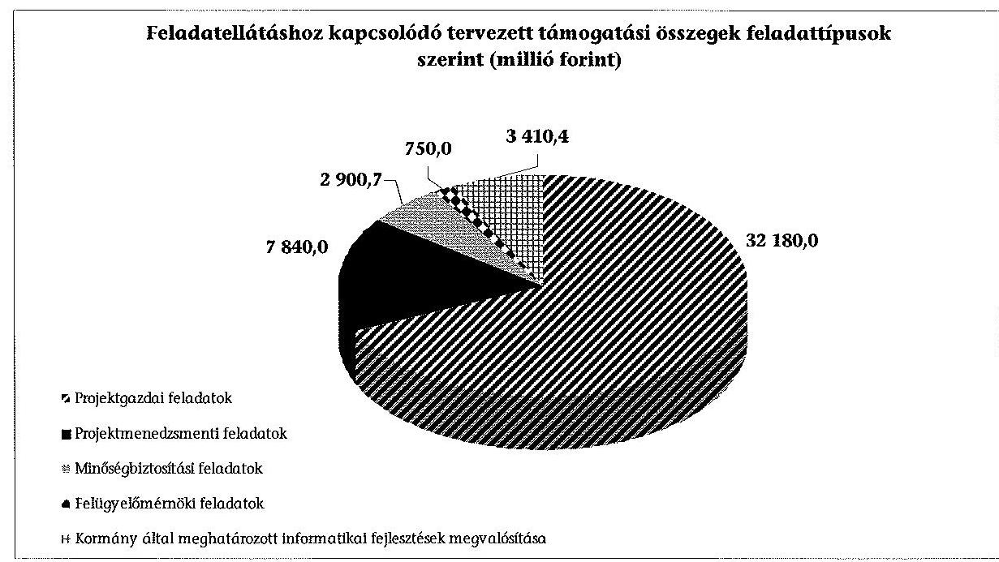

A KIFÜ az ellenőrzött időszakban – feladatai bővülésével összhangban – egyre növekvő értékű eu-s és hazai finanszírozású projekt lebonyolításába kapcsolódott be projektgazdai, projektmenedzsmenti, állami felügyelő mérnöki, minőségbiztosítási feladat ellátásával. Az eredetileg megkötött támogatási szerződésekben szereplő összegek alapján a projektek tervezett összértéke 47 081,1 M Ft volt. Ebből legjelentősebb arányt a projektgazdai feladatok képezték 32 180,0 M Ft-tal, kisebb, de jelentős volt a projektmenedzsmenti feladatok ellátása is. Ezek mellett kisebb részarányú volt az állami felügyelő mérnöki és a minőségbiztosítási feladat, melyeket egy-egy projekt esetében látott el (GSM-R Projekt, E-levéltárak). Legkisebb arányú az NFM minisztere által meghatározott informatikai fejlesztés (Iskolai tiszta szoftver projekt) megvalósítása volt. A KIFÜ az ellenőrzött időszakban projektmenedzsment módszertani feladatokat a 268/2010. (XII. 3.) Korm. rendelet 4. § c) pontjában 2013. július 14-étől kapott felhatalmazás ellenére – nem végzett.

A KIFÜ projektgazdaként feladatait – a támogatási szerződésekben, konzorciumi együttműködési megállapodásokban foglaltak szerint – szabályszerűen látta el. A bonyolított projektek közül hat zárult le (1AVAM, ACM, EFIZ, FAIR, KGR, TÉBA), amelyek közül egy (ACM) kivétellel a projektek zárása késett az eredetileg tervezett időponthoz képest. A késedelem, jellemzően a projektek megvalósítási szakaszában történt, hossza az egyes projektek esetében 6 és 36 hónap között változott. A KIFÜ a vállalkozókkal kötött szerződésekben mellékkötelezettséget kikötött, a késedelmes teljesítés esetén a késedelem arányában kötbért számolt fel, kötbér igényét érvényesítette. A projektek ütemezését a támogatási szerződések tartalmazták. A támogatási szerződéseket – a késedelmek miatt is – több alkalommal módosították, például a TÉBA projekt esetében nyolc, az ACM-nél öt alkalommal módosult a támogatási szerződés. A KIFÜ az

---

1AVÁM, illetve az ACM projekt eredményeit használó befogadó szervezetek adatszolgáltatása alapján a projekt megvalósítási, illetve fenntartási szakaszában feladatát szabályszerűen látta el. A projektgazdai feladatok körében egy esetben (MOHU) a projekt késedelme miatt – a 4/2011. (I. 28.) Korm. rendelet 3. melléklete alapján az EKOP végrehajtására kijelölt közreműködő szervezet – az irányító hatóság megbízásából és képviseletében a támogatás visszavonásáról és ezzel egyidejűleg a támogatási szerződéstől való elállásról tájékoztatta a KIFÜ-t. A KIFÜ a részére addig kiutalt, ügyleti kamattal növelt támogatást – a közreműködő szervezet felhívására – visszafizette.

A KGR projekt csak részben teljesült, az eredetileg tervezett kilenc modulból kevesebb – KTR-K11, a KTR tervező és az IKM-FI – kifejlesztése és átadása történt meg a Kincstár részére, az eredetileg tervezett 11,8 Mrd Ft helyett 4,4 Mrd Ft-ból. A KGR projekt megvalósult moduljai – a Kincstár adatszolgáltatása alapján – a fenntartási időszakban működtek, az esetleges hibák javítása – a konzorciumi megállapodás alapján – nem tartozott a KIFÜ feladatai közé.

A TÉBA 1,7 Mrd Ft-os támogatásából tervezett két modul közül csak egy valósult meg az ellenőrzött időszakban. A TÉBA CST modul Kincstár általi használatbavétele – adatszolgáltatása alapján – határidőre megtörtént, azonban a TÉBA NT modul használatbavétele – az adatbázisok feltöltetlensége miatt – az ellenőrzött időszak végéig nem történt meg. A Kincstár a KIFÜ felé az NT modul használatba vétele érdekében többször élt jelzéssel a hibák, hiányosságok elhárítása érdekében, amelyek megoldása az ellenőrzött időszakot követően folyamatban volt.

A KIFÜ projektmenedzsmenti feladatait az ellenőrzött időszakban szabályszerűen ellátta. Feladatait – a megkötött támogatási szerződésekben, azok módosításaiban előírtak szerint – szabályszerűen végezte. Az öt projektből háromnál nyújtott be kifizetési kérelmet a KIFÜ, amelyek még a projekt előkészítési szakaszára vonatkoztak.

A 1468/2012. (X. 26.) Korm. határozat alapján a Kormány a KIFÜ-t jelölte ki a GSM-R projekt állami felügyelő mérnöki feladatainak ellátására. Feladatait a projekt PAD-ja tartalmazta. A felügyelő mérnök a GSM-R nagyprojekt megvalósítása során, annak ütemezésével összhangban végezte ellenőrzési, felügyeleti tevékenységét. A KIFÜ a GSM-R projekttel kapcsolatban a PAD-ban előírt feladatait szabályszerűen látta el.

A KIFÜ az ellenőrzött időszakban a KGR projekt esetében 2013. évben látott el alkalmazás-üzemeltetői feladatot, amelyre a 2012. december 20-ával az IFF/940/2012_NFM_szerz számú szerződéssel 70,0 M Ft előirányzatot biztosított az NFM a KIFÜ részére. E feladat ellátására felhatalmazást a 268/2010. (XII. 3.) Korm. rendelet 6. § (6) bekezdése 2013. július 14-étől adott.

Az E-FIZ projekt keretében létrejött EFER (elektronikus fizetési szolgáltatást biztosító alrendszer) rendszer működtetője – a 222/2009. (X. 14.) Korm. rendelet 3. § (2) bekezdése és a 84/2012. (IV. 21.) Korm. rendelet alapján – 2011. október 20-ától az államháztartásért felelős miniszter volt, aki e feladatát a Kincstár és a KIFÜ közreműködésével látta el. A KIFÜ, mint SZEÚSZ szolgáltató – ellentétben a 223/2009. (X. 14.) Korm. rendelet 11. § (1) bekezdésével és a

---

83/2012. (IV. 21.) Korm. rendelet 11. § (2) bekezdés a) pontjával – az EFER működtetésében közreműködőként ugyan nem rendelkezett olyan minőségirányítással, amely alátámasztotta az eljárási és biztonsági követelmények teljesülését, de külső szolgáltatóval kötött szerződéssel az EFER rendszer kialakításához, majd működtetéséhez az informatikai biztonsági követelmények teljesülését biztosította.

Az ellenőrzött időszakban a KIFÜ által végzett pénzügyi elszámolások szabályszerűsége biztosított volt. A KIFÜ – összhangban a 255/2006. (XII. 8.), illetve a 4/2011. (I. 28.) Korm. rendeletben foglaltakkal – szabályozta a projektekkel összefüggő pénzügyi elszámolások folyamatát. Az ellenőrzött időszakban a KIFÜ által benyújtott 234 esetben kifizetési kérelemből mindössze két alkalommal jelzett a közreműködő szervezet eltérést vagy hibát.

A kifizetési kérelmekből leválogatott mintatételek alapján az ellenőrzés megállapította, hogy a mintába került igénylésekkel szemben a támogatási szerződésekben meghatározott feltételeket, követelményeket betartották, az igénylésben szereplő számlák elszámolhatóak voltak. Ellenőrzésünk azonban a vezetői kinevezések és felmentések áttekintése során egy esetben 1,6 M Ft összegű kifizetési igényléssel kapcsolatban szabálytalanságot tárt fel. A KIFÜ korábbi fejlesztési elnökhelyettese – akinek magasabb vezetői megbízása 2012. április 13-án lejárt és részére új vezetői megbízás adására csak 2012. június 11-ével került sor – kinevezés hiányában, a 2011. február 24-étől hatályos SZMSZ-ének 23. pontjával ellentétben, jogosulatlanul írta alá a teljesítési igazolási jegyzőkönyvet egy 2012. május 3-án kelt, nettó 1,6 M Ft-os kifizetési kérelemhez. Az SZMSZ 21. pontja előírásai értelmében a fejlesztésekért felelős elnökhelyettest akadályoztatása, vagy tartós távolléte esetén az erőforrás-gazdálkodásért felelős elnökhelyettes, annak távolléte, tartós akadályoztatás esetén a fejlesztési főosztályvezető volt jogosult helyettesíteni.

A KIFÜ az Iskolai tiszta szoftver programot, mint költségvetési forrásból finanszírozott informatikai tárgyú fejlesztési feladatát szabályszerűen látta el. A 268/2010. (XII. 3.) Korm. rendelet 4. § b) pontjában foglaltak alapján az NFM 2011. évben a magyarországi köz- és felsőoktatási képzést nyújtó valamennyi intézmény számára jogtiszta szoftverlicencek biztosításához szükséges beszerzések lebonyolításával bízta meg a KIFÜ-t. A központilag finanszírozott program keretei között a beszerzendő szoftvertermékek és a hozzájuk kapcsolódó szolgáltatások műszaki specifikációit az NFM a KIFÜ-vel kötött szerződés
 keretében tételesen meghatározta. A KIFÜ a szükséges licencek, illetve az azokhoz kapcsolódó szolgáltatások beszerzését - a 168/2004. (V. 25.) Korm. rendelet előírásainak betartásával - a központosított közbeszerzési eljárás során valósította meg.

A KIFÜ az informatikai fejlesztésekre vonatkozó monitoringrendszerét és annak keretében a vezetői információs rendszerét - ellentétben az Ámr., 145/G. §, az Ámr., 160. § (2010. december 31-ig), 160. § (1) és (2) bekezdése (2011. január 1-jétől) és a Bkr. 3. § e) pontja és 9. §-a előírásaival - 2012. szeptember 30-ig nem alakította ki és nem működtette. A fejlesztések monitoringját biztosító úgynevezett projektszerver, a PMSZ éles üzembe állítása - bár 2009-ben a szoftver már rendelkezésére állt - 2012. október 1-jétől kezdődött. A PMSZ lehetővé tette a projekttervek elkészítését és azok

---

nyomon követését. A PMSZ-t 2013-ban kiegészítették a projektek pénzügyi elszámolását, a forrásfelhasználás egységes követését támogató modullal.

# 3. A KIFÜ GAZDÁLKODÁSÁNAK SZABÁLYSZERŰSÉGE, AZ INTÉZMÉNYI BEVÉTELEK ÉS KIADÁSOK ALAKULÁSA, A VAGYONI HELYZET VÁLTOZÁSA 

A 2009-2013. évekre a KIFÜ pénzügyi gazdálkodása terén az ellenőrzés szabálytalanságokat állapított meg, a belső kontrollok nem működtek megfelelően. A vagyongazdálkodás területén a vonatkozó jogszabályi előírások szerint jártak el.

Az ellenőrzött időszakban az eredeti előirányzatok volumenét illetően lényeges, jelentős változások nem történtek, a módosított előirányzatok az eredeti előirányzatokat jelentősen meghaladták. A likviditási helyzet stabil volt. A KIFÜ vagyonának változása a lezárult projektek befogadó szervezetek részére történt átadásával függtek össze.

### 3.1. A KIFÜ pénzügyi és vagyongazdálkodásának szabályszerűsége

A KIFÜ kiadási előirányzatainak felhasználásánál - a megfelelőségi tesztek évenkénti összesített kiértékelése alapján - a kontrollok működése 2010., 2012. és 2013. évre vonatkozóan részben, 2009. és 2011. években nem megfelelő volt.

A kontrollok működésében az alábbi jellemző hibákat tárta fel ellenőrzésünk:

- A rendszeres személyi juttatások esetében a jelenléti íveken - az Ámr., 135. § (2), az Ámr. 2 76. § (3) és az Ávr. 57. § (3) bekezdésével ellentétben - hiányzott a teljesítés igazoló aláírása vagy a teljesítés igazolás dátuma. A kinevezési okiratok és módosításaik nem tartalmazták az Ámr., 134. § (8), (9), az Ámr. 2 74. § (1) és az Ávr. 55. § (1) bekezdéseivel ellentétben - ellenjegyzést, pénzügyi ellenjegyzést. A KIFÜ 2011. évre vonatkozóan nem rendelkezett - a Számv. tv. 169. § (1) bekezdésében előírt iratmegőrzési kötelezettség ellenére - a dolgozók teljesítés igazoló által aláírt, dátummal ellátott havi jelenléti íveivel, de nyilvántartással rendelkezett a munkavállalók távolléteiről.
- A dologi és dologi jellegű kiadásoknál előfordult, hogy az érvényesítő nem végezte el az érvényesítést, vagy nem a jogosult végezte az érvényesítést az Ámr., 135. § (4)-(5) bekezdése és a hatályos pénzgazdálkodási jogkörök szabályzata alapján. Az utalványrendeleten nem szerepelt az utalvány ellenjegyzőjének aláírása az Ámr., 136. § (4) g) pontja alapján.
- A felhalmozási kiadások esetében a 2013. évben a kiadások összegszerűségét ellenőrizhető okmányok alapján - ellentétben az Ávr. 57. § (1) bekezdése előírásaival - nem ellenőrizték, mert egyes keretszerződésekhez

---

kapcsolódó kifizetésekhez nem állt rendelkezésre a kiadás összegszerűsége ellenőrzéséhez alkalmas okmány.

- Mind a dologi és dologi jellegű kiadások, mind a felhalmozási kiadások esetében előfordult, hogy a szerződéseknél - ellentétben az Ámr. 134. § (8), az Ámr. 74. § (1) bekezdéseivel az ellenjegyzés, 2012. január 1-jétől az Ávr. 55. § (1) bekezdése előírásaival ellentétben a pénzügyi ellenjegyzés - nem történt meg. Egyes szerződéseknél ellentétben a KIFÜ ellenőrzött időszakban hatályos pénzgazdálkodási jogkörök szabályzata 29. (2011. május 31-i) és 34. pontjával (2011. június 1-jétől) nem került sor jogi ellenjegyzésre.

A pénzeszköz-átadások elszámolása - az Ámr. ${ }_{1,2}$ és az Ávr. előírásai szerint - szabályszerű volt.

A 2009-2013. közötti időszakban a KIFÜ vagyongazdálkodása szabályszerű volt. A beszerzett, létesített immateriális javak és tárgyi eszközök bekerülési értékének megállapítása, az eszközök üzembe helyezésének ügymenete, a nyilvántartásba vétel módja és annak dokumentálása, az állomány növekedések elszámolása, az analitikus nyilvántartásokban az eszközök eszközcsoportokba történő besorolása, az értékcsökkenési leírás elszámolása során - a Számv. tv., az Áhsz., valamint a vonatkozó belső szabályzatok előírásai alapján - szabályszerűen járt el. A felhalmozási mintatételek esetében a gazdálkodási jogkörökhöz előírt belső kontrollok - az Áht. ${ }_{1,2}$, az Ámr. ${ }_{1,2}$ és az Ávr. előírásaiban, illetve a KIFÜ belső szabályzataiban foglaltak szerint megfelelően működtek.

A leltározást és a rendkívüli leltározást - a Számv. tv., az Áhsz., valamint a leltározási és leltárkészítési szabályzat előírásai szerint - szabályszerűen folytatták le. A mérleget alátámasztó leltárak és az analitikus nyilvántartások, a főkönyvi kivonat számlái, valamint az egyes mérlegtételek között az egyezőség fennállt.

A KIFÜ az ellenőrzött időszakban hatályos selejtezési és hasznosítási szabályzata alapján, azzal összhangban a 2010., 2011. és 2013. évben végzett selejtezést. A selejtezett eszközök értéke a 2010. évben összesen bruttó 0,6 M Ft, 2011. évben összesen bruttó 1,8 M Ft és 2013. évben összesen bruttó 2,0 M Ft volt, amelyeket a nyilvántartásokból kivezettek.

# 3.2. A KIFÜ bevételi és kiadási előirányzatainak teljesítése, változása, a likviditás helyzete, a vagyon összetételének változása 

A KIFÜ 2009-2013. évi eredeti, módosított kiadási és bevételi előirányzatait, azok teljesítését, valamint %-os változásukat az 5/A-C. sz. mellékletek mutatják be.

A KIFÜ az előirányzatain belül gazdálkodott, az előirányzat-módosítások során - az Áht. ${ }_{1,2}$, az Ámr. ${ }_{1,2}$ és az Ávr. előírásai szerint - szabályszerűen járt el, az előirányzatok változásáról vezetett analitikus nyilvántartások a beszámoló

---

adatait (23. Költségvetési előirányzatok egyeztetése) alátámasztották. A KIFÜ ellenőrzött időszakban történt előirányzat-módosításainak oka az előirányzatmaradvány igénybevétele, valamint az eu-s társfinanszírozású projektek támogatási szerződéseiben biztosított támogatásának felhasználása volt.

A KIFÜ 2009-2013. évek közötti eredeti, módosított előirányzatait, azok teljesítését az alábbi grafikon szemlélteti:
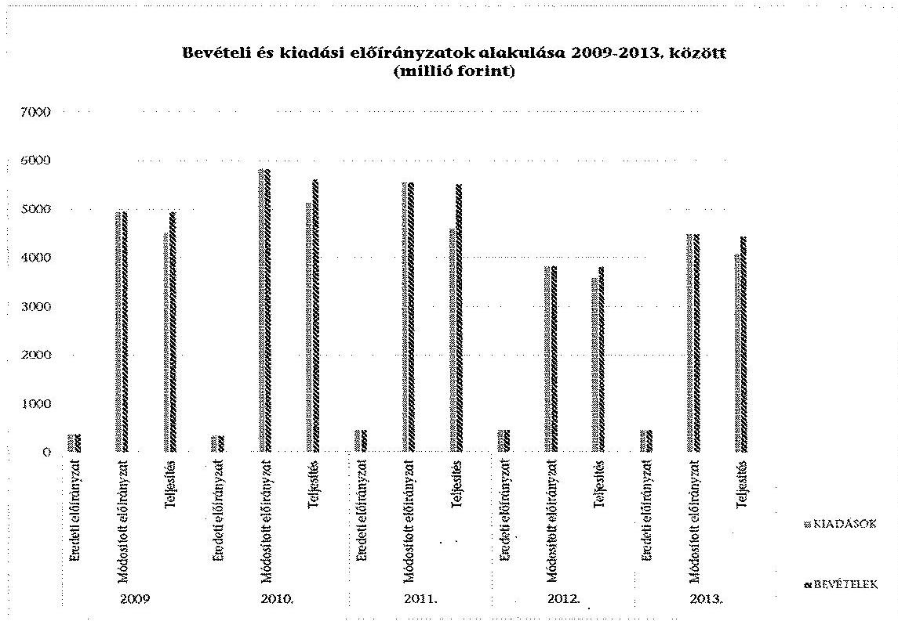

A KIFÜ az ellenőrzött időszak minden évében rendelkezett előirányzatmaradvánnyal, melyek - 2010. év kivételével (75,8 M Ft kötelezettségvállalással nem terhelt maradvány, melyet az irányító szerv elvont) - teljes egészében kötelezettségvállalással terhelt maradványok voltak. Az előirányzatmaradványok levezetését analitikus nyilvántartás megfelelően alátámasztotta.

Az ellenőrzött időszakban végrehajtott, a költségvetési egyensúlyt biztosító kormányzati intézkedéseket - előirányzat zárolás, maradványtartási kötelezettség - a KIFÜ végrehajtotta, azonban az adott évi meghatározott szakmai feladatai ellátását nem veszélyeztették. A 2009-2013. évi, a KIFÜ-t érintő egyensúly-javító intézkedések összegeit az alábbi táblázat foglalja össze:

Adatok M Ft-ban

| 2009. | 2010. | 2011. | 2012. | 2013. |
| :--: | :--: | :--: | :--: | :--: |
| 10,7 | 7,2 | 7,7 | - | 1,0 |

Az egyensúlyjavító intézkedések keretében elrendelt egyes eszközcsoportokra vonatkozó beszerzési tilalom előírásait a KIFÜ betartotta. Az ellenőrzött időszakban egy alkalommal kért - a 1316/2011. (IX.19.) Korm. határozat 5. pontja alapján - felmentést, amelyre irányító szerve 2011. november 29-én az

---

engedélyt megadta. Az ellenőrzött időszakban a KIFÜ egy alkalommal - 2013. május 28-án - nyújtott be támogatás előrehozási kérelmet, melyet a Kincstár az Ávr. 130. § (3) bekezdése alapján - engedélyezett, és a kért összeget 2013. május 30-án a KIFÜ számláján jóváírta.

Az ellenőrzött időszakban a KIFÜ pénzügyi helyzete - a 2009. év kivételével - stabil volt. A rendelkezésre álló költségvetési keretek minden évben elegendőnek bizonyultak feladatai ellátására. A pénzügyi helyzet 2011-től romlott, de továbbra is stabilitás jellemezte. A KIFÜ likviditási és pénzeszköz likviditási mutatóinak 2009-2013. közötti változását az alábbi grafikon mutatja be:
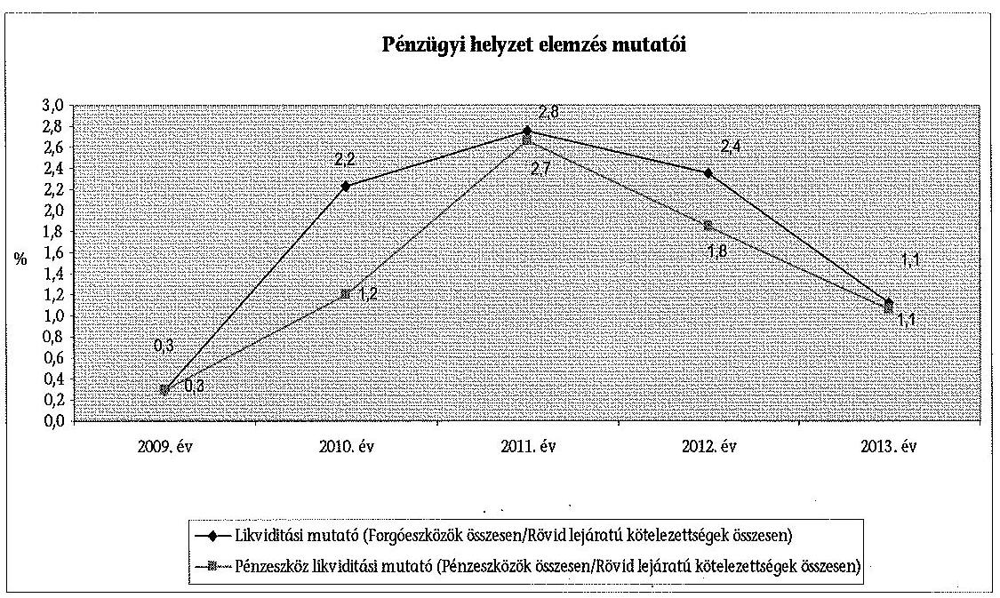

---

A KIFÜ 2009-2013. évek közötti mérlegadatait a 6/A. sz. melléklet, a vagyon állományában bekövetkezett változásokat a 6/B. sz. melléklet mutatja be. A KIFÜ eszközein belül jelentős volt a befektetett eszközök állománya. A befektetett eszközök között a legjelentősebb arányt a vagyoni értékű jogok és a szellemi termékek képviseltek, de jelentős volt a gépek, berendezések, felszerelések állományi értéke is. A befektetett eszközökön belül az egyes főbb mérlegcsoportok megoszlását az alábbi grafikon szemlélteti:
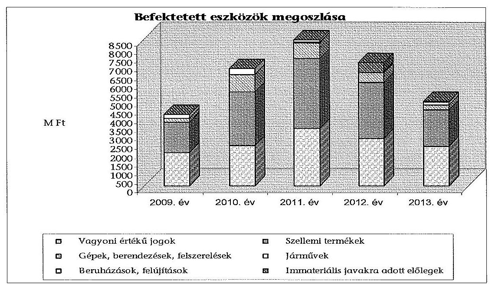

Az eszközökön belül a forgóeszközök csekély arányát támasztják alá a vagyoni helyzet elemzésének mutatói is (befektetett eszközök aránya mutató és a forgóeszközök aránya mutató), amelyek értékei nem változtak jelentősen:
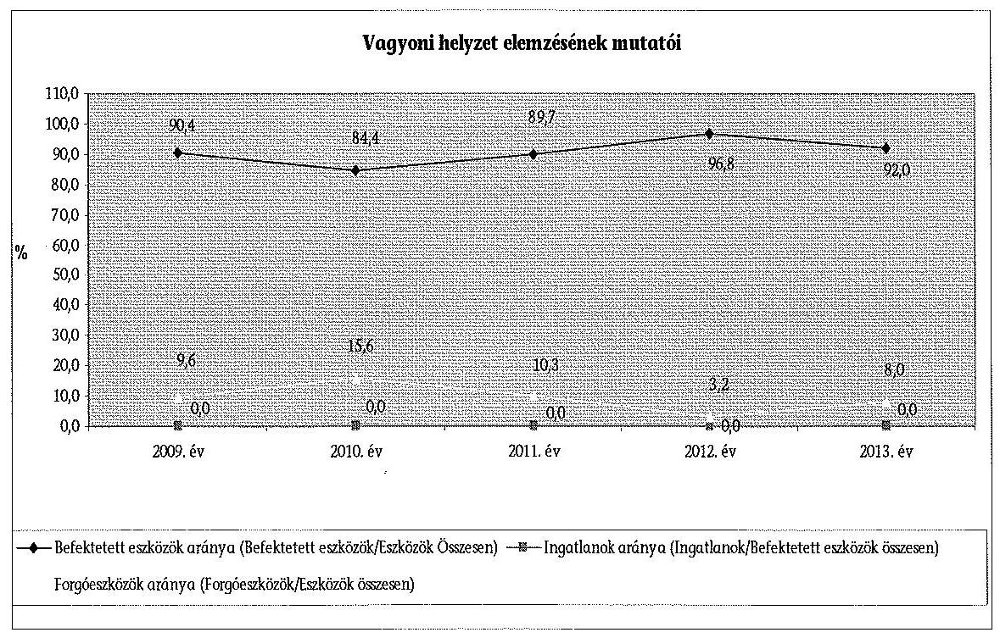

---

A saját tőke összes forráshoz és kötelezettségekhez viszonyított arányának változását az ellenőrzött időszakban az alábbi grafikon szemlélteti:
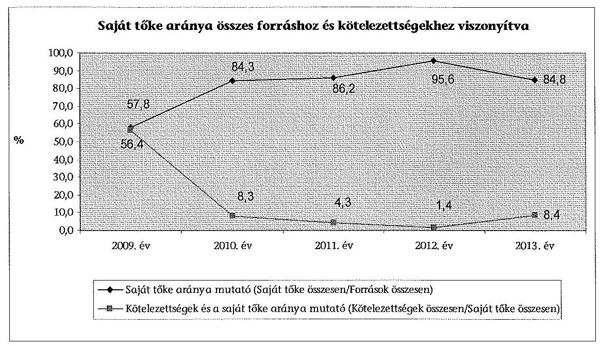

A saját tőke aránya mutató értéke növekedett a saját tőke állomány arányának emelkedésével. A kötelezettségek és a saját tőke aránya mutató alapján megállapítható, hogy a mérlegben kimutatott kötelezettségek állománya csökkent, illetve mindkét mutató 2010. évtől nem változott jelentősen. A KIFÜ-nek csak rövid lejáratú kötelezettségei voltak.

Az immateriális javak és tárgyi eszközök használhatósági fokának változását az alábbi grafikon szemlélteti:
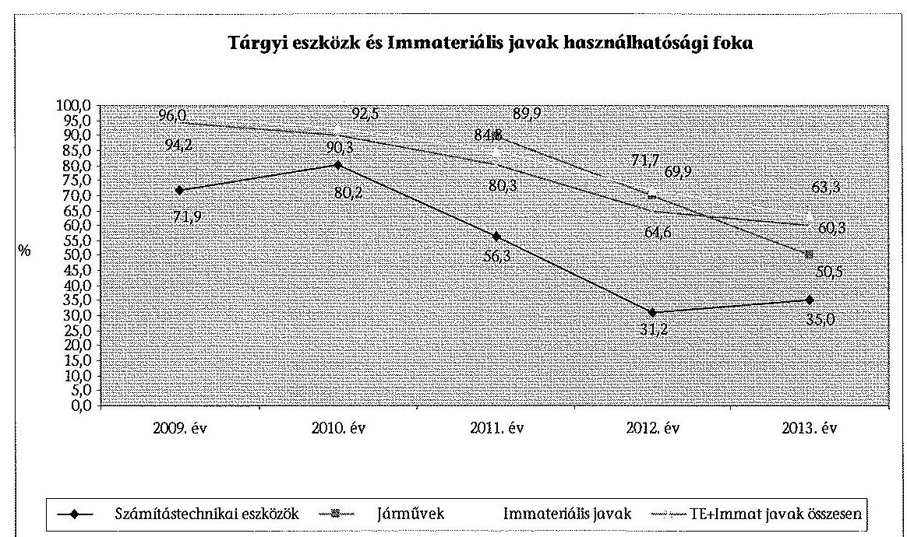

---

Az ellenőrzött időszakban a vagyonelemek használhatósági foka folyamatos csökkenést mutatott, évről-évre romlott az eszközök használhatósági foka. Ennek oka a számítástechnikai eszközök magas értékcsökkenési leírási kulcsa, valamint a megvalósult projektek befogadó szervezetek részére történő átadása volt.

# 4. A KIFÜ BELSŐ KONTROLLRENDSZERÉNEK KIALAKÍTÁSA ÉS MŰKÖDTETÉSE 

Az ellenőrzött 2009-2013. években a KIFÜ belső kontrollrendszerének kialakítása és működtetése összevont értékelése (73,5%) részben megfelelőnek minősült. A belső kontrollrendszer elemei közül megfelelő minősítést kapott a kontrollkörnyezet kialakítása (87,8%), részben megfelelő minősítést a kontrolltevékenység kialakítása és működtetése (80,0%), nem megfelelő minősítést a kockázatkezelési rendszer (52,5%), az információs és kommunikációs rendszer (65,2%), valamint a monitoring rendszer (61,0%) kialakítása és működtetése.
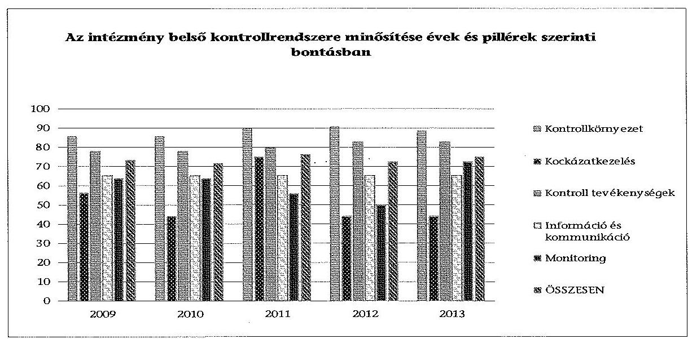
4.1. A KIFÜ kontrollkörnyezete, a kockázatkezelési rendszer és a kontrolltevékenységek, az információs és kommunikációs rendszer kialakítása és működtetése

A kontrollkörnyezet kialakítása az ellenőrzött időszakban - összességében és évenként egyaránt - megfelelő (87,8%) volt.

A KIFÜ rendelkezett hatályos alapító okirattal, SZMSZ-el, a gazdasági szervezete, 2011. évtől a projektekkel foglalkozó szervezeti egységei ügyrendjeivel, gazdálkodási, a pénzgazdálkodási jogkörök gyakorlásának szabályzatával, számviteli politikával, számlarenddel, bizonylati renddel (2011. június 1-jétől), pénzkezelési, értékelési, leltározási és leltárkészítési szabályzattal, selejtezési, valamint (köz)beszerzési szabályzattal. A KIFÜ-nél szabályozták a kockázatkezelés rendjét, készítettek ellenőrzési nyomvonalakat (a projektekkel kapcsolatos feladatok kivételével), szabálytalanságok kezelése eljárásrendjét, informatikai

---

biztonsági szabályzatot. A munkavállalók részére elkészítették a munkaköri leírásokat és a teljesítményértékeléseket. A belső szabályzatok aktualizálása az ellenőrzött időszakban bekövetkezett jogszabályi változásoknak megfelelően - a gazdasági szervezet ügyrendje, pénzkezelési szabályzata és közbeszerzési szabályzata esetében fennálló hiányosságok kivételével - részben megtörtént és részben megfeleltek a vonatkozó jogszabályok előírásainak.

A KIFÜ-nél az ellenőrzött időszakban négy SZMSZ követte egymást. Az ellenőrzés megállapította, hogy a KIFÜ az SZMSZ-ei hatályba lépését - ellentétben a Jat. ${ }_{1} 49 . \S$ (1) és a Jat. ${ }_{2} 24 . \S$ (1) bekezdése alapján 2. § (2) bekezdése előírásaival - az SZMSZ-ben rögzített időponthoz képest esetenként több hónappal eltérő időpontban határozta meg. A 2009. március 1-jétől hatályos SZMSZ-t a KIFÜ elnöke 1-7/2009. (III. 16.) PMISZK utasítással adta ki, a hatályba helyezés időpontjául 2010. március 16-át jelölte meg. A 2010. január 1-jétől hatályos
 SZMSZ-t az elnök a 81-1/2010. (II. 15.) PMISZK utasítással 2010. február 15-ével helyezte hatályba. A 2011. február 24-étől hatályba lépett SZMSZ-t a KIFÜ elnöke 3/2011. (II. 21.) utasításával 2011. március 1-jétől léptette hatályba. A KIFÜ elnöke 2010-ben - a 81-1/2010. (II. 15.) PMISZK utasításban meghatározott szervezeti egység megnevezések figyelembe vételével, azzal összhangban a 81-2/2010. (II. 16.) PMISZK utasítással az akkor hatályban lévő utasításokban szereplő szervezeti egység megnevezéseket egységesen módosította.

A gazdasági szervezet ügyrendje - ellentétben az Ámr. ${ }_{1} 13 / \mathrm{A}$. § (3) bekezdés h) pontja, az Ámr. ${ }_{2} 20 . \S$ (7) bekezdése és az Ávr. 13. § (5) bekezdése előírásaival - nem tartalmazta a helyettesítés rendjére vonatkozó előírásokat.

A KIFÜ számviteli politika keretében elkészítendő pénzkezelési szabályzata - a Számv. tv. 14. § (8) bekezdés előírásaival ellentétben - nem tartalmazta teljes körűen az előlegek, az utólagos elszámolásra kiadott összegek körét, nyilvántartásának, elszámolásának rendjét, határidejét.

A KIFÜ 2009-2011. években hatályos közbeszerzési szabályzatai - a Kbt. ${ }_{1}$ 8. § (3) bekezdésében foglaltak ellenére - részben tartalmazták az ajánlatok elbírálására létrehozott bíráló bizottság tagjai kiválasztásának szempontjait, feladatait, döntéshozatali eljárásrendjét, a határozatképesség feltételeit.

A KIFÜ elnöke - az Ámr. ${ }_{1}$ 145/D. § c) pontja, az Ámr. ${ }_{2}$ 156. § (1) bekezdés c) pontja és a Bkr. 6. § (1) bekezdés c) pontja ellenére - nem határozta meg a szervezet minden szintjére vonatkozóan az etikai elvárásokat, a KIFÜ nem rendelkezett Etikai Kódexszel.

A kockázatkezelési rendszer kialakítása és működtetése az ellenőrzött időszakban nem megfelelő ( $52,5 \%$ ) minősítésű volt. A 2009-2010., valamint a 2012-2013. években a KIFÜ elnöke - ellentétben az Ámr. ${ }_{1} 145 /$ C. § (1)-(3) bekezdései, az Ámr. ${ }_{2} 157 . \S$ (1)-(3) bekezdései és a Bkr. 3. § b) pontja, 7. § (1)-(2) bekezdései előírásaival - nem gondoskodott a kockázatkezelési rendszer működtetéséről, nem értékelték és nem kezelték a kockázatokat. A 2011. évben ugyan új kockázatkezelési szabályzat lépett hatályba, azonban a kockázatkezelési rendszert továbbra sem működtették.

---

Az ellenőrzött időszakban a kontrolltevékenység kialakítása és működtetése részben megfelelő $(80,0 \%)$ volt. A kialakított kontrollok a kiadási előirányzatok felhasználása terén - a 3. fejezet 3.1. pontjában ismertetettek szerint 2010., 2012. és 2013. évre részben, 2009. és 2011. években nem működtek megfelelően.

Az ellenőrzött időszakban az információs és kommunikációs rendszer kialakítása és működtetése nem megfelelő ( $65,2 \%$ ) minősítésű volt. A KIFÜ-nél - ellentétben az Ámr. ${ }_{1}$ 145/F. § (2) bekezdésével, az Ámr. ${ }_{2}$ 159. § (2) bekezdésével és a Bkr. 9. § (2) bekezdésével - nem működtettek hatékony, megbízható és pontos beszámolási rendszereket, a beszámolási szintek, határidők és módok nem voltak világosan meghatározva.

# 4.2. A monitoring rendszer, a belső ellenőrzés kialakítása és működtetése 

Az ellenőrzött időszakban a monitoring-rendszer kialakítása és működtetése nem megfelelő ( $61,0 \%$ ) minősítésű volt. A 2009-2012. években évente nem volt megfelelő a minősítés, míg 2013. évben részben megfelelő minősítésű volt a monitoring rendszer.

A KIFÜ elnöke - az Ámr. ${ }_{1}$ 145/G. §, az Ámr. ${ }_{2}$ 160. (1)-(2) bekezdése és a Bkr. 3. § e) pontjában és 10. §-ában foglaltak ellenére - az ellenőrzött időszakban nem működtette tevékenységének, a célok megvalósításának nyomon követését biztosító, a szervezet minden szintjén érvényesülő nyomon követési (monitoring) rendszerét.

A monitoring kontrollpillér részeként a belső ellenőrzés szervezeti keretei és működése - kisebb hiányosságok ellenére - megfelelt a vonatkozó jogszabályi előírásoknak. A KIFÜ elnöke 2010. január 1-március 10. között ellentétben az Áht. ${ }_{1}$ 121/A. § (3) bekezdésével és a Ber. 4. § (1) bekezdésében foglaltakkal - nem gondoskodott a belső ellenőrzés működtetéséről. A belső ellenőrzés függetlensége biztosított volt, a belső ellenőrzési vezető által kidolgozott és az intézmény elnöke által jóváhagyott belső ellenőrzési kézikönyv kiadásra került. A belső ellenőrzés szervezeti kerete az ellenőrzött időszakban többször változott. 2009. évben a belső ellenőrzési feladatokat az intézmény keretein belül egy megbízási szerződéssel foglalkoztatott belső ellenőr végezte. 2010. március 11-től - a 6/2010. (III. 10.) PM utasítás Melléklet 10. § 3. g) pontja alapján - a PM Ellenőrzési Főosztálya látta el a KIFÜ belső ellenőrzését (a saját, ezen időszakban hatályos belső ellenőrzési kézikönyvei alapján). 2010. szeptember 16-tól háromoldalú szerződés eredményeként az intézményben kinevezésre került egy fő belső ellenőr.

A KIFÜ belső ellenőrzési vezetője 2009. január 1. és 2010. december 30. között a Ber. 12. § b) pontja előírásai ellenére - nem állította össze a stratégiai ellenőrzési tervet. A KIFÜ elnöke 2010. december 31-én, illetve 2012. november 15-én hagyta jóvá az intézmény belső ellenőrzése számára követendő, 2011-2014. évekre vonatkozó stratégiai ellenőrzési tervet. A 2009-2013. évekre vonatkozóan - a Ber. és a Bkr. előírásaival összhangban - rendelkeztek a KIFÜ elnöke által jóváhagyott éves ellenőrzési tervekkel. Az ellenőrzött időszakban

---

elvégzett ellenőrzésekről a belső ellenőrzési vezető vezette - a Ber. illetve a Bkr. szerinti - nyilvántartásokat.

Az ellenőrzött időszakban a belső ellenőrzés - a Ber. és a Bkr. előírásaival összhangban - vizsgálta és értékelte a pénzügyi irányítási és ellenőrzési rendszerek, illetve a belső kontrollrendszerek kiépítését, működésének gazdaságosságát, hatékonyságát és eredményességét, továbbá a folyamatba épített, előzetes és utólagos vezetői ellenőrzési rendszerek kiépítésének, működésének jogszabályoknak és szabályzatoknak való megfelelését. Az ellenőrzött időszakban a belső ellenőrzés összesen 24 - ezen belül 2009. évben 4, 2010. évben 4, 2011. évben 7, 2012. évben 2, 2013. évben 7 - ellenőrzést folytatott és zárt le. Az ellenőrzött időszakban az ellenőrzések során a belső ellenőrzés az intézménynél gazdálkodási rendet sértő mulasztást, szabálytalanságot, károkozást nem állapított meg. Az ellenőrzések között szabályszerűségi pénzügyi, rendszer és informatikai rendszerellenőrzések voltak. A belső ellenőrzés megállapításokat, ajánlásokat tett.

Az ellenőrzött időszak éves (összefoglaló) ellenőrzési jelentései - a Ber. és a Bkr. előírásaival összhangban - tartalmazták az intézkedési tervek megvalósításáról szóló beszámolót, illetve az ellenőrzési megállapítások és ajánlások, javaslatok hasznosulásának tapasztalatait. A belső ellenőrzés által az ellenőrzött időszakban megtett összes javaslat hasznosult. Az ellenőrzött időszakban a belső ellenőrzés összesen 24 ellenőrzést folytatott le, amelynek kapcsán összesen 60 - ezen belül 2009. évben 6, 2010. évben 15, 2011. évben 13, 2012. évben 10, 2013. évben 16 - javaslatot fogalmazott meg. Az érintett szervezeti egységek intézkedési terveket készítettek, az ellenőrzött időszakban a határidős intézkedéseket végrehajtották.

Az ellenőrzés során a belső kontrollokon túlmutató integritás kontrollokat is értékeltük. A KIFÜ az ellenőrzött időszakban 2011., 2012. és 2013. évben kapott felkérést az ÁSZ-tól az integritási kérdőív kitöltésére, melyeket 2011. és a 2013. évben kitöltött.

Az integritási kérdőívek szabályozási, működési hiányosságokra mutattak rá. Egyes területeken továbbra sem teljes körűen érvényesült az integritási szemlélet. Az ellenőrzött időszakban több integritás kontroll területet nem szabályoztak (a különféle ajándékok, meghívások, utaztatás elfogadásának feltételeit, a szervezeten belülről érkező közérdekű bejelentések eljárásrendjét, valamint a bejelentést tevők megfelelő védelmének biztosítását, illetve a külső személyekkel való kapcsolattartást). Nem hívták fel a korrupciós szempontból veszélyeztetett beosztásokban dolgozó alkalmazottak figyelmét a jellemző kockázatokra és a kockázatokat megelőző intézkedésekre. Az ellenőrzött időszakban az integritási kontrollokat három területen nem működtették. A KIFÜ nem rendelkezett etikai kódexszel. Nem végeztek rendszeres korrupciós kockázatelemzést, amelynek során felmérték volna a lehetséges korrupciós eseményeket, így a lehetséges kockázatok mérséklése érdekében nem fogalmaztak meg konkrét lépéseket. Nem működtették a szervezeten kívülről érkező panaszokat és közérdekű bejelentéseket kezelő rendszert.

---

# 5. A KÜLSŐ ELLENŐRZÉSEK HASZNOSULÁSA 

A KIFÜ-nél a 2009. január 1. és 2013. december 31. közötti időszakban 27 esetben került sor külső ellenőrzésre, amelyek között hatósági ellenőrzések nem voltak. A 2009. január 1. és 2013. december 31. közötti időszakban a 2010. és a 2011. évek vonatkozásában - a Ber. 29/A. § (3)-(4) bekezdésében előírtakkal ellentétben - nem készítettek nyilvántartást a szervezetnél végzett külső ellenőrzésekről. A külső ellenőrzésekre - amelyeknél szükséges volt - a KIFÜ az intézkedési tervet elkészítette, az intézkedéseket határidőben megtette.

Az EKOP EU Bizottsági auditjai során két esetben került KIFÜ projekt közbeszerzési vizsgálati mintatételbe, a KEHI négy ellenőrzést, az EUTAF tizenkét ellenőrzést végzett. Az ellenőrzött időszakban irányító szervek (PM, NFM) kilenc alkalommal végeztek ellenőrzést, amelyekből nyolc esetben az ellenőrzési jelentés is elkészült 2013. december 31-ig, egy ellenőrzés folyamatban volt. A közreműködő szervezetek a KIFÜ által benyújtott kifizetési kérelmeket tartalmi és formai szempontból ellenőrizték, illetve a 255/2006. (XII. 8.) és a 4/2011. (I. 28.) Korm. rendelet alapján a projektek zárásával kapcsolatban eseti ellenőrzést végeztek.

Budapest, 2015. 04. hó 16. nap

Melléklet: $\quad 17 \mathrm{db}$
Függelék: $\quad 2 \mathrm{db}$
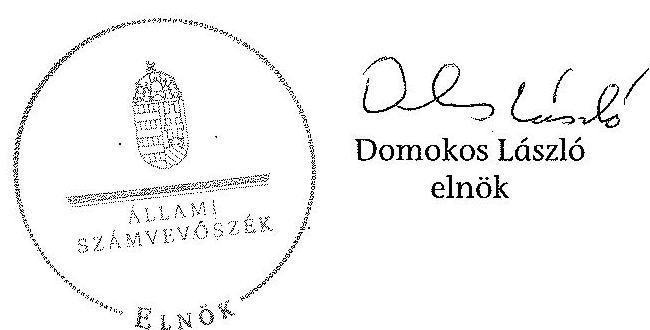

---

# A KIFÜ projektjeinek eredményeit használó szervezetek

|  Projekt neve | Végfelhasználó szervezet  |
| --- | --- |
|  Egyablakos vámügyintézés megvalósítása (EKOP-1.2.2.-07-20080001) | Magyar Kereskedelmi Engedélyezési Hivatal  |
|   | Nemzeti Közlekedési Hatóság  |
|   | Forster Gyula Nemzeti Örökséggazdálkodási és Szolgáltatási Központ  |
|   | Nemzeti Élelmiszerlánc-biztonsági Hivatal  |
|   | Mezőgazdasági és Vidékfejlesztési Hivatal  |
|   | Gyógyszerészeti és Egészségügyi Minőség- és Szervezetfejlesztési Intézet  |
|   | Földművelésügyi Minisztérium  |
|   | Nemzeti Adó- és Vámhivatal  |
|  A fejlesztéspolitika egységes informatikai támogatása Magyarországon (EKOP-1.2.12.-2011-2011-0001) | Miniszterelnökség  |
|  ACM - Adóalany centrikus adatszolgáltatási modell megvalósítása (EKOP 1.2.7-2008-0001) | Nemzeti Adó- és Vámhivatal  |
|  Költségvetési Gazdálkodási Rendszer (EKOP-1.2.1.-07-2008-0001) | Magyar Államkincstár  |
|  A családtámogatási ellátások folyósításának korszerűsítése (EKOP-1.2.6.-2008-0001) | Magyar Államkincstár  |
|  Elektronikus fizetés megvalósítása (EKOP-2.1.1.-07-2008-0001) | Kormányzati Informatikai Fejlesztési Ügynökség  |

---

# A KIFÜ feladatváltozásai 2009-2013. között

|  2009. év | 2010. év | 2010-2013 év. | 2013. év  |
| --- | --- | --- | --- |
|  |   |   |   |
|  A pénzügyminiszter irányítása alá tartozó szervezetek részére számítástechnikai szolgáltatások biztosítása, számítástechnikai rendszerüzemeltetés, fejlesztési feladatok ellátása. |  |  |   |
|  Menedzseli a Kormány vagy a pénzügyminiszter által kiemelt hazai és/vagy az európai uniós forrásokból finanszírozott - a pénzügyi ágazat informatikai rendszerét átadó - projektek fejlesztését, és gondoskodik azok adminisztrációjáról. |  |  |   |
|  Elősegíti a szolgáltató állami kiépítésének programjához kapcsolódóan a pénzügyminiszter irányítása alá tartozó szervezetek egységes informatikai stratégiáját, és összhangolja a stratégia végrehajtását. |  |  |   |
|  Összehangolja a
 pénzügyminiszter irányítása alá tartozó szervezetek informatikai fejlesztésére irányuló pénzeszközeinek felhasználásának tervezését. |  |  |   |
|  Összehangolja a pénzügyi igazgatást érintő informatikai biztonság kiépítésének és működtetésének feladatait. |  |  |   |
|  Kapcsolattartás a Pénzügyminisztériummal az informatikai tárgyú támszolgáltatási bizottságok, projektek munkacsoportjához. |  |  |   |
|  |   |   |   |
|  A pénzügyminiszter irányítása alá tartozó szervezetek részére számítástechnikai szolgáltatások biztosítása, számítástechnikai rendszerek üzemeltetése, fejlesztési feladatok ellátása. |  |  |   |
|  A kormány vagy a pénzügyminiszter által kiírt, mindkét halad és/vagy az európai uniós forrásokból finanszírozott - a pénzügyi ágazat informatikai rendszereinek átadását - projektek fejlesztését, és gondoskodik azok adminisztrációjáról. |  |  |   |
|  Elősegíti a szolgáltató állami kiépítésének programjához kapcsolódóan a pénzügyminiszter irányítása alá tartozó szervezetek egységes informatikai stratégiájának kidolgozását, és összhangolja a stratégia végrehajtását. |  |  |   |
|  Összehangolja a pénzügyminiszter irányítása alá tartozó szervezetek informatikai fejlesztésére irányuló pénzeszköz felhasználásának tervezését. |  |  |   |
|  Összehangolja a pénzügyi igazgatást érintő informatikai biztonság kiépítésének és működtetésének feladatait. |  |  |   |
|  Kapcsolattartás a Pénzügyminisztériummal az informatikai tárgyú támszolgáltatási bizottságok, projektek munkacsoportjához. |  |  |   |
|  |   |   |   |
|  A pénzügyminiszter irányítása alá tartozó szervezetek részére számítástechnikai szolgáltatások biztosítása, számítástechnikai rendszerek üzemeltetése, fejlesztési feladatok ellátása. |  |  |   |
|  A kormány vagy a pénzügyminiszter által kiírt, mindkét halad és/vagy az európai uniós forrásokból finanszírozott - a pénzügyi ágazat informatikai rendszereinek átadását - projektek fejlesztését, és gondoskodik azok adminisztrációjáról. |  |  |   |
|  Elősegíti a szolgáltató állami kiépítésének programjához kapcsolódóan a pénzügyminiszter irányítása alá tartozó szervezetek egységes informatikai stratégiájának kidolgozását, és összhangolja a stratégia végrehajtását. |  |  |   |
|  Összehangolja a pénzügyminiszter irányítása alá tartozó szervezetek informatikai fejlesztésére irányuló pénzeszköz felhasználásának tervezését. |  |  |   |
|  Összehangolja a pénzügyi igazgatást érintő informatikai biztonság kiépítésének és működtetésének feladatait. |  |  |   |
|  Kapcsolattartás a Pénzügyminisztériummal az informatikai tárgyú támszolgáltatási bizottságok, projektek munkacsoportjához. |  |  |   |
|  |   |   |   |
|  A pénzügyminiszter irányítása alá tartozó szervezetek részére számítástechnikai szolgáltatások biztosítása, számítástechnikai rendszerek üzemeltetése, fejlesztési feladatok ellátása. |  |  |   |
|  A kormány vagy a pénzügyminiszter által kiírt, mindkét halad és/vagy az európai uniós forrásokból finanszírozott - a pénzügyi ágazat informatikai rendszereinek átadását - projektek fejlesztését, és gondoskodik azok adminisztrációjáról. |  |  |   |
|  Elősegíti a szolgáltató állami kiépítésének programjához kapcsolódóan a pénzügyminiszter irányítása alá tartozó szervezetek egységes informatikai stratégiájának kidolgozását, és összhangolja a stratégia végrehajtását. |  |  |   |
|  Összehangolja a pénzügyminiszter irányítása alá tartozó szervezetek informatikai fejlesztésére irányuló pénzeszköz felhasználásának tervezését. |  |  |   |
|  Összehangolja a pénzügyi igazgatást érintő informatikai biztonság kiépítésének és működtetésének feladatait. |  |  |   |
|  Kapcsolattartás a Pénzügyminisztériummal az informatikai tárgyú támszolgáltatási bizottságok, projektek munkacsoportjához. |  |  |   |
|  |   |   |   |
|  A pénzügyminiszter irányítása alá tartozó szervezetek részére számítástechnikai szolgáltatások biztosítása, számítástechnikai rendszerek üzemeltetése, fejlesztési feladatok ellátása. |  |  |   |
|  A kormány vagy a pénzügyminiszter által kiírt, mindkét halad és/vagy az európai uniós forrásokból finanszírozott - a pénzügyi ágazat informatikai rendszereinek átadását - projektek fejlesztését, és gondoskodik azok adminisztrációjáról. |  |  |   |
|  Elősegíti a szolgáltató állami kiépítésének programjához kapcsolódóan a pénzügyminiszter irányítása alá tartozó szervezetek egységes informatikai stratégiájának kidolgozását, és összhangolja a stratégia végrehajtását. |  |  |   |
|  Összehangolja a pénzügyminiszter irányítása alá tartozó szervezetek informatikai fejlesztésére irányuló pénzeszköz felhasználásának tervezését. |  |  |   |
|  Összehangolja a pénzügyi igazgatást érintő informatikai biztonság kiépítésének és működtetésének feladatait. |  |  |   |
|  Kapcsolattartás a Pénzügyminisztériummal az informatikai tárgyú támszolgáltatási bizottságok, projektek munkacsoportjához. |  |  |   |
|  |   |   |   |
|  A pénzügyminiszter irányítása alá tartozó szervezetek részére számítástechnikai szolgáltatások biztosítása, számítástechnikai rendszerek üzemeltetése, fejlesztési feladatok ellátása. |  |  |   |
|  A kormány vagy a pénzügyminiszter által kiírt, mindkét halad és/vagy az európai uniós forrásokból finanszírozott - a pénzügyi ágazat informatikai rendszereinek átadását - projektek fejlesztését, és gondoskodik azok adminisztrációjáról. |  |  |   |
|  A szolgáltató állami kiépítésének programjához kapcsolódóan a pénzügyminiszter irányítása alá tartozó szervezetek egységes informatikai stratégiájának kidolgozásában, a stratégia végrehajtásának összhangolásában és kijelölés esetén a stratégia végrehajtásához rendelt pénzeszközök felhasználásának ellenőrzése. |  |  |   |
|  A pénzügyminiszter irányítása alá tartozó szervezetek informatikai fejlesztésére irányuló pénzeszköz felhasználásának tervezésének összehangolása. |  |  |   |
|  A pénzügyi igazgatást érintő informatikai biztonsági kiépítésének és működtetésének feladatainak összehangolása. |  |  |   |
|  A Pénzügyminisztériummal az informatikai tárgyú támszolgáltatási bizottságok, projektek munkacsoportjához. |  |  |   |
|  |   |   |   |
|  A pénzügyminiszter irányítása alá tartozó szervezetek részére számítástechnikai szolgáltatások biztosítása, számítástechnikai rendszerek üzemeltetése, fejlesztési feladatok ellátása. |  |  |   |
|  A kormány vagy a pénzügyminiszter által kiírt, mindkét halad és/vagy az európai uniós forrásokból finanszírozott - a pénzügyi ágazat informatikai rendszereinek átadását - projektek fejlesztését, és gondoskodik azok adminisztrációjáról. |  |  |   |
|  A szolgáltató állami kiépítésének programjához kapcsolódóan a pénzügyminiszter irányítása alá tartozó szervezetek egységes informatikai stratégiájának kidolgozásában, a stratégia végrehajtásának összhangolásában és kijelölés esetén a stratégia végrehajtásához rendelt pénzeszközök felhasználásának ellenőrzése. |  |  |   |
|  A pénzügyminiszter irányítása alá tartozó szervezetek informatikai fejlesztésére irányuló pénzeszköz felhasználásának tervezésének összehangolása. |  |  |   |
|  A pénzügyi igazgatást érintő informatikai biztonsági kiépítésének és működtetésének feladatainak összehangolása. |  |  |   |
|  A Pénzügyminisztériummal az informatikai tárgyú támszolgáltatási bizottságok, projektek munkacsoportjához. |  |  |   |
|  Átvétel |  |  |   |
|  |   |   |   |
|  A kifizetés

---

3. SZÁMÚ MELLEKLET A V-0444-482/2014. SZÁMÚ TELEVITEJHEZ

A KIFÚ feladatellátása 2009-2013. között feladattípusok szerinti bontásban

|  Projektgazdai feladatok | Projektmenedzséri feladatok | Felügyeleti feladatok | Kormány által meghatározott fejlesztések | Minőségbiztosítási feladatok  |
| --- | --- | --- | --- | --- |
|  Egyablakos vámügyintézés megvalósítása (EKOF-1.2.2.-07-2008-0001) |  |  |  |   |
|  Kötségvetési Gazdálkodási Rendszer (EKOF-1.2.1.-07-2008-0001) |  |  |  |   |
|  Adóalany-centrikus adatszolgáltatási modell (EKOF-1.2.7.-2008-0001) |  |  |  |   |
|  A csalásmegelőzési ellátások folyósításának korszerűsítése (EKOF-1.2.6.-2008-0001) | Jégkizségbiztosítási ügyfélkapcsolatok fejlesztése, egészségügyi rendszerekbe integrált adatkezelés és azonosítás megvalósítása (EKOF-2.3.7-2012-2013-0001) |  |  |   |
|  Elektronikus fizetés megvalósítása (EKOF-2.1.1.-07-2008-0001) |  |  |  |   |
|  A fejlesztéspolitika egységes informatikai támogatása Magyarországon (EKOF-1.2.12.-2011-2011-0001) |  |  |  |   |
|  Az eszközök segélybíróságon épülő Egységes Segélynyilvántartási Rendszer (EKOF-2.1.12-2011-2012-0001) |  |  |  |   |
|  Önkormányzati ASP központ felállítása (EKOF-3.1.6-2012-2012-0001) |  |  |  |   |
|  Országos Támogatásellenőrzési Rendszer (EKOF-1.2.11-2013-2013-0001) |  |  |  |   |
|  Központi sírkövetéses fizetési és elszámolási rendszerben való kapcsolódás (EKOF-2.A.3-2013-2013-0002) |  |  |  |   |
|  Magyarországon portál tartalomfejlesztése (EKOF-2.1.4-09-2009-0001) |  |  |  |   |
|  Kormányzati informatikai szolgáltatási és e- közigazgatási sztrenderőek (ABOP-1.1.17-2012-2012-0001) |  |  |  |   |

Tornáz A KIFÚ tartózkodási adatszolgáltatása

---

.

---

4/A. SZÁMÚ MELLEKLET A V-0444-482/2014. SZÁMÚ TELJESÍTÉSHEZ

A KIFŰ projektgazdaként ellátott feladatai 2009-2013. között

|  Projekt neve | Projektben részt vevő további konzorciumi tagok, projektet befogadó szervezetek | Eredetileg tervezett befejezési határidő | Projekt zárásának tényleges időpontja | Eredetileg tervezett támogatási összeg (millió forint) | Ténylegesen lehívott támogatási összeg 2013.12.31-ig (millió forint)  |
| --- | --- | --- | --- | --- | --- |
|  Egységes vámügyintézés megvalósítása (EEOP-1.2.2.-07-2008-0001) | Magyar Vám- és Pénzügyőri Hivatal | 2010.03.15 | 2010.06.15 | 2381,3 | 2240,3  |
|   | Nemzeti Kiviskedési Hatóság |  |  |  |   |
|   | Esztergom Önkormányzati Hivatal |  |  |  |   |
|   | Mezőgazdasági Szakigazgatási Hivatal |  |  |

  |   |
|   | Mezőgazdasági és Vidékfejlesztési Hivatal |  |  |  |   |
|   | Országos Gyógyszerészeti és Élelmezésügyi Intézet |  |  |  |   |
|   | Környezetvédelmi és Vízügyi Minisztérium |  |  |  |   |
|   | Nemzeti Adó- és Vámhivatal |  |  |  |   |
|  Adóügyi vezetékű adómenedzsment modell (EEOP-1.2.7.-2008-0001) | Nemzeti Adó- és Vámhivatal | 2010.06.30 | 2011.10.31 | 1258,0 | 1215,3  |
|  A családtámogatási ellátások folyósításának korszerűsítése (EEOP-1.2.6.-2008-0001) | Magyar Államkincstár | 2010.09.30 | 2013.03.31 | 1600,0 | 1667,3  |
|  Közbeszerzési Gazdálkodási Szakértő (EEOP-1.2.1.-07-2008-0001) | Magyar Államkincstár | 2010.03.30 | A projekt hatására került 2013.03.31-én | 11831,0 | 5894,0  |
|  Elektronikus fizetés megvalósítása (EEOP-2.1.1.-07-2008-0001) | Közigazgatási és Elektronikus Közszolgáltatások Központi Hivatala | 2008.08.31 | 2013.08.31 | 3986,7 | 3972,0  |
|   | Nemzeti Fejlesztési Minisztérium |  |  |  |   |
|   | Nemzeti Adó- és Vámhivatal |  |  |  |   |
|  A felhőalapú informatikai támogatás korszerűsítése (EEOP-1.2.12.-2011-2011-0001) | Nemzeti Infokommunikációs Szolgáltató Zrt. | 2013.06.30 | 2013.12.31 | 2300,0 | 2330,2  |
|  Magyarország kis portál fejlesztése (EEOP 2.1.4-09-2009-0001) | Nemzeti Infokommunikációs Szolgáltató Zrt. | 2010.11.30 | Közbeszerzési Szervvezet elállít a szerződéstől. | 150,0 | 17,0  |
|  Az európai segélyhívószámra épülő Egységes Segélyhívó Szakértő (EEOP-2.1.12-2011-2012-0001) | Belügyminisztérium | 2013.03.31 | A projekt még nem zárult le | 5072,8 | 48,8  |
|   | Nemzeti Fejlesztési Minisztérium |  |  |  |   |
|   | Nemzeti Infokommunikációs Minisztérium |  |  |  |   |
|   | Országos Egészségbiztosítási Pénztár |  |  |  |   |
|   | Belügyminisztérium Országos Egészségbiztosítási Pénztár |  |  |  |   |
|   | Országos Egészségbiztosítási Pénztár |  |  |  |   |
|   | Nemzeti Infokommunikációs Szolgáltató Zrt. |  |  |  |   |
|  Önkormányzati ASP központi felállítása (EEOP-3.1.6-2012-2012-0001) | Magyar Államkincstár | 2014.12.31 | A projekt még nem zárult le | 2600,0 | 625,1  |
|   | Elektronikus Nemzeti Egészségügyi Zrt. |  |  |  |   |
|   | Közigazgatási és Igazságügyi Minisztérium |  |  |  |   |
|   | Belügyminisztérium |  |  |  |   |
|   | Nemzeti Infokommunikációs Szolgáltató Zrt. |  |  |  |   |
|  Országos Támogatási/Szolgáltatási Szakértő (EEOP-1.2.11-2013-2013-0001) | Magyar Államkincstár | 2014.12.31 | A projekt még nem zárult le | 800,0 | 18,0  |
|   | Elektronikus Nemzeti Egészségügyi Zrt. |  |  |  |   |
|   | Nemzeti Infokommunikációs Szolgáltató Zrt. |  |  |  |   |
|  Kormányzati informatikai szolgáltatási és e-közigazgatási arculattervezés (ÁEOP-1.1.17-2012-2012-0001) | Nemzeti Infokommunikációs Szolgáltató Zrt. | 2013.12.31 | A projekt még nem zárult le | 200,0 | 137,0  |
|  Összesen: |  |  |  | 22179,8 | 17236,1  |

*Fővéde: A KIFÜ turistautak adatszolgáltatásai, projektek támogatási szerződései*

---

A KIFÜ projektmenedzsment feladatai 2009-2013. között

|  Projekt neve | Projektben részt vevő konzorciumi tagok | Eredetileg tervezett befejezési határidő | Projekt zárásának tényleges időpontja | Eredetileg tervezett támogatási összeg (millió forint) | Ténylegesen lehívott támogatási összeg 2013.12.31-ig (millió forint)  |
| --- | --- | --- | --- | --- | --- |
|  Egészségbiztosítási ügyfélkapcsolatok fejlesztése, egészségügyi rendszerekbe integrált adatkezelés és azonosítás megvalósítása (EKOP-2.3.7-2012-2012-0001) | Gyógyszerészeti és Egészségügyi Minőség- és Szervezetfejlesztési Intézet | 2014.12.31 | A projekt még nem zárult le | 2800,0 | 24,0  |
|   | Kormányzati Informatikai Fejlesztési Ügynökség |  |  |  |   |
|  Országos egészségmonitorozási és kapacitástérkép adatbázis- és alkalmazásfejlesztés (TÁMOP-6.2.3-12/1-2012-0001) | Gyógyszerészeti és Egészségügyi Minőség- és Szervezetfejlesztési Intézet | 2014.10.31 | A projekt még nem zárult le | 1000,0 | 19,1  |
|   | Kormányzati Informatikai Fejlesztési Ügynökség |  |  |  |   |
|  Központi, intézményközi adatáramolást biztosító informatikai rendszerek fejlesztése, országos egységes központi megoldások bevezetése (TIOP-2.3.1-13/1-2013-0001 és KIIA_13-01-2013-0001) | Gyógyszerészeti és Egészségügyi Minőség- és Szervezetfejlesztési Intézet | 2015.06.30 | A projekt még nem zárult le | 1940,0 | nr  |
|   | Kormányzati Informatikai Fejlesztési Ügynökség |  |  |  |   |
|   | Nemzeti Infokommunikációs Szolgáltató Zrt. |  |  |  |   |
|   | Országos Egészségbiztosítási Pénztár |  |  |  |   |
|  Nemzeti Egészségügyi Informatikai (e-egészségügy) rendszer - Elektronikus közhiteles nyilvántartások és ágazati portál fejlesztése (TIOP-2.3.2-12/1-2013-0001, KMOF-4.3.3/A-12-2013-0001) | Kormányzati Informatikai Fejlesztési Ügynökség | 2014.11.28 | A projekt még nem zárult le | 2100,0 | 12,6  |
|   | Gyógyszerészeti és Egészségügyi Minőség- és Szervezetfejlesztési Intézet |  |  |  |   |
|   | Országos Egészségbiztosítási Pénztár |  |  |  |   |
|   | ÁNTSZ Országos Tisztifőorvosi Hivatal |  |  |  |   |
|   | EEKH Egészségügyi Engedélyezési és Közigazgatási Hivatal |  |  |  |   |
|   | Nemzeti Infokommunikációs Szolgáltató Zrt. |  |  |  |   |
|  Központosított Kormányzati Informatikai Rendszer létrehozása (EKOP-1.1.14-2013-2013-0001) |  |  | A projekt előkészítési szakaszban. |  |   |
|  Összesen: |  |  |  | 7840,0 | 55,7  |

Forrás: A KIFÜ tanúsítványi adatszolgáltatások, projektek támogatási szerződései

---

A KIFÜ minőségbiztosítási, felügyelőmérnöki, valamint a Kormány által meghatározott feladatkörben ellátott feladatai 2009-2013. között

|  Projekt neve | A KIFÜ szerepe a projekt megvalósítása során | Projektben részt vevő további konzorciumi tagok | Eredetileg tervezett befejezési határidő | Projekt zárásának tényleges időpontja | Eredetileg tervezett támogatási összeg (millió forint) | Ténylegesen lehívott támogatási összeg (millió forint)  |
| --- | --- | --- | --- | --- | --- | --- |
|  Elektronikus Levéltár (EKOP-1.2.8-08-2008-0001) | Minőségbiztosítási feladatok ellátása | Nemzeti Infokommunikációs Szolgáltató Zrt. | 2011.09.30 | 2013.09.30 | 2900,7 | 2750,8  |
|   |  | Magyar Nemzeti Levéltár |  |  |  |   |
|   |  | Budapest Főváros Levéltára |  |  |  |   |
|   |  | Kormányzati Informatikai Fejlesztési Ügynökség |  |  |  |   |
|  A „GSM-R rendszer beszerzése és kapcsolódó szolgáltatások" című nagyprojekthez kapcsolódó független felügyelő mérnöki feladatok ellátása (KÖZOP-6.1.1-11/E-2013-0001) | Felügyelőmérnöki feladatok ellátása | Nincs konzorciumi tag | 2015.10.31 | A projekt még nem zárult le | 750,0 | 84,9 (2013.12.31-ig)  |
|  Iskolai tiszta szoftver program 2011. évi megvalósítása | Kormány által meghatározott vagy miniszteri megállapodás szerinti forrásból informatikai fejlesztések megvalósítása | Nincs konzorciumi tag | 2012.06.30 | 2012.07.24 | 1577,4 | 1576,0  |
|  Iskolai tiszta szoftver program 2012. évi megvalósítása |  |  | 2013.06.30 | 2013.06.19 | 833,0 | 833,0  |
|  Iskolai tiszta szoftver program 2013. évi megvalósítása |  |  | 2014.04.30 | 2014.05.28 | 1000,0 | 1000,0  |
|  Összesen: |  |  |  |  | 7061,1 | 6159,8  |

Forrás: A KIFÜ tanúsítványi adatszolgáltatások, projektek támogatási szerződései

---

.

---

5. SZÁMÚ MELÉKLET A V-0444-482/2014. SZÁMÚ JELENTÉSHEZ

A KIFÜ kiadási és bevételi előirányzatainak alakulása 2009-2013. között

|  Megnevezés | Eredeti előirányzat | Módosított előirányzat | Teljesítés  |
| --- | --- | --- | --- |
|   | 2009. | 2010. | 2011.  |
|  KIFÜ |  |  |   |
|  Személyi juttatások | 240,4 | 245,7 | 339,3  |
|  Munkáltatót terhelő járulékok | 66,4 | 58,1 | 84,4  |
|  Egészségügyi kiadások | 60,1 | 39,8 | 35,4  |
|  Kiadói maradvány visszafizetése | 0,0 | 0,0 | 0,0  |
|  Egyéb folyó kiadások | 3,5 | 1,0 | 6,2  |
|  Támogatásértékű működési kiadások | 0,0 | 0,0 | 0,0  |
|  Támogatásértékű felhalmozási kiadások | 0,0 | 0,0 | 0,0  |
|  Sorszám évi előirányzat átadás | 0,0 | 0,0 | 0,0  |
|  Működési célú pénzeszköz átadás | 0,0 | 0,0 | 0,0  |
|  Felhalmozási célú pénzeszköz átadás | 0,0 | 0,0 | 0,0  |
|  Tisztségviselők pénzbeli juttatásai | 0,0 | 0,0 | 0,0  |
|  Egyéb működési célú támogatások, kiadások | 0,0 | 0,0 | 0,0  |
|  Egyéb juttatás | 0,0 | 0,0 | 0,0  |
|  Felújítás | 0,0 | 0,0 | 0,0  |
|  Indián beruházási kiadások ÁFA-val | 10,0 | 6,0 | 10,0  |
|  Központi beruházási kiadások ÁFA-val | 0,0 | 0,0 | 0,0  |
|  Laborepítés kiadásai ÁFA-val | 0,0 | 0,0 | 0,0  |
|  Finanszírozási kiadások | 0,0 | 0,0 | 0,0  |
|  Összesen | 380,4 | 348,6 | 465,2  |
|  BEVÉTELEK |  |  |   |
|  Különbözeti bevételek | 0,0 | 0,0 | 0,0  |
|  Indián működési bevételek | 0,0 | 0,0 | 10,0  |
|  Egyéb saját bevétel | 0,0 | 0,0 | 0,0  |
|  Állami bevételek, visszafizetések | 0,0 | 0,0 | 0,0  |
|  Működési célú pénzeszköz átvételek

 | 0,0 | 0,0 | 0,0  |
|  Felhalmozási bevételek | 0,0 | 0,0 | 0,0 |
|  Felhalmozási célú pénzeszköz átvételek | 0,0 | 0,0 | 0,0 |
|  Költségvetési támogatás (irányítószervtől) |  |  |   |
|  kapott támogatás | 380,4 | 348,6 | 455,2  |
|  Támogatás értékű működési bevétel | 0,0 | 0,0 | 0,0  |
|  Támogatás értékű felhalmozási bevétel | 0,0 | 0,0 | 0,0  |
|  Sorszámú évi maradvány átvétele | 0,0 | 0,0 | 0,0  |
|  Előirányzat maradvány felhasználás | 0,0 | 0,0 | 0,0  |
|  Finanszírozás bevételei | 0,0 | 0,0 | 0,0  |
|  Összesen | 380,4 | 348,6 | 465,2  |

Forrás: A KIFÜ elemi költségvetésre, éves beszámoló

---

# A KIFÜ kiadási és bevételi előirányzatainak alakulása 2009-2013. között eredeti előirányzatok éves változása

|  Megnevezés | Eredeti előirányzat |  |  |  |  | Eredeti előirányzatok éves változása |  |   |
| --- | --- | --- | --- | --- | --- | --- | --- | --- |
|   | 2009. | 2010. | 2011. | 2012. | 2013. | 2013. | 2012/2009 | 2011/2010  |
|  KIADÁSOK |  |  |  |  |  |  |  |   |
|  Személyi juttatások | 240,4 | 243,7 | 329,2 | 322,1 | 322,1 | 101,4% | 135,1% | 97,8%  |
|  Munkaadó terhelő járulékok | 66,4 | 58,1 | 84,4 | 81,5 | 81,5 | 87,5% | 145,3% | 96,6%  |
|  Dologi kiadások | 60,1 | 39,8 | 35,4 | 41,6 | 41,6 | 66,2% | 89,0% | 117,5%  |
|  Előző évi maradvány visszafizetése | 0,0 | 0,0 | 0,0 | 0,0 | 0,0 |  |  |   |
|  Egyéb folyó kiadások | 3,5 | 1,0 | 6,2 | 0,0 | 0,0 | 28,6% | 618,5% | 0,0%  |
|  Támogatásértékű működési kiadások | 0,0 | 0,0 | 0,0 | 0,0 | 0,0 |  |  |   |
|  Támogatásértékű felhalmozási kiadások | 0,0 | 0,0 | 0,0 | 0,0 | 0,0 |  |  |   |
|  Előző évi előirányzat átadás | 0,0 | 0,0 | 0,0 | 0,0 | 0,0 |  |  |   |
|  Működési célú pénzeszköz átadás | 0,0 | 0,0 | 0,0 | 0,0 | 0,0 |  |  |   |
|  Felhalmozási célú pénzeszköz átadás | 0,0 | 0,0 | 0,0 | 0,0 | 0,0 |  |  |   |
|  Előírt pénzbeli juttatásai | 0,0 | 0,0 | 0,0 | 0,0 | 0,0 |  |  |   |
|  Egyéb működési célú támogatások, kiadások | 0,0 | 0,0 | 0,0 | 0,0 | 0,0 |  |  |   |
|  Egyéb juttatás | 0,0 | 0,0 | 0,0 | 0,0 | 0,0 |  |  |   |
|  Felújítás | 0,0 | 0,0 | 0,0 | 0,0 | 0,0 |  |  |   |
|  Intézményi beruházási kiadások AFA-val | 10,0 | 6,0 | 10,0 | 10,0 | 0,0 | 60,0% | 166,7% | 100,0%  |
|  Központi beruházási kiadások AFA-val | 0,0 | 0,0 | 0,0 | 0,0 | 10,0 |  |  |   |
|  Lakásépítési kiadások AFA-val | 0,0 | 0,0 | 0,0 | 0,0 | 0,0 |  |  |   |
|  Finanszírozás kiadásai | 0,0 | 0,0 | 0,0 | 0,0 | 0,0 |  |  |   |
|  Összesen | 380,4 | 348,6 | 465,2 | 455,2 | 455,2 | 91,6% | 133,4% | 97,9%  |
|  BEVÉTELEK |  |  |  |  |  |  |  |   |
|  Közhatalmi bevételek | 0,0 | 0,0 | 0,0 | 0,0 | 0,0 |  |  |   |
|  Intézményi működési bevételek | 0,0 | 0,0 | 10,0 | 10,0 | 10,0 |  |  | 100,0%  |
|  Egyéb saját bevétel | 0,0 | 0,0 | 0,0 | 0,0 | 0,0 |  |  |   |
|  Állami bevételek, visszatérülések | 0,0 | 0,0 | 0,0 | 0,0 | 0,0 |  |  |   |
|  Működési célú pénzeszköz átvételek | 0,0 | 0,0 | 0,0 | 0,0 | 0,0 |  |  |   |
|  Felhalmozási bevételek | 0,0 | 0,0 | 0,0 | 0,0 | 0,0 |  |  |   |
|  Felhalmozási célú pénzeszköz átvételek | 0,0 | 0,0 | 0,0 | 0,0 | 0,0 |  |  |   |
|  Költségvetési támogatás (irányítószervtől kapott) |  |  |  |  |  |  |  |   |
|  Támogatás | 380,4 | 348,6 | 455,2 | 445,2 | 445,2 | 91,6% | 130,6% | 97,8%  |
|  Támogatás értékű működési bevétel | 0,0 | 0,0 | 0,0 | 0,0 | 0,0 |  |  |   |
|  Támogatás értékű felhalmozási bevétel | 0,0 | 0,0 | 0,0 | 0,0 | 0,0 |  |  |   |
|  Előző évi maradvány átvétele | 0,0 | 0,0 | 0,0 | 0,0 | 0,0 |  |  |   |
|  Előirányzat maradvány felhasználás | 0,0 | 0,0 | 0,0 | 0,0 | 0,0 |  |  |   |
|  Finanszírozás bevételei | 0,0 | 0,0 | 0,0 | 0,0 | 0,0 |  |  |   |
|  Összesen | 380,4 | 348,6 | 465,2 | 455,2 | 455,2 | 91,6% | 133,4% | 97,9%  |

*Forrás: A KIFÜ elemi költségvetései, éves beszámolói*

---

# A KIFÜ kiadási és bevételi előirányzatainak alakulása 2009-2013. között módosított előirányzatok éves változása

|  Megnevezés | Módosított előirányzat |  |  |  |  | Módosított előirányzatok éves változása |  |   |
| --- | --- | --- | --- | --- | --- | --- | --- | --- |
|   | 2009. | 2010. | 2011. | 2012. | 2013. | Index (2010/2009) | Index (2011/2010) | Index (2012/2011)  |
|  KIADÁSOK |  |  |  |  |  |  |  |   |
|  Személyi juttatások | 242,8 | 232,9 | 232,2 | 231,1 | 209,1 | 104,1% | 131,4% | 99,6%  |
|  Munkaadó terhelő juttatások | 70,1 | 67,4 | 66,3 | 66,7 | 136,0 | 96,2% | 128,0% | 102,8%  |
|  Dologi kiadások | 1278,4 | 1264,5 | 1736,3 | 1798,0 | 1876,6 | 97,3% | 139,5% | 103,6%  |
|  Előző évi maradvány visszafizetése | 5,4 | 75,8 | 2,4 | 0,0 | 0,0 | 1391,3% | 2,1% | 0,0%  |
|  Egyéb folyó kiadások | 11,1 | 7,8 | 10,3 | 24,8 | 0,0 | 70,8% | 131,3% | 240,8%  |
|  Támogatásértékű működési kiadások | 47,5 | 0,0 | 0,0 | 0,0 | 0,0 | 0,0% |  |   |
|  Támogatásértékű felhalmozási kiadások | 0,0 | 0,0 | 0,0 | 0,0 | 0,0 |  |  |   |
|  Előző év előirányzat átadás | 0,0 | 47,5 | 1,8 | 0,0 | 0,0 |  | 3,7% | 0,0%  |
|  Működési célú pénzeszköz átadás | 3,8 | 0,0 | 0,0 | 0,0 | 142,9 | 0,0% |  |   |
|  Felhalmozási célú pénzeszköz átadás | 0,0 | 0,0 | 0,0 | 0,0 | 0,0 |  |  |   |
|  Különféle pénzbeli juttatásai | 0,0 | 0,0 | 0,0 | 0,0 | 0,0 |  |  |   |
|  Egyéb működési célú támogatások, kiadások | 0,0 | 0,0 | 0,8 | 0,0 | 6,6 |  |  | 0,0%  |
|  Egyéb juttatás | 0,0 | 0,0 | 0,0 | 0,0 | 0,0 |  |  |   |
|  Felújítás | 0,0 | 0,0 | 0,0 | 0,0 | 0,0 |  |  |   |
|  Intézményi beruházási kiadások AFA-val | 3286,6 | 4125,1 | 3380,6 | 1578,9 | 0,0 | 125,5% | 82,0% | 46,7%  |
|  Központi beruházási kiadások AFA-val | 0,0 | 0,0 | 0,0 | 0,0 | 1819,3 |  |  |   |
|  Lakásépítési kiadások AFA-val | 0,0 | 0,0 | 0,0 | 0,0 | 0,0 |  |  |   |
|  Finanszírozás kiadásai | 0,0 | 0,0 | 0,0 | 0,0 | 0,0 |  |  |   |
|  Összesen | 4945,7 | 5821,0 | 5550,6 | 3821,4 | 4490,7 | 117,7% | 95,4% | 68,8%  |
|  BEVÉTELEK |  |  |  |  |  |  |  |   |
|  Központi bevételek | 0,0 | 0,0 | 0,0 | 0,0 | 0,0 |  |  |   |
|  Intézményi működési bevételek | 0,0 | 0,0 | 650,4 | 10,0 | 39,2 |  |  | 1,5%  |
|  Egyéb saját bevétel | 4,4 | 432,0 | 0,0 | 0,0 | 0,0 | 9915,1% | 0,0% | 

  |
|  Állami bevételek, visszatérülések | 0,5 | 0,5 | 0,0 | 0,0 | 0,0 | 99,6% | 0,0% |   |
|  Működési célú pénzeszköz átvételek | 0,0 | 0,0 | 0,0 | 0,0 | 0,0 |  |  |   |
|  Felhalmozási bevételek | 0,0 | 0,0 | 0,0 | 0,0 | 0,0 |  |  |   |
|  Felhalmozási célú pénzeszköz átvételek | 0,0 | 0,0 | 0,0 | 0,0 | 0,0 |  |  |   |
|  Költségvetési támogatás (irányítószertől) |  |  |  |  |  |  |  |   |
|  Költségvetési támogatás (irányítószertől) | 718,3 | 419,0 | 2421,2 | 495,8 | 1676,8 | 58,3% | 577,9% | 20,5%  |
|  Támogatás értékű működési bevétel | 1521,2 | 702,5 | 254,0 | 943,8 | 857,2 | 57,5% | 53,3% | 403,4%  |
|  Támogatás értékű felhalmozási bevétel | 2963,8 | 3836,5 | 1551,8 | 1429,5 | 1695,6 | 129,4% | 40,4% | 92,1%  |
|  Között évi maradvány átvétele | 0,0 | 0,0 | 0,0 | 0,0 | 0,0 |  |  |   |
|  Különbözeti maradvány felhasználás | 37,6 | 430,5 | 693,2 | 942,5 | 220,4 | 1145,5% | 161,0% | 136,0%  |
|  Finanszírozás bevételek | 0,0 | 0,0 | 0,0 | 0,0 | 0,0 |  |  |   |
|  Összesen | 4945,7 | 5821,0 | 5550,6 | 3821,4 | 4490,7 | 117,7% | 95,4% | 68,8%  |

*Forrás: A KITŰ elemi költségvetései, éves beszámoló*

---

S/C. SZÁMÚ MELLÉKLET A V-0444-482/2014. SZÁMÚ TELEÍRVÉNYHEZ

A KIFÚ kiadási és bevételi előirányzatainak alakulása 2009-2013. között teljesítés/módosított előirányzat

|  Megnevezés | 2009. | 2010. | 2011. | 2012. | 2013. | 2014. | 2015. | 2016. | 2017. | 2018. | 2019. | 2020. | 2021. | 2022. | 2023.  |
| --- | --- | --- | --- | --- | --- | --- | --- | --- | --- | --- | --- | --- | --- | --- | --- |
|  KIADÁSOK |  |  |  |  |  |  |  |  |  |  |  |  |  |  |   |
|  Személyi juttatások | 242,8 | 232,9 | 221,3 | 211,1 | 208,1 | 221,0 | 242,9 | 229,1 | 222,6 | 462,3 | 97,7% | 96,0% | 99,1% | 97,3% | 90,8%  |
|  Munkáltatót terhelő járulékok | 70,1 | 67,4 | 86,3 | 88,7 | 138,0 | 69,1 | 64,4 | 84,0 | 87,6 | 122,4 | 98,6% | 95,6% | 97,4% | 98,8% | 90,0%  |
|  Dolog kiadások | 1278,4 | 1244,3 | 1736,3 | 1798,0 | 1876,6 | 1168,6 | 776,0 | 1001,6 | 1282,7 | 1534,2 | 91,4% | 65,4% | 57,7% | 88,0% | 81,8%  |
|  Kiadott értékpapír visszafizetése | 6,4 | 71,8 | 2,4 | 0,0 | 0,0 | 5,4 | 73,8 | 2,4 | 0,0 | 0,0 | 100,0% | 100,0% | 100,0% |  |   |
|  Egyéb folyó kiadások | 11,1 | 7,8 | 10,3 | 24,8 | 0,0 | 11,1 | 7,8 | 8,8 | 24,8 | 0,0 | 100,0% | 100,0% | 85,5% | 100,0% |   |
|  Támogatásértékű működési kiadások | 47,5 | 0,0 | 0,0 | 0,0 | 0,0 | 0,0 | 0,0 | 0,0 | 0,0 | 0,0 | 0,0% |  |  |  |   |
|  Támogatásértékű felhalmozási kiadások | 0,0 | 0,0 | 0,0 | 0,0 | 0,0 | 0,0 | 0,0 | 0,0 | 0,0 | 0,0 |  |  |  |  |   |
|  Kiadott értékpapír előirányzat átadás | 0,0 | 47,5 | 1,8 | 0,0 | 0,0 | 0,0 | 47,5 | 1,8 | 0,0 | 0,0 |  | 100,0% | 100,0% |  |   |
|  Működési célú pénzeszköz átadás | 3,6 | 0,0 | 0,0 | 0,0 | 142,9 | 5,8 | 0,0 | 0,0 | 0,0 | 142,9 | 100,0% |  |  |  | 100,0%  |
|  Felhalmozási célú pénzeszköz átadás | 0,0 | 0,0 | 0,0 | 0,0 | 0,0 | 0,0 | 0,0 | 0,0 | 0,0 | 0,0 |  |  |  |  |   |
|  Előtörlesztett pénzhelyi juttatások | 0,0 | 0,0 | 0,0 | 0,0 | 0,0 | 0,0 | 0,0 | 0,0 | 0,0 | 0,0 |  |  |  |  |   |
|  Egyéb működési célú támogatások, kiadások | 0,0 | 0,0 | 0,8 | 0,0 | 6,6 | 0,0 | 0,0 | 0,8 | 0,0 | 6,6 |  | 100,0% |  |  | 100,0%  |
|  Egyéb juttatás | 0,0 | 0,0 | 0,0 | 0,0 | 0,0 | 0,0 | 0,0 | 0,0 | 0,0 | 0,0 |  |  |  |  |   |
|  Felújítás | 0,0 | 0,0 | 0,0 | 0,0 | 0,0 | 0,0 | 0,0 | 0,0 | 0,0 | 0,0 |  |  |  |  |   |
|  Személyi beruházási kiadások AFA-nyilvántartás | 3286,6 | 4125,1 | 3380,6 | 1578,9 | 0,0 | 3021,6 | 3915,5 | 3179,9 | 1578,9 | 0,0 | 91,9% | 94,9% | 94,1% | 100,0% |   |
|  Központi beruházási kiadások AFA-nyilvántartás | 0,0 | 0,0 | 0,0 | 0,0 | 1819,5 | 0,0 | 0,0 | 0,0 | 0,0 | 1819,5 |  |  |  |  | 100,0%  |
|  Láthatatlan kiadások AFA-nyilvántartás | 0,0 | 0,0 | 0,0 | 0,0 | 0,0 | 0,0 | 0,0 | 0,0 | 0,0 | 0,0 |  |  |  |  |   |
|  Összesen | 4945,7 | 5821,0 | 5530,6 | 3821,4 | 4490,7 | 4775,7 | 5280,6 | 4597,5 | 3636,3 | 4069,6 | 96,6% | 90,7% | 82,8% | 95,2% | 90,6%  |
|  BEVÉTELEK |  |  |  |  |  |  |  |  |  |  |  |  |  |  |   |
|  Előfizetési bevételek | 0,0 | 0,0 | 0,0 | 0,0 | 0,0 | 0,0 | 0,0 | 0,0 | 0,0 | 0,0 |  |  |  |  |   |
|  Saját működési bevételek | 0,0 | 0,0 | 650,4 | 10,0 | 39,2 | 0,0 | 0,0 | 650,4 | 5,3 | 34,3 |  | 100,0% | 55,4% | 88,4% |   |
|  Egyéb saját bevétel | 4,4 | 432,0 | 0,0 | 0,0 | 0,0 | 4,4 | 432,0 | 0,0 | 0,0 | 0,0 | 100,0% | 100,0% |  |  |   |
|  Állami bevételek, visszafizetések | 0,5 | 0,5 | 0,0 | 0,0 | 0,0 | 0,5 | 0,5 | 0,0 | 0,0 | 0,0 | 100,0% | 100,0% |  |  |   |
|  Működési célú pénzeszköz átvételek | 0,0 | 0,0 | 0,0 | 0,0 | 0,0 | 0,0 | 0,0 | 0,0 | 0,0 | 0,0 |  |  |  |  |   |
|  Felhalmozási bevételek | 0,0 | 0,0 | 0,0 | 0,0 | 5,5 | 0,0 | 0,0 | 0,0 | 0,0 | 5,5 |  |  |  |  | 100,0%  |
|  Felhalmozási célú pénzeszköz átvételek | 0,0 | 0,0 | 0,0 | 0,0 | 0,0 | 0,0 | 0,0 | 0,0 | 0,0 | 0,0 |  |  |  |  |   |
|  Költségvetési támogatás (irányítószertől) kapott támogatás | 718,3 | 419,0 | 2421,2 | 495,6 | 1676,8 | 718,3 | 419,0 | 2421,2 | 495,6 | 1676,8 | 100,0% | 100,0% | 100,0% | 100,0% | 100,0%  |
|  Támogatás értékű működési bevétel | 1221,2 | 702,5 | 234,0 | 943,8 | 857,5 | 1221,2 | 702,5 | 234,0 | 943,8 | 857,5 | 100,0% | 100,0% | 100,0% | 100,0% | 100,0%  |
|  Támogatás értékű felhalmozási bevétel | 2963,8 | 3836,5 | 1551,8 | 1429,5 | 1693,6 | 2963,8 | 3836,5 | 1551,8 | 1429,5 | 1693,6 | 100,0% | 100,0% | 100,0% | 100,0% | 100,0%  |
|  Kiadott értékpapír átvétele | 0,0 | 0,0 | 0,0 | 0,0 | 0,0 | 0,0 | 0,0 | 0,0 | 0,0 | 0,0 |  |  |  |  |   |
|  Előirányzat maradvány felhasználás | 37,6 | 430,5 | 693,2 | 942,3 | 220,4 | 37,6 | 219,0 | 644,1 | 950,6 | 182,6 | 100,0% | 50,9% | 92,9% | 98,7% | 82,9%  |
|  Összesen | 4945,7 | 5821,0 | 5530,6 | 3821,4 | 4490,7 | 5201,9 | 5745,2 | 5501,5 | 3811,7 | 4470,9 | 105,2% | 98,7% | 99,1% | 99,7% | 99,6%  |

Forrás: A KIFÚ elemi költségvetése, éves beszámoló

---

## A KIFÚ mérlegadatai 2009-2013. között

|  No | Megnevezés | 2009. év | 2010. év | 2011. év | 2012. év | 2013. év  |
| --- | --- | --- | --- | --- | --- | --- |
|  1 | **IMMATERIÁLIS JAVAK** | 3695,2 | 5414,8 | 7357,6 |

 | 6560,7 | 4410,4  |
|  2 | Alapítás utófinanszírozás aktivált értéke | 0,0 | 0,0 | 0,0 | 0,0 | 0,0  |
|  3 | Kiadott fejlesztés aktivált értéke | 0,0 | 0,0 | 0,0 | 0,0 | 0,0  |
|  4 | Visszavásárlási jogok | 1926,3 | 2323,9 | 3205,5 | 2747,0 | 3295,1  |
|  5 | Selejtezett leltárak | 1768,7 | 3090,9 | 4063,1 | 3238,3 | 2098,9  |
|  6 | Immateriális javak adott előlegek | 0,0 | 0,0 | 0,0 | 575,3 | 17,0  |
|  7 | Immateriális javak értékkedményben | 0,0 | 0,0 | 0,0 | 0,0 | 0,0  |
|  8 | **TÁRGYI ESZKÖZÖK** | 427,2 | 1346,6 | 1077,1 | 578,8 | 473,7  |
|  9 | Ingatlanok és kapcsolódó vagyoni jogok | 0,0 | 0,0 | 0,0 | 0,0 | 0,0  |
|  10 | Gépek, berendezések, házépítmények | 223,0 | 1021,7 | 930,6 | 333,2 | 285,1  |
|  11 | Jóművek | 0,0 | 0,0 | 10,8 | 15,4 | 0,0  |
|  12 | Tisztítóberendezések | 0,0 | 0,0 | 0,0 | 0,0 | 0,0  |
|  13 | Beruházások, felújítások | 205,2 | 325,0 | 126,8 | 10,2 | 179,3  |
|  14 | Beruházás adott előlegek | 0,0 | 0,0 | 0,0 | 0,0 | 0,0  |
|  15 | Állami köszönet, tartozások | 0,0 | 0,0 | 0,0 | 0,0 | 0,0  |
|  16 | Tárgyi eszközök értékkedményben | 0,0 | 0,0 | 0,0 | 0,0 | 0,0  |
|  17 | **BEFEKTETETT PÉNZÜGYI ESZKÖZÖK** | 0,0 | 0,0 | 0,0 | 0,0 | 0,0  |
|  18 | Tartós részesedések | 0,0 | 0,0 | 0,0 | 0,0 | 0,0  |
|  19 | Külföldön adott kölcsön | 0,0 | 0,0 | 0,0 | 0,0 | 0,0  |
|  20 | **ÜZEMELTETÉSI KEZELÉSRE ÁTADOTT** | 0,0 | 0,0 | 0,0 | 0,0 | 0,0  |
|  21 | **VAGYONKEZELÉSRE VETT ESZKÖZÖK** | 4123,4 | 6761,4 | 8434,7 | 7139,4 | 4884,2  |
|  22 | **KÉSZLETEK** | 0,0 | 0,0 | 0,0 | 0,0 | 0,0  |
|  23 | Anyagok | 0,0 | 0,0 | 0,0 | 0,0 | 0,0  |
|  24 | Sebességváltó lemez és félkész lemezek | 0,0 | 0,0 | 0,0 | 0,0 | 0,0  |
|  25 | Késztermékek | 0,0 | 0,0 | 0,0 | 0,0 | 0,0  |
|  26 | Áruk, göngyölegek, közvetített szolgáltatások | 0,0 | 0,0 | 0,0 | 0,0 | 0,0  |
|  27 | Egyéb követelések* | 0,0 | 0,0 | 0,0 | 0,0 | 0,0  |
|  28 | **KÖVETELÉSEK** | 0,0 | 560,8 | 24,0 | 6,1 | 0,3  |
|  29 | Követelések áruszállításból és szolgáltatásból | 0,0 | 0,0 | 4,3 | 0,0 | 0,0  |
|  30 | Adók | 0,0 | 0,0 | 0,0 | 0,0 | 0,0  |
|  31 | Követelés lejáratú adott kölcsönök | 0,0 | 0,0 | 0,0 | 0,0 | 0,0  |
|  32 | Egyéb követelések | 0,0 | 560,8 | 19,5 | 6,1 | 0,3  |
|  33 | Üzleti, támogatási programok előfizetéséhez | 0,0 | 0,0 | 0,0 | 0,0 | 0,0  |
|  34 | Vámosztási programok szoftvervásárlás külső forrásból | 0,0 | 0,0 | 0,0 | 0,0 | 0,0  |
|  35 | Immateriális büntetésből programok | 0,0 | 0,0 | 0,0 | 0,0 | 0,0  |
|  36 | Intézményi és kézművesállásból származó köv. | 0,0 | 0,0 | 0,0 | 0,0 | 0,0  |
|  37 | Egyéb követelés | 0,0 | 0,0 | 0,0 | 0,0 | 0,0  |
|  38 | **ÉRTÉKPAPÍROK** | 0,0 | 0,0 | 0,0 | 0,0 | 0,0  |
|  39 | Befektetési célú részesedések | 0,0 | 0,0 | 0,0 | 0,0 | 0,0  |
|  40 | Befektetési célú részesedések fejlesztési (könyvszerinti) értéke | 0,0 | 0,0 | 0,0 | 0,0 | 0,0  |
|  41 | Befektetési célú részesedések elszámolt értékvesztése, visszaírások | 0,0 | 0,0 | 0,0 | 0,0 | 0,0  |
|  42 | Befektetési célú kötelezettségi megtestesítő értékpapír | 0,0 | 0,0 | 0,0 | 0,0 | 0,0  |
|  43 | Befektetési célú kötelezettségi megtestesítő értékpapír | 0,0 | 0,0 | 0,0 | 0,0 | 0,0  |
|  44 | Befektetési célú kötelezettségi megtestesítő értékpapír elszámolt értékvesztése | 0,0 | 0,0 | 0,0 | 0,0 | 0,0  |
|  45 | **PÉNZESZKÖZÖK** | 431,4 | 676,9 | 936,8 | 181,6 | 400,3  |
|  46 | Pénzkészlet, csekk, lezárt könyvek | 0,0 | 0,0 | 0,0 | 0,0 | 0,0  |
|  47 | Külsőktől pénzforgalmi számla | 0,0 | 0,0 | 0,0 | 0,0 | 0,0  |
|  48 | Elszámolási számla | 431,4 | 676,9 | 936,8 | 181,6 | 400,3  |
|  49 | Idegen pénzeszközök | 0,0 | 0,0 | 0,0 | 0,0 | 0,0  |
|  50 | **EGYÉB AKTÍV PÉNZÜGYI ELSZÁMOLÁSOK** | 8,6 | 16,3 | 5,6 | 45,4 | 26,5  |
|  51 | **FORGÓESZKÖZÖK ÖSSZESEN** | 436,0 | 1254,0 | 966,3 | 233,1 | 427,4  |
|  52 | **ESZKÖZÖK ÖSSZESEN** | 4558,4 | 8015,5 | 9401,3 | 7372,5 | 5311,6  |
|  53 | **SAJÁT TŐKE** | 2635,8 | 6760,9 | 8107,8 | 7046,8 | 4306,0  |
|  54 | Tartós tőke | 0,0 | 2635,8 | 2635,8 | 2635,8 | 2635,8  |
|  55 | Üzleti, kezelésbe vett eszközök | 0,0 | 2635,8 | 2635,8 | 2635,8 | 2635,8  |
|  56 | Tőkefelvétel | 2635,8 | 4125,1 | 5472,0 | 4411,0 | 1870,2  |
|  57 | Üzleti, kezelésbe vett eszközök tőkefelvétel | 0,0 | 4125,1 | 5472,0 | 4411,0 | 1870,2  |
|  58 | Értékelési tartalék | 0,0 | 0,0 | 0,0 | 0,0 | 0,0  |
|  59 | **TARTALÉKOK** | 430,5 | 693,2 | 942,5 | 230,4 | 398,1  |
|  60 | Külsőktől tartalékok | 430,5 | 693,2 | 942,5 | 220,4 | 398,1  |
|  61 | Vállalkozási tartalékok | 0,0 | 0,0 | 0,0 | 0,0 | 0,0  |
|  62 | **KÖTELEZETTSÉGEK (EGYÉB PASSZÍV PÉNZÜGYI ELSZÁMOLÁSOK NÉLKÜL)** | 1486,6 | 561,3 | 351,0 | 98,8 | 378,3  |
|  63 | Rövid lejáratú kötelezettségek | 0,0 | 0,0 | 0,0 | 0,0 | 0,0  |
|  64 | Közel lejáratú kötelezettségek | 1486,6 | 561,3 | 351,0 | 98,8 | 378,3  |
|  65 | Kötelezettségek áruszállítás, szolg. (szállítók) | 1486,6 | 561,3 | 351,0 | 98,8 | 367,8  |
|  66 | Egyéb kötelezettségek | 0,0 | 0,0 | 0,0 | 0,0 | 0,0  |
|  67 | **EGYÉB PASSZÍV PÉNZÜGYI ELSZÁMOLÁSOK** | 5,3 | 0,8 | 0,8 | 6,6 | 29,0  |
|  68 | **FORRÁSOK ÖSSZESEN** | 4558,4 | 8015,5 | 9401,3 | 7372,5 | 5311,6  |

*Forrás: A KHT éves beszámolója*

---

A KHT vagyonának változása 2009-2013.

|  Megnevezés | Index (2010/2009) | Index (2011/2010) | Index (2012/2011) | Index (2013/2012) | Index (2013/2011)  |
| --- | --- | --- | --- | --- | --- |
|  IMMATERIÁLIS JAVAK | 146,5% | 133,9% | 80,3% | 67,2% | 29,9%  |
|  Alapítás utófinanszírozás aktivált értéke |  |  |  |  |   |
|  Etszítési átfizetési aktivált értéke |  |  |  |  |   |
|  Fizetési értékű jogok | 120,0% | 111,8% | 81,4% | 63,5% | 60,6%  |
|  Sorozatban termelt termékek | 174,8% | 131,4% | 75,7% | 64,8% | 51,7%  |
|  Immateriális javak adott előlegek |  |  |  | 3,0% |   |
|  Immateriális javak értékhelyesbítése |  |  |  |  |   |
|  TÁRGYI ESZKÖZÖK | 215,2% | 72,0% | 53,7% | 51,3% | 44,0%  |
|  Ingatlanok és kapcsolódó vagyoni jogok |  |  |  |  |   |
|  Üzemek, berendezések, felszerelések | 460,2% | 91,1% | 59,4% | 51,5% | 30,6%  |
|  Járművek |  |  | 77,7% | 60,7% | 47,3%  |
|  Tanyásodítások |  |  |  |  |   |
|  Beruházások, felújítások | 128,4% | 29,0% | 8,0% | 1764,1% | 141,4%  |
|  Beruházás adott előlegek |  |  |  |  |   |
|  Állandó köszönet, tartozások |  |  |  |  |   |
|  Tárgyi eszközök értékhelyesbítése |  |  |  |  |   |
|  BEFEKTETETT PÉNZÜGYI ESZKÖZÖK |  |  |  |  |   |
|  Tartós részesedések |  |  |  |  |   |
|  Külföldön adott kölcsön |  |  |  |  |   |
|  ÜZEMELTETÉSI KEZELÉSRE ÁTADOTT |  |  |  |  |   |
|  VAGYONKEZELÉSRE VETT ESZKÖZÖK |  |  |  |  |   |
|  BEFEKTETETT ESZKÖZÖK ÖSSZESEN | 164,0% | 124,7% | 84,6% | 68,4% | 57,9%  |
|  KÉSZLETEK |

  |  |  |  |   |
|  Anyagjel |  |  |  |  |   |
|  Termelőszövet termelés és félkész termék |  |  |  |  |   |
|  Köztermelékek |  |  |  |  |   |
|  Áruk, göngyölegek, közvetített szolgáltatások |  |  |  |  |   |
|  Egyéb követelések |  |  |  |  |   |
|  KÖVETELÉSEK |  | 4,3% | 25,5% | 4,3% | 1,1%  |
|  Követelések áruvásárlásból és szolgáltatásból |  |  | 0,6% | 0,0% | 0,0%  |
|  Adók |  |  |  |  |   |
|  Rövid lejáratú adott kölcsönök |  |  |  |  |   |
|  Egyéb követelések |  |  |  |  |   |
|  Hétéves támogatási program előlegek előfinanszírozása |  |  |  |  |   |
|  Támogatási programok szabályozása, billentyűzése |  |  |  |  |   |
|  Hisszerűtlen támogatási programok |  |  |  |  |   |
|  Igazgatási és kezelési problémákból származó köv. egyéb követelések |  |  |  |  |   |
|  ÉRTÉKPAPÍROK |  |  |  |  |   |
|  Forgatási célú részesedés |  |  |  |  |   |
|  Forgatási célú részesedés bekerülési (könyv szerinti) értéke |  |  |  |  |   |
|  Forgatási célú részesedés elszámolt értékvesztése, visszaírása |  |  |  |  |   |
|  Forgatási célú hitelviszonyú meglétéről értékpapír |  |  |  |  |   |
|  Forgatási célú hitelviszonyú meglétéről értékpapír |  |  |  |  |   |
|  Inkasszáló (könyv szerinti) értéke |  |  |  |  |   |
|  Forgatási célú hitelviszonyú meglétéről értékpapír |  |  |  |  |   |
|  elszámolt értékvesztése |  |  |  |  |   |
|  PÉNZESZKÖZÖK | 126,3% | 138,4% | 19,4% | 220,4% | 42,7%  |
|  Pénztárak, kasszák, bankszámlák |  |  |  |  |   |
|  Kültségvetési pénzforgalmi számla |  |  |  |  |   |
|  Pénztár- és bankszámla | 126,3% | 138,4% | 19,4% | 220,4% | 42,7%  |
|  Alapító pénzeszközök |  |  |  |  |   |
|  EGYÉB ÁRTÉS PÉNZÜGYI ELSZÁMOLÁSOK | 261,8% | 34,5% | 80,9% | 95,6% | 470,7%  |
|  FÖRGŐESZKÖZÖK ÖSSZESEN | 287,6% | 77,7% | 34,1% | 162,5% | 44,6%  |
|  ESZKÖZÖK ÖSSZESEN | 174,8% | 117,3% | 70,3% | 72,0% | 56,5%  |
|  SAJÁT TŐKE | 256,2% | 119,9% | 66,9% | 63,9% | 50,6%  |
|  Tartós tőke |  | 100,0% | 100,0% | 100,0% | 100,0%  |
|  Hétéves kockázás vett eszközök |  | 100,0% | 100,0% | 100,0% | 100,0%  |
|  Tőkeváltozások | 156,2% | 132,7% | 80,6% | 42,4% | 34,2%  |
|  Hétéves kockázás vett eszközök |  | 132,7% | 80,6% | 42,4% | 34,2%  |
|  Tatikánál tartalék |  |  |  |  |   |
|  TARTALÉKOK | 161,0% | 136,0% | 25,4% | 180,6% | 42,3%  |
|  Kültségvetési tartalékok | 161,0% | 136,0% | 25,4% | 180,6% | 42,3%  |
|  Felelősségi tartalékok |  |  |  |  |   |
|  KÖTELEZETTSÉGEK (EGYÉB PASSZÍV PÉNZÜGYI ELSZÁMOLÁSOK NÉLKÜL) | 37,8% | 63,5% | 28,1% | 383,3% | 107,8%  |
|  Főszéd lejáratú kötelezettségek |  |  |  |  |   |
|  Rövid lejáratú kötelezettségek | 37,8% | 63,5% | 28,1% | 383,3% | 107,8%  |
|  Kötelezettségek és eszközök, eszközök, (szülőkök) | 37,8% | 63,5% | 28,1% | 373,3% | 104,8%  |
|  Egyéb kötelezettségek |  |  |  |  |   |
|  EGYÉB PASSZÍV PÉNZÜGYI ELSZÁMOLÁSOK | 0,1% | 366,7% | 59572,7% | 443,0% | 263890,9%  |
|  FORRÁSOK ÖSSZESEN | 174,8% | 117,3% | 70,3% | 72,0% | 56,5%  |

tartás: A KITŰZÖTT éves beszámolót

---

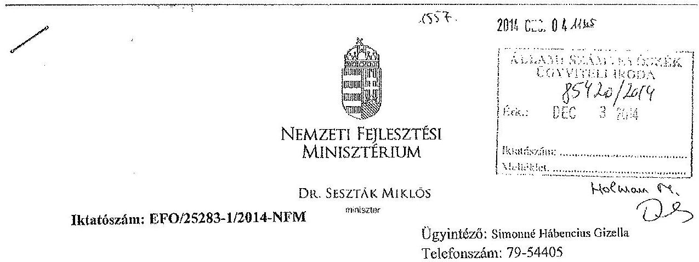

# Domokos László 

elnök
részére
Állami Számvevőszék

Budapest
Apáczai Csere János u. 10.
1052
Tárgy: Jelentéstervezet véleményezése

## Tisztelt Elnök Úr!

Köszönettel megkaptam a „Kormányzati Informatikai Fejlesztési Ügynökség gazdálkodásának és feladatellátásának ellenőrzéséről" szóló jelentéstervezetüket, melyre az alábbi észrevételeket teszem:

- A tervezet 12. oldalán kifogásként került megfogalmazásra az alapító okirat módosításának határideje, miszerint az 2010. augusztus 30-ig nem történt meg.

Ehhez kapcsolódóan jelzem, hogy az intézmény a Nemzetgazdasági Minisztériumtól (NGM) 2010. október 7-én került átvételre, (mint ahogy azt a rendelkezésre bocsátott dokumentumok is alátámasztják) így a 2010. augusztus 30-i alapító okirat elkészítése nem volt lehetséges. A Nemzeti Fejlesztési Minisztérium (NFM) 2010. augusztus 6-án felvette a kapcsolatot az NGM-el az intézmény átadás-átvételével kapcsolatban, illetve kapcsolattartó kijelölésére is sor került. Az NGM (késői) válasza után, szeptember 28-án vált lehetővé az átadás-átvétel előkészítésének megkezdése. Az intézmény 2010. október 7-i tényleges átvétele (PMISZK) után, valamint az NFM illetékes főosztályaival és a Magyar Államkincstárral (Kincstár) történt egyeztetés követően, 2010. október 29-én aláírásra és az NGM részére megküldésre került az alapító okirat. Az államháztartásért felelős miniszter jóváhagyása (többszöri érdeklődés után) 2010. december 17-én történt meg. Még aznap sor került a T01 Változás bejelentő lapok

---

Kincstár részére történő benyújtására is, így a Kincstár 2010. december 20-án bejegyezte az új alapító okiratot. Ezen dokumentumokat jelen levelemhez csatolom. A fentiek alapján kérem a megállapítás módosítását.

- Ugyanezen bekezdésen belül merült fel a hatályba lépések között a visszamenőleges, 2010. augusztus 15-i hatály problémaköre is. Ebben az esetben a Kincstár által megküldött tájékoztató levél alapján jártunk el, amelyet mellékletként szintén csatolok. Javaslom a megállapítás kiegészítő információk szerinti átdolgozását.
- A közfeladat ellátáshoz és az erőforrásokkal való hatékony gazdálkodáshoz számon kérhető követelmények és elvárások kialakításával, meghatározásával, valamint azok számonkérésével összefüggésben a 10. oldalon intézkedést igénylő megállapítás szerepel. Ehhez kapcsolódóan megjegyezzük, hogy az NFM Intézményfelügyeleti és Számviteli Főosztálya 2013. márciusában előírta az összes háttérintézménynek, hogy havonta adjanak számot a pénzügyi teljesítések, kötelezettségvállalások alakulásáról, valamint a felmerülő és megoldandó kérdésekről, táblázatos és szöveges elemzés formájában is. Ennek első teljesítése 2013. március 31-i hatállyal történt meg, és azóta havi rendszerességgel folyamatos. Ennek előírását levelem mellékleteként csatolom, és ez alapján kérem a megállapítás módosítását, valamint a nemzeti fejlesztési miniszter részére megfogalmazott javaslat törlését.

Általános megjegyzések a jelentéstervezethez:

- A tervezet 14. oldalán az SZMSZ-szel kapcsolatban az ellenőrzés kifogásolja, hogy a 2010. december 20-án hatályba lépett alapító okirat után az SZMSZ csak 2011. február 24-én került kihirdetésre. Ehhez kapcsolódóan jelezzük, hogy az SZMSZ aláírását megelőzi egy, a mindenkori NFM SZMSZ-ében foglalt, minisztériumi szintű egyeztetés (öt főosztály részvételével), amelynek eredményéről az intézmény visszajelzést kap az esetleges észrevételek átvezetése érdekében. Csak ezt követően indítható az SZMSZ tervezet aláírásra.
- Szintén a tervezet 14. oldalán jelzett SZMSZ észrevétellel kapcsolatban jegyezzük meg, hogy a 2013. márciusban (először) beküldött SZMSZ módosítás tervezet azért nem lépett hatályba 2013. évben, mert tartalmi okok miatt folyamatos egyeztetések történtek az intézménnyel, amelyeket végül 2014. évben sikerült lezárni.

Kérem az észrevételek szíves elfogadását és megjegyzéseink figyelembevételét a jelentés véglegesítése során.

Budapest, 2014. december „2 „
Melléklet: 2 db
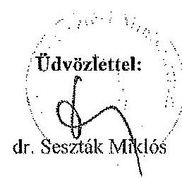

---

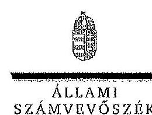

ELNÖK

SZÁMVEVŐSZÉK

Ikt. szám: V-0444-478/2014.

Dr. Seszták Miklós úr
miniszter
Nemzeti Fejlesztési Minisztérium

Budapest

Tisztelt Miniszter Úr!

A Kormányzati Informatikai Fejlesztési Ügynökség gazdálkodásának és feladatellátásának ellenőrzéséről készített számvevőszéki jelentéstervezetre tett észrevételeit köszönettel megkaptam.

Az Állami Számvevőszék észrevételekre vonatkozó álláspontjáról a felügyeleti vezető által készített részletes tájékoztatást csatoltan megküldöm.

Tájékoztatom Miniszter urat, hogy a jelentésben – az Állami Számvevőszékről szóló 2011. évi LXVI. törvény 29. § (3) bekezdése alapján – az el nem fogadott észrevételeket szerepeltetjük az elutasítás indokának feltüntetésével együtt. Az elfogadott észrevételeket a jelentés szövegezésénél figyelembe vesszük.

Budapest, 2014. 12. hó 15. nap

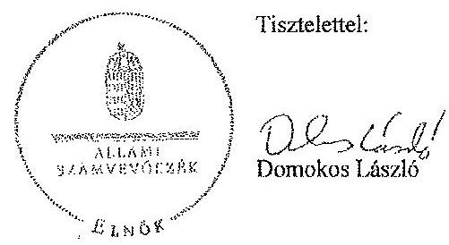

Melléklet: Tájékoztatás az elfogadott és az el nem fogadott észrevételekről

1052 BUDAPEST, APÁCZAI CSERE JÁNOS UTCA 10. 1364 Budapest 4. Pf. 54 telefon: 484 9181 fax: 484 9281

---

# Tájékoztatás az elfogadott és az el nem fogadott észrevételekről 

A Kormányzati Informatikai Fejlesztési Ügynökség gazdálkodásának és feladatellátásának ellenőrzéséről készített jelentéstervezetre az EFO/25283-1/2014-NFM iktatószámú levelében tett észrevételeit áttekintettük, azok kezeléséről az alábbi tájékoztatást adom.
A jelentéstervezet 12. oldal 3. bekezdésére, az alapító okiratra vonatkozó első észrevételét nem fogadtuk el. A jelentéstervezetben az 1136/2010. (VI. 29.) Korm. határozat 1.9. pontjában meghatározott határidőnek a késedelmes teljesítését állapítottuk meg, amely „előírja, hogy a jogutód minisztériumok 2010. augusztus 30-ig intézkedjenek a jogelőd fejezethez tartozó intézményeket és fejezeti kezelésű előirányzatokat érintően a törzskönyvi nyilvántartásban történő módosítások alapját jelentő dokumentumok összeállításáról és adatainak módosításáról".
A jelentéstervezet 12. oldal 3. bekezdésére, az alapító okirat módosítására vonatkozó második észrevételét nem fogadtuk el. A módosításkor hatályos, az államháztartásról szóló 1992. XXXVIII. törvény (a továbbiakban: Áht. ${ }_{1}$ ) 18/I. § (5) bekezdése szerint a költségvetési szerv alapító okiratának módosítása a bejegyzés napjával válik hatályossá, kivéve, ha törvény más időpontot, vagy az alapító okirat módosítására irányuló kérelem későbbi időpontot állapít meg. Tekintettel arra, hogy - a mellékelt ELN-1-1105/2010. iktatószámú, a Magyar Államkincstár tájékoztatóját is figyelembe véve - nincs olyan törvényi rendelkezés, amely a módosítás hatályba lépésére más időpontot állapított meg, az alapító okirat visszamenőleges hatályú módosítása nem felel meg az Áht. ${ }_{1}$ hivatkozott előírásának.
A jelentéstervezet 10. oldalán szereplő, a nemzeti fejlesztési miniszternek címzett javaslat törlésére vonatkozó észrevételét nem fogadtuk el. A Nemzeti Fejlesztési Minisztérium észrevételében jelzett beszámolási kötelezettség előírása - amely a belső kontrollrendszer monitoring eleme - nem tekinthető az Áht. ${ }_{1} 49 . \S$ (6) bekezdés d)-e) pontjában (2010.
 augusztus 15-ig), 49. § (5) bekezdés f) pontjában (2010. augusztus 15-tól), illetve az Áht. ${ }_{2} 9 . \S$ (1) bekezdés f) pontjában meghatározott, a közfeladat ellátásához és az erőforrásokkal való hatékony gazdálkodáshoz számon kérhető követelmény, elvárás meghatározásának, így azok érvényesítésére, számonkérésére és ellenőrzésére nem kerülhetett sor.
A jelentéstervezet 14. oldal 1. bekezdésére tett első észrevételét elfogadtuk, azt a jelentés szövegezésénél figyelembe vesszük.
A jelentéstervezet 14. oldal 1. bekezdésére tett második észrevételét nem fogadtuk el. Az ellenőrzött időszak vége 2013. december 31-e volt. A jelentéstervezetben tényként állapítottuk meg, hogy a 2013. évben benyújtott SZMSZ módosítást nem hagyták jóvá a 2013. évben. Örömmel vettem azonban, hogy 2014-ben az SZMSZ jóváhagyásra került.

Budapest, 2014. 12. hó 15 nap
Holman Magdolna
felügyeleti vezető

---

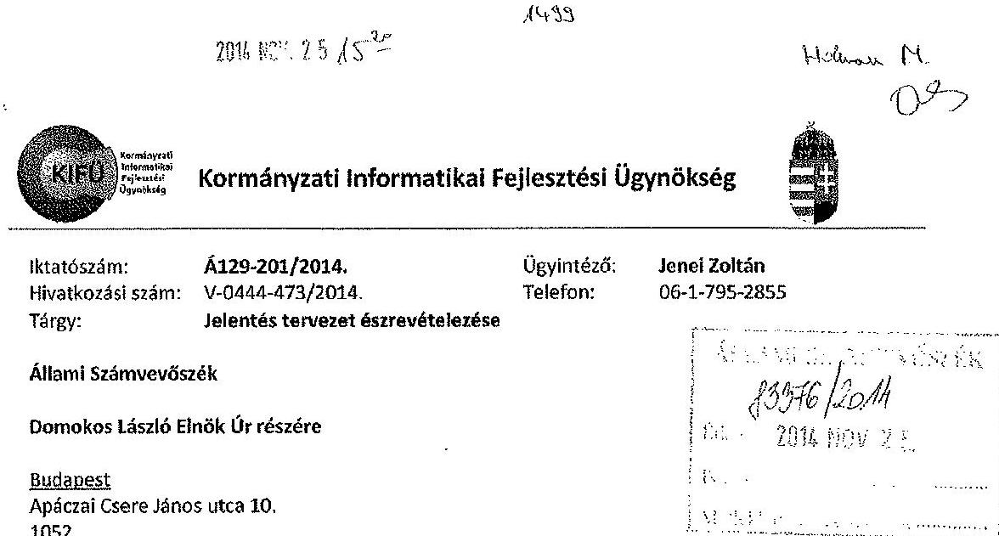

# Tisztelt Elnök Úr! 

A 2014. november 10-én kézhez vett, a „KIFÜ ellenőrzése - A Kormányzati Informatikai Fejlesztési Ügynökség gazdálkodásának és feladat ellátásának ellenőrzése" címú számvevőszéki ellenőrzési jelentéstervezettel kapcsolatban az alábbiakról tájékoztatom.

Biztató számomra, hogy a megállapítások szerint a KIFÜ alapvetően szabályszerűen működik, biztosítja a költségvetési egyensúlyt, betartja a beszerzési eljárásokra, vagyongazdálkodásra vonatkozó előírásokat.

Igaz ez akkor is, ha a megállapítások között találhatóak olyanok, melyeket részletesen elemeznünk és mielőbb javítanunk kell.

A hiányosságok értékelése során megnyugtató volt, hogy azok túlnyomó többsége az ellenőrzési időszak elejére tehető, és gazdálkodásunkban, feladatellátásunkban az évek során folyamatos, fokozatos javulás állapítható meg.

Ettől függetlenül az észrevételek egy részének kijavítása, a belső szabályozottság további fokozása érdekében már az ellenőrzés időszaka alatt, illetve azt követően az alábbi intézkedéseket hoztam.

1. A megállapításban szereplő kockázatkezelési rendszer kialakításával és működtetésével kapcsolatban jelezni szeretném, hogy az ellenőrzés által feltártakra is figyelemmel, a KIFÜ 2014. szeptembertől a kockázatkezelési rendszerét módosította, egységesítette. Kiadásra került az új kockázatkezelési szabályzat, mely alapján történik a kockázatok azonosítása, elemzése, rangsorolása, kezelése és a kapcsolódó feladatok végrehajtásának nyomon követése.
2. Szintén az ellenőrzés által feltártakra figyelemmel, a belső kontrollrendszer erősítése érdekében 2014. október 11-ei hatályba lépéssel kiadásra került a KIFÜ szakmai eljárásrendjéről, a Projekt Menedzsment Szolgáltató (PMSZ) rendszer, a Költségmenedzsment modul használatáról és a KIFÜ Tudóstárról szóló KIFÜ utasítás.
3. Az átadott kinevezési okiratokon, azok módosításain az ellenjegyzés, pénzügyi ellenjegyzés jellemzően valóban nem voltak megtalálhatóak, melynek oka, hogy nem az ezt is tartalmazó példányok kerültek átadásra. Ennek kapcsán utasítottam az érintett területeket, hogy a továbbiakban ezen iratok minden példányán szerepeltetni kell az ellenjegyzést is.

Kormányzati Informatikai Fejlesztési Ügynökség
Cím: 1011 Budapest, Hőköla utca 13.; Levelezési cím: 1255 Budapest, Pf.: 182.
telefon: +36(1)795-2871; +36(1)795-2861, fax: +36(1)795-0036
www.kifu.gov.hu; info@kifu.gov.hu

---

A szabályzatok, illetve a végrehajtásukkal kapcsolatos dokumentációk az Állami Számvevőszék későbbi utóellenőrzése során rendelkezésre állnak.

A tervezetben szereplő megállapításokkal kapcsolatos véleményünket, módosítási javaslatainkat levelem melléklete tartalmazza, kérem, hogy azokat a végleges jelentés összeállításánál figyelembe venni szíveskedjék.

Köszönöm Önnek és munkatársainak az ellenőrzés lefolytatása során mutatott konstruktív hozzáállást és az alapvetően jobbító szándékú, korrekt megállapításokat.

Budapest, 2014. november „Ah."
Tisztelettel:
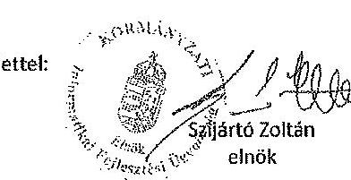

---

# I. A jelentés tervezet törzsszövegéhez kapcsolódó észrevételek 

1. A jelentés 7. oldalának 4. bekezdés első mondatában szerepel a „leltározási és leltárkészítési" szabályzattal kapcsolatos hiányosságokra való utalás. A jelentés további részében - 21., 26-27. oldal - az érintett szabályozás kapcsán hiányosság nem került megfogalmazásra.

Kérném ezért a jelentéstervezet 7. oldalának 4. bekezdés első mondatából a „leltározási és leltárkészítési" szövegrészt elhagyni.
2. A szervezet elnöke 2010-ben a 81-1/2010. (II. 15.) PMISZK utasításban meghatározott szervezeti egység megnevezések figyelembe vételével, azzal összhangban adta ki a 81-2/2010. (II. 16.) PMISZK utasítást. Ez által vált biztosítottá, az akkor már hatályba lépett SZMSZ-ben szereplő szervezeti egység megnevezéseknek a többi hatályos belső utasításban történő átvezetése.

Ennek figyelembe vételével javaslom a következők szerint módosítani

- a jelentéstervezet 8. oldalának 1. bekezdés utolsó mondatát
„....illetve elnök! utasítással módosította a 2010-ben miniszteri jóváhagyást követően hatályba lépett SZMSZ-ben szereplő szervezeti egységek megnevezésével összhangban a hatályos belső szabályozó eszközökben meghatározott szervezeti egység megnevezéseket."
- a jelentéstervezet 27. oldalának 2. bekezdés 2. utolsó mondatát
„A KIFÜ elnöke 2010-ben - a 81-1/2010. (II. 15.) PMISZK utasításban meghatározott szervezeti egység megnevezések figyelembe vételével, azzal összhangban - a 81-2/2010. (II. 16.) PMISZK utasítással az akkor hatályban lévő utasításokban szereplő szervezeti egység megnevezéseket egységesen módosította."

3. A jelentéstervezet 12. oldalának 3. bekezdés első mondatát javaslom a következők szerint módosítani:
„....harmadik alkalommal 2010. január 1-jei hatállyal módosította (8052/1/2009, 18563/6/2009)."

## II. A jelentés tervezet mellékleteihez és függelékeihez kapcsolódó észrevételek

1. A 2. sz. mellékletben a következő pontosításokat kérném:
2009. év megnevezésű oszlopban
2. sor „8052/1/2009 Alapító Okirat (kelt: 2009. május 29., hatályos: 2009. július 1-jétől)"
2. év megnevezésű oszlopban
3. sor „NFM/5928/16/2010 Alapító Okirat (kelt: 2010. október 29.)"
4. sor „...a Kormány vagy az irányító miniszter által kijelölt európai uniós..."
5. sor „...a Kormány vagy az irányító miniszter által meghatározott költségvetési forrásból..."

A „2010. év" elnevezésű oszlop utolsó sora a 2011. január 5-én kelt NFM/5928/23/2010 számú alapító okiratban jelent meg, ezért javasoljuk annak elhagyását.
2. A 2. sz. függelékét a projektgazda és a projektmenedzsment szócikkek azonos forrásból történő hivatkozása érdekében, javaslom a következők szerint módosítani:

---

projektgazda EU-s finanszirozás esetén a projektterv IH-nak való benyújtásától a projekt lezárásig tartó időszakban a projekttervet önállóan benyújtó és megvalósító szervezet, vagy konzorcium esetében a konzorcium vezetője. (Farrós: Általános Informatikai Projektmenedzsment Eljárásrend Kormányzati Informatikai Fejlesztési Ügynökség, 2014, fellelhető:
www.kifu.gov.hu/kifu/sites/default/files/KIFU_Általános_Informatikai_Projektmenedzsment_eljárásrend__v2.0_0.pdf

---

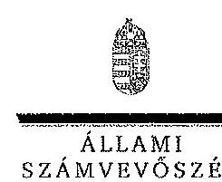

ELNÖK

Ikt. szám: V-0444-479/2014.

# Szijártó Zoltán úr 

elnök
Kormányzati Informatikai Fejlesztési Ügynökség

## Budapest

## Tisztelt Elnök Úr!

A Kormányzati Informatikai Fejlesztési Ügynökség gazdálkodásának és feladatellátásának ellenőrzéséről készített számvevőszéki jelentéstervezetre tett észrevételeit köszönettel megkaptam.

Az Állami Számvevőszék észrevételekre vonatkozó álláspontjáról a felügyeleti vezető által készített részletes tájékoztatást csatoltan megküldöm.

Tájékoztatom Elnök urat, hogy az elfogadott észrevételeket a jelentés szövegezésénél figyelembe vesszük.

Budapest, 2014. 13. hó 15. nap
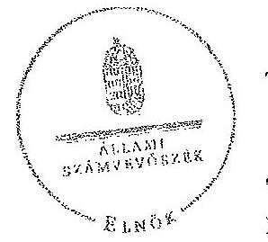

Tisztelettel:

## Deo $1 / 4$

Domokos László

Melléklet: Tájékoztatás az elfogadott észrevételekről

---

# Tájékoztatás 

## az elfogadott észrevételekről

A Kormányzati Informatikai Fejlesztési Ügynökség gazdálkodásának és feladatellátásának ellenőrzéséről készített jelentéstervezetre az Á129-201/2014. iktatószámú levelében tett észrevételeit áttekintettük, azok kezeléséről az alábbi tájékoztatást adom.

A jelentéstervezethez tett 1-4. számú észrevételeit elfogadtuk, azokat a jelentés szövegezésénél figyelembe vesszük.

A jelentéstervezethez tett 5. számú, a 2. számú függeléket érintő észrevételét elfogadtuk azzal, hogy a fogalmi meghatározásoknál az Általános Informatikai Projektmenedzsment eljárásrend 2.0 verziójában (2013.05.19-ei keltezésű) meghatározott kifejezéseket használjuk mind a projektgazda, mind a projektmenedzsment fogalmaknál.

Budapest, 2014. 12. hó 15. nap
Holman Magdolna
felügyeleti vezető

---

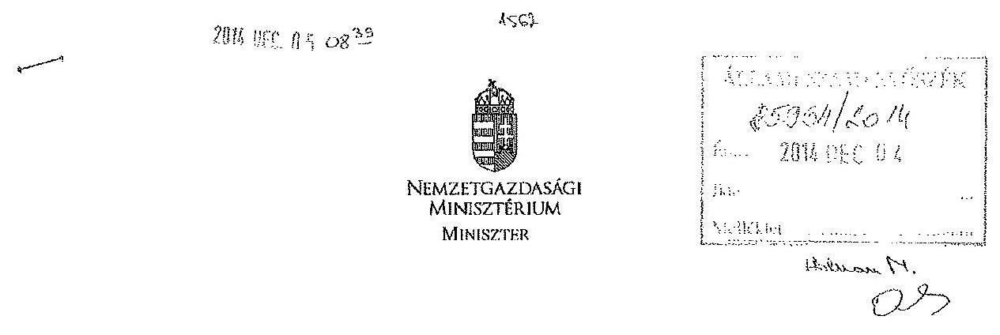

Domonkos László úr részére elnök

Állami Számvevőszék

Budapest
Apáczai Csere János utca 10. 1052

Iktatószám: NGM/28738/3/2014
Ügyintéző: Bognár Kinga
Telefon: 374-2743
Tárgy: a KIFÜ gazdálkodásának és feladatellátásának ellenőrzése

# Tisztelt Elnök Úr! 

Az Állami Számvevőszék „a Kormányzati Informatikai Fejlesztési Ügynökség gazdálkodásának és feladatellátásának ellenőrzése" tárgyában elkészített ellenőrzési jelentését köszönettel megkaptam.

A jelentésben foglaltakra észrevételt nem teszek.
Budapest, 2014. december „ol"

Üdvözlettel:
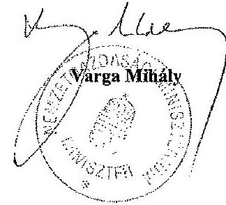

---

.

---

# RÖVIDÍTÉSEK JEGYZÉKE 

## Törvények

| Áht ${ }_{1}$. | Az államháztartásról szóló 1992. évi XXXVIII. törvény |
| :--: | :--: |
| Áht. 2 | Az államháztartásról szóló 2011. évi CXCV. törvény |
| ÁSZ tv. | Az Állami Számvevőszékről szóló 2011. évi LXVI. törvény |
| Jat. 1 | A jogalkotásról szóló 1987. évi XI. törvény |
| Jat. ${ }_{2}$ | A jogalkotásról szóló 2010. évi CXXX. törvény |
| Kbt $_{1}$ | A közbeszerzésekről szóló 2003. évi CXXIX. törvény |
| $\mathrm{Kbt}_{2}$ | A közbeszerzésekről szóló 2011. évi CVIII. törvény |
| Kt. | A költségvetési szervek jogállásáról és gazdálkodásáról szóló 2008. évi CV. törvény |
| Kvtv. | A mindenkori költségvetési törvény |
| Számv. tv. | A számvitelről szóló 2000. évi C. törvény |
| 2010. évi XLII. törvény | A Magyar Köztársaság minisztériumainak felsorolásáról |
| Kormányrendeletek |  |
| Áhsz. | Az államháztartás szervezeti beszámolási és könyvvezetési kötelezettségének sajátosságairól szóló 249/2000. (XII. 24.) Korm. rendelet |
| Ámr. 1 | Az államháztartás működési rendjéről szóló 217/1998. (XII. 30.) Korm. rendelet |
| Ámr. 2 | Az államháztartás működési rendjéről szóló 292/2009. (XII. 19.) Korm. rendelet |
| Ávr. | Az államháztartásról szóló törvény végrehajtásáról szóló 368/2011. (XII. 31.) Korm. rendelet |
| Ber. | A költségvetési szervek belső ellenőrzéséről szóló 193/2003. évi (XI. 26.) Korm. rendelet |
| Bkr. | A költségvetési szervek belső kontrollrendszeréről és belső ellenőrzéséről szóló 370/2011. (XII. 31.) Korm. rendelet |
| 168/2004. (V. 25.) Korm. rendelet | A központosított közbeszerzési rendszerről, valamint a központi beszerző szervezet feladat- és hatásköréről |
| 255/2006. (XII. 8.)   Korm. rendelet | A 2007-2013 programozási időszakban az Európai Regionális Fejlesztési Alapból, az Európai Szociális Alapból és a Kohéziós Alapból származó támogatások felhasználásának alapvető szabályairól és felelős intézményeiről |
| 222/2009. (X. 14.) Korm. rendelet | Az elektronikus közszolgáltatás működtetéséről |
| 223/2009. (X. 14.) Korm. rendelet | Az elektronikus közszolgáltatás biztosításáról |
| 212/2010. (VII. 1.)   Korm. rendelet | Az egyes miniszterek, valamint a Miniszterelnökséget vezető államtitkár feladat- és hatásköréről |
| 268/2010. (XII. 3.) | A Kormányzati Informatikai Fejlesztési Ügynökségről |

---

Korm. rendelet
4/2011. (I. 28.) Korm. rendelet

46/2011. (III. 25.) Korm. rendelet
83/2012. (IV. 21.) Korm. rendelet
84/2012. (IV. 21.) Korm. rendelet

A 2007-2013 programozási időszakban az Európai Regionális Fejlesztési Alapból, az Európai Szociális Alapból és a Kohéziós Alapból származó támogatások felhasználásának rendjéről
A közbeszerzések központi ellenőrzéséről
A szabályozott elektronikus ügyintézési szolgáltatásokról és az állam által kötelezően nyújtandó szolgáltatásokról
Egyes, az elektronikus ügyintézéshez kapcsolódó szervezetek kijelöléséről

# Miniszteri rendeletek 

2/2010. (VI. 8.) KIM rendelet

Az egyes állami szervek és állami tulajdonú, valamint egyéb szervezetek átadás-átvételi eljárásáról

## Miniszteri utasítások

48/2011. (X. 21.) NFM Miniszteri biztos kinevezéséről utasítás

## Kormányhatározatok

1136/2010. (VI. 29.)
Korm. határozat

1316/2011. (IX. 19.)
Korm. határozat
1468/2012. (X.26.)
Korm. határozat)

## KIFÜ utasítások

30/2011. (IX. 19.) KIFÜ utasítás
31/2011. (IX. 19.) KIFÜ utasítás

## Szórövidítések

1AVAM
ACM
ASP
ÁROP
ÁSZ
E-Fiz
EFER
EKOP
EU

A Magyar Köztársaság minisztériumainak felsorolásáról szóló 2010. évi XLII. törvény 4. §-ának (2) bekezdéséből eredő egyes feladatok végrehajtásáról
A 2011. évi költségvetési egyensúlyt megtartó intézkedésekről szóló 1316/2011. (IX. 19.) Korm. határozat
A GSM-R nagyprojekt állami felügyelő mérnöki feladatairól szóló 1468/2012. (X.26.) Korm. határozat

A Projekt-felügyeleti és Stratégiai Osztály Ügyrendje
A Fejlesztésekért felelős elnökhelyettes alárendeltségébe tartozó szervezeti egységek ügyrendjéről

Egyablakos vámügyintézés megvalósítása
Adóalany centrikus adatszolgáltatási modell megvalósítása
Önkormányzati ASP központ felállítása
Államreform Operatív Program
Állami Számvevőszék
Elektronikus fizetés megvalósítása
Elektronikus Fizetési és Elszámolási Rendszer
Elektronikus Közigazgatás Operatív Program
Európai Unió

---

| EU Bizottság | Európai Bizottság |
| :--: | :--: |
| EUTAF | Európai Támogatásokat Auditáló Főigazgatóság |
| FAIR | Fejlesztéspolitikai Adatbázis és Információs Rendszer (a Fejlesztéspolitika egységes informatikai támogatása projekthez kapcsolódóan) |
| Ft | Forint |
| GSM-R | Egységes Európai Vasúti Rádióhálózat |
| IKM | Intézményi Könyvelési Modul |
| INTOSAI | „International Organization of Supreme Audit Institutions", Legfőbb Ellenőrző Intézmények Nemzetközi Szervezete |
| ISSAI | „International Standards of Supreme Audit Institutions", a Legfőbb Ellenőrző Intézmények Nemzetközi Szervezete által kiadott ellenőrzési standardok |
| KEHI | Kormányzati Ellenőrzési Hivatal |
| KGR | Költségvetési gazdálkodási rendszer |
| KIFÜ | Kormányzati

 Informatikai Fejlesztési Ügynökség, 2006. október 1-től 2010. december 3-ig Pénzügyminisztérium Informatikai Szolgáltató Központ. |
| KIM | Közigazgatási és Igazságügyi Minisztérium |
| Kincstár | Magyar Államkincstár |
| Kvtv. | Költségvetési törvény |
| M Ft | Millió forint |
| MOHU | Magyarország.hu portál tartalomfejlesztése |
| Mrd Ft | Milliárd forint |
| NFM | Nemzeti Fejlesztési Minisztérium |
| NGM | Nemzetgazdasági Minisztérium |
| PAD | Projekt alapító dokumentum |
| PM | Pénzügyminisztérium |
| PMISZK | Pénzügyminisztérium Informatikai Szolgáltató Központ |
| PMSZ | Projektmenedzsment szolgáltatás |
| SZEÜSZ | szabályozott elektronikus ügyintézési szolgáltatás |
| SZMSZ | Szervezeti és Működési Szabályzat |
| TÉBA | Családtámogatási ellátások folyósításának korszerűsítése |
| ÚMFT | Új Magyarország Fejlesztési Terv |

---

.

---

# ÉRTELMEZŐ SZÓTÁR 

belső kontrollrendszer
ellenőrzési nyomvonal
előírázat-módosítás
európai uniós forrás

A belső kontrollrendszer a költségvetési szerv által a kockázatok kezelésére és tárgyilagos bizonyosság megszerzése érdekében kialakított folyamatrendszer, amely azt a célt szolgálja, hogy a költségvetési szerv megvalósítsa a következő fő célokat: a tevékenységeket (műveleteket) szabályszerűen, valamint a megbízható gazdálkodás elveivel (gazdaságosság, hatékonyság és eredményesség) összhangban hajtsa végre; teljesítse az elszámolási kötelezettségeket; megvédje a szervezet erőforrásait a veszteségektől (károktól) és a nem rendeltetésszerű használattól. (Forrás: Áht ${ }_{1} 120 /$ B § (1), hatályos: 2009. január 1-jétől 2011. december 31-ig)
A belső kontrollrendszer a kockázatok kezelése és tárgyilagos bizonyosság megszerzése érdekében kialakított folyamatrendszer, amely azt a célt szolgálja, hogy megvalósuljanak a következő célok: a működés és gazdálkodás során a tevékenységeket szabályszerűen, gazdaságosan, hatékonyan, eredményesen hajtsák végre, az elszámolási kötelezettségeket teljesítsék, és megvédjék az erőforrásokat a veszteségektől, károktól és nem rendeltetésszerű használattól. (Forrás: Áht ${ }_{2} 69 . \S$ (1) bek., hatályos: 2012. január 1-jétől)
Az ellenőrzési nyomvonal a költségvetési szerv működési folyamatainak szöveges vagy táblázatba foglalt, vagy folyamatábrákkal szemléltetett leírása, amely tartalmazza különösen a felelősségi és információs szinteket és kapcsolatokat, továbbá irányítási és ellenőrzési folyamatokat, lehetővé téve azok nyomon követését és utólagos ellenőrzését. (Forrás: Ámr ${ }_{1} 145 /$ B. § (1) bek., hatályos 2010. január 1-jéig, további időszakokra forrás: NGM honlapjáról elérhető Belső Kontroll kézikönyv PM 2010. 35. oldal)

Az előirányzat-módosítás a költségvetési szerv költségvetésének kiadási, illetve bevételi főösszegét és kiemelt előirányzatait is érintő előirányzat-növelés vagy csökkentés. (Forrás: Áht ${ }_{1}$ 97. § (2) bek., hatályos: 2010. augusztus 14-ig)
Előirányzat-módosítás: a megállapított kiadási, bevételi, támogatási kiemelt előirányzat, létszám-előirányzat növelése vagy csökkentése. (Forrás Áht ${ }_{1} 2 / \mathrm{A} \S$ (3) k) pont, hatályos: 2011. december 31-ig)
Előirányzat-módosítás: a megállapított kiadási előirányzat növelése vagy csökkentése, a bevételi előirányzatok egyidejű növelése vagy csökkentése mellett. (Forrás: Áht ${ }_{2}$ 2. § (1) bek. f) pont, hatályos: 2012. január 1-jétől).
Az Európai Unió költségvetéséből, az Európai Gazdasági

---

intézkedési terv
irányító szerv
monitoring
projekt
projektgazda
projektmenedzsment

Térség Európai Unión kívüli tagállamának költségvetéséből, valamint a Svájci Hozzájárulás programból származó forrás. (Forrás: Áht.; 2/A. § (1) bek. j) pont), hatályos 2011. december 31-ig, továbbá azonos fogalom Áht. 2 2. § (1) bek. g) pont, hatályos 2012. január 1-jétől)

Az ellenőrzési javaslatok alapján az ellenőrzött szervezet, szervezeti egység által készített intézkedések végrehajtásának ütemezése a végrehajtásáért felelős személyek és a vonatkozó határidők megjelölésével. (Forrás: 370/2011. (XII. 31.) Korm. rendelet 2. § (k) pontja, hatályos 2012. január 1-jétől)
A központi alrendszer egyes intézményével és annak gazdálkodásával kapcsolatos irányítási jogokkal felruházott szerv vagy személy.
A monitoring a különböző szintű szervezeti célok megvalósításának folyamatát kíséri figyelemmel, melynek során a releváns eseményekről és tevékenységekről (együtt: folyamatokról) rendszeres jelleggel, strukturált, döntéstámogató információkhoz jutnak a szervezet vezetői. (NGM útmutató a költségvetési szervek monitoring rendszeréhez 3. oldal, 2011. november)
A költségvetési szerv vezetője köteles olyan monitoring rendszert működtetni, mely lehetővé teszi a szervezet tevékenységének, a célok megvalósításának nyomon követését. (Forrás: Ámr 160 . §, hatályos: 2010. január 1-jétől 2011. december 31.)

A 1083/2006/EK tanácsi rendelet 2. cikk 3. pontjában meghatározott művelet. (Forrás: 4/2011. (I. 28.) Korm. rendelet 2. § (1) bekezdés 22. pontja)
Művelet a 1083/2006/EK tanácsi rendelet 2. cikk 3. pontja szerint: az érintett operatív program irányító hatósága által vagy hatáskörében a monitoring bizottság által megállapított kritériumoknak megfelelően kiválasztott projekt vagy projektcsoport, amelyet egy vagy több kedvezményezett hajt végre oly módon, hogy megvalósíthatóvá váljanak a kapcsolódó prioritási tengely céljai.
EU-s finanszírozás esetén a projektterv IH-nak való benyújtásától a projekt lezárásig tartó időszakban a projekttervet önállóan benyújtó és megvalósító szervezet, vagy konzorcium esetében a konzorcium vezetője. (Forrás: Általános Informatikai Projektmenedzsment Eljárásrend Kormányzati Informatikai Fejlesztési Ügynökség, fellelhető:
ww.kifu.gov.hu/kifu/sites/default/files/KIFU_Általá-nos_Informatikai_Projektmenedzsment_eljárásrend__v2.0 _0.pdf)
A projekt tevékenységeinek végrehajtása során a tudás, az eszközök és technikák alkalmazása a projekt céljának és követelményeinek teljesítése céljából. (Forrás: Általá-

---

nos Informatikai Projektmenedzsment Eljárásrend Kormányzati Informatikai Fejlesztési Ügynökség, fellelhető: ww.kifu.gov.hu/kifu/sites/default/files/KIFU_Általá-nos_Informatikai_Projektmenedzsment_eljárásrend__v2.0 _0.pdf)
zárolás
A zárolás az előirányzat egy része vagy egésze adott költségvetési évi felhasználásának időleges, feltételhez kötött korlátozása, felfüggesztése. (Forrás: Áht. 12. § (8) bek., majd 2010. január 1-jétől Áht. 12. § (12) bek., hatályos: 2011. december 31-ig)

Zárolás a kiadási előirányzatok felhasználásának időlegesen, feltételhez kötötten történő korlátozása, felfüggesztése (Forrás Áht. 2. 2. § (1) q) pont, hatályos: 2012. január 1-jétől, majd Áht. 2. 2. § (1) s) pont, hatályos: 2013. január 1-jétől)

