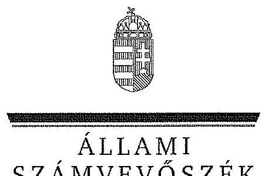
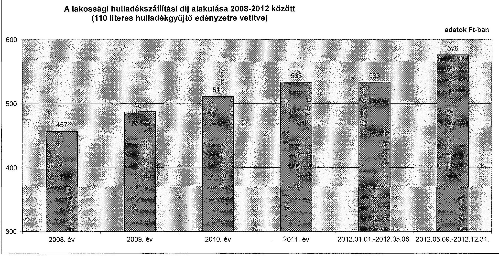
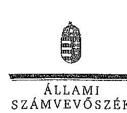
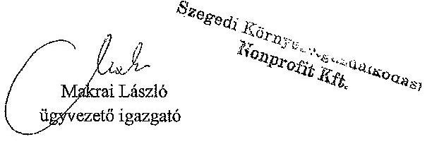
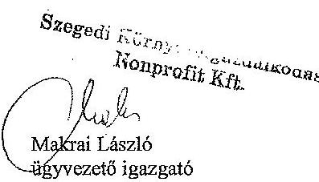

ÁLLAMI
SZÁMVEVŐSZÉK

# JELENTÉS 

Az önkormányzatok gazdasági társaságai - Az önkormányzatok többségi tulajdonában lévő gazdasági társaságok közfeladat-ellátását érintő gazdálkodási tevékenysége szabályszerűségének ellenőrzése Szegedi Környezetgazdálkodási Nonprofit Kft.

---

# Állami Számvevőszék 

Iktatószám: V-0470-173/2014.
Témaszám: 1504.
Vizsgálat-azonosító szám: V067104

## Az ellenőrzést felügyelte:

Dr. Horváth Margit
felügyeleti vezető
Az ellenőrzés vezette és a végrehajtásáért felelős:
Klinga László
ellenőrzésvezető
Az összefoglaló jelentést készítette:
Bartolák Márta
számvevő főtanácsos
Az ellenőrzést végezték:
Dr. Lits József
okleveles könyvvizsgáló,
külső szakértő

Jeszenkovits Tamás
okleveles könyvvizsgáló,
külső szakértő

## Szakál Pálné

okleveles könyvvizsgáló, külső szakértő

A témához kapcsolódó eddig készített számvevőszéki jelentések:
címe
sorszáma
Jelentés Szeged Megyei Jogú Város Önkormányzata pénzügyi helyzetének ellenőrzéséről (43/3)

---

# TARTALOMJEGYZÉK 

BEVEZETÉS ..... 9
I. ÖSSZEGZŐ MEGÁLLAPÍTÁSOK, KÖVETKEZTETÉSEK, JAVASLATOK ..... 13
II. RÉSZLETES MEGÁLLAPÍTÁSOK ..... 19

1. Az Önkormányzat közfeladat-ellátásának szabályszerűsége ..... 19
1.1. A közfeladat-ellátás megszervezése és a feladatellátás feltételrendszerének kialakítása ..... 19
1.2. A közfeladat-ellátás felügyelete és a tulajdonosi jogok érvényesítése ..... 22
2. Az SZK Nkft. közfeladat-ellátással kapcsolatos tevékenysége ..... 26
2.1. Az SZK Nkft. gazdálkodásának szabályozottsága ..... 26
2.2. Az SZK Nkft. vagyongazdálkodása és vagyonnyilvántartása ..... 28
2.3. A beszámolási kötelezettség teljesítése ..... 31
3. A hulladékgazdálkodás közfeladata bevételei és ráfordításai elszámolásának és önköltségszámításának szabályszerűsége ..... 32
3.1. A hulladékgazdálkodás közfeladat bevételeinek és ráfordításainak szabályszerűsége ..... 32
3.2. Az önköltségszámítás szabályszerűsége ..... 34
4. Az ÁSZ korábbi, az önkormányzatok többségi tulajdonában lévő gazdasági társaságok közfeladat-ellátását, gazdálkodását, pénzügyi helyzetét érintő javaslataira tett intézkedések ..... 35
4.1. Az Önkormányzat intézkedési terve és annak hasznosulása ..... 35

## MELLÉKLETEK

1. számú Az SZK Nkft. tevékenységének év végi főbb adatai
2. számú Az SZK Nkft. működésének év végi főbb jellemzői
3. számú A lakossági hulladékszállítási díj alakulása 2008-2012 között
4. számú Beérkezett észrevételek és az azokra adott válaszok

## FÜGGELÉKEK

1. számú Mintavételi eljárások ellenőrzési területenként

---

.

---

# RÖVIDÍTÉSEK JEGYZÉKE 

## Törvények

Áht.
Civil tv.
Ebktv.
Gt. tv.
Hgt. 1
Hgt. 2

Mötv.

Nvtv.
Ötv.

Számv. tv.
Tao. tv.

## Rendeletek

Áhsz.

Ávr.
SZMSZ $_{1}$

SZMSZ $_{2}$
vagyongazdálkodási rendelet

224/2004. (VII. 22.) Korm. rendelet
az államháztartásról szóló 2011. évi CXCV. törvény
2011. évi CLXXV. törvény az egyesülési jogról, a közhasznú jogállásról (hatályos: 2011. december 14-től)
az egyenlő bánásmódról és az esélyegyenlőség előmozdításáról szóló 2003. évi CXXV. törvény
a gazdasági társaságokról szóló 2006. évi IV. törvény (hatálytalan: 2014. március 15-étől)
a hulladékgazdálkodásról szóló 2000. évi XLIII. törvény (hatálytalan: 2013. január 1-jétől)
a hulladékról szóló 2012. évi CLXXXV. törvény (hatályos: 2013. január 1-jétől, kivéve a 95. § (6) bekezdése, ami 2015. január 1-jén lép hatályba)

Magyarország helyi önkormányzatairól szóló 2011. évi CLXXXIX. törvény (hatályos: 2012. január 1-jétől, kivéve a 144. § (2) bekezdésben meghatározott paragrafusok, amelyek 2012. április 15-én, a (3) bekezdésben meghatározott paragrafusok, amelyek 2013. január 1-jén léptek hatályba, a (4) bekezdésben meghatározott paragrafusok a 2014. évi általános önkormányzati választások napján lépnek hatályba)
nemzeti vagyonról szóló 2011. évi CXCVI. törvény
a helyi önkormányzatokról szóló 1990. évi LXV. törvény (hatálytalan: a 2014. évi általános önkormányzati választások napjától)
a számvitelről szóló 2000. évi C. törvény
a társasági adóról és az osztalékadóról szóló 1996. évi LXXXI. törvény
az államháztartás szervezetei beszámolási és könyvvezetési kötelezettségének sajátosságairól szóló 249/2000. (XII. 24.) Korm. rendelet
az államháztartásról szóló törvény végrehajtásáról szóló 368/2011. (XII. 31.) Korm. rendelet
Szeged Megyei Jogú Város Önkormányzatának 23/1995. (VI. 16.) számú rendelete az Önkormányzat Szervezeti és Működési Szabályzatáról (hatályos: 1995. június 16-tól)
Szeged Megyei Jogú Város Önkormányzatának 30/2010. (XI. 02.) számú rendelete az Önkormányzat Szervezeti és Működési Szabályzatáról (hatályos 2010. november 2-től)
Szeged Megyei Jogú Város Önkormányzata vagyona feletti rendelkezési jog gyakorlásának szabályairól szóló, többször módosított 25/2003. (VI. 27.) számú rendelete (hatályos 2003. július 1-jétől)
a hulladékkezelési közszolgáltató kiválasztásáról és a köz-

---

Korm. rendelet
53/2004. (XI. 30.) számú önkormányzati rendelet
64/2008. (III. 28.) Korm. rendelet

## Szórövidítések

Alapító Okirat
áfa
ÁSZ
EU
FB

ISPA

Javadalmazási szabályzat$_{1}$
Javadalmazási szabályzat$_{2}$
jegyző

Közgyűlés

Közszolgáltatási szerződés

Közszolgáltatási szerződés

NAV
Önkormányzat
polgármester
SZK Nkft.
SZK Nkft. SZMSZ$_{1}$
szolgáltatási szerződésről (hatálytalan: 2013. szeptember 5-étől)
az egyes helyi közszolgáltatások ellátásáról szóló 53/2004. (XI. 30.) számú önkormányzati rendelet
a települési hulladékkezelési közszolgáltatási díj megállapításának részletes szakmai szabályairól (hatályos: 2008. április 1-jétől)
a Szegedi Környezetgazdálkodási Nonprofit Kft. Alapító Okirata és annak módosításai
általános forgalmi adó
Állami Számvevőszék
Európai Unió
Szegedi Környezetgazdálkodási Nonprofit Kft. Felügyelőbizottsága
az infrastrukturális és környezetvédelmi beruházások támogatására szolgáló előcsatlakozási alap
a Közgyűlés 1054/2003. (XII. 19.) számú határozata a Javadalmazási szabályzatról
a Közgyűlés 31/2010. (II. 19.) számú határozata a Javadalmazási szabályzatról (hatályos: 2010. március 16-ától) Szeged Megyei Jogú Város Önkormányzatának címzetes főjegyzője
Szeged Megyei Jogú Város Önkormányzatának Közgyűlése
az Önkormányzat és az SZK Nkft. között a hulladékgazdálkodási feladatok ellátására 2007. április 6-án megkötött közszolgáltatási szerződés
az Önkormányzat és az SZK Nkft. között a hulladékgazdálkodási feladatok ellátására 2009. október 21-től hatályos Közszolgáltatási szerződés helyi közszolgáltatásra és ISPA vagyon működtetésére
Nemzeti Adó és Vámhivatal
Szeged Megyei Jogú Város Önkormányzata
Szeged Megyei Jogú Város Önkormányzatának Polgármestere
Szegedi Környezetgazdálkodási Nonprofit Korlátolt Felelősségű Társaság
az SZK Nkft. 2005. június 16-án hatályba léptetett Szervezeti és Működési Szabályzata (hatályos 2008. szeptember 30-ig)

---

# ÉRTELMEZŐ SZÓTÁR 

divízió
gazdasági társaság
komfortlevél
közfeladat
közszolgáltatás
közszolgáltatási szerződés tartalmi elemei

Az ellátott feladatok alapján kialakított szervezeti egység, amely felelős a hozzá rendelt feladatok ellátásáért, és a tevékenység jellegétől függően a költségek optimalizálásáért, illetve a bevételek maximalizálásáért. A divíziók nem önállóak a beszerzésben és a stratégiai, érdekeltségi kérdésekben, valamint az egymás közötti együttműködési szabályok kialakításában
Gt. tv. 3. § (1) bekezdése szerint „gazdasági társaságot üzletszerű közös gazdasági tevékenység folytatására külföldi és belföldi természetes és jogi személyek, valamint jogi személyiség nélküli gazdasági társaságok alapíthatnak, működő társaságba tagként beléphetnek, társasági részesedést (részvényt) szerezhetnek."
Az adós gazdasági társaság tulajdonosai olyan kötelezettséget vállalnak, amely a kezességre hasonlít. Lényege, hogy a komfortlevelet adó cég biztosítsa a bankot afelől, hogy az irányítása alatt lévő adós cég a törlesztés esedékességekor még a vállalatcsoport keretébe fog tartozni, és mindent megtesz a leányvállalata fizetőképességének fenntartásáért. A komfortlevél nem tekinthető valódi biztosítéknak, mivel kötelezettségvállalást nem tartalmaz.
Jogszabályban meghatározott állami vagy önkormányzati feladat, amit az arra kötelezett közérdekből, jogszabályban meghatározott követelményeknek és feltételeknek megfelelve végez, ideértve a lakosság közszolgáltatásokkal való ellátását, továbbá az állam nemzetközi szerződésekben vállalt kötelezettségeiből adódó közérdekű feladatokat, valamint e feladatok ellátásához szükséges infrastruktúra biztosítását is (Nvtv. 3. § (1) bekezdés 7. pont).

A közszolgáltatás: „közcélú, illetőleg közérdekű szolgáltatást jelent, amely egy nagyobb közösség (állam, település) minden tagjára nézve megközelítőleg azonos feltételek mellett vehető igénybe, ezért valamilyen mértékig közösségi megszervezést, illetve szabályozást, ellenőrzést igényel." Az Ebktv. 3. § d) pontja a következőképpen határozza meg a közszolgáltatást: „szerződéskötési kötelezettség alapján a lakosság alapvető szükségleteinek ellátására irányuló szolgáltatás, így különösen a villamos energia-, gáz-, hő-, víz-, szennyvíz- és hulladékkezelési, köztisztasági, postai és távközlési szolgáltatás, továbbá a menetrend alapján közlekedő járművekkel végzett közforgalmú személyszállítás."
A közszolgáltatási szerződésnek tartalmaznia kell a közszolgáltatás megnevezését, minőségi ismérveit, a teljesítésének területi kiterjedését, a közszolgáltatás megkezdésének időpontját és időtartamát, valamint annak rögzítését, hogy a közszolgáltató vállalta a megjelölt közszolgál-

---

tatás teljesítését.
A közszolgáltatási szerződésben a közszolgáltató kötelességeként kell meghatározni:
a) a közszolgáltatás folyamatos és teljes körű ellátását;
b) a közszolgáltatás meghatározott rendszer, módszer és gyakoriság szerinti teljesítését;
c) a közszolgáltatás teljesítéséhez szükséges mennyiségű és minőségű jármű, gép, eszköz, berendezés biztosítását, valamint a szükséges létszámú és képzettségű szakember alkalmazását;
d) a közszolgáltatás folyamatos, biztonságos és bővíthető teljesítéséhez szükséges fejlesztések és karbantartások elvégzését;
e) a közszolgáltatás körébe tartozó hulladék ártalmatlanítására az önkormányzat képviselő-testülete által kijelölt helyek és létesítmények igénybevételét;
f) a közszolgáltató által alkalmazott közszolgáltatási díj mértékéről és az alkalmazás tapasztalatairól az önkormányzat képviselő-testületének történő legalább évenkénti egyszeri tájékoztatást;
g) a közszolgáltatás teljesítésével összefüggő adatszolgáltatás rendszeres teljesítését és meghatározott nyilvántartási rendszer működtetését;
h) a fogyasztók számára könnyen hozzáférhető ügyfélszolgálat és tájékoztatási rendszer működtetését;
i) a fogyasztói kifogások és észrevételek elintézési rendjének megállapítását.
A közszolgáltatási szerződésben az önkormányzat kötelességeként kell meghatározni:
a) a közszolgáltatás hatékony és folyamatos ellátásához a közszolgáltató számára szükséges információk szolgáltatását, a Hgt. 23. §-ának g) pontjára tekintettel;
b) a közszolgáltatás körébe tartozó és a településen folyó egyéb hulladékkezelési tevékenységek összehangolásának elősegítését;
c) a településen működtetett különböző közszolgáltatások összehangolásának elősegítését;
d) a települési igények kielégítésére alkalmas hulladék gyűjtésére, kezelésére, ártalmatlanítására szolgáló helyek és létesítmények kijelölését;
e) a közszolgáltató kizárólagos közszolgáltatási jogának biztosítását a 3. § (1) bekezdés a), b) és f) pontjaiban foglaltakra figyelemmel.
Az önkormányzatnak a közszolgáltatás finanszírozásában vállalt kötelezettsége esetén a közszolgáltatási szerződésben meg kell határozni a kötelezettség teljesítésének feltételeit és biztosítékait.
A közszolgáltatási szerződés tartalmazza a közszolgálta-

---

minősített többséget biztosító részesedés
saját tőke
tulajdonosi joggyakorló
többségi befolyást biztosító részesedés
tás díjának megállapítására és beszedésére vonatkozó módszer leírását, a díjnak a szerződés megkötésekor érvényesíthető legmagasabb mértékét és a díj megváltoztatása érdekében alkalmazandó eljárást. A közszolgáltatási szerződésnek tartalmaznia kell az igazolt díjhátralék kiegyenlítésére vonatkozó eljárást. A közszolgáltatási szerződés tartalmazza azokat a feltételeket, amelyek mellett a közszolgáltató a közszolgáltatás teljesítésére közreműködőt vagy teljesítési segédet vehet igénybe, figyelemmel a Kbt. 304. § (2) bekezdésében foglaltakra is. A közszolgáltató közreműködőért vagy teljesítési segédért való felelőssége a közszolgáltatási szerződésben nem korlátozható. (224/2004. (VII. 22.) Korm. rendelet 11-14. §)
A minősített befolyásszerző az ellenőrzött társaságban a szavazatok legalább hetvenöt százalékával rendelkezik. (Gt. tv. 52. § (2) bekezdés)
A saját tőke a - jegyzett, de még be nem fizetett tőkével csökkentett - jegyzett tőkéből, a tőketartalékból, az eredménytartalékból, a lekötött tartalékból, az értékelési tartalékból és a tárgyév mérleg szerinti eredményéből tevődik össze.
Aki a nemzeti vagyon felett az államot vagy a helyi önkormányzatot megillető tulajdonosi jogok és kötelezettségek összességének gyakorlására jogosult (Nvtv. 3. § (1) bekezdés 17. pont).
A Ptk. 685/B. § (1) bekezdése szerint „többségi befolyás: az olyan kapcsolat, amelynek révén természetes személy, jogi személy vagy jogi személyiség nélküli gazdasági társaság (a továbbiakban együtt: befolyással rendelkező) egy jogi személyben a szavazatok több mint ötven százalékával vagy meghatározó befolyással rendelkezik."

---

.

---

# JELENTÉS 

## Az önkormányzatok gazdasági társaságai Az önkormányzatok többségi tulajdonában lévő gazdasági társaságok közfeladat-ellátását érintő gazdálkodási tevékenysége szabályszerűségének ellenőrzése

## Szegedi Környezetgazdálkodási Nonprofit Kft.

## BEVEZETÉS

Az Állami Számvevőszék középtávra szóló stratégiájában megfogalmazta, hogy a helyi önkormányzatok gazdálkodásában rejlő pénzügyi kockázatok feltárásával, az államháztartáson kívülre nyújtott költségvetési támogatások és ingyenes vagyonjuttatások, valamint az államháztartáson kívül működő közfeladat-ellátó rendszerek ellenőrzéseivel hozzájárul ahhoz, hogy a közpénzeket az államháztartáson kívül működő szervezetek is átlátható, rendezett módon használják fel a közfeladatok szerződésben vállalt ellátása érdekében.

Az önkormányzatok szervezetalakítási szabadságának következménye, hogy a korábban is vállalati formában működő (nagyvárosi tömegközlekedés, víz-, szennyvízcsatorna, köztisztasági, ingatlankezelés stb.) közszolgáltatások mellett, mind a kötelező, mind az önként vállalt feladatok ellátásában a gazdasági társaságok kiemelt fontosságú szerephez jutottak.

A Szegedi Környezetgazdálkodási Nonprofit Korlátolt Felelősségű Társaság (SZK Nkft.) a Szegedi Környezetgazdálkodási Kft. jogutódjaként 2005. július 1-jétől működik közhasznú társaságként, 2007. november 9-től nonprofit Kft-ként. Az SZK Nkft. 100%-os önkormányzati tulajdonban volt az ellenőrzött időszakban, az alapítói jogokat a Közgyűlés gyakorolta.

Az SZK Nkft. az ellenőrzött időszakban ellátta a közel 162 ezer lakóval rendelkező Szeged Megyei Jogú Város közigazgatási területén a köztisztasági és a települési szilárd hulladék gyűjtésére és elszállítására, valamint a hulladék elhelyezésére irányuló közszolgáltatást.
 Feladatai kiterjedtek a környezetvédelemre, a természet- és állatvédelemre, az ár- és belvízvédelem ellátásához kapcsolódó tevékenységre, a közforgalom számára megnyitott út-, híd-, alagút fejlesztéséhez, fenntartásához és üzemeltetéséhez kapcsolódó tevékenységre és a munkaerőpiacon hátrányos helyzetű rétegek képzésének, foglalkoztatásának elősegítésére – ideértve a munkaerő kölcsönzést is – és a kapcsolódó szolgáltatásokra. A hulladékgazdálkodási tevékenység a szelektív gyűjtőrendszer működtetését is

---

magában foglalta. Az SZK Nkft. Szegeden kívül az ellenőrzött időszakban további 13 településen látott el hulladékgazdálkodási feladatokat.

Az SZK Nkft.-nél foglalkoztatottak éves átlagos statisztikai létszáma (a közfoglalkoztatottakkal együtt) 2008-ban 664 fő, míg 2012. december 31-én 603 fő volt. Az SZK Nkft. összes bevétele 2008-ban 3850,1 millió Ft, a 2012. évben 4627,3 millió Ft volt, amelyből az értékesítés nettó árbevétele 2008-ban 2933,1 millió Ft, míg 2012-ben 3472,1 millió Ft volt. Az árbevételek az ellenőrzött időszakban 11,8%-kal, a ráfordítások 19,9%-kal nőttek. Az SZK Nkft. által Szegeden elszállított szemét mennyisége 2008-ban 43559 tonna, 2012-ben 43020 tonna volt. Az SZK Nkft. által ellátott hulladékgazdálkodási feladat 2008-ban 74256 háztartást és 2935 közterületet, 2012-ben 76163 háztartást és 3271 közterületet érintett.

Az SZK Nkft. az ellenőrzött időszakban pozitív mérleg szerinti eredménnyel zárt, a 2012. évben 65,8 millió Ft összegű eredményt realizált. Az SZK Nkft. mérleg szerinti eszközállománya a 2008. évi nyitó 1824,7 millió Ft-ról a 2012. év végére 56,9%-os növekedést követően 2863,1 millió Ft-ra nőtt, ezen belül a tárgyi eszközök állománya több mint kétszeresére 1955,4 millió Ft-ra emelkedett. A saját tőke a 2008. évi nyitó 406,3 millió Ft-ról a 2012. év végére 573,9 millió Ft-ra változott.

Az ISPA támogatásból megvalósult „Szeged Regionális Hulladékgazdálkodási Programja” regionális környezetvédelmi infrastruktúra-fejlesztési projekt a regionális együttműködés keretében valósult meg az Önkormányzat (mint gesztor) és a régióhoz tartozó 32 önkormányzat által 2002-ben megkötött Konzorciumi szerződésben foglaltakkal összhangban. A regionális hulladékkezelő eszközrendszer elemei az Önkormányzat tulajdonába kerültek, amelynek működtetéséről az SZK Nkft. útján gondoskodott.

A hulladékgazdálkodási feladat az Önkormányzat tulajdonában lévő Szeged, Sándorfalvi úti Regionális Hulladéklerakó telepen megvalósult infrastruktúra, létesítmények, üzemek és a hozzá tartozó gépek, berendezések, a hulladékudvarok és gyűjtőszigetek rendeltetésszerű működtetésén kívül magában foglalta a közszolgáltatás ellátását elősegítő hulladékszállító gépjárművek, hulladékgyűjtő edények, komposztáló és építőanyag-feldolgozó üzem gépeinek, berendezéseinek üzemeltetését is.

A közterület-fenntartási és közlekedés-szervezési tevékenységet az SZK Nkft. az Önkormányzat közigazgatási területén végezte. A közterület-fenntartási tevékenység keretében a településtisztasági, köztisztasági szolgáltatásokon kívül számos városüzemeltetési feladat (pl. a városi úthálózat forgalomtechnikai berendezéseinek és útburkolati jelei, a parkok, zöldfelületek, felszíni csapadékvízelvezető rendszerek, a köztéri szobrok, szökőkutak, játszóterek karbantartása) tartozott a tevékenységi körbe.

Az SZK Nkft. 2006. január 19-én piacbővítő szándékkal 80,5%-os üzletrészt vásárolt a Csongrád megyei Településtisztasági Kft.-ben, amely nem veszélyes hulladék gyűjtése főtevékenységi körrel jött létre és 2012-ben 29 önkormányzat területén működött. A tulajdonrész aránya a leányvállalatban a 2012. év végén 77,89% volt, amely minősített többségi befolyást biztosított a leányvállalat felett.

Az SZK Nkft. jogelődje a Szegedi Környezetgazdálkodási Kft. 1780 ezer Ft értékben üzletrészt vásárolt a környezetvédelmi, valamint másodnyersanyag-gyűjtéséhez, értékesítéséhez kapcsolódó támogatások elszámolásával foglalkozó, hulladékhasznosítást végző társaságok részvételével létrejött Collect Pannónia Szolgáltató Kht-ben. A tulajdonrész aránya 17,8% volt, ami az ellenőrzött időszakban nem változott.

A 2008-2012. években a polgármester és a jegyző személye nem változott. Az ügyvezető 2010. december 10. óta tölti be tisztségét, a gazdasági igazgató személye az ellenőrzött időszakban nem változott.

Az önkormányzati tulajdonú gazdasági társaságok teljes körű ellenőrzésének lehetőségét az Állami Számvevőszékről szóló 1989. évi XXXVIII. törvény 2011. január 1-jétől hatályos módosítása teremtette meg.

Az ellenőrzés célja annak értékelése volt, hogy

- az önkormányzat a jogszabályi előírások figyelembevételével döntött-e az ellenőrzésre kerülő közfeladat megszervezéséről; az önkormányzat szabályszerűen gyakorolta-e a tulajdonosi jogokat;
- a gazdasági társaság közfeladat-ellátása bevételeinek, ráfordításainak elszámolása, és vagyongazdálkodási tevékenysége megfelelt-e a jogszabályi, illetve a közszolgáltatási szerződésben foglalt tulajdonosi előírásoknak, azok végrehajtása szabályszerű volt-e;
- a közfeladatok átláthatósága és elszámoltathatósága érdekében biztosítva volt-e a közszolgáltatás díjának megalapozottsága szabályszerű önköltségszámítással.

Az ellenőrzés során értékeltük az ÁSZ korábbi, az Önkormányzat többségi tulajdonában lévő gazdasági társaságát érintő javaslataira tett intézkedések hasznosulását is. Az ellenőrzés kiterjedt Szeged Megyei Jogú Város Önkormányzatára és a Szegedi Környezetgazdálkodási Nonprofit Korlátolt Felelősségű Társaságra.

Az ellenőrzés várható hasznosulása: A törvényalkotás számára – az észlelt problémák, szabálytalanságok, vagy egyéb nem kívánatos jelenségek felszínre kerülésével – az ellenőrzés megállapításai segítséget nyújthatnak az államháztartáson kívüli közfeladat-ellátás értékeléséhez, jogszabályi keretei pontosításához, átláthatóságot biztosító szabályozásához. Meghatározhatóvá válnak a közfeladat ellátásban részt vevő államháztartáson kívüli szervezeteknek – az önkormányzat költségvetését, pénzügyi helyzetét is befolyásoló – kockázatai, lehetővé válik ezen kockázatok csökkentése. Feltárja, hogy az önkormányzat közfeladat-ellátási kötelezettségének szabályszerűen tett-e eleget, a feladatellátáshoz rendelt közvagyon működtetését szabályszerűen szervezte-e meg és a tulajdonosi felügyelete hozzájárult-e a közfeladat-ellátásához. A feladatot ellátó gazdasági társaság a közszolgáltatási szerződésben foglaltak betartásával, a közvagyon használatával biztosította-e a szolgáltatás folytatásának feltételeit.

---

Ezzel az ellenőrzöttek és a helyi döntéshozók számára visszajelzést ad feladatszervezési, feladat-ellátási kockázataikról, alapot ad a meglévő hibák megszüntetéséhez, a jobb közfeladat-ellátás biztosításához. Fokozza a fegyelmet, igazolja, hogy lejárt a következmények nélküli ellenőrzések időszaka. Az ÁSZ értékteremtő rend kialakításához és megőrzéséhez hozzájáruló tevékenysége pozitív hatással van a szervezetről kialakított összkép formálására is.

A bevételek és ráfordítások elszámolása, valamint a vagyonnyilvántartás terén az egyes területek szabályszerű működését mintavétellel ellenőriztük, ez alapján a sokaságokban előforduló hibás tételek arányát becsültük. A jogszabályoknak és a belső előírásoknak megfelelőnek, azaz szabályszerűnek tekintettük az adott bevételek és ráfordítások elszámolását, a vagyonnyilvántartást, amennyiben a minta ellenőrzésének eredménye alapján 95%-os bizonyossággal a teljes sokaságban a hibás tételek aránya kisebb volt, mint 10%, nem megfelelőnek értékeltük, ha a hibás tételek aránya a 10%-ot meghaladta. Kockázatot, illetve magas kockázatot jeleztünk, amennyiben egy adott terület vonatkozásában a minta alapján a teljes sokaságban nem volt teljes körűen biztosított a jogszabályoknak és a belső szabályzatoknak megfelelő működés. (1. számú függelék)

Az ellenőrzést a számvevőszéki ellenőrzés szakmai szabályai szerint, szabályszerűségi ellenőrzés módszerével, a vonatkozó nemzetközi standardok figyelembevételével végeztük. Az ellenőrzés a 2008-2012. évekre terjedt ki.

Az ellenőrzés végrehajtásának jogszabályi alapját az Állami Számvevőszékről szóló 2011. évi LXVI. törvény 5. § (3)-(4)-(5) bekezdése képezi.

Az ÁSZ az Állami Számvevőszékről szóló 2011. évi LXVI. törvény 29. §-a alapján a jelentéstervezetet észrevételezésre megküldte a polgármesternek és a gazdasági társaság ügyvezetőjének. A beérkezett észrevételeket a jelentés véglegesítése során hasznosítottuk. Az észrevételeket és az azokra adott válaszokat a jelentés 4. számú melléklete tartalmazza.

---

# I. ÖSSZEGZŐ MEGÁLLAPÍTÁSOK, KÖVETKEZTETÉSEK, JAVASLATOK 

Szeged Megyei Jogú Város Önkormányzatának Közgyűlése az Önkormányzat közigazgatási területén a szilárd hulladék gyűjtése, ártalmatlanítása, hasznosítása és a közterületek tisztántartása feladatának ellátásáról közszolgáltatás megszervezése útján az Ötv. előírásainak megfelelően gondoskodott. A Közgyűlés az SZMSZ$_{1,2}$-ben előírta a hulladékgazdálkodás és közterület-fenntartás közfeladat ellátásának kötelezettségét. Az Önkormányzat a 2006-2010. évekre, valamint a 2011-2014. évekre szóló gazdasági programjaiban rögzítették az egyes közszolgáltatások biztosítására, színvonalának javítására vonatkozó fejlesztési elképzeléseket. Rögzítették a hulladékgazdálkodási program folytatását, és célként fogalmazták meg a regionális hulladékgazdálkodási rendszer folyamatos működésének biztosítását.

Az Önkormányzat 2006-2012. közötti időszakra vonatkozó hulladékgazdálkodási tervét a Hgt$_{1}$-ben előírtaknak megfelelően kidolgozta, amit a Közgyűlés rendeletben kihirdetett. Ebben meghatározták az elérendő hulladékgazdálkodási célokat, valamint azok elérését és megvalósítását szolgáló cselekvési programot. Az Önkormányzat 2007. április 6-án 10 évre szóló Közszolgáltatási szerződést kötött az SZK Nkft.-vel, ami kiterjedt az Önkormányzat közigazgatási területén a települési szilárd hulladék gyűjtésére, szállítására, ártalmatlanításra, elhelyezésre, valamint a hulladékudvarok, gyűjtőszigetek üzemeltetésére. Az Önkormányzat a Közgyűlés döntése alapján 2009. október 21-én 10 évre szóló Közszolgáltatási szerződést$_{2}$ kötött az SZK Nkft.-vel a helyi közszolgáltatásra és az ISPA vagyon működtetésére. A Közszolgáltatási szerződés$_{2}$ hatálybalépésével egyidejűleg a Közszolgáltatási szerződést hatályon kívül helyezték. A Közszolgáltatási szerződés$_{2}$-t a Környezetvédelmi és Vízügyi Minisztérium Fejlesztési Igazgatósága záradékkal látta el, mivel az abban megjelölt vagyontárgyak az EU ISPA társfinanszírozásában jöttek létre. A Közszolgáltatási szerződés$_{2}$-ben szélesebb körű feladatokkal bízták meg az SZK Nkft.-t, mivel a regionális közszolgáltatási feladatok ellátását, valamint az ehhez biztosított vagyon működtetését is meghatározták. A Közszolgáltatási szerződés$_{1,2}$ megfelelt a 224/2004. (VII. 22.) Korm. rendeletben előírt tartalmi követelményeknek.

A Közgyűlés 2007. november 9-étől a közhasznú társasági forma nonprofit társasági formává történő átalakulásáról döntött. Az Önkormányzat a 2008. július 15-én kötött Közhasznúsági szerződésben szabályozta az együttműködés kereteit, megállapította mindazon feladatokat, amelyeket az Önkormányzat közfeladatainak ellátását segítve az SZK Nkft. elvégez az Önkormányzat közigazgatási területén belül. A Közgyűlés a Hgt$_{1}$-ben előírt kötelezettségének eleget tett és rendeletben állapította meg „Az egyes helyi közszolgáltatások ellátásáról” szóló szabályokat, amelyben a településtisztasági közszolgáltatás mellett szabályozta a hulladékgazdálkodási közszolgáltatást.

Az Önkormányzat a gazdasági társaságok feletti tulajdonosi jogok gyakorlásának szabályait a vagyongazdálkodási rendeletben határozta meg. Az Önkormányzatot megillető tulajdonosi jogok gyakorlásával kapcsolatos feladatok

---

és jogosítványok az Alapító Okiratban, az SZMSZ$_{1,2}$-ben és a vagyongazdálkodási rendeletben – egymással összhangban – előírtak alapján a Közgyűlést illették meg. Az SZMSZ$_{1,2}$ a vagyongazdálkodási rendelettel összhangban tartalmazott a Közgyűlés bizottságaira átruházott hatásköröket és feladatokat. A Közgyűlés a 2008-2012. években az SZK Nkft. feletti tulajdonosi jogokat szabályszerűen gyakorolta.

Az Önkormányzat Belső Ellenőrzési Osztályának a Közgyűlés által jóváhagyott 2008-2009. és 2011-2012. évi éves belső ellenőrzési tervei nem tartalmaztak a gazdasági társaságra irányuló ellenőrzést. A 2010. évi ellenőrzési terv alapján folytattak le a 2009. évre és 2010. I. félévére kiterjedő, szabályszerűségi és pénzügyi ellenőrzést az SZK Nkft.-nél. A 27 javaslatot tartalmazó belső ellenőrzési jelentésre intézkedési tervet készítettek és beszámoltak az intézkedési tervben vállalt kötelezettségek teljesítéséről.

A pénzügyi és számviteli információs beszámolórendszerben benyújtott beszámolók alapján az SZK Nkft. a Közszolgáltatási szerződés$_{1,3}$-ben Az SZK Nkft. 2008-ban 300,0 millió Ft összegű forgóeszköz-hitelt, 2009-ben 280,0 millió Ft összegű beruházási hitelt vett fel. Az Önkormányzat a hitelt nyújtó pénzintézetet komfortlevél kibocsátásával biztosította arról, hogy az adós cég a törlesztés esedékességekor még az Önkormányzat kizárólagos tulajdonába fog tartozni és mindent megtesz a társaság fizetőképességének megtartására. A kötelezettségek állománya 2012. december 31-én a forgóeszköz-hitel esetében 208,6 millió Ft, a beruházási hitel esetében 169,3 millió Ft volt.

Az SZK Nkft. az ellenőrzött időszakban rendelkezett a Számv. tv.-ben előírt számviteli politikával és az annak keretében elkészítendő szabályzatokkal. A 2009. január 1-jétől hatályos számviteli politika a lineáris leírás alapját képező leírási kulcs eszközönkénti, egyedi meghatározásának kötelezettségét írta elő. A gyakorlatban a tervszerinti értékcsökkenés elszámolása a Tao. tv. mellékleteiben meghatározott kulcsokkal, lineárisan, az aktiválás napjától, havonta történt. A Számv. tv. előírása ellenére az 1999. július 1-jén hatályba léptetett eszközök
 és források értékelési szabályzatát az ellenőrzött időszakban 2011. december 31-ig nem aktualizálták. A 2012. január 1-jétől hatályos eszközök és források értékelési szabályzata a követelések értékelésére egymással ellentmondásban lévő előírásokat tartalmazott. Egyrészt előírta a követelések egyedi értékelését követő értékvesztés megállapítását összhangban a számviteli politikában foglaltakkal, másrészt tartalmazta az értékvesztés összegének kulcsok alapján történő meghatározását is. Az önköltségszámítási szabályzat hiányossága volt, hogy nem tartalmazta az üzemi általános és a központi költségek felosztásához alkalmazandó módszert (arányokat, egyenértékszámokat), illetve 2011. június 1-jei módosításáig a hulladékkezelési díjkalkulációs sémát. A Számv. tv.-ben előírt eszközök és források leltározási szabályzata és a pénzkezelési szabályzat megfelelt az előírtaknak. Az SZK NKft. a követelések értékvesztésének elszámolásakor nem tartotta be a belső szabályzatokban foglaltakat, mivel a 2008-2010. években a kisösszegű követelések értékvesztésének elszámolásakor a - számviteli politikában meghatározott 50%-os értékvesztés elszámolása helyett - a kintlévőség napjainak függvényében 10%, 25%, 50%, 100% értékvesztés elszámolására került sor. A 2010. év végén a számviteli politikában előírt, vevők egyedi minősítését követő értékvesztés meghatározása helyett egységes elv (kintlévőség napjainak száma) alapján történt az értékvesztés mérté-

---

kének meghatározása. A 2011. év végi értékelésnél az eszközök és források értékelési szabályzatában előírtakkal ellentétben a 60-180 nap közötti lejárt követelések esetében a 35% értékvesztés helyett 15% értékvesztést számoltak el. Az SZK Nkft. alkalmazta a Hgt. 1-ben előírt, a hulladékkezelési közszolgáltatásból eredő követelések adók módjára történő behajtását. A kötelezettségek mérlegértéke a 2008. évihez képest 52,1%-kal emelkedett, 2012-ben 997937 ezer Ft volt. A likviditási helyzet romlását mutatja, hogy a kötelezettségek között megnőtt a rövid lejáratú kötelezettségek összege és aránya is. Emellett az SZK Nkft. tőkehelyzete az ellenőrzött időszakban stabil volt, a saját tőke egyre nagyobb mértékben haladta meg a jegyzett tőkét.

Az SZK Nkft. a közszolgáltatási feladatokat a saját vagyontárgyakon túl a közfeladatok ellátására az Önkormányzattól működtetésre átvett és az - ISPA vagyontárgyak vonatkozásában - üzemeltetésre átvett eszközökkel látta el. Az SZK Nkft. vagyonának nyilvántartása során szabályszerűen járt el. Az immateriális-, és tárgyi eszközök állománynövekedésének, valamint értékcsökkenésének elszámolása megfelelt a vonatkozó szabályozásnak. A beszerzett eszközök állományba vétele, üzembe helyezése megtörtént. Az SZK Nkft. vagyongazdálkodási tevékenysége megfelelt Közszolgáltatási szerződés 1,2-ben foglaltaknak. A Közszolgáltatási szerződés 2 rendelkezett az ISPA beruházás keretében megvalósult - a projekt zárását követően Önkormányzat tulajdonába került - eszközöknek, létesítményeknek a közszolgáltatás ellátása érdekében (használatba adással) történő működtetéséről. Az SZK Nkft. a használatba vett eszközök után a Közszolgáltatási szerződés 2-ben meghatározott 10 évre rögzített bérleti díjat fizetett, amelynek alapja az Önkormányzat által 10 évre előzetesen kalkulált amortizáció volt. Az ellenőrzött időszakban az SZK Nkft. a Közszolgáltatási szerződés 2-ben rögzítettekkel összhangban 339500 ezer Ft összegű bérleti díjat fizetett. A vagyon pótlására, felújítására az Önkormányzat által évente (az üzleti terv részeként) elfogadott felújítási terv szerint fordított összegeket az SZK NKft. A bérleti díjra fordított összeget az SZK Nkft. kalkulációs tényezőként az éves díjkalkulációban szerepeltette.

Az éves beszámoló tartalmát a Számv. tv. és a Gt. tv. előírásai alapján határozták meg, annak tartalmaznia kellett az üzleti jelentést és a könyvvizsgálati jelentést, valamint az FB írásbeli jelentését is. Az SZK NKft. az ellenőrzött időszakban évenként elkészítette az üzleti tervét, amelyben a tevékenységeket, azok bevételét és ráfordításait, valamint az ISPA beruházásokat részletesen ismertettékmeghatározott feladatait ellátta. Az SZK Nkft. az Önkormányzat által előírt beszámolási kötelezettségének a pénzügyi és számviteli információs beszámolórendszer szerint előírt éves beszámolók elkészítésével eleget tett. Az éves beszámolók hiányossága volt, hogy a terven felüli értékcsökkenést a Számv. tv. előírása ellenére nem mutatták be a kiegészítő mellékletben. A Közgyűlés az éves beszámolókat és a közhasznúsági jelentéseket megtárgyalta és a Számv. tv.-ben meghatározott határidőn belül elfogadta. Az SZK Nkft. a 2012. évi közhasznúsági melléklet közzétételi kötelezettségének a Civil tv.-ben előírtak ellenére nem tett eleget. Az üzleti tervekhez, és a Közgyűlés elé kerülő I-III. negyedéves és éves beszámoló elfogadásához előírt FB véleményt az ellenőrzött időszakban minden esetben csatolták.

Az SZK Nkft. a bevételek és ráfordítások közfeladatok szerinti elkülönítését a 9es, illetve a 6-os és 7-es főkönyvi számlaosztály tagolásával, valamint a mun-

---

kaszámrendszer alkalmazásával valósította meg. A munkaszámrendszer lehetőséget nyújtott az egyes költséghelyek költségeinek kimutatására. A hulladékgazdálkodási közfeladat nettó árbevételeinek elszámolása során az SZK Nkft. Kft. szabályszerűen járt el. A bevételek előírása és kiszámlázása a belső szabályozásnak megfelelően történt, a bevételeket a megfelelő számlacsoportban számolták el. Az alkalmazott szolgáltatási díjak megfeleltek a belső szabályozásnak és a tulajdonosi követelményeknek. A hulladékgazdálkodási közfeladat anyagjellegű ráfordításainak elszámolása során az SZK Nkft. szabályszerűen járt el. A költségelszámolást megalapozó kötelezettségvállalás, a költségek elszámolása a jogszabályi előírásoknak és a belső szabályozásnak megfelelően történt. A költségeket a megfelelő költségnemre, közfeladatra számolták el.

Az SZK Nkft. önköltségszámítási szabályzatában nem határozták meg az általános költségek felosztásának elveit, - 2011. június 1-jei módosításáig - nem tartalmazta a hulladékkezelési díj kalkulációs sémáját. Az SZK Nkft. az éves díjak tervezett összegét a 64/2008. (III. 28.) Korm. rendelet előírásai alapján kalkulálta. A díjkalkuláció alapját képező költségtényezők tartalmát nem szabályozták, a költségek felosztásának egyenérték számait nem határozták meg. A hulladékkezelési díjakat a tárgy évet megelőző év I-IX. havi tényadatainak éves szintre történő átszámításával állapították meg. A 9 havi költséget 8-as osztóval számították át éves szintre az év végi többlet hulladékmennyiség többletköltségeire való hivatkozással. Az önköltségszámítás szabályozási hiányossága miatt az SZK Nkft. közszolgálati díjak megállapítására készített díjkalkulációjának megalapozottsága nem volt biztosított.

Az ÁSZ az Önkormányzat pénzügyi helyzetének 2011-ben végrehajtott ellenőrzése során az Önkormányzat többségi tulajdonában lévő gazdasági társaságok közfeladat-ellátását, gazdálkodását, pénzügyi helyzetét érintően javaslatot fogalmazott meg. A javaslat hasznosult, az Önkormányzat az intézkedési tervben foglaltaknak megfelelően az SZK Nkft. közreműködésével eleget tett, így az aktuális pénzügyi helyzetről, a fennálló követelésről, nyújtott kölcsönökről a negyedéves beszámolók teljes körű információt nyújtottak a Közgyűlés részére.

A fentiekben leírtak összegzéseként az alábbi megállapításokat tesszük:
A hulladékgazdálkodási feladat ellátását biztosító kereteket kialakították, azok tartalmában megfeleltek az előírásoknak. A tulajdonos az FB-n keresztül biztosította az SZK Nkft. feletti kontrollt. Az SZK Nkft. számviteli rendszerének szabályozottsága az ellenőrzött időszakban javult, ugyanakkor még az ellenőrzött időszak végén is fennálltak a végrehajtással összefüggő hiányosságok. A hulladékgazdálkodási közfeladat önköltségszámításának szabályozásával összefüggő hiányossága kockázatot jelez a díjkalkuláció megalapozása kapcsán.

Az Állami Számvevőszékről szóló 2011. évi LXVI. törvény 33. § (1) bekezdésében foglaltak értelmében a jelentésben foglalt megállapításokhoz kapcsolódó intézkedési tervet köteles az ellenőrzött szervezet vezetője összeállítani, és azt a jelentés kézhezvételétől számított 30 napon belül az ÁSZ részére megküldeni. Amennyiben az intézkedési tervet határidőben nem küldi meg a szervezet, vagy az nem elfogadható, az ÁSZ elnöke a hivatkozott törvény 33. § (3) bekezdés a)-b) pontjaiban foglaltakat érvényesítheti.

---

Az ellenőrzést intézkedést igénylő megállapításai és javaslatai:
Javaslataink célja az Nkft. gazdálkodása szabályszerűségének helyreállítása annak érdekében, hogy a szabályozási környezet megfelelően tudja támogatni az átlátható működést.

# Javasoljuk a Szegedi Környezetgazdálkodási Nonprofit Kft. ügyvezető igazgatójának: 

1. A társaságnál a Számv. tv. 14. § (5) bekezdésének c) pontjában előírt önköltségszámítási szabályzat 2003. április 24-én lépett hatályba. A szabályzat hiányossága volt, hogy nem tartalmazta a települési hulladékkezelési közszolgáltatási díj részletes szakmai szabályairól szóló 64/2008. (III. 28.) Korm. rendelet 5. §-ában előírt, a közszolgáltatási és a más gazdasági tevékenység költségeinek szigorú elkülönítését biztosító módszertani előírásokat. Nem határozta meg, hogy a társaság közhasznúsági és vállalkozási tevékenységeinek költségeit bevételarányosan meg kell osztani, ennek keretében nem tért ki az üzemi általános és a központi költségek felosztásához alkalmazandó módszerekre sem. A költségek felosztásának egyenérték számait nem határozták meg, így az SZK Nkft.-nek a közszolgáltatási díjak megállapítására készített díjkalkulációja nem volt teljes körűen megalapozott és átlátható.

Javaslat:

## Intézkedjen a szabályozási hiányosságok megszüntetésére, ennek keretében

egészítse ki az önköltségszámítási szabályzatát a vonatkozó kormányrendelet előírásainak megfelelően a költségfelosztással és az ahhoz alkalmazandó módszerekkel; ehhez a díjak teljes körű megalapozása érdekében határozza meg a díjkalkuláció alapját képező költségtényezők tartalmi elemeit.
2. Az SZK Nkft. a követelések értékvesztésének elszámolásakor nem tartotta be a belső szabályzataiban foglaltakat, mivel a 2008-2010. években a kisösszegű követelések értékvesztésének elszámolásakor a - számviteli politikában meghatározott 50%-os értékvesztés elszámolása helyett - 10%, 25%, és 100%-os értékvesztést is elszámoltak. 2010. év végén a számviteli politikában előírt, vevők egyedi minősítését követő értékvesztés meghatározása helyett a kintlévőség napjainak száma alapján történt az értékvesztés mértékének meghatározása. A 2011. év végi értékelésnél az eszközök és források értékelési szabályzatában előírtakkal ellentétben a 60-180 nap közötti lejárt követelések esetében a 35%-os értékvesztés helyett mindössze 15%-os értékvesztést számoltak el.

Az éves beszámolók hiányossága volt, hogy a terven felüli értékcsökkenést a Számv. tv 92.§ (1)-(2) bekezdésének előírása ellenére nem mutatták be a kiegészítő mellékletben.

---

Javaslat:
Gondoskodjon a jogszabályi előírások szerinti gyakorlat és szabályos működés biztosítására, ezen belül:
a) intézkedjen a kisösszegű követelések értékvesztésének elszámolásánál a belső szabályozókban előírtak betartására;
b) gondoskodjon arról, hogy az éves beszámoló kiegészítő mellékletében a terven felüli értékcsökkenések a Számv. tv előírásai szerint bemutatásra kerüljenek.

---

# II. RÉSZLETES MEGÁLLAPÍTÁSOK 

## 1. Az ÖNKORMÁNYZAT KÖZFELADAT-ELLÁTÁSÁNAK SZABÁLYSZERŰSÉGE

### 1.1. A közfeladat-ellátás megszervezése és a feladatellátás feltételrendszerének kialakítása

A köztisztaság és a településtisztaság biztosítása az Ötv. 8. § (1) bekezdése 1 alapján az önkormányzat törvényi kötelezettsége. Az Önkormányzat közigazgatási területén a szilárd hulladék gyűjtése, ártalmatlanítása, hasznosítása és a közterületek tisztántartása feladatának ellátásáról közszolgáltatás megszervezése útján gondoskodott.

A Közgyűlés az SZMSZ 1,2 mellékleteiben előírta a hulladékgazdálkodás (települési hulladékkezelés, ártalmatlanítás) és közterület-fenntartás (zöldterületkezelés) közfeladat-ellátásának kötelezettségét. A települési szilárd hulladék gyűjtésére és elszállítására, valamint a hulladék elhelyezésére irányuló közszolgáltatást, illetve az ISPA projekt során létrejött regionális hulladékkezelő eszközrendszerrel a regionális hulladékkezelési közszolgáltatásokat - az 53/2004. (XI. 30.) számú önkormányzati rendelet alapján - az ellenőrzött időszakban az SZK Nkft. végezte.

Az Európai Bizottság és Magyarország között 2000. december 22-én kelt megállapodás szerint az Önkormányzat ISPA támogatásban részesült a „Szeged Regionális Hulladékgazdálkodási Programja” elnevezésű projekt megvalósítására. A projekt megvalósításának feltételeit a Környezetvédelmi és Vízügyi Minisztérium és az Önkormányzat között 2002. október 7-én kelt támogatási szerződés tartalmazta. A projekt regionális együttműködés keretében valósult meg, az Önkormányzat és a régióhoz tartozó 32 önkormányzat által 2002-ben megkötött Konzorciumi szerződés keretében.

A beruházás költségeinek 65%-át az Európai Unió vállalta, a 25%-át központi költségvetésből, a maradék 10%-ot az Önkormányzat költségvetéséből fedezték.

Az Önkormányzat a 2006-2010. évekre 2, valamint a 2011-2014 évekre szóló 3 gazdasági programjai az Ötv. 91. § (6) bekezdésében előírtak alapján rögzítették az
 egyes közszolgáltatások (beleértve a hulladékgazdálkodási közszolgáltatás) biztosítására, színvonalának javítására vonatkozó fejlesztési elképzeléseket. Ennek megfelelően kitértek a hulladékgazdálkodási

[^0]
[^0]:    ${ }^{1}$ A helyi közügyek, valamint a helyben biztosítható közfeladatok körében ellátandó helyi önkormányzati feladatként a hulladékgazdálkodást 2013. január 1-jétől az Mötv. 13. § (1) bekezdés 19. pontja írja elő.
    ${ }^{2}$ 665/2007. (XII. 14.) számú határozattal elfogadva.
    ${ }^{3}$ 126/ 2011. (IV. 15.) számú határozattal elfogadva.

---

program folytatására, és célként fogalmazták meg a regionális hulladékgazdálkodási rendszer folyamatos működésének biztosítását.

A 2006-2010. évi gazdasági program célul tűzte ki a települési hulladéklerakó helyek rekultivációját, a gyűjtési rendszer korszerűsítését, valamint a hulladékok előkezelésének fejlesztését. A 2011-2014. évi gazdasági program, a „Hulladékgazdálkodási program folytatása" keretében az üzemelő hulladékgazdálkodási rendszer működőképességének fenntartását, a technológiai-, illetve az eszközök szükséges fejlesztésének, korszerűsítésének végrehajtását, a hatékonyság növelését, a hulladékok minél nagyobb arányú hasznosítását, valamint a központi hulladéklerakó telep kapacitásának bővítését tűzte ki célul.

Az Önkormányzat a 2006 és 2012 közötti időszakra vonatkozó hulladékgazdálkodási tervét a Hgt. 35. § (1) bekezdéseiben előírtaknak megfelelően ${ }^{4}$ kidolgozta. A Közgyűlés ${ }^{5}$ - az Alsó-Tisza-vidéki Környezetvédelmi, Természetvédelmi és Vízügyi Felügyelőség ${ }^{6}$ által jóváhagyott - hulladékgazdálkodási tervet a Hgt. 35. § (3) bekezdéseiben előírtaknak megfelelően rendeletben kihirdette. A hulladékgazdálkodási terv végrehajtásáról szóló, 2010. március 2-án készült beszámolót a hulladékgazdálkodási tervek részletes tartalmi követelményeiről szóló 126/2003. (VIII. 15.) Korm. rendelet alapján kiadott szakmai véleményében a Felügyelőség elfogadott.

A hulladékgazdálkodási terv a Szegedi Regionális Hulladékgazdálkodási Program, ISPA Konzorciumi szerződésében szereplő települések által érintett terület térségi (együttes települési) hulladékgazdálkodási tervét tartalmazta, amely meghatározta az elérendő hulladékgazdálkodási célokat, valamint azok elérését és megvalósítását szolgáló cselekvési programot.

Az Önkormányzat és az SZK Nkft. 2007. április 6-án 10 évre szóló Közszolgáltatási szerződés ${ }_{1}$-et kötött. A Közszolgáltatási szerződés ${ }_{1}$ kiterjedt az Önkormányzat közigazgatási területén a települési szilárd hulladék gyűjtésére, szállítására, ártalmatlanításra történő elhelyezésére, valamint a hulladékudvarok, gyűjtőszigetek üzemeltetésére.

Az Önkormányzat és az SZK Nkft. a Közgyűlés döntése ${ }^{7}$ alapján a Hgt. 1 28. § (1)-(2) bekezdésében előírtak figyelembevételével 2009. október 21-én 10 évre szóló Közszolgáltatási szerződés ${ }_{2}$-t kötött a helyi közszolgáltatásra és az ISPA vagyon működtetésére vonatkozóan. A Közszolgáltatási szerződés ${ }_{2}$ hatálybalépésével egyidejűleg a Közszolgáltatási szerződés ${ }_{1}$-et hatályon kívül helyezték. A Közszolgáltatási szerződés ${ }_{2}$-t a Környezetvédelmi és Vízügyi Minisztérium Fejlesztési Igazgatósága záradékkal látta el, mivel az abban megjelölt vagyontárgyak az EU ISPA társfinanszírozásában jöttek létre. A Közszolgáltatási szer-ződés ${ }_{2}$-ben szélesebb körű feladatokkal bízták meg SZK Nkft.-t, mivel a regioná-

[^0]
[^0]:    ${ }^{4}$ A $\mathrm{Hgt}_{2} .78$ § (1) bekezdésében előírtak alapján 2013. január 1-jétől a közszolgáltató legalább 3 évente - közszolgáltatói hulladékgazdálkodási tervet készít. A 2013. január 1-jei időszakot megelőzően hulladékgazdálkodási terv készítési kötelezettsége az Önkormányzatnak volt.
    ${ }^{5}$ 27/2006. (VI. 26.) számú rendelet
    ${ }^{6}$ 18875-1-9/2006. számú határozat
    ${ }^{7}$ 508/2009. (XI. 6.) számú határozat

---

lis közszolgáltatási feladatok ellátását (Konzorciumi tagok részére), valamint az ehhez biztosított vagyon működtetését is meghatározták.

A Közszolgáltatási szerződés ${ }_{1,2}$ megfelelt a 224/2004. (VII. 22.) Korm. rendelet 11-14. §-ában előírt tartalmi követelményeknek.

#### Abstract

A Közszolgáltatási szerződés ${ }_{1,2}$-ben szabályozták az SZK Nkft. által teljesítendő közszolgáltatási kötelezettségeket, valamint az Önkormányzat kötelezettségeit, ideértve a közszolgáltatási díj megállapítására vonatkozó rendelkezéseket. Előírták a szerződés felmondásának, módosításának, valamint az SZK Nkft. ellenőrzési és beszámolási kötelezettségének szabályait. Szabályozták a közvagyon tulajdonos Önkormányzat részére történő visszaszolgáltatás módját a szerződés lejárta, vagy bármely okból történő megszűnése esetén annak mellékleteiben felsorolt vagyontárgyakat köteles megfelelő állapotban az átadó Önkormányzat részére térítésmentesen visszaadni.

A közszolgáltatás kiterjedt a közszolgáltatás ellátására feljogosított hulladékkezelő szállítóeszközéhez rendszeresített gyűjtőedényben, a közterületen vagy az ingatlanon összegyűjtött és a közszolgáltató rendelkezésére bocsátott települési szilárd hulladék elhelyezés céljából történő rendszeres elszállítására, a települési hulladék ártalmatlanítását szolgáló létesítmény működtetésére, a begyűjtő helyek (hulladékgyűjtő udvarok, gyűjtőszigetek, előkezelő és hasznosító, komposztáló, építőanyag feldolgozó, biogáz hasznosító, csurgalékvíz tisztító, hasznosító telepek) létesítésére és működtetésére is.

A Közgyűlés 2007. november 9.-étől a közhasznú társasági forma nonprofit társasági formává történő átalakulásáról döntött. Az Önkormányzat a 2008. július 15-én kötött Közhasznúsági szerződésben szabályozta az együttműködés kereteit, megállapította mindazon feladatokat, amelyeket az Önkormányzat közfeladatainak ellátását segítve az SZK Nkft. elvégez az Önkormányzat közigazgatási területén belül. A helyi közszolgáltatások tárgyában létrejött Közhasznúsági szerződés - többek között - tartalmazta azokat a közhasznúsági környezetvédelmi, köztisztasági és település tisztasági feladatokat, amelyeket az Ötv. 8. § az Önkormányzat feladataiként határozott meg. Az Önkormányzat a közhasznú feladatok ellátásának körébe vont - a Közhasznúsági szerződés 1., 2. számú mellékletében felsorolt - ingatlan és ingó vagyont önkormányzati tulajdonjog fenntartása mellett az SZK Nkft. rendelkezésére bocsájtotta. Meghatározta a vagyon nyilvántartási szabályait, a szerződés megszűnésére, módosítására vonatkozó előírásokat.

A használatba átadott vagyon magában foglalta a közlekedési célú ingatlanokat és kapcsolódó létesítményeket, illetve berendezéseket (önkormányzati utak, kerékpárutak, gyalogjárdák, hidak), közterületeket és azok berendezéseit (közterek, közparkok, köztéri műalkotások, játszóterek, közjóléti erdők), vízelhárítás körébe tartozó ingatlanvagyont (másodrendű árvízvédelmi töltések, műtárgyak), mezőgazdasági ingatlanok körét (erdők, termőföldek, ültetvények, tavak, anyaggödrök), valamint egyéb ingó és ingatlanvagyont (beépítetlen területek, építmények, üzemi területek).

A Közgyűlés a Hgt. 1 23. §-ában előírt kötelezettségének eleget tett és az 53/2004. (XI. 30.) számú önkormányzati rendeletben és annak módosításaiban állapította meg a helyi közszolgáltatások ellátásáról szóló szabályokat, amely-

---

ben a településtisztasági (folyékony hulladékgyűjtésre irányuló) közszolgáltatás mellett szabályozta a hulladékgazdálkodási közszolgáltatást is.

A rendeletben meghatározták a helyi közszolgáltatás tartalmát, a közszolgáltatással ellátott terület határait, a közszolgáltató megnevezését, a közszolgáltatás ellátásának rendjét és módját, a közszolgáltató és az ingatlantulajdonos ezzel összefüggő jogait és kötelezettségeit, a közszolgáltatás keretében kötött szerződés létrejöttének módját, valamint a közszolgáltatás igénybevételének - jogszabályban nem rendezett - módját és feltételeit, az ingatlantulajdonost terhelő díjfizetési kötelezettséget, az alkalmazható díj legmagasabb mértékét, megfizetésének rendjét, az esetleges kedvezmények eseteit, a szolgáltatás ingyenességét, valamint a közszolgáltatással összefüggő személyes adatok kezelésére vonatkozó rendelkezéseket.

A Közgyűlés a rendeletben szabályozta továbbá a Hgt. ${ }_{1}$ 25. § (1) bekezdésében előírtaknak megfelelően a települési hulladék ingatlantulajdonosoktól történő begyűjtését, a települési hulladékkezelő telepre történő elszállítását, illetőleg a települési hulladék kezelésének, kezelő létesítmény üzemeltetésének, a szolgáltatás folyamatosságának biztosítását.

A Közgyűlés a Hgt. ${ }_{1}$ 31. § (2) bekezdésében előírtaknak megfelelően rendeletben ${ }^{8}$ állapította meg az ingatlantulajdonos és az Önkormányzat közterület tisztántartási feladatait, valamint a közterületen megvalósuló állattartás részletes szabályait.

# 1.2. A közfeladat-ellátás felügyelete és a tulajdonosi jogok érvényesítése 

Az Önkormányzat a gazdasági társaságok feletti tulajdonosi jogok gyakorlásának szabályait a vagyongazdálkodási rendeletben határozta meg. Az Önkormányzatot megillető tulajdonosi jogok gyakorlásával kapcsolatos feladatok és jogosítványok az Alapító Okiratban, az SZMSZ ${ }_{1,2}$-ben és a vagyongazdálkodási rendeletben - egymással összhangban - előírtak alapján a Közgyűlést illették meg. A Közgyűlés kizárólagos hatáskörébe tartozó kérdésekben (pl. a beszámolók elfogadása, az ügyvezető kinevezése, az FB tagok megválasztása, könyvvizsgáló megbízása) határozatban döntött. A tulajdonosi joggyakorlás minden esetben az Önkormányzat keretein belül történt, a tulajdonosi jogok - Nvtv. 8. § (7) bekezdés szerinti - meghatalmazással történő ellátására nem került sor. Az SZMSZ ${ }_{1,2}$ a vagyongazdálkodási rendelettel összhangban tartalmazta a Közgyűlés bizottságaira átruházott hatásköröket és feladatokat. Ennek keretében a Városrendezési, Tulajdonosi és Lakásügyi Bizottság, (2010-től Vagyongazdálkodási Bizottság), a Pénzügyi bizottság, továbbá a Jogi, Ügyrendi és Közbiztonsági bizottság - a vagyongazdálkodási rendeletben meghatározott esetekben - kapott felhatalmazást. Az SZK Nkft. Alapító Okirata, valamint a vagyongazdálkodási rendelet

[^0]
[^0]:    ${ }^{8}$ Az egyes helyi közszolgáltatások ellátásáról szóló 53/2004. (XI. 30.) számú rendelet IV. fejezete a helyi közutak kezelésének szakmai szabályairól, valamint az egyes köztisztasági tevékenységek ellátásáról szóló 1/2005. (II. 02.) számú rendelet 14. §-a.

---

tartalmazta azokat a hatásköröket, amelyben az SZK Nkft., illetve annak ügyvezetője eljárhatott.

Az öttagú FB tagjait a Közgyűlés választotta meg. Az FB ügyrendjét az SZMSZ ${ }_{1,2}$-ben meghatározottak szerinti szakbizottsága - a Városrendezési, Tulajdonosi és Lakásügyi Bizottság, majd a 2010. évtől a Vagyongazdálkodási Bizottság hagyta jóvá. A Közgyűlés választotta meg - az üzemi tanács javaslata alapján - a munkavállalói küldött FB tagokat, illetve meghatározta az FB tagok díjazását. Az üzleti tervekhez, és a Közgyűlés elé kerülő I-III. negyedéves és éves beszámoló elfogadásához előírt FB véleményt az ellenőrzött időszakban minden esetben csatolták.

A Közgyűlés meghatározta a 100%-os tulajdonú gazdasági társaságai (így az SZK Nkft.) részére az egységes elvekre épülő pénzügyi és számviteli információs beszámolórendszert ${ }^{9}$. Ebben meghatározták az üzleti terv kötelező elemeit. A tervezési dokumentumok benyújtásának időpontjait körlevelekben határozták meg. Az éves beszámoló tartalmát a Számv. tv. 19. § (1) bekezdésének és a Gt. tv. 35. § (3) és 40. § (1) bekezdéseinek előírásai alapján határozták meg, annak tartalmaznia kellett az üzleti jelentést és a könyvvizsgálati jelentést, valamint az FB írásbeli jelentését is. Az üzleti jelentés kötelező elemeit kiegészítették a közszolgáltatási tevékenység beszámolására vonatkozó sajátos előírásokkal.

A beszámolási kötelezettség teljesítésének pontos időpontjára vonatkozóan minden esetben körlevél került megküldésre. A féléves beszámoló határideje a tárgyév augusztus 15., a háromnegyed éves beszámolóé október 30., az éves beszámolóé a Közgyűlés általi elfogadása előtti 3 hét volt. Az üzleti tervet az Önkormányzat költségvetésének elfogadását követően kellett elkészíteni. A határidők 2012. évtől módosultak, a 2011. évi beszámolót és a 2012. évi tervet illetően, 2012. március 31., illetve a 2012. évi beszámolót illetően 2013. február 15. napja volt.

A közfeladat finanszírozásának forrásait a Közgyűlés a költségvetési rendeletében valamennyi évben jóváhagyta, annak felhasználásáról az SZK Nkft. az éves beszámoló elkészítésével egyidejűleg beszámolt.

Az Önkormányzat az ellenőrzött időszakban működési célú támogatásként 2560,1 millió Ft-ot adott át az SZK Nkft. részére. A működési célú támogatások a kisegítő szolgáltatások (például: parkfenntartás, virágosítás, fűnyírás), a köztisztasági tevékenységek, a közterületi építmények és berendezések üzemeltetését, a városgondozási feladatokat, utak, hidak üzemeltetését, vízkár elhárítást, továbbá a város és községgazdálkodási feladatok ellátásának finanszírozását szolgálták. Az Önkormányzat támogatásai nem érintették a hulladékgazdálkodással összefüggésben ellátott feladatokat.

A közlekedésszervezés és közvetített szolgáltatás megrendelés ellenértékeként áfával növelten - 2745,1 millió Ft-ot adott át az SZK Nkft. részére. Felhalmozási célra 2008-2012. között 13,4 millió Ft-ot adott át az Önkormányzat.

[^0]
[^0]:    ${ }^{9}$ 2005 januárjától a 2012. évig érvényes beszámolási rend esetében a 1053/2003. (XII.19.) számú határozat 9. pontja, 2012. januártól a Pénzügyi Bizottság 13180228/2011. (09. 21.) PB számú és a 13180-282/2011. (11. 09.) PB számú határozatok.

---

Az Önkormányzattól kapott működési támogatás
 2008-ban 520 511 ezer Ft, 2009-ben 520 156 ezer Ft, 2010-ben 632 644 ezer Ft, 2011-ben 414 306 ezer Ft, 2012-ben 472 453 ezer Ft volt.

A közlekedésszervezés és közvetített szolgáltatás ellenértéke 2008-ban 431 700 ezer Ft, 2009-ben 501 200 ezer Ft, 2010-ben 501 959 ezer Ft, 2011-ben 651 676 ezer Ft, 2012-ben 658 594 ezer Ft volt.

A közterület-fenntartási közszolgáltatás finanszírozása működési támogatás, közvetített szolgáltatás alapján fizetett díjból állt, esetenként külön feladatra történt pénzeszköz átadás. A működési támogatás felhasználása az éves beszámoló keretében került elfogadásra. A közvetített szolgáltatás (közlekedésszervezés, közvetített szolgáltatás megrendelésből adódó teljesítés) alapján fizetett összegek a szerződés szerint tételes teljesítéseket alátámasztó számlák bemutatását követően kerültek átutalásra.

Az érdekeltségi rendszer az ügyvezető premizálása keretében valósult meg, amely az SZK Nkft. tevékenységéhez igazodva, valamint a köztulajdonban álló gazdasági társaságok takarékosabb működéséről szóló 2009. évi CXXII. tv. szabályai, és az SZK Nkft. Javadalmazási szabályzata ${ }_{1,2}$ alapján került évente meghatározásra. A prémiumfeladatok meghatározásáról és azok értékeléséről a Közgyűlés határozattal döntött.

A Közgyűlés előremutató, ösztönzött teljesítményt, azaz „erőfeszítést igénylő", előre meghatározott feladatokat határozott meg prémium feladatként. A prémiumfeladatok objektív, azaz az üzleti terv számait meghaladó és egyedi feladatok teljesítéséből álltak. A premizálás feltételei és számításának módozatai a Közgyűlési határozatokban rögzítésre kerültek.

A Közgyűlés az 53/2004. (XI. 30.) számú önkormányzati rendeletében foglaltaknak megfelelően a hulladékgazdálkodási díjakat évente meghatározta. A Hgt. 125. § (1) bekezdésében előírtaknak megfelelően az SZK Nkft. által készített költségelemzést követően a jegyző a díjmegállapítást tartalmazó rendeletmódosítási javaslatát előterjesztette. Az Önkormányzat a díjakat az SZK Nkft. által a 64/2008. (III. 28.) Korm. rendelet előírásainak figyelembe vételével készített díjkalkuláció alapján állapította meg.

A díjak mértékére vonatkozó törvényi módosításoknak való megfelelés érdekében 2012-ben több alkalommal rendelet-módosítás vált szükségessé. A Hgt. ${ }_{1}$-nek az egyes törvények Alaptörvénnyel összefüggő módosításáról szóló 2011. évi CCI. törvénnyel történő módosítása teljes díjemelési tilalmat írt elő a települési hulladékkezelési közszolgáltatás tekintetében. A jogszerűség helyreállítása érdekében a Közgyűlés a 2012. évre vonatkozó közszolgáltatási díjakat a 9/2012. (III. 05.) számú rendeletével a 2011. évben alkalmazandó díj mértékére módosította. A Hgt. ${ }_{1}$ a 2012. évre speciális szabályozást tartalmazott a díjmegállapítás rendjére vonatkozóan és 2012. április 15. napjától az ürítési díj mértékének meghatározásával maximalizálta a díjakat. Ennek megfelelően az Önkormányzat 17/2012. (V. 08.) számú rendelete - az indokolt, tényköltség alapú díjemelés lehetőségével élve - módosította a közszolgáltatás során alkalmazandó legmagasabb díjak mértékét.

Az Önkormányzat Belső Ellenőrzési Osztályának a Közgyűlés által jóváhagyott 2008-2009. és 2011-2012. évi éves belső ellenőrzési tervei nem tartalmaztak

---

gazdasági társaságra irányuló ellenőrzést. A 2010. évi ellenőrzési terv alapján folytattak le a 2009. évre és 2010. I. félévére kiterjedő, szabályszerűségi és pénzügyi ellenőrzést az SZK Nkft-nél.

Az ellenőrzési program kiterjedt - többek között - a működés szabályozottságának, a feladatok és a gazdálkodás rendjének, szabályszerűségének vizsgálatára, a 2009. évi beszámoló, a 2009. évben tett költséghatékonysági intézkedések hatásának, valamint a közterület-fenntartási tevékenység finanszírozási problémáinak vizsgálatára, a számviteli tevékenység és a bizonylati rend ellenőrzésére, a települési hulladékkezelési közszolgáltatási díjkalkuláció ellenőrzésére.

Az SZK Nkft. a 27 javaslatra - az intézkedési határidők és az intézkedés végrehajtásáért felelős személyek megjelölésével - intézkedési tervet készített és beszámolt az intézkedési tervben vállalt kötelezettségek teljesüléséről. Az Önkormányzat külső szakértő által történő ellenőrzéseket nem végeztetett.

A belső ellenőrzés javaslatai a belső szabályzatok és a Kollektív Szerződés aktualizálására, a Közgyűlési határozatok nyilvántartására, a kis értékű tárgyi eszközök beszerzése, nyilvántartása során a Számv. tv. és a számviteli politika előírásainak betartására, az állományba vételi bizonylatok alkalmazására, a leltárkörzet felelős kijelölésére és munkaköri leírásban való rögzítésére, a munkavállalók kárfelelősségének a szabályozására, egyes számviteli tételek rendezésére, likviditási terv készítésére, a készletek értékvesztésének szabályzat szerinti meghatározására, a követelések értékvesztésénél alkalmazott gyakorlat felülvizsgálatára, közcélú foglalkoztatottak munkaszerződésének és az alkalmazottak munkaköri leírásának módosítására, a pénzkezelés szabályainak pontosítására, a szigorú számadású bizonylatok nyilvántartására, a hulladékkezelési díjjavaslat elkészítési határidejének betartására és a belső ellenőrzési funkció megerősítésére vonatkoztak.

A pénzügyi és számviteli információs beszámolórendszerben benyújtott beszámolók alapján az SZK Nkft. a Közszolgáltatási szerződés ${ }_{1,2}$-ben meghatározott feladatait ellátta.

Az SZK Nkft. az ellenőrzött időszakban rendelkezett a társasági formájára kötelezően előírt jegyzett tőkének megfelelő összegű saját tőkével ${ }^{10}$, ezért az Önkormányzatnak a vagyonvesztés megelőzése, a csődveszély elkerülése érdekében, valamint a Gt. tv. 51. §-a szerinti intézkedési kötelezettsége nem volt. A SZK Nkft. nonprofit, közhasznú jellegéből adódóan a gazdálkodása során elért eredményét nem oszthatta fel, azt az Alapító Okiratában közhasznúként megjelölt tevékenységeire fordította.

Az Önkormányzat az SZK Nkft.-vel kapcsolatban garanciát, illetve kezességet nem vállalt. Az SZK Nkft. 2008-ban 300,0 millió Ft összegű forgóeszköz hitelt, 2009-ben 280,0 millió Ft összegű beruházási hitelt vett fel. Az Önkormányzat a hitelt nyújtó pénzintézetet komfortlevél kibocsátásával biztosította arról, hogy az adós cég a törlesztés esedékességekor még az Önkormányzat kizárólagos tulajdonába fog tartozni és mindent megtesz a társaság fizetőképességének meg-

[^0]
[^0]:    ${ }^{10}$ Az SZK Nkft-nél a forduló napi saját tőke/jegyzett tőke aránya 2008-ban 146,3\%, 2009-ben 152,2\%, 2010-ben: 162,2\%; 2011-ben 182,8\%; 2012-ben 206,5\% volt.

---

tartására. A kötelezettségek állománya 2012. december 31-én a forgóeszköz hitel esetében 208,6 millió Ft, a beruházási hitel esetében 169,3 millió Ft volt.

# 2. Az SZK Nkft. közfeladat ellátással kapcsolatos tevékenysége 

### 2.1. Az SZK Nkft. gazdálkodásának szabályozottsága

Az SZK Nkft. szervezeti felépítését, feladat- és hatásköri rendszerét az ellenőrzött időszakban az SZK Nkft. SZMSZ ${ }_{1,2,3}$-ban szabályozták. Az SZK Nkft. szervezete az ellátott közfeladatok alapján szervezett divíziókra épült. A Közterületfenntartási, Környezetgazdálkodási (hulladékgazdálkodási) és a Közgazdasági - valamint 2011. június 1-jéig a Közlekedésszervezési - divíziók az SZK Nkft. szervezeti egységeiként működtek és a hozzájuk rendelt tevékenységek ellátásáért voltak felelősek. A divíziókon kívül az SZK Nkft. szervezetébe a kiszolgáló egységek (rendészet és minőségbiztosítás) tartoztak.

Az SZK Nkft. SZMSZ ${ }_{1}$ az ellátandó feladatokat főtevékenységek szerinti divíziónként határozta meg. Az SZK Nkft. SZMSZ ${ }_{2}$ a korábbi funkcionális és divízionális szervezeti felépítést divízionálisra alakította át. Az SZK Nkft. SZMSZ ${ }_{2}$-ban egyes szervezeti egységek elnevezése, illetve irányítási jogkörök gyakorlója változott.

Az SZK Nkft. az ellenőrzött időszakban rendelkezett a Számv. tv. 14. §-ában előírt számviteli politikával és az annak keretében elkészítendő szabályzatokkal. A 2008. december 31-ig hatályos számviteli politika az immateriális javak és tárgyi eszközök tervszerinti értékcsökkenése elszámolásához alkalmazott leírási kulcsokat a Tao. tv. 1. és 2. mellékletével egyezően rögzítette. A 2009. január 1-jétől hatályos számviteli politika a lineáris leírás alapját képező leírási kulcs eszközönkénti, egyedi meghatározásának kötelezettségét írta elő.

A gyakorlatban a tervszerinti értékcsökkenés elszámolása a Tao. tv. 1. és 2. mellékletének megfelelő kulcsokkal, lineárisan, az aktiválás napjától, havonta történt. A főkönyvben kimutatott terv szerinti értékcsökkenés az analitikus nyilvántartásokkal megegyezett és azt az éves beszámolók kiegészítő mellékletében a Számv. tv. 92. §-ának megfelelően részletesen bemutatták.

A számviteli politika tartalmazta a követelések értékelésére vonatkozó általános előírásokat, a kis összegű követelések értékét, valamint az értékvesztések elszámolásának és visszaírásának kötelezettségét, módját.

A Számv. tv. 55. § (1) bekezdésében rögzítettekkel összhangban írták elő a vevők és adósok minősítésének feladatát, az értékvesztés elszámolásának menetét. Az értékvesztés összegét - az üzleti év mérlegforduló napján fennálló és a mérlegkészítés időpontjáig pénzügyileg nem rendezett követelésnél - a követelés könyv szerinti értéke és a követelés várhatóan megtérülő összege közötti különbségként kellett meghatározni. A kisösszegű követelések esetében - a vevők, adósok együttes minősítése alapján - az értékvesztés összegét az adott követelések nyilvántartásba vételi értékének 50\%-ában határozták meg.

Az SZK Nkft. a Számv. tv. 14. § (5) bekezdés a) pontjában előírt, eszközök és források leltározási és leltárkészítési szabályzatával rendelkezett az ellenőrzött időszakban, amelyben a selejtezés rendjét is előírták. A leltározás és a

---

selejtezés az ellenőrzött években a leltározási körzetek, elvégzendő feladatok, a határidők és a felelősök megnevezését tartalmazó selejtezési és leltározási ütemterv alapján történt.

Az SZK Nkft. leltározási és selejtezési szabályzata 2012. január 1-jétől a Számv. tv. 14. § (8) bekezdésében foglaltakkal összhangban előírta, hogy évenként kétszer (a második negyedévben és a leltárkészítés előtt) fel kell tárni a használhatatlanná vált, illetve elfekvő, felesleges eszközöket és azok hasznosítására selejtezésére javaslatot kell tenni. Az SZK Nkft.-nél az ellenőrzött időszakban rendszeresen selejteztek, az engedélyezés az ügyvezető igazgató hatásköre volt.

Az SZK Nkft. rendelkezett a Számv. tv. 14. § (5) bekezdés b) pontjában előírt eszközök és források értékelési szabályzatával. Az 1999. július 1-jén hatályba lépett szabályzatot 2011. december 31-ig nem aktualizálták. A 2012. január 1-jétől hatályos eszközök és források értékelési szabályzata a követelések értékelésére egymással ellentmondásban lévő előírásokat tartalmazott. Egyrészt előírta a követelések egyedi értékelését követő értékvesztés megállapítását összhangban a számviteli politikában foglaltakkal. Másrészt tartalmazta az értékvesztés összegének kulcsok alapján történő meghatározását is.

Az év végi adósminősítésnél alkalmazandó értékvesztés mértékét a 60-180 nap közötti lejárt követelések esetében 35\%, 181-360 nap közötti lejárt követelések után 75\% mértékben határozták meg. Az éven túl lejárt követelések 100\%-ának értékvesztésként történő elszámolását írták elő.

A Számv. tv. 14. § (5) bekezdés c) pontjában előírt önköltségszámítási szabályzat 2003. április 24-én lépett hatályba. A szabályzat hiányossága volt, hogy a Hgt. ${ }_{1}$ 25. § (1) bekezdésének előírása ellenére nem tartalmazta az üzemi általános és a központi költségek felosztásához alkalmazandó módszert (arányokat, egyenértékszámokat), illetve 2011. június 1-jei módosításáig a hulladékkezelési díjkalkulációs sémát.

Az önköltségszámítási szabályzatban meghatározták az önköltségszámítás fogalmát, célját, a kalkulációs rendszerrel szemben támasztott követelményeket. Tartalmazta a kalkuláció készítésénél alkalmazott költségelemeket, a kialakított kalkulációs egységeket. A szabályzatban ismertették az alkalmazott munkaszámrendszert, meghatározta a költségtényezők fogalmát. Részletesen ismertette a 6-os és 7-es számlaosztályban elszámolt költségek meghatározását. A 2011. június 1-jétől hatályos önköltségszámítási szabályzat meghatározta az elő-, a közbenső és az utókalkuláció tartalmát, a szabályzat mellékleteként rögzítették a hulladékkezelési díjkalkulációt, azonban továbbra sem tartalmazta az általános költségek felosztásának módját, elveit.

A 2006. január 1-jén hatályba lépett és 2012. május 1-jén módosított pénzkezelési szabályzat megfelelt a Számv. tv. 14. § (8) bekezdésében foglaltaknak.

Az SZK Nkft. az ellenőrzött időszakban évenként elkészítette az üzleti tervét, melyben a tevékenységeket, azok bevételét és ráfordításait, valamint az ISPA beruházásokat részletesen ismertették. Az üzleti terveket a költségvetés szempontjairól szóló közgyűlési határozatokban, az üzleti terv kialakításának szempontjairól szóló körlevelekben, illetve a Közszolgáltatási szerződés ${ }_{1,3}$-ben meghatározottak alapján készítették el. Az üzleti terveket az Önkormányzat gazdasági programjainak hulladékgazdálkodási fejezeteiben szereplő célok

---

megvalósítására törekedve, az Önkormányzat szakmai irodáival történt egyeztetések során alakították ki, azok a közfeladatokat részletesen tartalmazták.

Az SZK Nkft. által készített éves üzleti tervek a szöveges elemzésen és bemutatáson túl féléves, háromnegyed
 éves tervet is tartalmaztak. Az üzleti tervekben az adott évi önkormányzati költségvetésben meghatározott támogatás összegét szerepeltették, szükség esetén (jogszabályi változás, támogatásnövekedés, feladatnövekedés) év közben a terveket módosította az SZK Nkft. Az FB és az SZK Nkft. könyvvizsgálója által véleményezett éves üzleti terveket a Közgyűlés hagyta jóvá.

# 2.2. Az SZK Nkft. vagyongazdálkodása és vagyonnyilvántartása 

Az SZK Nkft. az üzleti tervekben a közvagyont érintő fejlesztési célokat minden évben tételesen és számszaki alátámasztással rögzítette. Az SZK Nkft. a közszolgáltatási feladatokat a saját vagyontárgyakon túl a közfeladatok ellátására Önkormányzattól működtetésre átvett és az - ISPA vagyontárgyak vonatkozásában - üzemeltetésre átvett eszközökkel látta el.

Az Önkormányzat az SZK Nkft.-nek az Alapító Okiratában meghatározott hulladékgazdálkodási feladathoz alapításkor közvagyont biztosított, 278 000 ezer Ft összegben, mely 47 566 ezer Ft készpénz és 230 434 ezer Ft tárgyi eszköz apportból állt. Az SZK Nkft.-nek a (korábbi szervezeti átalakulások során a nem forgalomképes vagyon átsorolásából keletkezett) tőketartaléka az ellenőrzött időszakban nem változott, 135 175 ezer Ft-ot tett ki.

A vagyoni helyzetet jellemző főbb mérlegadatok 2008. január 1. és 2012. december 31. között a következők voltak:

|  |  |  |  |  | adatok ezer Ft-ban |  |
| :--: | :--: | :--: | :--: | :--: | :--: | :--: |
| Megnevezés | 2008.01.01 | 2008.12.31 | 2009.12.31 | 2010.12.31 | 2011.12.31 | 2012.12.31 |
| Befektetett eszközök ebből: tárgyi eszközök | 998 305 | 1 069 380 | 1 519 643 | 1 601 563 | 1 703 215 | 2 021 781 |
|  | 949 109 | 1 009 643 | 1 467 397 | 1 558 698 | 1 619 564 | 1 955 422 |
| Forgóeszközök ebből: követelések | 776 311 | 534 471 | 449 109 | 847 638 | 933 629 | 787 308 |
|  | 322 596 | 328 559 | 214 662 | 627 294 | 441 632 | 371 638 |
| Aktív időbeli elhatárolások | 50 089 | 63 308 | 160 178 | 56 582 | 47 594 | 53 997 |
| ESZKÖZÖK ÖSSZESEN | 1 824 705 | 1 667 159 | 2 128 930 | 2 505 783 | 2 684 438 | 2 863 086 |
| Saját tőke ebből: mérleg szerinti eredmény Céltartalékok | 406 413 | 406 740 | 423 167 | 450 859 | 508 139 | 573 962 |
|  | 5 962 | 327 | 16 427 | 27 691 | 57 280 | 65 822 |
|  |  |  |  |  | 102 682 |  |
| Kötelezettségek | 757 177 | 656 087 | 1 036 963 | 1 088 863 | 928 209 | 997 937 |
| Passzív időbeli elhatárolások | 661 115 | 604 332 | 668 800 | 966 061 | 1 145 408 | 1 291 187 |
| FORRÁSOK ÖSSZESEN | 1 824 705 | 1 667 159 | 2 128 930 | 2 505 783 | 2 684 438 | 2 863 086 |

Az SZK Nkft. eszközállománya a 2008. évi csökkenést követően folyamatosan nőtt. Az eszközérték növekedéséhez a tárgyi eszközök mérlegértékének növekedésén túl a magas követelésállomány járult hozzá.

---

A tárgyi eszközök könyvszerinti értéke az ellenőrzött időszakban folyamatosan, a 2008. év végi 1 009 643 ezer Ft-ról 2012. december 31-re 1 955 422 ezer Ft-ra nőtt, mivel a saját tulajdonú eszközök pótlására fordított kiadás meghaladta az elszámolt értékcsökkenés összegét. Az eszközök használhatósági foka az ellenőrzött időszakban jelentősen nem változott, a 2008. év végén 50,5 %-2012. év végén 58,6 % volt.

Évenként eltérő mértékben történt fejlesztés a hulladéklerakó területén és egyéb közszolgáltatási létesítményeknél, a műszaki és az egyéb berendezéseknél. Az ISPA beruházás eredményeként létrejött eszközök fejlesztéseit a Közszolgáltatási szerződés $_{1,2}$ alapján a beruházások között mutatta ki az SZK Nkft.

Az SZK Nkft. vagyonának nyilvántartása során szabályszerűen járt el. Az immateriális-, és tárgyi eszközök állománynövekedésének, valamint értékcsökkenésének elszámolása megfelelt a vonatkozó szabályozásnak. A beszerzett eszközök állományba vétele, üzembe helyezése megtörtént. A bekerülési érték meghatározása, az eszközök besorolása és nyilvántartása, valamint az értékcsökkenés elszámolása szabályos volt.

A követelések mérlegértéke az ellenőrzött években magas volt, alapvetően a lakossági hulladékszállítási díj hátralék növekedése miatt. A követelések mérlegértéke a 2008. január 1-jei 322 596 ezer Ft-ról 2012. december 31-re 367 520 ezer Ft-ra nőtt, forgóeszközökön belüli aránya 5,9 százalékponttal csökkent.

A lejárt kinnlevőségek állományát és az elszámolt értékvesztés alakulását az alábbi táblázat mutatja be:
ezer Ft-ban

|  | $\mathbf{2008}$.   $\mathbf{31. dec}$ | $\mathbf{2009}$.   $\mathbf{31. dec}$ | $\mathbf{2010}$.   $\mathbf{31. dec}$ | $\mathbf{2011}$.   $\mathbf{31. dec}$ | $\mathbf{2012}$.   $\mathbf{31. dec}$ |
| :-- | --: | --: | --: | --: | --: |
| Lejárt kinnlevőség | 220 684 | 278 726 | 343 931 | 293 392 | 258 465 |
| ebből 90 napon túli | 62 570 | 66 900 | 77 208 | 106 335 | 143 282 |
| Elszámolt értékvesztés | 32 395 | 191 060 | 202 395 | 245 519 | 104 713 |

A lejárt kinnlevőség állománya 2008-2010 között nőtt, majd fokozatosan csökkent, azonban a 90 napon túli kinnlevőség összege folyamatosan növekedett, 2012 végén az összes lejárt kinnlevőség 55,4%-a volt. Az SZK Nkft. a követelések értékvesztésének elszámolásakor nem tartotta be a belső szabályzatokban foglaltakat.

A 2008-2010. években a kisösszegű követelések értékvesztésének elszámolásakor a - számviteli politikában meghatározott 50%-os értékvesztés elszámolása helyett - a kintlévőség napjainak függvényében 10 %, 25 %, 50 %, 100 % értékvesztés elszámolására került sor. A 2010. év végén a számviteli politikában előírt, vevők egyedi minősítését követő értékvesztés meghatározása helyett egységes elv (kintlévőség napjainak száma) alapján történt az értékvesztés mértékének meghatározása. A 2011. év végi értékelésnél az eszközök és források értékelési szabályzatában előírtakkal ellentétben a 60-180 nap közötti lejárt követelések esetében a 35 % értékvesztés helyett 15 % értékvesztést számoltak el.

---

Az SZK Nkft. alkalmazta a Hgt. 26. § (1) bekezdésében előírt, a hulladékkezelési közszolgáltatásból eredő követelések adók módjára történő behajtását. A lejárt tartozások behajtására 30 nap után felszólító levelet bocsátottak ki az ügyfélnek, majd nem fizetés esetén 90 nappal a lejárat után a követelést behajtásra átadták a jegyzőnek $^{11}$.

Az egyéb, helyi adó módjára nem behajtható követelések esetében (egyedi megbízások alapján végzett konténeres hulladékszállítás, a nehezen behajtható, egyedi eljárást igénylő ügyek esetében) 2009-2012. években behajtó céggel, illetve ügyvéddel kötöttek szerződést.

A kötelezettségek mérlegértéke a 2008. évihez képest 52,1%-kal emelkedett, 2012-ben 997 937 ezer Ft volt. A likviditási helyzet romlását mutatja, hogy a kötelezettségek között megnőtt a rövid lejáratú kötelezettségek összege és aránya is. A rövid lejáratú kötelezettségek 2012. évi záró értéke (667 955 ezer Ft) 293 501 ezer Ft-tal haladta meg a 2008. évi mérlegértéket (374 454 ezer Ft), az összes kötelezettségen belüli aránya 9,8 százalékponttal nőtt. A rövid lejáratú kötelezettségeken belül a szállítókkal szemben fennálló tartozás 2012 végén 225 462 ezer Ft-tal haladta meg a 2008. évi mérlegértéket (114 837 ezer Ft). A rövid lejáratú kötelezettségek év végi állományának alakulását befolyásolta még a folyószámlahitelek záró értékének és az adóhatósággal szemben fennálló kötelezettségnek az alakulása. A hosszú lejáratú kötelezettségek állománya a 2008. év végéről (281 633 ezer Ft) a 2009. évi 280 000 Ft fejlesztési hitel felvétel és a hitel törlesztések együttes hatására 2012. év végére 329 982 ezer Ft-ra nőtt.

A passzív időbeli elhatárolások mérlegsoron alapvetően a hulladéklerakó rekultivációjához kapcsolódóan elhatárolt összeget mutatták ki.

A Közszolgáltatási szerződés $_{2}$ rendelkezett az ISPA beruházás keretében megvalósult - a projekt zárását követően Önkormányzat tulajdonába került létesítményeknek a közszolgáltatás ellátása érdekében (használatba adással) történő működtetéséről. Az Önkormányzat és az SZK Nkft. a Közszolgáltatási szerződés $_{2}$-ben megállapodtak abban, hogy a 10 éves futamidő végén az egyes évenkénti elszámolások alapján, összesített elszámolást készítenek a 10 éves bérleti díj és a pótlási, felújítási költségek különbözetéről. Az Önkormányzat az átadott bérleti díjat az elszámolási határidőig köteles elkülönített számlán kezelni. Az SZK Nkft. a használatba vett eszközök után a Közszolgáltatási szerződés $_{2}$-ben meghatározott 10 évre rögzített bérleti díjat fizetett, amelynek alapja az Önkormányzat által 10 évre előzetesen kalkulált (2009-2019. évek vonatkozásában összesen 1 333 500 ezer Ft értékű) amortizáció volt. Az ellenőrzött időszakban az SZK Nkft. (a szerződésben rögzítettekkel összhangban) 339 500 ezer Ft bérleti díjat fizetett. A vagyon pótlására, felújítására az Önkormányzat által évente (az üzleti terv részeként) elfogadott felújítási terv szerint fordított összegeket az SZK Nkft. A bérleti díjra fordított összeget az SZK Nkft. kalkulációs tényezőként az éves díjkalkulációban szerepeltette.

[^0]
[^0]:    $^{11}$ 2013-tól a Hgt. 52. § (3) bekezdése alapján a díjhátralék adók módjára történő behajtását a NAV kezdeményezi.

---

Az Önkormányzat Leltárkészítési és Leltározási Szabályzatában határozták meg az SZK Nkft. rendelkezésére bocsátott - így a közhasznú feladatok ellátásához szükséges - vagyon leltározásának részletes menetét. A Leltárkészítési és Leltározási Szabályzatban előírtak alapján páros években az SZK Nkft. részére átadott eszközök közül a külterületi és zártkerti ingatlanállomány (ISPA vagyon kivételével), valamint nem helyrajzi számhoz köthető egyéb eszközök, berendezések, járművek leltározása történik meg, a páratlan években az SZK Nkft. részére átadott eszközök közül a belterületi ingatlanállomány és ISPA vagyon kerül leltározásra. A leltározási szabályok meghatározásai nem voltak összhangban az Áhsz. 37. § (3)-(4) bekezdéseiben előírtakkal, ami évenkénti leltározási kötelezettséget írt elő.

Az SZK Nkft. Önkormányzattól mennyiségben átvett, illetve használatba vett eszközök leltározásával kapcsolatos feladatait a Közhasznúsági szerződésben és a Közszolgáltatási szerződésben szabályozták. Az SZK Nkft. a páros évekre előírt leltározási kötelezettségét az Önkormányzattól átvett eszközök tekintetében a 2010. évben nem teljesítette. Erre tekintettel 2011. augusztus 11. napján a jegyző felszólította az SZK Nkft.-t, hogy a leltározási feladatait haladéktalanul teljesítse, erre a 2012. évben került sor.

# 2.3. A beszámolási kötelezettség teljesítése 

Az SZK Nkft. az Önkormányzat által előírt beszámolási kötelezettségének a pénzügyi és számviteli információs beszámolórendszer szerint előírt éves beszámolók elkészítésével tett eleget. A beszámolók a számviteli beszámoló elemein kívül a költségvetési kapcsolatokra vonatkozó adatszolgáltatást, és az üzemgazdasági számviteli nyilvántartás miatti kiegészítő információkat (be nem folyt bevételek, támogatások) tartalmazták. A számviteli beszámolókat az FB véleményezte, elfogadásra javasolta. A könyvvizsgáló határidőre elkészítette a 2008-2012. évi beszámolókról szóló jelentését, melyet - a 2011. évi kivételével - hitelesítő záradékkal látott el. A 2011. évi éves beszámolót korlátozó záradékkal látta el a könyvvizsgáló.

A könyvvizsgáló a korlátozást a valós kép biztosításához szükséges értékelési feladatok elvégzésének - a tulajdonos Önkormányzat által meghatározott korai határidő (2012. február 15.) betartásának kötelezettsége miatti - elmaradásával indokolta. Az SZK Nkft. 2012. május 31-éig az értékelési feladatokat elvégezte.

Az éves beszámolók hiányossága volt, hogy a terven felüli értékcsökkenést a Számv. tv. 92. § (2) bekezdésének
 előírás ellenére nem mutatták be a kiegészítő mellékletben.

A Közgyűlés az éves beszámolókat és a közhasznúsági jelentéseket megtárgyalta és a Számv. tv.-ben meghatározott határidőn belül elfogadta.

Az SZK Nkft. 2008-2012. évi beszámolóit és a 2008-2011. évi közhasznúsági jelentéseit, valamint a 2012. évi közhasznúsági mellékletet az előírt határidőn belül letétbe helyezte. Az SZK Nkft. közzétételi kötelezettségét teljesítette, amely alól kivételt jelent a 2012. évi közhasznúsági melléklet, amit a Civil tv. 46. § (1) bekezdésében előírtak ellenére nem tettek közzé.

---

Az éves beszámolók elkészítésén túl az SZK Nkft.-nek az Önkormányzattól kapott működési támogatás felhasználásával és az önkormányzati vagyonnal történő gazdálkodással kapcsolatban volt beszámolási kötelezettsége, melynek eleget tett.

Az Önkormányzattól - a közhasznú tevékenység ellátására tekintettel - kapott működési támogatás felhasználására vonatkozó beszámolási kötelezettségének az SZK Nkft. a féléves, az I-III. negyedéves és az éves beszámoló keretében, továbbá a közhasznúsági jelentésben az ellenőrzött időszak minden évében eleget tett.

Az SZK Nkft. a rábízott közvagyonnal való gazdálkodásáról a Közhasznúsági szerződésben előírtak szerint beszámolt. Negyedévente az előírt határidőben és tartalommal jelentette az Önkormányzat részére az állományban bekövetkezett változásokat, melyek az Önkormányzat számviteli nyilvántartásába átvezetésre kerültek.

Az SZK Nkft. az ellenőrzött időszakban az Áht. 109. § (8) bekezdése alapján kiadott közlemény szerint nem minősült a kormányzati alszektorba besorolt társaságnak, vagy egyéb szervezetnek, így az Ávr. 7. számú melléklete 29. pontjában előírt bejelentési és adatszolgáltatási kötelezettsége nem keletkezett.

# 3. A hulladékgazdálkodás közfeladata bevételei és ráfordításai elszámolásának és önköltségszámításának szabályszerűsége 

### 3.1. A hulladékgazdálkodás közfeladat bevételeinek és ráfordításainak szabályszerűsége

Az SZK Nkft. beszámolási kötelezettségének összköltségeljárásra épülő eredmény-kimutatás készítésével tett eleget. A ráfordítások elszámolása 2008-2012. közötti időszakban elsődleges költségnem, másodlagos költségviselő (költséghely) szemléletben történt.

Az SZK Nkft. a bevételek és ráfordítások közfeladatok szerinti elkülönítését a 9-es, illetve a 6-os és 7-es főkönyvi számlaosztály tagolásával, valamint a munkaszámrendszer alkalmazásával valósította meg. A munkaszámrendszer lehetőséget nyújtott az egyes költséghelyek költségeinek kimutatására.

A 7-es számlaosztályban könyvelt közvetlen költségeket a Környezetgazdálkodási (korábban Hulladékgazdálkodási) és a Közterület-fenntartási divízió (2008-tól 2011-ig ezen kívül a Közlekedésszervezési Divízió) tevékenységeire számolták el, a Közgazdasági divízió költségei általános költségként merültek fel, a közfeladatokra vetítési alapok segítségével felosztásra kerültek. A 6-os számlaosztály számláit is divíziónként tagolták és alkalmasak voltak a tevékenységekhez kapcsolódó általános költségek kimutatására.

A munkaszámok alkalmazása biztosította a tevékenységekhez, szolgáltatásokhoz tartozó munkafolyamatok, helyszínek, a feladat ellátásához szükséges eszközök, járművek, illetve a felhasznált emberi erőforrás költségeinek gyűjtését. A könyvelési rendszer lehetővé tette - minden költségfajtára vonatkoztatva - a munkaszám szerinti lekérdezést költségviselőnként, illetve költséghelyenként.

---

A 9-es számlaosztályban a közfeladatok szerinti tagolásban számolták el az árbevételt és a közfeladathoz kapcsolódó közvetített szolgáltatás árbevételét, valamint a közfeladathoz kapcsolódó támogatást. A hulladékgazdálkodási közfeladat nettó árbevételeinek elszámolása során az SZK Nkft. Kft. szabályszerűen járt el. A bevételek előírása és kiszámlázása a belső szabályozásnak megfelelően történt, a bevételeket a megfelelő számlacsoportban számolták el. Az alkalmazott szolgáltatási díjak megfeleltek a belső szabályozásnak és a tulajdonosi követelményeknek.

Az SZK Nkft. összes bevétele az ellenőrzött időszakban 41,8 %-kal (a 2008. évi 3850768 ezer Ft-ról 2012. évre 4627347 ezer Ft-ra) nőtt. A közszolgáltatással összefüggő értékesítés nettó árbevétele képezte az összes bevétel több mint kétharmadát. A 2012. évi közszolgáltatási árbevétel a 2008. évi 118,4 %-a ${ }^{13}$ volt.

A közszolgáltatással összefüggő értékesítés nettó árbevétele között kimutatott, Önkormányzattól kapott működési támogatás az összes bevétel 9,7-13,8\%-a között mozgott és 2011-től a - 2010. évihez viszonyítva - volumenében is csökkent. A működési támogatást a Közhasznúsági szerződés alapozta meg, a támogatás nyújtásának célja a közhasznú tevékenység ellátásából adódó veszteségek finanszírozása volt.

Az SZK Nkft. a közhasznú feladatai egy részét speciális szakértelem hiányában, (a szezonalitásból is adódó) kapacitáshiány miatt alvállalkozók bevonásával látta el. Ezen tevékenységek közvetített szolgáltatásként, tételes elszámolás szerint, számlakibocsátással kerültek elszámolásra és a közszolgáltatással összefüggő értékesítés nettó árbevétele között kimutatásra.

A hulladékgazdálkodási közfeladat anyagjellegű ráfordításainak elszámolása során az SZK Nkft. szabályszerűen járt el. A költségelszámolást megalapozó kötelezettségvállalás, a költségek elszámolása a jogszabályi előírásoknak és a belső szabályozásnak megfelelően történt. A költségeket a megfelelő költségnemre, közfeladatra számolták el.

Az SZK Nkft. eredményessége pozitív tendenciát mutatott az ellenőrzött időszakban, bevételei ${ }^{13}$ növekvő mértékben haladták meg a ráfordításokat ${ }^{14}$. A mérlegszerinti eredmény 2008-ban 327 ezer Ft, 2009-ben 16427 ezer Ft, 2010-ben 27691 ezer Ft, 2011-ben 57280 ezer Ft, 2012-ben 65822 ezer Ft volt.

Az SZK Nkft. üzleti terveiben évente közfeladatok szerint is megtervezte a bevételeket és ráfordításokat. A közhasznú tevékenységek bevételét, ráfordításait és eredményét minden évben az éves közhasznú jelentésekben mutatták be.

[^0]
[^0]:    12 A közszolgáltatással összefüggő értékesítés nettó árbevétele 2008-ban 2933035 ezer Ft, 2012-ben 3472111 ezer Ft volt.
    ${ }^{13}$ A bevételek összege 2008-ban 3850768 ezer Ft, 2009-ben 4135494 ezer Ft, 2010-ben 4460981 ezer Ft, 2011-ben 4527476 ezer Ft, 2012-ben 4627347 ezer Ft volt.
    ${ }^{14}$ A ráfordítások összege 2008-ban 3853545 ezer Ft, 2009-ben 3819312 ezer Ft, 2010-ben 3966094 ezer Ft, 2011-ben 4472969 ezer Ft, 2012-ben 4621971 ezer Ft volt.

---

# 3.2. Az önköltségszámítás szabályszerűsége 

Az SZK Nkft. önköltségszámítási szabályzatában nem határozták meg az általános költségek felosztásának elveit, - 2011. június 1-jei módosításáig - nem tartalmazta a hulladékkezelési díj kalkulációs sémáját.

A 64/2008. (III. 28.) Korm. rendelet 5. §-a szerint a közszolgáltató köteles a közszolgáltatási díj megállapítása érdekében díjkalkulációt készíteni. Ha a közszolgáltató a közszolgáltatás körében tartozó tevékenység mellett más gazdasági tevékenységet is folytat, a költségtervben a költségek szigorú elkülönítésének módszerét is alkalmaznia kell.

Az SZK Nkft. az éves díjak tervezett összegét a 64/2008. (III. 28.) Korm. rendelet előírásai alapján kalkulálta. A díjkalkuláció alapját képező költségtényezők tartalmát nem szabályozták, a költségek felosztásának egyenértékszámait nem határozták meg. A hulladékkezelési díjakat a tárgy évet megelőző év I-IX. havi tényadatainak éves szintre történő átszámításával állapították meg. A 9 havi költséget 8-as osztóval számították át éves szintre az év végi többlet hulladékmennyiség többletköltségeire való hivatkozással. Az önköltségszámítás szabályozási hiányossága miatt az SZK Nkft. közszolgálati díjak megállapítására készített díjkalkuláció megalapozottsága nem volt biztosított.

Az SZK Nkft. az 53/2004. (XI. 30.) számú önkormányzati rendelet 26. § (3) bekezdésének előírásait betartva minden év október 15-ig elkészítette a díjkalkulációt és azt benyújtotta a jegyzőnek. Az Önkormányzat a díj javaslatot az azt alátámasztó kalkuláció felülvizsgálata nélkül hagyta jóvá.

A Hgt. 29. § (1) bekezdése értelmében a közszolgáltató köteles a közszolgáltatói tevékenységéről évente részletes költségelszámolást készíteni, és azt a települési önkormányzatnak benyújtani. Az SZK Nkft. beszámolás készítési kötelezettségének az ellenőrzött időszakban eleget tett, azonban az abban szereplő adatokat - az önköltségszámítási szabályzat 1.6. pontjának előírása ellenére - utókalkuláció nem támasztotta alá.

A lakossági hulladékkezelési díj 2008-ban 4,2 Ft/liter, 2009-ben 4,4 Ft/liter, 2010-ben 4,6 Ft/liter, 2011. január 1. és 2012. május 8. között 4,8 Ft/liter, 2012. május 9-től 2012. december 31-ig 5,2 Ft/liter volt (3. számú melléklet).

---

# 4. Az ÁSZ korábbi, az önkormányzatok többségi tulajdonában lévő gazdasági társaságok közfeladat-ellátását, gazdálkodását, pénzügyi helyzetét érintő javaslataira tett intézkedések 

### 4.1. Az Önkormányzat intézkedési terve és annak hasznosulása

Az ÁSZ az Önkormányzat pénzügyi helyzetének 2011-ben végrehajtott ellenőrzése ${ }^{15}$ során tett az Önkormányzat többségi tulajdonában lévő gazdasági társaságok közfeladat-ellátását, gazdálkodását, pénzügyi helyzetét érintő javaslatot.

A Közgyűlés tudomásul vette ${ }^{16}$ az ÁSZ ellenőrzésről szóló tájékoztatót és az abban foglalt javaslatok végrehajtására intézkedési tervet fogadott el, amelyről a minősített többségi tulajdonú gazdasági társaságok vezetőit értesítette.

Az intézkedési tervben foglaltak szerint a minősített többségi tulajdonú gazdasági társaságok aktuális pénzügyi helyzetét, az Önkormányzatnak a gazdasági társaságai felé fennálló követeléseit, nyújtott kölcsöneit első alkalommal a 2012. évi üzleti terv készítésekor elő kell terjeszteni a Közgyűlés számára. Ezt követően a féléves és az éves beszámoló elkészítésekor is tájékoztatni kell a fennálló követelésekről, nyújtott kölcsönökről az Önkormányzatot.

Az intézkedési terv kötelezte a polgármestert, hogy kísérje figyelemmel a minősített többségi tulajdonú gazdasági társaságok kötelezettségeinek alakulását, az Önkormányzat likviditására, pénzügyi-egyensúlyi helyzetére gyakorolt hatását.

Az Önkormányzat az intézkedési tervben foglaltaknak az SZK Nkft. közreműködésével eleget tett, így az aktuális pénzügyi helyzetről, a fennálló követelésről, nyújtott kölcsönökről a negyedéves beszámolók teljes körű információt nyújtottak a Közgyűlés részére.

Budapest, 2015. jama! hó 15. nap

Melléklet: $\quad 4 \mathrm{db}$
Függelék: $\quad 1 \mathrm{db}$

[^0]
[^0]:    ${ }^{15} 1145$ számú ÁSZ jelentés Szeged Megyei Jogú Város pénzügyi helyzetének ellenőrzéséről
    ${ }^{16}$ 2012. február 24-én kelt 43/2012. (II.24.) számú határozatában

---

.

---

Az SZK Nkft. tevékenységének év végi főbb adatai

|  Sorszám | Megnevezés | 2008. | 2009. | 2010. | 2011. | 2012.  |
| --- | --- | --- | --- | --- | --- | --- |
|  1. | A gazdasági társaság székhelye | 6728 Szeged, Városgazda sor 1. | 6728 Szeged, Városgazda sor 1. | 6728 Szeged, Városgazda sor 1. | 6728 Szeged, Városgazda sor 1. | 6728 Szeged, Városgazda sor 1.  |
|  2. | adószáma | 1845508-2-06 |  |  |  |   |
|  3. | alapításának éve | 1995. év |  |  |  |   |
|  4. | A gazdasági társaság többségi tulajdonú leányvállalatainak száma (db) | 1 | 1 | 1 | 1 | 1  |
|  5. | A gazdasági társaság Csongrád Megyei Településtisztasági Kft. leányvállalatban való részesedésének mértéke (\%) | 78,3 | 78,3 | 78,3 | 77,89 | 77,89  |
|  6. | Az önkormányzat számára (megbízásából, koncessziós, közszolgáltatási, vagy egyéb szerződéses jogviszony alapján) ellátott közfeladatok szakági besorolása: |  |  |  |  |   |
|  7. | Egészségügy |  |  |  |  |   |
|  8. | Kultúra és sport |  |  |  |  |   |
|  9. | Település üzemeltetés, ezen belül: |  |  |  |  |   |
|  10. | köztemető üzemeltetés |  |  |  |  |   |
|  11. | kéményseprés |  |  |  |  |   |
|  12. | helyi közutak fejlesztése, fenntartása és üzemeltetése | $\mathbf{x}$ | $\mathbf{x}$ | $\mathbf{x}$ | $\mathbf{x}$ | $\mathbf{x}$  |
|  13. | parkok és egyéb közterület fenntartás | $\mathbf{x}$ | $\mathbf{x}$ | $\mathbf{x}$ | $\mathbf{x}$ | $\mathbf{x}$

 |
|  14. | közterületi parkolás |  |  |  |  |   |
|  15. | Lakás és helységgazdálkodás |  |  |  |  |   |
|  16. | Víz és csatorna közműszolgáltatás |  |  |  |  |   |
|  17. | Hulladékkezelés-szállítás | $\mathbf{x}$ | $\mathbf{x}$ | $\mathbf{x}$ | $\mathbf{x}$ | $\mathbf{x}$  |
|  18. | Távhő- és energiaszolgáltatás |  |  |  |  |   |
|  19. | Helyi közösségi közlekedés | $\mathbf{x}$ | $\mathbf{x}$ | $\mathbf{x}$ | $\mathbf{x}$ | $\mathbf{x}$  |
|  20. | Vagyongazdálkodás | $\mathbf{x}$ | $\mathbf{x}$ | $\mathbf{x}$ | $\mathbf{x}$ | $\mathbf{x}$  |
|  21. | Pénzügyi gazdasági szolgáltatás |  |  |  |  |   |
|  22. | Egyéb: |  |  |  |  |   |
|  23. | A közfeladatellátására a gazdasági társaságnál alkalmazottak éves átlagos statisztikai létszáma | 664 | 666 | 716 | 668 | 603  |

---

# Az SZK Nkft. működésének év végi főbb jellemzői

|  Sorszám | Megnevezés |  | 2008. | 2009. | 2010. | 2011. | 2012.  |
| --- | --- | --- | --- | --- | --- | --- | --- |
|  1. | A gazdasági társaság cégformája |  | Kft. | Kft. | Kft. | Kft. | Kft.  |
|  2. | A gazdasági társaság tulajdonosi összetétele: |  |  |  |  |  |   |
|  3. | Önkormányzat megnevezése: |  | Szeged Megyei Jogú Város Önkormányzata | Szeged Megyei Jogú Város Önkormányzata | Szeged Megyei Jogú Város Önkormányzata | Szeged Megyei Jogú Város Önkormányzata | Szeged Megyei Jogú Város Önkormányzata  |
|  4. | Önkormányzat tulajdoni részesedésének aránya | $\%$ | 100,00 | 100,00 | 100,00 | 100,00 | 100,00  |
|  5. | Önkormányzat tulajdoni részesedésének összege | ezer Ft | 278000,0 | 278000,0 | 278000,0 | 278000,0 | 278000,0  |
|  6. | Más önkormányzatok, többcélú társulás megnevezése: |  |  |  |  |  |   |
|  7. | Önkormányzat tulajdoni részesedésének aránya | $\%$ |  |  |  |  |   |
|  8. | Önkormányzat tulajdoni részesedésének összege | ezer Ft |  |  |  |  |   |
|  18. | Más önkormányzatok, többcélú társulások tulajdoni részesedésének aránya | $\%$ | - | - | - | - | -  |
|  19. | Más önkormányzatok, többcélú társulások tulajdoni részesedésének összege | ezer Ft | - | - | - | - | -  |
|  20. | Gazdasági társaság megnevezése: |  | - | - | - | - | -  |
|  21. | Gazdasági társaságok tulajdoni részesedés aránya | $\%$ | - | - | - | - | -  |
|  22. | Gazdasági társaságok tulajdoni részesedés összege | ezer Ft | - | - | - | - | -  |
|  23. | Egyéb tulajdonos megnevezése: |  | - | - | - | - | -  |
|  24. | Egyéb tulajdonosok tulajdoni részesedés aránya | $\%$ | - | - | - | - | -  |
|  25. | Egyéb tulajdonosok tulajdoni részesedés összege | ezer Ft | - | - | - | - | -  |
|  26. | A tárgyévben a gazdasági társaság vagyonkezelésben lévő önkormányzati vagyon után elszámolt értékcsökkenés összege (ezer Ft) |  | - | - | - | - | -  |
|  27. | A tárgyévben az önkormányzati tulajdonú, gazdasági társaság által kezelt eszközök pótlására (karbantartás, felújítás, beruházás) elszámolt kiadás (ezer Ft) |  | - | - | - | - | -  |
|  28. | A tárgyévben a gazdasági társaság saját vagyona után elszámolt értékcsökkenés összege (ezer Ft) |  | 132648,0 | 145227,0 | 148260,0 | 169119,0 | 186053,0  |
|  29. | A tárgyévben a saját tulajdonú eszközök pótlására (karbantartás, felújítás, beruházás) elszámolt kiadás (ezer Ft) |  | 416909,0 | 316777,0 | 361320,0 | 679636,0 | 230647,0  |

---

# A lakossági hulladékszállítási díj alakulása 2008-2012 között (110 literes hulladékgyűjtő edényzetre vetítve)

|  Lakótárca | 2008. év | 2009. év | 2010. év | 2011. év | 2012.01.01.-2012.05.08. | 2012.05.09.-2012.12.31.  |
| --- | --- | --- | --- | --- | --- | --- |
|  Adatok Ft-ban | 576 | 533 | 511 | 533 | 533 | 533  |
|  Ár | 576 | 533 | 511 | 533 | 533 | 533  |

---

.

---

# Beérkezett észrevételek és az azokra adott válaszok

---

.

---

Szeged Megyei Jogú Város Polgármestere
6745 Szeged, Pf. 473.

Ikt. szám: 2016-53/2014.

Tárgy: Észrevétel ellenőrzési megállapításokra
Hiv.sz.: V-0470-162/2014 ikt.sz. jelentéstervezet

Állami Számvevőszék
Domokos László elnök részére

Budapest
Apáczai Csere János u. 10.
1052

# Tisztelt Elnök Úr!

Köszönettel megkaptuk: "Az önkormányzatok gazdasági társaságai – az önkormányzatok többségi tulajdonában lévő gazdasági társaságok közfeladat-ellátását érintő gazdálkodási tevékenysége szabályszerűségének ellenőrzése – Szegedi Környezetgazdálkodási Nonprofit Kft." címmel készített számvevőszéki jelentéstervezetet (ikt.sz.: V-0470-162/2014).

A jelentésben foglaltakat áttekintettük, és az alábbi észrevételt tesszük:

Jelentéstervezet 14. oldal:

"Az SZMSZ a vagyongazdálkodási rendelettel összhangban tartalmazza a Közgyűlés bizottságaira átruházott hatásköröket és feladatokat. Az FB ügyrendjének jóváhagyása nem volt szabályszerű, mert arról az Alapító Okiratban és a Gt. tv-ben előírtakkal ellentétben nem a Közgyűlés, hanem illetékes szakbizottsága döntött."

Az 1990. évi LXV. törvény (Ötv.) 9. § (3) bekezdése lehetőséget biztosított arra, hogy a képviselő-testület a hatásköröket a polgármesterre, a bizottságaira ruházhassa át. Mivel az FB ügyrend jóváhagyását a Közgyűlés a Vagyongazdálkodási Bizottságára ruházta át a hatályos szervezeti és működési szabályokat tartalmazó önkormányzati rendeletében (annak mellékletében), így nem SZMJV Közgyűlésének, mint alapítónak kellett döntenie az FB ügyrend jóváhagyásáról. Fentiekre tekintettel az FB ügyrend jóváhagyása jogszabálynak megfelelően történt.

A jelentéstervezet egyebekben sem az Önkormányzatra, sem a Polgármesterre vonatkozóan intézkedést nem fogalmazott meg.

Kérem, hogy a végleges jelentés a fenti észrevétel figyelembevételével készüljön.

Szeged, 2014. november 27.

Tisztelettel:

Dr. Botka László

---

# Dr. Botka László úr 

polgármester
Szeged Megyei Jogú Város Önkormányzata

## Szeged

## Tisztelt Polgármester Úr!

Köszönettel vettem a Szegedi Környezetgazdálkodási Nonprofit Kft. ellenőrzéséről készített számvevőszéki jelentéstervezetre tett észrevételét.

Az Állami Számvevőszék észrevételekre vonatkozó álláspontjáról a felügyeleti vezető által készített részletes tájékoztatást csatoltan megküldöm.

Tájékoztatom Polgármester urat, hogy a számvevőszéki jelentés véglegesítése az elfogadott észrevételek figyelembevételével történik.

Budapest, 2014. december 5.

Tisztelettel:
Domokos László

Melléklet: Tájékoztatás az észrevételek kezeléséről

---

Melléklet

Ikt.szám: V-0470-170/2014.

# Tájékoztatás az észrevételek kezeléséről

A Szegedi Környezetgazdálkodási Nonprofit Kft. ellenőrzéséről készített jelentéstervezetre Polgármester úr észrevételt fogalmazott meg. Az észrevétel alapján a jelentés tervezetét az alábbiak szerint módosítom:

A jelentéstervezet 14. oldalán az FB ügyrendjére tett észrevétele alapján az összegző megállapításokat és a kapcsolódó részletes megállapításokat (1.2. pont, második bekezdés) pontosítottuk a következők szerint:

„Az Önkormányzat a gazdasági társaságok feletti tulajdonosi jogok gyakorlásának szabályait a vagyongazdálkodási rendeletben határozta meg. Az Önkormányzatot megillető tulajdonosi jogok gyakorlásával kapcsolatos feladatok és jogosítványok az Alapító Okiratban, az SZMSZ 1.2-ben és a vagyongazdálkodási rendeletben – egymással összhangban – előírtak alapján a Közgyűlést illették meg. Az SZMSZ 1.2 a vagyongazdálkodási rendelettel összhangban tartalmazza a Közgyűlés bizottságaira átruházott hatásköröket és feladatokat. A Közgyűlés a 2008-2012. években az SZK Nkft. feletti tulajdonosi jogokat szabályszerűen gyakorolta.“

„Az öttagú FB tagjait a Közgyűlés választotta meg. Az FB ügyrendjét az SZMSZ 1.2-ben meghatározottak szerinti szakbizottsága – a Városrendezési, Tulajdonosi és Lakásügyi Bizottság, majd a 2010. évtől a Vagyongazdálkodási Bizottság – hagyta jóvá. A Közgyűlés választotta meg – az üzemi tanács javaslata alapján – a munkavállalói küldött FB tagokat, illetve meghatározta az FB tagok díjazását. Az üzleti tervekhez, és a Közgyűlés elé kerülő I-III. negyedéves és éves beszámoló elfogadásához előírt FB véleményt az ellenőrzött időszakban minden esetben csatolták.“

Budapest, 2014. december 11.

---

# Szegedi Környezetgazdálkodási Nonprofit Kft 

Ikt.szám:  10-46/2014/209
Tárgy: észrevétel
Ügyintéző: Dr. Koltainé Farkas Gabriella

ÁLLAMI SZÁMVEVŐSZÉK
ELNÖKE
DOMOKOS LÁSZLÓ
Elnök úr részére
BUDAPEST

Tisztelt Elnök Úr!

Alulírott SZEGEDI KÖRNYEZETGAZDÁLKODÁSI NONPROFIT KFT 6728 Szeged, Városgazda sor 1. szám alatti székhelyű Társaság az Állami Számvevőszék által V-0470-163/2014 szám alatt megküldött jelentéstervezetével kapcsolatos észrevételeinket, valamint az intézkedési tervet az alábbiak szerint küldjük meg:

## I. ÉSZREVÉTELEK A JEGYZŐKÖNYVI MEGÁLLAPÍTÁSOKKAL KAPCSOLATOSAN

## Jegyzék 10. oldal 3. bekezdés:

A revízió megállapította, hogy 2012-ben Társaságunk 65,8 millió forint összegű eredményt realizált, amelyet 472,4 millió forint önkormányzati működési támogatás igénybevételével ért el.

A két adat kiemelt módon egymás mellett történő szerepeltetése téves következtetésekre adhat okot a Társaság működésével kapcsolatosan, ezért fontosnak tartunk néhány dolgot ehhez a ténylegesen helyes megállapításhoz megjegyezni:

A társaság nonprofit jellegét figyelembe véve szükséges a pozitív eredmény elérése, ellenkező esetben a társaság a saját vagyonát élné fel, veszélyeztetve a közfeladat-ellátási kötelezettségét. A működés alapfeltételeit jelentő eszközpótlás pozitív eredmény híján csak és kizárólag külső forrás bevonásával lenne lehetséges.

---

Társaságunk az önkormányzati támogatások elszámolása során részletes beszámolási és tervezési kötelezettség miatt a tulajdonos felé kizárólag indokolt, realizált költségeinek elszámolására jogosult. A költségek meghatározásának alapja minden esetben a tulajdonos által évente az üzleti terv részeként jóváhagyott közterület-fenntartási program, mely tevékenységenként, területenként mennyiségi és gyakorisági mutatókat tartalmazva képezi alapját az önkormányzati támogatások elszámolásának.

Tekintettel arra, hogy ezen feladatcsoport esetében nincs lehetőség ár-érvényesítésre, a feladatok közterület-fenntartási terv szerinti elvégzését a tulajdonos folyamatosan ellenőrzi, az év végén realizált eredmény kizárólag a hulladékgazdálkodási tevékenység piaci szegmensének pozitív eredményére vezethető vissza.

# Jegyzék 14. oldal utolsó bekezdés: 

Társaságunk eszközeit egyedileg tartja nyilván, egyedileg rendelünk hozzájuk leírási kulcsokat. Ezen eljárás megfelel a Sztv. előírásainak.

Nem sértette Társaságunk a Számviteli tv. előírásait tekintettel arra, hogy az eszközök egyedi nyilvántartása és az egyedileg rendelt leírási kulcsok alkalmazásra kerültek azzal, hogy ezen kulcsok megállapítása esetében Társaságunk a Tao tv. mellékletében meghatározott kulcsokat alkalmazza.

Az eszközök, források értékelési szabályzata lakossági követelések esetében - tekintettel arra, hogy azok mind a hulladékgazdálkodási közszolgáltatáshoz kapcsolódnak, kis összegűek és nagy tömegben jelentkeznek társaságunk könyveiben - lehetővé tette az értékvesztés összegének kulcsok alapján történő meghatározását, melynek minden esetben alapját képezte a lakossági
 kommunális díjhátralékok korosított listája.

Az egyedi követelések értékelése a partner fizetési hajlandóságát, képességét és jogi helyzetét, valamint a kintlévőség lejáratának időpontját is figyelembe véve egyedileg történt. Az értékvesztés összegének meghatározása során a számviteli alapelvek figyelembe vétele minden esetben megtörtént.

## Jegyzék 15. oldal utolsó bekezdés:

A terven felüli értékcsökkenés összegszerűségében tételesen és összesítve szerepel a beszámolókban, a szöveges indokolás annak nagyságrendje miatt nem történt meg a kiegészítő mellékletben.

## Jegyzék 16. oldal első bekezdés:

Nem fogadjuk el az első bekezdés első mondatában tett megállapítást, mely szerint „A SZKN Kft. a közfeladatok bevételeinek és ráfordításainak elkülönített elszámolását nem írta elő”.

---

A Társaság közfeladataihoz kapcsolódó bevételeinek és ráfordításainak elkülönített elszámolását mind számviteli politikájában, mind számlarendjében rögzíti.

Divíziónként és tevékenységenként külön kezeli jogcímenként bevételeit, illetve felmerülő költségeit.

Tekintettel arra, hogy a hulladékgazdálkodási közfeladat nettó árbevételeinek elszámolása során a revízió álláspontja szerint Társaságunk szabályszerűen járt el, ezért álláspontunk szerint a jegyzőkönyv ezen végkövetkeztetése a bekezdés bevezető mondatával ellentmondást tartalmaz.

# Jegyzék 16. oldal a második bekezdéstől: 

A Társaság által alkalmazott díjkalkulációs séma és díjmegállapítási elv azonos a hulladékgazdálkodásban közszolgáltatóként tevékenykedő társaságok széles körében alkalmazott sémával. A revízió is megállapította, hogy a hatályos 64/2008 (III.28) Korm. rendelet előírásai alapján történt a díjkalkuláció és az előző bekezdésben leírtak alapján a díjkalkuláció alapját képező költségtényezők elhatárolása a közszolgáltatáshoz kapcsolódóan megtörtént, a díjkalkuláció alapját képező költségtényezők tartalma minden esetben a számviteli politika és számlarend alapján áttekinthető és ellenőrizhető.

A költségek felosztásának egyenértékszámainak meghatározása az ellenőrzött időszakban ugyanazon elvek alapján történt. Az alkalmazott módszer megfelel a szakmai és számviteli előírásoknak. Az önköltségszámítás hiányossága csak abban a vonatkozásban állapítható meg, hogy a felosztásra vonatkozó elvek szabályzatban történő rögzítésére nem került sor, azonban a számszaki ellenőrzések minden évben az egységes felosztási elv meglétét igazolták.

Álláspontunk szerint ez azt jelenti, hogy az elv szöveges megfogalmazásának hiánya ellenére az elv a gyakorlatban érvényesült, így a kalkuláció megalapozatlansága nem állapítható meg, ennek értelmében semmiféle kockázat nem jelentkezik a díjkalkuláció megalapozása kapcsán. A díjkalkuláció minden esetben az adott tevékenységhez kapcsolódó, kizárólag azzal összefüggésbe hozható költségek figyelembevételével készült, melynek tartalmi ellenőrzését a tulajdonos 2010. évben célvizsgálat keretében elvégezte.

Szeged, 2014. november 26.

---

# II. INTÉZKEDÉSI TERV 

A számviteli szabályzatok felülvizsgálatát és módosítását az ellenőrzés megállapításai alapján elvégezzük az alábbiak szerint:
1.) Önköltség-számítási szabályzat kiegészítése a települési hulladékkezelési közszolgáltatási díj részletes szakmai szabályairól szóló 64/2008 (III. 28) Korm. r. 5 §-ban előírt rendelkezések szerint

Határidő: 2014. december 31.
Felelős: ügyvezető igazgató
2.) Az önköltség számítási szabályzat kiegészítése az üzemi általános és a központi költségek felosztásánál alkalmazandó módszerekkel (arányok, egyenértékszámok megállapítása)

Határidő: 2014. december 31.
Felelős: ügyvezető igazgató
3.) Az önköltség számítási szabályzat kiegészítése a közszolgáltatási díjkalkuláció során figyelembe vett költségtényezők szöveges bemutatásával

Határidő: 2014. december 31.
Felelős: ügyvezető igazgató
4.) Értékelési szabályzat kiegészítése és pontosítása a követelések értékvesztésének elszámolásakor alkalmazandó elveivel.

Határidő: 2014. december 31.
Felelős: ügyvezető igazgató
5.) Az éves beszámolóban a terven felüli értékcsökkenés számszaki bemutatása mellett szöveges kiegészítés összeállítása

Határidő: 2015. február 28.
Felelős: ügyvezető igazgató
Kérjük a fenti észrevétel és intézkedési terv elfogadását.

Szeged, 2014. november 26.

---

# 4. SZ. MELLÉKLET A V-0470-173/2014. SZAMÚ JELENTÉSHEZ 

## 4   ÁLLAMI   SZÁMVEVŐSZÉK

Ikt.szám: V-0470-171/2014.

## Makrai László úr

ügyvezető igazgató
Szegedi Környezetgazdálkodási Nonprofit Kft.

## Szeged

## Tisztelt Ügyvezető Igazgató Úr!

Köszönettel vettem a Szegedi Környezetgazdálkodási Nonprofit Kft. ellenőrzéséről készített számvevőszéki jelentéstervezetre tett észrevételeit.

Az Állami Számvevőszék észrevételekre vonatkozó álláspontjáról a felügyeleti vezető által készített részletes tájékoztatást csatoltan megküldöm.

Tájékoztatom Ügyvezető Igazgató urat, hogy a számvevőszéki jelentés véglegesítése az elfogadott észrevételek figyelembevételével történik.

Budapest, 2014. 01. 66. hó 34. nap

Tisztelettel:
02.66.66

Domokos László

Melléklet: Tájékoztatás az észrevételek kezeléséről

---

# Tájékoztatás az észrevételek kezeléséről 

A Szegedi Környezetgazdálkodási Nonprofit Kft. ellenőrzéséről készített jelentéstervezetre Ügyvezető Igazgató úr észrevételeket fogalmazott meg. Az észrevételek alapján a jelentés tervezetét az alábbiak szerint módosítom:

A jelentéstervezet 10. oldal 3. bekezdésére tett észrevétele a megállapítást nem vitatja, azonban az esetleges téves következtetés levonása miatt a jelzett bekezdést (bevezető rész, 10. oldal) módosítottuk az alábbiak szerint:
„Az SZK Nkft. az ellenőrzött időszakban pozitív mérleg szerinti eredménnyel zárt, a 2012. évben 65,8 millió Ft összegű eredményt realizált. Az SZK Nkft. mérleg szerinti eszközállománya a 2008. évi nyitó 1824,7 millió Ft-ról a 2012. év végére 56,9%-os növekedést követően 2863,1 millió Ft-ra nőtt, ezen belül a tárgyi eszközök állománya több mint kétszeresére 1955,4 millió Ft-ra emelkedett. A saját tőke a 2008. évi nyitó 406,3 millió Ft-ról a 2012. év végére 573,9 millió Ft-ra változott.”

A jelentéstervezet 16. oldal első bekezdésére tett észrevétele alapján az összegző megállapításokból és a kapcsolódó részletes megállapításokból (3.1. pont, második bekezdés) „Az SZK Nkft. a közfeladatok bevételeinek és ráfordításainak elkülönített elszámolását nem írta elő.” mondatot töröltük.

A jelentéstervezet 16. oldal második bekezdésére tett észrevétele az önköltségszámítás szabályozásának hiányosságaira vonatkozó megállapítást nem vitatja, a költségek felosztására alkalmazott módszer számviteli előírásokkal történő alátámasztását konkrétan nem ismerteti. Az összegző megállapítások hivatkozott bekezdésének utolsó mondatát pontosítottuk a következők szerint: „Az önköltségszámítás szabályozási hiányossága miatt az SZK Nkft. közszolgálati díjak megállapítására készített díjkalkulációjának megalapozottsága nem volt biztosított.”

Pontosítottuk továbbá az összegző megállapítások 17. oldal utolsó bekezdését: „A hulladékgazdálkodási közfeladat önköltségszámításának szabályozásával összefüggő hiányossága kockázatot jelez a díjkalkuláció megalapozása kapcsán.”, valamint a részletes megállapítások 3.2. pont harmadik bekezdés utolsó mondatát: „Az önköltségszámítás szabályozási hiányossága miatt az SZK Nkft. közszolgálati díjak megállapítására készített díjkalkuláció megalapozottsága nem volt biztosított.”

A jelentéstervezet 14. és 15. oldal utolsó bekezdéseire tett észrevételei a megállapításokat nem vitatják, ezért azokat változatlan formában szerepeltetjük a jelentéstervezetben.

Budapest, 2014. december „%A”.

## 1002 BUDAPEST, AFRIKAI KÖHÉ JÁNOS UTCA 10. 1364 Budapest IV. Főv. 54 telefon: 4849101 fax: 4849201

---

.

---

# Mintavételi eljárások ellenőrzési területenként

|  Sz. | Mintavételét ellenőrzendő területek | Főbb kérdés | Ellenőrzési kérdések | Adatforrások | Alapsokaság | Mintavételi eljárás  |
| --- | --- | --- | --- | --- | --- | --- |
|   |  |  | 1 | 2 | 3 | 4  |
|  1. | Az ellátott közfeladat ráfordításainak elkülönített, szabályszerű elszámolása területén |  |  |  |  |   |
|  2. | Anyagjellegű ráfordítások | Az anyagjellegű ráfordítások elszámolása során betartották-e a belső szabályzatokban és a jogszabályokban foglaltakat és azokat a közfeladat-ellátással kapcsolatosan elkülönítették-e? | - a számlavezető anyagjellegű ráfordítások kifizetési szerződésnél betartották-e a Számv.tv. előírását, a kifizetés megelőzően a kötelezettségvállalás megfelel-e az előírásoknak?
- a beszerzett anyagok nyilvántartásba vétele megtörtént-e, azokat a közfeladat-ellátással kapcsolatosan elkülönítették-e a szabályozásnak megfelelően?
- a készlet bekerülési értékét a Számv. tv., a számviteli politika, illetve az értékelési szabályzat előírásai szerint vették-e számításba, azokat a közfeladat-ellátással kapcsolatosan elkülönítették-e?
- az anyagjellegű ráfordításokat a megfelelő költségnemre, illetve közfeladatra számolták-e el? | A számlavezető anyagjellegű ráfordítások kifizetési szerződésnél betartották-e a Számv.tv. előírását, a kifizetés megelőzően a kötelezettségvállalás megfelel-e az előírásoknak?
- a beszerzett anyagok nyilvántartásba vétele megtörtént-e, azokat a közfeladat-ellátással kapcsolatosan elkülönítették-e a szabályozásnak megfelelően?
- a készlet bekerülési értékét a Számv. tv., a számviteli politika, illetve az értékelési szabályzat előírásai szerint vették-e számításba, azokat a közfeladat-ellátással kapcsolatosan elkülönítették-e?
- az anyagjellegű ráfordításokat a megfelelő költségnemre, illetve közfeladatra számolták-e el? | Az anyagjellegű ráfordítások kifizetési az EL-53. főkönyvi számlacsoportokból vett minta esetében - a költségszámolást megalapozó dokumentumok (szerződések, megrendelések, stb.), költségszámoláshoz benyújtott számlák, teljesítés megtörténtét, a kifizetést alátámasztó egyéb dokumentumok, - analitikus nyilvántartások, anyagok nyilvántartásba vételét igazoló dokumentumok, ha a számviteli politika szerint nyilvántartásba kellett venni azokat. | Évente a főkönyvi adatbázisból - külön részsokaságot képeznek az EL-53. Anyagjellegű ráfordítások számlacsoportba tartozó ráfordítások, kivéve az ELÁBE és az eladott közvetített szolgáltatások értéke. | A mintavétel megelőzően a sokaságból ki kell emelni - tételes ellenőrzésre - évente a 3-5 legnagyobb összegű tételt mindkét csoportból. Egyszerű véletlen mintavétel évenként és csoportonként elemszámolás arányos rétegezéssel.  |
|  3. | Beruházások, felújítások aktiválása és értékcsökkenési leírás | A feladat ellátásához az önkormányzattól kezelésre átvett közvagyon állományba vételi, nyilvántartási és elszámolási kötelezettségének teljesítése kapcsán a felújítások, beruházások kiadásainak aktiválása és az értékcsökkenési leírás elszámolása megfelel-e | - a kifizetést megelőzően a kötelezettségvállalás megfelel-e az előírásoknak, továbbá be lett kérve a tulajdonosi jogok gyakorlójának előzetes, írásbeli engedélye - amennyiben előírták az önkormányzati tulajdonban lévő eszközön elszámolt beruházáshoz/felújításhoz?
- a beruházások, felújítások állományba vétele, besorolása, a bekerülési érték meghatározása, az üzembehelyezések (aktiválások) dokumentálása megfelel-e a Számv. tv., a számviteli politika, illetve az értékelési szabályzat előírásainak?
- az ellenőrzésre kiválasztott immateriális javok és tárgyi eszközök szerepelnek-e a mérleget alátámasztó leltárban?
- az értékcsökkenés elszámolása a jogszabályban és a számviteli politikában meghatározott szabályozásnak megfelelő | A kiválasztott beruházásra vagy felújításra: szerződések, számlák, a befejezetlen beruházások, felújítások analitikus nyilvántartása, immateriális javak, tárgyi eszközök analitikus nyilvántartása, a beszerzett eszköz üzembehelyezési okmányai, állományba vételi bizonylata, egyedi eszkönyv nyilvántartó kartonja - az értékcsökkenés elszámolása az egyedi eszkönyv nyilvántartó kartonja, illetve analitikus nyilvántartása | Évente a főkönyvi adatbázisból a 11-14. számlacsoportok állománynövekedési tételeit, ehhez kapcsolódóan az értékcsökkenés elszámolásának tételeit | A mintavétel megelőzően a sokaságból ki kell emelni - tételes ellenőrzésre - évente a 3-5 legnagyobb összegű tételt. Egyszerű véletlen mintavétel évenként, elemszámolás arányos rétegezéssel. Kiválasztott tételes eszközkör esetén tételes ellenőrzése.  |
|  4. | Az ellátott közfeladat bevételeinek elkülönített, szabályszerű elszámolása területén |  |  |  |  |   |
|  5. | Értékesítés nettó árbevétel | Az értékesítés nettó árbevételének bevezetése, elszámolása során betartották-e a belső szabályzatokban és a jogszabályokban foglaltakat és azokat a közfeladat-ellátással kapcsolatosan elkülönítették-e? | - a bevétel előírása, elszámolása a belső szabályozásnak megfelelően történt-e?
- a bevételi előírás és a befolyt bevétel nyilvántartásba vétele (analitikus, főkönyvi) megtörtént-e, azokat a közfeladat-ellátással kapcsolatosan elkülönítették-e?
- a bevételek beszedése, elszámolása során betartották-e a szabályozásban foglaltakat és a megfelelő számlacsoportba számolták el a bevételt?
- a tulajdonosi követelményeknek, belső szabályozásnak megfelelő árat alkalmazták-e? | A kiválasztott értékesítés nettó árbevétel jogcíműn befolyt bevételre:
- az egyes bevételek díjmegállapítása,
- a kibocsátott számla, befolyt bevétel analitikus nyilvántartása, behajtásra tett intézkedések dokumentumai,
- kapcsolódó főkönyvi számla tételes forgalma,
- bevétel beérkezését igazoló banki kivonat másolata. | Évente a főkönyvi adatbázisból a 91-94. számlacsoportok bevételei | Egyszerű véletlen mintavétel évenként, elemszámolás arányos rétegezéssel.  |

