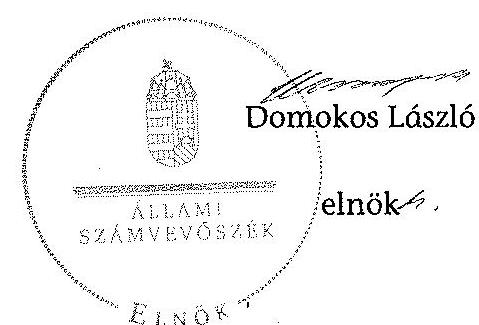
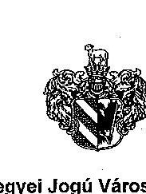
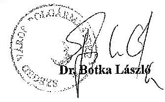
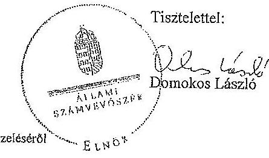
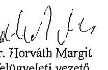
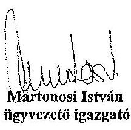
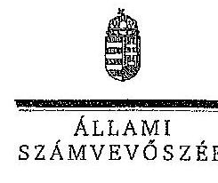

# ÁLLAMI   SZÁMVEVÔSZÉK 

## JELENTÉS

Az önkormányzatok gazdasági társaságai - Az önkormányzatok többségi tulajdonában lévő gazdasági társaságok közfeladat ellátását érintő gazdálkodási tevékenysége szabályszerűségének ellenőrzése Szegedi Hőszolgáltató Korlátolt Felelősségű Társaság

---

# Állami Számvevőszék 

Iktatószám: V-0519-261/2014.
Témaszám: 1553
Vizsgálat-azonosító szám: V067122

## Az ellenőrzést felügyelte:

Dr. Horváth Margit
felügyeleti vezető
Az ellenőrzést vezette és az ellenőrzés végrehajtásáért felelős:
Valastyánné dr. Vízhányó Júlia
ellenőrzésvezető
A jelentéstervezet összeállításában közremüködött:
Ferencz Katalin Zsuzsanna
számvevő tanácsos
Az ellenőrzést végezték:
Szakál Pálné Zelenákné Poór Erzsébet
okleveles könyvvizsgáló, okleveles könyvvizsgáló,
külső szakértő
A témához kapcsolódó eddig készített számvevőszéki jelentés:
címe
sorszáma
JELENTÉS Szeged Megyei Jogú Város Önkormányzata pénzügyi 1145
helyzetének ellenőrzéséről (43/3)

---

# TARTALOMJEGYZÉK 

BEVEZETÉS ..... 7
I. ÖSSZEGZŐ MEGÁLLAPÍTÁSOK, KÖVETKEZTETÉSEK, JAVASLATOK ..... 11
II. RÉSZLETES MEGÁLLAPÍTÁSOK ..... 18

1. Az Önkormányzat közfeladat-ellátásának szabályszerűsége ..... 18
1.1. A közfeladat-ellátás megszervezése és a feladatellátás feltételrendszerének kialakítása ..... 18
1.2. A közfeladat-ellátás felügyelete és a tulajdonosi jogok érvényesítése ..... 24
2. A Szegedi Hőszolgáltató Kft. közfeladat ellátással kapcsolatos tevékenysége ..... 29
2.1. A Szegedi Hőszolgáltató Kft. gazdálkodásának szabályozottsága ..... 29
2.2. A Szegedi Hőszolgáltató Kft. vagyongazdálkodása ..... 30
2.3. A beszámolási kötelezettség teljesítése ..... 33
3. A távhőszolgáltatás közfeladata bevételei és ráfordításai elszámolásának és önköltségszámításának szabályszerűsége ..... 36
3.1. A távhőszolgáltatás közfeladat bevételeinek és ráfordításainak szabályszerűsége ..... 36
3.2. Az önköltségszámítás szabályszerűsége ..... 38
4. Az ÁSZ korábbi, az önkormányzatok többségi tulajdonában lévő gazdasági társaságok közfeladat-ellátását, gazdálkodását, pénzügyi helyzetét érintő javaslataira tett intézkedések ..... 40
4.1. Az Önkormányzat intézkedési terve és annak hasznosulása ..... 40

## MELLÉKLETEK

1. számú A Szegedi Hőszolgáltató Kft. tevékenységének főbb adatai
2. számú A Szegedi Hőszolgáltató Kft. múködésének főbb jellemzői
3. számú Beérkezett észrevételek és az azokra adott válaszok

## FÜGGELÉKEK

1. számú Értelmező szótár
2. számú Mintavételi eljárások ellenőrzési területenként

---

.

---

# RÖVIDÍTÉSEK JEGYZÉKE 

## Törvények

Áht. 1

Áht. 2

Ámt.
ÁSZ tv.
Gt.
Mötv.

Ötv.

Ptk.
Számv. tv.
Tszt.
Taktv.

Nvtv.

## Rendeletek

Ber.
SZMSZ
távhőszolgáltatási ren-
az államháztartásról szóló 1992. évi XXXVIII. törvény (hatálytalan: 2012. január 1-jétől)
az államháztartásról szóló 2011. évi CXCV. törvény (hatályos: 2012. január 1-jétől)
az árak megállapításáról szóló 1990. évi LXXXVII. törvény (hatályos: 1991. január 1-jétől)
az Állami Számvevőszékről szóló 2011. évi LXVI. törvény (hatályos: 2011. július 1-jétől)
a gazdasági társaságokról szóló 2006. évi IV. törvény (hatálytalan: 2014. március 15-étől)
Magyarország helyi önkormányzatairól szóló 2011. évi CLXXXIX. törvény (hatályos: 2012. január 1-jétől, kivéve a 144. § (2) bekezdésben meghatározott paragrafusok, amelyek 2012. április 15 -én, a (3) bekezdésben meghatározott paragrafusok, amelyek 2013. január 1-jén léptek hatályba, a (4) bekezdésben meghatározott paragrafusok a 2014. évi általános önkormányzati választások napján lépnek hatályba)
a helyi önkormányzatokról szóló 1990. évi LXV. törvény (hatálytalan lesz: a 2014. évi általános önkormányzati választások napjától)
a Polgári Törvénykönyvről szóló 1959. évi IV. törvény (hatálytalan: 2014. március 15-étől)
a számvitelről szóló 2000. évi C. törvény (hatályos: 2001. január 1-jétől)
a távhőszolgáltatásról szóló 2005. évi XVIII. törvény (hatályos: 2005. július 1-jétől)
a köztulajdonban álló gazdasági társaságok takarékosabb múködéséről szóló 2009. évi CXXII. törvény (hatályos: 2009. december 4-étől)
a nemzeti vagyonról szóló 2011. évi CXCVI. törvény (hatályos: 2011. december 31-étől, kivéve a 20. § (2) bekezdésben meghatározott előírások, amelyek 2012. január 1jétől, a (3) bekezdésben meghatározott előírások 2013. január 1-jétől, a (4) bekezdésben meghatározott előírások 2012. március 2-ától léptek hatályba)
a költségvetési szervek belső ellenőrzéséről szóló 193/2003. (XI. 26.) Korm. rendelet (hatálytalan: 2012. január 1-jétől) Szeged Megyei Jogú Város Önkormányzata Közgyűlésének többször módosított 30/2010. (XI. 2.) számú rendelete az Önkormányzat Szervezeti és Múködési Szabályzatáról (hatályos: 2010. november 2-ától)
Szeged Megyei Jogú Város Önkormányzata Közgyűlésének

---

delet
vagyongazdálkodási rendelet

157/2005. (VIII. 15.)
Korm. rendelet
36/2009. (VII. 22.)
KHEM rendelet

50/2011. (IX. 30.) NFM rendelet

51/2011. (IX. 30.) NFM rendelet

## Szórövidítések

áfa
Alapító Okirat

ALFA-NOVA Kft.
ÁSZ
bizonylati szabályzat

BEO
értékelési szabályzat

FB
HMV
HŐTÁV Kft.
IKV Zrt.
javadalmazási szabályzat
többször módosított 16/2003. (IV. 30.) Kgy. számú rendelete a távhőszolgáltatásról, valamint a távhőszolgáltatás legmagasabb hatósági díjának megállapításáról és a díjalkalmazás feltételeiről (hatályos: 2003. július 1-jétől)
Szeged Megyei Jogú Város Önkormányzata Közgyűlésének többször módosított 25/2003. (VI. 27.) Kgy. számú rendelete a Szeged Megyei Jogú Város Önkormányzatának vagyona feletti rendelkezési jog gyakorlásának szabályairól (hatályos: 2003. július 1-jétől)
a távhőszolgáltatásról szóló 2005. évi XVIII. törvény végrehajtásáról (hatályos 2005. szeptember 29-étől)
a távhőszolgáltatás csatlakozási díjának és a lakossági távhőszolgáltatás díjának, valamint a hőenergia távhőtermelő és a távhőszolgáltató közötti szerződésében alkalmazott árának meghatározása során figyelembe veendő szempontokról és a Magyar Energia Hivatal által lefolytatott eljárásban kötelezően benyújtandó adatok köréről (hatályos 2009. július 25-étől)
a távhőszolgáltatónak értékesített távhő árának, valamint a lakossági felhasználónak és a külön kezelt intézménynek nyújtott távhőszolgáltatás díjának megállapításáról (hatályos 2011. október 1-jétől)
a távhőszolgáltatási támogatásról (hatályos 2011. október 1-jétől)
általános forgalmi adó
a Szegedi Hőszolgáltató Kft. Alapító Okirata és annak módosításai
ALFA-NOVA Energetikai, Fejlesztő Tervező és Vállalkozó Kft.
Állami Számvevőszék
a Szegedi Hőszolgáltató Kft. többször módosított bizonylati szabályzata, egységes szerkezetben (hatályos: 2001. január 1-jétől)
Belső Ellenőrzési Osztály
a Szegedi Hőszolgáltató Kft. többször módosított eszközök és források értékelési szabályzata, egységes szerkezetben (hatályos: 2001. január 1-jétől)
Szegedi Hőszolgáltató Kft. Felügyelőbizottsága
használati meleg víz
Szegedi Hőszolgáltató Korlátolt Felelősségű Társaság
IKV Ingatlankezelő és Vagyongazdálkodó Rt. (később Zrt.) Javadalmazási szabályzat a Szegedi Hőszolgáltató Kft. ügyvezetője, felügyelőbizottsági tagjai, könyvvizsgálója, vezető állású munkavállalói javadalmazása, valamint a jogviszony megszűnése esetére biztosított juttatások módjának, mértékének főbb elveiről, annak rendszeréről (hatályos: 2010. május 27-étől)

---

jegyzö
Konzorciumi szerződés

Közgyűlés
leltárkészítési és leltározási szabályzat

NFM
Önkormányzat
pénzkezelési szabályzat
polgármester
Polgármesteri Hivatal
számviteli politika

Társasági szerződés
Taggyűlés
önköltségszámításiszabályzat
ügyvezetés
Üzemeltetésivállalkozási szerződés
üzletszabályzat
Vagyonkezelő Kft.

Szeged Megyei Jogú Város Önkormányzatának jegyzője
Szegedi Hőszolgáltató Kft. és két tulajdonosa, Szeged Megyei Jogú Város Önkormányzata, ALFA-NOVA Energetikai, Fejlesztő Tervező és Vállalkozó Kft. között 1999. november 11-én a Szegedi Hőszolgáltató Kft.-vel kapcsolatos menedzsment jogok gyakorlására létrejött szerződés
Szeged Megyei Jogú Város Önkormányzatának Közgyűlése
a Szegedi Hőszolgáltató Kft. többször módosított az eszközök és források leltárkészítési és leltározási szabályzata, egységes szerkezetben (hatályos: 1999. október 5-étől)
Nemzeti Fejlesztési Minisztérium
Szeged Megyei Jogú Város Önkormányzata
a Szegedi Hőszolgáltató Kft. többször módosított pénzkezelési szabályzata egységes szerkezetben (hatályos: 1999. október 5-étől)
Szeged Megyei Jogú Város Önkormányzatának polgármestere
Szeged Megyei Jogú Város Önkormányzatának Polgármesteri Hivatala
a Szegedi Hőszolgáltató Kft. többször módosított számviteli politikája, egységes szerkezetben, melynek melléklete a számlarend (hatályos: 2001. január 1-jétől)
a Szegedi Hőszolgáltató Kft. társasági szerződése
Szegedi Hőszolgáltató Kft. Taggyűlése
a Szegedi Hőszolgáltató Kft. többször módosított önkölt-ség-számítási szabályzata egységes szerkezetben (hatályos: 1999. október 5-étől)
Szegedi Hőszolgáltató Kft. ügyvezetése
a Vagyonkezelő Kft. (Szegedi Távhőszolgáltató Kft., átalakulásával Szegedi Vagyonkezelő Kft., beolvadásával IKV Ingatlankezelő és Vagyongazdálkodó Rt.) mint üzemeltetésbe adó, a Szegedi Hőszolgáltató Kft., mint üzemeltetésbe vevő, valamint Szeged Megyei Jogú Város Önkormányzata és az ALFA-NOVA Energetikai, Fejlesztő Tervező és Vállalkozó Kft., mint tulajdonosok között 1999. november 1-jén, 25 éves időtartamra létrejött Üzemeltetésivállalkozási szerződés
Szegedi Hőszolgáltató Kft. üzletszabályzata
Szegedi Távhőszolgáltató Kft. és annak átalakulásával létrejött Szegedi Vagyonkezelő Kft.

---

.

---

# JELENTÉS 

## Az önkormányzatok gazdasági társaságai Az önkormányzatok többségi tulajdonában lévő gazdasági társaságok közfeladat ellátását érintő gazdálkodási tevékenysége szabályszerűségének ellenőrzése

## Szegedi Hőszolgáltató Korlátolt Felelősségű Társaság

## BEVEZETÉS

Az Állami Számvevőszék stratégiájában megfogalmazta, hogy a helyi önkormányzatok gazdálkodásában rejlő pénzügyi kockázatok feltárásával, az államháztartáson kívülre nyújtott költségvetési támogatások és ingyenes vagyonjuttatások, valamint az államháztartáson kívül múködő közfeladat-ellátó rendszerek ellenőrzéseivel hozzájárul ahhoz, hogy a közpénzeket az államháztartáson kívül múködő szervezetek is átlátható, rendezett módon használják fel a közfeladatok szerződésben vállalt ellátása érdekében.

Az önkormányzatok szervezetalakítási szabadságának következménye, hogy a korábban is vállalati formában múködő (nagyvárosi tömegközlekedés, víz-, szennyvízcsatorna, köztisztasági, ingatlankezelés stb.) közszolgáltatások mellett, mind a kötelező, mind az önként vállalt feladatok ellátásában a gazdasági társaságok kiemelt fontosságú szerephez jutottak.

Szeged Megyei Jogú Város Önkormányzatának Közgyűlése 1999. szeptember 3án döntött a HÖTÁV Kft. megalapításáról, a távhőszolgáltatási feladatok Szegedi Távhőszolgáltató Kft. tevékenységi köréből az újonnan alakult HÖTÁV Kft. tevékenységi körébe történő átadásáról, a feladatok ellátásához szükséges vagyon üzemeltetésbe adásáról. Az Önkormányzat távhőszolgáltatásába külső befektető bevonása tárgyában írt és Szeged Megyei Jogú Város Közgyűlése elé beterjesztett 827/1999. (IX. 3.) számú döntést előkészítő anyaga egymással nehezen összevethető ajánlati verziókat tartalmazott. A javaslat nem vizsgálta az egyes konstrukciók kockázatait és nem taglalta azok hosszú távú előnyeit, illetve hátrányait, holott a külső partner bevonására vonatkozó terv és a beterjesztés alapján megkötött konzorciumi szerződés 25 évre szólt. A távhőszolgáltatással kapcsolatos vagyongazdálkodási feladatok a Szegedi Távhőszolgáltató Kft.-

---

nél, illetve átalakulásával a Vagyonkezelő Kft.-nél maradtak. A Közgyűlés döntése alapján a 2003. évben a Vagyonkezelő Kft. is átalakult, beolvadt az Önkormányzat 100\%-os tulajdonában lévő IKV Rt.-be (későbbiekben IKV Zrt.). Ezt követően a vagyonkezeléssel kapcsolatos feladatokat az IKV Rt. látta el. Az Önkormányzat a HỐTÁV Kft.-t 100,0 M Ft pénzbeli hozzájárulással, határozott időre, 2024. szeptember 30-ig, hozta létre. A HỐTÁV Kft. tevékenységét 1999. október 1-jétől kezdte meg, főtevékenysége gőz- és melegvíz ellátás volt. A Közgyűlés a HỐTÁV Kft. megalapításáról szóló határozatában egyidejűleg döntött a gazdasági társaság 49,0\%-os üzletrészének az ALFA-NOVA Kft. részére történő értékesítéséről.

A HỐTÁV Kft. a közel 162 ezer fő lakosságszámú Szeged Város közigazgatási területén a 2012. évben 27221 lakossági-, valamint 503 közületi fogyasztót látott el távhővel, a hőenergiát gázmotorok állították elő 23 kazánházban. A HÖTÁV Kft. célja a folyamatos, biztonságos, valamint energiatakarékos távhőszolgáltatás és melegvízellátás volt a környezetvédelmi előírások szem előtt tartásával. A HỐTÁV Kft. dolgozóinak létszáma a 2008. évi 194 fő̋ől a 2012. évre 10 fővel növekedett.

Az ellenőrzött időszakban az értékesítés nettó árbevétele jelentős mértékű, 1653,6 M Ft csökkenést mutatott, 2008-ban 7259,5 M Ft, 2012-ben 5605,9 M Ft volt. A távhőellátás és melegvíz szolgáltatás értékesítés nettó árbevétele ellentétes tendenciát, 6,3\%-os növekedést mutatott, a 2008. évben 4745,4 M Ft, a 2012. évben 5042,7 M Ft volt. A HỐTÁV Kft. árbevétel csökkenését alapvetően a villamos energia értékesítés és az egyéb tevékenysége árbevételének csökkenése okozta.

A 2008. évről a 2012. évre a követelésállomány 1132,8 M Ft-ról 2057,1 M Ft-ra, a kötelezettségállomány 2325,8 M Ft-ról 2726,1 M Ft-ra növekedett, alapvetően a kapcsolt vállalkozásokkal szemben fennálló követelés- és tartozásállomány növekedése miatt. A hátralékos követelésállomány a 2008. évben 441,7 M Ft, a 2012. évben 683,5 M Ft volt, $54,7 \%$-kal emelkedett. Az ellenőrzött időszakban a tartalékok felhasználása és a folyamatosan fennálló hitelállomány biztosította a társaság likviditását.

A 2008-2012. években a polgármester és a jegyző személye nem változott. A polgármester a 2006. évi önkormányzati választások óta tölti be tisztségét, az ellenőrzött időszakban a munkakört betöltő címzetes főjegyző 2003. óta látja el feladatait. A HỐTÁV Kft. irányítását két ügyvezető együttesen látta el, az ellenőrzött időszakban az egyik ügyvezető személye 2011. február 1-jétől megváltozott.

Az önkormányzati tulajdonú gazdasági társaságok teljes körű ellenőrzésének lehetőségét az Állami Számvevőszékről szóló 1989. évi XXXVIII. törvény 2011. január 1-jétől hatályos módosítása teremtette meg.

Az ellenőrzés célja annak értékelése volt, hogy

- az önkormányzat a jogszabályi előírások figyelembevételével döntött-e az ellenőrzésre kerülő közfeladat megszervezéséről; az önkormányzat szabályszerűen gyakorolta-e a tulajdonosi jogokat;

---

- a gazdasági társaság közfeladat-ellátása bevételeinek, ráfordításainak elszámolása, és vagyongazdálkodási tevékenysége megfelelt-e a jogszabályi, illetve a közszolgáltatási szerződésben foglalt tulajdonosi előírásoknak, azok végrehajtása szabályszerű volt-e;
- a közfeladatok átláthatósága és elszámoltathatósága érdekében biztosítva volt-e a közszolgáltatás dijának megalapozottsága szabályszerű önköltségszámítással.

Az ellenőrzés kiterjedt Szeged Megyei Jogú Város Önkormányzatára és a Szegedi Hőszolgáltató Korlátolt Felelősségű Társaságra.

Az ellenőrzés várható hasznosulása: A törvényalkotás számára - az észlelt problémák, szabálytalanságok, vagy egyéb nem kívánatos jelenségek felszínre kerülésével - az ellenőrzés megállapításai segítséget nyújthatnak az államháztartáson kívüli közfeladat-ellátás értékeléséhez, jogszabályi keretei pontosításához, átláthatóságot biztosító szabályozásához. Meghatározhatóvá válnak a közfeladat ellátásában részt vevő államháztartáson kívüli szervezeteknek - az önkormányzat költségvetését, pénzügyi helyzetét is befolyásoló - kockázatai, lehetővé válik ezen kockázatok csökkentése. A feladatot ellátó gazdasági társaság a közszolgáltatási szerződésben foglaltak betartásával, a közvagyon használatával biztosította-e a szolgáltatás folytatásának feltételeit. Ezzel az ellenőrzöttek és a helyi döntéshozók számára az ÁSZ visszajelzést ad feladatszervezési, feladat-ellátási kockázataikról, alapot ad a meglévő hibák megszüntetéséhez, a jobb közfeladat-ellátás biztosításához. Fokozza a fegyelmet, igazolja, hogy lejárt a következmények nélküli ellenőrzések időszaka. Az ÁSZ értékteremtő rend kialakításához és megőrzéséhez hozzájáruló tevékenysége pozitív hatással van a szervezetről kialakított összkép formálására is.

A bevételek és ráfordítások elszámolása, valamint a vagyonnyilvántartás terén az egyes területek szabályszerű működését mintavétellel ellenőriztük, ez alapján a sokaságokban előforduló hibás tételek arányát becsültük. A jogszabályoknak és a belső előírásoknak megfelelőnek, azaz szabályszerűnek tekintettük az adott bevételek és ráfordítások elszámolását, a vagyonnyilvántartást, amennyiben a minta ellenőrzésének eredménye alapján $95,0 \%$-os bizonyossággal a teljes sokaságban a hibás tételek aránya kisebb volt, mint $10 \%$, nem megfelelőnek értékeltük, ha a hibás tételek aránya a $10,0 \%$-ot meghaladta. Kockázatot, illetve magas kockázatot jeleztünk, amennyiben egy adott terület vonatkozásában a minta alapján a teljes sokaságban nem volt teljes körűen biztosított a jogszabályoknak és a belső szabályzatoknak megfelelő működés.

Az ellenőrzést a számvevőszéki ellenőrzés szakmai szabályai szerint, szabályszerűségi ellenőrzés módszerével, a vonatkozó nemzetközi standardok figyelembevételével végeztük. Az ellenőrzés a 2008-2012. évekre terjedt ki.

Az ellenőrzés végrehajtásának jogszabályi alapját az Állami Számvevőszékről szóló 2011. évi LXVI. törvény 5. § (3)-(5) bekezdése képezte.

Az ÁSZ az Állami Számvevőszékről szóló 2011. évi LXVI. törvény 29. §-a alapján a jelentéstervezetet észrevételezésre megküldte a polgármesternek és a gazdasági társaság ügyvezetőjének. A beérkezett észrevételeket a jelentés véglegesí-

---

tése során hasznosítottuk. Az észrevételeket és az azokra adott válaszokat a jelentés 3. számú melléklete tartalmazza.

---

# I. ÖSSZEGZŐ MEGÁLLAPÍTÁSOK, KÖVETKEZTETÉSEK, JAVASLATOK 

Szeged Megyei Jogú Város Önkormányzatának Közgyűlése az Önkormányzat közigazgatási területén a távhőszolgáltatás közfeladatának ellátásáról, a HÖTÁV Kft. megalapításáról az Ötv. előírásainak figyelembevételével, az ellenőrzött időszakot megelőzően (az 1999. évben) döntött. Ezzel egyidejűleg határozott a társaság 49,0\%-os üzletrészének értékesítésről, a távhőszolgáltatási feladatok Szegedi Távhőszolgáltató Kft. tevékenységi köréből az újonnan alakult HƠTÁV Kft. tevékenységi körébe történő átadásáról, a feladatok ellátásához szükséges közvagyon üzemeltetésbe adásáról, az Üzemeltetési-vállalkozási szerződés és Konzorciumi szerződés megkötéséről. Az Önkormányzat a tulajdonosi jogokat az ellenőrzött időszakban szabályszerűen gyakorolta.

Az Önkormányzat a 2006-2010. illetve a 2011-2014. évre elfogadott gazdasági programja a távhőszolgáltató rendszer fejlesztésével kapcsolatban célként jelölte meg pályázat benyújtását a meglévő központi fűtési berendezések és rendszerek, hőleadók és fűtésszabályozók korszerűsítésére a panelprogram keretében. A Közgyűlés által 2008. évben elfogadott Integrált Városfejlesztési Stratégia a középtávú fejlesztési célok között prioritásként említette a távfűtő rendszer korszerűsítését, de a fejlesztésekre vonatkozóan konkrét elképzeléseket nem tartalmazott.

Az Önkormányzat nem adott át a HŐTÁV Kft. vagyonkezelésébe közvagyont. A távhőszolgáltatással kapcsolatos vagyongazdálkodási feladatok a közműtulajdonos Szegedi Távhőszolgáltató Kft-nél, az átalakulást követően a Vagyonkezelő Kft-nél maradtak. ${ }^{1}$ A távhőszolgáltatás közfeladat ellátására a Vagyonkezelő Kft., a HÖTÁV Kft., valamint annak két tulajdonosa, az Önkormányzat és az ALFA-NOVA Kft. Üzemeltetési-vállalkozási szerződést kötött, mely 1999. november 1-jétől 2024. október 31-ig terjedő, 25 éves időtartamra jött létre. A szerződésben meghatározták az ellátandó feladatok körét, a feladatellátás követelményeit, rendelkeztek az átadásra kerülő vagyonról, az adatszolgáltatási kötelezettségről, a környezetvédelmi előírásokról, a szolgáltatási dí képzéséről, a beruházások irányelveiről, az átvállalt kötelezettségekről. A Vagyonkezelő Kft. és a tulajdonosok az 1999. évben Konzorciumi szerződést kötöttek a HÖTÁV Kft.-vel kapcsolatos menedzsment jogok két tulajdonos általi együttes gyakorlására. A Konzorciumi szerződés - melynek az Üzemeltetési-vállalkozási szerződés elválaszthatatlan részét képezte - rögzítette, hogy a közművagyon fejlesztéséhez a forrást az ALFA-NOVA Kft., illetve a HÖTÁV Kft. által megfizetett éves vagyonbérleti díj erejéig a Vagyonkezelő Kft. biztosítja. A Konzorciumi szerződésben foglaltak alapján az Önkormányzat a HÖTÁV Kft. fejlesztési feladataiban nem vett részt.

Az Üzemeltetési-vállalkozási szerződés a HŐTÁV Kft.-t - az átvett közművagyon mindenkori amortizációs leírásával azonos értékű - vagyonbérleti díj megfize-

---

tésére kötelezte, a vagyonbérleti díjat a közmútulajdonos köteles volt az üzemeltetővel évente kötött megállapodás alapján az üzemeltetésre átadott közmúvagyon fejlesztésére fordítani. A HÔTÁV Kft. által megfizetett vagyonbérleti dij a 2008-2012. években összesen 165,9 M Ft volt. Az Üzemeltetési-vállalkozási szerződés az önkormányzati vagyon védelmében megfelelő biztosítékokat tartalmazott. Rendelkezett a beruházással létrejött vagyontárgyak tulajdoni viszonyairól. Az üzemeltetésbe adott vagyon leltározását a Vagyonkezelő Kft. végezte.

Az Önkormányzat a távhőszolgáltatásra vonatkozóan a Tszt. szerinti rendeletalkotási kötelezettségének eleget tett. A távhőszolgáltatási rendeletet és az Üzemeltetési-vállalkozási szerződés díjképzésre, a szolgáltatási díjak megállapítására vonatkozó előírásait 2008. július 1-jével módosították, a hődijban a vásárolt földgáz és villamos energia díját is érvényesítették. A díjváltoztatásra, illetve a rendelet módosítására vonatkozó javaslat elkészítése, a Közgyűlés elé terjesztése a HÔTÁV Kft. feladata volt, amelynek eleget tett. Az Önkormányzat a rendeletmódosításokat, illetve a rendeletet egységes szerkezetben minden alkalommal közzétette. A Tszt. módosításával 2011. április 15 -étől az Önkormányzat hatósági ármegállapítás joga megszűnt, a legmagasabb hatósági díjat az energiapolitikáért felelős miniszter rendeletben állapítja meg.

Az önkormányzati tulajdonosi jogok gyakorlását a Közgyűlés, átruházott hatáskörben a polgármester látta el a Gt. és a vagyongazdálkodási rendelet előírásainak megfelelően. A tulajdonosi joggyakorlással kapcsolatos hatásköröket és feladatköröket az Alapító Okirat, a Társasági szerződés, valamint a vagyongazdálkodási rendelet rögzítette. A HÔTÁV Kft. irányítását két ügyvezető együttesen látta el, az FB három tagból állt, melyből két tagot az Önkormányzat, egy tagot az ALFA-NOVA Kft. jelölhetett. Az ügyvezetőket, az FB tagokat és a könyvvizsgálót a Taggyűlés választotta az előírásoknak megfelelően.

Az Alapító Okirat és a Társasági szerződés előírása alapján a Számv. tv. szerinti beszámoló elfogadása, beleértve az adózott eredmény felhasználására vonatkozó döntést a Taggyűlés hatáskörébe tartozott. Az Önkormányzat a tulajdonosi ellenőrzési, beszámoltatási kötelezettségét az FB múködésén keresztül, a vagyongazdálkodási rendelet 23. §-ában foglaltak alapján átruházott hatáskörben a polgármester és a bizottságok által, illetve a mandátummal feljogosított személy HÔTÁV Kft. Taggyűlésén való részvételével biztosította. A HÔTÁV Kft. tevékenységéről szóló évente egyszeri, igény szerinti időpontban történő egyéb, Közgyűlés felé történő beszámolási kötelezettségét az Üzemeltetésivállalkozási szerződés 2. számú melléklete írta elő. Az Önkormányzat az Üze-meItetési-vállalkozási szerződés beszámoltatásra vonatkozó előírásait a szerződéskötés óta (1999. év) nem módosította. A több éves beszámolóban és a 2012. évi kiegészítő mellékletben sem mutatták be a HÔTÁV Kft. vagyonkezelő IKV Zrt-nek az Üzemeltetési-vállakozási szerződés alapján fizetett éves bérleti díjának nagyságát és évek közötti változását, illetőleg az ehhez kapcsolódó elszámolás helyzetét. A HÔTÁV Kft. 2000-2011. időszakra vonatkozó tevékenységi beszámolója szerint az összes fejlesztési beruházás ebben az intervallumban elérte a 3,5 Mrd Ft-ot. A beszámoló összegszerűen nem bontja alá a 12 éves időszakot - bár mellékletében bemutatja az egyes beruházásokat -, így nem vizsgálható a konzorciumi szerződés szerinti időszakra eső fejlesztések szerződés szerinti teljesítése.

---

Az Önkormányzat 2008-2009. évi belső ellenőrzési tervei nem, a 2010-2012. években azonban már tartalmaztak a gazdasági társaságokra irányuló ellenőrzést.

A HƠTÁV Kft.-nél a 2009. év novemberében lefolytatott, a 2008. évi gazdálkodásra, a 2009. I-III. negyedéves bevételek és kiadások alakulására, illetve a 2010. január 1-jétől érvényes távfűtési díjak árképzésére irányuló célvizsgálat a jóváhagyott 2009. évi ellenőrzési tervben nem szerepelt. A jelentés célszerűségi javaslatokat fogalmazott meg. A HŐTÁV Kft. a belső ellenőrzés megállapításaira vonatkozóan az észrevételezési jogával nem élt. A belső ellenőrzés a Ber. előírásának megfelelően javaslatokat fogalmazott meg a kockázati tényezők, hiányosságok megszüntetése, kiküszöbölése érdekében. A jelentést a Taggyűlés elfogadta, azonban intézkedésre vonatkozóan döntés nem született. A BEO az Önkormányzat 2009. évi zárszámadása keretében a HŐTÁV Kft.-nél lefolytatott ellenőrzés megállapításairól a Közgyűlésnek beszámolt.

A HŐTÁV Kft. gazdálkodásának szabályozottsága az ellenőrzött időszakban megfelelő volt, azonban az ellátott közfeladat bevételei, költségei és ráfordításai elkülönített nyilvántartásának gyakorlatban alkalmazott eljárásait, illetve az Üzemeltetési-vállalkozási szerződésben előírt nyilvántartási, díjképzési és adatszolgáltatási kötelezettséget hiányosan, illetve nem megfelelő részletezettséggel írták elő. A HŐTÁV Kft. az ellenőrzési időszakban rendelkezett hatályos számviteli politikával és a Számv. tv. előírásának megfelelően az eszközök és a források leltárkészítési és leltározási, illetve értékelési szabályzatával, önköltség-számítási, valamint pénzkezelési szabály. zattal. A számviteli politikába a 2012. évben, a Tszt.-ben előírt számviteli szétválasztási szabályokra vonatkozó előírásokat nem építették be. A szabályozás hiányosságai ellenére a gazdasági társaság nyilvántartásai az éves beszámoló és az üzleti jelentés elkészítéséhez szükséges információtartalmat biztosították. A HŐTÁV Kft. az ellenőrzött időszakban rendelkezett üzletszabályzattal, melyet az Önkormányzat jegyzője a Tszt. 7. § (1) bekezdés b) pontjának megfelelően jóváhagyott.

A HŐTÁV Kft. a 2008-2012. években az IKV Zrt.-nek 165,9 M Ft vagyonbérleti díjat fizetett, melyet az üzemeltetésbe adott távhő vagyon állagmegóvására fordítottak. A HŐTÁV Kft. az üzemeltetésbe adóval kötött megállapodás alapján karbantartási, felújítási munkát végzett. Fejlesztés, rekonstrukció az ALFANOVA Kft. és a HŐTÁV Kft. finanszírozásával, valamint lakossági fejlesztési hozzájárulással valósult meg.

A HŐTÁV Kft. az üzleti terv megvalósulásáról, az éves gazdálkodásról - és egyben a közszolgáltatási tevékenységéről - az éves beszámolója keretében a tulajdonosok felé beszámolt. A HŐTÁV Kft. az ellenőrzött időszakban az éves beszámolókat és az üzleti jelentéseket az FB és a Vagyongazdálkodási Bizottság javaslatával kiegészítve, illetve a független könyvvizsgálói jelentést mellékelve a Taggyűlés elé terjesztette a Gt. vonatkozó előírásaival összhangban. Az ellenőrzési időszakban a Taggyűlés az éves beszámolókat és az üzleti jelentéseket határozattal elfogadta, a Taggyűlés jegyzőkönyvei és határozatai rendelkezésre álltak. A könyvvizsgálói záradékkal ellátott éves beszámolót a 2010-2012. években a Számv. tv. vonatkozó bekezdésében előírt határidőben, a 2008-2009. években határidőn túl helyezték letétbe.

---

A HŐTÁV Kft. a 2008-2012. években, a 2009. év kivételével, veszteségesen gazdálkodott. A mérleg szerinti eredmény a 2008. évben - $276,7 \mathrm{M}$ Ft, a 2009. évben 96,0 M Ft, a 2010. évben -189,0 M Ft, a 2011. évben -187,9 M Ft, a 2012. évben -179,7 M Ft volt. A 2009. évi nyereséget eredménytartalékba helyezték. Az ellenőrzött időszakban az eredménytartalék összege 776,5 M Ft-ról 233,1 M Ft-ra, a saját tőke összege 599,8 M Ft-ról 153,4 M Ft-ra csökkent. A 100,0 M Ft jegyzett tőke összege nem változott. Az ellenőrzött időszakban a veszteség rendezésére tulajdonosi pótbefizetési kötelezettséget a Taggyúlés nem írt elő.

A HŐTÁV Kft. 2011-ben 522,6 M Ft, 2012-ben 1180,1 M Ft távhőtámogatásban részesült az 51/2011. (IX. 30) NFM rendelet alapján. Az Önkormányzat az ellenőrzött időszakban működési, illetve fejlesztési célú pénzeszközt nem adott át a HÖTÁV Kft. részére, a társaság hitelfelvételénél garancia és kezesség vállalással járult hozzá a közfeladat ellátásához. A HƠTÁV Kft. az ellenőrzött időszakban folyamatosan fennálló 300,0 M Ft összegű folyószámlahitellel és 1050,0 M Ft rövid lejáratú hitelállománnyal rendelkezett, tulajdonosi kötelezettségvállalással, melyre a társaság árbevétele nyújtott fedezetet.

Az ellenőrzött időszakban a tartalékok felhasználása és a jelentős összegű hitelállomány biztosította a HŐTÁV Kft. likviditását. Az eladósodáshoz hozzájárult, hogy a tartalékok terhére a tényleges költség alatt határozták meg a hatósági szolgáltatási díjakat és jogszabályváltozás miatt 2011. évtől további bevétel kiesés történt. A jelentős hitelállomány gazdálkodásra és likviditásra ható veszélyéről utólag a zárszámadás keretében kapott a Közgyűlés tájékoztatást. A könyvvizsgáló és a 2009. évi belső ellenőrzési célvizsgálat jegyzőkönyve jelezte az eladósodás veszélyét.

A 2008-2012. években a HŐTÁV Kft. követelésállománya 1132,8 M Ft-ról 2057,1 M Ft-ra növekedett. A 2012. évben követésállományon belül a vevők $30,6 \%$-os, a kapcsolt vállalkozással szembeni követelések $41,3 \%$-os, az egyéb követések 28,1\%-os arányt képviseltek. A HŐTÁV Kft. hátralékos követelésállománya a 2008. évben 441,7 M Ft, a 2012. évben 683,5 M Ft volt, az ellenőrzött időszakban $54,7 \%$-kal emelkedett. A hátralékos követelésállományon belül az egy éven túli követelések aránya is nőtt, 2008-ban 24,3\%, 2012-ben 37,9\% volt. A behajtásra vonatkozó szükséges intézkedéseket szabályszerűen végrehajtották.

A 2008-2012. években a kötelezettségállomány 2325,8 M Ft-ról 2726,1 M Ftra növekedett. A 2012. évi kötelezettségállomány 1137,7 M Ft rövidejáratú hitelből, 1494,2 M Ft kapcsolt vállalkozással szembeni rövid lejáratú kötelezettségből, valamint 94,2 M Ft szállítói és egyéb kötelezettségből tevődött össze.

A HŐTÁV Kft. nyilvántartásai az ágazati sajátosságok figyelembevételével, megfelelően biztosították a bevételek, a költségek és a ráfordítások közfeladat ellátással kapcsolatos elkülönítését és nyilvántartását. A bevételek, költségek és ráfordítások elszámolása a jogszabályi és a belső szabályozások előírásainak megfelelt, azonban a veszteséges gazdálkodás miatt a beruházások, élettartam növelő felújítások nem az eszközök elhasználódásának megfelelő arányban történtek, ezért az eszközök használhatósági foka csökkent.

---

Az önköltség-számítási szabályzatot a jogszabályi követelményeknek és a tulajdonosi rendelkezéseknek megfelelően készítették el. A HÔTÁV Kft. az ellenőrzött időszakban az önköltség-számítási szabályzatnak megfelelően, utókalkulációval határozta meg a közfeladat ellátás és az egyéb tevékenységeinek elszámolható önköltségét. A HƠTÁV Kft. az előírásoknak megfelelően alkalmazta a hatósági árképzésére vonatkozó szabályokat.

A fentiekben leírtak összegzéseként az alábbi megállapításokat tesszük:
A konstrukcióból eredő sajátosság az, hogy az Önkormányzat nem adott át a HÖTÁV Kft. vagyonkezelésébe közvagyont. A távhőszolgáltatás közfeladat ellátására a Vagyonkezelő Kft., a HŐTÁV Kft., valamint annak két tulajdonosa, az Önkormányzat és az ALFA-NOVA Kft. Üzemeltetési-vállalkozási szerződést kötött, mely 25 éves időtartamra jött létre. A Vagyonkezelő Kft. és a tulajdonosok az 1999. évben Konzorciumi szerződést kötöttek a HÔTÁV Kft.-vel kapcsolatos menedzsment jogok két tulajdonos általi együttes gyakorlására. A HƠTÁV Kft. múködési konstrukciója nehezen áttekinthető. Igazán bonyolulttá a konstrukciót a többszereplős tulajdonosi szerkezet, a vagyonkezelés és a kapcsolt vállalkozások teszik, melyben az ALFA-NOVA Kft. hol tulajdonosként, hol szolgáltatóként van jelen. A kevésbé átlátható müködéshez az is hozzájárul, hogy a társaság feladatellátásának eszközeit az Önkormányzat vagyonkezelője tartja nyilván, azonban a felújításokat, karbantartásokat a HÔTÁV Kft. végzi.

Az Üzemeltetési-vállalkozási szerződés a HÔTÁV Kft.-t - az átvett közművagyon mindenkori amortizációs leírásával azonos értékű - vagyonbérleti díj megfizetésére kötelezte, a vagyonbérleti díjat a közmútulajdonos köteles volt az üzemeltetővel évente kötött megállapodás alapján az üzemeltetésre átadott közmúvagyon fejlesztésére fordítani.

A Konzorciumi szerződés - melynek az Üzemeltetési-vállalkozási szerződés elválaszthatatlan részét képezte - rögzítette, hogy a közművagyon fejlesztéséhez a forrást az ALFA-NOVA Kft., illetve a HÖTÁV Kft. által megfizetett éves vagyonbérleti díj erejéig a Vagyonkezelő Kft. biztosítja. A Konzorciumi szerződésben foglaltak alapján az Önkormányzat a HÔTÁV Kft. fejlesztési feladataiban nem vett részt.

A múködés kockázata az ellenőrzött időszakban növekedett. A HŐTÁV Kft. a 2008-2012. években, a 2009. év kivételével, veszteségesen gazdálkodott. A mérleg szerinti eredmény a 2008. évben -276,7 M Ft, a 2009. évben 96,0 M Ft, a 2010. évben -189,0 M Ft, a 2011. évben -187,9 M Ft, a 2012. évben -179,7 M Ft volt. A 2009. évi nyereséget eredménytartalékba helyezték. Az ellenőrzött időszakban az eredménytartalék összege 776,5 M Ft-ról 233,1 M Ft-ra, a saját tőke összege 599,8 M Ft-ról 153,4 M Ft-ra csökkent. A 100,0 M Ft jegyzett tőke összege nem változott. Az ellenőrzött időszakban a veszteség rendezésére tulajdonosi pótbefizetési kötelezettséget a Taggyűlés nem írt elő. Az Önkormányzat az ellenőrzött időszakban múködési, illetve fejlesztési célú pénzeszközt nem adott át a HÖTÁV Kft. részére, a társaság hitelfelvételénél garancia és kezesség vállalással járult hozzá a közfeladat ellátásához. A bevételek, költségek és ráfordítások elszámolása a jogszabályi és a belső szabályozások előírásainak megfelel, azonban a veszteséges gazdálkodás miatt a beruházások, élettartam növe-

---

lő felújítások nem az eszközök elhasználódásának megfelelő arányban történtek, ezért az eszközök használhatósági foka csökkent.

Pénzügyi kockázatot az jelentett, hogy az ellenőrzött időszakban a tartalékok felhasználása és a jelentős összegű hitelállomány biztosította a HÔTÁV Kft. likviditását. Az eladósodáshoz hozzájárult, hogy a tartalékok terhére a tényleges költség alatt határozták meg a hatósági szolgáltatási díjakat és jogszabályváltozás miatt 2011. évtől további bevételkiesés történt. A jelentős hitelállomány gazdálkodásra és likviditásra ható veszélyéről utólag a zárszámadás keretében kapott a Közgyűlés tájékoztatást. A könyvvizsgáló és a 2009. évi belső ellenőrzési célvizsgálat jegyzőkönyve jelezte az eladósodás veszélyét.

A 2008-2012. években a HŐTÁV Kft. követelésállománya 1132,8 M Ft-ról 2057,1 M Ft-ra növekedett. A 2012. évben követésállományon belül a vevők $30,6 \%$-os, a kapcsolt vállalkozással szembeni követelések $41,3 \%$-os, az egyéb követések $28,1 \%$-os arányt képviseltek.

Az ÁSZ az Önkormányzat pénzügyi helyzetét a 2011. évben ellenőrizte. A Közgyűlés 2012. február 24-én megtárgyalta a jelentést és a feltárt hiányosságok megszüntetése érdekében intézkedési tervet fogadott el. Az intézkedések az Önkormányzat minősített többségi tulajdonában lévő gazdasági társaságaira terjedtek ki.

Az Állami Számvevőszékről szóló 2011. évi LXVI. törvény 33. § (1) bekezdésében foglaltak értelmében a jelentésben foglalt megállapításokhoz kapcsolódó intézkedési tervet köteles az ellenőrzött szervezet vezetője összeállítani, és azt a jelentés kézhezvételétől számított 30 napon belül az ÁSZ részére megküldeni. Amennyiben az intézkedési tervet határidőben nem küldi meg a szervezet, vagy az nem elfogadható, az ÁSZ elnöke a hivatkozott törvény 33. § (3) bekezdés a)-b) pontjaiban foglaltakat érvényesítheti.

Az ellenőrzés intézkedést igénylő megállapításai javaslatai:
Javaslataink célja a Kft. gazdálkodása szabályszerűségének helyreállítása annak érdekében, hogy a szabályozási környezet megfelelően tudja támogatni az átlátható müködést.

# Javasoljuk a Szegedi Hőszolgáltató Kft. ügyvezető Igazgatójának: 

1. A Szegedi Hőszolgáltató Kft. Számviteli politikájában nem tért ki az Üzemeltetésivállalkozási szerződésben és annak mellékleteiben megfogalmazott nyilvántartási feladatokra, díjképzésre és adatszolgáltatási kötelezettségre. A Tszt. előírásaira figyelemmel 2012-ben a szabályozásokat felülvizsgálták, ugyanakkor a Tszt. 18/A. § (2)(3) bekezdésében előírt számviteli szétválasztási szabályokra vonatkozó előírásokat a számviteli politikába nem építették be.

Javaslat:
Gondoskodjon a szabályozási hiányosságok megszüntetésére, ezen belül:

---

aktualizálja a szabályzatait úgy, hogy azok a jogszabályokban előírt számviteli szétválasztási szabályokat megfelelő nyilvántartások kialakításával teljesítsék, biztosítsák az egyes tevékenységek átláthatóságát, az üzletágak bevételeinek és ráfordításainak elkülönítését.
2. A társaság a 2008-2009. évben a könyvvizsgálói záradékkal ellátott éves beszámolóját a Számv. tv. 153. § (1) bekezdésében előírt, az adott üzleti év mérleg fordulónapját követő ötödik hónap utolsó napjában meghatározott határidőn túl helyezte letétbe.

Javaslat:
Gondoskodjon a jogszabályi elöírások szerinti gyakorlat és a szabályos müködés biztosítására, ennek keretében:

A társaság ügyvezető igazgatója intézkedjen annak érdekében, hogy a könyvvizsgálói záradékkal ellátott éves beszámolót a Számv. tv-ben előírt határidőig helyezzék letétbe.

---

# II. RÉSZLETES MEGÁLLAPÍTÁSOK 

## 1. Az ÖNKORMÁNYZAT KÖZFELADAT-ELLÁTÁSÁNAK SZABÁLYSZERÜSÉGE

### 1.1. A közfeladat-ellátás megszervezése és a feladatellátás feltételrendszerének kialakítása

Az Ötv. 8. § (1) bekezdése ${ }^{2}$ a települési önkormányzatok közszolgáltatási feladatai közé sorolta a helyi energiaszolgáltatásban való közreműködést. Az Ötv. 1. § (5) bekezdése kimondja, hogy törvény helyi önkormányzatnak kötelező feladatkört megállapíthat. Az Ötv. 8. § (3) bekezdése ugyancsak rendelkezik arról, hogy törvény a települési önkormányzatokat egyes közszolgáltatási feladatok ellátásáról történő gondoskodásra kötelezheti. A távhőszolgáltatással ellátott létesítmények távhő-ellátásának távhőszolgáltatásra engedéllyel rendelkezők útján történő biztosítása a Tszt. 6. § (1) bekezdése értelmében a területileg illetékes települési önkormányzat kötelező feladata.

Az Ötv. 91. § (6) bekezdése szerint az Önkormányzatnak a gazdasági programjában kell meghatároznia azon célkitűzéseket, amelyek az ellátandó feladatok biztosítását, fejlesztését szolgálják. Az Önkormányzat a 2006-2010. illetve a 2011-2014. évekre Közgyűlés által elfogadott ${ }^{3}$ gazdasági programja a távhőszolgáltató rendszer fejlesztésével kapcsolatban célként jelölte meg pályázat benyújtását a meglévő központi fütési berendezések és rendszerek, hőleadók és fűtésszabályozók korszerűsítésére a panelprogram keretében. A 2011-2014. éves programban egyes távhőszolgáltatással ellátott intézmények energetikai felújítása szerepelt.

A Közgyűlés által a 2008. évben elfogadott ${ }^{4}$ Integrált Városfejlesztési Stratéga a középtávú (7-8 évre szóló) fejlesztési célok között prioritásként említette a város jelentős részét ellátó távfűtő rendszer korszerűsítését, de a fejlesztésekre vonatkozóan konkrét elképzeléseket nem rögzített.

A 2011. december 31-én hatályba lépett Nvtv. 9. § (1) bekezdése szerint a helyi önkormányzat a vagyongazdálkodásának az Alaptörvényben, valamint a 7. § (2) bekezdésében meghatározott rendeltetése biztosításának céljából közép- és hosszú távú vagyongazdálkodási tervet köteles készíteni. A távhőszolgáltató

[^0]
[^0]:    ${ }^{2}$ A helyi közügyek, valamint a helyben biztosítható közfeladatok körében ellátandó helyi önkormányzati feladatként a távhőszolgáltatást 2013. január 1-jétől az Mötv. 13. § (1) bekezdés 20. pontja írja elő.
    ${ }^{3}$ A 665/2007. (XII. 14.) Kgy. számú határozat és a 126/2011. (IV. 15.) Kgy. számú határozat.
    ${ }^{4}$ A 429/2008. (VI. 27.) Kgy. számú határozat.

---

rendszer fejlesztését az Önkormányzat 2013. évben elfogadott vagyongazdálkodási terve tartalmazta ${ }^{5}$.

Az Önkormányzat az Ötv. 9 § (4) bekezdésében előírtak figyelembe vételével szabályszerűen döntött a távhőszolgáltatás kötelező közfeladat ellátásának gazdasági társaságban történő megszervezéséről.

A Közgyűlés az 1999. évben határozatot hozott ${ }^{6} 100 \%$ önkormányzati tulajdonlással, 100,0 M Ft pénzbeli hozzájárulással a HÖTÁV Kft. megalapításáról, egyidejűleg döntött a HỐTÁV Kft. 49,0\%-os üzlet-részének az ALFANOVA Kft. részére történő értékesítéséről.

A HỐTÁV Kft. tevékenységét az 1999. évben kezdte meg, múködésének befejező időpontját az Alapító Okirat és a Társasági szerződés 2024. szeptember 30. napjában határozta meg ${ }^{7}$. Az Alapító okirat, illetve a Társasági szerződés megfelelt a Gt. 12. § (1) bekezdése tartalmi előírásainak. Az üzletrész értékesítést követően a HỐTÁV Kft. tulajdonosi szerkezete, a tulajdonosi törzsbetét öszszege nem változott. Az Alapító okiratot és a Társasági szerződést a 2010. és 2011. évben módosították az ügyvezetők, az FB tagok, a könyvvizsgáló kijelölésének meghosszabbítása, illetve személyi változása, valamint az ügyvezetők hatáskörében bekövetkezett változás miatt.

A Közgyűlés a HỐTÁV Kft. megalapításáról szóló határozatában egyidejűleg döntött a távhőszolgáltatási feladatok Szegedi Távhőszolgáltató Kft. tevékenységi köréből az újonnan alakult HÖTÁV Kft. tevékenységi körébe történő átadásáról, a feladatok ellátásához szükséges vagyon üzemeltetésbe adásáról, a Konzorciumi szerződés és az Üzemeltetési-vállalkozási szerződés megkötéséről.

Az üzletrész értékesítési, a Konzorciumi és az Üzemeltetési-vállalkozási szerződéseket a Közgyűlés felhatalmazásával ${ }^{8}$ kötötték meg.

Az Önkormányzat nem adott át a HÖTÁV Kft. vagyonkezelésébe közvagyont. A távhőszolgáltatással kapcsolatos vagyongazdálkodási feladatok a közmútulajdonos Szegedi Távhőszolgáltató Kft-nél, átalakulást

[^0]
[^0]:    ${ }^{5}$ A Közgyűlés 97/2013. (IV. 12.) Kgy. számú határozatával elfogadott közép- és hosszú távú vagyongazdálkodási tervben a 2014-2020. időszakra tervezett projektek között szerepelt a távhőszolgáltató rendszer fejlesztése megújuló energiaforrások felhasználásával, elsősorban geotermikus energia, valamint biomassza alapú hőtermelő berendezések felhasználásával.
    ${ }^{6}$ A 827/1999. (IX. 3.) Kgy. számú határozat.
    ${ }^{7}$ Az Alapító okirat kelte: 1999. szeptember 14., a Társasági szerződés kelte: 1999. november 11., Cégjegyzék száma: 06-09-006571, Cégbejegyzés kelte: 1999. október 5.
    ${ }^{8}$ A Közgyűlés a 827/1999 (IX. 3.) Kgy. számú határozatában felhatalmazta a polgármestert a Jogi és Ügyrendi Bizottság és a Területfejlesztési, Tulajdonosi Bizottság jóváhagyása után a három szerződés aláírására, illetve utasította az Önkormányzat kizárólagos tulajdonában lévő Szegedi Távhőszolgáltató Kft. ügyvezető igazgatóját a Konzorciumi és az Üzemeltetési-vállalkozási szerződés aláírására (4099-311/1999. (X. 27.) JÜB sz. határozat, 4156-314/1999. (X. 27.) VTTB sz. határozat).

---

követően a Vagyonkezelő Kft.-nél maradtak. A Közgyűlés az ellenőrzött időszak előtt, a 2003. évben döntött ${ }^{9}$ a Vagyonkezelő Kft. és az Önkormányzat 100\%-os tulajdonában lévő IKV Rt. (későbbiekben IKV Zrt.) egyesítéséről, a Vagyonkezelő Kft. beolvadásával.

A HƠTÁV Kft.-vel kapcsolatos menedzsment jogok (a gazdasági társaság irányítása, az ügyvezető és a felső vezetők kinevezése, az üzemeltetési tevékenység és a fejlesztési feladatok végzése) gyakorlására az Önkormányzat, az ALFA-NOVA Kft. és a Vagyonkezelő Kft. az 1999. évben Konzorciumi szerződést kötöttek. A szerződés szerint az egyetemleges felelősség és kötelezettség - a fejlesztési kötelezettséget kivéve - mindenre kiterjedt, amit az Üzemelte-tési-vállalkozási szerződés a konzorciumi tagoknak előírt.

A távhőtermelés és szolgáltatás közfeladat ellátására a Vagyonkezelő Kft., mint üzemeltetésbe adó, a HƠTÁV Kft., mint üzemeltetésbe vevő, az Önkormányzat és az ALFA-NOVA Kft., mint tulajdonosok Üzemeltetésivállalkozási szerződést kötöttek, mely 1999. november 1-jétől 2024. október 30 -áig terjedő, 25 éves időtartamra jött létre. Az Üzemeltetési-vállalkozási szerződésben meghatározták az ellátandó feladatok körét, a feladatellátás követelményeit, a szerződés hatályát és megszűnése eseteit. Az Üzemeltetésivállalkozási szerződés mellékleteiben rendelkeztek az átadásra kerülő vagyonról, az adatszolgáltatási kötelezettségről, a környezetvédelmi előírásokról, a szolgáltatási dí képzéséről, a beruházások irányelveiről, az átvállalt kötelezettségekről. Az Üzemeltetési-vállalkozási szerződést két alkalommal, a 2005. évben és 2008. július 1-jén módosították a szolgáltatási díjképzés, illetve a szolgáltatási díjak megállapítása tekintetében.

Az Önkormányzat az Üzemeltetési-vállalkozási szerződésben és a Konzorciumi szerződésben hatékony hőtermelésre, fogyasztás-centrikus elosztórendszerüzemeltetésére, karbantartására, hiba elhárítására, komplex adminisztráció, felújítás, rekonstrukció, fejlesztés megvalósítására kötelezte a távhőszolgáltatást ellátó HỐTÁV Kft.-t.

Az Üzemeltetési-vállalkozási szerződés az önkormányzati vagyon védelmében megfelelő biztosítékokat tartalmazott. Többek között az üzemeltetésre átadott vagyontárgyakra vonatkozó használati jog elidegenítésének, más gazdasági társaságba nem pénzbeli hozzájárulásként való bevitelének, bármilyen módon való megterhelésének tilalmát, elővételi jogot a beruházások során üzemeltetésbe adó tulajdonába nem került vagyontárgyakra, a vagyonérték állammegóvására, megőrzésére, illetve visszaszolgáltatására vonatkozó előírásokat.

Az Üzemeltetési-vállalkozási szerződés rendelkezett a beruházással létrejött vagyontárgyak tulajdoni viszonyairól, valamint arról, hogy az üzemeltetési tevékenységgel összefüggésben létrejött - kizárólag önkormányzati törzsvagyonnak minősülő - vagyontárgyak ellenérték megfizetése nélkül az Önkormányzat tulajdonába kerülnek.

[^0]
[^0]:    ${ }^{9}$ A 133/2003. (II. 21.) Kgy. számú határozat.

---

Az Üzemeltetési-vállalkozási szerződés 3. pontja a HÔTÁV Kft.-t - a 25 éves üzemeltetési és fejlesztési jog átadása ellenértékeként az Önkormányzat felé - a 2000. évben egyszeri 250,0 M Ft (áfával) vagyonbérleti dij megfizetésére kötelezte. Az üzemeltető az üzemeltetésre átvett közmü- és müködtetői vagyon után a közmútulajdonos a Vagyonkezelő Kft.-nek évente - az átvett közmúvagyon mindenkori amortizációs leírásával azonos értékú ${ }^{10}$ vagyonbérleti díjat köteles fizetni áfával terhelten. Az üzemeltetésbe adó köteles a vagyonbérleti díjat elkülönítetten nyilvántartani és az üzemeltető javaslatát figyelembevéve, évente külön kötött megállapodás alapján az üzemeltetésre átadott közmúvagyon fejlesztésére fordítani.

A Konzorciumi szerződés - melynek az Üzemeltetési-vállalkozási szerződés elválaszthatatlan részét képezte - rögzítette, hogy a közmúvagyon fejlesztéséhez a forrást az ALFA-NOVA Kft., illetve a HÔTÁV Kft. által megfizetett éves vagyonbérleti díj erejéig a Vagyonkezelő Kft. biztosítja. A HÖTÁV Kft. által megfizetett vagyonbérleti díj a 2008-2012. években összesen 165,9 M Ft volt. A Konzorciumi szerződésben foglaltak alapján az Önkormányzat a HÔTÁV Kft. fejlesztési feladataiban nem vett részt.

Az Üzemeltetési-vállalkozási szerződés 6.3 pontja előírta, hogy az üzemeltetésbe vevő az üzemeltetésre átadott vagyontárgyakat köteles külön nyilvántartásba venni és saját vagyontárgyaitól elkülönítve kezelni, melynek a HÔTÁV Kft. eleget tett. Az üzemeltetésre átvett vagyon tekintetében a leltározást a vagyongazdálkodási rendelet 34. § (2) bekezdésének ${ }^{11}$ előírása alapján a Vagyonkezelő Kft. végezte.

Az Önkormányzat a távhőszolgáltatásra vonatkozóan a Tszt. 6. § (2) bekezdése szerinti rendeletalkotási kötelezettségének eleget tett. A távhőszolgáltatási rendelet tartalmazta a területi és személyi hatályt, a távhőszolgáltatási feladatokat, a szolgáltatás tartalmát, a távhőrendszer múködtetésével, fejlesztésével kapcsolatos előírásokat. Rögzítette a távhőszolgáltató és a felhasználó közötti jogviszony részletes szabályait, a mérés szerinti elszámolás feltételeit, a hőmennyiségmérés helyét, a fogyasztói mérők alkalmazásának, a berendezések ellenőrzésének, a mérők meghibásodásának, a távhőszolgáltatás felfüggesztésének, megszegésének, korlátozásának az eseteit, szabályait. A rendelet meghatározta az ármegállapítás és díffizetés követelményeit, a csatlakozási díjakat, a számlázással kapcsolatos kifogások rendezését, a díffizetés elmulasztásának következményeit.

Az Üzemeltetési-vállalkozási szerződés rögzítette a szolgáltatási díjak megállapításának, a díjak megváltoztatásának feltételeit, a szerződés 4. számú melléklete tartalmazta a szolgáltatási díj képzésére vonatkozó szabályokat. Rögzí-

[^0]
[^0]:    ${ }^{10}$ Az üzemeltetésre átadott vagyontárgyak után a mindenkor érvényben levő társasági adótörvény szerinti lineáris amortizációs kulcsok alapján képzett érték.
    ${ }^{11}$ A vagyongazdálkodási rendelet 34. § (2) bekezdésének előírása szerint a vagyonkezelő köteles évente egyszer a tárgyévet követő év február 15-éig a vagyonkezelésbe adott ingatlanvagyon tárgyévi változásairól az Önkormányzat ingatlanvagyon-kataszter vezetésével megbízott szervezeti egységnek a megfelelő bizonylatokat, dokumentumokat átadni.

---

tették, hogy a távhő- és melegvíz szolgáltatás díja alapdíjból és hődiiból áll, a szolgáltatási díjak tartalmi elemeiről ${ }^{12}$, megfizetésének módjáról, gyakoriságáról, illetőleg annak formájáról a távhőszolgáltatási rendelet rendelkezik.

A távhőszolgáltatási rendelet és az Üzemeltetési-vállalkozási szerződés előírása szerint a mindenkori szolgáltatási díjak megállapítására a Közgyűlés jogosult, mely összhangban volt az Ámt. előírásaival. A távhőszolgáltatási rendelet és az Üzemeltetési-vállalkozási szerződés előírása alapján a díjak megváltoztatását célzó előterjesztés elkészítése ${ }^{13}$ - az Önkormányzat állandó bizottságaival való egyeztetési, illetve a fogyasztóvédelmi és érdekvédelmi szervezetekkel való véleményezési kötelezettség mellett - a HÖTÁV Kft. feladata volt. A HÖTÁV Kft. az éves díjakra vonatkozó koncepcióját meghatározta, a hatósági ár meghatározáshoz az Üzemeltetési-vállalkozási szerződés 4. mellékletben foglaltak alapján utókalkulációt készített. A koncepciót és a rendelet módosítására vonatkozó javaslatot a Taggyűlés megtárgyalta és a Közgyűlés elé terjesztette. A Közgyűlés a távhőszolgáltatási rendelet módosításait, illetve a rendeletet egységes szerkezetben minden alkalommal közzétette.

A Közgyűlés a távhőszolgáltatási rendelet 2008. július 1-jei módosításával ${ }^{14}$ megváltoztatta a távfűtés és a használati melegvíz ellátás díjának tartalmi elemeire ${ }^{15}$, a díjváltoztatás előterjesztésére ${ }^{16}$ vonatkozó előírásokat, mellyel összhangban az Üzemeltetési-vállalkozási szerződés szolgáltatási díjképzésre, szolgáltatási díjak megállapítására vonatkozó előírásait, illetve a 4. számú mellékletet módosították.

Az Üzemeltetési-vállalkozási szerződés 4. számú mellékletében meghatározott díjképzési modellben az árképzés a hatósági energia díjakra épült. Az energíapiac területén mind a villamos energia, mind a gáz a szabadpiacon került beszerzésre és a beszerzési árak jelentősen befolyásolták a hőenergia előállítás költségeit. A HÖTÁV Kft. kezdeményezésére a szerződő felek az Üzemeltetési-vállalkozási

[^0]
[^0]:    ${ }^{12}$ Az alapdijrész tartalmazza: a szolgáltató által vásárolt hőmennyiség teljesítménydíját, a szolgáltató távvezetékeinek és azok tartozékainak üzemeltetési és karbantartási költségeit, a rendeltetésszerü üzemeltetés során a rendszerből folyamatosan elfolyt víz pótlásának költségét, a fejlesztési célt szolgáló díjhányadot, a nyereséget.
    A hődijrész tartalmazza: a szolgáltató által vásárolt hő díját, a hálózati hőveszteség költségeit, az üzemeltetés során elfolyt víz pótlásához felhasznált tüzelőanyag költségeit.
    ${ }^{13}$ A szolgáltató a díjak megváltoztatására javaslatot tehet: az alapdíjak vonatkozásában a tárgyévet megelőző november hó 15 . napjálg egy éves időtartamra, tárgyév január 1. napjától kezdődően, a hődíjak vonatkozásában a vásárolt hő díjának változásakor.
    ${ }^{14}$ A HÖTÁV Kft. Taggyűlése 2008. május 27 -ei ülésén tárgyalta, a Közgyűlés a 27/2008. (VI. 30.) Kgy. számú rendelettel fogadta el.
    ${ }^{15}$ Az alapdijrész tartalmi elemeiből törölték a szolgáltató által vásárolt hőmennyiség teljesítménydíját. A hődijrész tartalmi elemeiből törölték a szolgáltató által vásárolt hő díját és új elemként jelent meg a szolgáltató által a távfűtés és használati melegvíz ellátás céljára vásárolt földgáz és villamos energia díja.
    ${ }^{16}$ A szolgáltató a díjak megváltoztatására javaslatot tehet: a hődíjak vonatkozásában a tárgyévet megelőző év november 15 -ig a tárgyév január 1. napjától valamint május 15 -ig a tárgyév július 1. napjától kezdődően. Az alapdíj esetében változás nem volt.

---

szerződés szolgáltatási díjképzésre, a díjak megállapítására vonatkozó előírásait, illetve a szerződés 4. számú mellékletének díjképzésre vonatkozó képletét a 2008. július 1. nappal külön megállapodással módosították. A módosított díjmeghatározás szerint az alapdíjak emelése kizárólag a szolgáltatás piaci viszonyoktól nem függő költségelemei változásának megfelelően történhet, a hőszolgáltatási díjban - a szolgáltató által a távfűtéshez és a használati melegvíz ellátáshoz vásárolt - földgáz és villamos energia diját is érvényesítették.

A Közgyűlés 2008. és 2009. év január 1-jével a távhő- és a használati melegvíz szolgáltatás alapdíját növelte, ezt követően az Önkormányzat a hatósági ármegállapításának az időszakában az alapdíjakat nem emelte.

Az ellenőrzött időszakban az alapdíjak hatósági árai az alábbiak szerint alakultak:

| Időszak | Lakosság |  | Közület* |  |
| :--: | :--: | :--: | :--: | :--: |
|  | Fütési   Alapdij | HMV   Alapdij | Fütési   Alapdij | HMV Alap-   díj |
|  | $\left(\mathrm{Ft} / \mathrm{lm}^{3} / \mathrm{ev}\right)$ | (Ft/lm3/év) | (Ft/MW/év) | (Ft/lm3/év) |
| 2008.01.01-2008.06.30 | 303 | 194 | 7.218 .691 | 194 |
| 2008.07.01-2008.12.31 | 303 | 194 | 7.218 .691 | 194 |
| 2009.01.01-2009.07.31 | 328 | 209 | 8.126 .616 | 209 |
| 2009.08.01-2011.12.31 ${ }^{17}$ | 328 | 209 | 8.126 .616 | 209 |
| 2012.01.01-2012.12.31 ${ }^{18}$ | 341 | 217 | 8.467 .933 | 217 |

*Tájékoztató jelleggel, a díjak az áfa összegét nem tartalmazzák
Forrás: távhőszolgáltatási rendelet, HÖTÁV Kft. tanúsítványa
A 2009. év végi világpiaci gázárcsökkenés hatására a HÖTÁV Kft. beszerzési árai is csökkentek. A HÖTÁV Kft. előterjesztése alapján a Közgyűlés az alkalmazott hődíjak csökkentéséről határozott ${ }^{19}$ a 2010. január 1-jétől 2010. szeptember 30 -áig terjedő időszakra.

A Tszt. módosításával 2011. április 15. napjával az Önkormányzat hatósági ármegállapítás joga, az Ámt. 7. § (5) bekezdésének 2011. április 15-től hatályos módosítására való tekintettel megszűnt. Az 50/2011. (IX. 30.) NFM rendelet a díjakat a 2011. március 31 -én alkalmazott szinten rögzítette, valamint 2012. január 1-jétől a rögzített díjakhoz képest $4,2 \%$-kal magasabb hatósági árat állapított meg.

[^0]
[^0]:    ${ }^{17}$ Az 50/2011. (IX. 30.) NFM rendelet 4. §-ában 2011. március 31-én alkalmazott szinten rögzítésre kerültek a díjak, így 2011. december 31-éig ez az ár volt érvényben.
    ${ }^{18}$ 2012. január 1-jétől az 50/2011. (IX. 30.) NFM rendelet 4. §-ában rögzített díjakhoz képest $4,2 \%$-kal magasabb hatósági árat állapítottak meg. Ez a rendelkezés 2012. november 1-jétől átkerült az 50/2011. (IX. 30.) NFM rendelet 3. §-ába.
    ${ }^{19}$ Az 566/2009. (XII. 11.) Kgy. számú határozat.

---

A Közgyűlés a 2008. és a 2009. évben a távhő- és a használati melegvíz szolgáltatás hatósági hődiját félévente növelte. Az Önkormányzat a hatósági ármegállapításának az időszakában 2009. augusztus 1-jétől a hődijat nem emelte.

Az ellenőrzött időszakban a hődíjak az alábbiak szerint alakultak:

| Idöszak | Lakosság |  | Közület* |  |
| :--: | :--: | :--: | :--: | :--: |
|  | Fütési   Hődij | HMV   Hődij | Fütési   Hődij | HMV   Hődij |
|  | (Ft/GJ) | (Ft/m ${ }^{3}$ ) | (Ft/GJ) | (Ft/m ${ }^{3}$ ) |
| 2008.01.01-2008.06.30 | 2973 | 614 | 3084 | 635 |
| 2008.07.01-2008.12.31 | 3010 | 622 | 3113 | 644 |
| 2009.01.01-2009.07.31 | 3325 | 687 | 3566 | 736 |
| 2009.08.01-2009.12.31 | 3556 | 736 | 3919 | 809 |
| 2010.01.01-2010.09.30 ${ }^{20}$ | 3307 | 662 | 3645 | 728 |
| 2010.10.01-2011.12.31 | 3556 | 736 | 3919 | 809 |
| 2012.01.01-2012.12.31 | 3705 | 766 | 4083 | 842 |

*Tájékoztató jelleggel, a díjak az áfa összegét nem tartalmazzák
Forrás: távhőszolgáltatási rendelet, HŐTÁV Kft. tanúsítványa
A HŐTÁV Kft. a Tszt. előírásainak megfelelően rendelkezett a főjegyző által jóváhagyott, ${ }^{21}$ a távhőszolgáltatás részletes szabályait, a távhőszolgáltató és a felhasználó szerződéses viszonyát tartalmazó üzletszabályzattal. Az üzletszabályzatot a Tszt. előírásai alapján a 2005. évben, illetve az ellenőrzött időszakban az árszabályozásoknak megfelelően módosították.

# 1.2. A közfeladat-ellátás felügyelete és a tulajdonosi jogok érvényesítése 

Az Önkormányzat közvagyont a HŐTÁV Kft. részére nem adott át, a HŐTÁV Kft. vonatkozásában vagyon felülvizsgálati kötelezettsége nem volt. Az Önkormányzat - stratégiai megfontolásból - a HŐTÁV Kft. 51,0\%-os üzletrészét a 7/2012. (III. 5) Kgy. számú rendelettel módosított vagyongazdálkodási rendeletében nemzetgazdasági szempontból kiemelt jelentőségű nemzeti vagyonnak minősítette.

A tulajdonosi jogokat a Közgyűlés, illetve átruházott hatáskörben a polgármester és a bizottságok gyakorolták a vagyongazdálkodási rendelet 13. § (2) bekezdése és a 23. § előírásának megfelelően.

[^0]
[^0]:    ${ }^{20}$ A HŐTÁV Kft. a hődíjak csökkentését a 2009. augusztus 1-jétől hatályos legmagasabb díjhoz képest általános fogyasztói díjkedvezményként biztosította.
    ${ }^{21}$ Az 1999. évben készült üzletszabályzatot - illetékességből - a hódmezővásárhelyi főjegyzö 05-021297-2/1999 szám alatt hagyta jóvá.

---

A vagyongazdálkodási rendelet 23. §-ának 2011. március 2-álg hatályos előírása alapján a nem kizárólagos, $25 \%$ feletti önkormányzati tulajdonú gazdasági társaság legfőbb szervében a tulajdonosi jogokat a polgármester gyakorolta, döntött minden olyan kérdésben, amely az Önkormányzat számára nem járt pénzügyi kötelezettségvállalással, illetve nem jelentett bevételről való lemondást. Minden egyéb esetben - az üzletrészek, részvények elidegenítését, megterhelését kivéve - a Pénzügyi Bizottság és a Vagyongazdálkodási Bizottság javaslatának ismeretében döntött a polgármester.

A vagyongazdálkodási rendelet 23. §-ának 2011. március 3-ától hatályos módosításával a fenti jogokat a Vagyongazdálkodási Bizottság gyakorolta, a társaság taggyűlésén a Vagyongazdálkodási Bizottság eseti döntése alapján annak kijelölt tagja járt el.

A Taggyűlési jegyzőkönyvek és a jelenléti ívek a polgármester, illetve az általa meghatalmazott személy, 2011. március 3-ától a Vagyongazdálkodási Bizottság által kijelölt bizottsági tag taggyűlésen való részvételét alátámasztották.

A társaság irányítását két ügyvezető együttesen látta el, melyre a Gt. 21. § (3) bekezdésének előírása lehetőséget adott ${ }^{22}$.

Az Alapító Okiratban foglaltak apján az FB három tagból állt. Az FB tagok megválasztását az Üzemeltetési-vállalkozási szerződés 2. pontja határozta meg, mely szerint két tagot az Önkormányzat, egy tagot pedig a társtulajdonos AL-FA-NOVA Kft. jelölhetett meg. Az Önkormányzati tagokat a Közgyűlés delegálta a vagyongazdálkodási rendelet 20. § (2) bekezdése előírásának megfelelően.

Az ügyvezetőket, az FB tagokat és a könyvvizsgálót a Taggyűlés választotta meg, a nevüket, a kijelölés időtartamát, a feladatköröket az Alapító Okirat és a Társasági szerződés tartalmazta. A könyvvizsgáló személye az ellenőrzött időszak alatt nem változott, megbízatása a 2007-2010. évekre szólt, melyet újabb négy évvel meghosszabbítottak.

Az Önkormányzat a tulajdonosi ellenőrzési, beszámoltatási kötelezettségét az FB múködésén keresztül, a vagyongazdálkodási rendelet 23. §-ában foglaltak alapján átruházott hatáskörben a polgármester és a bizottságok által, illetve a mandátummal feljogosított személy HŐTÁV Kft. Taggyűlésén való részvételével biztosította.

A Taggyűlések háttéranyagai, így az éves beszámolók, az üzleti jelentések és a független könyvvizsgálói jelentések megküldésre kerültek az Önkormányzat részére. Az anyagokat az Önkormányzat illetékes szervel (Városüzemeltetési Iroda Vagyongazdálkodási és Cégfelügyeleti Csoport, Vagyongazdálkodási Bizottság) véleményezték. A Városüzemeltetési Iroda javaslatait, illetve a Vagyongazdálkodási Bizottság döntéseit az Önkormányzat képviseletében eljáró személy a Taggyűlésen képviselte.

[^0]
[^0]:    ${ }^{22}$ A Társasági szerződés előírása szerint a társaság nevében történő kötelezettségvállaláshoz az ügyvezetők együttes aláírása szükséges. A 2010/05/27. 6. sz. Taggyűlési határozattal módosított Társasági szerződés a munkáltatói jogok gyakorlását megváltoztatta, a módosítást követően a Társasági szerződésben megnevezett ügyvezető önállóan járt el.

---

Az üzleti terv elkészítésére, tartalmára vonatkozó előírásokat az Üzemeltetésivállalkozási szerződés és a Konzorciumi szerződés nem tartalmazott. A Konzorciumi szerződés a Vagyonkezelő Kft. és az ALFA-NOVA Kft. beszámolási kötelezettségét az éves üzleti terv teljesüléséről és a fejlesztések végrehajtásáról az Önkormányzat felé azonban rögzítette. Az Alapító Okirat és a Társasági szerződés az üzleti terv elfogadását az alapítói hatáskörbe tartozó ügyek között nem említette. A HÖTÁV Kft. az ellenőrzött időszak minden évében készített üzleti tervet, amit a Taggyúlés rendszerint az éves beszámolót elfogadó ülésén tárgyalt és határozattal fogadott el, azonban a 2010. évi üzleti tervet elfogadás előtt átdolgozásra visszaadta ${ }^{23}$.

Az Alapító Okirat és a Társasági szerződés előírása alapján a Számv. tv. szerinti beszámoló elfogadása - beleértve az adózott eredmény felhasználására vonatkozó döntést - a Taggyúlés hatáskörébe tartozott.

A HŐTÁV Kft. javadalmazási szabályzata meghatározta meg az ügyvezetők, az FB tagok, a könyvvizsgáló és a vezető állású munkavállalók javadalmazására vonatkozó előírásokat. A jutalom ${ }^{24}$ kifizetéseket cél jellegű feladatok teljesítéséhez kötötték. A jutalmazási feladatok meghatározásáról, értékeléséről (önértékelés mellett) az Alapító Okirat előírásának megfelelően a Taggyúlés döntött ${ }^{25}$.

Az Önkormányzat a 100\%-os tulajdonú gazdasági társaságai részére egységes elvekre épülő pénzügyi és számviteli információs beszámolórendszert alakított ki. ${ }^{26}$ A beszámoltatási rendszert a 2012. üzleti évtől kezdődően kiterjesztették az Önkormányzat minősített többségi tulajdonában álló gazdasági társaságaira is. ${ }^{27}$ Az Önkormányzat többségi tulajdonában lévő, de a minősített többséget biztosító befolyást el nem érő gazdasági társaságok, így a HÖTÁV Kft. monitoring rendszerét nem alakították ki. Ezért nem rendelkeztek a cég állapotát tükröző naprakész információkkal. Nem vizsgálták felül a tulajdoni aránytól függetlenül korábban már szerződésekben meghatározott beszámoltatási kötelezettségeket.

Az Üzemeltetési-vállalkozási szerződés 2. melléklete a HÖTÁV Kft. részére az éves tevékenységéről történő, több évre kiterjedő beszámolási kötelezettséget írt

[^0]
[^0]:    ${ }^{23}$ A 2010/06/16-4. számú határozatában a Taggyúlés utasította az ügyvezetést, hogy a HÖTÁV Kft. előterjesztett 2010. évi üzleti tervét a taggyűlésen a gázbeszerzésről valamint a díjpolitikáról hozott határozatoknak megfelelően dolgozza át, valamint végezze el az átdolgozott terv HUF/USD árfolyamfüggőségének vizsgálatát.
    ${ }^{24}$ Az ügyvezetőket megbízási szerződéssel, nem munkaszerződéssel foglalkoztatták, prémium kifizetés helyett jutalom kifizetésre került sor.
    ${ }^{25}$ A 2008-2012. években az Önkormányzat tulajdonosi jogait képviselő ügyvezető részére a tervezett jutalom összegének 75-95\%-a (4,3-5,4 M Ft) került kifizetésre. Az ALFANOVA Kft. tulajdonosi jogait képviselő ügyvezető - aki a tulajdonosa és egyben ügyvezetője is volt az ALFA-NOVA Kft-nek - 2008-2010. években jutalmat nem vett fel, a személyi változást követően 2011-2012. években a tervezett jutalom 100\%-a (2,6 M Ft, $5,4 \mathrm{M} \mathrm{Ft})$ került kifizetésre.
    ${ }^{26}$ A 1053/2003 (XII. 19.) Kgy. számú határozat.
    ${ }^{27}$ A 43/2012 (II. 24.) Kgy. számú határozat.

---

elő a Közgyűlés felé, azonban annak módját, tartalmát, határidejét a szerződéses felek nem határozták meg. Az Önkormányzat a beszámoltatásra vonatkozó előírásokat a szerződéskötés óta nem módosította. A HŐTÁV Kft. gazdálkodásáról két alkalommal készült beszámoló, a 2009. évben a 2000-2008. közötti időszak gazdálkodásáról, melyet a Közgyűlés elfogadott ${ }^{28}$, illetve a 2012. évben a 2000-2011. évek gazdálkodásáról, melyet a Pénzügyi Bizottság fogadott el ${ }^{29}$. A 2000-2011. évekről készült beszámolót a Közgyűlés nem tárgyalta, annak ellenére, hogy az Üzemeltetési-vállalkozási szerződés 2. melléklete azt előírta számára. A több éves beszámolóban és a 2012. évi kiegészítő mellékletben sem mutatták be a HỐTÁV Kft. vagyonkezelő IKV Zrt.-nek az Üzemeltetésivállakozási szerződés alapján fizetett éves bérleti dijának nagyságát és évek közötti változását, illetőleg az ehhez kapcsolódó elszámolás helyzetét. A HỐTÁV Kft. 2000-2011. időszakra vonatkozó tevékenységi beszámolója szerint az összes fejlesztési beruházás ebben az intervallumban elérte a 3,5 Mrd Ft-ot. A beszámoló összegszerűen nem bontja alá a 12 éves időszakot - bár mellékletében bemutatja az egyes beruházásokat -, így nem vizsgálható a konzorciumi szerződés szerinti időszakra eső fejlesztések szerződés szerinti teljesítése.

Az Üzemeltetési-vállalkozási szerződés az éves beszámoló keretében a mérleg, az eredménykimutatás, a kiegészítő melléklet és a vevők minősítése adatszolgáltatási kötelezettséget írt elő. A távfütés üzemeltetés terv- és tényadatai vonatkozásában az utókalkulációt határozták meg az adatszolgáltatás formájaként. A műszaki adatszolgáltatás a távhő termelő mű kapacitás, a távhőhálózat, a távhő termelés és értékesítés, a közmúfejlesztési hozzájárulások, az egyszerre több fogyasztót érintő hat órát meghaladó szolgáltatás kiesések adataira terjedt ki.

Az adatszolgáltatás határidejére vonatkozóan az Üzemeltetési-vállalkozási szerződés 2. melléklete nem tartalmazott előírást, azonban az adatszolgáltatás gyakoriságát (évente, negyedévente, változás esetén, szolgáltatás kiesés esetében a felmerülés időpontjában) meghatározták.

Az ellenőrzött időszakban a tulajdonosi jogkört gyakorló Önkormányzat eseti jelleggel is kért adatszolgáltatást, illetve egy alkalommal célvizsgálatot rendelt el a HỐTÁV Kft-nél.

Az Önkormányzat az ellenőrzött időszakban Belső Ellenőrzési Kézikönyvvel rendelkezett, melyet 2010. évben módosítottak. Az éves belső ellenőrzési terveket a Közgyűlés fogadta el. A 2008. és a 2009. évi belső ellenőrzési terv nem, a 2010-2012. éves tervek már tartalmaztak gazdasági társaságokra irányuló ellenőrzést. ${ }^{30}$ A HỐTÁV Kft-nél 2009. évben lefolytatott célvizsgálat a jóváhagyott ellenőrzési tervben nem szerepelt. Az éves ellenőrzési terveket megalapozó kockázatelemzés a 2008-2009. években a gazdasági társaságokra nem terjedt ki. A 2010-2012. évek kockázatelemzése sem volt teljes körű, az ellenőrzési tervek csak az ellenőrzésre kijelölt gazdasági társaságok kockázatértékelését mutatták be, az Önkormányzat belső ellenőrzése a HỐTÁV Kft. gazdálkodását a 2010.2012. években nem ellenőrizte.

[^0]
[^0]:    ${ }^{28}$ A 246/2009. (V. 15.) Kgy. számú határozat.
    ${ }^{29}$ A Pénzügyi Bizottság 1454-170/2012. (VI. 18.) számú határozata.
    ${ }^{30}$ A 2010. évben 6 db, 2011. évben 9 db, 2012. évben 8 db illetve egy előző évről áthúzódó.

---

A HŐTÁV Kft. soron kívüli célvizsgálatára 2009 novemberében került sor a BEO vezetője által jóváhagyott ellenőrzési program szerint. A vizsgálat célja a 2008. évi gazdálkodás eredményre ható tényezőinek elemzése, illetve annak a megállapítása volt, hogy a társaság a 2009. I-III. negyedévi pénzügyi bevételei és kiadásai hogyan alakultak a 2009. évi üzleti tervhez képest. A kieső bevételeket hogyan ellensúlyozták kiadáscsökkentéssel, illetve az év közben bekövetkezett változások összességében hogyan érintették a társaság pénzügyi helyzetét és likviditási pozícióját. Vizsgálták, hogy a társaság - az Önkormányzat rendeletének megfelelően - milyen költségek és gázárak figyelembe vételével tett javaslatot a 2010. január 1-jétől érvényes távfütési díjakra. A jelentés célszerüségi javaslatokat fogalmazott meg.

Az ellenőrzési jelentés ${ }^{31}$ adatai szerint a HŐTÁV Kft. eredménye (az üzleti tevékenység eredménye és a mérlegszerinti eredmény is) a 2005-2007. években pozitív egyenleget, 2008. évben az üzleti tevékenység eredménye $115,1 \mathrm{M} \mathrm{Ft}$, a mérleg szerinti eredmény $276,7 \mathrm{M} \mathrm{Ft}$ veszteséget mutatott. A 2008 . évi veszteség több tényező együttes negatív hatásából adódott. A 2008. évre megállapított hődiijak az emelkedő gázárak miatt - csak részben fedezték a távhő és melegvíz szolgáltatás költségeit, a költségek az előző évhez képest 16,0\%-kal növekedtek. A társaság jogerősen elveszített egy több éve indított pert, a 2008. évben fizetett kártérítés összege $120,0 \mathrm{MFt}$ volt. A bankkamatok emelkedése $41,0 \mathrm{M}$ Ft-tal növelte a pénzügyi veszteséget. Előző évhez képest a beruházási hitelállomány kismértékben csökkent ( $507,3 \mathrm{MFt}$ ), a likviditási problémák felmerülésével a rövidlejáratú hitelállomány viszont megduplázódott ( $1473,6 \mathrm{MFt}$ ).

A jelentés megállapította, hogy a HŐTÁV Kft. a hatályos árképzés alapján 4,9\%os alapdijemelésre tehetett volna javaslatot, de a 2009. november 13 -ai keltezésű előterjesztésben nem kezdeményezte a 2010. január 1. napjától érvényes díj módosítását. A HŐTÁV Kft. hődiijak csökkentésére beterjesztett javaslata ${ }^{32}$ megalapozott volt. A társaság 2009. évre várható eredménye és a gázárakról rendelkezésre álló információk alapján - változatlan fütés és melegvíz alapdij mellett fedezetet adott a fütés hődijának $7,0 \%$-os, a melegvíz hődijának $10,0 \%$-os csökkentésére. A hődiiak csökkentése - mind a 2010. évi eredményre ható sok bizonytalansági tényezőt, mind a likviditási problémák állandósulását tekintve - magas kockázatot rejtett.

A HŐTÁV Kft. a belső ellenőrzés megállapításaira vonatkozóan az észrevételezési jogával nem élt. A belső ellenőrzés a Ber. 8. § e) pontja ${ }^{33}$ előírásának megfelelően javaslatokat fogalmazott meg a kockázati tényezők, hiányosságok megszüntetése, kiküszöbölése érdekében. A jelentést a Taggyúlés elfogadta, azonban intézkedésre vonatkozóan döntés nem született. A BEO az Onkormányzat 2009. évi zárszámadása keretében a HŐTÁV Kft.-nél lefolytatott ellenőrzés megállapításairól a Közgyűlésnek beszámolt.

[^0]
[^0]:    ${ }^{31}$ A 46202/2009. iktatószámú revizori jelentés a HŐTÁV Kft. 2009. évi célvizsgálatáról.
    ${ }^{32}$ A 2009. év IV. negyedévében a világplaci gázárcsökkenés hatására a HŐTÁV Kft. beszerzési árai is csökkentek.
    ${ }^{33}$ Hatályon kívül helyezve 2012. január 1-jétől.

---

# 2. A Szegedi Hőszolgáltató Kft. köZfeladat ellátáSSal kapCSOLATOS TEVÉKENYSÉGE 

### 2.1. A Szegedi Hőszolgáltató Kft. gazdálkodásának szabályozottsága

A HŐTÁV Kft. tevékenységi körét, a közfeladat ellátás alapfeltételeit Alapító Okirata, a Társasági szerződés, az Üzemeltetési-vállalkozási szerződés és a Konzorciumi szerződés tartalmazta, szervezeti és múködési szabályzattal nem rendelkezett. A HÖTÁV Kft. gazdálkodásának szabályozottsága az ellenőrzött időszakban megfelelő volt, azonban az ellátott közfeladat bevételei, költségei és ráfordításai elkülönített nyilvántartásának gyakorlatban alkalmazott eljárásait, illetve az Üzemeltetési-vállalkozási szerződésben előírt nyilvántartási, díjképzési és adatszolgáltatási kötelezettséget hiányosan, illetve nem megfelelő részletezettséggel írták elő.

A HŐTÁV Kft. az ellenőrzési időszakban rendelkezett hatályos számviteli politikával és a Számv. tv. 14 § (5) és (7) bekezdései előírásának megfelelően az eszközök és a források leltárkészítési és leltározási, illetve értékelési szabályzatával, önköltség-számítási, valamint pénzkezelési szabályzattal. A Számv. tv. 161. § (1)-(2) bekezdéseiben előírt számlarend a számviteli politika mellékletét képezte, a bizonylati szabályzat önálló szabályzatként jelent meg. A 2008-2009. években és 2011 márciusában a szabályzatokat aktualizálták, a módosított szabályzatokat az ügyvezető igazgató jóváhagyásával adták ki.

A számviteli politikában és a számlarendben az alkalmazott integrált ügyviteli rendszert, annak moduljait (befektetett eszközök, készlet, vevő, szállító alrendszerek) és kapcsolatát feltüntették, azonban a gyakorlatban alkalmazott eljárásokat, amellyel az ellátott közfeladat bevételei és ráfordításai elkülönített nyilvántartását biztosították teljes körűen nem szabályozták. A számviteli politikában nem tértek ki az Üzemeltetési-vállalkozási szerződésben és annak mellékleteiben megfogalmazott nyilvántartási feladatokra, díjképzésre és adatszolgáltatási kötelezettségre. Az egyes energetikai tárgyú törvények módosításáról szóló 2011. évi CLXXXII. törvény 30. §-ával módosított Tszt. előírásaira figyelemmel a 2012. évben a szabályozásokat felülvizsgálták, azonban a Tszt. 18/A § (2)-(3) bekezdésében előírt számviteli szétválasztási szabályokra vonatkozó előírásokat a hatályos számviteli politikába nem építették be ${ }^{34}$.

A szabályozásbeli hiányosságok ellenére az ellenőrzési időszakban olyan számviteli nyilvántartást vezettek, amelyből az ellátott közfeladat bevételei, költségei és ráfordításai elkülönítetten, a Számv. tv. 161/A. § (2) bekezdése, illetve Tszt. 18/A. § (2)-(3) bekezdései előírásainak megfelelően meghatározhatóak voltak. A HÖTÁV Kft. kialakított számlatükre alkalmas volt arra, hogy a könyvvezetés eredményeként a számviteli beszámoló a HÖTÁV Kft. müködését,

[^0]
[^0]:    ${ }^{34}$ A HŐTÁV Kft. ügyvezetői a jelentéstervezetre tett, 2014. november 17-én kelt észrevételükben jelezték, hogy a számviteli szétválasztási szabályokra vonatkozó előírások szabályzatban történő rögzítéséről intézkedtek.

---

vagyonára és eredményességre ható tényezőket megfelelő módon átláthatóvá tegye.

A leltárkészítési és leltározási, illetve az értékelési szabályzat a Számv. tv. előírásainak megfelelt. Az eszközök és források értékelésével kapcsolatos előírásokat a számviteli politika és az értékelési szabályzat együttesen tartalmazta. A számviteli politikában szabályozták az értékelési elveket és a mérlegtételek kötelező tartalmát, az értékelési szabályzatban a sajátos értékelési szabályokat, az értékelés feltételeit és módját. A követelések minősítésének, év végi értékelésének szabályait a számviteli politika és az értékelési szabályzat tartalmazta. Az értékelési szabályzatban előírták, hogy a szolgáltatási díjból adódó vevő követelések értékeléséhez szükséges információkat a külső szolgáltató külön szerződés alapján biztosítja. A pénzkezelési szabályzatban rendelkeztek a pénzforgalom (házi pénztár és bankszámlák) lebonyolításának szabályiról, a kapcsolódó nyilvántartásokról és bizonylati rendről.

Az önköltség-számítási szabályzatot a Tszt. 57. § (4) és 18/A. § (2)-(3) bekezdései, a Számv. tv. 14. § (5) bekezdés c) pontja, illetve az Üzemeltetési-vállalkozási szerződésben foglalt előírásoknak megfelelően készítették el.

A HỐTÁV Kft. az ellenőrzött időszakban rendelkezett üzletszabályzattal, melyet a jegyző a Tszt. 7. § (1) bekezdés b) pontjának megfelelően jóváhagyott.

A HŐTÁV Kft. javadalmazási szabályzata rendelkezett az ügyvezetők, az FB tagok, a könyvvizsgáló és a vezető állású munkavállalók javadalmazásáról, jogviszony megszűnése esetére biztosított juttatásokról, a juttatás módjának, mértékének és főbb elveinek rendszeréről.

# 2.2. A Szegedi Hőszolgáltató Kft. vagyongazdálkodása 

A HŐTÁV Kft. üzemeltetésre átvett vagyonnal való gazdálkodásának feltételeit, jogait és kötelezettségeit az Üzemeltetési-vállalkozási szerződés és mellékletei határozták meg. A HÖTÁV Kft. jogosult volt az üzemeltetésre átvett vagyontárgyak birtoklására, használatára és hasznainak szedésére, köteles volt az átvett vagyont karbantartani és megóvni.

Az Üzemeltetési-vállalkozási szerződés az üzemeltető részére az átvett vagyontárgyakra vonatkozóan elkülönített nyilvántartási kötelezettséget írt elő, melyet az üzemeltető betartott. A HŐTÁV Kft. az Üzemeltetésivállalkozási szerződés 1. számú mellékletében nevesített, üzemeletetésre átvett eszközöket a főkönyvi könyvelésében, a „nullás" nyilvántartási számlaosztályban tartotta nyilván, a Számv. tv. 160. § (5) bekezdés, illetve a HÖTÁV Kft. számlarendjében a bérelt vagyonra vonatkozó előírásoknak megfelelően, azonban a vagyonban bekövetkezett változásokkal a nyilvántartását nem módosította. A HÖTÁV Kft. az üzemeltetésre, bérbe vett önkormányzati vagyont mérlegében a Számv. tv. 23. § (1) bekezdés előírásának megfelelően nem mutatta ki.

A HŐTÁV Kft. az Üzemeltetési-vállalkozási szerződés 3. pontja és a Vagyonkezelő Kft.-vel (későbbiekben IKV Zrt.) kötött „Megállapodás a vagyonkezelés költségeiről" alapján vagyonbérleti díjat fizetett. Az ellenőrzési időszakban az éves

---

bérleti díj összegét az üzemeltetésre átvett távhő- közmú és múködtetői vagyon tárgyévi értékcsökkenési leírásának összege alapján az IKV Zrt. határozta meg.

Az IKV Zrt. és HƠTÁV Kft. között a 2005. évben, illetve 2010. november 1-jén létrejött megállapodások alapján a vagyonkezelő feladatai közé tartozott a nyilvántartás vezetése az üzemeltetésbe adott tárgyi eszközökröl, minden negyedévet követő hónap 12. napjálg az értékcsökkenés elszámolása és a vagyonbérleti dijról számla készítése az üzemeltető részére, továbbá minden évben leltár készítése az eszközökröl.

A 2008-2012. években a HŐTÁV Kft. az IKV Zrt-nek 165,9 M Ft bérleti díjat fizetett. Az ellenőrzött időszakban a megfizetett bérleti díj nyújtott fedezetet az IKV Zrt.-nek az üzemeltetésbe adott távhő vagyon folyamatos működtetése érdekében elvégzett karbantartási, javítási munkákhoz, illetve a felújításokhoz. Az Üzemeltetési-vállalkozási szerződés alapján a karbantartási, felújítási feladatok elvégzésére az üzemeltető is köteles volt pályázatot benyújtani a közmútulajdonos részére. A HŐTÁV Kft. a kötelező állagmegóvás érdekében végzett karbantartási, illetve felújítási munkákat az üzemeltetésbe adóval kötött megállapodás alapján végezte.

Az ellenőrzött időszak kötelezően ellátandó fejlesztési, beruházási feladataira vonatkozóan a HŐTÁV Kft. önálló fejlesztési tervvel, koncepcióval nem rendelkezett. Fejlesztés, rekonstrukció az ALFA-NOVA Kft., mint tulajdonos és a HỐTÁV Kft., mint üzemeltető finanszírozásával, valamint a „Keret program ${ }^{135}$ keretében lakossági fejlesztési hozzájárulással valósult meg az Üzemeltetésivállalkozási szerződésben előírtak alapján.

A HŐTÁV Kft.-nek az üzemeltetésre átvett vagyon tekintetében leltározási kötelezettsége nem volt, a saját tulajdonú eszközeinek leltározását a leltárkészítési és leltározási szabályzat előírásainak megfelelően elvégezte.

A HŐTÁV Kft. eszközállományának a 2008-2012. évek közötti emelkedését döntően a forgóeszközök, ezen belül a követelések állományának növekedése eredményezte. A tárgyi eszközök könyv szerinti értéke az ellenőrzött időszakban - az elszámolt amortizáció hatására - folyamatosan csökkent.

Az ellenőrzött időszakban a HŐTÁV Kft. követelésállománya 1132,8 M Ft-ról 2057,1 M Ft-ra növekedett. A követésállományon belül a 2008. évben a vevők $36,5 \%$, a kapcsolt vállalkozással szembeni követelések $26,0 \%$, az egyéb követések $37,5 \%$ arányt képviseltek, amely arányok a 2012 . évben $30,6 \%, 41,3 \%$, $28,1 \%$ voltak.

Az ellenőrzött időszakban a HŐTÁV Kft. a 2009. év kivételével, minden évben veszteséges volt. A mérleg szerinti eredmény a 2008. évben - $276,7 \mathrm{M}$ Ft, a 2009. évben 96,0 M Ft, a 2010. évben -189,0 M Ft, a 2011. évben -187,9 M Ft, a 2012. évben -179,7 M Ft volt. Az ellenőrzött időszakban az eredménytartalék

[^0]
[^0]:    ${ }^{35}$ A lakossági fogyasztói körben 2000. évben indított „Komfortnövelő és Energia Racionalizálási Elvek a Távhőellátásban" fejlesztési program. A HÖTÁV a lakóközösségek számára kiírt pályázat útján, lakossági fejlesztési hozzájárulással (a bekerülési érték $5 \%$-a körüli érték) végezte a fűtéskorszerűsítést.

---

összege 776,5 M Ft-ról 233,1 M Ft-ra, a saját tőke összege 599,8 M Ft-ról 153,4 M Ft-ra csökkent. A 100,0 M Ft jegyzett tőke összege nem változott.

A HÖTÁV Kft. vagyoni helyzetét jellemző, főbb könyvviteli mérleg szerinti adatok a 2008-2012. évek között az alábbiak voltak:

| Megnevezés | 2008.12 .31 | 2009.12 .31 | 2010.12 .31 | 2011.12 .31 | 2012.12 .31 |
| :--: | :--: | :--: | :--: | :--: | :--: |
| Befektetett eszközök ebből: tárgyi eszközök | 2145,9 | 2274,7 | 2126,3 | 2015,3 | 1761,8 |
|  | 2010,9 | 1981,4 | 1863,4 | 1727,4 | 1578,0 |
| Forgóeszközök ebből: követelések | 1161,1 | 1465,1 | 1533,1 | 2140,4 | 2091,7 |
|  | 1132,8 | 1223,1 | 1471,7 | 2123,6 | 2057,1 |
| Aktív idóbeli elhatárolások | 330,0 | 299,0 | 362,7 | 190,8 | 167,6 |
| ESZKÖZÖK |  |  |  |  |  |
| ÖSSZESEN | 3637,1 | 4038,8 | 4022,1 | 4346,4 | 4021,1 |
| Saját tőke ebből: mérleg | 599,8 | 711,8 | 522,9 | 335,0 | 153,4 |
| szertoti eredmény | $-276,7$ | 96,0 | $-189,0$ | $-187,9$ | $-179,7$ |
| Céltartalékok | 0,0 | 0,0 | 0,0 | 0,0 | 0,0 |
| Kötelezettségek Passzív idóbeli | 2325,8 | 2239,4 | 2750,3 | 2711,7 | 2726,1 |
| elhatárolások | 711,5 | 1087,5 | 748,9 | 1299,8 | 1141,6 |
| FORRÁSOK |  |  |  |  |  |
| ÖSSZESEN | 3637,1 | 4038,8 | 4022,1 | 4346,4 | 4021,1 |

A kötelezettségállomány a 2008. évről a 2012. évre 2325,8 M Ft-ról 2726,1 M Ft-ra növekedett. A kötelezettségállomány a 2008. évben 507,3 M Ft hosszú lejáratú beruházási és fejlesztési hitelből, 1473,6 M Ft rövidlejáratú hitelből, 344,9 M Ft szállítói és egyéb kötelezettségből állt. A 2012. évben 1137,7 M Ft rövidlejáratú hitelből, 1494,2 M Ft kapcsolt vállalkozással ${ }^{36}$ szembeni rövid lejáratú kötelezettségből és $94,2 \mathrm{M}$ Ft szállítói és egyéb kötelezettségből tevődött össze.

A HÖTÁV Kft. számlázását, vevő folyószámláinak kezelését, a vevőkövetelések behajtását külső szolgáltató végezte, megbízási szerződés ${ }^{37}$ alapján. Az Üzemeltetési-vállalkozási szerződés ${ }^{38} 11$. pontjában rögzítettek lehetőséget biztosítottak a HÖTÁV Kft. részére külső szolgáltató bevonására.

A külső szolgáltató a HÖTÁV Kft. közüzemi szolgáltatásaihoz kapcsolódó számlák (fűtés és HMV szolgáltatás számlák, fűtés karbantartási számlák) elkészíté-

[^0]
[^0]:    ${ }^{36}$ ALFA-NOVA Kft., IKV Zrt., Energott Kft., Ügyviteli Szolgáltató Kft.
    ${ }^{37}$ Ügyvitel szolgáltatási szerződés, amely 2005. március 1-jén jött létre a HÖTÁV Kft. és az Úgyvitel Szolgáltató Kft. között.
    ${ }^{38}$ Üzemeltetési-vállalkozási szerződés 11.2. pontjában rögzítettek szerint: Az üzemeltetésbe vevő alkalmazhatja a lakossági és közületi (hivatalok, intézmények, gazdasági társaságok, stb.) fogyasztók fogyasztásának számlázásához, hátralékok kezeléséhez, illetve a munkaügyi feladatokhoz kifejlesztett és alkalmazott számítógépes programjait, feldolgozói gyakorlatát, illetve a pénzbeszedés és elszámolás gyakorlatát. Mindezt azonban saját érdekel szerint más gazdasági társasággal is végeztetheti a saját felelősségére.

---

sét vállalta. A megbízási szerződés 1. számú mellékletében rögzítették az ellátott feladatok ütemezését, az adatszolgáltatás rendjét, a 2. számú mellékletében rendelkeztek a számlázás és a hátralékkezelés határidejéről, egyéb tevékenységekről. A HỐTÁV Kft.-nek adatszolgáltatási kötelezettsége volt az árváltozásokról.

A külső szolgáltató végezte valamennyi közüzemi szolgáltatást igénybevevő fogyasztó részére a folyószámla vezetést és információ-szolgáltatást, intézte a hátralékos fogyasztók ügyelt, beszedte a díjakat, kezelte a kérelmeket és ezekről a megrendelő́t folyamatosan tájékoztatta. A szolgáltató végezte az adósságkezelési szolgáltatással kapcsolatos belső ügyviteli munkát. A hátralékos követelések kezelésével kapcsolatos intézkedéseket előre meghatározott ütemterv alapján indították. A kintlévőség kezelésének módját a költség-haszon elv figyelembe vételével értékelték és folyamatosan, a számlázás folyamatába építetten, szabályozott módon hajtották végre.

A HỐTÁV Kft. hátralékos követelésállománya a 2008. évben 441,7 M Ft, a 2012. évben 683,5 M Ft volt, az ellenőrzött időszakban 54,7\%-kal emelkedett. A hátralékos követelésállományon belül az egy éven túli követelések aránya is nőtt, 2008-ban 24,3\%, 2012-ben 37,9\% volt.

A díjhátralékok kezelésére vonatkozóan részletfizetés, kamatmérséklés, lakásfenntartási támogatás, átmeneti segély, adósságkezelési szolgáltatás, a Védőernyő a Díjhátralékosoknak Alapítványhoz irányítás, kizárás a szolgáltatásból, fizetési meghagyás, végrehajtási eljárás, peres eljárások lehetőségével éltek.

A fizetési felszólítások száma a 2008. évben 16935 db volt, amely 2012-re 27248 db-ra növekedett. A felszólítások száma 1,6 szorosára, a kifizetetlen számlaérték háromszorosára nőtt. Végrehajtást 2008-ban 446 esetben kezdeményeztek, 2012-ben ennek közel háromszorosa, 1310 eset volt. A fizetési fegyelem rosszabbodott. A szolgáltatás felfüggesztések száma is jelentősen növekedett az ellenőrzési időszakban, a 2012. évi 23 -szorosa volt a 2008. évinek. Az ügyvitel szolgáltató a behajtásra vonatkozó szükséges intézkedéseket szabályszerűen végrehajtotta. Ezekről az intézkedésekről a HỐTÁV Kft. részére a szerződésben foglalt ütemezésnek megfelelően beszámoltak.

A HỐTÁV Kft. a jogszabályi előírásoknak megfelelően intézkedett a követelés állomány csökkentésére, a behajthatatlan követelések és az értékvesztések elszámolására vonatkozó számviteli előírásokat betartotta.

# 2.3. A beszámolási kötelezettség teljesítése 

Beszámolási és adatszolgáltatási kötelezettséget a HÖTÁV Kft. részére az Üzemeltetési-vállalkozási szerződés 2. melléklete határozott meg. Ebben rögzítették, hogy a HỐTÁV Kft. az éves beszámoló, a távfűtés üzemeltetés terv- és tényadatai és műszaki adatok vonatkozásában adatszolgáltatást teljesít az üzemeltetésbe adó, szükség szerint közvetlenül a tulajdonosi jogokat gyakorló Önkormányzat részére.

---

A HŐTÁV Kft. az ellenőrzési időszak minden évében készített üzleti tervet, amelyben rögzítették a szolgáltatás ellátás feladatait, a tervezett bevételeket, költségeket és ráfordításokat, az aktivált saját teljesítményértéket ${ }^{39}$ és a várható eredményt. A HŐTÁV Kft. a 2008. évben 228,9 M Ft, a 2009. évben 73,8 M Ft (áremeléssel 225,8 M Ft), a 2010. évben -54,2 M Ft (béremeléssel -74,9 M Ft), a 2011. évben -109,0 M Ft, a 2012. évben 50,0 M Ft mérleg szerinti eredményt irányzott elő. Az éves üzleti terveket a Taggyűlés határozattal elfogadta.

A HŐTÁV Kft. az ellenőrzött időszakban az üzleti terv megvalósulásáról, az éves gazdálkodásról és annak keretében a közszolgáltatási tevékenységről az éves beszámoló keretében beszámolt az Önkormányzat felé a Gt. és a vagyongazdálkodási rendelet előírásának megfelelően.

A könyvvizsgáló az éves beszámolókat elfogadta, véleménye szerint az éves beszámolók és a kapcsolódó üzleti jelentések összhangja fennállt, a HÖTÁV Kft. 2012. évben eleget tett a Tszt. által előírt számviteli szétválasztási követelményeknek. A könyvvizsgáló vezetői levélben mutatta be a veszteséges gazdálkodást előidéző legfőbb okokat és felhívta a tulajdonosok figyelmét a veszteséges gazdálkodásból eredő vagyonvesztésre.

Az ellenőrzött időszakban az FB az éves beszámolókról a jelentéseket a Gt. 35. § (3) bekezdése előírásának megfelelően elkészítette. A jegyzőkönyvek szerint a könyvvizsgáló az FB ülésen minden évben jelen volt.

A HŐTÁV Kft. az éves beszámolókat és az üzleti jelentéseket az FB és a Vagyongazdálkodási Bizottság javaslatával kiegészítve, illetve a független könyvvizsgálói jelentést mellékelve a Taggyülés elé terjesztette a Gt. vonatkozó előírásaival összhangban. Az ellenőrzési időszakban a Taggyúlés az éves beszámolókat és az üzleti jelentéseket határozattal elfogadta, a Taggyűlés jegyzőkönyvei és határozatai rendelkezésre álltak. A könyvvizsgálói záradékkal ellátott éves beszámolót a 2010-2012. években a Számv. tv. 153. § (1) bekezdésében előírt határidőben ${ }^{40}$, a 2008-2009. években határidőn túl helyezték letétbe ${ }^{41}$.

Az ellenőrzött időszakban az FB a Gt. 35. § (4) bekezdésében előírtakra, illetve a könyvvizsgáló a Gt. 44. § (2) bekezdésében előírtakra tekintettel a Taggyűlés összehívását nem kezdeményezte.

A HŐTÁV Kft. a 2008-2012. években, a 2009. év kivételével veszteségesen gazdálkodott. A veszteség rendezésére irányulóan (a saját tőke/jegyzett tőkemutató szintjének a Gt. 51. §-a szerinti előírása alapján) a tulajdonosnak intézkedési kötelezettsége nem volt.

[^0]
[^0]:    ${ }^{39}$ Aktivált saját teljesítményértékként mutatták ki a saját előállítású hőenergia értékét, illetve a saját vállalkozásban végzett beruházások aktivált értékét.
    ${ }^{40}$ A Számv. tv. 153. § (1) bekezdés előírása szerint az adott üzleti év mérlegfordulónapját követő ötödik hónap utolsó napja, amely a HÖTÁV Kft. esetében a tárgyévet követő év május 31. volt.
    ${ }^{41}$ A 2008. évi beszámolót 2009. június 2-án, a 2009. évi beszámolót 2010. július 12-én helyezték letétbe.

---

Osztalékfizetésre nem került sor, a 2009. évi nyereséget a Taggyűlés döntése ${ }^{42}$ alapján eredménytartalékba helyezték. Az ellenőrzési időszakban a veszteség rendezésére tulajdonosi pótbefizetési kötelezettséget a Taggyúlés nem írt elố ${ }^{43}$.

A HỐTÁV Kft. a 2011. évben 522,6 M Ft, a 2012. évben 1180,1 M Ft támogatásban részesült a távhőszolgáltatási támogatásról szóló 51/2011. (IX. 30) NFM rendelet alapján.

Az Önkormányzat az ellenőrzött időszakban működési, illetve fejlesztési célú pénzeszközt nem adott át a HỐTÁV Kft. részére, a társaság hitelfelvételénél garancia és kezesség vállalással járult hozzá a közfeladat ellátásához. A HỐTÁV Kft. az ellenőrzött időszakban folyószámlahitellel, egyéb rövid lejáratú hitellel és hosszú lejáratú hitellel rendelkezett.

A HỐTÁV Kft. az ellenőrzött időszakban 1050,0 M Ft folyamatosan fennálló rövid lejáratú hitelállománnyal rendelkezett, tulajdonosi kötelezettségvállalással, melyre a hődíj bevételek nyújtottak fedezetet.

Az Önkormányzat a HỐTÁV Kft. likviditási helyzetének megőrzése érdekében a cég által felvett hitelekhez a bankot 2010. október 27 -től - 2012. március 30-ig komfortlevél kibocsátásával biztosította. ${ }^{44}$ Az Önkormányzat 1050,0 M Ft hitelt 2012. március 27 -től - 2012. szeptember 25 -ig, illetve 950,0 M Ft hitelt 2012. szeptember 28 -tól - 2013. június 30 -ig készfizető kezesi szerződés megkötésével biztosított a Közgyűlés hozzájárulásával.

A HỐTÁV Kft. részéről a 2008-2012. években, minden évben megújítva 300,0 M Ft összegű folyószámlahitel felvétel történt, tulajdonosi kötelezettségvállalással, melyre a társaság árbevétele nyújtott fedezetet, az Önkormányzat komfort levelet 2011 márciusától adott ki. Az Önkormányzat a hitellel kapcsolatosan 2012. június 8 -tól 2012. november 30 -ig volt készfizető kezes.

A HỐTÁV Kft. 2004. évben a gázmotorok projekt megvalósítására 1145,0 M Ft beruházási hitelt vett fel, melyre a gázmotorok másodlagos hőtermeléséből származó többletbevétel, illetve az ebből keletkezett tartalékok nyújtottak fedezetet. Az Önkormányzat komfort levelet a még fennálló hitelállományra 2011. március 1-től 2012. június 7 -ig adott ki, ezt követően 2012. december 31-ig készfizető kezességet vállalt. A hitel visszafizetése 2012 decemberében megtörtént.

[^0]
[^0]:    ${ }^{42}$ A 2010/06/16-1. számú taggyűlési határozat.
    ${ }^{43} 2013$ decemberében a két tulajdonos - banki hitel folyósításának előfeltételeként tulajdoni arányuknak megfelelően (51-49\%) 1000,0 M Ft tagi kölcsönt nyújtott a HÖTÁV Kft-nek 2015. május 29. visszafizetési határidővel. A tagi kölcsön legnagyobb részét a kapcsolt vállalkozásokkal szembeni tartozások kiegyenlítésére fordították.
    ${ }^{44}$ A komfortlevél nem tekinthető valódi biztosítéknak, kötelezettségvállalást nem tartalmaz, de kifejezi az adós társaság tulajdonosának szándékát, mely szerint az adós cég a törlesztés esedékességekor még az Önkormányzat többségi tulajdonába fog tartozni és mindent megtesz a társaság fizetőképességének megtartására.

---

Az ellenőrzött időszakban a tartalékok felhasználása és a jelentős összegű hitelfelvétel biztosította a társaság likviditását. Az eladósodáshoz jelentősen hozzájárult, hogy a tartalékok terhére a tényleges költség alatt határozták meg a hatósági szolgáltatási díjakat és jogszabályváltozás miatt 2011. évtől további bevételkiesés történt. Erről a tulajdonosok beszámoltak a FB-nek, a Vagyongazdálkodási Bizottság utólagosan az éves beszámolók során évente egyszer tájékoztatta a Közgyűlést. A jelentős hitelállomány gazdálkodásra és likviditásra ható veszélyéről a Közgyűlést külön nem tájékoztatták, a HÖTÁV Kft. 2000-2011. éves gazdálkodásáról készült beszámolót a Pénzügyi Bizottság fogadta el, a Közgyűlés nem tárgyalta. A könyvvizsgáló és a 2009. évi célvizsgálat belső ellenőrzési jelentés jelezte az eladósodás veszélyét.

A HŐTÁV Kft. közvagyonnal kapcsolatos felelős gazdálkodását az Önkormányzat belső ellenőrzése által 2009. évben lefolytatott célvizsgálaton kívül külső szakértő nem ellenőrizte.

# 3. A TÁVHŐSZOLGÁLTATÁS KÖZFELADATA BEVÉTELEI ÉS RÁFORDÍTÁSAI ELSZÁMOLÁSÁNAK ÉS ÖNKÖLTSÉGSZÁMÍTÁSÁNAK SZABÁLYSZERŰSÉGE 

### 3.1. A távhőszolgáltatás közfeladat bevételeinek és ráfordításainak szabályszerűsége

A Tszt. 18/A. § (2) pontjában előírtak alapján az engedélyes (jelen esetben a HÖTÁV Kft.) köteles olyan számviteli szétválasztási szabályokat kidolgozni, és az egyes tevékenységeire olyan elkülönült nyilvántartást vezetni, amely biztosítja az egyes tevékenységek átláthatóságát és a diszkriminációmentességet, kizárja a keresztfinanszírozást és a versenytorzítást. ${ }^{45}$ A Tszt. 57. § (4) bekezdése kimondja, hogy az engedélyes köteles nyilvántartási és elszámolási rendszerét úgy kialakítani, hogy az megfeleljen az információs önrendelkezési jogról és az információszabadságról szóló törvényben előírtaknak, és tegye lehetővé az árak és díjak átláthatóságát.

A HŐTÁV Kft. nyilvántartásai megfelelően biztosították a bevételek, a költségek és a ráfordítások közfeladat ellátással kapcsolatos elkülönítését és nyilvántartását az ágazati sajátosságok figyelembevételével. A főkönyvi nyilvántartást a Számv. tv. 161/A. § (2) bekezdése, illetve Tszt. 18/A. § (2)-(3) bekezdései előírásainak megfelelő részletezettséggel alakították ki. A könyvelésben rögzített események a jogszabályi előírások alapján főtevékenységre és azon belül kazánházakra ${ }^{46}$, illetve egyéb tevékenységre elkülönítésre kerültek.

A HŐTÁV Kft. a Tszt. 18/A. § (3) bekezdés a) pontja - a távhőtermelés telephelyenkénti bemutatására vonatkozó - előírásának a kazánházankénti bontással tettek eleget. A b) pont szerinti - a távhőszolgáltató tevékenység településenkénti

[^0]
[^0]:    ${ }^{45}$ Összhangban az Európai Parlament és Tanács 1370/2007/EK rendelet mellékletének 5. pontja előírásával.
    ${ }^{46}$ Az üzemeltetésre átvett távhőszolgáltató közműveket (kazánházak és a kapcsolódó városi távhőrendszer) az Üzemeltetési-válialkozási szerződés tételesen rögzítette.

---

bemutatására vonatkozó - szétválasztási kötelezettség nem állt fenn, a távhőszolgáltatási rendeletben előírtak alapján a HÖTÁV Kft. csak Szeged közigazgatási területén végez távhő- és melegvíz szolgáltatást. A c) pont szerinti, egyéb szolgáltatási tevékenységre vonatkozó szétválasztási kötelezettséget a bevételek, költségek és ráfordítások elkülönített főkönyvi számon való gyűjtésével, illetve 6. költséghely és 7. költségviselő főkönyvi számlák alkalmazásával biztosították.

A számviteli politikában meghatározták, hogy elsődlegesen költségnem, másodlagosan költségviselő, költséghely szemléletben történik a könyvelés. Az önkölt-ség-számítási szabályzat előírása szerint a költségeket az 5. költségnem főkönyvi számlaosztályban könyvelik, emellett az általános költségeket és a tevékenységek költségeit a könyveléssel egyidejűleg külön munkaszámrendszer (kalkulációs egység) szerint gyüjtik. A bevételek elkülönítését a 9. főkönyvi számlaosztály tagolásával biztosítják.

A bevételek elszámolása során a HŐTÁV Kft. szabályszerűen járt el. A bevételek előírása és kiszámlázása a belső szabályozásnak megfelelően történt, a bevételeket a megfelelő számlacsoportban számolták el. Az alkalmazott szolgáltatási díjak megfeleltek a belső szabályozásnak és a tulajdonosi követelményeknek. A bevételeket tevékenységenként elkülönítve tartották nyilván a főkönyvi könyvelési rendszerükben.

A HŐTÁV Kft. összes bevétele ${ }^{47}$ a 2008. évben 7785,6 M Ft, a 2012. évben 7351,3 M Ft volt, az ellenőrzött időszak vonatkozásában 434,3 M Ft-tal csökkent. Az értékesítés nettó árbevétele ennél jelentősebb mértékű, 1653,6 M Ft csökkenést mutatott, a 2008. évben 7259,5 M Ft, a 2012. évben 5605,9 M Ft volt. A távhőellátás és melegvíz szolgáltatás értékesítés nettó árbevétele ellentétes tendenciát, $6,3 \%$-os növekedést mutatott (a 2008. évben 4745,4 M Ft, a 2012. évben 5042,7 M Ft), ezért az árbevételen belül egyre jelentősebb arányt képviselt (2008-ban 65,4\%; 2012-ben 90,0\%). A HÖTÁV Kft. árbevétel csökkenését alapvetően az egyéb tevékenysége árbevételének csökkenése okozta.

A költségek és ráfordítások elszámolása során a HÖTÁV Kft. szabályszerűen járt el. Érvényesültek a jogszabályok és a belső szabályzatok előírásai a költségek főkönyvi és feladatonkénti elszámolása tekintetében. A költségeket elsődlegesen költségnemekre, másodlagosan költséghelyekre és költségviselőkre, ezzel egyidejűleg munkaszámokra számolták el. A legnagyobb összegű tételek a gázbeszerzéshez kapcsolódtak. A beszerzések szerződéssel szabályszerűen alátámasztottak voltak. A gázbeszerzést a HÖTÁV Kft. versenyeztette és a legkedvezőbb ajánlati árat ajánló céggel kötötte meg a szerződést. A kifizetéseket megelőző kötelezettségvállalások megfeleltek az előírásoknak.

A karbantartási és felújítási költségek elszámolása szabályos volt. Az elvégzett munka minősítése alapján azonnali költségként számolták el, illetve az eszközön végzett beruházásként aktiválták.

Külön vállalkozási szerződésben vállalták az üzemeltetésre átvett eszközökhöz kapcsolódó fejlesztések kivitelezését. Az idegen eszközön végzett karbantartás-

[^0]
[^0]:    ${ }^{47}$ Az aktivált saját teljesítmények értékét is beleszámítva.

---

ok, felújítások költségeit megfelelően elkülönítették. Az elvégzett karbantartási munkát, megvalósított beruházást teljesítési igazolás birtokában átadták a megbízó vagyonkezelő IKV Zrt. részére.

A HƠTÁV Kft. a 2008-2012. években az amortizációt a jogszabályi előírásoknak és a belső szabályozásnak megfelelően számolta el. Az ellenőrzött időszakban a HỎTÁV Kft. befektetett eszközeinek (immateriális javak és tárgyi eszközök) nettó értéke 384,1 M Ft-tal, a 2008. december 31-ei 2140,9 M Ft-ról 2012. december 31-re 1756,8 M Ft-ra csökkent. A beruházások, élettartam növelő felújítások a 2008. évi 266,9 M Ft-ról a 2009. évi 405,8 M Ft-ra növekedtek, ezt követően évről-évre csökkentek, 2012-ben 29,0 M Ft volt. A karbantartási, javítási költség hasonlóan alakult, a 2008. évi 68,9 M Ft-ról 2009-re 143,6 M Ft-ra növekedett, ezt követően csökkent, a 2012. évben 41,6 M Ft volt. Az eszközök használhatósági foka a 2008. évi 63,8\%-ról, a 2012. évre 51,0\%-ra csökkent.

A beruházások, élettartam növelő felújítások nem az eszközök elhasználódásának megfelelő arányban történtek az ellenőrzött időszakban.

# 3.2. Az önköltségszámítás szabályszerűsége 

Az önköltség-számítási szabályzatra vonatkozóan előírásokat alapvetően a Számv. tv. 14. § (5) és (7) bekezdései és az 51. §-a, a Tszt. 57. § (4) és 18/A. § (2)-(3) bekezdései tartalmaztak. Az Üzemeltetési-vállalkozási szerződés a közszolgáltatás díjmegállapítására vonatkozóan tartalmazott előírásokat.

A HỐTÁV Kft. az önköltség-számítási szabályzatában meghatározta az önköltségszámítás célját és feladatait, az önköltségszámítás fajtált (elő-, közbenső- és utókalkuláció), a tárgyát, a kalkuláció felépítését és a költségtényezőket.

Előkalkuláció készítését új szolgáltatás megkezdése előtt, valamint az éves gazdasági terv összeállításakor, utókalkulációt a szolgáltatás, a gyártás vagy a tárgyi eszköz, illetve termék előállítását követően időszakonként, de legalább évenkénti gyakorisággal írták elő. Az önköltség-számítási szabályzat tartalmazta az elő- és utókalkuláció készítésének határidejét, bizonylati rendjét, az önköltségszámítás és a könyvviteli adatok egyeztetését és módját, az önköltség számítási adatok szolgáltatásáért, a kalkuláció ellenőrzéséért felelős személyek kijelölését. A szabályzat mellékletét képező kalkulációs séma megfelelően részletezett volt.

Az önköltség-számítási szabályzat előírta a közvetlen és közvetett költségek elkülönítését, tartalmazta a felosztandó költségek vetítési alapjait.

A közvetlen illetve közvetett költséget a főkönyvi számlaszámok szerint különítették el, a tevékenységek elkülönítését munkaszámrendszer biztosította.

Az önköltség-számítási szabályzatban meghatározták a közvetlen önköltségben figyelembe nem vehető, azonban közvetlenül a kalkulációs egységekre terhelhető általános költségeket, valamint a felosztandó üzemi általános költségek, karbantartási költségek, az irányítás költségeinek a kalkulációs egységekre történő felosztásának módját. Az üzemi általános költség vetítési alapja a közvet-

---

len költség, az irányítás költségeinek vetítési alapja a szűkített önköltség volt. A szabályzatban a Számv. tv. 51. § (4) bekezdése rendelkezésének megfelelően rögzítették a közvetlen önköltségre vonatkozó előírásokat.

A kalkulációs egységeket a távfűtési közszolgáltató tevékenységre vonatkozó ágazati előírásoknak megfelelően határozták meg, melyek a távhőszolgáltatás (fűtött légm ${ }^{3}$ ), a melegvíz szolgáltatás (melegvizm ${ }^{3}$ ), az ipari tevékenység, az építési-szerelési tevékenység, a saját előállítású eszköz vagy felújítás kategóriák voltak.

# A HŐTÁV Kft. az önköltség-számítási szabályzatot a jogszabályi követelményeknek és a tulajdonosi rendelkezéseknek megfelelően készítette el. A szabályozások biztosították a közfeladat ellátás alaptevékenységének, valamint a kiegészítő tevékenységek önköltségének megállapítását. 

A HŐTÁV Kft. az ellenőrzött időszakban az önköltség-számítási szabályzatnak megfelelően, utókalkulációval határozta meg a közfeladat ellátás és az egyéb tevékenységeinek elszámolható önköltségét, mely megfelelt a Számv. tv. 51. § (4) bekezdésében foglaltaknak.

A távhőszolgáltatás díjváltoztatásához készült javaslatokhoz utókalkulációt készítettek, azonban az árképzés az Üzemeltetési-vállalkozási szerződés 4. számú mellékletében előírt díjmegállapításon alapult. A HŐTÁV Kft. az éves díjakra vonatkozó koncepcióját meghatározta, az Önkormányzat állandó bizottságaival való egyeztetési, illetve a fogyasztóvédelmi és érdekvédelmi szervezetekkel való véleményezési kötelezettségének eleget téve a koncepciót és a rendelet módosítására vonatkozó javaslatot a Taggyúlés elé, megtárgyalását követően a Közgyűlés elé terjesztette.

## A HŐTÁV Kft. az előírásoknak megfelelően alkalmazta a közfeladat ellátás hatósági árképzésére vonatkozó szabályait.

Az Önkormányzat a 2009. évi célvizsgálat során ellenőrizte a HŐTÁV Kft. gazdálkodását, az árváltoztatásának megalapozottságát, a díjmegállapítás szabályszerűségét. A jelentés megállapította, hogy a HÖTÁV Kft. a hatályos árképzés alapján alapdíjemelésre tehetett volna javaslatot, de előterjesztésben nem kezdeményezte az érvényes díj módosítását. Az ellenőrzés a hődíjak csökkentésére beterjesztett javaslatot megalapozottnak találta. A belső ellenőrzés annak érdekében, hogy az utókalkuláció minél valóságosabban tükrözze a tevékenység eredményét, felhívta a figyelmet a közvetlenül a kalkulációs egységekre terhelhető általános költségek elszámolásának átgondolására, azonban a HÖTÁV Kft. az önköltség-számítási szabályzatát az általános költségek elszámolása tekintetében az ellenőrzött időszakban nem módosította.

---

# 4. Az ÁSZ korábBi, az önkormányzatok TÖbbSÉGi tulaJdonÁBAN LÉVŐ GAZDASÁGI TÁRSASÁGOK KÖZFELADAT-ELLÁTÁSÁT, GAZDÁLKODÁSÁT, PÉNZÜGYI HELYZETÉT ÉRINTŐ JAVASLATAIRA TETT INTÉZKEDÉSEK 

### 4.1. Az Önkormányzat intézkedési terve és annak hasznosulása

A „JELENTÉS Szeged Megyei Jogú Város Önkormányzata pénzügyi helyzetének ellenőrzéséről (43/3)" című, 1145. számú számvevőszéki jelentésben az ÁSZ intézkedést igénylő javaslatokat tett a polgármesternek és a jegyzőnek az Önkormányzat pénzügyi egyensúlyának helyreállítása érdekében. A polgármester a javaslatok realizálására készített intézkedési tervet az ÁSZ részére határidőben megküldte. A Közgyűlés az ÁSZ jelentést 2012. február 24-én tárgyalta és az intézkedési tervet jóváhagyta. ${ }^{48}$ A jóváhagyott intézkedési tervet az ÁSZ elnöke elfogadta.

Az intézkedések közül az Önkormányzat minősített többségi tulajdonú gazdasági társaságaival szemben fennálló tulajdonosi jogok gyakorlására vonatkozókkal összefüggésben a Közgyűlés az intézkedési terv elfogadásával egyidejűleg döntött a beszámoltatási rendszer módosításáról. A Közgyűlés határozata szerint az Önkormányzat pénzügyi és számviteli információs beszámoló rendszerét a 100\%-os tulajdonú gazdasági társaságok mellett az Önkormányzat minősített többségi tulajdonú gazdasági társaságaira is alkalmazni kell, a beszámolót a Közgyűlés elé kell terjeszteni a 2012. üzleti évtől kezdődően.

Budapest, 2015. jannan: hó $d C$. nap

|  |  |
| :-- | :-- |
| Melléklet: | 3 db |
| Függelék: | 2 db |

[^0]
[^0]:    ${ }^{48}$ A 43/2012 (II. 24.) Kgy. számú határozat.

---

# A Szegedi Hőszolgáltató Kft. tevékenységének főbb adatai

|  Sorszám | Megnevezés | 2008. | 2009. | 2010. | 2011. | 2012.  |
| --- | --- | --- | --- | --- | --- | --- |
|  1. | A gazdasági társaság székhelye | 6724 Szeged, Vág u. 4. |  |  |  |   |
|  2. | adószáma | 11909831-2-06 |  | 11909831-4-06 |  |   |
|  3. | alapításának éve | 1999. |  |  |  |   |
|  4. | A gazdasági társaság többségi tulajdonú leányvállalatainak száma (db) | 0 | 0 | 0 | 0 | 0  |
|  5. | A gazdasági társaság ............(név) leányvállalataiban való részesedésének mértéke (\%) | - | - | - | - | -  |
|  6. | Az önkormányzat számára (megbízásából, koncessziós, közszolgáltatási, vagy egyéb szerződéses jogviszony alapján) ellátott közfeladatok szakáai besorolása: |  |  |  |  |   |
|  7. | Egészségügy |  |  |  |  |   |
|  8. | Kultúra és sport |  |  |  |  |   |
|  9. | Település üzemeltetés, ezen belül: |  |  |  |  |   |
|  10. | köztemető üzemeltetés |  |  |  |  |   |
|  11. | kéményseprés |  |  |  |  |   |
|  12. | helyi közutak fejlesztése, fenntartása és üzemeltetése |  |  |  |  |   |
|  13. | parkok és egyéb közterület fenntartás |  |  |  |  |   |
|  14. | közterületi parkolás |  |  |  |  |   |
|  15. | Lakás és helyiséggazdálkodás |  |  |  |  |   |
|  16. | Víz és csatorna közmú-szolgáltatás |  |  |  |  |   |
|  17. | Hulladékkezelés- szállítás |  |  |  |  |   |
|  18. | Távhő- és energiaszolgáltatás | X | X | X | X | X  |
|  19. | Helyi közösségi közlekedés |  |  |  |  |   |
|  20. | Vagyongazdálkodás |  |  |  |  |   |
|  21. | Pénzügyi gazdasági szolgáltatás |  |  |  |  |   |
|  22. | Egyéb: villanyszerelés, szigetelés, víz-, gáz-, fűtésszerelés (egyéb építő szakipari tevékenység) | X | X | X | X | X  |
|  23. | A közfeladatellátására a gazdasági társaságnál alkalmazottak éves átlagos statisztikai létszáma | 194 | 198 | 205 | 207 | 204  |

---

# A Szegedi Hőszolgáltató Kft. múködésének főbb jellemzői

|  Sors
zám | Megnevezés |  | 2008. | 2009. | 2010. | 2011. | 2012.  |
| --- | --- | --- | --- | --- | --- | --- | --- |
|  1. | A gazdasági társaság cégformája |  |  |  |  |  |   |
|  2. | A gazdasági társaság tulajdonosi összetétele: |  |  |  |  |  |   |
|   | Önkormányzat megnevezése: |  |  | Szeged Megyei Jogú Városi Önkormányzat |  |  |   |
|  3. | Önkormányzat tulajdoni részesedésének arány | $\%$ |  | 51,0 |  |  |   |
|  4. | Önkormányzat tulajdoni részesedésének összege | ezer Ft |  | 51000,0 |  |  |   |
|   | Más önkormányzatok, többcélú társulás megnevezése: |  | - | - | - | - | -  |
|  5. | Más önkormányzatok, többcélú társulások tulajdoni részesedésének arány | $\%$ |  | 0,0 |  |  |   |
|  6. | Más önkormányzatok, többcélú társulások tulajdoni részesedésének összege | ezer Ft |  | 0,0 |  |  |   |
|   | Gazdasági társaság megnevezése: |  |  | ALFA-NOVA Energetikai, Fejlesztő Tervező és Vállalkozó Kft. |  |  |   |
|  7. | Gazdasági társaságok tulajdoni részesedés arány | $\%$ |  | 49,0 |  |  |   |
|  8. | Gazdasági társaságok tulajdoni részesedés összege | ezer Ft |  | 49000,0 |  |  |   |
|   | Egyéb tulajdonos megnevezése: |  | - | - | - | - | -  |
|  9. | Egyéb tulajdonosok tulajdoni részesedés arány | $\%$ | - | - | - | - | -  |
|  10. | Egyéb tulajdonosok tulajdoni részesedés összege | ezer Ft | - | - | - | - | -  |
|  12. | A tárgyévben a gazdasági társaság vagyonkezelésben lévő önkormányzati vagyon után elszámolt értékcsökkenés összege (ezer Ft) |  | - | - | - | - | -  |
|  13. | A tárgyévben az önkormányzati tulajdonú, gazdasági társaság által kezelt eszközök pótlására (karbantartás, felújítás, beruházás) elszámolt kiadás (ezer Ft) |  | - | - | - | - | -  |
|  14. | A tárgyévben a gazdasági társaság saját vagyona után elszámolt értékcsökkenés összege (ezer Ft) |  | 226532,0 | 222177,0 | 195307,0 | 189507,0 | 185991,0  |
|  15. | A tárgyévben a saját tulajdonú eszközök pótlására (karbantartás, felújítás, beruházás) elszámolt kiadás (ezer Ft) |  | 335849,0 | 549379,0 | 307666,0 | 166635,0 | 70543,0  |

---

# Beérkezett észrevételek és az azokra adott válaszok

---

.

---

Szeged Megyei Jogú Város Polgármestere 6745 Szeged, Pf. 473.

Ikt. szám: 1061-67/2014

Tárgy: Észrevétel ellenőrzési megállapításokra
Hiv.sz.: V-519-248/2014 ikt.sz. jelentéstervezet

Állami Számvevőszék
Domokos László elnök részére

Budapest
Apáczai Csere János u 10.
1052

Tisztelt Elnök Úr!

Köszönettel megkapjuk „Az önkormányzatok gazdasági társaságai – az önkormányzatok többségi tulajdonában lévő gazdasági társaságok közfeladat ellátását érintő gazdálkodási tevékenysége szabályszerűségének ellenőrzése – Szegedi Hőszolgáltató Kft.” címmel készített számvevőszék jelentéstervezetet (ikt.sz.: V-519-248/2014).

A jelentésben foglaltakat áttekintettük, néhány megállapításra vonatkozóan az alábbi észrevételt tesszük:

Jelentéstervezet 11. oldal:

„Az Önkormányzat a 2006-2010., illetve a 2011-2014. évre elfogadott gazdasági programja a távhőszolgáltató rendszer fejlesztésével kapcsolatban stratégiai célokat nem fogalmazott meg. A Közgyűlés által 2008. évben elfogadott Integrált Városfejlesztési Stratégia a középtávú fejlesztési célok között prioritásként említette a távfűtő rendszer korszerűsítését, de a fejlesztésekre vonatkozóan konkrét elképzeléseket nem tartalmazott.”

Az Önkormányzat gazdasági programja egyrészt a fejlesztési szükségletek, másrészt a gazdasági körülmények és pályázatok figyelembe vételével kerül kialakításra. A panelépületek hőszigetelésének és központi fűtési berendezések helyzete alapvetően meghatározza a távhőrendszer infrastrukturális stratégiai céljait. Törvényi rendelkezés nem írja elő, hogy az Önkormányzat gazdasági programjában a távhőfejlesztési feladatokat szerepeltetni kell, ugyanakkor mindkét gazdasági programban szerepel, hogy a legnagyobb távhőfogyasztóknál, az iparosított technológiával épült lakóépületek felújításánál, panelprogramban lehetőség lesz pályázni „Épületgépészeti rendszerek energiatakarékos felújítása, korszerűsítése, meglévő központi fűtési berendezések és rendszerek, valamint a hőleadók és a fűtésszabályozók korszerűsítésé”-re, azaz az Önkormányzat által kitűzött és az ehhez tartozó források is meg lettek jelölve.

---

# Jelentéstervezet 12. oldal: 

„Az Önkormányzat anyagi ösztönzési rendszert a többségi tulajdonban lévô gazdasági társaságokra vonatkozóan nem alakltott ki."

A társaság tulajdonosai, és nem az Önkormányzat jogosult annak eldöntésére, hogy a társaság cégvezetőjét milyen anyagi juttatásban részesíti. Ezen beltil annak meghatározása is a társaság tulajdonosainak jogkörébe (taggyülés) tartozik, hogy jutalom/prémium feladatot ír-e elô a cégvezető részére adott gazdasági évre vonatkozóan.

Jelentéstervezet 16. oldal:
„Az ÁSZ az Önkormányzat pénzügyi helyzetét a 2011. évben ellenôrizte. A Közgyülés 2012. február 24-én megtárgyalta a jelentést és a feltárt hiányosságok megszüntetése érdekében intézkedési tervet fogadott el. Az intézkedések az Önkormányzat többségi tulajdonában lévô, de a minősített többséget biztosító befolyást el nem érő gazdasági társaságokra, lgy a HÖTÁV Kft.-re nem terjedtek ki."

Az ÁSZ a jelentésében intézkedést csak a minősített többségi tulajdonban lévô önkormányzati társaságokra írt elô, ezért a Közgyülés által elfogadott intézkedési tervben is csak ezek a társaságokat illetően szerepelt kötelezettség. A Szegedi Hőszolgáltató Kft. nem minősített többségi tulajdonú önkormányzati gazdasági társaság, a tulajdoni hányad csak $51 \%$-os.

Jelentéstervezet 19. oldal:
„Az Önkormányzat SZMSZ-e az Ötv. 8.§ 1) és (2) bekezdése alapján ellátott közfeladatai között a távhőszolgáltatást nem rögzitette."

Tekintettel arra, hogy felsőbb jogszabályok (Ötv., Tszt.) kimondják, hogy melyek az önkormányzat közfeladatai, ezért nem indokolt helyi rendeletben megismételni, vagy abba beépíteni ezen önkormányzati kötelezettséget.

A jelentéstervezet egyébiránt sem az Önkormányzatra, sem a Polgármesterre vonatkozóan intézkedést nem fogalmazott meg.

Kérem, hogy a végleges jelentését a fenti észrevételek figyelembevételével hozza meg.
Szeged, 2014. november 27.
Tisztelettel:

---

# 3. SZÁMÚ MELLÉKLET A V-0519-261/2014. SZÁMÚ JELENTÉSHEZ 

## 3   ALLAMI   SZÁMVEVÔSZÉK

Ikt.szám: V-0519-258/2014.

## Dr. Botka László úr

polgármester
Szeged Megyei Jogú Város Önkormányzata

## Szeged

## Tisztelt Polgármester Úr!

Köszönettel vettem a Szegedi Hőszolgáltató Kft. ellenőrzéséről készített számvevőszéki jelentéstervezetre tett észrevételét.

Az Állami Számvevőszék észrevételekre vonatkozó álláspontjáról a felügyeleti vezető által készített részletes tájékoztatást csatoltan megküldöm.

Tájékoztatom Polgármester urat, hogy a számvevőszéki jelentés véglegesítése az elfogadott észrevételek figyelembevételével történik.

Budapest, 2014. olcsanler hó 29. nap

Melléklet: Tájékoztatás az észrevétzék kezeléséről

---

# Tájékoztatás az észrevételek kezeléséről 

A Szegedi Hőszolgáltató Kft. ellenőrzéséről készített jelentéstervezetre Polgármester úr észrevételeket fogalmazott meg. Az észrevételek alapján a jelentés tervezetét az alábbiak szerint módosítom:

A jelentéstervezet 11. oldalán lévő megállapításra tett észrevétel alapján a jelentéstervezet összegző megállapításait (11. oldal második bekezdés első mondata) és a kapcsolódó részletes megállapításokat (1.1. pont, 19. oldal harmadik bekezdés) pontositottuk a következők szerint:
„Az Önkormányzat a 2006-2010. illetve a 2011-2014. évre elfogadott gazdasági programja a távhőszolgáltató rendszer fejlesztésével kapcsolatban célként jelölte meg pályázat benyújtását a meglévő központi fütési berendezések és rendszerek, hőleadók és fütésszabályozók korszerüsitésére a panelprogram keretében."
„Az Ötv. 91. § (6) bekezdése szerint az Önkormányzatnak a gazdasági programjában kell meghatároznia azon célkitüséseket, amelyek az ellátandó feladatok biztosítását, fejlesztését szolgálják. Az Önkormányzat a 2006-2010. illetve a 2011-2014. évekre Közgyülés által elfogadott ${ }^{1}$ gazdasági programja a távhőszolgáltató rendszer fejlesztésével kapcsolatban célként jelölte meg pályázat benyújtását a meglévő központi fütési berendezések és rendszerek, hőleadók és fütésszabályozók korszerüsitésére a panelprogram keretében. A 2011-2014. éves programban egyes távhőszolgáltatással ellátott intézmények energetikai felújítása szerepelt."

A jelentéstervezet 12. oldalán lévő megállapításra tett észrevétel alapján a jelentéstervezet összegző megállapításai közül töröltük a következő mondatot: „Az Önkormányzat anyagi ösztönzési rendszert a többségi tulajdonában lévő gazdasági társaságokra vonatkozóan nem alakított ki.", egyúttal törölttük a kapcsolódó részletes megállapítások 1.2. pont, 27. oldal harmadik bekezdésének első két mondatát, így a jelzett bekezdés az alábbiak szerint módosult:
„A HÖTÁV Kft. javadalmazási szabályzata meghatározta meg az ügyvezetők, az FB tagok, a könyveizsgáló és a vezető állású munkavállalók javadalmazására vonatkozó előírásokat. A jutalom ${ }^{2}$ kifizetéseket cél jellegü feladatok teljesítéséhez kötötték. A jutalmazási feladatok meghatározásáról, értékeléséről (önértékelés mellett) az Alapitó Okirat előírásának megfelelően a Taggyülés döntött ${ }^{3}$."

[^0]
[^0]:    ${ }^{1}$ A 665/2007. (XII. 14.) Kgy. számú határozat és a 126/2011. (IV. 15.) Kgy. számú határozat.
    ${ }^{2}$ Az ügyvezetőket megbízási szerződéssel, nem munkaszerződéssel foglalkoztatták, prémium kifizetés helyett jutalom kifizetésre került sor.
    ${ }^{3}$ A 2008-2012. években az Önkormányzat tulajdonosi jogait képviselő ügyvezető részére a tervezett jutalom összegének 75-95\%-a (4,3-5,4 M Ft) került kifizetésre. Az ALFA-NOVA Kft. tulajdonosi jogait képviselö ügyvezető - aki a tulajdonosa és egyben ügyvezetője is volt az ALFA-NOVA Kft-enk - 2008-2010. években jutalmat nem volt fel, a személyi változást követően 2011-2012. években a tervezett jutalom $100 \%$-a ( $2,6 \mathrm{M} \mathrm{Ft}, 5,4 \mathrm{M} \mathrm{Ft}$ ) került kifizetésre.

---

A jelentéstervezet 16. oldalán lévő megállapításra tett észrevétel alapján a jelentéstervezet összegyô megállapításait pontositottuk a következôk szerint: „Az ASZ az Onkormányzat pénzügyi helyzetét a 2011. évben ellenôrizte. A Közgyûlés 2012. február 24-én megtárgyalta a jelentést és a feltári hiányosságok megszüntetése érdekében intézkedési tervet fogadott el. Az intézkedések az Onkormányzat minősített többségi tulajdonában lévô gazdasági társaságaira terjedtek ki." Egyúttal töröltük a kapcsolódó részletes megállapítások 4.1. pont utolsó, ,,Az intézkedések az Onkormányzat többségi tulajdonában lévô, de a minősített többséget biztosító befolyást el nem érô gazdasági társaságokra, igy a HÖTÁV Kft.-re nem terjedtek ki." mondatát.

A jelentéstervezet 19. oldalán lévô megállapításra tett észrevétel alapján töröltük a jelentéstervezet részletes megállapítások 1.1. pont, második, „Az Onkormányzat SZMSZ-e az Otv. 8. § (1) és (2) bekezdései alapján ellátott közfeladatai között a távhőszolgáltatást nem rögzítette." bekezdését.

Budapest, 2014. december "§ 7 ".

---

# SZEGEDI HÓSZOLGÁLTATÓ KFT

6724 Szeged, Vág u. 4. 6701 Pf.: 594 E-mail: titkarsag@hoszolg.szeged.hu Telefon: 62-475-475 Fax: 62-475-084

|  A1213 |  |  |  |   |
| --- | --- | --- | --- | --- |
|  Állami Számvevőszék |  | Dátum: 2014. november 17. |  |   |
|  ÁLLAMI SÁMVEVÉSZÉS Demokos László elnök |  | Ügyintéző: Temesvári Sándorné |  |   |
|  12677/2014. Budapest |  | Ikt.szám: 11/2/40/2014. |  |   |
|  Értsz. 2014. NOV 2. Apáciai Csere János u. 10. |  | Hiv.szám: V-0519-249/2014. |  |   |
|  10513 - 2012. 1052. |  | Melléklet: |  |   |
|   |  | Tárgy: Észrevételezés |  |   |
|   |  |  |  | Hossainth Margit  |
|  Tisztelt Elnök úr! |  |  |  |   |

Köszönettel vettük „Az önkormányzatok gazdasági társaságai - Az önkormányzatok többségi tulajdonában levő gazdasági társaságok közfeladat ellátását érintő gazdálkodási tevékenysége szabályszerűségének ellenőrzése” folyamán a Szegedi Hőszolgáltató Kft-nél végzett szabályszerűségi vizsgálatról készített jelentés tervezetet.

A szabályszerűség jelentésben foglaltakkal megállapításokkal Társaságunk egyetért, azonban az alábbi észrevételeket teszelik:

- „A HŐTÁV Kft.-nél a 2009. év novemberében lefolytatott, a 2008. évi gazdálkodásra a 2009. I-III. negyedéves bevételek és kiadások alakulására, illetve a 2010. január 1-étől érvényes távfütési díjak árképzésre irányuló célvizsgálat a jöváhagyott 2009. évi ellenőrzési tervben nem szerepelt. A jelentés célszerűségi javaslatokat fogalmazott meg. A HŐTÁV Kft. a belső ellenőrzés megállapításaira vonatkozóan az észrevételezési jogával nem élt. A belső ellenőrzés a Ber. előírásainak megfelelően javaslatokat fogalmazott meg a kockázati tényezők, hiányosságok megszüntetése, kiküszöbölése érdekében. A jelentést a Taggyűlés elfogadta, azonban intézkedésre vonatkozó döntés nem született. A BEO az Önkormányzat 2009. évi zárszámadása keretében a HŐTÁV Kft.-nél lefolytatott ellenőrzés megállapításairól a közgyűlésnek beszámolt.”

A Szeged Megyei Jogú Város Önkormányzata által kijelölt belső ellenőrök a célvizsgálatot elvégezték. Észrevételi jogunkkal azonban nem tudtunk élni, tekintettel arra, hogy a belső ellenőrzés megállapításairól a Szegedi Hőszolgáltató Kft. részére észrevételezésre dokumentációt Szeged Megyei Jogú Város Polgármesteri Hivatal Belső Ellenőrzési Osztálya megküldte. Válaszul tájékoztunk, hogy a Szegedi Hőszolgáltató Kft. legfőbb döntéshozó szerve a Társaság taggyűlése, a belső ellenőrzési jelentésben foglaltakat véleményezni – annak taggyűlésre történő előterjesztése esetén – csak ennek a szervnek van jogosultsága. Szeged Megyei Jogú Város Önkormányzata nem kezdeményezte a jelentésnek a taggyűlés napirendjére vételét, annak a szakbizottságok és a közgyűlés általi megtárgyalásáról ill. az annak kapcsán meghozott határozatokról információink nincsenek.

„Javasoljuk a Szegedi Hőszolgáltató Kft. ügyvezető igazgatójának:

1. A Szegedi Hőszolgáltató Kft. Számviteli politikájában nem tért ki az Üzemeltetési – vállalkozási szerződésben és annak mellékleteiben megfogalmazott nyilvántartási feladatokra, díjképzésre és adatszolgáltatási kötelezettségre. A Tiszt. előírásaira figyelemmel 2012-ben a szabályozásokat felülvizsgálták, ugyanakkor a Tiszt.18/A.§ (2.)-(3.) bekezdésben előírt számviteli szétválasztási szabályokra vonatkozó előírásokat a számviteli politikába nem építették be.

---

# Javaslat: 

## Gondoskodjon a Szabályozási hiányosságok megszüntetésére, ezen belül:

aktualizálja a szabályzatait úgy, hogy azok a jogszabályokban elöirt számviteli szétválasztási szabályokat megfelelő nyilvántartások kialakításával teljesitsék, biztosítsák az egyes tevékenységek átláthatóságát, az üzletágak bevételeinek és ráforditásainak elkülönitését."

A számviteli szétválasztást először 2012. évben készítette el Társaságunk. A Magyar Energia Hivatal által kért adatszolgáltatás és a Tszt.-ben meghatározott árbévétel-költség elemek fogalmi meghatározásának, szétválasztásának a keresztfinanszírozás kiszürésének föbb irányelveit a Számviteli Politika kiegészítéseként rögzítettük. A tevékenységenkénti eredményének megállapítását az utókalkuláció biztosítja.
A Szegedi Hőszolgáltató Kft. beszámolója 2012. évben a számviteli szétválasztásnak megfelelően lett közzé téve.
A számviteli szétválasztás folyamatát mérleg, eredmény kimutatás összeállitására vonatkozóan a számviteli szétválasztás szabályzatban történő rögzítéséről intézkedtünk.
„2. A társaság 2008-2009, valamint 2012. évben a könyvvizsgálói záradékkal ellátott éves beszámolóját a Számv.tv. 153.§ (1) bekezdésében elöirt, az adott üzleti év mérleg fordulónapját követő ötödik hónap utolsó napjában meghatározott határidő tálhelyezte letétbe.

Javaslat:
Gondoskodjon a jogszabályi elöírások szerinti gyakorlat és a szabályos müködés biztositására, ennek keretében:

A társaság ügyvezető igazgatója intézkedjen annak érdekében, hogy a könyvvizsgálói záradékkal ellátott éves beszámolót a Számv. Tv.-ben elöirt határidőig helyezzék letétbe."

Társaságunk gyakorlatában a beszámoló elfogadásának időpontja rendszeresen május utolsó napjainak (27-30) egyikz.

- 2008. évben első ízben történt az elektronikus közzététel. Az elektronikus benyújtás gyakorlati kivitelezés miatt 1 nappal késtünk.
- 2009. évben a Szegedi Hőszolgáltató Kft. taggyűlés nem fogadta el a beszámolót, ezért a határidőn túl elfogadott mérleg és eredmény kimutatás késve került benyújtása
- 2012. évi beszámoló esetében a megállapítás nem helytálló, mivel 2013. május 31.-én a közzététel megtörtént.
Természetesen a későbbiek folyamán is fokozott figyelmet fordítunk a határidők pontos betartására.

Kérem, hogy a végleges jelentés nyilvánosságra hozatala során a fenti észrevételek figyelembevételéről intézkedni szíveskedjen.

Tisztelettel:
Hastay Gábor
ügyvezető igazgató

Martonosi István
ügyvezető igazgató

---

ELNÖX

Ikt.szám: V-0519-260/2014.

Básthy Gábor úr
Ugyvezető igazgató
Martonosi István úr
Ugyvezető igazgató
Szegedi Hőszolgáltató Kft.

Szeged

Tisztelt Ügyvezető Igazgató Urak!

Köszönettel vettem a Szegedi Hőszolgáltató Kft. ellenőrzéséről készített számvevőszéki jelentéstervezetre tett észrevételeiket.

Az Állami Számvevőszék észrevételekre vonatkozó álláspontjáról a felügyeleti vezető által készített részletes tájékoztatást csatoltan megküldöm.

Tájékoztatom Ügyvezető Igazgató urakat, hogy a számvevőszéki jelentés véglegesítése az elfogadott észrevételek figyelembevételével történik.

Budapest, 2014. olce-bev hó 29. nap

Tisztelettel:

D. a. L. Al
Domokos László

Melléklet: Tájékoztatás az észrevételek kezeléséről

1052 BIDAPEST, APÁCZAI CSERE HÁVOS UITCA 10. 1364 Budapest 4. Pl. 54 telefon: 484 9101 fax: 484 9201

---

# Tájékoztatás az észrevételek kezeléséről 

A Szegedi Hőszolgáltató Kft. ellenőrzéséről készített jelentéstervezetre Ügyvezető Igazgató urak észrevételeket fogalmaztak meg.
Az első észrevételt tudomásul vettük, a jelentéstervezetben azzal összefüggésben módosítást nem tettünk.
A további észrevételek alapján a jelentés tervezetét az alábbiak szerint módosítom:
A második észrevétel alapján a jelentéstervezet 30. oldal utolsó előtti bekezdésének utolsó mondatának végéhez a következő, 34. számú lábjegyzetet tettük: „A HÖTÁV Kft. ügyvezetői a jelentéstervezetre tett, 2014. november 17 -én kelt észrevételükben jelenték, hogy a számviteli szétválasztási szabályokra vonatkozó elöírások szabályzatban történő rögzitéséről intézkedtek."
A harmadik észrevétel alapján a jelentéstervezet összegző megállapítások 14. oldal első bekezdését, valamint a részletes megállapítások 35. oldal utolsó bekezdés utolsó mondatát javítottuk az alábbiak szerint:
„A könyvvizsgálói záradékkal ellátott éves beszámolót a 2010-2012. években a Számv. tv. vonatkozó bekezdésében elölrt határidőben, a 2008-2009. években határidőn túl helyezték letétbe."
A könyvvizsgálói záradékkal ellátott éves beszámolót a 2010-2012. években a Számv. tv. 153. § (1) bekezdésében elölrt határidőben', a 2008-2009. években határidőn túl helyezték letétbe ${ }^{3}$.
Továbbá az ügyvezető igazgatónak szóló 2. számú javaslatot javítottuk a következők szerint:
„A társaság a 2008-2009. évben a könyvvizsgálói záradékkal ellátott éves beszámolóját a Számv. tv. 153. § (1) bekezdésében elölrt, az adott üzleti év mérleg fordulónapját követő ötödik hónap utolsó napjában meghatározott határidőn túl helyezte letétbe.
Javaslat:
Gondoskodjon a jogszabályi elöírások szerinti gyakorlat és a szabályos müködés biztositására, ennek keretében:
A társaság ügyvezető igazgatója intézkedjen annak érdekében, hogy a könyvvizsgálói záradékkal ellátott éves beszámolót a Számv. tv-ben elölrt határidőig helyezzék letétbe."

Budapest, 2014. december "29.".

Dr. Horváth Margit
felügyeleti vezető

[^0]
[^0]:    ${ }^{1}$ A Számv. tv. 153. § (1) bekezdés elöírása szerint az adott üzleti év mérlegfordulónapját követő ötödik hónap utolsó napja, amely a HÖTÁV Kft. esetében a tárgyévet követő év május 31. volt.
    ${ }^{2}$ A 2008. évi beszámolót 2009. június 2-án, a 2009. évi beszámolót 2010. július 12-én helyezték letétbe.

---

.

---

# ÉRTELMEZŐ SZÓTÁR 

garancia

gazdasági társaság
gazdálkodó szervezet
keresztfinanszírozás tilalma
kezesség

A garancia olyan önálló, az önkormányzat nevében vállalt kötelezettség, amely alapján az önkormányzat az önkormányzati költségvetés terhére szerződésben meghatározott feltételek szerint, a kötelezett nem teljesítése esetén a jogosultnak fizetést teljesít az előzetesen rögzített összeghatárig.
A Gt. 3. § (1) bekezdése szerint „gazdasági társaságot üzletszerü közös gazdasági tevékenység folytatására külföldi és belföldi természetes és jogi személyek, valamint jogi személyiség nélküli gazdasági társaságok alapíthatnak, müködő társaságba tagként beléphetnek, társasági részesedést (részvényt) szerezhetnek."
A Ptk. 685. § c) pontja szerint gazdálkodó szervezet: „az állami vállalat, az egyéb állami gazdálkodó szerv, a szövetkezet, a lakásszövetkezet, az európai szövetkezet, a gazdasági társaság, az európai részvénytársaság, az egyesülés, az európai gazdasági egyesülés, az európai területi együttmüködési csoportosulás, az egyes jogi személyek vállalata, a leányvállalat, a vízgazdálkodási társulat, az erdő birtokossági társulat, a végrehajtói iroda, az egyéni cég, továbbá az egyéni vállalkozó."
A közszolgáltatás díját úgy kell megállapítani, hogy az maradéktalanul fedezetet nyújtson a közszolgáltatás indokolt költségeire és ráfordításaira, valamint a közszolgáltató e tevékenységével kapcsolatos ésszerü nyereségére; az ésszerű nyereség nem tartalmazhatja a közszolgáltatáson kívül eső egyéb gazdasági tevékenységei költségeinek, ráfordításainak fedezetét.
A kezességre vonatkozó előírásokat a Ptk. 272-276. §-ai tartalmazzák. A kezesség a polgári jogban a szerződést biztosító járulékos mellékkötelezettség, amely egy másik kötelem teljesítését biztosítja azáltal, hogy a kezes a főadós nem teljesítése esetére kötelezettséget vállal a főadósi kötelem teljesítésére. A kezes tehát a főadóshoz képest járulékos adós. A kezesség kiterjed az elvállalása utáni mellékszolgáltatásokra, ha a kezes ezek kikötéséről tudott.
A Ptk. szerint kezességet csak írásban lehet vállalni. Lényeges, hogy a kezesség mindig az alapügylet hitelezője és a kezes közötti ingyenes szerződéssel jön létre. A kezesség a különböző hitelfelvételekhez kapcsolódóan a hitel visszafizetésének biztosítékaként jöhet szóba. Az adós helyett nemfizetés esetén a kezes felel, ő tartozik fizetni. Az egyszerű kezesség esetén előbb az adóson kell behajtani a tartozást, s ha ez sikertelen, akkor lehet a kezesŐl követelni a fizetést. Készfizető kezesség esetében a fizetést

---

közfeladat
közszolgáltatás
minősített többséget biztosító befolyás
nemzeti vagyon
elmulasztó adós helyett rögtön a kezesen követelhetik a tartozást. Ha bank vállalja a kezességet, akkor az minden esetben készfizetői kezesség.
Jogszabályban meghatározott állami vagy önkormányzati feladat, amit az arra kötelezett közérdekből, jogszabályban meghatározott követelményeknek és feltételeknek megfelelve végez, ideértve a lakosság közszolgáltatásokkal való ellátását, továbbá az állam nemzetközi szerződésekben vállalt kötelezettségeiből adódó közérdekü feladatokat, valamint e feladatok ellátásához szükséges infrastruktúra biztosítását is (Nvtv. 3. § (1) bekezdés 7. pont).

A közszolgáltatás: „közcélú, illetőleg közérdekú szolgáltatást jelent, amely egy nagyobb közösség (állam, település) minden tagjára nézve megközelítőleg azonos feltételek mellett vehető igénybe, ezért valamilyen mértékig közösségi megszervezést, illetve szabályozást, ellenőrzést igényel." Az Ebktv. 3. § d) pontja a következőképpen határozza meg a közszolgáltatást: „szerződéskötési kötelezettség alapján a lakosság alapvető szükségleteinek ellátására irányuló szolgáltatás, így különösen a villamos energia-, gáz-, hő-, víz-, szennyvíz- és hulladékkezelési, köztisztasági, postai és távközlési szolgáltatás, továbbá a menetrend alapján közlekedő járművekkel végzett közforgalmú személyszállítás"
A Gt. 52. § (2) bekezdése szerint minősített többséget biztosító befolyásnak számít, ha a minősített befolyásszerző az ellenőrzött társaságban - közvetlenül vagy közvetve a szavazatok legalább hetvenöt százalékával rendelkezik. Az Nvtv. 1. § (2) bekezdése szerint:
„az állam vagy a helyi önkormányzat kizárólagos tulajdonában álló dolgok,
az a) pont hatálya alá nem tartozó, állam vagy a helyi önkormányzat tulajdonában lévő dolog,
az állam vagy a helyi önkormányzatot tulajdonában lévő pénzügyi eszközök, továbbá az államot vagy a helyi önkormányzatot megillető társasági részesedések,
az államot vagy a helyi önkormányzatot megillető bármely vagyoni értékkel rendelkező jogosultság, amelyet jogszabály vagyoni értékú jogként nevesít,
Magyarország határa által körbezárt terület feletti légtér, az üvegházhatású gázok kibocsátási egységeinek kereskedelméről szóló törvény szerint kibocsátási egység és légiközlekedési kibocsátási egység, valamint az ENSZ Éghajlat változási Keretegyezménye és annak Kiotói Jegyzökönyve végrehajtási keretrendszeréröl szóló törvény szerinti kiotói egység, állami vagy helyi önkormányzati fenntartású közgyűjtemény (muzeális intézmény, levéltár, közgyűjteményként müködő kép- és hangarchívum, valamint könyvtár) saját gyüjteményé-

---

ben nyilvántartott kulturális javak körébe tartozó dolog, a régészeti lelet,
a nemzeti adatvagyon körébe tartozó állami nyilvántartások fokozottabb védelméről szóló törvény szerinti nemzeti adatvagyon." (hatályos 2012. január 1-jétől, a g) pont módosult 2012. június 30 -ától)
tulajdonosi joggyakorló Aki a nemzeti vagyon felett az államot vagy a helyi önkormányzatot megillető tulajdonosi jogok és kötelezettségek összességének gyakorlására jogosult (Nvtv. 3. § (1) bekezdés 17. pont).

---

.

---

2. SZÁMÚ FÜGGELÉK A V-0519-261/2014. SZÁMÚ JELENTÉSHEZ

|  Szz. | Mintavétellel ellenőrzendő területek 1. | Főbb kérdés 2. | Ellenőrzési kérdések 3. | Adatforrások 4. | Alapsokaság 5. | Mintavételi eljárás 6.  |
| --- | --- | --- | --- | --- | --- | --- |
|  1. | Az ellátott közfeladat ráfordításainak elkülönített, szabályszerű elszámolása területén |  |  |  |  |   |
|  2. | Anyagjellegű ráfordítások | Az anyagjellegű ráfordítások elszámolása során betartották-e a belső szabályzatokban és a jogszabályokban foglaltakat és azokat a közfeladat-ellátással kapcsolatosan elkülönítették-e? | - a számolást nyolgtjellegű ráfordítások kötött szerződésnél betartották-e az Számv. tv. előírását, a kifizetés megelőzően a kötelezettségvállalás megfelelte-e az előírásoknak?
- a beszerzett anyagok nyilvántartásba vétele megfizetést-e, azokat a közfeladat-ellátással kapcsolatosan elkülönítették-e a szabályozásnak megfelelően?
- a között bekerülési értékét a Számv. tv., a számviteli politika, illetve az értékelési szabályzat előírásai szerint vették-e számításba, azokat a közfeladat-ellátással kapcsolatosan elkülönítették-e?
- az anyagjellegű ráfordításokat a megfelelő költségnemre, illetve közfeladatra számolták-e el? | Az anyagjellegű ráfordítások közül az 51-53. főkönyv számúcsoportokból vett minte esetében
- a költségelszámolást megalaposó dokumentumok (szerződések, megrendelések, stb.), költségelszámoláshoz benyújtott számíték, teljesítés megtörténtét, a kifizetést alátámasztó egyéb dokumentumok,
- analitikus nyilvántartások, anyagok nyilvántartásba vételét igazoló dokumentumok, ha a számviteli politika szerint nyilvántartásba kellett venni azokat. | Évente a főkönyvi adatházaból - külön rész sokaságot képeznek az 51-53. Anyagjellegű ráfordítások számúcsoportba a tartozó ráfordítások, kivéve az ELÁBÉ és az eladott közvetített szolgáltatások értéke. | A mintavételt megelőzően a sokaságból ki kell emelni - tételes ellenőrzésre - évente a 3-3 legnagyobb összegű tételt mindkét csoportból. Egyszerű véletlen mintavétel évenként és csoportonként elemszámmal arányos rétegréssel.  |
|  3. | Beruházások, felújítások aktiválása és értékcsökkenési leírás | A feladat ellátásához az önkormányzattól kezelésre átvett közvagyon állományba vételi, nyilvántartási és elszámolási kötelezettségének teljesítése kapcsán a felújítások, beruházások kiadások aktiválása és az értékcsökkenési leírás elszámolása megfelelte? | - a kifizetést megelőzően a kötelezettségvállalás megfelelte-e az előírásoknak, továbbá be lett kérve a tulajdonosi jogok gyakorlójának előzetes, írásbeli engedélye - amennyiben előírták - az önkormányzati tulajdonban lévő eszközön elszámolt beruházáshoz/felújításhoz?
- a beruházások, felújításokállománybavétele, besorolása, a bekerülési érték meghatározása, az üzembehelyezések (aktiválások) dokumentálása megfelelte-e a Számv. tv., a számviteli politika, illetve az értékelési szabályzat előírásainak?
- az ellenőrzésre kiválasztott immateriális javak és tárgyi eszközök szerepelnek-e a mérleget alátámasztó feltárban?
- az értékcsökkenés elszámolása a jogszabályban és a számviteli politikában meghatározott szabályozásnak megfelelte? | A kiválasztott beruházásra vagy felújításra: szerződések, számíték, a befejezetlen beruházások, felújítások analitikus nyilvántartása, immateriális javak, tárgyi eszközök analitikus nyilvántartása, a beszerzett eszköz üzembehelyezési olcsánya, állományba vételi bizonylata, egyedi eszköznylvántartó kartonja - az értékcsökkenés elszámolása az egyedi eszköznylvántartó kartonja, illetve analitikus nyilvántartásra | Évente a főkönyvi adatházaból a 11-14. számúcsoportok állománynövekedési tettelet, ehhez kapcsolton az értékcsökkenés elszámolásának tettelet | A mintavételt megelőzően a sokaságból ki kell emelni - tételes ellenőrzésre - évente a 3-3 legnagyobb összegű tételt. Egyszerű véletlen mintavétel évenként, elemszámmal arányos rétegréssel. Kiválasztott tétellel eszközkartonának tételes ellenőrzése.  |
|  4. | Az ellátott közfeladat bevételeinek elkülönített, szabályszerű elszámolása területén |  |  |  |  |   |
|  5. | Értékeztés nettó árbevétel | Az értékesítés nettó árbevétele beszédése, elszámolása során betartották-e a belső szabályzatokban és a jogszabályokban foglaltakat és azokat a közfeladat-ellátással kapcsolatosan elkülönítették-e? | - a bevétel előírása, kiszámolása a belső szabályozásnak megfelelően történt-e?
- a bevételi előírás és a befolyt bevétel nyilvántartásba vétele (analitikus, főkönyv) megfizetést-e, azokat a közfeladat-ellátással kapcsolatosan elkülönítették-e?
- a bevételék beszédése, elszámolása során betartották-e a szabályozásban foglaltakat és a megfelelő számúcsoportba számolták el a bevételi?
- a tulajdonosi követelményeknek, belső szabályozásnak megfelelő úrat alkalmazták-e? | A kiválasztott értékesítés nettó árbevétel jogcímen befolyt bevételre:
- az egyes bevételék díjmegállapítása,
- a kibocsátott számla, befolyt bevétel analitikus nyilvántartása, befojtásra tett intézkedések dokumentumot,
- kapcsolódó főkönyvi számla tételes forgalma,
- bevétel beérkezését igazoló banki kivonat(ész) | Évente a főkönyvi adatházaból a 91-94. számúcsoportok bevételét | Egyszerű véletlen mintavétel évenkénti, elemszámmal arányos rétegréssel.  |