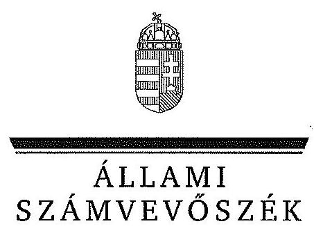
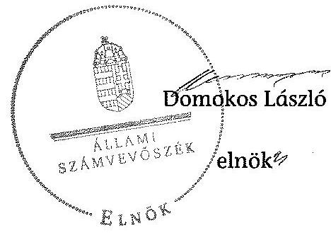
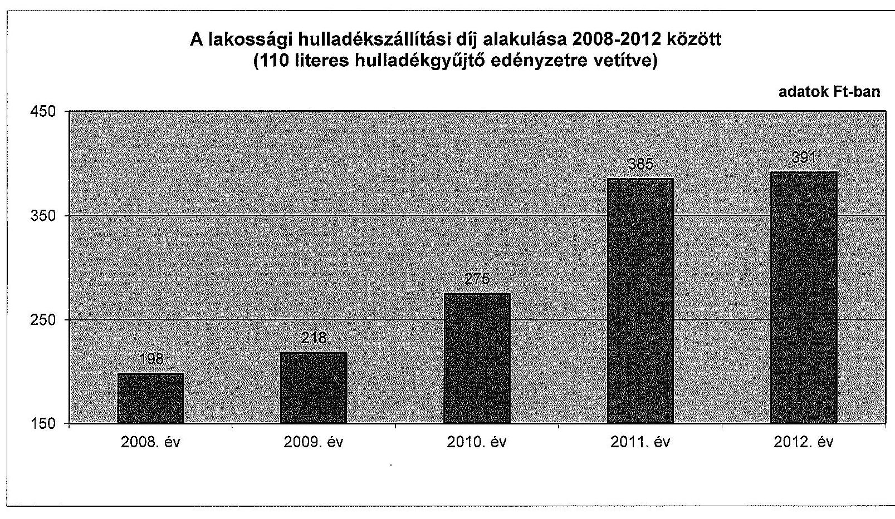

# JELENTÉS 

Az önkormányzatok gazdasági társaságai - Az önkormányzatok többségi tulajdonában lévő gazdasági társaságok közfeladat-ellátását érintő gazdálkodási tevékenysége szabályszerűségének ellenőrzése ÖKO-DOMBÓ Dombóvári Környezet- és Hulladékgazdálkodási Kft.

---

# Állami Számvevőszék 

Iktatószám: V-0467-141/2014.
Témaszám: 1501
Vizsgálat-azonosító szám: V067113
Az ellenőrzést felügyelte:
Dr. Horváth Margit
felügyeleti vezető
Az ellenőrzés vezette és a végrehajtásáért felelős:
Klinga László
ellenőrzésvezető
Az összefoglaló jelentést készítette:
Horváthné Menyhárt Erika
számvevő főtanácsos
Az ellenőrzést végezték:
Dr. Tóthné Frisch Anita
okleveles könyvvizsgáló, külső szakértő

Kiss Katalin
okleveles könyvvizsgáló, külső szakértő

Kolbe Tünde
okleveles könyvvizsgáló, külső szakértő

A témához kapcsolódó eddig készített számvevőszéki jelentések:
címe
sorszáma
Jelentés Dombóvár Város Önkormányzata pénzügyi gazdálkodási 13034
helyzetének, szabályosságának ellenőrzéséről

---

# TARTALOMJEGYZÉK 

BEVEZETÉS ..... 9
I. ÖSSZEGZŐ MEGÁLLAPÍTÁSOK, KÖVETKEZTETÉSEK, JAVASLATOK ..... 12
II. RÉSZLETES MEGÁLLAPÍTÁSOK ..... 18

1. Az Önkormányzat közfeladat-ellátásának szabályszerűsége ..... 18
1.1. A közfeladat-ellátás megszervezése és a feladatellátás feltételrendszerének kialakítása ..... 18
1.2. A közfeladat-ellátás felügyelete és a tulajdonosi jogok érvényesítése ..... 21
2. Az ÖKO-Dombó Kft. közfeladat-ellátással kapcsolatos tevékenysége ..... 26
2.1. Az ÖKO-Dombó Kft. gazdálkodásának szabályozottsága ..... 26
2.2. Az ÖKO-Dombó Kft. vagyongazdálkodása és vagyonnyilvántartása ..... 28
2.3. A beszámolási kötelezettség teljesítése ..... 29
3. A hulladékgazdálkodás közfeladata bevételei és ráfordításai elszámolásának és önköltségszámításának szabályszerűsége ..... 30
3.1. A hulladékgazdálkodás közfeladat bevételeinek és ráfordításainak szabályszerűsége ..... 30
3.2. Az önköltségszámítás szabályszerűsége ..... 31
4. Az ÁSZ korábbi, az önkormányzatok többségi tulajdonában lévő gazdasági társaságok közfeladat-ellátását, gazdálkodását, pénzügyi helyzetét érintő javaslataira tett intézkedések ..... 32
4.1. Az Önkormányzat intézkedési terve és annak hasznosulása ..... 32
MELLÉKLETEK
5. számú Az ÖKO-Dombó Kft. tevékenységének év végi főbb adatai
6. számú Az ÖKO-Dombó Kft. működésének év végi főbb jellemzői
7. számú A lakossági hulladékszállítási díj alakulása 2008-2012 között
FÜGGELÉKEK
8. számú Mintavételi eljárások ellenőrzési területenként

---

# **Chemistry**

## **Chemical Reactions**

### **Balancing Chemical Equations**

1. **Write the unbalanced equation:**
   - Example: $$C_3H_8 + O_2 \rightarrow CO_2 + H_2O$$

2. **Balance the equation:**
   - Example: $$2C_3H_8 + 7O_2 \rightarrow 6CO_2 + 8H_2O$$

3. **Balance the equation:**
   - Example: $$2C_3H_8 + 7O_2 \rightarrow 6CO_2 + 8H_2O$$

### **Types of Reactions**

1. **Combination Reaction:**
   - Example: $$2H_2 + O_2 \rightarrow 2H_2O$$

2. **Decomposition Reaction:**
   - Example: $$2H_2O_2 \rightarrow 2H_2O + O_2$$

3. **Single Displacement Reaction:**
   - Example: $$Zn + 2HCl \rightarrow ZnCl_2 + H_2$$

4. **Double Displacement Reaction:**
   - Example: $$AgNO_3 + NaCl \rightarrow AgCl + NaNO_3$$

5. **Combustion Reaction:**
   - Example: $$CH_4 + 2O_2 \rightarrow CO_2 + 2H_2O$$

## **Stoichiometry**

### **Mole Concept**

- **Mole (mol):** The amount of substance containing as many particles (atoms, molecules, ions) as there are atoms in exactly 12 grams of carbon-12.
- **Avogadro's Number:** $$6.022 \times 10^{23}$$ particles per mole.

### **Molar Mass**

- **Molar Mass:** The mass of one mole of a substance.
- Example: The molar mass of water ($$H_2O$$) is 18.015 g/mol.

### **Calculations**

1. **Moles to Mass:**
   - Formula: $$n = \frac{m}{M}$$
   - Example: Calculate the number of moles of $$H_2O$$ in 18 grams of water.
     - $$n = \frac{18 \, \text{g}}{18.015 \, \text{g/mol}} \approx 0.999 \, \text{mol}$$

2. **Moles to Mass:**
   - Formula: $$m = n \times M$$
   - Example: Calculate the mass of 1 mole of water.
     - $$m = 1 \, \text{mol} \times 18.015 \, \text{g/mol} = 18.015 \, \text{g}$$

## **Gas Laws**

### **Ideal Gas Law**

- **Equation:** $$PV = nRT$$
- **Variables:**
  - $$P$$: Pressure (atm)
  - $$V$$: Volume (L)
  - $$n$$: Number of moles (mol)
  - $$R$$: Ideal gas constant (0.0821 L·atm/mol·K)
  - $$T$$: Temperature (K)

### **Boyle's Law**

- **Equation:** $$P_1V_1 = P_2V_2$$
- **Variables:**
  - $$P_1$$: Initial pressure (atm)
  - $$V_1$$: Initial volume (L)
  - $$P_2$$: Final pressure (atm)
  - $$V_2$$: Final volume (L)

### **Boyle's Law (Boyle's Law)**

- **Equation:** $$\frac{P_1V_1}{T_1} = \frac{P_2V_2}{T_2}$$  (This seems to be a combined gas law, not just Boyle's Law)

## **Thermochemistry**

### **Enthalpy (H)**

- **Definition:** The heat content of a system at constant pressure.
- **Equation:** $$\Delta H = q_p$$
- **Variables:**
  - $$\Delta H$$: Change in enthalpy (J or kJ)
  - $$q_p$$: Heat transferred at constant pressure (J or kJ)

### **Hess's Law**

- **Statement:** The enthalpy change for a reaction is the same whether it occurs in one step or multiple steps.
- **Equation:** $$\Delta H_{\text{reaction}} = \sum \Delta H_{\text{products}} - \sum \Delta H_{\text{reactants}}$$

### **Hess's Law (Hess's Law)**

- **Statement:** The enthalpy change for a reaction is the same whether it occurs in one step or multiple steps.
- **Equation:** $$\Delta H_{\text{reaction}} = \sum \Delta H_{\text{products}} - \sum \Delta H_{\text{reactants}}$$

## **Electrochemistry**

### **Oxidation and Reduction**

- **Oxidation:** Loss of electrons.
- **Reduction:** Gain of electrons.

### **Galvanic Cells**

- **Definition:** A cell that converts chemical energy into electrical energy.
- **Components:**
  - Anode: Oxidation occurs.
  - Cathode: Reduction occurs.
  - Salt Bridge: Connects the two half-cells.

### **Nernst Equation**

- **Equation:** $$E = E^\circ - \frac{RT}{nF} \ln Q$$
- **Variables:**
  - $$E$$: Cell potential (V)
  - $$E^\circ$$: Standard cell potential (V)
  - $$R$$: Ideal gas constant (8.314 J/mol·K)
  - $$T$$: Temperature (K)
  - $$n$$: Number of electrons transferred
  - $$F$$: Faraday constant (96,485 C/mol)
  - $$Q$$: Reaction quotient

---

# RÖVIDÍTÉSEK JEGYZÉKE 

## Törvények

Áht.
ÁSZ tv.

Ebktv.

Gt. tv.

Hgt. 1

Hgt. 2

Mötv.

Nvtv.
Ötv.

Számv. tv.
Taktv.

## Rendeletek

34/2002. (XII. 12.) számú rendelet

64/2008. (III. 28.) Korm. rendelet

126/2003. (VIII. 15.)
Korm. rendelet
224/2004. (VII. 22.)
Korm. rendelet
SZMSZ $_{1}$

SZMSZ $_{2}$

az államháztartásról szóló 2011. évi CXCV. törvény
az Állami Számvevőszékről szóló 2011. évi LXVI. törvény (hatályos: 2011. július 1-jétől)
az egyenlő bánásmódról és az esélyegyenlőség előmozdításáról szóló 2003. évi CXXV. törvény
a gazdasági társaságokról szóló 2006. évi IV. törvény (hatálytalan: 2014. március 15-étől)
a hulladékgazdálkodásról szóló 2000. évi XLIII. törvény (hatálytalan: 2013. január 1-jétől)
a hulladékról szóló 2012. évi CLXXXV. törvény (hatályos: 2013. január 1-jétől, kivéve a 95. § (6) bekezdése, ami 2015. január 1-jén lép hatályba)

Magyarország helyi önkormányzatairól szóló 2011. évi CLXXXIX. törvény (hatályos: 2012. január 1-jétől, kivéve a 144. § (2) bekezdésben meghatározott paragrafusok, amelyek 2012. április 15-én, a (3) bekezdésben meghatározott paragrafusok, amelyek 2013. január 1-jén léptek hatályba, a (4) bekezdésben meghatározott paragrafusok a 2014. évi általános önkormányzati választások napján lépnek hatályba)
a nemzeti vagyonról szóló 2011. évi CXCVI. törvény
a helyi önkormányzatokról szóló 1990. évi LXV. törvény (hatálytalan: a 2014. évi általános önkormányzati választások napjától)
a számvitelről szóló 2000. évi C. törvény
a köztulajdonban álló gazdasági társaságok takarékosabb működéséről szóló 2009. évi CXXII. törvény

Dombóvár Város Önkormányzatának 34/2002. (XII. 12.) számú önkormányzati rendelete a települési szilárdhulladékkal kapcsolatos közszolgáltatásról
a települési hulladékkezelési közszolgáltatási díj megállapításának részletes szakmai szabályairól (hatályos: 2008. április 1-jétől)
a hulladékgazdálkodási tervek részletes tartalmi követelményeiről (hatálytalan: 2013. augusztus 24-étől)
a hulladékkezelési közszolgáltató kiválasztásáról és a közszolgáltatási szerződésről (hatálytalan: 2013. szeptember 5-étől)
Dombóvár Város Önkormányzatának 31/2002. (XI. 29.) számú önkormányzati rendelete az Önkormányzat Szervezeti és Működési Szabályzatáról (hatálytalan: 2011. március 4-étől)
Dombóvár Város Önkormányzatának 11/2011. (III. 04.)

---

vagyongazdálkodási rendelet

## Szórövidítések

Alapító Okirat
ÁSZ
Dél-Kom Kft.
FB
jegyző
KEOP
Képviselő-testület
Közszolgáltatási szerződés

Önkormányzat
ÖKO-Dombó Kft.
polgármester
Polgármesteri hivatal
Szindikátusi szerződés

Társasági szerződés
számú önkormányzati rendelete az Önkormányzat Szervezeti és Működési Szabályzatáról
Dombóvár Város Önkormányzatának 10/2011. (III. 04.) számú önkormányzati rendelete az Önkormányzat vagyonáról és a vagyongazdálkodás szabályairól

ÖKO-Dombó Dombóvári Környezet- és Hulladékgazdálkodási Nonprofit Kft. Alapító Okirata
Állami Számvevőszék
Dél-Kom Dél-Dunántúli Kommunális Szolgáltató Kft.
ÖKO-Dombó Dombóvári Környezet- és Hulladékgazdálkodási Kft. Felügyelőbizottsága
Dombóvár Város Önkormányzatának jegyzője
Környezet és Energia Operatív Program
Dombóvár Város Önkormányzatának Képviselő-testülete
Dombóvár Város Önkormányzata és az ÖKO-Dombó Kft. között létrejött, 2006. december 21-től hatályos Közszolgáltatási szerződés és annak módosításai
Dombóvár Város Önkormányzata
ÖKO-Dombó Dombóvári Környezet- és Hulladékgazdálkodási Nonprofit Kft.
Dombóvár Város Önkormányzatának Polgármestere
Dombóvár Város Önkormányzatának Polgármesteri Hivatala
Dombóvár Város Önkormányzata és a Dél-Kom Dél-Dunántúli Kommunális Szolgáltató Kft. között létrejött, 2008. június 1-jétől hatályos szerződés a társaság vezetésének alapelveiről
Dombóvár Város Önkormányzata és az ÖKO-Dombó Kft. között 2008. április 1-jétől hatályos Társasági szerződés

---

# ÉRTELMEZŐ SZÓTÁR 

gazdasági társaság
kötz
közeladat
közszolgáltatás
közszolgáltatási szerződés tartalmi elemei

Gt. tv. 3. § (1) bekezdése szerint „gazdasági társaságot üzletszerű közös gazdasági tevékenység folytatására külföldi és belföldi természetes és jogi személyek, valamint jogi személyiség nélküli gazdasági társaságok alapíthatnak, működő társaságba tagként beléphetnek, társasági részesedést (részvényt) szerezhetnek."
Jogszabályban meghatározott állami vagy önkormányzati feladat, amit az arra kötelezett közérdekből, jogszabályban meghatározott követelményeknek és feltételeknek megfelelve végez, ideértve a lakosság közszolgáltatásokkal való ellátását, továbbá az állam nemzetközi szerződésekben vállalt kötelezettségeiből adódó közérdekű feladatokat, valamint e feladatok ellátásához szükséges infrastruktúra biztosítását is (Nvtv. 3. § (1) bekezdés 7. pont).
A közszolgáltatás: „közcélú, illetőleg közérdekű szolgáltatást jelent, amely egy nagyobb közösség (állam, település) minden tagjára nézve megközelítőleg azonos feltételek mellett vehető igénybe, ezért valamilyen mértékig közösségi megszervezést, illetve szabályozást, ellenőrzést igényel." Az Ebktv. 3. § d) pontja a következőképpen határozza meg a közszolgáltatást: „szerződéskötési kötelezettség alapján a lakosság alapvető szükségleteinek ellátására irányuló szolgáltatás, így különösen a villamos energia-, gáz-, hő-, víz-, szennyvíz- és hulladékkezelési, köztisztasági, postai és távközlési szolgáltatás, továbbá a menetrend alapján közlekedő járművekkel végzett közforgalmú személyszállítás."

A közszolgáltatási szerződésnek tartalmaznia kell a közszolgáltatás megnevezését, minőségi ismérveit, a teljesítésének területi kiterjedését, a közszolgáltatás megkezdésének időpontját és időtartamát, valamint annak rögzítését, hogy a közszolgáltató vállalta a megjelölt közszolgáltatás teljesítését.
A közszolgáltatási szerződésben a közszolgáltató kötelességeként kell meghatározni:
a) a közszolgáltatás folyamatos és teljes körű ellátását;
b) a közszolgáltatás meghatározott rendszer, módszer és gyakoriság szerinti teljesítését;
c) a közszolgáltatás teljesítéséhez szükséges mennyiségű és minőségű jármű, gép, eszköz, berendezés biztosítását, valamint a szükséges létszámú és képzettségű szakember alkalmazását;
d) a közszolgáltatás folyamatos, biztonságos és bővíthető teljesítéséhez szükséges fejlesztések és karbantartások elvégzését;

---

e) a közszolgáltatás körébe tartozó hulladék ártalmatlanítására az önkormányzat képviselő-testülete által kijelölt helyek és létesítmények igénybevételét;
f) a közszolgáltató által alkalmazott közszolgáltatási díj mértékéről és az alkalmazás tapasztalatairól az önkormányzat képviselő-testületének történő legalább évenkénti egyszeri tájékoztatást;
g) a közszolgáltatás teljesítésével összefüggő adatszolgáltatás rendszeres teljesítését és meghatározott nyilvántartási rendszer működtetését;
h) a fogyasztók számára könnyen hozzáférhető ügyfélszolgálat és tájékoztatási rendszer működtetését;
i) a fogyasztói kifogások és észrevételek elintézési rendjének megállapítását.
A közszolgáltatási szerződésben az önkormányzat kötelességeként kell meghatározni:
a) a közszolgáltatás hatékony és folyamatos ellátásához a közszolgáltató számára szükséges információk szolgáltatását, a Hgt. 23. §-ának g) pontjára tekintettel;
b) a közszolgáltatás körébe tartozó és a településen folyó egyéb hulladékkezelési tevékenységek összehangolásának elősegítését;
c) a településen működtetett különböző közszolgáltatások összehangolásának elősegítését;
d) a települési igények kielégítésére alkalmas hulladék gyűjtésére, kezelésére, ártalmatlanítására szolgáló helyek és létesítmények kijelölését;
e) a közszolgáltató kizárólagos közszolgáltatási jogának biztosítását a 3. § (1) bekezdés a), b) és f) pontjaiban foglaltakra figyelemmel.
Az önkormányzatnak a közszolgáltatás finanszírozásában vállalt kötelezettsége esetén a közszolgáltatási szerződésben meg kell határozni a kötelezettség teljesítésének
 feltételeit és biztosítékait.
A közszolgáltatási szerződés tartalmazza a közszolgáltatás díjának megállapítására és beszedésére vonatkozó módszer leírását, a díjnak a szerződés megkötésekor érvényesíthető legmagasabb mértékét és a díj megváltoztatása érdekében alkalmazandó eljárást. A közszolgáltatási szerződésnek tartalmaznia kell az igazolt díjhátralék kiegyenlítésére vonatkozó eljárást. A közszolgáltatási szerződés tartalmazza azokat a feltételeket, amelyek mellett a közszolgáltató a közszolgáltatás teljesítésére közreműködőt vagy teljesítési segédet vehet igénybe, figyelemmel a Kbt. 304. § (2) bekezdésében foglaltakra is. A közszolgáltató közreműködőért vagy teljesítési segédért való felelőssége a közszolgáltatási szerződésben nem korlátozható. (224/2004. (VII. 22.) Korm. rendelet 11-14. §)

---

minősített többséget biztosító részesedés
saját tőke
tulajdonosi joggyakorló
többségi befolyást biztosító részesedés

A minősített befolyásszerző az ellenőrzött társaságban a szavazatok legalább hetvenöt százalékával rendelkezik. (Gt. tv. 52. § (2) bekezdés)
A saját tőke a - jegyzett, de még be nem fizetett tőkével csökkentett - jegyzett tőkéből, a tőketartalékból, az eredménytartalékból, a lekötött tartalékból, az értékelési tartalékból és a tárgyév mérleg szerinti eredményéből tevődik össze.
Aki a nemzeti vagyon felett az államot vagy a helyi önkormányzatot megillető tulajdonosi jogok és kötelezettségek összességének gyakorlására jogosult (Nvtv. 3. § (1) bekezdés 17. pont).
A Ptk. 685/B. § (1) bekezdése szerint „többségi befolyás: az olyan kapcsolat, amelynek révén természetes személy, jogi személy vagy jogi személyiség nélküli gazdasági társaság (a továbbiakban együtt: befolyással rendelkező) egy jogi személyben a szavazatok több mint ötven százalékával vagy meghatározó befolyással rendelkezik."

---

.

---

# JELENTÉS 

## Az önkormányzatok gazdasági társaságai Az önkormányzatok többségi tulajdonában lévő gazdasági társaságok közfeladat ellátását érintő gazdálkodási tevékenysége szabályszerűségének ellenőrzése

## ÖKO-Dombó Dombóvári Környezet- és Hulladékgazdálkodási Kft.

## BEVEZETÉS

Az Állami Számvevőszék középtávra szóló stratégiájában megfogalmazta, hogy a helyi önkormányzatok gazdálkodásában rejlő pénzügyi kockázatok feltárásával, az államháztartáson kívülre nyújtott költségvetési támogatások és ingyenes vagyonjuttatások, valamint az államháztartáson kívül működő közfeladat-ellátó rendszerek ellenőrzéseivel hozzájárul ahhoz, hogy a közpénzeket az államháztartáson kívül működő szervezetek is átlátható, rendezett módon használják fel a közfeladatok szerződésben vállalt ellátása érdekében.

Az önkormányzatok szervezetalakítási szabadságának következménye, hogy a korábban is vállalati formában működő (nagyvárosi tömegközlekedés, víz-, szennyvízcsatorna, köztisztasági, ingatlankezelés stb.) közszolgáltatások mellett, mind a kötelező, mind az önként vállalt feladatok ellátásában a gazdasági társaságok kiemelt fontosságú szerephez jutottak.

Dombóvár Város Önkormányzata ÖKO-Dombó Dombóvári Környezet- és Hulladékgazdálkodási Nonprofit Kft. (ÖKO-Dombó Kft.) létrehozásáról a 29/2005. (I. 24.) számú határozattal döntött, tevékenységét 2005. június 1-jével kezdte meg. Az ÖKO-Dombó Kft. tulajdonosai Dombóvár Város Önkormányzata, amelynek tulajdonrésze 60%, továbbá a "Dél-Kom" Dél-Dunántúli Kommunális Szolgáltató Kft., amelynek tulajdonrésze 40% volt az ellenőrzött időszakban. Az ÖKO-Dombó Kft. törzstőkéje alakuláskor 50 millió Ft volt, amelyből 30 millió Ft az Önkormányzat által nyújtott pénzbetét, 20 millió Ft a Dél-Kom Kft. által biztosított apport.

Az ÖKO-Dombó Kft. alaptevékenységeként az ellenőrzött időszakban ellátta a közel 20 ezer lakosú Dombóvár Város Önkormányzat közigazgatási területén a szilárd hulladék gyűjtésével, hulladék kezelésével kapcsolatos közszolgáltatás folyamatos és teljes körű ellátása volt. Az ÖKO-Dombó Kft. a hulladékkezelési közfeladat-ellátása során több mint 8310 háztartásból, a településen működő gazdálkodó szervezetektől, valamint a közterületi gyűjtőedényekből a települési

---

szilárd hulladékot rendszeresen begyűjtötte és elszállította, továbbá megszervezte a lakosság által a lomtalanítás során összegyűjtött hulladék, illetve a lakossági veszélyes hulladék elszállítását. Az ÖKO-Dombó Kft. egy lakossági hulladékgyűjtő udvart és szelektív hulladékgyűjtő szigeteket üzemeltetett.

Az ÖKO-Dombó Kft.-nél foglalkoztatottak éves átlagos statisztikai létszáma 2008-ban 18 fő, míg 2012. december 31-én 15 fő volt. Az ÖKO-Dombó Kft. összes bevétele 2008-ban 135,2 millió Ft, a 2012. évben 172,1 millió Ft volt, amelyből az értékesítés nettó árbevétele 2008-ban 116,6 millió Ft, míg 2012-ben 169,5 millió Ft volt. Az árbevételek az ellenőrzött időszakban 45,3%-kal, a ráfordítások 11,2%-kal nőttek. Az ÖKO-Dombó Kft. a 2012. évben 6005,2 tonna kommunális hulladék hulladéklerakóba történő szállítását végezte el.

Az ÖKO-Dombó Kft. az ellenőrzött időszakban negatív mérleg szerinti eredménnyel zárt, a 2012. évben 3,7 millió Ft összegű veszteség keletkezett. Az ÖKO-Dombó Kft. mérleg szerinti eszközállománya a 2008. évi nyitó 99,8 millió Ft-ról a 2012. év végére 65,6 millió Ft-ra csökkent, amit legnagyobb mértékben a tárgyi eszközök állományának közel 70%-os csökkenése befolyásolt. A saját tőke a 2008. évi nyitó 44,5 millió Ft-ról a 2012. év végére 9,8 millió Ft-ra változott.

Az ellenőrzött időszakban a polgármester személye négy alkalommal, a jegyző személye öt alkalommal változott. A polgármester a 2010. évi önkormányzati választások óta tölti be tisztségét, a helyszíni ellenőrzés időszakában a munkakört betöltő jegyző 2013. februártól látja el feladatait. Az ügyvezető 2008. április 1-je óta tölti be tisztségét.

Az önkormányzati tulajdonú gazdasági társaságok teljes körű ellenőrzésének lehetőségét az Állami Számvevőszékről szóló 1989. évi XXXVIII. törvény 2011. január 1-jétől hatályos módosítása teremtette meg.

Az ellenőrzés célja annak értékelése volt, hogy

- az önkormányzat a jogszabályi előírások figyelembevételével döntött-e az ellenőrzésre kerülő közfeladat megszervezéséről; az önkormányzat szabályszerűen gyakorolta-e a tulajdonosi jogokat;
- a gazdasági társaság közfeladat-ellátása bevételeinek, ráfordításainak elszámolása, és vagyongazdálkodási tevékenysége megfelelt-e a jogszabályi, illetve a közszolgáltatási szerződésben foglalt tulajdonosi előírásoknak, azok végrehajtása szabályszerű volt-e;
- a közfeladatok átláthatósága és elszámoltathatósága érdekében biztosítva volt-e a közszolgáltatás díjának megalapozottsága szabályszerű önköltségszámítással.

Az ellenőrzés kiterjedt Dombóvár Város Önkormányzatára és az ÖKO-Dombó Dombóvári Környezet- és Hulladékgazdálkodási Korlátolt Felelősségű Társaságra.

Az ellenőrzés várható hasznosulása: A törvényalkotás számára - az észlelt problémák, szabálytalanságok, vagy egyéb nem kívánatos jelenségek felszínre kerülésével - az ellenőrzés megállapításai segítséget nyújthatnak az ál-

---

lamháztartáson kívüli közfeladat-ellátás értékeléséhez, jogszabályi keretei pontosításához, átláthatóságot biztosító szabályozásához. Meghatározhatóvá válnak a közfeladat ellátásban részt vevő államháztartáson kívüli szervezeteknek - az önkormányzat költségvetését, pénzügyi helyzetét is befolyásoló - kockázatai, lehetővé válik ezen kockázatok csökkentése. Feltárja, hogy az önkormányzat közfeladat-ellátási kötelezettségének szabályszerűen tett-e eleget, a feladatellátáshoz rendelt közvagyon működtetését szabályszerűen szervezte-e meg és a tulajdonosi felügyelete hozzájárult-e a közfeladat-ellátásához. A feladatot ellátó gazdasági társaság a közszolgáltatási szerződésben foglaltak betartásával, a közvagyon használatával biztosította-e a szolgáltatás folytatásának feltételeit. Ezzel az ellenőrzöttek és a helyi döntéshozók számára visszajelzést ad feladatszervezési, feladat-ellátási kockázataikról, alapot ad a meglévő hibák megszüntetéséhez, a jobb közfeladat-ellátás biztosításához. Fokozza a fegyelmet, igazolja, hogy lejárt a következmények nélküli ellenőrzések időszaka. Az ÁSZ értékteremtő rend kialakításához és megőrzéséhez hozzájáruló tevékenysége pozitív hatással van a szervezetről kialakított összkép formálására is.

A bevételek és ráfordítások elszámolása, valamint a vagyonnyilvántartás terén az egyes területek szabályszerű működését mintavétellel ellenőriztük, ez alapján a sokaságokban előforduló hibás tételek arányát becsültük. A jogszabályoknak és a belső előírásoknak megfelelőnek, azaz szabályszerűnek tekintettük az adott bevételek és ráfordítások elszámolását, a vagyonnyilvántartást, amennyiben a minta ellenőrzésének eredménye alapján 95%-os bizonyossággal a teljes sokaságban a hibás tételek aránya kisebb volt, mint 10%, nem megfelelőnek értékeltük, ha a hibás tételek aránya a 10%-ot meghaladta. Kockázatot, illetve magas kockázatot jeleztünk, amennyiben egy adott terület vonatkozásában a minta alapján a teljes sokaságban nem volt teljes körűen biztosított a jogszabályoknak és a belső szabályzatoknak megfelelő működés (1. számú függelék).

Az ellenőrzést a számvevőszéki ellenőrzés szakmai szabályai szerint, szabályszerűségi ellenőrzés módszerével, a vonatkozó nemzetközi standardok figyelembevételével végeztük. Az ellenőrzés a 2008-2012. évekre terjedt ki.

Az ellenőrzés végrehajtásának jogszabályi alapját az Állami Számvevőszékről szóló 2011. évi LXVI. törvény 5. § (3)-(4)-(5) bekezdése képezi.

A Jelentés tervezetét észrevételezésre megküldtük Dombóvár Város Önkormányzata polgármesterének, valamint a társaság ügyvezetőjének. Az érintettek észrevételt nem tettek.

---

# I. ÖSSZEGZŐ MEGÁLLAPÍTÁSOK, KÖVETKEZTETÉSEK, JAVASLATOK 

A Képviselő-testület az Önkormányzat közigazgatási területén a szilárd hulladék gyűjtése, ártalmatlanítása, hasznosítása és a közterületek tisztántartása közfeladatának ellátásáról az Ötv. előírásainak figyelembevételével döntött. A Képviselő-testület az Alapító Okiratban és az SZMSZ 1,2-ben előírta a szilárd hulladék kezelés és szállítás közfeladat ellátásának kötelezettségét. Az Önkormányzat elkészítette a 2006-2010. évekre szóló Gazdasági programját, amelyet a Képviselő-testület által meghatározott területek programjai alapoztak meg. A Környezetgazdálkodási program a hulladékgazdálkodással kapcsolatos intézkedések fő irányát a hulladékudvar kialakításában, a szeméttelep rekultivációjában, a rendszeres szelektív hulladékgyűjtés minél szélesebb kiterjesztésében, valamint az illegális szeméttelepek felszámolásában határozta meg. A 2010-2014. évekre szóló Gazdasági programban rögzítették a szemetelés visszaszorítását, a közterületen keletkező zöldhulladék ártalmatlanítását, esetleges újrahasznosítását.

Az Önkormányzat kidolgozta a 2004-2008., majd 2009-2014. közötti időszakra szóló - a Hgt. 1-ben és a 126/2003. (VIII. 15.) Korm. rendeletben előírtaknak megfelelő - hulladékgazdálkodási tervét, amit a Képviselő-testület rendeletben kihirdetett. Az Önkormányzat a szilárdhulladék begyűjtés, ártalmatlanítás és szállítás közfeladatának ellátását az ÖKO-Dombó Kft.-vel 2006. december 21-én 10 évre kötött Közszolgáltatási szerződésben határozta meg, amit a Környezetvédelmi és Vízügyi Minisztérium Fejlesztési Igazgatósága jóváhagyott. A Közszolgáltatási szerződés megfelelt a 224/2004. (VII. 22.) Korm. rendeletben előírt tartalmi követelményeknek. A Közszolgáltatási szerződést 2012. július 1-jén módosították, amely során kiegészítették a szelektív hulladék gyűjtésével, elszállításával kapcsolatos feladatokkal.

A Képviselő-testület a Hgt. 1-ben előírt kötelezettségének eleget tett és a 34/2002. (XII. 12.) számú rendeletében állapította meg „A települési szilárdhulladékkal kapcsolatos közszolgáltatásról" szóló szabályokat. A személyes adatok védelmével kapcsolatos előírásokat a Hgt. 1-ben előírtak ellenére nem tartalmazott a rendelet. A díjfizetési kötelezettség szabályaival kapcsolatban meghatározták, hogy a közszolgáltatás díjtételét az egyszeri ürítési díj adja, továbbá előírták a közszolgáltatás kötelező igénybevételét, illetve a díjfizetési kötelezettség szabályait, a díjfizetés rendjét. A 34/2002. (XII.12.) számú rendeletben előírt díjkalkuláció és a Közszolgáltatási szerződésben meghatározott díjszámítás módja az ellenőrzött időszakban összhangban volt. Az ÖKO-Dombó Kft. 2008-2012. évekre vonatkozó díjjavaslatait a Közszolgáltatási szerződésben meghatározott előírásoknak megfelelően alakította ki.

Az Önkormányzat az ellenőrzött időszakban a díjjavaslatban meghatározottnál alacsonyabb értékben határozta meg a közszolgáltatási díjat, ami az ÖKO-Dombó Kft. számára bevételkiesést eredményezett. Az ellenőrzött időszakban a díj javasoltnál alacsonyabb mértékben történő megállapítása összesen 80272 ezer Ft árbevétel kiesést eredményezett, így minden évben veszteség ke-

---

letkezett. Az ÖKO-Dombó Kft. a Közszolgáltatási szerződésben rögzítettek alapján az ellenőrzött időszakban díjkompenzációra volt jogosult, mivel az Önkormányzat a javasolt díjmértéknél alacsonyabb összegben határozta meg a közszolgáltatás díját. A díjkompenzációs igényt a Képviselő-testület határozatai alapján a 2009-2010. és a 2012. évekre vonatkozóan összesen 29913 ezer Ft összegben fogadta el, így az ellenőrzött időszakra kimutatott árbevétel kiesés 37,3%-ban térült meg. Az Önkormányzat a közszolgáltatás éves díjainak meghatározásakor nem a Szindikátusi szerződésben meghatározottaknak megfelelően járt el, mivel az abban foglaltak ellenére döntései nem segítették elő az ÖKO-Dombó Kft. eredményességének növelését, az üzleti terv teljesülését. A 2008-2010. évi díjavaslatnál az alacsonyabb mértékű díjmegállapítást a Képviselő-testület nem indokolta. A 2011. évi díjak esetében az elkészített díjavaslat nem kellő megalapozottságával, a 2012. évi díjak megállapításakor a lakossági terhek növekedésének elkerülésével indokolta a Képviselő-testület a javasolt díj csökkentését. Az Önkormányzat díjakkal kapcsolatos döntései nem álltak összhangban a 34/2002. (XII. 12.) számú rendeletben a díjfizetési kötelezettségről
 szóló előírással, valamint a 64/2008. (III. 28.) Korm. rendeletben előírtakkal, miszerint a közszolgáltatási díjat úgy kell meghatározni, hogy az indokolt költségek és ráfordítások megtérülésének és a tartós működéshez szükséges nyereség fedezetének biztosítására alkalmas legyen, és ösztönözzön a közszolgáltatás biztonságos és legkisebb költségű ellátására.

Az Önkormányzat a gazdasági társaságok feletti tulajdonosi jogok gyakorlásának szabályait a vagyongazdálkodási rendeletben határozta meg, amely alapján az Önkormányzat legalább többségi tulajdonában lévő gazdasági társaságokban a tulajdonosi jogokat a taggyűlés kizárólagos hatáskörei esetében a Képviselő-testület, minden más esetben a Városgazdálkodási Bizottság gyakorolta. Az ellenőrzött időszakban a Városgazdálkodási Bizottság a közfeladatellátással kapcsolatban tulajdonosi jogkörben történő döntést nem hozott, azt kizárólag a Képviselő-testület gyakorolta. A Képviselő-testület a 2008-2012. években az ÖKO-Dombó Kft. feletti tulajdonosi jogokat szabályszerűen gyakorolta. Az FB a Gt. tv. előírásának megfelelően a számviteli beszámolóról írásbeli jelentést készített. Az FB Képviselő-testület felé történő közvetlen beszámolási kötelezettségét, az FB jelentések tulajdonosi jogkört gyakorló általi megismerését nem írták elő. A Képviselő-testület az FB beszámolóinak elfogadásáról - előterjesztés hiányában - nem döntött, az FB ügyrendjében az előterjesztés kötelezettségét nem írták elő.

Az ÖKO-Dombó Kft. saját tőke/jegyzett tőke aránya a 2008. évben 42,9%, a 2009. évben 43,9%, a 2010. évben 42,1% volt. A Gt. tv.-ben előírtaknak való megfelelés érdekében a tulajdonosok összehívása megtörtént. A saját tőke/jegyzett tőke előírt arányának (50%) biztosítása érdekében a 2009. évben 1,0 millió Ft jegyzett tőkeemelésről döntött a taggyűlés, amelynek az Önkormányzatra eső hányada 600 ezer Ft volt. Emellett 3,0 millió Ft pótbefizetésről is döntöttek. A 2010. évben 7,0 millió Ft, a 2011. évben 26,0 millió Ft jegyzett tőke csökkentést hajtottak végre. Ennek eredményeként a saját tőke/jegyzett tőke aránya 2011-ben 75,7%, 2012-ben 54,7% volt.

Az ellenőrzött időszakban a hulladékgazdálkodással, az ÖKO-Dombó Kft. gazdálkodásával kapcsolatosan az Önkormányzat belső ellenőrzése nem tervezett és nem folytatott le ellenőrzést. Az éves ellenőrzési terveket megalapozó

---

kockázatelemzés az Önkormányzat többségi tulajdonú gazdasági társaságaira nem terjedt ki. Az Önkormányzat a 2009. évben folytatott le tulajdonosi ellenőrzést az ÖKO-Dombó Kft.-nél, amit egy ideiglenesen létrehozott eseti bizottság hajtott végre. Az ellenőrzés a feleslegesnek ítélt eszközök értékesítése, az edényhasználat, illetve a Polgármesteri hivatal által történő, számlázáshoz kapcsolódó adatszolgáltatás biztosítása tárgyában történt. Az ellenőrzés az ÖKO-Dombó Kft. által javasolt közszolgáltatási díjak elfogadására, a lakossági díj beszedés hatékonyságának növelése érdekében a lakcímnyilvántartás felülvizsgálatára tett javaslatot. Az ellenőrzésről készült jelentést, valamint az abban javasolt intézkedéseket a Képviselő-testület elfogadta, azonban nem hajtotta végre.

Az ÖKO-Dombó Kft. a Számv. tv. számviteli szabályzat készítési kötelezettségének előírásait megsértve 2008. április 22-ig számviteli politikával, 2008. május 4-ig eszközök és források leltárkészítési és leltározási szabályzatával, eszközök és források értékelési szabályzatával, pénzkezelési szabályzattal nem rendelkezett. Ezt követően a számviteli szabályzatokat elkészítették. A 2008. május 5-én hatályba lépett leltárkészítési és leltározási szabályzat hiányossága volt, hogy általános előírásokat tartalmazott, a leltározási tevékenység szabályozásánál a szervezeti sajátosságokat nem vették figyelembe, ezért nem volt alkalmas a szabályos leltározás végrehajtásának szabályozására. A szabályzat a leltározásra, a leltározás folyamatára nem tartalmazta vállalkozás számára meghatározó összes lényeges előírást. Az ÖKO-Dombó Kft. évente leltározott, a főkönyvi könyvelés és az analitikus nyilvántartások közötti egyezőség biztosított volt. Az eszközök és források értékelési szabályzata a Számv. tv. előírásaival és a számviteli politikával összhangban szabályozta az értékvesztés elszámolását. Az ÖKO-Dombó Kft. a Számv. tv.-ben foglalt értékhatárokat nem érte el az ellenőrzött időszakban, ezért önköltségszámítás rendjére vonatkozó belső szabályzatot nem készített.

Az ÖKO-Dombó Kft. feladatainak ellátásához az Önkormányzattól nem vett át vagyont, könyveiben a saját vagyonát tartotta nyilván. A közszolgáltatási feladatokat a saját vagyontárgyakon túl az Önkormányzattól bérelt eszközzel látta el. Az ÖKO-Dombó Kft. vagyonának nyilvántartása során szabályszerűen járt el. Az immateriális javak és tárgyi eszközök állománynövekedésének, valamint értékcsökkenésének elszámolása megfelelt a vonatkozó szabályozásnak. A Közszolgáltatási szerződésben a vagyongazdálkodással összefüggésben nem határoztak meg elvárásokat, a hulladékgazdálkodási feladat ellátása során az ÖKO-Dombó Kft. vagyongazdálkodási tevékenysége megfelelt a Számv. tv. előírásainak.

Az ÖKO-Dombó Kft. az ellenőrzött időszakban évenként elkészítette üzleti tervét és éves üzleti jelentéseit. Az ÖKO-Dombó Kft. a tulajdonosi joggyakorló felé fennálló adatszolgáltatási kötelezettségeit a szabályozásnak megfelelően teljesítette. Az ÖKO-Dombó Kft. számviteli beszámolóiról a könyvvizsgálói jelentések a 2008-2011. években figyelemfelhívó megjegyzést, a 2012. évben korlátozott záradékot tartalmaztak. Ezekben a könyvvizsgáló felhívta a figyelmet a vállalkozás kedvezőtlen vagyoni és pénzügyi helyzetére. A 2012. évi korlátozott záradék indoka volt, hogy a lejárt határidejű kötelezettségek pénzügyi teljesítésének bizonytalansága jelentős kétséget vetett fel az ÖKO-Dombó Kft. vállalkozás folytatására vonatkozó képességével kapcsolatban. A 2012. évi mérlegben

---

kimutatott kötelezettségek összegéből 33912 ezer Ft a Dél-Kom Kft.-vel szembeni tartozás volt, melyből 11147 ezer Ft pénzügyi rendezésre került 2013. január 18-án. A fennmaradó 22765 ezer Ft a könyvvizsgálói vélemény kialakításakor lejárt határidejű tartozásnak minősült.

Az ÖKO-Dombó Kft. kizárólag hulladékgazdálkodási feladatot látott el. A hulladékgazdálkodási közfeladat értékesítés nettó árbevételeinek elszámolása során az ÖKO-Dombó Kft. szabályszerűen járt el. A bevételek előírása és kiszámlázása a számviteli politikában előírtaknak megfelelően történt, a bevételeket a megfelelő számlacsoportban számolták el. Az alkalmazott szolgáltatási díjak megfeleltek a belső szabályozásnak és a tulajdonosi követelményeknek. A hulladékgazdálkodási közfeladat anyagjellegű ráfordításainak elszámolása során az ÖKO-Dombó Kft. szabályszerűen járt el. A költségelszámolást megalapozó kötelezettségvállalás, a költségek elszámolása a számviteli politikában előírtaknak megfelelően történt. A költségelszámolást megalapozó dokumentumok rendelkezésre álltak. A költségeket a megfelelő költségnemre, közfeladatra számolták el.

Az ÖKO-Dombó Kft. az ellenőrzött időszakban önköltségszámítási szabályzat készítésére nem volt kötelezett. Az éves díjak tervezett összegét a 64/2008. (III. 28.) Korm. rendelet előírásai alapján kalkulálták az összes költség, ráfordítás és a tervezett eredmény figyelembe vételével. Az ÖKO-Dombó Kft. kizárólag hulladékgazdálkodási feladatot látott el az ellenőrzött időszakban, ezért a ráfordítások és bevételek egyéb tevékenységtől való elhatárolása nem vált szükségessé, minden költség a hulladékgazdálkodással összefüggésben merült fel.

Az ÁSZ számvevőszéki jelentéssel lezárt ellenőrzése a gazdasági társaság köz-feladat-ellátásával kapcsolatban javaslatot nem fogalmazott meg.

A fentiekben leírtak összegzéseként az alábbi megállapításokat tesszük:
A hulladékgazdálkodási feladat ellátását biztosító kereteket kialakították, azok tartalmában megfeleltek az előírásoknak. A tulajdonos az FB-n keresztül biztosította az ÖKO-Dombó Kft. feletti kontrollt, azonban a belső ellenőrzés hiánya miatt nem segítette elő az ÖKO-Dombó Kft. szabályszerű működésének kontrollálását. A díjkompenzációs igények alulteljesítése folyamatosan hozzájárult a veszteség kialakulásához. Az ellenőrzött időszakban az ÖKO-Dombó Kft. számviteli rendszerének szabályozottsága jelentősen javult.

Az Állami Számvevőszékről szóló 2011. évi LXVI. törvény 33. § (1) bekezdésében foglaltak értelmében a jelentésben foglalt megállapításokhoz kapcsolódó intézkedési tervet köteles az ellenőrzött szervezet vezetője összeállítani, és azt a jelentés kézhezvételétől számított 30 napon belül az ÁSZ részére megküldeni. Amennyiben az intézkedési tervet határidőben nem küldi meg a szervezet, vagy az nem elfogadható, az ÁSZ elnöke a hivatkozott törvény 33. § (3) bekezdés a)-b) pontjaiban foglaltakat érvényesítheti.

Az ellenőrzés intézkedést igénylő megállapításai és javaslatai:

---

Javaslataink célja a Kft. gazdálkodása szabályszerűségének javítása annak érdekében, hogy a szabályozási környezet megfelelően tudja támogatni az átlátható működést.

Javasoljuk az ÖKO-Dombó Dombóvári Környezet- és Hulladékgazdálkodási Kft. ügyvezető igazgatójának:

1. A társaság a Számv. tv. 14. § (5) bekezdés a) pontja szerint a leltározási és leltárkészítési szabályzatát elkészítette és 2008. május 5-én hatályba léptette. A szabályzat azonban csak általános előírásokat tartalmazott, nem szabályozta a Számv. tv. 14. § (3) bekezdésében előírtaknak megfelelően a szervezeti sajátosságoknak megfelelő leltározási folyamatot, ezért nem biztosította a szabályszerű leltározást.

Javaslat:
Gondoskodjon a szabályozási hiányosság megszüntetésére, ennek keretében:
Intézkedjen a leltározási és leltárkészítési szabályzat szervezeti sajátosságoknak megfelelő kiegészítéséről és a módosítás hatálybaléptetéséről.

Javaslataink célja az önkormányzat szabályszerű működésének elősegítése, továbbá az önkormányzati tulajdonosi joggyakorlás kontrolljainak erősítése.

# Javasoljuk Dombóvár Város Önkormányzata Jegyzőjének: 

1. A Képviselő-testület a Hgt., 23. §-ában előírt kötelezettségének eleget tett és az 34/2002. (XII. 12.) önkormányzati rendeletében állapította meg a települési szilárdhulladékkal kapcsolatos közszolgáltatásról szóló szabályokat. Ugyanakkor a rendelet a Hgt., 23. § g) pontjában ${ }^{1}$ előírtakkal ellentétben nem tartalmazott a személyes adatok kezelésével kapcsolatos előírásokat.

Javaslat:

## Gondoskodjon a szabályozási hiányosság megszüntetésére, ennek keretében:

Készítse elő az Önkormányzat vonatkozó rendeletének kiegészítését a személyes adatok kezelésével kapcsolatos előírásokkal, ezt követően gondoskodjon a belső szabályozás szerint a Képviselő-testület elé terjesztéséről.
2. Az Önkormányzat belső ellenőrzése az ellenőrzéseivel a hulladékgazdálkodás, mint közfeladat-ellátás szabályszerű teljesítéséhez ellenőrzéseivel nem járult hozzá. Az ellenőrzött időszakban a társaság gazdálkodásával és működésével kapcsolatban ellenőrzést nem folytatott le.

Intézkedjen a jogszabályi előírások szerinti gyakorlat és a szabályos működés biztosítására, ezen belül:

[^0]
[^0]:    ${ }^{1}$ 2013. január 1-jétől a Hgt. 235. §. g) pontjában

---

Javaslat:
fordítson kiemelt figyelmet arra, hogy az Önkormányzat belső ellenőrzése az ellenőrzéseivel a hulladékgazdálkodás, mint közfeladat-ellátás szabályszerű teljesítéséhez járuljon hozzá.

---

# II. RÉSZLETES MEGÁLLAPÍTÁSOK 

## 1. Az ÖNKORMÁNYZAT KÖZFELADAT-ELLÁTÁSÁNAK SZABÁLYSZERŰSÉGE

### 1.1. A közfeladat-ellátás megszervezése és a feladatellátás feltételrendszerének kialakítása

A köztisztaság és a településtisztaság biztosítása az Ötv. 8. § (1) bekezdése ${ }^{2}$ alapján az önkormányzat törvényi kötelezettsége. Az Önkormányzat közigazgatási területén a szilárd hulladék gyűjtése, ártalmatlanítása, hasznosítása és a közterületek tisztántartása feladatának ellátásáról közszolgáltatás megszervezése útján gondoskodott.

A Képviselő-testület az Alapító Okiratban és az SZMSZ ${ }_{1,2}$-ben előírta a szilárd hulladék kezelés és szállítás közfeladat ellátásának kötelezettségét. Az SZMSZ ${ }_{1,2}$-ben a közfeladat-ellátásának választott módját nem határozta meg a Képviselő-testület.

Az Önkormányzat elkészítette a 2006-2010. évekre szóló Gazdasági programját, amelyet a Képviselő-testület által meghatározott területek programjai alapoztak meg. A Környezetvédelmi program fő céljaként egy "élhetőbb és tisztább környezet" kialakítását határozták meg. Ennek keretében fogalmazták meg a legfontosabb célkitűzéseket, mint a komplett hulladékszállítási rendszer kialakítását, a felszíni és felszín alatti vizek védelmét, a belvárosi közterületek rendezettségének növelését. A hulladékgazdálkodással kapcsolatos intézkedések fő irányát a hulladékudvar kialakításában, a szeméttelep rekultivációjában és a rendszeres szelektív hulladékgyűjtés minél szélesebb kiterjesztésében határozták meg. Rögzítették továbbá, hogy az Önkormányzat nagy gondot fordít az illegális szeméttelepek felszámolására. A Gazdasági programban előírták a 2004. évben elkészült Hulladékgazdálkodási terv kétévente történő felülvizsgálatának kötelezettségét.

A 2010-2014. évekre szóló Gazdasági programban rögzítették a hajléktalan személyek által elkövetett szemetelés visszaszorítását, a közterületen keletkező zöldhulladék ártalmatlanítását, esetleges újrahasznosítását.

Dombóvár a települési szilárdhulladék-gazdálkodással kapcsolatos kötelezettségeinek megoldására csatlakozott a „Mecsek-Dráva Hulladékgazdálkodási Programhoz" (KEOP 1.1.1.), amely Pécs Megyei Jogú Város kezdeményezésére a Pécs, Marcali, Nagyatád, Barcs, Dombóvár, Selye és Bóly vonzáskörzetében lévő települések között jött létre. A program teljes beruházási költsége nettó 16874 millió Ft

[^0]
[^0]:    ${ }^{2}$ A helyi közügyek, valamint a helyben biztosítható közfeladatok körében ellátandó helyi önkormányzati feladatként a hulladékgazdálkodást 2013. január 1-jétől az Mötv. 13. § (1) bekezdés 19. pontja írja elő.

---

volt. A szeméttelepek
 folyamatos felszámolása a Mecsek-Dráva Hulladékkezelési program keretében valósult meg, amely a 2013. évben fejeződött be.

A hulladékgazdálkodási program mellett az Önkormányzat csatlakozott a „Mecsek-Dráva Rekultivációs Programhoz" (KEOP 2.3.0.), amelynek célja a régió 89 lerakójának rekultivációja. A program teljes beruházási költsége bruttó 6877 millió Ft.

A Környezetvédelem területén célként emelték ki, hogy a Polgármesteri hivatal Városüzemeltetési Irodájának 2012-ig meg kell vizsgálnia annak lehetőségét, hogy a Görcsönyi hulladéklerakón kívül milyen feltételekkel szállíthat hulladékot az ÖKO-Dombó Kft. a Kaposváron és a Somban működő hulladék lerakókba. A Városüzemeltetési Iroda vizsgálatára 2012. december 31-ig nem került sor.

Az Önkormányzat a Hgt.: 35 § (1) bekezdésében előírtaknak megfelelően külső szervezet bevonásával ${ }^{3}$ - kidolgozta 2004-2008., majd 2009-2014. közötti időszakra szóló hulladékgazdálkodási tervét, amit a Képviselőtestület jóváhagyott ${ }^{4}$. A hulladékgazdálkodási tervet a Hgt.: 35. § (3) bekezdéseiben előírtaknak megfelelően rendeletben a Képviselő-testület kihirdette. A középtávra vonatkozó hulladékgazdálkodási tervek tartalma a Hgt.: 37 § (4) bekezdése, valamint a hulladékgazdálkodási tervek részletes tartalmi követelményeiről szóló 126/2003. (VIII. 15.) Korm. rendelet 8-11. §-ai és 1. számú mellékletében foglalt előírásoknak megfelelt. A 2009-2014 közötti időszakra szóló hulladékgazdálkodási terv a Hgt.: 37 § (1) bekezdésében előírtakkal összhangban hat évre készült ${ }^{5}$, abban két évente történő beszámolási kötelezettséget írtak elő, amelynek az ellenőrzött időszakban eleget tettek. A Hulladékgazdálkodási terv szorosan illeszkedett a „Mecsek-Dráva Hulladékgazdálkodási Programhoz".

A 2009-2014. időszakra vonatkozó Hulladékgazdálkodási terv tartalmazta a településen keletkező, hasznosítandó, ártalmatlanítandó hulladékok mennyiségét, eredetét, a hulladékkezeléshez kapcsolódó műszaki követelményeket, a speciális intézkedéseket, a hulladékok kezelésének előírásait, a kezelésre felhatalmazott vállalkozásokat, a hulladékgazdálkodással kapcsolatos célokat és azok elérésének módját.

A szilárdhulladék begyűjtés, ártalmatlanítás és szállítás közfeladatának 10 év határozott ideig történő ellátására az Önkormányzat és az ÖKO-Dombó Kft. 2006. december 21-én Közszolgáltatási szerződést kötött (1. számú melléklet). A Környezetvédelmi és Vízügyi Minisztérium Fejlesztési Igazgatósága által jóváhagyott Közszolgáltatási szerződés megfelelt a 224/2004. (VII. 22.) Korm. rendelet 11-14. §-aiban előírt tartalmi követelményeknek.

[^0]
[^0]:    ${ }^{3}$ MKM Consulting Zrt.
    ${ }^{4}$ 54/2004. (IX. 1.) számú és 30/2009. (IX. 10.) számú önkormányzati rendeletek
    ${ }^{5}$ A Hgt. 2 78. § (1) bekezdésében előírtak alapján 2013. január 1-jétől a közszolgáltató legalább 3 évente - közszolgáltatói hulladékgazdálkodási tervet készít. A 2013. január 1-jei időszakot megelőzően hulladékgazdálkodási terv készítési kötelezettsége az Önkormányzatnak volt.

---

A Közszolgáltatási szerződésben meghatározták a felmondás feltételeit, az Önkormányzat kötelezettségeit, mint a hulladékkezelési tevékenységek összehangolásának elősegítését, a szükséges adatok, információk megadását, a közszolgáltató kizárólagos közszolgáltatási jogának biztosítását, valamint a közszolgáltatási díj megállapításakor a díjkompenzáció megtérítése, a díjkedvezmény vagy díjmentesség miatt felmerülő költségek megtérítésének szabályait. Az ÖKO-Dombó Kft. kötelezettségeiként előírták a hulladék begyűjtésének módszerét, rendszerességét, a hulladék szállítását, az erőforrások biztosítását, a beruházások, felújítások, karbantartások elvégzését, az adatszolgáltatást kiszolgáló nyilvántartási rendszer működtetését, a Képviselőtestület évente legalább egyszeri alkalommal történő tájékoztatását, a költségek elkülönített nyilvántartását, és az évente történő költségelszámolás elkészítését. A Közszolgáltatási szerződés a közszolgáltató kötelezettségeiként sorolta fel a szükséges mennyiségű és minőségű jármű, eszköz, gép, berendezés, valamint a szükséges létszámú és képzettségű munkavállaló alkalmazását.

Az ÖKO-Dombó Kft. számára az Önkormányzat nem írt elő a közszolgáltatási tevékenység mérésére alkalmas kritériumrendszert, nem állított fel az ellátás színvonala értékeléséhez szükséges szakmai követelményeket, illetve nem alakított ki a szakmai feladat-ellátás gazdaságosságának, hatékonyságának mérésére vonatkozó mutatószámokat.

A közfeladat-ellátásban a 2008-2012. években változás nem történt. A Képviselő-testület a közfeladat-ellátást 2009-ben felülvizsgáltatta, amelynek eredményét határozatokban fogadták el. A Képviselő-testület változtatás nélkül helybenhagyta a Közszolgáltatási szerződés és a közfeladat-ellátás tartalmát, módját.

A Közszolgáltatási szerződés az Önkormányzat részéről közvagyon átadásáról nem rendelkezett, mivel a feladat ellátáshoz szükséges tárgyi eszközöket az ÖKO-Dombó Kft. alapításakor a Dél-Kom Kft. apportként biztosította.

A Közszolgáltatási szerződést 2012. július 1-jén módosították, amely során kiegészítették a szelektív hulladék gyűjtésével, elszállításának módjával, gyakoriságával, a gyűjtőszigetek kialakításával, azok meghatározásával kapcsolatos feladatokkal.

A Képviselő-testület a Hgt. ${ }_{1} 23$ §-ában ${ }^{6}$ előírt kötelezettségének eleget tett és rendeletben ${ }^{7}$ állapította meg „A települési szilárdhulladékkal kapcsolatos közszolgáltatásról" szóló szabályokat. A 34/2002. (XII.12.) számú rendelet célja azoknak a helyi szabályoknak a megállapítása volt, amelyek biztosították az Ötv. 8. § (1) bekezdése alapján - a település köztisztaságával, a települési szilárdhulladék elszállításával összefüggő feladatok eredményes végrehajtását, a hulladékgazdálkodási közszolgáltatás ellátásának és igénybevételének rendjét. A személyes adatok védelmével kapcsolatos előírásokat a Hgt. 123. § g) pontjában előírtakkal ellentétben nem tartalmazott a rendelet. A 34/2002. (XII.12.) számú rendelet az ellenőrzött időszakban 13 alkalommal módosult. A módosítások a közszolgáltatás szünetelésének, a szabálysértési

[^0]
[^0]:    ${ }^{6}$ 2013. január 1-jétől a Hgt. ${ }_{2}$ 35. §-a
    ${ }^{7}$ 34/2002. (XII. 12.) önkormányzati rendelet és módosításai.

---

szankciók, a részletfizetések szabályainak változásaival függtek össze. A díjfizetési kötelezettség szabályaival kapcsolatban meghatározták, hogy a közszolgáltatás díjtételét az egyszeri ürítési díj adja, továbbá előírták a közszolgáltatás kötelező igénybevételét, illetve a díjfizetési kötelezettség szabályait, a díjfizetés rendjét. A 34/2002. (XII.12.) számú rendelet 2. számú melléklete tartalmazta az éves hulladékszállítási, gyűjtési és kezelési díj kalkuláció meghatározását, amely az összes költség és ráfordítás megtérülésén alapult, 1 liter hulladékra vetítve.

A 34/2002. (XII. 12.) számú rendelet tartalma - a személyes adatok védelmével kapcsolatos előírásoktól eltekintve - megfelelt az előírtaknak, abban meghatározták a hulladékkezelési közszolgáltatás célját, fogalmát, a közszolgáltatás ellátásának szabályait, a közszolgáltató és az ingatlantulajdonos ezzel összefüggő jogait és kötelezettségeit, a közszolgáltatási díj fizetésének szabályait. Kitért a közszolgáltatás szünetelésére, a szabálysértések, részletfizetések szabályaira. Előírták, hogy a zöldhulladék összegyűjtéséről és ártalmatlanításáról a Képviselőtestület évente legalább 2 alkalommal gondoskodik.

A 34/2002. (XII.12.) számú rendeletben előírt díjkalkuláció és a Közszolgáltatási szerződésben meghatározott díjszámítás módja az ellenőrzött időszakban összhangban volt. Közszolgáltatási szerződésben a fajlagos díjtétel (Ft/liter) meghatározásakor az összes költség és ráfordítás megtérülésén túl a tervezett eredménnyel is kalkuláltak.

A Képviselő-testület a rendeletben meghatározta a Hgt., 27. § (1) bekezdésében előírtaknak megfelelően a települési hulladék ingatlantulajdonosoktól történő begyűjtését, elszállítását a települési hulladékkezelő telepre, illetve a települési hulladék kezelését, a szolgáltatás folyamatosságának biztosítását.

Az Önkormányzat a feladatellátásához kapcsolódóan eszközt a 2006. december 20-án megkötött és a 250/2006. (XI.27) számú képviselő testületi határozattal elfogadott bérleti szerződés alapján bocsátott az ÖKO-Dombó Kft. rendelkezésére. A bérleti szerződésben egy hulladék szállítására alkalmas gépjármű 10 évre történő bérbeadását rögzítették, évi 1,2 millió Ft+áfa bérleti díjért. A bérleti szerződésben rendelkeztek arról, hogy a határozott idő lejáratát követően az eszközt rendeltetésszerű állapotban vissza kell szolgáltatni a bérbe adó részére. Az ÖKO-Dombó Kft. a bérbe adott gépjárművel kapcsolatban minden évben, a díjmódosítási javaslat előterjesztésekor az éves beszámolójában számot adott.

# 1.2. A közfeladat-ellátás felügyelete és a tulajdonosi jogok érvényesítése 

Az Önkormányzat a gazdasági társaságok feletti tulajdonosi jogok gyakorlásának szabályait a vagyongazdálkodási rendeletben határozta meg. A vagyongazdálkodási rendelet 25. § (2) bekezdése értelmében az Önkormányzat legalább többségi tulajdonában lévő gazdasági társaságokban a tulajdonosi jogokat a taggyűlés kizárólagos hatáskörei esetében a Képviselőtestület, minden más esetben a Városgazdálkodási Bizottság gyakorolta. A taggyűlésen a tulajdonost a polgármester, vagy a Képviselő-testület által megbízott települési képviselő képviseli. A Képviselő-testület a többségi tulajdonában

---

lévő gazdasági társaságok esetében az SZMSZ ${ }_{1,2}$ 2. számú melléklete a Pénzügyi Bizottság és Városgazdálkodási Bizottság feladatai közé sorolta a társaságok ügyvezetői beszámolásának meghallgatását, az önkormányzati vagyon feletti tulajdonosi joggyakorlással kapcsolatos döntések előkészítését, felügyeletét, a közszolgáltatás ellátásának figyelemmel kísérését, a díjemeléssel kapcsolatos koncepció kialakítását, a társaságok társasági szerződéseire, azok módosításaira vonatkozó előterjesztések elkészítését, amely előírásoknak eleget tettek. Az SZMSZ ${ }_{1,2}$-ben a Városgazdálkodási Bizottságra tulajdonosi jogokkal kapcsolatos döntési jogkört nem ruházott át a Képviselő-testület a vagyongazdálkodási rendelet előírásával ellentétben. Az ellenőrzött időszakban a Városgazdálkodási Bizottság a közfeladat-ellátással kapcsolatban tulajdonosi jogkörben történő döntést nem hozott, azt kizárólag a Képviselő-testület gyakorolta.

A vagyongazdálkodási rendelet a taggyűlés kizárólagos hatáskörei között sorolta fel - többek között - az ügyvezető és FB tagok, a könyvvizsgáló választását, díjazását, visszahívását, üzleti terv, beszámoló elfogadását, a törzstőke módosítását, továbbá a 10000 ezer Ft feletti kötelezettségvállalások jóváhagyását, a szolgáltatási díjak előterjesztését. A taggyűlés hatáskörébe tartoztak az 5000 ezer Ft feletti nyilvántartási értékű vagyontárgyak értékesítéséről, illetve a hitelfelvételről, biztosíték nyújtásáról szóló döntések meghozatala is.

A vagyongazdálkodási rendeletben és a Társasági szerződésben foglaltaknak megfelelően a taggyűlés kizárólagos hatáskörébe tartozó ügyekben, mint az üzleti terv elfogadása, az FB tagok választása, a könyvvizsgáló megválasztása, a Társasági szerződés és a törzstőke módosítása esetében a tulajdonosi jogokat a Képviselő-testület gyakorolta. A Képviselő-testület az ÖKO-Dombó Kft. ügyvezetőjének tulajdonosi jogok gyakorlására nem adott felhatalmazást.

Az FB a Gt. tv. 34. § (1) bekezdésében előírtakat figyelembe véve négy taggal működött, a Gt. tv. 34. § (4) bekezdésében előírt, a taggyűlés által jóváhagyott ügyrend alapján. A tagok megbízatása 5 évre szólt, a tagok személyesen voltak kötelesek eljárni. Az FB tagok számában a 2010. évben változás következett be, számuk 4 főről 3 főre csökkent. Az Önkormányzat 2 főt, a Dél-Kom Kft. 1 főt delegált, így ennek megfelelően a Szindikátusi szerződést is módosították. Az FB az ÖKO-Dombó Kft. gazdálkodásának felügyeletét az ügyvezetői beszámoltatások során ellátta, javaslatot készített az éves díjmódosítások, prémiumfeltételek, az üzleti tervek, az éves beszámoló elfogadásához kapcsolódóan. Az FB a Gt. tv. 35. § (3) bekezdésében előírtaknak megfelelően a számviteli beszámolóról írásbeli jelentést készített. Az FB Képviselő-testület felé történő közvetlen beszámolási kötelezettségét, az FB jelentések tulajdonosi jogkört gyakorló általi megismerését nem írták elő. A Képviselő-testület az FB beszámolóinak elfogadásáról - előterjesztés hiányában - nem döntött, az FB ügyrendjében az előterjesztés kötelezettségét nem írták elő.

Az Önkormányzat az FB tevékenységére vonatkozóan nem működtetett olyan monitoring rendszert, amely az FB jelentéseit, azon belül az FB véleményét a ÖKO-Dombó Kft. gazdálkodásával, működésével kapcsolatban, mint többségi tulajdonos - a taggyűlésen kívül - megismerje. Azok tárgyalásához, elfogadásához kapcsolódóan képviselő-testületi, illetve bizottsági döntés nem született. Az ügyvezető beszámoltatása évente egyszer megtörtént.

---

Az Önkormányzat és a Dél-Kom Kft. között 2008. június 1-jétől hatályos Szindikátusi szerződésben előírták, hogy minden év május 31-ig taggyűlési határozattal elfogadott üzleti, beruházási és közbeszerzési tervet kell készíteni. A Szindikátusi szerződésben az üzleti terv formájára, tartalmára, előterjesztésére vonatkozóan nem fogalmaztak meg előírásokat.

A Taktv. 5. § (3) bekezdésében előírt Javadalmazási szabályzatot a Képviselőtestület a 4/2010. (IV. 20.) számú határozatával hagyta jóvá. Az ügyvezető munkaszerződése szerint a prémiumfeladatok maradéktalan ellátása esetén prémiumként legfeljebb az éves bér 50%-a (1800 ezer Ft) volt kifizethető. A kifizetett prémium a maximálisan fizethető összegnek 2008-ban 60%-a, 2009-ben és 2010-ben 50%-a,
 2011-ben 40%-a, 2012-ben 30%-a volt. A Képviselőtestület a 2008-2010. évekre vonatkozóan prémiumfeltételeket nem határozott meg, kifizetésről a vagyongazdálkodási rendelet 25. § (1) és (2) bekezdéseiben előírtak ellenére nem döntött, ezekben a taggyűlés hozott határozatot. Az ÖKO-Dombó Kft. ügyvezetőjének prémiumfeltételeit és kifizetéseit a taggyűlés és a Képviselő-testület a 2011. és 2012. évekre vonatkozóan határozatban fogadta el.

A Javadalmazási szabályzatban előírtak szerint „veszteséges gazdálkodás esetén a vezető tisztségviselő részére abban az esetben állapítható meg prémium kifizetés, ha a Társaság üzleti terve a gazdálkodási időszakra veszteséges gazdálkodást határozott meg és a veszteség mértéke nem haladja meg az üzleti tervben meghatározott mértéket, vagy a Társaság legfőbb szerve határozatot hoz."

A 2010-2012. években az ÖKO-Dombó Kft. veszteségesen gazdálkodott, az ügyvezető prémiumának kifizetésére - a Javadalmazási szabályzat előírásainak megfelelően - taggyűlési határozat alapján került sor.

Az ÖKO-Dombó Kft. 2008-2012. évekre vonatkozó díjavaslatait a Közszolgáltatási szerződésben meghatározott módon alakította ki.

A Közszolgáltatási szerződésben meghatározottak alapján készített díj javaslatok minden esetben tartalmazták az adott évre vonatkozó, az eredménykimutatással azonos sorok alapján meghatározott bevétel- és költségtervet, a tervezett eredményt, a nyereségtartalmat, a szolgáltatás tervezett mennyiségét, és az előírt díjszámítás módszerével meghatározott díj mértékét.

Az Önkormányzat az ellenőrzött időszakban a díjavaslatban meghatározottnál alacsonyabb összegben határozta meg a közszolgáltatási díjat, ami az ÖKO-Dombó Kft. számára bevételkiesést eredményezett. A 2008-2012. évig terjedő időszakra a díj alacsonyabb mértékben történő megállapítása összesen 80272 ezer Ft árbevétel kiesést eredményezett, ami miatt minden évben veszteség keletkezett.

A döntések indoklását a rendeletet módosító előterjesztések a 2011. és 2012. évek kivételével nem tartalmazták. A 2011. évi díjkalkuláció esetében az elkészített díjjavaslat nem kellő megalapozottságával (költségtételek nem kellő részletezése, túlzó költségek megjelenítése), a 2012. évi díjkalkulációnál a lakossági terhek növekedésének elkerülésével indokolta meg döntését a Képviselő-testület.

---

Az ÖKO-Dombó Kft. a Közszolgáltatási szerződésben rögzítettek alapján az ellenőrzött időszakban díjkompenzációra volt jogosult, mivel az Önkormányzat a javasolt díjmértéknél alacsonyabb összegben határozta meg a közszolgáltatás díját. A díjkompenzációs igényt a Közszolgáltatási szerződés alapján a Képviselő-testület a 2009-2010. és a 2012. évekre vonatkozóan összesen 29913 ezer Ft összegben határozataiban ${ }^{8}$ fogadta el. Az ellenőrzött időszakra kimutatott 80272 ezer Ft árbevétel kiesés 37,3%-ban térült meg. Az Önkormányzat a 34/2002. (XII. 12.) számú rendeletébe nem épített be olyan kedvezményt, mentességet, amely - a Közszolgáltatási szerződés alapján - költségtérítés fizetési kötelezettséget jelentett volna számára a közszolgáltató felé. Az Önkormányzat olyan díjkedvezményt, mentességet, amely költségtérítés fizetési kötelezettséget jelentett volna a számára a közszolgáltató felé, nem épített be a 34/2002. (XII. 12.) számú rendeletébe.

A Szindikátusi szerződés a közszolgáltatás díjával kapcsolatban tartalmazta, hogy a tagok a díjbevételre, annak módosítására kiemelt figyelmet fordítanak, valamint ügyelnek arra, hogy a díjbevételek a költségeket fedezve az ÖKO-Dombó Kft. számára eredményt biztosítsanak. A Szindikátusi szerződésben az Önkormányzat kötelezettséget vállalt arra, hogy a hulladékkezelési közszolgáltatói rendeletet, amely a tevékenység bevételeit, költségeit és eredményességét befolyásolja, oly módon módosítja, hogy az ÖKO-Dombó Kft. eredményességére káros hatással nem lehet. A Szindikátusi szerződés előírta, hogy a díjkorrekciós javaslatot a taggyűlés általi megtárgyalást követően terjesztheti be az ÖKO-Dombó Kft. minden év szeptember 30-áig, továbbá meghatározta a díj tervezése során alkalmazandó nyereség maximumot, amely 5%. A díjavaslatok a taggyűlési tárgyalást követően, határidőben kerültek előterjesztésre a Képviselő-testületnek. Az Önkormányzat a közszolgáltatás éves díjainak meghatározásakor nem a Szindikátusi szerződésben meghatározottaknak megfelelően járt el, döntései nem segítették elő az ÖKO-Dombó Kft. eredményességének növelését, az üzleti terv teljesülését. A 2008-2010. évi díjjavaslatnál az alacsonyabb mértékű díjmegállapítást a Képviselő-testület nem indokolta. Az Önkormányzat díjakkal kapcsolatos döntései nem álltak összhangban a 34/2002. (XII. 12.) számú rendelet 11. §-ában a díjfizetési kötelezettségről szóló előírásával, valamint a 64/2008. (III. 28.) Korm. rendeletben előírtakkal, miszerint a közszolgáltatási díjat úgy kell meghatározni, hogy a működéshez szükséges költségek és ráfordítások megtérülésének és a közszolgáltatás fejleszthető fenntartásához szükséges nyereség fedezetének biztosítására alkalmas legyen, és ösztönözzön a közszolgáltatás biztonságos és legkisebb költségű ellátására.

Az ÖKO-Dombó Kft. minden év szeptember 30-áig benyújtotta a díjmódosítási javaslatait, amelynek keretében az éves beszámolási kötelezettségének is eleget tett, továbbá minden év május 31-ig benyújtotta az éves üzleti/beruházási tervét is, amely közbeszerzési tervet nem tartalmazott. Egyéb beszámolási kötelezettséget (évközi beszámoló, külső ellenőrzések, veszteséges gazdálkodás, könyvvizsgálói és FB jelentésekről szóló beszámolók) nem írt elő az Önkormányzat ÖKO-Dombó Kft. számára.

[^0]
[^0]:    ${ }^{8}$ 74/2010. (III. 4.), 59/2011. (II. 14.) és a 287/2012. (IX. 27.) számú határozatok

---

Az ÖKO-Dombó Kft. éves számviteli beszámolóinak felülvizsgálatára a Gt. tv. 40. § (1) bekezdésében előírtaknak és a Szindikátusi szerződésnek megfelelően évente könyvvizsgálót bíztak meg. Az Önkormányzat a könyvvizsgálói jelentésekben megfogalmazott figyelemfelhívásoknak megfelelően az ÖKO-Dombó Kft. tőkepótlásáról gondoskodott. Az ÖKO-Dombó Kft. saját tőke/jegyzett tőke aránya a 2008. évben 42,9%, a 2009. évben 43,9%, a 2010. évben 42,1% volt. A Gt. tv. 143. § (2) bekezdés a) pontjában előírtaknak való megfelelés érdekében a tulajdonosok összehívása megtörtént. A saját tőke/jegyzett tőke előírt arányának (50%) biztosítása érdekében a 2009. évben 1000 ezer Ft jegyzett tőke emelésről döntött a taggyűlés, amelynek az Önkormányzatra eső hányada 600 ezer Ft volt. Emellett 3000 ezer Ft pótbefizetésről ${ }^{9}$ is döntöttek. A 2010. évben 7,0 millió Ft, a 2011. évben 26 millió Ft jegyzett tőke csökkentést hajtottak végre. Ennek eredményeként a saját tőke/jegyzett tőke aránya 2011-ben 75,7%, 2012-ben 54,7% volt.

Az ellenőrzött időszakban a hulladékgazdálkodással, az ÖKO-Dombó Kft. gazdálkodásával kapcsolatosan az Önkormányzat belső ellenőrzése nem tervezett és nem folytatott le ellenőrzést. Az éves belső ellenőrzési tervek részét képezte a kockázatelemzés, amely a vagyongazdálkodásra és annak szabályozottságára terjedt ki a 2008-2012. évek vonatkozásában. Az Önkormányzat többségi tulajdonú társaságaira, azok gazdálkodására vonatkozóan, illetve azon belül a hulladékgazdálkodásra, ÖKO-Dombó Kft.-re vonatkozóan kockázatértékelés nem történt a 2008-2012. évek tekintetében.

Az Önkormányzat a 2009. évben folytatott le tulajdonosi ellenőrzést az ÖKO-Dombó Kft. esetében. Az ellenőrzés a feleslegesnek ítélt eszközök értékesítése, az edényhasználat, illetve a Polgármesteri hivatal által történő, számlázáshoz kapcsolódó adatszolgáltatás biztosítása tárgyában valósult meg, amelyet a Képviselő-testület 158/2009. (V. 25.) számú határozatának megfelelően egy ideiglenesen létrehozott bizottság hajtott végre. Megállapították a jelentésben, hogy a likviditási gondokat nagy mértékben befolyásolta, hogy a Képviselő-testület a 2007-2008. években nem fogadta el az ÖKO-Dombó Kft. díjavaslatában meghatározott díjemelés mértékét, minden esetben a javasolt díj értéke alatt döntött. Rögzítették továbbá, hogy a Képviselő-testület döntött a 35 és 50 literes edényzet használatának engedélyezéséről, amelynek esetében a kedvezmények szempontrendszere nem lett kialakítva. A jelentés javaslatként fogalmazta meg az Önkormányzat felé, hogy a Képviselő-testület fogadja el a jövőben ÖKO-Dombó Kft. által javasolt díjemelés mértékét, továbbá vizsgáltassa fölül a díjfizetéseket a lakcímnyilvántartás alapján, díjfizetésre vonatkozó ellenőrző felülvizsgálatokat végeztessen két-három évenként. Az ellenőrzésről készült jelentést, valamint az abban javasolt intézkedéseket a Képviselő-testület a 152/2010. (III. 26.) számú határozatával elfogadta. Az ellenőrzés javasolt intézkedéseit az Önkormányzat nem hajtotta végre.

Az Önkormányzat az ÖKO-Dombó Kft. részére a fizetőképesség megőrzése céljából 2009-ben működési célú támogatást nyújtott 21400 ezer Ft összegben. Az ÖKO-Dombó Kft. a támogatás felhasználásáról elszámolt, azt teljes összegben a szállítói tartozások kiegyenlítésére fordította. Fejlesztési célú pénz-

[^0]
[^0]:    ${ }^{9}$ 119/2009. (IV. 06.) számú határozat

---

eszközátadás nem történt. A 2011. évben az Önkormányzat 10000 ezer Ft összegű működési célú tagi kölcsönről döntött ${ }^{10}$, amit tagi kölcsönként folyósított. A tagi kölcsön kamata a 2011. évben 253 ezer Ft volt, amit a 2011. évben a teljes tőkével együtt az ÖKO-Dombó Kft. visszafizetett. A Önkormányzat hozzájárult ${ }^{11}$ a ÖKO-Dombó Kft. 26000 ezer Ft összegű jegyzett tőke leszállításához is. Az Önkormányzat a 2009., 2010., és 2012. éveket érintően további 29913 ezer Ft összegben nyújtott a Közszolgáltatási szerződés alapján díjkompenzációt.

Az ÖKO-Dombó Kft. jegyzett tőkéje 50,0 millió Ft-ról 2012-re 18,0 millió Ft-ra csökkent, amiből az Önkormányzat részesedése 60%, azaz 10,8 millió Ft volt. Az ÖKO-Dombó Kft. veszteséges gazdálkodásának és negatív eredménytartalékának figyelembe vételével eredményfelosztásról nem döntöttek a tagok.

Az Önkormányzat az ÖKO-Dombó Kft. folyószámlahiteléhez vállalt mérlegen kívüli kötelezettséget 6000 ezer Ft összegben a 2012. évben.

Az ÖKO-Dombó Kft. rövid lejáratú, 6000 ezer Ft összegű folyószámlahitel szerződést kötött 2012. augusztus 3-án a Hungária Takarék Dombóvári Kirendeltségével, amelyet a lejáratot követően, 2013. augusztus 16. napján további egy évre meghosszabbított. A folyószámlahitel szerződés biztosítékaként a Képviselőtestület készfizető kezességet vállalt és egyben „Készfizető Kezességi Szerződés-t" kötött ÖKO-Dombó Kft.-vel. A kezességvállalás 2012. december 31. napján fennálló összege 6000 ezer Ft volt, beváltására nem került sor.

# 2. Az ÖKO-Dombó Kft. közfeladat ellátásával kapcsolatos tevékenysége 

### 2.1. Az ÖKO-Dombó Kft. gazdálkodásának szabályozottsága

Az ÖKO-Dombó Kft.-nél az ellenőrzött időszakban az ellátandó közfeladatok köre, a tulajdonosi összetétel, a szervezeti egységek kialakítása és feladatellátása nem változott.

Az ÖKO-Dombó Kft. a Számv. tv. 14. § (3) bekezdés előírásait megsértve 2008. április 22-ig számviteli politikával, a Számv. tv. 14. § (5) bekezdésében foglaltak megsértve 2008. május 4-ig eszközök és források leltárkészítési és leltározási szabályzatával, eszközök és források értékelési szabályzatával, pénzkezelési szabályzattal nem rendelkezett. A 2008. április 23-án hatályba léptetett számviteli politikát az ellenőrzött időszakban a mérlegkészítés időpontjának vonatkozásában módosították.

A számviteli politikában éves beszámoló készítési kötelezettséget írtak elő, a költségelszámolás választott módszereként az elsődlegesen 5. Költségnemek számlaosztály, másodlagosan 6. Költséghelyek, általános költségek 7. Tevékenységek költségei számlakosztály számláin történő könyvelést rögzítették. Az üzemi tevékenységek költségei számlakosztály számláin történő könyvelést rögzítették. Az üzemi tevékenység

---

eredményének összköltség eljárással történő megállapítását írták elő. A Számv. tv. 55. § (1) bekezdésében rögzítettekkel összhangban írták elő a vevők és adósok minősítésének feladatát, az értékvesztés elszámolásának menetét. Az értékvesztés összegét - az üzleti év mérlegforduló napján fennálló és a mérlegkészítés időpontjáig pénzügyileg nem rendezett követelésnél - a követelés könyv szerinti értéke és a követelés várhatóan megtérülő összege közötti különbségeként határozták meg.

A Számv. tv. 14. § (5) bekezdés a) pontjában előírt, 2008. május 5-én hatályba lépett leltározási szabályzat hiányossága volt, hogy általános előírásokat tartalmazott, a leltározási tevékenység szabályozásánál a szervezeti sajátosságokat nem vették figyelembe, ezért nem volt alkalmas a szabályos leltározás végrehajtásának szabályozására. A szabályzat a leltározásra, a leltározás folyamatára nem tartalmazta a vállalkozás számára meghatározó összes lényeges előírást. Az ÖKO-Dombó Kft. évente leltározott, a főkönyvi könyvelés és az analitikus nyilvántartások közötti egyezőség biztosított volt.

A Számv. tv. 14. § (5) bekezdés b) pontjában meghatározott eszközök és források értékelési szabályzatával az ÖKO Dombó Kft. 2008. május 5-től rendelkezett. A
 szabályzat a Számv.tv. előírásaival és a számviteli politikával összhangban szabályozta az értékvesztés elszámolását.

Az értékelési szabályzat előírása szerint akkor kellett értékvesztést elszámolni a vevői követelések után, ha a könyv szerinti érték és a várható teljesítés között 100 ezer Ft-nál nagyobb az eltérés.

A Számv. tv. 14. § (5) bekezdés d) pontjában előírt, 2008. május 5-én hatályba léptetett pénzkezelési szabályzat úgy rendelkezett, hogy a pénztárzárlat után a pénzkészlet nem haladhatja meg az ügyvezető által esetenként meghatározott mértéket. Ez a rendelkezés nem felelt meg a Számv. tv. 14. § (8) bekezdésében előírtaknak, mert nem rendelkezett a napi készpénz záró állomány maximális mértékéről. Ezt a hiányosságot a szabályzat 2009. március 11-ei módosítása során megszüntették.

Az ÖKO-Dombó Kft. a Számv.tv. 14. § (7) bekezdésében foglalt értékhatárokat nem érte el az ellenőrzött időszakban, ezért önköltségszámítás rendjére vonatkozó belső szabályzatot nem készített.

Az ÖKO-Dombó Kft. könyvvezetését - számviteli szolgáltatásra kötött megbízási szerződés alapján - végző vállalkozás feladatainak ellátása során a "Servantes" nevű, víz-, csatorna-, távhő-, melegvíz-szolgáltatók és környezetgazdálkodási vállalatok számára kialakított speciális, integrált vállalatirányítási szoftvert használta. Az ellenőrzött időszakban alkalmazott egységes számlakeretet évente, az információs igények szerint bővítették, ezzel alkalmassá téve a díjmegállapítási javaslat elkészítésére és a beszámolási kötelezettségek teljesítésére.

A 2010., 2011. évi és a 2012. évi üzleti tervek az adott éves beszámoló eredménykimutatásának részletezettségében mutatták be a kiadásokat és a bevételeket azzal, hogy a 2011. és a 2012. évi tervezett bevételeket megosztották lakossági, ipari hulladékszállítás közszolgáltatás, és egyéb (pl.: hulladékudvar üzemeltetés, edényeladás, edény bérbeadás) bevételekre. A 2008-2009. évi üzleti tervek ezeken kívül a költségeket költségnemenként is részletezték (például üzemanyag, alkatrész költség, stb.). A 2010. évi üzleti terv kizárólag az éves beszámoló eredménykimutatásának bontásában adta meg az egyes bevételi és kiadási tételeket. Az ÖKO-Dombó Kft. az ellenőrzött időszakban évenként elkészítette üzleti tervét és éves üzleti jelentéseit.

Az éves üzleti tervekben rögzített szakmai feladatok összhangban voltak a 2004-2008. évekre, illetve 2009-2014. évekre vonatkozó hulladékgazdálkodási tervekben foglaltakkal. A 2009. évtől kezdődően az üzleti tervek tartalmazták - a Mecsek-Dráva Hulladékgazdálkodási programmal összhangban - az adott év fejlesztési feladatait és a lakossági hulladék közszolgáltatási díj módosítási javaslatait.

# 2.2. Az ÖKO-Dombó Kft. vagyongazdálkodása és vagyonnyilvántartása 

Az ÖKO-Dombó Kft. feladatainak ellátásához az Önkormányzattól nem vett át vagyont, könyvelésben a saját vagyonát tartotta nyilván. A közszolgáltatási feladatokat a saját vagyontárgyakon túl az Önkormányzattól bérelt eszközzel látta el. A határozott időre (10 évre) 2006. december 20-án kelt bérleti szerződéssel bérelt eszköz speciális hulladékgyűjtő jármű volt. A bérelt eszköz karbantartása és javítása - a bérleti szerződés alapján - az ÖKO-Dombó Kft. kötelezettsége volt.

A vagyoni helyzetet jellemző, főbb könyvviteli mérleg szerinti adatok 2008. január 1. és 2012. december 31. között a következők voltak:

| adatok ezer Ft-ban |  |  |  |  |  |  |
| :--: | :--: | :--: | :--: | :--: | :--: | :--: |
| Megnevezés | 2008.01.01 | 2008.12.31 | 2009.12.31 | 2010.12.31 | 2011.12.31 | 2012.12.31 |
| befektetett eszközök előol: tárgyi eszközök | 53049 | 49753 | 39782 | 30349 | 21581 | 15655 |
|  | 52225 | 49324 | 39747 | 30349 | 21581 | 15655 |
| Forgóeszközök előol: követelések | 34551 28707 | 29171 24070 | 29858 29313 | 60611 51863 | 32263 30884 | 44115 40022 |
| Aktív időbeli elhatárolások | 12193 | 9768 | 8498 | 7648 | 6379 | 5835 |
| ESZKÖZÖK |  |  |  |  |  |  |
| ÖSSZESEN | 99793 | 88692 | 78138 | 98608 | 60223 | 65603 |
| Saját tőke előol: mérleg | 44501 | 21469 | 23422 | 18529 | 13625 | 9852 |
|  | 3367 | -23032 | -3047 | -3894 | -395 | -3772 |
| Céltartalékok | 0 | 0 | 430 | 0 | 0 | 0 |
| Kötelezettségek | 53524 | 66153 | 54118 | 79914 | 45842 | 54258 |
| Passzív időbeli elhatárolások | 1768 | 1070 | 1168 | 165 | 756 | 1493 |
| FORRÁSOK |  |  |  |  |  |  |
| ÖSSZESEN | 99793 | 88692 | 78138 | 98608 | 60223 | 65603 |

A 2008-2012. években az ÖKO-Dombó Kft. befektetett eszközeinek mérlegértéke a tárgyi eszközök elszámolt értékcsökkenése következtében folyamatosan csökkent. Az értékcsökkenési leírás a számviteli politikában foglaltak alapján - a Számv. tv. 52. §-ában előírtaknak megfelelően - lineáris kulcsok alkalmazásával történt.

A tárgyi eszközök használhatósági foka az ellenőrzött időszakban jelentősen csökkent, a 2008. év elején 86,0 %, 2012. év végén 21,5 % volt.

Az ÖKO-Dombó Kft. vagyonának nyilvántartása során szabályszerűen járt el. Az immateriális javak és tárgyi eszközök állománynövekedésének, valamint értékcsökkenésének elszámolása megfelelt a vonatkozó szabályozásnak. A beszerzett eszközök állománybavétele, üzembehelyezése megtörtént. A bekerülési érték meghatározása, az eszközök besorolása és nyilvántartása, valamint az értékcsökkenés elszámolása szabályos volt. A Közszolgáltatási szerződésben a vagyongazdálkodással összefüggésben nem határoztak meg elvárásokat, a hulladékgazdálkodási feladat ellátása során az ÖKO-Dombó Kft. vagyongazdálkodási tevékenysége megfelelt a Számv. tv. előírásainak.

Az Önkormányzat a közfeladat ellátásához kapcsolódó beruházást, fejlesztést megelőzően tulajdonosi jóváhagyást írt elő, amennyiben az a jóváhagyott üzleti tervben nem szerepel. Az ellenőrzött időszakban ilyen fejlesztésre nem került sor. Az ÖKO-Dombó Kft. az Önkormányzattól fejlesztési célú támogatást nem kapott, a közfeladat ellátásához kapcsolódó fejlesztéshez önkormányzati garancia, kezességvállalás nem történt.

A követelések könyvszerinti értéke a 2008. év elejétől 2012 végére 11315 ezer Ft-tal, forgóeszközökön belüli aránya 7,6 százalékponttal nőtt. A 2012. december 31-én nyilvántartott követelések összege 40022 ezer Ft, forgóeszközökön belüli aránya 90,7 % volt. Az ÖKO-Dombó Kft. a Számv. tv. 55. § (1) bekezdésében előírtakkal, valamint a számviteli politikában és az eszközök és források értékelési szabályzatában foglaltakkal összhangban a követeléseket minősítette, és az értékvesztést elszámolta - az ellenőrzött időszakban - a határidőn túli követelések esetében. Az ÖKO-Dombó Kft. alkalmazta a Hgt. 26. § (1) bekezdésében előírt, a hulladékkezelési közszolgáltatásból eredő követelések adók módjára történő behajtását. A lejárt tartozások behajtására 30 nap után felszólító levelet bocsátottak ki az ügyfélnek, majd nem fizetés esetén 90 nappal a lejárat után a követelést behajtásra átadták a jegyzőnek ${ }^{12}$.

A kötelezettségek forrásokon belüli aránya - a folyamatosan veszteséges gazdálkodás miatti saját forrás csökkenés miatt - a 2008. január 1-jei 53,6 %ról 2012. év végére 82,7 %-ra emelkedett, ugyanakkor mérlegértéke minimálisan (734 ezer Ft-tal) nőtt. A kötelezettségek 2012. december 31-i záró állományát 377 ezer Ft beruházási és fejlesztési hitel tartozás, valamint 53881 ezer Ft rövid lejáratú - a folyószámlahitel állomány, a szállítókkal, illetve adóhatósággal szembeni - kötelezettségek alkották.

# 2.3. A beszámolási kötelezettség teljesítése 

Az ÖKO-Dombó Kft. a tulajdonosi joggyakorló felé fennálló adatszolgáltatási, beszámolási kötelezettségeit a szabályozásoknak megfelelően teljesítette. Az évenkénti díjmegállapítási javaslat előterjesztési határidejét betartotta. A Közszolgáltatási szerződésben rögzített adatszolgáltatási kötelezettségének az évente készülő üzleti tervekben szereplő - előző időszakot elemző adatok bemutatásával, az üzleti jelentés részletes számszerű adataival és a díjmegállapításra vonatkozó előterjesztésével tett eleget.

Az ÖKO-Dombó Kft. éves beszámolója a jogszabályi előírásoknak megfelelően készült el az ellenőrzött időszakban, azt a legfőbb döntést hozó szerv - taggyűlés - jóváhagyását követően az előírt határidőben közzétették.

Az ÖKO-Dombó Kft. beszámolóinak taggyűlési jóváhagyását megelőzően rendelkezésre álltak a könyvvizsgálói jelentések. A könyvvizsgáló a beszámolót elfogadó taggyűléseken részt vett. A könyvvizsgálói jelentések a 2008-2011. években figyelemfelhívó megjegyzést, a 2012. évben korlátozott záradékot tartalmaztak, melyekben a könyvvizsgáló felhívta a figyelmet a vállalkozás kedvezőtlen vagyoni és pénzügyi helyzetére. Az ÖKO-Dombó Kft. a 2008-2012. éveket veszteséggel zárta, aminek következtében a saját tőke értéke kevesebb, mint a negyedére csökkent. A könyvvizsgálói vélemény szerint a pénzügyi stabilitás fenntartása csak a lejárt kintlévőségek behajtásával, a racionális költséggazdálkodással, valamint szükség szerint tulajdonosi segítséggel biztosítható.

A 2012. évi korlátozott záradék indoka volt, hogy a lejárt határidejű kötelezettségek pénzügyi teljesítésének bizonytalansága jelentős kétséget vetett fel az ÖKO-Dombó Kft. vállalkozás folytatására vonatkozó képességével kapcsolatban.

A - 2012. évi mérlegben kimutatott - kötelezettségek összegéből 33912 ezer Ft a Dél-Kom Kft.-vel szembeni tartozás volt, melyből 11147 ezer Ft pénzügyi rendezésre került a beszámoló készítéséig.

A könyvvizsgálói jelentés elkészítésének időpontjáig az adósság átütemezéséről nem született megállapodás. Az ÖKO-Dombó Kft. a lejárt kötelezettségeinek rendezéséhez szükséges pénzügyi forrásokkal nem rendelkezett. A határidőn túli vevőkövetelések állománya évről évre nőtt, azok megtérülése hosszú távon és nagy kockázattal volt valószínűsíthető a könyvvizsgálói vélemény szerint.

Az ÖKO-Dombó Kft. az ellenőrzött időszakban az Áht. 109. § (8) bekezdése alapján kiadott közlemény szerint nem minősült a kormányzati alszektorba besorolt társaságnak, vagy egyéb szervezetnek, így az Ávr. 7. számú melléklete 29. pontjában előírt bejelentési és adatszolgáltatási kötelezettsége nem keletkezett.

# 3. A hulladékgazdálkodás közfeladata bevételei és ráfordításai elszámolásának és önköltségszámításának szabályszerűsége 

### 3.1. A hulladékgazdálkodás közfeladat bevételeinek és ráfordításainak szabályszerűsége

Az ÖKO-Dombó Kft. beszámolási kötelezettségének összköltségeljárásra épülő eredmény-kimutatás készítésével tett eleget. A ráfordítások elszámolása 2008-2012. közötti időszakban elsődleges költségnem, másodlagos költségviselő (költséghely) szemléletben történt.

Az ÖKO-Dombó Kft. kizárólag hulladékgazdálkodási közfeladatot látott el az ellenőrzött időszakban, ezért a ráfordítások és bevételek egyéb (pl.: vállalkozói) tevékenységtől való elhatárolása nem vált szükségessé. A hulladékgazdálkodási közfeladat tevékenységenkénti (pl.: lakossági hulladékszállítás, szelektív és zöldhulladék gyűjtés, hulladékudvar üzemeltetés, konténeres hulladékszállítás) ráfordításainak és bevételeinek elkülönítése a főkönyvi számlák tagolásával biztosított volt.

A hulladékgazdálkodási közfeladat értékesítés nettó árbevételeinek elszámolása során az ÖKO-Dombó Kft. szabályszerűen járt el. A bevételek előírása és kiszámlázása a számviteli politikában előírtaknak megfelelően történt, a bevételeket a megfelelő számlacsoportban számolták el. Az alkalmazott szolgáltatási díjak megfeleltek a belső szabályozásnak és a tulajdonosi követelményeknek.

A hulladékgazdálkodási közfeladat anyagjellegű ráfordításainak elszámolása során az ÖKO-Dombó Kft. szabályszerűen járt el. A költségelszámolást megalapozó kötelezettségvállalás, a költségek elszámolása a számviteli politikában előírtaknak megfelelően történt. A költségelszámolást megalapozó dokumentumok rendelkezésre álltak. A költségeket a megfelelő költségnemre, közfeladatra számolták el.

Az ÖKO-Dombó Kft. veszteségesen gazdálkodott az ellenőrzött években, ráfordításai ${ }^{13}$ meghaladták a bevételeket ${ }^{14}$. A mérlegszerinti eredmény 2008-ban -23032 ezer Ft, 2009-ben -3047 ezer Ft, 2010-ben -3894 ezer Ft, 2011-ben -395 ezer Ft, 2012-ben -3772 ezer Ft veszteség volt.

# 3.2. Az önköltségszámítás szabályszerűsége 

Az ÖKO-Dombó Kft. az ellenőrzött időszakban önköltségszámítási szabályzat készítésére a Számv.
 tv. 14. § (6) és (7) bekezdéseiben előírtak figyelembe vételével nem volt kötelezett.

A 64/2008. (III. 28.) Korm. rendelet 5. §-a szerint a közszolgáltató köteles a közszolgáltatási díj megállapítása érdekében díjkalkulációt készíteni. Az ÖKO-Dombó Kft. az ellenőrzött években elkészítette a kommunális hulladékkezelési, közszolgáltatási díjmódosítási javaslatát, amelyben részletesen bemutatta a gazdálkodás helyzetét, elemezte a díjkialakítás adott évi körülményeit, bemutatta a díjak kialakításának gyakorlatát. Az éves díjak tervezett összegét a 64/2008. (III. 28.) Korm. rendelet előírásai alapján kalkulálták.

[^0]
[^0]:    ${ }^{13}$ A ráfordítások összege 2008-ban 157809 ezer Ft, 2009-ben 137356 ezer Ft, 2010-ben 154916 ezer Ft, 2011-ben 168889 ezer Ft, 2012-ben 175614 ezer Ft volt.
    ${ }^{14}$ A bevételek összege 2008-ban 135208 ezer Ft, 2009-ben 134740 ezer Ft, 2010-ben 151460 ezer Ft, 2011-ben 168831 ezer Ft, 2012-ben 172186 ezer Ft volt.

---

Az Önkormányzat az ÖKO-Dombó Kft. által évenként beterjesztett közszolgáltatási díj tervezetét az ellenőrzött évek egyikében sem fogadta el.

A 2008-2009. évi üzleti tervekben előterjesztett közszolgáltatási díj $1,7 \mathrm{Ft} /$ liter, az elfogadott közszolgáltatási díj 2008-ban 1,5 Ft/liter, 2009-ben 1,62 Ft/liter volt. A 2010. évi üzleti terv $2,7 \mathrm{Ft} /$ liter díjtétellel kalkulált, az Önkormányzat által elfogadott és bevezetett díj 2,0 Ft/liter volt. A 2011. évi üzleti terv 3,2 Ft/liter lakossági hulladék közszolgáltatási díjjal számolt, az Önkormányzat által jóváhagyott díjtétel $2,8 \mathrm{Ft} /$ liter volt. A 2012. évi üzleti tervben a Hgt. előírásait figyelembe véve nem terveztek díjemelést (3. számú melléklet).

# 4. Az ÁSZ korábbi, az Önkormányzatok többségi tulajdonában lévő gazdasági társaságok közfeladat-ellátását, gazdálkodását, pénzügyi helyzetét érintő javaslataira tett intézkedések 

### 4.1. Az Önkormányzat intézkedési terve és annak hasznosulása

Az ÁSZ 2012-ben elvégezte Dombóvár Város Önkormányzata pénzügyi gazdálkodási helyzetének, szabályosságának ellenőrzését. ${ }^{15}$

A számvevőszéki jelentés az Önkormányzat többségi tulajdonában lévő gazdasági társaságok közfeladat-ellátását, gazdálkodását, pénzügyi helyzetét érintő javaslatot nem fogalmazott meg.

Budapest, 2015. január 20. nap

[^0]
[^0]:    ${ }^{15}$ Az ÁSZ 2013. évi Jelentése Dombóvár Város Önkormányzata pénzügyi gazdálkodási helyzetének, szabályosságának ellenőrzéséről.

---

Az ÖKO-Dombó Kft. tevékenységének év végi főbb adatai

|  Sorszám | Megnevezés | 2008. | 2009. | 2010. | 2011. | 2012.  |
| --- | --- | --- | --- | --- | --- | --- |
|  1. | A gazdasági társaság székhelye | 7200 Dombóvár, Ady Endre u. 8. |  |  |  |   |
|  2. | adószáma | 13490315-2-17 |  |  |  |   |
|  3. | alapításának éve | 2005. év |  |  |  |   |
|  4. | A gazdasági társaság többségi tulajdonú leányvállalatainak száma (db) | 0 | 0 | 0 | 0 | 0  |
|  5. | A gazdasági társaság leányvállalataiban való részesedésének mértéke (\%) | - | - | - | - | -  |
|  6. | Az önkormányzat számára (megbízásából, koncessziós, közszolgáltatási, vagy egyéb szerződéses jogviszony alapján) ellátott közfeladatok szakági besorolása: |  |  |  |  |   |
|  7. | Egészségügy |  |  |  |  |   |
|  8. | Kultúra és sport |  |  |  |  |   |
|  9. | Település üzemeltetés, ezen belül: |  |  |  |  |   |
|  10. | köztemető üzemeltetés |  |  |  |  |   |
|  11. | kéményseprés |  |  |  |  |   |
|  12. | helyi közutak fejlesztése, fenntartása és üzemeltetése |  |  |  |  |   |
|  13. | parkok és egyéb közterület fenntartás |  |  |  |  |   |
|  14. | közterületi parkolás |  |  |  |  |   |
|  15. | Lakás és helyiséggazdálkodás |  |  |  |  |   |
|  16. | Víz és csatorna közmű-szolgáltatás |  |  |  |  |   |
|  17. | Hulladékkezelés-szállítás | $\mathbf{x}$ | $\mathbf{x}$ | $\mathbf{x}$ | $\mathbf{x}$ | $\mathbf{x}$  |
|  18. | Távhő- és energiaszolgáltatás |  |  |  |  |   |
|  19. | Helyi közösségi közlekedés |  |  |  |  |   |
|  20. | Vagyongazdálkodás |  |  |  |  |   |
|  21. | Pénzügyi gazdasági szolgáltatás |  |  |  |  |   |
|  22. | Egyéb: |  |  |  |  |   |
|  23. | A közfeladatellátására a gazdasági társaságnál alkalmazottak éves átlagos statisztikai létszáma (fő) | 18 | 16 | 16 | 16 | 15  |

---

### Az ÖKO-DOMBÓ Kft. működésének év végi főbb jellemzői

|  Sorszám | Megnevezés |  | 2008. | 2009. | 2010. | 2011. | 2012.  |
| --- | --- | --- | --- | --- | --- | --- | --- |
|  1. | A gazdasági társaság cégformája |  | Kft. | Kft. | Kft. | Kft. | Kft.  |
|  2. | A gazdasági társaság tulajdonosi összetétele: |  |  |  |  |  |   |
|   | Önkormányzat megnevezése: |  | Dombóvár Város Önkormányzata | Dombóvár Város Önkormányzata | Dombóvár Város Önkormányzata | Dombóvár Város Önkormányzata | Dombóvár Város Önkormányzata  |
|  3. | Önkormányzat tulajdoni részesedésének arány | % | 60,0 | 60,0 | 60,0 | 60,0 | 60,0  |
|  4. | Önkormányzat tulajdoni részesedésének összege | ezer Ft | 30 000,0 | 30 600,0 | 26 400,0 | 10 800,0 | 10 800,0  |
|   | Más önkormányzatok többcélú társulás megnevezése |  | - | - | - | - | -  |
|  5. | Más önkormányzatok, többcélú társulások tulajdoni részesedésének arány | % | - | - | - | - | -  |
|  6. | Más önkormányzatok, többcélú társulások tulajdoni részesedésének összege | ezer Ft | - | - | - | - | -  |
|   | Gazdasági társaság megnevezése: |  | Dél-Kom Kft. | Dél-Kom Kft. | Dél-Kom Kft. | Dél-Kom Kft. | Dél-Kom Kft.  |
|  7. | Gazdasági társaságok tulajdoni részesedés arány | % | 40,0 | 40,0 | 40,0 | 40,0 | 40,0  |
|  8. | Gazdasági társaságok tulajdoni részesedés összege | ezer Ft | 20 000,0 | 20 400,0 | 17 600,0 | 7 200,0 | 7 200,0  |
|   | Egyéb tulajdonos megnevezése |  | - | - | - | - | -  |
|  9. | Egyéb tulajdonosok tulajdoni részesedés arány | % | - | - | - | - | -  |
|  10. | Egyéb tulajdonosok tulajdoni részesedés összege | ezer Ft | - | - | - | - | -  |
|  12. | A tárgyévben a gazdasági társaság vagyonkezelésben lévő önkormányzati vagyon után elszámolt értékcsökkenés összege (ezer Ft) |  | - | - | - | - | -  |
|  13. | A tárgyévben az önkormányzati tulajdonú, gazdasági társaság által kezelt eszközök pótlására (karbantartás, felújítás, beruházás) elszámolt kiadás (ezer Ft) |  | - | - | - | - | -  |
|  14. | A tárgyévben a gazdasági társaság saját vagyona után elszámolt értékcsökkenés összege (ezer Ft) |  | 9 835,0 | 10 260,0 | 10 702,0 | 10 577,0 | 10 061,0  |
|  15. | A tárgyévben a saját tulajdonú eszközök pótlására (karbantartás, felújítás, beruházás) elszámolt kiadás (ezer Ft) |  | 73 546,0 | 6 098,0 | 2 864,0 | 5 854,0 | 8 769,0  |

---

# A lakossági hulladékszállítási díj alakulása 2008-2012 között (110 literes hulladékgyűjtő edényzetre vetítve)

|  Lakótér | 2008. év | 2009. év | 2010. év | 2011. év | 2012. év  |
| --- | --- | --- | --- | --- | --- |
|  Adatok Ft-ban | 385 | 275 | 218 | 275 | 391  |

---

.

---

# Mintavételi eljárások ellenőrzési területenként

|  Ssz. | Mintavétellel ellenőrzendő területek | Főbb kérdés | Ellenőrzési kérdések | Adatforrások | Alapsokaság | Mintavételi eljárás  |
| --- | --- | --- | --- | --- | --- | --- |
|  1. |  | 2. | 3. | 4. | 5. | 6.  |
|  1. | Az ellátott közfeladat ráfordításainak elkülönített, szabályszerű elszámolása területén |  |  |  |  |   |
|  2. | Anyagjellegű ráfordítások | Az anyagjellegű ráfordítások elszámolása során betartották-e a belső szabályzatokban és a jogszabályokban foglaltakat és azokat a közfeladat-ellátással kapcsolatosan elkülönítették-e? | - a számlázott anyagjellegű ráfordításokra kötött szerződésnél betartották-e a Számv. tv. előírását, a kifizetés megelőzően a kötelezettségvállalás megfelel-e az előírásoknak?
- a beszerzett anyagok nyilvántartásba vétele megtörtént-e, azokat a közfeladat-ellátással kapcsolatosan elkülönítették-e a szabályozásnak megfelelően?
- a készlet bekerülési értékét a Számv. tv., a számviteli politika, illetve az értékelési szabályzat előírásai szerint vették-e számításba, azokat a közfeladat-ellátással kapcsolatosan elkülönítették-e?
- az anyagjellegű ráfordításokat a megfelelő költségnemre, illetve közfeladatra számolták-e el? | Az anyagjellegű ráfordítások közül az 51-53. főkönyvi számúscsoportokból vett minta esetében - a költségelszámolást megalapozó dokumentumok (szerződések, megrendelések, stb.), költségelszámoláshoz benyújtott számlák, teljesítés megtörténtét, a kifizetést alátámasztó egyéb dokumentumok, - analitikus nyilvántartások, anyagok nyilvántartásba vételét igazoló dokumentumok, ha a számviteli politika szerint nyilvántartásba kellett venni azokat. | Évente a főkönyvi adatbázisból
- külön részsokaságot képeznek az 51-53.
Anyagjellegű ráfordítások számúscsoportba tartozó ráfordítások, kivéve az

 ELÁBÉ és az elsők közvetített szolgáltatások értéke. | A mintavételi megelőzően a sokaságból ki kell emelni - tételez ellenőrzésre -
évente a 3-5 legnagyobb összegű tételt mindkét csoportból. Egyszerű véletlen mintavétel évenként és csoportonként elemszámmai arányos rétegezéssel.  |
|  3. | Beruházások, felújítások
aktíválása és
értékcsökkenési leírás | A feladat ellátásához az önkormányzattól kezelésre átvett közvagyon állományba vételi, nyilvántartási és elszámolási kötelezettségének teljesítése kapcsán a felújítások, beruházások kiadások aktiválása és az értékcsökkenési leírás elszámolása megfelelte | - a kifizetést megelőzően a kötelezettségvállalás megfelelte az előírásoknak, továbbá be lett kérve a tulajdonosi jogok gyakorlójának előzetes, írásbeli engedélye - amennyiben előírták az önkormányzati tulajdonban lévő eszközön elszámolt beruházáshoz/felújításhoz?
- a beruházások, felújítások állománybavétele, besorolása, a bekerülési érték meghatározása, az üzembe helyezések (aktíválások) dokumentálása megfelelte a Számv. tv., a számviteli politika, illetve az értékelési szabályzat előírásainak?
- az ellenőrzésre kiválasztott immateriális javak és tárgyi eszközök szerepelt-e a mérleget alátámasztó leltárban?
- az értékcsökkenés elszámolása a jogszabályban és a számviteli politikában meghatározott szabályozásnak megfelelte? | A kiválasztott beruházásra vagy felújításra: szerződések, számlák, a befejezetlen beruházások, felújítások analitikus nyilvántartása, immateriális javak, tárgyi eszközök analitikus nyilvántartása, a beszerzett eszköz üzembe helyezési okmány, állományba vételi bizonylata, egyedi eszkönyv nyilvántartó kartonja - az értékcsökkenés elszámolása az egyedi eszkönyv nyilvántartó kartonja, illetve analitikus nyilvántartása | Évente a főkönyvi adatbázisból a 11-14. számú csoportok állománynövekedési tételei, ehhez kapcsolódóan az értékcsökkenés elszámolásának tételei | A mintavételi megelőzően a sokaságból ki kell emelni - tételez ellenőrzésre -
évente a 3-5 legnagyobb összegű tételt. Egyszerű véletlen mintavétel évenként, elemszámmai arányos rétegezéssel. Kiválasztott tételek eszközkartonjának tételes ellenőrzése.  |
|  4. | Az ellátott közfeladat bevételeinek elkülönített, szabályszerű elszámolása területén |  |  |  |  |   |
|  5. | Értékesítés nettó árbevétel | Az értékesítés nettó árbevétele beszedése, elszámolása során betartották-e a belső szabályzatokban és a jogszabályokban foglaltakat és azokat a közfeladat-ellátással kapcsolatosan elkülönítették-e? | - a bevétel előírása, kiszámlázása a belső szabályozásnak megfelelően történt-e?
- a bevételi előírás és a befolyt bevétel nyilvántartásba vétele (analitika, főkönyvi) megtörtént-e, azokat a közfeladat-ellátással kapcsolatosan elkülönítették-e?
- a bevételek beszedése, elszámolása során betartották-e a szabályozásban foglaltakat és a megfelelő számú csoportba számolták el a bevételt?
- a tulajdonosi követelményeknek, belső szabályozásnak megfelelő árat alkalmazták-e? | A kiválasztott értékesítés nettó árbevétel jogcímen befolyt bevételek:
- az egyes bevételek díjmegállapítása,
- a kibocsátott számla, befolyt bevétel analitikus nyilvántartása, behajtásra tett intézkedések dokumentumai,
- kapcsolódó főkönyvi számla tételek forgalma,
- bevétel beérkezését igazoló banki kivonat(ok) | Évente a főkönyvi adatbázisból a 91-94. számú csoportok bevételei | Egyszerű véletlen mintavétel évenkénti, elemszámmai arányos rétegezéssel.  |
