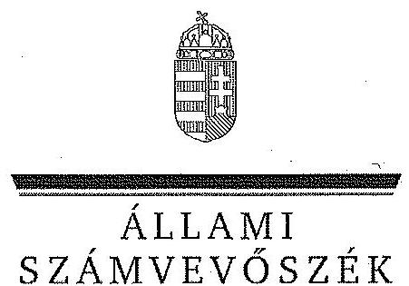

# JELENTÉS 

Az önkormányzatok gazdasági társaságai - Az önkormányzatok többségi tulajdonában lévő gazdasági társaságok közfeladat ellátását érintő gazdálkodási tevékenysége szabályszerűségének ellenőrzése BÁT-KOM 2004. Városüzemeltető és Szolgáltató Kft.

---

# Állami Számvevőszék 

Iktatószám: V-0464-135/2014.
Témaszám: 1498.
Vizsgálat-azonosító szám: V067125

## Az ellenőrzést felügyelte:

Dr. Horváth Margit
felügyeleti vezető
Az ellenőrzés vezette és a végrehajtásáért felelős:
Klinga László
ellenőrzésvezető
Az összefoglaló jelentést készítette:
Fodor Edit
számvevő
Az ellenőrzést végezték:
Nyirati Ferenc
okleveles könyvvizsgáló,
külső szakértő

## Pretzl Gábor

okleveles könyvvizsgáló,
külső szakértő

A témához kapcsolódó eddig készített számvevőszéki jelentések:
címe
sorszáma
Jelentés Bátaszék Város Önkormányzata pénzügyi helyzetének ellenőrzéséről (43/4)

---

# TARTALOMJEGYZÉK 

BEVEZETÉS ..... 7
I. ÖSSZEGZŐ MEGÁLLAPÍTÁSOK, KÖVETKEZTETÉSEK, JAVASLATOK ..... 10
II. RÉSZLETES MEGÁLLAPÍTÁSOK ..... 16

1. Az Önkormányzat közfeladat-ellátásának szabályszerűsége ..... 16
1.1. A közfeladat-ellátás megszervezése és a feladatellátás feltételrendszerének kialakítása ..... 16
1.2. A közfeladat-ellátás felügyelete és a tulajdonosi jogok érvényesítése ..... 19
2. A BÁT-KOM 2004. Kft. közfeladat ellátással kapcsolatos tevékenysége ..... 22
2.1. A BÁT-KOM 2004. Kft. gazdálkodásának szabályozottsága ..... 22
2.2. A BÁT-KOM 2004. Kft. vagyongazdálkodása és vagyonnyilvántartása ..... 23
2.3. A beszámolási kötelezettség teljesítése ..... 25
3. Az ellenőrzött közfeladatok bevételei és ráfordításai elszámolásának és önköltségszámításának szabályszerűsége ..... 25
3.1. Az ellenőrzött közfeladatok bevételeinek és ráfordításainak szabályszerűsége ..... 25
3.2. Az önköltségszámítás szabályszerűsége ..... 26
4. Az ÁSZ korábbi, az önkormányzatok többségi tulajdonában lévő gazdasági társaságok közfeladat-ellátását, gazdálkodását, pénzügyi helyzetét érintő javaslataira tett intézkedések ..... 27

## MELLÉKLETEK

1. számú A BÁT-KOM 2004. Kft. tevékenységének év végi főbb adatai
2. számú A BÁT-KOM 2004. Kft. működésének év végi főbb jellemzői
3. számú A lakossági hulladékszállítási díj alakulása 2008-2012 évek között
4. számú Beérkezett észrevételek és az azokra adott válaszok

## FÜGGELÉKEK

1. számú Mintavételi eljárások ellenőrzési területenként

---

.

---

# RÖVIDÍTÉSEK JEGYZÉKE 

## Törvények

Áht.
Ebktv.
Gt. tv.
$\mathrm{Hgt}_{1}$
$\mathrm{Hgt}_{2}$

Ltv.

Mötv.

Ötv.

Számv. tv.
Nvt.

## Rendeletek

241/2001. (XII. 10.)
Korm. rendelet
126/2003. (VIII. 15.)
Korm. rendelet
hulladékgazdálkodási terv

5/2008. (III. 6.) számú rendelet

SZMSZ $_{1}$
az államháztartásról szóló 2011. évi CXCV. törvény (hatályos: 2012. január 1-jétől)
az egyenlő bánásmódról és az esélyegyenlőség előmozdításáról szóló 2003. évi CXXV. törvény
a gazdasági társaságokról szóló 2006. évi IV. törvény (hatálytalan: 2014. március 15-étől)
a hulladékgazdálkodásról szóló 2000. évi XLIII. törvény (hatálytalan: 2013. január 1-jétől)
a hulladékról szóló 2012. évi CLXXXV. törvény (hatályos: 2013. január 1-jétől, kivéve a 95. § (6) bekezdése, ami 2015. január 1-jén lép hatályba)
a lakások és helyiségek bérletére, valamint az elidegenítésükre vonatkozó egyes szabályokról szóló 1993. évi LXXVIII. törvény (hatályos: 1993. július 30-tól)
Magyarország helyi önkormányzatairól szóló 2011. évi CLXXXIX. törvény (hatályos: 2012. január 1-jétől, kivéve a 144. § (2) bekezdésben meghatározott paragrafusok, amelyek 2012. április 15-én, a (3) bekezdésben meghatározott paragrafusok, amelyek 2013. január 1-jén léptek hatályba, a (4) bekezdésben meghatározott paragrafusok a 2014. évi általános önkormányzati választások napján lépnek hatályba)
a helyi önkormányzatokról szóló 1990. évi LXV. törvény (hatálytalan: a 2014. évi általános önkormányzati választások napjától)
a számvitelről szóló 2000. évi C. törvény
a nemzeti vagyonról szóló 2011. évi CXCVI. törvény (hatályos: 2011. december 31-étől, kivéve a 20. § (2) bekezdésben meghatározott paragrafusok, amelyek 2012. január 1-jétől, a (3) bekezdésben meghatározott paragrafusok 2013. január 1-jétől, a (4) bekezdésben meghatározott paragrafus 2012. március 2-ától léptek hatályba)
a jegyző hulladékgazdálkodási feladat- és hatásköréről szóló 241/2001. (XII. 10.) Korm. rendelet
a hulladékgazdálkodási tervek részletes tartalmi követelményeiről szóló 126/2003. (VIII. 15.) Korm. rendelet
Bátaszék Város Önkormányzat Képviselő-testületének 20/2004. (IX. 6.) számú rendelete a helyi hulladékgazdálkodási tervről
Bátaszék Város Önkormányzat Képviselő-testületének 5/2008. (III. 6.) számú rendelete a közterületek tisztántartásáról és a települési hulladékgazdálkodásról
Bátaszék Város Önkormányzat Képviselő-testületének

---

SZMSZ $_{2}$
vagyongazdálkodási rendelet

## Szórövidítések

Alapító Okirat
ALISCA Terra Kft.
áfa
BÁT-KOM 2004. Kft.
FB
Javadalmazási szabályzat
jegyző
Képviselő-testület
Önkormányzat
polgármester
Polgármesteri hivatal számviteli politika
számviteli politika $_{2}$

4/2007.(IV. 01.) számú rendelete Bátaszék Város Önkormányzat Szervezeti és Működési Szabályzatáról (hatályos: 2007. április 1-től 2011. február 1-jéig)

Bátaszék Város Önkormányzat Képviselő-testületének 2/2011. (II. 01.) számú rendelete az Önkormányzat Szervezeti és Működési Szabályzatáról (hatályos: 2011. február 1-jétől)
Bátaszék Város Önkormányzat Képviselő-testületének többször módosított 8/2001. (IV. 02.) számú rendelete az Önkormányzat vagyonáról, a vagyongazdálkodással kapcsolatos pályázati eljárás szabályairól, a szerződéskötés rendjéről (hatályos: 2001. április 2-tól)
a BÁT-KOM 2004. Kft. Alapító Okirata
ALISCA Terra Regionális Hulladékgazdálkodási Kft.
általános forgalmi adó
BÁT-KOM 2004. Városüzemeltető és Szolgáltató Kft.
BÁT-KOM 2004. Kft. Felügyelőbizottsága
a Képviselő-testület 134/2004. (VI. 29.) számú határozatával jóváhagyott Javadalmazási szabályzat
Bátaszék Város Önkormányzatának jegyzője
Bátaszék Város Önkormányzatának Képviselő-testülete
Bátaszék Város Önkormányzata
Bátaszék Város Önkormányzatának Polgármestere
Bátaszék Önkormányzatának Polgármesteri Hivatala
A BÁT-KOM 2004. Kft. 2008. január 1. és 2008. december 31. között hatályos számviteli politikája

A BÁT-KOM 2004. Kft. 2009. január 1-jétől hatályos számviteli politikája

---

# ÉRTELMEZŐ SZÓTÁR 

gazdasági társaság
közfeladat
közszolgáltatás
minősített többséget biztosító részesedés
saját tőke
tulajdonosi joggyakorló

A Gt. tv. 3. § (1) bekezdése szerint „gazdasági társaságot üzletszerű közös gazdasági tevékenység folytatására külföldi és belföldi természetes és jogi személyek, valamint jogi személyiség nélküli gazdasági társaságok alapíthatnak, működő társaságba tagként beléphetnek, társasági részesedést (részvényt) szerezhetnek."
Jogszabályban meghatározott állami vagy önkormányzati feladat, amit az arra kötelezett közérdekből, jogszabályban meghatározott követelményeknek és feltételeknek megfelelve végez, ideértve a lakosság közszolgáltatásokkal való ellátását, továbbá az állam nemzetközi szerződésekben vállalt kötelezettségeiből adódó közérdekű feladatokat, valamint e feladatok ellátásához szükséges infrastruktúra biztosítását is (Nvt. 3. § (1) bekezdés 7. pont).
A közszolgáltatás: „közcélú, illetőleg közérdekű szolgáltatást jelent, amely egy nagyobb közösség (állam, település) minden tagjára nézve megközelítőleg azonos feltételek mellett vehető igénybe, ezért valamilyen mértékig közösségi megszervezést, illetve szabályozást, ellenőrzést igényel." Az Ebktv. 3. § d) pontja a következőképpen határozza meg a közszolgáltatást: „szerződéskötési kötelezettség alapján a lakosság alapvető szükségleteinek ellátására irányuló szolgáltatás, így különösen a villamos energia-, gáz-, hő-, víz-, szennyvíz- és hulladékkezelési, köztisztasági, postai és távközlési szolgáltatás, továbbá a menetrend alapján közlekedő járművekkel végzett közforgalmú személyszállítás"
A minősített befolyásszerző az ellenőrzött társaságban a szavazatok legalább hetvenöt százalékával rendelkezik. (Gt. tv. 52. § (2) bekezdés)
A saját tőke a - jegyzett, de még be nem fizetett tőkével csökkentett - jegyzett tőkéből, a tőketartalékból, az eredménytartalékból, a lekötött tartalékból, az értékelési tartalékból és a tárgyév mérleg szerinti eredményéből tevődik össze.
Aki a nemzeti vagyon felett az államot vagy a helyi önkormányzatot megillető tulajdonosi jogok és kötelezettségek összességének gyakorlására jogosult (Nvt. 3. § (1) bekezdés 17. pont).

---

.

---

# JELENTÉS 

## Az önkormányzatok gazdasági társaságai Az önkormányzatok többségi tulajdonában lévő gazdasági társaságok közfeladat ellátását érintő gazdálkodási tevékenysége szabályszerűségének ellenőrzése

## BÁT-KOM 2004. Városüzemeltető és Szolgáltató Kft.

## BEVEZETÉS

Az Állami Számvevőszék középtávra szóló stratégiájában megfogalmazta, hogy a helyi önkormányzatok gazdálkodásában rejlő pénzügyi kockázatok feltárásával, az államháztartáson kívülre nyújtott költségvetési támogatások és ingyenes vagyonjuttatások, valamint az államháztartáson kívül működő köz-feladat-ellátó rendszerek ellenőrzéseivel hozzájárul ahhoz, hogy a közpénzeket az államháztartáson kívül működő szervezetek is átlátható, rendezett módon használják fel a közfeladatok szerződésben vállalt ellátása érdekében.

Az önkormányzatok szervezetalakítási szabadságának következménye, hogy a korábban is vállalati formában működő (nagyvárosi tömegközlekedés, víz-, szennyvízcsatorna, köztisztasági, ingatlankezelés stb.) közszolgáltatások mellett, mind a kötelező, mind az önként vállalt feladatok ellátásában a gazdasági társaságok kiemelt fontosságú szerephez jutottak.

Bátaszék Város Önkormányzatának Képviselő-testülete a BÁT-KOM 2004. Kft.-t 2004. június 29-ével hozta létre. A BÁT-KOM 2004. Kft. főtevékenysége az alapításkor a hulladékgyűjtés és hulladékkezelés volt.

A BÁT-KOM Kft. az ellenőrzött időszakban a 6388 fő lakosságszámú Bátaszék Város területén ellátta az önkormányzati intézmények takarítását, az önkormányzati lakóingatlanok kezelését, a közterületek, játszóterek karbantartását, a parkok gondozását, a konténerben tárolt hulladék szállítását, a helyi közutak fejlesztését, fenntartását és üzemeltetését, valamint a piac üzemeltetését.

A BÁT-KOM 2004. Kft. az ellenőrzött időszakban Bátaszék Város Önkormányzatának 100%-os tulajdonában volt. A BÁT-KOM 2004. Kft. tulajdoni hányaddal más gazdasági társaságban nem rendelkezett, 2012-ben az átlagos statisztikai létszáma 26 fő, az értékesítés nettó árbevétele 66,1 millió Ft volt.

---

A BÁT-KOM 2004. Kft. összes bevétele 2008-ban 69,9 millió Ft, a 2012. évben 66,4 millió Ft volt, amelyből az értékesítés nettó árbevétele 2008-ban 65,2 millió Ft, míg 2012-ben 66,1 millió Ft volt. Az árbevételek az ellenőrzött időszakban 1,4%-kal nőttek, a ráfordítások 2,1%-kal csökkentek.

A BÁT-KOM 2004. Kft. az ellenőrzött időszakban a 2010. évet kivéve pozitív mérleg szerinti eredménnyel zárt, a 2012. évben 0,5 millió Ft összegű eredményt realizált. A BÁT-KOM 2004. Kft. mérleg szerinti eszközállománya a 2008. évi nyitó 13,7 millió Ft-ról a 2012. év végére 115%-os növekedést követően 29,4 millió Ft-ra emelkedett, ezen belül a követelések állománya duplájára, 15,1 millió Ft-ra nőtt. A saját tőke a 2008. évi nyitó 4,8 millió Ft-ról a 2012. év végére 10,5 millió Ft-ra nőtt.

Az ellenőrzött időszakban a polgármester személye nem változott, a helyszíni ellenőrzés időszakában a munkakört betöltő jegyző 2011. évtől látta el feladatát. Az ügyvezető 2007. január 1-je óta tölti be tisztségét.

Az önkormányzati tulajdonú gazdasági társaságok teljes körű ellenőrzésének lehetőségét az Állami Számvevőszékről szóló 1989. évi XXXVIII. törvény 2011. január 1-jétől hatályos módosítása teremtette meg.

Az ellenőrzés célja annak értékelése volt, hogy

- az önkormányzat a jogszabályi előírások figyelembevételével döntött-e az ellenőrzésre kerülő közfeladat megszervezéséről; az önkormányzat szabályszerűen gyakorolta-e a tulajdonosi jogokat;
- a gazdasági társaság közfeladat-ellátása bevételeinek, ráfordításainak elszámolása, és vagyongazdálkodási tevékenysége megfelelt-e a jogszabályi, illetve a közszolgáltatási szerződésben foglalt tulajdonosi előírásoknak, azok végrehajtása szabályszerű volt-e;
- a közfeladatok átláthatósága és elszámoltathatósága érdekében biztosítva volt-e a közszolgáltatás díjának megalapozottsága szabályszerű önköltségszámítással.

Az ellenőrzés kiterjedt Bátaszék Város Önkormányzatára és a BÁT-KOM 2004. Városüzemeltető és Szolgáltató Kft.-re.

Az ellenőrzés várható hasznosulása: A törvényalkotás számára - az észlelt problémák, szabálytalanságok, vagy egyéb nem kívánatos jelenségek felszínre kerülésével - az ellenőrzés megállapításai segítséget nyújthatnak az államháztartáson kívüli közfeladat-ellátás értékeléséhez, jogszabályi keretei pontosításához, átláthatóságot biztosító szabályozásához. Meghatározhatóvá válnak a közfeladat ellátásban részt vevő államháztartáson kívüli szervezeteknek - az önkormányzat költségvetését, pénzügyi helyzetét is befolyásoló - kockázatai, lehetővé válik ezen kockázatok csökkentése. Feltárja, hogy az önkormányzat közfeladat-ellátási kötelezettségének szabályszerűen tett-e eleget, a feladatellátáshoz rendelt közvagyon működtetését szabályszerűen szervezte-e meg és a tulajdonosi felügyelete hozzájárult-e a közfeladat-ellátásához. A feladatot ellátó gazdasági társaság a közszolgáltatási szerződésben foglaltak betartásával, a közvagyon használatával biztosította-e a szolgáltatás folytatásának feltételeit.

---

Ezzel az ellenőrzöttek és a helyi döntéshozók számára visszajelzést ad feladatszervezési, feladat-ellátási kockázataikról, alapot ad a meglévő hibák megszüntetéséhez, a jobb közfeladat-ellátás biztosításához. Fokozza a fegyelmet, igazolja, hogy lejárt a következmények nélküli ellenőrzések időszaka. Az ÁSZ értékteremtő rend kialakításához és megőrzéséhez hozzájáruló tevékenysége pozitív hatással van a szervezetről kialakított összkép formálására is.

A bevételek és ráfordítások elszámolása, valamint a vagyonnyilvántartás terén az egyes területek szabályszerű működését mintavétellel ellenőriztük, ez alapján a sokaságokban előforduló hibás tételek arányát becsültük. A jogszabályoknak és a belső előírásoknak megfelelőnek, azaz szabályszerűnek tekintettük az adott bevételek és ráfordítások elszámolását, a vagyonnyilvántartást, amennyiben a minta ellenőrzésének eredménye alapján 95%-os bizonyossággal a teljes sokaságban a hibás tételek aránya kisebb volt, mint 10%, nem megfelelőnek értékeltük, ha a hibás tételek aránya a 10%-ot meghaladta. Kockázatot, illetve magas kockázatot jeleztünk, amennyiben egy adott terület vonatkozásában a minta alapján a

 teljes sokaságban nem volt teljes körűen biztosított a jogszabályoknak és a belső szabályzatoknak megfelelő működés (1. számú függelék).

Az ellenőrzést a számvevőszéki ellenőrzés szakmai szabályai szerint, szabályszerűségi ellenőrzés módszerével, a vonatkozó nemzetközi standardok figyelembevételével végeztük. Az ellenőrzés a 2008-2012. évekre terjedt ki.

Az ellenőrzés végrehajtásának jogszabályi alapját az Állami Számvevőszékről szóló 2011. évi LXVI. törvény 5. § (3)-(4)-(5) bekezdése képezi.

Az ÁSZ az Állami Számvevőszékről szóló 2011. évi LXVI. törvény 29. §-a alapján a jelentéstervezetet észrevételezésre megküldte a polgármesternek és a gazdasági társaság ügyvezetőjének. A beérkezett észrevételeket a jelentés véglegesítése során hasznosítottuk. Az észrevételeket és az azokra adott válaszokat a jelentés 4. számú melléklete tartalmazza.

---

# I. ÖSSZEGZŐ MEGÁLLAPÍTÁSOK, KÖVETKEZTETÉSEK, JAVASLATOK 

Bátaszék Város Önkormányzatának Képviselő-testülete az Önkormányzat közigazgatási területén a szilárd hulladék gyűjtése, ártalmatlanítása, hasznosítása és a közterületek tisztántartása közfeladatának ellátásáról az Ötv. előírásainak megfelelően döntött. A Képviselő-testület az SZMSZ ${ }_{1,3}$-ben előírta a közszolgáltatások kötelező feladatait, így a köztisztaság és a településtisztasági feladatok ellátásának kötelezettségét. Az Önkormányzat 2007-2010. évekre, valamint a 2011-2014. évekre szóló gazdasági programjaiban célul tűzték ki a regionális hulladékgazdálkodási rendszer megvalósulását, valamint az illegális hulladéklerakó helyek felszámolását és a szelektív hulladéklerakó helyek számának növelését.

Az Önkormányzat a Hgt. ${ }_{1}$-ben előírtaknak megfelelően elkészítette a 2004-2008. évekre a hulladékgazdálkodási tervét, amit a Képviselő-testület rendeletben kihirdetett. Az Önkormányzat a Hgt. ${ }_{1}$-ben előírtakat figyelmen kívül hagyva hulladékgazdálkodási tervét hat év helyett öt éves időszakra készítette el. Az Önkormányzat a Hgt. ${ }_{1}$-ben előírtakkal ellentétben a 2009-2014. évekre nem rendelkezett hulladékgazdálkodási tervvel. A jegyző a 241/2001. (XII. 10.) Korm. rendeletben foglalt feladatait elmulasztotta, mivel a 2009-2014. évekre vonatkozó hulladékgazdálkodási tervet nem készítette elő, így annak következtében a végrehajtásáról kétévente történő beszámolás is elmaradt.

A Képviselő-testület úgy döntött, hogy 2007. augusztus 1-jétől a települési szilárdhulladék begyűjtésére, elszállítására és deponálására vonatkozó feladatait nem a korábban a hulladékgazdálkodási feladatra kijelölt BÁT-KOM 2004. Kft.-vel, hanem társulási megállapodás keretében látja el. A feladatellátásra a társulás 10 évre szóló „Hulladékgazdálkodási társulási megállapodást" kötött az ALISCA Terra Kft.-vel.

A közparkok és egyéb közterületek fenntartása, a köztisztaság, település környezet tisztaságának biztosítása, valamint a lakások és helyiségek gazdálkodása közfeladatok ellátása céljából az Önkormányzat a 2008-2012. években a BÁT-KOM 2004. Kft.-vel kötött szerződéseket. A közfeladatok ellátásának módját és mértékét az évente megkötött szolgáltatási szerződésekben határozták meg, amelyek önkormányzati rendeleteken alapultak. A Képviselő-testület a Hgt. ${ }_{1}$-ben előírtaknak eleget tett és a települési szilárd és folyékony hulladék szervezett összegyűjtésének, elszállításának, kezelésének, ártalmatlanításának rendjét rendeletben szabályozta. A 2008-2012. években a BÁT-KOM 2004. Kft. a szolgáltatási szerződésekben előírt közszolgáltatási feladatait ellátta.

Az Önkormányzat a gazdasági társaság feletti tulajdonosi jogok gyakorlásának szabályait a vagyongazdálkodási rendeletben és az Alapító Okiratban határozta meg. A gazdasági társaságban a tulajdonosi jogokat a Képviselőtestület gyakorolta, nevében a polgármester járt el. Az Alapító Okirat és a Gt. tv.-ben előírtak ellenére az FB nem állapította meg ügyrendjét. Az ellenőrzött időszakban a BÁT-KOM 2004. Kft. számviteli beszámolójáról a Gt. tv-ben előír-

---

tak ellenére az FB írásbeli jelentést a 2011. évi beszámoló kivételével nem készített. A 2008-2010. évi és 2012. évi beszámolók Képviselő-testület általi elfogadása a Gt. tv-ben előírtak ellenére az FB írásbeli jelentése nélkül történt. A Képviselő-testület a 2008-2012. években a BÁT-KOM 2004. Kft. feletti tulajdonosi jogokat részben gyakorolta szabályszerűen, mivel az FB írásbeli jóváhagyása nélkül döntött a számviteli beszámoló elfogadásáról. A Javadalmazási szabályzatban előírtak ellenére az ügyvezető jutalom kifizetésére vonatkozó javaslatot a Pénzügyi és Gazdasági Bizottság, az Ügyrendi és Jogi Bizottság írásbeli véleménye nélkül fogadta el a Képviselő-testület.

Az ellenőrzött időszakban az Önkormányzatnál a belső ellenőrzést a Szekszárd és Térsége Többcélú Kistérségi Társulás végezte. A BÁT-KOM 2004. Kft.-nél az ellenőrzött időszakban a belső ellenőrzés két ellenőrzést hajtott végre. A 2010. évben pénzügyi szabályszerűségi ellenőrzést végzett a belső ellenőrzés, a városgazdálkodási feladatok ellátása kiadásainak és a rendelkezésre álló források összhangjának tárgyában. A belső ellenőrzés intézkedést igénylő megállapítást nem tett. A 2010. évben a „BÁT-KOM 2004. Kft. tevékenységének szabályozottsága, a városüzemeltetési szolgáltatások lebonyolítási rendjének ellenőrzése" tárgyában volt belső ellenőrzés, amely megállapításai szerint a BÁT-KOM 2004. Kft. pénzügyi, gazdasági szabályozottsága a jogszabályoknak megfelelő volt. Javasolták az építőipari rendelésenkénti költségvetési kiíratás alkalmazását a szerződés mellékleteként, munkaszámos nyilvántartás vezetését, amely a munkaidő ráfordításról és munka mennyiségéről szóló információkat tartalmaz. A javaslatok végrehajtására az ügyvezető dokumentáltan nem intézkedett.

A BÁT-KOM 2004. Kft. a Számv. tv.-ben előírtaknak megfelelően a számviteli politika részeként előírt szabályzatokat elkészítette. A BÁT-KOM 2004. Kft. az ellenőrzött időszakban annak ellenére nem minősítette a követeléseket és nem számolt el értékvesztést a követelések után, hogy határidőn túli követeléseket is nyilván tartott. A 2012. év végi 13,4 millió Ft vevőkkel szembeni követelés összegéből 6,0 millió Ft határidőn túli követelés volt. A Számv. tv.-ben és a számviteli politika ${ }_{2}$-ben előírt követelések minősítésének és az értékvesztés elszámolásának elmulasztásával megsértették a Számv. tv. óvatosság elvét, mivel a beszámoló készítésekor nem vették figyelembe a követelések realizálásának kockázatát. A számlarendet 2009. január 1-jén léptették hatályba, azt megelőzően Számv. tv.-ben előírtak ellenére nem készítették el. A leltározási és leltárkészítési szabályzatban nem vették figyelembe a Számv. tv.-ben előírt, minimum háromévente mennyiségi felvétellel történő leltározási követelményt, mivel 10 évenkénti mennyiségi leltározást írtak elő a tárgyi eszközök vonatkozásában.

A BÁT-KOM 2004. Kft. az értékcsökkenés elszámolása során, a 2009. évben beszerzett POCLAIN rakodógép esetében nem számolt el 86249 Ft értékcsökkenést, amely ellentétes volt a Számv. tv.-ben előírtakkal. A BÁT-KOM 2004. Kft. vagyongazdálkodási tevékenysége - a 2009-ben el nem számolt értékcsökkenés kivételével - megfelelt a jogszabályi, illetve a szolgáltatási szerződésekben foglalt előírásoknak. A BÁT-KOM 2004. Kft. likviditási helyzetét kedvezőtlenül befolyásolta, hogy az ellenőrzött időszakban - a 2008. év kivételével - a kötelezettségek záró állománya meghaladta a követelések állományát.

A BÁT-KOM 2004. Kft. a Számv. tv.-ben előírt beszámoló készítési kötelezettségének eleget tett, letétbe helyezési kötelezettségét a 2009-2012. években határidőben teljesítette. A 2008-2012. évi számviteli beszámolók hiányossága volt, hogy a kiegészítő mellékletek a Számv. tv.-ben előírtakkal ellentétben nem tartalmazták a nettó árbevétel főbb tevékenységenkénti megbontását.

A BÁT-KOM 2004. Kft. által kialakított főkönyvi számlák rendszere a bevételek tevékenységenkénti kimutatását biztosította. A szolgáltatási szerződések alapján végzett közfeladatok értékesítés nettó árbevételének elszámolása nem volt szabályszerű. Nem érvényesültek a számviteli politika ${ }_{1}$ előírásai a bevételek előírása és kiszámlázása tekintetében. A számviteli politika ${ }_{1}$ számlázási rendjében rögzített előírásokat nem tartották be, mivel kilenc esetben a számla kibocsátás jogosságát megalapozó szerződés nem állt rendelkezésre. A fizetési határidőt két esetben nem a számlázási rendben előírtaknak megfelelően jelölték meg. A szolgáltatási szerződések alapján végzett közfeladatok anyagjellegű ráfordításainak elszámolása nem volt szabályszerű. Nem érvényesültek a számviteli politika ${ }_{1}$ előírásai a költségelszámolás tekintetében. Megállapítottuk, hogy a számviteli politika ${ }_{1}$ 6. számú mellékletét képező aláírásrendben előírtakkal ellentétben az ügyvezető a ráfordítások elszámolásának jogosságát nem igazolta. A BÁT-KOM 2004. Kft. a számviteli elszámolások alapbizonylatain egyáltalán nem, vagy hiányosan tüntette fel a könyvelés módjára és az érintett könyvelési számlákra való hivatkozást, továbbá nem tüntették fel a könyvviteli nyilvántartásokban történő rögzítés időpontját és igazolását, amely ellentétes a Számv. tv.-ben előírt követelményekkel.

A BÁT-KOM 2004. Kft. az ellenőrzött időszakban önköltségszámítási szabályzat készítésére nem volt kötelezett. Az önkormányzati megrendelések alapján leszámlázott díjakat a beszerzési árak és a BÁT-KOM 2004. Kft.-nél felmerülő, kalkulált közvetlen költségek figyelembe vételével, egyedileg határozták meg a szerződő felek. Az Önkormányzat a hulladékdíj megállapításáról az ellenőrzött időszakban az ALISCA Terra Kft. javaslatai alapján rendeletet alkotott, amelyben megállapította a települési kommunális hulladékszállítással kapcsolatos helyi szolgáltatás igénybevételének díjait. A megállapított díjak minden esetben megegyeztek az ALISCA Terra Kft. által javasolt összeggel.

Az ÁSZ az Önkormányzat pénzügyi helyzetét 2011. évben ellenőrizte, a jelentés a többségi tulajdonú gazdasági társaságok közfeladat-ellátására, gazdálkodására, pénzügyi helyzetére vonatkozó javaslatot nem tartalmazott.

A fentiekben leírtak összegzéseként az alábbi megállapításokat tesszük:
A hulladékgazdálkodási tervekkel összefüggésben megállapított jegyzői mulasztások miatt a tervezés és az ezzel összefüggő kétévenkénti beszámolás előírásai nem teljesültek, így a tulajdonosi döntési jogok szűkültek, az információk nem jutottak el teljes mértékben a döntéshozókhoz. Az FB működésénél tapasztalt szabálytalanságok miatt a tulajdonosi képviselet nem töltötte be teljes körűen a szerepét, a tulajdonosi jogok gyakorlása sérült, a tulajdonosi monitoring rendszer nem működött megfelelően. Az ellenőrzött időszakban a BÁT-KOM 2004. Kft. számviteli rendszerének szabályozottsága megfelelő volt. A pénzügyi és számviteli elszámolások terén kockázat jelentkezett a szolgáltatási szerződések alapján végzett közfeladatok értékesítés nettó árbevételének elszámolása és az anyagjellegű ráfordításainak elszámolása esetében, ezáltal nem teljesültek teljes mértékben a Számv. tv. előírásai.

---

Az Állami Számvevőszékről szóló 2011. évi LXVI. törvény 33. § (1) bekezdésében foglaltak értelmében a jelentésben foglalt megállapításokhoz kapcsolódó intézkedési tervet köteles az ellenőrzött szervezet vezetője összeállítani, és azt a jelentés kézhezvételétől számított 30 napon belül az ÁSZ részére megküldeni. Amennyiben az intézkedési tervet határidőben nem küldi meg a szervezet, vagy az nem elfogadható, az ÁSZ elnöke a hivatkozott törvény 33. § (3) bekezdésében foglaltakat érvényesítheti.

Az ellenőrzés intézkedést igénylő megállapításai és javaslatai:
Javaslataink célja a Kft. gazdálkodása szabályszerűségének helyreállítása annak érdekében, hogy a szabályozási környezet megfelelően tudja támogatni az átlátható működést.

# Javasoljuk a BÁT-KOM 2004. Városüzemeltető és Szolgáltató Kft. ügyvezető igazgatójának: 

1. A társaság a leltározási és leltárkészítési szabályzatát a Számv. tv. 69. § (3) bekezdésének 2012. január 1-jei hatályú módosítása szerint nem aktualizálta. Ezzel megsértették a Számv. tv. 14. § (11) bekezdését, amely előírja a 90 napon belüli aktualizálási kötelezettséget.

Javaslat:

## Intézkedjen a szabályozási hiányosságok megszüntetésére, ennek keretében:

a Számv. tv. előírásai szerint aktualizálja a leltározási és leltárkészítési szabályzatát.
2. A társaságnál a 2008-2012. évi számviteli beszámolók hiányossága volt, hogy a kiegészítő mellékletek a Számv. tv. 93. § (1) b) pontjában előírtakkal ellentétben nem tartalmazták a nettó árbevétel főbb tevékenységenkénti megbontását.

A társaság a számviteli politika; számlázási rendjében rögzített előírásokat nem tartotta be, mivel kilenc esetben a számlakibocsátás jogosságát megalapozó szerződés nem állt rendelkezésre. A fizetési határidőt két esetben nem a számlázási rendben előírtaknak megfelelően jelölték meg.

A társaságnál a számviteli elszámolások alapbizonylatain a legtöbb esetben egyáltalán nem, néhány esetben pedig hiányosan tüntették fel a könyvelés módjára és az érintett könyvelési számlákra való hivatkozást, ezzel megsértették a Számv. tv. 167. § (1) bekezdés h) pontjában előírtakat. A könyvviteli elszámolást közvetlenül alátámasztó számviteli bizonylatokon nem tüntették fel a könyvviteli nyilvántartásokban történő rögzítés időpontját és igazolását, azaz nem teljesítették a Számv. tv. 167. § (1) bekezdés
 i) pontjában előírt követelményeket.

A BÁT-KOM 2004. Kft.-nél az ellenőrzött időszakban annak ellenére nem minősítették a követeléseket és nem számoltak el értékvesztést azok után, hogy a társaság határidőn túli követeléseket is nyilvántartott. A 2012. év végi 13,4 millió Ft vevőkkel szembeni követelés összegéből 6,0 millió Ft határidőn túli követelés volt. A Számv. tv. 55. § (1) bekezdésében és a számviteli politika ${ }_{2}$-ben előírt, a követelések minősítésének és az értékvesztés elszámolásának elmulasztásával megsértették a Számv. tv.

---

15. § (8) bekezdésében rögzített óvatosság elvét, mivel a beszámoló készítésekor nem vették figyelembe a követelések realizálásának kockázatát.

Javaslat:
Gondoskodjon a jogszabályi előírások szerinti gyakorlat és a szabályos működés biztosítására, ezen belül:
a) az éves számviteli beszámoló kiegészítő mellékletében mutassák be a nettó árbevétel főbb tevékenységenkénti megbontását;
b) gondoskodjon a számviteli politika számlázási rendjében rögzített előírások maradéktalan végrehajtásáról;
c) tartsa be a könyvelés során a Számv. tv. előírásait;
d) gondoskodjon a Számv. tv-ben előírt követelményeknek megfelelően a követelések minősítéséről és azok elszámolásáról.

Javaslataink célja az önkormányzat szabályszerű működésének elősegítése, továbbá az önkormányzati tulajdonosi joggyakorlás kontrolljainak erősítése.

# Javasoljuk Bátaszék Város Önkormányzata Polgármesterének: 

1. Az Alapító Okirat és a Gt. tv. 34. § (4) bekezdése előírásai szerint az FB-nek el kell készítenie az ügyrendjét, amelyet a Képviselő-testület hagy jóvá. Az ellenőrzött időszakban az FB elmulasztotta megállapítani az ügyrendjét. A társaság számviteli beszámolójáról - a Gt. tv. 35. § (3) bekezdésében és a BÁT-KOM 2004. Kft. Alapító Okiratában előírtak ellenére - az FB írásbeli jelentést a 2011. évi beszámoló kivételével nem készített. A 2008-2010. évi és a 2012. évi beszámolókat a Képviselő-testület az FB írásbeli jelentése nélkül fogadta el, ezzel megsértette a Gt. tv. 35. § (3) bekezdését.

Javaslat:

## Intézkedjen a szabályozási hiányosságok megszüntetésére, ennek keretében:

hívja fel a tulajdonosi jogokat gyakorló Képviselő-testület figyelmét arra, hogy az FB nem rendelkezett Ügyrenddel, továbbá az FB nem készített jelentést a társaság 2008-2010. és 2012. évi számviteli beszámolójáról.
2. A társaság Javadalmazási szabályzata előírta a munkabér változására és a jutalom mértékére vonatkozó javaslatnál a Pénzügyi és Gazdasági, az Ügyrendi és Jogi Bizottság, valamint az FB írásbeli véleményezését. A jutalom kifizetésére vonatkozó javaslatot a Javadalmazási szabályzatban előírtakkal ellentétben a bizottságok írásbeli véleménye nélkül fogadta el a Képviselő-testület.

Javaslat:

---

# Gondoskodjon a jogszabályi előírások szerinti gyakorlat és a szabályos működés biztosítására, ezen belül: 

kezdeményezze, hogy a Képviselő-testület szigorúan kérje számon az ügyvezető jutalmazási javaslatának elfogadásához a Pénzügyi és Gazdasági, valamint az Ügyrendi és Jogi Bizottság írásbeli véleményezését.

---

# II. RÉSZLETES MEGÁLLAPÍTÁSOK 

## 1. Az ÖNKORMÁNYZAT KÖZFELADAT-ELLÁTÁSÁNAK SZABÁLYSZERÜSÉGE

### 1.1. A közfeladat-ellátás megszervezése és a feladatellátás feltételrendszerének kialakítása

A köztisztaság és a településtisztaság biztosítása az Ötv. 8. § (1) bekezdése ${ }^{1}$ alapján az Önkormányzat törvényi kötelezettsége. Az Önkormányzat a közigazgatási területén a szilárd hulladék gyűjtése, ártalmatlanítása, hasznosítása és a közterületek tisztántartása feladatának ellátásáról közszolgáltatás megszervezése útján gondoskodott.

A Képviselő-testület az SZMSZ ${ }_{1,2}$-ben előírta a közszolgáltatások kötelező feladatait, így a köztisztasági és a településtisztasági feladatok ellátásának kötelezettségét.

Az Önkormányzat az ellenőrzött időszakban a 2007-2010. évekre és a 2011-2014. évekre elkészítette az Önkormányzat gazdasági programjait, amelyek az Ötv. 8. §-ában és az SZMSZ ${ }_{1,2}$-ben megfogalmazott feladatokat tartalmazták.

A gazdasági programok a környezetvédelem, hulladékgazdálkodás területén nagy hangsúlyt helyeztek a közterületek tisztántartására. A hulladékgazdálkodás területén a 2007-2010. évi gazdasági programban a regionális hulladékgazdálkodási rendszer megvalósulását (hulladék udvar, gyűjtő pontok kialakítása) tűzték ki célul. Fokozott ellenőrzés érvényesítését tervezték a közterület és a környezetvédelem területén. A 2011-2014. évi gazdasági programban a legfontosabb környezetvédelmi és hulladékgazdálkodási feladatként a regionális hulladékgazdálkodási rendszer beindítását, valamint az illegális hulladéklerakó helyek felszámolását és a szelektív hulladéklerakó helyek számának növelését jelölték meg.

A 2007-2010. közötti időszakra szóló gazdasági programban a zöldterületek karbantartására, a 2011-2014. évekre vonatkozó gazdasági programban a város külterületén lévő illegális szemét elszállításának elvégzésére a BÁT-KOM 2004. Kft.-t nevesítették. Az ellenőrzött közfeladatokra vonatkozóan a meglévő önkormányzati lakások megfelelő kezelése, értékesítése, vagy pályázat útján való felújítása szerepelt a gazdasági programokban.

Az Önkormányzat a Hgt. 135 § (1) bekezdésében előírtaknak megfelelően elkészítette a 2004-2008. évekre a hulladékgazdálkodási tervét. A hulladékgazdálkodási tervet a Hgt. 135. § (3) bekezdéseiben előírtaknak megfelelően a

[^0]
[^0]:    ${ }^{1}$ A helyi közügyek, valamint a helyben biztosítható közfeladatok körében ellátandó helyi önkormányzati feladatként a hulladékgazdálkodást 2013. január 1-jétől az Mötv. 13. § (1) bekezdés 19. pontja írja elő.

---

Képviselő-testület rendeletben kihirdette. Az Önkormányzat a Hgt. 37. § (1) bekezdésében előírtakat figyelmen kívül hagyva hulladékgazdálkodási tervét hat év helyett öt éves időszakra készítette el. A középtávra vonatkozó hulladékgazdálkodási terv tartalma a Hgt. 37. § (4) bekezdése, valamint a 126/2003. (VIII. 15.) Korm. rendelet 8-11. §-ai és 1. számú mellékletében foglalt előírásoknak megfelelt.

Az Önkormányzat a Hgt. 35. § (1) bekezdésében előírtakkal ellentétben a 2009-2014. évekre vonatkozóan nem rendelkezett hulladékgazdálkodási tervvel ${ }^{2}$. A jegyző a 241/2001. (XII. 10.) Korm. rendelet ${ }^{3} 1 . \S$ e) és f) bekezdéseiben foglalt feladatait elmulasztotta, mivel a 2009-2014. évekre vonatkozó hulladékgazdálkodási tervet nem készítette elő, illetve a 2004-2008. évekre vonatkozó hulladékgazdálkodási terv végrehajtásáról és a 2009-2014. évi hulladékgazdálkodási terv hiányában, annak végrehajtásáról kétévente nem számolt be.

Az Önkormányzat a települési szilárdhulladék-gazdálkodással összefüggő önkormányzati feladatokat és a hulladékkezelési közszolgáltatást, a közparkok és egyéb közterületek fenntartásának szabályait, a település környezet tisztaságának biztosítása szabályait, valamint a lakások és helyiségek bérletére és elidegenítésre vonatkozó szabályokat önkormányzati rendeletekben írta elő. A feladatok ellátására az ellenőrzött időszakban az Önkormányzat a BÁT-KOM 2004. Kft.-t jelölte ki (1. számú melléklet). A települési szilárdhulladékgazdálkodással összefüggő feladatokat az önkormányzati rendeletben előírtakkal ellentétben nem a BÁT-KOM 2004. Kft. végezte.

A Képviselő-testület a 97/2007. (V. 22.) számú határozatával úgy döntött, hogy 2007. augusztus 1-jétől a települési szilárdhulladék begyűjtésére, elszállítására és deponálására vonatkozó feladatait - nem a korábban a hulladékgazdálkodási feladatra kijelölt BÁT-KOM 2004. Kft. végzi, hanem - társulási megállapodás keretében Szekszárd Megyei Jogú Város Önkormányzatával közösen kívánja ellátni.

A Képviselő-testület 2007. július 24-i ülésére előterjesztés készült a „hulladékgazdálkodási társulás létrehozásával kapcsolatos döntések meghozatalához", amelyben összehasonlításra került az ALISCA Terra Kft. és a BÁT-KOM 2004. Kft. ajánlata. Ezt követően döntöttek a BÁT-KOM 2004. Kft.-vel 2004-ben, 10 évre kötött közszolgáltatási szerződés közös megegyezéssel, 2007. július 31-i hatállyal történő felbontásáról.

Az Önkormányzat és Szekszárd Megyei Jogú Város Önkormányzata 2007. augusztus 1-jétől 10 évre szóló „Hulladékgazdálkodási társulási megállapodást" kötött a hulladékgazdálkodási feladatok Szekszárd Megyei Jogú Város Önkormányzat tulajdonában lévő ALISCA Terra Kft. általi ellátására. A Közszol-

[^0]
[^0]:    ${ }^{2}$ A Hgt. 78. § (1) bekezdésében előírtak alapján 2013. január 1-jétől a közszolgáltató legalább 3 évente - közszolgáltatói hulladékgazdálkodási tervet készít. A 2013. január 1-jei időszakot megelőzően hulladékgazdálkodási terv készítési kötelezettsége az Önkormányzatnak volt.
    ${ }^{3}$ 2013. január 1-jétől hatálytalan

---

gáltatási szerződést a feladatellátásra létrejött társulás kötötte meg az ALISCA Terra Kft.-vel.

A társulási megállapodásban meghatározták a közszolgáltató által teljesítendő települési szilárd és folyékony kommunális hulladék összegyűjtését, elszállítását, ártalmatlanítását, a díjmegállapítás módját, a szolgáltatási árakat, kedvezményeket és a térítésmentes szolgáltatások körét. A közszolgáltató kötelességeként határozták meg az ügyfélszolgálat működtetését, a Képviselő-testület évente legalább egyszeri tájékoztatását az elszállított hulladék mennyiségéről, összetételéről, és az általános tapasztalatokról. A megállapodást az ellenőrzött időszakban öt alkalommal módosították. A módosítások a tartozások behajtásának módjára és a szolgáltatási árak megváltoztatására irányultak.

A BÁT-KOM 2004. Kft. nem rendelkezett a feladatellátáshoz szükséges eszközállománnyal, valamint a bátaszéki hulladéklerakó telep rekultivációja és működtetése az Önkormányzat számára jelentős anyagi terhet jelentett volna. Ezzel szemben az ALISCA Terra Kft. biztosítani tudta a feladatellátás feltételeit, vállalta a hulladéklerakó telep rekultivációját.

A közparkok és egyéb közterületek fenntartása, a köztisztaság, település környezet tisztaságának biztosítása, valamint a lakás és helyiséggazdálkodási közfeladatok ellátása céljából az Önkormányzat a 2008-2012. években a BÁT-KOM 2004. Kft.-vel kötött szerződéseket. A közfeladatok ellátásának módját és mértékét az évente megkötött szolgáltatási szerződésekben határozták meg.

Az 5/2008. (III. 6.) számú önkormányzati rendelet értelmében az Önkormányzat éves szerződés keretén belül megállapodott a BÁT-KOM 2004. Kft.-vel, hogy három helyről a $4 \mathrm{~m}^{3}$-es konténerben tárolt hulladékot elszállítja. A szerződésben rögzítették a szolgáltatás díját, a fizetés és a teljesítés módját. A szerződést az ellenőrzött időszakban évente - a szolgáltatás díját kivéve - azonos tartalommal megújították. (A szállítási díj 2008. évben 5600 Ft+áfa/konténer, 2009. januártól $6000 \mathrm{Ft}+\mathrm{áfa} /$ konténer, és 2009. szeptember 1-től $3000 \mathrm{Ft}+\mathrm{áfa} /$ konténer volt.)

Az Önkormányzat tulajdonában álló lakás és nem lakás céljára szolgáló ingatlanok fenntartására, karbantartására az Önkormányzat 2004. szeptember 1-jén a BÁT-KOM 2004. Kft.-vel szolgáltatási szerződést kötött, mely alapján a BÁT-KOM 2004. Kft. a rábízott ingatlanok kezelését az Ltv. és a lakások, helyiségek elidegenítésének szabályairól szóló 14/2005. (X. 03.) számú önkormányzati rendelet szerint látta el. A szerződés szerint az önkormányzati rendeletben meghatározott bérleti díjakat a BÁT-KOM 2004. Kft. jogosult volt a saját nevében beszedni és köteles volt a beszedésről nyilvántartást vezetni. Az ingatlanok üzemeltetésével kapcsolatos kiadások az állagmegóvással és karbantartással összefüggésben merültek fel. Az Önkormányzat a lakóházak kezelési feladatai ellátásáért a szerződés alapján további meghatározott fix összeget biztosított. A bérleti díjakat az önkormányzati támogatás figyelembe vételével határozták meg.

A közterületek, belterületek, játszóterek karbantartási, parkgondozási munkáira az Önkormányzat és a BÁT-KOM 2004. Kft. évente szolgáltatási szerződést kötött. A szerződésben meghatározták a szolgáltatás díját és a számlázási feltételeket, továbbá a megrendelő és a vállalkozó jogait és kötelezettségeit.

---

A Képviselő-testület mindhárom közszolgáltatás ellátására a szolgáltatási szerződésben kizárólagos jogot biztosított a 100%-os tulajdonában lévő BÁT-KOM 2004. Kft.-nek (2. számú melléklet). A szerződésekben az önkormányzati rendeleteknek ${ }^{4}$ megfelelően rögzítették az ellátandó feladatokat.

A szerződésekben előírták a feladatellátás módját, a közszolgáltatás teljesítésének gyakoriságát. A szerződések tartalmazták a feladat ellátásához alkalmazandó technológiát, a mennyiségi, rendelkezésre állási és biztonsági követelményeket és a helyszíni ellenőrzési lehetőségeket, a szolgáltatási díj alapját és mértékét, a szolgáltatások nyújtásához kapcsolódó költségek megosztására vonatkozó szabályokat és a szerződés felmondásának szabályait.

A Képviselő-testület a Hgt. ${ }_{1}$ 23. §-ában előírtaknak eleget tett, a települési szilárd és folyékony hulladék szervezett összegyűjtésének, elszállításának, kezelésének és ártalmatlanításának rendjét rendeletben szabályozta ${ }^{5}$. A rendeletben meghatározták továbbá a közszolgáltatás ellátásának rendjét, a közszolgáltatással összefüggésben az ingatlantulajdonos és a közszolgáltató kötelezettségeit, és jogait, valamint a helyi közszolgáltatás kötelező igénybevételének szabályait. A rendeletben előírták a lakosságra és a gazdálkodó szervezetekre vonatkozó szabályokat, valamint a közszolgáltatás díját, a díjfizetés rendjét.

Az Önkormányzat, mint tulajdonosi joggyakorló nem határozott meg a társaság számára a közszolgáltatási tevékenység
 mérésére alkalmas kritériumrendszert, ennek keretében az ellátás színvonala értékeléséhez szükséges szakmai követelményeket, továbbá a szakmai feladat-ellátás gazdaságosságának, hatékonyságának mérésére alkalmas mutatószámokat annak érdekében, hogy a társaság működése, a közfeladat ellátása mérhető és átlátható legyen.

# 1.2. A közfeladat-ellátás felügyelete és a tulajdonosi jogok érvényesítése 

Az Önkormányzat a gazdasági társaság feletti tulajdonosi jogok gyakorlásának szabályait a vagyongazdálkodási rendeletben és az Alapító Okiratban határozta meg. A gazdasági társaságban a tulajdonosi jogokat a Képviselő-testület gyakorolta, nevében a polgármester járt el.

Az Alapító Okiratban foglaltak szerint a tulajdonos hatáskörébe tartozott a számviteli beszámoló elfogadása, az adózott eredmény felhasználására vonatkozó döntés, a törzstőke felemelése és leszállítása, az üzletrész felosztása, az ügyvezető kijelölése és visszahívása, díjazásának megállapítása, az ügyvezető tekintetében a munkáltatói jog gyakorlása, a könyvvizsgáló személyére való

[^0]
[^0]:    ${ }^{4}$ a közparkok és egyéb közterületek fenntartásának szabályairól szóló 2/2004. (VII. 01.) számú önkormányzati rendelet; a település környezet tisztaságának biztosítása szabályairól szóló 7/2002. (IV. 01.) számú; és az 5/2008. (III. 6.) számú önkormányzati rendelet, és a lakások és helyiségek bérletére és elidegenítésre vonatkozó 14/2005. (X. 03.) számú önkormányzati rendelet
    ${ }^{5} 5/2008$. (III. 06.) számú önkormányzati rendelet

---

javaslattétel, az FB tagjainak kijelölése, visszahívása, a társaság megszüntetése, átalakulásának elhatározása, valamint az Alapító Okirat módosítása.

A BÁT-KOM 2004. Kft. Alapító Okirata az ügyvezető, mint vezető tisztségviselő jogait és kötelezettségeit a Gt. tv. 26-30. § előírásait figyelembe véve, az FB jogait és kötelezettségeit a 34-35. §-okban rögzítettek szerint tartalmazta.

Az ügyvezető jogosult volt a BÁT-KOM 2004. Kft.-t önállóan jegyezni, feladata volt a BÁT-KOM 2004. Kft. ügyeinek intézése, szakmai irányítása és képviselete harmadik személlyel szemben, valamint gyakorolta a munkáltatói jogokat a BÁT-KOM 2004. Kft. alkalmazottai felett.

Az Alapító Okiratban foglaltak szerint az FB a tulajdonos részére ellenőrzi a társaság ügyvezetését, felvilágosítás kérhet, a társaság könyveit és iratait megvizsgálhatja, és köteles megvizsgálni az üzleti jelentést, valamint a tulajdonos elé terjesztendő valamennyi fontosabb jelentést.

Az Alapító Okirat és a Gt. tv. 34. § (4) bekezdése előírásai ellenére - az FB nem állapította meg ügyrendjét. Az ellenőrzött időszakban a BÁT-KOM 2004. Kft. számviteli beszámolójáról - a Gt. tv. 35. § (3) bekezdésében és a BÁT-KOM 2004. Kft. Alapító Okiratában előírtak ellenére - az FB írásbeli jelentést a 2011. évi beszámoló kivételével nem készített. A 2008-2010. évi és 2012. évi beszámolók Képviselő-testület általi elfogadása az FB írásbeli jelentése nélkül történt a Gt. tv. 35. § (3) bekezdésében előírtak ellenére.

A Képviselő-testület a BÁT-KOM 2004. Kft. éves üzleti terveit a tárgyévet megelőző november-december hónapban tárgyalta és határozatban jóváhagyta. A 2008-2012. években a BÁT-KOM 2004. Kft. a szolgáltatási szerződésekben előírt közszolgáltatási feladatait ellátta.

A Javadalmazási szabályzat tartalmazta az ügyvezető beszámolási kötelezettségét, az ügyvezető, az FB tagjai és más vezető állású munkavállalók javadalmazása módjának, mértékének és főbb elveinek szabályait. A polgármester a Javadalmazási szabályzatban foglaltaknak megfelelően jogosult volt a Képviselő-testület elé terjeszteni a BÁT-KOM 2004. Kft. vezető tisztségviselő munkabérének változtatására, illetve jutalmazására vonatkozó javaslatot.

A Javadalmazási szabályzatban előírták a munkabér változására és a jutalom mértékére vonatkozó javaslat Pénzügyi és Gazdasági Bizottság, Ügyrendi és Jogi Bizottság és FB általi írásban történő véleményezésének kötelezettségét. A jutalom mértékére, kifizetésére vonatkozó egyéb feltételeket a szabályzat nem tartalmazott.

Az ügyvezető bérét az ellenőrzött időszakban 2 alkalommal (2008. június 1-től, 2009. október 1-től) emelték és három alkalommal kapott egyszeri jutalmat, a 2009., valamint a 2010. évi munkájáért 100 ezer Ft-ot, 2011. évi munkájáért 220 ezer Ft-ot. A béremelések és jutalmazások a tulajdonos Önkormányzat részéről elfogadásra és határozatban rögzítésre kerültek.

A jutalom kifizetésére vonatkozó javaslatot a Javadalmazási szabályzatban előírtakkal ellentétben a Pénzügyi és Gazdasági Bizottság, az Ügyrendi és Jogi Bizottság írásbeli véleménye nélkül fogadta el a Képviselő-testület.

---

Az Önkormányzat a BÁT-KOM 2004. Kft. részére működési célra (bevételi kiesés pótlására, eseti jelleggel) 2008-ban 1,2 millió Ft, eszköz beszerzésre 2009-ben 2,5 millió Ft, 2010-ben 1,0 millió Ft, 2011-ben 2,3 millió Ft támogatást nyújtott a feladatellátás érdekében.

Az ellenőrzött időszakban az Önkormányzatnál a belső ellenőrzést a Szekszárd és Térsége Többcélú Kistérségi Társulás végezte. A Képviselő-testület által elfogadott éves ellenőrzési terv javaslatot továbbították a Szekszárd és Térsége Többcélú Kistérségi Társulás Társulási Tanácsának az éves belső ellenőrzési tervben történő szerepeltetés céljából.

A BÁT-KOM 2004. Kft.-nél az ellenőrzött időszakban a belső ellenőrzés kétszer ellenőrzött.

Az Önkormányzat belső ellenőrzése a BÁT-KOM 2004. Kft.-nél a 2010. évben pénzügyi szabályszerűségi ellenőrzést végzett a városgazdálkodási feladatok ellátása kiadásainak és a rendelkezésre álló források összhangjának tárgyában. A belső ellenőrzés nem tett intézkedést igénylő megállapítást.

A BÁT-KOM 2004. Kft.-nél a 2010. évben „BÁT-KOM 2004. Kft. tevékenységének szabályozottsága, a városüzemeltetési szolgáltatások lebonyolítási rendjének ellenőrzése" tárgyában végeztek belső ellenőrzést. Az ellenőrzés összegző megállapítása szerint a BÁT-KOM 2004. Kft. pénzügyi, gazdasági szabályozottsága a jogszabályoknak megfelelő volt. Gazdálkodását kiegyensúlyozottság jellemezte, a vállalkozás folytatás feltételei adottak voltak. Az önkormányzati városüzemeltetési feladatok ellátását pozitívnak értékelték. Javasolták az építőipari rendelkezésenkénti költségvetési kiiratás alkalmazását a szerződés mellékleteként. Munkaszámos nyilvántartás vezetését javasolták, amely a munkaidő ráfordításról és munka mennyiségéről szóló információkat tartalmaz. A javaslatokat tudomásul vették, de dokumentáltan nem intézkedtek a javaslatok megvalósítására.

Az ellenőrzött időszakban a BÁT-KOM 2004. Kft. mérleg szerinti eredménye a 2010. év kivételével pozitív volt, a 2010. évi gazdálkodás eredményeként 5,0 millió Ft veszteséget mutattak ki. Az éves beszámolók elfogadása alkalmával a Képviselő-testület az eredményből osztalék kifizetését nem rendelte el, a mérleg szerinti eredményt eredménytartalékba helyezték.

A BÁT-KOM 2004. Kft. az ellenőrzött időszakban rendelkezett a társasági formájára kötelezően előírt jegyzett tőkének megfelelő összegű saját tőkével ${ }^{6}$, ezért az Önkormányzatnak a vagyonvesztés megelőzése, a csődveszély elkerülése érdekében, valamint a Gt. tv. 51. §-a szerinti intézkedési kötelezettsége nem volt.

Az Önkormányzat mérlegen kívüli kötelezettséget a 2008-2012. években a BÁT-KOM 2004. Kft. részére nem vállalt, kölcsönt nem nyújtott.

[^0]
[^0]:    ${ }^{6}$ A BÁT-KOM 2004. Kft-nél a saját tőke/jegyzett tőke aránya 2008-ban 2,4; 2009-ben 3,7; 2010-ben 2,0; 2011-ben 3,3; 2012-ben 3,5 volt.

---

# 2. A BÁT-KOM 2004. Kft. közfeladat-ellátással kapcsolatos tevékenysége 

### 2.1. A BÁT-KOM 2004. Kft. gazdálkodásának szabályozottsága

A BÁT-KOM 2004. Kft. a Számv. tv. 14. § (3)-(5) bekezdéseiben előírtaknak megfelelően számviteli politikát, annak mellékleteként az eszközök és források leltárkészítési és leltározási szabályzatát, eszközök és források értékelési szabályzatát, valamint pénzkezelési szabályzatot készített.

A számviteli politika ${ }_{1}$-ben előírták a számviteli beszámoló könyvvizsgálói záradékolásának kötelezettségét. A BÁT-KOM 2004. Kft. a számviteli politikában előírtakkal ellentétben a 2008. évi beszámoló könyvvizsgáló általi hitelesítését nem végeztette el.

A BÁT-KOM 2004. Kft.-nél a Számv. tv. 155. § (3) bekezdésének előírása alapján a könyvvizsgálat nem volt kötelező.

A számviteli politika ${ }_{2}$ előírta a mérlegforduló napon fennálló követelések minősítésének, és a szabályozott esetekben értékvesztés elszámolásának kötelezettségét.

A számviteli politika ${ }_{2}$-ben előírták a követelések értékelésének kötelezettségét, és értékvesztés elszámolását a követelés könyvszerinti értéke és a követelés várhatóan megtérülő összege közötti - veszteségjellegű - különbözet összegében abban az esetben, ha a különbözet tartós (egy éven túli) és jelentős összegű (100 ezer Ft feletti) volt. A kisebb összegű követelések esetében az értékvesztés összegét ezen követelések nyilvántartási értékének 50%-ában határozták meg.

A BÁT-KOM 2004. Kft. az ellenőrzött időszakban annak ellenére nem minősítette a követeléseket és nem számolt el értékvesztést a követelések után, hogy határidőn túli követeléseket is tartott nyilván. A 2012. év végi 13,4 millió Ft vevőkkel szembeni követelés összegéből 6,0 millió Ft határidőn túli követelés volt. A Számv. tv. 55. § (1) bekezdésében és a számviteli politika ${ }_{2}$-ben előírt értékvesztés elszámolásának elmulasztásával megsértették a Számv. tv. 15. § (8) bekezdésében rögzített óvatosság elvét, mivel a beszámoló készítésekor nem vették figyelembe a követelések realizálásának kockázatát.

A számviteli politika ${ }_{2}$ mellékletét képező számlarendet 2009. január 1-jén léptették hatályba, azt megelőzően számlarend annak ellenére nem készült, hogy annak kötelezettségét a Számv. tv. 161. § (1) bekezdése, továbbá a számviteli politika ${ }_{1}$ 1.6. pontja is előírta.

A Számv. tv. 14. § (5) bekezdés a) pontjában előírt leltározási és leltárkészítési szabályzatot a BÁT-KOM 2004. Kft. 2007. január 1-i hatállyal léptetett hatályba. A szabályzat részét képezte a selejtezéssel összefüggő szabályok előírása. A szabályzatnak a Számv. tv. 69. § (3) bekezdésének 2012. január 1-jei hatályú módosítása miatt szükségessé vált aktualizálását nem végezték el. Ezzel megsértették a Számv. tv. 14. § (11) bekezdését, amely előírja a 90 napon belüli aktualizálási kötelezettséget. A leltározási és leltárkészítési szabályzat aktualizálásának elmulasztása miatt a tárgyi eszközök vonatkozásában nem vet-

---

ték figyelembe a Számv. tv. 69. § (3) bekezdésében előírt, minimum háromévente mennyiségi felvétellel történő leltározási követelményt (a szabályzat 10 évenkénti mennyiségi leltározást írt elő a tárgyi eszközök vonatkozásában). Az ellenőrzött időszakban a készletek év végi mennyiségi leltárfelvétele a Számv. tv. 69. § (2) bekezdésében ${ }^{7}$ előírtaknak megfelelően megtörtént, mivel év közben folyamatos mennyiségi és értéknyilvántartást a készletekről nem vezettek.

A Számv. tv. 14. § (5) bekezdés b) pontjában előírt eszközök és források értékelési szabályzatával 2009. január 1-jétől rendelkeztek. Az eszközök és források értékelésére vonatkozó szabályokat 2008-ban a számviteli politika ${ }_{1}$ 2. pontja tartalmazta.

A Számv. tv. 14. § (5) bekezdés d) pontjában előírt pénzkezelési szabályzatot az ellenőrzött időszakban három alkalommal módosították, tartalma megfelelt az előírásoknak.

A BÁT-KOM 2004. Kft., mint egyszerűsített éves beszámolót készítő vállalkozás - a Számv. tv. 14. § (6) bekezdésében biztosított mentesség alapján önköltségszámítási szabályzatot nem léptetett hatályba.

# 2.2. A BÁT-KOM 2004. Kft. vagyongazdálkodása és vagyonnyilvántartása 

A BÁT-KOM 2004. Kft.-t az Önkormányzat 3,0 millió Ft jegyzett tőkével alapította, melyből 1,0 millió Ft pénzbetét és 2,0 millió Ft tárgyi apport (1 db használt hulladékszállító jármű) volt.

A BÁT-KOM 2004. Kft. 2009-ben 2,5 millió Ft vissza nem térítendő önkormányzati támogatással 7,9 millió Ft értékben megvásárolt 1 db nagyteljesítményű fűnyíró traktort. Az eszköz az ellenőrzött időszakban szerepelt a BÁT-KOM 2004. Kft. vagyonleltárában, értékcsökkenési leírása tervszerű volt, terven felüli leírásra okot adó körülmény nem merült fel.

A BÁT-KOM 2004. Kft. a 2010-2011. években nyújtott önkormányzati támogatásokból 2 db nagyteljesítményű szivattyút vásárolt 3,3 millió Ft összegben. Az eszközök az ellenőrzött időszakban szerepeltek a BÁT-KOM 2004. Kft. vagyonleltárában, értékcsökkenési leírása szabályszerű volt.

A BÁT-KOM 2004. Kft. az átvett, illetve támogatással megvásárolt tárgyi eszközöket a támogatási szerződéseknek és számviteli előírásoknak megfelelően tartotta nyilván.

[^0]
[^0]:    ${ }^{7}$ 2012. január 1-jétől a Számv. tv. 69. § (4) bekezdése.

---

A vagyoni helyzetet jellemző, főbb könyvviteli mérleg szerinti adatok 2008.
 január 1. és 2012. december 31. között a következők voltak:

|  |  |  |  |  | adatok ezer Ft-ban |  |
| :-- | --: | --: | --: | --: | --: | --: |
| Megnevezés | 2008.01.01 | 2008.12.31 | 2009.12.31 | 2010.12.31 | 2011.12.31 | 2012.12.31 |
| Befektetett   eszközök | 4183 | 3110 | 9947 | 8866 | 8481 | 6525 |
| ebből: tárgyi   eszközök | 4104 | 3081 | 9947 | 8856 | 8473 | 6520 |
| Forgóeszközök | 9479 | 11752 | 16649 | 39328 | 23938 | 22848 |
| ebből: követelések | 7568 | 7915 | 8123 | 28733 | 14479 | 15085 |
| Aktív időbeli   elhatárolások | 0 | 0 | 0 | 0 | 0 | 0 |
| ESZKÖZÖK   ÖSSZESEN | 13662 | 14862 | 26596 | 48194 | 32419 | 29373 |
| Saját tőke | 4841 | 7185 | 10983 | 6032 | 9916 | 10459 |
| ebből: mérleg   szerinti eredmény | -95 | 2344 | 3798 | -4951 | 3884 | 543 |
| Céltartalékok | 0 | 0 | 0 | 0 | 0 | 0 |
| Kötelezettségek | 7804 | 6749 | 15570 | 42109 | 22411 | 18813 |
| Passzív időbeli   elhatárolások | 1017 | 928 | 43 | 53 | 92 | 101 |
| FORRÁSOK   ÖSSZESEN | 13662 | 14862 | 26596 | 48194 | 32419 | 29373 |

A BÁT-KOM 2004. Kft. tárgyi eszköz állományának 2009. évi emelkedését döntően a megvalósult eszközfejlesztések (fűnyíró traktor, rakodógép beszerzés) elszámolása eredményezte. A 2010. évi tárgyi eszköz beszerzés értékét (3,4 millió Ft) meghaladta a terv szerinti értékcsökkenés elszámolt összege, így a nettó érték a 2010. évben, majd - fejlesztések hiányában - a 2011-2012. években egyaránt csökkent.

A BÁT-KOM 2004. Kft. a Számv. tv. 52-53. §. előírásainak megfelelően szabályozta a számviteli politikában az értékcsökkenés elszámolását. A gyakorlatban az elszámolás évente egy alkalommal, az év utolsó napján történt. Az értékcsökkenés elszámolása során, a 2009. évben beszerzett POCLAIN rakodógép esetében a BÁT-KOM 2004. Kft. nem számolt el 86249 Ft értékcsökkenést, mely ellentétes a Számv. tv. 52. § (1) bekezdésével és a számviteli politika 17. pontjával.

A követelésállomány az ellenőrzött időszakban duplájára nőtt, az eszközökön belüli aránya 2008. január 1-jén 55,4% (7,6 millió Ft), 2012. december 31-én 51,4% (15,1 millió Ft) volt.

A BÁT-KOM 2004. Kft. likviditási helyzetét kedvezőtlenül befolyásolta, hogy az ellenőrzött időszakban - a 2008. év kivételével - a kötelezettségek záró állománya meghaladta a követelések állományát.

A BÁT-KOM 2004. Kft. vagyongazdálkodási tevékenysége - a 2009-ben el nem számolt értékcsökkenés kivételével - megfelelt a jogszabályi, illetve a szolgáltatási szerződésekben foglalt előírásoknak.

---

# 2.3. A beszámolási kötelezettség teljesítése 

A BÁT-KOM 2004. Kft. a Számv. tv. 4. §-a szerinti beszámoló készítési kötelezettségének eleget tett; letétbe helyezési kötelezettségét a Számv. tv. 153. § (1) bekezdés előírása alapján 2009-2012. években határidőben, teljes körűen teljesítette.

A közzétett és letétbe helyezett 2008. évi beszámoló nem tartalmazta az adózott eredmény felhasználására vonatkozó határozatot, ezzel az ügyvezető megsértette a Számv. tv. 153. § (1) bekezdésének előírásait.

A 2008-2012. évi számviteli beszámolók hiányossága volt, hogy a kiegészítő mellékletek a Számv. tv. 93. § (1) bekezdés b) pontjában előírtakkal ellentétben nem tartalmazták a nettó árbevétel főbb tevékenységenkénti megbontását.

Az Önkormányzat a Számv. tv. 4. § (1) bekezdésében előírt beszámoló Képviselő-testület általi jóváhagyásra történő beterjesztésén kívül egyéb beszámoló készítési kötelezettséget nem írt elő.

A BÁT-KOM 2004. Kft. az ellenőrzött időszakban az Áht. 109. § (8) bekezdése alapján kiadott közlemény szerint nem minősült a kormányzati alszektorba besorolt társaságnak, vagy egyéb szervezetnek, így az Ávr. 7. számú melléklete 29. pontjában előírt bejelentési és adatszolgáltatási kötelezettsége nem keletkezett.

## 3. Az ellenőrzött közfeladatok bevételei és ráfordításainak elszámolásának és önköltségszámításának szabályszerűsége

### 3.1. Az ellenőrzött közfeladatok bevételeinek és ráfordításainak szabályszerűsége

A BÁT-KOM 2004. Kft. által kialakított főkönyvi számlák rendszere a bevételek tevékenységenkénti kimutatását biztosította.

A szolgáltatási szerződések alapján végzett közfeladatok értékesítés nettó árbevételének elszámolása nem volt szabályszerű. Nem érvényesültek a számviteli politika₁ előírásai a bevételek előírása és kiszámlázása tekintetében. A számviteli politika₁ számlázási rendjében rögzített előírásokat nem tartották be, mivel kilenc esetben a számla kibocsátás jogosságát megalapozó szerződés nem állt rendelkezésre. A fizetési határidőt két esetben nem a számlázási rendben előírtaknak megfelelően jelölték meg.

A ráfordítások esetében a közfeladatokhoz kapcsolódóan elkülönítés nem történt, tekintettel arra, hogy ilyen követelményt az Önkormányzat nem írt elő a BÁT-KOM 2004. Kft. számára. A költségeket és ráfordításokat a számviteli politika₁₂-ben előírtaknak megfelelően költségnem és ráfordítás kategóriák szerint gyűjtötték. A BÁT-KOM 2004. Kft. által követett eljárás megfelelt a jogszabályi előírásoknak és a belső szabályozásnak is.

---

A szolgáltatási szerződések alapján végzett közfeladatok anyagjellegű ráfordításainak elszámolása nem volt szabályszerű. Nem érvényesültek a számviteli politika₁ előírásai a költségelszámolás tekintetében. Megállapítottuk, hogy a számviteli politika₁ 6. számú mellékletét képező aláírásrendben előírtakkal ellentétben az ügyvezető a ráfordítások elszámolásának jogosságát nem igazolta.

A BÁT-KOM 2004. Kft. a számviteli elszámolások alapbizonylatain a legtöbb esetben egyáltalán nem, néhány esetben hiányosan tüntette fel a könyvelés módjára és az érintett könyvelési számlákra való hivatkozást, mely ellentétes a Számv. tv. 167. § (1) bekezdés h) pontjában előírt követelménnyel. A könyvviteli elszámolást közvetlenül alátámasztó számviteli bizonylatokon nem tüntették fel a könyvviteli nyilvántartásokban történő rögzítés időpontját és igazolását, mely ellentétes a Számv. tv. 167. § (1) bekezdés i) pontjában előírt követelménnyel.

A 2010. év kivételével az ellenőrzött időszakban a bevételek⁸ meghaladták a ráfordításokat⁹, így a mérleg szerinti eredmény 2008-ban 2344 ezer Ft, 2009-ben 3798 ezer Ft, 2011-ben 3884 ezer Ft, valamint 2012-ben 543 ezer Ft volt. A 2010. évben 4951 ezer Ft veszteség keletkezett.

# 3.2. Az önköltségszámítás szabályszerűsége 

A BÁT-KOM 2004. Kft. az ellenőrzött időszakban önköltségszámítási szabályzat készítésére a Számv. tv. 14. § (6) és (7) bekezdéseiben előírtak figyelembe vételével nem volt kötelezett, az Önkormányzat sem írt elő önköltségszámítási kötelezettséget. Az önkormányzati megrendelések alapján leszámlázott díjakat a beszerzési árak és a BÁT-KOM 2004. Kft.-nél felmerülő, kalkulált közvetlen költségek figyelembe vételével, egyedileg határozták meg a szerződő felek.

Az Önkormányzat a hulladékdíj megállapításáról az ellenőrzött időszakban az ALISCA Terra Kft. javaslatai alapján rendeletet alkotott, melyben megállapította a települési kommunális hulladékszállítással kapcsolatos helyi szolgáltatás igénybevételének díjait. A megállapított díjak minden esetben megegyeztek az ALISCA Terra Kft. által javasolt összeggel.

Az Önkormányzatnál a lakossági hulladékszállítási és kezelési díj - 110 és 120 literes hulladékgyűjtő edényre számolva - 2008. évben 169 Ft+áfa, 2009. január 1-jétől 195 Ft+áfa, 2009. július 16-tól 297 Ft+áfa, 2011. január 1-jétől 345 Ft+áfa, 2011. december 31-től 385 Ft+áfa volt. (3. számú melléklet).

[^0]
[^0]:    ⁸ A bevételek összege 2008-ban 69911 ezer Ft, 2009-ben 83372 ezer Ft, 2010-ben 102664 ezer Ft, 2011-ben 71410 ezer Ft, 2012-ben 66391 ezer Ft volt.
    ⁹ A ráfordítások összege 2008-ban 67149 ezer Ft, 2009-ben 78816 ezer Ft, 2010-ben 107454 ezer Ft, 2011-ben 67091 ezer Ft, 2012-ben 65722 ezer Ft volt.

---

# 4. Az ÁSZ korábbi, az önkormányzatok többségi tulajdonában lévő gazdasági társaságok közfeladat-ellátását, gazdálkodását, pénzügyi helyzetét érintő javaslataira tett intézkedések 

Az ÁSZ az Önkormányzat pénzügyi helyzetét 2011. évben ellenőrizte¹⁰. Az ÁSZ jelentés a többségi tulajdonú gazdasági társaságok közfeladat-ellátására, gazdálkodására, pénzügyi helyzetére vonatkozó javaslatot nem tartalmazott.

Budapest, 2015. 4. 10. nap

Melléklet: 4 db
Függelék: 1 db
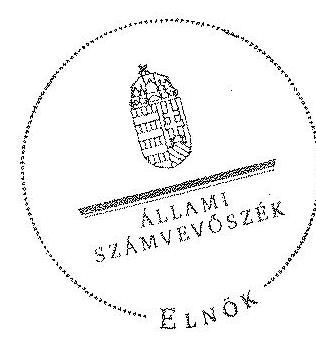

Domokos László
elnök

[^0]
[^0]: ¹⁰ Az ÁSZ 2012. évi 1215. számú jelentése Bátaszék Város Önkormányzata pénzügyi helyzetének ellenőrzéséről

---

.

---

A BÁT-KOM 2004. Kft. tevékenységének év végi főbb adatai

|  Sorszám | Megnevezés | 2008. | 2009. | 2010. | 2011. | 2012.  |
| --- | --- | --- | --- | --- | --- | --- |
|  1. | A gazdasági társaság székhelye | 7140 Bátaszék Baross u. 1/A. | 7140 Bátaszék Baross u. 1/A. | 7140 Bátaszék Baross u. 1/A. | 7140 Bátaszék Baross u. 1/A. | 7140 Bátaszék Baross u. 1/A.  |
|  2. | adószáma | 13318871-2-17 |  |  |  |   |
|  3. | alapításának éve | 2004. év |  |  |  |   |
|  4. | A gazdasági társaság többségi tulajdonú leányvállalatainak száma (db) | 0 | 0 | 0 | 0 | 0  |
|  5. | A gazdasági társaság leányvállalataiban való részesedésének mértéke (%) | - | - | - | - | -  |
|  6. | Az önkormányzat számára (megbízásából, koncessziós, közszolgáltatási, vagy egyéb szerződéses jogviszony alapján) ellátott közfeladatok szakági besorolása: |  |  |  |  |   |
|  7. | Egészségügy |  |  |  |  |   |
|  8. | Kultúra és sport |  |  |  |  |   |
|  9. | Település üzemeltetés, ezen belül: |  |  |  |  |   |
|  10. | köztemető üzemeltetés |  |  |  |  |   |
|  11. | kéményseprés |  |  |  |  |   |
|  12. | helyi közutak fejlesztése, fenntartása és üzemeltetése | X | X | X | X | X  |
|  13. | parkok és egyéb közterület fenntartás | X | X | X | X | X  |
|  14. | közterületi parkolás |  |  |  |  |   |
|  15. | Lakás és helységgazdálkodás | X | X | X | X | X  |
|  16. | Víz és csatorna közműszolgáltatás |  |  |  |  |   |
|  17. | Hulladékkezelés-szállítás | X | X | X | X | X  |
|  18. | Távhő- és energiaszolgáltatás |  |  |  |  |   |
|  19. |

 Helyi közösségi közlekedés |  |  |  |  |   |
|  20. | Vagyongazdálkodás |  |  |  |  |   |
|  21. | Pénzügyi gazdasági szolgáltatás |  |  |  |  |   |
|  22. | Egyéb: |  |  |  |  |   |
|  23. | A közfeladatellátására a gazdasági társaságnál alkalmazottak éves átlagos statisztikai létszáma | 22,5 | 23 | 23 | 26 | 26  |

---

# A BÁT-KOM 2004. Kft. működésének év végi főbb jellemzői

|  Sorszám | Megnevezés |  | 2008. | 2009. | 2010. | 2011. | 2012.  |
| --- | --- | --- | --- | --- | --- | --- | --- |
|  1. | A gazdasági társaság cégformája |  | Kft. | Kft. | Kft. | Kft. | Kft.  |
|  2. | A gazdasági társaság tulajdonosi összetétele: |  |  |  |  |  |   |
|  3. | Önkormányzat megnevezése: |  | Bátaszék Város Önkormányzata | Bátaszék Város Önkormányzata | Bátaszék Város Önkormányzata | Bátaszék Város Önkormányzata | Bátaszék Város Önkormányzata  |
|  4. | Önkormányzat tulajdoni részesedésének aránya | $\%$ | 100,00 | 100,00 | 100,00 | 100,00 | 100,00  |
|  5. | Önkormányzat tulajdoni részesedésének összege | ezer Ft | 3000,0 | 3000,0 | 3000,0 | 3000,0 | 3000,0  |
|  6. | Más önkormányzatok, többcélú társulás megnevezése: |  | - | - | - | - | -  |
|  7. | Önkormányzat tulajdoni részesedésének aránya | $\%$ |  |  |  |  |   |
|  8. | Önkormányzat tulajdoni részesedésének összege | ezer Ft |  |  |  |  |   |
|  20. | Gazdasági társaság megnevezése: |  | - | - | - | - | -  |
|  21. | Gazdasági társaságok tulajdoni részesedés aránya | $\%$ | - | - | - | - | -  |
|  22. | Gazdasági társaságok tulajdoni részesedés összege | ezer Ft | - | - | - | - | -  |
|  23. | Egyéb tulajdonos megnevezése: |  | - | - | - | - | -  |
|  24. | Egyéb tulajdonosok tulajdoni részesedés aránya | $\%$ | - | - | - | - | -  |
|  25. | Egyéb tulajdonosok tulajdoni részesedés összege | ezer Ft | - | - | - | - | -  |
|  26. | A tárgyévben a gazdasági társaság vagyonkezelésben lévő önkormányzati vagyon után elszámolt értékcsökkenés összege (ezer Ft). |  | - | - | - | - | -  |
|  27. | A tárgyévben az önkormányzati tulajdonú, gazdasági társaság által kezelt eszközök pótlására (karbantartás, felújítás, beruházás) elszámolt kiadás (ezer Ft) |  | - | - | - | - | -  |
|  28. | A tárgyévben a gazdasági társaság saját vagyona után elszámolt értékcsökkenés összege (ezer Ft) |  | 1383,0 | 2130,0 | 2256,0 | 2662,0 | 2247,0  |
|  29. | A tárgyévben a saját tulajdonú eszközök pótlására (karbantartás, felújítás, beruházás) elszámolt kiadás (ezer Ft) |  | 324,0 | 8967,0 | 1325,0 | 2277,0 | 292,0  |

---

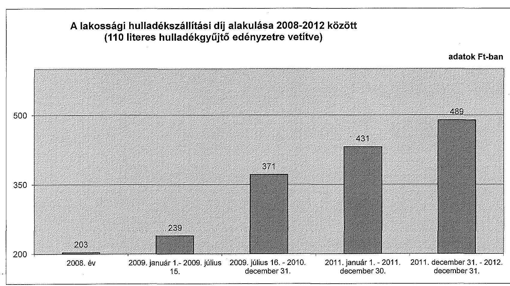

# A lakossági hulladékszállítási díj alakulása 2008-2012 között (110 literes hulladékgyűjtő edényzetre vetítve)

---

.

---

# Beérkezett észrevételek és az azokra adott válaszok

---

.

---

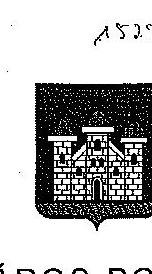

# BÁTASZÉK VÁROS POLGÁRMESTERE 

Szám: 1821-6/2014.

Tárgy: Bát-Kom 2004 Kft. Állami Számvevőszéki ellenőrzése

Melléklet: 7 db .

## Állami Számvevőszék

## Budapest

Apáczai Csere János u. 10.
1052

## Tisztelt Elnök Úr!

A Bát-Kom 2004. Kft.-nél elvégzett ellenőrzésről szóló jelentés-tervezetet november 12.-én megkaptam. Az Állami Számvevőszékről szóló 2011. évi LXVI. törvény 29. § (2) bekezdése alapján a jelentés-tervezetre az alábbi észrevételt teszem:
1.) Bátaszék Város Önkormányzatának Képviselő-testülete a 69/2004. (IV.27.) KTH számú határozatával úgy határozott, hogy Szekszárd Megyei Jogú Város irányításával és vezetésével és együttműködési megállapodás keretében készíti el a helyi hulladékgazdálkodási tervet Bátaszék városra vonatkozóan. A tervezet elkészítésére Szekszárd Megyei Jogú Város írt ki pályázatot a megállapodás alapján. Ezt követően a képviselő-testület a 131/2004. (VI.29.) KTH számú határozatával - a térség önkormányzataival együtt - a FórEnviron Környezetvédelmi és Mérnöki Szolgáltató Kft.-t bízta meg a hulladékgazdálkodási terv elkészítésével. A végleges tervet a képviselőtestület a 20/2004. (IX. 6.) KTR számú rendeletével fogadta el, mely 2012. december 17.-ig volt hatályban. Tekintettel arra, hogy a hulladékról szóló 2013. évi CLXXXV. törvény az önkormányzatok ilyen irányú kötelezettségét megszüntette, hulladékgazdálkodási tervvel ezen időponttól önkormányzatunknak nem kellett rendelkeznie, ezen időponttól ugyanis a közszolgáltatást végző lett kötelezve ezen terv elkészítésére.
2.) A Kft. Felügyelő Bizottsága rendszeresen megtárgyalta a Kft. mérlegbeszámolóját. Sajnálatos módon ezek írásos dokumentálása több évben elmaradt. Azt, hogy a Felügyelő Bizottság ezen mérlegbeszámolókat ténylegesen is megtárgyalta, mi sem bizonyítja jobban, minthogy a Felügyelő Bizottság elnöke ezen tényről rendszeresen tájékoztatta a képviselő-testületet a

---

napirend tárgyalásakor. Ezt bizonyítják a képviselő-testület 2008. május 27.-i, 2009. május 26.-i, 2010. május 28.-i és a 2012. május 12.-i jegyzőkönyvei is.
3.) Az ügyvezető az ellenőrzött időszakban nem három, hanem csak kettő alkalommal részesült béremelésben, mivel a 2011. január 1.-i bérmegállapítás nem béremelés volt, hanem ezen döntés új kinevezéshez kapcsolódott. A másik kettő béremelésre vonatkozó Felügyelő Bizottság elnöki véleményt utólag mellékelem. Az ügyvezető ezen időszakra ugyancsak három alkalommal részesült jutalomban, mind három esetben a Felügyelő Bizottság javaslatára. Ugyancsak megküldöm ezen írásos anyagot. A képviselő-testület jegyzőkönyveiből is kiderül, hogy a jutalom és béremelés minden esetben a Felügyelő Bizottság javaslatára történt. Sajnálatos, hogy ezen írásos anyagokat a kollégák nem adták át az ellenőrök részére.
4.) Az ellenőrzés többi megállapításával egyetértünk.

Amennyiben a végleges jelentést megkaptuk, azt a Képviselő-testület elé terjesszük, melyben javaslatot teszünk intézkedési terv elfogadására.

Bátaszék, 2014. november 24.
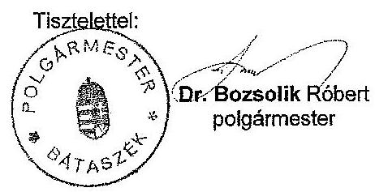

---

Bátaszék Város Önkormányzat Polgármesterének

7140 Bátaszék
Szabadság utca 4. sz.

Tisztelt Polgármester Úr!
A BÁT-KOM 2004 Kft. cégvezetésétől előterjesztés érkezett a felügyelő bizottsághoz, melyben foglaltak szerint a cégvezetés a felügyelő bizottság egyetértését kérte a vonatkozásban, hogy a gazdasági társaságnál a beosztott munkavállalók esetében 2009. év október hónap 1. napjától számítottan átlagosan, de a munkavállalók között differenciáltan 7%-os munkabér emelést kívánnak végrehajtani.
Valamint az átirat szerint kérték, hogy a felügyelő bizottság tegyen javaslatot a gazdasági társaság első számú vezetőjének bérrendezésére vonatkozóan a tulajdonosi jogokat gyakorló képviselő-testület elé.

A felügyelő bizottság a 2009. év november hónap 10. napján megtartott ülésén az előterjesztést megtárgyalta.
Az ülésre meghívott Mórocz Zoltán pénzügyi vezető úr tájékoztatta a felügyelő bizottság tagjait, hogy a háromnegyedéves mérlegadatok szerint a gazdasági társaságnak a könyveiben 6,9 millió forint körüli eredmény mutatható ki, amely eredmény korrigálásra kerül az értékcsökkenési leírásokkal, valamint a raktárkészleten lévő értékkel, valamint a játszótér megépítésével kapcsolatosan a gazdasági társasághoz befolyt összegből az önkormányzat irányába történő befizetés összegével.
A fentiekből következően a pénzügyi vezető úr tájékoztatása szerint 3.000.000,- Ft körüli eredménnyel zárhatja a gazdasági évet a BÁT-KOM 2004. Kft.
A tervezett béremelés a terhekkel együtt az évből visszalévő három hónapot figyelembe véve hozzávetőlegesen 500.000,- Ft fedezetet igényel.
Összegezve a pénzügyi vezető úr szerint a béremelés végrehajtásához szükséges pénzügyi fedezet jelenleg rendelkezésre áll.

Az ügyben a felügyelő bizottság a szükséges egyeztetéseket a döntése előtt lefolytatta, majd azokat követően az ülésén három mellette szavazattal támogatja a cégvezetés javaslatát, miszerint a Kft.-nél 2009. év október hónap 1. napjától átlagosan 7%-os bérfejlesztés történjen a beosztott munkavállalóknál az ügyvezető úr által meghatározott differenciált módon.

A cégvezető úr illetményének változtatására vonatkozóan pedig a felügyelő bizottság javasolja a tulajdonosi jogokat gyakorló képviselő-testületnek, hogy a Kft. ügyvezetőjének illetményét szintén 2009. év október hónap 1. napjától 194.000,- Ft-ról 210.000,- Ft-ra emelje.

Kelt: Bátaszéken, 2009. év november hónap 11. napján

Tisztelettel:
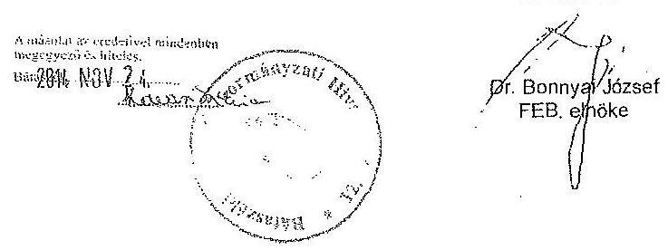

---

BÁT-KOM 2004 Kft.
Ügyvezetőjének

7140 Bátaszék
Baross u. 1/A. sz.

Tisztelt Ügyvezető Úr!

Tájékoztatom, hogy a Kft. felügyelő bizottsága megtárgyalta a Bátaszéken, 2008. év június hónap 12. napján kelt előterjesztést, melyben javaslatot tettek arra vonatkozóan, hogy az ügyvezető úr bérét az önkormányzat képviselő-testülete 8%-kal emelje fel a költségtérítés változatlan hagyása mellett.
Ez előterjesztéshez mellékelték a munkaszerződés módosítás tervezetét is.
A felügyelő bizottság az előterjesztést egyhangúlag támogatja, és a javaslatot a képviselő-testület irányába a 2008. év augusztus hónapban tartandó testületi ülésre előterjeszti.

Kérem a fentiek szíves tudomásulvételét!
Kelt: Bátaszéken, 2008. év július hónap 1. napján
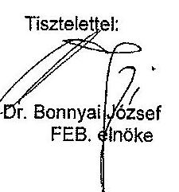
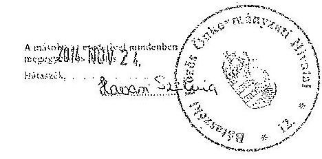

---

# BÁT-KOM 2004 Kft. 

FEB elnökétől

Bátaszék Város Önkormányzat Képviselő-testületének mint tulajdonosi jog gyakorlójának
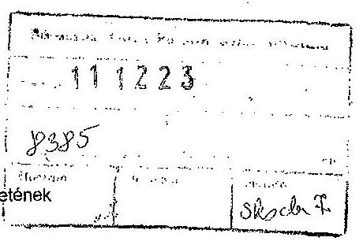

Tisztelt Képviselő-testület!
A BÁT-KOM 2004. Kft. felügyelő bizottsága 2011. év december hónap 8. napján megtartott ülésén megtárgyalta a gazdasági társaság 2012. üzleti tervének tervezetét.

A felügyelő bizottság az üzleti terv első részében meghatározott társasági célokkal - a szolgáltatások színvonalának folyamatos javításával, valamint a szolgáltatások működtetésének hatékonysága növelésével - egyetért, ugyanakkor azok elérésé érdekében fontosnak tartja, hogy a közmunka programban foglalkoztatottak hatékonyabb munkavégzése érdekében a munka irányítás személyi feltételei továbbra is biztosítottak legyenek, a munkavégzés koordinálása, a munkavégzés intenzitásának biztosítása a területen befektetésre kerülő pénzeszközök hasznosulásának fontos feltétele.

A gazdasági társaság által 2011. évben végzett munkatevékenységet bemutató rész vonatkozásában a FEB álláspontja az, hogy a város üzemeltetéssel kapcsolatos feladatok színvonalas ellátása során a gazdasági társaság megfelelően teljesített, kivette részét az önkormányzati nagy beruházások megvalósítása során felmerülő részfeladatok teljesítéséből személyi és eszköz ellátottságának megfelelő mértékben. A FEB hasonló teljesítményt vár el a gazdasági társaság vezetésétől és általuk irányított személyi állománytól a 2012-es gazdasági évre vonatkozóan is.

A 2012. évi gazdálkodási terv vonatkozásában a FEB egyetért azzal, hogy a gazdasági társaság önkormányzattól származó szerződéses bevételei az infláció követése érdekében
5%-ban emelésre kerüljenek.
A külső vállalkozásoknak végzett építőipari, karbantartási tevékenységből várt bevételek vonatkozásában tekintettel a gazdasági körülményekre és azon tényhelyzetre, miszerint az önkormányzati nagyobb beruházások befejeződtek és újabb hasonló volumenű beruházások indítása 2012. évben nem várható, ezen bevételek várható visszaesésére hívjuk fel a tulajdonos figyelmét.
Ugyancsak nehéz esztendő vár az úgynevezett „tüzép kereskedés" üzletág vonatkozásában is a gazdasági társaságra, tekintettel egyrészt a kapcsolódó anyagfelhasználó vállalkozások teljesítésére, és azon körülményre, hogy a viszonylag kis piacon a konkurencia is jelen van több vállalkozás tevékenységi körében.
A fentiekből következik
 azon óvatos tervezés, amely a fenti üzletág 2012. évi árbevételére és eredményére vonatkozik.

A parkfenntartási és városüzemeltetési üzletág szerződéses jogviszony keretében az önkormányzathoz kapcsolódik. A FEB álláspontja szerint ezen a szakterületen a személyi feltételek biztosítottak, az eszköz-ellátottság a 2012. évre vonatkozóan is megoldott, fejlesztés csak rendkívüli helyzet kialakulása esetén szükséges, melynek fedezetét az üzleti terv nem tartalmazza, ilyen esetben önkormányzati - tulajdonosi döntés szükséges annak kezeléséhez.

A kommunális hulladékszállítás üzletág tekintetében az eszköz-ellátottság szintén megoldott, a bevételi és kiadási oldal az üzleti tervben foglaltak szerint egyensúlyban van.
Ezen a területen súlyos problémát és költséget jelent az illegálisan lerakott kommunális szemét kezelése - szállítása.

Az intézményi takarítás üzletág vonatkozásában figyelemmel a megnövekedett takarítandó területre a FEB indokoltnak tartja a takarítást végző személyek létszámában a tervezett költség-bővítést, amelyből egy egész létszám az iskolát, egy pedig megosztva a gondozási központ és az egészségügyi intézmény területét érintené.

Az általános költségek tervezésének területén egyetértünk a gazdasági társaság vezetésének azon álláspontjával, miszerint ezen a költséghelyen lényeges kiadás-csökkentésre már nem lehet számítani tekintettel arra, hogy csak az ügyvezető és 2 fő hat órás részmunkaidőben foglalkoztatott adminisztrátor bérét és járulékait tartalmazza, amely létszám szükséges figyelemmel az elvégzendő munkafeladatokra és a szabadságolásra valamint esetleges megbetegedésekre.

A lakóház-kezelés és piac-üzemeltetéshez kapcsolódó feladatok ellátása során az üzleti terv megállapítja, hogy ezen költséghelyeken olyan bevételek és kiadások szerepelnek, amelyek az önkormányzat által meghozott rendeletekben rögzített díjakon alapulnak, ezek a gazdasági társaság vonatkozásában csak átfutó bevételek, eredményességében különösebb szerepet nem játszanak.
Ugyanakkor a FEB egyetért azzal, hogy a lakóházak felújítása (nyílászárók cseréje, külső szigetelések) során fokozott figyelmet kell fordítani a pályázati lehetőségekre és a pályázati önerőt lehetőségek szerint a lakbér-bevételekből célszerű biztosítani.

A FEB fokozott figyelemmel tárgyalta azt, hogy az üzleti terv várhatóan biztosítani tudja-e a minimálbér változásához szükséges pénzügyi fedezetet, valamint azt, hogy az adórendszer változásából következően a gazdasági társaság egyetlen munkavállalója se keressen kevesebbet 2012. évben, mint 2011. gazdasági év során.
Az ügyvezetés határozott álláspontja szerint az üzleti terv megvalósítása esetén mindkét célhoz biztosítja a pénzügyi fedezetet, ugyanakkor ezen cél elérésén túl bérfejlesztéssel nem számol. Az üzleti terv az amortizáció visszapótlását szintén megcélozza.
Az üzleti tervben nem várt események kezelésére alkalmas tartalékként csak a 2012. évre tervezett 565.515,- Ft eredmény állhat rendelkezésre, valamint a hozzávetőlegesen 1.500.000,-Ft kintlévőség behajtásából származó bevételek.
A FEB megvizsgálta a gazdasági társaság által 2011. évben végzett munkafeladatok ellátásának körülményeit és azok színvonalát. Megállapítottuk, hogy a városüzemeltetés területén nélkülözhetetlen feladatokat színvonalasan, megbízhatóan végezték, sok esetben munkaszüneti napokon biztosították a városi ünnepségekhez, rendezvényekhez szükséges feltételeket, takarították el hajnalban a hátramaradt „kommunális szemetet”, szedték szét a rendezvényteret, biztosították a reggel ébredők és utcán járók megfelelő közérzetét ezen tevékenységükkel.
A fentieken túl az önkormányzati nagyberuházásokhoz kapcsolódó részfeladatokat határidőben, megfelelő műszaki színvonalon végezték el.
A fentiekre tekintettel a FEB javasolja a tulajdonosi jogokat gyakorló képviselő-testületnek, hogy amennyiben a gazdasági társaság 2011. évi gazdasági eredményei fedezetet nyújtanak rá, részesítse a gazdasági társaság munkavállalóit bruttó egy havi munkabérnek megfelelő egyszeri juttatásban, természetesen az ügyvezetés által kidolgozott differenciáló elvek szerint.

A FEB álláspontja szerint a cégvezetés által előterjesztett 2012. évi üzleti terv szigorú gazdálkodási körülmények között megvalósíthatónak látszik a jelenleg ismert gazdasági körülmények között és erre való tekintettel az üzleti tervet a képviselő-testület általi megtárgyalásra alkalmasnak tartja és annak elfogadását indítványozza.

Kelt: Bátaszéken, 2011. év december hónap 8. napján
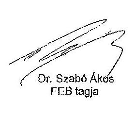

Tisztelettel:
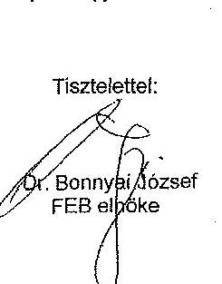

Péter Géza
FEB tagja

---

# BÁT-KOM 2004. Kft. FEB. elnökétől 

Bátaszék Város Önkormányzat
Polgármesterének

7140 Bátaszék
Szabadság utca 4. szám

Tisztelt Polgármester Úr!
A BÁT-KOM 2004. Kft. felügyelő bizottsága értékelte Kiss Lajos ügyvezető úr 2009. évi vezetői tevékenységét, valamint a bérfejlesztéssel összefüggésben a gazdasági társaság pénzügyi helyzetét.

A felügyelő bizottság az ügyvezető úr tevékenységét átlagon felülinek minősítette, az általa irányított gazdasági szervezet a város működtetésében hatékony szerepet játszott, a városi rendezvények előkészítése során, valamint azok befejezését követően amennyiben szükséges volt ünnepnapokon, illetve munkaidő keretein túl is teljesített az önkormányzat igényeinek megfelelően.
A Kft. gazdasági helyzete a háromnegyedéves beszámoló szerint stabil, bérrendezéshez szükséges forrásokkal rendelkezik.

A fentiekre tekintettel a felügyelő bizottság javasolja a Tisztelt Polgármester Úrnak, hogy Kiss Lajos ügyvezető urat mint a tulajdonosi jogokat gyakorló önkormányzat képviseletében eljáró polgármester részesítse egyszeri bruttó 100.000,- Ft azaz bruttó egyszázezer forint jutalomban.

Kelt: Bátaszéken, 2009. év december hónap 1. napján

Tisztelettel:
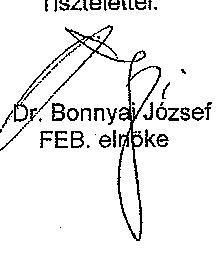

Készült: 3 pld.
Kapla: 1 pld. Polgármester Úr
1 pld. FEB. iratanyag
1 pld. BÁT-KOM 2004 Kft. irattár
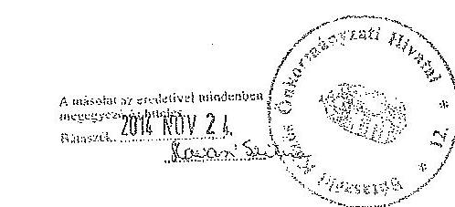

---

Dr. Bonnyai József
BÁT-KOM 2004. Kft. Felügyelő Bizottság elnöke
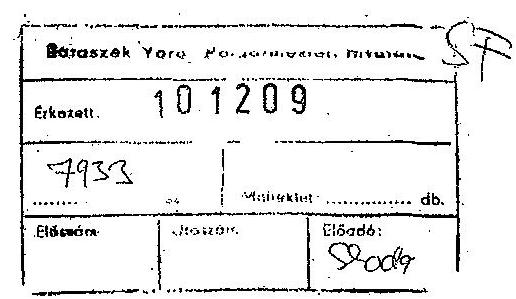

Bátaszék Város Önkormányzat Képviselő Testületének, mint a gazdasági társaság felett a tulajdonosi jogok gyakorlójának

Tisztelt Képviselő-testület!
A gazdasági társaság felügyelő bizottsága 2010. év december hónap 7. napján megtárgyalta azon kezdeményezést, miszerint a gazdasági társaság ügyvezetőjének 2010. évben végzett munkatevékenységével kapcsolatosan jutalmazásra kerüljön sor.
A felügyelő bizottság az elmúlt rendkívüli év értékeléséből következően egyhangúlag egyetért azzal, és javasolja a tulajdonosi jogokat gyakorló képviselő-testületnek, hogy a gazdasági társaság ügyvezetőjét, Kiss Lajos urat a tulajdonosi jogok gyakorlója nettó 100.000,- Ft azaz egyszázezer forint egyszeri jutalomban részesítse.

A képviselő-testület számára és a helyi lakosság számára is köztudomású tény, hogy belvíz és árvíz szempontjából településünkön a 2010.-es év rendkívüli helyzeteket eredményezett. A BÁT-KOM 2004. Kft. munkavállalóinak és vezetőjének rendkívüli áldozatvállalásokat kellett hozniuk a kialakult veszélyhelyzetek során.
Az ügyvezető úr a hatáskörébe tartozó szervezési - irányítási feladatait magas szinten látta el, példamutatóan vettek részt a veszélyhelyzetek felszámolásában, több esetben váratlan munkaidőn túli időpontokban is.
A fentieken túl a normál helyzethez kapcsolódó városüzemeltetési feladataikat is megfelelően ellátták 2010. évben.
A fentiekre tekintettel terjeszti elő a gazdasági társaság felügyelő bizottsága a fentiek szerinti tartalommal a jutalmazási javaslatot, és kéri azt, hogy a tulajdonosi jog gyakorlója - a képviselő-testület - fogadja el jelen előterjesztést.

Kelt: Bátaszéken, 2010. év december hónap 9. napján

Tisztelettel:

Dr. Szabó Ákos sk.
FEB tag

Tresz Gábor sk.
FEB tag
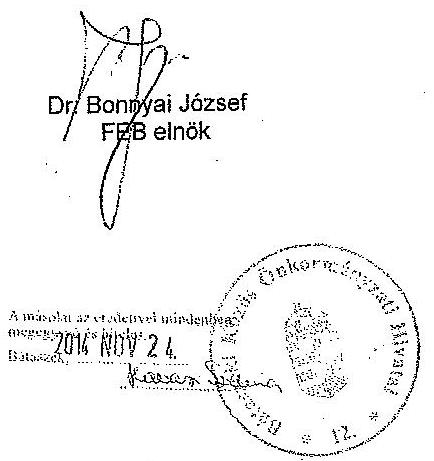

---

# Bátaszék Város Polgármesteri Hivatal 

7140 Bátaszék, Szabadság u. 4.

## KIVONAT

Bátaszék Város Önkormányzat Képviselő-testület 2004. június 29-ei ülésének jegyzőkönyvéből

## 131/2004.(VI.29.) KTH. számú határozat

## a helyi hulladékgazdálkodási terv elkészíttetéséről

Bátaszék Város Önkormányzatának Képviselő-testülete a Szekszárd Megyei Jogú Város és a környező települések helyi hulladékgazdálkodási tervének elkészítésére vonatkozó - és a ForEnviron Környezetvédelmi és Mérnöki Szolgáltató Kft.-vel (Budapest) kötött - vállalkozási szerződést jóváhagyja.

Határidő: 2004. július 5.
Felelős: Bozsolik Róbert jegyző
(a határozat megküldéséért)
Határozatról értesül: Szekszárd MJV polgármestere
k. m. f.

Bognár Jenő sk. polgármester

A kivonat hiteléül: Bátaszék, 2004. július 5.

## 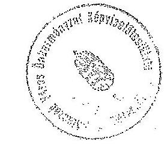

Bozsolik Róbert sk. jegyző
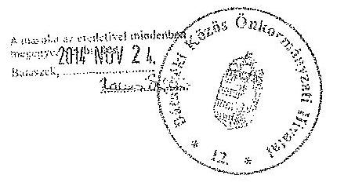

---

# Bátaszék Város Polgármesteri Hivatal 7140 Bátaszék, Szabadság u. 4. 

## KIVONAT

Bátaszék Város Önkormányzat Képviselő-testület 2004. április 27-ei ülésének jegyzőkönyvéből

## 69/2004.(IV.27.) KTH. számú határozat

## Hulladékgazdálkodási terv elkészíttetéséről

Bátaszék város képviselő-testülete - a hulladékgazdálkodásról szóló 2000. évi XLIII. tv. 35. - 36. §-aiban foglaltakra figyelemmel - egyetért azzal, hogy Bátaszék város hulladékgazdálkodási terve mikrotérségi szint keretében készüljön el. Ennek érdekében a hulladékgazdálkodási terv elkészíttetésére vonatkozó - és a jegyzőkönyvet mellékletét képező együttműködési megállapodást jóváhagyja.

Határidő: 2004. május 5.
Felelős: Bozsolik Róbert jegyző
(a határozat megküldéséért) és
Határozatról értesül: Szekszárd város polgármestere építési és városüzemeltetési iroda
k. m. f.

Bognár Jenő sk. polgármester

A kivonat hiteléül: Bátaszék, 2004. április 29.

Tenczlinger Timea előadó

## Bozsolik Róbert sk.   jegyző

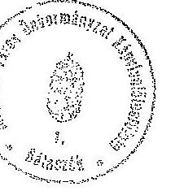
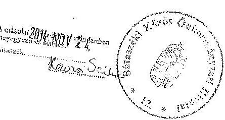

---

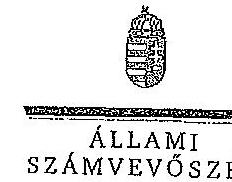

ELRÖK

Ikt.szám: V-0464-135/2014.

Dr. Bozsolik Róbert úr
polgármester
Bátaszék Város Önkormányzata

Bátaszék

Tisztelt Polgármester Úr!

Köszönettel vettem a BÁT-KOM 2004. Városüzemeltető és Szolgáltató Kft. ellenőrzéséről
készített számvevőszéki jelentéstervezetre tett észrevételeit.

Az Állami Számvevőszék észrevételekre vonatkozó álláspontjáról a felügyeleti vezető által
készített részletes tájékoztatást csatoltan megküldöm.

Tájékoztatom Polgármester urat, hogy a számvevőszéki jelentés véglegesítése az elfogadott
észrevételek figyelembevételével történik.

Budapest, 2014. december hó 39. nap

Tisztelettel:

*Domokos László*

Melléklet: Tájékoztatás az észrevételek kezeléséről

1052 BUDAPEST, APÁCZAI CSERJÉSZ JÁRÓG DÍCÁ 10. 1364 Budapest 4. Pf. 54 telefon: 484 9181 fax: 484 9201

11

---

# Tájékoztatás az észrevételek kezeléséről 

A BÁT-KOM 2004. Városüzemeltető és Szolgáltató Kft. ellenőrzéséről készített jelentéstervezetre Polgármester úr észrevételeket fogalmazott meg. Az észrevételek alapján a jelentés tervezetét az alábbiak szerint módosítom:

Az észrevételek 1. pontja a hulladékgazdálkodási tervhez, illetve annak elfogadásáról szóló önkormányzati rendelethez fűzött magyarázat. A jelentéstervezet a hulladékgazdálkodási terv hiányát állapította meg a 2009-2014. évek vonatkozásában. Az észrevétel a 2004-2008. évekre szóló hulladékgazdálkodási terv elfogadásáról szóló önkormányzati rendelet hatályosságát rögzíti. Nem ad magyarázatot arra a megállapításra, hogy a jegyző a 2009-2014. évekre vonatkozó hulladékgazdálkodási tervet nem készítette elő, ezért a megállapítást fenntartjuk.

Az észrevételek 2. pontja a jelentéstervezet azon megállapításához fűzött magyarázat, mely szerint „az ellenőrzött időszakban a BÁT-KOM 2004. Kft. számviteli beszámolójáról a Gt. tv-ben előírtak ellenére az FB írásbeli jelentést a 2011. évi beszámoló kivételével nem készített.” Az észrevétel a megállapítást nem vitatja, ezért azt változatlan formában fenntartjuk.

Az észrevételek 3. pontja és a helyszíni ellenőrzés során rendelkezésre bocsájtott dokumentumok alapján az ügyvezető béremelésére vonatkozó részletes megállapítást (20. oldal 3. részbekezdés) 3 alkalomról 2 alkalomra módosítottuk. A következő szövegrészeket töröltük: részletes megállapítások (20. oldal utolsó bekezdés) „illetve a 2009. évi ügyvezetői jutalmazás kivételével az FB”, az összegző megállapítások (11. oldal első bekezdés) „illetve a 2009. évi ügyvezető jutalmazására vonatkozó javaslat kivételével az FB” valamint a polgármesternek tett 2. számú javaslat FB írásbeli véleményezésre vonatkozó részét.

Budapest, 2014. december „200”.
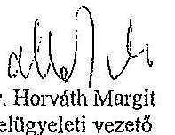

Dr. Horváth Margit
felügyeleti vezető

---

# Mintavételi eljárások ellenőrzési területenként

|  Szz. | Mintavételi ellenőrzendő területek | Főbb kérdés | Ellenőrzési kérdések | Adatforrások | Alapsokaság | Mintavételi eljárás  |
| --- | --- | --- | --- | --- | --- | --- |
|   | 1 | 2 | 3 | 4 | 5 | 6  |
|  1. | Az ellátott közfeladat ráfordításainak elkülönített, szabályszerű elszámolása területén |  |  |  |  |   |
|  2. | Anyagjellegű ráfordítások | Az anyagjellegű ráfordítások elszámolása során betartották-e a belső szabályzatokban és a jogszabályokban foglaltakat és azokat a közfeladat-ellátással kapcsolatosan elkülönítették-e? | - a számhámozott anyagjellegű ráfordításokra kötött szerződésnél betartották-e az Számv. tv. előírását, a kifizetés megelőzően a kötelezettségvállalás megfelelő-e az előírásoknak?
- a beszerzett anyagok nyilvántartásba vétele megtörtént-e, azokat a közfeladat-ellátással kapcsolatosan elkülönítették-e a szabályozásnak megfelelően?
- a készlet bekerülési értékét a Számv. tv., a számviteli politika, illetve az értékelési szabályzat előírásai szerint vették-e számításba, azokat a közfeladat-ellátással kapcsolatosan elkülönítették-e?
- az anyagjellegű ráfordításokat a megfelelő költségnemre, illetve közfeladatra számolták-e el? | Az anyagjellegű ráfordítások közül a 21-22. főkönyvi számlacsoportból vett minta esetében
- a költségelszámolást megalapozó dokumentumok (szerződések, megrendelések, stb.), költségelszámoláshoz benyújtott számlák, teljesítés megtörténtét, a kifizetést alátámasztó egyéb dokumentumok,
- analitikus nyilvántartások, anyagok nyilvántartásba vételét igazoló dokumentumok, ha a számviteli politika szerint nyilvántartásba kellett venni azokat. | Évente a főkönyvi adatbázisból - külön részsokaságot képeznek a 21-22. Anyagjellegű ráfordítások számlacsoportba
 a tartozó ráfordítások, kivéve az ELÁSÉ és az eladott közvetített szolgáltatások értéke. | A mintavétel megelőzően a sokszágból ki kell értesíteni - tételes ellenőrzésre - évente a 3-5 legnagyobb összegű tételt mindkét csoportból. Egyszerű véletlen mintavétel évenként és csoportonként elemszámmal arányos rétegekkel.  |
|  3. | Beruházások, felújítások aktiválása és értékcsökkenési leírás | A feladat ellátásához az önkormányzattól kezelésre átvett közüzemi állományba vételi, nyilvántartási és elszámolási kötelezettségének teljesítése kapcsán a felújítások, beruházások kiadásai okirattal alátámasztottak és az értékcsökkenési leírás elszámolása megfelelő-e | - a kifizetést megelőzően a kötelezettségvállalás megfelelő-e az előírásoknak, továbbá be lett-e szerezve a tulajdonosi jogok gyakorlójának előzetes, írásbeli engedélye - amennyiben előírják az önkormányzati tulajdonban lévő eszközön elszámolt beruházáshoz/felújításhoz?
- a beruházások, felújítások állománybavétele, besorolása, a bekerülési érték meghatározása, az üzembehelyezés (aktiválás) dokumentálása megfelelő-e a Számv. tv., a számviteli politika, illetve az értékelési szabályzat előírásainak?
- az ellenőrzésre kiválasztott immateriális javak és tárgyi eszközök szerepelnek-e a mérleget alátámasztó leltárban?
- az értékcsökkenés elszámolása a jogszabályban és a számviteli politikában meghatározott szabályozásnak megfelelő-e? | A kiválasztott beruházásra vagy felújításra: szerződések, számlák, a befejezetlen beruházások, felújítások analitikus nyilvántartása, immateriális javak, tárgyi eszközök analitikus nyilvántartása, a beszerzett eszköz üzembehelyezési okmányai, állományba vételi bizonylat, egyedi eszköznyilvántartó kartonja - az értékcsökkenés elszámolása az egyedi eszköznyilvántartó kartonján, illetve analitikus nyilvántartásában | Évente a főkönyvi adatbázisból a 11-14. számlacsoport állománynövekedési tételei, ehhez kapcsolódóan az értékcsökkenés elszámolásának tételei | A mintavétel megelőzően a sokszágból ki kell értesíteni - tételes ellenőrzésre - évente a 3-5 legnagyobb összegű tételt. Egyszerű véletlen mintavétel évenként, elemszámmal arányos rétegekkel. Kiválasztott tételek eszközönkénti tételes ellenőrzése.  |
|  4. | Az ellátott közfeladat bevételeinek elkülönített, szabályszerű elszámolása területén |  |  |  |  |   |
|  5. | Értékesítés nettó árbevétel | Az értékesítés nettó árbevételének beszedése, elszámolása során betartották-e a belső szabályzatokban és a jogszabályokban foglaltakat és azokat a közfeladat-ellátással kapcsolatosan elkülönítették-e? | - a bevétel előírása, kiszámítása a belső szabályozásnak megfelelően történt-e?
- a bevételi előírás és a befolyt bevétel nyilvántartásba vétele (analitikus, főkönyvi) megtörtént-e, azokat a közfeladat-ellátással kapcsolatosan elkülönítették-e?
- a bevételek beszedése, elszámolása során betartották-e a szabályozásban foglaltakat és a megfelelő számlacsoportba számolták el a bevételt?
- a tulajdonosi követelményeknek, belső szabályozásnak megfelelő árat alkalmazták-e? | A kiválasztott értékesítés nettó árbevétel jogcímen befolyt bevételre:
- az egyes bevételek díjmegállapítása,
- a kiállított számla, befolyt bevétel analitikus nyilvántartása, behajtásra tett intézkedések dokumentumai,
- kapcsolódó főkönyvi számla tételes forgalma,
- bevétel beérkezését igazoló banki kivonat(ok) | Évente a főkönyvi adatbázisból a 91-94. számlacsoport bevételei | Egyszerű véletlen mintavétel évenként, elemszámmal arányos rétegekkel.  |

