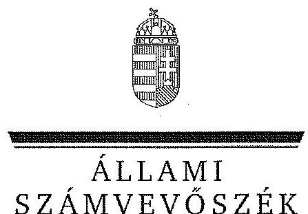

ÁLLAMI
SZÁMVEVŐSZÉK

# JELENTÉS 

Az önkormányzatok gazdasági társaságai - Az önkormányzatok többségi tulajdonában lévő gazdasági társaságok közfeladat ellátását érintő gazdálkodási tevékenysége szabályszerűségének ellenőrzése
NYÍRTÁVHŐ Nyíregyházi Távhőszolgáltató Kft.

---

# Állami Számvevőszék 

Iktatószám: V-0521-153/2014.
Témaszám: 1555.
Vizsgálat-azonosító szám: V067126

## Az ellenőrzést felügyelte:

Dr. Horváth Margit
felügyeleti vezető
Az ellenőrzés vezette és a végrehajtásáért felelős:
Klinga László
ellenőrzésvezető
Az összefoglaló jelentést készítette:
Vida Cecília
számvevő
Az ellenőrzést végezték:

| Balogh Istvánné | Nagy Tünde | Tóth Kálmán |
| :-- | :-- | :-- |
| okleveles könyvvizsgáló, | okleveles könyvvizsgáló, | okleveles könyvvizsgáló, |
| külső szakértő | külső szakértő | külső szakértő |

A témához kapcsolódó eddig készített számvevőszéki jelentések:
címe
sorszáma
Jelentés Nyíregyháza Megyei Jogú Város Önkormányzata pénzügyi 1136
helyzetének ellenőrzéséről (43/3)

---

# TARTALOMJEGYZÉK 

BEVEZETÉS ..... 7
I. ÖSSZEGZŐ MEGÁLLAPÍTÁSOK, KÖVETKEZTETÉSEK, JAVASLATOK ..... 10
II. RÉSZLETES MEGÁLLAPÍTÁSOK ..... 14

1. Az Önkormányzat közfeladat-ellátásának szabályszerűsége ..... 14
1.1. A közfeladat-ellátás megszervezése és a feladatellátás feltételrendszerének kialakítása ..... 14
1.2. A közfeladat-ellátás felügyelete és a tulajdonosi jogok érvényesítése ..... 15
2. A NYÍRTÁVHŐ Kft. közfeladat-ellátással kapcsolatos tevékenysége ..... 19
2.1. A NYÍRTÁVHŐ Kft. gazdálkodásának szabályozottsága ..... 19
2.2. A NYÍRTÁVHŐ Kft. vagyongazdálkodása és vagyonnyilvántartása ..... 21
2.3. A beszámolási kötelezettség teljesítése ..... 23
3. A Távhőszolgáltatás közfeladata bevételei és ráfordításai elszámolásának és önköltségszámításának szabályszerűsége ..... 24
3.1. A távhőszolgáltatás közfeladatok bevételeinek és ráfordításainak szabályszerűsége ..... 24
3.2. Az önköltségszámítás szabályszerűsége ..... 25
4. Az ÁSZ korábbi, az önkormányzatok többségi tulajdonában lévő gazdasági társaságok közfeladat-ellátását, gazdálkodását, pénzügyi helyzetét érintő javaslataira tett intézkedések ..... 26
MELLÉKLETEK
5. számú A NYÍRTÁVHŐ Kft. tevékenységének év végi főbb adatai
6. számú A NYÍRTÁVHŐ Kft. múködésének év végi főbb jellemzői
7. számú A NYÍRTÁVHŐ Kft. által biztosított közszolgáltatás díjai a 2008-2012. évekre vonatkozóan
8. számú Beérkezett észrevételek és az azokra adott válaszok
FÜGGELÉKEK
9. számú Mintavételi eljárások ellenőrzési területenként

---

.

---

# RÖVIDÍTÉSEK JEGYZÉKE 

## Törvények

Áht.

Ámt.

Ebktv.

Gt. tv.

Infotv.

Irattári tv.

Mötv.

Nvtv.

Számv. tv.
Tsztv.

## Rendeletek

50/2011. (IX. 30.) NFM rendelet

51/2011. (IX. 30.) NFM rendelet
SZMSZ $_{1}$

az államháztartásról szóló 2011. évi CXCV. törvény (hatályos: 2012. január 1-jétől)
az árak megállapításáról szóló 1990. évi LXXXVII. törvény (hatályos: 1991. január 1-jétől)
az egyenlő bánásmódról és az esélyegyenlőség előmozdításáról szóló 2003. évi CXXV. törvény (hatályos: 2004. január 27-étől)
a gazdasági társaságokról szóló 2006. évi IV. törvény (hatálytalan: 2014. március 15-étől)
az információs önrendelkezési jogról és az információszabadságról szóló 2011. évi CXII. törvény
a köziratokról, a közlevéltárakról és a magánlevéltári anyag védelméről szóló 1995. évi LXVI. törvény
Magyarország helyi önkormányzatairól szóló 2011. évi CLXXXIX. törvény (hatályos: 2012. január 1-jétől, kivéve a 144. § (2) bekezdésben meghatározott paragrafusok, amelyek 2012. április 15 -én, a (3) bekezdésben meghatározott paragrafusok, amelyek 2013. január 1-jén léptek hatályba, a (4) bekezdésben meghatározott paragrafusok a 2014. évi általános önkormányzati választások napján lépnek hatályba)
a nemzeti vagyonról szóló 2011. évi CXCVI. törvény (hatályos: 2011. december 31-étől, kivéve a 20. § (2) bekezdésben meghatározott paragrafusok, amelyek 2012. január 1-jétől, a (3) bekezdésben meghatározott paragrafusok 2013. január 1-jétől, a (4) bekezdésben meghatározott paragrafus 2012. március 2-ától léptek hatályba)
a helyi önkormányzatokról szóló 1990. évi LXV. törvény (hatálytalan: a 2014. évi általános önkormányzati választások napjától)
a számvitelről szóló 2000. évi C. törvény (2001.01.01-től)
a távhőszolgáltatásról szóló 2005. évi XVIII. törvény (hatályos: 2005. július 1-jétől)
a távhőszolgáltatónak értékesített távhő árának, valamint a lakossági felhasználónak és a külön kezelt intézménynek nyújtott távhőszolgáltatás dijának megállapításáról szóló 50/2011. (IX. 30.) NFM rendelet (hatályos: 2011. október 1-jétől)
a távhőszolgáltatási támogatásról szóló 51/2011. (IX. 30.) NFM rendelet (hatályos: 2011. október 1-jétől)

Nyíregyháza Megyei Jogú Város Önkormányzatának 6/1999. (III.1.) Közgyűlési rendelete Nyíregyháza Megyei Jogú Város és Szervei Szervezeti és Múködési Szabályzatá-

---

SZMSZ $_{2}$

## távhőrendelet

távhőszolgáltatás díjáról szóló rendelet
vagyongazdálkodási rendelet

## Szórövidítések

Alapító Okirat
ÁSZ
ENEREA Kft.
FB
Közgyűlés
MÁK
MEH
NYÍRTÁVHŐ Kft.
Önkormányzat
Önköltségszámítási sza-
bályzat ${ }_{1}$
Önköltségszámítási sza-
bályzat ${ }_{2}$
polgármester
Polgármesteri hivatal
Számviteli politika ${ }_{1}$
Számviteli politika ${ }_{2}$
Számviteli politika ${ }_{3}$
ról (hatályos:1999. március 1-jétől 2011. március 9-ig.)
Nyíregyháza Megyei Jogú Város Közgyűlésének 9/2011. (III.10.) önkormányzati rendelete Nyíregyháza Megyei Jogú Város Közgyűlése és Szervei Szervezeti és Müködési Szabályzatáról (hatályos: 2011. március 10-től)
Nyíregyháza Megyei Jogú Város Önkormányzatának többször módosított 41/2005. (X. 27.) Közgyűlési rendelete a távhőszolgáltatásról szóló 2005. évi XVIII. törvény, valamint a 157/2005. (VIII.15.) sz. Korm. rendelet egyes rendelkezéseinek Nyíregyháza város területén történő végrehajtásáról (hatályos: 2005. október 27-től)
Nyíregyháza Megyei Jogú Város Önkormányzatának többször módosított 42/2005. (X. 27.) Közgyűlési rendelete a távhőszolgáltatás díjainak megállapításáról és alkalmazásáról (hatályos: 2005. december 1-től)
Nyíregyháza Megyei Jogú Város Önkormányzatának többször módosított 21/2004. (VI.24.) Közgyűlési rendelete Nyíregyháza Megyei Jogú Város Önkormányzata vagyonának meghatározásáról, a vagyon feletti tulajdonjogok gyakorlásának szabályozásáról (2004.07.01-jétől)

NYÍRTÁVHŐ Kft. többször módosított Alapító Okirata
Állami Számvevőszék
Észak-Alföldi Regionális Energia Ügynökség Nonprofit Korlátolt Felelősségű Társaság
NYÍRTÁVHŐ Kft. Felügyelőbizottsága
Nyíregyháza Megyei Jogú Város Önkormányzatának Közgyűlése
Magyar Államkincstár
Magyar Energia Hivatal
NYÍRTÁVHŐ Nyíregyházi Távhőszolgáltató Korlátolt Felelősségű Társaság
Nyíregyháza Megyei Jogú Város Önkormányzata
NYÍRTÁVHŐ Kft. 2009. január 1-jétől 2012. július 2-ig hatályos Önköltségszámítási és árképzési szabályzata
NYÍRTÁVHŐ Kft. 2012. július 2-ától hatályos Önköltségszámítási és árképzési szabályzata
Nyíregyháza Megyei Jogú Város Önkormányzatának polgármestere
Nyíregyháza Megyei Jogú Város Önkormányzatának Polgármesteri hivatala
NYÍRTÁVHŐ Kft. 2001. március 1-jétől 2008. december 31-ig hatályos Számviteli politikája
NYÍRTÁVHŐ Kft. 2009. január 1-jétől 2012. július 1-jéig hatályos Számviteli politikája
NYÍRTÁVHŐ Kft. 2012. július 2-ától hatályos Számviteli politikája

---

# ÉRTELMEZŐ SZÓTÁR 

engedélyköteles távhőszolgáltatás
gazdasági társaság
kazánház technológia
közfeladat
közszolgáltatás
nemzeti vagyon

A Tsztv. 3. § q) pontja szerint az a közüzemi szolgáltatás, amely a felhasználónak a távhőtermelő létesítményből távhővezeték-hálózaton keresztül, az engedélyes által végzett, üzletszerű tevékenység keretében történő hőellátásával fútési, illetve egyéb hőhasznosítási célú energiaellátásával valósul meg.
A Gt. tv. 3. § (1) bekezdése szerint „gazdasági társaságot üzletszerü közös gazdasági tevékenység folytatására külföldi és belföldi természetes és jogi személyek, valamint jogi személyiség nélküli gazdasági társaságok alapithatnak, müködő társaságba tagként beléphetnek, társasági részesedést (részvényt) szerezhetnek".
Nyíregyháza Város Önkormányzata intézményeiben a NYÍRTÁVHŐ Kft. által múködtetett földgázalapú központi fütés, amely része a NYÍRTÁVHŐ Kft. Alapító Okirata szerinti távhőszolgáltatási tevékenységének.
Jogszabályban meghatározott állami vagy önkormányzati feladat, amit az arra kötelezett közérdekből, jogszabályban meghatározott követelményeknek és feltételeknek megfelelve végez, ideértve a lakosság közszolgáltatásokkal való ellátását, továbbá az állam nemzetközi szerződésekben vállalt kötelezettségeiből adódó közérdekú feladatokat, valamint e feladatok ellátásához szükséges infrastruktúra biztosítását is (Nvtv. 3. § (1) bekezdés 7. pont).

A közszolgáltatás: „közcélú, illetőleg közérdekü szolgáltatást jelent, amely egy nagyobb közösség (állam, település) minden tagjára nézve megközelítőleg azonos feltételek mellett vehető igénybe, ezért valamilyen mértékig közösségi megszervezést, illetve szabályozást, ellenőrzést igényel". Az Ebktv. 3. § d) pontja a következőképpen határozza meg a közszolgáltatást: „szerződéskötési kötelezettség alapján a lakosság alapvető szükségleteinek ellátására irányuló szolgáltatás, így különösen a villamos energia-, gáz-, hő-, víz-, szennyvíz- és hulladékkezelési, köztisztasági, postai és távközlési szolgáltatás, továbbá a menetrend alapján közlekedő jármüvekkel végzett közforgalmú személyszállitás".
Az Nvtv. 1. § (2) bekezdése szerint:
„az állam vagy a helyi önkormányzat kizárólagos tulajdonában álló dolgok,
az a) pont hatálya alá nem tartozó, állam vagy a helyi önkormányzat tulajdonában lévő dolog,
az állam vagy a helyi önkormányzatot tulajdonában lévő pénzügyi eszközök, továbbá az államot vagy a helyi önkormányzatot megillető társasági részesedések,
az államot vagy a helyi önkormányzatot megillető bármely

---

vagyoni értékkel rendelkező jogosultság, amelyet jogszabály vagyoni értékú jogként nevesít,
Magyarország határa által körbezárt terület feletti légtér, az üvegházhatású gázok kibocsátási egységeinek kereskedelméről szóló törvény szerint kibocsátási egység és légiközlekedési kibocsátási egység, valamint az ENSZ Éghajlat változási Keretegyezménye és annak Kiotói Jegyzökönyve végrehajtási keretrendszeréról szóló törvény szerinti kiotói egység, állami vagy helyi önkormányzati fenntartású közgyűjtemény (muzeális intézmény, levéltár, közgyűjteményként müködő kép- és hangarchívum, valamint könyvtár) saját gyüjteményében nyilvántartott kulturális javak körébe tartozó dolog, a régészeti lelet,
a nemzeti adatvagyon körébe tartozó állami nyilvántartások fokozottabb védelméről szóló törvény szerinti nemzeti adatvagyon". (hatályos 2012. január 1-jétől, a g) pont módosult 2012. június 30 -ától)
távhőszolgáltató
tulajdonosi joggyakorló
üzletszabályzat

A Tsztv. 3. § r) pontja szerint: az a gazdálkodó szervezet, amely meghatározott településen vagy a település meghatározott részén a távhő üzletszerű szolgáltatására engedélyt kapott.
Aki a nemzeti vagyon felett az államot vagy a helyi önkormányzatot megillető tulajdonosi jogok és kötelezettségek összességének gyakorlására jogosult (Nvtv. 3. § (1) bekezdés 17. pont).
Tsztv. 3. § v) pontja szerint üzletszabályzat a távhőszolgáltató által készített azon dokumentum, amely a helyi szolgáltatási sajátosságok figyelembevételével szabályozza a távhőszolgáltató müködését és meghatározza a távhőszolgáltató kötelezettségeit és jogait, szabályozza a távhőszolgáltató és a felhasználó szerződéses viszonyát, a mérés és elszámolás rendjét, valamint a szolgáltatónak a felhasználóval, a fogyasztóvédelmi hatósággal és a felhasználók társadalmi érdekképviseleti szervezeteivel (a továbbiakban: felhasználói érdekképviselet) való együttmúködését.

---

# JELENTÉS 

## Az önkormányzatok gazdasági társaságai Az önkormányzatok többségi tulajdonában lévő gazdasági társaságok közfeladat ellátását érintő gazdálkodási tevékenysége szabályszerűségének ellenőrzése

## NYÍRTÁVHŐ Nyíregyházi Távhőszolgáltató Kft.

## BEVEZETÉS

Az Állami Számvevőszék középtávra szóló stratégiájában megfogalmazta, hogy a helyi önkormányzatok gazdálkodásában rejlő pénzügyi kockázatok feltárásával, az államháztartáson kívülre nyújtott költségvetési támogatások és ingyenes vagyonjuttatások, valamint az államháztartáson kívül múködő köz-feladat-ellátó rendszerek ellenőrzéseivel hozzájárul ahhoz, hogy a közpénzeket az államháztartáson kívül múködő szervezetek is átlátható, rendezett módon használják fel a közfeladatok szerződésben vállalt ellátása során.

Az önkormányzatok szervezetalakítási szabadságának következménye, hogy a korábban vállalati formában múködő (nagyvárosi tömegközlekedés, víz-, szennyvízcsatorna, köztisztasági, ingatlankezelés stb.) közszolgáltatások mellett, mind a kötelező, mind az önként vállalt feladatok ellátásában a gazdasági társaságok kiemelt fontosságú szerephez jutottak.

A Nyíregyházi Távhőszolgáltató Korlátolt Felelősségű Társaság (továbbiakban NYÍRTÁVHŐ Kft.), a Szabolcs-Szatmár-Bereg Megyei Távhőszolgáltató Vállalat (SZABOLCSHŐ Vállalat) átszervezésével, 1992. június 29-én jött létre öt önkormányzat megállapodásával. Alapfeladata Nyíregyháza Megyei Jogú Város közigazgatási területén a távhőrendszer üzemeltetése.

A NYÍRTÁVHŐ Kft. Nyíregyháza város közigazgatási területén az EON Energiatermelő Kft-től vásárolt hőenergia szállítását és elosztását, továbbá az önkormányzati intézmények földgáz tüzelésű berendezéseinek üzemeltetését végezte. A 2012. év végén 15648 lakást és 1001 közületi fogyasztót látott el hőenergiával. A lakossági fogyasztók 95,5\%-a (14 939 lakás) szabályozható, a költségmegosztást biztosító készülékkel rendelkezett. Az összes fütött légtérfogat 3949 ezer $\mathrm{m}^{3}$, az előállított használati meleg víz éves mennyisége 506 ezer $\mathrm{m}^{2}$ volt. A városi távvezeték hálózat hossza közel 46 km . A hőfogyasztók a távhőhálózatra közvetett módon, 279 hőközponton és 201 hőfogadó állomáson keresztül csatlakoznak.

---

Az ellenőrzött időszakban a NYÍRTÁVHŐ Kft. az Önkormányzat 100\%-os tulajdonában volt, átlagos statisztikai létszáma 2012-ben 128 fő, az értékesítés nettó árbevétele 4198 millió Ft volt.

A NYÍRTÁVHŐ Kft. összes bevétele 2008-ban 4243 millió Ft, a 2012. évben 6045 millió Ft volt, amelyből az értékesítés nettó árbevétele 2008-ban 4185 millió Ft, míg 2012-ben 4198 millió Ft volt. Az árbevételek az ellenőrzött időszakban $42,5 \%$-kal, a ráfordítások $44,6 \%$-kal nőttek.

A NYÍRTÁVHŐ Kft. az ellenőrzött években pozitív mérleg szerinti eredménnyel zárt. A mérleg szerinti eszközérték a 2008. évi nyitó 4596 millió Ft-ról a 2012. év végére $30,5 \%$-os növekedést követően 5996 millió Ft-ra emelkedett, ezen belül a követelések állománya több mint duplájára, 1194 millió Ft-ra nőtt. A saját tőke a 2008. évi nyitó 3505 millió Ft-ról a 2012. év végére 4394 millió Ft-ra nőtt.

Az ellenőrzött időszakban a jegyző személye nem, a polgármester személye egy alkalommal változott. A polgármester a 2010. évi önkormányzati választások óta tölti be tisztségét. Az ügyvezető 2012. április 14-től tölti be tisztségét.

Az önkormányzati tulajdonú gazdasági társaságok teljes körű ellenőrzésének lehetőségét az Állami Számvevőszékről szóló 1989. évi XXXVIII. törvény 2011. január 1-jétől hatályos módosítása teremtette meg.

Az ellenőrzés célja annak értékelése volt, hogy

- az önkormányzat a jogszabályi előírások figyelembevételével döntött-e az ellenőrzésre kerülő közfeladat megszervezéséről; az önkormányzat szabályszerűen gyakorolta-e a tulajdonosi jogokat;
- a gazdasági társaság közfeladat-ellátása bevételeinek, ráfordításainak elszámolása, és vagyongazdálkodási tevékenysége megfelelt-e a jogszabályi, illetve a közszolgáltatási szerződésben foglalt tulajdonosi előírásoknak, azok végrehajtása szabályszerű volt-e;
- a közfeladatok átláthatósága és elszámoltathatósága érdekében biztosítva volt-e a közszolgáltatás dijának megalapozottsága szabályszerű önköltségszámítással.

Az ellenőrzés során értékeltük az ÁSZ korábbi, az Önkormányzat többségi tulajdonában lévő gazdasági társaságát érintő javaslataira tett intézkedések hasznosulását is. Az ellenőrzés kiterjedt Nyíregyháza Megyei Jogú Város Önkormányzatára és a NYÍRTÁVHŐ Nyíregyházi Távhőszolgáltató Korlátolt Felelősségű Társaságra.

Az ellenőrzés várható hasznosulása: A törvényalkotás számára - az észlelt problémák, szabálytalanságok, vagy egyéb nem kívánatos jelenségek felszínre kerülésével - az ellenőrzés megállapításai segítséget nyújthatnak az államháztartáson kívüli közfeladat-ellátás értékeléséhez, jogszabályi keretei pontosításához, átláthatóságot biztosító szabályozásához. Meghatározhatóvá válnak a közfeladat ellátásában részt vevő államháztartáson kívüli szervezeteknek - az önkormányzat költségvetését, pénzügyi helyzetét is befolyásoló - kockáza-

---

tai, lehetővé válik ezen kockázatok csökkentése. Feltárja, hogy az önkormányzat közfeladat-ellátási kötelezettségének szabályszerűen tett-e eleget, a feladatellátáshoz rendelt közvagyon múködtetését szabályszerűen szervezte-e meg és a tulajdonosi felügyelete hozzájárult-e a közfeladat-ellátásához. A feladatot ellátó gazdasági társaság a közszolgáltatási szerződésben foglaltak betartásával, a közvagyon használatával biztosította-e a szolgáltatás folytatásának feltételeit. Ezzel az ellenőrzöttek és a helyi döntéshozók számára visszajelzést ad feladatszervezési, feladat-ellátási kockázataikról, alapot ad a meglévő hibák megszüntetéséhez, a jobb közfeladat-ellátás biztosításához. Fokozza a fegyelmet, igazolja, hogy lejárt a következmények nélküli ellenőrzések időszaka. Az ÁSZ értékteremtő rend kialakításához és megőrzéséhez hozzájáruló tevékenysége pozitív hatással van a szervezetről kialakított összkép formálására is.

A bevételek és ráfordítások elszámolása, valamint a vagyonnyilvántartás terén az egyes területek szabályszerű működését mintavétellel ellenőriztük, ez alapján a sokaságokban előforduló hibás tételek arányát becsültük. A jogszabályoknak és a belső előírásoknak megfelelőnek, azaz szabályszerűnek tekintettük az adott bevételek és ráfordítások elszámolását, a vagyonnyilvántartást, amennyiben a minta ellenőrzésének eredménye alapján $95 \%$-os bizonyossággal a teljes sokaságban a hibás tételek aránya kisebb volt, mint $10 \%$, nem megfelelőnek értékeltük, ha a hibás tételek aránya a 10\%-ot meghaladta. Kockázatot, illetve magas kockázatot jeleztünk, amennyiben egy adott terület vonatkozásában a minta alapján a teljes sokaságban nem volt teljes körűen biztosított a jogszabályoknak és a belső szabályzatoknak megfelelő működés (1. számú függelék).

Az ellenőrzést a számvevőszéki ellenőrzés szakmai szabályai szerint, szabályszerűségi ellenőrzés módszerével, a vonatkozó nemzetközi standardok figyelembevételével végeztük. Az ellenőrzés a 2008-2012. évekre terjedt ki.

Az ellenőrzés végrehajtásának jogszabályi alapját az Állami Számvevőszékről szóló 2011. évi LXVI. törvény 5. § (3)-(4)-(5) bekezdése képezi.

Az ÁSZ az Állami Számvevőszékről szóló 2011. évi LXVI. törvény 29. §-a alapján a jelentéstervezetet észrevételezésre megküldte a polgármesternek és a gazdasági társaság ügyvezetőjének. A beérkezett észrevételeket a jelentés véglegesítése során hasznosítottuk. Az észrevételeket és az azokra adott válaszokat a jelentés 4. számú melléklete tartalmazza.

---

# I. ÖSSZEGZŐ MEGÁLLAPÍTÁSOK, KÖVETKEZTETÉSEK, JAVASLATOK 

A helyi energiaszolgáltatásban való közreműködés az Ötv. alapján az önkormányzat törvényi kötelezettsége. Nyíregyháza Megyei Jogú Város Önkormányzata az Önkormányzat közigazgatási területén a távhőszolgáltatás ellátásáról a kizárólagos tulajdonában lévő gazdasági társaságán keresztül gondoskodott. Az Önkormányzat a 2007-2010. évekre szóló gazdasági programban korszerű energetikai rendszer kialakitását, hatékony energiaracionalizálási programot és az energia felhasználás csökkentését tervezte. A 2011-2014. évekre szóló gazdasági programban kiemelt célként szerepelt a távhőszolgáltatás fogyasztók általi szabályozhatóságának biztosítása, a gázüzemet használó intézmények megújuló energiaforrásokkal való fűtéskorszerűsítése, a kinnlevőségek csökkentése, a távhőszolgáltatás díjának szinten tartása.

Az Önkormányzat a NYÍRTÁVHŐ Kft. alapításakor a feladatellátáshoz kapcsolódó vagyont apportba adta, a távhőszolgáltatás feladatát az Alapító Okiratban foglaltak szerint látta el. Az Önkormányzat a Tsztv.-ben előírtak alapján rendeletben határozta meg a távhőszolgáltatás és a távhőszolgáltatás díj megállapításának szabályait. A lakossági távhőszolgáltatás díjképzési alapját az üzleti tervekben szereplő költségadatok, számítások képezték. A díjváltozásokra vonatkozó közgyűlési előterjesztések minden esetben tartalmaztak szöveges indoklást.

Az Önkormányzat a vagyongazdálkodási rendeletben és az SZMSZ ${ }_{1,2}$-ben határozta meg a gazdasági társaságok feletti tulajdonosi jogok gyakorlásának szabályait. Az ellenőrzött időszakban a NYÍRTÁVHŐ Kft. feletti tulajdonosi jogokat a Közgyűlés gyakorolta. A vagyongazdálkodási rendelet 2010. november 12-i módosítását követően a gazdasági társaságok esetében az önkormányzati vagyonnal kapcsolatos jogok gyakorlására a polgármester kapott felhatalmazást. A Közgyűlés a 2008-2012. években a NYÍRTÁVHŐ Kft. feletti tulajdonosi jogokat szabályszerűen gyakorolta. Az öttagú FB megválasztásáról a vagyongazdálkodási rendelet ${ }_{1,2}$-ben foglaltak alapján a Közgyűlés határozott. Az FB a Gt. tv.-ben és az Alapító Okiratban előírtaknak megfelelően a 2008-2012. évi számviteli beszámolóról írásbeli jelentést készített. Az Önkormányzat, mint tulajdonosi joggyakorló nem határozott meg a társaság számára a közszolgáltatási tevékenység mérésére alkalmas kritériumrendszert, továbbá a szakmai fel-adat-ellátás gazdaságosságának, hatékonyságának mérésére alkalmas mutatószámokat.

A NYÍRTÁVHŐ Kft.-nél a 2008-2011. években az Önkormányzat belső ellenöre útján öt alkalommal végeztek tulajdonosi ellenőrzést. A 2008. évben az önkormányzati gazdasági társaságok kintlévőségeinek pénzügyi vizsgálata során az ellenőrzés megállapította, hogy a lakossági kintlévőségek leltárral, analitikus nyilvántartással megfelelően alátámasztottak. A 2009. évben egy lakossági bejelentés kapcsán történt soron kívüli ellenőrzés, mely megállapította, hogy a NYÍRTÁVHŐ Kft. ármegállapítása során a Tsztv. előírásainak megfelelően járt el, azonban a többletköltség mérséklésére használható korrekciós té-

---

nyezőket a díjak vonatkozásában nem alkalmazta. Az intézkedésekről az ügyvezető írásban tájékoztatta az Önkormányzat belső ellenőrzését. A 2010. évben az FB tagjai számára jutatott költségtérítés szabályszerűségét ellenőrizték, amelynek során megállapították, hogy a belső szabályzatok az FB tagok saját gépjármú hivatali célú használatával kapcsolatos költségtérítés kifizetésének szabályait nem rögzítették. A javaslatokra az ügyvezető intézkedési tervet készített, azok megvalósításáról az ügyvezetés nem készített írásos dokumentumot. A 2011. évben a vezetői információs rendszer szabályozottságát ellenőrizte a belső ellenőrzés, ahol megállapították, hogy a belső szabályzatok egyértelműen nem tértek ki a tevékenységben rejlő kockázatok elemzésére, kezelésére, nem tartalmazták az ellenőrzött szervezeti egység vezetőjének aláírását. A feltárt hiányosságokra intézkedési tervet nem készítettek. A 2011. évben a 2007-2010. évi ellenőrzések utóellenőrzését is végrehajtották. A belső ellenőrzési tevékenység javult, 2011-től alkalmazták a kockázatelemzést, viszont jellemzően elmaradt az intézkedési terv készítése. A belső ellenőrzés megállapításaival hozzájárult a távhőszolgáltatás szabályszerű ellátásának teljesítéséhez.

A NYÍRTÁVHŐ Kft. az eszközök és források leltárkészítési és leltározási szabályzatát, eszközök és források értékelési szabályzatát és az önköltségszámítás rendjére vonatkozó belső szabályzatot 2009-ben készített, azt megelőzően ezen szabályzatokkal a Számv. tv.-ben előírtak ellenére nem rendelkezett. A Számv. tv.-ben előírt, az ellenőrzött időszakban hatályos pénzkezelési szabályzat és annak módosításai elektronikus dokumentum formájában álltak rendelkezésre, aláírással hitelesített példánnyal nem rendelkeztek, így nem tartották be az Irattári tv. előírásait. Az eszközök és források leltárkészítési és leltározási szabályzatát a Számv. tv.-ben előírtak ellenére nem aktualizálták, ezért a mennyiségi leltárfelvételre vonatkozó, 2012. január 1-jétől hatályos szabályokat nem írták elő. A NYÍRTÁVHŐ Kft. belső szabályzatban nem írta elő 2012. január 1jétől a Tsztv. szerinti számviteli szétválasztási szabályokat.

A NYÍRTÁVHŐ Kft. vagyonának nyilvántartása során nem érvényesültek a jogszabályok és belső szabályok előírásai az eszközök nyilvántartása tekintetében. Az ellenőrzött időszakban elszámolt tervszerinti értékcsökkenés összegének számítása nem felelt meg a Számv. tv.-ben előírtaknak. Az elszámolt értékcsökkenés összegének hibás számítása a mérlegben kimutatott eszközértékre a piaci érték alkalmazása miatt - nem volt hatással. Az ellenőrzött években az ingatlanok és műszaki berendezések mennyiségi leltározása a Számv. tv.-ben előírtak ellenére nem történt meg. A NYÍRTÁVHŐ Kft. vagyongazdálkodási tevékenysége az ellenőrzött esetekben - az értékcsökkenés elszámolásának és a leltározás hiányosságai kivételével - megfelelt a jogszabályi előírásoknak.

A NYÍRTÁVHŐ Kft. ügyvezetése a beszámolási kötelezettségének maradéktalanul nem tett eleget. Az első negyedéves beszámolók elmaradtak, 2008-ban és 2009-ben háromnegyed éves, 2009-ben féléves beszámoló sem készült. A 2010. évtől a féléves és háromnegyed éves beszámolások rendszeressé váltak, azokat egységes adattartalommal szolgáltatták. Az üzleti tervek bizottságok általi véleményezése megtörtént.

A távhőszolgáltatási közfeladat értékesítés nettó árbevételeinek elszámolása során a NYÍRTÁVHŐ Kft. szabályszerűen járt el. A bevételek előírása és kiszámlázása a tulajdonosi követelményeknek megfelelően történt, a bevételeket

---

a megfelelő számlacsoportba közfeladatonként elkülönítetten számolták el. A távhőszolgáltatási közfeladat ráfordításainak elszámolása során nem érvényesültek teljes körűen a jogszabályok és a belső szabályok előírásai a kötelezettségvállalás tekintetében. Ez kockázatot jelez az ellenőrzött terület egészének szabályos működése szempontjából. Megállapítottuk, hogy egyes esetekben a költségelszámolást megalapozó kötelezettségvállalás dokumentumai nem álltak rendelkezésre.

A NYÍRTÁVHŐ Kft. által alkalmazott díjkalkulációs gyakorlat megfelelt az Önköltségszámítási szabályzatban ${ }_{1,2}$ és az Önkormányzat távhőszolgáltatás dijáról szóló rendeletben rögzítetteknek. A díjak szabályszerű önköltségszámítással megalapozott megállapításával biztosított volt a távhőszolgáltatás átláthatósága és elszámoltathatósága.

Az ÁSZ az Önkormányzat pénzügyi helyzetének 2011-ben végrehajtott ellenőrzése során tett a NYÍRTÁVHŐ Kft. közfeladat-ellátását, gazdálkodását, pénzügyi helyzetét érintő javaslatot. A Közgyűlés a javaslatok végrehajtására intézkedési tervet fogadott el, az abban foglaltakat végrehajtották.

A fentiekben leírtak összegzéseként az alábbi megállapításokat tesszük:
A tulajdonos a belső ellenőrzésen és az FB-n keresztül biztosította a NYÍRTÁVHŐ Kft. feletti folyamatos kontrollt, ami támogatta a szabályos müködést. Az ellenőrzött időszakban a NYÍRTÁVHŐ Kft. számviteli rendszerének szabályozottsága jelentősen javult, ugyanakkor még az ellenőrzött időszak végén is fennálltak szabályozási hiányosságok. A távhőszolgáltatási közfeladat ráfordításainak elszámolása során kockázat jelentkezett, amely a szabályos működést veszélyezteti. A távhőszolgáltatás díjait szabályszerű önköltségszámítással alátámasztották.

Az Állami Számvevőszékről szóló 2011. évi LXVI. törvény 33. § (1) bekezdésében foglaltak értelmében a jelentésben foglalt megállapításokhoz kapcsolódó intézkedési tervet köteles az ellenőrzött szervezet vezetője összeállítani, és azt a jelentés kézhezvételétől számított 30 napon belül az ÁSZ részére megküldeni. Amennyiben az intézkedési tervet határidőben nem küldi meg a szervezet, vagy az nem elfogadható, az ÁSZ elnöke a hivatkozott törvény 33. § (3) bekezdésében foglaltakat érvényesítheti.

Az ellenőrzés intézkedést igénylő megállapításai és javaslatai:
Javaslataink célja a Kft. gazdálkodása szabályszerűségének helyreállítása annak érdekében, hogy a szabályozási környezet megfelelően tudja támogatni az átlátható müködést.

Javasoljuk a NYÍRTÁVHŐ Nyíregyházi Távhőszolgáltató Kft. ügyvezető igazgatójának:

1. A társaság a Számv. tv. 161/A. § (2) bekezdésében előírtakkal ellentétben a Számlarendjének aktualizálását nem végezte el, a Számlarend nem tartalmazta a Tsztv. 18/A. § (2) bekezdése szerinti, 2012. január 1-jétől hatályos rendelkezésének megfelelően a számviteli szétválasztás szabályait.

---

A társaságnál az eszközök és források leltárkészítési és leltározási szabályzatot a Számv. tv. 14. § (11) bekezdésében előírtak ellenére nem aktualizálták. Ennek hiányában az nem tartalmazott a Számv. tv. 69. § (3) bekezdése szerinti 2012. január 1-jétől hatályos követelményeket.

Az ellenőrzött időszakban a társaságnak a Számv. tv. 14. § (5) bekezdés d) pontjában előírt pénzkezelési szabályzata és annak módosításai elektronikus dokumentum formájában álltak rendelkezésre, aláírással hitelesített példánnyal nem rendelkeztek. A társaság nem tartotta be az Irattári tv. 9. § d) pontjának előírásait, amely szerint a közfeladatot ellátó szerv köteles a nála keletkező, nem selejtezhető iratok készítésekor azok tartós megőrzését lehetővé tévő eszközöket, anyagokat és eljárásokat alkalmazni.

Javaslat:

# Intézkedjen a szabályozási hiányosságok megszüntetésére, ennek keretében: 

a) egészítse ki a számviteli szabályozását a Tsztv.-ben előírt szétválasztási szabályok érvényesítéséhez szükséges követelmények előírásával;
b) gondoskodjon a pénzkezelési szabályzatnak az Irattári tv.-ben előírtaknak megfelelő, aláírással hitelesített példánya elkészítéséről és annak megfelelő megőrzéséről;
c) a Számv. tv. előírásai szerint aktualizálja a leltározási és leltárkészítési szabályzatát, annak keretében írja elő a tárgyi eszközökre a legalább háromévente menynyiségi felvétellel történő egyeztetési kötelezettséget.
2. Az ellenőrzött években a társaságnál az ingatlanok és műszaki berendezések mennyiségi leltározása a Számv. tv. 69. § (1) és (2) bekezdéseiben, 2012. január 1-jétől a 69. § (3) bekezdésében előírtak ellenére nem történt meg.

Javaslat:
Gondoskodjon a jogszabályi elöírások szerinti gyakorlat és a szabályos müködés biztosítására, ezen belül:
intézkedjen az ingatlanok és műszaki berendezések Számv. tv.-ben előírtak szerinti mennyiségi leltározásáról.

---

# II. RÉSZLETES MEGÁLLAPÍTÁSOK 

## 1. Az ÖNKORMÁNYZAT KÖZFELADAT-ELLÁTÁSÁNAK SZABÁLYSZERÜSÉGE

### 1.1. A közfeladat-ellátás megszervezése és a feladatellátás feltételrendszerének kialakítása

A helyi energiaszolgáltatásban való közreműködés az Ötv. 8. § (1) bekezdése ${ }^{1}$ alapján az önkormányzat törvényi kötelezettsége. Az Önkormányzat közigazgatási területén a távhőszolgáltatás ellátásáról kizárólagos tulajdonában lévő gazdasági társaságán keresztül gondoskodott.

Az Önkormányzat 2007-2010. évre vonatkozó gazdasági programja a NYÍRTÁVHŐ Kft. keretein belül egy korszerű energetikai rendszer kialakítását, hatékony energia-racionalizálási programot, az energia felhasználás csökkentését tervezte. Az Önkormányzat 2011-2014. évekre szóló gazdasági programjában kiemelt célként szerepelt a távhőszolgáltatás fogyasztók általi szabályozhatóságának biztosítása, a gázüzemet használó intézmények megújuló energiaforrásokkal való fűtéskorszerűsítése, a kinnlevőségek csökkentése, a távhőszolgáltatás díjának szinten tartása.

A NYÍRTÁVHŐ Kft. 2007-2011. közötti stratégiai fejlesztési ${ }^{2}$ tervében kidolgozta a működéséhez kapcsolódó stratégiáját (13,6\%-os költségmegtakarítást tervezett), meghatározta céljait, amelyek összhangban voltak az Önkormányzat gazdasági programjaiban megfogalmazott célkitűzésekkel. A NYÍRTÁVHŐ Kft. 2012-2016. időszakra vonatkozó stratégiai fejlesztési terve műszaki fejlesztési tervet tartalmazott, amely a folyamatban lévő és a tervezett fejlesztések mellett a szolgáltatásbővítéssel kapcsolatos terveket is ismertette.

Az Önkormányzat a NYÍRTÁVHŐ Kft. alapításakor (1992-ben) a feladatellátáshoz kapcsolódó vagyont apportba adta.

1992-ben a korábban állami tulajdonban lévő távhőszolgáltató rendszereket a Magyar Állam térítésmentesen a települési önkormányzatok tulajdonába adta. A

[^0]
[^0]:    ${ }^{1}$ A helyi közügyek, valamint a helyben biztosítható közfeladatok körében ellátandó helyi önkormányzati feladatként a távhőszolgáltatást 2013. január 1-jétől az Mötv. 13. § (1) bekezdés 20. pontja írja elő.
    ${ }^{2}$ Az ágazatra vonatkozó, hatályos Tsztv., valamint a végrehajtásáról szóló kormányrendelet nem ír elő a szolgáltató részére a feladat ellátására vonatkozó tervkészítési kötelezettséget.

---

SZABOLCSHŐ Vállalat ${ }^{3}$ öt részre osztását követően, az Önkormányzat 1992. június 29-én alapította a NYÍRTÁVHŐ Kft.-t.

A NYÍRTÁVHŐ Kft. feladatait az Alapító Okiratban foglaltak szerint látta el. (1. számú melléklet). A NYÍRTÁVHŐ Kft. alapítása óta nem alakult át, az ellenőrzött időszakban az Önkormányzat kizárólagos tulajdonában volt (2. számú melléklet). A NYÍRTÁVHŐ Kft. 2009 márciusában 8\%-os részesedést szerzett az ENEREA Kft-ben.

Az ENEREA Kft.-t 11 jogi személy - EU-s támogatással és egyéb támogató szervezetek bevonásával - hozta létre 2009-ben, amelynek célja az Észak-Alföldi régióban az energiahatékonyság elősegítése, az energiaforrások racionális felhasználásának támogatása, az új és megújuló energiaforrások alkalmazásának előmozdítása, illetve az energiadiverzifikáció támogatása.

Az Önkormányzat a Tsztv. 6. § (2) bekezdése alapján rendeletben határozta meg a távhőszolgáltatás és a távhőszolgáltatás díj megállapításának szabályait.

A távhőrendelet ellenőrzött időszakban hatályos rendelkezései az általános rendelkezéseken túl kiterjedtek a távhőrendszer müködtetésére, fejlesztésére, kiemelve a területfejlesztési, környezetvédelmi és levegőtisztaság-védelmi szempontok alapján a távhőszolgáltatás fejlesztésére kijelölt területeket.

A távhőszolgáltatás díjáról szóló rendelet a lakossági, közületi távhőszolgáltatás diját alapdijban és hődijban, valamint melegviz-szolgáltatási dijban határozta meg.

Az Önkormányzat a NYÍRTÁVHŐ Kft. beszámolási kötelezettségét az Alapító Okiratban rögzítette, előírta a számviteli beszámoló, éves üzleti jelentés Közgyűlés által történő elfogadásának, valamint az ügyvezető negyedéves beszámolásának kötelezettségét. Az Alapító Okirat az FB kötelezettségeként írta elő az üzletvezetés ellenőrzését, mindazoknak a döntéseknek az előkészítését, véleményezését, amelyek alapítói döntést igényelnek.

A NYÍRTÁVHŐ Kft. részére az átadott vagyonnal való gazdálkodásra-, a távhőrendszer üzemeltetésére, a feladat ellátásra vonatkozóan számon kérhető követelményeket, ellenőrzési kötelezettséget az Önkormányzat nem határozott meg.

# 1.2. A közfeladat-ellátás felügyelete és a tulajdonosi jogok érvényesítése 

Az Önkormányzat a vagyongazdálkodási rendeletben és az SZMSZ ${ }_{1,3}$-ben határoztta meg a gazdasági társaságok feletti tulajdonosi jogok gyakorlásának szabályait. Az ellenőrzött időszakban a tulajdonosi jogokat a Közgyűlés gyakorolta. A vagyongazdálkodási rendelet 2010. november 12-i módosítását követően a gazdasági társaságok esetében az önkormányzati vagyonnal kapcsolatos jogok gyakorlására a polgármester kapott felhatalmazást.

[^0]
[^0]:    ${ }^{3}$ SZABOLCSHŐ Vállalat átszervezéséről öt önkormányzat (Nyíregyháza, Kisvárda, Mátészalka, Nyírbátor, Záhony) képviselő-testületei döntöttek.

---

Az Alapító Okiratban foglaltak szerint az alapító tulajdonos hatáskörébe tartozott a Számv. tv. szerinti éves beszámoló elfogadása, az adózott eredmény felhasználására vonatkozó döntés meghozatala, a törzstőke felemelése és leszállítása, az üzletrész felosztása, az ügyvezető kijelölése és visszahívása, díjazásának megállapítása, az ügyvezető tekintetében a munkáltatói jogok gyakorlása, a könyvvizsgáló személyére való javaslattétel.

Az Alapító Okirat rendelkezései szerint a Közgyűlés a NYÍRTÁVHŐ Kft. felügyeletét az ügyvezető rendszeres beszámoltatásával és az FB megválasztásával látta el. Az FB feladataként azoknak a döntéseknek az előkészítését és véleményezését írta elő, amely az alapító döntését igényelte.

Az Alapító Okirat VI. fejezete rögzítette az FB hatáskörét, tagjainak számát, megbízatásuk időszakát. Az öt FB tag megválasztásáról a vagyongazdálkodási rendelet ${ }_{1,2}$-ben foglaltak szerint a Közgyűlés határozott. Az Alapító Okirat részletesen meghatározta az FB feladat- és hatásköreit.

Az Alapító Okirat rendelkezései szerint az FB a tulajdonos képviseletében ellenőrizheti a társaság ügyvezetését, felvilágosítás kérhet, megvizsgálhatja a társaság könyveit és iratait. Az FB köteles megvizsgálni az éves üzleti jelentést, illetve az alapító elé terjesztett valamennyi fontosabb jelentést, ami a tulajdonos kizárólagos hatáskörébe tartozik. Az adózott eredmény felhasználásáról a tulajdonos csak az FB írásbeli véleményének birtokában határozhat. Ha az FB megítélése szerint az ügyvezetés tevékenysége jogszabályba, illetve a gazdasági társaság legfőbb szervének határozatába ütközik, összehívhatja a gazdasági társaság legfőbb szervének rendkívüli ülését, javaslatot tehet annak napirendjére.

Az FB a Gt. tv. 35. § (3) bekezdésében és az Alapító Okiratban előírtaknak megfelelően a 2008-2012. évi számviteli beszámolóról írásbeli jelentést készített.

Az Alapító Okiratban az ügyvezető feladataként rendszeres, negyedévenkénti gyakoriságú beszámolási kötelezettséget írtak elő a Közgyűlés felé. A NYÍRTÁVHŐ Kft. ügyvezetése a beszámolási kötelezettségének maradéktalanul nem tett eleget. Az első negyedéves beszámolók elmaradtak, 2008-ban és 2009-ben háromnegyed éves, 2009-ben féléves beszámoló sem készült. A 2010. évtől a féléves és háromnegyed éves beszámolások rendszeressé váltak, azokat egységes adattartalommal szolgáltatták.

Az önkormányzati gazdasági társaságok éves üzleti terveinek véleményezését az ellenőrzött időszakban a Közgyűlés bizottságai feladatairól és hatáskörei megállapításáról szóló 10/2007. (II. 13.) számú rendelete a Városstratégiai és Környezetvédelmi Bizottság és a Gazdasági és Tulajdonosi Bizottság hatáskörébe utalta. Az üzleti tervek bizottságok általi véleményezése megtörtént.

Az Önkormányzat a NYÍRTÁVHŐ Kft. ügyvezetése részére a megfelelő teljesítmény elérését ösztönző prémiumkiírást alkalmazott. A prémium megállapítását meghatározó kritériumok között 2012-ig az adózás előtti eredmény terv szerinti teljesülése szerepelt. Az Önkormányzat a távhőszolgáltatás diját a költségek tervezett alakulása, továbbá a tervezett hőveszteség szerint határozta meg, ezáltal biztosított volt az eredményes gazdálkodás. A hőveszteség esetleges csökkentése nem szerepelt a prémiumfizetés feltételei között. A 2012. évtől a távhőszolgáltatás támogatási rendszerének átalakítása következtében - a

---

prémiumfeladatok köre is bővült, mint a kintlévőség kezelésének teljes megújításának, hatékonyságjavító szervezeti átalakítások feladatával. A NYÍRTÁVHŐ Kft. ügyvezetőjének javaslatai alapján a polgármester határozta meg a prémiumfeladatokat, amelynek megvalósulását az FB véleményezte.

Az Önkormányzat a távhőszolgáltatás díjáról szóló rendeletben rögzítette a távhőszolgáltatás díjainak megállapításáról és alkalmazásáról szóló rendelkezéseit. A távhőszolgáltatás díjáról szóló rendelet kiterjedt az alkalmazható árszabásokra, a díjfizetésre, a díjak áthárításának szabályaira, a díjkedvezményre, díjvisszatérítésre, pótdíj szabályaira, díjkalkulációs sémára, a legmagasabb díjak meghatározására, a díjváltoztatás folyamatára. A távhőszolgáltatás díjáról szóló rendelet 6. § (3) bekezdése szerint a díjváltoztatást minden esetben a NYÍRTÁVHŐ Kft. kezdeményezte a Városüzemeltetési Bizottságnál. A távhőszolgáltatás díjáról szóló rendelet a közszolgáltatási díjváltozás gyakoriságára vonatkozó előírást nem tartalmazott.

A távhőszolgáltatás díjáról szóló rendelet 2. számú mellékletét - a lakossági távhőszolgáltatás legmagasabb díjait - a Közgyűlés az önkormányzati hatósági ármegállapítás időszakában (2008. február és 2011. szeptember között) nyolcszor módosította. A díjképzés alapját ${ }^{4}$ az üzleti tervekben szereplő költségadatok, számítások képezték. A díjváltozásokra vonatkozó közgyűlési előterjesztések minden esetben tartalmaztak szöveges indoklást.

Az Ámt. 8. § (1) bekezdése szerint „ügy kell megállapítani a legmagasabb hatósági árat, hogy a hatékonyan múködő vállalkozó ráfordításaira és a müködéséhez szükséges nyereségre fedezetet biztosítson". Ennek a kötelezettségének a NYÍRTÁVHŐ Kft. az eszközarányos fedezet tervezésével tett eleget, távhőszolgáltatási tevékenységének eredménye az ellenőrzött években pozitív volt.

# A NYÍRTÁVHŐ Kft. éves beszámolóinak és üzleti jelentéseinek elfogadásáról a tulajdonosi joggyakorló határozatot hozott. 

A 2008-2012. közötti időszakban az éves beszámolókkal egyidejűleg készített üzleti jelentések a feladatellátás tárgyévi megvalósulását ismertették. Az üzleti jelentések kitértek az üzleti- és jogi környezet, valamint a fejlesztések, a kintlévőségek alakulására, a költségek és a likviditási helyzet bemutatására, ismertették a NYÍRTÁVHŐ Kft. környezetvédelemi tevékenységét. A 2012. évi üzleti jelentés kiegészült a kockázatelemzéssel és a tervezett-teljesített bevételek, költségek összehasonlító elemzésével.

Az ellenőrzött időszakban a NYÍRTÁVHŐ Kft. számviteli beszámolóinak elkészítéséhez, ellenőrzéséhez, két könyvvizsgáló céget alkalmazott. Az egyik könyvvizsgáló cég a számviteli beszámoló auditját végezte, a másik könyvvizsgáló cég a tárgyi eszközök piaci értékeléséhez vagyonértékelési szakvéleményt készített.

Az ellenőrzött években az éves beszámoló jóváhagyását megalapozó könyvvizsgálói jelentések, a tulajdonosi döntések időpontjában rendelkezésre áll-

[^0]
[^0]:    ${ }^{4}$ A kalkuláció alapja a távhőszolgáltatás díjáról szóló rendelet 3. számú mellékletében meghatározott képlet volt.

---

tak. A beszámolóval egyidejűleg az adózott eredmény felhasználására vonatkozó tulajdonosi határozatok, és könyvvizsgálói jelentések is közzétételre kerültek.

A 2008-2012. években a Közgyűlés a mérleg szerinti eredmény eredménytartalékba történő helyezését az előterjesztett határozati javaslatnak megfelelően, egyhangúlag elfogadta, osztalékfizetésre nem került sor.

Az ellenőrzött időszakban az Önkormányzat a NYÍRTÁVHŐ Kft.-nek múködési és felhalmozási célú pénzeszközt nem adott át. Hitelt, kölcsönt, egyéb biztosítékot (garancia-, kezességvállalást) a távhőszolgáltató rendszer fejlesztéséhez, múködtetéséhez nem nyújtott.

A NYÍRTÁVHŐ Kft. az Önkormányzatnak kölcsön szerződés keretében 2008. február 5-én és május 5-én - esetenként - 60 millió Ft kölcsönt adott (összesen 120 millió Ft). A kölcsön visszafizetésének határideje 2008. február 15-e és május 21-e volt. A kölcsön visszafizetése határidőben megtörtént.

A NYÍRTÁVHŐ Kft.-nél az Önkormányzat belső ellenőre útján a 20082012. évek között öt alkalommal végeztek tulajdonosi ellenőrzést. A belső ellenőrzési tevékenység javult, 2011-től az ellenőrzés tervezése során alkalmazták a kockázatelemzést, viszont jellemzően elmaradt az intézkedési terv készítése.

2008-ban az önkormányzati gazdasági társaságok kintlévőségeinek pénzügyi vizsgálata során az ellenőrzés megállapította, hogy a lakossági kintlévőségek leltárral, analitikus nyilvántartással megfelelően alátámasztottak.

2009-ben egy lakossági bejelentés kapcsán történt soron kívüli ellenőrzés, mely megállapította, hogy a NYÍRTÁVHŐ Kft. ármegállapítása során a Tsztv. 6. § előírásainak megfelelően járt el, azonban a többletköltség mérséklésére használható korrekciós tényezőket a díjak vonatkozásában nem alkalmazta. Az intézkedésekről az ügyvezető írásban tájékoztatta az Önkormányzat belső ellenőrzését.

2010-ben az FB tagjai számára jutatott költségtérítés szabályszerűségét vizsgálta a belső ellenőrzés. Megállapítást nyert, hogy belső szabályzatok nem rögzítették az FB tagok saját gépjármú hivatali célú használatával kapcsolatos költségtérítés kifizetésének szabályait. A költségtérítés számviteli bizonylata az útnyilvántartás volt, mely a jogszabályi előírásoknak megfelelt. Az útnyilvántartást az ügyvezető minden esetben utalványozta, teljesítésigazolás azonban nem történt. A javaslatokra az ügyvezető intézkedési tervet készített. Az intézkedések megvalósításáról az ügyvezetés nem készített írásos dokumentumot.

2011-ben a belső ellenőrzés ellenőrizte a vezetői információs rendszer szabályozottságát. Megállapításra került, hogy a belső szabályzatok egyértelműen nem tértek ki a tevékenységben rejlő kockázatok elemzésére, kezelésére, nem tartalmazták az ellenőrzött szervezeti egység vezetőjének aláírását. A feltárt hiányosságokra intézkedési tervet nem készítettek.
2011. évi másik belső ellenőrzés keretében a 2007-2010. évi ellenőrzések utóellenőrzését hajtották végre. Megállapításra került, hogy az NYÍRTÁVHŐ Kft. folyamatosan figyelemmel kíséri és elemzi az intézmények energiafelhasználást és erről beszámolót készít az Önkormányzat felé. A vevőkintlévőségek mértékét, növekedési ütemét nem sikerült csökkenteni.

---

A belső ellenőrzés megállapításaival hozzájárult a távhőszolgáltatás szabályszerű ellátásának teljesítéséhez.

Az Önkormányzat, mint tulajdonosi joggyakorló nem határozott meg a társaság számára a közszolgáltatási tevékenység mérésére alkalmas kritériumrendszert, ennek keretében az ellátás színvonala értékeléséhez szükséges szakmai követelményeket, továbbá a szakmai feladat-ellátás gazdaságosságának, hatékonyságának mérésére alkalmas mutatószámokat annak érdekében, hogy a társaság múködése, a közfeladat ellátása mérhető és átlátható legyen.

# 2. A NYÍRTÁVHŐ Kft. KÖZFELADAT-ELLÁTÁSSAL KAPCSOLATOS TEVÉKENYSÉGE 

### 2.1. A NYÍRTÁVHŐ Kft. gazdálkodásának szabályozottsága

A NYÍRTÁVHŐ Kft. az eszközök és források leltárkészítési és leltározási szabályzatát, eszközök és források értékelési szabályzatát és az önköltségszámítás rendjére vonatkozó belső szabályzatot 2009-ben készített, azt megelőzően ezen szabályzatokkal a Számv. tv 14. § (5) bekezdés a), b), c) pontjaiban előírtak ellenére nem rendelkezett.

A Számv. tv. 14. § (5) bekezdés d) pontjában előírt, az ellenőrzött időszakban hatályos pénzkezelési szabályzat és annak módosításai elektronikus dokumentum formájában álltak rendelkezésre. A pénzkezelési szabályzat és módosításainak aláírással hitelesített példányával nem rendelkeztek.

A pénzkezelési szabályzat címlapja a következőket tartalmazta: „A szabályzat a NYÍRTÁVHŐ Kft. tulajdona; elektronikus dokumentáció része; jóváhagyta: Gerda István ügyvezető igazgató; Törzspéldány zárható helyen, nem selejtezhető", de az aláírt, hiteles példány megőrzése nem történt meg, a szabályzat törzspéldánya nem állt rendelkezésre.

A NYÍRTÁVHŐ Kft. nem tartotta be az Irattári tv. 9. § d) pontjának előírásait, amely szerint a közfeladatot ellátó szerv köteles a nála keletkező, nem selejtezhető iratok készítésekor azok tartós megőrzését lehetővé tévő eszközöket, anyagokat és eljárásokat alkalmazni.

A pénzkezelési szabályzatot az ellenőrzött időszakban két alkalommal módosították. A pénzkezelési szabályzat nem tartalmazta a Számv. tv. 14. § (8) bekezdésében előírt minimum követelmények közül a pénzkezelés felelősségi szabályait, a készpénzállomány ellenőrzésének gyakoriságára vonatkozó szabályokat. A pénzkezelési szabályzat 2009. január 1-jétől kiegészült a pénzkezelés területeinek azonosításával, és egyes pénzeszközök (bankszámlapénz, csekk, utalvány, értékpapír) kezelési szabályaival, a pénzkezelő felelősségének megfogalmazásával, a kerekítésre vonatkozó szabályokkal. A pénzkezelési szabályzat 2012. szeptember 1-jei módosítása során a házipénztár napi záró állományának maximális mértékét módosították.

A Számv. tv. 14. § (3) bekezdésében előírt számviteli politikát az ellenőrzött időszakban két alkalommal módosították. A Számviteli politika; hiányossága volt, hogy nem tartalmazta a Számv. tv. 47. § (9) bekezdésben előírt, az eszkö-

---

zök bekerülési értékét jelentősen módosító értékhatárt. A Számviteli politika ${ }_{2}$ módosította a vevőnkénti, adósonkénti kisösszegű követelések értékét, a Számviteli politika ${ }_{3}$ az addig hatályos szabályzatot kiegészítette az eszközök bekerülési értékét jelentősen módosító értékhatár meghatározásával.

A Számv. tv. 14. § (5) bekezdés a) pontjában előírt eszközök és források leltárkészítési és leltározási szabályzata 2009. január 1-től volt hatályos, amelyet a Számv. tv. 14. § (11) bekezdésében előírtak ellenére nem aktualizálták. Ennek hiányában nem tartalmazta a Számv. tv. 69. § (3) bekezdésének mennyiségi leltárfelvételre vonatkozó, 2012. január 1-jétől hatályos szabályait, miszerint folyamatos mennyiségi nyilvántartás esetén az eszközök és források leltárkészítési és leltározási szabályzatában meghatározott időszakonként, de legalább három évenként kötelező a leltározást mennyiségi felvétellel elvégezni.

A Számv. tv. 14. § (5) bekezdés b) pontjában előírt eszközök és források értékelési szabályzatát 2009. január 1-jén léptették hatályba. A szabályzatot az ellenőrzött időszakban nem módosították.

A NYÍRTÁVHŐ Kft. Számv. tv. 14. § (5) bekezdés c) pontjában előírt önköltségszámítás rendjére vonatkozó belső szabályzata 2009. január 1-jétől volt hatályban. A Számv. tv. 160. § (4) bekezdésben előírtakkal ellentétben az önköltségszámítás sajátos rendszerének teljes körű kialakítását nem biztosították, mivel az Önköltségszámítási szabályzat ${ }_{1}$ nem tartalmazott az árképzés és árellenőrzés érdekében végzett önköltség elemzési módszert, továbbá nem tartalmazta a közvetett költségek felosztásának módszerét. Az Önköltségszámítási szabályzat ${ }_{2}$ kiegészült a tevékenységenkénti elkülönítés, tevékenységenkénti árképzés, (költségkalkuláció, költségfelosztás, vetítési alapok) általános elveire vonatkozó szabályozással.

A NYÍRTÁVHŐ Kft. a vagyonnal, illetve mint közüzemi szolgáltató a távhőszolgáltatással kapcsolatosan kezelt adatok biztonságos kezelése érdekében Vagyonvédelmi szabályzatot készített, amelyben kijelölte az adatbiztonságért felelős személyt. A szabályozás elkészítése összhangban volt az Infotv. 4. § rendelkezéseivel.

A NYÍRTÁVHŐ Kft. belső szabályzatban 2012. január 1-jétől nem írta elő a Tsztv. 18/A. § (2) bekezdése szerinti számviteli szétválasztás szabályait.

A távhőszolgáltatási engedéllyel rendelkező vállalkozások kötelesek olyan számviteli szétválasztási szabályokat kidolgozni és az egyes tevékenységeire olyan elkülönült nyilvántartást vezetni, amely biztosítja az egyes tevékenységek átláthatóságát és a diszkriminációmentességet, kizárja a keresztfinanszírozást és a versenytorzítást.

A NYÍRTÁVHŐ Kft. a Tsztv. 53. §-ban előírtak alapján az ellenőrzött időszakban rendelkezett Üzletszabályzattal, amely tartalmazta az ügyfélszolgálatra, panaszügyintézésre, elszámolásra, kapcsolattartásra, árszabásra vonatkozó általános szabályokat.

---

# 2.2. A NYÍRTÁVHŐ Kft. vagyongazdálkodása és vagyonnyilvántartása 

A NYÍRTÁVHŐ Kft. feladatainak ellátásához az Önkormányzattól - vagyonkezelésbe - nem vett át vagyont, könyveiben a saját vagyonát tartotta nyilván. A közfeladat ellátásához kapcsolódó önkormányzati vagyont alapításkor, valamint 2000-2005 közötti időszakban apportént kapta 9601 millió Ft értékben. Az ellenőrzött időszakban az Önkormányzat a NYÍRTÁVHŐ Kft. beruházásaihoz, fejlesztéseihez forrást nem biztosított.

A vagyoni helyzetét jellemző, főbb könyvviteli mérleg szerinti adatok 2008. január 1. és 2012. december 31. között a következők voltak:

|  |  |  |  |  | adatok millió Ft-ban |  |
| :--: | :--: | :--: | :--: | :--: | :--: | :--: |
| Megnevezés | 2008.01 .01 | 2008.12 .31 | 2009.12 .31 | 2010.12 .31 | 2011.12 .31 | 2012.12 .31 |
| Befektetett eszközök | 3441 | 3508 | 3569 | 3650 | 3718 | 4017 |
| ebböl: tárgyi eszközök | 3425 | 3497 | 3554 | 3636 | 3710 | 4003 |
| Forgóeszközök | 651 | 578 | 791 | 1340 | 1294 | 1461 |
| ebböl: követelések | 582 | 516 | 721 | 1267 | 1130 | 1194 |
| Aktív idöbelt elhatárolások | 504 | 529 | 518 | 507 | 531 | 518 |
| ESZKÖZÖK   ÖSSZESEN | 4596 | 4615 | 4878 | 5497 | 5543 | 5996 |
| Saját tőke | 3505 | 3684 | 3886 | 3973 | 4085 | 4394 |
| ebböl: mérleg szerinti eredmény | 151 | 121 | 103 | 2 | 35 | 44 |
| Céltartalékok | 0 | 0 | 0 | 0 | 0 | 281 |
| Kötelezettségek | 412 | 340 | 273 | 505 | 502 | 102 |
| Passzív idöbelt elhatárolások | 679 | 591 | 719 | 1019 | 956 | 1219 |
| FORRÁSOK   ÖSSZESEN | 4596 | 4615 | 4878 | 5497 | 5543 | 5996 |

A NYÍRTÁVHŐ Kft. eszközeinek mérlegértéke 2008. január 1-je és 2012. december 31-e között 1400 millió Ft-tal ( $30,5 \%$-kal) nőtt. A vagyonnövekedést döntően a forgóeszközök között kimutatott követelések állományának 612 millió Ft-os emelkedése, valamint a tárgyi eszközök értékhelyesbítést is tartalmazó mérlegértékének 578 millió Ft-tal történő növekedése eredményezte.

A saját tőke növekedése az eredménytartalék és értékelési tartalék növekedésének, valamint a lekötött tartalék csökkenésének együttes eredménye. A Közgyűlés döntése szerint az adózott eredmény minden évben az eredménytartalékba került, az eredménytartalék 2012. évi záró értéke a 2008. évet nyitó 278 millió Ft-ról 882 millió Ft-ra nőtt. Az értékelési tartalék a piaci értéken nyilvántartott tárgyi eszközök értékhelyesbítése elszámolásának következtében a 2008. évi nyitó 1721 millió Ft-ról 2012 végére 2306 millió Ft-ra nőtt.

A NYÍRTÁVHŐ Kft. 2012. évi távhőszolgáltatásból származó adózás előtti

---

eredménye meghaladta az 50/2011. (IX. 30.) NFM rendelet 5. §. (1) bekezdésében és a (2) bekezdés c) pontjában előírt ágazati nyereségkorlát ${ }^{5}$ mértékét, amely 281 millió Ft volt, ennek felhasználásáról a szabályozásnak megfelelően a MEH döntött.

A tárgyi eszközök állományának alakulását 2008-2012 között a következő ábra szemlélteti (adatok ezer Ft-ban):
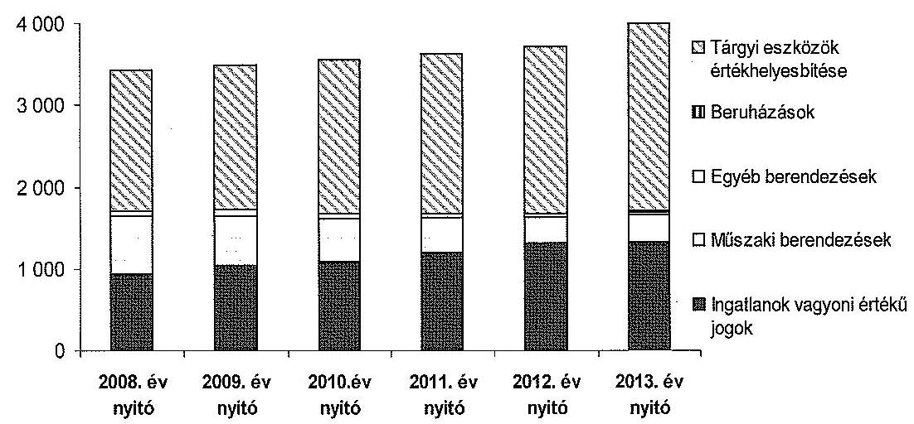

A közfeladat ellátását biztosító tárgyi eszközök könyvszerinti (értékhelyesbítés nélküli) értéke az ellenőrzött időszakban minimálisan ( $0,3 \%$-kal) csökkent ${ }^{6}$. Az ellenőrzött időszak beruházásaival, felújításaival az eszközérték szinten tartása valósult meg.

A követelések mérlegértéke duplájára nőtt, az ellenőrzött időszak elején 582 millió Ft, az ellenőrzött időszak végén 1194 millió Ft volt. Az éves beszámolók részét képező üzleti jelentésekben a követelésállomány növekedését a távhőszolgáltatást igénybevevők szociális helyzetének romlásával, illetve a távhőtámogatás igénybevételére jogosultak körének szűkülésével indokolták. A díjhátralékok csökkentése érdekében intézkedéseket tettek.

A követelés állomány kezelésére tett intézkedés volt a részszámlák számának 2008-ban bevezetett csökkentése, ezzel közelítve a minimum korrekciós értékhez, csökkentve a felhasználók terheit. 2009-től hangsúlyosabbá vált a szociális támogatások juttatása, személyes tájékoztatás nyújtása a hátralékkezelés lehetőségéről, használati melegvíz kizárása, bírósági eljárás megindítása. 2012-ben új szervezeti egységet hozott létre a NYÍRTÁVHŐ Kft. a hátralékkezelésre. Az eddigi intézkedések mellett az együtt nem múködő adósokkal szemben érvényesítették a végrehajtási eljárás kezdeményezését. A használati melegvíz kizárás megvalósí-

[^0]
[^0]:    ${ }^{5}$ Nyereségkorlát: a távhőszolgáltató tárgyévi Tsztv. tevékenységéből származó adózás előtti eredménye nem haladhatja meg a tevékenység könyv szerinti bruttó eszközérték és a nyereségtényező (távhőszolgáltató esetében 2,0\%) szorzatának mértekét.
    ${ }^{6}$ A tárgyi eszközök könyvszerinti nettó értéke 2008. január 1-jén 1710,1 millió Ft és 2012. december 31-én 1707,4 millió Ft volt.

---

tása érdekében a használati helyre való bejutás céljából jegyzői együttműködést vettek igénybe.

A díjhátralék csökkentésére, behajtására tett intézkedések hatására a határidőn túli kintlévőségek állománya a 2011. évig tartó növekedést követően a 2012. évben csökkent. A 30 napon túli követelés állomány fordulónapi méregértéke 2008-ban 269 millió Ft, 2009-ben 449 millió Ft, 2010-ben 583 millió Ft, 2011ben 611 millió Ft, 2012-ben 563 millió Ft volt.

A követelések értékelését elvégezték, az értékvesztés elszámolásának elveit, illetve az elszámolt értékvesztés összegét az éves beszámolók kiegészítő mellékletében bemutatták.

A NYÍRTÁVHŐ Kft. vagyonának nyilvántartása során nem érvényesültek a jogszabályok és belső szabályok előírásai az eszközök nyilvántartása tekintetében. Az ellenőrzött időszakban elszámolt tervszerinti értékcsökkenés éves összegének számítása nem felelt meg a Számv. tv. 52. § (2) bekezdésében előírtaknak. Az elszámolt értékcsökkenés összegének hibás számítása a mérlegben kimutatott eszközértékre - a piaci érték alkalmazása miatt - nem volt hatással.

A leltározási dokumentumokból megállapítható volt, hogy a leltározási ütemterv nem tartalmazta teljes körűen a leltározandó tárgyi eszközöket. Az ellenőrzött években az ingatlanok és múszaki berendezések mennyiségi leltározása a Számv. tv. 69. § (2) bekezdésében ${ }^{7}$ elöírtak ellenére nem történt meg. A Számv. tv. 69. § (3) bekezdésében foglalt előírással összhangban a tárgyi eszközök nettó értékének alátámasztása céljából, mennyiségben és értékben analitikus nyilvántartást vezettek.

A NYÍRTÁVHŐ Kft. vagyongazdálkodási tevékenysége az ellenőrzött esetekben - az értékcsökkenés elszámolásának és a leltározás hiányosságai kivételével megfelelt a jogszabályi előírásoknak.

# 2.3. A beszámolási kötelezettség teljesítése 

A számviteli beszámolók elkészítésének, letétbe helyezésének, közzétételének határidejét a NYÍRTÁVHŐ Kft. Számviteli politikája a Számv. tv. 153. § (1) bekezdésével összhangban szabályozta.

A számviteli beszámolókat - a 2011. évi beszámoló kivételével - a Számviteli politikában meghatározott határidővel (tárgy évet követő március 31.) készítették el. A 2011. évi beszámolón az elkészítés dátumaként 2012. április 25. szerepelt. A könyvvizsgálói jelentések dátuma megegyezett az éves beszámolók dátumával.

Az éves beszámoló FB általi elfogadásához a könyvvizsgálói jelentések rendelkezésre álltak, illetve a tulajdonosi határozat meghozatala előtt az FB elfogadta azokat. Az éves beszámolókkal egyidejűleg a NYÍRTÁVHŐ Kft. az üzleti jelentést is elkészítette.

[^0]
[^0]:    ${ }^{7}$ 2012. január 1-jétől a Számv. tv. 69. § (3) bekezdése.

---

A Tsztv. 18/A. § (3) bekezdése szerint a NYÍRTÁVHŐ Kft. 2012. január 1-jétől az engedélyköteles tevékenységét, illetve egyéb tevékenységeit köteles a számviteli éves beszámolója kiegészítő mellékletében oly módon bemutatni, mintha azt önálló vállalkozás keretében végezte volna, ez önálló mérleget és eredménykimutatást jelent. A NYÍRTÁVHŐ Kft. 2012. évi beszámolójának kiegészítő melléklete tartalmazta a tárgyévi mérleg és eredménykimutatás adatokat az éves beszámoló formájában a gáz üzletágra és a távhőszolgáltatás üzletágra elkülönítetten.

A Számv. tv. 153. § (1) bekezdése értelmében a NYÍRTÁVHŐ Kft. köteles volt a Közgyűlés által elfogadott éves beszámolót, a könyvvizsgálói záradékot vagy a záradék megadásának elutasítását is tartalmazó független könyvvizsgálói jelentéssel együtt, valamint az adózott eredmény felhasználására vonatkozó határozatot letétbe helyezni ugyanolyan formában és tartalommal (szövegezésben), mint amelynek alapján a könyvvizsgáló az éves beszámolót felülvizsgálta. A beszámoló közzétételi kötelezettségnek a 2009. évi beszámoló kivételével határidőben eleget tettek. A 2009. évi éves beszámolóról készített könyvvizsgálói jelentést a Számv. tv. 153. § (1) bekezdésében előírt határidőnél 10 nappal később, 2010. június 10 -én tették közzé.

A NYÍRTÁVHŐ Kft. tájékoztatása szerint a MÁK 11 alkalommal vizsgálta az ellenőrzött időszakban az államtól kapott támogatások elszámolását. Az ellenőrzéseknek nem voltak intézkedést igénylő megállapításai.

# 3. A TÁVHŐSZOLGÁltATÁs KÖZFELADATA BEVÉTELEI ÉS RÁFORDÍTÁSAI ELSZÁMOLÁSÁNAK ÉS ÖNKÖLTSÉGSZÁMÍTÁSÁNAK SZABÁLYSZERŰSÉGE 

### 3.1. A távhőszolgáltatás közfeladatok bevételeinek és ráfordításainak szabályszerűsége

A NYÍRTÁVHŐ Kft. a Tsztv. 18/A. § (2) bekezdésében előírt, 2012. január 1-jétől hatályos ágazati elszámolási szabályoknak megfelelő számviteli szétválasztás szabályait nem dolgozta ki. A számviteli nyilvántartásokban a közfeladatok ellátásához kapcsolódó ráfordítások egyértelmú elhatárolását nem biztosította.

A NYÍRTÁVHŐ Kft. 2008-2012 között főkönyvi nyilvántartásaiban a bevételeit elkülönítetten rögzítette a távhőszolgáltatás tevékenységére oly módon, hogy a gázüzemi bevételeket külön főkönyvi kartonokon tartották nyilván, a többi bevétel képezte a távhőszolgáltatás bevételét (inverz elkülönítés), azonban a ráfordítások tevékenységek szerinti szétválasztása nem történt meg.

A távhőszolgáltatási közfeladat értékesítés nettó árbevételeinek elszámolása során a NYÍRTÁVHŐ Kft. szabályszerűen járt el. A bevételek előíása és kiszámlázása a tulajdonosi követelményeknek megfelelően történt, a bevételeket a megfelelő számlacsoportba közfeladatonként elkülönítetten számolták el.

---

A távhőszolgáltatási közfeladat ráfordításainak elszámolása során nem érvényesültek teljes körűen a jogszabályok és a belső szabályok előírásai a kötelezettségvállalás tekintetében. Ez kockázatot jelez az ellenőrzött terület egészének szabályos működése szempontjából. Megállapítottuk, hogy egyes esetekben a költségelszámolást megalapozó kötelezettségvállalás dokumentumai nem álltak rendelkezésre.

A NYÍRTÁVHŐ Kft. az ellenőrzött időszakban nyereségesen gazdálkodott, bevételei ${ }^{8}$ meghaladták a ráfordításokat ${ }^{9}$. A mérlegszerinti eredmény 2008-ban 121 millió Ft, 2009-ben 103 millió Ft, 2010-ben 2 millió Ft, 2011-ben 35 millió Ft, 2012-ben 44 millió Ft volt.

A NYÍRTÁVHŐ Kft. távhőtámogatás igény bejelentése az 51/2011. (IX. 30.) NFM rendelet 4. § (2) bekezdésében előírt tartalommal készült.

# 3.2. Az önköltségszámítás szabályzzerűsége 

A NYÍRTÁVHŐ Kft. Önköltségszámítási szabályzattal a Számv. tv. 14. § (5) bekezdés c) pontjának előírásai ellenére 2008. évben nem rendelkezett.

Az Önköltségszámítási szabályzat ${ }_{1}$ hiányossága volt, hogy nem tartalmazott az árképzés és árellenőrzés érdekében végzett önköltség elemzési módszert, továbbá nem tartalmazta a közvetett költségek felosztásának módszerét. Így nem volt biztosított a Számv. tv. 160. § (4) bekezdésben előírt, önköltségszámítás sajátos rendszerének teljes körű kialakítása.

Az Önköltségszámítási szabályzat ${ }_{2}$ rögzítette, hogy a 6-os, 7-es számlaosztályban gyűjti a tényleges költségeket, valamint meghatározta a költséghely csoportok és a költségnemek tartalmát. Meghatározták a könyvviteli rendszerrel való egyeztetés módját, a gyűjtő számlák egyenlegfelosztásának rendjét. Szabályozták az árképzési előírásokat, ezen belül meghatározásra került a díjtételek (kalkulációs egység) tartalma, a díjtételek képzésének módja, a kalkulációs időszak és a kalkuláció táblázatának kitöltési előírása. Rögzítették a költségek elszámolását és felosztását, ezen belül rögzítésre kerültek az önköltségszámítás bizonylatai, az üzemi általános költség felosztása, valamint az utókalkuláció és a könyvvitel kapcsolata, egyezőségi előírásai a főkönyvi könyveléssel.

Az árképzéshez, illetve a távhőszolgáltatás díjának kalkulációjához a távhőszolgáltatás díjáról szóló rendelet szerinti díjkalkulációs séma alkalmazását írta elő az Önköltségszámítási szabályzat ${ }_{1,2}$. A NYÍRTÁVHŐ Kft. a díjak meghatározásához utókalkulációt határozott meg, melyet évente kellett elvégezni.

A távhőszolgáltatás alapdíját a fűtött légtérfogat ( $\mathrm{lm}^{3}$ ) alapján határozták meg, ennek ára havi $39-42 \mathrm{Ft} / \mathrm{m}^{3} / \mathrm{hó}$ között mozgott az ellenőrzött időszakban.

[^0]
[^0]:    ${ }^{8}$ A bevételek összege 2008-ban 4243 millió Ft, 2009-ben 4237 millió Ft, 2010-ben 3966 millió Ft, 2011-ben 4494 millió Ft, 2012-ben 6045 millió Ft volt.
    ${ }^{9}$ A ráfordítások összege 2008-ban 4119 millió Ft, 2009-ben 4115 millió Ft, 2010-ben 3961 millió Ft, 2011-ben 4444 millió Ft, 2012-ben 5957 millió Ft volt.

---

A távhőszolgáltatás hődíja 2800-3600 Ft/GJ között változott. A távhőszolgáltatás alapdijának és hődijának 2008-2012 közötti alakulását a 3. számú melléklet mutatja be.

A NYÍRTÁVHŐ Kft. által alkalmazott díjkalkulációs gyakorlat megfelelt az Önköltségszámítási szabályzatban ${ }_{1,2}$ és az Önkormányzat távhőszolgáltatás dijáról szóló rendeletében rögzítetteknek. A díjak szabályszerű önköltségszámítással megalapozott megállapításával biztosított volt a távhőszolgáltatás átláthatósága és elszámoltathatósága.

A Városstratégiai és Környezetvédelmi Bizottság minden előterjesztés előtt véleményezte és elfogadta a NYÍRTÁVHŐ Kft. által elkészített díjkalkulációt.

# 4. AZ ÁSZ KORÁBBI, AZ ÖNKORMÁNYZATOK TÖBBSÉGI TULAJDONÁBAN LÉVŐ GAZDASÁGI TÁRSASÁGOK KÖZFELADAT-ELLÁTÁSÁT, GAZDÁLKODÁSÁT, PÉNZÜGYI HELYZETÉT ÉRINTŐ JAVASLATAIRA TETT INTÉZKEDÉSEK 

Az ÁSZ az Önkormányzat pénzügyi helyzetét 2011-ben ellenőrizte. A 1136 számú jelentésében javaslatokat fogalmazott meg az Önkormányzat társaságai közfeladat-ellátását, gazdálkodását, pénzügyi helyzetét érintően. Ennek alapján a Közgyűlés intézkedési tervet fogadott el. Az intézkedési terv kötelezte a polgármestert, hogy a Közgyűlést félévente - a szokásos beszámoló keretében tájékoztassa a minősített tulajdonú gazdasági társaságok aktuális pénzügyi helyzetéről, a fennálló követeléseiről, nyújtott kölcsöneiről.

Az Önkormányzat az intézkedési tervben foglaltaknak eleget tett. A NYÍRTÁVHŐ Kft. az aktuális pénzügyi helyzetről, a fennálló kötelezettségekről a féléves és éves beszámolók keretében teljes körű információt nyújtott a Közgyűlés részére.

Budapest, 2015. 'Jama' hó 23 nap

Melléklet: 4 db
Függelék: $\quad 1 \mathrm{db}$
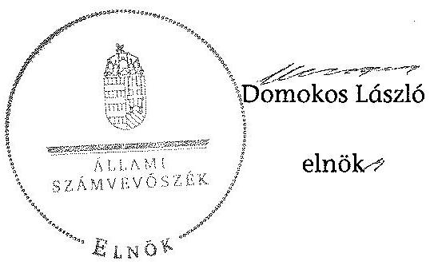

---

A Nyírtávhő Kft. tevékenységének év végi főbb adatai

|  Sorszám | Megnevezés | 2008. | 2009. | 2010. | 2011. | 2012.  |
| --- | --- | --- | --- | --- | --- | --- |
|  1. | A gazdasági társaság székhelye | 4400
Nyíregyháza,
Népkert u. 12. | 4400
Nyíregyháza,
Népkert u. 12. | 4400
Nyíregyháza,
Népkert u. 12. | 4400
Nyíregyháza,
Népkert u. 12. | 4400
Nyíregyháza,
Népkert u. 12.  |
|  2. | adószáma | 11241256-2-15 |  |  |  |   |
|  3. | alapításának éve | 1992. év |  |  |  |   |
|  4. | A gazdasági társaság többségi tulajdonú leányvállalatainak száma (db) |  |  |  |  |   |
|  5. | A gazdasági társaság leányvállalataiban való részesedésének mértéke (\%) | - | - | - | - | -  |
|  6. | Az önkormányzat számára (megbízásából, koncessziós, közszolgáltatási, vagy egyéb szerződéses jogviszony alapján) ellátott közfeladatok szakági besorolása: |  |  |  |  |   |
|  7. | Egészségügy |  |  |  |  |   |
|  8. | Kultúra és sport |  |  |  |  |   |
|  9. | Település üzemeltetés, ezen belül: |  |  |  |  |   |
|  10. | köztemető üzemeltetés |  |  |  |  |   |
|  11. | kéményseprés |  |  |  |  |   |
|  12. | helyi közutak fejlesztése, fenntartása és üzemeltetése |  |  |  |  |   |
|  13. | parkok és egyéb közterület fenntartás |  |  |  |  |   |
|  14. | közterületi parkolás |  |  |  |  |   |
|  15. | Lakás és helységgazdálkodás |  |  |  |  |   |
|  16. | Víz és csatorna közmú-szolgáltatás |  |  |  |  |   |
|  17. | Hulladékkezelés- szállítás |  |  |  |  |   |
|  18. | Távhő- és energiaszolgáltatás | $x$ | $x$ | $x$ | $x$ | $x$  |
|  19. | Helyi közösségi közlekedés |  |  |  |  |   |
|  20. | Vagyongazdálkodás |  |  |  |  |   |
|  21. | Fénzügyi gazdasági szolgáltatás |  |  |  |  |   |
|  22. | Egyéb: |  |  |  |  |   |
|  23. | A közfeladatellátására a gazdasági társaságnál alkalmazottak éves átlagos statisztikai létszáma | 152 | 146 | 145 | 141 | 128  |

---

# A Nyírtávhő Kft. müködésének év végi főbb jellemzői

|  Sorszám | Megnevezés |  | 2008. | 2009. | 2010. | 2011. | 2012.  |
| --- | --- | --- | --- | --- | --- | --- | --- |
|  1. | A gazdasági társaság cégformája |  | Kft. | Kft. | Kft. | Kft. | Kft.  |
|  2. | A gazdasági társaság tulajdonosi összetétele: |  |  |  |  |  |   |
|  3. | Önkormányzat megnevezése: |  | Nyíregyháza
Megyei Jogú
Város | Nyíregyháza
Megyei Jogú
Város | Nyíregyháza
Megyei Jogú
Város | Nyíregyháza
Megyei Jogú
Város | Nyíregyháza
Megyei Jogú
Város  |
|  4. | Önkormányzat tulajdoni részesedésének arány | $\%$ | 100,00 | 100,00 | 100,00 | 100,00 | 100,00  |
|  5. | Önkormányzat tulajdoni részesedésének összege | ezer Ft | 1032 370,0 | 1032 370,0 | 1032 370,0 | 1032 370,0 | 1032 370,0  |
|  6. | Más önkormányzatok, többcélú társulás megnevezése: |  |  |  | - |  |   |
|  7. | Önkormányzat tulajdoni részesedésének arány | $\%$ | - | - | - | - | -  |
|  8. | Önkormányzat tulajdoni részesedésének összege | ezer Ft | - | - | - | - | -  |
|  20. | Gazdasági társaság megnevezése: |  | - | - | - | - | -  |
|  21. | Gazdasági társaságok tulajdoni részesedés arány | $\%$ | - | - | - | - | -  |
|  22. | Gazdasági társaságok tulajdoni részesedés összege | ezer Ft | - | - | - | - | -  |
|  23. | Egyéb tulajdonos megnevezése: |  | - | - | - | - | -  |
|  24. | Egyéb tulajdonosok tulajdoni részesedés arány | $\%$ | - | - | - | - | -  |
|  25. | Egyéb tulajdonosok tulajdoni részesedés összege | ezer Ft | - | - | - | - | -  |
|  26. | A tárgyévben a gazdasági társaság vagyonkezelésben lévő önkormányzati vagyon után elszámolt értékcsökkenés összege (ezer Ft) |  | - | - | - | - | -  |
|  27. | A tárgyévben az önkormányzati tulajdonú, gazdasági társaság által kezelt eszközök pótlására (karbantartás, felújítás, beruházás) elszámolt kiadás (ezer Ft) |  | - | - | - | - | -  |
|  28. | A tárgyévben a gazdasági társaság saját vagyona után elszámolt értékcsökkenés összege (ezer Ft) |  | 330 190,0 | 331 358,0 | 320 438,0 | 250 292,0 | 232 153,0  |
|  29. | A tárgyévben a saját tulajdonú eszközök pótlására (karbantartás, felújítás, beruházás) elszámolt kiadás (ezer Ft) |  | 458 788,0 | 409 804,0 | 417 561,0 | 350 197,0 | 336 794,0  |

---

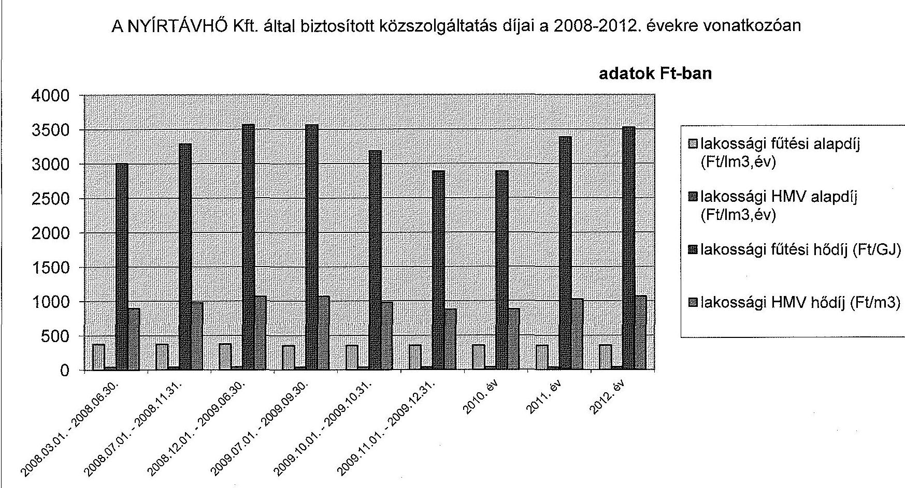

# A NYÍRTÁVHŐ Kft. által biztosított közszolgáltatás díjai a 2008-2012. évekre vonatkozóan

## adatok Ft-ban

---

.

---

# Beérkezett észrevételek és az azokra adott válaszok

---

.

---

NYÍREGYHÁZA
MEGYEI JOGÚ VÁROS
POLGÁRMESTERE

ügyiratszám: VAGY/183/2014
ügyintéző: Havasiné Tári Tímea

ÁLLAMI SZÁMVEVŐSZÉK
Domokos László Elnök Úr részére

Budapest
Apáczai Csere János utca 10.
1052

4601 NYÍREGYHÁZA, KOSSUTH TÉR 1. PF.: 83.
TELEFON: +36 42 524-500
FAX: +36 42 524-501
E-MAIL: POLGARMESTER@NYIREGYHAZA.HU

Tárgy: Észrevétel

ÁLLAMI SZÁMVEVÉSÉK
45045/2014
táve: 2016. DEC. Ú.
táve: 0-024-143/1014
Melléklet

Tisztelt Elnök Úr!

A NYÍRTÁVHŐ Nyíregyházi Távhőszolgáltató Kft. ellenőrzéséről készült jelentéstervezetüket
megkaptuk, melyre az Állami Számvevőszékről szóló 2011. évi LXVI. törvény 29.§(2) bekezdése szerint
az alábbi észrevételeket kívánjuk tenni:

1. A jelentéstervezet megállapításai között szerepel, hogy a NYÍRTÁVHŐ Kft. Felügyelő Bizottsága
ügyrendjét a Gt 34.§.(4) bekezdésében előírtak ellenére nem állapította meg.

Tájékoztatjuk Önöket, hogy a NYÍRTÁVHŐ Kft. Felügyelő Bizottsága a vizsgált időszak alatt
rendelkezett ügyrenddel.

Az első ügyrendet - melyet a Felügyelő Bizottság 2007. március 12. napján fogadott el valamint 2007.
szeptember 04. napján módosított és foglalt egységes szerkezetbe – Nyíregyháza Megyei Jogú Város
Közgyűlése a 197/2007.(IX.24.) számú határozatával hagyta jóvá. A hivatkozott Közgyűlési határozat
azért nem került becsatolásra, mivel a vizsgálati időszakot megelőző időszakot érinti, illetve a
helyszíni ellenőrzés során a vizsgálatot végzők sem kérték azt Önkormányzatunktól. A Közgyűlési
határozat másolati példányát levelünk mellékleteként megküldjük az Önök részére további szíves
felhasználásra.

A második ügyrend - melyet a Felügyelő Bizottság 2011. január 13. napján fogadott el, Nyíregyháza
Megyei Jogú Város Polgármestere pedig az 1/2011. (II.28.)GT/NYÍRTÁVHŐ KFT. számú határozatával
hagyott jóvá - az ellenőrzés során csak részlegesen került átadásra. Csak a polgármesteri határozat,
illetve annak mellékleteként a Felügyelő Bizottság ügyrendjének első oldala került a „Polg-i
határozatok Nyírtávhő 2010-2013” megnevezésű pdf dokumentumban az Állami Számvevőszék
részére megküldésre, illetve hitelesített másolatban átadásra. A Polgármesteri határozatot, illetve
annak mellékletét képező FB ügyrendet jelen levelünk mellékletként csatoljuk.

2. A jelentéstervezet megállapításai között szerepel, hogy a NYÍRTÁVHŐ Kft. 2008.-2011. évi üzleti
terveinek közgyűlési előterjesztéseit a Közgyűlés rendeletének előírása ellenére a Városstratégiai
és Környezetvédelmi Bizottság, valamint a Gazdasági és Tulajdonosi Bizottság nem véleményezte.

---

Tájékoztatjuk Önöket, hogy a NYíRTÁVHŐ Kft. üzleti tervelnek érintett Bizottságok általi véleményezése 2008.-2011. években megtörtént.

A Nyírtávhő Kft. 2011. évi üzleti tervének elfogadásáról szóló 2/2011.(V.11.) GT/NYíRTÁVHŐ Kft: számú polgármesteri határozata, a Gazdasági és Tulajdonosi Bizottság 40-6/2011.(IV.20.) számú határozata, illetve a Városstratégiai és Környezetvédelmi Bizottság 36/2011.(V.10.) számú határozata a helyszíni ellenőrzés során, valamint elektronikus úton a „Nyírtávhő Kft. 2011-es üzleti terv" megnevezésű pdf dokumentumban az Állami Számvevőszék részére átadásra került.

A 2008.-2010. évi üzleti tervek elfogadását tárgyaló bizottsági ülésekről készült jegyzőkönyvek hitelesített másolatait levelünkhöz mellékeljük. Nyíregyháza Megyei Jogú Város Önkormányzatának Közgyűlése által is tárgyalt előterjesztésekről a Közgyűlési Bizottságok részéről külön határozat nem kerül kiszerkesztésre, ezen határozatok a Bizottságok üléséről készült jegyzőkönyvekben szerepelnek.

Kérjük Elnök Urat, hogy észrevételeinket az ellenőrzésről készült jelentésükben figyelembe venni szíveskedjenek.

Nyíregyháza, 2014. november 25.
Mellékletek:

- 197/2007.(IX.24.) sz. Közgyűlési határozat a Nyírtávhő Kft FB ügyrendjének jóváhagyásáról + FB ügyrend hitelesített másolatban
- 1/2011. (II.28.)GT/NYíRTÁVHŐ KFT. Polgármesteri határozat a Nyírtávhő Kft. FB ügyrendjének jóváhagyásáról + FB ügyrend hitelesített másolatban
- 3 db jegyzőkönyv a Gazdasági és Tulajdonosi Bizottság 2008. március 28.-i, 2009. február 27.-i és 2010. február 26.-i üléséről hitelesített másolatban
- 3 db jegyzőkönyv a Közlekedési és Városüzemeltetési Bizottság 2008. március 28.-i, 2009. február 26.-i és 2010. február 25.-i üléséről hitelesített másolatban
- A Nyírtávhő Kft 2011. évi üzleti tervének jóváhagyásáról készült 2/2011.(V.11.)GT/ Nyírtávhő Kft számú polgármesteri határozat,
- Gazdasági és Tulajdonosi Bizottság 40-6/2011.(IV.20.) számú határozata a Nyírtávhő Kft 2011. évi üzleti tervének véleményezéséről
- Városstratégiai és Környezetvédelmi Bizottság 36/2011.(V.10.) számú határozata a Nyírtávhő Kft 2011. évi üzleti tervének véleményezéséről

Tisztelettel:
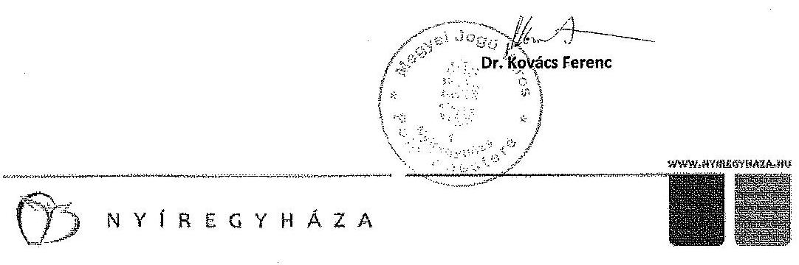

---

# NYIREGYHÁZA MEGYEI JOGÚ VÁROS KÖZGYÜLÉSÉNEK 

$197 / 2007 .(\mathrm{IX}, 24$.) számú
határozata

## Az önkormányzati alapítású gazdasági társaságok felügyelö bizottságai ügyrendjeinek jóváhagyásáról

## A Közgyưlés

1.) a Nyírinfo Kht. felügyelö bizottságának ügyrendjét az 1. számú melléklet szerint jóváhagyja
2.) a Nyírsüli Kht. felügyelö bizottságának ügyrendjét a 2. számú melléklet szerint jóváhagyja
3.) a Város-Kép Kht. felügyelö bizottságának ügyrendjét a 3. számú melléklet szerint jóváhagyja
4.) a Nyirtávhő Kft. felügyelő bizottságának ügyrendjét a 4. számú melléklet szerint jóváhagyja
5.) a Piac és Vagyonkezelő Kft. felügyelő bizottságának ügyrendjét az 5. számú melléklet szerint jóváhagyja
6.) a Sóstó-Gyógyfürdők Zrt. felügyelő bizottságának ügyrendjét a 6. számú melléklet szerint jóváhagyja

## A határozatot kapják :

1./ a Közgyưlés tagjai
2./ a jegyző és a Polgármesteri Hivatal belső szervezeti egységeinek vezetői 2014. 007. 2.5.

---

# 4. számú melléklet a 197/2007. (IX.24.) számú határozathoz 

## NYÍRTÁVHŐ Korlátolt Felelősségű Társaság Felügyelő Bizottsága

ÜGYREND
(egységes szerkezetben)
A korlátolt felelősségű társaság felügyelő bizottsága a gazdasági társaságokról szóló 2006. évi IV. törvény, valamint a Kft. alapitó okiratában foglaltak alapján, saját ügyrendjét az alábbiakban állapítja meg. A 2007. március 12. napján elfogadott ügyrendjét a felügyelő bizottság 2007. szeptember 04. napján módosította és foglalta egységes szerkezetbe.

## 1.

## A felügyelő bizottság szervezete:

1./ A felügyelő bizottság öt tagból áll, akiket az alapító jelölt ki, illetve a Nyíregyháza Megyei Jogú Város Közgyűlése választott. A tagok megbízatása határozott időre, de legfeljebb öt évre szól, megbízatásuk időtartamát az alapító Nyíregyháza Megyei Jogú Város Közgyűlésének határozata tartalmazza.
2./ A felügyelő bizottság elnökét a tagok maguk közül választják. A felügyelő bizottság elnökének megválasztására bármely tag javaslatot tehet, melyről a tagok nyílt szavazással döntenek.

## 2.

## A felügyelő bizottság tagjai:

1./ A felügyelő bizottság tagjának választható az a természetes személy - magyar vagy külföldi állampolgár -, aki megfelel a hatályos magyar jogszabályokban meghatározott feltételeknek, és a megbízatást írásos jognyilatkozattal elfogadja.
2./ A NYÍRTÁVHŐ Kft. munkavállalóját - kétszáz fő teljes munkaidőben foglalkoztatott munkavállalói létszám esetén a munkavállalók képviseletét ellátó tagok kivételével - a közgyülés nem választhatja a felügyelő bizottság tagjává.
3./ A felügyelő bizottsági tag egyidejűleg több társaság felügyelő bizottságába választható meg. A tag az új tisztsége elfogadásától számított 15 napon belül köteles írásban tájékoztatni azokat a gazdasági társaságokat, amelyeknél már felügyelő bizottsági tag.
4./ Nem lehet a felügyelő bizottság tagja az a személy, akinek bizottsági tagságát jogszabály zárja ki, vagy akinek tagságát - megválasztása után bekövetkező esemény miatt - jogszabály, vagy a tag maga összeférhetetlennek minősíti.

---

# 18. 

5./ A felügyelő bizottság tagja haladéktalanul köteles jelezni a felügyelő bizottság elnökének, ha vele szemben a megválasztását követöen összeférhetetlenségi ok állt elő.
6./ A felügyelő bizottság tagja a társaság hozzájárulása nélkül:
a./ nem szerezhet társasági részesedést - nyilvánosan müködő részvénytársaságban való részvényszerzés kivételével - a társaságéval azonos tevékenységet fötevékenységként megjelölő más gazdálkodó szervezetben,
b./ nem lehet vezető tisztségviselő a társaságéval azonos főtevékenységet végző más gazdasági társaságban, illetve szővetkezetben.
Az ügyvezető és közeli hozzátartozója, valamint élettársa nem köthet a saját nevében vagy javára a társaság főtevékenysége körébe tartozó ügyleteket.
A felügyelő bizottsági tagok közelt hozzátartozói nem lehetnek a társaság vezetö tisztségviselöi.
7./ A felügyelő bizottság tagjai megbizatásuknak személyesen kötelesek eleget tenni, képviseletnek a felügyelő bizottsági tevékenységben nincs helye.
8./ A felügyelő bizottság tagját - az e tisztséghez tartozó tevékenységi körében - a gazdasági társaság tagja, illetve munkáltatója nem utasíthatja.
9./ A felügyelő bizottság tagjait kötelezettség terheli annak biztosítására, hogy az általuk kért, és részükre kiadott, vagy más módon tudomásukra jutott adatokhoz, információkhoz, iratokhoz illetéktelen személyek hozzá ne férhessenek.
10./ A felügyelő bizottsági tagok a társaság ügyelröl szerzett értesüléseiket üzleti titokként kötelesek megőrizni.
11./ Az alapító közgyülésének ülésein - melyek témái a NYÍRTÁVHÓ Kft-t érintik - a felügyelő bizottság tagjai részt vehetnek, ahol a felügyelő bizottság megállapításait ismertethetik.
12./ Megszűnik a felügyelő bizottsági tagság:
a./ a megbizatás időtartamának lejártával;
b./ visszahívással;
c./ lemondással;
d./ elhalálozással;
e./ törvényben szabályozott kizáró ok bekövetkeztével;
f./ külön törvényben meghatározott esetben.
13./ A tagok bármikor visszahívhatók, és megbizásuk lejárta után újraválaszthatók.
14./ A felügyelő bizottsági tagságra szóló megbizás visszavonására az alapító jogosult.
15./ A felügyelő bizottság tagja tagságáról az ügyvezető és az alapító egyidejú tájékoztatása mellett a felügyelő bizottsági ülésen mondhat le a gazdasági társaságokról szóló 2006. évi IV. tv. (továbbiakban Gt.) 31. § (2) bekezdésének figyelembevételével.

---

16./ Amennyiben a felügyelő bizottság létszáma bármely okból öt fő alá csökken, vagy nincs, aki az ülését összehívja, haladéktalanul az alapító döntését kell kérni a felügyelő bizottság létszámának kiegészítésére.
17./ A felügyelő bizottság tagjai az a tisztséget betöltő személyektől általában elvárható gondossággal kötelesek eljárni.
A felügyelő bizottsági tagok - a Ptk. közös károkozásra vonatkozó szabályai szerint - korlátlanul és egyetemlegesen felelnek a gazdasági társasággal szemben a társaságnak az ellenőrzési kötelezettségük megszegésével okozott károkért.
Mentesül a felelősség alól az a felügyelő bizottsági tag, aki a felügyelő bizottság határozata vagy intézkedése elleni tiltakozását a felügyelő bizottság ülésén írásban bejelentette, jegyzőkönyvbe diktálta, vagy az általa észlelt mulasztást írásban - olyan időben jelezte az intézkedésre jogosult szervnek, hogy az még időben intézkedhetett volna.
18./ A felügyelő bizottság tagjai az alapító által megállapított tiszteletdijban részesülnek.

# 3. 

## A felügyelő bizottság elnöke:

1./ A felügyelő bizottság elnökét a bizottság első ülésén saját tagjai közül választja.
2./ A felügyelő bizottság elnökének feladata a testület tevékenységének koordinálása, a bizottság álláspontjának képviselete, az ülések összehívása, technikai előkészítésének ellenőrzése, és az ülés vezetése.
3./ Az elnök 6 hónapot meghaladó előre látható akadályoztatása esetére a bizottság új elnököt választ.
4./ Az elnöki megbízatás megszünése esetén a bizottság 8 napon belül új elnököt választ.

## 4.

## A felügyelő bizottság müködése:

1./ A felügyelő bizottság szükség szerint tartja üléseit, de évente legalább négy alkalommal ülést tart, üléseit az elnök hívja össze.
2./ Az összehívást bármely tag - az ok és a cél megjelölésével - az elnöktől írásban kérheti. Ha az elnök a felügyelő bizottság ülését nyolc napon belül nem hívja össze, annak összehívására a tag jogosult.
3./ Az elnök a felügyelő bizottság üléseire a könyvvizsgálót is - és szükség szerint más személyt - meghívhatja.

---

4. Az elnök köteles összehívni a bizottságot a könyvvizsgálói jelentés kézhezvételétől számított 15 napon belül, illetve ha a könyvvizsgáló kéri. Ezekben az esetekben a könyvvizsgálót az ülésre meg kell hívni.
5./ A felügyelő bizottságot az elnök az időpont, a helyszín és a napirendi pontok megjelölésével írásban hívja össze. A tagoknak és az állandó vagy eseti meghívottaknak a meghívót az ülés napja elött legalább 5 nappal postán kell megküldeni. A meghívó mellé csatolni kell az esetleges írásos előterjesztéseket is.
6./ Az ülés sürgős esetben telefaxon, vagy elektronikus úton is összehívható, amennyiben a meghívó elküldésének ténye megfelelően dokumentálható.
7./ A felügyelő bizottság ülésén a tagokon kívül tárgyalási joggal részt vesz a társaság ügyvezetője is. A felügyelő bizottság üléseln esetileg vesznek részt mindazok, akiknek jelenléte a napirendhez sztikséges, és ezért őket a felügyelő bizottság elnöke meghívta.
8./ A felügyelő bizottság elrendelheti zártkörű ülés összehívását, illetőleg adott napirend zárt ülésen történő megtárgyalását - szótöbbséggel hozott határozatával, a társaság lényeges üzleti érdekeit, illetve filkait érintő esetekben. Zárt ülésen csak a bizottság tagjai lehetnek jelen. A zárt ülés jegyzőkönyvében csak a határozatot, a jelenlévők nevét, az esetleges különvéleményt, az ülés időpontját és helyszínét kell feltüntetni. A jegyzőkönyvet a felügyelő bizottság egy tagja vezeti, és a felügyelő bizottság valamennyi jelenlévő tagja aláírja. Zárt ülésről hangfelvételt készíteni nem lehet.
9./ A felügyelő bizottság akkor határozatképes, ha azon legalább négy tag jelen van.
10./ A felügyelő bizottság határozatait egyszerű szótöbbséggel, nyílt szavazással hozza. Minden felügyelő bizottsági tagnak egy szavazata van.
11./ Ha bármely tag kéri, úgy határozathozatal előtt az elnök titkos szavazást rendelhet el.
12./ Minden felügyelő bizottsági ülésről jegyzőkönyv készül, mely tartalmazza a jelenlévőket, az ülés helyét, idejét, a napirendi pontokat, a hozzászólások lényegét, és a hozott határozatokat. Az ülésről készült jegyzőkönyv az ülés napját követő őt évig nem selejtezhető.
13./ A jegyzőkönyvben fel kell tüntetni - vagy írásban a jegyzőkönyvhöz kell mellékelni - minden olyan tényt, esetleges kisebbségi vagy különvéleményt, tiltakozást, amelyet a tagok kérnek.
14./ Rögzíteni kell a szavazás eredményét, és ilyen irányú határozott kérés esetén az ellenszavazók véleményét is.
15./ A jegyzőkönyvet az ülést követő nyolc napon belül kell elkészíteni. A jegyzőkönyvet az elnök hitelesíti, és megküldi a tagoknak, továbbá sztikség esetén az ügyvezetőnek is.

---

# 4. SZÁMÚ MELLÉKLET A V-0521-153/2014. SZÁMÚ JELENTÉSHEZ 

16./ A felügyelő bizottság saját iratkezelését maga szervezi meg.
17./ A felügyelő bizottság határozatait sorszámmal, év és dátum megjelöléssel kell ellátni és nyilvántartani.
18./ A felügyelő bizottság müködéséhez szükséges feltételek biztosítása (jegyzökönyvvezető, helyiség, stb.) a társaság ügyvezetőjének kötelezettsége.

## 5.

## A felügyelő bizottság jogai és kötelezettségei:

1./ A felügyelő bizottság jogait testületileg, vagy tagjai útján gyakorolja.

A felügyelő bizottság egyes ellenőrzési feladatok elvégzésével bármely tagját megbízhatja, illetve az ellenőrzést állandó jelleggel is megoszthatja tagjai között. Az ellenőrzés megosztása nem érinti a felügyelő bizottsági tag felelősségét, sem azt a jogát, hogy ellenőrzését más tevékenységre is kiterjessze.
2./ A felügyelő bizottság tagjai ellenőrzik a társaság gazdálkodását a hatályos jogszabályok, a társaság alapító okirata és az alapítói határozatok alapján.
3./ A felügyelő bizottság ellenőrizheti a társaság számviteli és pénzügyi rendjét, a társaság szabályzatait és azok rendelkezéselnek végrehajtását.
4./ Ellenőrzi a társaság pénz- és hitelgazdálkodását, kereskedelmi és egyéb kapcsolatait, a gazdálkodás eredményességét.
5./ A felügyelő bizottság informálódik az alapító közgyűlése által jóváhagyott éves terv teljesítéséröl, melyhez a szükséges információkat az ügyvezető biztosítja.
6./ A felügyelő bizottság köteles részletesen megvizsgálni a társaság számviteli törvény szerinti beszámolóját, a mérlegel, az eredmény-kimutatást, az üzleti jeleltést, és a kiegészítő mellékletet, és mindazon jelentéseket, amelyeket vizsgálatra az ügyvezető a felügyelő bizottságnak megküld. E feladatainak végrehajtásáról és eredményéröl az alapítónak jelentést tesz.
7./ A felügyelő bizottság megvizsgálja és véleményezi az alapító elé terjesztett egyéb fontos jelentéseket, különösen:

- a társaság gazdasági stratégiájának kialakítása;
- a társaság éves, és középtávú terve;
- a társaság árpolitikája, üzletpolitikája;
- a társaság díjmegállapításra vonatkozó javaslata;
- az alapító hatáskörébe utalt szerződések.
8./ A NYÍRTÁVHŐ Kft. alapítója elé terjesztendő fontosabb jelentésekről, továbbá a számviteli törvény szerinti beszámolóról a felügyelő bizottság írásbeli jelentése nélkül az alapító érvényes határozatot nem hozhat.

---

9./ A felügyelő bizottság ellenőrzi a társaság ügyvezetését. Ennek keretében a vezető tisztségviselőktől és a társaság vezető állású dolgozóitól jelentést vagy felvilágosítást kérhet, a társaság könyveit és iratait megvizsgálhatja, illetőleg szakértővel megvizsgáltathatja. Gazdasági társaság vezető tisztségviselője, illetve vezető állású munkavállalói az írásbeli felvilágosítás kérésre a kézhezvételtől számított 15 napon belül írásban kötelesek válaszolni.
10./ Ha a felügyelő bizottság jogellenességet, alapító okiratába, vagy közgyűlési határozatba ütköző tényt, mulasztást, a társaság érdekelbe ütköző intézkedést, vagy visszaélést tapasztal, erről köteles az alapítót haladéktalanul értesíteni.

Ha a felügyelő bizottság megítélése szerint az ügyvezetés tevékenysége jogszabályba, alapító okiratba illetve az alapítói határozatba ütközik, vagy egyébként sérti a gazdasági társaság vagy az alapító érdekeit, erről köteles az alapítót haladéktalanul értesíteni.

# 6. 

A bizottság ügyrendjét a társaság alapítója hagyja jóvá.
Az ügyrendet a bizottság módosíthatja. Erről az elnök útján értesíti az alapítót, aki a módosítást szintén jóváhagyja.

Nyíregyháza, 2007. szeptember 04.

## Záradék:

A NYÍRTÁVHÓ Korlátolt Felsősségű Társaság felügyelő bizottságának jelen ügyrendjét a felügyelő bizottság 2007. március 12. napján, módosítását 2007. szeptember 04. napján megtartott ülésén megtárgyalta, és az 1/2007.03.12. számú és a 3/2007.09.04. számú határozataival elfogadta.

Mikó Dániel
Felügyelő Bizottság elnöke
Jóváhagyási záradék
A NYÍRTÁVHÓ KFT. egyedüli tagja - az aláírásra jogosult képviselőjének e záradék jegyzésével bizonyítottan - a jelen módosított felügyelő bizottsági ügyrendet a 2007. ........................... napján kelt ............/2007. számú határozatával jóváhagyta.

Nyíregyháza, 2007.

Dr. Szemán Sándor
jegyzö

Csabai Lászlóné
polgármester
Kassal arndelhet mindentem melegyed
2014. 201425

---

# Nyiregyháza Megyei Jogú Város   Polgármesterének 

1/2011. (II.28.) GT/NYÍRTÁVHÓ KFT. számú
határozata

## A Polgármester

a gazdasági társaságokról szóló 2006. évi IV. törvény 34. § (4) bekezdés, valamint a Nyíregyháza Megyei Jogú Város Önkormányzata vagyonának meghatározásáról, a vagyonfeletti tulajdonjog gyakorlásának szabályozásáról szóló 21/2004. (VI.24.) önkormányzati rendelet 3. § (5) bekezdés elơrásaira figyelemmel a NYÍRTÁVHÓ KFT. Felügyelőbizottsága Ögyrendjét a melléklet szerint jóváhagyja.

Nyiregyháza, 2011. február 28.

## A határozatot kaplák:

1. NYÍRTÁVHÓ KFT. ügyvezetője
2. Vagyongazdálkodási Osztály (Helyben)
3. Jegyzöl Törzskar (Helyben)

---

# NYÍRTÁVHŐ Korlátolt Felelősségủ Társaság Felügyelő Bizottsága 

## ÜGYREND

A korlátolt felelősségủ társaság felügyelő bizottsága a gazdasági társaságokról szóló 2006. évi IV. törvény, valamint a Kft. alapító okiratában foglaltak alapján, saját ügyrendjét az alábbiakban állapítja meg.

## 1.

## A felügyelö bizottság szervezete:

1./ A felügyelő bizottság öt tagból áll, akiket az alapító jelölt ki, illetve a Nyíregyháza Megyei Jogú Város Közgyűlése választott. A tagok megbízatása határozott időre, de legfeljebb öt évre szól, megbízatások időtartamát az alapító Nyíregyháza Megyei jogú Város Közgyűlésének határozata tartalmazza.
2./ A felügyelő bizottság elnökét a tagok maguk közül választják. A felügyelő bizottság elnökének megválasztására bármely tag javaslatot tehet, melyről a tagok nyílt szavazással döntenek.

## 2.

## A felügyelő bizottság tagjai:

1./ A felügyelő bizottság tagjának választható az a természetes személy - magyar vagy külföldől állampolgár -, aki megfelel a hatályos magyar jogszabályokban meghatározott feltételeknek, és a megbízatást írásos jognyilatkozattal elfogadja.
2./ A NYÍRTÁVHŐ Kft. munkavállalóját - kétszáz fő teljes munkaidőben foglalkozhatott munkavállalói létszám esetén a munkavállalók képviseletét ellátó tagok kivételével - a közgyűlés nem választhatja a felügyelő bizottság tagjává.
3./ A felügyelő bizottsági tag egyidejűleg több társaság felügyelő bizottságába választható meg. A tag az új tisztsége elfogadásától számított 15 napon belül köteles írásban tájékoztatni azokat a gazdasági társaságokat, amelyeknél már felügyelő bizottsági tag.
4./ Nem lehét a felügyelő bizottság tagja az a személy, akinek bizottsági tagságát jogszabály zárja ki, vagy akinek tagságát - megválasztása után bekövetkező esemény miatt - jogszabály, vagy a tag maga összeférhetetlennek minősíti.
5./ A felügyelő bizottság tagja haladéktalanul köteles jelezni a felügyelő bizottság elnökeinek, ha vele szemben a megválasztását követően összeférhetetlenségi ok állt elő.
6./ A felügyelő bizottság tagja a társaság hozzájárulása nélkül:
a./ nem szerezhet társasági részesedést - nyilvánosan müködő részvénytársaságban való részvényszerzés kivételével - a társaságéval azonos tevékenységet

---

főtevékenységként megjelölő más gazdálkodó szervezetben,
b./ nem lehet vezető tisztségviselő a társaságéval azonos fơtevékenységet végzõ más gazdasági társaságban, illetve szôvetkezetben.
Az ügyvezető és közeli hozzátartozója, valamint élettársa nem köthet a saját nevében vagy javára a társaság fơtevékenysége körébe tartozó ügyleteket.
A felügyelő bizottsági tagok közeli hozzátartozói nem lehetnek a társaság vezető tisztségviselơl.
7./ A felügyelő bizottság tagjai megbízatásuknak személyesen kötelesek eleget lenni, képviseletnek a felügyelő bizottsági tevékenységben nincs helye.
8./ A felügyelő bizottság tagját - az e tisztséghez tartozó tevékenységi körében - a gazdasági társaság tagja, illetve munkáltatója nem utasíthatja.
9./ A felügyelő bizottság tagjait kötelezettség terheli annak biztosítására, hogy az általuk kért, és részükre kiadott, vagy más módon tudomásukra jutott adatokhoz, információkhoz, iratokhoz illetéktelen személyek hozzá ne férhessenek.
10./ A felügyelő bizottsági tagok a társaság ügycizől szerzett értesüléseiket üzleti titokként kötelesek megőrizni.
11./ Az alapító közgyülésének ülésein - melyek témái a NYÍRTÁVIÓ Kft-t érintik - a felügyelő bizottság tagjai részt vehetnek, ahol a felügyelő bizottság megállapításait ismertethetik.
12./ Megszűnik a felügyelő bizottsági tagság:
a./ a megbízatás időtartamának lejártával;
b./ visszahívással;
c./ lemondással;
d./ elhalálozással;
e./ törvényben szabályozott kizáró ok bekövetkeztével;
f./ külön törvényben meghatározott esetben.
13./ A tagok bármikor visszahívhatók, és megbízásuk lejárta után újraválaszthatók.
14./ A felügyelő bizottsági tagságra szóló megbízás visszavonására az alapító jogosult.
15./ A felügyelő bizottság tagja tagságáról az ügyvezető és az alapító egyidejű tájékoztatása mellett a felügyelő bizottsági ülésen mondhat le a gazdasági társaságokról szóló 2006. évi IV. tv. (továbbiakban Gt.) 31. § (2) bekezdésének figyelembevételével.
16./ Amennyiben a felügyelő bizottság létszáma bármely okból öt fő alá csökken, vagy nincs, aki az ülését összichíja, haladéktalanul értesíteni kell a gazdasági társaság ügyvezetőjét, és az alapító döntését kell kérni a felügyelő bizottság létszámának kiegészítésére.
17./ A felügyelő bizottság tagjai az e tisztséget betöltő személyektől általában elvárható gondossággal kötelesek eljárni.

---

A felügyelő bizottsági tagok - a Ptk. közös károkozásra vonatkozó szabályai szerint - korlátlanul és egyetemlegesen felelnek a gazdasági társasággal szemben a társaságnak az ellenôrzési kötelezettségük megszegésével okozott károkért, ideértve a számviteli törvény szerinti beszámoló, valamint a kapcsolódó üzleti jelentés összeállitásával és nyilvánosságra hozatalával összefüggő ellenőrzési kötelezettség megszegését is.
Mentesül a felelősség alól az a felügyelő bizottsági tag, aki a felügyelő. bizottság határozata vagy intézkedése elleni tiltakozását a felügyelő bizottság ülésén írásban bejelentette, jegyzőkönyvbe diktálta, vagy az általa észlelt mulasztást - írásban - olyan idöben jelezte az intézkedésre jogosult szervnek, hogy az még idöben intézkedhetett volna.
18./ A felügyelő bizottság tagjai az alapító által megállapított tiszteletdijban részesülnek.

# 3. 

## A felügyelö bizottság elnöke:

1./ A felügyelő bizottság elnökét a bizottság első ülésén saját tagjai közül választja.
2./ A felügyelő bizottság elnőkének feladata a testület tevékenységének koordinálása, a bizottság álláspontjának képviselete, az ülések összebivása, technikai előkészitésének ellenőrzése, és az ülés vezetése.
3./ Az elnök 6 hónapot meghaladó előre látható akadályoztatása esetére a bizottság új elnököt választ.
4./ Az elnökj megbízatás megszünése esetén a bizottság 8 napon belül új elnököt választ.

## 4.

## A felügyelö bizottság müködése:

1./ A felügyelő bizottság szükség szerint tartja üléseit, de évente legalább négy alkalommal ülést tart, üléseit az elnök hívja össze.
2./ Az összebivást bármely tag - az ok és a cél megjelölésével - az elnöktől írásban kérheti. Ha az elnök a felügyelő bizottság ülését nyolc napon belül nem hívja össze, annak összehívására a tag jogosult.
3./ Az elnök a felügyelő bizottság üléseire a könyvvizsgálót - és szükség szerint más személyt - is meghívhatja.
4./ Az elnök köteles összebívni a bizottságot a könyvvizsgálói jelentés közliezvételétől számított 15 napon belül, illetve ha a könyvvizsgáló kéri. Ezekben az esetekben a könyvvizsgálót az ülésre meg kell hívni.

---

5./ A felügyelő bizottságot az elnők az időpont, a helyszí és a napirendi pontok megjelölésével írásban hívja össze. A tagoknak és az állandó vagy eseti meghívottaknak a meghívót az ülés napja előtt legalább 8 nappal postán vagy kézbesítő útján kell eljuttatni. A meghívó mellé csatolni kell az esetleges írásos előterjesztéseket is.
6./ Az ülés sürgős esetben telefaxon, vagy elektronikus úton is összehívható, amennyiben a meghívó elküldésének ténye megfelelően dokumentálható.
7./ A felügyelő bizottság ülésén a tagokon kívül tárgyalási joggal részt vesz a társaság ügyvezetője is. A felügyelő bizottság ülésein esetileg vesznek részt mindazok, akiknek jelenléte a napirendhez szükséges, és ezért őket a felügyelő bizottság elnöke meghívta.
8./ A felügyelő bizottság akkor határozatképes, ha azon legalább négy tag jelen van. A felügyelő bizottság határozatait egyszerủ szótöbbséggel, nyílt szavazással hozza.
Minden felügyelő bizottsági tagnak egy szavazata van.
9./ Ha bármely három tag kéri, úgy határozathozatal előtt az elnök titkos szavazást rendelhet el.
10./ A felügyelő bizottság elrendelheti zártkörủ ülés tartását, illetőleg adott napirend zárt ülésen történő megtárgyalását - szótöbbséggel hozott határozatával, a társaság lényeges üzleti érdekeit, illetve titkait érintő esetekben. Zárt ülésen csak a bizottság tagjai lehetnek jelen. A zárt ülés jegyzőkönyvében csak a határozatot, a jelenlévők nevét, az esetleges különvéleményt, az ülés időpontját és helyszíntet kell feltüntetni. A jegyzőkönyvet a felügyelő bizottság egy tagja vezeti, és a felügyelő bizottság valamennyi jelenlévő tagja aláírja. Zárt ülésről hangfelvételt készíteni nem lehet.
11./ Ha az összehívott felügyelő bizottsági ülés határozatképtelen vagy szabályszerű döntést nem tudott hozni (eredménytelen a szavazás), a felügyelő bizottság elnöke a határozatképtelen, illetve eredménytelen ülést követő 5 munkanapon belül kötsées új ülés összehívása iránt intézkedni. Ha az elnök nem tesz eleget az ülés összehívása iránti kötelezettségének, az ülést bármely felügyelő bizottsági tag összehívhatja.
12./ Minden felügyelő bizottsági ülésről jegyzökönyv készül, mely tartalmazza a jelenlévőkét, az ülés helyét, idejét, a napirendi pontokat, a hozzászólások lényegét, és a hozott határozatokat. Az ülésről készült jegyzőkönyv az ülés napját követő öt évig nem selejtezhető.
13./ A jegyzőkönyvben fel kell tüntetni - vagy írásban a jegyzőkönyvhöz kell mellékelni - minden olyan tényt, esetleges kisebbségi vagy különvéleményt, tiltakozást, amelyet a tagok kérnek.
14./ Rögzíteni kell a szavazás eredményét, és ilyen irányú határozott kérés esetén az ellenszavazók véleményét is.

---

15./ A jegyzőkönyvet az ülést követő nyolc napon belül kell elkészíteni. A jégyzókönyvet az elnök hitelésíti, és megküldi a tagoknak, továbbá szükség esetén az ügyvezetőnek is.
16./ A felügyelő bizottság saját iratkezelését maga szervezi meg.
17./ A felügyelő bizottság határozatait sorszámmal, év és dátum megjelöléssel kell ellátni és nyilvántartani.
18./ A felügyelő bizottság müködéséhez szükséges feltételek biztosítása (jegyzőkönyvvezető, helyiség, stb.) a társaság ügyvezetőjének kötelezettsége.

# 5. 

## A felügyelő bizottság jogai és kötelezettségei:

1./ A felügyelő bizottság jogait testületileg, vagy tagjai útján gyakorolja.

A felügyelő bizottság egyes ellenőrzési feladatok elvégzésével bármely tagját megbízhatja, illetve az ellenőrzést állandó jelleggel is megoszthatja tagjai között. Az ellenőrzés megosztása nem érinti a felügyelő bizottsági tag felelősségét, sem azt a jogát, hogy ellenőrzését más tevékenységre is kiterjeszze.
2./ A felügyelő bizottság tagjai ellenőrzik a társaság gazdálkodását a hatályos jogszabályok, a társaság alapító okirata és az alapítói határozatok alapján.
3./ A felügyelő bizottság ellenőrizheti a társaság számviteli és pénzügyi rendjét, a társaság szabályzatait és azok rendelkezésének végrehajtását.
4./ Ellenőrzi a társaság pénz- és hitelgazdálkodását, kereskedelmi és egyéb kapcsolatait, a gazdálkodás eredményességét.
5./ A felügyelő bizottság informálódik az alapító közgyűlése által jóváhagyott éves terv teljesítéséről, melyhez a szükséges információkat az ügyvezető biztosítja.
6./ A felügyelő bizottság köteles részletesen megvizsgálni a társaság számviteli törvény szerinti beszámolóját, a mérleget, az eredménykimutatást, az üzleti jelentést, és a kiegészítő mellékletet, és mindazon jelentéseket, amelyeket vizsgálatra az ügyvezető a felügyelő bizottságnak megküld. E feladatainak végrehajtásáról és eredményéről az alapítónak jelentést tesz.
7./ A felügyelő bizottság megvizsgálja és véleményezi az alapító elé terjesztett egyéb fontos jelentéseket, különösen:

- a társaság gazdasági stretógiájának kialakítása;
- a társaság éves, és középtávú terve;
- a társaság áripolitikája, üzletpolitikája;
- a társaság díjmegállapításra vonatkozó javaslata;
- az alapító hatáskörébe utalt szerződések.

---

8./ A NYÍRTÁVHŐ Kft. alapítója elé terjesztendő fontosabb jelentésekről, továbbá a számviteli törvény szerinti beszámolósól a felügyelő bizottság írásbeli jelentése nélkül az alapító érvényes határozatot nem hozhat.
9./ A felügyelő bizottság ellenőrzi a társaság ügyvezetését. Ennek keretében a vezető tisztségviselőktől és a társaság vezető állású dolgozóitól jelentést vagy felvilágosítást kérhet, a társaság könyveit és iratait megvizsgálhatja, illetőleg szakértővel megvizsgáltathatja. Gazdasági társaság vezető tisztségviselője, illetve vezető állású munkavállalói az írásbeli felvilágosítás kérésre a kézhezvételtől számított 15 napon belül írásban kötelesek válaszolni.
10./ Ha a felügyelő bizottság jogellenességet, alapító okiratába, vagy közgyűlési határozatba ütköző tényt, mulasztást, a társaság érdekeibe ütköző intézkedést, vagy visszaélést tapasztal, erről köteles az alapítót haladéktalanul értesíteni.

Ha a felügyelő bizottság megítélése szerint az ügyvezetés tevékenysége jogszabályba, alapító okiratba illetve az alapítói határozatba ütközik, vagy egyébként sérti a gazdasági társaság vagy az alapító érdekeit, erről köteles az alapítót haladéktalanul értesíteni.

# 6. 

A bizottság ügyrendjét a társaság alapítója hagyja jóvá.
Az ügyrendet a bizottság módosíthatja. Erről az elnök útján értesíti az alapítót, aki a módosítást szintén jóváhagyja.

Nyíregyháza, 2011. január 13.

## Záradék:

A NYÍRTÁVHÓ Korlátolt Felelősségủ Társaság felügyelő bizottságának jelen módosított ügyrendjét a felügyelő bizottság 2011. január 13. napján megtartott ülésén megtárgyalta, és az 1/2011.01.13. számú határozatával elfogadta.

## 1. 1

Remesné Facsar Ildikó
Felügyelő Bizottság elnöke
Jóváhagyási záradék
A NYÍRTÁVHŐ KFT. egyedüli tagja - az aláírásra jogosult képviselőjének e záradék jegyzésével bizonyítottan - a jelen felügyelő bizottsági ügyrendet az alább megjelölt napon jóváhagyta.

Nyíregyháza, 2011. 52. 22.

---

# NYIREGYHÁZA MEGYEI JOGÚ VÁROS KÖZGYÜLÉSE KÖLTSÉGVETÉSI ÉS GAZDASÁGI BIZOTTSÁGA NYIREGYHÁZA, KOSSUTH TÉR 1. 

## JEGYZŐKÖNYV

## A Bizottság 2008. március 28-án megtartott üléséröl

Jelen vannak; a mellékelt jelenléti ív szerint.
Jelenlévő meghívottak: Csabai Lászlóné polgármester és Ilesik János a Vagyongszdálkodási és Üzemeltetési Iroda irodavezető helyettese.

Mikó Dániel: köszöntötte a jelenlévőket és megállapította a bizottság határozatképességét. A napirendi tervezethez az alábbi módosításokat javasolta:

- kerüljön törlésre a Nyíregyháza, Semmelweis u. - Törzs u. térségében református templom, lelkészlakás, szociális intézmény felépítéséhez szükséges terület értékesítésére címü közgyűlési előterjesztés
- felvételre, a Nyírerdő Zrt-vel kötendő erdőcserére vonatkozó megállapodásra címü közgyűlési előterjesztés,
- a Költségvetési és Gazdasági Bizottsághoz szóló az AGÓRA - multifunkcionális közösségi központok és területi közművelődési tanácsadó szolgálat infrastrukturális feltételeinek kialakítására meghirdetett TIOP 1.2.1 pályázat előkészítésének tárgyában kifrandó pályázati eljárás, valamint nyertes ajánlattevője kiválasztásának utólagos jóváhagyására,
- a „4 db személygépkocsi valamint 1 db összkerék hajtású személygépkocsi beszerzése Nyíregyháza Megyei Jogú Város Polgármesteri Hivatala részére" tárgyában kifrandó hirdetmény közzétételével induló egyszerű közbeszerzési eljárást megindító ajánlattételi felhívásáról szóló tájékoztatás.

Javasolta továbbá, hogy a napirendi tervezet 2., 3., és 5. pontjában szereplő előterjesztéseket a március 31 -én hétfőn, rendkívüli ülésen tárgyalja meg a Bizottság. Kérte a Bizottság hozzájárulását, hogy indokolt esetben legyen lehetősége a tárgyalás sorrendjét megváltoztatni.

A Bizottság a napirendre tett javaslatot a módosítással együtt, egyhangúlag ( 8 igen szavazat) elfogadta.

---

1.A Előterjesztés a Közgyűléshez az önkormányzati alapítású gazdasági társaságok 2008. évi üzleti terveinek elfogadására
(A napirend tárgyalásánál jelen volt Holp János a Vagyongazdálkodási és Üzemeltetési Iroda munkatársa)
1.A. 1 Sóstó Gyögyfürdök Zrt. (Jelen volt Belus Tamás vezérigazgató)

Belus Tamás: tájékoztatta a Bizottságot, hogy a Felügyeló Bizottság megtárgyalta és elfogadásra javasolja a Közgyülésnck a Társaság 2008. évi üzleti tervét.

Gulyás József: kérdései, milyen összegủ az Önkormányzat által vásárolt szolgáltatás, milyen egységeket számoltak fel, illetve mi az oka a bérköltségek havonkénti változásának?

Belus Tamás: válaszában többek között elmondta, ma már ellenszolgáltatás nélküli támogatás nem létezik a cégnél, az Önkormányzat az intézményeibe járó diákok és dolgozók részére vásárol belépőjegyet az élményfürdőbe. Müködésük hatékonyságának elősegítése érdekében a vendéglátói tevékenységet szüntették meg, minden vendéglátó egység bérbeadásra került. A bérköltség változása leginkább a nyári szezonra jellemző.

Gulyás József: véleménye szerint a Társaság üzleti terve nem megfelelő színvonalú, szándékosan nincs kimutatva benne az önkormányzati támogatás mértéke, nem biztosít elegendő információt a megalapozott véleménynyilvánításhoz.

Szavazdakor jelen volt 8 fó bizottsági tag.
A Bizottság az előterjesztés tárgyában 5 igen, 1 nem szavazattal 2 fő tartózkodás mellett az alábbi határozatot hozta:

# NYÍREGYHÁZA MEGYEI JOGÚ VÁROS   KÖZGYÜLÉSE   Költségvetési és Gazdasági Bizottságának 38-1/2008. (III. 28.) számú   határozata 

a Sóstó Gyógyfürdök Zrt. 2008. évi üzleti tervének elfogadásáról

## A Bizottság

egyetért az előterjesztés Közgyűlés elé terjesztésével, és javasolja a határozat-tervezet elfogadását.
1.A. 2 Nyíregybázi Fárosüzemeltető és Vagyonkezelő Kft. (Jelen volt Hámoriné Rudolf Irén ügyvezető igazgató és Fazekas Jánosné gazdasági igazgató helyettes)

Hámoriné Rudolf Irén: szóbeli kiegészítésében elmondta, az üzleti terv elkészítése igen izgalmas feladat volt számukra, hisz az előkészítés kapcsán ismerkedtek magával a céggel is. A feladat elvégzéséhez nagy segitséget nyújtottak azok a kollégák, akik a Kht-tól kerültek át hozzájuk. A szervezet felépült, úgy tünik, hogy a két dolgozói állomány jól tud együtt dolgozni. Fontosnak tartják a feladatok elvégzéséhez szükséges technikai műszaki feltételek megteremtését. Legfontosabb célkitüzésük az volt, úgy végezzék el az átszervezést, hogy ebből a város lakossága a lehető legkevesebbet vegye észre. Helyesbítette a Társaság tervezett létszámával kapcsolatban leírtakat.

Darabánt Attila: a későbbiekben szükségesnek tartaná olyan megbontásban kimutatni a feladatokat, hogy össze lehessen hasonlítani, mennyi volt 2007-ben a ráfordítás és mennyi most. A személyi

---

jellegủ egyéb ráfordítások között szerepel az üdülési utalvány biztosítása a dolgozók, plusz egy családtagjuk részére, valamint dolgozónként 2 db szinhásjegy biztosítása. Kérdése, milyen elv szerint lett ez így kialakítva?

Mikó Dániel: kifogásolja, hogy a Társaság szervezeti felépítése nincs bemutatva, úgy gondolja, egy új gazdasági társaságnál, az szükséges része a tervnek.
Kérdései, mely területen kíván a társaság piaci szereplővé válni Nyíregyháza és vonzáskörzetében? Milyen befektetéseket kezel a társaság az Önkormányzat részére? Milyen tevékenységet véges az Ellenőrzési Osztály, milyen célt szolgál a költségvetési feladatokra betervezett 30.728 e Ft-os tétel? Ellenimondásosnak tartja, hogy a müködési és fejlesztési célok között stratégiai döntést igénylő feladatként foglalkozik a terv a műszaki bázis kialakításával, miközben a terv már tartalmazza az ehhez szükséges pénzügyi forrást. A Városüzemeltetési Feladatok Főbb területenkénti kimutatása című táblázatot hiányosnak tartja, úgy gondolja, ha becsatolásra került, az összesen összegeket fel kellett volna osztani az egyes tevékenységekre.

Hámoriné Rudolf Irén: válaszában elmondta, a táblázatból hiányzó adatok a cégnél rendelkezésre állnak, de mivel a munkák nagy részét pályáztatják, nem szeretnék, ha az nyilvánosságra kerülne. A dolgozó plusz egy családtagja részére biztosított üdülési utalvánnyal 1 havi jutalmat kívánnak kiváltani, így többet kap a dolgozó és kevesebbé kerül a cégnek is. A cég szerveneti és müködési szabályzata elkészült, ápríliaban terjesztik a képviselő testület elé.
A piaci szereplővé váláson azt értik, munkájukat, szervezettségüket, költséghatékonyságukat úgy kell kialakítani, hogy esetleges feladatpályáztatás esetén a versenybe be tudjanak szállni. A műszaki bázis megteremtéséhez hozzákezdtek, de a végleges kialakításához még többszörí egyeztetés szükséges.

Fazekas Jánosné: kiegészítette az Igazgató Asszony válaszát, szólt a 2008. évi költségterv összeállításának módszeréröl, a 2008. évi bevételi tervről, illetve az Ellenőrzési Osztály feladatairól.

Földesi István: örül annak, hogy a társaság átalakulása zökkenőmentesen megtörtént. A pénzügyi terv és a város költségvetése között az egyezőség fennáll, javasolja az elfogadását.

Márföldi István: kifogásolja, hogy a választókörzetében - ami köztudomásúan nagyon sok problémával küzö - a szennyvízberuházáson kívül semmilyen fejlesztés nincs tervezve. A körzetét érintő problémákról - ami sokkal több, mint amit az üzleti terv szöveges részében megemlítenek - a városvezetés tud, a ha az információ nem jutott el az új társaság vezetéséhez, azt hibának tartja.

Csabai Lászlóné: úgy gondolja, most azt kell eldönteni, pénzügyi szempontból ez az üzleti terv megfelel-e vagy sem. Az áprilisi Közgyülésre együtt kerül be a városfejlesztés, és a városüzemeltetési kompetenciába tartozó feladatok listája, s ekkor születhet döntés az $1+1$ Ft-os konstrukcióban megvalósítható ütépítésekről is.

Mikó Dániel: mint egyéni képviselő Ő sem támogatja ebben a formában az üzleti terv elfogadását. Határozott döntésként szerepel benne olyan feladat, amiről nem egyeztettek az egyéni képviselökkel (pl. 10 db jétszótér felszámolása). A terv nem igazolja azt a várakozást ami jogosan meg volt az egyéni képviselők részéről, vagyis hogy a városüzemeltetésben színvonal és szervezettség tekintetében komolyabb előrelépés lesz.

Csabai Lászlóné: kérte a képviselöket, hogy az alig két hónapja müködő új cég irányába tanúsítsanak nagyobb türelmet. Meggyőződése, hogy a jövőben a városüzemeltetés a korábbitől jobb színvonalon fog müködni.

Bazi Zoltán: a játszóterek megszüntetésével kapcsolatos szövegrészt javasolja kiegészíteni azzál, hogy a felszámolásukra, a képviselökkel történt egyeztetésnek megfelelően kerülhet sor.

Márföldi István: azt gondolja, az előterjesztők jelen esetben alapvető feladatuknak nem tettek eleget, és nem szolgáltattak kellő információt a képviselőknek az önkormányzati munkához.

---

# Földési István: emlékezzé szerint közösen fogadták el a rossz állapotban lévő játszóterek felszámolására előterjesztett javaslatot. 

Hámoriné Rudolf Írén: köszöni a kritikákat, úgy gondolja, tanulnak belőle. Szakember tanácsára nem írták bele az üzleti tervükbe mely területeken mit terveznek elvégezni, mivel azok még képlékenyek, az egyeztetések folyamatban vannak. Személyi állományuk jól felkészült és elkötcletett, a feladatok megoldására kitalálnak pénzklmélő dolgokat, megpróbálják szakmai tudásukkal a technikai hiányosságokat és a pénzhiányt áthidalni. Munkatársai ígéretet tettek arra, mindent elkövetnek, hogy az adott pénzből, illetve lehetőségekből a legoptimálisabbat kihozzák. Bagi Zoltán felvetését elfogadja, a Közgyülés elé kerülő anyagot kiegészíti a javaslattal.

Felbermann Endre: megérti az egyéni képviselők felvetéseit, mivel nekik lakossági igényeket kell érvényesíteniük, amit számon kérhetnek és számon is kérnek tőlük a választópolgárok. Ö olyan szempontból vizsgálja az üzleti tervet, hogy a cég az Önkormányzat által rűbízott feladatokat a költségvetésbe betervezett keretösszeghől megfelelő szinvonalon tudja-e biztosítani, reálisan tervezte-e a bevételeket és kiadásokat, illetve eredményesen tud-e gazdálkodni. Véleménye szerint ezzel az üzleti tervvel az eredményes gazdálkodás megvalósítható.

Szavazáskor jelen volt 8 fó bizottsági tag. (Felbermann Endre kapcsolódott be a munkába, Gulyás József átmenetileg nem tartózkodott a teremben).

A Bizottság az előterjesztés tárgyában 5 igen, 1 nem szavazattal 2 fő tartózkodás mellett az alábbi határozatot hozta:

## NYÍREGYHÁZA MEGYEI JOGÚ VÁROS   KÖZGYÜLÉSE   Költségvetési és Gazdasági Bizottságának 38-2/2008. (III. 28.) számú   határozata

a Nyíregyházi Városüzemeltető és Vagyonkezelő Kft. 2008. évi üzleti tervének elfogadásáról
A Bizottság
egyetért az előterjesztés Közgyülés elé terjesztésével, és javasolja a határozat-tervezet elfogadását.
1.A. 3 Nyírrúyhő Kft. (Jelen volt Gerda István ügyvezető igazgató és Polom Csilla gazdasági igazgató)

Márföldi István: kérdései, hogyan alakultak az elmúlt 3 hónapban a kintlévőségek, a hogyan ítéli meg a kintlévőségek alakulását március 1. után? Mi volt az oka, hogy a Nyár utcáról az Univerzum üzletház épületébe költözött az ügyfélszolgálat?

Gerda István: válaszában elmondta, a kintlévőség állományt havonta figyelemmel kísérik, hisz nagyon fontos a gazdálkodásukban annak ismerete, hogy mi várható a következő hónapokban. Az elmúlt 3 év év végi adatai azt bizonyítják, függetlenül attól, hogy 2007-ben már január 1-től jelentőenek mondható gázáremelés volt, nagyon kis mértékben változott a távhő kintlévőség. Ez véleménye szerint annak köszönhető, hogy a fogyasztóknál jól müködnek a támogatási rendszerek, illetve jelentős mértékben javult a cég dijbehajtásának hatékonysága. 2008. január 1-től új a támogatási rendszer, kevésbé lettek támogatottak a fogyasztók. Ennek a hatásait elemezték, az egész évre vonatkozóan 8-10 mFt-os kintlévőség állományváltozás várható, ami még kezelhető. Az ügyfélszolgálatnál évek óta folyamatos fejlesztést hajtottak végre. Az, hogy minden funkcióját

---

tekintve egy helyre került az ügyfélszolgálat, hatékonyságot kell, hogy jelentsen, illetve azt szerették volna elérni, hogy fogyasztóik elégedettsége az ügyfélszolgálat tekintetében növekedjen.

Felbermann Endre: az üzleti tervet szinvonalaanak, jól követhetőnek értékeli. Fontosnak tartja azonban felhívni a menedzsment figyelmét egy problémára, amivel néhányszor már szembesült az elmúlt időszakban. Azt gondolja, több figyelmet kellene fordítani a lakosság olyan irányú tájékoztatására, ami az elszámolási rendszerre vonatkozik. Nem tartja ugyanis jónak, hogy a lakóközösség maga dönt arról, hogy az elfogyszatott hőmennyiségből mennyit számolhatnak el légköbméter arányosan, és mennyit a költségosztók felosztása alapján.

Mikó Dániel: tájékoztatta a Bizottságot, hogy a Felügyelő Bizottság megtárgyalta az üzleti tervet, elismeréssel szólt a szinvonaláról, tartalmáról. Külön kiemelte, hogy nagy hangsúlyt fuktat a társaság a fogyasztókkal történő kapcsolattartásra, marketingre.

Földesi István: hasonlóan jó véleménnyel van az üzleti tervről, támogatja az elfogadását.
Márföldi István: úgy gondolja, a kintlévőség tekintetében kicsit optimista az Igazgató úr, de azt kívánja, igazolódjanak a számításai, mert a jelenlegi állomány is nagy összeg, s azt hitelből kell megfinanszírozni. Az anyag szinvonalát Ö is jónak tartja, minden információ megtalálható benne, ami a cég múködésének értékeléséhez szükséges.

Gerda István: reagálásában elmondta, a költségosztás törvényi alapokon nyugvó rendeleti szabályozással történik, javasolt mértéke $30-70 \%$.

Szavazáskor jelen volt 9 fő bizottsági tag.
A Bizottság az előterjesztés tárgyában 6 igen szavazattal 3 fő tartózkodás mellett az alábbi határozatot hozta:

# NYÍREGYHÁZA MEGYEI JOGÚ VÁROS   KÖZGYÜLÉNE   Költségvetési év Gazdasági Bizottságának 38-3/2008. (III. 28.) számú határoza ta 

a Nyirtávhó Kft. 2008. évi üzleti tervének elfogadásáról

## A Bizottság

egyetért az előterjesztés Közgyűlés elé terjesztésével, és javasolja a határozat-tervezet elfogadását.
1.A. 4 Város-Kép Kht. (Jelen volt Diezkó József ügyvezető és Pócsik Ágnes gazdasági vezető)

Bagi Zoltán: kérdései, milyen versenyhelyzet alakult ki a piacon a Nyíregyházi Napló és a többi újság között, lehet-e rentábilisan fedezni a müködését? Milyen forrásokból fedezik a nyíregyházi televízió müködését, áll-c rendelkezésre pályázati forrás? A reklámfelületek értékesítéséből befolyó árbevétel segíti-e a Város-Kép Kht. müködését?

Golvás József: a NYTV hatékonyságával kapcsolatban leírtakat számára nem igazolják az üzleti tervben szereplő számok. Számítási hibákat észlelt az önkormányzattól kapott szolgáltatási ellenésték bruttó összege, illetve a terv 16. és 17. oldalán bemutatott adatokban. Kérdése, mit takar a Hirügynökségi szolgáltatás tétel? A Város-Kép Kht. 2007. évi terv és várható tény adatai alapján arra kérdezett rá, mi az oka a viszonylag nagy eltéréseknek? Nem tartja indokoltnak, hogy a bevételek növekedésével arányosan a költségek is növekednek.

---

# 4. SZÁMÚ MELLÉKLET A V-0521-153/2014. SZÁMÚ JELENTÉSHEZ 

Díczkó József: válaszában többek között elmondta, mind a TV-nél, mind az újságnál nagy a verseny a hirdetési piacon. Legnagyobb konkurensük a Kelet- Magyarország, illetve a Futár, de a Napló meg tudta tartani a pozícióit. A közelmúltban megjelent Kölcsei Hírmondó hirdetési piacra gyakorolt hatását még nem tudják, ha erősödni fog, esetleg át kell gondolni az üzleti tervnek ezt a részét. A TV működését két nagy forrásból, az önkormányzat által vásárolt közszolgálati műsoridő ellenértékéből, illetve a piacon megszerzett reklámbevételekből fedezik. A reklámfelületek értékesítéséből befolyó bevételek nagyban hozzájárulnak ahhoz, hogy a cég stabilan tudjon működni. Válaszolt Gulyás úr hatékonyság számításával kapcsolatos felvetésére. Indokolta a bevételek növekedésével egyidejűleg tervezett magassabb költségek szükségességét. A Hírügynökségi szolgáltatás újságírói díj, amit nem a Kht. kötelékébe tartozó újságíróknak fizetnek ki. A díj növekedését a Napló, mint írott sajtó megerősítésének szándéka indokolja.

Pócsik Ágnes: a pénzügyi tervben szereplő számadatokkal kapcsolatos kérdésekre válaszolt.
Gulyás József: nem érti, miért kell a Nyíregyházi TV-nek összehasonlítani magát a Kölcsey televízióval. Azt gondolja, az üzleti terv 10 oldalon keresztül az öndicsérettel foglalkozik, miközben csak úgy tud létezni, hogy bevételei $40 \%$-át a város fizeti. Nem tartja jó vállalatvezetői magatartásnak, hogy ha emelkednek a bevételek, megnövelik a kiadásokat is. Nagyobb költségtakarékosságot várna el a gazdálkodás során.

Darabánt Attila: véleménye szerint nyereségességet piaci cégtől lehet elvárni. A Város-Kép Kht. közfeladatot lát el, a város a közfeladat megvalósítása érdekében fizeti a Kht. bevételeinek $40 \%$-át.

Mikó Dániel: elismeréssel szólt a weboldallal kapcsolatos tervekről. Úgy gondolja, ha versenybe akar maradni a társaság, ezt a vonalat kell erősíteni, ez a legnépszerűbb dolog.

Díczkó József: Gulyás úr felvetésére elmondta, azért a Kölcsey Tv-vel hasonlították a Nyíregyházi Tv-t, mert ez jelent számukra konkurenciát. A $40 \%$ bevételt nem támogatásként kapják, hanem szolgáltatnak érte az Önkormányzatnak.

Szavazáskor jelen volt 9 fó bizottsági tag.
A Bizottság az előterjesztés tárgyában 6 igen, 3 nem szavazattal az alábbi határozatot hozta:

## NYÍREGYHÁZA MEGYEI JOGÚ VÁROS   KÖZGYÜLÉSE   Költségvetési és Gazdasági Bizottságának 38-4/2008. (III. 28.) számú   határozata

a Város-Kép Kht. 2008. évi üzleti tervének elfogadásáról

## A Bizottság

egyetért az előterjesztés Közgyűlés elé terjesztésével, és javasolja a határozat-tervezet elfogadását.

### 1.4.5 Ipart Park Kft. (Jelen volt Díczkó József ügyvezető)

Gulyás József: tájékoztatást kért arról, hogyan áll az Ipart Park II. üteme?
Csabai Lászlóné: véleménye szerint nagyon jó elgondolás volt az, hogy az Ipart Park Kft. és egy magánvállalkozó a Park bővítését megcsinálja. Jó volt az az elképzelés is, hogy pályázással versenyképesebb terület kerüljön kialakításra. A képviselő testületi ülésen megütött hangnem arra az elhatározásra juttatta a CÉH Rt-t, hogy nem kíván a tortúrában részt venni, és a politika martalékává

---

válni. A pályázat nem lett beadva, így a befektető és a város is eleátt néhány százmillió Ft-tól. A program-megvalóeltását a CÉÉI Rt. saját pénzből, a saját és a város hasznára elkezdte.

Dízkó József: ismertette, hogyan áll a program.
Gulyás József: az I. sz. melléklet bérköltség és fizetendő járulékok tételre kérdezett rá.
Dízkó József: válaszolt a kérdésre.
Szavazáskor jelen volt 8 fö bizottsági tag. (Márföldi István végleg távozott az ülésről, Dr. Kiss Zsolt Péter átmenetileg nem tartózkodott a teremben, Fesztóry Sándor pedig bekapcsolódott a munkába).

A Bizottság az előterjesztés tárgyában 6 igen szavazattal 2 fő tartózkodás mellett az alábbi határozatot hozta:

# NYÍREGYHÁZA MEGYEI JOGÚ VÁROS   KÖZGYÜLÉSE   Költségvetési és Gazdasági Bizottságának 

38-5/2008. (III. 28.) számú
határozata
az Ípari Park Kft. 2008. évi üzleti tervének elfogadásáról

## A Bizottság

egyetért az előterjesztés Közgyűlés elé terjesztésével, és javasolja a határozat-tervezet elfogadását.

### 1.A. 6 Nyírzuli Kht. (Jelen volt Bartha László ügyvezető igazgató)

Bartha László: szóbeli kiegészítésében elmondta, a pénzügyi tervezés óvatos, olyan bevételeket nem terveztek be, melyekre nem rendelkeznek szerződéssel. Függetlenül attól, hogy az Önkormányzat 15 mFt-tal megemelte a Stadion üzemeltetési költségét, nagy kockázata van annak, hogy ez a pénz is kevés lesz, hisz a Stadion energiafogyasztása a világítás beruházással a háromszorosára növekedett.

Holp János: helyesbítette a bevételek tábla önkormányzati támogatás 2007. évi terv, üzemeltetés, felújítás összesen tételét.

Gulyás József: kérdése, az egyéb személyi jellegü költség soron 1 mFt. cégautó adó miért nem volt 2007-ben betervezve, hogy jött ki az 1 mFt , mennyi a havi költség, milyen kocsiról van szó?

Mikó Dániel: a béremelés tervezett időpontjára kérdezett rá, illetve arra, nem okoz-e feszültséget, hogy esetleg augusztusig kell várni a dolgozóknak a béremelésre?

Bartha László: válaszában elmondta, 2007. évben vásárolt a társaság egy Opel Astra személygépkocsit, amit Ő használ. Költségként havi 40 eFt. cégautó adó merül fel, plusz a használat után szja-t és egészségügyi hozzájárulást kell fizetniük. Amióta átvette a Stadion üzemeltetését, mindig július 1-én van béremelés, ebből nincs feszültség a cégnél. A bértőmeg év végére $6 \%$-os növekedést fog adni.

Szavazáskor jelen volt 7 fö bizottsági tag. (Fesztóry Sándor és Dr.Kiss Zsolt Péter átmenetileg nem tartózkodott a teremben)

A Bizottság az előterjesztés tárgyában 6 igen szavazattal 1 fő tartózkodás mellett az alábbi határozatot hozta:

---

# NYÍREGYHÁZA MEGYEI JOGÚ VÁROS KÖZGYÜLÉSE   Költségvetési és Gazdasági Bizottságának 38-6/2008. (III. 28.) számú   határozata 

Nyírszli Kht. 2008. évi üzleti tervének elfogadásáról

## A Bizottság

egyetért az előterjesztés Közgyűlés elé terjesztésével, és javasolja a határozat-tervezet elfogadását.
1.4.7 Nyíregyházi Informatikai Kht. (Jelen volt Bodnár János ügyvezető igazgató)

Gulyás József: kérdése, miért szerepel az üzleti tervben bruttó összeg?
Felbermann Endre: kérdései, milyen gyakorisággal frissíti a nyírháló a web lapot, milyennek ítéli meg az Igazgató úr a Polgármesteri Hivatalban lévő számítógép állományt, vannak-e nagyon elavult rendszerek, mi kellene ahhoz, hogy a minőségi szolgáltatás magasabb szintủ legyen?

Mikó Dániel: kérdései, van-e számítás arra, milyen összegủ költségmegtakarítást jelent az Önkormányzat számára az ingyenes telefonálás? Mennyi volt a Polgármesteri Hivatalban a jogosnak ítéli fejlesztési igény? Minek az eredménye a vonalbérleti díjak ugrásszerű növekedése?

Bodnár János: válaszában elmondta, ebben az évben megváltozott a Kht-ra vonatkozó előírás, kikerült az ÁFA körből. Azért választották a pénzügyi terv összeállításánál ezt a módszert, mert a fogadott számláik ÁFA-sak, de a kimenő számláikban nincs lehetőségük ÁFA-t érvényesíteni. A web oldal karbantartása és aktualizálása annak a függvénye, hogy mikor képződnek új adatok. Tájékoztatást adott a Polgármesteri Hivatalban lévő számítógép állomány műszaki állapotáról. Az IP telefonszolgáltatás bevezetése idején voltak megtérülési számítások, az eredmények az Ellátó Iroda által igazolhatók. A Hivatal által igényelt fejlesztés összege, ha az eszközöket bérleti konstrukcióban biztosítják kb. 5 mPt . éves költséget jelent. A vonalbérleti díjak tekintetében nincs változás, azért nem tudták kimutatni, mert a T-Com-tól nem érkeztek be a számlák. A szerződés ebben az évben le fog járni, szeretnének fejlettebb, korszerübb technikákra áttérni, ezért valószínủ más szolgáltatóval fognak szerződni.

Szavazáskor jelen volt 9 fó bizottsági tag.
A Bizottság az előterjesztés tárgyában 6 igen szavazattal 3 fő tartózkodás mellett az alábbi határozatot hozta:

## NYÍREGYHÁZA MEGYEI JOGÚ VÁROS KÖZGYÜLÉSE   Költségvetési és Gazdasági Bizottságának 38-7/2008. (III. 28.) számú   határozata

Nyíregyházi Informatikai Kht. 2008. évi üzleti tervének elfogadásáról
A Bizottság
egyetért az előterjesztés Közgyűlés elé terjesztésével, és javasolja a határozat-tervezet elfogadását.

---

1.B Tájékoztató a Közgyüléshez a Nyírségvíz Zrt. 2008. évi üzleti tervéről (Jelen volt Móricz István vezérigazgató és Szabó Istvánné gazdasági vezérigazgató helyettes).

Móricz István: szóbeli kiegészítésében a Tájékoztatóban szereplő néhány adat alakulását indokolta. Elmondta, a rendszerek müködtetését, a béreket, a villanyszámlát és egyebeket, az összes költségüknek kevesebb, mint a feléből finanszírozzák. Ez mutatja a cég valódi belső hatékonyságát.

Fesztóry Sándor: kérdése, miből tevődik össze a bérleti díj költségeinek jelentős emelkedése?
Gulyás József: kérdései, milyen adókedvezményekben részesül a társaság? Milyen költségtételck tartoznak az igénybevett szolgáltatások 413.341 ePt-os összegébe?

Móricz István: válasza, a bérleti díj funkciója esetükben az amortizációpótlás.
Szabó Istvánné: a hozzá tartozó kérdésekre válaszolva elmondta, társasági adóban jelentős kedvezmények van, szennyvíztelep építése kapcsán tudták ezt igénybe venni. Az igénybevett szolgáltatások tételbe minden olyan szolgáltatásért kifizetett díj beletartozik, amire a cégnek nincs kapacitása. Igazán nagy tételek az eszközök karbantartásával, javitásával kapcsolatban merülnek fel.

Földesi István: véleménye szerint sok információt tartalmazó, a gazdálkodást jól bemutató és áttekinthető üzleti tervet véleményezhet a bizottság, javasolja az üzleti tervről szóló tájékoztató elfogadását.

Gulyás József: nem osztja Földesi úr véleményét. Az anyagból nem sok mindent tudott meg, részletesebb kibontást várt volna, különösen költség oldalon.

Szavazáskor jelen volt 9 fó bizottsági tag.
A Bizottság az előterjesztés tárgyában 6 igen szavazattal 3 fő tartózkodás mellett az alábbi határozatot hozta:

# NYÍREGYHÁZA MEGYEI JOGÚ VÁROS   KÖZGYÜLÉSE   Költségvetési és Gazdasági Bizottságának 39/2008. (III. 28.) számú   határozata 

a Nyírségvíz Zft. 2008. évi üzleti tervének tudomásulvételéről

## A Bizottság

egyetért az előterjesztés Közgyülés elé terjesztésével, és javasolja a határozat-tervezet elfogadását.
1.C Tájékoztató a Közgyüléshez a Nyirvidék TISZK Kht. 2008. évi üzleti tervéről (jelen volt Hajdu Sándor ügyvezető és Kutykö Róbert pénzügyi vezető).

Hajdu Sándor: szóbeli kiegészítésében elmondta, a HEFOP 3.2.2 pályázat lezárása 2008. augusztus 31-ig, a HEFOP 4.1.1 pályázat lezárása pedig május 31-ig meghosszabbításra került. Így lehetővé válik az eredeti tervben szereplő eszközök beszerzése, illetve a fenntarthatóság érdekében a szakképzés fejlesztési tervvel kapcsolatos dolgokat is el tudják rendezni. Az üzleti tervet a Felügyelő Bizottság megtárgyalta, és elfogadásra javasolja.

---

# 4. SZÁMÚ MELLÉKLET A V-0521-153/2014. SZÁMÚ JELENTÉSHEZ 

Holp János: pontosította az irodai előterjesztés utolsó bekezdését. Helyesen az üzleti tervet az iroda a Közgyűlés felé megtárgyalásta, és tudomásulvételre javasolja.

Szavazáskor jelen volt 7 fő bizottsági tag. (Palicz Pál és Felberman Endre átmenetileg nem tartózkodott a teremben)

A Bizottság az előterjesztés tárgyában 5 igen szavazattal 2 fő tartózkodás mellett az alábbi határozatot hozta:

## NYÍREGYHÁZA MEGYELJOGÚ VÁROS KÖZGYÜLÉSE   Költségvetési és Gazdasági Bizottságának 40/2008. (III. 28.) számú határozata

a Nyírvidék TISZK Kht. 2008. évi üzleti tervének tudomásulvételéről

## A Bizottság

egyetért az előterjesztés Közgyűlés elé terjesztésével, és javasolja a határozat-tervezet elfogadását.
2./ Előterjesztés a Közgyűléshez az integrált városfejlesztési stratégia módosítására. „A belvárosi terek integrált funkcióbővítő fejlesztése Nyíregyházán" című pályázati program benyújtására
(Jelen volt Hajzer Gábor a Városfejlesztési Iroda vezetője).

Hajzer Gábor: szóbeli kiegészítésében elmondta, az IVS az elfogadott változatához képest kiegészítésre került annak érdekében, hogy a dokumentum minél nagyobb mértékben megfeleljen az Önkormányzati és Területfejlesztési Minisztérium, a Szociális és Munkaügyi Minisztérium, valamint a Nemzeti Fejlesztési Ügynökség elvárásainak. Tájékoztatta a Bizottságot, hogy az Anti-szegregációs terveel kapcsolatos szakértői aláírásokat megkapták, vagyis ha megszületik a döntés, a pályázat beadásának nem lesz akadálya.

Szavazáskor jelen volt 7 bizottsági tag.
A Bizottság az előterjesztés tárgyában 4 igen, 3 nem szavazattal az alábbi határozatot hozta:

## NYÍREGYHÁZA MEGYELJOGÚ VÁROS KÖZGYÜLÉSE   Költségvetési és Gazdasági Bizottságának 41/2008. (III. 28.) számú határozata

az integrált városfejlesztési stratégia módosítására. „A belvárosi terek integrált funkcióbővítő fejlesztése Nyíregyházán" című pályázati program benyújtásáról

## A Bizottság

egyetért az előterjesztés Közgyűlés elé terjesztésével, és javasolja a határozat-tervezetek elfogadását.

---

# 3./ Elöterjesztés a Közgyüléshez a 2008. évi közbeszerzési terv elfogadására 

Hajzer Gábor: tájékoztatásként elmondta, törvényi kötelezettség, hogy az Önkormányzat a költségvetési év elején éves összcsített közbeszerzési tervet készítsen. A tervben szereplő közbeszerzési eljárásokat nem kötelező lefolytatni, illetve elkezdhető olyan közbeszerzés is, ami nem szerepel benne, de a tervet utólag módosítani kell.

Szavazázkor jelen volt 8 fő bizottsági tag. (Felbermann Endre bekapcsolódott a munkába).
A Bizottság 5 igen szavazattal 3 fő tartózkodás mellett az alábbi határozatot hozta:

## NYÍREGYHÁZA MEGYEI JOGÚ VÁROS   KÖZGYÜLÉSE   Költségvetési és Gazdasági Bizottságának   42/2008. (III. 28.) számú   határozata

a 2008. évi közbeszerzési terv elfogadásáról

## A Bizottság

egyetért az előterjesztés Közgyülés elé terjesztésével, és javasolja a határozat-tervezetek elfogadását.

4./ Előterjesztés a Költségvetési és Gazdasági Bizottsághoz „4 db személygépkocsi valamint 1 db összkerék hajtású személygépkocsi beszerzése Nyíregyháza Megyei Jogú Város Polgármesteri Hivatala részére" tárgyában klirandó hirdetmény közzétételével induló egyszerü közbeszerzési eljárást meginditó ajánlattételi felhívásról „Zárt ülésen tárgyalva"

5./ Előterjesztés a Közgyüléshez az AGORA címú pályázati program benyújtására, I. forduló (A napirend tárgyalásánál jelen volt Markovics Attila az Oktatási, Kulturális és Sport Iroda vezetője)

Markovics Attila: szóbeli kiegészítésében elmondta, a Kulturális és Civil Kapcsolatok Bizottsága megtárgyalta az AGORA I. forduló pályázati anyagát és azt a módosítást kérte - amit előterjesztőként elfogadtak -, hogy a Kölyökvár más célú hasznosítása maradjon bent az előterjesztésben, a Galéria pedig kerüljön ki belőle. A javaslatnak megfelelően a határozat sem az épületek értékesítéséről, hanem más célú hasznosításáról kell, hogy rendelkezzen. Másik módosító javaslat a határozat-tervezethez a Polgármester Asszony Közgyülés által történő felhatalmazása arra, hogy a kistérségekkel és a megyei önkormányzattal a megállapodást a kulturális szolgáltató területre kösse meg.

Felermann Endre: kérdése, ott marad-e a VMK épületében a Nyíregyházi Televízió?
Csabai Lászlóné: válasza, a közösségi Tv. szolgáltatást hosszú távon ebben az épületben képzelik el.
Felbermann Endre: meggyugtató számára, hogy a Tv. ott marad, véleménye szerint ez a leg költségkímélőbb megoldás. A VMK felújítását nagyon fontosnak tartja, úgy gondolja ez Nyíregyháza legkarakteresebb épülete, aminek a megőrzésére kell törekedni a felújítás során.

Mikó Dániel: a 28-29 \%-os önerőt túlzottnak tartja.

---

# 4. SZÁMÚ MELLÉKLET A V-0521-153/2014. SZÁMÚ JELENTÉSHEZ 

Czabai Láczlóné: a Mikó úr felvetésével kapcsolatos reagálásában elmondta, arra fognak törekedni, hogy a költség bele fárjen a $10 \%$-ba, ha attól több pénz kellene, átgondolják, és esetleg elmarad kevésbé fontos funkció. A maximum önerő meghatározására a tervezők miatt volt szükség.

Szavazáskor jelen volt 9 fó Bizottsági tag.
A Bizottság az előterjesztés tárgyában 6 igen szavazattal 3 fő tartózkodás mellett az alábbi határozatot hozta:

## NYÍREGYHÁZA MEGYEI JOGÚ VÁROS   KÖZGYÜLÉSE   Költségvetési és Gazdasági Bizottságának   44/2008. (III. 28.) számú   határozata

az AGORA címü pályázati program benyújtásáról, I. forduló

## A Bizottság

egyetért az előterjesztés Közgyűlés elé terjesztésével, és a szóbeli kiegészítésben elmondottaknak megfelelően javasolja a határozat-tervezet elfogadását.
6./ Előterjesztés a Költségvetési és Gazdasági Bizottsághoz az AGORA - multifunkcionális közösségi központok és területi közmüvelődési tanácsadó szolgálat infrastrukturális feltételeinek kialakítására meghirdetett TIOP 1.2.1 pályázat előkészítésének tárgyában kiírandó pályázati eljárás, valamint nyertes ajánlattevője kiválasztásának utólagos jóváhagyására. „Zárt ülésen tárgyalva"
7./ Előterjesztés a Közgyüléshez önkormányzati tulajdonú ingatlanok önkormányzati képviselők, társadalmi szervezetek, továbbá alapítványok által történő használatának szabályozásáról szóló 12/2007. (II.13.) KGY rendelet módosítására
(A napirend tárgyalásánál jelen volt Ilcsik János a Vagyongszdálkodási és Üzemeltetési Iroda helyettes vezetője).

Ilcsik János: indokolta a rendeletmódosításra tett javaslatot.

Szavazáskor jelen volt 9 fó bizottsági tag.
A Bizottság az előterjesztés tárgyában egyhangú szavazással az alábbi határozatot hozta:

## NYÍREGYHÁZA MEGYEI JOGÚ VÁROS   KÖZGYÜLÉSE   Költségvetési és Gazdasági Bizottságának   46/2008. (III. 28.) számú   határozata

önkormányzati tulajdonú ingatlanok önkormányzati képviselők, társadalmi szervezetek, továbbá alapítványok által történő használatának szabályozásáról szóló 12/2007. (II.13.) KGY rendelet módosításáról

A Bizottság
egyetért az előterjesztés Közgyűlés elé terjesztésével, és javasolja a rendelet-tervezet elfogadását.

---

8./ Előterjesztés a Közgyűléshez Nyíregyháza, Simai úton lévő 01137 hrsz-ü (Simai úti lőtér), a Kállói úton lévő 01694/10 és 02471 hrsz-ü (Borbányai lőtér), valamint a Nagyszálláson lévő 02430/13 hrsz-ü (Iőszerraktár), állami tulajdonú ingatlanok ingyenes önkormányzati tulajdonba adására vonatkozó igény megerősitésére

Ilesik János: szóbeli kiegészítésében elmondta, az állami tulajdonú ingatlanok átadásával kapcsolatos szabályozás miatt van szükség a korábbi közgyűlési határozatok megerősítésére.

Szavazáskor jelen volt 9 fő bizottsági tag.
A Bizottság az előterjesztés tárgyában egyhangú szavazással az alábbi határozatot hozta:

# NYÍREGYHÁZA MEGYEI JOGÚ VÁROS   KÖZGYÜLÉSE   Költségvetési és Gazdasági Bizottságának   47/2008. (III. 28.) számú   határozata 

Nyíregyháza, Simai úton lévő 01137 hrsz-ü (Simai úti lőtér), a Kállói úton lévő 01694/10 és 02471 hrsz-ü (Borbányai lőtér), valamint a Nagyszálláson lévő 02430/13 hrsz-ü (Iőszerraktár), állami tulajdonú ingatlanok ingyenes önkormányzati tulajdonba adására vonatkozó igény megerősitéséről

## A Bizottság

egyetért az előterjesztés Közgyűlés elé terjesztésével, és javasolja a határozat-tervezet elfogadását.
9./ Előterjesztés a Közgyűléshez a Nyíregyháza, Berenát utcán lévő 15162/2 hrsz-ü állami tulajdonú ingatlan zártkörü értékesítés keretében történő önkormányzati tulajdonba vételére

Ilesik János: szóbeli kiegészítésében elmondta, úgy ítélik meg, hogy az előterjesztésben szereplő, a HM-mel folytatott tárgyalások eredményeként megállapított kivonási érték kedvező az Önkormányzat számára.

Palicz Pál: kérdése, milyen tervei vannak az Önkormányzatnak a területtel?
Felbermann Endre: kérdése, mennyi a föld, illetve a felépítmény értéke?
Ilesik János: válasza, a föld értéke $12 \mathrm{eFt} / \mathrm{m} 2$, ami az összes vételérből 60 mFt -ot tesz ki.
Csabai Lászlóné: úgy gondolja, a terület ára nagyon kedvező, vagyis ezt az alkalmat nem volt szabad elszalasztani. Többirányú elképzelés van a hasznosításáról. Egyik, a mellette lévő magántulajdonnal együtt alkalmas lehet szállodaépítésre, de az is előfordulhat, hogy a Sóstó Rt. ide költőzik, az általuk most használt területet pedig kempingként hasznosítjuk.

Szavazáskor jelen volt 9 fó bizottsági tag.
A Bizottság az előterjesztés tárgyában 6 igen szavazattal 3 fő tartózkodás mellett az alábbi határozatot hozta:

---

# NYÍREGYHÁZA MEGYEI JOGÚ VÁROS KÖZGYÜLÉSE 

Költségvetési és Gazdasági Bizottságának
48/2008. (III. 28.) számú
határozata
a Nyíregyháza, Berenát utcán lévő 15162/2 hrsz-ú állami tulajdonú ingatlan zártkörü értékesités keretében történő önkormányzati tulajdonba vételérül

## A Bizottság

egyetért az előterjesztés Közgyűlés elé terjesztésével, és javasolja a határozat-tervezet elfogadását.
10./ Előterjesztés a Közgyüléshez a Nyíregyháza, Moszkva utcán lévő 429/1 hrsz-ú ingatlan elidegenítésre történő kijelölésére és licit induló árának meghatározására

Gulyás József: kérdése, miért zártkörủ az értékesités.
Icsik János: válaszolt Gulyás ár kérdésére. Jelezte, a licit induló ár piaci alapon került meghatározásra, plusz elő lett írva a beruházó részére útszakasz felújítás és kerítés építés, ami elég jelentős költség.

Gulyás József: nem tartja szerencsésnek a zártkörủ értékesítést, annál is inkább, mivel tudomása szerint a leendő vevő szoros kapcsolatban van az Önkormányzattal.

Csabai Lászlóné: úgy gondolja, az előterjesztésben egyértelműen le van írva a zártkörủ értékesítés indoka. Az ingatlant a már korábban megvásárolt terület kiegészítésére veszi meg a beruházó, és a város számára is fontos célt valósít meg. A város ezt a tornapályát egyébként nem akarta eladni, de azért, hogy segítsék a program megvalósítását, javasolják a Közgyűlés felé a határozat-tervezet szerinti döntést.

Szavazáskor jelen volt 9 fó bizottsági tag.
A Bizottság az előterjesztés tárgyában 6 igen, 2 nem szavazattal 1 fő tartózkodás mellett az alábbi határozatot hozta:

## NYÍREGYHÁZA MEGYEI JOGÚ VÁROS KÖZGYÜLÉSE   Költségvetési és Gazdasági Bizottságának 49/2008. (III. 28.) számú   határozata

a Nyíregyháza, Moszkva utcán lévő 429/1 hrsz-ú ingatlan elidegenítésre történő kijelölésérül és licit induló árának meghatározásáról

## A Bizottság

egyetért az előterjesztés Közgyűlés elé terjesztésével, és javasolja a határozat-tervezet elfogadását.
11./ Előterjesztés a Közgyüléshez a Településrendezéssel összefüggő szerződés jóváhagyására (A napirend tárgyalásánál jelen volt Dr. Gyurján Bálint jogtanácsos)

Dr.Gyurján Bálint: tájékoztatta a Bizottságot, hogy a Jogi- Úgyrendi és Köshiztonsági Bizottság megtárgyalta az előterjesztést és egyhangúlag támogatta az elfogadását azzal, hogy kerüljön egyértelműsítésre a szerződésben a fizetési határidő, illetve a szerződést a szövetkezet is

---

ellenjegyezze. Az volt a Jogi Bizottság kérése, legyen pontosabban megfogalmazva a felhatalmazó rendeltetése, amivel kapcsolatban a Főépítész úr legkésöbb a Közgyűlésen fog tudni nyilatkozni.

Mikó Dániel: jelezte, hogy az előterjesztést a Városfejlesztési és Környezetvédelmi Bizottság is megtárgyalta, és egyhangúlag elfogadásra javasolja a Közgyűlésnek.

Szavazáskor jelen volt 9 fô bizottsági tag.
A Bizottság az előterjesztés tárgyában egyhangú szavazással az alábbi határozatot hozta:

# NYÍREGYHÁZA MEGYEI JOGÚ VÁROS   KÖZGYÜLÉSE   Költségvetési és Gazdasági Bizottságának   50/2008. (III. 28.) számú   határozata 

## Településrendezéssel összefüggő szerződés jóváhagyásáról

## A Bizottság

egyetért az előterjesztés Közgyűlés elé terjesztésével, és a Jogi- Úgyrendi és Közbiztonsági Bizottság által tett kiegészítésekkel együtt, javasolja a határozat-tervezet elfogadását.
12./ Előterjesztés a Közgyűléshez az iparosított technológiával épült lakóépületek energiatakarékos felújításának támogatásáról szóló rendelet megalkotására (A napirend tárgyalásánál jelen volt Nagy Péter főenergetikus)

Nagy Péter: néhány helyen pontosította a rendelet-tervezetet, illetve értelmezte a szabályozásokat.

Szavazáskor jelen volt 8 fô bizottsági tag. (Fesztóry Sándor távozott az ülésről).
A Bizottság az előterjesztés tárgyában egyhangú szavazással az alábbi határozatot hozta:
NYÍREGYHÁZA MEGYEI JOGÚ VÁROS
KÖZGYÜLÉSE
Költségvetési és Gazdasági Bizottságának
51/2008. (III. 28.) számú
határozata
az iparosított technológiával épült lakóépületek energiatakarékos felújításának támogatásáról szóló rendelet megalkotásáról

## A Bizottság

egyetért az előterjesztés Közgyűlés elé terjesztésével, és javasolja a rendelet-tervezet elfogadását.
13./ Előterjesztés a Költségvetési és Gazdasági Bizottsághoz a Nyíregyháza, Bocskai utcában lévő 69/4 hrsz-ủ és 69/5 hrsz-ủ ingatlanok értékesítése tárgyában

Szavazáskor jelen volt 8 fô bizottsági tag.

---

A Bizottság az előterjesztés tárgyában vita nélkül 7 igen, 1 nem szavazattal az alábbi határozatot hozta:

NYIREGYHÁZA MEGYEI JOGÚ VÁROS
KÖZGYÜLÉSE
Költségvetési és Gazdasági Bizottsága
52/2008. (III.28.) számú
határozata
a Nyíregyháza, Bocskai utcában lévő 69/4 hrsz-ú és 69/5 hrsz-ú ingatlanok értékesítése tárgyában

# A Bizottság 

Nyíregyháza Megyei Jogú Város Közgyűlésének 6/1999.(III.01.) sz. - a Megyei Jogú Város Közgyűlése és Szervei szervezeti és működési szabályzatáról szóló - rendelete 24. §. (1) bekezdésében foglaltak, illetve a 21/2004. (IV.1.) számú önkormányzati rendelettel kapott felhatalmazás alapján a vagyoni kérdésekben átruházott hatáskörében eljárva az alábbi határozatot hozta:
a Nyíregyháza, Bocskai utcában lévő 69/4 hrsz-ú „beépítetlen terület" megnevezésű ingatlant, és a 69/5 hrsz-ú „beépítetlen terület" megnevezésű ingatlant $11.000 .000,-F t+$ ÁFA $=$ 13.200.000,-Ft vételáron a Fullinvest Zrt. (3910 Tokaj, Hajdú köz 2.) részére elidegenítésre kijelöli.

Utasítja: a Vagyongazdálkodási és Üzemeltetési Irodát a szükséges intézkedések megtételére

Felelős: Dr. Freidinger Renáta
Vagyongazdálkodási és Üzemeltetési Iroda vezetője
Határidő: 2008. április 30.

Nyíregyháza, 2008. március 28.

## A határozatot kapják:

1./ A Költségvetési és Gazdasági Bizottság tagjai
2./ Nyíregyháza Megyei Jogú Város Polgármestere
3./ Nyíregyháza Megyei Jogú Város Jegyzője
4./ Nyíregyháza Megyei Jogú Város Polgármesteri Hivatal Vagyongazdálkodási és Üzemeltetési Iroda
14./Előterjesztés a Költségvetési és Gazdasági Bizottsághoz a Nyíregyháza, Lehár Ferenc utcában lévő 31403 hrsz-ú ingatlan továbbértékesítésének engedélyezésére és beépítési kötelezettsége határidejének meghosszabbítására irányuló kérelem tárgyában

Szavazáskor jelen volt 8 fő bizottsági tag.
A Bizottság az előterjesztés tárgyában vita nélkül, egyhangú szavazással az alábbi határozatot hozta:

---

# NYIREGYHÁZA MEGYEI JOGÚ VÁROS KÖZGYÜLÉSE   Költségvetési és Gazdasági Bizottsága   53/2008. (III.28.) számú   határozata 

a Nyíregyháza, Lehár Ferenc utcában lévő 31403 hrsz-ú ingatlan továbbértékesítésének engedélyezésére és beépítési kötelezettsége határidejének meghosszabbítására irányuló kérelem tárgyában

## A Bizottság

Nyíregyháza Megyei Jogú Város Közgyűlésének 6/1999.(III.01.) sz. - a Megyei Jogú Város Közgyűlése és Szervei szervezeti és müködési szabályzatáról szóló - rendelete 24. §. (1) bekezdésében foglaltsk, illetve a 21/2004. (IV.1.) számú önkormányzati rendelettel kapott felhatalmazás alapján a vagyoni kérdésekben átruházott hatáskörében eljárva az alábbi határozatot hozta:
a Nyíregyháza, Lehár Ferenc utcában lévő 31403 hrsz-ú ingatlan - az ONEX-UNIV Kft. részére történő - továbbértékesítéséhez hozzájárul.

Az ingatlanra vonatkozó beépítési kötelezettség határidejét 2009. február 28. napjáig meghosszabbítja.

Utasítja: a Vagyongazdálkodási és Üzemeltetési Irodát a szükséges intézkedések megtételére

Felelős: Dr. Freidinger Renáta
Vagyongazdálkodási és Üzemeltetési Iroda vezetője
Határidő: 2008. december 31.
Nyíregyháza, 2008. március 28.

## A határozatot kapják:

1./ A Költségvetési és Gazdasági Bizottság tagjai
2./ Nyíregyháza Megyei Jogú Város Polgármestere
3./ Nyíregyháza Megyei Jogú Város Jegyzője
4./ Nyíregyháza Megyei Jogú Város Polgármesteri Hivatal Vagyongazdálkodási és Üzemeltetési Iroda
15./Előterjesztés a Költségvetési és Gazdasági Bizottsághoz a Nyíregyháza, Palánta utca Debreceni u. sarkán lévő 26404/3 hrsz-ú ingatlan továbbértékesítésének engedélyezésére és beépítési kötelezettsége határidejének meghosszabbítására irányuló kérelem tárgyában

Ilcsík János: bélyesbítette a beépítési kötelezettség határidejének meghosszabbítására tett javaslatot, 2009. december 31-re.

---

# 4. SZÁMÚ MELLÉKLET A V-0521-153/2014. SZÁMÚ JELENTÉSHEZ 

Szavazdakor jelen volt 8 fô bizottsági tag.
A Bizottság az elöterjesztés tárgyában egyhangú szavazással az alábbi határozatot hozta:

## NYIREGYHÁZA MEGYEI JOGÚ VÁROS KÖZGYÜLÉSE   Költségvetési és Gazdasági Bizottsága   54/2008. (III.28) számú   határozata

a Nyíregyháza, Palánta utca - Debreceni u. sarkán lévô 26404/3 hrsz-ú ingatlan továbbértékesitésének engedélyezésére és beépitési kötelezettsége határidejének meghosszabbítására irányuló kérelem tárgyában

## A Bizottság

Nyíregyháza Megyei Jogú Város Közgyülésének 6/1999.(III.01.) sz. - a Megyei Jogú Város Közgyülése és Szervei szervezeti és müködési szabályzatáról szóló - rendelete 24. §. (1) bekezdésében foglaltak, illetve a 21/2004. (IV.1.) számú önkormányzati rendelettel kapott felhatalmazás alapján a vagyoni kérdésekben átruházott hatáskörében eljárva az alábbi határozatot hozta:

A Nyíregyháza, Palánta utca - Debreceni u. sarkán lévô 26404/3 hrsz-ú ingatlan - az EDYSAN 3 Kft. (1061 Budapest, Liszt F. tér 10.; Cg. 01-09-067924; adószám: 10373235-242) részére történő - továbbértékesitéséhez hozzájárul.

Az ingatlanra vonatkozó beépitési kötelezettség határidejét 2009. december 31. napjáig meghosszabbítja.

Utasítja: a Vagyongazdálkodási és Üzemeltetési Irodát a szükséges intézkedések megtételére

Felelős: Dr. Freidinger Renáta
Vagyongazdálkodási és Üzemeltetési Iroda vezetője
Határidő: 2008. április 30.

Nyíregyháza, 2008. március 28.

## A határozatot kapják:

1./ A Költségvetési és Gazdasági Bizottság tagjai
2./ Nyíregyháza Megyei Jogú Város Polgármestere
3./ Nyíregyháza Megyei Jogú Város Jegyzője
4./ Nyíregyháza Megyei Jogú Város Polgármesteri Hivatal Vagyongazdálkodási és Üzemeltetési Iroda
5./EDYSAN 3 Kft. képviseletében eljáró Dr. Polgár Károly ügyvéd

---

16./Előterjesztés a Nyíregyháza, Gerély utcában lévő 24265/8 hrsz-ú ingatlan továbbértékesítésének engedélyezésére irányuló kérelem tárgyában

Szavazáskor jelen volt 8 fő bizottsági tag.
A Bizottság az előterjesztés tárgyában vita nélkül, egyhangú szavazással az alábbi határozatot hozta:

# NYÍREGYHÁZA MEGYEI JOGÚ VÁROS   KÖZGYÜLÉSE   Költségvetési és Gazdasági Bizottsága   55/2008. (III.28.) számú   határozata 

a Nyíregyháza, Gerely utcán lévő 24265/8 hrsz-ú ingatlan továbbértékesítésének engedélyezése tárgyában

## A Bizottság

Nyíregyháza Megyei Jogú Város Közgyűlésének 6/1999.(III.01.) sz. - a Megyei Jogú Város Közgyűlése és Szervei szervezeti és működési szabályzatáról szóló - rendelete 24. §. (1) bekezdésében foglaltak, illetve a 21/2004. (IV.1.) számú önkormányzati rendelettel kapott felhatalmazás alapján a vagyoni kérdésekben átruházott hatáskörében eljárva az alábbi határozatot hozta:

A Nyíregyháza, Gerely utcán lévő 24265/8 hrsz-ú ingatlan Tóth Miklós tulajdonát képező 1/2-ed tulajdoni hányadának Dr. Kander Ferenc részére történő továbbértékesítéséhez - az ingatlan tulajdoni lapjára bejegyzett beépítési kötelezettség változatlanul hagyása mellett hozzájárul.

Utasítja: a Vagyongazdálkodási és Üzemeltetési Irodát a szükséges intézkedések megtételére

Felelős: Dr. Freidinger Renáta
Vagyongazdálkodási és Üzemeltetési Iroda vezetője
Határidő: 2008. április 30.

Nyíregyháza, 2008. március 28.

## A határozatot kapják:

1./A Költségvetési és Gazdasági Bizottság tagjai
2./ Nyíregyháza Megyei Jogú Város Polgármestere
3./ Nyíregyháza Megyei Jogú Város Jegyzője
4./ Nyíregyháza Megyei Jogú Város Polgármesteri Hivatal Vagyongazdálkodási és Üzemeltetési Iroda

---

17./Előterjesztés a Köitségvetési és Gazdasági Bizottsághoz a Nyíregyháza, Bocskai u. 17. szám alatti 41 hrsz-ü ingatlan 118/610-ed tulajdoni részarányának megvásárlására

Ilesik János: szóbeli kiegészítésében elmondta, a kiskörüt keleti szakaszának II. ütemére már korábban döntés született. Az ingatlan megvásárlására a költségvetésben a fedezet a terület-clökészítés tételes között rendelkezésre áll.

Felbermann Endre: kérdése, a többi tulajdoni hányad kinek a tulajdonában van, folynak-e már tárgyalások a teljes ingatlan megvásárlására?

Ilesik János: válasza, az ingatlannak több magánszemély és az Önkormányzat a tulajdonosa (2004ben vásárolt 152/610-ed tulajdoni hányadot). A még magántulajdonban lévő ingatlanrészek megszerzésére a tulajdonosokkal tárgyalást kezdeményez az iroda.

Szavazáskor jelen volt 8 fô bizottsági tag.
A Bizottság az elöterjesztés tárgyában egyhangú szavazással az alábbi határozatot hozta:

# NYÍREGYHÁZA MEGYEI JOGÚ VÁROS   KÖZGYÜLÉSE   Költségvetési és Gazdasági Bizottsága   56/2008. (III.28.) számú   határozata 

a Nyíregyháza, Bocskai u. 17. sz. alatti 41 hrsz-ú ingatlan 118/610-ed tulajdoni részarányának megvásárlásáról

## A Bizottság

Nyíregyháza Megyei Jogú Város Közgyűlésének 6/1999.(III.01.) sz. - a Megyei Jogú Város Közgyűlése és Szervei szervezeti és müködési szabályzatáról szóló - rendelete 24. §. (1) bekezdésében foglaltak, illetve a 21/2004. (IV.1.) számú önkormányzati rendelettel kapott felhatalmazás alapján a vagyoni kérdésekben átruházott hatáskörében eljárva az alábbi határozatot hozta:
a Nyíregyháza, Bocskai u. 17. sz. alatti 41 hrsz-ú ingatlan 118/610-ed tulajdoni részarányának megvásárlásával - 15.500 eFt összeguí vételáron - egyetért.

Utositja: a Vagyongazdálkodási és Üzemeltetési Irodát a szükséges intézkedések megtételére

Felelős: Dr. Freidinger Renáta
Vagyongazdálkodási és Üzemeltetési Iroda vezetője
Határidő: 2008. július 31.
Nyíregyháza, 2008. március 28.

---

A határozatot kapiak:

1./ A Költségvetési és Gazdasági Bizottság tagjai
2./ Nyíregyháza Megyei Jogú Város Polgármestere
3./ Nyíregyháza Megyei Jogú Város Jegyzöje
4./ Nyíregyháza Megyei Jogú Város Polgármesteri Hivatal Vagyongazdálkodási és Üzemeltetési Iroda
18./Előterjesztés a Közgyüléshez a Korzó Üzletház megvalósitásához kapcsolódó megállapodások kiegészitésére „Zárt ülésen tárgyalva"
19./Előterjesztés a Közgyüléshez a Nyírerdő Zrt-vel kötendő erdőcserére vonatkozó megállapodásra

Csabai Lászlóné: szóban is ismertette és indokolta az előterjesztést.

Szavazáskor jelen volt 8 fó bizottsági tag.
A Bizottság az előterjesztés tárgyában egyhangú szavazással az alábbi határozatot hozta:
NYÍREGYHÁZA MEGYEI JOGÚ VÁROS
KÖZGYÜLÉSE
Költségvetési és Gazdasági Bizottságának
58/2008. (III. 28.) számú
határozata
a Nyírerdő Zrt-vel kötendő erdőcserére vonatkozó megállapodásról
A Bizottság
egyetért az előterjesztés Közgyűlés elé terjesztésével, és javasolja a határozat-tervezet elfogadását.

Mikó Dániel: a mai napon meg nem tárgyalt napirendek véleményezésére március 31 -én (hétfőn) 9 óráca bizottsági ülést hívott össze, ezt követően megköszönte a részvételt, a munkát és az ülést bezárta.

Nyíregyháza, 2008. április 2.

Hegedüs Ferencné
Költségvetési és Gazdasági Bizottság
titkára

Mikó Dániel
Költségvetési és Gazdasági Bizottság
elnöke

---

# JELENLETIIV 

a Kölltségvetési és Gazdasági Bizottság 2008. március 28-i üléséröi

Mikó Dániel
Felbermann Endre
Földesi István
Márföldi István
Szabó Attila
Fesztóry Sándor
Darabánt Attila
Palicz Pál
Bagi Zoltán
Dr. Kiss Zsolt Péter
Gulyás József

Hegedüs Ferencné titkár
Meghivottak:

Szlovenszki Lászlóné civil szervezet részéről
Nagy László
Csabai Lászlóné
Giba Tamás
Dr. Szemán Sándor
László Géza
Dr. Freidinger Renáta
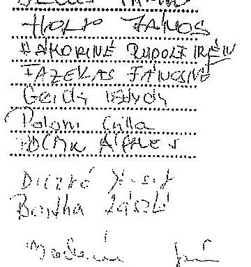

---

# NYÍREGYHÁZA MEGYEI JOGÚ VÁROS KÖZGYÜLÉSE KÖLTSÉGVETÉSI ÉS GAZDASÁGI BIZOTTSÁGA NYÍREGYHÁZA, KOSSUTH TÉR 1. 

## JEGYZÖKÖNYV

## A Bizottság 2009. február 27-én megtartott üléséről

Jelen vannak: a mellékelt jelenléti ív szerint.
Jelenlévő megbívottak: Ilesik János a Vagyongazdálkodási és Üzemeltetési Iroda vezetője és dr. Szabó Adricnt a Vagyongazdálkodási és Üzemeltetési Iroda jogáaza.

Mikó Dániel: köszöntötte a megjelenteket és megállapította a Bizottság határozatképességét.
A tervezett napirendhez az alábbi módosításokat javasolta: kerüljön törlésre a napirendből a VárosKép Kht. üzleti terve, és a Nyírségi Ivóvízminőség-javító Önkormányzati Társulás létrehozására című közgyűlési előterjesztés, illetve kerüljön felvételre a UFC Magyarország Kft-vel kötenö̉ helyiségbérleti szerződésről, valamint a Nyíregyháza, Filkir u. 30. sz. alatti 26100/1 hrsz-6 ingatlan megvételre történő felajánlása tárgyában készített bizottsági előterjesztés. Kérte a Bizottság felhatalmazását, hogy ha az előterjesztők jelenléte úgy kívánja, legyen ízhetősége a napirendek tárgyalási sorrendjén változtatni.

A Bizottság a beterjesztett napirendet a javasolt módosítással együtt, egyhangúlag (8 igen szavazat) elfogadta.

1./ Előterjesztés a Közgyűléshez az önkormányzati alapítású gazdasági társaságek 2009. évi üzleti terveinek elfogadására
(A napirend tárgyalásánál jelen volt Holp János a Vagyongazdálkodási és Üzemeltetési Iroda munkatársa és az érintett gazdasági társaság vezetője)

### 1.1. Nyíregyházi Informatikai Nonprofit Kft.

(Jelen volt Bodnár János ügyvezető igazgató)

Mikó Dániel: kérdései, az anyagbóti kiolvasható, hogy a Polgármesteri Hivatal fejlesztési igényelt az Ellenőrzési Iroda összegyüjtötte. Egy része az előterjesztő szerint a munkavégzéshez elengedhetetlenül szükséges, ennek ellenére sem a Kft. üzleti tervében, sem a város költségvetésében nincs megnevezve a forrása. Hogyan lesz ez kezelve, ki milyen lépéseket tesz a probléma megoldására?
Kérte pontosítani az elnyúlvántartó program vonatkozásában az „üzleti partnereknek nyújtott szolgáltatások" felsorolását.
Hogyan lesz megoldva a 2002-ben telepített telefonközpont cseréje? Ki fizeti a költségeket? Az ügyvezető prümincos nincs betervezve az üzleti tervbe, nem ütközik-e ez a munkaszerződéssel?

Bodnár János: válaszában elmondta, a Hivatal Ellenőrzési Irodája gyűjti össze azokat az igényeket, amelyek a Hivatal irodában jelentkeznek. Ezek elsősorban eszköz, és bizonyos esetekben szoftver igények. Általában nem szerepel fedezet a költségvetésben, augusztus-szeptember hónapban a költségvetés módosításakor kerül be, és visszamenőlegesen számolnak el. Nem nagy összegről van szó, hisz az eszközök bérelt módon kerülnek a Hivatalba. Tavaly 5-7 mPt. volt ez az összeg, várhatóan

---

az idén ettől is kevesebb lesz. Szükségesnek tartja a jelenleg még elég nagyazámban jelenlévő képemyő́s monitorok cseréjét, mert azok ugyan sugárzásmeniesek, de munkavédelmi szempontból aggályosak.
A telefonközpont - ami a cég tulajdona - jelenleg már nem bővíthető, illetve a bővítése olyan összegbe kerülne, ami már nem gazdaságos. Ugyanakkor ha elkezdődik az ügyfélcentrum megépítése, ott további 110 vonalat kell telepíteniük, ami kikényszeríti a telefonközpont bővítését. Az ügyfélcentrum tervezése kapesán folyamatosan egyeztettek a gyengeáramá tervezövel, s a költségek beépitésre kerültek az ügyfélcentrum költségébe. Az új ügyfélcentrumban a kor igényeinek megfelelő IP telefonok lesznek. A prémbanmal kapcsolatos kérdésre elmondta, a munkaszerzödésében szerepel a prémban és prémban kiírás, de nem mindig kerül rá sor, a ha igen akkor is, csak abban az esetben tudja kifizetni, ha erre a cég bevétele, illetve a gazdálkodás lehetőséget ad.

Szavazáskor jelen volt 9 fő bizottsági tag. (Gulyás József kapcsolódott be a munkába)
A Bizottság az előterjesztés tárgyában egyhangú szavazással az alábbi határozatot hozta:

# NYÍREGYHÁZA MEGYEI JOGÚ VÁROS   KÖZGYÜLÉSE   Költségvetési és Gazdasági Bizottságának 17-1/2009. (II. 27.) számú   határozata 

a Nyírsgyházi Informatikai Nonprofit Kft. 2009. évi üzleti tervéről

## A Bizottság

egyetért az előterjesztés Közgyűlés elé terjesztésével, és javasolja a határozat-tervezet elfogadását.

### 1.2. Nyírsgyházi Állatpark Nonprofit Kft.

(Jelen volt Gajdos László igazgató)
Gulyás József: kérdése az Igazgató Úrhoz, a válság mennyire befolyásolhatja az Állatpark látogatottságát? Az adatokat átnérve az állapította meg, hogy a Társaság nem számol ugyan növekedéssel, de csökkenéssel sem.

Felhermann Endre: kérdéssi, a szervezeti felépités elmozó alatt jelzett 74 fő dolgozó a felsorolás szerint nem jön össze. Kérte ezt pontosítani. Mit tartalmaz az „figyéb igénybeveti szolgáltatás" 23.985 ePt-os illetve az „figyéb személyi jellegő kifizetések 26.648 ePt-os tétel? Jelezte, tévesnek tartja a „tüzelő-hajtóanyagok"-nál jelzett 300.- Pt-os benzinérat.

Földesi István: kérdése, jól megfontolt-e a tervezett jegyárcmelés? Kérdésként merülhet ez fel azért is, mert a novemberben elfogadott költségvetési koncepció azt tartalmazta, hogy az Állatparknál nem lesz jegyárcmelés.

Mikó Dániel: hiányolta az előterjesztésből a 2008. évi tényadatokat, úgy gondolja, csak ennek az információnak a birtokában lennének értékelhetők a 2009. évre tervezett összegek.

Gajdos László: jelezte, tényadat csak a beszámoló elkészítése időpontjában lesz. A várható adatokról rendelkezésre álló táblázatot, a Bizottság tagjai részére kiosztotta. A kérdésekre választotva elmondta, semmi sem utal arra, hogy a válság negatívan befolyásolná a látogatók számát, pl. a Hotel Dzmingel foglalásai már most jobbuk, mint a tavalyi évben. Biztató, hogy a csoportbejelentkezések is olyan

---

szinten vannak, mint a tavalyi évben. Nem akartak jegyást emelni, de a tervezett ÁFA emelés és a megemelkedett köztizemi díjak miatt ezt meg kellett tenniük. A létszám pontoslását elvégzik, és táblázatban összestik a különböső munkaterületeken foglalkoztatott létszámot. Az egyéb személyi jellegü kifizetések között átkezési hozzájárulás, megbízási díjak, utazási díjtérítések kerülnek elszámolásra. Az egyéb igénybevett szolgáltatás tétel nagyon sokzétủ, egyes feladat végrehajtására külső szolgáltatót vesznek igénybe (pl. daruzás, targuscázás, csatornák karbantartása stb.)

Erdel Bálint: az előterjesztésben azt olvasta, hogy béremelés nem lesz, a most kiosztott anyagból viszont azt állapítja meg, hogy a 2008. évi tényföl most magasabb a bérköltség.

Galdos László: válasza, a bérköltség növekedést sajnos nem béremelés eredményezi. Ha plusz bevétel van, abból tudják a dolgozókat esetleg jutalmazni, premizálni. Ezért is minden dolgozó szívögye a forgalom alakulása.

Gulyás József: kérdése, hogyan történik a fükönyvi könyvelés? Mi az összefüggés a Hotel Dzsengeti foglalásai és az Állatpark látogatói létszáma között?

Galdos László: válasza, a fökönyvi könyvelést a gazdasági igazgató helyettes és a fökönyvelő végzi. A Hotel Dzsengetben alapvetően az Állatparkba látogatók szállnak meg, illetve iskolás csoportok, akik erdei iskolára foglalnak. Felcitéslezik, ha a szálloda jól működik, a látogatottság sem fog csökkenni.

Márföldi István: tájékoztatta a Bizottságot, hogy a Felügyelő Bizottság megtárgyalta és támogatta az üzleti tervet, reáljanak tartotta a Kft. vezetésének elképzelését úgy a jegyáremelés, mint a forgalom, illetve a bér vonatkozásában.

Gulyás József: tetszik neki, hogy az Állatpark vezetése optimistán áll a jövőhöz, mégis azt gondolja, egy üzleti tervnek óvatomak is kell lennie. Azt gondolja, hogy a mostani válság egy-két évig is eltart, a mindenki számára nagyon nehéz lesz. Véleménye szerint el kellene készíteni egy olyan üzleti tervet, ami a látogatók számának csökkenésével számol, mert ez megtörténhet.

Mihó Dániel: a vitában elhangzottak alapján javasolja elvárásként megfogalmazni az Igazgató Úr felé, amennyiben a látogatószám fölév vonatkozásában $15 \%$-től nagyobb mértékben csökken, tájékoztassa a Bizottságot arról, milyen intézkedéseket kíván tenni a probléma megoldására. Szavazásra bocsátotta a javaslatot.

Szavazáskor jelen volt 9 fó bizottsági tag.
A Bizottság a javaslatot egybongólag elfogadta, az előterjesztés tárgyában 8 igen szavazattal 1 fó tartózkodás mellett az alábbi határozatot hozta:

---

# NYÍREGYBÁZA MEGYEL JOGÚ VÁROS KÖZGYÜLÉSE 

Kältségvetési és Gazdasági Bizottságának
17-2/2009. (II. 27.) számú
határozata
a Nyíregyházi Állatpark Nonprofit Kft. 2009. évi üzleti tervéről

## A Bizottság

egyetért az előterjesztés Közgyűlés elé terjesztésével, és a külön megszavazott javaslat figyelembevételével támogatja a határozat-tervezet elfogadását.

### 1.3. Ipari Park Kft.

(Jelen volt Díczkó József ügyvezető igazgató és Hajzer Gábor a Városf́glesztési Iroda vezetője)

Felbermann Endrez meglepődött az üzleti terven, mert a Városfejlesztő Társaság létrehozása tárgyalásakor arról volt szó, hogy az Irányító Hatóság kérésének megfelelően létrehozzák a Társaságot, de csak azt a minimális feladatot bízzák rá, amit az Irányító Hatóság attól elvár. Ténylegesen a Hivatal fogja kézben tartani a programot, s az eddigi gyakorlatnak megfelelően végezteti a teljes körü bonyolítést. Ehhez képest meglepve tapasztalja, hogy az Ipari Park Kft. üzleti terve arról szül, hogy az IVS-sel kapcsolatos minden feladatot átvesz, ehhez létszámot bővít stb.

Hajzer Gábor: Felbermann úr felvetésére elmondta, amikor a funkcióbővítő városfejlesztési feladatoknak az akcióterületi tervét elfogadta a Közgyűlés, akkor kerültek szóba ezek a kérdések utoljára. Több alkalommal elmondták, hogy az Irányító Hatóság feléjük közvetített elvárásai folyamatosan változtak, elmondták azt is, hogy ezeknek az elvárásoknak a lehető legminimálisabb szinten kívánnak eleget tenni.
A döntési jogszoltságok valamennyi tétel esetében az Önkormányzataji maradnak, a projektek lebonyolításával kapcsolatos menedzsment feladatokat viszont megosztják. Egy részét a továbbiakban is a Városfejlesztési Irodán végzik (a döntés-előkészítés köré csoportosuló feladatok), de vannak olyanok, amelyeket a Városfejlesztő Társaság lát el (más esetekben ilyen feladatokat kifiső szereplőkre bízott az Önkormányzat, vagy eseti megbízás keretében mások végeztek el). A látszatot meg kell tartani, az nem lehet, hogy a városfejlesztő társasági funkciót betöltő Ipari Park Kft-nél a szakmai feladatok ellátását még a dokumentálás szintjún as tudják bemutatni (jelentég egy ügyvezető és egy tikkárnő az alkalmazott a kft-nél). Az Ügyvezető Úrral folytatott egyeztetések során megállapodtak abban, hogy a Kft-nél lesz műszaki és szakmai feladatok ellátására alkalmas személy, aki a Hivatait is segíteni fogja a döntés-előkészítésekben, a projekt-előrehaladási jelentések elkészítésében, a monitoring mutatóknak a nyomon követésében. Ezzel a feladatmegosztással az Ipari Park Kft-vel nem haszontalan munkát végeztetnek, s nem olyan tevékenységeket próbálnak ledokumentálni, ami utána folyamatosan kérdéseket és problémákat vethet fel.

Díczkó József: reméli, hogy Felbermann úr nem gondolja azt, hogy becsapta őket. Az üzleti tervet úgy állította össze, hogy az Irányító Hatóság által a Városfejlesztő Társaság irányába elvárt feladatokra a forrás rendelkezésre álljon. A Hajzer úr által elmondottakkal teljes mértékben egyetért. Minimális létszámbővítést indokoltsak tart, mert ha projektkoordinációt kell az Ipari Park Kft-nek végeznie, a jelzett szakemberekre szüksége van.

---

Gulyás József: az a véleményn, az Iparí Park Kft-nek az IVS nagyon jól jött, mert ha ez nem így alakul, a Kft-t meg kellett volna szüntetni, hisz ezen felül $2,5 \mathrm{mPt}$-os árbevétel van tervezve úgy, hogy nincs alá támasztva miből lesz az. Évek óta tartja azt a véleményét, hogy az Ipari Park Kft-re nincs szükség. Most megfelelő lobby tevékenységgel sikerült azt elérni, hogy a Városfejlesztő Társaság az Ipari Park Kft. keretein belül müködjön. Kezdeményezi, a Bizottság tegyen javaslatot a Közgyölésnek, hogy a Városfejlesztő Társaságot külön projektség irányitsa. Nem látja az Ipari Park Kft. szakmai felkészültségét arra, hogy egy ilyen nagy horderejü döntés-clökészítési munkát össze tudjon fogni.

Felbermann Endre: az előterjesztők által elmondottakra reagálva jelezte, nem érti, miért nem lehetett leírni az előterjesztés előzményeként ezt a tájékoztatást. Kezdeményezi, vegyék le a napirendről a Kft. üzleti tervét. Az előterjesztés egészüljön ki mindenre kiterjedő tájékoztatóval, amiből látható, hogy az IVS egyes munkafolyamataiból mit végez a Hivatal, mi a beruházás lebonyolításának rendje és hogyan kapcsolódik ehhez az Ipari Park Kft. Az a véleménye, a terv átdolgozásra szorul egyrészt a megérthetősége, másrészt pedig a szemlélete miatt.

Halzer Gábor: az elhangzottakkal kapcsolatban jelezte, a téma korábbi tárgyalása során már kellő tájékoztatást adtak a Bizottság, illetve a Képviselő testület részére arról, hogy az üzleti terv milyen feltételek szerint készül. Emlékeztette a jelenlévőket, hogy az elmúlt Közgyülés tárgyalta az akciótartárú tervet, hozzá kapcsolódóan tárgyalta a Városfejlesztő Társasággal kötnnô megállapodást, amely több oldalon részletezi a feladat megosztást. Ha a testület döntésének megfelelően a funkcióhővítő város rehabilitációs pályázat II. fordulós anyagát a Hivatal a napokban be akarja nyújtani a közremüködő szervezethez, akkor szükség van a Városfejlesztő Társaságként müködő Ipari Park Kft. üzleti tervére, hiszen ez a pályázat kötelező melléklete.

Dicshá József: Gulyás József hozzászólására reagálva elmondta, az Ipari Park I. ütemének a betelepülésével elvileg az Ipari Park Kft. ilyen típusú tevékenysége drasztikusan lecsökkent. Az Elektrolux betelepülése óta folyamatosan jelezte, hogy újabb területekre lenne szükség ahhoz, hogy az iparfejlesztés tovább folytatódjon. A Város mindig úgy nyilatkozott, hogy erre forrása nincs. Az újabb területek finanszírozását egy projektség keretein belül magántökével oldják meg, itt az Ipari Park Kft. szerepe annyi, hogy egy minimális tulajdonrészs van a projektségben. A tevékenységek nagy része átkerült ebbe a cégbe. Azt, hogy nincs meg a szakmai felkészültségük, visszautasítja. Az összes ipari parkos beruházásban nagyon komoly szerepük volt. Meg van a felkészültségük, de azért, mert esbe nem volt arra források, hogy saját szakértői gárdát müködlessenek, mindig külső szakértőkkel oldották meg a feladatokat. Összeállt egy olyan - országos szinten is elismert - csapat, ami mindenféle ilyen munkát képes megoldani. Nyilvánvalóan az Ipari Park 2009-es IVS-ses feladataiban is rájuk fog számítani. Valóban nem magyarázta a $2,5 \mathrm{mPt}$-os árbevételt, ennek az az oka, hogy egy folyamatban lévő iparfejlesztési projekiben aláírt egy titoktartási nyilatkozatot.
Hogy miért hagyta a tulajdonos évek óta a negatív eredményt? Sokszor szó volt arról, hogy a területek eladásából származó bevételek egy részét megkapják, de ezt az Önkormányzat - kérésük ellenére nem tartotta megoldhatónak. Az országban az összes ilyen fejlettségủ Ipari Park bizonyos jutalékot el tud számolni a területek után, így árbevételre tud szert tenni, a tevékenysége a mérleg szerint pozitív lehet. Miért tervezett negatív eredményt? Nem szerette volna, ha a képviselők azt mondják, hogy a 30 mPi-os árbevételt a Kft. egyéb veszteségeire fogja fordítani. Az üzleti tervben benne van, hogy egy 8 mPi-os olázpótlás kerül be a könyvekbe, amit nem tud árbevételként szerepeltenni. A 8 mPi . költségfedezcte veszteségként jelenik meg a cégnél. Jelezte, azt a pénzt, amit az IVS kapcsán megkapnak, teljes egészében az IVS-re fogják fordítani.

---

Mikó Dániel: kérdése Hajzer úrhoz, nem jelent-e a pályázatnál gondot, hogy egy veszteséges üzleti terv kerül becsatolásra?

Hajzer Gábor: meggyőződése, hogy nem jelent gondot, hisz az az ötlet, ami a Városfejlesztő Társaság létrehozásáról azél, sokkal nagyobb veszteségeket is okozhatna, ha valóban úgy müködne ez a Városfejlesztő Társaság, mint ahogy azt az elméletben kitervelői elképzelték.

Mikó Dániel: Gulyás úr javaslatával kapcsolatban elmondta, a Közgyülés lefolytatta azt a vitát, hogy önálló céget hozzon-e létre a tevékenység elvégzésére, vagy egy meglévő cégéhez integrálja a feladatot. A döntés ez utóbbi lett. Megkérdezte Felbermann urat, elfogadja-e azt a javaslatot, hogy a pályázat beadhatósága érdekében az fizleti tervet a jelenlegi formájában fogadják el. Nyertes pályázat esetén kerüljön újra a Bizottság elé a Társaság üzleti terve, a amennyiben indokolt, a szükséges módosításokat el kell végezni.

Felbermann Endre: elfogadja azzal, hogy táblázatos formában kapjanak tájékoztatást, kinek mi a feladata és hol találkoznak ezek a feladatok össze.

Szavazáskor jelen volt 9 fó bizottsági tag.
A Bizottság az előterjesztés tárgyában 6 igen, 3 nem szavazattal az alábbi határozatot hozta:

# NYÍREGYHÁZA MEGYEI JOGÚ VÁROS   KÖZGYÜLÉSE   Költségvetési és Gazdasági Bizottságának 

17-3/2009. (II. 27.) számú
határozata
az Iparí Park Kft. 2009. évi üzleti tervéről

## A Bizottság

egyetért az előterjesztés Közgyülés elé terjesztésével, és javasolja a határozat-tervezet elfogadását.

### 1.4 Nyirtávhó Kft.

(Jelen volt Gerda István ügyvezető igazgató és Polom Csilla fökönyvelő)

Gerda István: tájékoztatta a Bizottságot, hogy az üzleti tervet a Nyirtávhó Kft. Felügyelő Bizottsága megtárgyalta és 3 igen, 1 nem szavazattal, 1 fő tartózkodás mellett elfogadta.

Felbermann Endre: kérdései, készült-e arra kalkuláció, hogy eredményes KEOP pályázat esetén az Északi krt-i rendszer átépítése után mennyi hőmennyiség megtakarítás várható? Hogyan alakul a korszerűsített lakások száma az újabb 220 lakás bevonásával a „NYITÁS" programba, 7 Költségessztok bérleti és karbantartási költségére 54 mFt . van beállítva. Nem lehet-e ezt a költségot valamilyen módon csökkenteni? A közületeknél magas a vízmérés nélküli HMV. használat, és alig van mérés szerinti közületi HMV fogyasztás. Miért? Janszira már a tényleges bőmérséklettel lett számolva az átlaghőmórsékletet az energia költségtervben? Hány százalékos béremelés lesz július 1-60?

---

# 4. SZÁMÚ MELLÉKLET A V-OS21-153/2014. SZÁMÚ JELENTÉSHEZ 

Márföldi István: kérdései, az értékelés során felmerült-e az, hogy esetleg csökkentik a távhó szolgáltatási díjeket? Hogyan alakult az elmúlt elszámolási időszak óta a kiutlévőség aránya, ha növekedés van, az milyen mértékü?

Gulvás József: kérdése, mit terveznek a cégnél a válság hatásainak kivédésére? Szerinte nem megalapozott az az üzleti terv, ami ebben a helyzetben nem számol azzal, hogy komoly árbevétel problémák lehetnek. Egyébként az üzleti tervet tartalmaznak értékeli, de hiányolja belőle a kockázatok kezelését.

Gerda István: a kérdésekre adott válaszában elmondta, a KEOP-os pályázat, ami mintegy 100 mPt -os nagyságrendű beruház jelent az Északi krt. térségében (a felújítás néhány hőközpontot és több száz méter vezetéket érint) a hőközponti oldalon kb. $4 \%$-os megtakarítást eredményezhet, s a szekunder oldali szabályozásokkal ez tovább fokozható mintegy $20 \%$-ig. A térségben már nagyon sok helyen a költségosztás - mint költségmegtakarításra a lehető legjobb alkalmazási mód - müködik, ezért nem nagyobb mértékủ a megtakarítás. A „NYITÁS" programnál a lakásszámot most 220 db-ban jelölték meg, az elmúlt évek gyakorlatának megfelelően most is néhány százas nagyságrendben jelentkeznek fogyasztók a programba. Összességében az elmúlt évet 13.900 lakással zárták, ez már $90 \%$-os nagyságrendet jelenti. Ebben az évben a 14.000 -ret meghaladhatja a bekapcsolt lakások számra, s még 1600-1800 lakás, ami sorra kerülhet. Ismerteti szerint nem fog a teljes maradék lakásállomány a programba bekapcsolódni. A költségosztók bérleti költségeit egy korábban megkötött hosszú távú megállapodás szabályozza, csökkentésében akkor tudnak gondolkodni, ha a megállapodások lejárnak. Szándékaik szerint ez egyfajta irány lehet, hogy a költségeiket így csökkentik, de van egy másik elképzelés is mégpedig, hogy ez kikerül a cég tevékenységéből és a fogyasztói körbe kerül. Ezt azért nem tưják jó megoldásnak, mert egy egységes kezeléshez a fogyasztói kör mégiscsak jobban igazodhat az elszámolási metodikákhoz. A vizméréssel kapcsolatos felvetésre elmondta, csak a víz hidegvíz oldali mennyiségének a mérése nem megoldott, éterükről a hőmennyiségmérés, mint távhó törvényben szabályozott kategória, egyértelműen müködik. A víz mennyiséget ez alapján egy fajlagos értékkel visszaszámolva tudják a fogyasztók felé a számaikban vízköbméterre számolni. A béremeléssel kapcsolatban igazodtak a korábbi irányelvekhez, és amennyiben a gazdálkodások lehetővé fogja tenni, jóllus 1-től mintegy $4 \%$-os bérfejlesztést helyeztek kilátásba. Részletes választ adott a költségterveel, illetve áremeléssel kapcsolatos kérdésekre. Szólt a kiutlévőség alakulásáról, amit a támogatások hatékony múködésével, illetve a Cég hatékony dijbezzedési politikájával sikerült az elmúlt nyári - 300 mPt-ről 240 mPt -ra csökkenteni. Ebben az évben az egyik nagy kihívást jelenti számukra a kiutlévőség kezelése. Ha $30-40 \mathrm{mPt}$-os kiutlévőség növekedés lesz ebben az évben kezelhető a probléma, de egy ettől nagyobb mértékủ növekedésnél, más eszközökhöz kell folyamodniuk, ami akár a hitelkeret megemelését eredményezheti. Készülnek arra, ha negatív trendek jönnek, hogyan és milyen módon tehetnek majd ellene.

Felbermann Kodra: kb. két éve vetette fel az Igazgató Úr felé, hogy a lakosság felé megküldött számlák nem érthetőek, amikor is ígéretet kapott a számlák közérthetőbbé tétefére. Hogyan áll ez a dolog?

Gerda István: Igéret van arra, hogy az ez évi elszámolási számlákon szereplő tételek egyértelmübbek lesznek.

Gulvás József: nem győzte meg az Igazgató Úr válasza. Véleménye szerint egy dolog, hogy a nehéz helyzetben lévő lakosság nem tudja időben befizetni a számláját, de az is elképzelhető, hogy kevesebb-

---

lesz a höfelhasználás. Hasnoldan, mint az Állatparknál, javasolja elkészíteni a kockázatokat kezelő üzleti tervet.

Felhermana Endre: az üzleti tervben megfogalmazottakat megalapozottnak tartja, abból is kiindulva, hogy közel 14.000 lakás kizárólag a távhőszolgáltatásra van utalva. Véleménye szerint az ipari fogyasztóknál viszont lehet csökkenés. A Társaság legnagyobb költségei a vázárolt hőenergia költségek, de jelentős tétel a személyi jellegö kiadás és az értékcsökkenés is. A betervezett adózás utáni eredményre szüksége van a cégnek, mert olyan nagy értékủ műveket tart kertun, amelyeknek a folyamatos korszerűsítésére és fenntartására szükség van adózott eredményei, az amortizációs költségre és az eredménytartalékokra. Az üzleti tervet elfogadásra javasolja.

Földesi István: úgy gondolja, lehet aggódni az Önkormányzat minden gazdálkodó egységének a jövőjéért, hisz olyan gazdasági körülmények között működnek, hogy minden hatást -lehet az pozitív vagy negatív - értékelni fognak. Az üzleti tervet - mint ahogy azt a korábbi években már megszokták - jó színvonalának, korrektnek és végrehajthatónak látja, ami a Társaság eredményes müködését szolgálja.

Gerda István: reagálásában elmondta, a höfelhasználást figyelembe vették. A „NYITÁS" és a Panel program eredményeként höfelhasználás csökkenés mutatható ki, ami évek óta tendenzla. A csökkenés kivédésére igyekeznek új fogyasztókat bekötni a rendszerbe, de azzal továbbra is számolniak kell.

Mikó Dániel: a vitában elhangzottak alapján javasolta, abban az esetben, ha a Társaság laknosági kintlévősége 30 napon keresztül megbaladja a $350 \mathrm{mFt}$-ot, a Bizottság kapjon tájékoztatást arról, milyen intézkedéseket kíván tenni a Társaság vezetése a gazdálkodás stabilizálása érdekében.

Szavazáskor jelen volt a fö bizottsági tag. (ér.Kiss Zsolt Péter átmenetileg nem tartózkodott a teremben).

A Bizottság a javaslatot egyhangúlag elfogadta, az előterjesztés tárgyában 6 igen szavazattal 2 fő tartózkodás mellett az alábbi határozatot hozta:

# NYÍREGYHÁZA MEGYEI JOGÚ VÁROS KÖZGYÜLÉSE   Költségvetési és Gazdasági Bizottságának 

$17-4 / 2009$. (II. 27.) számú
határozzata-
a Nyírtávhő Kft. 2009. évi üzleti tervérül
A Bizottság
egyetért az előterjesztés Közgyülés elé terjesztésével, és a külön megszavazott javaslat figyelembevételével támogatja a határozat-tervezet elfogadását.

### 1.5 Szabolcs-Szatmár-Bereg Megyei Temetkezési Vállalat

(Jelen volt Szekrényes András igazgató)
Mikó Dániel: értesült arról, hogy kormányzati szinten foglalkoznak annak az anomáliának a kezelésével, hogy a halottszállító járművet ne a személyszállító kategóriába sorolják. Kérdése,

---

várható-e, hogy a probléma orvoslása kerül, vagy esetleg jelezzék a parlamenti képviselőknek, hogy tegyenek lépéseket az illetékesek felé?

Felbermann Endre: kérte Szekrényes Urat, részletesen tájékoztassa a Bizottságot a halottazállítás gyakorlatában bekövetkezett változás előzményéről.

Szekrényes András: válaszában elmondta, amikor a vámtarifa változást bevezették a halottazállító gépjárművekre, akkor a törvényalkotó úgy gondolkodott, hogy a halott is személy. A szabályozás megváltoztatását már több levélben kérte Veres János pénzügyminiszter úttól, de eddig nem történt intézkedés. Hihetetlen terhet ró ez a besorolás a temettetőkre és a cégekre is, mert növeli a temetkezési költségeket. Felbermann úr kérésére elmondta, a Debreceni igazságügyinek kilobbyzták, hogy Hajdu Bihar, Szolnok és Szabolcs-Szatmár-Bereg megyéből Debrecenbe vigyék át a halottakat bocsolásra. Az odaszállítást a Rendőrség állja, a visszaszállítást azonban a hozzátartozónak kell kifizetni. Ez csak itt van igy az országban. A Rendőrség pályázatot írt ki a tevékenységre, olyan feltételeket megazabva, amit a magyar jog nem követel meg. Annak ellenére, hogy csak a Temetkezési Vállalatnak állt rendelkezésére a kiírás szerinti halottazállító kocsi, nem a cég nyerte a pályázatot. A törvény kötelezővé teszi számukra, hogy ügyetetet tartsanak. Eddig erre részben fedezetet nyújtott a rendőrségi szállítás, s most ettől eleslek.

Felbermann Endre: újabb kérdése, a halottazállításra nincs központi előírás? Ha más régióban nem igy történik, akkor itt miért ez a szabályozás?

Mikó Dániel: úgy gondolja, ezt a kérdést nem az Igazgató Úr felé kell feltenni.
Földesi István: az üzleti tervet elfogadásra javasolja. Az Igazgató Úr és kollektívája munkáját múltatva elmondta, az elmúlt évben a Sóstóhagyi temetőt Iskonsági összefogással nagyon szépen rendbe tették. Ehhez a Vállalat a költségvetéséből forrást biztosított.

Felbermann Endre: véleménye szerint az üzleti terv megalapozott, a kor kihívásainak megfelelően tervezte az Igazgató Úr a bevételeket.

Golyás József: hasonlóan vélekedik az üzleti tervtől, mint Felbermann úr. Úgy értékeli, ennél a cégnél reálisabban látják a helyzetet, és nem árbevérel növekedés, hanem csökkenés van betervezve. Itt is javasolja a „véza üzleti terv" elkészitését a nagyobb mértékủ árbevétei csökkenés esetére. Továbbra is fenntartja azt a véleményét, hogy külön kellene kszelni a temető üzemeltetést és a piaci szolgáltatásokat.

Szavazáskor jelen volt 8 fő bizottsági tag.
A Bizottság az előterjesztés tárgyában egyhangú szavazással az alábbi határozatot hozta:

---

# NYÍREGYHÁZA MEGYEI JOGÚ VÁROS KÖZGYÜLÉSE   Költségvetési és Gazdasági Bizottságának 17-5/2009. (II. 27.) számú   határozata 

a Szabolcs-Szatmár-Bereg Megyei Temetkezési Vállalat 2009. évi üzleti tervéről
A Bizottság
egyetért az előterjesztés Közgyűlés elé terjesztésével, és javasolja a határozat-tervezet elfogadását.

2./ Előterjesztés a Közgyüléshez a Nyíregyháza, Bethlen G. n. - Mezö u. sarkán lévö 5560 hrsz-ü ingatlan elidegenitésre történő kijelölésére és licit induló árának meghatározására

Szavazáskor jelen volt 8 fó bizottsági tag. . .
A Bizottság az előterjesztés tárgyában vita nélkül, egyhangú szavazással az alábbi határozatot hozta:

## NYÍREGYHÁZA MEGYEI JOGÚ VÁROS KÖZGYÜLÉSE   Költségvetési és Gazdasági Bizottságának 18/2009. (II. 27.) számú   határozata

a Nyíregyháza, Bethlen G. n. - Mezö n. sarkán lévö 5560 hrsz-ü ingatlan elidegenitésre történő kijelöléséről és licit induló árának meghatározásáról

## A Bizottság

egyetért az előterjesztés Közgyülés elé terjesztésével, és javasolja a határozat-tervezet elfogadását.

3./ Előterjesztés a Közgyüléshez az ágazati és regionális operatív programok 2009-2010-es akciótervei alapján tervezett pályázatokra
(A napirend tárgyalásánál jelen volt Vattamány Terézia a Városfejlesztési Iroda munkatársa)

Vattamány Terézia: szóbeli kiegészitésében elmondta, az előterjesztés 1. sz. mellékletében foglalták össze és értékeltték azokat a pályázatokat, amelyeket a 2007-2008-as akciótortilati tervekeze beadtak, a 2. sz. melléklet pedig tartalmazza azokat a tervezett pályázatokat, amelyet a 2009-2010-es akciótervekre szeretnének benyújtani. A listában szerepelnek olyan tervek amelyek előirányzata a költségvetésben már jóvá lett hagyva, és vannak benne olyan tervezett projektek, amelyek még csupán ötlet szinten állnak.

Mikó Dániel: jelezte, most nem a projektról döntenek, ez egy tájékoztató jellegü előterjesztés arról, hogy milyen irányba folyik az elökészitő munka. Elökészités után minden egyes projektról külön fog dönteni a képviselö testület.

---

Felhermann Endre: a 2. számú mellékletet úgy tekinti, mint egy kínálati listát, amelyet majd nagyon komolyan kell venni. Nagyon fontosnak tartja, a határozat-tervezet 2. pontját.

Márföldi István: felhívta a figyelmet, nagyon körültekintően és komplexen kell vizsgálni, hogy optimálisan milyen forrásból biztosítható a pályázatokhoz szükséges sajátoró. A már kibocsátott kötvények vonatkozásában is célszerủnek tartaná a visszamenőleges vizsgálatot.

Mikó Dániel: késte Márföldi urat, mint a Pécsügyi Bizottság elnökét, egyeztessen a Gazdasági Iroda Vezetőjével erről, és a Bizottsággal tárgyalják meg az elképzelést, még mielőtt kiküldenék az anyagot a Közgyülésre.

Szavazáskor jelen volt 8 fő bizottsági tag.
A Bizottság az előterjesztés tárgyában 6 igen szavazattal 2 fő tartózkodás mellett az alábbi határozatot hozta:

# NYÍREGYHÁZA MEGYEI JOGÚ VÁROS   KÖZGYÜLÉSE   Költségvetési és Gazdasági Bizottságának 

19/2009. (II. 27.) számú
határozata
az ágazati és regionális operatív programok 2009-2010-es akciótervei alapján tervezett pályázatokról
A Bizottság
egyetért az előterjesztés Közgyűlés elé terjesztésével, és javasolja a határozat-tervezet elfogadását.

4/ Előterjesztés a Közgyűléshez a Közgyűlés bizottságal feladatai és hatáskörei megállapításáról szóló 10/2007. (II.13.) KGY rendelet módosítására
(A napirend tárgyalásánál jelen volt Faragóné Széles Andrea a Jegyzői Törzskar irodavezető helyettese)

Szavazáskor jelen volt 9 fó bizottsági tag. (dz.Kiss Zsolt Péter ismét bekapcsolódott a munkába)
A Bizottság az előterjesztés tárgyában vita nélkül, egyhangú szavazással az alábbi határozatot hozta:

## NYÍREGYHÁZA MEGYEI JOGÚ VÁROS   KÖZGYÜLÉSE   Költségvetési és Gazdasági Bizottságának 20/2009. (II. 27.) számú   határozata

a Közgyülés bizottságal feladatai és hatáskörei megállapításáról szóló 10/2007. (II.13.) KGY rendelet módosításáról

## A Bizottság

egyetért az előterjesztés Közgyűlés elé terjesztésével, és javasolja a rendelet-tervezet elfogadását.

---

# 5./ Előterjesztés a Költségvetési és Gazdasági Bizottsághoz a Nyíregyháza, Tenisz utcának a Pihenő utca irányába történő megnyitására a 24094/3 és 24095/2 hrsz-ü ingatlanok megvátárlásával 

Ilesik János: szóbeli kiegészitésében elmondta, az előterjesztés azért került a Bizottság elé, mert lakossági kezdeményezésre tárgyalásokat folytatott a Vagyongazdálkodási és Üzemeltetési Iroda az érintett ingatlanok tulajdonossáival. A lakossági kezdeményezés a Tenisz utcának a Pihenő útra történő megnyitására irányult, mivel az utca déli, illetve középső részéről a lakók csak nagy kerülővel tudnak kijutni a Tiszavasvári útra. Rézében ingatlancsereivel is próbálta az Iroda megoldani a helyzetet, azonban csak az előterjesztésben jelzett áron hajlandók a tulajdonosok egyezséget kömi.

Gulvás József: kérdése, hány cmbert érint ez az útnyitás, felmerült-e az, hogy esetleg valaculiyen részt vállalnak a költséghől?

Mikó Dániel: kérdése, kinek a tulajdonában van a 24094/3, illetve a 24095/2 hrsz-ü ingatlan?
Ilesik János: válaszában elmondta, kb. 20 ingatlant kell most a Tenisz utcai tulajdonosoknak megkerülni. Az érdekeltek nem hajlandók a költségekhez hozzájárulni, az előterjesztésben jelzett ingatlanok tulajdonossi pedig csak 7.000.- Ft/m2 áron hajlandóak a területet az Önkormányzat részére átadni. Mikó úr kérdésére a válasza, a 24095/2 hrsz-ü ingatlan tulajdonsa azonos a 24095/1 hrsz-ü ingatlan tulajdonosával, a 24094/3 hrsz-ü ingatlan tulajdonsa pedig ugyan az, mint a 24094/1 hrsz-ü ingatlan korábbi tulajdonsas.

Mikó Dániel: nem támogatja az előterjesztés elfogadását. Egyik oka ennek, hogy telekárban nem kivannak utat venni, másik oka pedig a tulajdonosi összetétel. Nem támogatja azért sem, mert pl. a Kisteleki szülőben minden lelektulajdonost arról akarnak meggyőzni, hogy térítősmentesen mondjanak le a város javára az útba eső területtől.
Esetleg az értékkülönbözet fizetése nélküli területeserét támogatná, ha abban meg lehetne állapodni.
Földesi István: jelezte, ismeri ezt a területet. Ezeknek a tulajdonosoknak a javára frandó, hogy a vizet, a gázt és a szennyvizet saját költségükön vezették be. Támogatja az út megnyitását, de a 7.000.- Ft/m2 árat magassuk tartja.

Mikó Dániel: arra emlékeztette Földesi urat, illetve a Bizottság taginit, hogy azzal a feltétellel vált a terület lakóbázzal beépíttetővé, hogy a közmüveaitést önerőből, önkormányzati támogatás nélkül kell megoldani.

Márföldi István: azt tartja a helyes magatartásnak, ha nem támogatja a Bizottság az előterjesztést. Az, hogy 20 ingatlant meg kell kerülni, nem lehet indok, hogy az Önkormányzat ilyen költségekbe verje magát. Arról nem is hozzálve, hogy rossz példával szolgálnának a hasonló esetekre.

Feilbermann Endre: elfogadja, hogy irreális a 7.000.- Ft/m2 ár annál is inkább, mivel ettől olcsóbban vannak a területen eladatlan önkormányzati telkek.

Mikó Dániel: a vitában elkangzottak alapján javasolja, a Vagyongazdálkodási és Üzemeltetési Iroda folytasson tárgyalásokat az érintett, illetve érdekeit ingatlantulajdonosokkal arról, hogy az Önkormányzat csak a csereingatlant biztosítja, az útnyitást kezdeményezők pedig vállalják át az értékkülönbözet megfizetését.

---

# Szavazdiskor jelen volt 9 fô bizottsági tag. 

A Bizottság az elôrerjesztés tárgyában - a javaslatra is figyelemmel - 7 igen, 2 nem szavazattal az alábbi határozatot hozta:

## NYIREGYHÁZA MEGYEI JOGÚ VÁROS KÖZGYÜLÉSE   Költségvetési és Gazdasági Bizottsága   21/2009. (II.27.) számú   határozata

a Nyíregyháza, Tenisz utcának a Pihenô utca irányába történő megnyitásáról a 24094/3 és 24095/2 hrsz-ü ingatlanok megvásárlásával

## A Bizottság

Nyíregyháza Megyei Jogú Város Közyyülésének 6/1999.(III.III.) sz. - a Megyei Jogú Város Közyyülése és fêzervei szervezeti és müködési szabályzatáról szóló - rendelete 24. §. (1) bekezdésében foglaltak, illetve a 21/2004. (IV.1.) számú önkormányzati rendelettel kapott felhatalmazás alapján a vagyoni kérdésekben átruházott hatáskörében eljárva az alábbi határozatot hozta:

A Nyíregyháza, Tenisz utca Pihenô utcára történő megnyitásához szükséges 24094/3 és 24095/2 hrsz-ü ingatlanok cserével való megszerzését támogatja azzal a feltételel, ha az értékkülönbözetet a kezdeményező, útnyitásban érintett ingatlantulajdonosok átvállalják.

Utasítja: a Vagyongszdálkodási és Üzemeltetési Irodát a további tárgyalások lefolytatására, és annak eredményétől függően a szükséges intézkedések megtételére

Felelős: dr. Freidinger Renáta
Vagyongszdálkodási és Üzemeltetési Iroda vezetője
Határidő: 2009. december 31.

Nyíregyháza, 2009. február 27.

## A határozatot kapják:

1) A Költségvetési és Gazdasági Bizottság tagjai
2) Nyíregyháza Megyei Jogú Város Polgármestere
3) Nyíregyháza Megyei Jogú Város Jegyzöje
4) Nyíregyháza Megyei Jogú Város Polgármesteri Hivatal Vagyongszdálkodási és Üzemeltetési Iroda
6./ Előterjesztés a Költségvetési és Gazdasági Bizottsághoz a Nyíregyháza, Alma utcán lévô 9580/2 hrsz-ü ingatlan beépitési kötelezettsége határidejének a meghosszabbítására irányuló kérelem tárgyában

Szavazdiskor jelen volt 8 fô bizottsági tag. (Felberntano Endre átmenetileg nem tartózkodott a teremben).

---

A Bizottság az elöterjesztés tárgyában vitá nélkül, egyhangú szavazással az alábbi határozatot hozta:

# NYIREGYHÁZA MEGYEI JOGÚ VÁROS KÖZGYÜLÉSE   Kötségvetési és Gazdasági Bizottsága 

$22 / 2009$. (II.27.) számú
határozata
a Nyíregyháza, Alma utcán lévö 9580/2 hrsz-ü ingatlan beépitési kötelezettsége határidejének a meghosszabbítására irányuló kérelem tárgyában

## A Bizottság

Nyíregyháza Megyei Jogú Város Közgyülésének 6/1999.(III.01.) sz. - a Megyei Jogú Város Közgyülése és Szervei szervezeti és müködési szabályzatáról szóló - rendelete 24. §. (1) bekezdésében foglaltak, illetve a 21/2004. (IV.1.) számú önkormányzati rendelettel kapott felhatalmazás alapján a vagyoni kérdésekben átraházott hatáskörében eljárva az alábbi határozatot hozta:
a Nyíregyháza, Alma utcán lévö 9580/2 hrsz-ü ingatlan beépitési kötelezettségének határidejét 2009. december 31. napjáig meghosszabbítja.
Utasítja: a Vagyongszdálkodási és Üzemeltetési Irodát a szükséges intéskedések megtételére
Felelős: Dr. Freidinger Renáta
Vagyongszdálkodási és Üzemeltetési Iroda vezetője
Határidő: 2009. március 31.

Nyíregyháza, 2009. február 27.

## A határozatot kaplák:

1./ A Kötségvetési és Gazdasági Bizottság tagjai
2./ Nyíregyháza Megyei Jogú Város Polgármestere
3./ Nyíregyháza Megyei Jogú Város Jegyzője
4./ Nyíregyháza Megyei Jogú Város Polgármesteri Hivatal Vagyongszdálkodási és Üzemeltetési Iroda
7./ Előterjesztés a Kötségvetési és Gazdasági Bizottsághoz a Nyíregyháza, Ostor utcán lévö 8270/24 hrsz-ü ingatlan beépitési kötelezettsége határidejének a meghosszabbítására irányuló kérelem tárgyában

Ilcsík János: szóbeli kiegészítésében elmondta, a telken megépítendő lakóépület készültségi foka 60-70 $\%$-os.

Szavazáskor jelen volt 8 fô bizottsági tag.
A Bizottság az elöterjesztés tárgyában egyhangú szavazással az alábbi határozatot hozta:

---

# NYIREGYBÁZA MEGYEI JOGÚ VÁROS KÖZGYÜLÉSE   Köitségvetési és Gazdasági Bizottsága 

$23 / 2009$. (II.27.) számú
katározata
a Nyíregyháza, Ostor utcán lévô 8270/24 hrsz-ü ingatlan beépítési kötelezettsége határidejének a meghosszabbítására irányuló kérelem tárgyában

## A Bizottság

Nyíregyháza Megyei Jogú Város Közgyűlésének 6/1999.(III.01.) sz. - a Megyei Jogú Város Közgyűlése és Szervei szervezeti és müködési szabályzatáról szóló - rendelete 24. §. (1) bekezdésében foglaltak, illetve a 21/2004. (IV.1.) számú önkormányzati rendeletici kapott felhatalmazás alapján a vagyoni kérdésekben átruházott hatáskörében eljárva az alábbi határozatot hozta:
a Nyíregyháza, Ostor utcán lévủ 8270/24 hrsz-ü ingatlan beépítési kötelezettségének határidejét 2010. február 24. napjáig meghosszabbítja.

Utasítja: a Vagyongazdálkodási és Üzemeltetési Irodát a szükséges intézkedések megtételére
Felelős: Dr. Freidinger Renáta
Vagyongazdálkodási és Üzemeltetési Iroda vezetője

Határidő: 2009. március 31.

Nyíregyháza, 2009. február 27.

## A határozatot kapták:

1./ A Köitségvetési és Gazdasági Bizottság tagjai
2./ Nyíregyháza Megyei Jogú Város Polgármestere
3./ Nyíregyháza Megyei Jogú Város Jegyzője
4./ Nyíregyháza Megyei Jogú Város Polgármesteri Ilivatal Vagyongazdálkodási és Üzemeltetési Iroda
B./ Elöterjesztés a Köitségvetési és Gazdasági Bizottsághoz a nyíregyházi 16021/5 hrsz-ü önkormányzati tulajdonú ingatlan értékesítése tárgyában

Ilesik János: szóbeli kiegészítésében elmondta, az ingatlan Nyírszölős, Atléta utcán van. A terület közművekkel nincs ellátva. A közművesítés a vevő feladata és költsége.

Szavazázkor jelen volt ő fö bizottsági rag. (Erdei Bálint átmenetileg nem tartózkodott a teremben).
A Bizottság az előterjesztés tárgyában 7 igen szavazattal 1 fő tartózkodás mellett az alábbi határozatot hozta:

---

# NYÍREGYBÁZA MEGYEI JOGÚ VÁROS KÖZGYÜLÉSE 

Költségvetési és Gazdasági Bizottsága
24/2009. (II.27.) számú
határozata
a nyiregyházi 16021/5 hrsz-ü önkormányzati tulajdonú ingatlan értékesítése tárgyában

## A Bizottság

Nyiregyháza Megyei Jogú Város Közgyűlésének 6/1999.(III.01.) sz. - a Megyei Jogú Város Közgyűlése és Szervei szervezeti és müködési szabályzatáról szóló - rendelete 24. §. (1) bekezdésében foglaltak, illetve a 21/2004. (IV.1.) számú önkormányzati rendelettel kapott felhatalmazás alapján a vagyoni kérdésekben átraházott hatásköében eljárva az alábbi határozatot hozta:
a nyiregyházi 16021/5 hrsz-ú $768 \mathrm{~m}^{2}$ nagyságú beépítetlen terület megnevezésú ingatlant 1.920.000,$\mathrm{Ft}+20 \%$ ÁFA - 2.304.000,-Ft vételáron Győrki Ákna 4432 Nyiregyháza-Nyirszölős, Csabagyöngye u. 32. sz. alatti lakos részére - 3 évér beépítési kötelezettség előírásával - elölegesítésre kijelöli. Az ingatlan közművekkel történő ellátása kifejezetten a vovő feladata és költsége.

Útositig: a Vagyongazdálkodási és Üzemeltetési Irodát a szükséges intézkedések megtételére
Felelős: Dr. Freidinger Renáta
Vagyongazdálkodási és Üzemeltetési Iroda vezetője
Határidő: 2009. április 30.

Nyiregyháza, 2009. február 27.

## A határozatot kapják:

1./ A Költségvetési és Gazdasági Bizottság tagjai
2./ Nyiregyháza Megyei Jogú Város Polgármestere
3./ Nyiregyháza Megyei Jogú Város Jegyzője
4./ Nyiregyháza Megyei Jogú Város Polgármesteri Hivatal Vagyongazdálkodási és Üzemeltetési Iroda

## 9./ Előterjesztés a Költségvetési és Gazdasági Bizottsághoz a Nyiregyháza, Bólyai tér 1. szám alatt lévő 6773/3 hrsz-ü ingatlan kb. 550 m 2 területü részének értékesítése tárgyában

Ilcsík János: szóbeli kiegészítésében elmondta, a terület pontos térmértéke a változási várrajz elkészítése után válik ismertté. A rajz már a Kazinczy Ferenc utca szabályozásához szükséges terület leválasztását is tartalmazni fogja.

Felhermann Endre: ez az előterjesztés megszösíti számára azt a megállapítást, hogy a Tenisz utcai ingatlanért kért összeg irreálisan magas.

Galvás József: kérdése, miért nem lehet a kialakított ingatlant liciten eladni?
Ilcsík János: válasza, a Benes Iskola területéből leválasztott ingatlan önálló beépítésre nem alkalmas, telek-kiegészítésként kerül eladásra az egybáci ingatlan bővítésére.

---

# Szavazáskor jelen volt 9 fô bizottsági tag. 

A Bizottság az elöterjesztés tárgyában 8 igen szavazattal, 1 fô tartózkodás mellett az alábbi határozatot hozta:

## NYIREGYHÁZA MEGYEI JOGÚ VÁROS KÖZGYÜLÉSE   Költségvetési és Gazdasági Bizottsága 25/2009. (II.27.) számú határozata

A Nyíregyháza, Bályai tér 1. szám alatt lévő 6773/3 hrsz-ü ingatlan kb. $550 \mathrm{~m}^{2}$ területü részének értékesítése tárgyában

## A Bizottság

Nyíregyháza Megyei Jogú Város Közgyűlésének 6/1999.(III.01.) sz. - a Megyei Jogú Város Közgyűlése és Szervei szervezeti és müködési szabályzatáról szóló - rendelete 24. §. (1) bekezdésében foglaltak, illetve a 21/2004. (IV.1.) számú önkormányzati rendelettel kapott felhatalmazás alapján a vagyoni kérdésekben átraházott hatáskörében eljárva az alábbi határozatot hozta:

A nyíregyházi 6773/3 helyrajzi számú ingatlan kb. $550 \mathrm{~m}^{2}$ területü részét $6.000,-\mathrm{Ft} / \mathrm{m}^{2}+20 \%$ ÁFA vémláton - a Nyíregyháza-Kertvárosi Református Egyházközség és Szociális Intézményei (4400 Nyíregyháza, Kazinezy u. 19.; adózatos: 19858186-1-15) részére - elidegenitézre kijelölt.

Utasítja: a Vagyongazdálkodási és Üzemeltetési Irodát a szükséges intézkedések megtételére
Felelős: Dr. Freidinger Renáta
Vagyongazdálkodási és Üzemeltetési Iroda vezetője
Határidő: 2009. december 31.

Nyíregyháza, 2009. február 27.

## A határozatot kaptak:

1./ A Költségvetési és Gazdasági Bizottság tagjai
2./ Nyíregyháza Megyei Jogú Város Polgármestere
3./ Nyíregyháza Megyei Jogú Város Jegyzője
4./ Nyíregyháza Megyei Jogú Város Polgármesteri Hivatal Vagyongazdálkodási és Üzemeltetési Iroda
10./Klöterjesztés a Költségvetési és Gazdasági Bizottsághoz a UFC Magyarország Kft-vel kötendő helyiségbérleti szerződésről

Ilesik János: szóban is ismertette az előterjesztést.
Gulyás József: kérdése, tisztában van-e az előterjesztő, mennyi a piaci bérleti dij ezen a területen?
Ilesik János: válasza, a nem lakás célú helyiségek minimum bérleti diját a Közgyűlés határozza meg. Tárgyalások esetén lehet ettől magasabb öszzeget elérni. Jelen esetben a $30 \%$-al magasabb bérleti dij egy tárgyalássorozat eredménye.

---

Gulyás József: véleményé szerint piaci áron kellene kiadni az üzletet, ez - még ha magasabb is mint a meghatározott minimum - a piaci bérleti díjtól messze elmarad.

Szavazáskor jelen volt 9 fó bizottsági tag.
A Bizottság az előterjesztés tárgyában 6 igen, 1 nem szavazattal, 2 fő tartózkodás mellett az alábbi határozatot hozta:

# NYÍREGYHÁZA MEGYEL JOGÚ VÁROS   KÖZGYÜLÉSE   Költségvetési és Gazdasági Bizottsága   26/2009. (II.27.) számú   határozata 

A UPC Magyarország Kft.-vel kötendő helyiségbérleti szerződésről

## A Bizottság

az előterjesztést megtárgyalta, és
a Nyíregyháza, Luther u. 3. szám alatti 160/1/A/6 hrsz-ü, $143 \mathrm{~m}^{2}$ alapterületü helyiségcsoport vonatkozásában a helyiségbérleti szerződés UPC Magyarország Kft.-vel (1092. Budapest, Kimizzi u. 30-36.) történő megkötésével 2008. november 1. napjától 3 év határozott időre, mely a bérlő egyoldalú nyilatkozatával további 3 évre meghosszabbítható, egyetért.

Utasítja: a Vagyongazdálkodási és Üzemeltetési Irodát a szükséges intézkedések megtételére
Felelős: Dr. Freidinger Renáta
Vagyongazdálkodási és Üzemeltetési Iroda vezetője
Határidő: 2009. március 31.

Nyíregyháza, 2009. február 27.

## A határozatot kapják:

1./ A Költségvetési és Gazdasági Bizottság tagjai
2./ Nyíregyháza Megyei Jogú Város Polgármestere
3./ Nyíregyháza Megyei Jogú Város Jegyzője
4./ Nyíregyháza Megyei Jogú Város Polgármesteri Hivatal Vagyongazdálkodási és Üzemeltetési Iroda
11./Előterjesztés a Költségvetési és Gazdasági Bizottsághoz a Nyíregyháza, Fülér u. 30. sz. alatti 26100/1 hrsz-ü ingatlan megvételre történő felajánlása tárgyában

Ilesik János: szóban is ismertette az előterjesztést.
Márföldi István: részletes tájékoztatást adott a képviselői körzetébe tartozó ügyröl.

Szavazáskor jelen volt 9 fó bizottsági tag.
A Bizottság az előterjesztés tárgyában egybangú szavazással az alábbi határozatot hozta:

---

# NVIREGYHÁZA MEGYEI JOGÚ VÁROS KÖZGYÜLÉSE 

Költségvetési és Gazdasági Bizottsága
27/2009. (II.27.) számú
határozata
a Nyíregyháza, Fïlér u. 30. sz. alatti 26100/1 hrsz-ú ingatlan megvételéről

## A Bizottság

Nyíregyháza Megyei Jogú Város Közyyölésének 6/1999.(III.01.) sz. - a Megyei Jogú Város Közyyölése és Szervei szervezeti és müködési szabályzatáról szóló - rendelete 24. §. (1) bekezdésében foglaltak, illetve a 21/2004. (IV.1.) számú önkormányzati rendeletlel kapott felhatalmazás alapján a vagyoni kérdésekben átruházott hatáskörében eljárva az alábbi határozatot hozta:

A Nyíregyháza, Fïlér u. 30. sz. alatti 26100/1 hrsz-ú kivett gazdasági épület és udvar megnevezési ingatlant településrendezési célok megvalósitására, kisajátitást helyettesítő adásvétel keretében 4.000.000.- Ft-os vételáron megvásárolja azzal, hogy a vételár $50 \%$-a 2009. március 31. napjáig, 50 $\%$-a pedig a birtokbaadással egyidejüleg, legkésőbb 2009. szeptember 31. napjáig kerül kifizetésre azzal a feltételei, hogy addig az ingatlan tehermentesítésére hatékaidés történik.

Utasítja: a Vagyongazdálkodási és Üzemeltetési Iroda Vezetőjét a szükséges intézkedések megtételére

Felelős: Dr. Freidinger Renáta
Vagyongazdálkodási és Üzemeltetési Iroda vezetője
Határidő: 2009. október 31.

Nyíregyháza, 2009. február 27.

## A határozatot kapják:

1./ A Költségvetési és Gazdasági Bizottság tagjai
2./ Nyíregyháza Megyei Jogú Város Polgármestere
3./ Nyíregyháza Megyei Jogú Város Jegyzője
4./ Nyíregyháza Megyei Jogú Város Polgármesteri Hivatal Vagyongazdálkodási és Üzemeltetési Iroda

A Bizottság zárt ülésen folytatta tovább munkáját.
Nyíregyháza, 2009. március 9.

## Hegedüs Ferenczi

Költségvetési és Gazdasági Bizottság
títhára

## Mikó Daniel

Költségvetési és Gazdasági Bizottság
elnöke

---

# JELENLÉTI ÍV 

a Költségvetési és Gazdasági Bizottság 2009. február 27-i üléséröl
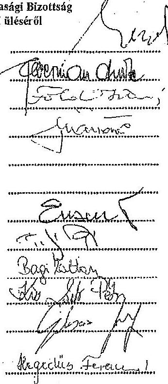

Mikó Dániel
Felbermann Endre
Földesi István
Márföldi István
Szabó Attila
Fesztóry Sándor
Erdei Bálint
Palicz Pál
Bagi Zoltán
Dr. Kiss Zsolt Péter
Gulyás József

Hegedüs Ferencné titkár
Meghivottak:
Szlovenszki Lászlóné civil szervezet részéről
Nagy László
Csabai Lászlóné
Giba Tamás
Dr. Szemáa Sándor
László Géza
Dr. Freidinger Renáta
Gálasz IAK
Hagy János
Pankris Dín
Hagace ónko
Dióza félise
Gé de félise
Dílem arda
SzERRENTEZ. ANDERS
1/1077/4/90 TEXE/19
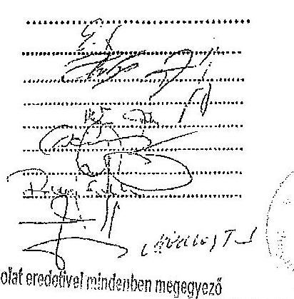

---

# NYÍREGYHÁZA MEGYEI JOGÚ VÁROS KÖZGYÜLÉSE KÖLTSÉGVETÉSI ÉS GAZDASÁGI BIZOTTSÁGA NYÍREGYHÁZA, KOSSUTH TÉR 1. 

## JEGYZÖKÖNYV

## A Bizottság 2010. február 26-án megtartott üléséről

Jelen vannak: a mellékelt jelenléti ív szerint.
Jelenlévő meghívott: dr. Freidinger Renáta a Vagyongazdálkodási Osztály vezetője.
Mikó Dániel: köszöntötte a bizottság jelenlévő tagjait és az előterjesztőket, megállapította a Bizottság határozatképességét. Javaslatot tett a „Nyíregyháza, mint a távol-keleti árukhoz kapcsolódó szolgáltatások egyik központja", valamint „Nyíregyháza, mint elérhető regionális munkaerőpisc" című megvalósíthatósági tanulmányok elkészítésére a közOP 4. „KÖZLEKEDÉSI MÓDOK ÖSSZEKAPCSOLÁSA, GAZDASÁGI KÖZPONTOK INTERMODALITÁSÁNAK ÉS KÖZLEKEDÉSI INFRASTRUKTURÁJÁNAK FEJLESZTÉSE" prioritás, illetve a közOP 5. „VÁROSI ÉS ELŐVÁROSI KÖZÖSSÉGI KÖZLEKEDÉS FEJLESZTÉSE" prioritás keretében benyújtott pályázatról című tájékoztató és az ÉAOP-2010.4.1.1/A Oktatási, nevelési intézmények fejlesztése pályázat benyújtására című közgyűlési előterjesztés megtárgyalására. Kérte a Bizottságot, járuljon hozzá, hogy amennyiben szükséges a tárgyalás sorrendjén változtasson.

A Bizottság a tervezett napirendet, a javasolt módosítással együtt, egyhangúlag ( 8 igen szavazat) elfogadta.
1./ Előterjesztés a Költségvetési és Gazdasági Bizottsághoz a Társadalmi Megújulás Operatív Program keretében meghirdetett „Kompetencia alapú oktatás, egyenlő hozzáférés- Innovatív intézményekben" (TÁMOP 3.1.4/08/2.) című pályázat kapcsán „szokőzbeszerzés" tárgyában kiírt egyszerű közbeszerzési eljárás nyertes ajánlattevőjének kiválasztására „Zárt ülésen tárgyalva"
2.a.Előterjesztés a Közgyűlésre az önkormányzati alapítású gazdasági társaságok 2010. évi üzleti terveinek elfogadására
(A napirend tárgyalásánál jelen volt Ferencziné Kovács Angéla és az érintett gazdasági társaság vezetője)
2.a.1. Nyírinfo Informatikai Nonprofit $\mathbf{K B}$. (Jelen volt Bodnár János ügyvezető)

Bodnár János: szóbeli kiegészítésében elmondta, a Felügyelő Bizottság tárgyalta az üzleti tervet és 2 igen szavazattal, 1 fő tartózkodás mellett elfogadta.
dr.Freidinger Renáta: jelezte, a beterjesztett üzleti tervet a Közlekedési és Városüzemeltetési Bizottság is elfogadásra javasolta a Közgyűlésnek.

Szavazáskor jelen volt 8 fó bizottsági tag.
A Bizottság az előterjesztés tárgyában 5 igen, 3 nem szavazattal az alábbi határozatot hozta:

---

# NYIREGYHÁZA MEGYEI JOGÚ VÁROS KÖZGYÜLÉSE   Költségvetési és Gazdasági Bizottságának 29-1/2010. (II.26.) számú   határozata 

a Nyirinfo Informatikal Nonprofit Kft. 2010. évi üzleti tervének elfogadásáról

## A Bizottság

egyetért az elöterjesztés Közgyülés elé terjesztésével és javasolja a határozat-tervezet elfogadását.
2.a.2. Város-Kép Szolgáltató Nonprofit Kft. (Jelen volt Diczkó József ügyvezető)

Fesztóry Sándor: jelezte, nem tudják megszavazni a Város-Kép Kft. üzleti tervét, a médiában kialakult egyensúlytalanság miatt. Megjegyezte, Diczkó úr amikor átvette a Kft. vezetését, média egyensúlyt ígért a Közgyülés előtt.

Gulyás József: az üzleti terv formáját és tartalmát kifogásolta.
Díczkó József: Gulyás úr felvetésére elmondta, az üzleti terv formája kötött, a kötelezően elöltt elemeket tartalmazza. Reagált Fesztóry úrnak a média egyensúlytalansággal kapcsolatos felvetésére.

Fesztóry Sándor: jelezte, nem ért egyet a Diczkó úr reagálásában elhangzottakkal.
Szavazáskor jelen volt 8 fó bizottsági tag.
A Bizottság az előterjesztés tárgyában 5 igen, 3 nem szavazattal az alábbi határozatot hozta:

## NYIREGYHÁZA MEGYEI JOGÚ VÁROS   KÖZGYÜLÉSE   Költségvetési és Gazdasági Bizottságának 29-2/2010. (II.26.) számú   határozata

a Város-Kép Szolgáltató Nonprofit Kft. 2010. évi üzleti tervének elfogadásáról

## A Bizottság

egyetért az előterjesztés Közgyülés elé terjesztésével és javasolja a határozat-tervezet elfogadását.

## 2.a.3. Nyíregyházi Ipari Park Kft.

Szabó Attila: kérdése Diczkó úrhoz, melyik cégnél teljes körű fizetett alkalmazott, illetve amelyik cégnél nem kap fizetést, költségtérítést, hogyan tudja garantálni a teljes körü vezetési dolgokat, milyen a felelősség-megceztás?

Gulyás József: kérdései, a 2009. évi tényadatok még nem állnak rendelkezésre? Mit takar az egyéb igénybevett szolgáltatás elmazó alatt szereplő 24-24 millió forint?

Díczkó József: válaszolt Szabó Attila kérdésére, illetve Gulyás úrnak elmondta, a 2009. évi tényadatok nincsenek meg, a $24-24 \mathrm{mFt}$. pedig az IVS projekt keretében igénybevett szakértői díjakra van tervezve. Azért szerepel mindkét oldalon $24-24 \mathrm{mFt}$, mert 2009. évre már tervezték a szakértői díjakat, de az uniós pénzek lassúsága miatt egy részük átcsúszik a 2010. évre.

Szavazáskor jelen volt 8 fó bizottsági tag.

---

A Bizottság az előterjesztés tárgyában 5 igen, 3 nem szavazattal az alábbi határozatot hozta:

# NYÍREGYHÁZA MEGYEI JOGÚ VÁROS   KÖZGYÜLÉSE   Költségvetési és Gazdasági Bizottságának 29-3/2010. (II.26.) számú   határozata 

a Nyíregyházi Ipari Park Kft. 2010. évi üzleti tervének elfogadásáról

## A Bizottság

egyetért az előterjesztés Közgyűlés elé terjesztésével és javasolja a határozat-tervezet elfogadását.
2.a.4. Nyírsuli Nyíregyházi Sportszolgáltató Nonprofit Kft. (Jelen volt Bartha László ügyvezető)

Bartha László: az előterjesztéshez becsatolta a Felügyelő Bizottság jegyzőkönyvét.
Szavazáskor jelen volt 8 fö bizottsági tag.
A Bizottság az előterjesztés tárgyában 5 igen szavazattal, 3 fő tartózkodás mellett az alábbi határozatot hozta:

## NYÍREGYHÁZA MEGYEI JOGÚ VÁROS   KÖZGYÜLÉSE   Költségvetési és Gazdasági Bizottságának 29-4/2010. (II.26.) számú   határozata

a Nyírsuli Nyíregyházi Sportszolgáltató Nonprofit Kft. 2010. évi üzleti tervének elfogadásáról

## A Bizottság

egyetért az előterjesztés Közgyűlés elé terjesztésével és javasolja a határozat-tervezet elfogadását.
2.a.5. Szabolcs-Szatmár-Bereg Megysi Temetkezési Vállalat (Jelen volt Szekrényes András igazgató)

Felbermann Endre: kérdése, hogy halad a tulajdonosi kör szűkítése?
Szekrényes András: válasza, a vállalatnak változatlanul 25 tulajdonosa van, Nyíregyháza tulajdonrészé $78 \%$.

Mikó Dániel: nagy sikernek tekinti és üdvözli, hogy az Igazgató úr a rendőrségi halott-szállítást megszerezte a vállalat részére.

Szavazáskor jelen volt 8 fö bizottsági tag.
A Bizottság az előterjesztés tárgyában egyhangú szavazással az alábbi határozatot hozta:

---

# NYÍREGYHÁZA MEGYEI JOGÚ VÁROS KÓZGYÜLÉSE   Költségvetési és Gazdasági Bizottságának 29-5/2010. (II.26.) számú   határozata 

a Szabolcs-Szatmár-Bereg Megyei Temetkezési Vállalat 2010. évi üzleti tervének elfogadásáról

## A Bizottság

egyetért az előterjesztés Közgyűlés elé terjesztésével és javasolja a határozat-tervezet elfogadását.
2.a.6. Nyíregyházi Állatpark Nonprofit Kft. (Jelen volt Hok József gazdasági igazgató helyettes)

Gulyás József: hiányolta az üzleti tervből a körülbelüli tényadatokat. Azért lenne rá kíváncsi, mert megítélése szerint Gajdos úr az előző évi üzleti terv összeállítása során túl optimistán látta a helyzetet.

Mikó Dániel: jelezte Gulyás úrnak, a városvezetők azt az elvárást fogalmazták meg a cégvezetők felé, hogy az üzleti terv összeállitásánál a 2009. évi és 2010. évi tervszámokat szerepeltessék egymás mellett.

Gulyás József: véleménye szerint ez egy hibás formai követelmény volt, mert semmi értelme nincs annak, hogy a 2010. évi tervet a 2009. évi tervvel hasonlítsák össze.

Szabó Attila: jelezte, a nyilvános üzleti tervben nem tartja szerencsésnek az Igazgató úr egy-egy szöveges megjegyzését.

Mikó Dániel: hasonlóan gondolja, mint Szabó Attila. Kérte, hogy a Társaságot képviselő igazgató helyettes úr tolmácsolja az itt elhangzottakat az Igazgató úr felé.

Hok József: a feltett kérdésre válaszolva elmondta, a beszámoló még nem készült el, de vannak előzetes számaik, amiből megállapítható, hogy a gazdasági válság hatására $9 \%$-os a visszacsés a látogatói létszám és ezzel együtt a bevétel tekintetében is.

Szavazáskor jelen volt 9 fó bizottsági tag. (Bagi Zoltán kapcsolódott be a munkába)
A Bizottság az előterjesztés tárgyában egyhangú szavazással az alábbi határozatot hozta:

## NYÍREGYHÁZA MEGYEI JOGÚ VÁROS KÓZGYÜLÉSE   Költségvetési és Gazdasági Bizottságának 29-6/2010. (II.26.) számú   határozata

a Nyíregyházi Állatpark Nonprofit Kft. 2010. évi üzleti tervének elfogadásáról

## A Bizottság

egyetért az előterjesztés Közgyűlés elé terjesztésével és javasolja a határozat-tervezet elfogadását.
2.a.7. Nyíregyházi Távhőszolgáltató Kft. (Jelen volt Gerda István ügyvezető és Soós Csilla gazdasági igazgató)

Mikó Dániel: tájékoztatásként elmondta, a Felügyelő Bizottság megtárgyalta a Társaság üzleti tervét, és egyhangúlag elfogadásra javasolta a Közgyülés felé.

---

# Szávazáskor jelen volt 9 fô bizottsági tag. 

A Bizottság az elöterjesztés tárgyában 6 igen szavazattal 3 fó tartózkodás mellett az alábbi határozatot hozta:

## NYÍREGYHÁZA MEGYEI JOGÚ VÁROS   KÖZGYÜLÉSE   Költségvetési és Gazdasági Bizottságának 29-7/2010. (II.26.) számú   határozata

a Nyíregyházi Távhőszolgáltató Kft. 2010. évi üzleti tervének elfogadásáról

## A Bizottság

egyetért az elöterjesztés Közgyűlés elé terjesztésével és javasolja a határozat-tervezet elfogadását.
2.a.8. Sóstó-Gyógyfürdők Szolgáltató és Fejlesztő Zrt. (Jelen volt Gyöngyösi Szabolcs vezérigazgató)

Szabó Attila: kérdése, mi a terve az Zrt-nek a szállítási tevékenység profillal?
Gulyás József: a 2009. évi adatokról érdeklődött. Kérdése, a válság hatása mennyire érződött a 2008. és 2009. év árbovétel adataiban és milyen következtetést von le ebből a vezetés a 2010. évre vonatkoztatva.

Gyöngyösi Szabolcs: válaszában elmondta, a szállítási tevékenység továbbra is szerepel a profiljukban, hasznosítják a korábban lízingelt nagy értékủ buszt. A legideálisabb az lenne, ha ezt a tevékenységet tovább tudnák adni egy vállalkozónak, ezért meghirdették, de nem volt rá érdeklődés. Jelezte, hogy a várható tényszámok a 6. 7. és 8. mellékletben megtalálhatósk. Az adatokból megállapítható, hogy a válság hatására a látogatottság és ennek következtében az árbovétel, a különböző egységekben eltérő mértékben visszaesett.

Gulyás József: mintán ennél az üzleti tervnél látható volt a várható tényszám megjegyezte, jó lenne egységes formai, illetve tartalmi előlrást adni az önkormányzati cégeknek az üzleti terv készitéséhez.

Mikó Dániel: jelezte, a városvezetés nem tiltásként fogalmazta meg a tényadatok szerepeltetését, de nem volt az elvárás az üzleti tervek összeállítááánál.

Szavazáskor jelen volt 9 fô bizottsági tag.
A Bizottság az előterjesztés tárgyában 6 igen szavazattal 3 fó tartózkodás mellett az alábbi határozatot hozta:

## NYÍREGYHÁZA MEGYEI JOGÚ VÁROS   KÖZGYÜLÉSE   Költségvetési és Gazdasági Bizottságának 29-8/2010. (II.26.) számú   határozata

a Sóstó-Gyógyfürdők Szolgáltató és Fejlesztő Zrt. 2010. évi üzleti tervének elfogadásáról

## A Bizottság

egyetért az előterjesztés Közgyűlés elé terjesztésével és javasolja a határozat-tervezet elfogadását.

---

# 4. SZÁMÚ MELLÉKLET A V-0521-153/2014. SZÁMÚ JELENTÉSHEZ

## 2.b. Tájékoztató a Közgyűlésre a Nyírségvíz Zrt. 2010. évi üzleti tervének tudomásul vételére

(Jelen volt Szabó Istvánné gazdasági vezérigazgató helyettes)

*Szavazáskor jelen volt 9 fő bizottsági tag.*

A Bizottság az előterjesztés tárgyában vita nélkül, 6 igen szavazattal 3 fő tartózkodás mellett az alábbi határozatot hozta:

### NYÍREGYHÁZA MEGYEI JOGÚ VÁROS KÖZGYÜLÉSE

**Költségvetési és Gazdasági Bizottságának**

**29-9/2010. (II.26.) számú határozata**

#### a Nyírségvíz Zrt. 2010. évi üzleti tervének tudomásul vételéről

A Bizottság egyetért az előterjesztés Közgyűlés elé terjesztésével és javasolja a tájékoztató elfogadását.

## 2.c. Előterjesztés a Közgyűlésre a NYÍRVIDÉK TISZK Nonprofit Kft. 2010. évi üzleti tervének elfogadására

(Jelen volt Hajdu Sándor NYÍRVIDÉK TISZK Nonprofit Kft. 2010. évi üzleti tervének elfogadására)

Hajdu Sándor: szóbeli kiegészítésében elmondta, a TISZK-kel kapcsolatban elvárás volt az elmúlt időszakban, hogy lehetőség szerint az önkormányzati támogatások mértéke csökkenjen és próbáljon meg saját bevételből eredményezésben gazdálkodni. A múlt évben először a felnőttképelei tevékenység során ez részben sikerült (meglehetősen nehéz a felnőttképelei pisci helyzet). Az üzleti tervben az önkormányzati támogatások a tavalyi évhez képest több mint 10 %-al csökkennek és úgy gondoljuk, hogy így is eredményesen fogják tudni az évet befejezni. A törvényi szabályoknak megfelelően a javadalmazási szabályzatot kialakították, a NYÍRVIDÉK TISZK Kft. esetében javadalmazást nem kap.

**Erőzi Bálint:** jelezte, hogy a Felügyelő Bizottság tagjai az üzleti tervet és az előterjesztést teljes mértékben támogatták.

*Szavazáskor jelen volt 9 fő bizottsági tag.*

A Bizottság az előterjesztés tárgyában 6 igen szavazattal 3 fő tartózkodás mellett az alábbi határozatot hozta:

### NYÍREGYHÁZA MEGYEI JOGÚ VÁROS KÖZGYÜLÉSE

**Költségvetési és Gazdasági Bizottságának**

**29-10/2010. (II.26.) számú határozata**

#### a NYÍRVIDÉK TISZK Nonprofit Kft. 2010. évi üzleti tervének elfogadásáról

A Bizottság egyetért az előterjesztés Közgyűlés elé terjesztésével és javasolja a határozat-tervezet elfogadását.

## 2.d. Tájékoztató a Közgyűlésre a Nyírség Szakképzés Szervezési Kiemelkedően Közhasznú Nonprofit Kft. 2010. évi üzleti tervének tudomásul vételére

Hajdu Sándor: szóbeli kiegészítésében elmondta, mint ismert a Nyírségi Szakképzés Szervezési Társaság megalapítására egy konzorcium pályázott, és a TÁMOP 2.2.3 pályázaton nyert el 315 m² tot. A pályázat tavaly kezdődött és idén november 30-án ér véget, addigra kell a pályázati célokat megvalósítani. Az üzleti terv szempontjából ez azt jelenti, hogy a személyi költséget és a

6

WASOSER VERDEIÉNYEL SZAVASZÁSOR

2014. NOV 25.

---

menedzsment költségeit november 30 -ig fedezi a pályázati összeg, ezt követően azonban már ebben a vonatkozásban is az üzleti tervben tervezetten, az alapító tulajdonosok támogatásából kell, hogy gazdálkodjon a Társaság. Ebben az évben a pályázati feltételek miatt bevételt még nem tud tervezni a Kft., jövőre viszont igen. A törvények szerint a szakképzés szervezési társaságok azok, amelyek szakképzési hozzájárulást gyüjthetnek. Ez a változás 2009-ben nem hozott mennyiségi csökkenést az iskolák részére gyüjtött pénzekben. Terveik szerint a több mint 130 mFt -ból 15 mFt . nem kerül közvetlenül az iskolákhoz, hanem taggyűlési döntés alapján a LEGO Önkormányzattal közösen megépítendő tanműhelye gépi berendezésének költségeihez lesz biztosítva. A szakképzési hozzájárulásból minden évben különítenének el egy bizonyos összeget „központi célra", aminek felhasználását a fenntartókkal, tulajdonosokkal, iskolákkal közösen határoznák meg.

Mikó Dániel: gratulált ahhoz, hogy a váltás ellenére sikerült a 130 mFt . összegủ szakképzési hozzájárulást összegyüjteni.

Szavazáskor jelen volt 9 fö bizottsági tag.
A Bizottság az előterjesztés tárgyában 6 igen szavazattal 3 fő tartózkodás mellett az alábbi határozatot hozta:

# NYÍREGYHÁZA MEGYEI JOGÚ VÁROS   KÖZGYÜLÉSE   Költségvetési és Gazdasági Bizottságának 

29-11/2010. (II.26.) számú
határozata
a Nyirség Szakképzés Szervezési Kiemelkedően Közhasznú Nonprofit Kft.
2010. évi üzleti tervének tudomásul vételéről

## A Bizottság

egyetért az előterjesztés Közgyűlés elé terjesztésével és javasolja a tájékoztató elfogadását.
3.a.Tájékoztató a Közgyűlésre a „Városi és elővárosi kötöttpályás közösségi közlekedési rendszer és intermodális csomópont fejlesztése Nyíregyházán" címü megvalósíthatósági tanulmány elkészítésére a KözOP 5."Városi és elővárosi közösségi közlekedés fejlesztése" prioritás keretében benyújtott pályázatról
(A napirend tárgyalásánál jelen volt Zolnai Gábor közlekedés-mérnök a Városfejlesztési Osztály munkatársa)

Zolnai Gábor: szóbeli kiegészítésében elmondta, a KözOP a fejlesztési programok közül az a csomag, aminek a kezelése - a jelentősége, vagy a nagyságrendje miatt - országos szinten történik. Lehetőség van arra, hogy projektjavaslattal éljen a város ennek a programnak a keretében, és ha ez a javaslat olyan szintű, hogy támogatásra érdemes, $100 \%$-os állami támogatás nyerhető a megvalósíthatósági tanulmány elkészítéséhez. Jelen előterjesztés egy benyújtott pályázatra vonatkozik, a másik két program (3.b. előterjesztés) további témajavaslat, melyekre pályázatot lehetne beadni.

Felbermann Endre: kérdései, a Petőfi téren elképzelt térszint alatti parkoló hova van tervezve? Nem túlzás-e ennyi pénzt kifizetni egy tanulmányért, úgy hogy a megvalósításának nincs realitása? Lehet-e bizonyos kockázatvállalásra bírni a megvalósíthatósági tanulmány készítését elnyerő pályázót (csak akkor fizetni ki a 84 mFt -ot, ha a tanulmány alapján elnyeri a város a 6 milliárd forintot)?

Zolnai Gábor: válasza, a P+R parkolóra a szabályozási terv a zöldfelület visszapótlásával lehetőséget ad, a fizikai helyét meg kell majd találni a területen. A megvalósíthatósági tanulmányra a további pályázatokhoz szükség van. A sikerüljjal kapcsolatos felvetésre elmondta, ha a támogatást megnyeri a város, közbeszerzési eljárásban kell kiválasztani a megvalósíthatósági tanulmány elkészítőjét. Ha az a közbeszerzési jogszabályokkal összefungolható, megszabhat kockázatvállalási feltételt a kilró.

---

# 4. SZÁMÚ MELLÉKLET A V-0521-153/2014. SZÁMÚ JELENTÉSHEZ 

Felbermann Endre: jelezte, tudomásul veszi a tájékoztatót, de nem rejti véka alá azon véleményét, túlságosan nagy projekt ez ahhoz, hogy a közeljövőben megvalósítható legyen Nyíregyházán. Számára kicsit utópisztikusnak tünik az elővárosi keskeny nyomtávú vasút megvalósítása azért is, mert ebben az esetben a városnak kellene, mint üzemeltetőnek belépni, s ennek nincs realitása. Vannak a programnak elemei, melyek nagyon fontosak lennének a közeljövőben (pl. a nagykörút $2 \times 2$ sávos befejezése), de olyanok is, amik szerinte még hosszú távon sem képzelhetők el. Zavarja, hogy fontos, a közeljövőben város által megvalósítandó feladatok keverednek hosszú távú olyan feladatokkal, melyek súlyokban nem azonosak és nem valósíthatók meg egy 6 milliárd forintos program keretében.

Szabó Attila: jelezte, mindenben egyetért a Felbermann úr által elmondottakkal, de kicsit furcsállja, hogy éppen ő veti fel ezeket a dolgokat (úgy gondolja, párıkötődése kapcsán lett volna belezzólása, mire kell az eu-s pénzeket költeni). Meggyőződése, hogy a megvalósíthatósági tanulmány készítéséhez megítélt támogatás kifizetését nem lehet kockázatvállalási feltételhez kötni. Egyébként pedig úgy gondolja, az a szerencsés, ha van kész megvalósíthatósági tanulmány (az Önkormányzatnak nem kerül semmibe) és nem akkor kell kapkodni, amikor kiírják az aktuális fejlesztést. Támogatja a pályázat beadását.

Szavazáskor jelen volt 8 fő bizottsági tag. (Gulyás József átmenetileg nem tartózkodott a teremben.)
A Bizottság az előterjesztés tárgyában egyhangú szavazással az alábbi határozatot hozta:

## NYÍREGYHÁZA MEGYEI JOGÚ VÁROS KÖZGYÜLÉSE   Költségvetési és Gazdasági Bizottságának 30-1/2010. (II.26.) számú   határozata

a „Városi és elővárosi kötöttpályás közösségi közlekedési rendszer és intermodális csomópont fejlesztése Nyíregyházán" címü megvalósíthatósági tanulmány elkészítésére a KözOP 5."Városi és elővárosi közösségi közlekedés fejlesztése" prioritás keretében benyújtott pályázatról

## A Bizottság

egyetért az előterjesztés Közgyűlés elé terjesztésével és javasolja a tájékoztató elfogadását.
3.b. Tájékoztató a Közgyűlés részére „Nyíregyháza, mint a távol-keleti árnkhoz kapcsolódó szolgáltatások egyik központja", valamint „Nyíregyháza, mint elérhető regionális munkaerópiac" címủ megvalósíthatósági tanulmányok elkészítésére a közOP 4. „KÖZLEKEDÉSI MÓDOK ÖSSZEKAPCSOLÁSA, GAZDASÁGI KÖZPONTOK INTERMODALITÁSÁNAK ÉS KÖZLEKEDÉSI INFRASTRUKTÚRÁJÁNAK FEJLESZTÉSE" piorítás, illetve a közOP 5. „VÁROSI ÉS ELŐVÁROSI KÖZÖSSÉGI KÖZLEKEDÉS FEJLESZTÉSE" piorítás keretében benyújtott pályázatról

Zolnai Gábor: szóban is ismertette az előterjesztést.
Szabó Attila: jelezte, nem tartja szerencsésnek az előterjesztés címét, de a pályázat beadását támogatja.

Szavazáskor jelen volt 7 fó bizottsági tag. (Gulyás József és Palicz Pál átmenetileg nem tartózkodott a teremben.)

A Bizottság 6 igen szavazattal 1 fő tartózkodás mellett az alábbi határozatot hozta:

---

# NYÍREGYHÁZA MEGYEI JOGÚ VÁROS KÖZGYÜLÉSE   Költségvetési és Gazdasági Bizottságának 30-2/2010. (II.26.) számú   határozata 

„Nyíregyháza, mint a távol-keleti árukhoz kapcsolódó szolgáltatások egyik központja", valamint „Nyíregyháza, mint elérhető regionális munkaerőpiac" címủ megvalósíthatósági tanulmányok elkészitésére a közOP 4. „KÖZLEKEDÉSI MÓDOK ÖSSZEKAPCSOLÁSA, GAZDASÁGI KÖZPONTOK INTERMODALITÁSÁNAK ÉS KÖZLEKEDÉSI
INFRASTRUKTÚRÁJÁNAK FEJLESZTÉSE" pioritás, illetve a közOP 5. „VÁROSI ÉS ELŐVÁROSI KÖZÖSSÉGI KÖZLEKEDÉS FEJLESZTÉSE" pioritás keretében benyújtott pályázatról

## A Bizottság

egyetért az előterjesztés Közgyűlés elé terjesztésével és javasolja a tájékoztató elfogadását.
4./ Előterjesztés a Közgyűlésre az önkormányzati alapítású Társégi Hulladék-Gazdálkodási Kft. 2010. évi üzleti tervének jóváhagyására „Zárt ülésen tárgyalva"
5./ Előterjesztés a Közgyűlésre „A belvárosi terek integrált funkcióbővítő fejlesztése Nyíregyházán" projekt közlekedésfejlesztése megvalósítása során a kerékpárntak akcióterületen kívüli hálózati kapcsolatának megépítéséhez szükséges saját erő biztosítására (A napirend tárgyalásánál jelen volt Zolnai Gábor a Városfejlesztési Osztály munkatársa)

Zolnai Gábor: szóbeli kiegészítésében elmondta, tegnap volt a közbeszerzési eljárás során beérkezett ajánlatok bírálata, a Közlekedési és Városüzemeltetési Bizottság javasolta a döntésborának, hogy mind a négy elemben történjen eredményhirdetés. Tájékoztatta a Bizottságot, hogy a pályázat keretében csak az akció területen belüli részre van finanszírozás, de hogy a hálózati kapcsolat megteremthető legyen, a nagyköráton belül a teljes szakaszra elkészítették a kerékpárutaknak a tervét. A közbeszerzési eljárás során a költségek nem úgy alakultak, hogy a fennmaradó szakasz is megépíthető legyen, ezért szükséges a forrás bővítése.

Mikó Dániel: kérdése, a hiányzó 106.246.749.- Ft. nincs benne a költségvetésbe?
Felbermann Endre: megjegyezte, az igen feszített 2010. évi költségvetésben nem látja, mi lehet a hiányzó összegnek a fedezete.

Mikó Dániel: jelezte, elvileg egyetért a programmal. Javasolja a Bizottságnak, azzal a feltétellel támogassa a határozat-tervezet elfogadását, hogy a vezetés nevezhse a Közgyűlésen, a pályázathoz szükséges sajáterő fedezetét honnan teremti elő.

Zolnai Gábor: a felvetésre reagálva elmondta, valószínűsíti, hogy nem nyer minden város által beadott pályázat, s ebben az esetben átcsoportosítással lehet a fedezetet biztosítani.

Felbermann Endre: az Elnök úr által javasolt feltétel kiegészítését kezdeményezte és kérte azt is megfogalmazni, hogy csak átcsoportosítással és nem újabb hitélfelvétellel lehet a pluszforrást megteremteni.

Földesi István: megjegyezte, sok kritika éri a várost, hogy megkezdett kerékpárút építések vannak és nincs közöttük kapcsolat. Szeretné, ha a kerékpárút megépülne a nagykörútig, mert feltétlenül szükség lenne rá.

Mikó Dániel: szavazásra bocsátotta a módosító indítványt, illetve az előterjesztést.

---

# Szavazáskor jelen volt 9 fô bizottsági tag. 

A Bizottság a határozat-tervezet elfogadásának feltételeként - egyhangúlag - az alábbiakat fogalmazta meg: a Közgyülésen a vezetés nevesítse, hogy a pályázathoz szükséges sajáterủ fedezetét honnan teremtí elö. A fedezetet csak átcsoportosítással, és nem további teherváltalással lehet biztosítani.

Az előterjesztés tárgyában szintén egyhangú szavazással az alábbi határozatot hozta:

## NYÍREGYHÁZA MEGYEI JOGÚ VÁROS   KÖZGYÜLÉSE   Költségvetési és Gazdasági Bizottságának 32/2010. (IL26.) számú   határozata

„A belvárosi terek integrált funkcióbővítő fejlesztése Nyíregyházán" projekt közlekedésfejlesztése megvalósítása során a kerékpárutak akcióterületen kívüli hálózati kapcsolatának megépítéséhez szükséges saját erő biztosításáról

## A Bizottság

egyetért az előterjesztés Közgyűlés elé terjesztésével és a Bizottság által javasolt feltételekkel támogatja a határozat-tervezet elfogadását.

## 6./ Előterjesztés a Közgyűléshez az ÉAOP-2010.4.1.1/A Oktatási, nevelési intézmények fejlesztése pályázat benyújtására

dr.Freidinger Renáta: szóban is ismertette az előterjesztést. Elmondta, a támogatás maximális nagysága 400 mPt . a támogatás intenzitás $90 \%$. Amikor az előterjesztést készítették, a korábbi pályázat adatait is alapul véve 180 mPt . várható értékủ beruházást céloztak meg. A VÁTI KHT-val azóta folytatott egyeztetés alapján úgy tünik, hogy az Alma utcai épület bővítéséhez liflet kell építeni, illetve a teljes akadálymentesítést el kell végezni az épületben. Erre tekintettel javasolják a megcélzott pályázati összeget 210 mPt -ra, az önerőt pedig $10,5-10,5 \mathrm{Pt}$-ra módosítani. A feladatra a 2010. évi költségvetésbe 9 mPt . van betervezve, a $1,5 \mathrm{mPt}$. fedezetét meg fogják nevezni a Gazdasági Osztály számára.

Mikó Dániel: kérdése, amennyiben ez a beruházás megvalósul, felszabadítható-e a Kállói úti ingatlan?
dr.Freidinger Renáta: válasza, a korábbi pályázat arra épült, hogy a beruházás megvalósításával egyidejűleg a Kállói úti, illetve a Kisteleki szőlői iskola megszüntetésre kerül. A mostani pályázati útmutatás alapján az iskolák megszüntethetők ugyan, de ha eladja az Önkormányzat az ingatlanokat, úgy tekinti a kiíró, hogy a pályázat kapcsán egyéb bevételhez jutott, és azt az összeget vissza kell fizetni. Az új feltételek miatt a pályázat oktatási részét át kell dolgozni.

Földesi István: véleménye szerint a borbányai iskola teljes felújítására szükség van, támogatja az előterjesztett javaslatot.

Szavazáskor jelen volt 9 fô bizottsági tag.
A Bizottság az előterjesztés tárgyában egyhangú szavazással az alábbi határozatot hozta:

---

# NYÍREGYHÁZA MEGYEI JOGÚ VÁROS KÖZGYÜLÉSE   Költségvetési és Gazdasági Bizottságának 

33/2010. (II.26.) számú
határozata
az ÉAOP-2010.4.1.1/A Oktatási, nevelési intézmények fejlesztése pályázat benyújtásáról
A Bizottság
egyetért az előterjesztés Közgyülés elé terjesztésével és a 2./ pontban 10,5 - 10,5 mPt-ra javított összeggel javasolja a határozat-tervezet elfogadását.
7./ Előterjesztés a Közgyülésre a volt Szeréna Lak ingatlanának tulajdonosa, a GRAND INVITAL Kft. által létesítendő szálloda beruházásban való önkormányzati szerepvállalásról szóló 14/2010.(II.1.) számú határozat visszavonására

Szavazáskor jelen volt 9 fó bizottsági tag.
A Bizottság az előterjesztés tárgyában vita nélkül, 6 igen szavazattal 3 fő tartózkodás mellett az alábbi határozatot hozta:

## NYÍREGYHÁZA MEGYEI JOGÚ VÁROS KÖZGYÜLÉSE   Költségvetési és Gazdasági Bizottságának 34/2010. (II.26.) számú   határozata

a volt Szeréna Lak ingatlanának tulajdonosa, a GRAND IN-VITAL Kft. által létesítendő szálloda beruházásban való önkormányzati szerepvállalásról szóló 14/2010.(II.1.) számú határozat visszavonásáról
A Bizottság
egyetért az előterjesztés Közgyülés elé terjesztésével és javasolja a határozat-tervezet elfogadását.
8./ Előterjesztés a Közgyülésre a Szabolcs-Szatmár-Bereg Megyei Katasztrófavédelmi Igazgatóság elhelyezését biztosító helyiségek használatba adására

Szavazáskor jelen volt 9 fó bizottsági tag.
A Bizottság az előterjesztés tárgyában vita nélkül, egyhangú szavazással az alábbi határozatot hozta:

## NYÍREGYHÁZA MEGYEI JOGÚ VÁROS KÖZGYÜLÉSE   Költségvetési és Gazdasági Bizottságának 35/2010. (II.26.) számú   határozata

a Szabolcs-Szatmár-Bereg Megyei Katasztrófavédelmi Igazgatóság elhelyezését biztosító helyiségek használatba adásáról

A Bizottság
egyetért az előterjesztés Közgyülés elé terjesztésével és javasolja a határozat-tervezet elfogadását.

---

9./ Elöterjesztés a Közgyülésre önkormányzati tulajdonú ingatlanok önkormányzati képviselők, társadalmi szervezetek, továbbá alapítványok által történő használatának szabályozásáról szóló 12/2007.(II.13.) KGY rendelet módosítására

Szavazáskor jelen volt 9 fô bizottsági tag.
A Bizottság az előterjesztés tárgyában vita nélkül, egyhangú szavazással az alábbi határozatot hozta:

# NYÍREGYHÁZA MEGYEI JOGÚ VÁROS   KÖZGYÜLÉSE   Költségvetési és Gazdasági Bizottságának   36/2010. (II.26.) számú   határozata 

önkormányzati tulajdonú ingatlanok önkormányzati képviselők, társadalmi szervezetek, továbbá alapítványok által történő használatának szabályozásáról szóló 12/2007.(II.13.) KGY rendelet módosításáról
A Bizottság
egyetért az előterjesztés Közgyülés elé terjesztésével és javasolja a rendelet-tervezet elfogadását.
10./ Elöterjesztés a Költségvetési és Gazdasági Bizottsághoz a Nyíregyháza - Oros, Szív u. - Kis u. sarkán lévő 27436/1 hrsz-ú önkormányzati tulajdonú ingatlan értékesítése tárgyában

Szavazáskor jelen volt 9 fô bizottsági tag.
A Bizottság az előterjesztés tárgyában 8 igen szavazattal 1 fô tartózkodás mellett az alábbi határozatot hozta:

## NYÍREGYHÁZA MEGYEI JOGÚ VÁROS   KÖZGYÜLÉSE   Költségvetési és Gazdasági Bizottsága   37/2010. (II.26.) számú   határozata

a Nyíregyháza - Oros, Szív u. - Kis u. sarkán lévő 27436/1 hrsz-ú önkormányzati tulajdonú ingatlan értékesítése tárgyában

## A Bizottság

Nyíregyháza Megyei Jogú Város Közgyülésének 6/1999.(III.01.) sz. - a Megyei Jogú Város Közgyülése és Szervei szervezeti és müködési szabályzatáról szóló - rendelete 24. §. (1) bekezdésében foglaltak, illetve a 21/2004. (IV.1.) számú önkormányzati rendelettel kapott felhatalmazás alapján a vagyoni kérdésekben átruházott hatáskörében eljárva az alábbi határozatot hozta:

A Nyíregyháza - Oros, Szív u. - Kis u. sarkán lévő 27436/1 hrsz-ú $816 \mathrm{~m}^{2}$ területi ingatlan licit induló árát $6.000 .000,-$ Ft-os ( $\AA$ FA-s) összegre módosítja.

A Bizottság 104/2008.(V.23.) számú határozatában meghatározott további feltételek - 3 éves beépítési kötelezettség előírása, kétfordulós, nyilvános, kétfordulós pályázat útján történő értékesítés változatlanul maradnak.

Utasítja: a Vagyongazdálkodási Osztály vezetőjét, a szükséges intézkedések megtételére
Felelős: Dr. Freidinger Renáta osztályvezető
Határidő: 2010. június 30.
Nyíregyháza, 2010. február 26.

---

# A határozatot kapják: 

1./ A Költségvetési és Gazdasági Bizottság tagjai
2./ Nyíregyháza Megyei Jogú Város Polgármestere
3./ Nyíregyháza Megyei Jogú Város címzetes föjegyzöje
4./ Nyíregyháza Megyei Jogú Város Polgármesteri Hivatala Vagyongszdálkodási Osztály
11./ Előterjesztés a Költségvetési és Gazdasági Bizottsághoz a Nyíregyháza, István utca mentén lévő 3092/3 hrsz-ú ingatlan 1622/10710-ed tulajdoni hányadának megvásárlása tárgyában

Gutvás József: kérdése, mi a hosszú távú terve az Önkormányzatnak a megvásárolni szándékolt tulajdonrészsel?
dr.Freidinger Renáta: válasza, régóta szándéka volt az Önkormányzatnak a kizárólagos tulajdonba kerülés. Hosszú távú cél az elidegenités, de rövidtávon elképzelhető az ingatlan bérbeadás útján történő hasznosítása.

Fesztóry Sándor: kérdése, várható, hogy be lesz fejezve a sportpálya amit a letétbe helyezett 10 ezer euroért nem sikerült befejezni (úgy látja, az a cél, hogy az Önkormányzat kisegítse a vállalkozót)?
dr.Freidinger Renáta: válasza, vélhetően igen.
Mikó Dániel: kérdése, szóba került-e, hogy a fizetésre csak az örökösföldi pálya befejezése és a használatbavételi engedély megszerzését követően kerüljön sor?
dr.Freidinger Renáta: pontosította az előterjesztést, miszerint egyértelmú lett az a szándék, hogy a kifizetésre csak a sportpálya befejezése és átadása után kívánnak intézkedni.

Mikó Dániel: javasolta a kifizetés feltételeként a használatbavételi engedély megszerzését is megjelölni.

Szavazáskor jelen volt 9 fő bizottsági tag.
A Bizottság az előterjesztés tárgyában 6 igen, 3 nem szavazattal az alábbi határozatot hozta:

## NYÍREGYHÁZA MEGYEI JOGÚ VÁROS   KÖZGYÜLÉSE   Költségvetési és Gazdasági Bizottsága   38/2010. (II.26.) számú   határozata

A Nyíregyháza, István utca mentén lévő 3092/3 hrsz-ú ingatlan 1622/10710-ed tulajdoni hányadának megvásárlása tárgyában

## A Bizottság

Nyíregyháza Megyei Jogú Város Közgyűlésének 6/1999.(III.01.) sz. - a Megyei Jogú Város Közgyűlése és Szervei szervezeti és müködési szabályzatáról szóló - rendelete 24. §. (1) bekezdésében foglaltak, illetve a 21/2004. (IV.1.) számú önkormányzati rendelettel kapott felhatalmazás alapján a vagyoni kérdésekben átruházott hatáskörében eljárva az alábbi határozatot hozta:
a Nyíregyháza, István utca mentén lévő 3092/3 hrsz-ú ingatlan 1622/10710-ed tulajdoni hányadának megvásárlásával - 24.330.000,-Ft + ÁFA $=30.412 .500$,-Ft összegủ vételáron - e g y e t ért.

Az adésvétel feltétele az OBI - Media Markt beruházás megvalósítása kapcsán a Szabályozási Terv által közút céljára kijelölt terület ( $3092 / 1 \mathrm{hrsz} .: 3053 \mathrm{~m}^{3}$ ) térítésmentes átadása az Önkormányzat részére.

---

A vételár kifizetésére a sportpálya elkészülte után, a jogerős használathavételi engedély birtokában kerülhet sor.

Felhatalmazza: Csabai Lászlóné polgármestert és Dr. Szemán Sándor címzetes főjegyzöt az adásvételi szerződés aláírására.

Utasítja: a Vagyongazdálkodási Osztályt a szükséges intézkedések megtételére
Felelős: Dr. Freidinger Renáta
Vagyongazdálkodási Osztály vezetője
Határidő: 2010. június 30.
Nyíregyháza, 2010. február 26.
A határozatot kapják:
1./ A Költségvetési és Gazdasági Bizottság tagjai
2./ Nyíregyháza Megyei Jogú Város Polgármestere
3./ Nyíregyháza Megyei Jogú Város címzetes föjegyzöje
4./ Nyíregyháza Megyei Jogú Város Polgármesteri Hivatala Vagyongazdálkodási Osztály
12./ Előterjesztés a Költségvetési és Gazdasági Bizottsághoz a Nyíregyháza, Kállói út mentén lévő 8549/12 hrsz-ú önkormányzati tulajdonú ingatlan értékesítése tárgyában

Dr.Freidinger Renáta: kiegészítésében elmondta, a Bizottság már több alkalommal foglalkozott a telek-kiegészítésként hasznosítható ingatlanrész értékesítésével. Amennyiben a Bizottság jóváhagyja a beterjesztett javaslatot, le lehet zárni a valósághan közterületről meg nem közelíthető telek-kiegészítésre alkalmas sáv értékesítését. Kéri a határozat-tervezet B. változat szerinti elfogadását.

Szavazdakor jelen volt 9 fö bizottsági tag.
A Bizottság az előterjesztés tárgyában 6 igen szavazattal 3 fő tartózkodás mellett az alábbi határozatot hozta:

# NYÍREGYHÁZA MEGYEI JOGÚ VÁROS   KÖZGYÜLÉSE   Költségvetési és Gazdasági Bizottsága   39/2010. (II.26.) számú   határozata 

a Nyíregyháza, Kállói út mentén lévő 8549/12 hrsz-ú önkormányzati tulajdonú ingatlan értékesítése tárgyában

## A Bizottság

Nyíregyháza Megyei Jogú Város Közgyűlésének 6/1999.(III.01.) sz. - a Megyei Jogú Város Közgyűlése és Szervei szervezeti és müködési szabályzatáról szóló - rendelete 24. §. (1) bekezdésében foglaltak, illetve a 21/2004. (IV.1.) számú önkormányzati rendelettel kapott felhatalmazás alapján a vagyoni kérdésekben átruházott hatáskörében eljárva az alábbi határozatot hozta:

A Bizottság a Nyíregyháza, Kállói út mentén lévő 8549/12 hrsz-ú ingatlant ( $3312 \mathrm{~m}^{2}$ ) telek-kiegészítésként történő elidegenítésre 104/2009.(VI.26.) számú határozatával kijelölte. Az ingatlan megosztása, valamint további ingatlanrészek értékesítése után a 8549/12 hrsz-ú ingatlan területe 1103 $\mathrm{m}^{2}$-re változott.
A 8549/12 hrsz-ú, $1103 \mathrm{~m}^{2}$ területü „beépítetlen terület" megnevezésű ingatlan vételárát $4.000,-\mathrm{Ft} / \mathrm{m}^{2}$ + ÁFA összegre módosítja, és Bogár István, Nyíregyháza, Tiszafa u. 5. sz. alatti lakos részére történő

---

értékesítéséhez hozzájárul, oly módon, hogy vevő a vételár $50 \%$-át szerződéskötéskor, a fennmaradó $50 \%$-ot pedig 12 havi egyenlő részletben - jegybanki alapkamattal növelten - köteles megfizetni.

Utasítja: a Vagyongazdálkodási Osztály vezetőjét, a szükséges intézkedések megtételére
Felelős: Dr. Freidinger Renáta osztályvezető
Határidő: 2010. június 30.
Nyíregyháza, 2010. február 26.

# A határozatot kapják: 

1./ A Költségvetési és Gazdasági Bizottság tagjai
2./ Nyíregyháza Megyei Jogú Város Polgármestere
3./ Nyíregyháza Megyei Jogú Város címzetes főjegyzője
4./ Nyíregyháza Megyei Jogú Város Polgármesteri Hivatala Vagyongazdálkodási Osztály

A Bizottság zárt ülésen folytatta tovább munkáját.
13./ Egyebek

Felbermann Endre: felvetette, a Repülö Klub elnöke kérte a közremüködését egy olyan ügyben, amivel a Bizottság már korábban foglalkozott. A Bizottság döntése alapján a Repülőtéren lévő klubok bérleti dí fizetése mellett maradhatnak az általuk korábban használt ingatlanrészeken. A Repülö Klub az nlc. rendeletben meghatározott mértékủ bérleti díjat nem tudta vállalni, ezért tettek egy javaslatot a Hivatal felé egy általuk elfogadható bérleti díjra, illetve 15 évre kérték a bérlet időtartamát meghatározni. Beadványukban vállalták, hogy az ott tartózkodásuk ideje alatt az épület felújítását, karbantartását saját erőből elvégeik.
A beadványukra a mai napig nem kaptak választ. Ha a Klub által tett ajánlat nem fogadható el, javasolja azt visszahozni a Bizottság elé, hogy döntsön, mert ez a bizonytalanság számukra nagyon rossz.
dr.Freidinger Renáta: jelezte, az ügy jelenlegi állását nem ismeri, de természetesen amikor olyan döntési penthoz érkezik, hogy a Költségvetési és Gazdasági Bizottság kompetenciája felmerül, vissza hozza a Bizottság elé.

A napirendek végére érve a Bizottság Elnöke megköszönte a részvételt, a munkát és az ülést bezárta.

Nyíregyháza, 2010. március 8.

Hegadós Ferencné
Költségvetési és Gazdasági Bizottság
títkára

Mikó Dániel
Költségvetési és Gazdasági Bizottság
elnöke

---

# JELENLÉTI ÍV 

a Költségvetési és Gazdasági Bizottság 2010. február 26-i üléséról
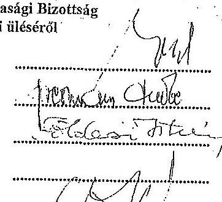

Földesi István
Márföldi István
Szabó Attila
Fesztóry Sándor
Erdei Bálint
Palicz Pál
Bagi Zoltán
Dr. Kiss Zsolt Péter
Gulyás József

Hegedüs Ferencné titkár
Meghivottak:
Szlovenszki Lászlóné civil szervezet részéről
Nagy László
Csabai Lászlóné
Gibo Tamás
Dr. Szemán Sándor
László Géza
Dr. Freidinger Renáta
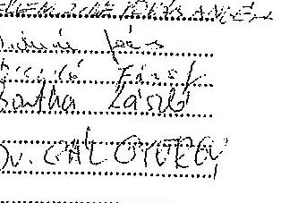

---

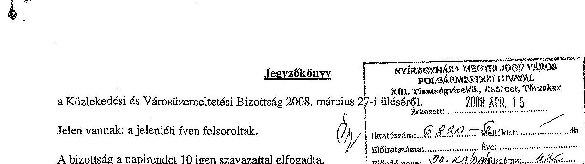

Első napirendi pontként tárgyalja a bizottság a Nyíregyháza nyugati elkerülő út építése tárgyában folytatott egyeztetésekről és annak eredményeiről szóló tájékoztatót.

Dévényi József megérkezett, így a bizottság létszáma 11 före változott.
Felbermann Endre: Szóban ismertette a tájékoztatót.
Tormássi Géza: A Bethlen Gábor utca, illetve a Tiszavasvári út irányába a Michelin Gumigyártól mekkora kamionforgalom várható?

Zolnay Gábor: A Révész-Trans Kft-hez napi 1-2 kamion indul. Ezek gumiabroncsokat szállítanak, amelyek nem súlyosak, inkább csak terjedelmesek.

Molnár Béla: Melyik cég tervezi a nyugati elkerülő utat?
Zolnay Gábor: Az UVATERV.
Bornemisza Andrea: Az út fog-e érinteni lakóházakat?
Felbermann Endre: Nem fog érinteni, mert a kertek végében halad.
A bizottság 11 igen szavazattal az alábbi határozatot hozta:
Nyíregyháza Megyei Jogú Város
Közgyülése
Közlekedési és Városiizemeltetési Bizottsága
23/2008. (III. 27.) számú
határozata
a Nyíregyháza nyugati elkerülő út építése tárgyában folytatott egyeztetésekről és annak eredményeiről.

# A Bizottság 

elfogadja a tájékoztatót.

---

Dévényi József eltávozott, így a bizottság létszáma 10 före változott.
Második napirendi pontként tárgyalja a bizottság a Nyíregyházi Városüzemeltető és Vagyonkezelő Kft 2008. évi üzleti tervének elfogadására vonatkozó előterjesztést.

Hámoriné Rudolf Irén: Szóban röviden ismertette az előterjesztést.
Jászai Menyhért: Az önkormányzati hozzájárulás közel 251 mPt -tal csökkent. Ennek mi az oka?
Jánócsik Csaba: Az intézmények világítása és a közvilágitás ügyninek kezelésére a Városüzemeltetési Kht-nál voltak szakemberek. Könnyebb volt velük felvenni a kapcsolatot bizonyos problémák megoldásához, mintha az E.ON-hoz fordultunk volna. Ez a továbbiakban hogyan lesz megoldva?

Hámoriné Rudolf Irén: Cégünknél vannak szakemberek az intézmények villamos energia ellátásával és a közvilágitással kapcsolatos problémák kezelésére. Rendelkezünk ingyen hívható telefonszámmal a lakossági hibabejelentések fogadására.

Fazekas Jánosné: Jogszabályi változások miatt 2008. január 1-től nem terveztünk árbevételt a lakbérekből, hanem az önkormányzat nevében számláztuk ki a lakbéreket. Március 18 -tól ismét lehetségessé vált az adómentes lakbérszámlázás.

Vinginder Tibor: Az üzleti terv tartalmával és kivitelével egyaránt elégedett vagyok. Bízom benne, hogy a benne foglaltak az év során meg fognak valósulni. Elfogadásra javaslom az üzleti tervet.

Bornemisza Andrea: Örülök, hogy ismét lesznek városszépitő akciók, és megjelent a tervben az illegális hulladék ártalmatlanitás és a hulladékgyüjtő szigetek takaritása.

Jászai Menyhért: A külterületek számára rendkívül fontos volt a Városüzemeltetési Kht munkája, tapasztalataink nagyon pozitívak voltak és az új cég megalakulása óta is kedvezőek. Számomra az utak és járdák fenntartására, siktalanitására betervezett összegek tünnek aggályosnak, mert időközben a költségek megnövekedtek.

Jánócsik Csaba: A cégek átalakulása, illetve összeolvadása miatt nem lehet teljes pontossággal tervezni a keretszámokat, és év közben bizonyára fognak ezek változni. Ezzel együtt véleményem szerint elfogadhatjuk az üzleti tervet.

Tormásci Géza: A társaság üzleti tervét a FEB megtárgyalta és egyhangúlag elfogadásra javasolta.
A bizottság 10 igen szavazattal az alábbi határozatot hozta:

---

Dévényi Józaef eltávozott, így a bizottság létszáma 10 fơre változott.
Második napirendi pontként tárgyalja a bizottság a Nyíregyházi Városüzemeltető és Vagyonkezelő Kft 2008. évi üzleti tervének elfogadására vonatkozó előterjesztést.

Hámoriné Rudolf Irén: Szóban röviden ismertette az előterjesztést.
Jászai Menyhért: Az önkormányzati hozzájárulás közel 251 mPt -tal csökkent. Ennek mi az oka?
Jánócsik Csaba: Az intézmények világítása és a közvilágítás ügyeinek kezelésére a Városüzemeltetési Kht-nál voltak szakemberek. Könnyebb volt velük felvenni a kapcsolatot bizonyos problémák megoldásához, mintha az E.ON-hoz fordultunk volna. Ez a továbbiakban hogyan lesz megoldva?

Hámoriné Rudolf Irén: Cégünknél vannak szakemberek az intézmények villamos energia ellátásával és a közvilágitással kapcsolatos problémák kezelésére. Rendelkezünk ingyen hívható telefonszámmal a lakossági hibabejelentések fogadására.

Fazekas Jánosné: Jogszabályi változások miatt 2008. január 1-től nem terveztünk árbevételt a lakbérekből, hanem az önkormányzat nevében számláztuk ki a lakbéreket. Március 18 -tól ismét lehetségesué vált az adómentes lakbézzámlázás.

Vinginder Tibor: Az üzleti terv tartalmával és kivitelével egyaránt elégedett vagyok. Bizom benne, hogy a benne foglaltak az év során meg fognak valósulni. Elfogadásra javaslom az üzleti tervet.

Bornemisza Andrea: Örülök, hogy ismét lesznek városszépítő akciók, és megjelent a tervben az illegális hulladék ártalmatlanítás és a hulladékgyüjtő szigetek takarítása.

Jászai Menyhért: A külterületek számára rendkívül fontos volt a Városüzemeltetési Kht munkája, tapasztalataink nagyon pozitívak voltak és az új cég megalakulása óta is kedvezőek. Számomra az utak és járdék fenntartására, siktalanítására betervezett összegek tünnek aggályosnak, mert időközben a költségek megnövekedtek.

Jánócsik Csaba: A cégek átalakulása, illetve összeolvadása miatt nem lehet teljes pontossággal tervezni a keretszámokat, és év közben bizonyára fognak ezek változni. Ezzel együtt véleményem szerint elfogadhatjuk az üzleti tervet.

Tormásai Géza: A társaság üzleti tervét a FEB megtárgyalta és egyhangúlag elfogadásra javasolta.
A bizottság 10 igen szavazattal az alábbi határozatot hozta:

---

# Nyíregyháza Megyei Jogú Város   Közgyülése 

Küzlekedési és Városüzemeltetési Bizottsága
24/2008. (III. 27.) számú
határozata
a Nyíregyházi Városüzemeltető és Vagyonkezelő Kft 2008. évi üzleti tervének elfogadására.

## A Bizottság

a Nyíregyházi Városüzemeltető és Vagyonkezelő Kft 2008. évi üzleti tervét 2742 mFt tervezett bevétellel, 2738 mFt költséggel, $3,9 \mathrm{mFt}$ adózás előtti eredménnyel elfogadásra javasolja a Közgyưlésnek.

Harmadik napirendi pontként tárgyalja a bizottság a Sóstó-Gyógyfürdők Zrt 2008. évi üzleti tervének elfogadására vonatkozó előterjesztést.

Belus Tamás: A FEB megtárgyalta az üzleti tervet és 3 igen szavazattal, 1 tartózkodással elfogadásra javasolta.

Vinginder Tibor: A kiadási tételek között van egyéb igénybevett szolgáltatások díjára 30 mF , különféle egyéb szolgáltatásokra 4 mF , egyéb személyi jellegü kifizetésekre 22 mF , egyéb ráfordításokra 30 mF . Ez összesen 86 mF , ami megérné, hogy egy írásos mellékletből részletesen tudjuk, miről van szó. A vendéglátás kiszervezése megtörtént-e a cégből? Nem találkoztam a napilapokban erre vonatkozó versenykiírással.

Tormássi Géza: A múszakok számának 2-ről 1-re történő csökkentése várhatóan milyen kihatással lesz a nyitvatartási idöre, a költségekre és az energiafelhasználásra?

Bornemisza Andrea: Jól értelmezem, hogy 2008. április 15 -től nem fogadják el az orvosi beutalókat? A belépójegyek ára 15\%-kal emelkedni fog a költségek emelkedése miatt? Ez nem eredményez majd jelentös forgalomcsökkenést? A tervezett árbevétel a fürdő szolgáltatásból 565 mFt . Ez tartalmazza az önkormányzati szolgáltatásvásárlást is? Az önkormányzat milyen összegben és milyen jogcímen vásárol szolgáltatást a cégtől?

Belus Tamás: Az egyéb ráfordítás a vissza nem igényelhető ÁPA. Az egyéb igénybevett szolgáltatás a nyári diákmunkára kifizetett összeg. Az egyéb személyi jellegủ kifizetések az egészségpénztári kifizetések. A vendéglátás kiszervezése megtörtént. Nem volt pályáztatás, mert az üzemi tanáccsal egyetértésben előnyt biztosítottunk szoknak, akik korábban üzemeltették az egységeket. Így elkerülhető volt az ott dolgozók elbocsátása. Az 1 múszakra való áttérés még előkészítést igényel, a turisztikai szempontokat messzemenőkig figyelembe kell vennünk. Az orvosi beutalókkal visszaélések történtek, általában más vette igénybe a szolgáltatást, mint aki jogosult lett volna rá. Sokan eladták az így kiváltott jegyeket. Ezért az ilyen előregyártott jegyeket megszêntettük, de természetesen a beutaltsk továbbra is igénybevehetik utalványuk alapján a szolgáltatásá-

---

inkat. Költségeink növekedése miatt a jegyek árának emelése elkerülhetetlen. Összehasonlítva más fürdők áraival és szolgáltatásaival az Aquarius fürdő nem drága. A Júlia fürdő esetében szúkíteni kívánjuk a kedvezményeket. Az önkormányzat költségvetésében szerepel 77 mPt sportcélú támogatás, 27 mPt belépőjegy vásárlás, valamint 4610 ePt a szigligeti tábor fenntartására. Tavaly 60 mPt -tal több volt az önkormányzati szerepvállalás összege.

Vinginder Tibor: A költségekre kapott válasz számomra nem volt kielégitő. Kérem, hogy a költségterv 26., 31., 42., és 47. sora kerüljön részletezésre.

Palicz György: Emberileg érthető, hogy a vendéglátás üzemeltetését az kapja meg, aki eddig is üzemeltette. Mégis vannak kétségeim, mert egyrészt nem elfogadható, hogy valakinek csak úgy odaadjuk ezt, másrészt az üzemeltetés eddig veszteséges volt és semmi nem garantálja, hogy ezután nyereséges lesz. Lehet, hogy versenyeztetéssel jobb bérleti díjat lehetett volna elérni.

Belus Tamás: Az eddigi üzemeltetőket ismerjük, és személyük, valamint a velük kötött szerződés garancia arra, hogy a vendégek jó színvonalú ellátást kapjanak. Sajnos voltak már negatív tapasztalataink olyanokkal, akik versenyen nyerték el bizonyos vendéglátó egységek üzemeltetési jogát.

Tormássi Géza: Összességében úgy látom, hogy az idei üzleti tervet a realitásokból kiindulva készítette el a cég.

Belus Tamás: A tavalyi üzleti tervünk talán túlzottan optimista volt.
Jánócsik Csaba: Bízom benne, hogy a különböző médiaesemények, az Állatpark közelsége is segítenek a vendégek számának növelésében. Érdemesnek látnám úszásoktatással is növelni a fürdő kihasználtságát.

Belus Tamás: Az Aquarius fürdő vendégeinek zömét már nem a belföldi, hanem a külföldről érkező látogatók teszik ki. Próbálunk minél jobban megfelelni az igényeiknek.

A bizottság 4 igen szavazattal, 6 tartózkodással az alábbi határozatot hozta:
Nyíregyháza Megyel Jogú Város
Közgyúlése
Közlekedési és Városüzemeltetési Bizottsága
25/2008. (III. 27.) számú
határozata
a Sóstó-Gyógyfürdők Zrt 2008. évi üzleti tervének elfogadására.

# A Bizottság 

a Sóstó-Gyógyfürdők Zrt 2008. évi üzleti tervét 842 mPt tervezett bevétellel, 837 mPt költséggel, $4,7 \mathrm{mPt}$ adózás előtti eredménnyel nem javasolja elfogadásra a Közgyưlésnek.

---

inkat. Költségeink növekedése miatt a jegyek árának emelése elkerülhetetlen. Összehasonlítva más fürdők áraival és szolgáltatásaival az Aquarius fürdő nem drága. A Júlia fürdő esetében szôkitteni kívánjuk a kedvezményeket. Az önkormányzat költségvetésében szerepel 77 mPt sportcélú támogatás, 27 mPt belépőjegy vásárlás, valamint 4610 cPt a szigligeti tábor fenntartására. Tavaly 60 mPt -tal több volt az önkormányzati szerepvállalás összege.

Vinginder Tibor: A költségekre kapott válasz számomra nem volt kielégitő. Kérem, hogy a költségterv 26., 31., 42., és 47. sora kerüljön részletezésre.

Palicz György: Emberileg érthető, hogy a vendéglátás üzemeltetését az kapja meg, aki eddig is üzemeltette. Mégis vannak kétségeim, mert egyrészt nem elfogadható, hogy valakinek csak úgy odaadjuk ezt, másrészt az üzemeltetés eddig veszteséges volt és semmi nem garantálja, hogy ezután nyereséges lesz. Lebet, hogy versenyeztetéssel jobb bérleti díjat lehetett volna elérni.

Belus Tamás: Az eddigi üzemeltetőket ismerjük, és személyük, valamint a velük kötött szerződés garancia arra, hogy a vendégek jó színvonalú ellátást kapjansk. Sajnos voltak már negatív tapasztalataink olyanokkal, akik versenyen nyerték el bizonyos vendéglátó egységek üzemeltetési jogát.

Tormássi Géza: Összességében úgy látom, hogy az idei üzleti tervet a realitásokból kiindulva készítette el a cég.

Belus Tamás: A tavalyi üzleti tervünk talán túlzottan optimista volt.
Jánócsik Csaba: Bízom benne, hogy a különböző médiaesemények, az Állatpark közelsége is segítenek a vendégek számának növelésében. Érdemesnek látnám úszásoktatással is növelni a fürdő kihasználtságát.

Belus Tamás: Az Aquarius fürdő vendégeinek zömét már nem a belföldi, hanem a külföldről érkező látogatók teszik ki. Próbálunk minél jobban megfelelni az igényeiknek.

A bizottság 4 igen szavazattal, 6 tartózkodással sz alábbi határozatot hozta:
Nyíregyháza Megyei Jogú Város
Közgyúlése
Közlekedési és Városüzemeltetési Bizottsága
25/2008. (III. 27.) számú
határozata
a Sóstó-Gyógyfürdők Zrt 2008. évi üzleti tervének elfogadására.

# A Bizottság 

a Sóstó-Gyógyfürdők Zrt 2008. évi üzleti tervét 842 mPt tervezett bevétellel, 837 mPt költséggel, $4,7 \mathrm{mPt}$ adózás előtti eredménnyel nem javasolja elfogadásra a Közgyúlésnek.

---

Negvedik napirendi pontként tárgyalja a bizottság a NYÍRTÁVHÓ Kft 2008. évi üzleti tervének elfogadására vonatkozó előterjesztést.

Tormássi Géza: A FEB elfogadásra javasolja az üzleti tervet.
Gerda István: Szóban röviden ismertette az előterjesztést.
Bornemisza Andrea: A költségosztást végzố cég számlái nagyon lassan készülnek el. A lakosság közvetlenül ezzel a céggel, vagy a NYÍRTÁVHÓ Kft-vel áll kapcsolatban? A költségosztókkal nem lehet takarékoskodni, mert egy teljesen fütetlen lakásra is 10 ePt fölötti számla érkezik. Úgy látom, hogy az ügyfélszolgálaton is nagyon sok a reklamáció.

Gerda István: Egy épületen belül is nagyon eltérő a lakások fütési hőigénye. A reklamációkat minden esetben kivizsgáljuk, az elszámolást korrekt módon végezzük. Cégünknek nem érdeke, hogy megtévesszük a fogyasztóinkat. A költségosztást végzố cégeknek kb. 2,5 hét kell a költségosztók leolvasására, utána az eredményt megküldik a lakóközösségeknek és idốt adnak az esetleges észrevételek megtételére. Ezután kerülhet sor az elszámolások kiküldésére. Országos szinten Nyíregyházán történik meg leghamarabb az elszámolás.

Jánócsik Csaba: A nyár folyamán meg fog történni a gerincvezetékek cseréje, amennyiben a pályázat sikeres lesz?

Gerda István: A második félévben elindulna a munka és jövőre fejeződne be.
A bizottság 4 igen, 4 nem szavazattal, 1 tartózkodással az alábbi határozatot hozta:
Nyíregyháza Megyei Jogú Város
Közgyúlése
Közlekedési és Városüzemeltetési Bizottsága
26/2008. (III. 27.) számú
határozata
a NYÍRTÁVHÓ Kft 2008. évi üzleti tervének elfogadására.

# A Bizottság 

a NYÍRTÁVHÓ Kft 2008. évi üzleti tervét 4246 mFt tervezett bevétellel, 4063 mFt költséggel, 183 mFt adózás előtti eredménnyel nem javasolja elfogadásra a Közgyưlésnek.

A szavazásnál 9 fő volt jelen.
Ötödik napirendi pontként tárgyalja a bizottság a Nyírinfo Kht 2008. évi üzleti tervének elfogadására vonatkozó előterjesztést.

---

Jászai Menyhért eltávozott, így a bizottság létszáma 9 fơre változott.
Bodnár János: Szóban röviden ismertette az előterjesztést.
Soltész József: Mit tartalmaznak a bérleti díjak és az egyéb igénybevett szolgáltatások?
Bodnár János: A Polgármesteri Hivatal számára bérelt eszközök, az adatátviteli vonalak díját, és az iroda bérleti diját, melyet mi fizetünk az önkormányzat számára. Az egyéb igénybevett szolgáltatásoknál találhatók a szervizköltségek és az elózóekben nem szerepelt számítástechnikai szolgáltatások díja.

Tormássi Géza: A város honlapján időnként nagyon nehezen lehet megnyitni közgyűlési anyagokat, mert annyira lelassul.

Bodnár János: Mi a Nyírháló weboldalt kezeljük. Eszközeink 10 Mbit/s sebességü vonalon érhetők el, ami elegendő a használatához. Inkább a belépéshez használt Internet-kapcsolatnál lehet ilyenkor probléma.

Jánócsik Csaba: A rendszerek lassúságát okozhatják a kéretlen elektronikus levelek. Gondoskodni kell olyan berendezésről a fejlesztések során, amely képes hatékonyan kiszűrni ezeket.

Bodnár János: Rendelkezünk olyan berendezéssel, amely alkalmas a kéretlen levelek, vírusok és betörési kísérletek elhárítására. Természetesen tudjuk, hogy ezt is folyamatosan fejleszteni kell. A FEB megtárgyalta az üzleti tervet és elfogadásra javasolta.

A bizottság 9 igen szavazattal az alábbi határozatot hozta:
Nyíregyháza Megyei Jogú Város
Közgyülése
Közlekedési és Városüzemeltetési Bizottsága
27/2008. (III. 27.) számú
határozata
a Nyírinfo Kht 2008. évi üzleti tervének elfogadására.

# A Bizottság 

a Nyírinfo Kht 2008. évi üzleti tervét 164061 eFt tervezett bevétellel, 164061 eFt költséggel elfogadásra javasolja a Közgyűlésnek.

Hatodik napirendi pontként tárgyalja a bizottság a Nyírségvíz Zrt 2008. évi üzleti tervéről szóló tájékoztatót.

---

Jászai Menyhért eltávozott, így a bizottság létszáma 9 fơre változott.
Bodnár János: Szóban röviden ismertette az elôterjesztést.
Soltész József: Mit tartalmaznak a bérleti díjak és az egyéb igénybevett szolgáltatások?
Bodnár János: A Polgármesteri Hivatal számára bérelt eszközök, az adatátviteli vonalak díját, és az iroda bérleti díját, melyet mi fizetünk az önkormányzat számára. Az egyéb igénybevett szolgáltatásoknál találhatók a szervizköltségek és az elözöekben nem szerepeit számítáatechnikai szolgáltatások díja.

Tormássi Géza: A város honlapján idónként nagyon nehezen lehet megnyitni közgyưlési anyagokat, mert annyira lelassul.

Bodnár János: Mi a Nyírháló weboldalt kezeljük. Eszközeink 10 Mbit/s sebességû vonalon érhetők el, ami elegendő a használatához. Inkább a belépéshez használt Internet-kapcsolatnál lehet ilyenkor probléma.

Jánócsik Csaba: A rendszerek lassúságát okozhatják a kéretlen elektronikus levelek. Gondoskodni kell olyan berendezésrôl a fejlesztések során, amely képes hatékonyan kiszûrni ezeket.

Bodnár János: Rendelkezünk olyan berendezéssel, amely alkalmas a kéretlen levelek, vírusok és betörési kísérletek elhárítására. Természetesen tudjuk, hogy ezt is folyamatosan fejleszteni kell. A FEB megtárgyalta az üzleti tervet és elfogadásra javasolta.

A bizottság 9 igen szavazattal az alábbi határozatot hozta:
Nyíregyháza Megyei Jogú Város
Közgyúlése
Közlekedési és Városüzemeltetési Bizottsága
27/2008. (III. 27.) számú
határozata
a Nyírinfo Kht 2008. évi üzleti tervének elfogadására.

# A Bizottság 

a Nyírinfo Kht 2008. évi üzleti tervét 164061 ePt tervezett bevétellel, 164061 ePt költséggel elfogadásra javasolja a Közgyưlésnek.

Hatodik napirendi pontként tárgyalja a bizottság a Nyírségvíz Zrt 2008. évi üzleti tervérôl szóió tájékoztatót.

---

Móricz István: Szóban röviden ismertette a tájékoztatót.
A bizottság 9 igen szavazattal az alábbi határozatot hozta:
Nyíregyháza Megyei Jogú Város
Közgyülése
Közlekedési és Városüzemeltetési Bizottsága
28/2008. (III. 27.) számú
határozata
a Nyírségvíz Zrt 2008. évi üzleti tervéről szóló tájékoztató elfogadására.

# A Bizottság 

a Nyírségvíz Zrt. 2008. évi üzleti tervét 4364 mPt tervezett bevétellel, 4031 mPt költséggel, 333 mPt adózás előtti eredménnyel tudomásulvételre javasolja a Közgyűlésnek.

Hetedik napirendi pontként tárgyalja a bizottság az integrált városfejlesztési stratégia módosítására, „A belvárosi terek integrált funkcióbővítő fejlesztése Nyíregyházán" című pályázati program benyújtására vonatkozó előterjesztést.

Hajzer Gábor: Szóban ismertette az előterjesztést.
A bizottság 9 igen szavazattal az alábbi határozatot hozta:
Nyíregyháza Megyei Jogú Város
Közgyülése
Közlekedési és Városüzemeltetési Bizottsága
29/2008. (III. 27.) számú
határozata
az integrált városfejlesztési stratégia módosítására, „A belvárosi terek integrált funkcióbővítő fejlesztése Nyíregyházán" címú pályázati program benyújtására.

## A Bizottság

elfogadásra javasolja a Közgyűlésnek az előterjesztést.
Nyolcadik napirendi pontként tárgyalja a bizottság a Nyíregyháza városközponti terület rehabilitációja közlekedésfejlesztése engedélyezési terveinek beszerzéséhez kiírt közbeszerzési pályázat ajánlatainak elbírálására vonatkozó előterjesztést.

---

Hajzer Gábor: Szóban ismertette az előterjesztést.
A bizottság 9 igen szavazattal az alábbi határozatot hozta:
Nyíregyháza Megyei Jogú Város
Közgyülése
Közlekedési és Városüzemeltetési Bizottsága
30/2008. (III. 27.) számú
határozata
a Nyíregyháza városközponti terület rehabilitációja közlekedésfejlesztése engedélyezési terveinek beszerzéséhez kiírt közbeszerzési pályázat ajánlatainak elbírálására.

# A Bizottság 

egyetért azzal, hogy a közbeszerzési eljárás nyertesének az UVATERV Zrt, második helyezettnek a COWI Magyarország Kft kerüljön kihirdetésre.

Kilencedik napirendi pontként tárgyalja a bizottság az Orosi Előkészítő Bizottság - Oros településrész leválásának kezdeményezésével kapcsolatos - javaslatára vonatkozó állásfoglalás kialakítására címú előterjesztést.

Giba Tamás: Szóban ismertette az előterjesztést.
Termássi Géza: Bizottságunknak olyan szempontok alapján kell megtárgyalnia az anyagot, amelyek a kompetenciájába tartoznak. Az előkészítő bizottság anyagában szerepel, hogy bizonyos önkormányzati cégekből tulajdonrészt kívánna a létrejövő önkormányzat.

Giba Tamás: A törvény szerint az érintett lakossággal fórum keretében ismertetni kell a leválást előkészítő bizottság anyagát és a Közgyűlés véleményét is. Érdekes módon csak azokból a cégekből kívánnak tulajdonrészt, amelyek nyereségesek, a veszteségesekből nem. Amennyiben nem születik megegyezés, akkor bíróság fog dönteni. Vannak olyan szolgáltatások, amelyekben nem várható változás. Ilyen például az egészségügy. Viszont véleményem szerint túlbecsülik a leendő helyi adóbevételeiket.

Dr. Gál György: A törvény szerint az előkészítő bizottság anyagára adott választ kell elfogadnia a Közgyűlésnek és ezt kell ismertetni az érintett lakossággal.

Dr. Freidinger Renáta: Az előkészítő bizottság anyaga nem egységes időpontokat vesz figyelembe. Ez nem fogadható el, mert a vagyonjogi kérdések folyamatosan változnak. Olyan vagyontestek megosztására tartanak igényt, ami technikailag megoldhatatlan. Váltogatják a lakosságarányos és a területarányos felosztást attól függően, hogy számukra melyik előnyösebb. A közszolgáltatásokat nem rendelhetik meg automatikusan az eddigi szolgáltató cégektől, mert közbeszerzést kell

---

Hajzer Gábor: Szóban ismertette az előterjesztést.
A bizottság 9 igen szavazattal az alábbi határozatot hozta:
Nyíregyháza Megyei Jogú Város
Közgyúlése
Közlekedési és Városüzemeltetési Bizottsága
30/2008. (III. 27.) számú
határozata
a Nyíregyháza városközponti terület rehabilitációja közlekedésfejlesztése engedélyezési terveinek beszerzéséhez klírt közbeszerzési pályázat ajánlatainak elbírálására.

# A Bizottság 

egyetért azzal, hogy a közbeszerzési eljárás nyertesének az UVATERV Zrt, második helyezettnek a COWI Magyarország Kft kerüljön kihirdetésre.

Kilencedik napirendi pontként tárgyalja a bizottság az Orosi Előkészítő Bizottság - Oros településrész leválásának kezdeményezésével kapcsolatos - javaslatára vonatkozó állásfoglalás kialakítására címú előterjesztést.

Giba Tamás: Szóban ismertette az előterjesztést.
Tormássi Géza: Bizottságunknak olyan szempontok alapján kell megtárgyalnia az anyagot, amelyek a kompetenciájába tartoznak. Az előkészítő bizottság anyagában szerepel, hogy bizonyos önkormányzati cégekből tulajdonrészt kívánna a létrejövő önkormányzat.

Giba Tamás: A törvény szerint az érintett lakossággal fórum keretében ismertetni kell a leválást előkészítő bizottság anyagát és a Közgyűlés véleményét is. Érdekes módon csak azokból a cégekből kívánnak tulajdonrészt, amelyek nyereségesek, a veszteségesekből nem. Amennyiben nem születik megegyezés, akkor bíróság fog dönteni. Vannak olyan szolgáltatások, amelyekben nem várható változás. Ilyen például az egészségügy. Viszont véleményem szerint túlbecsülik a leendő helyi adóbevételeiket.

Dr. Gál György: A törvény szerint az előkészítő bizottság anyagára adott választ kell elfogadnia a Közgyűlésnek és ezt kell ismertetni az érintett lakossággal.

Dr. Freidinger Renáta: Az előkészítő bizottság anyaga nem egységes időpontokat vesz figyelembe. Ez nem fogadható el, mert a vagyonjogi kérdések folyamatosan változnak. Olyan vagyontestek megosztására tartanak igényt, ami technikailag megoldhatatlan. Váltogatják a lakosságarányos és a területarányos felosztást attól függően, hogy számukra melyik előnyösebb. A közszolgáltatásokat nem rendelhetik meg automatikusan az eddigi szolgáltató cégektől, mert közbeszerzést kell

---

lebonyolítaniuk. Ennek eredményeként nem biztos, hogy ugyanolyan áron tudják majd igénybevenni az eddigi szolgáltatásokat.

Dr. Gál György: Az adóbevételek beállásához kell számolni egy átmeneti időszakkal is.
Jánócsik Csaba: Az a véleményem, hogy a személyi okmányok kicserélése is sokba fog kerülni az államnak.

Dr. Freidinger Renáta: Az önkormányzati ingatlanok tulajdonosváltása miatt felmerülhet az ÁFA fizetésének kötelezettsége a szerzố részéről.

Vinginder Tibor: Nyíregyházának milyen hátránya származik abból, ha Oros leválik?
Giba Tamás: Nyíregyházának ebből semmilyen hátránya nem származik, de Oros számára jelenthet hátrányokat. Nyíregyháza önkormányzata felelősséget érez az orosiakért is.

Jánócsik Csaba: A tömegközlekedés hogyan lesz megoldva Oroson?
Giba Tamás: A jogszabályok alapján egyértelmü, hogy helyi tömegközlekedés csak a közigazgatási határig van. Ami azon túl van, már helyközi közlekedés. Annak más a tarifája és nem is lehet helyi közlekedés céljára igénybevenni.

Tormássi Géza: Az elókészítő bizottság anyagára most kaptuk meg a válaszokat. Nem lenne jobb egy rendkívüli közgyűlést tartani, miután a bizottságoknak volt már ideje érdemben megtárgyalni az összes anyagot? Így nem vagyunk ugyanis döntési helyzetben.

Giba Tamás: Minél több ideig vitatkozunk az anyagon, annál kevesebb idố marad a lakosság tájékoztatására. A kiosztott anyagok csak részanyagok, lesz egy végleges változat. Szerintem már mindenki kialakította az álláspontját, tehát lehet valamilyen döntést hozni.

Tormássi Géza: Rengeteg jogi, közgazdasági bizonytalanságot látok a leválás körül. Bizonyára életképes önállóan is Oros, de nem tudom azt mondani, hogy a leválás után jobb lesz a helyzete.

Dr. Freidinger Renáta: Az általunk letett anyaghoz újabb dolgokat hozzátenni nem tudunk. Van egy feltételezett állapot, amivel kapcsolatban már most elmondjuk, hogy egy megállapodásnál mit nem leszünk hajlandóak elfogadni. Tehát a helyzet jelentősen változni, vagy javulni már nem fog.

Soltész József: A bizottság kompetenciája, hogy a hatáskörébe tartozó területről mondjunk véleményt, arra az esetre, ha Oros leválik. Szerintem nem fog javulni egyetlen közszolgáltatás színvonala vagy minősége, hiszen ugyanazok a cégek fogják végezni. Közlekedés tekintetében roszszabb lesz a helyzet. Más kompetenciánk nincs. Útépítésben és más infrastruktúra tekintetében pontosan Oros kapott talán legtöbbet.

Tormássi Géza: Megállapóhatjuk, hogy azok a közszolgáltatások, melyeket továbbra is a nyíregyházi cégek fognak végezni, nem fognak javulni a leválás okán. A bizottság véleménye szerint
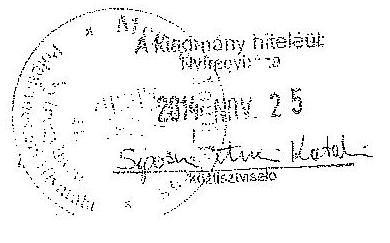

---

olyan cégből, amelynek Oros területére szolgáltatási kihatása nincs, ne kapjon vagyonrészt a település. A többi cég esetében a jogszabályok alapján kell megállapítani a felosztás arányát és megoldani az ilyenkor felvetődő összes kérdést. Összefoglalva tehát véleményünk szerint a település a leválást követő́e életképes lesz, de az ott lakók életminőségének nagymértékű javulására semmiféle garanciát nem látunk.

Dr. Gál György: A Városfejlesztési Bizottság is megtárgyalta a részanyagokat, és arról nyilvánított véleményt, hogy elfogadja-e válaszként az előkészítő bizottság anyagára.

Jánócsik Csaba: Azt látom problémának, hogy a leválást szorgalmazók és a lakók egy része csak azt nézi, miben járnának jól, ha Oros leválna, de nem nézik, miben járnának rosszul. Nyíregyháza anyagilag nem járna rosszul, mert a külsó városrészek fenntartása mindig többe került, így több marad a belvárosi területekre. De az Oroson lakóknak mégiscsak városi rangot adott a Nyíregyházához való tartozás és meggyőződésem, hogy veszítenének a leválással.

Hegedűs László: Sokan attól tartanak, hogy a leválás után ingatlanuk veszít az értékéből.
Tormássi Géza: A bizottság kompetenciájába tartozó, közszolgáltatást végző cégek esetében egyetérthetünk azzal, hogy a nyomvonalas létesítményből kimutathatók az ott megtestesülő vagyontestek. A közszolgáltatásokat ezek a cégek elvileg tovább végezhetik Oroson, de arra nem tudunk pillanatnyilag válaszolni, hogy a jogszabályok alapján hogyan fognak tudni közszolgáltatási szerződéseket kötni, szükség lesz-e közbeszerzési pályázatra. Meg kell állapodni abban, hogy a megalakuló önkormányzat milyen elvek alapján szerezhet vagyonrészt a köztizemi szolgáltató cégekben. Nem fogadható el, hogy olyan cégekben kapjon vagyonrészt, amelyeknek a szolgáltatási területe nem terjed ki Orosra. Ilyen például a NYÍRTÁVHÓ Kft, amely soha nem kapott támogatást a várostól. Problémát fog okozni, hogy a helyi tömegközlekedés csak a város közigazgatási határán belül múködhet.

A bizottság 8 igen szavazattal, 1 tartózkodással az alábbi határozatot hozta:

# Nyíregyháza Megyei Jogú Város   Közgyülése 

Közlekedési és Városüzemeltetési Bizottsága
31/2008. (III. 27.) számú
határozata
az Orosi Előkészítő Bizottság - Oros településrész leválásának kezdeményezésével kapcsolatos - javaslatára vonatkozó állásfoglalás kialakítására.

## A Bizottság

egyetért azzal, hogy a közszolgáltatások színvonalában érdemi előrelépés Oroson a leválás okán nem várható, mert várhatóan ugyanazok a cégek fogják ezeket végezni, mint eddig. Bizonyos

---

olyan cégből, amelynek Oros területére szolgáltatási kihatása nincs, ne kapjon vagyonrészt a település. A többi cég esetében a jogszabályok alapján kell megállapítani a felosztás arányát és megoldani az ilyenkor felvetődő összes kérdést. Összefoglalva tehát véleményünk szerint a település a leválást követően életképes lesz, de az ott lakók életminőségének nagymértékủ javulására semmiféle garanciát nem látunk.

Dr. Gál György: A Városfejlesztési Bizottság is megtárgyalta a részanyagokat, és arról nyilvánított véleményt, hogy elfogadja-e válaszként az előkészítő bizottság anyagára.

Jánócsik Csaba: Azt látom problémának, hogy a leválást szorgalmazók és a lakók egy része csak azt nézi, miben járnának jól, ha Oros leválna, de nem nézik, miben járnának rosszul. Nyíregyháza anyagilag nem járna rosszul, mert a külső városrészek fenntartása mindig többe került, így több marad a belvárosi területekre. De az Oroson lakóknak mégiscsak városi rangot adott a Nyíregyházához való tartozás és meggyőződésem, hogy veszítenének a leválással.

Hegedűs László: Sokan attól tartanak, hogy a leválás után ingatlanuk veszít az értékéből.
Tormássi Géza: A bizottság kompetenciájába tartozó, közszolgáltatást végző cégek esetében egyetérthetünk azzal, hogy a nyomvonalas létesítményből kimutathatók az ott megtestesülő vagyontestek. A közszolgáltatásokat ezek a cégek elvileg tovább végezhetik Oroson, de arra nem tudunk pillanatnyilag válaszolni, hogy a jogszabályok alapján hogyan fognak tudni közszolgáltatási szezződéseket kötni, szükség lesz-e közbeszerzési pályázatra. Meg kell állapodni abban, hogy a megalakuló önkormányzat milyen elvek alapján szerezhet vagyonrészt a közlizemi szolgáltató cégekben. Nem fogadható el, hogy olyan cégekben kapjon vagyonrészt, amelyeknek a szolgáltatási területe nem terjed ki Orosra. Ilyen például a NYÍRTÁVHÓ Kft, amely soha nem kapott támogatást a várostól. Problémát fog okozni, hogy a helyi tömegközlekedés csak a város közigazgatási határán belül múködhet.

A bizottság 8 igen szavazattal, 1 tartózkodással az alábbi határozatot hozta:

# Nyíregyháza Megyei Jogú Város   Közgyűlése 

## Közlekedési és Városüzemeltetési Bizottsága 31/2008. (III. 27.) számú

## határozata

az Orosi Előkészítő Bizottság - Oros településrész leválásának kezdeményezésével kapcsolatos - javaslatára vonatkozó állásfoglalás kialakítására.

## A Bizottság

egyetért azzal, hogy a közszolgáltatások színvonalában érdemi előrelépés Oroson a leválás okán nem várható, mert várhatóan ugyanazok a cégek fogják ezeket végezni, mint eddig. Bizonyos

---

szolgáltatások tekintetében (pl. tömegközlekedés) vetődhetnek fel problémák. Nagyon sok a jogi bizonytalanság a közüzemi fejlesztések tekintetében. Nem fogadható el, hogy olyan cégekben kapjon vagyonrészzt, amelyeknek a szolgáltatási területe nem terjed ki Orosra.

Tizedik napirendi pontként tárgyalja a bizottság az AGORA címú pályázati program benyújtására vonatkozó előterjesztést. (I. forduló)

Palicz György: A Kulturális Bizottság módosításként javasolja kivenni az előterjesztésből, hogy a szükséges saját erő biztositása a Kölyökvár eladásából történjen.

A bizottság 9 igen szavazattal az alábbi határozatot hozta:
Nyíregyháza Megyei Jogú Város
Közgyülése
Közlekedési és Városüzemeltetési Bizottsága
32/2008. (III. 27.) számú
határozata
az AGORA címú pályázati program benyújtására. (I. forduló)

# A Bizottság 

az elhangzott módosítással elfogadásra javasolja a Közgyűlésnek az előterjesztést.
Tizenegyedik napirendi pontként tárgyalja a bizottság az iparosított technológiával épült lakóépületek energiatakarékos felújításának támogatásáról szóló rendelet megalkotására vonatkozó előterjesztést.

Nagy Péter: Szóban röviden ismertette az előterjesztést.
A bizottság 9 igen szavazattal az alábbi határozatot hozta:
Nyíregyháza Megyei Jogú Város
Közgyülése
Közlekedési és Városüzemeltetési Bizottsága
33/2008. (III. 27.) számú
határozata
az iparosított technológiával épült lakóépületek energiatakarékos felújításának támogatásáról szóló rendelet megalkotására.

---

# A Bizottság 

az elfogadásra javasolja a Közgyưlésnek az elôterjesztést.
Tizenkettedik napirendi pontként tárgyalja a bizottság a 2008. évi intézményi felújítási feladatok pályáztatására vonatkozó előterjesztést. (I. ütem.)

Béres Csabáné: Szóban röviden ismertette az előterjesztést.
Soltész József: Az elökészitő munka nagyon alapos és jó színvonalú volt.
A bizottság 9 igen szavazattal az alábbi határozatot hozta:
Nyíregyháza Megyei Jogú Város
Közgyülése
Küzlekedési és Városüzemeltetési Bizottsága
34/2008. (III. 27.) számú
határozata
a 2008. évi intézményi felújítási feladatok pályáztatására. (I. ütem)

## A Bizottság

az elfogadja az elöterjesztést.
Tizenharmadik napirendi pontként tárgyalja a bizottság a FULLINVEST Zrt kérelméről szóló előterjesztést, a Nyíregyháza, Hunyadi utcában lévő 66/2 hrsz-ú ingatlanon építenôó társasházhoz szükséges parkolóhelyek számának csökkentése tárgyában.

Dr. Freidinger Renáta: „A belvárosi terek integrált funkcióbővítő fejlesztése Nyíregyházán" címú pályázati program benyújtásánál számoltunk ezzel a beruházással, tehát az önkormányzatnak érdeke, hogy ez a projekt bevonható legyen. A kérelmező megvásárol az önkormányzattól egy TIGÁZ szolgalmi joggal terhelt, körbezárt területet, melyet más célra egyébként sem tudnánk hasznositani, és ezen parkolóhelyeket alakít ki. Ezért kérjük, hogy a Bizottság támogassa az előterjesztést.

Tormássi Géza: A környéken rövid időn belül több mint 600 darab parkoló valósul meg, tehát lesz lehetőség a parkolásra akkor is, ha a kérelemben szereplő 10 parkolóhely nem valósul meg.

A bizottság 9 igen szavazattal az alábbi határozatot hozta:

---

# A Bizottság 

az elfogadásra javasolja a Közgyưlésnek az elöterjesztést.
Tizenkettedik napirendi pontként tárgyalja a bizottság a 2008. évi intézményi felújítási feladatok pályáztatására vonatkozó előterjesztést. (L ütem.)

Béres Csabáné: Szóban röviden ismertette az előterjesztést.
Soltész József: Az előkészítő munka nagyon alapos és jó színvonalú volt.
A bizottság 9 igen szavazattal az alábbi határozatot hozta:
Nyíregyháza Megyei Jogú Város
Közgyűlése
Közlekedési és Városüzemeltetési Bizottsága
34/2008. (III. 27.) számú
határozata
a 2008. évi intézményi felújítási feladatok pályáztatására. (L ütem)

## A Bizottság

az elfogadja az előterjesztést.
Tizenharmadik napirendi pontként tárgyalja a bizottság a FULLINVEST Zrt kérelméről szóló előterjesztést, a Nyíregyháza, Hunyadi utcában lévő 66/2 hrsz-d ingatlanon építendő társasházhoz szükséges parkolóhelyek számának csökkentése tárgyában.

Dr. Freidinger Renáta: „A belvárosi terek integrált funkcióbővítő fejlesztése Nyíregyházán" címú pályázati program benyújtásánál számoltunk ezzel a beruházással, tehát az önkormányzatnak érdeke, hogy ez a projekt bevonható legyen. A kérelmező megvásárol az önkormányzatról egy TIGÁZ szoigalmi joggal terhelt, körbezárt területet, melyet más célra egyébként sem tudnánk hasznosítani, és ezen parkolóhelyeket alakít ki. Ezért kérjük, hogy a Bizottság támogassa az előterjesztést.

Tormásai Géza: A környéken rövid időn belül több mint 600 darab parkoló valósul meg, tehát lesz lehetőség a parkolásra akkor is, ha a kérelemben szereplő 10 parkolóhely nem valósul meg.

A bizottság 9 igen szavazattal az alábbi határozatot hozta:

---

# Nyíregyháza Megyei Jogú Város   Közgyưlése 

Közlekedési és Városüzemeltetési Bizottsága
35/2008. (III. 27.) számú
határozata
a FULLINVEST Zrt kérelméről a Nyíregyháza, Hunyadi utcában lévố 66/2 hrsz-ú ingatlanon építendô társasházhoz szükséges parkolóhelyek számának csökkentése tárgyában

## A Bizottság

Hozzájárul a Nyíregyháza, Hunyadi utcában lévố 66/2 hrsz-ú ingatlanon építendô társasházhoz szükségea 118 db parkolóhely számának 108-ra történő csökkentéséhez.
kmft.

## Márki János

bíz. titkára

## Tormássi Géza

bíz. elnöke

---

# Jelentéti iv 

a Küzlekedési és Városüzemeltetési Bizottság. 1208. MARCUS 27. -i üléséröl.
1./Tormásai Géza képviselö
2./Jánócsik Csaba képviselö
3./Dévényi József képviselö
4./Aranyos Gábor képviselö
5./ Lengyel Károly képviselö
6./ Palicz György képviselö
7./Jászai Menyhért képviselö
8./Soltész József
9./Hegedüs László
10./Szücs István
11./Vinginder Tibor
12./Bakosi Benjámin
13./Molnár Béla

## Meghivattak: név:

1./ Giba Tamás alpolgármester
2./ Bornemisza Andrea
3./ Pelbormana Endre
4./ 38. Gili Giórgy
5./ Hecf 4. 4. 4. 4. 5.
6./ TABERAS TALONO
7./ HARORUZ RUDOLZ IR. 3 V
8./ BELUS TAMAS
9./ Gozla isecin
10./ Solom Calla
11./ Jarsz 1. 1. 1. 1. 1.
12./ HOSUZ 1. 1. 1. 1. 1. 1.
13./ Gozlo 1. 1. 1. 1. 1. 1. 1. 14./ Hégis C. 1. 1. 1. 1. 1. 15./ Lécs 2. 2. 2. 2. 2. 2. 16./...hicgy 1. 1. 1. 1. 1. 17./
18./
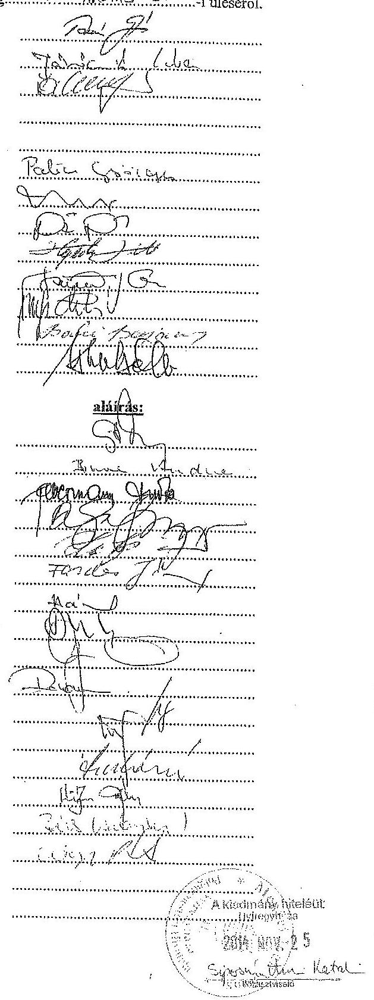

---

# Jelenlétiliv 

a Közlekedési és Városítzemeltetési Bizottság. 2008. Hakoma 22. -i üléséről.
1./ Tormásai Géza képviselő
2./ Jánócsik Csaba képviselö
3./ Dévényi József képviselö
4./ Aranyos Gábor képviselö
5./ Lengyel Károly képviselö
6./ Palicz György képviselö
7./ Jászai Menyhért képviselö
8./ Soltész József
9./ Hegedüs László
10./ Szöcs István
11./ Vinginder Tibor
12./ Bakosi Benjámin
13./ Molnár Béla

## Meghivattak: név:

1./ Giba Tamás alpolgármester
2./ Bornemisza Andrea
3./ Pelbrmana Eudre
4./ 21. sal György
5./ Hecs? Fáres
6./ TAHERAS FALOUS
7./ Hrhuolous Runei $7 . \mathrm{REV}$
8./ BELUS TAMAS
9./ Gosta Istoin
10./ Paken Gilla
11./ Ispati
12./ Hcancz istiog
13./ Grabó Istiome
14./ Hígis Cajon
15./ LETEZ TAMAS
16./ Nayfeter
17./
18./
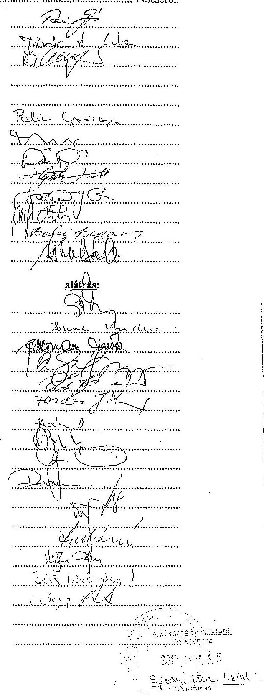

---

# Jegyzökögry 

a Közlekedési és Városüzemeltetési Bizottság 2009. február 26-i üléséröl.
Jelen vannak: a jelenléti íven felsoroltak.
A bizottság a napirendet 10 igen szavazattal elfogadta.
Első napirendi pontként tárgyalja a bizottság a NYÍRTÁVHŐ Kft 2009. évi üzleti tervének elfogadására vonatkozó előterjesztést.

Gerda István: A FEB 2009. február 18-i ülésén 3 igen, 1 nem szavazattal, 1 tartózkodással elfogadásra javasolta az üzleti tervet.

Tormássi Géza: Mennyi most a kintlévöségek összege? Mekkora a 2008. decemberi áremelés áthúzódó halása? A szórólapos reklám hány új fogyasztó jelenlázzését eredményezte? A 18. oldalon és a 34. oldalon található árbevételi tervszámok véleményem szerint nem egyeznek. A távhő ártámogatás rendszerének 2008. év végi változása a tőkeszolgálati tervnél több kamat-ráfordítást indukál. Ez mekkora összeg? A gáz árának liberalizációja nem fog-e drágulást okozni, mint a villamos energia esetében? Marad-e a cég létszáma és mekkora a béremelés hatása?

Gerda István: 2008-ban 3 alkalommal volt távhő díjemelés, mely összesen 28\%-ot tesz ki. A lakossági gázfogyasztóknál az áremelés mértéke $30 \%$. Az átlag áremelés mértéke a távhődíjaknál $12 \%$, a gázfogyasztóknál $17 \%$-ot tett ki az elmúlt évben. Az áremelés hatására a tavalyi $4,2 \mathrm{mdFt}$ árbevétel helyett 4,8 mdFt árbevétellel kalkulálunk. Alapdíj növekménnyel és az általános költségek növekedésével nem számoltunk. Beszállítóinkkal sikerült a tavalyinál alacsonyabb, vagy változatlan árakban megállapodni, esetleg inflációkövető áremelést fogadtunk el. A költségeink a tavalyihoz képest stagnálnak, vagy csökkennek. Cégen belül továbbra is erősítjük a költséghatékonyságot. A tervezett nyereség 125 mFt , ami nagyon szerény mértékủ. A díjemeléstinknek 2008 -hoz képest lesz egy olyan áthúzódó hatása, hogy a fogyasztók költségei növekedni fognak. Tavaly bruttó 220000 Ft volt egy távhős átlagos lakás éves költsége. Most 237000 Ft költség várható. A növekmény a hő̉díj emelkedéséből adódik. A támogatásban részesülő fógyasztóink között vannak olyanok, akik ugyanannyit, vagy kevesebbet fizetnek az áremelés után is, de ez csak kb. 8000 fogyasztót érint. A lakossági fogyasztók körében az év végén 240 mFt volt a kintlévöség, ami 100 mFt csökkenést jelent. Ez köszönhető a támogatásnak és a hatékonyabb behajtásnak. A külső tényezők hatására feltehetően romlani fog a fogyasztók fizetési hajlandósága. Müködésünk biztosítására banki folyószámla hitelkeretünket tudjuk felhasználni. A jogszabályok szerint 2009. július 1-től liberalizált lesz a gázpiac, de azzal számolunk, hogy kedvezőbb feltételekkel tudunk majd szerződni a beszállítókkal. Az idei bérköltségünk azonos a tavalyival, mert 5 fővel csökkent a létszámunk. Tervünkben 4\% bémövekménnyel számolunk, melyet július 1-től kívánunk alkalmazni, ha a gazdálkodásunk engedi. Marketing tevékenységünk eredményeként a fogyasztói teljesítményigény 6 MW -al nőtt. Megkereszük meglévő fogyasztóinkat is évente kétszer, hogy tájékoztassuk őket az energiafelhasználásukról.

Polom Csilla: A 18. oldalon megtalálható árbevételeink részletezése a számviteli törvénynek megfelelően. Az 1. számú melléklet pedig a költségosztós, illetve nem költségosztós fogyasztókra megbontva tartalmazza ugyanezt. A 60 mFt -os engedmény az alapdijnál szerepel részletezve.

---

Tormássi Géza: A lakásoknak hány százaléka nincs még benne a NYITÁS Programban? Hallottam, hogy a nagy tartozók nem egyeznek bele a részvételbe. Hogyan lehetne ezt kezelni, hogy minél több lakás legyen benne a programban? A KEOP pályázatok hogy állnak?

Gerda István: A KEOP pályázataink közül az egyik a gázos intézményeink földgáz energia kiváltási projektje. Megújuló energiákkal földgázt tudunk kiváltani. Amennyiben sikeres lesz, akkor több intézményre is ki akarjuk terjeszteni. A másik projekt az Északi körút térségében höközpontok és vezetékek rekonstrukciója. A NYITÁS Programban a fogyasztók $90 \%$-a részt vesz, és jelenleg is van érdeklődés. A nagy összeggel tartozókat nem vettük eddig külön. Sajnos a fogyasztók fizetési hajlandósága az utóbbi időben romlott, ez vonatkozik a NYITÁS Programban résztvevőkre is.

Jánócsik Csaba: Az IVS keretében több belvárosi épület rekonstrukciója meg fog történni. Ennek kapcsán az épület előtt haladó távhő vezeték rekonstrukciója is megtörténhetne.

Gerda István: Idén egy új vezetéket építünk az Okmányirodának. A meglévő vezetékeinket rendszeresen vizsgáljuk, hogy vizsgáljuk az állapotukat a meghibásodások megelőzésére.

Tormássi Géza: A médiákban hallottuk, hogy a FÖTÁV csökkentette az árait. Erre van-e lehetőség nálunk?

Gerda István: A tervet úgy állítottuk össze, hogy az alapdíjat nem növeljük, de csökkentésre nincs lehetőségünk.

Soltész József: Az üzleti tervekben a két legnagyobb költségtétel az általános és a személyi költség. Ezért hiányolni szoktam a létszámgazdálkodás és a bérköltségek részletes ismertetését. Ebben az anyagban megtaláltam ezeknek a rövid ismertetését és ki tudtam számolni az engem érdeklő dolgokat.

A bizottság 4 igen, 3 nem szavazattal, 2 tartózkodással az alábbi határozatot hozta:
Nyíregyháza Megyei Jogú Város
Közgyülése
Közlekedési és Városüzemeltetési Bizottsága
6/2009. (II. 26.) számú
határozata
a NYÍRTÁVHŐ Kft 2009. évi üzleti tervének elfogadására.

# A Bizottság 

nem javasolja elfogadásra az előterjesztést a Közgyülésnek.
A szavazásnál 9 fő volt jelen.
Második napirendi pontként tárgyalja a bizottság a Szabolcs-Szatmár-Bereg Megyei Temetkezési Vállalat 2009. évi üzleti tervének elfogadására vonatkozó előterjesztést.

---

# 4. SZAMÚ MELLÉKLET A V-OS21-153/2014. SZAMÚ JELENTÉSHEZ 

Tormássi Géza: A rendőrség részére történő szállítás megszủnése mekkora bevételkiesést okoz?
Szekrényes András: Kb. 4 mFt-tól esünk el, ugyanis korábban a rendőrségi ügyekben Nyíregyházán kellett a boncolásokat elvégezni. Most Debrecenben végzik, de a szállitást a rendörség megpályáztatta és odaadta valakinek. A visszaszállítást a hozzátartozóknak ki kell fizetni, ami így sokkal drágább. Az országban mindenhol visszaállították a korábbi rendet, mert nem vált be, egyedül itt maradt így. Ráadásul a rendörségnek sem kerül kevesebb́e, mint elötte. Polgármester Asszony tájékoztatott, hogy megpróbál ezen változtatni.

Bornemisza Andrea: Jó megoldás-e, hogy a balesetveszélyes síremlékekre felhívást helyeznek ki? Elég nagy felzúdulást váltott ki. A hozzátartozók levélben történő értesítése nem lenne jobb?

Szekrényes András: Mi a halottakat tartjuk nyilván és nem a hozzátartozókat. Ha elköltöznek, nem tudjuk a címüket. Mindent végiggondoltunk és ezt találtuk megfelelő megoldásnak. A nagyon balesetveszélyes sírköveket beszállítjuk hozzánk. Ezért mi felelősek vagyunk. Az országban példaértékűnek tartják ezt a lépésünket. A sírhely felett rendelkezőknek vannak kötelezettségei is, nekünk pedig muszáj őket felszólítanunk.

Jánócsik Csaba: Örülök annak az ügyfélbarát gondolkodásnak, amelyet az üzleti tervben megfogalmaztak. A kegyeleti célokra vásárolt gépjárművek után vissza lehet már igényelni az ÁFA-t? A temető kerítésére nem lehetne a borostyánt ismét felfuttatni?

Aranyos Gábor eltávozott, így a bizottság létszáma 9 före változott.
Szekrényes András: A halottszállító gépkocsik a vámtarifa szám alapján változatlanul személygépkocsinak minősülnek, pedig semmi másra nem lehet ezeket használni. A súlyadót is fizetnünk kell. A Pénzügyminisztériumnál reklamációnkra azt válaszolják, hogy joghézag van. A kerítéseknél a borostyánt a látogatók kihúzzák, de kiírtuk, hogy ingyen adunk, akinek kell.

A bizottság 9 igen szavazattal az alábbi határozatot hozta:
Nyíregyháza Megyei Jogú Várus
Közgyülése
Közlekedési és Városüzemeltetési Bizottsága
7/2009. (II. 26.) számú
határozata
a Szaboles-Szatmár-Bereg Megyei Temetkezési Vállalat 2009. évi üzleti tervének elfogadására.

## A Bizottság

elfogadásra javasolja az előterjesztést a Közgyűlésnek.
Harmadik napirendi pontként tárgyalja a bizottság a Nyíregyházi Informatikai Nonprofit Kft 2009. évi üzleti tervének elfogadására vonatkozó előterjesztést.

---

# 4. SZAMÚ MELLÉKLET A V-0521-153/2014. SZAMÚ JELENTÉSHEZ 

Tormássi Géza: A cég létszámbővítésének okáról kérnénk tájékoztatást.
Bodnár János: A hivataltól azt a feladatot kaptuk, hogy digitalizáljuk az irattár teljes iratanyagát. Ennek előnye, hogy sokkal kevesebb papíralapú iratra lesz szükség, és a visszakeresés is egyszerübb. A feladatnak megfelelően módosítottuk a hivatalnál kötött szolgáltatási szerződést. Olyan személyeket vettünk fel, akik a hivatalban dolgoztak közhasznú munkásként, de lejárt a szerződéstik, így munkanélkülivé váltak volna. Örömmel vettem fel őket, mert jól ismerik a hivatal múködését, iktatási rendszerét.

Tormássi Géza: Az elektronikus közgyűlési és bizottsági anyag kiküldés mennyi többletmunkát jelent a cégnek?

Bodnár János: A törvény értelmében 2007. január 1-től a közgyűlési előterjesztések anyagát már felteszszük az internetre, tehát különösebb többletmunkát nem jelent számunkra. A bizottsági anyagok jelentenek többlet feladatot, és ebből is a zárt ülések anyaga miatt kellett az eddigi rendszerünkön változtatni. Sok kérdés merült fel a képviselők és a bizottsági tagok részéről, de mindenben segítünk. Az anyagokat szinimelés után pdf formátumban tesszük fel az internetre, hogy a hitelességet minél jobban biztosítsuk. Felmerült olyan kérés, hogy a közgyűlési anyag egyben is letölthető legyen, ezt is biztosítani fogjuk.

Jánócsik Csaba: A letöltési oldalon, a világoskék háttéren nagyon rosszul látszanak a fehér betűk, ezen módosítani kellene. Az anyagokban található képeket jó lenne olyan helyzetben felrakni az internetre, hogy megtekintéskor ne kelljen forgatni. A költségvetésben láttam a cég költségsorán pályázati pénzt, de itt nem találom.

Bodnár János: A megkapott anyagokba mi nem nyúlunk bele. A felvetést továbbítani fogom a közgyűlési csoportnak. Tavaly az önkormányzat nyert pályázaton 50 mFt -ot a Polgármesteri Hivatal átvilágítására és müködésének korszerűsítésére. Saját erővel együtt ez összesen 55 mFt . A pályázatot mi dolgoztuk ki, de nem tartozhat hozzánk ez a pénz. Ezért nem szerepel az üzleti tervben.

A bizottság 9 igen szavazattal az alábbi határozatot hozta:
Nyíregyháza Megyei Jogú Város
Közgyülése
Közlekedési és Városüzemeltetési Bizottsága
8/2009. (II. 26.) számú
határozata
a Nyíregyházi Informatikai Nonprofit Kft 2009. évi üzleti tervének elfogadására.

## A Bizottság

elfogadásra javasolja az előterjesztést a Közgyűlésnek.
Negvedik napirendi ponthént tárgyalja a bizottság a Nyírségi Ivóvízminőség-javító Önkormányzati Társulás létrehozására vonatkozó előterjesztést.

Giba Tamás, Vadnay Ákos: Szóban röviden ismertették az előterjesztést.

---

# 4. SZÁMÚ MELLÉKLET 

A V-0521-153/2014. SZÁMÚ JELENTÉSHEZ

Tormássi Géza: A Városfejlesztési Bizottság azt a módosító javaslatot tette az elöterjesztéssel kapcsolatban, hogy mielőtt a társulás létrejön és az aláírások megtörténnek, kerüljön vissza pontositásra és egyeztetésre a Közgyülés és a bizottság elé az anyag.

Jánócsik Csaba: Azért javasoltuk ezt, mert az érintett 47 település még ezután fogja jóváhagyni az előterjesztést, vagy módosítási javaslattal élni. Elindítjuk a munkát, és az egyeztetések megtörténte után kerüljön vissza a Közgyülés elé az anyag.

Tormássi Géza: Az állami vagyon esetében ki állja az önrészt?
Dr. Csebi Roland: Az államra közel 1 mdFt összegủ beruházás rész esik. Az előkészítés során már a NYÍRSÉGVÍZ Zrt-vel és a Magyar Állam képviselőjével, a Vagyongazdálkodási Tanáccsal ismertettünk. Ök azt fogalmazták meg, hogy ahhoz, hogy ebben döntés születhessen résztükröl, egy megalapozott anyagot kell letennünk. Többek között pályázati dokumentációt, tervezői költségvetést, melyek alapján meg tudják hozni a döntést.

Vadnay Ákos: A fejlesztésből 700 mFt jut a kótaji vízműre. A minisztérium kért tőlünk egy előzetes anyagot, hogy mennyi lesz a jelenleg futó vízminőség-javító program állami önrésze, hogy a költségvetésbe be tudják tenni. Akkor ezt mi 190 mFt-ra becsültük. A jelenlegi gazdasági helyzetben azonban nem biztos, hogy ez bekerült a költségvetésbe. Nagyobb esély van arra, hogy ezt a NYÍRSÉGVÍZ-nek kell állnia. Az anyagban van még egy nem támogatandó, 300 mFt -os tétel, ami szerintünk irreális. Ezért mondom, hogy ezek a háttéranyagok még nem teljesen véglegesek.

Giba Tamás: Folynak háttértárgyalások arra vonatkozóan, hogy a NYÍRSÉGVÍZ által kezelt, állami tulajdonú műveknek esetleges önkormányzati tulajdonba vétele hogyan történhetne meg. A program előrehaladásával párhuzamosan a tárgyalások végére is pontot kell tenni és akkor az önrész kérdése is egyszerübbé válik majd.

Tormássi Géza: Egy sárga könyves tendereztetés és egy feladat visszabizás esetén milyen módon érvényesül a NYÍRSÉGVÍZ aktív szakmai közremüködése, illetve a társulás érdekérvényesitő képessége?

Hajzer Gábor: Az eddigi egyeztetések alapján a visszahozott anyagban is lehetnek olyan módosítások, illetve van lehetőségünk, hogy azokon a területeken, ahol szükséges, piros könyves tenderfüzet összeállitásáról döntsünk. Ezeknek a finanszírozási feltételei az előkészítés oldaláról részben biztosítottak, más részét pedig a társulásnak saját erőként kell biztosítania. A társulásban meghozott döntésünktől függ, hogy melyik utat járjuk. De ehhez a társulásnak meg kell lennie.

Molnár Béla: A program ideje alatt és utána is szükség van megfelelő laboratóriumra van szükség, hogy az analíziseket el tudják végezni a beruházás hatékonyságának kimutatásához. Jut-e pénz a beruházásból a NYÍRSÉGVÍZ laboratóriumának fejlesztésére?

Vadnay Ákos: Nem, mert ebből a pénzből technológiát lehet korszerüsíteni, illetve maximum $20 \%$ erejéig lehet hálózat rekonstrukciót végezni. A laborvizsgálatokat a NYÍRSÉGVÍZ laboratóriuma meg tudja oldani a jelenlegi felszerelésével.

A bizottság 9 igen szavazattal az alábbi határozatot hozta:

---

# Nyíregyháza Megyei Jogú Város   Közgyülése 

## Közlekedési és Városüzemeltetési Bizottsága 9/2009. (II. 26.) számú határozata

a Nyírségi I vóvizmínőség-javító Önkormányzati Társulás létrehozására.

## A Bizottság

elfogadásra javasolja az előterjesztést a Közgyűlésnek, a Városfejlesztési Bizottságnak azzal a módosító javaslatával, hogy mielőtt a társulás létrejön és az alárások megtörténnek, kerüljön vissza pontositásra és egyeztetésre a Közgyülés és a bizottság elé az anyag.

Ötödik napirendi pontként tárgyalja a bizottság az ágazati és regionális operatív programok 2009-2010es akciótervei alapján tervezett pályázatokra vonatkozó előterjesztést.

Giba Tamás: Szóban röviden ismertette az előterjesztést.
Tormásai Géza: A települési bel- és külterületi vízrendezés kérdésében komoly előrelépés várható, ha úgy döntünk, és sikeres a pályázatunk. A VOLÁN mekkora összeggel kíván részt venni a tömegközlekedést érintő programban?

Giba Tamás: A vízügyi igazgatóságok és az önkormányzatok pályázatai részére külön-külön keret áll rendelkezésre. A csapadékvíz elvezetésre vonatkozó önkormányzati pályázatokra kb. 3 mdPt áll rendelkezésre. Költségvetésünk tartalmaz egy előkészítési munkát a Kert u. és környéke, Móricz Zsigmond u. és környéke gerincevzetékének megvalósítására. A tömegközlekedés fejlesztésére vonatkozó pályázatból jármủ beszerzést nem lehet finanszírozni. A buszmegállók, buszöblök korszerúsítésére 400 mFt -ot nyertünk. Körvonalazódik egy forgalomirányító rendszeres program pályázata. A VOLÁN arra is gondol, hogy esetleg ő lenne a pályázó és önállóan hajtaná végre ezt a programot.

Bornemisza Andrea: A saját erő biztosításához 2,5-3 mdFt értékủ kötvény, hosszúlejáratú beruházási hitel, vagy MNB fejlesztési hitel lenne a forrás. Tehát a pályázati saját erő nem áll rendelkezésre. A pályázatok nyertek, illetve második forduló előtt állnak, rásdásul később a müködési költséget is növelik. Az önkormányzat pénzügyi helyzetében megfelelően átgondoltak-e ezek a pályázatok? Nem túlzottak-e ezek a beruházások, ha nem áll rendelkezésre a saját erő?

Giba Tamás: A nyertes pályázatoknál rendelkezünk a saját erővel. A később benyújtandó pályázatoknak nincs meg a saját forrása. A felsorolt pályázatok saját erő szükséglete $2,5-3 \mathrm{mdFt}$, de elfogadott akciótervek, illetve pályázati kiírások még nincsenek. A végleges kiírásokban lehetnek finomítások, például a saját erő igényben lehetnek eltérések. Ha biztosítunk hosszútávú visszafizetési lehetőséget igénylő saját forrást, akkor sem projektenkénti kötvénykibocsátás lenne célszerü, hanem egyszerre kell kibocsátani, hogy egy keretőszzeg álljon a rendelkezésünkre. Az előterjesztésnek a célja az is, hogy a Közgyülés nézze meg, mekkora nagyságrendủ összeget fogad el ahhoz, hogy a pályázati lehetőségekre tudjunk mozdulni.

---

Jánócsik Csaba: Az anyag bemutatja a jelenleg folyamatban lévô lehetôségeket és az újakat. Most az újaknak van jelentôségük, a 2009-2010 körül benyújtandó pályázatoknak. Arról kell dönteni, hogy ezeket a pályázatokat nyújtsuk be, ehhez azonban további egyeztetések lehetnek szükségesek. Minden szempontot figyelembevéve mérlegelni kell, hogy milyen fejlesztéseket valósitunk meg. Az elökészitő munka induljon el, és amikor olyan stádiumba kerülünk, hogy inditsuk-e a pályázatot, akkor a város helyzete alapján döntünk a benyújtásról. Kérem, hogy a bizottság támogassa, hogy az elökészitő munka elinduljon.

Tormássi Géza: Egyetértek azzal, hogy bizonyos fejlesztésekre most van lehetôség. Valóban figyelni kell arra, hogy minden egyes fejlesztés üzemeltetési vonatkozással is bir. Minden olyan jellegủ fejlesztést célszerủ támogatni, ami életminőséget javit. A felsorolt pályázati lehetôsségek nagy része ilyen. Ha van olyan pályázat, amelynél a saját erôi nem nekünk kell biztosítani, hanem más cég ezt felvállalja, akkor az egyeztetéseket le kell erről folytatni. Az elöterjesztést -klemelten az életminőséget javitó pályázatokat- támogatni tudom. Az AGÓRA pályázat korábban már nyert. Ha változás lesz ebben, akkor, akkor az ott lévô kötvénymennyiség felhasználható a következô csomaghoz?

Orba Tamás: Aliba az irányba haladunk, hogy egy kisebb önerőt igénylő AGÓRA program valósulhasson meg. Viszont az AGÓRA saját ereje pillanatnyilag nem áll rendelkezésre.

A bizottság 7 igen szavazattal, 1 tartózkodással az alábbi határozatot hozta:

# Nyíregyháza Megyei Jogú Város   Közgyülése 

Közlekedési és Városüzemeltetési Bizottsága
10/2009. (II. 26.) számú
határozata
az ágazati és regionális operatív programok 2009-2010-es akciótervei alapján tervezett pályázatokra.

## A Bizottság

elfogadásra javasolja az elöterjesztést a Közgyülésnek.
A szavazásnál 8 fô volt jelen.
Hatodik napirendi pontként tárgyalja a bizottság a Nyíregyháza, Közösségi közlekedés infrastruktúrájának fejlesztése kiviteli tervének elkészitésére, kivitelezésére és járulékos munkái elvégzésére kiírt közbeszerzési pályázat ajánlatainak elbírálására vonatkozó elöterjesztést.

Hajzer Gábor: Szóban röviden ismertette az elöterjesztést.
Palicz György: Furcsa, hogy ilyen nagy különbség van a három ajánlat között azonos mûszaki tartalom mellett.

Hajzer Gábor: A tervezôi költségvetéshez az általunk nyertesként kihirdetett társaság ajánlata áll sokkal közelebb.

---

# 4. SZAMÚ MELLÉKLET A V-0521-153/2014. SZAMÚ JELENTÉSHEZ 

Giba Tamás: A pályázat lehetővé teszi, hogy a fennmaradó pénz erejéig bővítsük a programot az újonnan felmerült igényekkel. Ezért is lenne kedvező, hogy ha ez a konzorcium lenne a nyertes.

A bizottság 7 igen szavazattal, 2 tartózkodással az alábbi határozatot hozta:

## Nyíregyháza Megyei Jogú Város   Közgyülése

Közlekedési és Városüzemeltetési Bizottsága
11/2009. (II. 26.) számú
határozata
a Nyíregyháza, Közösségi közlekedés infrastruktúrájának fejlesztése kiviteli tervének elkészitésére, kivitelezésére és járulékos munkái elvégzésére kiírt közbeszerzési pályázat ajánlatainak elbírálására.

## A Bizottság

egyetért azzal, hogy a pályázat nyertese az RK 2009 Konzorcium legyen.
Hetedik napirendi pontként tárgyalja a bizottság a Nyíregyháza, Keleti körút kiviteli tervének elkészitése, kivitelezése és járulékos munkái elvégzése tárgyú nyílt közbeszerzési eljárás megindítására vonatkozó előterjesztést.

Hajzer Gábor: Szóban röviden ismertette az előterjesztést.
Tormássi Géza: Ennek az útvonalnak a megvalósítása nagyon fontos a város közlekedése szempontjából.
Molnár Béla: Nem biztos, hogy a legalacsonyabb összegủ ajánlat lesz a legjobb.
Hajzer Gábor: Közbeszerzési eljárásoknál vita tárgyát képezi, hogy a birálati szempontok között vagy az alkalmassági kritériumok között határozzunk meg olyan feltételeket, amelyek a kivitelezésre jelentkező cégek között egyfajta szűrőt állít fel. Próbáltunk ebben a kiírásban a pénzügyi és a műszaki alkalmassági feltételek körében olyan feltételeket támasztani, amely egy ekkora útnak a megépítéséhez felkészült cégeknek a jelentkezését biztosítja. A birálati szempontok között olyanokat jeleníthetünk meg, amelyek az ajánlat körébe tartoznak és objektíven értékelhetőek. Jellemzően a kötbér, a rövidebb teljesítési határidő és egyéb szempontok lehetnek ezek. Útépítésnél elégséges, ha erre felkészült cég jelentkezik és megfelelő, laborral tanúsíttatott minőséget teljesít. Ezt a módszert próbáltuk követni a kiírásban.

Tormásci Géza: Ez azt jelenti, hogy komplexitásában kell nézni a kiírást és abban az összganancia megvan arra, hogy ha a legalacsonyabb árajánlatot elfogadjuk, amögött megfelelő szakmai tudás és müszaki tartalom áll?

Hajzer Gábor: Így van, ezt próbáltam megfogalmazni.
Soltész József: A kiírást, föleg szakmai alkalmasság szempontjából nagyon jónak tartom.

---

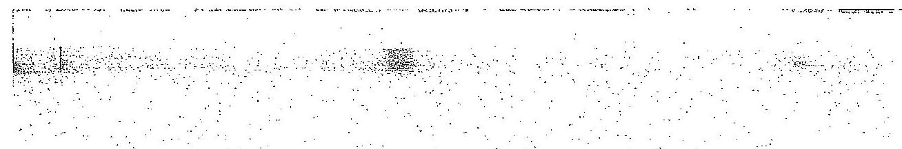

Szücs István: Fizettek már nekünk kötbért valaha a kivitelezök?
Hajzer Gábor: A szerződéses akarat kikényszeritésének sokféle eszköze van, az egyik a kötbér. Több esetben elöfordul, hogy egy cég késedelembe esik és a kötbér alól más munkák teljesitésével menekül. Az ajánlatkérő döntésén múlik, hogy a kötbérhez ragaszkodik, vagy a szerződés más típusú módosításához. Viszont ha nem kötünk ki ilyen lehetőséget, akkor semmilyen eszköz nincs a kezünkben.

A bizottság 8 igen szavazattal, 1 tartózkodással az alábbi határozatot hozta:
Nyíregyháza Megyei Jogú Város
Közgyütése
Közlekedési és Városüzemeltetési Bizottsága
12/2009. (II. 26.) számú
határozata
a Nyíregyháza, Keleti körút kiviteli tervének elkészitése, kivitelezése és járulékos munkái elvégzése tárgyú nyílt közbeszerzési eljárás megindítására.

# A Bizottság 

elfogadja az elöterjesztést.
kmft.

## Márki János

bíz. titkára

## 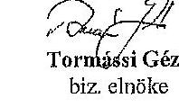

Tormiási Géza
bíz. elnöke

---

# Jelenléti iv 

a Közlekedési és Városüzemeltetési Bizottság
1./ Tormássi Géza képviselö
2./ Jánócaik Csaba képviselö
3./ Dévényi József képviselö
4./ Aranyos Gábor képviselö
5./ Lengyel Károly képviselö
6./ Palicz György képviselö
7./ Jászai Menyhért képviselö
8./ Soltész József
9./ Hegedüa László
10./ Szücs István
11./ Vinginder Tibor
12./ Bakosi Benjámin
13./ Molnár Béla

## Meghtvattak: név:

1./ Giba Tamás alpolgármester
2./ Bornemisza Andrea
3./ Dibanniriba
4./ Hith Yancs
5./ GERDA ISTVAN
6./ DEKRENYES ANDRAS
7./ 14. 14. 14. 14. 14. 14. 14. 14. 14. 14. 14. 14. 14. 14. 14. 14. 14. 14. 14. 14. 14. 14. 14. 14. 14. 14. 14. 14. 14. 14. 14. 14. 14. 14. 14. 14. 14. 14. 14. 14. 14. 14. 14. 14. 14. 14. 14. 14. 14. 14. 

---

# Jegyzökönyv 

a Közlekedési és Városüzemeltetési Bizottság 2010. február 25-i ütégerétt 1000 NOK 30 Jelen vannak: a jelenléti íven felsoroltak.

Első napirendi pontként tárgyalja a bizottság a települési szilárd hulladékkal kapcsolatos kötelező helyi közszolgáltatásról szóló 36/2002.(2003.L1.) KGY rendelet módosítására vonatkozó előterjesztést.

Romanovits István: Szóban ismertette az előterjesztést.
Palicz György: Ha egy régebben épült társasháznak nincs olyan helyisége, ahol a kukát el tudja helyezni, akkor is kell közterület-bérleti díjat fizetni?

Romanovits István: Ellenkezőleg, ha egy társasháznak van olyan helyisége, ahol a kukát el tudja helyezni, de mégsem ott tartja, akkor kell közterület-bérleti díjat fizetni. Ezt a közterületfelügyeletnek lenne joga ellenőrizni.

Jánócsik Csaba: Saját lakóközösségét hozta fel példának arra, hogy a kukákat nem a hulladéktároló helyiségben tartják. Ha a rendelet elfogadásra kerül, akkor várhatóan hatása lesz a lakóközösségekre.

A bizottság 6 igen szavazattal, 2 tartózkodással az alábbi határozatot hozta:
Nyíregyháza Megyei Jogú Város Közgyúlése
Közlekedési és Városüzemeltetési Bizottsága
7/2010. (II. 25.) számú
határozata
a telepiilési szilárd hulladékkal kapcsolatos kötelező helyi közszolgáltatásról szóló 36/2002.(2003.L1.) KGY rendelet módosítására.

## A Bizottság

elfogadásra javasolja a Közgyülésnek az előterjesztést.
A szavazásnál 8 fő volt jelen.
Második napirendi pontként tárgyalja a bizottság a Nyírinfo Informatikai Nonprofit Kft 2010. évi üzleti tervének jóváhagyására vonatkozó előterjesztést.

Bodnár János: A Felügyelő Bizottság megtárgyalta az előterjesztést és 2 igen szavazattal, 1 tartózkodással elfogadásra javasolta.

---

Palicz György: Érdeklődik, hogy napirenden van-e a cég megszüntetése és a polgármesteri hivatalon belül egy informatikai osztály megalakítása.

Jánócsik Csaba: Kérdése, hogy a kft tervei között szerepel-e, hogy a hivatal dolgozói flottakedvezménnyel vásárolhassanak mobiltelefont, melyet kedvezményes tarifával használhatnának és ök fizetnék a számlát is. Példaként említi a saját munkahelyén a dolgozók számára megvalósitott flottakedvezményt.

Tormássi Géza: A személyi jellegű ráfordítások növekedése 18\% a terv szerint. Ez miből tevődik össze? A pályázat megnyerése esetén tervezett létszámbővítés mit takar?

Bodnár János: Elmondta, hogy a cég munkatársainak van mobiltelefonja, melyen egymást ingyen hívják. Ezen kívül csak a munkájukhoz szükséges külső telefonszámokat tudják hívni. Tudomása szerint a hivatalnak van flottakedvezménye két cégnél is.

Csabai Lászlóné: Egy cégnél van a hivatalnak flottakedvezménye, melyet ki tudunk terjeszteni a képviselökre, ha erre igény van.

Bodnár János: A tavalyi bázis lett betervezve munkabérre. Azért nem egyezik a tavalyi tény az idei tervvel, mert mentek el tőlünk kolléganők szülési szabadságra, ezért bérmegtakarítás keletkezett. Az önkormányzat pályázatot adott be regionális szolgáltató központ kiépítésére. Amennyiben a pályázat nyer, akkor a központ müködtetését egy $100 \%$-ban önkormányzati tulajdonú cégre lehet csak rábízni, amely lehet a Nyírinfb Kft. Ezért szükség lehet 14-15 fös létszámbővítésre, hiszen a központ három megyét szolgálna ki számítástechnikai szolgáltatással. A pályázat beadását a Közgyűlés januárban megszavazta, támogatási értéke 1,5 mdFt. A létszámbővítés fokozatosan történne szeptembertől a jövő év közepéig, a feladatok bővülésének ütemében.

Csabai Lászlóné: Elmondta, hogy a régióból Hajdúszoboszló, Debrecen és Nyíregyháza adta be a pályázatot. A Regionális Fejlesztési Tanács mindhárom pályázatot 5 pontra értékelte. Jó ütemben halad a pályázatok szakmai értékelése, helyszíni szemlét is tartottak. Ha más város nyeri a pályázatot, akkor lehet gondolkozni a kft megszüntetésén, de most ennek nincs itt az ideje. Az 1,5 mdFt támogatás nem csak hozzánk kerül, érinti a programba bekapcsolódott településeket is. A központot úgy kell megvalósítani, hogy önfenntartó legyen, ne kerüljön pénzünkbe. A pályázat során nagyon korrekt együttmüködés valósult meg Debrecennel.

Tormássi Géza: Az önkormányzat költségvetése nem tartalmazza a cég müködéséhez szükséges forrásokat. A kft más forrásból biztosítja a hivatal részére megrendelt szolgáltatások és fejlesztések költségét, amíg a költségvetés módosításával a szükséges keret rendelkezésre nem áll.

Bodnár János: Ez már többéves gyakorlat, július vagy augusztus folyamán van lehetőség, hogy elszámoljunk a ráfordításainkkal. Ez általában nem nagy összeg. Egyéb szerződéses tevékenységeink fedezete biztosítva van a költségvetésben.

Aranyos Gábor: Javasolja, hogy a bizottság döntéssel erősítse meg, hogy történjenek jogi lépések a nyíregyhaza.eu domain-név városi tulajdonba kerülése érdekében. Nagy fontossága lenne turisztikailag és több más szempontból.

---

Tormássi Géza: Ha az önkormányzat elindítja ezeket a jogi lépéseket, akkor nem kell hozzá bizottsági döntés.

Csabai Lászlóné: El fogom indítani a megfelelő jogi lépéseket.
Palicz György: Véleménye szerint a hivatal számítógépes hálózatának védelmét fokozni kellene.
Bodnár János: Ehhez szakmai segítséget adunk.
Lengyel Károly megérkezett, így a bizottság létszáma 10 före változott.
Dévényi József: Ingyenes tüzfalat lehet telepíteni minden gépre.
A bizottság 6 igen szavazattal, 4 tartózkodással az alábbi határozatot hozta:
Nyíregyháza Megyei Jogú Város Közgyülése
Közlekedési és Városüzemeltetési Bizottsága
8/2010. (II. 25.) számú
határozata
a Nyírinfo Informatikai Nonprofit Kft 2010. évi üzleti tervének jóváhagyására.

# A Bizottság 

138737 eFt bevétellel, 138737 eFt költséggel és ráfordítással elfogadásra javasolja a Közgyülésnek az üzleti tervet.

Harmadik napirendi pontként tárgyalja a bizottság a Szabolcs-Szatmár-Bereg Megyei Temetkezési Vállalat 2010. évi üzleti tervének jóváhagyására vonatkozó előterjesztést.

Tormássi Géza: Hogy áll a krematórium létesítésének ügye?
Szekrényes András: A tervezés zajlik jelenleg, a hónap vége felé kerül be engedélyezésre.
Soltész József: Mi a helyzet a torházzal?
Szekrényes András: Amennyiben az engedélyek időben kiadásra kerülnek, akkor még ebben az évben megépülhet.

Csabai Lászlóné: Kértem, hogy az üzleti tervekben jelenjenek meg a létszámra, bérre, átlagbérre, cafetériára vonatkozó adatok. Időnként ugyanis lábra kapnak szóbeszédek, hogy a gazdasági társaságoknál milyen magas bérek és juttatások vannak. Így a képviselők szembesülnek ezekkel az adatokkal.

Soltész József: A Temetkezési Vállalatnál már évek óta alacsonyak a bérek a többi céghez viszonyítva.

---

Csabai Lászlóné: Ezért nem határoztuk meg a költségvetésben, hogy a gazdasági társaságoknál mekkora lehet a béremelés, hogy a lemaradásokat lehessen csökkenteni.

Szekrényes András: Hiába szeretnénk pl. 10\% béremelést végrehajtani, ha az árbevétel nem teszi lehetővé. Az embereknek nagyon kevés a pénze, igyekeznek a temetkezésnél is az olcsóbb megoldásokat előnyben részesíteni.

Jánócsik Csaba: A halottaskocsik még mindig személygépjárműnek minősülnek?
Szekrényes András: Ebben nincs változás, hiába írok rendszeresen a miniszternek. Elismerik, hogy igazunk van, de marad minden a régiben. Emiatt rengeteg pénzt fizetünk ki feleslegesen.

Palicz György: Milyen konténerek költsége szerepel az üzleti tervben?
Szekrényes András: Egy erőmű elszállítja tőlünk a kidobott koszorúkat, amiket hulladéktömörítő konténerben gyüjtünk.

A bizottság 10 igen szavazattal az alábbi határozatot hozta:
Nyíregyháza Megyei Jogú Város Közgyülése
Közlekedési és Városüzemeltetési Bizottsága
9/2010. (II. 25.) számú
határozata
a Szabolcs-Szatmár-Bereg Megyei Temetkezési Vállalat 2010. évi üzleti tervének jóváhagyására.

# A Bizottság 

588000 eFt bevétellel, 586500 eFt költséggel és ráfordítással, 1500 eFt adózás előtti eredménnyel elfogadásra javasolja a Közgyülésnek az üzleti tervet.

Negyedik napirendi pontként tárgyalja a bizottság a Nyíregyházi Távhőszolgáltató Kft 2010. évi üzleti tervének jóváhagyására vonatkozó előterjesztést.

Gerda István: A FEB megtárgyalta az üzleti tervet és elfogadásra javasolja.
Jánócsik Csaba: A cég megnyert egy pályázatot gerincvezeték rekonstrukcióra?
Gerda István: Röviden ismertette a rekonstrukció keretében elvégzendő feladatokat.
Tormássi Géza: Az üzleti tervet megalapozottnak, jól kidolgozottnak tartom, javaslom az elfogadását.

A bizottság 10 igen szavazattal az alábbi határozatot hozta:

---

# Nyíregyháza Megyei Jogú Város Közgyülése   Közlekedési és Városüzemeltetési Bizottsága 

10/2010. (II. 25.) számú
határozata
a Nyíregyházi Távhőszolgáltató Kft 2010. évi üzleti tervének jóváhagyására.

## A Bizottság

4150991 eFt bevétellel, 4012831 eFt költséggel és ráfordítással, 138160 eFt adózás előtti eredménnyel elfogadásra javasolja a Közgyülésnek az üzleti tervet.

Ötödik napirendi pontként tárgyalja a bizottság a Nyírségvíz Zrt. 2010. évi üzleti tervének tudomásul vételére vonatkozó tájékoztatót.

Móricz István: Szóban ismertette az üzleti tervet.
Jánócsik Csaba: Korábban valósultak meg olyan ivóvizzhálózat bővítések, amelyekhez a város adott támogatást. Igaz, hogy a támogatás megszünt, de lehet folytatni a bővítéseket ott, ahol a szennyvíz-beruházás által érintett útszakaszokon szükséges lenne?

Móricz István: Ez a konstrukció továbbra is müködik, azokban az utcákban bővítik az ivóvizzhálózatot, amelyeket a szennyvíz-beruházás érint.

Giba Tamás: Elmondta, hogy a cég a saját beruházási forrásaiból valósítja meg az ivóvizzhálózat bővítéseket. A Városfejlesztési Osztály gyüjti össze és koordinálja a beérkező igényeket. A Nyírségvíz Zrt. határozza meg az erre fordítható forrást és a Városfejlesztési Bizottság dönt a felhasználásáról. Most azokban az utcákban bővítik az ivóvizzhálózatot, amelyeket a szennyvízberuházás érint.

A bizottság 9 igen szavazattal az alábbi határozatot hozta:
Nyíregyháza Megyei Jogú Város Közgyülése
Közlekedési és Városüzemeltetési Bizottsága
11/2010. (II. 25.) számú
határozata
a Nyírségvíz Zrt. 2010. évi üzleti tervének tudomásul vételére.

## A Bizottság

tudomásul veszi az üzleti tervet.
A szavazásnál 9 fő volt jelen.

---

Hatodik napirendi pontként tárgyalja a bizottság a „Városi és elővárosi kötöttpályás közösségi közlekedési rendszer és intermodális csomópont fejlesztése Nyíregyházán" címủ megvalósíthatósági tanulmány elkészitésére a KözOP 5."Városi és elővárosi közösségi közlekedés fejlesztése" prioritás keretében benyújtott pályázatról szóló tájékoztatót.

Aranyos Gábor eltávozott, így a bizottság létszáma 9 före változott.
Giba Tamás, Zolnai Gábor: Szóban ismertette az előterjesztést.
Bornemisza Andrea: Véleménye szerint az anyagban nincs koncepció, az egészet egy ötletrohamnak minősíti. Az árat annak ellenére magasnak tartja, hogy a megvalósíthatósági tanulmány állami pénzből készülhet el. Magyarázatot kér az ,intermodális" kifejezésre. Nem érthető az anyagból a Petőfi térre tervezett P+R parkoló és a zöldfelület rekonstrukció kialakítása, valamint a „befektetési környezet szolgáltatási funkció". Hol lenne konkrétan az autóbusztároló? Mit jelentenek a különböző szintü vasúti átjárók, a távol-keleti árukhoz kapcsolódó szolgáltatás és a regionális munkaerőpiac? Miért van szükség annak felmérésére, hogyan közelíthető meg Sátoraljaüjhely, amikor a megyében több települést nehezen lehet vasúton megközelíteni?

Palicz György: Véleménye szerint a jelenlegi helyzetben megkérdőjelezhető az ilyen tanulmányok szükségessége. Nem érti, hogy miért kellene Sátoraljaüjhely megközelíthetőségével kapcsolatban tanulmányt készíttetni.

Lengyel Károly eltávozott, így a bizottság létszáma 8 före változott.
Zolnai Gábor: Elmondta, hogy az „intermodális" kifejezés közösségi közlekedési csomópontokat jelent, ahol az utazó szabadon választhat az egyes közlekedési ágak között, a várakozási időt pedig hasznosan el tudja tölteni. Ilyen módon visszaszorítható az egyéni közlekedés és az utazás a közösségi közlekedés igénybevételével történjen. Ezért kell ezekben a csomópontokban P+R parkoló, ahol az utazó a saját járművét elhelyezheti és átszállhat közösségi közlekedési formákra. Ilyen szempontból a Petőfi tér szerencsés helyzetben van, mert ezen közlekedési formákból több is elérhető a közelben. A kisvasúti közlekedés év eleji felfüggesztése óta egyre többen vannak azon a véleményen, hogy Nyíregyháza számára a kisvasút értéket jelent, ezért meg kell őrizni és biztosítani a fennmaradását. Ennek egyik megoldása a regionális vasútú történő átszervezés. Turisztikai célra, alacsonyabb műszaki követelmények mellett közlekedhetne, ami olcsóbbá tenné az üzemeltetését. A megállóhelyek sürítésével (például a Nyíregyházi Főiskolánál) szerepe lehetne az elővárosi közlekedésben, ami rentábilissá tenné a müködtetést. Megfelelő műszaki megoldással a Vásárosnamény felé haladó vasúti vágány felhasználásával Oros felé is közlekedhetne a kisvonat, tovább javítva a terület közösségi közlekedését. A kisvasút átépítése lehetővé tenné a régi telephely bezárását, ami akadályozza jelenleg a nagykörüt bezárását. A kisvasúti vágányok áthelyezése után felszabadulna egy terület a volt Vasvill Depó környékén, amelyet autóbuszok tárolására lehetne használni. A rendezési terv lehetőséget ad arra, hogy a Petőfi téren térszint alatti P+R parkoló kerüljön elhelyezésre, és fölötte visszaállítsuk a zöldfelületet. Olyan, nem jelentős kereskedelmi egységek is helyet kaphatnának ott, amelyek megkímélik a zöldfelületet és javítják a szolgáltatás színvonalát. A kisvasúti vágányok áthelyezésével jelentősen javítható lenne a közlekedési kapcsolat a Belváros és a Kertváros között. Megépülhetne a Széchenyi utca és a Móricz Zeigmond utca folytatásában a közúti aluljáró, ami csökkentené a Tiszavasvári út terhelését és a

---

Huszár-telep felértékelődéséhez is vezetne. Valóban magas a megvalósithatósági tanulmány ára, de a megvalósitás kb. 6 mdFt-ba kerülne, amihez képest nem túlzott az összeg.

Palicz György: A tanulmány ára a 6 mdFt-ból lett visszaszámolva, vagy történt ajánlatkérés? Megvalósulás esetén a projekt hány \%-os támogatottságot kapna?

Zolnai Gábor: Az egyes elemek megvalósithatóságából visszabecsült érték a tanulmány ára. Tudomásom szerint a projekt támogatottsága $100 \%$-os. A megvalósitásra közbeszerzési eljárást kell lefolytatni.

Bornemisza Andrea: Nem értek egyet azzal, hogy a Huszár-telep egy aluljáró megépitése miatt felértékelődik. Történt-e igényfelmérés a föiskolások körében, hogy akarnak-e a kisvasúttal bejárni. Normális közösségi közlekedést a megfelelő vonalhálózattal és járatsürüséggel lehet megteremteni, nem infrastruktúrát kell épiteni. Történt-e egyeztetés a MÁV-val, hogy egyáltalán akar-e innen Sátoraljaújhely felé vonalat kiépiteni? Lehet, hogy csak a fióknak fogják gyártani a tanulmányt.

Jánócsik Csaba: Véleménye szerint jó lenne, ha elkészülnének a tanulmányok, mert azokat akár később is fel lehet használni, amikor megnyílik egy pályázati lehetőség. A Huszár-telepnél nem csak a lakásokra kell gondolni. Vannak üzleti célra felhasználható telkek, vállalkozások is. A kisvasút szerepet kaphat a munkába bejárók közlekedésében, vagy a Sóstó megközelítésében is. Soknak tünhet a tanulmányok ára, de ha megnézzük, milyen volumenü dolgokról szólnak, akkor nem mondható túlzottnak.

Tormássi Géza: Nekem is soknak tünik a tanulmányok ára, de végső soron a bírálók fogják úgyis eldönteni, hogy biztosítják-e rá a szükséges forrást, vagy nem. Az „A" résznél számomra is felmerültek azok a kérdések, melyeket a hozzászólók feltettek, de lehet, hogy a jövőben lesz létjogosultsága az ötleteknek, és megfelelő tervek nélkül nem fogunk tudni továbbíépni. A „B" rész 1. pontjában mindenki látott fantáziát, a 2. pontról pedig annyit, hogy jelenleg használaton kívül vannak a kisvasúti vágányok és ha ezeket felszámoljuk, akkor nagyon nehéz lesz még egyszer megépiteni őket. Bár vannak kétségeim, mégis célszerű talán ezt a pályázatot beadni, nézzék meg a mérnökök, és a tanulmányok elkészülnek.

Palicz György: Nem értek egyet azzal, hogy a megvalósithatósági tanulmányra igényelt támogatás összege egyenesen arányos ennek sikerével. Ügyrendi javaslatom, hogy a „B" rész 1. és 2. pontjáról külön szavazzunk.

A bizottság a javaslatot 7 igen szavazattal, 1 tartózkodással elfogadta.
Soltész József: Mindenképpen konkrét összegeket kell kötnünk az egyes pontokhoz?
Giba Tamás: Ennek hivatalosan az a neve, hogy projektötlet. Mi ekkora összegre becsültük a tanulmányok költségét és a bírálók fogják eldönteni, hogy ezt megadják-e. Ezen kívül még ott lesz a közbeszerzési eljárás, amelynek során ez még tovább módosulhat.

A bizottság az alábbi határozatot hozta:

---

# Nyíregyháza Megyei Jogú Város Közgyülése   Közlekedési és Városüzemeltetési Bizottsága 

12/2010. (II. 25.) számú határozata

a „Városi és elôvárosi kötöttpályás közösségi közlekedési rendszer és intermodális csomópont fejlesztése Nyíregyházán" címü megvalósithatósági tanulmány elkészitésére a KözOP 5."Városi és elóvárosi közösségi közlekedés fejlesztése" prioritás keretében benyújtott pályázatról.

## A Bizottság

- 6 igen, 1 nem szavazattal, 1 tartózkodással tudomásul veszi az „A" résszel kapcsolatos tájékoztatót.
- 8 igen szavazattal tudomásul veszi a „B" rész 1. pontjával kapcsolatos tájékoztatót.
- 1 igen, 1 nem szavazattal, 6 tartózkodással nem fogadja el a „B" rész 2. pontjával kapcsolatos tájékoztatót.

Hetedik napirendi pontként tárgyalja a bizottság „A belvárosi terek integrált funkcióbővítő fejlesztése Nyíregyházán" projekt közlekedésfejlesztése megvalósítása során a kerékpárutak akcióterületen kívüli hálózati kapcsolatának megépítéséhez szükséges saját erő biztosítására vonatkozó előterjesztést.

Giba Tamás: Szóban ismertette az előterjesztést.
Bornemisza Andrea: Ezeknek a szakaszoknak a megépítésével már hálózattá egészülnének ki a meglévő kerékpárutak?

Zolnai Gábor: Igen, biztosítva lenne a kelet-nyugati átjárhatóság a városközponton keresztül.
Palicz György eltávozott, így a bizottság létszáma 7 före változott.
A bizottság 7 igen szavazattal az alábbi határozatot hozta:
Nyíregyháza Megyei Jogú Város Közgyülése
Közlekedési és Városüzemeltetési Bizottsága
13/2010. (II. 25.) számú
határozata
„A belvárosi terek integrált funkcióbővítő fejlesztése Nyíregyházán" projekt közlekedésfejlesztése megvalósítása során a kerékpárutak akcióterületen kívüli hálózati kapcsolatának megépítéséhez szükséges saját erő biztosítására.

---

# A Bizottság 

elfogadásra javasolja a Közgyülésnek az előterjesztést.
Nvolcadik napirendi pontként tárgyalja a bizottság „A belvárosi terek integrált funkcióbővítő fejlesztése Nyíregyházán" c. projekt keretében a közlekedésfejlesztési létesítmények kiviteli terveinek elkészítésére és kivitelezésére kiírt közbeszerzési pályázat ajánlatainak elbírálására vonatkozó előterjesztést.

Tormássi Géza: A CÚ-KG Városközpont Közös Vállalkozás 12 hónap jótállási időt adott meg, a többiek 60 hónapot. Nem túl kevés a 12 hónap?

Zolnai Gábor: Ennek a pontértéke minimális volt. A KBT szerint a legalacsonyabb árat már nem lehet megjelölni követelményként, legalább 3 szempontot kell megjelölni és súlyozni kell ezeket. Az ár 96 pontot ért, a másik két szempont pedig 2-2 pontot. A vállalt jótállás értéke tehát az árhoz képest nem jelentős. A jótállási időn túl van kötelező garanciális kötelezettség is.

Giba Tamás: Én nem látok ebben problémát. A törvények a minimális garanciális és jótállási időt szabályozzák, ez annak megfelel. Nem akart a cég további idő bevállalásával többlet pontokat szerezni.

Bomemisza Andrea: A pontozási rendzzert jogszabály határozza meg?
Zolnai Gábor: A kiírásban szerepelt, ami volt ennek a bizottságnak a napirendjén is.
Bomemisza Andrea: Lehet, hogy a későbbiekben mérlegelni kellene a kiírásnál, hogy a vállalt jótállási időt nem kellene-e másként pontozni.

Zolnai Gábor: Lehetséges, de akkor magasabb árakat fognak megadni.
Bomemisza Andrea: Van itt két árajánlat, amelyek különbsége nem haladja meg a $2 \%$-ot, viszont az egyiknél 1 év, a másiknál 5 év a vállalt jótállási idő. Lehet, hogy többet nyerünk, ha elfogadjuk a drágább ajánlatot, mert ott 5 év a vállalt jótállási idő.

Giba Tamás: A bizottság a következő kiírásnál vegye figyelembe ezt az ötletet.
A bizottság 7 igen szavazattal az alábbi határozatot hozta:
Nyíregyháza Megyei Jogú Város Közgyülése
Közlekedési és Városüzemeltetési Bizottsága
14/2010. (II. 25.) számú
határozata
„A belvárosi terek integrált funkcióbővítő fejlesztése Nyíregyházán" c. projekt keretében a közlekedésfejlesztési létesítmények kiviteli terveinek elkészítésére és kivitelezésére kiírt közbeszerzési pályázat ajánlatainak elbírálására.

---

# A Bizottság 

elfogadja az elöterjesztést.
kmft.

## Márki János

bíz. titkára

## 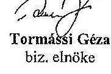

Tormássi Géza
bíz. elnöke

---

# Jelenléti iv 

a Közlekedési és Városüzemeltetési Bizottság. 2040. FEERURA 25. ..... -i üléséről.
1./Tormássi Géza képviselő
2./ Jánócsik Csaba képviselő
3./ Dévényi József képviselô
4./ Aranyos Gábor képviselô
5./ Lengyel Károly képviselô
6./ Palicz György képviselô
7./ Jászai Menyhért képviselô
8./ Soltéaz József
9./ Hegedüs László
10./ Szôcs István
11./ Vinginder Tibor
12./ Bakosi Benjámin
13./ Magera Tibor

## Megkivettak: név:

1./ Giba Tamás alpolgármester
2./ Bornemisza Andrea
3./ Dod
4./ Ретко А.Ама
5./ ROTYANTOVITS ISTUAN
6./ MASTARUÉ PATAKI EVA
7./ FEDUUUINOZ ROVAS ANGELA
8./ DR. FREIDINGER RENATA
9./ TYSTÁGUU DR. ZERCEL ENIRA
10./ CSABAL LAZZLÓNE
11./ SEEKREUVES ANDRÁs
12./ GEEPA ISTVAN
13./ POLOM CSILLA
14./ MÓRICZ ISTUAN
15./
16./
17./
18./
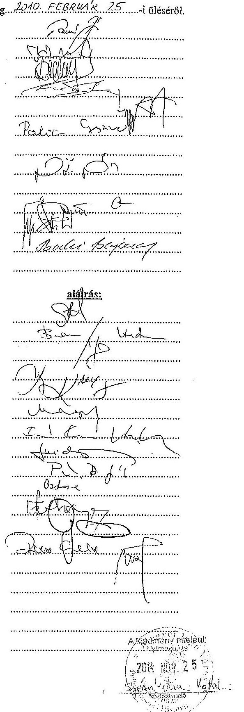

---

# NYIREGYHÁZA MEGYEI JOGÚ VÁROS POLGÁRMESTERÉNEK 

2/2011. (V.11.) GT/NYIRTÁVHÓ KR. számú
határozata
a NYÍRTÁVHÓ KFT
2011. évröl szóló üzleti tervének jóváhagyásáról

## A Polgármester

a NYÍRTÁVHÓ KFT 2011. évröl szóló üzleti tervét 4.382 .576 eFt bevétellel, 4.296 .356 eFt költséggel, ráfordítással, és 86.220 eFt tervezett adózás elötti eredménnyel jóváhagyja.

Nyiregyháza, 2011. május 11.
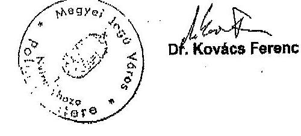

A határozatot kaplak:

1. NYIRTÁVHÓ KFT ügyvezetöje
2. Gazdálkodási Főosztályvezető (Helyben)
3. Vagyongazdálkodási Osztály (Helyben)
4. Polgármesteri Kabinet (Helyben)
5. Jegyzöl Kabinet (Helyben)

---

# NYIREGYHÁZA MEGYEI JOGÚ VÁROS KÖZGYÜLÉSE   Gazdasági és Tulajdonosi Bizottsága 40-6/2011. (IV.20.) számú   határozata   a NYÍRTÁVHŐ KFT   2011. évrül szóló üzleti tervének véleményezéséről 

## A Bizottság

Nyiregyháza Megyei Jogú Város Közgyűlésének 30/2010. (XI.12.) számú - a Közgyülés bizottságai feladatai és hatáskörei megállapításáról szóló - önkormányzati rendeletében kapott felhatalmazás alapján az előterjesztést megtárgyalta, és
a NYÍRTÁVHŐ KFT 2011. évi üzleti tervét 4.382 .576 eFt bevétellel, 4.296 .356 eFt költséggel, ráfordítással, és 86.220 eFt tervezett adózás elôtú eredménnyel a Polgármestemek jóváhagyásra javasolja.

Nyíregyháza, 2011. április 20.

## Jászai-Slenybért   Gazdasági és Tulajdonosi Bizottság   elnöke

A határozatot kaniák:
1./ Gazdasági és Tulajdonosi Bizottság tagjai
2./ Nyiregyháza Megyei Jogú Város Polgármestere
3./ Nyiregyháza Megyei Jogú Város címzetes főjegyzöje
4./ Polgármesteri Kabinet (Helyben)
5./ Gazdálkodási Főosztályvezető (Helyben)
6./ Vagyongezdálkodási Osztály (Helyben)

---

# NYIREGYHÁZA MEGYEI JOGÚ VÁROS KÖZGYÜLÉSE 

Városstratégiai és Környezetvédelmi Bizottsága
36/2011. (V.10.) számú
határozata
a NYÍRTÁVHŐ KFT
2011. évröl szóló üzleti tervének véleményezéséről

## A Bizottság

Nyíregyháza Megyei Jogú Város Közgyülésének 30/2010. (XI.12.) számú - a Közgyülés bizottságal feladatai és hatáskörel megállapításáról szóló - önkormányzati rendeletében kapott felhatalmazás alapján az elöterjesztést megtárgyalta, és
a NYÍRTÁVHŐ KFT 2011. évi üzleti tervét 4.382 .576 eFt bevétellel, 4.296 .356 eFt költséggel, ráfordítással, és 86.220 eFt tervezett adózás olötti eredménnyel a Polgármesternek jóváhagyásra javasolja.

Nyíregyháza, 2011. május 10.

## 21

Tormásai Géza
bizottsági elnök

A határozatot kapják:

1./ Városstratégiai és Környezetvédelmi Bizottság tagjai
2./ Nyíregyháza Megyei Jogú Város Polgármestere
3./ Nyíregyháza Megyei Jogú Város címzetes főjegyzője
4./ Polgármesteri Kabinet (Helyben)
5./ Gazdálkodási Főosztályvezető (Helyben)
6./ Vagyongazdálkodási Osztály (Helyben)

---

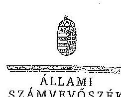

ELHök

Ikt.szám: V-0521-150/2014.

Dr. Kovács Ferenc úr
polgármester
Nyíregyháza Megyei Jogú Város Önkormányzata

Nyíregyháza

Tiszteit Polgármester Úr!

Köszönettel vettem a NYÍRTÁVHŐ Nyíregyházi Távhőszolgáltató Kft. ellenőrzéséről készített számvevőszéki jelentéstervezetre tett észrevételeit.

Csatoltan megküldöm az Állami Számvevőszék észrevételekre vonatkozó álláspontjáról a felfigyeleti vezető által készített részletes tájékoztatást.

Tájékoztatom Polgármester urat, hogy a számvevőszéki jelentés véglegesítése az elfogadott észrevételek figyelembevételével történik.

Budapest, 2014. 63. nap

Tisztelettel:

Domokos László

Melléklet: Tájékoztatás az észrevételek kezeléséről

1052 BUDAPEST, APÁCZIN CSZKÉ HÁVOS UICA 10. 1264 Budapest 4. Pl. 54 telefon: 484 8191 fax: 484 3201

---

# Tájékoztatás az észrevételek kezeléséről 

A NYÍRTÁVHŐ Nyíregyházi Távhőszolgáltató Kft. ellenőrzéséről készített jelentéstervezetre Polgármester úr észrevételeit megköszönöm. Észrevétele alapján a jelentés tervezetet az alábbiak szerint módosítom:

Az észrevételek 1. bekezdése alapján a jelentéstervezetből töröltük a polgármesternek tett javaslatot, a kapcsolódó összegző megállapítást (10. oldal 3. bekezdés), és részletes megállapítást (19. oldal 2. bekezdés), mivel a helyszíni ellenőrzés során rendelkezésre bocsájtott dokumentumok szerint a Felügyelő Bizottság rendelkezett ügyrenddel az ellenőrzött időszakban.

Az észrevételek 2. bekezdése alapján az összegző megállapításnak (12. oldal első bekezdés) és a kapcsolódó részletes megállapításnak (19. oldal utolsó előtti bekezdés) a 2008-2011. évi üzleti tervek bizottságok általi véleményezésének hiányára vonatkozó, következő részt töröltük:
„A NYÍRTÁVHŐ Kft. 2008-2011. évi üzleti terveinek közgyölési előterjesztéseit a Kösgyülés rendeletének elöirása ellenére a Városstratégiai és Környezetvédelmi Bizottság, valamint a Gazdasági és Tulajdonosi Bizottság nem véleményezte."

Budapest, 2014. december „ ".
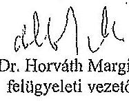

1852 BÜRÁFEST, AFRICAN CSERE JÁNOS UTCA 19. 1364 Budapest 4. Pl. 56 Istrian: 4848781 fax: 4848281

---

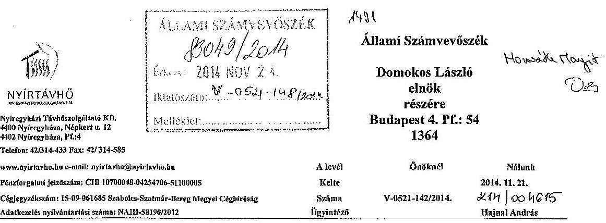

# Tárgy: Észrevételek megküldése 

Tisztelt Elnök Úr!

Hivatkozással a 2014. 11. 10-én kelt jelentéstervezetükre az alábbi észrevételeket tesszük.
Nyíregyháza Megyei Jogú Város Önkormányzata Polgármesterének tett javaslatukra, mely szerint „az FB az ügyrendjét a Gt. tv. 34.§ (4) bekezdésében előirtak ellenére nem állapították meg", az alábbi észrevételt kívánjuk tenni:
Társaságunk Felügyelő Bizottsága a vizsgálat teljes időszakára vonatkozóan rendelkezett ügyrenddel. Az első ügyrendet 2007. szeptember 4-én, a másodikat 2011. január 13-án fogadta el az akkor éppen aktuális Felügyelő Bizottság, melyekről tulajdonosi jóváhagyó határozatok is születtek. A dokumentumok másolati példányát levelünk mellékleteként megküldjük további szíves felhasználásra.
„A NYÍRTÁVHŐ Kft. ügyvezetése az Alapitó Okiratban feladatként elöirt rendszeres, negyedévenkénti gyakoriságú beszámolási kötelezettségnek maradéktalanul nem tett eleget" felvetésre az alábbi észrevételt kívánjuk tenni:
Véleményünk szerint az ügyvezető igazgató ezen feladatának eleget tett, ugyanis az Alapitói Okiratban leírtaknak megfelelően „a társaság ügyeinek ellátásáról, az eredmény alakulásáról" rendszeresen tájékoztatta az alapítót, az évente minimum 4 alkalommal megtartott Felügyelő Bizottsági üléseken. Tény, hogy 2008-ban és 2009-ben hiányoztak úgynevezett "évközi beszámolók", de ez nem azt jelenti, hogy a beszámolások a tulajdonos felé elmaradtak, hiszen a felügyelő bizottsági üléseken rendszerint megtörtént a beszámolás a társaság ügyeiről és az eredmények alakulásáról. A rendszeresített és egységes adattartamú beszámolók 2010. évtől kerültek bevezetésre.
„Első negyedéves beszámolót" Társaságunk nem készít, azonban az éves üzleti tervben a tárgy év első 2 illetve 3 hónapja rendszerint tény adatként szerepelt, így a tulajdonos tájékoztatása dokumentált módon is megtörtént.
„Az ellenőrzött időszakban elszámolt tervszerinti értékcsökkenés összegének számítása nem felelt meg a Számv. tv.-ben elöírtaknak. A tárgyi eszközöket nyilvántartó szoftver az értékcsökkenés napjainak számítása során 360 nap/évvel számolt ( 365 nap helyett), valamint a ráakttiválással érintett tárgyi eszközök esetében az értékcsökkenés számítás alapját képező bekerülési értéket nem növelték meg az eszközökön végzett bővítések, felújítások összegével."
Abogyan az a mintavételi táblázatból is kiderül, valóban voltak eltérések a tárgyi eszközöket nyilvántartó szoftver által számított értékcsökkenés és a valósnak vélt adatok között.
Az eltéréseket azonban nem a 360 nap/év osztószám okozta, hanem az az elv, mely szerint a program az aktiválás napjára nem számolt el értékcsökkenést. A program helyesen alkalmazta a 365 napos osztószámot, sőt 2008. és 2012. években (szökőévek esetében) a 366 napot.

|  | Tervegyeztetés | Úgyfélezolgálat | Szolgáltatás felügyelet |
| :--: | :--: | :--: | :--: |
|  | 4400 Nyíregyháza, Népiart u. 12. | 4400 Nyíregyháza, Vay Á. Art. 4-6. | 4400 Nyíregyháza, Népiart u. 12. |
|  | Tel.: 42/314-433 Fax: 42/314-585 | UNIVERZIDI Érletlátípont t. cmeint 106. | Tel.: 42/481-644 Fax: 42/488-892 |

---

A ráaktiválással érintett tárgyi eszközök esetében az értékcsökkenés számítás alapját képező bekerülési értéket is minden esetben megnöveltük az eszközökön végzett bővítések, felújítások összegével. Ha nem így tettünk volna, akkor már szinte értékcsökkenést sem számolnánk el, ugyanis az elöregedett berendezéseink eredeti bekerülési értéke már javarészt nullára íródott az alkalmazott leírási kulesokkal, így a jelenlegi értékcsökkenésünk alapját döntő többségében ezen eszközökön végzett felújítások ráaktivált értékei adják.
Továbbá tájékoztatásul közöljük, hogy 2013. januártól egy új, megbízható SQL alapú integrál pénzügyi és számviteli szoftver került bevezetésre, mely program az értékcsökkenés elszámolást helyesen és számszakilag is pontosan kezeli.
„Az ellenőrzött években a társaságnál az ingatlanok és műszaki berendezések mennyiségi leltározása a Számviteli törvényben előirtak ellenére nem történt meg" felvetésre az alábbi észrevételt kívánjuk tenni:
A Számviteli törvény előirása szerint a „beszámolóban szereplő tételeknek a valóságban is megtalálhatóknak, bizonyíthatóknak kell lenniük", azonban a Számviteli törvény nem a leltározásra, hanem a leltár készítésére tartalmaz kötelezettségeket, abból kiindulva, hogy lehetővé teszi a leltár készítését a számviteli alapelveknek megfelelő, főkönyvi könyvelés adataival értékben egyező naprakész mennyiségi nyilvántartás alapján is.
Tény az, hogy a klasszikus értelemben vett „leltározásból" bizonyos eszközök, mint az ingatlanok, höközpontok, távhővezetékek kimaradtak.
Példaként említenénk, hogy egy 40-50 éve föld alá ásott vezetéknek a „valóságban megtalálhatóságát" felmérni a Számviteli törvény által előirtak ellenére nem életszerü dolog. Ilyen esetekben nem marad más, mint az analitikus nyilvántartás fökönyvvel való egyeztetése.
Kérjük figyelembe venni, hogy Társaságunk minden évben külső szakértő cég bevonásával „vagyonértékelést" készittet, amely véleményünk szerint egy mennyiségi és értékbeni egyeztetésnek is tekinthető, hiszen ez alapján állapítjuk meg az Éves Beszámolókban szereplő piaci értékeket és az értékhelyesbitések összegét is.
Tájékoztatásul kívánjuk közölni, hogy 2013.08.30-ával új „Leltárkészítési, leltározási, selejtezési szabályzatot" készítettünk, mely előirásai kiterjednek minden Társaságunk nyilvántartásában szereplő tárgy eszközre, így a vizsgált időszakban leltározásból kimaradt eszközökre is.
„A kapott távhőtámogatás összege 2008-ban és 2009-ben 1239 millió Ft, 2010-ben 1578 millió Ft, 2011-ben 2123 millió Ft és 2012-ben 1777 millió Ft volt. A NYÍRTÁVIÓ Kft. által igénybevett távhőtámogatás tárgy évi felhasználása az ellenőrzött években nem történt meg, a társasági adó alapja pozitív volt, társasági adó fizetési kötelezettség keletkezett. A távhőtámogatás felhasználásának hatékonyságát rontotta, hogy a támogatás év végi maradványát csökkentette a társasági adó összege." Ezen megállapításra az alábbi észrevételt kívánjuk tenni:
A NYÍRTÁVIÓ Kft. az 50/2011. és 51/2011. (IX.30.) NFM rendeletek szerinti hatósági ármegállapítás, illetve támogatási mérték megállapítást követően, 2011. október 1-től részesült távhő ártámogatásban. 2008-2011 években a NYÍRTÁVIÓ Kft. ártámogatásban nem részesült, ebben az időszakban a fogyasztók igényelhették a támogatást. A Magyar Államkincstár által a fogyasztók által benyújtott kérelmek alapján megitélt fajlagos energiatámogatások figyelembe vételével általunk megelőlegezett, a számlákban érvényesített támogatások utólagos utalása történt meg részünkre, de ezek összegei sem azonosak az anyagban rögzített értékekkel.
A vizsgálati jelentés tervezetben szereplő adatok közül csak a 2012-es évre rögzített 1777 millió Ft helyes, a többi hibás értéket tartalmaz, ugyanis kumulált adatokat mutat és nem az adott fökönyvi szám „tartozik" egyenlegét, ami a helyes összeg. A Kormány többször módosított 231/2006. (XI.22.) Korm. rendelete alapján a lakosság energiafelhasználásának szociális támogatása alapján 2008-ban: 388460 333,-Ft, 2009-ben: 486616 271,-Ft, 2010-ben: 307569 843,-Ft, 2011-ben 170746 567,-Ft energiatámogatást számoltunk el a lakossági fogyasztóinkkal. Az 51/2011. (IX.30.) NFM rendelet alapján 2011-ben 342 millió Ft, 2012-ben 1777 millió Ft támogatásban részesültünk.
A vizsgálati jelentés azon megállapítása, mely szerint „a távhőtámogatás felhasználás hatékonyságát rontotta, hogy a támogatás év végi maradványát csökkentette a társasági adó összege" csak részben

|  | Tervegyesintés | Ögyfélesolgálat | Szulgáltatás felügyelet |
| :--: | :--: | :--: | :--: |
|  | 4400 Nyíregyháza, Népkert a. 12. | 4400 Nyíregyháza, Vay A. bet. 4-6. | 4400 Nyíregyháza, Népkert a. 12. |
|  | Tel.: 42/314-433 Fax: 42/314-586 | UNIVERZUM Üzletlöspont I. rendei 106. | Tel.: 42/461-644 Fax: 42/465-092 |

---

helytálló, ugyanis a jogszabály - 50/2011. (IX.30.) NFM rendelet - által lehetővé tett, a MEKH által meghatározott könyv szerinti bruttó eszközérték $2 \%$-os nyereségtényezője által számított nyereségen felüli eredmény céltartalékként kerül elkülönítésre, melyre szintén ezen jogszabály 5. §. 5. pontja ad a következők szerint lehetőséget:
„(3) ${ }^{10}$ A Hivatal - az a)-d) pontok szerinti szempontok fennállásának mérlegelésével mentesítheti a (4) bekezdés szerinti visszafizetési kötelezettség alól az 1. melléklet szerinti értékesitőt vagy a távhőszolgáltatót (a továbbiakban együtt: kérelmező), ha a kérelmező az éves beszámoló letétbe helyezését követő 15. napig a Hivatalhoz benyújtott kérelmében igazolja, hogy a nyereségkorlát feletti eredményét a tárgyévben megkezdett aktivált vagy nem aktivált olyan beruházásra fordította, illetve a kérelem benyújtását követő harmadik év végéig aktivált olyan beruházásra kívánja fordítani, amely. $\qquad$
Ezek alapján a támogatás összegéből megképzett céltartalék adóalap növelő tételként jelentkezik, viszont a beruházás végeztével felszabadításra kerül és csökkenti az adóalapot, így vélelmezett eredményhatása nincs, egyedül átmeneti likviditás romlást idéz elő.
„A távhőszolgáltatási közfeladat ráfordításainak elszámolása során nem érvényesültek teljes körűen a jogszabályok és a belső szabályok előírásai a kötelezettségvállalás tekintetében. Ez kockázatot jelez az ellenőrzött terület egészének szabályos müködése szempontjából. Megállapítottuk, hogy egyes esetekben a költségelszámolást megalapozó kötelezettségvállalás dokumentumai (hőszolgáltatási szerződések, hálózathasználati szerződések) nem álltak rendelkezésre." Ezen megállapításra az alábbi észrevételt kívánjuk tenni:
A hőenergia és villamosenergia vásárláshoz hosszútávú, és éves hőszolgáltatási és hálózathasználati szerződések rendelkezésre állnak, az éves hőszolgáltatási szerződések elektronikus példányai az ÁSZ megbízottak részére továbbításra kerültek, így nem értjük ezek miért lettek hiányként feltüntetve.
A szolgáltatást igénybe vevők esetén a Tszt. előírásainak figyelembe vételével a hőközponti hitelesított hőmennyiségmérőről ellátott felhasználóval kell közszolgáltatási szerződést kötni, mely a lakosság esetén jellemzően a társasház. Az egyes lakások, helyiségek tulajdonosai, bérlői a díjfizetők, melyeket az általunk kialakított gyakorlatban a szerződés 1. sz. melléklete rögzít. A díjfizetőkkel szerződéskötési kötelezettségünk csak a használati melegvíz szolgáltatás mérés szerinti elszámolására van, mellyel minden esetben rendelkezünk. A konkrét szabályozás kivonatát az alábbiakban rögzítjük:
„Tszt. 37. § (1) ${ }^{115}$ A távhőszolgáltatót a lakossági felhasználóval általános közszolgáltatási szerződéskötési kötelezettség terheli. Az általános közszolgáltatási szerződés létrejöhet a távhő hőközponti (hőfogadó állomási) vagy épületezzenkénti mérés szerinti szolgáltatására.
(2) ${ }^{112}$ Az általános közszolgáltatási szerződés alapján a távhőszolgáltató a lakossági felhasználó részére folyamatos, biztonságos és meghatározott mértékü távhőszolgáltatásra, a lakossági felhasználó vagy az e törvényben meghatározott esetekben a díjfizető a távhőszolgáltatás díjainak rendszeres megfizetésére köteles.
(3) ${ }^{118}$ Az egyéb felhasználó és a távhőszolgáltató a polgári jog szabályai szerint egyedi közszolgáltatási szerződést köt a távhő folyamatos és biztonságos szolgáltatására, illetőleg ellenértékének megfizetésére.
(4) ${ }^{115}$ Nem köteles a távhőszolgáltató a közszolgáltatási szerződés megkötésére, ha a felhasználói igénnyel jelentkező a 36. § (2) bekezdése szerinti tájékoztatóban foglaltakat nem teljesítette.
(5) ${ }^{120}$ A távhőszolgáltató és a felhasználó között a közszolgáltatási szerződés - a jogszabályokban és az üzletszabályzatban meghatározott feltételekkel - a szolgáltatás igénybevételével is létrejön.
(6) ${ }^{121}$ A díjfizetők személyében bekövetkező változások nem érintik a felhasználó és a távhőszolgáltató között létrejött általános közszolgáltatási szerződés érvényezzégét. A díjfizető a változás időpontjától jogosult az általános közszolgáltatási szerződésben foglaltak szerint a szolgáltatás igénybevételére és ugyanezen időponttól köteles a távhőszolgáltatás díjainak megfizetésére."

|  | Tervegyesztetés | Ügyfelizsolgálat | Szulggáltatás felügyelet |  |
| :--: | :--: | :--: | :--: | :--: |
|  | 4409 Nyíregyhéss, Népbert u. 12. | 4409 Nyíregyhéss, Vay Á. krt. 4-6. | 4409 Nyíregyhéss, Népbert u. 12. |  |
|  | Tel.: 42/314-433 Fax: 42/314-585 | UNIVERZUM Üzlettőzpont L ccezlet 106. | Tel.: 42/481-444 Fax: 42/495-692 |  |

---

Véleményünk szerint a megállapítás túlságosan általános ahhoz, hogy ezek alapján ki lehessen jelenteni Társaságunk müködéséről, hogy nem érvényesülnek teljes körűen a jogszabályok előírásai.
„A társaság a Számv. tv. 161/A. § (2) bekezdésében előírtakkal ellentétben a Számlarendjének aktualizálását nem végezte el, a Számlarend nem tartalmazza a Tsztv. 18/A. § (2) bekezdése szerinti, 2012. január 1-jétől hatályos rendelkezésének megfelelően a számviteli szétválasztás szabályait." Ezen megállapításra az alábbi észrevételt kívánjuk tenni:
A jogszabály előírásai valóban 2012. január 1-jétől léptek életbe, azonban a jogszabály 2011. december 22-én lett kihirdetve, így annak azonnali alkalmazása a számviteli politikában nem volt kivitelezhető a rendelkezésre álló idő rövidsége miatt. A távhőszolgáltató társaságok közösen fordultak a Magyar Energia Hivatalhoz segítségért a szétválasztással kapcsolatban, melynek kapcsán a Hivatal 2013. február 22-én foglalt állást, melyről az anyagot a helyszíni ellenőrzéskor a megbízottaknak is átadtuk. Ezek alapján úgy látjuk, hogy a jogszabály ilyen mélységben elvárt alkalmazása 2012. évben nem volt lehetséges.
Mindezek ellenére Társaságunk a hivatkozott törvény előírásai szerint eljárva, a MEH ajánlását alkalmazva készítette el a 2012. és 2013. évi Éves Beszámolóját és 2014. január 1-től aktualizálta a számviteli politikáját is.
„A 2009. évben egy lakossági bejelentés kapcsán történt soron kívüli ellenőrzés, mely megállapította, hogy a NYÍRTÁVHŐ Kft. ármegállapítása során a Tsztv. előírásainak megfelelően járt el, azonban a többletköltség mérséklésére használható korrekciós tényezőket a díjak vonatkozásában nem alkalmazta." Ezen megállapításra az alábbi észrevételt kívánjuk tenni:
2009. július 1-től az állandó költségeket növelő inflációs hatások ellenére $5 \%$-al csökkent az alapdíj, melyet a NYÍRTÁVHŐ Kft. az eszközarányos fedezet mérséklésével hajtott végre. Még szintén 2009ben az energiahordozók áraival összhangban csökkenő beszállítói díjmérséklések eredményeként három alkalommal csökkentek a szolgáltatás hódijai. Ezek alapján kijelenthető, hogy a NYÍRTÁVHŐ Kft. - a tulajdonosi elvárásokkal is összhangban - minden lehetséges korrekciót figyelembe vett a díjak mérséklése érdekében.
A MEH szakmai árfelülvizsgálata a 2008. évi LXVII. „a távhőszolgáltatás versenyképesebbé tételéről" szóló törvény alapján 2009. január 1. napjától került előírásra, mely szakmai felülvizsgálat során a kötelezően előírt, benyújtott adatok köre garantálta, hogy a lehetséges díjcsökkentő tényezők figyelembe vételre kerüljenek.

Kérjük az észrevételeink figyelembevételét a végleges jelentés összeállításánál.

Mellékletek: FEB ügyvend 2011. 01. 13.
FEB ügyvend 2007. 09. 04.

Tisztelettel:
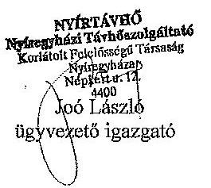

|  | Tervegyeztatás |  |  |
| :--: | :--: | :--: | :--: |
|  | 4400 Nyíregyháza, Néphett u. 12. | 4400 Nyíregyháza, Vay Á. let. 4-6. | 4400 Nyíregyháza, Néphett u. 12. |
|  | Tel.: 42/314-433 Fax: 42/314-585 | UNIVERSITM Üzlettikapont L emeltt 106. | Tel.: 42/451-644 Fax: 42/455-092 |

---

# NYÍRTÁVHŐ Korlátolt Felclősségủ Társaság Felügyelő Bizottsága 

ÜGYREND

A korlátolt felelősségủ társaság felügyelő bizottsága a gazdasági társaságokról szóló 2006. évi IV. törvény, valamint a Kft. alapító okiratában foglaltak alapján, saját ügyrendjét az alábbiakban állapítja meg.

## 1.

## A felügyelö bizottság szervezete:

1./ A felügyelő bizottság öt tagból áll, akiket az alapító jelölt ki, illetve a Nyíregyháza Megyei Jogú Város Közgyűlése választott. A tagok megbizatása határozott időre, de legfeljebb öt évre szól, megbizatásuk időtartamát az alapító Nyíregyháza Megyei jogú Város Közgyűlésének határozata tartalmazza.
2./ A felügyelő bizottság elnökét a tagok maguk közül választják. A felügyelő bizottság elnökének megválasztására bármely tag javaslatot tehet, melyről a tagok nyílt szavazással döntenek.

## 2.

## A felügyelő bizottság tagjai:

1./ A felügyelő bizottság tagjának választható az a természetes személy - magyar vagy külföldi állampolgár -, aki megfelel a hatályos magyar jogszabályokban meghatározott feltételeknek, és a megbizatást írásos jognyilatkozattal elfogadja.
2./ A NYÍRTÁVHŐ Kft. munkavállalóját - kétszáz fő teljes munkaidőben foglalkoztatott munkavállalói létszám esetén a munkavállalók képviseletét ellátó tagok kivételével - a közgyűlés nem választhatja a felügyelő bizottság tagjává.
3./ A felügyelő bizottsági tag egyidejűleg több társaság felügyelő bizottságába választható meg. A tag az új tisztsége elfogadásától számított 15 napon belül köteles írásban tájékoztatni azokat a gazdasági társaságokat, amelyeknél már felügyelő bizottsági tag.
4./ Nem lehet a felügyelő bizottság tagja az a személy, akinek bizottsági tagságát jogszabály zárja ki, vagy akinek tagságát - megválasztása után bekövetkező esemény miatt - jogszabály, vagy a tag maga összeférhetetlennek minősíti.
5./ A felügyelő bizottság tagja haladéktalanul köteles jelezni a felügyelő bizottság elnökének, ha vele szemben a megválasztását követően összeférhetetlenségi ok állt elő.
6./ A felügyelő bizottság tagja a társaság hozzájárulása nélkül:
a./ nem szerezhet társasági részesedést - nyilvánosan múködő részvénytársasághas való részvényszerzés kivételével - a társaságéval azonos tevékenységet

---

főtevékenységként megjelölő más gazdálkodó szervezetben,
b./ nem lehet vezető tisztségviselő a társaságéval azonos főtevékenységet végző más gazdasági társaságban, illetve szövetkezetben.
Az ügyvezető és közeli hozzátartozója, valamint élettársa nem köthet a saját nevében vagy javára a társaság főtevékenysége körébe tartozó ügyleteket.
A felügyelő bizottsági tagok közeli hozzátartozói nem lehetnek a társaság vezető tisztségviselői.
7./ A felügyelő bizottság tagjai megbízatásuknak személyesen kötelesek eleget tenni, képviseletnek a felügyelő bizottsági tevékenységben nincs helye.
8./ A felügyelő bizottság tagját - az e tisztséghez tartozó tevékenységi körében - a gazdasági társaság tagja, illetve munkáltatója nem utasíthatja.
9./ A felügyelő bizottság tagjait kötelezettség terheli annak biztosítására, hogy az általuk kért, és részükre kisdott, vagy más módon tudomásukra jutott adatokhoz, információkhoz, iratokhoz illetéktelen személyek hozzá ne férhessenek.
10./ A felügyelő bizottsági tagok a társaság ügyeiről szerzett értesüléseiket üzleti titokként kötelesek megőrizni.
11./ Az alapító közgyűlésének ülésein - melyek témái a NYÍRTÁVHŐ Kft-t érintik - a felügyelő bizottság tagjai részt vehetnek, ahol a felügyelő bizottság megállapításait ismertethetik.
12./ Megszűnik a felügyelő bizottsági tagság:
a./ a megbízatás időtartamának lejártával;
b./ visszahívással;
c./ lemondással;
d./ elhalálozással;
e./ törvényben szabályozott kizáró ok bekövetkeztével;
f./ külön törvényben meghatározott esetben.
13./ A tagok bármikor visszahívhatók, és megbízásuk lejárta után újraválaszthatók.
14./ A felügyelő bizottsági tagságra szóló megbízás visszavonására az alapító jogosult.
15./ A felügyelő bizottság tagja tagságáról az ügyvezető és az alapító egyidejű tájékoztatása mellett a felügyelő bizottsági ülésen mondhat le a gazdasági társaságokról szóló 2006. évi IV. tv. (továbbiakban Gt.) 31. § (2) bekezdésének figyelembevételével.
16./ Amennyiben a felügyelő bizottság létszáma bármely okból őt fő alá csökken, vagy nincs, aki az ülését összehívja, haladéktalanul értesíteni kell a gazdasági társaság ügyvezetőjét, és az alapító döntését kell kérni a felügyelő bizottság létszámának kiegészítésére.
17./ A felügyelő bizottság tagjai az e tisztséget betöltő személyektől általában elvárható gondossággal kötelesek eljárni.

---

A felügyelő bizottsági tagok - a Ptk. közös károkozásra vonatkozó szabályai szerint - korlátlanul és egyetemlegesen felelnek a gazdasági társasággal szemben a társaságnak az ellenőrzési kötelezettségük megszegésével okozott károkért, ideértve a számviteli tơrvény szerinti beszámoló, valamint a kapcsolódó üzleti jelentés összeállításával és nyilvánosságra hozatalával összefüggő ellenőrzési kötelezettség megszegését is.
Mentesül a felelősség alól az a felügyelő bizottsági tag, aki a felügyelő bizottság határozata vagy intézkedése elleni tiltakozását a felügyelő bizottság ülésén írásban bejelentette, jegyzőkönyvbe diktálta, vagy az általa észlelt mulasztást - írásban - olyan időben jelezte az intézkedésre jogosult szervnek, hogy az még időben intézkedhetett volna.
18./ A felügyelő bizottság tagjai az alapító által megállapított tiszteletdijban részesülnek.

# 3. 

## A felügyelő bizottság elnöke:

1./ A felügyelő bizottság elnökét a bizottság első ülésén saját tagjai közül választja.
2./ A felügyelő bizottság elnökének feladata a testület tevékenységének koordinálása, a bizottság álláspontjának képviselete, az ülések összehívása, technikai előkészítésének ellenőrzése, és az ülés vezetése.
3./ Az elnök 6 hónapot meghaladó előre látható akadályoztatása esetére a bizottság új elnököt választ.
4./ Az elnöki megbízatás megszủnése esetén a bizottság 8 napon belül új elnököt választ.

## 4.

## A felügyelő bizottság müködése:

1./ A felügyelő bizottság szükség szerint tartja üléseit, de évente legalább négy alkalommal ülést tart, üléseit az elnök hívja össze.
2./ Az összehívást bármely tag - az ok és a cél megjelölésével - az elnőkő1 írásban kérheti. Ha az elnök a felügyelő bizottság ülését nyolc napon belül nem hívja össze, annak összehívására a tag jogosult.
3./ Az elnök a felügyelő bizottság üléseire a könyvvizsgálót - és szükség szerint más személyt - is meghívhatja.
4./ Az elnök köteles összehívni a bizottságot a könyvvizsgálói jelentés kézhezvételétől számított 15 napon belül, illetve ha a könyvvizsgáló kéri. Ezekben az esetekben a könyvvizsgálót az ülésre meg kell hívni.

---

5./ A felügyelő bizottságot az elnők az időpont, a helyszín és a napirendi pontok megjelölésével írásban hívja össze. A tagoknak és az állandó vagy eseti meghívottaknak a meghívót az ülés napja előtt legalább 8 nappal postán vagy kézbesítő útján kell eljuttatni. A meghívó mellé csatolni kell az esetleges írásos előterjesztéseket is.
6./ Az ülés sürgős esetben telefaxon, vagy elektronikus úton is összehívható, amennyiben a meghívó elküldésének ténye megfelelően dokumentálható.
7./ A felügyelő bizottság ülésén a tagokon kívül tárgyalási joggal részt vesz a társaság ügyvezetője is. A felügyelő bizottság ülésein esetileg vesznek részt mindazok, akiknek jelenléte a napirendhez szükséges, és ezért őket a felügyelő bizottság elnöke meghívta.
8./ A felügyelő bizottság akkor határozatképes, ha azon legalább négy tag jelen van. A felügyelő bizottság határozatait egyszerü szótöbbséggel, nyílt szavazással hozza.
Minden felügyelő bizottsági tagnak egy szavazata van.
9./ Ha bármely három tag kéri, úgy határozathozatal előtt az elnök titkos szavazást rendelhet el.
10./ A felügyelő bizottság elrendelheti zártkörủ ülés tartását, illetőleg adott napirend zárt ülésen történő megtárgyalását - szótöbbséggel hozott határozatával, a társaság lényeges üzleti érdekeit, illetve titkait érintő esetekben. Zárt ülésen csak a bizottság tagjai lehetnek jelen. A zárt ülés jegyzőkönyvében csak a határozatot, a jelenlévők nevét, az esetleges különvéleményt, az ülés időpontját és helyszínét kell feltüntetni. A jegyzőkönyvet a felügyelő bizottság egy tagja vezeti, és a felügyelő bizottság valamennyi jelenlévő tagja aláírja. Zárt ülésről hangfelvételt készíteni nem lehet.
11./ Ha az összehívott felügyelő bizottsági ülés határozatképtelen vagy szabályszerű döntést nem tudott hozni (eredménytelen a szavazás), a felügyelő bizottság elnöke a határozatképtelen, illetve eredménytelen ülést követő 5 munkanapon belül köteles új ülés összehívása iránt intézkedni. Ha az elnök nem tesz eleget az ülés összehívása iránti kötelezettségének, az ülést bármely felügyelő bizottsági tag összehívhatja.
12./ Minden felügyelő bizottsági ülésről jegyzőkönyv készül, mely tartalmazza a jelenlévőket, az ülés helyét, idejét, a napirendi pontokat, a hozzászólások lényegét, és a hozott határozatokat. Az ülésről készült jegyzőkönyv az ülés napját követő öt évig nem selejtezhető.
13./ A jegyzőkönyvben fel kell tüntetni - vagy írásban a jegyzőkönyvhöz kell mellékelni - minden olyan tényt, esetleges kisebbségi vagy különvéleményt, tiltakozást, amelyet a tagok kérnek.
14./ Rögzíteni kell a szavazás eredményét, és ilyen irányú határozott kérés esetén az ellenszavazók véleményét is.

---

15./ A jegyzőkönyvet az ülést követő nyolc napon belül kell elkészíteni. A jegyzőkönyvet az elnök hitelesíti, és megküldi a tagoknak, továbbá szükség esetén az ügyvezetőnek is.

16./ A felügyelő bizottság saját iratkezelését maga szervezi meg.
17./ A felügyelő bizottság határozatait sorszámmal, év és dátum megjelöléssel kell ellátni és nyilvántartani.
18./ A felügyelő bizottság működéséhez szükséges feltételek biztosítása (jegyzökönyvvezető, helyiség, stb.) a társaság ügyvezetőjének kötelezettsége.

# 5. 

## A felügyelö bizottság jogai és kötelezettségei:

1./ A felügyelő bizottság jogait testületileg, vagy tagjai útján gyakorolja.

A felügyelő bizottság egyes ellenőrzési feladatok elvégzésével bármely tagját megbízhatja, illetve az ellenőrzést állandó jelleggel is megoszthatja tagjai között. Az ellenőrzés megosztása nem érinti a felügyelő bizottsági tag felelősségét, sem azt a jogát, hogy ellenőrzését más tevékenységre is kiterjessze.
2./ A felügyelő bizottság tagjai ellenőrzik a társaság gazdálkodását a hatályos jogszabályok, a társaság alapító okirata és az alapítói határozatok alapján.
3./ A felügyelő bizottság ellenőrizheti a társaság számviteli és pénzügyi rendjét, a társaság szabályzatait és azok rendelkezéseinek végrehajtását.
4./ Ellenőrzi a társaság pénz- és hitelgazdálkodását, kereskedelmi és egyéb kapcsolatait, a gazdálkodás eredményességét.
5./ A felügyelő bizottság informálódik az alapító közgyűlése által jóváhagyott éves terv teljesítéséről, melyhez a szükséges információkat az ügyvezető biztosítja.
6./ A felügyelő bizottság köteles részletesen megvizsgálni a társaság számviteli törvény szerinti beszámolóját, a mérleget, az eredménykimutatást, az üzleti jelentést, és a kiegészítő mellékletet, és mindazon jelentéseket, amelyeket vizsgálatra az ügyvezető a felügyelő bizottságnak megkülli. E feladatainak végrehajtásáról és eredményéről az alapítónak jelentést tesz.
7./ A felügyelő bizottság megvizsgálja és véleményezi az alapító elé terjesztett egyéb fontos jelentéseket, különösen:

- a társaság gazdasági stratégiájának kialakítása;
- a társaság éves, és középtávú terve;
- a társaság árpolitikája, üzletpolitikája;
- a társaság díjmegállapításra vonatkozó javaslata;
- az alapító hatáskörébe utalt szerződések.

---

8./ A NYÍRTÁVHŐ Kft. alapítója elé terjesztendő fontosabb jelentésekről, továbbá a számviteli törvény szerinti beszámolóról a felügyelő bizottság írásbeli jelentése nélkül az alapító érvényes határozatot nem hozhat.
9./ A felügyelő bizottság ellenőrzi a társaság ügyvezetését. Ennek keretében a vezető tisztségviselőktől és a társaság vezető állású dolgozóitól jelentést vagy felvilágosítást kérhet, a társaság könyveit és iratait megvizsgálhatja, illetőleg szakértővel megvizsgáltathatja. Gazdasági társaság vezető tisztségviselője, illetve vezető állású munkavállalói az írásbeli felvilágosítás kérésre a kézhezvételtől számított 15 napon belül írásban kötelesek válaszolni.
10./ Ha a felügyelő bizottság jogellenességet, alapító okiratába, vagy közgyűlési határozatba ütköző tényt, mulasztást, a társaság érdekeibe ütköző intézkedést, vagy visszaélést tapasztal, erről köteles az alapítót haladéktalanul értesíteni.

Ha a felügyelő bizottság megítélése szerint az ügyvezetés tevékenysége jogszabályba, alapító okiratba illetve az alapítói határozatba ütközik, vagy egyébként sérti a gazdasági társaság vagy az alapító érdekeit, erről köteles az alapítót haladéktalanul értesíteni.

# 6. 

A bizottság ügyrendjét a társaság alapítója hagyja jóvá.
Az ügyrendet a bizottság módosíthatja. Erről az elnök útján értesíti az alapítót, aki a módosítást szintén jóváhagyja.

Nyíregyháza, 2011. január 13.

## Záradék:

A NYÍRTÁVHŐ Korlátolt Felelősségủ Társaság felügyelő bizottságának jelen módosított ügyrendjét a felügyelő bizottság 2011. január 13. napján megtartott ülésén megtárgyalta, és az 1/2011.01.13. számú határozatával elfogadta.

Remesné Facsar Ildikó
Felügyelő Bizottság elnöke
Jóváhagyási záradék
A NYÍRTÁVHŐ KFT. egyedüli tagja - az aláírásra jogosult képviselőjének e záradék jegyzésével bizonyítottan - a jelen felügyelő bizottsági ügyrendet az alább megjelölt napon jóváhagyta.

Nyíregyháza, 2011. . 52.22 . $\qquad$
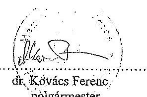
dr. Kóvács Ferenc
pólgármester

---

# Nyiregyháza Megyei Jogú Város   Polgármesterének 

1/2011. (II.28.) GT/NYÍRTÁVHÓ KFT. számú határozata

## A Polgármester

a gazdasági társaságokról szóló 2006. évi IV. törvény 34. § (4) bekezdés, valamint a Nyíregyháza Megyei Jogú Város Önkormányzata vagyonának meghatározásáról, a vagyonfeletti tulajdonjog gyakorlásának szabályozásáról szóló 21/2004. (VI.24.) önkormányzati rendelet 3. § (5) bekezdés elöirásaira figyelemmel a NYÍRTÁVHÓ KFT. Felügyelöbizottsága Úgyrendjét a melléklet szerint jóváhagyja.

Nyíregyháza, 2011. február 28.

## A határozatot kapják:

1. NYÍRTÁVHÓ KFT. ügyvezetője
2. Vagyongazdálkodási Osztály (Helyben)
3. Jegyzői Törzskar (Helyben)

---

# NYÍRTÁVHŐ Korlátolt Felelősségủ Társaság Felügyelő Bizottsága 

## ÜGYREND

(egységes szerkezetben)
A korlátolt felelősségủ társaság felügyelő bizottsága a gazdasági társaságokról szóló 2006. évi IV. törvény, valamint a Kft. alapító okiratában foglaltak alapján, saját ügyrendjét az alábbiakban állapítja meg. A 2007. március 12. napján elfogadott ügyrendjét a felügyelő bizottság 2007. szeptember 04. napján módosította és foglalta egységes szerkezetbe.

## 1.

## A felügyelő bizottság szervezete:

1./ A felügyelő bizottság öt tagból áll, akiket az alapító jelölt ki, illetve a Nyíregyháza Megyei Jogú Város Közgyűlése választott. A tagok megbízatása határozott időre, de legfeljebb öt évre szól, megbízatásuk időtartamát az alapító Nyíregyháza Megyei jogú Város Közgyűlésének határozata tartalmazza.
2./ A felügyelő bizottság elnökét a tagok maguk közül választják. A felügyelő bizottság elnökének megválasztására bármely tag javaslatot tehet, melyről a tagok nyílt szavazással döntenek.

## 2.

## A felügyelő bizottság tagjai:

1./ A felügyelő bizottság tagjának választható az a természetes személy - magyar vagy külföldi állampolgár -, aki megfelel a hatályos magyar jogszabályokban meghatározott feltételeknek, és a megbízatást írásos jognyilatkozattal elfogadja.
2./ A NYÍRTÁVHŐ Kft. munkavállalóját - kétszáz fő teljes munkaidőben foglalkoztatott munkavállalói létszám esetén a munkavállalók képviseletét ellátó tagok kivételével - a közgyülés nem választhatja a felügyelő bizottság tagjává.
3./ A felügyelő bizottsági tag egyidejűleg több társaság felügyelő bizottságába választható meg. A tag az új tisztsége elfogadásától számított 15 napon belül köteles írásban tájékoztatni azokat a gazdasági társaságokat, amelyeknél már felügyelő bizottsági tag.
4./ Nem lehet a felügyelő bizottság tagja az a személy, akinek bizottsági tagságát jogszabály zárja ki, vagy akinek tagságát - megválasztása után bekövetkező esemény miatt - jogszabály, vagy a tag maga összeférhetetlennek minősíti.
5./ A felügyelő bizottság tagja haladéktalanul köteles jelezni a felügyelő bizottság elnökének, ha vele szemben a megválasztását követően összeférhetetlenségi ok állt elő.

---

6./ A felügyelő bizottság tagja a társaság hozzájárulása nélkül:
a./ nem szerezhet társasági részesedést - nyilvánosan müködő részvénytársaságban való részvényszerzés kivételével - a társaságéval azonos tevékenységet főtevékenységként megjelölő más gazdálkodó szervezetben,
b./ nem lehet vezető tisztségviselő a társaságéval azonos főtevékenységet végző más gazdasági társaságban, illetve szövetkezetben.
Az ügyvezető és közeli hozzátartozója, valamint élettársa nem köthet a saját nevében vagy javára a társaság főtevékenysége körébe tartozó ügyleteket.
A felügyelő bizottsági tagok közeli hozzátartozói nem lehetnek a társaság vezető tisztségviselői.
7./ A felügyelő bizottság tagjai meghízatásuknak személyesen kötelesek eleget tenni, képviseletnek a felügyelő bizottsági tevékenységben nincs helye.
8./ A felügyelő bizottság tagját - az e tisztséghez tartozó tevékenységi körében - a gazdasági társaság tagja, illetve munkáltatója nem utasíthatja.
9./ A felügyelő bizottság tagjait kötelezettség terheli annak biztosítására, hogy az általuk kért, és részükre kiadott, vagy más módon tudomásukra jutott adatokhoz, információkhoz, iratokhoz illetéktelen személyek hozzá ne férhessenek.
10./ A felügyelő bizottsági tagok a társaság ügyeiről szerzett értesüléseiket üzleti titokként kötelesek megőrizni.
11./ Az alapító közgyűlésének ülésein - melyek témái a NYÍRTÁVHŐ Kft-t érintik - a felügyelő bizottság tagjai részt vehetnek, ahol a felügyelő bizottság megállapításait ismertethetik.
12./ Megszűnik a felügyelő bizottsági tagság:
a./ a meghízatás időtartamának lejártával;
b./ visszahívással;
c./ lemondással;
d./ elhalálozással;
c./ törvényben szabályozott kizáró ok bekövetkeztével;
f./ külön törvényben meghatározott esetben.
13./ A tagok bármikor visszahívhatók, és megbízásuk lejárta után újraválaszthatók.
14./ A felügyelő bizottsági tagságra szóló megbízás visszavonására az alapító jogosult.
15./ A felügyelő bizottság tagja tagságáról az ügyvezető és az alapító egyidejű tájékoztatása mellett a felügyelő bizottsági ülésen mondhat le a gazdasági társaságokról szóló 2006. évi IV. tv. (továbbiakban Gt.) 31. § (2) bekezdésének figyelembevételével.
16./ Amennyiben a felügyelő bizottság létszáma bármely okból őt fő alá csökken, vagy nincs, aki az ülését összehívja, haladéktalanul az alapító döntését kell kérni a felügyelő bizottság létszámának kiegészítésére.

---

17./ A felügyelő bizottság tagjai az e tisztséget betöltő személyektől általában elvárható gondossággal kötelesek eljárni.
A felügyelő bizottsági tagok - a Ptk. közös károkozásra vonatkozó szabályai szerint - korlátlanul és egyetemlegesen felelnek a gazdasági társasággal szemben a társaságnak az ellenőrzési kötelezettségük megszegésével okozott károkért.
Mentesül a felelősség alól az a felügyelő bizottsági tag, aki a felügyelő bizottság határozata vagy intézkedése elleni tiltakozását a felügyelő bizottság ülésén írásban bejelentette, jegyzőkönyvbe diktálta, vagy az általa észlelt mulasztást - írásban - olyan időben jelezte az intézkedésre jogosult szervnek, hogy az még időben intézkedhetett volna.
18./ A felügyelő bizottság tagjai az alapító által megállapított tiszteletdijban részesülnek.

# 3. 

## A felügyelő bizottság elnöke:

1./ A felügyelő bizottság elnökét a bizottság első ülésén saját tagjai közül választja.
2./ A felügyelő bizottság elnökének feladata a testület tevékenységének koordinálása, a bizottság álláspontjának képviselete, az ülések összehívása, technikai előkészítésének ellenőrzése, és az ülés vezetése.
3./ Az elnök 6 hónapot meghaladó előre látható akadályoztatása esetére a bizottság új elnököt választ.
4./ Az elnöki megbízatás megszünése esetén a bizottság 8 napon belül új elnököt választ.

## 4.

## A felügyelő bizottság müködése:

1./ A felügyelő bizottság szükség szerint tartja üléseit, de évente legalább négy alkalommal ülést tart, üléseit az elnök hívja össze.
2./ Az összehívást bármely tag - az ok és a cél megjelölésével - az elnőkthől írásban kérheti. Ha az elnök a felügyelő bizottság ülését nyolc napon belül nem hívja össze, annak összehívására a tag jogosult.
3./ Az elnök a felügyelő bizottság üléseire a könyvvizsgálót is - és szükség szerint más személyt - meghívhatja.
4./ Az elnök köteles összehívni a bizottságot a könyvvizsgálói jelentés kézhezvételétől számított 15 napon belül, illetve ha a könyvvizsgáló kéri. Ezekben az esetekben a könyvvizsgálót az ülésre meg kell hívni.

---

5./ A felügyelő bizottságot az elnök az időpont, a helyszin és a napirendi pontok megjelölésével írásban hívja össze. A tagoknak és az állandó vagy eseti meghívottaknak a meghívót az ülés napja előtt legalább 8 nappal postán kell megküldeni. A meghívó mellé csatolni kell az esetleges írásos előterjesztéseket is.
6./ Az ülés sürgős esetben telefaxon, vagy elektronikus úton is összehívható, amennyiben a meghívó elküldésének ténye megfelelően dokumentálható.
7./ A felügyelő bizottság ülésén a tagokon kívül tárgyalási joggal részt vesz a társaság ügyvezetője is. A felügyelő bizottság ülésein esetileg vesznek részt mindazok, akiknek jelenléte a napirendhez szükséges, és ezért őket a felügyelő bizottság elnöke meghívta.
8./ A felügyelő bizottság elrendelheti zártkörủ ülés összehívását, illetőleg adott napirend zárt ülésen történő megtárgyalását - szótöbbséggel hozott határozatával, a társaság lényeges üzleti érdekeit, illetve titkait érintő esetekben. Zárt ülésen csak a bizottság tagjai lehetnek jelen. A zárt ülés jegyzőkönyvében csak a határozatot, a jelenlévők nevét, az esetleges különvéleményt, az ülés időpontját és helyszínét kell feltüntetni. A jegyzőkönyvet a felügyelő bizottság egy tagja vezeti, és a felügyelő bizottság valamennyi jelenlévő tagja aláírja. Zárt ülésről hangfelvételt készíteni nem lehet.
9./ A felügyelő bizottság akkor határozatképes, ha azon legalább négy tag jelen van.
10./ A felügyelő bizottság határozatait egyszerủ szótöbbséggel, nyílt szavazással hozza. Minden felügyelő bizottsági tagnak egy szavazata van.
11./ Ha bármely tag kéri, úgy határozathozatal előtt az elnök titkos szavazást rendelhet el.
12./ Minden felügyelő bizottsági ülésről jegyzőkönyv készül, mely tartalmazza a jelenlévőkct, az ülés helyét, idejét, a napirendi pontokat, a hozzászólások lényegét, és a hozott határozatokat. Az ülésről készült jegyzőkönyv az ülés napját követő öt évig nem selejtezhető.
13./ A jegyzőkönyvben fel kell tüntetni - vagy írásban a jegyzőkönyvhöz kell mellékelni - minden olyan tényt, esetleges kisebbségi vagy különvéleményt, tiltakozást, amelyet a tagok kérnek.
14./ Rögzíteni kell a szavazás eredményét, és ilyen irányú határozott kérés esetén az ellenszavazók véleményét is.
15./ A jegyzőkönyvet az ülést követő nyolc napon belül kell elkészíteni. A jegyzőkönyvet az elnök hitelesíti, és megküldi a tagoknak, továbbá szükség esetén az ügyvezetőnek is.
16./ A felügyelő bizottság saját iratkezelését maga szervezi meg.

---

17./ A felügyelő bizottság határozatait sorszámmal, év és dátum megjelöléssel kell ellátni és nyilvántartani.
18./ A felügyelő bizottság müködéséhez szükséges feltételek biztosítása (jegyzökönyvvezető, helyiség, stb.) a társaság ügyvezetőjének kötelezettsége.

# 5. 

## A felügyelö bizottság jogai és kötelezettségei:

1./ A felügyelő bizottság jogait testületileg, vagy tagjai útján gyakorolja.

A felügyelő bizottság egyes ellenőrzési feladatok elvégzésével bármely tagját megbízhatja, illetve az ellenőrzést állandó jelleggel is megoszthatja tagjai között. Az ellenőrzés megosztása nem érinti a felügyelő bizottsági tag felelősségét, sem azt a jogát, hogy ellenőrzését más tevékenységre is kiterjessze.
2./ A felügyelő bizottság tagjai ellenőrzik a társaság gazdálkodását a hatályos jogszabályok, a társaság alapító okirata és az alapítói határozatok alapján.
3./ A felügyelő bizottság ellenőrizheti a társaság számviteli és pénzügyi rendjét, a társaság szabályzatait és azok rendelkezéseinek végrehajtását.
4./ Ellenőrzi a társaság pénz- és hitelgazdálkodását, kereskedelmi és egyéb kapcsolatait, a gazdálkodás eredményességét.
5./ A felügyelő bizottság informálódik az alapító közgyűlése által jóváhagyott éves terv teljesítéséről, melyhez a szükséges információkat az ügyvezető biztosítja.
6./ A felügyelő bizottság köteles részletesen megvizsgálni a társaság számviteli törvény szerinti beszámolóját, a mérleget, az eredménykimutatást, az üzleti jelentést, és a kiegészítő mellékletet, és mindazon jelentéseket, amelyeket vizsgálatra az ügyvezető a felügyelő bizottságnak megküld. E feladatainak végrehajtásáról és eredményéről az alapítónak jelentést tesz.
7./ A felügyelő bizottság megvizsgálja és véleményezi az alapító elé terjesztett egyéb fontos jelentéseket, különösen:

- a társaság gazdasági stratégiájának kialakítása;
- a társaság éves, és középtávú terve;
- a társaság árpolitikája, üzletpolitikája;
- a társaság díjmegállapításra vonatkozó javaslata;
- az alapító hatáskörébe utalt szerződések.
8./ A NYÍRTÁVHŐ Kft. alapítója elé terjesztendő fontosabb jelentésekről, továbbá a számviteli törvény szerinti beszámolóról a felügyelő bizottság írásbeli jelentése nélkül az alapító érvényes határozatot nem hozhat.
9./ A felügyelő bizottság ellenőrzi a társaság ügyvezetését. Ennek keretében a vezető tisztségviselőktől és a társaság vezető állású dolgozóitól jelentést vagy felvilágosítást kérhet, a társaság könyveit és iratait megvizsgálhatja, illetőleg

---

szakértővel megvizsgáltathatja. Gazdasági társaság vezető tisztségviselője, illetve vezető állású munkavállalói az írásbeli felvilágosítás kérésre a kézhezvételtől számított 15 napon belül írásban kötelesek válaszolni.
10./ Ha a felügyelő bizottság jogellenességet, alapító okiratába, vagy közgyűlési határozatba ütköző tényt, mulasztást, a társaság érdekeibe ütköző intézkedést, vagy visszaélést tapasztal, erről köteles az alapítót haladéktalanul értesíteni.

Ha a felügyelő bizottság megítélése szerint az ügyvezetés tevékenysége jogszabályba, alapító okiratba illetve az alapítói határozatba ütközik, vagy egyébként sérti a gazdasági társaság vagy az alapító érdekeit, erről köteles az alapítót haladéktalanul értesíteni.

# 6. 

A bizottság ügyrendjét a társaság alapítója hagyja jóvá.
Az ügyrendet a bizottság módosíthatja. Erről az elnök útján értesíti az alapítót, aki a módosítást szintén jóváhagyja.

Nyíregyháza, 2007. szeptember 04.

## Záradék:

A NYÍRTÁVHÓ Korlátolt Felelősségủ Társaság felügyelő bizottságának jelen ügyrendjét a felügyelő bizottság 2007. március 12. napján, módosítását 2007. szeptember 04. napján megtartott ülésén megtárgyalta, és az 1/2007.03.12. számú és a 3/2007.09.04. számú határozataival elfogadta.
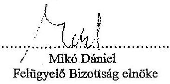

Jóváhagyási záradék
A NYÍRTÁVHÓ KFT. egyedüli tagja - az aláírásra jogosult képviselőjének e záradék jegyzésével bizonyítottan - a jelen módosított felügyelő bizottsági ügyrendet a 2007. ........................... napján kelt .........../2007. számú határozatával jóváhagyta.

Nyíregyháza, 2007.

Dr. Szemán Sándor
jegyzö

Csabai Lászlóné
polgármester

---

# NYIREGYHÁZA MEGYEI JOGÚ VÁROS KÖZGYÜLÉSÉNEK 

$197 / 2007$. (IX.24.) számú
határozata

Az önkormányzati alapítású gazdasági társaságok felügyelő bizottságai ügyrendjeinek jóváhagyásáról

## A Közgyűlés

1.) a Nyírinfo Kht. felügyelő bizottságának ügyrendjét az 1. számú melléklet szerint jóváhagyja
2.) a Nyírsuli Kht. felügyelő bizottságának ügyrendjét a 2. számú melléklet szerint jóváhagyja
3.) a Város-Kép Kht. felügyelő bizottságának ügyrendjét a 3. számú melléklet szerint jóváhagyja
4.) a Nyírtávhő Kft. felügyelő bizottságának ügyrendjét a 4. számú melléklet szerint jóváhagyja
5.) a Plac és Vagyonkezelő Kft. felügyelő bizottságának ügyrendjét az 5. számú melléklet szerint jóváhagyja
6.) a Sóstó-Gyógyfürdők Zrt. felügyelő bizottságának ügyrendjét a 6. számú melléklet szerint jóváhagyja
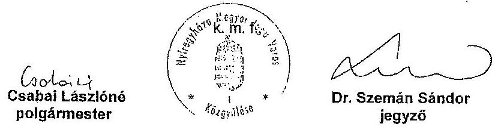

A határozatot kapják :
1./ a Közgyűlés tagjai
2./ a jegyző és a Polgármesteri Hivatal belső szervezeti egységeinek vezetői

---

# JEGYZŐKÖNYV 

a
NYÍRTÁVHŐ Kft. Felügyelő Bizottsága üléséről

Készült: a NYÍRTÁVHŐ Kft. Nyíregyháza, Népkert u. 12. sz. alatti hivatalos helyiségben 2007. szeptember 04-én

Jelen vannak:
Mikó Dániel
Pöldesi István
Remezné Fazaar Ildikó
Soltézné Pádár Ilona
Dr. Béres Géza
Genda István
Tóth Illés
Dience Barnáné
Giba Tamás

Felügyelő bizottsági elnök
Felügyelő bizottsági tag,
Felügyelő bizottsági tag,
Felügyelő bizottsági tag,
könyvvizsgáló,
ügyvezető igazgató,
mikszaki igazgató,
értékesítési igazgató,
alpolgármester
a mellékelt jelenléti ív szerint.
Mikó Dániel a Felügyelő Bizottság Elnöke üdvözölte a megjelenteket. Az Elnök úr megállapította, hogy a Bizottság tagjai közül 4 fő jelen van, így a Bizottság határozatképes. Dr. Hajzer László Felügyelő bizottsági tag jelezte, hogy más elfoglaltsága miatt nem tud részt venni a mai ülésen. Más napirendi javaslat nem lévén jelenlévők a napirendi javaslatokat egyhangúlag elfogadták.
Az ülés napirendi pontjai:
1./ Tájékoztató a NYÍRTÁVHŐ Kft. 2007. I. Elévi gazdálkodási eredményéről
2./ Javaslat a NYÍRTÁVHŐ Kft. statuikrási rendemrének fejlesztésére
3./ Javaslat a NYÍRTÁVHŐ Kft. Felügyelő Bizottsága ügyrendjének módosítására
4./ Tájékoztató a távfütési hálózat fejlesztését célzó projektek előkészítéséről, azok eredményéről
5./ Egyebek

## 1./ Napirendi pont

Az ügyvezető igazgató prezentáció keretén belül mutatta be a társaság 2007. I. Elévi gazdálkodási eredményelt, a fontosabb mutatászámok alakulását és megfogalmazta a gazdasági év további feladatait. Szóli a távhőszolgáltatást és a kazántreneltetési tevékenység energiafelhasználásának, költségeinek és árbovételének alakulásáról, a karbantartási-javítási és beruházás-felújítási munkákról és azokra felhasznált pénzeszközökről, a költségszerkezet arányainak változásáról, a lakosságá bátrolékok alakulásáról és azok kezeléséről valamint a fejlesztések irányairól.
Dr. Béres Géza könyvvizsgáló kérdése a panel program várható hatámira, Mikó Dániel Felügyelő bizottsági elnök kérdése a vevöelégedettség mérésre vonatkozott.
Az ügyvezető igazgató válaszában utalt a hőfelhasználást bemutató díagra para, amely szerint további felhasználás-csökkenés várható, amennyiben nem bővül tovább a fogyasztói kör. A vevőelégedettségi kérdőívek feldolgozása folyamatban van, kiértékelésük rövidezen elkészül és arról a tisztelt Bizottságot tájékoztatni fogja.
Soltézné Pádár Ilona Felügyelő bizottsági tag hozzászólásában kiemelte, hogy az energiagazdálkodásban megjelenik a takarékosság a fogyasztók körében, és jönik ítéli, hogy a tájékoztató kiürjedt a humáncölfortás menedzetésre is.
Remezné Fazaar Ildikó Felügyelő bizottsági tag elmondta, hogy az épületek rekonstrukcióját komplexen kéne hozelni, nem jó megoldás az, hogy külön készül el a hőszigetelés ill. a nyilászáró csere valamint a gépészeti rekonstrukció.
Giba Tamás alpolgármester hozzászólásában elsöként gránitált a társaság eredményeihez. A panel programhoz kapcsolódóan elmondta, hogy az alkalmazott hövédelem miatt csökkeni fog a hőenergia felhasználás. Erre válasz a már végrehajtott fogyasztói kör bővítés: az Interapar, és a következők, a Korzó Özletkörpont, az ODI, valamint a Mérda Markt, amelyek hatása meg kell jelengen az energia vételezésben. Ugyancsak energiafelhasználás csökkenést eredményeznek a távfütési vezetékhálózaton végrehajtott rekonstrukciók, mivel ezáltal csökken a hálózati hőveszteség. Ez a jelenség felveti a nyári energiafelhasználás átértékelésének gondolatát. A kizilövősségek alakulása a társaság egyik jelentős eredménye. A működő támogatási rendszerok mellett nagyon sok munkát jelent a társaság számára, továbbá eredményeket azokban

---

csak még szívószob munkával lehet és kell elérni. Az iparesított technológiával épített lakások korszerűsítése nem biztos, hogy csak komplex módon a legcélszoríbb, most a Nyitás program tartalmával azonos projektekre is elnyerhető támogatás. A költség-haszon elemzésnek van abban jelentős szerepe, hogy melyik részleges vagy teljes - konstrukciót válaszija egy lakóközösség. Kis beruházással is elérhetők jelentős megtakarítások. Van példa a komplex rekonstrukcióra. Az Ungvár stay. 1. sz. alatti épület esetében sor kezük homlokzat és tető felújításokra, épülségépészeti rekonstrukcióra és ezek mellett lakókörzetet megbban foglaló köstertiket rehabilitációjára is. A legcélszoríbbnak a modul szemlélet mutatkozik.
Mikó Dániel Felügyelő bizottsági Elnök utalt arra, hogy a panel programhoz kidolgozott pontozási rendszer arra észrítsdul a pályázékot, hogy a rekonstrukció tartalma komplex legyen.
Földesi István Felügyelő bizottsági tag véleménye szerint a prezentáció tartalmas volt, bemutatta az eredményes gazdálkodást. A feladatok végrehajtásával a társaság jól követte a külső változárakat. A kínfővőség alakulásáról elemerően szült, azonban jelentős tételnek tartja, amit a felhasználható eszközökkel csökkenteni kell.

# 1./ 2007.09.04. számú határozat 

A Felügyelő Bizottság a Nyitávbő Kft. 2007. I. félóvi gazdálkodásáról szóló tájékoztatással egyetértett, egyhangúlag elfogadta.

## 2./ Napirendi pont

Giba Tamás alpolgármester időszerűnek tartja a napirend tárgyalását. A szándázás és elszámolás területén a felhasználók igényeihez igazodó megoldásokat kell alkalmazni. A nagy szolgáltató vállalkozó jó példák vannak erre, bár a helyi távhőztségátatás sajátossága - a fűtési költségmegesztő rendszer alkalmazása - miatt itt bonyolultabb a hasonló konstrukciók kidolgozása és bevezetése. Az elvárás az, hogy ami hőenergiát a felhasznáki előigyasztott azt fizesse ki, a reális cél pedig az lehet, hogy az év végi elszámoláskor minél kisebb legyen az elszámolandó összeg.
Remezné Facsar Ikökö Felügyelő bizottsági tag az egyik távhőellátásban résztvevő épület példáján szemléltette a lakások épületen belüli elhelyezkedésekből adódó hőfogyasztási és költség különbségeket. Ezért az 1.3. pontban megfogalmazott javaslatot tartja a legjobbank, mivel véleménye szerint a felévezésleti elszámolás a lakosság igényeihez jobban igazodik, és a konstrukció alkalmazásával együtt járó $2 \%$ mértékủ alapdíj-növekedés nem számottevó.
Az ügyvezető igazgató elmondta, hogy a társaság által javasolt megoldás a társaság gazdálkodását tekintve a legkültségkímélőbb, alkalmazása már ez év októberétől megoldható. A tényleges felhasználáshoz közelítő megoldásnál kisebb lesz az elszámolásnál jelentkező különbözet. Etnél a változatait is már várható, hogy fokozott számban lesznek fogyasztói észrevételek, mert a nagyobb hőfogyasztási lakásoknál arányosan magasabb összegủ számla kerül a fogyasztóhoz. Más változatait szükséges a meglévő számilázási programrendszer fejlesztése, amelyhez a költségeken kívül idöre is szükség van. A javasolt változat bevezetését követően a társaság elkezdi a hőfelhasználás alapján történő - a fütési költségmegesztés arányának figyelembevételével készülő - részszámilázás bevezetésének előkészítését. Előlez jósnakis szoftver fejlesztésre is szükség van, ezért ezen alternatíva bevezetésének kezdete a programok tesztelésével jövő év második felében várható.
Földesi István Felügyelő bizottsági tag szerint a változárakat fokozatosan kell végrehajtani, A javasolt rendszer elfogadható, támogatja az 1.4. számú javaslatot.
Mikó Dániel Felügyelő bizottsági Elnök emlékeztetett arra, hogy a javaslatban megfogalmazottak szerint a lakossági fogyasztók jelentős hányadát képviselő közösköpviselők kedvezően nyilatkoztak a jelenlegi szándázástól is.
Dienes Barnáné értékesítési igazgató elmondta, hogy - amit már több alkalommal fogyasztók felé is tájékoztatásként eljutnattuk - a számilázási program jelenleg is képes egyedi igények kezdetére. Van azonban olyan is, hogy nem köri a kisebb összegủ részszándát, a korábbi - nagyobb mértékủ - számára a kedvezőbb, az elszámoláskor részére visszafizetendő összeg miatt.
Töth Illés műszaki igazgató kiemelte az elmúlt években végrehajtott fejlesztések közül az elektronikus fütési költségmegesztők alkalmazását. Ezek lehetővé teszik az adatok kiolvasását célszerűen megválasztott időközökben. Azonban minden fejlesztés pénzbe kerül.
Dr. Béres Géza könyvvizsgáló a szolgáltatások különbözőségét emelte ki hozzászólásában. A prom szolgáltatás esetén a vevő azonnal fizet, folyamatos szolgáltatásnál azonban más módszerek és eszközök vannak a folyamatosan. A fogyasztást mérjük, az elszámolás a szolgáltatás része, aminek költségeit a felhasználónak kell viselnie. Amennyiben a javasolt korrigálást alkalmazza a társaság, úgy jó úton jár. A gazasságosság és biztonság kell, hogy meghatározza a cég tevékenységét.

---

# 4. SZÁMÚ MELLÉKLET A V-OS21-153/2014. SZÁMÚ JELENTÉSHEZ

Mikó Dániel Felügyelő bizottsági Elnök kiemeli, hogy a cég ezzel a javaslatban szereplő megoldással nem fejezi be a fejlesztést, hanem tovább folytatja azt.

## 2./2007.09.04. számú határozat

A Felügyelő Bizottság a NYÍRTÁVHÓ Kft. számítását rendszerének fejlesztésére tett 1.4 számú javaslatot a rendeletmódosító javaslattal együtt egyhangúlag elfogadta.

## 3./Napirendi pont

Javaslat a NYÍRTÁVHÓ Kft. Felügyelő Bizottsága ügyrendjének módosítására.

## 3./2007.09.04. számú határozat

A Felügyelő Bizottság a NYÍRTÁVHÓ Kft. Felügyelő Bizottsága ügyrendjének módosítására tett javaslatot egyhangúlag elfogadta.

## 4./Napirendi pont

Az ügyvezető igazgató tájékoztatta a jelenlévőket a távfizési hálózat fejlesztését célzó projektekről. Szélt a napenergia hasznosítására irányuló pályázatról, amelyet a norvég alapból elnyerhető támogatással együtt kívánnak megvalósítani a távfizési hálózat használati melegvíz igényének kiológiéndose. Az energiaffenergiacotő projekt biomassza hasznosítását célozza meg, amelyet egy alkalmas városkörzeti gázüzemű intézményi kazánlódhoz lehet telepíteni alternatív energiahordozóként. A hőközpontok rekonstrukciója és a távfizési vezetékonásainak korozzálatára még további egy-egy projektasomag, amelyhez szintén vissza nem térítendő támogatást kívánnak megpályázni.

A távfizési hálózat gazdaságos üzemeltetésének egyik meghatározója a kedvező beszállítói ár. Alternatív változat lehet saját hőtermelő berendezés létesítése is. Előzetes számítások szerint a gázmotorná kapcsolatban termelt hő- és villamosenergia hasznosításából eredő bevételek a gazdálkodás biztonságát fokozhatják. Egy alkalmasan megválasztott kiserőmű megvalósítása jelenlegi körülmények között is kellő mértékű nyereséget hoz elfogadható megtérülési idő mellett. Javasolja, ennek további kidolgozását, a tulajdonos felé döntéselőkészítésen.

## 4./2007.09.04. számú határozat

A Felügyelő Bizottság a távfizési hálózat fejlesztését célzó projektek előkészítéséről elhangzott tájékoztatót egyhangúlag elfogadta.

## 5./Napirendi pont

Az ügyvezető igazgató tájékoztatta a Felügyelő Bizottságot arról, hogy az elmúlt időszakban a társaságnál Adó- és Fénzügyi Ellenőrzési Hivatal valamint a Magyar Állandásokat által elvégzett vizsgálatok eredménye kedvező. Jelenleg a Polgármesteri Hivatal Ellenőrzési Iradája a gázüzemű kazánlatot technológiákhoz kapcsolódó üzletág tevékenységét vizsgálja, ennek eredménye a hónap második felében várható.

## 5./2007.09.04. számú határozat

A Felügyelő Bizottság a napirendi pontban elhangzott tájékoztatót egyhangúlag elfogadta.

További kérdés, észrevétel, hozzászólás nem volt, az Elnök úr bezárta az ülést.

Km. 1. oldalon

A jegyzőkönyv és üzemeltetés

A jegyzőkönyv jóváhagyás:

Gorila István
Jegvételű igazgató

Mikó Dániel
Felügyelő Bizottság Elnöke

---

# NYÍRTÁVHŐ Korlátolt Felelősségű Társaság Felügyelő Bizottsága 

## ÜGYREND

A korlátolt felelősségủ társaság felügyelő bizottsága a gazdasági társaságokról szóló 2006. évi IV. törvény, valamint a Kft. alapító okiratában foglaltak alapján, saját ügyrendjét az alábbiakban állapítja meg:

## 1.

## A felügyelö bizottság szervezete:

1./ A felügyelő bizottság öt tagból áll, akiket az alapító jelölt ki, illetve a Nyíregyháza Megyei Jogú Város Közgyűlése választott. A tagok megbízatása határozott időre, de legfeljebb öt évre szól, megbízatásuk időtartamát az alapító Nyíregyháza Megyei jogú Város Közgyűlésének határozata tartalmazza.
2./ A felügyelő bizottság elnökét a tagok maguk közül választják. A felügyelő bizottság elnökének megválasztására bármely tag javaslatot tehet, melyről a tagok nyílt szavazással döntenek.

## 2.

## A felügyelö bizottság tagjai:

1./ A felügyelő bizottság tagjának választható az a természetes személy - magyar vagy külföldi állampolgár -, aki megfelel a hatályos magyar jogszabályokban meghatározott feltételeknek, és a megbízatást írásos jognyilatkozattal elfogadja.
2./ A NYÍRTÁVHŐ Kft. munkavállalóját - kétszáz fő teljes munkaidőben foglalkoztatott munkavállalói létszám esetén a munkavállalók képviseletét ellátó tagok kivételével - a közgyűlés nem választhatja a felügyelő bizottság tagjává.
3./ A felügyelő bizottsági tag egyidejűleg több társaság felügyelő bizottságába választható meg. A tag az új tisztsége elfogadásától számított 15 napon belül köteles írásban tájékoztatni azokat a gazdasági társaságokat, amelyeknél már felügyelő bizottsági tag.
4./ Nem lehet a felügyelő bizottság tagja az a személy, akinek bizottsági tagságát jogszabály zárja ki, vagy akinek tagságát - megválasztása után bekövetkező esemény miatt - jogszabály, vagy a tag maga összeférhetetlennek minősíti.

---

5./ A felügyelő bizottság tagja haladéktalanul köteles jelezni a felügyelő bizottság elnökének, ha vele szemben a megválasztását követően összeférhetetlenségi ok állt elő.
6./ A felügyelő bizottság tagja a társaság hozzájárulása nélkül:
a./ nem szerezhet társasági részesedést - nyilvánosan müködő részvénytársaságban való részvényszerzés kivételével - a társaságéval azonos tevékenységet főtevékenységként megjelölő más gazdálkodó szervezetben,
b./ nem lehet vezető tisztségviselő a társaságéval azonos főtevékenységet végző más gazdasági társaságban, illetve szövetkezetben.
Az ügyvezető és közeli hozzátartozója, valamint élettársa nem köthet a saját nevében vagy javára a társaság főtevékenysége körébe tartozó ügyleteket.
A felügyelő bizottsági tagok közeli hozzátartozói nem lehetnek a társaság vezető tisztségviselői.
7./ A felügyelő bizottság tagjai megbízatásuknak személyesen kötelesek eleget tenni, képviseletnek a felügyelő bizottsági tevékenységben nincs helye.
8./ A felügyelő bizottság tagját - az e tisztséghez tartozó tevékenységi körében a gazdasági társaság tagja, illetve munkáltatója nem utasíthatja.
9./ A felügyelő bizottság tagjait kötelezettség terheli annak biztosítására, hogy az általuk kért, és részükre kiadott, vagy más módon tudomásukra jutott adatokhoz, információkhoz, iratokhoz illetéktelen személyek hozzá ne férhessenek.
10./ A felügyelő bizottsági tagok a társaság ügyeiről szerzett értesüléseiket üzleti titokként kötelesek megőrizni.
11./ Az alapító közgyülésének ülésein - melyek témát a NYÍRTÁVHÓ-KH-t érintik, a felügyelő bizottság tagjai részt yabstnek, ahol a felügyelo bizottság megállapításait ismertethetik.
12./ Megszűnik a felügyelő bizottsági tagság:
a./ a megbízatás időtartamának lejártával;
b./ visszahívással;
c./ lemondással;
d./ elhalálozással;
e./ törvényben szabályozott kizáró ok bekövetkeztével;
f./ külön törvényben meghatározott esetben.
13./ A tagok bármikor visszahívhatók, és megbízásuk lejárta után újraválaszthatók.
14./ A felügyelő bizottsági tagságra szóló megbízás visszavonására az alapító jogosult.
15./ A felügyelő bizottság tagja tagságáról az ügyvezető és az alapító egyidejű tájékoztatása mellett a felügyelő bizottsági ülésen mondhat le a gazdasági társaságokról szóló 2006. évi IV. tv. (továbbiakban Gt.) 31. § (2)

---

bekezdésének figyelembevételével.
16./ Amennyiben a felügyelő bizottság létszáma bármely okból öt fő alá csökken, vagy nincs, aki az ülését összehívja, haladéktalanul az alapító döntését kell kérni a felügyelő bizottság létszámának kiegészítésére.
17./ A felügyelő bizottság tagjai az e tisztséget betöltő személyektől általában elvárható gondossággal kötelesek eljárni.
A felügyelő bizottsági tagok - a Ptk. közös károkozásra vonatkozó szabályai szerint - korlátlanul és egyetemlegesen felelnek a gazdasági társasággal szemben a társaságnak az ellenőrzési kötelezettségük megszegésével okozott károkért.
Mentesül a felelősség alól az a felügyelő bizottsági tag, aki a felügyelő bizottság határozata vagy intézkedése elleni tiltakozását a felügyelő bizottság ülésén írásban bejelentette, jegyzőkönyvbe diktálta, vagy az általa észlelt mulasztást - írásban - olyan időben jelezte az intézkedésre jogosult szervnek, hogy az még időben intézkedhetett volna.
18./ A felügyelő bizottság tagjai az alapító által megállapított tiszteletdijban részesülnek.

# 3. 

## A felügyelő bizottság elnöke:

1./ A felügyelő bizottság elnökét a bizottság első ülésén saját tagjai közül válaszija.
2./ A felügyelő bizottság elnökének feladata a testület tevékenységének koordinálása, a bizottság álláspontjának képviselete, az ülések összehívása, technikai előkészítésének ellenőrzése, és az ülés vezetése.
3./ Az elnök é hónapot meghaladó elóre látható akadályoztatása esetére a bizottság új elnököt válasss.
4./ Az elnöki megbízatás megszünése esetén a bizottság a napon belül új elnököt. választ.

## 4.

## A felügyelö bizottság müködése:

1./ A felügyelő bizottság szükség szerint tartja üléseit, de évente legalább négy alkalommal ülést tart, üléseit az elnök hívja össze.
2./ Az összehívást bármely tag - az ok és a cél megjelölésével - az elnökköl írásban kérheti. Ha az elnök a felügyelő bizottság ülését nyolc napon belül nem hívja össze, annak összehívására a tag jogosult.

---

3./ Az elnök a felügyelő bizottság üléseire a könyvvizsgálót is - és szükség szerint más személyt - meghívhatja.
4./ Az elnök köteles összehívni a bizottságot a könyvvizsgálói jelentés kézhezvételétől számított 15 napon belül, illetve ha a könyvvizsgáló kéri. Ezekben az esetekben a könyvvizsgálót az ülésre meg kell hívni.
5./ A felügyelő bizottságot az elnök az időpont, a helyszín és a napirendi pontok megjelölésével írásban hívja össze. A tagoknak és az állandó vagy eseti meghívottaknak a meghívót az ülés napja előtt legalább 8 nappal postán kell megküldeni. A meghívó mellé csatolni kell az esetleges írásos előterjesztéseket is.
6./ Az ülés sürgős esetben telefaxon, vagy elektronikus úton is összehívható, amennyiben a meghívó elküldésének ténye megfelelően dokumentálható.
7./ A felügyelő bizottság ülésén a tagokon kívül tárgyalási joggal részt vesz a társaság ügyvezetője is. A felügyelő bizottság ülésein esetileg vesznek részt mindazok, akiknek jelenléte a napirendhez szükséges, és ezért őket a felügyelő bizottság elnöke meghívta.
8./ A felügyelő bizottság elrendelheti zártkörű ülés összehívását, illetőleg adott napirend zárt ülésen történő megtárgyalását. Zárt ülésen csak a bizottság tagjai lehetnek jelen. A zárt ülés jegyzőkönyvében csak a határozatot, a jelenlévők nevét, az esetleges különvéleményt, az ülés időpontját és helyszínét kell feltüntetni. A jegyzőkönyvet a felügyelő bizottság egy tagja vezeti, és a felügyelő bizottság valamennyi jelenlévő tagja aláírja. Zárt ülésről hangfelvételt készíteni nem lehet.
9./ A felügyelő bizottság akkor határozatképes, ha azon legalább négy tag jelen van.
10./ A felügyelő bizottság határozatait egyszerű szótöbbséggel, nyílt szavazással hozza. Minden felügyelő bizottsági tagnak egy szavazata van.
11./ Ha bármely tag kéri, úgy határozathozatal előtt az elnök titkos szavazást rendelhet el.
12./ Minden felügyelő bizottsági ülésről jegyzőkönyv készül, mely tartalmazza a jelenlévőket, az ülés helyét, idejét, a napirendi pontokat, a hozzászólások lényegét, és a hozott határozatokat. Az ülésről készült jegyzőkönyv az ülés napját követő öt évig nem selejtezhető.
13./ A jegyzőkönyvben fel kell tüntetni - vagy írásban a jegyzőkönyvhöz kell mellékelni - minden olyan tényt, esetleges kisebbségi vagy különvéleményt, tiltakozást, amelyet a tagok kérnek.
14./ Rögzíteni kell a szavazás eredményét, és ilyen irányú határozott kérés esetén az ellenszavazók véleményét is.

---

15./ A jegyzőkönyvet az ülést követő nyolc napon belül kell elkészíteni. A jegyzőkönyvet az elnök hitelesíti, és megküldi a tagoknak, továbbá szükség esetén az ügyvezetőnek is.
16./ A felügyelő bizottság saját iratkezelését maga szervezi meg.
17./ A felügyelő bizottság határozatait sorszámmal, év és dátum megjelöléssel kell ellátni és nyilvántartani.
18./ A felügyelő bizottság müködéséhez szükséges feltételek biztosítása (jegyzőkönyvvezető, helyiség, stb.) a társaság ügyvezetőjének kötelezettsége.

# 5. 

## A felügyelö bizottság jogai és kötelezettségei:

1./ A felügyelő bizottság jogait testületileg, vagy tagjai útján gyakorolja.

A felügyelő bizottság egyes ellenőrzési feladatok elvégzésével bármely tagját megbízhatja, illetve az ellenőrzést állandó jelleggel is megoszthatja tagjai között. Az ellenőrzés megosztása nem érinti a felügyelő bizottsági tag felelősségét, sem azt a jogát, hogy ellenőrzését más tevékenységre is kiterjeszze.
2./ A felügyelő bizottság tagjai ellenőrzik a társaság gazdálkodását a hatályos jogszabályok, a társaság alapító okirata és az alapítói határozatok alapján.
3./ A felügyelő bizottság ellenőrizheti a társaság számviteli és pénzügyi rendjét, a társaság szabályzatait és azok rendelkezéseinek végrehajtását.
4./ Ellenőrzi a társaság pénz- és hitelgazdálkodását, kereskedelmi és egyéb kapcsolatait, a gazdálkodás eredményességét.
5./ A felügyelő bizottság informálódik az alapító közgyűlése által jóváhagyott éves terv teljesítéséről, melyhez a szükséges információkat az ügyvezető biztosítja.
6./ A felügyelő bizottság köteles részletesen megvizsgálni a társaság számviteli törvény szerinti beszámolóját, a mérleget, az eredménykimutatást, az üzleti jelentést, és a kiegészítő mellékletet, és mindazon jelentéseket, amelyeket vizsgálatra az ügyvezető a felügyelő bizottságnak megküld. E feladatainak végrehajtásáról és eredményéről az alapítónak jelentést tesz.
7./ A felügyelő bizottság megvizsgálja és véleményezi az alapító elé terjesztett egyéb fontos jelentéseket, különösen:

- a társaság gazdasági stratégiájának kialakítása;
- a társaság éves, és középtávú terve;
- a társaság áspolitikája, üzletpolitikája;
- a társaság dijmegállapításra vonatkozó javaslata;
- az alapító hatáskörébe utalt szerződések.

---

8./ A NYÍRTÁVHŐ Kft. alapítója elé terjesztendő fontosabb jelentésekről, továbbá a számviteli törvény szerinti beszámolóról a felügyelő bizottság írásbeli jelentése nélkül az alapító érvényes határozatot nem hozhat.
9./ A felügyelő bizottság ellenőrzi a társaság ügyvezetését. Ennek keretében a vezető tisztségviselőktől és a társaság vezető állású dolgozóitól jelentést vagy felvilágosítást kérhet, a társaság könyveit és iratait megvizsgálhatja, illetőleg szakértővel megvizsgáltathatja. Gazdasági társaság vezető tisztségviselője, illetve vezető állású munkavállalói az írásbeli felvilágosítás kérésre a kézhezvételtől számított 15 napon belül írásban kötelesek válaszolni.
10./ Ha a felügyelő bizottság jogellenességet, alapító okiratába, vagy közgyűlési határozatba ütköző tényt, mulasztást, a társaság érdekeibe ütköző intézkedést, vagy visszaélést tapasztal, erről köteles az alapítót haladéktalanul értesíteni.

Ha a felügyelő bizottság megítélése szerint az ügyvezetés tevékenysége jogszabályba, alapító okiratba illetve az alapítói határozatba ütközik, vagy egyébként sérti a gazdasági társaság vagy az alapító érdekeit, erről köteles az alapítót haladéktalanul értesíteni.
6.

A bizottság ügyrendjét a társaság alapítója hagyja jóvá.
Az ügyrendet a bizottság módosíthatja. Erről az elnők útján értesíti az alapítót, aki a módosítást szintén jóváhagyja.

Nyíregyháza, 2007. március 12.

# Záradék: 

A NYÍRTÁVHŐ Korlátolt Felelősségủ Társaság felügyelő bizottságának jelen ügyrendjét a felügyelő bizottság 2007. március 12. napján megtartott ülésén megtárgyalta, és az 1/2007.03.12. sz. határozatával elfogadta.
a felügyelő bizottság elnöke

---

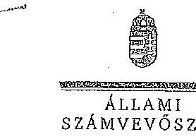

ELNÖK

Ikt.szám: V-0521-151/2014.

Joó László úr
ügyvezető igazgató
Nyíregyházi Távhőszolgáltató Kft.

Nyíregyháza

Tisztelt Ügyvezető Igazgató Úr!

Köszönettel vettem a Nyíregyházi Távhőszolgáltató Kft. ellenőrzéséről készített számvevőszéki jelentéstervezetre tett észrevételeit.

Csstoltan megküldöm az Állami Számvevőszék észrevételekre vonatkozó álláspontjáról a feltigyeleti vezető által készített részletes tájékoztatást.

Tájékoztatom Igazgató urat, hogy a számvevőszéki jelentés véglegesítése az elfogadott észrevételek figyelembevételével történik.

Budapest, 2014. elecentre hó to nap

Tisztelettel:

Domokos László

Melléklet: Tájékoztatás az észrevételek kezeléséről

1052 BUDAPEST, KHÁCZIN CSERE ÁRNOS UYCA 10. 1354 Budapest 4. Pl. 54 telefon: 484 9191 fax: 484 9281

---

# Tájékoztatás az észrevételek kezeléséről 

A Nyíregyházi Távhőszolgáltató Kft. (NYÍRTÁVHŐ Kft.) ellenőrzéséről készített jelentéstervezetre Ügyvezető Igazgató úr észrevételeket fogalmazott meg. Az észrevételek alapján a jelentés tervezetét az alábbiak szerint módosítom:

Az észrevételck 1. bekezdése alapján a jelentéstervezetben töröltük a Nyíregyháza Megyei Jogú Város Önkormányzata Polgármesterének tett javaslatot, a kapcsolódó összegző megállapítást (10. oldal 3. bekezdés), és részletes megállapítást (19. oldal 2. bekezdés), mivel a rendelkezésre bocsájtott dokumentumok szerint a Felügyelő Bizottság rendelkezett ügyrenddel az ellenőrzött időszakban.

Az észrevételek 2. bekezdésében kért javítást nem áll módunkban megtenni. Fenntartjuk azt a megállapítást, hogy „A NYÍRTÁVHŐ kft. ügyvezetése az Alaptió Okiratban feladatként elöírt rendszeres, negyedévenkénti gyakoriságú beszámolási kötelezettségének maradéktalanul nem tett eleget.". Az Alaptió Okirat 5. pontja az ügyvezető számára naptári negyedévenkénti beszámolójelentés készítésének kötelezettségét írta elő, melyet nem teljesített valamennyi negyedév vonatkozásában.

Az észrevételek 3. bekezdése alapján a jelentéstervezetet pontosítottuk, az összegző megállapítások (13. oldal 3. bekezdés) és a részletes megállapítások (24. oldal 3. bekezdés) közül a következő szövegrészt töröltük:
„A tárgyi eszközöket nyélvántartó szoftver az értékcsökkenés napjainak számítása során 360 nap/évvel számolt ( 365 nap helyett), valamint a ráaktíválással érintett tárgyi eszközök esetében az értékcsökkenés számítás alapját képező bekerülési értéket nem növelték meg az eszközökön végzett bővítések, felújítások összegével."

Az észrevételek 4. bekezdése a jelentéstervezetnek az ingatlanok és műszaki berendezések mennyiségi leltározásának elmaradására vonatkozó megállapításához tartalmaz kiegészítő információkat. A megállapítást nem vitatja, ezért azt változatlan formában fenntartjuk.

Az észrevételek 5. bekezdésében - a kapott távhőtámogatás éves összegeire és azok felhasználására - tett észrevételt elfogadtuk, a jelentéstervezet összegző megállapításai (11. oldal 4. bekezdés) és a részletes megállapításai (28. oldal 5. bekezdés) közül a következő szövegrészt töröltük:
„A kapott távhőtámogatás összege 2008-ben és 2009-ben 1239 millió Ft, 2010-ben 1578 millió Ft, 2011-ben 2123 millió Ft és 2012-ben 1777 millió Ft volt. A NYÍRTÁVHŐ Kft. által igénybevett távhőtámogatás tárgy évi felhasználása az ellenőrzött években nem történt meg, a társasági adó alapja pozitív volt, társasági adó fizetési kötelezettség keletkezett. A távhőtámogatás felhasználásának hatékonyságát rontatta, hogy a támogatás év végi maradványáz csökkentette a társasági adó összege."

Az észrevételek 6. bekezdése alapján a jelentéstervezetet pontosítottuk, a jelentéstervezet 26. oldalának 2. bekezdéséből töröltük a zárójeles részt: (hőszolgáltatási szerződések, hálázathasználati szerzödések).

---

Az észrevételek 7. bekezdése a számviteli szétválasztás 2012. január 1-jétől történő szabályozásának elmulasztására tartalmaz magyarázatot. A megállapítást nem vitatja, ezért ezt változatlan formában fenntartjuk.

Az észrevételek 8. bekezdése egy, a jelentéstervezetben (21. oldal 2. részbekezdés) ismertetett, belső ellenőrzés által tett megállapításhoz füz magyarázatot. A jelentéstervezetben a belső ellenőrzés megállapítását tényként közöltük, ezért módosítását nem tartjuk indokoltnak.

Budapest, 2014. december " ".
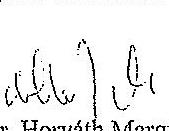

---

.

---

# Mintavételi eljárások ellenőrzési területenként

|  Szz. | Mintavétellel ellenőrzendő területek | Főbb kérdés | Ellenőrzési kérdések | Adatforrások | Alap Sokaság | Mintavételi eljárás  |
| --- | --- | --- | --- | --- | --- | --- |
|   |  |  |  | 4. | 5. | 6.  |
|  1. | Az ellátott közfeladat ráfordításainak elkülönített, szabályszerű elszámolása területén |  |  |  |  |   |
|  2. | Anyagjellegű ráfordítások | Az anyagjellegű ráfordítások: elszámolása során betartották-e a belső szabályzatokban és a jogszabályokban foglaltakat és azokat a közfeladat-ellátással kapcsolatosan elkülönítették-e? | - a számáasott anyagjellegű ráfordításokra kötött szerződésnél betartották-e az Számv.tv. előírását, a kifizetés megelőzően a kötelessettségvállalás megfelelő-e az előírásoknak?
- a beszerzett anyagok nyilvántartásba vétele megförtént-e, azokat a közfeladat-ellátással kapcsolatosan elkülönítették-e a szabályozásnak megfelelően?
- a késület bekerülési értékét a Számv. tv., a számviteli politika, illetve az értékelési szabályzat előírásai szerint vették-e számításba, azokat a közfeladat-ellátással kapcsolatosan elkülönítették-e?
- az anyagjellegű ráfordításokat a megfelelő költségnemre, illetve közfeladatra számolták-e el? | Az anyagjellegű ráfordítások közül az 51-53. főkönyi számácsoportokból vett minta esetében
- a költségelszámolást megalapozó dokumentumok (szemődések, megrendelések, stb.), költségelszámoláshoz benyújtott számják, teljesítés megförténtét, a kifizetést alátámasztó egyéb dokumentumok,
- analitikus nyilvántartások, anyagok nyilvántartásba vételét igazoló dokumentumok, ha a számviteli politika szerint nyilvántartásba kellett venni azokat. | Events a főkönyvi adatházisból - külön rész sokaságot képeznek az 51-53. Anyagjellegű ráfordítások számácsoportba a tartozó ráfordítások, kivéve az ELÁBE és az elszámolási kifizetést alátámasztó egyéb dokumentumok, a kifizetést megelőzően a közlesettségvállalás megfelelő-e az előírásokknnél leírás elszámolása megfelelő-e | A mintavételi megelőzően a sokasághól ki kell emelni - tételes ellenőrzésre - évente a 3-5 legnagyobb összegű tételt mindkét csoportból. Egyszerű véletlen mintavétel évenként és csoportonként elemszámmol arányos rétegeéssel.  |
|  3. | Beruházások, felújítások aktiválása és értékcsökkenési leírás | A feladat ellátásához az önkormányzattól kezelésre átvett közvogyon állományba vételi, nyilvántartási és elszámolási kötelezettségének teljesítése kapcsán a felújítások, beruházások kiadások aktiválása és az értékcsökkenési leírás elszámolása megfelelő-e | - a kifizetést megelőzően a kötelessettségvállalás megfelelő-e az előírásoknak, továbbá be lett kérve a tulajdonosi jogok gyakorlójának előzetes, írásbeli engedélye - amennyiben elózták - az önkormányzati tulajdonban lévő eszközön elszámolt beruházáshoz/felújításhoz?
- a beruházások, felújításokállománybavétele, besorolása, a bekerülési érték meghatározása, az üzembebélyezések (aktiválások) dokumentálása megfelelő-e a Számv. tv., a számviteli politika, illetve az értékelési szabályzat előírásainak?
- az ellenőrzésre kiválasztott immateriális javak és tárgyi eszközök szerepének-e a mérleget alátámasztó leltárban?
- az értékcsökkenés elszámolása a jogszabályban és a számviteli politikában meghatározott szabályozásnak megfelelő e? | A kiválasztott beruházásra vagy felújításra: szerződések, számják, a befejezetlen beruházások, felújítások analitikus nyilvántartása, immatartális javak, tárgyi eszközök analitikus nyilvántartása, a beszerzett eszköz üzembebélyezési elárványa, állományba vételi bizonylata, egyedi eszkönyilvántartó kartonja - az értékcsökkenés elszámolása az egyedi eszkönyilvántartó kartonja, illetve analitikus nyilvántartása | Events a főkönyvi adatházisból a 11-14. számácsoportok állománynövekedési tételei, ehhez kapcsolton az értékcsökkenés elszámolásának tételei  |
|  4. | Az ellátott közfeladat bevételeinek elkülönített, szabályszerű elszámolása területén |  |  |  |  |   |
|  5. | Értékesítés nettó árbevétel | Az értékesítés nettó árbevétele beszedése, elszámolása során betartották-e a belső szabályzatokban és a jogszabályokban foglaltakat és azokat a közfeladat-ellátással kapcsolatosan elkülönítették-e? | - a bevétel előírása, kiszámlázzása a belső szabályozásnak megfelelően történt-e?
- a bevételi előírás és a befolyt bevétel nyilvántartásba vétele (analitika, főkönyv) megförtént-e, azokat a közfeladat-ellátással kapcsolatosan elkülönítették-e?
- a bevételek beszedése, elszámolása során betartották-e a szabályozásban foglaltakat és a megfelelő számácsoportba számolták elú bevétel?
- a tulajdonosi követelményeknek, belső szabályozásnak megfelelő árat alkalmazták-e? | A kiválasztott értékesítés nettó árbevétel jogcímen befolyt bevételre:
- az egyes bevételek díjmegállapítása,
- a kibocsátott számla, befolyt bevétel analitikus nyilvántartása, behajtásra tett intézkedések dokumentumai,
- kapcsolódó főkönyvi számla tételes forgalma,
- bevétel beérkezését igazoló banki kivonat(ész) | Events a főkönyvi adatházisból a 91-94. számácsoportok bevételei  |