# ÁLLAMI   SZÁMVEVŐSZÉK 

## JELENTÉS

Az önkormányzatok gazdasági társaságai - Az önkormányzatok többségi tulajdonában lévő gazdasági társaságok közfeladat ellátását érintő gazdálkodási tevékenysége szabályszerűségének ellenőrzése CSORNAHŐ Csornai Hőszolgáltató Kft.

---

# Állami Számvevőszék 

Iktatószám: V-0522-266/2014.
Témaszám: 1556
Vizsgálat-azonosító szám: V0671

## Az ellenőrzést felügyelte:

Dr. Horváth Margit
felügyeleti vezető

## Az ellenőrzést vezette és az ellenőrzés végrehajtásáért felelős:   Salamin Viktor   ellenőrzésvezető

A jelentéstervezet összeállításában közremüködtek:
Dr. Mezei Imréné
Számvevő tanácsos
Groholy Andrásné Hangyál Márta
Számvevő tanácsos

## Az ellenőrzést végezték:

| Kiss Péter | Moder Beatrix |
| :-- | :-- |
| okleveles könyvvizsgáló | számvevő főtanácsos |
| külső szakértő |  |

---

# TARTALOMJEGYZÉK 

BEVEZETÉS ..... 5
I. ÖSSZEGZŐ MEGÁLLAPÍTÁSOK, KÖVETKEZTETÉSEK, JAVASLATOK ..... 8
II. RÉSZLETES MEGÁLLAPÍTÁSOK ..... 14

1. Az Önkormányzat közfeladat-ellátásának szabályszerűsége ..... 14
1.1. A közfeladat-ellátás megszervezése és a feladatellátás feltételrendszerének kialakítása ..... 14
1.2. A közfeladat-ellátás felügyelete és a tulajdonosi jogok érvényesítése ..... 16
2. A Csornahő Kft. közfeladat ellátással kapcsolatos tevékenysége ..... 19
2.1. A Csornahő Kft. gazdálkodásának szabályozottsága ..... 19
2.2. A Csornahő Kft. vagyongazdálkodása ..... 21
2.3. A beszámolási kötelezettség teljesítése ..... 23
3. A távhőszolgáltatás közfeladata bevételei és ráfordításai elszámolásának és önköltségszámításának szabályszerűsége ..... 23
3.1. A távhőszolgáltatás közfeladat bevételeinek és ráfordításainak szabályszerűsége ..... 23
3.2. Az önköltségszámítás szabályszerűsége ..... 26
MELLÉKLETEK
4. számú A Csornahő Kft. tevékenységének főbb adatai
5. számú A Csornahő Kft. múködésének főbb jellemzői
6. számú A Csornahő Kft. által alkalmazott hődíj éves átlaga a 2008-2012. években
7. számú Beérkezett észrevételek és az azokra adott válaszok
FÜGGELÉK
8. számú Értelmező szótár
9. számú Mintavételi eljárások ellenőrzési területenként

---

.

---

# RÖVIDÍTÉSEK JEGYZÉKE 

## Törvények

Ámt.
Gt.
Ötv.

Nvtv.

Ptk.
Számv. tv.
TAO tv.
Tszt.

## Rendeletek

SZMSZ $_{1}$

SZMSZ $_{2}$
vagyongazdálkodási rendelet
távhőszolgáltatási rendelet
távhődíjak megállapításáról szóló rendelet ${ }_{1}$
távhődíjak megállapításáról szóló rendelet ${ }_{2}$
az árak megállapításáról szóló 1990. évi LXXXVII. törvény (hatályos: 1991. január 1-jétől)
a gazdasági társaságokról szóló 2006. évi IV. törvény (hatálytalan: 2014. március 15-étől)
a helyi önkormányzatokról szóló 1990. évi LXV. törvény (hatálytalan: a 2014. évi általános önkormányzati választások napjától)
a nemzeti vagyonról szóló 2011. évi CXCVI. törvény (hatályos: 2011. december 31-étől, kivéve a 20. § (2) bekezdésben meghatározott paragrafusok, amelyek 2012. január 1-jétől, a (3) bekezdésben meghatározott paragrafusok 2013. január 1-jétől, a (4) bekezdésben meghatározott paragrafus 2012. március 2-ától léptek hatályba)
a Polgári Törvénykönyvről szóló 1959. évi IV. törvény (hatálytalan: 2014. március 15-étől)
a számvitelről szóló 2000. évi C. törvény (hatályos: 2001. január 1-jétől)
a társasági adóról és az osztalékadóról szóló 1996. évi LXXXI. törvény
a távhőszolgáltatásról szóló 2005. évi XVIII. törvény (hatályos: 2005. július 1-jétől)

Csorna Város Önkormányzata Képviselő-testületének 12/2007. (IV. 25.) számú rendelete az Önkormányzat Szervezeti és Múködési Szabályzatáról (hatálytalan: 2011. március 1-jétől)
Csorna Város Önkormányzata Képviselő-testületének 23/2012. (V. 31.) számú rendelettel módosított 5/2011. (II. 15.) számú rendelete az Önkormányzat Szervezeti és Müködési Szabályzatáról (hatályos: 2011. március 1jétől)
Csorna Város Önkormányzatának többször módosított 12/2003. (VI. 10.) számú rendelete az önkormányzat tulajdonáról és a vagyonnal való gazdálkodás egységes szabályairól (hatályos: 2003. június 10-étől)
Csorna Város Önkormányzata Képviselő-testületének 14/2006. (IV. 28.) számú rendelete a távhőszolgáltatásról (hatályos: 2006. április 28-ától)
Csorna Város Önkormányzata Képviselő-testületének 21/2006. (VIII. 30.) számú rendelete a távhőszolgáltatás díjairól (hatályos: 2006. május 1-jétől)
Csorna Város Önkormányzata Képviselő-testületének 13/2009. (IV. 24.) számú rendelete a távhőszolgáltatás díjairól (hatályos: 2009. május 1-jétől)

---

50/2011. (IX. 30.) NFM rendelet

51/2011. (IX. 30.) NFM rendelet

## Szórövidítések

Alapító okirat

Áfa
ÁSZ
Csornahő Kft.
eszközök és források értékelési szabályzata

FB
MEKH
javadalmazási szabályzat
jegyzö
Képviselő-testület
Önkormányzat
polgármester
Polgármesteri Hivatal
számlarend
számviteli politika
SZMSZ
ügyvezetés
társaság

A távhőszolgáltatónak értékesített távhő árának, valamint a lakossági felhasználónak és a külön kezelt intézménynek nyújtott távhőszolgáltatás dijának megállapításáról
a távhőszolgáltatási támogatásról

A CSORNAHŐ Csornal Hőszolgáltató Korlátolt Felelősségű Társaság alapító okirata (hatályos: 1993. január 1.től, módosítva: 2010. december 1-jén, továbbá 2012. december 20-án)
általános forgalmi adó
Állami Számvevőszék
CSORNAHŐ Csornal Hőszolgáltató Korlátolt Felelősségű Társaság
a CSORNAHŐ Csornai Hőszolgáltató Korlátolt Felelősségű Társaság eszközök és források értékelési szabályzata (hatályos: 2012. január 1-jétől)
Csornahő Kft. Felügyelőbizottsága
Magyar Energetikai és Közmű-szabályozási Hivatal
a 12/2010. (I. 25.) számú önkormányzati határozattal jóváhagyott, a CSORNAHŐ Csornai Hőszolgáltató Korlátolt Felelősségű Társaság javadalmazási szabályzata (hatályos: 2010. január 1-től)
Csorna Város Önkormányzatának jegyzője
Csorna Város Önkormányzatának Képviselő-testülete
Csorna Város Önkormányzata
Csorna Város Önkormányzatának Polgármestere
Csorna Város Önkormányzatának Polgármesteri Hivatala
a CSORNAHŐ Csornai Hőszolgáltató Korlátolt Felelősségű Társaság számlarendje
a CSORNAHŐ Csornai Hőszolgáltató Korlátolt Felelősségű Társaság számviteli politikája
CSORNAHŐ Csornai Hőszolgáltató Korlátolt Felelősségű Társaság 137/1995. (X. 12.) számú Képviselő-testületi határozattal jóváhagyott Szervezeti és Múködési Szabályzata (hatályos: 1995. október 15-étől)
Csornahő Kft. ügyvezetése
CSORNAHŐ Csornai Hőszolgáltató Korlátolt Felelősségű Társaság

---

# JELENTÉS 

## Az önkormányzatok gazdasági társaságai Az önkormányzatok többségi tulajdonában lévő gazdasági társaságok közfeladat ellátását érintő gazdálkodási tevékenysége szabályszerűségének ellenőrzése

## CSORNAHŐ Csornai Hőszolgáltató Kft.

## BEVEZETÉS

Az Állami Számvevőszék középtávra szóló stratégiájában megfogalmazta, hogy a helyi önkormányzatok gazdálkodásában rejlő pénzügyi kockázatok feltárásával, az államháztartáson kívülre nyújtott költségvetési támogatások és ingyenes vagyonjuttatások, valamint az államháztartáson kívül múködő köz-feladat-ellátó rendszerek ellenőrzéseivel hozzájárul ahhoz, hogy a közpénzeket az államháztartáson kívül múködő szervezetek is átlátható, rendezett módon használják fel a közfeladatok szerződésben vállalt ellátása érdekében.

Az önkormányzatok szervezetalakítási szabadságának következménye, hogy a korábban is vállalati formában múködő (nagyvárosi tömegközlekedés, víz-, szennyvízcsatorna, köztisztasági, ingatlankezelés stb.) közszolgáltatások mellett, mind a kötelező, mind az önként vállalt feladatok ellátásában a gazdasági társaságok kiemelt fontosságú szerephez jutottak.

Csorna Város Önkormányzata a távhőszolgáltatási feladatok ellátására a kizárólagos tulajdonában lévő - Csornai Hőszolgáltató Korlátolt Felelősségű Társaságot 1993. január 1-jén, 1 M Ft jegyzett tőkével alapította. Az alapító a társaság jegyzett tőkéjét 1993. március 29-ei hatállyal - apportálva a Győri Hőszolgáltató Vállalat közművagyonának megosztása során rendelkezésre álló közművagyont - 100 M Ft-ra felemelte.

A Csornahő Kft. feladata a 2012. január 1-jén 10558 fő lakosság számú Csorna város közigazgatási területén a távhő szolgáltató rendszer üzemeltetése, hőenergia termelése, elosztása, értékesítése, fűtés- és használati melegvízszolgáltatás, valamint a hő-termelő, hő-elosztó, hőszolgáltató és hő-felhasználó berendezések, fenntartása, javítása és üzemeltetése volt az ellenőrzött időszakban. A társaság - a 2012. évi éves beszámoló kiegészítő mellékletében szereplő adatok alapján - 405 lakásban biztosította a fűtést, ebből 311 volt a használati melegvízzel is ellátott, továbbá 120 az egyéb - nem lakossági - felhasználók száma. Egy élelmiszeripari üzemnek „technológiai gőzfogyasztóként" biztosítottak

---

hőenergiát. A Csornahő Kft.-nél foglalkoztatottak átlagos statisztikai létszáma 2008-2011-ben 25 fő, a 2012. évben 20 fő volt.

A társaság összes bevétele 2008-ban 817,4 M Ft, 2012-ben 496,3 M Ft volt, amelyből 771,7 M Ft-ot, illetve 379,3 M Ft-ot az értékesítés nettó árbevételeként realizáltak. A bevételek az ellenőrzött időszakban 39,3\%-kal, a ráfordítások $38,5 \%$-kal csökkentek.

A társaság mérleg szerinti eszközállománya a 2008. január 1-jei 351,0 M Ft-ról a 2012. év végére $26,3 \%$-kal, $258,8 \mathrm{M}$ Ft-ra csökkent. Az összes eszközértéken belül a tárgyi eszközök könyv szerinti értéke $14,8 \%$-kal emelkedett, míg a forgóeszközök állománya $41,2 \%$-kal csökkent, a követelésállomány $60,9 \%$-os csökkenése következtében. A saját tőke a 2008. évi 164,9 M Ft-ról a 2012. év végére $168,4 \mathrm{M}$ Ft-ra változott.

Az ellenőrzött időszakban a polgármester személye nem, a jegyző személye két alkalommal változott. A polgármester a 2002. évi önkormányzati választások óta tölti be tisztségét, a helyszíni ellenőrzés időszakában a munkakört betöltő jegyző 2013. július 1. óta látja el feladatait. Az ellenőrzött időszakban az ügyvezető és a gazdasági vezető személye nem változott.

Az önkormányzati tulajdonú gazdasági társaságok teljes körű ellenőrzésének lehetőségét az Állami Számvevőszékről szóló 1989. évi XXXVIII. törvény 2011. január 1-jétől hatályos módosítása és az Állami Számvevőszékről szóló 2011. évi LXVI. törvény teremtette meg.

Az ellenőrzés célja annak értékelése volt, hogy

- az önkormányzat a jogszabályi előírások figyelembevételével döntött-e az ellenőrzésre kerülő közfeladat megszervezéséről; az önkormányzat szabályszerűen gyakorolta-e a tulajdonosi jogokat;
- a gazdasági társaság közfeladat-ellátása bevételeinek, ráfordításainak elszámolása, és vagyongazdálkodási tevékenysége megfelelt-e a jogszabályi, illetve a közszolgáltatási szerződésben foglalt tulajdonosi előírásoknak, azok végrehajtása szabályszerű volt-e;
- a közfeladatok átláthatósága és elszámoltathatósága érdekében biztosítva volt-e a közszolgáltatás dijának megalapozottsága szabályszerű önköltségszámítással.

Az ellenőrzés várható hasznosulása: A törvényalkotás számára - az észlelt problémák, szabálytalanságok, vagy egyéb nem kívánatos jelenségek felszínre kerülésével - az ellenőrzés megállapításai segítséget nyújthatnak az államháztartáson kívüli közfeladat-ellátás értékeléséhez, jogszabályi keretei pontosításához, átláthatóságot biztosító szabályozásához. Meghatározhatóvá válnak a közfeladat ellátásában részt vevő államháztartáson kívüli szervezeteknek - az önkormányzat költségvetését és pénzügyi helyzetét is befolyásoló - kockázatai, lehetővé válik ezen kockázatok csökkentése. Értékelhetővé válik, hogy a feladatot ellátó gazdasági társaság a közszolgáltatási szerződésben foglaltak betartásával, a közvagyon használatával biztosította-e a szolgáltatás folytatásának feltételeit. Ezzel az ellenőrzöttek és a helyi döntéshozók számára vissza-

---

jelzést ad feladatszervezési, feladat-ellátási kockázataikról, alapot ad a meglévő hibák megszüntetéséhez, a jobb közfeladat-ellátás biztosításához. Fokozza a fegyelmet, igazolja, hogy lejárt a következmények nélküli ellenőrzések időszaka. Az ÁSZ értékteremtő rend kialakításához és megőrzéséhez hozzájáruló tevékenysége pozitív hatással van a szervezetről kialakított összkép formálására is.

A bevételek és ráfordítások elszámolása, valamint a vagyonnyilvántartás terén az egyes területek szabályszerű működését mintavétellel ellenőriztük, ez alapján a sokaságokban előforduló hibás tételek arányát becsültük. A jogszabályoknak és a belső előírásoknak megfelelőnek, azaz szabályszerűnek tekintettük az adott bevételek és ráfordítások elszámolását, a vagyonnyilvántartást, amennyiben a minta ellenőrzésének eredménye alapján $95 \%$-os bizonyossággal a teljes sokaságban a hibás tételek aránya kisebb volt, mint $10 \%$, nem megfelelőnek értékeltük, ha a hibás tételek aránya a 10\%-ot meghaladta. Kockázatot, illetve magas kockázatot jeleztünk, amennyiben egy adott terület vonatkozásában a minta alapján a teljes sokaságban nem volt teljes körűen biztosított a jogszabályoknak és a belső szabályzatoknak megfelelő működés.

Az ellenőrzést a számvevőszéki ellenőrzés szakmai szabályai szerint, szabályszerűségi ellenőrzés módszerével, a vonatkozó nemzetközi standardok figyelembe vételével, a CSORNAHŐ Csornai Hőszolgáltató Korlátolt Felelősségű Társaságnál és Csorna Város Önkormányzatánál végeztük. Az ellenőrzés a 20082012. évekre terjedt ki.

Az ellenőrzés végrehajtásának jogszabályi alapját az Állami Számvevőszékről szóló 2011. évi LXVI. törvény 5. § (3)-(5) bekezdése képezte.

Az ÁSZ az Állami Számvevőszékről szóló 2011. évi LXVI. törvény 29. §-a alapján a jelentéstervezetet észrevételezésre megküldte a polgármesternek és a gazdasági társaság ügyvezetőjének. A beérkezett észrevételeket a jelentés véglegesítése során hasznosítottuk. Az észrevételeket és az azokra adott válaszokat a jelentés 4. számú melléklete tartalmazza.

---

# I. ÖSSZEGZŐ MEGÁLLAPÍTÁSOK, KÖVETKEZTETÉSEK, JAVASLATOK 

Csorna Város Önkormányzatának Képviselő-testülete az Önkormányzat közigazgatási területén a távhőszolgáltatás közfeladatának megszervezéséről a jogszabályi előírásoknak megfelelően döntött. A közszolgáltatást - az ellenőrzött időszakot megelőzően alapított - kizárólagos tulajdonú gazdasági társasága útján biztosította.

A távhőszolgáltatási rendeletben rögzítették, hogy az Önkormányzat a távhőszolgáltatásra engedéllyel rendelkező társaságok útján köteles biztosítani a távhőszolgáltatással ellátott létesítmények távhőellátását. Az Önkormányzati SZMSZ 2011-től tartalmazta - a Tszt.-vel összhangban - a távhőszolgáltatást, mint kötelezően ellátandó feladatot.

Az Önkormányzat 2006-2010. és 2011-2014. évekre szóló gazdasági programja a távhőszolgáltatás folyamatos működtetése mellett célul tűzte ki a meglévő távhőrendszer - pályázati források bevonásával történő - hatékonyabbá tételét, valamint megújuló energiaforrások bevonása lehetőségeinek vizsgálatát.

Az Önkormányzat a távhőszolgáltatással kapcsolatos, Tszt.-ben előírt rendeletalkotási kötelezettségének eleget tett. A távhőszolgáltatási rendeletet azonban a hatályba lépését követően bekövetkezett jogszabályi változásokkal a távhőszolgáltatói múködési engedélyek kiadására jogosult változásával és a díjmegállapítás szabályainak átalakulásával - összhangban nem módosították, így az önkormányzat rendelete egyes kérdésekben a Tszt. előírásaival ellentétes rendelkezéseket tartalmazott ${ }^{1}$. A távhőszolgáltatási rendelet rögzítette, hogy a távhőszolgáltató díjaiban nyereséget is érvényesíthet.

Az Önkormányzat a tulajdonosi jogokat a jogszabályi előírásoknak megfelelően gyakorolta. A tulajdonosi joggyakorlással kapcsolatos feladatköröket az Ötv., a Gt. és a vagyongazdálkodási rendelet előírásai szerint alakították ki. A tulajdonosi jogokat az ellenőrzött időszakban a Képviselő-testület gyakorolta, tulajdonosi jogkör átadásáról nem döntött. Az Önkormányzat a tulajdonosi joggyakorlás keretében monitoring rendszert nem alakított ki, a társaság részére - a jogszabályi előírásokon túl - tájékoztatási, adatszolgáltatási, beszámolási kötelezettséget nem írt elő.

[^0]
[^0]:    ${ }^{1}$ A Csornahő Kft. ügyvezető igazgatója, valamint Csorna Város Önkormányzatának polgármestere a 2014. november 25 -én, illetve november 27 -én kelt, jelentéstervezetre tett észrevételében jelezte, hogy Csorna Város Képviselő-testülete az aktuális jogszabályi előírások figyelembevételével megalkotta a távhőszolgáltatásról szóló 5/2014. (II. 17.) számú, valamint a távhőszolgáltatás díjairól szóló 6/2014. (II. 17.) számú rendeleteit. A rendeletek hatályba lépése 2014. július 1-jével megtörtént. A rendeleteket a társaság ügyvezető igazgatója az észrevételéhez csatoltan megküldte.

---

A társaság tevékenységének tulajdonosi ellenőrzését az Önkormányzat a Gt. 33. § (1) bekezdésének megfelelően az FB útján, illetve a tulajdonosi jogok gyakorlása során, az üzleti tervek, éves beszámolók jóváhagyásával gyakorolta. A három tagú FB a Képviselő-testület által jóváhagyott ügyrendje szerint múködött. A tevékenységéről a Képviselő-testületet évente, írásban benyújtott beszámoló formájában tájékoztatta. Az ellenőrzött időszakban a Képviselőtestület az FB beszámolóit határozattal jóváhagyta.

A Csornahő Kft. elkészítette valamennyi ellenőrzött évre vonatkozó üzleti tervét, melyet a Képviselő-testület határozattal jóváhagyott. Az üzleti tervek összhangban voltak az Önkormányzat azon elvárásával, amely szerint a távhőrendszer biztonságos üzemeltetését önkormányzati támogatás nélkül kell a társaságnak biztosítania. A Csornahő Kft. az éves beszámolóinak kiegészítő mellékletében és üzleti jelentésében a távhőszolgáltatási feladatának ellátásáról részletesen beszámolt. Az éves beszámolókat és a könyvvizsgálói jelentéseket a Képviselő-testület elfogadta.

Az Önkormányzat belső ellenőrzése a távhőszolgáltatás, mint közfeladat ellátás szabályszerű teljesítéséhez, az önkormányzati vagyon megóvásához érdemben nem járult hozzá, az ellenőrzött időszakban Csornahő Kft.-re vonatkozóan kockázatelemzést és a társaságnál ellenőrzést sem végeztek.

Ugyanakkor a Képviselő-testület a Csornahő Kft. szervezetének és tevékenységének átvilágítását külső szakértővel elvégeztette. A szakértői jelentés hatékonyságnövelő beruházások végrehajtására, valamint a múködési hatékonyság növelése, a költségek csökkentése érdekében fogalmazott meg javaslatokat. A Képviselő-testület utasította a társaság ügyvezetőjét, hogy a 2009. évi üzleti tervébe a szakértői jelentésben foglalt javaslatokat építse be. A Csornahő Kft. 2009. évi üzleti tervét a javaslatok figyelembe vételével alakította ki.

A Csornahő Kft. valamennyi ellenőrzött évben nyereségesen gazdálkodott. A Képviselő-testület a 2008. évi 10,9 M Ft, a 2009. évi 12,6 M Ft, és a 2011. évi 5,3 M Ft adózott eredmény osztalékként történő kifizetéséről döntött. Az osztalékfizetés törvényi feltételei a Csornahő Kft.-nél fennálltak. Az Önkormányzat a társaságtól osztalékként elvont adózott eredményt részben a csornai Margit Kórház Csornahő Kft.-vel szembeni, lejárt határidejű tartozásainak kiegyenlítésére fordította. A 2010. és a 2012. években a tulajdonos az adózott eredmény eredménytartalékba helyezéséről döntött.

Az Önkormányzat az ellenőrzött időszakban a Csornahő Kft.-nek múködési és felhalmozási célú pénzeszközt nem adott át, kölcsönt nem nyújtott, a Csornahő Kft.-vel kapcsolatban mérlegen kívüli kötelezettsége (kezesség, garancia) nem volt.

Az ellenőrzött időszakban a Csornahő Kft. gazdálkodásának szabályozottsága nem felelt meg a jogszabályi előirásoknak. A számviteli politika a Számv. tv. előírása ellenére nem tartalmazta a számviteli előírások végrehajtásának - a társaság sajátosságainak megfelelő - módszereit és eszközeit. A számlarend - és az abban foglaltakat alátámasztó bizonylati rend - a Számv. tv.-ben foglaltakkal ellentétben nem tartalmazta a közfeladat sajátosságaihoz igazodó főkönyvi és analitikus nyilvántartások rendjét, nem volt alkalmas a -

---

2012. január 1-jétől a Tszt.-ben előírt - számviteli szétválasztás szabályainak megfelelő, tevékenységenként elkülönített adatok előállítására. Az eszközök és források értékelési szabályzata nem határozta meg valamennyi főbb eszközcsoportra vonatkozóan az értékelés elveit, módszereit, így nem biztosította teljes körűen a vagyon valós értékének meghatározását. A Csornahő Kft. a Számv. tv.-ben foglalt előírás ellenére nem rendelkezett pénzkezelési szabályzattal². A számviteli szabályzatok hiányosságai ellenére - a mintavételes ellenőrzés tapasztalatai szerint - a gyakorlatban érvényesültek a jogszabályok előírásai.

A Csornahő Kft. vagyongazdálkodási tevékenysége, és a vagyon nyilvántartása megfelelt a jogszabályi előírásoknak. A beruházásokhoz, felújításokhoz kapcsolódó gazdasági események közül véletlen mintavétellel kiválasztott tételek ellenőrzése során megállapítottuk, hogy beruházások, felújítások elszámolásának, aktiválásának szabályszerűsége megfelelő volt. A beszerzett eszközök bekerülési értékének meghatározása, az eszközök besorolása, állományba vétele, üzembe helyezése és az értékcsökkenés elszámolása a Számv. tv. előírásainak megfelelően történt.

A társaság tárgyi eszközeinek elhasználódása mind az ingatlanoknál, mind a gépek, berendezéseknél magas volt, a 2009-2010. években végrehajtott fejlesztések az eszközök használhatósági fokában tartós javulást nem eredményeztek.

A Csornahő Kft.-nél a kintlévőségek kezelése folyamatosan, a számlázás folyamatába építetten múködött. Értékvesztést a határidőn túli követelésekre a 2012. év kivételével nem számoltak el.

A távhőszolgáltatási közfeladat bevételeiből és ráfordításaiból véletlen mintavétellel kiválasztott tételek ellenőrzése során megállapítottuk, hogy az anyagjellegü ráfordítások költségelszámolása és az értékesítés nettó árbevétele elszámolásának szabályszerűsége megfelelő volt.

A Csornahő Kft. a távhőszolgáltatási közfeladat árbevételeinek elszámolása során szabályszerűen járt el. Az alkalmazott szolgáltatási díjak megfeleltek a belső szabályozásnak és a tulajdonosi követelményeknek. A bevételek előirása és kiszámlázása a belső szabályozásnak megfelelően történt, a bevételeket a megfelelő számlacsoportban számolták el.

A ráfordításokat megalapozó kötelezettségvállalás, a költségek elszámolása a jogszabályi előírásoknak megfelelően történt. A költségeket a megfelelő költségnemre számolták el, a költségelszámolást megalapozó dokumentumok rendelkezésre álltak.

A Csornahő Kft. az ellenőrzött időszakban a Számv. tv. alapján önköltség számítási szabályzat készítésére nem volt kötelezett. A távhőszolgáltatási díjkalkulációt megalapozó önköltségszámítási szabályok hiányában azonban a díjak

[^0]
[^0]:    ${ }^{2}$ A Csornahő Kft. ügyvezető igazgatója 2014. november 25 -én kelt levelében jelezte, hogy a társaság az ellenőrzött időszakban rendelkezett pénzkezelési szabályzattal. A pénzkezelési szabályzatot sem a dokumentumbekérés, sem a helyszíni ellenőrzés ideje alatt nem átadták át az ellenőrzést végzők részére, így azt nem állt módunkban figyelembe venni.

---

megállapítása nem az indokolt költségek és ráfordítások tételes számbavételén alapult, a díjkalkuláció során csak a közvetlen költségekkel számoltak, az üzemi és központi általános költségeknek a távhőszolgáltatási tevékenységre eső részét nem vették számításba. A Csornahő Kft. az ellenőrzött években a közszolgáltatás díját költségkalkulációval nem támasztotta alá, így a távhőszolgáltatási közfeladat átláthatósága és elszámoltathatósága maradéktalanul nem volt biztosított.

Az ÁSZ számvevőszéki jelentéssel lezárt ellenőrzést az Önkormányzatnál és az Önkormányzat többségi tulajdonában lévő gazdasági társaságainál a 20082012 években nem végzett.

A fentiekben leírtak összegzéseként az alábbi megállapításokat tesszük:
Csorna Város Önkormányzatának Képviselő-testülete a távhőszolgáltatás közfeladatának megszervezéséről a jogszabályi előírásoknak megfelelően gondoskodott. A tulajdonosi monitoring rendszer hiányosságai is hozzájárultak azonban ahhoz, hogy a gazdasági társaság számviteli szabályozottsága nem felelt meg a jogszabályi előírásoknak. A társaság a gazdálkodás gyakorlatában ugyanakkor nagyrészt helyesen járt el, díjkalkulációiban - az előírásoknak megfelelve - nyereségtartalommal is számolt, az ellenőrzött időszak egésze alatt nyereségesen gazdálkodott, három évben pedig osztalék kifizetésére is sor került. Kiemelendő, hogy a mérleg szerinti követelések állománya - amelynek meghatározó részét távhőszolgáltatási díjtartozások tették ki - az ellenőrzött időszakban mintegy felére csökkent. A társaságnál megfelelő súllyal foglalkoztak a kintlévő́égek állományának kezelésével.

Az Állami Számvevőszékről szóló 2011. évi LXVI. törvény 33. § (1) bekezdésében foglaltak értelmében a jelentésben foglalt megállapításokhoz kapcsolódó intézkedési tervet köteles az ellenőrzött szervezet vezetője összeállítani, és azt a jelentés kézhezvételétől számított 30 napon belül az ÁSZ részére megküldeni. Amennyiben az intézkedési tervet határidőben nem küldi meg a szervezet, vagy az nem elfogadható, az ÁSZ elnöke a hivatkozott törvény 33. § (3) bekezdés a)-b) pontjaiban foglaltakat érvényesítheti.

Az ellenőrzés intézkedést igénylő megállapításai és javaslatai:
Javaslataink célja a Kft. gazdálkodása szabályszerűségének helyreállítása annak érdekében, hogy a szabályozási környezet megfelelően tudja támogatni az átlátható müködést.

# Javasoljuk a Csornahő Kft. ügyvezető igazgatójának: 

1. Az ellenőrzött időszakban a Csornahő Kft. gazdálkodása számvitelének szabályozottsága nem felelt meg a jogszabályi előírásoknak.

A társaság számviteli politikája nem tartalmazta a Számv. tv. 14. § (3) bekezdésében előírt, a társaság sajátosságainak megfelelő számviteli módszereket és eszközöket, továbbá a társaság számviteli politikájába nem építették be a Tszt. 2012. január 1jétől hatályos 18/A. § (1)-(4) bekezdéseinek előírásai szerint a költségek és ráfordítások tevékenységenkénti számviteli szétválasztását biztosító előírásokat.

---

A Csornahő Kft. számlarendje is alapvető hiányosságokat mutatott. Nem tett eleget a Számv. tv. 161. § (2) bekezdés b) és c) pontjában előírásoknak, mivel nem tartalmazta a főkönyvi számla értéke változásának jogcímeit, a számlát érintő gazdasági eseményeket, a számlák közötti, valamint a főkönyvi számla és az analitikus nyilvántartások kapcsolatát. A számlarend nem felelt meg a Számv. tv. 161/A. § előírásainak, mert csak a bevételek tekintetében volt alkalmas a Tszt. 2012. január 1-jétől hatályos 18/A. § (2) bekezdésében előírt számviteli szétválasztás szabályainak megfelelő, tevékenységenként elkülönített adatok előállítására, azonban a költségek, ráfordítások megosztására vonatkozó szabályozást nem tartalmazott. A Számv. tv. 161. § (2) bekezdés d) pontjában előírt, a számlarendben foglaltakat alátámasztó bizonylati rend - a számlarend hiányosságai következtében - sem felelt meg a Számv. tv. 161/A. §-ban meghatározott követelményeknek.

A leltározási szabályzatot a társaság az ellenőrzött időszakban bekövetkezett jogszabályi változásoknak megfelelően nem módosította, holott ezt a kötelezettséget a Számv. tv. 14. § (11) bekezdése 90 napos határidővel előírja a társaságok számára.

A társaságnak az eszközök és források értékelésére vonatkozó szabályzata hiányos volt, az a Számv. tv. 46. §-ának előírásaival ellentétben nem tartalmazta valamennyi főbb eszközcsoportra, illetve forrásra vonatkozó értékelési elveket és módszereket, ebből adódóan nem biztosította teljes körűen a vagyon valós értékének meghatározását.

A Csornahő Kft. nem rendelkezett a Számv. tv. 14. § (5) bekezdés d) pontjában előírt pénzkezelési szabályzattal. Nem írtak elő rendelkezéseket a Számv. tv.14. § (8) bekezdésében foglaltak ellenére a pénzforgalom (készpénz és bankszámlaforgalom) lebonyolítási rendjére, a pénzkezelés személyi és tárgyi feltételeire, felelősségi szabályaira, a készpénzben és bankszámlán tartott pénzeszközök közötti forgalomra, a készpénzmozgások jogcímeire és eljárási rendjére, a napi készpénzállomány maximális mértékére vonatkozóan.

Javaslat:

# Intézkedjen a szabályozási hiányosságok megszüntetésére, ennek keretében: 

pótolja a számviteli szabályozási hiányosságokat,
a) a számviteli politikáját egészítse ki a társaság sajátosságainak megfelelő számviteli módszerekkel és eszközökkel, abba építse be a költségek és ráfordítások tevékenységenkénti számviteli szétválasztását biztosító előírásokat;
b) a számlarendjét egészítse ki a főkönyvi számlák értéke változásának jogcímeivel, a számlákat érintő gazdasági eseményekkel, más számlákkal és az analitikus nyilvántartásokkal való kapcsolatra vonatkozó rendelkezésekkel, továbbá a bizonylati rendre vonatkozó előírásokkal, valamint a számviteli szétválasztás szabályainak megfelelő, tevékenységenként elkülönített adatok előállítására alkalmas nyilvántartásokkal, amelyek biztosítják a költségek, ráfordítások megosztását;
c) végezze el a leltározási szabályzatának aktualizálását;

---

d) az eszközök és források értékelésére vonatkozó szabályzatát egészítse ki valamennyi főbb eszközcsoportra, illetve forrásra vonatkozó értékelési elvekkel és módszerekkel;
e) készítse el és léptesse hatályba a társaság pénzkezelési szabályzatát, abban rendelkezzen a készpénz- és bankszámlaforgalom lebonyolításáról, a felelősségi körökről a Számv. tv.-ben foglalt részletezésben.

Javaslataink célja az önkormányzat szabályszerű müködésének elősegítése, továbbá az önkormányzati tulajdonosi joggyakorlás kontrolljainak erősítése.

# Javasoljuk Csorna Város Önkormányzata Jegyzőjének: 

1. Csorna Város Önkormányzata a 2006. április 28-tól hatályos távhőszolgáltatási rendeletét (Képviselő-testület 14/2006. (IV. 28.) számú rendelete) elmulasztotta módosítani az időközben bekövetkezett jogszabályi változásoknak megfelelően. Különösen fontos változások történtek a távhőszolgáltatói müködési engedélyek kiadására jogosultakra (Tszt 4. és 7. §-ok), továbbá az ármegállapítás szabályaira (Tszt. VII. fejezete, 57-57/F §-ok) vonatkozóan. Így az ellenőrzött időszakban az önkormányzat rendelete fontos kérdésekben a Tszt. előírásaival ellentétes rendelkezéseket tartalmazott.

Javaslat:
Intézkedjen a szabályozási hiányosságok megszüntetésére, ennek keretében:
készítse elő a távhőszolgáltatási rendelet aktuális jogszabályi környezetnek megfelelő módosítását, majd gondoskodjon a belső szabályozás szerint a Képviselő-testület elé terjesztéséről.
2. Az Önkormányzat belső ellenőrzése az ellenőrzéseivel a távhőszolgáltatás, mint köz-feladat-ellátás szabályszerű teljesítéséhez, valamint az önkormányzati vagyon megóvásához ellenőrzéseivel nem járult hozzá. Az ellenőrzött időszakban a társaság gazdálkodásával és müködésével kapcsolatban ellenőrzést nem folytatott le.

## Intézkedjen a jogszabályi elöírások szerinti gyakorlat és a szabályos müködés biztosítására, ezen belül:

Javaslat:
fordítson kiemelt figyelmet arra, hogy az önkormányzat belső ellenőrzése az ellenőrzéseivel a távhőszolgáltatás, mint közfeladat-ellátás szabályszerű teljesítéséhez, valamint az önkormányzati vagyon megóvásához ellenőrzéseivel járuljon hozzá.

---

# II. RÉSZLETES MEGÁLLAPÍTÁSOK 

## 1. Az ÖNKORMÁNYZAT KÖZFELADAT-ELLÁTÁSÁNAK SZABÁLYSZERÜSÉGE

### 1.1. A közfeladat-ellátás megszervezése és a feladatellátás feltételrendszerének kialakítása

Az Önkormányzat a távhőszolgáltatási feladat megszervezéséről az Ötv. és a Tszt. előírásainak megfelelően döntött, a feladatellátás feltételeit biztosította.

Az Önkormányzat az Ötv. 91. § (6) bekezdése szerint meghatározta a 20072010. évekre, illetve a 2011-2014. évekre szóló gazdasági programját, amelyben a távhőszolgáltatás biztosítására, színvonalának javítására vonatkozó elképzeléseket is rögzítettek.

A 70/2007. (IV. 23.) számú Képviselő-testületi határozattal jóváhagyott 20072010. évi gazdasági program a távhőszolgáltatás müködtetésével, fejlesztésével kapcsolatban feladatként a szolgáltatás színvonalának megtartását, valamint a lakossági kezdeményezésre megkezdett egyedi hőmennyiség mérés kialakításának továbbvitelét tartalmazta. A Képviselő-testület által a 27/2011. (II. 14.) számú határozattal elfogadott 2011-2014. évi gazdasági program a távhőszolgáltatás folyamatos müködtetése mellett, a meglévő távhőszállítási ${ }^{3}$ szerződés figyelembevételével az Új Széchenyi Terv Zöldgazdaság fejlesztési program pályázati forrásainak felhasználásával a távhőrendszer hatékonyabbá tételét, valamint a megújuló energiaforrások bevonásának vizsgálatát tartalmazta.

A Képviselő-testület a távhőszolgáltatási rendelet 3. §-ában rögzítette, - a Tszt. 6. § (1) bekezdésével összhangban - hogy az Önkormányzat a távhőszolgáltatásra engedélyt kapott társaságok útján köteles biztosítani a távhőszolgáltatással ellátott létesítmények távhőellátását. Az Önkormányzati SZMSZ 2. számú függeléke tartalmazta a távhőszolgáltatást, mint kötelezően ellátandó faladatot, és nevesítette a feladatot ellátó Csornahő Kft.-t.

Az Önkormányzat az Ötv. 9. § (4) bekezdésének megfelelően, az ellenőrzött időszakot megelőzően alapított kizárólagos tulajdonú gazdasági társasága útján biztosította a távhőszolgáltatási feladat ellátását. A közszolgáltatási feladat ellátásához szükséges vagyont az Önkormányzat - az alapítás évében - apportként a társaság rendelkezésére bocsátotta. Az egyszemélyes gazdasági társaságok esetében szokásos módon, az Alapító okiratban rögzítették, hogy a társaság jogutód nélküli megszűnése esetén - a hitelezők kielégítése után - a fennmaradó vagyon az alapítót illeti meg.

[^0]
[^0]:    ${ }^{3}$ Csornal Kogenerációs Erőmű Kft.

---

A Csornahő Kft.-t az Önkormányzat - az Alapító okirata szerint - kizárólag a hőtermelés és -ellátás tevékenység biztosítása érdekében alapította. A társaság Alapító okiratát az ellenőrzött időszakban két alkalommal ${ }^{4}$ módosították. A módosítások a tevékenységi kör bővítését (saját tulajdonú, bérelt ingatlan bérbeadása, üzemeltetése), valamint a társaság könyvvizsgálójának személyét érintették.

A Csornahő Kft. az ellenőrzött időszakban hatályos, jegyző által jóváhagyott Üzletszabályzat ${ }^{5}$ alapján végezte a távhőszolgáltatási tevékenységet. A jegyző a Tszt. 7. § (1) bekezdésének a) pontjában ${ }^{6}$ rögzítettek ellenére úgy hagyta jóvá a társaság Üzletszabályzatát, hogy a fogyasztóvédelmi hatóságnak véleményezésre nem küldte meg.

Az Önkormányzat a Tszt. 6. § (2) bekezdése szerinti rendeletalkotási kötelezettségének eleget tett. A távhőszolgáltatási rendeletben rögzítették távhőszolgáltató és a felhasználó közötti jogviszony részletes szabályait, a hőmennyiség mérésére vonatkozó előírásokat, a távhőszolgáltatás díjrendszerét, a díjvisszatérítésre, szabálytalan vételezésre, a szolgáltatás szüneteltetésére és korlátozására vonatkozó előírásokat, a csatlakozási díj megállapítására vonatkozó szabályokat, valamint kijelölték a távhőszolgáltatás fejlesztésére szánt területeket. A rendeletben rögzítették továbbá, hogy a távhőszolgáltató az alapdíjban 8\%-os bruttó tárgyi eszköz arányos nyereséget, a hődijban pedig az Önkormányzat által jóváhagyott üzleti terv szerinti nyereséget számíthat fel.

A távhőszolgáltatási rendelet 5. § (2) bekezdésében meghatározták csatlakozási díj tartalmát, azt a hőtermelői, a gerinc- és elosztóvezetéki, valamint a hőmenynyiségmérő berendezések létesítési, illetve bővítési költségeinek fedezetére szolgáló díjként rögzítették. A 14. § (1), illetve 15. § (1) bekezdéseiben részletesen meghatározták a hődij, illetve az alapdíj számításánál figyelembe vehető költségtényezőket.

A távhőszolgáltatási rendeletet a 2006. május 1-jei hatályba lépését követően, az időközben bekövetkezett jogszabályi változások ellenére nem módosították, így az önkormányzati rendelet egyes kérdésekben magasabb szintű jogszabályokkal ellentétes rendelkezéseket tartalmazott.

Az ellenőrzött időszakban átalakult a távhőszolgáltatás árszabályozása. A távhőszolgáltatási díjak változtatását 2009. július 1-jétől az Ámt. 7. § (5) bekezdése és a Tszt. 57/A. §-ának előírásai szerint a távhőszolgáltatónak a MEKH-nél kellett kezdeményezni, az Önkormányzat az ármegállapításra vonatkozó rendeletet a MEKH jóváhagyását követően adhatta ki. A korábbi önkormányzati árszabályozást 2011. április 15 -től felváltotta a központi árszabályozás. A Képvise-lő-testület ármeghatározási jogköre ettől az időponttól kizárólag a csatlakozási díjakra és a fizetési feltételekre terjedt ki. A távhőszolgáltatási rendelet 18. §-a azonban változatlanul az Önkormányzatot jelölte meg a szolgáltatási díjak ármegállapítójaként. A múködési engedély kiadása a távhőszolgáltatási rendelet 1. $\S$-ában a jegyző feladataként volt feltüntetve, holott 2011. április 15 -től ez a jogkör átkerült a MEKH-hez.

[^0]
[^0]:    ${ }^{4}$ 274/2010. (XI.4.) számú és 273/2012. (XII. 17.) számú Képviselő-testületi határozattal
    ${ }^{5}$ A társaság 2006. június 29 -én készítette el
    ${ }^{6}$ 2011. április 15-e előtt a Tszt. 7. § (1) bekezdés c) pontja

---

A csatlakozási díj és alapdíj mértékét, valamint a hődíj számítási képleteit a Képviselő-testület a távhődíjak megállapításáról szóló rendelet ${ }_{1,2}$-ben rögzítette.

# 1.2. A közfeladat-ellátás felügyelete és a tulajdonosi jogok érvényesítése 

Az Önkormányzat a gazdasági társaságok feletti tulajdonosi jogok gyakorlására vonatkozóan a vagyongazdálkodási rendeletében rögzített előírásokat.

A vagyongazdálkodási rendelet 20. § (1) bekezdésében rögzítettek szerint az egyszemélyes gazdasági társaság taggyűlésének jogait a Képviselő-testület gyakorolja ${ }^{7}$. Így a Képviselő-testület kizárólagos jogkörébe tartozott az Alapító okirat elfogadása, módosítása; az alaptőke (törzstőke) felemelése és leszállítása; a tulajdonosi jogok megváltoztatása; a társaság más társasággal való egyesülésének, beolvadásának és megszűnésének, valamint más társasági formába történő átalakulásának elhatározása; az FB, és a könyvvizsgáló megválasztása, visszahívása, illetve díjazásának megállapítása; a mérleg megállapítása és az éves nyereség felosztása; a társaság ügyvezetőjének kinevezése, felmentése, munkabérének megállapítása; az üzleti terv jóváhagyása; döntés olyan szerződés megkötéséről, amelynek értéke a törzstőke legalább egynegyedét meghaladja, illetve amelyet a társaság alapítóval, ügyvezetőjével, vagy azok közeli hozzátartozójával (Ptk. 685. § b) pont) köt, kivéve, ha a szerződés megkötése a társaság szokásos tevékenységéhez tartozik.

A Csornahő Kft. feletti tulajdonosi jogokat az Ötv.-ben és a vagyongazdálkodási rendeletben foglaltaknak megfelelően az ellenőrzött időszakban a Kép-viselő-testület gyakorolta, tulajdonosi jogkör átadásáról nem döntött.

A Csornahő Kft. Alapító okirata rögzítette, hogy az ügyvezető önállóan képviseli a társaságot, valamint azt, hogy a társaságnál három tagból álló FB múködik. Az ügyvezető kinevezéséről, munkabérének és egyéb juttatásainak öszszegéről, az FB-be delegált személyekről és tiszteletdíjukról, valamint a könyvvizsgáló megválasztásáról és díjazásáról a Képviselő-testület döntött.

Az ügyvezető és az FB hatáskörét a társaság SZMSZ-e a Gt.-vel összhangban szabályozta. Az FB a munkáját a Képviselő-testület által jóváhagyott ${ }^{8}$ ügyrend alapján végezte, az éves tervben meghatározott napirendnek megfelelően, negyedévente ülésezett. A Képviselő-testület tájékoztatása írásos előterjesztés formájában megtörtént.

Az FB az ellenőrzött időszakban egy alkalommal, az alapító 119/2010. (IV.26.) számú határozatával előírt célellenőrzést végzett a társaság ügyvezetőjének javadalmazása tárgyában. A Képviselő-testület 135/2010. (V. 19) számú határozatával jóváhagyott jelentés szerint, az ügyvezető 2007-2009. évi javadalmazása nem felelt meg a munkaszerződésében rögzítetteknek, így a Képviselő-

[^0]
[^0]:    ${ }^{7}$ A társaság Alapító okirata erre vonatkozóan nem tartalmazott szabályozást, rögzítette, hogy az Alapító okiratban nem szabályozott kérdésekben a Gt. rendelkezéseit kell alkalmazni.
    ${ }^{8}$ 333/2010.(XII.13.) számú Képviselő-testületi határozattal

---

testület az ügyvezetőt a jogosulatlanul felvett 1,9 M Ft visszafizetésére kötelezte. Az összeg a következő évre folyósított prémium előlegből került levonásra.

A társaság tevékenységének ellenőrzését az Önkormányzat a Gt. 33. § (1) bekezdésének megfelelően az FB útján, illetve a tulajdonosi jogok gyakorlása során, az üzleti tervek, éves beszámolók jóváhagyásával gyakorolta. Az Önkormányzat a tulajdonosi joggyakorlás keretében monitoring rendszert nem alakított ki, a társaság részére - a jogszabályi előírásokon túl - tájékoztatási, adatszolgáltatási, beszámolási kötelezettségeit nem írt elő.

A Csornahő Kft. éves beszámolójának elfogadására készített előterjesztések a Számv. tv. előírásain túl részletesen tartalmazták a társaság szakmai tevékenységéről, az elvégzett javítási, karbantartási munkákról és a műszaki fejlesztésekről szóló beszámolót is.

A Csornahő Kft. a 2008-2012. évekre vonatkozó üzleti terveit (az adott gazdasági év bevételi és kiadási tervét, a társaság karbantartási, felújítási, beruházási tevékenységére vonatkozó koncepcióját) a Képviselő-testület az éves beszámoló tárgyalásával egy időben megtárgyalta és a vagyongazdálkodási rendelet 20. § (1) bekezdésének j) pontja szerint határozattal jóváhagyta. ${ }^{9}$

A Képviselő-testület a Csornahő Kft.-re vonatkozó anyagi ösztönzési rendszert a 2010 januárjában jóváhagyott javadalmazási szabályzatban ${ }^{10}$ alakította ki. A szabályozást az ellenőrzött időszakban egy alkalommal módosították ${ }^{11}$. A szabályozás személyi hatálya az ügyvezetőre, a gazdasági és műszaki vezetőre és a társaság FB tagjaira terjedt ki. A javadalmazások megállapítása és teljesítése a javadalmazási szabályzatban foglaltak szerint történt. A Képvi-selő-testület a javadalmazási szabályzatban foglaltak betartását az éves beszámolók jóváhagyásával egy időben ellenőrizte.

A könyvvizsgáló a Csornahő Kft. 2008-2012. évi éves beszámolójáról megállapította, hogy az éves beszámolót a Számv. tv.-ben foglaltak és az általános számviteli elvek szerint készítették el. A könyvvizsgálói vélemény szerint az éves beszámoló a társaság fennálló vagyoni, pénzügyi és jövedelmi helyzetéről megbízható és valós képet adott. Az üzleti jelentés az éves beszámoló adataival összhangban volt.

A könyvvizsgáló a 2012. évi beszámoló véleményezése során megállapította, hogy a Csornahő Kft. által kidolgozott és alkalmazott - a Tszt. 18/A. §-ában előírt - számviteli szétválasztási szabályok megfelelnek az előírt minimumkövetelményeknek ${ }^{12}$. A számviteli szétválasztási szabályok alapján készült mérleg

[^0]
[^0]:    ${ }^{9}$ A Képviselő-testület a 2008. évben a 88/2008. (IV. 28.); a 2009. évben a 65/2009. (IV. 20.); a 2010. évben a 138/2010. (V. 19.); a 2011. évben a 81/2011. (IV. 18.); a 2012. évben a 87/2012. (IV.23.) számú határozataival hagyta jóvá.
    ${ }^{10}$ A Képviselő-testület 12/2010. (I. 25.) számú határozatával.
    ${ }^{11}$ A Képviselő-testület 137/2010. (V. 19.) számú határozatával.
    ${ }^{12}$ Az ÁSZ ellenőrzési megállapításai szerint társaság a számviteli politikába nem építette be a - Tszt. 2012. január 1-jétől hatályos 18/A. § (l)-(4) bekezdéseiben foglalt - számviteli szétválasztást biztosító előírásokat.

---

és eredmény-kimutatás az éves beszámoló mellékleteként bemutatásra került. A kimutatás szerint a távhőtermelés 2012. évi eredménye $288,3 \mathrm{M}$ Ft veszteség, a távhőszolgáltatás mérleg szerinti eredménye $281,0 \mathrm{M}$ Ft nyereség volt.

Az Önkormányzat belső ellenőrzését a 2008-2012. években - társulási megállapodás alapján - a Csornai Többcélú Kistérségi Társulás Munkaszervezete látta el. Az ellenőrzött időszakra vonatkozó éves ellenőrzési terveket megalapozó kockázatelemzések a Csornahő Kft.-re nem terjedtek ki.

Az Önkormányzat belső ellenőrzése a távhőszolgáltatás, mint közfeladat ellátás szabályszerű teljesítéséhez, a közművagyon megóvásához - mivel az ellenőrzött időszakban a közszolgáltatással, illetve a kizárólagos tulajdonú önkormányzati társaság gazdálkodásával kapcsolatban ellenőrzést nem végzett nem járult hozzá.

Az Önkormányzat - a Képviselő-testület 88/2008. (IV. 28.) számú határozata szerint - a Csornahő Kft. szervezetének és tevékenységének átvilágítását külső szakértővel elvégeztette. A szakértői jelentés hatékonyságnövelő beruházások végrehajtására, valamint a múködési hatékonyság növelése, a költségek csökkentése érdekében fogalmazott meg javaslatokat. A Képviselő-testület a 42/2009. (III. 23.) számú határozatával a szakértői jelentésben foglaltakat elfogadta és utasította a társaság ügyvezetőjét, hogy a 2009. évi üzleti tervébe a javaslatokat építse be. Az Önkormányzat a Csornahő Kft. 2009. évi üzleti tervét a javaslatokkal kiegészítve hagyta jóvá.

A veszteséges gazdálkodás esetére vonatkozó tájékoztatási kötelezettséget a társasági SZMSZ 2.1.4.8 pontja a könyvvizsgáló kötelezettségeként jelölte meg oly módon, hogy „amennyiben a könyvvizsgáló tudomást szerez arról, hogy a Kft. vagyonának jelentös csökkenése várható, köteles erről a felügyelő bizottságot tájékoztatni és alapítói döntés kérését kezdeményezni".

A Csornahő Kft. valamennyi ellenőrzött évben nyereségesen gazdálkodott, a saját tőke az ellenőrzött évek mindegyikében meghaladta a jegyzett tőkét, így veszteségrendezésre, egyéb tulajdonosi beavatkozásra nem volt szükség.

A Képviselő-testület a 2008. évi 10,9 M Ft, a 2009. évi 12,6 M Ft, és a 2011. évi 5,3 M Ft adózott eredmény osztalékként történő kifizetéséről döntött. Az osztalékfizetés törvényi feltételei a Gt. 131. § (1) és a Számv. tv. 39. § (3) bekezdéseinek előírásai szerint fennálltak ${ }^{13}$. A 2010. és a 2012. években a tulajdonos az adózott eredmény - 2,7 M Ft és $0,8 \mathrm{M} \mathrm{Ft}$ - eredménytartalékba helyezéséről döntött.

A Csornahő Kft. 2008-2012. évi saját tőkéjének és eredményének alakulását a következő grafikon mutatja be:

[^0]
[^0]:    ${ }^{13}$ A Gt. 131. § (1) bekezdésének és a Számv. tv. 39. § (3) bekezdésének előirása értelmében az osztalékfizetés után a lekötött tartalékkal csökkentett saját tőke összege nem csökkenhet a jegyzett tőke összege alá.

---

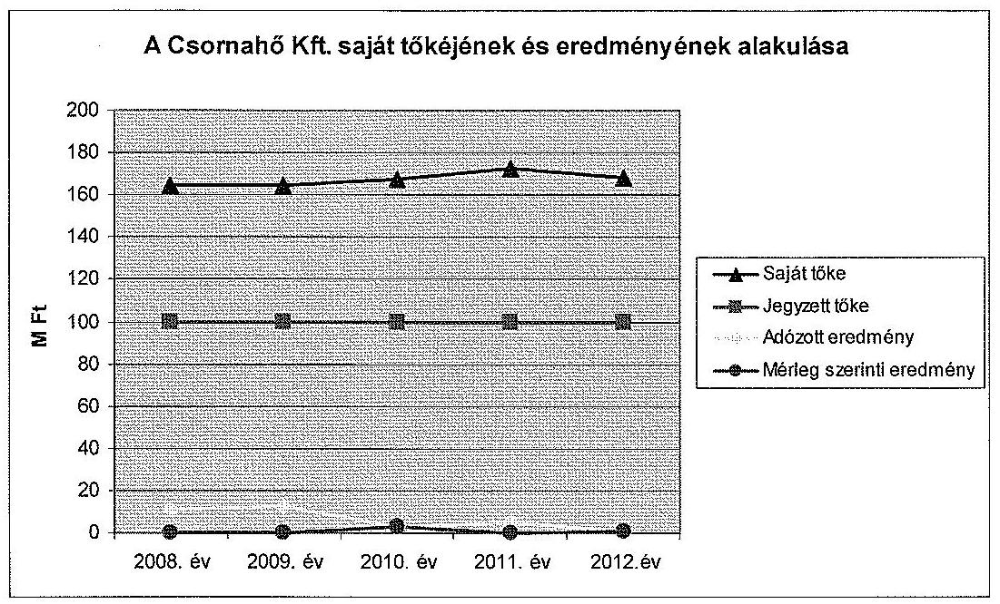

Az Önkormányzat az ellenőrzött időszakban a Csornahő Kft.-nek múködési és felhalmozási célú pénzeszközt nem adott át, kölcsönt nem nyújtott, a Csornahő Kft.-vel kapcsolatban mérlegen kívüli kötelezettséget (kezesség, garancia) nem vállalt.

# 2. A CsORNAHŐ KFT. KÖZFELADAT ELLÁTÁSSAL KAPCSOLATOS TEVÉKENYSÉGE 

### 2.1. A Csornahő Kft. gazdálkodásának szabályozottsága

A Csornahő Kft. gazdálkodásának szabályozottsága nem felelt meg a jogszabályi előírásoknak.

A Számv. tv. 14. §-ának előírásai alapján elkészítendő szabályzatok közül a társaság ügyvezetője által kiadott számlarend, és a leltározási szabályzat, nem tartalmazta sem a kiadás dátumát, sem hatályba léptetési záradékot.

Az 1/2006. számon kiadott számviteli politikáját a társaság az ellenőrzött időszakban több alkalommal aktualizálta, módosította, ennek ellenére tartalmában nem felelt meg a Számv. tv. 14. § (3) bekezdésében foglaltaknak, mert nem tartalmazta a - a társaság adottságainak megfelelően - a törvény végrehajtásának módszereit és eszközeit. A társaság a számviteli politikába nem építette be a - Tszt. 2012. január 1-jétől hatályos 18/A. § (l)-(4) bekezdéseiben foglalt - számviteli szétválasztást biztosító előírásokat.

A Csornahő Kft. számlarendje, a Számv. tv. 161. § (2) bekezdés b) és c) pontjában foglaltak ellenére nem tartalmazta a főkönyvi számla értéke növekedésének, csökkenésének jogcímeit, a számlát érintő gazdasági eseményeket, más számlákkal való kapcsolatát, valamint a főkönyvi számla és az analitikus nyilvántartások kapcsolatát. A számlarend továbbá nem felelt meg a Számv. tv. 161/A. § előírásainak, mert csak a bevételek tekintetében volt alkalmas a

---

Tszt. 2012. január 1-jétől hatályos 18/A. § (2) bekezdésében előírt számviteli szétválasztás szabályainak megfelelő, tevékenységenként elkülönített adatok előállítására, azonban a költségek, ráfordítások megosztására vonatkozó szabályozást nem tartalmazott. A Számv. tv. 161. § (2) bekezdés d) pontjában előírt, a számlarendben foglaltakat alátámasztó bizonylati rend - a számlarend hiányosságai következtében - szintén nem felelt meg a Számv. tv. 161/A. §-ban meghatározott követelményeknek.

A szabályozás hiányossága ellenére a 9. számlaosztályban a tevékenységenként megnyitott főkönyvi számlák lehetővé tették a hőszolgáltatás és az egyéb tevékenység bevételeinek elkülönített kimutatását. Bár a számlarend csak költségnemenkénti (5. számlaosztály szerinti) elszámolást határozott meg, de a gyakorlatban a felmerült költségek tevékenységenkénti bontását a 6. számlaosztály alkalmazásával valósították meg, azonban az általános üzemi és a központi költségek felosztási módját nem határozták meg.

A leltározási szabályzatot a társaság az ellenőrzött időszakban nem módosította annak ellenére, hogy az SZMSZ 3.1.4.5. pontjában rögzítettek szerint „a szabályzatok betartását és egyben korszerüsitését 2-3 éves idöközönként célszerü ellenőrizni". A Számv. tv. 14. § (11) bekezdésében foglaltak ellenére a szabályzat jogszabályváltozások miatt szükségessé váló módosításait nem végezték el.

A 2001. január 1-jén hatályba helyezett eszközök és források értékelési szabályzata, a Számv. tv. 46. § előírásaival ellentétben nem biztosította teljes körűen a vagyon valós értékének meghatározását, mivel nem tartalmazta valamennyi főbb eszközcsoportra illetve forrásra vonatkozó értékelési elveket, módszereket, valamint nem érvényesítette a Számv. tv. 15. § (3) bekezdésében foglalt valódiság elvét.

A Csornahő Kft. a Számv. tv. 14. § (5) bekezdés d) pontjában előírt pénzkezelési szabályzattal nem rendelkezett ${ }^{14}$, így a 14. § (8) bekezdésében foglaltak ellenére nem szabályozták a pénzforgalom (készpénz és bankszámlaforgalom) lebonyolítási rendjét, a pénzkezelés személyi és tárgyi feltételeit, felelősségi szabályait, nem rendelkeztek a készpénzben és bankszámlán tartott pénzeszközök közötti forgalomról, a készpénzmozgások jogcímeiről és eljárási rendjéről, és a napi készpénzállomány maximális mértékéről.

A Csornahő Kft. az ellenőrzött időszakban önköltség számítási szabályzat készítésére nem volt kötelezett a Számv. tv. 14. § (6) bekezdése alapján. A Tszt. 57. § (4) bekezdése szerint ${ }^{15}$ ugyanakkor „Az engedélyes köteles nyilvántartási és elszámolási rendszerét úgy kialakítani, hogy az megfeleljen az információs önrendelkezési jogról és az információszabadságról szóló törvényben elöírtaknak, és tegye lehetővé az árak és díjak átláthatóságát." A Csornahő Kft. a hőtermelés mellett a 2008. évben a városi közvilágítást üzemeltette, valamint 2010-től saját, illetve

[^0]
[^0]:    ${ }^{14}$ A Csornahő Kft. ügyvezető igazgatója 2014. november 25 -én kelt levelében jelezte, hogy a társaság az ellenőrzött időszakban rendelkezett pénzkezelési szabályzattal. A pénzkezelési szabályzatot sem a dokumentumbekérés, sem a helyszíni ellenőrzés ideje alatt nem átadták át az ellenőrzést végzők részére, így azt nem állt módunkban figyelembe venni.
    ${ }^{15}$ A hivatkozott előírást 2009. július 1-je előtt a Tszt. 57. § (3) bekezdése tartalmazta.

---

bérelt ingatlanok bérbeadásából, üzemeltetéséből is keletkezett árbevétele. A távhőszolgáltatási díjkalkulációt megalapozó önköltségszámítási szabályok hiányában nem volt biztosított a közszolgáltatási tevékenység díjainak átláthatósága.

# 2.2. A Csornahő Kft. vagyongazdálkodása 

A Csornahő Kft. a közszolgáltatási feladatait - az Önkormányzattól apportként kapott, és a saját beruházásban létrehozott - saját vagyonával látta el. A társaság az ellenőrzött időszakban közvagyont nem vett át, a saját vagyona - a bérbeadással hasznosított ingatlanok kivételével - távhőszolgáltatási feladat ellátását szolgálta. Az eszközöket a Számv. tv. 160. § (2) bekezdésének megfelelő csoportosításban tartotta nyilván.

A vagyonváltozásokat a nyilvántartásokon folyamatosan átvezették, az eszközbeszerzéseket üzembe helyezési, aktiválási okmányokkal ellátták, az amortizációt Számv. tv. szerinti leírási kulcsokkal számolták el. Az éves beszámoló kiegészítő mellékletében - a Számv. tv. 92. § (1) bekezdésében foglaltaknak megfelelően - a tárgyi eszközök bruttó értékében és az elszámolt értékcsökkenésben bekövetkezett változásokról a Képviselő- testületet tájékoztatták.

A Csornahő Kft. vagyoni helyzetét jellemző, főbb könyvviteli mérleg szerinti adatok 2008. január 1. és 2012. december 31. között a következők voltak.

Adatok: M Ft-ban

| Megnevezés | $\begin{aligned} & 2008 . \\ & 01.01 \end{aligned}$ | $\begin{aligned} & 2008 . \\ & 12.31 \end{aligned}$ | $\begin{aligned} & 2009 . \\ & 12.31 \end{aligned}$ | $\begin{aligned} & 2010 . \\ & 12.31 \end{aligned}$ | $\begin{aligned} & 2011 . \\ & 12.31 \end{aligned}$ | $\begin{aligned} & 2012 . \\ & 12.31 \end{aligned}$ |
| :--: | :--: | :--: | :--: | :--: | :--: | :--: |
| Befektetett eszközök | 123,1 | 69,8 | 132,9 | 121,9 | 112,3 | 98,7 |
| ebből tárgyi eszközök | 77,0 | 69,5 | 97,1 | 96,6 | 92,4 | 88,4 |
| Forgóeszközök | 223,5 | 196,9 | 186,6 | 251,7 | 134,0 | 131,5 |
| Aktív időbeli elhatárolások | 4,4 | 0,4 | 0,4 | 5,7 | 15,6 | 28,6 |
| ESZKÖZÖK ÖSZ-   SZESEN | 351,0 | 267,1 | 319,9 | 379,3 | 261,9 | 258,8 |
| Saját tőke | 164,9 | 164,9 | 164,9 | 167,6 | 172,9 | 168,4 |
| Céltartalékok |  |  |  |  |  |  |
| Kötelezettségek | 118,7 | 102,0 | 117,6 | 183,3 | 65,7 | 20,6 |
| Passzív időbeli elhatárolások | 67,4 | 0,2 | 37,4 | 28,4 | 23,3 | 69,8 |
| FORRÁSOK ÖSZ-   SZESEN | 351,0 | 267,1 | 319,9 | 379,3 | 261,9 | 258,8 |

---

Az ellenőrzött időszakban a társaság az éves mérlegbeszámolóit a Számv. tv. 69. § (1)-(4) bekezdése előírásainak megfelelő leltárral alátámasztotta. A Számv. tv., valamint a leltározási szabályzatában foglaltaknak megfelelően az év végi mennyiségi felvétellel történő leltározást elvégezték, a leltárak kiértékelése, a számviteli és analitikus nyilvántartások egyeztetése megtörtént, az ellenőrzött években leltáreltérést nem állapítottak meg.

A Csornahő Kft. eszközállományának a 2008. január 1-je és 2012. december 31.-e közötti 26,3\%-os csökkenését döntően a forgóeszközök, ezen belül a követelésállomány $60,9 \%$-os csökkenése okozta. A mérleg szerinti követelések állománya az ellenőrzött időszakban felére csökkent. A társaság követelésállományát döntően a távhőszolgáltatási díjtartozások határozták meg.

A tárgyi eszközök könyv szerinti értéke az ellenőrzött időszakban a 2008. január 1-jei 77,0 M Ft nyitó értékről 2012. december 31-re 88,4 M Ft-ra emelkedett, az ellenőrzött években elszámolt értékcsökkenést meghaladó fejlesztések eredményeként.

A Csornahő Kft.-nél a kintlévőségek kezelése folyamatosan, a számlázás folyamatába építetten működött. Értékvesztést a határidőn túli követelésekre a Számv. tv. 55. § (1) bekezdésében, és az értékelési szabályzatban foglaltak ellenére a 2012. év kivételével nem számoltak el. A mérlegkészítés időpontjáig pénzügyileg nem rendezett kintlévőségek döntő része az önkormányzati bérlakásban élő lakossági fogyasztók, valamint a Margit Kórház díjtartozásaiból származott. A követelések behajtása érdekében - a lakossági fogyasztók esetében - éltek a meleg vízszolgáltatás kikapcsolásának lehetőségével, a bírósági végrehajtási eljárás megindításával, és jövedelemből történő levonás kezdeményezésével.

A Csornahő Kft. követelés állományának alakulása:

| Megnevezés | 2008. év | 2009. év | 2010. év | 2011. év | 2012. év |
| :--: | :--: | :--: | :--: | :--: | :--: |
| Mérlegszerinti követelés | 151,6 | 154,2 | 227,5 | 101,6 | 77,1 |
| Vevőkövetelés | 151,6 | 134,4 | 197,7 | 72,5 | 41,7 |
| Határidőn túli vevő követelés | 39,4 | 38,0 | 42,2 | 23,9 | 39,7 |
| ebből:   Margit Kórház | 33,1 | 30,2 | 32,4 | 15,4 | 19,1 |

A Margit Kórház határidőn túli díjtartozásának az ellenőrzött időszakban bekövetkezett jelentős, $42,5 \%$-os csökkenése egyrészt a Csornahő Kft. által elvégzett korszerűsítési munkáknak köszönhető, ami a Kórház hőfogyasztását mérsékelte, másrészt a társaság osztalékként kifizetett adózott eredményét az Önkormányzat a Margit Kórház lejárt határidejű tartozásainak kiegyenlítésére fordította.

Az egészségügyi intézmény elavult fútési rendszerének korszerüsítését a Képvise-lő-testület 138/2009. (VI. 29.) számú határozata alapján a Csornahő Kft. a 2009.

---

évben kezdte meg. A társaság üzleti tervében 9,5 M Ft-ot irányoztak elő a korszerűsítési munkákra, azonban a termosztatikus szabályozó szelepek beépítése miatt (amelyek jelentős energia megtakarítást eredményezhetnek) $21,1 \mathrm{M}$ Ft-ba került.

# 2.3. A beszámolási kötelezettség teljesítése 

Az Önkormányzat a Csornahő Kft. felé - a Számv. tv.-ben foglalt beszámolási kötelezettségen felül - a közszolgáltatással összefüggő tájékoztatási, adatszolgáltatási, beszámolási kötelezettséget nem írt elő.

A Csornahő Kft. a Számv. tv. 9. §-a és a számviteli politikája alapján egyszerüsített éves beszámoló készítésére volt kötelezett. A társaság a Számv. tv. előírásainak megfelelően készítette el éves beszámolóját, amely mérlegből, eredménykimutatásból, kiegészítő mellékletből és üzleti jelentésből állt. A társaság az éves beszámolási kötelezettségnek az ellenőrzött időszakban határidőben eleget tett.

A Csornahő Kft. az ellenőrzött időszak éves beszámolóinak kiegészítő mellékletében és üzleti jelentésében a távhőszolgáltatási feladat ellátásáról részletesen, a szakmai feladatellátásra is kiterjedően beszámolt. A kiegészítő mellékletben a számviteli szabályozás hiányosságai ellenére, az adatok manuális leválogatása alapján - elkülönítve bemutatta a távhőszolgáltatás, a közvilágítás üzemeltetés és az egyéb tevékenység bevételét és költségeit.

Az FB az éves beszámolókat a könyvvizsgálói jelentéssel együtt az ellenőrzött években megtárgyalta, az FB írásos véleményének figyelembe vételével az ellenőrzött időszak éves beszámolóit a Képviselő-testület elfogadta ${ }^{16}$, azokat a könyvvizsgálói záradékkal együtt, a törvényi határidők betartásával megküldték a céginformációs szolgálatnak.

## 3. A távhőszolgáltatás közfeladata bevételei és ráfordítÁSAI ELSZÁMOLÁSÁNAK ÉS ÖNKÖLTSÉGSZÁMÍTÁSÁNAK SZABÁLYSZERŰSÉGE

### 3.1. A távhőszolgáltatás közfeladat bevételeinek és ráfordításainak szabályszerűsége

A Csornahő Kft.-nek - mivel a távhőszolgáltatási közfeladat mellett egyéb tevékenységet is ellátott az ellenőrzött időszakban - a közfeladat átláthatósága és a keresztfinanszírozás elkerülése érdekében, a Tszt. 57.§ (4) bekezdése ${ }^{17}$ értelmében az időszak egésze alatt fennállt a bevételek és ráfordítások elkülönítésének kötelezettsége.

[^0]
[^0]:    ${ }^{16}$ 64/2009. (IV. 20.), 136/2010. (V. 19.), 80/2011. (IV. 18.), 86/2012. (IV. 23.), a 104/2013. (IV. 22.) számú Képviselő-testületi határozat
    ${ }^{17}$ A hivatkozott előírást 2009. július 1.-je előtt a Tszt. 57.§. (3) bekezdése tartalmazta.

---

A Csornahő Kft. az ellenőrzött időszakban a megfelelő költségnem számlákra könyvelt, a költségelszámolást megalapozó dokumentumok rendelkezésre álltak, azonban a közfeladat költségeinek elkülönítését - a Tszt.-ben előírt kötelezettsége ellenére - a főkönyvi rendszerben nem végezte el, azokat év végén manuális kigyűjtéssel felosztotta az egyes tevékenységekre.

A távhőszolgáltatási közfeladat anyagjellegü ráfordításainak elszámolása - az ellenőrzésre véletlen mintavétellel kiválasztott 50 tétel alapján - megfelelő volt. A ráfordításokat megalapozó kötelezettségvállalás, a költségek elszámolása a jogszabályi előírásoknak megfelelően történt. A költségeket a megfelelő költségnemre számolták el, a költségelszámolást megalapozó dokumentumok rendelkezésre álltak.

Az ellenőrzésre kiválasztott 50 véletlenszerű mintatétel ellenőrzése során megállapítást nyert, hogy az értékesítés nettó árbevétel elszámolásának szabályossága megfelelő volt. A bevételek előírását, kiszámlázását, beszedését a belső szabályozásnak (üzletszabályzat) megfelelően végezték. A bevételeket a megfelelő számlacsoportba számolták el. A tulajdonosi követelményeknek, belső szabályozásnak megfelelő árat alkalmazták. Hibás mintaelem nem volt. A Csornahő Kft. a bevételeket tevékenységenként elkülönítve könyvelte le, tartotta nyilván a főkönyvi könyvelési rendszerében.

A Csornahő Kft. az 51/2011. (IX. 30.) NFM rendelet alapján 2011. október 1-jétől a lakosság felé nyújtott távhőszolgáltatásért támogatásban részesült a MEKH felé havonta benyújtott adatszolgáltatás alapján. A támogatás mértéke az ellenőrzött időszak végéig három alkalommal módosult. A társaság 2011-ben összesen 22,1 M Ft, a 2012. évben 76,4 M Ft távhőszolgáltatási támogatásban részesült. A Csornahő Kft. a kapott támogatásról külön elszámolást vezetett, az NFM rendeletben előírtaknak megfelelően. A támogatás a társaság adózás előtti eredményét növelte.

Az ellenőrzésre kiválasztott 30 véletlenszerű mintatétel ellenőrzése során megállapítást nyert, hogy a saját vagyon állományba vételi, nyilvántartási és elszámolási kötelezettségének teljesítése során a felújítások, beruházások kiadásainak aktiválása megfelelt az előírásoknak. A költségelszámolást megalapozó kötelezettségvállalás szabályos volt. Az eszközök besorolása megfelelő volt, az állományba vétel megtörtént. A tárgyi eszközöknél a bekerülési érték meghatározása szabályosan történt, az eszköz a tárgyévi leltárban szerepelt.

A Csornahő Kft. a számviteli politikájában szabályozta az értékcsökkenési leírás elszámolását, minden esetben figyelembe véve a Számv. tv. 52.-53.§ és 80. § valamint a TAO tv. 1. számú melléklet előírásait. A szabályzatokban meghatározták a tárgyi eszközök bekerülési értékét, eszközcsoportonként a leírási kulcsokat, azt, hogy az értékcsökkenést havonta számolják el, valamint, hogy a Számv. tv. 80.§ (2) bekezdése értelmében a 100 ezer forint egyedi beszerzési érték alatti vagyoni értékű jogok, szellemi termékek, tárgyi eszközök bekerülési értéke a használatba vételkor értékcsökkenési leírásként egy összegben kerül költségként elszámolásra.

Az értékcsökkenés elszámolása során betartották a Számv. tv. 52-53. § és 80. §aiban, valamint a számviteli politikában előírtakat. Az éves beszámolók kiegé-

---

szítő mellékletében részletesen bemutatták az elszámolt értékcsökkenést, eszközcsoportonként. Hibás mintatétel nem volt. Az elszámolt értékcsökkenés öszszege, a 2009. évben végrehajtott rekonstrukciós munkák aktiválását követően, a 2010. évtől megemelkedett.

A saját tulajdonú tárgyi eszközök bruttó és nettó értékének változását, az évenként elszámolt értékcsökkenés összegét, a használhatósági fokot és az elhasználódási szintet mutatja a következő táblázat:

|  | $\begin{aligned} & 2008 . \\ & 01.01 . \end{aligned}$ | $\begin{aligned} & 2008 . \\ & 12.31 . \end{aligned}$ | $\begin{aligned} & 2009 . \\ & 12.31 . \end{aligned}$ | $\begin{aligned} & 2010 . \\ & 12.31 . \end{aligned}$ | $\begin{aligned} & 2011 . \\ & 12.31 . \end{aligned}$ | $\begin{aligned} & 2012 . \\ & 12.31 . \end{aligned}$ |
| :--: | :--: | :--: | :--: | :--: | :--: | :--: |
| Tárgyi eszközök bruttó értéke (M Ft) | 192,1 | 116,5 | 183,7 | 167,1 | 161,7 | 153,3 |
| Tárgyi eszközök nettó értéke (M Ft) | 123,0 | 69,8 | 132,9 | 121,9 | 112,3 | 98,7 |
| éves elszámolt értékcsökkenés (M Ft) | - | 9,4 | 8,8 | 11,7 | 11,9 | 12,1 |
| használhatósági fok \% | 64 | 60 | 72 | 73 | 69 | 64 |
| elhasználódási szint \% | 36 | 40 | 28 | 27 | 31 | 36 |

A Csornahő Kft. saját eszközeinek pótlása a 2009. év kivételével minden ellenőrzött évben alatta maradt az elszámolt amortizációnak. Az elmaradás 2008. évben 7,6 M Ft, a 2010. évben 0,4 M Ft, a 2011. évben 6,3 M Ft, a 2012. évben 4,4 M Ft volt. A 2009. évben végrehajtott korszerűsítés következtében a beruházások értéke 63,1 M Ft-tal meghaladta az adott évben elszámolt értékcsökkenés összegét.

A tárgyi eszközökön belül, az ingatlanok és a termelő gépek, berendezések használhatósági foka a következők szerint alakult:

| Megnevezés | 2008. év | 2009. év | 2010. év | 2011. év | 2012. év |
| :-- | :--: | :--: | :--: | :--: | :--: |
| Ingatlanok | $61,7 \%$ | $63,6 \%$ | $72,0 \%$ | $69,3 \%$ | $66,4 \%$ |
| Gépek, berendezések | $54,1 \%$ | $70,2 \%$ | $62,8 \%$ | $57,1 \%$ | $53,6 \%$ |

A társaság tárgyi eszközeinek elhasználódása mind az ingatlanoknál, mind a gépek, berendezéseknél magas volt. A 2009-2010. években végrehajtott fejlesztések időlegesen javították az eszközök használhatósági fokát, tartós javulást azonban nem eredményeztek.

---

# 3.2. Az önköltségszámítás szabályszerűsége 

A Csornahő Kft. számára az Önkormányzat nem határozott meg az önköltség számítására vonatkozó előírást. A Csornahő Kft. a Számv. tv. 14. § (6) bekezdése alapján nem volt kötelezett önköltség-számítási szabályzat elkészítésére. Ugyanakkor a Tszt. 57. § (4) bekezdése, valamint a Tszt. 2012. január 1-jétől hatályos 18/A. § (2) bekezdése a közfeladat átláthatósága és a keresztfinanszírozás elkerülése érdekében előírja a tevékenységek bevételeinek és ráfordításainak elkülönítését. A Csornahő Kft. az ellenőrzött években a közszolgáltatás díjak meghatározását önköltségszámítással teljes körűen nem támasztotta alá, így a távhőszolgáltatási közfeladat átláthatósága és elszámoltathatósága - a Tszt. előírásai ellenére- maradéktalanul nem volt biztosított.

Az ellenőrzött időszakban a távhőszolgáltatás díja kéttényezős volt, alapdíjat és hődíjat határoztak meg.

A díjak megállapítása az ellenőrzött időszakban nem az indokolt költségek és ráfordítások teljes körü, hanem csak a közvetlen költségek számbavételén alapult. A hődíjat a hő termeléshez felhasznált energiahordozók költségéből és az előállított hőmennyiségből számított egységre eső költség alapján, az alapdíjat a hőtermelő és hőelosztó létesítmények üzemeltetési és fenntartási költségei alapján határozták meg, a díjkalkulációs képletben az üzemi általános, és a központi költségeket nem vették számításba.

A távhőszolgáltatási rendelet 15. § (1) bekezdése szerint az alapdij a távhőszolgáltató hődij nélküli költségeit, indokolt ráfordításait és a múködéshez, fejlesztéshez szükséges nyereséget fedezi. Az alapdij költségtartalmában figyelembe veendő: a távhőszolgáltató saját hőtermelő létesítményének energiaköltségek nélküli üzemeltetési, fenntartási költsége; a távhőszolgáltató primer távhővezetékeinek és tartozékainak üzemeltetési és fenntartási költsége; a távhőszolgáltató tulajdonában lévő hőközpontok üzemeltetési és fenntartási költsége; a távhőszolgáltató szekunder távhővezetékeinek és tartozékainak üzemeltetési és fenntartási költsége; a távhőszolgáltató tulajdonában lévő hőmenynyiségmérők üzemeltetési, fenntartási költsége; a használati melegvíz készítéséhez felhasznált ivóvíz vízdíjának alapdíj része. A távhőszolgáltató az alapdíjban $8 \%$-os bruttó tárgyi eszköz arányos nyereséget számíthat fel.

A távhőszolgáltatási rendelet 14. § (1) bekezdése értelmében a hődij a távhőszolgáltató által a távhő előállításához felhasznált tüzelőanyag beszerzési árából, valamint a hozzá kapcsolódó adókból és egyéb díjakból; a távhőszolgáltató által vásárolt hő díjából; a primer és szekunder hálózati hőveszteségből; az üzemeltetés és fenntartás során felhasznált víz hőtartalmának ellenértékéből; a tüzelőanyag, valamint a vízkondicionáló, hatásfok javító ada-lék- és segédanyagok költségeiből; a kazánüzem energetikai, tüzelőanyag és víztechnológiai korszerüsítése miatti eszközbérlet és a környezetvédelem költségeiből áll. A távhőszolgáltató a hődijban az Önkormányzat által jóváhagyott üzleti terv szerinti nyereséget számíthatja fel.

---

Az alapdíj áfa nélküli összege az Önkormányzat hatósági ármegállapításának az időszakában ${ }^{18}$ változatlan - a fűtési alapdíj $404,4 \mathrm{Ft} / \mathrm{lm}^{3} / \mathrm{év}$, a használati melegvíz alapdíja $111,6 \mathrm{Ft} /$ vízm $^{3} /$ hó - volt. A fogyasztó által fizetendő alapdíjak módosulását kizárólag az általános forgalmi adó kulcs változása okozta. A társaság 2012-ben a fűtési alapdíjat $421,2 \mathrm{Ft} / \mathrm{lm}^{3} / \mathrm{év}$, a használati melegvíz alapdíjat $116,3 \mathrm{Ft} /$ vízm $^{3} /$ hó - összegben állapította meg, az 50/2011. (IX.30.) NFM rendelet 2012. január 1-jétől hatályos 4. §-ában foglaltak ${ }^{19}$ alapján.

A hődíj összegének meghatározásához a távhődíjak megállapításáról szóló rendelet ${ }_{1,2}$-ben rögzítették a hődíj számító képletet. A hődíj számításának gyakoriságát a 2009. április 30-ig hatályos rendelet nem tartalmazta, a távhődíjak megállapításáról szóló rendelet ${ }_{2} 1 . \S$ (2) bekezdése szerint „a hődíjak minden naptári negyedév első napjától a számítóképletek szerint csökkennek, vagy növeked$n e k^{\prime \prime}$.

A Képviselő-testület a Csornahő Kft. kezdeményezésére az Önkormányzat hatósági ármegállapításának időszakában a lakossági távhő- és melegvízszolgáltatás legmagasabb hatósági díját 18 alkalommal ${ }^{20}$ módosította. A társaság 2012. január 1-jétől a hődíjak vonatkozásában is érvényesítette az 50/2011. (IX.30.) NFM rendelet 4. §-ában foglaltak szerinti 4,2\%-os díjemelést. A Csornahő Kft. által az ellenőrzött időszakban alkalmazott hődíjak éves átlagának alakulását a 3. számú mellékletben mutatjuk be.

Budapest, 2015. j̧̧̇̀. hó $10 \cdot$ nap
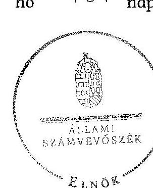

Domokos László
elnök

Melléklet: $\quad 4 \mathrm{db}$
Függelék: $\quad 2 \mathrm{db}$

[^0]
[^0]:    ${ }^{18}$ 2011. április 15 -től a Tszt. 57/D. § (1) bekezdésének rendelkezése szerint a lakossági felhasználónak és a külön kezelt intézménynek nyújtott távhőszolgáltatás (fütés és használati melegvíz) díját - mint legmagasabb hatósági árat - az energiapolitikáért felelős miniszter rendeletben állapítja meg.
    ${ }^{19}{ }_{„}$ A végfelhasználó a távhőszolgáltató részére a távhőszolgáltatásért a távhőszolgáltató által 2011. március 31-én alkalmazott, általános forgalmi adót nem tartalmazó dijnál 4,2\%-kal magasabb mértékü - legmagasabb hatósági árnak minősülő - díjat köteles fizetni."
    ${ }^{20} 2008$ októberéig a társaság havonta újraszámolta és módosította a hődíjat.

---

.

---

# a CSORNAHŐ Csornai Hőszolgáltató Kft. tevékenységének főbb adatai

|  Sorszám | Megnevezés | 2008. | 2009. | 2010. | 2011. | 2012.  |
| --- | --- | --- | --- | --- | --- | --- |
|  1. | A gazdasági társaság székhelye | 9300 Csorna
Barbacsi u. 1. | 9300 Csorna
Barbacsi u. 1. | 9300 Csorna
Barbacsi u. 1. | 9300 Csorna
Barbacsi u. 1. | 9300 Csorna
Barbacsi u. 1.  |
|  2. | adószáma | 11124838-2-08 |  |  |  |   |
|  3. | alapításának éve | 1993 |  |  |  |   |
|  4. | A gazdasági társaság többségi tulajdonú leányvállalatainak száma (db) | 0 | 0 | 0 | 0 | 0  |
|  5. | A gazdasági társaság ............(név) leányvállalataiban való részesedésének mértéke (\%) | - | - | - | - | -  |
|  6. | Az önkormányzat számára (megbízásából, koncessziós, közszolgáltatási, vagy egyéb szerződéses jogviszony alapján) ellátott közfeladatok szakági besorolása: |  |  |  |  |   |
|  7. | Egészségügy |  |  |  |  |   |
|  8. | Kultúra és sport |  |  |  |  |   |
|  9. | Település üzemeltetés, ezen belül: |  |  |  |  |   |
|  10. | köztemető üzemeltetés |  |  |  |  |   |
|  11. | kéményseprés |  |  |  |  |   |
|  12. | helyi közutak fejlesztése, fenntartása és üzemeltetése |  |  |  |  |   |
|  13. | parkok és egyéb közterület fenntartás |  |  |  |  |   |
|  14. | közterületi parkolás |  |  |  |  |   |
|  15. | Lakás és helységgazdálkodás |  |  |  |  |   |
|  16. | Víz és csatorna közmú-szolgáltatás |  |  |  |  |   |
|  17. | Hulladékkezelés- szállítás |  |  |  |  |   |
|  18. | Távhő- és energiaszolgáltatás | X | X | X | X | X  |
|  19. | Helyi közösségi közlekedés |  |  |  |  |   |
|  20. | Vagyongazdálkodás |  |  |  |  |   |
|  21. | Pénzügyi gazdasági szolgáltatás |  |  |  |  |   |
|  22. | Egyéb: Ingatlanhasznosítás |  |  | X | X | X  |
|  23. | közvilágítás üzemeltetése | X |  |  |  |   |
|  24. | A közfeladatellátására a gazdasági társaságnál alkalmazottak éves átlagos statisztikai létszáma | 25 | 25 | 21 | 21 | 20  |

---

.

---

# a CSORNAHŐ Csornai Hőszolgáltató Kft. müködésének főbb jellemzői

|  Sors
zám | Megnevezés |  | 2008. | 2009. | 2010. | 2011. | 2012.  |
| --- | --- | --- | --- | --- | --- | --- | --- |
|  1. | A gazdasági társaság cégformája |  | Kft. | Kft. | Kft. | Kft. | Kft.  |
|  2. | A gazdasági társaság tulajdonosi összetétele: |  |  |  |  |  |   |
|   | Önkormányzat megnevezése |  | Csorna Város
Önkormányzata | Csorna Város
Önkormányzata | Csorna Város
Önkormányzata | Csorna Város
Önkormányzata | Csorna Város
Önkormányzata  |
|  3. | Önkormányzat tulajdoni részesedésének arány | $\%$ | 100,0 | 100,0 | 100,0 | 100,0 | 100,0  |
|  4. | Önkormányzat tulajdoni részesedésének összege | ezer Ft | 100000,0 | 100000,0 | 100000,0 | 100000,0 | 100000,0  |
|   | Más önkormányzatok, többcélú társulás megnevezése |  | - | - | - | - | -  |
|  5. | Más önkormányzatok, többcélú társulások tulajdoni részesedésének arány | $\%$ | - | - | - | - | -  |
|  6. | Más önkormányzatok, többcélú társulások tulajdoni részesedésének összege | ezer Ft | - | - | - | - | -  |
|   | Gazdasági társaság megnevezése |  | - | - | - | - | -  |
|  7. | Gazdasági társaságok tulajdoni részesedés arány | $\%$ | - | - | - | - | -  |
|  8. | Gazdasági társaságok tulajdoni részesedés összege | ezer Ft | - | - | - | - | -  |
|   | Egyéb tulajdonos megnevezése |  | - | - | - | - | -  |
|  9. | Egyéb tulajdonosok tulajdoni részesedés arány | $\%$ | - | - | - | - | -  |
|  10. | Egyéb tulajdonosok tulajdoni részesedés összege | ezer Ft | - | - | - | - | -  |
|  12. | A tárgyévben a gazdasági társaság vagyonkezelésben lévő önkormányzati vagyon után elszámolt értékcsökkenés összege (ezer Ft) |  | - | - | - | - | -  |
|  13. | A tárgyévben az önkormányzati tulajdonú, gazdasági társaság által kezelt eszközök pótlására (karbantartás, felújítás, beruházás) elszámolt kiadás (ezer Ft) * |  | - | - | - | - | -  |
|  14. | A tárgyévben a gazdasági társaság saját vagyona után elszámolt értékcsökkenés összege (ezer Ft) |  | 9406,0 | 8830,0 | 11706,0 | 11889,0 | 12081,0  |
|  15. | A tárgyévben a saját tulajdonú eszközök pótlására (karbantartás, felújítás, beruházás) elszámolt kiadás (ezer Ft) |  | 1819,0 | 71918,0 | 11316,0 | 5626,0 | 7705,0  |

[^0] [^0]: * az eszközök pótlására elszámolt kiadást továbbszámlázták az Önkormányzat részére, ahol aktiválták a felújításokat, beruházásokat.

---

.

---

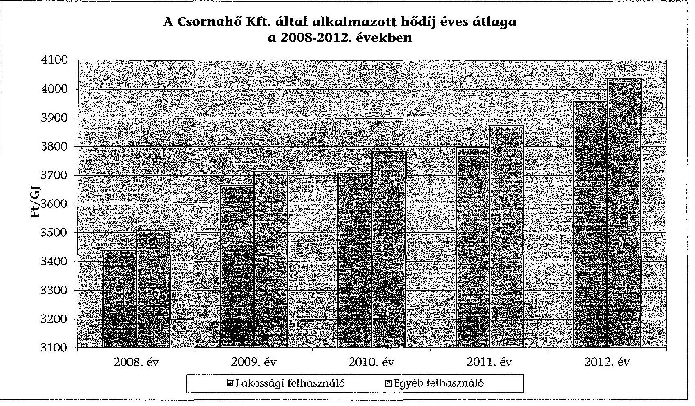

A Csornahó Kft. által alkalmazott hódij éves átlaga a 2008-2012. években

---

.

---

# Beérkezett észrevételek és az azokra adott válaszok

---

.

---

# CSORNA VÁROS POLGÁRMESTERE 

9300 Csorna, Szent István tér 22. Győr-Moson-Sopron megye
2 96/590-112, Fax: 96/261-680, E-mail: polgarmester@csorna.hu

1837-8/2014/1
Ügyintéző: Varga Beáta

Tárgy: Észrevétel a jelentéstervezethez Hiv.sz.: V-0522-255/2014.

Állami Számvevőszék
Domokos László Elnök

Budapest
Apácai Csere János utca 10.
1052
ÁLLAMI SZÁMVEVÓSZÉK
8.934/2014
Eike: 2014 DEC 04
Hiv.: V-0522-262/
14-10644
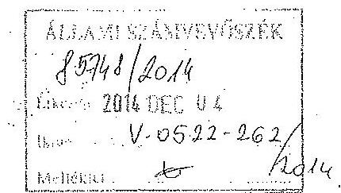

Tisztelt Elnök Úr!
„Az önkormányzatok gazdasági társaságai - Az önkormányzatok többségi tulajdonában lévő gazdasági társaságok közfeladat ellátását érintő gazdálkodási tevékenysége szabályszerűségének ellenőrzése" témában Csorna Város Önkormányzatánál a V-0460001/2014. iktatószámú program alapján a CSORNAHŐ Csornai Hőszolgáltató Kft-nél végzett ellenőrzésükről készült jelentés tervezetéhez az alábbi észrevételt kívánom tenni:

A jelentés tervezet 1. összegző megállapítások, következtetések, javaslatok részében az önkormányzat távhőszolgáltatási rendeletével kapcsolatos hiányosságokra reagálva szeretném tájékoztatni Önöket a következőkről. A Képviselő-testület 2012. évi munkatervében a június 18. napjára tervezett ülés napirendjén 3. napirendi pontként szerepelt a távhőszolgáltatásról szóló önkormányzati rendelet alkotása, 4. napirendi pontként pedig a távhőszolgáltatás díjairól szóló önkormányzati rendelet alkotása. Az ülést megelőzẻen a CSORNAHŐ Kft. ügyvezetője kezdeményezte a rendeletalkotási napirendek napirendről történő levételét. Mindezt azzal indokolta, hogy nem áll rendelkezésre megfelelő információ a rendeletetek előkészítéséhez.
Helyi jogszabály alkotási kötelezettségének a Képviselő-testület szóla eleget tett, megalkotta a Távhőszolgáltatásról szóló 5/2014.(II.17.) számú, valamint a távhőszolgáltatás díjairól szóló 6/2014(II.17.) számú önkormányzati rendeleteit.

A jelentés tervezet ugyanitt említi annak hiányát, hogy az önkormányzat belső ellenőrzése nem foglalkozott a CSORNAHŐ Kft. ellenőrzésével. Ez valóban így volt, ezért a 2015. évi belső ellenőrzés keretében javaslatot fogok tenni a Kft-re vonatkozó ellenőrzési program beépítésére az ellenőrzési munkatervbe.

Ellenőrzésük során tett észrevételeiket, javaslataikat köszönjük. Az ellenőrzés tapasztalatait további munkák során hasznosítani fogjuk.

Tisztelettel:
Csorna, 2014. november 27.
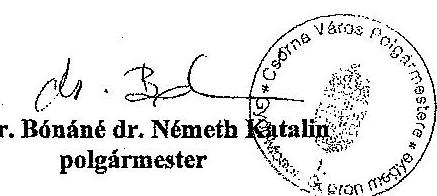

---

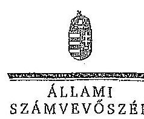

Ikt.szám: V-0522-264/2014.
dr. Bénáné dr. Németh Katalin asszony
polgármester
Csorna Véros Önkormányzata

# Csorna 

## - Tisztelt Polgármester Asszony!

Köszönettel vettem a Csornahő Kft. ellenőrzéséről készített számvevőszéki jelentéstervezetre tett észrevételeit.

Csatoltan megkíldöm az Állami Számvevőszék észrevételekre vonatkozó álláspontjáról a felügyeleti vezető által készített részletes tájékoztatást.

Tájékoztatom Polgármester asszonyt, hogy a számvevőszéki jelentés véglegesítése az elfogadott észrevételek figyelembevételével történik.

Budapest, 2014. oke. hó 9. nap

Tisztelettel:
Dess
Domokos László

Melléklet: Tájékoztatás az észrevételek kezeléséről

---

# Tájékoztatás az észrevételek kezeléséről 

A Csomahő Kft. ellenőrzéséről készített jelentéstervezetre Polgármester asszony észrevételeket fogalmazott meg. Az észrevételek alapján a jelentés tervezetét az alábbiak szerint módosítom:

A távhőszolgáltatási rendeletre vonatkozó észrevétel figyelembevételével a jelentéstervezet összegző megállapításainak „A távhőszolgáltatási rendeletet azonban a hatályba lépését követöen bekövetkezett jogszabályi változásokkal -a távhőszolgáltatói müködési engedélyek kiadására jogosult változásával és a dijmeggallapitás szabályainak ótalokulásával - összhangban nem módositották, igy az önkormányzat rendelete egyes kérdésekben a Tszt. elöirásatval ellentétes rendelkezéseket tartalmazott." mondat utolsó szavához 1. számú lábjegyzetet illesztünk be, amelyben jelezzük, hogy: „A Csornahö Kft. tiggvezető igazgatója, valamint Csorna Város Önkormányzatának polgármestere a 2014. november 25 -én, illetve november 25 -én kelt, jelentéstervezetre telt észrevételében jelezte, hogy Csorna Város Képviselő-testülete az aktuális jogszabályi elöirások figyelembevételével megalkotta a távhőszolgáltatásról szóló 5/2014. (II. 17.) számú, valamint a távhőszolgáltatás díjairól szóló 6/2014. (II. 17.) számú rendeleteit. A rendeletek hatályba lépése 2014. július 1-jével megtörtént. A rendeleteket a társaság ügyvezető igazgatója az észrevételéhez csatoltan megküldte."

Jelzem, hogy észrevétele túlmutat az ellenőrzött időszakon, így a 2014-ben hozott rendeletet az ellenőrzés megállapítása kapcsán tett intézkedésként kezeljük.

A jelentéstervezet belső ellenőrzéssel kapcsolatos megállapításaira tett észrevétel a megállapításokat nem vitatja, ezért azt változatlan formában szerepeltetjük a jelentésben.

Budapest, 2014. december $2_{1} 4^{10}$.
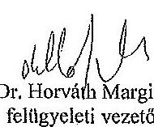

Dr. Horváth Margit
felügyeleti vezető

---

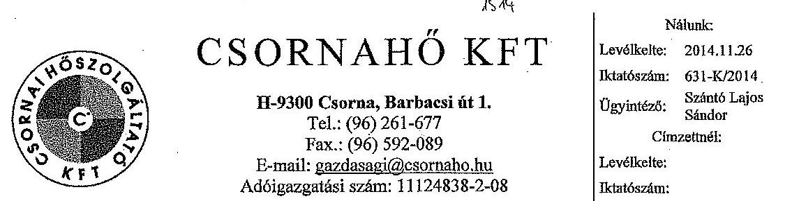

Tárgy: Észrevétel jelentéstervezetre

Melléklet: 1 db pénzkezelési szabályzat 3 db pénzkez, szab. módosítás 2 db önkormányzati rendelet

ÁLLAMI SZÁMVEVŐSZÉK Domokos László Elnök Úr

Budapest

Tisztelt Elnök Úr!

Alulírott Szántó Lajos Sándor, mint a CSORNAHŐ Kft ügyvezető igazgatója az Állami Számvevőszék V-0522-256/2014. iktatószámú jelentéstervezetére az alábbi észrevételt teszem.

- A jegyzőkönyv megállapítása szerint a társaság a számviteli politikájába nem építette be a számviteli szétválasztást biztosító előírásokat. A szétválasztást biztosító előírások külön szabályzatban rögzítésre kerültek. A számviteli politikába való beépítésről gondoskodunk.
- A számlarenddel kapcsolatos észrevételeket elfogadjuk. A szükséges módosításokat végrehajtjuk.
- A leitározási szabályzatot aktualizáljuk.
- Az értékelési szabályzat kiegészítésre kerül a főbb eszközcsoportra, illetve forrásra vonatkozó értékelési elvekkel és módszerekkel.
- A pénzkezelési szabályzat hiányával kapcsolatos megállapítással nem értünk egyet. A CSORNAHŐ Kft. a vizsgált időszakban (2008-2012. évben) illetve korábban is rendelkezett pénzkezelési szabályzattal és a

---

változásoknak megfelelően többször módosította is. Mellékelten megküldjük a szabályzatot és a módosításokat is.

- A Csorna Város Képviselő-testülete új önkormányzati távhőszolgáltatási rendeletet 5/2014. (II.17.), valamint díjrendeletet 6/2014. (II.17.) alkotott az aktnális jogszabályok figyelembevételével. A rendeletek hatályba lépése 2014. július 1.-vel történt. Mellékelten megküldjük a rendeleteket.

Kérem válaszunk, és észrevételeink szíves elfogadását.

Csorna, 2014. november 25.

Tisztelettel:
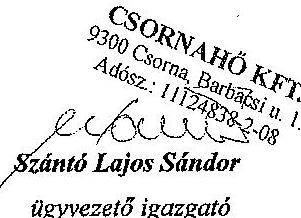

---

# CSORNAHŐ KFT 

9300 Csorna, Barbacsi út 1.

## PÉNZKEZELÉSI SZABÁLYZAT

---

# I.   BANKSZÁMLAKEZELÉS 

## 1. Bankszámla nyitása, vezetése

A KFT pénzeszközeit a 232/2001. (XII. 10. ) számú Kormányrendelet alapján -a készpénzben teljesítendő fizetések kivételével- bankszámlán tartja, pénzforgalmát bankszámlán bonyolítja.
A KFT bankszámlál:
-OTP BANK NYRT :
$11737069-20016100$
$11737069-20022851$
-CIB BANK ZRT : 10700031-04686404-51100005
A bankszámla szerződés aláírására Szabó István ügyvezető igazgató jogosult.
A bankszámlák feletti jogosultság:

- képviseletre jogosult: Szabó István ügyvezető igazgató
- rendelkezni jogosult: Egyházy Péter, Giczi Terézia, Herczeg Miklósné, Janszky Györgyné: 2007. 04. 30.-ig.(ketten együtt)

## 2. A számlához kapcsolódó készpénzforgalom

A bankszámlák javára készpénz átutalási megbízással készpénzbefizetés teljesíthető.
3. Ügyfélterminál használata

A Kft-nél: -CIB Üzleti Terminál és
-OTP Elektra Terminál müködik.
A banki tranzakciókat az alábbi személyek végezhetik:

- Szabó István ügyvezető igazgató önállóan,
- Egyházy Péter, Giczi Terézia, Herczeg Miklósné,

Janszky Györgyné-2007. 04. 30.-ig. (ketten együtt)
A terminál használatához alkalmazott kód titkos, biztonságos helyen történő tárolásáért a fenti személyek felelnek.
Hibás tranzakció végzéséért a terminál használója felel.

## II.   HÁZIPÉNZTÁR KEZELÉSI SZABÁLYOK

## 1. A házipénztár létesítése

A házipénztár a Kft müködéséhez szükséges készpénz, egyéb értékek megőrzésére, kezelésére kijelölt irodahelyiség rész.
Pénztári kifizetésként kell elszámolni:

- az elszámolási számlára befizetett készpénz,
- a tevékenységgel kapcsolatban felmerült kifizetéseket,
- elszámolásra kiadott összegeket.

---

# Pénztári befizetésként kell elszámolni: 

- az elszámolási számláról felvett készpénzt,
- a készpénzben teljesített vásárlások, szolgáltatások ellenértékét,
- az elszámolásra kiadott összeg visszafizetését.

A házipénztárban levő készpénz, valamint egyéb értékek megőrzése páncélszekrényben történik. A páncélszekrény kulcsának első példányát a pénztáros kezeli. A pénztári kulcsok másod példányát lezárt borítékban, biztonságos helyen kell tartani.
A tartalékkulcsok kezeléséért a pénztáros felelős.
A pénztáros távolldéében történő pénztárfelnyitására a gazdasági vezető jogosult.
A pénztár felnyitásánál, a pénztár ellenőrnek és a pénztárst átvevő személynek is jelen kell lennie. A pénztár felnyitásáról, átadásáról jegyzökönyvet kell készíteni.
A pénztárosnak gondoskodni kell az utalványozásra jogosult személyek névsorának, aláírásának látható helyre történő kifüggesztéséről
A pénztáros feladata az előző napi záró pénztáregyenleg és a tárgynapi kifizetések várható összegének figyelembe vételével köteles gondoskodni a pénztár zavartalan müködését biztosító készpénz mennyiségéről és címletéről.
A pénztáros a felmért pénzszükséglet alapján összeállítja a címletjegyzéket, kiállítja a készpénzfelvételi utalványt, gondoskodik az utalvány jogosultak által történő aláíratásáról. A készpénz szállítás szabályai:
$-100000 .-\mathrm{Ft}-\mathrm{ig} 1$ fő
$-100.000 .-200.000 .-\mathrm{Ft}$-ig a pénztáros és 1 fó.
A házipénztár müködéséhez szükséges készpénz pénzintézettől történő felvételére illetve szállítására az aláírásra jogosultakon túlmenően- az alábbi személyek jogosultak: Kertai Istvánné, Nagy Lajos, Szabó András.
A készpénz felvételével és szállításával megbízott dolgozók felelősek az általuk átvett készpénzért, amíg a pénztárban el nem helyezték illetve a bevételi bizonylatot a pénztáros el nem készítette.
A pénztárban nem fogadható el hiányos vagy sérült bankjegy illetve érme.
Ha a pénztáros hamis pénzt talál, akkor átvételéről jegyzökönyvet készít és a pénzzel együtt át kell adni a hitelintézetnek.
A pénztárban a napi készpénz záró állomány maximális mértéke: $50.000 .-\mathrm{Ft}$

## 2. A pénztár kezelésével kapcsolatos feladatkörök

A házipénztárt a pénztáros önállóan, teljes anyagi felelősséggel kezeli.
Nem lehet pénztáros olyan dolgozó, akinek a munkaköre, feladatköre összeférhetetlen a pénztárosi munkakörrel. Ebből a szempontból összeférhetetlen foglalkoztatottnak kell az utalványozási joggal rendelkező dolgozókat.
A pénztárosi feladatokat Kertai Istvánné látja el.
A pénztáros fó feladatai:

- a készpénz szükséglet felmérése, igénylése,
- a pénztárban tartott készpénz kezelése és megőrzése,
- az alapbizonylatok felülvizsgálata, a bizonylati fegyelem betartása,
- a bevételi és kiadási pénztárbizonylatok kiállítása a Szintézis Rt programja alapján,
- a pénztárjelentés elkészítése hetente és minden hónap végén,
- a szigorú számadású nyomtatványok kezelése, őrzése.

Amennyiben a pénztárost helyettesíteni kell, a pénztár átadásáról-átvételéről jegyzökönyvet kell készíteni.

---

A pénztárost távolléte esetén Bognár Tiborné,Giezi Terézia,Tóth Imréné helyettesíti. A pénztáros helyettesét teljes anyagi felelősség terheli.
A pénztárellenőr a Kft ügyvezetőjének megbízása alapján látja el a feladatait. A pénztárellenőr feladatai:

- a bizonylatok alakl és tartalmi ellenőrzése,
- utalványozók illetékességének ellenőrzése,
- a pénztári bizonylat és alapbizonylat egyezősége,
- a pénztárjelentés és záró pénztárkészlet számszaki ellenőrzése,
- az elszámolásra kiadott összegekkel való elszámolás ellenőrzése.

A pénztárellenőri feladatokat hetente illetve hónap végén kell elvégezni.
A pénztárellenőrzés során megállapított szabálytalanságokat azonnal jelezni kell az ügyvezető igazgató felé.
A pénztárellenőri feladatokat Tóth Imréné látja el.

# 3. Pénztári pénzkezeléssel kapcsolatos bizonylati rend és a pénzforgalommal kapcsolatos szabályok. 

Minden házipénztári befizetésről számítógéppel előállított bevételi pénztárbizonylatot kell kiállítani. A bizonylatot a befizetővel alá kell íratni, a pénz átvételét a bizonylaton a pénztárosnak aláírásával igazolni kell.

A bevételi pénztárbizonylat:

- első példánya a könyvelés bizonylata, ezt a pénztári alapokmányokkal és a vonatkozó pénztárjelentéssel együtt a könyvelés részére kell átadni,
- a második példányt a pénztáros őrzi meg.

A bankszámlát vezető hitelintézettől közvetlenül felvett készpénzről a bevételi pénztárbizonylat kell kiállítani, melyhez csatolni kell a banki terhelési értesítőt.
Abban az esetben ha az értékesítésről, szolgáltatásnyújtásról készült számlát a pénztáron keresztül egyenlítik ki, akkor erről bevételi pénztárbizonylatot kell kiállítani.
Minden házipénztári kifizetésről számítógéppel előállított kiadási pénztárbizonylatot kell kiállítani.
A pénztárosnak a kifizetéskor meg kell állapítani, hogy a pénzért jelentkező személy jogosult e a pénz felvételére. Egyéb esetben megbízottja részére, csak szabályszerűen kiállított meghatalmazás ellenében történhet meg a kifizetés.
A kiadási pénztárbizonylat:

- első példánya a könyvelés bizonylata, ezt a példányt az alap okmányokkal együtt kell a könyvelés részére átadni.
- második példányt a pénztáros őrzi meg.

A pénztárosnak minden pénztári befizetést és kifizetést a számítógéppel kiállított pénztárjelentésben kell vezetni. A pénztáros hetente illetve hónap végén köteles elkészíteni a/ pénztárjelentést.

## A pénztárjelentés:

- első példányát mellékletekkel együtt a könyvelés részére kell átadni,
- második példányát a pénztáros őrzi meg.

A készpénzfelvételi utalvány a házipénztár pénzellátása céljából, a pénzintézet által vezetett számláról történő készpénz felvételére szolgál. Az utalványtömböt a hitelintézet bocsátja rendelkezésre. Az utalványt egy példányban kell kiállítani és a hitelintézetnél bejelentett módon aláími. A bevételi pénztárbizonylathoz csatolni kell a banki terhelés igazolását.

---

# 4. A munkabér kifizetésnél alkalmazott szabályok 

A Kft-nél nem készpénzben, hanem a dolgozók bankszámláira történő átutalásával kerül sor a munkabérek kifizetésére.

## 5. Elszámolásra kiadott összeg, előleg nyilvántartása

Készpénzelszámolásra - előleget - csak az alábbi célokra lehet előzetes engedély és utalványozás alapján lehet kiadni.

- üzemanyag elszámolásra,
- kiküldetési költségre,
- a tevékenységet szolgáló eszköz beszerzésére, valamint szolgáltatás igénybevételére. Az elszámolásra kiadott pénzzel az elszámolásra feltüntetett határidőig el kell számolni. Ha ugyanaz a személy elszámolásra újabb összeget vesz fel, a korábban felvett összeggel akkor is el kell számolnia, ha annak elszámolására megjelölt határidő még nem telt el. Az elszámolásra kiadott összeggel annak felvételétől számított 15 napon belül kell elszámolni. Kiküldetésre kiadott pénzről a visszaérkezéstől számított 3 munkanapon belül kell elszámolni. Üzemanyag vásárlásra felvett előleg összege nem haladhatja meg a 25.000 . - Ft -ot . Több alkalommal felvett előlegnél, az előzően felvett összeggel el kell számolni. Az elszámolásra kiadott összegekről legkésőbb a hónap utolsó napjáig el kell számolni.
Amennyiben az elszámolásra kiadott összeggel az azt felvevő 30 napon belül nem számol el, úgy a személyi jövedelemadóról szóló 1995. évi CXVII.törvény szerint
kamatkedvezményből származó jövedelem adója terheli.
Az elszámolásra kiadott összegről, a pénztáros a készpénzigénylés elszámolása nyomtatványt köteles kiállítani.

## 6. Külföldi hivatalos és üzleti kiküldetés

A külföldi hivatalos kiküldetés költségeinek fedezetére történő valutavásárlás esetén a 2001. évi XCIII. törvény előírásait kell alkalmazni.

## 7. Az értékpapírok nyilvántartása

A pénztáros a pénztári pénzkészlet mellett köteles gondoskodni az értékpapírok pénztárba történő elhelyezését követően azok nyilvántartásáról, tárolásáról.

## 8. A pénztárban nyilvántartott szigorú számadású nyomtatványok

A pénztáros a kiadási, bevételi pénztárbizonylatokat valamint asz időszaki pénztárjelentést a Szintézis Rt számító gépes programja alapján készíti el.
A pénztárban az alábbi nyomtatványokat kezeli:

- készpénzigénylés elszámolása (üzemanyag elszámolásra, utólagos elszámolásra)
- kiküldetési rendelvény
- készpénz f elvételi utalvány.

---

# III.   Bankkártya használat 

A kft-nél 2 db OTP BankPont Kereskedelmi kártya van használatban.
A bankkártya használatára jogosult személyek:

- Szabó István ügyvezető igazgató
- Egyházy Péter műszaki vezető.

A bankkártya használatára jogosult személy egy nap alatt maximum 100. 000.-Ft-ot vehet fel készpénzben a bankszámláról.
A bankkártyával történő vásárlás esetén a vásárlással kapcsolatos bizonylatot át kell adni a pénztáros részére.

A Pénzkezelési Szabályzat 2007. 04. 01. - én lép hatályba, egyidejűleg a korábban érvényben levő Házipénztár kezelési szabályzat hatályát veszti.

Csorna, 2007. 04. 01
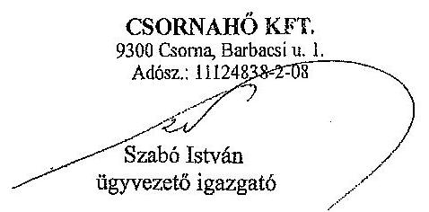

---

1.sz.melléklet

# CSORNAHŐ KFT 

9300 Csorna, Barbacsi u.1.

## Visszavonásig

## Utalvánvozásra jogosultak:

Szabó István ügyvezető igazgató
Herczeg Miklósné gazdasági vezető:

Pénztárellenőr: Tóth Imréné
CSORNAHŐ KFT.
9300 Csorna, Barbacsi u. 1.
Adósz.: 11124838-2-08
Szabó István
ügyvezető igazgató

---

2. sz. melléklet

# CSORNAHŐ KFT 

9300 Csorna, Barbacsi u.1.

## NYILATKOZAT

Ahilírott, tudomásul veszem, hogy a Csornahő Kft házipénztárában kezelt valamennyi pénzeszköz és egyéb értékek kezeléséért teljes anyagi felelősség terhel.

Csorna, 200., $\qquad$ hó $\qquad$ nap

---

CSORNAHÓ KFT
9300 Csorna, Barbacsi út. 1.

# PÉNZKEZELÉSI SZABÁLYZAT 

1/2011 SZÁMÚ MÓDOSÍTÁS
Érvényes: 2011. 11. 01. - tól

## II. HÁZIPÉNZTÁR KEZELÉSI SZABÁLYOK

## 5. Elszámolásra kiadott összeg, előleg nyilvántartása.

Üzemanyag vásárlására felvett előleg összege nem haladhatja meg az 50.000.-Ft-ot. Több alkalommal felvett előlegnél, az előzően felvett összeggel el kell számolni. Az elszámolásra kiadott összegről legkésőbb a hónap utolsó napjáig el kell számolni.

Csorna. 2011. 10. 28
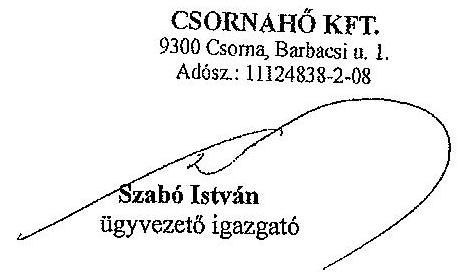

---

CSORNAHÓ KFT
9300 Csorna, Barbacsi út. 1.

# PÉNZKEZELÉSI SZABÁLYZAT 

2/2008 SZÁMÚ MÓDOSÍTÁS
Érvényes: 2008. 07. 01 - tól

## II. HÁZIPÉNZTÁR KEZELÉSI SZABÁLYOK

## 2. A pénztár kezelésével kapcsolatos feladatkörök

A pénztárellenőri feladatokat : Herczeg Miklósné látja el.

Csorna. 2008. 07 . 01
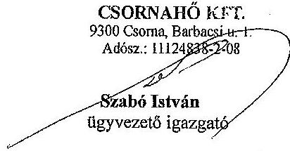

---

# CSORNAHÓ KFT 

9300 Csorna, Barbacsi út. 1.

## PÉNZKEZELÉSI SZABÁLYZAT

1/2008 SZÁMÚ MÓDOSÍTÁS
Érvényes: 2008. 01. 01 - tól

## I. BANKSZÁMLAKEZELÉS

1. Bankszámla nyitása, vezetése

Rendelkezési jogosult : Giczi Terézia - érvénytelen
2. A számlához kapcsolódó készpénzforgalom

A banki tranzakciókat az alábbi személyek végezhetik:
Giczi Terézia- érvénytelen

## II. HÁZIPÉNZTÁR KEZELÉSI SZABÁLYOK

2. A pénztár kezelésével kapcsolatos feladatkörök

A pénztárost távolléte esetén helyettesíti:
Giczi Terézia- érvénytelen

Csorna. 2008. 01. 01
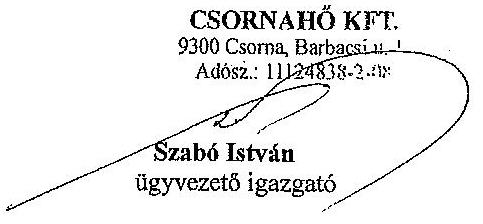

---

# Csorna Város Önkormányzata Képviselő-testületének 

6/2014. (II. 17.) önkormányzati rendelete
a távhőszolgáltatás díjairól

## KIIIHRDETÉSI ZÁRADÉK

Az önkormányzati rendelet kihirdetése a Polgármesteri Hivatal hirdetőtábláján való kifüggesztéssel megtörtént.

A hatálybalépés napja:
2014. július 1.

A kihirdetés napja:
2014. február 17.
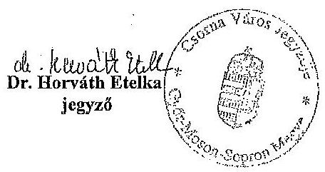

---

# Csorna Város Önkormányzata Képviselő-testületének 

6/2014. (II.17.) önkormányzati rendelete
a távhőszolgáltatás díjairól

Csorna Város Önkormányzatának Képviselő-testülete Magyarország Alaptörvénye 32. cikk (2) bekezdésében, a távhőszolgáltatásról szóló 2005. évi XVIII. törvény 60. § (3) bekezdésében és az árak megállapításáról szóló 1990. évi LXXXVII. törvény 7.§ (1) bekezdésében kapott felhatalmazás alapján a helyi önkormányzatokról szóló 2011. évi CLXXXIX. Törvény 13. § (1) bekezdés 20. pontjában meghatározott feladatkörében eljárva a következő rendeletet alkotja:

## 1. §

(1) A távhőszolgáltatás díjait, az új vagy növekvő távhő igénnyel jelentkező felhasználási hely tulajdonosától a távhőszolgáltatás díjával nem fedezett fejlesztési költségekre kérhető csatlakozási díjat, az egyéb felhasználók felhasználói hőközpontjának, illetve hőfogadójának üzembe helyezési eljárásában való közremüködésért a távhőszolgálatátó által felszámítható díjat, illetve az ügyviteli különszolgáltatások díját az I. sz. melléklet tartalmazza.

## 2. §

(1) A távhőszolgáltató rendszerre jellemző fajlagos fütési hőfelhasználás mértéke a
a) korszerütlen, vagy részlegesen korszerütlen épületek lakóközösségeinek felhasználói számára $0,220 \mathrm{GJ} / \mathrm{legm}^{3} / \mathrm{év}$,
b) homlokzati hőszigeteléssel és korszerü homlokzati nyílászárókkal ellátott, termoszlatikus radiátorszelepek, valamint költségosztó eszközök beépítésével korszerüsített épületek felhasználói számára $0,176 \mathrm{GJ} /$ légm $^{3} / \mathrm{év}$,
c) a (1) bekezdés a) pontjában meghatározott érték az átlagosnál rosszabb hötechnikai jellemzőkkel rendelkező épület esetén az elszámolási időszak részszámlálban számlázott és a ténylegesen elszámolt fötési mennyiség aránya alapján számított, szükséges mértékben, legfeljebb $0,250 \mathrm{GJ} /$ légm $^{3} /$ év értékre megemelhető.
(2) A melegvíz készítés átlagos fajlagos hőfelhasználása a hőközponti mérések alapján:
a) Szent-István téri hőközpont: $\quad 0,221 \mathrm{GJ} / \mathrm{vizm}^{3}$,
b) Soproni úti hőközpont: $\quad 0,221 \mathrm{GJ} / \mathrm{vizm}^{3}$,
c) Eötvös utcai hőközpont: $\quad 0,221 \mathrm{GJ} / \mathrm{vizm}^{3}$
(3) Az egyedi melegvíz-mérővel nem rendelkező díjfizetők melegvíz felhasználására vonatkozó átlagos fajlagos átalány $0,0164 \mathrm{vizm}^{3} / \mathrm{legm}^{3} / \mathrm{hó}$.

A Szolgáltató a 2 § (1)-(3) bekezdésében megállapított értékeket valós mérési értékek alapján évente értékeli és szükség esetén következő évtől módosítja.
3. §
(1) A távhőszolgáltatási tevékenységet, valamint a díjalkalmazás feltételeit külön önkormányzati rendelet szabályozza.

---

# 4. § 

E rendelet 2014. július 1-jén lép hatályba.
A rendelet hatályba lépésével egyidejűleg a távhőszolgáltatás díjairól szóló 13/2009. (IV.24.) számú rendelete hatályát veszti.

Csorna, 2014. február 13.
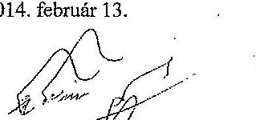

Dr. Torváth Etelka
polgármester
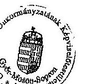

Dr. Horváth Etelka
jegyzó

## Kihirdetési záradék

A rendelet kihirdetése a Polgármesteri Hivatal hirdetőtábláján való kifüggesztéssel a mai napon megtörtént.

Csorna, 2014. február 17.
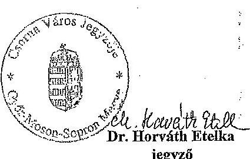

---

I. sz. melléklet a 6/2014. (II.17.) csornai ör-hez

# Dijtétel megnevezése   Egyéb felhasználók 

## I.

Egesége
Dij összege Ft

## 1. Alapdij, forróvíz hőhordozó

1.1 Hőközpont a felhasználó tulajdonában
Ft/MW/év
10.997.784,-
1.2 Hőközpont a távhőszolgáltató tulajdonában
1.2.1 Fütés, fütés és melegvíz
Ft/MW/év
11.147.964,-
1.2.2 Fütés
Ft/1égm ${ }^{3} / \mathrm{ev}$
421,20
1.2.3. Melegvíz
Ft/vizm ${ }^{3} / h 0$
116,30
2. Hődij
2.1. Forróvíz hőhordozó, fütés
Ft/GJ
4.037,-
3. Csatlakozási dij
Ft/W
3,5
4. Üzembehelyezési eljárásban való
Ft/alkalom
6.000 ,-

Közremüködési dij egyéb fogyasztóknál
5. Ügyviteli különszolgáltatás díja
Ft/ráford. óra
2.000 ,-

## II.

Az I. pontban megállapított díjak az általános forgalmi adót nem tartalmazzák.

---

# Csorna Város Önkormányzata Képviselő-testületének 

5/2014. (II. 17.) önkormányzati rendelete
a távhőszolgáltatásról

## KIIIHRDETÉSI ZÁRADÉK

Az önkormányzati rendelet kihirdetése a
Polgármesteri Hivatal hirdetőtábláján való kifüggesztéssel megtörtént.

A hatálybalépés napja:
2014. július 1.

A kihirdetés napja:
2014. február 17.
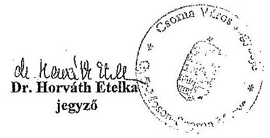

---

# Csorna Város Önkormányzata Képviselő-testületének 

5/2014. (II.17.) önkormányzati rendelete

## a távhőszolgáltatásról

Csorna Város Önkormányzatának Képviselő-testülete Magyarország alaptörvénye 32. cikk (2) bekezdésében és a távhőszolgáltatásról szóló 2005. évi XVIII. törvény (továbbiakban Tszt.) 60. § (3) bekezdésében kapott felhatalmazás alapján a helyi önkormányzatokról szóló 2011. évi CLXXXIX. Törvény 13. § (1) bekezdés 20. pontjában meghatározott feladatkörében eljárva a következő rendeletet alkotja:

## I. Fejezet

## ÁLTALÁNOS RENDELKEZÉSEK

A rendelet hatálya

## 1. §

A rendelet hatálya kiterjed Csorna Város közigazgatási területén a távhőszolgáltatást igénybe vevő felhasználókra, díjfizetőkre, és az őket távhővel ellátó távhőtermelőre, távhőszolgáltatókra.

Fogalom-meghatározások
2. §

E rendelet alkalmazásában a távhőszolgáltatással kapcsolatos fogalmak értelmezése a Tszt. 3. $\S$-ában foglaltak az irányadók.

## II. Fejezet   ELLÁTÁSI KÖTELEZETTSÉG

3. §

Az Önkormányzat a távhőszolgáltatásra engedélyt kapott társaságok útján köteles biztosítani a távhőszolgáltatással ellátott létesítmények távhőellátását.

---

# III. Fejezet 

## A TÁVHÖRENDSZER MÜKÖDTETÉSE ÉS FEJLESZTÉSE

$4 \S$
(1) A távhőtermelő létesítménnyel kapcsolatos feladataira a Tszt. 33.§ (1) és a 34.§ (1) bekezdésében foglaltak az irányadók.
(2) A távhőszolgáltató a Tszt. 34.§ (4) bekezdésében és a távhőszolgálatási dijról szóló önkormányzati rendeletben meghatározott esetben csatlakozási díjat kérhet. A csatlakozási díj megfizetése a távhőrendszerre való rácsatlakozás lehetőségét biztosítja a távhőszolgáltató által meghatározott helyen. A csatlakozási díj a hőtermelői, a gerinc- és elosztóvezetéki, valamint a hőmennyiségmérő berendezések létesítési, illetve bővitési költségeinek fedezetére szolgál. A csatlakozási díj nem tartalmazza a bekötővezetékek, hőközpontok - beleértve a hőmennyiségmérő nélküli hőközponti átadó blokkot is - létesítési és bővitési költségeit.

## 5. §

(1) Felhasználói berendezés létesítése - más megállapodás hiányában - a felhasználási hely tulajdonosának a kötelessége.
(2) A felhasználói hőközpont kiviteli tervének elkészítéséhez a távhőszolgáltató köteles díjmentesen adatokat szolgáltatni.
(3) A lakóépületek és a vegyes célra használt épületek felhasználói hőközpontjainak kiviteli tervét a távhőszolgáltató köteles díjmentesen felülvizsgálni.
(4) A (3) bekezdés szerinti hőközpontok üzembe helyezési eljárásához a távhőszolgáltatót meg kell hívni, az eljárásban a távhőszolgáltató köteles közremüködni. A közremüködésért díj nem számítható fel.
(5) Az elkészült felhasználói berendezést a szolgáltatói berendezéssel - a szerződésben meghatározott feltételek mellett - csak a távhőszolgáltató kapcsolatja össze. Ezzel egyidejűleg a távhőszolgáltató köteles felszerelni a távhő fogyasztás mérésére és elszámolására alkalmas, a mérőeszköz hitelességét tanúsító jellel ellátott mérőt. A hőközpontban vagy hőfogadó állomáson elhelyezett mérőeszközt a távhőszolgáltató üzemelteti.
(6) A távhőszolgáltatásba már bekapcsolt felhasználó csak a távhőszolgáltató előzetes hozzájárulásával
a) létesíthet új felhasználói berendezést;
b) helyezhet át, alakíthat át és - a szerződés felmondásának esetét kivéve - szüntethet meg meglévő felhasználói berendezést.
(7) A felhasználói berendezés üzemeltetése és fenntartása - a (8) bekezdésben foglaltak kivételével - a felhasználó kötelessége.
(8) A szolgáltató tulajdonában lévő felhasználói berendezés, valamint a szolgáltatói hőközpontot a felhasználói berendezéssel a távhövezeték-hálózat részeként összekötő vezeték

---

üzemeltetése és fenntartása, az ezzel kapcsolatos költségek viselése - a csatlakozási pontig bezárólag - a távhőszolgáltató feladata.
(9) A felhasználói berendezés üzemeltetője a folyamatos és biztonságos ellátás érdekében köteles az általa üzemeltetett berendezés üzemképes állapotáról gondoskodni.
(10) A távhőszolgáltató jogosult a felhasználó vételezését, a felhasználói berendezés állapotát a felhasználási helyen ellenőrizni. Az ellenőrzést az ingatlan tulajdonosának, illetőleg használójának személyes érdekei figyelembevételével - a veszélyhelyzet, vagy annak gyanúja esetét kivéve - munkanapokon, 8 és 20 óra között lehet elvégezni. Az ellenőrzést végző személyt az arra feljogosító, fényképes igazolvánnyal kell ellátni.
(11) A (10) bekezdésben meghatározott ellenőrzés, a szabálytalan vételezésre utaló körülmények vizsgálata, továbbá a Tszt. 51. § (3) bekezdés a) és b) pontjai szerinti távhőszolgáltatás felfüggesztésének érdekében a felhasználó, illetőleg a díjfizető köteles a távhőszolgáltató alkalmazottja számára a felhasználási helyre való bejutást lehetővé tenni.

# 6.§ 

Az Önkormányzat területfejlesztési, környezetvédelmi és levegő-tisztaságvédelmi szempontok alapján a 3. számú melléklet szerint kijelöli a távhőszolgáltatás fejlesztésére szánt területeket.

## IV. Fejezet

## A TÁVHŐSZOLGÁLTATÓ, A FELHASZNÁLÓ ÉS A DÍJFIZETŐ KÖZÖTTI JOGVISZONY

7. §
(1) A távhőszolgáltató, a felhasználó és a díjfizető közötti jogviszony általános szabályait a 157/2005.(VIII.15.) Korm. rendelet mellékleteként kiadott Távhőszolgáltatási Közüzemi Szabályzat (továbbiakban: TKSZ.) tartalmazza.
(2) A közüzemi szerződések tartalmára a TKSZ. előírásai az irányadók.
(3) A távhőszolgáltatónak a lakossági felhasználóval szembeni általános közüzemi szerződéskötési kötelezettségét a Tszt. 37.§ (1), (2) bekezdése, az egyéb felhasználó és a távhőszolgáltató közötti, polgári jog szabályai szerinti közüzemi szerződését a Tszt. 37.§ (3), (5)-(6) bekezdése szabályozza.
(4) A távhőszolgáltató, a felhasználó és a díjfizető közötti jogviszony jogszabályokban foglaltakon túlnenő szabályait az üzletszabályzat tartalmazza, melyet a távhőszolgáltató köteles a felhasználók és a díjfizetők részére hozzáférhetővé tenni.

---

# 4. SZÁMÚ MELLÉKLET A V-OS22-266/2014. SZÁMÚ JELENTÉSHEZ 

## 4

## A szolgáltatott távhô mérése és elszámolása

## 8. §

(1) Melegvíz hôhordozó esetén:
a) A távhôszolgáltató a szolgáltatott távhô mennyiségét a felhasználói hôközpontban, illetőleg a szolgáltatói hôközpontban és a hőfogadó állomáson köteles mérni és elszámolni.
b) A hôközponton belül a fütési célú hôcnergia további mérésére van lehetôség, ha a hôközpontban több fütési hőcserélő blokk van, akkor a fütési hőcserélő blokkon, primer oldalon.
c) A hőfogadó állomáson elhelyezett hőmennyiségmérő a szolgáltatói hôközpontban lévô hőmennyiségmérő költségmegosztója. A szolgáltatott távhô elszámolásának alapja - egyéb megállapodás hiányában - a szolgáltatói hôközpontban hitelesen mért hőmennyiség.
d) A felhasznált távhô mennyisége - távhôszolgáltatóval történt egyeztetést követôen épületrészenként (pl. lakásonként) is mérhetô és elszámolható a Tszt. 43.§ (5) bekezdésében meghatározott esetben.
(2) Göz hôhordozó esetén a távhôszolgáltató a szolgáltatott távhô mennyiségét az átadó helyen megmért gözmennyiség és hőtartalma szorzatának, valamint a visszaadott, mért csapadékvíz-mennyiség és hőtartalma szorzatának különbségéből állapítja meg.
(3) A lakóépületet is ellátó hôközpontról ellátott felhasználói közösség által felhazznált összes használati melegvíz mennyiségnek a mérése a hôközpontba beépített, a PANNON-VÍZ Zrt. tulajdonában levô fömérôvel történik.
(4) A melegvíz egyedi mérésére a távhôszolgáltatóval egyeztetett módon
a) az épületek hőfogadóiban; vagy
b) a melegvíz egyedi mérésére a távhôszolgáltatóval egyeztetett módon épületrészenként van lehetőség. Az így felszerelt melegvízmérők a (3) bekezdés szerinti hôközponti fömérő költségmegosztó mérői. A melegvíz egyedi mérésének megvalósítása nem tartozik a távhôszolgáltató kötelezettségei közé, annak költsége a felhasználót, díjfizetőt terheli.
(5) Az önálló hôközponttal nem rendelkező egyéb felhasználó, díjfizető a használati melegvíz felhasználását mérni köteles, kivéve, ha felhasználását csak háromnál több mérővel tudja megmérni. Ebben az esetben a felhasznált melegvíz mennyiségéröl a rendelkezésre álló információk alapján a díjfizető és a távhôszolgáltató külön állapodik meg.
Az ilyen típusú felhasználóknál - amennyiben épület- és gépészeti rekonstrukcióra kerül sor kötelező a mérés kialakítása.

## 9. §

(1) Elszámolási mérő csak a mérési feladat elvégzésére alkalmas és hiteles mérő lehet.
(2) Hiteles az elszámolási mérő, amelyet az Országos Mérésügyi Hivatal (OMH) hitelesített, vagy amelynek külföldi hitelesítését az OMH első belföldi hitelesítésként elfogadta.
(3) A felhasználó, illetve a távhôszolgáltató jogosult a másik fél tulajdonában lévô elszámolási mérő(k) rendkívüli hitelesítését kérni. Amennyiben a mérő az OMH jegyzőkönyve szerint nem biztosította az elôlrt pontosságot, úgy

- a szállítás és a hitelesítés költsége a tulajdonost, ellenkező esetben a rendkívüli hitelesítést kérő felet terheli,

---

- a számla utólagos korrekcióját az OMH jegyzőkönyve alapján a távhőszolgáltató az utolsó elszámolási időszakra köteles elvégezni.

# 10. § 

(1) Az elszámolási mérők meghibásodása esetén, annak megjavítatása, a mérők vonatkozó előírások szerinti időszakos, illetve rendkívüli hitelesíttetése az elszámolási mérő tulajdonosának a feladata. A javítás, illetve a hitelesítés időtartama a 30 napot nem haladhatja meg. Szükség esetén az elszámolási mérő tulajdonosa cseremérőről köteles gondoskodni.
(2) A 8. § (1) és (2) bekezdés szerinti hőmennyiségmérő meghibásodása, továbbá a hitelesítés időtartama alatt a szolgáltatott távhő mennyiségét az előző év azonos időszakában mért hőmennyiség azonos szolgáltatási, illetve vételezési körülményekre történő korrekciójával kell meghatározni. Ilyen időszak hiányában a meghibásodás elhárítását követő, vagy a meghibásodás időpontját megelőző, legalább egy hónap hő felhasználása képezi a korrekció alapját.
(3) A 8. § (4) bekezdés szerinti melegvíz-mérő meghibásodása esetén a szolgáltatott melegvíz mennyiségét az előző elszámolási időszak átlagfelhasználását alapul véve kell meghatározni.

## 11. §

(1) Az elszámolás alapjául szolgáló mérők leolvasása a távhőszolgáltató feladata.
(2) A felhasználó, a díjfizető, illetve a távhőszolgáltató köteles biztosítani az elszámolási mérők leolvasását, ellenőrzését és fenntartását.
(3) Amennyiben az ellenőrzés során - ha a mérőeszköz olyan helyiségben van elhelyezve, amelybe a felhasználó, díjfizető állandó bejutása biztosított- a felhasználónál, díjfizetőnél elhelyezett elszámolási mérőkön a távhőszolgáltató, illetve az OMH által elhelyezett záró elem sérült, úgy a felhasználó, díjfizető a tárgyi elszámolási időszakra a 26. § (4) bekezdés szerinti pótdíjat köteles fizetni.

## A szolgáltatás minősége

## 12.§

(1) Hőátalakítás nélküli távhőenergia szolgáltatás esetén a távhőszolgáltató felhasználóval kötött közüzemi szerződésben lekötött hő́teljesítménnyel áll a csatlakozási ponton a felhasználó rendelkezésére.
(2) Fütési célú távhőszolgáltatás esetén a fütési időszakban úgy kell fűteni, hogy a fütött helyiségek belső hőmérséklete naponta 8-20 óra között átlagosan legalább az épületek és épülethatárdlo szerkezetek hő technikai méretezéséhez a különböző funkciójú helyiségekre megadott hőfokok legyenek, feltéve, ha ezt a felhasználói berendezések állapota lehetővé teszi. A távhőszolgáltató és felhasználó ettől eltérően is megállapodhat.
(3) Fütési szolgáltatással a távhőszolgáltató az év szeptember 15. napján és a következő év május 15. napja között (fütési időszakban) áll a felhasználók rendelkezésére. Ahhoz, hogy fütést elindítsák a hőközpontot vagy ha a hőközponton belül több fütési hőcserélő blokk van,

---

akkor egy fütési blokkot ellátott felhasználók legalább $70 \%$-ának egyetértése szükséges. A felhasználók szándékukat közölhetik egyedi megrendelés útján, vagy a közüzemi szerződésben rögzített, a külső hőmérséklethez kötött módon. Egyetértés hiányába a fütési időszakban akkor kerül sor fütésre, ha a külső hőmérséklet napi középértéke - az Országos Meterológiai Szolgálat előrejelzése szerint - előreláthatólag nem haladja meg a $+10^{\circ} \mathrm{C}$-ot, illetőleg három egymást követő napon a $+12^{\circ} \mathrm{C}$-ot.
(4) A használati melegvíz szolgáltatás esetén a melegvíz hőmérséklete a teljesítési helyen $40 \mathrm{C}^{0}$-nál kevesebb nem lehet.

# Alkalmazott dijak 

13. §

A felhasználó, díjfizető a távhőszolgáltatásért hődíjat, alapdíjat fizet.
14. §
(1) A hődi
a) a távhőszolgáltató által a távhő előállításához felhasznált tüzelőanyag beszerzési árából, valamint a hozzá kapcsolódó adókból és egyéb díjakból;
b) a távhőszolgáltató által vásárolt hő díjából;
c) a primer hálózati hőveszteségből;
d) a szekender hálózati hőveszteségből;
e) az üzemeltetés és fenntartás során felhasznált víz hőtartalmának ellenértékéből;
f) a tüzelőanyag, valamint a vízkondicionáló, hatásfokjavító adalék- és segédanyagok költségeiből;
g) a kazánüzem energetikai, tüzelőanyag és víztechnológiai korszerűsítése miatti eszközbérlet költségeiből;
h) a környezetvédelem költségeiből áll.
(2) Gözfelhasználók hődijánál, ha a mérés helye a hőtermelő létesítménynél van, az (1) c), d) pontok nem vehetők figyelembe.
(3) A szekender hálózati hőveszteség (1) d) pont) csak a hőfogadói hődíj kalkulációjánál vehető figyelembe. A hőfogadói hődíjat a távhőszolgáltató csak akkor alkalmíthatja, ha a hőfogadói hőmennyiségmérő a felhasználó és a távhőszolgáltató közötti közüzemi szerződés szerint elszámolási mérő.
(4) A hődíjat a mért hőmennyiség (GJ), illetve a használati melegvíz mennyiség (vizm ${ }^{3}$ ) után kell fizetni.
15. §
(1) Az alapdíj éves díj, mely a távhőszolgáltató hődíj nélküli költségeit, indokolt ráfordításait és a múködéséhez, fejlesztésekhez szükséges nyereséget fedezi.
(2) Az alapdíj költségtartalmát tekintve:
a) a távhőszolgáltató saját hőtermelő létesítményének tüzelőanyag nélküli üzemeltetési és fenntartási költségéből;

---

b) a távhőszolgáltató primer távhövezetékeinek és tartozékainak üzemeltetési és fenntartási költségéből;
c) a távhőszolgáltató tulajdonában levő hőközpontok üzemeltetési és fenntartási költségéből;
d) a távhőszolgáltató szekunder távhövezetékeinek és tartozékainak üzemeltetési és fenntartási költségéből;
e) a távhőszolgáltató tulajdonában levő hőmennyiségmérők üzemeltetési, fenntartási költségéből;
f) a használati melegvíz készítéshez felhasznált ivóvíz vízdíjának alapdíj részéből;
g) a távhőszolgáltató egyéb múködési költségeiből áll.
(3) Az adott felhasználói kör alapdíjának meghatározásánál a (2) bekezdés szerinti költségekből a ténylegesen ott felmerülő költségek vehetők figyelembe.
(4) A távhőszolgáltató mindenkor hatályos miniszteri rendelet által megállapított mértékủ nyereséget számíthat fel.
(5) Ha a hőközpont a felhasználó tulajdonában van, akkor a felhasználó a távhőszolgáltatóval kötött köztizemi szerződésben meghatározott legnagyobb hőteljesítmény után fizeti az alapdíjat ( $\mathrm{Ft} / \mathrm{MW}$, év).
(6) Ha a felhasználói hőközpont a távhőszolgáltató tulajdonában van, akkor a felhasználó az alapdíjat vagy a távhőszolgáltatóval kötött szerződésben meghatározott legnagyobb hőteljesítmény alapján ( $\mathrm{Ft} / \mathrm{MW}$,év), vagy a fütési alapdíjat a fütött légtérfogat ( $\mathrm{Ft} / \mathrm{legm}^{3}$,év), a melegvíz alapdíjat a melegvíz felhasználás ( $\mathrm{Ft} /$ vizm $^{3}$,hó) után fizeti.
(7) Szolgáltatói hőközpont esetén
a) az önálló hőfogadói hőmennyiségméréssel rendelkező egyéb felhasználó a fütési alapdíjat a távhőszolgáltatóval kötött szerződésben meghatározott legnagyobb hőteljesítmény ( $\mathrm{Ft} / \mathrm{MW}$,év)) vagy a fütött légtérfogat ( $\mathrm{Ft} / \mathrm{legm}^{3}$,év) alapján, a melegvíz alapdíjat a melegvíz felhasználás ( $\mathrm{Ft} /$ vizm $^{3}$,hó) után fizeti.
b) az a) pontba nem tartozó felhasználók a fütési alapdíjat a fütött légtérfogat ( $\mathrm{Ft} / \mathrm{legm}^{3}$,év), a melegvíz alapdíjat a melegvíz felhasználás ( $\mathrm{Ft} /$ vizm $^{3}$,hó) után fizetik.

# 16. § 

Az alapdíj a használati melegvíz vízdíjának csak az alapdíj részét tartalmazza. A használati melegvíz víz-, csatorna- és vízterhelési dijának a felhasznált mennyiséggel arányos részét a távhőszolgáltató a melegvíz hő dijától elkülönítetten, a mindenkor érvényes víz-, csatorna- és vízterhelési dijakkal számlázza tovább.

## 17. §

A lakossági felhasználónak, díjfizetőnek és a külön kezelt intézménynek nyújtott távhőszolgáltatás (fütés és használati melegvíz diját - mint legmagasabb hatósági árat - a miniszter, a csatlakozási díjat Csorna Város Önkormányzata külön rendeletben állapítja meg. A díjak megállapítására e rendelet alapján a távhőszolgáltató tesz javaslatot.

---

# 8 

## Dlifizetés

## 18. §

A felhasználó tulajdonában levő hőközpontról ellátott felhasználó a 15. § (5) szerinti alapdij 1/12-ed részét a tárgyhóban, a hőközpontban megmért hőmennyiségnek megfelelő hődijat a tárgyhót követő hónapban fizeti meg.

## 19. §

(1) A távhőszolgáltató tulajdonában levő felhasználói hőközpontról ellátott egyéb felhasználó a 15.§ (6) szerinti alapdij 1/12-ed részét, valamint a hőközpontban megmért hőmennyiségnek megfelelő hő díjat havonta, a tárgyhónapot követő hónapban fizeti meg.
(2) Szolgáltatói hőközpontról ellátott önálló hőfogadói hőmennyiségméréssel rendelkező egyéb felhasználó a 15.§ (7) a) pont szerinti fütési alapdij $1 / 12$-ed részét, valamint
a) ha a hőfogadói hőmennyiségmérő a hőközponti, illetve fütési blokk hőmennyiségmérő költségosztó mérője, akkor a 21.§ (2) b) pontja szerint meghatározott fütési hő felhasználás szerinti hő központi fütési hő díjat,
b) ha a hőfogadói hőmennyiségmérő a felhasználó és a távhőszolgáltató közötti közüzemi szerződés szerint elszámolási mérő, akkor a mért hőmennyiségnek megfelelő hőfogadói fütési hődijat, vagy a hőközpont és hőfogadó közötti távhővezeték hőveszteségével megnövelt, mért hőmennyiség alapján számított hőközponti fütési hődijat, illetve ha használati melegvíz vételezése is van, akkor a melegvíz alapdijat, valamint a 8.§ (4)-(5) bekezdés szerinti melegvíz felhasználás utáni melegvíz hő díjat, víz, csatorna és vízterhelési díjat havonta, a tárgyhónapot követő hónapban fizet meg.
(3) A távhőszolgáltató tulajdonában levő hőközpontról ellátott az (1)-(2) bekezdésekbe nem tartozó felhasználó
a) a 15.§ (6), (7) b) bekezdések szerinti fütési alapdij 1/12-ed részét, illetve ha használati melegvíz vételezése is van, akkor a melegvíz alapdijat a tárgyhónapot követő hónapban;
b) fütési hő díjat a 21.§ szerint;
c) a melegvíz hődijat, víz-, csatorna- és vízterhelési díjat a 22.§ szerint fizeti meg.

## 20. §

(1) A távhőszolgáltató tulajdonában levő hőközpontról ellátott épületek esetén a távhő díjak kiegyenlítése a tulajdonosok egymással történő megállapodása szerint együttesen vagy különkülön épületrészenként is történhet. Külön történő díifizetés esetén a díj épületrészenkénti (pl. lakásonkénti) megosztása és a díjfizetők részére történő számlázása - a tulajdonosok által meghatározott arányok, valamint az üzletszabályzat rendelkezései szerint - a távhőszolgáltató feladata.
(2) Fütési költségmegosztók fenntartása, adatainak leolvasása és azok alapján a díjszétosztási arányok meghatározása a felhasználó feladata, szabályozza a Tszt. 44.§ (1) bekezdés, valamint a távhőszolgáltatásról szóló 2005. évi XVIII. törvény 157/2005. (VIII.15.) végrehajtásáról szóló 157/2005. (VIII.15.) Kormány rendelet 17.§-a.

---

(3) Az épületrészekre felosztott számla további bontása még akkor sem történhet meg, ha annak több tulajdonosa van. Ilyenkor a díjfizető a tulajdonostársak megegyezése alapján megjelölt tulajdonos, megegyezés hiányában, pedig a tulajdoni lapon első helyen feltüntetett tulajdonos.

# 21. § 

(1) A fütési célra fordított hőmennyiség hő̉diját, a fütési hődijat a felhasználó, díjfizető
a) együttes díjfizetés esetén a (2)-(3) bekezdés szerinti fütési höfelhasználás után a tárgyhónapot követő hónapban fizeti meg;
b) épületrészenként külön történő díjfizetés esetén 12 havi részfizetéssel és évi egyszeri elszámolással fizeti meg. A részfizetés számításához a fütési célra a rendszerre jellemző a tárgyévre tervezhető - a távhőszolgáltatás díjairól szóló önkormányzati rendeletben meghatározott - éves fajlagos höfelhasználás 1712 -ed részét (GJ/1égm ${ }^{3}$,hó) kell az érvényben levő hődíjjal szorozni ahhoz, hogy megkapjuk az 1 légm ${ }^{3}$-re vonatkozó havi hődijat. A díjfizető a havi hődíj és a felhasználási hely fütött légtérfogatának szorzataként megkapott fütési hődijat fizeti meg részfizetésként a tárgyhónapot követő hónapban. A tárgyév elszámolása a december havi elszámoláskor (január hónapban) esedékes és a tárgyévben érvényes hődíjjakkal történik. A távhőszolgáltató a (2)-(3) bekezdés szerinti tényleges éves fütési höfelhasználás alapján számított és a részfizetésként megfizetett fütési hődíj különbözetével - a 20.§ (1) bekezdés szerinti megállapodás figyelembevételével - a díjfizetők felé elszámol (a különbözetet visszafizeti vagy beszedi).
(2) A távhőszolgáltató tulajdonában levő felhasználói höközpont, illetve szolgáltatói höközpont esetén, ha a hőfogadói hőmennyiségmérő a höközponti hőmennyiségmérő költségosztó mérője a felhasználó tárgyévi fütési célú hő felhasználását az a) b) pontok szerint kell meghatározni.
a) A höközpontról ellátott felhasználói közösség fütési célú hő felhasználása

- a csak fütési hőigényeket kielégítő höközpont esetén a höközponti fömérő által megmért hőmennyiség,
- a használati melegvizet is előállító höközpont esetén a höközponti fömérő által megmért hőmennyiség, valamint a 8.§ (3) bekezdés szerint megmért vízmennyiség és a melegvizkészítés adott höközpontra jellemző átlagos fajlagos höfelhasználása szorzatának a különbsége. A melegvíz-készítés adott höközpontra jellemző átlagos fajlagos hő felhasználását a használati melegvíz előállítására fordított hő vagy ha az külön nem mért fütési időszakon kívüli hónapokban mért höközponti hő- és vízfelhasználás hányadosaként kell meghatározni és a távhőszolgáltatás díjairól szóló önkormányzati rendeletben közzétenni. b) A fütési célú hő felhasználás a hő fogadókba elhelyezett hőmennyiségmérőkkel tovább bonthatók. Ha a höközpontról (fütési hőcserélő blokkról) ellátott valamennyi hő fogadóba költségmegosztó hőmennyiségmérő került beépítésre, akkor a höközponti fömérő (fütési hőcserélő blokkon lévő mérő) és a hőfogadói költségmegosztó mérők által mért értékek összegének különbségét felhasználás arányosan kell az elszámolásnál figyelembe venni.
(3) Szolgáltatói höközpont esetén, ha a hőfogadói hőmennyiségmérő a felhasználó és a távhőszolgáltató közötti köztizemi szerződés szerint elszámolási mérő, a felhasználó tárgyévi fütési célú hő felhasználása a hőfogadóban a höközpont és hőfogadó közötti távhövezeték hőveszteségével megnövelt mért hőmennyiség.
(4) Költségosztóval szerelt, huzamosabb ideig lakatlan lakás esetén a tervezett havi fütési hő felhasználás szerint számított mértéke a lakás díjfizetőjének kérésére - a lakóközösség képviselőjének írásbeli hozzájárulása mellett - a lakás üresen állásának idejére $50 \%$-ra

---

csökkenthető. A lakás ismételt használatba vételét a változást megelőzően legalább 15 nappal dijfizető köteles a szolgáltatónak bejelenteni

# 22.§ 

A használati melegvíz készitésére fordított hőmennyiség hődiját, (továbbiakban melegvíz hődi), valamint a víz-, csatorna- és vízterhelési dij felhasználással arányos részét (továbbiakban víz-, csatorna- és vízterhelési dij) a felhasználó, dijfizető havonta, a tárgyhónapot követő hónapban fizeti meg az alábbiak szerint meghatározott melegvíz felhasználása alapján:
a) A 8. § (4) bekezdés b) pontja szerint az egyedi mérővel rendelkező felhasználó, dijfizető melegvíz felhasználása a 8. § (3) bekezdés szerint a hőközponti főmérővel bemért vízmennyiség alapján, az egyedi mérők által megmért vízmennyiségnek százalékos arányában kerül meghatározásra.
b) Az egyedi mérővel nem rendelkező felhasználók, dijfizetők melegvíz felhasználása fajlagos általány alapján, (távhőszolgáltatás díjairól szóló önkormányzati rendeletben megállapított vízm ${ }^{3} / \mathrm{legm}^{20} \mathrm{~h} 0$ ) kerül meghatározásra. A fajlagos átalány meghatározása az egyedi mérővel rendelkezők által megmért összes melegvíz mennyiségből az előző évi 12 hónap fogyasztása alapján történik.
c) A 8. § (5) bekezdése alapján egyedi mérővel nem rendelkező egyéb felhasználó, dijfizető melegvíz falhasználása a távhőszolgáltatóval külön megállapodás alapján meghatározott melegvíz mennyiség szerint a 8. § (3) bekezdés szerint a hőközponti fővízmérő mennyiségéből az (a) és (b) pontban meghatározott melegvíz mennyiségek lévonása után százalékosan kerül meghatározásra.

## 23. §

(1) Az érdekeltek 20.§ (1) bekezdés szerinti megállapodásának hiányában a dijfizetésre a (2)(6) bekezdéseinek előírásait kell alkalmazni.
(2) A dijfizető az igénybevett szolgáltatás szerint a tulajdonában, használatában levő helyiségek fütött légtérfogata után a fütési alapdíj (Ft/légm ${ }^{3}$,év) 1/12-ed részét, és/vagy melegvíz alapdíjat ( $\mathrm{Ft} / \mathrm{vizm}^{3}, \mathrm{~h} 0$ ) a tárgyhónapot követő hónapban fizeti meg. A fütési alapdíj számításánál a közös helyiségek fütött légtérfogatát $60 \%$-kal, a garázsokét $50 \%$-kal kell figyelembe venni.
(3) A fütési hődijat a dijfizető a 21.§ (1) b) pontja szerint fizeti meg, azzal a különbséggel, hogy a tényleges éves fütési hőfelhasználást a 21.§ (2) bekezdése szerint határozza meg, és az ez alapján kiszámított fütési hődijat a dijfizetők között a 23.§ (4) bekezdés szerint osztja szét.
(4) A távhőszolgáltató az egy-egy felhasználói közösségre vonatkozóan megmért, vagy meghatározott fütési célú hőfelhasználást a dijfizetők között a tulajdonakban, használatukban lévő helyiségek (lakás, közös helyiség, garázs, közület stb.) fütött légtérfogatának arányában osztja szét úgy, hogy az eredeti rendeltetésük szerint használt közös helyiségek fütött légtérfogata $60 \%$-kal, a garázsok fütött légtérfogat $50 \%$-kal kerül figyelembe vételre.
(5) Fütési hődíjként a hőközponti hődijat kell alkalmazni.
(6) A melegvíz hődijat, víz-, csatorna- és vízterhelési díjat a dijfizető a 22.§ szerint fizeti meg.

---

# 24. § 

(1) Amennyiben a távhőszolgáltatási rendszerre új felhasználási helyet kapcsolnak, úgy a felhasználó az alapdíjat a belépés hónapjának első napjától fizeti.
(2) Ha az egyéb felhasználó év közben mondja fel az egyedi közüzemi szerződést, a felmondás évében az alapdíjat a naptári év végéig kell megfizetnie.
(3) A kiszámlázott díjakat szolgáltatás fajtánként a kerekítés szabályai szerint egész forintra kell kerekíteni.

## 25. §

A díjelszámoláshoz szükséges értelmezési rendelkezéseket a 1. számú melléklet tartalmazza.
Dijkedvezmény, díyvisszatérités és pótdíj

## 26. §

(1) Ha a lekötött hőteljesítmény alapján alapdíjat fizető felhasználó a szerződésben lekötött hőteljesítményt folyamatosan 30 percnél hosszabb időtartamon keresztül túllépi, pótdíjat köteles fizetni. A pótdíj mértéke az éves alapdíj $1 / 6$-od része, melyet annyiszor kell megfizetnie, ahány napon a túllépést elkövette. A pótdíj megfizetése nem mentesít a szerződésszegés egyéb következményei alól.
(2) Ha a felhasználó a tulajdonában levő hőközpontból, hőfogadóból a keringtetett forróvizet vagy melegýizet nem a szerződésben meghatározott mennyiségben adja vissza, a vissza nem adott vizmennyiség után $100 \%$-kal növelt viz-, csatorna- és vizterhelési díjat fizet.
(3) Ha a távhőszolgáltató a felhasználónál, díjfizetőnél elhelyezett elszámolási és költségmegosztó mérök ellenőrzése során - amennyiben a mérőeszköz olyan helyiségben van elhelyezve, amelybe a felhasználó, díjfizető állandó bejutása biztositott- a távhőszolgáltató, illetve az OMH által elhelyezett záróelemet sérülten találja, vagy egyéb szabálytalan vételezést észlel, akkor az eseményt jegyzőkönyvben rögzíti és az alábbiak szerint számol el: - hömennyiségmérő esetén az előző év azonos elszámolási időszakában mért hőmennyiség kétszeresénék megfelelő hődíjat számítja fel,

- melegviz-mérő esetén az előző elszámolási időszakban mért melegvíz mennyiség háromszorosának megfelelő melegvíz hődíjat, valamint víz-, csatorna- és vizterhelési díjat számít fel.
(4) A távhőszolgáltató tudta nélkül, illegálisan vételezö
- fütés esetében a beépített hőteljesítményből 20 órás csúcsikihasználással számolt hőmennyiség kétszerese utáni hődíjat,
- melegviz esetében a 8.§ (4) bekezdés szerinti melegviz-mérővel nem rendelkező felhasználóként, díjfizetőként meghatározott melegvíz mennyiség háromszorosa utáni hődíjat, valamint víz-, csatorna- és vizterhelési díjat köteles megfizetni a vételezés kezdetétől számított időtartamra.

---

# 27.§ 

(1) Az épületek energiatakarékos felújításának támogatása céljából a fütési alapdíj $5 \%$-os kedvezményében részesülnek azok a szolgáltatói höközpontról ellátott lakossági felhasználók, akik együttes feltételként elvégezték
a) az épület fütési rendszerének korszerűsítését (a hőleadók egyedi szabályozásához termosztafikus szelepek beépítése, strangszabályozók beépítése vagy cseréje, az épület fütési rendszerének szükség szerinti átalakítása, az épület höfogyasztásának épületrészenkénti költségmegosztására alkalmas mérőeszközök beszerelése);
b) az épület nyílászáróinak korszerü, energiatakarékos nyílászárókra történő cseréjét (minimum a lakások $90 \%$-ban);
c) az épület utólagos hőszigetelését (homlokzati- és végfalak hőszigetelése).
(2) Az (1) bekezdés szerinti kedvezményre vonatkozó, a távhőszolgáltatóhoz írásban benyújtott kérelemnek tartalmaznia kell az (1) bekezdés a)-c), pontjaiban meifogalmazott feltételek teljesülésének műszaki leírását és azok igazolását.
(3) A távhőszolgáltató a kérelmet 15 napon belül köteles elbírálni.
(4) A kedvezményt a távhőszolgáltató a pozitív elbírálást követő hónap elsejétől köteles egész Ft-ra kerekítve a díjfizetők számláiban érvényesíteni.

A távhőszolgáltatás szüneteltetése, korlátozása, felfüggesztése

## 28. §

(1) A távhőszolgáltató a Tszt. 40.§ (1) bekezdésében meghatározott esetekben jogosult a távhőszolgáltatást szüneteltetni.
(2) A távhőszolgáltató és a felhasználó a tulajdonában lévő berendezés rendszeres karbantartását, tervezett javítását, felújítását a fütési időszakon kívüli időszakban jogosult elvégezni. A távhőszolgáltató jogosult e célból a szolgáltatást a lehetséges legkisebb felhasználói körben és a legrövidebb időtartamban szüneteltetni. Eltérő megállapodás hiányában a szünetelés 8 napnál hosszabb nem lehet.
(3) A távhőszolgáltató köteles az előre tervezhető karbantartási, felújítási munkák miatti szüneteltetés időpontjáról és várható időtartamáról az üzletszabályzatban vagy a szerződésben rögzített módon az érintett felhasználókat előre - legalább a munkálatok megkezdése előtt 8 nappal - értesíteni.
(4) A felhasználó magatartásával más felhasználó vételezését nem zavarhatja. Ha a távhőszolgáltató tudomására jut, hogy a felhasználó más felhasználó vételezését zavarja, vagy vételezésével veszélyhelyzetet teremtett, a felhasználót felszólítja a veszélyhelyzet, illetve a zavart okozó körülmény, magatartás megszüntetésére. A felhasználó az élet- és vagyonbiztonságot veszélyeztető helyzetet azonnal, az egyéb zavaró körülményt a zavaró körülményről történő tudomásszerzéstől számított 8 napon belül köteles megszüntetni.
(5) Ha a (4) bekezdésben említett veszélyhelyzetet vagy zavaró körülményt a felhasználó a határidő lejártáig nem szünteti meg, a távhőszolgáltató jogosult a távhőszolgáltatást felfüggeszteni, és ezzel egy időben azt az önkormányzat jegyzőjének jelenteni.

---

# 29. § 

(1) A távhőszolgáltató jogosult - a (2) és (3) bekezdésében foglalt korlátozásokkal - a Tszt. 41.§ (1) bekezdésében meghatározott esetekben a szolgáltatást korlátozni.
(2) A felhasználói korlátozás, figyelembe véve a közintézmények saját hőtermelő teljesítményét is, nem vezélyeztetheti a közintézmények egészségügyi és szociális alapszolgáltatásainak ellátását.
(3) Lakossági felhasználó korlátozására a Tszt. 41.§ (3) bekezdésében foglaltak az irányadók.
(4) A korlátozás bevezetéséről és annak okairól a távhőszolgáltató az önkormányzatot haladéktalanul tájékoztatni köteles.
(5) A felhasználó tulajdonában lévő hőközpont esetén a felhasználó köteles az elrendelt távhőkorlátozást maximum 4 óra alatt végrehajtani, és a távhőszolgáltató ezirányú ellenőrzését eltűrni.
(6) A távhőszolgáltató tulajdonában levő hőközpontok esetén a távhőkorlátozást a távhőszolgáltató hajtja végre.
(7) A korlátozási sorrendet a 2. számú melléklet tartalmazza.
(8) A távhő vételezését korlátozó eszközök, berendezések beszerzése, felszerelése, üzemeltetése, karbantartása és ellenőrzése, és az ezekkel kapcsolatos költségek viselése a távhőszolgáltató kötelessége.
(9) A korlátbzásra szolgáló okok megszủnése után a korlátozást haladéktalanul fel kell oldani.

## 30.§

A távhőszolgáltatás szünetelése miatt a felhasználói berendezésekben keletkezett károkat, ha a szolgáltatás szünetelésében a felhasználó vétlen, a szolgáltató köteles megtéríteni. Ezen túlmenően a 28. § (1) bekezdése szerinti szüneteltetésből, illetőleg a 29.§ (1) bekezdése szerinti korlátozásból eredő károkért a távhőszolgáltatót kártalanítási kötelezettség nem terheli.

## 31.§

(1) A távhőszolgáltató a távhőszolgáltatást felfüggesztheti, ha a felhasználó vagy a díjfizető a Tszt. 49. § (2) bekezdés b), c), d) pontjaiban meghatározott szerződésszegést követi el vagy a távhőszolgáltatás díját a távhőszolgáltató által kiállított számlán feltüntetett fizetési határidőt követő 15 naptári napon belül nem fizeti meg.
(2) Ha a felhasználó, illetőleg a díjfizető a távhőszolgáltatás felfüggesztése okának megszüntetéséről a távhőszolgáltatót írásban értesítette, az értesítés kézhezvételét követő munkanapon a távhőszolgáltatást meg kell kezdeni, ha a felfüggesztés oka megszűnt.
(3) A távhőszolgáltatás felfüggesztésével, valamint a felfüggesztés megszüntetésével felmerült költségeket a távhőszolgáltató jogosult a szerződésszegés elkövetőjére áthárítani.

---

(4) A távhőszolgáltatás felfüggesztését a távhőszolgáltató csak oly módon alkalmazhatja, hogy azok ne érinteék a teljesítő díjfizetőt vagy felhasználót.

# V. Fejezet 

## A FELHASZNÁLÓ ÉS A DÍJFIZETŐ SZEMÉLYÉBEN BEKÖVETKEZŐ VÁLTOZÁS

## 32. §

(1)A szolgáltató, a felhasználó és a díjfizető a távhőszolgáltatás minden területén - a tőle elvárható mértékig - köteles együttmüködni és egymást kölcsönösen tájékoztatni a szolgáltatással, illetve annak igénybevételével, a szolgáltatás ellenértékének elszámolásával kapcsolatos kérdésekben.
(2) A felhasználó valamint a díjfizető személyében bekövetkezett változást a régi és az új felhasználó írásban köteles a távhőszolgáltatónak a felhasználó személyében bekövetkezett változástól számított 15 napon belül bejelenteni.
(3) A változás bejelentésének minden olyan adatot tartalmaznia kell, amely egyrészt a felhasználók azonosítását egyértelművé teszi, másrészt a távhőszolgáltatás szükséges elszámolását lehetővé teszi, továbbá a szerződés tervezet elkészítésére álkalmas. A távhőszolgáltató mindaddig a régi felhasználónak köteles a távhőszolgáltatás ellenértékét kiszámá́zni, míg az új felhasználóval a szerződés életbe nem lép.
(4) A távhőszolgáltató a (3) bekezdés szerinti bejelentést követő 15 napon belül köteles az új felhasználó részére a közüzemi szerződés megkötésére írásban ajánlatot tenni.
(5) A díjfizető személyében bekövetkezett változást a régi és az új díjfizető - é felhasználó képviselőjének egyidejű értesítése mellett - írásban köteles a díjfizető személyében bekövetkezett változástól számított 15 napon belül - a távhőszolgáltatónak, a távhőszolgáltató által rendszeresített módon és formában bejelenteni. A távhőszolgáltató köteles a bejelentés napját követő hónap elsejétől az új díjfizető adatait nyilvántartani és az új díjfizetőnek számlázni.
(6) Amennyiben csak az egyik (vagy a régi, vagy az új) díjfizető jelenti be a (5) bekezdés szerint a díjfizető személyében bekövetkezett változást, akkor a változás tényét hittelt érdemlő módon (adásvételi szerződés, három hónapnál nem régebbi tulajdoni lap, önkormányzati tulajdonú lakás és nem lakás esetén bérleti szerződés) kell bizonyítani.
(7) Ha a 20. § (1) bekezdése alapján az épületrészek tulajdonosai a külön történő díjfizetés mellett döntöttek, akkor díjfizető változás esetén
a) a díjfizetésre kötött megállapodás az új díjfizetőre is vonatkozik mindaddig, amíg az épületrészek tulajdonosai új megállapodást nem kötnek, b) Az elszámolási időszakon belüli díjfizető változás esetén távhőszolgáltató a hőközpont rendes elszámolásakor a régi és az új díjfizetőnek a lakott időszakok alapján részidőszaki elszámolást készít. Részidőszaki elszámoláskor az egyes díjfizetőkre jutó tényleges mennyiségeket
ba) Fütési hő vonatkozásában a költségosztó eszközöknek a tulajdonos váltáskor, valamint az elszámolási időszak végén szokásos leolvasásakor rögzített fogyasztási egységekből, ennek

---

hiányában a lakott időszakok hossza szerint a lakóközösséggel szerződéses jogviszonyban álló költségosztó cég által kiszámított részidőszaki fogyasztás,
bb) melegvíz vonatkozásában a változás időpontjában leolvasott melegvíz mérőállás alapján, teljes hónapra vonatkozóan kell megállapítani.
c) A változást jelentő hónap számlájának megosztását a díjfizetők egymás közötti megállapod'issal oldják meg, az értelmezö rendelkezés figyelembe vételével. A díjfizető kérésére a megállapodott állapotról a távhőszolgáltató módosított számlákat készít.
(8) A távhőszolgáltató jogosult a felhasználási hely vagy a díjfizető hely tulajdonosával szemben éryényesíteni a távhőszolgáltatás diját, ha a felhasználó vagy a díjfizető változás bejelentése nem történt meg, az ingatlant jogcím nélkül használják, vagy hiányoznak a változás időpontjáig igénybevett szolgáltatás elszámolásához szükséges adatok.
(9) Az épület, építmény, épületrész tulajdonosa és a bérlő vagy a használó együttes kérelmére a távhőszolgáltató - az általa rendszeresített módon és formában - a távhőszolgáltatási díjat közvetlenül a bérlő vagy a használó részére számlázza. A tulajdonos távhőszolgáltatási díj megfizetéséért kezesi felelősségére a Tszt. 44.§ (3) bekezdésében foglaltak az irányadók.
(10) A bérlő vagy használó részére történő közvetlen számlázásra irányuló kérelmet szolgáltató csak abban az esetben teljesíti, ha a benyújtás időpontjában a felhasználási hely hőszolgáltatási díjának egyenlege rendezett.
(11) A tulajdonosi készízető kezesség alapján az elmaradt teljes távhőszolgáltatási díj, valamint annak a behajtással kapcsolatban felmerült egyéb költségei a tulajdonostól követelhetők, ha a bérlő vagy a használó kettőnél több havi, illetőleg 50.000 Ft -nál magasabb összegủ díjtartozást halmozott fel.

# VI. Fejezet 

## VEGYES RENDELKEZÉSEK

## 33. §

(1) Ha a felhasználó a közüzemi szerződésben lekötött hőteljesítménynél nagyobb hőteljesítményt kíván a távhőszolgáltatótól igénybe venni, akkor a távhőszolgáltató felé az új hőteljesítménynek megfelelő igénybejelentést kell tennie. A távhőszolgáltató erre válaszolva nyilatkozik a bővités lehetőségeiről és feltételeiről.
(2) A közüzemi szerződésben lekötött hőteljesítmény csökkentésére miden év január 1-től van lehetőség, ha a felhasználó ez irányú szándékát előző év október 31-ig a távhőszolgáltatónak írásban bejelentette.

## 34. §

(1) A távhőszolgáltató ügyfélszolgálatán egyértelműen és közérthetően, magyar nyelven köteles a felhasználókat és a díjfizetőket tájékoztatni a távhőszolgáltatás igénybevételének feltételeiről, változásairól, különös tekintettel a számlázás rendjére és a szolgáltatás minőségére.
(2) A távhőszolgáltató köteles ügyfélszolgálatán a (1) bekezdésben meghatározott tájékoztatást, valamint az általános szerződési feltételeit könnyen hozzáférhető helyen

---

kifüggeszteni, valamint a felhasználó és a dijfizető kívánságára azt ingyenesen rendelkezésre bocsátani.

# 35. § 

A távhőszolgáltató a Tszt. 45. §(1) bekezdésében meghatározottak szerint, az ott meghatározott adatok kezelésére jogosult.

## $36 \S$

A felhasználó és a dijfizető azonosítására e rendelet 35. §-ában felsorolt adatokat tartalmazó bármilyen azonosító okirat szolgál, melyet a távhőszolgáltató kérésére felhasználó és a dijfizető köteles bemutatni.

## 37. §

A távhőszolgáltatással kapcsolatos dijfizetési kötelezettség és más pénztartozás a társasház tulajdonostársait és a lakásszövetkezet tagjait nem terheli egyetemlegesen. Épületrészenként külön-külön történő dijfizetés esetén a felhasználó az egyes dijfizetők, továbbá a dijfizető más dijfizetők díjtartozásának megfizetéséért nem tartozik felelősséggel.

## VII. Fejezet

## Záró rendelkezések

## 38. §

E rendelet 2014. július 1-jén lép hatályba.
A rendelet hatályba lépésével egyidejűleg a távhőszolgáltatásról szóló 14/2006 (IV.28) csomai önkormányzati rendelet hatályát veszti.

Csoma, 2014. február 13.
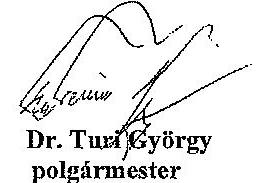
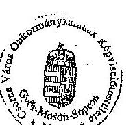
de keeseth tete
Dr. Horváth Etelka
jegyzó

## Kihirdetési záradék

A rendelet kihirdetése a Polgármesteri Hivatal hirdetőtábláján való kifüggeszzéssel a mai napon megtörtént.

Csoma, 2014. február 17.
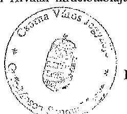
de keeseth tete
Dr. Horváth Etelka
jegyzó

---

# 1. számú melléklet a 5/2014. (II.17.) csornai ör-hez 

## Értelmező rendelkezések

## 1. Fütött légitérfogat:

A szolgáltatási dij alapját képező fütött légtérfogat megállapításánál az épületek műszaki terveinek adatait kell figyelembe venni az alábbiak szerint:
A fütött légtérfogatot a fütött helyiség alapterületének és átlagos magasságának (lakás esetében max. $3,0 \mathrm{~m}$ ) szorzataként kell meghatározni. A fütött helyiség alapterületének megállapításánál a padlószint feletti 1 m magasságban a belső falsikok között mért területet, továbbá a beépített bútorok által elfoglalt területeését kell számításba venni. Az éléskamra (kamraszekrény), valamint a lakás (helyiség) légterének közművezetékeket védő burkolat mögötti része a fütött légtérfogat megállapításánál nem vehető számításba. Ha a távhőellátásban részesülő lakás fürdőszobájában a műszaki tervben meghatározott hőmérsékletet a műszaki tervek alapján kiegészítő fütéssel (pl. villamos hősugárzó) biztosítják, a lakás fütött légtérfogatának megállapításánál a kiegészítő fütéssel ellátott fürdőszoba légtérfogatának $60 \%$-át kell számításba venni.

## 2. Fütött hêlyiség

A rendelet alkalmazása szempontjából fütött az a helyiség, amelyben fütőtest vagy a szomszédos helyiségekből átáramló hő biztosítja a műszaki tervben meghatározott hőmérsékletet.

## 3. Közös helyiség (a fizetendő dij alkalmazása szempontjából)

Lakóépületben a közös használatra szolgáló helyiség (pl. szárítóhelyiség, gyermekkocsi- és korékpár tároló helyiség, közös pince, illetve padlástérség), valamint a közös használatra szolgáló terület (pl. lépcsőház, zárt folyosó).
4. Háztartási célú höfelhasználás: a lakóépület lakásainak, közös helyiségeinek, gépkocsi tárolóinak fütése, használati melegvíz-felhasználása.
5. Nem háztartási célú höfelhasználás: minden az 4. pontban nem definiált hőfelhasználás.

---

# 2. számú melléklet a 5/2014. (II.17.) csiornal ör-hez 

## Távhőkorlátozási sorrend

1. kategória: Egyéb felhasználók közül az ipari üzemek;
2. kategória: Ipari üzemeken kívüli egyéb felhasználók;
3. kategória: Lakossági felhasználók használati melegvíz fogyasztása;
4. kategória: Lakossági felhasználók fütése;
5. kategória: Kórházak, egészségi és szociális intézmények.

---

# 3. számú melléklet a 5/2014. (IL17.) csornai ör-hez 

Területfejlesztési, környezetvédelmi és levegő-tisztaságvédelmi szempontok alapján a távhőszolgáltatás fejlesztésére szánt területek
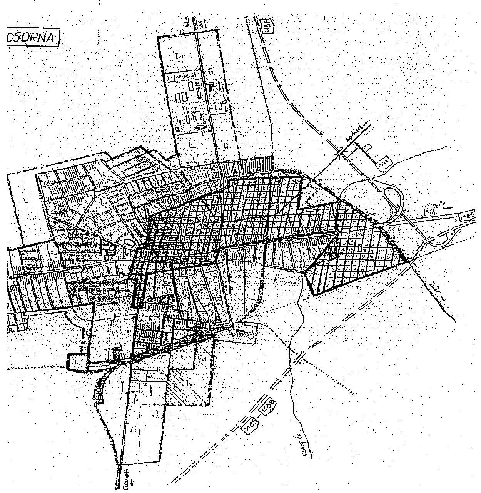

---

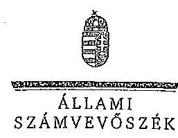

ELNÖK

Ikt.szám: V-0522-263/2014.

Szántó Lajos Sándor úr
ügyvezető igazgató
Csornahó Kft.

Csorna

Tiszteit Ügyvezető Igazgató Úr!

Köszönettel vettem a Csornahó Kft. ellenőrzéséről készített számvevőszéki jelentéstervezetre
tett észrevételeit.

Csatoltan megküldöm az Állami Számvevőszék észrevételekre vonatkozó álláspontjáról a
felügyeleti vezető által készített részletes tájékoztatást.

Tájékoztatom Ügyvezető igazgató urat, hogy a számvevőszéki jelentés véglegesítése az
elfogadott észrevételek figyelembevételével történik.

Budapest, 2014. a Cec. hó 24 nap

Tisztelettel:

*Don*

Domokos László

Melléklet: Tájékoztatás az észrevételek kezeléséről

1052 BUDAPEST, APÁGZAI CSERE SÁRUS UTCA 10, 1364 Budapest 4. Pl. 54 telefon: 484 9191 fax: 484 9291

41

---

# Tájékoztatás az észrevételek kezeléséről 

A Csornahő Kft. ellenőrzéséről készített jelentéstervezetre Ügyvezető Igazgató úr észrevételeket fogalmazott meg. Az észrevételek alapján a jelentés tervezetét az alábbiak szerint módosítom:

A pénzkezelési szabályzattal kapcsolatos észrevétele alapján a jelentéstervezet összegző megállapításának „A Csornahö Kfi. a Számv. tv.-ben foglalt elölrás ellenére nem rendelkezett pénzkezelési szabályzattal. " mondatát, illetve a részletes megállapítások 2.1. pontján belül a 22. oldal utolsó előtti bekezdésének „pénzkezelési szabályzattal nem rendelkezett" szövegrészét az alábbi lábjegyzettel egészítjük ki: „A Csornahö Kft. ügyvezető igazgatója 2014. november 25 -én kelt levelében jelezte, hogy a társaság az ellenőrzött időszakban rendelkezett pénzkezelési szabályzattal. A pénzkezelési szabályzatot sem a dokumentumbekérés, sem a helyszíni ellenőrzés ideje alatt nem adták át az ellenőrzést végzők részére, igy azt nem állt módunkban figyelembe venni."

A távhőszolgáltatási rendeletre vonatkozó észrevétel figyelembevételével a jelentéstervezet összegző megállapításainak „A távhőszolgáltatási rendeletet azonban a hatályba lépését követően bekövetkezett jogszabályt változásokkal - a távhőszolgáltatói müködési engedélyek kiadására jogosult változásával és a dijmegállapitás szabályainak átalakulásával - összhangban nem módositották, igy az önkormányzat rendelete egyes kérdésekben a Tszt. elöírásaival ellentétes rendelkezéseket tartalmazott." mondat utolsó szavához 1. számú lábjegyzetet illesztünk be, amelyben jelezzük, hogy: „A Csornahö Kft. ügyvezető igazgatója, valamint Csorna Város Önkormányzatának polgármestere a 2014. november 25 -én, illetve november 25 -én kelt, jelentéstervezetre tett észrevételében jelezte, hogy Csorna Város Képviselő-testülete az aktuális jogszabályt elölrások figyelembevételével megalkotta a távhőszolgáltatásról szóló 5/2014. (II. 17.) számú, valamint a távhőszolgáltatás díjatról szóló 6/2014. (II. 17.) számú rendeletelt. A rendeletek hatályba lépése 2014. július 1-jével megtörtént. A rendeleteket a társaság ügyvezető igazgatója az észrevételéhez csatoltan megküldte."

Jelzem, hogy észrevétele túlmutat az ellenőrzött időszakon, így a 2014-ben hozott rendeletet az ellenőrzés megállapítása kapcsán tett intézkedésként kezeljük.

A jelentéstervezet számviteli politikával, számlarenddel, leltározási szabályzattal, valamint értékelési szabályzattal kapcsolatos megállapításaira tett észrevételek a megállapításokat nem vitatják, ezért azokat változatlan formában szerepeltetjük a jelentésben.

Budapest, 2014. december 34.".
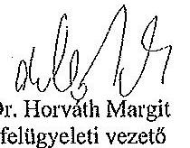

Dr. Horváth Margit
felügyeleti vezető

---

# ÉRTELMEZŐ SZÓTÁR 

garancia
gazdasági társaság
gazdálkodó szervezet
keresztfinanszírozás tilalma
kezesség

A garancia olyan önálló, az önkormányzat nevében vállalt kötelezettség, amely alapján az önkormányzat az önkormányzati költségvetés terhére szerződésben meghatározott feltételek szerint, a kötelezett nem teljesítése esetén a jogosultnak fizetést teljesít az előzetesen rögzített összeghatárig.
A Gt. 3. § (1) bekezdése szerint „gazdasági társaságot üzletszerü közös gazdasági tevékenység folytatására külföldi és belföldi természetes és jogi személyek, valamint jogi személyiség nélküli gazdasági társaságok alapithatnak, müködő társaságba tagként beléphetnek, társasági részesedést (részvényt) szerezhetnek."
A Ptk. 685. § c) pontja szerint gazdálkodó szervezet: „az állami vállalat, az egyéb állami gazdálkodó szerv, a szövetkezet, a lakásszövetkezet, az európai szövetkezet, a gazdasági társaság, az európai részvénytársaság, az egyesülés, az európai gazdasági egyesülés, az európai területi együttmüködési csoportosulás, az egyes jogi személyek vállalata, a leányvállalat, a vízgazdálkodási társulat, az erdő birtokossági társulat, a végrehajtói iroda, az egyéni cég, továbbá az egyéni vállalkozó."
Az ésszerű nyereség nem tartalmazhatja a közszolgáltatáson kívül eső egyéb gazdasági tevékenységei költségeinek, ráfordításainak fedezetét.
A kezességre vonatkozó előírásokat a Ptk. 272-276. §-ai tartalmazzák. A kezesség a polgári jogban a szerződést biztosító járulékos mellékkötelezettség, amely egy másik kötelem teljesítését biztosítja azáltal, hogy a kezes a főadós nem teljesítése esetére kötelezettséget vállal a főadósi kötelem teljesítésére. A kezes tehát a főadóshoz képest járulékos adós. A kezesség kiterjed az elvállalása utáni mellékszolgáltatásokra, ha a kezes ezek kikötéséről tudott.
A Ptk. szerint kezességet csak írásban lehet vállalni. Lényeges, hogy a kezesség mindig az alapügylet hitelezője és a kezes közötti ingyenes szerződéssel jön létre. A kezesség a különböző hitelfelvételekhez kapcsolódóan a hitel visszafizetésének biztosítékaként jöhet szóba. Az adós helyett nemfizetés esetén a kezes felel, ő tartozik fizetni. Az egyszerű kezesség esetén előbb az adóson kell behajtani a tartozást, s ha ez sikertelen, akkor lehet a kezesŐl követelni a fizetést. Készfizető kezesség esetében a fizetést elmulasztó adós helyett rögtön a kezesen követelhetik a tartozást. Ha bank vállalja a kezességet, akkor az minden esetben készfizetői kezesség.

---

# 1. SZÁMÚ FÜGGELÉK 

A V-0522-266/2014. SZÁMÚ JELENTÉSHEZ
közfeladat
közszolgáltatás
közvetett tulajdon, illetve közvetett befolyás
nemzeti vagyon

Jogszabályban meghatározott állami vagy önkormányzati feladat, amit az arra kötelezett közérdekből, jogszabályban meghatározott követelményeknek és feltételeknek megfelelve végez, ideértve a lakosság közszolgáltatásokkal való ellátását, továbbá az állam nemzetközi szerződésekben vállalt kötelezettségeiből adódó közérdekü feladatokat, valamint e feladatok ellátásához szükséges infrastruktúra biztosítását is (Nvtv. tv. 3. § (1) bekezdés 7. pont).
A közszolgáltatás: „közcélú, illetőleg közérdekü szolgáltatást jelent, amely egy nagyobb közösség (állam, település) minden tagjára nézve megközelítőleg azonos feltételek mellett vehető igénybe, ezért valamilyen mértékig közösségi megszervezést, illetve szabályozást, ellenőrzést igényel." Az egyenlő bánásmódról és az esélyegyenlőség előmozdításáról szóló 2003. évi CXXV. törvény 3. § d) pontja a következőképpen határozza meg a közszolgáltatást: „szerződéskötési kötelezettség alapján a lakosság alapvető szükségleteinek ellátására irányuló szolgáltatás, így különösen a villamos energia-, gáz-, hő-, víz-, szennyvíz- és hulladékkezelési, köztisztasági, postai és távközlési szolgáltatás, továbbá a menetrend alapján közlekedő jármúvekkel végzett közforgalmú személyszállítás"
Egy vállalkozás tulajdoni hányadának, illetőleg szavazati jogának a vállalkozásban tulajdoni részesedéssel, illetőleg szavazati joggal rendelkező más vállalkozás (köztes vállalkozás) tulajdoni hányadán, szavazati jogán keresztül történő gyakorlása. A közvetett tulajdon, a közvetett befolyás arányának megállapításához a közvetett tulajdonnal, közvetett befolyással rendelkezőnek a köztes vállalkozásban fennálló szavazati jogát vagy tulajdoni hányadát meg kell szorozni a köztes vállalkozásnak a vállalkozásban fennálló szavazati vagy tulajdoni hányada közül azzal, amelyik a nagyobb. Ha a köztes vállalkozásban fennálló szavazati vagy tulajdoni hányad az ötven százalékot meghaladja, akkor azt egy egészként kell figyelembe venni (a tőkepiacról szóló 2001. évi CXX. törvény 5. § (1) bekezdés 84. pont).
Az Nvtv. 1. § (2) bekezdése szerint:
„az állam vagy a helyi önkormányzat kizárólagos tulajdonában álló dolgok, az a) pont hatálya alá nem tartozó, állam vagy a helyi önkormányzat tulajdonában lévő dolog, az állam vagy a helyi önkormányzatot tulajdonában lévő pénzügyi eszközök, továbbá az államot vagy a helyi önkormányzatot megillető társasági részesedések, az államot vagy a helyi önkormányzatot megillető bármely vagyoni értékkel rendelkező jogosultság, amelyet jogszabály vagyoni értékü jogként nevesít, Magyarország határa által körbezárt terület feletti légtér, az üvegházhatású gázok kibocsátási egységeinek kereskedelméről szóló törvény szerint kibocsátási egység és légiközlekedési kibocsátási egység, valamint az ENSZ Éghajlat változási Keretegyezménye és annak Kiotói Jegyzökönyve végrehajtási keret-

---

rendszeréről szóló törvény szerinti kiotói egység, állami vagy helyi önkormányzati fenntartású közgyűjtemény (muzeális intézmény, levéltár, közgyűjteményként müködő kép- és hangarchivum, valamint könyvtár) saját gyüjteményében nyilvántartott kulturális javak körébe tartozó dolog, a régészeti lelet, a nemzeti adatvagyon körébe tartozó állami nyilvántartások fokozottabb védelméről szóló törvény szerinti nemzeti adatvagyon." (hatályos 2012. január 1-jétől, a g) pont módosult 2012. június 30 -ától)
többségi befolyást biztosító részesedés

A Ptk. 685/B. § (1) bekezdése szerint „többségi befolyás: az olyan kapcsolat, amelynek révén természetes személy, jogi személy vagy jogi személyiség nélküli gazdasági társaság (a továbbiakban együtt: befolyással rendelkező) egy jogi személyben a szavazatok több mint ötven százalékával vagy meghatározó befolyással rendelkezik."
tulajdonosi joggyakorló
Aki a nemzeti vagyon felett az államot vagy a helyi önkormányzatot megillető tulajdonosi jogok és kötelezettségek összességének gyakorlására jogosult (Nvtv. 3. § (1) bekezdés 17. pont).

---

.

---

|  1. Az ellátott közfeladat ráfordításainak elkülönített, szabályszerű elszámolása területén | 2. Anyagjellegű ráfordítások | 3. Az anyagjellegű ráfordítások elszámolása során betartották-e a belső szabályzatokban és a jogszabályokban foglaltakat és azokat a közfeladat-ellátással kapcsolatosan elkülönítették-e?  |
| --- | --- | --- |
|  2. Anyagjellegű ráfordítások | 3. Az anyagjellegű ráfordítások | 4. Az alátó az anyagjellegű ráfordításokra kötött szerződésnél betartották-e az Számv. tv. előírását, a kifizetés megelőzően a kötelezettségvállalás megfelel-e az előírásoknak?  |
|  3. Baruházások, felújítások aktiválása és értékcsökkenési leírás | 4. A feladat ellátásához az önkormányzattól kezelésre átvett közvegyen állományba vételű, nyilvántartási és elszámolási kötelezettségének teljesítése kapcsán a felújítások, beruházások kiadások aktiválása és az értékcsökkenési leírás elszámolása megfelel-e az előírásoknak? | 5. A kifizetés megelőzően a kötelezettségvállalás megfelel-e az előírásoknak, továbbá be lett kérve a tulajdonosi jogok gyakorlójának előzetes, írásbeli engedélye - amennyiben előírták - az önkormányzati tulajdonban lévő eszközön elszámolt beruházáshoz/felújításhoz?  |
|  4. Az ellátott közfeladat bevételeinek elkülönített, szabályszerű elszámolása területén | 5. A kifizetés megelőzően a kötelezettségvállalás megfelel-e az előírásoknak, továbbá be lett kérve a tulajdonosi jogok gyakorlójának előzetes, írásbeli engedélye - amennyiben előírták - az önkormányzati tulajdonban lévő eszközön elszámolt beruházáshoz/felújításhoz? | 6. A kifizetés megelőzően a kötelezettségvállalás megfelel-e az előírásoknak, továbbá be lett kérve a tulajdonosi jogok gyakorlójának előzetes, írásbeli engedélye - amennyiben előírták - az önkormányzati tulajdonban lévő eszközön elszámolt beruházáshoz/felújításhoz?  |
|  6. A kifizetés megelőzően a kötelezettségvállalás megfelel-e az előírásoknak, továbbá be lett kérve a tulajdonosi jogok gyakorlójának előzetes, írásbeli engedélye - amennyiben előírták - az önkormányzati tulajdonban lévő eszközön elszámolt beruházáshoz/felújításhoz? | 7. A kifizetés megelőzően a kötelezettségvállalás megfelel-e az előírásoknak, továbbá be lett kérve a tulajdonosi jogok gyakorlójának előzetes, írásbeli engedélye - amennyiben előírták - az önkormányzati tulajdonban lévő eszközön elszámolt beruházáshoz/felújításhoz? | 8. A kifizetés megelőzően a kötelezettségvállalás megfelel-e az előírásoknak, továbbá be lett kérve a tulajdonosi jogok gyakorlójának előzetes, írásbeli engedélye - amennyiben előírták - az önkormányzati tulajdonban lévő eszközön elszámolt beruházáshoz/felújításhoz?  |
|  9. Szabályozásnak, beállítók, és az előírásokkal nem tudománysztunk, ha az előírásoknak? | 10. A feladat ellátásához az önkormányzattól kezelésre átvett közvegyen állományba vételű, nyilvántartási és elszámolási kötelezettségének teljesítése kapcsán a felújítások, beruházások kiadások aktiválása és az értékcsökkenési leírás elszámolása megfelel-e az előírásoknak? | 11. A kifizetés megelőzően a kötelezettségvállalás megfelel-e az előírásoknak, továbbá be lett kérve a tulajdonosi jogok gyakorlójának előzetes, írásbeli engedélye - amennyiben előírták - az önkormányzati tulajdonban lévő eszközön elszámolt beruházáshoz/felújításhoz?  |
|  12. A kifizetés megelőzően a kötelezettségvállalás megfelel-e az előírásoknak, továbbá be lett kérve a tulajdonosi jogok gyakorlójának előzetes, írásbeli engedélye - amennyiben előírták - az önkormányzati tulajdonban lévő eszközön elszámolt beruházáshoz/felújításhoz? | 13. A kifizetés megelőzően a kötelezettségvállalás megfelel-e az előírásoknak, továbbá be lett kérve a tulajdonosi jogok gyakorlójának előzetes, írásbeli engedélye - amennyiben előírták - az önkormányzati tulajdonban lévő eszközön elszámolt beruházáshoz/felújításhoz? | 14. A kifizetés megelőzően a kötelezettségvállalás megfelel-e az előírásoknak, és a közfeladatellátással kapcsolatosan elkülönítették-e?  |
|  15. A kifizetés megelőzően a kötelezettségvállalás rendelésben, és a közfeladatellátással kapcsolatosan elkülönítették-e? | 16. A kifizetés megelőzését, és a közfeladatellátással kapcsolatosan elkülönítették-e? | 17. A kifizetés megelőzését, és a közfeladatellátással kapcsolatosan elkülönítették-e?  |
|  17. A kifizetés megelőzését, és a közfeladatellátással kapcsolatosan elkülönítették-e? | 18. A kifizetés megelőzését, és a közfeladatellátással kapcsolatosan elkülönítették-e? | 19. A kifizetés megelőzését, és a közfeladatellátással kapcsolatosan elkülönítették-e?  |
|  18. A kifizetés megelőzését, és a közfeladatellátással kapcsolatosan elkülönértékét ellátásoknak | 20. A kifizetés megelőzését, és a közfeladatellátással kapcsolatosan elkülönítették-e? | 21. A kifizetés megelőzését, és a közfeladatellátással kapcsolatosan elkülönítették-e?  |
|  19. A kifizetés megelőzését, és a közfeladatellátással kapcsolatosan elkülönértékét ellátásoknak | 22. A kifizetés megelőzését, és a közfeladatellátással kapcsolatosan elkülönítették-e? | 23. A kifizetés megelőzését, és a közfeladatellátással kapcsolatosan elkülönértékét ellátásoknak  |