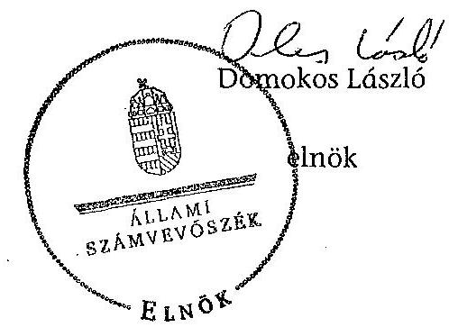
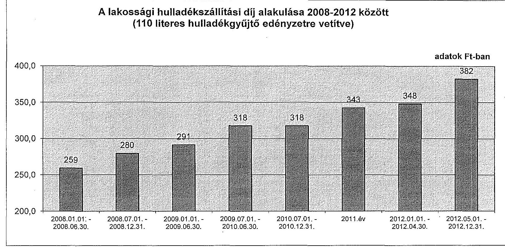
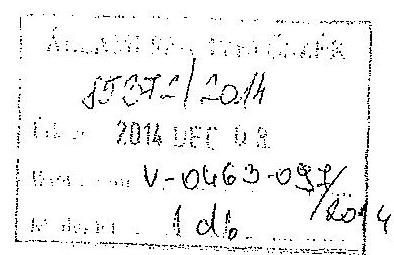
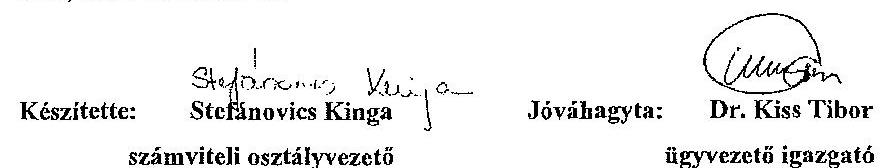

ÁLLAMI
SZÁMVEVŐSZÉK

# JELENTÉS 

Az önkormányzatok gazdasági társaságai - Az önkormányzatok többségi tulajdonában lévő gazdasági társaságok közfeladat ellátását érintő gazdálkodási tevékenysége szabályszerűségének ellenőrzése BIOKOM Pécsi Városüzemeltetési és Környezetgazdálkodási Kft.

---

# Állami Számvevőszék 

Iktatószám: V-0463-100/2014.
Témaszám: 1497
Vizsgálat-azonosító szám: V067111
Az ellenőrzést felügyelte:
Dr. Horváth Margit
felügyeleti vezető
Az ellenőrzés vezette és a végrehajtásáért felelős:
Klinga László
ellenőrzésvezető
Az összefoglaló jelentést készítette:
Liziczai Imréné
számvevő
Az ellenőrzést végezték:

| Bozsik Tamás | Klinger Zoltán | Vecsera Judit |
| :-- | :-- | :-- |
| számvevő | számvevő | okleveles könyvvizsgáló, |
|  |  | külső szakértő |

A témához kapcsolódó eddig készített számvevőszéki jelentések:
címe
sorszáma
Jelentés Pécs Megyei Jogú Város Önkormányzata gazdálkodási ..... 1029
rendszerének 2010. évi ellenőrzéséről
Jelentés Pécs Megyei Jogú Város Önkormányzata pénzügyi helyze- ..... 1142
tének ellenőrzéséről (43/3)

---

# TARTALOMJEGYZÉK 

BEVEZETÉS ..... 9
I. ÖSSZEGZŐ MEGÁLLAPÍTÁSOK, KÖVETKEZTETÉSEK, JAVASLATOK ..... 13
II. RÉSZLETES MEGÁLLAPÍTÁSOK ..... 16

1. Az Önkormányzat közfeladat-ellátásának szabályszerűsége ..... 16
1.1. A közfeladat-ellátás megszervezése és a feladatellátás feltételrendszerének kialakítása ..... 16
1.2. A közfeladat-ellátás felügyelete és a tulajdonosi jogok érvényesítése ..... 19
2. A BIOKOM Kft. közfeladat ellátással kapcsolatos tevékenysége ..... 21
2.1. A BIOKOM Kft. gazdálkodásának szabályozottsága ..... 21
2.2. A BIOKOM Kft. vagyongazdálkodása és vagyonnyilvántartása ..... 23
2.3. A beszámolási kötelezettség teljesítése ..... 25
3. Az ellenőrzött közfeladatok bevételei és ráfordításai elszámolásának és önköltségszámításának szabályszerűsége ..... 26
3.1. Az ellenőrzött közfeladatok bevételeinek és ráfordításainak szabályszerűsége ..... 26
3.2. Az önköltségszámítás szabályszerűsége ..... 27
4. Az ÁSZ korábbi, az önkormányzatok többségi tulajdonában lévő gazdasági társaságok közfeladat-ellátását, gazdálkodását, pénzügyi helyzetét érintő javaslataira tett intézkedések ..... 27
4.1. Az Önkormányzat intézkedési terve és annak hasznosulása ..... 27

## MELLÉKLETEK

1. számú A BIOKOM Kft. tevékenységének év végi főbb adatai
2. számú A BIOKOM Kft. működésének év végi főbb jellemzői
3. számú A lakossági hulladékszállítási díj alakulása 2008-2012 között
4. számú Beérkezett észrevételek és az azokra adott válaszok

## FÜGGELÉKEK

1. számú Mintavételi eljárások ellenőrzési területenként

---

.

---

# RÖVIDÍTÉSEK JEGYZÉKE 

## Törvények

Áht.
Ebktv.

Eitv.

Gt. tv.

Hgt. $_{1}$
Hgt. $_{2}$

Kbt.

Mötv.

Nvt.

Ötv.

Ptk.

Számv. tv.
Tao tv.

## Rendeletek

241/2001. (XII. 10.)
Korm. rendelet
224/2004. (VII. 22.)
Korm. rendelet
64/2008. (III. 28.) Korm.
az államháztartásról szóló 2011. évi CXCV. törvény (hatályos: 2012. január 1-jétől)
az egyenlő bánásmódról és az esélyegyenlőség előmozdításáról szóló 2003. évi CXXV. törvény
az elektronikus információszabadságról szóló 2005. évi XC. törvény (hatálytalan: 2012. január 1-jétől)
a gazdasági társaságokról szóló 2006. évi IV. törvény (hatálytalan: 2014. március 15-étől)
a hulladékgazdálkodásról szóló 2000. évi XLIII. törvény (hatálytalan: 2013. január 1-jétől)
a hulladékról szóló 2012. évi CLXXXV. törvény (hatályos: 2013. január 1-jétől, kivéve a 95. § (6) bekezdése, ami 2015. január 1-jén lép hatályba)

A közbeszerzésekről szóló 2003. évi CXXIX. törvény (hatálytalan: 2012. január 1-jétől)
Magyarország helyi önkormányzatairól szóló 2011. évi CLXXXIX. törvény (hatályos: 2012. január 1-jétől, kivéve a 144. § (2) bekezdésben meghatározott paragrafusok, amelyek 2012. április 15-én, a (3) bekezdésben meghatározott paragrafusok, amelyek 2013. január 1-jén léptek hatályba, a (4) bekezdésben meghatározott paragrafusok a 2014. évi általános önkormányzati választások napján lépnek hatályba)
a nemzeti vagyonról szóló 2011. évi CXCVI. törvény (hatályos: 2011. december 31-étől, kivéve a 20. § (2) bekezdésben meghatározott paragrafusok, amelyek 2012. január 1-jétől, a (3) bekezdésben meghatározott paragrafusok 2013. január 1-jétől, a (4) bekezdésben meghatározott paragrafus 2012. március 2-ától léptek hatályba)
a helyi önkormányzatokról szóló 1990. évi LXV. törvény (hatálytalan: a 2014. évi általános önkormányzati választások napjától)
a Polgári Törvénykönyvről szóló 1959. évi IV. törvény (hatályos 2014. március 15-ig)
a számvitelről szóló 2000. évi C. törvény
a társasági adóról és az osztalékadóról szóló 1996. évi LXXXI. törvény
a jegyző hulladékgazdálkodási feladat- és hatásköréről szóló 241/2001. (XII. 10.) Korm. rendelet
a hulladékkezelési közszolgáltató kiválasztásáról és a közszolgáltatási szerződésről (hatálytalan: 2013. szeptember 5-étől)
a települési hulladékkezelési közszolgáltatási díj megálla-

---

rendelet
Ávr.
hulladékgazdálkodási
terv
hulladékkezelési rendelet

SZMSZ
vagyongazdálkodási rendelet $_{1}$
vagyongazdálkodási rendelet $_{2}$

## Szórövidítések

ÁSZ
BIOKOM Kft.

Dél-Kom Kft.
FB
Javadalmazási szabályzat
jegyző
KEOP
Közgyűlés
Közszolgáltatási szerződés

Önkormányzat
polgármester
pításának részletes szakmai szabályairól (hatályos: 2008. április 1-jétől)
az államháztartásról szóló törvény végrehajtásáról szóló 368/2011. (XII. 31.) Korm. rendelet
Pécs Megyei Jogú Város 23/2004. (IX. 20.) számú rendelete a helyi hulladékgazdálkodási tervről
Pécs Megyei Jogú Város Közgyűlésének 44/2002. (06. 29.) számú rendelete a települési szilárd hulladék kezelésével kapcsolatos közszolgáltatásról és annak kötelező igénybevételéről
Pécs Megyei Jogú Város Önkormányzata Szervezeti és Működési Szabályzata
Pécs Megyei Jogú Város Közgyűlésének 40/2008. (XI. 26.) számú rendelete az Önkormányzat vagyonával kapcsolatos tulajdonosi jogok gyakorlásának szabályairól
Pécs Megyei Jogú Város Önkormányzatának 11/2012. (II. 24.) rendelete az Önkormányzat vagyonáról, a vagyontárgyak feletti tulajdonosi jogok gyakorlásáról (hatályos: 2012. február 24-től)

Állami Számvevőszék
BIOKOM Pécsi Környezetgazdálkodási Korlátolt Felelősségű Társaság (hatályos: 2010. december 11-ig), utána: BIOKOM Környezetgazdálkodási és Pécsi Városüzemeltető Korlátolt Felelősségű Társaság (hatályos: 2010. december 11 - 2011. január 31-ig), utána: BIOKOM Pécsi Városüzemeltetési és Környezetgazdálkodási Korlátolt Felelősségű Társaság (hatályos: 2011. január 31-től)
Dél-Kom Dél-Dunántúli Kommunális Szolgáltató Korlátolt Felelősségű Társaság
BIOKOM Kft. Felügyelőbizottsága
A BIOKOM Kft. javadalmazási szabályzata
Pécs Megyei Jogú Város Önkormányzatának jegyzője
Környezet és Energia Operatív Program
Pécs Megyei Jogú Város Önkormányzatának Közgyűlése
Pécs Megyei Jogú Város Önkormányzatának Polgármesteri hivatala és a BIOKOM Kft között létrejött hulladékgazdálkodási közszolgáltatási szerződés
Pécs Megyei Jogú Város Önkormányzata
Pécs Megyei Jogú Város Önkormányzatának Polgármestere

---

# ÉRTELMEZŐ SZÓTÁR 

gazdasági társaság
közfeladat
közszolgáltatás
közszolgáltatási szerződés tartalmi elemei

Gt. tv. 3. § (1) bekezdése szerint „gazdasági társaságot üzletszerű közös gazdasági tevékenység folytatására külföldi és belföldi természetes és jogi személyek, valamint jogi személyiség nélküli gazdasági társaságok alapíthatnak, működő társaságba tagként beléphetnek, társasági részesedést (részvényt) szerezhetnek."
Jogszabályban meghatározott állami vagy önkormányzati feladat, amit az arra kötelezett közérdekből, jogszabályban meghatározott követelményeknek és feltételeknek megfelelve végez, ideértve a lakosság közszolgáltatásokkal való ellátását, továbbá az állam nemzetközi szerződésekben vállalt kötelezettségeiből adódó közérdekű feladatokat, valamint e feladatok ellátásához szükséges infrastruktúra biztosítását is (Nvtv. 3. § (1) bekezdés 7. pont).

A közszolgáltatás: „közcélú, illetőleg közérdekű szolgáltatást jelent, amely egy nagyobb közösség (állam, település) minden tagjára nézve megközelítőleg azonos feltételek mellett vehető igénybe, ezért valamilyen mértékig közösségi megszervezést, illetve szabályozást, ellenőrzést igényel." Az Ebktv. 3. § d) pontja a következőképpen határozza meg a közszolgáltatást: „szerződéskötési kötelezettség alapján a lakosság alapvető szükségleteinek ellátására irányuló szolgáltatás, így különösen a villamos energia-, gáz-, hő-, víz-, szennyvíz- és hulladékkezelési, köztisztasági, postai és távközlési szolgáltatás, továbbá a menetrend alapján közlekedő járművekkel végzett közforgalmú személyszállítás."

A közszolgáltatási szerződésnek tartalmaznia kell a közszolgáltatás megnevezését, minőségi ismérveit, a teljesítésének területi kiterjedését, a közszolgáltatás megkezdésének időpontját és időtartamát, valamint annak rögzítését, hogy a közszolgáltató vállalta a megjelölt közszolgáltatás teljesítését.
A közszolgáltatási szerződésben a közszolgáltató kötelességeként kell meghatározni:
a) a közszolgáltatás folyamatos és teljes körű ellátását;
b) a közszolgáltatás meghatározott rendszer, módszer és gyakoriság szerinti teljesítését;
c) a közszolgáltatás teljesítéséhez szükséges mennyiségű és minőségű jármű, gép, eszköz, berendezés biztosítását, valamint a szükséges létszámú és képzettségű szakember alkalmazását;
d) a közszolgáltatás folyamatos, biztonságos és bővíthető teljesítéséhez szükséges fejlesztések és karbantartások elvégzését;

---

e) a közszolgáltatás körébe tartozó hulladék ártalmatlanítására az önkormányzat képviselő-testülete által kijelölt helyek és létesítmények igénybevételét;
f) a közszolgáltató által alkalmazott közszolgáltatási díj mértékéről és az alkalmazás tapasztalatairól az önkormányzat képviselő-testületének történő legalább évenkénti egyszeri tájékoztatást;
g) a közszolgáltatás teljesítésével összefüggő adatszolgáltatás rendszeres teljesítését és meghatározott nyilvántartási rendszer működtetését;
h) a fogyasztók számára könnyen hozzáférhető ügyfélszolgálat és tájékoztatási rendszer működtetését;
i) a fogyasztói kifogások és észrevételek elintézési rendjének megállapítását.
A közszolgáltatási szerződésben az önkormányzat kötelességeként kell meghatározni:
a) a közszolgáltatás hatékony és folyamatos ellátásához a közszolgáltató számára szükséges információk szolgáltatását, a Hgt. 23. §-ának g) pontjára tekintettel;
b) a közszolgáltatás körébe tartozó és a településen folyó egyéb hulladékkezelési tevékenységek összehangolásának elősegítését;
c) a településen működtetett különböző közszolgáltatások összehangolásának elősegítését;
d) a települési igények kielégítésére alkalmas hulladék gyűjtésére, kezelésére, ártalmatlanítására szolgáló helyek és létesítmények kijelölését;
e) a közszolgáltató kizárólagos közszolgáltatási jogának biztosítását a 3. § (1) bekezdés a), b) és f) pontjaiban foglaltakra figyelemmel.
Az önkormányzatnak a közszolgáltatás finanszírozásában vállalt kötelezettsége esetén a közszolgáltatási szerződésben meg kell határozni a kötelezettség teljesítésének feltételeit és biztosítékait.
A közszolgáltatási szerződés tartalmazza a közszolgáltatás díjának megállapítására és beszedésére vonatkozó módszer leírását, a díjnak a szerződés megkötésekor érvényesíthető legmagasabb mértékét és a díj megváltoztatása érdekében alkalmazandó eljárást. A közszolgáltatási szerződésnek tartalmaznia kell az igazolt díjhátralék kiegyenlítésére vonatkozó eljárást. A közszolgáltatási szerződés tartalmazza azokat a feltételeket, amelyek mellett a közszolgáltató a közszolgáltatás teljesítésére közreműködőt vagy teljesítési segédet vehet igénybe, figyelemmel a Kbt. 304. § (2) bekezdésében foglaltakra is. A közszolgáltató közreműködőért vagy teljesítési segédért való felelőssége a közszolgáltatási szerződésben nem korlátozható. (224/2004. (VII. 22.) Korm. rendelet 11-14. §)
saját tőke

A saját tőke a - jegyzett, de még be nem fizetett tőkével

---

csökkentett - jegyzett tőkéből, a tőketartalékból, az eredménytartalékból, a lekötött tartalékból, az értékelési tartalékból és a tárgyév mérleg szerinti eredményéből tevődik össze.

---

.

---

# JELENTÉS 

## Az önkormányzatok gazdasági társaságai Az önkormányzatok többségi tulajdonában lévő gazdasági társaságok közfeladat ellátását érintő gazdálkodási tevékenysége szabályszerűségének ellenőrzése

## BIOKOM Pécsi Városüzemeltetési és Környezetgazdálkodási Kft.

## BEVEZETÉS

Az Állami Számvevőszék középtávra szóló stratégiájában megfogalmazta, hogy a helyi önkormányzatok gazdálkodásában rejlő pénzügyi kockázatok feltárásával, az államháztartáson kívülre nyújtott költségvetési támogatások és ingyenes vagyonjuttatások, valamint az államháztartáson kívül működő közfeladat-ellátó rendszerek ellenőrzéseivel hozzájárul ahhoz, hogy a közpénzeket az államháztartáson kívül működő szervezetek is átlátható, rendezett módon használják fel a közfeladatok szerződésben vállalt ellátása érdekében.

Az önkormányzatok szervezetalakítási szabadságának következménye, hogy a korábban is vállalati formában működő (nagyvárosi tömegközlekedés, víz-, szennyvízcsatorna, köztisztasági, ingatlankezelés stb.) közszolgáltatások mellett, mind a kötelező, mind az önként vállalt feladatok ellátásában a gazdasági társaságok kiemelt fontosságú szerephez jutottak.

A BIOKOM Pécsi Városüzemeltetési és Környezetgazdálkodási Korlátolt Felelősségű Társaság (továbbiakban: BIOKOM Kft.) jogelődjét - Pécsi Közterület fenntartó Korlátolt Felelősségű Társaságot - a Közgyűlés 1994. november 17.-én a 396/1994 (XI. 17.) számú határozatával hozta létre.

A BIOKOM Kft. alaptevékenysége kommunális szolgáltatási tevékenység - települési szilárdhulladékok gyűjtése, kezelése, ártalmatlanítása, komposztálás, másodnyersanyagok gyűjtése, szelektálása és értékesítése - volt. Feladatai 2011. január 1-jétől a városüzemeltetési közszolgáltatási feladatokkal - településfejlesztés, településrendezés, az épített és természeti környezet védelme, a vízrendezés és vízelvezetés, csatornázás, a helyi közutak és közterületek fenntartása, valamint a köztisztaság és településtisztaság biztosítása - egészültek ki.

A BIOKOM Kft. az ellenőrzött időszakban ellátta a közel 157 ezer lakóval rendelkező Pécs Megyei Jogú Város közigazgatási területén a közterületek tisztántartását, nem veszélyes hulladék gyűjtését, kezelését, ártalmatlanítását, vala-

---

mint 2011. január 1-től településfejlesztést, településrendezést, csatornázást, közutak és közterületek fenntartását, a parkolás, a köztisztaság és a településtisztaság biztosítását. A hulladékgazdálkodási közszolgáltatást Pécs Megyei Jogú Város közigazgatási területén kívüli településeken is ellátta. A BIOKOM Kft. összességében mintegy 365000 lakos és közel 4000 ipari-közületi partner részére szolgáltatott.

A BIOKOM Kft. a 2012. év végén 100\%-os tulajdoni hányaddal rendelkezett a Dél-Kom Kft-ben, amely kifejezetten a kistelepülések, falvak speciális hulladékgazdálkodási igényeinek ellátását végezte, a Mecsek-Dráva Nonprofit Kft.-ben, amely üzletrészkezelést és projektmenedzselést, továbbá a Pécsi Városgondozási Nonprofit Kft-ben, amely városüzemeltetési feladatokat, zöldterület, közterület fenntartást végzett.

A BIOKOM Kft. összes bevétele 2008-ban 2578,7 millió Ft, a 2012. évben 4520,2 millió Ft volt, amelyből az értékesítés nettó árbevétele 2008-ban 2430,0 millió Ft, míg 2012-ben 4229,1 millió Ft volt. A ráfordítások összege 2008-ban 2381,7 millió Ft, 2012-ben 4243,4 millió Ft volt. Az árbevételek az ellenőrzött időszakban $74,0 \%$-kal, a ráfordítások $78,2 \%$-kal nőttek.

A BIOKOM Kft. az ellenőrzött időszakban pozitív mérleg szerinti eredménnyel zárt, a 2012. évben 245,5 millió Ft összegű eredményt realizált. A BIOKOM Kft. mérleg szerinti eszközállománya a 2008. évi nyitó 2033,5 millió Ft-ról a 2012. év végére $97,6 \%$-os növekedést követően 4018,0 millió Ft-ra nőtt, ezen belül a tárgyi eszközök állománya $63,7 \%$-os növekedést követően 1521,0 millió Ft-ra változott. A saját tőke a 2008. évi nyitó 1517,6 millió Ft-ról a 2012. év végére 2658,3 millió Ft-ra nőtt.

Az ellenőrzött időszakban a polgármester és a jegyző személye két alkalommal változott. A polgármester a 2010. évi önkormányzati választások óta tölti be tisztségét, a helyszíni ellenőrzés időszakában a munkakört betöltő jegyző 2010 óta látja el feladatait. Az ellenőrzött időszakban az ügyvezető és a gazdasági igazgató személye nem változott. Az ügyvezető 1994. május 16. óta, a gazdasági igazgató 1995. szeptember 25. óta tölti be tisztségét.

Az önkormányzati tulajdonú gazdasági társaságok teljes körű ellenőrzésének lehetőségét az Állami Számvevőszékről szóló 1989. évi XXXVIII. törvény 2011. január 1-jétől hatályos módosítása és az Állami Számvevőszékről szóló 2011. évi LXVI. törvény teremtette meg.

Az ellenőrzés célja annak értékelése volt, hogy

- az önkormányzat a jogszabályi előírások figyelembevételével döntött-e az ellenőrzésre kerülő közfeladat megszervezéséről; az önkormányzat szabályszerűen gyakorolta-e a tulajdonosi jogokat;
- a gazdasági társaság közfeladat-ellátása bevételeinek, ráfordításainak elszámolása, és vagyongazdálkodási tevékenysége megfelelt-e a jogszabályi, illetve a közszolgáltatási szerződésben foglalt tulajdonosi előírásoknak, azok végrehajtása szabályszerű volt-e;

---

- a közfeladatok átláthatósága és elszámoltathatósága érdekében biztosítva volt-e a közszolgáltatás díjának megalapozottsága szabályszerű önköltségszámítással.

Az ellenőrzés során értékeltük az ÁSZ korábbi, az Önkormányzat többségi tulajdonában lévő gazdasági társaságát érintő javaslataira tett intézkedések hasznosulását is. Az ellenőrzés kiterjedt Pécs Megyei Jogú Város Önkormányzatára és a BIOKOM Pécsi Városüzemeltetési és Környezetgazdálkodási Korlátolt Felelősségű Társaságra.

Az ellenőrzés várható hasznosulása: A törvényalkotás számára - az észlelt problémák, szabálytalanságok, vagy egyéb nem kívánatos jelenségek felszínre kerülésével - az ellenőrzés megállapításai segítséget nyújthatnak az államháztartáson kívüli közfeladat-ellátás értékeléséhez, jogszabályi keretei pontosításához, átláthatóságot biztosító szabályozásához. Meghatározhatóvá válnak a közfeladat ellátásban részt vevő államháztartáson kívüli szervezeteknek - az önkormányzat költségvetését, pénzügyi helyzetét is befolyásoló - kockázatai, lehetővé válik ezen kockázatok csökkentése. Feltárja, hogy az önkormányzat közfeladat-ellátási kötelezettségének szabályszerűen tett-e eleget, a feladatellátáshoz rendelt közvagyon működtetését szabályszerűen szervezte-e meg és a tulajdonosi felügyelete hozzájárult-e a közfeladat-ellátásához. A feladatot ellátó gazdasági társaság a közszolgáltatási szerződésben foglaltak betartásával, a közvagyon használatával biztosította-e a szolgáltatás folytatásának feltételeit. Ezzel az ellenőrzöttek és a helyi döntéshozók számára visszajelzést ad feladatszervezési, feladat-ellátási kockázataikról, alapot ad a meglévő hibák megszüntetéséhez, a jobb közfeladat-ellátás biztosításához. Fokozza a fegyelmet, igazolja, hogy lejárt a következmények nélküli ellenőrzések időszaka. Az ÁSZ értékteremtő rend kialakításához és megőrzéséhez hozzájáruló tevékenysége pozitív hatással van a szervezetről kialakított összkép formálására is.

A bevételek és ráfordítások elszámolása, valamint a vagyonnyilvántartás terén az egyes területek szabályszerű működését mintavétellel ellenőriztük, ez alapján a sokaságokban előforduló hibás tételek arányát becsültük. A jogszabályoknak és a belső előírásoknak megfelelőnek, azaz szabályszerűnek tekintettük az adott bevételek és ráfordítások elszámolását, a vagyonnyilvántartást, amennyiben a minta ellenőrzésének eredménye alapján $95 \%$-os bizonyossággal a teljes sokaságban a hibás tételek aránya kisebb volt, mint $10 \%$, nem megfelelőnek értékeltük, ha a hibás tételek aránya a $10 \%$-ot meghaladta. Kockázatot, illetve magas kockázatot jeleztünk, amennyiben egy adott terület vonatkozásában a minta alapján a teljes sokaságban nem volt teljes körűen biztosított a jogszabályoknak és a belső szabályzatoknak megfelelő működés (1. számú függelék).

Az ellenőrzést a számvevőszéki ellenőrzés szakmai szabályai szerint, szabályszerűségi ellenőrzés módszerével, a vonatkozó nemzetközi standardok figyelembevételével végeztük. Az ellenőrzés a 2008-2012. évekre terjedt ki.

Az ellenőrzés végrehajtásának jogszabályi alapját az Állami Számvevőszékről szóló 2011. évi LXVI. törvény 5. § (3)-(4)-(5) bekezdése képezi.

---

Az ÁSZ az Állami Számvevőszékről szóló 2011. évi LXVI. törvény 29. §-a alapján a jelentéstervezetet észrevételezésre megküldte a polgármesternek és a gazdasági társaság ügyvezetőjének. A beérkezett észrevételeket a jelentés véglegesítése során hasznosítottuk. Az észrevételeket és az azokra adott válaszokat a jelentés 4. számú melléklete tartalmazza.

---

# I. ÖSSZEGZŐ MEGÁLLAPÍTÁSOK, KÖVETKEZTETÉSEK, JAVASLATOK 

Pécs Megyei Jogú Város Önkormányzat Közgyűlése az Önkormányzat közigazgatási területén a szilárd hulladék gyűjtése, ártalmatlanítása, hasznosítása és a közterületek tisztántartása közfeladatának ellátásáról az Ötv. előírásai szerint döntött. A Közgyűlés az SZMSZ-ben előírta a szilárd hulladék kezelés és szállítás közfeladat ellátásának kötelezettségét és módját. Az Önkormányzat a 2007-2010. évekre szóló Gazdasági programban a Mecsek-Dráva Hulladékgazdálkodási Program kiépítését, a 2011-2014. évi Gazdasági programban a közszolgáltatások rendszerének ésszerűsítését és a bevételek realizálását tűzte ki célul.

Az Önkormányzat 2004-2008. közötti időszakra szóló hulladékgazdálkodási tervét a Hgt. ${ }_{1}$-ben előírtaknak megfelelő tartalommal elkészítették. A hulladékgazdálkodási terv a Hgt. ${ }_{1}$-ben előírt 6 év helyett 5 évre készült. Az Önkormányzat a Hgt. ${ }_{1}$-ben előírtakkal ellentétben a 2009-2012. években nem rendelkezett hulladékgazdálkodási tervvel. A jegyző a 241/2001. (XII. 10.) Korm. rendelet rendelkezései ellenére nem készítette elő és nem terjesztette a Közgyűlés elé a hulladékgazdálkodási tervet.

A szilárdhulladék kezelés, ártalmatlanítás és szállítás közfeladatának ellátására az Önkormányzat és a BIOKOM Kft.-vel 2002. december 16-án 10. évre szóló Közszolgáltatási szerződést kötött. A Közszolgáltatási szerződés megfelelt a 224/2004. (VII. 22.) Korm. rendeletben előírt tartalmi követelményeknek.

Az Önkormányzat a gazdasági társaságok feletti tulajdonosi jogok gyakorlásának szabályait az SZMSZ-ben, illetve a vagyongazdálkodási rendelet ${ }_{1,2}$-ben szabályozta. A vagyongazdálkodási rendelet ${ }_{1,2}$-ben előírták az üzleti tervek elfogadásának rendjét. Az ellenőrzött időszakban az üzleti, beruházási, illetve üzemági terveket az éves számviteli beszámolókkal együtt az FB előzetes véleményezését követően terjesztették a Közgyűlés elé elfogadásra. Az FB a Gt. tv.-ben előírtaknak megfelelően a 2008-2012. években a számviteli beszámolóról írásbeli jelentést készített. Az FB a könyvvizsgáló által is véleményezett évenkénti beszámolóján kívül, félévente értékelte a BIOKOM Kft. közszolgáltatási tevékenységét. A 2008-2012. évi üzleti jelentések alapján a BIOKOM Kft. a közszolgáltatási feladatait ellátta, a Közgyűlés szabályszerűen gyakorolta a tulajdonosi jogokat.

A belső ellenőrzés az ellenőrzött időszakban egy alkalommal ellenőrizte a BIOKOM Kft. gazdálkodását, a 2012. évben a belső ellenőrzés a 2011. évi gazdálkodást ellenőrizte. A belső ellenőrzés a hulladékgazdálkodási díj megállapítását megalapozó költségelszámolással kapcsolatosan megállapította, hogy nem érvényesülnek maradéktalanul Hgt. ${ }_{1}$-ben, valamint a Közszolgáltatási szerződésben foglaltak, mivel az általános költségek felosztása és megosztása nem volt megfelelő az egyes közszolgáltatási tevékenységeknél. Az általános költségeket városüzemeltetés és hulladékszállítási csoportonként (ipari/közületi) különítették el. A BIOKOM Kft. a Közszolgáltatási szerződés alapján más ön-

---

kormányzatok részére is végzett hulladékszállítást és annak közvetlenül elszámolható költségeit megfelelően elkülönítette, de az általános költségeket nem osztotta fel a Pécs mellett, más önkormányzatok illetékességi területén végzett hulladékszállítás tevékenységére. A központi irányítás költségét nem osztották fel a városüzemeltetési feladatokra. A belső ellenőrzés javasolta a számviteli szabályzatok pontosítását, valamint az önköltségszámítás és a vonatkozó szabályozás összhangjának megteremtését.

A BIOKOM Kft. a Számv. tv.-ben előírtaknak megfelelően elkészítette a számviteli politikáját, és annak keretében a számviteli szabályzatait, amelyek megfeleltek az előírásoknak. A BIOKOM Kft. a Számv. tv.-ben előírt bizonylati rend készítési kötelezettségének nem tett eleget.

A BIOKOM Kft. feladatainak ellátásához az Önkormányzattól nem vett át vagyonkezelésbe vagyont, könyveiben a saját vagyonát tartotta nyilván. A közszolgáltatási feladatokat a saját vagyontárgyakon túl bérelt, illetve lízingelt eszközökkel látta el. A BIOKOM Kft. a tárgyi eszköz állományának 2008-2012. közötti folyamatos emelkedését döntően a saját forrásból és lízing szerződés keretében megvalósult eszközbeszerzések, a hulladékgazdálkodással kapcsolatos géppark fejlesztése eredményezte. Az ellenőrzött időszakban a követelések állománya folyamatosan emelkedett. A 2008. január 1-jei 585,2 millió Ft-ról, 2012. december 31-ére 1323,5 millió Ft-ra nőtt. A 2008-2012. években a követelések döntő részét a díjhátralékok tették ki. A díjkövetelés összege a 2008. december 31-i 390,4 millió Ft-ról 2012. december 31-re 514,8 millió Ft-ra emelkedett. A díjhátralék adók módjára történő behajtását a Hgt. ${ }_{1}$-ben előírtaknak megfelelően, a felszólítás eredménytelensége esetén a jegyzőjénél kezdeményezték.

A Közgyűlés a BIOKOM Kft. 2008-2012. évi számviteli beszámolóit az éves üzleti jelentésekkel együtt az előírt határidőig elfogadta és a BIOKOM Kft. azt az előírt határidőig letétbe helyezte. A BIOKOM Kft. az Önkormányzat által előírt féléves gyakoriságú szakmai beszámolási kötelezettségét is teljesítette, számot adott féléves gazdálkodásáról és a közszolgáltatási tevékenységéről. A BIOKOM Kft. az Eitv.-ben hivatkozott melléklet alapján a 2008-2011. években honlapon nem tette közzé közfeladata teljesítményére, kapacitásának jellemzésére, hatékonyságának és teljesítményének mérésére szolgáló mutatókat és értéküket, valamint azok időbeli adatváltozásait.

A hulladékgazdálkodási közfeladat anyagjellegű ráfordításainak elszámolása során a BIOKOM Kft. szabályszerűen járt el. A költségek elszámolása a jogszabályi előírásoknak és a belső szabályozásnak megfelelően történt. A költségeket a megfelelő költségnemre, közfeladatra számolták el. A hulladékgazdálkodási közfeladat értékesítés nettó árbevételeinek elszámolása során nem érvényesültek teljes körűen a jogszabályok és a belső szabályok előírásai a bevételek kiszámlázása tekintetében. Ez kockázatot jelez az ellenőrzött terület egészének szabályos működése szempontjából. Megállapítottuk, hogy egy esetben a bevételek kiszámlázása nem a hulladékgazdálkodási rendeletnek megfelelő elszámolási időszak szerint történt.

Az Önkormányzat a díjképzés alapelveit a Közszolgáltatási szerződésben meghatározta, figyelembe véve a Hgt. ${ }_{1}$-ben és a 64/2008. (III. 28.) Korm. rende-

---

letben előírtakat. Az éves hulladékszállítási díj megállapításakor a 64/2008. (III. 28.) Korm. rendeletben előírt kalkulációs sémát alkalmazta. A BIOKOM Kft. az ellenőrzött években a Közszolgáltatási szerződésben előírt, a közszolgáltatás díjának meghatározásához szükséges elő- és utókalkuláció készítési kötelezettségének eleget tett. A közszolgáltatási díjat megalapozó kalkulációt az Közszolgáltatási szerződésben, illetve az önköltségszámítási szabályzatban foglaltaknak megfelelő szerkezetben benyújtotta az Önkormányzathoz, melynek elfogadásáról a Közgyűlés rendeletben döntött.

Az ÁSZ az Önkormányzat pénzügyi helyzetének ellenőrzéséről 2011. december hónapban készült számvevőszéki jelentése a polgármester és a jegyző részére fogalmazott meg javaslatokat a minősített többségi tulajdonú gazdasági társaságokkal kapcsolatban. A két javaslatra vonatkozóan intézkedési tervet készítettek, amelyben foglaltakat végrehajtottak.

A fentiekben leírtak összegzéseként az alábbi megállapításokat tesszük:
A gazdasági társaság feletti tulajdonosi jogok előírása és azok szabályszerű gyakorlása, továbbá az FB előírások szerinti működése elősegítette a tulajdonosi joggyakorlás szabályos ellátását. A számviteli szabályozás összességében megfelelő volt, amit a beszámolási és a vagyongazdálkodási szabályok betartása is visszaigazolt. A követelésállomány folyamatos növekedése kockázatot jelez a működés területén. A díjképzést megalapozta a szabályszerű önköltségszámítás.

Az Állami Számvevőszékről szóló 2011. évi LXVI. törvény 33. § (1) bekezdésében foglaltak értelmében
 a jelentésben foglalt megállapításokhoz kapcsolódó intézkedési tervet köteles az ellenőrzött szervezet vezetője összeállítani, és azt a jelentés kézhezvételétől számított 30 napon belül az ÁSZ részére megküldeni. Amennyiben az intézkedési tervet határidőben nem küldi meg a szervezet, vagy az nem elfogadható, az ÁSZ elnöke a hivatkozott törvény 33. § (3) bekezdésében foglaltakat érvényesítheti.

Az ellenőrzés intézkedést igénylő megállapításai és javaslatai:
Javaslataink célja a Kft. gazdálkodása szabályszerűségének javítása érdekében, hogy a szabályozási környezet megfelelően tudja támogatni az átlátható működést.

# Javasoljuk a BIOKOM Pécsi Városüzemeltetési és Környezetgazdálkodási Kft. ügyvezető igazgatójának: 

1. A BIOKOM Kft. a Számv. tv. 161. § (2) bekezdés d) pontjában előírt bizonylati rend készítési kötelezettségének nem tett eleget.

Javaslat:
Intézkedjen a szabályozási hiányosság megszüntetésére, ennek keretében:
gondoskodjon a bizonylati rend elkészítéséről a Számv. tv-ben előírt követelmények szerint.

---

# II. RÉSZLETES MEGÁLLAPÍTÁSOK 

## 1. Az ÖNKORMÁNYZAT KÖZFELADAT-ELLÁTÁSÁNAK SZABÁLYSZERŰSÉGE

### 1.1. A közfeladat-ellátás megszervezése és a feladatellátás feltételrendszerének kialakítása

A köztisztaság és a településtisztaság biztosítása az Ötv. 8. § (1) bekezdése ${ }^{1}$ alapján az önkormányzat törvényi kötelezettsége. Az Önkormányzat közigazgatási területén a szilárd hulladék gyűjtése, ártalmatlanítása, hasznosítása és a közterületek tisztántartása feladatának ellátásáról közszolgáltatás megszervezése útján gondoskodott.

A Közgyűlés az SZMSZ-ben, illetve annak mellékletében előírta a közfeladatok ellátásának kötelezettségét, meghatározta az ellátás módját, az abban résztvevők körét. A szilárd hulladék kezelés és szállítás közfeladat-ellátására a BIOKOM Kft.-t jelölte ki.

Az Önkormányzat 2007-2010. évekre szóló Gazdasági programja a közszolgáltatások fejlesztése eredményeként rögzítette, hogy a Dél-Dunántúl legnagyobb környezetvédelmi beruházása, amelyhez az Önkormányzat csatlakozott, a Mecsek-Dráva Hulladékgazdálkodási Program (célja a komplex bioenergetikai hulladékkezelés) előkészületei befejeződtek és a 2007. évben megkezdődhet a rendszer kiépítése. A 2011-2014. évet felölelő Gazdasági programban az Önkormányzat a közszolgáltatások rendszerének ésszerűsítését és a bevételek realizálását helyezte a középpontba.

Az Önkormányzat 2004-2008. közötti időszakra szóló hulladékgazdálkodási tervét a Hgt. 35. § (1) bekezdésében előírtaknak megfelelően kidolgozta, amihez külső szervezetet vett igénybe ${ }^{2}$. A hulladékgazdálkodási terv a Hgt. 37. § (1) bekezdésében előírt 6 év helyett 5 évre készült. A hulladékgazdálkodási tervet a Hgt. 35. § (3) bekezdésében foglaltak alapján a Közgyűlés jóváhagyta ${ }^{3}$.

A hulladékgazdálkodási tervet a Hgt. 37. § (4) bekezdése előírásainak megfelelő tartalommal készítették el, a tervben foglaltak végrehajtásáról Hgt. 37. § (1) bekezdésében foglaltaknak megfelelően a 2 évente történő beszámolás megtörtént.

[^0]
[^0]:    ${ }^{1}$ A helyi közügyek, valamint a helyben biztosítható közfeladatok körében ellátandó helyi önkormányzati feladatként a hulladékgazdálkodást 2013. január 1-jétől az Mötv. 13. § (1) bekezdés 19. pontja írja elő.
    ${ }^{2}$ MKM Consulting Zrt.
    ${ }^{3}$ 23/2004. (IX. 29.) önkormányzati rendelet

---

Az Önkormányzat a Hgt. 35. § (1) bekezdésében előírtakkal ellentétben a 2009-2012. években nem rendelkezett hulladékgazdálkodási tervvel ${ }^{4}$. A jegyző a 241/2001. (XII. 10.) Korm. rendelet 1. § e) pontja rendelkezése ellenére nem készítette elő és nem terjesztette a Közgyűlés elé a hulladékgazdálkodási tervet.

A hulladékgazdálkodási feladat ellátására a Pécsi Közterület fenntartó Korlátolt Felelősségű Társaságot 1994. november 17.-én a 396/1994 (XI. 17) számú határozatával hozta létre a Közgyűlés, aminek a jogelődje a Pécsi Köztisztasági és Útkarbantartó Vállalat volt. A társaság neve 1995. augusztus 1-jétől BIOKOM Pécsi Környezetgazdálkodási Kft.-re ${ }^{5}$ változott. A BIOKOM Kft. 94,4 %-os részesedési aránnyal a többségi befolyású Önkormányzat tulajdonában volt az ellenőrzött időszak végén, valamint 5,6%-os saját üzletrésszel rendelkezett (2. számú melléklet).

Az ellenőrzött időszakban a BIOKOM Kft. alaptevékenysége kommunális szolgáltatási tevékenység, a települési szilárdhulladékok gyűjtése, kezelése, ártalmatlanítása, komposztálás, másodnyersanyagok gyűjtése, szelektálása és értékesítése (nagy- és kiskereskedelem) volt. Tevékenysége 2011. január 1.-jétől a településfejlesztési, településrendezési feladatok ellátása, az épített és természeti környezet védelme, vízrendezés és vízelvezetési, csatornázási helyi közutak és közterületek fenntartása, a parkolás biztosítása, valamint a köztisztaság és településtisztaság biztosítása feladatokkal bővült (1. számú melléklet). A hulladékgazdálkodási közszolgáltatást Pécs és környékén közvetlenül a BIOKOM Kft. és a 100%-os tulajdonában álló Dél-Korn Kft. végezte. A BIOKOM Kft. a Pécsen kívüli környező településeken is végzett hulladékgazdálkodással kapcsolatos feladatot a települési önkormányzatokkal kötött közszolgáltatási szerződések alapján.

Az Önkormányzat a BIOKOM Kft.-nek vagyonkezelésbe, ingyenes használatba nem adott át vagyont, a közszolgáltatást saját tulajdonú eszközökkel látta el.

A szilárdhulladék kezelés, ártalmatlanítás és szállítás közfeladatának ellátására az Önkormányzat és a BIOKOM Kft. 1998. november 9-én kötött Közszolgáltatási szerződést. A felek a hulladékgazdálkodásra vonatkozó jogszabályi változások miatt a Hgt. és végrehajtási rendeletei előírásai figyelembevételével a Közszolgáltatási szerződést 2002. december 16-án módosították. A Közszolgáltatási szerződés érvényességi idejét a hatálybalépésének időpontjától ${ }^{6}$ számított 10 évben határozták meg. Ezt követően a Közszolgáltatási szerződést a díjmegállapodás alapelvei, az egységnyi díjtétel megállapításának módja, továbbá a Közgyűlés döntése ${ }^{7}$ alapján a hulladékgazdálkodási fel-

[^0]
[^0]:    ${ }^{4}$ A Hgt. 78 § (1) bekezdésében előírtak alapján 2013. január 1-jétől a közszolgáltató legalább 3 évente - közszolgáltatói hulladékgazdálkodási tervet készít. A 2013. január 1-jei időszakot megelőzően hulladékgazdálkodási terv készítési kötelezettsége az Önkormányzatnak volt.
    ${ }^{5}$ Az ellenőrzött időszak alatt többször változott a közszolgáltató neve.
    ${ }^{6}$ 2003. január 1.
    ${ }^{7}$ 374/2012. (XI. 15.) közgyűlési határozat

---

adat ellátásnak folytonossága érdekében az új Közszolgálati szerződés hatályba lépése időpontjáig (legkésőbb 2013. december 31-ig) történő meghosszabbítása miatt módosították ${ }^{8}$.

A Közszolgáltatási szerződés megfelelt a 224/2004. (VII. 22.) Korm. rendelet 11-14. §-aiban előírt tartalmi követelményeknek. A Közszolgáltatási szerződésben meghatározták a szerződés időtartamát, az Önkormányzat feladatellátással összefüggő és a közszolgáltató által teljesítendő közszolgáltatási kötelezettségeket, az ellátási területet, az ellátási díjmegállapítás elveit, módszerét, egységnyi díjtétel kalkuláció sémáját, a közszolgáltatás kereteibe nem tartozó más hulladékkezelési költségei, díjai, elszámolása elkülönített kezelését. Megállapodtak a felek abban, hogy az Önkormányzat kompenzálja a kalkulációtól alacsonyabb mértékű díjat, és megtéríti a rendelet alapján biztosított kedvezmény vagy díjmentesség miatt felmerülő költségeket. Rögzítették továbbá a díjhátralék kezelésének eljárásrendjét, a szerződés megszűnése eseteit, felmondásának, módosításának szabályait. Az Önkormányzat a tulajdonában lévő, a közvagyonba tartozó eszközöket nem bocsátott a közszolgáltató rendelkezésére, így a visszaszolgáltatási garanciális feltételeiről, illetve a visszaszolgáltatás elmaradása esetén alkalmazandó szankciókról nem rendelkeztek. Rögzítették továbbá, hogy a közszolgáltató köteles az alkalmazott közszolgáltatási díj mértékéről és az alkalmazás tapasztalatairól az Önkormányzat közgyűlését legalább évente egyszer tájékoztatni.

Az Önkormányzat a Hgt.; 23. §-ában előírt kötelezettségének eleget tett és a hulladékkezelési rendeletben állapította meg az azzal összefüggő szabályokat és a szolgáltatás igénybevételének rendjét.

A rendeletben meghatározták a hulladékkezelési közszolgáltatás fogalmát, a közszolgáltatás ellátásának szabályait, a közszolgáltató és az ingatlantulajdonos ezzel összefüggő jogait és kötelezettségeit, a gazdálkodó szervezetekre vonatkozó eltérő rendelkezéseket, lomtalanítás követelményeit, a közszolgáltatási díj fizetésének feltételeit, kitért a közszolgáltatás szünetelésére, a szabálysértések, szociális támogatás és az adatvédelem szabályaira.

Az Önkormányzat hulladékkezelési rendeletében a hulladék ártalmatlanítására a Kökény és Szilvás községek melletti hulladéklerakót jelölte ki. A hulladékkezelési rendelet 2012. január 21-ei módosításával az Önkormányzat a BIOKOM Kft. 100 %-os tulajdonában álló DÉL-KOM Kft. tulajdonát képező görcsönyi hulladéklerakó telepet is kijelölte a hulladék elhelyezésére.

A Közgyűlés a hulladékkezelési rendeletben meghatározta továbbá a Hgt.; 27. § (1) bekezdésében előírtaknak megfelelően a települési hulladék ingatlantulajdonosoktól történő begyűjtését, elszállítását a települési hulladékkezelő telepre, illetőleg a települési hulladék kezelését, kezelő létesítmény üzemeltetését, a szolgáltatás folyamatosságának biztosítását.

Az Önkormányzat a hatályos hulladékkezelési rendeletet minden évben, esetenként több alkalommal is módosította.

[^0]
[^0]:    ${ }^{8}$ 2012. november 30-án

---

A rendeletet módosították többek között a közszolgáltató tájékoztatási kötelezettsége (helyi újságokban és a honlapján köteles előzetesen közzétenni a szolgáltatási területet és díjakat érintő változásokat), az edényzetek, a lebonyolítás módja, valamint a közszolgáltatás igénybevételi kötelezettség tekintetében. E szerint a tulajdonos a rendszeres közszolgáltatással érintett területen köteles a szolgáltatást igénybe venni. A hulladékszállítási közszolgáltatás igénybe vétele heti 2 alkalommal volt kötelező, kivéve a város rendszeres közszolgáltatással ellátott külterületi részein. A város rendszeres közszolgáltatással ellátott belterületén - egyedi megállapodás alapján - heti 3 szállítás is igénybe vehető volt.

# 1.2. A közfeladat-ellátás felügyelete és a tulajdonosi jogok érvényesítése 

Az Önkormányzat a gazdasági társaságok feletti tulajdonosi jogok gyakorlásának szabályait az SZMSZ-ben, illetve a vagyongazdálkodási rendeletben szabályozta. A vagyongazdálkodási rendelet előírása alapján a BIOKOM Kft. legfőbb szervének hatáskörébe tartozó kérdésekben hozott döntést megelőzően, vagy különös esetekben utólagos jóváhagyással a Közgyűlés, egyéb esetekben a polgármester volt a döntésre jogosult. A Nvt. 8. § (14) bekezdése előírásainak figyelembe vételével a 2012. évben a Közgyűlés módosította a vagyongazdálkodási rendeletet, amely alapján kizárólag a Közgyűlés jogosult a gazdasági társaság alapítására, üzletrész vagy részvény vételére, értékesítésére, elővásárlási jog gyakorlására, az önkormányzati vagyontárgy gazdasági társaságba vitelére.

A Társasági szerződésben rögzítették az FB jogállását, megbízatásának időpontját, a FB tagok nevét, jogát, és kötelezettségét és előírta ügyrendjének elkészítését és a taggyűlés általi jóváhagyását.

A BIOKOM Kft. társasági szerződését, az ellenőrzött időszakban többször módosították. A 2012.október 18.-ai módosítás a taggyűlés hatásköri változásaival kiegészült, amely a társaságok alapítására vonatkozó szabályokat tartalmazta.

A vagyongazdálkodási rendeletben előírták az üzleti tervek elfogadásának rendjét. Az ellenőrzött időszakban az évenként elkészített üzleti, beruházási, illetve üzemági terveket az éves számviteli beszámolókkal együtt az FB előzetes véleményezését követően terjesztették be a Közgyűlésnek elfogadásra. Az FB a Gt. tv. 35. § (3) bekezdésében előírtaknak megfelelően a 20082012. években a számviteli beszámolóról írásbeli jelentést készített. Az FB a könyvvizsgáló által is véleményezett évenkénti beszámolóján kívül, félévente értékelte a BIOKOM Kft. közszolgáltatási tevékenységét, amely kötelezettségét ügyrendje is tartalmazta.

A 2008-2012. évi üzleti jelentések alapján a BIOKOM Kft. a közszolgáltatási feladatait ellátta, a Közgyűlés szabályszerűen gyakorolta a tulajdonosi jogokat.

A vezető tisztségviselők, FB tagok javadalmazására vonatkozó rendelkezéseket egyrészt a vagyongazdálkodási rendelet, másrészt a BIOKOM Kft. részére a köztulajdonban álló gazdasági társaságok takarékosabb működéséről szóló 2009. évi CXXII. tv. 5. § (3) bekezdésében meghatározott Javadalmazási szabályzat tartalmazta. A Javadalmazási szabályzat részletes eljárásrendet és a

---

kapcsolódó hatásköröket rögzítette a vezető tisztségviselők, a felügyelő bizottság tagok, valamint a munkaviszonyban álló vezető beosztású munkavállalók bére, juttatásai, premizálása tekintetében. A vezető tisztségviselők, felügyelőbizottsági tagok javadalmazásról az Önkormányzat Pénzügyi és Gazdasági Bizottsága javaslata alapján a polgármester, indokolt esetben a Közgyűlés döntött.

A szabályozás szerint a vezető tisztségviselők, prémium feladatai teljesítésének kiértékelésre évente két alkalommal történik. Előlegként az éves prémium 40 %-át lehet kifizetni, a teljes év értékelése alapján az éves beszámoló elfogadás után történik az elszámolás. A kifizetésről a FB javaslata figyelembe vételével
 a Pénzügyi és Gazdasági Bizottság határozati javaslata alapján dönt a polgármester.

Az Önkormányzat az ellenőrzött időszakban működési célú támogatásként 56,1 millió Ft-ot adott át a BIOKOM Kft. részére, amelyek nem érintették a hulladékgazdálkodással összefüggésben ellátott feladatokat.

A 2008-2012. években a BIOKOM Kft. nyereséges volt. A számviteli beszámolókat elfogadó taggyűlési határozatokban az eredmény-felhasználásokról úgy döntöttek, hogy a mérleg szerinti eredmény teljes összege az eredménytartalékba került, amelyek alapján az ellenőrzött időszakban osztalék jóváhagyása és kifizetése nem történt.

Az Önkormányzat a díjképzés alapelveit a Közszolgáltatási szerződésben meghatározta, figyelembe véve a Hgt.; 25. § (1)-(4) bekezdéseiben és a 64/2008. (III. 28.) Korm. rendeletben előírtakat. A BIOKOM Kft. az ellenőrzött időszakban a lakossági fogyasztók szolgáltatási díj megállapításához úgynevezett nullszaldós, illetve ettől alacsonyabb díjtételű kalkulációt is készített. Az Önkormányzat Gazdasági Bizottsága javaslata figyelembevételével a Közgyűlés nem a BIOKOM Kft. nullszaldós működéséhez elegendő, hanem az ettől alacsonyabb mértékű díjkorrekcióval számított szolgáltatási díjak alkalmazásáról döntött. A díjak monitoringjához kapcsolódóan mutatószám rendszert, illetve szakmai követelményt nem támasztott az Önkormányzat, a benyújtott költségfelosztást nem vizsgálta felül.

A belső ellenőrzés a 2008-2012. években egy alkalommal ellenőrizte a BIOKOM Kft. gazdálkodását. A 2012. évben a belső ellenőrzés a 2011. évi gazdálkodást ellenőrizte.

A belső ellenőrzés a hulladékgazdálkodási díj megállapítását megalapozó költségelszámolással kapcsolatosan megalapította, hogy nem érvényesülnek maradéktalanul Hgt.; 29. § (1)-(3) bekezdésében, valamint a Közszolgáltatási szerződésben foglaltak, mivel az általános költségek felosztása és megosztása nem volt megfelelő az egyes közszolgáltatási tevékenységeknél. Az általános költségeket városüzemeltetés és hulladékszállítási csoportonként (ipari/közületi) különítették el. A BIOKOM Kft. a Közszolgáltatási szerződés alapján más önkormányzatok részére is végzett hulladékszállítást és annak közvetlenül elszámolható költségeit megfelelően elkülönítette, de az általános költségeket nem osztotta fel a Pécs mellett, más önkormányzatok illetékességi területén végzett hulladékszállítás tevékenységére. A központi irányítás költségét nem osztották fel a városüzemeltetési feladatokra. Emiatt a Számv. tv. 161/A. § (2) bekezdésében foglaltakat figyelembe véve javasolta a számviteli szabályzatok pontosítását, valamint az önköltségszámítás és a vonatkozó szabályozás összhangjának megteremtését.

---

A BIOKOM Kft. az ellenőrzött időszakban rendelkezett a társasági formájára kötelezően előírt jegyzett tőkének megfelelő összegű saját tőkével, ezért az Önkormányzatnak a vagyonvesztés megelőzése, a csődveszély elkerülése érdekében, valamint a Gt. tv. 51. §-a szerinti intézkedési kötelezettsége nem volt.

Az ellenőrzött időszakban az Önkormányzat a 400/2008. (IX. 11.) számú határozatával döntött a BIOKOM Kft. javára készíttethető kezesség vállalásáról, ami a Mecsek-Dráva Regionális Szilárdhulladék-gazdálkodási Rendszer önerejének finanszírozásához, valamint annak általános forgalmi adó részének megelőlegezésére vonatkozott. A kezesség összege a 6000,0 millió Ft keretösszeg volt, ami a hitel tőke tartozását érinti, és további 400,0 millió Ft, ami az általános forgalmi adó finanszírozását jelenti. A kezességvállalás 2011. december 31-éig állt fenn, beváltására nem került sor.

# 2. A BIOKOM KFT. KÖZFELADAT ELLÁTÁSSAL KAPCSOLATOS TEVÉKENYSÉGE 

### 2.1. A BIOKOM Kft. gazdálkodásának szabályozottsága

A BIOKOM Kft. a vagyonnal történő gazdálkodás kereteiről, a felelősökről és az eljárási szabályokról a társasági szerződésében és a számviteli szabályzataiban rendelkezett. Az Önkormányzattól vagyonkezelésre közvagyont nem vett át, így a számviteli szabályzatai nem tartalmaztak a közvagyon elkülönített nyilvántartására, kezelésére vonatkozó előírást.

A BIOKOM Kft. a Számv. tv. 14. § (3)-(4) és a 14. § (5) pontjában előírtaknak megfelelően elkészítette a számviteli politikáját, és annak keretében az eszközök és források értékelési, valamint a leltározási és leltárkészítési szabályzatát, amit 2001. március 31-én léptetett hatályba. A számviteli politikában rendelkeztek a beszámoló kiegészítő melléklete tartalmi követelményeiről, ennek keretében határozták meg a Számv. tv. 88. § (2) bekezdés szerinti vagyoni és jövedelmezőségi helyzetre vonatkozó mutatókat.

A BIOKOM Kft. a számviteli politikában arról rendelkezett, hogy a tárgyi eszközök után a hasznos élettartam végéig kell a maradványértékkel csökkentve az értékcsökkenést elszámolni. A szabályozással ellentétben az eszközök elhasználódását az ellenőrzött időszakban a Tao. tv. 1. számú, illetve 2. számú mellékletében meghatározott leírási kulcsok alkalmazásával mutatták ki. Maradványérték csak a személyautók esetében került megállapításra.

A Számv. tv. 55. § (1) bekezdésével összhangban a számviteli politikában és az eszközök és források értékelési szabályzatában rögzítették a követelések minősítését, továbbá az értékvesztés elszámolásának és visszaírásának kötelezettségét.

A 2005. január 1-jével hatályba léptetett, az ellenőrzési időszakban öt alkalommal módosított számlarend tartalmazta a Számv. tv. 161. § (2) bekezdés b) és c) pontjában előírtakat, a számla értéke növekedésének, csökkenésének jogcímeit, a számlát érintő gazdasági eseményeket, azok más számlákkal való kapcsolatát, valamint a főkönyvi számla és az analitikus nyilvántartás kapcsolatát. A számlarend tartalmazta a közfeladatok bevételei és ráfordításai

---

elkülönített nyilvántartását biztosító főkönyvi számlákat. A hulladékgazdálkodásból, illetve a feladatváltozást követően a városüzemeltetésből származó értékesítés nettó árbevételének elszámolására alkalmazott főkönyvi számlákat a számlatükör tartalmazta. Az ellátott közfeladatok általános költségeinek elkülönült kimutatására csak városüzemeltetés és hulladékszállítás csoportok (ipari, lakosság) szerinti főkönyvi számla alkalmazását írta elő a számlarend, nem határozta meg a más önkormányzatok részére végzett hulladékszállítás általános költségeinek kimutatásának rendjét.

A BIOKOM Kft. a Pécs Városban végzett hulladékgazdálkodási tevékenységén kívül, több önkormányzattal kötött hulladékszállítási közszolgáltatási szerződést, amelyet részben saját teljesítésben, részben alvállalkozó bevonásával végzett, illetve - közfeladat-ellátási szerződés alapján - 2011-től Pécs Városban különböző városüzemeltetési feladatokat is ellátott.

A BIOKOM Kft. a Számv. tv. 14. § (5) bekezdés d) pontjában előírtak alapján aktualizált, tartalmában a jogszabályi előírásoknak megfelelő pénzkezelési szabályzattal rendelkezett.

A Számv. tv. 14. § (5) bekezdésének megfelelően rendelkezett az eszközök és források leltározási és leltárkészítési szabályzatával, valamint selejtezési szabályzattal melyet az ellenőrzött időszakban nem módosítottak. A 2001. március 31.-étől hatályos szabályzat évenkénti mennyiségi leltározást írt elő a készletek, a tárgyi eszközök és immateriális javak tekintetében. A mennyiségi leltározást az ellenőrzött időszak minden évében elvégezték.

A Számv. tv. 14. § (5) bekezdés c) pontjának és (7) bekezdésének megfelelően elkészített 2001. március 1-jétől hatályos önköltségszámítási szabályzatot az ellenőrzött időszakban két alkalommal módosították. A díjkalkuláció készítési kötelezettséget, a hulladékszállítási közszolgáltatási díj számításának alapelveit és a költségkalkuláció elemeit a Közszolgáltatási Szerződés és annak 2. számú melléklete tartalmazta.

A 2. számú melléklet szerint az egységnyi díjtételt az indokolt költségek, ráfordítások, a rekultivációs és fejlesztési díjhányad, valamint a nyereség összege és a várható szolgáltatás hányadosaként kell megállapítani. Összegzésre kerülnek az indokolt költségek, a ráfordítások és a tartós működéshez szükséges nyereség, amelyből levonásra kerülnek a működési célú támogatások, a melléktermékek bevételei és a közszolgáltatáshoz kapcsolódóan begyűjtött és értékesített másodnyersanyagok bevételei. Az így kapott összeg kerül felosztásra a szolgáltatás várható mennyiségére (a lakossággal megkötött közszolgáltatási szerződésben szereplő összes tárolókapacitás literben meghatározva). Az egységnyi díjtétel bázishoz mért növekedési üteme határozza meg a különböző térfogatú edények egyszeri ürítési díját.

A BIOKOM Kft. önköltségszámítási szabályzata a Közszolgáltatási Szerződés 2. számú mellékletében foglalt díjkalkulációs sémának megfelelő szerkezetű, tartalmazta a hulladékgazdálkodásra vonatkozó ágazati előírásokat, valamint a kalkuláció elvégzéséhez szükséges egyértelmű és részletes leírásokat. A szabályzat kiterjedt minden felosztandó költségre és meghatározták azok vetítési alapjait, továbbá a felosztási arányszámot. A közvetlen és közvetett költségeket elkülönítették, a kalkulációs módszereket meghatározták.

---

Rögzítették a könyvviteli rendszerrel való egyeztetés módját és megjelölték a kalkulációba bevont főkönyvi számlaszámokat. Az árképzéshez szükséges önköltségszámításnál alkalmazandó elő- és utókalkuláció tartalmát szabályozták.

A BIOKOM Kft. a Számv. tv. 161. § (2) bekezdés d) pontjában előírt bizonylati rend készítési kötelezettségének nem tett eleget.

A BIOKOM Kft. az ellenőrzött időszakban évenként elkészítette az üzleti tervét, annak alakulását folyamatosan nyomon követte, a tényadatokról tájékoztatta az Önkormányzatot ${ }^{9}$. Az évente készített üzleti tervben bemutatták a BIOKOM Kft. működésének irányait, a jogszabályi környezetet, a közszolgáltatási terveket, a várható eredményt, a likviditási- és mérlegtervei, a munkaerő gazdálkodás tervszámait. Az éves beruházási programok a BIOKOM Kft. üzleti évre vonatkozó beruházási politikáját, elképzeléseit és azok ütemezését, a műszaki tartalmat és a fedezetet szolgáló forrásokat tartalmazták. A szakmai beszámolási kötelezettségét évente egy alkalommal teljesítette a BIOKOM Kft., mivel a kiegészítő melléklet részletes szakmai információkat nyújt a tevékenységről.

# 2.2. A BIOKOM Kft. vagyongazdálkodása és vagyonnyilvántartása 

A BIOKOM Kft. feladatainak ellátásához az Önkormányzattól nem vett át vagyonkezelésbe vagyont, könyveiben a saját vagyonát tartotta nyilván. A közszolgáltatási feladatokat a saját vagyontárgyakon túl bérelt, illetve lízingelt eszközökkel látta el.

A vagyoni helyzetet jellemző, főbb könyvviteli mérleg szerinti adatok 2008. január 1-je és 2012. december 31. között a következők voltak:

| adatok ezer Ft-ban |  |  |  |  |  |  |  |
| :--: | :--: | :--: | :--: | :--: | :--: | :--: | :--: |
| Megnevezés | 2008.01.01 | 2008.12.31 | 2009.12.31 | 2010.12.31 | 2011.12.31 | 2012.12.31 |  |
| Befektetett eszközök | 1069576 | 1171128 | 1577459 | 1722021 | 1839134 | 1981207 |  |
| ebből: tárgyi eszközök | 929216 | 1006258 | 1261998 | 1385684 | 1478452 | 1520970 |  |
| Forgóeszközök | 877685 | 996611 | 1023658 | 1321766 | 1688790 | 1952135 |  |
| ebből követelések | 585195 | 606776 | 633107 | 681542 | 1190856 | 1323521 |  |
| Aktív időbeli elhatárolások | 86201 | 60107 | 34935 | 43165 | 36822 | 84638 |  |
| ESZKÖZÖK   ÖSSZESEN | 2033462 | 2227846 | 2636052 | 3086952 | 3564746 | 4017980 |  |
| Saját tőke | 1517553 | 1707493 | 1994690 | 2020672 | 2412781 | 2658281 |  |
| ebből: mérleg szerinti eredmény | 20117 | 160916 | 287197 | 25982 | 242109 | 245500 |  |
| Céltartalékok | 0 | 0 | 0 | 206360 | 372564 | 538768 |  |
| Kötelezettségek | 308971 | 347554 | 470185 | 683270 | 600276 | 646109 |  |
| Passzív időbeli elhatárolások | 206938 | 172799 | 171177 | 176650 | 179125 | 174822 |  |
| FORRÁSOK ÖSSZESEN | 2033462 | 2227846 | 2636052 | 3086952 | 3564746 | 4017980 |  |

[^0]
[^0]:    ${ }^{9}$ Üzemági eredmény kimutatás terv tény összehasonlítása

---

A BIOKOM Kft. a tárgyi eszköz állományának 2008-2012. közötti folyamatos emelkedését döntően a saját forrásból és lízing szerződés keretében megvalósult eszközbeszerzések, a hulladékgazdálkodással kapcsolatos géppark fejlesztése eredményezte.

Az Önkormányzat az üzemeltetési feladatok 2011. január 1-jei hatállyal történő átvételéhez forrást is biztosított. A működés feltételei megteremtése, infrastruktúra kialakítása érdekében 150,0 millió Ft pénzbeli hozzájárulással megemelte BIOKOM Kft. jegyzett tőkéjét az önkormányzati tulajdonban lévő Pécs Holding Zrt. eszközeinek megvásárlása céljából.

A tárgyi eszközök használhatósági foka elsősorban az ellenőrzött időszakban beszerzett járművek aktiválásának eredményeként a 2008. január
 1-jei 45,3\%-ról 2012. december 31-re 50,2\%-ra nőtt.

A BIOKOM Kft. vagyonának nyilvántartása során nem érvényesültek teljes körűen a Számv. tv. és a Számviteli politika előírásai az eszközök nyilvántartása tekintetében. Ez kockázatot jelez az ellenőrzött terület egészének szabályos működése szempontjából. Megállapítottuk, hogy egy esetben az eszközök értékcsökkenésének elszámolása, nyilvántartási értékének meghatározása nem szabályosan történt.

A 2008. november 28-án aktivált személygépkocsi esetében a Számv. tv. 52. § (2) és (7) bekezdésének és a Számviteli politika 13. és 16. pontjának előírásaival ellentétben a 2008-2012. években az értékcsökkenést nem számolták el.

Az év végi követelés állomány folyamatosan nőtt az ellenőrzött időszakban. A 2008. január 1-jei 585,2 millió Ft követelésállomány 2012. december 31-ére 226,2\%-ra 1323,5 millió Ft-ra nőtt. A 2008-2012. években a követelések döntő részét a díjhátralékok tették ki. A díjkövetelés összege a 2008. december 31-i 390,4 millió Ft-ról 2012. december 31-re 514,8 millió Ft-ra emelkedett. Az Önkormányzattal szemben fennálló követelés a városüzemeltetési feladatokkal kapcsolatosan 2011. december 31-én 677,6 millió Ft, 2012. december 31-én 699,7 millió Ft volt.

A lakossági hulladékszállítási díjhátralékkal rendelkező, vagy díjtámogatást kérő szociálisan hátrányos helyzetű fogyasztók támogatásáról szóló rendelet ${ }^{10}$ alapján létrehozott alap egyrészt a felhalmozott hátralék rendezéséhez, valamint az esedékes számla összege 50\%-os mérsékléséhez biztosított fedezetet.

A Közszolgáltatási szerződés 6. pontja a közszolgáltatási díjhátralék kezelésére vonatkozóan a követelések behajtásának módját a Hgt. 26. § (2)-(3) bekezdéseinek megfelelően tartalmazta. A BIOKOM Kft. a szabályozásnak megfelelően a díjhátralék keletkezését követő 30 napon belül felhívta az ingatlantulajdonos figyelmét a díjfizetési kötelezettségének elmulasztására, és felszólította annak teljesítésére. A felszólítás eredménytelensége esetén a díjhátralék keletkezését követő 90. napot követően a jegyzőnél kezdeményezték a díjhátralék adók módjára történő behajtását.

[^0]
[^0]:    ${ }^{10}$ Pécs Megyei Jogú Város Önkormányzata Közgyűlésének 43/1999. (XI. 01.) számú önkormányzati rendelete

---

A folyamatosan növekvő kinnlevőség a BIOKOM Kft. likviditási helyzetét kedvezőtlenül befolyásolta, ennek ellenére kötelezettségeit - folyószámla hitel igénybevétele mellett - határidőben teljesítette, adótartozása az ellenőrzött időszakban nem volt. A BIOKOM Kft. gazdálkodása az ellenőrzött időszak minden évében nyereséges, saját tőkehelyzete stabil volt.

A BIOKOM Kft. 2008-2012. évi beszámolójában a saját tőke elemei között 34,9 millió Ft névértékű saját üzletrészt mutatott ki. A Társasági szerződés 10. 5. pontjában a visszavásárolt üzletrész elidegenítéséről - a Gt. tv. 135. § (5) bekezdésében előírtaknak megfelelve - úgy rendelkeztek, hogy a megvásárolt üzletrészt a társaság nem köteles elidegeníteni, időbeni korlátozás nélkül a tagoknak térítés nélkül átadhatja, illetve a törzstőke leszállítás szabályainak alkalmazásával bevonhatja.

# 2.3. A beszámolási kötelezettség teljesítése 

Az Önkormányzat a 224/2004. (VII. 22.) Korm. rendelet 12. § (1) bekezdés f) pontjában előírt tájékoztatási kötelezettségen kívül szakmai beszámolási kötelezettséget félévenként határozott meg.

A Közgyűlés a BIOKOM Kft. 2008-2012. évi számviteli beszámolóit az éves üzleti jelentésekkel együtt az előírt határidőig elfogadta és a BIOKOM Kft. azt az előírt határidőig letétbe helyezte. A BIOKOM Kft. az Önkormányzat által előírt féléves gyakoriságú beszámolási kötelezettségét is teljesítette, számot adott féléves gazdálkodásáról és a közszolgáltatási tevékenységéről.

A BIOKOM Kft. az FB számára negyedévente készített információt a részesedési viszonyban lévő vállalkozásairól, mely egyrészt a tulajdonosi szerkezetet, másrészt a működéssel kapcsolatos kulcsszámokat, mutatókat tartalmazta.

A könyvvizsgáló a BIOKOM Kft. 2008-2012. évi számviteli beszámolóiról megállapította, hogy az megbízható, valós képet adott a társaság vagyoni, pénzügyi és jövedelmi helyzetéről, így megfelelt a Számv. tv. 4. § (2) bekezdése és a 14-16. §-ában megfogalmazott általános számviteli alapelveknek.

A Nemzeti Adó- és Vámhivatal az ellenőrzött időszakban a BIOKOM Kft.-t 2008-ban egy, 2011-ben három, 2012-ben egy alkalommal ellenőrizte és a 2011. évre vonatkozóan a gázolaj jövedéki adójára vonatkozóan tett megállapítást ${ }^{11}$.

A BIOKOM Kft. az Eitv. 6. § (1) bekezdésében hivatkozott melléklet II/12. sorában előírtakat nem tartotta be, mivel a 2008-2011. években honlapján nem tette közzé közfeladata teljesítményére, kapacitásának jellemzésére, hatékonyságának és teljesítményének mérésére szolgáló mutatókat és értéküket, valamint azok időbeli adatváltozásait.

[^0]
[^0]:    ${ }^{11}$ a jogsértés miatt 10 ezer Ft bírságot szabott ki

---

A BIOKOM Kft. az ellenőrzött időszakban az Áht. 109. § (8) bekezdése alapján kiadott közlemény szerint nem minősült a kormányzati alszektorba besorolt társaságnak, vagy egyéb szervezetnek, így az Ávr. 7. számú melléklete 29. pontjában előírt bejelentési és adatszolgáltatási kötelezettsége nem keletkezett.

# 3. Az ellenőrzött közfeladatok bevételei és ráfordításai elszámolásának és önköltségszámításának szabályszerűsége 

### 3.1. Az ellenőrzött közfeladatok bevételeinek és ráfordításainak szabályszerűsége

Az Önkormányzat a BIOKOM Kft. a települési szilárdhulladék kezelési közszolgáltatási tevékenységével kapcsolatos ráfordítások és bevételek elkülönített elszámolásának követelményeit a Közszolgáltatási szerződésben határozta meg. A BIOKOM Kft. számviteli politikája és számlarendje alapján kialakított számlatükörben biztosította a hulladékgazdálkodási tevékenység ráfordításainak és bevételeinek elkülönítését.

A hulladékgazdálkodási közfeladat anyagjellegű ráfordításainak elszámolása során a BIOKOM Kft. szabályszerűen járt el. A költségek elszámolása a jogszabályi előírásoknak és a belső szabályozásnak megfelelően történt. A költségeket a megfelelő költségnemre, közfeladatra számolták el.

A hulladékgazdálkodási közfeladat értékesítés nettó árbevételeinek elszámolása során nem érvényesültek teljes körűen a jogszabályok és a belső szabályok előírásai a bevételek kiszámlázása tekintetében. Ez kockázatot jelez az ellenőrzött terület egészének szabályos működése szempontjából. Megállapítottuk, hogy egy esetekben a bevételek kiszámlázása nem a hulladékgazdálkodási rendelet 14. § (3) bekezdésének megfelelő elszámolási időszak szerint Az egyszerű véletlen mintavétellel kiválasztott 50 elemű mintából 1 esetben a BIOKOM Kft. közszolgáltatásról szóló számlát a hulladékgazdálkodási rendelet 14. § (3) bekezdése előírásaitól eltérően utólag állította ki a BIOKOM Kft. A hulladékgazdálkodási rendelet 14. § (3) bekezdése szerint: „a közszolgáltató a számlát az ingatlantulajdonosnak negyedévente, az együttesen használt tárolóedény esetében a lakásszövetkezeteknek, társasházaknak havonta küldi meg".

A BIOKOM Kft. leányvállalataitól részesedése, üzletrészei után osztalékot nem kapott az ellenőrzött időszakban.

Az ellenőrzött időszakban a bevételek ${ }^{12}$ meghaladták a ráfordításokat ${ }^{13}$, így a mérleg szerinti eredmény 2008-ban 160,9 millió Ft, 2009-ben 287,2 millió Ft, 2010-ben 26,0 millió Ft, 2011-ben 242,1 millió Ft, valamint 2012-ben 245,5 millió Ft volt.

[^0]
[^0]:    ${ }^{12}$ A bevételek összege 2008-ban 2578,1 millió Ft, 2009-ben 2967,1 millió Ft, 2010-ben 2995,8 millió Ft, 2011-ben 4009,5 millió Ft, 2012-ben 4519,6 millió Ft volt.
    ${ }^{13}$ A ráfordítások összege 2008-ban 2381,7 millió Ft, 2009-ben 2588,6 millió Ft, 2010-ben 2905,4 millió Ft, 2011-ben 3725,3 millió Ft, 2012-ben 4243,4 millió Ft volt.

---

# 3.2. Az önköltségszámítás szabályszerűsége 

A 64/2008. (III. 28.) Korm. rendelet alapulvételével készített önköltségszámítási szabályzat kalkulációs sémáját alkalmazta a BIOKOM Kft. az éves hulladékszállítási díj megállapításakor.

A BIOKOM Kft. az ellenőrzött években a Közszolgáltatási szerződés 5.2. pontja szerinti, a közszolgáltatás díjának meghatározásához szükséges elő- és utókalkuláció készítési kötelezettségének eleget tett. Az elő- és utókalkulációval megállapított díjak jelentős eltérést nem mutattak.

A Közszolgáltatási Szerződés 5.2. pontja szerint az Önkormányzat a díjfizetési időszak lejárta előtt felülvizsgálja a közszolgáltatási díjat és megállapítja az új díjfizetési időszakot, a kezdő időpontot és a díj mértékét. A döntés alapja a BIOKOM Kft. által rendelkezésre bocsátott részletes, az Önkormányzattal egyeztetett bázisévi költségkimutatás. A bázisadatokra támaszkodva a BIOKOM Kft. megbecsüli a várható változások mértékét a különböző költségtényezőknél és azt a közszolgáltatás díjába beépítve, mint díjváltoztatási javaslatot a díjfizetési idő lejárta előtt 30 nappal a jegyző számára megküldi.

A közszolgáltatási díjat megalapozó kalkulációt az Közszolgáltatási szerződés 2. számú mellékletében, illetve az önköltségszámítási szabályzatban foglaltaknak megfelelő szerkezetben benyújtotta az Önkormányzathoz, melynek elfogadásáról a Közgyűlés rendeletben döntött.

Az ellenőrzött időszakban a hulladékszállítás díjtételei nőttek. Az általános méretű 110 l-es hulladékgyűjtő edények esetében a szolgáltatási díj összege a 2008. januári 259,2 Ft-ról, 2012 decemberéig 382,3 Ft-ra, 123,1 Ft-tal, azaz 67,8\%-kal emelkedett (3. számú melléklet).

A Közgyűlés a 66/2011 (XII. 20.) számú rendeletében 2012. január 1-jétől 10\%-os díjemelést írt elő a lakossági hulladékszállítási körben. Az egyes törvények Alaptörvénnyel összefüggő módosításáról szóló 2011. évi CCL törvény 196. § (2) bekezdése alapján a Közgyűlés az 1/2012. (I. 20.) számú rendeletével a díjakat a 2011. évi összegekre korrigálta vissza. A Hgt. 57. § módosítása a 2012. április 15-től fizetendő közszolgáltatási díjak tekintetében lehetővé tette, hogy a Közgyűlés a 23/2012. (IV. 23.) számú önkormányzati rendeletben 2012. május 1-jétől a 10\%-os díjemelést alkalmazzon.

## 4. Az ÁSZ KORÁBBI, AZ ÖNKORMÁNYZATOK TÖBBSÉGI TULAJDONÁBAN LÉVŐ GAZDASÁGI TÁRSASÁGOK KÖZFELADAT-ELLÁTÁSÁT, GAZDÁLKODÁSÁT, PÉNZÜGYI HELYZETÉT ÉRINTŐ JAVASLATAIRA TETT INTÉZKEDÉSEK

### 4.1. Az Önkormányzat intézkedési terve és annak hasznosulása

Az Önkormányzat pénzügyi helyzetének ellenőrzéséről 2011. december hónapban készült számvevőszéki jelentés a polgármester részére javaslatot fogalmazott meg az Önkormányzat és a minősített többségi tulajdonú gazdasági társaságai aktuális pénzügyi helyzetének, illetve az Önkormányzatnak a gazdasági társaságai felé fennálló követelései és nyújtott kölcsönei félévenkénti alakulásának a Közgyűlés felé történő bemutatására. Az Önkormányzat tulajdonában lévő gazdasági társaságok tekintetében javasolta az Önkormányzat jegyzőjének a gazdasági társaságok kötelezettségei alakulásának és azok az Önkormányzat likviditására, pénzügyi helyzetére gyakorolt hatásának figyelemmel kísérését.

A javaslatra vonatkozóan intézkedési tervet készítettek. Annak alapján a Közgyűlés elrendelte a polgármester részére a félévenkénti beszámolási kötelezettséget az Önkormányzat többségi tulajdonában lévő gazdasági társaságok kötelezettségeinek és pénzügyi helyzetének alakulásáról és azok likviditási, pénzügyi kihatásának eredményéről. Az ÁSZ javaslatait végrehajtották, azok hasznosultak.

Budapest, 2015. január hó 16. nap

Melléklet: 4 db
Függelék: $\quad 1 \mathrm{db}$

---

# A BIOKOM Kft. tevékenységének év végi főbb adatai

|  Sorszám | Megnevezés | 2008. | 2009. | 2010. | 2011. | 2012.  |
| --- | --- | --- | --- | --- | --- | --- |
|  1. | A gazdasági társaság székhelye | 7632 Pécs,
Siklósi út 52. | 7632 Pécs,
Siklósi út 52. | 7632 Pécs,
Siklósi út 52. | 7632 Pécs,
Siklósi út 52. | 7632 Pécs,
Siklósi út 52.  |
|  2. | adószáma | 11014959-2-02 |  |  |  |   |
|  3. | alapításának éve | 1995. év |  |  |  |   |
|  4. | A gazdasági társaság többségi tulajdonú leányvállalatainak száma (db) | 3 | 2 | 2 | 2 | 3  |
|  5. | Az önkormányzat számára (megbízásából, koncessziós, közszolgáltatási, vagy egyéb szerződéses jogviszony alapján) ellátott közfeladatok szakági besorolása: |  |  |  |  |   |
|  6. | Egészségügy |  |  |  |  |   |
|  7. | Kultúra és sport |  |  |  |  |   |
|  8. | Település üzemeltetés, ezen belül: |  |  |
  |  |   |
|  9. | köztemető üzemeltetés |  |  |  |  |   |
|  10. | kéményseprés |  |  |  |  |   |
|  11. | helyi közutak fejlesztése, fenntartása és üzemeltetése |  |  |  | $x$ | $x$  |
|  12. | parkok és egyéb közterület fenntartás |  |  |  | $x$ | $x$  |
|  13. | közterületi parkolás |  |  |  | $x$ | $x$  |
|  14. | Lakás és helyiséggazdálkodás |  |  |  |  |   |
|  15. | Víz és csatorna közmű-szolgáltatás |  |  |  |  |   |
|  16. | Hulladékkezelés- szállítás | $x$ | $x$ | $x$ | $x$ | $x$  |
|  17. | Távhő- és energiaszolgáltatás |  |  |  |  |   |
|  18. | Helyi közösségi közlekedés |  |  |  |  |   |
|  19. | Vagyongazdálkodás |  |  |  |  |   |
|  20. | Pénzügyi gazdasági szolgáltatás |  |  |  |  |   |
|  21. | Egyéb: |  |  |  |  |   |
|  22. | A közfeladatellátására a gazdasági társaságnál alkalmazottak éves átlagos statisztikai létszáma | 214 | 224 | 225 | 266 | 313  |

---

.

---

# A BIOKOM Kft. működésének év végi főbb jellemzői

|  Sors
szám | Megnevezés |  | 2008. | 2009. | 2010. | 2011. | 2012.  |
| --- | --- | --- | --- | --- | --- | --- | --- |
|  1. | A gazdasági társaság cégformája |  | Kft. | Kft. | Kft. | Kft. | Kft.  |
|  2. | A gazdasági társaság tulajdonosi összetétele: |  |  |  |  |  |   |
|  3. | Önkormányzat megnevezése: |  | Pécs Megyei Jogú
Város
Önkormányzata | Pécs Megyei Jogú
Város
Önkormányzata | Pécs Megyei Jogú
Város
Önkormányzata | Pécs Megyei Jogú
Város
Önkormányzata | Pécs Megyei Jogú
Város
Önkormányzata  |
|  4. | Önkormányzat tulajdoni részesedésének arány | $\%$ | 92,7 | 92,7 | 92,7 | 94,4 | 94,4  |
|  5. | Önkormányzat tulajdoni részesedésének összege | ezer Ft | 444550,0 | 444550,0 | 444550,0 | 594550,0 | 594550,0  |
|  6. | Más önkormányzatok, többcélú társulás megnevezése: |  | A fenti százalékból 1\% osztatlan közös tulajdon 313 önkormányzat között |  |  |  |   |
|  7. | Önkormányzat tulajdoni részesedésének arány | $\%$ | 1,00 | 1,00 | 1,00 | 1,00 | 1,00  |
|  8. | Önkormányzat tulajdoni részesedésének összege | ezer Ft | 4445,5 | 4445,5 | 4445,5 | 5945,5 | 5945,5  |
|  20. | Gazdasági társaság megnevezése: |  | BIOKOM Kft. | BIOKOM Kft. | BIOKOM Kft. | BIOKOM Kft. | BIOKOM Kft.  |
|  21. | Gazdasági társaságok tulajdoni részesedés arány | $\%$ | 7,3 | 7,3 | 7,3 | 5,6 | 5,6  |
|  22. | Gazdasági társaságok tulajdoni részesedés összege | ezer Ft | 34950,0 | 34950,0 | 34950,0 | 34950,0 | 34950,0  |
|  23. | Egyéb tulajdonos megnevezése: |  | - | - | - | - | -  |
|  24. | Egyéb tulajdonosok tulajdoni részesedés arány | $\%$ | - | - | - | - | -  |
|  25. | Egyéb tulajdonosok tulajdoni részesedés összege | ezer Ft | - | - | - | - | -  |
|  26. | A tárgyévben a gazdasági társaság vagyonkezelésben lévő önkormányzati vagyon után elszámolt értékcsökkenés összege (ezer Ft) |  | - | - | - | - | -  |
|  27. | A tárgyévben az önkormányzati tulajdonú, gazdasági társaság által kezelt eszközök pótlására (karbantartás, felújítás, beruházás) elszámolt kiadás (ezer Ft) |  | - | - | - | - | -  |
|  28. | A tárgyévben a gazdasági társaság saját vagyona után elszámolt értékcsökkenés összege (ezer Ft) |  | 130810,0 | 146710,0 | 177584,0 | 196274,0 | 198794,0  |
|  29. | A tárgyévben a saját tulajdonú eszközök pótlására (karbantartás, felújítás, beruházás) elszámolt kiadás (ezer Ft) |  | 364050,0 | 444279,0 | 365794,0 | 362835,0 | 147565,0  |

---

.

---

# A lakossági hulladékszállítási díj alakulása 2008-2012 között (110 literes hulladékgyűjtő edényzetre vetítve)

---

.

---

# Beérkezett észrevételek és az azokra adott válaszok

---

.

---

# BIOKOM 

Állami Számvevőszék
Domokos László Elnök Úr részére

1052 Budapest
Apáczai Cs. J. u. 10.

Tárgy: Észrevétel számvevőszéki jelentésre

Pécs, 2014. november 25.
Iktatószám: 18/263572
Ügyintéző: dr. Krasz Mária

## Tisztelt Elnök Úr!

2014. november 12.-én kézhez kaptam az Állami Számvevőszék által a BIOKOM Nonprofit Kft. ellenőrzéséről készített V-0463-091/2014. iktatószámú jegyzőkönyvet.

Pécs Megyei Jogú Város Önkormányzata többségi tulajdonában álló gazdasági társaságok közfeladat ellátást érintő gazdálkodási tevékenysége szabályszerűségének ellenőrzése során társaságunk hulladékgazdálkodással és városüzemeltetési közfeladatellátásának átfogó ellenőrzése az Állami Számvevőszék munkatársai részéről megtörtént, valamint értékelésre került az ÁSZ korábbi, az Önkormányzat többségi tulajdonában lévő gazdasági társaságot érintő javaslatara tett intézkedés hasznosulása is.

A megküldött jelentés tervezet a BIOKOM Nonprofit Kft.-vel kapcsolatban megállapítja, hogy a számviteli szabályozás összességében megfelelő volt, amit a beszámolási és vagyongazdálkodási szabályok betartása is visszaigazolt.

A jelentéstervezetben megfogalmazott, az ellenőrzésnek az intézkedést igénylő megállapításai és javaslatai szerint a BIOKOM Nonprofit Kft. a Számv.tv. 161.§ (2) bekezdés d.) pontjában előírt bizonylati rend készítési kötelezettségének nem tett eleget.

Az Állami Számvevőszékről szóló 2011. évi LXVI. tv. 29. § (2) bekezdése alapján a jelentés tervezet megállapításaira az alábbi észrevételt teszem:

Társaságunk a számviteli szabályozás érdekében készített valamennyi szabályzatot az ellenőrzés rendelkezésére bocsátotta, mely szabályzatok több helyen a Kft. bizonylati rendjére

---

vonatkozó előírásokat, részletszabályokat tartalmazták. Kétségtelenül azonban a BIOKOM Nonprofit Kft. nem rendelkezett az ellenőrzés időpontjában a bizonylati rendre vonatkozó önálló szabályzattal.

Egyetértek a jegyzőkönyvben is rögzített azon céllal, hogy az ÁSZ által megfogalmazott javaslatok a Kft. gazdálkodása szabályszerűségének javítását szolgálják annak érdekében, hogy a szabályozási környezet megfelelően tudja támogatni az átlátható működést.

Erre figyelemmel a jelentéstervezet kézhezvételét és annak áttanulmányozását követően elrendeltem önálló bizonylati szabályzat elkészítését, melynek felelőseként a társaság cégvezetőjét jelöltem meg.

Intézkedésem alapján elkészült a BIOKOM Nonprofit Kft. bizonylati szabályzata, ezáltal társaságunkra rótt jogszabályi kötelezettségnek való megfelelés biztosítható. Ezennel visszajelzem, hogy a felhívásnak megfelelően a Számv.tv. 161.§ (2) bek.d.)pontjában előírt bizonylati rend elkészítése megtörtént, az elfogadott bizonylati szabályzatot mellékleten csatolom.

Kérem a jelentés végleges összeállításánál a BIOKOM Nonprofit Kft. észrevételeit, a megtett intézkedést figyelembe venni.

Melléklet: 1 pl. bizonylati szabályzat

Tisztelettel: 1. pl. 20.10.2014. 16.10.2014. 16.10.2014. 16.10.2014. 16.10.2014. 16.10.2014. 16.10.2014.

Dr.Kiss Tibor
ügyvezető igazgató

---

# BIOKOM 

## IGAZGATÓI UTASÍTÁS

## 21.202222. Ikt. szám

Tárgy:

## Bizonylati Szabályzat

---

# Tartalomjegyzék 

1. A Bizonylati Szabályzat célja ..... 3
1.1. BIZONYLATI ELV, BIZONYLATI FEGYELEM ..... 3
2. A bizonylatok csoportosítása, fogalma ..... 4
2.1. A BIZONYLATOK CSOPORTOSÍTÁSA ..... 4
2.1.1. A keletkezési helyük szerint. ..... 4
2.1.2. Gazdálkodási szakterületük szerint. ..... 4
2.2. SZÁMVITELI BIZONYLAT FOGALMA ..... 4
2.2.1. Külföldi partnertől kapott bizonylatok. ..... 5
2.2.2. Az átalakulás alatti létrejövő bizonylatok. ..... 5
3. A bizonylatokkal kapcsolatos szabályok. ..... 6
3.1. A BIZONYLATOK FORMAI KÖVETELMÉNYEI. ..... 6
3.1.1. A számviteli bizonylatok alaki és tartalmi kellékei ..... 6
3.1.2. Egyéb a gazdálkodással kapcsolatos bizonylatok, nyomtatványok alaki és tartalmi
kellékei ..... 8
3.2. A BIZONYLATOK KIÁLLÍTÁSA ..... 8
3.3. A BIZONYLATOK JAVÍTÁSA ..... 9
3.4. A SZÁMVÍTELI BIZONYLATOK FELDOLGOZÁSA ÉS ELLENŐRZÉSE. ..... 10
3.4.1. A számviteli bizonylatok feldolgozása ..... 10
3.4.2. A számviteli bizonylatok ellenőrzése. ..... 11
3.4.3. A bizonylatok tárolása, megőrzése ..... 11
3.5. A SZIGORÚ SZÁMADÁSÚ NYOMTATVÁNYOKKAL KAPCSOLATOS SZABÁLYOK ..... 12
3.5.1. A szigorú számadású nyomtatványok. ..... 12
3.5.2. A szigorú számadású nyomtatványok nyilvántartása, kiadása. ..... 13
4. Iratkezelés ..... 14
4.1. A BEÉRKEZŐ IRATOK, OKMÁNYOK ÚTJA ..... 14
4.2. A KIMENŐ IRATOK, OKMÁNYOK ÚTJA ..... 14
4.3. ALKALMAZOTT BIZONYLATOK ..... 15
BIZONYLATI ALBUM ..... 16

---

# 1. A Bizonylati Szabályzat célja 

A Bizonylati Szabályzat célja elsősorban, hogy biztosítsa a BIOKOM Nonprofit Kft.-nél a számviteli elszámolásokhoz kapcsolódó bizonylatok és egyéb az egyes szervezeti egységek tevékenységük végzése során alkalmazott nyomtatványok, feljegyzések kezelésének kiállításának, ellenőrzésének, továbbításának, felhasználásának, feldolgozásának, nyilvántartásának rendjét.
A Bizonylati Szabályzat célja még, hogy rendszerezetté és szervezetté tegye az ügyviteli munkát, emelje annak színvonalát, segítve ezáltal, a munkatársak munkáját, a társaságra vonatkozó jogszabályi kötelezettségeknek való megfelelést.

### 1.1. Bizonylati elv, bizonylati fegyelem

A Bizonylati Szabályzatban előírt bizonylati rend betartása a könyvelési és mérlegadatok valódiságának, a BIOKOM Nonprofit Kft. tevékenységeit szabályozó törvények, rendeletek és egyéb jogszabályok által, az önként vállalt, valamint a társaság vezetősége által előírt és elrendelt kötelezettségek betartása bizonyításának alapvető feltétele.

A 2000. évi C. törvény a számvitelről (a továbbiakban számviteli törvény) 165. § 1. és 2. bekezdései szerint:

Minden gazdasági műveletről, eseményről, amely az eszközök, illetve az eszközök forrásainak állományát vagy összetételét megváltoztatja, bizonylatot kell kiállítani (készíteni). A gazdasági műveletek (események) folyamatát tükröző összes bizonylat adatait a könyvviteli nyilvántartásokban rögzíteni kell.

A számviteli (könyvviteli) nyilvántartásokban csak szabályszerűen kiállított bizonylat alapján szabad adatokat bejegyezni. Szabályszerű az a bizonylat, amely az adott gazdasági műveletre (eseményre) vonatkozóan a könyvvitelben rögzítendő és más jogszabályokban előírt adatokat a valóságnak megfelelően, hiánytalanul tartalmazza, megfelel a bizonylat általános alaki és tartalmi követelményeinek, és amelyet -hiba esetén- előírásszerűen javítottak.

---

# 2. A bizonylatok csoportosítása, fogalma 

### 2.1. A bizonylatok csoportosítása

$>$ Számviteli bizonylatok:
-szigorú számadási kötelezettségű bizonylatok, nyomtatványok
-nem szigorú számadási kötelezettségű bizonylatok, nyomtatványok
$>$ A vállalkozás egyéb ügyviteli tevékenységeivel kapcsolatos bizonylatok, nyomtatványok.

### 2.1.1. A keletkezési helyük szerint

$>$ Külső bizonylatok: mindazon bizonylatok, amelyek kiállítása nem a BIOKOM Nonprofit Kft.-nél, hanem külső -például az adott gazdasági műveletet kezdeményező- szervezetnél történik.
$>$ Belső bizonylatok: mindazok a bizonylatok, okmányok, nyomtatványok, feljegyzések, amelyek elsődleges kiállítása a BIOKOM Nonprofit Kft.-nél történik.

### 2.1.2. Gazdálkodási szakterületük szerint

$>$ Befektetett eszközökkel kapcsolatos bizonylatok,
$>$ Készletekkel kapcsolatos bizonylatok,
$>$ Leltározási bizonylatok,
$>$ Pénzforgalmi bizonylatok,
$>$ Számlázási bizonylatok,
$>$ Munkaüggyel kapcsolatos bizonylatok,
$>$ Egyéb a gazdálkodással kapcsolatos bizonylatok, nyomtatványok.

### 2.2. Számviteli bizonylat fogalma

A számviteli törvény alapján:

---

# BIOKOM 

IGAZGATÓI UTASÍTÁS
„166. § (1) Számviteli bizonylat minden olyan a gazdálkodó által kiállított, készített, illetve a gazdálkodóval üzleti vagy egyéb kapcsolatban álló természetes személy vagy más gazdálkodó által kiállított, készített okmány (számla, szerződés, megállapodás, kimutatás, hitelintézeti bizonylat, bankkivonat, jogszabályi rendelkezés, egyéb ilyennek minősíthető irat) - függetlenül annak nyomdai vagy egyéb előállítási módjától -, amely a gazdasági esemény számviteli elszámolását (nyilvántartását) támasztja alá.
(2) A számviteli bizonylat adatainak alakilag és tartalmilag hitelesnek, megbízhatónak és helytállónak kell lennie. A bizonylat szerkesztésekor a világosság elvét szem előtt kell tartani.
(3) A számviteli bizonylatot a gazdasági művelet, esemény megtörténtének, illetve a gazdasági intézkedés megtételének vagy végrehajtásának időpontjában, illetve időszakában, magyar nyelven kell kiállítani. A magyar nyelven kiállított bizonylaton az adatok más nyelv(ek)en is feltüntethetők.
(4) A számviteli bizonylatot - a (3) bekezdésben foglaltaktól eltérően, ha az eltérést az adott gazdasági művelet, esemény, illetve intézkedés jellemzői indokolják - idegen nyelven is ki lehet állítani. Az idegen nyelven kibocsátott, illetve a befogadott idegen nyelvű bizonylaton azokat az adatokat, megjelöléseket, amelyek a bizonylat hitelességéhez, a megbízható, a valóságnak megfelelő adatrögzítéshez, könyveléshez szükségesek - a könyvviteli nyilvántartásokban történő rögzítést megelőzően -, belső szabályzatban meghatározott módon magyarul is fel kell tüntetni.

A számviteli bizonylatokon az adatok időtállóságát a 169. §-ban meghatározott (8. évig) megőrzési időn belül biztosítani kell."

### 2.2.1. Külföldi partnertől kapott bizonylatok

A külföldi szállító, szolgáltató számláján azokat az adatokat, megjelöléseket kell -a könyvviteli nyilvántartásokban történő rögzítést megelőzően- magyarul is feltüntetni, amelyek a bizonylat hitelességéhez, a megbízható, a valóságnak megfelelő adatrögzítéshez, könyveléshez, az utólagos ellenőrzéshez feltétlenül szükségesek.

### 2.2.2. Az átalakulás alatt létrejövő bizonylatok

---

# BIOKOM 

Átalakulás esetén a jogelődnél -a jogutód cégjegyzékbe való bejegyzése napjától- keletkezett bizonylatok, illetve a jogelőd nevére kiállított bizonylatok alapján a gazdasági eseményeket a jogutód (több jogutód esetén az, amelyiknél a gazdasági esemény hatása megjelenik) rögzíti a könyvviteli nyilvántartásokban, amennyiben a jogelőd éves beszámolója, egyszerűsített éves beszámolója elkészítése során azokat figyelembe venni nem lehetett, illetve, ha a jogelőd nem tudta azokat figyelembe venni.

## 3. A bizonylatokkal kapcsolatos szabályok

### 3.1. A bizonylatok formai követelményei

### 3.1.1. A számviteli bizonylatok alaki és tartalmi kellékei

A könyvviteli elszámolást közvetlenül alátámasztó bizonylatok általános alaki és tartalmi kellékei a számviteli törvény 167. § -a alapján:
> a bizonylat megnevezése és sorszáma vagy egyéb más azonosítója;
> a bizonylatot kiállító gazdálkodó (ezen beül a szervezeti egység) megjelölése;
> a gazdasági műveletet elrendelő személy vagy szervezet megjelölése, az utalványozó és a rendelkezés végrehajtását igazoló személy, valamint a szervezettől függően az ellenőr aláírása; a készletmozgások bizonylatain és a pénzkezelési bizonylatokon az átvevő, az ellennyugtákon a befizető aláírása;
> a bizonylat kiállításának időpontja, illetve kivételesen -a gazdasági művelet jellegétől, időbeni hatályától függően- annak az időszaknak a megjelölése, amelyre a bizonylat adatait vonatkoztatni kell;
> a (megtörtént) gazdasági művelet tartalmának leírása vagy megjelölése, a gazdasági művelet okozta változások mennyiségi, minőségi és -a gazdasági művelet jellegétől, a könyvviteli elszámolás rendjétől függően- értékbeni adatait;
> külső bizonylat esetében a bizonylatnak tartalmaznia kell többek között: a bizonylatot kiállító gazdálkodó nevét, címét;

---

# BIOKOM 

## IGAZGATÓI UTASÍTÁS

> bizonylatok adatainak összesítése esetén az összesítés alapjául szolgáló bizonylatok körének, valamint annak az időszaknak a megjelölése, amelyre az összesítés vonatkozik;
> a könyvelés módjára, az érintett könyvviteli számlákra történő hivatkozás;
> a könyvviteli nyilvántartásokban történt rögzítés időpontja, igazolása;
> továbbá minden olyan adat, amelyet jogszabály előír.

Elektronikus okiratok:

Az elektronikus okiratok alkalmazásának feltételeit, hitelességének, megbízhatóságának követelményeit az elektronikus okiratokról szóló külön törvény határozza meg.

Ha a könyvviteli nyilvántartás, mint számviteli bizonylat technikai, optikai eljárás eredménye, biztosítani kell:
$>$ az adatok vizuális megjelenítése érdekében azoknak -szükség esetén- a késedelem nélküli kinyomtatását,
$>$ az egyértelmű azonosítás érdekében a kódjegyzéket.

---

# 3.1.2. Egyéb a gazdálkodással kapcsolatos bizonylatok, nyomtatványok alaki és tartalmi kellékei 

A belső használatra, nyomdai úton vagy számítógép segítségével készített bizonylatok, nyomtatványok formai követelményei:
$>$ az egyértelmű azonosíthatóság biztosítása érdekében tartalmazza a bizonylat, nyomtatvány megnevezését, a készítése dátumát,
$>$ több oldalas bizonylat, nyomtatvány esetében az oldalak számát,

A külső használatra, a partnerek felé is továbbított nyomdai úton vagy számítógép segítségével készített bizonylatok, nyomtatványok formai követelményei:
$>$ az egyértelmű azonosíthatóság biztosítása érdekében tartalmazza a bizonylat, nyomtatvány megnevezését, a készítése dátumát,
$>$ több oldalas bizonylat, nyomtatvány esetében az oldalak számát,
$>$ A BIOKOM Nonprofit Kft. megnevezését és elérhetőségét,
$>$ az egységes közszolgáltatói számlaképről szóló 2013.évi CLXXXVIII.tv. rendelkezéseinek megfelelő adattartalmat és számlaképet.

A bizonylatokat, nyomtatványokat minden esetben hiánytalanul kell kitölteni, ha valamilyen adatra vonatkozó rész nem értelmezhető, annak helyét vízszintes vonallal kell kihúzni. A bizonylatokon szereplő adatoknak, a valóságnak megfelelőnek kell lenniük.

### 3.2. A bizonylatok kiállítása

A bizonylatokon az adatokat időtálló módon kell rögzíteni, úgy hogy azok a kötelező megőrzési időig elolvashatóak és megmásíthatatlanok maradjanak. Ezért grafitceruzával a bizonylatokat kiállítani, azzal érdemi adatokat feljegyezni nem lehet.
A bizonylatokat általában -a bennük rögzített esemény jellegétől függően- az esemény megtörténtekor (észlelésekor), az intézkedés megtételének időpontjában, vagy a gazdasági művelet végrehajtása során (a könyvelési rögzítés előtt) kell az ezzel a feladattal megbízott munkatársnak kiállítania.

---

# BIOKOM 

A bizonylatok megfelelő időben és a valóságnak megfelelő adatokkal történő kitöltéséért az ezzel a feladattal megbízott munkatársak felelősek.

A BIOKOM Nonprofit Kft. integrált irányítási rendszerében alkalmazott bizonylatok, nyomtatványok, mint feljegyzések azonosításával, összegyűjtésével, rendezésével, tárolásával, megőrzésével, selejtezésével kapcsolatos feladatokat és felelősségi viszonyokat az Integrált Irányítási Kézikönyv szabályozzák.
Belső eljárási rend szabályozza továbbá a belső és a külső teljesítések megrendelését, bizonylatolását, ellenőrzését, továbbá a bevont vállalkozók, alvállalkozók működőképességének, teljesítőképességének és jogszerűségi szempontból történő vizsgálatát (cégminősítés).

### 3.3. A bizonylatok javítása

A bizonylatokon a szabályszerű javításokat a következők szerint kell végezni:
> A bizonylatra helytelenül bejegyzett, téves adatot javítani az eredeti bejegyzés áthúzásával lehet, úgy hogy az eredeti bejegyzés olvasható maradjon.
$>$ A helyesbített adatot az áthúzott szám, vagy szöveg fölé kell írni. Több jegyből álló szám javítása esetén, ha csak az egyik számjegy hibás, az összes számjegyet át kell húzni és a helyes számjegyeket a hibás fölé kell írni.
$>$ A hibás bejegyzést a bizonylat minden példányán javítani kell.
$>$ Fel kell tüntetni a helyesbítés időpontját és a javítást végző személy aláírását.
$>$ Pénztári bizonylatokat javítani nem lehet, a rontott bizonylatok helyett, azok összes példányának áthúzással történő érvénytelenítését követően új bizonylatot kell kiállítani. A rontott bizonylatok összes példányát meg kell őrizni.
$>$ A külső féltől érkező bizonylatokat alaki és tartalmi szempontból ellenőrizni kell. A helytelenül, hiányosan, olvashatatlanul kiállított, vagy szabálytalanul javított bizonylatokat feldolgozni nem lehet, azokat a kiállítóhoz vissza kell küldeni a hibák, vagy hiányzó adatok javítása, pótlása céljából.

---

# 3.4. A számviteli bizonylatok feldolgozása és ellenőrzése 

### 3.4.1. A számviteli bizonylatok feldolgozása

A bizonylatok feldolgozása során az előkészítési, egyeztetési és ellenőrzési, valamint feldolgozási munkákat kell elvégezni. A bizonylatok feldolgozási rendjének kialakításánál a Számviteli törvény 165. § figyelembe véve:
> A pénzeszközöket érintő gazdasági műveletek, események bizonylatainak adatait késedelem nélkül, készpénzforgalom esetén a pénzmozgással egyidejűleg, illetve bankszámla forgalomnál a hitelintézeti értesítés megérkezésekor, az egyéb pénzeszközöket érintő tételeket legkésőbb a tárgyhót követő hó 15 -éig a könyvekben rögzíteni kell;
$>$ Az egyéb gazdasági műveletek, események bizonylatainak adatait a gazdasági műveletek, események megtörténte után, legalább negyedévenként, a számviteli politikában meghatározott időpontig (kivéve, ha más jogszabály eltérő rendelkezést nem tartalmaz) legkésőbb a tárgynegyedévet követő hó végéig kell a könyvekben rögzíteni.
> A főkönyvi könyvelés, az analitikus nyilvántartások és a bizonylatok adatai közötti egyeztetés és ellenőrzés lehetőségét, függetlenül az adathordozók fajtájától, a feldolgozás (kézi vagy gépi) technikájától, logikailag zárt rendszerrel biztosítani kell.

A feldolgozás során el kell végezni:
$>$ az előkészítési feladatokat, amelyek az adatrögzítésre és az adattovábbításra terjednek ki,
> a bizonylatokat könyvelésük előtt csoportosítani kell,
> a rendszerezett, csoportosított bizonylatokkal igazolt gazdasági műveletek hatásának értékét, illetve mennyiségi adatait rögzíteni kell az analitikus nyilvántartásban,
> rögzíteni kell a könyvelés megtörténtét, időpontját és az egyeztetés tényét, szerepelnie kell a bizonylatokon az ezeket igazoló személy aláírásának,
$>$ biztosítani kell megfelelő hivatkozással a visszakeresés lehetőségét.

---

# 3.4.2. A számviteli bizonylatok ellenőrzése 

A bizonylatok feldolgozása során ellenőrizni kell a bizonylatokon feltüntetett adatokat, azok hitelességét.
A feldolgozás során ellenőrizni kell:
$>$ az aláírók jogosultságát,
$>$ a bizonylatok alaki, tartalmi és számszaki helyességét,
$>$ a feldolgozandó bizonylatok teljességét, azt, hogy a könyvelésre minden bizonylat beérkezett-e,
$>$ a munkafolyamatba épített ellenőrzés megtörténtét.
A bizonylatok alaki ellenőrzése keretében vizsgálni kell:
$>$ a gazdasági esemény bizonylatolása az előírt bizonylaton történt-e,
$>$ a bizonylati nyomtatványt sorszám szerint vették-e használatba (szigorú számadású nyomtatványok),
$>$ a bizonylatokon szerepel-e minden szükséges adat,
$>$ szerepel-e a bizonylaton a kiállító, az érvényesítő, az utalványozó, valamint a gazdasági eseményben érintett személyek aláírása,
$>$ a bizonylat kiállítása megfelelő-e, a javítások szabályszerűek-e,
$>$ meg vannak-e a szükséges mellékletek.

A bizonylatok számszaki ellenőrzése során meg kell győződni arról, hogy a mennyiségi és értékadatok, valamint a számolási műveletek helyesen kerültek rögzítésre.

A bizonylatok tartalmi ellenőrzése során vizsgálni kell a gazdasági esemény szükségességét, indokoltságát az alkalmazott árak helyességét, a vonatkozó jogszabályi előírások betartását. A tartalmi ellenőrzés elsősorban az érintett szakterület feladata és felelőssége. A tartalmi ellenőrzés elvégzését a bizonylatra fel kell jegyezni.

### 3.4.3. A bizonylatok tárolása, megőrzése

A bizonylatok tárolása, megőrzése során biztosítani kell, hogy azok könnyen hozzáférhetők, visszakereshetők legyenek és a tárolás során károsodást ne szenvedjenek.
A könyvelési bizonylatokat időrendi sorrendben, irattartóban kell tárolni.

---

# BIOKOM 

A számviteli bizonylatok megőrzését a számviteli törvény 169. §-sa szabályozza:

A gazdálkodó az üzleti évről készített beszámolót, valamint az azt alátámasztó leltárt, értékelést, főkönyvi kivonatot, továbbá a naplófőkönyvet, valamint más, e törvény követelményeinek megfelelő nyilvántartást, az egyszerűsített beszámolót alátámasztó leltárt és részletező nyilvántartást olvasható formában, valamint az adatok feldolgozásánál alkalmazott, működőképes állapotban tárolt számítógépes programot legalább 10 évig köteles megőrizni.
A könyvviteli elszámolást közvetlenül és közvetetten alátámasztó számviteli bizonylatot (ideértve a főkönyvi számlákat, az analitikus, illetve részletező nyilvántartásokat is) legalább 8 évig kell olvasható formában, a könyvelési feljegyzések hivatkozása alapján visszakereshető módon megőrizni. A folyószámláknál az elévülési idő a folyószámla megszűnésének időpontjával kezdődik.
A szigorú számadású bizonylatok rontott példányaira is vonatkozik a megőrzési kötelezettség.
A megőrzési időn belüli szervezeti változás (ideértve a jogutód nélküli megszűnést is) nem hatálytalanítja e kötelezettséget, így a bizonylatok megőrzéséről a szervezeti változás végrehajtásakor intézkedni kell.

A minőségügyi, környezeti és információ biztonsági feljegyzéseket a integrált irányítási rendszer eljárásaiban előírt módon és ideig kell megőrizni a meghatározott követelményeknek való megfelelés és a minőségügyi, valamint az integrált irányítási rendszer hatékony működésének igazolása érdekében.

### 3.5. A szigorú számadású nyomtatványokkal kapcsolatos szabályok

### 3.5.1. A szigorú számadású nyomtatványok

A számviteli törvény 168. § -sának rendelkezése a szigorú számadású nyomtatványokról:

---

# BIOKOM BIOKOM 

A készpénz kezeléséhez, más jogszabály előírása alapján meghatározott gazdasági eseményekhez kapcsolódó bizonylatokat (ideértve a számlát, az egyszerűsített számlát és a nyugtát is) továbbá minden olyan nyomtatványt, amelyért a nyomtatvány értékét meghaladó vagy a nyomtatványon szereplő névértéknek megfelelő ellenértéket kell fizetni, vagy amelynek illetéktelen felhasználása visszaélésre adhat alkalmat, szigorú számadási kötelezettség alá kell vonni.
A szigorú számadási kötelezettség a bizonylatot, a nyomtatványt kibocsátót terheli.
A szigorú számadás alá vont bizonylatokról, nyomtatványokról a kezelésükkel megbízott vagy a kibocsátásukra jogosult személynek olyan nyilvántartást kell vezetni, amely biztosítja azok elszámoltatását.

### 3.5.2. A szigorú számadású nyomtatványok nyilvántartása, kiadása

A beszerzett szigorú számadású nyomtatványok átvételét követően meg kell vizsgálni, hogy a rajtuk szereplő sorszámok és egyéb jelzések helyesek-e. A felülvizsgált és megfelelőnek talált szigorú számadású nyomtatványokat illetéktelen személyek által hozzáférhetetlen módon kell tárolni.

A szigorú számadású nyomtatványok megőrzésével megbízott munkatársnak a nyomtatványok felhasználásáról nyilvántartást kell vezetnie, amelyből a felhasználó, a sorszám szerinti felhasznált mennyiség és a felhasználás időpontja megállapítható.

A nyilvántartásnak a következő adatokat kell tartalmaznia:
$>$ a bizonylat megnevezését, sorszámát,
$>$ a beszerzés időpontját,
$>$ a felhasználás kezdő és befejező időpontját,
$>$ a felhasználásra átvevő aláírását,
$>$ a felhasználatlan bizonylatok esetében a visszavevő aláírását.

A felhasználó köteles a nyomtatványokkal, ideértve a rontott példányokat is elszámolni.

---

# 4. Iratkezelés 

### 4.1. A beérkező iratok, okmányok útja

A postai úton és telefaxon érkező levelek, iratok a BIOKOM Nonprofit Kft. titkárságára kerülnek.

A postabontás a titkárnő feladata, aki a beérkező iratokat érkeztető bélyegzővel lebélyegzi. Az iratok felelősökhöz történő szignálását a gazdasági igazgató végzi.
Az egyes felelősöknek kiszignált iratokat a titkárnő iktatja, majd bevezeti az üzemegységek, csoportok előadói naplójába, amelyekben a felelős aláírásával igazolja, hogy átvette az iratot. Az iratok megfelelő helyre való juttatásáért a titkárság felelős.
A gazdasági jellegű iratok (pl. számlák és a hozzájuk kapcsolódó igazolások) először a gazdasági igazgatóhoz kerülnek, aki átnézi, kiszignálja a felelős részére és eljuttatja azokat a számviteli csoporthoz. A beérkezett számlákat a pénzügyi ügyintéző az integrált rendszerbe felvezeti, majd sorszámmal látja el őket, és számlaigazoló lapot csatol hozzájuk. A számlákat aláírás ellenében adja át a felelős munkatársaknak igazolás céljából. A felelősnek az általa leigazolt számlát vissza kell juttatnia a számviteli csoporthoz feldolgozásra.

### 4.2. A kimenő iratok, okmányok útja

A munkatársak által írt hivatalos iratokat csak az aláírási joggal rendelkező vezető írhatja alá. A kimenő levelezésen szerepelnie kell az ügyintéző nevének és szignójának, az iktatószámnak. Az iratokat általában három példányban (egy a címzetté, egy az ügyintézőé és egy az irattéré) kell elkészíteni, és a titkárságra leadni.
A BIOKOM Nonprofit Kft.-nél központi rendszerű iktatás van, amelyet a titkárság végez. Iktatás után az iratok postázásra kerülnek.
A BIOKOM Nonprofit Kft. által kiállított számlák a számlán szereplő összegtől függően kerülnek postázásra:
-100 ezer forint összeghatárig helyi, vagy vidéki alapdíjas levélként,
-100 ezer és 1 millió forint között ajánlott küldeményként,
-1 millió forint felett ajánlott küldeményként tértívevénnyel.

---

# BIOKOM BIOKOM BIOKOM 

A fizetési felszólításokat, valamint az évente kiállított közületi egyenlegközlést minden esetben ajánlott küldeményként kell postára adni.
A tértivevénnyel ellátott és az ajánlott leveleket a postázó bevezeti a postakönyvbe, egyéb esetben csak a helyi és a vidékre címzett levelek száma kerül beírásra.

### 4.3. Alkalmazott bizonylatok

A BIOKOM Nonprofit Kft.-nél a számviteli elszámolásokhoz kapcsolódó bizonylatok és egyéb az egyes szervezeti egységek tevékenységük végzése során alkalmazott nyomtatványok, feljegyzések felsorolását a Mellékletben található Bizonylati Album tartalmazza.
Pécs, 2014. november 19.

Érvényes: 2014. november 24.-től visszavonásig

Kapják: valamennyi területi egység

---

# BIZONYLATI ALBUM 

## I. Szigorú számadású bizonylatok

1. Időszaki pénztárjelentés
2. Kiadási pénztárbizonylat
3. Bevételi pénztárbizonylat
4. Készpénzigénylés elszámolásra
5. Szállítójegy (1 konténer vegyes szemét szállításához)
6. Felvásárlási jegy
7. Készpénzfizetési számla
8. Gépi számla
9. Mérlegjegy
10. Szállítólevél
11. Menetlevél
12. Kiküldetési rendelvény a hivatali, üzleti utazás költségtérítéséhez
13. Külföldi kiküldetési utasítás és költségelszámolás
14. Könyvelési bizonylat
15. Anyag bevételezési bizonylat
16. Anyag kivételezési bizonylat
17. Anyag visszavételezési bizonylat

## II. Egyéb a pénzforgalommal kapcsolatos bizonylatok

18. Elszámolásra kiadott összegek nyilvántartása
19. Meghatalmazás egyszeri alkalomra
20. Igénylőlap a vállalkozás és a szervezet kiküldötteinek külföldi hivatalos és üzleti utazási költségeire történő valuta-, illetőleg devizaszámláról való valutafelvételhez, valuta birtokban tartása céljából
21. Szigorú számadású nyomtatványok munkahelyi (tételes) nyilvántartó lapja
22. Gépjármű üzemanyag kártyák átadás-átvételi bizonylata

## III. Tárgyi eszközökkel kapcsolatos bizonylatok

23. Beruházási javaslat
24. Jegyzőkönyv a tartósan befektetett eszközök üzembe helyezéséről
25. Rááktiválási nyomtatvány
26. Áthelyezési nyomtatvány
27. Bontási nyomtatvány
28. Készletek selejtezési leértékelési jegyzőkönyve
29. Állóeszközök selejtezési jegyzőkönyve

---

# III 

## IV. Egyéb a készletekkel kapcsolatos bizonylatok

30. Raktári anyagcímke
31. Készletnyilvántartás
32. Megrendelő
33. Kenőanyag megrendelés
34. Megrendelés gázolaj vásárlásához

## V. Leltározási bizonylatok

35. Leltárkarton
36. Készletek leltárfelvételi íve
37. Megbízólevél
38. Leltározási jegyzőkönyv
39. Jegyzőkönyv leltározás ellenőrzéséről

## VI. Munkaügyi bizonylatok

40. Túlóra igénylési lap
41. Munkáltatói igazolás egyéni járulékfizetéshez és egészségügyi hozzájáruláshoz
42. Munkáltatói igazolás
43. Nyilatkozat a 16 éven aluli gyermek(ek) után járó pótszabadság igénybevételéről
44. Beutalás munkaköri orvosi alkalmassági vizsgálatra
45. Igazolólap munkanélküli járadék megállapításához
46. Adatlap a bírósági végzéssel meghatározott tartási kötelezettségekről
47. Szabadság nyilvántartás
48. Munkaruha juttatási idő nyilvántartó lapja
49. A Kft.-nél dolgozók nyilvántartása
50. Pénztári kifizetést engedélyező bizonylat
51. Bérfizetési jegyzők
52. Bérelszámolási lap
53. Összesítő a havi bérelszámoláshoz
54. Dolgozók jelenléti íve
55. Szabadság nyilvántartási karton
56. Caffeteria nyilatkozatok
57. Családi kedvezmény igénylő lap
58. TB nyomtatványok

---

# III. Az integrált irányítási rendszerrel kapcsolatos bizonylatok 

59. Engedélyezés
60. Belső megrendelőlap
61. Belső megrendelőlap alvállalkozó esetén
62. Megrendelőlap
63. Engedélyezés
64. Beruházási javaslat
65. Selejtezési javaslat
66. Visszaigazolás
67. Ügyfélszolgálati nyilvántartókönyv
68. Kivizsgálás
69. Egyéni lakossági szerződés
70. Egyéni szerződésmódosítás
71. Társasházi szerződés
72. Kisedény bérleti szerződés
73. Nagyedény bérleti szerződés
74. Szüneteltetési kérelem
75. Kijelentkezési nyilatkozatot-tulajdonos változás esetén
76. Ki-bejelentkezési nyilatkozatot
77. Ipari-közületi bejelentés
78. Szolgáltatói igazolás
79. Szociálisan rászorulók támogatásához igazolás
80. Igazolás tartozásmentességről
81. Igazolás tartozás meglétéről
82. Társasházi részletfizetési megállapodás
83. Észrevétel-Bejelentő lap
84. Pótdíjazás felszólító levél
85. Munkabaleseti jegyzőkönyv
86.
 Munkavédelmi, üzembehelyezési, használatbavételi engedély
87. Értesítés
88. Értesítő
89. Átvételi elismervény
90. Járatellenőrzési lap
91. Munkalap
92. Konténerrendelés
93. Szolgáltatás megrendelő
94. Javítási könyv
95. Munkatalvány
96. Heti átvizsgálási, szervizelési jegyzőkönyv
97. Gépnapló
98. Közterület használati megállapodás
99. Kérelem közterület használati megállapodás megkötéséhez
100. Egyszerűsített közterület használati megállapodás
101. Egyszerűsített közterület használati megállapodás módosítás
102. Közterület-hasznosítási ellenőrzési jegyzőkönyv

Bizonylati Szabályzat2014.11-2.doc
Jóváhagyja: ügyvezető igazgató
Dokumentaclogarvok: IIRM

18.119

Ittélés dátuma: 2013. július 4.

---

# 103. Helyszíni jegyzőkönyv 

104. Részletfizetési megállapodás
105. Gépjármű kárbejelentő lap
106. Kárbejelentő lap
107. Egyszerűsített műszaki átadás-átvételi jegyzőkönyv
108. Kérelem úttelbontás hozzájárulásához
109. Kezelői szolgáltatási díjak
110. Munkaterület átadás-átvételi jegyzőkönyv
111. Közútkezelői szakfelügyelet teljesítési igazolás
112. Tervegyeztetési/Adatszolgáltatási nyilatkozat (burkolat bontás)
113. Tervegyeztetési/Adatszolgáltatási nyilatkozat (vízgazdálkodás)
114. Útvonalengedély
115. Igénybejelentés rendezvények energiaellátásához
116. Építési napló
117. Képzési javaslat
118. Új belépő munkavállaló oktatási lapja
119. Létszámigény engedélyeztetési lap
120. Oktatási jegyzőkönyv
121. Dokumentum átadás nyilvántartása
122. Légszennyező anyagok nyilvántartása
123. Vezetőségi átvizsgálás jegyzőkönyve
124. Igazgatói utasítás formalap
125. Vevői elégedettség felmérő kérdőív
126. Kárelhárítási napló

---

# 4. SZÁMÚ MELLÉKLET A V-0463-100/2014. SZÁMÚ JELENTÉSHEZ 

## 4

## 4

## 4

## 4

## 4

## 4

## 4

## 4

## 4

## 4

## 4

## 4

## 4

## 4

## 4

## 4

## 4

## 4

## 4

## 4

## 4

## 4

## 4

## 4

## 4

## 4

## 4

## 4

## 4

## 4

## 4

## 4

## 4

## 4

## 4

## 4

## 4

## 4

## 4

## 4

## 4

## 4

## 4

## 4

## 4

## 4

## 4

## 4

## 4

## 4

---

# Tájékoztatás az észrevételek kezeléséről 

A BIOKOM Pécsi Városüzemeltetési és Környezetgazdálkodási Nonprofit Kft. ellenőrzéséről készített jelentéstervezetre Ügyvezető Igazgató úr észrevételt fogalmazott meg. Az észrevétel a jelentéstervezet megállapításait nem vitatja, ezért a jelentéstervezet nem módosították. Egyúttal tájékoztatást ad a Bizonylati szabályzat - ellenőrzési időszakot követő - 2014. november 24-i hatálybaléptetéséről.
A hiányzó szabályzat elkészítéséről, illetve hatálybaléptetéséről az Állami Számvevőszékről szóló 2011. évi LXVI. törvény 33. § (1) bekezdésében előírt, megállapításokhoz kapcsolódó intézkedési tervben áll módjában beszámolni.

Budapest, 2014. december „3.1.".

Dr. Horváth Margit
felügyeleti vezető

---

.

---

# Mintavételi eljárások ellenőrzési területekené

|  Sz. | Mintavételi eljárások ellenőrzési területek | Főbb kérdés | Ellenőrzési kérdések | Adatforrások | Alapnokaság | Mintavételi eljárás  |
| --- | --- | --- | --- | --- | --- | --- |
|   | 1. | 2. | 3. | 4. | 5. | 6.  |
|   | Az ellátott közfeladat zöfordításainak elkülönített, szabályozási elszámolása területén |  |  |  |  |   |
|  1. | Anyagköltség zöfordítások | Az anyagköltség zöfordítások elszámolása során betartották a belső szabályzatokban és a jogszabályokban foglaltakat és azokat a közfeladat eljárással kapcsolatosan elkülönítették-e? | - a számátot anyagköltség zöfordításokra kötött szerződések betartották a az Számv. tv. aláírását, a kifizetés megelőzően a kötelezettségvállalás meghaladó a a 3.3.1.1. 2. 3. 3. 3. 3. 3. 3. 3. 3. 3. 3. 3. 3. 3. 3. 3. 3. 3. 3. 3. 3. 3. 3. 3. 3. 3. 3. 3. 3. 3. 3. 3. 3. 3. 3. 3. 3. 3. 3. 3. 3. 3. 3. 3. 3. 3. 3. 3. 3. 3. 3. 3. 3. 3. 3. 3. 3. 3. 3. 3. 3. 3. 3. 3. 3. 3. 3. 3. 3. 3. 3. 3. 3. 3. 3. 3. 3. 3. 3. 3. 3. 3. 3. 3. 3. 3. 3. 3. 3. 3. 3. 3. 3. 3. 3. 3. 3. 3. 3. 3. 3. 3. 3. 3. 3. 3. 3. 3. 3. 3. 3. 3. 3. 3. 3. 3. 3. 3. 3. 3. 3. 3. 3. 3. 3. 3. 3. 3. 3. 3. 3. 3. 3. 3. 3. 3. 3. 3. 3. 3. 3. 3. 3. 3. 3. 3. 3. 3. 3. 3. 3. 3. 3. 3. 3. 3. 3. 3. 3. 3. 3. 3. 3. 3. 3. 3. 3. 3. 3. 3. 3. 3. 3. 3. 3. 3. 3. 3. 3. 3. 3. 3. 3. 3. 3. 3. 3. 3. 3. 3. 3. 3. 3. 3. 3. 3. 3. 3. 3. 3. 3. 3. 3. 3. 3. 3. 3. 3. 3. 3. 3. 3. 3. 3. 3. 3. 3. 3. 3. 3. 3. 3. 3. 3. 3. 3. 3. 3. 3. 3. 3. 3. 3. 3. 3. 3. 3. 3. 3. 3. 3. 3. 3. 3. 3. 3. 3. 3. 3. 3. 3. 3. 3. 3. 3. 3. 3. 3. 3. 3. 3. 3. 3. 3. 3. 3. 3. 3. 3. 3. 3. 3. 3. 3. 3. 3. 3. 3. 3. 3. 3. 3. 3. 3. 3. 3. 3. 3. 3. 3. 3. 3. 3. 3. 3. 3. 3. 3. 3. 3. 3. 3. 3. 3. 3. 3. 3. 3. 3. 3. 3. 3. 3. 3. 3. 3. 3. 3. 3. 3. 3. 3. 3. 3. 3. 3. 3. 3. 3. 3. 3. 3. 3. 3. 3. 3. 3. 3. 3. 3. 3. 3. 3. 3. 3. 3. 3. 3. 3. 3. 3. 3. 3. 3. 3. 3. 3. 3. 3. 3. 3. 3. 3. 3. 3. 3. 3. 3. 3. 3. 3. 3. 3. 3. 3. 3. 3. 3. 3. 3. 3. 3. 3. 3. 3. 3. 3. 3. 3. 3. 3. 3. 3. 3. 3. 3. 3. 3. 3. 3. 3. 3. 3. 3. 3. 3. 3. 3. 3. 3. 3. 3. 3. 3. 3. 3. 3. 3. 3. 3. 3. 3. 3. 3. 3. 3. 3. 3. 3. 3. 3. 3. 3. 3. 3. 3. 3. 3. 3. 3. 3. 3. 3. 3. 3. 3. 3. 3. 3. 3. 3. 3. 3. 3. 3. 3. 3. 3. 3. 3. 3. 3. 3. 3. 3. 3. 3. 3. 3. 3. 3. 3. 3. 3. 3. 3. 3. 3. 3. 3. 3. 3. 3. 3. 3. 3. 3. 3. 3. 3. 3. 3. 3. 3. 3. 3. 3. 3. 3. 3. 3. 3. 3. 3. 3. 3. 3. 3. 3. 3. 3. 3. 3. 3. 3. 3. 3. 3. 3. 3. 3. 3. 3. 3. 3. 3. 3. 3. 3. 3. 3. 3. 3. 3. 3. 3. 3. 3. 3. 3. 3. 3. 3. 3. 3. 3. 3. 3. 3. 3. 3. 3. 3. 3. 3. 3. 3. 3. 3. 3. 3. 3. 3. 3. 3. 3. 3. 3. 3. 3. 3. 3. 3. 3. 3. 3. 3. 3. 3. 3. 3. 3. 3. 3. 3. 3. 3. 3. 3. 3. 3. 3. 3. 3. 3. 3. 3. 3. 3. 3. 3. 3. 3. 3. 3. 3. 3. 3. 3. 3. 3. 3. 3. 3. 3. 3. 3. 3. 3. 3. 3. 3. 3. 3. 3. 3. 3. 3. 3. 3. 3. 3. 3. 3. 3. 3. 3. 3. 3. 3. 3. 3. 3. 3. 3. 3. 3. 3. 3. 3. 3. 3. 3. 3. 3. 3. 3. 3. 3. 3. 3. 3. 3. 3. 3. 3. 3. 3. 3. 3. 3. 3. 3. 3. 3. 3. 3. 3. 3. 3. 3. 3. 3. 3. 3. 3. 3. 3. 3. 3. 3. 3. 3. 3. 3. 3. 3. 3. 3. 3. 3. 3. 3. 3. 3. 3. 3. 3. 3. 3. 3. 3. 3. 3. 3. 3. 3. 3. 3. 3. 3. 3. 3. 3. 3. 3. 3. 3. 3. 3. 3. 3. 3. 3. 3. 3. 3. 3. 3. 3. 3. 3. 3. 3. 3. 3. 3. 3. 3. 3. 3. 3. 3. 3. 3. 3. 3. 3. 3. 3. 3. 3. 3. 3. 3. 3. 3. 3. 3. 3. 3. 3. 3. 3. 3. 3. 3. 3. 3. 3. 3. 3. 3. 3. 3. 3. 3. 3. 3. 3. 3. 3. 3. 3. 3. 3. 3. 3. 3. 3. 3. 3. 3. 3. 3. 3. 3. 3. 3. 3. 3. 3. 3. 3. 3. 3. 3. 3. 3. 3. 3. 3. 3. 3. 3. 3. 3. 3. 3. 3. 3. 3. 3. 3. 3. 3. 3. 3. 3. 3. 3. 3. 3. 3. 3. 3. 3. 3. 3. 3. 3. 3. 3. 3. 3. 3. 3. 3. 3. 3. 3. 3. 3. 3. 3. 3. 3. 3. 3. 3. 3. 3. 3. 3. 3. 3. 3. 3. 3. 3. 3. 3. 3. 3. 3. 3. 3. 3. 3. 3. 3. 3. 3. 3. 3. 3. 3. 3. 3. 3. 3. 3. 3. 3. 3. 3. 3. 3. 3. 3. 3. 3. 3. 3. 3. 3. 3. 3. 3. 3. 3. 3. 3. 3. 3. 3. 3. 3. 3. 3. 3. 3. 3. 3. 3. 3. 3. 3. 3. 3. 3. 3. 3. 3. 3. 3. 3. 3. 3. 3. 3. 3. 3. 3. 3. 3. 3. 3. 3. 3. 3. 3. 3. 3. 3. 3. 3. 3. 3. 3. 3. 3. 3. 3. 3. 3. 3. 3. 3. 3. 3. 3. 3. 3. 3. 3. 3. 3. 3. 3. 3. 3. 3. 3. 3. 3. 3. 3. 3. 3. 3. 3. 3. 3. 3. 3. 3. 3. 3. 3. 3. 3. 3. 3. 3. 3. 3. 3. 3. 3. 3. 3. 3. 3. 3. 3. 3. 3. 3. 3. 3. 3. 3. 3. 3. 3. 3. 3. 3. 3. 3. 3. 3. 3. 3. 3. 3. 3. 3. 3. 3. 3. 3. 3. 3. 3. 3. 3. 3. 3. 3. 3. 3. 3. 3. 3. 3. 3. 3. 3. 3. 3. 3. 3. 3. 3. 3. 3. 3. 3. 3. 3. 3. 3. 3. 3. 3. 3. 3. 3. 3. 3. 3. 3. 3. 3. 3. 3. 3. 3. 3. 3. 3. 3. 3. 3. 3. 3. 3. 3. 3. 3. 3. 3. 3. 3. 3. 3. 3. 3. 3. 3. 3. 3. 3. 3. 3. 3. 3. 3. 3. 3. 3. 3. 3. 3. 3. 3. 3. 3. 3. 3. 3. 3. 3. 3. 3. 3. 3. 3. 3. 3. 3. 3. 3. 3. 3. 3. 3. 3. 3. 3. 3. 3. 3. 3. 3. 3. 3. 3. 3. 3. 3. 3. 3. 3. 3. 3. 3. 3. 3. 3. 3. 3. 3. 3. 3. 
