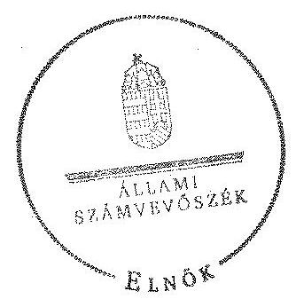
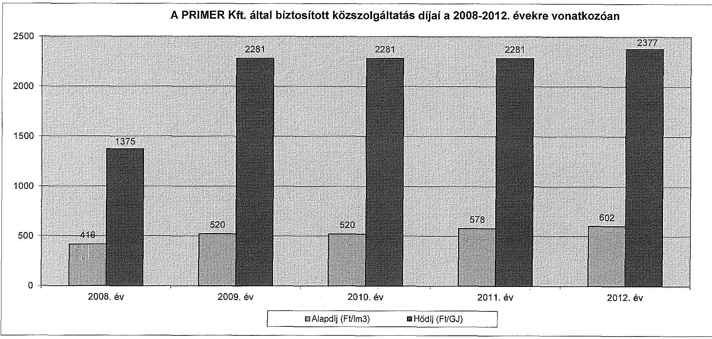
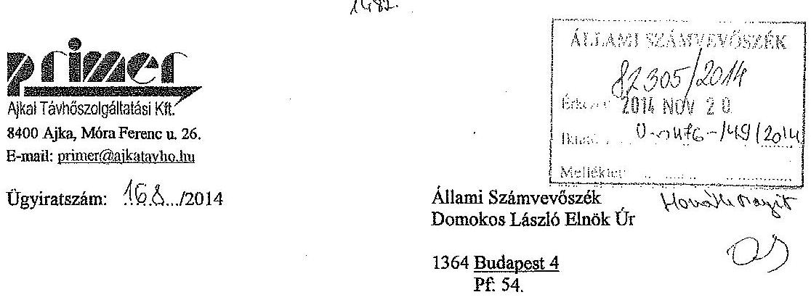
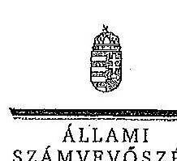
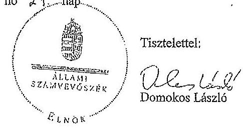
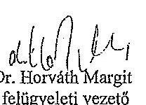

# ÁLLAMI   SZÁMVEVŐSZÉK 

## JELENTÉS

Az önkormányzatok gazdasági társaságai - Az önkormányzatok többségi tulajdonában lévő gazdasági társaságok közfeladat ellátását érintő gazdálkodási tevékenysége szabályszerűségének ellenőrzése "PRIMER" Ajkai Távhőszolgáltatási Korlátolt Felelősségű Társaság

---

# Állami Számvevőszék 

Iktatószám: V-0476-151/2014.
Témaszám: 1510
Vizsgálat-azonosító szám: V067123
Az ellenőrzést felügyelte:
Dr. Horváth Margit
felügyeleti vezető
Az ellenőrzést vezette és az ellenőrzés végrehajtásáért felelős:
Valastyánné dr. Vízhányó Júlia
ellenőrzésvezető
A jelentéstervezet összeállításában közreműködött:
Ferencz Katalin
számvevő tanácsos
Az ellenőrzést végezték:

| Kiss Péter | Mátyás Pál |
| :-- | :-- |
| okleveles könyvvizsgáló | okleveles könyvvizsgáló |
| külső szakértő | külső szakértő |

---

# TARTALOMJEGYZÉK 

BEVEZETÉS ..... 5
I. ÖSSZEGZŐ MEGÁLLAPÍTÁSOK, KÖVETKEZTETÉSEK, JAVASLATOK ..... 8
II. RÉSZLETES MEGÁLLAPÍTÁSOK ..... 13

1. Az Önkormányzat közfeladat-ellátásának szabályszerűsége ..... 13
1.1. A közfeladat-ellátás megszervezése és a feladatellátás feltételrendszerének kialakítása ..... 13
1.2. A közfeladat-ellátás felügyelete és a tulajdonosi jogok érvényesítése ..... 15
2. A PRIMER Kft. közfeladat ellátással kapcsolatos tevékenysége ..... 17
2.1. A PRIMER Kft. gazdálkodásának szabályozottsága ..... 17
2.2. A PRIMER Kft. vagyongazdálkodása ..... 18
2.3. A beszámolási kötelezettség teljesítése ..... 20
3. A távhőszolgáltatás közfeladata bevételei és ráfordításai elszámolásának és önköltségszámításának szabályszerűsége ..... 21
3.1. A távhőszolgáltatás közfeladat bevételeinek és ráfordításainak szabályszerűsége ..... 21
3.2. Az önköltségszámítás szabályszerűsége ..... 23

## MELLÉKLETEK

1. számú A PRIMER Kft. tevékenységének főbb adatai
2. számú A PRIMER Kft. működésének főbb jellemzői
3. számú A PRIMER Kft. által biztosított közszolgáltatás díjai a 2008-2012. évekre vonatkozóan
4. számú Beérkezett észrevételek és az azokra adott válaszok

## FÜGGELÉKEK

1. számú Értelmező szótár
2. számú Mintavételi eljárások ellenőrzési területenként

---

.

---

# RÖVIDÍTÉSEK JEGYZÉKE 

## Törvények

Áht. 1

Áht. 2

ÁSZ tv.
Gt.
Mötv.

Ötv.

Ptk.
Számv. tv.
Taktv.

Tszt.

## Rendeletek

157/2005. (VIII. 15.)
Korm. rendelet
50/2011. (IX. 30.) NFM rendelet

51/2011. (IX. 30.) NFM rendelet
SZMSZ
távhőszolgáltatási rendelet ${ }_{1}$
az államháztartásról szóló 1992. évi XXXVIII. törvény (hatálytalan: 2012. január 1-jétől)
az államháztartásról szóló 2011. évi CXCV. törvény (hatályos: 2011. december 31-étől)
az Állami Számvevőszékről szóló 2011. évi LXVI. törvény (hatályos: 2011. július 1-jétől)
a gazdasági társaságokról szóló 2006. évi IV. törvény (hatálytalan: 2014. március 15-étől)
Magyarország helyi önkormányzatairól szóló 2011. évi CLXXXIX. törvény (hatályos: 2012. január 1-jétől, kivéve a 144. § (2) bekezdésben meghatározott paragrafusok, amelyek 2012. április 15-én, a (3) bekezdésben meghatározott paragrafusok, amelyek 2013. január 1-jén léptek hatályba, a (4) bekezdésben meghatározott paragrafusok a 2014. évi általános önkormányzati választások napján lépnek hatályba)
a helyi önkormányzatokról szóló 1990. évi LXV. törvény (hatálytalan: a 2014. évi általános önkormányzati választások napjától)
a Polgári Törvénykönyvről szóló 1959. évi IV. törvény (hatálytalan: 2014. március 15-étől)
a számvitelről szóló 2000. évi C. törvény (hatályos: 2001. január 1-jétől)
a köztulajdonban álló gazdasági társaságok takarékosabb működéséről szóló 2009. évi CXXII. törvény (hatályos: 2009. december 4-étől)
a távhőszolgáltatásról szóló 2005. évi XVIII. törvény (hatályos: 2005. július 1-jétől)
a távhőszolgáltatásról szóló 2005. évi XVIII. törvény végrehajtásáról (hatályos: 2005. szeptember 29-étől)
a távhőszolgáltatónak értékesített távhő árának, valamint a lakossági felhasználónak és a külön kezelt intézménynek nyújtott távhőszolgáltatás díjának megállapításáról (hatályos: 2011. október 1-jétől)
a távhőszolgáltatási támogatásról (hatályos: 2011. október 1-jétől)
Ajka Város Önkormányzatának többször módosított 19/1995. (VI. 29.) számú rendelete az önkormányzat szervezeti és működési szabályairól (hatályos: 1995. augusztus 1-jétől)
Ajka Város Önkormányzatának 9/2006. (III. 22.) számú többször módosított rendelete az Ajka város területén érvényesülő lakossági távhőszolgáltatási díjak megállapítá-

---

távhőszolgáltatási ren-delet $_{2}$
vagyongazdálkodási rendelet

## Szórövidítések

Alapító Okirat
ÁSZ
FB
IRM
jegyző
Képviselő-testület
MEH
NGM
Önkormányzat
polgármester
Polgármesteri Hivatal
PRIMER Kft.
számviteli politika
javadalmazási szabályzat
sáról, valamint az ár-(díj) alkalmazási feltételekről (hatályos: 2012. március 1-jéig)
Ajka Város Önkormányzatának 4/2012. (II. 29.) számú többször módosított rendelete Ajka város területén alkalmazható távhőszolgáltatási díjak díjalkalmazási feltételeiről (hatályos: 2012. március 1-jétől)
Ajka Város Önkormányzatának 43/2005. (XI. 02.) számú többször módosított rendelete az Önkormányzat vagyonáról, a vagyontárgyak feletti tulajdonosi jogok gyakorlásáról (hatályos: 2005. november 2-ától)

PRIMER Kft. Alapító Okirata és annak módosításai
Állami Számvevőszék
PRIMER Kft. Felügyelőbizottsága
Igazságügyi és Rendészeti Minisztérium
Ajka Város Önkormányzatának jegyzője
Ajka Város Önkormányzatának Képviselő-testülete
Magyar Energia Hivatal
Nemzetgazdasági Minisztérium
Ajka Város Önkormányzata
Ajka Város Önkormányzatának polgármestere
Ajka Város Önkormányzatának Polgármesteri Hivatala
„PRIMER" Ajkai Távhőszolgáltatási Korlátolt Felelősségű Társaság
a PRIMER Kft. többször módosított Számviteli politikája (hatályos 2001. január 1-jétől)
a PRIMER Kft. Javadalmazási szabályzata (hatályos 2011. január 27-étől)

---

# JELENTÉS 

## Az önkormányzatok gazdasági társaságai Az önkormányzatok többségi tulajdonában lévő gazdasági társaságok közfeladat ellátását érintő gazdálkodási tevékenysége szabályszerűségének ellenőrzése

## „PRIMER" Ajkai Távhőszolgáltatási Korlátolt Felelősségű Társaság

## BEVEZETÉS

Az Állami Számvevőszék középtávra szóló stratégiájában megfogalmazta, hogy a helyi önkormányzatok gazdálkodásában rejlő pénzügyi kockázatok feltárásával, az államháztartáson kívülre nyújtott költségvetési támogatások és ingyenes vagyonjuttatások, valamint az államháztartáson kívül működő köz-feladat-ellátó rendszerek ellenőrzéseivel hozzájárul ahhoz, hogy a közpénzeket az államháztartáson kívül működő szervezetek is átlátható, rendezett módon használják fel a közfeladatok szerződésben vállalt ellátása érdekében.

Az önkormányzatok szervezetalakítási szabadságának következménye, hogy a korábban is vállalati formában működő (nagyvárosi tömegközlekedés, víz-, szennyvízcsatorna, köztisztasági, ingatlankezelés stb.) közszolgáltatások mellett, mind a kötelező, mind az önként vállalt feladatok ellátásában a gazdasági társaságok kiemelt fontosságú szerephez jutottak.

Az Önkormányzat a PRIMER Kft.-t az „AVA" Ajkai Városgazdálkodási Kft. szétválásával az ellenőrzött időszakot megelőzően hozta létre. Az 1993. április 23-án kelt Alapító Okirat szerint a PRIMER Kft. az átvett vagyon arányában az „AVA" Ajkai Városgazdálkodási Kft. jogutódja. A PRIMER Kft. kizárólagos tulajdonosa az Önkormányzat, főtevékenysége hőtermelés és -ellátás, illetve 2008. június 26-tól gőzellátás és légkondicionálás volt, egyéb tevékenységként ingatlan bérbeadást végzett. Az ellenőrzött időszakban a PRIMER Kft. törzstőkéje 132,1 M Ft volt.

A PRIMER Kft. főtevékenységét a Bakonyi Erőmű Zrt.-től - a 2001. január 1-jén megkötött hőszolgáltatási szerződés alapján - forróvíz hőhordozó formájában vásárolt hőenergia felhasználásával végezte, a 2008. év végén 29685 fő, a 2012. év végén 29048 fő lakosságszámú Ajka város közigazgatási területén belül. A társaság által nyújtott szolgáltatást 2008. évben 7107 db, 2012. évben 6981 db lakásban vették igénybe. A 2008. évi vásárolt hőmennyiség - a PRI-

---

MER Kft. éves üzleti jelentése alapján - 420775 GJ volt, amely a 2012. évre 380660 GJ-ra csökkent.

A PRIMER Kft. éves nettó árbevétele 1162,3 M Ft és 1786,0 M Ft között, az eszközök és források mérleg szerinti értéke 436,2 M Ft és 851,3 M Ft között alakult az ellenőrzött időszakban. A mérleg szerinti eredmény - a 2010. év kivételével, amikor 3,9 M Ft veszteség volt - 4,7 M Ft és 23,8 M Ft közötti nyereséget mutatott. A társaság által a közfeladat ellátására foglalkoztatottak létszáma a 2008. évi 58 főről a 2012. évre 48 főre csökkent.

Az ellenőrzött időszakban a polgármester és a jegyző személyében, valamint a PRIMER Kft. vezetésében változás nem volt. A polgármester a 2006. évi önkormányzati választások óta tölti be tisztségét, a jegyző 2000. február 3-ától látja el feladatait. A PRIMER Kft. ügyvezetője tisztségét 2001. május 1-jétől tölti be, a gazdasági vezető 1997. január 16-a óta áll munkaviszonyban a társasággal.

Az önkormányzati tulajdonú gazdasági társaságok teljes körű ellenőrzésének lehetőségét az Állami Számvevőszékről szóló 1989. évi XXXVIII. törvény 2011. január 1-jétől hatályos módosítása teremtette meg.

Az ellenőrzés célja annak értékelése volt, hogy

- az önkormányzat a jogszabályi előírások figyelembevételével döntött-e az ellenőrzésre kerülő közfeladat megszervezéséről; az önkormányzat szabályszerűen gyakorolta-e a tulajdonosi jogokat;
- a gazdasági társaság közfeladat-ellátása bevételeinek, ráfordításainak elszámolása, és vagyongazdálkodási tevékenysége megfelelt-e a jogszabályi, illetve a közszolgáltatási szerződésben foglalt tulajdonosi előírásoknak, azok végrehajtása szabályszerű volt-e;
- a közfeladatok átláthatósága és elszámoltathatósága érdekében biztosítva volt-e a közszolgáltatás díjának megalapozottsága szabályszerű önköltségszámítással.

# Az ellenőrzés kiterjedt Ajka Város Önkormányzatára és a PRIMER Ajkai Távhőszolgáltatási Korlátolt Felelősségű Társaságra. 

Az ellenőrzés várható hasznosulása: A törvényalkotás számára - az észlelt problémák, szabálytalanságok, vagy egyéb nem kívánatos jelenségek felszínre kerülésével - az ellenőrzés megállapításai segítséget nyújthatnak az államháztartáson kívüli közfeladat-ellátás értékeléséhez, jogszabályi keretei pontosításához, átláthatóságot biztosító szabályozásához. Meghatározhatóvá válnak a közfeladat ellátásában részt vevő államháztartáson kívüli szervezeteknek - az önkormányzat költségvetését, pénzügyi helyzetét is befolyásoló - kockázatai, lehetővé válik ezen kockázatok csökkentése. Értékelhető válik, hogy a feladatot ellátó gazdasági társaság a közszolgáltatási szerződésben foglaltak betartásával, a közvagyon használatával biztosította-e a szolgáltatás folytatásának feltételeit. Ezzel az ellenőrzöttek és a helyi döntéshozók számára visszajelzést ad feladatszervezési, feladat-ellátási kockázataikról, alapot ad a meglévő hibák megszüntetéséhez, a jobb közfeladat-ellátás biztosításához. Fokozza a fegyelmet, igazolja, hogy lejárt a következmények nélküli ellenőrzések időszaka. Az

---

ÁSZ értékteremtő rend kialakításához és megőrzéséhez hozzájáruló tevékenysége pozitív hatással van a szervezetről kialakított összkép formálására is.

A bevételek és ráfordítások elszámolása, valamint a vagyonnyilvántartás terén az egyes területek szabályszerű működését mintavétellel ellenőriztük, ez alapján a sokaságokban előforduló hibás tételek arányát becsültük. A jogszabályoknak és a belső előírásoknak megfelelőnek, azaz szabályszerűnek tekintettük az adott bevételek és ráfordítások elszámolását, a vagyonnyilvántartást, amennyiben a minta ellenőrzésének eredménye alapján 95%-os bizonyossággal a teljes sokaságban a hibás tételek aránya kisebb volt, mint 10%, nem megfelelőnek értékeltük, ha a hibás tételek aránya a 10%-ot meghaladta. Kockázatot, illetve magas kockázatot jeleztünk, amennyiben egy adott terület vonatkozásában a minta alapján a teljes sokaságban nem volt teljes körűen biztosított a jogszabályoknak és a belső szabályzatoknak megfelelő működés.

Az ellenőrzést a számvevőszéki ellenőrzés szakmai szabályai szerint, szabályszerűségi ellenőrzés módszerével, a vonatkozó nemzetközi standardok figyelembevételével végeztük. Az ellenőrzés a 2008-2012. évekre terjedt ki.

Az ellenőrzés végrehajtásának jogszabályi alapját az Állami Számvevőszékről szóló 2011. évi LXVI. törvény 5. § (3)-(5) bekezdései képezték.

Az ÁSZ az Állami Számvevőszékről szóló 2011. évi LXVI. törvény 29. §-a alapján a jelentéstervezetet észrevételezésre megküldte a polgármesternek és a gazdasági társaság ügyvezetőjének. A beérkezett észrevételeket a jelentés véglegesítése során hasznosítottuk. Az észrevételeket és az azokra adott válaszokat a jelentés 4. számú melléklete tartalmazza.

---

# I. ÖSSZEGZŐ MEGÁLLAPÍTÁSOK, KÖVETKEZTETÉSEK, JAVASLATOK 

Ajka Város Önkormányzata a távhőszolgáltatás kötelező feladatát az „AVA" Ajkai Városgazdálkodási Kft. szétválásával létrehozott PRIMER Kft. tevékenységén keresztül látta el. A PRIMER Kft. kizárólagos tulajdonosa az Önkormányzat volt. A társaság 132,1 M Ft törzstőkéje az ellenőrzött időszakban nem változott. A Képviselő-testület az Önkormányzat közigazgatási területén a távhőszolgáltatás közfeladatának megszervezéséről a jogszabályi előírásoknak megfelelően döntött. Az ellenőrzött időszakban az Önkormányzat által alapított gazdasági társaságok feletti tulajdonosi jogokat a Gt.-ben meghatározott előírások szerint a Képviselő-testület szabályszerűen gyakorolta.

A Képviselő-testület az SZMSZ-ben előírta, hogy az Önkormányzat köteles gondoskodni a jogszabályok által kötelezően ellátandó feladatokról és közreműködik a helyi energiaszolgáltatásban. Az SZMSZ 1. számú melléklete azonban az önként vállalt feladatok között írta elő, hogy az Önkormányzat vállalkozás keretében gondoskodik a város melegvíz és távhő ellátásáról, figyelmen kívül hagyva az Önkormányzat kötelező feladatellátására vonatkozó Tszt. előírásokat. Az Önkormányzat a 2007-2010. és a 2011-2014. évekre szóló gazdasági programja a távhőszolgáltatás működtetésével, fejlesztésével kapcsolatban célokat nem fogalmazott meg.

Az Önkormányzat a távhőszolgáltatásra vonatkozóan a Tszt. szerinti rendeletalkotási kötelezettségének eleget tett. A Képviselő-testület megalkotta az ellenőrzött időszakban hatályos vagyongazdálkodási rendeletet és távhőszolgáltatási rendelet$_{1,2}$-t. A rendeletek alapjaiban megfeleltek a jogszabályi előírásoknak, azonban a távhőszolgáltatási rendelet
 }_{1,2}$ megalkotása során az Önkormányzat - a Tszt. előírásait figyelmen kívül hagyva - nem tért ki a területfejlesztési, környezetvédelmi és levegőtisztaságvédelmi szempontokra. Az Önkormányzat a távhőszolgáltatási rendelet ${ }_{1,2}$-ben rögzítette a távhőszolgáltatásra vonatkozó árképzési szabályokat. A PRIMER Kft. távhőszolgáltatási díjainak Képviselő-testület általi megállapítása a hatályos jogszabályi előírásoknak megfelelt.

A PRIMER Kft. Alapító Okirata alapján az Önkormányzat Képviselőtestületének kizárólagos hatáskörébe tartoztak mindazok a kérdések, amelyeket törvény a taggyűlés kizárólagos hatáskörébe utalt. A Képviselő-testület az ellenőrzött időszakban a PRIMER Kft.-vel kapcsolatos tulajdonosi jogokat nem adott át. Az Önkormányzat részéről a tulajdonosi ellenőrzés elsősorban az FB keretében működött. Az FB három tagból állt, a tagokat az Önkormányzat, mint tulajdonos delegálta.

Az Önkormányzat belső ellenőrzése a távhőszolgáltatás, mint közfeladat ellátás szabályszerű teljesítéséhez, az önkormányzati vagyon megóvásához érdemben nem járult hozzá, mivel az ellenőrzött időszakban a PRIMER Kft.-nél ellenőrzést nem végzett.

---

A Képviselő-testület a PRIMER Kft. üzleti terveit az éves beszámoló jóváhagyásával egy időben tárgyalta meg és határozatban elfogadta. Az üzleti tervek az adott gazdasági évre vonatkozóan tartalmaztak bevételi és kiadási tervet, a karbantartási és beruházási tevékenységre vonatkozó koncepciót.

Az FB a társaság beszámolóiról - a könyvvizsgálói hitelesítő záradék ismeretében - minden évben elkészítette az írásbeli jelentését, melynek birtokában a Képviselő-testület határozatot hozott az éves beszámolók jóváhagyásáról. A Képviselő-testület az éves beszámolóval egyidejűleg fogadta el a PRIMER Kft. üzleti jelentését, amelyben a távhőszolgáltatással kapcsolatos feladatok teljesítéséről kapott tájékoztatást.

A mérleg szerinti eredmény - a 2010. év kivételével, amikor 3,9 M Ft veszteség keletkezett - az ellenőrzött években pozitív volt (2008-ban 23,8 M Ft, 2009-ben 10,9 M Ft, 2011-ben 4,7 M Ft, 2012-ben 12,7 M Ft). A Képviselőtestület - a 2011. év kivételével - az adózott eredmény teljes összegének eredménytartalékba helyezéséről döntött, osztalékfizetés az ellenőrzött időszakban egy alkalommal történt. A 2011. évben 94,7 M Ft adózott eredmény keletkezett, melyből a Képviselő-testület 90,0 M Ft osztalékfizetést hagyott jóvá. A Primer Kft. az 51/2011. (IX. 30.) NFM rendelet alapján a 2011. évben 40,6 M Ft, a 2012. évben 117,9 M Ft támogatásban részesült, amely pozitívan hatott az adott gazdálkodási évek eredményére. A társaság a 2012. évben a támogatás összege nélkül veszteséges lett volna.

Az Önkormányzat az ellenőrzött időszakban a PRIMER Kft.-nek működési és felhalmozási célú pénzeszközt nem adott át, kölcsönt nem nyújtott, a társaság kötelezettségvállalásaival kapcsolatban garanciát, kezességet nem vállalt. A társaságnál pótbefizetés elrendelésére nem volt szükség, a saját tőke összege minden évben többszörösen meghaladta a jegyzett tőke összegét.

Az ellenőrzött időszakban a PRIMER Kft. számviteli rendszerének szabályozottsága hiányosságokat mutatott. A PRIMER Kft. 2001-től hatályos számviteli politikáját a jogszabályi változásokkal összhangban, rendszeresen aktualizálták. A 2012. január 1-jétől hatályos módosítás során a Tszt. 18/A. §-ában előírt, a számviteli szétválasztásra vonatkozó törvényi kötelezettséget rögzítették. A számviteli politika fejezeteiként - beazonosítható módon - jelenítették meg a Számv. tv. által előírt, kötelezően elkészítendő belső szabályzatokat, azonban azok elnevezése és tartalma nem felelt meg teljes körűen a jogszabályi előírásoknak. A számviteli politika a számlarend összeállítására vonatkozóan tartalmazott rendelkezéseket, azonban a PRIMER Kft. az ellenőrzött időszakban - a Számv. tv. előírása ellenére - hatályos számlarenddel nem rendelkezett. A PRIMER Kft. az ellenőrzött időszakban a számviteli politika részeként készítette el az önköltségszámítás rendjére vonatkozó szabályzatát. A társaság a közszolgáltatás díjának megállapítására vonatkozó javaslatait szabályszerű önköltségszámítással alátámasztotta.

A PRIMER Kft.-nél a kintlévőségek kezelése a számlázás folyamatába építetten működött. Évente értékvesztést számoltak el a határidőn túli követelésekre a Számv. tv. előírásának megfelelően. Behajthatatlan követelést nem tartottak nyilván. Az ügyvezetés az éves beszámolók kiegészítő mellékletében minden évben beszámolt a kintlévőségek alakulásáról. A társaság által nyilvántartott,

---

hőszolgáltatási ügyfélkörre vonatkozó díjhátralékok összege a 2008-2012. évek között közel négyszeresére emelkedett.

A könyvvizsgáló a Számv. tv. szerinti határidőn belül, hitelesítő záradékot adott az ellenőrzött időszak beszámolóiról, azonban a 2012. évi könyvvizsgálói jelentésében - a Tszt. előírásait figyelmen kívül hagyva - nem igazolta, hogy a társaság által kidolgozott és alkalmazott számviteli szétválasztási szabályok, valamint az egyes tevékenységek közötti tranzakciók árazása biztosítják a társaság tevékenységei közötti keresztfinanszírozás-mentességet. A társaság az éves beszámolók közzétételi, illetve letétbe helyezési kötelezettségének eleget tett, azonban a 2008. évi beszámolót a Számv. tv.-ben előírt határidőn túl, két napos késedelemmel tették közzé.

A PRIMER Kft. a távhőszolgáltatási közfeladat árbevételeinek elszámolása során szabályszerűen járt el. A bevételek előírása és kiszámlázása a belső szabályozásnak megfelelően történt, a bevételeket a megfelelő számlacsoportban számolták el. Az alkalmazott szolgáltatási díjak megfeleltek a belső szabályozásnak és a tulajdonosi követelményeknek.

A távhőszolgáltatási közfeladat anyagjellegű ráfordításainak elszámolása során a társaság szabályszerűen járt el. A költségelszámolást megalapozó kötelezettségvállalás, a költségek elszámolása a jogszabályi előírásoknak és a belső szabályozásnak megfelelt. A költségek a tevékenységgel összefüggésben merültek fel, azokat megfelelő költségnemre, költséghelyre számolták el.

A PRIMER Kft. vagyongazdálkodási tevékenysége - beleértve a vagyon kezelését, gyarapítását, hasznosítását - összességében megfelelt a jogszabályi előírásoknak. A távhőszolgáltatási közfeladat-ellátást szolgáló vagyon a PRIMER Kft. saját vagyona volt, vagyonkezelésbe, üzemeltetésre az Önkormányzat tulajdonát képező vagyont nem vett át. A közfeladat-ellátást szolgáló vagyonnal kapcsolatos változások az eszközök egyedi nyilvántartó-kartonjain, illetve elkülönített főkönyvi nyilvántartásban kerültek rögzítésre. Az ellenőrzött időszak mérlegbeszámolóiban szereplő eszközök és források értékét leltárral támasztották alá.

A PRIMER Kft. a vagyon megóvása érdekében folyamatosan elvégezte a felújítási, karbantartási munkákat mind a távhő vezeték, mind a hőközpontok és egyéb távhő vagyon esetében. A befektetett eszközök után a PRIMER Kft. az ellenőrzött időszakban $196,6 \mathrm{MFt}$ amortizációt számolt el, az eszközpótlásra fordított összeg ( $242,5 \mathrm{MFt}$ ) ennél $23,3 \%$-kal magasabb volt.

A Kft. beruházásainak, felújításainak elszámolása szabályszerű volt. Az egy éven túl elhasználódó eszközöket minden esetben befektetett eszközként vették nyilvántartásba a számviteli politika előírásának megfelelően. Az eszközök besorolását, bekerülési értékének meghatározását, állományba vételét, illetve üzembe helyezését a Számv. tv. előírásainak megfelelően végezték el.

A PRIMER Kft. az ellenőrzött időszakban a Képviselő-testület által jóváhagyott díjakat alkalmazta. Az árképzésre vonatkozó gyakorlat megfelelt a társaság önköltségszámítására vonatkozó szabályozásában foglaltaknak, valamint az Számv. tv. önköltségszámításra vonatkozó előírásainak. A díjak megállapításá-

---

ra vonatkozó javaslatokat - a PRIMER Kft. ügyvezető igazgatója kezdeményezésére - a polgármester terjesztette a Képviselő-testület elé. Az FB a javaslatokat megtárgyalta, és elfogadását javasolta a Képviselő-testületnek. A távhőszolgáltatás díjának megállapítása a Képviselő-testület által alkotott rendeletekkel történt.

A fentiekben leírtak összegzéseként az alábbi megállapításokat tesszük:
A konstrukcióból eredő sajátosság volt, hogy a tulajdonosi ellenőrzés elsősorban az FB működésén keresztül érvényesült.

A működés kockázatát növelte, hogy az Önkormányzat belső ellenőrzése a távhőszolgáltatás, mint közfeladat ellátás szabályszerű teljesítéséhez, az önkormányzati vagyon megóvásához érdemben nem járult hozzá. Az ellenőrzött időszakban a PRIMER Kft. számviteli rendszerének szabályozottsága hiányosságokat mutatott. A szabályozási hiányosságok ellenére a társaság működése a gyakorlatban megfelelt a jogszabályi előírásoknak, gazdálkodása eredményes, tőkehelyzete stabil volt.

Az Állami Számvevőszékről szóló 2011. évi LXVI. törvény 33. § (1) bekezdésében foglaltak értelmében a jelentésben foglalt megállapításokhoz kapcsolódó intézkedési tervet köteles az ellenőrzött szervezet vezetője összeállítani, és azt a jelentés kézhezvételétől számított 30 napon belül az ÁSZ részére megküldeni. Amennyiben az intézkedési tervet határidőben nem küldi meg a szervezet, vagy az nem elfogadható, az ÁSZ elnöke a hivatkozott törvény 33. § (3) bekezdés a)-b) pontjaiban foglaltakat érvényesítheti.

Az ellenőrzés intézkedést igénylő megállapításai és javaslatai:
Javaslataink célja a Kft. gazdálkodása szabályszerűségének helyreállítása annak érdekében, hogy a szabályozási környezet megfelelően tudja támogatni az átlátható működést.

Javasoljuk a PRIMER Ajkai Távhőszolgáltatási Kft. ügyvezető igazgatójának:

1. A Kft. számviteli politikájának az értékelési módok és eljárások fejezete előírásai nem terjedtek ki a PRIMER Kft. teljes vagyonára, az immateriális javak értékelésére vonatkozóan nem rögzítettek szabályokat. A pénzkezelés szabályai fejezet nem tartalmazta a Számv. tv. 14. § (8) bekezdésében foglaltak ellenére a PRIMER Kft. bankszámláinak felsorolását, nem rendelkezett a pénztár helyettesítés rendjéről, a pénztárellenőr feladatairól.

Javaslat:
Gondoskodjon a szabályozási hiányosságok megszüntetésére, ezen belül:
intézkedjen a társaság számviteli szabályozásában az értékelési módok és eljárások PRIMER Kft. teljes vagyonára történő kiterjesztéséről, az immateriális javak értékelésére vonatkozó szabályok rögzítéséről, valamint a pénzkezelés szabályainak kiegészítéséről.

---

Javaslataink célja az önkormányzat szabályszerű működésének elősegítése, továbbá az önkormányzati tulajdonosi joggyakorlás kontrolljainak erősítése.

# Javasoljuk Ajka Város Önkormányzata jegyzőjének: 

1. A távhőszolgáltatási rendelet ${ }_{1,2}$ megalkotása során az Önkormányzat a Tszt. 6. § (2) bekezdés c) pontjában előírt előírásait figyelmen kívül hagyva nem jelölte ki azokat a területeket, ahol területfejlesztési, környezetvédelmi és levegőtisztaságvédelmi szempontok alapján célszerű a távhőszolgáltatás fejlesztése.

Az Önkormányzat belső ellenőrzése az ellenőrzéseivel a távhőszolgáltatás, mint közfeladat-ellátás szabályszerű teljesítéséhez, valamint az önkormányzati vagyon megóvásához ellenőrzéseivel nem járult hozzá. Az ellenőrzött időszakban a társaság gazdálkodásával és működésével kapcsolatban ellenőrzést nem folytatott le.

Javaslat:

## Gondoskodjon a szabályozási hiányosságok megszüntetésére, ezen belül:

a) készítse elő az önkormányzat távhőszolgáltatási rendeletének kiegészítését a területfejlesztési, környezetvédelmi és levegőtisztasági szempontok alapján a távhőszolgáltatás célszerűen fejlesztendő területeire vonatkozó előírásokkal és intézkedjen a szabályozás kiadásával kapcsolatban.
b) kezdeményezze, hogy a Bkr. 31. § (3) bekezdésében foglaltak szerint az éves belső ellenőrzési tervek tartalmazzák az önkormányzat pénzügyi egyensúlyi helyzetét befolyásoló döntésekkel kapcsolatos kockázati tényezők elemzését, beleértve az önkormányzat gazdasági társaságainak működéséből eredő kockázatokat, és gondoskodjon a társaságot érintő ellenőrzések terv szerinti végrehajtásáról.

---

# II. RÉSZLETES MEGÁLLAPÍTÁSOK 

## 1. Az ÖNKORMÁNYZAT KÖZFELADAT-ELLÁTÁSÁNAK SZABÁLYSZERŰSÉGE

### 1.1. A közfeladat-ellátás megszervezése és a feladatellátás feltételrendszerének kialakítása

Az Ötv. 91. § (6) bekezdése szerint az Önkormányzatnak a gazdasági programjában kellett meghatároznia azon célkitűzéseit, amelyek az ellátandó feladatok biztosítását, fejlesztését szolgálják. Az Önkormányzat 2007-2010., illetve a 2011-2014. évekre a Képviselő-testület által elfogadott ${ }^{1}$ gazdasági programja a távhőszolgáltató rendszer fejlesztésével kapcsolatban stratégiai célokat, feladatokat nem fogalmazott meg. A gazdasági programokban általános fejlesztési elképzelésként a lakóházak és a közintézmények energetikai felújítása szerepelt.

Mindkét időszakban feladatul tűzték ki a 2003. évben megkezdett panelprogramban való részvételt. A 2007-2010. évi programban további célkitűzésként szerepelt a közintézmények gazdaságos energia felhasználása, az elavult világítási és fűtési rendszerek korszerűsítésével az üzemeltetési költségek csökkentése. Az elképzeléseket a Kormány által meghirdetett „Szemünk fénye" programban való részvétellel tervezte megvalósítani az Önkormányzat.

Az Önkormányzat 2008. évben elfogadott Integrált Városfejlesztési Stratégiája célként tűzte ki a közszolgáltatások színvonalának növelését, azonban a távhőszolgáltatással kapcsolatban konkrét elképzeléseket nem tartalmazott.

Az Ötv. 8. § (3) bekezdése rendelkezik arról, hogy törvény a települési önkormányzatokat egyes közszolgáltatási feladatok ellátásáról történő gondoskodásra kötelezheti. A távhőszolgáltatással ellátott létesítmények távhőellátásának engedélyes vagy engedélyesek útján történő biztosítása - a Tszt. 6. § (1) bekezdése értelmében - a területileg illetékes települési önkormányzat kötelező feladata.

A Képviselő-testület az SZMSZ-ben előírta, hogy az Önkormányzat köteles gondoskodni a jogszabályok által kötelezően ellátandó feladatokról és -
 a 3. számú függeléke szerint - közreműködik a helyi energiaszolgáltatásban. Az SZMSZ 1. számú melléklete az önként vállalt feladatok között írta elő, hogy az Önkormányzat vállalkozás keretében gondoskodik a város melegvíz- és távhőellátásáról. Az SZMSZ rendelkezéseit - a Tszt. 6. § (1) bekezdés előírásait figyelmen kívül hagyva - az ellenőrzött időszakban nem módosították.

[^0]
[^0]:    ${ }^{1}$ A Képviselő-testület 62/2007. (III. 30.) számú, illetve a 89/2011. (IV. 27) számú határozata.

---

Az Ötv. 9. § (4) bekezdésének rendelkezése értelmében a Képviselő-testület a feladatkörébe tartozó közszolgáltatások ellátása céljából többek között gazdasági társaságot alapíthat. A jogszabályi rendelkezéssel összhangban az Önkormányzat a vagyongazdálkodási rendelet 6. § (3) bekezdésében rögzítette, hogy a Képviselő-testület a tulajdonában lévő vagyontárgyak hasznosítására, üzemeltetésére intézményt vagy gazdasági társaságot alapíthat, melynek átlátható szervezetnek kell lennie. Az SZMSZ 90. § (1) bekezdésében rögzítették, hogy az Önkormányzat közszolgáltatási feladatait elsősorban - a 17. számú függelékben nevesített - szervei és intézményei (közöttük a PRIMER Kft.) útján teljesíti.

Ajka Város Önkormányzatának Képviselő-testülete az Önkormányzat közigazgatási területén a távhőszolgáltatás közfeladatának megszervezéséről a jogszabályi előírásoknak megfelelően döntött. Az Önkormányzat a távhőszolgáltatás közszolgáltatási feladatát a 100%-os tulajdonában lévő gazdasági társaság alapításával biztosította az Ötv. 9. § (4) bekezdésének és a vagyongazdálkodási rendelet előírásaival összhangban. A PRIMER Kft. alapítása, a távhőszolgáltatási feladatok társaság részére történő átadása az ellenőrzött időszakot megelőzően történt. A PRIMER Kft. Alapító Okirata szerinti fő tevékenysége gőzellátás, légkondicionálás volt.

A PRIMER Kft. távhőszolgáltatói működési engedély birtokában végezte tevékenységét, amelynek főbb adatait az 1. számú melléklet, a társaság működésének főbb jellemzőit a 2. számú melléklet tartalmazza.

Az Önkormányzat a kizárólagos tulajdonában lévő PRIMER Kft.-be apportálta a távhőszolgáltatást biztosító vagyont, így a közfeladat-ellátást szolgáló vagyon a társaság saját vagyonát képezte. A társaság 132,1 M Ft törzstőkéje az ellenőrzött időszakban nem változott. Az Önkormányzat a PRIMER Kft. részére a közfeladat ellátásához kezelésre vagyont nem adott át.

Az Önkormányzat a távhőszolgáltatásra vonatkozóan a Tszt. 6. § (2) bekezdés szerinti rendeletalkotási kötelezettségének eleget tett. A Képviselőtestület megalkotta az ellenőrzött időszakban hatályos vagyongazdálkodási rendeletet és távhőszolgáltatási rendelet¹⁻².

A távhőszolgáltatási rendelet¹⁻² meghatározták annak területi és személyi hatályát, a távhőszolgáltató rendszer elemeit (szolgáltatói és felhasználói vagyont), a távhőszolgáltatás tartalmát, a távhőszolgáltató és a felhasználó közötti jogviszony szabályait. Meghatározták a fogyasztóvédelemmel kapcsolatos rendelkezéseket, a mérés szerinti elszámolás feltételeit, a hőmennyiségmérés helyét, a közüzemi szerződés megszegésének eseteit és következményeit, a távhőszolgáltatás felfüggesztésének, a szolgáltatás szüneteltetésének, korlátozásának eseteit és szabályait, valamint a távhőszolgáltatási díj megállapításával és megfizetésével, a távhőszolgáltatás fejlesztésével kapcsolatos rendelkezéseket, ugyanakkor ennek keretében nem tértek ki területfejlesztési, környezetvédelmi és levegőtisztaságvédelmi szempontokra, ezzel figyelmen kívül hagyva a Tszt. 6. § (2) bekezdés c) pontja előírásait. A távhőszolgáltatási rendelet¹⁻² meghatározta a távhőszolgáltatási rendszerhez történő csatlakozás szabályait, a csatlakozási díj fizetésére kötelezettek körét, és a csatlakozási díj tartalmát is.

---

# 1.2. A közfeladat-ellátás felügyelete és a tulajdonosi jogok érvényesítése 

Az Önkormányzat vagyongazdálkodási rendeletének 2. § (5) bekezdés d) pontjában a PRIMER Kft.-ben fennálló 100%-os tulajdonosi részesedését nemzetgazdasági szempontból kiemelt jelentőségű nemzeti vagyonnak és forgalomképtelen törzsvagyonba tartozónak minősítette. A vagyongazdálkodási rendeletben a tulajdonosi jogok gyakorlásának szabályai között - az Ötv. 80. § (1) bekezdés előírásainak megfelelően - rögzítették, hogy az Önkormányzat Képviselő-testületét megilletik mindazok a jogok és terhelik mindazok a kötelezettségek, amelyek a tulajdonost megillethetik, illetve terhelik. Az ellenőrzött időszakban az Önkormányzat által alapított gazdasági társaságok feletti tulajdonosi jogokat a Gt.-ben meghatározott előírások szerint a Képviselő-testület szabályszerűen gyakorolta. A vagyongazdálkodási rendelet 7. § (2) bekezdése értelmében a 100%-os önkormányzati tulajdonú gazdasági társaságok esetében a Gt.-ben biztosított tulajdonosi jogok gyakorlása a Képviselő-testület kizárólagos hatáskörébe tartozott. Az Önkormányzat a PRIMER Kft.-vel kapcsolatos tulajdonosi jogokat nem adott át.

A PRIMER Kft. Alapító Okiratának 7. pontja értelmében „mindaddig, amíg a Társaságnak egy üzletrésze van, a taggyűlés hatáskörébe tartozó kérdésekben az alapító határozattal dönt", továbbá „az alapító kizárólagos hatáskörébe tartoznak mindazok a kérdések, amelyeket a törvény a taggyűlés kizárólagos hatáskörébe utal". Ugyancsak az Alapító Okirat 7. pontjában rögzítették, hogy „az alapító a Társaság bármely kérdésében dönthet". A Képviselő-testület kizárólagos döntési jogkörébe tartoztak többek között: a mérleg megállapítása és a nyereség felosztása, a törzstőke felemelése, az üzletrész felosztása, az ügyvezető, az FB tagjainak és a könyvvizsgálónak a megbízása, visszahívása, díjazásának megállapítása, az ügyvezető tekintetében a munkáltatói jog gyakorlása.

Az Önkormányzat SZMSZ-ében² az Építési és Városgazdálkodási Iroda feladataként határozták meg a PRIMER Kft. működését érintő tulajdonosi döntéselőkészítés és végrehajtás megszervezését.

Az Alapító Okirat rögzítette az ügyvezető személyét, feladatait és felelősségi körét, valamint az FB tagok adatait. Az FB három tagból áll, a tagokat az Önkormányzat, mint tulajdonos delegálta.

Az Alapító Okirat szerint „az ügyvezető a Társasággal munkaviszonyban (munkaszerződés alapján) is áll, ügyvezetői felelőssége azonban a Ptk. szerint alakul". Az ügyvezető az Alapító Okiratban foglaltak szerint többek között köteles a Határozatok könyvét vezetni, gondoskodni az üzleti könyvek szabályos vezetéséről, a mérleget és eredmény-kimutatást elkészíteni. Az Alapító Okiratban a felügyelőbizottság feladat- és hatáskörét a Gt. 33-36.§ előírásai szerint határozták meg, kiegészítve azzal, hogy „a felügyelőbizottság akkor is köteles az alapító döntését kikérni, ha azt az ügyvezető elmulasztja, vagy egyébként a Társaság érdeke megkívánja". Az ellenőrzött időszak alatt egyszer, a 2010. gazdasági évben került sor az FB tagok visszahívására, mivel megbízásuk lejárt.

[^0]
[^0]:    ${ }^{2}$ A Polgármesteri Hivatal működési szabályzatának III. fejezete. A szabályzat az SZMSZ 16. számú függelékét képezte.

---

A polgármester előterjesztése alapján a Képviselő-testület döntött a PRIMER Kft. ügyvezetőjének személyéről, javadalmazásának megállapításáról, valamint az Önkormányzat által delegált FB tagok megválasztásáról, javadalmazásuk megállapításáról.

Az FB a társaság beszámolóiról - a könyvvizsgálói hitelesítő záradék ismeretében - minden évben elkészítette az írásbeli jelentését. A Képviselő-testület az FB írásbeli jelentésének birtokában minden évben meghozta határozatát az éves beszámoló jóváhagyásáról. A Képviselő-testület az éves beszámolóval egyidejűleg fogadta el a PRIMER Kft. üzleti jelentését, amelyben a távhőszolgáltatással kapcsolatos feladatok teljesítéséről kapott tájékoztatást. A tulajdonosi ellenőrzés az FB révén működött.

A Képviselő-testület a PRIMER Kft. tárgyévi üzleti terveit az éves beszámoló jóváhagyásával egy időben tárgyalta meg és határozatban fogadta el. Az üzleti tervek az adott gazdasági évre vonatkozóan tartalmaztak bevételi és kiadási tervet, a karbantartási és beruházási tevékenységre vonatkozó koncepciót.

A Képviselő-testület az ellenőrzött időszakban - anyagi ösztönzési rendszer keretében - a PRIMER Kft. ügyvezetője részére prémiumfeladatokat határozott meg, amelyeket a számviteli beszámoló jóváhagyásával egy időben értékelt és határozatban³ döntött a prémium kifizethetőségéről. A PRIMER Kft. a 2011. évben elkészítette javadalmazási szabályzatát, amelyet a Képviselőtestület⁴ határozattal elfogadott (ezt megelőzően a társaság a Taktv. 5. § (3) bekezdésében előírtak ellenére ilyen szabályzattal nem rendelkezett).

Az Önkormányzat a távhőszolgáltatási rendelet¹⁻⁵ rögzítette a távhőszolgáltatásra vonatkozó árképzési szabályokat. A távhőszolgáltatást igénybe vevők által fizetendő díj alapdíjból és hődíjból tevődött össze. Az alapdíjat a távhőszolgáltató hődíj nélküli költségeit, és a hőtermelő létesítményben lekötött hőteljesítmény költségeit fedező díjként, a hődíjat a távhő szolgáltatásával összefüggően vásárolt hőenergia (teljesítmény lekötési díj nélküli) költségeit, az elosztási veszteséget és fejlesztési hányadot fedező díjként határozták meg. A PRIMER Kft. távhőszolgáltatási díjainak Képviselő-testület általi megállapítása a hatályos jogszabályi előírások szerint történt. Az Önkormányzat a 2008-2012. években nem élt az Ötv. 92. § (11) bekezdés b) pontjában, valamint az Áht² 70. § (1) bekezdés d) pontjában biztosított lehetőséggel, mivel belső ellenőrzés által ellenőrzéseket nem végeztetett a PRIMER Kft.-nél. A PRIMER Kft.-t külső szakértő sem ellenőrizte.

A PRIMER Kft. az ellenőrzött időszakban - a 2010. gazdasági év kivételével, amikor 3,9 M Ft veszteség keletkezett - nyereségesen gazdálkodott. A Képviselőtestület - a 2011. év kivételével - az adózott eredmény teljes összegének az eredménytartalékba helyezéséről döntött. A Képviselő-testület a 2011. évben

[^0]
[^0]:    ${ }^{3}$ A Képviselő-testület 67/2009. (V. 28.) számú, 66/2010. (V. 7) számú, 71/2011. (IV. 27) számú, 53/2012. (IV. 19.) számú és 52/2013. (IV. 23.) számú határozatai.
    ${ }^{4}$ A Képviselő-testület 6/2011. (I. 18.) számú határozata.

---

70,0 M Ft osztalékelőleg⁵, illetve a 2011. évben realizált 94,7 M Ft adózott eredmény terhére 90,0 M Ft osztalék kifizetéséről határozott⁶.

Az Önkormányzat az ellenőrzött időszakban a PRIMER Kft.-nek működési és felhalmozási célú pénzeszközt nem adott át, a vagyonváltozáshoz, fejlesztést eredményező döntés végrehajtásához kölcsönt nem nyújtott, veszteség rendezésével kapcsolatosan pótbefizetési kötelezettsége nem keletkezett. Az Önkormányzat a PRIMER Kft. kötelezettségvállalásaival kapcsolatban garanciát, kezességet nem vállalt.

# 2. A PRIMER Kft. KÖZFELADAT-ELLÁTÁSSAL KAPCSOLATOS TEVÉKENYSÉGE 

### 2.1. A PRIMER Kft. gazdálkodásának szabályozottsága

A PRIMER Kft. az ellenőrzött időszak minden évében elkészítette az üzleti terveit, amelyeket az FB véleményezett és azokat a Képviselő-testület részére elfogadásra javasolt. Az üzleti tervet a Képviselő-testület évente, a számviteli beszámoló elfogadását tárgyaló ülésén hagyta jóvá, amelyről határozat⁷ hozott.

#### Abstract

A PRIMER Kft. az üzleti terveiben bemutatta a távhőszolgáltatási rendszert érintő előző évben megvalósított és a tárgyévre tervezett fejlesztési feladatokat, a gazdálkodás várható bevételeit, költségeit és eredménytervét. Az üzleti tervek tartalmazták a távhőszolgáltatás előző évi költségeinek megoszlását vásárolt hőenergia, villamos energia, vásárolt víz és alapdíj költségek megbontásban. Tartalmazták továbbá a központi irányítás és anyaggazdálkodási, az üzemi általános és a személyi jellegű költségek tervét, az állományi létszám, valamint a távhőszolgáltatásra elszámolt amortizáció tervét.

A PRIMER Kft. a Számv. tv. előírásainak megfelelően elkészítette és a gazdasági vezető 2001. január 1-jétől hatályba helyezte a társaság számviteli politikáját. A számviteli politikát az ellenőrzött időszakban több alkalommal aktualizálták, 2009. január 1-jei hatállyal a Számv. tv. változásait vezették át, 2009. június 30-ai hatállyal az ingatlanvagyon piaci értéken történő nyilvántartása miatt módosították a szabályzatot. A 2012. január 1-jétől hatályos módosítás során a Tszt. 18/A. §-ában előírt, a számviteli szétválasztásra vonatkozó törvényi kötelezettséget rögzítették.

A számviteli politika fejezeteiként - beazonosítható módon - jelenítették meg a Számv. tv. 14. § (5) bekezdésében előírt, kötelezően elkészítendő belső szabályzatokat, azonban azok elnevezése és tartalma nem felelt meg teljes körűen a jogszabályi előírásoknak.

[^0]
[^0]:    ${ }^{5}$ A Képviselő-testület 212/2011. (XII. 13.) számú határozata.
    ${ }^{6}$ A Képviselő-testület 51/2012. (IV. 19.) számú határozata.
    ${ }^{7}$ A Képviselő-testület 71/2008. (IV. 25.) számú, 66/2009. (V. 28.) számú, 65/2010. (V. 7.) számú, 70/2011. (IV. 27.) számú, valamint 52/2012. (IV. 19.) számú határozatai.

---

A számviteli politikában az előírt eszközök és források leltárkészítési és
 leltározási szabályzata helyett leltározási feladatok, az eszközök és források értékelési szabályzata helyett értékelési módok és eljárások, az önköltségszámítás rendjére vonatkozó szabályzat helyett önköltségszámítás, költség-felosztás, kalkuláció, a pénzkezelési szabályzat helyett pénzkezelés szabályai elnevezés szerepelt.

A leltározási feladatok fejezet nem tartalmazta a leltárzás megszervezéséért, végrehajtásáért, irányításáért és ellenőrzéséért felelős személy megjelölését, a leltárzás legfontosabb bizonylatait. A szabályozás nem tartalmazta az immateriális javak leltározási kötelezettségét, a források közül csak a szállítókkal kapcsolatosan írtak elő leltározási feladatokat.

Az értékelési módok és eljárások fejezet előírásai nem terjedtek ki a PRIMER Kft. teljes vagyonára, az immateriális javak és a mérlegben szereplő egyes források értékelésére vonatkozóan nem rögzítettek szabályokat.

A pénzkezelés szabályai fejezet - a Számv. tv. 14. § (8) bekezdésében foglaltak ellenére - nem tartalmazta a PRIMER Kft. bankszámláinak felsorolását, nem rendelkezett a pénztár helyettesítés rendjéről, a pénztárellenőr feladatairól.

A számviteli politika a számlarend, számlatükör összeállítására vonatkozóan tartalmazott rendelkezéseket, azonban a PRIMER Kft. az ellenőrzött időszakban - a Számv. tv. 161. § előírása ellenére - hatályos számlarenddel nem rendelkezett. A Tszt. 18/A. §-ában előírt számviteli szétválasztás követelményének megfelelően meghatározták a bevételek és ráfordítások elszámolásának ágazatonkénti elkülönítését, valamint a közfeladat-ellátást szolgáló vagyonelemek elkülönített nyilvántartását. Ennek megfelelően alakították ki az alkalmazott főkönyvi számlák rendszerét. A számlatükör alkalmas volt a mérleg és eredménykimutatás, illetve a kiegészítő melléklet adatainak alátámasztására.

A PRIMER Kft. a Tszt. 6. § alapján elkészítette Üzletszabályzatát, amit az Önkormányzat jegyzője a Tszt. 7. § (1) bekezdés a)-b) pontjaiban foglaltaknak megfelelően - a 2006. évben, az ellenőrzött időszak előtt - a fogyasztóvédelmi hatóságnak véleményezésre megküldött, majd jóváhagyott.

A PRIMER Kft. belső szabályzataiban egyértelműen előírta a közfeladat ellátással kapcsolatos elszámolások, bevételek, ráfordítások elkülönített nyilvántartását. A közfeladatok, ezen belül távhő, illetve a társaság által végzett egyéb feladatok üzletágankénti bontásban szerepeltek a 2008-2012. évekre elkészített üzletági beszámolókban és a beszámolók alapjául szolgáló nyilvántartásokban.

# 2.2. A PRIMER Kft. vagyongazdálkodása 

A távhőszolgáltatási közfeladat-ellátást szolgáló vagyon a PRIMER Kft. saját vagyona volt, vagyonkezelésbe, üzemeltetésre az Önkormányzat tulajdonát képező vagyont nem kapott. A közfeladat-ellátást szolgáló vagyonnal kapcsolatos változások elkülönített főkönyvi nyilvántartásban kerültek rögzítésre. Az immateriális javak és tárgyi eszközök nyilvántartása analitikus nyil-

---

vántartás keretében, egyedi nyilvántartó-kartonokon történt, amelyeken folyamatosan nyomon követhetők voltak az eszközök bruttó értékében és értékcsökkenési leírásában történő változások. Az ellenőrzött időszak mérlegbeszámolóiban szereplő eszközök és források értékét leltárral támasztották alá. A leltár tételesen, ellenőrizhető módon tartalmazta a PRIMER Kft. mérleg fordulónapján meglévő eszközeit és forrásait mennyiségben és értékben, ami megfelelt a Számv. tv. 69. § (1) bekezdése előírásainak. A vagyonnyilvántartáson belül elkülönítetten szerepelt a távhőszolgáltatási közfeladat ellátását biztosító eszközállomány és az azokra elszámolt értékcsökkenési leírás. Az éves beszámolók kiegészítő mellékleteiben a vagyonelemeket összesített kimutatásban, az azokban bekövetkezett változásokat üzletáganként részletesen bemutatták. A PRIMER Kft. a vagyon megóvása érdekében folyamatosan elvégezte a felújítási, karbantartási munkákat mind a távhő vezeték, mind a hőközpontok és egyéb távhő vagyon esetében.

A PRIMER Kft. vagyongazdálkodási tevékenysége - beleértve a vagyon kezelését, gyarapítását, hasznosítását - összességében megfelelt a jogszabályi előírásoknak, annak ellenére, hogy az Önkormányzat írásba nem foglalta tulajdonosi elvárásait.

A PRIMER Kft. vagyoni helyzetét jellemző főbb mérleg szerinti adatok 2008. január 1. és 2012. december 31. között az alábbiak voltak:

| Megnevezés | 2008.01.01 | 2008.12.31 | 2009.12.31 | 2010.12.31 | 2011.12.31 | 2012.12.31 |
| :--: | :--: | :--: | :--: | :--: | :--: | :--: |
| I. Beléktetett eszközök | 239046 | 236388 | 439371 | 439173 | 448305 | 408141 |
| ebből: tárgyi eszközök | 237318 | 235903 | 438955 | 438760 | 447834 | 407215 |
| II. Forgóeszközök | 153154 | 182356 | 268125 | 389022 | 330363 | 421604 |
| ebből: követelések | 114868 | 120524 | 245420 | 372481 | 203807 | 401209 |
| III. Aktív időbeli elhatároklack | 14911 | 17234 | 19237 | 23114 | 3742 | 4770 |
| ESZKOZOK |  |  |  |  |  |  |
| ÖSSZESEN | 407111 | 436178 | 726733 | 851309 | 772309 | 834515 |
| IV. Saját tőke | 246379 | 270171 | 496772 | 493674 | 497531 | 464744 |
| ebből: jegyzett tőke | 132060 | 132060 | 132060 | 132060 | 132060 | 132060 |
| ebből: mérleg szerinti eredmény | 17082 | 23792 | 10895 | 3913 | 4698 | 12695 |
| V. Céltartalékok |  |  |  |  |  |  |
| VI. Kötelezettségek | 135122 | 130026 | 182791 | 311172 | 218977 | 347715 |
| VII. Passzív időbeli elhatároklack | 35610 | 35981 | 47170 | 46463 | 56001 | 22036 |
| FORRASOK   ÖSSZESEN | 407111 | 436178 | 726733 | 851309 | 772309 | 834515 |

A PRIMER Kft. eszközállományának 2008. január 1-je és 2012. december 31-e közötti több mint kétszeres (407,1 MFt-ról, 834,5 MFt-ra) növekedése a tárgyi eszközök 71,6%-os (237,3 MFt-ról, 407,2 MFt-ra) és a forgóeszközök közel háromszoros (153,2 MFt-ról, 421,6 MFt-ra) növekedésének eredménye.

A forgóeszközök értékének zömét - a 2009-2012. években több mint 90%-át kitevő - követelések állománya minden évben meghaladta az előző évi állományt, 2012. december 31-én (401,2 MFt) 249,2%-kal volt magasabb a 2008. január 1-jei (114,9 MFt) állománynál. A kötelezettségek állománya a 2008. január 1-jei 125,1 MFt-ról a 2012. év december 31-ére 177,9%-kal, 347,7 MFt-ra nőtt.

---

A saját tőke összes forráson belüli aránya - a tőkeerő mutatója - a 2008. évben 61,9%, 2009-ben 68,4%, 2010-ben 58,0%, 2011-ben 64,4%, 2012-ben 55,7% volt.

A mérleg szerinti eredmény - a 2010. év kivételével, amikor 3,9 MFt veszteség keletkezett - az ellenőrzött években pozitív volt (2008-ban 23,8 MFt, 2009-ben 10,9 MFt, 2011-ben 4,7 MFt, 2012-ben 12,7 MFt). A 2011. évben 94,7 MFt adózott eredmény keletkezett, melyből a jóváhagyott osztalék összege 90,0 MFt, a mérleg szerinti eredmény 4,7 MFt volt.

A PRIMER Kft. az 51/2011. (IX. 30.) NFM rendelet alapján a 2011. évben 40,6 MFt, a 2012. évben 117,9 MFt távhőszolgáltatási támogatásban részesült, amely pozitívan hatott az adott gazdálkodási évek eredményére. A PRIMER Kft. a 2012. évben a támogatás összege nélkül veszteséges lett volna.

A PRIMER Kft.-nél a kintlévőségek kezelése a számlázással kapcsolatos analitikus nyilvántartásokhoz rendelt folyamatba építetten működött. A kintlévőségeit a PRIMER Kft. folyószámla egyeztetéssel dokumentálta. Az ügyvezetés az éves beszámolók kiegészítő mellékletében minden évben adatot szolgáltatott a kintlévőségek alakulásáról. Tekintettel arra, hogy a lakossági hátralékok kezelése jelentette a nagyobb problémát - ennek növekedése a jellemző -, a lakossági hátralékok alakulásáról, továbbá az előző beszámoló óta eltelt időszak alatt a behajtás érdekében tett intézkedésekről (bíróságnak átadott ügyek mennyisége és összege) is beszámoltak. A PRIMER Kft. által nyilvántartott díjhátralékok összege a 2008. december 31-ei 47,7 MFt-ről, 2012. december 31-ére közel négyszeresére, 188,1 MFt-ra növekedett.

A minősített vevőállomány (a hőszolgáltatási ügyfélkörre vonatkozó, 91-180, 181-360 nap közötti, illetve 360 napon túli követelés) összege a 2008. év végén 47,7 MFt, a 2009. év végén 76,5 MFt, a 2010. év végén 136,3 MFt, a 2011. év végén 114,2 MFt, a 2012. év végén 188,1 MFt volt.

A társaság az ellenőrzött években a számviteli politikájában rögzített elveknek és eljárásoknak megfelelően értékelte a lejárt követelések állományát, és a lejárt vevő követeléseire 2009-ben 15,4 MFt, 2010-ben 17,9 MFt, 2011-ben 13,5 MFt, 2012-ben 22,3 MFt értékvesztést számolt el. Az értékvesztés számviteli elszámolása a számviteli politika előírásainak megfelelően történt. A társaság behajthatatlan követelést nem tartott nyilván. A társaság 2012. évi beszámolójához készített kimutatása szerint 2012. december 31-éig halmozottan 929 db fizetési meghagyás került kibocsátásra 137,0 MFt összeggel, és 822 db végrehajtási lap készült 126,2 MFt összeggel.

# 2.3. A beszámolási kötelezettség teljesítése 

Az Önkormányzat a PRIMER Kft. felé a közszolgáltatással összefüggő, a jogszabályi előírásokon túli beszámolási kötelezettséget nem írt elő. A PRIMER Kft. apport formájában kapta meg a közszolgáltatás ellátását biztosító önkormányzati vagyont. Az Önkormányzat a 2008-2012. évi éves számviteli beszámolók elfogadása alkalmával, továbbá a FB üléseken résztvevő képviselőin keresztül kapott információt, tájékoztatást a PRIMER Kft. működéséről.

---

A PRIMER Kft. az ellenőrzött időszakban a számvitel politikájában rögzítetteknek megfelelően minden évben elkészítette az éves számviteli beszámolóját. Az éves számviteli beszámoló részei az üzleti jelentés, az adott év üzletági beszámolója, a mérleg, az eredménykimutatás, a kiegészítő melléklet, a független könyvvizsgálói jelentés és az FB jelentése voltak. A könyvvizsgáló az éves számviteli beszámolókat korlátozás nélküli hitelesítő záradékkal látta el. A 2008-2012. évek éves számviteli beszámolóiról az FB a Gt. 35. § (3)${ }^{8}$ bekezdése szerint elkészítette az írásos jelentését és a Képviselő-testület részére elfogadásra javasolta. A Képviselő-testület a Gt. 35. § (3) bekezdésében foglaltaknak megfelelően az éves számviteli beszámolók elfogadásáról az FB írásbeli jelentésének és a könyvvizsgáló jelentésének birtokában, határozattal döntött. A Képviselő-testület határozataiban kötelezte a PRIMER Kft. ügyvezető igazgatóját, hogy az éves számviteli beszámolót határidőben küldje meg az IRM és a MEH felé.

A PRIMER Kft. könyvvizsgálója a 2012. évi könyvvizsgálói jelentésében - a Tszt. 18/B. § (1) bekezdésének előírásait figyelmen kívül hagyva - nem igazolta, hogy a társaság által kidolgozott és alkalmazott számviteli szétválasztási szabályok, valamint az egyes tevékenységek közötti tranzakciók árazása biztosítják a társaság tevékenységei közötti keresztfinanszírozás-mentességet.

A Képviselő-testületi határozatoknak megfelelően a 2008-2012. évekre vonatkozóan a PRIMER Kft. közzétette, illetve letétbe helyezte a számviteli éves beszámolóit, azonban a 2008. évi éves számviteli beszámolót - a Számv. tv. 154. § (1) bekezdés előírását figyelmen kívül hagyva - az IRM honlapján csak két napos késéssel, 2009. június 4. napján tették közzé.

A PRIMER Kft. működése a 2010. évben veszteséges volt (-3,9 MFt), de a Gt. 51. § (1) bekezdésében meghatározott intézkedési kötelezettsége nem keletkezett, mivel a saját tőke összege minden évben többszörösen meghaladta a jegyzett tőke összegét. A saját tőke és jegyzett tőke aránya a 2008. évben 204,6%, 2009. évben 376,2%, 2010. évben 373,8%, 2011. évben 376,6%, 2012. évben 351,9% volt.

# 3. A TÁVHŐSZOLGÁLTATÁS KÖZFELADATA BEVÉTELEI ÉS RÁFORDÍTÁSAI ELSZÁMOLÁSÁNAK ÉS ÖNKÖLTSÉGSZÁMÍTÁSÁNAK SZABÁLYSZERŰSÉGE 

### 3.1. A távhőszolgáltatás közfeladat bevételeinek
 és ráfordításainak szabályszerűsége

A PRIMER Kft.-nél - mivel a távhőszolgáltatási közfeladat mellett egyéb tevékenységet is ellátott az ellenőrzött időszakban - a közfeladat átláthatósága és a keresztfinanszírozás elkerülése érdekében fennállt a bevételek és ráfordítások elkülönítésének kötelezettsége.

[^0]
[^0]:    ${ }^{8}$ Hatályon kívül helyezve 2014. március 15-étől.

---

A PRIMER Kft. a bevételeket tevékenységenként elkülönítve tartotta nyilván a főkönyvi könyvelési rendszerében. A bevételek kiszámlázásakor az aktuális szolgáltatási díjakat alkalmazta. A PRIMER Kft. a távhőszolgáltatási közfeladat árbevételeinek elszámolása során szabályszerűen járt el. A bevételek előírása és kiszámlázása a belső szabályozásnak megfelelően történt, a bevételeket a megfelelő számlacsoportban számolták el. Az alkalmazott szolgáltatási díjak megfeleltek a belső szabályozásnak és a tulajdonosi követelményeknek.

A PRIMER Kft. a távhőszolgáltatási közfeladat anyagjellegű ráfordításainak elszámolása során szabályszerűen járt el. A költségelszámolást megalapozó kötelezettségvállalás, a költségek elszámolása a jogszabályi előírásoknak és a belső szabályozásnak megfelelően történt. Az elszámolt költségek a tevékenységgel összefüggésben merültek fel. A költségelszámolást megalapozó dokumentumok rendelkezésre álltak. A költségeket a megfelelő költségnemre, költséghelyre számolták el.

A PRIMER Kft. beruházásainak, felújításainak elszámolása szabályszerű volt. Az egy éven túl elhasználódó eszközöket minden esetben befektetett eszközként vették nyilvántartásba a számviteli politika előírásának megfelelően. Az eszközök besorolását, bekerülési értékének meghatározását, állományba vételét, illetve üzembe helyezését a Számv. tv. előírásainak megfelelően végezték el.

A PRIMER Kft. a saját befektetett eszközei után számolt el amortizációt, üzemeltetésre, bérbe vett önkormányzati tulajdonban lévő eszközei nem voltak. Az értékcsökkenést a bruttó érték alapján, lineáris módszerrel, a számviteli politikában megfogalmazott elvek szerint, a Számv. tv. előírásainak figyelembe vételével állapította meg. Az eszközök elhasználódási foka a 2008. évi 63,6\%-ról a végrehajtott fejlesztések hatására 2012-ben 69,7\%-ra javult. A befektetett eszközök után a PRIMER Kft. az ellenőrzött időszakban 196,6 M Ft amortizációt számolt el, az eszközpótlásra fordított összeg ( $242,5 \mathrm{MFt}$ ) ennél $23,3 \%$-kal magasabb volt.

A PRIMER Kft. által a távhő vagyon kapcsán elszámolt beruházások és értékcsökkenési leírás összegét a következő táblázat szemlélteti:
adatok ezer Ft-ban

| Év | Értékcsökkenési leírás   összege | Beruházások   összege |
| :--: | :--: | :--: |
| $\mathbf{2 0 0 8 .}$ | 40647 | 41033 |
| $\mathbf{2 0 0 9 .}$ | 37901 | 33996 |
| $\mathbf{2 0 1 0 .}$ | 37188 | 45858 |
| $\mathbf{2 0 1 1 .}$ | 37942 | 53906 |
| $\mathbf{2 0 1 2 .}$ | 42875 | 67671 |
| Összesen | $\mathbf{1 9 6 5 5 3}$ | $\mathbf{2 4 2 4 6 4}$ |

---

A PRIMER Kft. az ellenőrzött időszakban a beszámolóinak kiegészítő mellékletében részletesen bemutatta az elszámolt értékcsökkenést. A távhőszolgáltatás tárgyi eszközeiben bekövetkezett változások, mint saját vagyon változásai kerültek bemutatásra.

# 3.2. Az önköltségszámítás szabályszerűsége 

A PRIMER Kft. az ellenőrzött időszakban rendelkezett a számviteli politika részeként elkészített önköltségszámítás rendjére vonatkozó szabályozással, eleget téve a Számv. tv. 14. § (5) bekezdés c) pontjában előírt szabályzatkészítési kötelezettségnek. A társaság az önköltségszámítás rendjére vonatkozó szabályokat a Számv. tv. vonatkozó rendelkezéseivel összhangban határozta meg.

Az önköltségszámítás rendjére vonatkozó szabályozás meghatározta a kalkulációs egységek önköltségének tartalmát, részletezte a közvetlen, a szűkített és a teljes önköltség összetevőit. A távhőszolgáltatási díjak megállapításához kalkulációs sémát készítettek, amely kalkulációs egységenként (városfütés, hálózati hidegvíz, egyéb távfűtési tevékenység, egyéb tevékenység) részletezte a közvetlen és a közvetett költségeket. A felosztásra kerülő üzemi általános költségek és a központi irányítás költségeinek elszámolása során a vetítési alap az árbevétel volt. Az elsődlegesen az árbevétel alapján felosztott központi irányítási költségek a távhőszolgáltatáson belül tovább osztásra kerültek, 97,0\%-a városfűtés, 3,0\%-a a hidegvíz költségeire.

A PRIMER Kft. az ellenőrzött időszakban a Képviselő-testület által jóváhagyott díjakat alkalmazta. Az árképzésre vonatkozó gyakorlat megfelelt a társaság önköltség számítására vonatkozó szabályozásában foglaltaknak, valamint az Számv. tv. önköltségszámításra vonatkozó előírásainak. A díjak megállapítására vonatkozó javaslatokat a 2008. és a 2009. évben - a PRIMER Kft. ügyvezető igazgatója kezdeményezésére - a polgármester terjesztette a Képviselő-testület elé. A 2010. és a 2011. évben a PRIMER Kft. nem kezdeményezett díjmódosítást. Az előterjesztések alapdíjra és hődíjra vonatkoztak, ezen belül megbontva lakossági és egyéb fogyasztókra. Az FB a javaslatokat megtárgyalta, és elfogadását javasolta a Képviselő-testületnek. Az Önkormányzat a fogyasztóvédelmi szervekkel és a fogyasztói érdekképviseletekkel való együttműködés keretében a távhőszolgáltatást érintő Képviselő-testületi előterjesztéseket előzetesen véleményeztette a Veszprém Megyei Fogyasztóvédelmi Főfelügyelőséggel. A hatóság kifogást nem emelt, a díjemelést tudomásul vette. A távhőszolgáltatás díjának megállapítása a Képviselő-testület által alkotott rendeletekkel történt.

A Képviselő-testület a távhőszolgáltatás lakossági alapdíját 2009. évben 25,2\%-kal (2008. évben $415,7 \mathrm{Ft} / \mathrm{lm}^{3}, 2009$. évben $520,3 \mathrm{Ft} / \mathrm{lm}^{3}$ ), a hődíjat $65,9 \%$-kal (2008. évben $1375 \mathrm{Ft} / \mathrm{GJ}, 2009$. évben $2281 \mathrm{Ft} / \mathrm{GJ}$ ) növelte, ezt követően az Önkormányzat a hatósági ármegállapításának az időszakában a díjakat nem emelte.

A lakossági, valamint az intézményi fogyasztóknak nyújtott távhőszolgáltatás ármegállapítása 2011. április 15-ei hatállyal - a Tszt. 57/D. §-a alapján - önkormányzati hatáskörből miniszteri hatáskörbe került. A Primer Kft. 2011. októbertől a jogszabályban meghatározott díjat alkalmazta, 2012. január 1-jétől az 50/2011. (IX. 30.) NFM rendelet 2012. január 1-jétől hatályos 4. §-ában foglaltak szerinti 4,2\%-os díjemelést érvényesítette. Az ellenőrzött időszakban az alapdíjak és a hődíjak alakulását a 3. számú melléklet tartalmazza.
Budapest, 2015. 04. 10. nap

Melléklet: 4 db
Függelék: 2 db

Domokos László
elnök $\cdot$

---

# A PRIMER Kft. tevékenységének főbb adatai

|  Sorszám | Megnevezés | 2008. | 2009. | 2010. | 2011. | 2012.  |
| --- | --- | --- | --- | --- | --- | --- |
|  1. | A gazdasági társaság székhelye | 8400 Ajka Móra Ferenc utca 26. |  |  |  |   |
|  2. | adószáma | 11325462-2-19 |  |  |  |   |
|  3. | alapításának éve | 1993. |  |  |  |   |
|  4. | A gazdasági társaság többségi tulajdonú leányvállalatainak száma (db) | 0 | 0 | 0 | 0 | 0  |
|  5. | A gazdasági társaság leányvállalataiban való részesedésének mértéke (\%) | 0 | 0 | 0 | 0 | 0  |
|  6. | Az önkormányzat számára (megbízásából, koncessziós, közszolgáltatási, vagy egyéb szerződéses jogviszony alapján) ellátott közfeladatok szakági besorolása: |  |  |  |  |   |
|  7. | Egészségügy |  |  |  |  |   |
|  8. | Kultúra és sport |  |  |  |  |   |
|  9. | Település üzemeltetés, ezen belül: |  |  |  |  |   |
|  10. | köztemető üzemeltetés |  |  |  |  |   |
|  11. | kéményseprés |  |  |  |  |   |
|  12. | helyi közutak fejlesztése, fenntartása és üzemeltetése |  |  |  |  |   |
|  13. | parkok és egyéb közterület fenntartás |  |  |  |  |   |
|  14. | közterületi parkolás |  |  |  |  |   |
|  15. | Lakás és helyiséggazdálkodás | $x$ | $x$ | $x$ | $x$ | $x$  |
|  16. | Víz és csatorna közműszolgáltatás |  |  |  |  |   |
|  17. | Hulladékkezelés-szállítás |  |  |  |  |   |
|  18. | Távhő- és energiaszolgáltatás | $x$ | $x$ | $x$ | $x$ | $x$  |
|  19. | Helyi közösségi közlekedés |  |  |  |  |   |
|  20. | Vagyongazdálkodás |  |  |  |  |   |
|  21. | Pénzügyi gazdasági szolgáltatás |  |  |  |  |   |
|  22. | Egyéb: éspedig |  |  |  |  |   |
|  23. | A közfeladatellátására a gazdasági társaságnál alkalmazottak létszáma (fő) | 58 | 58 | 55 | 50 | 48  |

---

# A PRIMER Kft. működésének főbb jellemzői

|  Sorszám | Megnevezés |  | 2008. | 2009. | 2010. | 2011. | 2012.  |
| --- | --- | --- | --- | --- | --- | --- | --- |
|  1. | A gazdasági társaság cégformája |  |  | Korlátolt Felelősségű Társaság |  |  |   |
|  2. | A gazdasági társaság tulajdonosi összetétele: |  |  |  |  |  |   |
|   | Önkormányzat megnevezése: |  |  | Ajka Város Önkormányzata |  |  |   |
|  3. | Önkormányzat tulajdoni részesedésének arány | $\%$ | 100,0 | 100,0 | 100,0 | 100,0 | 100,0  |
|  4. | Önkormányzat tulajdoni részesedésének összege | ezer Ft | 132060,0 | 132060,0 | 132060,0 | 132060,0 | 132060,0  |
|   | Más önkormányzatok, többcélú társulás megnevezése: |  | - | - | - | - | -  |
|  5. | Más önkormányzatok, többcélú társulások tulajdoni részesedésének arány | $\%$ | 0,0 | 0,0 | 0,0 | 0,0 | 0,0  |
|  6. | Más önkormányzatok, többcélú társulások tulajdoni részesedésének összege | ezer Ft | 0,0 | 0,0 | 0,0 | 0,0 | 0,0  |
|   | Gazdasági társaság megnevezése: |  | - | - | - | - | -  |
|  7. | Gazdasági társaságok tulajdoni részesedés arány | $\%$ | 0,0 | 0,0 | 0,0 | 0,0 | 0,0  |
|  8. | Gazdasági társaságok tulajdoni részesedés összege | ezer Ft | 0,0 | 0,0 | 0,0 | 0,0 | 0,0  |
|   | Egyéb tulajdonos megnevezése: |  |  |  |  |  |   |
|  9. | Egyéb tulajdonosok tulajdoni részesedés arány |  |  |  |  |  |   |

 | $\%$ | 0,0 | 0,0 | 0,0 | 0,0 | 0,0  |
|  10. | Egyéb tulajdonosok tulajdoni részesedés összege | ezer Ft | 0,0 | 0,0 | 0,0 | 0,0 | 0,0  |
|  12. | A tárgyévben a gazdasági társaság vagyonkezelésben lévő önkormányzati vagyon után elszámolt értékcsökkenés összege (ezer Ft) |  | 0,0 | 0,0 | 0,0 | 0,0 | 0,0  |
|  13. | A tárgyévben az önkormányzati tulajdonú, gazdasági társaság által kezelt eszközök pótlására (karbantartás, felújítás, beruházás) elszámolt kiadás (ezer Ft) |  | 0,0 | 0,0 | 0,0 | 0,0 | 0,0  |
|  14. | A tárgyévben a gazdasági társaság saját vagyona után elszámolt értékcsökkenés összege (ezer Ft) |  | 40647,0 | 37901,0 | 37188,0 | 37942,0 | 42875,0  |
|  15. | A tárgyévben a saját tulajdonú eszközök pótlására (karbantartás, felújítás, beruházás) elszámolt kiadás (ezer Ft) |  | 41033,0 | 33996,0 | 45858,0 | 53906,0 | 67671,0  |

---

# A PRIMER Kft. által biztosított közszolgáltatás díjai a 2008-2012. évekre vonatkozóan

---

.

---

# Beérkezett észrevételek és az azokra adott válaszok

---

# **Chemistry**

## **Chemical Reactions**

### **Balancing Chemical Equations**

1. **Write the unbalanced equation:**
   - Example: $$C_3H_8 + O_2 \rightarrow CO_2 + H_2O$$

2. **Balance the equation:**
   - Balance carbon atoms first.
   - Then balance hydrogen atoms.
   - Finally, balance oxygen atoms.
   - Balanced equation: $$C_3H_8 + 5O_2 \rightarrow 3CO_2 + 4H_2O$$

3. **Balance the equation:**
   - Balance oxygen atoms.
   - Finally, balance oxygen atoms.
   - Balanced equation: $$C_3H_8 + 5O_2 \rightarrow 3CO_2 + 4H_2O$$

### **Types of Reactions**

1. **Combination Reaction:**
   - Example: $$2H_2 + O_2 \rightarrow 2H_2O$$

2. **Decomposition Reaction:**
   - Example: $$2H_2O_2 \rightarrow 2H_2O + O_2$$

3. **Single Displacement Reaction:**
   - Example: $$Zn + 2HCl \rightarrow ZnCl_2 + H_2$$

4. **Double Displacement Reaction:**
   - Example: $$AgNO_3 + NaCl \rightarrow AgCl + NaNO_3$$

5. **Combustion Reaction:**
   - Example: $$CH_4 + 2O_2 \rightarrow CO_2 + 2H_2O$$

## **Stoichiometry**

### **Mole Concept**

- **Mole (mol):** The amount of substance containing as many particles (atoms, molecules, ions) as there are atoms in exactly 12 grams of carbon-12.
- **Avogadro's Number:** $$6.022 \times 10^{23}$$ particles per mole.

### **Molar Mass**

- **Molar Mass:** The mass of one mole of a substance.
- Example: The molar mass of water ($$H_2O$$) is 18.015 g/mol.

### **Calculations**

1. **Moles to Mass:**
   - Formula: $$n = \frac{m}{M}$$
   - Example: Calculate the number of moles of $$H_2O$$ in 18 grams of water.
     - $$n = \frac{18 \, \text{g}}{18.015 \, \text{g/mol}} \approx 0.999 \, \text{mol}$$

2. **Mass to Moles:**
   - Formula: $$m = n \times M$$
   - Example: Calculate the mass of 1 mole of water.
     - $$m = 1 \, \text{mol} \times 18.015 \, \text{g/mol} = 18.015 \, \text{g}$$

## **Gas Laws**

### **Ideal Gas Law**

- **Equation:** $$PV = nRT$$
- **Variables:**
  - $$P$$ = Pressure (atm)
  - $$V$$ = Volume (L)
  - $$n$$ = Moles of gas

### **Boyle's Law**

- **Equation:** $$P_1V_1 = P_2V_2$$
- **Variables:**
  - $$P_1$$ = Initial pressure
  - $$V_1$$ = Initial volume
  - $$P_2$$ = Final pressure
  - $$V_2$$ = Final volume

### **Charles's Law**

- **Equation:** $$\frac{V_1}{T_1} = \frac{V_2}{T_2}$$

## **Thermochemistry**

### **Enthalpy (H)**

- **Definition:** The heat content of a system at constant pressure.
- **Equation:** $$\Delta H = q_p$$
- **Variables:**
  - $$q_p$$ = Heat transferred at constant pressure.
  - $$\Delta H$$ = Change in enthalpy

### **Hess's Law**

- **Statement:** The enthalpy change for a reaction is the same whether it occurs in one step or multiple steps.
- **Example:**
  - $$C_3H_8 + 5O_2 \rightarrow 3CO_2 + 4H_2O$$

  - $$\Delta H_{rxn} = \sum \Delta H_f (\text{products}) - \sum \Delta H_f (\text{reactants})$$

## **Electrochemistry**

### **Oxidation and Reduction**

- **Oxidation:** Loss of electrons.
- **Reduction:** Gain of electrons.

### **Galvanic Cells**

- **Definition:** A cell that converts chemical energy into electrical energy.
- **Components:**
  - Anode: Oxidation occurs.
  - Cathode: Reduction occurs.
  - Salt Bridge: Connects the two half-cells.

### **Nernst Equation**

- **Equation:** $$E = E^\circ - \frac{RT}{nF} \ln Q$$

## **Nuclear Chemistry**

### **Radioactive Decay**

- **Definition:** The process by which unstable nuclei emit radiation to decay.
- **Types of Decay:**
  - Alpha (α) decay
  - Beta (β) decay
  - Gamma (γ) decay

 - Alpha (ε′′) = Alpha 72 (eV)
  - Alpha (ε′′) = Alpha 73 (eV)
  - Alpha (ε′′) = Alpha 74 (eV)
  - Alpha (ε′′) = Alpha 75 (eV)
  - Alpha (ε′′) = Alpha 76 (eV)
  - Alpha (ε′′) = Alpha 77 (eV)
  - Alpha (ε′′) = Alpha 78 (eV)
  - Alpha (ε′′) = Alpha 79 (eV)
  - Alpha (ε′′) = Alpha 70 (eV)
  - Alpha (ε′′) = Alpha 71 (eV)
  - Alpha (ε′′) = Alpha 72 (eV)
  - Alpha (ε′′) = Alpha 73 (eV)
  - Alpha (ε′′) = Alpha 74 (eV)
  - Alpha (ε′′) = Alpha 75 (eV)
  - Alpha (ε′′) = Alpha 76 (eV)
  - Alpha (ε′′) = Alpha 77 (eV)
  - Alpha (ε′′) = Alpha 78 (eV)
  - Alpha (ε′′) = Alpha 79 (eV)
  - Alpha (ε′′) = Alpha 70 (eV)
  - Alpha (ε′′) = Alpha 71 (eV)
  - Alpha (ε′′) = Alpha 72 (eV)
  - Alpha (ε′′) = Alpha 73 (eV)
  - Alpha (ε′′) = Alpha 74 (eV)
  - Alpha (ε′′) = Alpha 75 (eV)
  - Alpha (ε′′) = Alpha 76 (eV)
  - Alpha (ε′′) = Alpha 77 (eV)
  - Alpha (ε′′) = Alpha 78 (eV)
  - Alpha (ε′′) = Alpha 79 (eV)
  - Alpha (ε′′) = Alpha 70 (eV)
  - Alpha (ε′′) = Alpha 71 (eV)
  - Alpha (ε′′) = Alpha 72 (eV)
  - Alpha (ε′′) = Alpha 73 (eV)
  - Alpha (ε′′) = Alpha 74 (eV)
  - Alpha (ε′′) = Alpha 75 (eV)
  - Alpha (ε′′) = Alpha 76 (eV)
  - Alpha (ε′′) = Alpha 77 (eV)
  - Alpha (ε′′) = Alpha 78 (eV)
  - Alpha (ε′′) = Alpha 79 (eV)
  - Alpha (ε′′) = Alpha 70 (eV)
  - Alpha (ε′′) = Alpha 71 (eV)
  - Alpha (ε′′) = Alpha 72 (eV)
  - Alpha (ε′′) = Alpha 73 (eV)
  - Alpha (ε′′) = Alpha 74 (eV)
  - Alpha (ε′′) = Alpha 75 (eV)
  - Alpha (ε′′) = Alpha 76 (eV)
  - Alpha (ε′′) = Alpha 77 (eV)
  - Alpha (ε′′) = Alpha 78 (eV)
  - Alpha (ε′′) = Alpha 79 (eV)
  - Alpha (ε′′) = Alpha 70 (eV)
  - Alpha (ε′′) = Alpha 71 (eV)
  - Alpha (ε′′) = Alpha 72 (eV)
  - Alpha (ε′′) = Alpha 73 (eV)
  - Alpha (ε′′) = Alpha 74 (eV)
  - Alpha (ε′′) = Alpha 75 (eV)
  - Alpha (ε′′) = Alpha 76 (eV)
  - Alpha (ε′′) = Alpha 77 (eV)
  - Alpha (ε′′) = Alpha 78 (eV)
  - Alpha (ε′′) = Alpha 79 (eV)
  - Alpha (ε′′) = Alpha 70 (eV)
  - Alpha (ε′′) = Alpha 71 (eV)
  - Alpha (ε′′) = Alpha 72 (eV)
  - Alpha (ε′′) = Alpha 73 (eV)
  - Alpha (ε′′) = Alpha 74 (eV)
  - Alpha (ε′′) = Alpha 75 (eV)
  - Alpha (ε′′) = Alpha 76 (eV)
  - Alpha (ε′′) = Alpha 77 (eV)
  - Alpha (ε′′) = Alpha 78 (eV)
  - Alpha (ε′′) = Alpha 79 (eV)
  - Alpha (ε′′) = Alpha 70 (eV)
  - Alpha (ε′′) = Alpha 71 (eV)
  - Alpha (ε′′) = Alpha 72 (eV)
  - Alpha (ε′′) = Alpha 73 (eV)
  - Alpha (ε′′) = Alpha 74 (eV)
  - Alpha (ε′′) = Alpha 75 (eV)
  - Alpha (ε′′) = Alpha 76 (eV)
  - Alpha (ε′′) = Alpha 77 (eV)
  - Alpha (ε′′) = Alpha 78 (eV)
  - Alpha (ε′′) = Alpha 79 (eV)
  - Alpha (ε′′) = Alpha 71 (eV)
  - Alpha (ε′′) = Alpha 72 (eV)
  - Alpha (ε′′) = Alpha 73 (eV)
  - Alpha (ε′′) = Alpha 74 (eV)
  - Alpha (ε′′) = Alpha 75 (eV)
  - Alpha (ε′′) = Alpha 76 (eV)
  - Alpha (ε′′) = Alpha 77 (eV)
  - Alpha (ε′′) = Alpha 78 (eV)
  - Alpha (ε′′) = Alpha 79 (eV)
  - Alpha (ε′′) = Alpha 70 (eV)
  - Alpha (ε′′) = Alpha 71 (eV)
  - Alpha (ε′′) = Alpha 72 (eV)
  - Alpha (ε′′) = Alpha 73 (eV)
  - Alpha (ε′′) = Alpha 74 (eV)
  - Alpha (ε′′) = Alpha 75 (eV)
  - Alpha (ε′′) = Alpha 76 (eV)
  - Alpha (ε′′) = Alpha 77 (eV)
  - Alpha (ε′′) = Alpha 78 (eV)
  - Alpha (ε′′) = Alpha 79 (eV)
  - Alpha (ε′′) = Alpha 71 (eV)
  - Alpha (ε′′) = Alpha 72 (eV)
  - Alpha (ε′′) = Alpha 73 (eV)
  - Alpha (ε′′) = Alpha 74 (eV)
  - Alpha (ε′′) = Alpha 75 (eV)
  - Alpha (ε′′) = Alpha 76 (eV)
  - Alpha (ε′′) = Alpha 77 (eV)
  - Alpha (ε′′) = Alpha 78 (eV)
  - Alpha (ε′′) = Alpha 79 (eV)
  - Alpha (ε′′) = Alpha 71 (eV)
  - Alpha (ε′′) = Alpha 72 (eV)
  - Alpha (ε′′) = Alpha 73 (eV)
  - Alpha (ε′′) = Alpha 74 (eV)
  - Alpha (ε′′) = Alpha 75 (eV)
  - Alpha (ε′′) = Alpha 76 (eV)
  - Alpha (ε′′) = Alpha 77 (eV)
  - Alpha (ε′′) = Alpha 78 (eV)
  - Alpha (ε′′) = Alpha 79 (eV)
  - Alpha (ε′′) = Alpha 71 (eV)
  - Alpha (ε′′) = Alpha 72 (eV)
  - Alpha (ε′′) = Alpha 73 (eV)
  - Alpha (ε′′) = Alpha 74 (eV)
  - Alpha (ε′′) = Alpha 75 (eV)
  - Alpha (ε′′) = Alpha 76 (eV)
  - Alpha (ε′′) = Alpha 77 (eV)
  - Alpha (ε′′) = Alpha 78 (eV)
  - Alpha (ε′′) = Alpha 79 (eV)
  - Alpha (ε′′) = Alpha 71 (eV)
  - Alpha (ε′′) = Alpha 72 (eV)
  - Alpha (ε′′) = Alpha 73 (eV)
  - Alpha (ε′′) = Alpha 74 (eV)
  - Alpha (ε′′) = Alpha 75 (eV)
  - Alpha (ε′′) = Alpha 76 (eV)
  - Alpha (ε′′) = Alpha 77 (eV)
  - Alpha (ε′′) = Alpha 78 (eV)
  - Alpha (ε′′) = Alpha 79 (eV)
  - Alpha (ε′′) = Alpha 71 (eV)
  - Alpha (ε′′) = Alpha 72 (eV)
  - Alpha (ε′′) = Alpha 73 (eV)

 - Alpha (ε′′) = Alpha 74 (eV)
  - Alpha (ε′′) = Alpha 75 (eV)
  - Alpha (ε′′) = Alpha 76 (eV)
  - Alpha (ε′′) = Alpha 77 (eV)
  - Alpha (ε′′) = Alpha 78 (eV)
  - Alpha (ε′′) = Alpha 79 (eV)
  - Alpha (ε′′) = Alpha 71 (eV)
  - Alpha (ε′′) = Alpha 72 (eV)
  - Alpha (ε′′) = Alpha 73 (eV)
  - Alpha (ε′′) = Alpha 74 (eV)
  - Alpha (ε′′) = Alpha 75 (eV)
  - Alpha (ε′′) = Alpha 76 (eV)
  - Alpha (ε′′) = Alpha 77 (eV)
  - Alpha (ε′′) = Alpha 78 (eV)
  - Alpha (ε′′) = Alpha 79 (eV)
  - Alpha (ε′′) = Alpha 71 (eV)
  - Alpha (ε′′) = Alpha 72 (eV)
  - Alpha (ε′′) = Alpha 73 (eV)
  - Alpha (ε′′) = Alpha 74 (eV)
  - Alpha (ε′′) = Alpha 75 (eV)
  - Alpha (ε′′) = Alpha 76 (eV)
  - Alpha (ε′′) = Alpha 77 (eV)
  - Alpha (ε′′) = Alpha 78 (eV)
  - Alpha (ε′′) = Alpha 79 (eV)
  - Alpha (ε′′) = Alpha 71 (eV)
  - Alpha (ε′′) = Alpha 72 (eV)
  - Alpha (ε′′) = Alpha 73 (eV)
  - Alpha (ε′′) = Alpha 74 (eV)
  - Alpha (ε′′) = Alpha 75 (eV)
  - Alpha (ε′′) = Alpha 76 (eV)
  - Alpha (ε′′) = Alpha 77 (eV)
  - Alpha (ε′′) = Alpha 78 (eV)
  - Alpha (ε′′) = Alpha 79 (eV)
  - Alpha (ε′′) = Alpha 71 (eV)
  - Alpha (ε′′) = Alpha 72 (eV)
  - Alpha (ε′′) = Alpha 73 (eV)
  - Alpha (ε′′) = Alpha 74 (eV)
  - Alpha (ε′′) = Alpha 75 (eV)
  - Alpha (ε′′) = Alpha 76 (eV)
  - Alpha (ε′′) = Alpha 77 (eV)
  - Alpha (ε′′) = Alpha 78 (eV)
  - Alpha (ε′′) = Alpha 79 (eV)
  - Alpha (ε′′) = Alpha 71 (eV)
  - Alpha (ε′′) = Alpha 72 (eV)
  - Alpha (ε′′) = Alpha 73 (eV)
  - Alpha (ε′′) = Alpha 74 (eV)
  - Alpha (ε′′) = Alpha 75 (eV)
  - Alpha (ε′′) = Alpha 76 (eV)
  - Alpha (ε′′) = Alpha 77 (eV)
  - Alpha (ε′′) = Alpha 78 (eV)
  - Alpha (ε′′) = Alpha 79 (eV)
  - Alpha (ε′′) = Alpha 71 (eV)
  - Alpha (ε′′) = Alpha 72 (eV)
  - Alpha (ε′′) = Alpha 73 (eV)
  - Alpha (ε′′) = Alpha 74 (eV)
  - Alpha (ε′′) = Alpha 75 (eV)
  - Alpha (ε′′) = Alpha 76 (eV)
  - Alpha (ε′′) = Alpha 77 (eV)
  - Alpha (ε′′) = Alpha 78 (eV)
  - Alpha (ε′′) = Alpha 79 (eV)
  - Alpha (ε′′) = Alpha 71 (eV)
  - Alpha (ε′′) = Alpha 72 (eV)
  - Alpha (ε′′) = Alpha 73 (eV)
  - Alpha (ε′′) = Alpha 74 (eV)
  - Alpha (ε′′) = Alpha 75 (eV)
  - Alpha (ε′′) = Alpha 76 (eV)
  - Alpha (ε′′) = Alpha 77 (eV)
  - Alpha (ε′′) = Alpha 78 (eV)
  - Alpha (ε′′) = Alpha 79 (eV)
  - Alpha (ε′′) = Alpha 71 (eV)
  - Alpha (ε′′) = Alpha 72 (eV)
  - Alpha (ε′′) = Alpha 73 (eV)
  - Alpha (ε′′) = Alpha 74 (eV)
  - Alpha (ε′′) = Alpha 75 (eV)
  - Alpha (ε′′) = Alpha 76 (eV)
  - Alpha (ε′′) = Alpha 77 (eV)
  - Alpha (ε′′) = Alpha 78 (eV)
  - Alpha (ε′′) = Alpha 79 (eV)
  - Alpha (ε′′) = Alpha 71 (eV)
  - Alpha (ε′′) = Alpha 72 (eV)
  - Alpha (ε′′) = Alpha 73 (eV)
  - Alpha (ε′′) = Alpha 74 (eV)
  - Alpha (ε′′) = Alpha 75 (eV)
  - Alpha (ε′′) = Alpha 76 (eV)
  - Alpha (ε′′) = Alpha 77 (eV)
  - Alpha (ε′′) = Alpha 78 (eV)
  - Alpha (ε′′) = Alpha 79 (eV)
  - Alpha (ε′′) = Alpha 71 (eV)
  - Alpha (ε′′) = Alpha 72 (eV)
  - Alpha (ε′′) = Alpha 73 (eV)
  - Alpha (ε′′) = Alpha 74 (eV)
  - Alpha (ε′′) = Alpha 75 (eV)
  - Alpha (ε′′) = Alpha 76 (eV)
  - Alpha (ε′′) = Alpha 77 (eV)
  - Alpha (ε′′) = Alpha 78 (eV)
  - Alpha (ε′′) = Alpha 79 (eV)
  - Alpha (ε′′) = Alpha 71 (eV)
  - Alpha (ε′′) = Alpha 72 (eV)
  - Alpha (ε′′) = Alpha 73 (eV)
  - Alpha (ε′′) = Alpha 74 (eV)
  - Alpha (ε′′) = Alpha 75 (eV)
  - Alpha (ε′′) = Alpha 76 (eV)
  - Alpha (ε′′) = Alpha 77 (eV)
  - Alpha (ε′′) = Alpha 78 (eV)
  - Alpha (ε′′) = Alpha 79 (eV)
  - Alpha (ε′′) = Alpha 71 (eV)
  - Alpha (ε′′) = Alpha 72 (eV)
  - Alpha (ε′′) = Alpha 73 (eV)
  - Alpha (ε′′) = Alpha 74 (eV)
  - Alpha (ε′′) = Alpha 75 (eV)
  - Alpha (ε′′) = Alpha 76 (eV)
  - Alpha (ε′′) = Alpha 77 (eV)
  - Alpha (ε′′) = Alpha 78 (eV)
  - Alpha (ε′′) = Alpha 79 (eV)
  - Alpha (ε′′) = Alpha 71 (eV)
  - Alpha (ε′′) = Alpha 72 (eV)
  - Alpha (ε′′) = Alpha 73 (eV)
  - Alpha (ε′′) = Alpha 74 (eV)
  - Alpha (ε′′) = Alpha 75 (eV)
  - Alpha (ε′′) = Alpha 76 (eV)
  - Alpha (ε′′) = Alpha 77 (eV)
  - Alpha (ε′′) = Alpha 78 (eV)
  - Alpha (ε′′) = Alpha 79 (eV)
  - Alpha (ε′′) = Alpha 71 (eV)
  - Alpha (ε′′) = Alpha 72 (eV)
  - Alpha (ε′′) = Alpha 73 (eV)
  - Alpha (ε′′) = Alpha 74 (eV)
  - Alpha (ε′′) = Alpha 75 (eV)
  - Alpha (ε′′) = Alpha 76 (eV)
  - Alpha (ε′′) = Alpha 77 (eV)
  - Alpha (ε′′) = Alpha 78 (eV)
  - Alpha (ε′′) = Alpha 79 (eV)
  - Alpha (ε′′) = Alpha 71 (eV)
  - Alpha (ε′′) = Alpha 72 (eV)
  - Alpha (ε′′) = Alpha 73 (eV)
  - Alpha (ε′′) = Alpha 74 (eV)
  - Alpha (ε′′) = Alpha 75 (eV)
  - Alpha (ε′′) = Alpha 76 (eV)
  - Alpha (ε′′) = Alpha 77 (eV)
  - Alpha (ε′′) = Alpha 78 (eV)
  - Alpha (ε′′) = Alpha 79 (eV)
  - Alpha (ε′′) = Alpha 71 (eV)
  - Alpha (ε′′) = Alpha 72 (eV)
  - Alpha (ε′′) = Alpha 73 (eV)
  - Alpha (ε′′) = Alpha 74 (eV)
  - Alpha (ε′′) = Alpha 75 (eV)

 - Alpha (ε′′) = Alpha 76 (eV)
  - Alpha (ε′′) = Alpha 77 (eV)
  - Alpha (ε′′) = Alpha 78 (eV)
  - Alpha (ε′′) = Alpha 79 (eV)
  - Alpha (ε′′) = Alpha 71 (eV)
  - Alpha (ε′′) = Alpha 72 (eV)
  - Alpha (ε′′) = Alpha 73 (eV)
  - Alpha (ε′′) = Alpha 74 (eV)
  - Alpha (ε′′) = Alpha 75 (eV)
  - Alpha (ε′′) = Alpha 76 (eV)
  - Alpha (ε′′) = Alpha 77 (eV)
  - Alpha (ε′′) = Alpha 78 (eV)
  - Alpha (ε′′) = Alpha 79 (eV)
  - Alpha (ε′′) = Alpha 71 (eV)
  - Alpha (ε′′) = Alpha 72 (eV)
  - Alpha (ε′′) = Alpha 73 (eV)
  - Alpha (ε′′) = Alpha 74 (eV)
  - Alpha (ε′′) = Alpha 75 (eV)
  - Alpha (ε′′) = Alpha 76 (eV)
  - Alpha (ε′′) = Alpha 77 (eV)
  - Alpha (ε′′) = Alpha 78 (eV)
  - Alpha (ε′′) = Alpha 79 (eV)
  - Alpha (ε′′) = Alpha 71 (eV)
  - Alpha (ε′′) = Alpha 72 (eV)
  - Alpha (ε′′) = Alpha 73 (eV)
  - Alpha (ε′′) = Alpha 74 (eV)
  - Alpha (ε′′) = Alpha 75 (eV)
  - Alpha (ε′′) = Alpha 76 (eV)
  - Alpha (ε′′) = Alpha 77 (eV)
  - Alpha (ε′′) = Alpha 78 (eV)
  - Alpha (ε′′) = Alpha 79 (eV)
  - Alpha (ε′′) = Alpha 71 (eV)
  - Alpha (ε′′) = Alpha 72 (eV)
  - Alpha (ε′′) = Alpha 73 (eV)
  - Alpha (ε′′) = Alpha 74 (eV)
  - Alpha (ε′′) = Alpha 75 (eV)
  - Alpha (ε′′) = Alpha 76 (eV)
  - Alpha (ε′′) = Alpha 77 (eV)
  - Alpha (ε′′) = Alpha 78 (eV)
  - Alpha (ε′′) = Alpha 79 (eV)
  - Alpha (ε′′) = Alpha 71 (eV)
  - Alpha (ε′′) = Alpha 72 (eV)
  - Alpha (ε′′) = Alpha 73 (eV)
  - Alpha (ε′′) = Alpha 74 (eV)
  - Alpha (ε′′) = Alpha 75 (eV)
  - Alpha (ε′′) = Alpha 76 (eV)
  - Alpha (ε′′) = Alpha 77 (eV)
  - Alpha (ε′′) = Alpha 78 (eV)
  - Alpha (ε′′) = Alpha 79 (eV)
  - Alpha (ε′′) = Alpha 71 (eV)
  - Alpha (ε′′) = Alpha 72 (eV)
  - Alpha (ε′′) = Alpha 73 (eV)
  - Alpha (ε′′) = Alpha 74 (eV)
  - Alpha (ε′′) = Alpha 75 (eV)
  - Alpha (ε′′) = Alpha 76 (eV)
  - Alpha (ε′′) = Alpha 77 (eV)
  - Alpha (ε′′) = Alpha 78 (eV)
  - Alpha (ε′′) = Alpha 79 (eV)
  - Alpha (ε′′) = Alpha 71 (eV)
  - Alpha (ε′′) = Alpha 72 (eV)
  - Alpha (ε′′) = Alpha 73 (eV)
  - Alpha (ε′′) = Alpha 74 (eV)
  - Alpha (ε′′) = Alpha 75 (eV)
  - Alpha (ε′′) = Alpha 76 (eV)
  - Alpha (ε′′) = Alpha 77 (eV)
  - Alpha (ε′′) = Alpha 78 (eV)
  - Alpha (ε′′) = Alpha 79 (eV)
  - Alpha (ε′′) = Alpha 71 (eV)
  - Alpha (ε′′) = Alpha 72 (eV)
  - Alpha (ε′′) = Alpha 73 (eV)
  - Alpha (ε′′) = Alpha 74 (eV)
  - Alpha (ε′′) = Alpha 75 (eV)
  - Alpha (ε′′) = Alpha 76 (eV)
  - Alpha (ε′′) = Alpha 77 (eV)
  - Alpha (ε′′) = Alpha 78 (eV)
  - Alpha (ε′′) = Alpha 79 (eV)
  - Alpha (ε′′) = Alpha 71 (eV)
  - Alpha (ε′′) = Alpha 72 (eV)
  - Alpha (ε′′) = Alpha 73 (eV)
  - Alpha (ε′′) = Alpha 74 (eV)
  - Alpha (ε′′) = Alpha 75 (eV)
  - Alpha (ε′′) = Alpha 76 (eV)
  - Alpha (ε′′) = Alpha 77 (eV)
  - Alpha (ε′′) = Alpha 78 (eV)
  - Alpha (ε′′) = Alpha 79 (eV)
  - Alpha (ε′′) = Alpha 71 (eV)
  - Alpha (ε′′) = Alpha 72 (eV)
  - Alpha (ε′′) = Alpha 73 (eV)
  - Alpha (ε′′) = Alpha 74 (eV)
  - Alpha (ε′′) = Alpha 75 (eV)
  - Alpha (ε′′) = Alpha 76 (eV)
  - Alpha (ε′′) = Alpha 77 (eV)
  - Alpha (ε′′) = Alpha 78 (eV)
  - Alpha (ε′′) = Alpha 79 (eV)
  - Alpha (ε′′) = Alpha 71 (eV)
  - Alpha (ε′′) = Alpha 71 (eV)
  - Alpha (ε′′) = Alpha 72 (eV)
  - Alpha (ε′′) = Alpha 73 (eV)
  - Alpha (ε′′) = Alpha 74 (eV)
  - Alpha (ε′′) = Alpha 75 (eV)
  - Alpha (ε′′) = Alpha 76 (eV)
  - Alpha (ε′′) = Alpha 77 (eV)
  - Alpha (ε′′) = Alpha 78 (eV)
  - Alpha (ε′′) = Alpha 79 (eV)
  - Alpha (ε′′) = Alpha 71 (eV)
  - Alpha (ε′′) = Alpha 72 (eV)
  - Alpha (ε′′) = Alpha 73 (eV)
  - Alpha (ε′′) = Alpha 74 (eV)
  - Alpha (ε′′) = Alpha 75 (eV)
  - Alpha (ε′′) = Alpha 76 (eV)
  - Alpha (ε′′) = Alpha 77 (eV)
  - Alpha (ε′′) = Alpha 78 (eV)
  - Alpha (ε′′) = Alpha 79 (eV)
  - Alpha (ε′′) = Alpha 71 (eV)
  - Alpha (ε′′) = Alpha 72 (eV)
  - Alpha (ε′′) = Alpha 73 (eV)
  - Alpha (ε′′) = Alpha 74 (eV)
  - Alpha (ε′′) = Alpha 75 (eV)
  - Alpha (ε′′) = Alpha 76 (eV)
  - Alpha (ε′′) = Alpha 77 (eV)
  - Alpha (ε′′) = Alpha 77 (eV)
  - Alpha (ε′′) = Alpha 78 (eV)
  - Alpha (ε′′) = Alpha 79 (eV)
  - Alpha (ε′′) = Alpha 71 (eV)
  - Alpha (ε′′) = Alpha 71 (eV)
  - Alpha (ε′′) = Alpha 72 (eV)
  - Alpha (ε′′) = Alpha 73 (eV)
  - Alpha (ε′′) = Alpha 74 (eV)
  - Alpha (ε′′) = Alpha 75 (eV)
  - Alpha (ε′′) = Alpha 76 (eV)
  - Alpha (ε′′) = Alpha 77 (eV)
  - Alpha (ε′′) = Alpha 77 (eV)
  - Alpha (ε′′) = Alpha 78 (eV)
  - Alpha (ε′′) = Alpha 79 (eV)
  - Alpha (ε′′) = Alpha 71 (eV)
  - Alpha (ε′′) = Alpha 71 (eV)
  - Alpha (ε′′) = Alpha 72 (eV)
  - Alpha (ε′′) = Alpha 73 (eV)
  - Alpha (ε′′) = Alpha 74 (eV)
  - Alpha (ε′′) = Alpha 75 (eV)
  - Alpha (ε′′) = Alpha 76 (eV)
  - Alpha (ε′′) = Alpha 77 (eV)
  - Alpha (ε′′) = Alpha 77 (eV)
  - Alpha (ε′′) = Alpha 77 (eV)
  - Alpha (ε′′) = Alpha 78 (eV)
  - Alpha (ε′′) = Alpha 71 (eV)
  - Alpha (ε′′) = Alpha 72 (eV)
  - Alpha (ε′′) = Alpha 73 (eV)
  - Alpha (ε′′) = Alpha 73 (eV)
  - Alpha (ε′′) = Alpha 74 (eV)
  - Alpha (ε′′) = Alpha 75 (eV)
  - Alpha (ε′′) = Alpha 77 (eV)
  - Alpha (ε′′) = Alpha 76 (eV)
  - Alpha (ε′′) = Alpha 77 (eV)
  - Alpha (ε′′) = Alpha 77 (eV)
  - Alpha (ε′′) = Alpha 77 (eV)
  - Alpha (ε′′) = Alpha 78 (eV)
  - Alpha (ε′′) = Alpha 79 (eV)
  - Alpha (ε′′) = Alpha 71 (eV)
  - Alpha (ε′′) = Alpha 71 (eV)
  - Alpha (ε′′) = Alpha 72 (eV)
  - Alpha (ε′′) = Alpha 73 (eV)
  - Alpha (ε′′) = Alpha 73 (eV)
  - Alpha (ε′′) = Alpha 74 (eV)
  - Alpha (ε′′) = Alpha 75 (eV)
  - Alpha (ε′′) = Alpha 76 (eV)
  - Alpha (ε′′) = Alpha 77 (eV)
  - Alpha (ε′′) = Alpha 77 (eV)
  - Alpha (ε′′) = Alpha 78 (eV)
  - Alpha (ε′′) = Alpha 79 (eV)
  - Alpha (ε′′) = Alpha 71 (eV)
  - Alpha (ε′′) = Alpha 71 (eV)
  - Alpha (ε′′) = Alpha 72 (eV)
  - Alpha (ε′′) = Alpha 73 (eV)
  - Alpha (ε′′) = Alpha 74 (eV)
  - Alpha (ε′′) = Alpha 75 (eV)
  - Alpha (ε′′) = Alpha 76 (eV)
  - Alpha (ε′′) = Alpha 77 (eV)
  - Alpha (ε′′) = Alpha 77 (eV)
  - Alpha (ε′′) = Alpha 78 (eV)
  - Alpha (ε′′) = Alpha 79 (eV)
  - Alpha (ε′′) = Alpha 71 (eV)
  - Alpha (ε′′) = Alpha 71 (eV)
  - Alpha (ε′′) = Alpha 72 (eV)
  - Alpha (ε′′) = Alpha 73 (eV)
  - Alpha (ε′′) = Alpha 73 (eV)
  - Alpha (ε′′) = Alpha 74 (eV)
  - Alpha (ε′′) = Alpha 75 (eV)
  - Alpha (ε′′) = Alpha 76 (eV)
  - Alpha (ε′′) = Alpha 77 (eV)
  - Alpha (ε′′) = Alpha 77 (eV)

  - Alpha (ε′′) = Alpha 78 (eV)
  - Alpha (ε′′) = Alpha 71 (eV)
  - Alpha (ε′′) = Alpha 72 (eV)
  - Alpha (ε′′) = Alpha 73 (eV)
  - Alpha (ε′′) = Alpha 73 (eV)
  - Alpha (ε′′) = Alpha 74 (eV)
  - Alpha (ε′′) = Alpha 75 (eV)
  - Alpha (ε′′) = Alpha 76 (eV)
  - Alpha (ε′′) = Alpha 77 (eV)
  - Alpha (ε′′) = Alpha

---

Tisztelt Elnök Úr!

Hivatkozva V-0476-144/2014 iktatószámú a PRIMER Ajkai Távhőszolgáltatási Kft. ellenőrzéséről készült számvevőszéki jelentéstervezetre az alábbi észrevételeket tesszük.

Jelentéstervezet 10. oldalán első bekezdésében kifogásolják, hogy a könyvvizsgálók jelentése nem igazolta a keresztfinanszírozás-mentességet.

A független könyvvizsgálói jelentés tartalmazza a keresztfinanszírozás-mentességet.

A jelentéstervezet 11. oldalán 1. pont második bekezdése nem felel meg a valóságnak, társaságunk a számviteli politikájában a Számviteli tv. 161/A. § 2. bekezdése alapján 2012. január 1-től a Tszvt. 18/A §-ban előírt számviteli szétválasztást elvégezte.

Ajka, 2014. november 19.

---

ELHOK

Ikt.szám: V-0476-150/2014.

Holczinger József úr
ügyvezető igazgató
PRIMER Ajkai Távhőszolgáltatási Kft.

# Ajka 

Tisztelt Ügyvezető Igazgató Úr!

Köszönettel vettem a PRIMER Ajkai Távhőszolgáltatási Kft. ellenőrzéséről készített számvevőszéki jelentéstervezetre tett észrevételeit.

Az Állami Számvevőszék észrevételekre vonatkozó álláspontjáról a felügyeleti vezető által készített részletes tájékoztatást csatoltan megküldöm.

Tájékoztatom Ügyvezető Igazgató urat, hogy a számvevőszéki jelentés véglegesítése az elfogadott észrevételek figyelembevételével történik.

Budapest, 2014. december 29.

Melléklet: Tájékoztatás az észrevételek kezeléséről

---

# Tájékoztatás az észrevételek kezeléséről 

A PRIMER Ajkai Távhőszolgáltatási Kft. ellenőrzéséről készített jelentéstervezetre Ügyvezető Igazgató úr észrevételeket fogalmazott meg. Az észrevételek alapján a jelentés tervezetét az alábbiak szerint módosítom:

Az első észrevétel alapján a kért javítást nem áll módunkban megtenni. Az ellenőrzés rendelkezésére bocsájtott dokumentum (Független könyvvizsgálói jelentés a Primer Ajkai Távhőszolgáltatási Kft. tulajdonosai részére, 2013. március 31.) alapján a könyvvizsgáló a 2012. évi könyvvizsgálói jelentésében nem igazolta, hogy a társaság által kidolgozott és alkalmazott számviteli szétválasztási szabályok, valamint az egyes tevékenységek közötti tranzakciók árazása biztosítják a társaság tevékenységei közötti keresztfinanszírozás-mentességet.

A második észrevétel alapján a jelentéstervezet Ügyvezető Igazgató úrnak címzett javaslatai közül töröltük az 1. pont második bekezdését, továbbá a javaslat szövegét az alábbiak szerint pontosítottuk:
„intézkedjen a társaság számviteli szabályozásában az értékelési módok és eljárások PRIMER Kft. teljes vagyonára történő kiterjesztéséről, az immateriális javak értékelésére vonatkozó szabályok rögzítéséről, valamint a pénzkezelés szabályainak kiegészítéséről."

Budapest, 2014. december 29.

---

.

---

# ÉRTELMEZŐ SZÓTÁR 

garancia

gazdasági társaság
gazdálkodó szervezet
keresztfinanszírozás tilalma
kezesség
közfeladat

A garancia olyan önálló, az önkormányzat nevében vállalt kötelezettség, amely alapján az önkormányzat az önkormányzati költségvetés terhére szerződésben meghatározott feltételek szerint, a kötelezett nem teljesítése esetén a jogosultnak fizetést teljesít az előzetesen rögzített összeghatárig.
A Gt. 3. § (1) bekezdése szerint „gazdasági társaságot üzletszerű közös gazdasági tevékenység folytatására külföldi és belföldi természetes és jogi személyek, valamint jogi személyiség nélküli gazdasági társaságok alapíthatnak, működő társaságba tagként beléphetnek, társasági részesedést (részvényt) szerezhetnek."
A Ptk. 685. § c) pontja szerint gazdálkodó szervezet: „az állami vállalat, az egyéb állami gazdálkodó szerv, a szövetkezet, a lakásszövetkezet, az európai szövetkezet, a gazdasági társaság, az európai részvénytársaság, az egyesülés, az európai gazdasági egyesülés, az európai területi együttműködési csoportosulás, az egyes jogi személyek vállalata, a leányvállalat, a vízgazdálkodási társulat, az erdő birtokossági társulat, a végrehajtói iroda, az egyéni cég, továbbá az egyéni vállalkozó."
A közszolgáltatás díját úgy kell megállapítani, hogy az maradéktalanul fedezetet nyújtson a közszolgáltatás indokolt költségeire és ráfordításaira, valamint a közszolgáltató e tevékenységével kapcsolatos ésszerű nyereségére; az ésszerű nyereség nem tartalmazhatja a közszolgáltatáson kívül eső egyéb gazdasági tevékenységei költségeinek, ráfordításainak fedezetét.
A kezességre vonatkozó előírásokat a Ptk. 272-276. §-ai tartalmazzák. A kezesség a polgári jogban a szerződést biztosító járulékos mellékkötelezettség, amely egy másik kötelem teljesítését biztosítja azáltal, hogy a kezes a főadós nem teljesítése esetére kötelezettséget vállal a főadósi kötelem teljesítésére. A kezes tehát a főadóshoz képest járulékos adós. A kezesség kiterjed az elvállalása utáni mellékszolgáltatásokra, ha a kezes ezek kikötéséről tudott.
A Ptk. szerint kezességet csak írásban lehet vállalni. Lényeges, hogy a kezesség mindig az alapügylet hitelezője és a kezes közötti ingyenes szerződéssel jön létre. A kezesség a különböző hitelfelvételekhez kapcsolódóan a hitel visszafizetésének biztosítékaként jöhet szóba. Az adós helyett nemfizetés esetén a kezes felel, ő tartozik fizetni. Az egyszerű kezesség esetén előbb az adóson kell behajtani a tartozást, s ha ez sikertelen, akkor lehet a kezestől követelni a fizetést. Készfizető kezesség esetében a fizetést elmulasztó adós helyett rögtön a kezesen követelhetik a tartozást. Ha bank vállalja a kezességet, akkor az minden esetben készfizetői kezesség.
Jogszabályban meghatározott állami vagy önkormányzati feladat, amit az arra kötelezett közérdekből, jogszabályban

---

közszolgáltatás
nemzeti vagyon
tulajdonosi joggyakorló
meghatározott követelményeknek és feltételeknek megfelelve végez, ideértve a lakosság közszolgáltatásokkal való ellátását, továbbá az állam nemzetközi szerződésekben vállalt kötelezettségeiből adódó közérdekű feladatokat, valamint e feladatok ellátásához szükséges infrastruktúra biztosítását is (Nvtv. 3. § (1) bekezdés 7. pont).

A közszolgáltatás: „közcélú, illetőleg közérdekű szolgáltatást jelent, amely egy nagyobb közösség (állam, település) minden tagjára nézve megközelítőleg azonos feltételek mellett vehető igénybe, ezért valamilyen mértékig közösségi megszervezést, illetve szabályozást, ellenőrzést igényel." Az Ebktv. 3. § d) pontja a következőképpen határozza meg a közszolgáltatást: „szerződéskötési kötelezettség alapján a lakosság alapvető szükségleteinek ellátására irányuló szolgáltatás, így különösen a villamos energia-, gáz-, hő-, víz-, szennyvíz- és hulladékkezelési, köztisztasági, posta- és távközlési szolgáltatás, továbbá a menetrend alapján közlekedő járművekkel végzett közforgalmú személyszállítás"
Az Nvtv. 1. § (2) bekezdése szerint:
„az állam vagy a helyi önkormányzat kizárólagos tulajdonában álló dolgok,
az a) pont hatálya alá nem tartozó, állam vagy a helyi önkormányzat tulajdonában lévő dolog,
az állam vagy a helyi önkormányzat tulajdonában lévő pénzügyi eszközök, továbbá az államot vagy a helyi önkormányzatot megillető társasági részesedések,
az államot vagy a helyi önkormányzatot megillető bármely vagyoni értékkel rendelkező jogosultság, amelyet jogszabály vagyoni értékű jogként nevesít,
Magyarország határa által körbezárt terület feletti légtér,
az üvegházhatású gázok kibocsátási egységeinek kereskedelméről szóló törvény szerint kibocsátási egység és légiközlekedési kibocsátási egység, valamint az ENSZ Éghajlatváltozási Keretegyezménye és annak Kiotói Jegyzőkönyve végrehajtási keretrendszeréről szóló törvény szerinti kiotói egység,
állami vagy helyi önkormányzati fenntartású közgyűjtemény (muzeális intézmény, levéltár, közgyűjteményként működő kép- és hangarchívum, valamint könyvtár) saját gyűjteményében nyilvántartott kulturális javak körébe tartozó dolog,
a régészeti lelet,
a nemzeti adatvagyon körébe tartozó állami nyilvántartások fokozottabb védelméről szóló törvény szerinti nemzeti adatvagyon." (hatályos 2012. január 1-jétől, a g) pont módosult 2012. június 30-ától)
Aki a nemzeti vagyon felett az államot vagy a helyi önkormányzatot megillető tulajdonosi jogok és kötelezettségek összességének gyakorlására jogosult (Nvtv. 3. § (1) bekezdés 17. pont).

---

2. SZÁMÚ FÜGGELÉK A V-0476-151/2014. SZÁMÚ JELENTÉSHEZ

Mintavételi eljárások ellenőrzési területenként

|  Ssz. | Mintavétellel ellenőrzendő terület | Főbb kérdés | Ellenőrzési kérdések | Adatforrások | Alapsokaság | Munkalap | Mintavételi eljárás | A minta elemszáma  |
| --- | --- | --- | --- | --- | --- | --- | --- | --- |
|  1. | 2. | 3. | 4. | 5. | 6. | 7. | 8. |   |
|  1. | Az ellátott közfeladat ráfordításainak elkülönített, szabályszerű elszámolása területén |  |  |  |  |  |  |   |
|  2. | Anyagjellegű ráfordítások | Az anyagjellegű ráfordítások elszámolása során betartották-e a belső szabályzatokban és a jogszabályokban foglaltakat és azokat a közfeladat-ellátással kapcsolatosan elkülönítették-e? | - a számla közötti anyagjellegű ráfordításokra kötött szerződésnél betartották-e a Számv. tv. előírásait, a kifizetést megelőzően a kötelezettségvállalás megfelel-e az előírásoknak?
- a beszerzett anyagok nyilvántartásba vétele megtörtént-e, azokat a közfeladat-ellátással kapcsolatosan elkülönítették-e a szabályozásnak megfelelően?
- a feladat bekerülési értékét a Számv. tv., a számviteli politika, illetve az értékelési szabályzat előírásai szerint vették-e számításba, azokat a közfeladat-ellátással kapcsolatosan elkülönítették-e?
- az anyagjellegű ráfordításokat a megfelelő terméken, illetve lehíváson számolták-e el? | Az anyagjellegű ráfordítások közül az 51-53. főkönyvi számlacsoportból vett minta esetében - a költségelszámolást megalapozó dokumentumok (szerződések, megrendelések, stb.), költségelszámoláshoz benyújtott számlák, teljesítés megtörténtét, a kifizetést alátámasztó egyéb dokumentumok, - analitikus nyilvántartások, anyagok nyilvántartásba vételét igazoló dokumentumok, ha a számviteli politika szerint nyilvántartásba kell venni azokat. | Évente a főkönyvi adatbázisból - külön részsokaságot képeznek az 51-53. Anyagjellegű ráfordítások számlacsoportba tartozó ráfordítások, kivéve az ELÁRÉ és az eladott közvevőlési szolgáltatások értéke. | 6.A. számú munkalap | A mintavétel megelőzően a sokaságból ki kell emelni - tételes ellenőrzésre - évente a 3-5 legnagyobb összegű tételt mindkét csoportból. Egyszerű véletlen mintavétel évenként és csoportonként elemszámmal arányos rétegződéssel. | 50  |
|  3. | Beruházások, felújítások aktiválása és értékcsökkenési leírás | A feladat ellátásához az önkormányzattól kezelésre átvett vagyon állományba vételi, nyilvántartási és elszámolási kötelezettségének teljesítése kapcsán a felújítások, beruházások kiadásainak aktiválása és az értékcsökkenési leírás elszámolása megfelelt-e az előírásoknak? | - a kifizetést megelőzően a kötelezettségvállalás megfelelt-e az előírásoknak, továbbá be lett-e szerezve a tulajdonosi jogok gyakorlójának előzetes, írásbeli hozzájárulása - amennyiben előírták - az önkormányzati tulajdonban lévő eszközön elszámolt beruházáshoz/felújításhoz?
- a beruházások, felújítások állományba vétele, besorolása, a bekerülési érték meghatározása, az üzembehelyezések (aktiválások) dokumentálása megfelelt-e a Számv. tv., a számviteli politika, illetve az értékelési szabályzat előírásainak?
- az ellenőrzésre kiválasztott immateriális javak és tárgyi eszközök szerepeltek-e a mérleget alátámasztó leltárban?
- az értékcsökkenés elszámolása a jogszabályban és a számviteli politikában meghatározott szabályozásnak megfelelt-e? | A kiválasztott beruházásra vagy felújításra: szerződések, számlák, a befejezetlen beruházások, felújítások analitikus nyilvántartása, immateriális javak, tárgyi eszközök analitikus nyilvántartása, a beszerzett eszköz üzembehelyezési okmányai, állományba vételi bizonyítékok, egyedi eszköznyilvántartó kartonja - az értékcsökkenés elszámolását az egyedi eszköznyilvántartó kartonja, illetve analitikus nyilvántartása | Évente a főkönyvi adatbázisból a 11-14. számlacsoport állományváltozási tételeit, ehhez kapcsolódóan az értékcsökkenés elszámolásának tételeit. | 6.A. számú munkalap | A mintavétel megelőzően a sokaságból ki kell emelni - tételes ellenőrzésre - évente a 3-5 legnagyobb összegű tételt. Egyszerű véletlen mintavétel évenként, elemszámmal arányos rétegződéssel. Kiválasztott tételek eszközkartonjának tételes ellenőrzése. | 30  |
|  4. | Az ellátott közfeladat bevételeinek elkülönített, szabályszerű elszámolása területén |  |  |  |  |  |  |   |
|  5. | Értékesítés nettó árbevétele | Az értékesítés nettó árbevétele beszedése, elszámolása során betartották-e a belső szabályzatokban és a jogszabályokban foglaltakat és azokat a közfeladat-ellátással kapcsolatosan elkülönítették-e? | - a bevétel elszámolása, kiszámítása a belső szabályozásnak megfelelően történt-e?
- a bevételi elszámolás és a befolyt bevétel nyilvántartásba vétele (analitikus, főkönyv) megtörtént-e, azokat

 a közfeladat-ellátással kapcsolatosan elkülönítették-e?
- a bevételek beszedése, elszámolása során betartották-e a szabályozásban foglaltakat és a megfelelő számlacsoprtba számolták el a bevételeket?
- a tulajdonosi követelményeknek, belső szabályozásnak megfelelő árat alkalmazták-e? | A kiválasztott értékesítés nettó árbevétel jogcímen befolyt bevételei:
- az egyes bevételek díjmegállapítása,
- a kibocsátott számla, befolyt bevétel analitikus nyilvántartása, behajtásra tett intézkedések dokumentumai,
- kapcsolódó főkönyvi számla tételes forgalma,
- bevétel beérkezését igazoló banki kivonat(ok). | Évente a főkönyvi adatbázisból a 91-94. számlacsoportok bevételei. | 6.B. számú munkalap | Egyszerű véletlen mintavétel évenként, elemszámmal arányos rétegezéssel. | 50  |
