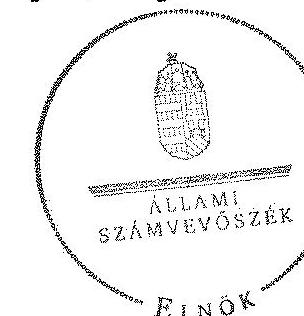
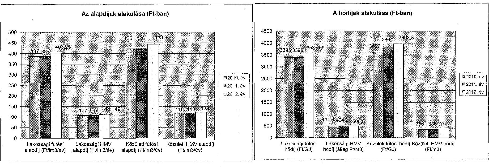
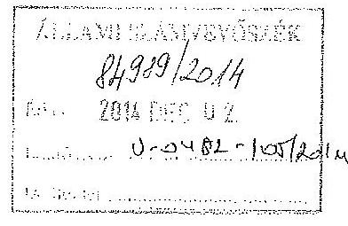
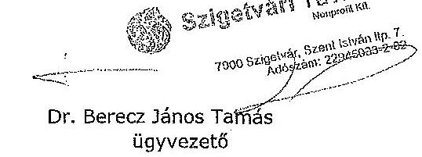
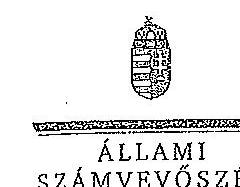
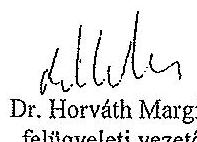

ÁLLAMI
SZÁMVEVŐSZÉK

# JELENTÉS 

Az önkormányzatok gazdasági társaságai - Az önkormányzatok többségi tulajdonában lévő gazdasági társaságok közfeladat ellátását érintő gazdálkodási tevékenysége szabályszerűségének ellenőrzése
Szigetvári Távhő Szolgáltató Nonprofit Korlátolt Felelősségű Társaság

---

# Állami Számvevőszék 

Iktatószám: V-0482-108/2014.
Témaszám: 1516
Vizsgálat-azonosító szám: V067115

## Az ellenőrzést felügyelte:

Dr. Horváth Margit
felügyeleti vezető
Az ellenőrzést vezette és az ellenőrzés végrehajtásáért felelős:
Valastyánné dr. Vízhányó Júlia
ellenőrzésvezető
A jelentéstervezet összeállításában közreműködött:
Csényi István
számvevő tanácsos
Az ellenőrzést végezte:
Várady Zoltán
Pretzl Gábor
okleveles könyvvizsgáló,
okleveles könyvvizsgáló,
külső szakértő
Jelentéseink az Országgyűlés számítógépes hálózatán és az Interneten a www.asz.hu címen is olvashatóak.

---

# TARTALOMJEGYZÉK 

BEVEZETÉS ..... 7
I. ÖSSZEGZŐ MEGÁLLAPÍTÁSOK, KÖVETKEZTETÉSEK, JAVASLATOK ..... 10
II. RÉSZLETES MEGÁLLAPÍTÁSOK ..... 17

1. Az Önkormányzat közfeladat-ellátásának szabályszerűsége ..... 17
1.1. A közfeladat-ellátás megszervezése és a feladatellátás feltételrendszerének kialakítása ..... 17
1.2. A közfeladat-ellátás felügyelete és a tulajdonosi jogok érvényesítése ..... 20
2. A Távhő Kft. közfeladat ellátással kapcsolatos tevékenysége ..... 24
2.1. A Távhő Kft. gazdálkodásának szabályozottsága ..... 24
2.2. A Távhő Kft. vagyongazdálkodása ..... 25
2.3. A beszámolási kötelezettség teljesítése ..... 29
3. A távhőszolgáltatás közfeladata bevételei és ráfordításai elszámolásának és önköltségszámításának szabályszerűsége ..... 30
3.1. A távhőszolgáltatás közfeladat bevételeinek és ráfordításainak szabályszerűsége ..... 30
3.2. Az önköltségszámítás szabályszerűsége ..... 32
MELLÉKLETEK
4. számú A Távhő Kft. tevékenységének főbb adatai
5. számú A Távhő Kft. működésének főbb jellemzői
6. számú A Távhő Kft. által biztosított közszolgáltatás díjai
7. számú Beérkezett észrevételek és az azokra adott válaszok
FÜGGELÉK
8. számú Értelmező szótár
9. számú Mintavételi eljárások ellenőrzési területenként

---

.

---

# RÖVIDÍTÉSEK JEGYZÉKE 

## Törvények

Áht. 1

Áht. 2

Ámt.
ÁSZ tv.
Gt.
Mötv.

Nvtv.

Ötv.

Számv. tv.
Tszt.

## Rendeletek

157/2005. (VIII. 15.)
Korm. rendelet
36/2009. (VII.22.) KHEM rendelet

50/2011. (IX.30.) NFM rendelet
az államháztartásról szóló 1992. évi XXXVIII. törvény (hatálytalan: 2012. január 1-jétől)
az államháztartásról szóló 2011. évi CXCV. törvény (hatályos: 2011. december 31-étől)
az árak megállapításáról szóló 1990. évi LXXXVII. törvény (hatályos: 1991. január 1-jétől)
az Állami Számvevőszékről szóló 2011. évi LXVI. törvény (hatályos: 2011. július 1-jétől)
a gazdasági társaságokról szóló 2006. évi IV. törvény (hatálytalan: 2014. március 15-étől)
Magyarország helyi önkormányzatairól szóló 2011. évi CLXXXIX. törvény (hatályos: 2012. január 1-jétől, kivéve a 144. § (2) bekezdésben meghatározott paragrafusok, amelyek 2012. április 15-én, a (3) bekezdésben meghatározott paragrafusok, amelyek 2013. január 1-jén léptek hatályba, a (4) bekezdésben meghatározott paragrafusok a 2014. évi általános önkormányzati választások napján lépnek hatályba)
a nemzeti vagyonról szóló 2011. évi CXCVI. törvény (hatályos: 2011. december 31-étől, kivéve a 20. § (2) bekezdésben meghatározott paragrafusok, amelyek 2012. január 1-jétől, a (3) bekezdésben meghatározott paragrafusok 2013. január 1-jétől, a (4) bekezdésben meghatározott paragrafus 2012. március 2-ától léptek hatályba)
a helyi önkormányzatokról szóló 1990. évi LXV. törvény (hatálytalan: a 2014. évi általános önkormányzati választások napjától)
a számvitelről szóló 2000. évi C. törvény (hatályos: 2001. január 1-jétől)
a távhőszolgáltatásról szóló 2005. évi XVIII. törvény (hatályos: 2005. július 1-jétől)
a távhőszolgáltatásról szóló 2005. évi XVIII. törvény végrehajtásáról (hatályos: 2005. szeptember 25-étől)
a távhőszolgáltatás csatlakozási díjának és a lakossági távhőszolgáltatás díjának, valamint a hőenergia távhőtermelő és a távhőszolgáltató közötti szerződésében alkalmazott árának meghatározása során figyelembe veendő szempontokról és a Magyar Energia Hivatal által lefolytatott eljárásban kötelezően benyújtandó adatok köréről (hatályos: 2009. július 25-étől)
a távhőszolgáltatónak értékesített távhő árának, valamint a lakossági felhasználónak és a külön kezelt intézménynek nyújtott távhőszolgáltatás díjának megállapításáról (hatályos 2011. október 1-jétől)

---

Áhsz.

SZMSZ $_{1}$

SZMSZ $_{2}$
távhőszolgáltatási rendelet $_{1}$
távhőszolgáltatási rendelet $_{2}$
vagyongazdálkodási rendelet $_{1}$
vagyongazdálkodási rendelet $_{2}$

## Szórövidítések

áfa
ÁSZ
EFC Kft.
FB
jegyző
Képviselő-testület
leltározási szabályzat
Magyar Energia Hivatal
Medical Zrt.
Önkormányzat
önköltség számítási szabályzat
polgármester
számlarend
számviteli politika
SZEESZ Kft.
Taggyűlés
az államháztartás szervezetei beszámolási és könyvvezetési kötelezettségének sajátosságairól szóló 249/2000. (XII.24.) Korm. rendelet (hatálytalan 2014. január 1-jétől)

Szigetvár Város Önkormányzata Képviselő-testületének 6/2003. (IV. 30.) számú rendelete az Önkormányzat Szervezeti és Működési Szabályzatáról (hatályos: 2012. február 1-jéig)
Szigetvár Város Önkormányzata Képviselő-testületének 1/2011. (I. 21.) számú rendelete az Önkormányzat Szervezeti és Működési Szabályzatáról (hatályos: 2011. február 1-jétől)
Szigetvár Város Önkormányzata Képviselő-testületének 20/2006. (IX. 5.) számú rendelete a távhőszolgáltatásról (hatályos: 2012. március 23-áig)
Szigetvár Város Önkormányzata Képviselő-testületének 22/2012. (III. 23.) számú rendelete a távhőszolgáltatásról (hatályos: 2012. március 23-ától)
Szigetvár Város Önkormányzatának 10/2005. (IV. 27.) számú rendelete az Önkormányzat vagyonáról, a vagyongazdálkodás szabályairól (hatályos: 1999. március 1-től 2011. március 25-éig)
Szigetvár Város Önkormányzata Képviselő-testületének 11/2011. (III. 25.) számú rendelete az Önkormányzat vagyonáról, a vagyongazdálkodás szabályairól (hatályos: 2011. március 25-étől)
általános forgalmi adó
Állami Számvevőszék
EFC Szigetvár Korlátolt Felelősségű Társaság
a Távhő Kft. Felügyelő Bizottsága
Szigetvár Város Önkormányzatának jegyzője
Szigetvár Város Önkormányzatának Képviselő-testülete
a Távhő Kft. leltározási szabályzata (hatályos 2011. június 1-jétől)
Magyar Energetikai és Közmű-szabályozási Hivatal
Medical Investments Egészségügyi Befektetési Zártkörűen Működő Részvénytársaság
Szigetvár Város Önkormányzata
a Távhő Kft. önköltség számítási szabályzata (hatályos 2011. június 1-jétől)

Szigetvár Város Önkormányzatának Polgármestere
a Távhő Kft. számlarendje (hatályos 2011. június 1-jétől)
a Távhő Kft. számviteli politikája (hatályos 2011. június 1-jétől)
Szigetvári Egészségügyi Ellátó és Szolgáltató Korlátolt Felelősségű Társaság
a Távhő Kft. Taggyűlése

---

Távhő Kft.
üzemeltetési szerződés

Szigetvári Távhő Szolgáltató Korlátolt Felelősségű Társaság, 2012. október 17. hatállyal Szigetvári Távhő Szolgáltató Nonprofit Korlátolt Felelősségű Társaság
A Szigetvár Város Önkormányzata és a Távhő Kft. által 2010. szeptember 30-án megkötött Üzemeltetési Szerződés

---

.

---

# JELENTÉS 

## Az önkormányzatok gazdasági társaságai Az önkormányzatok többségi tulajdonában lévő gazdasági társaságok közfeladat ellátását érintő gazdálkodási tevékenysége szabályszerűségének ellenőrzése

## Szigetvári Távhő Szolgáltató Nonprofit Korlátolt Felelősségű Társaság

## BEVEZETÉS

Az Állami Számvevőszék középtávra szóló stratégiájában megfogalmazta, hogy a helyi önkormányzatok gazdálkodásában rejlő pénzügyi kockázatok feltárásával, az államháztartáson kívülre nyújtott költségvetési támogatások és ingyenes vagyonjuttatások, valamint az államháztartáson kívül működő köz-feladat-ellátó rendszerek ellenőrzéseivel hozzájárul ahhoz, hogy a közpénzeket az államháztartáson kívül működő szervezetek is átlátható, rendezett módon használják fel a közfeladatok szerződésben vállalt ellátása érdekében.

Az önkormányzatok szervezetalakítási szabadságának következménye, hogy a korábban is vállalati formában működő (nagyvárosi tömegközlekedés, víz-, szennyvízcsatorna, köztisztasági, ingatlankezelés stb.) közszolgáltatások mellett, mind a kötelező, mind az önként vállalt feladatok ellátásában a gazdasági társaságok kiemelt fontosságú szerephez jutottak.

Szigetvár Város távhő szolgáltatási feladatait az egyszemélyes magántulajdonban lévő gazdasági társaság, az EFC Kft. végezte, amely már az ellenőrzött időszak előtt (az 1996. évtől) rendelkezett a Képviselő-testület által jóváhagyott szerződéssel a lakossági és közületi szervek távfűtési szolgáltatásának ellátására. Az EFC Kft. - veszteséges gazdálkodása és nagy összegű szállítói tartozásai miatti - felszámolását követően, az Önkormányzat 2010. július 22-én vagyonkezelési szerződést kötött a kizárólagos tulajdonában lévő SZEESZ Kft.-vel amely a Szigetvári Kórházat is üzemeltette - a távhőszolgáltatásra vonatkozó tulajdonosi jogok gyakorlására.

A Szigetvári Kórház privatizációját követően a 2010. évben a SZEESZ Kft.-ből történő kiválással az Önkormányzat és a Medical Zrt. megalapította a Távhő Kft.-t. A társasági szerződés alapján a Távhő Kft. főtevékenysége gőzellátás, légkondicionálás volt. A társaság az alaptevékenységén kívül egyéb tevékenységet nem végzett az ellenőrzött időszakban. A társaságot - amelyben az Önkormányzat 53,3%-os tulajdoni hányaddal rendelkezett - a Cégbíróság

---

3,0 millió Ft jegyzett tőkével 2010. szeptember 21-én, Cg.02-09-076277 cégjegyzékszámon nyilvántartásba vette, tevékenységét 2010. szeptember 30-ai hatállyal kezdte meg. Az Önkormányzat és a Távhő Kft. 2010. szeptember 30-án üzemeltetési szerződést kötött Szigetvár Város közigazgatási területén belül a távhőszolgáltatási feladatok elvégzésére a lakossági fogyasztók és közületek távhővel való ellátására. A Távhő Kft. a 10772 fő lakosságszámú Szigetvár Város közigazgatási területén a 2012. évben három telephellyel rendelkezett, 872 lakás és 25 közületi fogyasztó részére biztosította a távhőellátást. Az összes fűtött térfogat $137904,3 \mathrm{~m}^{3}$, az éves hőfelhasználás 55000 GJ, a használati melegvíz szolgáltatás éves mennyisége $42000 \mathrm{~m}^{3}$ volt.

Az ellenőrzött időszakban a Távhő Kft. éves nettó árbevétele 82,1 M Ft és 252,4 M Ft között, az eszközeinek és forrásainak értéke 166,2 M Ft és 218,3 M Ft között alakult. A mérleg szerinti eredmény 2010-ben 5,1 M Ft, 2011-ben 14,0 M Ft veszteséget, 2012-ben 2,7 M Ft nyereséget mutatott, a saját tőke összege mindhárom évben negatív volt (-2,1 MFt, -16,1 MFt, -13,4 MFt). A közfeladat ellátására a 2012. évben foglalkoztatottak éves átlagos statisztikai létszáma kilenc fő volt.

A Távhő Kft. - az Önkormányzat és a Medical Zrt. által 2011. április 27-én megkötött üzletrész-átruházási szerződés alapján - az Önkormányzat kizárólagos tulajdonába került. A Képviselő-testület a 175/2012. (VIII. 23.) és a 192/2012. (IX. 27.) számú határozatai alapján végrehajtott Alapító Okirat módosításokkal és azok cégbírósági nyilvántartásba vételével a Távhő Kft. 2012. október 17. hatállyal Szigetvári Távhő Nonprofit Kft. elnevezéssel, közhasznú szervezetként működik.

Az ellenőrzött időszakban a polgármester és a jegyző személye több alkalommal változott. A polgármester a 2010. évi önkormányzati választások óta tölti be tisztségét, a helyszíni ellenőrzés időszakában a munkakört betöltő jegyző 2010. november 5-étől látja el feladatait. A Távhő Kft. ügyvezetőjének személye egy alkalommal változott, a jelenlegi ügyvezető 2011. április 27-től tölti be tisztségét. A gazdasági vezető munkaviszonya 2012. szeptember 30-ával megszűnt, tevékenységét a pénzügyi és számviteli feladatokat ellátó külső megbízott látja el.

Az önkormányzati tulajdonú gazdasági társaságok teljes körű ellenőrzésének lehetőségét az Állami Számvevőszékről szóló 1989. évi XXXVIII. törvény 2011. január 1-jétől hatályos módosítása teremtette meg.

Az ellenőrzés célja annak értékelése volt, hogy

- az önkormányzat a jogszabályi előírások figyelembevételével döntött-e az ellenőrzésre kerülő közfeladat megszervezéséről; az önkormányzat szabályszerűen gyakorolta-e a tulajdonosi jogokat;
- a gazdasági társaság közfeladat-ellátása bevételeinek, ráfordításainak elszámolása, és vagyongazdálkodási tevékenysége megfelelt-e a jogszabályi, illetve a vagyonkezelési és üzemeltetési szerződésben foglalt tulajdonosi előírásoknak, azok végrehajtása szabályszerű volt-e;

---

- a közfeladatok átláthatósága és elszámoltathatósága érdekében biztosítva volt-e a közszolgáltatás díjának megalapozottsága szabályszerű önköltségszámítással.

# Az ellenőrzés kiterjedt Szigetvár Város Önkormányzatára és a Szigetvári Távhő Szolgáltató Nonprofit Korlátolt Felelősségű Társaságra. 

Az ellenőrzés várható hasznosulása: A törvényalkotás számára - az észlelt problémák, szabálytalanságok, vagy egyéb nem kívánatos jelenségek felszínre kerülésével - az ellenőrzés megállapításai segítséget nyújthatnak az államháztartáson kívüli közfeladat-ellátás értékeléséhez, jogszabályi keretei pontosításához, átláthatóságot biztosító szabályozásához. Meghatározhatóvá válnak a közfeladat ellátásában részt vevő államháztartáson kívüli szervezeteknek - az önkormányzat költségvetését, pénzügyi helyzetét is befolyásoló - kockázatai, lehetővé válik ezen kockázatok csökkentése. Értékelhetővé válik, hogy a feladatot ellátó gazdasági társaság a vagyonkezelési és üzemeltetési szerződésben foglaltak betartásával, a közvagyon használatával biztosította-e a szolgáltatás folytatásának feltételeit. Ezzel az ellenőrzöttek és a helyi döntéshozók számára az ÁSZ visszajelzést ad feladatszervezési, feladat-ellátási kockázataikról, alapot ad a meglévő hibák megszüntetéséhez, a jobb közfeladat-ellátás biztosításához. Fokozza a fegyelmet, igazolja, hogy lejárt a következmények nélküli ellenőrzések időszaka. Az ÁSZ értékteremtő rend kialakításához és megőrzéséhez hozzájáruló tevékenysége pozitív hatással van a szervezetről kialakított összkép formálására is.

A bevételek és ráfordítások elszámolása, valamint a vagyonnyilvántartás terén az egyes területek szabályszerű működését mintavétellel ellenőriztük, ez alapján a sokaságokban előforduló hibás tételek arányát becsültük. A jogszabályoknak és a belső előírásoknak megfelelőnek, azaz szabályszerűnek tekintettük az adott bevételek és ráfordítások elszámolását, a vagyonnyilvántartást, amennyiben a minta ellenőrzésének eredménye alapján 95%-os bizonyossággal a teljes sokaságban a hibás tételek aránya kisebb volt, mint 10%, nem megfelelőnek értékeltük, ha a hibás tételek aránya a 10%-ot meghaladta. Kockázatot, illetve magas kockázatot jeleztünk, amennyiben egy adott terület vonatkozásában a minta alapján a teljes sokaságban nem volt teljes körűen biztosított a jogszabályoknak és a belső szabályzatoknak megfelelő működés.

Az ellenőrzést a számvevőszéki ellenőrzés szakmai szabályai szerint, szabályszerűségi ellenőrzés módszerével, a nemzetközi standardok figyelembevételével végeztük. Az ellenőrzés a 2008-2012. évekre terjedt ki.

Az ellenőrzés végrehajtásának jogszabályi alapját az Állami Számvevőszékről szóló 2011. évi LXVI. törvény 5. § (3)-(5) bekezdései képezték.

Az ÁSZ az Állami Számvevőszékről szóló 2011. évi LXVI. törvény 29. §-a alapján a jelentéstervezetet észrevételezésre megküldte a polgármesternek és a gazdasági társaság ügyvezetőjének. A beérkezett észrevételeket a jelentés véglegesítése során hasznosítottuk. Az észrevételeket és az azokra adott válaszokat a jelentés 4. számú melléklete tartalmazza.

---

# I. ÖSSZEGZŐ MEGÁLLAPÍTÁSOK, KÖVETKEZTETÉSEK, JAVASLATOK 

Szigetvár Város távhőszolgáltatási közfeladatának ellátása 2010. szeptember 30-ától az Önkormányzat 53,3\%-os, majd 2011. április 27-étől 100\%-os tulajdonában lévő Távhő Kft. útján valósult meg. A Távhő Kft. alapítása, a távhőszolgáltatási közfeladat megszervezése a Gt. és az Ötv. előírásaiban foglaltak figyelembevételével történt, a társaság működési engedély birtokában végezte távhőszolgáltatási tevékenységét. Alapító Okirata szerinti fő tevékenysége gőzellátás, légkondicionálás volt.

Az Önkormányzat az Ötv. előírása ellenére a 2006-2010. évekre nem rendelkezett gazdasági programmal. A 2010-2014. évekre vonatkozó gazdasági programot a 2011. évben, határidőben elfogadták. A gazdasági programban az Önkormányzat a távhőszolgáltatással kapcsolatban feladatként határozta meg a szolgáltatás minőségének javítását és a távhő szolgáltatási díjak csökkentését, azonban a program a megvalósításra vonatkozóan konkrét elképzeléseket nem tartalmazott.

Az Önkormányzat és a Távhő Kft. által 2010. szeptember 30-án megkötött üzemeltetési szerződésben foglaltak szerint, a közszolgáltatás részletes feltételeit és a társaság kötelezettségeit a Tszt. és annak végrehajtásáról szóló kormányrendelet, továbbá a Képviselő-testület rendeletei határozták meg. Az Önkormányzat a távhőszolgáltatás ellátására szolgáló ingók és ingatlanokra vonatkozóan vagyonkezelői szerződést kötött a társasággal. Az Önkormányzat a vagyonkezelési és az üzemeltetési szerződésben meghatározta a Távhő Kft. adatszolgáltatási és tájékoztatási kötelezettségeit.

Az Önkormányzat a távhőszolgáltatásra vonatkozóan a Tszt. szerinti rendeletalkotási kötelezettségének eleget tett. A Képviselő-testület megalkotta az ellenőrzött időszakban hatályos vagyongazdálkodási és a távhőszolgáltatásról szóló rendeleteit. A távhőszolgáltatási rendelet ${ }_{1,2}$-ben meghatározták a távhőszolgáltató és a felhasználó közötti jogviszony részletes szabályait, a fogyasztóvédelemmel kapcsolatos rendelkezéseket. Meghatározták továbbá a mérés szerinti elszámolás feltételeit, a hőmennyiségmérés helyét, a közüzemi szerződés megszegésének eseteit és következményeit, a távhőszolgáltatás felfüggesztésének, a szolgáltatás szüneteltetésének, korlátozásának, a leválásnak az eseteit és szabályait, valamint a távhőszolgáltatási díj megállapításával és megfizetésével, a távhőszolgáltatás fejlesztésével, valamint a környezetvédelemmel kapcsolatos rendelkezéseket. A távhőszolgáltatási rendelet ${ }_{1,2}$ meghatározta a távhőszolgáltatási rendszerhez történő csatlakozás szabályait, a csatlakozási díj fizetésére kötelezettek körét, és a csatlakozási díj tartalmát is.

Az ellenőrzött időszakban az Önkormányzat a Távhő Kft. feletti tulajdonosi jogokat a Gt.-ben meghatározott előírások szerint a Képviselő-testület szabályszerűen gyakorolta. Az Önkormányzat vagyongazdálkodási rendelet ${ }_{1,2}$-ben határozta meg a tulajdonosi jogok gyakorlásának szabályait. A vagyongazdálkodási rendelet ${ }_{1,2}$-ben előírták, hogy az önkormányzati tulajdonrésszel működő

---

gazdasági társaságban, közhasznú társaságban, a tulajdonost a polgármester vagy akadályoztatása esetén az általa megbízott személy képviselte.

A Távhő Kft. a 2010. évre- a megalakulás évére - nem, a 2011-2012. évekre elkészítette az üzleti terveit. A társaság az üzleti terveiben megfogalmazta az üzleti évek célkitűzését, bemutatta a műszaki eszközök aktuális állapotát és a jövőbeni fejlesztéseket, a gazdálkodás várható bevételeit és költségeit, valamint a kintlévőségek alakulását, kezelését és intézkedéseit a hátralékok beszedésére vonatkozóan. Az üzleti tervek tartalmazták a cash flow tervet, az eredménykimutatás tervet és a mérlegtervet, a tervekben bemutatták a kockázati tényezőket és azok lehetséges hatásait. A Képviselő-testület a társaság 2011. és 2012. évi üzleti terveit - előterjesztés hiányában - nem tárgyalta, elfogadásukról határozatot nem hozott.

A távhőszolgáltatás legmagasabb hatósági díjáról és a díjalkalmazás feltételeiről az Önkormányzat a távhőszolgáltatási rendelet ${ }_{1,2}$-ben döntött. Az Önkormányzat a távhőszolgáltatási rendelet ${ }_{1,2}$-ben és az üzemeltetési szerződésben rögzítette a távhőszolgáltatásra vonatkozó árképzési szabályokat. A számításokkal alátámasztott javaslat elfogadása, az alkalmazható díjtételek megállapítása a jogszabályi előírásoknak megfelelően, rendelettel történt.

Az Önkormányzat belső ellenőrzése a távhőszolgáltatás, mint közfeladat ellátás szabályszerű teljesítéséhez nem járult hozzá. Az ellenőrzött időszakban a Távhő Kft.-nél belső ellenőrzést, illetve külső szakértő által történő ellenőrzést nem végeztek. Nem történt meg a távhőszolgáltatással kapcsolatos, üzemeltetési szerződésben rögzített és az üzletszabályzatban foglalt kötelezettségek teljesítésének ellenőrzése.

A Távhő Kft. az ellenőrzött időszakban gazdálkodása során jelentős veszteséget halmozott fel, amelynek következtében a társaság saját tőkéje a 2011. év végére -16,1 millió Ft lett. A Képviselő-testület a 2012. évben döntött a törzstőke 48,2 millió Ft-tal történő emeléséről. A tőkeemelést a cégbíróság 2013. január 14-én jegyezte be.

Az ellenőrzött időszakban az Önkormányzat 23,7 millió Ft összegű működési célú kamatmentes tagi kölcsönt nyújtott a Távhő Kft. számára. A kölcsön visszafizetésének határideje 2012. július 31. volt, amely kötelezettségnek a Távhő Kft. eleget tett.

Az Önkormányzat a Távhő Kft. és egy Takarékszövetkezet által 2012. január 2-án megkötött 15,0 millió Ft összegű kölcsönszerződés biztosítékaként készfizető kezességet vállalt. A hitel felvételének célja a Távhő Kft. gazdálkodása kapcsán keletkezett, kifizetetlen szállítói tartozások rendezése volt. A Távhő Kft. a kölcsönt 2012. decemberben a szerződésnek megfelelően visszafizette, a kezesség beváltására nem került sor.

A Távhő Kft. 2011. június 1-jén hatályba helyezett számviteli politikáját az ellenőrzött időszakban nem módosították. A társaság a számviteli politikához kapcsolódóan 2011. június 1-jén helyezte hatályba a számlarendjét, a leltározási, a selejtezési, az önköltség-számítási és a pénzkezelési szabályzatait, valamint a közérdekű adatok igénylésének és közzétételének rendjéről szóló sza-

---

bályzatot, azonban - a Számv. tv. előírását figyelmen kívül hagyva - az eszközök és források értékelési szabályzatát nem készítették el. A számviteli politikában és az ahhoz kapcsolódó számlarendben - a Számv. tv. és a vagyonkezelési szerződés előírásait figyelmen kívül hagyva - a vagyonkezelésbe vett vagyonelemek kezelésére, nyilvántartására, elszámolására, a vagyon működtetéséből származó bevételek, illetve közvetlen költségek és ráfordítások elkülönített nyilvántartására vonatkozó előírásokat és annak kötelezettségeit nem rögzítették. A 2012. évi könyvvizsgálói jelentés tartalmazta a Tszt.-ben előírt igazolást arról, hogy a társaság által kidolgozott és alkalmazott számviteli szétválasztási szabályok, valamint az egyes tevékenységek közötti tranzakciók árazása biztosítják a vállalkozás tevékenységei közötti keresztfinanszírozás-mentességet. A Távhő Kft. leltározási szabályzatában meghatározta az eszközök és források leltározásának módját, végrehajtását, bizonylatait, kiértékelését, de a szabályzatban nem rögzítették a vagyonkezelésbe vett eszközök vagyonkezelési szerződésben meghatározott éves leltározásának kötelezettségét.

A Távhő Kft. vagyongazdálkodási tevékenysége - beleértve a vagyon kezelését, gyarapítását, hasznosítását - összességében megfelelt a jogszabályi előírásoknak és a tulajdonos Önkormányzat által meghatározott követelményeknek.

A Távhő Kft. távhőszolgáltatási közfeladat ellátását szolgáló vagyonának értéke 2010. szeptember 30-án - a nyitó mérleg szerint - 115,8 millió Ft volt. A Távhő Kft. a nyilvántartásaiban a „szétválási vagyonleltár" szerinti értéken rögzítette az eszközöket. A vagyonkezelési szerződést 2012. október 15-én módosították, mely szerint a vagyonkezelésbe vett eszközök közül a gőztechnológia megszűnésében érintett eszközök, berendezések a vagyonkezelés köréből kikerülnek. A bontási, kiszerelési munkálatok határidejét a Képviselő-testület határozatában „2013. május 2. (tervezett)" időpontban állapította meg, A Távhő Kft. a bontási és kiszerelési munkákat elvégezte, azonban a nyilvántartásaiban nem változtatta meg a vagyonkezelésbe átvett vagyonelemeket, azokat továbbra is a nyitó értékben tartotta nyilván és - a Számv. tv. előírásait figyelmen kívül hagyva - az alapján számolta el az értékcsökkenést. A társaság a főkönyvi könyvelésben a vagyonkezelésbe kapott eszközöket a saját eszközöktől nem különítette el.

A Távhő Kft. az ellenőrzött időszakban jelentős követelés állománnyal rendelkezett, amelyből a vevőkkel szembeni követelés összege a 2010. évben 21,0 millió Ft, a 2011. évben 48,7 millió Ft, a 2012. évben 30,1 millió Ft volt. A 2012. évben - az Önkormányzattal együttműködve - intézkedési tervet dolgoztak ki a követelések behajtására vonatkozóan. Az együttműködés keretében az Önkormányzat átvállalta a hátrányos helyzetű családok tartozásának 75\%-át, azzal a feltétellel, hogy a társaság és az adós által megkötött részletfizetési megállapodásban rögzített törlesztő részleteket a családok pontosan fizetik. Ez az eljárás a hátralékok kezelésében hatékonynak bizonyult, a vevőkkel szembeni követelések összege a 2012. év végére az előző évihez viszonyítva 39,2\%-kal (18,6 millió Ft-tal) csökkent. A Távhő Kft. kintlévőségei behajtása során a peres és peren kívüli jogi képviselet ellátására ügyvédi irodával kötött megbízási szerződést. Az egyszerűsített éves beszámolók kiegészítő mellékleteiben bemutatták a vevőkkel szembeni követeléseket lejárat szerint.

---

A Távhő Kft. az ellenőrzött időszakban a számviteli politikájában, a Számv. tv.-ben, valamint a vagyonkezelési szerződésben rögzítetteknek megfelelően minden évben elkészítette az éves beszámolóját. A 2010-2012. évek éves beszámolóiról az FB elkészítette az írásos jelentéseit. A Képviselő-testület az FB jelentésének és a könyvvizsgáló írásbeli véleményének, jelentésének ismeretében minden évben határozattal döntött az egyszerűsített éves beszámoló jóváhagyásáról. A könyvvizsgáló a 2011. évi jelentésében korlátozás nélküli figyelemfelhívást tett, mert a veszteséges gazdálkodás miatt a 2011. évben a társaság saját tőkéje a jegyzett tőkéjének kevesebb, mint felére csökkent. A beszámolókat a Számv. tv. előírásainak megfelelően letétbe helyezték.

A távhőszolgáltatás közfeladat bevételeinek és ráfordításainak elszámolása az ellenőrzött időszakban megfelelt a jogszabályi, illetve a vagyonkezelési és üzemeltetési szerződésben foglalt tulajdonosi elvárásoknak, azonban a 2012. évben a közfeladat ellátás kiadásainak a felmerülésük helye szerinti elkülönítése nem történt meg.

A Távhő Kft. a bevételei elszámolása során szabályszerűen járt el. A bevételek előírása és kiszámlázása a belső szabályozásnak megfelelően történt, a bevételeket a megfelelő számlacsoportban számolták el. Az alkalmazott szolgáltatási díjak megfeleltek a belső szabályozásnak és a tulajdonosi követelményeknek.

Az anyagjellegű ráfordításainak elszámolása során a Távhő Kft. szabályszerűen járt el. A költségelszámolást megalapozó kötelezettségvállalás, a költségek elszámolása a jogszabályi előírásoknak és a belső szabályozásnak megfelelően történt. A költségelszámolást megalapozó dokumentumok rendelkezésre álltak. A költségeket a megfelelő költségnemre számolták el.

A Távhő Kft. beruházásainak, felújításainak elszámolása során a Számv. tv. előírásainak megfelelően járt el. Az immateriális-, és tárgyi eszközök állománynövekedésének, valamint értékcsökkenésének elszámolása megfelelt a vonatkozó szabályozásnak. A beszerzett eszközök állományba vétele, üzembe helyezése megtörtént. A bekerülési érték meghatározása, az eszközök besorolása és nyilvántartása szabályos volt. A Távhő Kft. az Áht. ${ }_{1}$-ben, az Mötv.-ben és az üzemeltetési szerződésben előírtak ellenére az ellenőrzött időszakban a vagyonkezelésbe vett eszközök felújításáról, pótlólagos beruházásáról az elszámolt értékcsökkenésnek megfelelő mértékben nem gondoskodott, illetve tartalékot nem képzett.

A Távhő Kft. - annak ellenére, hogy számára az Önkormányzat nem határozott meg önköltség számítására vonatkozó előírást és a Számv. tv. előírásai alapján arra nem volt kötelezett - elkészítette, és 2011. június 1-jén hatályba léptette az önköltség számítási szabályzatát. A távhőszolgáltatási alapdíjak megállapításhoz az önköltség számítási szabályzat mellékleteként kalkulációs sémát készítettek.

A Távhő Kft. által a 2010-2012. években alkalmazott távhőszolgáltatási díjak alapjául szolgáló önköltség számításához szükséges adatokat a kialakított számviteli nyilvántartás közvetlenül nem biztosította. A Távhő Kft. a 2010-2011. években az Önkormányzattal kötött üzemeltetési szerződés alapján számított, és a Képviselő-testület által jóváhagyott díjakat alkalmazta.

---

A fentiekben leírtak összegzéseként az alábbi megállapításokat tesszük:
A konstrukcióból eredő sajátosság az volt, hogy az Önkormányzat a tulajdonában lévő távhő közmű vagyont 10 éves időtartamra vagyonkezelési szerződéssel adta át a Távhő Kft. részére, az ellátandó feladatok körét, a feladatellátás követelményeit pedig 25 évre szóló üzemeltetési szerződésben rögzítették. A tulajdonosi monitoring rendszer nem működött megfelelően, a megállapítások alapján feltárt kockázatok mind az Önkormányzatnál, mind a gazdasági társaságnál ezt támasztják alá.

A működés kockázatos volt. Az Önkormányzat belső ellenőrzése a távhőszolgáltatás, mint közfeladat ellátás szabályszerű teljesítéséhez, az önkormányzati vagyon megóvásához érdemben nem járult hozzá. Az ellenőrzött időszakban a Távhő Kft. számviteli rendszerének szabályozottsága hiányosságokat mutatott. A Képviselő-testület a társaság 2011. és 2012. évi üzleti terveit nem tárgyalta, elfogadásukról határozatot nem hozott, továbbá nem fordított kellő figyelmet az FB, illetve a könyvvizsgáló működésére tartalmi - a közvagyon védelme, a veszteséges gazdálkodás kivédése - szempontból. A főkönyvi könyvelésben a vagyonkezelésbe vett eszközök elkülönítése nem történt meg, a gazdasági társaság a Mötv.-ben és az üzemeltetési szerződésben előírtak ellenére az ellenőrzött időszakban a vagyonkezelésbe vett eszközök felújításáról, pótlólagos beruházásáról az elszámolt értékcsökkenésnek megfelelő mértékben nem gondoskodott.

A Távhő Kft. gazdálkodásában pénzügyi kockázatot jelentett, hogy a telephelyenkénti távhőszolgáltatásra és hőtermelésre vonatkozó önköltség számításához szükséges adatokat a kialakított számviteli nyilvántartás közvetlenül nem biztosította.

Az Állami Számvevőszékről szóló 2011. évi LXVI. törvény 33. § (1) bekezdésében foglaltak értelmében a jelentésben foglalt megállapításokhoz kapcsolódó intézkedési tervet köteles az ellenőrzött szervezet vezetője összeállítani, és azt a jelentés kézhezvételétől számított 30 napon belül az ÁSZ részére megküldeni. Amennyiben az intézkedési tervet határidőben nem küldi meg a szervezet, vagy az nem elfogadható, az ÁSZ elnöke a hivatkozott törvény 33. § (3) bekezdésében foglaltakat érvényesítheti.

Az ellenőrzés intézkedést igénylő megállapításai és javaslatai:
Javaslataink célja a Kft. gazdálkodása szabályszerűségének helyreállítása annak érdekében, hogy a szabályozási környezet megfelelően tudja támogatni az átlátható működést.

# Javasoljuk a Szigetvári Távhő Szolgáltató Nonprofit Kft. ügyvezető igazgatójának: 

1. A Szigetvári Távhő NKft. a Számv. tv. 14. § előírása ellenére 2011. június 1-jéig nem rendelkezett számviteli politikával. A társaság 2011. június 1-jétől hatályos számviteli politikáját a Számv. tv. 14. § (11) bekezdésében előírtak ellenére a 2012. január 1-jétől hatályos változásokat figyelmen kívül hagyva nem aktualizálták. A Számv. tv. 14. § (5) bekezdés b) pontjának előírását megsértve az eszközök és forrá-

---

sok értékelési szabályzatát nem készítették el. A számviteli politikájában a Számv. tv. 55. § (1) bekezdésében előírtak ellenére nem rögzítette a pénzügyileg nem rendezett követeléseknél az értékvesztés elszámolásának kötelezettsége teljesítéséhez a vevők, az adósok minősítésének elveit.

A társaság számviteli politikájában, illetve számlarendjében nem rögzítették a Számv. tv. 161/A. § (2) bekezdése, illetve a vagyonkezelési szerződés előírásait figyelmen kívül hagyva a vagyonkezelésbe vett vagyonelemek nyilvántartására, az állomány változás elszámolására, a vagyon működtetéséből származó bevételek, illetve közvetlen költségek és ráfordítások elkülönített nyilvántartására, továbbá a Tszt. 18/A. §-ában a 2012. január 1-jétől előírt számviteli szétválasztási szabályokra vonatkozó előírásokat.

A Távhő Kft. leltározási szabályzatában nem rögzítették a vagyonkezelésbe vett eszközök vagyonkezelési szerződés 6.4. c) pontjában meghatározott évenkénti leltározási kötelezettségét.

Javaslat:

# Gondoskodjon a szabályozási hiányosságok megszüntetésére, ezen belül: 

a) készítse el az eszközök és források értékelési szabályzatát;
b) aktualizálja számviteli politikáját, egészítse ki a lejárt követelésállomány értékelésének elveivel;
c) valamint számviteli szabályozásán belül határozzon meg a vagyonkezelésbe vett vagyonelemek nyilvántartására, az állományváltozás elszámolására, a vagyon működtetéséből származó bevételek, illetve közvetlen költségek és ráfordítások elszámolására alkalmas követelményeket és alakítson ki elkülönített nyilvántartást;
d) rögzítse a leltározási szabályzatában a vagyonkezelésbe vett eszközök vagyonkezelési szerződésben meghatározott éves leltározásának kötelezettségét.
2. A gőztechnológia megszűnése miatt a Távhő Kft. és Szigetvár Város Önkormányzata a vagyonkezelési szerződést módosította. A társaság a gőztechnológia megszűnése miatti bontási és kiszerelési munkákat elvégezte, a nyilvántartásaiban azonban a vagyonkezelésbe átvett gőztechnológiai vagyonelemeket változatlanul, továbbra is nyitó értéken tartotta nyilván és elszámolta a terv szerinti értékcsökkenést a Számv. tv. 52. § (7) bekezdésében előírtak ellenére.

A társaság a könyvelésében a vagyonkezelésbe vett eszközöket a Számv. tv. 23. § (2), illetve a 161/A. § (1) bekezdéseiben, az Áht ${ }^{1}$ 105/A. § (12) bekezdésében, 2012. január 1-jétől a Mötv. 109. § (7) bekezdésében, továbbá a vagyonkezelési szerződés 6.4. e) pontjában előírtak ellenére nem különítette el, a vagyonkezelésbe vett eszközöket a saját eszközökkel együtt tartotta nyilván.

A Távhő Kft. az ellenőrzött időszakban az Áht ${ }^{1}$ 105/A. § (6) bekezdése, a Mötv. 109. § (6) bekezdése és a vagyonkezelési szerződés 6.4. d) pontjának előírásai ellenére nem gondoskodott a vagyonkezelésében lévő eszközök elszámolt értékcsökke-

---

nésének megfelelő mértékű felújításáról, pótlólagos beruházásáról, illetőleg nem képzett megfelelő mértékű tartalékot.

Javaslat:
Intézkedjen a jogszabályi előírások szerinti gyakorlat és szabályos működés biztosítására, ezen belül:
a) módosítsa a gőztechnológiai vagyonelemek változásának megfelelően a tárgyi eszközök nyilvántartását;
b) gondoskodjon a számviteli elszámolásai során a vagyonkezelésbe kapott eszközök használatából, működtetéséből származó bevételeinek, illetve közvetlen költségeinek és ráfordításainak elkülönített nyilvántartásáról oly módon, hogy azok a saját vagyonnal folytatott vállalkozási tevékenységéből származó bevételeitől, költségeitől és ráfordításaitól egyértelműen elhatárolhatóak legyenek;
c) gondoskodjon a vagyonkezelésében lévő eszközök esetében az azokra elszámolt értékcsökkenésnek megfelelő mértékű felújításról, pótlásról.

Javaslataink célja az önkormányzat szabályszerű működésének elősegítése, továbbá az önkormányzati tulajdonosi joggyakorlás kontrolljainak erősítése.

# Javasoljuk Szigetvár Város Önkormányzata Jegyzőjének: 

1. Az Önkormányzat belső ellenőrzése az ellenőrzéseivel a távhőszolgáltatás, mint köz-feladat-ellátás szabályszerű teljesítéséhez, valamint az önkormányzati vagyon megóvásához ellenőrzéseivel nem járult hozzá. Az ellenőrzött időszakban a társaság gazdálkodásával és működésével kapcsolatban ellenőrzést nem folytatott le.

Javaslat:
Intézkedjen a jogszabályi előírások szerinti gyakorlat és a szabályos működés biztosítására, ezen belül:
fordítson kiemelt figyelmet arra, hogy az önkormányzat belső ellenőrzése az ellenőrzéseivel a távhőszolgáltatás, mint közfeladat-ellátás szabályszerű teljesítéséhez, valamint az önkormányzati vagyon megóvásához ellenőrzéseivel járuljon hozzá.

---

# II. RÉSZLETES MEGÁLLAPÍTÁSOK 

## 1. AZ ÖNKORMÁNYZAT KÖZFELADAT-ELLÁTÁSÁNAK SZABÁLYSZERŰSÉGE

### 1.1. A közfeladat-ellátás megszervezése és a feladatellátás feltételrendszerének kialakítása

Az Ötv. 91. § (6) bekezdése szerint az Önkormányzatnak a gazdasági programjában kell meghatároznia azon célkitűzéseket, amelyek az ellátandó feladatok biztosítását, fejlesztését szolgálják. Az Ötv. 91. § (7) bekezdésében ${ }^{1}$ foglaltak ellenére az Önkormányzat a 2006-2010. évekre nem rendelkezett gazdasági programmal. A 2010. évi önkormányzati választásokat követően a Képviselőtestület határidőben ${ }^{2}$ elfogadta az Önkormányzat 2010-2014. évekre vonatkozó - „A szigetváriak programja” elnevezésű - gazdasági programját. A gazdasági programban az Önkormányzat feladatként határozta meg a távhőszolgáltatás minőségének javítását és a szolgáltatási díjak csökkentését, azonban a program a megvalósításra vonatkozóan konkrét elképzeléseket nem tartalmazott.

Az Önkormányzat 2008. évben kiadott Integrált Városfejlesztési Stratégiája a távhőszolgáltatással kapcsolatban fejlesztési célokat nem fogalmazott meg. Az Önkormányzat a távhőszolgáltatás feladatainak ellátására vonatkozóan más konkrét tervekkel nem rendelkezett az ellenőrzött időszakban.

Az Ötv. 8. § (3) bekezdése rendelkezik arról, hogy törvény a települési önkormányzatokat egyes közszolgáltatási feladatok ellátásáról történő gondoskodásra kötelezheti. A távhőszolgáltatással ellátott létesítmények távhőellátásának engedélyes vagy engedélyesek útján történő biztosítása a Tszt. 6. § (1) bekezdése értelmében - a területileg illetékes települési önkormányzat kötelező feladata.

A Képviselő-testület az SZMSZ-ben rögzítette, hogy az Önkormányzat köteles gondoskodni a jogszabályok által kötelezően ellátandó feladatokról és az Ötv. 8. § (1) bekezdésében előírtakkal összhangban közreműködik a helyi energiaszolgáltatásban. Az Ötv. 9. § (4) bekezdésének rendelkezése értelmében a Képviselő-testület a feladatkörébe tartozó közszolgáltatások ellátása céljából többek között gazdasági társaságot alapíthat. Ezen jogszabályi rendelkezéssel összhangban az Önkormányzat SZMSZ 8. § (6) bekezdésében rögzítették, hogy a Képviselő-testület a feladatkörébe tartozó közszolgáltatás működtetése céljából gazdasági társaságot alapíthat. A 2011. február 1-jén hatályba lépett SZMSZ az Önkormányzat kötelezően ellátandó feladatait, illetve

[^0]
[^0]:    ${ }^{1}$ 2013. január 1-jétől az Mötv. 116. § (5) bekezdése írja elő.
    ${ }^{2}$ a 36/2011. (III. 24.) számú határozatával

---

a gazdasági társaságai útján ellátott közfeladatokat nem rögzítette, azonban az SZMSZ 49. § (3) bekezdése a helyi energiaszolgáltatást a Képviselő-testület hatáskörébe tartozó ügyek között említette. A vagyongazdálkodási rendelet 1,2 a részesedés vásárlás, gazdasági társaság alapítás folyamatának eljárásrendjét nem határozta meg. A távhőszolgáltatási rendelet 1,2 1. §-ában rögzítették, hogy az Önkormányzat távhőszolgáltató engedményes útján történő üzemeltetéssel biztosítja a távhőszolgáltatásba bekapcsolt lakóépületek, külön kezelt intézmények és vegyes célra használt épületek távhőellátását.

A Távhő Kft. távhőszolgáltatás működtetésére történő alapítása az Ötv. 9. § (4) bekezdésének és az SZMSZ 18. § (6) bekezdésének előírásaival összhangban a Képviselő-testület jóváhagyásával történt. A távhőszolgáltatási közfeladatot a Gt. és az Ötv. előírásaiban foglaltak figyelembevételével szervezték meg, a társaság működési engedély birtokában végezte távhőszolgáltatási tevékenységét.

A Képviselő-testület - mint a tulajdonosi jogokat gyakorló szerv - a 86/2010. (VII. 22.) számú határozatával döntött a távhőszolgáltatással kapcsolatos ingó és ingatlanra vonatkozó vagyonkezelői jog átadásáról. Az Önkormányzat, mint tulajdonos, 2010. július 22-én vagyonkezelési szerződést kötött az Önkormányzat kizárólagos tulajdonában lévő SZEESZ Kft.-vel - a 2010. szeptember 30. nappal megalakult Távhő Kft. jogelődjével - a távhőszolgáltatás közfeladat nem üzletszerű vállalkozási tevékenységként történő ellátására, a feladatellátás biztosításához a tulajdonukban lévő távhő közmű vagyon, illetve a vagyonkezelői jog átadására. A vagyonkezelői szerződést a SZEESZ Kft. átalakulásával nem módosították, a SZEESZ Kft.-ből kiválással létrejött Távhő Kft., mint jogutód, azt magára nézve érvényesnek tekintette.

A vagyonkezelési szerződést a felek határozott - 10 éves - időtartamra kötötték. Az átadásra kerülő vagyonelemek, konkrét vagyontárgyak jegyzékét a szerződés 1-3. számú mellékletei tartalmazták, a kezelésbe adott vagyon nagyságát 65,2 millió Ft-ban határozták meg. A szerződésben rögzítették, hogy a vagyonkezelő a vagyonkezelési jog átruházásáért, a szerződés teljes időtartamára (10 évre) összesen 25,0 M Ft „vagyonkezelői” díjat fizet, éves részletekben, évente egy alkalommal a tárgyév december 15. napján.

Az Önkormányzat előírta a vagyonkezelésbe adott közvagyon leltározási és kapcsolódó adatszolgáltatási kötelezettsége vagyonkezelő általi teljesítését. A vagyonkezelési szerződés 6.4. pontjában rögzítették, hogy a vagyonkezelő kötelessége a vagyontárgyakban bekövetkezett változások folyamatos nyomon követése, évente egy alkalommal az átadott vagyon leltározása, a változásokról, a leltározás eredményéről az Önkormányzatot éves beszámoló keretei közötti tájékoztatása. A vagyonkezelő a vagyonkezelésbe vett vagyonról olyan elkülönített nyilvántartást köteles vezetni, amely tételesen tartalmazza ezek könyv szerinti bruttó és nettó értékét, az elszámolt értékcsökkenés összegét, az azokban bekövetkezett változásokat. A Képviselő-testület a vagyonkezelésbe adott közművagyon alakulásáról a Távhő Kft. éves számviteli beszámolójának elfogadásakor szerzett tudomást.

---

A Képviselő-testület a 2012. évben
 döntött ${ }^{3}$ a vagyonkezelésbe adott eszközök közül a gőztechnológia megszűnésében érintett eszközök, berendezések bontásáról, kiszereléséről. A munkálatok határidejét „2013. május 2. (tervezett)" időpontban határozták meg. A Képviselő-testület egyidejűleg döntött a vagyonkezelési szerződés 2012. október 15-ei határidővel történő módosításáról. A szerződés módosításában meghatározták, hogy a mellékletben feltüntetett vagyonelemek kikerülnek a vagyonkezelés köréből, azonban a bontás és kiszerelés határidejéről, a selejtezési, értékelés eljárás lefolytatásának rendjéről, az eszközök nyilvántartásból való kivezetésének határidejéről nem rendelkeztek.

A távhőszolgáltatással kapcsolatos követelményeket az ellenőrzött időszakban az Önkormányzat (üzemeltetésbe adó) és a Távhő Kft. (üzemeltető) által 2010. szeptember 30-án megkötött üzemeltetési szerződés tartalmazta. A szerződő felek a jogszabályi előírások figyelembevételével a közfeladat ellátásával kapcsolatos lényeges kérdéseket rögzítették az üzemeltetési szerződésben. Az üzemeltetési szerződésben szabályszerűen határozták meg az ellátandó feladatok körét, a feladatellátás követelményeit, az ellenőrzési és beszámolási kötelezettséget, a szerződés felmondásának és módosításának a szabályait.

Az üzemeltetési szerződés tartalmazta a Távhő Kft. távhőszolgáltatás teljesítésére vonatkozó kötelezettségét. A szerződésben rögzítették az üzemeltetésbe adó és az üzemeltető jogait és kötelezettségeit, az ellenőrzési, felügyeleti, árhatósági kötelezettségeket, az üzemeltetésre, a szolgáltatási díjak megállapítására, változtatására, a díjfizetésre vonatkozó rendelkezéseket. Rögzítették továbbá a távhőszolgáltatási rendszer birtokba vételével, a távhőrendszer karbantartásával, fejlesztésével, az üzemeltetési határok kijelölésével, az együttműködéssel, a szerződés megszűnésével, a környezetvédelmi előírások érvényesítésével, valamint a viták rendezésével kapcsolatos megállapodásokat.

Az üzemeltetési szerződésben foglaltak szerint, a közszolgáltatás részletes feltételeit és a társaság kötelezettségeit a Tszt., és annak végrehajtásáról szóló kormányrendelet, továbbá a Képviselő-testület rendeletei határozták meg.

Az üzemeltetési szerződés határozott időre jött létre. A szerződésben az Önkormányzat a távhőszolgáltatási tevékenység gyakorlásának időleges jogát 25 év időtartamra átadta a Távhő Kft.-nek azzal a kiegészítéssel, hogy a szerződés automatikusan további öt évvel meghosszabbodik, amennyiben a lejárat előtt 90 nappal egyik fél sem kezdeményezi annak megszüntetését.

A távhőszolgáltatás közfeladat ellátását biztosító szerződések a lejáratukat tekintve nem voltak összhangban, míg a vagyonkezelői szerződést 10 évre, az üzemeltetési szerződést 25 éves időtartamra kötötték.

Az Önkormányzat a szerződésekben meghatározott beszámoltatási, adatszolgáltatási kötelezettségen kívül más - tulajdonosi elvárásként megfogalmazott - tájékoztatási kötelezettséget nem írt elő a Távhő Kft.-nek.

[^0]
[^0]:    ${ }^{3}$ a 182/2012. (IX. 27.) számú határozatában

---

Az Önkormányzat a távhőszolgáltatásra vonatkozóan a Tszt. 6. § (2) bekezdése szerinti rendeletalkotási kötelezettségének eleget tett. Az SZMSZ ${ }_{1}$ 52. § (2) bekezdésében rögzítették, hogy az Önkormányzat a tulajdonára és gazdálkodására vonatkozó legfontosabb szabályokat rendeletben állapítja meg. Ennek megfelelően alkotta meg a Képviselő-testület az ellenőrzött időszakban hatályos távhőszolgáltatási rendelet ${ }_{1,2}$-ét ${ }^{4}$. A gazdasági társaságok feletti tulajdonosi jogok gyakorlásának szabályait a vagyongazdálkodási rendelet ${ }_{1,2}$ tartalmazta.

A távhőszolgáltatási rendelet ${ }_{1,2}$-ben meghatározták annak területi és személyi hatályát, a távhőszolgáltató rendszer elemeit (szolgáltatói és felhasználói vagyont), a távhőszolgáltatás tartalmát, a távhőszolgáltató és a felhasználó közötti jogviszony részletes szabályait. Meghatározták a fogyasztóvédelemmel kapcsolatos rendelkezéseket, a mérés szerinti elszámolás feltételeit, a hőmennyiségmérés helyét, a közüzemi szerződés megszegésének eseteit és következményeit, a távhőszolgáltatás felfüggesztésének, a szolgáltatás szüneteltetésének, korlátozásának, a leválásnak az eseteit és szabályait, valamint a távhőszolgáltatási díj megállapításával és megfizetésével, a távhőszolgáltatás fejlesztésével, valamint a környezetvédelemmel kapcsolatos rendelkezéseket. A távhőszolgáltatási rendelet ${ }_{1,2}$ meghatározta a távhőszolgáltatási rendszerhez történő csatlakozás szabályait, a csatlakozási díj fizetésére kötelezettek körét, és a csatlakozási díj tartalmát is.

A távhőszolgáltatás díjait és azok megállapítását a távhőszolgáltatási rendelet ${ }_{1}$ 31. §-a, valamint 1. és 3. számú melléklete, továbbá a távhőszolgáltatási rendelet ${ }_{2}$ 28. §-a, valamint 1. és 2. számú melléklete rögzítette. Az „Árképezési Előírás" szerint a működéshez szükséges és elégséges ráfordítások a felhasználók által fizetett díjakban térülnek meg, ezért az árképzés összefüggő díjrendszert kell, hogy alkosson. Az árban csak az indokolt befektetések és a hatékony működés költségei jelenhetnek meg. Az árképzésnél figyelembe kell venni az időjárás változásaiból eredő kockázatot és a működéshez szükséges nyereséget, az értékesítési veszteség fedezetét, valamint a hitelből megvalósított fejlesztések kamatköltségeit is.

A csatlakozási díj megállapítását a lakás, fogyasztási hely alapterületének függvényében, új létesítmény bekapcsolása és a korábban leválasztott fogyasztó visszakötése esetére állapította meg a távhőszolgáltatási rendelet ${ }_{1,2}$. A díjak a szolgáltató oldaláról felmerülő költségeket (számítások, adminisztrációs költségek, kiszállási díj, pótvíz veszteség, stb.) tartalmazták, nem tartalmazták a visszakötés, csatlakozás műszaki megvalósításának költségeit (radiátorok, vízmérő óra, vezetékek kiépítése, stb.).

# 1.2. A közfeladat-ellátás felügyelete és a tulajdonosi jogok érvényesítése 

Az Önkormányzat a gazdasági társaságok feletti tulajdonosi jogok gyakorlására vonatkozóan a vagyongazdálkodási rendelet ${ }_{1,2}$-ben rögzített előírásokat. Az ellenőrzött időszakban az Önkormányzat a Távhő Kft. feletti tulajdonosi jogokat a Gt.-ben meghatározott előírások szerint a Képviselő-testület szabályszerűen gyakorolta.

[^0]
[^0]:    ${ }^{4}$ A 20/2006. (IX. 05.) számú és a 22/2012. (III. 23.) számú rendeletek.

---

A vagyongazdálkodási rendelet ${ }_{1}$ 13. § (2) bekezdése és a vagyongazdálkodási rendelet ${ }_{2} 11 . \S$ (2) bekezdése rögzítette, hogy a tulajdonosi jogokat a Képviselőtestület, valamint átruházott hatáskörben a bizottságok és a polgármester gyakorolja. A vagyongazdálkodási rendelet ${ }_{1} 13 . \S$ (5) bekezdésében és a vagyongazdálkodási rendelet ${ }_{2} 11 . \S$ (5) bekezdésében előírták, hogy az önkormányzati tulajdonrésszel működő gazdasági társaságban, közhasznú társaságban a tulajdonosi képviseletet a polgármester vagy akadályoztatása esetén az általa megbízott személy látja el.

A társaság 2011. április 27-től, az Önkormányzat kizárólagos tulajdonjogának megszerzése időpontjától egyszemélyes társaságként működik. Az Alapító Okirat szerint az Önkormányzat, mint egyedüli tag hatáskörébe tartoznak mindazon kérdések, amelyeket a Gt. a taggyűlés kizárólagos hatáskörébe utal. A taggyűlés hatáskörébe tartozó kérdésekben a Képviselő-testület határozattal dönt, melyről az ügyvezetőt írásban értesíti.

A 2012. október 17-étől hatályos Alapító Okirat 10.6. pontja alapján a tag kizárólagos hatáskörébe tartozik többek között: az ügyvezető megválasztása, visszahívása, díjazásának megállapítása; a felügyelőbizottság tagjainak megválasztása, visszahívása, díjazásának megállapítása; a társaság beszámolójának, ügyvezetésének, gazdálkodásának könyvvizsgáló által történő megvizsgálásának elrendelése. Az Alapító Okirat 10.8. pontja értelmében a tag évente napirendre tűzi a vezető tisztségviselők előző üzleti évben végzett munkájának értékelését, és határoz a vezető tisztségviselők részére adható felmentvény tárgyában.

Az Alapító Okirat 11. pontja rögzítette az ügyvezető személyét, feladatait és felelőségi körét. A 14. pontban rögzítették, hogy az FB három tagból áll, akik maguk közül elnököt választanak. A tagokat az Önkormányzat, mint tulajdonos delegálja. Az FB tagjainak adatait az Alapító Okirat 14.10. pontjában rögzítették, mely szerint a polgármester is az FB tagja.

Az ügyvezető feladatkörét az Alapító Okirat a 11.6. pontja tartalmazta. Az ügyvezető feladatai között rögzítették többek között, hogy minden üzleti év végén elkészíti a társaság éves mérlegét, nyereség illetve veszteség kimutatását és ezeket a tag elé terjeszti; köteles az évi rendes taggyűlésre (képviselő-testületi ülésre) az elmúlt tárgyévre vonatkozóan ügyvezetői beszámolót írásban előterjeszteni, amely tartalmazza a társaság helyzetének értékelését és a jövőre vonatkozó javaslatokat; kidolgozza a taggyűlés (képviselő-testületi ülés) elé terjesztendő javaslatokat; gondoskodik a társaság könyvének vezetéséről; dönt a társaság tanácsadóinak, menedzsereinek kinevezéséről; ellátja azokat a feladatokat, amelyeket a tag a hatáskörébe utal.

Az Alapító Okiratban az FB feladat- és hatáskörét a Gt. 33-39.§ előírásai szerint határozták meg, kiegészítve azzal, hogy az FB akkor is köteles a tagot értesíteni, amennyiben a közhasznú tevékenység folytatásának feltételeiről kötött szerződés megszegését észleli.

A Képviselő-testület döntött a Távhő Kft. ügyvezetőjének személyéről, az Önkormányzat által delegált FB tagok, valamint a könyvvizsgáló megválasztásáról és javadalmazásuk megállapításáról.

A Távhő Kft. ügyvezetőjének személye egy alkalommal változott, a jelenlegi ügyvezető - aki egyben a Szigetvári Kórházat üzemeltető SzigetváriMed Nonprofit Kft. ügyvezetője is - a Képviselő-testület 105/2011. (IV. 27.) számú határozata

---

alapján 2011. április 27-től tölti be tisztségét. A Képviselő-testület 237/2011. (IX. 29.) számú határozata alapján 2011. szeptember 29. nappal a könyvvizsgáló személye is megváltozott. A gazdasági vezető munkaviszonya 2012. szeptember 30-ával megszűnt, tevékenységét a pénzügyi és számviteli feladatokat ellátó külső megbízott látja el.

Az éves beszámoló elkészítéséről és az FB összehívásáról az ügyvezető gondoskodott. Az FB a társaság éves beszámolóját és a könyvvizsgálói jelentést minden évben megtárgyalta és elkészítette az írásbeli jelentését az Alapító Okirat és a Gt. tv. 35. § (3) bekezdése előírásának megfelelően. A polgármester az éves beszámolót, annak részeként a kiegészítő mellékletet, valamint a könyvvizsgálói jelentést a Képviselő-testület elé terjesztette, melyet a testület határozattal fogadott el ${ }^{5}$ az Alapító Okirat és a vagyongazdálkodási rendelet ${ }_{2}$ 30. § (3) bekezdése előírásának megfelelően.

Az Önkormányzat a tulajdonosi joggyakorlás keretében szabályozott monitoring tevékenységet, belső eljárásrendet nem alakított ki, a tulajdonosi ellenőrzés az FB révén, illetve a Képviselő-testület éves beszámoltatása keretében működött a vagyonkezelési szerződés 6.1. a) pontja és a vagyongazdálkodási rendelet ${ }_{1,2}$ előírásának megfelelően.

A Távhő Kft. megalakulása évében üzleti tervet nem készített, a Képviselőtestület a társaság 2011. és 2012. évi üzleti terveit nem tárgyalta, határozattal nem fogadta el.

A Távhő Kft.-re vonatkozóan anyagi ösztönzési rendszer az Önkormányzat részéről nem került kialakításra, arra az Alapító Okirat és az üzemeltetési szerződés sem tartalmazott előírásokat. Az ügyvezető díjazásáról a Képviselőtestület a 109/2011. (V. 3.) és a 65/2012. (III. 22.) számú határozatával döntött.

Az Önkormányzat a távhőszolgáltatási rendelet ${ }_{1,2}$-ben és az üzemeltetési szerződésben rögzítette a távhőszolgáltatásra vonatkozó árképzési szabályokat. Az üzemeltetési szerződés 6.2. pontja alapján a Távhő Kft. kötelezettséget vállalt az Önkormányzat, mint árhatóság által rögzített árképzési mechanizmus szerint számított díjak alkalmazására. A Képviselő-testület az ármegállapításhoz a Távhő Kft. költségkalkuláció készítési kötelezettségét nem írta elő, a társaság költségkalkulációt nem készített. Az üzemeltetési szerződés alapján a Távhő Kft.-nek előterjesztés formájában jogában állt a lakossági díjak árváltoztatását kezdeményezni, de ezzel a jogával a társaság nem élt. Az ellenőrzött időszakban az alapdíjak és a hődíjak alakulását a 3. számú melléklet tartalmazza.

[^0]
[^0]:    ${ }^{5}$ A Képviselő-testület 136/2011. (V. 19) számú határozata a 2010. évi, 183/2011. (VIII. 9.) számú határozata a 2010. évi módosított, 103/2012. (V. 18.) számú határozata a 2011. évi, 96/2013. (V. 16.) számú határozata a 2012. évi egyszerűsített éves beszámoló elfogadásáról.

---

A Képviselő-testület a hatósági ármegállapításának az időszakában ${ }^{6}$ döntött a lakossági felhasználóknak és a külön kezelt intézményeknek nyújtott távhőszolgáltatás díjairól. A Képviselő-testület a hatósági ármegállapításának időszakát követően árjavaslatát ármegállapítás céljából megküldte a Magyar Energia Hivatal részére.

A Képviselő-testület a 184/2011. (VIII. 9.) számú határozatában állásfoglalást fogadott el, melyet a Magyar Energia Hivatal részére megküldött. Az állásfoglalás szerint Szigetvár város és térsége a 33 leghátrányosabb kistérség egyike. Magas a munkanélküliség, jelentős mértékű a felhalmozott közüzemi díjtartozás, ezért a távhőszolgáltatási díjak megállapítását 10%-kal alacsonyabb szinten javasolja.

A Távhő Kft. az ellenőrzött időszakban a távhőszolgáltatással összefüggő közszolgáltatási tevékenységéről az éves beszámolókban és azok kiegészítő mellékleteiben beszámolt. A vagyonkezelési szerződésben vállalt kötelezettségeinek megfelelően beszámolt a vagyonkezelésbe vett vagyon alakulásáról, a vagyon aktuális értékéről és vagyon után elszámolt értékcsökkenés felhasználásról, annak a közszolgáltatási bevételből való megtérüléséről. Bemutatta továbbá a közszolgáltatási tevékenységből származó bevételek alakulását. A társaság a 2012. évi beszámolója keretében elkészítette és közzétette a „közhasznúsági mellékletet".

Az Önkormányzat a 2008-2012. években nem élt az Ötv. 92. § (11) bekezdés b) pontjában, valamint az Áht. 70. § (1) bekezdés d) pontjában biztosított lehetőséggel, sem belső ellenőrzés által, sem külső szakértő által történő ellenőrzéseket nem végeztetett a Távhő Kft-nél.

A 2012. évben a Baranya Megyei Kormányhivatal Fogyasztóvédelmi Felügyelősége a Távhő Kft. ügyfélszolgálatánál ellenőrzést folytatott le. Az ellenőrzést végző a II-O-001/888-3/2012. számú jegyzőkönyvében javasolta az általános szerződési feltételek kifüggesztését az ügyfélszolgálati helyiségben. A javaslatnak a társaság eleget tett.

Osztalék kifizetésére az ellenőrzött időszakban nem került sor. A Képviselő-testület a Távhő Kft.-vel szemben a vagyonkezelői szerződésből fennálló 6,5 millió Ft követelés megfizetésének elengedéséről döntött a társaság működésének, likviditásának javítása érdekében. Ennek ellenére a Távhő Kft. gazdálkodása során jelentős veszteséget halmozott fel, amelynek következtében a társaság saját tőkéje a 2011. év végére -16,1 millió Ft lett. A tulajdonos Önkormányzat Képviselő-testülete a társaság saját tőkéjének helyreállítása érdekében, a Gt. 143. § előírásait figyelembe véve döntött a törzstőke emeléséről. A Képviselő-testület a társaság jegyzett tőkéjét 48,2 millió Ft-tal felemelte, to-

[^0]
[^0]:    ${ }^{6}$ 2011. október 1-jétől már nem az Önkormányzat, hanem az energiapolitikáért felelős miniszter az 50/2011. (IX. 30.) NFM rendeletében állapította meg a legmagasabb hatósági díjat.
    ${ }^{7}$ A vagyonkezelői szerződés alapján a vagyonkezelői jog 10 évre szóló átruházásából, a 2010. év végén fennálló $23,9 \mathrm{M}$ Ft kötelezettségből elengedett összeg.
    ${ }^{8}$ a 265/2011. (X. 27.) számú határozatában
    ${ }^{9}$ A Képviselő-testület a 258/2012. (XI. 29.) számú határozatával döntött a jegyzett tőke emeléséről.

---

vábbá a vagyonkezelői szerződésből fennálló 0,9 millió Ft követelést elengedett. Az Alapító Okirat módosítását 2012. november 29-én elkészítették.

Az ellenőrzött időszakban az Önkormányzat a Képviselő-testület határozata alapján 23,7 millió Ft összegű működési célú kamatmentes tagi kölcsönt nyújtott a Távhő Kft. számára. A tagi kölcsön forrása az Önkormányzat átmenetileg szabad, elkülönített számlán céljelleggel lekötött pénzeszköze volt. A kölcsön visszafizetésének határideje 2012. július 31-e volt, amely kötelezettségnek a Távhő Kft. eleget tett.

A Képviselő-testület a Távhő Kft. és egy Takarékszövetkezet által 2012. január 2-án megkötött 15,0 millió Ft összegű kölcsönszerződés biztosítékaként készfizető kezességet vállalt. A hitel felvételének célja a Távhő Kft. gazdálkodása kapcsán keletkezett és fennálló szállítói tartozások rendezése volt. A készfizető kezesi szerződést - a Képviselő-testület felhatalmazása alapján - a polgármester és a jegyző írta alá. A Távhő Kft. a kölcsönt 2012 decemberében a szerződésnek megfelelően visszafizette, a kezesség beváltására nem került sor.

# 2. A TÁVHŐ KFT. KÖZFELADAT ELLÁTÁSSAL KAPCSOLATOS TEVÉKENYSÉGE 

### 2.1. A Távhő Kft. gazdálkodásának szabályozottsága

A Távhő Kft. megalakulása évében - a 2010. évben - üzleti tervvel nem rendelkezett, csak a 2011-2012. évekre vonatkozóan készített üzleti tervet (az üzleti terv készítésének kötelezettségét jogszabály nem írta elő). A Távhő Kft. az üzleti terveiben megfogalmazta az üzleti évek célkitűzését, bemutatta a műszaki eszközök aktuális állapotát és a jövőbeni fejlesztéseket; a gazdálkodás várható bevételeit és költségeit, valamint a kintlévőségek alakulását, kezelését és intézkedéseit a hátralékok beszedésére vonatkozóan. Az üzleti tervek tartalmazták a cash flow tervet, az eredmény-kimutatás tervet és a mérlegtervet, továbbá a tervekben bemutatták a kockázati tényezőket és azok lehetséges hatásait.

A Számv. tv. 14. § (3)-(12) bekezdései előírják a számviteli politika és az ahhoz kapcsolódó ágazati sajátosságnak megfelelő szabályzatok elkészítését, amelyben rögzíteni kell a tevékenységre vonatkozó szabályokat. A Távhő Kft. a Számv. tv. 14. § előírásai ellenére 2011. június 1-jéig nem rendelkezett számviteli politikával, azt a 2011. április 27-től megbízott ügyvezető 2011. június 1-jén helyezte hatályba. A számviteli politikát az ellenőrzött időszakban nem módosították. A számviteli politikához kapcsolódóan 2011. június 1-jén hatályba helyezték a Távhő Kft. számlarendjét, a leltározási, a selejtezési, az önköltség-számítási és a pénzkezelési szabályzatait, valamint a közérdekű adatok igénylésének és közzétételének rendjéről szóló szabályzatot, azonban - a

[^0]
[^0]:    ${ }^{10}$ A Képviselő-testület a 243/2011. (X. 11.) számú határozatában a 23,7 M Ft összegű kölcsönről a jegybanki alapkamat megfizetésével döntött, mely döntést a 264/2011. (X. 27.) számú határozatával kamatmentes kölcsönre változatta.
    ${ }^{11}$ 2/2012. (I. 5.) számú határozatában

---

Számv. tv. 14. § (5) bekezdés b) pontja előírását figyelmen kívül hagyva - az eszközök és források értékelési szabályzatát nem készítették el.

A 2011. június 1-jén hatályba helyezett számviteli politikában, illetve számlarendben - a Számv. tv. 161/A. § (2) bekezdése, illetve az vagyonkezelési szerződés előírásait figyelmen kívül hagyva - a vagyonkezelésbe vett vagyonelemek nyilvántartására, az állomány változás elszámolására, a vagyon működtetéséből származó bevételek, illetve közvetlen költségek és ráfordítások elkülönített nyilvántartására, továbbá a Tszt. 18/A. §-ában a 2012. január 1-jétől előírt számviteli szétválasztási szabályokra vonatkozó előírásokat és annak kötelezettségeit nem rögzítették.

Az Önkormányzat és a Távhő Kft. jogelődje által megkötött vagyonkezelési szerződés előírta a közfeladat ellátással kapcsolatos elszámolások (bevételek, ráfordítások), valamint a vagyonkezelésbe átvett vagyonelemek elkülönített nyilvántartását. A vagyonkezelési szerződésben rögzítették, hogy a vagyonkezelő a vagyonkezeléssel kapcsolatos költségeit és ráfordításait elkülönítetten köteles nyilvántartani, hogy az a saját vagyonával folytatott vállalkozási tevékenységéből származó bevételeitől, illetve költségeitől, ráfordításaitól egyértelműen elhatárolható legyen.

A Távhő Kft. leltározási szabályzatában meghatározta az eszközök és források leltározásának módját, végrehajtását, bizonylatait, kiértékelését, de a szabályzatban nem rögzítették a vagyonkezelésbe vett eszközök vagyonkezelési szerződésben meghatározott éves leltározásának kötelezettségét. A selejtezési szabályzatban rögzítették a felesleges vagyontárgyak feltárására, hasznosítására, a leértékelési és selejtezési eljárásra, a hasznosítás és selejtezés pénzügyi számviteli elszámolására vonatkozó előírásokat, azonban a vagyonkezelésbe vett eszközök selejtezésével kapcsolatban nem határoztak meg eljárási rendet. A Távhő Kft. - annak ellenére, hogy a Számv. tv. 14. § (6) bekezdése szerint arra nem volt kötelezett - elkészítette az önköltségszámítás rendjére vonatkozó szabályzatát. A társaság pénzkezelési szabályzatának rendelkezései a Számv. tv. előírásaival összhangban voltak.

A Távhő Kft. elkészítette Üzletszabályzatát, amit az Önkormányzat jegyzője a Tszt. 7. § (1) bekezdés b) pontjában foglaltaknak megfelelően jóváhagyott.

# 2.2. A Távhő Kft. vagyongazdálkodása 

A Távhő Kft. vagyongazdálkodási tevékenysége - beleértve a vagyon kezelését, gyarapítását, hasznosítását - összességében megfelelt a jogszabályi előírásoknak és a tulajdonos Önkormányzat által meghatározott követelményeknek.

A Távhő Kft. jegyzett tőkéje 3,0 millió Ft, az eszközök és források értéke - a vagyonmérleg szerint - 115,8 millió Ft volt. A Távhő Kft. a „szétválási vagyonleltár" alapján elkészítette a vagyonkezelésbe kapott vagyonelemek listáját és azokról egyedi nyilvántartó lapokat készített. Ezzel a vagyonkezelési szerződésben előírtak teljesültek, mely szerint a vagyonkezelő a vagyonkezelésbe vett vagyonról olyan elkülönített nyilvántartást köteles vezetni, amely téte-

---

lesen tartalmazza ezek könyv szerinti bruttó és nettó értékét, az elszámolt értékcsökkenés összegét, azokban bekövetkezett változásokat. A főkönyvi nyilvántartásban a szétválási vagyonleltár szerinti értéken rögzítették az eszközöket. A főkönyvi könyvelésben a vagyonkezelésbe kapott eszközöket - a Számv. tv. 161/A. § (1)-(2) bekezdés előírásai ellenére - a saját eszközöktől nem különítették el, a vagyonelemeket a „Termelő gépek és berendezések" megnevezés számla csoportban tartották nyilván. Az éves beszámoló kiegészítő mellékletében a Távhő Kft. bemutatta a vagyonkezelésbe vett eszközöket.

A Távhő Kft. a fűtési rendszereken 2010-ben 0,1 millió Ft, 2011-ben 1,6 millió Ft, 2012-ben 2,3 millió Ft értékű felújítást végzett, melyet a vagyonkezelésbe átvett eszközök értékére szabályosan ráaktivált.

A Távhő Kft. a 2010-2012. években saját tulajdonában lévő vagyonként mutatta ki a vagyonkezelői szerződés alapján 25,0 millió Ft bruttó értéken nyilvántartott, 10 évre szóló vagyonkezelői jogot, továbbá a 2012. évben apportként nyilvántartásba vett 48,2 millió Ft bruttó értékű fűtőművet. A társaság egyéb saját eszközeinek bruttó értéke nem volt jelentős, 2010-ben 0,9 millió Ft, 2011-ben 2,3 millió Ft, 2012-ben 1,0 millió Ft volt.

A Távhő Kft. az eszközök értékcsökkenési leírását - a Számv. tv. 161/A. § (2) bekezdése előírásait figyelmen kívül hagyva - a vagyonkezelésbe vett és a saját vagyon vonatkozásában nem különítette el. A társaság az ellenőrzött időszakban az év végén elszámolt értékcsökkenést az egyedi nyilvántartó lapokra felvezette, de a könyveiben azt megkülönböztetve nem rögzítette.

A vagyonkezelési szerződést 2012. október 15-én módosították, amely szerint a vagyonkezelésbe vett eszközök közül a gőztechnológiai megszűnésben érintett eszközök, berendezések a vagyonkezelés köréből kikerülnek. A bontási és kiszerelési munkák elvégzésének határidejét a szerződésmódosítás nem tartalmazta, azt a Képviselő-testület „2013. május 2-ai (tervezett)" határidőben állapította meg. A Távhő Kft. a bontási és kiszerelési munkákat elvégezte, azonban a nyilvántartásaiban nem változtatta meg a vagyonkezelésbe átvett vagyonelemeket, azokat továbbra is a nyitó értékben tartotta nyilván, és a Számv. tv. 52. § (7) bekezdésében előírtak ellenére elszámolta az értékcsökkenést.

A Távhő Kft. befektetett eszközeinek értéke - amelynek közel 3/4 részét a tárgyi eszközök értéke képezte a 2010-2011. években - az előző évihez viszonyítva a 2012. év végére 48,6%-kal nőtt. A növekedést alapvetően a 2012. évben végrehajtott 48,2 millió Ft összegű - tárgyi eszközben megtestesülő - jegyzett tőke emelése okozta.

A forgóeszközök állományának alakulását a követelések állományának alakulása határozta meg, mivel a követelések értéke a forgóeszközök értékének 2010-ben 80,5%-át, 2011-ben 84,3%-át, 2012-ben 89,1%-át tették ki.

[^0]
[^0]:    ${ }^{12}$ a 182/2012. (IX. 27.) határozatában

---

A Távhő Kft. vagyoni helyzetét jellemző, főbb könyvviteli mérleg szerinti adatok 2010. december 31. és 2012. december 31. között az alábbiak voltak:

| Megnevezés | 2010.09.30 | 2010.12.31 | 2011.12.31 | 2012.12.31 |
| :--: | :--: | :--: | :--: | :--: |
| Befektetett eszközök | 89310 | 86460 | 76845 | 114193 |
| ebből: tárgyi eszközök | 64707 | 62479 | 55329 | 95142 |
| ebből: önkormányzattól kezelésbe kapott | 63950 | 61227 | 53131 | 45697 |
| Forgóeszközök | 24725 | 41528 | 67098 | 54213 |
| ebből: követelések | 20551 | 33426 | 56588 | 48308 |
| Aktív időbeli elhatárolások | 1753 | 38230 | 28497 | 49898 |
| ESZKÖZÖK ÖSSZESEN | 115788 | 166218 | 172440 | 218304 |
| Saját tőke | 3000 | 2124 | -16077 | 13358 |
| ebből: jegyzett tőke | 3000 | | 3000 | 3000 | 3000 |
| --- | --- | --- |
| ebből: mérleg szerinti eredmény | 0 | 5124 | 13953 | 2720 |
| Céltartalékok |  |  |  |  |
| Kötelezettségek | 104400 | 137302 | 121921 | 196180 |
| Passztív időbeli elhatárolások | 8388 | 31040 | 66596 | 35482 |
| FORRÁSOK ÖSSZESEN | 115788 | 166218 | 172440 | 218304 |

A Távhő Kft. mérleg szerinti eredménye - a 2010-2011. évek veszteségét követően - a 2012. évben pozitív lett, javítva ezzel a társaság forrásainak szerkezetét.

A kötelezettségek állományának 2012. évi növekedésében a cégbíróság által még be nem jegyzett tőkeemelés játszotta a meghatározó szerepet (a bejegyzés 2013. január 14-én történt meg).

Az Önkormányzat a vagyonkezelési szerződésében - amely a 2010. szeptember 30-án megkötött üzemeltetési szerződés elválaszthatatlan mellékletét képezte - előírta a közfeladat-ellátással kapcsolatos kötelezettségeket. Az üzemeltetési szerződés 2.3. pontjában előírták, hogy az üzemeltető köteles évente, május 15-ig karbantartási, felújítási tervet készíteni és azt az üzemeltetésbe adó felé beterjeszteni, a karbantartási terv teljesítéséről november 30-ig az üzemeltetésbe adónak beszámolót készíteni. Az Áht. 105/A. § (6) és (14) bekezdés, illetve a Mötv. 109. § (6) bekezdés előírásai szerint a vagyonkezelő az átadott vagyon felújításáról, pótlólagos beruházásáról az elszámolt értékcsökkenésnek megfelelő mértékben köteles gondoskodni, illetőleg e célokra az értékcsökkenésnek megfelelő mértékben tartalékot képezni. E jogszabályi előírásnak megfelelően a szerződés 8.8. pontjában rögzítették, hogy a távhő rendszeren történő beruházásokra a Távhő Kft. a távhővagyon éves amortizációjának összegét fordítja. A tervezés és megvalósítás alapját a társaság által évente előterjesztett, a rendszer állapota alapján szükségesnek tartott beruházási lista képezte. A szerződés 8.9. pontja szerint, amennyiben a beruházásokra elszámolható éves amortizációs díj nem fedezi a tervezett beruházások összegét, úgy „futamidő keletkezik mindaddig, amíg az elkészült beruházások az amortizációs díjból nem fizetődnek ki".

A Távhő Kft. az üzemeltetési szerződés előírásának megfelelően a karbantartási, felújítási tervet évente elkészítette. Karbantartásra, felújításra 2010. évben 6,3 millió Ft, 2011-2012. években 3,7-3,7 millió Ft összeget terveztek. Az eszkö-

---

zök pótlására (felújításra, karbantartásra, beruházásra) 2010-ben 0,9 millió Ft-ot, 2011-ben 3,4 millió Ft-ot, 2012-ben 3,6 millió Ft-ot fordítottak.

A Társaság a vagyonkezelésében lévő eszközöket az ellenőrzött időszakban - az Ötv. 80/A. § (8), valamint az Nvtv. 6. § előírásainak megfelelően nem idegenítette el, a vagyonelemeket nem terhelte meg.

Az üzemeltetési szerződés 8.4. pontja értelmében az üzemeltető a távhőellátó rendszeren végrehajtandó bármilyen beruházást köteles az üzemeltetésbe adónak előzetesen bejelenteni, és arra engedélyt szerezni. A Távhő Kft. által tervezett felújításokról az üzemeltetésbe adó a beterjesztett karbantartási tervek alapján értesült.

Az Áhsz. 37. § (4) bekezdés előírása értelmében az üzemeltetésre átadott eszközöket az Önkormányzat az üzemeltetést végző szerv által elvégzett évenkénti leltározása alapján elkészített, hitelesített leltárral köteles alátámasztani. A vagyonkezelési szerződés szerint - figyelemmel az Áht, 105/B. § (3) bekezdés és az Áhsz. 37. § (4) bekezdés előírásaira - a vagyontárgyakban bekövetkezett változások folyamatos nyomon követése érdekében, évente egy alkalommal az eszközöket leltározni és annak eredményről az Önkormányzatot tájékoztatni kell. A Távhő Kft. 2010. évben, a megalakulása napjára vonatkozóan vagyonleltárral rendelkezett, azonban a vagyonkezelési szerződés 6.4. c) pontja előírása ellenére a 2011-2012. években a vagyonkezelésbe vett eszközök fizikai leltározását nem végezték el, az eszközök változását nem mérték fel.

A Távhő Kft. az ellenőrzött időszakban jelentős követelésállománnyal rendelkezett, amelyből a vevőkkel szembeni követelés összege a 2010. évben 21,0 millió Ft, a 2011. évben 48,7 millió Ft, a 2012. évben 30,1 millió Ft volt. Az egyszerűsített éves beszámolók kiegészítő mellékleteiben bemutatták a vevőkkel szembeni követeléseket lejárat szerint. A Távhő Kft. a lejárt vevő követeléseire a jogelőd társaság értékelési eljárását követve - a 2010. évben 9,8 millió Ft, a 2011. évben 10,2 millió Ft, a 2012. évben 4,8 millió Ft értékvesztést számolt el.

Az ellenőrzött időszakban a követelésállomány csökkentésére vonatkozóan szabályzatot nem készítettek, de a 2012. évben intézkedési tervet dolgoztak ki a követelések behajtására vonatkozóan. Ennek keretében a Távhő Kft. szorosan együttműködött a városban működő családsegítő és gyermekjóléti szolgálattal a hátrányos helyzetű ügyfeleik megsegítése érdekében. Az együttműködés keretében az Önkormányzat átvállalta a hátrányos helyzetű családok tartozásának 75%-át, azzal a feltétellel, hogy a társaság és az adós által megkötött részletfizetési megállapodásban rögzített törlesztő részleteket a családok pontosan fizetik. Ez az eljárás a hátralékok kezelésében hatékonynak bizonyult, a vevőkkel szembeni követelések összege a 2012. év végére az előző évihez viszonyítva 39,2%-kal (18,6 millió Ft-tal) csökkent.

---

# 2.3. A beszámolási kötelezettség teljesítése 

A Távhő Kft. beszámolási kötelezettségének a Számv. tv. és a Gt. előírásai szerint tett eleget.

Az Önkormányzathoz, mint tulajdonoshoz, a társaság évente megküldte az egyszerűsített éves beszámolókat és az üzleti terveket. Az Önkormányzat eseti kérésére megküldték a szállítói- és adótartozások, a lejárt szállítók állománya, a vevőállomány, a kintlévőségek, a létszámadatok és személyi jellegű kifizetések adatait. Az eseti jelleggel kért adatszolgáltatásokat a Távhő Kft. az Önkormányzat által kért adattartalommal és határidőben teljesítette.

Az FB a 2010-2012. évek vonatkozásában a számviteli törvény szerinti beszámolóról - a Gt. 35. § (3) bekezdésében előírtaknak megfelelően - minden évben elkészítette az írásbeli jelentését és azt a Képviselő-testület rendelkezésére bocsátotta.

A könyvvizsgáló - eleget téve a Gt. 44. § (1) bekezdésében foglaltaknak - az ellenőrzött időszakban minden taggyűlésen részt vett. A 2010. évi beszámolóval kapcsolatban a könyvvizsgáló korlátozás nélküli figyelem felhívási záradékot adott a kiegészítő mellékletben rögzített cégbírósági végzés hatályon kívül helyezésére irányuló per miatti megállapítás eredményeképpen. A 2012. évi könyvvizsgálói jelentés tartalmazta a Tszt. 18/B. § (1) pontjában előírt igazolást arról, hogy a vállalkozás által kidolgozott és alkalmazott számviteli szétválasztási szabályok, valamint az egyes tevékenységek közötti tranzakciók árazása biztosítják a vállalkozás tevékenységei közötti keresztfinanszírozásmentességet.

A Képviselő-testület az FB írásbeli jelentésének és a könyvvizsgáló írásbeli véleményének, jelentésének ismeretében minden évben határozattal döntött az egyszerűsített éves beszámoló jóváhagyásáról, eleget téve a Számv. tv. 8.§ (5) bekezdésében foglaltaknak.

Az egyszerűsített éves beszámolók letétbe helyezése - a Számv. tv. 153. § (1) bekezdésében foglalt előírásoknak megfelelően - az ellenőrzött időszak minden évében határidőben megtörtént.

Az ellenőrzés alá vont időszakban az FB nem tett olyan megállapítást, miszerint az ügyvezetés tevékenysége jogszabályba, a társasági szerződésbe, illetve a gazdasági társaság legfőbb szervének határozataiba ütközött volna, vagy egyébként sértette volna a gazdasági társaság, illetve a tagok érdekeit. Az FB nem kezdeményezte a Távhő Kft-nél rendkívüli taggyűlés összehívását az ellenőrzött időszakban.

A könyvvizsgáló a 2011. évi jelentésében korlátozás nélküli figyelemfelhívást tett, mert a veszteséges gazdálkodás miatt a 2011. évben a saját tőke a jegyzett tőke kevesebb, mint felére csökkent. A Gt. 143. § (2) bekezdés a) pontja ilyen esetre a taggyűlés összehívását írta elő. Az Önkormányzat - mint kizárólagos tulajdonos - a Távhő Kft. saját tőke/jegyzett tőke arányának helyreállítása érdekében úgy döntött, hogy a jegyzett tőkét 48,2 millió Ft-tal felemeli, to-

---

vábbá 0,9 millió Ft önkormányzati követelést elenged (az Önkormányzat a 2011. évben a saját tőke hiányának pótlása érdekében 6,5 millió Ft követelés megfizetésétől már eltekintett). A Képviselő-testület a Távhő Kft. törzstőkéjének felemeléséről és a követelés elengedéséről a 258/2012. (XI. 29.) számú határozatában döntött. A Távhő Kft. alapító okiratának módosítását 2012. november 29-én elkészítették, a tőkeemelést a Cégbíróság az ellenőrzött időszakon túl, 2013. január 14-én jegyezte be.

Az ellenőrzött időszakban a Távhő Kft. közvagyonnal kapcsolatos felelős gazdálkodására vonatkozó külső szakértői ellenőrzés nem történt.

A 2012. évben a Baranya Megyei Kormány Hivatal Fogyasztóvédelmi Felügyelősége a Távhő Kft. ügyfélszolgálatánál ellenőrzést folytatott le. Az ellenőrzést végző a II-O-001/888-3/2012. számú jegyzőkönyvében javasolta az általános szerződési feltételek kifüggesztését az ügyfélszolgálati helyiségben. A javaslatnak a társaság eleget tett. Az Önkormányzat, mint a tulajdonosi jogkör gyakorlója, a Távhő Kft. éves beszámolójának elfogadása során tudomást szerzett a társaságnál lefolytatott külső ellenőrzés megállapításáról és az arra tett intézkedésről.

# 3. A TÁVHŐszolgáltatás KÖZFELADATA BEVÉTELEI ÉS RÁFORDÍTÁSAI ELSZÁMOLÁSÁNAK ÉS ÖNKÖLTSÉGSZÁMÍTÁSÁNAK SZABÁLYSZERŰSÉGE 

### 3.1. A távhőszolgáltatás közfeladat bevételeinek és ráfordításainak szabályszerűsége

Az ellenőrzött időszakban a Távhő Kft. közfeladata bevételeinek és ráfordításainak elkülönített nyilvántartási kötelezettségét a Számv. tv., a Tszt., továbbá a vagyonkezelői szerződés előírásai határozták meg, a Távhő Kft. 2011. június 1-jétől hatályos számviteli politikája, illetve számlarendje erre vonatkozóan előírásokat nem tartalmazott.

A Távhő Kft. alaptevékenysége a 2010-2012. években a távhő- és használati melegvíz szolgáltatása, valamint a Szigetvári Kórház technológiai gőzigényének biztosítása volt. A társaság alaptevékenységen kívül egyéb tevékenységet nem végzett, ezért a Tszt. 18/A. § (3) bekezdés c) pontja alapján elkülönítési kötelezettsége nem volt. A társaság a távhőszolgáltató tevékenységet Szigetváron végezte, ezért a Tszt. 18/A. § (3) bekezdés b) pontja szerinti, településenkénti szétválasztási kötelezettsége nem állt fenn. Távhőtermelést három telephelyen végeztek, ezért a Tszt. 18/A. § (3) bekezdés a) pontja szerinti, telephelyenkénti számviteli szétválasztási kötelezettség fennállt.

A Távhő Kft. a közfeladat ellátásával kapcsolatos bevételeit szabályszerűen elkülönítette, a főkönyvi számláin telephelyenként fűtési alapdíj, fűtési hődíj, valamint melegvíz- alap, melegvíz- hődíj megbontásokban tartotta nyilván.

A 2012. évben a közfeladat ellátás kiadásainak a felmerülésük helye szerinti elkülönítése nem történt meg. A 2012. éves egyszerűsített éves beszámolóban a távhőtermelési tevékenység ráfordításait bemutatták telephe-

---

lyenként részletezve, de a telephelyenkénti adatok a könyvviteli nyilvántartásból nem voltak egyértelműen beazonosíthatók.

A távhőszolgáltatási közfeladat bevételeinek elszámolása során a Távhő Kft. szabályszerűen járt el. A bevételek előírása és kiszámlázása a belső szabályozásnak megfelelően történt, a bevételeket a megfelelő számlacsoportban számolták el. Az alkalmazott szolgáltatási díjak megfeleltek a belső szabályozásnak és a tulajdonosi követelményeknek.

A Távhő Kft. a távhőszolgáltatási közfeladat anyagjellegű ráfordításainak elszámolása során szabályszerűen járt el. A költségelszámolást megalapozó kötelezettségvállalás, a költségek elszámolása a jogszabályi előírásoknak és a belső szabályozásnak megfelelően történt. A költségelszámolást megalapozó dokumentumok rendelkezésre álltak. A költségeket a megfelelő költségnemre, közfeladatra számolták el.

A Távhő Kft. beruházásainak, felújításainak elszámolása során a Számv. tv. előírásai szerint jártak el. Az immateriális-, és tárgyi eszközök állománynövekedésének, valamint értékcsökkenésének elszámolása megfelelt a vonatkozó számviteli előírásoknak. A beszerzett eszközök állományba vétele, üzembe helyezése megtörtént. A bekerülési érték meghatározása, az eszközök besorolása és nyilvántartása szabályos volt. Az amortizáció elszámolásának szabályait, az immateriális javak és a tárgyi eszközök értékcsökkenési leírási kulcsait, a 2011-ben elkészített számviteli politikában határozták meg.

A Távhő Kft. által az ellenőrzött időszakban, a vagyonkezelésében lévő eszközök után elszámolt értékcsökkenés összegét és az eszközök felújítására, pótlólagos beruházására fordított kiadások összegét a következő táblázat szemlélteti:
(adatok ezer Ft-ban)

| Megnevezés | 2010. év | 2011. év | 2012. év |
| :-- | :--: | :--: | :--: |
 Vagyonkezelésben lévő vagyon   után elszámolt értékcsökkenés | 2321,0 | 9434,0 | 9689,0 |
| Vagyonkezelésben lévő   eszközök felújítására,   pótlólagos beruházására   fordított kiadás | 860,0 | 3353,0 | 3625,0 |
| Eltérés összege | $\mathbf{- 1 4 6 1 , 0}$ | $\mathbf{- 6 0 8 1 , 0}$ | $\mathbf{- 6 0 6 4 , 0}$ |

A 2010. szeptember 30-án szétválással létrejött Távhő Kft. a vagyonkezelésbe vett eszközöket a szétválási vagyonleltárral egyezően nyitó tételeként aktiválta és helyezte üzembe, analitikus nyilvántartásuk a Számv. tv. előírásainak megfelelt. Az értékcsökkenést évente egy alkalommal számolták el, a számviteli politikában a „Műszaki gép, berendezés, jármű" eszközcsoporton belül a termelő gépekre, illetve az egyéb gép, berendezésre meghatározott $14,5 \%$ leírási kulcs alapul vételével.

A Távhő Kft. az ellenőrzött időszakban - az Áht ${ }_{1}$ 105/A. § (6) bekezdése, az Mötv. 109. § (6) bekezdés és vagyonkezelési szerződés 6.4. d). pontja előírásai

---

ellenére - nem gondoskodott a vagyonkezelésében lévő eszközök felújításáról, pótlólagos beruházásáról, az elszámolt értékcsökkenésnek megfelelő mértékben.

# 3.2. Az önköltségszámítás szabályszerűsége 

A Távhő Kft. - annak ellenére, hogy számára az Önkormányzat nem határozott meg önköltség számítására vonatkozó előírást és a Számv. tv. 14. § (7) bekezdése szerint arra nem volt kötelezett - elkészítette és 2011. június 1-jén hatályba léptette az önköltségszámítási szabályzatát.

Az önköltségszámítási szabályzat meghatározta az elő és utókalkuláció célját és tartalmát, tartalmazta az adatszolgáltatásért felelős személy megjelölését, a tevékenység önköltségének meghatározását, részletezte a közvetlen, a szűkített és a teljes önköltség összetevőit. A távhőszolgáltatási alapdíjak megállapításhoz az önköltség számítási szabályzat mellékleteként kalkulációs sémát készítettek, amely részletezte a közvetlen, a közvetett költségeket, valamint az egyéb ráfordításokat fogyasztási helyenként és ágazatonként.

A Távhő Kft. által a 2010-2012. években alkalmazott távhőszolgáltatás árak nem önköltségszámításon alapultak. A telephelyenkénti távhőszolgáltatásra és hőtermelésre vonatkozó önköltség számításához szükséges adatokat a kialakított számviteli nyilvántartás közvetlenül nem biztosította.

A Távhő Kft. a 2010-2011. években távhőszolgáltatási rendelet ${ }_{1,2}$ és az Önkormányzattal kötött üzemeltetési szerződés alapján számított, és a Képviselőtestület által rendeletben megállapított díjakat alkalmazta. A lakossági, valamint az intézményi fogyasztóknak nyújtott távhőszolgáltatás ár megállapítás 2011. április 15-ei hatállyal önkormányzati hatáskörből miniszteri hatáskörbe került, a Tszt. 57/D. §-a alapján. A Távhő Kft. 2011 októberétől a jogszabályban meghatározott díjat alkalmazta, 2012. január 1-jétől az 50/2011. (IX. 30.) NFM rendelet 4. §-ában foglaltak szerinti - a 3. számú mellékletben is bemutatott $-4,2 \%$-os díjemelést érvényesítette.

Budapest, 2015. június hónap ${ }^{\text {L? }}$ nap

Domokos László
elnök $\mathscr{T}$

Melléklet: 4 db
Függelék: 2 db

---

# A Távhő Kft. tevékenységének főbb adatai

|  Sorszám | Megnevezés | 2010. | 2011. | 2012.  |
| --- | --- | --- | --- | --- |
|  1. | A gazdasági társaság székhelye | Szigetvár, Szent István lakótelep 7. |  |   |
|  2. | adószáma | 22945033-2-02 |  |   |
|  3. | alapításának éve | 2010. |  |   |
|  4. | A gazdasági társaság többségi tulajdonú leányvállalatainak száma (db) | 0 | 0 | 0  |
|  5. | A gazdasági társaság leányvállalataiban való részesedésének mértéke (\%) | 0 | 0 | 0  |
|  6. | Az önkormányzat számára (megbízásából, koncessziós, közszolgáltatási, vagy egyéb szerződéses jogviszony alapján) ellátott közfeladatok |  |  |   |
|  7. | Egészségügy |  |  |   |
|  8. | Kultúra és sport |  |  |   |
|  9. | Település üzemeltetés, ezen belül: |  |  |   |
|  10. | köztemető üzemeltetés |  |  |   |
|  11. | kéményseprés |  |  |   |
|  12. | helyi közutak fejlesztése, fenntartása és üzemeltetése |  |  |   |
|  13. | parkok és egyéb közterület fenntartás |  |  |   |
|  14. | közterületi parkolás |  |  |   |
|  15. | Lakás és helyiséggazdálkodás |  |  |   |
|  16. | Víz és csatorna közmű-szolgáltatás |  |  |   |
|  17. | Hulladékkezelés- szállítás |  |  |   |
|  18. | Távhő- és energiaszolgáltatás | X | X | X  |
|  19. | Helyi közösségi közlekedés |  |  |   |
|  20. | Vagyongazdálkodás |  |  |   |
|  21. | Pénzügyi gazdasági szolgáltatás |  |  |   |
|  22. | Egyéb: éspedig |  |  |   |
|  23. | A közfeladatellátására a gazdasági társaságnál alkalmazottak éves átlagos statisztikai létszáma (fő) | 9 | 11 | 9  |

---

.

---

# A Távhő Kft. működésének főbb jellemzői

|  Sors
szám | Megnevezés |  | 2010. | 2011. | 2012.  |
| --- | --- | --- | --- | --- | --- |
|  1. | A gazdasági társaság cégformája |  | Korlátolt
Felelősségű
Társaság | Korlátolt
Felelősségű
Társaság | Nonprofit
Korlátolt
Felelősségű
Társaság  |
|  2. | A gazdasági társaság tulajdonosi összetétele: |  |  |  |   |
|   | Önkormányzat megnevezése: |  | Szigetvár Város
Önkormányzata | Szigetvár Város
Önkormányzata | Szigetvár Város
Önkormányzata  |
|  3. | Önkormányzat tulajdoni részesedésének aránya | $\%$ | 53,3 | 100,0 | 100,0  |
|  4. | Önkormányzat tulajdoni részesedésének összege | ezer Ft | 1600,0 | 3000,0 | 3000,0  |
|   | Más önkormányzatok, többcélú társulás megnevezése: |  |  |  |   |
|  5. | Más önkormányzatok, többcélú társulások tulajdoni részesedésének aránya | $\%$ | 0,0 | 0,0 | 0,0  |
|  6. | Más önkormányzatok, többcélú társulások tulajdoni részesedésének összege | ezer Ft |  |  |   |
|   | Gazdasági társaság megnevezése: |  | Medical
Investments
Egészségügyi
Befektetési Zrt. |  |   |
|  7. | Gazdasági társaságok tulajdoni részesedés aránya | $\%$ | 46,7 | 0,0 | 0,0  |
|  8. | Gazdasági társaságok tulajdoni részesedés összege | ezer Ft | 1400,0 |  |   |
|   | Egyéb tulajdonos megnevezése: |  |  |  |   |
|  9. | Egyéb tulajdonosok tulajdoni részesedés aránya | $\%$ | 0,0 | 0,0 | 0,0  |
|  10. | Egyéb tulajdonosok tulajdoni részesedés összege | ezer Ft |  |  |   |
|  12. | A tárgyévben a gazdasági társaság vagyonkezelésben lévő önkormányzati vagyon után elszámolt értékcsökkenés összege (ezer Ft) |  | 2321,0 | 9434,0 | 9689,0  |
|  13. | A tárgyévben az önkormányzati tulajdonú, gazdasági társaság által kezelt eszközök pótlására (karbantartás, felújítás, beruházás) elszámolt kiadás (ezer Ft) |  | 860,0 | 3353,0 | 3625,0  |
|  14. | A tárgyévben a gazdasági társaság saját vagyona után elszámolt értékcsökkenés összege (ezer Ft) |  | 688,0 | 3059,0 | 2644,0  |
|  15. | A tárgyévben a saját tulajdonú eszközök pótlására (karbantartás, felújítás, beruházás) elszámolt kiadás (ezer Ft) |  | 44,0 | 1670,0 | 450,0  |

---

# **Chemistry**

## **Chemical Reactions**

### **Balancing Chemical Equations**

1. **Write the unbalanced equation:**
   - Example: $$C_3H_8 + O_2 \rightarrow CO_2 + H_2O$$

2. **Balance the equation:**
   - Balance carbon atoms first.
   - Then balance hydrogen atoms.
   - Finally, balance oxygen atoms.
   - Balanced equation: $$C_3H_8 + 7O_2 \rightarrow 3CO_2 + 4H_2O$$

### **Types of Reactions**

1. **Combination Reaction:**
   - Example: $$2H_2 + O_2 \rightarrow 2H_2O$$

2. **Decomposition Reaction:**
   - Example: $$2H_2O_2 \rightarrow 2H_2O + O_2$$

3. **Single Displacement Reaction:**
   - Example: $$Zn + 2HCl \rightarrow ZnCl_2 + H_2$$

4. **Double Displacement Reaction:**
   - Example: $$AgNO_3 + NaCl \rightarrow AgCl + NaNO_3$$

5. **Combustion Reaction:**
   - Example: $$CH_4 + 2O_2 \rightarrow CO_2 + 2H_2O$$

## **Stoichiometry**

### **Mole Concept**

- **Mole (mol):** The amount of substance containing as many particles (atoms, molecules, ions) as there are atoms in exactly 12 grams of carbon-12.
- **Avogadro's Number:** $$6.022 \times 10^{23}$$ particles per mole.

### **Molar Mass**

- **Molar Mass:** The mass of one mole of a substance.
- Example: The molar mass of water ($$H_2O$$) is 18.015 g/mol.

### **Calculations**

1. **Moles to Mass:**
   - Formula: $$n = \frac{m}{M}$$
   - Example: Calculate the number of moles of $$H_2O$$ in 18 grams of water.
     - $$n = \frac{18.015 \, \text{g}}{18.015 \, \text{g/mol}} = 18.015 \, \text{g/mol}$$

2. **Moles to Mass:**
   - Formula: $$m = n \times M$$
   - Example: Calculate the mass of 18.015 g of water.
     - $$m = 18.015 \, \text{g/mol} = 18.015 \, \text{g/mol}$$

## **Gas Laws**

### **Ideal Gas Law**

- **Equation:** $$PV = nRT$$
- **Variables:**
  - $$P$$: Pressure (atm)
  - $$V$$: Volume (L)
  - $$n$$: Number of moles (mol)
  - $$R$$: Ideal gas constant (0.0821 L·atm/mol·K)
  - $$T$$: Temperature (K)

### **Boyle's Law**

- **Equation:** $$P_1V_1 = P_2V_2$$
- **Variables:**
  - P₁: Pressure (atm)
  - P₂: Volume (L)
  - P₃: Temperature (K)
  - P₁: Pressure (atm)
  - P₂: Volume (L)
  - P₃: Temperature (K)
  - P₁: Pressure (atm)

### **Boyle's Law (Boyle's Law)**

- **Equation:** $$\frac{P_1V_1}{P_2V_2} = \frac{P_1}{V_1}$$

## **Thermochemistry**

### **Enthalpy Change (ΔH)**

- **Definition:** The heat content of a system at constant pressure.
- **Equation:** $$\Delta H = q_p$$
- **Equation:** $$\Delta H = q_p + q_1$$
- **Example:** Calculate the heat capacity of a system.

### **Hess's Law**

- **Statement:** The enthalpy change for a reaction is the same whether it occurs in one step or multiple steps.
- **Example:** Calculate the enthalpy change for a reaction in a reaction with one mole of the substance.

### **Calculations**

1. **Moles to Mass:**
   - Formula: $$m = n \times M$$
 - Example: Calculate the moles of $$H_2O$$ in 18 grams of water.
     - $$m = 18.015 \, \text{g/mol} = 18.015 \, \text{g/mol}$$

2. **Moles to Mass:**
   - Formula: $$m = n \times M$$
   - Example: Calculate the mass of 18.015 g of water.
     - $$m = 18.015 \, \text{g/mol} = 18.015 \, \text{g/mol}$$

## **Electrochemistry**

### **Oxidation and Reduction**

- **Oxidation:** Loss of electrons.
- **Reduction:** Gain of electrons.

### **Galvanic Cells**

- **Definition:** A cell that converts chemical energy into electrical energy.
- **Components:**
  - Anode: Oxidation occurs.
  - Cathode: Reduction occurs.
  - Salt Bridge: Connects the two half-cells.

### **Nernst Equation**

- **Equation:** $$E = E^\circ - \frac{RT}{nF} \ln Q$$
- **Variables:**
  - $$E$$: Cell potential
  - $$E^\circ$$: Standard cell potential
  - $$R$$: Ideal gas constant
  - $$T$$: Temperature (K)
  - $$n$$: Number of electrons transferred
  - $$F$$: Faraday constant (96,485 C/mol)
  - $$Q$$: Reaction quotient

---

# A Távhő Kft. által biztosított közszolgáltatás díjai 

---

.

---

# Beérkezett észrevételek és az azokra adott válaszok

---

# **Chemistry**

## **Chemical Reactions**

### **Balancing Chemical Equations**

1. **Write the unbalanced equation:**
   - Example: $$C_3H_8 + O_2 \rightarrow CO_2 + H_2O$$

2. **Balance the equation:**
   - Example: $$2C_3H_8 + 7O_2 \rightarrow 6CO_2 + 8H_2O$$

3. **Balance the equation:**
   - Example: $$2C_3H_8 + 7O_2 \rightarrow 6CO_2 + 8H_2O$$

### **Types of Reactions**

1. **Combination Reaction:**
   - Example: $$2H_2 + O_2 \rightarrow 2H_2O$$

2. **Decomposition Reaction:**
   - Example: $$2H_2O_2 \rightarrow 2H_2O + O_2$$

3. **Single Displacement Reaction:**
   - Example: $$Zn + 2HCl \rightarrow ZnCl_2 + H_2$$

4. **Double Displacement Reaction:**
   - Example: $$AgNO_3 + NaCl \rightarrow AgCl + NaNO_3$$

5. **Combustion Reaction:**
   - Example: $$CH_4 + 2O_2 \rightarrow CO_2 + 2H_2O$$

## **Stoichiometry**

### **Mole Concept**

- **Mole (mol):** The amount of substance containing as many particles (atoms, molecules, ions) as there are atoms in exactly 12 grams of carbon-12.
- **Avogadro's Number:** $$6.022 \times 10^{23}$$ particles per mole.

### **Molar Mass**

- **Molar Mass:** The mass of one mole of a substance.
- Example: The molar mass of water ($$H_2O$$) is 18.015 g/mol.

### **Calculations**

1. **Moles to Mass:**
   - Formula: $$n = \frac{m}{M}$$
   - Example: Calculate the number of moles of $$H_2O$$ in 18 grams of water.
     - $$n = \frac{18.015 \, \text{g}}{18.015 \, \text{g/mol}} = 18.015 \, \text{g/mol}$$

2. **Moles to Mass:**
   - Formula: $$m = n \times M$$
   - Example: Calculate the mass of 18.015 g of water.
     - $$m = 18.015 \, \text{g/mol} = 18.015 \, \text{g/mol}$$

## **Gas Laws**

### **Ideal Gas Law**

- **Equation:** $$PV = nRT$$
- **Variables:**
  - $$P$$: Pressure (atm)
  - $$V$$: Volume (L)
  - $$n$$: Number of moles (mol)
  - $$R$$: Ideal gas constant (0.0821 L·atm/mol·K)
  - $$T$$: Temperature (K)

### **Boyle's Law**

- **Equation:** $$P_1V_1 = P_2V_2$$
- **Variables:**
  - P₁: Pressure (atm)
  - P₂: Volume (L)
  - P₃: Pressure (atm)
  - P₁: Pressure (atm)
  - P₂: Volume (L)
  - P₃: Pressure (atm)
  - P₁: Pressure (atm)

### **Boyle's Law (Boyle's Law)**

- **Equation:** $$\frac{P_1V_1}{P_2V_2} = \frac{P_1}{V} \times P_2V$$
- **Variables:**
  - P₁: Pressure (atm)
  - P₂: Volume (L)
  - P₃: Pressure (atm)
  - P₁: Pressure (atm)
  - P₂: Volume (L)
  - P₃: Pressure (atm)

## **Thermochemistry**

### **Enthalpy (H)**

- **Definition:** The heat content of a system at constant pressure.
- **Change in Enthalpy (ΔH):** $$ΔH = q_p$$
- **Change in Enthalpy (ΔH_2):** $$ΔH_2H_2 + q_p$$

### **Hess's Law**

- **Statement:** The enthalpy change for a reaction is the same whether it occurs in one step or multiple steps.
- **Equation:** $$\Delta H = q_p \Delta H_2$$
  - $$\Delta H$$: Heat transferred at constant pressure.
  - $$\Delta H_2$$: Heat transferred at constant pressure.

### **Hess's Law (ΔH)**

- **Statement:** The enthalpy change for a reaction is the same whether it occurs in one step or multiple steps.
- **Equation:** $$\Delta H_2H_2 + \Delta H_2 \rightarrow \Delta H_2 + H_2$$

## **Electrochemistry**

### **Oxidation and Reduction**

- **Oxidation:** Loss of electrons.
- **Reduction:** Gain of electrons.

### **Galvanic Cells**

- **Definition:** A cell that converts chemical energy into electrical energy.
- **Components:**
  - Anode: Oxidation occurs.
  - Cathode: Reduction occurs.
  - Salt Bridge: Connects the two half-cells.

### **Nernst Equation**

- **Equation:** $$E = E^\circ - \frac{RT}{nF} \ln Q$$
- **Variables:**
  - $$E$$: Energy (K)
  - $$E^\circ$$: Standard deviation (m)
  - $$R$$: Ideal gas constant (0.0821 L·atm/mol·K)
  - $$T$$: Temperature (K)
  - $$n$$: Number of electrons transferred
  - $$F$$: Faraday constant (96,485 C/mol)
  - $$Q$$: Reaction quotient

---

# 1524 

## Hovajke Magut

## 123

## Szigetvári Távhő

Nonprofit Kft.

7900 Szigetvár, Szent István ltp. 7.
Telefon: 06 (73) 415-041 + Fax: 06 (73) 415-041
E-mail: info@szigetvaritavho.hu
www.szigetvaritavho.hu

Ikt.sz.: K-32/2014

## Állami Számvevőszék   Domokos László

Elnök Úr részére

## Budapest

Apáczai Csere János utca 10.
1052

## Tisztelt Elnök Úr!

## A Szigetvári Távhő Szolgáltató Nonprofit Kft. ellenőrzéséről szóló V-0482-099/2014. iktatószámú számvevőszéki jelentéstervezethez az alábbi észrevételt tesszük:

A Szigetvári Távhő Nonprofit Kft. az ellenőrzés alá vont időszakban - mint ahogy azt az ellenőrzés is megállapította - kizárólag alaptevékenységet végzett, saját vagyonnal történő vállalkozási tevékenység nem történt. A vagyonkezelésbe vett vagyontárgyak egyedi és elkülönített nyilvántartása az analitikában megtörtént, így az azzal összefüggő adatszolgáltatásokat és kimutatásokat teljesíteni tudta annak ellenére, hogy a főkönyvi elkülönítés nem történt meg, és annak kezelésére vonatkozó előírásokat nem rögzítettük a számviteli politikában - a saját tulajdonú eszközök igen kis száma miatt.

A vizsgált időszakban nem történt meg a megállapításoknak megfelelően a vagyonkezelésbe vett eszközök leltározása, azonban 2013. évben ez már teljesült, és ezt követően évente elvégzésre, illetve a szabályzatban rögzítésre kerül.

A Tszt.-ben előírt szétválasztási szabályok 2012. évtől léptek életbe, még nem volt e téren tapasztalat és kialakult gyakorlat sem a szabályozásra, sem a végrehajtásra. A Magyar Energia Hivatal 1/2013. ajánlása a távhőtermelők és távhőszolgáltatók számára előírt számviteli szétválasztási szabályok gyakorlati alkalmazásáról 2013. február 22-el keltezéssel, 2013.02.27-én került közzétételre, mely segítséget nyújtott ennek kivitelezéséhez és a szétválasztási szabályok alkalmazásához. Így ennek köszönhetően kialakításra került a

---

szétválasztás menete, melyet a 2012. év zárásakor már alkalmaztunk, azonban annak rögzítése a számviteli politikában az ellenőrzésig még nem történt meg.

A 2012. október 15-ei vagyonkezelési szerződés módosítás kapcsán, a gőztechnológia megszűnésében érintett eszközök vonatkozásában: az eszközök selejtezési eljárása az Önkormányzat és a Kft. részvételével 2014. évben megtörtént, így az ezzel kapcsolatos elszámolások helyesbítésre kerülnek. Figyelembe véve, hogy a kivezetendő eszközök értéke nem volt ismert, ezért nem került sor korábban a nyilvántartásokból való kivezetésükre.

Az üzemeltetési szerződés szerint a távhő rendszeren történő beruházásokra a Kft. a távhővagyon éves amortizációjának összegét kéne fordítsa, illetve az Áht. és a Mötv. szerint tartalékképzési kötelezettsége áll fenn. A Kft. a vagyonkezelésbe vett eszközökön a műszakilag szükséges és indokolt mértékű felújításokat és karbantartásokat elvégezte. Az ezt meghaladó mértékű értékcsökkenésnek megfelelő összegben tartalékot 2012-ig valóban nem képzett, azonban ezt már a 2013. évi beszámoló készítése során pótoltuk, és az eredménytartalékból a lekötött tartalékba átvezettük a 2010-2013. évi tartalékképzés összegét. Ugyanakkor a revízió számára is ismert, hogy a társaság a 2010-2011. években együtt 19.077 eFt mérleg szerinti veszteséget realizált, míg 2012. évben 2.720 eFt nyereséget sikerült elérnie, azonban ebből következően tényleges tartalékképzésre forrással nem rendelkezett.

A vagyonkezelésbe vett és saját vagyontárgyakkal végzett tevékenység költségeinek, ráfordításainak, továbbá a telephelyenkénti megbontás elkülönítése nem minden esetben volt megoldható, ezért a vizsgált időszakban arányosítással kerültek felosztásra. A főkönyvben való elkülönítés a 2013-as évben már megkezdődött, de még nem volt teljeskörű, 2014-re a megbontást elvégezzük.

# Mindezek mellett a jelentéstervezet megállapításait nem vitatjuk. 

Szigetvár, 2014. november 25.

Tisztelettel:

---

ELBök

ÁLLAMI
SZÁMVEVŐSZÉK

Ikt.szám: V-0482-106/2014.

Dr. Berecz János Tamás úr
ügyvezető igazgató
Szigetvári Távhő Nonprofit Kft.

Szigetvár

Tisztelt Ügyvezető Igazgató Úr!

Köszönettel vettem a Szigetvári Távhő Nonprofit Kft. ellenőrzéséről készített számvevőszéki jelentéstervezetre tett észrevételét.

Az Állami Számvevőszék észrevételekre vonatkozó álláspontjáról a felügyeleti vezető által készített részletes tájékoztatást csatoltan megküldöm.

Tájékoztatom Ügyvezető Igazgató urat, hogy a számvevőszéki jelentés véglegesítése az elfogadott észrevételek figyelembevételével történik.

Budapest, 2014. 12. hó 29. nap

Tisztelettel:

Domokos László

Melléklet: Tájékoztatás az észrevételek kezeléséről

1057 BUDAPEST, APÁCZAI CSERE JÁNOS UTCA 10, 1264 Budapest 4. Pf. 54 telefon: 494 5191 fax: 494 5191

---

# Tájékoztatás az észrevételek kezeléséről 

A Szigetvári Távhő Nonprofit Kft. ellenőrzéséről készített jelentéstervezetre Ügyvezető Igazgató úr észrevételeket fogalmazott meg.
Észrevételében levezeti, hogy a távhőszolgáltatást érintő jogszabályi változások miatt szükségessé vált, és a jelentésben 2012. évtől megfogalmazott számviteli szétválasztási előírásokat az ellenőrzéssel lezárt időszak végére ugyan nem tudták megvalósítani, illetőleg a társaság szabályzataiban lekövetni, de a távhőszolgáltatási tevékenység költségeinek és ráfordításainak megbontását, valamint telephelyenkénti elkülönítését azonban 2014-ben már elvégezték.
Ugyanakkor - a megtett észrevételei mellett - a jelentésben megfogalmazott megállapításokat nem vitatja, ezért azokat továbbra is változatlan formában szerepeltetjük a jelentésünkben.

Budapest, 2014. december " " ".

---

# ÉRTELMEZŐ SZÓTÁR 

garancia

gazdasági társaság
gazdálkodó szervezet
keresztfinanszírozás tilalma
kezesség
közfeladat

A garancia olyan önálló, az önkormányzat nevében vállalt kötelezettség, amely alapján az önkormányzat az önkormányzati költségvetés terhére szerződésben meghatározott feltételek szerint, a kötelezett nem teljesítése esetén a jogosultnak fizetést teljesít az előzetesen rögzített összeghatárig.
A Gt. 3. § (1) bekezdése szerint „gazdasági társaságot üzletszerű közös gazdasági tevékenység folytatására külföldi és belföldi természetes és jogi személyek, valamint jogi személyiség nélküli gazdasági társaságok alapíthatnak, működő társaságba tagként beléphetnek, társasági részesedést (részvényt) szerezhetnek."
A Ptk. 685. § c) pontja szerint gazdálkodó szervezet: „az állami vállalat, az egyéb állami gazdálkodó szerv, a szövetkezet, a lakásszövetkezet, az európai szövetkezet, a gazdasági társaság, az európai részvénytársaság, az egyesülés, az európai gazdasági egyesülés, az európai területi együttműködési csoportosulás, az egyes jogi személyek vállalata, a leányvállalat, a vízgazdálkodási társulat, az erdő birtokossági társulat, a végrehajtói iroda, az egyéni cég, továbbá az egyéni vállalkozó."
A közszolgáltatás díját úgy kell megállapítani, hogy az maradéktalanul fedezetet nyújtson a közszolgáltatás indokolt költségeire és ráfordításaira, valamint a közszolgáltató e tevékenységével kapcsolatos ésszerű nyereségére; az ésszerű nyereség nem tartalmazhatja a közszolgáltatáson kívül eső egyéb gazdasági tevékenységei költségeinek, ráfordításainak fedezetét.
A kezességre vonatkozó előírásokat a Ptk. 272-276. §-ai tartalmazzák. A kezesség a polgári jogban a szerződést biztosító járulékos mellékkötelezettség, amely egy másik kötelem teljesítését biztosítja azáltal, hogy a kezes a főadós nem teljesítése esetére kötelezettséget vállal a főadósi kötelem teljesítésére. A kezes tehát a főadóshoz képest járulékos adós. A kezesség kiterjed az elvállalása utáni mellékszolgáltatásokra, ha a kezes ezek kikötéséről tudott.
A Ptk. szerint kezességet csak írásban lehet vállalni. Lényeges, hogy a kezesség mindig az alapügylet hitelezője és a kezes közötti ingyenes szerződéssel jön létre. A kezesség a különböző hitelfelvételekhez kapcsolódóan a hitel visszafizetésének biztosítékaként jöhet szóba. Az adós helyett nemfizetés esetén a kezes felel, ő tartozik fizetni. Az egyszerű kezesség esetén előbb az adóson kell behajtani a tartozást, s ha ez sikertelen, akkor lehet a kezestől követelni a fizetést. Készfizető kezesség esetében a fizetést elmulasztó adós helyett rögtön a kezesen követelhetik a tartozást. Ha bank vállalja a kezességet, akkor az minden esetben készfizetői kezesség.
Jogszabályban meghatározott állami vagy önkormányzati feladat, amit az arra kötelezett közérdekből, jogszabályban

---

# 1. SZÁMÚ FÜGGELÉK 

A V-0482-108/2014. SZÁMÚ JELENTÉSHEZ
kezesszolgáltatás
nemzeti vagyon

Az Nvtv. 1. § (2) bekezdése szerint:
„az állam vagy a helyi önkormányzat kizárólagos tulajdonában álló dolgok,
az a) pont hatálya alá nem tartozó, állam vagy a helyi önkormányzat tulajdonában lévő dolog,
az állam vagy a helyi önkormányzatot tulajdonában lévő pénzügyi eszközök, továbbá az államot vagy a helyi önkormányzatot megillető társasági részesedések,
az államot vagy a helyi önkormányzatot megillető bármely vagyoni értékkel rendelkező jogosultság, amelyet jogszabály vagyoni értékű jogként nevesít,
Magyarország határa által körbezárt terület feletti légtér,
az üvegházhatású gázok kibocsátási egységeinek kereskedelméről szóló törvény szerint kibocsátási egység és légiközlekedési kibocsátási egység, valamint az ENSZ Éghajlat változási Keretegyezménye és annak Kiotói Jegyzőkönyve végrehajtási keretrendszeréről szóló törvény szerinti kiotói egység,
állami vagy helyi önkormányzati fenntartású közgyűjtemény (muzeális intézmény, levéltár, közgyűjteményként működő kép- és hangarchívum, valamint könyvtár) saját gyűjteményében nyilvántartott kulturális javak körébe tartozó dolog,
a régészeti lelet,
a nemzeti adatvagyon körébe tartozó állami nyilvántartások fokozottabb védelméről szóló törvény szerinti nemzeti adatvagyon." (hatályos 2012. január 1-jétől, a g) pont módosult 2012. június 30-ától)
tulajdonosi joggyakorló

Aki a nemzeti vagyon felett az államot vagy a helyi önkormányzatot megillető tulajdonosi jogok és kötelezettségek összességének gyakorlására jogosult (Nvtv. 3. § (1) bekezdés 17. pont).

---

2. SZÁMÚ FÜGGELÉK A V-0482-108/2014. SZÁMÚ JELENTÉSHEZ

**Mintavételi eljárások ellenőrzési területenként**

|  Szz. | Mintavétellel ellenőrzendő területek | Főbb kérdés | Ellenőrzési kérdések | Adatforrások | Alapsokaság | Munkalap | Mintavételi eljárás | A minta elemszáma  |
| --- | --- | --- | --- | --- | --- | --- | --- | --- |
|   | 1. | 2. | 3. | 4. | 5. | 6. | 7. | 8.  |
|  1. | Az ellátott közfeladat ráfordításainak elkülönített, szabályszerű elszámolása területén |  |  |  |  |  |  |   |
|  2. | Anyagjellegű ráfordítások | Az anyagjellegű ráfordítások elszámolása során betartották-e a belső szabályzatokban és a jogszabályokban foglaltakat és azokat a közfeladat- ellátással kapcsolatosan elkülönítették-e? | - a számolást anyagjellegű ráfordításokra kötött szerződéssel betartották-e az Számv.tv. előírását, a kifizetés megelőzően a kötelezettségvállalás megfelel-e az előírásoknak?
- a beszerzett anyagok nyilvántartásba vétele megtörtént-e, azokat a közfeladat-ellátással kapcsolatosan elkülönítették-e a szabályozásnak megfelelően,?
- a készlet bekerülési értékét a Számv.tv., a számvételi politika, illetve az értékelési szabályzat előírásai szerint vették-e számítóiba, azokat a közfeladat-ellátással kapcsolatosan elkülönítették-e?
- az anyagjellegű ráfordításokat a megfelelő költségnemre, illetve közfeladatra számolták-e el? | Az anyagjellegű ráfordítások közül az 51-53. főkönyvi adatházásból - külön rész sokaságot képeznek az 51-53. Anyagjellegű ráfordítások számítók, analitikai nyilvántartások, anyagok nyilvántartásba vételét igazoló dokumentumok, ha a számvételi politika szerint nyilvántartásba kell venni azokat. | Évente a főkönyvi adatházásból - külön rész sokaságot képeznek az 51-53. Anyagjellegű ráfordítások számítók, analitikai nyilvántartások, anyagok nyilvántartásba vételét igazoló dokumentumok, ha a számvételi politika szerint nyilvántartásba kell venni azokat. | 6.A. számú munkalap | A mintavételt megelőzően a sokaságból ki kell emelni - tétele ellenőrzésre - évente a 3- 5 legnagyobb összegű tételt mindkét csoportból. Egyszerű véletlen mintavétel évenként és csoportonként elemszámolni arányos vétegezéssel. | 50  |
|  3. | Beruházások, felújítások aktiválása és értékcsökkenési leírás | A feladat ellátásához az önkormányzattól kezelésre átvett közvagyon állományba vételi, nyilvántartási és elszámolási kötelezettségének teljesítése kapcsán a felújítások, beruházások kiadások aktiválása és az értékcsökkenési leírás elszámolása megfelel-e az előírásoknak? | - a kifizetés megelőzően a kötelezettségvállalás megfelel-e az előírásoknak, továbbá be lett kérve a tulajdonosi jogok gyakorlójának előzetes, írásbeli engedélye - amennyiben előírták - az önkormányzati tulajdonban lévő eszközön elszámolt beruházáshoz/felújításhoz?
- a beruházások, felújítások állományba vétele, besorolása, a bekerülési érték meghatározása, az üzembehelyezések (aktiválások) dokumentálása megfelel-e az Sztv., a számvételi politika, illetve az értékelési szabályzat előírásainak?
- az ellenőrzésre kiválasztott immateriális javak és tárgyi eszközök szerepelnek-e a mérleg alátámasztó iratokon?
- az értékcsökkenés elszámolása a jogszabályban és a számvételi politikában meghatározott szabályozásnak megfelelő e? | A kiválasztott beruházásra vagy felújításra: szerződések, számlák, a befejezetlen beruházások, felújítások analitikus nyilvántartása, immateriális javak, tárgyi eszközök analitikus nyilvántartása, a kibocsátott számla üzembehelyezési elménye, állományba vételi bizonyítvány, egyedi eszköznylvántartó kartonja - az értékcsökkenés elszámolása az egyedi eszköznylvántartó kartonja, illetve analitikus nyilvántartása | Évente a főkönyvi adatházásból a 11-14. számítók, az előírásoknak megfelelő elszámolásának tételét | 6.A. számú munkalap | A mintavételt megelőzően a sokaságból ki kell emelni - tétele ellenőrzésre - évente a 3- 5 legnagyobb összegű tételt, figyelmesen véletlen mintavétel évenként, elemszámolni arányos vétegezéssel. Kiválasztott tételek eszközkartozásnak tételen ellenőrzése. | 30  |
|  4. | Az ellátott közfeladat bevételeinek elkülönített, szabályszerű elszámolása területén |  |  |  |  |  |  |   |
|  5. | Értékesítés nettó árbevétel | Az értékesítés nettó árbevételét beszedése, elszámolása során betartották-e a belső szabályzatokban és a jogszabályokban foglaltakat és azokat a közfeladat- ellátással kapcsolatosan elkülönítették-e? | - a bevétel előírás, elszámolásba a belső szabályozásnak megfelelően történt-e?
- a bevételi előírás és a befolyt bevétel nyilvántartásba vétele (analitikus, főkönyv) megtörtént-e, azokat a közfeladat-ellátással kapcsolatosan elkülönítették-e?
- a bevétel beszedése, elszámolása során betartották-e a szabályozásban foglaltakat és a megfelelő számítók, az előírások és a bevételi?
- a tulajdonosi követelményeknek, belső szabályozásnak megfelelő árat alkalmazták-e? | A kiválasztott értékesítés nettó árbevétel jogcímen befolyt bevételre:
- az egyes bevételek díjmegállapítása,
- a kibocsátott számla, befolyt bevétel analitikus nyilvántartása, behajtásra tett intézkedések dokumentumai,
- kapcsolódó főkönyvi számla tétele forgalma,
- bevétel beérkezését igazoló banki kivonat(észi). | Évente a főkönyvi adatházásból a 91-94. számítók, az előírások, a belső szabályozásnak vétele (analitikus) nyilvántartása, behajtásra tett intézkedések dokumentumai, és a belső szabályozásnak vétele (analitikus) nyilvántartása, befejezésre. | 6.A. számú munkalap | Egyszerű véletlen mintavétel évenkénti, elemszámolni arányos vétegezéssel. | 50  |