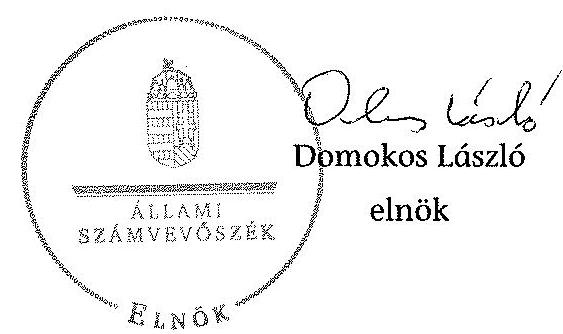

# ÁLLAMI   SZÁMVEVŐSZÉK 

## JELENTÉS

A Fővárosi Önkormányzatot és a kerületi önkormányzatokat osztottan megillető bevételek 2014. évi megosztásáról szóló önkormányzati rendelet felülvizsgálatáról

---

# Állami Számvevőszék 

Iktatószám: V-0598-070/2015.
Témaszám: 1632
Vizsgálat-azonosító szám: V0702

## Az ellenőrzést felügyelte:

## Renkó Zsuzsanna

felügyeleti vezető
Az ellenőrzést vezette és az ellenőrzés végrehajtásáért felelős:
Schósz Attila Ferencné
ellenőrzésvezető
A jelentés összeállításában közremüködtek:
Baksa Anikó
számvevő főtanácsos
Dr. Mezei Imréné
számvevő főtanácsos
Az ellenőrzést végezték:

| Burenzsargal | Kámán Edina | Dr. Mészáros Leila |
| :-- | :-- | :-- |
| Narantuja | számvevő főtanácsos | számvevő tanácsos |
| számvevő tanácsos |  |  |
| Dr. Vincze Ibolya |  |  |
| számvevő |  |  |

A témához kapcsolódó eddig készített számvevőszéki jelentések:
címe
sorszáma
Jelentés a fővárosi forrásmegosztás felülvizsgálata - A fővárosi ön- 14015
kormányzatot és a kerületi önkormányzatokat osztottan megillető bevételek 2013. évi megosztásáról szóló önkormányzati rendelet felülvizsgálatáról

---

# TARTALOMJEGYZÉK 

BEVEZETÉS ..... 3
I. ÖSSZEGZŐ MEGÁLLAPÍTÁSOK, KÖVETKEZTETÉSEK, JAVASLATOK ..... 6
II. RÉSZLETES MEGÁLLAPÍTÁSOK ..... 9

1. A 2014. évi forrásmegosztás rendeletalkotási folyamatának szabályozottsága, szabályossága ..... 9
1.1. A forrásmegosztási rendelet elkészítésével kapcsolatos folyamatok, szabályzatok, munkaköri leírások aktualizálása, betartása, a FEUVE megvalósulása ..... 9
1.2. A véleményeztetési kötelezettség és a rendeletalkotási határidők betartása ..... 10
1.3. A 2014. évi forrásmegosztási rendelet végrehajtási szabályainak összhangja a forrásmegosztási tv. előírásaival ..... 11
1.4. A 2014. évi forrásmegosztási rendelet helyi adóztatással kapcsolatos kiadásokra vonatkozó szabályainak összhangja a forrásmegosztási tv. előírásaival ..... 11
2. A forrásmegosztás bevételi tervszámainak megalapozottsága, a forrásmegosztási számítások előírásoknak való megfelelése ..... 12
2.1. A forrásmegosztási számításoknál figyelembe vett iparűzési adóbevételek tervezésének megalapozottsága ..... 12
2.2. A forrásmegosztási számításoknál figyelembe vett idegenforgalmi adóbevételek és kapcsolódó támogatás tervezésének megalapozottsága ..... 13
2.3. A forrásmegosztási számításoknál figyelembe vett helyi adókhoz kapcsolódó pótlék és bírság bevételek tervezésének megalapozottsága ..... 13
2.4. A Fővárosi Önkormányzatot és a kerületi önkormányzatokat együttesen és egyenként megillető részesedések megállapításának megfelelősége ..... 14
3. A forrásmegosztásnál figyelembevett - az adóhatóság múködtetésével összefüggő - kiadások megállapítása ..... 15
4. Az esetleges számítási hibák miatt a 2015. évi forrásmegosztásnál érvényesítendő korrekciók ..... 17
5. A 2013. évi forrásmegosztási rendelet felülvizsgálata során tett ÁSZ javaslatok hasznosulása ..... 17

---

# MELLÉKLETEK 

1. számú A forrásmegosztásba bevont bevételek és kiadások bemutatása a 2014. évi forrásmegosztási rendelet és az ÁSZ megállapításai alapján
2. számú A kerületi önkormányzatokat megillető iparűzési adó összege a 2014. évi forrásmegosztási rendelet és az ÁSZ megállapítása alapján
3. számú A kerületi önkormányzatokat megillető idegenforgalmi bevételek összege a 2014. évi forrásmegosztási rendelet és az ÁSZ megállapítása alapján

## FÜGGELÉKEK

1. számú Rövidítések jegyzéke
2. számú Értelmező szótár

---

# JELENTÉS 

## a Fővárosi Önkormányzatot és a kerületi önkormányzatokat osztottan megillető bevételek 2014. évi megosztásáról szóló önkormányzati rendelet felülvizsgálatáról

## BEVEZETÉS

A Fővárosi Önkormányzatot és a kerületi önkormányzatokat osztottan megillető bevételek körét, valamint a forrásmegosztás szabályait a Fővárosi Önkormányzat és a kerületi önkormányzatok közötti forrásmegosztásról szóló 2006. évi CXXXIII. törvény (továbbiakban forrásmegosztási tv.) határozza meg.

A helyi adókról szóló 1990. évi C. törvény (továbbiakban Helyi adó tv.) alapján a Fővárosi Önkormányzat az iparűzési adót, a kerületi önkormányzat az építményadót, a telekadót, a magánszemélyek kommunális adóját és az idegenforgalmi adót jogosult bevezetni. A Helyi adó tv. szerint a kerületi önkormányzat képviselő-testülete minden adóév tekintetében előzetes beleegyezését adhatja ahhoz, hogy az általa kivethető helyi adót a kerületi önkormányzat helyett a Fővárosi Önkormányzat vezesse be rendeletével. A Fővárosi Önkormányzat közvetlen igazgatása alatt álló Margitszigeten 2014. január 1-jétől a kerületi önkormányzat által bevezethető adók kivetésére és beszedésére a Fővárosi Önkormányzat jogosult.

A forrásmegosztási tv. 2014. január 1-jétől bővítette a forrásmegosztásba bevont bevételek körét a Fővárosi Közgyűlés rendelete alapján kivetett helyi adóhoz kapcsolódóan kiszabott pótlékból és bírságból származó bevételekkel.

Az adóbevétel elérése kiadásokkal jár, amit a 2014. évtől hatályos forrásmegosztási tv. elismer. A szabályozás szerint a Fővárosi Önkormányzat által kivetett helyi adó bevételek beszedésével kapcsolatos kiadásokat az iparűzési adóbevételből való részesedésük arányában a főváros és a kerületek közös teherként viselik. A kiadásokat a - Fővárosi Közgyűlés rendelete alapján kivetett helyi adóhoz kapcsolódóan kiszabott pótlékból és bírságból származó bevételek legfeljebb 50\%-áig terjedő mértékben lehet érvényesíteni.

A Fővárosi Önkormányzat és a kerületi önkormányzatok közötti részesedések számításánál alkalmazott arányszámokat ( $51 \%$ és $49 \%$ ) a forrásmegosztási tv. 3. §-a írja elő. A Fővárosi Önkormányzat az őt megillető 51\%-ból 4 százalékpontnak megfelelő összeget a helyi közösségi közlekedési feladat ellátására köteles a tárgyévben fordítani. A kerületek közötti részesedési arányokat a forrásmegosztási tv. melléklete tartalmazza.

---

A 2014. évi forrásmegosztási rendeletben a Fővárosi Közgyűlés a Fővárosi Önkormányzat és a kerületi önkormányzatok között 195000 millió Ft iparúzési adó, 1000 millió Ft pótlékból és bírságból származó bevétel, valamint 8 millió Ft idegenforgalmi adó és ahhoz kapcsolódó 33,5 millió Ft állami támogatás felosztásáról rendelkezett. A kerületek között mindösszesen 96060,4 millió Ft adóbevétel került a 2014. évben terv szerint elosztásra. A helyi adóztatással összefüggésben tervezett 500 millió Ft kiadásból a kerületi önkormányzatokat 245 millió Ft kiadás terheli.

A forrásmegosztási tv. 6. § (1) bekezdése szerint a Fővárosi Önkormányzat tárgyévre vonatkozó forrásmegosztási rendeletét az ÁSZ felülvizsgálja. A forrásmegosztási tv. 6. § (2) bekezdése alapján, ha az ÁSZ felülvizsgálata megállapítja, hogy a forrásmegosztás során a Fővárosi Önkormányzat, vagy valamely kerületi önkormányzat jogosulatlanul forráshoz jutott, vagy az őt jogszerűen megillető forrásnál alacsonyabb összegben részesült, ennek mértékével a forrásmegosztási tv. alapján meghatározott, a felülvizsgálat lezárását követő évi forrásmegosztást a Fővárosi Önkormányzat rendeletében módosítja.

Az ellenőrzés célja a Fővárosi Önkormányzatot és a kerületi önkormányzatokat osztottan megillető bevételek 2014. évi megosztása szabályszerűségének megítélése volt. Ennek keretében értékeltük, hogy:

- a Fővárosi Önkormányzat a 2014. évi forrásmegosztási rendeletét a forrásmegosztási tv. előírásainak megfelelően alkotta-e meg, szabályozott volt-e a forrásmegosztási rendelet elkészítésének módja, múködtették-e a folyamatba épített, előzetes, utólagos és vezetői ellenőrzés rendszerét a 2014. évi forrásmegosztási rendelet megalkotásának folyamatában;
- a forrásmegosztás bevételi tervszámai megalapozottak voltak-e, a forrásmegosztási számításokat a törvényi előírásoknak megfelelően végezték-e el, az esetleges számítási hibák miatt szükséges-e korrekció a 2015. évi forrásmegosztásnál;
- az adóhatóság működtetésével összefüggésben felmerült kiadások tervszámai megalapozottak voltak-e, a kiadási előlegek megállapítása a Fővárosi Önkormányzat 2013. évi zárszámadási rendeletében jóváhagyott összegekből, nyilvántartásokból levezethető-e, a kiadási előlegek megosztása és érvényesítése összhangban volt-e a forrásmegosztási tv. és a forrásmegosztási rendelet előírásaival, az esetleges számítási hibák miatt szükséges-e korrekció a 2015. évi forrásmegosztási rendeletben;
- hasznosultak-e az ÁSZ „A fóvárosi forrásmegosztás felülvizsgálatáról - a fóvárosi önkormányzatot és a kerületi önkormányzatokat osztottan megillető bevételek 2013. évi megosztásáról szóló önkormányzati rendelet felülvizsgálatáról" kiadott jelentésében tett javaslatai.

Az ellenőrzés várható hasznosulását négy szinten tervezzük. A törvényalkotás számára tapasztalatok állnak rendelkezésre a forrásmegosztás szabályozásáról, a forrásmegosztási rendelet szabályszerűségéről, következtetés vonható le arra vonatkozóan, hogy indokolt-e jogszabályi módosítás kezdeményezése. Az ellenőrzés az ellenőrzött számára visszajelzést ad a forrásmegosztás végrehajtásának szabályosságáról, javaslataival hozzájárul az esetleges hiá-

---

nyosságok kiküszöböléséhez. A társadalom számára jelzi, hogy a közpénz tervezett megosztása sem maradhat ellenőrizetlenül, az ÁSZ értékteremtő rend kialakításához és megőrzéséhez hozzájáruló tevékenysége pozitív hatással lesz a szervezetről kialakított összkép formálásában. Az ÁSZ szervezetén belül lehetőség nyílik arra, hogy az intézmény erősítse a hozzáadott értéket teremtő elemző tevékenységét és tanácsadó szerepét.

Az ellenőrzés típusa: szabályszerűségi ellenőrzés.
A szabályszerűségi ellenőrzés előírásait az ÁSZ „Ellenőrzési elvek, standardok" módszertani dokumentum I. fejezet 3.1. és az „Útmutató a standardok alkalmazásához" módszertani dokumentum I. fejezet 1. pontjai, valamint az ISSAI 4000 és 4100 standardok (megfelelőségi ellenőrzés) tartalmazzák.

Az ellenőrzött időszak: A 2013. október 1-jétől 2014. augusztus 31-éig terjedő időszak (a 2014. évi forrásmegosztási rendelet előkészítésével és elfogadásával, valamint a Fővárosi Önkormányzat 2013. évi zárszámadási rendeletének hatályba lépését követően az adóbevétel beszedésével összefüggésben felmerült kiadásokra fordított összeg előlegként történő elszámolásával érintett időszak) volt.

Az ellenőrzött szervezet: Budapest Főváros Önkormányzata.
Az ellenőrzés során értékeltük a folyamatba épített, az előzetes, utólagos és vezetői ellenőrzés múködését a 2014. évi forrásmegosztási rendelet előkészítésének és elfogadásának időszakában, valamint a forrásmegosztási rendelet jogszabályoknak való megfelelőségét, a bevételi és kiadási tervszámok megalapozottságát. Ellenőriztük a 2014. évi kiadási előleg megállapítását és érvényesítését. Utóellenőrzés keretében ellenőriztük az előző évi forrásmegosztás ellenőrzéséről szóló jelentésben tett javaslataink hasznosulását.

Az ellenőrzés során használt rövidítéseket az 1. számú, az egyes fogalmak magyarázatát a 2. számú függelék tartalmazza.

Az ellenőrzés jogszabályi alapját Magyarország Alaptörvénye Állam fejezet 43. cikk (1) bekezdése, a forrásmegosztási tv. 6. § (1) bekezdése, az ÁSZ tv. 1. § (3) bekezdése és 3. § (1) bekezdése képezte.

Az ÁSZ tv. 29. § (1) bekezdése szerint a jelentéstervezetet megküldtük a főpolgármester részére, aki az ÁSZ tv. 29. § (2) bekezdésében foglalt észrevételezési jogával nem élt, a jelentéstervezetre észrevételt nem tett.

---

# I. ÖSSZEGZŐ MEGÁLLAPÍTÁSOK, KÖVETKEZTETÉSEK, JAVASLATOK 

A Fővárosi Önkormányzatnál a 2014. évi forrásmegosztási rendeletalkotás folyamata szabályozott és összességében szabályos volt. A forrásmegosztás bevételi és kiadási tervszámai megalapozottak voltak. A rendelet összeállítása során az előző ÁSZ ellenőrzés javaslatait hasznosították, jelen ellenőrzés nem tárt fel a 2015. évi forrásmegosztási rendeletben rendezendő korrekciós tételt.

A Fővárosi Önkormányzatnál az ellenőrzött időszakban a 2014. évi forrásmegosztási rendelet elkészítésének folyamata szabályozott volt. A 2014. évi forrásmegosztási rendelet előkészítésével kapcsolatos feladatokat az SZMSZben, a Pénzügyi Főosztály belső működési szabályzata ${ }_{1,2}$-ben és az Adó Főosztály belső múködési szabályzatában rögzítették. A munkafolyamatokat, felelős személyeket, ellenőrzési pontokat, keletkező dokumentumokat a Költségvetési Osztály ellenőrzési nyomvonala ${ }_{1,2}$ tartalmazta.

A 2014. évi forrásmegosztás rendeletalkotási folyamata összességében szabályos volt, a FEUVE rendszerét működtették. A Pénzügyi Főosztály és azon belül a Költségvetési Szabályozási Csoport a forrásmegosztási rendelet elkészítése során a Pénzügyi Főosztály belső múködési szabályzat ${ }_{1,2}$-ben, az Adó Főosztály a belső múködési szabályzatában előírt eljárásrendben foglaltak szerint járt el. A Pénzügyi Főosztály belső múködési szabályzata ${ }_{2}$ az Önkormányzati Gazdálkodási Csoport és a Hivatali Gazdálkodási Csoport számára is határozott meg feladatokat. A gyakorlatban - a Pénzügyi Főosztály belső múködési szabályzata ${ }_{2}$ előírásai ellenére - az előkészítési feladatokat kizárólag a Költségvetési Szabályozási Csoport látta el.

A Fővárosi Önkormányzat a 2014. évi forrásmegosztási rendelettervezet elkészítése során betartotta a forrásmegosztási tv.-ben foglalt, véleményeztetési és rendeletalkotási határidőket. A Fővárosi Önkormányzat a 2014. évi forrásmegosztási rendeletét - a helyi adóhoz kapcsolódó pótlékból és bírságból származó bevételek szabályozása kivételével - a forrásmegosztási tv. előírásai szerint alkotta meg.

A 2014. évi forrásmegosztási rendeletben - a forrásmegosztási tv. előírása ellenére - a pótlék és bírság bevételeket nem a Fővárosi Közgyűlés rendelete alapján kivetett összes helyi adóhoz, hanem kizárólagosan az iparűzési adóhoz kapcsolták. A pótlék és bírság bevétel 2014. évi tervszáma azonban megalapozott volt, mivel annak összege a valóságban a Fővárosi Önkormányzat rendeletével kivetett összes helyi adóhoz kapcsolódóan kiszabott pótlék és bírság összegét tartalmazta, összhangban a forrásmegosztási tv.-ben foglalt előírással.

A forrásmegosztási számításoknál figyelembe vett iparűzési adóbevételek tervezése megalapozott volt, azt a zárási összesítők, az analitikus nyilvántartásokból készült adatkigyűjtések és elemzések alátámasztották.

---

A 2014. évi forrásmegosztási rendeletben szereplő idegenforgalmi adóbevételi tervszám a zárási összesítő és kimutatás alapján megalapozott volt. Az üdülőhelyi feladatok állami támogatásának bevételi előirányzati tervszáma a 2014. évi Kvtv.-ben foglaltaknak megfelelően - megegyezett a 2012. évi idegenforgalmi adó összegének másfélszeresével.

A Fővárosi Önkormányzat a 2014. évi forrásmegosztási rendeletben a helyi adók beszedésével összefüggően felmerült kiadások elszámolásának rendjét a forrásmegosztási tv.-ben előírtakkal azonosan szabályozta. A Főpolgármesteri Hivatal a 2014. évi forrásmegosztási rendelet készítésekor az adóhatóság múködtetésével kapcsolatos kiadásként - az összes adónemhez - közvetlenül felmerült múködési célú kiadásokat vette figyelembe. Ennek 2014-re tervezett összege magasabb volt a forrásmegosztási tv.-ben előírt felső határnál (a helyi adóhoz kapcsolódó pótlékból és bírságból származó bevételek 50\%-ánál), ezért a Fővárosi Önkormányzat szabályszerűen, ezen felső határral megegyező összeget érvényesítette levonható kiadásként. Ez alapján az adóhatóság múködtetésével összefüggő kiadási tervszám és annak kerületi önkormányzatonkénti megosztása megalapozott volt.

Az adóhatóság múködtetésével kapcsolatos - főkönyvi nyilvántartásokkal dokumentáltan alátámasztott - 2013. évi tényleges közvetlen múködési célú kiadások meghaladták a forrásmegosztási tv.-ben előírt kiadásként érvényesíthető felső határt. A kerületek részére utalandó bevételekből levonandó kiadási előleg összege ezért megegyezett a 2014. évi forrásmegosztási rendeletben tervezett, helyi adókhoz kapcsolódóan kiszabott pótlékból és bírságból származó bevételek 50\%-ával. A forrásmegosztás során a 2014. évi kiadási előleg összegének megállapítása ezáltal megalapozott, a kerületeket együttesen terhelő kiadási előleg megosztása szabályszerű volt, megfelelt a forrásmegosztási tv. és a 2014. évi forrásmegosztási rendelet előírásainak. A kiadási előlegeket a kerületi önkormányzatok felé - a forrásmegosztási tv., valamint a 2014. évi forrásmegosztási rendelet előírásainak megfelelően - a 2013. évi zárszámadási rendelet hatálybalépését követő havi utalásnál, egyszeri jelleggel érvényesítették.

A forrásmegosztási tv.-ben foglaltaknak megfelelően 51-49\%-os arányban osztották meg a Fővárosi Önkormányzatot és a kerületi önkormányzatokat együttesen megillető bevételek és levonható kiadások tervezett összegét. A kerületi önkormányzatokat megillető $49 \%$-os forrásrészt a forrásmegosztási tv. mellékletében meghatározott részesedési arányoknak megfelelően osztották fel a kerületek között. Az ellenőrzés megállapítása alapján korrekció nem szükséges.

A 2014. évi forrásmegosztási rendelet ellenőrzése keretében az ÁSZ ellenőrizte a 2013. évi jelentésében tett javaslatainak teljesülését. Ennek során megállapította, hogy a főjegyzőnek tett - az idegenforgalmi adó utalásának időpontjára, annak évközi bevezetésére és a felosztási arány újraszámolására, valamint közgazdaságilag megalapozott tervezésére vonatkozó - három javaslat hasznosult.

Az ÁSZ tv. 33. § (1) bekezdésében foglaltak értelmében az ellenőrzött szervezet vezetője köteles a jelentésben foglalt megállapításokhoz kapcsolódó intézkedési tervet összeállítani, és azt a jelentés kézhezvételétől számított harminc napon belül az ÁSZ részére megküldeni. Amennyiben az intézkedési tervet határidőn

---

belül nem küldi meg a szervezet vezetője, vagy az továbbra sem elfogadható, az ÁSZ elnöke a hivatkozott törvény 33. § (3) bekezdés a-b) pontjaiban foglaltakat érvényesítheti.

# Az ellenőrzés intézkedést igénylő megállapításai és javaslatai: 

## a föjegyzönek

1. A forrásmegosztási rendelet elkészítésével kapcsolatos fő feladatokat az SZMSZ, a részletes feladatokat, eljárásrendet a Pénzügyi Főosztály belső működési szabályzata ${ }_{1,2}$ és az Adó Főosztály belső működési szabályzata tartalmazta. A rendelettervezetet a Pénzügyi Főosztály belső működési szabályzata ${ }_{1}$ VI. pontja, illetve a Pénzügyi Főosztály belső működési szabályzata ${ }_{2} 13 . \S$ (2) bekezdés b) pontja szerint a Költségvetési Szabályozási Csoport készíti elő. Az Adó Főosztály belső működési szabályzata 24. § (1) bekezdés 8 f) pontjában előírtak alapján az adóbevételi tervekről tájékoztatást ad, valamint javaslatot készít a Pénzügyi Főosztály részére. A Pénzügyi Főosztályon belül a Költségvetési Osztály ellenőrzési nyomvonala ${ }_{1,2}$ tartalmazta a forrásmegosztási rendelettervezet előkészítési feladatait. A Pénzügyi Főosztály belső működési szabályzata ${ }_{2} 14 . \S$ (4) bekezdés a) pontjában és a 14. § (8) bekezdés a) pontja az Önkormányzati Gazdálkodási Csoport és a Hivatali Gazdálkodási Csoport számára is határoz meg feladatot a forrásmegosztási rendelet előkészítésében. A gyakorlatban - a Pénzügyi Főosztály belső működési szabályzata ${ }_{2}$ előírásai ellenére az előkészítési feladatokat kizárólag a Költségvetési Szabályozási Csoport látta el.

Javaslat:
Intézkedjen a Pénzügyi Főosztály 105/2013. (XII. 19.) számú főjegyzői utasítással kiadott belső működési szabályzatának felülvizsgálatáról, ennek során a Fővárosi Önkormányzatot és a kerületi önkormányzatokat megillető bevételek megosztására vonatkozó önkormányzati rendelettervezet előkészítésével és megalkotásával összefüggő feladatok ellátásának rendjét az egyes szervezeti egységek vonatkozásában a ténylegesen szükséges közreműködői kötelezettség alapján határozza meg.
2. A Fővárosi Önkormányzat a forrásmegosztási tv. 2. § (2) bekezdésében foglaltak ellenére a 2014. évi forrásmegosztási rendelet 2. § (1) bekezdésében, a (2) bekezdés c) pontjában, valamint a 4. § (1)-(2) bekezdéseiben a pótlék és bírság bevételeket kizárólagosan az iparűzési adóhoz kapcsolta.

Javaslat:
Biztosítsa, hogy a forrásmegosztásra vonatkozó Fővárosi Közgyűlési rendeletben a forrásmegosztási törvény tv. 2. § (2) bekezdésében foglaltakkal összhangban úgy határozzák meg a forrásmegosztás részét képező adóbevételek körét, hogy abban a Fővárosi Közgyűlés rendelete alapján kivetett összes helyi adóhoz kapcsolódóan kiszabott pótlékból és bírságból származó bevétel is benne szerepeljen.

---

# II. RÉSZLETES MEGÁLLAPÍTÁSOK 

## 1. A 2014. ÉVI FORRÁSMEGOSZTÁS RENDELETALKOTÁSI FOLYAMATÁNAK SZABÁLYOZOTTSÁGA, SZABÁLYOSSÁGA

### 1.1. A forrásmegosztási rendelet elkészítésével kapcsolatos folyamatok, szabályzatok, munkaköri leírások aktualizálása, betartása, a FEUVE megvalósulása

A Fővárosi Önkormányzatot és a kerületi önkormányzatokat osztottan megillető bevételekre vonatkozó 2014. évi forrásmegosztási rendelet előkészítésével és megalkotásával kapcsolatos fő feladatokat az SZMSZ-ben szabályozták, azok - az előző évekhez hasonlóan - az ellenőrzött időszakban is a Pénzügyi, illetve az Adó Főosztályhoz tartoztak.

A Pénzügyi Főosztály feladata - az SZMSZ 52. § (1) bekezdése szerint - a Fővárosi Önkormányzatot és a kerületi önkormányzatokat osztottan megillető bevételek megosztásáról szóló rendelettervezet és a kapcsolódó előterjesztés elkészítése volt. Az SZMSZ 42. § (1) bekezdés 1. pontja alapján az Adó Főosztály feladatát képezte a várható és a befolyt adóbevételekre vonatkozó elemzések előkészítése.

Az ellenőrzött időszakban - az SZMSZ előírásaival összhangban - a forrásmegosztási rendelet elkészítésével kapcsolatos részletes feladatokat, az eljárásrendet a Pénzügyi Főosztály belső működési szabályzata ${ }_{1,2}$ és az Adó Főosztály belső működési szabályzata tartalmazta.

A Pénzügyi Főosztály belső működési szabályzata 2013. december 18-ig volt hatályban. A főjegyző - a 2014. évi forrásmegosztási rendelet megalkotását megelőzően - a 105/2013. (XII. 19.) számú utasítással adta ki a Pénzügyi Főosztály belső működési szabályzata ${ }_{2}$-t. A Fővárosi Önkormányzatot és a kerületi önkormányzatokat megillető bevételek megosztására vonatkozó önkormányzati rendelettervezet előkészítése a Pénzügyi Főosztály belső működési szabályzata; VI. pontja, illetve a Pénzügyi Főosztály belső müködési szabályzata ${ }_{2}$ 13. § (2) bekezdés b) pontja szerint a Költségvetési Osztályon belül a Költségvetési Szabályozási Csoport feladata. A forrásmegosztási rendelettervezet elkészítésére vonatkozó munkafolyamatokat, a feladatok végrehajtásáért felelős személyeket, valamint a keletkező dokumentumokat a Pénzügyi Főosztály belső működési szabályzata ${ }_{1,2}$ melléklete részletesen tartalmazta.

Az Adó Főosztály a belső müködési szabályzata 24. § (1) bekezdés 8. f) pontjában előírtak alapján az adóbevételi tervekről tájékoztatást ad, valamint javaslatot készít a Pénzügyi Főosztály részére.

A Pénzügyi Főosztályon belül a Költségvetési Osztály ellenőrzési nyomvonala ${ }_{1,2}$ tartalmazta a forrásmegosztási rendelettervezet előkészítési feladatait munkaszakaszonként, továbbá az azok végrehajtásáért felelős és jóváhagyó személyeket, az ellenőrzési pontokat, a feladatok tartalmi leírását, a vonatkozó jogszabályokat, belső szabályzatokat és a keletkező dokumentumokat.

---

A Pénzügyi Főosztály belső működési szabályzata ${ }_{2}$-nek 14. § (4) bekezdés a) pontja és a 14. § (8) bekezdés a) pontja az Önkormányzati Gazdálkodási Csoport és a Hivatali Gazdálkodási Csoport számára is határozott meg közreműködési feladatokat. A gyakorlatban - a Pénzügyi Főosztály belső múködési szabályzata ${ }_{2}$ előírásai ellenére - az előkészítési feladatokat kizárólag a Költségvetési Szabályozási Csoport látta el.

A Pénzügyi Főosztály és azon belül a Költségvetési Szabályozási Csoport a forrásmegosztási rendelet elkészítése során a Pénzügyi Főosztály belső múködési szabályzat ${ }_{1,2}$-ben, az Adó Főosztály a belső múködési szabályzatában előírt eljárásrendben foglaltak szerint járt el. A 2014. évi forrásmegosztási rendelettervezet elkészítése során a FEUVE múködése - a rendelkezésre bocsátott dokumentumok alapján - nyomon követhetö volt.

A 2014. évi forrásmegosztási rendelet elkészítéséhez az Adó Főosztály a várható helyi adó bevételekről tájékoztatta a Pénzügyi Főosztály vezetőjét. A Költségvetési Szabályozási Csoport elkészítette a Fővárosi Önkormányzatot és a kerületi önkormányzatokat megillető bevételekre és kiadásokra vonatkozó forrásmegosztási javaslatot, a kapcsolódó rendelettervezetet és előterjesztést. A FEUVE végrehajtását az érintett személyek aláírásukkal igazolták. A Pénzügyi Főosztály a 2014. évi forrásmegosztási rendeletet a Fővárosi Közlönyben való megjelentetés céljából a Szervezési Főosztálynak megküldte.

A fővárosi és a kerületi önkormányzatok közötti forrásmegosztás előkészítési és a forrásmegosztási rendelettervezet elkészítéséhez kapcsolódó feladatokat a Pénzügyi Főosztály állományából négy fő, az Adó Főosztály állományából további négy fő munkaköri leírása - a főosztályok belső működési szabályzataival összhangban - részletesen tartalmazta. A 2014. évi forrásmegosztási rendelet előkészítésében, megalkotásában érintett dolgozók személyében és munkakörében az ellenőrzött időszakban változás nem történt, a munkaköri leírások aktualizálása ezáltal nem volt indokolt.

# 1.2. A véleményeztetési kötelezettség és a rendeletalkotási határidők betartása 

A 2014. évi forrásmegosztási rendelettervezet elkészítése során a Fővárosi Önkormányzat betartotta a forrásmegosztási tv. 5. § (1) bekezdésében foglalt véleményeztetési és rendeletalkotási határidőt. A Főpolgármesteri Hivatal a forrásmegosztási törvényben rögzített január 10-ei határidőig megküldte a kerületi önkormányzatok részére a 2014. évi forrásmegosztási rendelettervezetet, ezzel biztosította a 15 napos véleményezési határidőt. A 2014. évi forrásmegosztási rendelet - a törvényi előírásoknak megfelelően - 2014. január 31-én hatályba lépett.

A véleményezés keretében a III. és a IV. kerületi önkormányzatok javasolták az iparúzési adó tervezett előirányzatának növelését. A III. és a XIII. kerületi önkormányzat a 2014. évi forrásmegosztási rendelettervezetben szereplő, az adóhatóság múködtetésével kapcsolatos kiadások esetében kifogásolta, hogy a megküldött előterjesztés tervezetben és a mellékletét képező forrásmegosztási háttérszámításokban nem mutatták be az elszámolható kiadások összegének levezetését. A XXII. kerületi önkormányzat az adók beszedésével összefüggően felmerült el-

---

számolható költségek körének, a kerületek felé történő tételes elszámolás rendjének rendeletben történő meghatározását javasolta.

A 2013. december 20 -án esedékes adóelöleg-kiegészítés (feltöltés) bevallásainak feldolgozása alapján - az Adó Főosztály véleményével alátámasztva - a főpol-gármester-helyettes 2014. január 28 -án kiegészítő előterjesztésben 3,2\%-kal magasabb, 195000 millió Ft összegű iparűzési adóbevételi tervszám elfogadását kérte a Fővárosi Közgyűléstől. A Fővárosi Önkormányzat - tekintettel arra, hogy a forrásmegosztási tv. nem ír elő vélemény figyelembevételre vonatkozó kötelezettséget - a kerületek részére az elszámolható kiadások összegére vonatkozó háttérszámítást nem mutatott be.

# 1.3. A 2014. évi forrásmegosztási rendelet végrehajtási szabályainak összhangja a forrásmegosztási tv. elöírásaival 

A Fővárosi Önkormányzat nem a forrásmegosztási tv. 2. § (2) bekezdésében foglaltakkal összhangban határozta meg a 2014. évi forrásmegosztási rendelet 2. § (1) bekezdésében, a (2) bekezdés c) pontjában, a 4. § (1)-(2) bekezdéseiben foglalt rendelkezéseket, mivel kizárólagosan az iparűzési adóhoz kapcsolta a pótlék és bírság bevételeket. A forrásmegosztási tv. hivatkozott rendelkezése alapján azonban a forrásmegosztás részét képezi a Fővárosi Közgyűlés rendelete alapján kivetett összes helyi adóhoz kapcsolódóan kiszabott pótlékból és bírságból származó bevétel.

A 2014. évi forrásmegosztási rendelet 4. § (2)-(4) bekezdéseiben előírt, kerületek részére történő utalásra vonatkozó végrehajtási szabályok összhangban voltak a forrásmegosztási tv. 5. § (2)-(3) bekezdéseiben foglalt előírásokkal.

### 1.4. A 2014. évi forrásmegosztási rendelet helyi adóztatással kapcsolatos kiadásokra vonatkozó szabályainak összhangja a forrásmegosztási tv. előírásaival

A forrásmegosztási tv. 2014. január 1-jétől hatályos 2. § (4) bekezdése szerint a helyi adóztatással kapcsolatos kiadásokat a Fővárosi Önkormányzat által, rendelettel kivetett helyi iparűzési adóbevételből részesülők viselik részesedésük arányában. Kiadásként a Fővárosi Önkormányzatnál a beszedéssel - a fővárosi önkormányzati adóhatóság működtetésével - összefüggően felmerült kiadásokat kell figyelembe venni.

A Fővárosi Önkormányzat - a forrásmegosztási tv. 7. §-ában kapott felhatalmazás alapján - a 2. § (5) bekezdésében előírtakkal azonosan szabályozta a helyi adók beszedésével összefüggően felmerült kiadások elszámolásának rendjét.

A 2014. évi forrásmegosztási rendelet 5. § (1) bekezdése szerint a Fővárosi Önkormányzat a 2013. évi zárszámadási rendeletben a kivetett helyi adókból származó bevételek beszedésével összefüggően felmerült kiadásokra meghatározott összeget előlegként figyelembe veszi. Ezen előleg levonását a 2013. évi zárszámadási rendelet hatályba lépését követő havi utalásnál egyszeri jelleggel érvényesíti a kerületi önkormányzatok felé.

---

A 2014. évi forrásmegosztási rendelet 5. § (2) bekezdésében foglaltak szerint - a forrásmegosztási tv.-nek megfelelően - a Fővárosi Önkormányzat a levont előlegek és a 2014. évi tényleges kiadások különbözetét a 2014. évi költségvetési rendelet végrehajtásáról szóló fővárosi önkormányzati rendelet hatályba lépését követő havi utalásnál számolja el a kerületi önkormányzatok felé.

# 2. A FORRÁSMEGOSZTÁs BEVÉTELI TERVSZÁMAINAK MEGALAPOZOTTSÁGA, A FORRÁSMEGOSZTÁSI SZÁMÍTÁSOK ELŐÍRÁSOKNAK VALÓ MEGFELELÉSE 

### 2.1. A forrásmegosztási számításoknál figyelembe vett iparüzési adóbevételek tervezésének megalapozottsága

A Fővárosi Önkormányzat a kerületi önkormányzatok részére megküldött 2014. évi forrásmegosztási rendelettervezetben iparűzési adóbevételként 189000 millió Ft-ot szerepeltetett. A Fővárosi Közgyűlés által jóváhagyott 2014. évi forrásmegosztási rendeletben a bevételként tervezett iparűzési adó összege 195000 millió Ft-ra módosult. A bevételi tervszám növekedését a 2013. december 20-án esedékes adóelöleg-kiegészítés (feltöltés) kedvező alakulásával indokolták.

A 2014. évi forrásmegosztási rendelettervezetben eredetileg meghatározott 189000 millió Ft összeget a 2013. november 30 -áig ténylegesen befolyt iparűzési adóbevétel 171300 millió Ft értékével, valamint az előző év december hónapban befolyt összeg figyelembevételével alakították ki. A bevételi tervszám növekedését indokolta, hogy a 2014. évi forrásmegosztási rendelettervezet kerületi önkormányzatok részére történő kiküldéséig rendelkezésre álló rövid idő miatt nem történt meg a bevallások és befizetések teljes körű értékelése. A feldolgozást követően pontosabb és átfogóbb képet kaptak a 2013. évi ténylegesen befolyt bevételek nagyságáról és az adózák esetleges téves befizetéseiről. A 2013. december hónapban a várt bevételnél 6000 millió Ft-tal magasabb összeg folyt be és ez adott alapot a 2014. évi forrásmegosztási rendeletben szereplő 195000 millió Ft összegű adóbevétel elfogadására.

A 2014. évi forrásmegosztási számításoknál figyelembe vett iparűzési adóbevétel tervezése alapvetően a 2013. évi ténylegesen befolyt (195 205,1 millió Ft) bevételen alapult, tervezését a 2013. évi zárási összesítők és az analitikus nyilvántartásokból készített adatkigyűjtések közgazdaságilag alátámasztották. Figyelembe vették az eladott áruk beszerzési értékének korlátját, az e-útdíj várható hatását, a GDP ágazatonkénti várható alakulását, a kormányzat rezsicsökkentéssel kapcsolatos intézkedéseit, valamint az energia világpiaci ára csökkenésének hatását. Összességében az iparűzési adóbevétel tervezett összege megalapozott volt.

---

# 2.2. A forrásmegosztási számításoknál figyelembe vett idegenforgalmi adóbevételek és kapcsolódó támogatás tervezésének megalapozottsága 

A 2014. évben - hasonlóan a 2012-2013. évekhez - a Fővárosi Önkormányzatnak kilenc kerületi önkormányzat engedte át az idegenfogalmi adó kivetésének jogát. Így a 2014. évi forrásmegosztási rendeletben a tervezett idegenforgalmi bevételt változatlanul a XV-XXIII. kerületi önkormányzatok között osztották meg. A 2014. évi forrásmegosztási rendelet 2. § (3) bekezdése 8 millió Ft összegű idegenforgalmi adóbevételt és 33,5 millió Ft üdülőhelyi feladatok jogcímen kapott állami támogatást tartalmazott.

A 2013. évi idegenforgalmi adóra vonatkozóan elkészített zárási összesítő 7,5 millió Ft összeget mutatott. Az adóhátralék összege a 2013. évben 4,5 millió Ft-tal (a január 1-jei 41,9 millió Ft összeghez képest az év végére 37,4 millió Ft-ra) csökkent. A 2014. évi forrásmegosztási rendelettervezet előterjesztésében kitértek a 2014. évi tervezett idegenforgalmi adóbevétel összegének és számítási módjának bemutatására, amely összeg alapjául a 2013. évi ténylegesen befolyt adóbevétel összege szolgált. Az előző évhez képest jelentős körülmény változással (az adó mértékének, az átengedő kerületek számának és körének, valamint a vendégéjszakák számának változásával) a 2014. évben nem számoltak.

A 2014. évi forrásmegosztási rendeletben szereplő idegenforgalmi adóbevételi tervszám a zárási összesítő és kimutatás (analitikus nyilvántartásokból készített adatkigyűjtés) alapján megalapozott volt. Az üdülőhelyi feladatok állami támogatásának bevételi előirányzati tervszáma - a 2014. évi Kvtv. 3. számú melléklet 15. pontjában foglaltaknak megfelelően - megegyezett a 2012. évi idegenforgalmi adó összegének ( 22,4 millió Ft) másfélszeresével, ezáltal megalapozott volt.

### 2.3. A forrásmegosztási számításoknál figyelembe vett helyi adókhoz kapcsolódó pótlék és bírság bevételek tervezésének megalapozottsága

A 2014. évi forrásmegosztási rendeletben a pótlékból és bírságból származó bevételt helytelenül az iparűzési adóhoz kapcsolták, annak összege azonban a valóságban a Fővárosi Önkormányzat rendeletével kivetett összes helyi adóhoz kapcsolódóan kiszabott pótlék és bírság összegét tartalmazta, összhangban a forrásmegosztási tv. 2. § (2) bekezdésében foglalt előírással.

A Fővárosi Önkormányzat a 2014. évi forrásmegosztási rendeletben 1000 millió Ft összegben tervezett pótlékból és bírságból származó bevételt,

---

amelyet a 2013. évben egy pótlék beszedési és egy bírság beszedési számlára ${ }^{1}$ összesen befolyt 1110 millió Ft alapján határozott meg. A tervadat és tényadat közötti eltérés a hatékony adóbehajtási, illetve beszedési eljárásra, a fizetési morál javulására vezethető vissza. Az előző évi tényadatra figyelemmel összességében a helyi adókhoz kapcsolódó pótlék és bírság 2014. évi tervszáma megalapozott volt.

# 2.4. A Fővárosi Önkormányzatot és a kerületi önkormányzatokat együttesen és egyenként megillető részesedések megállapításának megfelelősége 

A 2014. évi forrásmegosztási rendelet 2. § (2)-(4) bekezdései rögzítették a Fővárosi Önkormányzatot és a kerületi önkormányzatokat együttesen megillető, az arányszámok szerint megosztott tervezett bevételek összegeit. A 2014. évi forrásmegosztási rendeletben a megosztásba vont bevételek összegét 196041,5 millió Ft-ban állapították meg, amelyből - a forrásmegosztási törvény 3. §-ában foglaltak szerint, 51-49\% arányban - a Fővárosi Önkormányzatot 99981,2 millió Ft, a kerületi önkormányzatokat 96060,4 millió Ft illette meg (a jelentéstervezet 1. számú melléklete alapján). A Fővárosi Önkormányzatot és a kerületi önkormányzatokat együttesen megillető bevételek tervezett összegének - részesedési arányszámok alapján történő - megosztása a forrásmegosztási tv. előírásainak megfelelő volt, az ÁSZ ellenőrzés eltérést nem állapított meg.

A Fővárosi Önkormányzat által kivetett ( 195000 millió Ft) helyi iparúzési adóból a kerületek részére megállapított bevétel 95550 millió Ft volt. A kerületeket egyenként megillető összegeket a forrásmegosztási tv. 1. számú mellékletében foglalt arányszámok alkalmazásával szabályszerűen határozták meg (a jelentéstervezet 2. számú mellékletében részletezettek szerint).

A Fővárosi Önkormányzat a forrásmegosztási tv. 2. § (2) bekezdése szerint a Fővárosi Közgyűlés rendelete alapján kivetett helyi adóhoz kapcsolódóan kiszabott 1000 millió Ft összegű pótlékból és bírságból származó bevételeket is megosztotta, amelyből a kerületeket összesen 490 millió Ft illette meg. Az egyes kerületeket megillető helyi adóhoz kapcsolódó pótlék és bírság bevételek összegét a 2014. évi forrásmegosztási rendeletben a forrásmegosztási tv. mellékletében foglalt részesedési arányszámoknak megfelelően állapították meg.

A 2014. évi forrásmegosztási rendelet 2. § (3) bekezdése szerint a tervezett 8 millió Ft összegű idegenforgalmi adóból az annak beszedését átengedő kerületi önkormányzatokat 3,9 millió Ft illette meg. Az idegenforgalmi adóbevétel minden forintjához kapcsolódó 1,5 Ft mértékű, 2014-ben összesen 33,5 millió Ft összegű üdülőhelyi feladatok támogatásából a kerületek között 16,4 millió Ft

[^0]
[^0]:    ${ }^{1}$ A települési önkormányzat hatáskörébe tartozó adók és adók módjára behajtandó köztartozások nyilvántartásáról, kezeléséről és elszámolásáról szóló 13/1991. (V. 21.) PM rendelet 5. §-a alapján a Fővárosi Önkormányzatnak a helyi adókhoz kapcsolódóan kiszabott pótlékból és bírságból származó bevételek beszedésére egy pótlék beszedési és egy bírság beszedési számlát kell nyitnia.

---

került megosztásra. A kerületi önkormányzatokat megillető idegenforgalmi bevételek összege megfelelő volt (a jelentéstervezet 3. számú mellékletében bemutatott megosztás szerint).

Az idegenforgalmi adó kivetésénél a Fővárosi Önkormányzatnak átengedő kilenc kerületi önkormányzat idegenforgalmi bevételekből történő részesedése mértékét - a forrásmegosztás arányszámait figyelembe véve - úgy állapították meg, hogy a kilenc kerület összesített arányszámait tekintették 100\%-nak, és ehhez viszonyítva határozták meg a kerületeket megillető részesedések új arányszámait.

Az egyes kerületeket megillető részesedések kiszámításakor az ezer Ft-ra történő kerekítést megfelelően alkalmazták, ezért az egyes kerületeket megillető összegek meghatározása megfelelő volt. Az iparűzési adó, a pótlék és bírság, valamint az idegenforgalmi bevételek esetében a 2014. évi forrásmegosztási rendelet és az ÁSZ által megállapított összeg között a kerületi önkormányzatokat megillető részösszegek összeadásakor 1-1 ezer Ft mértékű ${ }^{2}$ eltérés jelentkezett. Az eltérés jogosulatlan forráshoz jutást, vagy a jogszerűen megillető forrásnál alacsonyabb összegben való részesedést nem alapozott meg.

# 3. A FORRÁSMEGOSZTÁSNÁL FIGYELEMBEVETT - AZ ADÓHATÓSÁG MÜKÖDTETÉSÉVEL ÖSSZEFÜGGŐ - KIADÁSOK MEGÁLLAPÍTÁSA 

A Főpolgármesteri Hivatal a 2014. évi forrásmegosztási rendelet készítésekor az adóhatóság működtetésével kapcsolatos kiadásként az összes adónemhez kapcsolódó, közvetlenül felmerült múködési célú kiadásokat vette figyelembe. Ezen kiadások megegyeztek a 2014. évi költségvetési rendelet 3. számú mellékletében szereplő adatokkal, melyeket kiemelt előirányzatonként a következő táblázat tartalmaz:
adatok millió Ft-ban

| Elöirányzat megnevezése | Adóügyi   feladatokat ellátó   dolgozók   érdekeltsége | Adó Föosztály   kiadásai | Adóigazgatási   feladatok kiadása | Összesen |
| :-- | :--: | :--: | :--: | :--: |
| Személyi juttatások | 111,6 | 440,7 | 0,0 | 552,3 |
| Munkaadókat terhelő járulékok | 30,1 | 120,7 | 0,0 | 150,8 |
| Dologi kiadások | 0,0 | 0,0 | 214,0 | 214,0 |
| Felhalmozaási célú kiadások | 0,0 | 0,0 | 0,0 | 0,0 |
| Kiadások összesen: | $\mathbf{1 4 1 , 7}$ | $\mathbf{5 6 1 , 4}$ | $\mathbf{2 1 4 , 0}$ | $\mathbf{9 1 7 , 1}$ |

Forrás: a Főváros Önkormányzat 2014. évi költségvetési rendelete
A táblázatban szereplő összegeket számításokkal, elemzésekkel támasztották alá.

A 2014. évi tervezés során meghatározott, az adóhatóság múködtetésével összefüggő. közvetlen múködési célú kiadások összege a 2013. évi tényadathoz képest 101,6 millió Ft-tal maradt el. Ezen belül a személyi juttatásokra és járulékaira

[^0]
[^0]:    ${ }^{2}$ A Fővárosi Önkormányzat a költségvetését, így adóbevételét és az egyes kerületi önkormányzatokat megillető adóbevételt is ezer Ft-ban tervezte, hogy összhangban legyen az Áhsz. 5. § (2) bekezdésében előírt államháztartási számviteli beszámolási elvvel.

---

61,4 millió Ft-tal magasabb, a dologi kiadásokra 163,0 millió Ft-tal kisebb összeget terveztek az előző évi tényadathoz képest. A változást elsősorban az indokolta, hogy a dologi kiadásoknál a számítástechnikai adatfeldolgozás előirányzata más szervezeti egység kiadásaihoz került át. A peres eljárások kiadásainál és - az elektronikus adóbevallás bevezetése miatt - a postaköltségnél is megtakarítással számoltak. Az adóügyi feladatokat ellátó dolgozók érdekeltségi hozzájárulásának teljes kifizetésére a 2013. évben nem került sor, a pénzügyi teljesítés 2014-ben történt meg.

A kimutatott 917,1 millió Ft közvetlen múködési célú kiadást a Fővárosi Önkormányzat nem tudta a 2014. évi forrásmegosztási rendeletben adóbeszedéssel kapcsolatos kiadásként teljes egészében érvényesíteni, mivel - a forrásmegosztási tv. 2. § (6) bekezdésében előírtak szerint - a helyi adóhoz kapcsolódó pótlékból és bírságból származó bevétel összegének legfeljebb 50\%-a tervezhető kiadásként. Ezen jogszabályi előírásnak a Fővárosi Önkormányzat eleget tett, a helyi adóhoz kapcsolódó pótlékból és bírságból származó 1000 millió Ft tervezett bevétel alapján, szabályszerűen 500 millió Ft kiadást vett figyelembe. Mindezek alapján az adóhatóság múködtetésével összefüggő kiadási tervszám megalapozott volt.

A 2014. évi forrásmegosztási rendeletben az adóztatáshoz kapcsolódó kiadások tervezett összegének kerületi önkormányzatonkénti megosztása szabályszerűen, a forrásmegosztási tv. 1. számú mellékletében szereplő részesedési arányok szerint történt, amely összhangban volt a forrásmegosztási tv. 2. § (4) bekezdésében foglaltakkal.

A 2014. évi forrásmegosztási rendelet 2. § (2) bekezdés d) pontjában szabályozták, hogy a tervszinten 500 millió Ft összegű helyi adókhoz kapcsolódó kiadást 255 millió Ft összegben a Fővárosi Önkormányzatnál, 245 millió Ft összegben a kerületi önkormányzatoknál kell figyelembe venni és levonni.

A kiadási előlegeket a kerületi önkormányzatok felé - a forrásmegosztási tv. 2. § (5) bekezdésében, valamint a 2014. évi forrásmegosztási rendelet 5. § (1) bekezdésében előírtak szerint - a 2013. évi zárszámadási rendelet hatálybalépését követő havi utalásnál (2014. június 10-én), egyszeri jelleggel érvényesítették. A Fővárosi Önkormányzat nem tudta azonban a forrásmegosztási tv. 2. § (5) bekezdésében foglaltak alapján a 2013. évi zárszámadási rendeletben elfogadott, adóbeszedéssel kapcsolatos kiadások teljes összegét (1018,7 millió Ft-ot) előlegként levonni, mivel a tényleges közvetlen múködési célú kiadások 103,7\%-kal (518,7 millió Ft-tal) meghaladták a forrásmegosztási tv. szerint érvényesíthető felső határt. A Főpolgármesteri Hivatal a kiadási előleg megállapításánál a forrásmegosztási tv. 2. § (6) bekezdésében foglaltakat alkalmazta, vagyis a kiadási előleg összege megegyezett a 2014. évi forrásmegosztási rendeletben tervezett - a helyi adókhoz kapcsolódóan kiszabott pótlékból és bírságból származó bevételek 50\%-ának megfelelő - 500 millió Ft-tal.

Az előleg alapjául szolgáló, az adóhatóság működtetésével összefüggésben felmerült kiadási összegeket főkönyvi nyilvántartásokkal dokumentáltan alátámasztották.

---

A kerületi önkormányzatok között a kiadási előleg megosztása - a forrásmegosztási tv. 2. § (4) bekezdésében és mellékletében előírtakkal összhangban - a 2014. évi forrásmegosztási rendelet 2. § (2) bekezdés d) pontjában és 1. számú mellékletében foglaltak alapján szabályszerűen történt.

# 4. Az ESETLEGES SZÁMÍTÁSI HIBÁK MIATT A 2015. ÉVI FORRÁSMEGOSZTÁSNÁL ÉRVÉNYESÍTENDŐ KORREKCIÓK 

Az ÁSZ ellenőrzés az egyes kerületi önkormányzatok részére megállapított iparűzési adó, pótlék és bírság, valamint idegenforgalmi bevételek összegében a 2014. évi forrásmegosztási rendeletben meghatározott összeghez képest eltérést nem állapított meg. A 2014. évi forrásmegosztási rendeletben tervezett, az adóhatóság múködtetésével összefüggő kiadások, valamint a 2013. évi zárszámadási rendeletben elfogadott adóbeszedéssel kapcsolatos kiadások előlegként való elszámolása helyes összegben történt. Az ellenőrzés megállapítása alapján korrekció nem szükséges.

## 5. A 2013. ÉVI FORRÁSMEGOSZTÁSI RENDELET FELÜLVIZSGÁLATA SORÁN TETT ÁSZ JAVASLATOK HASZNOSULÁSA

Az ÁSZ a 2013. évi forrásmegosztási rendelet felülvizsgálata keretében a főjegyzönek három javaslatot tett. Két javaslat vonatkozott az idegenforgalmi adó kerületek részére történő utalásának időpontjára, illetve annak évközi bevezetésére, és ennek következtében a felosztási arány újraszámolására. A harmadik javaslat az idegenforgalmi adóbevétel Áht. rendelkezéseinek megfelelő - közgazdaságilag megalapozott - tervezésére irányult.

Az ÁSZ jelen ellenőrzés keretében megállapította, hogy a 2013. évi jelentésében tett javaslatai hasznosultak.

A 2014. évi forrásmegosztási rendelet 4. § (4) bekezdés b) pontja a forrásmegosztási tv. 5. § (3) bekezdésével és az Ávr. 6. számú mellékletében foglalt, a nettó finanszírozásra vonatkozó előírásokkal összhangban havonta, a tárgyhót követő 10 -éig írta elő az idegenforgalmi adó és a hozzá kapcsolódó állami támogatás kerületeket megillető részének átutalását.

A 2014. évi forrásmegosztási rendelet 3. §-a összhangban volt a forrásmegosztási tv. 2. § (1) bekezdés b) pontjában, a Helyi adó tv. 1. § (3) bekezdésében és a 7. § d) pontjában foglalt előírásokkal, mert figyelembe vette, hogy a kerületi önkormányzatoknak az adóév tekintetében kell előzetes beleegyezést adni az idegenforgalmi adó Fővárosi Önkormányzat általi bevezetéséhez.

---

Az idegenforgalmi bevételek - az Áht. 12. § (1) bekezdésében foglaltakat figyelembe véve - közgazdaságilag megalapozottan kerültek a 2014. évi forrásmegosztási rendeletbe beépítésre. A 2014. évi forrásmegosztási rendelet előterjesztésében az előző évek gyakorlatától eltérően már bemutatták az idegenforgalmi bevétel (adó és támogatás) tervezett összegét és számítási módját. Az előterjesztésben rögzítették, hogy az előző évhez képest a körülményekben jelentős változások nem történtek.

Budapest, 2015. OJ. hó $O^{2}$, nap

Melléklet: $\quad 3 \mathrm{db}$
Függelék: $\quad 2 \mathrm{db}$

---

# A forrásmegosztásba bevont bevételek és kiadások bemutatása a 2014. évi forrásmegosztási rendelet és az ÁSZ megállapításai alapján

|  Sor-
szám | Jogcím | Forrásmegosztási rendelet szerint |  |  | ÁSZ megállapítása szerint |  |  | Eltérés |  |   |
| --- | --- | --- | --- | --- | --- | --- | --- | --- | --- | --- |
|   |  | Főváros | Kerületek | Összesen $(3+4)$ | Főváros | Kerületek | Összesen $(6+7)$ | Főváros | Kerületek | Összesen $(9+10)$  |
|  1. | 2. | 3. | 4. | 5. | 6. | 7. | 8. | 9. | 10. | 11.  |
|  1. | Bészesedés (\%) | $51 \%$ | $49 \%$ | $100 \%$ | $51 \%$ | $49 \%$ | $100 \%$ | $0 \%$ | $0 \%$ | $0 \%$  |
|  2. | Iparázési adó | 99450000 | 95550000 | 195000000 | 99450000 | 95550000 | 195000000 | 0 | 0 | 0  |
|  3. | Fővárosi önkormányzat rendelete alapján követett helyi adóhoz kapcsolódóan kiszabott pótlék és bíróig bevétel | 510000 | 490000 | 1000000 | 510000 | 490000 | 1000000 | 0 | 0 | 0  |
|  4. | A kerületek döntése alapján átengedett idegenforgalmi adó | 4080 | 3920 | 8000 | 4080 | 3920 | 8000 | 0 | 0 | 0  |
|  5. | A kerületek döntése alapján átengedett idegenforgalmi adóhoz kapcsolódó támogatás | 17106 | 16436 | 33542 | 17106 | 16436 | 33542 | 0 | 0 | 0  |
|  6. | Megosztandó összes bevétel $(2+3+4+5)$ | 99981186 | 96060356 | 196041542 | 99981186 | 96060356 | 196041542 | 0 | 0 | 0  |
|  7. | Adóhatóság müködtetésével összefüggő kiadás | 255000 | 245000 | 500000 | 255000 | 245000 | 500000 | 0 | 0 | 0  |
|  8. | Összes megosztandó forrás $(6-7)$ | 99726186 | 95815356 | 195541542 | 99726186 | 95815356 | 195541542 | 0 | 0 | 0  |

---

A kerületi önkormányzatokat megillető iparüzési adó összege a 2014. évi forrásmegosztási rendelet és az ÁSZ megállapítása alapján adatok ezer Ft-ban

|  ÁSZ által megállapított a kerületi önkormányzatok között
felosztandó iparüzési adó |  |  | 95550000 |  |   |
| --- | --- | --- | --- | --- | --- |
|  1. | 2. | 3. | 4. | 5. | 6.  |
|  Sor-
szám | Kerületi önkormányzat megnevezése | Részesedési arány a
forrásmegosztási
törvény szerint (\%) | ÁSZ által
megállapított összeg | A 2014. évi
forrásmegosztási
rendelet szerinti
összeg | Eltérés
(4 - 5)  |
|  1. | I. kerületi önkormányzat | 1,54229750 | 1473665 | 1473665 | 0  |
|  2. | II. kerületi önkormányzat | 5,07622909 | 4850337 | 4850337 | 0  |
|  3. | III. kerületi önkormányzat | 7,22624018 | 6904672 | 6904672 | 0  |
|  4. | IV. kerületi önkormányzat | 6,11004338 | 5838146 | 5838146 | 0  |
|  5. | V. kerületi önkormányzat | 1,40816157 | 1345498 | 1345498 | 0  |
|  6. | VI. kerületi önkormányzat | 2,51692804 | 2404925 | 2404925 | 0  |
|  7. | VII. kerületi önkormányzat | 3,31902329 | 3171327 | 3171327 | 0  |
|  8. | VIII. kerületi önkormányzat | 3,80946081 | 3639940 | 3639940 | 0  |
|  9. | IX. kerületi önkormányzat | 3,61965731 | 3458583 | 3458583 | 0  |
|  10. | X. kerületi önkormányzat | 4,71307384 | 4503342 | 4503342 | 0  |
|  11. | XI. kerületi önkormányzat | 7,28511820 | 6960930 | 6960930 | 0  |
|  12. | XII. kerületi önkormányzat | 2,98544811 | 2852596 | 2852596 | 0  |
|  13. | XIII. kerületi önkormányzat | 6,06949128 | 5799399 | 5799399 | 0  |
|  14. | XIV. kerületi önkormányzat | 7,04585324 | 6732313 | 6732313 | 0  |
|  15. | XV. kerületi önkormányzat | 5,12986946 | 4901590 | 4901590 | 0  |
|  16. | XVI. kerületi önkormányzat | 4,16786632 | 3982396 | 3982396 | 0  |
|  17. | XVII. kerületi önkormányzat | 4,73956940 | 4528659 | 4528659 | 0  |
|  18. | XVIII. kerületi önkormányzat | 6,59426818 | 6300823 | 6300823 | 0  |
|  19. | XIX. kerületi önkormányzat | 3,47808963 | 3323315 | 3323315 | 0  |
|  20. | XX. kerületi önkormányzat | 3,58665199 | 3427046 | 3427046 | 0  |
|  21. | XXI. kerületi önkormányzat | 4,88600440 | 4668577 | 4668577 | 0  |
|  22. | XXII. kerületi önkormányzat | 3,27164242 | 3126054 | 3126054 | 0  |
|  23. | XXIII. kerületi önkormányzat | 1,41901236 | 1355866 | 1355866 | 0  |
|  24. | Kerületi önkormányzatok összesen | 100,00000000 | 95549999* | 95550000 | $-1^{*}$  |

- a részösszegek összeadásával jelentkező eltérés kerekítésből adódik

---

A kerületi önkormányzatokat megillető idegenforgalmi bevételek összege a 2014. évi forrásmegosztási rendelet és az ÁSZ megállapítása alapján adatok ezer Ft-ban

|  ÁSZ által megállapított, a kerületi önkormányzatok között felosztandó idegenforgalmi bevételek |  |  |  |  | 20356 |  |   |
| --- | --- | --- | --- | --- | --- | --- | --- |
|  1. | 2. | 3. | 4. | 5. | 6. | 7. | 8.  |
|  Sor-
szám | Kerületi önkormányzat megnevezése | Részesedési arány a forrásmegosztási törvény szerint (\%) | Idegenforgalmi adó beszedését a Tővárosi Önkormányzatnak átengedő kerületek forrásmegosztási törvény szerinti részesedési aránya (\%) | Idegenforgalmi adó beszedését a Tővárosi Önkormányzatnak átengedő kerületek részesedési arányának átszámítása 100\%-ra (\%) |  |  |   |
|  1. | I. kerületi önkormányzat | 1,54229750 |  |  |  |  |   |
|  2. | II. kerületi önkormányzat | 5,07622909 |  |  |  |  |   |
|  3. | III. kerületi önkormányzat | 7,22624018 |  |  |  |  |   |
|  4. | IV. kerületi önkormányzat | 6,11004338 |  |  |  |  |   |
|  5. | V. kerületi önkormányzat | 1,40816157 |  |  |  |  |   |
|  6. | VI. kerületi önkormányzat | 2,51692804 |  |  |  |  |   |
|  7. | VII. kerületi önkormányzat | 3,31902329 |  |  |  |  |   |
|  8. | VIII. kerületi önkormányzat | 3,80946081 |  |  |  |  |   |
|  9. | IX. kerületi önkormányzat | 3,61963731 |  |  |  |  |   |
|  10. | X. kerületi önkormányzat | 4,71307384 |  |  |  |  |   |
|  11. | XI. kerületi önkormányzat | 7,28511820 |  |  |  |  |   |
|  12. | XII. kerületi önkormányzat | 2,98544811 |  |  |  |  |   |
|  13. | XIII. kerületi önkormányzat | 6,06949128 |  |  |  |  |   |
|  14. | XIV. kerületi önkormányzat | 7,04585324 |  |  |  |  |   |
|  15. | XV. kerületi önkormányzat | 5,12986946 | 5,12986946 | 13,76297324 | 2802 | 2802 | 0  |
|  16. | XVI. kerületi önkormányzat | 4,16786632 | 4,16786632 | 11,18200630 | 2276 | 2276 | 0  |
|  17. | XVII. kerületi önkormányzat | 4,73956940 | 4,73956940 | 12,71583368 | 2588 | 2588 | 0  |
|  18. | XVIII. kerületi önkormányzat | 6,59426818 | 6,59426818 | 17,69182183 | 3601 | 3601 | 0  |
|  19. | XIX. kerületi önkormányzat | 3,47808963 | 3,47808963 | 9,33139817 | 1899 | 1899 | 0  |
|  20. | XX. kerületi önkormányzat | 3,58665199 | 3,58665199 | 9,62266111 | 1959 | 1959 | 0  |
|  21. | XXI. kerületi önkormányzat | 4,88600440 | 4,88600440 | 13,10870546 | 2668 | 2668 | 0  |
|  22. | XXII. kerületi önkormányzat | 3,27164242 | 3,27164242 | 8,77751908 | 1787 | 1787 | 0  |
|  23. | XXIII. kerületi önkormányzat | 1,41901236 | 1,41901236 | 3,80708111 | 775 | 775 | 0  |
|  24. | Kerületi önkormányzatok összesen | 100,00000000 | 37,27297416 | 100,00000000 | 20355* | 20356 | $-1^{*}$  |

- a részösszegek összeadásával jelentkező eltérés kerekítésből adódik

---

.

---

# RÖVIDÍTÉSEK JEGYZÉKE 

## Törvények

Áht.
ÁSZ tv.
forrásmegosztási tv.

Helyi adó tv.
2014. évi Kvtv.

## Rendeletek

Áhsz.
Ávr.
2013. évi forrásmegosztási rendelet
2013. évi zárszámadási rendelet
2014. évi forrásmegosztási rendelet
2014. évi költségvetési rendelet

## Szórövidítések

Adó Főosztály
Adó Főosztály belső múködési szabályzata
adóhatóság

ÁSZ
FEUVE
föjegyzö
az államháztartásról szóló 2011. évi CXCV. törvény
az Állami Számvevőszékről szóló 2011. évi LXVI. törvény
a fövárosi önkormányzat és a kerületi önkormányzatok közötti forrásmegosztásról szóló 2006. évi CXXXIII. törvény 2014. január 1-jétől hatályos szövege
a helyi adókról szóló 1990 . évi C. törvény
Magyarország 2014. évi központi költségvetéséről szóló 2013. évi CCXXX. törvény
az államháztartás számviteléről szóló 4/2013. (I. 11.) Korm. rendelet
az államháztartásról szóló törvény végrehajtásáról szóló 368/2011. (XII. 31.) Korm. rendelet
a Fővárosi Önkormányzatot és a kerületi önkormányzatokat osztottan megillető bevételek 2013. évi megosztásáról szóló 1/2013. (I. 30.) Főv. Kgy. rendelet
Budapest Főváros Önkormányzata 2013. évi összevont költségvetéséről szóló 21/2013. (III. 20.) Főv. Kgy. rendelet végrehajtásáról szóló 19/2014. (V. 19.) Főv. Kgy. rendelet
a Fővárosi Önkormányzatot és a kerületi önkormányzatokat osztottan megillető bevételek 2014. évi megosztásáról szóló 10/2014. (I. 30.) Főv. Kgy. rendelet
Budapest Főváros Önkormányzata Budapest Főváros Önkormányzata 2014. évi összevont költségvetéséről szóló 11/2014. (III. 14.) Főv. Kgy. rendelet

Budapest Főváros Önkormányzata Főpolgármesteri Hivatalának Adó Főosztálya
Budapest Főváros Önkormányzata Főjegyzőjének az Adó Főosztály belső múködési szabályzatáról szóló 72/2013. (IX. 17.) számú utasítása
Budapest Főváros Önkormányzatának Főjegyzője által átruházott hatáskörben Budapest Főváros Önkormányzata Főpolgármesteri Hivatalának Adó Főosztálya
Állami Számvevőszék
Folyamatba épített, előzetes, utólagos és vezetői ellenőrzés
Budapest Főváros Önkormányzatának Főjegyzője

---

főpolgármester-helyettes Budapest Főváros Önkormányzatának pénzügyekért felelős főpolgármester-helyettese
Főpolgármesteri Hivatal Budapest Főváros Önkormányzata Főpolgármesteri Hivatala
Fővárosi Közgyűlés Budapest Főváros Önkormányzatának Közgyűlése
Fővárosi Önkormányzat Budapest Főváros Önkormányzata
Hivatali Gazdálkodási Csoport

Budapest Főváros Önkormányzata Főpolgármesteri Hivatala Pénzügyi Főosztályának Pénzügyi és Számviteli Osztály Hivatali Gazdálkodási Csoportja
idegenforgalmi bevételek
kerületi önkormányzatok
Költségvetési Osztály ellenőrzési nyomvonala ${ }_{1}$

Költségvetési Osztály ellenőrzési nyomvonala ${ }_{2}$

Költségvetési Szabályozási Csoport

Önkormányzati Gazdálkodási Csoport

Pénzügyi Főosztály
Pénzügyi Főosztály belső müködési szabályzata ${ }_{1}$

Budapest Főváros Önkormányzata Főpolgármesteri Hivatala Pénzügyi Főosztály Költségvetési Osztályának 2011. szeptember 29-étől 2013. december 18-ig hatályos többször módosított ellenőrzési nyomvonala
Budapest Főváros Önkormányzata Főpolgármesteri Hivatala Pénzügyi Főosztály belső működési szabályzata ${ }_{2}$-nek 10. számú melléklete
Budapest Főváros Önkormányzata Főpolgármesteri Hivatala Pénzügyi Főosztályának Költségvetési Osztályához tartozó Költségvetési Szabályozási Csoportja
Budapest Főváros Önkormányzata Főpolgármesteri Hivatala Pénzügyi Főosztályának Pénzügyi és Számviteli Osztály Önkormányzati Gazdálkodási Csoportja
Budapest Főváros Önkormányzata Főpolgármesteri Hivatalának Pénzügyi Főosztálya
Budapest Főváros Önkormányzata Főpolgármesteri Hivatala Pénzügyi Főosztályának belső müködési szabályzata (hatályos: 2012. szeptember 10-től 2013. december 18 -ig)
Budapest Főváros Önkormányzata Főpolgármesteri Hivatala Pénzügyi Főosztályának belső müködési szabályzatáról szóló Budapest Főváros Önkormányzata főjegyzői 105/2013. (XII. 19.) számú utasítás
Budapest Főváros Önkormányzata Főpolgármesteri Hivatalának Szervezési Főosztálya
Budapest Főváros Önkormányzata Főpolgármesteri Hivatal Szervezeti és Müködési Szabályzatáról, Ügyrendjéről szóló 58/2013. (VI. 20.) számú főpolgármesteri és főjegyzői együttes utasítás

---

# ÉRTELMEZŐ SZÓTÁR 

Fővárosi Önkormányzat által kivetett helyi adóhoz kapcsolódóan kiszabott pótlék és bírság
helyi adóztatással kapcsolatos kiadás
idegenforgalmi adó
üdülőhelyi feladatok állami támogatása

A fơvárost és a kerületeket osztottan illetik meg a fővárosi önkormányzat közgyűlésének rendelete alapján kivetett megosztandó - helyi adóhoz kapcsolódóan kiszabott pótlékból és bírságból származó bevételek. (Forrás: A forrásmegosztási tv. 2. § (2)-(3) bekezdése alapján meghatározott fogalom.)
A fővárosi önkormányzati helyi adóztatással kapcsolatos - a tárgyévre vonatkozóan a fővárosi önkormányzatot és a kerületi önkormányzatokat osztottan megillető bevételek (iparűzési adó, kerületeknél befolyt idegenforgalmi adó, ezekhez kapcsolódóan kivetett pótlék és bírság) beszedésével összefüggően felmerült - kiadásokat a forrásmegosztási tv. 2. § (1) bekezdés a) pontja szerinti bevételből részesülők viselik részesedésük arányában. Kiadásként a fővárosi önkormányzatnál a beszedéssel a fővárosi önkormányzati adóhatóság múködtetésével összefüggően felmerült kiadásokat kell figyelembe venni. A forrásmegosztási tv. 2. § (1) bekezdés a) pontja és a (4) bekezdés szerint figyelembe vehető kiadásokat a (2) bekezdésben felsorolt bevételek legfeljebb $50 \%$-áig terjedő mértékben lehet érvényesíteni. (Forrás: A forrásmegosztási tv. 2. § (4), (6) bekezdése, 7. §-a alapján meghatározott fogalom.)
A kommunális jellegű adók közül a kerület döntése alapján átengedett helyi idegenforgalmi adóból beszedett bevétel. A helyi idegenforgalmi adót a kerületi önkormányzat helyett a Fővárosi Önkormányzat rendeletével akkor jogosult bevezetni, ha ahhoz minden adóév tekintetében az érintett kerület önkormányzatának kép-viselő-testülete előzetes beleegyezését adja. A fővárosi önkormányzat által közvetlenül igazgatott terület tekintetében a kerületi önkormányzat által bevezethető adó bevezetésére a fővárosi önkormányzat jogosult. (Forrás: A Helyi adó tv. III. fejezet Kommunális jellegű adók pontja, valamint az 1. § (2)-(4) bekezdései alapján meghatározott fogalom.)
Az állami támogatás, mint központosított előirányzat a települési önkormányzatot idegenforgalmi célú kiadásaihoz illeti meg. 2014. évi mértéke az üdülővendégek tartózkodási ideje alapján a 2012. évben beszedett idegenforgalmi adó minden forintjához 1,5 forint. Késedelmi pótlék, bírság alapján nem igényelhető a hozzájárulás. (Forrás: A 2014. évi Kvtv. 3. melléklete 15. pontja alapján meghatározott fogalom.)

---

iparũzési adó
kiadási előleg
tárgyév
részesedés
részesedési arányok

A Helyi adó tv. felhatalmazása alapján a Fővárosi Közgyűlés rendeletével kivetett helyi adónem. A Fővárosi Önkormányzat illetékességi területén vállalkozói tevékenységet (iparúzési tevékenységet) állandó vagy ideiglenes jelleggel végző vállalkozó helyi iparűzési adót köteles fizetni.
(Forrás: A Helyi adó tv. 1. § (2) bekezdése, valamint a 35. § (1) és (2) bekezdései alapján meghatározott fogalom.)
A tárgyévet megelőző év költségvetési rendeletének végrehajtásáról szóló Fővárosi Önkormányzati rendeletben elfogadott adóbeszedéssel kapcsolatos kiadásokat kell előlegként figyelembe venni és a levonását a rendelet hatályba lépését követő havi utalásban kell a kerületi önkormányzatok felé érvényesiteni. Az előleg és a tárgyévi tényleges kiadások különbözetét a tárgyévi költségvetési rendelet végrehajtásáról szóló rendelet hatályba lépését követő havi utalásban kell elszámolni.
(Forrás: A forrásmegosztási tv. 2. § (5) bekezdése alapján meghatározott fogalom.)
Azon gazdasági év, amelyhez tartozó megosztandó bevételeknek a Fővárosi Önkormányzat és a kerületi önkormányzatok közötti megosztását a forrásmegosztási rendelet határozza meg.
(Forrás: A forrásmegosztási tv. 1. §-a alapján meghatározott fogalom.)
A forrásmegosztásba bevont bevételekből a Fővárosi Önkormányzatot és a kerületi önkormányzatokat együttesen megillető részesedés arányszáma. A Fővárosi Önkormányzatot és a kerületi önkormányzatokat a forrásmegosztási tv. 2. § alapján osztottan megillető bevételekből a Fővárosi Önkormányzatot $51 \%$, a kerületi önkormányzatokat együttesen $49 \%$ részesedés illeti meg. (Forrás: A forrásmegosztási tv. 2-3. §-ai alapján meghatározott fogalom.)
A kerületi önkormányzatokat megillető források egyes kerületek közötti megosztásának aránya, amelyet a forrásmegosztási tv. 1. számú melléklete tartalmaz.
(Forrás: A forrásmegosztási tv. 4. § (1) bekezdése alapján meghatározott fogalom.)