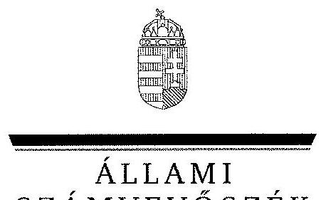
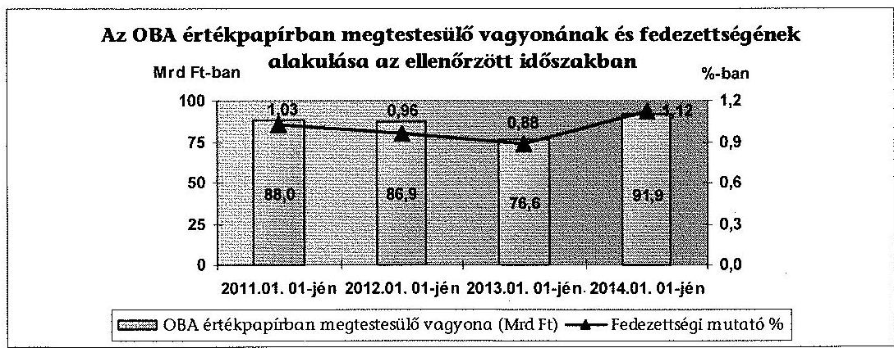
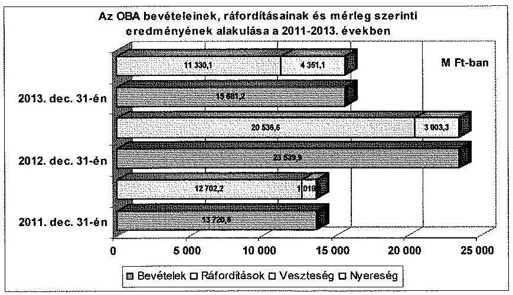
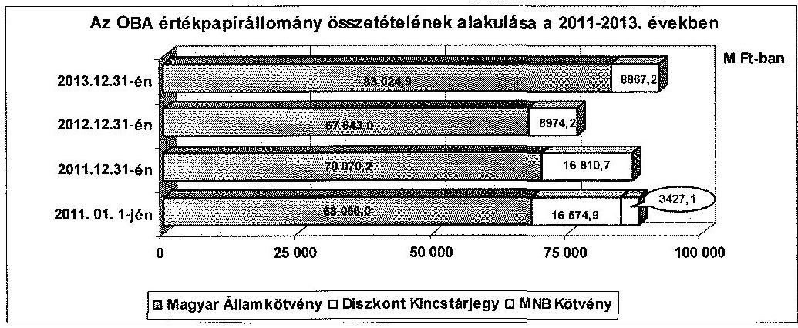
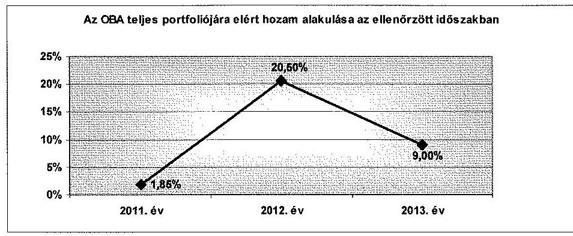
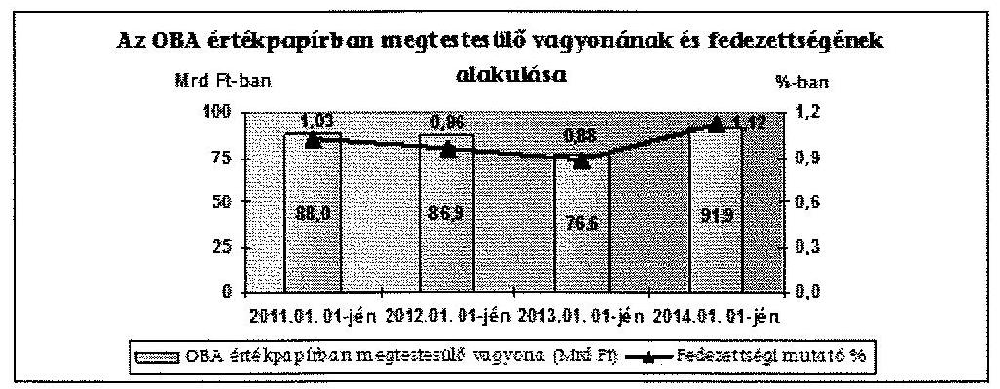
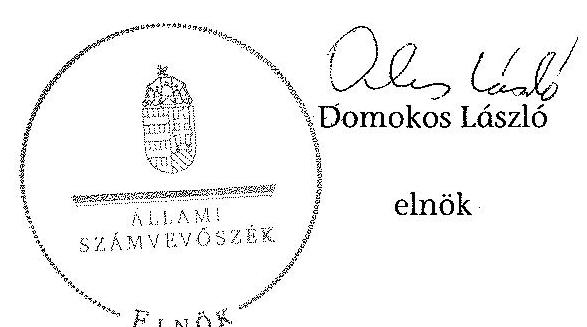
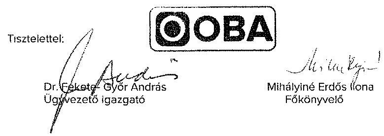
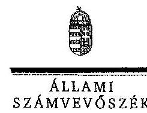

ÁLLAMI
SZÁMVEVŐSZÉK

# JELENTÉS 

Az OBA ellenőrzése - Az Országos Betétbiztosítási Alap múködésének, gazdálkodásának és feladatellátásának ellenőrzéséről

---

# Állami Számvevőszék 

Iktatószám: V-0456-174/2015
Témaszám: 1490
Vizsgálat-azonosító szám: V0688
Az ellenőrzést felügyelte:
Makkai Mária
felügyeleti vezető
Az ellenőrzést vezette:
Sali Sándorné
ellenőrzésvezető
A számvevői jelentések feldolgozásában és a jelentés összeállításában
közremüködtek:
Sali Sándorné
ellenőrzésvezető
Kámán Edina
számvevő tanácsos
Az ellenőrzést végezték:
Dr. Baloghné
Sebestyén Éva
számvevő

Domonkosné Kurilla Kámán Edina
Edit
számvevő tanácsos

A témához kapcsolódó eddig készített számvevőszéki jelentések:
címe
sorszáma
Az Országos Betétbiztosítási Alap múködésének ellenőrzéséről 0816

---

# TARTALOMJEGYZÉK 

BEVEZETÉS ..... 3
I. ÖSSZEGZŐ MEGÁLLAPÍTÁSOK, KÖVETKEZTETÉSEK, JAVASLATOK ..... 6
II. RÉSZLETES MEGÁLLAPÍTÁSOK ..... 11

1. Az OBA belső szabályozási rendszere ..... 11
1.1. Az OBA tevékenységét meghatározó belső szervezeti szabályozás ..... 11
1.2. A gazdálkodásra vonatkozó belső szabályozás ..... 12
1.3. Az Igazgatótanács irányítási és ellenőrzési kötelezettsége ..... 12
1.4. Külső ellenőrzések és hasznosulása ..... 13
2. Az OBA gazdálkodásának szabályszerűsége ..... 14
2.1. Az OBA éves beszámolója ..... 14
2.2. A dijbevételek és a vagyonkezelés bevételeinek beszedése és elszámolása ..... 16
2.3. A működéssel kapcsolatos költségek, ráfordítások elszámolása ..... 17
3. Az OBA vagyongazdálkodással kapcsolatos feladatellátása ..... 19
3.1. A vagyonelemekkel való gazdálkodás ..... 19
3.2. A vagyonkezelői tevékenység értékelése ..... 22
4. A kártalanítási tevékenység szabályszerűsége ..... 23
4.1. A kártalanítási kötelezettség nyilvántartása ..... 23
4.2. A kártalanítási kötelezettség kifizetése ..... 25
5. Korábbi ÁSZ ellenőrzések javaslatainak hasznosulása ..... 28
MELLÉKLETEK
6. számú Az Országos Betétbiztosítási Alap vagyonának alakulása a 2011-2013. években
7. számú Az Országos Betétbiztosítási Alap eredménykimutatásának alakulása a 2011-2013. években
8. számú Országos Betétbiztosítási Alap ügyvezető igazgatójának észrevétele
9. számú Országos Betétbiztosítási Alap ügyvezető igazgatójának észrevételére adott válasz

## FÜGGELÉKEK

1. számú Rövidítések jegyzéke
2. számú Fogalomtár

---

# **SOLUTIONS**

## **PROBLEM 1**

### **Part (a)**

To find the value of $$x$$, we need to find the value of $$y$$. The first part of the equation is given by $$y = x + 1$$.

1. **Step 1:**
   $$
   x + 1 = 0
   $$

2. **Step 2:**
   $$
   x + 2 = 1
   $$

3. **Step 3:**
   $$
   x + 3 = 2
   $$

4. **Step 4:**
   $$
   x + 4 = 3
   $$

5. **Conclusion:**
   $$x = 0 = 0 = 1$$

## **PROBLEM 2**

### **Part (a)**

To find the value of $$x$$, we need to find the value of $$y$$. The first part of the equation is given by $$y = x + 1$$.

1. **Step 1:**
   $$
   x + 1 = 0
   $$

2. **Step 2:**
   $$
   x + 2 = 1
   $$

3. **Step 3:**
   $$
   x + 4 = 3
   $$

4. **Step 4:**
   $$
   x + 5 = 4
   $$

5. **Conclusion:**
   $$x = 0 = 0 = 1$$

## **PROBLEM 3**

### **Part (a)**

To find the value of $$x$$, we need to find the value of $$y$$. The first part of the equation is given by $$y = x + 1$$.

1. **Step 1:**
   $$
   x + 1 = 0
   $$

2. **Step 2:**
   $$
   x + 2 = 1
   $$

3. **Step 3:**
   $$
   x + 4 = 3
   $$

4. **Step 4:**
   $$
   x + 5 = 4
   $$

5. **Conclusion:**
   $$x = 0 = 0 = 1$$

## **PROBLEM 4**

### **Part (a)**

To find the value of $$x$$, we need to find the value of $$y$$. The first part of the equation is given by $$y = x + 1$$.

1. **Step 1:**
   $$
   x + 1 = 0
   $$

2. **Step 2:**
   $$
   x + 2 = 1
   $$

3. **Step 3:**
   $$
   x + 4 = 3
   $$

4. **Step 4:**
   $$
   x + 5 = 4
   $$

5. **Conclusion:**
   $$x = 0 = 0 = 1$$

## **PROBLEM 5**

### **Part (a)**

To find the value of $$x$$, we need to find the value of $$y$$. The first part of the equation is given by $$y = x + 1$$.

1. **Step 1:**
   $$
   x + 1 = 0
   $$

2. **Step 2:**
   $$
   x + 2 = 1
   $$

3. **Step 3:**
   $$
   x + 4 = 3
   $$

4. **Step 4:**
   $$
   x + 5 = 4
   $$

5. **Conclusion:**
   $$x = 0 = 0 = 1$$

## **PROBLEM 6**

### **Part (a)**

To find the value of $$x$$, we need to find the value of $$y$$. The first part of the equation is given by $$y = x + 1$$.

1. **Step 1:**
   $$
   x + 1 = 0
   $$

2. **Step 2:**
   $$
   x + 2 = 1
   $$

3. **Step 3:**
   $$
   x + 4 = 3
   $$

4. **Step 4:**
   $$
   x + 5 = 4
   $$

5. **Conclusion:**
   $$x = 0 = 0 = 1$$

## **PROBLEM 7**

### **Part (a)**

To find the value of $$x$$, we need to find the value of $$y$$. The first part of the equation is given by $$y = x + 1$$.

1. **Step 1:**
   $$
   x + 1 = 0
   $$

2. **Step 2:**
   $$
   x + 2 = 1
   $$

3. **Step 3:**
   $$
   x + 4 = 3
   $$

4. **Step 4:**
   $$
   x + 5 = 4
   $$

5. **Conclusion:**
   $$x = 0 = 0 = 1$$

## **PROBLEM 8**

### **Part (a)**

To find the value of $$x$$, we need to find the value of $$y$$. The first part of the equation is given by $$y = x + 1$$.

1. **Step 1:**
   $$
   x + 1 = 0
   $$

2. **Step 2:**
   $$
   x + 2 = 1
   $$

3. **Step 3:**
   $$
   x + 4 = 3
   $$

4. **Step 4:**
   $$
   x + 5 = 4
   $$

5. **Conclusion:**
   $$x = 0 = 0 = 1$$

## **PROBLEM 9**

### **Part (a)**

To find the value of $$x$$, we need to find the value of $$y$$. The first part of the equation is given by $$y = x + 1$$.

1. **Step 1:**
   $$
   x + 1 = 0
   $$

2. **Step 2:**
   $$
   x + 2 = 1
   $$

3. **Step 3:**
   $$
   x + 4 = 3
   $$

4. **Step 4:**
   $$
   x + 5 = 4
   $$

5. **Conclusion:**
   $$x = 0 = 0 = 1$$

## **PROBLEM 10**

### **Part (a)**

To find the value of $$x$$, we need to find the value of $$y$$. The first part of the equation is given by $$y = x + 1$$.

1. **Step 1:**
   $$
   x + 1 = 0
   $$

2. **Step 2:**
   $$
   x + 2 = 1
   $$

3. **Step 3:**
   $$
   x + 4 = 3
   $$

4. **Step 4:**
   $$
   x + 5 = 4
   $$

5. **Conclusion:**
   $$x = 0 = 0 = 1$$

## **PROBLEM 11**

### **Part (a)**

To find the value of $$x$$, we need to find the value of $$y$$. The first part of the equation is given by $$y = x + 1$$.

1. **Step 1:**
   $$
   x + 1 = 0
   $$

2. **Step 2:**
   $$
   x + 2 = 1
   $$

3. **Step 3:**
   $$
   x + 4 = 3
   $$

4. **Step 4:**
   $$
   x + 5 = 4
   $$

5. **Conclusion:**
   $$x = 0 = 0 = 1$$

## **PROBLEM 12**

### **Part (a)**

To find the value of $$x$$, we need to find the value of $$y$$. The first part of the equation is given by $$y = x + 1$$.

1. **Step 1:**
   $$
   x + 1 = 0
   $$

2. **Step 2:**
   $$
   x + 2 = 1
   $$

3. **Step 3:**
   $$
   x + 4 = 3
   $$

4. **Step 4:**
   $$
   x + 5 = 4
   $$

5. **Conclusion:**
   $$x = 0 = 0 = 1$$

## **PROBLEM 21**

### **Part (a)**

To find the value of $$x$$, we need to find the value of $$y$$. The first part of the equation is given by $$y = x + 1$$.

1. **Step 1:**
   $$
   x + 1 = 0
   $$

2. **Step 2:**
   $$
   x + 2 = 1
   $$

3. **Step 3:**
   $$
   x + 4 = 3
   $$

4. **Step 4:**
   $$
   x + 5 = 4
   $$

5. **Conclusion:**
   $$x = 0 = 0 = 1$$

## **PROBLEM 22**

### **Part (a)**

To find the value of $$x$$, we need to find the value of $$y$$. The first part of the equation is given by $$y = x + 1$$.

1. **Step 1:**
   $$
   x + 1 = 0
   $$

2. **Step 2:**
   $$
   x + 2 = 1
   $$

3. **Step 3:**
   $$
   x + 4 = 3
   $$

4. **Step 4:**
   $$
   x + 5 = 4
   $$

5. **Conclusion:**
   $$x = 0 = 0 = 1$$

## **PROBLEM 23**

### **Part (a)**

To find the value of $$x$$, we need to find the value of $$y$$. The first part of the equation is given by $$y = x + 1$$.

1. **Step 1:**
   $$
   x + 1 = 0
   $$

2. **Step 2:**
   $$
   x + 2 = 1
   $$

3. **Step 3:**
   $$
   x + 4 = 3
   $$

4. **Step 4:**
   $$
   x + 5 = 4
   $$

5. **Conclusion:**
   $$x = 0 = 0 = 1$$

## **PROBLEM 24**

### **Part (a)**

To find the value of $$x$$, we need to find the value of $$y$$. The first part of the equation is given by $$y = x + 1$$.

1. **Step 1:**
   $$
   x + 1 = 0
   $$

2. **Step 2:**
   $$
   x + 2 = 1
   $$

3. **Step 3:**
   $$
   x + 4 = 3
   $$

4. **Step 4:**
   $$
   x + 5 = 4
   $$

5. **Conclusion:**
   $$x = 0 = 0 = 1$$

## **PROBLEM 25**

### **Part (a)**

To find the value of $$x$$, we need to find the value of $$y$$. The first part of the equation is given by $$y = x + 1$$.

1. **Step 1:**
   $$
   x + 1 = 0
   $$

2. **Step 2:**
   $$
   x + 2 = 1
   $$

3. **Step 3:**
   $$
   x + 4 = 3
   $$

4. **Step 4:**
   $$
   x + 5 = 4
   $$

5. **Conclusion:**
   $$x = 0 = 0 = 1$$

## **PROBLEM 26**

### **Part (a)**

To find the value of $$x$$, we need to find the value of $$y$$. The first part of the equation is given by $$y = x + 1$$.

1. **Step 1:**
   $$
   x + 1 = 0
   $$

2. **Step 2:**
   $$
   x + 2 = 1
   $$

3. **Step 3:**
   $$
   x + 4 = 3
   $$

4. **Step 4:**
   $$
   x + 5 = 4
   $$

5. **Conclusion:**
   $$x = 0 = 0 = 1$$

## **PROBLEM 27**

### **Part (a)**

To find the value of $$x$$, we need to find the value of $$y$$. The first part of the equation is given by $$y = x + 1$$.

1. **Step 1:**
   $$
   x + 1 = 0
   $$

2. **Step 2:**
   $$
   x + 2 = 1
   $$

3. **Step 3:**
   $$
   x + 4 = 3
   $$

4. **Step 4:**
   $$
   x + 5 = 4
   $$

5. **Conclusion:**
   $$x = 0 = 0 = 1$$

## **PROBLEM 28**

### **Part (a)**

To find the value of $$x$$, we need to find the value of $$y$$. The first part of the equation is given by $$y = x + 1$$.

1. **Step 1:**
   $$
   x + 1 = 0
   $$

2. **Step 2:**
   $$
   x + 2 = 1
   $$

3. **Step 3:**
   $$
   x + 4 = 3
   $$

4. **Step 4:**
   $$
   x + 5 = 4
   $$

5. **Conclusion:**
   $$x = 0 = 0 = 1$$

## **PROBLEM 29**

### **Part (a)**

To find the value of $$x$$, we need to find the value of $$y$$. The first part of the equation is given by $$y = x + 1$$.

1. **Step 1:**
   $$
   x + 1 = 0
   $$

2. **Step 2:**
   $$
   x + 2 = 1
   $$

3. **Step 3:**
   $$
   x + 4 = 3
   $$

4. **Step 4:**
   $$
   x + 5 = 4
   $$

5. **Conclusion:**
   $$x = 0 = 0 = 1$$

## **PROBLEM 30**

### **Part (a)**

To find the value of $$x$$, we need to find the value of $$y$$. The first part of the equation is given by $$y = x + 1$$.

1. **Step 1:**
   $$
   x + 1 = 0
   $$

2. **Step 2:**
   $$
   x + 2 = 1
   $$

3. **Step 3:**
   $$
   x + 4 = 3
   $$

4. **Step 4:**
   $$
   x + 5 = 4
   $$

5. **Conclusion:**
   $$x = 0 = 0 = 1$$

## **PROBLEM 31**

### **Part (a)**

To find the value of $$x$$, we need to find the value of $$y$$. The first part of the equation is given by $$y = x + 1$$.

1. **Step 1:**
   $$
   x + 1 = 0
   $$

2. **Step 2:**
   $$
   x + 2 = 1
   $$

3. **Step 3:**
   $$
   x + 4 = 3
   $$

4. **Step 4:**
   $$
   x + 5 = 4
   $$

5. **Conclusion:**
   $$x = 0 = 0 = 1$$

## **PROBLEM 32**

### **Part (a)**

To find the value of $$x$$, we need to find the value of $$y$$. The first part of the equation is given by $$y = x + 1$$.

1. **Step 1:**
   $$
   x + 1 = 0
   $$

2. **Step 2:**
   $$
   x + 2 = 1
   $$

3. **Step 3:**
   $$
   x + 4 = 3
   $$

4. **Step 4:**
   $$
   x + 5 = 4
   $$

5. **Conclusion:**
   $$x = 0 = 0 = 1$$

## **PROBLEM 33**

### **Part (a)**

To find the value of $$x$$, we need to find the value of $$y$$. The first part of the equation is given by $$y = x + 1$$.

1. **Step 1:**
   $$
   x + 1 = 0
   $$

2. **Step 2:**
   $$
   x + 2 = 1
   $$

3. **Step 3:**
   $$
   x + 4 = 3
   $$

4. **Step 4:**
   $$
   x + 5 = 4
   $$

5. **Conclusion:**
   $$x = 0 = 0 = 1$$

## **PROBLEM 34**

### **Part (a)**

To find the value of $$x$$, we need to find the value of $$y$$. The first part of the equation is given by $$y = x + 1$$.

1. **Step 1:**
   $$
   x + 1 = 0
   $$

2. **Step 2:**
   $$
   x + 2 = 1
   $$

3. **Step 3:**
   $$
   x + 4 = 3
   $$

4. **Step 4:**
   $$
   x + 5 = 4
   $$

5. **Conclusion:**
   $$x = 0 = 0 = 1$$

## **PROBLEM 35**

### **Part (a)**

To find the value of $$x$$, we need to find the value of $$y$$. The first part of the equation is given by $$y = x + 1$$.

1. **Step 1:**
   $$
   x + 1 = 0
   $$

2. **Step 2:**
   $$
   x + 2 = 1
   $$

3. **Step 3:**
   $$
   x + 4 = 3
   $$

4. **Step 4:**
   $$
   x + 5 = 4
   $$

5. **Conclusion:**
   $$x = 0 = 0 = 1$$

## **PROBLEM 36**

### **Part (a)**

To find the value of $$x$$, we need to find the value of $$y$$. The first part of the equation is given by $$y = x + 1$$.

1. **Step 1:**
   $$
   x + 1 = 0
   $$

2. **Step 2:**
   $$
   x + 2 = 1
   $$

3. **Step 3:**
   $$
   x + 4 = 3
   $$

4. **Step 4:**
   $$
   x + 5 = 4
   $$

5. **Conclusion:**
   $$x = 0 = 0 = 1$$

## **PROBLEM 37**

### **Part (a)**

To find the value of $$x$$, we need to find the value of $$y$$. The first part of the equation is given by $$y = x + 1$$.

1. **Step 1:**
   $$
   x + 1 = 0
   $$

2. **Step 2:**
   $$
   x + 2 = 1
   $$

3. **Step 3:**
   $$
   x + 4 = 3
   $$

4. **Step 4:**
   $$
   x + 5 = 4
   $$

5. **Conclusion:**
   $$x = 0 = 0 = 1$$

## **PROBLEM 38**

### **Part (a)**

To find the value of $$x$$, we need to find the value of $$y$$. The first part of the equation is given by $$y = x + 1$$.

1. **Step 1:**
   $$
   x + 1 = 0
   $$

2. **Step 2:**
   $$
   x + 2 = 1
   $$

3. **Step 3:**
   $$
   x + 4 = 3
   $$

4. **Step 4:**
   $$
   x + 5 = 4
   $$

5. **Conclusion:**
   $$x = 0 = 0 = 1$$

## **PROBLEM 39**

### **Part (a)**

To find the value of $$x$$, we need to find the value of $$y$$. The first part of the equation is given by $$y = x + 1$$.

---

# JELENTÉS 

## Az OBA ellenőrzése - Az Országos Betétbiztosítási Alap múködésének, gazdálkodásának és feladatellátásának ellenőrzése

## BEVEZETÉS

Az Országos Betétbiztosítási Alap tevékenységét 1993-ban kezdte meg. Feladata, hogy a tagintézeteknél elhelyezett és biztosított betétek befagyása esetén kártalanítást fizessen a betéteseknek, valamint ezzel kapcsolatosan tájékoztassa őket. A tagintézetek által befizetett díjakból finanszírozza a tevékenységét, amely közérdeket szolgál. Irányítását az Igazgatótanács látja el. Az Alaptörvény 41. cikke alapján 2013. október 1-jétől az MNB látja el a pénzügyi közvetítőrendszer felügyeletét, mivel a PSZÁF önálló intézményként megszűnt, tevékenysége az MNB-be integrálódott.

A hazánkat is elérő pénzügyi-gazdasági válság negatívan befolyásolta a makrogazdasági helyzetet, megingott a pénzügyi szféra stabilitása. Egyes hitelintézetek fizetésképtelenségének hírére megrendült a pénzügyi szektorba vetett bizalom. A problémát hazai és EU-s szinten is válságkezelési tevékenységekkel, jogszabály módosításokkal igyekeztek kezelni. Ennek egyik módja a betétbiztosításon keresztül történő beavatkozás volt, amelynek eredményeként a kártalanítási összeghatárt 2011. január 1-jétől a korábbi duplájára, 100000 EUR-ra emelték. Az OBA-t 1993. évi létrehozása óta az ÁSZ többször, utoljára 2008-ban ellenőrizte, ekkor azonban a gazdasági válság és a jogszabályi változások hatásai még nem voltak értékelhetők.

Az OBA elméleti kártalanítási kötelezettsége (a betétbiztosítással érintett betétek összege) 2011-ben 8506,0 Mrd Ft, 2012-ben 9067,0 Mrd Ft, 2013-ban 8753,0 Mrd Ft, 2014-ben 8183,0 Mrd Ft volt, míg az erre fedezetet nyújtó vagyona - értékpapírban megtestesülő eszközeinek tárgyévi nyitó könyv szerinti értéke - 2011-ben 88,0 Mrd Ft-ot, 2012-ben 86,9 Mrd Ft-ot, 2013-ban 76,6 Mrd Ft-ot, 2014-ben 91,9 Mrd Ft-ot tett ki. Az Alap vagyona az ellenőrzött időszak végéig minden esetben elégséges fedezetet nyújtott a kifizetett kártalanításokhoz. Egy nagyobb méretű hitelintézet fizetésképtelensége eredményezhet olyan mértékű kártalanítási kötelezettséget, ami az OBA rendelkezésére álló fedezet összegét meghaladja. Ebben az esetben az OBA-nak lehetősége van kormányzati kezességvállalás mellett hitel felvételére, ami költségvetési kockázatot jelenthet.

Az ellenőrzés célja annak megállapítása volt, hogy szabályos volt-e az OBA működése és gazdálkodása, feladatait a jogszabályi előírásoknak megfelelően látta-e el az ellenőrzött időszakban.

---

Ennek keretében értékeltük:

- az OBA belső szabályozási rendszere a múködést meghatározó jogszabályokkal összhangban biztosította-e a szabályszerű feladatellátást;
- az OBA gazdálkodásának szabályszerűségét, ezen belül a tagdíjak beszedésének jogszabályi megfelelőségét;
- az OBA által végzett kártalanítási tevékenység szabályszerűségét;
- a korábbi ÁSZ ellenőrzések megállapításainak hasznosulását.

Az ellenőrzés várható hasznosulásaként a jogszabályi változások követésének, a gazdálkodás szabályszerűségének az ellenőrzése, a javaslatok holisztikus szemléletű megfogalmazása elősegítheti a szabályozás megfelelő alkalmazását, a gazdálkodás pénzügyi egyensúlyának fenntartását, valamint hozzájárulhat a pénzügyi közvetítő rendszerek stabilitásának megerősítéséhez. Az ellenőrzéssel lehetőség nyílhat az esetlegesen fennálló problémák feltárására, amelyek kiküszöbölése hozzájárulhat az OBA hatékonyabb működéséhez. A megtakarítások védelmét, az OBA kártalanítási kötelezettségének teljesíthetőségét - az elmúlt időszakban előfordult pénzintézeti fizetőképességi problémákra tekintettel - fokozott társadalmi érdeklődés kíséri.

Mintavétellel ellenőriztük a pénzügyi és vagyongazdálkodás keretében az éves díjak, a pénzügyi műveletek és az egyéb betétbiztosítással összefüggő bevételek, a betétbiztosításhoz kapcsolódó, az anyagjellegű, a személyi jellegű és a pénzügyi műveletek ráfordításainak, a követelések és értékpapírok elszámolásának szabályszerűségét, ez alapján a sokaságokban előforduló hibás tételek arányát becsültük. A jogszabályoknak és a belső előírásoknak megfelelőnek, azaz szabályszerűnek tekintettük az adott területet, amennyiben a minta ellenőrzésének eredménye alapján $95 \%$-os bizonyossággal a teljes sokaságban a hibás tételek aránya kisebb volt, mint $10 \%$, nem megfelelőnek értékeltük, ha a hibás tételek aránya a $10 \%$-ot meghaladta.

Az ellenőrzés típusa: szabályszerűségi ellenőrzés
Az ellenőrzött időszak: 2011. január 1 - 2013. december 31.
A helyszíni ellenőrzést az Országos Betétbiztosítási Alapnál folytattuk le. Az ellenőrzés végrehajtására a Hpt. 109. §-ában¹, valamint az ÁSZ tv. 33. § (7) bekezdésében foglaltak adtak jogszabályi alapot.

Az ellenőrzés szakmai módszertana az ÁSZ hivatalos honlapján (www.asz.hu) közzétett szakmai szabályokon alapult, amely a Legfőbb Ellenőrző Intézmények Nemzetközi Szervezete (INTOSAI) által kiadott nemzetközi standardok (ISSAI) figyelembevételével készült. Az OBA az ellenőrzés lefolytatásához tanúsítványok kitöltésével, valamint dokumentumok elektronikus megküldésével

[^0]
[^0]:    ${ }^{1}$ 2014. január 1-jétől a hitelintézetek és a pénzügyi vállalkozásokról szóló 2013. évi CCXXXVII. törvény 221. §-a.

---

szolgáltatott adatokat. Az így rendelkezésre bocsátott adatok (információk) kontrollja a helyszíni ellenőrzés keretében történt.

Az ÁSZ a 2011. évi LXVI. törvény 29. §-a szerint a jelentéstervezetet megküldte az Országos Betétbiztosítási Alap ügyvezető igazgatójának egyeztetésre. Az ügyvezető igazgató észrevételét és az arra adott választ a jelentés 3-4. számú mellékletei tartalmazzák.

---

# 1. ÖSSZEGZŐ MEGÁLLAPÍTÁSOK, KÖVETKEZTETÉSEK, JAVASLATOK 

Az OBA vagyona a 2011. január 1-jei 90 938,4 M Ft-ról a 2013. év végére $9,2 \%$-kal, $99280,7 \mathrm{M}$ Ft-ra emelkedett. A 2011. év elején a vagyon $96,8 \%$-a ( $88068,0 \mathrm{M}$ Ft), a 2013. év végén $92,6 \%$-a ( $91892,1 \mathrm{M}$ Ft) értékpapírokból állt, amelynek tartalma, besorolása, és értékelése az Sztv. előírásai alapján megfelelő volt. A 2011-2013. években az OBA követelésállományának 99,9\%-át a Hpt. előírásai alapján az OBA-ra átszállt tagintézeti követelések tették ki, amelynek nyilvántartása és értékelése megfelelt a jogszabályi előírásoknak. A követelések értékvesztését a felszámolók nyilatkozatai alapján számolták el, behajthatatlan követelés leírására nem került sor. A forrásoldalon a felhalmozódott pozitív mérleg szerinti eredmények következtében a saját tőke volt a legjelentősebb tétel, amely a 2011. év eleji 90771,4 M Ft-ról folyamatosan a 2013. év végére $9,2 \%$-kal, $99164,2 \mathrm{M}$ Ft-ra növekedett.

Az ellenőrzött időszakban az OBA pénzbeli vagyonát - jogszabályi kötelezettségének eleget téve - állampapírokban tartotta, kezelésére vagyonkezelöket bízott meg, továbbá az értékpapírok letéti kezelésére letétkezelői szerződéseket kötött. A 2011. év végéig az OBA saját hatáskörű döntése alapján a vagyonkezelők és a letétkezelő kiválasztása nyílt pályázat útján történt. Ezt követően 2012. január 2-ától az Igazgatótanács döntése szerint az OBA vagyonának kezelésére határozatlan időre állami tulajdonú szervezettel, az ÁKK Zrt.-vel kötöttek szerződést, míg 2013. január 1-jétől a Tpt. módosítását követően a portfolió letétkezelésével a KELER Zrt.-t bízták meg. A vagyonkezelők számára a követendő szabályokat és a teljesítendő elvárásokat a portfoliókezelési szerződések tartalmazták. A vagyonkezelői megállapodások mellékletében rögzítették a hozam elvárásokat, meghatározták az alkalmazott referenciahozamokat, továbbá előírták a portfolió likviditásával szemben támasztott követelményeket. A vagyonkezelők érdekeltek voltak a hozamok maximalizálásában, mivel az elért hozamoktól függött a vagyonkezelői díj alakulása. A vagyonkezelői tevékenység eredményeként 2011-ben 1543,1 M Ft, 2012-ben - a hazai állampapírpiac kedvező alakulása következtében - $15090,9 \mathrm{M} \mathrm{Ft}$, 2013-ban 7463,3 M Ft hozam realizálódott. Az ellenőrzött időszakban a vagyonkezelők beszámolási, jelentéstételi kötelezettségüknek az előírt rendszerességgel eleget tettek, amelyek alapján a vagyonkezelői tevékenység monitoringozása, értékelése megvalósult. Az OBA vagyongazdálkodással kapcsolatos feladatellátása eredményes volt, mivel a vagyonkezelői tevékenység hozzájárult a vagyon növekedéséhez, továbbá fedezetet biztosított a kártalanítások kifizetéséhez.

Az OBA által végzett kártalanítási tevékenység - 2011-ben a „Jógazda" Takarékpénztár, 2012-ben a Soltvadkert Takarékszövetkezet betéteseinek kártalanítása - az ellenőrzött időszakban szabályszerű volt. Az OBA által ellenőrzött adatállományok mindkét kártalanítás során biztosították a betétek szabályszerű kifizetését. Az ellenőrzött időszakban az OBA a Hpt. előírásainak eleget téve - a kártalanítási eljárásokra való felkészülés biztosítása érdekében - tesztelte a kártalanítási eljárások támogatását szolgáló kifizető rendszerének a múködését. Az elvégzett tesztelések eredményeiről minden esetben jegyzőkönyvet készí-

---

tettek, amelyek tartalmazták a feltárt hiányosságokat, javaslatokat, valamint a hiányosságok megszüntetése érdekében készített intézkedési terveket.

A 2011-2012. évi kártalanítások során a Hpt.-ben előírt közzétételi kötelezettségnek eleget tettek, a kifizetésekben közreműködő partnerekkel kötött együttműködési megállapodások biztosították a szabályszerű kifizetések lebonyolítását. Az OBA kártalanítási kötelezettsége a 2011. évben a „Jógazda" Takarékpénztárnál 9126,0 M Ft, a 2012. évben a Soltvadkert Takarékszövetkezetnél 33 239,0 M Ft volt. A 2013. évben kártalanítási kötelezettség nem volt. A kifizetések teljesítéséhez a likvid fedezetet saját forrásból biztosították, amelyekhez az állampapírok beváltása határidőben megtörtént.

A betétbiztosító intézmények vagyoni helyzetét, „feltöltöttségét" a fedezettségi mutató jellemzi, amely az OBA-nál a 2011. január 1-jei 1,03\%-ról 2014. január 1-jére 1,12\%-ra emelkedett. Az emelkedést egyrészt az elméleti kártalanítási kötelezettség 3,8\%-os csökkenése, másrészt az OBA értékpapír vagyonának 4,4\%-os emelkedése okozta, amely összefüggésben volt azzal, hogy a 2013. évben az OBA-nak kártalanítási kötelezettsége nem volt.

Az ellenőrzött időszakban az OBA gazdálkodása - ezen belül a vagyonnal való gazdálkodás - megfelelt a jogszabályi előírásoknak. A 2011-2013. évek gazdálkodásáról az éves beszámolókat szabályszerűen elkészítették, azonban a betétesekkel szembeni kötelezettségek év végi értékelését, számviteli elszámolását, a leltárral való alátámasztását, a főkönyvi könyvelés, analitikus nyilvántartások és bizonylatok adatai közötti egyeztetését valamint ellenőrzését nem szabályszerűen végezték el. Továbbá a 2012. évben a mérleg fordulónapi értékeléskor elszámolt árfolyam különbözet $14,5 \mathrm{M}$ Ft eredménynövelő és $81,1 \mathrm{M} \mathrm{Ft}$ eredménycsökkentő összegeit az Sztv. 85. § (5) bekezdésben foglaltak ellenére nem összevontan, hanem bruttó módon számolták el az aktív és passzív időbeli elhatárolások között.

Az Alap a 2011-2013. évek mérlegében az Sztv. 42. § (1) bekezdésében és a 214/2000. (XII. 11.) Korm. rendelet 4. § (7) bekezdésében foglaltakat figyelmen kívül hagyva a kötelezettségek között nem teljes körűen mutatta ki - a Hpt. szerint biztosított betétek után - a betéteseket megillető, de még ki nem fizetett tőke és kamat összegét. Ezáltal nem biztosították az Sztv. 15. § (2) és (3) bekezdésében előírt teljesség és valódiság elvét. A betétesekkel szembeni kötelezettségekről - tagintézeti bontásokban - vezetett analitikus nyilvántartásokban kimutatott összegek nem egyeztek meg a főkönyvben és a mérlegben

---

kimutatott összegekkel, amely nem felelt meg az Sztv. 69. § (2) bekezdésében foglaltaknak. A Heves Takarékszövetkezet és a Reálbank Rt. tagintézetek esetében az ellenőrzés részére átadott analitikákból nem volt megállapítható a 2011-2013. évek mérlegfordulónapján fennálló, betéteseket megillető, de ki nem fizetett tőke és kamat összege. A rendelkezésre álló analitikus nyilvántartásokat és a Reálbank Rt.-vel kapcsolatosan a mérlegben kimutatott 76,7 M Ftot figyelembe véve minimálisan 2011-ben $248,0 \mathrm{MFt}, 2012$-ben $382,4 \mathrm{MFt}$, 2013-ban $276,4 \mathrm{MFt}$ volt a betétesekkel szembeni kötelezettségek összege, amellyel szemben az OBA az ellenőrzött időszak főkönyvi könyveléseiben és mérlegeiben - minden év végén - mindössze 78,1 M Ft-ot mutatott ki. Az OBA a 2011-2013. évi beszámolójának kiegészítő mellékletében - a 214/2000. (XII. 11.) Korm. rendelet 7. § a) pontjában, valamint a Számviteli Politikában foglaltakkal ellentétesen - nem mutatta be a befagyott betétek után még ki nem fizetett tőke és kamat összegét.

Az ellenőrzött időszakban a tagdíjak beszedése megfelelt a jogszabályi előírásoknak. Az összes bevétel a 2011. évi 13 720,5 M Ft-ról a 2013. év végére $14,3 \%$-kal, 15681,2 M Ft-ra emelkedett a tagintézetekkel szemben elszámolt díjbevételek $4,6 \%$-os és a pénzügyi műveletek bevételeinek $12,0 \%$-os emelkedése miatt. Az OBA betétbiztosításból eredő bevételeinek, betétbiztosítással összefüggő egyéb bevételeinek, valamint a pénzügyi műveletek bevételeinek elszámolása az ellenőrzött időszakban szabályszerű volt. A 2011-2013. években a csatlakozási díjak, a rendszeres és emelt tagdíjak, illetve a díjcsökkentő tételek meghatározása és elszámolása megfelelt a Hpt.-ben és a Dijfizetési szabály-zat ${ }_{1,2,3}$-ban foglaltaknak.

A 2011-2013. években az Alap múködésével kapcsolatos költségek, ráfordítások elszámolása, valamint a mérleg szerinti eredmény megállapítása megfelelt a jogszabályi előírásoknak. Az OBA összes ráfordítása a 2011. évi 12 702,2 M Ft-ról a 2013. év végére 10,8\%-kal, 11 330,1 M Ft-ra csökkent, elsősorban a pénzügyi műveletek ráfordításainak csökkenése miatt. Az ellenőrzött időszakban az anyagjellegú ráfordításokat, a személyi jellegű ráfordításokat, a betétbiztosításból eredő ráfordításokat, valamint a vagyonkezeléshez kapcsolódó pénzügyi műveletek ráfordításait az Sztv.-ben és a belső szabályzatokban foglaltaknak megfelelően számolták el.

Az OBA belső szabályozási rendszere a tevékenységet és a múködési folyamatokat meghatározó jogszabályokkal összhangban a 2011-2013. években biztosította a szabályszerű feladatellátást. Az ellenőrzött időszakban az OBA Igazgatótanácsa feladatát szabályszerűen látta el, eleget tett irányítási és ellenőrzési kötelezettségének. Ellenőrzési funkciója keretében megtárgyalta és elfogadta a függetlenített belső ellenőri munkaterveket, valamint az éves jelentéseket. A belső ellenőrzés a 2011-2013. években a munkatervben elfogadott ellenőrzéseken túl négy célellenőrzést végzett, amelyből kettő az OBA múködésével, kettő a tagintézetek kártalanítási eljárásának ellenőrzésével volt kapcsolatos. A belső ellenőrzések javaslatai az ellenőrzött időszakban hasznosultak. A 2011-2013. években a Hpt.-ben előírtak szerint választott könyvvizsgáló véleményezte az OBA költségvetésének teljesítéséről, valamint a portfoliókezelői teljesítmények bemutatásáról készített előterjesztéseket, továbbá hitelesítette az éves beszámolókat.

---

Az OBA együttműködési megállapodás keretében a felügyeleti ellenőrzéshez csatlakozva a 2011. évben 11 db , a 2012. évben 18 db , a 2013. évben tíz db tagintézet helyszíni ellenőrzésében vett részt „OBA szempontú vizsgálati módszertan" alkalmazásával. Az ellenőrzési tapasztalatokról jelentések készültek, amelyek tartalmazták a feltárt hiányosságokat és a tagintézetek részéről végrehajtandó feladatokat. A 2011-2013. években az ellenőrzések tapasztalatairól az Igazgatótanácsot tájékoztatták. A felügyeleti ellenőrzések során az OBA által feltárt hiányosságokat a tagintézetek megszüntették, ezért a Hpt.-ben foglalt szankciók alkalmazására nem került sor. A 2008. évi ÁSZ ellenőrzés OBAnak címzett javaslatai hasznosultak.

Az Állami Számvevőszékről szóló 2011. évi LXVI. törvény 33. § (1) bekezdésében foglaltak értelmében a jelentésben foglalt megállapításokhoz kapcsolódó intézkedési tervet köteles az ellenőrzött szervezet vezetője összeállítani, és azt a jelentés kézhezvételétől számított 30 napon belül az ÁSZ részére megküldeni. Amennyiben az intézkedési tervet határidőben nem küldi meg a szervezet, vagy az nem elfogadható, az ÁSZ elnöke a hivatkozott törvény 33. § (3) bekezdés a)-b) pontjaiban foglaltakat érvényesítheti.

Az ellenőrzés intézkedést igénylő megállapításai és javaslatai:

# az OBA Igazgatótanácsa elnökének 

1. Az OBA a 2011-2013. évek mérlegében az Sztv. 42. § (1) bekezdésében és a 214/2000. (XII. 11.) Korm. rendelet 4. § (7) bekezdésében foglaltakat figyelmen kívül hagyva a kötelezettségek között nem teljes körűen mutatta ki - a Hpt. szerint biztosított betétek után - a betéteseket megillető, de még ki nem fizetett tőke és kamat összegét. Ezáltal nem biztosították az Sztv. 15. § (2) és (3) bekezdésében előírt teljesség és valódiság elvét.

A Heves Takarékszövetkezet és a Reálbank Rt. tagintézetek esetében az ellenőrzés részére átadott analitikákból nem volt megállapítható a 2011-2013. évek mérlegfordulónapján fennálló, betéteseket megillető, de ki nem fizetett tőke és kamat összege. A betétesekkel szembeni kötelezettségekről - tagintézeti bontásokban - vezetett analitikus nyilvántartásokban kimutatott összegek nem egyeztek meg a főkönyvben és a mérlegben kimutatott összegekkel, amely nem felelt meg az Sztv. 69. § (2) bekezdésében foglaltaknak.

Javaslat:
a) Intézkedjen a betéteseket megillető, ki nem fizetett tőke és kamat összegének, mint kötelezettségnek a mérlegben való szerepeltetéséről.
b) Intézkedjen a betéteseket megillető, ki nem fizetett tőke és kamat analitikus nyilvántartás pontos vezetéséről, továbbá a főkönyvi könyvelés és az analitikus nyilvántartások adatai közötti egyeztetésről.
2. Az OBA a 2011-2013. évi beszámolójának kiegészítő mellékletében - a 214/2000. (XII. 11.) Korm. rendelet 7. § a) pontjában, valamint a Számviteli Politikában foglaltakkal ellentétesen - nem mutatta be a befagyott betétek után még ki nem fizetett tőke és kamat összegét.

---

Javaslat:
Intézkedjen a befagyott betétek után még ki nem fizetett tőke és kamat összegének az éves beszámoló kiegészítő mellékletében történő bemutatásáról.

---

# II. RÉSZLETES MEGÁLLAPÍTÁSOK 

## 1. Az OBA BELSŐ SZABÁLYOZÁSI RENDSZERE

### 1.1. Az OBA tevékenységét meghatározó belsõ szervezeti szabályozás

A múködési folyamatokat meghatározó belsõ irányítási eszközök a hatályos jogszabályi előírásokkal összhangban biztosították a szabályszerű feladatellátást.

Az OBA rendelkezett SZMSZ-szel, amely tartalmazta a múködéssel kapcsolatos feladat- és hatásköröket, a szervezet felépítését és szervezeti ábráját. A szabályzatot az ellenőrzött időszakban szervezeti változások, az OBA arculatváltása, továbbá a Mavtv. 10. § (4) bekezdésében előírt minősített adatok kezelésével kapcsolatosan adatvédelmi felelős kijelölése miatt módosították. Az OBA irányító szerve az Igazgatótanács, amelynek múködését az SZMSZ-szel összhangban az Ügyrend szabályozta. A 2011-2013. években az Ügyrendet a jogszabályi változásokkal összefüggésben három esetben - az Igazgatótanács tagjainak tiszteletdíáara ${ }^{2}$, összetételére és a tagok feladatainak pontosítására vonatkozóan - módosították.

Az Igazgatótanács az Alap díjpolitikáját évente a Díjfizetési szabályzat ${ }_{1,2,3}$-ban határozta meg, amelyet a Pénzügyi Közlönyben, a Nemzetgazdasági Közlönyben, valamint az OBA internetes honlapján tettek közzé. A tagintézetek jogait és kötelezettségeit, valamint a tagintézetekkel szemben alkalmazható intézkedéseket - a Hpt. 120-124. §-ai által szabályozott keretek között - a Tagi szabályzatban rögzítették.

A 2011-2013. években az OBA - a Hpt. 118. § (3) bekezdés előírásainak eleget téve - pénzbeli vagyonát állampapírokban tartotta. Kezelésére vagyonkezelőket bízott meg, a vagyonkezeléshez kapcsolódóan letétkezelőt alkalmazott. Az OBA vagyonának kezelésével kapcsolatos feladatokat a Befektetési szabályzatban határozták meg, amelyet az ellenőrzött időszakban két alkalommal - jogszabályi változással, valamint a vagyonkezelő és letétkezelő kiválasztásával összefüggésben - módosítottak.

A kártalanítási tevékenység szabályszerű végrehajtása érdekében az OBA rendelkezett Kártalanítási Forgatókönyvvel, valamint Kifizetési szabályzattal, amelyeket az ellenőrzött időszakban az Igazgatótanács jóváhagyásával két alkalommal aktualizáltak. A Kártalanítási Forgatókönyvben meghatározták a kártalanítási folyamat fő szakaszait, a kártalanításban részt vevő személyeket, valamint a kártalanítás feladatait. A Kifizetési szabályzat a hitelintézetek fizetés-

[^0]
[^0]:    ${ }^{2}$ 2011. január 1-jétől az Igazgatótanács tagjai tiszteletdijban részesültek, amely változás a korábbi évekhez képest.

---

képtelenné válása kapcsán végrehajtandó kifizetési tevékenységet szabályozta. Az ellenőrzött időszakban a kártalanítások tapasztalatait az OBA „Fehér könyv"-ben foglalta össze.

A függetlenített belső ellenőrzés szabályait az SZMSZ-ben, valamint a Belső ellenőrzési szabályzatban határozták meg. A belső ellenőrzési tevékenység az Igazgatótanács közvetlen felügyelete alá tartozott. Az Igazgatótanács feladata a belső ellenőrzési munkaterv és jelentések jóváhagyása, az ügyvezető feladata a jelentések alapján szükséges intézkedések végrehajtása volt. A belső ellenőrzési tevékenységet a 2011-2013. években külső vállalkozás megbízásával látták el.

# 1.2. A gazdálkodásra vonatkozó belső szabályozás 

Az OBA gazdálkodását a 2011-2013. években az Sztv., valamint a 214/2000. (XII. 11.) Korm. rendelet előírásai határozták meg. Az ellenőrzött időszakban a jogszabályokkal összhangban, az Alap sajátosságainak figyelembevételével elkészítették, folyamatosan aktualizálták a Számviteli Politikát, az Értékelési, a Leltározási, a Pénzkezelési, az Iratkezelési szabályzatokat és a Számlarendet.

Az ellenőrzött időszakban két alkalommal aktualizált Adatbiztonsági és archiválási szabályzat megfelelően tartalmazta a hitelintézetek fizetésképtelenné válása kapcsán végrehajtandó adatbiztonsági és archiválási feladatokat. Az Infotv. 24. § (1) és (3) bekezdés szerint az OBA-nak adatvédelmi szabályzatkészítési kötelezettsége nem volt, azonban a 2013. évben az Alap saját döntése alapján a tevékenységével összefüggő adatvédelem alapvető elveit és alkalmazandó legfontosabb szabályait tartalmazó Adatvédelmi szabályzatot elkészítette ${ }^{3}$. Az IBSZ-ben meghatározták az információ átadás formáit, valamint az Infotv. 7. § (2) bekezdésében foglaltak szerint kialakították az adat- és titokvédelmi szabályok érvényre juttatásához szükséges technikai, szervezési intézkedéseket, továbbá az eljárási szabályokat.

### 1.3. Az Igazgatótanács irányítási és ellenőrzési kötelezettsége

Az ellenőrzött időszakban az OBA Igazgatótanácsa a feladatát a Hpt. 111112. §-ban foglaltak alapján szabályszerűen látta el, eleget tett irányítási és ellenőrzési kötelezettségének.

Az Igazgatótanács a 2011-2013. években a jogszabályi előírásoknak megfelelően gyakorolta a munkáltatói és irányítási jogosultságait, megállapította az Alap költségvetését, ezen belül jóváhagyta a múködési költségeket. A Felügyelet határozatai alapján elrendelte a „Jógazda" Takarékpénztár, valamint a Soltvadkert Takarékszövetkezet kártalanítási eljárásának megkezdését és jóváhagyta a kártalanítási eljárások kifizetésének rendjét. Kialakította az Alap dijpolitikáját, amelyről a tagintézeteket tájékoztatta és a dijpolitika alapján meghatározta a tagintézetek éves díjfizetési kötelezettségét. Javaslatot tett a Felügyeletnek a hitelintézetek betétbiztosítással kapcsolatos kötelezettségeinek az

[^0]
[^0]:    ${ }^{3}$ Az Igazgatótanács az Adatvédelmi szabályzatot 2013. július 3-ai hatálybalépéssel fogadta el.

---

ellenőrzésére. Az Igazgatótanács összetétele az ellenőrzött időszakban megfelelt a Hpt. 110. §-ában foglalt előírásoknak.

Az Igazgatótanács ellenőrzési funkciója keretében megtárgyalta és elfogadta a függetlenített belső ellenőri munkaterveket, valamint az éves jelentéseket. Az OBA-nál működő belső ellenőr az éves munkatervei alapján a tagintézeti befizetésekkel, ügyvitellel, pénz- és vagyonkezeléssel, iratkezeléssel, továbbá az éves működési költségek alakulásával kapcsolatban végzett rendszeresen ellenőrzéseket. A belső ellenőr az adott évben elvégzett ellenőrzések tapasztalatairól jelentésben számolt be az Igazgatótanácsnak. Az ellenőrzött időszakban a jelentések elfogadását követően a javaslatokat hasznosították.

Az ellenőrzött időszakban a munkatervben elfogadott ellenőrzéseken túl a belső ellenőrzés négy célellenőrzést végzett, amelyből kettő az OBA működésének, kettő a tagintézetek kártalanítási eljárásának ellenőrzésére irányult. Az OBA működésére vonatkozó ellenőrzés keretében a belső ellenőr az emelt díjjal kapcsolatos információk kiszivárogtatását, valamint az OBA-nál folytatott jutalmazási gyakorlatot ellenőrizte. Az elkészített jelentések javaslatot nem tartalmaztak. A tagintézetek kártalanítási eljárásának célellenőrzései során a belső ellenőrzés egyrészt a „Jógazda" Takarékpénztár ügyfeleinek kártalanítása során felmerült reklamációkat, másrészt a Soltvadkert Takarékszövetkezet kártalanítási eljárásának szabályszerűségét ellenőrizte. Az ellenőrzésekről készített jelentéseket az Igazgatótanács elfogadta, a jelentésekben megfogalmazott javaslatok hasznosultak.

# 1.4. Külső ellenőrzések és hasznosulása 

A 2011-2013. években az OBA a könyvvizsgáló kiválasztásakor a Hpt. 109/A. §-ában előírtakat betartotta. A választott könyvvizsgáló véleményezte, az Igazgatótanács határozatával jóváhagyta az OBA költségvetésének teljesítéséről, valamint a portfoliókezelői teljesítmények bemutatásáról készített előterjesztéseket, továbbá hitelesítette az éves beszámolókat és ellenőrizte az éves beszámoló adatainak összhangját az üzleti jelentéssel.

A tagintézetek felügyeleti ellenőrzését 2013. szeptember 30-ig a PSZÁF, majd 2013. október 1-jétől az MNB látta el. Az ellenőrzött időszakban az OBA a felügyeleti ellenőrzéshez csatlakozva ${ }^{4}$ részt vett a tagintézetek helyszíni ellenőrzésében. A helyszíni ellenőrzések lefolytatásához elkészítették és a Felügyelet részére átadták az OBA által biztosított betétekkel kapcsolatos nyilvántartási előírások ellenőrzésének módszertani kézikönyvét. Az „OBA szempontú vizsgálati módszertan" három fő területre - a díjfizetési kötelezettségek számszerú megalapozására, a konszolidált banki betét adatainak előállítási képességére, ezzel kapcsolatosan a betétes és betétadatok nyilvántartásának előírt módon történő teljesítésére és naprakészségére, valamint a betétesek védelme érdekében a tájékoztatási kötelezettségek betartására - terjedt ki.

Az OBA a 2011. évben 11, a 2012. évben 18, a 2013. évben tíz tagintézetnél végzett felügyeleti ellenőrzésben vett részt, és az ellenőrzések tapasztalatairól az

[^0]
[^0]:    ${ }^{4}$ A Felügyelettel kötött Együttmúködési Megállapodásban foglaltak szerint.

---

Igazgatótanácsot tájékoztatta. Az elkészült jelentések tartalmazták a feltárt hiányosságokat, a végrehajtandó feladatokat a határidő megjelölésével. A felügyeleti ellenőrzések során feltárt hiányosságokat a tagintézetek megszüntették, ezért a Hpt. 124. § (2) bekezdésében foglalt szankciók alkalmazására nem került sor.

# 2. Az OBA GAZDÁlKODÁSÁNAK SZABÁLYSZERŰSÉGE 

### 2.1. Az OBA éves beszámolója

Az OBA gazdálkodása - ezen belül a vagyonnal való gazdálkodás megfelelt a jogszabályi előírásoknak. A 2011-2013. évek gazdálkodásáról - az Sztv. 4. § (1) és 17. § (1) bekezdéseiben, valamint a 214/2000. (XII. 11.) Korm. rendelet 2. §-ában foglaltak alapján - elkészítették a mérleget, eredménykimutatást és kiegészítő mellékletet magába foglaló éves beszámolókat.

Az ellenőrzött időszakban a mérleg készítése során a számviteli alapelvek közül érvényesült az Sztv.15. § (6) bekezdésében előírt folytonosság elve. A mérlegtételek év végi értékelése és számviteli elszámolása, továbbá a mérlegtételek leltárral való alátámasztása - a betétesekkel szembeni kötelezettségek kivételével - megfelelt az Sztv. 57-58. §-ában, valamint a 69. § (1) bekezdésben foglaltaknak. Rendelkeztek a tárgyi eszközök mennyiségi számbavétellel történő leltározását alátámasztó leltárfelvételi ívekkel és leltározási jegyzőkönyvekkel. A leltárak kiértékelése során leltáreltérést nem állapítottak meg. A főkönyvi könyvelés, analitikus nyilvántartások és bizonylatok adatai között - a betétesekkel szembeni kötelezettségek kivételével - az egyeztetést és ellenőrzést végrehajtották.

Az OBA a 2011-2013. évek mérlegében az Sztv. 42. § (1) bekezdésében és a 214/2000. (XII. 11.) Korm. rendelet 4. § (7) bekezdésében foglaltak ellenére a kötelezettségek között nem teljes körüen mutatta ki - a Hpt. szerint biztosított betétek után - a betéteseket megillető, de még ki nem fizetett tőke és kamat összegét. Ezáltal nem biztosították az Sztv. 15. § (2) és (3) bekezdésében előírt teljesség és valódiság elvét.

---

Az ellenőrzés részére átadott analitikus nyilvántartásokban, valamint az ellenőrzött időszak mérlegeiben kimutatott, mérlegfordulónapon fennálló, betéteseket megillető, de ki nem fizetett tőke és kamat összegét tagintézetenként a következő táblázat tartalmazza:
adatok M Ft-ban

| Megnevezés | Analitika   adata | Mérlegadat | Analitika   adata | Mérlegadat | Analitika   adata | Mérlegadat |
| :-- | :--: | :--: | :--: | :--: | :--: | :--: |
|  | 2011. dec. 31 -én | 2012. dec. 31 -én | 2013. dec. 31-én |  |  |  |
| Analitikus nyilvántartással alátámasztott tagitézeteknél: |  |  |  |  |  |  |
| Általános Közlekedési Hitelszövetkezet | 0,9 | 0,0 | 0,8 | 0,0 | 0,8 | 0,0 |
| "Jógazda" Takarékpénztár | 145,9 | 0,0 | 145,0 | 0,0 | 145,0 | 0,0 |
| Safivadiort Takarékszövetkezet | 0,0 | 0,0 | 135,4 | 0,0 | 29,4 | 0,0 |
| Rákóczi Hitelszövetkezet | 1,8 | 1,4 | 1,8 | 1,4 | 1,8 | 1,4 |
| Iparbonkház Rt. | 22,7 | 0,0 | 22,7 | 0,0 | 22,7 | 0,0 |
| Ki nem fizetett tőke és kamat összesen: | 171,3 | 1,4 | 305,7 | 1,4 | 199,7 | 1,4 |
| Hiányos analitikus nyilvántartással rendelkezö tagitézeteknél: |  |  |  |  |  |  |
| Heves Takarékszövetkezet | nem   megállapít | 0,0 | nem   megállapít | 0,0 | nem   megállapít | 0,0 |
| Reálbank Rt. |  | 76,7 |  | 76,7 |  | 76,7 |
| Ki nem fizetett tőke és kamat összesen: |  | 76,7 |  | 76,7 |  | 76,7 |
| A rendelkezésre álló dokumentumokból   számszerüsíthető ki nem fizetett tőke és   kamat összege összesen: | 171,3 | 78,1 | 305,7 | 78,1 | 199,7 | 78,1 |

Az OBA létrehozásától a 2013. év végéig kártalanított hét tagintézet közül két tagintézet esetében ${ }^{5}$ az ellenőrzés részére átadott analitikákból nem volt megállapítható a 2011-2013. évek mérlegfordulónapján fennálló, betéteseket megillető, de ki nem fizetett tőke és kamat összege, amely nem felelt meg az Sztv. 69. § (2) bekezdésében foglaltaknak.

A Reálbank Rt. esetében az ellenőrzés részére a 2000. augusztus 23-án fennálló, betétesekkel szembeni 93,8 M Ft kötelezettség analitikáját adták át. Az ezt követően bekövetkezett változásokat, és a főkönyvben nyilvántartott 76,7 M Ft kötelezettséget teljes körűen dokumentálni nem tudták. A Heves Takarékszövetkezet esetében az ellenőrzés részére átadott analitikából a 2011-2013. évek mérlegfordulónapján fennálló ki nem fizetett tőke és kamat összege nem volt megállapítható.

A rendelkezésre álló analitikus nyilvántartásokat, illetve a Reálbank Rt.-vel kapcsolatosan a mérlegben kimutatott 76,7 M Ft-ot figyelembe véve minimálisan 2011-ben 248,0 M Ft, 2012-ben 382,4 M Ft, 2013-ban 276,4 M Ft volt a betétesekkel szembeni kötelezettség összege. Ezzel szemben az OBA az ellenőrzött időszak főkönyvi könyveléseiben és mérlegeiben - minden év végén - mindöszsze 78,1 M Ft-ot mutatott ki, amely a Rákóczi Hitelszövetkezet 1,4 M Ft, valamint a Reálbank Rt. 76,7 M Ft - lezárult felszámolási eljárását követően - a fel-

[^0]
[^0]:    ${ }^{5}$ A Heves Takarékszövetkezet felszámolása 1993-ban kezdődött és jelenleg is folyamatban van. Az 1999-ben megkezdett Reálbank Rt. felszámolási eljárása 2006-ban fejeződött be.

---

számolók által megtérített, de a betéteseknek ki nem fizetett tőke és kamat öszszegét tartalmazta.

Az ellenőrzött időszakban az üzleti jelentést a 214/2000. (XII. 11.) Korm. rendelet 8. § szerint elkészítették. A 2011-2013. évi beszámolók kiegészítő mellékletének tartalma megfelelt a jogszabályi előírásoknak, annak kivételével, hogy a 214/2000. (XII. 11.) Korm. rendelet 7. § a) pontjában, valamint a Számviteli Politikában foglaltak ellenére a 2011-2013. években nem mutatták be a befagyott betétek után még ki nem fizetett tőke és kamat összegét.

A 2013. évi kiegészítő mellékletben három tagintézet esetében a „még várható kötelezettség" címén szerepeltettek összeget, amely azonban nem egyezett meg az ellenőrzés részére átadott ki nem fizetett tőke és kamat analitikájában kimutatott összegekkel.

# 2.2. A díjbevételek és a vagyonkezelés bevételeinek beszedése és elszámolása 

Az ellenőrzött időszakban a tagdíjak beszedése megfelelt a jogszabályi előírásoknak. Az OBA összes bevétele a 2011. évi 13720,5 M Ft-ról a 2013. év végére $14,3 \%$-kal, $15681,2 \mathrm{M}$ Ft-ra emelkedett a tagintézetekkel szemben elszámolt díjbevételek $4,6 \%$-os és a pénzügyi műveletek bevételeinek 12,0\%-os emelkedése miatt. Az OBA bevételei csatlakozási díjból, tagintézetek által teljesített éves díjfizetésekből, egyéb bevételekből, valamint a pénzügyi műveletek bevételeiből származtak.

Az OBA-hoz csatlakozó, az MNB-től betétgyűjtés végzésére engedélyt kapott hitelintézeteknek - a Hpt. 120. §-ában előírt módon - a jegyzett tőkéjük 0,5\%ával megegyező összeget kellett az Alapba egyszeri csatlakozási díjként befizetni. Az ellenőrzött időszakban csatlakozási díj beszedésből - két lakástakarékpénztár csatlakozása következtében - összesen 20,1 M Ft bevétel keletkezett, amelyet szabályszerűen a jegyzett tőke emeléseként számoltak el. A 2011-2013. években az OBA a feladat ellátása érdekében hitelt nem vett fel, kötvényt nem bocsátott ki.

A 2011-2013. években az Igazgatótanács a tagintézetek által fizetendő éves díj megállapításának alapjául szolgáló díjkulcsot a Hpt. 121. § (2) bekezdés előírásának betartásával a díjalap 0,6 ezrelékében határozta meg. A tagintézetek a rendszeres éves díjfizetési kötelezettségüket a Díjfizetési szabályzat ${ }_{1,2,3}$-ban meghatározottak figyelembevételével önbevallás keretében állapították meg. A tagintézeteknek a Hpt. 121. § (8) bekezdésében foglaltak alapján rendkívüli tagdíifizetési kötelezettsége az ellenőrzött időszakban nem keletkezett.

A 2011-2013. években a rendszeres éves tagdíjak meghatározása, elszámolása, továbbá a kiegészítő mellékletben történő bemutatása szabályos volt. A díjfizetési kötelezettség határidőn túli teljesítése, vagy a díjfizetés elmaradása esetén az OBA a Díjfizetési szabályzat ${ }_{1,2,3}$-ban meghatározottak szerint a szükséges intézkedéseket - késedelmi kamat, jelzés a Felügyelet részére - megtette.

---

Az OBA a Hpt. 121. § (6) bekezdése szerint a rendszeres díjon felül - a Díjfizetési szabályzat ${ }_{1,2,3}$-ban előírt mértékű - emelt díjfizetési kötelezettséget állapított meg azon tagintézeteknek, amelyek kockázatos tevékenységet folytattak, illetve a tárgyévet megelőző év utolsó napján a Hpt. 76. § (1) bekezdés a) és b) pont szerint a szavatoló tőke, a Hpt. 76. § (2) bekezdés alapján a többlet-tőke, és a Hpt. 71. § (1) bekezdés szerint a saját tőke követelményére vonatkozó feltételeket nem teljesítették. A 2011. évben két tagintézetnek összesen 3,1 M Ft, 2012ben 17 tagintézetnek 199,5 M Ft, 2013-ban négy tagintézetnek 2,5 M Ft összegű emelt díjat állapítottak meg. Az OBA az emelt tagdíj mértékének megállapításakor betartotta a Hpt. 121. § (7) bekezdésében és a Díjfizetési szabályzat ${ }_{1,2,3}{ }^{-}$ ban rögzítetteket.

Az ellenőrzött időszakban a Hpt. 121. § (1) bekezdésében foglaltak alapján az önkéntes betétvédelmi, vagy intézményvédelmi alap tagsággal rendelkező tagintézetek díjkedvezményben részesültek, amelynek összege - a Díjfizetési Szabályzat ${ }_{1,2,3}$-ban foglaltak szerint - az OTIVA tagsággal rendelkező tagintézetek számára az éves díj összegének $50 \%$-a volt. A 2011. évben 108 tagintézet $342,5 \mathrm{M} \mathrm{Ft}$, a 2012. évben 105 tagintézet $176,3 \mathrm{M} \mathrm{Ft}^{6}$, a 2013. évben 105 tagintézet $369,4 \mathrm{M} \mathrm{Ft}$ összegben részesült díjkedvezményben. A tagintézetek számára megállapított díjcsökkentő tételek meghatározása megfelelt a Díjfizetési szabályzat ${ }_{1,2,3}$-ban foglaltaknak.

Az egyéb betétbiztosítási bevételek a 2011. évi 0,1 M Ft-ról a 2013. év végére 828,2 M Ft-ra emelkedtek, mivel a „Jógazda" Takarékpénztárral szembeni hitelezői igényből a 2013. évben 827,8 M Ft megtérült. A betétbiztosítással összefüggő egyéb bevételek elszámolásának alapjául szolgáló bizonylatok rendelkezésre álltak, a számviteli elszámolás megfelelt a 214/2000. (XII. 11.) Korm. rendelet 6. § (2) bekezdésében és a belső szabályzatokban foglaltaknak. A belső szabályzatokban előírtak szerint, ha a tagintézetekről átszállt követelések várható megtérülése - a felszámoló, illetve végelszámoló nyilatkozata alapján csökkentette az adott követelésre korábban elszámolt értékvesztést, elvégezték a követelések értékvesztésének visszaírását.

Az ellenőrzött időszakban az OBA-nak pénzügyi bevétele elsődlegesen a vagyonkezelésben lévő értékpapírok kamatából és árfolyamnyereségéből származott, amelynek összege a 2011. évi 6735,1 M Ft-ról a 2013. év végére 12,0\%-kal, 7544,7 M Ft-ra emelkedett. A pénzügyi műveletek bevételeinek elszámolása az Sztv. 83. § (2) bekezdésében, 84. § (5)-(7) bekezdéseiben, valamint az OBA szabályzataiban - Számviteli Politikában, Értékelési szabályzatban, Számlarendben - foglaltak alapján szabályszerű volt.

# 2.3. A müködéssel kapcsolatos költségek, ráfordítások elszámolása 

Az Alap müködésével kapcsolatos költségek, ráfordítások elszámolása, valamint az eredmény megállapítása megfelelt az Sztv. 78-79. §ban, 83. § (3) bekezdésében, a 214/2000. (XII. 11.) Korm. rendelet 6. § (4)-(8)

[^0]
[^0]:    ${ }^{6}$ A 2012. második félévben a tagintézetek a díjkedvezményt nem vették igénybe.

---

bekezdéseiben, valamint a Számviteli Politikában és Számlarendben foglaltaknak. Az OBA összes ráfordítása a 2011. évi 12 702,2 M Ft-ról a 2013. év végére $10,8 \%$-kal, $11330,1 \mathrm{M}$ Ft-ra csökkent, elsősorban a pénzügyi műveletek ráfordításainak csökkenése miatt. Az anyagjellegű ráfordítások a 2011. évi 120,8 M Ft-ról a 2013. év végére 8,0\%-kal, 111,2 M Ft-ra csökkentek, elsődlegesen a kommunikációs költségek, valamint a számviteli szolgáltatások díjának csökkenése miatt. Az ellenőrzött időszakban az anyagjellegú ráfordítások az OBA tevékenységének érdekében merültek fel, elszámolásuk szabályszerű volt. A beszerzések, valamint az igénybe vett szolgáltatások szerződésszerű megvalósulását az ellenőrzött tételek esetében teljesítésigazolással alátámasztották, továbbá az elszámolás alapjául szolgáló számviteli bizonylatok tartalmi és alaki szempontból megfeleltek az Sztv. 166. § előírásainak.

A személyi jellegű ráfordítások a 2011. évi 127,8 M Ft-ról a 2012. évre 150,4 M Ft-ra emelkedtek, majd a 2013. év végére az előző évhez képest 17,5\%kal, 124,2 M Ft-ra csökkentek. A 2012. évi növekedést elsősorban egy fő munkavállaló részére felmondási időre járó bér, és kapcsolódó járulékok jogcímen teljesített kifizetés, másrészt a béren kívüli juttatások járulékainak mértékében bekövetkezett változások eredményezték. Az Igazgatótanács jóváhagyásával a 2011. évben 3,5\%, a 2013. évben 3,0\% bérfejlesztést hajtottak végre. A kifizetések dokumentumokkal - munkaszerződésekkel, munkaköri leírásokkal, munkaidő elszámolásokkal - alátámasztottak voltak, a bérek számfejtése a munkaszerződésekben foglaltaknak megfelelt. Nem rendszeres személyi juttatásként a munkavállalók jutalomban, illetve Cafeteria rendszer keretében béren kívüli juttatásokban részesültek. Az OBA-nál az ellenőrzött időszakban megbízási díj kifizetés nem történt, tiszteletdíjban az Igazgatótanács tagjai részesültek. A rendszeres és nem rendszeres juttatások, valamint a tiszteletdíjak elszámolása megfelelt a jogszabályi előírásoknak.

Betétbiztosításból eredő ráfordításként 2011-ben 7214,4 M Ft, 2012-ben 20 024,9 M Ft, 2013-ban 10 993,5 M Ft egyéb betétbiztosítási ráfordítást mutattak ki, amely - a befagyott betétek kifizetésének következtében - az OBA-ra átszállt követelések értékvesztésének elszámolását tartalmazta. A követelések értékvesztését ráfordításként a felszámolók, illetve végelszámoló nyilatkozatai alapján számolták el. A pénzügyi műveletek ráfordításai a 2011. évi 5213,6 M Ft-ról az állampapírhozamok kedvező változásának hatására a 2012. év végére $240,7 \mathrm{M}$ Ft-ra, a 2013. év végére $87,9 \mathrm{M}$ Ft-ra csökkentek. A pénzügyi ráfordítások elszámolásának alapjául szolgáló bizonylatok, szerződések rendelkezésre álltak, a ráfordítások elszámolása, pénzügyi rendezése a szerződésekben foglaltaknak megfeleltek.

---

Az OBA a 2011. évben egyrészt a „Jógazda" Takarékpénztár betéteseinek kártalanítása, másrészt az értékpapírok hozamainak jelentős visszaesése miatt 1018,3 M Ft nyereséget realizált. A 2012. évben elsődlegesen a Soltvadkert Takarékszövetkezet betéteseinek kártalanítása miatt az OBA ráfordításai 61,7\%kal emelkedtek, amelyet ellensúlyozott a vagyonkezelői tevékenység 15090,9 M Ft-os eredménye. A két tényező együttes hatására a 2012. évben 3003,3 M Ft mérleg szerinti eredményt értek el. A 2013. évi eredmény 4351,1 M Ft volt, amely - az előző évhez hasonlóan - a kártalanításból eredő követelések megtérülési kilátásainak, illetve az állampapír-piaci hozamok eredményeként alakult ki. Az ellenőrzött időszakban a mérleg szerinti eredményt a Hpt. 118. § (4) bekezdésben foglaltak szerint kizárólag a saját tőke növelésére fordították. A 2011. évi eredménykimutatás 7,0 M Ft bemutatási hibát tartalmazott, mivel a betétbiztosításhoz kapcsolódó értékvesztés visszaírását az egyéb betétbiztosítási bevételek sor helyett tévesen a betétesek megbízásából behajtott követelések utáni díjbevételek soron szerepeltették, amely nem felelt meg a 214/2000. (XII. 11.) Korm. rendelet 6. § (2) bekezdés a) pontjában foglaltaknak. Az értékvesztés visszaírásának téves soron való bemutatása a mérleg szerinti eredményt nem befolyásolta.

# 3. Az OBA VAGYONGAZDÁlKODÁSSAL KAPCSOLATOS FELADATELLÁTÁSA 

### 3.1. A vagyonelemekkel való gazdálkodás

Az ellenőrzött időszakban az OBA vagyongazdálkodással kapcsolatos feladatellátása eredményes volt, mivel a vagyonkezelői tevékenység hozzájárult a vagyon növekedéséhez, továbbá fedezetet biztosított a kártalanítások kifizetéséhez.

Az OBA vagyona a 2011. január 1-jei 90 938,4 M Ft-ról a 2013. év végére 9,2\%-kal, 99 280,7 M Ft-ra emelkedett, elsősorban a követelések és az értékpapírok állományában bekövetkezett változások miatt. A befektetett eszközök állománya a 2011. január 1-jei 52,5 M Ft-ról a 2012. év végéig folyamatosan, $28,8 \mathrm{M}$ Ft-ra csökkent a szellemi termékek és tárgyi eszközök beszerzését meghaladó mértékű értékcsökkenés elszámolásának következtében. A 2013. évi fejlesztések a befektetett eszközök avulását ellensúlyozták, így az állomány év

---

végére az előző évhez képest $22,9 \%$-kal, $35,4 \mathrm{M}$ Ft-ra emelkedett. Az OBA az ellenőrzött időszakban befektetett pénzügyi eszközökkel nem rendelkezett. A mérleg eszközoldalán a jelentős értékpapír portfolió következtében a forgóeszközök domináltak, amelynek aránya a 2011. január 1-jei 97,2\%-ról (88 434,4 M Ftról) a 2013. év végére $97,6 \%$-ra ( $96928,7 \mathrm{M}$ Ft-ra) emelkedett.

A forgóeszközökön belül a követelések a 2011. január 1-jei 337,7 M Ft-ról szintén a „Jógazda" Takarékpénztár betéteseinek 2011. évi és a Soltvadkert Takarékszövetkezet ügyfeleinek 2012. évi kártalanítása, valamint a felszámoló biztosok nyilatkozatai alapján elszámolt értékvesztések együttes hatására a 2013. év végére közel 15 -szörösükre, 4951,3 M Ft-ra emelkedtek. Az ellenőrzött időszakban a követelésállomány $99,9 \%$-át a tagintézetekkel szembeni követelések tették ki.

A tagintézetekkel szembeni követelések közül a Hpt. 107. § (1) bekezdés előírásai alapján az OBA-ra átszállt követelések jelentették a legnagyobb tételt, amelyek a 2011. január 1-jei 337,5 M Ft-ról - két takarékszövetkezet ${ }^{7}$ betéteseinek kártalanítása, az elszámolt értékvesztések és a „Jógazda" Takarékpénztártól megtérült $827,8 \mathrm{M}$ Ft együttes hatására - a 2013. év végére 4934,1 M Ft-ra emelkedtek. Az ellenőrzött időszakban az OBA-nak díjfizetéssel kapcsolatosan fennálló csatlakozási díj, rendszeres, illetve rendkívüli éves befizetésekhez kapcsolódó követelése nem volt. A 2011. évben a követelések között a Hpt. 107. § (2) és (4) bekezdések előírásai alapján betétkifizetéssel kapcsolatosan felmerült járulékos költségeket nem mutattak ki, míg a 2012. évi mérlegben a Heves Takarékszövetkezettel szemben $16,7 \mathrm{M}$ Ft, a 2013. évben a Heves- és a Soltvadkert Takarékszövetkezetekkel szemben összesen $16,9 \mathrm{M}$ Ft betétkifizetés miatt felmerült járulékos költséget szerepeltettek. A tagintézetekkel szembeni követelésállomány tartalma, besorolása és értékelése szabályszerű volt.

A követelés állomány csökkentése érdekében a még le nem zárult kártalanítási eljárásokban az esedékessé váló követeléseket - kártalanítási kifizetéseket, valamint az azokkal kapcsolatban felmerülő költségeket - a Hpt. 181. § (3) bekezdésében foglalt határidőben jelezték a végelszámolónak, illetve felszámolási eljárás esetén a felszámolónak. Tájékoztatást adtak továbbá a még várható kártalanítási kifizetések módosult összegéről is. Az ellenőrzött időszakban behajthatatlan követelés leírás nem történt. A felszámolók nyilatkozatai alapján az Sztv. 55.§ (1) bekezdésében foglaltak szerint a követelések könyv szerinti értéke és a követelések várhatóan megtérülő összege közötti veszteségjellegú különbözet után értékvesztést számoltak el, és a követeléseket a mérlegben a várható megtérülés összegében mutatták ki.

Az OBA egyéb követeléseinek állománya a 2011. év végén 0,2 M Ft, a 2012. évben mindössze 24,0 ezer Ft, a 2013. év végén $0,3 \mathrm{M}$ Ft volt. Értékvesztést az egyéb követeléseknél mindössze egy esetben - a 2012. évben - számoltak el. A 90 nap alatti $0,1 \mathrm{M}$ Ft összegű követelésre $100 \%$ értékvesztést számoltak el, annak ellenére, hogy a behajtásra nem tették meg a szükséges intézkedést. Az egyéb követelés év végi értékeléséhez kapcsolódóan elszámolt érték-

[^0]
[^0]:    ${ }^{7}$ a „Jógazda" Takarékpénztár, valamint a Soltvadkert Takarékszövetkezet

---

vesztés nem felelt meg az Sztv. 55. § (1) bekezdésben foglaltaknak. A követelés 2014. június 30 -án az OBA-nak megtérült.

Az értékpapírok állománya a 2011. január 1-jei 88 068,0 M Ft-ról a 2012. év végéig folyamatosan 76617,2 M Ft-ra csökkent, amelynek elsődleges oka a „Jógazda" Takarékpénztár, valamint a Soltvadkert Takarékszövetkezet betéteseinek kártalanítása volt. A 2013. évben a tagintézetek díjbefizetéséből, valamint a pénzügyi műveletekből származó bevételek hatására az értékpapírok állománya az előző évhez képest 19,9\%-kal, 91 892,1 M Ft-ra emelkedett.

A mérlegsor tartalma, besorolása és értékelése az Sztv. 30. § (1) és (5) bekezdés előírásai alapján megfelelő volt. Az értékpapír-állományról a jogszabályi előírásoknak megfelelő nyilvántartással rendelkeztek, amelyből az egyedi értékeléshez szükséges adatok megállapíthatóak voltak. Az ellenőrzött időszakban az OBA portfóliójában lévő értékpapírok Magyar Államkötvények, Diszkont Kincstárjegyek, továbbá a 2011. évben MNB Kötvények voltak, értékvesztés elszámolásra nem került sor.

A forrásoldalon a saját tőke volt a legjelentősebb tétel, amely folyamatosan a 2011. év eleji 90771,4 M Ft-ról a 2013. év végére 99 164,2 M Ft-ra nőtt. Az OBA jegyzett tőkéje a tagintézetek által befizetett csatlakozási díjakból tevődött öszsze, amely a 2011. év eleji 896,0 M Ft-ról a 2013. év végére 916,1 M Ft-ra emelkedett. A mérleg szerinti eredmény az ellenőrzött időszakban folyamatosan pozitív, 2011-ben 1018,3 M Ft, 2012-ben 3003,3 M Ft, 2013-ban 4351,1 M Ft volt, alakulásában a pénzügyi műveletek bevételei és a tagintézetekkel szemben elszámolt díjbevételek voltak a legjelentősebb tényezők. A tartalékok a tárgyévet megelőző mérleg szerinti eredményeket tartalmazták, értékük a 2011. év eleji 84 177,9 M Ft-ról a 2013. év végére 11,5\%-kal, 93 897,0 M Ft-ra növekedett.

Az OBA a 2011-2013. években hosszú lejáratú kötelezettséggel nem rendelkezett. A rövid lejáratú kötelezettségek állománya a 2011. év eleji 95,7 M Ft-ról a 2013. év végére 5,3\%-kal, 100,8 M Ft-ra emelkedett. A szállítókkal szembeni kötelezettség a 2011. év eleji 10,7 M Ft-ról a 2013. év végére 36,4\%-kal, 14,6 M Ftra nőtt az év végéig beérkezett, de következő évben kifizetett számlák miatt. Az OBA a 2011. év végén lejárt szállítói állománnyal nem rendelkezett. A 2012. évben a szállítókkal szembeni kötelezettség 39,4\%-a (3,7 M Ft), a 2013. évben $25,3 \%$-a ( $3,7 \mathrm{MFt}$ ) volt lejárt tartozás, amely kizárólag 30 nap alatti állományt tartalmazott.

---

Az aktív időbeli elhatárolások állománya 2011-ben 2843,6 M Ft, 2012-ben 2264,0 M Ft, 2013-ban 2316,6 M Ft volt. Az értékpapírok időarányos kamatát, valamint az adott üzleti évre időarányosan járó árfolyam különbözetet - 2011ben 2841,9 M Ft-ot, 2013-ban 2314,9 M Ft-ot - a portfoliókezelők kimutatásai alapján az aktív időbeli elhatárolások között szabályszerűen számolták el. A 2012. évben az értékpapírok után járó 2243,2 M Ft időarányos kamat elszámolása megfelelt a jogszabályi előírásoknak, azonban a mérlegfordulónapi értékeléskor elszámolt árfolyam különbözet $14,5 \mathrm{M}$ Ft eredménynövelő és 81,1 M Ft eredménycsökkentő összegeit az Sztv. 85. § (5) bekezdésben foglaltak ellenére nem összevontan, hanem bruttó módon számolták el az aktív és passzív időbeli elhatárolások között. Ezáltal nem biztosították az Sztv. 15. § (3) bekezdésben előírt mérleg valódiság elvét. A passzív időbeli elhatárolások állománya a 2011. évben 7,8 M Ft, a 2012. évben 91,8 M Ft, a 2013. évben 15,7 M Ft volt. A 2012. évi magas állományt az értékpapírok értékelési különbözeteként helytelenül - bruttó módon - elszámolt 81,1 M Ft árfolyamveszteség okozta.

# 3.2. A vagyonkezelői tevékenység értékelése 

Az ellenőrzött időszakban az OBA vagyonának kezelésére vagyonkezelőket bízott meg, az értékpapírok letéti kezelésére, a portfoliókezelők ellenőrzésére kiválasztott szervezettel letétkezelői szerződést kötött.

A 2011. év végéig az OBA saját hatáskörű döntése alapján a vagyonkezelők és a letétkezelő kiválasztása nyílt pályázat keretében történt. A vagyonkezelők és a letétkezelő kiválasztására vonatkozó pályázati kiírásról, a pályázatok értékeléséről, valamint a nyertes pályázókról szóló döntéseket ${ }^{8}$ - a 2008. évben - az Igazgatótanács hozta meg. A pályázat keretében kiválasztott három vagyonkezelő az OBA portfoliójának kezelését 2011. december 31-ig, míg a portfolió letétkezelését a letétkezelő 2012. december 31-ig látta el.

Az Igazgatótanács döntése alapján 2012. január 2-ától az OBA vagyonának kezelésére - határozatlan időre - állami tulajdonú szervezettel, az ÁKK Zrt.-vel kötöttek szerződést. Az elszámolási tevékenységet végző szervezet - KELER Zrt. számára a Tpt. ${ }^{9}$ 2012. évi módosítása lehetővé tette, hogy az OBA számára szolgáltatásokat végezzen. Így a jogszabályi környezet változását követően az OBA 2013. január 1-jétől - határozatlan időre - a KELER Zrt.-t bízta meg portfoliója letétkezelésével.

A vagyonkezelők számára, az OBA portfoliójának kezelése során követendő szabályokat, teljesítendő elvárásokat a befektetési irányelveket is tartalmazó portfoliókezelési szerződések tartalmazták. A portfoliókezelési szerződések mellékletében rögzítették a hozam elvárásokat, meghatározták az alkalmazott referenciahozamokat, és a likviditással szemben támasztott

[^0]
[^0]:    ${ }^{8}$ Az OBA portfoliókezelésével 2009. január 1-jétől az OTP Alapkezelő Zrt.-t, a Pioneer Befektetési Alapkezelő Zrt.-t és az MKB Bank Zrt.-t, a portfolió letétkezelésével az ING Bank N. V. Magyarországi fióktelepét bízták meg.
    ${ }^{9}$ Az egyes pénzügyi tárgyú törvények módosításáról szóló 2012. évi CLI. törvény módosította a Tpt.-t.

---

követelményeket. A 2011. év végéig a vagyonkezelők számára célkitűzésként rögzítették, hogy az általuk kezelt vagyonon elért hozam haladja meg a referenciahozamot, továbbá, hogy az értékpapír-állomány összetételét, lejárati struktúráját a likviditás, a legkedvezőbb hozam és a maximális biztonság figyelembe vételével alakítsák ki. Az egy vagyonkezelőnél kezelt vagyonon belül az azonos sorozatú állampapírok piaci értéke nem haladhatta meg a kezelésre átadott vagyon $30 \%$-át. A befektetési irányelvekben előírták a vagyonkezelő kötelezettségét arra vonatkozóan, hogy a portfolio lejárati struktúráját a piaci lehetőségekhez képest megfelelően diverzifikált módon állítsa össze és az esetleges rendkívüli kifizetések esetén az elmaradt haszon minimalizálására törekedjen.

A 2012. évtől - a vagyonkezelői szerződés befektetési irányelvében meghatározottak szerint - az ÁKK Zrt. a kezelt vagyont kizárólag a MAX Composite indexben szereplő Magyar Államkötvényekbe és Diszkont Kincstárjegyekbe fektethette. Az egyes Magyar Államkötvény, illetve Diszkont Kincstárjegy sorozatok mindenkori portfolióbeli súlya az alapcímlet nagyságát figyelembe véve a lehető legpontosabb közelítéssel meg kellett, hogy egyezzen ugyanazon Magyar Államkötvény, illetve Diszkont Kincstárjegy ugyanazon időpontban aktuális Max Composite indexbeli súlyával.

A 2011-2013. években a vagyonkezelők részére az OBA beszámolási - napi, heti, havi, negyedéves, éves, illetve a szerződés megszűnésének esetére összegző jelentéstételi - kötelezettséget írt elő. Az egyes beszámolók tartalmára vonatkozó részletes előírásokat a portfoliókezelési szerződés mellékletében rögzítették. A vagyonkezelők a jelentéseket az ellenőrzött időszakban az előírt rendszerességgel elkészítették. A vagyonkezelők negyedéves jelentései alapján az OBA vagyonának alakulásáról, valamint a vagyonkezelői teljesítményekről készített könyvvizsgáló által véleményezett - előterjesztéseket az Igazgatótanács határozataiban tudomásul vette, ezáltal a vagyonkezelői tevékenység monitoringozása, értékelése megvalósult.

# 4. A KÁrtALANÍTÁSI TEVÉKENYSÉG SZABÁLYSZERŰSÉGE 

### 4.1. A kártalanítási kötelezettség nyilvántartása

Az ellenőrzött időszakban az OBA két tagintézet - 2011-ben a „Jógazda" Takarékpénztár, 2012-ben a Soltvadkert Takarékszövetkezet - betéteseinek kártalanításával kapcsolatos feladatokat látta el. A 2013. évben nem volt kártalanítás. Az OBA által végzett kártalanítási tevékenység a 2011-2013. években szabályszerű volt.

A kártalanítási tevékenység szabályszerű végrehajtása érdekében az OBA elkészítette a konszolidált adatállomány előállításának kritériumait és folyamatát tartalmazó Útmutatót, valamint a konszolidált adat rekordszerkezetének leírását tartalmazó mellékletét, amelyeket a tagintézetek számára az OBA és az MNB honlapján tettek közzé. Az OBA Igazgatótanácsa 2012. március 1-jétől a kötelezően használandó betétbiztosítási fogyasztóvédelmi embléma bevezetésével egyidejűleg - megszüntette a tagintézetek kötelező Betétregiszter nyilván-

---

tartását, valamint ezzel kapcsolatban a tagintézetek adatszolgáltatási kötelezettségét.

Az ellenőrzött időszakra esett kártalanítási eljárásokban az OBA a tagintézetektől átvett adatállományok pontosságát - a betétesek, valamint a betétek adatait - ellenőrizte.

A „fógazda" Takarékpénztár kártalanításának megkezdésekor a tagintézet által az OBA részére átadott, a kártalanítási kötelezettség teljesítéséhez szükséges adatállomány - mind a betétesek, mind a betéti adatok esetében - több hibát, hiányosságot tartalmazott. A betétgyűjtéssel kapcsolatos dokumentumokat - üzletszabályzatokat, betéti konstrukciókra vonatkozó szabályzatokat, utasításokat, kamathirdetményeket - a tagintézet teljes körűen nem tudta az OBA rendelkezésére bocsátani. A felmerült hiányosságok a kártalanítási folyamat előkészítését és végrehajtását nehezítették.

A Soltvadkert Takarékszövetkezetnél az OBA a tagintézet bezárását megelőzően 2012. január 31-én a PSZÁF ellenőrzéséhez kapcsolódva vizsgálta a tagintézet konszolidált banki betét adatállomány előállítására vonatkozó képességét, ezzel kapcsolatosan a betétes és betétadatok nyilvántartásának előírt módon történő teljesítését és naprakészségét. A tagintézet az ellenőrzés során feltárt hiányosságokat pótolta, valamint a nem megfelelően nyilvántartott adatokat a betétnyilvántartó rendszerben módosította. Ennek eredményeként az OBA a tagintézet múködési engedélyének visszavonásakor már egy javított adatállománnyal rendelkezett, amely jelentős betét-nyilvántartási hiányosságokat nem tartalmazott.

Az OBA által ellenőrzött adatállományok mindkét kártalanítási eljárás során biztosították a betétek szabályszerű kifizetését. Az OBA a Hpt. 105. § (4) bekezdés előírásait betartva, azon betétek kifizetéséről rendelkezett, ahol a betétes nevén kívül - a Hpt. 3. számú mellékletében felsoroltak közül legalább két további azonosító adat rendelkezésre állt. Ennek hiányában egyeztetéseket folytattak a felszámolóval, végelszámolóval, továbbá a betétesekkel az azonosításhoz szükséges adatokról, annak érdekében, hogy a betétesek kártalanítása megtörténhessen.

Az ellenőrzött időszakban az OBA - a tagintézetek által megküldött adatállományok alapján - a Hpt. 115. § (7) bekezdés előírásának eleget téve, tesztelte a kártalanítási eljárások támogatását szolgáló kifizető rendszerének a múködését. Az adatállományok tesztelésének átfogó szabályait a Kifizetői rendszer program- és adattesztelési szabályzatban határozták meg, amely alapján a 2011. évre kettő, a 2012. évre három, a 2013. évre egy tagintézetet jelölt ki az Igazgatótanács ${ }^{10}$ a kifizetői rendszer tesztelésében való közreműködésre.

Az OBA a 2012-2013. évekre tervezett tesztelési terveket évközben módosította. A módosítások eredményeként a kifizetői rendszer Mohácsi Takarék Bank Zrt. adatállományával 2012. évre tervezett ellenőrzését a 2013. évre halasztották,

[^0]
[^0]:    ${ }^{10}$ 2011-ben a Balatonföldvár és Vidéke Takarékszövetkezetet és az Erste Bank Hungary Zrt.-t, 2012-ben a Mohácsi Takarék Bank Zrt.-t, a Sajövölgye Takarékszövetkezetet és az UniCredit Bank Hungary Zrt.-t, 2013-ban a CIB Közép-Európai Nemzetközi Bank Zrt.-t jelölte ki az Igazgatótanács a kifizetői rendszer tesztelésében való közreműködésre.

---

mivel a tesztelésre kijelölt időpontra esett a tagintézet új informatikai rendszerre történő átállása. A 2013. évre jóváhagyott - a CIB Közép-Európai Nemzetközi Bank Zrt. közreműködésével tervezett - tesztelést az OBA új kifizető rendszerének fejlesztése miatt az MNB hozzájárulásával 2014-re halasztották.

Az ellenőrzött időszakra tervezett összesen hat tesztelésből a helyszíni ellenőrzés befejezéséig négy valósult meg. A 2014. évre halasztott tesztelés a helyszíni ellenőrzés időszakában még folyamatban volt, míg a 2013. évre halasztott tesztelés - az OBA kifizetői rendszerének 2013. évben elkezdett fejlesztése következtében - elmaradt. Az OBA az elvégzett tesztelések eredményeiről minden esetben - a Kifizetői rendszer program- és adattesztelési szabályzatában előírt adattartalommal - jegyzőkönyvet készített, amelyek tartalmazták a feltárt hiányosságokat, javaslatokat, valamint a hiányosságok megszüntetése érdekében készített intézkedési terveket. A tesztelések eredményeiről az Igazgatótanácsot, valamint a tesztelésben közreműködő tagintézeteket tájékoztatták.

A 2011-2012. évi kártalanítási eljárások során felmerült informatikai hiányosságok megszüntetése a kifizetői rendszer tovább fejlesztését indokolta, amelyet csak adatmodell változtatással lehetett megvalósítani. Ennek érdekében a rendszer fejlesztésére öt rendszerfejlesztőtől kértek ajánlatot, amelyek értékelését követően a nyertes pályázatról az Igazgatótanács döntött. A kifizetői rendszer új verziója a helyszíni ellenőrzés befejezéséig elkészült.

# 4.2. A kártalanítási kötelezettség kifizetése 

Az OBA az ellenőrzött időszakban a Hpt. 105. § (2) bekezdésben foglalt - a betétesek kártalanításának feltételeivel és lebonyolításával kapcsolatos információkra vonatkozó - közzétételi kötelezettségének eleget tett. Az ellenőrzött időszakban rendelkezett Úgyfélszolgálati szabályzattal, amelyben a hitelintézetek fizetésképtelenné válása esetén végrehajtandó ügyfélszolgálati tevékenységet szabályozták.

Az Alap a „Jógazda" Takarékpénztár kártalanítási eljárásáról szóló hirdetményét 2011. január 5-én két országos - Népszabadság, Magyar Nemzet -, továbbá két regionális - Észak-Magyarország és Petőfi Népe - napilapban tette közzé. A Soltvadkert Takarékszövetkezet kártalanításáról szóló hirdetményt 2012. július 21-én jelentették meg két országos - Magyar Nemzet, Népszabadság -, továbbá egy regionális - Petőfi Népe - napilapban. Mindkét kártalanítási eljárás során a hirdetményt közzétették az OBA és a tagintézetek honlapján, továbbá kifüggesztették a tagintézetek fiókjaiban is. A Soltvadkert Takarékszövetkezet betéteseinek kártalanítása során első alkalommal alkalmaztak kiszervezett telefonos ügyfélszolgálatot - call centert - a nagyszámú ügyfélhívás kezelése érdekében.

Az ellenőrzött időszak kártalanítási eljárásai során a kifizetésekben közremüködő partnerekkel kötött együttmüködési megállapodások biztosították a kifizetések szabályszerű lebonyolítását. Az OBA a Magyar Posta Zrt.-vel kifizetési utalvány szolgáltatás igénybevételére, az OTP Bank Nyrt.-vel betétbiztosítási kártya használatára és kifizetői ügynök banki szolgáltatásra kötött megállapodást, amelyekben részletesen meghatározták a kifizetések előkészítésével, feldolgozásával kapcsolatos feladatokat, határidőket, a kártalanítás kifizetésének folyamatát, a fedezet biztosításának rendjét.

---

A „Jógazda" Takarékpénztár betéteseinek kártalanítását három, a Soltvadkert Takarékszövetkezet betéteseinek kártalanítását négy kifizetési mód párhuzamos alkalmazásával teljesítették.

A Magyar Posta Zrt.-vel kötött megállapodás alapján mindkét tagintézet kártalanítása során a - magánszemély - betétesek 1,0 M Ft-ot meg nem haladó betéteit postai kifizetési utalvánnyal teljesítették. Az OBA a „Jógazda" Takarékpénztár kártalanításánál az 1,0 M Ft feletti, a Soltvadkert Takarékszövetkezet kártalanításánál az 1,0 M Ft feletti, de 5,0 M Ft-ot meg nem haladó kártalanítási összegek kifizetését a - magánszemély - betétesek részére betétbiztosítási kártya használatával biztosította. A „Jógazda" Takarékpénztár kártalanításakor - az összeg nagyságától függetlenül - közvetlen banki utalással teljesítették a kifizetéseket a jogi személyeknek, valamint azon magánszemélyeknek, akik 2011. január 10-éig megadták bankszámlaszámukat. A Soltvadkert Takarékszövetkezet kártalanításakor közvetlen banki utalást már csak kivételes esetekben, bizonyos feltételek fennállása esetén (pl. gyámhatósági betét) alkalmaztak.

Az Igazgatótanács a 2011. évben jóváhagyta a kifizetői ügynök banki megállapodások megkötését. Az OBA így az 5,0 M Ft feletti, valamint a jogi személyeket megillető kártalanítási összegek kifizetésére az OTP Bank Nyrt.-vel Készenléti megállapodást kötött. Az ügynök banki megállapodás lényege az volt, hogy az OTP Bank Nyrt. - az OBA eseti megállapodásban adott felkérésére - a kártalanítás lefolytatása érdekében technikai számlát nyit, amelyről a kártalanítási összeg a betétes által választott módon (készpénzkifizetés vagy eseti átutalás bankon kívülre vagy belülre) kerül kifizetésre. Ezt a kifizetési módot első alkalommal - a 2012. június 19-én kötött eseti megállapodás alapján - a Soltvadkert Takarékszövetkezet betéteseinek kártalanítása során alkalmazták.

A betétbiztosítási kártya használatának az ellenőrzött időszakban végrehajtott korszerűsítése és a kifizetői ügynök banki megállapodás megkötése hozzájárult, hogy a kifizetésekkel kapcsolatos kockázatok mérséklődjenek, a betétesek gyorsabban, biztonságosabban jussanak az őket megillető kártalanítási összegekhez. A 2011-2012. évi kártalanítási eljárásokban az OBA a Nemzetgazdasági Minisztériummal kötött megbízási szerződésben foglaltak szerint ellátta az állami garanciával védett betétek, illetve betétrészek kifizetésének lebonyolítását, továbbá, a felszámolási, illetve végelszámolási eljárásban a Magyar Állam hitelezői igényének bejelentését és képviseletét.

Az ellenőrzött időszakban az OBA kártalanítási kötelezettsége a „Jógazda" Takarékpénztárnál 9126,0 M Ft, a Soltvadkert Takarékszövetkezetnél 33 239,0 M Ft volt, amelyekhez a likvid fedezetet biztosították. A kifizetések teljesítéséhez az állampapírok beváltása határidőben megtörtént. Az OBA mindkét kártalanítási eljárás során jogszabályi határidőben értesítette a vagyonkezelőket, hogy a kifizetésekhez szükséges fedezetet a vagyonkezelésből vonják ki úgy, hogy a betétesek kifizetésének időpontjára a felszabadított öszszeg rendelkezésre álljon. A vagyonkezelők az értékpapírok felszabadítását mindkét kártalanítási eljárás során az előírt határidőre teljesítették. Az OBA az ellenőrzött időszakban a kártalanítások kifizetéséhez saját likvid eszközein túl más forrásokat nem vett igénybe.

Az ellenőrzött időszakban az értékpapírok lejárat előtti beváltására a kártalanítási feladatok határidőben történő teljesítése miatt volt szükség, így az eredményre gyakorolt hatását nem vizsgálták. Az OBA föfeladata a vele tagsági

---

jogviszonyban álló hitelintézeteknél elhelyezett betétek befagyása esetén a betétes részére a kártalanítási összeg jogszabályban előírt határidőben történő kifizetése, az ehhez szükséges likvid fedezet biztosítása. A kártalanítás lebonyolítása során, a lejárat előtt beváltott értékpapíroknál a vagyonkezelő a vagyonkezelési díj alakulása miatt érdekelt volt abban, hogy a hozamkiesést minimalizálja.

A 2011. évben az OBA portfoliójának kezelésében részt vevő három vagyonkezelőnek eltérően alakult a hozama. A teljes portfolióra bruttó $1,85 \%$-os hozamot értek el, ezen belül a Pioneer Befektetési Alapkezelő Zrt. 1,93\%-ot, az OTP Alapkezelő Zrt. 3,97\%-ot, míg az MKB Bank Zrt. -0,21\%-ot teljesített. A vagyonkezelői tevékenység eredménye összesen 1543,1 M Ft volt. Mivel a három vagyonkezelő közül csak az OTP Alapkezelő Zrt. teljesítette a vagyonkezelői szerződésben előírt hozamelvárásokat, ezért a 2011. évben az OBA vagyonkezelői díjat (22,9 M Ft-ot) csak az OTP Alapkezelő Zrt.-nek fizetett. A 2012. évben az ÁKK Zrt. - a hazai állampapírpiac kedvező alakulása következtében - a teljes portfolióra bruttó $20,5 \%$-os hozamot ért el, vagyonkezelői tevékenysége 15 090,9 M Ft-tal növelte a mérleg szerinti eredményt. A vagyonkezelésért fizetett éves díj az előző évi elért hozam után fizetett díjjal összehasonlítva kedvezően alakult, 16,8 M Ft volt. A 2013. évben az ÁKK Zrt. elért hozama a teljes portfólióra bruttó $9,0 \%$, eredménye 7463,3 M Ft volt, amelyért az OBA 17,5 M Ft vagyonkezelési díjat fizetett.

A 2011-2013. években a vagyonkezelői tevékenység eredményét, valamint a vagyonkezelői és letétkezelői díj alakulását a következő táblázat mutatja be:
adatok M Ft-ban

| Megnevezés | 2011. év | 2012. év | 2013. év |
| :--: | :--: | :--: | :--: |
| Vagyonkezelői tevékenység eredménye: | 1543,1 | 15090,9 | 7463,3 |
| ebből: Magyar Államkötvények árfolyamnyeresége/veszteség | $-4185,5$ | 9292,4 | 2128,0 |
| Magyar Államkötvények kamatnyeresége | 4594,0 | 5155,9 | 4834,0 |
| Díszkont állampapírok árfolyamnyeresége/vesztesége | 797,5 | 642,6 | 501,3 |
| MNB kötvény hozama* | 337,1 | 0,0 | 0,0 |
| Vagyonkezelés éves díja | 22,9 | 16,8 | 17,5 |
| Letétkezelői jutalék és tranzakciós díj | 10,2 | 10,2 | 3,5 |

*A 2012. évtől MNB kötvény már nem szerepelt az OBA portfóliójában
A letétkezelői díj és a tranzakciós díj a 2011-2012. években nem változott, 10,2 M Ft volt. A 2013. évtől az OBA vagyonának letétkezelését a KELER Zrt.

---

végezte, amelynek eredményeként a letétkezelői jutalék és a tranzakciós díj $65,7 \%$-kal, 3,5 M Ft-ra csökkent.

A betétbiztosító intézmények vagyoni helyzetét, „feltöltöttségét" a fedezettségi mutató jellemzi. Az OBA tagintézeteinél az elméleti kártalanítási kötelezettség 2011-ben 8506,0 Mrd Ft, 2012-ben 9067,0 Mrd Ft, 2013-ban 8753,0 Mrd Ft, 2014-ben 8183,0 Mrd Ft volt. Az Alap tárgyévi nyitó könyv szerinti értékpapírban megtestesülő vagyonának, kártalanítási kötelezettségének és fedezettségének alakulását a következő diagram mutatja be:

A fedezettségi mutató az ellenőrzött időszakban a 2011. január 1-jei 1,03\%ról 2014. január 1-jére 1,12\%-ra emelkedett. Az emelkedést egyrészt az elméleti kártalanítási kötelezettség 3,8\%-os csökkenése, másrészt az OBA értékpapír vagyonának 4,4\%-os emelkedése okozta, amely összefüggésben volt azzal, hogy a 2013. évben az OBA-nak kártalanítási kötelezettsége nem volt.

# 5. KorÁbbi ÁSZ EllenŐrzÉSEK JAVASLATAINAK hASZNOSULÁSA 

Az ÁSZ az OBA múködését legutóbb a 2008. évben ellenőrizte, amelynek során a Kormánynak kettő, a PSZÁF Felügyeleti Tanács elnökének egy, az OBA Igazgatótanácsának kettő javaslatot fogalmazott meg. A javaslatok az OBA fel-adat- és hatáskörének egyértelmű megfogalmazására, a Hpt. 116. § (2) bekezdésének törlésére, az OBA és a PSZÁF által kötött Együttmúködési Megállapodás ellenőrzésre vonatkozó előirásainak betartására, befektetési szabályzat készítésére és az SZMSZ aktualizálására vonatkoztak. Az OBA-nak címzett javaslatok hasznosultak.

Budapest, 2015. 02. hó 03. nap

Melléklet: 4 db
Függelék: $\quad 2 \mathrm{db}$

---

# Az Országos Betétbiztosítási Alap vagyonának alakulása a 2011-2013. években

|  Megnevezés | 2011.01.01 | 2011.12.31 | 2012.12.31 | 2013.12.31 | Index
(2013.12.31/
2011.01.01)  |
| --- | --- | --- | --- | --- | --- |
|  **A. BÉJEKTETETT ESZKÖZÖK** | 52,5 | 40,3 | 28,8 | 35,4 | 67,4%  |
|  **I. Immateriális javak** | 37,5 | 27,2 | 17,5 | 17,2 | 45,9%  |
|  **I.1. Alapítás, átszervezés aktivált értéke** |  |  |  |  |   |
|  **I.2. Vagyoni értékű jogok** |  |  | 0,1 | 5,5 |   |
|  **I.3. Szellemi termékek** | 37,5 | 27,2 | 17,4 | 11,7 | 31,2%  |
|  **I.4. Immateriális javakra adott előlegek** |  |  |  |  |   |
|  **I.5. Immateriális javak értékhelyesbítése** |  |  |  |  |   |
|  **II. Tárgyi eszközök** | 15,0 | 13,1 | 11,3 | 18,2 | 121,6%  |
|  **II.1. Jogattarok és kapcsolódó vagyoni értékű jogok** | 1,1 | 1,0 | 0,9 | 1,1 | 95,8%  |
|  **II.2. Beresdezősek, felszerelések, járművek** | 13,9 | 12,1 | 7,8 | 5,2 | 37,8%  |
|  **II.3. Beruházások** |  |  | 2,5 | 11,9 |   |
|  **II.4. Beruházásokra adott előlegek** |  |  |  |  |   |
|  **II.5. Tárgyi eszközök értékhelyesbítése** |  |  |  |  |   |
|  **III. Befektetett pénzügyi eszközök** |  |  |  |  |   |
|  **II.1. FÖRJÖESZKÖZÖK** | 88 434,4 | 89 047,6 | 92 698,8 | 96 928,7 | 109,6%  |
|  **II.2. Készletek** | 0,1 | 0,1 | 0,6 | 0,6 | 595,0%  |
|  **II.3. Anyagok** |  |  |  |  |   |
|  **II.4. Kereskedelmi áruk** | 0,1 | 0,1 | 0,6 | 0,6 | 595,0%  |
|  **II.5. Kösvetített szolgáltatások** |  |  |  |  |   |
|  **II.6. Készletekre adott előlegek** |  |  |  |  |   |
|  **II.7. Követelések** | 337,7 | 2 132,2 | 15 844,9 | 4 951,3 | 1466,3%  |
|  **II.8. Tagintézetekkel szembeni követelések** | 337,5 | 2 132,0 | 15 844,9 | 4 951,0 | 1467,0%  |
|  **II.9. Állámos átszállít követelések** | 337,5 | 2 132,0 | 15 844,9 | 4 951,0 | 1467,0%  |
|  **II.10. Viszsterhez kötelezettségeállalás utáni díjak** |  |  |  |  |   |
|  **II.11. Állámos átszállít követelések** |  |  |  |  |   |
|  **II.12. Hitelintézetekkel szembeni egyéb követelések** |  |  |  |  |   |
|  **II.13. Betétesékkel szembeni követelések** |  |  |  |  |   |
|  **II.14. Állámos átszállít követelések** |  |  |  |  |   |
|  **II.15. Egyéb követelések** | 0,2 | 0,2 | 0,0 | 0,3 | 124,0%  |
|  **III. Értékpapírok** | 88 068,0 | 86 880,9 | 76 617,2 | 91 892,1 | 104,3%  |
|  **III.1. Állámpapírok** | 84 640,9 | 86 880,9 | 76 617,2 | 91 892,1 | 108,6%  |
|  **III.2. Egyéb értékpapírok** | 3 427,1 |  |  |  | 0,0%  |
|  **IV. Pénzeszközök** | 28,6 | 34,4 | 236,1 | 84,7 | 296,2%  |
|  **IV.1. Pénzész, csekkék** | 0,2 | 0,1 | 0,2 | 0,4 | 208,5%  |
|  **IV.2. Bunkbetétek** | 28,4 | 34,3 | 235,9 | 84,3 | 296,6%  |
|  **V. Aktív időbeli elhatárokkok** | 2 451,5 | 2 843,6 | 2 264,0 | 2 316,6 | 94,5%  |
|  **ESZKÖZÖK ÖSSZESEN** | 90 938,4 | 91 931,5 | 94 991,6 | 99 280,7 | 109,2%  |
|  **I. Saját tőke** | 90 771,4 | 91 799,8 | 94 803,1 | 99 164,2 | 109,2%  |
|  **I.1. Jegyzett tőke** | 896,0 | 906,1 | 906,1 | 916,1 | 102,2%  |
|  **I.2. Tartulék** | 84 177,9 | 89 875,4 | 90 893,7 | 93 897,0 | 111,5%  |
|  **I.3. Értékelési tartulék** |  |  |  |  |   |
|  **IV. Mérleg szerinti eredmény** | 5 697,5 | 1 018,3 | 3 003,3 | 4 351,1 | 76,4%  |
|  **II. Céltartalék** |  |  |  |  |   |
|  **II.1. Kötelezettségek** | 95,7 | 123,9 | 96,7 | 100,8 | 105,3%  |
|  **II.2. Huszai lejáratú kötelezettségek** |  |  |  |  |   |
|  **II.3. Rövid lejáratú kötelezettségek** | 95,7 | 123,9 | 96,7 | 100,8 | 105,3%  |
|  **II.4. Tagintézetekkel szembeni kötelezettségek** |  |  |  |  |   |
|  **II.5. Rövid lejáratú kötelezettségek** |  |  |  |  |   |
|  **II.6. Betétesékkel szembeni kötelezettségek** | 78,1 | 78,1 | 78,1 | 78,1 | 100,0%  |
|  **II.7. Állámos átszállít kötelezettségek** |  |  |  |  |   |
|  **II.8. Egyéb rövid lejáratú kötelezettségek** | 17,6 | 45,8 | 18,6 | 22,7 | 128,7%  |
|  **II.9. Puszcív időbeli elhatárokkok** | 71,3 | 7,8 | 91,8 | 15,7 | 22,1%  |
|  **IV. FÖRBÁSOK ÖSSZESEN** | 90 938,4 | 91 931,5 | 94 991,6 | 99 280,7 | 109,2%  |

Fentús az Országos Betétbiztosítási Alap 2011-2013. évi éves beszámolói

---

.

---

# Az Országos Betétbiztosítási Alap eredménykimutatásának alakulása a 2011-2013. években

|  |   |   |   |   |   |   |
| --- | --- | --- | --- | --- | --- | --- |
|   |  |  |  |  |  | Adatok M Ft-ban  |
|   |  |  |  | 2011.12.31 | 2012.12.31 | 2013.12.31  |
|  1 | 01. | Tagintézetekkel szemben elszámolt díjbevételek |  | 6975,1 | 7772,5 | 7299,2  |
|  2 | 02. | Betétesek megbízásából behajtott követelések utáni díjbevételek |  | 7,0 |  |   |
|  3 | 03. | Állami garancióval biztosított betétek kifizetése utáni jutalékbevételek |  |  |  |   |
|  4 | 04. | Egyéb betétbiztosítási bevételek |  | 0,1 | 401,7 | 828,2  |
|  5 | I. | Betétbiztosításból eredő bevételek (01+02+03+04) |  | 6982,2 | 8174,2 | 8127,4  |
|  6 | II. | Egyéb bevételek |  | 3,2 | 0,6 | 0,2  |
|  7 | III. | Nem betétbiztosításból eredő bevételek |  |  |  | 8,9  |
|  8 | IV. | Pénzügyi műveletek bevételei |  | 6735,1 | 15365,1 | 7544,7  |
|  9 | V. | Rendkívüli bevételek |  |  |  |   |
|  10 | 05. | Befügyott betétek kifizetésével kapcsolatos ráfordítások |  |  |  |   |
|  11 | 06. | Betétesek megbízásából behajtott követelésekkel kapcsolatos ráfordítások |  |  |  |   |
|  12 | 07. | Állami garancióval biztosított betétek kifizetésével kapcsolatban felmerült ráfordítások |  |  |  |   |
|  13 | 08. | Egyéb betétbiztosítási ráfordítások |  | 7214,4 | 20024,9 | 10993,5  |
|  14 | VI. | Betétbiztosításból eredő ráfordítások (05+06+07+08) |  | 7214,4 | 20024,9 | 10993,5  |
|  15 | VII. | Egyéb ráfordítások |  | 8,9 | 7,7 | 1,1  |
|  16 | VIII. | Nem betétbiztosításból eredő ráfordítások |  |  |  | 3,4  |
|  17 | IX. | Pénzügyi műveletek ráfordításai |  | 5213,6 | 240,7 | 87,9  |
|  18 | X. | Rendkívüli ráfordítások |  |  |  |   |
|  19 | 09. | Anyagjellegű ráfordítások |  | 120,8 | 95,4 | 111,2  |
|  20 | 10. | Személyi jellegű ráfordítások |  | 127,8 | 150,4 | 124,2  |
|  21 | 11. | Ertékcsökkenési leírás |  | 16,7 | 17,5 | 8,8  |
|  22 | XI. | Működési költségek (09+10+11) |  | 265,3 | 263,3 | 244,2  |
|  23 | A. | Mérleg szerinti eredmény (I+II+III+IV+V-VI-VII-VIII-IX-X-XI) |  | 1018,3 | 3003,3 | 4351,1  |

Forrás: az Országos Betétbiztosítási Alap 2011-2013. évi éves beszámolói

---

# **SOLUTIONS**

## **PROBLEM 1**

### **Part (a)**

1. **Step 1:**
   - Let the number of the points in the equation (a) be equal to the number of points in the equation (a) in the equation (a) in the equation (a) in the equation (a) in the equation (a) in the equation (a) in the equation (a) in the equation (a) in the equation (a) in the equation (a) in the equation (a) in the equation (a) in the equation (a) in the equation (a) in the equation (a) in the equation (a) in the equation (a) in the equation (a) in the equation (a) in the equation (a) in the equation (a) in the equation (a) in the equation (a) in the equation (a) in the equation (a) in the equation (a) in the equation (a) in the equation (a) in the equation (a) in the equation (a) in the equation (a) in the equation (a) in the equation (a) in the equation (a) in the equation (a) in the equation (a) in the equation (a) in the equation (a) in the equation (a) in the equation (a) in the equation (a) in the equation (a) in the equation (a) in the equation (a) in the equation (a) in the equation (a) in the equation (a) in the equation (a) in the equation (a) in the equation (a) in the equation (a) in the equation (a) in the equation (a) in the equation (a) in the equation (a) in the equation (a) in the equation (a) in the equation (a) in the equation (a) in the equation (a) in the equation (a) in the equation (a) in the equation (a) in the equation (a) in the equation (a) in the equation (a) in the equation (a) in the equation (a) in the equation (a) in the equation (a) in the equation (a) in the equation (a) in the equation (a) in the equation (a) in the equation (a) in the equation (a) in the equation (a) in the equation (a) in the equation (a) in the equation (a) in the equation (a) in the equation (a) in the equation (a) in the equation (a) in the equation (a) in the equation (a) in the equation (a) in the equation (a) in the equation (a) in the equation (a) in the equation (a) in the equation (a) in the equation (a) in the equation (a) in the equation (a) in the equation (a) in the equation (a) in the equation (a) in the equation (a) in the equation (a) in the equation (a) in the equation (a) in the equation (a) in the equation (a) in the equation (a) in the equation (a) in the equation (a) in the equation (a) in the equation (a) in the equation (a) in the equation (a) in the equation (a) in the equation (a) in the equation (a) in the equation (a) in the equation (a) in the equation (a) in the equation (a) in the equation (a) in the equation (a) in the equation (a) in the equation (a) in the equation (a) in the equation (a) in the equation (a) in the equation (a) in the equation (a) in the equation (a) in the equation (a) in the equation (a) in the equation (a) in the equation (a) in the equation (a) in the equation (a) in the equation (a) in the equation (a) in the equation (a) in the equation (a) in the equation (a) in the equation (a) in the equation (a) in the equation (a) in the equation (a) in the equation (a) in the equation (a) in the equation (a) in the equation (a) in the equation (a) in the equation (a) in the equation (a) in the equation (a) in the equation (a) in the equation (a) in the equation (a) in the equation (a) in the equation (a) in the equation (a) in the equation (a) in the equation (a) in the equation (a) in the equation (a) in the equation (a) in the equation (a) in the equation (a) in the equation (a) in the equation (a) in the equation (a) in the equation (a) in the equation (a) in the equation (a) in the equation (a) in the equation (a) in the equation (a) in the equation (a) in the equation (a) in the equation (a) in the equation (a) in the equation (a) in the equation (a) in the equation (a) in the equation (a) in the equation (a) in the equation (a) in the equation (a) in the equation (a) in the equation (a) in the equation (a) in the equation (a) in the equation (a) in the equation (a) in the equation (a) in the equation (a) in the equation (a) in the equation (a) in the equation (a) in the equation (a) in the equation (a) in the equation (a) in the equation (a) in the equation (a) in the equation (a) in the equation (a) in the equation (a) in the equation (a) in the equation (a) in the equation (a) in the equation (a) in the equation (a) in the equation (a) in the equation (a) in the equation (a) in the equation (a) in the equation (a) in the equation (a) in the equation (a) in the equation (a) in the equation (a) in the equation (a) in the equation (a) in the equation (a) in the equation (a) in the equation (a) in the equation (a) in the equation (a) in the equation (a) in the equation (a) in the equation (a) in the equation (a) in the equation (a) in the equation (a) in the equation (a) in the equation (a) in the equation (a) in the equation (a) in the equation (a) in the equation (a) in the equation (a) in the equation (a) in the equation (a) in the equation (a) in the equation (a) in the equation (a) in the equation (a) in the equation (a) in the equation (a) in the equation (a) in the equation (a) in the equation (a) in the equation (a) in the equation (a) in the equation (a) in the equation (a) in the equation (a) in the equation (a) in the equation (a) in the equation (a) in the equation (a) in the equation (a) in the equation (a) in the equation (a) in the equation (a) in the equation (a) in the equation (a) in the equation (a) in the equation (a) in the equation (a) in the equation (a) in the equation (a) in the equation (a) in the equation (a) in the equation (a) in the equation (a) in the equation (a) in the equation (a) in the equation (a) in the equation (a) in the equation (a) in the equation (a) in the equation (a) in the equation (a) in the equation (a) in the equation (a) in the equation (a) in the equation (a) in the equation (a) in the equation (a) in the equation (a) in the equation (a) in the equation (a) in the equation (a) in the equation (a) in the equation (a) in the equation (a) in the equation (a) in the equation (a) in the equation (a) in the equation (a) in the equation (a) in the equation (a) in the equation (a) in the equation (a) in the equation (a) in the equation (a) in the equation (a) in the equation (a) in the equation (a) in the equation (a) in the equation (a) in the equation (a) in the equation (a) in the equation (a) in the equation (a) in the equation (a) in the equation (a) in the equation (a) in the equation (a) in the equation (a) in the equation (a) in the equation (a) in the equation (a) in the equation (a) in the equation (a) in the equation (a) in the equation (a) in the equation (a) in the equation (a) in the equation (a) in the equation (a) in the equation (a) in the equation (a) in the equation (a) in the equation (a) in the equation (a) in the equation (a) in the equation (a) in the equation (a) in the equation (a) in the equation (a) in the equation (a) in the equation (a) in the equation (a) in the equation (a) in the equation (a) in the equation (a) in the equation (a) in the equation (a) in the equation (a) in the equation (a) in the equation (a) in the equation (a) in the equation (a) in the equation (a) in the equation (a) in the equation (a) in the equation (a) in the equation (a) in the equation (a) in the equation (a) in the equation (a) in the equation (a) in the equation (a) in the equation (a) in the equation (a) in the equation (a) in the equation (a) in the equation (a) in the equation (a) in the equation (a) in the equation (a) in the equation (a) in the equation (a) in the equation (a) in the equation (a) in the equation (a) in the equation (a) in the equation (a) in the equation (a) in the equation (a) in the equation (a) in the equation (a) in the equation (a) in the equation (a) in the equation (a) in the equation (a) in the equation (a) in the equation (a) in the equation (a) in the equation (a) in the equation (a) in the equation (a) in the equation (a) in the equation (a) in the equation (a) in the equation (a) in the equation (a) in the equation (a) in the equation (a) in the equation (a) in the equation (a) in the equation (a) in the equation (a) in the equation (a) in the equation (a) in the equation (a) in the equation (a) in the equation (a) in the equation (a) in the equation (a) in the equation (a) in the equation (a) in the equation (a) in the equation (a) in the equation (a) in the equation (a) in the equation (a) in the equation (a) in the equation (a) in the equation (a) in the equation (a) in the equation (a) in the equation (a) in the equation (a) in the equation (a) in the equation (a) in the equation (a) in the equation (a) in the equation (a) in the equation (a) in the equation (a) in the equation (a) in the equation (a) in the equation (a) in the equation (a) in the equation (a) in the equation (a) in the equation (a) in the equation (a) in the equation (a) in the equation (a) in the equation (a) in the equation (a) in the equation (a) in the equation (a) in the equation (a) in the equation (a) in the equation (a) in the equation (a) in the equation (a) in the equation (a) in the equation (a) in the equation (a) in the equation (a) in the equation (a) in the equation (a) in the equation (a) in the equation (a) in the equation (a) in the equation (a) in the equation (a) in the equation (a) in the equation (a) in the equation (a) in the equation (a) in the equation (a) in the equation (a) in the equation (a) in the equation (a) in the equation (a) in the equation (a) in the equation (a) in the equation (a) in the equation (a) in the equation (a) in the equation (a) in the equation (a) in the equation (a) in the equation (a) in the equation (a) in the equation (a) in the equation (a) in the equation (a) in the equation (a) in the equation (a) in the equation (a) in the equation (a) in the equation (a) in the equation (a) in the equation (a) in the equation (a) in the equation (a) in the equation (a) in the equation (a) in the equation (a) in the equation (a) in the equation (a) in the equation (a) in the equation (a) in the equation (a) in the equation (a) in the equation (a) in the equation (a) in the equation (a) in the equation (a) in the equation (a) in the equation (a) in the equation (a) in the equation (a) in the equation (a) in the equation (a) in the equation (a) in the equation (a) in the equation (a) in the equation (a) in the equation (a) in the equation (a) in the equation (a) in the equation (a) in the equation (a) in the equation (a) in the equation (a) in the equation (a) in the equation (a) in the equation (a) in the equation (a) in the equation (a) in the equation (a) in the equation (a) in the equation (a) in the equation (a) in the equation (a) in the equation (a) in the equation (a) in the equation (a) in the equation (a) in the equation (a) in the equation (a) in the equation (a) in the equation (a) in the equation (a) in the equation (a) in the equation (a) in the equation (a) in the equation (a) in the equation (a) in the equation (a) in the equation (a) in the equation (a) in the equation (a) in the equation (a) in the equation (a) in the equation (a) in the equation (a) in the equation (a) in the equation (a) in the equation (a) in the equation (a) in the equation (a) in the equation (a) in the equation (a) in the equation (a) in the equation (a) in the equation (a) in the equation (a) in the equation (a) in the equation (a) in the equation (a) in the equation (a) in the equation (a) in the equation (a) in the equation (a) in the equation (a) in the equation (a) in the equation (a) in the equation (a) in the equation (a) in the equation (a) in the equation (a) in the equation (a) in the equation (a) in the equation (a) in the equation (a) in the equation (a) in the equation (a) in the equation (a) in the equation (a) in the equation (a) in the equation (a) in the equation (a) in the equation (a) in the equation (a) in the equation (a) in the equation (a) in the equation (a) in the equation (a) in the equation (a) in the equation (a) in the equation (a) in the equation (a) in the equation (a) in the equation (a) in the equation (a) in the equation (a) in the equation (a) in the equation (a) in the equation (a) in the equation (a) in the equation (a) in the equation (a) in the equation (a) in the equation (a) in the equation (a) in the equation (a) in the equation (a) in the equation (a) in the equation (a) in the equation (a) in the equation (a) in the equation (a) in the equation (a) in the equation (a) in the equation (a) in the equation (a) in the equation (a) in the equation (a) in the equation (a) in the equation (a) in the equation (a) in the equation (a) in the equation (a) in the equation (a) in the equation (a) in the equation (a) in the equation (a) in the equation (a) in the equation (a) in the equation (a) in the equation (a) in the equation (a) in the equation (a) in the equation (a) in the equation (a) in the equation (a) in the equation (a) in the equation (a) in the equation (a) in the equation (a) in the equation (a) in the equation (a) in the equation (a) in the equation (a) in the equation (a) in the equation (a) in the equation (a) in the equation (a) in the equation (a) in the equation (a) in the equation (a) in the equation (a) in the equation (a) in the equation (a) in the equation (a) in the equation (a) in the equation (a) in the equation (a) in the equation (a) in the equation (a) in the equation (a) in the equation (a) in the equation (a) in the equation (a) in the equation (a) in the equation (a) in the equation (a) in the equation (a) in the equation (a) in the equation (a) in the equation (a) in the equation (a) in the equation (a) in the equation (a) in the equation (a) in the equation (a) in the equation (a) in the equation (a) in the equation (a) in the equation (a) in the equation (a) in the equation (a) in the equation (a) in the equation (a) in the equation (a) in the equation (a) in the equation (a) in the equation (a) in the equation (a) in the equation (a) in the equation (a) in the equation (a) in the equation (a) in the equation (a) in the equation (a) in the equation (a) in the equation (a) in the equation (a) in the equation (a) in the equation (a) in the equation (a) in the equation (a) in the equation (a) in the equation (a) in the equation (a) in the equation (a) in the equation (a) in the equation (a) in the equation (a) in the equation (a) in the equation (a) in the equation (a) in the equation (a) in the equation (a) in the equation (a) in the equation (a) in the equation (a) in the equation (a) in the equation (a) in the equation (a) in the equation (a) in the equation (a) in the equation (a) in the equation (a) in the equation (a) in the equation (a) in the equation (a) in the equation (a) in the equation (a) in the equation (a) in the equation (a) in the equation (a) in the equation (a) in the equation (a) in the equation (a) in the equation (a) in the equation (a) in the equation (a) in the equation (a) in the equation (a) in the equation (a) in the equation (a) in the equation (a) in the equation (a) in the equation (a) in the equation (a) in the equation (a) in the equation (a) in the equation (a) in the equation (a) in the equation (a) in the equation (a) in the equation (a) in the equation (a) in the equation (a) in the equation (a) in the equation (a) in the equation (a) in the equation (a) in the equation (a) in the equation (a) in the equation (a) in the equation (a) in the equation (a) in the equation (a) in the equation (a) in the equation (a) in the equation (a) in the equation (a) in the equation (a) in the equation (a) in the equation (a) in the equation (a) in the equation (a) in the equation (a) in the equation (a) in the equation (a) in the equation (a) in the equation (a) in the equation (a) in the equation (a) in the equation (a) in the equation (a) in the equation (a) in the equation (a) in the equation (a) in the equation (a) in the equation (a) in the equation (a) in the equation (a) in the equation (a) in the equation (a) in the equation (a) in the equation (a) in the equation (a) in the equation (a) in the equation (a) in the equation (a) in the equation (a) in the equation (a) in the equation (a) in the equation (a) in the equation (a) in the equation (a) in the equation (a) in the equation (a) in the equation (a) in the equation (a) in the equation (a) in the equation (a) in the equation (a) in the equation (a) in the equation (a) in the equation (a) in the equation (a) in the equation (a) in the equation (a) in the equation (a) in the equation (a) in the equation (a) in the equation (a) in the equation (a) in the equation (a) in the equation (a) in the equation (a) in the equation (a) in the equation (a) in the equation (a) in the equation (a) in the equation (a) in the equation (a) in the equation (a) in the equation (a) in the equation (a) in the equation (a) in the equation (a) in the equation (a) in the equation (a) in the equation (a) in the equation (a) in the equation (a) in the equation (a) in the equation (a) in the equation (a) in the equation (a) in the equation (a) in the equation (a) in the equation (a) in the equation (a) in the equation (a) in the equation (a) in the equation (a) in the equation (a) in the equation (a) in the equation (a) in the equation (a) in the equation (a) in the equation (a) in the equation (a) in the equation (a) in the equation (a) in the equation (a) in the equation (a) in the equation (a) in the equation (a) in the equation (a) in the equation (a) in the equation (a) in the equation (a) in the equation (a) in the equation (a) in the equation (a) in the equation (a) in the equation (a) in the equation (a) in the equation (a) in the equation (a) in the equation (a) in the equation (a) in the equation (a) in the equation (a) in the equation (a) in the equation (a) in the equation (a) in the equation (a) in the equation (a) in the equation (a) in the equation (a) in the equation (a) in the equation (a) in the equation (a) in the equation (a) in the equation (a) in the equation (a) in the equation (a) in the equation (a) in the equation (a) in the equation (a) in the equation (a) in the equation (a) in the equation (a) in the equation (a) in the equation (a) in the equation (a) in the equation (a) in the equation (a) in the equation (a) in the equation (a) in the equation (a) in the equation (a) in the equation (a) in the equation (a) in the equation (a) in the equation (a) in the equation (a) in the equation (a) in the equation (a) in the equation (a) in the equation (a) in the equation (a) in the equation (a) in the equation (a) in the equation (a) in the equation (a) in the equation (a) in the equation (a) in the equation (a) in the equation (a) in the equation (a) in the equation (a) in the equation (a) in the equation (a) in the equation (a) in the equation (a) in the equation (a) in the equation (a) in the equation (a) in the equation (a) in the equation (a) in the equation (a) in the equation (a) in the equation (a) in the equation (a) in the equation (a) in the equation (a) in the equation (a) in the equation (a) in the equation (a) in the equation (a) in the equation (a) in the equation (a) in the equation (a) in the equation (a) in the equation (a) in the equation (a) in the equation (a) in the equation (a) in the equation (a) in the equation (a) in the equation (a) in the equation (a) in the equation (a) in the equation (a) in the equation (a) in the equation (a) in the equation (a) in the equation (a) in the equation (a) in the equation (a) in the equation (a) in the equation (a) in the equation (a) in the equation (a) in the equation (a) in the equation (a) in the equation (a) in the equation (a) in the equation (a) in the equation (a) in the equation (a) in the equation (a) in the equation (a) in the equation (a) in the equation (a) in the equation (a) in the equation (a) in the equation (a) in the equation (a) in the equation (a) in the equation (a) in the equation (a) in the equation (a) in the equation (a) in the equation (a) in the equation (a) in the equation (a) in the equation (a) in the equation (a) in the equation (a) in the equation (a) in the equation (a) in the equation (a) in the equation (a) in the equation (a) in the equation (a) in the equation (a) in the equation (a) in the equation (a) in the equation (a) in the equation (a) in the equation (a) in the equation (a) in the equation (a) in the equation (a) in the equation (a) in the equation (a) in the equation (a) in the equation (a) in the equation (a) in the equation (a) in the equation (a) in the equation (a) in the equation (a) in the equation (a) in the equation (a) in the equation (a) in the equation (a) in the equation (a) in the equation (a) in the equation (a) in the equation (a) in the equation (a) in the equation (a) in the equation (a) in the equation (a) in the equation (a) in the equation (a) in the equation (a) in the equation (a) in the equation (a) in the equation (a) in the equation (a) in the equation (a) in the equation (a) in the equation (a) in the equation (a) in the equation (a) in the equation (a) in the equation (a) in the equation (a) in the equation (a) in the equation (a) in the equation (a) in the equation (a) in the equation (a) in the equation (a) in the equation (a) in the equation (a) in the equation (a) in the equation (a) in the equation (a) in the equation (a) in the equation (a) in the equation (a) in the equation (a) in the equation (a) in the equation (a) in the equation (a) in the equation (a) in the equation (a) in the equation (a) in the equation (a) in the equation (a) in the equation (a) in the equation (a) in the equation (a) in the equation (a) in the equation (a) in the equation (a) in the equation (a) in the equation (a) in the equation (a) in the equation (a) in the equation (a) in the equation (a) in the equation (a) in the equation (a) in the equation (a) in the equation (a) in the equation (a) in the equation (a) in the equation (a) in the equation (a) in the equation (a) in the equation (a) in the equation (a) in the equation (a) in the equation (a) in the equation (a) in the equation (a) in the equation (a) in the equation (a) in the equation (a) in the equation (a) in the equation (a) in the equation (a) in the equation (a) in the equation (a) in the equation (a) in the equation (a) in the equation (a) in the equation (a) in the equation (a) in the equation (a) in the equation (a) in the equation (a) in the equation (a) in the equation (a) in the equation (a) in the equation (a) in the equation (a) in the equation (a) in the equation (a) in the equation (a) in the equation (a) in the equation (a) in the equation (a) in the equation (a) in the equation (a) in the equation (a) in the equation (a) in the equation (a) in the equation (a) in the equation (a) in the equation (a) in the equation (a) in the equation (a) in the equation (a) in the equation (a) in the equation (a) in the equation (a) in the equation (a) in the equation (a) in the equation (a) in the equation (a) in the equation (a) in the equation (a) in the equation (a) in the equation (a) in the equation (a) in the equation (a) in the equation (a) in the equation (a) in the equation (a) in the equation (a) in the equation (a) in the equation (a) in the equation (a) in the equation (a) in the equation (a) in the equation (a) in the equation (a) in the equation (a) in the equation (a) in the equation (a) in the equation (a) in the equation (a) in the equation (a) in the equation (a) in the equation (a) in the equation (a) in the equation (a) in the equation (a) in the equation (a) in the equation (a) in the equation (a) in the equation (a) in the equation (a) in the equation (a) in the equation (a) in the equation (a) in the equation (a) in the equation (a) in the equation (a) in the equation (a) in the equation (a) in the equation (a) in the equation (a) in the equation (a) in the equation (a) in the equation (a) in the equation (a) in the equation (a) in the equation (a) in the equation (a) in the equation (a) in the equation (a) in the equation (a) in the equation (a) in the equation (a) in the equation (a) in the equation (a) in the equation (a) in the equation (a) in the equation (a) in the equation (a) in the equation (a) in the equation (a) in the equation (a) in the equation (a) in the equation (a) in the equation (a) in the equation (a) in the equation (a) in the equation (a) in the equation (a) in the equation (a) in the equation (a) in the equation (a) in the equation (a) in the equation (a) in the equation (a) in the equation (a) in the equation (a) in the equation (a) in the equation (a) in the equation (a) in the equation (a) in the equation (a) in the equation (a) in the equation (a) in the equation (a) in the equation (a) in the equation (a) in the equation (a) in the equation (a) in the equation (a) in the equation (a) in the equation (a) in the equation (a) in the equation (a) in the equation (a) in the equation (a) in the equation (a) in the equation (a) in the equation (a) in the equation (a) in the equation (a) in the equation (a) in the equation (a) in the equation (a) in the equation (a) in the equation (a) in the equation (a) in the equation (a) in the equation (a) in the equation (a) in the equation (a) in the equation (a) in the equation (a) in the equation (a) in the equation (a) in the equation (a) in the equation (a) in the equation (a) in the equation (a) in the equation (a) in the equation (a) in the equation (a) in the equation (a) in the equation (a) in the equation (a) in the equation (a) in the equation (a) in the equation (a) in the equation (a) in the equation (a) in the equation (a) in the equation (a) in the equation (a) in the equation (a) in the equation (a) in the equation (a) in the equation (a) in the equation (a) in the equation (a) in the equation (a) in the equation (a) in the equation (a) in the equation (a) in the equation (a) in the equation (a) in the equation (a) in the equation (a) in the equation (a) in the equation (a) in the equation (a) in the equation (a) in the equation (a) in the equation (a) in the equation (a) in the equation (a) in the equation (a) in the equation (a) in the equation (a) in the equation (a) in the equation (a) in the equation (a) in the equation (a) in the equation (a) in the equation (a) in the equation (a) in the equation (a) in the equation (a) in the equation (a) in the equation (a) in the equation (a) in the equation (a) in the equation (a) in the equation (a) in the equation (a) in the equation (a) in the equation (a) in the equation (a) in the equation (a) in the equation (a) in the equation (a) in the equation (a) in the equation (a) in the equation (a) in the equation (a) in the equation (a) in the equation (a) in the equation (a) in the equation (a) in the equation (a) in the equation (a) in the equation (a) in the equation (a) in the equation (a) in the equation (a) in the equation (a) in the equation (a) in the equation (a) in the equation (a) in the equation (a) in the equation (a) in the equation (a) in the equation (a) in the equation (a) in the equation (a) in the equation (a) in the equation (a) in the equation (a) in the equation (a) in the equation (a) in the equation (a) in the equation (a) in the equation (a) in the equation (a) in the equation (a) in the equation (a) in the equation (a) in the equation (a) in the equation (a) in the equation (a) in the equation (a) in the equation (a) in the equation (a) in the equation (a) in the equation (a) in the equation (a) in the equation (a) in the equation (a) in the equation (a) in the equation (a) in the equation (a) in the equation (a) in the equation (a) in the equation (a) in the equation (a) in the equation (a) in the equation (a) in the equation (a) in the equation (a) in the equation (a) in the equation (a) in the equation (a) in the equation (a) in the equation (a) in the equation (a) in the equation (a) in the equation (a) in the equation (a) in the equation (a) in the equation (a) in the equation (a) in the equation (a) in the equation (a) in the equation (a) in the equation (a) in the equation (a) in the equation (a) in the equation (a) in the equation (a) in the equation (a) in the equation (a) in the equation (a) in the equation (a) in the equation (a) in the equation (a) in the equation (a) in the equation (a) in the equation (a) in the equation (a) in the equation (a) in the equation (a) in the equation (a) in the equation (a) in the equation (a) in the equation (a) in the equation (a) in the equation (a) in the equation (a) in the equation (a) in the equation (a) in the equation (a) in the equation (a) in the equation (a) in the equation (a) in the equation (a) in the equation (a) in the equation (a) in the equation (a) in the equation (a) in the equation (a) in the equation (a) in the equation (a) in the equation (a) in the equation (a) in the equation (a) in the equation (a) in the equation (a) in the equation (a) in the equation (a) in the equation (a) in the equation (a) in the equation (a) in the equation (a) in the equation (a) in the equation (a) in the equation (a) in the equation (a) in the equation (a) in the equation (a) in the equation (a) in the equation (a) in the equation (a) in the equation (a) in the equation (a) in the equation (a) in the equation (a) in the equation (a) in the equation (a) in the equation (a) in the equation (a) in the equation (a) in the equation (a) in the equation (a) in the equation (a) in the equation (a) in the equation (a) in the equation (a) in the equation (a) in the equation (a) in the equation (a) in the equation (a) in the equation (a) in the equation (a) in the equation (a) in the equation (a) in the equation (a) in the equation (a) in the equation (a) in the equation (a) in the equation (a) in the equation (a) in the equation (a) in the equation (a) in the equation (a) in the equation (a) in the equation (a) in the equation (a) in the equation (a) in the equation (a) in the equation (a) in the equation (a) in the equation (a) in the equation (a) in the equation (a) in the equation (a) in the equation (a) in the equation (a) in the equation (a) in the equation (a) in the equation (a) in the equation (a) in the equation (a) in the equation (a) in the equation (a) in the equation (a) in the equation (a) in the equation (a) in the equation (a) in the equation (a) in the equation (a) in the equation (a) in the equation (a) in the equation (a) in the equation (a) in the equation (a) in the equation (a) in the equation (a) in the equation (a) in the equation (a) in the equation (a) in the equation (a) in the equation (a) in the equation (a) in the equation (a) in the equation (a) in the equation (a) in the equation (a) in the equation (a) in the equation (a) in the equation (a) in the equation (a) in the equation (a) in the equation (a) in the equation (a) in the equation (a) in the equation (a) in the equation (a) in the equation (a) in the equation (a) in the equation (a) in the equation (a) in the equation (a) in the equation (a) in the equation (a) in the equation (a) in the equation (a) in the equation (a) in the equation (a) in the equation (a) in the equation (a) in the equation (a) in the equation (a) in the equation (a) in the equation (a) in the equation (a) in the equation (a) in the equation (a) in the equation (a) in the equation (a) in the equation (a) in the equation (a) in the equation (a) in the equation (a) in the equation (a) in the equation (a) in the equation (a) in the equation (a) in the equation (a) in the equation (a) in the equation (a) in the equation (a) in the equation (a) in the equation (a) in the equation (a) in the equation (a) in the equation (a) in the equation (a) in the equation (a) in the equation (a) in the equation (a) in the equation (a) in the equation (a) in the equation (a) in the equation (a) in the equation (a) in the equation (a) in the equation (a) in the equation (a) in the equation (a) in the equation (a) in the equation (a) in the equation (a) in the equation (a) in the equation (a) in the equation (a) in the equation (a) in the equation (a) in the equation (a) in the equation (a) in the equation (a) in the equation (a) in the equation (a) in the equation (a) in the equation (a) in the equation (a) in the equation (a) in the equation (a) in the equation (a) in the equation (a) in the equation (a) in the equation (a) in the equation (a) in the equation (a) in the equation (a) in the equation (a) in the equation (a) in the equation (a) in the equation (a) in the equation (a) in the equation (a) in the equation (a) in the equation (a) in the equation (a) in the equation (a) in the equation (a) in the equation (a) in the equation (a) in the equation (a) in the equation (a) in the equation (a) in the equation (a) in the equation (a) in the equation (a) in the equation (a) in the equation (a) in the equation (a) in the equation (a) in the equation (a) in the equation (a) in the equation (a) in the equation (a) in the equation (a) in the equation (a) in the equation (a) in the equation (a) in the equation (a) in the equation (a) in the equation (a) in the equation (a) in the equation (a) in the equation (a) in the equation (a) in the equation (a) in the equation (a) in the equation (a) in the equation (a) in the equation (a) in the equation (a) in the equation (a) in the equation (a) in the equation (a) in the equation (a) in the equation (a) in the equation (a) in the equation (a) in the equation (a) in the equation (a) in the equation (a) in the equation (a) in the equation (a) in the equation (a) in the equation (a) in the equation (a) in the equation (a) in the equation (a) in the equation (a) in the equation (a) in the equation (a) in the equation (a) in the equation (a) in the equation (a) in the equation (a) in the equation (a) in the equation (a) in the equation (a) in the equation (a) in the equation (a) in the equation (a) in the equation (a) in the equation (a) in the equation (a) in the equation (a) in the equation (a) in the equation (a) in the equation (a) in the equation (a) in the equation (a) in the equation (a) in the equation (a) in the equation (a) in the equation (a) in the equation (a) in the equation (a) in the equation (a) in the equation (a) in the equation (a) in the equation (a) in the equation (a) in the equation (a) in the equation (a) in the equation (a) in the equation (a) in the equation (a) in the equation (a) in the equation (a) in the equation (a) in the equation (a) in the equation (a) in the equation (a) in the equation (a) in the equation (a) in the equation (a) in the equation (a) in the equation (a) in the equation (a) in the equation (a) in the equation (a) in the equation (a) in the equation (a) in the equation (a) in the equation (a) in the equation (a) in the equation (a) in the equation (a) in the equation (a) in the equation (a) in the equation (a) in the equation (a) in the equation (a) in the equation (a) in the equation (a) in the equation (a) in the equation (a) in the equation (a) in the equation (a) in the equation (a) in the equation (a) in the equation (a) in the equation (a) in the equation (a) in the equation (a) in the equation (a) in the equation (a) in the equation (a) in the equation (a) in the equation (a) in the equation (a) in the equation (a) in the equation (a) in the equation (a) in the equation (a) in the equation (a) in the equation (a) in the equation (a) in the equation (a) in the equation (a) in the equation (a) in the equation (a) in the equation (a) in the equation (a) in the equation (a) in the equation (a) in the equation (a) in the equation (a) in the equation (a) in the equation (a) in the equation (a) in the equation (a) in the equation (a) in the equation (a) in the equation (a) in the equation (a) in the equation (a) in the equation (a) in the equation (a) in the equation (a) in the equation (a) in the equation (a) in the equation (a) in the equation (a) in the equation (a) in the equation (a) in the equation (a) in the equation (a) in the equation (a) in the equation (a) in the equation (a) in the equation (a) in the equation (a) in the equation (a) in the equation (a) in the equation (a) in the equation (a) in the equation (a) in the equation (a) in the equation (a) in the equation (a) in the equation (a) in the equation (a) in the equation (a) in the equation (a) in the equation (a) in the equation (a) in the equation (a) in the equation (a) in the equation (a) in the equation (a) in the equation (a) in the equation (a) in the equation (a) in the equation (a) in the equation (a) in the equation (a) in the equation (a) in the equation (a) in the equation (a) in the equation (a) in the equation (a) in the equation (a) in the equation (a) in the equation (a) in the equation (a) in the equation (a) in the equation (a) in the equation (a) in the equation (a) in the equation (a) in the equation (a) in the equation (a) in the equation (a) in the equation (a) in the equation (a) in the equation (a) in the equation (a) in the equation (a) in the equation (a) in the equation (a) in the equation (a) in the equation (a) in the equation (a) in the equation (a) in the equation (a) in the equation (a) in the equation (a) in the equation (a) in the equation (a) in the equation (a) in the equation (a) in the equation (a) in the equation (a) in the equation (a) in the equation (a) in the equation (a) in the equation (a) in the equation (a) in the equation (a) in the equation (a) in the equation (a) in the equation (a) in the equation (a) in the equation (a) in the equation (a) in the equation (a) in the equation (a) in the equation (a) in the equation (a) in the equation (a) in the equation (a) in the equation (a) in the equation (a) in the equation (a) in the equation (a) in the equation (a) in the equation (a) in the equation (a) in the equation (a) in the equation (a) in the equation (a) in the equation (a) in the equation (a) in the equation (a) in the equation (a) in the equation (a) in the equation (a) in the equation (a) in the equation (a) in the equation (a) in the equation (a) in the equation (a) in the equation (a) in the equation (a) in the equation (a) in the equation (a) in the equation (a) in the equation (a) in the equation (a) in the equation (a) in the equation (a) in the equation (a) in the equation (a) in the equation (a) in the equation (a) in the equation (a) in the equation (a) in the equation (a) in the equation (a) in the equation (a) in the equation (a) in the equation (a) in the equation (a) in the equation (a) in the equation (a) in the equation (a) in the equation (a) in the equation (a) in the equation (a) in the equation (a) in the equation (a) in the equation (a) in the equation (a) in the equation (a) in the equation (a) in the equation (a) in the equation (a) in the equation (a) in the equation (a) in the equation (a) in the equation (a) in the equation (a) in the equation (a) in the equation (a) in the equation (a) in the equation (a) in the equation (a) in the equation (a) in the equation (a) in the equation (a) in the equation (a) in the equation (a) in the equation (a) in the equation (a) in the equation (a) in the equation (a) in the equation (a) in the equation (a) in the equation (a) in the equation (a) in the equation (a) in the equation (a) in the equation (a) in the equation (a) in the equation (a) in the equation (a) in the equation (a) in the equation (a) in the equation (a) in the equation (a) in the equation (a) in the equation (a) in the equation (a) in the equation (a) in the equation (a) in the equation (a) in the equation (a) in the equation (a) in the equation (a) in the equation (a) in the equation (a) in the equation (a) in the equation (a) in the equation (a) in the equation (a) in the equation (a) in the equation (a) in the equation (a) in the equation (a) in the equation (a) in the equation (a) in the equation (a) in the equation (a) in the equation (a) in the equation (a) in the equation (a) in the equation (a) in the equation (a) in the equation (a) in the equation (a) in the equation (a) in the equation (a) in the equation (a) in the equation (a) in the equation (a) in the equation (a) in the equation (a) in the equation (a) in the equation (a) in the equation (a) in the equation (a) in the equation (a) in the equation (a) in the equation (a) in the equation (a) in the equation (a) in the equation (a) in the equation (a) in the equation (a) in the equation (a) in the equation (a) in the equation (a) in the equation (a) in the equation (a) in the equation (a) in the equation (a) in the equation (a) in the equation (a) in the equation (a) in the equation (a) in the equation (a) in the equation (a) in the equation (a) in the equation (a) in the equation (a) in the equation (a) in the equation (a) in the equation (a) in the equation (a) in the equation (a) in the equation (a) in the equation (a) in the equation (a) in the equation (a) in the equation (a) in the equation (a) in the equation (a) in the equation (a) in the equation (a) in the equation (a) in the equation (a) in the equation (a) in the equation (a) in the equation (a) in the equation (a) in the equation (a) in the equation (a) in the equation (a) in the equation (a) in the equation (a) in the equation (a) in the equation (a) in the equation (a) in the equation (a) in the equation (a) in the equation (a) in the equation (a) in the equation (a) in the equation (a) in the equation (a) in the equation (a) in the equation (a) in the equation (a) in the equation (a) in the equation (a) in the equation (a) in the equation (a) in the equation (a) in the equation (a) in the equation (a) in the equation (a) in the equation (a) in the equation (a) in the equation (a) in the equation (a) in the equation (a) in the equation (a) in the equation (a) in the equation (a) in the equation (a) in the equation (a) in the equation (a) in the equation (a) in the equation (a) in the equation (a) in the equation (a) in the equation (a) in the equation (a) in the equation (a) in the equation (a) in the equation (a) in the equation (a) in the equation (a) in the equation (a) in the equation (a) in the equation (a) in the equation (a) in the equation (a) in the equation (a) in the equation (a) in the equation (a) in the equation (a) in the equation (a) in the equation (a) in the equation (a) in the equation (a) in the equation (a) in the equation (a) in the equation (a) in the equation (a) in the equation (a) in the equation (a) in the equation (a) in the equation (a) in the equation (a) in the equation (a) in the equation (a) in the equation (a) in the equation (a) in the equation (a) in the equation (a) in the equation (a) in the equation (a) in the equation (a) in the equation (a) in the equation (a) in the equation (a) in the equation (a) in the equation (a) in the equation (a) in the equation (a) in the equation (a) in the equation (a) in the equation (a) in the equation (a) in the equation (a) in the equation (a) in the equation (a) in the equation (a) in the equation (a) in the equation (a) in the equation (a) in the equation (a) in the equation (a) in the equation (a) in the equation (a) in the equation (a) in the equation (a) in the equation (a) in the equation (a) in the equation (a) in the equation (a) in the equation (a) in the equation (a) in the equation (a) in the equation (a) in the equation (a) in the equation (a) in the equation (a) in the equation (a) in the equation (a) in the equation (a) in the equation (a) in the equation (a) in the equation (a) in the equation (a) in the equation (a) in the equation (a) in the equation (a) in the equation (a) in the equation (a) in the equation (a) in the equation (a) in the equation (a) in the equation (a) in the equation (a) in the equation (a) in the equation (a) in the equation (a) in the equation (a) in the equation (a) in the equation (a) in the equation (a) in the equation (a) in the equation (a) in the equation (a) in the equation (a) in the equation (a) in the equation (a) in the equation (a) in the equation (a) in the equation (a) in the equation (a) in the equation (a) in the equation (a) in the equation (a) in the equation (a) in the equation (a) in the equation (a) in the equation (a) in the equation (a) in the equation (a)

---

# (1)OBA 

BIZTOS BETÉT, BIZTOS KIVÉT.

## Domokos László Úrnak

Elnök
Állami Számvevőszék
Budapest

Tisztelt Elnök Úrt
Tárgy: az OBA észrevételei az Alap müködésének, gazdálkodásának és feladatellátásának ellenőrzése címú számvevőszéki jelentéstervezethez

Köszönettel megkaptuk a fenti tárgyú V-0456-165/2014 iktatószámon 2014. november 27-én kelt és az OBA részére 2014. december 1-én kézbesített levelét és az ahhoz mellékelt jelentéstervezetet (a továbbiakban: a „Jelentéstervezet").

Az ellenőrzés megállapításaira az ÁSZ tv. által lehetővé tett határidőn belül az alábbi észrevételeket kívánjuk tenni.
1/ A Jelentéstervezet különös figyelmet szentel a befagyott betétek után még ki nem fizetett tőke és kamat összegének a mérlegben és a beszámolóban való bemutatásának (Jelentéstervezet 7-9., 14-15. oldal).

Az OBA könyvvezetése a 2000. évi C. törvény (számviteli törvény) és a 214/2000. (XII. 11.) Korm. rendelet alapján, a Számviteli törvény 159-169. §-alban foglaltak, és a számviteli alapelvek figyelembevételével történik.

Az egységes számlakeret számlaosztályainak tartalmát a törvény a 160. §-ban határozza meg. Lehetőséget ad azonban arra, hogy a számlaosztályok előírt tartalmi követelményeit szem előtt tartva, a számlacsoportokat és azok alábontását magunk határozzuk meg a számlarendünkben. A nullás számlaosztály használatának a számlarendünk szempontjából kiemelt jelentősége van, mert a könyveléstechnikát is magunk határozzuk meg. A ki nem fizetett tőke és kamat összegének a követelések és kötelezettségek között való nyilvántartása - minden egyes kifizetés alkalmával - többszörös könyvelési tételt eredményezne a visszajött tételek és ezek újbóli más csatornán keresztül történő kifizetéseit követően, hiszen ez az analitikának a főkönyvben történő megjelenítésé! eredményezné, esetenként ügyfélszintű követést tenne szükségessé a főkönyvben, ami veszélyeztetheti a mérleg valódiságot is.
a) Ezzel kapcsolatban előadjuk, hogy az OBA igazgatótanácsa a 40/2/2013. (XII. 7.) számú határozatában felkérte az ügyvezetést, hogy - szükség esetén a könyvvizsgáló bevonásával - vizsgálja meg, a vonatkozó előírások, szabályok alapján a várható kártalanításra alapozott biztosítási díjkukcs-emeléssel összefüggésben szerepeltetni kell-e a tervekben a várható kártalanítás esetleges hatását.

A várható kártalanítások helyes nyilvántartásával kapcsolatban felkértük javaslattételre az OBA könyvvizsgálóját (BOO, Jasper Zsuzsanna), aki válaszlevelében az alábbiakat írta:
„Nem javasoljuk a céltartalék képzését ezen kötelezettségek vonatkozásában tekintettel arra, hogy a kifizetés sem biztos, megfelelőnek tartjuk a kiegészitő mellékletben történő részletes bemutatását, esetleg a nullás számlaosztályban történő bemutatást."

Országos Betétbiztosítási Alap. (c) Postacím: 1535 Budapest Pf. 793.
Telefon: (+36-1) 214-0661 (c) Fax: (+36-1) 214-0665 (c) info@oba.hu (c) www.oba.hu (c) facebook.com/betetvedelem

---

Az OBA a 2014. évben igazgatótanács által jóváhagyott Számviteli szabályzatában rögzítette a következőt: „Nullás számlaosztályban (ezt a számlaosztályt csak nyilvántartási célra használjuk) tartja nyilván az Alap az elfogadott, de a mérlegkészítés időpontjáig ki nem fizetett kártalanítások összegét befagyott intézmények szerinti bontásban, valamint ehhez kapcsolódó analitikában."

Az OBA sajátosságait és a végrehajthatóságot tekintve a könyvvizsgáló véleményével egyezően 0 . számlaosztályban való nyilvántartást megfelelőbbnek tartjuk, mert azokat a nyilvántartási számlákat tartalmazza, amelyeken kimutatott tételek az adott üzleti év mérleg szerinti eredményét, a mérlegfordulónapi saját tőke összegét közvetlenül nem befolyásolják. A 0 . számlaosztályban a mérlegen kívüli tételeket is ki kell mutatni. Ilyenek a függő kötelezettségek, a biztos (jövőbeni) kötelezettségek.

A számviteli törvény értelmében, a nullás számlaosztály azokat a nyilvántartási számlákat tartalmazza, amelyeken kimutatott tételek az adott üzleti év mérleg szerinti eredményét, a mérlegfordulónapi saját tőke összegét közvetlenül nem befolyásolják, de a további években még lesz szerepük. A szakmai irodalomban írtak szerint is a nullás számlaosztályban a mérlegen kívüli tételeket kell kimutatni. Ilyenek: - a függő kötelezettségek, - a biztos (jövőbeni) kötelezettségek. Ezek a tételek az ügyletek lezárásakor, a kötelezettség biztossá válásakor kerülnek be a mérlegbe, és akkor számolható el a hatásuk az eredményre. Addig a kiegészítő melléklet összeállításában van szerepük.
b) A Jelentéstervezetben hivatkozott 214/2000. (XII. 11.) Korm. rendelet 4. § (7) bekezdése szerint: „Az egyéb rövid lejáratú kötelezettségek között kell kimutatni minden olyan rövid lejáratú kötelezettséget, amelyet az 1. számú melléklet szerinti mérlegben nem kell külön tételként szerepeltetni." Eszerint, a rendelet idézett pontja nem a bizonytalan várható kötelezettségeket érinti.

Az OBA számviteli szabályzataiban a mérleg a pénzügyileg rendezett, vagy számlákkal alátámasztott követeléseket, kötelezettségeket tartalmazza.

A befagyott betétekkel kapcsolatban az OBA számviteli szabályzata az alábbiakat írja:
„Az OBA által a befagyott betétek után a betétesek részére kifizetett tőke és kamat összegének a tagintézetekkel szemben fennálló, de az OBA-ra átszállt követelések összegét a kifizetést teljesitő szervezet elszámolása alapján, a bankkivonattal egyezöen, a kifizetett összeg szerint kell kimutatni, és a mérlegben könyv szerinti értékkel szerepeltetni."
2/ A Jelentéstervezet Összegzö megállapításainak 7. bekezdésében (Jelentéstervezet 8. oldal) szereplő 78,1 M Ft mérlegben kimutatott betétesekkel szembeni kötelezettség az OBA Reálbank és a Rákóczi bank felszámolója felé benyújtott hitelezői igénybejelentése alapján a felszámoló által pénzügyileg rendezett összeg, így - megítélésünk szerint - helyesen szerepel a mérlegben, ezért kérjük a Jelentéstervezet vonatkozó részének mellózését vagy pontosítását.

3/ A Jelentéstervezet 3.1 pontja szerint (Jelentéstervezet 19. oldal): „Az OBA követeléseinek állománya a 2011. év végén a 0,2 M Ft, a 2012. évben 24 ezer Ft, a 2013. év végén 0,3 M Ft volt. Értékvesztést az egyéb követeléseknél mindössze egy esetben - a 2012. évben számoltak el. A 90 nap alatti 0,1 M összegü követelésre 100\% értékvesztést számoltak el, annak ellenére, hogy nem tették meg a szükséges intézkedést. Az egyéb követelés év vég/ értékeléséhez kapcsolódóan elszámolt értékvesztés nem felel meg a Sztv. 55. § (1) bekezdésben foglaltaknak. A követelés 2014. június 30-án az OBA-nak megtérült"

Az egyéb követelések értékvesztése az adós minősítése alapján történt a mérlegkészítésig fennálló információk alapján (2013. február.20-ig), a követelés várható megtérüléséről nem

---

volt információnk, így az óvatosság elvéből kiindulva 100\% értékvesztés megképzésére került sor, amely összhangban van a számviteli törvény 55. § (1) bekezdésével.
55. § (1): A vevő, az adós minősítése alapján az üzleti év mérlegfordulónapján fennálló és a mérlegkészítés időpontjáig pénzügylleg nem rendezett követelésnél (ideértve a hitelintézetekkel, pénzügyi vállalkozásokkal szembeni követeléseket, a kölcsönként, az előlegként adott összegeket, továbbá a bevételek aktív időbeli elhatárolása között lévő követelésjellegü tételeket is) értékvesztést kell elszámolni - a mérlegkészítés időpontjában rendelkezésre álló információk alapján - a követelés könyv szerinti értéke és a követelés várhatóan megtérülő összege közötti - veszteségjellegü különbözot összegében, ha ez a különbözot tartósnak mutatkozik és jelentős összegü.

A behajtásra tett intézkedéshez mellékeljük az OBA által az adósnak írt levelet, ezért kérjük a Jelentéstervezet vonatkozó részének mellózését vagy pontositását.

4/ A Jelentéstervezet Részletes megállapítások 3.1 pontjában (Jelentéstervezet 20. oldal): megállapításra került, hogy a 2012-es üzleti év mérlegfordulónapkor elszámolt árfolyamkülönbözet 14,5 mFt eredménynövelö és 81,1 M Ft eredménycsökkentö összegelt a Sztv 85. § (5) bekezdésében foglaltak ellenére nem összevontan, hanem bruttó módon számolták az aktív és a passzív elhatárolások között.

A számviteli törvény 85. § (5) bekezdése a mérleg-fordulónapi értékeies során megállapított árfolyam különbözotnél a devizás tételek összevonására utal. Az OBA tulajdonában csak forint alapú értékpapírok voltak, az év végi értékelési különbözot a piaci értékre történő korrekciót jelentette, emiatt véleményünk szerint nem megalapozott az összevontan történő kimutatás, ezért kérjük a Jelentéstervezet vonatkozó részének mellózését vagy pontositását.
85. § (5) A pénzügyi műveletek egyéb bevételeinek a 84. § (7) bekezdése szerinti tételei a pénzügyi műveletek egyéb ráfordításai (3) bekezdés szerinti tételeivel nem vonhatók össze, azokat bruttó módon kell kimutatni, kivéve a mérleg-fordulónapi értékeléskor elszámolt árfolyam-különbözetet, amelyet összevontan kell kimutatni.

5/ A Jelentéstervezet Összegző megállapítások OBA igazgatótanácsa elnökének tett javaslatai 1-2. pontjában (Jelentéstervezet 9. oldal) történt megállapítás szerint:
„A Heves Takarékszövetkezet és a Reálbank Rt tagintézetek esetében az ellenörzésre átadott analitikából nem volt megállapitható a 2011-2013. évek mérlegfordulónapján fennálló, betéteseket megilletö, de ki nem fizetett tőke és kamat összege"

A Heves és Vidéke Takarékszövetkezet felszámolása 1993. november 10-én indult és a mai napig nem zárult le. A kártalanítási kifizetések az ügyfelek bejelentésre kerülő igényei alapján, a betétokiratok bemutatása mellett történtek. Amennyiben 21 év után jogos követeléssel betétes, vagy örökös keresi meg az OBA-t, akkor a követelés a bemutatásra kerülő betéli okirat és a nyilvántartás összevetése után fizethető ki. A bizonylatok, adatállományok időközben archiválásra kerültek, ezért a még ki nem fizetett betétek (1.082 E Ft) analitikájának előállítása annak idő és munkaerő ráfordításával nem lenne arányban.

A Reálbank Rt. betéteseinek kártalanítása 1999. évben történt, és az analitikára, valamint a jövőben igénylésre kerülő jogos követelések (77.207 E Ft) kielégítésére a Heves és Vidéke Takarékszövetkezetnél leírtakkal azonosan járna el az OBA.

Ennek megfelelően a fenti összegeket - a 2014. évtől hatályos számviteli szabályzatok szerint - a 0-s számlaosztályban fogjuk kimutatni és a 2013. évi beszámoló kiegészitő mellékletében bemutatottnak megfelelően fogjuk szerepeltetni a 2014. évi beszámolónkban is.

---

A kártalanítással összefüggő minden végelszámolás vagy felszámolás alatt lévő hitelintézet befagyott betétel után még ki nem fizetett tőke és kamat összegét az éves beszámoló kiegészítő mellékletében 2013. évtől kezdődően már bemutatjuk.

Köszönjük az észrevételezési lehetőséget és bízunk benne, hogy a megfelelően alátámasztott észrevételeinket el tudják fogadni, és a végső jelentésükben figyelembe veszik azokat.

Budapest, 2014. december 10.

Melléklet

---

ELNOX

Ikt.szám: V-0456-170/2015.

Dr. Fekete-Győr András úr
ügyvezető igazgató
Országos Betétbiztosítási Alap

Budapest

Tisztelt Ügyvezető Igazgató Úr!

A „Az OBA ellenőrzése - az Országos Betétbiztosítási Alap működésének, gazdálkodásának és feladatellátásának ellenőrzése" című jelentéstervezetre tett észrevételeit köszönettel megkaptam.

Az Állami Számvevőszék észrevételekre vonatkozó álláspontjáról a felügyeleti vezető által készített részletes tájékoztatást csatoltan megküldöm.

Tájékoztatom Ügyvezető urat, hogy a számvevőszéki jelentés mellékleteként szerepeltetjük a jelentéstervezethez tett észrevételeit, valamint az azokra adott válaszunkat.

Budapest, 2015. 04. hó 07. nap

Tisztelettel:

Domokos László

Melléklet: Tájékoztatás az el nem fogadott észrevételekről

1052 BUDAPEST, AFRICAN COERS JANUS UTCA 10. 1264 Budapest 4. Pl. 54 telefon: 484 8181 fax: 484 9201

---

# Tájékoztatás   az el nem fogadott észrevételekről 

A „Jelentéstervezet Az OBA ellenörzése - az Országos Betétbiztositási Alap müködésének, gazdálkodásának és feladatellátásának ellenörzése" címü jelentéstervezetre 2014. december 11-én érkezett észrevételeit áttekintettük, azok kezelésével kapcsolatban a következő tájékoztatást adom.

1) A befagyott betétek után még ki nem fizetett tőke és kamat összegének a mérlegben és beszámolóban való bemutatása

A hitelintézetekről és a pénzügyi vállalkozásokról szóló törvény szerint biztosított betétek után a betéteseket megillető, de még ki nem fizetett tőke és kamat összege kötelezettség, amelyek esetében az OBA-nak a betétesekkel szemben helyt kell állni. Ezek szerződéses jogviszonyon alapuló, OBA-ra átszállt - nem bizonytalan, hanem biztos kötelezettségek, amelyek még nem kerültek kifizetésre. Minderre tekintettel a számviteli törvény 42. § (1) bekezdésében és a 214/2000. (XII. 11.) Korm. rendeletben foglaltak szerint a betéteseket megillető, de még ki nem fizetett tőke és kamat összegét a kötelezettségek között kell kimutatni, ezért a megállapítás módosítása nem indokolt. Az OBA könyvvizsgálójának azon véleményével egyetértünk, hogy ezekre a kötelezettségekre céltartalékot nem kell képezni.

Az észrevételben javasolt nullás számlaosztály nyilvántartási számlákat tartalmaz, amelyek a számviteli törvény 160. § 5. bekezdése szerint a mérlegen kívüli tételek - pl. függő kötelezettségek - kimutatására szolgál. A 214/2000. (XII. 11.) Korm. rendelet 4. § (7) bekezdése, illetve a rendelet 1. sz. melléklete a II. Rövid lejáratú kötelezettségek 3. pontjában nevesíti a betétesekkel szembeni kötelezettségek mérlegben történő szerepeltetését.
2) 8. oldal 1. bekezdés

A jelentéstervezet megállapítja, hogy a mérlegben - minden év végén - mindössze 78,1 M Ft-ot mutatott ki az OBA betétesekkel szembeni kötelezettségként. A megállapítás nem azt kifogásolja, hogy a jelzett összeg a mérlegben nem megfelelő helyen szerepel, hanem azt, hogy a kötelezettség nem megfelelő összegben került kimutatásra. Erre tekintettel a megállapítás módosítása nem indokolt.
3) 19. oldal 3. bekezdés

A 90 nap alatti $0,1 \mathrm{M} \mathrm{Ft}$ összegủ követelésre $100 \%$ értékvesztést számoltak el oly módon, hogy a behajtásra nem tettek intézkedést, nem küldtek egyenlegközlőt, illetve fizetési felszólítást. Az adós el nem ismert követelésként nem jelzett, nem kapta meg a

---

számlát, mert azt rossz címre került kiküldésre. A mellékelten megküldött dokumentumokat köszönjük, azok a számla címzettnek történő megküldését támasztják alá.

Az előzőekben leírtak alapján a számviteli törvény 55. § (1) bekezdésének előírása ellenére az értékvesztés elszámolásának tartóssági kritériuma nem valósult meg, ezért a megállapítást változatlanul fenntartjuk.
4) A jelentéstervezet 3.1. pontja (20. oldal)

A megállapítás helytálló, amely szerint az árfolyam különbözet $14,5 \mathrm{M} \mathrm{Ft}$ eredménynövelő és $81,1 \mathrm{M}$ Ft eredménycsökkentő összegeit a számviteli törvény 85 . § (5) bekezdésében foglaltak szerint összevontan kell kimutatni és elszámolni egyenlegétől függően az aktív, illetve a passzív időbeli elhatárolások között. A hivatkozott előírás nem csak a devizás tételekre vonatkozik. Minderre tekintettel a megállapítás módosítása nem indokolt.
5) Javaslat 1-2. pontjai (jelentéstervezet 9. oldala)

A rendelkezésre álló analitikus nyilvántartásokból nem volt megállapítható az ellenőrzött időszakban a mérleg fordulónapján fennálló, betéteseket megillető, de ki nem fizetett tőke és kamat összege. Nem vitatjuk, hogy ezek néhány tagintézet régen indult eljárásához kapcsolódnak. Mindez, valamint az első és második pontban leírtak azonban nem indokolják az intézkedést igénylő megállapítások és ahhoz kapcsolódó javaslatok módosítását.

Budapest, 2015. év 0.4 hó 0.7 .nap

Makkai Mária
felügyeleti vezető

---

# **Chemistry**

## **Chemical Reactions**

### **Balancing Chemical Equations**

1. **Write the unbalanced equation:**
   - Example: $$C_3H_8 + O_2 \rightarrow CO_2 + H_2O$$

2. **Balance the equation:**
   - Example: $$2C_3H_8 + 7O_2 \rightarrow 6CO_2 + 8H_2O$$

3. **Balance the equation:**
   - Example: $$2C_3H_8 + 7O_2 \rightarrow 6CO_2 + 8H_2O$$

### **Types of Reactions**

1. **Combination Reaction:**
   - Example: $$2H_2 + O_2 \rightarrow 2H_2O$$

2. **Decomposition Reaction:**
   - Example: $$2H_2O_2 \rightarrow 2H_2O + O_2$$

3. **Single Displacement Reaction:**
   - Example: $$Zn + 2HCl \rightarrow ZnCl_2 + H_2$$

4. **Double Displacement Reaction:**
   - Example: $$AgNO_3 + NaCl \rightarrow AgCl + NaNO_3$$

5. **Combustion Reaction:**
   - Example: $$CH_4 + 2O_2 \rightarrow CO_2 + 2H_2O$$

## **Stoichiometry**

### **Mole Concept**

- **Mole (mol):** The amount of substance containing as many particles (atoms, molecules, ions) as there are atoms in exactly 12 grams of carbon-12.
- **Avogadro's Number:** $$6.022 \times 10^{23}$$ particles per mole.

### **Molar Mass**

- **Molar Mass:** The mass of one mole of a substance.
- Example: The molar mass of water ($$H_2O$$) is 18.015 g/mol.

### **Calculations**

1. **Moles to Mass:**
   - Formula: $$n = \frac{m}{M}$$
   - Example: Calculate the number of moles of $$H_2O$$ in 18 grams of water.
     - $$n = \frac{18.015 \, \text{g}}{18.015 \, \text{g/mol}} = 18.015 \, \text{g/mol}$$

2. **Moles to Mass:**
   - Formula: $$m = n \times M$$
   - Example: Calculate the mass of 18.015 g of water.
     - $$m = 18.015 \, \text{g/mol} = 18.015 \, \text{g/mol}$$

## **Gas Laws**

### **Ideal Gas Law**

- **Equation:** $$PV = nRT$$
- **Variables:**
  - $$P$$: Pressure (atm)
  - $$V$$: Volume (L)
  - $$n$$: Number of moles (mol)
  - $$R$$: Ideal gas constant (0.0821 L·atm/mol·K)
  - $$T$$: Temperature (K)

### **Boyle's Law**

- **Equation:** $$P_1V_1 = P_2V_2$$
- **Variables:**
  - P₁: Pressure (atm)
  - P₂: Volume (L)
  - P₃: Temperature (K)
  - P₁: Pressure (atm)
  - P₂: Volume (L)
  - P₃: Temperature (K)
  - P₁: Pressure (atm)

### **Boyle's Law (Boyle's Law)**

- **Equation:** $$\frac{P_1V_1}{P_2V_2} = \frac{V_1}{T_1}$$
- **Variables:**
  - P₁: Pressure (atm)
  - P₂: Volume (L)
  - P₃: Temperature (K)
  - P₁: Pressure (atm)
  - P₂: Volume (L)
  - P₁: Pressure (atm)

## **Thermochemistry**

### **Enthalpy (H)**

- **Definition:** The heat content of a system at constant pressure.
- **Equation:** $$\Delta H = q_p$$
- **Variables:**
  - $$q_p$$: Heat transferred at constant pressure.
  - $$q_p$$: Heat transferred at constant pressure.

### **Hess's Law**

- **Statement:** The enthalpy change for a reaction is the same whether it occurs in one step or multiple steps.
- **Equation:** $$\Delta H_{\text{reaction}} = \Delta H - Q_p$$
- **Variables:**
  - $$\Delta H$$: Heat transferred at constant pressure.
  - $$\Delta H$$: Heat transferred at constant pressure.

### **Hess's Law 2.0**

- **Statement:** The enthalpy change for a reaction is the same whether it occurs in one step or multiple steps.
- **Equation:** $$\Delta H_{\text{reaction}} = \Delta H - Q_p$$
- **Variables:**
  - $$Q_p$$: Heat transferred at constant pressure.
  - $$Q_p$$: Heat transferred at constant pressure.

## **Electrochemistry**

### **Oxidation and Reduction**

- **Oxidation:** Loss of electrons.
- **Reduction:** Gain of electrons.

### **Galvanic Cells**

- **Definition:** A cell that converts chemical energy into electrical energy.
- **Components:**
  - Anode: Oxidation occurs.
  - Cathode: Reduction occurs.
  - Salt Bridge: Connects the two half-cells.

### **Nernst Equation**

- **Equation:** $$E = E^\circ - \frac{RT}{nF} \ln Q$$
- **Variables:**
  - $$E$$: Energy (K)
  - $$E^\circ$$: Standard deviation (K)
  - $$E^\circ$$: Standard deviation (atm)
  - $$E$$: Standard deviation (atm)
  - $$R$$: Ideal gas constant (0.0821 L·atm/mol·K)
  - $$T$$: Temperature (K)
  - $$n$$: Number of moles (mol)
  - $$F$$: Faraday constant (96,485 C/mol)
  - $$Q$$: Reaction quotient

---

# RÖVIDÍTÉSEK JEGYZÉKE 

## Törvények

ÁSZ tv.
Hpt.
Infotv.

Mavtv.
Sztv.
Tpt.
Korm. rendeletek
214/2000. (XII. 11.)
Korm. rendelet

## Egyéb rövidítések

Adatbiztonsági és archiválási szabályzat
Adatvédelmi szabályzat
ÁKK Zrt.
ÁSZ
Befektetési szabályzat
Belső ellenőrzési szabályzat
Díjfizetési szabályzat ${ }_{1}$
Díjfizetési szabályzat ${ }_{2}$
Díjfizetési szabályzat ${ }_{3}$
Értékelési szabályzat
Felügyelet
Heves Takarékszövetkezet
Igazgatótanács
IBSZ
Iratkezelési szabályzat
„Jógazda" Takarékpénztár
Kártalanítási Forgatókönyv
2011. évi LXVI. törvény az Állami Számvevőszékről
1996. évi CXII. törvény a hitelintézetekről és pénzügyi vállalkozásokról
2011. évi CXII törvény az információs önrendelkezési jogról és az információszabadságról
2009. évi CLV. törvény a minősített adatok védelméről 2000. évi C. törvény a számvitelről
2001. évi CXX. törvény a tőkepiacról
214/2000. (XII. 11.) Korm. rendelet a betétbiztosítási alapok és intézményvédelmi alapok, valamint a befektetővédelmi alap éves beszámoló készítési és könyvvezetési kötelezettségének sajátosságairól

Az Országos Betétbiztosítási Alap Adatbiztonsági és Archiválási Szabályzata
Az Országos Betétbiztosítási Alap Adatvédelmi szabályzata
Államadósság Kezelő Központ Zrt.
Állami Számvevőszék
Az Országos Betétbiztosítási Alap Befektetési Szabályzata
Az Országos Betétbiztosítási Alap Belső Ellenőrzési Szabályzata
Az Országos Betétbiztosítási Alap Díjfizetési Szabályzata (hatálytalan 2012. január 1-jétől)
Az Országos Betétbiztosítási Alap Díjfizetési Szabályzata (hatálytalan 2013. január 1-jétől)
Az Országos Betétbiztosítási Alap Díjfizetési Szabályzata (hatálytalan 2014. január 1-jétől)
Az Országos Betétbiztosítási Alap Értékelési szabályzata
PSZÁF 2013. szeptember 30-ig, MNB 2013. október 1-jétől
Heves és Vidéke Takarékszövetkezet
Az Országos Betétbiztosítási Alap Igazgatótanácsa
Az Országos Betétbiztosítási Alap Informatikai Biztonsági Szabályzata
Az Országos Betétbiztosítási Alap Iratkezelési Szabályzat és Irattári Terve
„Jógazda" Szövetkezeti Takarékpénztár
Az Országos Betétbiztosítási Alap Kártalanítási Forgatókönyve

---

KELER Zrt.
Kifizetői rendszer prograam- és adattesztelési szabályzat
Kifizetési szabályzat
Leltározási szabályzat
MNB
OBA/Alap
OTIVA
Pénzkezelési szabályzat
PSZÁF
Soltvadkert Takarékszövetkezet
Számlarend
Számviteli Politika
SZMSZ
Tagi szabályzat
Útmutató
Ügyfélszolgálati szabályzat
Ügyrend

Központi Elszámolóház és Értéktár Zrt.
Az Országos Betétbiztosítási Alap KIR rendszer programés adattesztelési szabályzata

Az Országos Betétbiztosítási Alap Kifizetési Szabályzata Országos Betétbiztosítási Alap Leltározási Szabályzata Magyar Nemzeti Bank
Országos Betétbiztosítási Alap
Országos Takarékszövetkezeti Intézményvédelmi Alap
Az Országos Betétbiztosítási Alap pénzkezelési szabályzata
Pénzügyi Szervezetek Állami Felügyelete
Soltvadkert és Vidéke Takarékszövetkezet
Az Országos Betétbiztosítási Alap Számlarendje
Az Országos Betétbiztosítási Alap Számviteli Politikája
Az Országos Betétbiztosítási Alap Szervezeti és Múködési Szabályzata
Az Országos Betétbiztosítási Alap Tagi Szabályzata
Útmutató a Hitelintézetek számára az Országos Betétbiztosítási Alap (OBA) által előírt konszolidált betétadat előállításához
Az Országos Betétbiztosítási Alap Ügyfélszolgálati Szabályzata
Az Országos Betétbiztosítási Alap Igazgatótanácsának Ügyrendje

---

# FOGALOMTÁR 

Befagyott betét

Betét

Betétes

Elméleti kártalanítási kötelezettség
Fedezettségi mutató

MAX Composite index

Portfolió

Portfoliókezelés

Olyan betét, amelyre a hitelintézet nem képes a jogszabályi rendelkezések vagy a szerződéses kikötések szerinti esedékességet követő öt munkanapon belül a kifizetést teljesíteni. (forrás: Hpt. 2. sz. melléklet IV./7) pont)
a Polgári Törvénykönyv szerinti betétszerződés vagy taka-rékbetét-szerződés alapján fennálló tartozás, ideértve a bankszámlaszerződés alapján fennálló pozitív számlaegyenleget is, valamint a hitelintézet által kibocsájtott hitelviszonyt megtestesítő értékpapírt.
Nem tartozik ide:
a) a hitelintézetnél más hitelintézet által elhelyezett betét,
b) jelzálog-hitelintézet által- külön jogszabály szerint kibocsájtott jelzáloglevél,
c) alárendelt kölcsöntőke, alapvető kölcsöntőke, járulékos kölcsöntőke,
d) kiegészítő alárendelt kölcsöntőke,
e) szövetkezeti hitelintézetnél a szövetkezeti tag hozzájárulása.
(forrás: Hpt. 2. sz. melléklet I./2) pont és a IV. rész 1) pont)
Akinek a betét a nevére szól, vagy - kizárólag a nem névre szóló betétek esetében - aki a betétokiratot felmutatja. (forrás: Hpt. 2. sz. melléklet IV./2) pont)
A tagintézeteknél lévő biztosított betétállomány összessége.
A betétbiztosító intézmények vagyoni helyzetét, „feltöltöttségét" jellemző mutató, amely a betétbiztosító értékpapírban megtestesülő vagyonának és a tagintézeteknél elhelyezett betétek alapján fennálló elméleti kártalanítási kötelezettségnek a hányadosa.
A magyar állampapír index család tagja. A MAX Composite index tartalmazza az elsődleges forgalmazói rendszerben szereplő államkötvényeket és Diszkont Kincstárjegyeket, így az állampapír-piac egészét jellemző mutató. (forrás: AKK Zrt. honlap)
A portfoliókezelési tevékenységet végző számára átadott eszközök, illetőleg ezen eszközökből a portfoliókezelési tevékenységet végző által összeállított, többféle vagyonelemet tartalmazó eszközök összessége. (forrás: 2001. évi CXX. törvény a tőkepiacról, 5. § (1) bek. 105. pont)
Az a tevékenység, amelynek során az ügyfél eszközei előre meghatározott feltételek mellett, az ügyfél által adott megbízás alapján, az ügyfél javára pénzügyi eszközökbe kerülnek befektetésre és kezelésre azzal, hogy az ügyfél a

---

# Vagyonkezelő/ portfo- 

liókezelő
megszerzett pénzügyi eszközből eredő kockázatot és hozamot, azaz a veszteséget és a nyereséget közvetlenül viseli. (forrás: 2007. évi CXXXVIII. törvény a befektetési vállalkozásokról és az árutőzsdei szolgáltatókról, valamint az általuk végezhető tevékenységek szabályairól, 4. § (2) bek. 53. pont)

Az OBA portfoliója meghatározott részének vagy egészének tekintetében szerződés alapján portfoliókezelési tevékenységet végző vállalkozás.