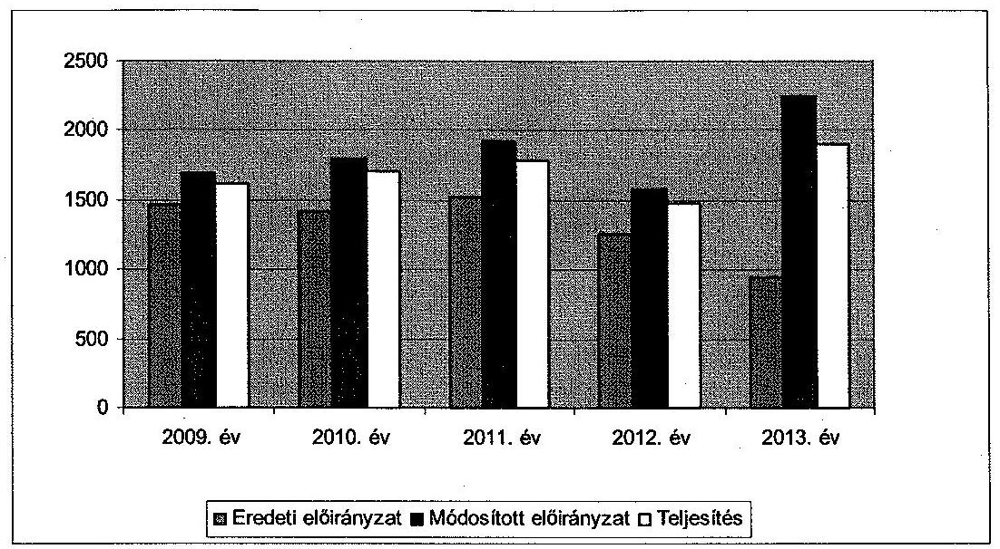
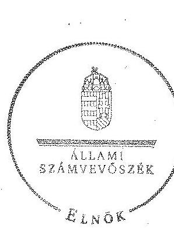
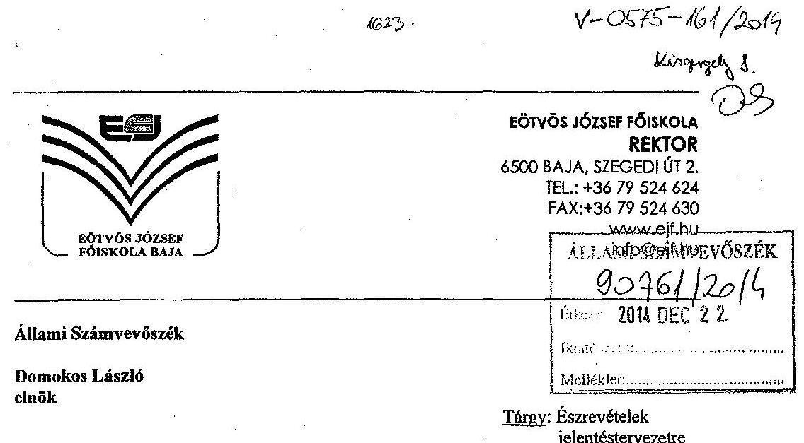
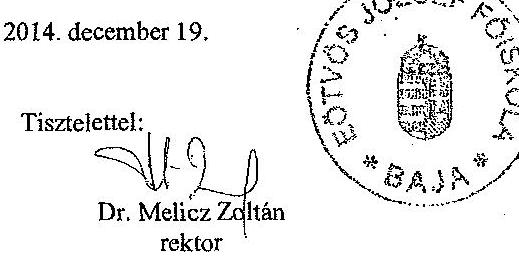
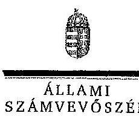
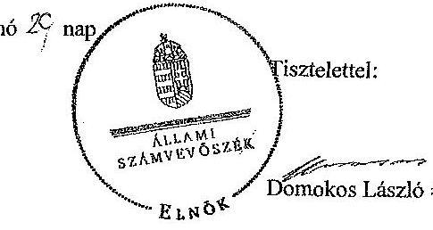

# ÁLLAMI   SZÁMVEVŐSZÉK 

## JELENTÉS

az Eötvös József Főiskola ellenőrzéséről - Az állami felsőoktatási intézmények gazdálkodásának, működésének ellenőrzése

---

# Állami Számvevőszék 

Iktatószám: V-0575-164/2015
Témaszám: 1609
Vizsgálat-azonosító szám: V-068901

## Az ellenőrzést felügyelte:

## Kisgergely István

felügyeleti vezető

## Az ellenőrzés végrehajtásáért felelős:

Zakar László
ellenőrzésvezető

## A számvevői munkaanyagok feldolgozását és a Jelentés összeállítását

végezte:

## Zakar László

ellenőrzésvezető
Dr. Fátrainé Zsebedics Katalin
számvevő tanácsos

## Kersmájer Ágota

számvevő tanácsos

## Az ellenőrzést végezték:

| Bartolák Márta | Dr. Fátrainé Zsebedics | Kersmájer Ágota |
| :-- | :-- | :-- |
| számvevő főtanácsos | Katalin | számvevő tanácsos |
|  | számvevő tanácsos |  |
| Massányi Tibor   számvevő tanácsos | Ösiné Kárpáti Ágnes   számvevő |  |

## A témához kapcsolódó eddig készített számvevőszéki jelentések:

## címe

sorszáma
Jelentés az oktatási és kulturális ágazat irányítási rendszerének, 1106 működésének ellenőrzéséről
Jelentés a felsőoktatás oktatási infrastruktúra-fejlesztési program- 1171 jának ellenőrzéséről
Jelentés az állami felsőoktatási intézmények érdekeltségébe tartozó 1290 gazdasági társaságok támogatásának és nyereségük hasznosulásának ellenőrzéséről
Jelentés a Szolnoki Főiskola ellenőrzéséről - Az állami felsőoktatási 14196 intézmények gazdálkodásának, működésének ellenőrzése

---

Jelentés a Pannon Egyetem ellenőrzéséről - Az állami felsőoktatási 14197
intézmények gazdálkodásának, működésének ellenőrzése
Jelentés a Károly Róbert Főiskola ellenőrzéséről - Az állami felsőok- 14198
tatási intézmények gazdálkodásának, működésének ellenőrzése
Jelentés a Magyar Képzőművészeti Egyetem ellenőrzéséről - Az ál- 14199
lami felsőoktatási intézmények gazdálkodásának, működésének ellenőrzése
Jelentés a Miskolci Egyetem ellenőrzéséről - Az állami felsőoktatási 14200
intézmények gazdálkodásának, működésének ellenőrzése
Jelentés a Széchenyi István Egyetem ellenőrzéséről - Az állami fel- 14201
sőoktatási intézmények gazdálkodásának, működésének ellenőrzése
Jelentés az Eszterházy Károly Főiskola ellenőrzéséről - Az állami 14204
felsőoktatási intézmények gazdálkodásának, működésének ellenőrzése
Jelentés a Magyar Táncművészeti Főiskola ellenőrzéséről - Az ál- 14205
lami felsőoktatási intézmények gazdálkodásának, működésének ellenőrzése
Jelentés a Budapesti Műszaki és Gazdaságtudományi Egyetem el- 14218
lenőrzéséről - Az állami felsőoktatási intézmények gazdálkodásá-
nak, működésének ellenőrzése

---

.

---

# TARTALOMJEGYZÉK 

BEVEZETÉS ..... 13
I. ÖSSZEGZŐ MEGÁLLAPÍTÁSOK, KÖVETKEZTETÉSEK, JAVASLATOK ..... 17
II. RÉSZLETES MEGÁLLAPÍTÁSOK ..... 27

1. A fenntartói és az ágazati irányítási jogok gyakorlása ..... 27
2. Az intézmény belső kontrollrendszerének kialakítása és működtetése ..... 29
3. Az intézmény döntéshozó szerveinek joggyakorlása, az oktatási és egyéb tevékenységei elkülönítése, a pénzügyi gazdálkodása ..... 34
3.1. Az intézmény döntéshozó szerveinek gazdálkodással kapcsolatos joggyakorlása ..... 34
3.2. Az intézmény oktatási és egyéb tevékenységei elkülönítése, az ellátott feladatok átláthatósága ..... 36
3.3. Az intézmény pénzügyi egyensúlya, fizetőképessége ..... 36
3.4. Az intézmény előirányzat kezelése ..... 39
3.5. Az egyes hazai forrásból finanszírozott projektekhez, feladatokhoz kapott - nem normatív - költségvetési forrással való elszámolás ..... 46
4. Az intézmény vagyongazdálkodása ..... 46
4.1. A vagyongazdálkodási tevékenységek keretei ..... 46
4.2. A vagyonváltozások és a vagyonhasznosítás szabályszerűsége ..... 47
4.3. Az intézmény tulajdonosi jog gyakorlása ..... 51
5. A külső ellenőrzések által tett javaslatok hasznosulása ..... 52
5.1. ÁSZ ellenőrzések által tett javaslatok hasznosulása ..... 52
5.2. Az egyéb külső ellenőrzések javaslatainak hasznosulása ..... 53
6. Az integritási kontrollrendszer értékelése ..... 54

---

# MELLÉKLETEK 

1. számú Az Eötvös József Főiskola kiadási és bevételi előirányzatai, azok teljesítése a 2009-2013. években
2. számú Az Eötvös József Főiskola kiadásainak, bevételeinek változása a 2009-2013. években
3. számú Kimutatás az Eötvös József Főiskola bevételeiről és kiadásairól, valamint adósságszolgálatáról a 2009-2013. években
4. számú Az Eötvös József Főiskola mérlegadatai a 2009-2013. években
5. számú Az Eötvös József Főiskola gazdálkodása szabályszerűségének értékelése a mintatételek alapján
6. számú Az Eötvös József Főiskola észrevétele
7. számú Az Eötvös József Főiskola észrevételére adott válasz

## FÜGGELÉKEK

1. számú Az integritás érvényesítése érdekében kialakított és működtetett intézményi kontrollrendszer

---

# RÖVIDÍTÉSEK JEGYZÉKE 

| Törvények |  |
| :--: | :--: |
| Áht. 1 | 1992. évi XXXVIII. törvény az államháztartásról (hatálytalan 2012. január 1-jétől) |
| Áht. 2 | 2011. évi CXCV. törvény az államháztartásról |
| Eisztv. | 2005. évi XC. törvény az elektronikus információszabadságról (hatálytalan 2012. január 1-jétől) |
| Feot. | 2005. évi CXXXIX. törvény a felsőoktatásról (hatálytalan 2012. szeptember 1-jétől) |
| Gt. | 2006. évi IV. törvény a gazdasági társaságokról (hatálytalan 2014. március 15-től) |
| Info tv. | 2011. évi CXII. törvény az információs önrendelkezési jogról és az információszabadságról |
| Kjt. | 1992. évi XXXIII. törvény a közalkalmazottak jogállásáról |
| Mt. ${ }_{1}$ | 1992. évi XXII. törvény a Munka Törvénykönyvéről (hatálytalan 2013. január 1-jétől) |
| Mt. 2 | 2012. évi I. törvény a munka törvénykönyvéről |
| Nftv. | 2011. évi CCIV. törvény a nemzeti felsőoktatásról |
| Nvtv. | 2011. évi CXCVI. törvény a nemzeti vagyonról |
| Sztv. | 2000. évi C. törvény a számvitelről |
| Vtv. | 2007. évi CVI. törvény az állami vagyonról |
| Korm. rendeletek |  |
| Áhsz. | 249/2000. (XII. 24.) Korm. rendelet az államháztartás szervezetei beszámolási és könyvvezetési kötelezettségének sajátosságairól (hatálytalan 2014. január 1-jétől) |
| Ámr. 1 | 217/1998. (XII. 30.) Korm. rendelet az államháztartás működési rendjéről (hatálytalan 2010. január 1-jétől) |
| Ámr. 2 | 292/2009. (XII. 19.) Korm. rendelet az államháztartás működési rendjéről (hatálytalan 2012. január 1-jétől) |
| Ávr. | 368/2011. (XII. 31.) Korm. rendelet az államháztartásról szóló törvény végrehajtásáról |
| Ber. | 193/2003. (XI. 26.) Korm. rendelet a költségvetési szervek belső ellenőrzéséről (hatálytalan 2012. január 1-jétől) |
| Bkr. | 370/2011. (XII. 31.) Korm. rendelet a költségvetési szervek belső kontrollrendszeréről és belső ellenőrzéséről |
| Vtvr. | 254/2007. (X. 4.) Korm. rendelet az állami vagyonnal való gazdálkodásról |
| 51/2007. (III. 26.) Korm. rendelet | 51/2007. (III. 26.) Korm. rendelet a felsőoktatásban részt vevő hallgatók juttatásairól és az általuk fizetendő egyes térítésekről |
| 50/2008. (III. 14.) Korm. rendelet | 50/2008. (III. 14.) Korm. rendelet a felsőoktatási intézmények képzési, tudományos célú és fenntartói normatíva alapján történő finanszírozásáról |

---

## Határozatok

1365/2011. (XI. 8.)
Korm. határozat
1290/2012. (VIII. 9.)
Korm. határozat
1657/2012. (XII. 20.)
Korm. határozat

## Egyéb rövidítések

EJF/főiskola/intézmény
EJF Kft.
EMMI
FEUVE
FIR
FSA
GT
HÖK
IFT
KEOP
Kincstár
MNV Zrt.
NEFMI
NEPTUN
NGM
OKM
PPP
SZMSZ
VIR

1365/2011. (XI. 8.) Korm. határozat a 2012. évi hiánycél tartását biztosító további feladatokról
1290/2012. (VIII. 9.) Korm. határozat a költségvetési főfelügyelők és költségvetési felügyelők kirendeléséről
1657/2012. (XII. 20.) Korm. határozat a kormányzati stratégiai dokumentumok felülvizsgálatával kapcsolatos feladatokról

Eötvös József Főiskola
Bácskai Tudomány-Technika Kft.
(2011. december 31-ig EJF Tudomány-Technika Kft.
Emberi Erőforrások Minisztériuma
folyamatba épített, előzetes, utólagos és vezetői ellenőrzés
Felsőoktatási Információs Rendszer
Felsőoktatási Strukturális Alap
Gazdasági Tanács
Hallgatói Önkormányzat
Intézményfejlesztési Terv
Környezet és Energia Operatív Program
Magyar Államkincstár
Magyar Nemzeti Vagyonkezelő Zrt.
Nemzeti Erőforrás Minisztérium
Tanulmányi hallgatói információs rendszer
Nemzetgazdasági Minisztérium
Oktatási és Kulturális Minisztérium
Public-Private Partnership (magán és közszféra együttműködése)
Szervezeti és Működési Szabályzat
Vezetői Információs Rendszer

---

# ÉRTELMEZŐ SZÓTÁR 

alapító
autonómia
állami felsőoktatási intézmény saját tulajdona
állami vagyon
A központi költségvetési szerv alapítója az Országgyűlés, a Kormány vagy a miniszter. A felsőoktatási intézmények vonatkozásában az alapítói jogokat a felsőoktatásért felelős minisztérium gyakorolja.
A felsőoktatási intézmény Feot.-ban, illetve Nftv.-ben szabályozott önrendelkezése, amely biztosítja az intézmény önálló oktatási, kutatási, szervezeti és működési, valamint gazdálkodási tevékenységét.
A felsőoktatási intézmény saját bevételének a költségek teljes körű levonása, - az adományozás és öröklés kivételével - a rendelkezésre bocsátott vagyon állagának megóvásáról, pótlásáról való gondoskodás után fennmaradt része terhére szerzett vagyona.
A Vtv. 1. § (2) bekezdése szerint állami vagyonnak minősül:
a) az állami tulajdonban lévő ingó dolog, valamint a dolog módjára hasznosítható természeti erő,
b) az állami tulajdonban lévő termőföldekből álló, külön törvényben szabályozott Nemzeti Földalap,
c) az állami tulajdonban lévő - a b) pont hatálya alá nem tartozó - ingatlan,
d) az állami tulajdonban lévő értékpapír,
e) az államot megillető társasági részesedés és más vagyoni értékű jog.
(hatályos 2010. június 16-ig)
a) az állam tulajdonában lévő dolog, valamint a dolog módjára hasznosítható természeti erő,
b) az a) pont hatálya alá nem tartozó mindazon vagyon, amely vonatkozásában törvény az állam kizárólagos tulajdonjogát nevesíti,
c) az állam tulajdonában lévő tagsági jogviszonyt megtestesítő értékpapír, illetve az államot megillető egyéb társasági részesedés,
d) az államot megillető olyan immateriális, vagyoni értékkel rendelkező jogosultság, amelyet jogszabály vagyoni értékű jogként nevesít.
(hatályos 2010. június 17-től)
A Vtv. 23. § (1) bekezdése szerint: Az állami vagyont az MNV Zrt. maga kezeli, illetve szerződés - így különösen bérlet, haszonbérlet, szerződésen alapuló haszonélvezet, vagyonkezelés, megbízás - alapján központi költségvetési szervnek, természetes vagy jogi személynek, illetőleg jogi személyiséggel nem rendelkező gazdasági társaságnak hasznosításra átengedi.
(hatályos 2010. december 31-ig)

---

állami vagyon hasznosítására kötött szerződés
állami vagyon használója
állami vagyon értékesítése

Az állami vagyont az MNV Zrt. maga kezeli, vagy szerződés - így különösen bérlet, haszonbérlet, szerződésen alapuló haszonélvezet, vagyonkezelés, megbízás - alapján központi költségvetési szervnek, természetes vagy jogi személynek, vagy jogi személyiséggel nem rendelkező gazdálkodó szervezetnek hasznosításra átengedi.
(hatályos 2011. december 31-ig)
Az állami vagyont az MNV Zrt. maga kezeli, vagy szerződés - így különösen bérlet, haszonbérlet, megbízás - alapján központi költségvetési szervnek, természetes vagy jogi személynek, vagy jogi személyiséggel nem rendelkező gazdálkodó szervezetnek hasznosításra átengedi.
(hatályos 2012. január 1-jétől)
A Vtv. 23. § (2) bekezdése szerint: Az állami vagyon hasznosítására kötött szerződések elsődleges célja az állami vagyon hatékony működtetése, állagának védelme, értékének megőrzése, illetve gyarapítása, az állami és közfeladatok ellátásának elősegítése.
A Vtvr. 1. § (7) a) pontja szerint: Az a természetes személy, jogi személy, illetve jogi személyiséggel nem rendelkező gazdasági társaság, amely az MNV Zrt.-vel kötött szerződés alapján, bármely jogcímen (bérlet, haszonbérlet, vagyonkezelés, használat stb.) állami vagyont birtokol, használ, hasznosít.
(hatályos 2010. december 31-ig)
Az a természetes személy, jogi személy, illetve jogi személyiséggel nem rendelkező szervezet, amely, illetve aki törvény vagy szerződés alapján, bármely jogcímen (pl. bérlet, haszonbérlet, vagyonkezelési szerződés, használat stb.) állami vagyont birtokol, használ, szedi annak hasznait, hasznosít, ide nem értve a tulajdonosi jogok gyakorlóját.
(hatályos 2011. január 1 - 2011. december 31-ig)
Az a természetes vagy jogi személy, jogi személyiséggel nem rendelkező szervezet, aki, vagy amely törvény vagy szerződés alapján, bármely jogcímen (bérlet, haszonbérlet, használat stb.) állami vagyont birtokol, használ, szedi annak hasznait, hasznosít, ide nem értve a haszonélvezőt, a vagyonkezelőt és a tulajdonosi jogok gyakorlóját.
(hatályos 2012. január 1-jétől)
Állami vagyon tulajdonjogának bármely jogcímen történő, visszterhes átruházása. (Vtvr. 1. § (7) d) pont)

---

állami vagyon kezelője /vagyonkezelő
belső kontrollrendszer

CLF-módszer

A Vtv. 23. § (1) bekezdése szerint: Az állami vagyont az MNV Zrt. maga kezeli, vagy szerződés - így különösen bérlet, haszonbérlet, szerződésen alapuló haszonélvezet, vagyonkezelés, megbízás - alapján központi költségvetési szervnek, természetes vagy jogi személynek, illetőleg jogi személyiséggel nem rendelkező gazdasági társaságnak hasznosításra átengedi. (hatályos 2010. január 1 - 2010. december 31-ig)

Az állami vagyont az MNV Zrt. maga kezeli, vagy szerződés - így különösen bérlet, haszonbérlet, szerződésen alapuló haszonélvezet, vagyonkezelés, megbízás - alapján központi költségvetési szervnek, természetes vagy jogi személynek, illetőleg jogi személyiséggel nem rendelkező gazdálkodó szervezetnek hasznosításra átengedi. (hatályos 2011. január 1 - 2011. december 31-ig)
Az állami vagyont az MNV Zrt. maga kezeli, vagy szerződés - így különösen bérlet, haszonbérlet, megbízás - alapján központi költségvetési szervnek, természetes vagy jogi személynek, vagy jogi személyiséggel nem rendelkező gazdálkodó szervezetnek hasznosításra átengedi. Az állami vagyonra vonatkozóan

 az MNV Zrt. kizárólag az Nvtv-ben meghatározott személyekkel köthet vagyonkezelési szerződést.
(hatályos 2012. január 1-jétől)
A belső kontrollrendszer a kockázatok kezelése és tárgyilagos bizonyosság megszerzése érdekében kialakított folyamatrendszer, amely azt a célt szolgálja, hogy megvalósuljanak a következő célok:
a) a működés és gazdálkodás során a tevékenységeket szabályszerűen, gazdaságosan, hatékonyan, eredményesen hajtsák végre,
b) az elszámolási kötelezettségeket teljesítsék, és
c) megvédjék az erőforrásokat a veszteségektől, károktól és nem rendeltetésszerű használattól.
A módszer a működési és a felhalmozási költségvetés bevételeinek és kiadásainak, ezek egyenlegeinek elkülönített, majd összevont kimutatását alkalmazza valamely költségvetési intézmény pénzügyi helyzetének megítéléséhez. Kiemelten mutatja be a finanszírozási műveletek egyenlege nélküli és az azt magába foglaló pénzügyi pozíciót, valamint a tőketörlesztéssel, értékpapír beváltással csökkentett működési jövedelmet.
Az értékelés a pénzügyi kapacitás fogalmát helyezi a középpontba.

---

előirányzat-maradvány
fenntartó
finanszírozási műveletek nélküli pozíció

Gazdasági Tanács
hároméves fenntartói megállapodás
információs és kommunikációs rendszer
integritás

Az államháztartás központi alrendszerébe tartozó költségvetési szerveknél a módosított bevételi és kiadási előirányzatok és azok teljesítésének a Kormány rendeletében meghatározott tételekkel korrigált különbözete az előirányzat-maradvány. (Áht. 2. § (1) bekezdés m) pontja)
A Feot. 7. § (2) és az Nftv. 4. § (2) bekezdése szerint az, aki az alapítói jogot gyakorolja, ellátja a felsőoktatási intézmény fenntartásával kapcsolatos feladatokat.
A CLF módszer szerint számított működési és felhalmozási tevékenység pénzügyi egyenlegének összevont értéke. Megmutatja, hogy a költségvetési intézmény bevételei fedezetet biztosítottak-e a kiadásokra. A finanszírozási műveletek nélküli (GFS) pozíció alapján a pénzügyi helyzetet akkor tekintettük megfelelőnek, ha az adott év működési és felhalmozási bevételei fedezetet nyújtottak az adott év működési és felhalmozási kiadásaira.
A felsőoktatási intézmény javaslattevő, véleményező, a stratégiai döntések előkészítésében részt vevő, és a döntések végrehajtásának ellenőrzésében közreműködő szerve.
Az állami felsőoktatási intézmények központi költségvetési támogatására három éves fenntartói megállapodást kell kötni az állami felsőoktatási intézmény és a fenntartó között. A fenntartói megállapodás tartalmazza a felsőoktatási intézmény által meghatározott hároméves időszakra vállalt teljesítménykövetelményeket, továbbá az állandó jellegű támogatási részeket, valamint a változó jellegű támogatások megállapításának jogcímeit. A változó elemű támogatás évenkénti elszámolási kötelezettséggel kerül meghatározásra.
A költségvetési szerv vezetője köteles olyan rendszereket kialakítani és működtetni, melyek biztosítják, hogy a megfelelő információk a megfelelő időben eljutnak az illetékes szervezethez, szervezeti egységhez, illetve személyhez.
Az integritás olyasvalakit vagy valamit jelöl, aki vagy ami romlatlan, sértetlen, feddhetetlen. Az integritás elvek, értékek, cselekvések, módszerek, intézkedések konzisztenciáját jelenti: olyan magatartásmódot, amely meghatározott értékeknek megfelel.

---

intézményfejlesztési terv
irányító szerv
kincstári biztos
kincstári költségvetés
kisebbségi jogokat biztosító részesedés
kockázatkezelési rendszer

A szenátus fogadja el az intézményfejlesztési tervet. Az intézményfejlesztési tervben kell meghatározni a fejlesztéssel, a fenntartó által a felsőoktatási intézmény rendelkezésére bocsátott vagyon hasznosításával, megóvásával, elidegenítésével kapcsolatos elképzeléseket, a várható bevételeket és kiadásokat. Az intézményfejlesztési tervet középtávra, legalább négyéves időszakra kell elkészíteni, évenkénti bontásban meghatározva a végrehajtás feladatait. Az intézményfejlesztési terv része a foglalkoztatási terv. A foglalkoztatási tervben kell meghatározni azt a létszámot, amelynek keretei között a felsőoktatási intézmény megoldhatja feladatait. (Feot. 27. § (3) bekezdés)
A felsőoktatás ágazati irányítását - felsőoktatásszervezéssel, felsőoktatásfejlesztéssel, törvényességi ellenőrzéssel kapcsolatos feladatokat - ellátó miniszter által vezetett minisztérium. (Feot. 102. - 105/A. §, Nftv. 64-66. §)
A kincstári biztos kijelölését az államháztartásért felelős miniszternél a Kincstár kezdeményezi. A kincstári biztos köteles figyelemmel kísérni megbízatásának időpontjától kezdve a költségvetési szerv tervezését, gazdálkodását, beszámolását, a jogszabályokban előírt feladatainak ellátását, feltárni azokat az okokat, amelyek a tartós fizetésképtelenséghez vezettek, a szükséges intézkedések azonnali végrehajtására irányuló intézkedési tervet készíteni, azonnali intézkedéseket kezdeményezni és írásbeli utasításokat kiadni a tartozásállomány felszámolására, a gazdálkodás egyensúlyának biztosítására, a követelések behajtására. (Ávr. 116-117. §)
A központi költségvetésről szóló törvény elfogadását követően a fejezetet irányító szerv az államháztartás központi alrendszerébe tartozó költségvetési szerv és a fejezeti kezelésű előirányzat kiemelt előirányzatait, valamint az elkülönített állami pénzalapok és a társadalombiztosítás pénzügyi alapjai jogszabályi előírás szerinti bevételeit és kiadásait kincstári költségvetés kiadásával állapítja meg. (Áht. 24. § (3) bekezdés, Áht. 28. § (2) bekezdés, Ávr. 31. § (2) bekezdés)

A részesedés mértéke legalább 5%. (Gt. 49. §)
Irányítási eszközök és módszerek összessége, melynek elemei a szervezeti célok elérését veszélyeztető tényezők (kockázatok) azonosítása, elemzése, csoportosítása, nyomon követése, valamint szükség esetén a kockázati kitettség mérséklése.

---

kontrollkörnyezet
kontrolltevékenység
költségvetési főfelügyelő, felügyelő
maximális hallgatói létszám
mértékadó befolyást biztosító részesedés
minisztérium
minősített többséget biztosító részesedés
monitoring

A kontrollkörnyezet a költségvetési szerv vezetőinek a szervezeti célok elérését segítő kontrollok kialakításával és működtetésével, korszerűsítésével kapcsolatos magatartását, a kontrollpontokról érkező információkra való reagálását jelenti.
Azok az elvek, politikák és eljárások, amelyeket a kockázatok meghatározása és a szervezet céljainak elérése érdekében alakítanak ki.
A költségvetési szerv vezetője köteles a szervezeten belül kontrolltevékenységeket kialakítani, amelyek biztosítják a kockázatok kezelését, hozzájárulnak a szervezet céljainak eléréséhez.
Az államháztartásért felelős miniszter a Kormány irányítása alá tartozó fejezetet irányító szervhez, a Kormány irányítása vagy felügyelete alá tartozó költségvetési szervhez, valamint az elkülönített állami pénzalapok és a társadalombiztosítás pénzügyi alapjai kezelő szerveihez költségvetési főfelügyelőt, felügyelőt rendelhet ki. A költségvetési főfelügyelő, felügyelő a gazdálkodás költségvetés-politikával való összhangja és a takarékos, szabályszerű, eredményes működés érdekében a Kormány rendeletében meghatározott intézkedéseket tehet, így különösen előzetesen véleményezi a kötelezettségvállalásra irányuló eljárásokat és a nagy összegű kötelezettségvállalások tekintetében kifogással élhet. (Áht. 39. § (1)-(2) bekezdés)
Az a felsőoktatási intézmény alapító okiratában, működési engedélyében meghatározott hallgatói létszám, ameddig terjedően a felsőoktatási intézmény - figyelembe véve a hallgatók fogadásához és az oktatói tevékenység folytatásához rendelkezésre álló személyi feltételeket, helyiségeket és eszközöket - valamennyi évfolyamára számítva, teljes kihasználtsággal működve hallgatói jogviszonyt létesíthet.
A részesedés mértéke legalább 20%, de 50%-nál kisebb. (Sztv. 3. § (2) bekezdés 4. pont)
A felsőoktatásért felelős minisztérium, amely 2009-től 2010 májusáig az OKM, 2010 májusától 2012 májusáig a NEFMI, 2012 májusától az EMMI volt.
A minősített befolyásszerző az ellenőrzött társaságban a szavazatok legalább hetvenöt százalékával rendelkezik. (Gt. 52. § (2) bekezdés)
A különböző szintű szervezeti célok megvalósításához szükséges folyamatok figyelemmel kísérése, melynek során a releváns eseményekről és tevékenységekről (együtt: folyamatokról) rendszeres jelleggel, strukturált, döntéstámogató információkhoz jutnak a szervezet vezetői.

---

működési jövedelem
normatív költségvetési támogatás felsőoktatási intézmények működéséhez
normatív támogatások
saját bevétel
szenátus
tárgyévi pénzügyi pozíció

A folyó bevételek és folyó kiadások egyenlege. Azt mutatja, hogy a folyó bevételek fedezetet nyújtanak-e a folyó kiadásokra.
A felsőoktatási intézmények működéséhez biztosított normatív költségvetési támogatás lehet
a) hallgatói juttatásokhoz nyújtott,
b) képzési,
c) tudományos célú,
d) fenntartói,
e) egyes feladatokhoz nyújtott
támogatás. A központi költségvetésből biztosított normatív költségvetési támogatásra - a d) pontban meghatározott normatív költségvetési támogatás kivételével - a felsőoktatási intézmények azonos feltételek alapján válnak jogosulttá. Az a)-e) pontokban meghatározott jogcímek - az a) és e) pontban meghatározott jogcímek kivételével - nem jelentenek felhasználási kötöttséget. (Feot. 127. § (3) bekezdés)
Az ellenőrzési időszakban hatályos költségvetési törvények 3. sz. mellékletében megjelölt közoktatási hozzájárulások, az 5. sz. mellékletében megjelölt központosított előirányzatok, továbbá a 8. sz. mellékletében megjelölt normatív, kötött felhasználású támogatások együttesen.
Az államháztartáson kívüli források - beleértve minden olyan, az Európai Uniótól származó támogatást, amelyhez nem az állami költségvetésen keresztül jut a felsőoktatási intézmény, továbbá a szakképzési hozzájárulási fizetési kötelezettség teljesítéseként elszámolt forrásokat is, ide nem értve az állami vagyon értékesítésének ellenértékét - valamint a Kutatási és Technológiai Innovációs Alapból származó bevételek.
A felsőoktatási intézmény, döntést hozó és a döntés végrehajtását ellenőrző testülete. (Feot. 20. § (1) bekezdés, Nftv. 12. § (1)-(3) bekezdés)
A működési és felhalmozási bevételek, valamint kiadások egyenlege a finanszírozási műveletek egyenlegének figyelembe vételével.

---

# **Chemistry**

## **Chemical Reactions**

### **Balancing Chemical Equations**

1. **Write the unbalanced equation:**
   - Example: $$C_3H_8 + O_2 \rightarrow CO_2 + H_2O$$

2. **Balance the equation:**
   - Example: $$2C_3H_8 + 7O_2 \rightarrow 6CO_2 + 8H_2O$$

3. **Balance the equation:**
   - Example: $$2C_3H_8 + 7O_2 \rightarrow 6CO_2 + 8H_2O$$

### **Types of Reactions**

1. **Combination Reaction:**
   - Example: $$2H_2 + O_2 \rightarrow 2H_2O$$

2. **Decomposition Reaction:**
   - Example: $$2H_2O_2 \rightarrow 2H_2O + O_2$$

3. **Single Displacement Reaction:**
   - Example: $$Zn + 2HCl \rightarrow ZnCl_2 + H_2$$

4. **Double Displacement Reaction:**
   - Example: $$AgNO_3 + NaCl \rightarrow AgCl + NaNO_3$$

5. **Combustion Reaction:**
   - Example: $$CH_4 + 2O_2 \rightarrow CO_2 + 2H_2O$$

## **Stoichiometry**

### **Mole Concept**

- **Mole (mol):** The amount of substance containing as many particles (atoms, molecules, ions) as there are atoms in exactly 12 grams of carbon-12.
- **Avogadro's Number:** $$6.022 \times 10^{23}$$ particles per mole.

### **Molar Mass**

- **Molar Mass:** The mass of one mole of a substance.
- Example: The molar mass of water ($$H_2O$$) is 18.015 g/mol.

### **Calculations**

1. **Moles to Mass:**
   - Formula: $$n = \frac{m}{M}$$
   - Example: Calculate the number of moles of $$H_2O$$ in 18 grams of water.
     - $$n = \frac{18 \, \text{g}}{18.015 \, \text{g/mol}} \approx 0.999 \, \text{mol}$$

2. **Moles to Mass:**
   - Formula: $$m = n \times M$$
   - Example: Calculate the mass of 1 mole of $$H_2O$$.
     - $$m = 1 \, \text{mol} \times 18.015 \, \text{g/mol} = 18.015 \, \text{g}$$

## **Gas Laws**

### **Ideal Gas Law**

- **Equation:** $$PV = nRT$$
- **Variables:**
  - $$P$$: Pressure (atm)
  - $$V$$: Volume (L)
  - $$n$$: Number of moles (mol)
  - $$R$$: Ideal gas constant (0.0821 L·atm/mol·K)
  - $$T$$: Temperature (K)

### **Boyle's Law**

- **Equation:** $$P_1V_1 = P_2V_2$$
- **Variables:**
  - $$P_1$$: Initial pressure (atm)
  - $$V_1$$: Initial volume (L)
  - $$P_2$$: Final pressure (atm)
  - $$V_2$$: Final volume (L)

### **Boyle's Law (Boyle's Law)**

- **Equation:** $$\frac{P_1V_1}{T_1} = \frac{P_2V_2}{T_2}$$
- **Variables:**
  - $$P_1$$: Initial pressure (atm)
  - $$V_1$$: Initial volume (L)
  - $$T_1$$: Initial temperature (K)
  - $$P_2$$: Final pressure (atm)
  - $$V_2$$: Final volume (L)
  - $$T_2$$: Final temperature (K)

## **Thermochemistry**

### **Enthalpy (H)**

- **Definition:** The heat content of a system at constant pressure.
- **Equation:** $$\Delta H = q_p$$

### **Hess's Law**

- **Statement:** The enthalpy change for a reaction is the same whether it occurs in one step or multiple steps.

 in a reaction with one mole of water.

## **Electrochemistry**

### **Oxidation and Reduction**

- **Oxidation:** Loss of electrons.
- **Reduction:** Gain of electrons.

### **Galvanic Cells**

- **Definition:** A cell that converts chemical energy into electrical energy.
- **Components:**
  - Anode: Oxidation occurs.
  - Cathode: Reduction occurs.
  - Salt Bridge: Connects the two half-cells.

### **Nernst Equation**

- **Equation:** $$E = E^\circ - \frac{RT}{nF} \ln Q$$
- **Variables:**
  - E: Cell potential
  - R: Ideal gas constant
  - F: Faraday constant
  - Q: Reaction quotient

## **Acids and Bases**

### **Arrhenius Theory**

- **Acid:** Substance that dissociates in water to produce H⁺ ions.
- **Base:** Substance that dissociates in water to produce OH⁻ ions.
- **Acid:** Proton donor.
- **Base:** Proton acceptor.

### **Brønsted-Lowry Theory**

- **Acid:** Proton donor.
- **Base:** Proton acceptor.
- **Base:** Proton acceptor.

### **Lewis Theory**

- **Acid:** Electron pair acceptor.
- **Base:** Electron pair donor.

## **Organic Chemistry**

### **Functional Groups**

- **Alkanes:** -C=O -C=18 -C=18 -C=18 -C=18 -C=18 -C=18 -C=18 -C=18 -C=18 -C=18 -C=18 -C=18 -C=18 -C=18 -C=18 -C=18 -C=18 -C=18 -C=18 -C=18 -C=18 -C=18 -C=18 -C=18 -C=18 -C=18 -C=18 -C=18 -C=18 -C=18 -C=18 -C=18 -C=18 -C=18 -C=18 -C=18 -C=18 -C=18 -C=18 -C=18 -C

---

# JELENTÉS 

## Az Eötvös József Főiskola ellenőrzéséről Az állami felsőoktatási intézmények gazdálkodásának, működésének ellenőrzése

## BEVEZETÉS

Az ÁSZ Stratégiája ${ }^{1}$ alapértékeinek egyike, hogy az államháztartás komplex folyamatainak átláthatósága érdekében rendszerszemléletű/holisztikus megközelítésű, egymásra épülő, a szinergiahatást kihasználó, összefoglaló értékelésre lehetőséget adó ellenőrzéseket végez. Az államháztartás központi alrendszerébe tartozó felsőoktatási intézmények ellenőrzése során az Állami Számvevőszék értékeli azok pénzügyi-gazdasági helyzetét, feltárja a működésükben rejlő kockázatokat, ezzel előmozdítja a közpénzügyek átláthatóságát, rendezettségét.

Az állami felsőoktatási intézmények gazdálkodását - az Áht. ${ }_{1}$ és az Áht. ${ }_{2}$ előírásai mellett - a felsőoktatásról szóló 2005. évi CXXXIX. törvény (Feot.), valamint a nemzeti felsőoktatásról szóló 2011. évi CCIV. törvény (Nftv.) előírásai határozták meg.

Magyarország Nemzeti Reform Programja keretében, a Széll Kálmán Terv 2020-ig a 30-34 évesek körében, a felsőfokú vagy annak megfelelő végzettséggel rendelkezők arányának 30,3%-ra való növelését irányozta elő, amely a 2010. évhez képest 4,6%-pontos növekedési célkitűzést jelent. A rendezett gazdasági környezet, az önállósággal élni tudó, felelős, elszámoltatható intézményi gazdálkodói magatartás elengedhetetlen feltétele a kitűzött szakmai célok elérésének.

Az ellenőrzés célja annak megállapítása, hogy szabályos volt-e az állami felsőoktatási intézmény pénzügyi és vagyongazdálkodása, biztosított volt-e a vagyonnal való felelős gazdálkodás követelményének érvényesülése, jogszabályi előírásoknak megfelelően működött-e a belső kontrollrendszer, az irányító szerv tevékenysége a jogszabályi előírásoknak megfelelt-e.

Ennek keretében értékeltük az Eötvös József Főiskolánál:

1) a fenntartói és az ágazati irányítási jogok gyakorlását;
2) az intézmény belső kontrollrendszere jogszabályoknak megfelelő kialakítását és működtetését;
[^0]
[^0]:    ${ }^{1}$ Állami Számvevőszék: Stratégia. Az Állami Számvevőszék hivatalos stratégiai dokumentum rendszere 2011-2015. 2012. december. http://www.asz.hu/strategia/asz-strategia/asz-strategia-2011.pdf

---

3) az intézmény döntéshozó szerveinek joggyakorlása jogszabályoknak való megfelelőségét; az intézmény oktatási és egyéb (gyakorlati és kutatási) tevékenységei elkülönítését, átláthatóságát, illetve pénzügyi gazdálkodása szabályszerűségét;
4) az intézmény vagyongazdálkodása előírásoknak való megfelelőségét;
5) az ellenőrzött időszakban végzett külső (ÁSZ, fenntartói, KEHI, kincstári) ellenőrzések által tett javaslatok hasznosulását;
6) az intézmény korrupcióval szembeni veszélyeztetettségének csökkentése érdekében az integritási szemlélet érvényesülését a gazdálkodási folyamatokban.

Az ellenőrzés várható hasznosulása: Az ellenőrzés eredményének hasznosulásaként képet kapunk az Eötvös József Főiskolában kialakult pénzügyi helyzetről; a Kormány által kirendelt költségvetési (fő) felügyelői rendszer működésének tapasztalatairól; az oktatási és egyéb tevékenységek és költségelszámolások elhatárolásáról, átláthatóságáról és szabályosságáról. A felsőoktatási intézmények gazdálkodási szabadságának pénzügyi és vagyoni helyzetre gyakorolt hatásairól, a vagyonnal való felelős, értékmegőrző gazdálkodás érvényesüléséről, továbbá a belső kontrollrendszer működéséről. Az ellenőrzés az ellenőrzött számára visszajelzést ad a gazdálkodása kereteinek kialakításáról, a működésében fellépő hiányosságokról, javaslataival hozzájárul azok kiküszöböléséhez és a jó kormányzáshoz. A törvényalkotás számára összegzett tapasztalatok állnak rendelkezésre a felsőoktatási intézmények döntéseinek, gazdálkodásának szabályszerűségéről, amelyek alapján - indokolt esetben - jogszabálymódosítás kezdeményezhető. Az integritás kultúra kialakítása hozzájárul az elszámoltathatóság és átláthatóság érvényesítéséhez, egyben támogatja a szervezet védettségét a korrupciós kitettséggel szemben, valamint annak megelőzése is irányítottabbá válik. A társadalom számára jelzi, hogy közpénz nem maradhat ellenőrizetlenül, az ÁSZ értékteremtő rend kialakításához és megőrzéséhez hozzájáruló tevékenysége pozitív hatással lesz a szervezetről kialakított összkép formálásában.

Az ellenőrzés típusa: szabályszerűségi ellenőrzés
Az ellenőrzött időszak: 2009. január 1. - 2013. december 31. (az eredményszemléletű számvitel bevezetésével kapcsolatban az ellenőrzött időszak vége: 2014. április 30.)

Az ellenőrzéssel érintett szervezetek: az Emberi Erőforrások Minisztériuma és az Eötvös József Főiskola

Az ellenőrzés jogszabályi alapját az Állami Számvevőszékről szóló 2011. évi LXVI. törvény 1. § (3) bekezdése, az 5. § (3)-(6) bekezdései, valamint az államháztartásról szóló 2011. évi CXCV. törvény 61. § (2) bekezdésének előírásai képezik.

Az ellenőrzés kiterjedt minden olyan körülményre és adatra, amely az ÁSZ jogszabályban meghatározott feladataiban, valamint a program végrehajtása folyamán felmerült újabb összefüggések feltárásához szükséges volt.

---

Az ellenőrzés az INTOSAI által kiadott nemzetközi standardok figyelembe vételével, az ellenőrzési programban foglalt értékelési szempontok szerint történt.

Az ÁSZ a 2011. évi LXVI. törvény 29. §-a szerint a jelentéstervezetet megküldte az emberi erőforrások miniszterének és az Eötvös József Főiskola rektorának. A beérkezett észrevételt és az arra adott választ a jelentés 6-7. sz. mellékletei tartalmazzák.

A pénzügyi és vagyongazdálkodás terén az egyes területek szabályszerű működését mintavétellel ellenőriztük, ez alapján a sokaságokban előforduló hibás tételek arányát becsültük. A jogszabályoknak és a belső előírásoknak megfelelőnek, azaz szabályszerűnek tekintettük az adott kiadási előirányzat felhasználását, bevétel beszedését, mérlegtétel értékelését, amennyiben a minta ellenőrzésének eredménye alapján 95%-os bizonyossággal a teljes sokaságban a hibás tételek aránya kisebb volt, mint 10%, nem megfelelőnek értékeltük, ha a hibás tételek aránya a 10%-ot meghaladta. Kockázatot, illetve magas kockázatot jeleztünk, amennyiben egy adott terület vonatkozásában a minta alapján a teljes sokaságban nem volt teljes körűen biztosított a jogszabályoknak és a belső szabályzatoknak megfelelő működés. A mintatételek kiértékelését az 5. számú melléklet tartalmazza.

A belső kontrollrendszer kialakításának és működtetésének értékelése során a jogszabályi előírások mellett az Ámr. 145/A. § (1) és (3) bekezdése, az Ámr. 2 155. § (3) bekezdése, valamint a Bkr. 5. § (1) bekezdése alapján figyelembe vettük az államháztartásért felelős miniszter által közzétett irányelvekben és módszertani útmutatókban ${ }^{2}$ foglaltakat is. A belső kontrollrendszert az értékelés során legalább 85%-os megfelelőség esetén megfelelőnek, legalább a 70%-os megfelelőség esetén részben megfelelőnek, 70%-os megfelelőség alatt pedig nem megfelelőnek minősítettük.

A bajai székhelyű, 1870-ben alapított EJF a 2009-2013. évek között önállóan működő és gazdálkodó központi költségvetési szerv volt. A főiskolán bölcsészettudományi, gazdaságtudományi, műszaki, társadalomtudományi és pedagógusképzés folyt. A főiskola szervezeti egységeként működő gyakorló általános iskola biztosította a pedagógus hallgatók gyakorlati képzését. Az intézmény szervezeti felépítésében az ellenőrzött időszakban több változás is történt. A 2010. évben a fakultások (Pedagógia Fakultás, Műszaki és Gazdálkodási Fakultás) karokká (Neveléstudományi Kar, Műszaki és Közgazdaságtudományi Kar) alakultak, melyek alatt összesen hat intézet működött. A 2013. évben a kari szerkezet megszüntetésre került. Az ellenőrzött időszakban az intézményt átalakítás nem érintette. A rektor megbízása 2012. június 30-án lejárt. Az új rektor 2013. június 15-étől történő megbízásáig a rektori feladatokat az SZMSZ alapján a rektorhelyettes látta el. A gazdasági főigazgató személyében az ellenőrzött időszakban nem történt változás. A főiskolához a 2012. évben költségvetési főfelügyelőt rendeltek ki.

A főiskolának az ellenőrzött időszakban két 2008-ban alapított gazdasági társaságban volt tulajdonosi részesedése. Az EJF Kft. 100%-ban a főiskola tulajdonában volt, a Bács-Szakma Nonprofit Zrt.-ben 0,6%-os tulajdoni hányaddal rendelkeztek. Az EJF Kft. 2013 májusában végelszámolással megszűnt.

Az EJF kiadásai az öt év alatt 17,8%-kal, a bevételei összességében 33,7%-kal nőttek. A bevételeken belül a költségvetési támogatás aránya 72,7% volt átlagosan és az ellenőrzött időszakban 42,5%-kal, a saját és átvett bevételek 21,7%-kal nőttek. Az EJF pénzügyi helyzetét alapvetően meghatározta a PPP konstrukció keretében megvalósított fejlesztések (kollégium, könyvtár és nagyelőadó) miatti kötelezettség finanszírozása.

Az ellenőrzött időszakban a hallgatói létszám 1634 főről 781 főre, (52,2%-kal), az oktatók létszáma pedig 88 főről 66 főre, (25,0%-kal) csökkent.

Az EJF főbb gazdálkodási, vagyoni és létszám adatait az alábbi táblázat mutatja be:

|  Megnevezés | Főbb gazdálkodási és vagyoni adatok (ezer Ft) |  |  |  |  |   |
| --- | --- | --- | --- | --- | --- | --- |
|   | 2009 | 2010 | 2011 | 2012 | 2013 | $\begin{gathered} 2013 / 2009 \ \% \end{gathered}$  |
|  KIADÁSI FŐÖSSZEG | 1617427 | 1704878 | 1789118 | 1479530 | 1904925 | 117,8  |
|  BEVÉTELI FŐÖSSZEG | 1656033 | 1778460 | 1899817 | 1520092 | 2213690 | 133,7  |
|  Költségvetési támogatások | 1226639 | 1297050 | 1227439 | 1092915 | 1748570 | 142,5  |
|  Saját és átvett bevételek | 348757 | 442804 | 598796 | 316478 | 424558 | 121,7  |
|  Támogatások aránya (\%) | 74,1 | 72,9 | 64,6 | 71,9 | 79,0 | -  |
|  Mérlegfőösszeg | 886684 | 870848 | 1024040 | 957129 | 1275696 | 143,9  |
|  Jellemző létszámadatok* (fő) |  |  |  |  |  |   |
|  Oktatói létszám | 88 | 90 | 90 | 80 | 66 | 75,0  |
|  Hallgatói létszám | 1634 | 1436 | 1376 | 1064 | 781 | 47,8  |

${ }^{*}$ Az oktatói és hallgatói létszám az október 15-i statisztikában szereplő adat.

---

# I. ÖSSZEGZŐ MEGÁLLAPÍTÁSOK, KÖVETKEZTETÉSEK, JAVASLATOK 

Az ellenőrzött időszak alatt a felsőoktatásért felelős minisztérium (OKM, NEFMI, EMMI) a jogszabályi előírásoknak megfelelően gyakorolta a fenntartói feladatait. Alapítói jogosultságai keretében szabályszerűen adta ki a főiskola jogszabályi és szervezeti változásoknak megfelelően módosított alapító okiratát. Az EJF által elkészített és megküldött SZMSZ módosításokat a fenntartó felülvizsgálta.

A minisztérium egyéb fenntartói feladatait is szabályosan látta el.
A minisztérium közreműködött a főiskola éves költségvetésének tervezésében, meghatározta az intézmény költségvetési kereteit. Elvégezte az intézmény éves költségvetési, illetve gazdálkodási beszámolóinak ellenőrzését. A jogszabályoknak megfelelően gyakorolta a főiskola felső vezetőinek kinevezésével, illetve megbízásával kapcsolatos jogosultságait. A fenntartó 2012-ben kifogásolta, hogy a GT véleményezése nélkül került sor a stratégiai és gazdasági feladatok végrehajtásáért felelős rektorhelyettes megbízására, illetve az nem felelt meg az SZMSZ-ben foglaltaknak sem,

 amely csak egy rektorhelyettes megbízását tette lehetővé, és kérte a megbízással kapcsolatos dokumentációk megküldését. A fenntartó az ügy kivizsgálást követően nem állapított meg jogszabálysértést.

A fenntartó megkötötte az intézménnyel a 2008-2010. évekre vonatkozóan a fenntartói megállapodást, amelyben meghatározták (az oktatás, a kutatás, a gazdálkodás, a vezetés és a nemzetközi és regionális együttműködés területein) a teljesítménykövetelményeket. A fenntartó a megállapodásban foglaltak végrehajtását évente értékelte.

A 2013. évben a fenntartó az intézmény működésének hatékonyságát érintő, a főiskola belső szerkezetének a változtatására irányuló javaslatot tett. A javaslata alapján a főiskola szenátusa döntött az intézmény szervezeti rendszerének átalakításáról, a kari struktúra megszüntetéséről.

A minisztérium az ágazati irányítási feladatait a 2009-2013. években nem látta el teljes körűen.

Elmaradt az oktatási ágazatra vonatkozóan a nemzetgazdasági miniszter irányításával és az oktatásért felelős miniszter részvételével, a kormányhatározatban előírt szervezeti és feladatellátási felülvizsgálati program kidolgozása. A felsőoktatási törvény rendelkezései ellenére a miniszter nem készíttetett a felsőoktatás rendszere vonatkozásában a Kormány által elfogadott középtávú fejlesztési tervet.

A minisztérium az Oktatási Hivatallal a Felsőoktatási Információs Rendszer (FIR) biztonságos üzemeltetéséhez, az adatok védelméhez szükséges alapvető szervezeti, szabályozási kontrollokat 2012. év végéig nem teljes körűen alakította ki. A FIR átfogó megújítása után 2012 szeptemberétől rögzített - a nyitott

---

jogviszonnyal rendelkező hallgatók és az oktatók vonatkozásában - adatok már teljes körűek. A fenntartó a FIR biztonságos üzemeltetéséhez, az adatok védelméhez szükséges szabályozási kontrollokat 2012. év végén kialakította. A fenntartó a 2012. szeptembertől működő FIR-t jogszabályi megfelelőségi, adatbiztonsági, illetve informatikai szempontból nem ellenőrizte.

Az EJF belső kontrollrendszerének kialakítása és működtetése összességében nem volt megfelelő. Ezen belül a kontrollkörnyezet, az információs rendszer és a monitoring rendszer kialakítása és működtetése részben megfelelő, a kockázatkezelési rendszer és a kontrolltevékenységek működése nem megfelelő volt. A rektor minden ellenőrzött évben vezetői nyilatkozatot tett arról, hogy gondoskodott az intézménynél a belső kontrollrendszerek szabályszerű, gazdaságos, hatékony és eredményes működéséről, amely nem volt teljes körűen összhangban a kontrollrendszer tényleges működésével. Az ÁSZ ellenőrzés megállapításai - a monitoring rendszer 2012. és 2013. évi működtetése kivételével - nem támasztották alá a belső kontrollrendszer szabályszerű és eredményes működését az EJF-nél. A nyilatkozatokban a belső kontrollok működése tekintetében minden évben fogalmazott meg fejlesztést igénylő területeket.

Az intézmény kontrollkörnyezete az ellenőrzött időszak alatt részben megfelelő volt, a jogszabályi előírásoknak nem minden tekintetben felelt meg. Az EJF a gazdálkodás szempontjából meghatározó belső szabályzatait nem aktualizálta a jogszabályi változásoknak megfelelően. A belső szabályzatok egy része nem minden tekintetben felelt meg a vonatkozó jogszabályoknak. A rektor a 2009. évben belső szabályzatban nem rendelkezett a szakmai teljesítés igazolásának módjáról és az azt végző személyek kijelöléséről. Az ellenőrzött időszakban a rektor írásban nem jelölte ki az utalványozásra jogosult személyeket. Az ellenőrzési nyomvonal nem terjedt ki a költségvetési szerv valamennyi működési folyamatára és az aktualizálása az ellenőrzött időszak alatt elmaradt.

Az EJF kockázatkezelési rendszerének kialakítása és működtetése nem volt megfelelő. A kockázatkezelésre vonatkozó szabályzatot nem aktualizálták. Az EJF az ellenőrzött időszakban a jogszabályi előírások ellenére nem mérte fel és nem elemezte a tevékenységével és gazdálkodásával kapcsolatos kockázatokat.

A kontrolltevékenységek kialakítása és működtetése az ellenőrzött időszakban nem volt megfelelő. A gazdálkodási jogkörök gyakorlásának hiányosságai az ellenőrzött időszakban a pénzügyi és a vagyongazdálkodás területét érintő szabálytalanságokat okoztak.

Az EJF információs és kommunikációs rendszere a 2009-2010. években nem volt megfelelő, a 2011-2013. években részben megfelelő volt. Az EJF nem rendelkezett a közérdekű adatok megismerésére irányuló kérelmek intézésének rendjére vonatkozó szabályzatokkal, valamint a jogszabályokban előírt közzétételi kötelezettségeknek teljes körűen nem tett eleget. A főiskola a FIR-rel kapcsolatos adatszolgáltatásokat teljesítette az ellenőrzött időszakban.

Az intézmény monitoring rendszerének kialakítása és működtetése a 2011. évig részben megfelelő, a 2012. évtől megfelelő volt. A javulást a vezetői információs rendszer bevezetése eredményezte. Az intézmény belső ellenőrzése az ellenőrzött időszakban a jogszabályi előírásoknak megfelelően működött.

---

A szenátus gazdálkodással kapcsolatos joggyakorlása részben felelt meg a jogszabály előírásainak. A szenátus nem értékelte a rektor vezetői tevékenységét, valamint előterjesztés hiányában nem fogadta el az intézmény 2012. évi költségvetését, a számviteli rendelkezések alapján elkészített 2009. és 2011. évi éves beszámolóját. Előterjesztés hiányában a szenátus nem döntött a fejlesztések indításáról és vagyongazdálkodási tervről.

Az EJF által igénybe vett felhasználási kötöttség nélküli normatív támogatások felhasználására vonatkozó intézményi döntések megfeleltek a jogszabályi előírásoknak. A kötött felhasználású, normatív költségvetési támogatások szabályozása és felhasználása részben felelt meg a jogszabályi előírásoknak, mert a tankönyv-, jegyzettámogatási, sport- és kulturális normatíva 56%-ának megfelelő összeget a főiskola nem pénzben és szociális alapon, hanem jegyzetutalvány formájában biztosította a hallgatóknak.

Az intézmény oktatási és egyéb tevékenységeit a jogszabályban előírtak szerint a nyilvántartásában elkülönítette, az ellátott feladatok rendszere átlátható volt.

Az intézmény az ellenőrzött időszak alatti pozitív pénzügyi pozícióját az előző években képződött maradvány igénybevétele mellett, úgy érte el, hogy jelentős összegű szállítókkal szembeni tartozást halmozott fel. Az EJF szállítókkal szembeni kötelezettségéből a lejárt szállítói tartozás a 2012. év végén 492,6 M Ft, a 2013. év végén 379,0 M Ft volt. A hallgatói létszám csökkenése miatt a bevételi lehetőségek szűkülése, továbbá a PPP projektek bérleti díjának fizetése okozta a likviditási zavarokat a főiskolánál. Az EJF a 2009-2013. években likviditási hitelt nem vett igénybe, azonban a 2012. év kivételével a likviditás biztosítása érdekében a finanszírozási tervtől eltérő előrehozott támogatást igényelt és kapott. A főiskola kedvezőtlen likviditási helyzete következtében a gazdasági főigazgató 2012. év március 30-tól megtagadta a pénzügyi ellenjegyzést, azt a költségvetési szerv aktuális vezetőjének írásbeli utasítására végezte el. A likviditási problémákat enyhítette, hogy a 2013. évben a főiskola a FSA-ból 916,0 M Ft költségvetési támogatásban részesült.

A főiskola 60 napon túli tartozása alapján először 2010. decemberben, majd a 2011. évben - február hónap kivételével - minden hónapban és 2012. év első nyolc hónapjában elérte a kincstári biztos kijelölésének értékhatárát. Az intézményhez az államháztartásért felelős miniszter a jogszabályban foglaltak ellenére kincstári biztost nem jelölt ki. A 2012. szeptember 1-jétől kirendelt költségvetési felügyelő intézkedéseket tett az intézmény pénzügyi pozíciójának javítására, de érdemi javulást nem tudott elérni.

Az EJF a kiadási és bevételi előirányzatok tervezése során a jogszabályokban és a fenntartó által kiadott tervezési irányelvekben foglaltak szerint járt el. A felügyeleti szerv által a költségvetés tervezéséhez kért adatszolgáltatásokat határidőben és az előírt tartalommal teljesítette.

Az ellenőrzött időszak alatt a főiskola az előirányzat-módosításokat szabályszerűen hajtotta végre, a számviteli nyilvántartásokon a módosításokat átvezette.

---

A főiskola az ellenőrzött időszakban 6592,6 M Ft költségvetési támogatásban részesült, 464,7 M Ft támogatásértékű bevételt és 1666,7 M Ft egyéb saját bevételt ért el. Az EJF teljesített költségvetési bevételei a módosított előirányzathoz képest minden évben alulteljesültek, az ellenőrzött időszakban összesen 172,3 M Ft bevételi lemaradás volt. Az EJF gazdálkodása során a költségvetés módosított kiadási főösszegét a 2009-2013. években betartotta. Az előirányzat-maradványok felhasználása a pénzügyi elszámolások és a gazdálkodási jogkörök gyakorlása tekintetében megfelelt a jogszabályoknak és a belső szabályoknak. Az előirányzat-maradvány minden évben kötelezettségvállalással terhelt volt.

A rendszeres és nem rendszeres személyi juttatások előirányzatainak felhasználása a pénzügyi elszámolások, valamint a gazdálkodási jogkörök tekintetében nem volt teljes körűen biztosított a jogszabályoknak és belső szabályoknak való megfelelőség. Ez magas kockázatot jelez az ellenőrzött terület egészének szabályos működése szempontjából. Nem történt meg az állományba tartozók munkakörén kívül elrendelt többletfeladat teljesítésének igazolása. Az állományba tartozók részére - a munkakörükbe nem tartozó feladatok ellátására - elrendelt többletfeladatokra történő kifizetés elszámolása nem a külső személyi juttatások előirányzat terhére történt. Az oktatók tekintetében a bérszámfejtést megalapozó munkaidő nyilvántartás hiányzott, így a teljesítés igazolása nem volt megalapozott.

A külső személyi juttatások előirányzatai terhére megkötött megbízási szerződések teljesítése és számfejtése nem felelt meg a jogszabályoknak és a belső szabályoknak, ami a gazdálkodási jogkörök nem megfelelő szabályozottságára és gyakorlására vezethető vissza. A 2009. évben a teljesítés igazoló a belső szabályzatuk alapján nem volt kijelölve a jogkör gyakorlására. Rendszerhiba volt, hogy a 2010. évtől az EJF nem rendelkezett a kötelezettségvállaló által a szerződésekben kijelölt teljesítést igazoló személyek aláírásmintájával.

A dologi kiadások előirányzatainak felhasználása a pénzügyi elszámolások és a gazdálkodási jogkörök gyakorlása tekintetében nem felelt meg a jogszabályoknak és a belső szabályoknak. A felhalmozási kiadások előirányzatainak felhasználása során a pénzügyi elszámolások, valamint a gazdálkodási jogkörök gyakorlása tekintetében nem volt teljes körűen biztosított a jogszabályoknak és a belső szabályoknak való megfelelőség, ami magas kockázatot jelez az ellenőrzött terület egészének szabályos működése szempontjából. Rendszerhibaként tártuk fel a dologi és a felhalmozási kiadásoknál, hogy a költségvetési szerv vezetője a 2009. évben nem jelölte ki a teljesítés igazolására jogosultakat, valamint az utalványozásra nem adott felhatalmazást. A dologi kiadások előirányzatának felhasználását érintően esetenként nem végezték el a kötelezettségvállalás ellenjegyzését.

Az ellátottak juttatásai előirányzatainak felhasználása a pénzügyi elszámolások, valamint a gazdálkodási jogkörök gyakorlása tekintetében összességében nem felelt meg a jogszabályoknak és belső szabályoknak. Rendszerhiba volt, hogy nem végezték el a kötelezettségvállalás ellenjegyzését, a teljesítés igazolását és az érvényesítést. Az utalványozást a rektor írásban adott felhatalmazásával nem rendelkező személyek látták el. A jogszabály előírásai ellenére ellátottak juttatásaként könyveltek a dologi kiadások között elszámolandó tételeket.

A működési bevételek beszedése a pénzügyi elszámolások, valamint a gazdálkodási jogkörök gyakorlása tekintetében összességében nem felelt meg a jogszabályoknak és belső szabályoknak. A főiskola a hallgatói költségtérítéseket az államháztartási törvényt megsértve nem kincstári számlán szedte be, az intézmény a Kereskedelmi és Hitelbank Zrt.-nél vezetett gyűjtőszámlájára érkezett bevételeket nem könyvelte le haladéktalanul. Az adott év végéig a gyűjtőszámlára befolyt hallgatói költségtérítéseket nem teljes körűen számolta el működési bevételként. A 2009. évi működési bevételek esetében a jogszabályi előírások ellenére nem történt meg a szakmai teljesítés igazolása.

A díjak és költségtérítések megállapítása nem volt szabályszerű, mert egyes díjbevételeket és költségtérítéseket nem alapozta meg önköltségszámítás.

Az immateriális javak, tárgyi eszközök bérbeadása, értékesítése pénzügyi elszámolások és a gazdálkodási jogkörök gyakorlása tekintetében megfelelt a jogszabályoknak és a belső szabályoknak.

A hazai forrásból finanszírozott projektekhez kapott költségvetési támogatásokat szabályszerűen használta fel a főiskola. A támogatási szerződések felmondására, támogatás visszavonására, szankció érvényesítésére nem került sor.

Az EJF vagyona a 2009. év végi 886,7 M Ft-ról 2013. év végére 1275,7 M Ft-ra, 43,9%-kal nőtt. Az EJF vagyonának változása a befektetett eszközökön belül az ingatlanok értékének emelkedése miatt következett be.

Az EJF elkészítette az Intézményfejlesztési Terveket és azok módosítását, amelyeket a jogszabálynak megfelelően a szenátus elfogadott. A főiskola a jogszabályokban foglaltak ellenére az ellenőrzött időszakban éves vagyongazdálkodási tervet nem készített.

Az EJF a beruházásokat, felújításokat
 és egyéb vagyonváltozásokra vonatkozó döntési és felelősségi hatásköröket belső szabályzatokban, a kincstári vagyonra vonatkozóan vagyonkezelési szerződésben szabályozta.

Az EJF az intézmény kezelésében levő vagyontárgyak értékesítését, azok térítésmentes átadását, bérbeadását nem szabályozta, a vagyonkezelési szerződésben és a vonatkozó jogszabályokban foglaltakat tartották irányadónak.

Az EJF a leltározást az ellenőrzött időszakban a jogszabályi előírásoknak és a belső szabályoknak megfelelően végezte el, a könyvviteli mérleg leltárral történő alátámasztása biztosított volt. Az ellenőrzött időszakban az analitikus és a főkönyvi nyilvántartások, valamint a könyvviteli mérleg adatainak egyezősége biztosított volt. A főiskola a saját, valamint a rendelkezésére bocsátott vagyon elkülönített nyilvántartásáról a jogszabályi előírások ellenére nem gondoskodott.

---

Az ellenőrzött időszakban egyes mérlegtételek tartalma, értékelése miatt a mérleg valódiság elve sérült. A követelések értékelése nem felelt meg a jogszabályoknak és a belső szabályoknak, mert a főiskola a vevőkövetelések elismerésére nem minden esetben küldött egyenlegközlő levelet az érintetteknek, és ez által nem érvényesült az egyedi értékelés elve. Az aktív pénzügyi elszámolások mérlegtétel tartalma nem felelt meg teljes körűen a jogszabályi előírásoknak, mert az EJF Kft. veszteségének fedezetére teljesített pótbefizetés összegét helytelenül szerepeltette a 2011. évi könyvviteli mérlegben az egyéb aktív pénzügyi elszámolások között. Ez kockázatot jelez az ellenőrzött terület egészének szabályos működése szempontjából. Az EJF a 2009-2013. években a kereskedelmi banknál vezetett gyűjtőszámla év végi egyenlegét a könyvviteli mérlegben nem mutatta be a pénzeszközök között. Az egyéb passzív pénzügyi elszámolások esetében - egy számítási hiba miatt - a mérlegtételek tartalma, besorolása, értékelése nem felelt meg teljes körűen a jogszabályi követelményeknek, ami kockázatot jelez. A kötelezettségek besorolása és értékelése megfelelt a jogszabályi előírásoknak.

A főiskola az ellenőrzött időszakban nem gazdálkodott felelősen részesedéseivel. Nem hoztak létre tartalék, illetve kockázati alapot a gazdasági társaságok esetleges veszteségeinek kezelésére. Az EJF Kft.-ben lévő részesedés értékelése nem felelt meg a jogszabályi előírásoknak, mert tartósan veszteséges gazdálkodása ellenére nem számoltak el értékvesztést a 2009-2012. években. A főiskola tulajdonosi ellenőrzési jogát az ellenőrzött időszak alatt gyakorolta.

Az EJF határidőre szabályosan elvégezte az eredményszemléletű számvitel bevezetésével kapcsolatos feladatait.

Az ÁSZ három korábbi ellenőrzése során a felsőoktatás témakörében kilenc javaslatot fogalmazott meg a felsőoktatásért felelős minisztériumnak (OKM, NEFMI, EMMI). A minisztérium a javaslatokra intézkedési terveket készített, amelyek összesen 10 intézkedést tartalmaztak. Az intézkedések közül hármat (késéssel) megvalósítottak, hét nem valósult meg. A megvalósult intézkedések hozzájárultak a felsőoktatási intézményrendszer jobb működéséhez.

Elvégezték a felsőoktatási intézményrendszer kapacitás kihasználtságának felmérését. A felsőoktatási intézmények érdekeltségébe tartozó gazdasági társaságok ellenőrzése során feltárt hiányosságok kiküszöbölésére a minisztérium felszólította az intézményeket, amelyek a megtett intézkedésekről tájékoztatták a minisztériumot. A minisztérium tájékoztatást kért az érintett felsőoktatási intézményektől az 50% alatti intézményi részesedéssel működő gazdasági társaságok tevékenységének felülvizsgálatáról, működésük indokoltságáról és eredményességéről, valamint az intézményi részesedés megszüntetéséről és ütemezéséről.

Nem valósult meg a minisztérium felügyelete alá tartozó szervezetek feladatellátásának javítására számszerűsíthető mutatószámokon alapuló kritériumok és középtávú célrendszer kidolgozása. A felsőoktatási ágazat középtávú stratégiáját sem készítették el. Nem intézkedtek az oktatási infrastruktúra-fejlesztési programok előkészítési folyamatának hiányosságai miatti felelősség megállapítására. Nem hasznosították az állami felsőoktatási intézmények kapacitáskihasználtságával kapcsolatos felmérés eredményeit, így nem tettek intézkedést

---

a felsőoktatási infrastruktúra közép- és hosszútávon történő hasznosítására. Nem alakítottak ki a PPP projektek támogatásához kapcsolódó követelményrendszert. Nem került sor az oktatási infrastruktúra-fejlesztési programok lebonyolításával kapcsolatos hiányosságok (kedvezőtlen feltételű szerződéskötés és kockázatmegosztás) miatti felelősség megállapítására. Nem dolgoztatták ki az állami felsőoktatási intézményekkel azok gazdasági társaságai szakmai feladatellátásának és gazdaságossági eredményességének mérését biztosító mutatószámokat és értékelési rendszert.

Külső ellenőrzés keretében a fenntartó hat ellenőrzést végzett a főiskolán, melyből három kapcsolódott a gazdálkodáshoz. A fenntartói ellenőrzések javaslatai részben hasznosultak, mert elmaradt a kockázatkezelési rendszer kialakítása, a gazdálkodási szabályzatok aktualizálása, a személyi juttatásokat érintően az óraadásokról történő nyilvántartás vezetése, a szerződésekben egy esetben a teljesítés igazoló megjelölése, valamint a feladatok pontos meghatározása.

A főiskola az ellenőrzött időszakban erőfeszítéseket tett az integritási szemlélet fejlesztésére, valamint a korrupciós kockázatok csökkentésére, a 2013. évben önként részt vett az ÁSZ integritási felmérésében.

Az ellenőrzés intézkedést igénylő megállapításai és javaslatai:

# az emberi erőforrások miniszterének: 

1. Az EJF belső kontrollrendszerének kialakítása és működtetése összességében nem felelt meg az Áht. ${ }_{1-2}$, az Ámr. ${ }_{1-2}$, a Ber. és a Bkr. előírásainak. Ezen belül a kontrollkörnyezetet, az információs és kommunikációs rendszert hiányosságok jellemezték, a kontrolltevékenységek és a kockázatkezelési rendszer működtetése nem volt szabályszerű. A főiskola pénzügyi gazdálkodását érintően a rendszeres és a nem rendszeres személyi juttatások, a külső személyi juttatások, a dologi kiadások, ellátottak juttatásai előirányzatainak felhasználása nem felelt meg a jogszabályokban és a belső szabályzatokban előírtaknak. A belső kontrollrendszer hiányosságai a vagyongazdálkodás, vagyonkimutatás területén is szabálytalanságokhoz vezettek.

Javaslat:
a) Intézkedjen az Nftv. 73. § (3) bekezdés e) pontja által meghatározott munkáltatói jogkörében eljárva a belső kontrollrendszer kialakításával és működtetésével, valamint a pénzügyi és vagyongazdálkodással, vagyonkimutatással összefüggésben feltárt szabálytalanságok tekintetében a munkajogi felelősséggel kapcsolatos körülmények kivizsgálására irányuló eljárás megindítása iránt, és a vizsgálat eredményének ismeretében tegye meg a szükséges intézkedéseket.
b) Az Nftv. 73. § (3) bekezdés da) alpontja által meghatározott ellenőrzési jogkörében eljárva tegye eredményesebbé a felsőoktatási intézmény gazdálkodásának, működési törvényességének, hatékonyságának ellenőrzését.

---

2. A csökkenő hallgatói létszám, a bevételi lehetőségek szűkülése, továbbá a jelentős összegű PPP kiadások miatt többször merültek fel likviditási problémák.

Javaslat:
Az EJF pénzügyi, gazdasági helyzetét figyelembe véve tegyen intézkedéseket az intézmény fenntartható működése érdekében.
3. Az EJF-nél a hallgatói díjfizetéseket és költségtérítéseket nem a Kincstár által vezetett számlán kezelték, figyelmen kívül hagyva az Áht. ${ }_{1} 18/$C. § (5) és az Áht. ${ }_{2} 79. § (1) bekezdésének erre vonatkozó előírásait.

Javaslat:
Intézkedjen - az Nftv. 73. § (3) bekezdés e) pontjában foglalt jogkörében - a kincstári körön kívüli számlavezetés miatt szabálytalan pénzkezelés tekintetében a munkajogi felelősséggel kapcsolatos körülmények kivizsgálására irányuló eljárás megindítása iránt és a vizsgálat eredményének ismeretében tegye meg a szükséges intézkedéseket.

# az Eötvös József Főiskola rektora ${ }^{3}$ részére: 

1. A belső kontrollrendszerének kialakítása és működtetése nem felelt meg az irányadó jogszabályi előírásoknak:
a kontrollkörnyezet kialakítása részben volt megfelelő, a főiskola az ellenőrzött időszakban a belső szabályzatokat nem minden esetben aktualizálta a jogszabályi változásokkal összhangban, ami nem felelt meg az Ámr. ${ }_{1}$ 145/D. §-ában, az Ámr. ${ }_{2}$ 156. §-ában és a Bkr 6. § (2) bekezdésében foglalt előírásoknak;
a kockázatkezelési rendszer kialakítása és működtetése nem volt megfelelő, mivel az Ámr. ${ }_{1}$ 145/C. §-ában, az Ámr. ${ }_{2}$ 157. §-ában, és a Bkr. 7. §-ában előírtak ellenére a főiskola nem aktualizálta a kockázatkezelési szabályzatot, nem határozta meg, nem mérte fel és nem elemezte a tevékenységével kapcsolatos kockázatokat;
a kontrolltevékenységek kialakítása és működtetése nem felelt meg az Ámr. ${ }_{1}$ 145/A. § (1)-(4) bekezdéseiben és E. §-ában, az Ámr. ${ }_{2}$ 158. §-ában, és a Bkr. 8. §-ában foglaltaknak; a gazdálkodási jogkörök gyakorlásának hiányosságai a pénzügyi és vagyongazdálkodás területén szabályszerűségi hibák kialakulásához vezettek;
az információs és kommunikációs rendszer működtetése részben volt megfelelő, mert az EJF az Ávr. 13. § (2) bekezdés h) pontjában előírtak ellenére nem rendelkezett a közérdekű adatok megismerésére irányuló kérelmek intézésének rendjére vonatkozó szabályzattal; nem teljes körűen tette közzé az Eisztv. 6. § (1) bekezdésben és az Info tv. 37. § (1) bekezdésében meghatározott adatokat.
[^0]
[^0]:    ${ }^{3}$ Az Nftv. 2014. július 24-tól hatályos módosítását követően a belső kontrollrendszer kialakításáért és működtetéséért, továbbá a pénzügyi és vagyongazdálkodásért felelős személynek.

---

Javaslat:
Intézkedjen a jogszabályoknak megfelelő belső kontrollrendszer kialakítása és működtetése érdekében - az ellenőrzött időszak óta bekövetkezett esetleges jogszabályi változásokra figyelemmel - a kontrollkörnyezet, a kockázatkezelési rendszer, a kontrolltevékenységek, valamint az információs és kommunikációs rendszer, ellenőrzés által feltárt hiányosságainak megszüntetéséről.
2. A pénzügyi gazdálkodás területén nem volt szabályszerű a rendszeres és nem rendszeres, valamint a külső személyi juttatások, a dologi és a felhalmozási kiadások, illetve az ellátottak juttatásai előirányzatának felhasználása, mert a gazdálkodási jogkörök gyakorlása nem felelt meg az Áht. 100/B. § (3) bekezdésének a 2009-2010. években, az Áht., 100/C. § (3) bekezdésének a 2011. évben, az Ámr. 1 135-136. §-ai, az Ámr. 74., 76., 78. §-ai és az Ávr. 55., 57-59. §-ai előírásainak.

Munkaidő-nyilvántartás hiányában az Mt. 140/A. §, illetve az Mt. 134. § előírásai ellenére az oktatók teljesített rendes és rendkívüli munkaideje nem volt megállapítható.

Egyes díjbevételek és költségtérítések megállapításához az Áhsz. 9. sz. melléklet 12. pontjában előírtak ellenére nem készítettek önköltségszámítást.

Javaslat:
a) Intézkedjen a gazdálkodási jogkörök szabályszerű gyakorlásának érvényesítéséről.
b) Intézkedjen a főiskola dolgozói munkaidő-nyilvántartásának kialakításáról.
c) Intézkedjen a díjak és költségtérítések megállapításának önköltségszámításon alapuló meghatározásáról.
3. Az ellenőrzött időszak könyvviteli mérlegeiben az Sztv. 15. § (2), illetve az Áhsz. 9. § (2) bekezdésében foglaltakkal ellentétben nem mutatták ki teljes körűen a mérleg fordulónapján meglévő pénzeszközöket.

A mérlegben kimutatott követelések értékelése nem felelt meg az Áhsz. 22. § (1) bekezdés a) pontjában és 37. § (2)-(3) bekezdéseiben előírtaknak, mert a főiskola a vevőkövetelések elismerésére nem minden esetben küldött ki egyenlegközlő levelet.

Javaslat:
Intézkedjen a mérlegtételekkel kapcsolatban feltárt hiányosságok megszüntetéséről.
4. A főiskola térítési és juttatási szabályzatában a tankönyv-, jegyzettámogatási, sport- és kulturális normatíva 56%-ának felhasználását az 51/2007. (III. 26.) Korm. rendelet 8. § (2) bekezdés c) pontjában és a 10. § (1) bekezdésében előírtak ellenére pénzbeli, szociális juttatások helyett jegyzetutalvány formájában rögzítették, és fizették ki a hallgatóknak.

---

Javaslat:
Intézkedjen a tankönyv-, jegyzettámogatási, sport- és kulturális normatíva 56%-ának az 51/2007. (III. 26.) Korm. rendelet 8. § (2) bekezdés c) pontjában és a 10. § (1) bekezdésében előírtaknak megfelelő szabályozásáról és felhasználásáról.
5. A hallgatói díjfizetéseket és költségtérítéseket nem a Kincstár által vezetett számlán kezelték, figyelmen kívül hagyva az Áht. ${ }_{1} 18/$C. § (5) és az Áht. ${ }_{2} 79. § (1) bekezdésének erre vonatkozó előírásait.

Javaslat:
Intézkedjen a hallgatói befizetések szabálytalansága tekintetében a munkajogi felelősséggel kapcsolatos körülmények kivizsgálására irányuló eljárás megindítása iránt, és a vizsgálat eredményének ismeretében tegye meg a szükséges intézkedéseket.

---

# II. RÉSZLETES MEGÁLLAPÍTÁSOK 

## 1. A fenntartói és az ágazati irányítási jogok gyakorlása

Az EJF alapítói és fenntartói feladatait az ellenőrzött időszakban az EMMI, illetve annak jogelődjei (OKM, NEFMI) látták el.

A főiskola fenntartója 2010 májusáig az OKM, majd tárcaösszevonással a NEFMI, illetve 2012 májusától az EMMI volt.

A miniszter a jogszabályokban meghatározott fenntartói feladatainak - a feltárt kisebb hiányosságoktól eltekintve - eleget tett.

Alapítói jogosultsága keretében kiadta a főiskola alapító okiratát és annak módosításait. A fenntartó a főiskola által megküldött négy SZMSZ módosítást jogi szempontból megvizsgálta,
 véleményezte.

A fenntartó az EJF rektorának, gazdasági főigazgatójának, valamint a belső ellenőrzési vezetőjének megbízásával kapcsolatos feladatokat elvégezte.

A rektori feladatokat 2012. július 1-jétől ellátó rektorhelyettes mellett stratégiai és gazdasági feladatok végrehajtásáért felelős rektorhelyettes megbízására is sor került. A fenntartó 2012. augusztusban kifogásolta, hogy a GT véleményezése nélkül került sor a megbízásra, illetve az nem felelt meg az SZMSZ-ben foglaltaknak sem, amely csak egy rektorhelyettes megbízását tette lehetővé, és kérte a megbízással kapcsolatos dokumentációk megküldését. A fenntartó 2012. októberben adott tájékoztatása alapján megállapította, hogy nem történt jogszabálysértés. (A stratégiai és gazdasági feladatok végrehajtásáért felelős rektorhelyettes 2012. decemberben lemondott.)

A fenntartói irányítás keretében a minisztérium részt vett az EJF éves költségvetésének tervezésében, meghatározta a főiskola költségvetésének kereteit, a kiemelt előirányzatok főösszegeit, valamint elfogadta az éves költségvetési beszámolókat. A 2009. évi költségvetési beszámoló alapján a fenntartó a likviditási helyzet kezelésére, a költségvetés kiegyensúlyozására vonatkozóan intézkedési terv készítését írta elő. A főiskola 2010. májusában megküldte a fenntartónak a bevételnövelő és kiadáscsökkentő intézkedéseket tartalmazó tervet.

A fenntartó jogszabályi kötelezettségének eleget téve ellenőrizte a felsőoktatási intézmény gazdálkodását, működését, törvényességét, hatékonyságát. A főiskola szakmai munkájának eredményességét a fenntartó az éves gazdálkodásról készült beszámoló elfogadása keretében tudomásul vette.

A fenntartó és a főiskola a 2008-2010. évekre vonatkozóan a Feot. rendelkezéseivel összhangban kötötte meg a három éves fenntartói megállapodást, melyben rögzítették a költségvetési támogatások nagyságát, az elérendő teljesítménykövetelményeket. A teljesítménycélok alakulására, a támogatások fel-

---

használására vonatkozó - megállapodásban előírt - éves beszámolási kötelezettségét a főiskola teljesítette, melyet a fenntartó véleményezett.

A fenntartó a 2009. évi beszámoló értékelése során hiányolta a kapacitáskihasználás és az állagmegóvási kötelezettség bemutatását. A teljesítménymutatók többsége teljesült, a teljesítménykövetelményektől való elmaradások az oktatás és a gazdálkodás területén jelentkeztek. A hallgatói létszám jelentős csökkenése, valamint a 60 napon túl lejárt tartozásállomány miatt sürgős intézkedések megtételét javasolta a fenntartó.

A főiskola 2012 és 2016 évekre szóló IFT-jét a minisztériumi szakértői vélemények alapvetően pozitívan értékelték. A fenntartó a főiskolával nem közölt hivatalos véleményt az IFT-vel kapcsolatban, így az Nftv. 74. § (4) bekezdése alapján elfogadottnak tekintendő a minisztérium részéről.

Egyedi intézkedés volt az ellenőrzött időszakban a fenntartó részéről a főiskola szervezeti átalakítását szorgalmazó javaslat. A fenntartó 2013. augusztusában a főiskola belső szerkezetváltásának, a kari szerkezet megszüntetésének szükségességét fogalmazta meg.

A minisztérium az ágazati irányítási feladatait az ellenőrzött időszakban nem látta el teljes körűen.

A miniszter - a vonatkozó jogszabályokban ${ }^{4}$ foglaltak ellenére - nem készített a felsőoktatás rendszere vonatkozásában a Kormány által elfogadott középtávú fejlesztési tervet.

A Kormány a FIR működtetéséért felelős szervnek az Oktatási Hivatalt jelölte ki. Az elektronikus nyilvántartás működtetéséhez szükséges informatikai hátteret és az adatok feldolgozását az Oktatási Hivatal az Educatio Társadalmi Szolgáltató Nonprofit Kft. bevonásával látta el. A felsőoktatási ágazati információs rendszer oktatásszakmai fejlesztési koncepcióját a fenntartó elkészítette.

A FIR Fejlesztési Stratégia címú dokumentumot 2011. november 15-én írta alá az EMMI Felsőoktatásért és tudománypolitikáért felelős helyettes államtitkára, az Oktatási Hivatal elnöke és az Educatio Társadalmi Szolgáltató Nonprofit Kft. ügyvezetője.

A minisztérium az Oktatási Hivatallal a FIR biztonságos üzemeltetéséhez, az adatok védelméhez szükséges alapvető szervezeti, szabályozási kontrollokat a 2012. év végéig nem teljes körűen alakította ki. A FIR átfogó megújítása után a 2012. szeptembertől rögzített - a nyitott jogviszonnyal rendelkező hallgatók és az oktatók vonatkozásában - adatok teljesek. A visszamenőleges adatok tisztítása és beküldése folyamatban volt. A fenntartó a FIR biztonságos üzemeltetéséhez, az adatok védelméhez szükséges szabályozási kontrollokat 2012. év végén kialakította.

[^0]
[^0]:    ${ }^{4}$ Feot. 104. § (1) bekezdés b) pont és az Nftv. 64. § (3) bekezdés a) pont

---

Az OKM Ellenőrzési Főosztálya a FIR kialakításának és működésének jogszabályi megfelelőségét 2010-ben ellenőrizte az OKM-nél, az Oktatási Hivatalnál és az Educatio Társadalmi Szolgáltató Nonprofit Kft.-nél.

A jelentés megállapította, hogy a FIR kialakítása és működése csak részben felelt meg a jogszabályi előírásoknak, hiányzott a szakmai célkitűzések egyértelmű és pontos meghatározása. Ezek hiányában a FIR megfelelősége nem volt mérhető. A fontosabb nyilvántartási funkciók részben voltak működőképesek, az intézmények hiányos adatszolgáltatása veszélyeztette a FIR-től elvárt szolgáltatások teljesülését.

A fenntartó a 2012. szeptembertől működő FIR-t jogszabályi megfelelőségi, adatbiztonsági, illetve informatikai szempontból 2013. december 31-ig nem ellenőrizte.

Elmaradt az oktatási ágazatra vonatkozóan az 1365/2011. (XI. 8.) Korm. határozatban - a nemzetgazdasági miniszter irányításával és az ágazatért felelős miniszter részvételével - előírt szervezeti és feladatellátási felülvizsgálati program kidolgozása.

A kormányhatározat a minisztérium számára a hatékony felsőoktatási feladatellátás érdekében közreműködési kötelezettséget írt elő követelmények és feltételek (feladatmutatók, mennyiségi és minőségi teljesítménymutatók, létszám- és költségnormák) kialakításában, a felsőoktatási intézmény-struktúra, illetve az intézményi belső működés korszerűsítési javaslatainak megtételében. A minisztérium tájékoztatása szerint a 2012. február 20-ig határidős feladatot nem végezték el, mert nem rendelkeztek információval a kormányhatározat 1. pontjában megjelölt miniszteri munkabizottság működéséről, valamint az általa kidolgozott módszertani útmutatóról, amely a munkálatokhoz adott volna iránymutatást ${ }^{5}$.

# 2. AZ INTÉZMÉNY BELSŐ KONTROLLRENDSZERÉNEK KIALAKÍTÁSA ÉS MŰKÖDTETÉSE 

Az EJF belső kontrollrendszerének kialakítása és működtetése összességében nem volt megfelelő. Ezen belül a kontrollkörnyezetet, az információs és kommunikációs rendszert, valamint a monitoring rendszert részben megfelelőnek, a kockázatkezelést és a kontrolltevékenységet nem megfelelőnek minősítettük. Az ellenőrzött időszakban a belső kontrollrendszer kiépítése és működtetése javulást mutatott. Az információs rendszert a 2009-2010. években nem megfelelőre, a 2011-2013. években részben megfelelőre értékeltük. A monitoring rendszer kialakítása és működtetése a 2009-2011. évi részben megfelelő minősítése, a 2012-2013. években elérte a megfelelő szintet.

A rektor a 2009-2013. években évente értékelte a belső kontrollok kialakítását, működtetését, valamint annak szabályszerű, hatékony, gazdaságos és eredményes működéséről nyilatkozatot tett a fenntartó felé. Az ÁSZ ellenőrzés megállapításai - a monitoring rendszer 2012. és 2013. évi működtetése kivételével - nem támasztották alá a belső kontrollrendszer szabályszerű és eredményes

[^0]
[^0]:    ${ }^{5}$ Az 1365/2011. (XI. 8.) Korm. határozat 1. pontjának felelősei az NGM miniszter, a Miniszterelnökséget vezető államtitkár, valamint a KIM miniszter voltak.

---

működését az EJF-nél. A nyilatkozatok minden évben tartalmaztak a belső kontrollok működését érintő fejlesztendő területeket.

A rektor folyamatos feladatként határozta meg a FEUVE rendszer fejlesztését, a rendelkezésre álló források szabályszerű és hatékony felhasználásának erősítését, ezen belül a szabályzatok és szabályozottság erősítését és a vezetői ellenőrzés hatékonyabb érvényesülését.

Az intézmény kontrollkörnyezete a jogszabályi előírásoknak ${ }^{6}$ nem minden tekintetben felelt meg. A kontrollkörnyezet - a fenntartó 2012. évi ellenőrzésének és a rektor szabályzatok aktualizálására irányuló rendelkezései hatására - a 2013. évben javult.

Az EJF az ellenőrzött időszakban rendelkezett alapító okirattal, melyet négy alkalommal módosítottak. Az alapító okirat módosítását a szervezeti keretek változásai, az irányító szervben bekövetkezett változások, a jogszabályi háttér módosulása, az alap tevékenységként ellátott szakfeladatok körében bekövetkezett változások tették szükségessé.

Az EJF SZMSZ-ét az ellenőrzött időszakban folyamatosan aktualizálták. A főiskola a 2011. évben elfogadott SZMSZ módosításokat a Feot. 115. § (7) bekezdésében előírtak ellenére nem küldte el a fenntartónak.

Az EJF az ellenőrzött időszakban a jogszabályi előírások ellenére ${ }^{7}$ nem határozta meg az etikai elvárásokat.

A főiskola a gazdálkodás szempontjából meghatározó belső szabályzatait több esetben nem aktualizálta a szervezeti és a jogszabályi változásoknak megfelelően ${ }^{8}$, annak ellenére, hogy ezt a belső ellenőrzés valamennyi évben feltárta, illetve a fenntartó 2012. évi ellenőrzése is rámutatott a hiányosságra.

A felesleges vagyontárgyak hasznosítási és selejtezési szabályzat, a gazdálkodási szabályzat és az ellenőrzési nyomvonal aktualizálása az ellenőrzött időszakban elmaradt. A főiskola vezetője a gazdasági szervezet ügyrendjét 2007-2013. május között, a leltározási és leltárkészítési szabályzatot 2005-2012. október között, az eszközök és források értékelési szabályzatát 2002-2013. november között, az önköltségszámítási szabályzatot 2011. február óta nem aktualizálta.

A belső szabályzatok egy része nem felelt meg teljes körűen a vonatkozó jogszabályi előírásoknak.

Az ellenőrzési nyomvonal nem terjedt ki a költségvetési szerv valamennyi működési folyamatára, hanem kizárólag a gazdasági (és beszerzési) tevékenységre vonatkozott ${ }^{9}$.

[^0]
[^0]:    ${ }^{6}$ Ámr. ${ }_{1}$ 145/D. §, Ámr. ${ }_{2}$ 156. §, Bkr. 6. §
    ${ }^{7}$ Ámr. ${ }_{1}$ 145/D. § c) pont, Ámr. ${ }_{2}$ 156. § (1) bekezdés c) pont, Bkr. 6. § (1) bekezdés c) pont
    ${ }^{8}$ Ámr. ${ }_{2}$ 156. § (2) bekezdés, Bkr. 6. § (3) bekezdés, Sztv. 14. § (11) bekezdés
    ${ }^{9}$ Ámr. ${ }_{2}$ 156. § (2) bekezdés, Bkr. 6. § (3) bekezdés

---

A 2012. október 19-től hatályos leltározási és leltárkészítési szabályzat nem tartalmazta a leltározás időszakában történő eszközmozgatások eljárásrendjét, bizonylatolását, valamint a 0-ra leírt eszközök leltározási módját ${ }^{10}$.

A 2013. november 27-től hatályos eszközök és források értékelési szabályzata nem tartalmazta követeléstípusonként a minősítési szempontjait és a dokumentálás rendjét ${ }^{11}$, a követelések és kötelezettségek esetében a devizaárfolyam meghatározását ${ }^{12}$.

Az EJF kötelezettségvállalási és utalványozási szabályzatának a gazdálkodási jogkörökre vonatkozó előírásai 2009. évben részben feleltek meg a jogszabályi előírásoknak ${ }^{13}$, mert a költségvetési szerv vezetője nem rendelkezett a szakmai teljesítés igazolás módjáról és az azt végző személyek kijelöléséről.

A kötelezettségvállalásra, az ellenjegyzésre, az érvényesítésre és az utalványozásra jogosult személyekről, illetve aláírásmintájukról aktualizált nyilvántartást vezettek. Az EJF az ellenőrzött időszakban valamennyi beszerzés esetében írásbeli kötelezettségvállalást írt elő.

A főiskola 2009-2010. évekre kialakította az erőforrásokkal való szabályszerű és hatékony gazdálkodáshoz szükséges teljesítménykövetelményeket. Ezeket a fenntartóval kötött, 2008-2010. évekre vonatkozó három éves fenntartói megállapodás tartalmazta. A követelmények teljesítéséről, a mutatók alakulásáról beszámoltak a fenntartónak. A fenntartó számára 2011-től jogszabály nem írta elő az erőforrásokkal való szabályszerű és hatékony gazdálkodáshoz szükséges követelmények meghatározását.

Az EJF kockázatkezelési rendszerének kialakítása és működtetése nem volt megfelelő. A kockázatkezelésre vonatkozó 2005. évben kiadott szabályzatot nem aktualizálták. A szabályzat általánosan határozta meg a kockázatkezelési rendszer kereteit, a leggyakrabban előforduló kockázatokat, és azok nem követték a szervezet sajátosságait. Az EJF az ellenőrzött időszakban a jogszabályi előírások ellenére nem mérte fel és nem elemezte a tevékenységével és gazdálkodásával kapcsolatos kockázatokat, valamint nem határozták meg az egyes kockázatokkal kapcsolatos intézkedéseket és azok teljesítése nyomon követésének módját ${ }^{14}$.

A kontrolltevékenységek kialakítása és működtetése az ellenőrzött időszakban nem volt megfelelő. Az EJF rektora a kontrolltevékenységekkel kapcsolatos szabályozási keretet a 2009. évben - a teljesítés igazolás tekintetében - nem megfelelően alakította ki${ }^{15}$. A gazdálkodási jogkörök gyakorlásának - a teljesí-

[^0]
[^0]:    ${ }^{10}$ Áhsz. 37. § (5)-(6) bekezdés
    ${ }^{11}$ Áhsz. 8 § (17) bekezdés
    ${ }^{12}$ Sztv. 60. § (4)-(5)

 és (10) bekezdései
    ${ }^{13}$ Ámr. ${ }_{1}$ 135. § (2) bekezdés
    ${ }^{14}$ Ámr. ${ }_{1}$ 145/C. § (2)-(3) bekezdés, Ámr. ${ }_{2}$ 157. § (2)-(3) bekezdés, Bkr. 7. § (2) bekezdés
    ${ }^{15}$ Ámr. ${ }_{1}$ 135. § (2) bekezdés

---

tés igazolásra és az utalványozásra történő kijelölések hiányosságai ${ }^{16}$ az ellenőrzött időszakban az ellenőrzés során feltárt szabályszerűségi hibákhoz vezettek.

A gazdasági főigazgató az EJF kedvezőtlen likviditási helyzete miatt, fedezet hiányában az Áht. 2. 37. § (1) bekezdésében előírtak érvényesülését nem látta biztosítottnak, és 2012. év március 30-tól megtagadta a pénzügyi ellenjegyzést. A gazdasági főigazgató az Ávr. 54. § (3) bekezdése alapján írásban tájékoztatta a költségvetési szerv vezetőjét (kötelezettségvállalót) a pénzügyi ellenjegyzés megtagadásáról. A gazdasági főigazgató 2012. március 30-át követően a költségvetési szerv aktuális vezetőjének írásbeli utasítására látta el a pénzügyi ellenjegyzést. A gazdasági főigazgató az Ávr. 54. § (4) bekezdésében foglalt kötelezettségének eleget téve a pénzügyi ellenjegyzés megtagadásáról és a költségvetési szerv aktuális vezetőjének utasításáról haladéktalanul írásban tájékoztatta az irányító szerv (NEFMI, EMMI) vezetőjét. Az irányító szerv vezetője nem tett eleget az Ávr. 54. § (4) bekezdésében előírt kötelezettségének, mely szerint a bejelentést nyolc munkanapon belül köteles megvizsgálni, és kezdeményezni az esetleges felelősségre vonást.

A nemzeti erőforrás miniszter a gazdasági főigazgató 2012. április 11-én kelt bejelentése alapján 2012. április 20-án elrendelte az NEFMI Belső Ellenőrzési Főosztálya számára a bejelentés kivizsgálását. A Belső Ellenőrzési Főosztály vezetője által elfogadott ellenőrzési program alapján 2012. május 7–2012. június 14. között lefolytatott rendszerellenőrzés az intézmény 2010–2012. I. negyedéve közötti működésének vizsgálatára terjedt ki. Az ellenőrzés a pénzügyi ellenjegyzésre történő utasítást nem vizsgálta, felelősségre vonás nem történt. Az emberi erőforrások minisztere a gazdasági főigazgató 2013. január 25-én kelt bejelentését az ellenjegyzésre történő utasításról nem vizsgálta meg.

Az EJF a gazdálkodási jogkörök gyakorlása során az ellenőrzött időszakban nem tartotta be a jogszabályi előírásokat ${ }^{17}$, valamint a kötelezettségvállalási szabályzatban előírtakat, mely szerint utalványozásra a rektor vagy az általa írásban felhatalmazott személy jogosult. A rektor az ellenőrzött időszakban írásban nem hatalmazott fel utalványozás végzésére jogosultat.

A gazdasági főigazgató rektor által aláírt munkaköri leírása tartalmazta csak, hogy utalványozásra jogosult. A gazdasági főigazgató mellett további két fő látta el az utalványozást, akiket a rektor nem hatalmazott fel a jogkör gyakorlására.

A kiadási előirányzatok felhasználásánál a teljesítés igazolás kontrolltevékenység nem működött megfelelően, mert a 2009. évben a költségvetési szerv vezetője belső szabályzatban nem rendelkezett a szakmai teljesítés igazolásának módjáról és az azt végző személyek kijelöléséről ${ }^{18}$, a 2010–2013. években

[^0]
[^0]:    ${ }^{16}$ Ámr. ${ }_{2}$ 77. § (4) bekezdés (2010. augusztus 14-ig), Ámr. ${ }_{2}$ 76. § (5) bekezdés (2010. augusztus 15-től), Ávr. 57. § (4) bekezdés, Ámr. ${ }_{1}$ 136. § (1) bekezdés, Ámr. ${ }_{2}$ 78. § (1) bekezdés, Ávr. 59. § (1) bekezdés
    ${ }^{17}$ Ámr. ${ }_{1}$ 136. § (1) bekezdés, Ámr. ${ }_{2}$ 78. § (1) bekezdés, Ávr. 59. § (1) bekezdés
    ${ }^{18}$ Ámr. ${ }_{1}$ 135. § (2) bekezdés

---

rendszeresen a kötelezettségvállaló által írásban nem kijelölt személyek végezték a teljesítés igazolását ${ }^{19}$.

A 2009. évben a bevételek szakmai teljesítés igazolását a jogszabályban előírtak ellenére ${ }^{20}$ nem végezték el.

Az információs és kommunikációs rendszer kialakítása és működtetése a főiskolánál 2009–2010. években nem, a 2011–2013. években részben felelt meg a jogszabályi előírásoknak ${ }^{21}$.

Az informatikai szabályzatot, valamint az informatika biztonsági szabályzatot aktualizálták, a szabályzatok és az intézményi SZMSZ együttesen tartalmazták az információáramlás kereteit, az adatkezelés és továbbítás rendjét.

Az EJF a 2009–2011. években teljesítette a FIR-be történő adatszolgáltatási kötelezettségét, azonban a rendszer hibás működése következtében ezek rendszertelenül történtek, és csak a változások bejelentésére korlátozódtak. Az adatszolgáltatásokról és az adott időszak adathibáiról intézményi összefoglaló készült. Az EJF 2012. szeptemberétől a FIR-be heti rendszerességgel teljes körű adatszolgáltatást végzett, melyben az oktatói és hallgatói adatokat frissítette.

Az EJF nem rendelkezett a közérdekű adatok megismerésére irányuló kérelmek intézésének rendjére vonatkozó szabályzatokkal ${ }^{22}$. Az EJF a kötelezően közzéteendő adatok nyilvánosságra hozatalának rendjét 2013. márciusától határozta meg szabályzatban.

Az EJF nem teljes körűen tette közzé az Eisztv. 6. § (1) bekezdésben és az Info tv. 37. § (1) bekezdésében meghatározott adatokat.

A rektor nem tette közzé a foglalkoztatottak létszámára és személyi juttatásaira vonatkozó összesített adatokat, illetve összesítve a vezetők és vezető tisztségviselők illetményeinek, munkabéreinek és rendszeres juttatásainak, valamint költségtérítéseinek az adatait, az egyéb alkalmazottaknak nyújtott juttatások fajtájának és mértékének összesített adatait.

A monitoring rendszer kialakítása és működése a 2009–2011. években részben volt megfelelő ${ }^{23}$, a 2012–2013. években megfelelő volt. A javulás a belső ellenőrzés megállapításaira tett intézkedések eredményesebb megvalósulására vezethető vissza. Az EJF a monitoring rendszer működtetése során elsősorban a 2011-ben létrehozott VIR rendszerre támaszkodott.

Az intézmény belső ellenőrzése a jogszabályi előírásoknak megfelelően működött, a belső ellenőrzés függetlenségét biztosították. A főiskola a belső ellenőrzést – az SZMSZ-ben előírtak alapján – a rektor közvetlen irányításával egy teljes munkaidőben foglalkoztatott belső ellenőr útján látta el. A belső ellenőrzés feladatait az SZMSZ-ben, illetve a Belső Ellenőrzési Kézikönyvben rögzítették.

A belső ellenőr az ellenőrzött időszakban 28 gazdálkodással kapcsolatos belső ellenőrzést végzett, és valamennyi ellenőrzésnél javaslatokat fogalmazott meg. Az ellenőrzött szervezeti egység a költségtérítési díj beszedésének 2011. évi ellenőrzésére vonatkozó vizsgálat javaslataira nem készített intézkedési tervet. Az intézkedési tervben foglaltakat 19 ellenőrzés esetében nem teljes körűen hajtották végre. A belső ellenőr az ellenőrzött 28 területből 22 területnél utóellenőrzést végzett. A belső ellenőr az elvégzett ellenőrzésekről nyilvántartást vezetett.

A belső ellenőr az ellenőrzött időszak valamennyi évében nyomon követte az intézkedési tervben előírtak teljesítését. Értékelte, hogyan alakult az elkészült intézkedési tervek végrehajtása. A nem teljesült javaslatok a FEUVE rendszer kidolgozására és a szabályzatok megújítására vonatkoztak.

# 3. AZ INTÉZMÉNY DÖNTÉSHOZÓ SZERVEINEK JOGGYAKORLÁSA, AZ OKTATÁSI ÉS EGYÉB TEVÉKENYSÉGEI ELKÜLÖNÍTÉSE, A PÉNZÜGYI GAZDÁLKODÁSA 

### 3.1. Az intézmény döntéshozó szerveinek gazdálkodással kapcsolatos joggyakorlása

A szenátus gazdálkodással kapcsolatos joggyakorlása részben felelt meg a Feot. és az Nftv. előírásainak.

A szenátus nem értékelte a rektor vezetői tevékenységét, valamint előterjesztés hiányában nem fogadta el az intézmény 2012. évi költségvetését, a számviteli rendelkezések alapján elkészített 2009. és 2011. évi éves beszámolóját ${ }^{24}$. Nem készült előterjesztés a szenátus elé, így az nem döntött a fejlesztések indításáról, vagyongazdálkodási tervéről ${ }^{25}$. A főiskola kötelezettségvállalási tervet nem készített, valamint az SZMSZ tíz módosításából hatot nem küldtek el a fenntartónak ${ }^{26}$.

A szenátus döntése alapján az ellenőrzött időszakban egy új alapszakot indított el a főiskola a 2009. évben. A képzés akkreditációját követően a 2013. év végén további egy alapszak indításáról döntött a szenátus. Az FSA-ból kapott támogatás feltételeként a 2013. évben három alapszak indításának felfüggesztéséről döntött a szenátus. Az alapszakokon felül – a szenátus döntése alapján – felsőoktatási szakképzések, szakirányú továbbképzések indítására is sor került az ellenőrzött időszakban.

[^0]
[^0]:    ${ }^{19}$ Ámr. ${ }_{2}$ 77. § (4) bekezdés (2010. augusztus 14-ig), Ámr. ${ }_{2}$ 76. § (5) bekezdés (2010. augusztus 15-től), Ávr. 57. § (4) bekezdés
    ${ }^{20}$ Ámr. ${ }_{1}$ 135. (1) bekezdés
    ${ }^{21}$ Ámr. ${ }_{1}$ 145/F. §, Ámr. ${ }_{2}$ 159. §, Bkr. 9. §
    ${ }^{22}$ Info tv. 30. § (6) bekezdés, Ávr. 13. § (2) bekezdés h) pont
    ${ }^{23}$ Ámr. ${ }_{1}$ 145/G. §, Ámr. ${ }_{2}$ 160. §

---

Az ellenőrzött időszakban a működéshez a fenntartó felhasználási kötöttség nélküli normatív (képzési, tudományos célú és fenntartói) támogatásokat, továbbá kötött felhasználású, a hallgatók részére nyújtható normatív támogatásokat biztosított.

Az EJF által igénybe vett felhasználási kötöttség nélküli normatív támogatások felhasználására vonatkozó intézményi döntések megfeleltek a jogszabályi előírásoknak ${ }^{27}$. A támogatások felosztására az EJF szervezeti egységei között a működőképesség fenntartása érdekében nem került sor.

A GT és a szenátus meghatározta a keretgazdálkodás alapelveit, azonban a likviditási helyzet miatt a 2009–2013. években centralizált gazdálkodást folytatott az intézmény.

A kötött felhasználású, normatív költségvetési támogatások felhasználása részben felelt meg a jogszabályi előírásoknak. Az EJF a jogszabályi előírásokkal ${ }^{28}$ ellentétben a tankönyv-, jegyzettámogatási, sport- és kulturális normatíva 56%-ának megfelelő összeget – a térítési és juttatási szabályzatok alapján – nem pénzben, hanem jegyzet-utalvány formájában, továbbá nem szociális alapon biztosította a hallgatóknak.

A hallgatók támogatására fordítandó keretek meghatározása a jogszabályi előírásokban meghatározott %-os arányok alapján történt.

A hallgatói juttatásokhoz nyújtott támogatási előirányzatok felhasználásáról a 2009–2013. években elszámolást készítettek, melyet külső szervek nem ellenőriztek. A támogatások felhasználása 2009–2012. években nem voltak kellően megalapozottak és dokumentumokkal alátámasztottak, létszámadatok eltérése, valamint számítási hibák miatt. A 2013. évi elszámolás szabályszerűen történt.

A díjak és költségtérítések megállapítása összességében nem volt szabályszerű. A főiskola nem tartotta be az Áhsz.-ben ${ }^{29}$ és az önköltségszámítási szabályzatban előírtakat, mert az ellenőrzött díjbevételek és költségtérítések közel felét nem alapozta meg önköltségszámítás.

Nem alapozták meg önköltségszámítással a katalógusértékesítés, a rendezvényszervezések, a nyelvtanfolyam, a nyelvvizsga, a spirálozás díjait, továbbá a kollégiumi és az étkezési térítési díjakat. Nem készült előkalkuláció három levelező képzés költségtérítésére, valamint egy szakközépiskolával – felsőfokú szakképzés lefolytatására – kötött együttműködési megállapodásban megállapított díjra vonatkozóan.

A főiskola önköltségszámítási szabályzatában előírták az egyes tevékenységekre vonatkozó elő-, és utókalkuláció készítési kötelezettséget, meghatározták azok felelőseit, illetve a határidőket. A szabályzat által előírt utókalkulációt csak a 2011/2012.

[^0]
[^0]:    ${ }^{24}$ Feot. 27. § (5) bekezdés, Nftv. 12. § (3) bekezdés d) pont; Feot. 27. § (6) bekezdés d) pont, Nftv. 12. § (3) bekezdés ed) pont
    ${ }^{25}$ Feot. 27. § (8) bekezdés a) pont, Nftv. 12. § (3) bekezdés ga) pont; Feot. 27. § (6) bekezdés d) pont, Nftv. 12. § (3) bekezdés gb) pont
    ${ }^{26}$ Feot. 115. § (7) bekezdés, Nftv. 74. § (3) bekezdés
    ${ }^{27}$ 50/2008. (III. 14.) Korm. rendelet 9. § (1) és (2) bekezdése
    ${ }^{28}$ 51/2007. (III. 26.) Korm. rendelet 8. § (2) bekezdés c) pont és 10. § (1) bekezdés
    ${ }^{29}$ Áhsz. 8. § (15) bekezdés és Áhsz. 9. számú melléklet számlaosztályok tartalmára vonatkozó előírások 12. pont

---

 tanévre vonatkozóan készítettek, melynek eredménye azt támasztotta alá, hogy a féléves gyakorisággal elkészített előkalkulációk nem voltak megalapozottak.

A 2012. novemberében elkészült, a teljes képzési szerkezetre kiterjedő utókalkuláció adatai szerint egyes képzések díjai már a közvetlen költségeket sem fedezték. E szakok indítására ezért a 2013. évben már nem került sor. A teljes önköltség alapján pedig két szakmérnöki képzés kivételével mindegyik képzés veszteséges volt.

A fenntartó nem adott ki a költségtérítések megállapításához az egy hallgatóra jutó önköltség meghatározásának sajátos szakágazati követelményeiről egységes eljárást biztosító módszertani útmutatót, így nem élt az Áhsz. 8. § (19) bekezdésben foglalt lehetőséggel.

A főiskola az intézményi térítési díjak, költségtérítések összegeit - a gyakorlóiskola tanulóinak étkezési térítési díja kivételével - a térítési és juttatási szabályzatban határozta meg.

A gyakorlóiskola tanulói által befizetett étkezési díjak összegét, megállapításának rendjét, felelősségét belső szabályzat nem tartalmazta. Az éves inflációval növelt étkezési térítési díjak összegéről a gazdasági főigazgató döntött.

A megállapított költségtérítések összege összhangban volt a térítési és juttatási szabályzattal.

Az EJF az ellenőrzött időszakban vállalkozási tevékenységet nem folytatott.

# 3.2. Az intézmény oktatási és egyéb tevékenységei elkülönítése, az ellátott feladatok átláthatósága 

Az EJF oktatási és egyéb tevékenységeit a Feot.-ban és az Nftv.-ben előírtak szerint elkülönítették, az ellátott feladatok rendszere átlátható volt. A számviteli nyilvántartásokban a szakfeladatok, valamint a főkönyvi számlák alábontása mellett az egyes tevékenységek bevételeinek és kiadásainak elkülönítését témaszámok kialakításával biztosították.

A témaszámok (karok, gyakorló általános iskola, üzemeltetés, PPP épületek, központi irányítás, pályázatok) kialakítása alapvetően a szervezeti felépítést követte, melyeket tovább részleteztek konkrét képzések, feladatok, épületek, pályázatok stb. szerint.

### 3.3. Az intézmény pénzügyi egyensúlya, fizetőképessége

Az EJF pénzügyi helyzetét az ún. CLF módszer segítségével elemeztük (3. számú melléklet). Az intézmény pénzügyi pozícióját, működési jövedelmét, felhalmozási költségvetési egyenlegét, illetve azok előirányzat-maradvány igénybevétellel korrigált összegét, valamint a nettó működési jövedelmet az alábbi táblázat szemlélteti (M Ft-ban):

---

| Megnevezés | 2009. év | 2010. év | 2011. év | 2012. év | 2013. év |
| :--: | :--: | :--: | :--: | :--: | :--: |
| Folyó bevételek | 1527,3 | 1650,0 | 1654,9 | 1404,4 | 2083,1 |
| Folyó kiadások | 1574,3 | 1652,8 | 1622,5 | 1439,7 | 1842,0 |
| Működési jövedelem | $-47,0$ | $-2,8$ | 32,4 | $-35,3$ | 241,1 |
| Működési c. előirányzat-maradvány igénybevétele | 66,9 | 38,6 | 43,9 | 78,6 | 40,6 |
| Működési c. előirányzat-maradvány igénybevétellel korrigált működési jövedelem | 19,9 | 35,8 | 76,3 | 43,3 | 281,7 |
| Felhalmozási bevételek | 48,1 | 89,8 | 171,3 | 5,0 | 90,0 |
| Felhalmozási kiadások | 43,1 | 52,0 | 166,6 | 39,8 | 62,9 |
| Felhalmozási költségvetés egyenlege | 5,0 | 37,8 | 4,7 | $-34,8$ | 27,1 |
| Felhalmozási c. előirányzat-maradvány igénybevétele | 13,7 | 0,0 | 29,7 | 32,1 | 0,0 |
| Felhalmozási c. előirányzat-maradvány igénybevétellel korrigált felhalmozási költségvetés egyenlege | 18,7 | 37,8 | 34,4 | $-2,7$ | 27,1 |
| Folyó és felhalmozási bevételek összesen | 1575,4 | 1739,8 | 1826,2 | 1409,4 | 2173,1 |
| Folyó és felhalmozási kiadások összesen | 1617,4 | 1704,8 | 1789,1 | 1479,5 | 1904,9 |
| Finanszírozási műveletek nélküli pozíció | $-42,0$ | 35,0 | 37,1 | $-70,1$ | 268,2 |
| Finanszírozási műveletek egyenlege | 16,4 | $-14,2$ | $-2,8$ | 2,7 | $-34,2$ |
| Tárgyévi pénzügyi pozíció (pénzeszköz változás) | $-25,6$ | 20,8 | 34,3 | $-67,4$ | 214,0 |
| Előirányzat-maradvány igénybevétel összesen | 80,6 | 38,6 | 73,6 | 110,7 | 40,6 |
| Előirányzat-maradvány igénybevétellel korrigált tárgyévi pénzügyi pozíció | 55,0 | 59,4 | 107,9 | 43,3 | 254,6 |
| Hiteltörlesztés, értékpapír beváltás | 0,0 | 0,0 | 0,0 | 0,0 | 0,0 |
| Nettó működési jövedelem | $-47,0$ | $-2,8$ | 32,4 | $-35,3$ | 241,1 |

Az EJF működési jövedelme a 2009-2013. években 188,4 M Ft többletet mutat, melyet az FSA-ból származó 2013. évben befolyt $916,0 \mathrm{M}$ Ft egyszeri költségvetési támogatás eredményezett.

A nettó működési jövedelem megegyezett a működési jövedelemmel, mert a főiskola hitelt nem vett fel, értékpapírt nem bocsátott ki, így tőketörlesztési kötelezettsége sem keletkezett.

A felhalmozási költségvetés egyenlege a 2012. év kivételével pozitív volt, az ellenőrzött időszakban összesen $39,8 \mathrm{M} \mathrm{Ft}$ felhalmozási többlet keletkezett. Az intézmény 2012. évi $34,8 \mathrm{M}$ Ft felhalmozási deficitjét az eredményezte, hogy a Szakképzési Alapból 2011. évben befolyt bevételét a 2012. évben használta fel és jelentek meg kiadásként a költségvetési beszámolóban. A 2012. évtől a jogszabályi változások miatt e bevételi lehetősége megszűnt a főiskolának ${ }^{30}$.

A 2011. évi felhalmozási bevételek és kiadások kiugró nagyságát a Műszaki és Gazdálkodási Fakultás épületének energetikai korszerűsítése című 103,5 M Ft összköltségű 100%-ban támogatott KEOP projekt eredményezte.

Az intézmény az ellenőrzött időszak alatti pozitív pénzügyi pozícióját az előző években képződött maradvány igénybevétele mellett, úgy érte el, hogy jelentős összegű szállítókkal szembeni tartozást halmozott fel ${ }^{31}$.

Az EJF a pénzügyi egyensúly, a fizetőképesség biztosítása érdekében előirányzat-felhasználási és likviditási tervet készített. A hallgatói létszám csökkenése

[^0]
[^0]:    ${ }^{30}$ A szakképzési hozzájárulásról és a képzés fejlesztésének támogatásáról szóló 2011. évi CLV törvény 2012. évi hatályba lépése következtében a szakképzési források megszűntek.
    ${ }^{31}$ A szállítókkal szembeni kötelezettségek állománya a 2009. évben 164,1 M Ft, a 2010. évben 195,6 M Ft, a 2011. évben 360,5 M Ft, a 2012. évben 530,5 M Ft, a 2013. évben $399,3 \mathrm{M} \mathrm{Ft}$ volt.

---

miatt a bevételi lehetőségek szűkülése, továbbá a PPP projektek bérleti díjának fizetése likviditási zavarokat okozott a főiskolánál az ellenőrzött időszakban.

Az EJF hallgatói létszáma az ellenőrzött időszakban 1634 főről 781 főre, 52,2%-kal csökkent. A rendelkezésre álló férőhely kapacitás (2989 fő) 26,1%-át tudta kihasználni az intézmény 2013-ban. A hallgatói létszámváltozást nem követte hasonló arányú csökkenés az oktatói létszámban, ahol a mérséklődés 2009-ről 2013. évre 25%-os (88 fő helyett 66 fő) volt. Az egy oktatóra jutó hallgatói létszám 18,6-ról 11,8-ra csökkent.

Az EJF által igénybe vett felhasználási kötöttség nélküli normatív támogatások módosított előirányzata a 2009. évi 588,9 M Ft-ról a 2013. évre 175,4 M Ft-ra (70,2%-kal) csökkent. A hallgatói juttatásokhoz kapcsolódó normatív kötött felhasználású támogatások módosított előirányzata a 2009. évi 186,5 M Ft-ról a 2013. évre 100,5 M Ft-ra (46,1%-kal) csökkent.

A pénzeszköz likviditási mutató ${ }^{32}$ értéke 2009-2013 között 1 alatt ${ }^{33}$ volt, vagyis a pénzeszközök év végi állománya egyik évben sem nyújtott fedezetet a rövid lejáratú kötelezettségek rendezésére. A likviditási mutató ${ }^{34}$ értéke sem haladta meg az ellenőrzött időszakban az 1-et ${ }^{35}$, amely jelezte, hogy a pénzeszközök, a követelések, a készletek és a forgatási célú értékpapírok együttes összege sem nyújtott fedezetet a rövid lejáratú kötelezettségek teljesítésére.

A 2012. és a 2013. években már súlyos likviditási zavarok keletkeztek a gazdálkodásban.

Az EJF szállítókkal szembeni kötelezettsége a 2012. év végén 530,5 M Ft volt, melyből 492,6 M Ft a lejárt tartozás. A szállítókkal szemben fennálló állomány 89,9%-a PPP szerződésből származó tartozás volt, és a 2012. évi november havi energia számlák kifizetése is áthúzódott a 2013. évre.

A likviditási problémákról rendszeresen tájékoztatták a fenntartót. A főiskola a pénzügyi egyensúlyi helyzet helyreállítása érdekében a fenntartó által kért intézkedési tervet, valamint stabilizációs programot fogadott el, amelyek végrehajtása továbbra sem oldotta meg a likviditási gondokat.

Az ellenőrzött időszakban kiadáscsökkentő intézkedésekre (létszámleépítés, a felső vezetői bérek csökkentése, a kollégium bezárása, az energia költségek csökkentése, mobil telefon keretek és a reprezentációs kiadások csökkentése, önkormányzati bérlakások visszaadása, alapszakok megszüntetése) került sor. A bevételek növelése érdekében egy használaton kívüli ingatlant értékesítettek.
${ }^{32}$ A pénzeszköz likviditási mutató kifejezi, hogy a pénzeszközök év végi állománya milyen arányban nyújt fedezetet a rövid lejáratú fizetési kötelezettségekre.
${ }^{33}$ A pénzeszköz likviditási mutató 2009-ben 0,32; 2010-2011-ben 0,33; 2012-ben 0,13; 2013-ben 0,58 volt.
${ }^{34}$ A likviditási mutató mutatja, hogy a rövid lejáratú fizetési kötelezettségek kiegyenlítéséhez az aktív pénzügyi elszámolások nélküli forgóeszközök milyen arányban nyújtanak fedezetet.
${ }^{35}$ A likviditási mutató 2009-ben 0,68; 2010-ben 0,51; 2011-ben 0,44; 2012-ben 0,19; 2013-ben 0,64 volt.

---

A likviditási problémákat enyhítette a 2013. évben, hogy az EJF az FSA-ból 916,0 M Ft támogatásban részesült.

Az EJF a 2009-2013. években likviditási hitelt nem vett igénybe, azonban a 2012. év kivételével a likviditás biztosítása érdekében a finanszírozási tervtől eltérő előrehozott támogatást igényelt és kapott. A keret-előhozás összege a 2009. évben 53,0 M Ft, a 2010. évben 112,3 M Ft, a 2011. évben 50,0 M Ft, a 2013. évben 100 M Ft volt.

Az EJF gazdálkodását kedvezőtlenül befolyásolták az előirányzat felhasználásához kapcsolódó évközi korlátozó intézkedések, az előirányzat elvonások és maradványtartási kötelezettségek. A 2009-2011. években a főiskolát 159,4 M Ft előirányzat elvonás és 21,6 M Ft maradványtartási kötelezettség érintette.

Az államháztartásért felelős miniszter nem jelölt ki kincstári biztost a főiskolához, annak ellenére, hogy elismert tartozásállománya 2010. december óta meghaladta a jogszabályokban meghatározott mértéket ${ }^{36}$.

A Kormány az 1290/2012. (VIII. 9.) Korm. határozatban döntött költségvetési felügyelő kirendeléséről a főiskolához. A költségvetési felügyelő tett intézkedéseket az intézmény pénzügyi pozíciójának javítására, de érdemi javulást nem tudott elérni. A költségvetési felügyelő rendszeresen jelen volt a GT és a szenátus ülésein, előzetesen véleményezte a kötelezettségvállalásokat, azokat szükség esetén visszautasította, a likviditás biztosítása érdekében kifizetések elhalasztását javasolta.

# 3.4. Az intézmény előirányzat kezelése 

Az EJF költségvetési kiadásainak és bevételeinek részletes adatait az 1. számú melléklet tartalmazza.

Az EJF a kiadási és bevételi előirányzatok tervezése során a jogszabályokban ${ }^{37}$ és a fenntartó által kiadott tervezési irányelvekben foglaltak szerint járt el.

Az EJF a felügyeleti szerv által a költségvetés tervezéséhez kért adatszolgáltatásokat (foglalkoztatotti létszám, előmenetelek, tárgyévi hallgatói létszám, saját bevételek tervezett összege stb.) határidőben és az előírt tartalommal teljesítette. Az előirányzatok tervezését mellékszámításokkal alátámasztották. A fenntartó által véglegezett kincstári költségvetés és az elemi költségvetés kiemelt előirányzatainak egyezősége 2009-2013 között biztosított volt.

A költségvetési tervezéssel kapcsolatos feladatokat a gazdasági főigazgatóság ügyrendje és a munkaköri leírások tartalmazták.

[^0]
[^0]:    ${ }^{36}$ Ámr. ${ }_{2}$ 164. § (1) bekezdés, Áht. ${ }_{2}$ 71. § (1) bekezdés
    ${ }^{37}$ Áht. ${ }_{1-2}$, Ámr. ${ }_{1-2}$, Ávr.

---

Az ellenőrzött időszakban az EJF az előirányzat-módosításokat szabályszerűen hajtotta végre. Az intézményt érintő előirányzat-módosítások átvezetése a számviteli nyilvántartásokon megfelelt az előírásoknak.

A 2009-2013. évi előirányzat-módosításokat az alábbi táblázat mutatja be
 (M Ft-ban):

| Megnevezés | 2009. év | 2010. év | 2011. év | 2012. év | 2013. év |
| :-- | --: | --: | --: | --: | --: |
| Országgyűlési hatáskör | 0,0 | 0,0 | $-129,7$ | 0,0 | 8,8 |
| Kormányzati hatáskör | 13,8 | 27,0 | 16,1 | 30,8 | 51,8 |
| Fejezeti hatáskör | 80,6 | 191,0 | 165,6 | 164,2 | 1094,9 |
| Intézményi hatáskör | 134,4 | 164,7 | 348,8 | 133,3 | 143,5 |
| Összesen | $\mathbf{228,8}$ | $\mathbf{382,7}$ | $\mathbf{400,8}$ | $\mathbf{328,3}$ | $\mathbf{1299,0}$ |

Az államháztartás egyensúlyának megőrzése érdekében országgyűlési hatáskörben az intézménytől a 2011. évben 129,7 M Ft összeget vontak el. A kormányzati hatáskörű előirányzat módosítások döntően a prémiumévek programhoz, a bérkompenzációhoz, a kereset-kiegészítéshez biztosított pótelőirányzatokhoz, illetve a zárolásokhoz kapcsolódtak. A fejezeti hatáskörben végrehajtott módosítások között a PPP konstrukcióban épült kollégium, könyvtár és nagyelőadó bérleti díjához történő hozzájárulások voltak meghatározóak. Intézményi hatáskörben elsősorban az előző évi előirányzat-maradvány igénybevételhez, valamint a pályázatokból és a működési bevételből származó többletbevételekhez kapcsolódó előirányzat-módosítások végrehajtására került sor.

Az EJF 2009-2013 között az alaptevékenysége ellátásához szükséges forrásokat irányítószervi támogatásból és saját bevételekből fedezte. A főiskola az ellenőrzött időszakban 6592,6 M Ft költségvetési támogatásban részesült, 464,7 M Ft támogatásértékű bevételt és 1666,7 M Ft egyéb saját bevételt ért el. A 2009. évet megelőzően képződött maradvány felhasználás $80,6 \mathrm{M}$ Ft-ot tett ki. Az EJF összesen 8495,9 M Ft költségvetési kiadást teljesített, a 2013. év végét 308,8 M Ft előirányzat-maradvánnyal zárta.

Az EJF eredeti és módosított kiadási előirányzatainak változását és kiadásainak teljesülését M Ft-ban az alábbi ábra szemlélteti:

---

Az EJF eredeti előirányzata az ellenőrzött időszakban a 2011. év kivételével folyamatosan csökkent ${ }^{38}$. A 2013. évi eredeti előirányzat a 2009. évhez képest $513,9 \mathrm{M}$ Ft-tal ($35,2 \%$-kal) esett vissza.

Az ellenőrzött időszakban a költségvetési támogatás előirányzata közel felére, 1132,3 M Ft-ról 593,1 M Ft-ra csökkent.

A működési célú költségvetési támogatás eredeti előirányzata a 2012. évi 896,9 M Ft-ról a 2013. évre 592,1 M Ft-ra ($34,0 \%$-kal) csökkent, így az egy havi támogatás ($49,3 \mathrm{M} \mathrm{Ft}$) a havi bér és járulékok összegét sem fedezte. A dologi kiadások eredeti előirányzata a 2012. évi 242,4 M Ft-tal szemben a 2013. évben $9,8 \mathrm{M}$ Ft volt, ami az egy havi energia költségekre sem nyújtott fedezetet.

Az EJF előirányzatai - az előirányzatok év közbeni módosításainak következtében - 2009-ben 15,7%-kal, 2010-ben 27,0%-kal, a 2011-2012. években $26,3 \%$-kal, 2013-ban pedig több mint kétszeresére nőttek az elemi költségvetésben megállapított előirányzathoz képest.

A bevételek és kiadások teljesítési adatainak részletezését a 2. számú melléklet tartalmazza.

Az EJF teljesített költségvetési bevételei a módosított előirányzathoz képest minden évben alulteljesültek, az ellenőrzött időszakban összesen 172,3 M Ft bevételi elmaradás keletkezett, ami a módosított előirányzatok 1,9%-a.

Az EJF gazdálkodása során a költségvetés módosított kiadási főösszegét a 2009-2013. években betartotta.

A 2009-2013. években a teljesített személyi juttatások és járulékaik 258,4 M Ft-tal, a dologi kiadások 245,1 M Ft-tal, az ellátottak pénzbeli juttatásai 146,1 M Ft-

[^0]
[^0]:    ${ }^{38}$ Az eredeti előirányzatok összege a 2009. évben 1461,5 M Ft, a 2010. évben 1416,1 M Ft, a 2011. évben 1525,4 M Ft, a 2012. évben 1250,3 M Ft, a 2013. évben $947,6 \mathrm{M} \mathrm{Ft}$ volt.

---

tal, a felhalmozási kiadások $95,0 \mathrm{M}$ Ft-tal maradtak el a módosított előirányzattól.

Az EJF az Áht. ${ }_{1}$ 12/A. § (1) bekezdésben előírtakat megsértve a 2009. évben 80,0 E Ft-tal (5,7%) túllépte a támogatási kölcsönök nyújtása előirányzatot.

Az EJF az ellenőrzött időszakban teljesítette a fenntartó felé az évközi és éves beszámoláshoz (elemi költségvetések, időközi mérlegjelentések, éves és féléves költségvetési beszámolók) kapcsolódó adatszolgáltatási kötelezettségeit.

A rendszeres és nem rendszeres személyi juttatások előirányzatainak felhasználása a pénzügyi elszámolások, valamint a gazdálkodási jogkörök tekintetében nem volt teljes körűen biztosított a jogszabályoknak és belső szabályoknak való megfelelőség. Ez magas kockázatot jelez az ellenőrzött terület egészének szabályos működése szempontjából.

A bérelszámolást alátámasztó, a rendes és rendkívüli munkavégzés nyilvántartására vonatkozó előírásokat az EJF nem határozta meg teljes körűen. A szabályozás hiányosságából fakadóan az EJF az oktatók vonatkozásában nem tett eleget a Mt. ${ }_{1}$ 140/A. §, illetve az Mt. 134. § előírásainak, mivel az oktatók rendes és rendkívüli munkaideje nem volt megállapítható. Jelenléti ív hiányában a teljesítés igazolása nem megalapozott, megsértve ezzel a vonatkozó jogszabályokat ${ }^{39}$ és a Kollektív Szerződést.

Az EJF Kollektív Szerződése előírta, hogy az oktatási-nevelési feladatokat ellátók esetében olyan nyilvántartást kell vezetni, mely tartalmazza a tanításra fordított időt, valamint a tanítással le nem kötött munkaidő keretben ellátott feladatokat.

Rendszerhiba volt, hogy az állományba tartozók részére - a munkakörükbe nem tartozó feladatok ellátására - elrendelt többletfeladatokra történő kifizetés elszámolása a jogszabályi előírások ${ }^{40}$ ellenére nem a külső személyi juttatások, hanem a nem rendszeres személyi juttatások terhére történt. A többletfeladatok néhány esetben nem kerültek részletesen meghatározásra, és a kifizetést nem alapozta meg teljesítés igazolás, megsértve ezzel a vonatkozó jogszabályokat ${ }^{41}$.

A külső személyi juttatások előirányzatai terhére megkötött megbízási szerződések teljesítése, számfejtése nem felelt meg a jogszabályoknak és a belső szabályoknak. A 2009. évben az Ámr. 135. § (2) bekezdése ellenére a költségvetési szerv vezetője nem gondoskodott a szakmai teljesítés igazolását végző személyek kijelöléséről. Az EJF nem tett eleget a jogszabályi előírásoknak ${ }^{42}$, mert 2010. évtől néhány esetben nem rendelkeztek a kötelezettségvállaló által a szerződésekben kijelölt teljesítést igazoló személyek aláírásmintájával.

[^0]
[^0]:    ${ }^{39}$ Ámr. ${ }_{1}$ 135. § (1) bekezdés, Ámr. ${ }_{2}$ 76.§ (1) bekezdés, Ávr. 57.§ (1) bekezdés
    ${ }^{40}$ Ámr. ${ }_{1}$ 58. § (6) és az Ámr. ${ }_{2}$ 84. § (4) bekezdés b) pont, az elemi költségvetésről szóló 5/2012. (III. 1) és 10/2013. (III. 13.) NGM rendelet 2. számú melléklet III. A költségvetés űrlapjainak részletes kitöltése 02. űrlap
    ${ }^{41}$ Ámr. ${ }_{1}$ 59. § (9) bekezdés, Ámr. ${ }_{2}$ 90. § (6) bekezdés, Ávr. 51. § (2) bekezdés
    ${ }^{42}$ Ámr. ${ }_{2}$ 80. § (3) bekezdés, Ávr. 60. § (3) bekezdés

---

A dologi kiadások előirányzatának felhasználása a pénzügyi elszámolások és a gazdálkodási jogkörök gyakorlása tekintetében nem felelt meg a jogszabályoknak és a belső szabályoknak. A gazdálkodási jogkörök gyakorlása során esetenként nem végezték el a kötelezettségvállalás ellenjegyzését ${ }^{43}$. A teljesítés igazolás nem felelt meg a jogszabályi előírásoknak ${ }^{44}$, mert a 2009. évben a költségvetési szerv vezetője nem jelölte ki belső szabályzatban a jogkör gyakorlóját. Rendszerhiba volt, hogy az utalványozás nem felelt meg a jogszabályi előírásoknak ${ }^{45}$, mert azt a rektor írásban adott felhatalmazásával nem rendelkező személyek végezték. Az EJF nem tett eleget a jogszabályi előírásoknak ${ }^{46}$, mert a 2010-2013. években néhány esetben nem rendelkeztek a kötelezettségvállaló által a szerződésekben kijelölt teljesítést igazoló személyek aláírásmintájával.

A dologi kiadások legjelentősebb tétele a PPP konstrukcióhoz kapcsolódó szolgáltatási díj volt, amelynek aránya a dologi kiadásokon belül 2009-ben 35,5%, 2010-ben $38,9\%$, 2011-ben $27,8\%$, 2012-ben $31,7\%$ és 2013-ban $42,2\%$ volt.

A felújítások, beruházások előirányzatának felhasználása során a pénzügyi elszámolások, valamint a gazdálkodási jogkörök gyakorlása tekintetében nem volt teljes körűen biztosított a jogszabályoknak és belső szabályoknak való megfelelőség. Ez magas kockázatot jelez az ellenőrzött terület egészének szabályos működése szempontjából. Rendszerhiba volt, hogy a teljesítés igazolását nem az arra jogosult végezte el ${ }^{47}$, valamint az utalványozás nem volt megfelelő ${ }^{48}$, mert azt a rektor írásban adott felhatalmazásával nem rendelkező személyek végezték. Egyedi hibaként tártuk fel, hogy a 2012. évben az Áht. ${ }_{2}$ 37. § (1) bekezdésében foglaltak ellenére egy 100 ezer Ft feletti kifizetésnél nem állt rendelkezésre az írásban történő kötelezettségvállalás dokumentuma.

Az ellátottak juttatásai előirányzatainak felhasználása a pénzügyi elszámolások, valamint a gazdálkodási jogkörök gyakorlása tekintetében összességében nem felelt meg a jogszabályoknak és belső szabályoknak.

Az Áhsz. ${ }^{49}$ előírásai ellenére ellátottak juttatásaként könyveltek több esetben olyan kiadásokat (rendezvényszervezés, HÖK tagok telefonköltsége stb.), melyek a hallgatói juttatásokhoz kapcsolódó támogatások terhére ugyan elszámolhatóak voltak, azonban a számviteli előírások szerint a dologi kiadások között kellett volna kimutatni.

A gazdálkodási jogkörök gyakorlása során rendszerhibaként tártuk fel, hogy nem végezték el a kötelezettségvállalás ellenjegyzését ${ }^{50}$, nem történt meg a tel-

[^0]
[^0]:    ${ }^{43}$ Ámr. ${ }_{1}$ 134. § (8) bekezdés, Ámr. ${ }_{2}$ 74. § (1) bekezdés, Áht. ${ }_{2}$ 37. § (1) bekezdés
    ${ }^{44}$ Ámr. ${ }_{1}$ 135. § (1) bekezdés
    ${ }^{45}$ Ámr. ${ }_{1}$ 136. § (1) bekezdés, Ámr. ${ }_{2}$ 78. § (1) bekezdés, Ávr. 59. § (1) bekezdés
    ${ }^{46}$ Ámr. ${ }_{2}$ 80. § (3) bekezdés, Ávr. 60. § (3) bekezdés
    ${ }^{47}$ Ámr. ${ }_{1}$ 135. § (1) és az Ámr. ${ }_{2}$ 76. § (5) bekezdés, Ávr. 57. § (1)-(4) bekezdés
    ${ }^{48}$ Ámr. ${ }_{1}$ 136. § (1) bekezdés, Ámr. ${ }_{2}$ 78. § (1) bekezdés, Ávr. 59. § (1) bekezdés
    ${ }^{49}$ Áhsz. 9. számú melléklet számlaosztályok tartalmára vonatkozó előírások 9. c) pont
    ${ }^{50}$ Ámr. ${ }_{1}$ 134. § (8) bekezdés, Ámr. ${ }_{2}$ 74. § (1) bekezdés, Áht. ${ }_{2}$ 37. § (1) bekezdés

---

jesítés igazolása ${ }^{51}$, vagy azt nem a kötelezettségvállaló írásbeli kijelölésével rendelkező jogosultak végezték ${ }^{52}$. További rendszerhiba volt, hogy nem végezték el az érvényesítést ${ }^{53}$, és a kifizetések teljes körénél az utalványozás nem felelt meg a jogszabályi előírásoknak ${ }^{54}$.

A jogszabályi előírások ellenére nem történt meg az utalványozás, vagy a rektor írásban adott felhatalmazásával nem rendelkező gazdasági főigazgató, illetve a pénzügyi és számviteli osztályvezető végezte el az utalványozást.

Egyedi hibaként tártuk fel a 2010. évben az előzetes írásbeli kötelezettségvállalás hiányát ${ }^{55}$.

A működési bevételek beszedése a pénzügyi elszámolások, valamint a gazdálkodási jogkörök gyakorlása tekintetében összességében nem felelt meg a jogszabályoknak és belső szabályoknak.

A működési bevételek jelentős részét a hallgatókkal szembeni követelések különböző jogcímen teljesült tételei (költségtérítéses képzésben résztvevők

 térítései, kollégiumi díjak, külön eljárási díjak stb.) képezték. A hallgatóknak a befizetéseket egy az EJF által a Kereskedelmi és Hitelbank Zrt.-nél vezetett gyűjtőszámlára kellett teljesíteni.

A hallgatói költségtérítések kereskedelmi banknál történő kezelése miatt a főiskola megsértette az Áht. ${ }_{1-2}$ vonatkozó rendelkezéseit ${ }^{56}$ is, miszerint a kincstári kör fizetési számlái csak a Kincstárnál vezethetők. Nem tartotta be az Áhsz. előírásait sem.

Az Áhsz. 51. § (1) bekezdés a) pontja szerint a pénzforgalmat érintő gazdasági műveletek, események bizonylatainak adatait késedelem nélkül, készpénzforgalom esetén a pénzmozgással egyidejűleg, pénzforgalmi számla, előirányzatfelhasználási keretszámla forgalomnál a hitelintézeti értesítés, illetve a Kincstár értesítésének megérkezésekor a könyvekben rögzíteni kell. Ezzel ellentétben a gyűjtőszámlára befizetett bevételek nem azonnal, a pénzintézeti értesítést követően kerültek könyvelésre a főkönyvi könyvelésben, hanem csak a kincstári számlára történő átvezetéskor.

Így 2009-ben 6,8 M Ft-ot, 2010-ben 3,8 M Ft-ot, 2011-ben 3,1 M Ft-ot és 2012-ben 2,1 M Ft-ot, a 2013. évben 2,6 M Ft-ot nem mutatott ki bevételként a vonatkozó évi beszámolóban, megsértve a teljesség számviteli alapelvét ${ }^{57}$. Ezeket

[^0]
[^0]:    ${ }^{51}$ Ámr. ${ }_{1}$ 135. § (1) bekezdés, Ámr. ${ }_{2}$ 76. § (1) bekezdés, Ávr. 57. § (1) bekezdés
    ${ }^{52}$ Ámr. ${ }_{2}$ 77. § (4) bekezdés (2010. augusztus 14-ig), Ámr. ${ }_{2}$ 76. § (5) bekezdés (2010. augusztus 15-től), Ávr. 57. § (4) bekezdés
    ${ }^{53}$ Ámr. ${ }_{1}$ 135. § (3) bekezdés, Ámr. ${ }_{2}$ 77. § (1) bekezdés, Ávr. 58. § (1) bekezdés
    ${ }^{54}$ Ámr. ${ }_{1}$ 136. § (1)-(5) bekezdés, Ámr. ${ }_{2}$ 78. § (1)-(3) bekezdés, Ávr. 59. § (1)-(5) bekezdés
    ${ }^{55}$ Ámr. ${ }_{2}$ 74. § (1) bekezdése
    ${ }^{56}$ Áht. ${ }_{1}$ 18/C. § (5) és az Áht. ${ }_{2}$ 79. § (1) bekezdés
    ${ }^{57}$ Sztv. 15. § (2) bekezdés, Áhsz. 9. § (2) bekezdés.

---

a bevételeket a főiskola a tárgyévet követő évi beszámolójában szerepeltette, amely nem felelt meg a vonatkozó előírásoknak ${ }^{58}$.

A 2009. évi működési bevételek esetében az Ámr. 135. (1) bekezdésében előírtak ellenére nem történt meg a szakmai teljesítés igazolása.

A bevételek teljesítésigazolási kötelezettsége jogszabályi előírás alapján 2010. január 1-jétől, az Ámr. ${ }_{2}$ vonatkozó rendelkezésének hatályba lépésével megszűnt. Az Ámr. 2 76. § (2) bekezdése, illetve az Ávr. 57. § (2) bekezdése alapján a főiskola belső szabályzatában nem írta elő a bevételekre nézve a teljesítés igazolásának kötelezettségét.

Az immateriális javak és tárgyi eszközök bérbeadása, értékesítése a pénzügyi elszámolások és a gazdálkodási jogkörök gyakorlása tekintetében megfelelt a jogszabályoknak és a belső szabályoknak. Egyedi hiba volt a 2009. évben a bevételek szakmai teljesítés igazolásának hiánya ${ }^{59}$.

A nagy összegű vagyonhasznosítási bevételek jellemzően bérbeadásból, továbbá egy ingatlan (kollégium) értékesítéséből adódtak. A bevételek beszedése során szabályszerűségi hibát nem tártunk fel, a vagyonhasznosítások során betartották a Feot., a Vtv. és az Nftv. előírásait.

Az EJF 2010. évben értékesítette feleslegessé vált kollégiumát. Az értékesítésről a GT véleménye alapján a szenátus döntött. Az MNV Zrt. az értékesítéshez hozzájárult, az eladási ár 47,1 M Ft volt. Az értékesítés szabályosan, a Feot. előírásainak megfelelően történt.

Az EJF az állami vagyon hasznosításának, bérbeadásának kereteit bérleti szerződésekben rögzítette. A bérleti szerződésekben szabályosan rögzítették a bérleti díj összegét, tartós bérlet esetén annak emelésének mértékét és időpontját, a rezsi költségek megfizetésének módját. Az intézmény a bérleti díjakról számlát állított ki.

Az előirányzat-maradvány megállapítása és felhasználása megfelelt a jogszabályi előírásoknak. Az ellenőrzött időszakban a felhasználható előirányzat-maradványok ${ }^{60}$ összegét teljes egészében kötelezettségvállalással terhelt maradványként mutatták ki, mely dokumentumokkal megfelelően alátámasztott volt. Az éves előirányzat-maradványok összegét a fenntartó jóváhagyta.

Az EJF az előirányzat maradvány elszámolásából adódó, a központi költségvetést megillető összeg befizetését kedvezőtlen pénzügyi helyzete miatt nem teljesítette az előírt határidőben ${ }^{61}$.

[^0]
[^0]:    ${ }^{58}$ Áhsz. 9. § (4) bekezdés.
    ${ }^{59}$ Ámr. ${ }_{1}$ 135. § (1) bekezdés
    ${ }^{60}$ A felhasználható előirányzat-maradvány 2009-ben 7,5 M Ft, 2010-ben 36,1 M Ft, 2011-ben 37,4 M Ft, 2013-ban 257,5 M Ft volt. A 2012. évben a kiadási megtakarítás és a bevételi lemaradás különbsége (40,6 M Ft) nem nyújtott fedezetet a központi költségvetés megillető befizetés összegére (48,9 M Ft).
    ${ }^{61}$ Ámr. 166. § (7) bekezdés a) pont, Ámr. 212. § (10) bekezdés a) pont, Ávr. 154. § (1) bekezdés.

---

Az előző évi maradvány elszámolásban kimutatott befizetendő összeggel a fenntartó a tárgyévi támogatási előirányzatot csökkentette, 2009-ben 64,5 M Ft-tal, 2010-ben 31,1 M Ft-tal. A 2011. évben a befizetési kötelezettség 50%-át, 18,7 M Ft-ot átutalták, azonban a fennmaradó összeget a vállalt 2012. április 30-ai határidőre nem tudta a főiskola visszafizetni. A 2011. évi maradvány-levezetésben kimutatott 73,4 M Ft befizetési kötelezettséget szintén nem tudta teljesíteni a főiskola. A 2012. évi normatív támogatás elszámolásából adódó 48,9 M Ft-os befizetési kötelezettséggel együtt a 2013. évben 141,0 M Ft-tal tartoztak a központi költségvetésnek, amelyet az FSA-ból kapott támogatásból teljesítettek.

# 3.5. Az egyes hazai forrásból finanszírozott projektekhez, feladatokhoz kapott - nem normatív - költségvetési forrással való elszámolás 

A hazai forrásokból finanszírozott projektekhez, feladatokhoz az EJF a 2009-2013. években 1811,6 M Ft-ot kapott, melyek között meghatározó volt a PPP beruházáshoz kapcsolódóan a fenntartó által évente nyújtott támogatás (862,9 M Ft), valamint az FSA támogatás (916,0 M Ft).

Az EJF a hazai forrásból finanszírozott projektekhez kapott támogatásokat szabályszerűen használta fel, a forrásokkal való elszámolások megtörténtek. A finanszírozott projekteket a támogatási szerződésben meghatározott tartalommal, a rendelkezésre álló pénzügyi, finanszírozási feltételekkel, a meghatározott ütem szerint valósították meg. Az előírt pénzügyi és szakmai beszámolókat minden esetben elkészítették. Az EJF a támogatási szerződésekben vállalt kötelezettségeket teljesítette, támogatási szerződések felmondására, támogatás visszavonására, szankció érvényesítésére nem került sor.

## 4. AZ INTÉZMÉNY VAGYONGAZDÁLKODÁSA

### 4.1. A vagyongazdálkodási tevékenységek keretei

Az EJF a Feot. előírása alapján elkészítette az Intézményfejlesztési Terveket és azok módosítását, melyeket a Feot., valamint az Nftv. előírásainak megfelelően a szenátus elfogadott.

A főiskola a jogszabályokban foglaltak ellenére az ellenőrzött időszakban éves vagyongazdálkodási terveket nem készített ${ }^{62}$. Az éves költségvetésekben bemutatták az adott évben szükséges felújítási, beruházási feladatokat, a várható kiadásokat és a figyelembe vehető forrásokat.

A közbeszerzések és egyéb beszerzések eljárási rendjét belső szabályzatokban meghatározták, amelyek biztosították a beszerzések, beruházások szabályszerű végrehajtását.

A 2011. október 4-i hatállyal kiadott közbeszerzési és egyéb beszerzések szabályzata nem tartalmazta az ajánlati biztosíték kezelésével, nyilvántartásával, illetőleg visszaadásával kapcsolatos feladatokat.

[^0]
[^0]:    ${ }^{62}$ Feot. 27. § (6) bekezdése d) és az Nftv. 12. § (3) bekezdés gb) pontja

---

Az EJF az intézmény kezelésében levő vagyontárgyak értékesítését, azok térítésmentes átadását, bérbeadását a jogszabályi előírások ellenére ${ }^{63}$ nem szabályozta, a vagyonkezelési szerződésben és a vonatkozó jogszabályokban (Vtv., Nvtv., Vtvr.) foglaltakat tartották irányadónak.

Az EJF a belső szabályzatokban ${ }^{64}$ meghatározta az alapfeladat ellátásához rendelkezésére bocsátott vagyon növekedésének, nyilvántartásának, értékelésének, egyes hasznosításának eljárási szabályait. Az intézményi vagyontárgyak használatát a gépjárművekkel és a telefonokkal kapcsolatosan szabályozták. A vagyongazdálkodással kapcsolatos egyes belső szabályzatok hiányosságai és aktualizálásuk elmaradása kockázatot jelentett a vagyongazdálkodási feladatok szabályszerű végrehajtására.

Az 1997-től hatályos felesleges vagyontárgyak hasznosítási és selejtezési szabályzatát, a 2001-től hatályos gazdálkodási szabályzatot nem aktualizálták. A leltározási és leltárkészítési szabályzatot 2005-2012. október között, az eszközök és források értékelési szabályzatát 2002-2013. november között, az önköltségszámítási szabályzatot 2011. február óta nem aktualizálták. ${ }^{65}$

A leltározási és leltárkészítési szabályzatban az Áht. 37. § (7) bekezdése alapján az eszközök teljes körére, 2012. október 19-től a tárgyi eszközökre vonatkozóan kétévenkénti leltározást írtak elő. A 2012. október 19-től hatályos leltározási és leltárkészítési szabályzat nem tartalmazta a leltározás időszakában történő eszközmozgások eljárásrendjét, bizonylatolását, valamint a 0-ra leírt eszközök leltározási módját ${ }^{66}$.

A belső szabályzatok nem tartalmaztak előírást arra vonatkozóan, hogy a bérleti díjaknak fedezetet kell nyújtania a bérbe adott vagyontárggyal kapcsolatban felmerülő fenntartási költségekre, értékcsökkenésre ${ }^{67}$. Az ellenőrzött időszakban a bérleti díjakat a rektor évente rektori utasításokban határozta meg. A bérleti díjak megállapítása a piaci viszonyok figyelembe vételével történt, azt nem alapozta meg önköltségszámítás, annak ellenére, hogy az önköltségszámítási szabályzat kitért az intézményi infrastruktúra szabad kapacitásainak hasznosítására.

# 4.2. A vagyonváltozások és a vagyonhasznosítás szabályszerűsége 

Az EJF a vagyongazdálkodására vonatkozó döntési hatásköröket az SZMSZ előírása alapján a szenátus gyakorolta.

[^0]
[^0]:    ${ }^{63}$ Ámr. ${ }_{2}$ 20. § (3) bekezdés d) pont, Ávr. 13. § (2) bekezdés d) pont
    ${ }^{64}$ számviteli politika, gazdálkodási szabályzat, selejtezési szabályzat, leltározási szabályzat, GT ügyrend, értékelési szabályzat, önköltségszámítási szabályzat
    ${ }^{65}$ Sztv. 14. § (11) bekezdés
    ${ }^{66}$ Áhsz. 37. § (5)-(6) bekezdés
    ${ }^{67}$ Ámr. ${ }_{1}$ 57. § (12) és (14) bekezdés, Ámr. ${ }_{2}$ 81. § (6) és (8) bekezdés, Ávr. 63. § (1)-(2) bekezdés

---

Az EJF a 2009. évben a leltározást - az Áhsz. 37. § (7) bekezdés előírásának megfelelően - a felügyeleti szerv egyetértésével és engedélyével egyeztetés módszerével végezte. Az EJF a 2010-2013. évi könyvviteli mérlegében kimutatott eszközök és források állományának valódiságát mennyiségben és értékben kimutatott leltárral szabályszerűen támasztotta alá. A leltárak kiértékelése, a leltáreltérések megállapítása, rendezése, azok könyvviteli elszámolása megfelelt a jogszabályi előírásoknak és a belső szabályoknak.

A vagyon értékesítésével és hasznosításával kapcsolatos döntések megfeleltek a Feot. és az Nftv. és a Vtv. előírásainak és a vagyonkezelői szerződésben foglalt előírásoknak. Az immateriális javak és tárgyi eszközök bérbeadása, értékesítése a pénzügyi elszámolások, valamint a gazdálkodási jogkörök gyakorlása tekintetében megfelelt a jogszabályoknak és belső szabályoknak. Az EJF az ellenőrzött időszakban a kezelésében lévő állami vagyonba tartozó ingatlanokat, ingatlanrészeket adott bérbe.

A főiskola az IFT-ben felsorolta azokat az ingatlanokat, amelyek feleslegesek, vagy feleslegessé fognak válni. Hasznosítandó ingatlanként az ingatlangazdálkodási koncepcióban és az IFT-ben is a kollégium szerepelt. A kollégium 2010. évi értékesítésére nyilvános pályázatot írtak ki. Az ingatlan értékbecslésére szakértőt kértek fel. A fenntartó és ezzel egyidejűleg az MNV. Zrt. értesítése a Vtv. előírásának megfelelően megtörtént.

Az EJF a 2009-2013. időszak minden évében selejtezte eszközeit. A selejtezések előkészítése, végrehajtása, dokumentálása megfelelt a belső szabályzatban foglaltaknak. Az EJF a beszámolójában a 2009. évben bruttó 7,3 M
 Ft, a 2010. évben 6,7 M Ft, a 2011. évben 27,2 M Ft, a 2012. évben 14,9 M Ft értékű, a 2013. évben 4,8 M Ft selejtezést mutatott ki. A megsemmisítés, hasznosítás dokumentumait minden esetben csatolták a selejtezési jegyzőkönyvhöz.

Az EJF az Állampusztai Országos Büntetés-végrehajtási Intézettel kötött együttműködési megállapodás alapján a 2010. évben a hallgatók gyakorlati oktatási hely kialakításával kapcsolatban $1,3 \mathrm{M}$ Ft nyilvántartási értékű („0" Ft-ra leírt) számítógépeket adott át térítésmentesen.

Az ellenőrzött időszakban az analitikus és a főkönyvi nyilvántartások, valamint a könyvviteli mérleg adatainak egyezősége biztosított volt. A főiskola a saját, valamint a rendelkezésére bocsátott vagyon elkülönített nyilvántartásáról a jogszabályi előírások ellenére ${ }^{68}$ nem gondoskodott.

Az EJF könyvviteli mérlege a 2009-2012. években 3030 E Ft, a 2013. évben 30 E Ft értékben tartalmazott tartós részesedést.

Az éves költségvetési beszámolók mérlegadatai szerint a vagyonmérleg főösszege a 2009. január 1-jei 886,7 M Ft-ról 2013. év végére - 43,9%-kal 1275,7 M Ft-ra nőtt elsősorban a befektetett eszközök 19,0%-os ( $144,8 \mathrm{M}$ Ft-os) emelkedése miatt. A befektetett eszközökön belül meghatározó volt az ingatlanok részará-

[^0]
[^0]:    ${ }^{68}$ Feot. 120. § (2) bekezdés, Vtvr. 17. § (1) bekezdés, az Áhsz. számlaosztályok tartalmára vonatkozó előírások 4. a) pont

---

nya, mely a 2009-ben 85,0% ( $657,1 \mathrm{MFt}$ ) a 2013. évben 82,2% ( $754,6 \mathrm{MFt}$ ) volt.

Az ingatlanok állománya a Műszaki és Gazdálkodási Fakultás épületének 2011. évi 103,5 M Ft bekerülési értékű energetikai korszerűsítése miatt növekedett jelentősen.

A forrásokon belül a saját tőke aránya az ellenőrzött időszakban kedvezőtlenül változott, a 2009. évi 75,6%-ról a 2013. évben 37,8%-ra csökkent. Az EJF mérlegadatait a 2009-2013. években a 4. számú melléklet mutatja be.

Az EJF-nél a vagyon alakulására hatást gyakorló feladatváltozás nem volt. Az eszközök értékében és arányában bekövetkezett változásokat döntően a 2009-2013. évi beruházások, felújítások eredményezték.

Az értékcsökkenést az Áhsz.-ben foglaltaknak megfelelően számolták el a tárgyi eszközök után. Az immateriális javak könyvviteli mérlegekben szereplő értéke az ellenőrzött időszakban több mint ötszörösére nőtt. Az EJF a 2009-2011. évi mérlegben a szoftverek felhasználói jogát a vagyoni értékű jog helyett a szellemi termékek közé sorolta. Ebből adódóan az értékcsökkenés összegét nem 16%, hanem 33%-os értékcsökkenési kulccsal számolta el ${ }^{69}$. A hibás értékcsökkenés elszámolásának rendezése a 2012. évben a számviteli elszámolásokban és a könyvviteli mérlegben megtörtént.

Az intézmény a beruházások, felújítások során betartotta a Feot., az Nftv. és a Kbt. jogszabályi előírásait és a belső szabályzatokban foglalt döntési, véleményezési hatásköröket. A közbeszerzési eljárásokat a Kbt. ${ }_{1,2}$ előírásainak megfelelően szabályszerűen lefolytatták. Az éves működési költségvetésekben az újonnan beszerzett, létesített eszközök üzemeltetéséhez szükséges forrásokat biztosították. Az állományba vételezések megtörténtek, a bekerülési érték meghatározása megfelelt az Sztv. és az EJF számviteli politikájában foglalt előírásoknak. A szoftver felhasználói jogok besorolása a 2009-2011. évben nem felelt meg a jogszabályi előírásoknak ${ }^{70}$. A 2012. évben a téves besorolás rendezése a számviteli nyilvántartásban és a könyvviteli mérlegben megtörtént.

A három éves fenntartói megállapodásban előírt - az ingatlanvagyon állagmegóvására, felújítására vonatkozó - 1,5%-os pótlási kötelezettséget az EJF teljesítette. Az immateriális javak és a tárgyi eszközök használhatósági fo$\mathbf{k} \mathbf{a}^{71}$ a 2009. évi 50,9%-ról a 2013. évre 59,8%-ra nőtt.

A befektetett pénzügyi eszközök állománya a 2009. január 1-jei 5,7 M Ft-ról a 2013. év végére - kölcsönök csökkenése és az EJF Kft. végelszámolása miatt - 142,0 E Ft-ra esett vissza. A részesedések értékelése nem felelt

[^0]
[^0]:    ${ }^{69}$ Sztv. 25. § (6), Áhsz. 30. § (2) bekezdése
    ${ }^{70}$ Sztv. 25. § (6) bekezdés
    ${ }^{71}$ Használhatósági fok mutatója a tárgyi eszközök, immateriális javak nettó értékének és a tárgyi eszközök, immateriális javak bruttó értékének hányadosa. A mutató növekedése azt jelzi, hogy az intézmény eszközeinek átlagos elhasználtsága csökken, a használhatóságuk javul.

---

meg a jogszabályi előírásoknak ${ }^{72}$, mert a főiskola az EJF Kft. tartósan veszteséges gazdálkodása ellenére nem számolt el értékvesztést a 2009-2012. években.

A forgóeszközökön belül a követelések állománya a 2009. évi 51,2 M Ft-ról a 2013. évben közel 70%-kal 15,4 M Ft-ra csökkent a 2010. évtől bevezetett hatékony, ügyvédnek átadott behajtási, végrehajtási tevékenység eredményeként.

A kereskedelmi banknál vezetett gyűjtőszámla év végi egyenlegét az egyes évek könyvviteli mérlegében nem mutatták be a pénzeszközök között, ezáltal megsértették a valódiság elvét ${ }^{73}$.

A gyűjtőszámla záró egyenlege a 2009. évben 6,8 M Ft, a 2010. évben 3,7 M Ft, a 2011. évben 3,1 M Ft, a 2012. évben 2,1 M Ft, a 2013. évben 2,6 M Ft volt.

A követelések esetében a mérlegtételek értékelése nem felelt meg a jogszabályoknak és a belső szabályoknak, mert - a menza és napközi térítési díjak esetében - az EJF az érintetteknek egyenlegközlő levelet a követelés elismerésére nem küldött ki ${ }^{74}$, és ez által nem érvényesült az egyedi értékelés elve ${ }^{75}$.

Az EJF mérleg szerinti kötelezettségeinek összege a 2009. évi 164,1 M Ft-ról a 2013. évben közel megháromszorozódott. A kötelezettségek mérleg szerinti tartalma, besorolása és értékelése megfelelt a jogszabályi előírásoknak.

Az egyéb aktív pénzügyi elszámolások esetében a mérlegtételek tartalma nem felelt meg teljes körűen a jogszabályi előírásoknak, ami kockázatot jelez az ellenőrzött terület egészének működése szempontjából. Az EJF Kft. részére a 2011. évben teljesített 1,3 M Ft pótbefizetést helytelenül az aktív pénzügyi elszámolásokon belül a költségvetési aktív függő elszámolások között mutatták ki ${ }^{76}$.

Az intézménynél az egyéb passzív pénzügyi elszámolások esetében a mérlegtételek tartalma, besorolása, értékelése nem felelt meg teljes körűen a jogszabályi követelményeknek, ami kockázatot jelez.

A 2009. évben egy függő bevétel (15 E Ft) értékelése számítási hiba miatt nem felelt meg az Áhsz. 26. § (7) és (8) bekezdésben foglaltaknak.

Az eredményszemléletű számvitel bevezetésével kapcsolatosan az EJF az előírt határidőben és formában elkészítette, és az EMMI számára megküldte a 2013. évi rendező mérlegét. A rendező mérleg készítésekor az NGM rendeletben előírt feladatokat, a rendező technikai tételek elszámolását megfelelően végrehajtották.

[^0]
[^0]:    ${ }^{72}$ Sztv. 54. § (1)-(2) bekezdés, Áhsz. 5. § 7. b) pont, Áhsz. 31. § (1) bekezdés
    ${ }^{73}$ Sztv. 15. § (3) bekezdés
    ${ }^{74}$ Áhsz. 22. § (1) bekezdés a) pont, Értékelési Szabályzat
    ${ }^{75}$ Sztv. 16. § (1) bekezdés
    ${ }^{76}$ Áhsz. 22. § (7) és (8) bekezdés

---

# 4.3. Az intézmény tulajdonosi jog gyakorlása 

Az EJF az ellenőrzött időszakban gazdasági társaságot nem alapított. A 2009-2013. években a főiskola két gazdasági társaságban rendelkezett részesedéssel.

A 2008-ban 3,0 M Ft törzstőkével alapított EJF Kft. 100%-ban a főiskola tulajdonában volt. A szintén 2008-ban alakult Bács-Szakma Nonprofit Zrt.-ben 0,6%-os tulajdoni hányaddal rendelkeztek, a részesedés névértéke és könyv szerinti értéke $30,0 \mathrm{E} \mathrm{Ft}$ volt.

A főiskola tulajdonában lévő gazdasági társaságok átláthatónak minősültek ${ }^{77}$. A főiskola a részesedései után 2009-2013. években nem részesült osztalékban. A gazdasági társaságok részére működési és felhalmozási célú pénzeszközátadás az ellenőrzött időszakban nem történt.

Az EJF az ellenőrzött időszakban nem gazdálkodott felelősen a részesedéseivel. Az EJF a Feot. 121. § (5) bekezdésében előírtak ellenére 2009. január 1. - 2012. augusztus 31. között nem hozott létre tartalék, illetve kockázati alapot a gazdasági társaságok esetleges veszteségeinek kezelésére.

Az EJF Kft. 2009. évi saját tőkéje nem érte el a jegyzett tőke felét, ennek ellenére a tulajdonos nem döntött a saját tőke rendezéséről, mely nem felelt meg a Gt. 143. § (3) bekezdésében előírtaknak. Az EJF Kft. saját tőkéje egymást követő két évben, a 2009. és a 2010. évben nem érte el a társasági formájára előírt 0,5 M Ft-ot, ezért a Gt. 51. § (1) bekezdése alapján szükségessé vált a tőkehelyzet rendezése ${ }^{78}$.

A főiskola az EJF Kft. veszteségeinek ${ }^{79}$ rendezésére 2011. augusztus 5-én 1,3 M Ft pótbefizetést teljesített, melyet az Áhsz. rendelkezései ${ }^{80}$ ellenére a 2011. évi mérlegben aktív pénzügyi elszámolások között mutatták ki.

A részesedések értékelése nem felelt meg a jogszabályi előírásoknak ${ }^{81}$, az EJF Kft. tartósan veszteséges gazdálkodása ellenére nem számoltak el értékvesztést a 2009-2012. években.

A szenátus a 2012. július 31-ei ülésén az EJF Kft. végelszámolásáról döntött. Az EJF Kft. végelszámolása 2012. december 31-én befejeződött, és 2013. május 8-án törölték a cégnyilvántartásból. A vagyonfelosztási javaslat szerint a tulajdonosok részére kiadandó - kötelezettségekkel csökkentett - eszközök (pénzeszközök) értéke 1,4 M Ft-ot tett ki.

A Bács-Szakma Nonprofit Zrt. a 2010. év kivételével nyereségesen működött, az ellenőrzött időszak mérleg szerinti eredménye összesen 54,3 M Ft volt.

[^0]
[^0]:    ${ }^{77}$ Nvtv. 3. § (1) bekezdés 1. pont
    ${ }^{78}$ A saját tőke a 2009. évben 0,4 M Ft, a 2010. évben -0,8 M Ft volt.
    ${ }^{79}$ Az EJF Kft. mérleg szerint eredménye a 2009. évben -1,5 M Ft, a 2010. évben -0,6 M Ft volt.
    ${ }^{80}$ Áhsz. 22. § (7) és (8) bekezdés
    ${ }^{81}$ Sztv. 54. § (1)-(2) bekezdés, Áhsz. 5. § 7. b) pont, Áhsz. 31. § (1) bekezdés

---

A főiskola az EJF Kft. felügyeletét a Felügyelő Bizottságon keresztül gyakorolta. A 2010. év II. félévben a főiskola belső ellenőre is ellenőrizte az EJF Kft. 2009. évi működését. A rektor a jogszabályi előírásoknak megfelelően a 2009-2012. években beszámolt a GT-nek a főiskola tulajdonában lévő gazdasági társaságok előző évi működéséről. A GT az ellenőrzött időszakban javaslatokat készített az EJF Kft. további működtetésével, illetve a vagyonvesztés elkerülését célzó intézkedésekkel kapcsolatban.

# 5. A KÜLSŐ ELLENŐRZÉSEK ÁLTAL TETT JAVASLATOK HASZNOSULÁSA 

### 5.1. ÁSZ ellenőrzések által tett javaslatok hasznosulása

Az ÁSZ a korábbi ellenőrzései során a felsőoktatás témakörében kilenc javaslatot fogalmazott meg a felsőoktatásért felelős minisztériumnak (OKM, NEFMI, EMMI). A minisztérium a javaslatokra intézkedési terveket készített, amelyek összesen 10 intézkedést tartalmaztak. Az intézkedések közül hármat (késéssel) megvalósítottak, hét nem valósult meg.

Az oktatási és kulturális ágazat irányítási rendszerének, működésének ellenőrzéséről szóló 1106 sz. ÁSZ jelentés javaslataira a NEFMI készített intézkedési tervet. A megfogalmazott öt javaslat közül jelen ellenőrzés keretében kifejezetten a felsőoktatás vonatkozásában releváns két javaslat - a 2. és a 3. sz. - utóellenőrzésére került sor.

Az ÁSZ jelentés 2. sz. javaslatára tervezett intézkedés, a minisztérium felügyelete alá tartozó szervezetek feladatellátásának javítására számszerűsíthető mutatószámokon alapuló kritériumok és
 középtávú célrendszer kidolgozása nem valósult meg. Az ÁSZ ellenőrzés 3. sz. javaslata, az oktatási ágazat középtávú stratégiájának kidolgozása sem történt meg.

A tervezett intézkedés 2012. december 31-i határideje előtt tíz nappal hozott kormányhatározat ${ }^{82}$ értelmében a felsőoktatásról szóló stratégiát 2013. október 31-ig kellett volna a Kormány elé terjeszteni. A stratégia elkészítése helyett a 2013. januárjában megalakult Felsőoktatási Kerekasztal keretében fogalmaztak meg egyes felsőoktatási stratégiai irányokat tartalmazó dokumentumot ${ }^{83}$.

Az ellenőrzött EMMI (illetve jogelődje a NEFMI) A felsőoktatás oktatási infrastruktúra-fejlesztési programjának ellenőrzéséről szóló 1171. sz. ÁSZ jelentésben tett javaslatokra intézkedési tervet készített, illetve tájékoztatást adott az intézkedéseiről. Az ÁSZ elnökének válaszlevelére egy kiegészített, ötpontos intézkedési tervet készített az EMMI 2012. május 30-án. A nemzeti erőforrás miniszternek címezett javaslatokra tervezett három intézkedés közül egy - öthónapos késéssel - megvalósult, kettő nem teljesült.

[^0]
[^0]:    ${ }^{82}$ 1657/2012. (XII. 20.) Korm. határozat 12. pont
    ${ }^{83}$ A felsőoktatás átalakításának stratégiai irányai és soron következő lépései, Készítette: Emberi Erőforrások Minisztériuma Felsőoktatásért Felelős Államtitkár és Kabinetje (Budapest, 2013. szeptember 26.).

---

Nem történt intézkedés az oktatási infrastruktúra-fejlesztési programok előkészítési folyamatának ÁSZ által megállapított hiányosságai miatti felelősség megállapítására. A tervezett 2013. június 30. helyett 2013. november végére felmérték az állami felsőoktatási intézmények kapacitás-kihasználtságát, azonban még nem történtek meg az intézkedések a felmérés eredményeinek és a felsőoktatást érintő ágazati célok figyelembe vételével a felsőoktatási infrastruktúra közép- és hosszútávon történő hasznosítására.

Az ÁSZ jelentés két javaslatot közösen a nemzeti erőforrás miniszter és a nemzeti fejlesztési miniszter számára fogalmazott meg, amelyek szintén nem valósultak meg.

A minisztérium tájékoztatása szerint a PPP projektek támogatásához kapcsolódó követelményrendszer kialakításában a nemzeti fejlesztési miniszterrel nem történt együttműködés, mert kormányzati szinten nem terveztek indítani újabb projektet. A feladat határideje „folyamatos" volt. Az NFM-mel közös másik intézkedést sem hajtották végre. Így nem került sor az oktatási infrastruktúra-fejlesztési programok lebonyolításával kapcsolatos, ÁSZ által megállapított hiányosságok (kedvezőtlen szerződéskötés és kockázatmegosztás) miatti felelősség megállapítására. A tervezett intézkedés határideje 2013. december 31. volt.

Az EMMI készített intézkedési tervet Az állami felsőoktatási intézmények érdekeltségébe tartozó gazdasági társaságok támogatásának és nyereségük hasznosulásának ellenőrzése című 1290. sz. ÁSZ jelentésében tett javaslatokra. A három tervezett intézkedésből kettő késedelmesen valósult meg, egyet nem hajtottak végre. Az ÁSZ 2. sz. javaslatára tervezett 1. sz. intézkedés nem hasznosult. Így az állami felsőoktatási intézmények gazdasági társaságai szakmai feladatellátásának és gazdaságossági eredményességének mérését biztosító mutatószámokat és értékelési rendszert a felsőoktatási intézményekkel nem dolgoztatták ki.

Az intézkedési tervben vállalt megvalósítási határidő 2013. január 31. volt, amelyet követően a minisztérium Felsőoktatási Főosztálya, illetve Belső Ellenőrzési Főosztálya a mutatószám rendszer bevezetésére újabb felsőoktatási finanszírozási szabályozásig további halasztást javasolt a minisztériumi felső vezetésnek. A javaslattal kapcsolatos döntésről nincs információ, az intézkedési terv módosítására nem érkezett jelzés az EMMI-től az ÁSZ-hoz.

A 2013. március 31-ei határidőre tervezett 2. sz. intézkedést 2013. végére hajtották végre. Az érintett felsőoktatási intézmények vezetőitől tájékoztató jelentést kért a minisztérium az 50% alatti intézményi részesedéssel működő gazdasági társaságok tevékenységének felülvizsgálatáról, működésük indokoltságáról és eredményességéről, valamint az intézményi részesedés megszüntetéséről és ütemezéséről. Szintén késedelmesen, 2013. január 31. helyett 2013. decemberében hajtották végre a 3. sz. intézkedést, amely alapján az érintett felsőoktatási intézmények vezetőit felszólította a minisztérium az ÁSZ vizsgálat során feltárt szabálytalanságok és hiányosságok megszüntetésére és az intézkedésekről szóló tájékoztató megküldésére.

# 5.2. Az egyéb külső ellenőrzések javaslatainak hasznosulása 

Egyéb külső ellenőrzés keretében a fenntartó hat ellenőrzést hajtott végre a főiskolán, melyből három érintette a gazdálkodási tevékenységet.

---

A fenntartó a gazdálkodást érintően ellenőrizte a PPP szolgáltatási díj támogatás felhasználását, a 2009. évi költségvetési beszámoló megbízhatóságát, valamint az EJF 2009-2012. I. negyedév közötti működését.

Az ellenőrzés megállapításai kapcsán az EJF intézkedési tervet fogadott el, amelyet megküldött a fenntartónak. Utóellenőrzést a fenntartó nem végzett.

Az ellenőrzések javaslatai részben hasznosultak. Nem valósult meg a személyi juttatásokkal kapcsolatban az óraadások megtörténtéről, az ügyeletadásokról a naprakész nyilvántartás vezetése, egy esetben a vállalkozási szerződésben a szakmai teljesítés igazoló megjelölése, a feladatok, részfeladatok pontos meghatározása. Nem történt meg a kockázat felmérési-, elemzési-, kezelési rendszerének kialakítása, és a gazdálkodást érintő szabályzatok aktualizálása.

# 6. AZ INTEGRITÁSI KONTROLLRENDSZER ÉRTÉKELÉSE 

A főiskola az ellenőrzött időszakban erőfeszítéseket tett az integritási szemlélet fejlesztésére, valamint a korrupciós kockázatok csökkentésére, a 2013. évben önként kitöltötte az ÁSZ integritási kérdőívét. Az ellenőrzés keretében egy rövidített - a kontrollrendszerre összpontosító - kérdőív kitöltésére került sor. A kérdőívben előzetesen meghatározott öt szempont alapján értékelte az integritás kontrollok kiépítettségét és működtetését. Ennek értékelését az 1. számú Függelék tartalmazza.

Budapest, 2015. 02. hó 24. nap

Melléklet: $\quad 7 \mathrm{db}$
Függelék: $\quad 1 \mathrm{db}$

Domokos László
elnök

---

Az Eötvös József Főiskola kiadási és bevételi előirányzata, azok teljesítése a 2009-2013. években

|  SZT | Megnevezés | 2009. év |  |  | 2010. év |  |  | 2011. év |  |  | 2012. év |  |  | 2013. év |  |  | adatok ezer Ft-ban  |
| --- | --- | --- | --- | --- | --- | --- | --- | --- | --- | --- | --- | --- | --- | --- | --- | --- | --- |
|   |  | Eredeti előirányzat | Minősített előirányzat | Teljesítés | Eredeti előirányzat | Minősített előirányzat | Teljesítés | Eredeti előirányzat | Minősített előirányzat | Teljesítés | Eredeti előirányzat | Minősített előirányzat | Teljesítés | Eredeti előirányzat | Minősített előirányzat | Teljesítés |   |
|  1 | KILOSÁOK |  |  |  |  |  |  |  |  |  |  |  |  |  |  |  |   |
|  2 | Személyi bizonyságo | 653 629 | 718 801 | 659 773 | 654 939 | 709 770 | 694 081 | 694 939 | 716 577 | 704 108 | 672 900 | 743 379 | 715 252 | 642 900 | 759 252 | 638 150 |   |
|  3 | Munkáltatót terhelő járulékok | 232 462 | 223 040 | 213 868 | 201 496 | 191 884 | 185 913 | 201 496 | 190 794 | 186 734 | 195 468 | 208 480 | 184 367 | 187 500 | 218 414 | 179 993 |   |
|  4 | Dolog kiadások | 340 686 | 341 342 | 327 515 | 321 172 | 689 380 | 663 258 | 424 700 | 629 026 | 606 623 | 228 400 | 372 969 | 441 863 | 9 800 | 828 028 | 777 347 |   |
|  5 | Egyéb folyó kiadások | 3 356 | 13 764 | 13 764 | 6 356 | 11 928 | 11 928 | 13 582 | 50 301 | 31 569 | 14 000 | 92 637 | 17 174 | 0 | 263 919 | 157 112 |   |
|  6 | Támogatásközi működési kiadások | 0 | 240 | 239 | 0 | 0 | 0 | 0 | 0 | 0 | 0 | 0 | 0 | 0 | 7 870 | 7 867 |   |
|  7 | Támogatásközi felhalmozási kiadások | 0 | 0 | 0 | 0 | 0 | 0 | 0 | 0 | 0 | 0 | 0 | 0 | 0 | 0 | 0 |   |
|  8 | Ethef évi előirányzat átadás | 0 | 0 | 0 | 0 | 0 | 0 | 0 | 0 | 0 | 0 | 0 | 0 | 0 | 0 | 0 |   |
|  9 | Működési tábá pénzeszköz átadás | 0 | 0 | 0 | 0 | 0 | 0 | 0 | 0 | 0 | 0 | 0 | 0 | 0 | 0 | 0 |   |
|  10 | Felhalmozási tábá pénzeszköz átadás | 0 | 0 | 0 | 0 | 0 | 0 | 0 | 0 | 0 | 0 | 0 | 0 | 0 | 0 | 0 |   |
|  11 | Alap- és vállalkozási tevékenység közötti elszámolások | 0 | 0 | 0 | 0 | 0 | 0 | 0 | 0 | 0 | 0 | 0 | 0 | 0 | 0 | 0 |   |
|  12 | Előtettek pénzbeli juttatásai | 159 562 | 138 946 | 117 549 | 153 362 | 136 061 | 97 632 | 151 862 | 134 781 | 93 467 | 117 900 | 107 400 | 81 108 | 85 900 | 80 252 | 61 522 |   |
|  13 | Egyéb tartalék | 0 | 1 594 | 1 594 | 0 | 0 | 0 | 0 | 0 | 0 | 0 | 0 | 0 | 0 | 0 | 0 |   |
|  14 | Felújítás | 8 715 | 4 715 | 4 295 | 8 715 | 8 715 | 3 322 | 8 715 | 101 702 | 98 517 | 8 700 | 8 700 | 1 575 | 8 700 | 7 110 | 6 643 |   |
|  15 | Jettőszobai karbantartási kiadások ÁFA-val | 20 095 | 46 426 | 57 356 | 29 062 | 50 062 | 48 744 | 29 062 | 101 966 | 67 999 | 11 800 | 43 862 | 38 196 | 11 800 | 80 728 | 56 506 |   |
|  16 | Központi karbantartási kiadások ÁFA-val | 0 | 0 | 0 | 0 | 0 | 0 | 0 | 0 | 0 | 0 | 0 | 0 | 0 | 0 | 0 |   |
|  17 | Egyéb
 intézményi felhalmozási kiadás | 0 | 0 | 0 | 0 | 0 | 0 | 0 | 0 | 0 | 0 | 0 | 0 | 0 | 0 | 0 |   |
|  18 | Külsőszolgáltatások | 1 000 | 1 400 | 1 400 | 1 000 | 1 000 | 0 | 1 000 | 1 000 | 0 | 1 000 | 1 000 | 0 | 1 000 | 1 000 | 0 |   |
|  19 | Összesen | 1 461 502 | 1 698 566 | 1 617 657 | 1 416 103 | 1 798 800 | 1 704 878 | 1 535 336 | 1 926 145 | 1 789 118 | 1 258 500 | 1 578 627 | 1 479 530 | 947 600 | 2 386 575 | 1 994 925 |   |
|  20 | BEVÉTELEK |  |  |  |  |  |  |  |  |  |  |  |  |  |  |  |   |
|  21 | Eztübeni bevételek | 0 | 0 | 0 | 0 | 0 | 0 | 0 | 0 | 0 | 0 | 0 | 0 | 0 | 0 | 0 |   |
|  22 | Intézményi működési bevételek | 236 113 | 266 113 | 279 160 | 236 500 | 288 500 | 283 868 | 256 500 | 331 850 | 314 218 | 259 900 | 259 900 | 254 659 | 270 000 | 370 000 | 235 952 |   |
|  23 | Működési célú pénzeszköz átvételek | 21 570 | 21 570 | 12 552 | 21 500 | 21 500 | 13 204 | 14 990 | 39 325 | 34 173 | 14 000 | 36 613 | 36 812 | 14 000 | 21 724 | 21 725 |   |
|  24 | Alap- és vállalkozási tevékenységből származó bevételek | 0 | 0 | 0 | 0 | 0 | 0 | 0 | 0 | 0 | 0 | 0 | 0 | 0 | 0 | 0 |   |
|  25 | Felhalmozási célú bevételek | 0 | 200 | 200 | 0 | 47 144 | 47 143 | 0 | 0 | 0 | 0 | 0 | 0 | 0 | 0 | 1 162 |   |
|  26 | Felhalmozási célú pénzeszköz átvételek | 9 530 | 19 530 | 26 166 | 15 000 | 15 000 | 19 951 | 15 000 | 43 580 | 42 440 | 15 000 | 15 000 | 0 | 15 000 | 27 350 | 28 311 |   |
|  27 | Támogatási külsőszolgáltatások visszatérülése és igénybevételre | 1 000 | 1 400 | 1 400 | 1 000 | 1 000 | 80 | 1 000 | 1 000 | 180 | 1 000 | 1 000 | 811 | 1 000 | 1 000 | 40 |   |
|  28 | Irányító szervtől kapott támogatás | 1 132 253 | 1 226 639 | 1 226 639 | 1 079 602 | 1 297 050 | 1 297 050 | 1 175 436 | 1 227 439 | 1 227 439 | 897 900 | 1 062 913 | 1 092 913 | 593 100 | 1 748 570 | 1 748 570 |   |
|  29 | Támogatásból származó működési bevétel | 37 622 | 64 366 | 20 322 | 28 000 | 85 000 | 72 622 | 58 000 | 76 200 | 76 021 | 38 000 | 58 000 | 19 427 | 50 000 | 80 379 | 80 379 |   |
|  30 | Támogatásból származó felhalmozási bevétel | 3 612 | 3 612 | 2 376 | 4 500 | 4 500 | 4 434 | 4 500 | 129 148 | 127 725 | 4 500 | 4 500 | 3 150 | 4 500 | 56 988 | 56 989 |   |
|  31 | Előző évi maradvány átvételre | 0 | 6 366 | 6 366 | 0 | 500 | 500 | 0 | 4 041 | 4 041 | 0 | 0 | 1 789 | 0 | 0 | 0 |   |
|  32 | Előirányzott maradvány felhasználás | 0 | 80 637 | 80 637 | 0 | 38 606 | 38 606 | 0 | 73 582 | 73 582 | 0 | 110 699 | 110 699 | 0 | 40 562 | 40 562 |   |
|  33 | Összesen | 1 461 502 | 1 698 566 | 1 656 693 | 1 416 103 | 1 798 800 | 1 778 800 | 1 535 336 | 1 926 145 | 1 899 817 | 1 350 500 | 1 578 627 | 1 520 093 | 947 600 | 2 386 575 | 2 213 690 |   |

---

.

---

Az Eötvös József főiskola kiadásainak, bevételeinek változása 2009-2013. években

|   |  |  |  |  |  |  | adatok ezer Ft-ban  |
| --- | --- | --- | --- | --- | --- | --- | --- |
|   |  | 2009. év | 2010. év | 2011. év | 2012. év | 2013. év | Index  |
|  Százalék | Megnevezés | Teljesítés | Teljesítés | Teljesítés | Teljesítés | Teljesítés | 2013/2009  |
|  1 | KIADÁSOK |  |  |  |  |  |   |
|  2 | Személyi juttatások | 699 773 | 694 081 | 704 106 | 715 255 | 658 130 | 94,0%  |
|  3 | Bérköltség és nem rendszeres | 643 428 | 639 500 | 648 233 | 661 517 | 607 646 | 94,4%  |
|  4 | Bérköltség személyi juttatás | 432 717 | 451 915 | 468 728 | 455 138 | 499 961 | 115,5%  |
|  5 | Alapdíjazás | 392 447 | 419 720 | 423 352 | 404 009 | 448 254 | 114,2%  |
|  6 | Nem rendszeres | 210 711 | 187 585 | 179 505 | 206 379 | 107 685 | 51,1%  |
|  7 | Munkavégzéshez kapcsolódó juttatások | 181 832 | 162 541 | 156 563 | 170 280 | 84 288 | 46,4%  |
|  8 | Normatív és teljesítéshez kötött jutalom | 5 466 | 2 775 | 1 948 | 1 683 | 795 | 14,3%  |
|  9 | Külső személyi juttatások | 56 343 | 54 581 | 55 873 | 55 738 | 50 484 | 89,6%  |
|  10 | Munkáltató terhére járulékok | 213 868 | 185 913 | 186 734 | 184 357 | 179 992 | 84,2%  |
|  11 | Dologi és folyó kiadások | 541 277 | 675 186 | 638 193 | 659 036 | 934 459 | 172,6%  |
|  12 | Dologi kiadások | 337 513 | 663 258 | 606 623 | 441 863 | 777 347 | 147,4%  |
|  13 | Késleltetés | 30 110 | 32 295 | 29 620 | 22 754 | 19 661 | 65,3%  |
|  14 | Kommunikációs szolgáltatás | 9 062 | 13 609 | 13 693 | 9 018 | 11 528 | 127,2%  |
|  15 | Szolgáltatási kiadások | 341 583 | 428 269 | 390 942 | 281 508 | 558 155 | 163,4%  |
|  16 | Ségét és lóing | 199 954 | 273 994 | 187 914 | 158 976 | 411 654 | 205,9%  |
|  17 | ebédi PPF | 192 036 | 262 953 | 177 411 | 145 471 | 394 220 | 205,3%  |
|  18 | Gáz, villany, víz | 61 795 | 49 328 | 47 605 | 47 185 | 49 182 | 79,6%  |
|  19 | Működési célú ÁFA | 87 781 | 130 086 | 113 167 | 84 510 | 155 886 | 177,6%  |
|  20 | Kiképzés, reprezentáció | 13 174 | 8 966 | 11 535 | 5 441 | 8 540 | 64,8%  |
|  21 | Szállítási tevékenység | 17 256 | 22 124 | 32 409 | 26 809 | 21 884 | 127,0%  |
|  22 | Egyéb folyó kiadások | 13 764 | 11 928 | 31 569 | 17 175 | 157 112 | 1141,5%  |
|  23 | Előző évi maradvány visszafizetés | 0 | 0 | 18 732 | 0 | 140 990 |   |
|  24 | Adók, díjak, egyéb befizetések | 13 764 | 11 928 | 13 715 | 15 530 | 13 617 | 91,7%  |
|  25 | Üllátottak pénzbeli juttatásai | 117 549 | 97 632 | 93 467 | 81 108 | 61 525 | 52,3%  |
|  26 | Egyéb juttatás | 1 594 | 0 | 0 | 0 | 0 | 0,0%  |
|  27 | Támogatásértékű működési kiadások | 239
 | 0 | 0 | 0 | 7 867 | 5291,6%  |
|  28 | Felhalmozási kiadások | 41 647 | 52 066 | 166 616 | 39 771 | 62 949 | 151,1%  |
|  29 | Intézményi beruházási kiadások (Átával) | 37 354 | 48 744 | 67 999 | 38 196 | 58 306 | 120,7%  |
|  30 | egyéb immateriális javak | 4 155 | 6 062 | 10 112 | 7 248 | 23 648 | 569,1%  |
|  31 | Ingatlanok | 2 400 | 197 | 0 | 308 | 647 | 27,0%  |
|  32 | gépek, berendezések, felszerelések | 22 986 | 32 736 | 43 101 | 22 520 | 18 026 | 78,4%  |
|  33 | járművek | 975 | 0 | 1 287 | 0 | 0 | 0,0%  |
|  34 | beruházások Átája | 6 838 | 9 749 | 13 499 | 8 120 | 13 985 | 204,5%  |
|  35 | Felújítás (Átával) | 4 293 | 3 322 | 98 617 | 1 575 | 6 643 | 154,7%  |
|  36 | egyéb ingatlanok | 4 293 | 3 322 | 98 617 | 1 575 | 6 643 | 154,7%  |
|  37 | Kölcsönök nyújtása, törlesztése | 1 480 | 0 | 3 | 3 | 2 | 0,1%  |
|  38 | Összesen | 1 617 427 | 1 704 878 | 1 789 118 | 1 479 530 | 1 904 925 | 117,8%  |
|  42 | BEVÉTELEK |  |  |  |  |  |   |
|  43 | Működési bevételek | 312 217 | 370 694 | 424 412 | 310 728 | 338 056 | 108,3%  |
|  44 | Intézményi működési bevételek | 279 160 | 285 868 | 314 218 | 254 459 | 235 952 | 84,5%  |
|  45 | Szolgáltatások ellenértéke | 169 711 | 149 068 | 184 138 | 143 506 | 142 027 | 83,7%  |
|  46 | Intézményi ellátási díjak | 41 437 | 41 099 | 35 400 | 31 657 | 28 627 | 69,1%  |
|  47 | Hozam és kamatbevétel | 0 | 0 | 0 | 0 | 4 |   |
|  48 | Működési célú pénzeszköz átvételek | 12 552 | 13 204 | 34 173 | 36 812 | 21 725 | 173,4%  |
|  49 | Támogatásértékű működési bevételek | 20 525 | 73 622 | 76 021 | 19 457 | 40 379 | 291,6%  |
|  50 | Felhalmozási bevételek | 28 744 | 71 530 | 170 163 | 3 150 | 86 462 | 300,8%  |
|  51 | Tárgyi eszközök, immateriális javak értékesítése | 200 | 47 145 | 0 | 0 | 0 | 0,0%  |
|  52 | Pénzügyi befektetések bevételei | 0 | 0 | 0 | 0 | 1 162 |   |
|  53 | Felhalmozási célú pénzeszköz átvételek | 26 166 | 19 951 | 42 440 | 0 | 28 511 | 108,2%  |
|  54 | Támogatásértékű felhalmozási bevételek | 2 378 | 4 434 | 127 733 | 3 150 | 56 989 | 2396,5%  |
|  55 | Kölcsönök visszatérítése, igénybevétele | 1 400 | 80 | 180 | 851 | 40 | 2,9%  |
|  56 | Tányító szervtől kapott támogatás | 1 226 639 | 1 297 050 | 1 227 439 | 1 092 915 | 1 748 570 | 142,5%  |
|  57 | Előző évi maradvány átvétele | 6 396 | 500 | 4 041 | 1 789 | 0 | 0,0%  |
|  58 | Előző év maradvány felhasználás | 80 637 | 38 606 | 75 582 | 110 699 | 40 562 | 50,3%  |
|  59 | Összesen | 1 656 033 | 1 778 460 | 1 899 817 | 1 520 092 | 2 213 690 | 133,7%  |

---

.

---

### 3. az. melléklet a V-0575-164/2013. az. jelentéshez

|   |  |  |  |  |  |  |  |  |  |  |  |  |  |  |  |  |  |  |  |  |  |  |  |  |  |  |  |  |  |  |  |  |  |   |
| --- | --- | --- | --- | --- | --- | --- | --- | --- | --- | --- | --- | --- | --- | --- | --- | --- | --- | --- | --- | --- | --- | --- | --- | --- | --- | --- | --- | --- | --- | --- | --- | --- | --- | --- | --- | --- |
|   |  |  |  |  |  |  |  |  |  |  |  |  |  |  |  |  |  |  |  |  |  |  |  |  |  |  |  |  |  |  |  |  |  |  |   |
|   |  |  |  |  |  |  |  |  |  |  |  |  |  |  |  |  |  |  |  |  |  |  |  |  |  |  |  |  |  |  |  |  |  |  |   |
|   |  |  |  |  |  |  |  |  |  |  |  |  |  |  |  |  |  |  |  |  |  |  |  |  |  |  |  |  |  |  |  |  |  |  |   |
|   |  |  |  |  |  |  |  |  |  |  |  |  |  |  |  |  |  |  |  |  |  |  |  |  |  |  |  |  |  |  |  |  |  |  |   |
|   |  |  |  |  |  |  |  |  |  |  |  |  |  |  |  |  |  |  |  |  |  |  |  |  |  |  |  |  |  |  |  |  |  |  |   |
|   |  |  |  |  |  |  |  |  |  |  |  |  |  |  |  |  |  |  |  |  |  |  |  |  |  |  |  |  |  |  |  |  |  |  |   |
|   |  |  |  |  |  |  |  |  |  |  |  |  |  |  |  |  |  |  |  |  |  |  |  |  |  |  |  |  |  |  |  |  |  |  |   |
|   |  |  |  |  |  |  |  |  |  |  |  |  |  |  |  |  |  |  |  |  |  |  |  |  |  |  |  |  |  |  |  |  |  |  |   |
|   |  |  |  |  |  |  |  |  |  |  |  |  |  |  |  |  |  |  |  |  |  |  |  |  |  |  |  |  |  |  |  |  |  |  |   |
|   |  |  |  |  |  |  |  |  |  |  |  |  |  |  |  |  |  |  |  |  |  |  |  |  |  |  |  |  |  |  |  |  |  |  |   |

  |  |  |  |  |  |  |   |
|   |  |  |  |  |  |  |  |  |  |  |  |  |  |  |  |  |  |  |  |  |  |  |  |  |  |  |  |  |  |  |  |  |  |  |  |  |   |
|   |  |  |  |  |  |  |  |  |  |  |  |  |  |  |  |  |  |  |  |  |  |  |  |  |  |  |  |  |  |  |  |  |  |  |  |  |   |
|   |  |  |  |  |  |  |  |  |  |  |  |  |  |  |  |  |  |  |  |  |  |  |  |  |  |  |  |  |  |  |  |  |  |  |  |  |   |
|   |  |  |  |  |  |  |  |  |  |  |  |  |  |  |  |  |  |  |  |  |  |  |  |  |  |  |  |  |  |  |  |  |  |  |  |  |   |
|   |  |  |  |  |  |  |  |  |  |  |  |  |  |  |  |  |  |  |  |  |  |  |  |  |  |  |  |  |  |  |  |  |  |  |  |  |   |
|   |  |  |  |  |  |  |  |  |  |  |  |  |  |  |  |  |  |  |  |  |  |  |  |  |  |  |  |  |  |  |  |  |  |  |  |  |   |
|   |  |  |  |  |  |  |  |  |  |  |  |  |  |  |  |  |  |  |  |  |  |  |  |  |  |  |  |  |  |  |  |  |  |  |  |  |   |
|   |  |  |  |  |  |  |  |  |  |  |  |  |  |  |  |  |  |  |  |  |  |  |  |  |  |  |  |  |  |  |  |  |  |  |  |  |   |
|   |  |  |  |  |  |  |  |  |  |  |  |  |  |  |  |  |  |  |  |  |  |  |  |  |  |  |  |  |  |  |  |  |  |  |  |  |   |
|   |  |  |  |  |  |  |  |  |  |  |  |  |  |  |  |  |  |  |  |  |  |  |  |  |  |  |  |  |  |  |  |  |  |  |  |  |   |
|   |  |  |  |  |  |  |  |  |  |  |  |  |  |  |  |  |  |  |  |  |  |  |  |  |  |  |  |  |  |  |  |  |  |  |  |  |   |
|   |  |  |  |  |  |  |  |  |  |  |  |  |  |  |  |  |  |  |  |  |  |  |  |  |  |  |  |  |  |  |  |  |  |  |  |  |   |
|   |  |  |  |  |  |  |  |  |  |  |  |  |  |  |  |  |  |  |  |  |  |  |  |  |  |  |  |  |  |  |  |  |  |  |  |  |   |
|   |  |  |  |  |  |  |  |  |  |  |  |  |  |  |  |  |  |  |  |  |  |  |  |  |  |  |  |  |  |  |  |  |  |  |  |  |   |
|   |  |  |  |  |  |  |  |  |  |  |  |  |  |  |  |  |  |  |  |  |  |  |  |  |  |  |  |  |  |  |  |  |  |  |  |  |   |
|   |  |  |  |  |  |  |  |  |  |  |  |  |  |  |  |  |  |  |  |  |  |  |  |  |  |  |  |  |  |  |  |  |  |  |  |  |   |
|   |  |  |  |  |  |  |  |  |  |  |  |  |  |  |  |  |  |  |  |  |  |  |  |  |  |  |  |  |  |  |  |  |  |  |  |  |   |
|   |  |  |  |  |  |  |  |  |  |  |  |  |  |  |  |  |  |  |  |  |  |  |  |  |  |  |  |  |  |  |  |  |  |  |  |  |   |
|   |  |  |  |  |  |  |  |  |  |  |  |  |  |  |  |  |  |  |  |  |  |  |  |  |  |  |  |  |  |  |  |  |  |  |  |  |   |
|   |  |  |  |  |  |  |  |  |  |  |  |  |  |  |  |  |  |  |  |  |  |  |  |  |  |  |  |  |  |  |  |  |  |  |  |  |   |
|   |  |  |  |  |  |  |  |  |  |  |

 |  |  |  |  |  |  |  |  |  |  |  |  |  |  |  |  |  |  |  |  |  |  |  |  |  |   |
|   |  |  |  |  |  |  |  |  |  |  |  |  |  |  |  |  |  |  |  |  |  |  |  |  |  |  |  |  |  |  |  |  |  |  |  |  |  |   |
|   |  |  |  |  |  |  |  |  |  |  |  |  |  |  |  |  |  |  |  |  |  |  |  |  |  |  |  |  |  |  |  |  |  |  |  |  |   |
|   |  |  |  |  |  |  |  |  |  |  |  |  |  |  |  |  |  |  |  |  |  |  |  |  |  |  |  |  |  |  |  |  |  |  |  |  |   |
|   |  |  |  |  |  |  |  |  |  |  |  |  |  |  |  |  |  |  |  |  |  |  |  |  |  |  |  |  |  |  |  |  |  |  |  |  |   |
|   |  |  |  |  |  |  |  |  |  |  |  |  |  |  |  |  |  |  |  |  |  |  |  |  |  |  |  |  |  |  |  |  |  |  |  |  |   |
|   |  |  |  |  |  |  |  |  |  |  |  |  |  |  |  |  |  |  |  |  |  |  |  |  |  |  |  |  |  |  |  |  |  |  |  |  |   |
|   |  |  |  |  |  |  |  |  |  |  |  |  |  |  |  |  |  |  |  |  |  |  |  |  |  |  |  |  |  |  |  |  |  |  |  |  |   |
|   |

---

.

---

Az Eötvös József Főiskola mérlegadatai a 2009-2013. években

|  Sz. | Megnevezés | 2009. év | 2010. év | 2011. év | 2012. év | 2013. év | Index (2013/2009)  |
| --- | --- | --- | --- | --- | --- | --- | --- |
|  1 | IMMATERIÁLIS JAVAK | 10 819 | 12 590 | 15 687 | 46 801 | 59 443 | 549,4%  |
|  2 | Vagyoni értékű jogok | 0 | 0 | 0 | 46 801 | 59 443 |   |
|  3 | Számlabeli tételek | 10 819 | 12 590 | 15 687 | 0 | 0 | 0,0%  |
|  4 | TÁRGYI ESZKÖZÖK | 756 137 | 728 820 | 834 389 | 795 765 | 857 860 | 113,5%  |
|  5 | Ingatlanok és kapcsolódó vagyoni értékű jogok | 657 131 | 629 117 | 720 557 | 716 105 | 754 555 | 114,8%  |
|  6 | Gépek, berendezések, felszerelések | 94 922 | 97 327 | 101 767 | 78 393 | 102 553 | 108,0%  |
|  7 | Járművek | 4 074 | 2 356 | 1 951 | 1 267 | 752 | 18,5%  |
|  8 | BEFEKTETETT PÉNZÜGYI ESZKÖZÖK | 5 711 | 4 801 | 4 073 | 3 276 | 142 | 2,5%  |
|  9 | Tartós részesedés | 3 030 | 3 030 | 3 030 | 3 030 | 30 | 1,0%  |
|  10 | Tartósan adott kölcsön | 2 581 | 1 771 | 1 043 | 246 | 112 | 4,2%  |
|  11 | ÜZEMELTETÉSSEL, KEZELÉSSEL ÁTADOTT VAGYONKEZELÉSSEL VETT ESZKÖZÖK | 0 | 0 | 0 | 0 | 0 |   |
|  12 | BEFEKTETETT ESZKÖZÖK ÖSSZESEN | 772 617 | 746 219 | 844 063 | 845 842 | 917 445 | 118,7%  |
|  13 | KÉSZLETEK | 8 667 | 8 700 | 10 068 | 10 105 | 9 851 | 113,7%  |
|  14 | Anyagok | 0 | 8 700 | 10 068 | 0 | 0 |   |
|  15 | Áruk, göngyölegek, közvetített szolgáltatások | 8 667 | 0 | 0 | 10 105 | 9 851 | 113,7%  |
|  16 | KÖVETELÉSEK | 51 188 | 32 533 | 31 613 | 22 081 | 15 411 | 30,1%  |
|  17 | Követelések áruszállításból és szolgáltatásból | 23 376 | 32 533 | 31 613 | 22 081 | 15 411 | 65,9%  |
|  18 | Adók | 27 812 | 0 | 0 | 0 | 0 | 0,0%  |
|  19 | ÉRTÉKPAPÍROK | 0 | 0 | 0 | 0 | 0 |   |
|  20 | PÉNZESZKÖZÖK | 52 381 | 74 347 | 123 262 | 69 731 | 270 622 | 516,6%  |
|  21 | Pénztárak, csekkok, betétkönyvek | 58 | 44 | 88 | 88 | 91 | 156,9%  |
|  22 | Elszámolási számla | 44 541 | 65 439 | 99 687 | 52 312 | 246 358 | 551,9%  |
|  23 | Idegen pénzeszközök | 7 882 | 8 864 | 23 487 | 37 331 | 24 173 | 314,7%  |
|  24 | EGYÉB AKTÍV PÉNZÜGYI ELSZÁMOLÁSOK | 1 791 | 9 049 | 15 032 | 9 370 | 62 367 | 3482,2%  |
|  25 | FORGÓESZKÖZÖK ÖSSZESEN | 114 027 | 124 629 | 179 975 | 111 287 | 358 251 | 314,2%  |
|  26 | ESZKÖZÖK ÖSSZESEN | 886 684 | 870 848 | 1 024 040 | 957 129 | 1 375 696 | 143,9%  |
|  27 | SAJÁT TŐKE | 670 587 | 565 915 | 511 151 | 345 090 | 482 513 | 72,0%  |
|  28 | Tartós tőke | 208 524 | 208 524 | 208 524 | 208 525 | 208 525 | 100,0%  |
|  29 | Tőkeváltozások | 461 863 | 355 391 | 302 607 | 134 565 | 273 788 | 59,3%  |
|  30 | Értékelési tartalék | 0 | 0 | 0 | 0 | 0 |   |
|  31 | TARTALÉKOK | 38 606 | 73 582 | 110 699 | 40 562 | 308 765 | 799,8%  |
|  32 | Kültségvetési tartalékok | 38 606 | 73 582 | 110 699 | 40 562 | 308 765 | 799,8%  |
|  33 | Vállalkozási tartalékok | 0 | 0 | 0 | 0 | 0 |   |
|  34 | KÖTELEZETTSÉGEK (passzív pénzügyi elsz. nélkül) | 164 095 | 226 219 | 377 853 | 538 286 | 463 842 | 282,7%  |
|  35 | Hosszú lejáratú kötelezettségek | 0 | 0 | 0 | 0 | 0 |   |
|  36 | Rövid lejáratú kötelezettségek | 164 095 | 226 219 | 377 853 | 538 286 | 463 842 | 282,7%  |
|  37 | Kötelezettségek áruszállításból, szolgáltatásból (szállítók) | 164 095 | 195 605 | 360 468 | 530 547 | 399 304 | 243,3%  |
|  38 | Egyéb kötelezettségek | 0 | 30 616 | 17 385 | 7 739 | 64 330 |   |
|  39 | EGYÉB PASSZÍV PÉNZÜGYI ELSZÁMOLÁSOK | 13 796 | 7 132 | 24 357 | 35 191 | 20 776 | 150,6%  |
|  40 | FORRÁSOK ÖSSZESEN | 886 684 | 870 848 | 1 024 040 | 957 129 | 1 375 696 | 143,9%  |

---

.

---

5. sz. melléklet a V-0575-164/2015. sz. jelentéshez

Az Eötvös József Főiskola gazdálkodása szabályszerűségének értékelése a mintatételek alapján

| 

 |   |   |   |   |   |   |   |   |   |   |   |   |
|---|---|---|---|---|---|---|---|---|---|---|---|
| értékelt terület |  |  |  |  |  |  |  |  |  |  |  |   |
|   |  |  |  |  |  |  |  |  |  |  |  | 40%  |
|   |  |  |  |  |  |  |  |  |  |  |  | 30%  |
|   |  |  |  |  |  |  |  |  |  |  |  | 40%  |
|   |  |  |  |  |  |  |  |  |  |  |  | 30%  |
| elővázlat módosítások |  |  |  |  |  |  |  |  |  |  |  |   |
| vagyonhasznosítási bevételek |  |  |  |  |  |  |  |  |  |  |  |   |
| kötelezettség |  |  |  |  |  |  |  |  |  |  |  |   |
|  |   |   |   |   |   |   |   |   |   |   |   |   |
| passzív elszámolások |  |  |  |  |  |  |  |  |  |  |  |   |
| aktív elszámolások |  |  |  |  |  |  |  |  |  |  |  |   |
|  |   |   |   |   |   |   |   |   |   |   |   |   |
| személyi juttatások |  |  |  |  |  |  |  |  |  |  |  |   |
| felhalmozási kiadások |  |  |  |  |  |  |  |  |  |  |  |   |
|  |   |   |   |   |   |   |   |   |   |   |   |   |
| követelés |  |  |  |  |  |  |  |  |  |  |  |   |
| intézményi működési bevételek |  |  |  |  |  |  |  |  |  |  |  |   |
| díjazás |  |  |  |  |  |  |  |  |  |  |  |   |
| ellátottak juttatásai |  |  |  |  |  |  |  |  |  |  |  |   |
| dologi kiadások |  |  |  |  |  |  |  |  |  |  |  |   |
| megbízási díjak |  |  |  |  |  |  |  |  |  |  |  |   |
|  |   |   |   |   |   |   |   |   |   |   |   |   |
|  |   |   |   |   |   |   |   |   |   |   |   |   |
|  |   |   |   |   |   |   |   |   |   |   |   |   |
|  |   |   |   |   |   |   |   |   |   |   |   |   |
|  |   |   |   |   |   |   |   |   |   |   |   |   |
|  |   |   |   |   |   |   |   |   |   |   |   |   |
|  |   |   |   |   |   |   |   |   |   |   |   |   |
|  |   |   |   |   |   |   |   |   |   |   |   |   |
|  |   |   |   |   |   |   |   |   |   |   |   |   |
|  |   |   |   |   |   |   |   |   |   |   |   |   |
|  |   |   |   |   |   |   |   |   |   |   |   |   |
|  |   |   |   |   |   |   |   |   |   |   |   |   |
|  |   |   |   |   |   |   |   |   |   |   |   |   |
|  |   |   |   |   |   |   |   |   |   |   |   |   |
|  |   |   |   |   |   |   |   |   |   |   |   |   |
|  |   |   |   |   |   |   |   |   |   |   |   |   |
|  |   |   |   |   |   |   |   |   |   |   |   |   |
|  |   |   |   |   |   |   |   |   |   |   |   |   |
|  |   |   |   |   |   |   |   |   |   |   |   |   |
|  |   |   |   |   |   |   |   |   |   |   |   |   |

  |   |
|  |   |   |   |   |   |   |   |   |   |   |   |   |
|  |   |   |   |   |   |   |   |   |   |   |   |   |
|  |   |   |   |   |   |   |   |   |   |   |   |   |
|  |   |   |   |   |   |   |   |   |   |   |   |   |
|  |   |   |   |   |   |   |   |   |   |   |   |   |
|  |   |   |   |   |   |   |   |   |   |   |   |   |
|  |   |   |   |   |   |   |   |   |   |   |   |   |

---

.

---

Tisztelt Elnök Úr!

Az Állami Számvevőszék V-0575-154/2014. iktatószámon megküldött jelentéstervezetével kapcsolatosan az alábbi észrevételeket teszem.

Jelentéstervezet 18. oldal:
„Az ellenőrzött időszakban a rektor írásban nem jelölte ki az utalványozásra jogosult személyeket.”
Észrevétel:
A Kötelezettségvállalási Szabályzat alapján az utalványozó a gazdasági főigazgató, ez a kijelölés szerepel a főiskola Szervezeti és Működési Szabályzatában, a Gazdasági Főigazgatóság Ügyrendjében, és a gazdasági főigazgató munkaköri leírásában. A gazdasági főigazgatónak az utalványozásra vonatkozó aláírás mintája a vizsgált időszakban volt.

Jelentéstervezet 20. oldal:
„Nem történt meg az állományba tartozók munkakörén kívül elrendelt többletfeladat teljesítésének igazolása.”
Észrevétel:
Az oktatási tevékenységre vonatkozóan a teljesítésigazolás megtörtént, az ellenőrzött időszakban egyéb rendszeres feladatokra vonatkozóan nem működött a teljesítésigazolás, azonban ezt a főiskola korrigálta és 2013-ban már csak ez alapján történt kifizetés.

Jelentéstervezet 20. oldal:
„Az állományba tartozók részére - a munkakörükbe nem tartozó feladatok ellátására elrendelt többletfeladatokra történő kifizetés elszámolása nem a külső személyi juttatások előirányzata terhére történt.”
Észrevétel:
Az éves költségvetés készítéséhez kiadott tervezési körlevél szerint a nem rendszeres személyi juttatásokon belül az egyéb munkavégzéshez kapcsolódó juttatások között kell szerepeltetni a pedagógusok minőségi kereset-kiegészítését és a Közalkalmazotti törvény alapján fizetett kereset-kiegészítés összegét. Mind a gyakorlóiskolában lévő pedagógusok, mind pedig az oktatók a kereset-kiegészítést többletfeladat elrendelése keretében kapták, így ezek az összegek nem a külső személyi juttatások között szerepelnek.

---

Jelentéstervezet 20. oldal:
„A dologi kiadások előirányzatának felhasználását érintően további rendszerhiba volt, hogy nem végezték el a kötelezettségvállalás ellenjegyzését.”
Észrevétel:
A kötelezettségvállalások pénzügyi ellenjegyzésének szabályait a főiskola Kötelezettségvállalási Szabályzata tartalmazza, és az ellenőrzött időszakban több utasítás és körlevél is felhívta a figyelmet ennek kötelező jellegére. Figyelemmel a főiskola likviditási problémáira 2008-tól a 100.000 Ft alatti dologi kötelezettségvállalás csak előzetesen, és írásban történhetett.
A PPP bérleti díj esetében a 20 éves bérleti és szolgáltatási szerződést a főiskola részéről a rektor írta csak alá és a minisztérium ellenjegyezte.
Az ellenjegyzés a fentiek alapján a főiskolán működik, míg a megállapításból úgy tűnik, mintha ez nem lenne gyakorlat az intézménynél.

Jelentéstervezet 22. oldal:
A mérlegtételek értékelésénél, a valódiság elvének érvényesülésénél jelzett hibák nem érik el a számviteli alapelvekben megfogalmazott jelentős összegű hibát.

Jelentéstervezet 22. oldal:
„Az EJf a 2009-2013. években a kereskedelmi banknál vezetett gyűjtőszámla év végi egyenlegét a könyvviteli mérlegben nem mutatta be a pénzeszközök között.”
Észrevétel:
A gyűjtőszámlán megjelenő összegek csak akkor képezik a főiskola bevételét, amikor a hallgató rendelkezik a számára a NEPTUN rendszerben kiírt tétel kiegyenlítéséről. A gyűjtőszámlán megjelenő külső tételek esetében a hallgató még dönthet úgy, hogy azt visszautalja a folyószámlájára, így az nem tekinthető végleges bevételnek.

Jelentéstervezet 23. oldal:
A fenntartó által végzett gazdálkodásra vonatkozó ellenőrzés alapján a főiskola kötelezővé tette a szerződésekben a teljesítésigazoló nevének és személyének megjelölését, erre vonatkozóan rektori utasítás is lett kiadva. A megállapításban ugyanakkor az szerepel, hogy a főiskola ezt a megállapítást nem teljesítette.

Jelentéstervezet 48. oldal:
„Az EJF az Állampusztai Országos Büntetés-végrehajtási Intézettel kötött együttműködési megállapodás alapján a 2010. évben a hallgatók gyakorlati oktatási hely kialakításával kapcsolatban 1,3 MFt nyilvántartási értékű számítógépet adott át térítésmentesen.”
Megjegyzés: az átadott eszközök „0”-ra leírtak voltak.
A fent leírtak alapján kérem, mérlegeljék egyes esetekben - amennyiben lehetőség van rá - a megállapítások finomítását. Természetesen a jelzett hibák, hiányosságok meglétét nem vitatjuk, azok korrigálása folyamatban van.

Baja, 2014. december 19.

Tiskovicsné Simity Mária gazdasági főigazgató

---

# Dr. Melicz Zoltán úr 

rektor
Eötvös József Főiskola

Baja

## Tisztelt Rektor Úr!

Az Eötvös József Főiskola gazdálkodásának és működésének ellenőrzéséről készített jelentéstervezetre tett észrevételeit köszönettel megkaptam.

Az Állami Számvevőszék észrevételekre vonatkozó álláspontjáról a felügyeleti vezető által készített részletes tájékoztatást csatoltan megküldöm.

Tájékoztatom Rektor urat, hogy az ÁSZ. tv. 29. § (3) bekezdése alapján a számvevőszéki jelentés mellékleteként szerepeltetjük a jelentéstervezethez tett figyelembe nem vett észrevételeket az elutasítás indokainak feltüntetésével.

Budapest, 2015. év 04 hó 25 nap

Melléklet: Tájékoztatás az elfogadott és figyelembe nem vett észrevételekről

---

# Tájékoztatás   az elfogadott és a figyelembe nem vett észrevételekről 

Az Eötvös József Főiskola gazdálkodásának és működésének ellenőrzéséről készült számvevőszéki jelentéstervezethez az SZC/466-5/2014. iktatószámú levélben tett észrevételeit köszönettel megkaptuk.

A jelentéstervezetre tett észrevételeket áttekintettük, azok kezeléséről a következő tájékoztatást adom:

1. sz. észrevétel jelentéstervezet 18. oldal:

Az Ámr. 136. § (1) bekezdése, az Ámr. 2 78. § (1) bekezdése és az Ávr. 59. § (1) bekezdése alapján utalványozásra a költségvetési szerv vezetője vagy az általa írásban felhatalmazott, a költségvetési szerv alkalmazásában álló személy jogosult. A jelentéstervezet 18. oldalán található „Az ellenőrzött időszakban a rektor írásban nem jelölte ki az utalványozásra jogosult személyeket.” megállapításhoz kapcsolódó észrevételét nem tudjuk elfogadni, mivel a 2013. október 28. napjáig hatályos főiskolai SzMSz-ekben a rektor átruházta a gazdasági igazgatóra az utalványozási jogkört, azonban a kötelezettségvállalási szabályzatban a gazdasági igazgató nem került kijelölésre utalványozásra. Továbbá a 9/2008. sorszámú Pénzgazdálkodási hatáskör nyilvántartólapon a rektor a gazdasági igazgatót csak kötelezettségvállalásra jelölte ki, utalványozásra nem. A 4/2012. sorszámú Pénzgazdálkodási hatáskör nyilvántartólapon a gazdasági igazgató jelölte ki utalványozásra a pénzügyi és számviteli osztályvezetőt, ez azonban nem felelt meg az Ámr. 1-2 és az Ávr. utalványozásra vonatkozó előírásainak.
2. sz. észrevétel jelentéstervezet 20. oldal:
„Nem történt meg az állományba tartozók munkakörén kívül elrendelt többletfeladat teljesítésének igazolása.” Az ÁSZ megállapítás törlése nem indokolt, mivel észrevételében is leírja, hogy az egyéb rendszeres feladatokra vonatkozóan nem működött a teljesítésigazolás, azonban ezt a főiskola korrigálta és 2013-ban már csak ez alapján történt kifizetés.
3. sz. észrevétel jelentéstervezet 20. oldal:
„Az állományba tartozók részére - a munkakörükbe nem tartozó feladatok ellátására elrendelt többletfeladatokra történő kifizetés elszámolása nem a külső személyi juttatások előirányzata terhére történt”. Az észrevételben jelzettek alapján a megállapítás módosítása nem indokolt, mivel az Ámr. 1 58. § (6) bekezdése, és az Ámr. 2 84. § (4) bekezdés b) pontja egyértelműen nevesíti, hogy az állományba tartozók munkakörébe nem tartozó többletfeladatra történő kifizetés elszámolása a külső személyi juttatások előirányzata terhére történhet.

---

4. sz. észrevétel jelentéstervezet 20. oldal:

Észrevétele alapján a jelentéstervezet 20. oldalán található: „A dologi kiadások előirányzatának felhasználását érintően további rendszerhiba volt, hogy nem végezték el a kötelezettségvállalás ellenjegyzését.” megállapításunkat a következők szerint módosítjuk:
„A dologi kiadások előirányzatának felhasználását érintően esetenként nem végezték el a kötelezettségvállalás ellenjegyzését.”

Az összegzőben történt módosítás miatt a részletes jelentéstervezet 43. oldal első bekezdésében a megállapításunkat a következők szerint módosítjuk:
„A gazdálkodási jogkörök gyakorlása során esetenként nem végezték el a kötelezettségvállalás ellenjegyzését.”
5. sz. észrevétel jelentéstervezet 22. oldal:

A jelentéstervezet 22. oldalához kapcsolódó észrevételét, melyben a mérlegtételek értékelésénél a valódiság elvének érvényesülésénél jelzett hibákat veti össze a számviteli alapelvekben megfogalmazott jelentős összegű hibával, nem tudjuk figyelembe venni, mivel azok nincsenek összefüggésben.

# 6. sz. észrevétel jelentéstervezet 22. oldal 

Észrevételét elfogadni nem tudjuk, mivel a kereskedelmi banknál vezetett gyűjtőszámla év végi egyenlegét nem végleges bevételek esetében az idegen pénzeszközök között és költségvetési egyéb passzív pénzügyi elszámolásként kellett volna kimutatniuk a könyvviteli mérlegben az Áhsz. 22. § (5) bekezdése és a 26. § (8) bekezdése alapján.
7. sz. észrevétel jelentéstervezet 23. oldal

A külső ellenőrzések javaslatainak hasznosulásával kapcsolatban tájékoztatom, hogy észrevétele alapján a: „A fenntartói ellenőrzések javaslatai részben hasznosultak, mert elmaradt a kockázatkezelési rendszer kialakítása, a gazdálkodási szabályzatok aktualizálása, a személyi juttatásokat érintően az óraadásokról történe nyilvántartás vezetése, a szerződésekben a teljesítés igazoló megjelölése, valamint a feladatok pontos meghatározása.” megállapításunkat az alábbiak szerint módosítjuk:
„A fenntartói ellenőrzések javaslatai részben hasznosultak, mert elmaradt a kockázatkezelési rendszer kialakítása, a gazdálkodási szabályzatok aktualizálása, a személyi juttatásokat érintően az óraadásokról történő nyilvántartás vezetése, a szerződésekben egy esetben a teljesítés igazoló megjelölése, valamint a feladatok pontos meghatározása.”

---

Az összegzőben történt módosítás miatt a részletes jelentéstervezet 54. oldal 3. bekezdését az alábbiak szerint módosítjuk:
„Nem valósult meg a személyi juttatásokkal kapcsolatban az óraadások megtörténtéről, az ügyeletadásokról a naprakész nyilvántartás vezetése, egy esetben a vállalkozási szerződésben a szakmai teljesítés igazoló megjelölése, a feladatok, részfeladatok pontos meghatározása.”

# 8. sz. észrevétel jelentéstervezet 48. oldal 

Észrevétele alapján a jelentéstervezet 48. oldal 5. bekezdésében a térítésmentes átadásra vonatkozó megállapítást az alábbiak szerint pontosítjuk: „Az EJF az Állampusztai Országos Büntetés-végrehajtási Intézettel kötött együttműködési megállapodás alapján a 2010. évben a hallgatók gyakorlati oktatási hely kialakításával kapcsolatban 1,3 MFt nyilvántartási értékű számítógépeket adott át térítésmentesen.”
„Az EJF az Állampusztai Országos Büntetés-végrehajtási Intézettel kötött együttműködési megállapodás alapján a 2010. évben a hallgatók gyakorlati oktatási hely kialakításával kapcsolatban 1,3 MFt nyilvántartási értékű (0 Ft-ra leírt) számítógépeket adott át térítésmentesen.”

Kérem a válaszlevelemben foglaltak szíves tudomásulvételét. Tájékoztatom Rektor urat, hogy a számvevőszéki jelentés mellékleteként szerepeltetjük a jelentéstervezethez tett észrevételeit, valamint az ÁSZ tv. 29. § (3) bekezdése alapján a figyelembe nem vett észrevételeket az elutasítás indokának feltüntetésével együtt.

Budapest, 2015. év 04 hó 2 nap

## (i)oy   Kisgergely István felügyeleti vezető

---

# Az integritás érvényesítése érdekében kialakított és működtetett intézményi kontrollrendszer 

Az EJF-nél - az öt kockázati területet összességében tekintve - az integritás kontrollrendszere fejlesztendő. ${ }^{1}$

A humánerőforrás-gazdálkodás kontrollszintje megfelelő volt. Az EJF alkalmazottai rendelkeztek munkaköri leírással, és alkalmaztak az új munkatársak kiválasztását szolgáló,

 az objektív megítélést segítő eljárást. Nem szabályozták összefoglalóan a humánpolitikai tevékenységet. A szervezet vagyonának megvédésére tett intézkedések megfelelőek voltak, mert szabályozták a főiskola tulajdonában lévő eszközök használatát, valamint intézkedéseket tettek az eszközök és dokumentumok biztonságos tárolására.

Az összeférhetetlenség és etikai elvárások kontrollszintje fejlesztendő volt, mert nem szabályozták az összeférhetetlenség kérdését és az annak fennállása esetén követendő eljárásokat, továbbá a munkavégzésre vonatkozó etikai elvárásokat. A nemkívánatos magatartások kezelése fejlesztendő terület volt. A nemkívánatos magatartások előfordulása esetén követendő eljárásrendet nem alkottak. A szervezeten belülről érkező közérdekű bejelentések kezelését, a bejelentést tevők megfelelő védelmének biztosítását nem szabályozták. Az EJF-nél nem működtettek a szervezeten kívülről érkező panaszokat és közérdekű bejelentéseket kezelő rendszert. Az EJF tevékenysége az integritás erősítése, annak tudatosítása, valamint a kockázatelemzések területei fejlesztést igényeltek, mert nem szabályozták, és nem hívták fel az alkalmazottak figyelmét a korrupció jellemző kockázataira, illetve azokat megelőző intézkedésekre, továbbá nem végeztek rendszeresen korrupciós kockázatelemzést.

[^0]
[^0]:    ${ }^{1}$ Az intézmény a 2013. évi Kockázatokat Mérséklő Kontrollok Tényezője index tekintetében $61,5 \%$-os eredményt ért el. Az index azt tükrözi, hogy az adott szervezetnél léteznek-e intézményesült kontrollok, illetőleg, hogy ezek ténylegesen működnek-e, betöltik-e rendeltetésüket. Ehhez az indexhez olyan faktorok tartoznak, mint a szervezet belső szabályozása, a belső ellenőrzés, valamint az egyéb integritás kontrollok: etikai követelmények meghatározása, összeférhetetlenségi helyzetek kezelése, a bejelentések, panaszok kezelése, rendszeres kockázatelemzés és tudatos stratégiai menedzsment.
