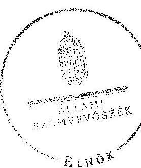
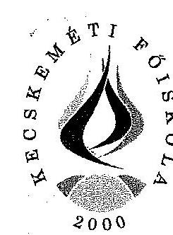
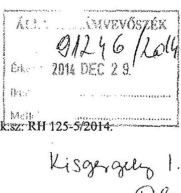
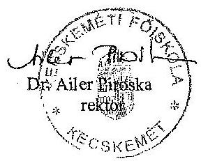
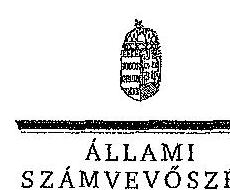

# ÁLLAMI   SZÁMVEVŐSZÉK 

## JELENTÉS

a Kecskeméti Főiskola ellenőrzéséről - Az állami felsőoktatási intézmények gazdálkodásának, működésének ellenőrzése

---

# Állami Számvevőszék 

Iktatószám: V-0576-126/2015
Témaszám: 1610
Vizsgálat-azonosító szám: V-068902

## Az ellenőrzést felügyelte:

## Kisgergely István

felügyeleti vezető

## Az ellenőrzés végrehajtásáért felelős:

Zakar László
ellenőrzésvezető

A számvevői munkaanyagok feldolgozását és a Jelentés összeállítását végezte:

Zakar László
ellenőrzésvezető
Dr. Nagy Krisztina
számvevő
Giday Zoltán
számvevő főtanácsos

## Az ellenőrzést végezték:

| Giday Zoltán | Dr. Nagy Krisztina | Polyák Ferenc |
| :-- | :-- | :-- |
| számvevő főtanácsos | számvevő | számvevő tanácsos |
| Ungár Ervin | Unger Ferenc |  |
| számvevő | számvevő |  |

## A témához kapcsolódó eddig készített számvevőszéki jelentések:

## címe

Jelentés az oktatási és kulturális ágazat irányítási rendszerének, működésének ellenőrzéséről
Jelentés a felsőoktatás oktatási infrastruktúra-fejlesztési programjának ellenőrzéséről
Jelentés az állami felsőoktatási intézmények érdekeltségébe tartozó gazdasági társaságok támogatásának és nyereségük hasznosulásának ellenőrzéséről
Jelentés a Szolnoki Főiskola ellenőrzéséről - Az állami felsőoktatási intézmények gazdálkodásának, működésének ellenőrzése

---

Jelentés a Pannon Egyetem ellenőrzéséről - Az állami felsőoktatási intézmények gazdálkodásának, működésének ellenőrzése
Jelentés a Károly Róbert Főiskola ellenőrzéséről - Az állami felsőoktatási intézmények gazdálkodásának, működésének ellenőrzése
Jelentés a Magyar Képzőművészeti Egyetem ellenőrzéséről - Az állami felsőoktatási intézmények gazdálkodásának, működésének ellenőrzése
Jelentés a Miskolci Egyetem ellenőrzéséről - Az állami felsőoktatási intézmények gazdálkodásának, működésének ellenőrzése
Jelentés a Széchenyi István Egyetem ellenőrzéséről - Az állami felsőoktatási intézmények gazdálkodásának, működésének ellenőrzése
Jelentés az Eszterházy Károly Főiskola ellenőrzéséről - Az állami felsőoktatási intézmények gazdálkodásának, működésének ellenőrzése
Jelentés a Magyar Táncművészeti Főiskola ellenőrzéséről - Az állami felsőoktatási intézmények gazdálkodásának, működésének ellenőrzése
Jelentés a Budapesti Műszaki és Gazdaságtudományi Egyetem ellenőrzéséről - Az állami felsőoktatási intézmények gazdálkodásának, működésének ellenőrzése

---

.

---

# TARTALOMJEGYZÉK 

BEVEZETÉS ..... 13
I. ÖSSZEGZŐ MEGÁLLAPÍTÁSOK, KÖVETKEZTETÉSEK, JAVASLATOK ..... 17
II. RÉSZLETES MEGÁLLAPÍTÁSOK ..... 26

1. A fenntartói és az ágazati irányítási jogok gyakorlása ..... 26
2. Az intézmény belső kontrollrendszerének kialakítása és működtetése ..... 28
3. Az intézmény döntéshozó szerveinek joggyakorlása, az oktatási és egyéb tevékenységei elkülönítése, a pénzügyi gazdálkodása ..... 31
3.1. Az intézmény döntéshozó szerveinek gazdálkodással kapcsolatos joggyakorlása ..... 31
3.2. Az intézmény oktatói és egyéb tevékenységei elkülönítése, az ellátott feladat átláthatósága ..... 34
3.3. Az intézmény pénzügyi egyensúlya, fizetőképessége ..... 35
3.4. Az intézmény előirányzat kezelése ..... 37
3.5. Az egyes hazai forrásból finanszírozott projektekhez, feladatokhoz kapott - nem normatív - költségvetési forrással való elszámolás ..... 43
4. Az intézmény vagyongazdálkodása ..... 44
4.1. A vagyongazdálkodási tevékenységek keretei ..... 44
4.2. A vagyonváltozások és a vagyonhasznosítás szabályszerűsége ..... 45
4.3. Az intézmény tulajdonosi jog gyakorlása ..... 48
5. A külső ellenőrzések által tett javaslatok hasznosulása ..... 49
5.1. ÁSZ ellenőrzések által tett javaslatok hasznosulása ..... 49
5.2. Az egyéb külső ellenőrzések javaslatainak hasznosulása ..... 51
6. Az integritás érvényesítése érdekében kialakított és működtetett intézményi kontrollrendszer ..... 51

---

# MELLÉKLETEK 

1. számú A Kecskeméti Főiskola kiadási és bevételi előirányzatai, azok teljesítése a 2009-2013. években
2. számú A Kecskeméti Főiskola kiadásainak, bevételeinek változása a 2009-2013. években
3. számú Kimutatás a Kecskeméti Főiskola bevételeiről és kiadásairól, valamint adósságszolgálatáról a 2009-2013. években
4. számú A Kecskeméti Főiskola mérlegadatai a 2009-2013. években
5. számú A Kecskeméti Főiskola gazdálkodása szabályszerűségének értékelése a mintatételek alapján
6. számú A Kecskeméti Főiskola észrevétele
7. számú A Kecskeméti Főiskola észrevételére adott válasz

## FÜGGELÉKEK

1. számú Az integritás érvényesítése érdekében kialakított és működtetett intézményi kontrollrendszer

---

# RÖVIDÍTÉSEK JEGYZÉKE 

| Törvények |  |
| :--: | :--: |
| Áht. 1 | 1992. évi XXXVIII. törvény az államháztartásról (hatálytalan 2012. január 1-jétől) |
| Áht. 2 | 2011. évi CXCV. törvény az államháztartásról |
| ÁSZ tv. | 2011. évi LXVI. törvény az Állami Számvevőszékről |
| Eisztv. | 2005. évi XC. törvény az elektronikus információszabadságról (hatálytalan 2012. január 1-jétől) |
| Feot. | 2005. évi CXXXIX. törvény a felsőoktatásról (hatálytalan 2012. szeptember 1-jétől) |
| Gt. | 2006. évi IV. törvény a gazdasági társaságokról (hatálytalan 2014. március 15-től) |
| Info tv. | 2011. évi CXII. törvény az információs önrendelkezési jogról és az információszabadságról |
| Kbt. $_{1}$ | 2003. évi CXXIX. törvény a közbeszerzésekről (hatálytalan 2012. január 1-jétől) |
| Kbt. 2 | 2011. évi CVIII. törvény a közbeszerzésekről |
| Kjt. | 1992. évi XXXIII. törvény a közalkalmazottak jogállásáról |
| Nftv. | 2011. évi CCIV. törvény a nemzeti felsőoktatásról |
| Nvtv. | 2011. évi CXCVI. törvény a nemzeti vagyonról |
| Sztv. | 2000. évi C. törvény a számvitelről |
| Vtv. | 2007. évi CVI. törvény az állami vagyonról |
| Korm. rendeletek |  |
| Áhsz. | 249/2000. (XII. 24.) Korm. rendelet az államháztartás szervezetei beszámolási és könyvvezetési kötelezettségének sajátosságairól (hatálytalan 2014. január 1-jétől) |
| Ámr. 1 | 217/1998. (XII. 30.) Korm. rendelet az államháztartás működési rendjéről (hatálytalan 2010. január 1-jétől) |
| Ámr. 2 | 292/2009. (XII. 19.) Korm. rendelet az államháztartás működési rendjéről (hatálytalan 2012. január 1-jétől) |
| Ávr. | 368/2011. (XII. 31.) Korm. rendelet az államháztartásról szóló törvény végrehajtásáról |
| Ber. | 193/2003. (XI. 26.) Korm. rendelet a költségvetési szervek belső ellenőrzéséről (hatálytalan 2012. január 1-jétől) |
| Bkr. | 370/2011. (XII. 31.) Korm. rendelet a költségvetési szervek belső kontrollrendszeréről és belső ellenőrzéséről |
| Vtvr. | 254/2007. (X. 4.) Korm. rendelet az állami vagyonnal való gazdálkodásról |
| 51/2007. (III. 26.) Korm. rendelet | 51/2007. (III. 26.) Korm. rendelet a felsőoktatásban részt vevő hallgatók juttatásairól és az általuk fizetendő egyes térítésekről |
| 50/2008. (III. 14.) Korm. rendelet | 50/2008. (III. 14.) Korm. rendelet a felsőoktatási intézmények képzési, tudományos célú és fenntartói normatíva alapján történő finanszírozásáról |

---

## Határozatok

1365/2011. (XI. 8.)
Korm. határozat
1290/2012. (VIII. 9.)
Korm. határozat
1428/2012. (X. 8.)
Korm. határozat
1657/2012. (XII. 20.)
Korm. határozat

## Egyéb rövidítések

AIPA Nkft.
ÁSZ
EMMI
FEUVE
FEUVE szabályzat

FIR
FSA
IFT
KETISZK Nkft.

KF/főiskola/intézmény
Kincstár
Kötelezettségvállalási szabályzat
MNV Zrt.
MTA
NEFMI
NGM
OKM
PPP

SZMSZ
TÁMOP
TIOP
TJSZ
VIR

1365/2011. (XI. 8.) Korm. határozat a 2012. évi hiánycél tartását biztosító további feladatokról
1290/2012. (VIII. 9.) Korm. határozat a költségvetési főfelügyelők és költségvetési felügyelők kirendeléséről
1428/2012. (X. 8.) Korm. határozat a 2012. évi költségvetési egyenleg tartását biztosító intézkedésekről
1657/2012. (XII. 20.) Korm. határozat a kormányzati stratégiai dokumentumok felülvizsgálatával kapcsolatos feladatokról

AIPA Alföldi Iparfejlesztési Nonprofit Közhasznú Kft.
Állami Számvevőszék
Emberi Erőforrások Minisztériuma
folyamatba épített, előzetes, utólagos és vezetői ellenőrzés
Folyamatba épített, előzetes, utólagos és vezetői ellenőrzés szabályzata
Felsőoktatási Információs Rendszer
Felsőoktatási Strukturális Alap
Intézményfejlesztési Terv
Kecskeméti Térségi Integrált Szakképző Központ Nonprofit Kiemelkedően Közhasznú Kft.
Kecskeméti Főiskola
Magyar Államkincstár
A kötelezettségvállalás és az utalványozás rendjéről szóló szabályzat
Magyar Nemzeti Vagyonkezelő Zrt.
Magyar Tudományos Akadémia
Nemzeti Erőforrás Minisztérium
Nemzetgazdasági Minisztérium
Oktatási és Kulturális Minisztérium
Public-Private Partnership (magán- és közszféra együttműködése)
Szervezeti és Működési Szabályzat
Társadalmi Megújulási Operatív Program
Társadalmi Infrastruktúra Operatív Program
Térítési és Juttatási Szabályzat
Vezetői Információs Rendszer

---

# ÉRTELMEZŐ SZÓTÁR 

alapító
autonómia
állami felsőoktatási intézmény saját tulajdona
állami vagyon

A központi költségvetési szerv alapítója az Országgyűlés, a Kormány vagy a miniszter. A felsőoktatási intézmények vonatkozásában az alapítói jogokat a felsőoktatásért felelős minisztérium gyakorolja.
A felsőoktatási intézmény Feot.-ban, illetve Nftv.-ben szabályozott önrendelkezése, amely biztosítja az intézmény önálló oktatási, kutatási, szervezeti és működési, valamint gazdálkodási tevékenységét.
A felsőoktatási intézmény saját bevételének a költségek teljes körű levonása, - az adományozás és öröklés kivételével - a rendelkezésre bocsátott vagyon állagának megóvásáról, pótlásáról való gondoskodás után fennmaradt része terhére szerzett vagyona.
A Vtv. 1. § (2) bekezdése szerint állami vagyonnak minősül:
a) az állami tulajdonban lévő ingó dolog, valamint a dolog módjára hasznosítható természeti erő,
b) az állami tulajdonban lévő termőföldekből álló, külön törvényben szabályozott Nemzeti Földalap,
c) az állami tulajdonban lévő - a b) pont hatálya alá nem tartozó - ingatlan,
d) az állami tulajdonban lévő értékpapír,
e) az államot megillető társasági részesedés és más vagyoni értékű jog.
(hatályos 2010. június 16-ig)
a) az állam tulajdonában lévő dolog, valamint a dolog módjára hasznosítható természeti erő,
b) az a) pont hatálya alá nem tartozó mindazon vagyon, amely vonatkozásában törvény az állam kizárólagos tulajdonjogát nevesíti,
c) az állam tulajdonában lévő tagsági jogviszonyt megtestesítő értékpapír, illetve az államot megillető egyéb társasági részesedés,
d) az államot megillető olyan immateriális, vagyoni értékkel rendelkező jogosultság, amelyet jogszabály vagyoni értékű jogként nevesít.
(hatályos 2010. június 17-től)

---

állami vagyon hasznosítása

A Vtv. 23. § (1) bekezdése szerint: Az állami vagyont az MNV Zrt. maga kezeli, illetve szerződés - így különösen bérlet, haszonbérlet, szerződésen alapuló haszonélvezet, vagyonkezelés, megbízás - alapján központi költségvetési szervnek, természetes vagy jogi személynek, illetőleg jogi személyiséggel nem rendelkező gazdasági társaságnak hasznosításra átengedi.
(hatályos 2010. december 31-ig)
Az állami vagyont az MNV Zrt. maga kezeli, vagy szerződés - így különösen bérlet, haszonbérlet, szerződésen alapuló haszonélvezet, vagyonkezelés, megbízás - alapján központi költségvetési szervnek, természetes vagy jogi személynek, vagy jogi személyiséggel nem rendelkező gazdálkodó szervezetnek hasznosításra átengedi.
(hatályos 2011. december 31-ig)
Az állami vagyont az MNV Zrt. maga kezeli, vagy szerződés - így különösen bérlet, haszonbérlet, megbízás alapján központi költségvetési szervnek, természetes vagy jogi személynek, vagy jogi személyiséggel nem rendelkező gazdálkodó szervezetnek hasznosításra átengedi. (hatályos 2012. január 1-jétől)
állami vagyon hasznosítására kötött szerződés
állami vagyon használója

A Vtv. 23. § (2) bekezdése szerint: Az állami vagyon hasznosítására kötött szerződések elsődleges célja az állami vagyon hatékony működtetése, állagának védelme, értékének megőrzése, illetve gyarapítása, az állami és közfeladatok ellátásának elősegítése.
A Vtvr. 1. § (7) a) pontja szerint: Az a természetes személy, jogi személy, illetve jogi személyiséggel nem rendelkező gazdasági társaság, amely az MNV Zrt.-vel kötött szerződés alapján, bármely jogcímen (bérlet, haszonbérlet, vagyonkezelés, használat stb.) állami vagyont birtokol, használ, hasznosít.
(hatályos 2010. december 31-ig)
Az a természetes személy, jogi személy, illetve jogi személyiséggel nem rendelkező szervezet, amely, illetve aki törvény vagy szerződés alapján, bármely jogcímen (pl. bérlet, haszonbérlet, vagyonkezelési szerződés, használat stb.) állami vagyont birtokol, használ, szedi annak hasznait, hasznosít, ide nem értve a tulajdonosi jogok gyakorlóját.
(hatályos 2011. január 1 - 2011. december 31-ig)
Az a természetes vagy jogi személy, jogi személyiséggel nem rendelkező szervezet, aki, vagy amely törvény vagy szerződés alapján, bármely jogcímen (bérlet, haszonbérlet, használat stb.) állami vagyont birtokol, használ, szedi annak hasznait, hasznosít, ide nem értve a haszonélvezőt, a vagyonkezelőt és a tulajdonosi jogok gyakorlóját.
(hatályos 2012. január 1-jétől)

---

állami vagyon értékesítése
állami vagyon kezelője /vagyonkezelő
belső kontrollrendszer

CLF-módszer
előirányzat-maradvány

Állami vagyon tulajdonjogának bármely jogcímen történő, visszterhes átruházása. (Vtvr. 1. § (7) d) pont)
A Vtv. 23. § (1) bekezdése szerint: Az állami vagyont az MNV Zrt. maga kezeli, vagy szerződés - így különösen bérlet, haszonbérlet, szerződésen alapuló haszonélvezet, vagyonkezelés, megbízás - alapján központi költségvetési szervnek, természetes vagy jogi személynek, illetőleg jogi személyiséggel nem rendelkező gazdasági társaságnak hasznosításra átengedi. (hatályos 2010. január 1 - 2010. december 31-ig)
Az állami vagyont az MNV Zrt. maga kezeli, vagy szerződés - így különösen bérlet, haszonbérlet, szerződésen alapuló haszonélvezet, vagyonkezelés, megbízás - alapján központi költségvetési szervnek, természetes vagy jogi személynek, illetőleg jogi személyiséggel nem rendelkező gazdálkodó szervezetnek hasznosításra átengedi. (hatályos 2011. január 1 - 2011. december 31-ig)
Az állami vagyont az MNV

 Zrt. maga kezeli, vagy szerződés – így különösen bérlet, haszonbérlet, megbízás alapján központi költségvetési szervnek, természetes vagy jogi személynek, vagy jogi személyiséggel nem rendelkező gazdálkodó szervezetnek hasznosításra átengedi. Az állami vagyonra vonatkozóan az MNV Zrt. kizárólag az Nvtv.-ben meghatározott személyekkel köthet vagyonkezelési szerződést.
(hatályos 2012. január 1-jétől)
A belső kontrollrendszer a kockázatok kezelése és tárgyilagos bizonyosság megszerzése érdekében kialakított folyamatrendszer, amely azt a célt szolgálja, hogy megvalósuljanak a következő célok:
a) a működés és gazdálkodás során a tevékenységeket szabályszerűen, gazdaságosan, hatékonyan, eredményesen hajtsák végre,
b) az elszámolási kötelezettségeket teljesítsék, és
c) megvédjék az erőforrásokat a veszteségektől, károktól és nem rendeltetésszerű használattól.
A módszer a működési és a felhalmozási költségvetés bevételeinek és kiadásainak, ezek egyenlegeinek elkülönített, majd összevont kimutatását alkalmazza valamely költségvetési intézmény pénzügyi helyzetének megítéléséhez. Kiemelten mutatja be a finanszírozási műveletek egyenlege nélküli és az azt magába foglaló pénzügyi pozíciót, valamint a tőketörlesztéssel, értékpapír beváltással csökkentett működési jövedelmet.
Az értékelés a pénzügyi kapacitás fogalmát helyezi a középpontba.
Az államháztartás központi alrendszerébe tartozó költségvetési szerveknél a módosított bevételi és kiadási előirányzatok és azok teljesítésének a Kormány rendeletében

---

EUTAF
fenntartó
finanszírozási műveletek nélküli pozíció

Gazdasági Tanács
hároméves fenntartói megállapodás
információs és kommunikációs rendszer
intézményfejlesztési terv
meghatározott tételekkel korrigált különbözete az előirányzat-maradvány. (Áht. 2. § (1) bekezdés m) pontja) Európai Támogatásokat Auditáló Főigazgatóság A Feot. 7. § (2) és az Nftv. 4. § (2) bekezdése szerint az, aki az alapítói jogot gyakorolja, ellátja a felsőoktatási intézmény fenntartásával kapcsolatos feladatokat.
A CLF-módszer szerint számított működési és felhalmozási tevékenység pénzügyi egyenlegének összevont értéke. Megmutatja, hogy a költségvetési intézmény bevételei fedezetet biztosítottak-e a kiadásokra. A finanszírozási műveletek nélküli (GFS) pozíció alapján a pénzügyi helyzetet akkor tekintettük megfelelőnek, ha az adott év működési és felhalmozási bevételei fedezetet nyújtottak az adott év működési és felhalmozási kiadásaira.
A felsőoktatási intézmény javaslattevő, véleményező, a stratégiai döntések előkészítésében részt vevő, és a döntések végrehajtásának ellenőrzésében közreműködő szerve.
Az állami felsőoktatási intézmények központi költségvetési támogatására három éves fenntartói megállapodást kell kötni az állami felsőoktatási intézmény és a fenntartó között. A fenntartói megállapodás tartalmazza a felsőoktatási intézmény által meghatározott hároméves időszakra vállalt teljesítménykövetelményeket, továbbá az állandó jellegű támogatási részeket, valamint a változó jellegű támogatások megállapításának jogcímeit. A változó elemű támogatás évenkénti elszámolási kötelezettséggel kerül meghatározásra.
A költségvetési szerv vezetője köteles olyan rendszereket kialakítani és működtetni, melyek biztosítják, hogy a megfelelő információk a megfelelő időben eljutnak az illetékes szervezethez, szervezeti egységhez, illetve személyhez.
A szenátus fogadja el az intézményfejlesztési tervet. Az intézményfejlesztési tervben kell meghatározni a fejlesztéssel, a fenntartó által a felsőoktatási intézmény rendelkezésére bocsátott vagyon hasznosításával, megóvásával, elidegenítésével kapcsolatos elképzeléseket, a várható bevételeket és kiadásokat. Az intézményfejlesztési tervet középtávra, legalább négyéves időszakra kell elkészíteni, évenkénti bontásban meghatározva a végrehajtás feladatait. Az intézményfejlesztési terv része a foglalkoztatási terv. A foglalkoztatási tervben kell meghatározni azt a létszámot, amelynek keretei között a felsőoktatási intézmény megoldhatja feladatait. (Feot. 27. § (3) bekezdés)

---

integritás
irányító szerv
kincstári biztos
kincstári költségvetés
kockázatkezelési rendszer
kontrollkörnyezet
kontrolltevékenység

Az integritás olyasvalakit vagy valamit jelöl, aki vagy ami romlatlan, sértetlen, feddhetetlen. Az integritás elvek, értékek, cselekvések, módszerek, intézkedések konzisztenciáját jelenti: olyan magatartásmódot, amely meghatározott értékeknek megfelel.
A felsőoktatás ágazati irányítását – felsőoktatásszervezéssel, felsőoktatásfejlesztéssel, törvényességi ellenőrzéssel kapcsolatos feladatokat – ellátó miniszter által vezetett minisztérium. (Feot. 102-105/A. §, Nftv. 64-66. §)
A kincstári biztos kijelölését az államháztartásért felelős miniszternél a Kincstár kezdeményezi. A kincstári biztos köteles figyelemmel kísérni megbízatásának időpontjától kezdve a költségvetési szerv tervezését, gazdálkodását, beszámolását, a jogszabályokban előírt feladatainak ellátását, feltárni azokat az okokat, amelyek a tartós fizetésképtelenséghez vezettek, a szükséges intézkedések azonnali végrehajtására irányuló intézkedési tervet készíteni, azonnali intézkedéseket kezdeményezni és írásbeli utasításokat kiadni a tartozásállomány felszámolására, a gazdálkodás egyensúlyának biztosítására, a követelések behajtására. (Ávr. 116-117. §)
A központi költségvetésről szóló törvény elfogadását követően a fejezetet irányító szerv az államháztartás központi alrendszerébe tartozó költségvetési szerv és a fejezeti kezelésű előirányzat kiemelt előirányzatait, valamint az elkülönített állami pénzalapok és a társadalombiztosítás pénzügyi alapjai jogszabályi előírás szerinti bevételeit és kiadásait kincstári költségvetés kiadásával állapítja meg. (Áht. 24. § (3) bekezdés, Áht. 28. § (2) bekezdés, Ávr. 31. § (2) bekezdés)
Irányítási eszközök és módszerek összessége, melynek elemei a szervezeti célok elérését veszélyeztető tényezők (kockázatok) azonosítása, elemzése, csoportosítása, nyomon követése, valamint szükség esetén a kockázati kitettség mérséklése.
A kontrollkörnyezet a költségvetési szerv vezetőinek a szervezeti célok elérését segítő kontrollok kialakításával és működtetésével, korszerűsítésével kapcsolatos magatartását, a kontrollpontokról érkező információkra való reagálását jelenti.
Azok az elvek, politikák és eljárások, amelyeket a kockázatok meghatározása és a szervezet céljainak elérése érdekében alakítanak ki.
A költségvetési szerv vezetője köteles a szervezeten belül kontrolltevékenységeket kialakítani, amelyek biztosítják a kockázatok kezelését, hozzájárulnak a szervezet céljainak eléréséhez.

---

költségvetési főfelügyelő, felügyelő
maximális hallgatói
létszám
minisztérium
monitoring
működési jövedelem
normatív költségvetési támogatás felsőoktatási intézmények működéséhez

Az államháztartásért felelős miniszter a Kormány irányítása alá tartozó fejezetet irányító szervhez, a Kormány irányítása vagy felügyelete alá tartozó költségvetési szervhez, valamint az elkülönített állami pénzalapok és a társadalombiztosítás pénzügyi alapjai kezelő szerveihez költségvetési főfelügyelőt, felügyelőt rendelhet ki. A költségvetési főfelügyelő, felügyelő a gazdálkodás költségvetés-politikával való összhangja és a takarékos, szabályszerű, eredményes működés érdekében a Kormány rendeletében meghatározott intézkedéseket tehet, így különösen előzetesen véleményezi a kötelezettségvállalásra irányuló eljárásokat és a nagy összegű kötelezettségvállalások tekintetében kifogással élhet. (Áht. 39. § (1)-(2) bekezdés)

Az a felsőoktatási intézmény alapító okiratában, működési engedélyében meghatározott hallgatói létszám, ameddig terjedően a felsőoktatási intézmény – figyelembe véve a hallgatók fogadásához és az oktatói tevékenység folytatásához rendelkezésre álló személyi feltételeket, helyiségeket és eszközöket – valamennyi évfolyamára számítva, teljes kihasználtsággal működve hallgatói jogviszonyt létesíthet.
A felsőoktatásért felelős minisztérium, amely 2009-től 2010 májusáig az OKM, 2010 májusától 2012 májusáig a NEFMI, 2012 májusától az EMMI volt.
A különböző szintű szervezeti célok megvalósításához szükséges folyamatok figyelemmel kísérése, melynek során a releváns eseményekről és tevékenységekről (együtt: folyamatokról) rendszeres jelleggel, strukturált, döntéstámogató információkhoz jutnak a szervezet vezetői.
A folyó bevételek és folyó kiadások egyenlege. Azt mutatja, hogy a folyó bevételek fedezetet nyújtanak-e a folyó kiadásokra.
A felsőoktatási intézmények működéséhez biztosított normatív költségvetési támogatás lehet
a) hallgatói juttatásokhoz nyújtott,
b) képzési,
c) tudományos célú,
d) fenntartói,
e) egyes feladatokhoz nyújtott
támogatás. A központi költségvetésből biztosított normatív költségvetési támogatásra – a d) pontban meghatározott normatív költségvetési támogatás kivételével – a felsőoktatási intézmények azonos feltételek alapján válnak jogosulttá. Az a)-e) pontokban meghatározott jogcímek – az a) és e) pontban meghatározott jogcímek kivételével – nem jelentenek felhasználási kötöttséget. (Feot. 127. § (3) bekezdés)

---

normatív támogatások
saját bevétel
szenátus
tárgyévi pénzügyi pozíció

Az ellenőrzési időszakban hatályos költségvetési törvények 3. sz. mellékletében megjelölt közoktatási hozzájárulások, az 5. sz. mellékletében megjelölt központosított előirányzatok, továbbá a 8. sz. mellékletében megjelölt normatív, kötött felhasználású támogatások együttesen. Az államháztartáson kívüli források – beleértve minden olyan, az Európai Uniótól származó támogatást, amelyhez nem az állami költségvetésen keresztül jut a felsőoktatási intézmény, továbbá a szakképzési hozzájárulási fizetési kötelezettség teljesítéseként elszámolt forrásokat is, ide nem értve az állami vagyon értékesítésének ellenértékét – valamint a Kutatási és Technológiai Innovációs Alapból származó bevételek.
A felsőoktatási intézmény, döntést hozó és a döntés végrehajtását ellenőrző testülete. (Feot. 20. § (1) bekezdés, Nftv. 12. § (1)-(3) bekezdés)
A működési és felhalmozási bevételek, valamint kiadások egyenlege a finanszírozási műveletek egyenlegének figyelembe vételével.

---

# **Chemistry**

## **Chemical Reactions**

### **Balancing Chemical Equations**

1. **Write the unbalanced equation:**
   - Example: $$C_3H_8 + O_2 \rightarrow CO_2 + H_2O$$

2. **Balance the equation:**
   - Example: $$2C_3H_8 + 7O_2 \rightarrow 6CO_2 + 8H_2O$$

3. **Balance the equation:**
   - Example: $$2C_3H_8 + 7O_2 \rightarrow 6CO_2 + 8H_2O$$

### **Types of Reactions**

1. **Combination Reaction:**
   - Example: $$2H_2 + O_2 \rightarrow 2H_2O$$

2. **Decomposition Reaction:**
   - Example: $$2H_2O_2 \rightarrow 2H_2O + O_2$$

3. **Single Displacement Reaction:**
   - Example: $$Zn + 2HCl \rightarrow ZnCl_2 + H_2$$

4. **Double Displacement Reaction:**
   - Example: $$AgNO_3 + NaCl \rightarrow AgCl + NaNO_3$$

5. **Combustion Reaction:**
   - Example: $$CH_4 + 2O_2 \rightarrow CO_2 + 2H_2O$$

## **Stoichiometry**

### **Mole Concept**

- **Mole (mol):** The amount of substance containing as many particles (atoms, molecules, ions) as there are atoms in exactly 12 grams of carbon-12.
- **Avogadro's Number:** $$6.022 \times 10^{23}$$ particles per mole.

### **Molar Mass**

- **Molar Mass:** The mass of one mole of a substance.
- Example: The molar mass of water ($$H_2O$$) is 18.015 g/mol.

### **Calculations**

1. **Moles to Mass:**
   - Formula: $$n = \frac{m}{M}$$
   - Example: Calculate the number of moles of $$H_2O$$ in 18 grams of water.
     - $$n = \frac{18 \, \text{g}}{18.015 \, \text{g/mol}} \approx 0.999 \, \text{mol}$$

2. **Moles to Mass:**
   - Formula: $$m = n \times M$$
   - Example: Calculate the mass of 1 mole of water.
     - $$m = 1 \, \text{mol} \times 18.015 \, \text{g/mol} = 18.015 \, \text{g}$$

## **Gas Laws**

### **Ideal Gas Law**

- **Equation:** $$PV = nRT$$
- **Variables:**
  - $$P$$: Pressure (atm)
  - $$V$$: Volume (L)
  - $$n$$: Number of moles (mol)
  - $$R$$: Ideal gas constant (0.0821 L·atm/mol·K)
  - $$T$$: Temperature (K)

### **Boyle's Law**

- **Equation:** $$P_1V_1 = P_2V_2$$
- **Variables:**
  - $$P_1$$: Initial pressure (atm)
  - $$V_1$$: Initial volume (L)
  - $$P_2$$: Final pressure (atm)
  - $$V_2$$: Final volume (L)

### **Boyle's Law (Boyle's Law)**

- **Equation:** $$\frac{P_1V_1}{T_1} = \frac{P_2V_2}{T_2}$$

## **Thermochemistry**

### **Enthalpy Change (ΔH)**

- **Definition:** The heat content of a system at constant pressure.
- **Equation:** $$\Delta H = q_p$$

### **Hess's Law**

- **Statement:** The enthalpy change for a reaction is the same whether it occurs in one step or multiple steps.
- **Equation:** $$\Delta H_{\text{reaction}} = \sum \Delta H_{\text{products}} - \sum \Delta H_{\text{reactants}}$$

### **Hess's Law (ΔH)**

- **Statement:** The enthalpy change for a reaction is the same whether it occurs in one step or multiple steps.
- **Equation:** $$\Delta H_{\text{reaction}} = \sum \Delta H_{\text{products}} - \sum \Delta H_{\text{reactants}}$$

## **Electrochemistry**

### **Oxidation and Reduction**

- **Oxidation:** Loss of electrons.
- **Reduction:** Gain of electrons.

### **Galvanic Cells**

- **Definition:** A cell that converts chemical energy into electrical energy.
- **Components:**
  - Anode: Oxidation occurs.
  - Cathode: Reduction occurs.

 occurs.
  - Salt Bridge: Connects the two half-cells.

### **Nernst Equation**

- **Equation:** $$E = E^\circ - \frac{RT}{nF} \ln Q$$
- **Variables:**
  - $$E$$: Cell potential
  - $$R$$: Ideal gas constant
  - $$T$$: Temperature (K)
  - $$n$$: Number of electrons transferred
  - $$F$$: Faraday constant
  - $$Q$$: Reaction quotient

---

# JELENTÉS 

## A Kecskeméti Főiskola ellenőrzéséről Az állami felsőoktatási intézmények gazdálkodásának, működésének ellenőrzése

## BEVEZETÉS

Az ÁSZ Stratégiája ${ }^{1}$ alapértékeinek egyike, hogy az államháztartás komplex folyamatainak átláthatósága érdekében rendszerszemléletű/holisztikus megközelítésű, egymásra épülő, a szinergiahatást kihasználó, összefoglaló értékelésre lehetőséget adó ellenőrzéseket végez. Az államháztartás központi alrendszerébe tartozó felsőoktatási intézmények ellenőrzése során az Állami Számvevőszék értékeli azok pénzügyi-gazdasági helyzetét, feltárja a működésükben rejlő kockázatokat, ezzel előmozdítja a közpénzügyek átláthatóságát, rendezettségét.

Az állami felsőoktatási intézmények gazdálkodását - az Áht. ${ }_{1-2}$ előírásai mellett - a felsőoktatásról szóló 2005. évi CXXXIX. törvény (Feot.), valamint a nemzeti felsőoktatásról szóló 2011. évi CCIV. törvény (Nftv.) előírásai határozták meg.

Magyarország Nemzeti Reform Programja keretében, a Széll Kálmán Terv 2020-ig a 30-34 évesek körében, a felsőfokú vagy annak megfelelő végzettséggel rendelkezők arányának 30,3 %-ra való növelését irányozta elő, amely a 2010. évhez képest 4,6 %-pontos növekedési célkitűzést jelent. A rendezett gazdasági környezet, az önállósággal élni tudó, felelős, elszámoltatható intézményi gazdálkodói magatartás elengedhetetlen feltétele a kitűzött szakmai célok elérésének.

Az ellenőrzés célja annak megállapítása, hogy szabályos volt-e az állami felsőoktatási intézmények pénzügyi és vagyongazdálkodása, biztosított volt-e a vagyonnal való felelős gazdálkodás követelményének érvényesülése, jogszabályi előírásoknak megfelelően működött-e a belső kontrollrendszer; az irányító szerv tevékenysége a jogszabályi előírásoknak megfelelt-e.

Ennek keretében értékelni kell:

1) a fenntartói és az ágazati irányítási jogok gyakorlását;
2) az intézmény belső kontrollrendszerének jogszabályoknak megfelelő kialakítását és működtetését;
[^0]
[^0]:    ${ }^{1}$ Állami Számvevőszék: Stratégia. Az Állami Számvevőszék hivatalos stratégiai dokumentum rendszere 2011-2015. 2012. december. http://www.asz.hu/strategia/asz-strategia/asz-strategia-2011.pdf

---

3) az intézmény döntéshozó szerveinek joggyakorlása jogszabályoknak való megfelelőségét; az intézmény oktatási és egyéb (gyakorlati és kutatási) tevékenységeinek elkülönítését, átláthatóságát, illetve pénzügyi gazdálkodásának szabályszerűségét;
4) az intézmény vagyongazdálkodásának előírásoknak való megfelelőségét;
5) az ellenőrzött időszakban végzett külső (ÁSZ, fenntartói, KEHI, EUTAF) ellenőrzések által tett javaslatok hasznosulását;
6) az intézmény átalakítása során a vonatkozó jogszabályok betartását;
7) az intézmény korrupcióval szembeni veszélyeztetettségének csökkentése érdekében az integritási szemlélet érvényesülését a gazdálkodási folyamatokban.

Az ellenőrzés várható hasznosulása: Az ellenőrzés eredményének hasznosulásaként képet kapunk a felsőoktatási intézményekben kialakult pénzügyi helyzetről; az oktatási és egyéb tevékenységek és költségelszámolások elhatárolásáról, átláthatóságáról és szabályosságáról. A felsőoktatási intézmények gazdálkodási szabadságának pénzügyi és vagyoni helyzetre gyakorolt hatásairól, a vagyonnal való felelős, értékmegőrző gazdálkodás érvényesüléséről, továbbá a belső kontrollrendszer működéséről. Az ellenőrzés az ellenőrzött számára visszajelzést ad a gazdálkodása kereteinek kialakításáról, a működésében fellépő hiányosságokról, javaslataival hozzájárul azok kiküszöböléséhez és a jó kormányzáshoz. A törvényalkotás számára összegzett tapasztalatok állnak rendelkezésre a felsőoktatási intézmények döntéseinek, gazdálkodásának szabályszerűségéről, amelyek alapján - indokolt esetben - jogszabály-módosítás kezdeményezhető. Az integritás kultúra kialakítása hozzájárul az elszámoltathatóság és átláthatóság érvényesítéséhez, egyben támogatja a szervezet védettségét a korrupciós kitettséggel szemben, valamint annak megelőzése is irányítottabbá válik. A társadalom számára jelzi, hogy közpénz nem maradhat ellenőrizetlenül, az ÁSZ értékteremtő rend kialakításához és megőrzéséhez hozzájáruló tevékenysége pozitív hatással lesz a szervezetről kialakított összkép formálásában.

Az ellenőrzés típusa: szabályszerűségi ellenőrzés.
Az ellenőrzött időszak 2009. január 1. - 2013. december 31. (az eredményszemléletű számvitel bevezetésével kapcsolatban az ellenőrzött időszak vége: 2014. április 30.)

Az ellenőrzéssel érintett szervezetek: az Emberi Erőforrások Minisztériuma és a Kecskeméti Főiskola.

Az ellenőrzés jogszabályi alapját az ÁSZ tv. 1. § (3) bekezdése, az 5. §. (3)(6) bekezdései, valamint az államháztartásról szóló 2011. évi CXCV. törvény (Áht. ${ }_{2}$ ) 61. § (2) bekezdésének előírásai képezik.

Az ellenőrzés kiterjed minden olyan körülményre és adatra, amely az ÁSZ jogszabályban meghatározott feladataiban, valamint a program végrehajtása folyamán felmerült újabb összefüggések feltárásához szükséges.

---

Az ellenőrzés az INTOSAI által kiadott nemzetközi standardok figyelembe vételével, az ellenőrzési programtervezetben foglalt értékelési szempontok szerint történt.

Az ÁSZ a 2011. évi LXVI. törvény 29. §-a szerint a jelentéstervezetet megküldte az emberi erőforrások miniszterének és a Kecskeméti Főiskola rektorának. A beérkezett észrevételt és az arra adott választ a jelentés 6-7. sz. mellékletei tartalmazzák.

A pénzügyi és vagyongazdálkodás terén az egyes területek szabályszerű működését mintavétellel ellenőriztük, ez alapján a sokaságban előforduló hibás tételek arányát becsültük. A jogszabályoknak és a belső előírásoknak megfelelőnek, azaz szabályszerűnek tekintettük az adott kiadási előirányzat felhasználását, bevétel beszedését, mérlegtétel értékelését, amennyiben a minta ellenőrzésének eredménye alapján 95 %-os bizonyossággal a teljes sokaságban a hibás tételek aránya kisebb volt, mint 10 %, nem megfelelőnek értékeltük, ha a hibás tételek aránya a 10 %-ot meghaladta. Kockázatot, illetve magas kockázatot jeleztünk, amennyiben egy adott terület vonatkozásában a minta alapján a teljes sokaságban nem volt teljes körűen biztosított a jogszabályoknak és a belső szabályzatoknak megfelelő működés. A mintatételek kiértékelését az 5. számú melléklet tartalmazza.

A belső kontrollrendszer kialakításának és működtetésének értékelése során a jogszabályi előírások mellett az Ámr. ${ }_{1}$ 145/A. § (1) és (3) bekezdése, az Ámr. ${ }_{2}$ 155. § (3) bekezdése, valamint a Bkr. 5. § (1) bekezdése alapján figyelembe vettük az államháztartásért felelős miniszter által közzétett irányelvekben és módszertani útmutatókban ${ }^{2}$ foglaltakat is. A belső kontrollrendszert az értékelés során legalább 85 %-os megfelelőség esetén megfelelőnek, legalább a 70 %-os megfelelőség esetén részben megfelelőnek, 70 %-os megfelelőség alatt pedig nem megfelelőnek minősítettük.

A Kecskeméti Főiskola a 2009-2013. évek között önállóan működő és gazdálkodó központi költségvetési szerv volt. Agrár, műszaki, informatikai, pedagógusképzés képzési területeken folytatott képzést és alapfeladata körében a képzési területeken kutatási tevékenységet végzett valamennyi fentebb felsorolt területen. Az intézmény szerkezetében, szervezeti felépítésében változás történt, új szervezeti egységet alapítottak, szervezeti egységeket vontak össze, intézményi átalakítást nem történt.

[^0]
[^0]:    ${ }^{2}$ 1/2009. (IX. 11.) PM irányelv, Pénzügyminisztérium Belső Kontroll Kézikönyv 2010.

---

Az ellenőrzéssel érintett intézmény jellemzőit, főbb gazdálkodási, vagyoni és létszám adatait az alábbi táblázat mutatja be.

| Megnevezés | Főbb gazdálkodási és vagyoni adatok (ezer Ft) |  |  |  |  |  |
| :--: | :--: | :--: | :--: | :--: | :--: | :--: |
|  | 2009 | 2010 | 2011 | 2012 | 2013 | $\begin{gathered} 2013 / 2009 \\ \% \end{gathered}$ |
| KIADÁSI FŐÖSSZEG | 4843401 | 5746468 | 5481980 | 4369677 | 3561004 | 73,5 |
| BEVÉTELI FŐÖSSZEG | 5026777 | 6926282 | 5780444 | 4452246 | 4036344 | 80,3 |
| Költségvetési támogatások | 2483570 | 2373698 | 2197013 | 1868775 | 1800510 | 72,5 |
| Saját és átvett bevételek | 2319042 | 3561281 | 3115998 | 2391521 | 2141748 | 92,4 |
| Előirányzat maradvány felhasználás | 224165 | 991303 | 467433 | 191950 | 94086 | 42,0 |
| Támogatások aránya (\%) | 49,4 | 34,3 | 38,0 | 42,0 | 44,6 | - |
| Mérlegfőösszeg | 6385347 | 7061481 | 7624373 | 7989303 | 8068064 | 126,4 |
| Jellemző létszámadatok* (fő) |  |  |  |  |  |  |
| Oktatói létszám | 168 | 165 | 160 | 147 | 137 | 81,5 |
| Hallgatói létszám | 4917 | 4633 | 4700 | 4376 | 3733 | 75,9 |
| *Az oktatói és hallgatói létszám az október 15-i statisztikában szereplő adat. |  |  |  |  |  |  |

A felsőoktatási intézmény kiadásai az öt év alatt 26,5 %-kal, a bevételei összességében 19,7 %-kal csökkentek. A bevételeken belül a költségvetési támogatás aránya 40,9 % volt átlagosan. A költségvetési támogatás összege az ellenőrzött időszakban 27,5 %-kal a saját és átvett bevételek 7,6 %-kal csökkent. A hallgatói létszám 1184 fővel, (24,1 %-kal) esett vissza, az oktatók létszáma pedig 168 főről 137 főre, 18,5 %-kal csökkent. A KF alapító okirata szerint a maximális hallgatói létszám az ellenőrzött időszakban 4380 fő, a tényleges hallgatói létszám 2013-ban 3733 fő, a kihasználtság 85,2 %-os volt.

---

# I. ÖSSZEGZŐ MEGÁLLAPÍTÁSOK, KÖVETKEZTETÉSEK, JAVASLATOK 

Az ellenőrzött időszakban a felsőoktatásért felelős miniszter a jogszabályi előírásoknak megfelelően gyakorolta fenntartói feladatait. Alapítói jogosultságai keretében szabályszerűen adta ki a főiskola jogszabályi és szervezeti változásoknak megfelelően módosított alapító okiratát. A KF által elkészített és megküldött SZMSZ módosításokat a fenntartó felülvizsgálta.

A minisztérium a jogszabályi rendelkezéseknek megfelelően gyakorolta a főiskola rektorának és gazdasági vezetőjének megbízásával kapcsolatos feladatait. Hiányosság volt, hogy az ellenőrzött időszakot megelőzően kinevezett belső ellenőrzési vezető nem rendelkezett fenntartó általi megbízással.

A fenntartó és a főiskola a 2008-2010. évekre vonatkozóan a jogszabály rendelkezéseivel összhangban kötötte meg a hároméves fenntartói megállapodást, amelyben rögzítették a költségvetési támogatások nagyságát, az elérendő teljesítménykövetelményeket. A fenntartó ellenőrizte a hároméves fenntartói megállapodásban előírt teljesítmény-követelmények betartását, értékelte az azok teljesítéséről készített intézményi beszámolót. A minisztérium közreműködött a főiskola éves költségvetésének tervezésében, meghatározta az intézmény költségvetési kereteit, értékelte az éves beszámolót.

A fenntartó az ellenőrzött időszakban három helyszíni ellenőrzést és egy adatbekérést végzett a KF vonatkozásában. A javaslatok egy kivétellel megvalósultak, amely hozzájárult főiskola belső kontrollrendszerének javításához, így a szabályszerű működéshez. A fenntartó által többször is javasolt gazdálkodási szabályzat aktualizálása az ellenőrzött időszak alatt nem történt meg.

A miniszter az ágazati irányítási feladatait az ellenőrzött időszakban nem látta el teljes körűen.

Elmaradt az oktatási ágazatra vonatkozóan a nemzetgazdasági miniszter irányításával és az oktatásért felelős miniszter részvételével, a kormányhatározatban előírt szervezeti és feladatellátási felülvizsgálati program kidolgozása. A miniszter több javaslatot készített és terjesztett a Kormány elé a felsőoktatási rendszer középtávú fejlesztési tervének vonatkozásában, azonban a Kormány által elfogadott középtávú fejlesztési terv nincs. A felsőoktatási ágazati információs rendszer oktatásszakmai fejlesztési koncepcióját a fenntartó 2011. évben elkészítette.

A miniszter az Oktatási Hivatallal a FIR biztonságos üzemeltetéséhez, az adatok védelméhez szükséges alapvető szervezeti, szabályozási kontrollokat 2012. év közepéig nem teljes körűen alakította ki. A FIR átfogó megújítása után 2012 szeptemberétől rögzített - a nyitott jogviszonnyal rendelkező hallgatók és az oktatók vonatkozásában - adatok már teljes körűek. A fenntartó a FIR biztonságos üzemeltetéséhez, az adatok védelméhez szükséges szabályozási kontrollokat 2012. év végén kialakította. A fenntartó a FIR-t 2013-ban jogszabályi

---

megfelelőségi, adatbiztonsági, illetve informatikai szempontból nem ellenőrizte.

A KF belső kontrollrendszerének kialakítása és működtetése az ellenőrzött időszak alatt összességében megfelelő volt.

Az intézmény kontrollkörnyezete a jogszabályi előírásoknak megfelelt, azonban a gazdálkodás szempontjából meghatározó belső szabályzatait több esetben nem aktualizálta a jogszabályi változásoknak
 megfelelően. Az intézmény közfeladatát, alaptevékenységét is tartalmazó alapító okirattal rendelkezett. Az intézmény elkészítette és aktualizálta SZMSZ-ét. A főiskola 2009-2010. évekre kialakította az erőforrásokkal való szabályszerű és hatékony gazdálkodáshoz szükséges teljesítménykövetelményeket. A FEUVE szabályzat részeként meghatározták az ellenőrzési nyomvonalakat, rögzítették a szabálytalanságok kezelésének rendjét.

A főiskola a jogszabályi előírásoknak megfelelően kialakította és működtette 2009-2013. évek között kockázatkezelési rendszerét. Az intézmény a FEUVE szabályzatában azonosította, értékelte a lehetséges kockázatokat, meghatározta azok folyamatgazdáit, felvázolta a kockázatkezelés lehetséges módjait. Gondoskodott a kockázatok nyilvántartásáról és a válaszintézkedések folyamatba építéséről.

Az intézmény a jogszabályi előírásoknak megfelelően alakította ki és működtette a kontrolltevékenységeket, amelynek részeként biztosították a folyamatba épített, előzetes, utólagos és vezetői ellenőrzést. A kötelezettségvállalás és utalványozás rendjéről szóló szabályzatban az engedélyezési, jóváhagyási és kontroll eljárásokat meghatározták. Az ellátottak juttatásai előirányzat felhasználása esetében a gazdálkodási jogkörök gyakorlása vonatkozásában tártunk fel rendszerhibát.

A KF információs és kommunikációs rendszerének kialakítása és működtetése 2011. évig részben megfelelő, a 2012. évtől megfelelő volt. A javulást a kötelezően közzéteendő adatok nyilvánosságra hozatalának és a közérdekű adatok megismerésére irányuló igények teljesítésének belső szabályozása, valamint az iratkezelési szabályzat hatályba lépése eredményezte. A FIR-rel kapcsolatos adatszolgáltatásokat a főiskola az ellenőrzött időszak alatt teljesítette.

A főiskola a monitoring rendszerét megfelelően alakította ki és működtette a 2009-2013. évek között. A belső ellenőrzés az ellenőrzött időszakban a jogszabályi előírásoknak megfelelően működött, a belső ellenőrzés függetlensége biztosított volt, azonban belső ellenőrzési egység vezetője nem rendelkezett a fenntartó általi megbízással.

A főiskola pénzügyi gazdálkodása összességében nem felelt meg teljes körűen a jogszabályoknak és a belső szabályozásokban előírtaknak a szabályzatok aktualizálása hiánya és a gazdálkodási jogkörgyakorlással, valamint az előirányzat-felhasználással kapcsolatos eseti hibák miatt.

A szenátus gazdálkodással kapcsolatos joggyakorlása részben felelt meg a jogszabályi előírásoknak. A jogszabályi előírásokat figyelmen kívül

hagyva a szenátus nem a számviteli rendelkezések alapján elkészített éves beszámolókat fogadta el, mivel nem a teljes beszámolókat, hanem azok kivonatait és szöveges indoklásait tárgyalta. A KF az ellenőrzött időszakra a jogszabályban előírtaknak megfelelően elkészítette az intézményfejlesztési tervét (IFT). Az intézmény által elkészített vagyongazdálkodási terveket a szenátus a jogszabályi előírások ellenére nem hagyta jóvá. Kötelezettségvállalási tervet az intézmény nem készített, így annak szenátus általi jóváhagyására, valamint a fenntartó részére való megküldésre nem került sor.

A KF oktatási és egyéb tevékenységeit szakfeladatok szerint a nyilvántartásban elkülönítették, az ellátott feladatok rendszere átlátható volt.

Az ellenőrzött időszakban a felhasználási kötöttség nélküli normatív költségvetési támogatások felhasználásával kapcsolatos szenátusi döntések részben feleltek meg a jogszabályi előírásoknak. A szenátus a 2011. és a 2013. évre a gazdálkodási feltételek kedvezőtlen változása miatt - a felhasználási kötöttség nélküli normatív támogatások felosztását nem tartalmazó - egységes költségvetést fogadott el.

Az ellenőrzött időszakban a kötött felhasználású normatív költségvetési támogatások felhasználásával kapcsolatos döntések megfeleltek a jogszabályi előírásoknak és a belső szabályozásnak. Az intézmény a hallgatók részére nyújtható támogatások jogcímeit és feltételeit a TJSZ-ben állapította meg. A támogatások odaítéléséről a Diákjóléti Bizottság a TJSZ-ben foglaltak alapján döntött.

Az intézményi térítési díjak, költségtérítések megállapítása nem felelt meg a jogszabályi és belső előírásoknak. Nem volt megfelelő, hogy a főiskola nem tartotta be a jogszabályban és az önköltségszámítási szabályzatban előírtakat. Az ellenőrzött díjbevételek és költségtérítések harmadát nem alapozta meg önköltségszámítás. A TJSZ-ek szerint a főiskola (szenátus) határozza meg a költségtérítés összegét a következő tanévre szóló felvételi tájékoztató megjelenése előtt. Ennek ellenére az egyes karok költségtérítéseit a dékánok állapították meg.

Az intézmény a 2009-2013 közötti időszakban a jogszabályi előírások ellenére nem készített a pénzügyi egyensúly biztosítása érdekében előirányzat-felhasználási-, illetve likviditási tervet. A 2009-2013. években az intézmény működési költségvetése 600,4 M Ft többletet, felhalmozási költségvetés 1371,5 M Ft hiányt mutatott. A KF pénzügyi egyensúlya a finanszírozási műveletek és az előirányzat maradvány igénybevételével biztosított volt az ellenőrzött időszakban. A főiskola likviditása a 2012. év kivételével biztosított volt. A 2012. év pénzügyi helyzetének kedvezőtlen alakulását a támogatás csökkenése, az év végi zárolások, elvonások, a saját bevételek csökkenése és a pályázati elszámolások elhúzódásai okozták. A KF likviditásának javulása 2013. évben az FSA-ból kapott egyszeri 200,0 M Ft-os költségvetési támogatással következett be, amelynek eredményeképpen a rövid lejáratú kötelezettségek állománya 305,5 M Ft-ról 26,8 M Ft-ra csökkent.

A főiskola 60 napon túli tartozása alapján a 2012. évben elérte a kincstári biztos kijelölésének értékhatárát. Az államháztartásért felelős miniszter a jogszabályban előírtak ellenére kincstári biztost nem jelölt ki az intézményhez. A Kormány az ellenőrzött időszakban a főiskolához költségvetési főfelügyelőt nem rendelt ki.

A KF a kiadási és bevételi előirányzatok tervezése során a jogszabályokban és a fenntartó által kiadott tervezési irányelvekben foglaltak szerint járt el. A 2009-2013. években a kincstári költségvetés alapján összeállították az intézmény elemi költségvetését, amelyet az irányító szerv részére megküldtek. Az egyezőség kiemelt előirányzati szinten a kincstári költségvetés és az elemi költségvetés között biztosított volt.

A bevételi és kiadási előirányzatok módosítása, azok elszámolása 2009. és 2010. évben nem felelt meg teljes körűen a jogszabályoknak és belső szabályoknak, mert a KF nem minden esetben tájékoztatta az irányító szervet. Ez kockázatot jelez az ellenőrzött terület egészének szabályos működése szempontjából. Az intézményt érintő előirányzat-módosítások átvezetése a számviteli nyilvántartásokon - a 2009. év kivételével - megfelelt az előírásoknak.

Az intézmény az ellenőrzött öt évben 26222,1 M Ft bevételt realizált és 24002,5 M Ft költségvetési kiadást teljesített. A bevételek 40,9%-a (10 723,6 M Ft) költségvetési támogatás volt.

A 2013. év végi felhasználható előirányzat maradvány $439,6 \mathrm{M}$ Ft volt. A KF gazdálkodása során a költségvetés módosított kiadási főösszegét a 2009-2013. években betartotta. A módosított bevételi főösszeg túlteljesítése 2010. és 2011. években történt, a finanszírozási bevételek és a támogatásértékű működési bevételek teljesítése eredményeképpen. Az ellenőrzött időszakban az intézmény teljesítette a fenntartó felé az éves és a féléves költségvetési beszámolókhoz kapcsolódó adatszolgáltatási kötelezettségét.

A rendszeres és nem rendszeres személyi juttatások előirányzatának felhasználása esetében a pénzügyi elszámolások, valamint a gazdálkodási jogkörök gyakorlása tekintetében nem volt teljes körűen biztosított a jogszabályoknak és belső szabályoknak való megfelelősége, mert 2009-ben eseti hibaként a kötelezettségvállalás ellenjegyzése elmaradt. Ez kockázatot jelez az ellenőrzött terület egészének szabályos működése szempontjából.

A külső személyi juttatások előirányzatai terhére megkötött megbízási szerződések tartalma, teljesítése, számfejtése nem felelt meg teljes körűen a jogszabályoknak és belső szabályoknak. Eseti hibaként fordult elő, hogy a szerződés megkötése a teljesítést követően, utólag történt, valamint a kötelezettségvállalás és a teljesítésigazolás szabályszerűsége dokumentáció hiányában nem volt ellenőrizhető. Ez kockázatot jelez az ellenőrzött terület egészének szabályos működése szempontjából.

A dologi kiadások előirányzatának felhasználása a pénzügyi elszámolások, valamint a gazdálkodási jogkörök gyakorlása tekintetében nem felelt meg teljes körűen a jogszabályoknak és belső szabályoknak, mivel néhány esetben a teljesítésigazolás, az érvényesítés, illetve az utalványozás nem volt megfelelő. Ez kockázatot jelez az ellenőrzött terület egészének szabályos működése szempontjából.

A felújítások, beruházások előirányzatának felhasználása során a gazdálkodási jogkörök gyakorlása tekintetében nem volt teljes körűen biztosított a jogszabályoknak és belső szabályoknak való megfelelőség. Néhány esetben 2012. évben a teljesítésigazolás, 2013. évben a pénzügyi ellenjegyzés nem történt meg. Ez kockázatot jelez az ellenőrzött terület egészének szabályos működése szempontjából.

Az ellátottak juttatásainak kifizetése nem felelt meg a jogszabályi és belső előírásoknak. Nem volt megfelelő a gazdálkodási jogkörök gyakorlása. Az ellenőrzött időszak alatt az utalványozást, a 2012-2013. években a teljesítésigazolást és a 2009-2011. években az érvényesítést nem a jogszabályoknak megfelelően végezték.

Az intézményi működési bevételek beszedése a pénzügyi elszámolások, valamint a gazdálkodási jogkörök gyakorlása tekintetében nem felelt meg teljes körűen a jogszabályoknak és belső szabályoknak, mivel 2009-ben a szakmai teljesítésigazolást nem végezték el. Ez kockázatot jelez az ellenőrzött terület egészének szabályos működése szempontjából.

Az immateriális javak és tárgyi eszközök bérbeadása, értékesítése a pénzügyi elszámolások, valamint a gazdálkodási jogkörök gyakorlása tekintetében nem felelt meg teljes körűen a jogszabályoknak és belső szabályoknak, mert 2011-ben két esetben az érvényesítést nem végezték el.

A 2009-2013. években az éves előirányzat-maradványok megállapítása és felhasználása szabályszerűen történt.

Az egyes megvalósított, csak hazai forrásból finanszírozott projektekhez, feladatokhoz pályázati úton vagy egyéb módon kapott (nem normatív) költségvetési forrással való elszámolás nem felelt meg teljes körűen a jogszabályoknak és belső szabályoknak. Egy esetben nem állt rendelkezésre az eredeti támogatási megállapodás. Ez kockázatot jelez az ellenőrzött terület egészének szabályos működése szempontjából.

A főiskola vagyongazdálkodása összességében nem felelt meg teljes körűen a jogszabályoknak és a belső szabályozásokban előírtaknak a szabályzatok aktualizálása hiánya és a gazdálkodási jogkörgyakorlással és mérlegtétellel kapcsolatos eseti hibák miatt.

A szenátus elfogadta a főiskola IFT-jét és azok módosítását a jogszabályi előírásnak megfelelően. Az intézmény vagyongazdálkodási terve bemutatta a jövőben tervezett beruházási, felújítási, karbantartási célokat, és az ezekhez kapcsolódó kiadásokat és forrásokat.

Az intézmény beszerzéseinek, beruházásainak, felújításának szabályszerűségét főigazgatói utasítások biztosították. A közbeszerzési szabályzat aktualizálása a 2011. évi jogszabályváltozást követően késve, csak 2013 novemberében történt meg. A vagyonváltozás, vagyonhasznosítás szabályszerű folyamatát a főiskola az ellenőrzött időszakban szabályzatokban rögzítette, amelyek aktualizálása néhány esetben elmaradt.

A főiskola a 2009-2013. években az alapfeladat ellátásához rendelkezésre bocsátott vagyon nyilvántartását vezette, saját vagyonnal - a részesedések kivételével - nem rendelkezett. Az ellenőrzött időszak alatt a főiskola valamennyi ingatlanja a Magyar Állam tulajdonában volt, amelyek kezelésére a főiskola az MNV Zrt.-vel vagyonkezelési szerződést kötött. A KF a beszámolójában és a számviteli nyilvántartásaiban kimutatott eszközök és források állományának valódiságát a jogszabályoknak megfelelően leltározással biztosította. Az ellenőrzött időszakban selejtezések végrehajtása és dokumentálása a jogszabályban foglaltak szerint szabályszerű volt. A kis értékű immateriális javakra és tárgyi eszközökre vonatkozóan előírásokat a jogszabályi rendelkezéstől eltérően a szabályzatban nem rögzítette.

A követelések esetében a mérlegtételek tartalma, besorolása, értékelése nem felelt meg teljes körűen a jogszabályoknak és belső szabályoknak. Nem volt megfelelő, hogy egy esetben már pénzügyileg teljesült követelés szerepelt a mérlegben. Ez kockázatot jelez az ellenőrzött terület egészének szabályos működése szempontjából.

A kötelezettségek esetében a mérlegtételek tartalma, besorolása, értékelése nem felelt meg teljes körűen a jogszabályoknak és belső szabályoknak, mivel egy 2010. évi belföldi kiküldetésről hiányzott a számla. Ez kockázatot jelez az ellenőrzött terület szabályos működése szempontjából.

Az intézménynél az aktív és a passzív pénzügyi elszámolások esetében a mérlegtételek tartalma, besorolása, értékelése megfelelt a jogszabályi követelményeknek.

Az eredményszemléletű számvitel bevezetésével kapcsolatosan a KF elkészítette a 2013. évi rendező mérlegét. A rendező mérleg készítésekor az előírt feladatokat, a rendező technikai tételek elszámolását megfelelően végrehajtották.

A befektetett eszközök aránya 2009-2012. évig 75%-ról 97%-ra növekedett, amely azt jelzi, hogy az intézmény által végzett tevékenység eszközellátottsága javult. A nagy összegű beruházások, felújítások és egyéb vagyonváltozások szabályszerűen történtek 2009-2013. években. A beszerzésekhez,
 szolgáltatásokhoz kapcsolódó közbeszerzési eljárások a jogszabályban foglalt egybeszámítási szabályoknak megfeleltek. Az eszközök állományba vétele, az üzembe helyezésének dokumentálása szabályszerű volt. Az eszközök a tárgyévi mérleget alátámasztó leltárban megtalálhatóak voltak. A KF-nél a 2009-2013. közötti időszakban feladatváltozással kapcsolatos térítésmentes átadás-átvétel nem volt.

A főiskola értékpapír-állományában a kincstári hálózatban értékesített forgatási célú hitelviszonyt megtestesítő diszkontkincstárjegyeket szerepeltetett, amelynek a 2009. és a 2010. évi értéke könyvviteli mérlegben 830,1 M Ft és 100,0 M Ft volt. Az összes kincstárjegy 2011. évben beváltásra került. A főiskola az értékpapír-állományról a jogszabályi előírásoknak megfelelő nyilvántartást vezetett.

---

A vagyon értékesítésével és bérbeadásával kapcsolatosan minden esetben szenátusi döntés alapján történt az értékesítés. A vagyon értékesítéséhez, bérbeadásához értékbecslések készültek. Az intézmény a 2012-2013. években a bérbeadási folyamat során a jogszabályban előírt átláthatósági követelmény érvényesüléséről nem győződött meg. Az ingatlanértékesítésekből származó bevételeket a jogszabályban meghatározott fejlesztési célra használták fel.

Az ellenőrzött időszakban a főiskolának két gazdasági társaságban volt részesedése. A főiskola tulajdonosi ellenőrzési jogát a rektor képviseletével a taggyűléseken gyakorolta. A társaságok éves beszámolókkal és közhasznúsági jelentésekkel az ellenőrzött időszak alatt beszámoltak a gazdálkodásukról. A részesedéseivel kapcsolatosan pótbefizetésre egyik társaság esetében sem került sor az ellenőrzött időszak alatt.

Az ÁSZ három korábbi ellenőrzése során a felsőoktatás témakörében kilenc javaslatot fogalmazott meg a felsőoktatásért felelős minisztériumnak (OKM, NEFMI, EMMI). A minisztérium a javaslatokra intézkedési terveket készített, amelyek összesen 10 intézkedést tartalmaztak. Az intézkedések közül hármat (késéssel) megvalósítottak, hét nem valósult meg. A megvalósult intézkedések hozzájárultak a felsőoktatási intézményrendszer jobb működéséhez.

Elvégezték a felsőoktatási intézményrendszer kapacitás kihasználtságának felmérését. A felsőoktatási intézmények érdekeltségébe tartozó gazdasági társaságok ellenőrzése során feltárt hiányosságok kiküszöbölésére a minisztérium felszólította az intézményeket, amelyek a megtett intézkedésekről tájékoztatták a minisztériumot. A minisztérium tájékoztatást kért az érintett felsőoktatási intézményektől az 50% alatti intézményi részesedéssel működő gazdasági társaságok tevékenységének felülvizsgálatáról, működésük indokoltságáról és eredményességéről, valamint az intézményi részesedés megszüntetéséről és ütemezéséről.

Nem valósult meg a minisztérium felügyelete alá tartozó szervezetek feladatellátásának javítására számszerűsíthető mutatószámokon alapuló kritériumok és középtávú célrendszer kidolgozása. A felsőoktatási ágazat középtávú stratégiáját sem készítették el. Nem intézkedtek az oktatási infrastruktúra-fejlesztési programok előkészítési folyamatának hiányosságai miatti felelősség megállapítására. Nem hasznosították az állami felsőoktatási intézmények kapacitáskihasználtságával kapcsolatos felmérés eredményeit, így nem tettek intézkedést a felsőoktatási infrastruktúra közép- és hosszútávon történő hasznosítására. Nem alakítottak ki a PPP projektek támogatásához kapcsolódó követelményrendszert. Nem került sor az oktatási infrastruktúra-fejlesztési programok lebonyolításával kapcsolatos hiányosságok (kedvezőtlen feltételű szerződéskötés és kockázatmegosztás) miatti felelősség megállapítására. Nem dolgoztatták ki az állami felsőoktatási intézményekkel azok gazdasági társaságai szakmai feladatellátásának és gazdaságossági eredményességének mérését biztosító mutatószámokat és értékelési rendszert.

Külső ellenőrzés keretében a KEHI 2010. évben vizsgálta a főiskola gazdálkodását. Az ellenőrzés javaslatot nem fogalmazott meg. Az EUTAF 2013. évben két ellenőrzést végzett a főiskolán, a megfogalmazott javaslatok hasznosultak.

---

A főiskola az ellenőrzött időszakban erőfeszítéseket tett az integritási szemlélet fejlesztésére, valamint a korrupciós kockázatok csökkentésére, a 2013. évben önként részt vett az ÁSZ integritási felmérésében.

A helyszíni ellenőrzés megállapításainak hasznosítása mellett javasoljuk:

# a Kecskeméti Főiskola rektora részére ${ }^{3}$ : 

1. A belső kontrollrendszeren belül a kontrollkörnyezet kialakításánál hiányosság volt, hogy a főiskola az ellenőrzött időszakban a belső szabályzatait nem minden esetben aktualizálta a jogszabályi változásokkal összhangban. Ez nem felelt meg az Sztv. 14. § (11) bekezdésében, valamint az Ámr. 145/B. § (1), az Ámr. 2 156. § (2) és a Bkr. 6. § (3) bekezdésében foglalt előírásoknak.

Javaslat:
Intézkedjen - az ellenőrzött időszak óta bekövetkezett jogszabályi változásokra figyelemmel - a kontrollkörnyezet hiányosságainak megszüntetéséről.
2. A Kecskeméti Főiskolán a belső ellenőrzési egység vezetője a Feot. 115. § (2) bekezdés g) pontjában, valamint az Nftv. 73. § (3) bekezdés f) pontjában foglaltak ellenére nem rendelkezett a fenntartó általi megbízással.

Javaslat:
Intézkedjen, hogy - az ellenőrzött időszakot követően bekövetkezett jogszabályváltozásra tekintettel - a belső ellenőrzési vezető rendelkezzen kancellári megbízással.
3. A pénzügyi gazdálkodás területén nem volt szabályszerű a gazdálkodási jogkörök gyakorlása az ellátottak juttatásai előirányzatának felhasználásánál. A 2012. és 2013. években a teljesítésigazolást nem megfelelően végezték el, mivel az nem tartalmazta a teljesítés tényére történő utalást az Avr. 57 § (3) bekezdésének megfelelően.

A pénzügyi gazdálkodás szabályszerűségét érintő hiányosság volt, hogy a Feot. 27. § (6) bekezdés e) pontjában, valamint az Nftv. 12. § (3) bekezdés ee) pontjaiban foglaltak ellenére a szenátus nem a számviteli rendelkezések alapján elkészített éves beszámolókat, hanem azok kivonatait és szöveges indoklásait fogadta el.

A külső személyi juttatások előirányzatai terhére megkötött megbízási szerződések tartalma, teljesítése, számfejtése nem felelt meg teljes körűen a jogszabályoknak, mivel eseti jelleggel a szerződés megkötése a teljesítést követően, utólag történt. Ez nem felelt meg - a teljesítés idején, illetve a szerződéskötéskor hatályos - Ávr. 51. § (2) bekezdésében foglaltaknak.

[^0]
[^0]:    ${ }^{3}$ Az Nftv. 2014. július 24-től hatályos módosítását követően a belső kontrollrendszer kialakításáért és működtetéséért, továbbá a pénzügyi és vagyongazdálkodásért felelős személynek.

---

Az intézményi térítési díjak és költségtérítések megállapításához az Áhsz. 9. sz. melléklet 12. pontjában előírtak ellenére nem készítettek önköltségszámítást.

A főiskola nem készített likviditási tervet, figyelmen kívül hagyva az Áht. 78. § (2) bekezdése előírásait.

Javaslat:
a) Intézkedjen a gazdálkodási jogkörök szabályszerű gyakorlásának érvényesítéséről.
b) Intézkedjen a számviteli rendelkezések alapján elkészített éves beszámoló szenátus általi elfogadása érdekében.
c) Intézkedjen a külső személyi juttatások előirányzatai terhére utólag megkötött megbízási szerződés esetében a feltárt hiányosságok és szabálytalanságok tekintetében a munkajogi felelősség kivizsgálására irányuló eljárás megindítása iránt, és annak eredménye ismeretében tegye meg a szükséges intézkedéseket.
d) Intézkedjen az intézményi térítési díjak és költségtérítések önköltségszámítással való megalapozásáról.
e) Intézkedjen a jövőben a likviditási terv elkészítéséről.
4. A vagyongazdálkodás szabályszerűségét érintő hiányosság volt, hogy a Feot. 27. § (6) bekezdés d) pontjában, valamint az Nftv. 12. § (3) bekezdés gb) pontjában foglaltak ellenére a szenátus nem fogadta el a vagyongazdálkodási tervet.

A Leltározási és Leltárkészítési szabályzatban nem rögzítették a kis értékű immateriális javakra és tárgyi eszközökre vonatkozó előírásokat az Áhsz. 37. § (6) bekezdésétől eltérően.

Javaslat:
a) Intézkedjen a vagyongazdálkodási terv szenátus általi elfogadása érdekében.
b) Intézkedjen a Leltározási és Leltárkészítési szabályzatban a kis értékű immateriális javakra és tárgyi eszközökre vonatkozó előírások jogszabálynak megfelelő kiegészítéséről.
5. Az intézmény a vagyon bérbeadása során az Nvtv. 11. § (10)-(11) bekezdésében foglaltak ellenére a 2012-2013. években nem győződött meg az átláthatóság követelményének érvényesüléséről.

Javaslat:
Érvényesítse a vagyon bérbeadással történő hasznosítása során az átláthatóság követelményét, a szerződő felektől megkövetelve a jogszabályban előírt nyilatkozat megtételét.

---

# II. RÉSZLETES MEGÁLLAPÍTÁSOK 

## 1. A fenntartói és az ágazati irányítási jogok gyakorlása

A KF alapítói és fenntartói feladatait az ellenőrzött időszakban az EMMI, illetve annak jogelődjei látták el.

A főiskola fenntartója 2010 májusáig az OKM, majd tárcaösszevonással a NEFMI, illetve 2012 májusától az EMMI volt.

Az ellenőrzött időszakban a miniszter a jogszabályi előírásoknak megfelelően gyakorolta fenntartói feladatait.

Alapítói jogosultságai keretében szabályszerűen adta ki a főiskola jogszabályi és szervezeti változásoknak megfelelően módosított alapító okiratát. Az alapító okirat változásával, illetve a jogszabály-módosításokkal kapcsolatban a főiskola által kiadott SZMSZ-módosításokat a fenntartó az ellenőrzött időszakban felülvizsgálta és jóváhagyta.

A fenntartói irányítás keretében a minisztérium közölte a felsőoktatási intézmény költségvetéseinek kereteit és értékelte a főiskola éves beszámolóit.

A fenntartó elfogadta a KF intézményfejlesztési terveit és 2012-ben megküldte az IFT módszertani útmutatót. Az útmutató alapján kidolgozott 2012-2015. évekre vonatkozó IFT-re a fenntartó észrevételt nem tett.

A fenntartó az ellenőrzött időszakban három helyszíni ellenőrzést és egy adatbekérést végzett a főiskolán. Az ellenőrzések javaslatokat fogalmaztak meg, amelyek alapján a KF intézkedési terveket készített. A javaslatok egy kivétellel megvalósultak, hozzájárulva ezzel a főiskola belső kontrollrendszerének javításához.

A fenntartó 2009. decemberben a KF kötelezettségvállalási rendszere és hallgatói tartozásállomány informatikai és számviteli nyilvántartásának kialakítását és működését ellenőrizte. A vizsgálat javasolta, hogy a főiskola aktualizálja gazdálkodási szabályzatát. A javaslat nem realizálódott, a gazdálkodási szabályzatot az ellenőrzött időszak alatt nem aktualizálták.

A minisztérium a jogszabályi rendelkezéseknek megfelelően gyakorolta a főiskola rektorának és gazdasági vezetőjének megbízásával kapcsolatos feladatait. Az ellenőrzött időszakot megelőzően kinevezett belső ellenőrzési egység vezetője jogszabályi előírás ellenére nem rendelkezett a fenntartó általi megbízással ${ }^{4}$.

A fenntartó és a főiskola a 2008-2010. évekre vonatkozóan a Feot. rendelkezéseivel összhangban kötötte meg a hároméves fenntartói megállapodást,

[^0]
[^0]:    ${ }^{4}$ Feot. 115. § (2) bekezdés g) pont, Nftv. 73. § (3) bekezdés f) pont

---

amelyben rögzítették a költségvetési támogatások nagyságát, az elérendő teljesítménykövetelményeket.

A fenntartó ellenőrizte a három éves fenntartói megállapodásban előírt teljesítménykövetelmények betartását, értékelte az azok teljesítéséről készített intézményi beszámolót.

A miniszter az ágazati irányítási feladatait az ellenőrzött időszakban nem látta el teljes körűen.

A miniszter több javaslatot készített és terjesztett a Kormány elé a felsőoktatási rendszer középtávú fejlesztési tervének ${ }^{5}$ vonatkozásában, azonban a Kormány által elfogadott középtávú fejlesztési terv nincs.

A felsőoktatási ágazati információs rendszer oktatásszakmai fejlesztési koncepcióját a fenntartó 2011. évben elkészítette.

A Kormány a FIR működéséért felelős szervnek az Oktatási Hivatalt jelölte ki. Az elektronikus nyilvántartás működtetéséhez szükséges informatikai hátteret és az adatok feldolgozását az Oktatási Hivatal az Educatio Társadalmi Szolgáltató Nonprofit Kft. bevonásával látta el.

Az OKM Ellenőrzési Főosztálya a FIR kialakításának és működésének jogszabályi megfelelőségét 2010-ben ellenőrizte az OKM-nél, az Oktatási Hivatalnál és az Educatio Társadalmi Szolgáltató Nonprofit Kft.-nél.

A jelentés megállapította, hogy a FIR kialakítása és működése csak részben felelt meg a jogszabályi előírásoknak, hiányzott a szakmai célkitűzések egyértelmű és pontos meghatározása. Ezek hiányában a FIR megfelelősége nem volt mérhető. A fontosabb nyilvántartási funkciók részben voltak működőképesek, az intézmények hiányos adatszolgáltatása veszélyeztette a FIR-től elvárt szolgáltatások teljesülését.

A miniszter az Oktatási Hivatallal a FIR biztonságos üzemeltetéséhez, az adatok védelméhez szükséges alapvető szervezeti, szabályozási kontrollokat 2012. év közepéig nem alakította ki teljes körűen.

A FIR átfogó megújítása után 2012 szeptemberétől rögzített - a nyitott jogviszonnyal rendelkező hallgatók és az oktatók vonatkozásában - adatok már teljes körűek. A fenntartó a FIR biztonságos üzemeltetéséhez, az adatok védelméhez szükséges szabályozási kontrollokat 2012. év végén kialakította.

A fenntartó 2013-ban folyamatosan megadta a főiskola részére a FIR működéséhez a felhasználói iránymutatást, rendszeres tájékoztatókat és segítséget. 2013-ban a működésért felelős Oktatási Hivatal a FIR kezelésével kapcsolatban nyolc, ún. FIR-füzetet adott ki.

A fenntartó 2013-ban nem ellenőrizte a megújított FIR-t jogszabályi megfelelőségi, adatbiztonsági, illetve informatikai szempontból.

[^0]
[^0]:    ${ }^{5}$ Feot. 104. § (1) bekezdés b) pont, Nftv. 64. § (3) bekezdés a) pont

---

Elmaradt az oktatási ágazatra vonatkozóan az 1365/2011. (XI. 8.) Korm. határozatban - a nemzetgazdasági miniszter irányításával és az ágazatért felelős miniszter részvételével - előírt szervezeti és feladat
 ellátási felülvizsgálati program kidolgozása.

A kormányhatározat a minisztérium számára a hatékony felsőoktatási feladatellátás érdekében közreműködési kötelezettséget írt elő követelmények és feltételek (feladatmutatók, mennyiségi és minőségi teljesítménymutatók, létszám- és költségnormák) kialakításában, a felsőoktatási intézmény-struktúra, illetve az intézményi belső működés korszerűsítési javaslatainak megtételében. A minisztérium tájékoztatása szerint a 2012. február 20-ig határidős feladatot nem végezték el, mert nem rendelkeztek információval a kormányhatározat 1. pontjában megjelölt miniszteri munkabizottság működéséről, valamint az általa kidolgozott módszertani útmutatóról, amely a munkálatokhoz adott volna iránymutatást ${ }^{6}$.

# 2. AZ INTÉZMÉNY BELSŐ KONTROLLRENDSZERÉNEK KIALAKÍTÁSA ÉS MŰKÖDTETÉSE 

A KF belső kontrollrendszerének kialakítása és működtetése az ellenőrzött időszakban összességében és évente is megfelelő volt. Ezen belül a kontrollkörnyezet, a kockázatkezelési rendszer működtetése, a kontrolltevékenységek, az információs és kommunikációs rendszer kialakítása és működtetése, valamint a monitoring rendszer is megfelelő volt.

A rektor a 2009-2013. években évente értékelte a belső kontrollok kialakítását és működését, valamint erről nyilatkozatot tett a fenntartó felé, amely nem volt teljes körűen összhangban a kontrollrendszer tényleges működésével. A nyilatkozatok a 2009. és 2011. években tartalmaztak az információs és kommunikációs rendszerre és a monitoring rendszerre fejlesztendő területeket, de a gazdálkodásra vonatkozó szabályzatok aktualizálására nem tértek ki.

Az intézmény kontrollkörnyezete a jogszabályi előírásoknak megfelelt, azonban a gazdálkodás szempontjából meghatározó belső szabályzatait több esetben nem aktualizálta a jogszabályi változásoknak megfelelően.

Az intézmény közfeladatát, alaptevékenységét is tartalmazó alapító okirattal rendelkezett, megfelelve ezzel az Ámr. ${ }_{1-2}$ és az Ávr.-ben előírtaknak. Az intézmény elkészítette és aktualizálta SZMSZ-ét.

A főiskola 2009-2010. évekre kialakította az erőforrásokkal való szabályszerű és hatékony gazdálkodáshoz szükséges teljesítménykövetelményeket. A Gazdasági-Műszaki Főigazgatóság rendelkezett aktualizált ügyrenddel, amelyben a szervezet működtetésével és a vagyongazdálkodással kapcsolatos feladatokat meghatározta, a feladat és hatásköröket elválasztotta.

A pénz- és vagyongazdálkodással kapcsolatos folyamatokat, feladat- és hatásköröket, felelősségi viszonyokat az Áhsz. jogszabályi előírásainak megfelelően

[^0]
[^0]:    ${ }^{6}$ Az 1365/2011. (XI. 8.) Korm. határozat 1. pontjának felelősei a nemzetgazdasági miniszter, a Miniszterelnökséget vezető államtitkár, valamint a közigazgatási és igazságügyi miniszter voltak.

---

a számviteli politikában, számlarendben, leltározási-, selejtezési-, eszközök és források értékelési-, pénzkezelési-; gazdálkodási- szabályzatában meghatározta.

A leselejtezett tárgyi eszközök értékesítésének szabályait a „Selejtezési szabályzat, valamint a feleslegessé vált vagyontárgyak hasznosításának szabályozása" határozta meg.

A főiskola a gazdálkodás szempontjából meghatározó belső szabályzatait - a számlarend kivételével - több esetben nem aktualizálta a szervezeti és a jogszabályi változásoknak ${ }^{7}$ megfelelően.

A Gazdálkodási szabályzatot, a Selejtezési szabályzatot, valamint a Feleslegessé vált vagyontárgyak hasznosításának szabályozását, a Számviteli politikát, a Leltározási és leltárkészítési szabályzatot, az Eszközök és források értékelési szabályzatát, az Ellenőrzési nyomvonalat az ellenőrzési időszakban nem aktualizálták. A Pénzkezelési szabályzatban a napi készpénz záró állomány maximális mértékét és a pénzkezeléshez kapcsolódó összeférhetetlenségi szabályokat nem aktualizálták.

A KF a kezelésében és a tulajdonában lévő tárgyi eszközök bérbeadását, értékesítését a jogszabályi előírások ellenére ${ }^{8} 2010$-től nem szabályozta.

A Közbeszerzési szabályzatot 2013. november 27-én aktualizálták, addig a 2008. október 31-ei közbeszerzési szabályzat volt érvényben. Késve biztosították és nem határozták meg a közbeszerzési eljárások előkészítésének, lefolytatásának, belső ellenőrzésének felelősségi rendjét megsértve az előírásokat ${ }^{9}$.

A 2006. január 1-jétől hatályos FEUVE szabályzatban rögzítették a szabálytalanságok kezelésének rendjét, annak mellékleteként meghatározták az ellenőrzési nyomvonalakat.

A főiskola a jogszabályi előírásoknak megfelelően kialakította és működtette a 2009-2013. évek között a kockázatkezelési rendszerét. A FEUVE szabályzatban azonosította a lehetséges kockázatokat, meghatározta azok folyamatgazdáit, a Kockázatelemző és Módszertani bizottság feladatait. Értékelte a kockázatokat és felvázolta a kockázatkezelés lehetséges módjait, gondoskodott a kockázatok nyilvántartásáról és a válaszintézkedések folyamatba építéséről. A kockázati környezet rendszeres felülvizsgálatáról is rendelkeztek.

Az intézmény a jogszabályi előírásoknak megfelelően alakította ki és működtette a kontrolltevékenységeket, amelynek részeként biztosították a folyamatba épített, előzetes, utólagos és vezetői ellenőrzést (FEUVE). A kötelezettségvállalás és utalványozás rendjéről szóló szabályzatban az engedélyezési, jóváhagyási és kontrolleljárásokat meghatározták. A dokumentumokhoz, illetve informatikai rendszerekhez való hozzáférések jogát szabályozták az Iratkezelési Szabályzatban, az Elektronikus adatok védelméről szóló szabályzatban és az

[^0]
[^0]:    ${ }^{7}$ Sztv. 14. § (11) bekezdés, Ámr. ${ }_{2}$ 156. § (2) bekezdés, Bkr. 6. § (3) bekezdés
    ${ }^{8}$ Ámr. ${ }_{2}$ 20. § (3) bekezdés d) pont, Ávr. 13. § (2) bekezdés d) pont
    ${ }^{9}$ Kbt. 2 22. § (1)-(2) bekezdés

---

Informatikai Szabályzatban. A beszámolási eljárásokat a Gazdasági Szabályzat határozta meg.

A kontrollok működtetésében a rendszeres és nem rendszeres személyi juttatások, a külső személyi juttatások, a dologi kiadások, a felújítások, beruházások, az immateriális javak és tárgyi eszközök bérbeadása és értékesítése, a hazai forrásból finanszírozott pályázatok, a mérlegtételek közül a követelések és kötelezettségek területén eseti hiányosságokat tapasztaltunk.

Rendszerhiba volt az intézményi működési bevételek beszedésénél, hogy a szakmai teljesítésigazolást a jogszabály előírásai ellenére 2009-ben nem végezték el${ }^{10}$.

Az ellátottak juttatásainak kifizetésénél rendszerhiba volt, hogy 2009-2013. években az utalványozás nem a vonatkozó jogszabályok szerint történt, az érvényesített okmány nem felelt meg az előírt alaki és tartalmi követelményeknek ${ }^{11}$. Az érvényesítést 2009-2011. között jellemzően nem végezték el szabályszerűen ${ }^{12}$.

A KF a jogszabályoknak megfelelően kialakította az információs és kommunikációs rendszert. A rendszer 2011. évig részben megfelelő, 2012. évtől megfelelő volt. A javulást a kötelezően közzéteendő adatok nyilvánosságra hozatalának és a közérdekű adatok megismerésére irányuló igények teljesítésének belső szabályozása, valamint a 2012-ben hatályba lépett iratkezelési szabályzat eredményezte. A szabályozottságot biztosítja az SZMSZ, az Iratkezelési szabályzat, az Informatikai Szabályzat. A szervezeten belüli és kívüli információáramláshoz kapcsolódó beszámolási szinteket, határidőket, módokat ${ }^{13}$ a FEUVE szabályzat határozza meg. A bizalmas információk kezeléséről, és az információ átadásról egy belső hálózaton működő iktatórendszer gondoskodik. Létrehozták és 2009-2010 évben pályázati forrásból korszerűsítették a vezetői információs rendszert (VIR-t). A rektor a VIR rendszerrel kapcsolatban fejlesztendő területeket jelölt meg a fenntartó felé tett nyilatkozatában 2011-ben.

A FIR-rel kapcsolatos adatszolgáltatásokat az információs és kommunikációs rendszer működtetése keretében teljesítették. Az informatikai háttér felkészítését segítették az Oktatási Hivatal által kiadott FIR füzetek és hírlevelek.

A honlapja jogszabályi előírásoknak megfelelő működtetésével a főiskola eleget tett az előírt közzétételi kötelezettségének ${ }^{14}$.

Az intézmény az ellenőrzött időszak alatt kialakította vezetői monitoring rendszerét. A rendszer kialakítása és működtetése a 2009-2013. évek között megfelelő volt.

[^0]
[^0]:    ${ }^{10}$ Ámr. ${ }_{1} 135 . \S$ (1)-(2) bekezdése
    ${ }^{11}$ Ámr. ${ }_{1} 136 . \S$ (3)-(5) bekezdés, Ámr. ${ }_{2} 78 . \S$ (2)-(3) bekezdés, Ávr. 59 § (2)-(3) bekezdés
    ${ }^{12}$ Ámr. ${ }_{1} 135 . \S$ (3)-(6) bekezdés, Ámr. ${ }_{2} 77 . \S$,
    ${ }^{13}$ Ámr. ${ }_{1} 145 /$ F. § (2) bekezdés, Ámr. ${ }_{2} 159 . \S$ (2) bekezdés, Bkr. 9. § (2) bekezdés
    ${ }^{14}$ Eisztv. 3. § (5) bekezdés, Info tv. 34. § (2)

---

A belső ellenőrzési egység a tevékenységét a rektor közvetlen irányításával végezte, függetlenségét a szervezeti hierarchiában való elhelyezkedése biztosította. Az ellenőrzéseket a Belső Ellenőrzési Kézikönyvben és az SZMSZ-ben meghatározott feladatkörének megfelelően látta el. A belső ellenőrt megillető betekintési és hozzáférési jogosultságot a rektor által kiállított megbízólevéllel biztosították. Az ellenőrzések során az ellenőrzöttek maradéktalanul eleget tettek az ellenőrzéssel kapcsolatos együttműködési kötelezettségüknek. A Belső Ellenőrzési Kézikönyv kitért az összeférhetetlenségi szabályokra ${ }^{15}$, és nyilatkozatmintát vezetett be az esetleges összeférhetetlenség bejelentésére.

Az ellenőrzésekről a belső ellenőr folyamatos nyilvántartást vezetett, évente beszámolót készített az ellenőrzésekről. Az intézkedési tervek az ellenőrzési megállapítások alapján többségében határidőn belül készültek el ${ }^{16}$. Több esetben a belső ellenőr által készített javaslatok ellenére sem készített az ellenőrzött intézkedési tervet, amivel nem tett eleget a jogszabályi előírásoknak ${ }^{17}$.

A belső ellenőr a jelentéskészítés ideje alatt jelezte az észrevételeit az ellenőrzöttnek, így a hibák egy részét már a jelentéstervezet véleményezési időszakában kijavították.

# 3. Az intézmény DÖNTÉSHOZÓ SZERVEINEK JOGGYAKORLÁSA, AZ OKTATÁSI ÉS EGYÉB TEVÉKENYSÉGEI ELKÜLÖNÍTÉSE, A PÉNZÜGYI GAZDÁLKODÁSA 

### 3.1. Az intézmény döntéshozó szerveinek gazdálkodással kapcsolatos joggyakorlása

A szenátus gazdálkodással kapcsolatos joggyakorlása részben felelt meg a Feot. és az Nftv. előírásainak.

A szenátus az ellenőrzött időszakra vonatkozóan három alkalommal fogadott el IFT-t. A fejlesztési feladatokról az IFT-ekben, továbbá azok módosításaiban döntöttek. A jogszabályi előírásokat ${ }^{18}$ figyelmen kívül hagyva a szenátus nem a számviteli rendelkezések ${ }^{19}$ alapján elkészített éves beszámolókat fogadta el, mivel nem a teljes költségvetési beszámolót, hanem az abból készített kivonatokat és szöveges indoklást terjesztették a szenátus elé.

A szenátus elfogadta az intézmény SZMSZ-t, a minőség és teljesítmény alapján differenciáló jövedelemelosztás elveit, valamint a fenntartó által meghatározott keretek között a költségvetését a Feot. és az Nftv. előírásai alapján. A szenátus a 2011. és a 2013. években véleményezte a rektori pályázatokat, továbbá

[^0]
[^0]:    ${ }^{15}$ Ber. 15. §, Bkr. 20. §
    ${ }^{16}$ Ber. 29. § (1) bekezdés, Bkr. 45. § (3) bekezdés
    ${ }^{17}$ Ber. 17. § (1) bekezdés d) pont, Bkr. 28. § c) pont
    ${ }^{18}$ Feot. 27. § (6) bekezdés e) pont, Nftv. 12. § (3) bekezdés ee) alpont
    ${ }^{19}$ Áhsz. 11. § (1) bekezdés

---

2013-ban értékelte a rektor vezetői tevékenységét megfelelve a jogszabályi előírásoknak ${ }^{20}$.

Az intézmény rendelkezett képzési programmal, annak módosításait szenátusi határozatokkal elfogadták.

Az intézmény vagyongazdálkodási terveit évenként elkészítették, de a szenátus a jogszabályi előírások ellenére azokat nem hagyta jóvá ${ }^{21}$. Az intézmény SZMSZ-ét és módosításait, intézményfejlesztési terveit, költségvetését a szenátus döntését követően megküldte a fenntartónak. Kötelezettségvállalási tervet az intézmény nem készített, így annak szenátus általi jóváhagyására ${ }^{22}$, valamint fenntartó részére való megküldésre nem került sor ${ }^{23}$.

Az ellenőrzött időszakban a felhasználási kötöttség nélküli normatív költségvetési támogatások felhasználásával kapcsolatos döntések részben feleltek meg a jogszabályi előírásoknak.

A szenátus a 2011. és a 2013. évre a gazdálkodási feltételek kedvezőtlen változása miatt egységes - a felhasználási kötöttség nélküli normatív támogatások felosztását nem tartalmazó - költségvetést fogadott el.

A 2009-2010. évekre a szenátus a felhasználási kötöttség nélküli normatív támogatások (képzési, tudományos célú és fenntartói) központi és decentralizált részre felosztásáról, valamint a decentralizált rész szervezeti egységek közötti felosztásáról a költségvetés jóváhagyása keretében döntött. A szenátus a 2012. évben az állami támogatás teljes összegét osztotta meg a szervezeti egységek között.

A Gazdasági Tanács a 2009-2010. évekre vonatkozóan véleményezte a képzési, tudományos célú és fenntartói normatív támogatás felosztását a központi, illetve a decentralizált szervezeti egységek között. A Gazdasági Tanács részéről

 azonban a 2011. évi költségvetés véleményezése elmaradt, a 2012. évben az előírásoktól eltérő felosztás véleményezésére került sor ${ }^{24}$.

Az ellenőrzött időszakban a kötött felhasználású normatív költségvetési támogatások felhasználásával kapcsolatos döntések megfeleltek a jogszabályi előírásoknak ${ }^{25}$ és a belső szabályozásnak.

A KF a 2009-2013 közötti időszakban működési és felhalmozási célokra 2483,6 M Ft, 2373,7 M Ft, 2197,0 M Ft, 1868,8 M Ft, továbbá 1800,5 M Ft költségvetési támogatásban részesült. A támogatáscsökkenés ebben az időszakban 683,1 M Ft, a 2009. évi összeg 27,5%-a. Az ellenőrzött időszakban a KF részére

[^0]
[^0]:    ${ }^{20}$ Feot. 27. § (5) bekezdés, Nftv. 12. § (3) bekezdés d) pont
    ${ }^{21}$ Feot. 27. § (6) bekezdés d) pont, Nftv. 12. § (3) bekezdés gb) alpont
    ${ }^{22}$ Feot. 27. § (6) bekezdés d) pont
    ${ }^{23}$ Feot. 115. § (7) bekezdés, Nftv. 74. § (3) bekezdés
    ${ }^{24}$ Feot 25. § (1) bekezdés ac) pont
    ${ }^{25} 51 / 2007$. (III.26.) Korm. rendelet

---

biztosított felhasználási kötöttség nélküli költségvetési támogatásból a képzési tudományos célú és fenntartói normatív támogatások összege 1526,0 M Ft, 1490,4 M Ft, 1273,3 M Ft, 1162,1 M Ft, továbbá 1079,2 M Ft volt. Az ellenőrzött időszak egyes éveiben a KF 436,9 M Ft, 410,1 M Ft, 452,6 M Ft, 386,0 M Ft, továbbá 383,9 M Ft kötött felhasználású támogatásban részesült a hallgatói juttatások fedezetére.

A KF alapító okirata szerint a maximális hallgatói létszám az ellenőrzött időszakban 4380 fő, a tényleges hallgatói létszám 2009-ben 4917 fő, a kihasználtság 112,2%-os volt.

Az intézmény hallgatói létszáma az öt év alatt 4917 főről 3733 főre, 24,1%-kal csökkent. A 2013. évben 3733 fő volt a tényleges hallgatói létszám, amely szerint az intézmény 85,2%-ban használta ki a férőhely kapacitását. A hallgatói létszámváltozással párhuzamosan az oktatók létszáma is csökkent 2009-ről 2013. évre 18,5%-kal (168 fő helyett 137 fő). Az egy oktatóra jutó hallgatói létszám 29,2 főről 27,2 főre változott. A költségvetési támogatás csökkenése 3,4%-ponttal meghaladta a hallgatói létszám csökkenését.

A KF az 51/2007. (III. 26.) Korm. rendeletben foglaltak alapján a TJSZ-ben meghatározta a folyó évi hallgatói juttatásokhoz nyújtott támogatási keretek felosztásának arányait.

A TJSZ-ben szabályozott juttatások kifizetésére került sor. A támogatások odaítéléséről a Diákjóléti Bizottság a TJSZ-ben foglaltak alapján döntött.

Egyéb jogcímen a KF közoktatási normatív támogatást kapott a 2009-2013. közötti időszakban évenként 288,6 M Ft, 248,3 M Ft, 260,0 M Ft, 260,0 M Ft, illetve 267,9 M Ft összegben a KF Petőfi Sándor Gyakorló Általános Iskola és Gyakorló Iskola finanszírozására.

Az intézményi térítési díjak, költségtérítések megállapítása nem felelt meg a jogszabályi és belső előírásoknak. Nem volt megfelelő, hogy a főiskola nem tartotta be az Áhsz.-ben ${ }^{26}$ és az önköltségszámítási szabályzatban előírtakat. Az ellenőrzött díjbevételek és költségtérítések harmadát nem alapozta meg önköltségszámítás.

Nem alapozták meg önköltségszámítással a hallgatók által fizetett oktatási költségtérítéseket (tandíj) és az egyéb térítési díjakat (pl. vizsgaismétlési díj, vizsgamulasztás díja), a fénymásolás, valamint a saját előállítású termékek díját.

Az oktatási tevékenység közvetlen önköltségének meghatározását nem végezték el az Áhsz. 9. számú melléklete számlaosztályok tartalmára vonatkozó 12. pontjában foglalt előírásoknak megfelelően. Az önköltségszámítási szabályzat megfelelő alkalmazása hiányában a megállapított költségtérítés és ráfordítás arányára vonatkozó jogszabályi előírások ${ }^{27}$ teljesülése nem volt megállapítható.

[^0]
[^0]:    ${ }^{26}$ Áhsz. 9. sz. melléklet 12. pont
    ${ }^{27}$ Feot. 120. § (7), valamint 126. § (2) bekezdései, Nftv. 82. § (3) bekezdése

---

A fenntartó nem adott ki a költségtérítések megállapításához az egy hallgatóra jutó önköltség meghatározásának sajátos szakágazati követelményeiről egységes eljárást biztosító módszertani útmutatót, így nem élt az Áhsz. 8. § (19) bekezdésben foglalt lehetőséggel.

Az ellenőrzött intézmény önköltség-számítási szabályzatának ${ }^{28}$ melléklete tartalmazta az előkalkulált/utókalkulált közvetlen önköltség számításának adatlapját, amelyet a gyakorlatban nem alkalmaztak. A szabályzat meghatározta az önköltségszámítás tárgyát, mint kalkulációs egységet (pl. az alapképzés, felsőfokú szakképzés, mesterképzés stb.) szakfeladatonkénti bontásban.

Az önköltségszámítási szabályzat meghatározta, hogy mely szakfeladaton kell megtervezni és elszámolni az egyes tevékenységekkel kapcsolatos bevételeket és kiadásokat. Az árajánlatok és kalkulációk kialakításában (pl. laborvizsgálat, termékértékesítés) a konkurens piaci szereplők árképzése volt elsősorban meghatározó.

Az intézmény az intézményi térítési díjak, költségtérítések általános rendjét és összegeit a TJSZ-ekben állapította meg. A TJSZ-ek rögzítették a hallgatók által fizetendő díjak, térítések összegeit, illetve a hallgatóknak jogszabály szerint adható támogatások jogcímeit, összegeit. A kollégiumi térítési díjak megállapításánál figyelembe vették a jogszabályi előírásokat ${ }^{29}$.

A TJSZ-ek szerint a főiskola (szenátus) határozza meg a költségtérítés összegét a következő tanévre szóló felvételi tájékoztató megjelenése előtt, a tájékoztatóban való közzététel érdekében.

Az egyes karok költségtérítéseinek (tandíj) összegét az adott kar dékánjai dékáni utasításokban állapították meg, így ezen díjmegállapítások nem voltak szabályszerűek. A szenátus - a TJSZ-ben foglaltakkal ellentétben - az ellenőrzött időszakban nem döntött a költségtérítések összegéről. A kollégiumi díjak megállapításait a TJSZ-ek módosítása alkalmával tárgyalta a szenátus.

# 3.2. Az intézmény oktatói és egyéb tevékenységei elkülönítése, az ellátott feladat átláthatósága 

A KF oktatási és egyéb tevékenységeit szakfeladatok szerint elkülönítették, az ellátott feladatok rendszere átlátható volt. A belső szabályozásban és a számviteli nyilvántartásokban a szakfeladatok, valamint a főkönyvi számlák alábontásán túlmenően az egyes tevékenységek bevételeinek és kiadásainak elkülönítését témaszámok kialakításával biztosították.

Az intézmény oktatási és egyéb tevékenységeit az alapító okiratban, SZMSZ-ben valamint a további belső szabályzatokban feladatonként, szakfeladatonként elkülönítették. A számlarend szabályozása biztosította a kereteket a szak-feladat-rend szerinti elkülönítését. A számlatükör és a főkönyvi könyvelés a

[^0]
[^0]:    ${ }^{28}$ 2007. június 15-étől, majd a 2010. június 18-ától hatályos önköltségszámítási szabályzat
    ${ }^{29}$ 51/2007. (III. 26.) Korm. rendelet 23. §

---

változó szakfeladatok tervezett és teljesített kiadásait és bevételeit tartalmazta. Az ellátott feladatok rendszere átlátható volt, a szakfeladat szerinti elkülönítés az elemi költségvetésben és beszámolóban megtörtént.

# 3.3. Az intézmény pénzügyi egyensúlya, fizetőképessége 

A pénzügyi egyensúly biztosítása érdekében az intézmény előirányzat-felhasználási-, illetve likviditási tervet a 2009-2013 közötti időszakban nem készített, figyelmen kívül hagyva a jogszabályi előírásokat ${ }^{30}$.

A KF pénzügyi helyzetét az ún. CLF-módszer segítségével elemeztük (3. számú melléklet). Az intézmény pénzügyi pozícióját, működési jövedelmét, felhalmozási költségvetési egyenlegét, illetve azok előirányzat-maradvány igénybevétellel korrigált összegét, valamint a nettó működési jövedelmet az alábbi táblázat szemlélteti (M Ft-ban):

| Megnevezés | 2009. év | 2010. év | 2011. év | 2012. év | 2013. év |
| :--: | :--: | :--: | :--: | :--: | :--: |
| Folyó bevételek | 3696,8 | 3933,8 | 4192,8 | 3256,9 | 3579,4 |
| Folyó kiadások | 3430,2 | 4139,1 | 4090,6 | 3204,8 | 3194,6 |
| Működési jövedelem | 266,6 | $-205,3$ | 102,2 | 52,1 | 384,8 |
| Működési c. előirányzat-maradvány igénybevétele | 180,1 | 170,8 | 104,9 | 93,6 | 92,4 |
| Működési c. előirányzat-maradvány igénybevétellel korrigált működési jövedelem | 446,6 | $-34,5$ | 207,1 | 145,7 | 477,2 |
| Felhalmozási bevételek | 885,8 | 1290,7 | 1014,1 | 1014,9 | 367,5 |
| Felhalmozási kiadások | 1412,7 | 1609,2 | 1391,7 | 1164,9 | 366 |
| Felhalmozási költségvetés egyenlege | $-526,9$ | $-318,5$ | $-377,6$ | $-150$ | 1,5 |
| Felhalmozási c. előirányzat maradvány igénybevétele | 44,1 | 820,6 | 362,5 | 98,4 | 1,7 |
| Felhalmozási c. előirányzat maradvány igénybevétellel korrigált felhalmozási jövedelem | $-482,8$ | 502,1 | $-15,1$ | $-51,6$ | 3,2 |
| Folyó és felhalmozási bevételek összesen | 4582,6 | 5224,5 | 5206,9 | 4271,8 | 3946,9 |
| Folyó és felhalmozási kiadások összesen | 4842,9 | 5748,3 | 5482,3 | 4369,7 | 3560,6 |
| Finanszírozási műveletek nélküli pozíció | $-260,3$ | $-523,9$ | $-275,4$ | $-97,9$ | 386,3 |
| Finanszírozási műveletek egyenlege | 219,6 | 712,4 | 106,5 | $-5,7$ | $-5,1$ |
| Tárgyévi pénzügyi pozíció (pénzeszköz változás) | $-40,7$ | 188,5 | $-168,9$ | $-103,6$ | 381,2 |
| Előirányzat maradvány igénybevétele összesen | 224,2 | 991,4 | 467,4 | 192 | 94,1 |
| Előirányzat maradvány igénybevétellel korrigált tárgyévi pénzügyi pozíció | 183,5 | 1179,8 | 298,5 | 88,4 | 475,3 |
| Hiteltörlesztés, értékpapír beváltás | 0 | 0 | 0 | 0 | 0 |
| Nettó működési jövedelem | 266,6 | $-205,3$ | 102,2 | 52,1 | 384,8 |

A KF folyó bevételei a 2009-2013. években - 2010. év kivételével - fedezetet nyújtottak a folyó kiadásokra, összesen 600,4 M Ft működési többlet keletkezett. A 2010. évi működési hiányt egy EU-s pályázat utófinanszírozása miatt keletkezett. A 2010. évi működési hiány fedezetét 83,2%-os mértékben a működési célú előirányzat maradvány igénybevétel biztosította.

[^0]
[^0]:    ${ }^{30}$ Áht. ${ }_{1}$ 100/C. §, Áht. ${ }_{2}$ 78. § (2) bekezdése

---

A felhalmozási költségvetés egyenlege a 2013. év kivételével negatív volt, az ellenőrzött időszakban összesen 1371,5 M Ft felhalmozási hiány keletkezett. A felhalmozási költségvetés hiányára a 2010. évben teljes összegben, a 2011-2012. években döntő részben biztosította a fedezetet a felhalmozási célú maradvány igénybevétel.

A KF intenzív és eredményes pályázati tevékenységet folytatott az ellenőrzött időszakban. Kiemelhető a TIOP 1.3.1.-10/1-2010-003 projekt, amelynek keretében az autóipari szakképzés infrastruktúrájának fejlesztésére fordítottak összesen 1415,4 M Ft-ot.

A KF pénzügyi egyensúlya a finanszírozási műveletek és az előirányzat maradvány igénybevételével biztosított volt az ellenőrzött időszakban. A korrigált tárgyévi pénzügyi pozíció az ellenőrzött időszak valamennyi évében pozitív volt. A pénzügyi gazdálkodás kedvező megítélését pozitívan befolyásolta, hogy a KF az ellenőrzött időszakban hitelt nem vett fel.

A pénzeszköz likviditási mutató ${ }^{31}$ értéke 2009-2013 között - 2012. év kivételével ${ }^{32}$ - 1 felett volt, vagyis a pénzeszközök év végi állománya fedezetet nyújtott a rövid lejáratú kötelezettségek rendezésére. A likviditási mutató ${ }^{33}$ értéke - szintén 2012. év kivételével - meghaladta az ellenőrzött időszakban az 1-et, amely jelezte, hogy a pénzeszközök, a követelések, a készletek és a forgatási célú értékpapírok együttes összege fedezetet nyújtott a rövid lejáratú kötelezettségek teljesítésére.

A 2012. év pénzügyi helyzetének kedvezőtlen alakulását a támogatás csökkenése, az év végi zárolások, elvonások ${ }^{34}$, a saját bevételek csökkenése és a pályázati elszámolások elhúzódásai okozták.

A KF likviditásának javulását 2013. évben az FSA-ból kapott 200,0 M Ft támogatás eredményezte, amelynek következtében a rövid lejáratú kötelezettségek állománya 305,5 M Ft-ról 26,8 M Ft-ra csökkent, a pénzeszközök állománya közel ötszörösére 102,3
 M Ft-ról 483,9 M Ft-ra nőtt a 2012. évhez képest.

Az intézmény az MTA Lendület programban nem vett részt.
Az esedékességet követő 60 napon túli tartozás állománya 151,5 M Ft volt 2012. év végén, az államháztartásért felelős miniszter az Áht. 71. § (1) bekezdésében előírtak ellenére kincstári biztost nem jelölt ki az intézményhez.

[^0]
[^0]:    ${ }^{31}$ A pénzeszköz likviditási mutató kifejezi, hogy a pénzeszközök év végi állománya milyen arányban nyújt fedezetet a rövid lejáratú fizetési kötelezettségekre.
    ${ }^{32}$ A pénzeszköz likviditási mutató 2012-ben 0,33 volt.
    ${ }^{33}$ A likviditási mutató mutatja, hogy a rövid lejáratú fizetési kötelezettségek kiegyenlítéséhez az aktív pénzügyi elszámolások nélküli forgóeszközök milyen arányban nyújtanak fedezetet.
    ${ }^{34}$ 2012. november 7-én az 1428/2012. (X. 8.) Korm. határozat alapján 94,0 M Ft került zárolásra.

---

A Kormány az ellenőrzött időszakban a főiskolához költségvetési főfelügyelőt nem rendelt ki.

A KF gazdálkodását kedvezőtlenül befolyásolták az előirányzat felhasználásához kapcsolódó évközi korlátozó intézkedések, az előirányzat-elvonások. A 2009-2012. években a főiskolát 426,6 M Ft előirányzat-elvonás érintette. A 2013. évben nem történt zárolás.

Az ellenőrzött intézmény több esetben az átmenetileg szabad pénzeszközeit a Kincstár hálózatában értékesített állampapírba fektette. Az ellenőrzött időszakot megelőző 2007. évben ingatlanértékesítés következtében az ellenőrzött intézmény 1,5 Mrd Ft többletbevételhez jutott, amelyet elsősorban intézményi beruházásokra fordított az értékesítést követő években, valamint kincstári jegybe fektette.

# 3.4. Az intézmény előirányzat-kezelése 

A KF költségvetési kiadásainak és bevételeinek részletes adatait az 1. számú melléklet tartalmazza.

A KF a kiadási és bevételi előirányzatok tervezése során a jogszabályokban ${ }^{35}$ és a fenntartó által kiadott tervezési irányelvekben foglaltak szerint járt el.

A KF a felügyeleti szerv által a költségvetés tervezéséhez kért adatszolgáltatásokat (foglalkoztatottak létszáma, előmenetelek, tárgyévi hallgatói létszám, saját bevételek tervezett összege stb.) határidőben és az előírt tartalommal teljesítette. Az előirányzatok tervezését mellékszámításokkal alátámasztották. A felügyeleti szerv tervezési körirata alapján a KF a 2009-2013. közötti időszakra vonatkozóan elkészítette intézményi költségvetési javaslatát. Az ellenőrzött időszakban a kincstári költségvetés alapján összeállították az intézmény elemi költségvetését, amelyet az irányító szerv részére megküldtek. A fenntartó által véglegezett kincstári költségvetés és az elemi költségvetés kiemelt előirányzatainak egyezősége 2009-2013. évek között biztosított volt.

A KF a Gazdálkodási szabályzatában meghatározta a költségvetés tartalmát és összeállításának feladatait. A költségvetési tervezéssel kapcsolatos feladatokat a Gazdasági-Műszaki Főigazgatóság Ügyrendje tartalmazta. A KF ellenőrzési nyomvonala részletesen tartalmazza a költségvetés tervezés folyamatát. A költségvetés tervezési feladatok a munkaköri leírásokban megjelentek.

A bevételi és kiadási előirányzatok módosítása, azok elszámolása 2009. és 2010. évben nem felelt meg teljes körűen a jogszabályoknak és belső szabályoknak ${ }^{36}$, mert a KF nem minden esetben tájékoztatta az irányító szervet. Ez kockázatot jelez az ellenőrzött terület egészének szabályos működése szempontjából.

A saját hatáskörben végzett előirányzat-módosításokról 2009-ben az intézkedés meghozatalát követően a KF nem tájékoztatta határidőben az irányító szervet ${ }^{37}$.

[^0]
[^0]:    ${ }^{35}$ Áht. ${ }_{1-2}$, Ámr. ${ }_{1-2}$, Ávr.
    ${ }^{36}$ SZMSZ, Gazdálkodási Szabályzat, a Gazdasági-műszaki Főigazgatóság Ügyrendje
    ${ }^{37}$ Ámr. ${ }_{1}$ 55. § (6) bekezdés

---

A jogszabályi előírások ellenére 2010-ben két alkalommal az irányító szerv tájékoztatása elmaradt ${ }^{38}$.

Az intézményt érintő előirányzat-módosítások átvezetése a számviteli nyilvántartásokon - a 2009. év kivételével - megfelelt az előírásoknak ${ }^{39}$. Azonban 2011-ben és 2013-ban az előirányzat-módosítások értéke a beszámoló 23-as űrlapján nem egyezett meg az analitikus nyilvántartásban szereplővel.

A beszámoló 23-as Költségvetési előirányzatok egyeztetése űrlapjának adatait részben támasztotta alá az intézmény által vezetett analitikus nyilvántartás. A 2011. évben az országgyűlési és a kormányzati hatáskörben történt módosítások adatai nem voltak megegyezőek. Az 2013. évi analitika a kormányzati hatáskörben végzett előirányzat-módosítások között tartalmazta az irányító szervi hatáskörben végzett előirányzat-módosításokat.

Az előirányzat-módosítások dokumentáltak voltak, azokat a főiskola a Kincstárnak határidőre bejelentette. A kormányzati és az irányító szervi hatáskörben végrehajtott előirányzat-módosításokat a minisztérium írásban rögzítette az ellenőrzött szerv részére.

A KF előirányzat-módosításait az alábbi táblázat mutatja be (M Ft-ban):

| Megnevezés | 2009. év | 2010. év | 2011. év | 2012. év | 2013. év |
| :-- | --: | --: | --: | --: | --: |
| Országgyűlési hatáskör | 0,0 | 0,0 | $-251,7$ | 0,0 | 7,9 |
| Kormányzati hatáskör | 11,2 | 38,3 | 24,5 | $-52,8$ | 79,4 |
| Fejezeti hatáskör | 10,6 | 0,4 | 0,0 | 0,0 | 200,0 |
| Intézményi hatáskör | 1788,2 | 1642,1 | 816,5 | 191,9 | 1045,5 |
| Összesen | $\mathbf{1 8 1 0 , 0}$ | $\mathbf{1 6 8 0 , 8}$ | $\mathbf{5 8 9 , 3}$ | $\mathbf{1 3 9 , 1}$ | $\mathbf{1 3 3 2 , 8}$ |

Az államháztartás egyensúlyának megőrzése érdekében országgyűlési hatáskörben az intézménytől a 2011. évben összesen 251,7 M Ft összeget vontak el. 2013. évben a pedagógus életpálya gyakorlására a Magyarország 2013. évi központi költségvetéséről szóló 2012. évi CCIV. törvény módosításáról szóló 2013. évi CXLIV. törvény alapján 7,9 M Ft előirányzat-emelés történt. A kormányzati hatáskörű előirányzat-módosítások döntően a bérkompenzációhoz, a keresetkiegészítéshez biztosított pótelőirányzatokhoz, illetve a zárolásokhoz kapcsolódtak. A fejezeti hatáskörben végrehajtott módosítások között a gyakorlóiskolák működési költségeihez, továbbképzések költségeihez, az intézmény strukturális átalakítását elősegítő szakmai program költségeihez való hozzájárulások voltak meghatározóak. Intézményi hatáskörben elsősorban az előző évi előirányzat-maradvány igénybevételhez, pályázatokból, működési bevételből és kincstárjegybevételből származó többletbevételekhez kapcsolódó előirányzat-módosítások végrehajtására került sor.

A KF feladatai végrehajtásához szükséges forrásokat költségvetési támogatásból és saját bevételekből fedezte. Az intézmény az ellenőrzött öt évben 26 222,1 M Ft bevételt realizált és 24 002,5 M Ft költségvetési kiadást teljesített. Az intézmény az ellenőrzött időszakban 10 723,6 M Ft költségvetési támogatás-

[^0]
[^0]:    ${ }^{38}$ Ámr. 2 71. § (6) bekezdés
    ${ }^{39}$ Áhsz. 9. számú melléklet 9. f) pont és 14. e) pont

---

ban részesült és 13 529,6 M Ft saját bevételt realizált, valamint 1968,9 M Ft előirányzat-maradványt használt fel.

Az intézmény ellenőrzött időszakra vonatkozó eredeti előirányzata 2011. évig folyamatosan emelkedett, majd 2011. évtől folyamatosan csökkent. A 2013. évi eredeti előirányzat a 2009. évhez képest 662,0 M Ft-tal (19,2%-kal), a 2011. évihez viszonyítva 2139,8 M Ft-tal (43,4%-kal) csökkent. Az eredeti bevételi előirányzat részeként 2013. évben a 2009. évhez viszonyítva 28,8%-kal több saját bevételt terveztek, a költségvetési támogatás előirányzata ebben az időszakban 38,5%-kal csökkent.

A KF előirányzatai - az előirányzatok év közbeni módosításainak következtében - 2009-ben 52,4%-kal, 2010-ben 35,8%-kal, a 2011. évben 11,9%-kal, 2012. évben 3,0%-kal, 2013-ban pedig 47,7%-kal növekedtek az elemi költségvetésben megállapított előirányzathoz képest. A bevételek és kiadások teljesítési adatainak részletezését a 2. számú melléklet tartalmazza.

A KF módosított előirányzata 2010. évig növekedett, majd 2010. évtől 2013. évig csökkent. A módosított előirányzat eredeti előirányzathoz viszonyított növekedése a 2009. és 2013. években volt a legjelentősebb. 2009. évben a beruházások, felújítások, 2013. évben a dologi kiadások, valamint a kapcsolódó bevételek emelkedése okozta a jelentős nagyságrendű előirányzat-változást. 2013. évben további befolyásoló tényező volt az előirányzat-változásokra az FSA-ból biztosított 200,0 M Ft-os költségvetési támogatás, amely az egyéb működési kiadások előirányzatát növelte.

A KF gazdálkodása során a költségvetés módosított kiadási főösszegét a 2009-2013. években betartotta. A kiemelt módosított kiadási előirányzatok közül 2011. évben a dologi és egyéb folyó kiadásoknál összesen 18,9 M Ft, az intézményi beruházási kiadásoknál 1,7 M Ft túllépésre került sor, figyelmen kívül hagyva az előírásokat ${ }^{40}$. A dologi kiadások túllépését döntően a vásárolt élelmezés, a szakmai anyag beszerzés terven felüli kifizetései eredményezték.

A KF gazdálkodása során a költségvetés módosított bevételi főösszegét az ellenőrzött időszakban - a 2010-2011. évek kivételével - betartotta. A módosított bevételi főösszeg túlteljesítése - 2010. évben 545,3 M Ft, 2011. évben pedig 258,1 M Ft - döntően a finanszírozás bevételei (2010-2011. évek) és a támogatásértékű működési bevételek (2011. év) kiemelt bevételi előirányzatokon következett be.

A KF az ellenőrzött időszakban teljesítette a fenntartó felé az évközi és éves beszámoláshoz (elemi költségvetések, időközi mérlegjelentések, éves és féléves költségvetési beszámolók) kapcsolódó adatszolgáltatási kötelezettségeit.

A rendszeres és nem rendszeres személyi juttatások előirányzatának felhasználása a pénzügyi elszámolások, valamint a gazdálkodási jogkörök gyakorlása tekintetében nem volt teljes körűen biztosított a jogszabályoknak és

[^0]
[^0]:    ${ }^{40}$ Áht. 12/A. § (1) bekezdés

---

belső szabályoknak ${ }^{41}$ való megfelelősége, mert 2009-ben eseti hiba volt, hogy a kötelezettségvállalás ellenjegyzése elmaradt, megsértve ezzel a jogszabályi előírást ${ }^{42}$. Ez kockázatot jelez az ellenőrzött terület egészének szabályos működése szempontjából.

A munkáltatói jogkörgyakorlás rendje megfelelt az SZMSZ-ben és annak mellékleteiben előírtaknak. A kinevezéseket minden esetben a rektor által kötelezettségvállalásra megbízott személy írta alá.

A KF tevékenységét a 2009-2012. évek költségvetési beszámolójában bemutatott átlagos statisztikai állományi létszámadatok szerint 2009-ben 529 fővel, 2010-ben 548 fővel, 2011-ben 521 fővel, 2012-ben 489 fővel, 2013-ban 467 fővel látta el, a költségvetésben engedélyezett létszámkeretet betartva. A személyi juttatások az ellenőrzött időszak éveiben növekvő részarányt képviseltek a kiadásokon belül, 32,3%-ról 43,2%-ra nőtt.

A külső személyi juttatások előirányzatai terhére megkötött megbízási szerződések tartalma, teljesítése, számfejtése nem felelt meg teljes körűen a jogszabályoknak és belső szabályoknak ${ }^{43}$. Eseti hibaként fordult elő, hogy a szerződés megkötése a teljesítést követően, utólag történt, valamint a kötelezettségvállalás és a teljesítésigazolás szabályszerűsége dokumentáció hiányában nem volt ellenőrizhető. Ez kockázatot jelez az ellenőrzött terület egészének szabályos működése szempontjából.

A 2013. január 14-én keltezett, az óraadások megtartására kötött szerződés kötelezettségvállaló általi aláírására 2013. március 19-én került sor, annak ellenére, hogy a teljesítés időtartama 2012. október 1-jétől november 28-ig tartott, amelyet a kurzuskövető is alátámaszt. A megbízási szerződés dátumát utólag 2012. október 1-jére javították. Mivel nem előzetesen kötötték meg írásban a szerződést, megsértették az Ávr. 51. § (2) bekezdésben foglaltakat.

A gazdálkodási jogkör gyakorlásában 2009-ben eseti hiba volt, hogy a teljesített munkaórákat igazoló jelenléti íven és a kifizetési jegyzékén kívül nem állt rendelkezésre egyéb dokumentum. Megbízási szerződés hiányában a kötelezettségvállalás, a teljesítésigazolás szabályszerűsége nem volt ellenőrizhető ${ }^{44}$.

Az ellenőrzött szerződésekhez kapcsolódó pénzügyi dokumentumoknál a pénzgazdálkodással kapcsolatos belső kontrollok működése 2010-ben egy esetben nem volt megfelelő. A megbízási szerződésben foglaltak teljesítésének igazolására szolgáló jelenléti ív hiányában a teljesítésigazolás nem volt megalapozott ${ }^{45}$. A kifizetésnél az érvényesítő nem látta el ellenőrzési feladatát, mert nem kifogásolta a szabálytalan teljesítésigazolást, ezzel
 nem tartották be a jogszabályi előírásokat ${ }^{46}$.

[^0]
[^0]:    ${ }^{41}$ Kötelezettségvállalási szabályzat
    ${ }^{42}$ Ámr. ${ }_{1}$ 134. § (8) bekezdés
    ${ }^{43}$ Kötelezettségvállalási szabályzat
    ${ }^{44}$ Ámr. 159. § (9) bekezdés, Ámr. 134. § (1) bekezdés, 135. § (1) bekezdés
    ${ }^{45}$ Ámr. ${ }_{2} 76$ § (1) bekezdés
    ${ }^{46}$ Ámr. ${ }_{2} 77$ § (1)-(2) bekezdés

---

A dologi kiadások előirányzatának felhasználása a pénzügyi elszámolások, valamint a gazdálkodási jogkörök gyakorlása tekintetében nem felelt meg teljes körűen a jogszabályoknak és belső szabályoknak ${ }^{47}$, mivel néhány esetben a teljesítésigazolás, az érvényesítés, illetve az utalványozás nem volt megfelelő. Ez kockázatot jelez az ellenőrzött terület egészének szabályos működése szempontjából.

A teljesítésigazolás 2013-ban egy esetben nem volt szabályos, mert a teljesítés igazolására jogosult személyt a kötelezettségvállaló nem jelölte ki írásban ${ }^{48}$. 2009-ben két esetben az érvényesítést végző személye nem rendelkezett a gazdasági vezető írásbeli megbízásával, megsértve ezzel az Ámr. ${ }_{1} 135 . \S$ (4) bekezdését. 2009-ben eseti hiba volt, hogy a szakmai teljesítést igazoló, az érvényesítő nem látta el a jogszabályban előírt feladatait, megsértve ezzel az Ámr. ${ }_{1} 135 . \S$ (1) és (3) bekezdéseit.

A nagy összegű dologi kiadások érvényesítését - két kivétellel -, a teljesítés igazolását és az utalványozást - egy-egy kivétellel - az arra jogosult személy végezte.

A nagy összegű dologi kiadásoknál 2011. évben két eseti hibaként az érvényesítő nem rendelkezett a gazdasági vezető általi írásbeli kijelöléssel, megsértve ezzel az Ámr. ${ }_{2} 74 . \S$ (2) bekezdésében 77. § (4) bekezdésében foglaltakat. A 2013. évben egy esetben a teljesítésigazoló nem rendelkezett a kötelezettségvállaló írásbeli kijelölésével ${ }^{49}$, valamint egy esetben az utalványozó nem rendelkezett a rektor írásban adott felhatalmazásával ${ }^{50}$.

A felújítások, beruházások előirányzatának felhasználása során a gazdálkodási jogkörök gyakorlása tekintetében nem volt teljes körűen biztosított a jogszabályoknak és belső szabályoknak ${ }^{51}$ való megfelelőség. Két esetben 2012. évben az Ávr. 57. § (1) bekezdése ellenére a teljesítés igazolását az arra kijelölt dolgozó nem végezte el, és két esetben 2013. évben az Áht. ${ }_{2} 37$. § (1) bekezdés ellenére a pénzügyi ellenjegyzés nem történt meg. Ez kockázatot jelez az ellenőrzött terület egészének szabályos működése szempontjából.

A beruházási, felújítási kiadások a 2009-2013. évi költségvetéseknek megfelelően alakultak.

Az ellenőrzött időszakban meghatározó volt a TIOP-1.3.1-07/2/2F-2009-0003 2. 54 Mrd Ft és a TIOP-1.3.1.-10/1-2010-0003 számú uniós támogatásként elnyert 1,4 Mrd Ft összegből megvalósított infrastrukturális fejlesztés - Tudósház, a Járműtechnológiai épület és az Oktatási Módszertani Központ megépítése - és eszközbeszerzés.

A nagy összegű tárgyieszköz-beszerzések pályázatok útján valósultak meg. A beszerzésekhez, szolgáltatásokhoz kapcsolódó közbeszerzési eljárások az egységes számítási szabályoknak megfeleltek ${ }^{52}$. Az utalványozás, érvényesítés és ellenjegyzés az előírásoknak megfelelően történt ${ }^{53}$. A kötelezettségvállalást elvégezték, amely összhangban állt az Ámr. ${ }_{1}$--ben, Ámr. ${ }_{2}$--ben, Ávr.-ben és belső szabályzatokban foglaltakkal.

Az üzembe helyezés dokumentálása szabályszerű, az eszköz a tárgyévi mérleget alátámasztó leltárban megtalálható volt.

Az ellátottak juttatásainak kifizetése nem felelt meg a jogszabályi és a belső előírásoknak. Nem volt megfelelő a gazdálkodási jogkörök gyakorlása. Rendszerhiba volt az ellenőrzött időszak alatt, hogy az utalványozás nem a vonatkozó jogszabályok ${ }^{54}$ szerint történt. Az érvényesítés 2009. és 2011. évek között nem felelt meg az előírt alaki követelményeknek ${ }^{55}$. A 2012. és 2013. években a teljesítésigazolást nem megfelelően végezték el, mivel nem tartalmazta a teljesítés tényére történő utalást ${ }^{56}$.

Hét alkalommal az utalványt az adott években (2009-2011) az intézmény vezetőjének írásbeli felhatalmazásával, illetve aláírásmintával nem rendelkező személy (dékánhelyettes) írta alá utalványozóként ${ }^{57}$.

A gazdálkodási jogkörökre vonatkozó összeférhetetlenségi előírásoknak eleget tettek, az érvényesítő személye minden esetben eltért az utalványozó és a teljesítést igazoló személytől. A kontírozás megfelelő volt.

Az ellátottak juttatásainak megállapítása megfelelt a felsőoktatásban részt vevő hallgatók juttatásairól és az általuk fizetendő térítésekről szóló 51/2007. (III. 26.) Korm. rendeletben és TJSZ-ben foglaltaknak.

Az intézményi működési bevételek beszedése a pénzügyi elszámolások, valamint a gazdálkodási jogkörök gyakorlása tekintetében nem felelt meg teljes körűen a jogszabályoknak és belső szabályoknak ${ }^{58}$, mivel 2009-ben a szakmai teljesítésigazolást nem végezték el ${ }^{59}$. Ez kockázatot jelez az ellenőrzött terület egészének szabályos működése szempontjából.

A működési bevételek az előírt összegben realizálódtak. A bevételek nyilvántartásba vétele a főkönyvi nyilvántartáson túl témaszámonként elkülönítve is megtörtént.

[^0]
[^0]:    ${ }^{52} \mathrm{Kbt}_{1}, \mathrm{Kbt}_{2}$
    ${ }^{53}$ Ámr. ${ }_{1}$, az Ámr. ${ }_{2}$ és az Ávr.
    ${ }^{54}$ Ámr. ${ }_{1}$ 136. § (3)-(5) bekezdés, Ámr. ${ }_{2}$ 78. § (2)-(3) bekezdés, Ávr. 59. § (2)-(3) bekezdés
    ${ }^{55}$ Ámr. ${ }_{1}$ 135. § (5) bekezdés, Ámr. ${ }_{2}$ 77. § (3) bekezdés
    ${ }^{56}$ Ávr. 57. § (3) bekezdés
    ${ }^{57}$ Ámr. ${ }_{1}$ 136. § (1) bekezdés, Ámr. ${ }_{2}$ 80. § (3) bekezdés
    ${ }^{58}$ Kötelezettségvállalási szabályzat
    ${ }^{59}$ Ámr. ${ }_{1}$ 135. § (1) bekezdés

---

A térítési díjat, költségtérítést az intézmény Kincstárnál vezetett bankszámlájára fizették be, illetve egyes tételeknél - elsősorban termék- és jegyzetértékesítésnél - pénztári befizetés történt.

Az immateriális javak és tárgyi eszközök bérbeadása, értékesítése a pénzügyi elszámolások, valamint a gazdálkodási jogkörök gyakorlása tekintetében nem felelt meg teljes körűen a jogszabályoknak ${ }^{60}$ és belső szabályoknak ${ }^{61}$, mert 2011-ben két esetben az érvényesítést nem végezték el. Ez kockázatot jelez az ellenőrzött terület egészének szabályos működése szempontjából.

Az Ámr. ${ }_{1}$, az Ámr. ${ }_{2}$, és az Ávr. jogszabályokban foglaltaknak megfelelően a realizált bérleti díjak fedezték a bérbe adott tárgyi eszközök, ingatlanok fenntartására fordított kiadásokat.

A tartós bérbeadás előtt nem mérték fel a piaci lehetőségeket. Az intézmény a 2012-2013. években nem győződött meg a bérbeadási folyamat során az átláthatóság követelményének érvényesüléséről ${ }^{62}$.

A KF-en az éves előirányzat-maradványok kimutatása és felhasználása szabályszerűen történt. Az ellenőrzött időszakban a kiadási megtakarítások és előirányzat-maradványok értékei megegyeztek az intézményi beszámolókban, illetve a kapcsolódó főkönyvi számlákon szereplő adatokkal. A kötelezettségvállalással terhelt maradvány megállapítása és felhasználása szabályszerű volt. Az éves előirányzat-maradványok összegét a főiskola fenntartója jóváhagyta.

# 3.5. Az egyes hazai forrásból finanszírozott projektekhez, feladatokhoz kapott - nem normatív - költségvetési forrással való elszámolás 

Az egyes megvalósított, csak hazai forrásból finanszírozott projektekhez, feladatokhoz pályázati úton vagy egyéb módon kapott (nem normatív) költségvetési forrással való elszámolás nem felelt meg teljes körűen a jogszabályoknak és belső szabályoknak ${ }^{63}$, mivel egy esetben nem állt rendelkezésre az eredeti támogatási megállapodás ${ }^{64}$. Ez kockázatot jelez az ellenőrzött terület egészének szabályos működése szempontjából.

A finanszírozott projekteket a finanszírozási szerződésben a meghatározott műszaki tartalommal, a rendelkezésre álló pénzügyi feltételekkel, a tervezett ütem szerint valósították meg. Az előírt pénzügyi és szakmai beszámolókat minden esetben elkészítették.

[^0]
[^0]:    ${ }^{60}$ Ámr. ${ }_{2}$ 77. § (1) bekezdés
    ${ }^{61}$ Kötelezettségvállalási szabályzat
    ${ }^{62}$ Nvtv. 3. § (2) bekezdés, 11. § (10)-(11) bekezdés
    ${ }^{63}$ Gazdálkodási szabályzat, Kötelezettségvállalási szabályzat
    ${ }^{64}$ Sztv. 169. § (2) bekezdés

---

A hazai forrásból finanszírozott projektek közül több esetben a támogató hiányosságot állapított meg, és hiánypótlási kötelezettséget írt elő, amit a KF minden esetben teljesített.

# 4. AZ INTÉZMÉNY VAGYONGAZDÁLKODÁSA 

### 4.1. A vagyongazdálkodási tevékenységek keretei

A KF az ellenőrzött időszakra a Feot. jogszabályban előírtaknak megfelelően elkészítette az IFT-jét. A szenátus ${ }^{65}$ a 2007-2010., 2011-2014. és 2012-2015. évre szóló tervet jóváhagyta. Az IFT-ben meghatározták a fejlesztéssel, a fenntartó által a felsőoktatási intézmény rendelkezésére bocsátott vagyon hasznosításával, megóvásával, elidegenítésével kapcsolatos elképzeléseket, és az alapfeladatok ellátásához illeszkedő gazdálkodási célokat. Az IFT részeként elkészítették a foglalkoztatási tervet, amiben meghatározták a létszámot, amelynek keretei között a felsőoktatási intézmény megoldhatja feladatait. A vagyongazdálkodási tervet ${ }^{66}$ a főiskola elkészítette, de annak szenátusi jóváhagyása elmaradt ${ }^{67}$.

A főiskola 2009-2013. évre évenként elkészítette a beruházási és felújítási tervét. Főigazgatói utasításokban évenként szabályozták a beszerzésre, beruházásra és felújításra vonatkozó belső eljárásaikat.

A KF a közbeszerzési szabályzatát 2009 és 2013. évre elkészítette. A közbeszerzési szabályzatot a $\mathrm{Kbt}_{.2}$ hatályba lépését követően késve, csak 2013. november 27-én aktualizálta. Az aktualizált szabályzat hiánya ellenére az intézmény a beszerzések, beruházások, felújítások végrehajtását a $\mathrm{Kbt}_{.1}$, és a $\mathrm{Kbt}_{.2}$ jogszabályi előírásainak megfelelően végezte.

A főiskola az ellenőrzött időszakban rendelkezett selejtezési szabályzattal ${ }^{68}$.
Az immateriális javak és tárgyi eszközök térítésmentes átvételét, beszerzését és üzembe helyezését az intézmény a számviteli politikájában és az eszközök és források értékelési szabályzatában szabályozta. A főiskola SZMSZ-ében és a Gazdasági Tanács 2009. évtől hatályos ügyrendjében szabályozta az 50 M Ft feletti bérbeadás, értékesítés, térítésmentes átadás és állagmegóvás folyamatát. A személyes célú használatra kiadott eszközöket a főiskola a vonatkozó jogszabályoknak megfelelően szabályozta.

A sportlétesítmények bérbeadásáról a főiskola dékáni utasítás alapján külön belső szabályzatot készített. A tantermek bérbeadásáról nem készült belső szabályzat ${ }^{69}$.

[^0]
[^0]:    ${ }^{65}$ 2/2007. (I. 24.), 74/2011. (XI. 24.) és 31/2012. (VI. 28.) szenátusi határozatok
    ${ }^{66}$ Felújítási, beruházási, fejlesztési tervek 2009-2013
    ${ }^{67}$ Feot. 27. § (6) bekezdés d) pont, Nftv. 12. § (3) bekezdés g) pont gb) pont
    ${ }^{68}$ Áhsz. 37. § (5)-(6) bekezdés
    ${ }^{69}$ Ámr. ${ }_{2}$ 20. § (3) bekezdés d) pont, Ávr. 13. § (2) bekezdés d) pont

---

A KF az Áhsz.-ben előírt vagyongazdálkodást érintő belső szabályzatokkal az ellenőrzött időszakban rendelkezett. A számlarenden és a számlatükrön az intézmény az Áhsz. változásának megfelelően vezette át a változásokat. A leltározási és leltárkészítési, pénzkezelési és az eszközök és források értékelési szabályzatokat, a számviteli politikáját, illetve az ellenőrzési nyomvonalát nem aktualizálta.

A KF a leltározási és leltárkészítési szabályzatot 2005. december 1-jei, a pénzkezelési szabályzatot 2007. április 27-ei hatálybalépési dátummal készítette el. A leltározási és leltárkészítési szabályzatnál olyan jogi háttérre hivatkozik, amelyek már hatályukat veszítették. Az eszközök és források értékelési és a
 számviteli politika szabályzatokat 2007. január 1-jei dátummal készítette el, az aktualizálása az ellenőrzött időszak alatt elmaradt.

# 4.2. A vagyonváltozások és a vagyonhasznosítás szabályszerűsége 

Az intézmény a felhalmozási kiadások előirányzatának felhasználása során a vagyon analitikus nyilvántartásainak vezetését a jogszabályok és a belső szabályzatok előírásai szerint végezte.

A főiskola az alapfeladat ellátásához rendelkezésre bocsátott vagyonról elkülönített nyilvántartást vezetett az ellenőrzött időszakban. A KF Alapító Okiratai alapján valamennyi ingatlan a Magyar Állam tulajdonában volt, amelyek kezelésére a főiskola az MNV Zrt.-vel egy vagyonkezelési szerződést kötött.

A Vagyonkezelési Szerződésben rögzítették, hogy a tulajdonosi jogokat a Nemzeti Vagyongazdálkodási Tanács gyakorolja a MNV Zrt. útján. A KF az MNV Zrt. felé történő adatszolgáltatási kötelezettségét az ellenőrzött időszakban az előírt adatlapok alkalmazásával teljesítette.

A KF a beszámolójában és a számviteli nyilvántartásaiban kimutatott eszközök és források állományának valódiságát a jogszabályoknak megfelelő leltárral támasztotta alá. A Leltározási és Leltárkészítési Szabályzat meghatározta a mérlegében értékben szereplő eszközeinek tényleges felvétellel, illetve egyeztetéssel történő leltározásának részletes szabályait. A kis értékű immateriális javakra és tárgyi eszközökre vonatkozóan előírásokat az Áhsz. 37. § (6) bekezdésétől eltérően a szabályzatban nem rögzítette.

Az egyes években a leltározási tevékenység végrehajtására leltározási ütemtervet adtak ki, amelyben megnevezték a leltár körzetek vezetőjét és a leltárfelelősök tagjait, ahol kellett, a leltári körzet segítőit. A leltározást az analitikus nyilvántartó programból nyomtatott leltáríveken végezték el.

A főiskola 2009. és 2011. években a leltározást - a felügyeleti szerv egyetértésével és engedélyével, az egyeztetés módszerével végezte. A 2010., 2012. és 2013. években a mérlegben kimutatott eszközöket mennyiségi felvétellel leltározta.

A leltározás irányítása, végrehajtása, ellenőrzése során nem tartották be a szabályzatukban előírt összeférhetetlenségi szabályokat, mert a leltári körzetek vezetője, a leltárfelelősök tagjai és a leltározást végrehajtó személyek azonosak voltak.

---

Az eszközök és források mérleg szerinti záró értékei az Áhsz.-ben foglaltaknak megfelelően megegyeztek a főkönyvi kivonattal, a mérleg adatait a leltár adatai alátámasztották. A KF mérlegadatait a 2009-2013. években a 4. számú melléklet mutatja be.

Az ellenőrzött időszakban üzemeltetésre, kezelésre átadott, koncesszióba, vagyonkezelésbe adott eszközök nem voltak.

Az ellenőrzött időszakban a selejtezések végrehajtása és dokumentálása az Áhsz.-ben foglaltaknak megfelelő volt. A selejtezett eszközök nullára leírt eszközök voltak. A selejtezésről minden esetben készültek jegyzőkönyvek.

A selejtezett eszközöket a rektor engedélye alapján a nyilvántartásból kivezették. A belső ellenőr minden évben ellenőrizte a selejtezést, arról készített jelentést. Az ellenőrzött időszakban 2010. és 2011. évek kivételével tett megállapításokat.

Visszatérő problémaként a belső ellenőr megállapította, hogy a hasznosíthatatlannak minősült eszközök árverését, hulladékként való értékesítését nem minden esetben hajtották végre.

A leltárak kiértékelése, az eltérések kimutatása megtörtént, a leltárfelelősök a leltáreltéréseket igazoló jelentésekben indokolták. A főkönyvi és analitikus nyilvántartások leltáreltérésekkel történő helyesbítése és könyvviteli rendezése a mérlegkészítés időpontjáig megtörtént.

A követelések esetében a mérlegtételek tartalma, besorolása, értékelése nem felelt meg teljes körűen a jogszabályoknak és belső szabályoknak ${ }^{70}$. Nem volt megfelelő, hogy 2010-ben egy esetben pénzügyileg már teljesült követelés szerepelt a mérlegben ${ }^{71}$. Ez kockázatot jelez az ellenőrzött terület egészének szabályos működése szempontjából.

A főiskola a követelések behajtása érdekében szükséges intézkedéseket a jogszabályi előírások szerint megtette. A lejárt követelések esetében fizetési felszólító levelet küldött az érintetteknek.

Az ellenőrzött időszakban a követelések mérlegtételek értékelése során értékvesztést nem számolt el a KF. Az ellenőrzött időszakban kétes követelés, illetve követelés elengedése nem volt. A főiskola a követelések lejárat szerinti minősítését és besorolását elvégezte.

A követelések áruszállításból és szolgáltatásnyújtásból (vevők) állománya 2009 év végén 58,6 M Ft volt, amiből 2010-ben 26,3 M Ft rendezése megtörtént. A 2010. évben a vevők év végi állománya 116,7 M Ft volt, amiből 2011-ben 79,9 M Ft rendezése történt meg. A 2011. évben vevők év végi állomány 100,7 M Ft volt, amiből 2012-ben 64,7 M Ft megtérült. A 2012. évben a vevők év végi állománya 81,9 M Ft volt, amiből 2013-ban 64,7 M Ft került rendezésre.

[^0]
[^0]:    ${ }^{70}$ Számviteli politika, Eszközök és források értékelési szabályzata
    ${ }^{71}$ Áhsz. 22. § (1) bekezdése

---

Az intézménynek a behajthatatlan követelés összege 2012. évben 0,2 M Ft, 2013. évben 23,6 M Ft volt. A behajthatatlan követelés állományt az Áhsz. 9. melléklet 2. pont ci) alpont előírásainak nem megfelelően vezették, könyvelték el a számviteli nyilvántartásukban. A hitelezési veszteséget az 59-es számlacsoportban lévő megfelelő pénzforgalom nélküli kiadás számla közbeiktatása nélkül vezették ki.

A kötelezettségek esetében a mérlegtételek tartalma, besorolása, értékelése nem felelt meg teljes körűen a jogszabályoknak és belső szabályoknak ${ }^{72}$, mivel egy 2010. évi belföldi kiküldetés esetében nem őrizték meg a számlát ${ }^{73}$. Ez kockázatot jelez az ellenőrzött terület szabályos működése szempontjából.

A jogszabályi előírásoknak megfelelően a tárgyévi költségvetést terhelő előző évi és folyó évi, valamint a tárgyévet követő évi költségvetést terhelő beruházási és egyéb szállítói kötelezettséget elkülönítve mutatta ki a főiskola. Az államháztartáson kívülre és belülre továbbszámlázott szolgáltatásokat, szállítói kötelezettségeket szabályszerűen könyvelték el. A kötelezettségek analitikus nyilvántartását folyamatosan vezették. A főkönyvi feladást negyedévenként a jogszabályi előírásoknak megfelelően elvégezték.

Az intézménynél az aktív és a passzív pénzügyi elszámolások esetében a mérlegtételek tartalma, besorolása, értékelése megfelelt a jogszabályi követelményeknek.

Az eredményszemléletű számvitel bevezetésével kapcsolatosan a KF az előírt határidőben és formában elkészítette, és az EMMI számára megküldte a 2013. évi rendező mérlegét. A rendező mérleg készítésekor a 36/2013. (IX. 13.) NGM rendeletben előírt feladatokat, a rendező technikai tételek elszámolását megfelelően végrehajtották.

A befektetett eszközök aránya az összes eszközhöz viszonyítva 2009-2012. évig 75%-ról 97%-ra növekedett. Ez az arány 2012. évről 2013. évre csökkent, amit a gépjármű eladása és a gépek, berendezések, felszerelések értékcsökkenése okozott.

A saját tőke aránya mutató ${ }^{74}$ a 2009. évi visszaesés kivételével összességében kedvezően alakult, értéke minden évben megközelítette az 1-et (a 100%-ot). A mutató értéke 2009. év végi 83%-ról, 2013. év végén 94%-ra emelkedett, a saját tőke emelkedése és a kötelezettségek csökkenése miatt.

Az elszámolt értékcsökkenést jelentősen meghaladó fejlesztések hatására a tárgyi eszközök összesített használhatósági foka a 2009. évi 60,7%-ról 2013. évre 65,1%-ra nőtt. Az eszközök elhasználódási szintje a 2009. évi 39,3%-ról a 2013. év végére 34,9%-ra javult, amely szerint az eszközök elavultsága csökkent. A tárgyi eszközök életkora az ellenőrzött időszakban átlagosan szinten maradt.

A tárgyévi működési költségvetés dologi kiadásai előirányzatai tartalmazták azokat a forrásokat, amelyek a meglévő és az újonnan üzembe helyezett eszközök folyamatos üzemeltetéséhez, karbantartásához szükségesek voltak. A főiskola az Áht. ${ }_{1}$, az Áht. ${ }_{2}$ előírásainak megfelelően a beruházások és felújítások hosszú távú finanszírozhatóságára vonatkozó hatástanulmányokat elkészítette.

A beszerzett, létesített, felújított eszközök bekerülési értékének meghatározása, besorolása, állományba vétele és az Áhsz. szerinti értékcsökkenés elszámolása szabályos volt.

A KF a 2009-2013. közötti időszakban feladatváltozással kapcsolatos térítésmentes átadás-átvétel nem volt. Vagyonelemek térítésmentes átvételére az ellenőrzött időszakban nem került sor. A térítésmentes átadások az Áhsz. szerinti jogszabályi előírásoknak megfeleltek. Az eszközök nyilvántartásból való kivezetése az Áhsz.-ben megfogalmazott jogszabályi előírásoknak megfelelően történt.

A főiskola értékpapír-állományában a kincstári hálózatban értékesített forgatási célú hitelviszonyt megtestesítő diszkontkincstárjegyeket szerepeltetett, amelynek a 2009. és a 2010. évi értéke könyvviteli mérlegben 830,1 M Ft és 100,0 M Ft volt. Az összes kincstárjegy 2011. évben beváltásra került. Értékpapír állományi értékkel az intézmény a 2012-2013. évek végén nem rendelkezett. Az értékpapírok nyilvántartása, értékelése az Áhsz.-ben megfogalmazott jogszabályi előírásoknak megfelelően történt.

A vagyon értékesítésével és bérbeadásával kapcsolatban minden esetben a szenátus döntött. Értékbecslés készült, az értékesítéshez bekért ajánlatok alapján a szerződések megkötése után történt meg az eszközök értékesítése. A KF az ellenőrzött időszakban 2010. és 2013. évben hat ingatlant értékesített 8,8 M Ft könyv szerinti értéken. Ebből befolyt árbevétel 261,4 M Ft volt nettó értékben. Az ellenőrzött időszakban az MNV Zrt. engedélyéhez kötött (az éves költségvetési törvényekben meghatározott 25,0 M Ft könyv szerinti bruttó értéket meghaladó) értékesítés nem történt. Az értékhatár alatti, KF kezelésében lévő, állami vagyonba tartozó ingatlanok értékesítése a Feot., a Nftv. és az Áht.,, az Áht. ${ }_{2}$ hatályos jogszabályi rendelkezéseknek megfeleltek. Az értékesítések a felügyeleti szerv előzetes egyetértésével történtek. Az ingatlanértékesítésekből származó bevételeket az Áht.,, az Áht. ${ }_{2}$ jogszabályban meghatározott fejlesztési célra használták fel.

# 4.3. Az intézmény tulajdonosi jog gyakorlása 

Az ellenőrzött időszakban a főiskolának két gazdasági társaságban volt részesedése, a KETISZK Nkft.-ben, valamint az AIPA Nkft.-ben.

A KETISZK Nkft.-ben a főiskola az ellenőrzött időszakot megelőzően 2008. évben 100,0 E Ft saját vagyon befizetésével 2,67% részesedésre tett szert. A főiskola részesedése 2011-ben 0,23%-ra csökkent, amikor Kecskemét Megyei Jogú Város Önkormányzata apportként 40,0 M Ft-ot bevitt. Az Nkft. főtevékenysége szakmai középfokú oktatás.

A KETISZK Nkft. társasági szerződésében meghatározta a tagok, az ügyvezető, a Felügyelő Bizottság jogait és kötelezettségeit, összeférhetetlenségi előírásait.

---

A sikeres pályázatok után prémium kifizetésére sor került, de a nyereség után osztalékot nem vettek fel, mivel nonprofit szervezetről van szó.

Az AIPA Nkft. létrehozásáról a KF 2009. szeptember 10-én döntött. A társasági szerződésben nyilatkozott, hogy a társaság alapításában saját bevételből vett részt, vagyoni hozzájárulásának nem része állami vagyon. A 6,0 M Ft-os törzstőkéhez 1,5 M Ft-tal járult hozzá a főiskola, amivel 25,0%-os részesedést szerzett az Nkft.-ben.

Az AIPA Nkft. esetében is a társasági szerződésben rögzítették a tulajdonosi jogokat és kötelezettségeket, amelynek megfelelően az éves beszámolót és a közhasznúsági jelentést az ügyvezető elkészítette, majd a Taggyűlés elfogadta.

A gazdasági társaság nyeresége után osztalék felvételére nem került sor, mivel nonprofit társaság.

A főiskola tulajdonosi ellenőrzési jogát a rektor képviseletével a taggyűléseken gyakorolta. A társaságok éves beszámolókkal és közhasznúsági jelentésekkel az ellenőrzött időszak alatt beszámoltak a gazdálkodásukról. A részesedéseivel kapcsolatosan pótbefizetésre egyik társaság esetében sem került sor az ellenőrzött időszak alatt.

# 5. A KÜLSŐ ELLENŐRZÉSEK ÁLTAL TETT JAVASLATOK HASZNOSULÁSA 

### 5.1. ÁSZ ellenőrzések által tett javaslatok hasznosulása

Az Állami Számvevőszék nem végzett ellenőrzést a KF-nél 2009 és 2013 között.
Az ÁSZ a korábbi ellenőrzései során a felsőoktatás témakörében 9 javaslatot fogalmazott meg a felsőoktatásért felelős minisztériumnak (OKM, NEFMI, EMMI). A minisztérium a javaslatokra intézkedési terveket készített, amelyek összesen 10 intézkedést tartalmaztak. Az intézkedések közül hármat (késéssel) megvalósítottak, hét nem valósult meg.

Az oktatási és kulturális ágazat irányítási rendszerének, működésének ellenőrzéséről szóló 1106 sz. ÁSZ jelentés javaslataira a NEFMI készített intézkedési tervet. A megfogalmazott öt javaslat közül jelen ellenőrzés keretében kifejezetten a felsőoktatás
 vonatkozásában releváns két javaslat - a 2. és a 3. sz. - utóellenőrzésére került sor.

Az ÁSZ jelentés 2. sz. javaslatára tervezett intézkedés, a minisztérium felügyelete alá tartozó szervezetek feladatellátásának javítására számszerűsíthető mutatószámokon alapuló kritériumok és középtávú célrendszer kidolgozása nem valósult meg. Az ÁSZ ellenőrzés 3. sz. javaslata, az oktatási ágazat középtávú stratégiájának kidolgozása sem történt meg.

A tervezett intézkedés 2012. december 31-i határideje előtt tíz nappal hozott kormányhatározat ${ }^{75}$ értelmében a felsőoktatásról szóló stratégiát 2013. október 31-ig

[^0]
[^0]:    ${ }^{75}$ Az 1657/2012. (XII. 20.) Korm. határozat a kormányzati stratégiai dokumentumok felülvizsgálatával kapcsolatos feladatokról, 12. pont.

---

kellett volna a Kormány elé terjeszteni. A stratégia elkészítése helyett a 2013. januárjában megalakult Felsőoktatási Kerekasztal keretében fogalmaztak meg egyes felsőoktatási stratégiai irányokat tartalmazó dokumentumot ${ }^{76}$.

Az ellenőrzött EMMI (illetve jogelődje a NEFMI) A felsőoktatás oktatási infrastruktúra-fejlesztési programjának ellenőrzéséről szóló 1171. sz. ÁSZ jelentésben tett javaslatokra intézkedési tervet készített, illetve tájékoztatást adott az intézkedéseiről. Az ÁSZ elnökének válaszlevelére egy kiegészített, ötpontos intézkedési tervet készített az EMMI 2012. május 30-án. A nemzeti erőforrás miniszternek címezett javaslatokra tervezett három intézkedés közül egy - öt hónapos késéssel - megvalósult, kettő nem teljesült.

Nem történt intézkedés az oktatási infrastruktúra-fejlesztési programok előkészítési folyamatának ÁSZ által megállapított hiányosságai miatti felelősség megállapítására. A tervezett 2013. június 30. helyett 2013. november végére felmérték az állami felsőoktatási intézmények kapacitás-kihasználtságát, azonban még nem történtek meg az intézkedések a felmérés eredményeinek és a felsőoktatást érintő ágazati célok figyelembe vételével a felsőoktatási infrastruktúra közép- és hosszútávon történő hasznosítására.

Az ÁSZ jelentés két javaslatot közösen a nemzeti erőforrás miniszter és a nemzeti fejlesztési miniszter számára fogalmazott meg, amelyek szintén nem valósultak meg.

A minisztérium tájékoztatása szerint a PPP projektek támogatásához kapcsolódó követelményrendszer kialakításában a nemzeti fejlesztési miniszterrel nem történt együttműködés, mert kormányzati szinten nem terveztek indítani újabb projektet. A feladat határideje „folyamatos" volt. Az NFM-mel közös másik intézkedést sem hajtották végre. Így nem került sor az oktatási infrastruktúra-fejlesztési programok lebonyolításával kapcsolatos, ÁSZ által megállapított hiányosságok (kedvezőtlen szerződéskötés és kockázatmegosztás) miatti felelősség megállapítására. A tervezett intézkedés határideje 2013. december 31. volt.

Az EMMI készített intézkedési tervet Az állami felsőoktatási intézmények érdekeltségébe tartozó gazdasági társaságok támogatásának és nyereségük hasznosulásának ellenőrzése címú 1290. sz. ÁSZ jelentésében tett javaslatokra. A három tervezett intézkedésből kettő késedelmesen valósult meg, egyet nem hajtottak végre. Az ÁSZ 2. sz. javaslatára tervezett 1. sz. intézkedés nem hasznosult. Így az állami felsőoktatási intézmények gazdasági társaságai szakmai feladatellátásának és gazdaságossági eredményességének mérését biztosító mutatószámokat és értékelési rendszert a felsőoktatási intézményekkel nem dolgoztatták ki.

Az intézkedési tervben vállalt megvalósítási határideje 2013. január 31. volt, amelyet követően a minisztérium Felsőoktatási Főosztálya, illetve Belső Ellenőrzési Főosztálya a mutatószám rendszer bevezetésére újabb felsőoktatási finanszírozási szabályozásig további halasztást javasolt a minisztériumi felső vezetésnek. A javaslattal kapcsolatos döntésről nincs információ, az intézkedési terv módosítására nem érkezett jelzés az EMMI-től az ÁSZ-hoz.

[^0]
[^0]:    ${ }^{76}$ A felsőoktatás átalakításának stratégiai irányai és soron következő lépései, Készítette: Emberi Erőforrások Minisztériuma Felsőoktatásért Felelős Államtitkár és Kabinetje (Budapest, 2013. szeptember 26.).

---

A 2013. március 31. határidőre tervezett 2. sz. intézkedést 2013 végére hajtották végre. Az érintett felsőoktatási intézmények vezetőitől tájékoztató jelentést kért a minisztérium az 50% alatti intézményi részesedéssel működő gazdasági társaságok tevékenységének felülvizsgálatáról, működésük indokoltságáról és eredményességéről, valamint az intézményi részesedés megszüntetéséről és ütemezéséről. Szintén késedelmesen, 2013. január 31. helyett 2013. decemberében hajtották végre a 3. sz. intézkedést, amely alapján az érintett felsőoktatási intézmények vezetőit felszólította a minisztérium az ÁSZ vizsgálat során feltárt szabálytalanságok és hiányosságok megszüntetésére és az intézkedésekről szóló tájékoztató megküldésére.

# 5.2. Az egyéb külső ellenőrzések javaslatainak hasznosulása 

A KEHI 2010. júniusban vizsgálta a KF fűtésrekonstrukcióját. Az ellenőrzés nem tett javaslatot.

Az EUTAF 2013. évben két ellenőrzést végzett a KF-n az ellenőrzött időszak alatt. Az ellenőrzések három javaslatot fogalmaztak meg, amelyek hasznosultak.

A TIOP ellenőrzés két javaslatot tett a KF rektora részére. Egyrészt a közbeszerzési szabályzat kiegészítését javasolta, másrészt a hiányzó dokumentumok pótlását. A főiskola mindkét javaslatot megvalósította. A TÁMOP ellenőrzés egy javaslatot tett a KF rektora részére, nevezetesen a kiküldetési rendelvényeken a kiküldetés céljának pótlólagos feltüntetését, amit megtett a főiskola.

## 6. AZ INTEGRITÁS ÉRVÉNYESÍTÉSE ÉRDEKÉBEN KIALAKÍTOTT ÉS MÜKÖDTETETT INTÉZMÉNYI KONTROLLRENDSZER

A főiskola az ellenőrzött időszakban erőfeszítéseket tett az integritási szemlélet fejlesztésére, valamint a korrupciós kockázatok csökkentésére, a 2013. évben önként kitöltötte az ÁSZ integritási kérdőívét. Az ellenőrzés keretében egy rövidített - a kontrollrendszerre összpontosító - kérdőív kitöltésére került sor. A kérdőívben előzetesen meghatározott öt szempont alapján értékelte az integritás kontrollok kiépítettségét és működtetését. Ennek értékelését az 1. számú Függelék tartalmazza.

Budapest, 2015. 02. hó 24. nap

Melléklet: $\quad 7 \mathrm{db}$
Függelék: $\quad 1 \mathrm{db}$

Domokos László
elnök

---

# **Chemistry**

## **Chemical Reactions**

### **Balancing Chemical Equations**

1. **Write the unbalanced equation:**
   - Example: $$C_3H_8 + O_2 \rightarrow CO_2 + H_2O$$

2. **Balance the equation:**
   - Example: $$2C_3H_8 + 7O_2 \rightarrow 6CO_2 + 8H_2O$$

3. **Balance the equation:**
   - Example: $$2C_3H_8 + 7O_2 \rightarrow 6CO_2 + 8H_2O$$

### **Types of Reactions**

1. **Combination Reaction:**
   - Example: $$2H_2 + O_2 \rightarrow 2H_2O$$

2. **Decomposition Reaction:**
   - Example: $$2H_2O_2 \rightarrow 2H_2O + O_2$$

3. **Single Displacement Reaction:**
   - Example: $$Zn + 2HCl \rightarrow ZnCl_2 + H_2$$

4. **Double Displacement Reaction:**
   - Example: $$AgNO_3 + NaCl \rightarrow AgCl + NaNO_3$$

5. **Combustion Reaction:**
   - Example: $$CH_4 + 2O_2 \rightarrow CO_2 + 2H_2O$$

## **Stoichiometry**

### **Mole Concept**

- **Mole (mol):** The amount of substance containing as many particles (atoms, molecules, ions) as there are atoms in exactly 12 grams of carbon-12.
- **Avogadro's Number:** $$6.022 \times 10^{23}$$ particles per mole.

### **Molar Mass**

- **Molar Mass:** The mass of one mole of a substance.
- Example: The molar mass of water ($$H_2O$$) is 18.015 g/mol.

### **Calculations**

1. **Moles to Mass:**
   - Formula: $$n = \frac{m}{M}$$
   - Example: Calculate the number of moles of $$H_2O$$ in 18 grams of water.
     - $$n = \frac{18 \, \text{g}}{18.015 \, \text{g/mol}} \approx 0.999 \, \text{mol}$$

2. **Moles to Mass:**
   - Formula: $$m = n \times M$$
   - Example: Calculate the mass of 1 mole of water.
     - $$m = 1 \, \text{mol} \times 18.015 \, \text{g/mol} = 18.015 \, \text{g}$$

## **Gas Laws**

### **Ideal Gas Law**

- **Equation:** $$PV = nRT$$
- **Variables:**
  - $$P$$: Pressure (atm)
  - $$V$$: Volume (L)
  - $$n$$: Number of moles (mol)
  - $$R$$: Ideal gas constant (0.0821 L·atm/mol·K)
  - $$T$$: Temperature (K)

### **Boyle's Law**

- **Equation:** $$P_1V_1 = P_2V_2$$
- **Variables:**
  - $$P_1$$: Initial pressure (atm)
  - $$V_1$$: Initial volume (L)
  - $$P_2$$: Final pressure (atm)
  - $$V_2$$: Final volume (L)

### **Boyle's Law (Boyle's Law)**

- **Equation:** $$\frac{P_1V_1}{T_1} = \frac{P_2V_2}{T_2}$$

## **Thermochemistry**

### **Enthalpy Change (ΔH)**

- **Definition:** The heat content of a system at constant pressure.
- **Equation:** $$\Delta H = q_p$$

### **Hess's Law**

- **Statement:** The enthalpy change for a reaction is the same whether it occurs in one step or multiple steps.

### **Calorimetry**

- **Equation:** $$\Delta H = q_p$$

## **Electrochemistry**

### **Oxidation and Reduction**

- **Oxidation:** Loss of electrons.
- **Reduction:** Gain of electrons.

### **Galvanic Cells**

- **Definition:** A cell that converts chemical energy into electrical energy.
- **Components:**
  - Anode: Oxidation occurs.
  - Cathode: Reduction occurs.
  - Salt Bridge: Connects the two half-cells.

### **Nernst Equation**

- **Equation:** $$E = E^\circ - \frac{RT}{nF} \ln Q$$
- **Variables:**
  - E: Cell potential
  - R: Ideal gas constant
  - F: Faraday constant
  - E°: Standard cell potential
  - Q: Reaction quotient

## **Electrochemistry**

### **Oxidation and Reduction**

- **Oxidation:** Loss of electrons.
- **Reduction:** Gain of electrons.

### **Electrochemical Cells**

- **Definition:** A cell that converts chemical energy into electrical energy.
- **Components:**
  - Anode: Oxidation occurs.
  - Cathode: Reduction occurs.
  - Salt Bridge: Connects the two half-cells.

### **Nernst Equation**

- **Equation:** $$E = E^\circ - \frac{RT}{nF} \ln Q$$
- **Variables:**
  - E: Cell potential
  - R: Ideal gas constant
  - F: Faraday constant
  - Q: Reaction quotient

---

1. sz. melléklet a V-0576-126/2015. sz. jelentéshez

A Kecskeméti Főiskola kiadási és bevételi előirányzatai, azok teljesítése a 2009-2013. években

|  Sz. | Megnevezés | Eredeti előirányzat | 2009. év | 2010. év | 2011. év | 2012. év | 2013. év  |
| --- | --- | --- | --- | --- | --- | --- | --- |
|   |  |  | Módosított előirányzat | Módosított előirányzat | Módosított előirányzat | Módosított előirányzat | Módosított előirányzat  |
|  1 | KIADÁSOK |  |  |  |  |  |   |
|  2 | Személyi juttatások | 1 622 336 | 1 687 876 | 1 563 857 | 1 628 356 | 2 028 150 | 1 997 106  |
|  3 | Működési terhező járulékok | 510 073 | 528 902 | 467 523 | 450 805 | 552 581 | 505 433  |
|  4 | Előirányzat kiadások | 672 368 | 1 022 619 | 932 491 | 863 422 | 1 298 014 | 1 254 564  |
|  5 | Egyéb folyó kiadások | 6 000 | 135 749 | 131 962 | 12 500 | 95 921 | 95 581  |
|  6 | Támogatótervű működési kiadások | 0 | 0 | 0 | 0 | 0 | 0  |
|  7 | Támogatótervű felhal...

---

.

---

2. sz. melléklet a V-0576-126/2015. sz. jelentéshez

A Kecskeméti Főiskola kiadásainak, bevételeinek változása 2009-2013. években

|   |  |  |  |  |

 |  |  |  |  |  |  |  |  |  |  |  |  |  |  |  | adatok ezer HUF-ban  |
|---|---|---|---|---|---|---|---|---|---|---|---|---|---|---|---|---|---|---|---|---|---|---|
|   |  |  |  |  |  |  |  |  |  |  |  |  |  |  |  |  |  |  |  |  | Index  |
|   |  |  |  |  |  |  |  |  |  |  |  |  |  |  |  |  |  |  |  |  | Index  |
|   |  |  |  |  |  |  |  |  |  |  |  |  |  |  |  |  |  |  |  |  | 2013/2009  |
|  Sz. |  |  |  |  |  |  |  |  |  |  |  |  |  |  |  |  |  |  |  |  |   |
|  1 |  |  |  |  |  |  |  |  |  |  |  |  |  |  |  |  |  |  |  |  |   |
|  2 |  |  |  |  |  |  |  |  |  |  |  |  |  |  |  |  |  |  |  |  |   |
|  3 |  |  |  |  |  |  |  |  |  |  |  |  |  |  |  |  |  |  |  |  |   |
|  4 |  |  |  |  |  |  |  |  |  |  |  |  |  |  |  |  |  |  |  |  |   |
|  5 |  |  |  |  |  |  |  |  |  |  |  |  |  |  |  |  |  |  |  |  |   |
|  6 |  |  |  |  |  |  |  |  |  |  |  |  |  |  |  |  |  |  |  |  |   |
|  7 |  |  |  |  |  |  |  |  |  |  |  |  |  |  |  |  |  |  |  |  |   |
|  8 |  |  |  |  |  |  |  |  |  |  |  |  |  |  |  |  |  |  |  |  |   |
|  9 |  |  |  |  |  |  |  |  |  |  |  |  |  |  |  |  |  |  |  |  |   |
|  10 |  |  |  |  |  |  |  |  |  |  |  |  |  |  |  |  |  |  |  |  |   |
|  11 |  |  |  |  |  |  |  |  |  |  |  |  |  |  |  |  |  |  |  |  |   |
|  12 |  |  |  |  |  |  |  |  |  |  |  |  |  |  |  |  |  |  |  |  |   |
|  13 |  |  |  |  |  |  |  |  |  |  |  |  |  |  |  |  |  |  |  |  |   |
|  14 |  |  |  |  |  |  |  |  |  |  |  |  |  |  |  |  |  |  |  |  |   |
|  15 |  |  |  |  |  |  |  |  |  |  |  |  |  |  |  |  |  |  |  |  |   |
|  16 |  |  |  |  |  |  |  |  |  |  |  |  |  |  |  |  |  |  |  |  |   |
|  17 |  |  |  |  |  |  |  |  |  |  |  |  |  |  |  |  |  |  |  |  |   |
|  18 |  |  |  |  |  |  |  |  |  |  |  |  |  |  |  |  |  |  |  |  |   |
|  19 |  |  |  |  |  |  |  |  |  |  |  |  |  |  |  |  |  |  |  |  |   |
|  20 |  |  |  |  |  |  |  |  |  |  |  |  |  |  |  |  |  |  |  |  |   |
|  21 |  |  |  |  |  |  |  |  |  |  |  |  |  |  |  |  |  |  |  |  |   |
|  22 |  |  |  |  |  |  |  |  |  |  |  |  |  |  |  |  |  |  |  |  |   |
|  23 |  |  |  |  |  |  |  |  |  |  |  |  |  |  |  |  |  |  |  |  |   |
|  24 |  |  |  |  |  |  |  |  |  |  |  |  |  |  |  |  |  |  |  |  |   |
|  25 |  |  |  |  |  |  |  |  |  |  |  |  |  |  |  |  |  |  |  |  |   |
|  26 |  |  |  |  |  |  |  |  |  |  |  |  |  |  |  |  |  |  |  |  |   |
|  27 |  |  |  |  |  |  |  |  |  |  |  |  |  |  |  |  |  |  |  |  |   |
|  28 |  |  |  |  |  |  |  |  |  |  |  |  |  |  |  |  |  |  |  |  |   |
|  29 |  |  |  |  |  |  |  |  |  |  |  |  |  |  |  |  |  |  |  |  |   |
| 

 30 |  |  |  |  |  |  |  |  |  |  |  |  |  |  |  |  |  |  |  |  |   |
|  31 |  |  |  |  |  |  |  |  |  |  |  |  |  |  |  |  |  |  |  |  |   |
|  32 |  |  |  |  |  |  |  |  |  |  |  |  |  |  |  |  |  |  |  |  |   |
|  33 |  |  |  |  |  |  |  |  |  |  |  |  |  |  |  |  |  |  |  |  |   |
|  34 |  |  |  |  |  |  |  |  |  |  |  |  |  |  |  |  |  |  |  |  |   |
|  35 |  |  |  |  |  |  |  |  |  |  |  |  |  |  |  |  |  |  |  |  |   |
|  36 |  |  |  |  |  |  |  |  |  |  |  |  |  |  |  |  |  |  |  |  |   |
|  37 |  |  |  |  |  |  |  |  |  |  |  |  |  |  |  |  |  |  |  |  |   |
|  38 |  |  |  |  |  |  |  |  |  |  |  |  |  |  |  |  |  |  |  |  |   |
|  39 |  |  |  |  |  |  |  |  |  |  |  |  |  |  |  |  |  |  |  |  |   |
|  40 |  |  |  |  |  |  |  |  |  |  |  |  |  |  |  |  |  |  |  |  |   |
|  41 |  |  |  |  |  |  |  |  |  |  |  |  |  |  |  |  |  |  |  |  |   |
|  42 |  |  |  |  |  |  |  |  |  |  |  |  |  |  |  |  |  |  |  |  |   |
|  43 |  |  |  |  |  |  |  |  |  |  |  |  |  |  |  |  |  |  |  |  |   |
|  44 |  |  |  |  |  |  |  |  |  |  |  |  |  |  |  |  |  |  |  |  |   |
|  45 |  |  |  |  |  |  |  |  |  |  |  |  |  |  |  |  |  |  |  |  |   |
|  46 |  |  |  |  |  |  |  |  |  |  |  |  |  |  |  |  |  |  |  |  |   |
|  47 |  |  |  |  |  |  |  |  |  |  |  |  |  |  |  |  |  |  |  |  |   |
|  48 |  |  |  |  |  |  |  |  |  |  |  |  |  |  |  |  |  |  |  |  |   |
|  49 |  |  |  |  |  |  |  |  |  |  |  |  |  |  |  |  |  |  |  |  |   |
|  50 |  |  |  |  |  |  |  |  |  |  |  |  |  |  |  |  |  |  |  |  |   |
|  51 |  |  |  |  |  |  |  |  |  |  |  |  |  |  |  |  |  |  |  |  |   |
|  52 |  |  |  |  |  |  |  |  |  |  |  |  |  |  |  |  |  |  |  |  |   |
|  53 |  |  |  |  |  |  |  |  |  |  |  |  |  |  |  |  |  |  |  |  |   |
|  54 |  |  |  |  |  |  |  |  |  |  |  |  |  |  |  |  |  |  |  |  |   |
|  55 |  |  |  |  |  |  |  |  |  |  |  |  |  |  |  |  |  |  |  |  |   |
|  56 |  |  |  |  |  |  |  |  |  |  |  |  |  |  |  |  |  |  |  |  |   |
|  57 |  |  |  |  |  |  |  |  |  |  |  |  |  |  |  |  |  |  |  |  |   |
|  58 |  |  |  |  |  |  |  |  |  |  |  |  |  |  |  |  |  |  |  |  |   |
|  59 |  |  |  |  |  |  |  |  |  |  |  |  |  |  |  |  |  |  |  |  |   |
|  60 |  |  |  |  |  |  |  |  |  |  |  |  |  |  |  |  |  |  |  |  |   |
|  61 |  |  |  |  |  |  |  |  |  |  |  |  |  |  |  |  |  |  |  |  |   |

---

# **Chemistry**

## **Chemical Reactions**

### **Balancing Chemical Equations**

1. **Write the unbalanced equation:**
   - Example: $$C_3H_8 + O_2 \rightarrow CO_2 + H_2O$$

2. **Balance the equation:**
   - Example: $$2C_3H_8 + 7O_2 \rightarrow 6CO_2 + 8H_2O$$

3. **Balance the equation:**
   - Example: $$2C_3H_8 + 7O_2 \rightarrow 6CO_2 + 8H_2O$$

### **Types of Reactions**

1. **Combination Reaction:**
   - Example: $$2H_2 + O_2 \rightarrow 2H_2O$$

2. **Decomposition Reaction:**
   - Example: $$2H_2O_2 \rightarrow 2H_2O + O_2$$

3. **Single Displacement Reaction:**
   - Example: $$Zn + 2HCl \rightarrow ZnCl_2 + H_2$$

4. **Double Displacement Reaction:**
   - Example: $$AgNO_3 + NaCl \rightarrow AgCl + NaNO_3$$

5. **Combustion Reaction:**
   - Example: $$CH_4 + 2O_2 \rightarrow CO_2 + 2H_2O$$

## **Stoichiometry**

### **Mole Concept**

- **Mole (mol):** The amount of substance containing as many particles (atoms, molecules, ions, etc.) as there are atoms in 12 grams of carbon-12.
 molecules, ions) as there are atoms in exactly 12 grams of carbon-12.
- **Avogadro's Number:** $$6.022 \times 10^{23}$$ particles per mole.

### **Molar Mass**

- **Molar Mass:** The mass of one mole of a substance.
- Example: The molar mass of water ($$H_2O$$) is 18.015 g/mol.

### **Calculations**

1. **Moles to Mass:**
   - Formula: $$n = \frac{m}{M}$$
   - Example: Calculate the number of moles of $$H_2O$$ in 18 grams of water.
     - $$n = \frac{18 \, \text{g}}{18.015 \, \text{g/mol}} \approx 0.999 \, \text{mol}$$

2. **Mass to Moles:**
   - Formula: $$m = n \times M$$
   - Example: Calculate the mass of 1 mole of water.
     - $$m = 1 \, \text{mol} \times 18.015 \, \text{g/mol} = 18.015 \, \text{g}$$

## **Gas Laws**

### **Ideal Gas Law**

- **Equation:** $$PV = nRT$$
- **Variables:**
  - $$P$$: Pressure (atm)
  - $$V$$: Volume (L)
  - $$n$$: Number of moles (mol)
  - $$R$$: Ideal gas constant (0.0821 L·atm/mol·K)
  - $$T$$: Temperature (K)

### **Boyle's Law**

- **Equation:** $$P_1V_1 = P_2V_2$$
- **Variables:**
  - $$P_1$$: Initial pressure (atm)
  - $$V_1$$: Initial volume (L)
  - $$P_2$$: Final pressure (atm)
  - $$V_2$$: Final volume (L)

### **Boyle's Law (Boyle's Law)**

- This section is redundant and should be removed.

## **Thermochemistry**

### **Enthalpy (H)**

- **Definition:** The heat content of a system at constant pressure.
- **Equation:** $$\Delta H = q_p$$
- **Variables:**
  - $$q_p$$: Heat transferred at constant pressure.

### **Hess's Law**

- **Statement:** The enthalpy change for a reaction is the same whether it occurs in one step or multiple steps.
- **Equation:** $$\Delta H_{\text{rxn}} = \sum \Delta H$$
- **Variables:**
  - $$\Delta H_{\text{rxn}}$$: Enthalpy change of the reaction.
  - $$\sum \Delta H$$: Sum of enthalpy changes for individual steps.

### **Hess's Law (Hess's Law)**

- This section is redundant and should be removed.

## **Electrochemistry**

### **Oxidation and Reduction**

- **Oxidation:** Loss of electrons.
- **Reduction:** Gain of electrons.

### **Galvanic Cells**

- **Definition:** A cell that converts chemical energy into electrical energy.
- **Components:**
  - Anode: Oxidation occurs.
  - Cathode: Reduction occurs.
  - Salt Bridge: Connects the two half-cells.

### **Nernst Equation**

- **Equation:** $$E = E^\circ - \frac{RT}{nF} \ln Q$$
- **Variables:**
  - $$E$$: Cell potential (V)
  - $$E^\circ$$: Standard cell potential (V)
  - $$R$$: Ideal gas constant (8.314 J/mol·K)
  - $$T$$: Temperature (K)
  - $$n$$: Number of electrons transferred
  - $$F$$: Faraday constant (96,485 C/mol)
  - $$Q$$: Reaction quotient

---

|   |  |  |  |  |  |  |  |  |  |  |  |  |  |  |  |  |  |  |  |  |  |  |   |
|---|---|---|---|---|---|---|---|---|---|---|---|---|---|---|---|---|---|---|---|---|---|---|---|---|
|   |  |  |  |  |  |  |  |  |  |  |  |  |  |  |  |  |  |  |  |  |  |  |   |
|   |  |  |  |  |  |  |  |  |  |  |  |  |  |  |  |  |  |  |  |  |  |  |   |
|   |  |  |  |  |  |  |  |  |  |  |  |  |  |  |  |  |  |  |  |  |  |  |   |
|   |  |  |  |  |  |  |  |  |  |  |  |  |  |  |  |  |  |  |  |  |  |  |   |
|   |  |  |  |  |  |  |  |  |  |  |  |  |  |  |  |  |  |  |  |  |  |  |   |
|   |  |  |  |  |  |  |  |  |  |  |  |  |  |  |  |  |  |  |  |  |  |  |   |
|   |  |  |  |  |  |  |  |  |  |  |  |  |  |  |  |  |  |  |  |  |  |  |   |
|   |  |  |  |  |  |  |  |  |  |  |  |  |  |  |  |  |  |  |  |  |  |  |   |
|   |  |  |  |  |  |  |  |  |  |  |  |  |  |  |  |  |  |  |  |  |  |  |   |
|   |  |  |  |  |  |  |  |  |  |  |  |  |  |  |  |  |  |  |  |  |  |  |   |
|   |  |  |  |  |  |  |  |  |  |  |  |  |  |  |  |  |  |  |  |  |  |  |   |
|   |  |  |  |  |  |  |  |  |  |  |  |  |  |  |  |  |  |  |  |  |  |  |   |
|   |  |  |  |  |  |  |  |  |  |  |  |  |  |  |  |  |  |  |  |  |  |  |   |
|   |  |  |  |  |  |  |  |  |  |  |  |  |  |  |  |  |  |  |  |  |  |  |   |
|   |  |  |  |  |  |  |  |  |  |  |  |  |  |  |  |  |  |  |  |  |  |  |   |
|   |  |  |  |  |  |  |  |  |  |  |  |  |  |  |  |  |  |  |  |  |  |  |   |
|   |  |  |  |  |  |  |  |  |  |  |  |  |  |  |  |  |  |  |  |  |  |  |   |
|   |  |  |  |  |  |  |  |  |  |  |  |  |  |  |  |  |  |  |  |  |  |  |   |
|   |  |  |  |  |  |  |  |  |  |  |  |  |  |  |  |  |  |  |  |  |  |  |   |
|   |  |  |  |  |  |  |  |  |  |  |  |  |  |  |  |  |  |  |  |  |  |  |   |
|   |  |  |  |  |  |  |  |  |  |  |  |  |  |  |  |  |  |  |  |  |  |  |   |
|   |  |  |  |  |  |  |  |  |  |  |  |  |  |  |  |  |  |  |  |  |  |  |   |
|   |  |  |  |  |  |  |  |  |  |  |  |  |  |  |  |  |  |  |  |  |  |  |   |

 |  Sz. | Megnevezés | 2009. év | 2010. év | 2011. év | 2012. év | 2013. év | Adatok ezer Ft-ban  |
| --- | --- | --- | --- | --- | --- | --- | --- |
|  1 | **IMMATERIÁLIS JAVAK** | 31 327 | 130 798 | 102 846 | 82 022 | 57 081 | 182,2%  |
|  2 | Vagyoni értékű jogok | 31 158 | 126 398 | 81 809 | 73 055 | 55 820 | 172,7%  |
|  3 | Szellemi termékek | 169 | 4 402 | 21 037 | 8 990 | 3 261 | 1929,6%  |
|  4 | **TÁRGYI ESZKÖZÖK** | 5 180 613 | 6 268 444 | 7 154 537 | 7 667 514 | 7 384 567 | 142,5%  |
|  5 | Ingatlanok és kapcsolódó vagyoni értékű jogok | 4 305 746 | 4 593 278 | 5 720 012 | 6 173 527 | 6 155 899 | 143,0%  |
|  6 | Gépek, berendezések, felszerelések | 655 831 | 1 311 537 | 1 312 692 | 1 364 754 | 1 222 429 | 186,4%  |
|  7 | Járművek | 15 791 | 12 148 | 8 990 | 5 086 | 1 495 | 9,5%  |
|  8 | Beruházások, felújítások | 203 243 | 351 485 | 112 838 | 124 147 | 4 744 | 2,3%  |
|  9 | **BEFEKTETETT PÉNZÜGYI ESZKÖZÖK** | 4 932 | 6 291 | 7 133 | 7 104 | 8 057 | 163,9%  |
|  10 | Tőzsdei részesedés | 100 | 1 600 | 1 600 | 1 600 | 1 600 | 1600,0%  |
|  11 | Tartósan adott kölcsön | 4 832 | 4 691 | 5 533 | 5 504 | 6 457 | 133,6%  |
|  12 | **ÜZEMELTETÉSRE KEZELÉSBE ÁTADOTT VAGYONKEZELÉSBE VETT ESZKÖZÖK** | 0 | 0 | 0 | 0 | 0 | nem értelmezhető  |
|  13 | **BEFEKTETETT ESZKÖZÖK ÖSSZESEN** | 5 216 872 | 6 405 532 | 7 264 516 | 7 756 640 | 7 449 705 | 142,8%  |
|  14 | **KÉSZLETEK** | 65 517 | 57 882 | 48 250 | 43 091 | 42 060 | 64,2%  |
|  15 | Anyagok | 10 095 | 10 577 | 4 551 | 1 792 | 1 810 | 17,9%  |
|  16 | Szerszámok, félkésztermékek | 5 733 | 7 046 | 4 609 | 4 706 | 4 961 | 86,5%  |
|  17 | Áruk, göngyölegek, közvetített szolgáltatások | 49 689 | 40 459 | 39 090 | 36 593 | 35 289 | 71,0%  |
|  18 | **KÖVETELÉSEK** | 60 135 | 118 048 | 101 558 | 82 841 | 87 617 | 145,7%  |
|  19 | Követelések áruszállításból és szolgáltatásból | 58 638 | 116 743 | 100 649 | 81 932 | 87 617 | 149,4%  |
|  20 | Rövid lejáratú kölcsönök | 0 | 0 | 0 | 909 | 0 | nem értelmezhető  |
|  21 | Egyéb követelések | 1 497 | 1 305 | 909 | 0 | 0 | 0,0%  |
|  22 | **ÉRTÉKPAPÍROK** | 830 051 | 100 007 | 0 | 0 | 0 | 0,0%  |
|  23 | **PÉNZESZKÖZÖK** | 206 169 | 375 287 | 205 655 | 102 339 | 483 885 | 234,7%  |
|  24 | Kötbírság, fizetési számítások | 1 827 | 24 925 | 41 950 | 47 146 | 45 963 | 2515,8%  |
|  25 | Üzleti időmódosítási számítások | 181 094 | 346 511 | 160 513 | 51 736 | 434 173 | 239,8%  |
|  26 | Idegen pénzeszközök | 23 248 | 3 855 | 3 192 | 3 457 | 3 749 | 16,1%  |
|  27 | **EGYÉB AKTÍV PÉNZÜGYI ELSZÁMOLÁSOK** | 6 603 | 4 724 | 4 394 | 4 392 | 4 797 | 72,6%  |
|  28 | **FORGÓESZKÖZÖK ÖSSZESEN** | 1 168 473 | 655 948 | 359 857 | 232 663 | 618 359 | 52,9%  |
|  29 | **ESZKÖZÖK ÖSSZESEN** | 6 385 347 | 7 061 481 | 7 624 373 | 7 989 303 | 8 068 064 | 126,4%  |
|  30 | **SAJÁT TŐKE** | 5 268 210 | 6 348 274 | 7 381 423 | 7 578 785 | 7 554 256 | 143,4%  |
|  31 | Tőke | 1 471 066 | 1 471 066 | 1 471 066 | 1 471 067 | 1 471 067 | 100,0%  |
|  32 | Tőkeváltozások | 3 797 144 | 4 877 208 | 5 910 357 | 6 107 718 | 6 083 189 | 160,2%  |
|  33 | Székelési tartalék | 0 | 0 | 0 | 0 | 0 | nem értelmezhető  |
|  34 | **TARTALÉKOK** | 991 303 | 467 433 | 191 950 | 94 086 | 480 402 | 48,5%  |
|  35 | Kötbírsági tartalékok | 991 303 | 467 433 | 191 950 | 94 086 | 480 402 | 48,5%  |
|  36 | Vállalkozási tartalékok | 0 | 0 | 0 | 0 | 0 | nem értelmezhető  |
|  37 | **KÖTELEZETTSÉGEK** (passzív pénzügyi elsz. nélkül) | 76 216 | 235 407 | 34 618 | 305 524 | 26 818 | 35,2%  |
|  38 | Hosszú lejáratú kötelezettségek | 0 | 0 | 0 | 0 | 0 | nem értelmezhető  |
|  39 | Rövid lejáratú kötelezettségek | 76 216 | 235 407 | 34 618 | 305 524 | 26 818 | 35,2%  |
|  40 | Kötelezettségek áruszállításból, szolgáltatásból (szállítók) | 76 216 | 235 407 | 34 618 | 305 524 | 26 818 | 35,2%  |
|  41 | **EGYÉB PASSZÍV PÉNZÜGYI ELSZÁMOLÁSOK** | 49 618 | 10 367 | 16 382 | 10 908 | 6 588 | 13,3%  |
|  42 | **FORRÁSOK ÖSSZESEN** | 6 385 347 | 7 061 481 | 7 624 373 | 7 989 303 | 8 068 064 |

 126,4%  |

---

.

---

5. cz. mefekteket a V-0576-126/2015. cz. jelentéshez

A Kecskeméti Főiskola gazdálkodása szabályszerűségének értékelése a mintatételek alapján

|  |   |   |   |   |   |   |   |   |   |   |   |   |   |   |   |   |   |   |   |   |   |   |   |   |   |   |   |   |   |   |   |   |   |   |   |   |   |   |   |   |   |   |   |   |   |   |   |   |   |   |   |   |   |   |   |   |   |   |   |   |   |   |   |   |   |   |   |   |   |   |   |   |   |   |   |   |   |   |   |   |   |   |   |   |   |   |   |   |   |   |   |   |   |   |   |   |   |   |   |   |   |   |   |   |   |   |   |   |   |   |   |   |

---

.

---

Állami Számvevőszék
Domokos László
elnök

Budapest

Tisztelt Elnök Úr!

Rektor

Az Állami Számvevőszék által a Kecskeméti Főiskola gazdálkodásának, működésének ellenőrzéséről készült V-0576-118/2014. iktatószámú jelentéstervezetét köszönettel kézhez vettem.

Mindenek előtt szeretném megköszönni a vizsgálatban részt vevő ellenőrök helyszínen tett javító szándékú észrevételeit, valamint a jelentéstervezet írásos megállapításait, felvetéseit, javaslatait, melyeket elfogadva a gazdálkodás folyamatában érvényesíteni fogunk, a főiskola működésébe beépítjük.

A jelentés tervezetben foglaltakkal kapcsolatban a következő észrevételeket teszem:

- A jelentéstervezet 32. oldalán a normatív költségvetési támogatások felhasználásához tett megállapításokra vonatkozóan: az 50/2008. (III.14.) Korm. rendeletben foglaltakat a Kecskeméti Főiskola nem hagyta figyelmen kívül, a 9.§ (1) és (2) bek-ben előírt decentralizált keretek szétosztása intézményi hatáskörben valósult meg úgy, hogy a szétosztást a költségvetésünk tartalmazta.
- A jelentés tervezet 35. oldalán az intézmény pénzügyi egyensúlya, fizetőképessége megállapításainál a táblában a 2010. évi nettó működési jövedelem negatív összegnek látszik, ennek oka, hogy a TIOF-pályázat beruházását szállítói finanszírozással biztosítottuk, a beadott kifizetési kérelmet azonban a Közreműködő Szervezet ekkora még nem egyenlítette ki a szállítónak. Ezen állapot 60 napon túli tartozásállománynak látszik, ami rajtunk kívül álló okokra vezethető vissza a fentiek alapján, ez magyarázhatja, hogy sem kincstári biztos, sem kincstári felügyelő kirendelésére nem került sor a Kecskeméti Főiskolán.

Az intézkedési tervet a vizsgálat megállapításainak javítása végett a végleges jelentés kézhezvételét követően, haladéktalanul elkészítjük.

Kecskemét, 2014. december 19.

---

.

---

ELNÖK

Ikt.szám: V-0576-125/2015.

Dr. Ailer Piroska asszony
rektor
Kecskeméti Főiskola

Kecskemét

Tisztelt Rektor Asszony!

A Kecskeméti Főiskola gazdálkodásának és működésének ellenőrzéséről készített jelentéstervezetre és a figyelemfelhívó levélre tett észrevételeit köszönettel megkaptam.

Az Állami Számvevőszék észrevételekre vonatkozó álláspontjáról a felügyeleti vezető által készített részletes tájékoztatást csatoltan megküldöm.

Tájékoztatom Rektor asszonyt, hogy az ÁSZ. tv. 29. § (3) bekezdése alapján a számvevőszéki jelentéstervezethez tett észrevételeket figyelembe vettük, amely alapján a jelentést pontosítottuk.

Budapest, 2015. év 01. 01. 27. nap

Tisztelettel:

Domokos László

Melléklet: Tájékoztatás az elfogadott és figyelembe nem vett észrevételekről

1052 BUDAPEST, AFÁCZAI CSERK JÁNOS UTCA 10. 1364 Budapest 4. Pf. 54 telefon: 484 9101 fax: 484 9201

---

# Tájékoztatás 

az elfogadott és a figyelembe nem vett észrevételekről

A Kecskeméti Főiskola gazdálkodásának és működésének ellenőrzéséről készült számvevőszéki jelentéstervezethez az RH 125-5/2014. iktatószámú levélben tett észrevételeit köszönettel megkaptuk. A jelentéstervezetre tett észrevételeket áttekintettük, azok kezeléséről a következő tájékoztatást adom:

1. sz. észrevétel jelentéstervezet 32. oldal:

Észrevétele alapján a jelentéstervezet 32. oldalán található: „A-szenátus a-2011. és-a-2013. évre a gazdálkodási feltételek kedvezőtlen változása miatt egységes - a felhasználási kötöttség nélküli normatív támogatások felosztását nem tartalmazó-költségvetést fogadott el, figyelmen kívül-hagyva az 50/2008.-(III. 14.) Korm. rendelet 9. § (1) (2) bekezdésében foglaltakat." megállapításunkat a következők szerint módosítjuk.

A szenátus a 2011. és a 2013. évre a gazdálkodási feltételek kedvezőtlen változása miatt egységes - a felhasználási kötöttség nélküli normatív támogatások felosztását nem tartalmazó - költségvetést fogadott el.

## 2. sz. észrevétel jelentéstervezet 35. oldal:

A nettó működési jövedelem a tőketörlesztéssel korrigált folyó bevételek és folyó kiadások egyenlege. A főiskola 2010. évi negatív összegű nettó működési jövedelmének okára vonatkozó tájékoztatását tudomásul vesszük. A jelentésben az alábbi módosított szöveget szerepeltetjük:

A 2010. évi működési hiányt egy EU-s pályázat utófinanszírozása miatt keletkezett. A 2010. évi működési hiány fedezetét 83,2%-os mértékben a működési célú előirányzat maradvány igénybevétel biztosította.

Kérem a válaszlevelemben foglaltak szíves tudomásulvételét.
Budapest, 2015. év 04. hó 21. nap
Kisgergely István
felügyeleti vezető

---

# Az integritás érvényesítése érdekében kialakított és működtetett intézményi kontrollrendszer 

Az intézménynél - az öt kockázati területet összességében tekintve - az integritás kontrollrendszere 2013. évben megfelelő volt ${ }^{1}$.

Az összeférhetetlenség és etikai elvárások értékelése megfelelő volt. A főiskola szabályozta az összeférhetetlenség kérdését és az annak fennállása esetén követendő eljárásokat és a munkatársak számára kötelezővé tette, hogy nyilatkozzanak gazdasági érdekeltségről, vagy egyéb, a szervezet tevékenysége szempontjából releváns összeférhetetlenségről. Összeférhetetlenség kialakulása esetén lemondó nyilatkozatot használtak. A KF az ellenőrzött időszakban nem határozta meg az etikai elvárásokat a jogszabályokban előírtak ellenére ${ }^{2}$. Nem határozták meg a különféle ajándékok, meghívások, utaztatások elfogadásának feltételeit.

A humánerőforrás-gazdálkodás kontrollszintje kiváló volt. Az intézmény szabályozta a humánpolitikai tevékenységét, minden alkalmazott rendelkezett munkaköri leírással. Az új munkatársak kiválasztását szolgáló, az objektív megítélést segítő eljárást minden jelölt esetében alkalmazta.

A szervezet vagyonának megvédésére tett intézkedések megfelelőek voltak, mivel szabályozták a főiskola tulajdonában lévő eszközök használatát, valamint intézkedéseket tettek az eszközök és dokumentumok biztonságos tárolására, valamint intézkedtek az információ biztonsága érdekében. Nem szabályozták azonban a külső személyekkel való kapcsolattartást.

Nem készítettek eljárásrendet, szabályzatot a nem kívánatos magatartás kezelésére, a szervezeten belülről érkező közérdekű bejelentések kezelésére, a bejelentést tevők megfelelő védelmének biztosítására. Nem működtettek a szervezeten kívülről érkező panaszokat és közérdekű bejelentéseket kezelő rendszert.

Az intézmény tevékenysége az integritás erősítése, annak tudatosítása, valamint a kockázatelemzések területein megfelelő volt. Szabályozta és felhívta az alkalmazottak figyelmét a korrupció jellemző kockázataira, illetve azokat megelőző intézkedésekre. Nem végeztek azonban rendszeresen korrupciós kockázatelemzést.

[^0]
[^0]:    ${ }^{1}$ Az intézmény a 2013. évi Kockázatokat Mérséklő Kontrollok Tényezője index tekintetében 81,7%-os eredményt ért el. Az index azt tükrözi, hogy az adott szervezetnél léteznek-e intézményesült kontrollok, illetőleg, hogy ezek ténylegesen működnek-e, betöltik-e rendeltetésüket. Ehhez az indexhez olyan faktorok tartoznak, mint a szervezet belső szabályozása, a belső ellenőrzés, valamint az egyéb integritás kontrollok: etikai követelmények meghatározása, összeférhetetlenségi helyzetek kezelése, a bejelentések, panaszok kezelése, rendszeres kockázatelemzés és tudatos stratégiai menedzsment.
    ${ }^{2}$ Ámr. ${ }_{1}$ 145/D. § c) pont, Ámr. ${ }_{2}$ 156. § (1) bekezdés c) pont, Bkr. 6. § (1) bekezdés c) pont

