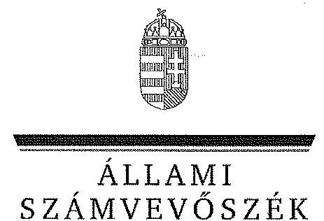
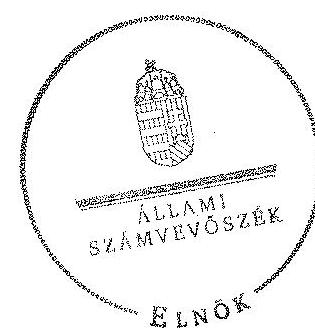
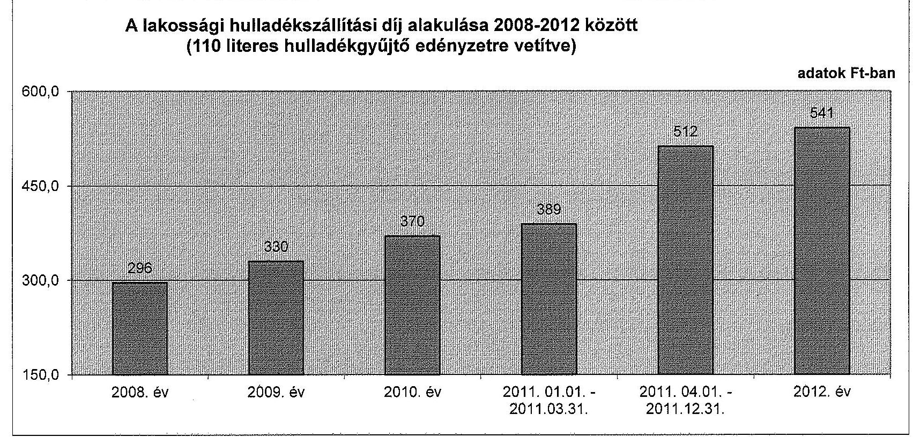

ÁLLAMI
SZÁMVEVŐSZÉK

# JELENTÉS 

Az önkormányzatok gazdasági társaságai - Az önkormányzatok többségi tulajdonában lévő gazdasági társaságok közfeladat ellátását érintő gazdálkodási tevékenysége szabályszerűségének ellenőrzése Gyömrő Városi Település Üzemeltető és Fejlesztő Nonprofit Kft.

---

# Állami Számvevőszék 

Iktatószám: V-0468-220/2015.
Témaszám: 1502
Vizsgálat-azonosító szám: V067102

## Az ellenőrzést felügyelte:

Dr. Horváth Margit
felügyeleti vezető
Az ellenőrzés vezette és a végrehajtásáért felelős:
Klinga László
ellenőrzésvezető
Az összefoglaló jelentést készítette:
Klinger Zoltán
számvevő
Az ellenőrzést végezték:

| Bretus Zoltán János | Filipszki Mihályné | Liziczai Imréné |
| :-- | :-- | :-- |
| számvevő | okleveles könyvvizsgáló   külső szakértő | számvevő |
| Molnár László   számvevő asszisztens |  |  |

A témához kapcsolódó eddig készített számvevőszéki jelentések:
címe
sorszáma
Jelentés az önkormányzatok pénzügyi gazdálkodási helyzete értékelésének, és gazdálkodása szabályosságának - 2013. évben induló - ellenőrzéséről - Gyömrő

---

# TARTALOMJEGYZÉK 

BEVEZETÉS ..... 9
I. ÖSSZEGZŐ MEGÁLLAPÍTÁSOK, KÖVETKEZTETÉSEK, JAVASLATOK ..... 12
II. RÉSZLETES MEGÁLLAPÍTÁSOK ..... 18

1. Az Önkormányzat közfeladat-ellátásának szabályszerűsége ..... 18
1.1. A közfeladat-ellátás megszervezése és a feladatellátás feltételrendszerének kialakítása ..... 18
1.2. A közfeladat-ellátás felügyelete és a tulajdonosi jogok érvényesítése ..... 22
2. A TÜF Nkft. közfeladat-ellátással kapcsolatos tevékenysége ..... 24
2.1. A TÜF Nkft. gazdálkodásának szabályozottsága ..... 24
2.2. A TÜF Nkft. vagyongazdálkodása és vagyonnyilvántartása ..... 25
2.3. A beszámolási kötelezettség teljesítése ..... 27
3. A hulladékgazdálkodás közfeladata bevételei és ráfordításai elszámolásának és önköltségszámításának szabályszerűsége ..... 27
3.1. A hulladékgazdálkodás közfeladata bevételeinek és ráfordításainak szabályszerűsége ..... 27
3.2. Az önköltségszámítás szabályszerűsége ..... 28
4. Az ÁSZ korábbi, az önkormányzatok többségi tulajdonában lévő gazdasági társaságok közfeladat-ellátását, gazdálkodását, pénzügyi helyzetét érintő javaslataira tett intézkedések ..... 29
MELLÉKLETEK
5. számú A TÜF Nkft. tevékenységének év végi főbb adatai
6. számú A TÜF Nkft. működésének év végi főbb jellemzői
7. számú A lakossági hulladékszállítási díj alakulása 2008-2012 között
FÜGGELÉKEK
8. számú Mintavételi eljárások ellenőrzési területenként

---

.

---

# RÖVIDÍTÉSEK JEGYZÉKE 

## Törvények

Áht.
Civil tv.

Ebktv.

Gt. tv.

Hgt. $_{1}$
Hgt. $_{2}$

Kbt.

Közhasznú tv.
Mötv.

Ötv.

Nvtv.
Ptk.
Számv. tv.
Taktv.

## Rendeletek

241/2001. (XII. 10.)
Korm. rendelet
224/2004. (VII. 22.)
Korm. rendelet
64/2008. (III. 28.) Korm. rendelet
az államháztartásról szóló 2011. évi CXCV. törvény (hatályos: 2012. január 1-jétől)
az egyesülési jogról, a közhasznú jogállásról, valamint a civil szervezetek működéséről és támogatásáról szóló 2011. évi CLXXV. törvény (hatályos 2012. január 01-től)
az egyenlő bánásmódról és az esélyegyenlőség előmozdításáról szóló 2003. évi CXXV. törvény
a gazdasági társaságokról szóló 2006. évi IV. törvény (hatálytalan: 2014. március 15-étől)
a hulladékgazdálkodásról szóló 2000. évi XLIII. törvény (hatálytalan: 2013. január 1-jétől)
a hulladékról szóló 2012. évi CLXXXV. törvény (hatályos: 2013. január 1-jétől, kivéve a 95. § (6) bekezdése, ami 2015. január 1-jén lép hatályba)
a közbeszerzésekről szóló 2003. évi CXXIX. törvény (hatálytalan: 2012. január 1-jétől)
a közhasznú szervezetekről szóló 1997. évi CLVI. törvény (hatálytalan 2012.január 1-jétől)
Magyarország helyi önkormányzatairól szóló 2011. évi CLXXXIX. törvény (hatályos: 2012. január 1-jétől, kivéve a 144. § (2) bekezdésben meghatározott paragrafusok, amelyek 2012. április 15-én, a (3) bekezdésben meghatározott paragrafusok, amelyek 2013. január 1-jén léptek hatályba, a (4) bekezdésben meghatározott paragrafusok a 2014. évi általános önkormányzati választások napján lépnek hatályba)
a helyi önkormányzatokról szóló 1990. évi LXV. törvény (hatálytalan: a 2014. évi általános önkormányzati választások napjától)
a nemzeti vagyonról szóló 2011. évi CXCVI. törvény
a Polgári Törvénykönyvről szóló 1959. évi IV. törvény (hatálytalan: 2014. március 15-étől)
a számvitelről szóló 2000. évi C. törvény
a köztulajdonban álló gazdasági társaságok takarékosabb működéséről szóló 2009. évi CXXII. tv.
a jegyző hulladékgazdálkodási feladat- és hatásköréről (hatályos: 2012. december 31-ig)
a hulladékkezelési közszolgáltató kiválasztásáról és a közszolgáltatási szerződésről
a települési hulladékkezelési közszolgáltatási díj megállapításának részletes szakmai szabályairól (hatályos: 2008. április 1-jétől)

---

| Áhsz. | az államháztartás szervezeti beszámolási és könyvvezetési kötelezettségének sajátosságairól szóló 249/2000. (XII. 24.) Korm. rendelet (hatálytalan: 2014. január 1-jétől) |
| :--: | :--: |
| Ávr. | az államháztartásról szóló törvény végrehajtásáról szóló 368/2011. (XII. 31.) Korm. rendelet |
| köztisztasági rendelet | Gyömrő Város Önkormányzatának 15/2002. (VI. 13.) számú köztisztasági, közterületi és környezetvédelmi rendelete és szabályai (hatályos: 2002. június 13-tól) |
| SZMSZ | Gyömrő Város Önkormányzatának 4/2007. (II. 15.) számú rendelete az Önkormányzat Szervezeti és Működési Szabályzatáról |
| vagyongazdálkodási   rendelet | Gyömrő Nagyközség Önkormányzat Képviselőtestületének 33/2000. (XII. 13.) számú rendelete és módosításai az önkormányzat vagyonáról |
| Szórövidítések |  |
| Alapító Okirat $_{1}$ | Gyömrői TÜF Kht. Alapító Okirata és módosításai a 2002-2009. évek között |
| Alapító Okirat $_{2}$ | Gyömrői TÜF Nonprofit Kft. Alapító Okirata és módosításai a 2009. évtől |
| ÁSZ | Állami Számvevőszék |
| FB | TÜF Nkft. felügyelő bizottsága |
| Hulladékkezelési Konzorcium | a Duna-Tisza Közi Nagytérség Regionális Szilárd Hulladék Kezelési Rendszer létrehozására települési önkormányzatok megállapodásával kialakított Konzorcium |
| ISPA | az infrastrukturális és környezetvédelmi beruházások támogatására szolgáló előcsatlakozási alap |
| jegyző | Gyömrő Város Önkormányzatának jegyzője |
| Képviselő-testület | Gyömrő Város Önkormányzatának Képviselő-testülete |
| Közhasznúsági szerződés | Gyömrő Város Önkormányzat és a Gyömrő Városi Település Üzemeltető és Fejlesztő Kht. között létrejött közhasznúsági keretszerződés (hatályos: 2003. március 25-től) |
| Közhasznú szerződés | Gyömrő Város Önkormányzat és a Gyömrő Városi Település Üzemeltető és Fejlesztő Közhasznú Társaság között létrejött közhasznú szerződés szemétszállításra (hatályos: 2003. július 01-jétől) |
| Önkormányzat polgármester | Gyömrő Város Önkormányzata |
|  | Gyömrő Város Önkormányzatának polgármestere |
| TÜF Nkft. | Gyömrő Városi Település Üzemeltető és Fejlesztő Nonprofit Korlátolt Felelősségű Társaság (alapítva: 2009. július 9-én) |
| TÜF Kht. | Gyömrő Városi Település Üzemeltető és Fejlesztő Közhasznú Társaság |

---

# ÉRTELMEZŐ SZÓTÁR 

gazdasági társaság
közfeladat
közszolgáltatás
közszolgáltatási szerződés tartalmi elemei

Gt. tv. 3. § (1) bekezdése szerint „gazdasági társaságot üzletszerű közös gazdasági tevékenység folytatására külföldi és belföldi természetes és jogi személyek, valamint jogi személyiség nélküli gazdasági társaságok alapíthatnak, működő társaságba tagként beléphetnek, társasági részesedést (részvényt) szerezhetnek."
Jogszabályban meghatározott állami vagy önkormányzati feladat, amit az arra kötelezett közérdekből, jogszabályban meghatározott követelményeknek és feltételeknek megfelelve végez, ideértve a lakosság közszolgáltatásokkal való ellátását, továbbá az állam nemzetközi szerződésekben vállalt kötelezettségeiből adódó közérdekű feladatokat, valamint ezek ellátásához szükséges infrastruktúra biztosítását is (Nvtv. 3. § (1) bek. 7. pont).
A közszolgáltatás: „közcélú, illetőleg közérdekű szolgáltatást jelent, amely egy nagyobb közösség (állam, település) minden tagjára nézve megközelítőleg azonos feltételek mellett vehető igénybe, ezért valamilyen mértékig közösségi megszervezést, illetve szabályozást, ellenőrzést igényel." Az Ebktv. 3. § d) pontja a következőképpen határozza meg a közszolgáltatást: „szerződéskötési kötelezettség alapján a lakosság alapvető szükségleteinek ellátására irányuló szolgáltatás, így különösen a villamos energia-, gáz-, hő-, víz-, szennyvíz- és hulladékkezelési, köztisztasági, postai és távközlési szolgáltatás, továbbá a menetrend alapján közlekedő járművekkel végzett közforgalmú személyszállítás"
A közszolgáltatási szerződésnek tartalmaznia kell a közszolgáltatás megnevezését, minőségi ismérveit, a teljesítésének területi kiterjedését, a közszolgáltatás megkezdésének időpontját és időtartamát, valamint annak rögzítését, hogy a közszolgáltató vállalta a megjelölt közszolgáltatás teljesítését.
A közszolgáltatási szerződésben a közszolgáltató kötelességeként kell meghatározni:
a) a közszolgáltatás folyamatos és teljes körű ellátását;
b) a közszolgáltatás meghatározott rendszer, módszer és gyakoriság szerinti teljesítését;
c) a közszolgáltatás teljesítéséhez szükséges mennyiségű és minőségű jármű, gép, eszköz, berendezés biztosítását, valamint a szükséges létszámú és képzettségű szakember alkalmazását;
d) a közszolgáltatás folyamatos, biztonságos és bővíthető teljesítéséhez szükséges fejlesztések és karbantartások elvégzését;
e) a közszolgáltatás körébe tartozó hulladék ártalmatlanítására az önkormányzat képviselő-testülete által kijelölt helyek és létesítmények igénybevételét;
f) a közszolgáltató által alkalmazott közszolgáltatási díj mértékéről és az alkalmazás tapasztalatairól az önkormányzat képviselő-testületének történő legalább évenkénti egyszeri tájékoztatást;
g) a közszolgáltatás teljesítésével összefüggő adatszolgáltatás rendszeres teljesítését és meghatározott nyilvántartási rendszer működtetését;
h) a fogyasztók számára könnyen hozzáférhető ügyfélszolgálat és tájékoztatási rendszer működtetését;
i) a fogyasztói kifogások és észrevételek elintézési rendjének megállapítását.
A közszolgáltatási szerződésben az önkormányzat kötelességeként kell meghatározni:
a) a közszolgáltatás hatékony és folyamatos ellátásához a közszolgáltató számára szükséges információk szolgáltatását, a Hgt. ${ }_{1}$ 23. §-ának g) pontjára tekintettel;
b) a közszolgáltatás körébe tartozó és a településen folyó egyéb hulladékkezelési tevékenységek összehangolásának elősegítését;
c) a településen működtetett különböző közszolgáltatások összehangolásának elősegítését;
d) a települési igények kielégítésére alkalmas hulladék gyűjtésére, kezelésére, ártalmatlanítására szolgáló helyek és létesítmények kijelölését;
e) a közszolgáltató kizárólagos közszolgáltatási jogának biztosítását a 3. § (1) bekezdés a), b) és f) pontjaiban foglaltakra figyelemmel.
Az önkormányzatnak a közszolgáltatás finanszírozásában vállalt kötelezettsége esetén a közszolgáltatási szerződésben meg kell határozni a kötelezettség teljesítésének feltételeit és biztosítékait.
A közszolgáltatási szerződés tartalmazza a közszolgáltatás díjának megállapítására és beszedésére vonatkozó módszer leírását, a díjnak a szerződés megkötésekor érvényesíthető legmagasabb mértékét és a díj megváltoztatása érdekében alkalmazandó eljárást. A közszolgáltatási szerződésnek tartalmaznia kell az igazolt díjhátralék kiegyenlítésére vonatkozó eljárást. A közszolgáltatási szerződés tartalmazza azokat a feltételeket, amelyek mellett a közszolgáltató a közszolgáltatás teljesítésére közreműködőt vagy teljesítési segédet vehet igénybe, figyelemmel a Kbt. 304. § (2) bekezdésében foglaltakra is. A közszolgáltató közreműködőért vagy teljesítési segédért való felelőssége a közszolgáltatási szerződésben nem korlátozható. (224/2004. (VII. 22.) Korm. rendelet 11-14. §)
minősített többséget biztosító részesedés

A minősített befolyásszerző az ellenőrzött társaságban a szavazatok legalább hetvenöt százalékával rendelkezik. (Gt. tv. 52. § (2) bekezdés)

---

saját tőke

A saját tőke a - jegyzett, de még be nem fizetett tőkével csökkentett - jegyzett tőkéből, a tőketartalékból, az eredménytartalékból, a lekötött tartalékból, az értékelési tartalékból és a tárgyév mérleg szerinti eredményéből tevődik össze.
tulajdonosi joggyakorló

Aki a nemzeti vagyon felett az államot vagy a helyi önkormányzatot megillető tulajdonosi jogok és kötelezettségek összességének gyakorlására jogosult (Nvtv. 3. § (1) bekezdés 17. pont).
többségi befolyást biztosító részesedés

A Ptk. 685/B. § (1) bekezdése szerint „többségi befolyás: az olyan kapcsolat, amelynek révén természetes személy, jogi személy vagy jogi személyiség nélküli gazdasági társaság (a továbbiakban együtt: befolyással rendelkező) egy jogi személyben a szavazatok több mint ötven százalékával vagy meghatározó befolyással rendelkezik."

---

.

---

# JELENTÉS 

## Az önkormányzatok gazdasági társaságai Az önkormányzatok többségi tulajdonában lévő gazdasági társaságok közfeladat ellátását érintő gazdálkodási tevékenysége szabályszerűségének ellenőrzése

## Gyömrő Városi Település Üzemeltető és Fejlesztő Nonprofit Kft.

## BEVEZETÉS

Az Állami Számvevőszék középtávra szóló stratégiájában megfogalmazta, hogy a helyi önkormányzatok gazdálkodásában rejlő pénzügyi kockázatok feltárásával, az államháztartáson kívülre nyújtott költségvetési támogatások és ingyenes vagyonjuttatások, valamint az államháztartáson kívül működő köz-feladat-ellátó rendszerek ellenőrzéseivel hozzájárul ahhoz, hogy a közpénzeket az államháztartáson kívül működő szervezetek is átlátható, rendezett módon használják fel a közfeladatok szerződésben vállalt ellátása érdekében.

Az önkormányzatok szervezetalakítási szabadságának következménye, hogy a korábban is vállalati formában működő (nagyvárosi tömegközlekedés, víz-, szennyvízcsatorna, köztisztasági, ingatlankezelés stb.) közszolgáltatások mellett, mind a kötelező, mind az önként vállalt feladatok ellátásában a gazdasági társaságok kiemelt fontosságú szerephez jutottak.

A Gyömrő Város Önkormányzata a Gyömrő Városi Település Üzemeltető és Fejlesztő Nonprofit Korlátolt Felelősségű Társaságot (TÜF Nkft.) a 77/2009. (IV. 28.) számú határozatával hozta létre a Gyömrő Városi Település Üzemeltető és Fejlesztő Közhasznú Társaság jogutódjaként.

Az Alapító Okirat ${ }_{2}$-ban a TÜF Nkft. alaptevékenységeként Gyömrő Város közigazgatási területén a szilárd hulladék gyűjtését, közterületek, valamint szennyvízgyűjtők tisztántartását határozták meg. Alaptevékenysége mellett az
 Önkormányzattal a 298/2002. (XII. 16.) számú önkormányzati határozat figyelembe vételével kötött - Közhasznúsági szerződés II. fejezet 1-3. pontjában felsorolt feladatokat látta el, az egyes feladatok részletszabályait közhasznú szerződésekben rögzítették. A Közhasznúsági szerződés alapján a TÜF Nkft. kötelező és önként vállalt közfeladatok ellátását is végezte az Önkormányzat megbízásából, emellett vállalkozási tevékenységet is folytathatott, legfeljebb 30% részarányig az ellenőrzött időszakban.

---

A Közhasznúsági szerződés alapján a TÜF Nkft. az ellenőrzött időszakban ellátta a közel 16 ezer lakóval rendelkező Gyömrő Város közigazgatási területén a közterületek tisztántartását, parkok és egyéb közterületek fenntartását, alvállalkozón keresztül a nem veszélyes hulladék gyűjtését, szállítását, egyéb hulladékkezelést, sportpálya-, strandfürdő-, ifjúsági tábor üzemeltetést, valamint temetkezést, temetkezést kiegészítő szolgáltatásokat. TÜF Nkft. Gyömrő Város Önkormányzat 100%-os tulajdonában volt az ellenőrzött időszakban.

A TÜF Nkft. összes bevétele 2008-ban 244,7 millió Ft, a 2012. évben 239,8 millió Ft volt, amelyből az értékesítés nettó árbevétele 2008-ban 159,0 millió Ft, míg 2012-ben 181,8 millió Ft volt. Az árbevételek az ellenőrzött időszakban 14,3%-kal nőttek. A ráfordítások összege 2008-ban 240,3 millió Ft, 2012-ben 245,1 millió Ft volt. A ráfordítások az ellenőrzött időszakban 2,0%-kal nőttek. A TÜF Nkft. alvállalkozója által Gyömrőn elszállított szemét mennyisége 2008-ban 10680 tonna, 2012-ben 9899 tonna volt.

A TÜF Nkft. az ellenőrzött időszakban - a 2012. évet kivéve - pozitív mérleg szerinti eredménnyel zárt, a 2012. évben -5,3 millió Ft összegű veszteséget realizált. A TÜF Nkft. mérleg szerinti eszközállománya a 2008. évi nyitó 100,9 millió Ft-ról a 2012. év végére 22,3%-os növekedést követően 123,4 millió Ft-ra nőtt, ezen belül a tárgyi eszközök állománya 44,6%-os növekedést követően 99,8 millió Ft-ra változott. A saját tőke a 2008. évi nyitó 26,0 millió Ft-ról a 2012. év végére 38,9 millió Ft-ra növekedett.

Az ellenőrzött időszakban a polgármester és a jegyző személye nem változott. Az ellenőrzött időszakban a TÜF Nkft. ügyvezetőjének személye nem, a társaság városfejlesztési részlegének cégjegyzési joggal rendelkező képviselőjének személye 2011. augusztus 1-jén megváltozott. A TÜF Nkft.-nek az ellenőrzött időszakban gazdasági vezetője nem volt, a könyvelési, beszámoló készítési feladatait külső szolgáltató végezte.

Az önkormányzati tulajdonú gazdasági társaságok teljes körű ellenőrzésének lehetőségét az Állami Számvevőszékről szóló 1989. évi XXXVIII. törvény 2011. január 1-jétől hatályos módosítása teremtette meg.

Az ellenőrzés célja annak értékelése volt, hogy

- az önkormányzat a jogszabályi előírások figyelembevételével döntött-e az ellenőrzésre kerülő közfeladat megszervezéséről; az önkormányzat szabályszerűen gyakorolta-e a tulajdonosi jogokat;
- a gazdasági társaság közfeladat-ellátása bevételeinek, ráfordításainak elszámolása, és vagyongazdálkodási tevékenysége megfelel-e a jogszabályi, illetve a közszolgáltatási szerződésben foglalt tulajdonosi előírásoknak, azok végrehajtása szabályszerű volt-e;
- a közfeladatok átláthatósága és elszámoltathatósága érdekében biztosítva volt-e a közszolgáltatás dijának megalapozottsága szabályszerű önköltségszámítással.

Az ellenőrzés kiterjedt Gyömrő Város Önkormányzatára és a Gyömrő Városi Település Üzemeltető és Fejlesztő Nonprofit Korlátolt Felelősségű Társaságra.

---

Az ellenőrzés várható hasznosulása: A törvényalkotás számára - az észlelt problémák, szabálytalanságok, vagy egyéb nem kívánatos jelenségek felszínre kerülésével - az ellenőrzés megállapításai segítséget nyújthatnak az államháztartáson kívüli közfeladat-ellátás értékeléséhez, jogszabályi keretei pontosításához, átláthatóságot biztosító szabályozásához. Meghatározhatóvá válnak a közfeladat ellátásban részt vevő államháztartáson kívüli szervezeteknek - az önkormányzat költségvetését, pénzügyi helyzetét is befolyásoló - kockázatai, lehetővé válik ezen kockázatok csökkentése. Feltárja, hogy az önkormányzat közfeladat-ellátási kötelezettségének szabályszerűen tett-e eleget, a feladatellátáshoz rendelt közvagyon működtetését szabályszerűen szervezte-e meg és a tulajdonosi felügyelete hozzájárult-e a közfeladat-ellátásához. A feladatot ellátó gazdasági társaság a közszolgáltatási szerződésben foglaltak betartásával, a közvagyon használatával biztosította-e a szolgáltatás folytatásának feltételeit. Ezzel az ellenőrzöttek és a helyi döntéshozók számára visszajelzést ad feladatszervezési, feladat-ellátási kockázataikról, alapot ad a meglévő hibák megszüntetéséhez, a jobb közfeladat-ellátás biztosításához. Fokozza a fegyelmet, igazolja, hogy lejárt a következmények nélküli ellenőrzések időszaka. Az ÁSZ értékteremtő rend kialakításához és megőrzéséhez hozzájáruló tevékenysége pozitív hatással van a szervezetről kialakított összkép formálására is.

A bevételek és ráfordítások elszámolása, valamint a vagyonnyilvántartás terén az egyes területek szabályszerű működését mintavétellel ellenőriztük, ez alapján a sokaságokban előforduló hibás tételek arányát becsültük. A jogszabályoknak és a belső előírásoknak megfelelőnek, azaz szabályszerűnek tekintettük az adott bevételek és ráfordítások elszámolását, a vagyonnyilvántartást, amennyiben a minta ellenőrzésének eredménye alapján 95%-os bizonyossággal a teljes sokaságban a hibás tételek aránya kisebb volt, mint 10%, nem megfelelőnek értékeltük, ha a hibás tételek aránya a 10%-ot meghaladta. Kockázatot, illetve magas kockázatot jeleztünk, amennyiben egy adott terület vonatkozásában a minta alapján a teljes sokaságban nem volt teljes körűen biztosított a jogszabályoknak és a belső szabályzatoknak megfelelő működés (1. számú függelék).

Az ellenőrzést a számvevőszéki ellenőrzés szakmai szabályai szerint, szabályszerűségi ellenőrzés módszerével, a vonatkozó nemzetközi standardok figyelembevételével végeztük. Az ellenőrzés a 2008-2012. évekre terjedt ki.

Az ellenőrzés végrehajtásának jogszabályi alapját az Állami Számvevőszékről szóló 2011. évi LXVI. törvény 5. § (3)-(4)-(5) bekezdése képezi.

A Jelentés tervezetét észrevételezésre megküldtük Gyömrő Város Önkormányzata polgármesterének, valamint a társaság ügyvezető igazgatójának. Az érintettek észrevételt nem tettek.

---

# I. ÖSSZEGZŐ MEGÁLLAPÍTÁSOK, KÖVETKEZTETÉSEK, JAVASLATOK 

Gyömrő Város Önkormányzatának Képviselő-testülete az Önkormányzat közigazgatási területén a szilárd hulladék gyűjtése, ártalmatlanítása, hasznosítása és a közterületek tisztántartása közfeladatának ellátásáról közszolgáltatás megszervezése útján gondoskodott. A Képviselő-testület az SZMSZ-ben előírta a közszolgáltatások körének kötelező feladatait, így a köztisztasági és a településtisztasági feladatok ellátásának kötelezettségét, azonban annak ellátási módját az ellenőrzött időszakban az Ötv.-ben előírtak ellenére nem határozta meg. Az Önkormányzat 2006-2010. és 2011-2014. évekre szóló gazdasági programjai a hulladékgazdálkodási feladattal kapcsolatban fő célként az „Új hulladékgazdálkodási rendszerbe történő belépés" tervét tartalmazták.

Az Önkormányzat a Hgt.₁ előírásainak megfelelően a 2004-2008. időszakra az előírt követelményeknek megfelelő hulladékgazdálkodási tervet dolgozott ki, azonban a Hgt.₁-ben előírt hat év helyett öt évre készült. A hulladékgazdálkodási tervben foglaltak végrehajtásáról a Hgt.₁-ben, a 241/2001. (XII. 10.) Korm. rendeletben, valamint az Önkormányzat hulladékgazdálkodási tervről szóló rendeletben meghatározott három évente esedékes beszámolót a jegyző nem készített. Az Önkormányzat a 2009-2012. években a Hgt.₁-ben előírtakkal ellentétben nem rendelkezett hulladékgazdálkodási tervvel.

Az Önkormányzat 2003. július 1-jén határozatlan időre a Hgt.₁-ben előírtak ellenére közszolgáltatási szerződés helyett, Közhasznú szerződést kötött a TÜF Kht.-val szemétszállítási tevékenység folyamatos ellátására. A Közhasznú szerződés tárgyát, tartalmát figyelembe véve tekinthető Közszolgáltatási szerződésnek. A Közhasznú szerződés megkötésekor figyelmen kívül hagyták a Hgt.₁-ben előírtakat, amelyben előírtak alapján kizárólag a hulladék begyűjtésére, illetve szállítására vonatkozó szerződést legfeljebb 10 évre szólóan lehet megkötni. A Közhasznú szerződés részben felelt meg a 224/2004. (VII. 22.) Korm. rendeletben előírtaknak, mivel nem tartalmazta teljes körűen az abban előírt tartalmi elemeket. Az ellenőrzött időszakban a Gyömrő Város közigazgatási területén keletkező települési szilárd kommunális hulladék összegyűjtését és elszállítását a TÜF Nkft. alvállalkozók bevonásával teljesítette. A TÜF Nkft. a HBUS Kft.-vel 2011. január 1-jétől, átmeneti időszakra kötött vállalkozási szerződéssel összefüggésben közbeszerzési eljárást nem folytatott le, megsértve ezzel a Kbt.-ben és a Hgt.₁-ben előírtakat.

A Képviselő-testület az ellenőrzött időszakban települési szilárd és folyékony hulladék szervezett összegyűjtését, elszállítását, kezelését, ártalmatlanításának rendjét a köztisztasági rendeletében szabályozta, amely tartalma nem felelt meg a Hgt.₁-ben előírtaknak. A rendelet nem tartalmazta a közszolgáltató megnevezését, a közszolgáltatás ellátásának rendjét és módját, a közszolgáltató és az ingatlantulajdonos ezzel összefüggő jogait, a szolgáltatásra vonatkozó szerződés egyes tartalmi elemeit, a közszolgáltatás keretében kötött szerződés létrejöttének módját, valamint a közszolgáltatás igénybevételének módját és feltételeit. Nem tartalmazta továbbá a közszolgáltatással összefüggő települési

---

önkormányzati feladat- és hatáskört, az alkalmazható díj legmagasabb mértékét, megfizetésének rendjét, az esetleges kedvezmények eseteit vagy a szolgáltatás ingyenességét, a közszolgáltatással összefüggő személyes adatok kezelésére vonatkozó rendelkezéseket, valamint a gazdálkodó szervezet számára a gazdasági tevékenységeivel összefüggésben keletkezett, nem elkülönítetten gyűjtött és nem hasznosított vagy ártalmatlanított hulladéka tekintetében a közszolgáltatás kötelező igénybevételét.

Az Önkormányzat a gazdasági társaságok feletti tulajdonosi jogok gyakorlásának szabályait a vagyongazdálkodási rendeletben határozta meg. Az Önkormányzatot megillető tulajdonosi jogok gyakorlásával kapcsolatos feladatok és jogosítványok a Képviselő-testületet illették meg, amelyet a vagyongazdálkodási rendeletben meghatározott esetekben a polgármesterre ruházott át. Az FB a Gt. tv.-ben és az Alapító Okirat₂-ban előírt ügyrenddel nem rendelkezett. Az FB a Gt. tv.-ben előírt kötelezettsége ellenére a 2008-2012. években a számviteli beszámolóról írásbeli jelentést nem készített. A Képviselő-testület a 2008-2012. években a TÜF Nkft. feletti tulajdonosi jogokat részben gyakorolta szabályszerűen, mivel az FB írásbeli jóváhagyása nélkül döntött a számviteli beszámoló elfogadásáról, a Közhasznú szerződésben nem írta elő teljes körűen a feladatellátás tartalmát, továbbá a Taktv.-ben meghatározott javadalmazással összefüggő szabályzatot nem alkotott.

Az Önkormányzat éves belső ellenőrzési munkatervét megalapozó kockázatelemzés a 2008-2012. évekre vonatkozóan a TÜF Nkft.-re nem terjedt ki, belső ellenőrzésre az ellenőrzött időszakban nem került sor.

A TÜF Nkft. a Számv. tv.-ben előírtaknak megfelelően, kialakította a számviteli politikáját. A leltárkészítési és leltározási szabályzat a TÜF Nkft. számviteli vezetőjének feladataként határozta meg a leltározási tevékenység irányítását. A szabályzat szerinti vagyonellenőrzési, leltározási kötelezettség és felelősségi kör nem volt értelmezhető, mivel az ellenőrzött időszakban a TÜF Nkft. számviteli vezetőt nem alkalmazott. A TÜF Nkft. a Számv. tv.-ben előírtak alapján önköltségszámítási szabályzat készítésére nem volt kötelezett, azonban rendelkezett önköltségszámítási szabályzattal. A szabályozás nem felelt meg a Számv. tv. előírásainak, mivel nem tartalmazta az egyes közszolgáltatásokra vonatkozó ágazati sajátosságokat, a közvetlen és közvetett költségek felosztásának módját, az alkalmazandó kalkulációs sémát. A közvetlen és közvetett költségek szerinti elkülönítést nem írták elő. Nem tartották be a 64/2008. (III. 28.) Korm. rendeletben előírtakat, amely alapján ha a közszolgáltató a közszolgáltatás mellett más gazdasági tevékenységet is folytat, a költségtervben a költségek szigorú elkülönítésének módszerét is alkalmaznia kell. A Számv. tv.-ben előírtak ellenére a számlarendben nem szabályozták a hulladékgazdálkodás költségei, ráfordításai és bevételei elkülönített elszámolására vonatkozó alkalmazott főkönyvi számlák tartalmát.

A TÜF Nkft. a hulladékgazdálkodási közfeladat ellátásához az Önkormányzattól - vagyonkezelésbe - nem vett át vagyont. A TÜF Nkft.-nek üzemeltetésre átadott vagyon - a vagyongazdálkodási rendeletben előírtaknak megfelelően az Önkormányzat könyveiben szerepelt, amely után az értékcsökkenést elszámolták. Ezekben az esetekben a vagyongazdálkodási tevékenység szabályszerűsége biztosított volt. A hulladékgazdálkodási közfeladat nettó árbevételének,

---

valamint anyagjellegű ráfordításainak elszámolása során a TÜF Nkft. szabályszerűen járt el.

A TÜF Nkft. fizetési felszólítással, részletfizetés engedélyezésével kezdeményezte a hulladékszállításból eredő követelések csökkentését, de ennek eredménytelensége esetén a Hgt.₁-ben foglaltak ellenére nem intézkedett. A felszólítás eredménytelensége során a díjhátralék keletkezését követő 90. napot követően a díjhátralék adók módjára történő behajtását nem kezdeményezték a jegyzőnél. A TÜF Nkft. megsértette a Számv. tv.-ben foglaltakat, mivel a 2010-ben 4468 ezer Ft, 2011-ben 6131 ezer Ft, 2012-ben 7965
 ezer Ft összegben behajthatatlanság címen leírt követelések esetében elmulasztotta a követelések behajtásának kezdeményezését, a behajthatatlanság tényének és mértékének igazolását.

A TÜF Nkft. az Önkormányzat által előírt beszámolási kötelezettségének a szakmai és számviteli beszámolók elkészítésével tett eleget. A 2008-2011. évi közhasznúsági jelentések nem feleltek meg a Közhasznú tv.-ben foglaltaknak, mert nem tartalmazták a költségvetési támogatás felhasználását, a vagyon felhasználásával kapcsolatos kimutatást. A 2012. évre vonatkozóan a TÜF Nkft. a Civil tv.-ben előírt közhasznúsági melléklet helyett közhasznúsági jelentést készített, amelyben nem mutatták be a költségvetési támogatás felhasználását és a vagyon felhasználásával kapcsolatos kimutatást.

A Hgt. ${ }_{1}$-ben előírtak ellenére a közszolgáltatás díját meghatározó önkormányzati rendelet elfogadását megelőzően költségelemzést a jegyző nem terjesztette a Képviselő-testület elé. Az önköltségszámítási szabályzat tartalmi hiányosságai miatt nem volt alkalmas az ellátott közfeladat önköltségének meghatározására. A lakossági és közötti hulladékszállítás díjainak meghatározása nem a 64/2008. (III. 28.) Korm. rendeletben előírt kalkulációs séma, vagy díjképlet alapján történt. A díj számítása részben igazodott a 64/2008. (III. 28.) Korm. rendeletben előírtakhoz, mivel a díj megállapításához alkalmazott tényezőket meghatározták, azonban nem határozták meg a díjképletet és nem rögzítették a díjszámítás módszertanát.

A fentiekben leírtak összegzéseként az alábbi megállapításokat tesszük:
A hulladékgazdálkodási terveknél, a köztisztasági rendelet előírásainál és a Közhasznú szerződésnél feltárt szabálytalanságok és hiányosságok kockázatot jelentettek a feladatellátás szabályszerű működésére. A tulajdonosi képviselet nem töltötte be teljes körűen a szerepét, a tulajdonosi jogok gyakorlása sérült. A tulajdonosi monitoring rendszer nem működött megfelelően, a megállapítások alapján feltárt kockázatok mind az Önkormányzatnál, mind gazdasági társaságnál rámutatnak erre. A belső ellenőrzés nem nyújtott támogatást a TÜF Nkft. szabályszerű működésének javításához. Ezen túlmenően az önköltségszámítás szabályozásának hiányosságai, a szabálytalanul leírt követelések, a közhasznúsági beszámolók, jelentések hiányosságai, a díjképzés rendszerének elégtelensége a TÜF Nkft. működésének további bizonytalanságát és kockázatát jelzik.

Az Állami Számvevőszékről szóló 2011. évi LXVI. törvény 33. § (1) bekezdésében foglaltak értelmében a jelentésben foglalt megállapításokhoz kapcsolódó intézkedési tervet köteles az ellenőrzött szervezet vezetője összeállítani, és azt a

---

jelentés kézhezvételétől számított 30 napon belül az ÁSZ részére megküldeni. Amennyiben az intézkedési tervet határidőben nem küldi meg a szervezet, vagy az nem elfogadható, az ÁSZ elnöke a hivatkozott törvény 33. § (3) bekezdésében foglaltakat érvényesítheti.

Az ellenőrzés intézkedést igénylő megállapításai és javaslatai:
Javaslataink célja az NKft. gazdálkodása szabályszerűségének helyreállítása annak érdekében, hogy a szabályozási környezet megfelelően tudja támogatni az átlátható működést.

# Javasoljuk Gyömrő Városi Település Üzemeltető és Fejlesztő Nonprofit Kft. ügyvezető igazgatójának: 

1. A társaság önköltségszámítási szabályzatának hiányossága volt, hogy az nem tartalmazta az egyes közszolgáltatásokra vonatkozó ágazati sajátosságokat, a közvetlen és közvetett költségek felosztásának módját, az alkalmazandó kalkulációs sémát. A költségeket csak költségnemenként gyűjtötték, a közvetlen és közvetett költségek szerinti elkülönítést nem írták elő. A szabályozás nem felelt meg a Számv. tv. 161/A. § (2) bekezdése előírásainak, amely szerint a közpénzek felhasználásának és a köztulajdon használatának nyilvánossága és ellenőrizhetősége érdekében olyan részletezettségű nyilvántartási (könyvvezetési) rendszert kell kialakítani, amelyből a vonatkozó külön jogszabályban meghatározott adatok rendelkezésre állnak.

A Számv. tv. 161. § (2) bekezdés b) pontjában előírtak ellenére nem szabályozták a számlarendben a hulladékgazdálkodás költségei, ráfordításai és bevételei elkülönített elszámolására alkalmazott főkönyvi számlák tartalmát.

Javaslat:

## Intézkedjen a szabályozási hiányosság megszüntetésére, ennek keretében:

gondoskodjon a Számv. tv-ben előírtaknak megfelelő könyvvezetési rendszer kialakításáról és alkalmazásáról, valamint gondoskodjon a számviteli szabályozása kiegészítéséről a hulladékgazdálkodás költségei, ráfordításai és bevételei elkülönített elszámolása érdekében.
2. A társaság közhasznúsági jelentései 2008-2011. évre vonatkozóan nem feleltek meg a Közhasznú tv. 19. § (3) bekezdés b) és c) pontjában foglaltaknak, mert nem tartalmazták a költségvetési támogatás felhasználását, valamint a vagyon felhasználásával kapcsolatos kimutatást. A 2012. évre a társaság a Civil tv. 46. § (1) bekezdésében előírt közhasznúsági melléklet helyett közhasznúsági jelentést készített, amelyből hiányoztak a költségvetési támogatás felhasználásával, valamint a vagyon felhasználásával kapcsolatos kimutatások.

---

Javaslat:
Gondoskodjon a jogszabályi előírások szerinti gyakorlat és a szabályos működés biztosítására, ezen belül:
intézkedjen a közhasznúsági melléklet Civil tv. szerinti előírásoknak megfelelő elkészítéséről.

Javaslataink célja az önkormányzat szabályszerű működésének elősegítése, továbbá az önkormányzati tulajdonosi joggyakorlás kontrolljainak erősítése.

# Javasoljuk Gyömrő Város Önkormányzata Polgármesterének: 

1. Az ellenőrzött időszakban az FB nem rendelkezett a Gt. tv. 34. § (4) bekezdésében és az Alapító Okirat ${ }_{2}$-ban előírt ügyrenddel.

Az FB a Gt. tv. 35. § (3) bekezdésében előírt kötelezettsége ellenére a 2008-2012. években a számviteli beszámolóról írásbeli jelentést nem készített.

Javaslat:
Intézkedjen a szabályozási hiányosság megszüntetésére, ennek keretében:
hívja fel a tulajdonosi jogokat gyakorló Képviselő-testület figyelmét arra, hogy
a) az FB nem rendelkezett Ügyrenddel, amelynek elkészítését a hatályos Ptk. írja elő, továbbá
b) a társaság éves beszámolójának elfogadásához szükséges az FB jelentése.

## Javasoljuk Gyömrő Város Önkormányzata Jegyzöjének:

1. A Képviselő-testület az ellenőrzött időszakban a települési szilárd és folyékony hulladék szervezett összegyűjtését, elszállítását, kezelését, ártalmatlanításának rendjét a köztisztasági rendeletben szabályozta. A rendelet nem felelt meg a Hgt. 23. § b)-h) pontjaiban előírtaknak, mivel nem tartalmazta a jogszabályban előírt alapvető és fontos elemeket (közszolgáltató megnevezése, a közszolgáltatás ellátásának rendje és módja, valamint a közszolgáltatás igénybevételének módja és feltétele, az alkalmazható díj legmagasabb mértéke, megfizetésének rendje stb.).

Az Önkormányzat belső ellenőrzése az ellenőrzéseivel a hulladékgazdálkodás, mint közfeladat-ellátás szabályszerű teljesítéséhez, valamint az önkormányzati vagyon megóvásához ellenőrzéseivel nem járult hozzá. Az ellenőrzött időszakban a társaság gazdálkodásával és működésével kapcsolatban ellenőrzést nem folytatott le.

---

Javaslat:
Gondoskodjon a jogszabályi előírások szerinti gyakorlat és a szabályos működés biztosítására, ezen belül:
a) készítse elő az önkormányzat köztisztasági rendeletének kiegészítését a Hgt. ${ }_{1}$-ben előírt tartalmi kellékeknek megfelelően.
b) fordítson kiemelt figyelmet arra, hogy az önkormányzat belső ellenőrzése az ellenőrzéseivel a hulladékgazdálkodás, mint közfeladat-ellátás szabályszerű teljesítéséhez, valamint az önkormányzati vagyon megóvásához ellenőrzéseivel járuljon hozzá.

---

# II. RÉSZLETES MEGÁLLAPÍTÁSOK 

## 1. Az ÖNKORMÁNYZAT KÖZFELADAT-ELLÁTÁSÁNAK SZABÁLYSZERÜSÉGE

### 1.1. A közfeladat-ellátás megszervezése és a feladatellátás feltételrendszerének kialakítása

A köztisztaság és a településtisztaság biztosítása az Ötv. 8. § (1) bekezdése ${ }^{1}$ alapján az önkormányzat törvényi kötelezettsége. Az Önkormányzat közigazgatási területén a szilárd hulladék gyűjtése, ártalmatlanítása, hasznosítása és a közterületek tisztántartása feladatának ellátásáról közszolgáltatás megszervezése útján gondoskodott.

A Képviselő-testület az SZMSZ-ben előírta a közszolgáltatások körének kötelező feladatait, így a köztisztasági és a településtisztasági feladatok ellátásának kötelezettségét, azonban annak ellátási módját 2008-2012-ben az Ötv. 8. § (2) bekezdésében előírtak ellenére nem határozta meg.

Az Önkormányzat az Ötv. 91. § (1) bekezdésében előírt kötelezettségének megfelelően a 2006-2010. és 2011-2014. évekre vonatkozóan gazdasági programot készített. A gazdasági programok a hulladékgazdálkodási feladattal kapcsolatban az „Új hulladékgazdálkodási rendszerbe történő belépés (ceglédi program beindulása)" tervét tartalmazták.

Az Önkormányzat a Hgt. ${ }_{1}$ 35. § (1) bekezdés előírásának megfelelően a 2004-2008. időszakra hulladékgazdálkodási tervet ${ }^{2}$ dolgozott ki. A hulladékgazdálkodási terv a Hgt. ${ }_{1}$ 37. § (1) bekezdésében előírt hat év helyett öt évre készült. A hulladékgazdálkodási terv megfelelt a Hgt. ${ }_{1}$ 37. § (4) bekezdésében meghatározott követelményeknek. A hulladékgazdálkodási tervben foglaltak végrehajtásáról a Hgt. ${ }_{1}$ 37. § (1) bekezdésében meghatározott három évente esedékes beszámolót a jegyző nem készített.

Az Önkormányzat a 2009-2012. időszakra a Hgt. ${ }_{1}$ 35. § (1) bekezdésében előírtakkal ellentétben nem rendelkezett hulladékgazdálkodási tervvel ${ }^{3}$.

[^0]
[^0]:    ${ }^{1}$ A helyi közügyek, valamint a helyben biztosítható közfeladatok körében ellátandó helyi önkormányzati feladatként a hulladékgazdálkodást 2013. január 1-jétől az Mötv. 13. § (1) bekezdés 19. pontja írja elő.
    ${ }^{2}$ A hulladékgazdálkodási tervet az MKM Consulting Kft. készítette.
    ${ }^{3}$ A Hgt. 2 78. § (1) bekezdésében előírtak alapján 2013. január 1-jétől a közszolgáltató legalább 3 évente - közszolgáltatói hulladékgazdálkodási tervet készít. A 2013. január 1-jei időszakot megelőzően hulladékgazdálkodási terv készítési kötelezettsége az Önkormányzatnak volt.

---

A jegyző 2009-ben és 2011-ben a Képviselő-testület elé terjesztette „a hulladékgazdálkodási terv felülvizsgálatáról" tárgyú beszámolókat, amelyekben felhívta a figyelmet a hulladékgazdálkodási terv hiányára. Ugyanakkor a jegyző a 241/2001. (XII. 10.) Korm. rendelet 1. § e) pontjában előírtak ellenére a hulladékgazdálkodási tervet nem készítette elő és nem terjesztette a Képviselő-testület elé.

Az Önkormányzat 2001-ben hulladékkezelési konzorciumi szerződést kötött a Duna-Tisza-közi Nagytérség regionális települési szilárdhulladék kezelésének, illetve az ehhez szükséges gazdasági, pénzügyi és jogi előfeltételeknek a megoldására. A hulladékkezelési konzorciumhoz csatlakozó 49 önkormányzat megállapodott abban, hogy a célok elérése érdekében önkormányzati felelősségvállalással pályázatot nyújtanak be támogatás igénybevételére az ISPA program keretében.

A projekt nettó költsége 23739 ezer euró volt, amelynek finanszírozása 10%-ban saját forrás, 50%-ban ISPA támogatás, és 40%-ban állami támogatás volt. A hulladékkezelési Konzorcium gesztoraként Cegléd Város Önkormányzatát határozták meg. A projekt keretében a megvalósított létesítmények (elhagyott és rekultivált régi hulladéklerakók, új hulladéklerakók, hulladékudvarok) a társult önkormányzatok osztatlan közös tulajdonába kerültek.

A Képviselő-testület az Ötv. 9. § (4) bekezdés alapján a 298/2002. (XII. 16.) számú határozatában a helyi közfeladatok ellátására gazdasági társaság létrehozásáról és egyben az Alapító Okirat ${ }_{1}$ elfogadásáról döntött.

Az Önkormányzat kizárólagos tulajdonosként 3 millió Ft-os törzstőkével, kiemelten közhasznú szervezetként megalapította a TÜF Kht.-t, amelyet a cégbíróság 2003. február 26-án jegyezett be. A Gt. tv. 2007. évi módosítása ${ }^{4}$ alapján a társaságot átalakították, melynek 2009. július 9-i cégbírósági bejegyzésével létrejött a TÜF Nkft. (2. számú melléklet).

Az Alapító Okirat ${ }_{2}$ hiányossága volt, hogy a Közhasznú tv. 7. § (2) bekezdés a) pontjában előírtak ellenére nem tartalmazta a legfőbb szerv, az ügyintéző és képviseleti szerv ülésezésének gyakoriságára, ülései összehívásának rendjére és a napirend közlésének módjára, üléseinek nyilvánosságára, határozatképességére és a határozathozatal módjára vonatkozó szabályokat.

Az Önkormányzat 2003. március 25-én Közhasznúsági szerződést kötött a TÜF Kht.-val, melyben az Ötv. 8. § (1) bekezdésének megfelelően meghatározta az ellátandó közfeladatokat. Az Önkormányzat 2003. július 1-jén határozatlan időre - a Hgt. ${ }_{1}$ 27. § (3) bekezdés d) pontjában előírtak ellenére közszolgáltatási szerződés helyett - Közhasznú szerződést kötött a TÜF Nkft.-vel „szemétszállítási tevékenység folyamatos ellátására". A Közhasznú szerződés tárgyát, tartalmát figyelembe véve tekinthető Közszolgáltatási szerződésnek. A Közhasznú szerződés megkötésekor figyelmen kívül hagyták a Hgt. ${ }_{1}$ 28. § (3) bekezdésében előírtakat, amely szerint kizárólag a hulladék begyűjtésére, illetve szállítására vonatkozó szerződést legfeljebb 10 évre szólóan lehet megkötni.

[^0]
[^0]:    ${ }^{4}$ Gt. tv. 365. § (3) bekezdésében előírtak szerint „A közhasznú társaság 2009. június 30-ig köteles a cégbíróságnál nonprofit gazdasági társaságként történő nyilvántartásba vételét kérni, vagy jogutód nélküli megszünését a cégbíróságnak bejelenteni."

---

Az Önkormányzat és a TÜF Nkft. között közszolgáltatási szerződés nem jött létre, azonban a Közhasznú szerződés részben tartalmazta a
 224/2004. (VII. 22.) Korm. rendelet 11-14. §-aiban előírt tartalmi elemeket. Nem tartalmazta a Közhasznú szerződés a 12. § (1) bekezdés a), c), e), f), g), i) pontjaiban, a 12. § (2) bekezdés a), b), d) pontjaiban, valamint a 13. § (1)-(3) bekezdéseiben előírtakat.

Nem tartalmazta a közszolgáltatás folyamatos és teljes körű ellátását, a közszolgáltatás teljesítéséhez szükséges tárgyi és személyi állomány alkalmazását, a hulladék ártalmatlanítására kijelölt helyet, az alkalmazott közszolgáltatási díj mértékéről a képviselő-testületének történő legalább évenkénti egyszeri tájékoztatást, a közszolgáltatás teljesítésével összefüggő adatszolgáltatás rendszeres teljesítését és meghatározott nyilvántartási rendszer működtetését, a fogyasztói kifogások és észrevételek elintézési rendjének megállapítását. Az Önkormányzat kötelezettségeként nem határozták meg a közszolgáltatás hatékony és folyamatos ellátásához a közszolgáltató számára szükséges információk szolgáltatását, a közszolgáltatás körébe tartozó és a településen folyó egyéb hulladékkezelési tevékenységek összehangolásának elősegítését, a települési igények kielégítésére alkalmas hulladék gyűjtésére, kezelésére, ártalmatlanítására szolgáló helyek és létesítmények kijelölését, valamint a közszolgáltató kizárólagos közszolgáltatási jogának biztosítását. Nem határozták meg a közszolgáltatás finanszírozásának elveit és módszereit, az önkormányzatnak a közszolgáltatás finanszírozásában vállalt kötelezettsége teljesítésének feltételeit és biztosítékait, a közszolgáltatás díjának megállapítására és beszedésére vonatkozó módszer leírását, a díjnak a szerződés megkötésekor érvényesíthető legmagasabb mértékét és a díj megváltoztatása érdekében alkalmazandó, valamint az igazolt díjhátralék kiegyenlítésére vonatkozó eljárást.

A Közhasznú szerződésben meghatározták a szerződés időtartamát, a települési szilárd kommunális hulladék összegyűjtésének, elszállításának, ártalmatlanításának kötelezettségét, a szerződés felmondásának szabályait. A Közhasznú szerződésben rögzítették, hogy a TÜF Nkft. a tevékenységet - a 213/2001. (XI. 14.) Korm. rendeletben előírt eszközállománnyal és e jogszabály szerinti szakmai követelményeknek megfelelő személyi állománnyal rendelkező - alvállalkozó bevonásával végzi el, azonban a tevékenységéért felelősséggel tartozik. Az Önkormányzat által rendeletben meghatározott szemétszállítási díj beszedésére a TÜF Nkft. volt jogosult.

Az Önkormányzat a települési szilárd hulladékkezeléssel kapcsolatos feladatait közvetlenül nem a TÜF Nkft. útján látta el annak ellenére, hogy az Alapító Okirat${ }_{2}$-ben alapfeladataként a hulladékkezelési feladatok ellátását is meghatározták (1. számú melléklet).

A TÜF Nkft. 2005. július 1. és 2010. december 31. közötti időszakra - közbeszerzési eljárás lefolytatását követően - vállalkozási szerződést kötött a H-S Trans Kft.-vel a Gyömrő Város közigazgatási területén keletkező települési szilárd kommunális hulladék összegyűjtésére és elszállítására. A H-S Trans Kft. - a TÜF Nkft.-vel kötött vállalkozói szerződésben vállalt feladatainak teljesítése érdekében - határozott időre, 2010. január 1. és 2010. december 31. közötti időszakra alvállalkozói szerződést kötött a HBUS Kft.-vel a település szilárd hulladék összegyűjtésével és lerakóhelyre történő elszállításával kapcsolatos helyi feladatokra.

A TÜF Nkft. átmeneti időszakra, a H-S Trans Kft.-vel kötött vállalkozói szerződés 2010. december 31.-ei lejáratát figyelembe véve - 2011. január 1-jétől - vállalkozási szerződést kötött a HBUS Kft.-vel a Gyömrő Város közigazgatási területén keletkező települési szilárd kommunális hulladék összegyűjtésére és elszállítására. A vállalkozói szerződést közbeszerzési eljárás lefolytatása nélkül kötötték meg, megsértve ezzel a Kbt. 22. § (1) bekezdés j) pontjában és a Hgt. 27. § (4) bekezdésében előírtakat${ }^{5}$. A TÜF Nkft. a közbeszerzési eljárás lefolytatását követően, 2011. június 14-én határozatlan időre vállalkozási szerződést kötött a HBUS Kft.-vel a településen keletkező hulladék összegyűjtésére és elszállítására.

Az Önkormányzat a 2003. március 25-én kelt Közhasznúsági szerződésben rögzítette az együttműködés kereteit, megállapította mindazon feladatokat, amelyeket a TÜF Nkft. végzett. A helyi közszolgáltatások tárgyában létrejött Közhasznúsági szerződés tartalmazta azokat a közhasznúsági (környezetvédelmi, köztisztasági és település tisztasági) feladatokat, amelyeket az Ötv. 8. § az Önkormányzat feladataiként határozott meg. A Közhasznúsági szerződés tartalmazta továbbá az alapítói támogatási összeg - az Önkormányzat költségvetésének készítésekor történő - meghatározásának kötelezettségét. A Közhasznúsági szerződésben a TÜF Nkft.-nek évi egy alkalommal történő üzleti terv, szakmai és pénzügyi beszámoló, valamint közhasznúsági jelentés készítési kötelezettséget határozták meg. Az Önkormányzat az üzleti terv és a Közhasznúsági jelentés tartalmára vonatkozó követelményeket nem írt elő.

A Közhasznúsági szerződés alapján valósult meg a településfejlesztés, épített és természeti környezet védelme, a lakásgazdálkodás, vízrendezés és csapadékvízelvezetés, csatornázás, köztemető fenntartása, a helyi közutak és közterületek fenntartása, köztisztaság és településtisztaság fenntartása, a sport támogatása, az egészséges életmód közösségi feltételeinek elősegítése, továbbá az alapító által meghatározott egyéb feladatok ellátása.

A Képviselő-testület az ellenőrzött időszakban a települési szilárd és folyékony hulladék szervezett összegyűjtését, elszállítását, kezelését, ártalmatlanításának rendjét a köztisztasági rendeletben${ }^{6}$ szabályozta. A rendelet nem felelt meg a Hgt.${ }_{1}$ 23. § b)-h) pontjaiban előírtaknak.

A köztisztasági rendelet nem tartalmazta a közszolgáltató megnevezését - a TÜF Nkft.-t, mint a szemétszállítási díj beszedéséért felelős társaságot jelölte meg -, a közszolgáltatás ellátásának rendjét és módját, a közszolgáltató és az ingatlantulajdonos ezzel összefüggő jogait, a szolgáltatásra vonatkozó szerződés egyes tartalmi elemeit, a közszolgáltatás keretében kötött szerződés létrejöttének módját, valamint a közszolgáltatás igénybevételének - jogszabályban nem rendezett - módját és feltételeit, a közszolgáltatással összefüggő - jogszabályban nem rendezett - települési önkormányzati feladat- és hatáskört, az alkalmazható díj legmagasabb mértékét, megfizetésének rendjét, az esetleges kedvezmények eseteit vagy a szolgáltatás ingyenességét, a közszolgáltatással összefüggő személyes adatok kezelésére vonatkozó rendelkezéseket, valamint a gazdálkodó szervezet számára a gazdasági tevékenységével összefüggésben ke-

[^0]
[^0]:    ${ }^{5}$ A Kbt. 140. § (2) bekezdés b) pontja alapján az Állami Számvevőszék a jogsértés tudomására jutásától számított három éven belül kezdeményezheti a Közbeszerzési Döntőbizottságnál a jogorvoslati eljárását a közbeszerzési eljárás mellőzése miatt. Az Állami Számvevőszék a jogvesztő határidő eltelte miatt eljárást nem kezdeményezett.
    ${ }^{6}$ 15/2002. (VI. 13.) számú rendelet

---

letkezett, nem elkülönítetten gyűjtött és nem hasznosított vagy ártalmatlanított hulladéka tekintetében a közszolgáltatás kötelező igénybevételét.

# 1.2. A közfeladat-ellátás felügyelete és a tulajdonosi jogok érvényesítése 

Az Önkormányzat a gazdasági társaságok feletti tulajdonosi jogok gyakorlásának szabályait a vagyongazdálkodási rendeletben határozta meg. Az Önkormányzatot megillető tulajdonosi jogok gyakorlásával kapcsolatos feladatok és jogosítványok a Képviselő-testületet illették meg, amelyet a vagyongazdálkodási rendeletben meghatározott esetekben a polgármesterre ruházott át${ }^{7}$. A gazdasági társaságokban a bizottságok átruházott hatáskör gyakorlására nem kaptak felhatalmazást. A Képviselő-testület a TÜF Nkft. ügyvezetőjének a tulajdonosi jogok gyakorlására nem adott felhatalmazást.

Az FB a Gt. tv. 34. § (1) bekezdésében előírtakat figyelembe véve öt taggal működött, azonban a Gt. tv. 34. § (4) bekezdésében és az Alapító Okirat${ }_{2}$-ban előírt ügyrenddel nem rendelkezett. Az FB részére a Képviselő-testület évenkénti legalább két ülés megtartását írta elő, amelynek eleget tett. Feladata és hatásköre kiterjedt az ügyvezetés tevékenységének ellenőrzésére, a megkötött szerződések teljesítésének figyelemmel kísérésére, valamint a szakmai és pénzügyi beszámoló elfogadására. Az Alapító Okirat${ }_{2}$-ban meghatározott, az ügyvezetés tevékenysége ellenőrzésére vonatkozó kötelezettségének a féléves beszámolóknak és az éves szakmai és pénzügyi beszámolóknak a megtárgyalásával tett eleget, azok elfogadásáról határozatban döntött. A 2008-2009. években - az Alapító Okirat${ }_{1}$-ban foglaltak alapján - az FB határozatait valamennyi tag jelenlétével, az Alapító Okirat${ }_{2}$ 2010. augusztus 31-ei módosítása után minősített többséggel hozhatta. Az FB a 2008-2009. években az erre vonatkozó kötelezettségének nem tett eleget, határozatait - mind a féléves, mind az éves szakmai és pénzügyi beszámoló megtárgyalása alkalmával - nem teljes létszámmal hozta meg. Az FB a Gt. tv. 35. § (3) bekezdésében előírt kötelezettsége ellenére a 2008-2012. években a számviteli beszámolóról írásbeli jelentést nem készített.

A TÜF Nkft. ügyvezető igazgató javadalmazásának meghatározása a Közhasznúsági szerződés alapján a Képviselő-testület hatáskörébe tartozott, munkabérét a Képviselő-testület határozatban fogadta el. Prémium kifizetésére vonatkozó szabályozásról a Képviselő-testület nem rendelkezett, a havi személyi javadalmazásokon kívül egyéb kifizetésre nem került sor. Az ügyvezető bére 2007. január 1.-je óta nem változott. A Taktv. 5. § (3) bekezdésében meghatározott javadalmazással összefüggő szabályzatot az ellenőrzött időszakban a Képviselő-testület nem alkotott.

[^0]
[^0]:    ${ }^{7}$ Ilyen esetek voltak például a 100 ezer Ft értékhatárt el nem érő használat és hasznosítási jog átengedése egy éves időtartamon belül, 100 ezer Ft értékhatárt el nem érő ingyenes vagyonátruházás, vagy a 10 millió Ft-ot meg nem haladó értékpapír adásvétele.

---

Az Önkormányzat az ellenőrzött időszakban működési célú támogatást nyújtott a TÜF Nkft.-nek, amelyek összegéről és céljáról az üzleti tervet elfogadó határozatokban döntött. A közhasznú tevékenységekre nyújtott támogatás a TÜF Nkft. hulladékgazdálkodási tevékenységét közvetlenül${ }^{8}$ nem érintette.

A közhasznú tevékenységek ellátásához 2008-ban 82,0 millió Ft, 2009-ben 84,3 millió Ft, 2010-ben 78,2 millió Ft, 2011-ben 78,2 millió Ft, 2012-ben 56,0 millió Ft működési célú támogatással járult hozzá az Önkormányzat.

A 2008-2012. években a TÜF Nkft. mérleg szerinti eredménye a 2012. évet kivéve pozitív volt. Az ellenőrzött időszakban osztalék jóváhagyása és kifizetése nem történt, a mérleg szerinti eredmény teljes összege az eredménytartalékba került.

A lakossági hulladékkezelési közszolgáltatási díj kalkulációt a TÜF Nkft. végezte. A hulladékkezelési díjat - a TÜF Nkft. díjjavaslatának figyelembevételével - az Önkormányzat minden évben a köztisztasági rendeletben határozta meg${ }^{9}$. A Hgt.${ }_{1}$ 25. § (4) bekezdésében előírt, a közszolgáltatás díját meghatározó önkormányzati rendelet elfogadását megelőző költségelemzést a jegyző nem terjesztette a Képviselő-testület elé.

A hulladékkezelési díj a 2008-2012. években folyamatosan emelkedett. Az előző évhez képest a 2009. évben a díjemelés mértéke 11,4%-os, a 2010. évben 12,2%-os, a 2011. évben átlagosan${ }^{10}$ 30,2%-os, a 2012. évben 5,6%-os volt.

A közszolgáltatás díjának beszedése és a díjbevétel elkülönített számlán történő kezelése a TÜF Nkft. feladata volt. A TÜF Nkft. a hulladékgazdálkodási ágazat árbevételét a köztisztasági rendeletben foglaltak, valamint az ennek megfelelően elkészített belső rendelkezések alapján elkülönített számlán kezelte.

Az Önkormányzat a TÜF Nkft.-vel kötött közhasznúsági szerződésben a közszolgáltatással összefüggő szakmai és pénzügyi beszámoló készítési kötelezettséget írt elő, azok tartalmát meghatározta, a Közhasznúsági szerződésben szabályozott követelmények betartását számon kérte.

A Közhasznúsági szerződésben foglaltak szerint a szakmai és pénzügyi beszámolót a következő év április 30-ig kellett elkészíteni. A szakmai és pénzügyi beszámoló részét képezte a számviteli beszámoló, a költségvetési támogatások felhasználásának bemutatása, tájékoztatás a vagyon felhasználásáról, hasznosításáról, működtetéséről, a közcélú és vállalkozási tevékenység értékelése, a működéssel kapcsolatos tapasztalatok ismertetése. Előírták a vezető tisztségviselők juttatásainak a beszámolóban történő bemutatását, és a közzétételi javaslat elkészítését.

A TÜF Nkft. 2008-2012. évi éves szakmai és pénzügyi beszámolót - a Pénzügyi Bizottság előzetes véleményezését követően - a Képviselő-testület elfogadta.

[^0]
[^0]:    ${ }^{8}$ Közvetetten működési igazgatási támogatást nyújtott az Önkormányzat.
    ${ }^{9}$ A 2013. évtől a Hgt.${ }_{2}$ rendelkezései szerint a hulladékgazdálkodási közszolgáltatási díjat a nemzeti fejlesztési miniszter állapítja meg.
    ${ }^{10}$ A 2011. április 1-jei díjtétel változásnak megfelelően

 súlyozottan számítva.

---

Az Önkormányzat éves belső ellenőrzési munkatervét megalapozó kockázatelemzés a 2008-2012. évekre vonatkozóan a TÜF Nkft.-re nem terjedt ki, belső ellenőrzésre az ellenőrzött időszakban nem került sor.

A TÜF Nkft. az ellenőrzött időszak utolsó évét kivéve nyereséges volt, minden évben rendelkezett a társasági formájára kötelezően előírt jegyzett tőkének megfelelő összegű saját tőkével ${ }^{11}$, ezért az Önkormányzatnak a vagyonvesztés megelőzése, a csődveszély elkerülése érdekében, valamint a Gt. tv. 51. §-a szerinti intézkedési kötelezettsége nem volt.

# 2. A TÜF NKFT. KÖZFELADAT-ELLÁTÁSSAL KAPCSOLATOS TEVÉKENYSÉGE 

### 2.1. A TÜF Nkft. gazdálkodásának szabályozottsága

A TÜF Nkft. a Számv. tv. 14. § (3), (4), (5) bekezdése a), b) és d) pontjaiban előírtaknak megfelelően, a tulajdon védelme érdekében kialakította a számviteli politikáját, rendelkezett leltárkészítési és leltározási szabályzattal, eszközök és források értékelési szabályzatával, továbbá pénzkezelési szabályzattal.

A Számv. tv. 14. § (5) bekezdés a) pontjában előírtak alapján elkészített leltárkészítési és leltározási szabályzat a TÜF Nkft. számviteli vezetőjének feladataként határozta meg a leltározási tevékenység irányítását. A szabályzat szerinti vagyonellenőrzési, leltározási kötelezettség és felelősségi kör nem volt értelmezhető, mivel az ellenőrzött időszakban a TÜF Nkft. számviteli vezetőt nem alkalmazott.

A beszámolót alátámasztó számviteli nyilvántartásokban szereplő saját vagyontárgyak leltározását az ügyvezető leltározási utasításai alapján végezték az ellenőrzött időszakban.

A TÜF Nkft. a Számv. tv. 14. § (5) bekezdés b) pontjában előírt eszközök és források értékelési szabályzatában a Számv. tv. 55. § (1)-(2) bekezdéseinek előírásaival összhangban szabályozta a követelések minősítésének, az értékvesztés elszámolásának szabályait.

A TÜF Nkft. az eszközök és források értékelési szabályzatában előírtakkal összhangban a követelések minősítését elvégezte, az értékvesztést elszámolta a határidőn túli követelések esetében.

A Számv. tv. 14. § (5) bekezdés d) pontjában előírt, 2008. január 1-jén hatályba léptetett pénzkezelési szabályzatot többször módosították, tartalma megfelelt az előírásoknak.

A TÜF Nkft. a Számv. tv. 14. § (6) bekezdés alapján nem volt önköltségszámítási szabályzat készítésére kötelezett, azonban rendelkezett az ellenőrzött idő-

[^0]
[^0]:    ${ }^{11}$ A TÜF Nkft. saját tőke/jegyzett tőke aránya 2008-ban 10,1; 2009-ben 10,9; 2010-ben 11,4; 2011-ben 14,7; 2012-ben 13,0 volt.

---

szakban önköltségszámítási szabályzattal. A szabályzat hiányossága volt, hogy nem tartalmazta az egyes közszolgáltatásokra vonatkozó ágazati sajátosságokat, a közvetlen és közvetett költségek felosztásának módját, az alkalmazandó kalkulációs sémát. A költségeket csak költségnemenként gyűjtötték, a közvetlen és közvetett költségek szerinti elkülönítést nem írták elő. A szabályozás nem felelt meg a Számv. tv. 161/A. § (2) bekezdése előírásainak, amely szerint a közpénzek felhasználásának és a köztulajdon használatának nyilvánossága és ellenőrizhetősége érdekében olyan részletezettségű nyilvántartási (könyvvezetési) rendszert kell kialakítani, melyből a vonatkozó külön jogszabályban meghatározott adatok rendelkezésre állnak. Nem tartották be a 64/2008. (III. 28.) Korm. rendelet 5. §-ában előírtakat, amely alapján ha a közszolgáltató a közszolgáltatás mellett más gazdasági tevékenységet is folytat, a költségtervben a költségek szigorú elkülönítésének módszerét is alkalmaznia kell.

A hulladékszállítás önköltségszámítás alapelveit és annak módosítását, valamint a díj számítás alapelveit meghatározta a TÜF Nkft., de ezen ügyvezetői elvárások a számviteli szabályzatukban nem kerültek rögzítésre.

A 2009. január 12-én kelt hulladékszállítás önköltségszámításának alapelvei dokumentum tartalmazta a díjszámítás célját (a legkedvezőbb díj meghatározása a lakosság részére, minimális nyereségtartalommal, mely fedezetet nyújt a váratlan kiadásokra, a fizetési morál romlására) és módját, nevesíti a figyelembe vehető költségeket (lerakási, szállítási, irodai és egyéb kiadások). Számítási elvként az ingatlan éves díját a lerakási, szállítási, irodai költségek és egyéb kiadások és az ingatlanok száma hányadosként határoztta meg.

A Számv. tv. 161. § (2) bekezdés b) pontjában előírtak ellenére nem szabályozták a számlarendben a hulladékgazdálkodás költségei, ráfordításai és bevételei elkülönített elszámolására vonatkozó alkalmazott főkönyvi számlák tartalmát.

A TÜF Nkft. az Önkormányzat éves költségvetési koncepciójával egyidejűleg készítette el az üzleti terveit, amelyben meghatározták a tervezett fejlesztéseket, a várható szervezeti változásokat, és a fennálló kötelezettségek rendezésének módját.

# 2.2. A TÜF Nkft. vagyongazdálkodása és vagyonnyilvántartása 

A TÜF Nkft. a hulladékgazdálkodási közfeladat ellátásához az Önkormányzattól - vagyonkezelésbe - nem vett át vagyont. Az egyéb közfeladatainak ellátásához átvett vagyont könyveiben a saját vagyona mellett elkülönítetten tartotta nyilván.

A TÜF Nkft.-nek üzemeltetésre átadott vagyon - a vagyongazdálkodási rendeletben előírtaknak megfelelően - az Önkormányzat könyveiben szerepelt, amely után az értékcsökkenést elszámolták. Az Önkormányzat leltárkészítési és leltározási szabályzata a könyveiben nyilvántartott eszközökre évenkénti mennyiségi leltározási kötelezettséget írt elő, az Áhsz. 37. § (1) bekezdésével összhangban. Az üzemeltetésre átadott eszközök leltározását és értéknyilván-

---

tartását a TÜF Nkft.-vel együttműködve az Önkormányzat az ellenőrzött időszakban a szabályozásnak megfelelően elvégezte.

A vagyoni helyzetet jellemző, főbb könyvviteli mérleg szerinti adatok 2008. január 1. és 2012. december 31. között a következők voltak:

| Megnevezés | 2008.01.01 | 2008.12.31 | 2009.12.31 | 2010.12.31 | 2011.12.31 | 2012.12.31 |
| :--: | :--: | :--: | :--: | :--: | :--: | :--: |
| Befektetett eszközök | 69121 | 66830 | 61641 | 90284 | 99107 | 99889 |
| ebből: tárgyi eszközök | 69036 | 66708 | 61565 | 89916 | 98862 | 99767 |
| Forgóeszközök | 26950 | 24778 | 35982 | 24871 | 37493 | 23336 |
| ebből: követelések | 17328 | 11029 | 19021 | 16986 | 28331 | 22276 |
| Aktív időbeli elhatárolások | 4811 | 247 | 554 | 36 | 2784 | 132 |
| ESZKÖZÖK ÖSSZESEN | 100882 | 91855 | 98177 | 115191 | 139384 | 123357 |
| Saját tőke | 26009 | 30437 | 32740 | 34349 | 44214 | 38871 |
| ebből: mérleg szerinti eredmény | 11966 | 4428 | 2303 | 1609 | 9865 | -5343 |
| Céltartalékok | 0 | 0 | 0 | 0 | 0 | 0 |
| Kötelezettségek | 70988 | 58484 | 63216 | 78355 | 93449 | 73176 |
| Passzív időbeli elhatárolások | 3885 | 2934 | 2221 | 2487 | 1721 | 11310 |
| FORRÁSOK ÖSSZESEN | 100882 | 91855 | 98177 | 115191 | 139384 | 123357 |

A TÜF Nkft. eszközeinek beszámolóban kimutatott értéke az ellenőrzött időszakban 22,2%-kal, 22,5 millió Ft-tal nőtt. A növekedést döntően a befektetett eszközök mérlegértékének - az ellenőrzött időszak beruházásai, eszközfejlesztései eredményeként - 30,8 millió Ft-os emelkedése eredményezte.

Az ellenőrzött időszakban a követelések forgóeszközökön belüli aránya 31,2 százalékponttal nőtt, 2012. december 31-én 95,5% (22,3 millió Ft) volt. A 2012. év végén kimutatott követelések 72,2%-a (16,1 millió Ft) volt a hulladékszállítás díjának kintlévősége.

A TÜF Nkft. fizetési felszólítással, részletfizetés engedélyezésével kezdeményezte a követelések csökkentését, de ennek eredménytelensége esetén Hgt. 26. § (3) bekezdésében foglaltak ellenére nem intézkedett, a felszólítás eredménytelensége esetén a díjhátralék keletkezését követő 90. napot követően a díjhátralék adók módjára történő behajtását nem kezdeményezték a jegyzőnél. A TÜF Nkft. a Számv. tv. 3. § (4) bekezdés 10. pontjában meghatározott kritériumoknak nem felelt meg, mivel a 2010-ben 4,5 millió Ft, 2011-ben 6,1 millió Ft, 2012-ben 8,0 millió Ft összegben behajthatatlanság címen leírt követelések esetében elmulasztotta a követelések behajtásának kezdeményezését, a behajthatatlanság tényének és mértékének igazolását.

---

A kötelezettségek mérlegértéke az ellenőrzött időszakban kis mértékben (3%-kal) nőtt, 2011-ben volt a legmagasabb. A Számv. tv. 42. § (5) bekezdésében előírtakkal összhangban a hosszú lejáratú kötelezettségek között mutatták ki az Önkormányzattól átvett vagyon könyvszerinti értékét. A rövid lejáratú kötelezettségek év végi állományát döntően a felvett rövid lejáratú (forgóeszköz) hitelek vissza nem fizetett összege és a szállítói tartozások alkották.

# 2.3. A beszámolási kötelezettség teljesítése 

A TÜF Nkft. az Önkormányzat által előírt beszámolási kötelezettségének a szakmai és számviteli beszámolók elkészítésével tett eleget. A könyvvizsgáló határidőre elkészítette a 2008-2012. évi beszámolókról szóló jelentését, melyet hitelesítő záradékkal látott el.

A könyvvizsgáló a Gt. tv. 44. § (1) bekezdésében előírt kötelezettségének megfelelően a szakmai és pénzügyi beszámolót elfogadó Képviselő-testületi üléseken részt vett. A Képviselő-testület a könyvvizsgálói záradékok és az FB határozatok birtokában a Számv. tv. 153. § (1) bekezdésében meghatározott határidőn belül elfogadta a beszámolókat. A TÜF Nkft. eleget tett a Számv. tv. 154. § (1) bekezdése szerinti közzétételi kötelezettségének.

A 2008-2011. évi közhasznúsági jelentések nem feleltek meg a Közhasznú tv. 19. § (3) bekezdés b), c) pontjában foglaltaknak, mert nem tartalmazták a költségvetési támogatás felhasználását, a vagyon felhasználásával kapcsolatos kimutatást. A 2012. évre vonatkozóan a TÜF Nkft. a Civil tv. 46. § (1) bekezdésben előírt közhasznúsági melléklet helyett közhasznúsági jelentést készített, amelyben nem mutatták be a költségvetési támogatás felhasználását és a vagyon felhasználásával kapcsolatos kimutatást.

A TÜF Nkft. 2012. március 31-től az Áht. 109. § (8) bekezdése alapján 2012. február 16-án kiadott Hivatalos Értesítőben megjelent közlemény szerint nem minősült a kormányzati alszektorba besorolt társaságnak, vagy egyéb szervezetnek, így az Ávr. 7. számú melléklete 29. pontjában előírt bejelentési és adatszolgáltatási kötelezettsége nem keletkezett.

## 3. A hulladékgazdálkodás közfeladata bevételei és ráfordításainak elszámolásának és önköltségszámításának szabályszerűsége

### 3.1. A hulladékgazdálkodás közfeladata bevételeinek és ráfordításainak szabályszerűsége

A TÜF Nkft. ügyvezetője 2004. május 3-i utasításában rendelkezett a tevékenységek költségei és ráfordításai, valamint bevételei elkülönítéséhez kapcsolódóan az ún. munkaszám rendszer alkalmazásáról és annak eljárásrendjéről.

Az utasítás értelmében a TÜF Nkft. tevékenységei költségeinek és bevételének elszámolását munkaszám megjelölésével végzi. A munkaszámokat feladatonként

---

képzik (például a hulladékgazdálkodás az 1-es munkaszám), melyet a tevékenységhez kapcsolódó bizonylatokon fel kell tüntetni, a könyvelés munkaszám szerinti elkülönítése érdekében.

A hulladékgazdálkodási közfeladat nettó árbevételének elszámolása során a TÜF Nkft. szabályszerűen járt el. A bevételek előírása és kiszámlázása a belső szabályozásnak megfelelően történt, a bevételeket a megfelelő számlacsoportban számolták el. Az alkalmazott szolgáltatási díjak megfeleltek a belső szabályozásnak és a tulajdonosi követelményeknek.

A hulladékgazdálkodási közfeladat anyagjellegű ráfordításainak elszámolása során a TÜF Nkft. szabályszerűen járt el. A költségek elszámolása a jogszabályi előírásoknak és a belső szabályozásnak megfelelően történt. A költségeket a megfelelő költségnemre, közfeladatra számolták el.

A TÜF Nkft. tevékenysége 2008-2011. években nyereséges volt, 2012. év végére gazdálkodása veszteségessé vált, a ráfordítások ${ }^{12}$ meghaladták a bevételeket ${ }^{13}$. Közhasznú tevékenységei közül a hulladékgazdálkodással összefüggésben elszámolt bevételei minden évben meghaladták ráfordításait, 2008. évben 12,1 millió Ft, 2009. évben 15,4 millió Ft, 2010. évben 17,8 millió Ft, 2011. évben 22,1 millió Ft és 2012. évben 11,8 millió Ft eredménye keletkezett. A TÜF Nkft. egyes feladataira (pl. parkfenntartás, út-hídfenntartás, stb.) - a hulladékgazdálkodási tevékenység kivételével - továbbá működésére támogatást nyújtott az Önkormányzat.

A TÜF Nkft. az ellenőrzött időszakban folyamatosan értékelte pénzügyi beszámolójában a tervezett bevételtől történő elmaradást, annak okát, a tett intézkedéseket, melyről tájékoztatta az Önkormányzatot is.

# 3.2. Az önköltségszámítás
 szabályszerűsége

Az önköltségszámítási szabályzat tartalmi hiányosságai miatt nem volt alkalmas az ellátott közfeladat önköltségének meghatározására. A lakossági és közötti hulladékszállítás díjainak meghatározása nem a 64/2008. (III. 28.) Korm. rendeletben előírt kalkulációs séma, vagy díjképlet alapján történt. A díj számítása részben igazodott a 64/2008. (III. 28.) Korm. rendelet 2. § (3) bekezdésében előírtakhoz, mivel a díj megállapításához alkalmazott tényezőket meghatározták, azonban nem határozták meg a díjképletet és nem rögzítették a díjszámítás módszertanát.

A TÜF Nkft. az igénybevett szolgáltatások költségei között elkülönítetten tartotta nyilván a hulladékkezelés, szemétszállítás közvetlen költségeit. A közvetett költségek (anyagköltségek, bérleti díjak és egyéb szolgáltatások, személyi jellegű kifizetések költségeinek) tevékenységekre történő felosztása, azok egy részének hulladékkezelés, szemétszállítás költségei között történő kimutatása nem

[^0]
[^0]:    ${ }^{12}$ A ráfordítások összege 2008-ban 240,3 millió Ft, 2009-ben 336,1 millió Ft, 2010-ben 243,6 millió Ft, 2011-ben 262,4 millió Ft, 2012-ben 245,1 millió Ft volt.
    ${ }^{13}$ A bevételek összege 2008-ban 244,7 millió Ft, 2009-ben 338,4 millió Ft, 2010-ben 245,2 millió Ft, 2011-ben 272,3 millió Ft, 2012-ben 239,8 millió Ft volt.

---

történt meg. Az alkalmazott kalkulációs sémában szereplő árbevétel összegét a főkönyvi könyvelés adatai nem támasztották alá. A díjkalkulációban kimutatott közvetett költségek összegének meghatározását nem dokumentálták. Az éves önköltség számítás dokumentumain nem szerepelt a készítés időpontja, illetve a készítő aláírása. Az ellenőrzött időszakban az elő- és utókalkulációban szereplő közvetlen és közvetett költségek a megállapított díj összegét nem támasztották alá.

Az Önkormányzatnál a lakossági hulladékszállítási és kezelés egyszeri díja 110 és 120 literes hulladékgyűjtő edényre számolva - 2008. évben 296,0 Ft, 2009. január 1-jétől 330 Ft, 2010. január 1-jétől 370 Ft, 2011. január 1-jétől 389 Ft, 2011. április 1-jétől 512 Ft, 2012-ben 541 Ft volt. (3. számú melléklet).

# 4. Az ÁSZ korábbi, az önkormányzatok többségi tulajdonában lévő gazdasági társaságok közfeladat-ellátását, gazdálkodását, pénzügyi helyzetét érintő javaslataira tett intézkedések

Az ÁSZ az Önkormányzat pénzügyi helyzetét a 2013. évben ellenőrizte ${ }^{14}$. Az ÁSZ jelentés a többségi tulajdonú gazdasági társaságok közfeladat-ellátására, gazdálkodására, pénzügyi helyzetére vonatkozó javaslatot nem tartalmazott.

Budapest, 2015. február 6. nap

Melléklet:  3 db
Függelék:  1 db

Domokos László
elnök

[^0]
[^0]:    ${ }^{14}$ Az ÁSZ 2014. évi 14020. számú jelentése Gyömrő Város Önkormányzata pénzügyi helyzetének ellenőrzéséről

---

# **Chemistry**

## **Chemical Reactions**

### **Balancing Chemical Equations**

1. **Write the unbalanced equation:**
   - Example: $$C_3H_8 + O_2 \rightarrow CO_2 + H_2O$$

2. **Balance the equation:**
   - Example: $$2C_3H_8 + 7O_2 \rightarrow 6CO_2 + 8H_2O$$

3. **Balance the equation:**
   - Example: $$2C_3H_8 + 7O_2 \rightarrow 6CO_2 + 8H_2O$$

### **Types of Reactions**

1. **Combination Reaction:**
   - Example: $$2H_2 + O_2 \rightarrow 2H_2O$$

2. **Decomposition Reaction:**
   - Example: $$2H_2O_2 \rightarrow 2H_2O + O_2$$

3. **Single Displacement Reaction:**
   - Example: $$Zn + 2HCl \rightarrow ZnCl_2 + H_2$$

4. **Double Displacement Reaction:**
   - Example: $$AgNO_3 + NaCl \rightarrow AgCl + NaNO_3$$

5. **Combustion Reaction:**
   - Example: $$CH_4 + 2O_2 \rightarrow CO_2 + 2H_2O$$

## **Stoichiometry**

### **Mole Concept**

- **Mole (mol):** The amount of substance containing as many particles (atoms, molecules, ions) as there are atoms in exactly 12 grams of carbon-12.
- **Avogadro's Number:** $$6.022 \times 10^{23}$$ particles per mole.

### **Molar Mass**

- **Molar Mass:** The mass of one mole of a substance.
- Example: The molar mass of water ($$H_2O$$) is 18.015 g/mol.

### **Calculations**

1. **Moles to Mass:**
   - Formula: $$n = \frac{m}{M}$$
   - Example: Calculate the number of moles of $$H_2O$$ in 18 grams of water.
     - $$n = \frac{18 \, \text{g}}{18.015 \, \text{g/mol}} \approx 0.999 \, \text{mol}$$

2. **Moles to Mass:**
   - Formula: $$m = n \times M$$
   - Example: Calculate the mass of 1 mole of water.
     - $$m = 1 \, \text{mol} \times 18.015 \, \text{g/mol} = 18.015 \, \text{g}$$

## **Gas Laws**

### **Ideal Gas Law**

- **Equation:** $$PV = nRT$$
- **Variables:**
  - $$P$$: Pressure (atm)
  - $$V$$: Volume (L)
  - $$n$$: Number of moles (mol)
  - $$R$$: Ideal gas constant (0.0821 L·atm/mol·K)
  - $$T$$: Temperature (K)

### **Boyle's Law**

- **Equation:** $$P_1V_1 = P_2V_2$$
- **Variables:**
  - $$P_1$$: Initial pressure (atm)
  - $$V_1$$: Initial volume (L)
  - $$P_2$$: Final pressure (atm)
  - $$V_2$$: Final volume (L)

### **Boyle's Law (Boyle's Law)**

- **Equation:** $$\frac{P_1V_1}{T_1} = \frac{P_2V_2}{T_2}$$  (This seems to be a combined gas law, not just Boyle's Law)

## **Thermochemistry**

### **Enthalpy Change (ΔH)**

- **Definition:** The heat content of a system at constant pressure.
- **Equation:** $$\Delta H = q_p$$

### **Hess's Law**

- **Statement:** The enthalpy change for a reaction is the same whether it occurs in one step or multiple steps.

### **Hess's Law 2.0**

- **Statement:** The enthalpy change for a reaction is the same whether it occurs in one step or multiple steps.

### **Enthalpy Change (ΔH)**

- **Definition:** The heat content of a system at constant pressure.
- **Equation:** $$\Delta H = q_p$$

---

# A TÜF Nkft. tevékenységének év végi főbb adatai

|  Sorszám | Megnevezés | 2008. | 2009. | 2010. | 2011. | 2012.  |
| --- | --- | --- | --- | --- | --- | --- |
|  1. | A gazdasági társaság székhelye | 2230 Gyömrő Táncsics M. u. 43. | 2230 Gyömrő Táncsics M. u. 43. | 2230 Gyömrő Táncsics M. u. 43. | 2230 Gyömrő Táncsics M. u. 43. | 2230 Gyömrő Táncsics M. u. 43.  |
|  2. | adószáma | 21536278-2-13 |  |  |  |   |
|  3. | alapításának éve | 2002. év |  |  |  |   |
|  4. | A gazdasági társaság többségi tulajdonú leányvállalatainak száma (db) | 0 | 0 | 0 | 0 | 0  |
|  5. | A gazdasági társaság leányvállalataiban való részesedésének mértéke (\%) | - | - | - | - | -  |
|  6. | Az önkormányzat számára (megbízásából, koncessziós, közszolgáltatási, vagy egyéb szerződéses jogviszony alapján) ellátott közfeladatok szakági besorolása: |  |  |  |  |   |
|  7. | Egészségügy |  |  |  |  |   |
|  8. | Kultúra és sport | X | X | X | X | X  |
|  9. | Település üzemeltetés, ezen belül: |  |  |  |  |   |
|  10. | köztemető üzemeltetés | X | X | X | X | X  |
|  11. | kéményseprés |  |  |  |  |   |
|  12. | helyi közutak fejlesztése, fenntartása és üzemeltetése | X | X | X | X | X  |
|  13. | parkok és egyéb közterület fenntartás | X | X | X | X | X  |
|  14. | közterületi parkolás |  |  |  |  |   |
|  15. | Lakás és helységgazdálkodás |  |  |  |  |   |
|  16. | Viz és csatorna közmű-szolgáltatás |  |  |  |  |   |
|  17. | Hulladékkezelés- szállítás | X | X | X | X | X  |
|  18. | Távhő- és energiaszolgáltatás |  |  |  |  |   |
|  19. | Helyi közösségi közlekedés |  |  |  |  |   |
|  20. | Vagyongazdálkodás |  |  |  |  |   |
|  21. | Pénzügyi gazdasági szolgáltatás |  |  |  |  |   |
|  22. | Egyéb: ebügyek, vasútállomás | X | X | X | X | X  |
|  23. | A közfeladatellátására a gazdasági társaságnál alkalmazottak éves átlagos statisztikai létszáma | 41 | 36 | 35 | 35 | 28  |

---

.

---

# A TÜF Nkft. működésének év végi főbb jellemzői

|  Sorszám | Megnevezés |  | 2008. | 2009. | 2010. | 2011. | 2012.  |
| --- | --- | --- | --- | --- | --- | --- | --- |
|  1. | A gazdasági társaság cégformája |  | Kht. | Kft. | Kft. | Kft. | Kft.  |
|  2. | A gazdasági társaság tulajdonosi összetétele: |  |  |  |  |  |   |
|  3. | Önkormányzat megnevezése: |  | Gyömrő Város Önkormányzata | Gyömrő Város Önkormányzata | Gyömrő Város Önkormányzata | Gyömrő Város Önkormányzata | Gyömrő Város Önkormányzata  |
|  4. | Önkormányzat tulajdoni részesedésének arány | $\%$ | 100,00 | 100,00 | 100,00 | 100,00 | 100,00  |
|  5. | Önkormányzat tulajdoni részesedésének összege | ezer Ft |  |  |  |  |   |
|  6. | Más önkormányzatok, többcélú társulás megnevezése: |  | - | - | - | - | -  |
|  7. | Önkormányzat tulajdoni részesedésének arány | $\%$ |  |  |  |  |   |
|  8. | Önkormányzat tulajdoni részesedésének összege | ezer Ft |  |  |  |  |   |
|  20. | Gazdasági társaság megnevezése: |  | - | - | - | - | -

  |
|  21. | Gazdasági társaságok tulajdoni részesedés arány | $\%$ | - | - | - | - | -  |
|  22. | Gazdasági társaságok tulajdoni részesedés összege | ezer Ft | - | - | - | - | -  |
|  23. | Egyéb tulajdonos megnevezése: |  | - | - | - | - | -  |
|  24. | Egyéb tulajdonosok tulajdoni részesedés arány | $\%$ | - | - | - | - | -  |
|  25. | Egyéb tulajdonosok tulajdoni részesedés összege | ezer Ft | - | - | - | - | -  |
|  26. | A tárgyévben a gazdasági társaság vagyonkezelésben lévő önkormányzati vagyon után elszámolt értékcsökkenés összege (ezer Ft) |  | 2021,0 | 2042,0 | 2217,0 | 2277,0 | 1987,0  |
|  27. | A tárgyévben az önkormányzati tulajdonú, gazdasági társaság által kezelt eszközök pótlására (karbantartás, felújítás, beruházás) elszámolt kiadás (ezer Ft) |  | - | - | - | - | -  |
|  28. | A tárgyévben a gazdasági társaság saját vagyona után elszámolt értékcsökkenés összege (ezer Ft) |  | 8323,0 | 6935,0 | 4735,0 | 3832,0 | 5526,0  |
|  29. | A tárgyévben a saját tulajdonú eszközök pótlására (karbantartás, felújítás, beruházás) elszámolt kiadás (ezer Ft) |  | 1595,0 | 1900,0 | 2821,0 | 3010,0 | 2082,0  |

---

.

---

# A lakossági hulladékszállítási díj alakulása 2008-2012 között (110 literes hulladékgyűjtő edényzetre vetítve)

|  Lakótér | 2008. év | 2009. év | 2010. év | 2011. 01.01. - 2011.03.31. | 2011. 04.01. - 2011.12.31. | 2012. év  |
| --- | --- | --- | --- | --- | --- | --- |
|  Adatok Ft-ban | 600.0 | 650.0 | 450.0 | 300.0 | 296.0 | 300.0  |
|  Ár | 450.0 | 450.0 | 300.0 | 296.0 | 300.0 | 296.0  |
|  Záró | 300.0 | 296.0 | 296.0 | 296.0 | 296.0 | 296.0  |
|  Záró | 150.0 | 150.0 | 150.0 | 150.0 | 150.0 | 150.0  |
|  Záró |  |  |  |  |  |   |

---

.

---

# Mintavételi eljárások ellenőrzési területenként

|  Sz. | Mintavétellel ellenőrzendő területek | Főbb kérdés | Ellenőrzési kérdések | Adatforrások | Alapsokaság | Mintavételi eljárás  |
| --- | --- | --- | --- | --- | --- | --- |
|  1. |  |  |  |  |  |   |
|  1. | Az ellátott közfeladat ráfordításainak elkülönített, szabályszerű elszámolása területén |  |  |  |  |   |
|  2. | Anyagjellegű ráfordítások | Az anyagjellegű ráfordítások elszámolása során betartották-e a belső szabályzatokban és a jogszabályokban foglaltakat és azokat a közfeladat-ellátással kapcsolatosan elkülönítették-e? | - a számításott anyagjellegű ráfordításokra kötött szerződésnél betartották-e az Számv. tv. előírását, a kifizetés megelőzően a kötelezettségvállalás megfelelte az előírásoknak?
- a beszerzett anyagok nyilvántartásba vétele megtörtént-e, azokat a közfeladat-ellátással kapcsolatosan elkülönítették-e a szabályozásnak megfelelően?
- a készlet bekerülési értékét a Számv. tv., a számviteli politika, illetve az értékelési szabályzat előírásai szerint vették-e számításba, azokat a közfeladat-ellátással kapcsolatosan elkülönítették-e?
- az anyagjellegű ráfordításokat a megfelelő költségnemre, illetve közfeladatra számolták-e el? | Az anyagjellegű ráfordítások közül az 51-53. főkönyvi számlacsoportokból vett minták esetében
- a költségelszámolást megalapozó dokumentumok (szerződések, megrendelések, stb.),
költségelszámolásban benyújtott számlák, teljesítés megfizetését, a kifizetést alátámasztó egyéb dokumentumok,
- analitikus nyilvántartások, anyagok nyilvántartásba vételét igazoló dokumentumok, ha a számviteli politika szerint nyilvántartásba kellett venni azokat. | Évente a főkönyvi adatházából
- külön részsokaságot képeznek az 51-53.
Anyagjellegű ráfordítások számlacsoportba tartozó ráfordítások, kivéve az ELÁBE és az eladott közvetített szolgáltatások értéke. | A mintavételt megelőzően a sokaságból ki kell emelni
- tételes ellenőrzésre -
évente a 3-5 legnagyobb
összegű tételt mindkét csoportból. Egyszerű véletlen mintavétel
évesként és csoportonként
elemszámmal arányos
rétegézéssel.  |
|  3. | Beruházások, felújítások aktiválása és értékcsökkenési leírás | A feladat ellátásához az önkormányzattól kezelésre átvett közvagyon állományba vételi, nyilvántartási és elszámolási kötelezettségének teljesítése kapcsán a felújítások, beruházások kiadások aktiválása és az értékcsökkenési leírás elszámolása megfelel-e | - a kifizetést megelőzően a kötelezettségvállalás megfelelte az előírásoknak, továbbá be lett-e kérve a tulajdonosi jogok gyakorlójának előzetes, írásbeli engedélye - amennyiben előírták az önkormányzati tulajdonban lévő eszközön elszámolt beruházáshoz/felújításhoz?
- a beruházások, felújítások állománybavétele, besorolása, a bekerülési érték meghatározása, az üzembehelyezések (aktiválások) dokumentálása megfelelte a Számv. tv., a számviteli politika, illetve az értékelési szabályzat előírásainak? - az ellenőrzésre kiválasztott immateriális javak és tárgyi eszközök szerepelnek-e a mérleget alátámasztó feltárásokban?
- az értékcsökkenés elszámolása a jogszabályban és a számviteli politikában meghatározott szabályozásnak megfelel-e? | A kiválasztott beruházásra vagy felújításra: szerződések, számlák, a befejezetlen beruházások, felújítások analitikus nyilvántartása, immateriális javak, tárgyi eszközök analitikus nyilvántartása, a beszerzett eszköz üzembehelyezési okmányra, állományba vételi bizonylata, egyedi eszköznyilvántartó kartonja - az értékcsökkenés elszámolása az egyedi eszköznyilvántartó kartonja, illetve analitikus nyilvántartása | Évente a főkönyvi adatházából a 11-14. számlacsoportok állományszámítás tételeit, ehhez kapcsolódóan az értékcsökkenés elszámolásának tételeit | A mintavételt megelőzően a sokaságból ki kell emelni - tételes ellenőrzésre -
évente a 3-5 legnagyobb
összegű tételt. Egyszerű
véletlen mintavétel
évesként, elemszámmal
arányos rétegézéssel.
Kiválasztott tételek
eszközkartonjának tételes ellenőrzése.  |
|  4. | Az ellátott közfeladat bevételeinek elkülönített, szabályszerű elszámolása területén |  |  |  |  |   |
|  5. | Értékesítés nettó árbevétel | Az értékesítés nettó árbevételre beszedése, elszámolása során betartották-e a belső szabályzatokban és a jogszabályokban foglaltakat és azokat a közfeladat-ellátással kapcsolatosan elkülönítették-e? | - a bevétel előírása, kiszámlázása a belső szabályozásnak megfelelően történt-e?
- a bevételi előírás és a befolyt bevétel nyilvántartásba vétele (analitika, főkönyvi) megtörtént-e, azokat a közfeladat-ellátással kapcsolatosan elkülönítették-e?
- a bevételek beszedése, elszámolása során betartották-e a szabályozásban foglaltakat és a megfelelő számlacsoportba számolták-e el a bevételeket?
- a tulajdonosi követelményeknek, belső szabályozásnak megfelelő árat alkalmazták-e? | A kiválasztott értékesítés nettó árbevétel jogcímen befolyt bevételre:
- az egyes bevételek díjmegállapítása,
- a kibocsátott számla, befolyt bevétel analitikus nyilvántartása, behajtásra tett intézkedések dokumentumai,
- kapcsolódó főkönyvi számla tételes forgalma,
- bevétel beérkezését igazoló banki kivonat(ok) | Évente a főkönyvi adatházából a 91-94. számlacsoportok bevételei | Egyszerű véletlen mintavétel évesként, elemszámmal arányos rétegézéssel.  |

