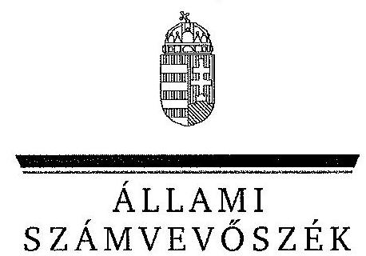
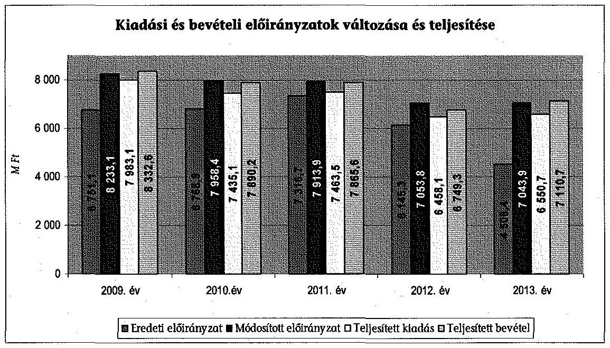
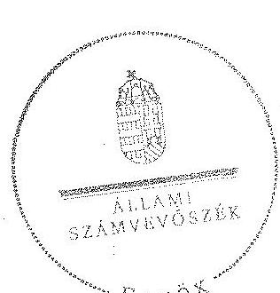
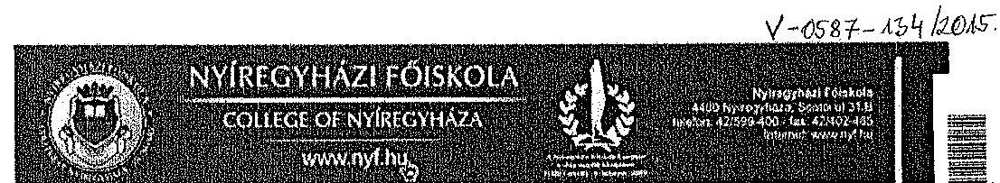
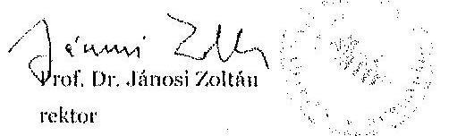

ÁLLAMI
SZÁMVEVŐSZÉK

# JELENTÉS 

a Nyíregyházi Főiskola ellenőrzéséről - Az állami felsőoktatási intézmények gazdálkodásának, működésének ellenőrzése

---

# Állami Számvevőszék 

Iktatószám: V-0587-135/2015.
Témaszám: 1621
Vizsgálat-azonosító szám: V068913

## Az ellenőrzést felügyelte:

## Makkai Mária

felügyeleti vezető

## Az ellenőrzést vezette és az ellenőrzés végrehajtásáért felelős:

## Gál Magdolna

ellenőrzésvezető

## A számvevői munkaanyagok feldolgozását és a jelentés összeállítását

végezte:

## Hálóné Pelikán Veronika

számvevő
dr. Marosi Gyöngyi
számvevő főtanácsos

## Az ellenőrzést végezték:

| Hálóné Pelikán Veronika | Illésné Borsik Andrea |
| :-- | :-- |
| számvevő | számvevő |
| dr. Marosi Gyöngyi | Vitányi István |
| számvevő főtanácsos | számvevő tanácsos |

## A témához kapcsolódó eddig készített számvevőszéki jelentések:

## címe

Jelentés az oktatási és kulturális ágazat irányítási rendszerének, működésének ellenőrzéséről
Jelentés a felsőoktatás oktatási infrastruktúra-fejlesztési programjának ellenőrzéséről
Jelentés a PPP konstrukcióban megvalósult kiemelt kulturális és felsőoktatási projektek szerződéseinek teljesülése és társadalmi hasznosulásának ellenőrzéséről
Jelentés az állami felsőoktatási intézmények érdekeltségébe tartozó gazdasági társaságok támogatásának és nyereségük hasznosulásának ellenőrzéséről
Jelentés a Szolnoki Főiskola ellenőrzéséről - Az állami felsőoktatási 14196
intézmények gazdálkodásának, működésének ellenőrzése
Jelentés a Pannon Egyetem ellenőrzéséről - Az állami felsőoktatási 14197
intézmények gazdálkodásának, működésének ellenőrzése

---

Jelentés a Károly Róbert Főiskola ellenőrzéséről - Az állami felsőoktatási intézmények gazdálkodásának, működésének ellenőrzése ..... 14198
Jelentés a Magyar Képzőművészeti Egyetem ellenőrzéséről - Az állami felsőoktatási intézmények gazdálkodásának, működésének ellenőrzése ..... 14199
Jelentés a Miskolci Egyetem ellenőrzéséről - Az állami felsőoktatási intézmények gazdálkodásának, működésének ellenőrzése ..... 14200
Jelentés a Széchenyi István Egyetem ellenőrzéséről - Az állami felsőoktatási intézmények gazdálkodásának, működésének ellenőrzése ..... 14201
Jelentés az Eszterházy Károly Főiskola ellenőrzéséről - Az állami felsőoktatási intézmények gazdálkodásának, működésének ellenőrzése ..... 14204
Jelentés a Magyar Táncművészeti Főiskola ellenőrzéséről - Az állami felsőoktatási intézmények gazdálkodásának, működésének ellenőrzése ..... 14205
Jelentés a Budapesti Műszaki és Gazdaságtudományi Egyetem ellenőrzéséről - Az állami felsőoktatási intézmények gazdálkodásának, működésének ellenőrzése ..... 14218

---

.

---

# TARTALOMJEGYZÉK 

BEVEZETÉS ..... 15
I. ÖSSZEGZŐ MEGÁLLAPÍTÁSOK, KÖVETKEZTETÉSEK, JAVASLATOK ..... 19
II. RÉSZLETES MEGÁLLAPÍTÁSOK ..... 30

1. A fenntartói és az ágazati irányítási jogok gyakorlása ..... 30
2. Az intézmény belső kontrollrendszerének kialakítása és működtetése ..... 32
3. Az intézmény döntéshozó szerveinek joggyakorlása, az oktatási és egyéb tevékenységei elkülönítése, a pénzügyi gazdálkodása ..... 35
3.1. Az intézmény döntéshozó szerveinek gazdálkodással kapcsolatos joggyakorlása ..... 36
3.2. Az intézmény oktatási és egyéb tevékenységei elkülönítése, az ellátott feladatok átláthatósága ..... 37
3.3. Az intézmény pénzügyi egyensúlya, fizetőképessége ..... 38
3.4. Az intézmény előirányzat kezelése ..... 41
3.5. Az egyes hazai forrásból finanszírozott projektekhez, feladatokhoz kapott - nem normatív - költségvetési forrással való elszámolás ..... 48
4. Az intézmény vagyongazdálkodása ..... 49
4.1. A vagyongazdálkodási tevékenységek keretei ..... 49
4.2. A vagyonváltozások és a vagyonhasznosítás szabályszerűsége ..... 50
4.3. Az intézmény tulajdonosi jog gyakorlása ..... 54
5. A külső ellenőrzések által tett javaslatok hasznosulása ..... 56
5.1. ÁSZ ellenőrzések által tett javaslatok hasznosulása ..... 56
5.2. Az egyéb külső ellenőrzések javaslatainak hasznosulása ..... 58
6. Az integritás kontrollok kialakítása és működtetése ..... 59
MELLÉKLETEK
7. számú A Nyíregyházi Főiskola kiadási és bevételi előirányzatai, azok teljesítése a 2009-2013. években
8. számú A Nyíregyházi Főiskola kiadásainak, bevételeinek változása a 2009-2013. években
9. számú Kimutatás a Nyíregyházi Főiskola bevételeiről és kiadásairól, valamint adósságszolgálatáról a 2009-2013. években
10. számú A Nyíregyházi Főiskola mérlegadatai a 2009-2013. években

---

5. számú A Nyíregyházi Főiskola gazdálkodása szabályszerűségének értékelése a mintatételek alapján
6. számú A Nyíregyházi Főiskola rektorának nemleges észrevétele

# FÜGGELÉK 

1. számú Az integritás érvényesítése érdekében kialakított és működtetett intézményi kontrollrendszer

---

# RÖVIDÍTÉSEK JEGYZÉKE 

## Törvények

Áht. 1
Áht. 2
Eisztv.
Feot.
Gt.
Info tv.
$\mathrm{Kbt}_{.1}$
Kbt. 2
Kjt.
Mt. 1
Mt. 2
Nftv.
Nvtv.
Sztv.
Vtv.
Rendeletek
Áhsz.

Ámr. 1
Ámr. 2
Ávr.
Ber.
Bkr.
Vtvr.
51/2007. (III. 26.) Korm. rendelet
1992. évi XXXVIII. törvény az államháztartásról (hatálytalan 2012. január 1-jétől)
2011. évi CXCV. törvény az államháztartásról
2005. évi XC. törvény az elektronikus információszabadságról (hatálytalan 2012. január 1-jétől)
2005. évi CXXXIX. törvény a felsőoktatásról (hatálytalan 2012. szeptember 1-jétől)
2006. évi IV. törvény a gazdasági társaságokról (hatálytalan 2014. március 15-től)
2011. évi CXII. törvény az információs önrendelkezési jogról és az információszabadságról
2003. évi CXXIX. törvény a közbeszerzésekről (hatálytalan 2012. január 1-jétől)
2011. évi CVIII. törvény a közbeszerzésekről
1992. évi XXXIII. törvény a közalkalmazottak jogállásáról
1992. évi XXII. törvény a Munka Törvénykönyvéről (hatálytalan 2013. január 1-jétől)
2012. évi I. törvény a munka törvénykönyvéről
2011. évi CCIV. törvény a nemzeti felsőoktatásról
2011. évi CXCVI. törvény a nemzeti vagyonról
2000. évi C. törvény a számvitelről
2007. évi CVI. törvény az állami vagyonról
249/2000. (XII. 24.) Korm. rendelet az államháztartás szervezetei beszámolási és könyvvezetési kötelezettségének sajátosságairól (hatálytalan 2014. január 1-jétől)
217/1998. (XII. 30.) Korm. rendelet az államháztartás működési rendjéről (hatálytalan 2010. január 1-jétől)
292/2009. (XII. 19.) Korm. rendelet az államháztartás működési rendjéről (hatálytalan 2012. január 1-jétől)
368/2011. (XII. 31.) Korm. rendelet az államháztartásról szóló törvény végrehajtásáról
193/2003. (XI. 26.) Korm. rendelet a költségvetési szervek belső ellenőrzéséről (hatálytalan 2012. január 1-jétől)
370/2011. (XII. 31.) Korm. rendelet a költségvetési szervek belső kontrollrendszeréről és belső ellenőrzéséről
254/2007. (X. 4.) Korm. rendelet az állami vagyonnal való gazdálkodásról
51/2007. (III. 26.) Korm. rendelet a felsőoktatásban részt vevő hallgatók juttatásairól és az általuk fizetendő egyes térítésekről

---

50/2008. (III. 14.) Korm. rendelet

36/2013. (IX. 13.) NGM rendelet

## Határozatok

1001/2009. (I. 13.)
Korm. határozat

1033/2009. (III. 17.)
Korm. határozat

1132/2010. (VI. 18.)
Korm. határozat
1025/2011. (II. 11.)
Korm. határozat
1365/2011. (XI. 8.)
Korm. határozat
1290/2012. (VIII. 9.)
Korm. határozat
1657/2012. (XII. 20.)
Korm. határozat

## Egyéb rövidítések

AVIR
Campus-Land Nonprofit Kft.
EMMI
Enerea Nonprofit Kft.

FEUVE
FIR
FSA
Gazdálkodási Szabályzat
GMF
GT
gyakorló általános iskolák

Hallgatói Centrum Kht. „f.a."
HÖK
IFT
Innova Nonprofit Kft.

50/2008. (III. 14.) Korm. rendelet a felsőoktatási intézmények képzési, tudományos célú és fenntartói normatíva alapján történő finanszírozásáról
36/2013. (IX. 13.) NGM rendelet az államháztartás számvitelének 2014. évi megváltozásával kapcsolatos feladatokról

1001/2009. (I. 13.) Korm. határozat a 2009. évi havi keret-kiegészítés forrásigényének biztosításához szükséges intézkedésekről
1033/2009. (III. 17.) Korm. határozat a 2009. évi államháztartási egyensúly megőrzéséhez szükséges intézkedésekről
1132/2010. (VI. 18.) Korm. határozat a 2010. évi költségvetéssel összefüggő egyes feladatokról
1025/2011. (II. 11.) Korm. határozat az államháztartási egyensúly megőrzéséhez szükséges intézkedésekről
1365/2011. (XI. 8.) Korm. határozat a 2012. évi hiánycél tartását biztosító további feladatokról
1290/2012. (VIII. 9.) Korm. határozat a költségvetési felügyelők és költségvetési felügyelők kirendeléséről
1657/2012. (XII. 20.) Korm. határozat a kormányzati stratégiai dokumentumok felülvizsgálatával kapcsolatos feladatokról

Adattáralapú Vezetői Információs Rendszer
CAMPUS-LAND Szolgáltató Közhasznú Nonprofit Korlátolt Felelősségű Társaság
Emberi Erőforrások Minisztériuma
ENEREA Észak-Alföldi Regionális Energia Ügynökség Nonprofit Korlátolt Felelősségű Társaság
folyamatba épített, előzetes, utólagos és vezetői ellenőrzés
Felsőoktatási Információs Rendszer
Felsőoktatási Struktúraátalakítási Alap
A Nyíregyházi Főiskola Gazdálkodási Szabályzata, az SZMSZ 13. sz. melléklete (hatályos 2007. január 1-től)
Gazdasági Műszaki Főigazgatóság, az NYF gazdasági szervezete
Gazdasági Tanács
NYF által alapított és fenntartott Eötvös József Általános Iskola és Gimnázium, Apáczai Csere János Gyakorló Általános Iskola és Műszaki Iskola
HALLGATÓI CENTRUM Közhasznú Társaság "felszámolás alatt"
Hallgatói Önkormányzat
Intézményfejlesztési Terv
INNOVA Észak-Alföld Regionális Fejlesztési és Innovációs

---

|  | Ügynökség Nonprofit Korlátolt Felelősségű Társaság |
| :--: | :--: |
| KEOP | Környezet és Energia Operatív Program |
| Kft. | Korlátolt Felelősségű Társaság |
| Kht. | Közhasznú társaság |
| Kincstár | Magyar Államkincstár |
| Költségtérítés | szenátus által az adott tanévre elfogadott önköltség/költségtérítés összege |
| MNV Zrt. | Magyar Nemzeti Vagyonkezelő Zrt. |
| NEFMI | Nemzeti Erőforrás Minisztérium |
| Neptun rendszer | Tanulmányi hallgatói információs rendszer |
| NYF / főiskola / intézmény | Nyíregyházi Főiskola |
| Nyír-Inno-Spin Kft. | NYÍR-INNO-SPIN Kutatási, Fejlesztési és Innovációs Szolgáltató Korlátolt Felelősségű Társaság |
| Nyírszakképzés | Nyírségi Szakképzés-szervezési Közhasznú Nonprofit Korlátolt Felelősségű Társaság |
| Nonprofit Kft. |  |
| OH | Oktatási Hivatal |
| Spin-Direkt Kft. | SPIN-DIREKT Korlátolt Felelősségű Társaság |
| teljesítésigazolás | Ámr. 135. §, Ámr. 76. § szerint 2009. január 1. - 2011. december 31. között szakmai teljesítésigazolás, az Ávr. 57. § alapján 2012. január 1-től teljesítésigazolás |
| TJSZ | Térítési Juttatási Szabályzat |
| Záhony Térségi Logisztikai Klaszter Kft. | Záhony Térségi Logisztikai Klaszter Korlátolt Felelősségű Társaság |

---

# **Chemistry**

## **Chemical Reactions**

### **Balancing Chemical Equations**

1. **Write the unbalanced equation:**
   - Example: $$C_3H_8 + O_2 \rightarrow CO_2 + H_2O$$

2. **Balance the equation:**
   - Example: $$2C_3H_8 + 7O_2 \rightarrow 6CO_2 + 8H_2O$$

3. **Balance the equation:**
   - Example: $$2C_3H_8 + 7O_2 \rightarrow 6CO_2 + 8H_2O$$

### **Types of Reactions**

1. **Combination Reaction:**
   - Example: $$2H_2 + O_2 \rightarrow 2H_2O$$

2. **Decomposition Reaction:**
   - Example: $$2H_2O_2 \rightarrow 2H_2O + O_2$$

3. **Single Displacement Reaction:**
   - Example: $$Zn + 2HCl \rightarrow ZnCl_2 + H_2$$

4. **Double Displacement Reaction:**
   - Example: $$AgNO_3 + NaCl \rightarrow AgCl + NaNO_3$$

5. **Combustion Reaction:**
   - Example: $$CH_4 + 2O_2 \rightarrow CO_2 + 2H_2O$$

## **Stoichiometry**

### **Mole Concept**

- **Mole (mol):** The amount of substance containing as many particles (atoms, molecules, ions) as there are atoms in exactly 12 grams of carbon-12.
- **Avogadro's Number:** $$6.022 \times 10^{23}$$ particles per mole.

### **Molar Mass**

- **Molar Mass:** The mass of one mole of a substance.
- Example: The molar mass of water ($$H_2O$$) is 18.015 g/mol.

### **Calculations**

1. **Moles to Mass:**
   - Formula: $$n = \frac{m}{M}$$
   - Example: Calculate the number of moles of $$H_2O$$ in 18 grams of water.
     - $$n = \frac{18 \, \text{g}}{18.015 \, \text{g/mol}} \approx 0.999 \, \text{mol}$$

2. **Moles to Mass:**
   - Formula: $$m = n \times M$$
   - Example: Calculate the mass of 1 mole of water.
     - $$m = 1 \, \text{mol} \times 18.015 \, \text{g/mol} = 18.015 \, \text{g}$$

## **Gas Laws**

### **Ideal Gas Law**

- **Equation:** $$PV = nRT$$
- **Variables:**
  - $$P$$: Pressure (atm)
  - $$V$$: Volume (L)
  - $$n$$: Number of moles (mol)
  - $$R$$: Ideal gas constant (0.0821 L·atm/mol·K)
  - $$T$$: Temperature (K)

### **Boyle's Law**

- **Equation:** $$P_1V_1 = P_2V_2$$
- **Variables:**
  - $$P_1$$: Initial pressure (atm)
  - $$V_1$$: Initial volume (L)
  - $$P_2$$: Final pressure (atm)
  - $$V_2$$: Final volume (L)

### **Boyle's Law (Boyle's Law)**

- **Equation:** This seems to be a repeated entry with an incorrect formula.  The correct formula is  $$P_1V_1 = P_2V_2$$

## **Thermochemistry**

### **Enthalpy (H)**

- **Definition:** The heat content of a system at constant pressure.
- **Equation:** $$\Delta H = q_p$$
- **Variables:**
  - $$q_p$$: Heat transferred at constant pressure.

### **Hess's Law**

- **Statement:** The enthalpy change for a reaction is the same whether it occurs in one step or multiple steps.
- **Equation:**  The equation provided seems incomplete or incorrect.  A more accurate representation would be  $$\Delta H_{rxn} = \sum \Delta H_f (\text{products}) - \sum \Delta H_f (\text{reactants})$$
- **Variables:**
  - $$\Delta H_{rxn}$$: Enthalpy change of the reaction.
  - $$\Delta H_f$$: Standard enthalpy of formation.

### **Hess's Law (Hess's Law)**

- **Statement:** The enthalpy change for a reaction is the same whether it occurs in one step or multiple steps.
- **Equation:**  Again, the equation provided is incomplete or incorrect.  See the corrected equation above.

 \Delta H_{\text{rest}}$$
- **Variables:**
  - $$\Delta H$$: Heat transferred at constant pressure.
  - $$\Delta H_0$$: Change in enthalpy during a step.
  - $$\Delta H_{\text{rest}}$$: Change in enthalpy during a step.

## **Electrochemistry**

### **Oxidation and Reduction**

- **Oxidation:** Loss of electrons.
- **Reduction:** Gain of electrons.

### **Galvanic Cells**

- **Definition:** A cell that converts chemical energy into electrical energy.
- **Components:**
  - Anode: Oxidation occurs.
  - Cathode: Reduction occurs.
  - Salt Bridge: Connects the two half-cells.

### **Nernst Equation**

- **Equation:** $$E = E^\circ - \frac{RT}{nF} \ln Q$$
- **Variables:**
  - $$E$$: Energy (K)
  - $$E^\circ$$: Standard deviation of the energy (J)
  - $$R$$: Ideal gas constant (0.0821 L·atm/mol·K)
  - $$T$$: Temperature (K)
  - $$n$$: Number of electrons transferred
  - $$F$$: Faraday constant (96,485 C/mol)
  - $$Q$$: Reaction quotient

---

# ÉRTELMEZŐ SZÓTÁR 

alapító
állami felsőoktatási intézmény saját tulajdona
állami vagyon
állami vagyon hasznosítása

A központi költségvetési szerv alapítója az Országgyűlés, a Kormány vagy a miniszter. A felsőoktatási intézmények vonatkozásában az alapítói jogokat a felsőoktatásért felelős minisztérium gyakorolja.
A felsőoktatási intézmény saját bevételének a költségek teljes körű levonása, - az adományozás és öröklés kivételével - a rendelkezésre bocsátott vagyon állagának megóvásáról, pótlásáról való gondoskodás után fennmaradt része terhére szerzett vagyona.
A Vtv. 1. § (2) bekezdése szerint állami vagyonnak minősül:
a) az állami tulajdonban lévő ingó dolog, valamint a dolog módjára hasznosítható természeti erő,
b) az állami tulajdonban lévő termőföldekből álló, külön törvényben szabályozott Nemzeti Földalap,
c) az állami tulajdonban lévő - a b) pont hatálya alá nem tartozó - ingatlan,
d) az állami tulajdonban lévő értékpapír,
e) az államot megillető társasági részesedés és más vagyoni értékű jog.
(hatályos 2010. június 16-ig)
a) az állam tulajdonában lévő dolog, valamint a dolog módjára hasznosítható természeti erő,
b) az a) pont hatálya alá nem tartozó mindazon vagyon, amely vonatkozásában törvény az állam kizárólagos tulajdonjogát nevesíti,
c) az állam tulajdonában lévő tagsági jogviszonyt megtestesítő értékpapír, illetve az államot megillető egyéb társasági részesedés,
d) az államot megillető olyan immateriális, vagyoni értékkel rendelkező jogosultság, amelyet jogszabály vagyoni értékű jogként nevesít.
(hatályos 2010. június 17-től)
A Vtv. 23. § (1) bekezdése szerint: Az állami vagyont az MNV Zrt. maga kezeli, illetve szerződés - így különösen bérlet, haszonbérlet, szerződésen alapuló haszonélvezet, vagyonkezelés, megbízás - alapján központi költségvetési szervnek, természetes vagy jogi személynek, illetőleg jogi személyiséggel nem rendelkező gazdasági társaságnak hasznosításra átengedi.
(hatályos 2010. december 31-ig)
Az állami vagyont az MNV Zrt. maga kezeli, vagy szerződés - így különösen bérlet, haszonbérlet, szerződésen alapuló haszonélvezet, vagyonkezelés, megbízás - alapján központi költségvetési szervnek, természetes vagy

---

állami vagyon hasznosítására kötött szerződés
állami vagyon használója
állami vagyon értékesítése
állami vagyon kezelője /vagyonkezelő/
jogi személynek, vagy jogi személyiséggel nem rendelkező gazdálkodó szervezetnek hasznosításra átengedi.
(hatályos 2011. december 31-ig)
Az állami vagyont az MNV Zrt. maga kezeli, vagy szerződés - így különösen bérlet, haszonbérlet, megbízás alapján központi költségvetési szervnek, természetes vagy jogi személynek, vagy jogi személyiséggel nem rendelkező gazdálkodó szervezetnek hasznosításra átengedi.
(hatályos 2012. január 1-jétől)
A Vtv. 23. § (2) bekezdése szerint: Az állami vagyon hasznosítására kötött szerződések elsődleges célja az állami vagyon hatékony működtetése, állagának védelme, értékének megőrzése, illetve gyarapítása, az állami és közfeladatok ellátásának elősegítése.
A Vtvr. 1. § (7) a) pontja szerint: Az a természetes személy, jogi személy, illetve jogi személyiséggel nem rendelkező gazdasági társaság, amely az MNV Zrt.-vel kötött szerződés alapján, bármely jogcímen (bérlet, haszonbérlet, vagyonkezelés, használat stb.) állami vagyont birtokol, használ, hasznosít.
(hatályos 2010. december 31-ig)
Az a természetes személy, jogi személy, illetve jogi személyiséggel nem rendelkező szervezet, amely, illetve aki törvény vagy szerződés alapján, bármely jogcímen (pl. bérlet, haszonbérlet, vagyonkezelési szerződés, használat stb.) állami vagyont birtokol, használ, szedi annak hasznait, hasznosít, ide nem értve a tulajdonosi jogok gyakorlóját.
(hatályos 2011. január 1 - 2011. december 31-ig)
Az a természetes vagy jogi személy, jogi személyiséggel nem rendelkező szervezet, aki, vagy amely törvény vagy szerződés alapján, bármely jogcímen (bérlet, haszonbérlet, használat stb.) állami vagyont birtokol, használ, szedi annak hasznait, hasznosít, ide nem értve a haszonélvezőt, a vagyonkezelőt és a tulajdonosi jogok gyakorlóját.
(hatályos 2012. január 1-jétől)
Állami vagyon tulajdonjogának bármely jogcímen történő, visszterhes átruházása. (Vtvr. 1. § (7) bekezdés d) pont)
A Vtv. 23. § (1) bekezdése szerint: Az állami vagyont az MNV Zrt. maga kezeli, vagy szerződés - így különösen bérlet, haszonbérlet, szerződésen alapuló haszonélvezet, vagyonkezelés, megbízás - alapján központi költségvetési szervnek, természetes vagy jogi személynek, illetőleg jogi személyiséggel nem rendelkező gazdasági társaságnak hasznosításra átengedi. (hatályos 2010. január 1 2010. december 31-ig)

---

Az állami vagyont az MNV Zrt. maga kezeli, vagy szerződés - így különösen bérlet, haszonbérlet, szerződésen alapuló haszonélvezet, vagyonkezelés, megbízás - alapján központi költségvetési szervnek, természetes vagy jogi személynek, illetőleg jogi személyiséggel nem rendelkező gazdálkodó szervezetnek hasznosításra átengedi. (hatályos 2011. január 1 - 2011. december 31-ig)
Az állami vagyont az MNV Zrt. maga kezeli, vagy szerződés - így különösen bérlet, haszonbérlet, megbízás alapján központi költségvetési szervnek, természetes vagy jogi személynek, vagy jogi személyiséggel nem rendelkező gazdálkodó szervezetnek hasznosításra átengedi. Az állami vagyonra vonatkozóan az MNV Zrt. kizárólag az Nvtv-ben meghatározott személyekkel köthet vagyonkezelési szerződést.
(hatályos 2012. január 1-jétől)
A belső kontrollrendszer a kockázatok kezelése és a tárgyilagos bizonyosság megszerzése érdekében kialakított folyamatrendszer, amely azt a célt szolgálja, hogy megvalósuljanak a következő célok:
belső kontrollrendszer
a) a működés és a gazdálkodás során a tevékenységeket szabályszerűen, gazdaságosan, hatékonyan, eredményesen hajtsák végre,
b) az elszámolási kötelezettségeket teljesítsék, és
c) megvédjék az erőforrásokat a veszteségektől, károktól és a nem rendeltetésszerű használattól.
A módszer a működési és a felhalmozási költségvetés bevételeinek és kiadásainak, ezek egyenlegeinek elkülönített, majd összevont kimutatását alkalmazza valamely költségvetési intézmény pénzügyi helyzetének megítéléséhez. Kiemelten mutatja be a finanszírozási műveletek egyenlege nélküli és az azt magába foglaló pénzügyi pozíciót, valamint a tőketörlesztéssel, értékpapír beváltással csökkentett működési jövedelmet.
Az értékelés a pénzügyi kapacitás fogalmát helyezi a középpontba.
Az államháztartás központi alrendszerébe tartozó költségvetési szerveknél a módosított bevételi és kiadási előirányzatok és azok teljesítésének a Kormány rendeletében meghatározott tételekkel korrigált különbözete az előirányzat-maradvány. (Áht. 2. § (1) bekezdés m) pontja)
A Feot. 7. § (2) és az Nftv. 4. § (2) bekezdése szerint az, aki az alapítói jogot gyakorolja, ellátja a felsőoktatási intézmény fenntartásával kapcsolatos feladatokat.
A CLF módszer szerint számított működési és felhalmozási tevékenység pénzügyi egyenlegének összevont értéke. Megmutatja, hogy a költségvetési intézmény bevételei fedezetet biztosítottak-e a kiadásokra. A finanszírozási műveletek nélküli (GFS) pozíció alapján a pénzügyi

---

Gazdasági Tanács
hároméves fenntartói megállapodás
információs és kommunikációs rendszer
integritás
intézményfejlesztési terv
irányító szerv
helyzetet akkor tekintettük megfelelőnek, ha az adott év működési és felhalmozási bevételei fedezetet nyújtottak az adott év működési és felhalmozási kiadásaira.
A felsőoktatási intézmény javaslattevő, véleményező, a stratégiai döntések előkészítésében részt vevő, és a döntések végrehajtásának ellenőrzésében közreműködő szerve.
Az állami felsőoktatási intézmények központi költségvetési támogatására hároméves fenntartói megállapodást kell kötni az állami felsőoktatási intézmény és a fenntartó között. A fenntartói megállapodás tartalmazza a felsőoktatási intézmény által meghatározott hároméves időszakra vállalt teljesítménykövetelményeket, továbbá az állandó jellegű támogatási részeket, valamint a változó jellegű támogatások megállapításának jogcímeit. A változó elemű támogatás évenkénti elszámolási kötelezettséggel kerül meghatározásra.
A költségvetési szerv vezetője köteles olyan rendszereket kialakítani és működtetni, melyek biztosítják, hogy a megfelelő információk a megfelelő időben eljutnak az illetékes szervezethez, szervezeti egységhez, illetve személyhez.
Az integritás olyasvalakit vagy valamit jelöl, aki vagy ami romlatlan, sértetlen, feddhetetlen. Az integritás elvek, értékek, cselekvések, módszerek, intézkedések konzisztenciáját jelenti: olyan magatartásmódot, amely meghatározott értékeknek megfelel.
A szenátus fogadja el az intézményfejlesztési tervet. Az intézményfejlesztési tervben kell meghatározni a fejlesztéssel, a fenntartó által a felsőoktatási intézmény rendelkezésére bocsátott vagyon hasznosításával, megóvásával, elidegenítésével kapcsolatos elképzeléseket, a várható bevételeket és kiadásokat. Az intézményfejlesztési tervet középtávra, legalább négyéves időszakra kell elkészíteni, évenkénti bontásban meghatározva a végrehajtás feladatait. Az intézményfejlesztési terv része a foglalkoztatási terv. A foglalkoztatási tervben kell meghatározni azt a létszámot, amelynek keretei között a felsőoktatási intézmény megoldhatja feladatait. (Feot. 27. § (3) bekezdés)
A felsőoktatás ágazati irányítását - felsőoktatásszervezéssel, felsőoktatásfejlesztéssel, törvényességi ellenőrzéssel kapcsolatos feladatokat - ellátó miniszter által vezetett minisztérium. (Feot. 102. - 105/A. §, Nftv. 64-66. §)

---

kincstári biztos
kincstári költségvetés
kisebbségi jogokat biztosító részesedés
kockázatkezelési rendszer
kontrollkörnyezet
kontrolltevékenység
költségvetési főfelügyelő, felügyelő

A kincstári biztos kijelölését az államháztartásért felelős miniszternél a Kincstár kezdeményezi. A kincstári biztos köteles figyelemmel kísérni megbízatásának időpontjától kezdve a költségvetési szerv tervezését, gazdálkodását, beszámolását, a jogszabályokban előírt feladatainak ellátását, feltárni azokat az okokat, amelyek a tartós fizetésképtelenséghez vezettek, a szükséges intézkedések azonnali végrehajtására irányuló intézkedési tervet készíteni, azonnali intézkedéseket kezdeményezni és írásbeli utasításokat kiadni a tartozásállomány felszámolására, a gazdálkodás egyensúlyának biztosítására, a követelések behajtására. (Ávr. 116-117. §)
A központi költségvetésről szóló törvény elfogadását követően a fejezetet irányító szerv az államháztartás központi alrendszerébe tartozó költségvetési szerv és a fejezeti kezelésű előirányzat kiemelt előirányzatait, valamint az elkülönített állami pénzalapok és a társadalombiztosítás pénzügyi alapjai jogszabályi előírás szerinti bevételeit és kiadásait kincstári költségvetés kiadásával állapítja meg. (Áht. 1 24. § (3) bekezdés, Áht. 2 28. § (2) bekezdés, Ávr. 31. § (2) bekezdés)
A részesedés mértéke legalább 5\%. (Gt. 49. §)
Irányítási eszközök és módszerek összessége, melynek elemei a szervezeti célok elérését veszélyeztető tényezők (kockázatok) azonosítása, elemzése, csoportosítása, nyomon követése, valamint szükség esetén a kockázati kitettség mérséklése.
A kontrollkörnyezet a költségvetési szerv vezetőinek a szervezeti célok elérését segítő kontrollok kialakításával és működtetésével, korszerűsítésével kapcsolatos magatartását, a kontrollpontokról érkező információkra való reagálását jelenti.
Azok az elvek, politikák és eljárások, amelyeket a kockázatok meghatározása és a szervezet céljainak elérése érdekében alakítanak ki.
A költségvetési szerv vezetője köteles a szervezeten belül kontrolltevékenységeket kialakítani, amelyek biztosítják a kockázatok kezelését, hozzájárulnak a szervezet céljainak eléréséhez.
Az államháztartásért felelős miniszter a Kormány irányítása alá tartozó fejezetet irányító szervhez, a Kormány irányítása vagy felügyelete alá tartozó költségvetési szervhez, valamint az elkülönített állami pénzalapok és a társadalombiztosítás pénzügyi alapjai kezelő szerveihez költségvetési főfelügyelőt, felügyelőt rendelhet ki. A költségvetési főfelügyelő, felügyelő a gazdálkodás költségvetés-politikával való összhangja és a takarékos, szabályszerű, eredményes működés érdekében a Kormány rendeletében meghatározott intézkedéseket tehet, így

---

maximális hallgatói létszám
mértékadó befolyást biztosító részesedés
minisztérium
minősített többséget biztosító részesedés
monitoring
működési jövedelem
normatív költségvetési támogatás felsőoktatási intézmények működéséhez
normatív támogatások
különösen előzetesen véleményezi a kötelezettségvállalásra irányuló eljárásokat és a nagy összegű kötelezettségvállalások tekintetében kifogással élhet. (Áht. 39. § (1)-(2) bekezdés)

Az a felsőoktatási intézmény alapító okiratában, működési engedélyében meghatározott hallgatói létszám, ameddig terjedően a felsőoktatási intézmény - figyelembe véve a hallgatók fogadásához és az oktatói tevékenység folytatásához rendelkezésre álló személyi feltételeket, helyiségeket és eszközöket - valamennyi évfolyamára számítva, teljes kihasználtsággal működve hallgatói jogviszonyt létesíthet.
A részesedés mértéke legalább 20\%,
 de 50\%-nál kisebb. (Sztv. 3. § (2) bekezdés 4. pont)
A felsőoktatásért felelős minisztérium, amely 2009-től 2010 májusáig az OKM, 2010 májusától 2012 májusáig a NEFMI, 2012 májusától az EMMI volt.
A minősített befolyásszerző az ellenőrzött társaságban a szavazatok legalább hetvenöt százalékával rendelkezik. (Gt. 52. § (2) bekezdés)
A különböző szintű szervezeti célok megvalósításához szükséges folyamatok figyelemmel kísérése, melynek során a releváns eseményekről és tevékenységekről (együtt: folyamatokról) rendszeres jelleggel, strukturált, döntéstámogató információkhoz jutnak a szervezet vezetői.
A folyó bevételek és folyó kiadások egyenlege. Azt mutatja, hogy a folyó bevételek fedezetet nyújtanak-e a folyó kiadásokra.
A felsőoktatási intézmények működéséhez biztosított normatív költségvetési támogatás lehet
a) hallgatói juttatásokhoz nyújtott,
b) képzési,
c) tudományos célú,
d) fenntartói,
e) egyes feladatokhoz nyújtott
támogatás. A központi költségvetésből biztosított normatív költségvetési támogatásra - a d) pontban meghatározott normatív költségvetési támogatás kivételével - a felsőoktatási intézmények azonos feltételek alapján válnak jogosulttá. Az a)-e) pontokban meghatározott jogcímek - az a) és e) pontban meghatározott jogcímek kivételével - nem jelentenek felhasználási kötöttséget. (Feot. 127. § (3) bekezdés)
Az ellenőrzési időszakban hatályos költségvetési törvények 3. sz. mellékletében megjelölt közoktatási hozzájárulások, az 5. sz. mellékletében megjelölt központosított előirányzatok, továbbá a 8. sz. mellékletében megjelölt normatív, kötött felhasználású támogatások együttesen.

---

saját bevétel
szenátus
tárgyévi pénzügyi pozíció

Az államháztartáson kívüli források - beleértve minden olyan, az Európai Uniótól származó támogatást, amelyhez nem az állami költségvetésen keresztül jut a felsőoktatási intézmény, továbbá a szakképzési hozzájárulási fizetési kötelezettség teljesítéseként elszámolt forrásokat is, ide nem értve az állami vagyon értékesítésének ellenértékét - valamint a Kutatási és Technológiai Innovációs Alapból származó bevételek.
A felsőoktatási intézmény, döntést hozó és a döntés végrehajtását ellenőrző testülete. (Feot. 20. § (1) bekezdés, Nftv. 12. § (1)-(3) bekezdés)
A működési és felhalmozási bevételek, valamint kiadások egyenlege a finanszírozási műveletek egyenlegének figyelembe vételével.

---

.

---

# JELENTÉS   a Nyíregyházi Főiskola ellenőrzéséről Az állami felsőoktatási intézmények gazdálkodásának, működésének ellenőrzése 

## BEVEZETÉS

Az ÁSZ Stratégiája ${ }^{1}$ alapértékeinek egyike, hogy az államháztartás komplex folyamatainak átláthatósága érdekében rendszerszemléletű/holisztikus megközelítésű, egymásra épülő, a szinergiahatást kihasználó, összefoglaló értékelésre lehetőséget adó ellenőrzéseket végez. Az államháztartás központi alrendszerébe tartozó felsőoktatási intézmények ellenőrzése során az ÁSZ értékeli azok pénz-ügyi-gazdasági helyzetét, feltárja a működésükben rejlő kockázatokat, ezzel előmozdítja a közpénzügyek átláthatóságát, rendezettségét.

Az állami felsőoktatási intézmények gazdálkodását - az Áht. ${ }_{1}$ és az Áht. ${ }_{2}$ előírásai mellett - a Feot., valamint az Nftv. előírásai határozták meg.

Magyarország Nemzeti Reform Programja keretében, a Széll Kálmán Terv 2020-ig a 30-34 évesek körében, a felsőfokú vagy annak megfelelő végzettséggel rendelkezők arányának 30,3\%-ra való növelését irányozta elő, amely a 2010. évhez képest 4,6\% pontos növekedési célkitűzést jelent. A rendezett gazdasági környezet, az önállósággal élni tudó, felelős, elszámoltatható intézményi gazdálkodói magatartás elengedhetetlen feltétele a kitűzött szakmai célok elérésének.

Az ellenőrzés célja annak megállapítása, hogy szabályos volt-e az állami felsőoktatási intézmény pénzügyi és vagyongazdálkodása, biztosított volt-e a vagyonnal való felelős gazdálkodás követelményének érvényesülése, jogszabályi előírásoknak megfelelően működött-e a belső kontrollrendszer, az irányító szerv tevékenysége a jogszabályi előírásoknak megfelelt-e.

Ennek keretében értékeltük a főiskolánál:

- a fenntartói és az ágazati irányítási jogok gyakorlását;
- az intézmény belső kontrollrendszere jogszabályoknak megfelelő kialakítását és működtetését;

[^0]
[^0]:    ${ }^{1}$ Állami Számvevőszék: Stratégia. Az Állami Számvevőszék hivatalos stratégiai dokumentum rendszere 2011-2015. 2012. december. http://www.asz.hu/strategia/asz-strategia/asz-strategia-2011.pdf

---

- az intézmény döntéshozó szerveinek joggyakorlása jogszabályoknak való megfelelőségét; az intézmény oktatási és egyéb (gyakorlati és kutatási) tevékenységei elkülönítését, átláthatóságát, illetve pénzügyi gazdálkodása szabályszerűségét;
- az intézmény vagyongazdálkodása előírásoknak való megfelelőségét;
- az ellenőrzött időszakban végzett külső (ÁSZ, fenntartói, KEHI, kincstári) ellenőrzések által tett javaslatok hasznosulását;
- az intézmény korrupcióval szembeni veszélyeztetettségének csökkentése érdekében az integritási szemlélet érvényesülését a gazdálkodási folyamatokban.

Az ellenőrzés várható hasznosulása: Az ellenőrzés eredményének hasznosulásaként képet kapunk a főiskolánál kialakult pénzügyi helyzetről; a kormány által kirendelt költségvetési (fő) felügyelői rendszer működésének tapasztalatairól; az oktatási és egyéb tevékenységek és költségelszámolások elhatárolásáról, átláthatóságáról és szabályosságáról. A felsőoktatási intézmények gazdálkodási szabadságának pénzügyi és vagyoni helyzetre gyakorolt hatásairól, a vagyonnal való felelős, értékmegőrző gazdálkodás érvényesüléséről, továbbá a belső kontrollrendszer működéséről. Az ellenőrzés az ellenőrzött számára visszajelzést ad a gazdálkodása kereteinek kialakításáról, a működésében fellépő hiányosságokról, javaslataival hozzájárul azok kiküszöböléséhez és a jó kormányzáshoz. A törvényalkotás számára összegzett tapasztalatok állnak rendelkezésre a felsőoktatási intézmények döntéseinek, gazdálkodásának szabályszerűségéről, amelyek alapján - indokolt esetben - jogszabály-módosítás kezdeményezhető. Az integritás kultúra kialakítása hozzájárul az elszámoltathatóság és átláthatóság érvényesítéséhez, egyben támogatja a szervezet védettségét a korrupciós kitettséggel szemben, valamint annak megelőzése is irányítottabbá válik. A társadalom számára jelzi, hogy közpénz nem maradhat ellenőrizetlenül, az ÁSZ értékteremtő rend kialakításához és megőrzéséhez hozzájáruló tevékenysége pozitív hatással lesz a szervezetről kialakított összkép formálásában.

Az ellenőrzés típusa: szabályszerűségi ellenőrzés
Az ellenőrzött időszak: 2009. január 1. - 2013. december 31.
Az ellenőrzéssel érintett szervezetek: az Emberi Erőforrások Minisztériuma és a Nyíregyházi Főiskola

Az ellenőrzés jogszabályi alapját az ÁSZ tv. 1. § (3) bekezdése, az 5. § (3)-(6) bekezdései, a 33. § (7) bekezdése, valamint az Áht. 2 61. § (2) bekezdésének előírásai képezik.

Az ellenőrzés kiterjedt minden olyan körülményre és adatra, amely az ÁSZ jogszabályban meghatározott feladataiban, valamint a program végrehajtása folyamán felmerült újabb összefüggések feltárásához szükséges volt.

Az ellenőrzés az INTOSAI által kiadott nemzetközi standardok figyelembe vételével, az ellenőrzési programban foglalt értékelési szempontok szerint történt.

---

A pénzügyi és vagyongazdálkodás terén az egyes területek szabályszerű működését mintavétellel ellenőriztük, ez alapján a sokaságban előforduló hibás tételek arányát becsültük. A jogszabályoknak és a belső előírásoknak megfelelőnek, azaz szabályszerűnek tekintettük az adott kiadási előirányzat felhasználását, bevétel beszedését, mérlegtétel értékelését, amennyiben a minta ellenőrzésének eredménye alapján 95\%-os bizonyossággal a teljes sokaságban a hibás tételek aránya kisebb volt, mint 10\%, nem megfelelőnek értékeltük, ha a hibás tételek aránya a 10\%-ot meghaladta. Kockázatot, illetve magas kockázatot jeleztünk, amennyiben egy adott terület vonatkozásában a minta alapján a teljes sokaságban nem volt teljes körűen biztosított a jogszabályoknak és a belső szabályzatoknak megfelelő működés. A mintatételek kiértékelését az 5. számú melléklet tartalmazza.

A belső kontrollrendszer kialakításának és működtetésének értékelése során a jogszabályi előírások mellett az Ámr.; 145/A. § (1) és (3) bekezdése, az Ámr. ${ }_{2}$ 155. § (3) bekezdése, valamint a Bkr. 5. § (1) bekezdése alapján figyelembe vettük az államháztartásért felelős miniszter által közzétett irányelvekben és módszertani útmutatókban 1/2009. (IX. 11.) PM irányelv, Pénzügyminisztérium Belső Kontroll Kézikönyv 2010. foglaltakat is. A belső kontrollrendszert az értékelés során legalább 85\%-os megfelelőség esetén megfelelőnek, legalább a 70\%-os megfelelőség esetén részben megfelelőnek, 70\%-os megfelelőség alatt pedig nem megfelelőnek minősítettük.

A nyíregyházi székhelyű 2000. január 1-jei hatállyal létrehozott NYF jogelődjei a Bessenyei György Tanárképző Főiskola és a Gödöllői Agrártudományi Egyetem Mezőgazdasági Főiskolai Kara voltak. Az NYF a 2009-2013. évek között önállóan működő és gazdálkodó központi költségvetési szerv volt. A főiskolán agrár, bölcsészettudományi, gazdaságtudományi, informatikai, műszaki, sporttudományi, társadalomtudományi, természettudományi és pedagógusképzés folyt. A főiskola szervezeti egységeként működő kettő gyakorló általános iskola biztosította a pedagógushallgatók gyakorlati képzését. Az intézmény szervezeti felépítésében az ellenőrzött időszakban több változás is történt. A kari szerkezet megszüntetésre került 2013. szeptember 1-jétől és helyette 14 intézet alakult. Az intézményt az ellenőrzött időszakban átalakítás nem érintette. A rektor személyében az ellenőrzött időszakban nem volt változás, megbízása 2011. június 30-án lejárt, de ismét megbízták 2011. július 1-től 2015. június 30-ig terjedő időszakra. A gazdasági főigazgató személyében az ellenőrzött időszakban volt változás. A 2008-ban megbízott gazdasági vezető megbízása 2013. július 31-én járt le, és az új gazdasági vezető 2013. október 1-jétől kapott megbízást. A főiskolához 2012. szeptember 1-jei hatállyal költségvetési felügyelőt, 2013. szeptember 1-jét követően költségvetési főfelügyelőt rendeltek ki.

A főiskolának az ellenőrzött időszakban kilenc gazdasági társaságban volt tulajdoni részesedése. A főiskola 100\% tulajdonában volt a Hallgatói Centrum Kht. „f.a." és a Campus-Land Nonprofit Kft. A Nyír-Inno-Spin Kft.-ben 51,8\%, a Spin-Direk Kft.-ben 51,1\%, az Innova Nonprofit Kft.-ben 13\%, az Enerea Nonprofit Kft.-ben és a Nyírszakképzés Nonprofit Kft.-ben 11\%, a Magyar Hegesztéstechnikai és Anyagvizsgálati Egyesülésben 1,2\% tulajdoni hányaddal rendelkezett. A 2013. évben a Záhony Térségi Logisztikai Klaszter Kft.-ben lévő 1,15\%-os részesedése kivezetésre került, mivel a társaság megszűnt.

---

Az NYF főbb gazdálkodási, vagyoni és létszám adatait az alábbi táblázat mutatja be:

| Megnevezés | Főbb gazdálkodási és vagyoni adatok (ezer Ft) |  |  |  |  |  | Változás   2013/2009.   (\%) |
| :--: | :--: | :--: | :--: | :--: | :--: | :--: | :--: |
|  | 2009.01.01 | 2009.12.31 | 2010. | 2011. | 2012. | 2013. |  |
| KIADÁSI FŐÖSSZEG |  | 7983054 | 7435062 | 7463516 | 6458066 | 6550709 | 82,1 |
| BEVÉTELI FŐÖSSZEG |  | 8332620 | 7890166 | 7865641 | 6749342 | 7110736 | 85,3 |
| Költségvetési támogatások |  | 5307707 | 5196951 | 4653239 | 4301700 | 4293487 | 80,9 |
| Saját és átvett bevételek |  | 1837519 | 2292616 | 2755220 | 2040393 | 2525973 | 137,5 |
| Támogatások aránya (\%) |  | 63,7 | 65,9 | 59,2 | 63,7 | 60,4 |  |
| Mérlegfőösszeg | 9589633 | 10245585 | 10473749 | 10203353 | 9967973 | 10032709 | 104,6 |
|  | Jellemző létszámadatok (fő) |  |  |  |  |  |  |
| Oktatói létszám (fő) |  | 342 | 322 | 310 | 276 | 243 | 71,1 |
| Hallgatói létszám (fő) |  | 8900 | 7807 | 7300 | 6173 | 4808 | 54,0 |

*Az oktatói és hallgatói létszám az október 15-i statisztikában szereplő adat
Az NYF kiadásai az öt év alatt 17,9\%-kal, a bevételei összességében 14,7\%-kal csökkentek. A bevételeken belül a költségvetési támogatás aránya 62,6\% volt átlagosan és az ellenőrzött időszakban 19,1\%-kal csökkentek, a saját és átvett bevételek 37,5\%-kal nőttek. A hallgatói létszám 4092 fővel, (46,0\%-kal) esett vissza, ezzel összefüggésben az oktatók létszáma pedig 342 főről 243 főre (28,9\%-kal) csökkent.

Az ÁSZ a 2011. évi LXVI. törvény 29. §-a szerint a jelentéstervezetet megküldte a Nyíregyházi Főiskola rektorának és az Emberi Erőforrások Minisztériuma miniszterének egyeztetésre. A Nyíregyházi Főiskola rektora nemleges észrevételét a 6. számú melléklet tartalmazza. Az Emberi Erőforrások Minisztériuma minisztere az ÁSZ tv. 29. § (2) bekezdésében foglalt észrevételezési jogával nem élt, a törvényes határidőn belül észrevételt nem
 tett.

---

# I. ÖSSZEGZŐ MEGÁLLAPÍTÁSOK, KÖVETKEZTETÉSEK, JAVASLATOK 

Az ellenőrzött időszakban a miniszter a jogszabályokban meghatározott fenntartói feladatainak eleget tett. Alapítói jogosultsága keretében kiadta a főiskola alapító okiratát és annak módosításait. Az NYF által elkészített és megküldött SZMSZ módosításokat a fenntartó felülvizsgálta.

A fenntartói irányítás keretében a minisztérium részt vett az NYF éves költségvetésének tervezésében, megadta az NYF költségvetésének kereteit, a kiemelt előirányzatok főösszegeit. A fenntartó tudomásul vette a számviteli rendelkezések alapján elkészített 2009-2012. évi költségvetési beszámolókat, amelyeket dokumentáltan - a 2009. évi költségvetési beszámoló kivételével - nem értékelt, ezáltal nem tett eleget a jogszabályban előírt értékelési kötelezettségének.

A fenntartó a jogszabályoknak megfelelően elvégezte az NYF rektorának, gazdasági főigazgatójának, valamint belső ellenőrzési vezetőjének kinevezésével, illetve megbízásával kapcsolatos feladatait.

A fenntartó megkötötte az intézménnyel a 2008-2010. évekre vonatkozóan a fenntartói megállapodást, amelyben meghatározták (az oktatás, a kutatás, a gazdálkodás, a vezetés és a nemzetközi és regionális együttműködés területein) a teljesítménykövetelményeket. A fenntartó a megállapodásban foglaltak végrehajtását évente értékelte.

A minisztérium az ágazati irányítási feladatait a 2009-2013. években nem látta el teljes körűen. Elmaradt az oktatási ágazatra vonatkozóan a nemzetgazdasági miniszter irányításával és az oktatásért felelős miniszter részvételével a kormányhatározatban előírt szervezeti és feladatellátási felülvizsgálati program kidolgozása. A miniszter a vonatkozó jogszabályokban foglaltak ellenére nem készíttetett a felsőoktatás rendszere vonatkozásában középtávú fejlesztési tervet.

A minisztérium az Oktatási Hivatallal a FIR biztonságos üzemeltetéséhez, az adatok védelméhez szükséges alapvető szervezeti, szabályozási kontrollokat 2012. év végéig nem teljes körűen alakította ki. A FIR átfogó megújítása után a 2012. szeptemberétől - a nyitott jogviszonnyal rendelkező hallgatók és az oktatók vonatkozásában - rögzített adatok teljesek. A fenntartó a FIR biztonságos üzemeltetéséhez, az adatok védelméhez szükséges szabályozási kontrollokat 2013. év végén kialakította.

Az NYF belső kontrollrendszerének kialakítása és működtetése az ellenőrzött időszakban részben felelt meg a jogszabályi előírásoknak. Az NYF rektora az ellenőrzött években évente nyilatkozatban értékelte a belső kontrollok kialakítását és működését.

Az NYF kontrollkörnyezetének kialakítása az ellenőrzött időszakban részben felelt meg a jogszabályi előírásoknak. Az intézmény rendelkezett alapító

---

okirattal és SZMSZ-szel. Az SZMSZ nem tartalmazta a szervezeti egységek engedélyezett létszámadatait. Az NYF a gazdálkodás szempontjából meghatározó belső szabályzatait több esetben nem aktualizálta a jogszabályi változásoknak megfelelően, ezért a szabályzatok részben voltak összhangban a hatályos jogszabályokkal.

A GMF Ügyrendje nem tartalmazta a szervezeti egységek intézményen belüli belső és külső kapcsolattartásának szabályait. Az intézménynél a 2010-2011. években nem rendelkeztek a Kbt. hatálya alá nem tartozó beszerzések lebonyolításának szabályairól. A 2010-2013. években a gazdálkodási jogkörökkel felhatalmazottakról az NYF nem vezetett naprakész nyilvántartást.

Az erőforrásokkal való szabályszerű és hatékony gazdálkodáshoz szükséges teljesítménykövetelményeket, mutatószámokat az intézmény az OKM-mel kötött hároméves fenntartói megállapodásban, illetve az IFT-kben rögzítette.

Az NYF kockázatkezelési rendszerének kialakítása és működtetése az ellenőrzött időszakban részben volt megfelelő, mivel a jogszabályi előírások ellenére az intézmény tevékenységével kapcsolatos kockázatok meghatározása, felmérése és elemzése nem volt teljes körű.

Az NYF-n belüli kontrolltevékenységek kialakítása és szabályszerű működésének biztosítása érdekében a rektor a szabályozási kereteket kialakította, azonban a kontrolltevékenységek gyakorlatban történő alkalmazása nem volt megfelelő.

Az NYF információs és kommunikációs rendszerének kialakítása részben felelt meg a jogszabályi előírásoknak, mivel az intézmény nem határozta meg teljes körűen az információáramlás rendszeréhez kapcsolódóan a beszámolási szinteket, határidőket és módokat.

Az NYF monitoring rendszerének kialakítása és működtetése az ellenőrzött időszakban részben felelt meg a jogszabályi előírásoknak, mivel az ellenőrzési jelentésekben megfogalmazott szabálytalanságok, hiányosságok megszüntetésére nem készült minden esetben intézkedési terv, ezzel az NYF részben tett eleget a jogszabályi előírásoknak.

A 2009-2013. években az intézmény pénzügyi- és vagyongazdálkodásának szabályszerűsége az ellenőrzött időszakban részben felelt meg a jogszabályoknak. Nem volt teljes körűen biztosított a vagyonnal való felelős gazdálkodás követelményének érvényesülése.

A 2009-2013. években az intézmény vezető testülete, a szenátus részben látta el a Feot. és az Nftv. által meghatározott gazdálkodást érintő feladatait, joggyakorlása részben felelt meg a jogszabályoknak. 2013-ban a szenátus elé nem került beterjesztésre az NYF 2013. évi költségvetése, az intézmény 2010-2012. évi költségvetési beszámolói szenátusi határozattal nem kerültek elfogadásra.

Az ellenőrzött időszakban a felhasználási kötöttség nélküli normatív támogatások felhasználására vonatkozó intézményi döntések részben feleltek meg a jogszabályoknak, mivel az NYF nem készített külön eljárásrendet a felhasználási kötöttség nélküli normatív támogatások központosított és decentralizált

---

részre történt felosztásáról, és a szervezeti egységekhez történő eljuttatásáról. A kötött felhasználású normatív támogatások felhasználására vonatkozó intézményi döntések megfeleltek a jogszabályi előírásoknak és a belső szabályozásoknak.

Az oktatási és egyéb tevékenységeit elkülönítette az intézmény, az ellátott feladatok rendszere átlátható volt.

Az intézmény pénzügyi egyensúlya és fizetőképessége az ellenőrzött időszakban részben volt biztosított. Az NYF pénzügyi pozíciója a 2009 és 2013 között változóan alakult. A működési jövedelme az ellenőrzött években, a 2012. évet kivéve, pozitív, a felhalmozási egyenlege - a 2010. év kivételével - negatív volt. 2013-ban a tárgyévi pozíció kedvező alakulását az FSA-ból kapott 1150 M Ft költségvetési támogatás eredményezte. Az NYF az ellenőrzött időszakban a pénzügyi pozícióját úgy érte el, hogy jelentős összegű szállítókkal szembeni tartozást halmozott fel, a lejárt szállítói állománya 2009-ről 2013-ra jelentősen emelkedett. Az ellenőrzött időszakban a pénzeszköz likviditási mutató értéke 34,4 %-kal, a likviditási mutató értéke 37,3 %-kal csökkent.

Az NYF-hez 2012. szeptember 1-jei hatállyal - 1 éves időtartamra - költségvetési felügyelő, 2013. szeptember 1-jét követően költségvetési főfelügyelő kirendelésére került sor. A költségvetési felügyelő/főfelügyelő rendszeres időközönként elkészített jelentéseiben felhívta a figyelmet az intézmény finanszírozási, likviditási nehézségeire.

Az NYF a kiadási és bevételi előirányzatok tervezése során a jogszabályokban és a fenntartó által kiadott tervezési irányelvekben foglaltak szerint járt el. A felügyeleti szerv által a költségvetés tervezéséhez kért adatszolgáltatásokat határidőben és az előírt tartalommal teljesítették.

A bevételi és kiadási előirányzatok módosítása, azok elszámolása nem felelt meg a jogszabályoknak és belső szabályoknak. A 2011. évben az intézményi hatáskörű előirányzat-módosítások, átcsoportosítások, a 2012-2013. években az előirányzat-átcsoportosítások elrendelését - az erre szóló felhatalmazás hiányában - nem az arra jogosult személy végezte, nem történt meg a jogszabályi előírások ellenére az előirányzat-módosítások/átcsoportosítások ellenjegyzése. A módosításokról a minisztériumot nem tájékoztatták.

A rendszeres és nem rendszeres személyi juttatások előirányzatának felhasználása során a pénzügyi elszámolások, valamint a gazdálkodási jogkörök gyakorlása tekintetében nem volt biztosított a jogszabályoknak és a belső szabályoknak való megfelelés, mivel a kinevezéseken, az illetményváltozások, valamint a kereset-kiegészítések dokumentumain nem minden esetben történt meg a kötelezettségvállalás ellenjegyzése, vagy az ellenjegyzés dátuma hiányzott. A számfejtést alátámasztó dokumentumok (jelenléti ívek, szabadságengedélyek) összhangja nem volt teljes körűen biztosított, ezzel a teljesítésigazoló nem látta el maradéktalanul a feladatát.

A külső személyi juttatások előirányzatainak felhasználása során a gazdálkodási jogkörök gyakorlása tekintetében nem feleltek meg a jogszabályoknak és a belső szabályoknak, mivel előfordult, hogy a vonatkozó kormányrendelet előírásai ellenére a teljesítés igazolása a megbízási díj kifizetése után történt. Az ellenőrzött időszakban több esetben hiányzott a kötelezettségvállalás ellenjegyzésének és a teljesítés igazolásának dátuma.

A dologi kiadások előirányzatának felhasználása a pénzügyi elszámolások és a gazdálkodási jogkörök gyakorlása tekintetében nem felelt meg a jogszabályoknak és a belső szabályoknak. A gazdálkodási jogkörök gyakorlása során a teljesítésigazoló a teljesítés igazolás dátumát nem tüntette fel, ezekben az esetekben az érvényesítő nem tett eleget a jogszabályi kötelezettségének, mert a megelőző ügymenet jogszerűségét nem ellenőrizte, továbbá az utalványozó nem tüntette fel az utalványozás dátumát. Esetenként a kötelezettségvállalás ellenjegyzés nélkül történt, így a jogszabályi előírások ellenére a kötelezettségvállalás előtt nem győződtek meg a kiadási előirányzat rendelkezésre állásáról, a fedezet meglétéről, továbbá arról, hogy a kötelezettségvállalás nem sérti a gazdálkodásra vonatkozó szabályokat. Előfordult, hogy a kifizetés utalványozása előtt a teljesítés igazolását és az érvényesítést nem végezték el.

Több esetben nem a szerződésben meghatározott módon és gyakorisággal kiállított számlát fogadott be és fizetett ki az intézmény, ezzel a teljesítés igazolója nem tett eleget a jogszabályi kötelezettségének, mivel dokumentumok hiányában nem ellenőrizte a kiadások teljesítésének jogosságát, összegszerűségét. A belső szabályozás ellenére több esetben a vásárolt anyagok bevételezését nem igazolták. Mindezek miatt az érvényesítő aláírása ellenére nem tett eleget az előírt ellenőrzési kötelezettségének.

Az NYF rektora megsértette a 2009. és a 2012. években a Kbt. 1,2 ben előírtakat, mivel közbeszerzési eljárás mellőzésével kötött oktatási és oktatásszervezési feladatok ellátására szerződést. Az intézmény közbeszerzési eljárás lefolytatása nélkül kötött szerződést 2009-ben a Jáva oktatás projekt keretében bruttó 10,7 M Ft értékben, a 2012. évben a szakoktatók szakirányú továbbképzésének szervezésében történő közreműködésre, amelyre szerződés alapján 11,7 M Ft kifizetést teljesített.

A felújítások, beruházások előirányzatának felhasználása során a pénzügyi elszámolások, valamint a gazdálkodási jogkörök gyakorlása nem felelt meg a jogszabályoknak és a belső szabályoknak. Rendszerhiba volt, hogy a kötelezettségvállalások ellenjegyzése, az utalványozás és a teljesítésigazolás az arra feljogosított személyek által megtörtént, azonban nem jelölték annak dátumát. A teljesítés igazolás dátumának hiányában nem volt megállapítható, hogy a teljesítésigazolás elvégzése a jogszabályi előírásoknak megfelelően megtörtént-e az utalványozás előtt. Több esetben az informatikai eszköz beszerzésére vonatkozó kötelezettségvállalás ellenjegyzés nélkül történt, ezért a jogszabályi előírások ellenére nem győződtek meg a kiadási előirányzat rendelkezésre állásáról, a fedezet meglétéről, továbbá arról, hogy a kötelezettségvállalás nem sérti a gazdálkodásra vonatkozó szabályokat. Előfordult, hogy a jogszabályi előírások ellenére a kifizetéseket nem előzte meg írásbeli kötelezettségvállalás, továbbá, hogy a teljesítésigazolás nem történt meg, ezzel az érvényesítő nem tett eleget a vonatkozó kormányrendeletben foglaltaknak, mivel nem ellenőrizte, hogy a megelőző ügymenetben a jogszabályi előírásokat, továbbá a belső szabályzatokban foglaltakat megtartották-e.

---

A 2009-2013. években az ellátotti juttatások megállapítása, kifizetése során nem tartották be a belső szabályzatokban és jogszabályokban foglaltakat, mivel nem minden esetben történt meg a kötelezettségvállalás írásba foglalása, valamint annak pénzügyi ellenjegyzése.

Az intézményi működési bevételek beszedése a pénzügyi elszámolások, valamint a gazdálkodási jogkörök gyakorlása tekintetében nem felelt meg a jogszabályoknak és a belső szabályoknak, mivel 2009-2013 között a hallgatók a térítési díjfizetéseket nem a kincstári számlára teljesítették és a belső szabályozás ellenére nem történt teljesítésigazolás.

Az intézményi térítési díjak, költségtérítések megállapítása nem felelt meg a jogszabályi és belső előírásoknak, mivel a hallgatói költségtérítéseket az önköltség számítási szabályzatban foglaltak ellenére nem alapozták meg önköltségszámítással.

Az immateriális javak és tárgyi eszközök bérbeadása, értékesítése a pénzügyi elszámolások és a gazdálkodási jogkörök gyakorlása tekintetében nem felelt meg a jogszabályoknak és a belső szabályoknak. A hosszú távú bérbeadási szerződéseknél dokumentumokkal nem igazolták, hogy a bérleti díj megállapítása az Önköltség számítási szabályzatban előírtak szerint történt. Az ellenőrzött időszakban a 2009. évben a jogszabályi, azt követően a belső szabályozásban előírtak ellenére a bevételek beszedésének elrendelése előtt a teljesítés
 igazolását, majd az érvényesítést nem végezték el.

Az előirányzat-maradvány megállapítása során nem tartották be teljes körűen a vonatkozó jogszabályi előírásokat. Rendszerhiba volt, hogy kötelezettségvállalással terhelt előirányzat maradványban a személyi jellegű kiadásokhoz kapcsolódó munkaadót terhelő járulékok összegének megállapítása nem volt dokumentumokkal alátámasztott. Esetenként a kötelezettségvállalással terheltként kimutatott maradvány összege és azt alátámasztó dokumentumok közötti egyezőség nem állt fenn. Ez magas kockázatot jelez az ellenőrzött terület szabályos működése szempontjából. Az NYF az előző évi maradványvisszafizetési kötelezettségének a 2009-2013. években nem tett eleget az előírt határidőre, azt a tárgyévi támogatási előirányzat terhére vonta vissza a minisztérium, vagy részletekben fizették vissza a fenntartóval kötött megállapodás alapján.

Az intézménynél a hazai forrásból finanszírozott projektekhez, feladatokhoz pályázati vagy egyéb módon nyújtott költségvetési forrás felhasználása nem felelt meg teljes körűen az előírásoknak, mivel közbeszerzési eljárás mellőzésével kötöttek meg szerződést támogatásból megvalósult projekt esetében. Az NYF nem minden esetben tett eleget a bizonylatok megőrzésére vonatkozó szabályoknak, mivel egy projekttel kapcsolatban hiányzott a pénzügyi elszámolás és az azt elfogadó támogatói nyilatkozat dokumentációja.

Az NYF elkészítette az IFT-ket és azok módosítását, amelyeket a jogszabálynak megfelelően a szenátus elfogadott. Az NYF vagyongazdálkodással kapcsolatos tevékenységének szabályozottsága nem volt megfelelő, mert nem rendelkeztek vagyongazdálkodási tervvel és 2009-2011 között beszerzési szabályzattal. Az NYF a vagyongazdálkodására vonatkozó felelősségi és döntési hatásköröket

---

az SZMSZ-ben határozta meg. A belső szabályzatokban meghatározták az alapfeladat ellátásához rendelkezésére bocsátott vagyon növekedésének, nyilvántartásának, értékelésének, egyes hasznosításának eljárási szabályait. Az ellenőrzött időszakban az intézmény a vagyonkezelésbe vett eszközök kezelésére vonatkozóan az MNV Zrt.-vel megkötött érvényes Vagyonkezelési Szerződéssel rendelkezett.

A vagyon értékesítésével, hasznosításával kapcsolatos döntések részben feleltek meg a jogszabályoknak és a belső szabályozásának, mivel a bérleti szerződéseket a Vtv.-ben foglaltak ellenére nem versenyeztetés útján kötötték meg.

Az NYF a 2009-2013. években a könyvviteli mérlegében és a számviteli nyilvántartásaiban kimutatott eszközök és források állományának valódiságát nem teljes körűen támasztotta alá leltárral, mivel az aktív és passzív pénzügyi elszámolások tételes kimutatása nem teljes körűen történt meg. Ezzel nem tettek eleget az Áhsz.-ben foglaltaknak.

Az ellenőrzött években a mérlegtételek tartalma, besorolása nem minden esetben felelt meg a jogszabályi előírásoknak. Az ellenőrzés során feltárt hibák összege nem érte el az Áhsz.-ben meghatározott jelentős összeget.

A befektetett pénzügyi eszközökön belül a részesedések értéke a 20092012. évi mérlegekben nem a valóságnak megfelelően szerepelt, mert egy 2009. évi törzstőke emelést 2009. év helyett 2010. évben, egy egyesülésben 2005. évben szerzett részesedést 2013. évben vettek nyilvántartásba. Ezzel megsértették az Sztv.-ben foglaltakat.

A követelések esetében a mérlegtételek tartalma, besorolása, értékelése nem felelt meg teljes körűen a jogszabályoknak és belső szabályoknak, mivel annak indokoltsága ellenére a nyilvántartott követelések után nem minden esetben számoltak el értékvesztést.

Az aktív pénzügyi elszámolások mérlegtételeinek tartalma, besorolása, értékelése nem felelt meg a jogszabályi követelményeknek, mivel a főiskola a mérlegeiben olyan előző évi rendezetlen tételeket is kimutatott, amelyek rendezése érdekében nem tették meg a szükséges intézkedéseket, ezáltal nem érvényesült a Sztv.-ben előírt valódiság elve.

A kötelezettségek esetében a mérlegtételek tartalma, besorolása, értékelése megfelelt a jogszabályoknak és a belső szabályoknak.

Az intézménynél a passzív pénzügyi elszámolások esetében a mérlegtételek tartalma, besorolása, értékelése nem felelt meg a jogszabályi követelményeknek, mivel nem tettek meg minden intézkedést a tételek beazonosítása és értékelése érdekében, ezáltal nem érvényesült az Sztv. szerinti valódiság elve.

Az intézmény vagyona 2009. január 1-jéről 2013. december 31-re 9589,6 M Ft-ról 10 032,7 M Ft-ra, 4,6%-kal nőtt. A befektetett eszközök állománya a gépek, berendezések és járművek beszerzésének eredményeként

---

8944,3 M Ft-ról 9103,9 M Ft-ra, 1,8%-kal emelkedett, míg a forgóeszközök értéke 645,3 M Ft-ról 928,8 M Ft-ra, 43,9%-kal emelkedett.

Az ellenőrzött időszakban az NYF - az általa alapított vagy részvételével működő gazdasági társaságok feletti - tulajdonosi joggyakorlása részben volt megfelelő. A 2009-2012. években nem készítették el az NYF által alapított vagy részvételével működő társaságok működéséről a GT számára a rektori jelentést, a GT nem tett javaslatot a társaságok további működtetésével kapcsolatban. Az NYF részesedései a 2009-2012. évi mérlegekben nem a valóságnak megfelelő értékben szerepeltek.

Az ÁSZ három korábbi ellenőrzése során a felsőoktatás témakörében kilenc javaslatot fogalmazott meg a felsőoktatásért felelős minisztériumnak (OKM, NEFMI, EMMI). A minisztérium a javaslatokra intézkedési terveket készített, amelyek összesen 10 intézkedést tartalmaztak. Az intézkedések közül hármat (késéssel) megvalósítottak, hét nem valósult meg. A megvalósult intézkedések hozzájárultak a felsőoktatási intézményrendszer jobb működéséhez.

Elvégezték a felsőoktatási intézményrendszer kapacitás kihasználtságának felmérését. A felsőoktatási intézmények érdekeltségébe tartozó gazdasági társaságok ellenőrzése során feltárt hiányosságok kiküszöbölésére a minisztérium felszólította az intézményeket, amelyek a megtett intézkedésekről tájékoztatták a minisztériumot. A minisztérium tájékoztatást kért az érintett felsőoktatási intézményektől az 50% alatti intézményi részesedéssel működő gazdasági társaságok tevékenységének felülvizsgálatáról, működésük indokoltságáról és eredményességéről, valamint az intézményi részesedés megszüntetéséről és ütemezéséről.

Nem valósult meg a minisztérium felügyelete alá tartozó szervezetek feladatellátásának javítására számszerűsíthető mutatószámokon alapuló kritériumok és középtávú célrendszer kidolgozása. A felsőoktatási ágazat középtávú stratégiáját sem készítették el. Nem intézkedtek az oktatási infrastruktúra-fejlesztési programok előkészítési folyamatának hiányosságai miatti felelősség megállapítására. Nem hasznosították az állami felsőoktatási intézmények kapacitáskihasználtságával kapcsolatos felmérés eredményeit, így nem tettek intézkedést a felsőoktatási infrastruktúra közép- és hosszútávon történő hasznosítására. Nem alakítottak ki a PPP projektek támogatásához kapcsolódó követelményrendszert. Nem került sor az oktatási infrastruktúra-fejlesztési programok lebonyolításával kapcsolatos hiányosságok (kedvezőtlen feltételű szerződéskötés és kockázatmegosztás) miatti felelősség megállapítására. Nem dolgoztatták ki az állami felsőoktatási intézményekkel azok gazdasági társaságai szakmai feladatellátásának és gazdaságossági eredményességének mérését biztosító mutatószámokat és értékelési rendszert.

Az ÁSZ az ellenőrzött időszakot érintő jelentéseiben az NYF-nek nem tett javaslatot. A külső ellenőrzést végző szervezetek (OKM, KEHI, OH) közül 2009. évben a fenntartó, 2012. évben a fenntartó intézkedése alapján az OH, 2013. évben a KEHI végzett ellenőrzést. A külső ellenőrzések javaslatait részben hasznosították.

---

A főiskola az ellenőrzött időszakban erőfeszítéseket tett az integritási szemlélet fejlesztésére, valamint a korrupciós kockázatok csökkentésére, a 2013. évben önként részt vett az ÁSZ integritási felmérésében.

Az Állami Számvevőszékről szóló 2011. évi LXVI. törvény 33. § (1) bekezdésében foglaltak értelmében a jelentésben foglalt megállapításokhoz kapcsolódó intézkedési tervet köteles az ellenőrzött szervezet vezetője összeállítani, és azt a jelentés kézhezvételétől számított 30 napon belül az ÁSZ részére megküldeni. Amennyiben az intézkedési tervet határidőben nem küldi meg a szervezet, vagy az nem elfogadható, az ÁSZ elnöke a hivatkozott törvény 33. § (3) bekezdés a)-b) pontjaiban foglaltakat érvényesítheti.

Az ellenőrzés intézkedést igénylő megállapításai és javaslatai:

# az emberi erőforrások miniszterének: 

1. Az NYF-nél a hallgatói térítési dijakat nem a Kincstár által vezetett számlán kezelték, figyelmen kívül hagyva az Áht. 1 18/C. § (5) bekezdés és az Áht. 2 79. § (1) bekezdésének erre vonatkozó előírásait.

Javaslat:
Intézkedjen - az Nftv. 73. § (3) bekezdés e) pontjában foglalt jogkörében - a kincstári körön kívüli számlavezetés miatti szabálytalan pénzkezelés tekintetében a munkajogi felelősség kivizsgálására irányuló eljárás megindítása iránt, és a vizsgálat eredményének ismeretében tegye meg a szükséges intézkedéseket.
2. Az NYF rektora megsértette a Kbt. 21. §-ban és a Kbt 2 5. §-ban előírt közbeszerzési eljárás lefolytatásának kötelezettségét, mivel 2009. évben a Jáva oktatás projekt keretében megkötött összesen bruttó 10,7 M Ft értékű szerződést, 2012. évben a szakoktatók szakirányú továbbképzéséhez kapcsolódó szakirányú szaktanfolyami tevékenységben történő közreműködés ellátására kötött szerződést, közbeszerzési eljárás lefolytatása nélkül kötötte meg.

Javaslat:
Intézkedjen - az Nftv. 73. § (3) bekezdés e) pontja által meghatározott munkáltatói jogkörében eljárva - a közbeszerzési szabálytalanságok tekintetében a munkajogi felelősség kivizsgálására irányuló eljárás megindítása iránt és a vizsgálat eredményének ismeretében tegye meg a szükséges intézkedéseket.

---

# a Nyíregyházi Főiskola rektorának²: 

1. A belső kontrollrendszer kialakítása és működtetése részben felelt meg az irányadó jogszabályi előírásoknak:
a kontrollkörnyezet kialakítása részben volt megfelelő, mivel a főiskola az ellenőrzött időszakban nem teljes körűen rendelkezett az előírt belső szabályzatokkal, a szabályzatait nem minden esetben aktualizálta a jogszabályi és a szervezeti változásokkal összhangban. Mindez nem biztosította az Ámr, 145/D. §-ában, az Ámr ${ }_{2}$ 156. §-ában, továbbá a Bkr. 6. §-ában foglalt előírások érvényesülését;
a kontrolltevékenységek működtetése nem felelt meg az Ámr. ${ }_{1}$ 145/E. §-a, az Ámr. ${ }_{2}$ 158. §-a és a Bkr. 8. §-a előírásainak, amely pénzügyi és vagyongazdálkodást érintő szabálytalanságokat eredményezett;
a kockázatkezelési rendszer kialakítása és működtetése nem volt megfelelő, mivel az Ámr. ${ }_{1}$ 145/C. §-a, az Ámr. ${ }_{2}$ 157. §-a és a Bkr. 7. §-a követelményeivel ellentétben - a kockázatkezelési szabályzatban nem határozták meg a kockázatok értékelését és kategóriákba sorolását, az elfogadható kockázati keret meghatározását, a kockázatok kezelésének lehetséges módjait, a válaszintézkedéseket nem építették be a folyamatokba;
az információs és kommunikációs rendszer kialakítása részben volt megfelelő, mivel az Ámr, 145/F. §-a, az Ámr ${ }_{2}$ 159. §-a és a Bkr. 9. § (2) bekezdés ellenére teljes körűen nem határozták meg a szervezeten belüli és kívüli információ áramlás rendszeréhez kapcsolódó beszámolási szinteket, határidőket, módokat.
a monitoring rendszer részben volt megfelelő, mivel az ellenőrzési jelentésekben megfogalmazott szabálytalanságok, hiányosságok megszüntetésére nem készült minden esetben intézkedési terv, a belső ellenőrzés javaslatai alapján készült intézkedési terveket a belső ellenőr nem véleményezte. Mindez nem biztosította a Ber. 17. §-ában és 29. §-ában, valamint a Bkr. 28. §-ában és a 45. §-ában foglalt előírások érvényesülését.

Javaslat:
Intézkedjen a jogszabályoknak megfelelő belső kontrollrendszer kialakítása és működtetése érdekében - az ellenőrzött időszak óta bekövetkezett jogszabályi változásokra figyelemmel - a kontrollkörnyezet, a kontrolltevékenységek, a kockázatkezelési rendszer, az információs és kommunikációs rendszer, valamint a monitoring rendszer hiányosságainak megszüntetéséről.

[^0]
[^0]:    ${ }^{2}$ Az Nftv. 2014. július 24-től hatályos módosítását követően a belső kontrollrendszer kialakításáért és működtetéséért, továbbá a pénzügyi és vagyongazdálkodásért felelős személynek.

---

2. A pénzügyi gazdálkodás területén nem volt szabályszerű a rendszeres és a nem rendszeres személyi juttatások, a külső személyi juttatások, a dologi és felhalmozási kiadások, az ellátottak juttatásai előirányzatainak felhasználása, valamint az intézményi működési bevételek, és a vagyonhasznosítási bevételek beszedése, mivel a gazdálkodási jogkörök gyakorlása nem felelt meg az Áht., 12/A. § (1) bekezdése és a 100/C. §-a, az Áht ${ }_{2}$. 37. § (1) bekezdése, az Ámr., 134-136. §-ai, az Ámr. ${ }_{2}$ 72. §-a, a 74. §-a, a 76-78. §-ai, az Ávr. 50. §-a, az 55. §-a és az 57-59. §-ai előírásainak.

A hallgatói térítési díjakat az Áht. 2 79. § (1) bekezdését megsértve nem az intézmény Kincstárnál vezetett számláján kezelték.

A hallgatói költségtérítéseket - az Áhsz. 9. sz. melléklet 12. pontjában előírtak ellenére - nem alapozták meg önköltségszámítással.

A bevételi és
 kiadási előirányzatok módosítása, azok elszámolása nem felelt meg a jogszabályoknak és belső szabályoknak, mivel a 2011. évben az intézményi hatáskörű előirányzat-módosítások, átcsoportosítások, 2012-2013. években az előirányzat-átcsoportosítások elrendelését - erre szóló felhatalmazás hiányában - nem az arra jogosult személy végezte, nem történt meg a jogszabályi előírások ellenére az előirányzat-módosítások/átcsoportosítások ellenjegyzése, a módosításokról a minisztériumot nem tájékoztatták. Mindez nem felelt meg az Ámr. 2. 60. §-ában, valamint az Ávr. 44. §-ában és a 167. §-ában előírtaknak.

Az Nftv. 12. § (3) bekezdés ed) pontjában foglaltak ellenére 2013-ban nem terjesztették a szenátus elé, így az nem fogadta el az intézmény 2013. évi - a fenntartó által meghatározott keretek között készített - költségvetését.

Javaslat:
a) Intézkedjen a gazdálkodási jogkörök szabályszerű gyakorlásának érvényesítéséről.
b) Intézkedjen a hallgatói befizetések jogszabályi előírásoknak megfelelő kezeléséről.
c) Intézkedjen a hallgatói költségtérítések önköltségszámítással történő megalapozásáról a hatályos jogszabályoknak megfelelően.
d) Intézkedjen a bevételi és kiadási előirányzatok módosításánál és elszámolásánál a jogszabályi előírások betartásáról.
e) Intézkedjen az intézményi költségvetések jogszabályi előírásoknak megfelelő elfogadásáról.
3. A vagyongazdálkodás szabályszerűségét érintő hiányosság volt, hogy a főiskola a 2009-2013. évek között - a Feot. 27. § (6) bekezdésében, az Nftv. 12. § (3) bekezdés gb) pontjában előírtak ellenére - nem rendelkezett a szenátus által elfogadott vagyongazdálkodási tervvel.

A bérleti szerződéseket - a Vtv. 24. § (1) és (5) bekezdésében foglaltak ellenére - nem versenyeztetés útján kötötték meg.

---

Javaslat:
a) Intézkedjen a vagyongazdálkodási terv jogszabályi előírásoknak megfelelő elkészítéséről és kezdeményezze annak elfogadását.
b) Intézkedjen a bérleti szerződések versenyeztetés útján történő megkötéséről.

---

# II. RÉSZLETES MEGÁLLAPÍTÁSOK 

## 1. A fenntartói És az ÁGAzati irányítÁsi jogOK GYAKORLÁSA

Az NYF alapítói és fenntartói feladatait az ellenőrzött időszakban az EMMI, illetve annak jogelődjei (OKM, NEFMI) látták el.

A főiskola fenntartója 2010. májusáig az OKM, majd tárcaösszevonással a NEFMI, illetve 2012. májusától az EMMI volt.

A miniszter a jogszabályokban meghatározott fenntartói feladatainak - a feltárt kisebb hiányosságoktól eltekintve - eleget tett.

Alapítói jogosultsága keretében kiadta a főiskola alapító okiratát és annak módosításait. A fenntartó a főiskola által megküldött hét SZMSZ-módosítást jogi szempontból megvizsgálta, véleményezte.

A fenntartó az NYF rektorának, gazdasági főigazgatójának, valamint a belső ellenőrzési vezetőjének megbízásával kapcsolatos feladatokat elvégezte.

A fenntartói irányítás keretében a minisztérium részt vett az NYF éves költségvetésének tervezésében, megadta az NYF költségvetésének kereteit, a kiemelt előirányzatok főösszegeit. A fenntartó tudomásul vette a számviteli rendelkezések alapján elkészített 2009-2012. évi költségvetési beszámolókat, amelyeket dokumentáltan - a 2009. évi költségvetési beszámoló kivételével - nem értékelt, ezáltal nem tett eleget a Feot. 115. § (2) bekezdés c) pontjában és az Nftv. 73. § (3) bekezdés b) pontjában előírt értékelési kötelezettségének.

A fenntartó jogszabályi kötelezettségének eleget téve ellenőrizte a felsőoktatási intézmény gazdálkodását, működésének törvényességét, hatékonyságát. A főiskola szakmai munkájának eredményességét a fenntartó az éves gazdálkodásról készült beszámoló elfogadása keretében tudomásul vette.

Az OKM 2009. évben két ellenőrzést végzett az informatikai rendszer és a 2008. évi beszámoló megbízhatósága témakörében. A miniszter a 2012. évben a főiskola gazdasági helyzetének és eladósodása okainak vizsgálatával kapcsolatos törvényességi ellenőrzést rendelt el, amelyet az OH végzett el.

A fenntartó és a főiskola a 2008-2010. évekre vonatkozóan a Feot. rendelkezéseivel összhangban kötötte meg a hároméves fenntartói megállapodást, melyben rögzítették a költségvetési támogatások nagyságát, az elérendő teljesítménykövetelményeket. A teljesítménycélok alakulására, a támogatások felhasználására vonatkozó - megállapodásban előírt - éves beszámolási kötelezettségét a főiskola teljesítette, melyet a fenntartó véleményezett.

A főiskola a 2012-2015. évekre szóló IFT-jét a minisztérium szakértői értékelték. A fenntartó nem küldte vissza az IFT-ket a főiskolának, kezdeményezve annak átdolgozását, így az a Feot. 115. § (8) bekezdése alapján elfogadottnak tekintendő a minisztérium részéről.

---

A miniszter az ágazati irányítási feladatait az ellenőrzött időszakban nem látta el teljes körűen.

A miniszter - a vonatkozó jogszabályokban ${ }^{3}$ foglaltak ellenére - nem készíttetett a felsőoktatás rendszere vonatkozásában középtávú fejlesztési tervet.

A miniszter 2012. évben a Kormány döntését kérte ${ }^{4}$ a nemzeti felsőoktatás fejlesztéspolitikai irányainak meghatározása érdekében. A tárgyban a Kormány nem döntött. A döntésre benyújtott előterjesztés szerint a fejlesztéspolitikai irányok elfogadását követően és annak alapján tervezték a nemzeti felsőoktatási középtávú szakmapolitikai stratégia elkészítését.

A Kormány a FIR működtetéséért felelős szervnek az Oktatási Hivatalt jelölte ki. Az elektronikus nyilvántartás működtetéséhez szükséges informatikai hátteret és az adatok feldolgozását az Oktatási Hivatal az Educatio Társadalmi Szolgáltató Nonprofit Kft. bevonásával látta el. A felsőoktatási ágazati információs rendszer oktatásszakmai fejlesztési koncepcióját a fenntartó elkészítette.

A FIR Fejlesztési Stratégia című dokumentumot 2011. november 15-én írta alá az EMMI Felsőoktatásért és tudománypolitikáért felelős helyettes államtitkára, az Oktatási Hivatal elnöke és az Educatio Társadalmi Szolgáltató Nonprofit Kft. ügyvezetője.

A minisztérium az Oktatási Hivatallal a FIR biztonságos üzemeltetéséhez, az adatok védelméhez szükséges alapvető szervezeti, szabályozási kontrollokat 2012. év végéig nem teljes körűen alakította ki. A rendszerbe bevitt alapadatok nem voltak ellenőrzöttek, a rendszerbe épített adatellenőrzés hibajelzései nem voltak kellően konkrétak, illetve a FIR a személyi többszöröződéseket nem szűrte megfelelően ${ }^{5}$. A FIR átfogó megújítása után a 2012. szeptembertől rögzített a nyitott jogviszonnyal rendelkező hallgatók és az oktatók vonatkozásában adatok teljesek voltak. A visszamenőleges adatok tisztítása és beküldése folyamatban volt. A fenntartó a FIR biztonságos üzemeltetéséhez, az adatok védelméhez szükséges szabályozási kontrollokat 2013. év végén kialakította.

Az OKM Ellenőrzési Főosztálya a FIR kialakításának és működésének jogszabályi megfelelőségét 2010-ben ellenőrizte az OKM-nél, az Oktatási Hivatalnál és az Educatio Társadalmi Szolgáltató Nonprofit Kft.-nél.

Elmaradt az oktatási ágazatra vonatkozóan az 1365/2011. (XI. 8.) Korm. határozatban - a nemzetgazdasági miniszter irányításával és az ágazatért felelős miniszter részvételével - előírt szervezeti és feladatellátási felülvizsgálati program kidolgozása.

A kormányhatározat a minisztérium számára a hatékony felsőoktatási feladatellátás érdekében közreműködési kötelezettséget írt elő követelmények és feltételek (feladatmutatók, mennyiségi és minőségi teljesítménymutatók, létszám- és költség-

[^0]
[^0]:    ${ }^{3}$ Feot. 104. § (1) bekezdés b) pont, Nftv. 64. § (3) bekezdés a) pont
    ${ }^{4}$ a kormányzati stratégiai irányításról szóló 38/2012. (III. 12.) Korm. rendelet 35. § (2) bekezdésére történő hivatkozással
    ${ }^{5}$ Feot. 103. § (1) bekezdés a) pont, Nftv. 64. § (2) bekezdés aa) pont

---

normák) kialakításában, a felsőoktatási intézmény-struktúra, illetve az intézményi belső működés korszerűsítési javaslatainak megtételében. A minisztérium tájékoztatása szerint a 2012. február 20-ig határidős feladatot nem végezték el, mert nem rendelkeztek információval a kormányhatározat 1. pontjában megjelölt miniszteri munkabizottság működéséről, valamint az általa kidolgozott módszertani útmutatóról, amely a munkálatokhoz adott volna iránymutatást ${ }^{6}$.

# 2. AZ INTÉZMÉNY BELSŐ KONTROLLRENDSZERÉNEK KIALAKÍTÁSA ÉS MŰKÖDTETÉSE 

Az NYF belső kontrollrendszerének kialakítása és működtetése az ellenőrzött időszakban részben felelt meg a jogszabályi előírásoknak.

A rektor a 2009-2013. években a fenntartó felé tett nyilatkozatban évente értékelte az NYF belső kontrollrendszerének működését.

A rektor nyilatkozata alapvetően a belső kontrollrendszer öt pillérének értékelésére terjedt ki. A 2009-2012. évi nyilatkozatok a gazdálkodási, egyéb szabályzatok és eljárásrendek felülvizsgálatát és az azt követő aktualizálást tartalmazták. A 2013. évi nyilatkozat tartalmazta, hogy a pénzügyi kihatású döntések gazdaságossági és eredményességi szempontú megalapozottságát részben végezték el.

Az NYF kontrollkörnyezetének kialakítása az ellenőrzött időszakban részben felelt meg a jogszabályi előírásoknak ${ }^{7}$.

Az intézmény rendelkezett alapító okirattal. Az NYF elkészítette, 2009-2012. között 24 alkalommal módosította a hatályos SZMSZ-t, majd 2013. január 1-jétől és 2013. július 1-jétől új SZMSZ-t hagytak jóvá. Az SZMSZ nem tartalmazta a szervezeti egységek engedélyezett létszámadatait ${ }^{8}$. A 2009. évben a helyettesítés rendjét a jogszabályi előírások ${ }^{9}$ ellenére az SZMSZ nem szabályozta.

Az NYF a 2009. évben nem rendelkezett selejtezési szabályzattal ${ }^{10}$. A főiskola felesleges vagyontárgyai feltárásának, hasznosításának és selejtezésének szabályzata 2010. január 1-jétől hatályos. A gazdálkodás szempontjából meghatározó belső szabályzatait több esetben nem aktualizálta a jogszabályi változásoknak megfelelően, és a szabályzatok nem minden tekintetben voltak összhangban a hatályos jogszabályokkal.

A GMF Ügyrendje nem tartalmazta a szervezeti egységek intézményen belüli és külső kapcsolattartásának szabályait ${ }^{11}$. Az intézmény az Áhsz. és az Sztv. 2013.

[^0]
[^0]:    ${ }^{6}$ Az 1365/2011. (XI. 8.) Korm. határozat 1. pontjának felelősei az NGM miniszter, a Miniszterelnökséget vezető államtitkár, valamint a KIM miniszter voltak.
    ${ }^{7}$ Ámr. ${ }_{1}$ 145/D. §, Ámr. ${ }_{2}$ 156. §, Bkr. 6. §
    ${ }^{8}$ Ámr. ${ }_{1}$ 13/A. § (3) bekezdés e) pont, Ámr. ${ }_{2}$ 20. § (2) bekezdés e) pont, Ávr. 13. § (1) bekezdés e) pont
    ${ }^{9}$ Ámr. ${ }_{1}$ 13/A. § (3) bekezdés h) pont
    ${ }^{10}$ Áhsz. 37. § (5) bekezdés
    ${ }^{11}$ Ámr. ${ }_{1}$ 17. § (5) bekezdés, Ámr. ${ }_{2}$ 20. § (7) bekezdés, Ávr. 13. § (5) bekezdés

---

január 1-jei változásait nem vezette át a számlarendjében ${ }^{12}$. A Leltározási és leltárkészítési szabályzat a 2012-2013. években nem került aktualizálásra.

A 2010-2013. években a gazdálkodási jogkörökkel felhatalmazottakról az NYF nem vezetett naprakész nyilvántartást ${ }^{13}$. Az intézménynél a 2010-2011. években nem rendelkeztek a Kbt. hatálya alá nem tartozó beszerzések lebonyolításának szabályairól ${ }^{14}$.

A 2009-2013. között az NYF-nél érvényben volt etikai elvárásokat meghatározó Etikai Kódex ${ }^{15}$.

A 2009-2010. évekre az NYF az erőforrásokkal való szabályszerű és hatékony gazdálkodáshoz szükséges teljesítménykövetelményeket, mutatószámokat alapvetően az OKM-mel kötött hároméves fenntartói megállapodásban rögzítettek alapján alakította ki. Az oktatás, kutatás, gazdálkodás, irányításszervezeti hatékonyság, és a nemzetközi-regionális együttműködés tevékenységi területeken tíz mutatót határoztak meg. A gazdálkodási területen két mutatószámra határoztak meg célértéket a 2008-2010. évekre és értékelték azok éves megvalósulását.

A követelmények teljesítéséről, a mutatók alakulásáról az intézmény a fenntartónak az éves szöveges, szakmai beszámoló keretében adott számot. Az NYF a tevékenysége hatékonyságának, gazdaságosságának, illetve eredményességének mérésére az IFT-kben határozott meg mutatókat.

Az NYF kockázatkezelési rendszerének kialakítása és működtetése az ellenőrzött időszakban részben volt megfelelő, mivel a jogszabályi előírások ellenére ${ }^{16}$ az intézmény tevékenységével kapcsolatos kockázatok meghatározása, felmérése és elemzése nem volt teljes körű.

Az NYF-en belüli kontrolltevékenységek kialakítása és szabályszerű működésének biztosítása ${ }^{17}$ érdekében a rektor a szabályozási kereteket kialakította, azonban a kontrolltevékenységek gyakorlatban történő alkalmazása nem volt megfelelő. A kiadási előirányzatok felhasználásánál nem végezték el teljes körűen a teljesítésigazolást ${ }^{18}$, az érvényesítést ${ }^{19}$, illetve a kötelezettségvállalás ellenjegyzését ${ }^{20}$. A kontrollok esetében több esetben elmaradt a dátum feltünteté-

[^0]
[^0]:    ${ }^{12}$ Sztv. 161. § (5) bekezdés, Áhsz. 49. § (6) bekezdés
    ${ }^{13}$ Ámr.

 2 80. § (3) bekezdés, Ávr. 60. § (3) bekezdés
    ${ }^{14}$ Ámr. ${ }_{2} 20 . \S$ (3) bekezdés b) pontja
    ${ }^{15}$ 2009. március 17-től hatályos
    ${ }^{16}$ Ámr. ${ }_{1} 145/$C. §, Ámr. ${ }_{2} 157$. §, Bkr. 7. §
    ${ }^{17}$ Ámr. ${ }_{1} 145/$E. §, Ámr. ${ }_{2} 158$. §, Bkr. 8. § (1)-(4) bekezdés
    ${ }^{18}$ Ámr. ${ }_{1} 135. \S$ (1) bekezdés, Ámr. ${ }_{2} 76. \S$ (1) bekezdés
    ${ }^{19}$ Ámr. ${ }_{2} 76. \S$ (3) bekezdés, Ávr. 57. § (3) bekezdés, valamint az Ámr. ${ }_{2} 77. \S$ (1), (3) bekezdés, Ávr. 58. § (1), (3) bekezdés
    ${ }^{20}$ Ámr. ${ }_{2} 74. \S$ (1) bekezdés, Áht. ${ }_{2} 37. \S$ (1) bekezdés, Ávr. 55. § (1) bekezdés

---

se $^{21}$. Előfordult, hogy a jogszabályi előírások ellenére a kifizetéseket nem előzte meg írásbeli kötelezettségvállalás ${ }^{22}$

A 2009. évben a bevételek teljesítés igazolását és az érvényesítést a jogszabályban előírtak ellenére ${ }^{23}$ nem végezték el. A 2010-2013. években nem végezték el a Kötelezettségvállalási szabályzatban továbbra is előírt teljesítésigazolást és érvényesítést. A térítési díjakat az Önköltség számítási szabályzatban előírt önköltségszámítással nem támasztották alá.

Az NYF információs és kommunikációs rendszerének kialakítása részben felelt meg a jogszabályi előírásoknak, mivel az intézmény nem határozta meg teljes körűen az információáramlás rendszeréhez kapcsolódóan a beszámolási szinteket, határidőket és módokat. ${ }^{24}$. A 2009-2012. években hatályos SZMSZ nem tartalmazta az adatkezelés és továbbítás intézményi rendjét ${ }^{25}$.

Az NYF a vonatkozó jogszabályoknak ${ }^{26}$ megfelelően teljesítette a FIR adatszolgáltatást ${ }^{27}$. Az intézmény rendelkezett az EMMI, illetve az OH által rendelkezésére bocsátott, a FIR működésével kapcsolatos üzemeltetési és felhasználói leírásokkal, dokumentációkkal, valamint intézményi azonosító számmal. Az NYF az OH által rendelkezésre bocsátott specifikációk alapján felkészítette az általa üzemeltetett rendszereket a FIR adatszolgáltatás teljesítésére. Az ezzel kapcsolatos közzétételi kötelezettségének eleget tett.

Az intézmény rendelkezett hatályos Informatikai biztonsági szabályzattal, az információs és kommunikációs rendszer működtetése keretében biztosította ${ }^{28}$, hogy a honlapja adatok közlésére folyamatosan alkalmas legyen. Az NYF a vonatkozó jogszabályok szerint ${ }^{29}$, a szervezeti, személyzeti adatait, tevékenységére, működésére vonatkozó adatait, és a gazdálkodási adatait a honlapján közzé tette ${ }^{30}$.

Az NYF monitoring rendszerének kialakítása és működtetése az ellenőrzött időszakban részben felelt meg a jogszabályi előírásoknak. Az intézmény az oktatási, illetve gazdálkodási tevékenységcsoportokra informatikai rendszereket működtetett. A beszámolók, jelentések és ezekhez kapcsolódó adatok a működtetett rendszereken keresztül rendelkezésre álltak.

[^0]
[^0]:    ${ }^{21}$ Ámr. ${ }_{2} 74. § (1) bekezdés, Ávr. 55. § (1) bekezdés, Ávr. 59. § (3) bekezdés g) pont, Ámr. ${ }_{1} 135. \S$ (2) bekezdés, Ámr. ${ }_{2} 76. \S$ (3) bekezdés, Ávr. 57. § (3) bekezdés
    ${ }^{22}$ Ámr. ${ }_{1} 134. \S$ (1), Ámr. ${ }_{2} 72. \S$ (1) bekezdés
    ${ }^{23}$ Ámr. ${ }_{1} 135. \S$ (1) bekezdés, Ámr. ${ }_{1} 135. \S$ (3) bekezdés
    ${ }^{24}$ Ámr. ${ }_{1} 145/F. § (2) bekezdés, Ámr. ${ }_{2} 159. § (2) bekezdés, Bkr. 9. § (2) bekezdés
    ${ }^{25}$ Feot. 34. § (4) bekezdés (hatályos 2012. augusztus 31-ig)
    ${ }^{26}$ Feot. 35. § (2) bekezdés, 2. sz. melléklet, Nftv. 19. § (3)-(4) bekezdés a) pont, 3. sz. melléklet
    ${ }^{27}$ 79/2006. (IV. 5.) Korm. rendelet 6-8. §
    ${ }^{28}$ Eisztv. 3. § (5) bekezdés, Info tv. 34. § (2) bekezdés
    ${ }^{29}$ Eisztv. 6. §, Info tv. 37. §
    ${ }^{30}$ Eisztv. melléklet I., II., III., Info tv. 1. sz. melléklet I., II., III.

---

A belső ellenőrzés szervezeti és funkcionális függetlensége megvalósult, a belső ellenőrt közvetlenül a rektor irányította. A belső ellenőr feladatait, működésének szervezeti és szakmai kereteit a jogszabályi előírásnak megfelelően az SZMSZ-ben, továbbá a Belső ellenőrzési kézikönyvekben rögzítették.

A Belső ellenőrzési kézikönyv aktualizálására a 2013. évben került sor, ezzel nem tettek eleget a jogszabályi előírásokban ${ }^{31}$ foglaltaknak.

Az NYF belső ellenőrzése a belső ellenőrzési jelentésekben tett megállapítások, javaslatok, a vonatkozó intézkedési tervek és azok végrehajtásának nyomon követése érdekében a jogszabály által előírt ${ }^{32}$ nyilvántartás vezetéséről - a 2011. évet kivéve - gondoskodott.

A belső ellenőrzési jelentések alapján az ellenőrzési témák a 2009-2012. években a belső ellenőrzési tervtől eltérően valósultak meg. A 2009. évben hét, 2010-ben egy, 2011-ben hét, 2012-ben négy ellenőrzés nem került lefolytatásra. 2013-ban az ellenőrzési tervnek megfelelően valósultak meg az ellenőrzések.

2009-2013 között huszonkettő, az NYF gazdálkodását érintő belső ellenőrzést végeztek, a belső ellenőrzési jelentésekben javaslatokat tettek a hiányosságok megszüntetésére.

Az ellenőrzési jelentésekben megfogalmazott szabálytalanságok, hiányosságok megszüntetésére nem készült minden esetben intézkedési terv, ezzel az NYF részben tett eleget a jogszabályi előírásoknak ${ }^{33}$. Az intézkedési terveket a belső ellenőr a 2009-2012. években nem véleményezte ${ }^{34}$.

2009-2013. között két utóellenőrzésre került sor, 2012-ben a Belső Kontrollrendszer ellenőrzésénél, 2013-ban az NYF működését és gazdálkodását érintő szabályozottság ellenőrzésénél.

# 3. Az intézmény DÖNTÉSHOZÓ SZERVEINEK JOGGYAKORLÁSA, AZ OKTATÁSI ÉS EGYÉB TEVÉKENYSÉGEI ELKÜLÖNÍTÉSE, A PÉNZÜGYI GAZDÁLKODÁSA 

Az intézmény pénzügyi gazdálkodásának szabályszerűsége az ellenőrzött időszakban részben felelt meg a jogszabályoknak.

[^0]
[^0]:    ${ }^{31}$ Ber. 5. § (3) bekezdés, Bkr. 17. § (4) bekezdés
    ${ }^{32}$ Ber. 32. § (1)-(2) bekezdés, Bkr. 47. §
    ${ }^{33}$ Ber. 17. § (1) bekezdés d) pont, Bkr. 28. §. c) pont
    ${ }^{34}$ Ber. 29. § (2) bekezdés, Bkr. 45. § (4) bekezdés

---

# 3.1. Az intézmény döntéshozó szerveinek gazdálkodással kapcsolatos joggyakorlása 

A 2009-2013. évek között a szenátus gazdálkodással kapcsolatos joggyakorlása részben felelt meg a Feot. és az Nftv. előírásainak.

A szenátus nem értékelte a rektor vezetői tevékenységét ${ }^{35}$ külön napirendi pontként és nem hoztak ezzel kapcsolatban határozatot.

A szenátus 2011. április 7-ei ülésén határozott a rektori pályázat elbírálásáról és a rektorjelölt megválasztásáról. A rektort eddigi tevékenységét elismerve megválasztotta az NYF rektorjelöltjének és 2011. július 1. napjától ismételten rektori megbízást kapott.

2013-ban a szenátus elé nem került beterjesztésre és az nem fogadta el az intézmény 2013. évi a fenntartó által meghatározott keretek között elkészített költségvetését ${ }^{36}$. Az intézmény 2010-2012. évi költségvetési beszámolói nem kerültek beterjesztésre a szenátus elé, azokat a szenátus határozattal ${ }^{37}$ nem fogadta el. Az ellenőrzött években a szenátus nem tárgyalta és az intézmény nem küldte meg a fenntartónak az elkészült kötelezettségvállalási terveket ${ }^{38}$.

Az NYF a 2009-2013. évek között nem rendelkezett a szenátus által elfogadott vagyongazdálkodási tervvel a jogszabályokban ${ }^{39}$ megadottak ellenére.

A 2010. évben kettő gazdasági társaság többségi részesedéssel történő alapításában való részvételről nem született szenátusi határozat ${ }^{40}$.

Az ellenőrzött időszakban a GT a felsőoktatási intézmény költségvetését a 2009-2010. és a 2012. években a költségvetés elfogadása előtt véleményezte, a 2011. évben a jogszabályi előírások ellenére ${ }^{41}$ ez nem történt meg.

Az intézmény a 2009-2013. években összesen 23753,1 M Ft költségvetési támogatásban részesült, ebből 3564,5 M Ft (15,0%) hallgatói juttatásokhoz nyújtott támogatás, 9285,8 M Ft (39,1%) képzési támogatás. Ezen felül 1344,2 M Ft (5,7%) tudományos célú támogatást, 4369,6 M Ft (18,4%) fenntartói támogatást, 614,7 M Ft (2,6%) egyes speciális felsőoktatási feladatokhoz nyújtott támogatást kapott. Az intézménynek egyéb jogcímen 4574,3 M Ft (19,2%) - gyakorló általános iskoláknak nyújtott - normatív támogatása volt.

[^0]
[^0]:    ${ }^{35}$ Feot. 27. § (5) bekezdése, Nftv. 12. § (3) bekezdés d) pont
    ${ }^{36}$ Nftv. 12. § (3) bekezdés ed) pont
    ${ }^{37}$ Feot. 27. § (6) bekezdés e) pont, Nftv. 12. § (3) bekezdés ee) pont
    ${ }^{38}$ Feot. 115. § (7) bekezdés, Nftv. 74. § (3) bekezdés
    ${ }^{39}$ Feot. 27. § (6) bekezdés d) pont, Nftv. 12. § (3) bekezdés gb) pont
    ${ }^{40}$ Feot. 27. § (8) bekezdés b) pont, Feot. 28. § (1) bekezdés i) pont
    ${ }^{41}$ Feot. 25. § (1) bekezdés ac) pont

---

A felhasználási kötöttség nélküli - képzési, tudományos célú és fenntartói - normatív támogatások összege 2009. évben 3370,3 M Ft, 2010. évben 3376,0 M Ft, 2011. évben 2764,8 M Ft 2012. évben 2706,5 M Ft és 2013. évben 2782,0 M Ft volt. A támogatás az ellenőrzött időszakban 17,5%-kal csökkent.

A 2009-2013. években a felhasználási kötöttség nélküli normatív támogatások felhasználására vonatkozó intézményi döntések részben feleltek meg a jogszabályi előírásoknak ${ }^{42}$ és a belső szabályozásoknak.

Az ellenőrzött években az NYF nem készített külön eljárásrendet a felhasználási kötöttség nélküli normatív támogatások központosított és decentralizált részre történt felosztásáról, és a szervezeti egységekhez történő eljuttatásáról. A 2009-2011. években a szenátus a költségvetés jóváhagyása keretében elfogadta a képzési, tudományos célú és fenntartói normatív támogatások felosztását a központi és a decentralizált részre. A 2012-2013. években nem kerültek leosztásra decentralizált keretek, egyedi kérelmek központi elbírálása alapján folyt a kiadások felhasználása a karokon, intézetekben.

A kötött felhasználású - hallgatói juttatásokra és egyéb felsőoktatási feladatokra nyújtott - normatív támogatások összege 2009. évben 952,1 M Ft, 2010. évben 950,2 M Ft, 2011. évben 1066,6 M Ft, 2012. évben 685,2 M Ft és 2013. évben 525,1 M Ft volt. A 2013. évi támogatás 55,2%-a volt a 2009. évinek.

A 2009-2013. években a kötött felhasználású normatív támogatások felhasználására vonatkozó intézményi döntések megfeleltek a jogszabályi előírásoknak ${ }^{43}$ és a belső szabályozásoknak. Az ellenőrzött években a felhasználás a hatályos SZMSZ 11. számú mellékletét képező TJSZ-ben meghatározottak szerint történt. A szabályzat e támogatások felhasználására vonatkozó rendelkezései megfeleltek a hatályos jogszabályi követelményeknek.

Az NYF a normatív kötött felhasználású hallgatói támogatások terhére megállapított juttatási előirányzatok felhasználásáról az irányító szerv részére éves beszámoló keretében elszámolt.

# 3.2. Az intézmény oktatási és egyéb tevékenységei elkülönítése, az ellátott feladatok átláthatósága 

Az NYF oktatási és egyéb tevékenységeit elkülönítette, az ellátott feladatok rendszere átlátható volt. A számviteli nyilvántartásokban a szakfeladatok és a főkönyvi
 számlák alábontása mellett a tevékenységek bevételeinek és kiadásainak elkülönítését a témaszámok kialakításával biztosították.

Az NYF a tevékenységeket szakfeladat számmal és megnevezéssel ellátva sorolta be. Ezen felül a gazdálkodási rendszerben a szervezetek és szervezeti egységek azonosítására a költséghely kód szolgált. A gazdasági és a szervezeti egységek te-

[^0]
[^0]:    ${ }^{42}$ 50/2008. (III. 14.) Korm. rendelet 9. § (1)-(2) bekezdés
    ${ }^{43} 51/2007$. (III. 26.) Korm. rendelet 6-11. §, Feot. 127. § (3) bekezdés a), e) pont, 129. §, Nftv. 84. § (1)-(3) bekezdés, 84/A. §

---

vékenységeivel kapcsolatos elkülönítést a témaszám (költségviselő) használata tette lehetővé. Főkönyvi könyvelésből lekérdezhették a kiadások és bevételek szakfeladatonként, költséghelyenként és témaszámonként elkülönített összegeit.

# 3.3. Az intézmény pénzügyi egyensúlya, fizetőképessége 

Az intézmény pénzügyi egyensúlya és fizetőképessége az ellenőrzött időszakban részben volt biztosított. Az NYF pénzügyi helyzetét a CLF módszer segítségével elemeztük (3. számú melléklet). Az NYF pénzügyi pozícióját, működési jövedelmét, felhalmozási költségvetési egyenlegét, nettó működési jövedelmét az alábbi táblázat szemlélteti M Ft-ban:

| Megnevezés | 2009. év | 2010. év | 2011. év | 2012. év | 2013. év |
| :--: | :--: | :--: | :--: | :--: | :--: |
| Folyó bevételek | 6991,9 | 7074,2 | 7025,9 | 5999,2 | 6429,6 |
| Folyó kiadások | 6891,4 | 6972,0 | 6995,0 | 6003,7 | 6076,4 |
| Működési jövedelem | 100,5 | 102,2 | 30,9 | $-4,5$ | 353,2 |
| Felhalmozási bevételek | 940,6 | 466,5 | 384,6 | 348,0 | 389,9 |
| Felhalmozási kiadások | 1091,6 | 463,1 | 468,5 | 454,3 | 474,4 |
| Felhalmozási költségvetés egyenlege | $-151,0$ | 3,4 | $-83,9$ | $-106,3$ | $-84,5$ |
| Folyó és felhalmozási bevételek összesen | 7932,5 | 7540,7 | 7410,5 | 6347,2 | 6819,5 |
| Folyó és felhalmozási kiadások összesen | 7983,0 | 7435,1 | 7463,5 | 6458,0 | 6550,8 |
| Finanszírozási műveletek nélküli pozíció | $-50,5$ | 105,6 | $-53,0$ | $-110,8$ | 268,7 |
| Finanszírozási műveletek egyenlege | 4,6 | $-141,7$ | 81,7 | $-72,1$ | 110,3 |
| Tárgyévi pénzügyi pozíció (pénzeszköz változás) | $-45,9$ | $-36,1$ | 28,7 | $-182,9$ | 379,0 |
| Hiteltörlesztés | 0 | 0 | 0 | 0 | 0 |
| Nettó működési jövedelem | 100,5 | 102,2 | 30,9 | $-4,5$ | 353,2 |

Az NYF működési jövedelme a 2009-2013. években 582,3 M Ft többletet mutatott. A 2009-2011. években és 2013. évben működési többlet, 2012. évben működési hiány keletkezett. A 2012. évi működési hiány a hallgatói létszám folyamatos csökkenésének következménye, amely együtt járt a költségvetési támogatások csökkenésével. Az ellenőrzött időszakban a létszámcsökkenéssel arányos kiadáscsökkenés nem következett be, mivel a hallgatói létszám 46,0%-os és az oktatói létszám 28,9%-os csökkenésével ellentétben a személyi juttatások 12,9%-kal, a dologi kiadások 5,6%-kal csökkentek. A 2013. évi pozitív működési jövedelmet az FSA-ból kapott támogatással együtt érték el.

---

A működési jövedelem és a nettó működési jövedelem összege megegyezett, mert az NYF-nek 2009-2013. között nem volt hiteltörlesztési kötelezettsége és értékpapír beváltása.

A felhalmozási költségvetés egyenlege - a 2010. év kivételével - negatív volt, az ellenőrzött időszakban összesen 422,3 M Ft felhalmozási hiánya keletkezett.

Az NYF pénzügyi pozíciója 2009. és 2013. között változóan alakult. A 2009. évben -45,9 M Ft, a 2010. évben -36,1 M Ft, a 2011. évben 28,7 M Ft, a 2012. évben -182,9 M Ft és a 2013. évben 379,0 M Ft volt. 2013-ban a tárgyévi pozíció kedvező alakulását, nagyobb részt az FSA-ból kapott költségvetési támogatás eredményezte. Az NYF 2013. június 3-án az EMMI-vel aláírt Támogatási szerződés és a 2013. november 19-én aláírt 1. sz. módosítása alapján 1150 M Ft támogatást kapott az FSA-ból. A támogatás felhasználásának kezdete 2013. május 15., véghatárideje 2014. május 31. volt.

Az NYF a támogatást a szerződés 1. mellékletében meghatározott célokra - a szakmai feladat teljesítése során felmerülő költségeire, lejárt szállítói kötelezettség teljesítésére, a 2012. évi előirányzat-maradvány visszafizetésére - használhatta fel.

Az NYF az ellenőrzött időszakban a pénzügyi pozícióját úgy érte el, hogy jelentős összegű szállítókkal szembeni tartozást halmozott fel.

A 2009. évi 416,0 M Ft szállítói tartozás a 2013. évre 156,4%-kal emelkedett és 1066,6 M Ft volt, ezen belül a lejárt szállítói tartozások aránya 63,4%-ról 90,0%-ra emelkedett.

Az NYF pénzügyi egyensúlya és fizetőképessége biztosítása érdekében előirányzat-felhasználási és likviditási tervet készített. Az intézmény gazdálkodását kedvezőtlenül befolyásolták az előirányzatok felhasználásához kapcsolódó évközi korlátozó intézkedések. A 2009-2011 közötti időszakban Korm. hat. alapján 661,3 M Ft összeget zároltak, melyek a zárolás feloldása után véglegesen elvonásra kerültek. Az NYF a likviditás biztosítása érdekében 2011-2013. években 1077,8 M Ft összegben keret előrehozási kérelmet nyújtott be.

Az ellenőrzött időszakban az intézmény az NFM-mel évente - a PPP konstrukcióban megvalósult oktatási infrastruktúra és rekonstrukció szolgáltatási kiadások, bérleti díjak támogatása érdekében - megkötött Támogatási szerződés és Költségvetési megállapodás alapján összesen 1926,6 M Ft támogatást kapott az összesen 4489,7 M Ft összegű PPP projektekkel kapcsolatos szolgáltatási kiadások és bérleti díjfizetésekhez. A PPP projekttel kapcsolatos kifizetések aránya az ellenőrzött időszak összes dologi kiadásának 34,3%-a volt.

[^0]
[^0]:    44 1001/2009. (I. 13.) Korm. határozat, 1033/2009. (III. 17.) Korm. határozat, 1132/2010. (VI. 18.) Korm. határozat, 1025/2011. (II. 11.) Korm. határozat
    ${ }^{45}$ 2011. évben 394,0 M Ft, 2012. évben 181,8 M Ft, 2013. évben 502,0 M Ft volt.

---

A pénzeszköz likviditási mutató ${ }^{46}$ értéke 2009-2013 között 1 alatt ${ }^{47}$ volt, vagyis a pénzeszközök év végi állománya az ellenőrzött években nem nyújtott fedezetet a rövid lejáratú kötelezettségekre. A likviditási mutató ${ }^{48}$ értéke 2009-ben haladta meg az 1-et, amely jelezte, hogy a pénzeszközök, a követelések, a készletek együttes összege fedezetet nyújtott a rövid lejáratú kötelezettségekre. 2010-2013-ban az értéke 1 alatt volt ${ }^{49}$, mely szerint a pénzeszközök, a követelések, a készletek együttes összege nem nyújtott fedezetet a rövid lejáratú kötelezettségekre. Az ellenőrzött időszakban a pénzeszköz likviditási mutató értéke 34,4%-kal, a likviditási mutató értéke 37,3%-kal csökkent. Az NYF-nek finanszírozásba bevonható eszközként a pénzeszközei álltak rendelkezésére ${ }^{50}$.

A 2012. évben likviditási problémák jelentkeztek az intézménynél, amelyről tájékoztatták a fenntartót. Az NYF-nél az EMMI által törvényességi ellenőrzés elrendelésére került sor 2012. július 6-án, az intézmény eladósodása okainak vizsgálatával kapcsolatosan, amelynek a lefolytatásával az OH-t bízták meg.

Az NYF-hez 2012. szeptember 1-jei hatállyal - 1 éves időtartamra - költségvetési felügyelő kirendelésére került sor. A kirendelést a nemzetgazdasági miniszter meghosszabbította 1 évvel és 2013. szeptember 1-jét követően költségvetési főfelügyelő működött tovább az intézménynél. Feladata volt a finanszírozás hatékonyságának, szabályszerűségének és átláthatóságának előmozdítása, egyes kiadások szükségességének és időszerűségének véleményezése. A költségvetési felügyelő/főfelügyelő havi rendszerességgel készített jelentéseket és éves jelentést.

A költségvetési felügyelő a 2012. évben véleményezte a 10 M Ft összegű vagy azt meghaladó értékhatárú kötelezettségvállalásokat, javaslatot tett a jogszabályváltozások érintett szabályzatokon történő átvezetésére. A költségvetési felügyelő a 2012. évet értékelő jelentésében megállapította, hogy a PPP-s kollégiumi projektek komoly fizetési terhet rónak az intézményre, melyet a hallgatói létszám csökkenése kedvezőtlenül erősít. A 2013. évi jelentésében megállapította, hogy a Főiskolának a Struktúraátalakítási Alapból biztosított állami támogatás segítségével sikerült áthidalnia finanszírozási, likviditási nehézségeit, azonban felhívta a figyelmet, hogy a problémák újratermelődnek (nagyrészt a PPP konstrukció miatt) ezért végleges megoldásra lenne szükség.

[^0]
[^0]:    ${ }^{46}$ A pénzeszköz likviditási mutató kifejezi, hogy a pénzeszközök év végi állománya milyen arányban nyújt fedezetet a rövid lejáratú fizetési kötelezettségekre.
    ${ }^{47}$ A pénzeszköz likviditási mutató értéke 2009-ben 0,58, 2010-ben 0,26, 2011-ben 0,29, 2012-ben 0,15, 2013-ban 0,38 volt.
    ${ }^{48}$ A likviditási mutató megadja, hogy a rövid lejáratú fizetési kötelezettségek kiegyenlítéséhez az aktív pénzügyi elszámolások nélküli forgóeszközök milyen arányban nyújtanak fedezetet.
    ${ }^{49}$ A likviditási mutató értéke 2009-ben 1,10, 2010-ben 0,66, 2011-ben 0,62, 2012-ben 0,72, 2013-ban 0,69 volt.
    ${ }^{50}$ 2009. december 31-én 315,7 M Ft, 2010. december 31-én 279,6 M Ft, 2011. december 31-én 308,3 M Ft, 2012. december 31-én 125,4 M Ft és 2013. december 31-én 504,4 M Ft volt.

---

# 3.4. Az intézmény előirányzat kezelése 

Az NYF költségvetési kiadásainak és bevételeinek részletes adatait az 1. számú melléklet tartalmazza.

A költségvetés tervezéséhez kapcsolódó feladatokat az NYF belső szabályzataiban - a GMF Ügyrendjében és a Gazdálkodási Szabályzatban - meghatározta.

A GMF ügyrendje szerint a Gazdasági főigazgató feladata volt a költségvetés tervezése. A tervezéssel kapcsolatos feladatokról a Gazdálkodási Szabályzat rendelkezett. A GMF-en dolgozók munkaköri leírásában rögzítették a tervezéssel kapcsolatos feladatokat. Az intézmény kialakította a költségvetési tervezés ellenőrzési nyomvonalát.

Az NYF a kiadási és bevételi előirányzatok tervezése során a jogszabályokban ${ }^{51}$ és a fenntartó által kiadott tervezési irányelvek szerint járt el.

A fejezetet irányító szerv tájékoztatást küldött a költségvetési javaslat elkészítéséhez szükséges követelményekről, meghatározta a tervezés szempontjait és paramétereit. A tervezéshez kért adatszolgáltatásokat (tárgyévi hallgatói létszám, foglalkoztatottak létszáma) az intézmény teljesítette. A költségvetési javaslatokat mellékszámításokkal alapozta meg és megküldte a költségvetését a fenntartónak.

Az NYF eredeti bevételi és kiadási előirányzatainak megállapítása megfelelt a jogszabályi előírásoknak és a belső szabályzatokban foglaltaknak. A 2009-2013. években a fejezetet irányító szerv által véglegesített kincstári költségvetés és az NYF elemi költségvetése, ezen belül a kiemelt előirányzatok közötti egyezőség biztosított volt.

A bevételi és kiadási előirányzatok módosítása, azok elszámolása nem felelt meg a jogszabályoknak és belső szabályoknak. A 2011. évben az intézményi hatáskörű előirányzat-módosítások, átcsoportosítások, 2012-2013. években az előirányzat átcsoportosítások elrendelését - erre szóló felhatalmazás hiányában - nem az arra jogosult személy végezte ${ }^{52}$, nem történt meg a jogszabályi előírások ellenére ${ }^{53}$ az előirányzat-módosítások/átcsoportosítások ellenjegyzése. A módosításokról a minisztériumot nem tájékoztatták ${ }^{54}$.

A vonatkozó kormányrendeletek szerint az előirányzat-módosítás, átcsoportosítás elrendelésére a költségvetési szerv vezetője, vagy az általa írásban felhatalmazott személy jogosult. Az intézménynél az intézkedéseket felhatalmazással nem rendelkező személy rendelte el.

[^0]
[^0]:    ${ }^{51}$ Áht. 1,2, Ámr. 1,3, Ávr.
    ${ }^{52}$ Ámr. 2 60. § (6) bekezdés, Ávr. 44. § (2) bekezdés
    ${ }^{53}$ Ámr. 2 60. § (6) bekezdés, Ávr. 44. § (2) bekezdés
    ${ }^{54}$ Ámr. 2 60. § (1) bekezdés, Ávr.

 167. § (4) bekezdés

---

Az NYF éves előirányzat-módosításait az alábbi táblázat mutatja be (M Ft):

| Megnevezés | 2009. év | 2010. év | 2011. év | 2012. év | 2013. év |
| :-- | --: | --: | --: | --: | --: |
| Országgyűlési hatáskör | 0 | 0 | $-516,9$ | 0 | 34,8 |
| Kormányzati hatáskör | 3,5 | 41,4 | 42,6 | 70,0 | 56,1 |
| Fejezeti hatáskör | 1078,4 | 418,5 | 344,8 | 436,4 | 1748,5 |
| Intézményi hatáskör | 400,1 | 729,7 | 726,7 | 402,1 | 698,1 |
| Összesen | $\mathbf{1 482,0}$ | $\mathbf{1 189,6}$ | $\mathbf{597,2}$ | $\mathbf{908,5}$ | $\mathbf{2 537,5}$ |

Az államháztartás egyensúlyának megőrzése érdekében országgyűlési hatáskörben az intézménytől a 2011. évben 516,9 M Ft összeget vontak el. Az ellenőrzött időszak alatt kormányzati hatáskörben jellemző volt a pótelöirányzatok biztosítása (pl. prémiumévek programhoz kapcsolódóan, bérkompenzációhoz, egyes munkáltatói költségekhez kapcsolódó források biztosítása), fejezeti hatáskörben pedig - többek között - a központi beruházásban megvalósult tanulmányi épület rekonstrukciójának, a befektetői tőke bevonásával megvalósult szolgáltatás bérleti dijának támogatása (PPP támogatás), valamint az intézmény strukturális átalakítását elősegítő szakmai program költségeihez való hozzájárulás. Intézményi hatáskörben elsősorban előző évi előirányzat-maradvány igénybevételhez, valamint pályázatokból és működési bevételből származó többletbevételekhez kapcsolódó előirányzat-módosítások történtek.

Az előirányzat-módosítások eljárásrendjét és könyvelésének rendjét a FEUVE-ban és a számítógéprendszerben szabályozták. Az intézményt érintő előirányzatmódosítások átvezetése a számviteli nyilvántartásokon megfelelt az előírásoknak.

Az NYF eredeti és módosított előirányzatainak változását, a kiadások és a bevételek teljesülését a 2009-2013. között a következő ábra szemlélteti:

---

Az NYF eredeti előirányzata a 2010-2011. évek kivételével folyamatosan csökkent. A 2013. évi eredeti előirányzat a 2009. évihez képest 2244,7 M Ft-tal (33,2%-kal) esett vissza. A bevételeken belül a hallgatói létszám csökkenése miatt az irányítószervtől kapott támogatás csökkenése - 2373,0 M Ft (47,4%) volt a meghatározó. A bevétel kiesését tervezés szintjén részben ellensúlyozta a támogatás értékű működési és felhalmozási bevételek növelése. A forráscsökkenés a kiadási oldalon azt eredményezte, hogy a dologi kiadások előirányzatát nem biztosították, különösen a 2013. évben, amikor az előző évi dologi kiadások teljesítési adatához képest (2607,9 M Ft) mindössze 675,8 M Ft eredeti előirányzatot terveztek.

Az ellenőrzött időszakban összesen 6714,8 M Ft-tal módosították évközben az előirányzatokat, ebből az irányítószervtől kapott többlettámogatások hatása 2758,2 M Ft (41,1%), az előző évi maradvány átvétele és igénybevétele miatt 2731,7 M Ft-tal (40,7%-kal) növekedett az előirányzat. A legnagyobb előirányzat változás a 2013. évben történt, a tervezett előirányzat összességében 56,3%-kal emelkedett az irányító szervtől kapott 1665,4 M Ft többlettámogatás következtében, a dologi kiadások ebben az évben 2289,1 M Ft-tal, több mint négyszeresére növekedtek.

Az NYF a 2009-2013. években a költségvetés módosított kiadási főösszegét az egyes években betartotta, azonban az Áht. 1 12/A. § (1) bekezdése ellenére a 2011. évben az intézményi beruházási kiadási előirányzatokat 4,2%-kal túllépték (16,1 M Ft).

Az NYF kiadási és bevételi előirányzatait és azok teljesítését az 1. sz. melléklet, az NYF kiadásainak és bevételeinek változásait a 2. sz. melléklet tartalmazza.

Az NYF a 2009-2013. években az éves és időközi mérlegjelentéseket határidőre megküldte a fenntartónak. Az előírások55 szerint elkészítette az I. féléves és éves elemi költségvetési beszámolóit és az előírt határidőben56 benyújtotta azokat a fenntartónak.

A rendszeres és nem rendszeres személyi juttatások előirányzatának felhasználása során a pénzügyi elszámolások, valamint a gazdálkodási jogkörök gyakorlása tekintetében nem volt biztosított a jogszabályoknak és a belső szabályoknak való megfelelés, mivel a kinevezéseken, az illetményváltozások, valamint a kereset-kiegészítések dokumentumain nem minden esetben történt meg a kötelezettségvállalás ellenjegyzése, illetve az ellenjegyzés dátumát nem tüntették fel, ezzel nem tartották be a jogszabályban57 foglaltakat. A számfejtést alátámasztó dokumentumok - jelenléti ív, szabadságengedélyek - összhangja nem volt teljes körűen biztosított, ezzel a teljesítésigazoló nem látta el

[^0]
[^0]:    55 Ámr. 1 147. §, 148. § (1) bekezdés, Ámr. 2 219. § (1)-(2) bekezdés, Ávr. 160-161. §, Áhsz. 7. § (3)
    56 Áhsz. 10. § (1) bekezdés
    57 Ámr. 1 134. § (8) bekezdés, Ámr. 2 74. § (1) bekezdés, Ávr. 55. §.(1) bekezdés

---

maradéktalanul a feladatát58, mivel nem ellenőrizte a kiadások teljesítésének jogosságát.

A külső személyi juttatások előirányzatainak felhasználása során a gazdálkodási jogkörök gyakorlása tekintetében nem feleltek meg a jogszabályoknak és a belső szabályoknak, mivel előfordult, hogy a vonatkozó kormányrendelet59 előírásai ellenére a teljesítés igazolása a megbízási díj kifizetése után történt. Az ellenőrzött időszakban több esetben hiányzott a kötelezettségvállalás ellenjegyzésének60 és a teljesítés igazolásának dátuma61.

A dologi kiadások előirányzatának felhasználása a pénzügyi elszámolások és a gazdálkodási jogkörök gyakorlása tekintetében nem felelt meg a jogszabályoknak és a belső szabályoknak. A gazdálkodási jogkörök gyakorlása során a teljesítésigazoló a teljesítés igazolás dátumát nem tüntette fel62, ezekben az esetekben az érvényesítő nem tett eleget a jogszabályi kötelezettségének63, mert a megelőző ügymenet jogszerűségét nem ellenőrizte, továbbá az utalványozó nem tüntette fel az utalványozás dátumát64. Esetenként a kötelezettségvállalás ellenjegyzés nélkül történt65, így a jogszabályi előírások66 ellenére a kötelezettségvállalás előtt nem győződtek meg a kiadási előirányzat rendelkezésre állásáról, a fedezet meglétéről, továbbá arról, hogy a kötelezettségvállalás nem sérti a gazdálkodásra vonatkozó szabályokat. Előfordult, hogy a kifizetés utalványozása előtt a teljesítés igazolását és az érvényesítést67 nem végezték el.

Több esetben nem a szerződésben meghatározott módon és gyakorisággal kiállított számlát fogadott be és fizetett ki az intézmény, mivel a szerződésben meghatározott havonkénti számlázás ellenére a számlázás nem havonként történt, valamint a szerződésben meghatározott mennyiségi egység és egységár nélkül egy összegben kiállított számla (alátámasztás nélkül) volt egy-egy kifizetés alapja. Ezzel a teljesítés igazolója nem tett eleget a jogszabályi kötelezettségének68, mivel dokumentumok hiányában nem ellenőrizte a kiadások teljesítésének jogosságát, összegszerűségét. A szerződéshez kapcsolódóan összességében jogosulatlan kifizetés nem történt, melyet az utolsó kifizetéshez csatolt részletes elszámolás igazolt.

[^0]
[^0]:    58 Ámr. 1 135. § (1) bekezdés, Ámr. 2 76. § (1) bekezdés, Ávr. 57. § (1) bekezdés
    59 Ámr. 1 135. § (1) bekezdés
    60 Ámr. 2 74. § (1) bekezdés
    61 Ámr. 1 135. § (2) bekezdés, Ámr. 2 76. § (3) bekezdés, Ávr. 57. § (3) bekezdés
    62 Ámr. 1 135. § (2) bekezdés, Ámr. 2 76. § (3) bekezdés, Ávr. 57. § (3) bekezdés
    63 Ámr. 2 77. § (1) bekezdése, Ávr. 58. § (1) bekezdése
    64 Ámr. 2 78. § (2) bekezdés a) pontja, Ávr. 59. § (3) bekezdés g) pontja
    65 Ámr. 2 74. § (1) bekezdés, Áht. 2 37. § (1) bekezdés, Ávr. 55. § (1) bekezdés
    66 Ámr. 2 74. § (3) bekezdés a)-c) pont, Áht 2 37. § (1) bekezdés
    67 Ámr. 2 76. § (3) bekezdés, Ávr. 57. § (3) bekezdés, valamint az Ámr. 2 77. § (1), (3) bekezdés, Ávr. 58. § (1), (3) bekezdés
    68 Ávr. 57. § (1) bekezdés

---

A belső szabályozás ellenére több esetben a vásárolt anyagok bevételezését nem igazolták. Mindezek miatt az érvényesítő aláírása ellenére - 2010-től - nem tett eleget az előírt ellenőrzési kötelezettségének69.

Az NYF rektora megsértette a Kbt. 2 119. §-ra figyelemmel a Kbt. 2 5. §-ban előírt közbeszerzési eljárás lefolytatásának kötelezettségét, mivel a 2012. évben közbeszerzési eljárás lefolytatása nélkül kötött oktatás szervezési feladatok ellátására szerződést. A szervezett szaktanfolyamok alapján 2012 decemberében és 2013 februárjában összesen 11,1 M Ft-ot fizettek ki.

Az NYF egy szervezettel szaktanfolyami tevékenységben történő közreműködés tárgyában 2012. október 30-án kötött megbízási szerződést közbeszerzési eljárás nélkül. A megbízás ellenértékét a képzésben résztvevők száma szerint Ft/fő összegben határozták meg.

Az intézmény közbeszerzési eljárás lefolytatása nélkül70 kötött szerződést 2009-ben a Jáva oktatás projekt keretében.
2009. szeptember 8-án közbeszerzési eljárás mellőzésével került aláírásra - az NYF és egy Kft. közötti - szerződés Java technológia oktatása témakörben összesen bruttó 10,7 M Ft értékben.

A felújítások, beruházások előirányzatának felhasználása során a pénzügyi elszámolások, valamint a gazdálkodási jogkörök gyakorlása nem felelt meg a jogszabályoknak és a belső szabályoknak. Rendszerhiba volt, hogy a kötelezettségvállalások ellenjegyzője, az utalványozó és a teljesítés igazoló nem tüntette fel az aláírás dátumát71. A teljesítés igazolás dátumának hiányában nem volt megállapítható, hogy a teljesítésigazolás elvégzése a jogszabályi előírásoknak72 megfelelően megtörtént-e az utalványozás előtt. Több esetben az informatikai eszköz beszerzésére vonatkozó kötelezettségvállalás ellenjegyzés nélkül történt73, ezért a jogszabályi előírások74 ellenére nem győződtek meg a kiadási előirányzat rendelkezésre állásáról, a fedezet meglétéről, továbbá arról, hogy a kötelezettségvállalás nem sérti a gazdálkodásra vonatkozó szabályokat. Előfordult, hogy a jogszabályi előírások ellenére a kifizetéseket nem előzte meg írásbeli kötelezettségvállalás75, továbbá, hogy a teljesítésigazolás nem történt meg76, ezzel az érvényesítő nem tett eleget a vonatkozó kormányrendeletben

[^0]
[^0]:    69 Ámr. 2 77. § (1) bekezdése, az Ávr. 58. § (1) bekezdése előírja, hogy az Áht. 1,2-ben és az Áhsz-ben előírt követelmények érvényesülését is ellenőriznie kell.
    70 Kbt. 1 21. § (1) bekezdése szerint a közbeszerzési értékhatárt (8 millió Ft) elérő volt, és a 29. §-ban felsorolt közbeszerzési eljárás mellőzését lehetővé tevő esetek közé nem tartozott
    71 Ámr. 2 74. § (1) bekezdés, Ávr. 55. § (1) bekezdés, Ávr. 59. § (3) bekezdés g) pont, Ámr. 1 135. § (2) bekezdés, Ámr. 2 76. § (3) bekezdés, Ávr. 57. § (3) bekezdés
    72 Ámr. 1 135. § (1) bekezdés, Ámr. 2 76. § (1) bekezdés, Ávr 58. § (1), (3) bekezdés

    ${ }^{73}$ Ámr. ${ }_{2}$ 74. § (1) bekezdés, Áht. ${ }_{2}$ 37. § (1) bekezdés, Ávr. 55. § (1) bekezdés
    ${ }^{74}$ Ámr. ${ }_{2}$ 74. § (3) bekezdés a)-c) pont, Áht ${ }_{2}$ 37. § (1) bekezdés
    ${ }^{75}$ Ámr. ${ }_{1}$ 134. § (1) , Ámr. ${ }_{2}$ 72. § (1) bekezdés
    ${ }^{76}$ Ámr. ${ }_{1}$ 135. § (1) bekezdés, Ámr. ${ }_{2}$ 76. § (1) bekezdés

---

foglaltaknak ${ }^{77}$, mivel nem ellenőrizte, hogy a megelőző ügymenetben a jogszabályi előírásokat, továbbá a belső szabályzatokban foglaltakat megtartották-e. Egyedi hibaként tártuk fel, hogy a 2009. évben az Ámr. 138. § (1) bekezdésében foglalt összeférhetetlenségi előírások ellenére a kötelezettségvállaló és az ellenjegyző ugyanaz a személy volt.

A 2009-2013. években az ellátotti juttatások megállapításai, kifizetése során nem tartották be a belső szabályzatokban és jogszabályokban foglaltakat.

A jogszabályi előírások ${ }^{78}$ és a hatályos Kötelezettségvállalási szabályzatban előírtak ellenére a gyakorló általános iskolákban a tanulóknak ingyenesen juttatott tankönyvek beszerzésekor a 100 E Ft feletti kötelezettségvállalásokat nem foglalták írásba. Az írásbeli kötelezettségvállalásoknál a pénzügyi ellenjegyzést ${ }^{79}$ nem végezték el, ezért a jogszabályi előírások ${ }^{80}$ ellenére nem győződtek meg a kiadási előirányzat rendelkezésre állásáról, a fedezet meglétéről, továbbá arról, hogy a kötelezettségvállalás nem sérti a gazdálkodásra vonatkozó szabályokat.

A teljesítésigazolás nem felelt meg a jogszabályi előírásoknak ${ }^{81}$ mivel a teljesítés igazolás dátumát nem tüntették fel.

A kontírozás néhány esetben nem volt megfelelő, a gazdasági események főkönyvi kijelölése nem felelt meg az intézmény Számlarendjének ${ }^{82}$.

Az intézményi működési bevételek beszedése esetében a pénzügyi elszámolások, valamint a gazdálkodási jogkörök gyakorlása nem felelt meg a jogszabályoknak és a belső szabályoknak, mivel nem végezték el a teljesítésigazolást. A Kötelezettségvállalási szabályzat ${ }^{83}$ teljesítés igazolásra vonatkozó része előírta a bevételek beszedésére a teljesítés igazolási kötelezettséget ${ }^{84}$.

A hallgatói térítési díjakat nem az intézmény kincstári számlájára fizették be.
Az NYF 2010. október 29-én Megállapodást kötött a Campus-Land Nonprofit Kft.-vel a Neptun rendszeren keresztül teljesített hallgatói befizetések kezelésére és fogadására szolgáló OTP-nél vezetett letéti számla megnyitására.

A hallgatók a Neptun rendszerben előírt tételeket (térítési díjfizetéseket) a Campus-Land Nonprofit Kft. OTP-nél vezetett bankszámlára fizették be. Ezt követően, általában heti rendszerességgel kerültek átutalásra az OTP számlára befolyt

[^0]
[^0]:    ${ }^{77}$ Ámr. ${ }_{1}$ 135. § (3) bekezdés, Ámr. ${ }_{2}$ 77. § (1) bekezdés
    ${ }^{78}$ Áht. ${ }_{1}$ 100/C. § (3) bekezdés, Áht. ${ }_{2}$ 37. § (1) bekezdés
    ${ }^{79}$ Ámr. ${ }_{2}$ 74. § (1) bekezdés, Ávr. 55. § (1) bekezdés
    ${ }^{80}$ Ámr. ${ }_{2}$ 74. § (3) bekezdés a)-c) pont, Áht ${ }_{2}$ 37. § (1) bekezdés
    ${ }^{81}$ Ámr. ${ }_{1}$ 135. § (2) bekezdés, Ámr. ${ }_{2}$ 76. § (3) bekezdés, Ávr. 57. § (3) bekezdés
    ${ }^{82}$ A hatályos Számlarend, mely a Gazdálkodási szabályzat 8. számú melléklete, 2008. július 1-tól hatályos.
    ${ }^{83}$ 2008. július 1-tól hatályos, 2010. január 1-tól hatályos, 2010. május 5-tól hatályos
    ${ }^{84}$ Ámr. ${ }_{1}$ 135. § (1) bekezdés, Ámr. ${ }_{2}$ 76. § (2) bekezdés, Ávr. 57. § (2) bekezdés

---

hallgatói átutalások az NYF Kincstárnál vezetett előirányzat felhasználási keret számlájára.

Az NYF ezzel a gyakorlatával megsértette a jogszabályi előírásokat ${ }^{85}$, mivel kincstári körbe tartozó szervezetként a fizetési számlái kizárólag a Kincstárnál vezethetők, a hallgatóknak a térítési díjfizetési kötelezettségüket a főiskola Kincstárnál vezetett fizetési számlára kellett volna teljesíteniük. Az NYF figyelmen kívül hagyta a jogszabályban ${ }^{86}$ előírtakat, miszerint a pénzforgalmat érintő gazdasági eseményeket a pénzmozgással egyidejűleg a pénzintézeti értesítés megérkezésekor a könyvekben rögzíteni kell.

Az intézményi térítési díjak, költségtérítések megállapítása nem felelt meg a jogszabályi és belső előírásoknak, mivel az NYF a hallgatói költségtérítéseket az Önköltség számítási szabályzatban foglaltak ellenére nem alapozta meg önköltségszámítással ${ }^{87}$.

A szabályzat az önköltségszámítás tárgyaként határozta meg a költségtérítéses oktatást, továbbképzéseket és tanfolyami képzéseket, jegyzet értékesítését, mezőgazdasági szolgáltatásokat és termékértékesítéseket, valamint különféle egyéb szolgáltatásokat. Az 1-10. számú mellékletekben kerültek megadásra a tevékenységek önköltség számítási kalkulációs adatlapjai.

A költségtérítés mértékét szakonként, a képzési normatíva figyelembevételével a kari tanácsok állapították meg. A költségtérítés megállapítása 2009-2011-ben a képzési normatívákról szóló 50/2008. (III. 14.) Korm. rendelet 1. sz. mellékletének figyelembevételével komparatív módszer alapján, illetve bázisszemléletben. 2012-től a képzési normatívákról szóló 50/2008. (III. 14.) Korm. rendelet 2. sz. melléklete alapján történt.

A költségtérítés összegét a karok előterjesztése alapján a szenátus tanévenként hagyta jóvá. A hallgatók által fizetendő térítési díjak összegét a 2008/2009-es és a 2009/2010-es tanévekben a belső előírások ellenére ${ }^{88}$ a szenátus nem fogadta el. A további évekre a szenátus elfogadta a fizetendő térítési díjakat tartalmazó költségtérítéseket.

A gyakorló általános iskolákban a gyermekétkeztetési térítési díjak nyersanyagnormájának összege Nyíregyháza Megyei Jogú Város Közgyűlésének határozata alapján került megállapításra. A 2013. évben a gyakorló általános iskoláknál nem az előírt nyersanyagnormát alkalmazták.

Az NYF által közzétett lista szerint az ebéd teljes árú térítési díja 306 Ft, ezzel szemben a tanulóknak kiszámlázott egységár 309 Ft volt.

Az immateriális javak és tárgyi eszközök bérbeadása, értékesítése a pénzügyi elszámolások és a gazdálkodási jogkörök gyakorlása tekintetében

[^0]
[^0]:    ${ }^{85}$ Áht. ${ }_{1}$ 18/C. § (5) bekezdés Áht. ${ }_{2}$ 79. § (1) bekezdés
    ${ }^{86}$ Áhsz. 51. § (1) bekezdés a) pont
    ${ }^{87}$ Áhsz. 9. sz. melléklet 12. pont
    ${ }^{88}$ 2008. és 2009. évi hatályos TJSZ 24. § (7) bekezdés, 2010. évi TJSZ III.2. fejezet (7) bekezdés

---

nem felelt meg a jogszabályoknak és a belső szabályoknak. A hosszú távú bérbeadási szerződéseknél dokumentumokkal nem volt igazolt, hogy a bérleti díj megállapítása az Önköltség számítási szabályzatban előírtak szerint történt. Az ellenőrzött időszakban a 2009. évben jogszabályi, azt követően a belső szabályozásban előírtak ellenére a bevételek beszedésének elrendelése előtt a teljesítés igazolását és az érvényesítést nem végezték el ${ }^{89}$.

Az előirányzat-maradvány megállapítása során nem tartották be teljes körűen a vonatkozó jogszabályi előírásokat. Rendszerhiba volt, hogy a kötelezettségvállalással terhelt előirányzat maradványban a személyi jellegű kiadásokhoz kapcsolódó munkaadót terhelő járulékok összegének megállapítása nem volt dokumentumokkal alátámasztott. Esetenként a kötelezettségvállalással terheltként kimutatott maradvány összege és azt alátámasztó dokumentumok közötti egyezőség nem állt fenn. Ez magas kockázatot jelez az ellenőrzött terület szabályos működése szempontjából.

Az ellenőrzött időszakban a felhasználható előirányzat-maradványok összegét teljes egészében kötelezettségvállalással terhelt maradványként mutatták ki. Az éves előirányzat-maradványok összegét a fenntartó jóváhagyta.

Az NYF maradvány-visszafizetési kötelezettségének a 2009-2013. években nem tett eleget az előírt határidőre ${ }^{90}$, azt a tárgyévi támogatási előirányzat terhére vonta vissza a minisztérium vagy részletekben fizették vissza a fenntartóval kötött megállapodás alapján.

# 3.5. Az egyes hazai forrásból finanszírozott projektekhez, feladatokhoz kapott - nem normatív - költségvetési forrással való elszámolás 

Az NYF a 2009-2013. években a folyamatban lévő - 2013. december 31-éig lezárult - projektekből összesen 3899,9 M Ft pályázati támogatást kapott.

Az intézménynél a hazai forrásból finanszírozott projektekhez, feladatokhoz pályázati, vagy egyéb módon nyújtott költségvetési forrás felhasználása nem felelt meg teljes körűen az előírásoknak, mivel a Kutatási és Technológiai Innovációs Alap támogatásával megvalósult Jáva oktatás projekt esetében közbeszerzési eljárás lefolytatása nélkül kötötték meg az erre vonatkozó szerződést. A közbeszerzési eljárás mellőzése miatt az NYF rektora megsértette a Kbt. ${ }_{1}$-et ${ }^{91}$. Ez magas kockázatot jelez az ellenőrzött terület egészének szabályos működése szempontjából.
2009. szeptember 8-án került aláírásra - az NYF és egy Kft. által - a szerződés, mely szerint az intézmény „Java oktatás" című NYFMIO82 azonosítással rendelkező pályázata részeként, a Kft. Java technológia témakörben három képzést tart-

[^0]
[^0]:    ${ }^{89}$ 2009. évben az Ámr. ${ }_{1}$ 135. § (1) bekezdés és az Ámr. ${ }_{1}$ 135. § (3)-(5) bekezdések, 2010-től a gazdálkodási jogkörök szabályzata
    ${ }^{90}$ Ámr. ${ }_{1}$ 66. § (7) bekezdés a) pont, Ámr. ${ }_{2}$ 212. § (10) bekezdés a) pont, Ávr. 154. § (1) bekezdés
    ${ }^{91}$ Kbt. ${ }_{1}$ 21. § (1) bekezdés

---

son összesen bruttó $10,7 \mathrm{M}$ Ft képzési díj ellenében. A képzésekre a 2009-2010. években került sor.

Az intézménynél pályázat útján hazai forrásból megvalósult projektek (pályázatok) esetében nem minden esetben tett eleget a bizonylatok megőrzésére vonatkozó szabályoknak ${ }^{92}$, mivel egy projekttel kapcsolatban hiányzott a pénzügyi elszámolás és az azt elfogadó támogatói nyilatkozat dokumentációja.

# 4. AZ INTÉZMÉNY VAGYONGAZDÁLKODÁSA 

### 4.1. A vagyongazdálkodási tevékenységek keretei

A 2009-2013. években az intézmény vagyongazdálkodásának szabályszerűsége az ellenőrzött időszakban részben felelt meg a jogszabályoknak. Nem volt teljes körűen biztosított a vagyonnal való felelős gazdálkodás követelményének érvényesülése.

Az NYF a Feot. előírása alapján elkészítette az IFT-ket és azok módosítását, melyeket a Feot., valamint az Nftv. előírásainak megfelelően a szenátus elfogadott.

A főiskola a jogszabályokban foglaltak ellenére az ellenőrzött időszakban éves vagyongazdálkodási terveket nem készített ${ }^{93}$. Az éves költségvetésekben bemutatták az adott évben szükséges felújítási, beruházási feladatokat, a várható kiadásokat és a figyelembe vehető forrásokat.

Az intézmény Minőségfejlesztési tervet készített minden tanévre, amelyben előírták a stratégiai feladatokat, meghatározták a határidőket és a felelősöket.

Az NYF a vagyongazdálkodására vonatkozó felelősségi és döntési hatásköröket az SZMSZ-ben határozta meg.

Az NYF a belső szabályzatokban ${ }^{94}$ meghatározta az alapfeladat ellátásához rendelkezésére bocsátott vagyon növekedésének, nyilvántartásának, értékelésének, hasznosításának eljárási szabályait. Az intézményi vagyontárgyak használatát a gépjárművekkel és a telefonokkal kapcsolatosan szabályozták.

A FEUVE-ban a bérbeadás folyamatát részletesen meghatározták. A Gazdálkodási szabályzatban rögzítették, hogy a szolgáltatások (bérbeadások) árkalkulációjánál a tevékenységgel kapcsolatban felmerült összes költségbe be kell építeni az intézmény rezsi költségét is. A kalkuláció előírt formája az Önköltség számítási szabályzat melléklete. A személyes célú használat módját a Gépjármű szabályzat, a Vezetékes és rádiótelefon használat szabályozta. Az Önköltség számítási

[^0]
[^0]:    ${ }^{92}$ Sztv. 169. § (2) bekezdés
    ${ }^{93}$ Feot. 27. § (6) bekezdés d) pont, Nftv. 12. § (3) bekezdés gb) pont
    ${ }^{94}$ Számviteli Politika, Gazdálkodási szabályzat, Felesleges vagyontárgyak feltárásának, hasznosításának és selejtezésének szabályzata, Eszközök és források értékelésének szabályzata

---

szabályzat rendelkezései irányadóak voltak a magáncélú igénybevétel elszámolására is.

A közbeszerzések és 2012-től az egyéb beszerzések eljárási rendjét belső szabályzatokban meghatározták.

A
 közbeszerzési eljárás keretében történő beszerzések lebonyolítását szabályozták ${ }^{95}$ a 2009-2011. évre. Az intézmény a 2009-2011. évek között nem rendelkezett a közbeszerzés értékhatárát el nem érő beszerzésekre beszerzési szabályzattal. 2012. április 26-án szenátusi határozattal fogadták el a Közbeszerzési eljárással és a közbeszerzési eljárás nélkül lebonyolított beszerzések eljárási szabályzatát.

Az NYF a feleslegessé vált vagyontárgyak - immateriális javak, tárgyi eszközök - bérbeadási, értékesítési folyamatát, térítésmentes átadásának szabályait a selejtezési szabályzatában határozta meg.

# 4.2. A vagyonváltozások és a vagyonhasznosítás szabályszerűsége 

A főiskola a 2009-2013. években a rendelkezésére bocsátott vagyont és a saját vagyonát elkülönítetten nem tartotta nyilván, annak ellenére, hogy rendelkezett saját vagyonnal, ezzel nem tett eleget a vonatkozó jogszabályokban foglalt előírásoknak ${ }^{96}$. Az NYF vagyonkezelésében lévő ingatlanokra a vagyonkezelői jog bejegyeztetése az ingatlan-nyilvántartásba ${ }^{97}$ megtörtént. Az ellenőrzött időszakban az intézmény a vagyonkezelésbe vett eszközök kezelésére vonatkozóan az MNV Zrt.-vel megkötött érvényes Vagyonkezelési Szerződéssel rendelkezett.

Az NYF vagyon értékesítésével, hasznosításával kapcsolatos döntései részben feleltek meg a jogszabályoknak és a belső szabályozásnak ${ }^{98}$, mivel a bérleti szerződéseket - a Vtv. 24. § (1) és (5) bekezdésében foglaltak ellenére - nem versenyeztetés útján kötötték meg. A főiskola a bérbeadási folyamatok során a jogszabályban előírt nyilatkozatokat ${ }^{99}$ bekérte, így meggyőződött az átláthatóság előírt követelményének érvényesüléséről.

Az ellenőrzött időszakban az MNV Zrt. engedélyéhez kötött ingatlan értékesítés nem történt. Az NYF a vagyonkezelői szerződésben előírtakat betartotta, a Vtvr. szerinti adatszolgáltatási kötelezettségét teljesítette.

Az NYF a 2009-2013. években a könyvviteli mérlegében és a számviteli nyilvántartásaiban kimutatott eszközök és források állományának valódiságát nem teljes körűen támasztotta alá leltárral, mivel az aktív és passzív pénzügyi elszámolások tételes kimutatása nem teljes körűen történt meg. Ezzel nem

[^0]
[^0]:    ${ }^{95}$ Közbeszerzési szabályzat (2008. december 16., 2009. december 21.)
    ${ }^{96}$ Feot. 120. § (2) bekezdés, Áhsz. 9. sz. melléklet 4/a) pont
    ${ }^{97}$ Vtvr. 7. § (2) bekezdés
    ${ }^{98}$ Áht.., 108. § (1) bekezdés, SZMSZ 35. § (1) bekezdés h) pont
    ${ }^{99}$ Nvtv. 3. § (2) bekezdés

---

tettek eleget az Áhsz.-ben ${ }^{100}$ foglaltaknak, miszerint a költségvetési évről, december 31-ei fordulónappal készített könyvviteli mérlegben kimutatott eszközöket és forrásokat - ideértve az aktív és passzív pénzügyi elszámolásokat is - minden évben leltározni kell. A leltárnak tartalmaznia kell tételesen és ellenőrizhető módon az államháztartás szervezetének eszközeit mennyiségben és értékben, forrásait értékben.

Az ellenőrzött időszakban több alkalommal folytattak le selejtezési eljárást. Az eszközök selejtezésének végrehajtása, dokumentálása megtörtént, a selejtezésekről minden esetben elkészítették a jegyzőkönyveket. A selejtezett eszközöket a nyilvántartásból kivezették. Jelentős összegű - jegyzőkönyv szerint $1,0 \mathrm{M}$ Ft (egyedi) nettó értéket meghaladó - selejtezés nem történt.

A mérlegtételek tartalma, besorolása nem minden esetben felelt meg a jogszabályi előírásoknak. Az ellenőrzés során feltárt hibák összege nem érte el az Áhsz. 5.§ 8. pontjában meghatározott jelentős összeget.

Az ellenőrzött időszakban az analitikus és a főkönyvi nyilvántartások, valamint a könyvviteli mérleg adatainak egyezősége részben volt biztosított, mivel 2009. évben a tárgyi eszközök mérleg szerinti értéke és a főkönyvi kivonat szerinti értéke eltért egymástól. Az eltérést az okozta, hogy a kisértékű tárgyi eszközök értékcsökkenésének egyösszegű elszámolása a főkönyvi könyvelésben nem történt meg. Az eltérést 2010. évben rendezték.

A befektetett pénzügyi eszközökön belül a részesedések értéke a 2009-2012. évi mérlegekben nem a valóságnak megfelelően szerepelt, mert egy 2009. évi törzstőke emelést 2009. év helyett 2010. évben, egy egyesülésben 2005. évben szerzett részesedést 2013. évben vettek nyilvántartásba. Ezzel megsértették az Sztv. 15. § (3) bekezdésének előírását.
2009. október 7-én a Campus-Land Nonprofit Kft törzstőkéjét megemelték 2,4 M Ft-tal, amely teljes egészében apport volt. Az eszközöket 2009. szeptember 22-én átadták a Kft-nek, és 2009-ben kivezették a nyilvántartásból. A főiskolának a tőkeemelés bejegyzéséről szóló okiratot 2010. március 29-én adták át.

A 2013. évben került könyvelésre a 2005. évben 100 E Ft összegben a Magyar Hegesztéstechnikai és Anyagvizsgálati Egyesülésben szerzett részesedés.

A főiskola az Sztv. 54. § (1) bekezdésében és az Áhsz. 31. § (1) bekezdésében, valamint a belső szabályozásban előírtak ellenére értékvesztést a 2013. évet kivéve, nem számolt el a részesedéseknél. Ezzel nem tartották be az egyedi értékelés és a valódiság számviteli alapelveit ${ }^{101}$.

Az NYF 100\%-os tulajdoni részesedésű Hallgatói Centrum Kht. „f.a." felszámolási eljárás alatt állt a 2009. évtől. Az NYF a társaság alapítására befizetett 3,0 M Ft tartós részesedését és a tartósan adott kölcsönt - 34,4 M Ft-ot - teljes egészében értékvesztésként számolta el a 2013. évben.

[^0]
[^0]:    ${ }^{100}$ Áhsz. 37. § (1)-(2) bekezdés
    ${ }^{101}$ Sztv. 16. § (1) bekezdés, 15. § (3) bekezdés

---

Az aktív pénzügyi elszámolások mérlegtételeinek tartalma, besorolása és értékelése nem felelt meg a jogszabályi követelményeknek, mivel a főiskola a mérlegeiben az aktív pénzügyi elszámolások állományának összegét leltárral tételesen nem támasztotta alá, a rendezése érdekében nem tették meg a szükséges intézkedéseket, ezáltal nem érvényesült a Sztv.-ben előírt valódiság elve${ }^{102}$.

A követelések esetében a mérlegtételek tartalma, besorolása, értékelése nem felelt meg teljes körűen a jogszabályoknak ${ }^{103}$ és a belső szabályoknak, mivel annak indokoltsága ellenére a 2010-2012. évben nem számoltak el értékvesztést egyes követelések után. Ez kockázatot jelez az ellenőrzött terület egészének szabályos működése szempontjából.

A kötelezettségek esetében a mérlegtételek tartalma, besorolása, értékelése megfelelt a jogszabályoknak és belső szabályoknak.

Az intézménynél a passzív pénzügyi elszámolások esetében a mérlegtételek tartalma, besorolása, értékelése nem felelt meg a jogszabályi követelményeknek, mivel nem tettek meg minden intézkedést a tételek beazonosítása és értékelése érdekében, ezáltal nem érvényesült a törvényi előírás ${ }^{104}$ szerinti valódiság elve.

Az eredményszemléletű számvitel bevezetésével kapcsolatosan az NYF az előírt határidőben és formában elkészítette és az EMMI számára megküldte a 2013. évi rendező mérlegét. A rendező mérleg készítésekor a 36/2013. (IX. 13.) NGM rendeletben előírt feladatokat, a rendező technikai tételek elszámolását megfelelően végrehajtották.

Az intézmény könyvviteli mérleg szerinti vagyona 2009. január 1-jéről 2013. december 31-ére 9589,6 M Ft-ról 10 032,7 M Ft-ra, 4,6\%-kal nőtt. A befektetett eszközök állománya a gépek, berendezések és járművek beszerzésének eredményeként 8944,3 M Ft-ról 9103,9 M Ft-ra, 1,8\%-kal emelkedett, míg a forgóeszközök értéke 645,3 M Ft-ról 928,8 M Ft-ra, 43,9\%-kal emelkedett. A forgóeszközök állományának változása elsősorban a pénzeszközök állományának év végi emelkedésével volt kapcsolatban.

Az immateriális javak értéke a 2009. évi 29,7 M Ft-ról a 2013. évre 71,2 M Ft-ra változott. 139,6\%-kal emelkedett pályázati támogatásból megvalósult, oktatáshoz, kutatáshoz szükséges szoftver beszerzések eredményeként.

A tárgyi eszközökön belül a gépek, berendezések és felszerelések nettó értéke a 2009. évi 528,8 M Ft-ról a 2013. évre 1008,0 M Ft-ra, 90,6\%-kal emelkedett.

A főiskola pályázatokból folyamatosan növelte a kutatás-fejlesztéshez és az oktatáshoz szükséges eszközeit. Legjelentősebb beruházások a számítástechnikai esz-

[^0]
[^0]:    ${ }^{102}$ Sztv. 15. § (3) bekezdés
    ${ }^{103}$ Sztv. 55. § (1) bekezdés, Áhsz. 31. § (1) bekezdés
    ${ }^{104}$ Sztv. 15. § (3) bekezdés

---

közök, a molekuláris biológiai, a 3D nyomtató, a szerves elem analizátor rendszer, a pásztázó elektronmikroszkóp, a tömeg spektrométer beszerzések voltak.

A főiskola ingatlan felújítására, karbantartására fordított kiadásainak összege az ingatlanok bruttó értékéhez viszonyítva nem érte el az állagmegóvási minimum arányát ${ }^{105}$. Az állagmegóvásra előírt minimum arányhoz viszonyítva a teljesítés aránya 2009-ben 56\%-ot, 2010-ben 13,9\%-ot tett ki.

Az eszközök használhatósági foka ${ }^{106}$ ingatlanoknál a 2009. évi 89,8\%-ról a 2013. évre 80,5%-ra, a gépek, berendezések, felszereléseknél 35,5%-ról 32,1%-ra csökkent - az amortizáció eredményeként - a gépek berendezéseknél történt beruházások ellenére. A járműveknél a végrehajtott beruházás eredményeként a mutató értéke a 2009. évi 3,9%-ról a 2013. évre 26,4%-ra növekedett.

A követeléseken belül a lejárt fizetési határidejű követelések állománya kedvezőtlenül alakult, a 2009. év végi 115,5 M Ft-ról a 2013. évre 241,0 M Ft-ra növekedett. A lejárt fizetési határidejű követelések állományán belül a 90 napon belüli követelések aránya a 2009. évi 21,1%-ról a 2013. évre 15,6%-ra csökkent, míg a 360 napon túli követelések aránya 2,5 M Ft-ról 51,4 M Ft-ra emelkedett. A behajtás érdekében az NYF megtette a szükséges intézkedéseket. A jogszabályi előírásnak megfelelően a 2013. évben azon vevőkövetelésekkel szemben, amelyeknél a követelés könyv szerinti értéke és a követelés várhatóan megtérülő összege közötti - veszteségjellegű - különbözet tartósnak mutatkozott és jelentős összegű volt, 97,9 M Ft-ot számoltak el értékvesztésként.

A saját tőke aránya mutató ${ }^{107}$ kedvezőtlenül alakult, mert a 2009. évi 93,0%-ról a 2013. évre 81,0%-ra csökkent. A kötelezettségek és a saját tőke aránya mutató ${ }^{108}$ kedvezőtlen volt, a 2009. évi 3,0%-ról a 2013. évre 16,0%-ra emelkedett. Az emelkedés oka a saját tőke összegének csökkenése mellett a kötelezettségállomány növekedése volt.

Az immateriális javak és a tárgyi eszközök üzembe helyezését (használatbavételét) követően az értékcsökkenést (terv szerinti értékcsökkenés) a jogszabályban ${ }^{109}$ foglaltak szerint szabályszerűen számolták el.

Az NYF kötelezettségeinek állománya a 2009. évi 251,2 M Ft-ról 2013-ban 1339,5 M Ft-ra emelkedett. A rövid lejáratú kötelezettségek áruszállítás és szol-

[^0]
[^0]:    ${ }^{105}$ A 2008-2010. évre szóló hároméves fenntartói megállapodásban meghatározott 1,5%-ot.
    ${ }^{106}$ Használhatósági fok mutatója a tárgyi eszközök, immateriális javak nettó értékének és a tárgyi eszközök, immateriális javak bruttó értékének hányadosa. A mutató növekedése azt jelzi, hogy az intézmény eszközeinek átlagos elhasználtsága csökken, a használhatóságuk javul.
    ${ }^{107}$ saját tőke az összes forráshoz viszonyítva
    ${ }^{108}$ kötelezettségek összesen/saját tőke összesen
    ${ }^{109}$ Áhsz. 30. § (2)-(8) bekezdés

---

gáltatás teljesítésből (szállítók), PPP szerződésekből ${ }^{110}$, továbbá támogatási programok támogatásának megelőlegezéséből keletkeztek.

A szállítói kötelezettség állománya a 2009. évi 416,0 M Ft-ról a 2013. év végére 1066,6 M Ft-ra változott. A növekedés oka a PPP szerződésekhez kapcsolódó kifizetetlen számlákból adódott. A lejárt kötelezettségek aránya kedvezőtlen irányba változott, mivel a 2009. évi 63,4%-ról a 2013. évben 90,0%-ra nőtt. A lejárt kötelezettségeken belül a 30 nap alatti állomány aránya csökkent, a 2009. évi 47,3%-ról a 2013. évre 13,2%-ra csökkent. A 60 napon túl lejárt szállítói tartozás aránya a 2009. évi 12,0%-ról a 2013. évre 76,0%-ra emelkedett.

# 4.3. Az intézmény tulajdonosi jog gyakorlása 

Az ellenőrzött időszakban az NYF - az általa alapított vagy részvételével működő gazdasági társaságok feletti - tulajdonosi joggyakorlása részben volt megfelelő, mivel
 a 2009-2012. években nem készítették el a főiskola által alapított, vagy részvételével működő társaságok működéséről a GT számára a rektori jelentést, a GT nem tett javaslatot a társaságok további működtetésével kapcsolatban. ${ }^{111}$ Az NYF részesedései a 2009-2012. évi mérlegekben nem a valóságnak megfelelő értékben szerepeltek.

Az intézmény a 2009-2013. években a következő gazdasági társaságban rendelkezett tulajdoni részesedéssel:

| Gazdasági társaság neve | 2009. évi   tulajdoni   részesedés |  | 2010. évi   tulajdoni   részesedés |  | 2011. évi   tulajdoni   részesedés |  | 2012. évi   tulajdoni   részesedés |  | 2013. évi   tulajdoni   részesedés |  |
| :--: | :--: | :--: | :--: | :--: | :--: | :--: | :--: | :--: | :--: | :--: |
|  | aránya   \% | összege   ezer Ft | aránya   \% | összege   ezer Ft | aránya   \% | összege   ezer Ft | aránya   \% | összege   ezer Ft | aránya   \% | összege   ezer Ft |
| Magyar |  |  |  |  |  |  |  |  |  |  |
| Hegesztéstechnikai és Anyagvizsgálati Egyesülés | 1,15 | 100,0 | 1,15 | 100,0 | 1,15 | 100,0 | 1,15 | 100,0 | 1,15 | 100,0 |
| Hallgatói Centrum Kht. "f.a." | 100,0 | 3000,0 | 100,0 | 3000,0 | 100,0 | 3000,0 | 100,0 | 3000,0 | 100,0 | 0,0 |
| Innova Nonprofit Kft. | 13,0 | 260,0 | 13,0 | 260,0 | 13,0 | 260,0 | 13,0 | 260,0 | 13,0 | 260,0 |
| Nyírszakképzés Nonprofit Kft. | 11,0 | 110,0 | 11,0 | 110,0 | 11,0 | 110,0 | 11,0 | 110,0 | 11,0 | 110,0 |
| Záhony Térségi   Logisztikai   Klaszter Kft. | 1,15 | 100,0 | 1,15 | 100,0 | 1,15 | 100,0 | 1,15 | 100,0 |  |  |
| Campus-Land   Nonprofit Kft. | 100,0 | 2900,0 | 100,0 | 5800,0 | 100,0 | 5800,0 | 100,0 | 5800,0 | 100,0 | 5800,0 |
| Enerea Nonprofit Kft. | 11,0 | 1000,0 | 11,0 | 1000,0 | 11,0 | 1000,0 | 11,0 | 1000,0 | 11,0 | 1000,0 |
| Nyír-Inno-Spin Kft. |  |  | 51,8 | 725,0 | 51,8 | 1450,0 | 51,8 | 1450,0 | 51,8 | 1450,0 |
| Spin-Direkt Kft. |  |  | 51,1 | 575,0 | 51,1 | 1150,0 | 51,1 | 1150,0 | 51,1 | 1150,0 |
| Összesen |  | 7470,0 |  | 11670,0 |  | 12970,0 |  | 12970,0 |  | 9870,0 |

[^0]
[^0]:    ${ }^{110}$ A PPP szerződésekből származó kötelezettségek a 2009. évben 6,7 M Ft, a 2010. évben 4,2 M Ft, 2011. évben 7,4 M Ft, 2012. évben 14,2 M Ft, 2013. évben 10,2 M Ft voltak.
    ${ }^{111}$ Feot. 121. § (4) bekezdés, 121/A. § (2) bekezdés

---

Az NYF 2009. január 1-jén négy társaságban rendelkezett részesedéssel és a részesedéseinek mérlegben kimutatott értéke 3,5 M Ft volt.

A 2009. évben a Hallgatói Centrum Kht. (ellátta a PPP konstrukcióban felújított épületek üzemeltetését és hallgatói rendezvények szervezésével foglalkozott) cégbírósági végzés alapján júliusban végelszámolás ${ }^{112}$, majd ezt követően decemberben felszámolás alá került, a felszámolás az ellenőrzés időszakában nem fejeződött be. Az NYF 2009. júniusban megalapította a 100%-os tulajdonában lévő Campus-Land Nonprofit Kft.-t a főiskola épületeinek üzemeltetésére és rendezvényszervezés végzésére, és 11%-os részesedést szerzett az Enerea Nonprofit Kft.-ben (a Kft. a benyújtott pályázatokhoz kapcsolódóan a folyamatelemek kísérő és ellenőrző dokumentumainak kidolgozását végezte).

Az NYF a 2010. évben meghatározó többségi befolyást biztosító részesedést szerzett az újonnan alapított Nyír-Inno-Spin Kft.-ben és a Spin-Direkt Kft.-ben, amelyek humán és infrastrukturális bázis piaci hasznosításával kapcsolatos tevékenységeket láttak el. A 2013. évben a Záhony Térségi Logisztikai Klaszter Kft.-ben az 1,15 %-os részesedése kivezetésre került, mivel a társaság megszűnt. A Magyar Hegesztéstechnikai és Anyagvizsgálati Egyesülésben a 2005. évben szerzett 100 E Ft összegű részesedése a 2013. évi beszámolóban szerepelt először.

Az NYF 2009-2012. évi beszámolóiban a részesedések értéke nem volt megfelelő, ezzel megsértette a jogszabályban előírtakat ${ }^{113}$.

A Campus-Land Nonprofit Kft. 2009. évi törzstőke emelése a könyvelésben nem került rögzítésre. A 2013. évben került könyvelésre a 2005. évben 100 E Ft összegben a Magyar Hegesztéstechnikai és Anyagvizsgálati Egyesülésben szerzett részesedése.

A 2009-2013. év végén a tartós részesedések értékelése nem felelt meg a jogszabályi előírásoknak ${ }^{114}$, mivel a 2009. évben felszámolás alá került Hallgatói Centrum Kht.-nál a 2009-2012. években, a 2012-2013. években veszteségesen működő Nyír-Inno-Spin Kft.-nél a 2013. évben nem számoltak el értékvesztést annak ellenére, hogy mindkét társaságnál a részesedések könyv szerinti értéke és piaci értéke közötti - veszteségjellegű - különbözet tartós és jelentős összegű volt.

2009-2013-ban a gazdasági társaságok részére nem nyújtottak fejlesztési célú pénzeszközátadást. Működési célú pénzeszközátadás a 2010-2011. években történt az Enerea Nonprofit Kft-nek 1,0-1,0 M Ft összegben, a 2010. június 11-én aláírt Támogatási szerződés alapján ${ }^{115}$.

Ennek célja önerő biztosítása volt a támogatottnak az Intelligens Energia Európa megnevezésű programban való részvételéhez. A szerződésben meghatározták a

[^0]
[^0]:    ${ }^{112}$ Az NYF végelszámolásról tájékoztatta az MNV Zrt.-t, mint tulajdonost és az ehhez szükséges engedélyt megkapta.
    ${ }^{113}$ Sztv. 15. § (2)-(3) bekezdés (teljesség és valódiság elvei), Áhsz. 19. § (2) bekezdés
    ${ }^{114}$ Sztv. 54. § (1) bekezdés, Áhsz. 31. § (1) bekezdés
    ${ }^{115}$ szenátus I/2-2/3/16/2009. számú határozatával fogadta el.

---

felhasználás egyértelmű célját és a támogatási időszak után beszámoló készítését írták elő a támogatottnak a felhasználásról.

Az NYF részesedésszerzése összhangban volt a 2007-2011. évekre szóló IFT-kel, a cégalapításait és részesedés szerzéseit saját bevételéből biztosította, ezért az MNV Zrt.-vel vagyonkezelési szerződés megkötésére nem került sor az ellenőrzött időszakban.

Az ellenőrzött időszakban a társaságok beszámolási és közhasznúsági jelentési kötelezettségüknek eleget tettek, osztalékfizetésre nem került sor.

A társaságok az éves beszámoló keretében számoltak be tevékenységükről és az eredményükről. A beszámolókat és az eredményfelosztást alapítói határozattal, illetve a taggyűlés döntésével fogadták el.

# 5. A KÜLSŐ ELLENŐRZÉSEK ÁLTAL TETT JAVASLATOK HASZNOSULÁSA 

### 5.1. ÁSZ ellenőrzések által tett javaslatok hasznosulása

Az ÁSZ a korábbi ellenőrzései során a felsőoktatás témakörében kilenc javaslatot fogalmazott meg a felsőoktatásért felelős minisztériumnak (OKM, NEFMI, EMMI). A minisztérium a javaslatokra intézkedési terveket készített, amelyek összesen 10 intézkedést tartalmaztak. Az intézkedések közül hármat (késéssel) megvalósítottak, hét nem valósult meg.

Az oktatási és kulturális ágazat irányítási rendszerének, működésének ellenőrzéséről szóló 1106 sz . ÁSZ jelentés javaslataira a NEFMI készített intézkedési tervet. A megfogalmazott öt javaslat közül jelen ellenőrzés keretében kifejezetten a felsőoktatás vonatkozásában releváns két javaslat - a 2. és a 3. sz. - utóellenőrzésére került sor.

Az ÁSZ jelentés 2. sz. javaslatára tervezett intézkedés, a minisztérium felügyelete alá tartozó szervezetek feladatellátásának javítására számszerűsíthető mutatószámokon alapuló kritériumok és középtávú célrendszer kidolgozása nem valósult meg. Az ÁSZ ellenőrzés 3. sz. javaslata, az oktatási ágazat középtávú stratégiájának kidolgozása sem történt meg.

A tervezett intézkedés 2012. december 31-i határideje előtt tíz nappal hozott kormányhatározat ${ }^{116}$ értelmében a felsőoktatásról szóló stratégiát 2013. október 31-ig kellett volna a Kormány elé terjeszteni. A stratégia elkészítése helyett a 2013 januárjában megalakult Felsőoktatási Kerekasztal keretében fogalmaztak meg egyes felsőoktatási stratégiai irányokat tartalmazó dokumentumot ${ }^{117}$.

Az ellenőrzött EMMI (illetve jogelődje a NEFMI) A felsőoktatás oktatási infrastruktúra-fejlesztési programjának ellenőrzéséről szóló 1171 sz. ÁSZ

[^0]
[^0]:    ${ }^{116}$ Az 1657/2012. (XII. 20.) Korm. határozat 12. pont.
    ${ }^{117}$ A felsőoktatás átalakításának stratégiai irányai és soron következő lépései, Készítette: Emberi Erőforrások Minisztériuma Felsőoktatásért Felelős Államtitkár és Kabinetje (Budapest, 2013. szeptember 26.).

---

jelentésben tett javaslatokra intézkedési tervet készített, illetve tájékoztatást adott az intézkedéseiről. Az ÁSZ elnökének válaszlevelére egy kiegészített, ötpontos intézkedési tervet készített az EMMI 2012. május 30-án. A nemzeti erőforrás miniszternek címezett javaslatokra tervezett három intézkedés közül egy - öthónapos késéssel - megvalósult, kettő nem teljesült.

Nem történt intézkedés az oktatási infrastruktúra-fejlesztési programok előkészítési folyamatának ÁSZ által megállapított hiányosságai miatti felelősség megállapítására. A tervezett 2013. június 30. helyett 2013. november végére felmérték az állami felsőoktatási intézmények kapacitás-kihasználtságát, azonban még nem történtek meg az intézkedések a felmérés eredményeinek és a felsőoktatást érintő ágazati célok figyelembe vételével a felsőoktatási infrastruktúra közép- és hosszútávon történő hasznosítására.

Az ÁSZ jelentés két javaslatot közösen a nemzeti erőforrás miniszter és a nemzeti fejlesztési miniszter számára fogalmazott meg, amelyek szintén nem valósultak meg.

A minisztérium tájékoztatása szerint a PPP projektek támogatásához kapcsolódó követelményrendszer kialakításában a nemzeti fejlesztési miniszterrel nem történt együttműködés, mert kormányzati szinten nem terveztek indítani újabb projektet. A feladat határideje „folyamatos" volt. Az NFM-mel közös másik intézkedést sem hajtották végre. Így nem került sor az oktatási infrastruktúrafejlesztési programok lebonyolításával kapcsolatos, ÁSZ által megállapított hiányosságok (kedvezőtlen szerződéskötés és kockázatmegosztás) miatti felelősség megállapítására. A tervezett intézkedés határideje 2013. december 31. volt.

Az EMMI készített intézkedési tervet Az állami felsőoktatási intézmények érdekeltségébe tartozó gazdasági társaságok támogatásának és nyereségük hasznosulásának ellenőrzése címú 1290 sz . ÁSZ jelentésében tett javaslatokra. A három tervezett intézkedésből kettő késedelmesen valósult meg, egyet nem hajtottak végre. Az ÁSZ 2. sz. javaslatára tervezett 1. sz. intézkedés nem hasznosult. Így az állami felsőoktatási intézmények gazdasági társaságai szakmai feladatellátásának és gazdaságossági eredményességének mérését biztosító mutatószámokat és értékelési rendszert a felsőoktatási intézményekkel nem dolgoztatták ki.

Az intézkedési tervben vállalt megvalósítási határideje 2013. január 31. volt, amelyet követően a minisztérium Felsőoktatási Főosztálya, illetve Belső Ellenőrzési Főosztálya a mutatószám rendszer bevezetésére újabb felsőoktatási finanszírozási szabályozásig további halasztást javasolt a minisztériumi felső vezetésnek. A javaslattal kapcsolatos döntésről nincs információ, az intézkedési terv módosítására nem érkezett jelzés az EMMI-től az ÁSZ-hoz.

A 2013. március 31-ei határidőre tervezett 2. sz. intézkedést 2013 végére hajtották végre. Az érintett felsőoktatási intézmények vezetőitől tájékoztató jelentést kért a minisztérium az 50% alatti intézményi részesedéssel működő gazdasági társaságok tevékenységének felülvizsgálatáról, működésük indokoltságáról és eredményességéről, valamint az intézményi részesedés megszüntetéséről és ütemezéséről. Szintén késedelmesen, 2013. január 31. helyett 2013 decemberében hajtották végre a 3. sz. intézkedést, amely alapján az érintett felsőoktatási

---

intézmények vezetőit
 felszólította a minisztérium az ÁSZ vizsgálat során feltárt szabálytalanságok és hiányosságok megszüntetésére és az intézkedésekről szóló tájékoztató megküldésére.

Az ÁSZ ellenőrzött időszakot érintő jelentéseiben ${ }^{118}$ az NYF-nek nem tett javaslatot.

A 2011-es „Jelentés a felsőoktatás oktatási infrastruktúra-fejlesztési programjának ellenőrzéséről" 1171 sz. ÁSZ jelentéssel kapcsolatban az EMMI kérte az intézmény által a kapacitás kihasználtság növelése érdekében eddig megtett, valamint az intézmény által a kapacitás-kihasználtság növelése érdekében megtenni tervezett intézkedésekről a tájékoztatást. A válaszlevélben az intézmény tájékoztatta az EMMI-t a megtett és a tervezett intézkedésekről.

A 2012. évi „Jelentés az állami felsőoktatási intézmények érdekeltségébe tartozó gazdasági társaságok támogatásának és nyereségük hasznosulásának ellenőrzéséről" 1290 sz. ÁSZ jelentéssel kapcsolatban az EMMI felhívta az NYF figyelmét az intézkedés megtételére. Az intézmény a válaszlevelében az intézkedések végrehajtásáról tájékoztatta az EMMI-t.

# 5.2. Az egyéb külső ellenőrzések javaslatainak hasznosulása 

Az intézmény a külső ellenőrzések javaslatait részben hasznosította.
Az OKM Ellenőrzési Főosztálya „A Nyíregyházi Főiskola informatikai rendszerének ellenőrzés"-ét 2009 februárjában fejezte be. Az intézkedési terv ${ }^{119}$ végrehajtásáról az NYF az OKM főosztályát késve tájékoztatta ${ }^{120}$.

A tizenegy javaslat szabályozást érintett, a javaslatokra tett intézkedések közül öt intézkedés végrehajtása ${ }^{121}$ határidőn túl teljesült.

Az OKM 2009-ben ellenőrizte „A Nyíregyházi Főiskola 2008. évről készített költségvetési beszámolójának megbízhatóságát". Az ellenőrzés javaslatai alapján elkészült intézkedési terv ${ }^{122}$ időarányos végrehajtásáról az NYF az adatszolgáltatást megküldte ${ }^{123}$.

A tizenhat javaslatból nyolc javaslat szabályozást és nyolc javaslat gazdálkodási gyakorlatot érintett. A szabályozási javaslatra tett intézkedésből egy nem valósult meg ${ }^{124}$, hét intézkedés késéssel valósult meg. A gazdálkodást érintő intézkedések

[^0]
[^0]:    ${ }^{118}$ A 1171, 1290 számú ÁSZ jelentések.
    ${ }^{119}$ Az NYF 2009. február 17-én megküldte az intézkedési tervet, amelyet 2009. március 31-ével a miniszter elfogadott.
    ${ }^{120}$ A tájékoztatási határidő 2009. július 15-e volt, a feladatok készültségét tartalmazó táblázatot a főiskola 2009. november 6-án küldte meg.
    ${ }^{121}$ Neptun használati szabályzat, Adatbiztonsági terv, Mentési tervek, Katasztrófaelhárítási terv készítése és Adatvédelmi felelős kinevezése
    ${ }^{122}$ 2009. július 16-án került elfogadásra
    ${ }^{123}$ 2009. október 30-án
    ${ }^{124}$ Kollektív Szerződés aktualizálása az Érdekegyeztető Tanáccsal történő egyeztetés elhúzódása miatt

---

közül egy teljesült, hét intézkedés esetében a végrehajtás folyamatos volt. Az ellenőrzések során tett javaslatokra, illetve az azok végrehajtására készült intézkedési tervek megvalósulására vonatkozóan az NYF, és az OKM nem végzett utóellenőrzést.

Az EMMI törvényességi ellenőrzés elrendelése alapján a 2012. évben az OH elvégezte „A Nyíregyházi Főiskola eladósodása okainak vizsgálata" ellenőrzést. A jelentés javaslatot nem tartalmazott, az NYF a jelentésre észrevételt nem tett, intézkedési terv nem készült.

A KEHI egy ellenőrzést folytatott az NYF-nél a 2013. évben, melyről a helyszíni ellenőrzés befejezéséig jelentést nem kapott az intézmény.

A KEHI 2013. szeptember 20-án kezdte el az „Egyes állami fenntartású felsőoktatási intézmények gazdálkodásának ellenőrzése" tárgyú ellenőrzését.

Az NYF a 2011. évben a vonatkozó kormányrendelet előírásai ellenére ${ }^{125}$ nem vezetett nyilvántartást a külső ellenőrzési jelentésben tett megállapítások, javaslatok hasznosulásának és végrehajtásának nyomon követéséről.

# 6. AZ INTEGRITÁS KONTROLLOK KIALAKÍTÁSA ÉS MŰKÖDTETÉSE 

A főiskola az ellenőrzött időszakban erőfeszítéseket tett az integritási szemlélet fejlesztésére, valamint a korrupciós kockázatok csökkentésére, a 2013. évben önként kitöltötte az ÁSZ integritási kérdőívét. Az ellenőrzés keretében egy rövidített - a kontrollrendszerre összpontosító - kérdőív kitöltésére került sor. A kérdőívben előzetesen meghatározott öt szempont alapján értékelte az integritás kontrollok kiépítettségét és működtetését. Ennek értékelését az 1. számú Függelék tartalmazza.

Budapest, 2015. 02. hó 24. nap

Domokos László
elnök

Melléklet: 6 db
Függelék: $\quad 1 \mathrm{db}$

[^0]
[^0]:    ${ }^{125}$ Ber.29/A. (1)-(2) bekezdés

---

# **Chemistry**

## **Chemical Reactions**

### **Balancing Chemical Equations**

1. **Write the unbalanced equation:**
   - Example: $$C_3H_8 + O_2 \rightarrow CO_2 + H_2O$$

2. **Balance the equation:**
   - Balance carbon atoms first.
   - Then balance hydrogen atoms.
   - Finally, balance oxygen atoms.
   - Balanced equation: $$C_3H_8 + 7O_2 \rightarrow 3CO_2 + 4H_2O$$

3. **Balance the equation:**
   - Balance oxygen atoms.
   - Finally, balance oxygen atoms.
   - Balanced equation: $$C_3H_8 + 7O_2 \rightarrow 3CO_2 + 4H_2O$$

### **Types of Reactions**

1. **Combination Reaction:**
   - Example: $$2H_2 + O_2 \rightarrow 2H_2O$$

2. **Decomposition Reaction:**
   - Example: $$2H_2O_2 \rightarrow 2H_2O + O_2$$

3. **Single Displacement Reaction:**
   - Example: $$Zn + 2HCl \rightarrow ZnCl_2 + H_2$$

4. **Double Displacement Reaction:**
   - Example: $$AgNO_3 + NaCl \rightarrow AgCl + NaNO_3$$

5. **Combustion Reaction:**
   - Example: $$CH_4 + 2O_2 \rightarrow CO_2 + 2H_2O$$

## **Stoichiometry**

### **Mole Concept**

- **Mole (mol):** The amount of substance containing as many particles (atoms, molecules, ions) as there are atoms in exactly 12 grams of carbon-12.
- **Avogadro's Number:** $$6.022 \times 10^{23}$$ particles per mole.

### **Molar Mass**

- **Molar Mass:** The mass of one mole of a substance.
- Example: The molar mass of water ($$H_2O$$) is 18.015 g/mol.

### **Calculations**

1. **Moles to Mass:**
   - Formula: $$n = \frac{m}{M}$$
   - Example: Calculate the number of moles of $$H_2O$$ in 18 grams of water.
     - $$n = \frac{18.015 \, \text{g}}{18.015 \, \text{g/mol}} = 1 \, \text{mol}$$

2. **Mass to Moles:**
   - Formula: $$m = n \times M$$
   - Example: Calculate the mass of 1 mole of $$H_2O$$.
     - $$m = 1 \, \text{mol} \times 18.015 \, \text{g/mol} = 18.015 \, \text{g}$$

## **Gas Laws**

### **Ideal Gas Law**

- **Equation:** $$PV = nRT$$
- **Variables:**
  - $$P$$: Pressure (atm)
  - $$V$$: Volume (L)
  - $$n$$: Number of moles (mol)
  - $$R$$: Ideal gas constant (0.0821 L·atm/mol·K)
  - $$T$$: Temperature (K)

### **Boyle's Law**

- **Equation:** $$P_1V_1 = P_2V_2$$

## **Thermochemistry**

### **Enthalpy (H)**

- **Definition:** The heat content of a system at constant pressure.
- **Equation:** $$\Delta H = q_p$$
- **Variables:**
  - $$q_p$$: Heat transferred at constant pressure.

### **Hess's Law**

- **Statement:** The enthalpy change for a reaction is the same whether it occurs in one step or multiple steps.

### **Calculations**

1. **Moles to Mass:**
   - Formula: $$n = \frac{m}{M}$$
   - Example: Calculate the moles of $$H_2O$$ in 18 grams of water.
     - $$n = \frac{18.015 \, \text{g}}{18.015 \, \text{g/mol}} = 1 \, \text{mol}$$

2. **Mass to Moles:**
   - Formula: $$m = n \times M$$
   - Example: Calculate the mass of 1 mole of $$H_2O$$.
     - $$m = 1 \, \text{mol} \times 18.015 \, \text{g/mol} = 18.015 \, \text{g}$$

## **Electrochemistry**

### **Oxidation and Reduction**

- **Oxidation:** Loss of electrons.
- **Reduction:** Gain of electrons.

### **Galvanic Cells**

- **Definition:** A cell that converts chemical energy into electrical energy.

### **Nernst Equation**

- **Equation:** $$E = E^\circ - \frac{RT}{nF} \ln Q$$

---

### A Nyíregyházi Főiskola kiadási és bevételi előirányzatai, azok teljesítése a 2009-2013. években

|  Sz. | Megnevezés | 2009. év |  |  | 2010. év |  |  | 2011. év |  |  | 2012. év |  |  | 2013. év |  |   |
| --- | --- | --- | --- | --- | --- | --- | --- | --- | --- | --- | --- | --- | --- | --- | --- | --- |
|   |  | Eredeti előirányzat | Módosított előirányzat | Teljesítés | Eredeti előirányzat | Módosított előirányzat | Teljesítés | Eredeti előirányzat | Módosított előirányzat | Teljesítés | Eredeti előirányzat | Módosított előirányzat | Teljesítés | Eredeti előirányzat | Módosított előirányzat | Teljesítés  |
|   | KIADÁSOK |  |  |  |  |  |  |  |  |  |  |  |  |  |  |   |
|  1. | Személyi juttatások | 2 790 642 | 2 822 604 | 2 710 816 | 2 791 442 | 2 830 382 | 2 739 605 | 3 004 673 | 2 844 673 | 2 772 430 | 2 680 400 | 2 545 354 | 2 378 602 | 2 550 900 | 2 414 101 | 2 562 683  |
|  2. | Munkóidő térítés járulékok | 902 562 | 853 328 | 814 067 | 788 718 | 742 625 | 719 889 | 846 370 | 752 365 | 730 023 | 758 800 | 685 820 | 636 186 | 723 800 | 626 125 | 611 784  |
|  3. | Üzemi kiadások (+2011-ig egyéb folyó kiadások+2012-ben dolgozók elfoglaltsági kiadások) | 2 266 165 |

 2 710 087 | 2 657 454 | 2 343 939 | 3 148 236 | 2 937 377 | 2 592 859 | 3 266 741 | 3 061 813 | 1 834 800 | 2 907 313 | 2 607 881 | 675 800 | 2 964 870 | 2 802 170  |
|  4. | Támogatásértékű működési kiadások | 0 | 67 342 | 67 342 | 0 | 43 812 | 42 812 | 0 | 73 | 73 | 0 | 180 | 180 | 0 | 150 080 | 80  |
|  5. | Támogatásértékű felhalmozási kiadások | 0 | 0 | 0 | 0 | 0 | 0 | 0 | 0 | 0 | 0 | 0 | 0 | 0 | 0 | 0  |
|  6. | Előző évi előirányzat átadás | 0 | 0 | 0 | 0 | 0 | 0 | 0 | 0 | 0 | 0 | 0 | 0 | 0 | 0 | 0  |
|  7. | Működési célú pénzeszköz átadás | 2 800 | 10 631 | 10 633 | 2 800 | 8 112 | 8 112 | 2 800 | 5 468 | 5 468 | 2 800 | 5 016 | 2 580 | 2 800 | 2 720 | 2 090  |
|  8. | Felhalmozási célú pénzeszköz átadás | 5 050 | 6 550 | 0 | 5 050 | 0 | 0 | 0 | 0 | 0 | 0 | 0 | 0 | 0 | 0 | 0  |
|  9. | Alap- és vállalkozási tevékenység közötti elszámolások | 0 | 0 | 0 | 0 | 0 | 0 | 0 | 0 | 0 | 0 | 0 | 0 | 0 | 0 | 0  |
|  10. | Előirányzott pénzbeli juttatások (+2012-ig Táts., szor., pol. és egyéb jutt.) | 694 051 | 645 645 | 631 115 | 690 651 | 681 686 | 524 198 | 651 851 | 592 392 | 425 151 | 475 500 | 422 655 | 378 300 | 437 600 | 395 501 | 297 563  |
|  11. | Egyéb juttatás | 0 | 0 | 0 | 0 | 0 | 0 | 0 | 0 | 0 | 0 | 0 | 0 | 0 | 0 | 0  |
|  12. | Felújítás | 0 | 46 000 | 39 345 | 0 | 1 093 | 1 093 | 0 | 64 469 | 64 456 | 0 | 0 | 0 | 0 | 78 235 | 78 234  |
|  13. | Intézményi beruházási kiadások ÁfÁ-val | 89 809 | 295 555 | 275 474 | 146 169 | 450 650 | 409 193 | 218 159 | 386 115 | 402 202 | 395 200 | 486 889 | 453 737 | 115 500 | 411 679 | 395 504  |
|  14. | Központi beruházási kiadások ÁfÁ-val | 0 | 775 308 | 775 308 | 0 | 50 584 | 50 585 | 0 | 0 | 0 | 0 | 0 | 0 | 0 | 0 | 0  |
|  17. | Egyéb intézményi felhalmozási kiadás | 0 | 0 | 1 500 | 0 | 1 300 | 1 300 | 0 | 1 300 | 1 300 | 0 | 0 | 0 | 0 | 0 | 0  |
|  18. | Külsősök | 0 | 0 | 0 | 0 | 900 | 900 | 0 | 500 | 600 | 0 | 600 | 600 | 0 | 600 | 600  |
|  19. | Összesen | 6 751 079 | 8 233 068 | 7 983 054 | 6 768 769 | 7 958 380 | 7 635 062 | 7 316 712 | 7 913 896 | 7 663 516 | 6 145 300 | 7 053 825 | 6 658 066 | 4 506 400 | 7 043 911 | 6 550 709  |
|   | BEVÉTELEK |  |  |  |  |  |  |  |  |  |  |  |  |  |  |   |
|  20. | Közhitelmi bevételek | 0 | 0 | 0 | 0 | 0 | 0 | 0 | 0 | 0 | 0 | 0 | 0 | 0 | 0 | 0  |
|  21. | Intézményi működési bevételek | 1 335 761 | 1 335 761 | 1 414 559 | 1 567 000 | 1 538 300 | 1 443 498 | 1 482 000 | 1 482 000 | 1 349 641 | 1 320 000 | 1 319 400 | 1 263 455 | 1 153 000 | 1 326 974 | 1 401 813  |
|  22. | Működési célú pénzeszköz átvételek | 215 800 | 215 800 | 84 710 | 159 890 | 115 590 | 117 942 | 85 000 | 85 000 | 93 446 | 100 000 | 94 866 | 69 093 | 75 000 | 75 000 | 59 319  |
|  23. | Alap- és vállalkozási tevékenység közötti elszámolások | 0 | 0 | 0 | 0 | 0 | 0 | 0 | 0 | 0 | 0 | 0 | 0 | 0 | 0 | 0  |
|  24. | Felhalmozási bevételek | 0 | 0 | 1 173 | 0 | 0 | 3 137 | 0 | 2 568 | 2 054 | 0 | 3 770 | 3 163 | 0 | 0 | 90  |
|  25. | Felhalmozási célú pénzeszköz átvételek | 4 090 | 4 090 | 80 069 | 60 000 | 59 100 | 69 975 | 60 000 | 59 700 | 77 648 | 60 000 | 3 500 | 2 806 | 0 | 0 | 0  |
|  26. | Támogatási kölcsönök visszafizetése és igénybevétele | 0 | 0 | 0 | 0 | 900 | 900 | 0 | 300 | 600 | 0 | 600 | 600 | 0 | 600 | 600  |
|  27. | Irányító szervtől kapott támogatások | 5 001 141 | 5 307 707 | 5 307 707 | 4 787 592 | 5 196 951 | 5 196 951 | 4 782 712 | 4 653 239 | 4 653 239 | 3 795 300 | 4 301 700 | 4 301 700 | 2 628 100 | 4 293 487 | 4 293 487  |
|  28. | Támogatásértékű működési bevétel | 168 227 | 168 227 | 240 893 | 168 227 | 370 656 | 380 880 | 814 000 | 950 000 | 962 695 | 550 000 | 550 000 | 375 817 | 550 000 | 675 360 | 690 215  |
|  29. | Támogatásértékű felhalmozási bevétel | 26 060 | 26 060 | 16 115 | 26 060 | 276 283 | 276 284 | 93 000 | 223 907 | 269 136 | 320 000 | 372 730 | 325 459 | 100 300 | 383 214 | 373 936  |
|  30. | Előző évi maradvány átvétele | 0 | 775 308 | 787 279 | 0 | 51 034 | 51 035 | 0 | 2 078 | 2 078 | 0 | 5 134 | 5 124 | 0 | 0 | 0  |
|  31. | Előző évi maradvány felhasználás | 0 | 400 115 | 400 115 | 0 | 349 566 | 349 566 | 0 | 455 104 | 455 104 | 0 | 402 125 | 402 125 | 0 | 291 276 | 291 276  |
|  32. | Összesen | 6 751 079 | 8 233 068 | 8 232 620 | 6 768 769 | 7 958 380 | 7 890 166 | 7 316 712 | 7 913 896 | 7 865 641 | 6 145 300 | 7 053 825 | 6 749 342 | 4 506 400 | 7 043 911 | 7 110 736  |

---

#### A Nyíregyházi Főiskola kiadásainak, bevételeinek változása a 2009-2013. években

|   |  |  |  |  |  |  |  |  |  |  |  |  |  |  |  |  |  |  |  |  |  |  |  |  |  |  |  |  |  |  |  |  |   |
| --- | --- | --- | --- | --- | --- | --- | --- | --- | --- | --- | --- | --- | --- | --- | --- | --- | --- | --- | --- | --- | --- | --- | --- | --- | --- | --- | --- | --- | --- | --- | --- | --- | --- | --- | --- |
|   |  |  |  |  |  |  |  |  |  |  |  |  |  |  |  |  |  |  |  |  |  | 

 |  |  |  |  |  |  |  |  |  |  |  |  |  |   |
|   |  |  |  |  |  |  |  |  |  |  |  |  |  |  |  |  |  |  |  |  |  |  |  |  |  |  |  |  |  |  |  |  |  |  |   |
|   |  |  |  |  |  |  |  |  |  |  |  |  |  |  |  |  |  |  |  |  |  |  |  |  |  |  |  |  |  |  |  |  |  |  |   |
|   |  |  |  |  |  |  |  |  |  |  |  |  |  |  |  |  |  |  |  |  |  |  |  |  |  |  |  |  |  |  |  |  |  |  |   |
|   |  |  |  |  |  |  |  |  |  |  |  |  |  |  |  |  |  |  |  |  |  |  |  |  |  |  |  |  |  |  |  |  |  |  |   |
|   |  |  |  |  |  |  |  |  |  |  |  |  |  |  |  |  |  |  |  |  |  |  |  |  |  |  |  |  |  |  |  |  |  |  |   |
|   |  |  |  |  |  |  |  |  |  |  |  |  |  |  |  |  |  |  |  |  |  |  |  |  |  |  |  |  |  |  |  |  |  |  |   |
|   |  |  |  |  |  |  |  |  |  |  |  |  |  |  |  |  |  |  |  |  |  |  |  |  |  |  |  |  |  |  |  |  |  |  |   |
|   |  |  |  |  |  |  |  |  |  |  |  |  |  |  |  |  |  |  |  |  |  |  |  |  |  |  |  |  |  |  |  |  |  |  |   |
|   |  |  |  |  |  |  |  |  |  |  |  |  |  |  |  |  |  |  |  |  |  |  |  |  |  |  |  |  |  |  |  |  |  |  |   |
|   |  |  |  |  |  |  |  |  |  |  |  |  |  |  |  |  |  |  |  |  |  |  |  |  |  |  |  |  |  |  |  |  |  |  |   |
|   |  |  |  |  |  |  |  |  |  |  |  |  |  |  |  |  |  |  |  |  |  |  |  |  |  |  |  |  |  |  |  |  |  |  |   |
|   |  |  |  |  |  |  |  |  |  |  |  |  |  |  |  |  |  |  |  |  |  |  |  |  |  |  |  |  |  |  |  |  |  |  |   |
|   |  |  |  |  |  |  |  |  |  |  |  |  |  |  |  |  |  |  |  |  |  |  |  |  |  |  |  |  |  |  |  |  |  |  |   |
|   |  |  |  |  |  |  |  |  |  |  |  |  |  |  |  |  |  |  |  |  |  |  |  |  |  |  |  |  |  |  |  |  |  |  |   |
|   |  |  |  |  |  |  |  |  |  |  |  |  |  |  |  |  |  |  |  |  |  |  |  |  |  |  |  |  |  |  |  |  |  |  |   |
|   |  |  |  |  |  |  |  |  |  |  |  |  |  |  |  |  |  |  |  |  |  |  |  |  |  |  |  |  |  |  |  |  |  |  |   |
|   |  |  |  |  |  |  |  |  |  |  |  |  |  |  |  |  |  |  |  |  |  |  |  |  |  |  |  |  |  |  |  |  |  |  |   |
|   |  |  |  |  |  |  |  |  |  |  |  |  |  |  |  |  |  |  |  |  |  |  |  |  |  |  |  |  |  |  |  |  |  |  |   |
|   |  |  |  |  |  |  |  |  |  |  |  |  |  |  |  |  |  |  |  |  |  |  |  |  |  |  |  |  |  |  |  |  |  |  |   |
|   |  |  |  |  |  |  |  |  |  |  |  |  |  |  |  |  |  |  |  |  |  |  |  |  |  |  |  |  |  |  |  |  |  |  |   |
|   |  |  |  |  |  |  |  |  |  |  |  |  |  |  |  |  |  |  |  |  |  |  |  |  |  |  |  |  |  |  |  |  |  |  |   |
|   |  |  |  |  |  |  | 

 |  |  |  |  |  |  |  |
|---|---|---|---|---|---|---|
|  Év |  |  |  |  |  |  |
|---|---|---|---|---|---|---|
|   |  |  |  |  |  | 2012. év  |
|   |  |  |  |  |  | 2013. év  |
|   |  |  | 2009. év | 2010. év | 2011. év | 2012. év  |
|   |  |  |  |  |  | 2013. év  |
|   |  |  | 1. FOLYÓ KÖLTSÉGVETÉS |  |  |   |
|  1. |  | 1.1.1. Hozzáférési jogcímekhez köthető (közhatalmi), egyéb saját, illetve ÁFA bevételek | 1 411 007 | 1 441 386 | 1 342 238 | 1 261 893  |
|  2. |  | 1.1.2. Működési költségvetés támogatása | 5 239 992 | 5 131 662 | 4 618 030 | 4 286 300  |
|  3. |  | 1.1.3. Támogatásértékű működési bevételek | 330 893 | 380 880 | 362 237 | 375 917  |
|  4. |  | 1.1.4. Előlegek és külföldről átvett pénzeszközök | 7 813 | 12 691 | 0 | 0  |
|  5. |  | 1.1.5. Működési célú "egyéb" pénzeszközöktvétel állambüdzsén kívülről | 78 897 | 56 247 | 55 446 | 69 093  |
|  6. |  | 1.1.6. Hozam- és kamatbevételek | 3 236 | 1 826 | 7 403 | 771  |
|  7. |  | 1.1.7. Kölcsönök visszatérülése, hiánybevétele | 0 | 0 | 0 | 0  |
|  8. |  | 1.1.8. Előző évi előirányzatból maradó pénzmaradvány átvétel | 11 971 | 410 | 3 079 | 5 124  |
|  9. |  | 1.1. Folyó bevételek (1.1.1.+1.1.2.+1.1.3.+1.1.4.+1.1.5.+1.1.6.+1.1.7.+1.1.8.) | 6 991 901 | 7 074 148 | 6 973 899 | 5 999 198  |
|  10. |  | 1.2.1. Működési kiadások kompenzációk nélkül | 5 182 337 | 6 396 871 | 6 364 269 | 5 932 669  |
|  11. |  | 1.2.2. Támogatásértékű működési kiadások | 57 345 | 42 813 | 73 | 180  |
|  12. |  | 1.2.2.1. Vállalkozásoknak | 0 | 0 | 0 | 0  |
|  13. |  | 1.2.2.2. Előlegek, illetve külföldre | 0 | 0 | 0 | 0  |
|  14. |  | 1.2.2.3. Magánszemélyeknek | 0 | 0 | 0 | 0  |
|  15. |  | 1.2.2.4. Non-profit szervezeteknek | 10 633 | 8 112 | 5 468 | 2 180  |
|  16. |  | 1.2.2.5. Javaslat- és terjesztésfelvételből származó költségek | 0 | 0 | 0 | 0  |
|  17. |  | 1.2.3. Működési célú pénzeszközötadások (1.2.2.1+1.2.2.2+1.2.2.3+1.2.2.4+1.2.2.5.) | 10 633 | 8 113 | 5 468 | 2 180  |
|  18. |  | 1.2.4. Távonhatású, összfeljessítő és egyéb juttatás, támogatás | 0 | 0 | 0 | 2 106  |
|  19. |  | 1.2.5. Előlegeknek javasolt juttatások | 631 112 | 534 198 | 455 151 | 372 904  |
|  20. |  | 1.2.6. Kompenzációk | 0 | 0 | 0 | 0  |
|  21. |  | 1.2.7. Kölcsönök nyújtása, törlesztése | 0 | 0 | 0 | 0  |
|  22. |  | 1.2.8. Előző évi előirányzatból maradó pénzmaradvány átadás | 0 | 0 | 0 | 0  |
|  23. |  | 1.2. Folyó kiadások (1.2.1.+1.2.2.+1.2.3.+1.2.4.+1.2.5.+1.2.6.+1.2.7.+1.2.8.) | 5 831 427 | 6 971 993 | 6 824 038 | 6 303 729  |
|  24. |  | 1.3. Folyó költségvetés egyenlege, működési jövedelem (1.1. - 1.2.) | 1 160 474 | 102 155 | 149 861 | -304 531  |
|  25. |  | 1.3.1. Az előző évi előirányzatból maradó pénzmaradvány igénybevételével korrigált folyó költségvetés egyenlege, működési jövedelem (1.1. - 1.2. + 66. sor) | 1 387 849 | 399 350 | 430 359 | 351 005  |
|   |  |  |  |  |  | 444 514  |
|   |  |  | 2. FEJLESZTÉSI KÖLTSÉGVETÉS |  |  |   |
|  26. |  | 2.1.1. Felhalmozott saját bevételek | 1 397 | 4 421 | 2 054 | 3 954  |
|  27. |  | 2.1.2. Felhalmozott kivételes költségvetési támogatása | 27 711 | 35 289 | 32 209 | 15 206  |
|  28. |  | 2.1.3. Támogatásértékű felhalmozott bevételek | 16 115 | 276 284 | 369 196 | 322 459  |
|  29. |  | 2.1.4. Előlegek és külföldről átvett pénzeszközök | 0 | 0 | 0 | 0  |
|  30. |  | 2.1.5. Felhalmozott célú egyéb pénzeszközöktvétel állambüdzsén kívülről | 80 069 | 69 973 | 77 649 | 2 805  |
|  31. |  | 2.1.6. Hozam- és kamatbevételek | 0 | 0 | 0 | 0  |
|  32. |  | 2.1.7. Kölcsönök visszatérülése, hiánybevétele | 0 | 900 | 600 | 600  |
|  33. |  | 2.1.8. Előző évi előirányzatból maradó pénzmaradvány átvétel | 775 308 | 50 583 | 0 | 0  |
|  34. | 

 | 2.1. Felhalmozódás bevételek (2.1.1.+2.1.2.+2.1.3+2.1.4.+2.1.5.+2.1.6.+2.1.7.+2.1.8.) | 940 604 | 466 452 | 384 647 | 348 019  |
|  35. |  | 2.2.1. Saját felújítási kiadás (2011-től alá-val) | 814 653 | 1 003 | 64 250 | 0  |
|  36. |  | 2.2.2. Saját beruházási kiadás (2011-től alá-val) | 255 194 | 378 426 | 402 302 | 455 737  |
|  37. |  | 2.2.3. Saját beruházási és felújítási kiadás alá-ja (2010-tal) | 30 280 | 81 350 | 0 | 0  |
|  38. |  | 2.2.4. Befektetési célú pénzeszközök felhasználása | 1 500 | 1 300 | 1 300 | 0  |
|  39. |  | 2.2.5. Támogatásértékű felhalmozódás kiadások | 0 | 0 | 0 | 0  |
|  40. |  | 2.2.5. Előtelle és külföldnek átadott pénzeszközök | 0 | 0 | 0 | 0  |
|  41. |  | 2.2.7. Felhalmozódás célú egyéb pénzeszközötadás állambüdzsétartáson kívülre | 0 | 0 | 0 | 0  |
|  42. |  | 2.2.8. Kommutációk | 0 | 0 | 0 | 0  |
|  43. |  | 2.2.9. Kölcsönök nyújtása, törlesztése | 0 | 900 | 600 | 600  |
|  44. |  | 2.3.10. Előző évi előirányzatgazdálkodási maradvány átadás | 0 | 0 | 0 | 0  |
|  45. |  | 2.3.11. ÁFA befejezés | 0 | 0 | 0 | 0  |
|  46. |  | 2.3. Felhalmozódás kiadások (2.2.1.+2.2.3.+2.2.4.+2.2.4.+2.2.5.+2.2.6.+2.2.7.+2.2.8.+2.2.9.+2.2.10.+2.2.11.) | 1 091 627 | 463 069 | 468 559 | 454 337  |
|  47. |  | 2.3. Felhalmozódás költségvetés egyenlege (2.1. - 2.2.) | -151 035 | 3 383 | -83 911 | -106 518  |
|  48. |  | 2.3.1. Az előző évi előirányzatgazdálkodási maradvány igénybevételeivel korrigált felhalmozódás költségvetés egyenlege (2.1. - 2.2. + 67. sor) | 21 717 | 55 754 | -28 234 | -59 729  |
|  49. |  | 2. TÖRBESZÁMOLÁSI MŰVELETÉK NÉLKÜL (GZS POZÍCIÓ (1.3.+2.3.) | 50 329 | 105 339 | -52 979 | -110 839  |
|  50. |  | 2.1. Az előző évi előirányzatgazdálkodási maradvány igénybevételeivel korrigált GZS pozíció (1.3.1. + 2.3.1.) | 349 564 | 455 104 | 401 125 | 291 274  |
|   |  |  | 5. TÖRBESZÁMOLÁSI MŰVELETÉK |  |  |   |
|  51. |  | 2.1.1. Hitelbevétel | 0 | 0 | 0 | 0  |
|  52. |  | 2.2. Hitelbevételek | 0 | 0 | 0 | 0  |
|  53. |  | 2.3. Forrásnövelő és befektetési célú értékpapírok kibocsátása | 0 | 0 | 0 | 0  |
|  54. |  | 2.4. Forrásnövelő és befektetési célú értékpapírok beváltása | 0 | 0 | 0 | 0  |
|  55. |  | 2.5. Forrásnövelő és befektetési célú értékpapírok bevétele | 0 | 0 | 0 | 0  |
|  56. |  | 2.6. Forrásnövelő és befektetési célú értékpapírok felhasználása | 0 | 0 | 0 | 0  |
|  57. |  | 2.7. Egyéb finanszírozási bevételek (függő, átfazó, kisgyenítői) | 8 611 | 4 283 | 3 755 | -9 162  |
|  58. |  | 2.8. Egyéb finanszírozási kiadások (függő, átfazó, kisgyenítői) | 1 075 | 142 197 | -76 005 | 62 355  |
|  59. |  | 2.9. Finanszírozási adóvételek egyenlege (4.1. - 4.2. + 4.3. + 4.4. - 4.5. + 4.6. + 4.7. - 4.8.) | 4 632 | 131 705 | 81 736 | -72 084  |
|  60. |  | 3. TÁRGYSZÁMI PÉNZÜGYI POZÍCIÓ (1.3. + 2.3. + 4.9.) | -45 917 | -56 167 | 28 757 | -162 933  |
|  61. |  | 3.1. Az előző évi előirányzatgazdálkodási maradvány igénybevételeivel korrigált tárgyévi pénzügyi pozíció (1.3. + 2.3. + 4.9. + 66. sor + 67. sor) | 554 198 | 313 399 | 483 661 | 219 192  |
|  62. |  | 6. NETTÓ MŰKÖDÉSI JÖVEDELEM (működési jövedelem (1.3.) - főköltéségveszteség (4.3. + 4.8.) | 100 474 | 102 155 | 30 933 | -4 531  |
|   |  | TÁJÉKOZTATÓ ADATOK |  |  |  |   |
|  63. |  | Működési célú előző évi előirányzatgazdálkodási maradvány igénybevétele | 237 975 | 237 133 | 299 427 | 355 536  |
|  64. |  | 6. NETTÓ MŰKÖDÉSI JÖVEDELEM (működési jövedelem (1.3.) - főköltéségveszteség (4.3. + 4.8.) | 173 140 | 12 321 | 22 677 | 46 289  |
|  65. |  | 6. NETTÓ MŰKÖDÉSI JÖVEDELEM (működési jövedelem (1.3.) - főköltéségveszteség (4.3. + 4.8.) | 283 849 | 18 105 | 232 267 | 46 289  |
|  66. |  | TÁJÉKOZTATÓ ADATOK |  |  |  |   |
|  67. |  | Működési célú előző évi előirányzatgazdálkodási maradvány igénybevétele | 237 975 | 237 133 | 299 427 | 355 536  |
|  68. |  | 6. NETTÓ MŰKÖDÉSI JÖVEDELEM (működési jövedelem (1.3.) - főköltéségveszteség (4.3. + 4.8.) | 173 140 | 12 321 | 22 677 | 46 289  |
|  69. |  | 6. NETTÓ MŰKÖDÉSI JÖVEDELEM (működési jövedelem (1.3.) - főköltéségveszteség (4.3. + 4.8.) | 283 849 | 18 105 | 232 267 | 46 289  |
|  70. |  | TÁJÉKOZTATÓ ADATOK |  |  |  |   |
|  71. |  | Működési célú előző évi előirányzatgazdálkodási maradvány igénybevétele | 237 975 | 237 133 | 299 427 | 355 536  |
|  72. |  | 7. TŐKEÁTRANSZFERRÁLÁSI MŰVELETÉK | 173 140 | 12 321 | 22 677 | 46 289  |
|  73. |  | 7. TŐKEÁTRANSZFERRÁLÁSI MŰVELETÉK | 283 849 | 18 105 | 232 267 | 46 289  |
|  74. |  | 7. TŐKEÁTRANSZFERRÁLÁSI MŰVELETÉK | 283 849 | 18 105 | 232 267 | 46 289  |
|  75. |  | 7. TŐKEÁTRANSZFERRÁLÁSI MŰVELETÉK | 283 849 | 18 105 | 232 267 | 46 289  |
|  76. |  | 7. TŐKEÁTRANSZFERRÁLÁSI MŰVELETÉK | 283 849 | 18 105 | 232 267 | 46 289  |
|  77. |  | 7. TŐKEÁTRANSZFERRÁLÁSI MŰVELETÉK | 283 849 | 18 105 | 232 267 | 46 289  |
|  78. |  | 7. TŐKEÁTRANSZFERRÁLÁSI MŰVELETÉK | 283 849 | 18 105 | 232 267 | 46 289  |
|  79. |  | 7. TŐKEÁTRANSZFERRÁLÁSI MŰVELETÉK | 283 849 | 18 105 | 232 267 | 46 289  |
|  80. |  | 7. TŐKEÁTRANSZFERRÁLÁSI MŰVELETÉK | 283 849 | 18 105 | 232 267 | 46 289  |
|  81. |  | 7. TŐKEÁTRANSZFERRÁLÁSI MŰVELETÉK | 283 849 | 18 105 | 232 267 | 46 289  |
|  82. |  | 7. TŐKEÁTRANSZFERRÁLÁSI MŰVELETÉK | 283 849 | 18 105 | 232 267 | 46 289  |
|  83. |  | 7. TŐKEÁTRANSZFERRÁLÁSI MŰVELETÉK | 283 849 | 18 105 | 232 267 | 46 289  |
|  84. |  | 7. TŐKEÁTRANSZFERRÁLÁSI MŰVELETÉK | 283 849 | 18 105 | 232 267 | 46 289  |
|  85. |  | 7. TŐKEÁTRANSZFERRÁLÁSI MŰVELETÉK | 283 849 | 18 105 | 232 267 | 46 289  |
|  86. |  | 7. TŐKEÁTRANSZFERRÁLÁSI MŰVELETÉK | 283 849 | 18 105 | 232 267 | 46 289  |
|  87. |  | 7. TŐKEÁTRANSZFERRÁLÁSI MŰVELETÉK | 283 849 | 18 105 | 232 267 | 46 289  |
|  88. |  | 7. TŐKEÁTRANSZFERRÁLÁSI MŰVELETÉK | 283 849 | 18 105 | 232 267 | 46 289  |
|  89. |  | 7. TŐKEÁTRANSZFERRÁLÁSI MŰVELETÉK | 283 849 | 18 105 | 232 267 | 46 289  |
|  90. |  | 7. TŐKEÁTRANSZFERRÁLÁSI MŰVELETÉK | 283 849 | 18 105 | 232 267 | 46 289  |
|  91. |  | 7. TŐKEÁTRANSZFERRÁLÁSI MŰVELETÉK | 283 849 | 18 105 | 232 267 | 46 289  |
|  92. |  | 7. TŐKEÁTRANSZFERRÁLÁSI MŰVELETÉK | 283 849 | 18 105 | 232 267 | 46 289  |
|  93. |  | 7. TŐKEÁTRANSZFERRÁLÁSI MŰVELETÉK | 283 849 | 18 105 | 232 267 | 46 289  |
|  94. |  | 7. TŐKEÁTRANSZFERRÁLÁSI MŰVELETÉK | 283 849 | 18 105 | 232 267 | 46 289  |
|  95. |  | 7. TŐKEÁTRANSZFERRÁLÁSI MŰVELETÉK | 283 849 | 18 105 | 232 267 | 46 289  |
|  96. |  | 7. TŐKEÁTRANSZFERRÁLÁSI MŰVELETÉK | 283 849 | 18 105 | 232 267 | 46 289  |
|  97. |  | 7. TŐKEÁTRANSZFERRÁLÁSI MŰVELETÉK | 283 849 | 18 105 | 232 267 | 46 289  |
|  98. |  | 7. TŐKEÁTRANSZFERRÁLÁSI MŰVELETÉK | 283 849 | 18 105 | 232 267 | 46 289  |
|  99. |  | 7. TŐKEÁTRANSZFERRÁLÁSI MŰVELETÉK | 283 849 | 18 105 | 232 267 | 46 289  |
|  100. |

 | 7. TŐKEFORGALANSZÍROZÁSI MŰVELETÉS | 283 849 | 18 105 | 232 267 | 46 289  |
|  101. |  | 7. TŐKEFORGALANSZÍROZÁSI MŰVELETÉS | 283 849 | 18 105 | 232 267 | 46 289  |
|  102. |  | 7. TŐKEFORGALANSZÍROZÁSI MŰVELETÉS | 283 849 | 18 105 | 232 267 | 46 289  |
|  103. |  | 7. TŐKEFORGALANSZÍROZÁSI MŰVELETÉS | 283 849 | 18 105 | 232 267 | 46 289  |
|  104. |  | 7. TŐKEFORGALANSZÍROZÁSI MŰVELETÉS | 283 849 | 18 105 | 232 267 | 46 289  |
|  105. |  | 7. TŐKEFORGALANSZÍROZÁSI MŰVELETÉS | 283 849 | 18 105 | 232 267 | 46 289  |
|  106. |  | 7. TŐKEFORGALANSZÍROZÁSI MŰVELETÉS | 283 849 | 18 105 | 232 267 | 46 289  |
|  107. |  | 7. TŐKEFORGALANSZÍROZÁSI MŰVELETÉS | 283 849 | 18 105 | 232 267 | 46 289  |
|  108. |  | 7. TŐKEFORGALANSZÍROZÁSI MŰVELETÉS | 283 849 | 18 105 | 232 267 | 46 289  |
|  109. |  | 7. TŐKEFORGALANSZÍROZÁSI MŰVELETÉS | 283 849 | 18 105 | 232 267 | 46 289  |
|  110. |  | 7. TŐKEFORGALANSZÍROZÁSI MŰVELETÉS | 283 849 | 18 105 | 232 267 | 46 289  |
|  111. |  | 7. TŐKEFORGALANSZÍROZÁSI MŰVELETÉS | 283 849 | 18 105 | 232 267 | 46 289  |
|  112. |  | 7. TŐKEFORGALANSZÍROZÁSI MŰVELETÉS | 283 849 | 18 105 | 232 267 | 46 289  |
|  113. |  | 7. TŐKEFORGALANSZÍROZÁSI MŰVELETÉS | 283 849 | 18 105 | 232 267 | 46 289  |
|  114. |  | 7. TŐKEFORGALANSZÍROZÁSI MŰVELETÉS | 283 849 | 18 105 | 232 267 | 46 289  |
|  115. |  | 7. TŐKEFORGALANSZÍROZÁSI MŰVELETÉS | 283 849 | 18 105 | 232 267 | 46 289  |
|  116. |  | 7. TŐKEFORGALANSZÍROZÁSI MŰVELETÉS | 283 849 | 18 105 | 232 267 | 46 289  |
|  117. |  | 7. TŐKEFORGALANSZÍROZÁSI MŰVELETÉS | 283 849 | 18 105 | 232 267 | 46 289  |
|  118. |  | 7. TŐKEFORGALANSZÍROZÁSI MŰVELETÉS | 283 849 | 18 105 | 232 267 | 46 289  |
|  119. |  | 7. TŐKEFORGALANSZÍROZÁSI MŰVELETÉS | 283 849 | 18 105 | 232 267 | 46 289  |
|  120. |  | 7. TŐKEFORGALANSZÍROZÁSI MŰVELETÉS | 283 849 | 18 105 | 232 267 | 46 289  |
|  121. |  | 7. TŐKEFORGALANSZÍROZÁSI MŰVELETÉS | 283 849 | 18 105 | 232 267 | 46 289  |
|  122. |  | 7. TŐKEFORGALANSZÍROZÁSI MŰVELETÉS | 283 849 | 18 105 | 232 267 | 46 289  |
|  123. |  | 7. TŐKEFORGALANSZÍROZÁSI MŰVELETÉS | 283 849 | 18 105 | 232 267 | 46 289  |
|  124. |  | 7. TŐKEFORGALANSZÍROZÁSI MŰVELETÉS | 283 849 | 18 105 | 232 267 | 46 289  |
|  125. |  | 7. TŐKEFORGALANSZÍROZÁSI MŰVELETÉS | 283 849 | 18 105 | 232 267 | 46 289  |
|  126. |  | 7. TŐKEFORGALANSZÍROZÁSI MŰVELETÉS | 283 849 | 18 105 | 232 267 | 46 289  |
|  127. |  | 7. TŐKEFORGALANSZÍROZÁSI MŰVELETÉS | 283 849 | 18 105 | 232 267 | 46 289  |
|  128. |  | 7. TŐKEFORGALANSZÍROZÁSI MŰVELETÉS | 283 849 | 18 105 | 232 267 | 46 289  |
|  129. |  | 7. TŐKEFORGALANSZÍROZÁSI MŰVELETÉS | 283 849 | 18 105 | 232 267 | 46 289  |
|  130. |  | 7. TŐKEFORGALANSZÍROZÁSI MŰVELETÉS | 283 849 | 18 105 | 232 267 | 46 289  |
|  131. |  | 7. TŐKEFORGALANSZÍROZÁSI MŰVELETÉS | 283 849 | 18 105 | 232 267 | 46 289  |
|  132. |  | 7. TŐKEFORGALANSZÍROZÁSI MŰVELETÉS | 283 849 | 18 105 | 232 267 | 46 289  |
|  133. |  | 7. TŐKEFORGALANSZÍROZÁSI MŰVELETÉS | 283 849 | 18 105 | 232 267 | 46 289  |
|  134. |  | 7. TŐKEFORGALANSZÍROZÁSI MŰVELETÉS | 283 849 | 18 105 | 232 267 | 46 289  |
|  135. |  | 7. TŐKEFORGALANSZÍROZÁSI MŰVELETÉS | 283 849 | 18 105 | 232 267 | 46 289  |
|  136. |  | 7. TŐKEFORGALANSZÍROZÁSI MŰVELETÉS | 283 849 | 18 105 | 232 267 | 46 289  |
|  137. |  | 7. TŐKEFORGALANSZÍROZÁSI MŰVELETÉS | 283 849 | 18 105 | 232 267 | 46 289  |
|  138. |  | 7. TŐKEFORGALANSZÍROZÁSI MŰVELETÉS | 283 849 | 18 105 | 232 267  |
|  139. |  | 7. TŐKEFORGALANSZÍROZÁSI MŰVELETÉS | 283 849 | 18 105 | 232 267 | 46 289  |
|  140. |  | 7. TŐKEFORGALANSZÍROZÁSI MŰVELETÉS | 283 849 | 18 105 | 232 267  |
|  141. |  | 7. TŐKEFORGALANSZÍROZÁSI MŰVELETÉS | 283 849 | 18 105 | 232 267  |
|  142. |  | 7. TŐKEFORGALANSZÍROZÁSI MŰVELETÉS | 283 849 | 18 105 | 232 267  |
|  143. |  | 7. TŐKEFORGALANSZÍROZÁSI MŰVELETÉS | 283 849 | 18 105 | 232 267  |
|  144. |  | 7. TŐKEFORGALANSZÍROZÁSI MŰVELETÉS | 283 849 | 18 105  |
|  145. |  | 7. TŐKEFORGALANSZÍROZÁSI MŰVELETÉS | 283 849 | 18 105  |
|  146. |  | 7. TŐKEFORGALANSZÍROZÁSI MŰVELETÉS | 283 849 | 18 105  |
|  147. |  | 7. TŐKEFORGALANSZÍROZÁSI MŰVELETÉS | 283 849 | 18 105  |
|  148.  |  | 7. TŐKEFORGALANSZÍROZÁSI MŰVELETÉS | 283 849 | 18 105  |
|  149. |  | 7. TŐKEFORGALANSZÍROZÁSI MŰVELETÉS | 283 849 | 18 105  |
|  150. |  | 7. TŐKEFORGALANSZÍROZÁSI MŰVELETÉS | 283 849 | 18 105  |
|  151. |  | 7. TŐKEFORGALANSZÍROZÁSI MŰVELETÉS | 283 849 | 18 105  |
|  152. |  | 7. TŐKEFORGALANSZÍROZÁSI MŰVELETÉS | 283 849 | 18 105  |
|  152. |  | 7. TŐKEFORGALANSZÍROZÁSI MŰVELETÉS | 283 849 | 18 105  |
|  153. |  | 7. TŐKEFORGALANSZÍROZÁSI MŰVELETÉS | 283 849 | 18 105  |
|  153. |  | 7. TŐKEFORGALANSZÍROZÁSI MŰVELETÉS | 283 849 | 18 105  |
|  154. |  | 7. TŐKEFORGALANSZÍROZÁSI MŰVELETÉS | 283 849 | 18 105  |
|  155. |  | 7. TŐKEFORGALANSZÍROZÁSI MŰVELETÉS | 283 849 | 18 105  |
|  156. |  | 7. TŐKEFORGALANSZÍROZÁSI MŰVELETÉS | 283 849 | 18 105  |
|  157. |  | 7. TŐKEFORGALANSZÍROZÁSI MŰVELETÉS | 283 849 | 18 105  |
|  158. |  | 7. TŐKEFORGALANSZÍROZÁSI MŰVELETÉS | 283 849 | 18 105  |
|  159. |  | 7. TŐKEFORGALANSZÍROZÁSI MŰVELETÉS | 283 849  |
|  160. |  | 7. TŐKEFORGALANSZÍROZÁSI MŰVELETÉS | 283 849 | 18 105  |
|  161. |  | 7. TŐKEFORGALANSZÍROZÁSI MŰVELETÉS | 283 849  |
|  162. |  | 7. TŐKEFORGALANSZÍROZÁSI MŰVELETÉS | 283 849 | 18 105  |
|  162. |  | 7. TŐKEFORGALANSZÍROZÁSI MŰVELETÉS | 283 849 | 18 105  |
|  163. |  | 7. TŐKEFORGALANSZÍROZÁSI MŰVELETÉS | 283 849  |
| 164. |  | 7. TŐKEFORGALANSZÍROZÁSI MŰVELETÉS | 283 849 | 18 105  |
|  165. |  | 7. TŐKEFORGALANSZÍROZÁSI MŰVELETÉS | 283 849  |
|  166. |  | 7. TŐKEFORGALANSZÍROZÁSI MŰVELETÉS | 283 849  |
| 167. |  | 7. TŐKEFORGALANSZÍROZÁSI MŰVELETÉS | 283 849  |
|  168. |  | 7. TŐKEFORGALANSZÍROZÁSI MŰVELETÉS | 283 849  |
| 168. |  | 7. TŐKEFORGALANSZÍROZÁSI MŰVELETÉS | 283 849  |
|  162. |  | 7. TŐKEFORGALANSZÍROZÁSI MŰVELETÉS | 283 849  |
| 169. |  | 7. TŐKEFORGALANSZÍROZÁSI MŰVELETÉS | 283 849  |
| 170. |  | 7. TŐKEFORGALANSZÍROZÁSI MŰVELETÉS | 283 849  |
| 171. |  | 7. TŐKEFORGALANSZÍROZÁSI MŰVELETÉS | 283 849  |
| 172. |  | 7. TŐKEFORGALANSZÍROZÁSI MŰVELETÉS | 283 849  |
| 172. |  | 7. TŐKEFORGALANSZÍROZÁSI MŰVELETÉS | 283 849  |
| 173. |  | 7. TŐKEFORGALANSZÍROZÁSI MŰVELETÉS | 283 849  |
| 173. |  | 7. TŐKEFORGALANSZÍROZÁSI MŰVELETÉS | 283 849  |
| 174. |  | 7. TŐKEFORGALANSZÍROZÁSI MŰVELETÉS | 283 849  |
| 174. |  | 7. TŐKEFORGALANSZÍROZÁSI MŰVELETÉS | 283 849  |
| 175. |  | 7. TŐKEFORGALANSZÍROZÁSI MŰVELETÉS | 283 849  |
| 176. |  | 7. TŐKEFORGALANSZÍROZÁSI MŰVELETÉS | 283 849  |
| 177. |  | 7. TŐKEFORGALANSZÍROZÁSI MŰVELETÉS | 283 849  |
| 178.  |  | 7. TŐKEFORGALANSZÍROZÁSI MŰVELETÉS | 283 849  |
| 178.  |  | 7. TŐKEFORGALANSZÍROZÁSI MŰVELETÉS | 283 849  |
| 179. |  | 7. TŐKEFORGALANSZÍROZÁSI MŰVELETÉS | 283 849  |
| 179. |  | 7. TŐKEFORGALANSZÍROZÁSI MŰVELETÉS | 283 849  |
| 1710. |  | 7.
 TŐKEFORGALANSZÍROZÁSI MŰVELETÉS | 283 849  |
| 172. |  | 7. TŐKEFORGALANSZÍROZÁSI MŰVELETÉS | 283 849  |
| 172. |  | 7. TŐKEFORGALANSZÍROZÁSI MŰVELETÉS | 283 849  |
| 174. |  | 7. TŐKEFORGALANSZÍROZÁSI MŰVELETÉS | 283 849  |
| 174. |  | 7. TŐKEFORGALANSZÍROZÁSI MŰVELETÉS | 283 849  |
| 175. |  | 7. TŐKEFORGALANSZÍROZÁSI MŰVELETÉS | 283 849  |
| 175. |  | 7. TŐKEFORGALANSZÍROZÁSI MŰVELETÉS | 283 849  |
| 176. |  | 7. TŐKEFORGALANSZÍROZÁSI MŰVELETÉS | 283 849  |
| 177. |  | 7. TŐKEFORGALANSZÍROZÁSI MŰVELETÉS | 283 849  |
| 178. |  | 7. TŐKEFORGALANSZÍROZÁSI MŰVELETÉS | 283 849  |
|  | 7. TŐKEFORGALANSZÍROZÁSI MŰVELETÉS | 283 849  |
| 179. |  | 7. TŐKEFORGALANSZÍROZÁSI MŰVELETÉS | 283 849  |
| 1710. |  | 7. TŐKEFORGALANSZÍROZÁSI MŰVELETÉS | 283 849  |
| 172. |  | 7. TŐKEFORGALANSZÍROZÁSI MŰVELETÉS | 283 849  |
| 17. |  | 7. TŐKEFORGALANSZÍROZÁSI MŰVELETÉS | 283 849  |
|  |  | 7. TŐKEFORGALANSZÍROZÁSI MŰVELETÉS | 283 849  |
| 17. |  | 7. TŐKEFORGALANSZÍROZÁSI MŰVELETÉS | 283 849  |
| 17. |  | 7. TŐKEFORGALANSZÍROZÁSI MŰVELETÉS | 283 849  |
| 17. |  | 7. TŐKEFORGALANSZÍROZÁSI MŰVELETÉS | 283 849  |
|  | 7. TŐKEFORGALANSZÍROZÁSI MŰVELETÉS | 283 849  |
| 17. |  | 7. TŐKEFORGALANSZÍROZÁSI MŰVELETÉS | 283 849  |
| 17. |  | 7. TŐKEFORGALANSZÍROZÁSI MŰVELETÉS | 283 849  |
| 17. |  | 7. TŐKEFORGALANSZÍROZÁSI MŰVELETÉS | 283 849  |
| 17. |  | 7. TŐKEFORGALANSZÍROZÁSI MŰVELETÉS | 283 849  |
| 17. |  | 7. TŐKEFORGALANSZÍROZÁSI MŰVELETÉS | 283 849  |
| 17. |  | 7. TŐKEFORGALANSZÍROZÁSI MŰVELETÉS | 283 849  |
|  | 7. TŐKEFORGALANSZÍROZÁSI MŰVELETÉS | 283 849  |
| 17. |  | 7. TŐKEFORGALANSZÍROZÁSI MŰVELETÉS | 283 849  |
|  | 7. TŐKEFORGALANSZÍROZÁSI MŰVELETÉS | 283 849  |
|  | 7. TŐKEFORGALANSZÍROZÁSI MŰVELETÉS | 283 849  |
|  | 7. TŐKEFORGALANSZÍROZÁSI MŰVELETÉS | 283 849  |
|  | 7. TŐKEFORGALANSZÍROZÁSI MŰVELETÉS | 283 849  |
|  | 7. TŐKEFORGALANSZÍROZÁSI MŰVELETÉS | 283 849  |
|  | 7. TŐKEFORGALANSZÍROZÁSI MŰVELETÉS | 283 849  |
|  | 7. TŐKEFORGALANSZÍROZÁSI MŰVELETÉS | 283 849  |
|  | 7. TŐKEFORGALANSZÍROZÁSI MŰVELETÉS | 283 849  |
|  | 7. TŐKEFORGALANSZÍROZÁSI MŰVELETÉS | 283 849  |
|  | 7. TŐKEFORGALANSZÍROZÁSI MŰVELETÉS | 283 849  |
|  | 7. TŐKEFORGALANSZÍROZÁSI MŰVELETÉS | 283 849  |
|  | 7. TŐKEFORGALANSZÍROZÁS

---

4. SZÁMÚ MELLEKLET A V-0587-135/2013. SZÁMÚ JELENTÉSHEZ

A Nyíregyházi Főiskola mérlegadatai a 2009-2013. években

|  SZ | Megnevezés | 2009. év | 2010. év | 2011. év | 2012. év | 2013. év | adatok ezer Ft-ban Index (2013/2009)  |
| --- | --- | --- | --- | --- | --- | --- | --- |
|  1. | IMMATERIÁLIS JAVAK | 39 725 | 53 661 | 46 767 | 49 987 | 71 224 | 239,6%  |
|  2. | Vagyoni értékű jogok | 9 681 | 17 487 | 15 346 | 13 226 | 15 195 | 157,0%  |
|  3. | Szellemi termékek | 20 044 | 36 174 | 31 421 | 36 761 | 56 029 | 279,5%  |
|  4. | Immateriális javakra adott előlegek | 0 | 0 | 0 | 0 | 0 | 0  |
|  5. | Immateriális javak értékhelyesbítése | 0 | 0 | 0 | 0 | 0 | 0  |
|  6. | TÁRGYI ESZKÖZÖK | 9 165 254 | 9 302 969 | 9 076 617 | 8 913 038 | 8 708 917 | 95,0%  |
|  7. | Ingatlanok és kapcsolódó vagyonértékű jogok | 7 976 702 | 7 927 786 | 7 850 168 | 7 690 407 | 7 591 918 | 95,2%  |
|  8. | Gépek, berendezések, felszerelések | 1 176 625 | 1 353 306 | 1 210 241 | 1 182 145 | 1 008 025 | 85,7%  |
|  9. | Járművek | 4 095 | 11 747 | 8 466 | 34 306 | 23 513 | 574,2%  |
|  11. | Beruházások, felújítások | 0 | 0 | 0 | 0 | 79 820 | 0  |
|  12. | Beruházásra adott előlegek | 0 | 0 | 0 | 0 | 33 | 0  |
|  13. | Tenyészállatok | 7 832 | 10 130 | 7 742 | 6 180 | 5 609 | 71,6%  |
|  14. | Tárgyi eszközök értékhelyesbítése | 0 | 0 | 0 | 0 | 0 | 0  |
|  15. | FORGALOMBA HOZOTT PÉNZÜGYI ESZKÖZÖK | 42 379 | 48 782 | 50 178 | 49 934 | 12 305 | 29,0%  |
|  16. | Tartós részesedés | 4 970 | 11 570 | 12 870 | 12 870 | 9 870 | 198,6%  |
|  17. | Tartósan adott kölcsön | 37 409 | 37 312 | 37 308 | 37 064 | 2 435 | 6,5%  |
|  18. | ÜZEMELTETÉSRE, KEZELÉSRE ÁTADOTT VAGYONKEZELÉSRE VETT ESZKÖZÖK | 397 552 | 345 819 | 334 356 | 322 892 | 311 428 | 78,3%  |
|  19. | FORGALOMBA HOZOTT ESZKÖZÖK ÖSSZESEN | 9 634 910 | 9 751 231 | 9 507 918 | 9 335 851 | 9 103 874 | 94,5%  |
|  20. | KÉSZLETEK | 96 831 | 96 112 | 85 997 | 83 755 | 79 893 | 82,5%  |
|  21. | Anyagok | 12 672 | 10 228 | 8 728 | 7 047 | 4 965 | 39,2%  |
|  22. | Közművek | 37 182 | 38 602 | 38 289 | 38 010 | 33 201 | 89,3%  |
|  23. | Áruk, göngyöleg, közvetített szolgáltatások | 36 250 | 29 238 | 34 550 | 34 698 | 29 269 | 80,7%  |
|  24. | Egyéb készletek (növendék-, hizlaló, egyéb állatok) | 10 727 | 18 044 | 4 400 | 4 000 | 12 458 | 116,1%  |
|  25. | KÖVETELÉSEK | 148 327 | 153 415 | 183 280 | 242 050 | 277 435 | 187,0%  |
|  26. | Követelések áruszállításból és szolgáltatásból | 147 864 | 152 659 | 182 719 | 241 266 | 271 092 | 183,3%  |
|  27. | Rövid lejáratú adott kölcsönök | 0 | 0 | 0 | 784 | 960 | 0  |
|  28. | Egyéb követelések | 463 | 756 | 561 | 0 | 5 383 | 1162,6%  |
|  29. | Előző év: támogatási program előlegek előfinanszírozása | 0 | 0 | 0 | 0 | 0 | 0  |
|  30. | Támogatási programok szabálytalan kifizetése | 0 | 0 | 0 | 0 | 0 | 0  |
|  31. | Nemzetközi támogatási programok | 0 | 0 | 0 | 0 | 0 | 0  |
|  32. | Gép- és készülékjavításból származó | 0 | 0 | 0 | 0 | 0 | 0  |
|  33. | Egyéb követelés | 0 | 0 | 0 | 0 | 0 | 0  |
|  34. | ÉRTÉKPAPÍROK | 0 | 0 | 0 | 0 | 0 | 0  |
|  35. | Forgóeszköz célú hitelviszonyt megtestesítő értékpapír bekerülési (könyvszerinti) értéke | 0 | 0 | 0 | 0 | 0 | 0  |
|  36. | PÉNZESZKÖZÖK | 322 672 | 286 949 | 316 119 | 133 356 | 513 003 | 159,0%  |
|  37. | Pénzérmék, csekk, betétkönyvek | 0 | 0 | 0 | 0 | 0 | 0  |
|  38. | Költségvetési pénzforgalmi számlák | 9 808 | 24 207 | 36 249 | 14 906 | 23 123 | 235,8%  |
|  39. | Elszámolási számlák | 305 914 | 255 348 | 272 063 | 110 473 | 481 277 | 157,3%  |
|  40. | Idegen pénzeszközök | 6 950 | 7 394 | 7 807 | 7 977 | 8 603 | 123,8%  |
|  41. | EGYÉB AKTÍV PÉNZÜGYI ELSZÁMOLÁSOK | 42 845 | 186 042 | 110 039 | 172 961 | 58 504 | 136,5%  |
|  42. | FORGÓESZKÖZÖK ÖSSZESEN | 610 675 | 722 518 | 695 435 | 632 133 | 928 835 | 152,1%  |
|  43. | ESZKÖZÖK ÖSSZESEN | 10 245 585 | 10 473 749 | 10 203 353 | 9 967 973 | 10 032 709 | 97,9%  |
|  44. | SAJÁT TŐKE | 9 332 600 | 8 920 960 | 8 712 438 | 8 789 564 | 8 130 305 | 87,1%  |
|  45. | Tartós tőke | 885 566 | 9 332 599 | 9 532 599 | 9 332 599 | 9 532 599 | 1053,9%  |
|  46. | Előző év: kezelésbe vett eszközök | 0 | 9 332 599 | 9 532 599 | 9 332 599 | 9 332 599 | 1053,9%  |
|  47. | Tőkeváltozások | 8 447 034 | -411 639 | -620 161 | -543 035 | -1 202 294 | -14,2%  |
|  48. | Előző év: kezelésbe vett eszközök tőkeváltozása | 0 | -411 639 | -620 161 |

 -543 035 | -1 202 294 | 0  |
|  49. | Értékelési tartalék | 0 | 0 | 0 | 0 | 0 | 0  |
|  50. | TARTALÉKOK | 349 566 | 455 104 | 403 125 | 291 276 | 560 027 | 160,2%  |
|  51. | Költségvetési tartalékok | 349 566 | 455 104 | 402 125 | 291 276 | 560 027 | 160,2%  |
|  52. | Vállalkozási tartalékok | 0 | 0 | 0 | 0 | 0 | 0  |
|  53. | KÖTELEZETTSÉGEK | 563 419 | 1 097 685 | 1 088 790 | 887 133 | 1 342 377 | 238,3%  |
|  54. | Hosszú lejáratú kötelezettségek | 0 | 0 | 0 | 0 | 0 | 0  |
|  55. | Rövid lejáratú kötelezettségek | 554 418 | 1 087 192 | 1 072 564 | 880 069 | 1 339 500 | 241,6%  |
|  56. | Kötelezettségek áruszállítók (szállítók) | 416 016 | 417 912 | 499 595 | 699 032 | 1 066 587 | 258,4%  |
|  57. | Egyéb kötelezettségek | 138 402 | 669 279 | 573 169 | 181 037 | 272 913 | 197,2%  |
|  58. | EGYÉB PASSZÍV PÉNZÜGYI ELSZÁMOLÁSOK | 9 001 | 10 493 | 16 226 | 7 064 | 2 877 | 32,0%  |
|  59. | FORRÁSOK ÖSSZESEN | 10 245 585 | 10 473 749 | 10 203 353 | 9 967 973 | 10 032 709 | 97,9%  |

---

# A Nyíregyházi Főiskola gazdálkodása szabályszerűségének értékelése a mintatételek alapján

|  értékelt terület | 0% | 20% | 30% | 40% | 50% | 60% | 70% | 80% | 90% | 100% | értékelés  |
| --- | --- | --- | --- | --- | --- | --- | --- | --- | --- | --- | --- |
|  kötelezettség |  |  |  |  |  |  |  |  |  |  | megfelelő  |
|  követelés |  |  |  |  |  |  |  |  |  |  | kockázatos  |
|  pályázatok |  |  |  |  |  |  |  |  |  |  |   |
|  előirányzat-munkadrány |  |  |  |  |  |  |  |  |  |  | megne kockázatú  |
|  díjazás |  |  |  |  |  |  |  |  |  |  | nem megfelelő  |
|  előirányzat módosítások |  |  |  |  |  |  |  |  |  |  |   |
|  intézményt működtető bevései |  |  |  |  |  |  |  |  |  |  |   |
|  megbízási díjak |  |  |  |  |  |  |  |  |  |  |   |
|  pozitív elszámolások |  |  |  |  |  |  |  |  |  |  |   |
|  előbíráltak (oltatása) |  |  |  |  |  |  |  |  |  |  | nem megfelelő  |
|  drányi kiadások |  |  |  |  |  |  |  |  |  |  |   |
|  személyi (oltatások) |  |  |  |  |  |  |  |  |  |  |   |
|  felhalmozási kiadások |  |  |  |  |  |  |  |  |  |  |   |
|  aktív elszámolások |  |  |  |  |  |  |  |  |  |  |   |
|  vagyonhasznosítási bevételei |  |  |  |  |  |  |  |  |  |  |   |

---

Nyíregyháza, 2015. január 19.
Ikt. szám: $\mathrm{R} / \ldots . . . . . . . . . . . . . / 2015$.

Domokos László
Élnök Úrnak

Állami Számvevőszék

# BUDAPEST 

Tisztelt Úr!

A 2014. december 17. napján kelt, V-0587-129/2014. iktatószámú „a Nyíregyházi Főiskola ellenőrzéséről - Az állami felsőoktatási intézmények gazdálkodásának, működésének ellenőrzése" címmel készített számvevőszéki jelentéstervezetet megkaptuk. A jelentéstervezetre sem a korábbi gazdasági főigazgató, sem a jelenlegi kancellár nem kíván észrevételt tenni.

Köszönjük szépen javaslataikat, melyeket a kancellária rendszeren keresztül a főiskola működésébe a jövőben be fogunk építeni.

Tisztelettel:

---

# Az integritás érvényesítése érdekében kialakított és működtetett intézményi kontrollrendszer 

Az NYF-nél - az öt kockázati területet összességében tekintve - az integritás kontrollrendszere a 2013. évben megfelelő volt. ${ }^{1}$

Az összeférhetetlenség és az etikai elvárások kontrollszintje megfelelő volt. Szabályozták az összeférhetetlenség kérdését, a munkavégzésre vonatkozó etikai elvárásokat, meghatározták az összeférhetetlenség fennállása esetén követendő eljárásokat. Nem szabályozták a különféle ajándékok, meghívások, utaztatások elfogadásának rendjét. A humánerőforrás-gazdálkodás kontrollszintje kiváló volt. Szabályozták a humánpolitikai tevékenységet, alkalmazták az új munkatársak kiválasztását szolgáló, az objektív megítélést segítő eljárást. A szervezet vagyonának megvédésére tett intézkedések megfelelőek voltak, mert szabályozták a főiskola tulajdonában lévő eszközök használatát, valamint intézkedéseket tettek az eszközök és dokumentumok biztonságos tárolására. A vagyon védelmére tett intézkedések során nem alkalmazták a „négy szem elvét". Az integritás erősítése, annak tudatosítása, valamint a kockázatelemzések alkalmazásának kontrollszintje megfelelő volt.

A nemkívánatos dolgozói magatartással szembeni intézkedések és azok érvényesülésének kontrollszintje fejlesztendő, mert nem szabályozták a szervezeten belülről érkező közérdekű bejelentések eljárásrendjét, a bejelentést tevők megfelelő védelmét, a kívülről érkező panaszokat és közérdekű bejelentéseket kezelő rendszert.

[^0]
[^0]:    ${ }^{1}$ Az intézmény a 2013. évi Kockázatokat Mérséklő Kontrollok Tényezője index tekintetében $68,1 \%$-os eredményt ért el. Az index azt tükrözi, hogy az adott szervezetnél léteznek-e intézményesült kontrollok, illetőleg, hogy ezek ténylegesen működnek-e, betöltik-e rendeltetésüket. Ehhez az indexhez olyan faktorok tartoznak, mint a szervezet belső szabályozása, a belső ellenőrzés, valamint az egyéb integritás kontrollok: etikai követelmények meghatározása, összeférhetetlenségi helyzetek kezelése, a bejelentések, panaszok kezelése, rendszeres kockázatelemzés és tudatos stratégiai menedzsment.

