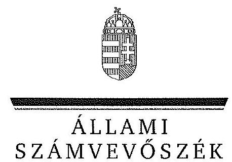
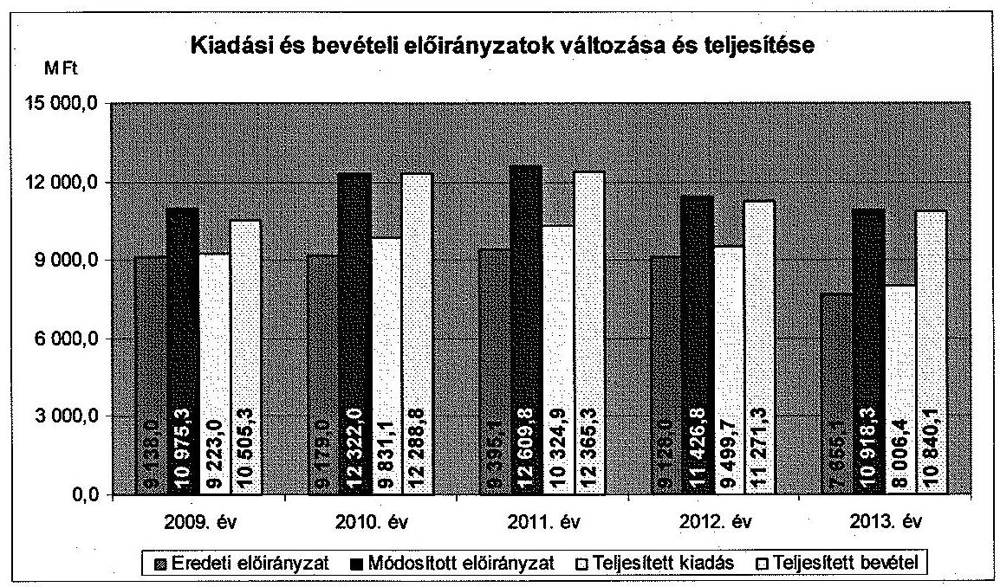
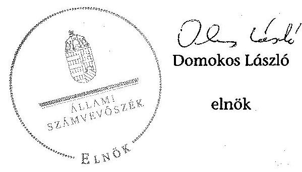
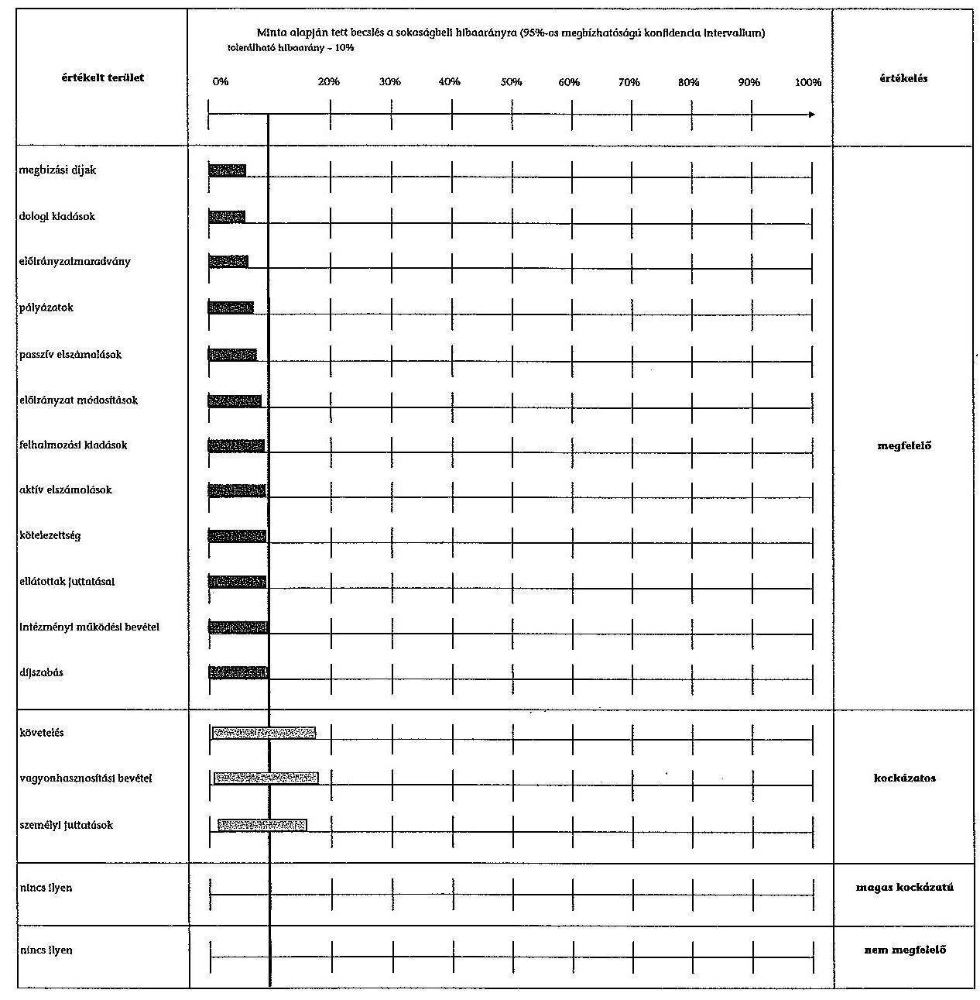
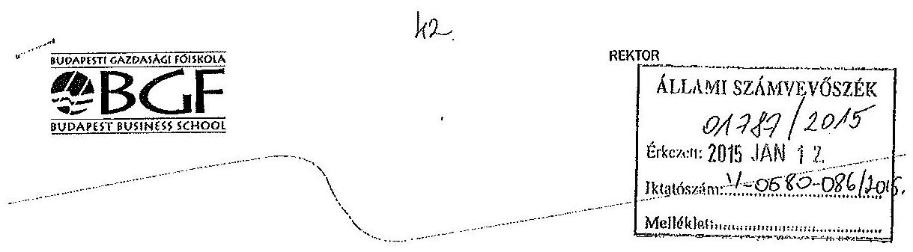

ÁLLAMI
SZÁMVEVŐSZÉK

# JELENTÉS 

a Budapesti Gazdasági Főiskola ellenőrzéséről - Az állami felsőoktatási intézmények gazdálkodásának, működésének ellenőrzése

---

# Állami Számvevőszék 

Iktatószám: V-0580-087/2015.
Témaszám: 1614
Vizsgálat-azonosító szám: V068906

## Az ellenőrzést felügyelte:

## Makkai Mária

felügyeleti vezető
Az ellenőrzést vezette és az ellenőrzés végrehajtásáért felelős:
Gál Magdolna
ellenőrzésvezető
A számvevői munkaanyagok feldolgozását és a jelentés összeállítását végezte:

Nyikon Zsigmondné Fülöppné Nagy Marianna számvevő főtanácsos számvevő tanácsos

## Az ellenőrzést végezték:

Nyikon Zsigmondné Fülöppné Nagy Marianna számvevő főtanácsos számvevő tanácsos

## Winter Zsuzsanna

számvevő főtanácsos
dr. Eke-Pekács Tibor
számvevő tanácsos

## A témához kapcsolódó eddig készített számvevőszéki jelentések:

## címe

Jelentés az oktatási és kulturális ágazat irányítási rendszerének, működésének ellenőrzéséről
Jelentés a felsőoktatás oktatási infrastruktúra-fejlesztési programjának ellenőrzéséről
Jelentés az állami felsőoktatási intézmények érdekeltségébe tartozó gazdasági társaságok támogatásának és nyereségük hasznosulásának ellenőrzéséről
Jelentés a Szolnoki Főiskola ellenőrzéséről - Az állami felsőoktatási 14196
intézmények gazdálkodásának, működésének ellenőrzése
Jelentés a Pannon Egyetem ellenőrzéséről - Az állami felsőoktatási 14197
intézmények gazdálkodásának, működésének ellenőrzése
Jelentés a Károly Róbert Főiskola ellenőrzéséről - Az állami felsőok- 14198
tatási intézmények gazdálkodásának, működésének ellenőrzése

---

Jelentés a Magyar Képzőművészeti Egyetem ellenőrzéséről - ..... 14199
Az állami felsőoktatási intézmények gazdálkodásának, működésé- nek ellenőrzése
Jelentés a Miskolci Egyetem ellenőrzéséről - Az állami felsőoktatási ..... 14200
intézmények gazdálkodásának, működésének ellenőrzése
Jelentés a Széchenyi István Egyetem ellenőrzéséről - Az állami ..... 14201
felsőoktatási intézmények gazdálkodásának, működésének ellen-őrzése
Jelentés az Eszterházy Károly Főiskola ellenőrzéséről - Az állami ..... 14204
felsőoktatási intézmények gazdálkodásának, működésének ellenőrzése
Jelentés a Magyar Táncművészeti Főiskola ellenőrzéséről - ..... 14205
Az állami felsőoktatási intézmények gazdálkodásának, működésé- nek ellenőrzése
Jelentés a Budapesti Műszaki és Gazdaságtudományi Egyetem el- ..... 14218
lenőrzéséről - Az állami felsőoktatási intézmények gazdálkodásá- nak, működésének ellenőrzése

---

.

---

# TARTALOMJEGYZÉK 

BEVEZETÉS ..... 13
I. ÖSSZEGZŐ MEGÁLLAPÍTÁSOK, KÖVETKEZTETÉSEK, JAVASLATOK ..... 17
II. RÉSZLETES MEGÁLLAPÍTÁSOK ..... 24

1. A fenntartói és az ágazati irányítási jogok gyakorlása ..... 24
2. Az intézmény belső kontrollrendszerének kialakítása és működtetése ..... 26
3. Az intézmény döntéshozó szerveinek joggyakorlása, az oktatási és egyéb tevékenységek elkülönítése, a pénzügyi gazdálkodás szabályossága ..... 28
3.1. A döntéshozó szervek gazdálkodással kapcsolatos joggyakorlása ..... 28
3.2. Az oktatási és egyéb tevékenységek elkülönítése, az ellátott feladatok átláthatósága ..... 30
3.3. Az intézmény pénzügyi egyensúlya, fizetőképessége ..... 30
3.4. Az intézmény előirányzat kezelése ..... 33
3.5. Az egyes hazai forrásból finanszírozott projektekkel való elszámolás ..... 37
4. Az intézmény vagyongazdálkodása ..... 38
4.1. A vagyongazdálkodási tevékenységek keretei ..... 38
4.2. A vagyonváltozások és a vagyonhasznosítás szabályszerűsége ..... 39
4.3. Az intézmény tulajdonosi joggyakorlásának szabályszerűsége ..... 44
5. A külső ellenőrzések hasznosulása ..... 46
5.1. Az ÁSZ ellenőrzések által tett javaslatok hasznosulása ..... 46
5.2. Az egyéb külső ellenőrzések javaslatainak hasznosulása ..... 47
6. Az integritás kontrollok kialakítása és működtetése ..... 48
MELLÉKLETEK
7. számú A Budapesti Gazdasági Főiskola kiadási és bevételi előirányzatai, azok teljesítése a 2009-2013. években
8. számú A Budapesti Gazdasági Főiskola kiadásainak, bevételeinek változása a 2009-2013. években
9. számú Kimutatás a Budapesti Gazdasági Főiskola bevételeiről és kiadásairól, valamint adósságszolgálatáról a 2009-2013. években
10. számú A Budapesti Gazdasági Főiskola mérlegadatai a 2009-2013. években
11. számú A Budapesti Gazdasági Főiskola gazdálkodása szabályszerűségének értékelése a mintatételek alapján
12. számú A Budapesti Gazdasági Főiskola rektorának nemleges észrevétele

---

# FÜGGELÉK 

1. számú Az integritás érvényesítése érdekében kialakított és működtetett intézményi kontrollrendszer

---

# RÖVIDÍTÉSEK JEGYZÉKE 

## Törvények

Áht. 1
Áht. 2
ÁSZ tv.
Eisztv.
Feot.
Gt.
Info tv.
$\mathrm{Kbt}_{1}$
$\mathrm{Kbt}_{2}$
Nftv.
Nvtv.
Sztv.
Vtv.
Korm. rendeletek
Áhsz.

Ámr. 1
Ámr. 2
Ávr.
Ber.
Bkr.
Vtvr.
51/2007. (III. 26.) Korm. rendelet

50/2008. (III. 14.) Korm. rendelet

## Határozatok

1365/2011. (XI. 8.)
Korm. határozat
1992. évi XXXVIII. törvény az államháztartásról (hatálytalan 2012. január 1-jétől)
2011. évi CXCV. törvény az államháztartásról
2011. évi LXVI. törvény az Állami Számvevőszékről
2005. évi XC. törvény az elektronikus információszabadságról (hatálytalan 2012. január 1-jétől)
2005. évi CXXXIX. törvény a felsőoktatásról (hatálytalan 2012. szeptember 1-jétől)
2006. évi IV. törvény a gazdasági társaságokról (hatálytalan 2014. március 15-től)
2011. évi CXII. törvény az információs önrendelkezési jogról és az információszabadságról
2003. évi CXXIX. törvény a közbeszerzésekről
2011. évi CVIII. törvény a közbeszerzésekről
2011. évi CCIV. törvény a nemzeti felsőoktatásról
2011. évi CXCVI. törvény a nemzeti vagyonról
2000. évi C. törvény a számvitelről
2007. évi CVI. törvény az állami vagyonról
249/2000. (XII. 24.) Korm. rendelet az államháztartás szervezetei beszámolási és könyvvezetési kötelezettségének sajátosságairól (hatálytalan 2014. január 1-jétől)
217/1998. (XII. 30.) Korm. rendelet az államháztartás működési rendjéről (hatálytalan 2010. január 1-jétől)
292/2009. (XII. 19.) Korm. rendelet az államháztartás működési rendjéről (hatálytalan 2012. január 1-jétől)
368/2011. (XII. 31.) Korm. rendelet az államháztartásról szóló törvény végrehajtásáról
193/2003. (XI. 26.) Korm. rendelet a költségvetési szervek belső ellenőrzéséről (hatálytalan 2012. január 1-jétől)
370/2011. (XII. 31.) Korm. rendelet a költségvetési szervek belső kontrollrendszeréről és belső ellenőrzéséről
254/2007. (X. 4.) Korm. rendelet az állami vagyonnal való gazdálkodásról
51/2007. (III. 26.) Korm. rendelet a felsőoktatásban részt vevő hallgatók juttatásairól és az általuk fizetendő egyes térítésekről
50/2008. (III. 14.) Korm. rendelet a felsőoktatási intézmények képzési, tudományos célú és fenntartói normatíva alapján történő finanszírozásáról

1365/2011. (XI. 8.) Korm. határozat a 2012. évi hiánycél tartását biztosító további feladatokról

---

1290/2012. (VIII. 9.) Korm. határozat

## Egyéb rövidítések

Alma Mater Tanétterem Kft. / gazdasági társaság/Kft.
ÁSZ
BGF/Főiskola/intézmény
E Ft
EMMI
értékelési szabályzat
FEUVE
FIR
Felügyelő Bizottság
Gazdasági Tanács
gazdálkodási szabályzat

GKZ
GMF
IFT
1290/2012. (VIII. 9.) Korm. határozat a költségvetési főfelügyelők és költségvetési felügyelők kirendeléséről

Alma Mater Tanétterem Szolgáltató Kft.

Állami Számvevőszék
Budapesti Gazdasági Főiskola
Ezer Ft
Emberi Erőforrások Minisztériuma
Az eszközök és források értékelési szabályzata
Folyamatba épített előzetes és utólagos vezetői ellenőrzés rendszere, 2005.09.01-től hatályos
Felsőoktatási Információs Rendszer
Alma Mater Tanétterem Kft Felügyelő Bizottsága
A Budapesti Gazdasági Főiskola Gazdasági Tanácsa
A 2006.10.13-án elfogadott, 2006.10.31-től 2010.12.02-ig hatályos gazdálkodási szabályzat, A 2010.12.03-án elfogadott, 2010.12.03-tól hatályos gazdálkodási szabályzat
Gazdálkodási Kar Zalaegerszeg
Gazdasági és Műszaki Főigazgatóság
A Budapesti Gazdasági Főiskola Intézményfejlesztési Terve. A Szenátus a 2007-2011. évek Intézményfejlesztési tervét 2008 októberében a 2008/2009. tanév 9. számú határozatával fogadta el, amelyet 2010 áprilisában módosított a 2009/2010. tanév 95. számú határozatával. A 2012-2015. évekre vonatkozó Intézményfejlesztési tervet a Szenátus 2012 júniusában a 2011/2012. tanév 72. számú határozatával fogadta el.
leltározási szabályzat
MÁK
M Ft
miniszter
minisztérium

MNV Zrt.
NEFMI
OH
OKM
önköltség számítási szabályzat
Szenátus

Az Eszközök és források leltározási és leltárkészítési szabályzata
Magyar Államkincstár
Millió Ft
A fenntartói feladatokat a felsőoktatási intézmények tekintetében a 2010. évben az OKM, majd a NEFMI, 2012. május 14-étől az EMMI minisztere gyakorolta.
A felsőoktatási intézmények tekintetében az ágazati irányítási jogokat a 2010. évben az OKM, majd a NEFMI, 2012. május 14-étől az EMMI gyakorolta.

Magyar Nemzeti Vagyonkezelő Zrt.
Nemzeti Erőforrás Minisztérium
Oktatási Hivatal
Oktatási és Kulturális Minisztérium
A Szenátus által 2008.12.05-én elfogadott, 2009.01.01-től hatályos önköltség számítási szabályzat
A Budapesti Gazdasági Főiskola Szenátusa

---

| SZMR | A Szervezeti és Működési Szabályzat 1. kötete a Szervezeti és Működési Rendről |
| :--: | :--: |
| SZMSZ | Szervezeti és Működési Szabályzat |
| teljesítésigazolás | Ámr. 1 135. §, Ámr. 2 76. § szerint 2009. január 01-2011. december 31 között szakmai teljesítésigazolás az Ávr. 57. § alapján 2012. január 01-től teljesítésigazolás |
| területi intézetek vagyongazdálkodási szabályzat | Zalaegerszegi Intézet, Salgótarjáni Intézet   A Szenátus által 2005.12.16-án elfogadott, 2005.12.16-tól 2011.04.28-ig hatályos szabályzat. A Szenátus által 2011.04.29-én elfogadott, 2011.04.29-től hatályos szabályzat |
| VIR | Vezetői Információs Rendszer |

---

# ÉRTELMEZŐ SZÓTÁR 

alapító
állami felsőoktatási intézmény saját tulajdona
állami vagyon
állami vagyon hasznosítása

A központi költségvetési szerv alapítója az Országgyúlés, a Kormány vagy a miniszter. A felsőoktatási intézmények vonatkozásában az alapítói jogokat a felsőoktatásért felelős minisztérium gyakorolja.
A felsőoktatási intézmény saját bevételének a költségek teljes körű levonása, - az adományozás és öröklés kivételével - a rendelkezésre bocsátott vagyon állagának megóvásáról, pótlásáról való gondoskodás után fennmaradt része terhére szerzett vagyona.
A Vtv. 1. § (2) bekezdése szerint állami vagyonnak minősül:
a) az állami tulajdonban lévő ingó dolog, valamint a dolog módjára hasznosítható természeti erő,
b) az állami tulajdonban lévő termőföldekből álló, külön törvényben szabályozott Nemzeti Földalap,
c) az állami tulajdonban lévő - a b) pont hatálya alá nem tartozó - ingatlan,
d) az állami tulajdonban lévő értékpapír,
e) az államot megillető társasági részesedés és más vagyoni értékű jog.
(hatályos 2010. június 16-ig)
a) az állam tulajdonában lévő dolog, valamint a dolog módjára hasznosítható természeti erő,
b) az a) pont hatálya alá nem tartozó mindazon vagyon, amely vonatkozásában törvény az állam kizárólagos tulajdonjogát nevesíti,
c) az állam tulajdonában lévő tagsági jogviszonyt megtestesítő értékpapír, illetve az államot megillető egyéb társasági részesedés,
d) az államot megillető olyan immateriális, vagyoni értékkel rendelkező jogosultság, amelyet jogszabály vagyoni értékű jogként nevesít.
(hatályos 2010. június 17-től)
A Vtv. 23. § (1) bekezdése szerint: Az állami vagyont az MNV Zrt. maga kezeli, illetve szerződés - így különösen bérlet, haszonbérlet, szerződésen alapuló haszonélvezet, vagyonkezelés, megbízás - alapján központi költségvetési szervnek, természetes vagy jogi személynek, illetőleg jogi személyiséggel nem rendelkező gazdasági társaságnak hasznosításra átengedi.
(hatályos 2010. december 31-ig)
Az állami vagyont az MNV Zrt. maga kezeli, vagy szerződés - így különösen bérlet, haszonbérlet, szerződésen alapuló haszonélvezet, vagyonkezelés, megbízás - alapján központi költségvetési szervnek, természetes vagy

---

állami vagyon hasznosítására kötött szerződés
állami vagyon használója
állami vagyon értékesítése
állami vagyon kezelője /vagyonkezelő
jogi személynek, vagy jogi személyiséggel nem rendelkező gazdálkodó szervezetnek hasznosításra átengedi.
(hatályos 2011. december 31-ig)
Az állami vagyont az MNV Zrt. maga kezeli, vagy szerződés - így különösen bérlet, haszonbérlet, megbízás alapján központi költségvetési szervnek, természetes vagy jogi személynek, vagy jogi személyiséggel nem rendelkező gazdálkodó szervezetnek hasznosításra átengedi.
(hatályos 2012. január 1-jétől)
A Vtv. 23. § (2) bekezdése szerint: Az állami vagyon hasznosítására kötött szerződések elsődleges célja az állami vagyon hatékony működtetése, állagának védelme, értékének megőrzése, illetve gyarapítása, az állami és közfeladatok ellátásának elősegítése.
A Vtvr. 1. § (7) a) pontja szerint: Az a természetes személy, jogi személy, illetve jogi személyiséggel nem rendelkező gazdasági társaság, amely az MNV Zrt.-vel kötött szerződés alapján, bármely jogcímen (bérlet, haszonbérlet, vagyonkezelés, használat stb.) állami vagyont birtokol, használ, hasznosít.
(hatályos 2010. december 31-ig)
Az a természetes személy, jogi személy, illetve jogi személyiséggel nem rendelkező szervezet, amely, illetve aki törvény vagy szerződés alapján, bármely jogcímen (pl. bérlet, haszonbérlet, vagyonkezelési szerződés, használat stb.) állami vagyont birtokol, használ, szedi annak használt, hasznosít, ide nem értve a tulajdonosi jogok gyakorlóját.
(hatályos 2011. január 1-jétől 2011. december 31-ig)
Az a természetes vagy jogi személy, jogi személyiséggel nem rendelkező szervezet, aki, vagy amely törvény vagy szerződés alapján, bármely jogcímen (bérlet, haszonbérlet, használat stb.) állami vagyont birtokol, használ, szedi annak használt, hasznosít, ide nem értve a haszonélvezőt, a vagyonkezelőt és a tulajdonosi jogok gyakorlóját.
(hatályos 2012. január 1-jétől)
Állami vagyon tulajdonjogának bármely jogcímen történő, visszterhes átruházása. (Vtvr. 1. § (7) bekezdés d) pont)
A Vtv. 23. § (1) bekezdése szerint: Az állami vagyont az MNV Zrt. maga kezeli, vagy szerződés - így különösen bérlet, haszonbérlet, szerződésen alapuló haszonélvezet, vagyonkezelés, megbízás - alapján központi költségvetési szervnek, természetes vagy jogi személynek, illetőleg jogi személyiséggel nem rendelkező gazdasági társaságnak hasznosításra átengedi. (hatályos 2010. január 1-jétől 2010. december 31-ig)

---

belső kontrollrendszer

CLF-módszer
előirányzat-maradvány
fenntartó
finanszírozási műveletek nélküli pozíció

Az állami vagyont az MNV Zrt. maga kezeli, vagy szerződés - így különösen bérlet, haszonbérlet, szerződésen alapuló haszonélvezet, vagyonkezelés, megbízás - alapján központi költségvetési szervnek, természetes vagy jogi személynek, illetőleg jogi személyiséggel nem rendelkező

 szervezetnek hasznosításra átengedi. (hatályos 2011. január 1-jétől 2011. december 31-ig)
Az állami vagyont az MNV Zrt. maga kezeli, vagy szerződés - így különösen bérlet, haszonbérlet, megbízás alapján központi költségvetési szervnek, természetes vagy jogi személynek, vagy jogi személyiséggel nem rendelkező gazdálkodó szervezetnek hasznosításra átengedi. Az állami vagyonra vonatkozóan az MNV Zrt. kizárólag az Nvtv-ben meghatározott személyekkel köthet vagyonkezelési szerződést.
(hatályos 2012. január 1-jétől)
A belső kontrollrendszer a kockázatok kezelése és tárgyilagos bizonyosság megszerzése érdekében kialakított folyamatrendszer, amely azt a célt szolgálja, hogy megvalósuljanak a következő célok:
a) a működés és gazdálkodás során a tevékenységeket szabályszerűen, gazdaságosan, hatékonyan, eredményesen hajtsák végre,
b) az elszámolási kötelezettségeket teljesítsék, és
c) megvédjék az erőforrásokat a veszteségektől, károktól és nem rendeltetésszerű használattól.
A módszer a működési és a felhalmozási költségvetés bevételeinek és kiadásainak, ezek egyenlegeinek elkülönített, majd összevont kimutatását alkalmazza valamely költségvetési intézmény pénzügyi helyzetének megítéléséhez. Kiemelten mutatja be a finanszírozási műveletek egyenlege nélküli és az azt magába foglaló pénzügyi pozíciót, valamint a tőketörlesztéssel, értékpapír beváltással csökkentett működési jövedelmet.
Az értékelés a pénzügyi kapacitás fogalmát helyezi a középpontba.
Az államháztartás központi alrendszerébe tartozó költségvetési szerveknél a módosított bevételi és kiadási előirányzatok és azok teljesítésének a Kormány rendeletében meghatározott tételekkel korrigált különbözete. (Áht. 2. § (1) bekezdés m) pontja)
A Feot. 7. § (2) bekezdése és az Nftv. 4. § (2) bekezdése szerint az, aki az alapítói jogot gyakorolja, ellátja a felsőoktatási intézmény fenntartásával kapcsolatos feladatokat.
A CLF módszer szerint számított működési és felhalmozási tevékenység pénzügyi egyenlegének összevont értéke. Megmutatja, hogy a költségvetési intézmény bevételei fedezetet biztosítottak-e a kiadásokra. A finanszírozá-

---

Gazdasági Tanács
hároméves fenntartói megállapodás
információs és kommunikációs rendszer
integritás
intézményfejlesztési terv
irányító szerv
kincstári költségvetés
si műveletek nélküli (GFS) pozíció alapján a pénzügyi helyzetet akkor tekintettük megfelelőnek, ha az adott év működési és felhalmozási bevételei fedezetet nyújtottak az adott év működési és felhalmozási kiadásaira.
A felsőoktatási intézmény javaslattevő, véleményező, a stratégiai döntések előkészítésében részt vevő, és a döntések végrehajtásának ellenőrzésében közreműködő szerve.
Az állami felsőoktatási intézmények központi költségvetési támogatására hároméves fenntartói megállapodást kell kötni az állami felsőoktatási intézmény és a fenntartó között. A fenntartói megállapodás tartalmazza a felsőoktatási intézmény által meghatározott hároméves időszakra vállalt teljesítménykövetelményeket, továbbá az állandó jellegű támogatási részeket, valamint a változó jellegű támogatások megállapításának jogcímeit. A változó elemű támogatás évenkénti elszámolási kötelezettséggel kerül meghatározásra.
A költségvetési szerv vezetője köteles olyan rendszereket kialakítani és működtetni, melyek biztosítják, hogy a megfelelő információk a megfelelő időben eljutnak az illetékes szervezethez, szervezeti egységhez, illetve személyhez.
Az integritás olyasvalakit vagy valamit jelöl, aki vagy ami romlatlan, sértetlen, feddhetetlen. Az integritás elvek, értékek, cselekvések, módszerek, intézkedések konzisztenciáját jelenti: olyan magatartásmódot, amely meghatározott értékeknek megfelel.
A szenátus fogadja el az intézményfejlesztési tervet. Az intézményfejlesztési tervben kell meghatározni a fejlesztéssel, a fenntartó által a felsőoktatási intézmény rendelkezésére bocsátott vagyon hasznosításával, megóvásával, elidegenítésével kapcsolatos elképzeléseket, a várható bevételeket és kiadásokat. Az intézményfejlesztési tervet középtávra, legalább négyéves időszakra kell elkészíteni, évenkénti bontásban meghatározva a végrehajtás feladatait. Az intézményfejlesztési terv része a foglalkoztatási terv. A foglalkoztatási tervben kell meghatározni azt a létszámot, amelynek keretei között a felsőoktatási intézmény megoldhatja feladatait. (Feot. 27. § (3) bekezdés)
A felsőoktatás ágazati irányítását - felsőoktatás szervezéssel, felsőoktatás fejlesztéssel, törvényességi ellenőrzéssel kapcsolatos feladatokat - ellátó miniszter által vezetett minisztérium. (Feot. 102. - 105/A. §, Nftv. 64 - 66. §)
A központi költségvetésről szóló törvény elfogadását követően a fejezetet irányító szerv az államháztartás központi alrendszerébe tartozó költségvetési szerv és a fejezeti kezelésű előirányzat kiemelt előirányzatait, valamint az elkülönített állami pénzalapok és a társada-

---

kockázatkezelési rendszer
kontrollkörnyezet
kontrolltevékenység
költségvetési főfelügye-
lő, felügyelő
minisztérium
monitoring
működési jövedelem
normatív költségvetési támogatás felsőoktatási
lombiztosítás pénzügyi alapjai jogszabályi előírás szerinti bevételeit és kiadásait kincstári költségvetés kiadásával állapítja meg. (Áht. 24. § (3) bekezdés, Áht. 228. § (2) bekezdés, Ávr. 31. § (2) bekezdés)
Irányítási eszközök és módszerek összessége, melynek elemei a szervezeti célok elérését veszélyeztető tényezők (kockázatok) azonosítása, elemzése, csoportosítása, nyomon követése, valamint szükség esetén a kockázati kitettség mérséklése.
A kontrollkörnyezet a költségvetési szerv vezetőinek a szervezeti célok elérését segítő kontrollok kialakításával és működtetésével, korszerűsítésével kapcsolatos magatartását, a kontrollpontokról érkező információkra való reagálását jelenti.
Azok az elvek, politikák és eljárások, amelyeket a kockázatok meghatározása és a szervezet céljainak elérése érdekében alakítanak ki.
A költségvetési szerv vezetője köteles a szervezeten belül kontrolltevékenységeket kialakítani, amelyek biztosítják a kockázatok kezelését, hozzájárulnak a szervezet céljainak eléréséhez.
Az államháztartásért felelős miniszter a Kormány irányítása alá tartozó fejezetet irányító szervhez, a Kormány irányítása vagy felügyelete alá tartozó költségvetési szervhez, valamint az elkülönített állami pénzalapok és a társadalombiztosítás pénzügyi alapjai kezelő szerveihez költségvetési főfelügyelőt, felügyelőt rendelhet ki. A költségvetési főfelügyelő, felügyelő a gazdálkodás költségvetés-politikával való összhangja és a takarékos, szabályszerű, eredményes működés érdekében a Kormány rendeletében meghatározott intézkedéseket tehet, így különösen előzetesen véleményezi a kötelezettségvállalásra irányuló eljárásokat és a nagy összegű kötelezettségvállalások tekintetében kifogással élhet. (Áht. 239. § (1)-(2) bekezdés)

A felsőoktatásért felelős minisztérium, amely 2009-től 2010 májusáig az OKM, 2010 májusától 2012 májusáig a NEFMI, 2012 májusától az EMMI volt.
A különböző szintű szervezeti célok megvalósításához szükséges folyamatok figyelemmel kísérése, melynek során a releváns eseményekről és tevékenységekről (együtt: folyamatokról) rendszeres jelleggel, strukturált, döntéstámogató információkhoz jutnak a szervezet vezetői.
A folyó bevételek és folyó kiadások egyenlege. Azt mutatja, hogy a folyó bevételek fedezetet nyújtanak-e a folyó kiadásokra.
A felsőoktatási intézmények működéséhez biztosított normatív költségvetési támogatás lehet

---

intézmények működéséhez
normatív támogatások
saját bevétel
szenátus
tárgyévi pénzügyi pozíció
a) hallgatói juttatásokhoz nyújtott,
b) képzési,
c) tudományos célú,
d) fenntartói,
e) egyes feladatokhoz nyújtott
támogatás. A központi költségvetésből biztosított normatív költségvetési támogatásra - a d) pontban meghatározott normatív költségvetési támogatás kivételével - a felsőoktatási intézmények azonos feltételek alapján válnak jogosulttá. Az a)-e) pontokban meghatározott jogcímek - az a) és e) pontban meghatározott jogcímek kivételével - nem jelentenek felhasználási kötöttséget. (Feot. 127. § (3) bekezdés)
Az ellenőrzési időszakban hatályos költségvetési törvények 3. sz. mellékletében megjelölt közoktatási hozzájárulások, az 5. sz. mellékletében megjelölt központosított előirányzatok, továbbá a 8. sz. mellékletében megjelölt normatív, kötött felhasználású támogatások együttesen.
Az államháztartáson kívüli források - beleértve minden olyan, az Európai Uniótól származó támogatást, amelyhez nem az állami költségvetésen keresztül jut a felsőoktatási intézmény, továbbá a szakképzési hozzájárulási fizetési kötelezettség teljesítéseként elszámolt forrásokat is, ide nem értve az állami vagyon értékesítésének ellenértékét - valamint a Kutatási és Technológiai Innovációs Alapból származó bevételek.
A felsőoktatási intézmény, döntést hozó és a döntés végrehajtását ellenőrző testülete. (Feot. 20. § (1) bekezdés, Nftv. 12. § (1)-(3) bekezdés)
A működési és felhalmozási bevételek, valamint kiadások egyenlege a finanszírozási műveletek egyenlegének figyelembe vételével.

---

.

---

# JELENTÉS 

## a Budapesti Gazdasági Főiskola ellenőrzéséről - Az állami felsőoktatási intézmények gazdálkodásának, működésének ellenőrzése

## BEVEZETÉS

Az ÁSZ Stratégiája ${ }^{1}$ alapértékeinek egyike, hogy az államháztartás komplex folyamatainak átláthatósága érdekében rendszerszemléletű/holisztikus megközelítésű, egymásra épülő, a szinergiahatást kihasználó, összefoglaló értékelésre lehetőséget adó ellenőrzéseket végez. Az államháztartás központi alrendszerébe tartozó felsőoktatási intézmények ellenőrzése során az Állami Számvevőszék értékeli azok pénzügyi-gazdasági helyzetét, feltárja a működésükben rejlő kockázatokat, ezzel előmozdítja a közpénzügyek átláthatóságát, rendezettségét.

Az állami felsőoktatási intézmények gazdálkodását - az Áht. ${ }_{1}$ és az Áht. ${ }_{2}$ előírásai mellett - a felsőoktatásról szóló 2005. évi CXXXIX. törvény (Feot.), valamint a nemzeti felsőoktatásról szóló 2011. évi CCIV. törvény (Nftv.) előírásai határozták meg.

Magyarország Nemzeti Reform Programja keretében, a Széll Kálmán Terv 2020-ig a 30-34 évesek körében, a felsőfokú vagy annak megfelelő végzettséggel rendelkezők arányának 30,3%-ra való növelését irányozta elő, amely a 2010. évhez képest 4,6%-pontos növekedési célkitűzést jelent. A rendezett gazdasági környezet, az önállósággal élni tudó, felelős, elszámoltatható intézményi gazdálkodói magatartás elengedhetetlen feltétele a kitűzött szakmai célok elérésének.

Az ellenőrzés célja annak megállapítása, hogy szabályos volt-e az állami felsőoktatási intézmény pénzügyi és vagyongazdálkodása, biztosított volt-e a vagyonnal való felelős gazdálkodás követelményének érvényesülése, jogszabályi előírásoknak megfelelően működött-e a belső kontrollrendszer, az irányító szerv tevékenysége a jogszabályi előírásoknak megfelelt-e.

Ennek keretében értékeltük a Budapesti Gazdasági Főiskolánál:

- a fenntartói és az ágazati irányítási jogok gyakorlása előírásoknak való megfelelőségét;

[^0]
[^0]:    ${ }^{1}$ Állami Számvevőszék: Stratégia. Az Állami Számvevőszék hivatalos stratégiai dokumentum rendszere 2011-2015. 2012. december. http://www.asz.hu/strategia/asz-strategia/asz-strategia-2011.pdf

---

- az intézmény belső kontrollrendszere jogszabályoknak megfelelő kialakítását és működtetését;
- az intézmény döntéshozó szerveinek joggyakorlása jogszabályoknak való megfelelőségét; az intézmény oktatási és egyéb (gyakorlati és kutatási) tevékenységei elkülönítését, átláthatóságát, illetve pénzügyi gazdálkodása szabályszerűségét;
- az intézmény vagyongazdálkodása előírásoknak való megfelelőségét;
- az ellenőrzött időszakban végzett külső (ÁSZ, fenntartói, KEHI, kincstári) ellenőrzések által tett javaslatok hasznosulását;
- az intézmény korrupcióval szembeni veszélyeztetettségének csökkentése érdekében az integritási szemlélet érvényesülését a gazdálkodási folyamatokban.

Az ellenőrzés várható hasznosulása: Az ellenőrzés eredményének hasznosulásaként képet kapunk a Budapesti Gazdasági Főiskolánál kialakult pénzügyi helyzetről; a kormány által kirendelt költségvetési (fő) felügyelői rendszer működésének tapasztalatairól; az oktatási és egyéb tevékenységek és költségelszámolások elhatárolásáról, átláthatóságáról és szabályosságáról. A felsőoktatási intézmények gazdálkodási szabadságának pénzügyi és vagyoni helyzetre gyakorolt hatásairól, a vagyonnal való felelős, értékmegőrző gazdálkodás érvényesüléséről, továbbá a belső kontrollrendszer működéséről. Az ellenőrzés az ellenőrzött számára visszajelzést ad a gazdálkodása kereteinek kialakításáról, a működésében fellépő hiányosságokról, javaslataival hozzájárul azok kiküszöböléséhez és a jó kormányzáshoz. A törvényalkotás számára összegzett tapasztalatok állnak rendelkezésre a felsőoktatási intézmények döntéseinek, gazdálkodásának szabályszerűségéről, amelyek alapján - indokolt esetben - jogszabály-módosítás kezdeményezhető. Az integritás kultúra kialakítása hozzájárul az elszámoltathatóság és átláthatóság érvényesítéséhez, egyben támogatja a szervezet védettségét a korrupciós kitettséggel szemben, valamint annak megelőzése is irányítottabbá válik. A társadalom számára jelzi, hogy közpénz nem maradhat ellenőrizetlenül, az ÁSZ értékteremtő rend kialakításához és megőrzéséhez hozzájáruló tevékenysége pozitív hatással lesz a szervezetről kialakított összkép formálásában.

Az ellenőrzés típusa: szabályszerűségi ellenőrzés
Az ellenőrzött időszak: 2009. január 1. - 2013. december 31.
Az ellenőrzéssel érintett szervezetek: az Emberi Erőforrások Minisztériuma és a Budapesti Gazdasági Főiskola

Az ellenőrzés jogszabályi alapját az ÁSZ tv. 1. § (3) bekezdése, az 5. § (3)-(6) bekezdései, 33. § (7) bekezdése, valamint az államháztartásról szóló 2011. évi CXCV. törvény (Áht. ${ }_{2}$ ) 61. § (2) bekezdésének előírásai képezik.

Az ellenőrzés kiterjedt minden olyan körülményre és adatra, amely az ÁSZ jogszabályban meghatározott feladataiban, valamint a program végrehajtása folyamán felmerült újabb összefüggések feltárásához szükséges volt.

---

Az ellenőrzés az INTOSAI által kiadott nemzetközi standardok figyelembe vételével, az ellenőrzési programban foglalt értékelési szempontok szerint történt.

A pénzügyi és vagyongazdálkodás terén az egyes területek szabályszerű működését mintavétellel ellenőriztük, ez alapján a sokaságban előforduló hibás tételek arányát becsültük. A jogszabályoknak és a belső előírásoknak megfelelőnek, azaz szabályszerűnek tekintettük az adott kiadási előirányzat felhasználását, bevétel beszedését, mérlegtétel értékelését, amennyiben a minta ellenőrzésének eredménye alapján 95%-os bizonyossággal a
 teljes sokaságban a hibás tételek aránya kisebb volt, mint 10%, nem megfelelőnek értékeltük, ha a hibás tételek aránya a 10%-ot meghaladta. Kockázatot, illetve magas kockázatot jeleztünk, amennyiben egy adott terület vonatkozásában a minta alapján a teljes sokaságban nem volt teljes körűen biztosított a jogszabályoknak és a belső szabályzatoknak megfelelő működés. A mintatételek kiértékelését az 5. számú melléklet tartalmazza.

A belső kontrollrendszer kialakításának és működtetésének értékelése során a jogszabályi előírások mellett az Ámr. 145/A. § (1) és (3) bekezdése, az Ámr. ² 155. § (1) és (3) bekezdése, valamint a Bkr. 5. § (1) bekezdése alapján figyelembe vettük az államháztartásért felelős miniszter által közzétett irányelvekben és módszertani útmutatókban ² foglaltakat is. A belső kontrollrendszert az értékelés során legalább 85%-os megfelelőség esetén megfelelőnek, legalább 70%-os megfelelőség esetén részben megfelelőnek, 70%-os megfelelőség alatt pedig nem megfelelőnek minősítettük.

A budapesti székhelyű 2000. január 1-jei hatállyal létrehozott Budapesti Gazdasági Főiskola (BGF) jogelődjei a Kereskedelmi, Vendéglátóipari és Idegenforgalmi Főiskola, a Külkereskedelmi Főiskola és a Pénzügyi és Számviteli Főiskola voltak. A BGF a 2009-2013. évek között önállóan működő és gazdálkodó központi költségvetési szerv volt. A Főiskola gazdaságtudományi, társadalomtudományi, bölcsészettudományi, informatikai és pedagógusképzést folytatott, valamint az intézményben oktatási, tudományos kutatási szervezeti egységként kar, intézet és intézeti tanszék működött. Az ellenőrzött időszakban a Főiskola egy gazdasági társaságban rendelkezett részesedéssel, amely gazdasági társaság részt vett a Kereskedelmi, Vendéglátóipari és Idegenforgalmi Kar hallgatói gyakorlati képzésében. Az intézmény szervezeti felépítésében az ellenőrzött időszakban két jelentős változás történt. A Zalaegerszegi Intézet 2011. november 4-től karrá vált, a Salgótarjáni Intézet a Szenátus 2013. november 25-i döntésével megszűnt, a 2013/2014-es tanévtől a hallgatók képzése Budapesten folytatódott. Az intézményt az ellenőrzött időszakban átalakítás nem érintette. A rektor személye az ellenőrzött időszakban nem változott, megbízása 2016. június 30-ig terjedő időszakra szól. A gazdasági főigazgató személyében az ellenőrzött időszakban nem volt változás. A főiskolához 2012. szeptember 1-jei hatállyal költségvetési felügyelőt rendeltek ki.

[^0]
[^0]:    ² 1/2009. (IX. 11.) PM irányelv, Pénzügyminisztérium Belső Kontroll Kézikönyv 2010.

---

A BGF főbb gazdálkodási, vagyoni és létszám adatait az alábbi táblázat mutatja be:

| Megnevezés | Főbb gazdálkodási és vagyoni adatok (ezer Ft) |  |  |  |  |  | Változót 2013/2009. (%) |
| :--: | :--: | :--: | :--: | :--: | :--: | :--: | :--: |
|  | 2009.01 .01 | 2009.12 .31 | 2010. | 2011. | 2012. | 2013. |  |
| KIADÁSI FŐÖSSZEG | 9222967 | 9222967 | 9831115 | 10224871 | 9499731 | 8006445 | 86,8 |
| BEVÉTELI FŐÖSSZEG | 10305313 | 10305313 | 12288769 | 12365348 | 11271260 | 10840056 | 103,2 |
| Költségvetési támogatások | 5730936 | 5799690 | 5500511 | 5122749 | 4617921 | 80,6 |  |
| Saját és átvett bevételek | 4774377 | 6489079 | 6864837 | 6148511 | 6222105 | 130,3 |  |
| Támogatások aránya (%) | 54,6 | 47,2 | 44,5 | 45,4 | 42,4 |  |  |
| Mérlegfőösszeg | 9613503 | 10476818 | 11718045 | 11912615 | 11949443 | 12403992 | 129,0 |
|  | Jellemző létszámadatok (Ft) |  |  |  |  |  |  |
| Oktatói létszám (Ft) | 474 | 469 | 485 | 479 | 421 | 85,8 |  |
| Hallgatói létszám (Ft) | 17911 | 17595 | 17658 | 16903 | 15598 | 87,1 |  |

*Az oktatói és hallgatói létszám az október 15-i statisztikában szereplő adat
Az BGF teljesített kiadásai a 2009-2013. évek viszonylatában 13,2%-kal csökkentek, a bevételeinek 3,2%-os növekedése mellett. A bevételeken belül a költségvetési támogatás aránya az ellenőrzött időszakban 46,7% volt, a saját és átvett bevételek 30,3%-os növekedése mellett. A hallgatói létszám 2313 fővel, 12,9%-kal esett vissza. A költségtérítéses hallgatói létszám 1130 fős növekedése, a tanfolyamok és a szabad kapacitás terhére nyújtott szolgáltatások iránti kereslet növekedés hatására az intézményi működési bevétel a 2012. évben 62,5 M Ft-tal, 2013. évben 599,0 M Ft-tal haladta meg a 2009. évi 3264,6 M Ft-ot.

Az ÁSZ a 2011. évi LXVI. törvény 29. §-a szerint a jelentéstervezetet megküldte a Budapesti Gazdasági Főiskola rektorának és az Emberi Erőforrások Minisztériuma miniszterének egyeztetésre. A Budapesti Gazdasági Főiskola rektora nemleges észrevételét a 6. számú melléklet tartalmazza. Az Emberi Erőforrások Minisztériuma minisztere az ÁSZ tv. 29. § (2) bekezdésében foglalt észrevételezési jogával nem élt, a törvényes határidőn belül észrevételt nem tett.

---

# 1. ÖSSZEGZŐ MEGÁLLAPÍTÁSOK, KÖVETKEZTETÉSEK, JAVASLATOK 

Az ellenőrzött időszakban a miniszter a jogszabályi előírásoknak megfelelően gyakorolta a fenntartói feladatokat. Alapítói jogosultsága keretében kiadta a Főiskola módosított alapító okiratát. A BGF által elkészített és megküldött SZMSZ módosításokat a fenntartó megvizsgálta és véleményezte.

A fenntartói irányítás keretében a minisztérium közreműködött a Főiskola éves költségvetésének tervezésében, meghatározta az intézmény költségvetési kereteit. A fenntartó gondoskodott az intézmény éves költségvetési beszámolóinak ellenőrzéséről, azonban a számviteli rendelkezések alapján elkészített éves költségvetési beszámolókra dokumentált értékelést nem készített. A jogszabályoknak megfelelően gyakorolta a Főiskola felső vezetőinek kinevezésével, illetve megbízásával kapcsolatos jogosultságait.

A fenntartó megkötötte az intézménnyel a 2008-2010. évekre vonatkozóan a fenntartói megállapodást, amelyben meghatározták a teljesítménykövetelményeket. A fenntartó a megállapodásban foglaltak végrehajtását évente véleményezte.

A miniszter ágazati irányítási feladatait a 2009-2013. években nem látta el teljes körűen. Elmaradt az oktatási ágazatra vonatkozóan a nemzetgazdasági miniszter irányításával és az ágazatért felelős miniszter részvételével, a kormányhatározatban előírt szervezeti és feladatellátási felülvizsgálati program kidolgozása. A felsőoktatási törvény rendelkezései ellenére a miniszter nem készíttetett a felsőoktatás rendszerére vonatkozó középtávú fejlesztési tervet.

A BGF belső kontrollrendszerének kialakítása és működtetése a 2009-2013. években részben felelt meg a vonatkozó jogszabályi előírásoknak.

A kontrollkörnyezet kialakítása összességében megfelelt a jogszabályi követelményeknek. Rendelkeztek a Szenátus által jóváhagyott, rendszeresen aktualizált SZMSZ-szel, elkészítették a gazdasági szervezet ügyrendjét, valamint a működést és gazdálkodást érintő szabályzatokat. Az SZMSZ nem tartalmazta a szervezeti egységek engedélyezett létszámadatait.

A BGF 2009-2013. évi kockázatkezelési tevékenysége részben megfelelő volt. A kockázatkezelési rendszer kialakítása részben felelt meg a jogszabályi előírásoknak, gyakorlata azonban a szabályozáson túlmutatva, több esetben célirányos, a kockázat kezelésére irányuló intézkedést hozott. Az intézmény a 2005. szeptember 1-jétől hatályos Kockázatkezelési szabályzatát - a jogszabályváltozásokat követően - nem aktualizálta, a 2009-2013. években nem végzett a jogszabálynak megfelelő kockázatelemzést, dokumentáltan nem mérte fel a tevékenységében, gazdálkodásában rejlő kockázatokat.

Az ellenőrzött időszakban a kontrolltevékenységek működtetése részben volt megfelelő, mivel 2009. évben a működési bevételek teljesítés igazolását a

---

jogszabályban előírtak ellenére nem végezték el, a 2009. évi ellátotti juttatások megállapításánál előfordult, hogy a kötelezettségvállalást nem előzte meg ellenjegyzés, illetve a 2012. december havi kifizetéshez tartozó teljesítést az arra jogosult személy aláírásával nem igazolta.

Az információs és kommunikációs rendszer kialakítása megfelelt a jogszabályi előírásoknak, a Főiskola rendelkezett az előírásoknak megfelelő szabályzatokkal és a gyakorlatban is működtek az információ átadásra vonatkozó kommunikációs rendszerek.

A monitoring rendszer a belső ellenőrzés hiányosságai miatt részben működött megfelelően. Az intézkedési javaslattal érintett 13 belső ellenőrzés egynegyedénél az ellenőrzött szervezeti egységek nem készítettek intézkedési tervet. Az elkészített intézkedési terveket a belső ellenőrzés vezetője nem véleményezte. A 2011-2013. években a jogszabályi előírás ellenére a belső ellenőrzés utóellenőrzés keretében - egy eset kivételével - nem követte nyomon az intézkedési tervben előírt feladatok megvalósulását.

A Főiskola döntéshozó szerveinek joggyakorlása, valamint a felsőoktatási normatív finanszírozási keretrendszerben a különböző jogcímeken kapott támogatások felhasználása a jogszabályi előírásoknak megfelelően történt.

Az ellenőrzött időszakban a Főiskola vezető testülete, a Szenátus ellátta jogszabályban rögzített, gazdálkodással kapcsolatos feladatait, joggyakorlása megfelelő volt. A 2007-2011. és 2012-2015. évekre elfogadta a BGF intézményfejlesztési tervét. A jogszabályi előírás ellenére a 2009-2010. évekre - előterjesztés hiányában - nem döntött az intézmény vagyongazdálkodási tervéről, a Főiskola 2011. április 29-től rendelkezett vagyongazdálkodási tervvel. A Szenátus a 2009-2013. években a rektor vezetői tevékenységét a jogszabályi előírás ellenére - a pályázati elbírálás során végzett értékelést kivéve - külön nem értékelte.

A BGF által igénybevett - felhasználási kötöttség nélküli - képzési, tudományos célú és fenntartói - normatív támogatások felhasználására vonatkozó döntések megfeleltek a jogszabályi előírásoknak és a belső szabályzatoknak. A hallgatók támogatására fordítandó kereteket a jogszabályi előírások szerinti százalékos arányban határozták meg. A BGF oktatási és egyéb tevékenységeit a számviteli nyilvántartásokban elkülönítette, az ellátott feladatok rendszere átlátható volt.

A 2009-2013. években a BGF pénzügyi gazdálkodása szabályszerű, a pénzügyi egyensúlya biztosított volt. A hallgatói létszám mérséklődéséből eredő támogatás csökkenést ellensúlyozta a saját bevétel növekedése és az intézmény magas felhasználható tartalékállománya.

A BGF a kiadási és bevételi előirányzatok tervezése során a jogszabályokban és a fenntartó által kiadott tervezési irányelvekben foglaltak szerint járt el. A bevételi és kiadási előirányzatok módosítása, azok elszámolása megfelelt a jogszabályoknak és belső szabályoknak. A 2009-2013. években a költségvetés módosított bevételi-kiadási előirányzatait betartotta.

---

Az előirányzat-maradvány megállapítása során betartották a vonatkozó jogszabályi előírásokat. A kötelezettségvállalással terhelt maradvány felhasználását dokumentumokkal alátámasztották, a kimutatott maradvány főkönyvi számlákkal, analitikus nyilvántartásokkal való összhangja, egyezősége biztosított volt.

A rendszeres és nem rendszeres személyi juttatások előirányzatának felhasználása, pénzügyi elszámolása nem felelt meg minden tekintetben a jogszabályoknak. A pénzügyi elszámolás során a 2011. évben egy esetben felmentési illetményt nem a külső személyi juttatások között számoltak el.

A külső személyi juttatások előirányzatai terhére megkötött megbízási szerződések tartalma, teljesítése megfelelt a jogszabályoknak és a belső szabályoknak.

A dologi kiadások és a felújítások, beruházások előirányzatának felhasználása a pénzügyi elszámolások, valamint a gazdálkodási jogkörök gyakorlása tekintetében megfelelt a jogszabályoknak és a belső szabályoknak. A jogszabályban előírt esetekben a közbeszerzési eljárást lefolytatták.

Az ellátotti juttatások megállapítása, kifizetése során betartották a belső szabályzatokban és jogszabályokban foglaltakat. A gazdálkodási jogköröket eseti hiba kivételével - a jogszabályi előírásnak és a belső szabályozásnak megfelelően teljesítették. A hallgatói juttatások megfeleltek a jogszabályban és az intézmény térítési és juttatási szabályzatában foglaltaknak.

Az intézményi működési bevételek beszedése a pénzügyi elszámolások, valamint a gazdálkodási jogkörök gyakorlása tekintetében megfelelt a jogszabályoknak és a belső szabályoknak. A 2009. évben a jogszabályban előírtak ellenére nem történt meg a működési bevételek teljesítés igazolása.

Az intézményi térítési díjak, költségtérítések megállapítása megfelelt a jogszabályban és a belső szabályozásban előírtaknak. A Főiskola a 2009-2013. években betartotta a jogszabályban és az önköltség számítási szabályzatban előírtakat. A hallgatók a térítési díjakat, költségtérítéseket szabályosan, előírás szerint az intézmény MÁK-nál vezetett bankszámlájára fizették be.

A tárgyi eszközök bérbeadása,
 értékesítése a pénzügyi elszámolások tekintetében nem felelt meg teljes körűen a jogszabályoknak és belső szabályoknak, mivel előfordult, hogy a Főiskola versenyeztetés mellőzésével kötött szerződést, illetve az intézmény működéséhez szükséges informatikai eszközt független szakértő értékbecslése nélkül értékesített.

A BGF a kizárólag hazai forrásból finanszírozott projektekhez, feladatokhoz pályázati úton, vagy egyéb módon nyújtott költségvetési forrással az előírásoknak megfelelően elszámolt, a kapott támogatásokat szabályszerűen használta fel. Az előírt pénzügyi, szakmai beszámolókat minden esetben elkészítették.

A BGF-nél érvényesült a vagyonnal való felelős gazdálkodás. A Főiskola a vagyonkezelésében lévő állami vagyont teljes körűen nyilvántartotta, leltárkészítési kötelezettségének folyamatosan eleget tett, a 2009-2013. évi könyvviteli mérlegei a vagyoni helyzetről megbízható és valós képet mutatnak, az ellenőrzés során feltárt hibák összege egyik évben sem érte el a jelentős összegű hibahatárt. A Feot. előírása szerint teljesítették a saját vagyon és a rendelkezésre bocsátott vagyon elkülönített nyilvántartását.

A BGF vagyongazdálkodása a 2009-2013. években részben megfelelő volt. A vagyongazdálkodással kapcsolatos tevékenységének szabályozottsága a 2009-2010. években nem volt megfelelő, mert nem rendelkezett vagyongazdálkodási tervvel, továbbá a vagyongazdálkodási szabályzat nem volt összhangban a jogszabályban és a belső szabályzatban foglaltakkal. A Főiskola az ellenőrzött időszakban a vagyonkezelésbe vett eszközök kezelésére az MNV Zrt.-vel megkötött érvényes vagyonkezelési szerződéssel rendelkezett.

A vagyon hasznosításával, értékesítésével kapcsolatos döntések részben feleltek meg a jogszabályoknak, a tárgyi eszközök bérbeadásával és értékesítésével összefüggő hiányosságok miatt. Az ingatlan értékesítés során betartották a jogszabályok rendelkezéseit. A Főiskola a bérleti szerződések megkötésekor és a már megkötött szerződéseknél az átláthatóság jogszabályban előírt követelményének érvényesüléséről meggyőződött.

A BGF a 2009-2013. években az Áhsz.-ben foglaltak szerint hajtotta végre az eszközök és források leltározását. Kockázatot jelentett ugyanakkor, hogy a 2012. év kivételével a leltározás időszakában végrehajtott selejtezés miatt a BGF nem tett eleget a selejtezési szabályzatában, és a leltározási és leltárkészítési munkákról kiadott rektori utasításokban foglaltaknak, amelyek szerint a feleslegessé vált vagyontárgyak selejtezését a leltározás megkezdése előtt kell végrehajtani. A kockázatot csökkentette, hogy a leltározás időszakában végrehajtott selejtezések szabályosak voltak.

A 2009-2013. években a BGF könyvviteli mérlegében a mérlegtételek tartalma, besorolása és értékelése nem teljes körűen felelt meg a jogszabályi előírásoknak.

A követelések esetében a mérlegtételek tartalma, besorolása, értékelése nem minden esetben felelt meg a jogszabályoknak és belső szabályoknak, mivel előfordult, hogy a BGF az adóst a 2013. évben nem minősítette és a 2011. évet követően nem tett lépéseket a 2008. évtől fennálló tartozás jogi úton történő behajtására.

Az áruszállításból és szolgáltatásnyújtásból eredő kötelezettségek esetében a mérlegtételek tartalma, besorolása, értékelése megfelelt a jogszabályoknak és a belső szabályoknak, a támogatási program előlege miatti kötelezettségeket azonban a jogszabályi előírás ellenére az egyéb rövidlejáratú kötelezettségek között nem mutatta ki.

Az aktív és a pénzügyi elszámolások esetében a mérlegtételek tartalma, besorolása, értékelése megfelelt a jogszabályi követelményeknek.

A beszerzett, létesített tárgyi eszközök besorolása, bekerülési értékének megállapítása, állományba vétele, az értékcsökkenés elszámolása megfelelt a jogszabály és a belső szabályzatok előírásainak. A befektetett eszközökön belül a tartós részesedések értéke a valóságnak megfelelően szerepelt a mérlegben.

Az intézmény vagyona a 2009. január 1-jén 9613,5 M Ft-ról 2013. december 31-re 12 404,0 M Ft-ra 29,0%-kal növekedett. Az összes eszközön belül a befektetett eszközök közel 80,0%-os részarányt képviseltek. Az ingatlanok és vagyonértékű jogok mérleg szerinti értéke a 2009. év végi 7191,8 M Ft-ról a 2013. évben 9049,3 M Ft-ra 25,8%-kal növekedett.

Az ellenőrzött időszakban a BGF - az általa alapított gazdasági társasága feletti - tulajdonosi joggyakorlása megfelelő volt.

Az ÁSZ három korábbi ellenőrzése során a felsőoktatás témakörében kilenc javaslatot fogalmazott meg a felsőoktatásért felelős minisztériumnak (OKM, NEFMI, EMMI). A minisztérium a javaslatokra intézkedési terveket készített, amelyek összesen 10 intézkedést tartalmaztak. Az intézkedések közül hármat (késéssel) megvalósítottak, hét nem valósult meg. A megvalósult intézkedések hozzájárultak a felsőoktatási intézményrendszer jobb működéséhez.

Elvégezték a felsőoktatási intézményrendszer kapacitás kihasználtságának felmérését. A felsőoktatási intézmények érdekeltségébe tartozó gazdasági társaságok ellenőrzése során feltárt hiányosságok kiküszöbölésére a minisztérium felszólította az intézményeket, amelyek a megtett intézkedésekről tájékoztatták a minisztériumot. A minisztérium tájékoztatást kért az érintett felsőoktatási intézményektől az 50% alatti intézményi részesedéssel működő gazdasági társaságok tevékenységének felülvizsgálatáról, működésük indokoltságáról és eredményességéről, valamint az intézményi részesedés megszüntetéséről és ütemezéséről.

Nem valósult meg a minisztérium felügyelete alá tartozó szervezetek feladatellátásának javítására számszerűsíthető mutatószámokon alapuló kritériumok és középtávú célrendszer kidolgozása. A felsőoktatási ágazat középtávú stratégiáját sem készítették el. Nem intézkedtek az oktatási infrastruktúra-fejlesztési programok előkészítési folyamatának hiányosságai miatti felelősség megállapítására. Nem hasznosították az állami felsőoktatási intézmények kapacitáskihasználtságával kapcsolatos felmérés eredményeit, így nem tettek intézkedést a felsőoktatási infrastruktúra közép- és hosszútávon történő hasznosítására. Nem alakítottak ki a PPP projektek támogatásához kapcsolódó követelményrendszert. Nem került sor az oktatási infrastruktúra-fejlesztési programok lebonyolításával kapcsolatos hiányosságok (kedvezőtlen feltételű szerződéskötés és kockázatmegosztás) miatti felelősség megállapítására. Nem dolgoztatták ki az állami felsőoktatási intézményekkel azok gazdasági társaságai szakmai feladatellátásának és gazdaságossági eredményességének mérését biztosító mutatószámokat és értékelési rendszert.

Az ellenőrzött időszakban a BGF-et érintő kettő ÁSZ jelentésben az intézmény számára javaslatokat nem fogalmaztak meg. A külső ellenőrzést végző szervezetek (OKM, NEFMI, KEHI) közül a 2009. és a 2010. évben a fenntartó, a 2013. évben a KEHI végzett ellenőrzést.

A főiskola az ellenőrzött időszakban erőfeszítéseket tett az integritási szemlélet fejlesztésére, valamint a korrupciós kockázatok csökkentésére, a 2013. évben önként részt vett az ÁSZ integritási felmérésében.

Az Állami Számvevőszékről szóló 2011. évi LXVI. törvény 33. § (1) bekezdésében foglaltak értelmében a jelentésben foglalt megállapításokhoz kapcsolódó intézkedési tervet köteles az ellenőrzött szervezet vezetője összeállítani, és azt a jelentés kézhezvételétől számított 30 napon belül az ÁSZ részére megküldeni. Amennyiben az intézkedési tervet határidőben nem küldi meg a szervezet, vagy az nem elfogadható, az ÁSZ elnöke a hivatkozott törvény 33. § (3) bekezdés a)-b) pontjaiban foglaltakat érvényesítheti.

Az ellenőrzés intézkedést igénylő megállapításai és javaslatai:

# a Budapesti Gazdasági Főiskola rektorának ${ }^{3}$:

1. A belső kontrollrendszer kialakítása és működtetése részben felelt meg az irányadó jogszabályi előírásoknak:
a kontrolltevékenységek működtetése részben felelt meg az Ámr., 145/A. §-a, az Ámr. ${ }_{2}$ 158. §-a és a Bkr. 8. §-a előírásainak, amely pénzügyi és vagyongazdálkodást érintő szabálytalanságokat eredményezett;
a kockázatkezelési rendszer kialakítása és működtetése részben volt megfelelő, mivel az Ámr., 145/C. §-a, az Ámr. ${ }_{2}$ 157. §-a és a Bkr. 7. §-a ellenére nem aktualizálták a kockázatkezelési szabályzatot, a kockázatok elemzése, értékelése dokumentáltan nem történt meg;
a monitoring rendszer részben volt megfelelő a belső ellenőrzés működtetésének hiányosságai miatt, mivel az nem volt összhangban a Ber. 29. § (1)-(2) bekezdései, valamint a Bkr. 45. § (3)-(4) bekezdései és a Bkr. 47. § (1) bekezdése előírásaival.

Javaslat:
Intézkedjen a jogszabályoknak megfelelő belső kontrollrendszer kialakítása és működtetése érdekében - az ellenőrzött időszak óta bekövetkezett jogszabályi változásokra figyelemmel - a kontrolltevékenységek, a kockázatkezelési rendszer és a monitoring rendszer hiányosságainak megszüntetéséről.

[^0]
[^0]:    ${ }^{3}$ Az Nftv. 2014. július 24-től hatályos módosítását követően a belső kontrollrendszer kialakításáért és működtetéséért, továbbá a pénzügyi és vagyongazdálkodásért felelős személynek.

2. A bérbeadási szerződést a Vtv. 24. § (1) bekezdésében foglaltak ellenére a versenyeztetés mellőzésével kötötték meg annak ellenére, hogy a jogszabályban meghatározott - a versenyeztetés mellőzésére vonatkozó feltételek - nem álltak fenn.

Javaslat:
Intézkedjen a bérleti szerződések versenyeztetés útján történő megkötéséről, amennyiben a versenyeztetés mellőzésének jogszabályi feltételei nem állnak fenn.

# II. RÉSZLETES MEGÁLLAPÍTÁSOK

## 1. A fenntartói és az ágazati irányítási jogok gyakorlása

Az intézmény alapítói és fenntartói feladatait az ellenőrzött időszakban az EMMI, illetve annak jogelődjei (OKM, NEFMI) látták el.

A Főiskola fenntartója 2010 májusáig az OKM, majd tárcaösszevonással a NEFMI, illetve 2012 májusától az EMMI minisztere volt.

A miniszter az ellenőrzött időszakban a jogszabályokban meghatározott fenntartói feladatainak - a feltárt kisebb hiányosságoktól eltekintve - eleget tett.

Alapítói jogosultsága keretében kiadta a Főiskola alapító okiratát és - a salgótarjáni telephely 2013. évi megszüntetésének átvezetése kivételével - annak módosításait.

A fenntartó a salgótarjáni telephely 2013. szeptember 1-i megszüntetésének alapító okiraton történő átvezetése érdekében az intézmény alapító okiratát a jogszabályi előírások ellenére ${ }^{4}$ nem módosította.

A fenntartó a Főiskola által megküldött tíz SZMSZ módosítást jogi szempontból megvizsgálta, véleményezte, a BGF rektorának, gazdasági főigazgatójának, valamint a belső ellenőrzési vezetőjének megbízásával kapcsolatos feladatokat elvégezte.

A fenntartói irányítás keretében a minisztérium részt vett a BGF éves költségvetésének tervezésében, megadta a BGF költségvetésének kereteit, a kiemelt előirányzatok főösszegeit. A fenntartó gondoskodott a 2009-2013. évi költségvetési beszámolók ellenőrzéséről ${ }^{5}$, azonban a számviteli rendelkezések alapján elkészített éves költségvetési beszámolókra dokumentált értékelést ${ }^{6}$ nem készített.

A fenntartó a 2009-2013. években egy esetben ellenőrizte a Főiskola gazdálkodását, működésének törvényességét, azonban a működés hatékonyságát ${ }^{7}$ nem ellenőrizte. A Főiskola szakmai munkájának eredményességét a fenntartó az éves gazdálkodásról készült beszámoló elfogadása keretében tudomásul vette.

Az OKM a 2009. évben ellenőrizte a BGF kötelezettségvállalási rendszere és a hallgatói tartozásállomány informatikai és számviteli nyilvántartása kialakítását és működését. A 2009. december 8-án kelt jelentés megállapításaira a BGF intézkedési tervet készített, melyet a fenntartó elfogadott.

[^0]
[^0]:    ${ }^{4}$ Nftv. 73. § (3) bekezdés a) pont
    ${ }^{5}$ Feot. 115. § (2) bekezdés h) pont, Nftv. 73. § (3) bekezdés g) pont
    ${ }^{6}$ Feot. 115. § (2) bekezdés c) pont, Nftv. 73. § (3) bekezdés b) pont
    ${ }^{7}$ Feot. 115. § (2) bekezdés ea) pont, Nftv. 73. § (3) bekezdés da) pont

A fenntartó és a Főiskola a 2008-2010. évekre vonatkozóan a jogszabály rendelkezéseivel összhangban kötötte meg a hároméves fenntartói megállapodást, amelyben meghatározták (az oktatás, a kutatás, a gazdálkodás, a vezetés és a nemzetközi és regionális együttműködés területein) a teljesítménykövetelményeket. A teljesítménycélok alakulására, a támogatások felhasználására vonatkozó - megállapodásban előírt - éves beszámolási kötelezettségét a Főiskola teljesítette, amelyet a fenntartó véleményezett.

A miniszter ágazati irányítási feladatait az ellenőrzött időszakban nem látta el teljes körűen. Hiányosság volt, hogy a vonatkozó jogszabályokban ${ }^{8}$ foglaltak ellenére nem készíttetett a felsőoktatás rendszerére vonatkozó középtávú fejlesztési tervet.

A Kormány a FIR működéséért felelős szervnek az Oktatási Hivatalt jelölte ki. Az elektronikus nyilvántartás működtetéséhez szükséges informatikai hátteret és az adatok feldolgozását az Oktatási Hivatal az Educatio Társadalmi Szolgáltató Nonprofit Kft. bevonásával látta el. A felsőoktatási ágazati információs rendszer oktatásszakmai fejlesztési koncepcióját a fenntartó elkészítette.

Az OKM Ellenőrzési Főosztálya a FIR kialakításának és működésének jogszabályi megfelelőségét 2010-ben ellenőrizte az OKM-nél, az Oktatási Hivatalnál és az Educatio Társadalmi Szolgáltató Nonprofit Kft.-nél.

Elmaradt az oktatási ágazatra vonatkozóan az 1365/2011.
 (XI. 8.) Korm. határozatban - a nemzetgazdasági miniszter irányításával és az ágazatért felelős miniszter részvételével - előírt szervezeti és feladatellátási felülvizsgálati program kidolgozása.

A kormányhatározat a miniszter számára a hatékony felsőoktatási feladatellátás érdekében közreműködési kötelezettséget írt elő követelmények és feltételek (feladatmutatók, mennyiségi és minőségi teljesítménymutatók, létszám- és költségnormák) kialakításában, a felsőoktatási intézmény-struktúra, illetve az intézményi belső működés korszerűsítési javaslatainak megtételében. A minisztérium tájékoztatása szerint a 2012. február 20-ig határidős feladatot nem végezték el, mert nem rendelkeztek információval a kormányhatározat 1. pontjában megjelölt miniszteri munkabizottság működéséről, valamint az általa kidolgozott módszertani útmutatóról, amely a munkálatokhoz adott volna iránymutatást ${ }^{9}$.

[^0]
[^0]:    ${ }^{8}$ Feot. 104. § (1) bekezdés b) pont, Nftv. 64. § (3) bekezdés a) pont
    ${ }^{9}$ Az 1365/2011. (XI. 8.) Korm. határozat 1. pontjának felelősei az NGM miniszter, a Miniszterelnökséget vezető államtitkár, a KIM miniszter voltak.

---

# 2. AZ INTÉZMÉNY BELSŐ KONTROLLRENDSZERÉNEK KIALAKÍTÁSA ÉS MŰKÖDTETÉSE 

A BGF belső kontrollrendszerének kialakítása és működtetése a 2009-2013. években részben felelt meg a vonatkozó jogszabályi előírásoknak ${ }^{10}$. A kontrollkörnyezet kialakítása és az információs-kommunikációs rendszer megfelelő volt, a kontrolltevékenység alkalmazása, a monitoring rendszer és a kockázatkezelés részben volt megfelelő.

A kontrollkörnyezet kialakítása - néhány esetben a szabályzatok aktualizálásának elmaradása ellenére - megfelelt a jogszabályi követelményeknek. Az intézmény rendelkezett a Szenátus által jóváhagyott, rendszeresen aktualizált, az oktatási, kutatási, szervezeti, működési és gazdálkodási autonómiáját biztosító SZMSZ-szel, elkészítette a gazdasági szervezet ügyrendjét, valamint a működést és gazdálkodást érintő szabályzatokat. Az SZMSZ-ben a jogszabályi előírások ellenére ${ }^{11}$ a szervezeti egységek engedélyezett létszámát nem határozták meg.

A 2010-2013. években az ellenőrzési nyomvonalat a jogszabály előírása ellenére ${ }^{12}$ nem aktualizálták, az ügyrend nem tartalmazta a helyettesítés rendjét és részben szabályozta a gazdasági szervezet belső és külső kapcsolattartásának módját ${ }^{13}$. A 2009-2013. években hatályos leltározási szabályzat nem tért ki a könyvviteli mérlegben értékkel nem szereplő, használt és használatban levő készletek, kis értékű immateriális javak, tárgyi eszközök leltározásának módjára ${ }^{14}$.

A BGF a 2009-2013. években kialakította az erőforrásokkal való szabályszerű és hatékony gazdálkodáshoz szükséges teljesítménykövetelményeket, mennyiségi és minőségi mutatószámokat, amelyeket az OKM-mel a 2008-2010. évekre szóló hároméves fenntartói megállapodásban rögzítettek. Az intézmény a mutatószám rendszer alakulásáról, teljesüléséről az éves költségvetési beszámolók keretében adott számot, melyet a fenntartó elfogadott.

A BGF 2009-2013. évi kockázatkezelési tevékenysége részben megfelelő ${ }^{15}$ volt. A kockázatkezelési rendszer kialakítása részben felelt meg a jogszabályi előírásoknak. Az intézmény a 2005. szeptember 1-jétől hatályos Kockázatkezelési szabályzatát - a jogszabályváltozásokat követően - nem aktualizálta. Az intézmény a 2009-2013. években nem végzett a jogszabálynak megfelelő kockázatelemzést, dokumentáltan nem mérte fel a tevékenységében, gazdálkodásában rejlő kockázatokat ${ }^{16}$.

[^0]
[^0]:    ${ }^{10}$ Áht. ${ }_{1}$ 120/B. § 2010. december 31-ig, illetve 121. §-a 2011. január 1-től, Ámr. ${ }_{1}$ 145/AH. §, Áht. ${ }_{2}$ 69. §, Ámr. ${ }_{2}$ 155-160. §; illetve Bkr. 3-10. §.
    ${ }^{11}$ Ámr. ${ }_{1}$ 13/A. § (3) bekezdés e) pont, Ámr. ${ }_{2}$ 20. § (2) bekezdés e) pont, Ávr. 13. § (1) bekezdés e) pont
    ${ }^{12}$ Ámr. ${ }_{2}$ 156. § (2) bekezdés, Bkr. 6.§ (3) bekezdés
    ${ }^{13}$ Ámr. ${ }_{2}$ 20. § (7) bekezdés, Ávr. 13. § (5) bekezdés
    ${ }^{14}$ Áhsz. 37.§ (6) bekezdés
    ${ }^{15}$ Ámr. ${ }_{1}$ 145/C. §, Ámr. ${ }_{2}$ 157. §, Bkr. 7. §
    ${ }^{16}$ Ámr. ${ }_{1}$ 145/C. § (2) bekezdés, Ámr. ${ }_{2}$ 157. § (2) bekezdés, Bkr. 7. § (2) bekezdés

---

Az intézmény kockázatkezelési gyakorlata azonban a szabályozáson túlmutatott, mert a gazdasági változásokból fakadó kockázatok kivédésére, az intézményi költségvetés pozitív egyenlegének fenntartása érdekében több esetben célirányos, a kockázat kezelésére irányuló intézkedést hozott, pl. a 2013. évi központi költségvetési támogatások csökkentésének kivédésére, a bevételek növelésére. Az irányítószerv előírása szerint a 2011-2013. években elkészítette az intézményi szintű kockázati szintfelmérést.

A BGF a 2009-2013. években a kontrolltevékenységek működtetése részben volt megfelelő a folyamatba épített, illetve a vezetői ellenőrzés hiányossága miatt. A 2009. évben a működési bevételek teljesítés igazolását a jogszabályban előírtak ellenére ${ }^{17}$ nem végezték el. A 2009. évi ellátotti juttatások megállapításánál előfordult, hogy a kötelezettségvállalást nem előzte meg ellenjegyzés ${ }^{18}$, illetve a 2012. december havi kifizetéshez tartozó teljesítést az arra jogosult személy aláírásával nem igazolta ${ }^{19}$.

A BGF-nél az információs és kommunikációs rendszer kialakítása a 2009-2013. években megfelelt a jogszabályi előírásoknak. 2009-től az SZMSZ-be beépült a Főiskola kapcsolattartási rendje, amely tartalmazta az információátadásra vonatkozó rendelkezéseket, és az adatkezelés rendjét is. A 2010. évtől kezdődően kialakították és folyamatosan fejlesztették a vezetői információs rendszert, meghatározták a szükséges információk körét és a hozzáférési jogosultságokat, a beszámolási szinteket, határidőket. A VIR működtetéséhez az IT támogatást folyamatos üzemeltetési szerződéssel biztosították. A BGF a FIR-rel kapcsolatos előírt adatszolgáltatási kötelezettségét teljesítette, mind a hallgatói, doktorjelölti és az alkalmazotti személyi-törzsre vonatkozóan. A Főiskola a jogszabályban előírt közérdekű adatait honlapján közzétette.

A BGF-nél 2009-2013. években a monitoring rendszer működtetése részben felelt meg a jogszabályi ${ }^{20}$ előírásoknak, a belső ellenőrzés hiányosságai miatt.

A Főiskola az oktatási és gazdálkodási tevékenységre kialakította monitoring rendszerét. A gazdálkodási területek monitorozását az EGR, a Nexon, valamint a VIR rendszerrel végezték, a hallgatói információs rendszer monitorozása a NEPTUN igénybevételével történt.

A belső ellenőrzés feladatkörét az SZMSZ és - 2010. évtől kezdődően - a belső ellenőrzési kézikönyv határozta meg, a belső ellenőrzési kézikönyv kétévenkénti felülvizsgálatát ${ }^{21}$ késedelemmel 2013. februárban teljesítették. A vonatkozó jogszabályi rendelkezések ellenére három ellenőrzéshez nem készült intézkedési terv $^{22}$.

[^0]
[^0]:    ${ }^{17}$ Ámr. ${ }_{1}$ 135. (1) bekezdés
    ${ }^{18}$ Ámr. ${ }_{1}$ 134. § (8) bekezdés, 2009. évben kötelezettségvállalási szabályzat 5. §
    ${ }^{19}$ Ávr. 57. § (3) bekezdés, 2012. évben kötelezettségvállalási szabályzat 6. §
    ${ }^{20}$ Áht. ${ }_{1}$ 121. § (1) bekezdés, 121/A. és 121/B. §-ai, Ámr. ${ }_{2}$ 160. § (2) bekezdés, Bkr. 10. §
    ${ }^{21}$ Bkr. 17. § (4) bekezdés
    ${ }^{22}$ Ber. 29. § (1) bekezdés, Bkr. 45. §. (3) bekezdés

---

A belső ellenőrzés a 2009-2013. évek között tizenöt gazdálkodással kapcsolatos ellenőrzést végzett és közülük tizenhárom esetében készült javaslat. Az ellenőrzött egységek tíz jelentéshez készítettek - felelősök és határidő megjelölésével - intézkedési tervet.

Az elkészített intézkedési terveket a belső ellenőrzési vezető nem véleményezte ${ }^{23}$. Az elvégzett ellenőrzésekről nyilvántartást vezettek és éves összefoglaló jelentést készítettek. A belső ellenőrzések megállapításai az intézkedési tervek elkészítésének elmulasztása miatt, nem minden esetben hasznosultak. A 2011-2013. években a jogszabályi előírás ellenére ${ }^{24}$ a belső ellenőrzés utóellenőrzés keretében egy esetben követte nyomon az intézkedési tervben előírt feladatok megvalósulását.

# 3. AZ INTÉZMÉNY DÖNTÉSHOZÓ SZERVEINEK JOGGYAKORLÁSA, AZ OKTATÁSI ÉS EGYÉB TEVÉKENYSÉGEK ELKÜLÖNÍTÉSE, A PÉNZÜGYI GAZDÁLKODÁS SZABÁLYOSSÁGA 

A 2009-2013. években a BGF pénzügyi gazdálkodása szabályszerű, a pénzügyi egyensúlya biztosított volt. A hallgatói létszám mérséklődéséből eredő támogatás csökkenést ellensúlyozta a saját bevétel növekedése és az intézmény magas felhasználható tartalékállománya. Az ellenőrzött időszakban az intézmény mindvégig megtartotta fizetőképességét.

### 3.1. A döntéshozó szervek gazdálkodással kapcsolatos joggyakorlása

A Főiskola döntéshozó szerveinek joggyakorlása, a felsőoktatási normatív finanszírozási keretrendszerben a különböző jogcímeken kapott támogatások felhasználása a jogszabályi előírásoknak megfelelően történt.

A 2009-2013. évek között a Szenátus gazdálkodással kapcsolatos joggyakorlása megfelelt a vonatkozó előírásoknak ${ }^{25}$. A BGF a 2007-2011. és 2012-2015. évekre rendelkezett a Szenátus által elfogadott intézményfejlesztési tervvel, illetve annak részeként kutatás-fejlesztési innovációs stratégiával, képzési programmal. A Szenátus elfogadta a minőség és teljesítmény alapján differenciáló jövedelemelosztás elveit, a szervezeti és működési szabályzatot, a fenntartó által meghatározott keretek között a BGF költségvetését, a számviteli rendelkezések alapján elkészített éves beszámolót, döntött fejlesztések indításáról, véleményezte a rektori pályázatokat ${ }^{26}$.

[^0]
[^0]:    ${ }^{23}$ Ber. 29. § (2) bekezdés, Bkr. 45. §. (4) bekezdés
    ${ }^{24}$ Ber. 8. § f) pont, Bkr. 47. § (1) bekezdés
    ${ }^{25}$ Feot. 27. § (3), (4) bekezdés, (6) bekezdés a)-e) pont és az Nftv. 12. § (3) bekezdés a)-c) és ea)-ee) pont
    ${ }^{26}$ Feot. 27. § (5) és (8) bekezdés a) pont; Nftv. 12. § (3) bekezdés d) és ga) pont

---

A Szenátus a 2009-2013. években a rektor vezetői tevékenységét a jogszabályi előírás ellenére ${ }^{27}$ - a pályázati elbírálás során végzett értékelést kivéve - külön nem értékelte. A Szenátus - előterjesztés hiányában - a 2009-2010. évekre a BGF vagyongazdálkodási tervéről nem döntött ${ }^{28}$. Az intézmény 2011. április 29-től rendelkezett a Szenátus által - 2012. szeptember 1-jét követően a fenntartó egyetértésével - jóváhagyott vagyongazdálkodási tervvel.

A 2009-2013. években a BGF gazdasági társaságot nem alapított, gazdálkodó szervezetben részesedést nem szerzett. A 2009-2013. években a Szenátus nem döntött fejlesztési célú hitelfelvételről, a BGF hitelt nem vett fel.

A BGF által igénybevett felhasználási kötöttség nélküli - képzési, tudományos célú és fenntartói - normatív támogatások felhasználására vonatkozó döntések megfeleltek a jogszabályi előírásoknak és a belső szabályzatoknak ${ }^{29}$. A 2009-2013. években a Szenátus - a vonatkozó előírásnak megfelelően - az elemi költségvetés jóváhagyása keretében döntött a képzési, tudományos célú és fenntartói normatív támogatás Gazdasági Tanács véleményével ellátott ${ }^{30}$ felosztásáról központi és a decentralizált részre, a szervezeti egységekhez történő támogatás eljuttatásáról és az elszámolás módjáról.

Az ellenőrzött időszakban a Főiskola decentralizált gazdálkodást folytatott. A karok/a területi intézetek részére a fenntartási és működési kiadások fedezetére a Főiskola költségvetésében gazdálkodási keret állt rendelkezésre. A költségvetési keret karok és területi intézetek részére történő felosztása, az igények figyelembevételével történt.

A támogatás szervezeti egységekhez történő eljuttatásának rendjét az egységes adatbázison alapuló teljes körű ügyviteli szolgáltató, gazdálkodási rendszer (TÜSZ) biztosította, amely a karok/területi intézetek decentralizált és a Főiskola egységes gazdálkodását jelentette.

A hallgatók támogatására fordítandó kereteket a jogszabályi előírások ${ }^{31}$ szerinti %-os arányok alapján határozták meg.

Az elemi költségvetés elfogadását követően a karok (decentralizált gazdálkodó egységek) februárban, és szeptemberben (a félév kezdetekor) a ténylegesen beiratkozott létszám alapján osztották fel a hallgatói előirányzatokat a jogszabály és a Főiskola térítések és juttatások szabályzatában előírtak szerint.

A 2009-2013. években a BGF a
 hallgatók részére nyújtható támogatások jogcímeit és feltételeit a hatályos Főiskolai Térítések és juttatások szabályzata szerint egy tanév időtartamára előre megállapította és azt az intézményben szokásos módon közzétette. A BGF a hallgatói juttatási előirányzatok fel-

[^0]
[^0]:    ${ }^{27}$ Feot. 27. § (5) bekezdés, Nftv. 12. § (3) bekezdés d) pont
    ${ }^{28}$ Feot. 27. § (6) bekezdés d) pont
    ${ }^{29}$ 50/2008. (III. 14.) Korm. rendelet 9. § (2) bekezdés
    ${ }^{30}$ Feot. 20. § (2) bekezdés, 25. § (1) bekezdés ac) pont
    ${ }^{31}$ 51/2007. (III. 26.) Korm. rendelet 8-9. §-a

---

használásáról az éves költségvetési beszámoló keretében készített elszámolást.

# 3.2. Az oktatási és egyéb tevékenységek elkülönítése, az ellátott feladatok átláthatósága 

A 2009-2013. években a BGF oktatási és egyéb tevékenységeit elkülönítette, az ellátott feladatok rendszere átlátható volt. A számviteli nyilvántartásokban a jogszabályi előírásoknak megfelelően ${ }^{32}$ szakfeladatok, valamint a főkönyvi számlák alábontása mellett az egyes tevékenységek bevételeinek és kiadásainak elkülönítését témaszámok kialakításával biztosították.

A témaszámok (karok, intézetek, üzemeltetés, központi irányítás, pályázatok) kialakítása alapvetően a szervezeti felépítést követte, melyeket tovább részleteztek konkrét képzések, feladatok, pályázatok szerint.

### 3.3. Az intézmény pénzügyi egyensúlya, fizetőképessége

A BGF pénzügyi egyensúlya, folyamatos fizetőképessége a 2009-2013. években biztosított volt, likviditási problémái nem voltak. A stabil pénzügyi egyensúlyt támasztják alá a BGF likviditási mutatói. A likviditási ${ }^{33}$ és a pénzeszköz likviditási ${ }^{34}$ mutató az ellenőrzött időszak valamennyi évében jelentősen magasabb volt a szakmailag elvárható 1-es értéknél. Ez annak eredménye, hogy a főiskolát hosszú lejáratú kötelezettség nem terhelte, és a rövid lejáratú kötelezettségének összege (amely szállítói tartozás volt) nem volt magas. A szállítói állomány a 2009. év végén 41,1 M Ft volt, a 2013. év végére azonban a teljes szállítóállomány kifizetésre került, a mérlegben kötelezettség, illetve szállítói állomány nem szerepelt.

[^0]
[^0]:    ${ }^{32}$ Áhsz. 8. § (19) bekezdés, 9. számú melléklet számlaosztályok tartalmára vonatkozó előírások 11., 12. pont
    ${ }^{33}$ A likviditási mutató azt mutatja, hogy a rövid lejáratú fizetési kötelezettségek kiegyenlítéséhez a forgóeszközök milyen arányban nyújtanak fedezetet. A 2009. évben 53,3; a 2010. évben 7,0; a 2011. évben 40,1; a 2012. évben 85,5; a 2013. évben a mérlegben rövid lejáratú kötelezettséget nem mutattak ki, ezért ebben az évben a likviditási mutató nem értelmezhető.
    ${ }^{34}$ A pénzeszköz likviditási mutató kifejezi, hogy a pénzeszközök év végi állománya milyen arányban nyújt fedezetet a rövid lejáratú fizetési kötelezettségekre. A 2009. évben 49,7; a 2010. évben 6,6; a 2011. évben 37,9; a 2012. évben 79,5, a 2013. évben a mérlegben rövid lejáratú kötelezettséget nem mutattak ki, ezért ebben az évben a pénzeszköz likviditási mutató nem értelmezhető.

---

A BGF pénzügyi helyzetét a CLF módszer segítségével elemeztük. (3. számú melléklet). A BGF pénzügyi pozícióját, működési jövedelmét, felhalmozási költségvetési egyenlegét, nettó működési jövedelmét az alábbi táblázat szemlélteti M Ft-ban:

| Megnevezés | 2009. év | 2010. év | 2011. év | 2012. év | 2013. év |
| :--: | :--: | :--: | :--: | :--: | :--: |
| Folyó bevételek | 9017,5 | 9297,3 | 8773,2 | 8827,0 | 8820,3 |
| Folyó kiadások | 8423,8 | 8622,7 | 8945,8 | 8563,2 | 7733,5 |
| Működési jövedelem | 593,7 | 674,6 | $-172,6$ | 263,8 | 1086,8 |
| Felhalmozási bevételek | 730,0 | 1059,1 | 1134,5 | 403,8 | 248,2 |
| Felhalmozási kiadások | 799,1 | 1208,4 | 1379,1 | 936,5 | 272,9 |
| Felhalmozási költségvetés egyenlege | $-69,1$ | $-149,3$ | $-244,6$ | $-532,7$ | $-24,7$ |
| Folyó és felhalmozási bevételek összesen | 9747,5 | 10356,4 | 9907,7 | 9230,8 | 9068,5 |
| Folyó és felhalmozási kiadások összesen | 9222,9 | 9831,1 | 10324,9 | 9499,7 | 8006,4 |
| Finanszírozási műveletek nélküli pozíció | 524,6 | 525,3 | $-417,2$ | $-268,9$ | 1062,1 |
| Finanszírozási műveletek egyenlege | 634,0 | 25,8 | $-5,7$ | $-20,9$ | 8,2 |
| Tárgyévi pénzügyi pozíció | 1158,6 | 551,1 | $-422,9$ | $-289,8$ | 1070,3 |
| Hiteltörlesztés, értékpapír beváltás | 0 | 0 | 0 | 0 | 0 |
| Nettó működési jövedelem | 593,7 | 674,6 | $-172,6$ | 263,8 | 1086,8 |

Az ellenőrzött időszakban - 2011. év kivételével - kedvező tendencia volt tapasztalható a működési jövedelem, valamint 2013-ban a felhalmozási költségvetés egyenlegének változásában. Az ellenőrzött időszak egészét tekintve 2446,3 M Ft működési jövedelemtöbblet keletkezett, amelynek 44,4 %-a 2013-ban képződött. A folyó bevételek - 2011. év kivételével - fedezték a folyó kiadásokat. A BGF költségvetési támogatása a hallgatói létszám csökkenése miatt a 2012. évben 608,2 M Ft-tal, a 2013. évben 1113,0 M Ft-tal maradt el a 2009. évitől. Kedvező tendencia mutatkozott ugyanakkor az intézményi működési bevételek növekedésében. A költségtérítéses hallgatói létszám növekedése, a tanfolyamok és a szabad kapacitás terhére nyújtott szolgáltatások iránti kereslet növekedés hatására az intézményi működési bevétel a 2012. évben 62,5 M Ft-tal, a 2013. évben 599,0 M Ft-tal haladta meg a 2009. évi 3264,6 M Ft-ot.

A finanszírozási műveletek nélküli pozíció a 2009. és a 2013. évek között 537,5 M Ft-tal javult. A 2009, 2010. és 2013. években a pozitív nettó működési jövedelem fedezte a fejlesztési többlet kiadásokat, a 2011. és a 2012. években a

---

folyó és felhalmozási költségvetés együttes finanszírozási igényét az előző évi előirányzat-maradvány igénybevételével biztosították.

A BGF a 2009-2013. években hitelt nem vett fel, tőketörlesztési kötelezettsége nem volt, a 2009. évben 650,0 M Ft értékpapír értékesítéséből származó bevétel kivételével, a finanszírozási műveletek egyenlegét kizárólag az egyéb aktív és passzív pénzügyi elszámolások határozták meg. A BGF tárgyévi pénzügyi pozíciója az ellenőrzött időszakban változó volt, a 2009. évi kedvező pénzügyi pozíció a 2010-2012. években romlott, a 2013. évben javult ${ }^{35}$.

A 2010-2012. évek csökkenésének okai a költségvetési támogatások visszaesése, továbbá a végrehajtott beruházások, felújítások voltak. Az utóbbiak eredményeként a BGF vagyonállománya jelentősen gyarapodott, a tárgyi eszközök értéke a 2009. évi 8193,0 M Ft-ról 2012. évre 9862,2 M Ft-ra növekedett. A 2013. évben kiugróan nagy összegű pénzügyi pozíciót a magas működési jövedelem és a mérséklődött felhalmozási hiány együttesen eredményezte.

A nettó működési jövedelem megegyezett a működési jövedelemmel, mert a BGF az ellenőrzött időszakban hitelt nem vett fel, értékpapírral a 2009. év elején rendelkezett.

A BGF saját bevételének átmenetileg szabad pénzeszközeit folyamatosan (2007-2009. között) kincstárjegybe fektette, ennek eredményeként a 2009. év elején értékpapír állománya 650,0 M Ft volt.

Az ellenőrzött öt évben zárolással összesen 1014,2 M Ft-ot vontak el az intézménytől. Az elrendelt összesen 3872,7 M Ft maradványtartási kötelezettség 1415,0 M Ft végleges forrásmegvonást jelentett. A költségvetés egyensúlyát biztosító intézkedések szigorú gazdálkodási fegyelmet követeltek meg az intézménytől, de a működőképességét és a feladat ellátását nem veszélyeztették, likviditási problémát nem okoztak.

A BGF-nél Kincstári biztos kijelölésére nem került sor, 60 napon túli tartozásállománya az ellenőrzött évek egyikében sem érte el az eredeti kiadási előirányzat 3,5 %-át, vagy az 50 M Ft-ot ${ }^{36}$. A nemzetgazdasági miniszter 2012. szeptember 1-i hatállyal, egy éves időtartamra költségvetési felügyelőt bízott meg, azzal a céllal, hogy a Főiskolánál folyamatos kontroll valósuljon meg a gazdálkodás és kötelezettségvállalás tekintetében. A megbízás további egy évre meghosszabbításra került.

A költségvetési felügyelő 2013. évet értékelő jelentésében megállapította, hogy a takarékossági és bevételszerzési intézkedések eredményessége tükröződik a költségvetési teljesítési adatokban, mivel a főiskolának adósságállománya a 2013. évben sem keletkezett.

[^0]
[^0]:    ${ }^{35}$ A 2010. évben 551,1 M Ft, a 2011. évben -422,9 M Ft, a 2012. évben -289,8 M Ft volt.
    ${ }^{36}$ Ámr. 2164. § (1) bekezdés a) pont, 2013.06.29-ig Áht. ${ }_{2}$ 71. § (1) bekezdés

---

# 3.4. Az intézmény előirányzat kezelése 

A BGF költségvetési kiadásainak és bevételeinek részletes adatait kiemelt előirányzatonként az 1. számú melléklet tartalmazza.

A BGF pénzügyi gazdálkodása a 2009-2013. években szabályszerű volt. A költségvetés tervezéséhez kapcsolódó feladatokat a belső szabályzataiban, GMF Ügyrendjében, Gazdálkodási Szabályzatban, GMF Főigazgatói utasításban meghatározta. A kiadási és bevételi előirányzatok tervezése során a jogszabályoknak ${ }^{37}$ és a fenntartó által kiadott tervezési irányelveknek megfelelően járt el. A 2009-2013. években a mellékszámítással megalapozott költségvetési javaslatát elkészítette és megküldte a fenntartó részére.

A BGF bevételi és kiadási előirányzatainak megállapítása megfelelt a jogszabályi előírásoknak és a belső szabályzatokban foglaltaknak. A 2009-2013. években a fejezetet irányító szerv által véglegesített kincstári költségvetés és a BGF elemi költségvetése, kiemelt előirányzati szinten megegyezett.

A bevételi és kiadási előirányzatok módosítása, azok elszámolása megfelelt a jogszabályoknak és a belső szabályoknak.

A BGF éves előirányzat-módosításait az alábbi táblázat mutatja be (M Ft):

| Megnevezés | 2009. év | 2010. év | 2011. év | 2012. év | 2013. év |
| :-- | --: | --: | --: | --: | --: |
| Országgyűlési hatáskör | 0 | 0 | $-523,1$ | 0 | 0 |
| Kormányzati hatáskör | $-8,4$ | $+28,0$ | $+49,9$ | $-198,4$ | $+264,9$ |
| Fejezeti hatáskör | $+100,7$ | $+32,0$ | $+4,4$ | $+221,6$ | $+1049,5$ |
| Intézményi hatáskör | $+1745,0$ | $+3083,8$ | $+3683,5$ | $+2275,6$ | $+1948,8$ |
| Összesen | $+1837,3$ | $+3143,8$ | $+3214,7$ | $+2298,8$ | $+3263,2$ |

Az államháztartás egyensúlyának megőrzése érdekében országgyűlési hatáskörben az intézménytől a 2011. évben 523,1 M Ft-ot vontak el.

Az ellenőrzött időszak alatt kormányzati hatáskörben jellemző volt a pótelőirányzatok biztosítása, amelyek bérkompenzációhoz, kereset-kiegészítésekhez, és a létszámcsökkentés egyszeri többletkiadásainak támogatásához kapcsolódtak.

Irányító szervi hatáskörben az előirányzat-módosítások támogatásokhoz kapcsolódó kutatási szakfeladatok ellátásához, többletbevétel felhasználásának jóváhagyásához, működési célú szakfeladat ellátásához kapcsolódtak.

Intézményi hatáskörben elsősorban előző évi előirányzat-maradvány igénybevételéhez, kötelezettségvállalásoknak megfelelő keretrendezésekhez kapcsolódó előirányzat-módosítások voltak.

Az előirányzat-módosítások eljárásrendjét a GMF ügyrend szabályozta.

[^0]
[^0]:    ${ }^{37}$ Áht. ${ }_{1-2}$, Ámr. ${ }_{1-2}$, Ávr.

---

Az intézményt érintő előirányzat-módosítások átvezetése a számviteli nyilvántartásokon megfelelt az előírásoknak.

A BGF eredeti és módosított előirányzatainak változását, és kiadási és bevételi teljesülését 2009-2013. között a következő ábra szemlélteti:

A BGF eredeti előirányzata a 2009-2012. év között jelentősen nem változott, a 2013. évben csökkent. A 2013. évi eredeti előirányzat a 2009. évhez képest 1483,0 M Ft-tal (16,2 %-kal) esett vissza a költségvetési támogatás mérséklődésének hatására. A hallgatói létszám csökkenése miatt az irányítószervtől eredetileg előirányzott támogatás 1718,6 M Ft-tal
 (29,9\%) csökkent. A bevételkiesést ellensúlyozta a támogatásértékű működési és felhalmozási bevételek, valamint az intézményi működési bevételek növekedése.

A 2009-2013. években az előirányzat-módosítások növekvő tendenciát mutattak. Évközben az előirányzatokat a támogatásértékű bevételekből, intézményi működési bevételből, valamint az irányítószervtől kapott támogatásokból növelték az előző évi maradvány átvételén és felhasználáson felül.

A Főiskola a 2009-2013. években az előirányzatok teljesítése során, a költségvetés módosított bevételi-kiadási főösszegét, valamint a kiadások módosított kiemelt előirányzatait az egyes években betartotta.

A BGF a 2009-2013. években összesen 57 270,7 M Ft bevételt realizált és összesen 46 885,1 M Ft kiadást teljesített. A 2009. évi teljesített költségvetési kiadás 9223,0 M Ft-ról 2013-ra 8006,4 M Ft-ra, (13,2\%-kal) csökkent. A működési kiadáson belül a dologi kiadások 2192,0 M Ft-ról 2079,8 M Ft-ra (5,1 százalékpont) csökkenése volt nagyobb mértékű, de a személyi juttatásokra teljesített kiadások is (4,7 százalékponttal) mérséklődtek.

Az BGF kiadási és bevételi előirányzatait és azok teljesítését az 1. sz. melléklet, az BGF kiadásainak és bevételeinek változásait a 2. sz. melléklet tartalmazza.

---

A BGF a 2009-2013. években az éves és évközi kincstári adatszolgáltatásokat az előírásoknak megfelelően, határidőben ${ }^{38}$ teljesítette.

A Főiskola éves előirányzat-maradványának megállapítása során betartotta a vonatkozó jogszabályi előírásokat. Az ellenőrzött időszakban a felhasználható előirányzat-maradványt teljes egészében kötelezettségvállalással terhelt maradványként mutatták ki. Az éves előirányzat-maradványok összegét a fenntartó jóváhagyta. A kötelezettségvállalással terhelt maradvány felhasználását dokumentumokkal alátámasztották, a kimutatott maradvány főkönyvi számlákkal, analitikus nyilvántartásokkal való összhangja, egyezősége biztosított volt.

A rendszeres és nem rendszeres személyi juttatások előirányzatának felhasználása, pénzügyi elszámolása nem felelt meg minden tekintetben a jogszabályoknak. A pénzügyi elszámolás során 2011. évben egy esetben felmentési illetményt nem a külső személyi juttatások között számoltak el ${ }^{39}$.

A rendszeres személyi juttatások esetében a munkaköri besorolások megfeleltek a jogszabályi előírásoknak. A kinevezések és kinevezés-módosítás okmányain a pénzügyi fedezet rendelkezésre állását ellenjegyzéssel igazolták.

A külső személyi juttatások előirányzatai terhére megkötött megbízási szerződések tartalma, teljesítése megfelelt a jogszabályoknak és a belső szabályoknak.

A dologi kiadások előirányzatának felhasználása a pénzügyi elszámolások, valamint a gazdálkodási jogkörök gyakorlása tekintetében megfelelt a jogszabályoknak és a belső szabályoknak. A 100 E Ft feletti kifizetések esetében az ellenjegyzéssel ellátott írásbeli kötelezettségvállalás dokumentuma a Főiskolánál rendelkezésre állt. A jogszabályok által előírt összeférhetetlenségi szabályokat ${ }^{40}$ betartották, indokoltság esetén a közbeszerzésekre vonatkozó ${ }^{41}$ eljárási és egybeszámítási szabályokat figyelembe vették.

A felújítások, beruházások előirányzatának felhasználása, valamint a gazdálkodási jogkörök gyakorlása megfelelt a jogszabályoknak és a belső szabályoknak. A Gazdasági Tanács és a Szenátus a jogszabályokban ${ }^{42}$ és a belső szabályzatban foglaltak szerint járt el a 100,0 M Ft feletti szerződéskötést megelőző véleményezési és döntéshozatali folyamat során. A jogszabályban ${ }^{43}$ előírt esetekben a közbeszerzési eljárást lefolytatták. A Főiskola a beszerzésekhez

[^0]
[^0]:    ${ }^{38}$ Áhsz. 10. § (1) bekezdés
    ${ }^{39}$ Ámr. ${ }_{2}$ 84. § (4) bekezdés c) pont
    ${ }^{40}$ Ámr. ${ }_{1}$ 138. § (1)-(2) bekezdés, Ámr. ${ }_{2}$ 80. § (1) bekezdés, Ávr. 60. § (1) bekezdés
    ${ }^{41} \mathrm{Kbt}_{1-2}$
    ${ }^{42}$ Feot. 25. § (4) bekezdés, SZMR 65. § (4) bekezdés
    ${ }^{43} \mathrm{Kbt}_{1}$ 2. § (1) bekezdés, $\mathrm{Kbt}_{2} 5 . \S$

---

szükséges engedélyekkel ${ }^{44}$ rendelkezett, a 2010-2013. évi egyensúlyjavító intézkedések keretében elrendelt - meghatározott tárgyi eszköz beszerzések korlátozására vonatkozó - beszerzési tilalom előírásait figyelembe vette.

Az ellátotti juttatások megállapítása, kifizetése során betartották a belső szabályzatokban és a jogszabályokban foglaltakat. A gazdálkodási jogköröket - eseti hiba kivételével - a jogszabályi előírásnak és a belső szabályozásnak megfelelően teljesítették. Eseti hiba volt, hogy a 2009. évben a kötelezettségvállalást nem előzte meg ellenjegyzés ${ }^{45}$, valamint egy 2012. december havi kifizetéshez a teljesítést az arra jogosult személy aláírásával nem igazolta ${ }^{46}$. A hallgatói juttatások megfeleltek a jogszabályban ${ }^{47}$ és az intézmény térítési és juttatási szabályzatában foglaltaknak.

Az intézményi működési bevételek beszedése a pénzügyi elszámolások, valamint a gazdálkodási jogkörök gyakorlása tekintetében megfelelt a jogszabályoknak és a belső szabályoknak. Az intézményi működési bevételek beszedése szerződésen és Szenátusi döntésen alapult, azok a számlázott vagy előírt összegben realizálódtak.

A Főiskola a befizetésekről szabályos számlát állított ki. A kiválasztott befizetésnél az intézményi döntésnek és a belső szabályozásnak megfelelő díjtételt alkalmazták, a bevételt nyilvántartásba vették. A térítési díjakat, költségtérítéseket szabályosan, előírás ${ }^{48}$ szerint az intézmény MÁK-nál vezetett bankszámlájára fizették be. A 2009. évben a jogszabályban ${ }^{49}$ előírtak ellenére nem történt meg a működési bevételek teljesítés igazolása.

Az intézményi térítési díjak, költségtérítések megállapítása megfelelt a jogszabályban és a belső szabályozásban előírtaknak. A befizetéseknél - az intézményi döntésnek és a belső szabályozásnak - megfelelő díjtételt alkalmazták ${ }^{50}$. A Főiskola a 2009-2013. években betartotta a jogszabályban és az önköltség-számítási szabályzatban előírtakat. A díjtétel/költségtérítés megállapításának módja, kialakítása, levezetése a belső szabályzatok és a jogszabályok szerint történt. Az alkalmazott díj, költségtérítés, egyéb működési bevétel mértékét - a jogszabályi előírások és a belső szabályzatok ${ }^{51}$ alapján - a Szenátus állapította meg.

[^0]
[^0]:    ${ }^{44}$ A NEFMI 2010. 11. 26-án kelt, 18798-2/2010-0006 KTF iktatószámú gépjármű beszerzésre vonatkozó engedélyezése, a NEFMI 2011. 11. 14-én kelt, 22623-62/2011-KTF iktatószámú informatikai eszköz beszerzésre vonatkozó engedélyezése, az EMMI 2012. 05. 21-én kelt 10600-44/2012/KTF informatikai eszköz és telefon beszerzés engedélyezése
    ${ }^{45}$ Ámr. ${ }_{1}$ 134. § (8) bekezdés, 2009. évben kötelezettségvállalási szabályzat 5. §
    ${ }^{46}$ Ávr. 57. § (3) bekezdés, 2012. évben kötelezettségvállalási szabályzat 6. §
    ${ }^{47} 51 / 2007$. (III.26.) Korm. rendelet
    ${ }^{48}$ Áht. ${ }_{1}$ 18/c. § (5) bekezdés, Áht. ${ }_{2}$ 79. § (1) bekezdés
    ${ }^{49}$ Ámr. ${ }_{1}$ 135. § (1) bekezdés
    ${ }^{50}$ Áhsz. 8. § (4) bekezdés c) pont, (14)-(15) és (19) bekezdés, Feot. 125-126. §, Nftv. 8183. §
    ${ }^{51}$ Főiskola térítési és juttatási szabályzata, önköltség-számítási szabályzat

---

A Főiskola önköltség-számítási szabályzatában előírta az egyes tevékenységekre vonatkozó elő-, és utókalkuláció készítési kötelezettséget, meghatározta azok felelőseit. A szabályzat által előírt utókalkulációt azon képzésekre készítettek, ahol a költségtérítéses/önköltséges finanszírozásra beiratkozott hallgatók létszáma az összes hallgatói létszámnak legalább a 2/3-át meghaladta. Az utókalkuláció eredménye alátámasztotta, hogy az éves gyakorisággal elkészített előkalkulációk megalapozottak voltak, az egyes képzések díjai fedezték a képzés teljes költségét.

A fenntartó nem élt a jogszabályi lehetőséggel ${ }^{52}$, és nem adott ki a költségtérítések megállapításához az egy hallgatóra jutó önköltség meghatározásának sajátos szakágazati követelményeire egységes eljárást biztosító módszertani útmutatót. A BGF azonban minden önköltséges képzésre előkalkulációt készített, amelyben meghatározta az egy hallgatóra jutó önköltség összegét.

A tárgyi eszközök bérbeadása, értékesítése a pénzügyi elszámolások tekintetében nem felelt meg teljes körűen a jogszabályoknak és a belső szabályoknak, mivel a 2010. évben a BGF versenyeztetés mellőzésével ${ }^{53}$ kötött bérbeadási szerződést annak ellenére, hogy a jogszabályban meghatározott - a versenyeztetés mellőzésére vonatkozó feltételek - nem álltak fenn. A BGF a jogszabályokban foglaltak ${ }^{54}$ ellenére olyan informatikai eszközt értékesített a 2009. évben, amelyet nem minősített a működéséhez nem szükséges eszköznek és az eszköz forgalmi értékének megállapítására erre jogosult szakértőt nem kért fel, amely kockázatot jelez az ellenőrzött terület egészének szabályos működése szempontjából.

A bérleti díjak megállapításához költségkalkulációkat készítettek. A megállapított bérleti díjak fedezték a bérbe adott eszközök üzemeltetésére, fenntartására fordított kiadásokat. A bérleti díjakat az inflációkövetés érdekében évente indexálták, amelyről a bérlőket értesítették.

# 3.5. Az egyes hazai forrásból finanszírozott projektekkel való elszámolás 

A 2009-2013. évek között a BGF kizárólag hazai forrásból összesen 801,4 M Ft támogatásban részesült. A BGF a feladatokhoz pályázati úton, vagy egyéb módon kapott költségvetési forrással az előírásoknak megfelelően elszámolt, a kapott támogatásokat szabályszerűen használta fel.

A finanszírozott projekteket a támogatási szerződésekben meghatározott tartalommal, a rendelkezésre álló pénzügyi, finanszírozási feltételekkel, a meghatározott ütem szerint valósította meg. Az előírt pénzügyi, szakmai beszámolókat minden esetben elkészítették. A projektek támogatás-felhasználásához kapcsolódó kiadásait a főkönyvben és az analitikus nyilvántartásban elkülönítették.

[^0]
[^0]:    ${ }^{52}$ Áhsz. 8. § (19) bekezdés
    ${ }^{53}$ Vtv. 24. § (1) bekezdés
    ${ }^{54}$ Vtv. 33. § (2) bekezdés, Vtvr. 48. §

---

Az ellenőrzött időszakban a támogatási szerződés felmondására, támogatás visszavonására, szankció alkalmazására nem került sor.

# 4. AZ INTÉZMÉNY VAGYONGAZDÁLKODÁSA 

A BGF-nél érvényesült a vagyonnal való felelős gazdálkodás. A BGF vagyongazdálkodása a 2009-2013. években részben megfelelő volt a vagyongazdálkodás szabályozottsága és a vagyonhasznosítási tevékenység néhány hiányossága miatt.

### 4.1. A vagyongazdálkodási tevékenységek keretei

A BGF 2007-2011. és a 2012-2015. évekre készült, Szenátus által elfogadott középtávú IFT-je a jogszabályokban foglaltakkal ${ }^{55}$ összhangban meghatározta a Főiskola rendelkezésére bocsátott vagyon hasznosításával, megóvásával, elidegenítésével kapcsolatos elképzeléseket, valamint az intézményi alapfeladatok ellátásához illeszkedő gazdálkodási célokat.

A 2009-2010. években az intézmény - előterjesztés hiányában - a Szenátus által elfogadott vagyongazdálkodási tervvel nem rendelkezett ${ }^{56}$. Az IFT-hez igazodó éves vagyongazdálkodási terv a 2011-2013. évekre készült, azokat az előírás szerint a Szenátus elfogadta ${ }^{57}$.

A BGF az SZMR-ben határozta meg a vagyongazdálkodással összefüggő - a jogszabályok rendelkezéseivel összhangban lévő - feladatokat és döntési hatásköröket.

A 2009-2013. években a BGF rendelkezett a jogszabályokban előírt ${ }^{58}$ gazdálkodást érintő belső szabályzatokkal ${ }^{59}$, a szabályzatok - a leltározási szabályzat kivételével - a jogszabályokban foglaltakkal összhangban voltak.

A leltározási szabályzat ${ }^{60}$ a könyvviteli mérlegében értékkel nem szereplő, használt és használatban levő készletek, kis értékű immateriális javak, tárgyi eszközök leltározásának módját nem határozta meg.

A Főiskola az alapfeladatai ellátásához rendelkezésére bocsátott vagyon hasznosítására vagyongazdálkodási szabályzattal ${ }^{61}$ rendelkezett, azonban a szabályzat a 2009. és a 2010. években nem volt összhangban a jog-

[^0]
[^0]:    ${ }^{55}$ Feot. 27. § (3) bekezdés, Nftv. 12. § (4) bekezdés
    ${ }^{56}$ Feot. 27. § (6) bekezdés d) pont
    ${ }^{57}$ Feot. 27. § (6) bekezdés d) pont, Nftv. 12. § (3) bekezdés gb) pont
    ${ }^{58}$ Sztv. 14. § (3) és (5) bekezdés, 161. § (1) bekezdés, Áhsz. 8. § (3)-(4) bekezdés, 37. § (5) bekezdés, 49. §
    ${ }^{59}$ Számviteli politika, számlarend, eszközök és források értékelési szabályzata, pénzkezelési szabályzat, leltározási szabályzat, selejtezési

 szabályzat, önköltség-számítási szabályzat
    ${ }^{60}$ Áhsz. 37. § (6) bekezdés
    ${ }^{61}$ 2005. december 16-tól hatályos

---

szabályokban és a belső szabályzatban foglaltakkal ${ }^{62}$, mivel a vagyongazdálkodással kapcsolatos véleményezési és döntési hatáskörök meghatározása eltért a jogszabály és a belső szabályzat rendelkezéseitől ${ }^{63}$.

A 2011-ben elfogadott vagyongazdálkodási szabályzat a jogszabályokkal összhangban meghatározta a vagyongazdálkodással kapcsolatos döntési hatásköröket, valamint megkülönböztette az intézmény rendelkezésére bocsátott és a saját vagyon fogalmát, nyilvántartásuk elkülönítését előírta. Az ingatlanok értékesítésének feltételeit a jogszabályokkal összhangban határozta meg. A jogszabályváltozásokat ${ }^{64}$ követően - az átláthatósági és a szerződéskötés időtartamára vonatkozó követelményekre figyelemmel ${ }^{65}$ - a szabályzatot nem módosították. Az intézményi vagyontárgyak személyes célú használatának módja a 2009-2013. években szabályozott volt.

A BGF a jogszabályokban foglaltaknak ${ }^{66}$ megfelelően elkészítette a 2009-2013. évekre a közbeszerzési szabályzatokat. A beszerzési eljárások lebonyolításának és dokumentálásának rendjét a közbeszerzési szabályzatok tartalmazták. A szabályzatok biztosították az intézmény beszerzéseinek, beruházásainak, felújításainak szabályszerűségét, átláthatóságát.

# 4.2. A vagyonváltozások és a vagyonhasznosítás szabályszerűsége 

A BGF és az MNV Zrt. között a Magyar Állam tulajdonában lévő ingatlanokra és a szintén állami tulajdonban lévő ingó vagyonelemekre 2009. november 25-én jött létre vagyonkezelési szerződés, amely 2010. július 6-án és 2013. augusztus 5-én módosult.

A Főiskola a 2009-2012. években teljesítette az alapfeladatai ellátásához rendelkezésre bocsátott és a saját vagyonra vonatkozó elkülönített nyilvántartási kötelezettséget ${ }^{67}$, továbbá az ellenőrzött időszakban a rendelkezésére bocsátott állami vagyont a jogszabályok előírásának ${ }^{68}$ megfelelően nyilvántartotta. Az állami vagyon állományáról a jogszabályban meghatározott ${ }^{69}$ adatszol-

[^0]
[^0]:    ${ }^{62}$ Feot. 29. § (3) bekezdés, 120. § (2) bekezdés és 122. § (2) bekezdés, Vtv. 24. §, 28. §, 33. §, Vtvr. 3-4. §, 9-10. §, 25-27. §, 48-49. §, 2009. évben SZMR 15. § (1)-(2) bekezdés és 16. § (7)-(8) bekezdés, 2010. évben SZMR 65. § (1) és (4), 100. § (2)-(3) bekezdés
    ${ }^{63}$ Feot. 25. § (1) bekezdés, 27. § (8) bekezdés b) és c) pont, 2009. évben SZMR 15. § (1) bekezdés ah) pont, 42. § (3) bekezdés c) pont, 2010. évben SZMR 65. § (1) bekezdés ah) pont, 86. § c) pont
    ${ }^{64}$ Nftv. 2012. szeptember 1-től vonatkozó rendelkezései, az Nvtv. vonatkozó rendelkezéseinek 2012. január 1-től történt hatályba lépése
    ${ }^{65}$ Nftv. 86. § (3) bekezdés, Nvtv. 11. § (10)-(11) bekezdés
    ${ }^{66}$ Kbt. 6. § és a Kbt. 22. § (1) bekezdés
    ${ }^{67}$ A 2012.08.31-ig hatályos Feot. 120. § (2) bekezdés
    ${ }^{68}$ Vtvr. 17. § (1) bekezdés, 2012. szeptember 1-től hatályos Nftv. 90. § (5) bekezdés
    ${ }^{69}$ Vtvr. 14. § (1) és (3) bekezdés

---

gáltatási kötelezettséget a tárgyévet követő év május 31-ig az MNV Zrt. részére teljesítette.

Az ellenőrzött időszakban a Főiskola saját vagyonát a 100%-os tulajdonában levő Alma Mater Kft. 4 M Ft részesedése képezte.

A BGF vagyon hasznosításával, értékesítésével kapcsolatos döntései részben feleltek meg a jogszabályoknak, mivel a 2010. évben a BGF versenyeztetés mellőzésével ${ }^{70}$ kötött bérbeadási szerződést annak ellenére, hogy a jogszabályban meghatározott - a versenyeztetés mellőzésére vonatkozó feltételek - nem álltak fenn. A BGF a jogszabályokban foglaltak ${ }^{71}$ ellenére olyan informatikai eszközt értékesített a 2009. évben, amelyet nem minősített a működéséhez nem szükséges eszköznek és az eszköz forgalmi értékének megállapítására erre jogosult szakértőt nem kért fel. A bérbeadási folyamatok során a jogszabályban előírt nyilatkozatokat a BGF bekérte, így az átláthatóság előírt követelményének érvényesüléséről meggyőződtek.

Az ellenőrzött időszakban egy ingatlan értékesítés volt, amelynek során a BGF betartotta a jogszabályokban ${ }^{72}$ foglaltakat. Az ingatlan értékének meghatározása értékbecsléssel történt, az értékesítést a Gazdasági Tanács véleményezését, a Szenátus döntéshozatalát, az állami vagyonért felelős miniszter hozzájárulásának megadását és az MNV Zrt. jóváhagyását követően hajtották végre. A jogszabály ${ }^{73}$ előírása szerint az ingatlan értékesítésből származó bevételt ingatlan felújításra fordították. Az MNV Zrt. engedélyéhez kötött további értékesítés nem volt. Az ellenőrzött időszakban térítésmentes állami vagyon átadás-átvétel nem volt.

A BGF a 2009-2013. években a jogszabályban foglaltak ${ }^{74}$ szerint hajtotta végre az eszközök és források leltározását. Kockázatot jelentett ugyanakkor, hogy a 2012. év kivételével a leltározás időszakában is végeztek selejtezést, ezzel a BGF nem tett eleget a selejtezési szabályzatában és a 2009-2011., illetve a 2013. évi leltározási és leltárkészítési munkákról kiadott rektori utasításokban foglaltaknak.

A selejtezési szabályzat 1. § (1) bekezdése, a selejtezési szabályzat 6. § (1) bekezdése szerint a feleslegessé vált vagyontárgyak feltárását, hasznosítását, illetve selejtezését a leltározás megkezdése előtt kell végrehajtani, a leltározási és leltárkészítési munkákról a 2009-2013. években kiadott rektori utasítások ${ }^{75}$ szerint a leltározás megkezdése előtt selejtezési eljárást kell lefolytatni, a leltárfelvétel előtti selejtezett eszközöket és készleteket a jegyzőkönyvekben foglaltak szerint ki kell vezetni a nyilvántartásokból.

[^0]
[^0]:    ${ }^{70}$ Vtv. 24. § (1) bekezdés
    ${ }^{71}$ Vtv. 33. § (2) bekezdés, Vtvr. 48. §
    ${ }^{72}$ Vtvr., Feot. 122. § (2) bekezdés c) pont és (3) bekezdés
    ${ }^{73}$ Feot. 122. § (6) bekezdés
    ${ }^{74}$ Áhsz. 37. § (1)-(3) bekezdés
    ${ }^{75}$ A 4/2009. (V. 31.), a 4/2010. (V. 13.), a 2/2011. (V. 16.) és a 8/2013. (V. 07.) számú Rektori utasítások 2. § e) bekezdés

---

A kockázatot csökkentette, hogy a leltározás időszakában végrehajtott selejtezések jegyzőkönyv alapján, az eszközök selejtraktárba szállítása mellett történtek, az eszközök nyilvántartásokból való kivezetése a jegyzőkönyvek felvételét követően megtörtént. Az ellenőrzött években nem volt olyan selejtezett eszköz, amelyet a BGF a leltározáskor felvett a leltárba.

A december 31-ei fordulónappal készített 2009-2013. évi mérlegében kimutatott eszközöket (az immateriális javak, a követelések és az aktív pénzügyi elszámolások kivételével) mennyiségi felvétellel, az immateriális javakat, a követeléseket, az aktív pénzügyi elszámolásokat és a forrásokat egyeztetéssel - a vagyon védelme érdekében - évente leltározta.

A 2009-2013. évek vonatkozásában a leltározási szabályzatban meghatározott dokumentumok (leltározási utasítások, ütemtervek, megbízások, részletes leltár kimutatások, leltárösszesítések) elkészültek. A leltárak kiértékelése megtörtént. A BGF-nél az ellenőrzött időszakban - a 2012. évben egy laptop kivételével - leltárhiány, illetve leltártöbblet nem volt, a 2012. évi leltárhiány miatt a személyi felelősségre vonás megtörtént.

A BGF-nél az ellenőrzött időszakban az eszközök selejtezésének dokumentálása a selejtezési szabályzatban foglaltaknak megfelelő volt, a selejtezésre javasolt eszközök szakértői vizsgálata megtörtént, a hasznosításról és a selejtezésről minden esetben készültek aláírt selejtezési jegyzőkönyvek. A selejtezett eszközöket a nyilvántartásból szabályosan kivezették. Az ellenőrzött időszakban 1,0 M Ft nettó értéket meghaladó selejtezés a 2011. évben volt. A 2011. október 3-án felvett selejtezési jegyzőkönyv alapján, szabályosan 17,8 M Ft nettó értékű - 2001., 2003. és 2006. évtől nyilvántartott - befejezetlen beruházást vezettek ki a nyilvántartásból.

Ingatlan beruházások tervdokumentációját azért selejtezte a Főiskola, mert az ingatlanok fekvése szerinti önkormányzat városrendezési és építésszabályozási terve miatt, a beruházásokat nem lehetett végrehajtani.

A 2009-2013. években a BGF könyvviteli mérlegében a mérlegtételek tartalma, besorolása és értékelése nem teljes körűen felelt meg a jogszabály előírásainak.

A beszerzett, létesített tárgyi eszközök besorolása, bekerülési értékének megállapítása, állományba vétele, az értékcsökkenés elszámolása megfelelt a jogszabály és a belső szabályzatok előírásának ${ }^{76}$. A befektetett eszközökön belül a tartós részesedések mérlegsoron a BGF a valóságnak megfelelő értéken mutatta ki az Alma Mater Kft.-ben lévő 4 M Ft értékű részesedését.

A Főiskola a 2009-2013. évi könyvviteli mérlegében a támogatási program előlege miatti összesen 417,0 M Ft kötelezettséget az egyéb rövidlejáratú kötelezettségek között nem mutatta ki, valamint a 2009. évben 50,3 M Ft támogatási előleget tévesen a hosszú lejáratú kötelezettségek közé sorolt, ezzel nem tett eleget a jogszabályban foglaltaknak ${ }^{77}$.

A követelések esetében a mérlegtételek tartalma, besorolása, értékelése nem minden esetben felelt meg a jogszabályoknak ${ }^{78}$ és a belső szabályoknak, mivel előfordult, hogy a BGF az adóst a 2013. évben nem minősítette és a 2011. évet követően nem tett lépéseket a 2008. évtől fennálló tartozás (2,9 M Ft és annak kamata) jogi úton történő behajtására. Ez kockázatot jelez az ellenőrzött terület egészének szabályos működése szempontjából.

A 2009-2013. években az áruszállításból és szolgáltatásnyújtásból eredő kötelezettségek esetében a mérlegtételek tartalma, besorolása, értékelése megfelelt a jogszabályoknak ${ }^{79}$ és a belső szabályoknak. A BGF a jogszabálynak megfelelően folyamatosan vezette a kötelezettségek analitikus nyilvántartását ${ }^{80}$.

Az aktív pénzügyi elszámolások esetében a mérlegtételek értékelése megfelelt a jogszabályi követelményeknek. Az ellenőrzés alá vont aktív pénzügyi elszámolások a 2009-2013. években nem tartalmaztak olyan egy évnél régebbi mérlegtételt, amelynek rendezése a mérlegkészítés időpontjáig nem történt meg.

A passzív pénzügyi elszámolások esetében a mérlegtételek tartalma, besorolása, értékelése megfelelt a jogszabályi követelményeknek ${ }^{81}$.

A BGF 2009-2013. évi könyvviteli mérlegeinek számszerűsített hibáit az alábbi táblázat mutatja be.

M Ft

| Megnevezés | 2009. év | 2010. év | 2011. év | 2012. év | 2013. év |
| :-- | :--: | :--: | :--: | :--: | :--: |
| Támogatási program   előlege miatti   kötelezettségek | 85,9 | 161,3 | 108,7 | 70,7 | 40,7 |
| Követelések | 0,0 | 0,0 | 0,0 | 0,0 | 2,9 |
| Aktív pénzügyi   elszámolások | 0,1 | 0,0 | 0,0 | 0,0 | 0,0 |
| Összesen | 86,0 | 161,3 | 108,7 | 70,7 | 43,6 |
| Mérlegfőösszeghez   viszonyított arány (\%) | 0,8 | 1,4 | 0,9 | 0,6 | 0,4 |

[^0]
[^0]:    ${ }^{77}$ Áhsz. 9. melléklet 4. di) pont
    ${ }^{78}$ Áhsz. 22. § (1) bekezdés, 32. § (1) bekezdés, 9. számú melléklet 2. ch)-ci) pont
    ${ }^{79}$ Áhsz. 26. § (1) és (5) bekezdés, 36. § (2) bekezdés
    ${ }^{80}$ Áhsz. 9. számú melléklet 4. da)-db) pont
    ${ }^{81}$ Áhsz. 26. § (1), (8)-(9) bekezdés, 36. § (1) bekezdés

---

A BGF 2009-2013. évi könyvviteli mérlegei a vagyoni helyzetről megbízható és valós képet mutatnak, az ellenőrzés során feltárt hibák összege egyik évben sem érte el
 a jelentős összegű hibahatárt, a mérlegfőösszeg 2%-át 82.

Az eredményszemléletű számvitel bevezetésével kapcsolatos, jogszabályban83 meghatározott feladatokat a BGF végrehajtotta. A rendező mérleget elkészítette, azt főkönyvi kivonattal alátámasztotta.

Az intézmény vagyona a 2009. január 1-jei 9613,5 M Ft-ról 2013. december 31-re 12 404,0 M Ft-ra, 29,0%-kal nőtt. Az összes eszközön belül a befektetett eszközök közel 80,0%-os részarányt képviseltek. Az ingatlanok és kapcsolódó vagyonértékű jogok mérleg szerinti értéke - a végrehajtott beruházások és felújítások miatt - a 2009. évi 7191,8 M Ft-ról a 2013. évben 9049,3 M Ft-ra, 25,8%-kal növekedett.

A 2008-2010. évekre vonatkozó fenntartói megállapodás 2009. május 18-án létrejött kiegészítő megállapodásának megfelelően a BGF a kezelésében lévő állami vagyon állagának megóvására, karbantartására és felújítására fordította az ingatlanvagyona könyv szerinti bruttó értékének legalább 1,5%-át (2009-ben 384,2 M Ft-ot, 2010-ben 270,0 M Ft-ot).

A tárgyi eszközök használhatósági foka az ellenőrzött időszakban - az épületek, az építmények és a járművek kivételével - romlott. A használhatósági fok84 az épületeknél a 2009. évi 73,1%-ról a 2013. évben 73,6%-ra nőtt, a számítástechnikai eszközöknél 18,3%-ról 6,1%-ra (12,2 százalékponttal) csökkent, az egyéb gépek, berendezések, felszerelések esetében 20,1%-ról 15%-ra (5,1 százalékponttal) csökkent. A mutató csökkenése azt jelzi, hogy a Főiskola eszközeinek átlagos elhasználtsága nőtt, a használhatóságuk romlott.

Az IFT tartalmazta a finanszírozási tervvel alátámasztott infrastruktúra fejlesztési és beruházási programot, a beruházások megvalósulása utáni működtetés költségtervét és fedezeti forrásait. A pályázati forrásból megvalósuló beruházásokhoz részletes megvalósíthatósági tanulmányok készültek, amelyek a finanszírozási tervet is tartalmazták. Az éves beszerzési és közbeszerzési tervek az ellenőrzött időszakban elkészültek, azok jóváhagyása megtörtént.

Az ellenőrzött időszakban a követelésállomány a 2009. évi 65,2 M Ft-ról a 2013. évre 31,5 M Ft-ra, ezen belül a 360 napon túli követelésállomány a 2009. évi 6,5 M Ft-ról a 2013. évben 4,6 M Ft-ra csökkent. Behajthatatlanság címén a tárgyévben szabályosan leírt követelés a 2009. évben 82 E Ft, a 2011. évben 856 E Ft, a 2012. évben 63 E Ft volt.

[^0]
[^0]:    82 Áhsz. 5. § 8. pontjában meghatározott összeg
    83 36/2013. (IX. 13.) NGM rendelet az államháztartás számvitelének 2014. évi megváltozásával kapcsolatos feladatokról
    84 A használhatósági fok a tárgyi eszközök nettó értékének és a tárgyi eszközök bruttó értékének hányadosa

---

A saját tőke aránya mutató85 a 2009. évi 80%-ról a 2013. évre 3 százalékponttal 77%-ra csökkent. Az ellenőrzött időszakban a kötelezettségek és a saját tőke aránya - a 2010. év kivételével - folyamatosan csökkent, a Főiskola képes volt kötelezettségeinek kiegyenlítésére.

# 4.3. Az intézmény tulajdonosi joggyakorlásának szabályszerűsége 

A BGF az elvárható gondossággal szabályozta a közfeladatot ellátó gazdasági társasággal kapcsolatos tulajdonosi joggyakorlás rendjét, döntései során érvényesítette jogait, teljesítette tulajdonosi kötelezettségeit és tulajdonosi ellenőrzési kötelezettségeit, intézkedett az ellenőrzési megállapítások végrehajtásáról.

A BGF az ellenőrzött időszakban nem alapított gazdasági társaságot, nem döntött gazdasági szervezetben való részvételről. A 2009-2013. években egy gazdasági társaságban - a 2007. évben 3,0 M Ft törzstőkével alapított - Alma Mater Tanétterem Kft.-ben rendelkezett részesedéssel, amely a BGF 100%-os tulajdonú társasága. A gazdasági társaság átláthatónak minősült. A Főiskola a részesedése után az ellenőrzött időszakban nem részesült osztalékban.

A Kft. létrehozásának célja volt a Főiskola alapképzésében részt vevő hallgatók szakmai gyakorlati ismereteinek bővítése a legoptimálisabb üzemi körülmények között. Ennek érdekében a turizmus-vendéglátó szakos, idegenforgalmi és szálloda, illetve vendéglátó és szálloda szakirányos, valamint a vendéglátó szakmenedzser felsőfokú szakképzésben részt vevő hallgatók számára biztosítani a gyakorlati képzést és a fél éves szakmai gyakorlatot, emellett üzletszerű gazdasági tevékenység (vendéglátás, rendezvények lebonyolítása) végzése.

A befektetett eszközök között a tartós részesedéseket a jogszabályban86 foglaltak szerint kimutatták. A részesedés a társasági szerződésben lévő értéken szerepelt a mérlegben. Értékvesztés elszámolására a tulajdoni részesedést jelentő befektetés esetében nem került sor, az nem is volt indokolt.

Az ellenőrzött időszakban a BGF a gazdasági társasága részére hitelt, tagi kölcsönt nem nyújtott. Alapítói tulajdonosi joggyakorlás keretében a Kft. veszteségének fedezésére a 2009. és 2012. évben pótbefizetést és 2009. évben tőkeemelést teljesített. A BGF a gazdasági társaságába állami, illetve saját vagyont nem apportált.

A végrehajtott törzstőke emelés 1,0 M Ft volt. A társaság működése a 2009, 2010. 2012. években veszteséges, a 2011. és a 2013. évben nyereséges volt. A Kft. likviditási problémáinak helyreállításához, veszteségének fedezésére a BGF összesen 19,0 M Ft (a 2009. évben 9,0 M Ft, a 2012. évben 10,0 M Ft) pótbefizetést (működési célú pénzeszközátadást) teljesített.

[^0]
[^0]:    85 A saját tőke forrásokhoz viszonyított aránya
    86 Áhsz. 19. § (1) bekezdés

---

A 2009. és 2012. évek pótbefizetése során a jogszabály előírásra figyelemmel87 a pótbefizetést a BGF saját bevételéből teljesítette.

A BGF elvégezte a gazdasági társaság éves beszámoltatását a törvényi előírás szerint, a Szenátus megtárgyalta a társaság éves beszámolóját. A Főiskola a gazdasági társaság vagyonvesztése esetén intézkedett a további vagyonvesztés megakadályozásáról.

A Kft.-nek a 2009. év elején és - a Felügyelő Bizottság kontrolljával bevezetett intézkedései mellett - év közben is fennálltak likviditási gondjai. A Kft. a Felügyelő Bizottság és a Főiskola Gazdasági Tanácsának kezdeményezésére kidolgozott egy üzleti tervet és egy takarékossági tervet. A Kft. 2009. év végére prognosztizált vesztesége miatt a 2009. évi beszámolási időszakban a BGF 9 M Ft-ot tőketartalékba helyezett, és 1,0 M Ft-tal megemelte a Kft. törzstőkéjét. A 2012. évben a Kft. gazdálkodását, pénzügyi likviditási helyzetét a Rektori Tanács tárgyalta, amelynek eredményeként a BGF a 2012. évben pótbefizetést teljesített.

A Kft. vesztesége miatt a 2010. évtől a BGF és a Kft. együttműködését szerződések, megállapodások megkötésével új alapokra helyezték, amely együtt járt a kapacitáskihasználás és az oktatási tevékenységhez kapcsolódó gyakorlati foglalkozások bővítésével. A BGF a Kft.-vel az oktatásra vonatkozóan külön megállapodásokat kötött tanéven belül félévekre.

A Főiskola a 2009-2013. években a gazdasági társaság részére összesen bruttó 56,5 M Ft szerződésen alapuló működési célú kiadást teljesített. A kiadásokat az alapképzésben részt vevő hallgatók szakmai gyakorlatára kötött külön megállapodások alapján teljesítették. Az üzemeltetésre átadott eszközök nettó értéke a 2009 évi 0,7 M Ft-ról a 2013. évre 2,2 M Ft-ra nőtt. A Kft. részére üzemeltetésre eszközátadás a 2009., 2010. és 2013. években valósult meg. A BGF a társaságával székhelyhasználati, illetve helyiség és eszközhasználati szerződést kötött.

A BGF, mint a tulajdonosi jogok gyakorlója alapító okiratban meghatározta a vagyongazdálkodási jogokat és kötelezettségeket. A szerződésben megfogalmazott követelmények teljesítésének értékeléséhez beszámolási kötelezettséget határozott meg.

A rektor a jogszabályi előírás alapján88 elkészítette a Gazdasági Tanács részére a Kft. 2009-2011. évi működéséről szóló jelentését, amelyet a Gazdasági Tanács határozattal elfogadott. A rektori jelentés alapján a Gazdasági Tanács kötelezettségének eleget téve89 javaslatot készített a gazdasági társaság további működtetésével kapcsolatban.

[^0]
[^0]:    87 Feot. 121. § (3) bekezdés
    88 Feot. 121. § (4) bekezdése
    89 Feot. 121. § (4) bekezdés

---

A BGF a tulajdonosi ellenőrzési jogát gyakorolta. Az intézményi társasága működésének tulajdonosi és közérdekvédelmi ellenőrzése érdekében felügyelőbizottságot működtetett, illetve könyvvizsgálót bízott meg90. Az intézmény belső ellenőre a 2012 és 2013. években ellenőrizte a Kft. vagyoni helyzetét és gazdálkodását.

A 2012. október 2-án készült Ellenőri Jelentésben hét megállapítást, javaslatot tett. Tekintettel a Kft. 2012. évi pénzügyi helyzetére (veszteséges működésére) javasolta, hogy „a Rektori Tanács tárgyalja meg a Kft. további működtetésére vonatkozó elképzelést”. Megállapította, hogy a "Kft. anyagilag rontja a BGF működését". Javaslatára a BGF a 2012. és 2013. évben intézkedéseket tett. A BGF belső ellenőre a 2012. évi ellenőrzés megállapításának hasznosulását utóellenőrzés keretében ellenőrizte. A 2013. szeptember 9-ei Jelentésben megállapította, hogy a BGF „a Kft. újabb veszteségeinek megakadályozása érdekében intézkedett. A Kft. vállalkozási tevékenységének kibővítéséről, valamint az általa használt infrastrukturális fejlesztésekről született döntés. A megvalósítás nyomon követése folyamatos a tulajdonos részéről."

# 5. A KÜLSŐ ELLENŐRZÉSEK HASZNOSULÁSA 

### 5.1. Az ÁSZ ellenőrzések által tett javaslatok hasznosulása

Az ÁSZ három korábbi ellenőrzése során a felsőoktatás témakörében kilenc javaslatot fogalmazott meg a felsőoktatásért felelős minisztériumnak (OKM, NEFMI, EMMI). A minisztérium a javaslatokra intézkedési terveket készített, amelyek összesen 10 intézkedést tartalmaztak. Az intézkedések közül hármat (késéssel) megvalósítottak, hét nem valósult meg. A megvalósult intézkedések hozzájárultak a felsőoktatási intézményrendszer jobb működéséhez.

Elvégezték a felsőoktatási intézményrendszer kapacitás kihasználtságának felmérését. A felsőoktatási intézmények érdekeltségébe tartozó gazdasági társaságok ellenőrzése során feltárt hiányosságok kiküszöbölésére a minisztérium felszólította az intézményeket, amelyek a megtett intézkedésekről tájékoztatták a minisztériumot. A minisztérium tájékoztatást kért az érintett felsőoktatási intézményektől az 50% alatti intézményi részesedéssel működő gazdasági társaságok tevékenységének felülvizsgálatáról, működésük indokoltságáról és eredményességéről, valamint az intézményi részesedés megszüntetéséről és ütemezéséről.

Nem valósult meg a minisztérium felügyelete alá tartozó szervezetek feladatellátásának javítására számszerűsíthető mutatószámokon alapuló kritériumok és középtávú célrendszer kidolgozása. A felsőoktatási ágazat középtávú stratégiáját sem készítették el. Nem intézkedtek az oktatási infrastruktúra-fejlesztési programok előkészítési folyamatának hiányosságai miatti felelősség megállapítására. Nem hasznosították az állami felsőoktatási intézmények kapacitáskihasználtságával kapcsolatos felmérés eredményeit, így nem tettek intézkedést a felsőoktatási infrastruktúra közép- és hosszútávon történő hasznosítására. Nem alakítottak ki a PPP projektek támogatásához kapcsolódó követelményrendszert. Nem került sor az oktatási infrastruktúra-fejlesztési programok lebonyolításával kapcsolatos hiányosságok (kedvezőtlen feltételű szerződéskötés és kockázatmegosztás) miatti felelősség megállapítására. Nem dolgoztatták ki az állami felsőoktatási intézményekkel azok gazdasági társaságai szakmai feladatellátásának és gazdaságossági eredményességének mérését biztosító mutatószámokat és értékelési rendszert.

A BGF-re a 2009-2013. években az ÁSZ kettő felsőoktatási tárgyú ellenőrzése terjedt ki. A 0915 sorszámú Jelentés a felsőoktatási törvény végrehajtásának ellenőrzéséről, és a 1290 sorszámú Jelentés az állami felsőoktatási intézmények érdekeltségébe tartozó gazdasági társaságok támogatásának és nyereségük hasznosulásának ellenőrzéséről jelentések a BGF számára javaslatokat nem tartalmazott, így a Főiskolát intézkedési tervkészítési kötelezettség nem terhelte.

# 5.2. Az egyéb külső ellenőrzések javaslatainak hasznosulása 

Az OKM belső ellenőrzési szervezeti egysége 2009. évben ellenőrizte a „BGF kötelezettségvállalási és a hallgatói tartozásállomány nyilvántartási rendszere kialakítását és működését". A BGF az ellenőrzés javaslataira a jogszabályi előírásnak megfelelően intézkedési tervet készített, amelyet a miniszter jóváhagyott. A Főiskola az intézkedési terv végrehajtásáról a megadott határidőre beszámolt.

Az OKM ellenőrzés a Gazdálkodási szabályzat felülvizsgálatát és aktualizálását, valamint a Kötelezettségvállalási szabályzat szerinti előirányzat felhasználási terv készítését javasolta. A BGF a Gazdálkodási szabályzatot 2010 decemberében aktualizálta, azonban azt követően nem módosította. A BGF az intézkedési tervnek

 megfelelően az előirányzat felhasználási tervet 2010-ben és azt követően folyamatosan elkészítette. Az OKM ellenőrzés gazdálkodási gyakorlatot érintő javaslata a kötelezettségvállalási jogosultságokkal rendelkezők nyilvántartásának, és felhatalmazásuk átfogó felülvizsgálatára, szükség esetén informatikai nyilvántartási rendszer bevezetésére irányult. A BGF 2010-ben a felülvizsgálatot elvégezte és a javasolt informatikai nyilvántartási rendszert bevezette.

A NEFMI a 2010. évben adatbekérésen alapuló vizsgálatot végzett „A felsőoktatási intézmények gazdasági társaságokban való részesedéséről”. A témában ellenőrzési jelentés nem érkezett a BGF-re.

A KEHI 2013-ban tanácsadói tevékenység keretében „az állami fenntartású felsőoktatási intézmények költségvetési tervezésének és végrehajtásának gyakorlata” keretében dokumentumokat és adatszolgáltatást kért a BGF-től. Az adatszolgáltatást követően visszajelzés nem érkezett az intézményhez, helyszíni megkeresés nem történt.

---

# 6. Az integritás kontrollok kialakítása és működtetése 

A főiskola az ellenőrzött időszakban erőfeszítéseket tett az integritási szemlélet fejlesztésére, valamint a korrupciós kockázatok csökkentésére, a 2013. évben önként kitöltötte az ÁSZ integritási kérdőívét. Az ellenőrzés keretében egy rövidített - a kontrollrendszerre összpontosító - kérdőív kitöltésére került sor. A kérdőívben előzetesen meghatározott öt szempont alapján értékelte az integritás kontrollok kiépítettségét és működtetését. Ennek értékelését az 1. számú Függelék tartalmazza.

Budapest, 2015. 03. hónap 05. nap

Melléklet: 6 db
Függelék: 1 db

---

1. ZÁMÓ MELŐSLET A V-OSMU-067/2015. ZÁMÓ JELENTÉSHEZ

A Budapesti Gazdasági főiskola kiadási és bevételi előirányzatai, azok teljesítése a 2009-2013. években

|  Sz. | Megnevezés | Szedeté előirányzat | 2009. év | 2010. év | 2011. év | 2012. év | 2013. év | Adatok ezer Ft-ban  |
| --- | --- | --- | --- | --- | --- | --- | --- |
|   |  |  | Módosított előirányzat |  | Módosított előirányzat |  | Módosított előirányzat |   |
|  KIADÁSOK |  |  |  |  |  |  |  |   |
|  1. | Személyi juttatások | 3 779 677 | 4 106 274 | 3 628 428 | 2 779 677 | 4 203 146 | 3 894 700 | 3 859 551  |
|  2. | Módosított térbeli juttatások | 1 174 885 | 1 394 477 | 1 066 307 | 1 024 355 | 1 217 027 | 1 013 190 | 1 070 639  |
|  3. | Üzleti kiadások (célelőirányzat) új egyéb fejezeti kiadások (KL)-ben újítóval teljesített kiadások | 2 198 204 | 2 765 389 | 2 192 041 | 2 372 741 | 2 299 398 | 2 412 594 | 2 533 383  |
|  4. | Támogatásbérleti működési kiadások (2012-ben írásban) | 0 | 0 | 0 | 0 | 0 | 0 | 0  |
|  5. | Támogatásbérleti felújítási kiadások | 0 | 0 | 0 | 10 000 | 10 000 | 0 | 0  |
|  6. | Új épület előirányzat átadás | 0 | 0 | 0 | 0 | 0 | 0 | 0  |
|  7. | Működési célú pénzmegállapodás átadás | 0 | 9 193 | 9 193 | 0 | 0 | 0 | 0  |
|  8. | Felújítási célú pénzmegállapodás átadás | 0 | 0 | 0 | 0 | 0 | 0 | 0  |
|  9. | Alap- és vállalkozási tevékenység közötti elszámolások | 0 | 0 | 0 | 0 | 0 | 0 | 0  |
|  10. | Hivatalból pénzbeli juttatás (célelőirányzat-ég Tám., szem-jutás egyéb jutt.) | 1 751 178 | 1 636 108 | 1 527 820 | 1 730 138 | 1 693 993 | 1 554 009 | 1 727 938  |
|  11. | Egyéb juttatás |  |  |  |  |  |  |   |
|  12. | Felújítás | 973 | 327 471 | 246 762 | 973 | 618 860 | 175 648 | 973  |
|  13. | Szétágazó bevételek kiadások (Ef-5-vs) | 230 553 | 726 649 | 451 373 | 230 553 | 1 429 625 | 951 016 | 222 353  |
|  14. | Tárgyest bevételek kiadások (Ef-6-vs) | 0 | 100 000 | 100 000 | 0 | 0 | 30 000 | 0  |
|  15. | Egyéb építészeti felújítási kiadás | 0 | 1 000 | 1 000 | 0 | 0 | 0 | 0  |
|  16. | Szívemet | 768 | 768 | 0 | 768 | 768 | 0 | 250  |
|  17. | Összesen | 9 138 046 | 10 976 329 | 9 222 967 | 9 179 046 | 12 352 046 | 9 031 115 | 9 394 004  |
|  BEVÉTELEK |  |  |  |  |  |  |  |   |
|  18. | Különbözeti bevételek | 0 | 0 | 0 | 0 | 0 | 0 | 0  |
|  19. | Szétágazó működési bevételek | 3 110 262 | 3 997 262 | 3 444 625 | 3 110 262 | 3 528 232 | 3 059 262 | 3 273 013  |
|  20. | Üzleti felújítási célú pénzmegállapodás átvétele | 100 000 | 100 000 | 160 079 | 100 000 | 175 800 | 295 220 |   |
|  21. | Működési célú pénzmegállapodás átvétele |  |  |  |  |  | 86 000 | 217 801  |
|  22. | Alap- és vállalkozási tevékenység közötti elszámolások | 0 | 0 | 0 | 0 | 0 | 0 | 0  |
|  23. | Felújítási bevételek | 51 900 | 86 500 | 176 004 | 91 500 | 130 500 | 107 689 | 0  |
|  24. | Üzleti felújítási célú pénzmegállapodás átvétele | 51 500 | 86 500 | 176 518 | 91 500 | 130 000 | 107 145 |   |
|  25. | Felújítási célú pénzmegállapodás átvétele |  |  |  |  |  | 91 500 | 153 063  |
|  26. | Támogatási kölcsönök visszafizetése és igénybevétele | 768 | 768 | 0 | 768 | 768 | 0 | 250  |
|  27. | Színvonaljavító szeretői kapott támogatás | 5 738 715 | 5 730 936 | 5 730 936 | 5 769 715 | 5 799 690 | 5 799 690 | 5 969 274  |
|  28. | Támogatási értékes működési bevétel | 143 050 | 182 001 | 194 556 | 143 050 | 530 563 | 307 012 | 143 050  |
|  29. | Támogatási értékes felújítási bevétel | 92 700 | 119 586 | 100 457 | 63 700 | 538 879 | 533 879 | 45 750  |
|  30. | Új épület maradvány átvétel | 0 | 100 000 | 100 000 | 0 | 79 630 | 79 630 | 0  |
|  31. | Előirányzat maradvány felhasználás | 0 | 757 767 | 757 767 | 0 | 1 932 346 | 1 932 346 | 2 457 656  |
|  32. | Összesen | 9 138 046 | 10 976 329 | 10 505 323 | 9 179 046 | 12 352 046 | 12 589 798 | 12 365 348  |

---

#### A Budapesti Gazdasági Főiskola kiadásainak, bevételeinek változása a 2009-2013. években

|  Sz. | Megnevezés | 2009. év | 2010. év | 2011. év | 2012. év | 2013. év | Adatok ezer Ft-ban  |
| --- | --- | --- | --- | --- | --- | --- | --- |
|   |  | Teljesítés | Teljesítés | Teljesítés | Teljesítés | Teljesítés | 2013/2009  |
|  **KIADÁSOK** |  |  |  |  |  |  |   |
|  1. | Személyi juttatások | 2 628 455 | 3 894 700 | 3 770 491 | 3 870 690 | 3 456 167 | 95,3%  |
|  2. | Kezdő és nem rendszeres | 2 564 228 | 2 606 627 | 2 441 597 | 2 580 160 | 2 214 224 | 95,6%  |
|  3. | Kezdő személyi juttatás | 2 076 892 | 2 066 622 | 2 254 969 | 2 303 718 | 2 163 334 | 104,2%  |
|  4. | Kizárólagosan | 1 939 236 | 1 916 685 | 2 058 584 | 2 077 782 | 1 928 971 | 99,5%  |
|  5. | Nem rendszeres | 1 287 366 | 1 540 005 | 1 306 628 | 1 276 445 | 1 052 990 | 81,8%  |
|  6. | Munkavégzéshez kapcsolódó juttatások | 981 734 | 1 274 180 | 931 833 | 1 048 685 | 860 587 | 87,7%  |
|  7. | Normatív és teljesítéshez kötött hatalom | 88 802 | 4 370 | 2 433 | 3 021 | 1 900 | 1,7%  |
|  8. | Külön személyi juttatások | 244 177 | 288 073 | 308 894 | 290 530 | 239 842 | 90,8%  |
|  9. | Munkasodót terhelő járulékok | 1 066 307 | 1 013 198 | 970 738 | 992 128 | 919 055 | 86,2%  |
|  10. | Dologi és folyó kiadások | 2 192 041 | 2 412 334 | 2 551 818 | 2 296 134 | 2 079 802 | 94,9%  |
|  11. | Dologi kiadások | 2 099 289 | 2 276
 502 | 2 451 668 | 2 176 494 | 2 001 196 | 95,3%  |
|  12. | Kiadatok | 267 071 | 279 363 | 343 281 | 223 779 | 180 986 | 52,8%  |
|  13. | Gazdasági közös szolgáltatás | 107 513 | 132 394 | 147 048 | 139 964 | 129 244 | 120,2%  |
|  14. | Szolgáltatási kiadások | 997 269 | 1 038 580 | 1 132 946 | 1 093 265 | 1 052 556 | 102,5%  |
|  15. | Bér és járulékok | 68 210 | 43 514 | 39 405 | 33 635 | 38 567 | 56,5%  |
|  16. | ebből PPP | 0 | 0 | 0 | 0 | 0 | 0  |
|  17. | Gáz, áram, víz | 285 739 | 284 759 | 343 448 | 305 035 | 257 135 | 90,0%  |
|  18. | Működési célú ÁFA | 327 214 | 463 286 | 407 395 | 390 212 | 367 286 | 112,2%  |
|  19. | Kiküldetés, reprezentáció | 44 865 | 46 466 | 39 459 | 34 640 | 30 381 | 67,7%  |
|  20. | Szellemi tevékenység | 246 216 | 175 339 | 202 459 | 121 474 | 107 462 | 43,6%  |
|  21. | Egyéb működési kiadások | 92 752 | 136 052 | 100 150 | 119 640 | 78 606 | 84,7%  |
|  22. | Ebből értékmaradvány visszafizetés | 56 481 | 32 326 | 313 | 160 | 3 869 | 6,9%  |
|  23. | Adók, díjak, egyéb befizetések | 34 843 | 103 695 | 99 582 | 95 280 | 92 381 | 265,1%  |
|  24. | Ebből érték előirányzat átadás | 9 190 | 0 | 34 027 | 30 424 | 24 247 | 290,2%  |
|  25. | Előírt pénzbeli juttatások | 1 537 855 | 1 354 009 | 1 679 018 | 1 444 378 | 1 254 266 | 80,1%  |
|  26. | Egyéb juttatás | 0 | 0 | 0 | 0 | 0 | 0  |
|  27. | Felhalmozási kiadások | 799 137 | 1 156 662 | 1 313 668 | 858 991 | 272 921 | 24,2%  |
|  28. | Intézményi beruházási kiadások | 366 482 | 761 207 | 437 762 | 345 967 | 30 447 | 13,8%  |
|  29. | Ebből ingatlan | 108 495 | 424 672 | 155 838 | 160 995 | 3 022 | 2,8%  |
|  30. | Gépek, berendezések, felszerelések | 214 887 | 277 573 | 209 532 | 159 530 | 41 878 | 19,5%  |
|  31. | Felújítás | 246 762 | 175 646 | 769 302 | 419 645 | 208 866 | 84,6%  |
|  32. | Ebből ingatlan (Áfával) | 246 762 | 164 620 | 769 302 | 417 555 | 208 031 | 84,3%  |
|  33. | Központi beruházási kiadások ÁFA-val | 100 000 | 30 000 | 0 | 0 | 0 | 0,0%  |
|  34. | Késedelmek | 0 | 0 | 0 | 0 | 0 | 0  |
|  35. | Összesen | 9 222 967 | 9 831 115 | 10 324 871 | 9 499 731 | 8 006 445 | 86,8%  |
|  **BEVÉTELEK** |  |  |  |  |  |  |   |
|  36. | Késedelmes bevételek | 0 | 0 | 0 | 0 | 0 | 0  |
|  37. | Működési bevételek | 3 639 189 | 3 835 536 | 3 580 552 | 3 838 291 | 4 277 812 | 120,3%  |
|  38. | Intézményi működési bevételek | 1 264 157 | 1 235 200 | 1 071 293 | 1 227 021 | 3 863 590 | 118,3%  |
|  39. | Szolgáltatások eladása | 573 485 | 2 667 346 | 2 567 199 | 2 851 410 | 3 425 662 | 397,3%  |
|  40. | Intézményi ellátási díjak | 2 377 715 | 249 036 | 226 949 | 215 497 | 266 541 | 11,2%  |
|  41. | Hozamok és kamatbevételek | 89 760 | 42 068 | 28 652 | 43 824 | 3 931 | 6,5%  |
|  42. | Működési célú pénzeszköz átvételek | 180 078 | 295 220 | 211 472 | 235 162 | 250 052 | 138,8%  |
|  43. | Ebből széles fizetés | 145 514 | 130 563 | 6 728 | 3 928 | 15 732 | 10,8%  |
|  44. | Támogatásértékkel működési bevételek | 194 554 | 307 016 | 297 787 | 266 108 | 264 191 | 135,8%  |
|  45. | Felhalmozási bevételek | 276 461 | 641 267 | 817 496 | 133 100 | 72 763 | 26,3%  |
|  46. | Felhalmozási célú pénzeszköz átvételek | 175 816 | 107 140 | 145 892 | 17 113 | 0 | 0,0%  |
|  47. | Ebből széles fizetés | 0 | 0 | 0 | 0 | 0 | 0  |
|  48. | Támogatásértékkel felhalmozási bevételek | 100 457 | 533 878 | 654 117 | 114 711 | 72 507 | 72,2%  |
|  49. | Támogatási kölcsönök visszatérítése és igénybevétele | 0 | 0 | 0 | 0 | 0 | 0  |
|  50. | Külügyi szervtől kapott támogatás | 5 730 936 | 5 799 690 | 5 500 511 | 5 152 749 | 4 617 951 | 80,6%  |
|  51. | EU programokból működési bevételek | 0 | 0 | 0 | 0 | 0 | 0  |
|  52. | EU programokból felhalmozó bevételek | 0 | 0 | 0 | 0 | 0 | 0  |
|  53. | Ebből értékmaradvány átvétele | 100 960 | 79 630 | 9 132 | 146 643 | 0 | 0,0%  |
|  54. | Támogatásértékkel működési bevételek | 194 554 | 307 016 | 297 787 | 266 108 | 264 191 | 135,8%  |
|  55. | Támogatásértékkel felhalmozási bevételek | 100 457 | 533 878 | 654 117 | 114 711 | 72 507 | 72,2%  |
|  56. | Támogatásértékkel felhalmozási bevételek | 737 767 | 1 932 346 | 5 447 654 | 2 040 477 | 1 771 529 | 223,8%  |
|  57. | Összesen | 10 302 313 | 12 288 769 | 12 365 348 | 11 271 260 | 10 840 056 | 103,2%  |

---

#### 3. JEGYZŐKÖNYV MELLÉKLETE A V-0280-087/2015. JEGYZŐKÖNYV SZÁMÁRA

|  Rcs |  |  |  |  |  |  |   |
| --- | --- | --- | --- | --- | --- | --- | --- |
|   |  |  |  |  |  |  | nódok e 25.hun  |
|   |  |  |  |  |  |  | 2015. év  |
|   |  |  |  |  |  |  | 2013. év  |
|   |  |  |  |  |  |  | 2  |
|  1. |  |  |  |  |  |  |   |
|  1.1. |  |  |  |  |  |  |   |
|  1.1.1. |  |  |  |  |  |  |   |
|  1.1.1. |  |  |  |  |  |  |   |
|  1.1.2. |  |  |  |  |  |  |   |
|  1.1.3. |  |  |  |  |  |  |   |
|  1.1.4. |  |  |  |  |  |  |   |
|  1.1.5. |  |  |  |  |  |  |   |
|  1.1.6. |  |  |  |  |  |  |   |
|  1.1.7. |  |  |  |  |  |  |   |
|  1.1.8. |  |  |  |  |  |  |   |
|  1.1.9. |  |  |  |  |  |  |   |
|  1.1.10. |  |  |  |  |  |  |   |
|  1.1.11. |  |  |  |  |  |  |   |
|  1.1.12. |  |  |  |  |  |  |   |
|  1.1.13. |  |  |  |  |  |  |   |
|  1.1.14. |  |  |  |  |  |  |   |
|  1.1.15. |  |  |  |  |  |  |   |

 |  |  |  |  |  |  |   |
|  1.1.16. |  |  |  |  |  |  |   |
|  1.1.17. |  |  |  |  |  |  |   |
|  1.1.18. |  |  |  |  |  |  |   |
|  1.1.19. |  |  |  |  |  |  |   |
|  1.1.20. |  |  |  |  |  |  |   |
|  1.1.21. |  |  |  |  |  |  |   |
|  1.1.22. |  |  |  |  |  |  |   |
|  1.1.23. |  |  |  |  |  |  |   |
|  1.1.24. |  |  |  |  |  |  |   |
|  1.1.25. |  |  |  |  |  |  |   |
|  1.1.26. |  |  |  |  |  |  |   |
|  1.1.27. |  |  |  |  |  |  |   |
|  1.1.28. |  |  |  |  |  |  |   |
|  1.1.29. |  |  |  |  |  |  |   |
|  1.1.30. |  |  |  |  |  |  |   |
|  1.1.31. |  |  |  |  |  |  |   |
|  1.1.32. |  |  |  |  |  |  |   |
|  1.1.33. |  |  |  |  |  |  |   |
|  1.1.34. |  |  |  |  |  |  |   |
|  1.1.35. |  |  |  |  |  |  |   |
|  1.1.36. |  |  |  |  |  |  |   |
|  1.1.37. |  |  |  |  |  |  |   |
|  1.1.38. |  |  |  |  |  |  |   |
|  1.1.39. |  |  |  |  |  |  |   |
|  1.1.40. |  |  |  |  |  |  |   |
|  1.1.41. |  |  |  |  |  |  |   |
|  1.1.42. |  |  |  |  |  |  |   |
|  1.1.43. |  |  |  |  |  |  |   |
|  1.1.44. |  |  |  |  |  |  |   |
|  1.1.45. |  |  |  |  |  |  |   |
|  1.1.46. |  |  |  |  |  |  |   |
|  1.1.47. |  |  |  |  |  |  |   |
|  1.1.48. |  |  |  |  |  |  |   |
|  1.1.49. |  |  |  |  |  |  |   |
|  1.1.50. |  |  |  |  |  |  |   |
|  1.1.51. |  |  |  |  |  |  |   |
|  1.1.52. |  |  |  |  |  |  |   |
|  1.1.53. |  |  |  |  |  |  |   |
|  1.1.54. |  |  |  |  |  |  |   |
|  1.1.55. |  |  |  |  |  |  |   |
|  1.1.56. |  |  |  |  |  |  |   |
|  1.1.57. |  |  |  |  |  |  |   |
|  1.1.58. |  |  |  |  |  |  |   |
|  1.1.59. |  |  |  |  |  |  |   |
|  1.1.60. |  |  |  |  |  |  |   |
|  1.1.61. |  |  |  |  |  |  |   |
|  1.1.62. |  |  |  |  |  |  |   |
|  1.1.63. |  |  |  |  |  |  |   |
|  1.1.64. |  |  |  |  |  |  |   |
|  1.1.65. |  |  |  |  |  |  |   |
|  1.1.66. |  |  |  |  |  |  |   |
|  1.1.67. |  |  |  |  |  |  |   |
|  1.1.68. |  |  |  |  |  |  |   |
|  1.1.69. |  |  |  |  |  |  |   |
|  1.1.70. |  |  |  |  |  |  |   |
|  1.1.71. |  |  |  |  |  |  |   |
|  1.1.72. |  |  |  |  |  |  |   |
|  1.1.73. |  |  |  |  |  |  |   |
|  1.1.74. |  |  |  |  |  |  |   |
|  1.1.75. |  |  |  |  |  |  |   |
|  1.1.76. |  |  |  |  |  |  |   |
|  1.1.77. |  |  |  |  |  |  |   |
|  1.1.78. |  |  |  |  |  |  |   |
|  1.1.79. |  |  |  |  |  |  |   |
|  1.1.80. |  |  |  |  |  |  |   |
|  1.1.81. |  |  |  |  |  |  |   |
|  1.1.82. |  |  |  |  |  |  |   |
|  1.1.83. |  |  |  |  |  |  |   |
|  1.1.84. |  |  |  |  |  |  |   |
|  1.1.85. |  |  |  |  |  |  |   |
|  1.1.86. |  |  |  |  |  |  |   |
|  1.1.87. |  |  |  |  |  |  |   |
|  1.1.88. |  |  |  |  |  |  |   |
|  1.1.89. |  |  |  |  |  |  |   |
|  1.1.90. |  |  |  |  |  |  |   |
|  1.1.91. |  |  |  |  |  |  |   |
|  1.1.92. |  |  |  |  |  |  |   |
|  1.1.93. |  |  |  |  |  |  |   |
|  1.1.94. |  |  |  |  |  |  |   |
|  1.1.95. |  |  |  |  |  |  |   |
|  1.1.96. |  |  |  |  |  |  |   |
|  1.1.97. |  |  |  |  |  |  |   |
|  1.1.98. |  |  |  |  |  |  |   |
|  1.1.99. |  |  |  |  |  |  |   |
|  1.1.10. |  |  |  |  |  |  |   |
|  1.1.11. |  |  |  |  |  |  |   |
|  1.1.12. |  |  |  |  |  |  |   |
|  1.1.13. |  |  |  |  |  |  |   |

  1.1.10. |  |  |  |  |  |  |   |
|  1.1.11. |  |  |  |  |  |  |   |
|  1.1.12. |  |  |  |  |  |  |   |
|  1.1.13. |  |  |  |  |  |  |   |
|  1.1.14. |  |  |  |  |  |  |   |
|  1.1.15. |  |  |  |  |  |  |   |
|  1.1.16. |  |  |  |  |  |  |   |
|  1.1.17. |  |  |  |  |  |  |   |
|  1.1.18. |  |  |  |  |  |  |   |
|  1.1.19. |  |  |  |  |  |  |   |
|  1.1.20. |  |  |  |  |  |  |   |
|  1.1.21. |  |  |  |  |  |  |   |
|  1.1.22. |  |  |  |  |  |  |   |
|  1.1.23. |  |  |  |  |  |  |   |
|  1.1.24. |  |  |  |  |  |  |   |
|  1.1.25. |  |  |  |  |  |  |   |
|  1.1.26. |  |  |  |  |  |  |   |
|  1.1.27. |  |  |  |  |  |  |   |
|  1.1.28. |  |  |  |  |  |  |   |
|  1.1.29. |  |  |  |  |  |  |   |
|  1.1.30. |  |  |  |  |  |  |   |
|  1.1.31. |  |  |  |  |  |  |   |
|  1.1.32. |  |  |  |  |  |  |   |
|  1.1.33. |  |  |  |  |  |  |   |
|  1.1.34. |  |  |  |  |  |  |   |
|  1.1.35. |  |  |  |  |  |  |   |
|  1.1.36. |  |  |  |  |  |  |   |
|  1.1.37. |  |  |  |  |  |  |   |
|  1.1.38. |  |  |  |  |  |  |   |
|  1.1.39. |  |  |  |  |  |  |   |
|  1.1.40. |  |  |  |  |  |  |   |
|  1.1.41. |  |  |  |  |  |  |   |
|  1.1.42. |  |  |  |  |  |  |   |
|  1.1.43. |  |  |  |  |  |  |   |
|  1.1.44. |  |  |  |  |  |  |   |
|  1.1.45. |  |  |  |  |  |  |   |
|  1.1.46. |  |  |  |  |  |  |   |
|  1.1.47. |  |  |  |  |  |  |   |
|  1.1.48. |  |  |  |  |  |  |   |
|  1.1.49. |  |  |  |  |  |  |   |
|  1.1.50. |  |  |  |  |  |  |   |
|  1.1.51. |  |  |  |  |  |  |   |
|  1.1.52. |  |  |  |  |  |  |   |
|  1.1.53. |  |  |  |  |  |  |   |
|  1.1.54. |  |  |  |  |  |  |   |
|  1.1.55. |  |  |  |  |  |  |   |
|  1.1.56. |  |  |  |  |  |  |   |
|  1.1.57. |  |  |  |  |  |  |   |
|  1.1.58. |  |  |  |  |  |  |   |
|  1.1.59. |  |  |  |  |  |  |   |
|  1.1.60. |  |  |  |  |  |  |   |
|  1.1.61. |  |  |  |  |  |  |   |
|  1.1.62. |  |  |  |  |  |  |   |
|  1.1.63. |  |  |  |  |  |  |   |
|  1.1.64. |  |  |  |  |  |  |   |
|  1.1.65. |  |  |  |  |  |  |   |
|  1.1.66. |  |  |  |  |  |  |   |
|  1.1.67. |  |  |  |  |  |  |   |
|  1.1.68. |  |  |  |  |  |  |   |
|  1.1.69. |  |  |  |  |  |  |   |
|  1.1.70. |  |  |  |  |  |  |   |
|  1.1.71. |  |  |  |  |  |  |   |
|  1.1.72. |  |  |  |  |  |  |   |
|  1.1.73. |  |  |  |  |  |  |   |
|  1.1.74. |  |  |  |  |  |  |   |
|  1.1.75. |  |  |  |  |  |  |   |
|  1.1.76. |  |  |  |  |  |  |   |
|  1.1.77. |  |  |  |  |  |  |   |
|  1.1.78. |  |  |  |  |  |  |   |
|  1.1.79. |  |  |  |  |  |  |   |
|  1.1.80. |  |  |  |  |  |  |   |
|  1.1.81. |  |  |  |  |  |  |   |
|  1.1.82. |  |  |  |  |  |  |   |
|  1.1.83. |  |  |  |  |  |  |   |
|  1.1.84. |  |  |  |  |  |  |   |
|  1.1.85. |  |  |  |  |  |  |   |
|  1.1.86. |  |  |  |  |  |  |   |
|  1.1.87. |  |  |  |  |  |  |   |
|  1.1.88. |  |  |  |  |  |  |   |
|  1.1.89. |  |  |  |  |  |  |   |
|  1.1.90. |  |  |  |  |  |  |   |
|  1.1.91. |  |  |  |  |  |  |   |
|  1.1.92. |  |  |  |  |  |  |   |
|  1.1.93. |  |  |  |  |  |  |   |
|  1.1.94. |  |  |  |  |  |  |   |
|  1.1.95. |  |  |  |  |  |  |   |
|  1.1.96. |  |  |  |  |  |  |   |
|  1.1.97. |  |  |  |  |  |  |   |
|  1.1.98. |  |  |  |  |  |  |   |
|  1.1.99. |  |  |  |  |  |  |   |

 |
|  1.1.13. |  |  |  |  |  |  |   |
|  1.1.14. |  |  |  |  |  |  |   |
|  1.1.15. |  |  |  |  |  |  |   |
|  1.1.16. |  |  |  |  |  |  |   |
|  1.1.17. |  |  |  |  |  |  |   |
|  1.1.18. |  |  |  |  |  |  |   |
|  1.1.19. |  |  |  |  |  |  |   |
|  1.1.20. |  |  |  |  |  |  |   |
|  1.1.12. |  |  |  |  |  |  |   |
|  1.1.13. |  |  |  |  |  |  |   |
|  1.1.14. |  |  |  |  |  |  |   |
|  1.1.15. |  |  |  |  |  |  |   |
|  1.1.16. |  |  |  |  |  |  |   |
|  1.1.17. |  |  |  |  |  |  |   |
|  1.1.18. |  |  |  |  |  |  |   |
|  1.1.19. |  |  |  |  |  |  |   |
|  1.1.20. |  |  |  |  |  |  |   |
|  1.1.12. |  |  |  |  |  |  |   |
|  1.1.13. |  |  |  |  |  |  |   |
|  1.1.14. |  |  |  |  |  |  |   |
|  1.1.15. |  |  |  |  |  |  |   |
|  1.1.16. |  |  |  |  |  |  |   |
|  1.1.17. |  |  |  |  |  |  |   |
|  1.1.18. |  |  |  |  |  |  |   |
|  1.1.19. |  |  |  |  |  |  |   |
|  1.1.20. |  |  |  |  |  |  |   |
|  1.1.12. |  |  |  |  |  |  |   |
|  1.1.13. |  |  |  |  |  |  |   |
|  1.1.14. |  |  |  |  |  |  |   |
|  1.1.15. |  |  |  |  |  |  |   |
|  1.1.16. |  |  |  |  |  |  |   |
|  1.1.17. |  |  |  |  |  |  |   |
|  1.1.18. |  |  |  |  |  |  |   |
|  1.1.19. |  |  |  |  |  |  |   |
|  1.1.20. |  |  |  |  |  |  |   |
|  1.1.12. |  |  |  |  |  |  |   |
|  1.1.13. |  |  |  |  |  |  |   |
|  1.1.14. |  |  |  |  |  |  |   |
|  1.1.15. |  |  |  |  |  |  |   |
|  1.1.16. |  |  |  |  |  |  |   |
|  1.1.17. |  |  |  |  |  |  |   |
|  1.1.18. |  |  |  |  |  |  |   |
|  1.1.19. |  |  |  |  |  |  |   |
|  1.1.20. |  |  |  |  |  |  |   |
|  1.1.12. |  |  |  |  |  |  |   |
|  1.1.13. |  |  |  |  |  |  |   |
|  1.1.14. |  |  |  |  |  |  |   |
|  1.1.15. |  |  |  |  |  |  |   |
|  1.1.16. |  |  |  |  |  |  |   |
|  1.1.17. |  |  |  |  |  |  |   |
|  1.1.18. |  |  |  |  |  |  |   |
|  1.1.19. |  |  |  |  |  |  |   |
|  1.1.20. |  |  |  |  |  |  |   |
|  1.1.12. |  |  |  |  |  |  |   |
|  1.1.13. |  |  |  |  |  |  |   |
|  1.1.14. |  |  |  |  |  |  |   |
|  1.1.15. |  |  |  |  |  |  |   |
|  1.1.16. |  |  |  |  |  |  |   |
|  1.1.17. |  |  |  |  |  |  |   |
|  1.1.18. |  |  |  |  |  |  |   |
|  1.1.19. |  |  |  |  |  |  |   |
|  1.1.20. |  |  |  |  |  |  |   |
|  1.1.12. |  |  |  |  |  |  |   |
|  1.1.13. |  |  |  |  |  |  |   |
|  1.1.14. |  |  |  |  |  |  |   |
|  1.1.15. |  |  |  |  |  |  |   |
|  1.1.16. |  |  |  |  |  |  |   |
|  1.1.17. |  |  |  |  |  |  |   |
|  1.1.18. |  |  |  |  |  |  |   |
|  1.1.19. |  |  |  |  |  |  |   |
|  1.1.20. |  |  |  |  |  |  |   |
|  1.1.12. |  |  |  |  |  |  |   |
|  1.1.13. |  |  |  |  |  |  |   |
|  1.1.14. |  |  |  |  |  |  |   |
|  1.1.15. |  |  |  |  |  |  |   |
|  1.1.16. |  |  |  |  |  |  |   |
|  1.1.17. |  |  |  |  |  |  |   |
|  1.1.18. |  |  |  |  |  |  |   |
|  1.1.19. |  |  |  |  |  |  |   |
|  1.1.20. |  |  |  |  |  |  |   |
|  1.1.12. |  |  |  |  |  |  |   |
|  1.1.13. |  |  |  |  |  |  |   |
|  1.1.14. |  |  |  |  |  |  |   |
|  1.1.15. |  |  |  |  |  |  |   |
|  1.1.16. |  |  |  |  |  |  |   |
|  1.1.17. |  |  |  |  |  |  |   |
|  1.1.18. |  |  |  |  |  |  |   |
|  1.1.19. |  |  |  |  |  |  |   |
|  1.1.20. |  |  |  |  |  |  |   |
 |   |
|  1.1.12. |  |  |  |  |  |  |   |
|  1.1.13. |  |  |  |  |  |  |   |
|  1.1.14. |  |  |  |  |  |  |   |
|  1.1.15. |  |  |  |  |  |  |   |
|  1.1.16. |  |  |  |  |  |  |   |
|  1.1.17. |  |  |  |  |  |  |   |
|  1.1.18. |  |  |  |  |  |  |   |
|  1.1.19. |  |  |  |  |  |  |   |
|  1.1.110. |  |  |  |  |  |  |   |
|  1.1.12. |  |  |  |  |  |  |   |
|  1.1.13. |  |  |  |  |  |  |   |
|  1.1.14. |  |  |  |  |  |  |   |
|  1.1.15. |  |  |  |  |  |  |   |
|  1.1.16. |  |  |  |  |  |  |   |
|  1.1.17. |  |  |  |  |  |  |   |
|  1.1.18. |  |  |  |  |  |  |   |
|  1.1.19. |  |  |  |  |  |  |   |
|  1.1.110. |  |  |  |  |  |  |   |
|  1.1.12. |  |  |  |  |  |  |   |
|  1.1.13. |  |  |  |  |  |  |   |
|  1.1.14. |  |  |  |  |  |  |   |
|  1.1.15. |  |  |  |  |  |  |   |
|  1.1.16. |  |  |  |  |  |  |   |
|  1.1.17. |  |  |  |  |  |  |   |
|  1.1.18. |  |  |  |  |  |  |   |
|  1.1.19. |  |  |  |  |  |  |   |
|  1.1.110. |  |  |  |  |  |  |   |
|  1.1.12. |  |  |  |  |  |  |   |
|  1.1.13. |  |  |  |  |  |  |   |
|  1.1.14. |  |  |  |  |  |  |   |
|  1.1.15. |  |  |  |  |  |  |   |
|  1.1.16. |  |  |  |  |  |  |   |
|  1.1.17. |  |  |  |  |  |  |   |
|  1.1.18. |  |  |  |  |  |  |   |
|  1.1.19. |  |  |  |  |  |  |   |
|  1.1.110. |  |  |  |  |  |  |   |
|  1.1.111. |  |  |  |  |  |  |   |
|  1.1.12. |  |  |  |  |  |  |   |
|  1.1.13. |  |  |  |  |  |  |   |
|  1.1.14. |  |  |  |  |  |  |   |
|  1.1.15. |  |  |  |  |  |  |   |
|  1.1.16. |  |  |  |  |  |  |   |
|  1.1.17. |  |  |  |  |  |  |   |
|  1.1.18. |  |  |  |  |  |  |   |
|  1.1.19. |  |  |  |  |  |  |   |
|  1.1.110. |  |  |  |  |  |  |   |
|  1.1.111. |  |  |  |  |  |  |   |
|  1.1.12. |  |  |  |  |  |  |   |
|  1.1.12. |  |  |  |  |  |  |   |
|  1.1.13. |  |  |  |  |  |  |   |
|  1.1.14. |  |  |  |  |  |  |   |
|  1.1.15. |  |  |  |  |  |  |   |
|  1.1.16. |  |  |  |  |  |  |   |
|  1.1.17. |  |  |  |  |  |  |   |
|  1.1.18. |  |  |  |  |  |  |   |
|  1.1.19. |  |  |  |  |  |  |   |
|  1.1.110. |  |  |  |  |  |  |   |
|  1.1.111. |  |  |  |  |  |  |   |
|  1.1.112. |  |  |  |  |  |  |   |
|  1.1.113. |  |  |  |  |  |  |   |
|  1.1.114. |  |  |  |  |  |  |   |
|  1.1.115. |  |  |  |  |  |  |   |
|  1.1.116. |  |  |  |  |  |  |   |
|  1.1.117. |  |  |  |  |  |  |   |
|  1.1.118. |  |  |  |  |  |  |   |
|  1.1.119. |  |  |  |  |  |  |   |
|  1.1.120. |  |  |  |  |  |  |   |
|  1.1.119. |  |  |  |  |  |  |   |
|  1.1.1110. |  |  |  |  |  |  |   |
|  1.1.1111. |  |  |  |  |  |  |   |
|  1.1.1112. |  |  |  |  |  |  |   |
|  1.1.1113. |  |  |  |  |  |  |   |
|  1.1.1114. |  |  |  |  |  |  |   |
|  1.1.1115. |  |  |  |  |  |  |   |
|  1.1.1116. |  |  |  |  |  |  |   |
|  1.1.1117. |  |  |  |  |  |  |   |
|  1.1.1118. |  |  |  |  |  |  |   |
|  1.1.1119. |  |  |  |  |  |  |   |
|  1.1.1120. |  |  |  |  |  |  |   |
|  1.1.1119. |  |  |  |  |  |  |   |
|  1.1.1121. |  |  |  |  |  |  |   |
|  1.1.1122. |  |  |  |  |  |  |   |
|  1.1.1123. |  |  |  |  |  |  |   |
|  1.1.1124. |  |  |  |  |  |  |   |
|  1.1.1125. |  |  |  |  |  |  |   |
|  1.1.1126. |  |  |  |  |  |  |   |
|  1.1.1127. |  |  |  |  |  |  |   |
|  1.1.1128. |  |  |  |  |  |  |   |
|  1.1.1129. |  |  |  |  |

 |  |   |
|  1.1.1130. |  |  |  |  |  |  |   |
|  1.1.1131. |  |  |  |  |  |  |   |
|  1.1.1132. |  |  |  |  |  |  |   |
|  1.1.1133. |  |  |  |  |  |  |   |
|  1.1.1134. |  |  |  |  |  |  |   |
|  1.1.1135. |  |  |  |  |  |  |   |
|  1.1.1136. |  |  |  |  |  |  |   |
|  1.1.1137. |  |  |  |  |  |  |   |
|  1.1.1138. |  |  |  |  |  |  |   |
|  1.1.1139. |  |  |  |  |  |  |   |
|  1.1.1140. |  |  |  |  |  |  |   |
|  1.1.1141. |  |  |  |  |  |   |
|  1.1.1142. |  |  |  |  |  |   |
|  1.1.1143. |  |  |  |  |  |   |
|  1.1.1144. |  |  |  |  |  |   |
|  1.1.1145. |  |  |  |  |  |   |
|  1.1.1146. |  |  |  |  |  |   |
|  1.1.1147. |  |  |  |  |  |   |
|  1.1.1148. |  |  |  |  |  |   |
|  1.1.1149. |  |  |  |  |  |   |
|  1.1.1150. |  |  |  |  |  |   |
|  1.1.1151. |  |  |  |  |  |   |
|  1.1.1152. |  |  |  |  |  |   |
|  1.1.116. |  |  |  |  |  |   |
|  1.1.117. |  |  |  |  |  |   |
|  1.1.118. |  |  |  |  |  |   |
|  1.1.118. |  |  |  |  |  |   |
|  1.1.119. |  |  |  |  |  |   |
|  1.1.119. |  |  |  |  |  |   |
|  1.1.119. |  |  |  |  |  |   |
|  1.1.119. |  |  |  |  |  |   |
|  1.1.119. |  |  |  |  |  |   |
|  1.1.119. |  |  |  |  |  |   |
|  1.1.119. |  |  |  |  |  |   |
|  1.1.119. |  |  |  |  |  |   |
|  1.1.119. |  |  |  |  |   |
|  1.1.119. |  |  |  |  |   |
|  1.1.119. |  |  |  |  |   |
|  1.1.119. |  |  |  |  |   |
|  1.1.119. |  |  |  |  |   |
|  1.1.119. |  |  |  |  |   |
|  1.1.119. |  |  |  |  |   |
|  1.1.119. |  |  |  |  |   |
|  1.1.119. |  |  |  |  |   |
|  1.1.119. |  |  |  |  |   |
|  1.1.119. |  |  |  |  |   |
|  1.1.119. |  |  |  |  |   |
|  1.1.119. |  |  |  |  |   |
|  1.1.119. |  |  |  |  |   |
|  1.1.119. |  |  |  |   |
|  1.1.119. |  |  |   |
|  1.1.119. |  |  |  |   |
|  1.1.119. |  |  |  |   |
|  1.1.119. |  |  |  |   |
|  1.1.119. |  |  |  |   |
|  1.1.119. |  |  |   |
|  1.1.119. |  |  |  |   |
|  1.1.119. |  |  |  |   |
|  1.1.119. |  |  |  |   |
|  1.1.119. |  |  |   |
|  1.1.119. |  |  |   |
|  1.1.119. |  |  |  |   |
|  1.1.119. |  |  |   |
|  1.1.119. |  |  |   |
|  1.1.119. |  |  |   |
|  1.1.119. |  |  |   |
|  1.1.119. |  |  |   |
|  1.1.119. |  |  |   |
|  1.1.119. |  |  |   |
|  1.1.119. |  |  |   |
|  1.1.119. |  |  |   |
|  1.1.119. |  |  |   |
|  1.1.119. |  |  |   |
|  1.1.119. |  |  |   |
|  1.1.119. |  |  |   |
|  1.1.119. |  |  |   |
|  1.1.119. |  |  |   |
|  1.1.119. |  |  |   |
|  1.1.119. |  |  |   |
|  1.1.119. |  |  |   |
|  1.1.119. |  |  |   |
|  1.1.119. |  |  |   |
|  1.1.119. |  |  |   |
|  1.1.119. |  |  |   |
|  1.1.119. |  |  |   |
|  1.1.119. |  |  |   |
|  1.1.119. |  |  |   |
|  1.1.119. |  |  |   |
|  1.1.119. |  |  |   |
|  1.1.119. |  |  |   |
|  1.1.119. |  |  |   |
|  1.1.119. |  |  |   |
|  1.1.119. |  |  |   |
|  1.1.119. |  |  |   |
|  1.1.119. |  |  |   |
|  1.1.119. |  |   |
|  1.1.119. |  |  |   |
|  1.1.119. |  |  |   |
|  1.1.119. |  |   |
| 1.1.119. |  |   |
|  1.1.119. |  |   |
| 1.1.119. |  |   |
|  1.1.119. |  |   |
| 1.1.119. |  |   |
| 1.1.119. |  |   |
| 1.1.119. |  |   |
| 1.1.119. |  |   |
| 1.1.119. |  |   |
| 1.1.119. |  |   |
| 1.1.119. |  |   |
| 1.1.119. |  |   |
| 1.1.119. |  |   |
| 1.1.119. |  |   |
| 1.1.119. |  |   |
| 1.1.119. |  |   |
| 1.1.119. |  |   |
| 1.1.119. |  |   |
| 1.1.119. |  |   |
| 1.1.119. |  |   |
| 1.1.119. |  |   |
| 1.1.119. |  |   |
| 1.1.119. |  |   |
| 1.1.119. |  |   |
| 1.1.119. |  |   |
| 1.1.119. |  |   |
| 1.1.119. |  |   |
| 1.1.119. |  |   |
| 1.1.119. |  |   |
| 1.1.119. |  |   |
| 1.1.119. |  |   |
| 1.1.119. |  |   |
| 1.1.119. |  |   |
| 1.1.119. |  |   |
| 1.1.119. |  |   |
| 1

---

A Budapesti Gazdasági Főiskola mérlegadatai a 2009-2013. években

|  Sz. | Megnevezés | 2009. év | 2010. év | 2011. év | 2012. év | 2013. év | Indos
(2013/2009)  |
| --- | --- | --- | --- | --- | --- | --- | --- |
|  1. | IMMATERIÁLIS JAVÁK | 91 289 | 147 102 | 158 092 | 168 014 | 119 884 | 131,2%  |
|  2. | Vagyoni értékű jogok | 91 289 | 129 825 | 153 659 | 152 431 | 102 158 | 111,8%  |
|  3. | Szellemi termékek | 0 | 17 279 | 24 453 | 35 583 | 17 726 | 0,0%  |
|  4. | Immateriális javakra adott előlegek | 0 | 0 | 0 | 0 | 0 | 0,0%  |
|  5. | Immateriális javak értékhelyesbítése | 0 | 0 | 0 | 0 | 0 | 0,0%  |
|  6. | TÁRGYI ESZKÖZÖK | 8 192 971 | 8 916 926 | 9 553 251 | 9 862 174 | 9 373 561 | 114,4%  |
|  7. | Ingatlanok és kapcsolódó vagyonértékű jogok | 7 191 797 | 8 077 681 | 8 918 967 | 9 053 162 | 8 787 394 |

 9 049 273 | 125,8%  |
|  8. | Gépek, berendezések, felcserelések | 555 463 | 675 233 | 576 276 | 467 507 | 307 067 | 55,3%  |
|  9. | Ingyeneszközök | 9 569 | 5 120 | 32 843 | 34 336 | 17 231 | 180,0%  |
|  10. | Beruházások, felújítások | 436 142 | 128 892 | 35 166 | 317 178 | 0 | 0,0%  |
|  11. | Beruházásra adott előlegek | 0 | 0 | 0 | 0 | 0 | 0,0%  |
|  12. | Állami készletek, tartalékok | 0 | 0 | 0 | 0 | 0 | 0,0%  |
|  13. | Ingyenes eszközök értékhelyesbítése | 0 | 0 | 0 | 0 | 0 | 0,0%  |
|  14. | BEFEKTETETT PÉNZÜGYI ESZKÖZÖK | 4 119 | 4 116 | 4 000 | 4 171 | 4 000 | 97,1%  |
|  15. | Tartós részesedés | 4 000 | 4 000 | 4 000 | 4 000 | 4 000 | 100,0%  |
|  16. | Tartósan adott kölcsön | 119 | 116 | 0 | 171 | 0 | 0,0%  |
|  17. | ÜZEMÉLTETÉSRE, KEZELÉSRE ÁTADOTT VAGYONKEZELÉSRE VETT ESZKÖZÖK | 0 | 0 | 0 | 0 | 0 | 0,0%  |
|  18. | BEFEKTETETT ESZKÖZÖK ÖSSZESEN | 8 288 479 | 9 068 144 | 9 715 343 | 10 034 359 | 9 497 445 | 114,6%  |
|  19. | KÉSZLETEK | 71 481 | 96 319 | 76 943 | 56 540 | 27 214 | 38,1%  |
|  20. | Anyagok | 33 491 | 40 463 | 38 058 | 35 790 | 27 214 | 81,3%  |
|  21. | Késztermékek | 37 780 | 55 646 | 38 885 | 30 750 | 0 | 0,0%  |
|  22. | Áruk, göngyölegek, közvetített szolgáltatások | 210 | 210 | 0 | 0 | 0 | 0,0%  |
|  23. | Egyéb készletek** | 0 | 0 | 0 | 0 | 0 | 0,0%  |
|  24. | KÖVETELÉSEK | 65 235 | 51 063 | 31 783 | 63 509 | 31 467 | 48,2%  |
|  25. | Követelések árusításból és szolgáltatásból | 63 706 | 49 930 | 31 487 | 63 509 | 31 467 | 49,4%  |
|  26. | Rövid lejáratú adott kölcsönök | 0 | 0 | 0 | 0 | 0 | 0,0%  |
|  27. | Egyéb követelések | 1 529 | 1 133 | 296 | 0 | 0 | 0,0%  |
|  28. | Üdülő, támogatási program előlegek elszámolással | 0 | 0 | 0 | 0 | 0 | 0,0%  |
|  29. | Támogatási programok szabálytalan elszámolása | 0 | 0 | 0 | 0 | 0 | 0,0%  |
|  30. | Nemzetközi támogatási programok | 0 | 0 | 0 | 0 | 0 | 0,0%  |
|  31. | Garancia- és kezességnélküliségből származó köv. | 0 | 0 | 0 | 0 | 0 | 0,0%  |
|  32. | Egyéb követelés | 0 | 0 | 0 | 0 | 0 | 0,0%  |
|  33. | ÉRTÉKPAPÍROK | 0 | 0 | 0 | 0 | 0 | 0,0%  |
|  34. | Forgatási célú lehetőség szerinti megtalálható értékpapír bekezdése (könyv szerinti) értéke | 0 | 0 | 0 | 0 | 0 | 0,0%  |
|  35. | PÉNZESZKÖZÖK | 2 042 959 | 2 497 874 | 2 073 373 | 1 780 498 | 2 845 632 | 139,3%  |
|  36. | Hitelkövetelések, részesedések, befektetések | 0 | 0 | 0 | 0 | 0 | 0,0%  |
|  37. | Költségvetési pénzforgalmi számítók | 0 | 131 010 | 124 428 | 164 404 | 75 876 | 0,0%  |
|  38. | Üzleti számítók | 1 937 027 | 2 357 076 | 1 940 793 | 1 610 977 | 2 769 756 | 143,0%  |
|  39. | Idegen pénzeszközök | 105 933 | 9 788 | 8 153 | 5 117 | 0 | 0,0%  |
|  40. | EGYÉB AKTÍV PÉNZÜGYI ELSZÁMOLÁSOK | 8 644 | 4 645 | 15 173 | 14 537 | 2 234 | 25,8%  |
|  41. | FORGÓESZKÖZÖK ÖSSZESEN | 2 188 329 | 2 649 901 | 2 197 272 | 1 915 084 | 2 906 547 | 132,8%  |
|  42. | ESZKÖZÖK ÖSSZESEN | 10 476 818 | 11 718 045 | 11 912 615 | 11 949 443 | 12 403 992 | 118,4%  |
|  43. | SAJÁT TŐKE | 8 337 929 | 8 839 072 | 9 773 955 | 10 133 031 | 9 556 126 | 114,6%  |
|  44. | Tartós tőke | 5 412 148 | 8 337 929 | 8 337 929 | 8 337 929 | 8 337 929 | 124,1%  |
|  45. | Üdülő, kezelésbe vett eszközök | 5 408 148 | 8 333 929 | 8 333 929 | 8 333 929 | 8 333 929 | 124,1%  |
|  46. | Tőkeváltozások | 2 925 781 | 501 143 | 1 436 026 | 1 795 102 | 1 218 197 | 41,6%  |
|  47. | Üdülő, kezelésbe vett eszközök tőkeváltozása | 0 | 501 143 | 1 436 026 | 1 795 102 | 1 218 197 | 0,0%  |
|  48. | Értékelési tartalék | 0 | 0 | 0 | 0 | 0 | 0,0%  |
|  49. | TARTALÉKOK | 1 932 346 | 2 457 634 | 2 040 477 | 1 771 529 | 2 833 611 | 146,6%  |
|  50. | Költségvetési tartalékok | 1 932 346 | 2 457 634 | 2 040 477 | 1 771 529 | 2 833 611 | 146,6%  |
|  51. | Vállalkozási tartalékok | 0 | 0 | 0 | 0 | 0 | 0,0%  |
|  52. | KÖTELEZETTSÉGEK | 206 543 | 421 319 | 98 183 | 44 883 | 14 255 | 6,9%  |
|  53. | Hosszú lejáratú kötelezettségek | 50 403 | 0 | 0 | 0 | 0 | 0,0%  |
|  54. | Rövid lejáratú kötelezettségek | 41 071 | 380 959 | 54 736 | 22 391 | 0 | 0,0%  |
|  55. | Kötelezettségek árusításból, szolgáltatásból | 41 071 | 380 959 | 54 736 | 22 391 | 0 | 0,0%  |
|  56. | Egyéb kötelezettségek | 0 | 0 | 0 | 0 | 0 | 0,0%  |
|  57. | EGYÉB PASSZÍV PÉNZÜGYI ELSZÁMOLÁSOK | 115 069 | 40 560 | 43 447 | 22 492 | 14 253 | 12,4%  |
|  58. | FORRÁSOK ÖSSZESEN | 10 476 818 | 11 718 045 | 11 912 615 | 11 949 443 | 12 403 992 | 118,4%  |

---

# A Budapesti Gazdasági Főiskola gazdálkodása szabályszerűségének értékelése a mintatételek alapján 

---

Budapest, 2015. január 12.
Iktatószám: RH/01554-1/2014
Állami Számvevőszék
Domokos László elnök
Budapest
Apáczai Csere János u. 10.
1052

Tisztelt Elnök Úr!
Köszönettel megkaptam a V-0580-081/2014. iktatószám alatt megküldött "a Budapesti Gazdasági Főiskola ellenőrzéséről - Az állami felsőoktatási intézmények gazdálkodásának, működésének ellenőrzése" címmel készített számvevőszéki jelentéstervezetet, melyre észrevételt nem kívánok tenni.
A jelentéstervezet számomra megfogalmazott javaslatait elfogadom, azok alapján gondoskodom a szükséges intézkedési terv elkészítéséről és az abban megfogalmazottak végrehajtásáról.

Tisztelettel:
Sándorné dr. Kriszt Éva

---

# Az integritás érvényesítése érdekében kialakított és működtetett intézményi kontrollrendszer 

A BGF a 2012-2013. években részt vett az ÁSZ Korrupciós kockázatok feltérképezése „integritás alapú közigazgatási kultúra terjesztése" című projekt felmérésében. A BGF-nél - az öt kockázati területet összességében tekintve - az integritás kontrollrendszere a 2013. évben megfelelő ${ }^{1}$ volt.

Az összeférhetetlenség és etikai elvárások, a humánerőforrás-gazdálkodás, a nemkívánatos dolgozói magatartással szembeni intézkedések és azok érvényesülésének kontrollszintje kiváló volt. Nem szabályozták a különféle ajándékok, meghívások, utaztatások elfogadásának feltételeit. A szervezet vagyonának megvédésére tett intézkedések megfelelőek voltak. Az integritás erősítése, annak tudatosítása, valamint a kockázatelemzések alkalmazásának kontrollszintje megfelelő volt.

A kockázatok és a kontrollok szintje alapján megállapítható, hogy a BGF-nél jelenlévő korrupciós kockázatok, valamint az azok kezelésére kiépült kontrollok szintje között egyensúly van. Így a kiépült kontrollok kiválóan képesek kezelni a kockázatokat, valamint hatékonyan támogatni a szervezet feladatellátását.

[^0]
[^0]:    ${ }^{1}$ Az intézmény a 2013. évi Kockázatokat Mérséklő Kontrollok Tényezője index tekintetében 77,7\%-os eredményt ért el. Az index azt tükrözi, hogy az adott szervezetnél léteznek-e intézményesült kontrollok, illetőleg, hogy ezek ténylegesen működnek-e, betöltik-e rendeltetésüket. Ehhez az indexhez olyan faktorok tartoznak, mint a szervezet belső szabályozása, a belső ellenőrzés, valamint az egyéb integritás kontrollok: etikai követelmények meghatározása, összeférhetetlenségi helyzetek kezelése, a bejelentések, panaszok kezelése, rendszeres kockázatelemzés és tudatos stratégiai menedzsment.

