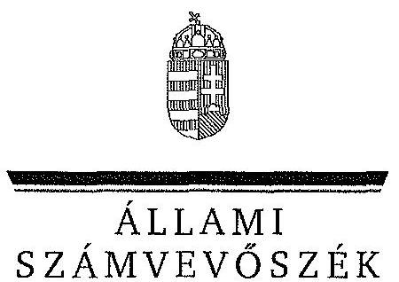
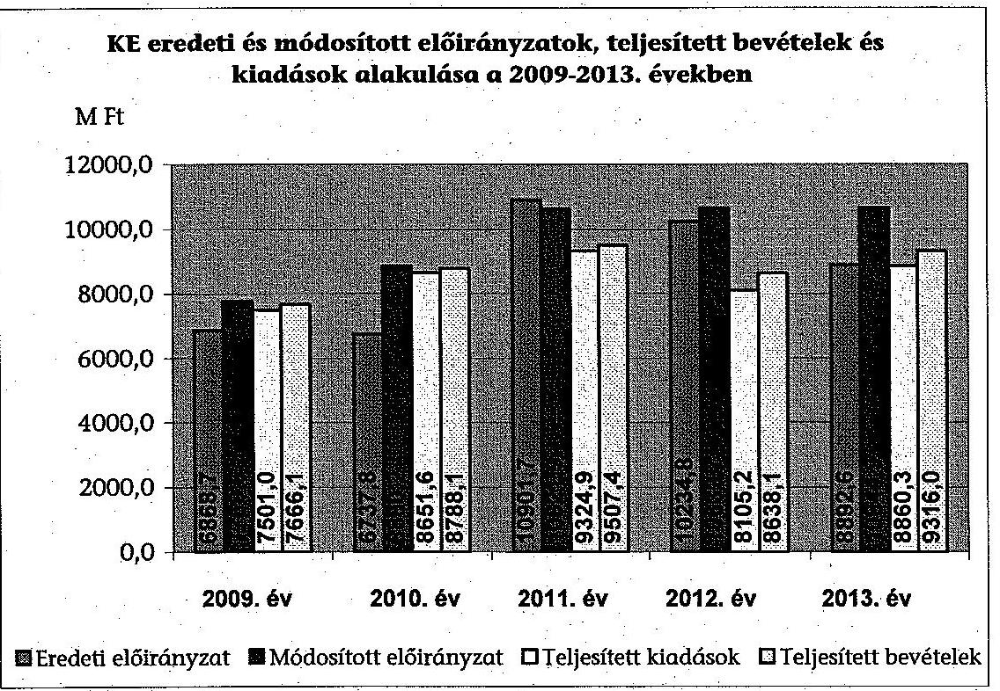
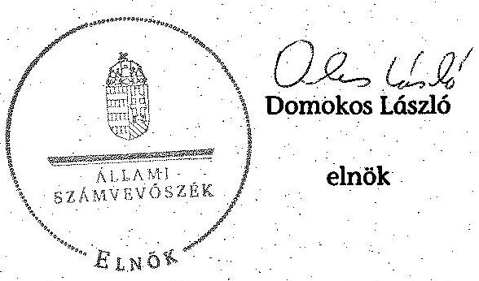
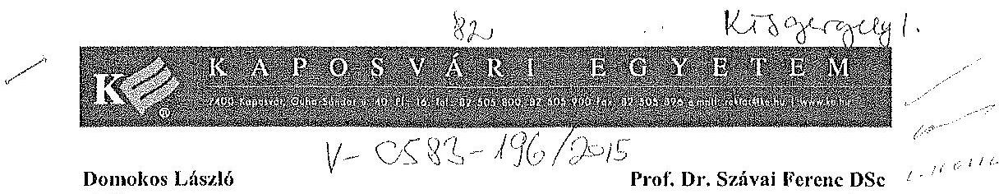

ÁLLAMI
SZÁMVEVŐSZÉK

# JELENTÉS 

a Kaposvári Egyetem ellenőrzéséről - Az állami felsőoktatási intézmények gazdálkodásának, müködésének ellenőrzése

---

# Állami Számvevőszék 

Iktatószám: V-0583-187/2015.
Témaszám: 1617
Vizsgálat-azonosító szám: V068909

## Az ellenőrzést felügyelte:

## Kisgergely István

felügyeleti vezető

## Az ellenőrzés végrehajtásáért felelős:

Horváth József
ellenőrzésvezető

A számvevői munkaanyagok feldolgozását és a Jelentés összeállítását végezte:

Horváth József ellenőrzésvezető

## Gaálné Izsó Éva

számvevő tanácsos

## Az ellenőrzést végezték:

## Fekete Győr László

számvevő

## Turai Erzsébet

számvevő

## Eigner György Zoltán

számvevő tanácsos

## A témához kapcsolódó eddig készített számvevőszéki jelentések:

## címe

Jelentés az oktatási és kulturális ágazat irányítási rendszerének, múködésének ellenőrzéséről
Jelentés a felsőoktatás oktatási infrastruktúra-fejlesztési programjának ellenőrzéséről
Jelentés az állami felsőoktatási intézmények érdekeltségébe tartozó gazdasági társaságok támogatásának és nyereségük hasznosulásának ellenőrzéséről
Jelentés a Szolnoki Főiskola ellenőrzéséről - Az állami felsőoktatási 14196
intézmények gazdálkodásának, múködésének ellenőrzése
Jelentés a Pannon Egyetem ellenőrzéséről - Az állami felsőoktatási 14197

---

intézmények gazdálkodásának, múködésének ellenőrzése
Jelentés a Károly Róbert Főiskola ellenőrzéséről - Az állami felsőok- 14198
tatási intézmények gazdálkodásának, múködésének ellenőrzése
Jelentés a Magyar Képzőművészeti Egyetem ellenőrzéséről - Az ál- 14199
lami felsőoktatási intézmények gazdálkodásának, múködésének ellenőrzése
Jelentés a Miskolci Egyetem ellenőrzéséről - Az állami felsőoktatási 14200
intézmények gazdálkodásának, múködésének ellenőrzése
Jelentés a Széchenyi István Egyetem ellenőrzéséről - Az állami fel- 14201
sőoktatási intézmények gazdálkodásának, múködésének ellenőrzé- se
Jelentés az Eszterházy Károly Főiskola ellenőrzéséről - Az állami 14204
felsőoktatási intézmények gazdálkodásának, múködésének ellen-
őrzése
Jelentés a Magyar Táncművészeti Főiskola ellenőrzéséről - Az ál- 14205
lami felsőoktatási intézmények gazdálkodásának, múködésének ellenőrzése
Jelentés a Budapesti Műszaki és Gazdaságtudományi Egyetem el- 14218
lenőrzéséről - Az állami felsőoktatási intézmények gazdálkodásá-
nak, múködésének ellenőrzése

---

.

---

# TARTALOMJEGYZÉK 

BEVEZETÉS ..... 15
I. ÖSSZEGZŐ MEGÁLLAPÍTÁSOK, KÖVETKEZTETÉSEK, JAVASLATOK ..... 20
II. RÉSZLETES MEGÁLLAPÍTÁSOK ..... 29

1. A fenntartói és az ágazati irányítási jogok gyakorlása ..... 29
2. Az intézmény belső kontrollrendszerének kialakítása és múködtetése ..... 31
3. Az intézmény döntéshozó szerveinek joggyakorlása, az oktatási és egyéb tevékenységei elkülönítése, a pénzügyi gazdálkodása ..... 35
3.1. Az intézmény döntéshozó szerveinek gazdálkodással kapcsolatos joggyakorlása ..... 35
3.2. Az intézmény oktatási és egyéb tevékenységei elkülönítése, az ellátott feladatok átláthatósága ..... 37
3.3. Az intézmény pénzügyi egyensúlya, fizetőképessége ..... 38
3.4. Az intézmény előirányzat kezelése ..... 41
3.5. Az egyes hazai forrásból finanszírozott projektekhez, feladatokhoz kapott - nem normatív - költségvetési forrással való elszámolás ..... 47
4. Az intézmény vagyongazdálkodása ..... 48
4.1. A vagyongazdálkodási tevékenységek keretei ..... 48
4.2. A vagyonváltozások és a vagyonhasznosítás szabályszerűsége ..... 49
4.3. Az intézmény tulajdonosi jog gyakorlása ..... 52
5. A külső ellenőrzések által tett javaslatok hasznosulása ..... 53
5.1. ÁSZ ellenőrzések által tett javaslatok hasznosulása ..... 53
5.2. Az egyéb külső ellenőrzések javaslatainak hasznosulása ..... 55
6. Az integritás érvényesítése érdekében kialakított és múködtetett intézményi kontrollrendszer ..... 56

---

# MELLÉKLETEK 

1. számú A Kaposvári Egyetem kiadási és bevételi előirányzatai, azok teljesítése a 2009-2013. években
2. számú A Kaposvári Egyetem kiadásainak, bevételeinek változása a 2009-2013. években
3. számú Kimutatás a Kaposvári Egyetem bevételeiről és kiadásairól, valamint adósságszolgálatáról a 2009-2013. években
4. számú A Kaposvári Egyetem mérlegadatai a 2009-2013. években
5. számú A Kaposvári Egyetem gazdálkodása szabályszerűségének értékelése a mintatételek alapján
6. számú A Kaposvári Egyetem rektorának nemleges észrevétele

## FÜGGELÉKEK

1. számú Az integritás érvényesítése érdekében kialakított és múködtetett intézményi kontrollrendszer

---

# RÖVIDÍTÉSEK JEGYZÉKE 

| Törvények |  |
| :--: | :--: |
| Áfa tv. | 2007. évi CXXVII. törvény az általános forgalmi adóról |
| Áht. 1 | 1992. évi XXXVIII. törvény az államháztartásról (hatálytalan 2012. január 1-jétől) |
| Áht. 2 | 2011. évi CXCV. törvény az államháztartásról |
| ÁSZ tv. | 2011. évi LXVI. törvény az Állami Számvevőszékről |
| Avtv. | 1992. évi LXIII. tv. a személyes adatok védelméről és a közérdekú adatok nyilvánosságáról |
| Eisztv. | 2005. évi XC. törvény az elektronikus információszabadságról (hatálytalan 2012. január 1-jétől) |
| Feot. | 2005. évi CXXXIX. törvény a felsőoktatásról (hatálytalan 2012. szeptember 1-jétől) |
| Gt. | 2006. évi IV. törvény a gazdasági társaságokról (hatálytalan 2014. március 15 -től) |
| Info tv. | 2011. évi CXII. törvény az információs önrendelkezési jogról és az információszabadságról |
| Kbt. 1 | 2003. évi CXXIX. törvény a közbeszerzésekről (hatálytalan 2012. január 1-jétől) |
| Kbt. 2 | 2011. évi CVIII. törvény a közbeszerzésekről |
| Nftv. | 2011. évi CCIV. törvény a nemzeti felsőoktatásról |
| Nvtv. | 2011. évi CXCVI. Törvény a nemzeti vagyonról |
| Sztv. | 2000. évi C. törvény a számvitelről |
| Vtv. | 2007. évi CVI. törvény az állami vagyonról |
| Korm. rendeletek |  |
| Áhsz. | 249/2000. (XII. 24.) Korm. rendelet az államháztartás szervezetei beszámolási és könyvvezetési kötelezettségének sajátosságairól (hatálytalan 2014. január 1-jétől) |
| Ámr. 1 | 217/1998. (XII. 30.) Korm. rendelet az államháztartás müködési rendjéről (hatálytalan 2010. január 1-jétől) |
| Ámr. 2 | 292/2009. (XII. 19.) Korm. rendelet az államháztartás müködési rendjéről (hatálytalan 2012. január 1-jétől) |
| Ávr. | 368/2011. (XII. 31.) Korm. rendelet az államháztartásról szóló törvény végrehajtásáról |
| Ber. | 193/2003. (XI. 26.) Korm. rendelet a költségvetési szervek belső ellenőrzéséről (hatálytalan 2012. január 1-jétől) |
| Bkr. | 370/2011. (XII. 31.) Korm. rendelet a költségvetési szervek belső kontrollrendszeréről és belső ellenőrzéséről |
| NGM rendelet | 36/2013. (XI. 13.) NGM rendelet az államháztartás számvitelének 2014. évi megváltozásával kapcsolatos feladatokról |
| Vtvr. | 254/2007. (X. 4.) Korm. rendelet az állami vagyonnal való gazdálkodásról |

---

51/2007. (III. 26.) Korm. rendelet

50/2008. (III. 14.) Korm. rendelet

## Határozatok

1132/2010. (VI. 18.)
Korm. határozat
1316/2011. (IX. 19.)
Korm. határozat
1365/2011. (XI. 8.)
Korm. határozat
1036/2012. (II. 21.)
Korm. határozat

## Egyéb rövidítések

ÁSZ
beszerzési szabályzat
FEUVE
egyetem/intézmény/KE
fenntartó
/minisztérium/irányító szerv
eszközök és források értékelési szabályzata ${ }_{1}$
eszközök és források értékelési szabályzata ${ }_{2}$
eszközök és források értékelési szabályzata ${ }_{3}$
eszközök és források értékelési szabályzata ${ }_{4}$ FIR
FSA
gazdálkodási szabály$\mathrm{zat}_{1}$
gazdálkodási szabály$\mathrm{zat}_{2}$
gazdálkodási szabály$\mathrm{zat}_{3}$

51/2007. (III. 26.) Korm. rendelet a felsőoktatásban részt vevő hallgatók juttatásairól és az általuk fizetendő egyes térítésekről
50/2008. (III. 14.) Korm. rendelet a felsőoktatási intézmények képzési, tudományos célú és fenntartói normatíva alapján történő finanszírozásáról

1132/2010. (VI. 18.) Korm. határozat a 2010. évi költségvetéssel összefüggő egyes feladatokról
1316/2011. (IX. 19.) Korm. határozat a 2011. évi költségvetési egyensúlyt megtartó intézkedésekről
1365/2011. (XI. 8.) Korm. határozat a 2012. évi hiánycél tartását biztosító további feladatokról
1036/2012. (II. 21.) Korm. határozat a 2012. és 2013. évi költségvetési hiánycél biztosításához szükséges további intézkedésekről

Állami Számvevőszék
A Kaposvári Egyetem Rektora által kiadott, 2006. május 1-jétől hatályos beszerzési szabályzat
Folyamatba épített, előzetes, utólagos és vezetői ellenőrzés
Kaposvári Egyetem
A Kaposvári Egyetem mindenkori fenntartója az ellenőrzött időszakban (OKM, NEFMI, EMMI)

A Kaposvári Egyetem eszközök és források értékelési szabályzata (hatályos 2006. február 1-jétől 2010. december 14-ig)
A Kaposvári Egyetem eszközök és források értékelési szabályzata (hatályos 2010. december 15-től 2011. december 13-ig)
A Kaposvári Egyetem eszközök és források értékelési szabályzata (hatályos 2011. december 14-től 2012. június 26 -ig)
A Kaposvári Egyetem eszközök és források értékelési szabályzata (hatályos 2012. június 27 -től)
Felsőoktatási Információs Rendszer
Felsőoktatási Strukturális Alap
A Kaposvári Egyetem gazdálkodási szabályzata (hatályos 2006. február 1-jétől 2011. december 13-ig)
A Kaposvári Egyetem gazdálkodási szabályzata (hatályos 2011. december 14-től 2012. június 26 -ig)

A Kaposvári Egyetem gazdálkodási szabályzata (hatályos 2012. június 27 -től)

---

gépjárművek használatának szabályzata
helyiségbérleti szabály$\mathrm{zat}_{1}$

HÖK
IFT1

IFT2

Kincstár
kötelezettségvállalási szabályzat ${ }_{1}$
kötelezettségvállalási szabályzat ${ }_{2}$
kötelezettségvállalási szabályzat ${ }_{3}$
kötelezettségvállalási szabályzat ${ }_{4}$
közbeszerzési szabály$\mathrm{zat}_{1}$
közbeszerzési szabály$\mathrm{zat}_{2}$
közös utasítás

KRI
lakásbérbeadási szabályzat
leltározási szabályzat ${ }_{1}$
leltározási szabályzat ${ }_{2}$
leltározási szabályzat ${ }_{3}$
leltározási szabályzat ${ }_{4}$
MFB Zrt.
MNV Zrt.
NEFMI
NEPTUN
NGM
NKTH

A Kaposvári Egyetem gépjárművek használatának és elszámolásának rendjéről szóló szabályzata (hatályos 2006. január 1-jétől)

A Kaposvári Egyetem helyiségei, területei, létesítményei bérbeadásának szabályzata (hatályos 2011. december 14-től)
Hallgatói Önkormányzat
Kaposvári Egyetem Intézményfejlesztési Terve 2007-2011. évekre
Kaposvári Egyetem Intézményfejlesztési Terve 2012-2016. évekre
Magyar Államkincstár
A Kaposvári Egyetem kötelezettségvállalási szabályzata (hatályos 2007. január 1-től 2009. június 16-ig)
A Kaposvári Egyetem kötelezettségvállalási szabályzata (hatályos 2009. június 17-től 2011. december 13-ig)
A Kaposvári Egyetem kötelezettségvállalási szabályzata (hatályos 2011. december 14-től 2012. június 26-ig)
A Kaposvári Egyetem kötelezettségvállalási szabályzata (hatályos 2012. június 27 -től 2013. december 31-ig)
A Kaposvári Egyetem közbeszerzési szabályzata (hatályos 2011. december 14-től 2012. december 17-ig)

A Kaposvári Egyetem közbeszerzési szabályzata (hatályos 2012. december 18-tól)
1/2011. számú Rektori és Gazdasági Főigazgatói utasítás a Kaposvári Egyetem költségvetési egyensúlyának megőrzése érdekében hozott intézkedésekről
Központi Rendezvényszervező Iroda
A Kaposvári Egyetem Rektorának 2007. évi 6. számú utasítása a Kaposvári Egyetem tulajdonában, illetve kezelésében lévő szolgálati lakások bérbeadásáról (hatályos 2007. december 12 -től)

A Kaposvári Egyetem leltározási és leltárkészítési szabályzata (hatályos 2003. november 30-tól 2011. december 13ig)
A Kaposvári Egyetem leltározási és leltárkészítési szabályzata (hatályos 2011. december 14-től 2012. június 26-ig)
A Kaposvári Egyetem leltározási és leltárkészítési szabályzata (hatályos 2012. június 27 -től 2013. június 25 -ig)
A Kaposvári Egyetem leltározási és leltárkészítési szabályzata (hatályos 2013. június 26 -tól)
Magyar Fejlesztési Bank Zrt.
Magyar Nemzeti Vagyonkezelő Zrt.
Nemzeti Eröforrás Minisztérium
Tanulmányi hallgatói információs rendszer
Nemzetgazdasági Minisztérium
Nemzeti Kutatási és Technológiai Hivatal

---

OKM
OTKA
önköltségszámítási sza-
bályzat ${ }_{1}$
önköltségszámítási sza-
bályzat ${ }_{2}$
önköltségszámítási sza-
bályzat ${ }_{3}$
PET Kft.
pénzkezelési szabályzat ${ }_{1}$
pénzkezelési szabályzat ${ }_{2}$
pénzkezelési szabályzat ${ }_{3}$
PPP
selejtezési szabályzat ${ }_{1}$
selejtezési szabályzat ${ }_{2}$
selejtezési szabályzat ${ }_{3}$
selejtezési szabályzat4
számviteli politika ${ }_{1}$
számviteli politika ${ }_{2}$
számviteli politika ${ }_{3}$
számviteli politika ${ }_{4}$
Szenátus
SZMSZ
vagyonkezelési szabály. zat

Oktatási és Kulturális Minisztérium
Országos Tudományos Kutatási Alapprogram
A Kaposvári Egyetem önköltségszámítási szabályzata (hatályos 2006. február 01-től 2011. december 13-ig)
A Kaposvári Egyetem önköltségszámítási szabályzata (hatályos 2011. december 14-től 2012. június 26-ig)
A Kaposvári Egyetem önköltségszámítási szabályzata (hatályos 2012. június 27 -től)
PET Medicopus Diagnosztikai és Kutató Kft.
A Kaposvári Egyetem pénzkezelési szabályzata (érvényes 2001. január 1-jétől, hatályos 2006. február 1-jétől 2011. december 13-ig)
A Kaposvári Egyetem pénzkezelési szabályzata (hatályos 2011. december 14-től 2012. június 26-ig)
A Kaposvári Egyetem pénzkezelési szabályzata (hatályos 2011. december 14-től 2012. június 26-ig)
A Kaposvári Egyetem pénzkezelési szabályzata (hatályos 2012. június 27 -től)
Public-Private Partnership (magán- és közszféra együttműködése)
A Kaposvári Egyetem felesleges vagyontárgyak hasznosításának és selejtezésének szabályzata (érvényes 2001. január 1-jétől, hatályos 2010. június 1-jétől 2011. december 13 -ig)
A Kaposvári Egyetem felesleges vagyontárgyak hasznosításának és selejtezésének szabályzata (hatályos 2011. december 14-től 2012. június 26 -ig)
A Kaposvári Egyetem felesleges vagyontárgyak hasznosításának és selejtezésének szabályzata (hatályos 2012. június 27 -től 2013. június 25 -ig)
A Kaposvári Egyetem felesleges vagyontárgyak hasznosításának és selejtezésének szabályzata (hatályos 2013. június 26 -tól)
A Kaposvári Egyetem számviteli politikája (hatályos 2006. február 1-jétől 2011. december 13-ig)
A Kaposvári Egyetem számviteli politikája (hatályos 2011. december 14-től 2012. június 26 -ig)
A Kaposvári Egyetem számviteli politikája (hatályos 2012. június 27 -től 2013. június 25 -ig)
A Kaposvári Egyetem számviteli politikája (hatályos 2013. június 26 -tól)
A Kaposvári Egyetem Szenátusa
A Kaposvári Egyetem Szervezeti és Müködési Szabályzata Gazdasági Fölgazgatói utasítás a Kaposvári Egyetem vagyonkezelési tevékenységének szabályozására (hatályos 2009. március 11-től

Vezetői Információs Rendszer

---

# ÉRTELMEZŐ SZÓTÁR 

alapító

autonómia
állami felsőoktatási intézmény saját tulajdona
állami vagyon

A központi költségvetési szerv alapítója az Országgyúlés, a Kormány vagy a miniszter. A felsőoktatási intézmények vonatkozásában az alapítói jogokat a felsőoktatásért felelős minisztérium gyakorolja.
A felsőoktatási intézmény Feot.-ban, illetve Nftv.-ben szabályozott önrendelkezése, amely biztosítja az intézmény önálló oktatási, kutatási, szervezeti és múködési, valamint gazdálkodási tevékenységét.
A felsőoktatási intézmény saját bevételének a költségek teljes körű levonása, - az adományozás és öröklés kivételével - a rendelkezésre bocsátott vagyon állagának megóvásáról, pótlásáról való gondoskodás után fennmaradt része terhére szerzett vagyona.
A Vtv. 1. § (2) bekezdése szerint állami vagyonnak minősül:
a) az állami tulajdonban lévő ingó dolog, valamint a dolog módjára hasznosítható természeti erő,
b) az állami tulajdonban lévő termőföldekből álló, külön törvényben szabályozott Nemzeti Földalap,
c) az állami tulajdonban lévő - a b) pont hatálya alá nem tartozó - ingatlan,
d) az állami tulajdonban lévő értékpapír,
e) az államot megillető társasági részesedés és más vagyoni értékű jog.
(hatályos 2010. június 16-ig)
a) az állam tulajdonában lévő dolog, valamint a dolog módjára hasznosítható természeti erő,
b) az a) pont hatálya alá nem tartozó mindazon vagyon, amely vonatkozásában törvény az állam kizárólagos tulajdonjogát nevesíti,
c) az állam tulajdonában lévő tagsági jogviszonyt megtestesítő értékpapír, illetve az államot megillető egyéb társasági részesedés,
d) az államot megillető olyan immateriális, vagyoni értékkel rendelkező jogosultság, amelyet jogszabály vagyoni értékű jogként nevesít.
(hatályos 2010. június 17-től)

---

állami vagyon hasznosítása

A Vtv. 23. § (1) bekezdése szerint: Az állami vagyont az MNV Zrt. maga kezeli, illetve szerződés - így különösen bérlet, haszonbérlet, szerződésen alapuló haszonélvezet, vagyonkezelés, megbízás - alapján központi költségvetési szervnek, természetes vagy jogi személynek, illetőleg jogi személyiséggel nem rendelkező gazdasági társaságnak hasznosításra átengedi.
(hatályos 2010. december 31-ig)
Az állami vagyont az MNV Zrt. maga kezeli, vagy szerződés - így különösen bérlet, haszonbérlet, szerződésen alapuló haszonélvezet, vagyonkezelés, megbízás - alapján központi költségvetési szervnek, természetes vagy jogi személynek, vagy jogi személyiséggel nem rendelkező gazdálkodó szervezetnek hasznosításra átengedi.
(hatályos 2011. december 31-ig)
Az állami vagyont az MNV Zrt. maga kezeli, vagy szerződés - így különösen bérlet, haszonbérlet, megbízás alapján központi költségvetési szervnek, természetes vagy jogi személynek, vagy jogi személyiséggel nem rendelkező gazdálkodó szervezetnek hasznosításra átengedi.
(hatályos 2012. január 1-jétől)
állami vagyon hasznosítására kötött szerződés
A Vtv. 23. § (2) bekezdése szerint: Az állami vagyon hasznosítására kötött szerződések elsődleges célja az állami vagyon hatékony múködtetése, állagának védelme, értékének megőrzése, illetve gyarapítása, az állami és közfeladatok ellátásának elősegítése.
A Vtvr. 1. § (7) a) pontja szerint: Az a természetes személy, jogi személy, illetve jogi személyiséggel nem rendelkező gazdasági társaság, amely az MNV Zrt.-vel kötött szerződés alapján, bármely jogcímen (bérlet, haszonbérlet, vagyonkezelés, használat stb.) állami vagyont birtokol, használ, hasznosít.
(hatályos 2010. december 31-ig)
Az a természetes személy, jogi személy, illetve jogi személyiséggel nem rendelkező szervezet, amely, illetve aki törvény vagy szerződés alapján, bármely jogcímen (pl. bérlet, haszonbérlet, vagyonkezelési szerződés, használat stb.) állami vagyont birtokol, használ, szedi annak hasznait, hasznosít, ide nem értve a tulajdonosi jogok gyakorlóját.
(hatályos 2011. január 1 - 2011. december 31-ig)
Az a természetes vagy jogi személy, jogi személyiséggel nem rendelkező szervezet, aki, vagy amely törvény vagy szerződés alapján, bármely jogcímen (bérlet, haszonbérlet, használat stb.) állami vagyont birtokol, használ, szedi annak hasznait, hasznosít, ide nem értve a haszonélvezőt, a vagyonkezelőt és a tulajdonosi jogok gyakorlóját. (hatályos 2012. január 1-jétől)

---

állami vagyon értékesítése
állami vagyon kezelője /vagyonkezelő
belső kontrollrendszer

CLF-módszer

Állami vagyon tulajdonjogának bármely jogcímen történő, visszterhes átruházása. (Vtvr. 1. § (7) d) pont)
A Vtv. 23. § (1) bekezdése szerint: Az állami vagyont az MNV Zrt. maga kezeli, vagy szerződés - így különösen bérlet, haszonbérlet, szerződésen alapuló haszonélvezet, vagyonkezelés, megbízás - alapján központi költségvetési szervnek, természetes vagy jogi személynek, illetőleg jogi személyiséggel nem rendelkező gazdasági társaságnak hasznosításra átengedi. (hatályos 2010. január 1 - 2010. december 31-ig)
Az állami vagyont az MNV Zrt. maga kezeli, vagy szerződés - így különösen bérlet, haszonbérlet, szerződésen alapuló haszonélvezet, vagyonkezelés, megbízás - alapján központi költségvetési szervnek, természetes vagy jogi személynek, illetőleg jogi személyiséggel nem rendelkező gazdálkodó szervezetnek hasznosításra átengedi. (hatályos 2011. január 1 - 2011. december 31-ig)
Az állami vagyont az MNV Zrt. maga kezeli, vagy szerződés - így különösen bérlet, haszonbérlet, megbízás alapján központi költségvetési szervnek, természetes vagy jogi személynek, vagy jogi személyiséggel nem rendelkező gazdálkodó szervezetnek hasznosításra átengedi. Az állami vagyonra vonatkozóan az MNV Zrt. kizárólag az Nvtv.-ben meghatározott személyekkel köthet vagyonkezelési szerződést.
(hatályos 2012. január 1-jétől)
A belső kontrollrendszer a kockázatok kezelése és tárgyilagos bizonyosság megszerzése érdekében kialakított folyamatrendszer, amely azt a célt szolgálja, hogy megvalósuljanak a következő célok:
a) a múködés és gazdálkodás során a tevékenységeket szabályszerűen, gazdaságosan, hatékonyan, eredményesen hajtsák végre,
b) az elszámolási kötelezettségeket teljesítsék, és
c) megvédjék az erőforrásokat a veszteségektől, károktól és nem rendeltetésszerű használattól.
A módszer a múködési és a felhalmozási költségvetés bevételeinek és kiadásainak, ezek egyenlegeinek elkülönített, majd összevont kimutatását alkalmazza valamely költségvetési intézmény pénzügyi helyzetének megítéléséhez. Kiemelten mutatja be a finanszírozási műveletek egyenlege nélküli és az azt magába foglaló pénzügyi pozíciót, valamint a tőketörlesztéssel, értékpapír beváltással csökkentett múködési jövedelmet.
Az értékelés a pénzügyi kapacitás fogalmát helyezi a középpontba.

---

elöirányzat-maradvány Az államháztartás központi alrendszerébe tartozó költségvetési szerveknél a módosított bevételi és kiadási előirányzatok és azok teljesítésének a Kormány rendeletében meghatározott tételekkel korrigált különbözete az elő-irányzat-maradvány. (Áht. 2 2. § (1) bekezdés m) pontja)
fenntartó
finanszírozási múveletek
nélküli pozíció

Gazdasági Tanács
hároméves fenntartói megállapodás
információs és kommunikációs rendszer
integritás

A Feot. 7. § (2) és az Nftv. 4. § (2) bekezdése szerint az, aki az alapítói jogot gyakorolja, ellátja a felsőoktatási intézmény fenntartásával kapcsolatos feladatokat.
A CLF módszer szerint számított múködési és felhalmozási tevékenység pénzügyi egyenlegének összevont értéke. Megmutatja, hogy a költségvetési intézmény bevételei fedezetet biztosítottak-e a kiadásokra. A finanszírozási műveletek nélküli (GFS) pozíció alapján a pénzügyi helyzetet akkor tekintettük megfelelőnek, ha az adott év múködési és felhalmozási bevételei fedezetet nyújtottak az adott év múködési és felhalmozási kiadásaira.
A felsőoktatási intézmény javaslattevő, véleményező, a stratégiai döntések előkészítésében részt vevő, és a döntések végrehajtásának ellenőrzésében közreműködő szerve. Az állami felsőoktatási intézmények központi költségvetési támogatására három éves fenntartói megállapodást kell kötni az állami felsőoktatási intézmény és a fenntartó között. A fenntartói megállapodás tartalmazza a felsőoktatási intézmény által meghatározott hároméves időszakra vállalt teljesítménykövetelményeket, továbbá az állandó jellegű támogatási részeket, valamint a változó jellegű támogatások megállapításának jogcímeit. A változó elemú támogatás évenkénti elszámolási kötelezettséggel kerül meghatározásra.
A költségvetési szerv vezetője köteles olyan rendszereket kialakítani és múködtetni, melyek biztosítják, hogy a megfelelő információk a megfelelő időben eljutnak az illetékes szervezethez, szervezeti egységhez, illetve személyhez.
Az integritás olyasvalakit vagy valamit jelöl, aki vagy ami romlatlan, sértetlen, feddhetetlen. Az integritás elvek, értékek, cselekvések, módszerek, intézkedések konzisztenciáját jelenti: olyan magatartásmódot, amely meghatározott értékeknek megfelel.

---

intézményfejlesztési terv
irányító szerv
kincstári biztos
kincstári költségvetés
kisebbségi jogokat biztositó részesedés
kockázatkezelési rendszer
kontrollkörnyezet

A Szenátus fogadja el az intézményfejlesztési tervet. Az intézményfejlesztési tervben kell meghatározni a fejlesztéssel, a fenntartó által a felsőoktatási intézmény rendelkezésére bocsátott vagyon hasznosításával, megóvásával, elidegenítésével kapcsolatos elképzeléseket, a várható bevételeket és kiadásokat. Az intézményfejlesztési tervet középtávra, legalább négyéves időszakra kell elkészíteni, évenkénti bontásban meghatározva a végrehajtás feladatait. Az intézményfejlesztési terv része a foglalkoztatási terv. A foglalkoztatási tervben kell meghatározni azt a létszámot, amelynek keretei között a felsőoktatási intézmény megoldhatja feladatait. (Feot. 27. § (3) bekezdés) A felsőoktatás ágazati irányítását - felsőoktatás szervezéssel, felsőoktatás fejlesztéssel, törvényességi ellenőrzéssel kapcsolatos feladatokat - ellátó miniszter által vezetett minisztérium. (Feot. 102. - 105/A. §, Nftv. 64 - 66. §) A kincstári biztos kijelölését az államháztartásért felelős miniszternél a Kincstár kezdeményezi. A kincstári biztos köteles figyelemmel kísérni megbízatásának időpontjától kezdve a költségvetési szerv tervezését, gazdálkodását, beszámolását, a jogszabályokban előírt feladatainak ellátását, feltárni azokat az okokat, amelyek a tartós fizetésképtelenséghez vezettek, a szükséges intézkedések azonnali végrehajtására irányuló intézkedési tervet készíteni, azonnali intézkedéseket kezdeményezni és írásbeli utasításokat kiadni a tartozásállomány felszámolására, a gazdálkodás egyensúlyának biztosítására, a követelések behajtására. (Ávr. 116-117. §)
A központi költségvetésről szóló törvény elfogadását követően a fejezetet irányító szerv az államháztartás központi alrendszerébe tartozó költségvetési szerv és a fejezeti kezelésű előirányzat kiemelt előirányzatait, valamint az elkülönített állami pénzalapok és a társadalombiztosítás pénzügyi alapjai jogszabályi előirás szerinti bevételeit és kiadásait kincstári költségvetés kiadásával állapítja meg. (Áht. 1 24. § (3) bekezdés, Áht. 2 28. § (2) bekezdés, Ávr. 31. § (2) bekezdés)
A részesedés mértéke legalább 5\%. (Gt. 49. §)
Irányítási eszközök és módszerek összessége, melynek elemei a szervezeti célok elérését veszélyeztető tényezők (kockázatok) azonosítása, elemzése, csoportosítása, nyomon követése, valamint szükség esetén a kockázati kitettség mérséklése.
A kontrollkörnyezet a költségvetési szerv vezetőinek a szervezeti célok elérését segitő kontrollok kialakításával és múködtetésével, korszerűsítésével kapcsolatos magatartását, a kontrollpontokról érkező információkra való reagálását jelenti.

---

kontrolltevékenység
költségvetési főfelügyelő, felügyelő
maximális hallgatói létszám
mértékadó befolyást biztosító részesedés minisztérium
minősített többséget biztosító részesedés
monitoring
működési jövedelem

Azok az elvek, politikák és eljárások, amelyeket a kockázatok meghatározása és a szervezet céljainak elérése érdekében alakítanak ki.
A költségvetési szerv vezetője köteles a szervezeten belül kontrolltevékenységeket kialakítani, amelyek biztosítják a kockázatok kezelését, hozzájárulnak a szervezet céljainak eléréséhez.
Az államháztartásért felelős miniszter a Kormány irányítása alá tartozó fejezetet irányító szervhez, a Kormány irányítása vagy felügyelete alá tartozó költségvetési szervhez, valamint az elkülönített állami pénzalapok és a társadalombiztosítás pénzügyi alapjai kezelő szerveihez költségvetési főfelügyelőt, felügyelő́t rendelhet ki. A költségvetési főfelügyelő, felügyelő a gazdálkodás költségve-tés-politikával való összhangja és a takarékos, szabályszerű, eredményes múködés érdekében a Kormány rendeletében meghatározott intézkedéseket tehet, így különösen előzetesen véleményezi a kötelezettségvállalásra irányuló eljárásokat és a nagy összegű kötelezettségvállalások tekintetében kifogással élhet. (Áht. 2 39. § (1)-(2) bekezdés)
Az a felsőoktatási intézmény alapító okiratában, múködési engedélyében meghatározott hallgatói létszám, ameddig terjedően a felsőoktatási intézmény - figyelembe véve a hallgatók fogadásához és az oktatói tevékenység folytatásához rendelkezésre álló személyi feltételeket, helyiségeket és eszközöket - valamennyi évfolyamára számítva, teljes kihasználtsággal múködve hallgatói jogviszonyt létesíthet.
A részesedés mértéke legalább 20\%, de 50\%-nál kisebb. (Sztv. 3. § (2) bekezdés 4. pont)
A felsőoktatásért felelős minisztérium, amely 2009-től 2010 májusáig az OKM, 2010 májusától 2012 májusáig a NEFMI, 2012 májusától az EMMI volt.
A minősített befolyásszerző az ellenőrzött társaságban a szavazatok legalább hetvenöt százalékával rendelkezik. (Gt. 52. § (2) bekezdés)
A különböző szintű szervezeti célok megvalósításához szükséges folyamatok figyelemmel kísérése, melynek során a releváns eseményekről és tevékenységekről (együtt: folyamatokról) rendszeres jelleggel, strukturált, döntéstámogató információkhoz jutnak a szervezet vezetői.
A folyó bevételek és folyó kiadások egyenlege. Azt mutatja, hogy a folyó bevételek fedezetet nyújtanak-e a folyó kiadásokra.

---

normatív költségvetési támogatás felsőoktatási intézmények müködéséhez
normatív kóltségvetési
támogatás felsőoktatási
intézmények múködéséhez
normatív költségvetési támogatás lehet
a) hallgatói juttatásokhoz nyújtott,
b) képzési,
c) tudományos célú,
d) fenntartói,
e) egyes feladatokhoz nyújtott
támogatás. A központi költségvetésből biztosított normatív költségvetési támogatásra - a d) pontban meghatározott normatív költségvetési támogatás kivételével - a felsőoktatási intézmények azonos feltételek alapján válnak jogosulttá. Az a)-e) pontokban meghatározott jogcímek az a) és e) pontban meghatározott jogcímek kivételével nem jelentenek felhasználási kötöttséget. (Feot. 127. § (3) bekezdés)
Az ellenőrzési időszakban hatályos költségvetési törvények 3. sz. mellékletében megjelölt közoktatási hozzájárulások, az 5. sz. mellékletében megjelölt központosított előirányzatok, továbbá a 8. sz. mellékletében megjelölt normatív, kötött felhasználású támogatások együttesen.
saját bevétel Az államháztartáson kívüli források - beleértve minden olyan, az Európai Uniótól származó támogatást, amelyhez nem az állami költségvetésen keresztül jut a felsőoktatási intézmény, továbbá a szakképzési hozzájárulási fizetési kötelezettség teljesítéseként elszámolt forrásokat is, ide nem értve az állami vagyon értékesítésének ellenértékét - valamint a Kutatási és Technológiai Innovációs Alapból származó bevételek.
Szenátus
tárgyévi pénzügyi pozíció

A felsőoktatási intézmények működéséhez biztosított normatív költségvetési támogatás lehet
a) hallgatói juttatásokhoz nyújtott,
b) képzési,
c) tudományos célú,
d) fenntartói,
e) egyes feladatokhoz nyújtott
támogatás. A központi költségvetésből biztosított normatív költségvetési támogatásra - a d) pontban meghatározott normatív költségvetési támogatás kivételével - a felsőoktatási intézmények azonos feltételek alapján válnak jogosulttá. Az a)-e) pontokban meghatározott jogcímek az a) és e) pontban meghatározott jogcímek kivételével nem jelentenek felhasználási kötöttséget. (Feot. 127. § (3) bekezdés)
Az ellenőrzési időszakban hatályos költségvetési törvények 3. sz. mellékletében megjelölt közoktatási hozzájárulások, az 5. sz. mellékletében megjelölt központosított előirányzatok, továbbá a 8. sz. mellékletében megjelölt normatív, kötött felhasználású támogatások együttesen.
Az államháztartáson kívüli források - beleértve minden olyan, az Európai Uniótól származó támogatást, amelyhez nem az állami költségvetésen keresztül jut a felsőoktatási intézmény, továbbá a szakképzési hozzájárulási fizetési kötelezettség teljesítéseként elszámolt forrásokat is, ide nem értve az állami vagyon értékesítésének ellenértékét - valamint a Kutatási és Technológiai Innovációs Alapból származó bevételek.
A felsőoktatási intézmény, döntést hozó és a döntés végrehajtását ellenőrző testülete. (Feot. 20. § (1) bekezdés, Nftv. 12. § (1)-(3) bekezdés)
A múködési és felhalmozási bevételek, valamint kiadások egyenlege a finanszírozási műveletek egyenlegének figyelembe vételével.

---

.

---

# JELENTÉS 

## A Kaposvári Egyetem ellenőrzéséről Az állami felsőoktatási intézmények gazdálkodásának, múködésének ellenőrzése

## BEVEZETÉS

Az ÁSZ Stratégiája ${ }^{1}$ alapértékeinek egyike, hogy az államháztartás komplex folyamatainak átláthatósága érdekében rendszerszemléletű/holisztikus megközelítésű, egymásra épülő, a szinergiahatást kihasználó, összefoglaló értékelésre lehetőséget adó ellenőrzéseket végez. Az államháztartás központi alrendszerébe tartozó felsőoktatási intézmények ellenőrzése során az Állami Számvevőszék értékeli azok pénzügyi-gazdasági helyzetét, feltárja a múködésükben rejlő kockázatokat, ezzel előmozdítja a közpénzügyek átláthatóságát, rendezettségét.

Az állami felsőoktatási intézmények gazdálkodását - az Áht. ${ }_{1}$ és az Áht. ${ }_{2}$ előírásai mellett - a felsőoktatásról szóló 2005. évi CXXXIX. törvény (Feot.), valamint a nemzeti felsőoktatásról szóló 2011. évi CCIV. törvény (Nftv.) előírásai határozták meg.

Magyarország Nemzeti Reform Programja keretében, a Széll Kálmán Terv 2020-ig a 30-34 évesek körében, a felsőfokú vagy annak megfelelő végzettséggel rendelkezők arányának $30,3 \%$-ra való növelését irányozta elő, amely a 2010. évhez képest $4,6 \%$ pontos növekedési célkitűzést jelent. A rendezett gazdasági környezet, az önállósággal élni tudó, felelős, elszámoltatható intézményi gazdálkodói magatartás elengedhetetlen feltétele a kitűzött szakmai célok elérésének.

Az ellenőrzés célja annak megállapítása, hogy szabályos volt-e az állami felsőoktatási intézmény pénzügyi és vagyongazdálkodása, biztosított volt-e a vagyonnal való felelős gazdálkodás követelményének érvényesülése, jogszabályi előírásoknak megfelelően működött-e a belső kontrollrendszer, az irányító szerv tevékenysége a jogszabályi előírásoknak megfelelt-e.

[^0]
[^0]:    ${ }^{1}$ Állami Számvevőszék: Stratégia. Az Állami Számvevőszék hivatalos stratégiai dokumentum rendszere 2011-2015. 2012. december. http://www.asz.hu/strategia/asz-strategia/asz-strategia-2011.pdf

---

Ennek keretében értékeltük a Kaposvári Egyetemnél:

- a fenntartói és az ágazati irányítási jogok gyakorlását;
- az intézmény belső kontrollrendszere jogszabályoknak megfelelő kialakítását és múködtetését;
- az intézmény döntéshozó szerveinek joggyakorlása jogszabályoknak való megfelelőségét; az intézmény oktatási és egyéb (gyakorlati és kutatási) tevékenységei elkülönítését, átláthatóságát, illetve pénzügyi gazdálkodása szabályszerűségét;
- az intézmény vagyongazdálkodása előírásoknak való megfelelőségét;
- az ellenőrzött időszakban végzett külső (ÁSZ, fenntartói) ellenőrzések által tett javaslatok hasznosulását;
- az intézmény korrupcióval szembeni veszélyeztetettségének csökkentése érdekében az integritási szemlélet érvényesülését a gazdálkodási folyamatokban.

Az ellenőrzés várható hasznosulása: Az ellenőrzés eredményének hasznosulásaként képet kapunk a felsőoktatási intézményekben kialakult pénzügyi helyzetről; a Kormány által kirendelt költségvetési (fő) felügyelői rendszer múködésének tapasztalatairól; az oktatási és egyéb tevékenységek és költségelszámolások elhatárolásáról, átláthatóságáról és szabályosságáról. A felsőoktatási intézmények gazdálkodási szabadságának pénzügyi és vagyoni helyzetre gyakorolt hatásairól, a vagyonnal való felelős, értékmegőrző gazdálkodás érvényesüléséről, továbbá a belső kontrollrendszer működéséről. Az ellenőrzés az ellenőrzött számára visszajelzést ad a gazdálkodása kereteinek kialakításáról, a működésében fellépő hiányosságokról, javaslataival hozzájárul azok kiküszöböléséhez és a jó kormányzáshoz. A törvényalkotás számára összegzett tapasztalatok állnak rendelkezésre a felsőoktatási intézmények döntéseinek, gazdálkodásának szabályszerűségéről, amelyek alapján - indokolt esetben - jogsza-bály-módosítás kezdeményezhető. Az integritás kultúra kialakítása hozzájárul az elszámoltathatóság és átláthatóság érvényesítéséhez, egyben támogatja a szervezet védettségét a korrupciós kitettséggel szemben, valamint annak megelőzése is irányítottabbá válik. A társadalom számára jelzi, hogy közpénz nem maradhat ellenőrizetlenül, az ÁSZ értékteremtő rend kialakításához és megőrzéséhez hozzájáruló tevékenysége pozitív hatással lesz a szervezetről kialakított összkép formálásában.

Az ellenőrzés típusa: szabályszerűségi ellenőrzés
Az ellenőrzött időszak: 2009. január 1. - 2013. december 31. (az eredményszemléletű számvitel bevezetésével kapcsolatban az ellenőrzött időszak vége: 2014. április 30.)

Az ellenőrzéssel érintett szervezetek: az Emberi Erőforrások Minisztériuma és a Kaposvári Egyetem

---

Az ellenőrzés jogszabályi alapját az ÁSZ tv. 1. § (3) bekezdése, az 5. § (3)(6) bekezdései, 33. § (7) bekezdése, valamint az államháztartásról szóló 2011. évi CXCV. törvény 61. § (2) bekezdésének előírásai képezik.

Az ellenőrzés kiterjedt minden olyan körülményre és adatra, amely az ÁSZ jogszabályban meghatározott feladataiban, valamint a program végrehajtása folyamán felmerült újabb összefüggések feltárásához szükséges volt.

Az ellenőrzés az INTOSAI által kiadott nemzetközi standardok figyelembe vételével, az ellenőrzési programban foglalt értékelési szempontok szerint történt.

A pénzügyi és vagyongazdálkodás terén az egyes területek szabályszerű működését mintavétellel ellenőriztük, ez alapján a sokaságokban előforduló hibás tételek arányát becsültük. A jogszabályoknak és a belső előírásoknak megfelelőnek, azaz szabályszerűnek tekintettük az adott kiadási előirányzat felhasználását, bevétel beszedését, mérlegtétel értékelését, amennyiben a minta ellenőrzésének eredménye alapján $95 \%$-os bizonyossággal a teljes sokaságban a hibás tételek aránya kisebb volt, mint $10 \%$, nem megfelelőnek értékeltük, ha a hibás tételek aránya a $10 \%$-ot meghaladta. Kockázatot, illetve magas kockázatot jeleztünk, amennyiben egy adott terület vonatkozásában a minta alapján a teljes sokaságban nem volt teljes körűen biztosított a jogszabályoknak és a belső szabályzatoknak megfelelő működés. A mintatételek kiértékelését az 5. számú melléklet tartalmazza.

A belső kontrollrendszer kialakításának és múködtetésének értékelése során a jogszabályi előírások mellett az Ámr. 1 145/A. § (1) és (3) bekezdése, az Ámr. 2 155. § (1) és (3) bekezdése, valamint a Bkr. 5. § (1) bekezdése alapján figyelembe vettük az államháztartásért felelős miniszter által közzétett irányelvekben és módszertani útmutatókban ${ }^{2}$ foglaltakat is. A belső kontrollrendszert az értékelés során legalább $85 \%$-os megfelelőség esetén megfelelőnek, legalább a $70 \%$ os megfelelőség esetén részben megfelelőnek, $70 \%$-os megfelelőség alatt pedig nem megfelelőnek minősítettük.

A Kaposvári Egyetem a 2009-2013. években önállóan működő és gazdálkodó központi költségvetési szerv volt. Az egyetemet 2000. január 1-jei hatállyal hozták létre, az intézményben az ellenőrzött időszakban Állattudományi Kar, Gazdaságtudományi Kar, Pedagógia Kar és Művészeti Kar múködött. Az egyetem szervezeti felépítésében, a képzési területekben több változás volt, amelynek hatására a képzési szakok száma a 2009. évi 30 -ról 2011-re 50 -re bővült, majd 2013. év végére a képzési struktúra felülvizsgálatával 41-re csökkent. 2013 szeptemberében a korábbi Állattudományi Kar Agrár- és Környezettudományi Karrá alakult át. 2013. évben az Agrár- és Környezettudományi és a Gazdaságtudományi Karon a korábbi tanszékeket megszüntették és intézetek alatt új tanszékeket hoztak létre, a Művészeti Kar intézeteiben a tanszékek helyett szakmai csoportokat alakítottak ki. 2013. évben az egyetem létrehozta a Sport Iroda és Létesítményközpontot.

[^0]
[^0]:    ${ }^{2}$ 1/2009. (IX. 11.) PM irányelv, a Pénzügyminisztérium Belső Kontroll Kézikönyv 2010.

---

A 2009-2013 években a KE által alapított és fenntartott intézmények - a Kaposváron működő Gyakorló Általános Iskola és Gimnázium, illetve Gyakorló Óvoda - biztosították az elméleti és a gyakorlati képzés egységét. A Pedagógustovábbképző és Szolgáltató Intézet 2013. december 31-én megszűnt. Az egyetemhez tartozó szervezeti egység az Egészségügyi Centrum 2013. évben 1651,0 M Ft múködési célú támogatásértékű bevételt kapott az Országos Egészségbiztosítási Pénztártól, és további 107,1 M Ft múködési bevételt realizált. 2009 és 2013 között az egyetemhez tartozott még a Pannon Lovasakadémia, a Vadgazdálkodási Tájközpont, és a Takarmánytermesztési Kutató Intézet. Az ellenőrzött időszakban az intézményt - jogszabályon alapuló - átalakítás nem érintette. A 2009-2013. években a KE az MTA Lendület programban nem vett részt. Az egyetemhez 2011. november 30 -tól a nemzetgazdasági miniszter költségvetési főfelügyelőt rendelt ki.

Az ellenőrzött időszakban a rektor megbízatása lejárt, az új rektor megbízatása 2010. augusztus 1-jétől kezdődött. A gazdasági főigazgató személyében 2011. és 2012. években történt változás.

A KE 2013. december 31-ei mérlegében négy társaságban lévő részesedést mutatott ki. Az egyetem tulajdonosi részesedése a PET Medicopus Diagnosztikai és Kutató Kft.-ben 2013. évben 100\%-ról 55,4\%-ra csökkent. Az intézmény egy társaságban 100\%-os, két gazdasági társaságban 15\% alatti tulajdoni részesedéssel rendelkezett.

Az intézmény főbb gazdálkodási, vagyoni és létszám adatait az alábbi táblázat mutatja be:

| Megnevezés | Főbb gazdálkodási és vagyoni adatok (M Ft) |  |  |  |  |  |
| :--: | :--: | :--: | :--: | :--: | :--: | :--: |
|  | 2009 | 2010 | 2011 | 2012 | 2013 | $\begin{gathered} 2013 . \\ \text { év/ } \\ 2009 . \\ \text { év \% } \end{gathered}$ |
| Kiadási föösszeg | 7501,0 | 8651,6 | 9324,9 | 8105,2 | 8860,3 | 118,1 |
| Bevételi föösszeg | 7666,1 | 8788,1 | 9507,4 | 8638,1 | 9316,0 | 121,5 |
| Költségvetési támogatások | 4032,3 | 3860,5 | 3613,8 | 3198,0 | 3492,0 | 86,6 |
| Saját és átvett bevételek | 3349,0 | 4731,2 | 5838,6 | 5176,1 | 5291,1 | 158,0 |
| Támogatások aránya (\%) | 52,6 | 43,9 | 38,0 | 37,0 | 37,5 |  |
| Mérlegfőösszeg | 9310,1 | 10118,1 | 11822,7 | 11167,9 | 11336,9 | 121,8 |
|  | Jellemzö létszámadatok (fő) |  |  |  |  |  |
| Oktatói létszám | 297 | 354 | 264 | 307 | 252 | 84,8 |
| Hallgatói létszám | 3244 | 2985 | 3026 | 2911 | 3026 | 93,3 |

---

A KE kiadásai az öt év alatt 18,1\%-kal, a bevételei összességében 21,5\%-kal nőttek. A bevételeken belül a költségvetési támogatás aránya átlagosan 41,4\% volt. Az ellenőrzött időszakban a saját és átvett bevételek 58,0\%-kal nőttek.

Az ellenőrzött időszakban a hallgatói létszám 3244 fơről (6,7\%-kal) 3026 fôre, az oktatók létszáma pedig 297 fôről ( $15,2 \%$-kal) 252 fôre csökkent.

Az ÁSZ a 2011. évi LXVI. törvény 29. §-a szerint a jelentéstervezetet megküldte a Kaposvári Egyetem rektorának és az Emberi Erőforrások Minisztériuma miniszterének egyeztetésre. A Kaposvári Egyetem rektora nemleges észrevételét a 6. számú melléklet tartalmazza. Az Emberi Erőforrások Minisztériuma minisztere az ÁSZ tv. 29. § (2) bekezdésében foglalt észrevételezési jogával nem élt, a törvényes határidőn belül észrevételt nem tett.

---

# I. ÖSSZEGZŐ MEGÁLLAPÍTÁSOK, KÖVETKEZTETÉSEK, JAVASLATOK 

A felsőoktatásért felelős minisztérium (OKM, NEFMI, EMMI) az ellenőrzött időszakban a jogszabályi előírásoknak megfelelően gyakorolta a fenntartói feladatait. Alapítói jogosultságai keretében szabályszerűen adta ki az egyetem jogszabályi és szervezeti változásoknak megfelelően módosított alapító okiratát. A KE által megküldött SZMSZ módosításokat a fenntartó felülvizsgálta. A minisztérium egyéb fenntartói feladatait is szabályosan látta el.

A minisztérium közremúködött az egyetem éves költségvetésének tervezésében, meghatározta az intézmény költségvetési kereteit. Elvégezte az intézmény éves költségvetési, illetve gazdálkodási beszámolóinak ellenőrzését. A fenntartó megkötötte az intézménnyel a 2008-2010. évekre vonatkozóan a fenntartói megállapodást, amelyben meghatározták a teljesítménykövetelményeket. A fenntartó a megállapodásban foglaltak végrehajtását évente értékelte. A fenntartó 2013. évben támogatást nyújtott az egyetem szervezeti átalakításához.

A fenntartó az egyetem rektorának, gazdasági főigazgatójának megbízásával kapcsolatos feladatokat a jogszabályban előírtaknak megfelelve elvégezte.

A minisztérium az ágazati irányítási feladatait a 2009-2013. években nem látta el teljes körűen. Elmaradt az oktatási ágazatra vonatkozóan a nemzetgazdasági miniszter irányításával és az oktatásért felelős miniszter részvételével, a kormányhatározatban előírt szervezeti és feladat ellátási felülvizsgálati program kidolgozása. A felsőoktatási törvény rendelkezései ellenére a miniszter nem készíttetett a felsőoktatás rendszere vonatkozásában a Kormány által elfogadott középtávú fejlesztési tervet.

A minisztérium az Oktatási Hivatallal a FIR biztonságos üzemeltetéséhez, az adatok védelméhez szükséges alapvető szervezeti, szabályozási kontrollokat 2012. év végéig nem teljes körűen alakította ki. A FIR átfogó megújítását követően rögzített - a nyitott jogviszonnyal rendelkező hallgatók és az oktatók vonatkozásában az - adatok már teljesek. A visszamenőleges adatok tisztítása és beküldése folyamatban volt. A fenntartó a FIR biztonságos üzemeltetéséhez, az adatok védelméhez szükséges szabályozási kontrollokat 2013. év végére kialakította.

Az egyetem belsö kontrollrendszerének kialakítása és múködtetése összességében a 2009-2012. években részben, a 2013. évben megfelelő volt. Ezen belül a kontrolltevékenységeket, a 2009-2012. években a kontrollkörnyezetet, a 2010-2011. években a monitoring rendszert, illetve a 2012. évben az információs és kommunikációs rendszert részben megfelelőnek minősítettük. A 2009-2011. években az információs és kommunikációs rendszer, a 2009. évben a monitoring rendszer kialakítása és múködtetése nem felelt meg a jogszabályi előírásoknak. A kockázatkezelést, a 2012-2013. években a monitoring rendszert és a 2013. évben a kontrollkörnyezetet, illetve az információs és kommunikációs rendszert megfelelőnek értékeltük.

---

Az egyetem rektora minden ellenőrzött évben vezetői nyilatkozatot tett arról, hogy gondoskodott az intézménynél a belső kontrollrendszerek szabályszerű, gazdaságos, hatékony és eredményes múködéséről, amely nem volt teljes körűen összhangban a kontrollrendszer tényleges müködésével. Az ÁSZ ellenőrzés megállapításai - a 2013. év kivételével - nem támasztották alá a belső kontrollrendszer szabályszerű és eredményes múködését az egyetemnél.

Az intézmény kontrollkörnyezete a 2009-2012. években a jogszabályi előírásoknak részben felelt meg, 2013. évben megfelelt. Az SZMSZ részben felelt meg a jogszabályi előírásoknak, mert nem tartalmazta a szervezeti egységek engedélyezett létszámát. Az intézmény nem aktualizálta a jogszabályi változásoknak megfelelően a gazdálkodás szempontjából meghatározó belső szabályzatait. Emiatt az ellenőrzött időszakban a kötelezettségvállalási szabályzat ${ }_{1}$, a számviteli politika ${ }_{1-4}$, az eszközök és források értékelési szabályzatai ${ }_{1-4}$, a leltározási szabályzat ${ }_{1-4}$, a pénzkezelési szabályzat ${ }_{1-3}$, az önköltségszámítási szabály-zat ${ }_{2-3}$, a közbeszerzési szabályzat ${ }_{1-2}$ nem felelt meg teljes körűen a vonatkozó jogszabályi előírásoknak.

A kockázatkezelési rendszer kialakítása és múködtetése összességében megfelelő volt, azonban a jogszabályi előírások ellenére a KE rektora az egyetem tevékenységében, gazdálkodásában rejlő kockázatokat a 2009-2013. években nem mérte fel és nem állapította meg.

A kontrolltevékenységek kialakítása és működtetése az ellenőrzött időszakban részben felelt meg a jogszabályoknak. Az ellenőrzött időszakban az intézmény a gazdálkodási jogköröket a jogszabályi előírásoknak megfelelően szabályozta. A gazdálkodási jogkörök gyakorlásánál összességében betartották a jogszabályi előírásokat.

Az információs és kommunikációs rendszer kialakítása és működtetése a 2009-2011. években nem, a 2012. évben részben felelt meg, valamint 2013. évben megfelelt a jogszabályi előírásoknak. A közérdekű adatok megismerésére irányuló kérelmek intézésének, a kötelezően közzéteendő adatok nyilvánosságra hozatalának rendjét 2013 áprilisában szabályozta. A KE eleget tett a jogszabályokban előírt közzétételi kötelezettségének.

A monitoring rendszer kialakítása és múködtetése a 2009. évben nem megfelelő, a 2010-2011. években részben megfelelő, a 2012-2013. évben megfelelő volt. Az egyetem rektora a szervezet tevékenységének, a célok megvalósításának nyomon követését biztosító rendszert a 2012. évben kialakította. A 2009. évben a belső ellenőrzés a jogszabályi előírást megsértve az intézkedési terv végrehajtását nem ellenőrizte. A belső ellenőrzés a jogszabályi előírásokat megsértve nem vezetett nyilvántartást a külső ellenőrzési jelentésekben tett megállapítások, javaslatok hasznosulásáról.

A Szenátus gazdálkodással kapcsolatos joggyakorlása nem felelt meg teljes körűen a jogszabályi előírásoknak. A Szenátus nem tárgyalta és így a jogszabályi előírás ellenére nem értékelte a rektor vezetői tevékenységét, nem fogadta el a számviteli rendelkezések alapján elkészített 2010. évi éves beszámolóját, továbbá nem döntött a fejlesztések indításáról és a vagyongazdálkodási tervről.

---

A Szenátus joggyakorlása a felsőoktatási normatív finanszírozási keretrendszerben az eltérő jogcímeken kapott támogatások felhasználására vonatkozóan megfelelt a jogszabályi előírásoknak.

Az intézményi térítési díjak, költségtérítések megállapítása nem felelt meg teljes körűen a jogszabályi előírásoknak és a belső szabályoknak, mivel a KE a térítési díjak mértékét önköltségszámítással nem támasztotta alá, a költségtérítések összegének meghatározásához a szakmai feladatra számított folyó kiadásokat nem mutatta ki.

Az intézmény oktatási és egyéb tevékenységeit a jogszabályban előírtak szerint a nyilvántartásában elkülönítette, az ellátott feladatok rendszere átlátható volt.

Az ellenőrzött időszak alatt az intézmény pénzügyi pozíciójának értéke ingadozott, a 2011-2012. években javult, majd 2013. évben romlott. A 2009-2010. években és a 2013. évben negatív értéket mutatott a felhalmozási hiány és a működési jövedelem nagyságának együttes hatására. Az ellenőrzött időszakban az egyetem a korrigált pozitív pénzügyi pozíciót az előző években képződött maradvány igénybevételével érte el. A likviditási mutató a 20102013. években, a pénzügyi likviditási mutató a 2009-2013. években nem érte el az 1-es értéket, ami a kedvezőtlen likviditási helyzetet mutatta. A költségvetési támogatások csökkenése, továbbá a PPP projekt bérleti dijának fizetése likviditási problémákat okozott az egyetemnél. Az intézmény a 2009-2013. években likviditási hitelt nem vett igénybe, azonban a 2011. és a 2013. években a likviditás biztosítása érdekében a finanszírozási tervtől eltérő előrehozott támogatást igényelt és kapott. A likviditási problémákat enyhítette, hogy a 2013. évben az egyetem a FSA-ból 900,0 M Ft egyszeri támogatásban részesült.

Az egyetem kötelezettségei növekedésével jelentős összegű szállítókkal szembeni tartozást halmozott fel.

Az intézményhez 2011. november 30-tól kirendelt költségvetési föfelügyelő intézkedéseket tett az intézmény pénzügyi pozíciójának javítására. A költségvetési felügyelő tevékenysége hozzájárult a KE fegyelmezettebb, költséghatékonyabb gazdálkodásához.

Az ellenőrzött időszakban az intézmény kiadási és bevételi előirányzatainak megállapítása megfelelt a jogszabályi előírásoknak. A KE a kiadási és bevételi előirányzatok tervezése során a jogszabályokban és a fenntartó által kiadott tervezési irányelvekben foglaltak szerint járt el. Az ellenőrzött időszak alatt az egyetem az előirányzat-módosításokat szabályszerűen hajtotta végre, a számviteli nyilvántartásokon a módosításokat átvezette.

Az egyetem az ellenőrzött időszakban 18 196,6 M Ft költségvetési támogatásban részesült, intézményi múködési bevétele 9469,9 M Ft, támogatásértékű működési bevétele 11111,0 M Ft , és támogatásértékű felhalmozási bevétele 3278,6 M Ft volt. Az egyetem teljesített költségvetési bevételei a módosított előirányzathoz képest minden évben alulteljesültek.

---

Az egyetem a költségvetés módosított kiadási főösszegét a 2009-2013. években betartotta.

A 2009-2013. években az intézmény pénzügyi gazdálkodása, valamint vagyongazdálkodási tevékenysége nem felelt meg teljes körűen a jogszabályi előírásoknak.

Az éves előirányzat-maradvány megállapítása és felhasználása során nem tartották be teljes körűen a vonatkozó jogszabályi előírásokat, mivel az intézmény a 2010. évi előirányzat maradvány levezetésében kimutatott, kötelezettségvállalással nem terhelt maradványból a központi költségvetést megillető összeget teljes összegében nem fizették be a központi költségvetés javára. Ez kockázatot jelent a szabályszerű működés szempontjából.

A rendszeres és nem rendszeres személyi juttatások előirányzatainak felhasználása a pénzügyi elszámolások, valamint a gazdálkodási jogkörök tekintetében teljes körűen biztosított volt a jogszabályoknak és belső szabályoknak való megfelelőség.

A külső személyi juttatások előirányzatai terhére megkötött megbízási szerződések teljesítése és számfejtése megfelelt a jogszabályoknak és a belső szabályoknak.

A dologi kiadások előirányzatának felhasználása a pénzügyi elszámolások, valamint a gazdálkodási jogkörök gyakorlása tekintetében összességében megfelelt a jogszabályoknak és belső szabályoknak. Az egyetem a 2009-2012. években a közbeszerzési értékhatárt meghaladó öt beszerzésnél nem tartotta be a közbeszerzési törvények előírásait. Az egyéb dologi kiadásoknál a pénzügyi elszámolások, valamint a gazdálkodási jogkörök gyakorlása szabályszerű volt.

A felújítások, beruházások előirányzatának felhasználása során a pénzügyi elszámolások, valamint a gazdálkodási jogkörök gyakorlása nem felelt meg a jogszabályoknak és belső szabályoknak. Az egyetem 2010-2011. évi három gépjármúbeszerzésnél megsértette a közbeszerzési törvényt a közbeszerzési eljárás, valamint az egybeszámítási kötelezettség mellőzése miatt. A KE a 2010. évi informatikai beszerzésnél kettő esetben megsértette a Kormány által előírt beszerzési tilalmat.

Az ellátotti juttatások kifizetése során nem tartották be teljes körűen a belső szabályzatokban és a jogszabályokban foglaltakat. A 2009. évben egy esetben a szakmai teljesítés igazolója és az érvényesítő aláírása ellenére nem tett eleget a jogszabályban előírt, a kifizetés összegszerűségére vonatkozó ellenőrzési kötelezettségének, mivel a tényleges kifizetés az 1,0 E Ft-tal meghaladta az azt alátámasztó dokumentumon szereplő összeget. Ez kockázatot jelez az ellenőrzött terület múködése szempontjából.

Az intézményi múködési bevételek beszedése a pénzügyi elszámolások, valamint a gazdálkodási jogkörök gyakorlása tekintetében nem felelt meg teljes körűen a jogszabályoknak és belső szabályoknak, mivel esetenként elmulasztották a számla kiállítását a térítési díjakról, költségtérítésekről. Ez magas kockázatot jelez az ellenőrzött terület szabályszerű működése szempontjából.

---

Az immateriális javak és tárgyi eszközök bérbeadása, értékesítése a pénzügyi elszámolások, valamint a gazdálkodási jogkörök gyakorlása tekintetében nem felelt meg teljes körűen a jogszabályoknak és belső szabályoknak. A bérbeadásnál egy esetben megsértették a versenyeztetési kötelezettségre vonatkozó jogszabályi előírást és a vagyonkezelési szabályzat előírását.

A hazai forrásból finanszírozott projektekhez kapott költségvetési támogatásokat szabályszerűen használta fel az egyetem. A támogatási szerződések felmondására, támogatás visszavonására, szankció érvényesítésére nem került sor.

A KE könyvviteli mérleg szerinti vagyona 2009. január 1-jén 10 022,4 M Ft volt, amely 2013. december 31-re 13,1\%-kal, 11 336,9 M Ft-ra növekedett. A növekedést az immateriális javak, a tárgyi eszközök és a befektetett pénzügyi eszközök (tartós részesedés) állományának növekedése eredményezte.

Az intézmény elkészítette az Intézményfejlesztési Terveket és azok módosítását, amelyeket a jogszabálynak megfelelően a Szenátus elfogadott. A KE az ellenőrzött időszakban éves vagyongazdálkodási terveket készített, azonban a jogszabályi előírások ellenére a 2009-2012. években a Gazdasági Tanács nem véleményezte, az ellenőrzött időszakban a Szenátus nem fogadta el.

Az intézmény a beruházásokat, felújításokat és egyéb vagyonváltozásokra vonatkozó döntési és felelősségi hatásköröket belső szabályzatokban, a kincstári vagyonra vonatkozóan vagyonkezelési szerződésben szabályozta.

Az ellenőrzött időszakban az intézmény vagyongazdálkodási tevékenysége összességében nem felelt meg teljes körűen a jogszabályi előírásoknak.

Az intézmény a leltározást az ellenőrzött időszakban a jogszabályi előírásoknak és a belső szabályoknak megfelelően végezte el, a könyvviteli mérleg leltárral történő alátámasztása biztosított volt. Az ellenőrzött időszakban az analitikus és a főkönyvi nyilvántartások, valamint a könyvviteli mérleg adatainak egyezősége biztosított volt. Az egyetem 2009. évben a saját, valamint a rendelkezésére bocsátott vagyon elkülönített nyilvántartásáról a jogszabályi előírások ellenére nem gondoskodott. A vagyon elkülönítésére 2010. évben került sor.

Az intézménynél a kötelezettségek és az aktív, és passzív pénzügyi elszámolások esetében a mérlegtételek tartalma, besorolása, értékelése megfelelt a jogszabályi követelményeknek. Az ellenőrzött időszakban a követelések esetében a mérlegtételek tartalma, besorolása, értékelése nem felelt meg teljes körűen a jogszabályoknak és belső szabályoknak, mivel az intézmény a jogszabályi előírásokat ${ }^{3}$ megsértve a 2009-2011. években esetenként követelésként mutatott ki olyan vevőkövetelést, melynek kiegyenlítése készpénzben, nyugta alapján az áru átadásakor megtörtént. Ez kockázatot jelez az ellenőrzött terület szabályszerű működése szempontjából.

[^0]
[^0]:    ${ }^{3}$ Áhsz. 22 § (1) bekezdés a) pont

---

Az egyetem nem gazdálkodott felelősen részesedéseivel, mivel a 2009-2012. években a gazdasági társaságok alapításakor nem hoztak létre tartalék, illetve kockázati alapot a gazdasági társaságok esetleges veszteségeinek kezelésére. Az ellenőrzött időszak alatt az egyetem tulajdonosi ellenőrzési jogát gyakorolta. Az intézmény mérlegében kimutatott részesedéseinek értéke a 2013 évben 462,4 M Ft volt.

Az intézmény határidőre szabályosan elvégezte az eredményszemléletű számvitel bevezetésével kapcsolatos feladatait. A KE az eredményszemléletű számlakeret és a könyvvezetésre vonatkozó részletes szabályokat nem dolgozta ki a jogszabályi előírásnak megfelelően a helyszíni ellenőrzés lezárásáig.

Az ÁSZ az ellenőrzött időszakban három ellenőrzést végzett, amely a KE-t érintette. Ezek az ellenőrzések az egyetemnek címzett javaslatot nem tartalmaztak.

Az ÁSZ a korábbi ellenőrzései során a felsőoktatás témakörében kilenc javaslatot fogalmazott meg a felsőoktatásért felelős minisztériumnak (OKM, NEFMI, EMMI). A minisztérium a javaslatokra intézkedési terveket készített. A jelentésben megfogalmazott javaslatok közül kettő (késéssel) valósult meg, egy (késéssel) részben hasznosult, hat pedig az elkészített intézkedési tervek ellenére nem realizálódott. A megvalósult intézkedések hozzájárultak a felsőoktatási intézményrendszer jobb működéséhez.

A felsőoktatási intézmények érdekeltségébe tartozó gazdasági társaságok ellenőrzése során feltárt hiányosságok kiküszöbölésére a minisztérium felszólította az intézményeket, amelyek a megtett intézkedésekről tájékoztatták a minisztériumot. A minisztérium tájékoztatást kért az érintett felsőoktatási intézményektől az 50\% alatti intézményi részesedéssel múködő gazdasági társaságok tevékenységének felülvizsgálatáról, működésük indokoltságáról és eredményességéről, valamint az intézményi részesedés megszüntetéséről és ütemezéséről.

Elvégezték a felsőoktatási intézményrendszer kapacitás kihasználtságának felmérését, azonban nem hasznosították a felmérés eredményeit, nem tettek intézkedést a felsőoktatási infrastruktúra közép- és hosszútávon történő hasznosítására.

Nem valósult meg a minisztérium felügyelete alá tartozó szervezetek feladatellátásának javítására számszerűsíthető mutatószámokon alapuló kritériumok és középtávú célrendszer kidolgozása. A felsőoktatási ágazat középtávú stratégiáját sem készítették el. Nem intézkedtek az oktatási infrastruktúra-fejlesztési programok előkészítési folyamatának hiányosságai miatti felelősség megállapításáról. Nem alakítottak ki a PPP projektek támogatásához kapcsolódó követelményrendszert. Nem került sor az oktatási infrastruktúra-fejlesztési programok lebonyolításával kapcsolatos hiányosságok (kedvezőtlen feltételű szerződéskötés és kockázatmegosztás) miatti felelősség megállapítására. Nem dolgoztatták ki az állami felsőoktatási intézményekkel azok gazdasági társaságai szakmai feladatellátásának és gazdaságossági eredményességének mérését biztosító mutatószámokat és értékelési rendszert.

Külső ellenőrzés keretében a fenntartó két ellenőrzést végzett az egyetemen, amelyek a gazdálkodáshoz kapcsolódtak. A fenntartói ellenőrzések javaslatai

---

részben hasznosultak. A kötelezettségvállalás és hallgatói nyilvántartási rendszer kialalításának és múködésének ellenőrzési megállapításai alapján a KE a 2010. évben intézkedett a feltárt hiányosságok megszüntetésére. A KE a PPP program keretében felújított kollégium hosszú távú finanszírozhatósága biztosítására vonatkozó stratégiai tervet nem készítette el.

Az egyetem az ellenőrzött időszakban eröfeszítéseket tett az integritási szemlélet fejlesztésére, valamint a korrupciós kockázatok csökkentésére, a 2013. évben önként részt vett az ÁSZ integritási felmérésében.

Az ÁSZ tv. 33. § (1) bekezdésében foglaltak értelmében a jelentésben foglalt megállapításokhoz kapcsolódó intézkedési tervet köteles az ellenőrzött szervezet vezetője összeállítani, és azt a jelentés kézhezvételétől számított 30 napon belül az ÁSZ részére megküldeni. Amennyiben az intézkedési tervet határidőben nem küldi meg a szervezet, vagy az nem elfogadható, az ÁSZ elnöke a hivatkozott törvény 33. § (3) bekezdés a)-b) pontjaiban foglaltakat érvényesítheti.

A helyszíni ellenőrzés megállapításainak hasznosítása mellett javasoljuk:

# az emberi erőforrások miniszterének: 

1. Az egyetem pénzügyi gazdálkodását érintően a felújítások és beruházások előirányzatainak felhasználása, az intézményi müködési bevételek beszedése, a térítési díjak, költségtérítések megállapítása, az előirányzat-maradvány megállapítása és felhasználása során nem tartották be a jogszabályi előírásokat. Az intézmény a 2009-2012. évi beszerzései során megsértette a közbeszerzési eljárás lefolytatására vonatkozó Kbt., 36. § (2) bekezdését, 40. § (2) bekezdését és 240. § (1) bekezdését, valamint a Kbt. 2 10. § (1) bekezdése és 119. §-a szabályait.

Javaslat:
Intézkedjen - az Nftv. 73. § (3) bekezdés e) pontja által meghatározott munkáltatói jogkörében eljárva - a közbeszerzési és egyéb szabálytalanságok tekintetében a munkajogi felelősséggel kapcsolatos körülmények kivizsgálására irányuló eljárás megindítása iránt, és a vizsgálat eredményének ismeretében tegye meg a szükséges intézkedéseket
2. A kötelezettségállomány alakulása, továbbá a PPP kiadások miatt többször merültek fel likviditási problémák.

Javaslat:
A KE pénzügyi, gazdasági helyzetét figyelembe véve tegyen intézkedéseket az intézmény fenntartható müködése érdekében.

---

# a Kaposvári Egyetem rektora részére ${ }^{4}$ : 

1. A belső kontrollrendszer kialakítása és müködtetése összességében részben felelt meg az irányadó jogszabályi előírásoknak:
a kontrollkörnyezet kialakítása részben megfelelő volt, mivel az ellenőrzött időszakban az egyetem belső szabályzatai hiányosak voltak, azokat nem minden esetben aktualizálta a jogszabályi változásokkal összhangban. Ez nem felelt meg az Sztv. 14. § (11) bekezdésében, az Ámr. 1 13/A. § (3) bekezdés e) pontjában, az Ámr. 2 20. § (2) bekezdés e) pontjában, az Ávr. 13. § (1) bekezdés e) pontjában foglalt előírásoknak;
a kockázatkezelési rendszer müködtetése keretében - az Ámr. 1 145/C. § (2)(3) bekezdésében, az Ámr. 2 157. § (2)-(3) bekezdésében és a Bkr. 7. § (2) bekezdésében előírtak ellenére - az egyetem rektora nem mérte fel és nem állapította meg az intézmény tevékenységével és gazdálkodásával kapcsolatos kockázatokat, valamint nem határozta meg az egyes kockázatokkal kapcsolatos intézkedéseket és azok teljesítése nyomon követésének módját;

Javaslat:
Intézkedjen - az ellenőrzött időszak óta bekövetkezett jogszabályi változásokra figyelemmel - a kontrollkörnyezet és a kockázatkezelési rendszer hiányosságainak megszüntetéséről.
2. A pénzügyi gazdálkodás területén nem volt szabályszerű a gazdálkodási jogkörök gyakorlása a felújítások és beruházások előirányzatának felhasználása során, mert a 2010-2011. évi gépjármúbeszerzések lebonyolításakor - a Kbt. 36. § (2) bekezdése és 240. § (1) bekezdése ellenére - nem teljesítették az egybeszámítási kötelezettséget és nem folytattak le közbeszerzési eljárást. Az egyetem a dologi kiadások előirányzatának felhasználásakor a 2009-2012. évi beszerzések során megsértette a Kbt. 40. § (2) bekezdését és 240. § (1) bekezdését, valamint a Kbt. 10. § (1) bekezdését és 119. §-át, mert nem teljesítette az egybeszámítási kötelezettséget és nem folytatott le közbeszerzési eljárást. Az intézményi müködési bevételek beszedése nem felelt meg teljes körűen a jogszabályi előírásoknak, mivel esetenként - az Áfa tv. 159. § (1) bekezdése ellenére - elmulasztották a számla kiállítását a térítési díjakról, költségtérítésekről.

Az egyetem a Feot. 125. § (5) bekezdése és 126. § (2) bekezdése, az Nftv. 82. § (3) bekezdése és az Áhsz. 9. számú melléklet 12. pontja ellenére a térítési díjak mértékét - a kollégiumi díj és az egyéb térítési díj kivételével - nem támasztotta alá önköltségszámítással.

Javaslat:
a) Intézkedjen, hogy a gazdálkodás során a Kbt. előírásait tartsák be.

[^0]
[^0]:    ${ }^{4}$ Az Nftv. 2014. július 24-től hatályos módosítását követően a belső kontrollrendszer kialakításáért és müködtetéséért, továbbá a pénzügyi és vagyongazdálkodásért felelős személynek.

---

b) Intézkedjen, hogy a térítési díjak, költségtérítések esetén a számlaadási kötelezettséget teljesítsék.
c) Intézkedjen a térítési díjak és költségtérítések önköltségszámításon alapuló megalapozásáról.
3. A vagyongazdálkodás szabályszerűségét érintő hiányosság volt, hogy a Szenátus a Feot. 27. § (6) bekezdés d) pontjában és az Nftv. 12. § (3) bekezdés gb) pontjában foglaltak ellenére nem fogadta el, 2012. szeptember 1-jét követően a fenntartó egyetértésével nem döntött az intézmény vagyongazdálkodási tervéről, valamint a Feot. 27. § (8) bekezdés a) pontjában és az Nftv. 12. § (3) bekezdés ga) pontjában foglaltak ellenére fejlesztések indításáról nem döntött.

Javaslat:
Intézkedjen a vagyongazdálkodási terv és a fejlesztések indításának a fenntartó egyetértésével történő, Szenátus általi elfogadása érdekében.

---

# II. RÉSZLETES MEGÁLLAPÍTÁSOK 

## 1. A fenntartói és az ÁGAZATI IRÁNYÍTÁSI JOGOK GYAKORLÁSA

A KE alapítói és fenntartói feladatait az ellenőrzött időszakban az EMMI, illetve annak jogelődjei (OKM, NEFMI) látták el.

Az egyetem fenntartója 2010 májusáig az OKM, majd tárcaösszevonással a NEFMI, illetve 2012 májusától az EMMI volt.

A minisztérium a jogszabályokban meghatározott fenntartói feladatainak eleget tett.

Alapítói jogosultsága ${ }^{5}$ keretében szabályszerűen adta ki a KE alapító okiratát és annak módosításait. A fenntartó az egyetem által megküldött SZMSZ módosításokat megvizsgálta ${ }^{6}$.

A fenntartó az egyetem rektorának, gazdasági főigazgatójának megbízásával kapcsolatos feladatokat elvégezte ${ }^{7}$.

A fenntartói irányítás keretében a minisztérium közölte az egyetem költségvetésének kereteit, megvizsgálta az intézmény költségvetését ${ }^{8}$.

A fenntartó jogszabályi kötelezettségének ${ }^{9}$ eleget téve ellenőrizte a felsőoktatási intézmény gazdálkodását, múködésének törvényességét, hatékonyságát és éves költségvetési beszámolóját. Az egyetem szakmai munkájának eredményességét a fenntartó az éves gazdálkodásról készült beszámoló elfogadása keretében tudomásul vette.

A fenntartó és a KE a jogszabályi rendelkezésekkel ${ }^{10}$ összhangban kötötte meg a hároméves fenntartói megállapodást a 2008-2010. évekre vonatkozóan, melyben rögzítették a költségvetési támogatások nagyságát, az elérendő teljesítménykövetelményeket. A támogatási jogcímek megfeleltek a jogszabályi rendelkezésnek ${ }^{11}$, azok összegeit évente aktualizálták. A teljesítménycélok alakulására, a támogatások felhasználására vonatkozó - megállapodásban előírt -

[^0]
[^0]:    ${ }^{5}$ Feot. 115. § (2) bekezdés b) pont, Nftv. 73. § (3) bekezdés a) pont
    ${ }^{6}$ Feot. 115. § (2) bekezdés da) pont, Nftv. 73. § (3) bekezdés ca) pont
    ${ }^{7}$ Feot. 115. § (2) bekezdés f) pont, Feot. 115. § (2) bekezdés 2010. június 17-e előtt hatályos g) pont
    ${ }^{8}$ Feot. 115. § (2) bekezdés c) és dc) pont, Nftv. 73. § (3) bekezdés b) és cc) pont
    ${ }^{9}$ Feot. 115. § (2) bekezdés e) és h) pont, Nftv. 73. § (3) bekezdés da) és g) pont
    ${ }^{10}$ Feot. 2010. december 31-éig hatályos 133/A. § (1)-(4) bekezdései
    ${ }^{11}$ Feot. 2010. december 31-éig hatályos 133/A. § (2)-(3) bekezdései

---

éves beszámolási kötelezettségét a KE teljesítette, melyet a fenntartó véleményezett ${ }^{12}$.

Az ellenőrzött időszakban a fenntartó a jogszabályi előírások ${ }^{13}$ alapján írásban véleményezte az egyetem 2012-2016. évekre vonatkozó $\mathrm{IFT}_{2}$-jét, valamint a 2007-2011. évekre vonatkozó $\mathrm{IFT}_{1}$ módosításait.
2013. évben a fenntartó az intézmény strukturális átalakítását elősegítő szakmai program végrehajtása miatt az egyetem működési célú kiadási előirányzatát összesen 900,0 M Ft-tal emelte meg.

A minisztérium ágazati irányítási feladatait az ellenőrzött időszakban nem látta el teljes körűen.

A felsőoktatási törvény rendelkezései ${ }^{14}$ ellenére a miniszter nem készített a felsőoktatás rendszere vonatkozásában a Kormány által elfogadott középtávú fejlesztési tervet.

Több javaslat is került a Kormány elé a felsőoktatási rendszer középtávú fejlesztési tervének vonatkozásába, azonban a Kormány egy javaslatot sem fogadott el.

A Kormány a FIR múködéséért felelős szervnek az Oktatási Hivatalt jelölte ki ${ }^{15}$. Az elektronikus nyilvántartás múködtetéséhez szükséges informatikai hátteret és az adatok feldolgozását az Oktatási Hivatal az Educatio Társadalmi Szolgáltató Nonprofit Kft. bevonásával látta el. A felsőoktatási ágazati információs rendszer oktatásszakmai fejlesztési koncepcióját a fenntartó elkészítette.

A FIR Fejlesztési Stratégia címú dokumentumot 2011. november 15 -én írta alá a NEFMI Felsőoktatásért és tudománypolitikáért felelős helyettes államtitkára, az Oktatási Hivatal elnöke és az Educatio Társadalmi Szolgáltató Nonprofit Kft. ügyvezetője.

A miniszter az Oktatási Hivatallal a FIR biztonságos üzemeltetéséhez, az adatok védelméhez szükséges kontrollkörnyezetet a 2012. év végéig teljes körűen nem alakította ki. A FIR átfogó megújítását követően rögzített - a nyitott jogviszonnyal rendelkező hallgatók és az oktatók vonatkozásában az - adatok teljesek voltak. A visszamenőleges adatok tisztítása és beküldése a FIR átfogó megújítását követően folyamatos volt. A fenntartó a FIR biztonságos üzemeltetéséhez, az adatok védelméhez szükséges szabályozási kontrollokat 2013. év végére kialakította.

Az OKM Ellenőrzési Főosztálya a FIR kialakításának és működésének jogszabályi megfelelőségét 2010. évben ellenőrizte az OKM-nél, az Oktatási Hivatalnál és az Educatio Társadalmi Szolgáltató Nonprofit Kft.-nél.

[^0]
[^0]:    ${ }^{12}$ Feot. 2010. december 31-éig hatályos 133/A. § (5) bekezdése
    ${ }^{13}$ Feot. 115. § (2) bekezdés db) pont, Nftv. 73. § (3) bekezdés cb) pont
    ${ }^{14}$ Feot. 104. § (1) bekezdés b) pontja és az Nftv. 64. § (3) bekezdés a) pont
    ${ }^{15}$ 307/2006. (XII. 23.) Korm. rendelet az Oktatási Hivatalról 4/A. § (1) bekezdés b) pont; 121/2013. (IV. 26.) Korm. rendelet az Oktatási Hivatalról 3. § d) pont

---

A jelentés megállapította, hogy a FIR kialakítása és múködése csak részben felelt meg a jogszabályi előírásoknak, hiányzott a szakmai célkitűzések egyértelmű és pontos meghatározása. Ezek hiányában a FIR megfelelősége nem volt mérhető. A fontosabb nyilvántartási funkciók részben voltak múködőképesek, az intézmények hiányos adatszolgáltatása veszélyeztette a FIR-től elvárt szolgáltatások teljesülését.

A fenntartó - jogszabályi előírás hiányában - a FIR 2012. évi megújítását követően annak jogszabályi megfelelőségét adatbiztonsági, illetve informatikai szempontból 2013. december 31-ig nem ellenőrizte.

Elmaradt az oktatási ágazatra vonatkozóan az 1365/2011. (XI. 8.) Korm. határozatban - a nemzetgazdasági miniszter irányításával és az ágazatért felelős miniszter részvételével - előírt szervezeti és feladat ellátási felülvizsgálati program kidolgozása.

Az 1365/2011. (XI. 8.) Korm. határozat a nemzetgazdasági miniszter, a Miniszterelnökséget vezető államtitkár ás a közigazgatási és igazságügyi miniszter számára a hatékony felsőoktatási feladatellátás érdekében közreműködési kötelezettséget írt elő a követelmények és feltételek (feladatmutatók, mennyiségi és minőségi teljesítménymutatók, létszám- és költségnormák) kialakításában, a felsőoktatási intézménystruktúra, illetve az intézményi belső múködés korszerűsítési javaslatainak megtételében. A minisztérium tájékoztatása szerint a 2012. február 20-ig határidős feladatot nem végezték el, mert nem rendelkeztek információval az 1365/2011. (XI. 8.) Korm. határozat 1. pontjában megjelölt miniszteri munkabizottság múködéséről, valamint az általa kidolgozott módszertani útmutatóról, amely a munkálatokhoz adott volna iránymutatást.

# 2. AZ INTÉZMÉNY BELSŐ KONTROLLRENDSZERÉNEK KIALAKÍTÁSA ÉS MÜKÖDTETÉSE 

Az egyetem belső kontrollrendszerének kialakítása és múködtetése összességében a 2009-2012. években részben, a 2013. évben megfelelő volt. Ezen belül a kontrolltevékenységeket, a 2009-2012. években a kontrollkörnyezetet, a 2010-2011. években a monitoring rendszert, illetve a 2012. évben az információs és kommunikációs rendszert részben megfelelőnek minősítettük. A 2009-2011. években az információs és kommunikációs rendszer, a 2009. évben a monitoring rendszer kialakítása és múködtetése nem felelt meg a jogszabályi előírásoknak. A kockázatkezelést, a 2012-2013. években a monitoring rendszert és a 2013. évben a kontrollkörnyezetet, illetve az információs és kommunikációs rendszert megfelelőnek értékeltük.

A jogszabályi előírásoknak ${ }^{16}$ megfelelően az egyetem rektora minden évben értékelte a belső kontrollrendszer múködését, értékelése szerint gondoskodott az intézménynél a belső kontrollrendszerek szabályszerű, gazdaságos, hatékony és eredményes múködéséről. A helyszíni ellenőrzés megállapításai - a 2013. év kivételével - nem támasztották alá a belső kontrollrendszer szabályszerű és eredményes múködését a KE-nél.

[^0]
[^0]:    ${ }^{16}$ Ámr. ${ }_{1}$ 149. § (2) bekezdés c) pont, 2010. január 1-jétől az Áht. ${ }_{1}$ 121. § (3) bekezdése, 2012. január 1-jétől a Bkr. 11. § (1) bekezdés

---

Az intézmény kontrollkörnyezete a 2009-2012. években a jogszabályi előírásoknak ${ }^{17}$ részben felelt meg, a 2013. évben pedig megfelelt.

Az irányító szerv az egyetem alapító okiratát az ellenőrzött időszakban öt alkalommal módosította. Az alapító okirat módosítását a szervezeti felépítésben, az irányító szervben, a jogszabályi háttérben, és az alaptevékenységként ellátott szakfeladatok körében bekövetkezett változások tették szükségessé.

Az ellenőrzött időszakban a jogszabályi előírásoknak megfelelően az egyetem az SZMSZ-ben szabályozta a szervezeti működési rendet, a foglalkoztatási és a hallgatói követelményrendszert. A Szenátus által jóváhagyott hatályos SZMSZ részben felelt meg a jogszabályi előírásoknak ${ }^{18}$, mert nem tartalmazta a szervezeti egységek engedélyezett létszámát.

Az egyetem SZMSZ-ét az ellenőrzött időszakban folyamatosan aktualizálták. Az intézmény az jogszabályi előírásoknak megfelelően az SZMSZ-ben rögzítette az oktatók tanításra fordítandó munkaidejét, a kutatásra és egyéb feladatokra fordított munkaidő megosztását.

Az egyetem rektora az ellenőrzött időszakban a jogszabályi előírásoknak megfelelve ${ }^{19}$ meghatározta az etikai elvárásokat.

A KE a gazdálkodás szempontjából meghatározó belső szabályzatait több esetben nem aktualizálta a szervezeti és a jogszabályi változásoknak megfelelően. Emiatt az ellenőrzött időszakban a kötelezettségvállalási szabályzat ${ }_{1}$, a számviteli politika ${ }_{1-4}$, az eszközök és források értékelési szabályzatal ${ }_{1-4}$, a leltározási szabályzat ${ }_{1-4}$, a pénzkezelési szabályzat ${ }_{1-3}$, az önköltségszámítási szabályzat ${ }_{2-3}$, az ellenőrzési nyomvonal és a közbeszerzési szabályzat ${ }_{1-2}$ nem felelt meg teljes körűen a vonatkozó jogszabályi előírásoknak.

A kötelezettségvállalási szabályzat ${ }_{1}$ nem felelt meg a jogszabályi előírásoknak ${ }^{20}$, mivel nem írta elő a kötelezettségvállalások 0 -s számlaosztályon való rögzítését. A számviteli politika ${ }_{1-4}$ a jogszabályi előírással ${ }^{21}$ ellentétben nem határozta meg a beszerzett immateriális javak és tárgyi eszközök üzembe helyezése dokumentálásának szabályait.

Az eszközök és források értékelési szabályzat ${ }_{1-4}$-ben nem határozták meg a jogszabályon alapuló jogerős követelések (adósok) értékelésének elveit, a kis összegű követelések meghatározásának elveit, a követeléskezelés rendjét ${ }^{22}$. A leltározási szabályzat ${ }_{1-4}$ a jogszabályi előírások ${ }^{23}$ ellenére nem tartalmazta az egyedi eszköznek az elszámolt értékcsökkenéssel, értékvesztéssel csökkentett, a visszaírással nö-

[^0]
[^0]:    ${ }^{17}$ Ámr. ${ }_{1}$ 145/D. §, Ámr. ${ }_{2}$ 156. §, Bkr. 6. §
    ${ }^{18}$ Ámr. ${ }_{1}$ 13/A. § (3) bekezdés e) pont, Ámr. ${ }_{2}$ 20. § (2) bekezdés e) pont, Ávr. 13. § (1) bekezdés e) pont
    ${ }^{19}$ Ámr. ${ }_{1}$ 145/D. § c) pont, Ámr. ${ }_{2}$ 156. § (1) bekezdés c) pont, Bkr. 6. § (1) bekezdés c) pont
    ${ }^{20}$ Áhsz. 9. számú melléklet 15. pont
    ${ }^{21}$ Sztv. 52. § (2) bekezdés, Áhsz. 8. § (7) bekezdés
    ${ }^{22}$ Áhsz. 8. § (17) bekezdés a), d) pont
    ${ }^{23}$ Sztv. 58. § (1) b), c) bekezdés

---

velt bekerülési értékének (könyv szerinti nettó érték), és az előbbiek szerinti érték különbözetének leltározási szabályait. A pénzkezelési szabályzat ${ }_{1-3}$-ban nem szabályozták a pénzforgalom bankszámlán történő lebonyolításának rendjét, a pénzforgalmi számlák feletti rendelkezési jog gyakorlásának feltételeit ${ }^{24}$.

Az ellenőrzési nyomvonal 2011. december 14-ig mindössze a költségvetési tervezési folyamat esetében tartalmazta az információs, felelősségi szinteket és kapcsolatokat, az irányítási és ellenőrzési folyamatokat, ezért a jogszabályi előírásoknak nem felelt meg ${ }^{25}$. Az egyetem 2012. január 1-jétől a jogszabályi előírás ellenére ${ }^{26}$ az önköltségszámítási szabályzat ${ }_{2-3}$-ban és a számlarendben nem rendelkezett az oktatási tevékenység (ezen belül elkülönítve az állami ösztöndíjjal, részösztöndíjjal támogatott képzés, az önköltséges képzés), a kutatási tevékenység, a gyógyító-megelőző ellátás, az egyéb tevékenységek költségeinek, ráfordításainak elkülönítéséről.

A közbeszerzési szabályzat ${ }_{1}$ a jogszabályi előírások ${ }^{27}$ ellenére nem szabályozta a közbeszerzési eljárás előkészítésének, lefolytatásának, belső ellenőrzésének felelősségi rendjét, az ajánlatok elbírálására létrehozott bírálóbizottság tagjai kiválasztásának szempontjait, feladatait, döntéshozatali eljárásrendjét, a határozatképesség feltételeit, a szerződéskötés rendjét. A közbeszerzési szabályzat ${ }_{1-2}$-ban a jogszabályi előírás ${ }^{28}$ ellenére nem szabályozták az írásbeli összegzés és az ajánlattevők részére történő megküldési kötelezettség felelő́st, az eredményhirdetésről készült jegyzőkönyv ajánlattevők részére történő megküldésének kötelezettségét, a közbeszerzési eljárásban résztvevők összeférhetetlenségére vonatkozó nyilatkozattételi kötelezettséget. A közbeszerzési szabályzat ${ }_{2}$ a jogszabályi előírások ellenére ${ }^{29}$ nem tartalmazta az ajánlati biztosíték kezelésével, nyilvántartásával, viszszaadásával kapcsolatos feladatokat. A KE a jogszabályi előírások ${ }^{30}$ ellenére nem szabályozta a közbeszerzési törvény hatálya alá nem tartozó beszerzések lebonyolítását.

A kockázatkezelési rendszer kialakítása és múködtetése összességében megfelelő volt, azonban a jogszabályi előírások ${ }^{31}$ ellenére a KE rektora az egyetem tevékenységében, gazdálkodásában rejlő kockázatokat a 2009-2013. években nem mérte fel és nem állapította meg.

A kontrolltevékenységek kialakítása és múködtetése az ellenőrzött időszakban részben volt megfelelő. Az ellenőrzött időszakban az intézmény a gazdálkodási jogköröket a jogszabályi előírásoknak megfelelően szabályozta. A gazdálkodási jogkörök gyakorlásánál összességében betartották a jogszabályi előírásokat. A KE a 2010. évben a jogszabályi előírás ${ }^{32}$ ellenére a gazdálkodási

[^0]
[^0]:    ${ }^{24}$ Sztv. 14. § (8) bekezdés
    ${ }^{25}$ Ámr.2.156. § (2) bekezdés
    ${ }^{26}$ Áhsz. 8. § (19) bekezdés, 2012. január 1-jétől a 9. számú melléklet 12. pont
    ${ }^{27}$ Kbt. 1 6. § (1) bekezdés, Kbt. 2 22. § (1) bekezdés
    ${ }^{28}$ Kbt. 1 6. § (1) bekezdés, Kbt. 2 22. § (1) bekezdés
    ${ }^{29}$ Kbt. 2 22. § (1) bekezdés
    ${ }^{30}$ Ámr. 2 20. § (3) bekezdés b) pont, Ávr. 13. § (2) bekezdés b) pont
    ${ }^{31}$ Ámr. 1 145/C. § (2) bekezdés, Ámr. 2 157. § (2) bekezdés, Bkr. 7. § (2) bekezdés
    ${ }^{32}$ Ámr. 2 80. § (3) bekezdés

---

jogkörök gyakorlására jogosult személyekről és aláírás-mintájukról naprakész nyilvántartást nem vezetett.

Az információs és kommunikációs rendszer kialakítása és múködtetése a 2009-2011. években nem, a 2012. évben részben felelt meg, a 2013. évben megfelelt a jogszabályi előírásoknak ${ }^{33}$. Az információs és kommunikációs rendszer minősítésének javulását az okozta, hogy a KE a vezetői információs rendszert a 2011. évben részben, a 2012. évben teljes körűen kialakította, valamint a jogszabályi előírásoknak megfelelően a közérdekú adatok megismerésére irányuló kérelmek intézésének ${ }^{34}$, a kötelezően közzéteendő adatok nyilvánosságra hozatalának rendjét ${ }^{35} 2013$ áprilisában szabályozta.

Az egyetem a 2010. évtől múködtetett ügyviteli és iktatási rendszere a jogszabályi előírásoknak ${ }^{36}$ megfelelően biztosította a szervezeten belüli és szervezeten kívüli információáramlás rendszeréhez kapcsolódóan a beszámolási színteket, módokat.

A KE eleget tett a jogszabályokban ${ }^{37}$ előírt közzétételi kötelezettségének.
Az egyetem a FIR-rel kapcsolatos, jogszabályban ${ }^{38}$ előírt adatszolgáltatásokat határidőre teljesítette, a hibák javítása folyamatos volt.

A monitoring rendszer kialakítása és múködtetése a 2009. évben nem megfelelő ${ }^{39}$, a 2010-2011. években részben megfelelő ${ }^{40}$, a 2012-2013. évben megfelelő volt. A monitoring rendszer minősítésének javulását eredményezte, hogy a 2010-2011. években az intézmény, a 2012-2013. években a belső ellenőrzés a jogszabályban ${ }^{41}$ foglaltaknak megfelelve nyomon követte az intézkedési tervben meghatározott feladatok végrehajtását, valamint a rektor az intézmény tevékenységével kapcsolatos vezetői monitoring rendszert a 2012. évben kialakította ${ }^{42}$.

Az intézmény belső ellenőrzése a jogszabályi előírásoknak megfelelően múködött, a belső ellenőrzés függetlenségét biztosították. Az egyetem a belső ellenőrzést a rektor közvetlen irányításával egy teljes munkaidőben foglalkoztatott belső ellenőrzési vezető és egy alkalmazott útján látta el. A belső ellenőrzés feladatait az SZMSZ-ben, illetve a belső ellenőrzési kézikönyvben rögzítették.

[^0]
[^0]:    ${ }^{33}$ Ámr. ${ }_{1}$ 145/F. §, Ámr. ${ }_{2}$ 159. §, Bkr. 9. §
    ${ }^{34}$ Avtv. 20. § (8) bekezdése
    ${ }^{35}$ Eisztv. 4. § (3) bekezdés, Info tv. 35. § (3) bekezdés, Ávr. 13. § (2) bekezdés h) pont
    ${ }^{36}$ Ámr. ${ }_{2}$ 159. § (2) bekezdés Bkr. 3. § d) pont, 8. § (4) bekezdés b) pont, 9. § (1)-(2) bekezdés
    ${ }^{37}$ Eisztv. 6. §, Info tv. 37. §, Ámr. ${ }_{2}$ 22. számú melléklet, Ávr. 8. melléklet
    ${ }^{38}$ Feot. 35. § (2) bekezdés és 2. sz. melléklet, Nftv. 19. § (3) bekezdés és 3. sz. melléklet
    ${ }^{39}$ Ámr. ${ }_{1}$ 145/G. §
    ${ }^{40}$ Ámr. ${ }_{2} 160 . \S$
    ${ }^{41}$ Ber. 29/A. § (1) bekezdés, Bkr. 47. §
    ${ }^{42}$ Bkr. 10. §

---

A KE belső ellenőrzése a 2009-2013. években 20 ellenőrzést végzett, a feltárt hiányosságok megszüntetésére nyolc ellenőrzésnél összesen 13 intézkedést igénylő javaslatot tett. A feltárt hiányosságok megszüntetésére irányuló javaslatokkal kapcsolatos intézkedéseket az intézmény végrehajtotta.

A belső ellenőrzések megállapításai és javaslatai alapján határidőre intézkedési tervek készültek. A belső ellenőrzés nyilvántartotta, a 2009. év kivételével nyomon követte az intézkedési tervben meghatározott feladatok végrehajtását ${ }^{43}$. 2009. évben a belső ellenőrzés a jogszabályi előírással ${ }^{44}$ ellentétben az intézkedési terv végrehajtását nem ellenőrizte. A belső ellenőrzés a jogszabályi előírásokat megsértve nem vezetett nyilvántartást a külső ellenőrzési jelentésekben tett megállapítások, javaslatok hasznosulásáról.

# 3. Az intézmény DÖntéshozó SZERVEINEK JOGGYAKORLÁSA, AZ OKTATÁSI ÉS EGYÉB TEVÉKENYSÉGEI ELKÜLÖNÍTÉSE, A PÉNZÜGYI GAZDÁLKODÁSA 

### 3.1. Az intézmény döntéshozó szerveinek gazdálkodással kapcsolatos joggyakorlása

A Szenátus gazdálkodással kapcsolatos joggyakorlása a 2009-2013. években nem felelt meg teljes körűen a jogszabályi előírásoknak.

A Szenátus a jogszabályokban rögzített, gazdálkodással kapcsolatos feladatait részben látta el. A Szenátus nem tárgyalta és így a jogszabályi előírás ellenére nem értékelte a rektor vezetői tevékenységét ${ }^{45}$, nem fogadta el a számviteli rendelkezések alapján elkészített 2010. évi éves beszámolóját ${ }^{46}$. Szintén nem készítették elő, így a Szenátus nem döntött - 2012. szeptember 1-jét követően a fenntartó egyetértésével - a fejlesztések indításáról ${ }^{47}$. A KE a vagyongazdálkodási terveket elkészítette, azonban a jogszabályi előírások ${ }^{48}$ ellenére a 2009-2012. években a Gazdasági Tanács nem véleményezte, az ellenőrzött időszakban a Szenátus nem fogadta el ${ }^{49}$. Az intézmény a Szenátus döntését követően a kötelezettségvállalási tervet és végrehajtásának ütemtervét nem küldte meg a fenntartónak ${ }^{50}$.

[^0]
[^0]:    ${ }^{43}$ Ber. 29/A. § (1) bekezdés, Bkr. 47. §
    ${ }^{44}$ Ber. 8. § f) pont
    ${ }^{45}$ Feot. 27. § (5) bekezdés, Nftv. 12. § (3) bekezdés d) pont
    ${ }^{46}$ Feot. 27. § (6) bekezdés e) pont
    ${ }^{47}$ Feot. 27. § (8) bekezdés a) pont, Nftv. 12. § (3) bekezdés ga) pont; Feot. 27. § (6) bekezdés d) pont, Nftv. 12. § (3) bekezdés gb) pont
    ${ }^{48}$ Feot. 25. (1) bekezdés ac) pont
    ${ }^{49}$ Feot. 27. § (6) bekezdése d) pont, Nftv. 12. § (3) bekezdés gb) pont
    ${ }^{50}$ Feot. 115. § (7) bekezdés, Nftv. 74. § (3) bekezdés

---

A jogszabályi előírásoknak megfelelően a Szenátus elfogadta az intézmény képzési programját ${ }^{51}$, az SZMSZ-ét, a minőség és teljesítmény alapján differenciáló jövedelemelosztás elveit, a fenntartó által meghatározott keretek között a 2009-2012. években elemi költségvetését, a 2013. évben költségvetést, és 2010. év kivételével - a számviteli rendelkezések alapján elkészített éves beszámolóját.

Az ellenőrzött időszakban a múködéshez a fenntartó felhasználási kötöttség nélküli normatív (képzési, tudományos célú és fenntartói) támogatásokat, továbbá kötött felhasználású, a hallgatók részére nyújtható normatív támogatásokat biztosított.

Az intézmény által igénybe vett felhasználási kötöttség nélküli normatív támogatások felhasználására vonatkozó intézményi döntések megfeleltek a jogszabályi előírásoknak ${ }^{52}$.

A kötött felhasználású, normatív költségvetési támogatások felhasználása megfelelt a jogszabályi előírásoknak ${ }^{53}$. A hallgatók támogatására fordítandó keretek meghatározása a jogszabályi előírásokban meghatározott $\%$-os arányok alapján történt.

A hallgatói juttatásokhoz nyújtott támogatási elöirányzatok felhasználásáról a 2009-2013. években elszámolást készítettek, melyet külső szervek nem ellenőriztek.

Az intézményi térítési díjak, költségtérítések megállapítása nem felelt meg teljes körűen a jogszabályi előírásoknak ${ }^{54}$, és a belső előírásoknak ${ }^{55}$. Ez kockázatot jelez az ellenőrzött terület szabályszerű működése szempontjából. Az egyetem a jogszabályi előírások és az intézményi szabályozás ${ }^{56}$ ellenére - a kollégiumi díj, egyéb térítési dí kivételével - a térítési díjak mértékét alátámasztó önköltségszámítást nem készített, a költségtérítések összegének meghatározásához a szakmai feladatra számított folyó kiadásokat nem mutatta ki.

Önköltségszámítás hiányában nem volt megállapítható, hogy

- az államilag támogatott képzésben résztvevő hallgatók esetében a térítési díj 2012. augusztus 31 -ig nem volt-e magasabb, mint az önköltség,
- a magyar állami (rész)ösztöndíjjal támogatott képzésben résztvevő hallgatók esetében a térítési díj 2012. szeptember 1-jétől nem volt-e magasabb, mint az önköltség fele, illetve hogy

[^0]
[^0]:    ${ }^{51}$ Feot. 27. § (6) bekezdés a)-e) pont, Nftv. 12. § (3) bekezdés ea)-ee) pont
    52 50/2008. (III. 14.) Korm. rendelet 9. § (1)-(2) bekezdés
    ${ }^{53}$ 51/2007. (III. 26.) Korm. rendelet 8-9. §, 11. § (1) bekezdés, Feot. 127. § (3) bekezdés a), e) pont, 129. §
    ${ }^{54}$ Feot. 125. § (5) bekezdés és 126. § (2) bekezdés, Nftv. 82. § (3) bekezdés, Áhsz. 8. § (19) bekezdés, Áhsz. 9. számú melléklet 12. pont
    ${ }^{55}$ önköltségszámítási szabályzat ${ }_{1-3}$
    ${ }^{56}$ önköltségszámítási szabályzat ${ }_{1-3}$, 2012. január 1-jétől Áhsz. 9. számú melléklet 12. pont

---

- az önköltséges képzésben résztvevő hallgatók költségtérítése 2012. augusztus 31-ig nem volt-e kevesebb, mint a szakmai feladatra számított folyó kiadások egy hallgatóra jutó hányadának ötven százaléka, továbbá hogy 2012. szeptember 1-jétől az Nftv. 81. § (1)-(2) bekezdésében meghatározottakért önköltséget fizettek-e.

Az egyetem a képzési hozzájárulásra (költségtérítés) és a kollégiumi térítési díjakra vonatkozó szabályokat a jogszabályi előírásoknak ${ }^{57}$ megfelelően a térítési és juttatási szabályzatban határozta meg.

A költségtérítési (oktatási) díjak évenkénti meghatározásánál figyelembe vették a KSH által közzétett fogyasztói árindexet. A 2009/2010-es tanév költségtérítési díjainak megállapítását táblázatos formában végezték el az érintett kar/szak, illetve évfolyam megjelölésével. A további tanévekben az új díjak megállapításánál nem tüntették fel az érintett kar/szak megnevezését, így a térítési díjak nem voltak beazonosíthatóak.

A kollégiumi díjak megállapítása megfelelt a jogszabályi előírásoknak és a belső szabályozásnak. A kollégiumi díjakat a kollégiumi normatíva ${ }^{58}$ éves összege és a jogszabályban ${ }^{59}$ maximált százalékos érték alapján határozták meg. A 2009-2013. években a Szenátus döntött a kollégiumi díjak összegéről. A rektor és a Hallgatói Önkormányzat közötti megállapodás rögzítette a kollégiumi térítési díj összegét tanévenként.

Az intézmény a jogszabályi előírások ${ }^{60}$ ellenére nem kötött megállapodást a hallgatókkal a költségtérítés, a térítési díj összegéről.

Az egyéb térítési díjak (alkalmassági, felvételi, nyelvvizsga regisztráció) megállapítása megfelelt a belső szabályozásnak ${ }^{61}$.

A KE-nél a jogszabályi előírásoknak ${ }^{62}$ megfelelően a hallgatói díjfizetéseket és költségtérítéseket a Kincstár által vezetett számlán kezelték.

Az egyetem az ellenőrzött időszakban vállalkozási tevékenységet nem folytatott.

# 3.2. Az intézmény oktatási és egyéb tevékenységei elkülönítése, az ellátott feladatok átláthatósága 

Az egyetem oktatási és egyéb tevékenységeit elkülönítették, az ellátott feladatok rendszere átlátható volt. A számviteli nyilvántartásokban a szakfeladatok, valamint a főkönyvi számlák alábontása mellett az egyes tevékeny-

[^0]
[^0]:    ${ }^{57}$ Feot. 126. § (1) bekezdés, Nftv. 83. § (2) bekezdés
    ${ }^{58}$ A kollégiumi díjak normatíváját a 2009-2012. években a mindenkori költségvetési törvény, 2013. évre az Nftv. határozta meg.
    ${ }^{59}$ 51/2007. (III. 26.) Korm. rendelet 23. § (1) bekezdés
    ${ }^{60}$ Feot. 126. § (1) bekezdés, Nftv. 83. § (2) bekezdés
    ${ }^{61}$ önköltségszámítási szabályzat ${ }_{1-3}$
    ${ }^{62}$ Áht. ${ }_{1}$ 18/C. § (5) bekezdés, Áht. ${ }_{2}$ 79. § (1) bekezdés

---

ségek bevételeinek és kiadásainak elkülönítését kódszámok alkalmazásával biztosították.

# 3.3. Az intézmény pénzügyi egyensúlya, fizetőképessége 

Az egyetem pénzügyi helyzetét az ún. CLF-módszer segítségével elemeztük (3. számú melléklet). Az intézmény pénzügyi pozícióját, múködési jövedelmét, felhalmozási költségvetési egyenlegét, illetve azok előirányzat-maradvány igénybevétellel korrigált összegét, valamint a nettó múködési jövedelmet az alábbi táblázat szemlélteti (M Ft-ban):

| Megnevezés | 2009. év | 2010. év | 2011. év | 2012. év | 2013. év |
| :--: | :--: | :--: | :--: | :--: | :--: |
| Folyó bevételek | 7122,5 | 7398,1 | 7869,4 | 7857,4 | 8531,4 |
| Folyó kiadások | 6939,6 | 7070,3 | 7165,0 | 7348,5 | 7855,7 |
| Müködési jövedelem | 202,9 | 327,8 | 704,4 | 508,9 | 675,7 |
| Müködési célú előirányzat-maradvány igénybevétele | 229,7 | 135,9 | 55,0 | 264,0 | 486,1 |
| Előirányzat-maradvány igénybevételével korrigált folyó költségvetés egyenlege | 432,6 | 463,7 | 759,4 | 772,9 | 1161,8 |
| Felhalmozási bevételek | 258,8 | 1193,6 | 1583,0 | 516,7 | 251,7 |
| Felhalmozási kiadások | 581,4 | 1581,3 | 2159,9 | 756,7 | 1004,6 |
| Felhalmozási költségvetés egyenlege | $-322,6$ | $-387,7$ | $-576,9$ | $-240,0$ | $-752,9$ |
| Felhalmozási célú előirányzat-maradvány igénybevétele | 55,1 | 60,5 | 0,0 | 0,0 | 46,8 |
| Az elöirányzat-maradvány igénybevételével korrigált felhalmozási költségvetés egyenlege | $-267,5$ | $-327,2$ | $-576,9$ | $-240,0$ | $-706,1$ |
| Folyó és felhalmozási bevételek összesen | 7381,3 | 8591,7 | 9452,4 | 8374,1 | 8783,1 |
| Folyó és felhalmozási kiadások összesen | 7501,0 | 8651,6 | 9324,9 | 8105,2 | 8860,3 |
| Finanszirozási múveletek nélküli pozíció | $-119,7$ | $-59,9$ | 127,5 | 268,9 | $-77,2$ |
| Finanszirozási műveletek egyenlege | $-4,4$ | $-26,4$ | 12,3 | 15,0 | $-62,3$ |
| Tárgyévi pénzügyi pozíció | $-124,1$ | $-86,3$ | 139,8 | 283,9 | $-139,5$ |
| Elöirányzat-maradvány igénybevételével korrigált tárgyévi pénzügyi pozíció | 160,7 | 110,1 | 194,8 | 547,9 | 393,4 |
| Hitelfelvétel, törlesztés, értékpapír kibocsátás, beváltás, értékesítés, vásárlás | 0,0 | 0,0 | 0,0 | 0,0 | 0,0 |
| Nettó müködési jövedelem | 202,9 | 327,8 | 704,4 | 508,9 | 675,7 |

A 2009-2013. években az intézmény múködési jövedelme pozitív volt. Az ellenőrzött időszakban a KE működési jövedelme összesen 2419,7 M Ft volt, melyet az intézményi múködési bevételekből származó többlet és az FSA-ból származó, 2013. évben befolyt 900,0 M Ft egyszeri költségvetési támogatás eredményezett. A müködési jövedelem és a nettó múködési jövedelem az ellenőrzött időszakban azonos volt, mivel az egyetem hitelt nem vett fel, értékpapírt nem bocsátott ki, így tőketörlesztési kötelezettsége sem keletkezett.

A folyó bevételek összegét a 2009-2013. években a költségvetési támogatás, a támogatásértékủ múködési bevétel és az intézményi múködési bevételek alakulása határozta meg. 2013. évben a támogatásértékủ múködési bevételek 59,9\%-a az Országos Egészségbiztosítási Pénztártól származott, az Egészségügyi Centrum múködésével kapcsolatban.

A költségvetési támogatás 2009. évben 4032,3 M Ft volt, ami - az FSA 900,0 M Ftos összegével korrigálva - 2013. évben 2592,0 M Ft-ra csökkent. Az intézmény a

---

költségvetési támogatás csökkenő összegét 2011. évtől nem tudta teljes egészében ellensúlyozni az intézményi múködési bevételek növelésével. Az intézményi múködési bevételek összege 2013. évben $2249,1 \mathrm{M} \mathrm{Ft}$, ami $53,3 \%$-kal $781,6 \mathrm{M}$ Ft-tal haladta meg a 2009. évi összeget.

A felhasználási kötöttség nélküli képzési, tudományos célú és fenntartól normatív támogatás a 2009. évben $3495,2 \mathrm{M} \mathrm{Ft}, 2010$. évben $3342,2 \mathrm{M} \mathrm{Ft}, 2011$. évben $3110,1 \mathrm{M} \mathrm{Ft}, 2012$. évben $2624,1 \mathrm{M} \mathrm{Ft}, 2013$. évben $1914,9 \mathrm{M}$ Ft volt.

A folyó kiadások az ellenőrzött időszakban 13,5\%-kal növekedtek, ezen belül 2013. évben a személyi juttatások $8,1 \%$-kal, a dologi és folyó kiadások $28,1 \%$ kal haladták meg a 2009. évi összeget. A munkaadót terhelő járulékok 6,0\%kal, az ellátotti juttatások 20,4\%-kal csökkentek az ellenőrzött időszakban.

Az ellenőrzött időszakban a felhalmozási kiadások minden évben meghaladták a felhalmozási bevételeket. A felhalmozási költségvetés egyenlege 2009-2013. években negatív volt. Összesen 2280,1 M Ft felhalmozási hiány keletkezett.

Az intézmény 2009-2010. évi, illetve a 2013. évi negatív tárgyévi pénzügyi pozícióját javította az előző évben képződött maradvány igénybevétele. Az egyetem kötelezettségei növekedésével jelentős összegú szállítókkal szembeni tartozást halmozott fel. Az intézmény a 2009-2013. években likviditási hitelt nem vett igénybe.

A szállítói kötelezettség nagysága a 2009-2013. években $303,9 \mathrm{M} \mathrm{Ft}, 872,9 \mathrm{M} \mathrm{Ft}$, $1094,6 \mathrm{M} \mathrm{Ft}, 847,6 \mathrm{M} \mathrm{Ft}$, és $792,4 \mathrm{M} \mathrm{Ft}$ volt az évek sorrendjében.

A 2009-2013 években az összes szállítói kötelezettségből a lejárt szállítói tartozások aránya $65,5 \%, 68,9 \%, 75,6 \%, 77,5 \%$ és $82,0 \%$ volt az egyes években.

Az egyetem összes kötelezettség állománya a 2009. évi 594,6 M Ft-ról 2009. évi 594,6 M Ft állománya a 2010. évben 1127,8 M Ft-ra, a 2011. évben 1920,9 M Ft-ra emelkedett, majd a 2012. évben 1909,9 M Ft-ra, a 2013 évben 1825,8 M Ft-ra csökkent.

Az egyetemen az ellenőrzött időszakban a költségvetési támogatás csökkenése, továbbá a PPP projekt bérleti dijának fizetése likviditási zavarokat okozott.

A pénzeszköz likviditási mutató ${ }^{63}$ értéke 2009-2013 között 1 alatt ${ }^{64}$ volt, a pénzeszközök év végi állománya egyik évben sem nyújtott fedezetet a rövid lejáratú kötelezettségek rendezésére.

[^0]
[^0]:    ${ }^{63}$ A pénzeszköz likviditási mutató kifejezi, hogy a pénzeszközök év végi állománya milyen arányban nyújt fedezetet a rövid lejáratú fizetési kötelezettségekre.
    ${ }^{64}$ A pénzeszköz likviditási mutató 2009. évben 0,41; 2010. évben 0,1; 2011. évben 0,16; 2012. évben 0,$33 ; 2013$. évben 0,23 volt.

---

A likviditási mutató ${ }^{65}$ értéke a 2010-2013. években nem haladta meg az 1-et ${ }^{66}$, amely egyetem fizetőképtelenségének közvetlen veszélyét jelezte.

Az egyetem az ellenőrzött időszakban a pénzügyi egyensúly, a fizetőképesség megőrzése érdekében a jogszabályi előírásoknak ${ }^{67}$ megfelelő előirányzatfelhasználási és likviditási tervet készített.

Az intézmény likviditása biztosítása érdekében a finanszírozási tervtől eltérő előrehozott támogatást igényelt és kapott. A keret-elörehozás összege a 2011. évben 70,0 M Ft, a 2013. évben 250,0 M Ft volt. 2013. évben a likviditási problémákat enyhítette az FSA-ból nyújtott 900,0 M Ft egyszeri támogatás.

Az egyetem gazdálkodását kedvezőtlenül befolyásolták az előirányzat felhasználásához kapcsolódó évközi korlátozó intézkedések, az előirányzat elvonások és maradványtartási kötelezettségek. A 2009-2013. években az egyetemet 750,0 M Ft előirányzat elvonás (zárolás) és 446,8 M Ft maradványtartási kötelezettség érintette.

Az egyetem rektora 2011. évben az intézmény pénzügyi stabilizálásának érdekében válságkezelő rendelkezéseket helyezett hatályba.

A KE 2011 májusában a válságkezelő csoportot hozott létre, amely a kötelezettségvállalások szakmai megalapozottsága, a fedezet rendelkezésre állása szempontjából szigorú kontrollt érvényesített.

Az egyetem 2011-ben elrendelt zárolás végrehajtása érdekében teljes körű takarékossági intézkedéseket vezetett be. Ennek keretében megemelte az oktatók kötelező óraszámát, a külső óraadók létszámát csökkentette. A 2011. évben az eredeti előirányzathoz képest elért intézményi megtakarítás a személyi juttatások és járuléka esetében 390,8 M Ft, a dologi kiadásnál 1040,3 M Ft, a felújításoknál 171,9 M Ft volt.

Kincstári biztos kijelölésére az intézménynél nem került sor.
A nemzetgazdasági miniszter 2011. november 30-i hatállyal egy év időtartamra költségvetési főfelügyelőt rendelt ki az intézményhez. A kijelölést a minisztérium két alkalommal meghosszabbította egy-egy év időtartamra.

A költségvetési főfelügyelő az egyetemmel kötött együttműködési megállapodás alapján látta el a költségvetési felügyeletet. Havi és éves jelentésekben számolt be az intézmény pénzügyi helyzetéről, a finanszírozási nehézségek okairól.

A költségvetési főfelügyelő intézkedéseket tett az intézmény pénzügyi pozíciójának javítására, előzetesen véleményezte a kötelezettségvállalásokat. A költ-

[^0]
[^0]:    ${ }^{65}$ A likviditási mutató kifejezi, hogy a rövid lejáratú fizetési kötelezettségek kiegyenlítéséhez az aktív pénzügyi elszámolások nélküli forgóeszközök milyen arányban nyújtanak fedezetet.
    ${ }^{66}$ A likviditási mutató 2009. évben 1,66; 2010. évben 0,76; 2011. évben 0,6; 2012-2013. években 0,68 volt.
    ${ }^{67}$ Áht. 2 78. § (2) bekezdés

---

ségvetési felügyelő tevékenysége hozzájárult a KE fegyelmezettebb, költséghatékonyabb gazdálkodásához.

A 2009-2013. években a KE az MTA Lendület programban nem vett részt.

# 3.4. Az intézmény előirányzat kezelése 

Az intézmény kiadási és bevételi előirányzatainak megállapítása megfelelt a jogszabályi előírásoknak.

Az intézmény a 2009-2013. években a jogszabályi előírásoknak megfelelően elkészítette és a fejezetet irányító szervnek megküldte költségvetési javaslatát ${ }^{68}$ és elemi költségvetését ${ }^{69}$. A kincstári költségvetés és az elemi költségvetés a 2009-2013. években kiemelt előirányzati szinten megegyezett ${ }^{70}$.

Az egyetem a kiadási és bevételi előirányzatok tervezése során a jogszabályokban és a fenntartó által kiadott tervezési irányelvekben foglaltak szerint járt el. A költségvetési tervezéssel kapcsolatos feladatokat a gazdasági főigazgatóság működési rendje és a munkaköri leírások tartalmazták.

Az intézmény a felügyeleti szerv által a költségvetés tervezéséhez kért adatszolgáltatásokat határidőben és az előírt tartalommal teljesítette. Az előirányzatok tervezését mellékszámításokkal alátámasztották.

A bevételi és kiadási előirányzatok módosítása, azok elszámolása megfelelt a jogszabályoknak és belső szabályoknak. Az intézményt érintő elő-irányzat-módosítások átvezetése a számviteli nyilvántartásokon megfelelt az előírásoknak.

A 2009-2013. évi előirányzat-módosításokat a következő táblázat szemlélteti (M Ft):

| Megnevezés | 2009. év | 2010. év | 2011. év | 2012. év | 2013. év |
| :-- | :--: | :--: | :--: | :--: | :--: |
| Országgyűlési hatáskör | 0 | 0 | $-446,1$ | 0 | 16,6 |
| Kormányzati hatáskör | 23,7 | 68,8 | 39,3 | $-63,8$ | 134,7 |
| Irányító szervi hatáskör | 54,7 | $-31,2$ | 69,4 | 84,1 | 988,7 |
| Intézményi hatáskör | 821,2 | 2084,8 | 57,5 | 377,6 | 156,1 |

Az államháztartás egyensúlyának megőrzése érdekében országgyűlési hatáskörben az intézménytől a 2011. évben 446,1 M Ft összeget vontak el, 2013. évben a pedagógusi életpálya modell béremelésének fedezetére $16,6 \mathrm{M}$ Ft-tal emelték meg az intézmény előirányzatát.

A kormányzati hatáskörű előirányzat módosítások döntően a bérkompenzációhoz, a kereset-kiegészítéshez biztosított pótelőirányzatokhoz, 2013. évben az in-

[^0]
[^0]:    ${ }^{68}$ Ámr. ${ }_{1}$ 27. § (2) bekezdés, Ámr. ${ }_{2}$ 28-30. § és 32. § (1) bekezdés, Ávr. 17. § (1) bekezdés
    ${ }^{69}$ Ámr. ${ }_{2}$ 46. § (5) bekezdés, Ávr. 32. § (1) bekezdés
    ${ }^{70}$ Ámr. ${ }_{1}$ 33. § (3) bekezdés, Ámr. ${ }_{2}$ 41. § (3) bekezdés, Ávr. 31. § (2) bekezdés

---

tézmény finanszírozási problémáinak kezeléséhez, illetve a zárolásokhoz kapcsolódtak.

Minisztériumi hatáskörben az ellenőrzött időszakban összesen 312,0 M Ft volt a PPP kollégiumi beruházás bérleti díja miatt végrehajtott előirányzat-módosítás.

Intézményi hatáskörben elsősorban az előző évi előirányzat-maradvány igénybevételhez, valamint a pályázatokból és a múködési bevételből származó többletbevételekhez kapcsolódó előirányzat-módosítások végrehajtására került sor.
2013. évben a miniszter - támogatási szerződés alapján - az FSA-ból összesen 900,0 M Ft támogatást biztosított az egyetem részére (egyéb működési célú pénzeszköz átadás). A támogatás célja az intézmény strukturális átalakítását elősegítő szakmai program megvalósítása volt.

A támogatási szerződést 2013. június 3-án kötötték meg, a támogatási összeg 100 M Ft volt. A 2013. november 13-i szerződés-módosítással a támogatási öszszeg 900,0 M Ft-ra emelkedett. Az egyetem a támogatási összeget 2013. május 15.-2014. május 31. között használhatta fel, a szakmai és pénzügyi beszámolási kötelezettség teljesítésének határideje 2014. június 30-a volt.

Az intézmény költségvetési kiadásainak és bevételeinek részletes adatait kiemelt előirányzatonként az 1. számú melléklet tartalmazza. Az intézmény eredeti és módosított előirányzatának, illetve a teljesített kiadásainak és bevételeinek alakulását az alábbi diagram szemlélteti:

A KE eredeti elöirányzata az ellenőrzött időszakban - 2011. év kivételével csökkent az előző évhez viszonyítva. A 2013. évi eredeti előirányzat a 2009. évhez képest $29,5 \%$-kal, 2023,9 M Ft-tal emelkedett.

---

A költségvetési támogatás eredeti előirányzata a 2009. évi 3953,8 M Ft-ról a 2013. évre $41,8 \%$-kal, 2302,6 M Ft-ra csökkent. A 2013. évben a 2009. évhez viszonyítva az intézményi múködési bevételek eredeti előirányzata 1152,6 M Ftról 2653,0 M Ft-ra, a támogatás értékű működési bevételek pedig 1608,8 M Ftról 2915,0 M Ft-ra emelkedtek.

A módosított előirányzatok - 2011. év kivételével - meghaladták az eredeti előirányzatokat. A módosított előirányzatok az eredeti előirányzathoz képest 2009. évben 13,1\%-kal, 2010. évben 31,5\%-kal, 2012. évben 3,9\%-kal és 2013. évben $19,7 \%$-kal voltak magasabbak. Az előirányzat-módosításokat a 20092010. években az intézményi saját bevételek (intézményi múködési bevételek), a 2010. évben a támogatásértékű működési bevételek, 2013. évben az irányító szerv támogatásának növekedése, valamint az ellenőrzött időszakban az elő-irányzat-maradványok felhasználása eredményezte.

Az egyetem az ellenőrzött időszakban 18 196,6 M Ft költségvetési támogatásban részesült, 9469,9 M Ft intézményi múködési bevétele a költségvetési támogatás $52,0 \%$-át tette ki. A 2009-2013. években 11111,0 M Ft támogatásértékủ múködési bevétele és 3278,6 M Ft támogatásértékủ felhalmozási bevétele volt.

Az egyetem teljesített költségvetési bevételei a módosított előirányzathoz képest minden évben alulteljesültek, a teljesítés aránya $81,2 \%-99,2 \%$ között volt. A KE bevételei a 2009. évi 7666,1 M Ft-ról az irányító szervtől kapott támogatás csökkenése ellenére 21,5\%-kal 9316,0 M Ft-ra növekedtek. A KE a 2009-2013. években 1333,1 M Ft előirányzat-maradványt használt fel, a 2013. évet 455,7 M Ft előirányzat-maradvánnyal zárta

A bevételi előirányzatok teljesítésének mértéke 2011. évtől mérséklődött a költségvetési támogatások csökkenése, a zárolások, 2012. évtől a szakképzési hozzájárulás megszűnése miatt.

Az intézmény az ellenőrzött időszakban összesen 42 443,0 M Ft költségvetési kiadást teljesített. Az ellenőrzött időszakban a költségvetési kiadások teljesítése a módosított előirányzathoz képest 76,2-97,6\% között volt. Az ellenőrzött időszakban a személyi juttatások a teljesített költségvetési kiadásokon belüli aránya $42,2 \%$, a dologi kiadások aránya $39,6 \%$, a beruházások és felújítások aránya $12,8 \%$ volt.

Az ellenőrzött időszakban a személyi juttatások munkaadói járulékkal 3588,4 M Ft-ról 4,7\%-kal 3756,6 M Ft-ra növekedtek, a csökkenő átlaglétszám mellett. Az egyetem átlagos statisztikai állományi létszáma 2009. évben 943 fő, a 2013. évben 892 főre csökkent.

A rendszeres személyi juttatások 2013. évben 38,9\%-kal, a külső személyi juttatások 6,5\%-kal haladták meg a 2009. évben kifizetett összeget. A rendszeres személyi juttatásoknál a 2013. évi $27,3 \%$-os növekedést az előrelépések, a közoktatásban és egészségügyi dolgozóknál végrehajtott béremelések okozták. A nem rendszeres juttatások összege 2013. évi 443,9 M Ft-tal szemben 2009. évben 873,4 M Ft volt, a kifizetések mintegy felére estek vissza a juttatások 2013. évi mérséklődése miatt.

---

Az egyetem az ellenőrzött időszakban cafeteria juttatásban nem részesítette alkalmazottait.

Az ellenőrzött időszakban a dologi kiadások 2953,8 M Ft-ról 28,0\%-kal 3780,9 M Ft-ra növekedtek.

A dologi kiadásokon belül a készletbeszerzések 21,8\%-kal, a közműszolgáltatások 9,4\%-kal, a működési célú kiadások áfája 83,4\%-kal emelkedett. A 2013. évben a bérleti és lízingdíjak 17,0\%-kal, a szellemi tevékenység teljesítéséhez kapcsolódó kifizetések 37,5\%-kal, a kommunikációs szolgáltatások kifizetései 30,4\%-kal csökkentek a 2009. évhez képest.

A felhalmozási kiadások a 2009. évi 582,7 M Ft-ról 2013. évben 998,9 M Ft-ra, 71,4\%-kal növekedtek. A felhalmozási kiadásokon belül az intézményi beruházási kiadások a 2009. évi 512,5 M Ft-ról 2013. évben 400,4 M Ft-ra, 21,9\%-kal estek vissza. A KE beruházási kiadása 2010. évben 1037,5 M Ft, 2011. évben 1451,1 M Ft volt az európai uniós beruházási projektek kifizetéseinek hatására. A 2010-2011. években a felújítási kiadások összegei is megemelkedtek ( 463,4 M Ft-ról 617,3 M Ft-ra). A felújítási kiadások a 2009. évi 64,4 M Ft-ról 2013. évben 165,3 M Ft-ra növekedtek.

A beruházási és felújítási kiadások növekedésében meghatározó volt az ingatlanokra fordított kiadások emelkedése. A 2013. évben a gépek, berendezések, felszerelések beszerzéseinek értéke 41,1\%-kal csökkent a 2009. évhez képest.

A bevételek és kiadások teljesítési adatainak részletezését a 2. számú melléklet tartalmazza.

Az egyetem a költségvetés módosított bevételi-kiadási előirányzatát a 2009-2013. években nem lépte túl.

A KE a 2009-2013. években az éves és évközi kincstári adatszolgáltatásokat a jogszabályi előírásoknak megfelelően teljesítette, az éves, továbbá a féléves elemi költségvetési beszámolót a jogszabályban előírt ${ }^{71}$ határidőben nyújtotta be az irányító szervhez. A KE a 2009-2013. években az időközi mérlegjelentéseket a jogszabályban előírt ${ }^{72}$ határidőre készítette el.

A jogszabályi előírások ellenére ${ }^{73}$ az intézmény a 2010. évben nem rendelkezett teljes körű, aktualizált nyilvántartással a gazdálkodási jogkörök gyakorlására jogosult személyek aláírásmintájáról. A 2011-2013. évekre vonatkozóan a gazdálkodási jogkörök gyakorlóinak aláírásmintája megfelelt a jogszabályi előírásoknak ${ }^{74}$.

A 2009-2013. években az intézmény pénzügyi gazdálkodása összességében nem felelt meg teljes körűen a jogszabályi előírásoknak.

[^0]
[^0]:    ${ }^{71}$ Áhsz. 10. § (1) bekezdés
    ${ }^{72}$ Ámr. ${ }_{1}$ 145. § (1) bekezdés, Ámr. ${ }_{2}$ 206. § (2) bekezdés, Ávr. 170. § (2) bekezdés
    ${ }^{73}$ Ámr. ${ }_{2} 80$ § (3) bekezdése
    ${ }^{74}$ Ámr. ${ }_{2} 80$ § (3) bekezdése, Ávr. 60 § (3) bekezdése

---

A rendszeres és nem rendszeres személyi juttatások előirányzatának felhasználása során a pénzügyi elszámolások, valamint a gazdálkodási jogkörök gyakorlása tekintetében biztosított volt a jogszabályoknak és belső szabályoknak való megfelelőség.

A kifizetéseket kinevezéssel, munkaszerződéssel, jelenléti ívvel, egyéb dokumentumokkal alátámasztották.

A külső személyi juttatások előirányzata terhére megkötött megbízási szerződések tartalma, teljesítése, számfejtése megfelelt a jogszabályoknak és belső szabályoknak.

A külső személyi juttatásoknál a megbízási szerződésekben rögzítették a szerződés megkötésének indokoltságát, a feladatot, és a teljesítésigazolás feltételelt egyértelműen határozták meg. A kötelezettségvállalás, az ellenjegyzés és a teljesítésigazolás szabályszerű volt.

A dologi kiadások előirányzatának felhasználása a pénzügyi elszámolások, valamint a gazdálkodási jogkörök gyakorlása tekintetében összességében megfelelt a jogszabályoknak és belső szabályoknak, azonban a 2009-2012. években a megsértették a Kbt. ${ }_{1-2}$ elöírásait.

Az intézmény a hatályos jogszabályi előírások ${ }^{75}$ és beszerzési szabályzata ellenére a 2009-2011. években az egybeszámítási kötelezettségnek nem tett eleget és nem folytatta le a közbeszerzési eljárást annak ellenére, hogy az egy szállítótól származó beszerzések együttes összege $33,4 \mathrm{M}$ Ft volt.

A KE a 2012. évben két esetben megsértette a jogszabályok ${ }^{76}$ és a belső szabályok ${ }^{77}$ előírásait, mivel a közbeszerzési eljárás mellőzésével egy engedményezési megállapodás keretében $42,3 \mathrm{M}$ Ft értékű, egy fedezeti adásvételi szerződés keretében $24,5 \mathrm{M}$ Ft értékű beszerzést bonyolított le.

A KE 2010. november 29-én Búza fedezeti adásvételi szerződést és a 2012-2013. évre jövedelemstabilizáló, őszi búza fedezetű halasztott fizetési megállapodást kötött. A Búza fedezeti adásvételi szerződés alapján az egyetem a vevők felé fennálló adóssága fedezetére elégséges mennyiségú búza termelésére és értékesítésére vállalt kötelezettséget. Az egyetem a szerződésben foglaltaknak megfelelően a termeléshez szükséges forgóeszközt kizárólag a vevőtől vásárolta.

[^0]
[^0]:    ${ }^{75}$ Kbt. ${ }_{1}$ 40. § (2) bekezdés és 240. § (1) bekezdés, a Magyar Köztársaság 2009. évi költségvetéséről szóló 2008. évi CII. törvény 86. § (3) bekezdés a) pont alapján az egyszerűsített közbeszerzés értékhatára, a Magyar Köztársaság 2010. évi költségvetéséről szóló 2009. évi CXXX. törvény 87. § (1) bekezdés alapján a nemzeti közbeszerzési értékhatára, a Magyar Köztársaság 2011. évi költségvetéséről szóló 2010. évi CLXIX. törvény 74. § (1) bekezdés
    ${ }^{76}$ Kbt. 2 10. § (1) bekezdés, 119. §, Magyar Köztársaság 2012. évi központi költségvetéséről szóló 2011. évi CLXXXVIII. törvény 70. § (1) bekezdés a) pont
    ${ }^{77}$ közbeszerzési szabályzat ${ }_{1}$

---

A közbeszerzési értékhatárt el nem érő dologi kiadásoknál a pénzügyi elszámolások, valamint a gazdálkodási jogkörök gyakorlása megfelelt a jogszabályoknak és belső szabályoknak ${ }^{78}$.

A gazdasági eseményeket, illetve kifizetéseket alátámasztó dokumentumok szerződések, számlák, kötelezettségvállalási lapok, utalványozási lapok, a szükséges esetekben a beszerzett áru raktárkészletre vételének bizonylatai - teljes körűek voltak. A kötelezettségvállalás értékhatártól függetlenül csak írásban történt.

A felájitások, beruházások előirányzatának felhasználása során a pénzügyi elszámolások, valamint a gazdálkodási jogkörök gyakorlása nem felelt meg a jogszabályoknak és belső szabályoknak. Nem volt megfelelő a 2010-2011. évi gépjármúbeszerzések lebonyolítása, mert az egyetem megsértette a jogszabályi előírásokat ${ }^{79}$ a közbeszerzési eljárás, valamint az egybeszámítási kötelezettség mellőzése miatt. A három beszerzés összesített értéke $28,6 \mathrm{M}$ Ft volt. A KE a 2010. évben kettő esetben összesen $1,6 \mathrm{M}$ Ft értékű informatikai beszerzésnél megsértette a kormányhatározatban ${ }^{80}$ előírt beszerzési tilalmat.

Az egyetem a hallgatók részére az ellátotti juttatásokat összességében (ösztöndíjak, szociális támogatások) a jogszabályi előírásoknak ${ }^{81}$ megfelelően állapította meg. Az ellátotti juttatások kifizetése során nem tartották be teljes körűen a belső szabályzatokban és a jogszabályokban foglaltakat. A 2009. évben egy esetben a szakmai teljesítés igazolója és az érvényesítő aláírása ellenére nem tett eleget a jogszabályban előírt ${ }^{82}$, a kifizetés összegszerűségére vonatkozó ellenőrzési kötelezettségének, mivel a tényleges kifizetés az 1,0 E Ft-tal meghaladta az azt alátámasztó dokumentumon szereplő összeget. Ez kockázatot jelez az ellenőrzött terület működése szempontjából.

Az intézményi múködési bevételek beszedése a pénzügyi elszámolások, valamint a gazdálkodási jogkörök gyakorlása tekintetében nem felelt meg teljes körűen a jogszabályoknak és belső szabályoknak, mivel esetenként elmulasztották a számla kiállítását a térítési díjakról, költségtérítésekről ${ }^{83}$. Ez magas kockázatot jelez az ellenőrzött terület szabályszerű működése szempontjából.

Az immateriális javak és tárgyi eszközök bérbeadása, értékesítése a pénzügyi elszámolások, valamint a gazdálkodási jogkörök gyakorlása tekintetében nem felelt meg teljes körűen a jogszabályoknak és belső szabályoknak. Egy bérbeadás esetében megsértették a versenyeztetési kötelezettségre vo-

[^0]
[^0]:    ${ }^{78}$ kötelezettségvállalási szabályzat ${ }_{14}$
    ${ }^{79}$ Kbt. ${ }_{1}$ 240. § (1) bekezdés, 36. § (2) bekezdés
    ${ }^{80}$ 1132/2010. (VI. 18.) Korm. határozat a 2010. évi költségvetéssel összefüggő egyes feladatokról
    ${ }^{81}$ éves költségvetési törvényben közzétett normatívák, 51/2007. (III. 26.) Korm. rendelet
    ${ }^{82}$ Ámr. ${ }_{1}$ 135. § (1) és (3) bekezdés
    ${ }^{83}$ Áfa tv. 159 § (1) bekezdése

---

natkozó jogszabályi előírást ${ }^{84}$, és a vagyonkezelési szabályzat előírását. Ez kockázatot jelez az ellenőrzött terület szabályszerű működése szempontjából.

A tárgyi eszköz értékesítések megfeleltek a belső szabályzat rendelkezéseinek ${ }^{85}$, egy ingatlan értékesítését az MNV Zrt. engedélyezte. Az egyetemi infrastruktúra bérbeadásából származó bevételeknél a belső szabályozásnak megfelelően a bérleti díjakat egységárakkal, kalkulációkkal alapozták meg.

Az éves előirányzat-maradvány megállapítása és felhasználása során nem tartották be teljes körüen a vonatkozó jogszabályi előírásokat ${ }^{86}$, mivel az intézmény a 2010. évi előirányzat maradvány levezetésében kimutatott, kötelezettségvállalással nem terhelt maradványból a központi költségvetést megillető összeget teljes összegében nem fizették be a központi költségvetés javára. Ez kockázatot jelent a szabályszerű múködés szempontjából.

Az egyetem a 2009. évre 196,4 M Ft, a 2010. évre 136,6 M Ft, a 2011. évre 264,0 M Ft, a 2012. évre 532,9 M Ft, és a 2013. évre 455,7 M Ft előirányzatmaradványt mutatott ki. Az intézményt meg nem illető maradvány összege 2009-ben 110,3 M Ft, 2010-ben 136,2 M Ft, 2012-ben 0,3 M Ft volt.

Az ellenőrzött időszakban az éves előirányzat-maradványok összegét a fenntartó jóváhagyta. A felhasználható előirányzat-maradványok teljes összegét kötelezettségvállalással terhelt maradványként mutatták ki, melyet dokumentumokkal támasztottak alá.

# 3.5. Az egyes hazai forrásból finanszírozott projektekhez, feladatokhoz kapott - nem normatív - költségvetési forrás- 

sal való elszámolás

Az egyetem a 2009-2013. években kizárólag hazai forrásból finanszírozott projektekhez, feladatokhoz (nem normatív) 66,3 M Ft költségvetési támogatásban részesült. Az egyetem által a pályázati úton elnyert támogatások a kutatásokhoz (OTKA, NKTH), és az oktatási tevékenységhez kapcsolódtak (doktori iskola, VM-FAO ösztöndíjas képzés).

A pályázati forrásokkal való elszámolás megfelelt az előírásoknak. A projekteket a támogatási szerződésben meghatározott tartalommal, a rendelkezésre bocsátott pénzügyi feltételekkel, a támogatási szerződésben meghatározott ütemezéssel valósították meg. Az intézmény az előírt pénzügyi és szakmai beszámolókat elkészítette. Az egyetem a támogatási szerződésekben vállalt kötelezettségeket teljesítette, az elszámolások szabályszerűek voltak. Támogatási szerződés felmondására, támogatás visszavonására, illetve szankció érvényesítésére nem került sor.

Az KE a pályázati forrásból származó támogatásokat számviteli nyilvántartásában elkülönítetten mutatta ki.

[^0]
[^0]:    ${ }^{84}$ Vtv. 24. § (1) bekezdés
    ${ }^{85}$ selejtezési szabályzat ${ }_{1-4}$
    ${ }^{86}$ Ámr. ${ }_{2}$ 212. § (10) bekezdés a) pont

---

# 4. AZ INTÉZMÉNY VAGYONGAZDÁlKODÁSA 

### 4.1. A vagyongazdálkodási tevékenységek keretei

A KE vagyongazdálkodására vonatkozó döntési hatásköröket - az SZMSZ-ben foglaltak szerint - a Szenátus gyakorolta. A Szenátus döntési hatáskörébe tartozott a fejlesztések indítása, a gazdálkodó szervezet alapítása, a gazdálkodó szervezetben való részesedés szerzése, az egyetem rendelkezésére bocsátott, illetve tulajdonában lévő ingatlanvagyon hasznosítása.

Az egyetem a jogszabályi előírás ${ }^{87}$ alapján a 2007-2011. évekre és a 2012-2016. évekre vonatkozó intézményfejlesztési terveket elkészítette, melyeket a Szenátus és a fenntartó elfogadott.

Az IFT ${ }_{1-2}$-ben meghatározták a fejlesztésekkel, a vagyon hasznosításával, állagának megóvásával, elidegenítésével kapcsolatos célokat, az infrastruktúra fejlesztésével kapcsolatos létesítményprogramot, a várható bevételeket és kiadásokat.

A KE a vagyongazdálkodási terveket elkészítette, azonban a jogszabályi előírások ${ }^{88}$ ellenére a 2009-2012. években a Gazdasági Tanács nem véleményezte, az ellenőrzött időszakban a Szenátus nem fogadta el ${ }^{89}$. Az éves költségvetésekben bemutatták az adott évben szükséges felújítási, beruházási feladatokat, a várható kiadásokat és a figyelembe vehető forrásokat.

A közbeszerzési szabályzat ${ }_{1}$ a jogszabályi előírások ${ }^{90}$ ellenére nem szabályozta a közbeszerzési eljárás előkészítésének, lefolytatásának, belső ellenőrzésének felelősségi rendjét, az ajánlatok elbírálására létrehozott bírálóbizottság tagjai kiválasztásának szempontjait, feladatait, döntéshozatali eljárásrendjét, a határozatképesség feltételeit, a szerződéskötés rendjét. A közbeszerzési szabályzat ${ }_{1-2}$-ban a jogszabályi előírás ${ }^{91}$ ellenére nem szabályozták az írásbeli összegzés és az ajánlattevők részére történő megküldési kötelezettség felelősét, az eredményhirdetésről készült jegyzőkönyv ajánlattevők részére történő megküldésének kötelezettségét, a közbeszerzési eljárásban résztvevők összeférhetetlenségére vonatkozó nyilatkozattételi kötelezettséget. A közbeszerzési szabályzat ${ }_{2}$ a jogszabályi előírások ellenére ${ }^{92}$ nem tartalmazta az ajánlati biztosíték kezelésével, nyilvántartásával, viszszaadásával kapcsolatos feladatokat. A KE a jogszabályi előírások ${ }^{93}$ ellenére nem szabályozta a közbeszerzési törvény hatálya alá nem tartozó beszerzések lebonyolítását.

Az intézmény a beruházásokat, felújításokat és egyéb vagyonváltozásokra vonatkozó döntési és felelősségi hatásköröket belső szabályzatokban, a kincstári vagyonra vonatkozóan vagyonkezelési szerződésben szabályozta. Az intézmény

[^0]
[^0]:    ${ }^{87}$ Feot. 27. § (3) bekezdés
    ${ }^{88}$ Feot. 25. § (1) bekezdés ac) pont
    ${ }^{89}$ Feot. 27. § (6) bekezdése d) pont, Nftv. 12. § (3) bekezdés gb) pont
    ${ }^{90} \mathrm{Kbt} .{ }_{1}$ 6. § (1) bekezdés, Kbt. 2 22. § (1) bekezdés
    ${ }^{91}$ Kbt. ${ }_{1}$ 6. § (1) bekezdés, Kbt. 2 22. § (1) bekezdés
    ${ }^{92}$ Kbt. 2 22. § (1) bekezdés
    ${ }^{93}$ Ámr. 2 20. § (3) bekezdés b) pont, Ávr. 13. § (2) bekezdés b) pont

---

szabályozta a kezelésében levő vagyontárgyak értékesítését, azok térítésmentes átadását, bérbeadását.

Az ellenőrzött időszakban a selejtezési szabályzat ${ }_{1-4}$ tartalmazta a felesleges eszközök feltárására és hasznosítására vonatkozó eljárásrendet. A KRI ügyrendjében rögzítették az egyetemi infrastruktúra bérbeadásának, a helyiségbérleti szabályzatban pedig az egyetemi létesítmények, eszközök bérbeadásának szabályait. A KE az önköltség számítási szabályzat ${ }_{1-3}$-ban meghatározta a szolgáltatásnyújtás, termék/terményértékesítés esetén az önköltség számítás módját, a kalkuláció sémát. Szabályozták az intézmény tulajdonában lévő a gépjárművek használatát. A hivatali mobiltelefonok magáncélra történő igénybevételét utasításban szabályozták.

# 4.2. A vagyonváltozások és a vagyonhasznosítás szabályszerűsége 

Az egyetem a 2009. évben a jogszabályi előírások ellenére ${ }^{94}$ a saját, valamint a rendelkezésére bocsátott állami vagyon elkülönített nyilvántartását nem hajtotta végre. A számviteli nyilvántartásában az elkülönítés a 2010. évtől történt meg.

Az ellenőrzött időszakban az intézmény vagyongazdálkodási tevékenysége összességében nem felelt meg teljes körűen a jogszabályi előírásoknak.

Az ellenőrzött időszakban az intézmény a jogszabályi előírások ${ }^{95}$ és a vagyonkezelési szerződés rendelkezései ellenére a vagyonának állományára vonatkozó (állami és saját) éves adatszolgáltatási kötelezettségét nem teljesítette az MNV Zrt. részére.

Az intézmény a beruházások, felújítások során betartotta a Feot., az Nftv. jogszabályi előírásait és a belső szabályzatokban foglalt döntési, véleményezési hatásköröket. A KE az európai uniós pályázati forrásokból megvalósult beruházásokhoz a pályázati kiírásoknak megfelelően elkészítette a hatástanulmányokat. Az éves múködési költségvetésekben az újonnan beszerzett, létesített eszközök üzemeltetéséhez szükséges forrásokat biztosították. A beruházások, felújításoknál a bekerülési érték meghatározása megfelelt az Sztv. és a belső szabályzatokban foglalt előírásoknak ${ }^{96}$. Az értékcsökkenés elszámolása ${ }^{97}$ a jogszabályi előírásoknak megfelelően történt.

A vagyon értékesítésére, hasznosítására vonatkozó döntések megfeleltek a Feot., az Nftv. és a Vtv. előírásainak, és a vagyonkezelői szerződésben foglaltaknak. Az ellenőrzött időszakban a KE egy ingatlant értékesített az MNV Zrt. hozzájárulásával.

[^0]
[^0]:    ${ }^{94}$ Feot. 120. § (2) bekezdés
    ${ }^{95}$ Vtvr. 14. § (1), (3) bekezdés
    ${ }^{96}$ számviteli politika $_{1-4}$
    ${ }^{97}$ Áhsz. 30. § (2) bekezdés

---

A 2009-2013. években a KE 181,3 M Ft összegben értékesített immateriális javakat és tárgyi eszközöket.

Az intézménynél az ellenőrzött időszakban vagyonelemek térítésmentes átadására, átvételére nem került sor, továbbá üzemeltetésre, kezelésre, koncesszióba, vagyonkezelésbe nem adott át, illetve vagyonkezelésbe nem vett át eszközöket.

Az immateriális javak és tárgyi eszközök bérbeadása, értékesítése a pénzügyi elszámolások, valamint a gazdálkodási jogkörök gyakorlása tekintetében nem felelt meg teljes körüen a jogszabályoknak és belső szabályoknak. Egy esetben megsértették a nyilvános versenyeztetési kötelezettségre vonatkozóan a jogszabályokban ${ }^{98}$, és a vagyonkezelési szabályzatban ${ }^{99}$ elôirtakat annak ellenére, hogy a versenyeztetés mellőzésére vonatkozó, jogszabályban ${ }^{100}$ meghatározott feltételek nem álltak fenn.

A bérbeadásból származó bevételek az egyetemi infrastruktúra (épület, eszközök) bérbeadásából származtak, a bérleti díjakat egységárak alapján végzett kalkulációkkal támasztották alá.

A KE az ellenőrzött időszakban a jogszabályi előírásoknak, és belső szabályzatainak ${ }^{101}$ megfelelően a könyvviteli mérlegében kimutatott eszközök és források állományának valódiságát leltárral alátámasztotta. A főkönyvi és analitikus nyilvántartások leltáreltérésekkel történő helyesbítése, könyvviteli rendezése a mérlegkészítés időpontjáig megtörtént. A KE a mennyiségben és értékben nyilvántartott tárgyi eszközeit a fenntartó engedélyével ${ }^{102}$ kétévente mennyiségi felvétellel leltározta. Az ellenőrzött időszakban az analitikus és a főkönyvi nyilvántartások, valamint a könyvviteli mérleg adatainak egyezősége biztosított volt.

A KE a 2009-2013. időszak minden évében selejtezte eszközeit. A selejtezések előkészítése, végrehajtása, dokumentálása megfelelt a belső szabályzatban foglaltaknak ${ }^{103}$. A megsemmisítés, hasznosítás dokumentumait minden esetben a selejtezési jegyzőkönyvhöz csatolták. A selejtezett vagyontárgyak nyilvántartásból való kivezetése megtörtént.

A KE könyvviteli mérleg szerinti vagyona 2009. január 1-jén 10 022,4 M Ft volt, amely 2013. december 31-re 13,1\%-kal 11 336,9 M Ft-ra növekedett. A növekedést az immateriális javak, a tárgyi eszközök és a befektetett pénzügyi eszközök állományának növekedése eredményezte. 2013. évben a vagyon növekedésében jelentős szerepe volt a tartós részesedések 458,2 M Ft-os növekedé-

[^0]
[^0]:    ${ }^{98}$ Vtv. 24. § (1) bekezdés, Vtvr. 24. § (1) bekezdés
    ${ }^{99}$ Vagyonkezelési szabályzat 6. § (1) bekezdés
    ${ }^{100}$ Vtv. 24. § (2) bekezdés
    ${ }^{101}$ Sztv. 69. § (1)-(2) bekezdés, az Áhsz. 37. § (1)-(2) bekezdés, leltározási szabályzat ${ }_{1-4}$
    ${ }^{102}$ Áhsz. 37. § (7) bekezdés
    ${ }^{103}$ selejtezési szabályzat ${ }_{1-4}$

---

sének. Az egyetem mérlegadatainak 2009-2013. évi alakulását a 4. számú melléklet mutatja be.

A befektetett eszközök mérleg szerinti nettó értéke a 2009. január 1-jei 9120,2 M Ft-ról 2013. december 31-re 11,7\%-kal, 10 189,9 M Ft-ra emelkedett.

A KE-nél a tárgyi eszközök állománya a 2009. január 1-jei 8968,8 M Ft-ról 2013. december 31-re 5,9\%-kal 9493,7 M Ft-ra növekedett.

Az ingatlanok és kapcsolódó vagyoni értékủ jogok mérleg szerinti értéke a 2009. év elejei 7203,8 M Ft-ról 14,8\%-kal 8271,3 M Ft-ra növekedett a végrehajtott beruházások, felújítások hatására.

A KE a három éves fenntartói megállapodásban előírt - az ingatlanvagyon állagmegóvására, felújítására vonatkozó - 1,5\%-os pótlási kötelezettséget teljesítette.

Az immateriális javak és a tárgyi eszközök használhatósági foka ${ }^{104}$ a 2009. évi 56,9\%-ról a 2013. évre 51,5\%-ra csökkent.

Az ellenőrzött időszakban a követelések esetében a mérlegtételek tartalma, besorolása, értékelése nem felelt meg teljes körűen a jogszabályoknak és belső szabályoknak, mivel az intézmény a jogszabályi előírásokat ${ }^{105}$ megsértve a 2009-2011. években esetenként követelésként mutatott ki olyan vevőkövetelést, melynek kiegyenlítése készpénzben, nyugta alapján az áru átadásakor megtörtént. Ez kockázatot jelez az ellenőrzött terület szabályszerű működése szempontjából.

A KE követelésállománya a 2009. január 1-jei 79,0 M Ft-ról a 2013. december 31-re 269,1 M Ft-ra nőtt. A vevőkövetelések behajtása érdekében a szükséges intézkedéseket megtették. Az intézmény a jogszabályi előírásokat ${ }^{106}$ betartva behajthatatlanság címén az ellenőrzött időszakban összesen 18,5 M Ft követelést írt le. Az ellenőrzött időszakban a követeléseknél az elszámolt értékvesztés összesen $19,9 \mathrm{M}$ Ft volt.

A vevőkövetelések állománya a 2009. január 1-jei 67,9 M Ft-ról a 2013. december 31-re 248,5 M Ft-ra nőtt, melyből a lejárt határidejű követelések nagysága 75,5\%, illetve $78,1 \%$ volt. Az éven túli lejárt követelések aránya a 2009. évi 5,2\%-ról 2013. évre 13,7\%-ra növekedett. A lejárt követelések után a jogszabályban és a belső szabályzatban meghatározottak szerint az értékvesztést elszámolták ${ }^{107}$.

A pénzeszközök mérlegben kimutatott értéke a 2009. év elejei 318,7 M Ft-ról, 2013. év végére $389,1 \mathrm{M}$ Ft-ra emelkedett, amely a költségvetési pénzforgalmi

[^0]
[^0]:    ${ }^{104}$ Használhatósági fok mutatója a tárgyi eszközök, immateriális javak nettó értékének és a tárgyi eszközök, immateriális javak bruttó értékének hányadosa. A mutató növekedése azt jelzi, hogy az intézmény eszközeinek átlagos elhasználtsága csökken, a használhatóságuk javul.
    ${ }^{105}$ Áhsz. 22 § (1) bekezdés a) pont
    ${ }^{106}$ Sztv. 65. § (7) bekezdés, az Áhsz. 34. § (10) bekezdés
    ${ }^{107}$ Áhsz. 31. § (1)-(5) bekezdései, eszközök és források értékelési szabályzata ${ }_{1-4}$

---

számlák (azon belül az európai uniós programokhoz kapcsolódó) 2013. december 31-i egyenlegéből adódott.

A kötelezettségek állománya a 2010-2012. évek mérlegelben évente emelkedett a támogatási programok elszámolásának elhúzódása miatt. A szállítói kötelezettség a 2010. évben 569,0 M Ft-tal, 187,2\%-kal nőtt az előző évhez viszonyítva, amely a 2010. évben megkezdett európai uniós projektek, illetve az Egészségügyi Centrum orvostechnikai fejlesztéseinek következménye volt.

A 2009-2013. években az intézménynél a kötelezettségek, az egyéb aktív és passzív pénzügyi elszámolások esetében a mérlegtételek tartalma, besorolása, értékelése megfelelt a jogszabályi követelményeknek ${ }^{108}$.

A KE az eredményszemléletú számvitel bevezetésével kapcsolatosan a rendezőmérleget az előírt formában, határidőre elkészítette, és az EMMI részére megküldte.

A rendező mérleg készítésekor az NGM rendeletben előírt feladatokat, a rendező technikai tételek elszámolását megfelelően végrehajtották.

A KE a jogszabályi előirrás ${ }^{109}$ ellenére az eredményszemléletű számlakeret és a könyvvezetésre, bizonylatolásra vonatkozó részletes szabályok kidolgozásáról a helyszíni ellenőrzés végéig nem gondoskodott.

# 4.3. Az intézmény tulajdonosi jog gyakorlása 

Az intézmény 2009-ben kettő, 2013-ban négy gazdálkodó szervezetben rendelkezett részesedéssel. Az egyetem az ellenőrzött időszakban kettő társaságot alapított, kettő gazdasági társaságban szerzett, kettő társaságban pedig megszűnt a tulajdonosi részesedése.

Az egyetem 2010. évben a Kaposvári Egyetem Agrár- és Élelmiszer-tudományi Tudásközpontja Egyszemélyes Nonprofit Kft.-t, 2011 évben a PET Kft.-t 100\%-os tulajdoni hányaddal alapította. Az intézmény 2010 évben az UNI-POWER Bio Energetikai Fejlesztő, Szervező és Befektető Kft.-ben 10,0\%-os, 2012. évben a DélDunántúli Regionális Élelmiszer Innovációs Kft.-ben 9,1\%-os tulajdonosi részesedést szerzett. Az egyetem részesedése a Kaposvár-TISZK Kiemelkedően Közhasznú Nonprofit Kft.-ben 2011. évben, a „Somogyi Esély" Nonprofit Kft.-ben 2012. évben megszűnt.

Az intézmény mérlegében kimutatott részesedések értéke 2009 évben 1,5 M Ft, 2013 évben 462,4 M Ft volt. A tartós részesedések értékelése és nyilvántartása megfelelt a jogszabályoknak ${ }^{110}$.

A PET Kft.-ben 2013. évben a MFB Invest Zrt. 433,2 M Ft tőkeemelés következtében $44,6 \%$-os részesedést szerzett. Ezzel az egyetem tulajdonosi részesedése

[^0]
[^0]:    ${ }^{108}$ Áhsz. 26. § (1)-(8) és (12) bekezdései, 26. § (10)-(11) bekezdései, 33. §
    ${ }^{109}$ Sztv. 14. § (11) bekezdés
    ${ }^{110}$ Sztv. 27. § (2) bekezdés és 62. § (1) bekezdés

---

55,4\%-ra csökkent. A tőkeemeléshez az MNV Zrt. a tulajdonosi hozzájárulást megadta.
2013. évben a PET Kft. diagnosztikai központot hozott létre, a beruházáshoz a Magyar Fejlesztési Bank Zrt. 2142,8 M Ft hitelt nyújtott. A beruházással érintett ingatlan kizárólagos tulajdonosa a Magyar Állam, vagyonkezelője az egyetem.

Az alapító okiratokban, társasági szerződésekben meghatározták az alapító hatásköreit, az ügyvezető jogait, a beszámolás szabályait.

Az egyetem tulajdonában lévő gazdasági társaságok átláthatónak minősültek ${ }^{111}$. Az ellenőrzött időszakban az egyetem gazdasági társaságai részére működési vagy felhalmozási célú pénzeszközt nem adott át, hitelt, illetve tagi kölcsönt nem nyújtott, a tulajdonosi joggyakorlás keretében kifizetést nem teljesített.

A KE a jogszabályi előírás ${ }^{112}$ ellenére a 2009-2011. években gazdasági társaságok alapításakor a társaságok esetleges veszteségeinek fedezésére kötelező tar-talék-, illetve kockázati alapot nem hozott létre saját bevételei terhére.

Az egyetem rektora a jogszabályi előírásoknak megfelelően a 2009-2011. években a Gazdasági Tanácsnak beszámolt az egyetem tulajdonában lévő a gazdasági társaságok előző évi működéséről. A jelentések alapján a Gazdasági Tanács a jogszabályi előírások ellenére ${ }^{113}$ nem készített javaslatot a gazdasági társaságok további működtetésével kapcsolatos lépésekről. Az egyetem a 2009-2013. években nem értékelte, hogyan befolyásolta a társaságok múködése az egyetem feladatellátását.

Az egyetem jogszabályban előírt ${ }^{114}$ tulajdonosi ellenőrzési kötelezettségét teljesítette, intézményi társaságai múködésének tulajdonosi és közérdekvédelmi ellenőrzése érdekében a társaságok alapító okiratában, társasági szerződéseiben előírtaknak megfelelően felügyelőbizottságot hozott létre, illetve könyvvizsgálót bízott meg.

# 5. A KÜLSŐ ELLENŐRZÉSEK ÁLTAL TETT JAVASLATOK HASZNOSULÁSA 

### 5.1. ÁSZ ellenőrzések által tett javaslatok hasznosulása

Az ÁSZ az ellenőrzött időszakban három ellenőrzést végzett, amely a KE-t érintette. Ezek az ellenőrzések az egyetemnek címzett javaslatot nem tartalmaztak.

Az ÁSZ a korábbi ellenőrzései során a felsőoktatás témakörében kilenc javaslatot fogalmazott meg a felsőoktatásért felelős minisztériumnak (OKM, NEFMI, EMMI). A minisztérium a javaslatokra intézkedési terveket készített.

[^0]
[^0]:    ${ }^{111}$ Nvtv. 3. § (1) bekezdés 1. pont
    ${ }^{112}$ Feot. 121. § (5) bekezdés
    ${ }^{113}$ Feot. 121. § (4) bekezdés
    ${ }^{114}$ Gt. 33. § és 41. §

---

A jelentésben megfogalmazott javaslatok közül kettő (késéssel) valósult meg, egy (késéssel) részben hasznosult, hat pedig az elkészített intézkedési tervek ellenére nem realizálódott. A megvalósult intézkedések hozzájárultak a felsőoktatási intézményrendszer jobb múködéséhez.

Az oktatási és kulturális ágazat irányítási rendszerének, múködésének ellenőrzéséről szóló 1106 sorszámú ÁSZ jelentés javaslatai közül jelen ellenőrzés keretében kettő javaslat utóellenőrzésére került sor. A kettő javaslat közül egyik sem hasznosult, mivel a minisztérium felügyelete alá tartozó szervezetek feladatellátásának javítására számszerúsíthető mutatószámokon alapuló kritériumok és középtávú célrendszer, illetve az oktatási ágazat középtávú stratégiájának kidolgozása nem valósult meg.

A tervezett intézkedés 2012. december 31-i határideje előtt tíz nappal hozott kormányhatározat ${ }^{115}$ értelmében a felsőoktatásról szóló stratégiát 2013. október 31ig kellett volna a Kormány elé terjeszteni. A stratégia elkészítése helyett a 2013 januárjában megalakult Felsőoktatási Kerekasztal keretében fogalmaztak meg egyes felsőoktatási stratégiai irányokat tartalmazó dokumentumot ${ }^{116}$.

Az ellenőrzött EMMI (illetve jogelődje a NEFMI) A felsőoktatás oktatási infrastruktúra-fejlesztési programjának ellenőrzéséről szóló 1171 sorszámú ÁSZ jelentésben a nemzeti erőforrás miniszternek címzett kettő javaslat közül egy - öt hónapos késéssel - részben hasznosult, egy nem teljesült.

Elvégezték a felsőoktatási intézményrendszer kapacitás kihasználtságának felmérését, azonban nem hasznosították a felmérés eredményeit, nem tettek intézkedést a felsőoktatási infrastruktúra közép- és hosszútávon történő hasznosítására. Nem intézkedtek az oktatási infrastruktúra-fejlesztési programok előkészítési folyamatának hiányosságai miatti felelősség megállapításáról.

Az ÁSZ jelentés további két javaslatot fogalmazott meg közösen a nemzeti erőforrás miniszter és a nemzeti fejlesztési miniszter számára, amelyek szintén nem valósultak meg.

A minisztérium tájékoztatása szerint a PPP projektek támogatásához kapcsolódó követelményrendszer kialakításában a nemzeti fejlesztési miniszterrel nem történt együttmúködés, mert kormányzati szinten nem terveztek indítani újabb projektet. A feladat határideje „folyamatos" volt. Az NFM-mel közös másik intézkedést sem hajtották végre. Így nem került sor az oktatási infrastruktúra-fejlesztési programok lebonyolításával kapcsolatos, ÁSZ által megállapított hiányosságok (kedvezőtlen szerződéskötés és kockázatmegosztás) miatti felelősség megállapítására. A tervezett intézkedés határideje 2013. december 31. volt.

[^0]
[^0]:    ${ }^{115}$ 1657/2012. (XII. 20.) Korm. határozat a kormányzati stratégiai dokumentumok felülvizsgálatával kapcsolatos feladatokról 12. pont
    ${ }^{116}$ A felsőoktatás átalakításának stratégiai irányai és soron következő lépései, Készítette: Emberi Erőforrások Minisztériuma Felsőoktatásért Felelős Államtitkár és Kabinetje (Budapest, 2013. szeptember 26.).

---

Az ÁSZ Az állami felsőoktatási intézmények érdekeltségébe tartozó gazdasági társaságok támogatásának és nyereségük hasznosulásának ellenőrzése címú 1290 sorszámú ÁSZ jelentésben három javaslatot fogalmazott meg az EMMI miniszternek. A minisztérium a javaslatokra készített intézkedési tervekben meghatározott feladatokból kettő késedelmesen valósított meg, egyet nem hajtott végre. Az állami felsőoktatási intézmények gazdasági társaságai szakmai feladatellátásának és gazdaságossági eredményességének mérését biztosító mutatószámokat és értékelési rendszert a felsőoktatási intézményekkel nem dolgoztatták ki.

Az intézkedési tervben vállalt megvalósítási határidő 2013. január 31. volt, amelyet követően a minisztérium Felsőoktatási Főosztálya, illetve Belső Ellenőrzési Főosztálya a mutatószám rendszer bevezetésére újabb felsőoktatási finanszírozási szabályozásig további halasztást javasolt a minisztériumi felső vezetésnek. A javaslattal kapcsolatos döntésről nincs információ, az intézkedési terv módosítására nem érkezett jelzés az EMMI-től az ÁSZ-hoz.

Az érintett felsőoktatási intézmények vezetơitől tájékoztató jelentést kért a minisztérium az 50\% alatti intézményi részesedéssel múködő gazdasági társaságok tevékenységének felülvizsgálatáról, müködésük indokoltságáról és eredményességéről, valamint az intézményi részesedés megszüntetéséről és ütemezéséről. A 2013. március 31-ei határidőre tervezett intézkedést 2013 végére hajtották végre. Szintén késedelmesen, 2013. január 31. helyett 2013 decemberében hajtották végre azt az intézkedést, amely alapján az érintett felsőoktatási intézmények vezetơit felszólította a minisztérium az ÁSZ vizsgálat során feltárt szabálytalanságok és hiányosságok megszüntetésére és az intézkedésekről szóló tájékoztató megküldésére.

# 5.2. Az egyéb külső ellenőrzések javaslatainak hasznosulása 

A 2009-2013. években a fenntartó kettő ellenőrzést hajtott végre az egyetemen, amely érintette a gazdálkodási tevékenységet is.
2009. évben az OKM ellenőrizte az egyetem kötelezettségvállalási és hallgatói nyilvántartási rendszerének kialakítását és múködését. Az ellenőrzés javasolta a kötelezettségvállalási szabályzat és nyilvántartás kiegészítését, aktualizálását, valamint a hallgatói térítési kötelezettségek interneten keresztül történő teljesítésének mielőbbi megvalósítását. Az intézmény a javaslatokat a 2010. évben végrehajtotta.
2009. évben az OKM a PPP program keretében felújított kollégium múködését ellenőrizte. Az ellenőrzés stratégiai terv készítését javasolta a hosszú távú finanszírozhatóság biztosítására a magas fokú kapacitás kihasználás megőrzése érdekében. A stratégiai terv nem készült el. A fenntartó utóellenőrzést nem végzett.

---

# 6. Az integritás ÉrvényesítÉse ÉrDEKÉben KialakítOTt És MúKÖDTETETT INTÉZMÉNYI KONTROLLRENDSZER 

Az egyetem az ellenőrzött időszakban erőfeszítéseket tett az integritási szemlélet fejlesztésére, valamint a korrupciós kockázatok csökkentésére, a 2013. évben önként kitöltötte az ÁSZ integritási kérdőívét. Az ellenőrzés keretében egy rövidített - a kontrollrendszerre összpontosító - kérdőív kitöltésére került sor. A kérdőívben előzetesen meghatározott öt szempont alapján értékelte az integritás kontrollok klépítettségét és múködtetését. Ennek értékelését az 1. számú Függelék tartalmazza.

Budapest, 2015. 02. hónap 24. nap

Melléklet: 6 db
Függelék: 1 db

---

1. as. meibhhat u 9-1650-187/2018. as. pituasthhat

|  A. Kapasivist Egretem kindiai de brevinti stiimiznyantai, anok talpaitėse u 2009-2013. švabben | |
| --- | --- |
|  |

|  Pos. | Mapaavasis | Išsabėti
sėlietėnytant | Mūduokant
sėlietėnytant | Valjautėis | Išsabėti
sėlietėnytant | Mūduokant
sėlietėnytant | Valjautėis | Išsabėti
sėlietėnytant | Mūduokant
sėlietėnytant | Valjautėis | Išsabėti
sėlietėnytant | Mūduokant
sėlietėnytant | Valjautėis | Išsabėti
sėlietėnytant | Mūduokant
sėlietėnytant | Valjautėis | Išsabėti
sėlietėnytant | Mūduokant
sėlietėnytant | Valjautėis  |
| --- | --- | --- | --- | --- | --- | --- | --- | --- | --- | --- | --- | --- | --- | --- | --- | --- | --- |
|  1 | Išsuvskyt jarturiuus | 2778,4 | 2860,4 | 2718,6 | 2778,9 | 2832,8 | 2766,1 | 2690,1 | 3010,9 | 2762,700 | 2640,3 | 3042,7 | 2767,0 | 2878,3 | 3220,7 | 2659,9 |   |
|  2 | Išsuvskyt tėžantė jaisalėssė | 869,1 | 936,2 | 820,0 | 783,1 | 792,1 | 778,1 | 647,1 | 800,5 | 722,800 | 842,7 | 822,7 | 771,1 | 861,2 | 928,7 | 816,9 |   |
|  3 | Dvirga kautinės | 2422,0 | 2019,2 | 2092,8 | 2293,3 | 2236,7 | 3208,6 | 6618,5 | 6228,8 | 3379,200 | 4917,4 | 4262,6 | 3459,9 | 2809,8 | 4859,9 | 2780,5 |   |
|  4 | Egydė kūyri kautinės | 27,8 | 91,5 | 42,8 | 24,7 | 67,4 | 87,4 | 92,9 | 147,9 | 156,300 | 150,5 | 177,4 | 73,2 | 33,6 | 73,2 | 29,5 |   |
|  5 | Tūmografinėlėkė mūžininė kautinės | 0,0 | 0,0 | 0,0 | 0,0 | 0,0 | 0,0 | 0,0 | 0,0 | 0,0 | 0,0 | 0,0 | 0,0 | 0,0 | 0,0 | 0,0 |   |
|  6 | Tūmografinėlėkė Mūžininė lėkė | 0,0 | 1,5 | 1,5 | 0,0 | 0,0 | 0,0 | 0,0 | 0,0 | 0,0 | 0,0 | 0,0 | 0,0 | 0,0 | 0,0 | 0,0 |   |
|  7 | Tūmografinėlėkė Mūžininė lėkė | 0,0 | 0,0 | 0,0 | 0,0 | 0,0 | 0,0 | 0,0 | 0,0 | 0,0 | 0,0 | 0,0 | 0,0 | 0,0 | 0,0 | 0,0 |   |
|  8 | Išūkė dvi sėlietėnyant išsuklo | 0,0 | 0,0 | 0,0 | 0,0 | 0,0 | 0,0 | 0,0 | 0,0 | 0,0 | 0,0 | 0,0 | 0,0 | 0,0 | 0,0 | 0,0 |   |
|  9 | Mūžininė sėlietėnyant išsuklo | 0,0 | 0,0 | 0,0 | 0,0 | 0,0 | 0,0 | 0,0 | 0,0 | 0,0 | 0,0 | 0,0 | 0,0 | 0,0 | 0,0 | 0,0 |   |
|  10 | Valtuštavinės sėlietėnyant išsuklo | 0,0 | 0,0 | 0,0 | 0,0 | 0,0 | 0,0 | 0,0 | 0,0 | 0,0 | 0,0 | 0,0 | 0,0 | 0,0 | 0,0 | 0,0 |   |
|  11 | Kūsy- de vėlietėnyant išvabsenytų sėsiūtė skaitėvėtavė | 0,0 | 0,0 | 0,0 | 0,0 | 0,0 | 0,0 | 0,0 | 0,0 | 0,0 | 0,0 | 0,0 | 0,0 | 0,0 | 0,0 | 0,0 |   |
|  12 | Išūkėtnė jaisalinė jarturiuus | 332,5 | 338,4 | 332,2 | 321,8 | 331,1 | 292,7 | 322,5 | 332,4 | 289,0 | 238,6 | 278,6 | 265,2 | 224,4 | 272,3 | 264,5 |   |
|  13 | Egylė jarturiu | 0,0 | 0,0 | 0,0 | 0,0 | 2,8 | 2,0 | 0,0 | 4,6 | 1,6 | 0,0 | 0,0 | 0,0 | 0,0 | 0,0 | 0,0 |   |
|  14 | Veltjėta | 0,0 | 54,0 | 54,4 | 0,0 | 483,8 | 483,4 | 789,2 | 917,4 | 817,3 | 282,9 | 382,9 | 167,2 | 290,9 | 233,3 | 166,3 |   |
|  15 | Išstienėtyt irsukinėlė kautinės Jūžk-vii | 233,7 | 356,8 | 312,2 | 221,7 | 1142,6 | 1507,3 | 1632,5 | 1330,7 | 1631,4 | 1430,3 | 1422,4 | 368,4 | 732,8 | 674,4 | 450,3 |   |
|  16 | Kūspantė irsukinėlė kautinės Jūžk-vii | 0,0 | 0,0 | 0,0 | 0,0 | 0,0 | 0,0 | 0,0 | 0,0 | 0,0 | 0,0 | 0,0 | 0,0 | 0,0 | 0,0 | 0,0 |   |
|  17 | Egylė kaitinėstyt išskaitėvėsnė kautin | 0,0 | 0,0 | 0,0 | 0,0 | 0,1 | 0,1 | 0,0 | 1,8 | 1,8 | 0,0 | 0,1 | 0,1 | 0,0 | 433,2 | 433,2 |   |
|  18 | Neidėspėtus atlikėlė kautinės | 0,0 | 1,5 | 1,5 | 0,0 | 0,0 | 0,0 | 0,0 | 1,5 | 1,5 | 0,0 | 0,0 | 0,0 | 0,0 | 0,0 | 0,0 |   |
|  19 | Kūstavėk | 0,0 | 0,0 | 0,0 | 0,0 | 0,0 | 0,0 | 0,0 | 1,5 | 1,5 | 0,0 | 0,0 | 0,0 | 0,0 | 0,0 | 0,0 |   |
|  20 | Žiugavėk | 6868,7 | 7749,4 | 7350,3 | 6727,8 | 8860,3 | 8631,6 | 10993,7 | 15651,9 | 9226,9 | 19234,8 | 15652,7 | 8310,3 | 8895,0 | 15666,9 | 8860,3 |   |
|  21 | IŠSTĖTINOK |  |  |  |  |  |  |  |  |  |  |  |  |  |  |  |   |
|  22 | Iššskytinės kautinės | 0,0 | 0,0 | 0,0 | 0,0 | 0,0 | 0,0 | 0,0 | 0,0 | 0,0 | 0,0 | 0,0 | 0,0 | 0,0 | 0,0 | 0,0 |   |
|  23 | Išstienėtyt mūžininė kautinės | 1123,7 | 1461,5 | 1467,3 | 1162,7 | 1730,6 | 1633,7 | 2502,9 | 2333,7 | 1866,9 | 2352,7 | 2328,7 | 2512,8 | 2633,0 | 2453,0 | 2245,1 |   |
|  24 | Mūžininė sėlietėnyant išsuklo | 0,0 | 33,8 | 33,6 | 0,0 | 34,3 | 30,1 | 40,5 | 40,5 | 30,1 | 30,0 | 30,0 | 30,7 | 32,0 | 42,0 | 40,5 |   |
|  25 | Kūsy- de vėlietėnyant išvabsenytų sėsiūtė skaitėvėtavė | 0,0 | 0,0 | 0,0 | 0,0 | 0,0 | 0,0 | 0,0 | 0,0 | 0,0 | 0,0 | 0,0 | 0,0 | 0,0 | 0,0 | 0,0 |   |
|  26 | Valtuštavinės asjėl. kautinės | 0,0 | 18,4 | 22,7 | 0,0 | 0,0 | 0,0 | 0,0 | 25,0 | 28,5 | 0,0 | 24,4 | 28,0 | 0,0 | 10,0 | 4,2 |   |
|  27 | Mūžininė sėlietėnyant išsuklo | 0,0 | 10,5 | 11,3 | 0,0 | 17,0 | 48,3 | 0,0 | 0,0 | 66,1 | 60,0 | 60,0 | 0,0 | 0,0 | 0,0 | 0,0 |   |
|  28 | Tūmografinė sėlietėnyant išsuklo | 0,0 | 0,0 | 0,0 | 0,0 | 0,0 | 0,0 | 0,0 | 1,2 | 1,2 | 0,0 | 0,0 | 0,0 | 0,0 | 0,0 | 0,0 |   |
|  29 | Jaisyltė sėsiukė Jūgėti tūmografin | 2053,5 | 4331,5 | 4332,1 | 3822,9 | 2853,3 | 2882,0 | 3551,2 | 3611,6 | 3613,0 | 3177,7 | 3190,3 | 3198,8 | 3392,6 | 3652,0 | 3652,0 |   |
|  30 | Tūmografinė lėkė mūžininė kautinė | 1608,8 | 1727,3 | 1666,3 | 1608,4 | 2001,7 | 2018,6 | 3467,8 | 2467,8 | 2545,5 | 2460,8 | 2480,6 | 2522,0 | 2512,3 | 2913,0 | 2728,4 |   |

---

.

---

2. sz. melléklet a V-0583-187/2015. sz. jelentéshez

A Kaposvári Egyetem kiadásainak, bevételeinek változása 2009-2013. években

|   |  |  |  |  |  |  | adatok M Ft/kon  |
| --- | --- | --- | --- | --- | --- | --- | --- |
|   |  | 2009. év | 2010. év | 2011. év | 2012. év | 2013. év | Index  |
|  Sze. | Megnevezés | Teljesítés | Teljesítés | Teljesítés | Teljesítés | Teljesítés | 2013/2009  |
|  1 | KIADÁSOK |  |  |  |  |  |   |
|  2 | Személyi juttatások | 2 715,5 | 2 755,1 | 2 702,7 | 2 757,1 | 2 935,9 | 106,1%  |
|  3 | Bendezetes és nem rendszeres személyi juttatások | 2 608,2 | 2 574,8 | 2 484,6 | 2 523,7 | 2 714,9 | 106,2%  |
|  4 | Bendezetes személyi juttatások | 1 634,8 | 1 738,9 | 1 752,1 | 1 784,5 | 2 371,1 | 126,9%  |
|  5 | Teljes munkaidőben foglalkoztatásnak | 1 505,0 | 1 578,4 | 1 609,4 | 1 628,7 | 2 040,0 | 133,7%  |
|  6 | Nem rendszeres személyi juttatások | 873,4 | 835,9 | 732,3 | 739,2 | 443,8 | 50,8%  |
|  7 | Munkavégedékes kapcsolódó juttatások | 794,6 | 750,7 | 662,3 | 671,8 | 384,7 | 48,4%  |
|  8 | Teljes munkaidőben foglalkoztatásnak neomutív és teljesítményhez kötött juttalma | 29,7 | 5,3 | 12,3 | 4,8 | 9,2 | 31,0%  |
|  9 | Külső személyi juttatások | 211,3 | 220,3 | 216,1 | 232,4 | 222,0 | 106,3%  |
|  10 | Munkandót terhelő járulékok | 869,0 | 778,1 | 733,8 | 773,1 | 816,6 | 94,0%  |
|  11 | Dologi és folyó kiadások | 3 997,6 | 3 276,0 | 3 502,7 | 3 573,2 | 3 840,4 | 125,1%  |
|  12 | Dologi kiadások | 2 923,8 | 2 308,6 | 2 578,2 | 2 699,0 | 2 780,9 | 128,0%  |
|  13 | Késztetkezetezés | 692,4 | 692,1 | 727,6 | 797,8 | 842,5 | 121,8%  |
|  14 | Kommunikációs szolgáltatások | 124,5 | 98,0 | 117,5 | 118,4 | 86,7 | 69,6%  |
|  15 | Szolgáltattási kiadások | 1 325,5 | 1 459,0 | 1 335,7 | 1 603,0 | 1 390,3 | 120,0%  |
|  16 | Bérleti és lízing díjok | 186,4 | 194,9 | 167,9 | 166,9 | 154,7 | 63,0%  |
|  17 | Ablati PPP | 0,0 | 0,0 | 88,4 | 95,6 | 67,1 |   |
|  18 | Gézmangás-, vírusmennergyis-, távfel- és melegtríz szolgáltatás díjja, víz- és csatornadíjak | 347,6 | 380,3 | 353,4 | 384,2 | 380,1 | 109,3%  |
|  19 | Működési célú ÁFA | 497,5 | 629,2 | 754,1 | 728,3 | 912,1 | 183,3%  |
|  20 | Előződítés, reprezentáció | 48,5 | 49,0 | 41,3 | 33,3 | 58,5 | 120,6%  |
|  21 | Szellemi tevékenység teljesítéséhez kapcsolódó kifizetés | 213,0 | 214,3 | 144,0 | 148,7 | 133,1 | 63,5%  |
|  22 | Egyéb folyó kiadások | 43,8 | 67,4 | 124,5 | 72,2 | 59,2 | 122,8%  |
|  23 | Túlati évt maradvány visszafizetés | 0,0 | 4,9 | 0,9 | 0,0 | 0,0 |   |
|  24 | Adók, díjok, egyéb befizetések | 43,8 | 63,5 | 69,5 | 72,1 | 59,2 | 132,8%  |
|  25 | Előázatok pénzbeli juttatásai | 332,3 | 293,7 | 289,1 | 263,2 | 264,4 | 79,6%  |
|  26 | Egyéb juttatás | 0,0 | 2,6 | 4,6 | 0,9 | 0,1 |   |
|  27 | Előző évt előirányzat-moradvány átadás | 0,0 | 4,9 | 0,9 | 0,0 | 0,0 |   |
|  28 | Támogatásértékű működési kiadások | 0,0 | 0,0 | 0,0 | 0,0 | 0,0 |   |
|  29 | Működési célú pénzeszköz átadás | 0,0 | 0,0 | 0,0 | 0,0 | 0,0 |   |
|  30 | Felhalmozzási kiadások | 582,7 | 1 501,0 | 2 071,1 | 736,7 | 998,9 | 171,4%  |
|  31 | Inkomértyi beruházási kiadások (ÁFÁ-nal) | 512,5 | 1 037,5 | 1 451,3 | 568,5 | 400,4 | 78,1%  |
|  32 | Ablati immutatói javak | 12,0 | 8,4 | 148,2 | 119,8 | 22,7 | 121,3%  |
|  33 | Ingatlanok | 30,3 | 72,1 | 362,4 | 39,9 | 96,5 | 471,0%  |
|  34 | gépek, beoszdorások, felzensítések | 333,9 | 705,6 | 627,0 | 244,4 | 196,6 | 58,9%  |
|  35 | Jóosztvek | 88,5 | 79,3 | 45,6 | 32,5 | 3,6 | 4,1%  |
|  36 | Imytézelőjáték vételétlen | 0,9 | 6,2 | 1,1 | 0,9 | 0,0 |   |
|  37 | beruházások Átltíp | 47,7 | 162,6 | 269,9 | 111,0 | 81,0 | 169,8%  |
|  38 | Felállás (ÁFÁ-nal) | 64,4 | 463,4 | 617,3 | 167,2 | 165,2 | 256,7%  |
|  39 | Ablati ingatlanok | 34,0 | 370,8 | 493,5 | 140,0 | 129,2 | 259,3%  |
|  40 | Köszenti beruházási kiadások (ÁFÁ-nal) | 0,0 | 0,0 | 0,0 | 0,0 | 0,0 |   |
|  41 | Egyéb intézményi felhalmozási kiadás | 5,8 | 0,1 | 2,5 | 1,0 | 433,3 | 7469,0%  |
|  42 | Összesen | 7 501,0 | 8 651,6 | 9 324,9 | 8 105,2 | 8 860,3 | 118,1%  |
|  43 | BEVÉTELEK |  |  |  |  |  |   |
|  44 | Működési bevételek | 3 167,4 | 3 692,3 | 4 362,4 | 4 565,5 | 5 048,1 | 137,4%  |
|  45 | Inkomértyi működési bevétel | 1 467,5 | 1 633,7 | 1 886,8 | 2 212,8 | 2 249,1 | 153,3%  |
|  46 | Szolgáltatások eljövéséhez | 0,0 | 0,0 | 0,0 | 0,0 | 0,0 |   |
|  47 | Szézményi adózási díjak | 0,0 | 0,0 | 0,0 | 0,0 | 0,0 |   |
|  48 | Huzom és komorbevétel | 0,0 | 0,0 | 0,0 | 0,0 | 0,0 |   |
|  49 | Működési célú pénzeszköz átadások | 33,4 | 20,1 | 30,1 | 30,7 | 40,6 | 121,6%  |
|  50 | Támogatásértékű működési bevétel | 1 666,2 | 2 018,6 | 2 345,3 | 2 522,0 | 2 758,4 | 165,5%  |
|  51 | Felhalmozzási bevételek | 1 79,9 | 1 038,8 | 1 574,7 | 486,3 | 2 43,0 | 135,1%  |
|  52 | Tárgyi eszközök, immutatói jónak értékesítése | 22,7 | 3,6 | 28,0 | 29,0 | 4,8 | 21,1%  |
|  53 | Felhalmozási célú pénzeszköz átadások | 61,3 | 48,2 | 44,1 | 0,3 | 0,0 |   |
|  54 | Támogatásértékű felhalmozási bevétel | 95,3 | 384,9 | 1 202,6 | 437,0 | 228,3 | 248,4%  |
|  55 | Kölcsönök visszafizetésre, igénybevétele | 0,5 | 0,0 | 1,5 | 0,9 | 0,0 |   |
|  56 | Eránytió szervtől kapott támogatás | 4 033,3 | 3 860,5 | 3 613,8 | 3 198,0 | 3 492,0 | 86,6%  |
|  57 | Előző évt maradvány átvétele | 5,2 | 0,0 | 0,0 | 123,4 | 0,0 |   |
|  58 | Előirányzat-moradvány felhasználás | 3 84,8 | 1 96,4 | 55,0 | 2 64,0 | 532,9 | 187,1%  |
|  59 | Összesen | 7 666,1 | 8 788,1 | 9 507,4 | 8 638,1 | 9 316,0 | 121,5%  |

---

.

---

### 3. számú melléklet a V-2033-107/2015. számú jelentőshez

|   |  |  |  |  |  | Kimutatás a Kaposvári Egyetem bevételeiről és kiadásairól, valamint adósságszolgálatáról a 2009-2013. évben  |
| --- | --- | --- | --- | --- | --- | --- |
|   |  |  |  |  |  | adatok M Ft.hun  |
|   |  |  |  |  |  | 2015. év  |
|  1 |  |  |  |  |  | 2015. év  |
|  2 |  |  |  |  |  | 2  |
|  3 | 1.1.1. Hatósági jogkötelek költségi kizárásáson | 2005. év | 2010. év | 2011. év | 2012. év | 2013. év  |
|  4 | 1.1.2. Müködési költségvetés hiányapása | 1 461,2 | 1 568,7 | 1 882,7 | 2 188,1 | 2 343,4  |
|  5 | 1.1.3. Támogatásérólési müködési bevételek | 1 961,0 | 1 790,6 | 2 610,3 | 2 195,3 | 2 489,0  |
|  6 | 1.1.4. Előző és kiállítását elérési pénzszabályok | 1 666,2 | 2 018,6 | 2 345,0 | 2 323,0 | 2 758,4  |
|  7 | 1.1.5. Előző és kiállítását elérési pénzszabályok | 39,9 | 16,9 | 26,7 | 26,7 | 37,1  |
|  8 | 1.1.6. Müködési célú "egyéb" pénzszabályát | 4,5 | 5,3 | 5,4 | 4,0 | 15,2  |
|  9 | 1.1.7. Hozzám és komorbovételek | 0,0 | 0,1 | 1,4 | 0,0 | 0,0  |
|  10 | 1.1.8. Külszög

---

.

---

|  6. sz. maðálást |  |  |  |  |  |  |  |  |  |  |  |  |   |
| --- | --- | --- | --- | --- | --- | --- | --- | --- | --- | --- | --- | --- | --- |
|  A Kaposvári Egyetem mérlegmátal a 2009-2013. években |  |  |  |  |  |  |  |  |  |  |  |  |   |
|  S sz. | Megnevezés | 2009. | 2009. | 2010. | 2011. | 2012. | 2013. | 2014. | 2015. | 2016. |  |  |   |
|   |  | javaszó 1. |  |  |  |  |  |  |  |  |  |  |   |
|  1 | IMMATSRIÁLIS JAVAR | 141,0 | 118,4 | 116,1 | 372,3 | 298,2 | 220,2 | 196,5% |  |  |  |  |   |
|  2 | Vagroszi értékű jogok | 135,9 | 118,4 | 116,1 | 372,3 | 298,2 | 223,4 | 188,6% |  |  |  |  |   |
|  3 | Szélessz termékek | 0,1 | 0,0 | 0,0 | 0,0 | 0,0 | 0,0 | 0,0 |  |  |  |  |   |
|  4 | TÁRGYI ESZKÖZÖK | 0 960,6 | 0 592,4 | 9 140,5 | 10 447,4 | 9 750,1 | 9 402,7 | 113,5% |  |  |  |  |   |
|  5 | Ingerősszek és kapcsolódó vagyonartókő jogok | 7 203,6 | 7 082,5 | 7 245,9 | 7 970,1 | 8 208,9 | 8 271,5 | 117,1% |  |  |  |  |   |
|  6 | Gépok, bencsészések, felmeredések | 1 276,7 | 1 003,1 | 1 333,2 | 1 717,6 | 1 330,9 | 1 002,1 | 97,4% |  |  |  |  |   |
|  7 | Játeszkese | 118,3 | 121,5 | 138,1 | 158,3 | 107,3 | 42,0 | 51,8% |  |  |  |  |   |
|  8 | Tenyészülések | 16,7 | 23,5 | 26,0 | 13,9 | 13,6 | 14,9 | 44,5% |  |  |  |  |   |
|  9 | Bencbázások, felújítások | 30,3 | 131,0 | 272,0 | 285,6 | 171,8 | 129,4 | 105,7% |  |  |  |  |   |
|  10 | Bencbázásra adott időngek | 0,0 | 0,0 | 0,0 | 0,0 | 0,0 | 0,0 | 0,0 |  |  |  |  |   |
|  11 | REFERTETETT PÉNZÜGYI ESZKÖZÖK | 10,4 | 7,9 | 8,3 | 9,2 | 8,8 | 466,0 | 5898,7% |  |  |  |  |   |
|  12 | Tontra részesedés | 2,0 | 1,5 | 3,6 | 4,3 | 4,3 | 462,4 | 53026,7% |  |  |  |  |   |
|  13 | Tontosan adott kölcsön | 7,4 | 5,6 | 4,0 | 4,0 | 4,0 | 4,0 | 2,0 |  |  |  |  |   |
|  14 | ÜZÉMELTETÉSZÉ KEZELÉSZŐ ÁTADOTT VAGYÓNESZELÉSZŐ VOTA ESZKÖZÖK | 0,0 | 0,0 | 0,0 | 0,0 | 0,0 | 0,0 | 0,0 |  |  |  |  |   |
|  15 | REFERTETETT ESZKÖZÖK ÖSSZESEN | 9 120,2 | 8 957,9 | 9 264,6 | 10 829,1 | 10 057,1 | 10 180,9 | 119,8% |  |  |  |  |   |
|  16 | BÉSZLETER | 303,0 | 467,2 | 423,0 | 447,2 | 379,1 | 422,2 | 90,6% |  |  |  |  |   |
|  17 | Anyagok | 115,1 | 132,0 | 96,4 | 29,7 | 37,0 | 41,1 | 31,1% |  |  |  |  |   |
|  18 | Befejezetlen termelés és félkész termelkek | 65,6 | 26,0 | 35,7 | 97,7 | 103,9 | 103,5 | 183,9% |  |  |  |  |   |
|  19 | Hőveszítés, kizzi és egyéb ülésünk | 141,0 | 138,7 | 148,0 | 190,0 | 158,8 | 159,8 | 108,6% |  |  |  |  |   |
|  20 | Késztemelkek | 172,3 | 145,8 | 169,9 | 132,9 | 73,5 | 131,4 | 90,1% |  |  |  |  |   |
|  21 | Azok, gáugyrőngek, kizáratított szolgáltatások | 2,8 | 4,6 | 4,8 | 2,7 | 7,9 | 5,8 | 147,9% |  |  |  |  |   |
|  22 | KÖVETELÉSZÉ | 70,0 | 132,3 | 224,4 | 256,3 | 197,4 | 389,1 | 203,4% |  |  |  |  |   |
|  23 | Követelések áruszállásából és szolgáltatásból | 68,0 | 114,9 | 243,0 | 254,8 | 196,0 | 248,5 | 216,3% |  |  |  |  |   |
|  24 | Adóunk | 9,0 | 7,9 | 0,0 | 0,0 | 0,0 | 0,0 | 0,0 |  |  |  |  |   |
|  25 | Bévül lejáratú adott kölcsönök | 0,0 | 0,0 | 0,0 | 0,0 | 1,1 | 1,0 |  |  |  |  |  |   |
|  26 | Egyéb követelések | 2,0 | 8,3 | 2,4 | 1,5 | 0,3 | 19,6 | 206,3% |  |  |  |  |   |
|  27 | ÉRTÉKPAPÍROK | 0,0 | 0,0 | 0,0 | 0,0 | 0,0 | 0,0 |  |  |  |  |  |   |
|  28 | PÉNZESZKÖZÖK | 318,7 | 197,1 | 113,1 | 252,4 | 536,6 | 389,0 | 197,4% |  |  |  |  |   |
|  29 | Külvegyesése páncényságú számíték | 35,3 | 15,6 | 6,6 | 11,6 | 25,3 | 17,7 | 113,5% |  |  |  |  |   |
|  30 | Hozzassport semnánk | 283,9 | 173,7 | 96,3 | 233,1 | 306,4 | 371,3 | 211,5% |  |  |  |  |   |
|  31 | Idegen pótosodásink | 4,8 | 3,8 | 7,2 | 7,7 | 8,0 | 0,0 |  |  |  |  |  |   |
|  32 | VGYÉR AKTÍV PÉNZÜGYI ELSZÁMOLÁSOK | 0,0 | 2,6 | 22,1 | 27,4 | 17,7 | 66,8 | 1192,9% |  |  |  |  |   |
|  33 | FORGÓKSZKÖZÖK ÖSSZESEN | 902,3 | 803,1 | 833,6 | 993,0 | 1 120,0 | 1 147,1 | 143,8% |  |  |  |  |   |
|  34 | ESZKÖZÖK ÖSSZESEN | 10 022,4 | 9 510,1 | 10 118,1 | 11 822,7 | 11 167,9 | 11 336,9 | 121,0% |  |  |  |  |   |
|  35 | SAJÁT TÖRE | 9 150,9 | 8 515,6 | 8 832,3 | 9 619,6 | 8 711,5 | 9 032,3 | 106,3% |  |  |  |  |   |
|  36 | Indukói Tontás tőke | 2 203,3 | 2 203,3 | 8 318,7 | 8 318,7 | 8 318,7 | 8 318,7 | 106,3% |  |  |  |  |   |
|  37 | Zékereltszámek | 8 945,4 | 8 515,1 | 534,6 | 1 100,0 | 153,0 | 535,5 | 8,5% |  |  |  |  |   |
|  38 | Értészlási tontsáik | 0,0 | 0,0 | 0,0 | 0,0 | 0,0 | 0,0 |  |  |  |  |  |   |
|  39 | TARTALÉSOK | 314,6 | 195,4 | 136,4 | 264,1 | 525,9 | 410,7 | 232,0% |  |  |  |  |   |
|  40 | Külvegyesése turtasáknk | 315,5 | 193,1 | 135,6 | 264,1 | 522,9 | 422,7 | 233,5% |  |  |  |  |   |
|  41 | Vállalásosító turtalábok | 2,9 | 1,5 | 0,0 | 0,0 | 0,0 | 0,0 |  |  |  |  |  |   |
|  42 | KÖTELEZETTSÉGER (pusszár pózgi elsz. vállalt) | 554,6 | 594,6 | 1 157,8 | 1 930,9 | 1 909,9 | 1 825,0 | 307,1% |  |  |  |  |   |
|  43 | Hozzati lejáratú késztemtőngek | 273,8 | 114,5 | 41,4 | 329,2 | 272,3 | 169,1 | 147,7% |  |  |  |  |   |
|  44 | Bévül lejáratú késztemtőngek | 285,6 | 480,1 | 1 086,4 | 1 291,7 | 1 637,6 | 1 636,7 | 345,1% |  |  |  |  |   |
|  45 | Késztemtőngek (úvatali., eszig. javátiték) | 161,8 | 305,9 | 372,9 | 1 094,6 | 847,0 | 792,4 | 280,7% |  |  |  |  |   |
|  46 | Egyéb késztemtőngek | 123,0 | 176,2 | 213,5 | 497,1 | 790,0 | 864,3 | 490,8% |  |  |  |  |   |
|  47 | EGYÉR PÁNGÚV PÉNZÜGYI ELSZÁMOLÁSOK | 0,1 | 0,1 | 0,1 | 10,1 | 15,1 | 0,1 | 75,6% |  |  |  |  |   |
|  48 | FORRÁSOK ÖSSZESEN | 10 033,4 | 9 510,1 | 10 118,1 | 11 822,7 | 11 167,9 | 11 336,9 | 121,0% |  |  |  |  |   |

---

.

---

|   |  |  |  |  |  |  |  |  |  |  |  |  |  |  |  |  |  |  |  |  |  |  |  |  |  |  |  |  |  |  |  |  |  |  |  |  |  |   |
| --- | --- | --- | --- | --- | --- | --- | --- | --- | --- | --- | --- | --- | --- | --- | --- | --- | --- | --- | --- | --- | --- | --- | --- | --- | --- | --- | --- | --- | --- | --- | --- | --- | --- | --- | --- | --- | --- | --- | --- |
|   |  |  |  |  |  |  |  |  |  |  |  |  |  |  |  |  |  |  |  |  |  |  |  |  |  |  |  |  |  |  |  |  |  |  |  |  |  |   |
|   |  |  |  |  |  |  |  |  |  |  |  |  |  |  |  |  |  |  |  |  |  |  |  |  |  |  |  |  |  |  |  |  |  |  |  |  |  |   |
|   |  |  |  |  |  |  |  |  |  |  |  |  |  |  |  |  |  |  |  |  |  |  |  |  |  |  |  |  |  |  |  |  |  |  |  |  |  |   |
|   |  |  |  |  |  |  |  |  |  |  |  |  |  |  |  |  |  |  |  |  |  |  |  |  |  |  |  |  |  |  |  |  |  |  |  |  |  |   |
|   |  |  |  |  |  |  |  |  |  |  |  |  |  |  |  |  |  |  |  |  |  |  |  |  |  |  |  |  |  |  |  |  |  |  |  |  |  |   |
|   |  |  |  |  |  |  |  |  |  |  |  |  |  |  |  |  |  |  |  |  |  |  |  |  |  |  |  |  |  |  |  |  |  |  |  |  |  |   |
|   |  |  |  |  |  |  |  |  |  |  |  |  |  |  |  |  |  |  |  |  |  |  |  |  |  |  |  |  |  |  |  |  |  |  |  |  |  |   |
|   |  |  |  |  |  |  |  |  |  |  |  |  |  |  |  |  |  |  |  |  |  |  |  |  |  |  |  |  |  |  |  |  |  |  |  |  |  |   |
|   |  |  |  |  |  |  |  |  |  |  |  |  |  |  |  |  |  |  |  |  |  |  |  |  |  |  |  |  |  |  |  |  |  |  |  |  |  |   |
|   |  |  |  |  |  |  |  |  |  |  |  |  |  |  |  |  |  |  |  |  |  |  |  |  |  |  |  |  |  |  |  |  |  |  |  |  |  |   |
|   |  |  |  |  |  |  |  |  |  |  |  |  |  |  |  |  |  |  |  |  |  |  |  |  |  |  |  |  |  |  |  |  |  |  |  |  |  |   |
|   |  |  |  |  |  |  |  |  |  |  |  |  |  |  |  |  |  |  |  |  |  |  |  |  |  |  |  |  |  |  |  |  |  |  |  |  |  |   |
|   |  |  |  |  |  |  |  |  |  |  |  |  |  |  |  |  |  |  |  |  |  |  |  |  |  |  |  |  |  |  |  |  |  |  |  |  |  |   |
|   |  |  |  |  |  |  |  |  |  |  |  |  |  |  |  |  |  |  |  |  |  |  |  |  |  |  |  |  |  |  |  |  |  |  |  |  |  |   |
|   |  |  |  |  |  |  |  |  |  |  |  |  |  |  |  |  |  |  |  |  |  |  |  |  |  |  |  |  |  |  |  |  |  |  |  |  |  |   |
|   |  |  |  |  |  |  |  |  |  |  |  |  |  |  |  |  |  |  |  |  |  |  |  |  |  |  |  |  |  |  |  |  |  |  |  |  |  |   |
|   |  |  |  |  |  |  |  |  |  |  |  |  |  |  |  |  |  |  |  |  |  |  |  |  |  |  |  |  |  |  |  |  |  |  |  |  |  |   |
|   |  |  |  |  |  |  |  |  |  |  |  |  |  |  |  |  |  |  |  |  |  |  |  |  |  |  |  |  |  |  |  |  |  |  |  |  |  |   |
|   |  |  |  |  |  |  |  |  |  |  |  |  |  |  |  |  |  |  |  |  |  |  |  |  |  |  |  |  |  |  |  |  |  |  |  |  |  |   |
|   |  |  |  |  |  |  |  |  |  |  |  |  |  |  |  |  |  |  |  |  |  |  |  |  |  |  |  |  |  |  |  |  |  |  |  |  |  |   |
|   |  |  |  |  |  |  |  |  |  |  |  |  |  |  |  |  |  |  |  |  |  |  |  |  |  |  |  |  |  |  |  |  |  |  |  |  |  |   |
|   |  |  |  |  |  |  |  |  |  |  |  |  |  |  |  |  |  |  |  |  |  |  |  |  |  |  |  |  |  |  |  |  |  |  |  |  |  |   |
|   |  |  |  |  |  |  |  |  |  |  |  |  |  |  |  |  |  |  |  |  |  |  |  |  |  |  |  |  |  |  |  |  |  |  |  |  |  |   |
|   |  |  |  |  |  |  |  |  |  |  |  |  |  |  |  |  |  |  |  |  |  |  |  |  |  |  |  |  |  |  |  |  |  |  |  |  |  |   |
|   |  |  |  |  |  |  |  |  |  |  |  |  |  |  |  |  |  |  |  |  |  |  |  |  |  |  |  |  |  |  |  |  |  |  |  |  |  |   |
|   |  |  |  |  |  |  |  |  |  |  |  |  |  |  |  |  |  |  |  |  |  |  |  |  |  |  |  |  |  |  |  |  |  |  |  |  |  |   |
|   |  |  |  |  |  |  |  |  |  |  |  |  |  |  |  |  |  |  |  |  |  |  |  |  |  |  |  |  |  |  |  |  |  |  |  |  |  |   |
|   |  |  |  |  |  |  |  |  |  |  |  |  |  |  |  |  |  |  |  |  |  |  |  |  |  |  |  |  |  |  |  |  |  |  |  |  |  |   |
|   |  |  |  |  |  |  |  |  |  |  |  |  |  |  |  |  |  |  |  |  |  |  |  |  |  |  |  |  |  |  |  |  |  |  |  |  |  |   |
|   |  |  |  |  |  |  |  |  |  |  |  |  |  |  |  |  |  |  |  |  |  |  |  |  |  |  |  |  |  |  |  |  |  |  |  |  |  |   |
|   |  |  |  |  |  |  |  |  |  |  |  |  |  |  |  |  |  |  |  |  |  |  |  |  |  |  |  |  |  |  |  |  |  |  |  |  |  |   |
|   |

---

# **Chemistry**

## **Chemical Reactions**

### **Balancing Chemical Equations**

1. **Write the unbalanced equation:**
   - Example: $$C_3H_8 + O_2 \rightarrow CO_2 + H_2O$$

2. **Balance the equation:**
   - Balance carbon atoms first.
   - Then balance hydrogen atoms.
   - Finally, balance oxygen atoms.
   - Balanced equation: $$C_3H_8 + 7O_2 \rightarrow 3CO_2 + 4H_2O$$

3. **Balance the equation:**
   - Balance oxygen atoms.
   - Finally, balance oxygen atoms.
   - Balanced equation: $$C_3H_8 + 7O_2 \rightarrow 3CO_2 + 4H_2O$$

### **Types of Reactions**

1. **Combination Reaction:**
   - Example: $$2H_2 + O_2 \rightarrow 2H_2O$$

2. **Decomposition Reaction:**
   - Example: $$2H_2O_2 \rightarrow 2H_2O + O_2$$

3. **Single Displacement Reaction:**
   - Example: $$Zn + 2HCl \rightarrow ZnCl_2 + H_2$$

4. **Double Displacement Reaction:**
   - Example: $$AgNO_3 + NaCl \rightarrow AgCl + NaNO_3$$

5. **Combustion Reaction:**
   - Example: $$CH_4 + 2O_2 \rightarrow CO_2 + 2H_2O$$

## **Stoichiometry**

### **Mole Concept**

- **Mole (mol):** The amount of substance containing as many particles (atoms, molecules, ions) as there are atoms in exactly 12 grams of carbon-12.
- **Avogadro's Number:** $$6.022 \times 10^{23}$$ particles per mole.

### **Molar Mass**

- **Molar Mass:** The mass of one mole of a substance.
- Example: The molar mass of water ($$H_2O$$) is 18.015 g/mol.

### **Calculations**

1. **Moles to Mass:**
   - Formula: $$n = \frac{m}{M}$$
   - Example: Calculate the number of moles of $$H_2O$$ in 18 grams of water.
     - $$n = \frac{18.015 \, \text{g}}{18.015 \, \text{g/mol}} = 18.015 \, \text{g/mol}$$

2. **Mass to Moles:**
   - Formula: $$m = n \times M$$
   - Example: Calculate the mass of 18.015 g of 18 grams of water.
     - $$m = 18.015 \, \text{g/mol} = 18.015 \, \text{g/mol}$$

## **Gas Laws**

### **Ideal Gas Law**

- **Equation:** $$PV = nRT$$
- **Variables:**
  - $$P$$: Pressure (atm)
  - $$V$$: Volume (L)
  - $$n$$: Number of moles (mol)
  - $$R$$: Ideal gas constant (0.0821 L·atm/mol·K)
  - $$T$$: Temperature (K)

### **Boyle's Law**

- **Equation:** $$P_1V_1 = P_2V_2$$
- **Variables:**
  - P₁: Pressure (atm)
  - P₂: Volume (L)
  - P₃: Pressure (atm)
  - P₁: Pressure (atm)
  - P₂: Volume (L)
  - P₃: Pressure (atm)
  - P₁: Pressure (atm)
  - P₂: Volume (L)
  - P₃: Pressure (atm)
  - P₁: Pressure (atm)
  - P₂: Volume (L)
  - P₃: Pressure (atm)
  - P₁: Pressure (atm)

## **Thermochemistry**

### **Enthalpy (H)**

- **Definition:** The heat content of a system at constant pressure.
- **Equation:** $$\Delta H = q_p$$
- **Variables:**
  - $$q_p$$: Heat transferred at constant pressure.
  - $$q_p$$: Heat transferred at constant pressure.
  - $$\Delta H$$: Heat transferred at constant pressure.

### **Hess's Law**

- **Statement:** The enthalpy change for a reaction is the same whether it occurs in one step or multiple steps.
- **Equation:** $$\Delta H = q_p - \Delta H$$

---

Domokos László
elnök

Állami Számvevőszék

Tárgy: Állami Számvevőszék ellenőrzés
jelentéstervezet
Iktató szám: RH/19-2/2015

ÁLLAMI SZÁMVEVŐSZÉK
06/09/2015
Fő- 2015 JAN 22

Tisztelt Elnök Úr!

Kőszönettel megkaptuk „A Kaposvári Egyetem ellenőrzéséről – Az állami felsőoktatási
intézmények gazdálkodásának, működésének ellenőrzése" címmel (V-0583-183/2014,
iktatószámon) készített jelentéstervezetet.

A tervezettel kapcsolatban az ellenőrzés megállapítására vonatkozóan nem kívánunk
észrevételt tenni. Abban megfogalmazott javaslatokat a Kaposvári Egyetem jövőbeli
gazdálkodásában a kancellár úrral egyetértve, figyelembe vesszük és alkalmazni fogjuk.

Egyidejűleg megköszönjük Elnök úrnak és munkatársainak az ellenőrzés során tanúsított
segítséget és tovább útmutatást.

Kaposvár, 2015. január 20.

További munkájához sok sikert kíván:

Saks

Prof. Dr. Szávai Ferenc DSc

CERT
BDS

---

# **Chemistry**

## **Chemical Reactions**

### **Balancing Chemical Equations**

1. **Write the unbalanced equation:**
   - Example: $$C_3H_8 + O_2 \rightarrow CO_2 + H_2O$$

2. **Balance the equation:**
   - Example: $$2C_3H_8 + 7O_2 \rightarrow 6CO_2 + 8H_2O$$

3. **Balance the equation:**
   - Example: $$2C_3H_8 + 7O_2 \rightarrow 6CO_2 + 8H_2O$$

### **Types of Reactions**

1. **Combination Reaction:**
   - Example: $$2H_2 + O_2 \rightarrow 2H_2O$$

2. **Decomposition Reaction:**
   - Example: $$2H_2O_2 \rightarrow 2H_2O + O_2$$

3. **Single Displacement Reaction:**
   - Example: $$Zn + 2HCl \rightarrow ZnCl_2 + H_2$$

4. **Double Displacement Reaction:**
   - Example: $$AgNO_3 + NaCl \rightarrow AgCl + NaNO_3$$

5. **Combustion Reaction:**
   - Example: $$CH_4 + 2O_2 \rightarrow CO_2 + 2H_2O$$

## **Stoichiometry**

### **Mole Concept**

- **Mole (mol):** The amount of substance containing as many particles (atoms, molecules, ions) as there are atoms in exactly 12 grams of carbon-12.
- **Avogadro's Number:** $$6.022 \times 10^{23}$$ particles per mole.

### **Molar Mass**

- **Molar Mass:** The mass of one mole of a substance.
- Example: The molar mass of water ($$H_2O$$) is 18.015 g/mol.

### **Calculations**

1. **Moles to Mass:**
   - Formula: $$n = \frac{m}{M}$$
   - Example: Calculate the number of moles of $$H_2O$$ in 18 grams of water.
     - $$n = \frac{18.015 \, \text{g}}{18.015 \, \text{g/mol}} = 18.015 \, \text{g/mol}$$

2. **Moles to Mass:**
   - Formula: $$m = n \times M$$
   - Example: Calculate the mass of 18.015 g of water.
     - $$m = 18.015 \, \text{g/mol} = 18.015 \, \text{g/mol}$$

## **Gas Laws**

### **Ideal Gas Law**

- **Equation:** $$PV = nRT$$
- **Variables:**
  - $$P$$: Pressure (atm)
  - $$V$$: Volume (L)
  - $$n$$: Number of moles (mol)
  - $$R$$: Ideal gas constant (0.0821 L·atm/mol·K)
  - $$T$$: Temperature (K)

### **Boyle's Law**

- **Equation:** $$P_1V_1 = P_2V_2$$
- **Variables:**
  - P₁: Pressure (atm)
  - P₂: Volume (L)
  - P₃: Temperature (K)
  - P₁: Pressure (atm)
  - P₂: Volume (L)
  - P₃: Temperature (K)
  - P₁: Pressure (atm)

### **Boyle's Law (Boyle's Law)**

- **Equation:** $$\frac{P_1V_1}{P_2V_2} = \frac{P_1}{V_1}$$

## **Thermochemistry**

### **Enthalpy (H)**

- **Definition:** The heat content of a system at constant pressure.
- **Equation:** $$\Delta H = q_p$$
- **Variables:**
  - $$q_p$$: Heat transferred at constant pressure.
  - $$q_p$$: Heat transferred at constant pressure.

### **Hess's Law**

- **Statement:** The enthalpy change for a reaction is the same whether it occurs in one step or multiple steps.
- **Equation:** $$\Delta H_{\text{rest}} = \Delta H - \Delta H_0$$
- **Variables:**
  - $$\Delta H$$: Heat transferred at constant pressure.
  - $$\Delta H_0$$: Heat transferred at constant pressure.

### **Hess's Law (Hess's Law)**

- **Statement:** The enthalpy change for a reaction is the same whether it occurs in one step or multiple steps.
- **Equation:** $$\Delta H_{\text{rest}} = \Delta H - \Delta H_0$$
- **Variables:**
  - $$\Delta H$$: Heat transferred at constant pressure.
  - $$\Delta H_0$$: Heat transferred at constant pressure.

## **Electrochemistry**

### **Oxidation and Reduction**

- **Oxidation:** Loss of electrons.
- **Reduction:** Gain of electrons.

### **Galvanic Cells**

- **Definition:** A cell that converts chemical energy into electrical energy.
- **Components:**
  - Anode: Oxidation occurs.
  - Cathode: Reduction occurs.
  - Salt Bridge: Connects the two half-cells.

### **Nernst Equation**

- **Equation:** $$E = E^\circ - \frac{RT}{nF} \ln Q$$
- **Variables:**
  - $$E$$: Energy (K)
  - $$E^\circ$$: Standard deviation (m)
  - $$R$$: Ideal gas constant (0.0821 L·atm/mol·K)
  - $$T$$: Temperature (K)
  - $$n$$: Number of electrons transferred
  - $$F$$: Faraday constant (96,485 C/mol)
  - $$Q$$: Reaction quotient

---

# Az integritás érvényesítése érdekében kialakított és múködtetett intézményi kontrollrendszer 

A KE-nél - az intézmény adatszolgáltatása alapján, az öt kockázati területet összességében tekintve - az integritás kontrollrendszere megfelelő.

A humánerőforrás-gazdálkodás kontrollszintje megfelelő volt. Szabályozták a humánpolitikai tevékenységet, a KE alkalmazottai rendelkeztek munkaköri leírással, alkalmaztak az új munkatársak kiválasztását szolgáló, az objektív megítélést segítő eljárásokat. Az új munkatársak kiválasztásakor nem írtak ki minden betöltendő helyre álláspályázatot.

A szervezet vagyonának megvédésére tett intézkedések kontrollszintje kiváló volt, mert szabályozták az egyetem tulajdonában lévő eszközök használatát, valamint intézkedéseket tettek az eszközök és dokumentumok biztonságos tárolására.

Az összeférhetetlenség és etikai elvárások kontrollszintje megfelelő volt. Az egyetem szabályozta a munkavégzésre vonatkozó etikai elvárásokat, az öszszeférhetetlenség kérdéseit, munkatársait nyilatkoztatta gazdasági érdekeltségeikről, vagy egyéb, a szervezet tevékenysége szempontjából releváns összeférhetetlenségről. A KE nem szabályozta az összeférhetetlenség fennállása esetén követendő eljárásokat, etikai elvárásokat, a különféle ajándékok, meghívások, utaztatás elfogadásának rendjét.

A nemkívánatos magatartások kezelése fejlesztendő volt. A nemkívánatos magatartások előfordulása esetén követendő eljárásrendet nem alkottak. A kívülről érkező panaszok és közérdekű bejelentések rendjét, továbbá a bejelentést tevők megfelelő védelmének biztosítását nem szabályozták.

Az integritás erősítése, annak tudatosítása, valamint a kockázatelemzések megfelelőek voltak. Szabályozták, és felhívták az alkalmazottak figyelmét a korrupció jellemző kockázataira, illetve azokat megelőző intézkedésekre, továbbá rendszeresen korrupciós kockázatelemzést végeztek. Nem tettek az integritással kapcsolatos intézkedéseket az elmúlt egy évben.