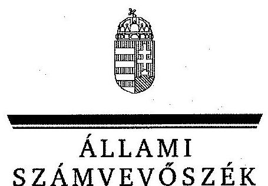

# JELENTÉS 

Az egyensúlyjavító intézkedések ellenőrzése - Az egyes egyensúlyjavító intézkedések és azok hatása a költségvetés végrehajtására című ellenőrzésről

---

# Állami Számvevőszék 

Iktatószám: V-0366-839/2015.
Témaszám: 1400
Vizsgálat-azonosító szám: V0678

## Az ellenőrzést felügyelte:

Dr. Pulay Gyula Zoltán
felügyeleti vezető
Az ellenőrzést vezette:
Gelencsér Zsolt
ellenőrzésvezető
A számvevői jelentések feldolgozásában és a jelentés összeállításában közremüködtek:

Horvátné Menyhárt Erika
számvevő tanácsos
Laki Dóra
számvevő tanácsos
Mokánszkiné Mengyi Andrea
számvevő tanácsos

Az ellenőrzést végezték:

Horvátné Menyhárt
Erika
számvevő főtanácsos
Magyari Anna
számvevő

Molnár Antal Lászlóné
számvevő
Perlusz Krisztina Má-
ria
számvevő

Kántor Ilona
számvevő tanácsos
Marozsán Katalin
számvevő tanácsos
Molnár Gyula Mihály
számvevő főtanácsos
Székely Beáta
számvevő

## Laki Dóra

számvevő tanácsos

Mokánszkiné Mengyi Andrea
számvevő tanácsos
Nagymányai Péter számvevő

---

# TARTALOMJEGYZÉK 

BEVEZETÉS ..... 9
I. ÖSSZEGZŐ MEGÁLLAPÍTÁSOK, KÖVETKEZTETÉSEK, JAVASLATOK ..... 12
II. RÉSZLETES MEGÁLLAPÍTÁSOK ..... 21

1. Az adókat és illetéket/járadékot érintő egyes egyensúlyjavító intézkedések ..... 21
1.1. Az intézkedések bevezetése, módosítása és megszüntetése szükségességének meghatározása ..... 21
1.2. Az intézkedések központi költségvetésre gyakorolt várható éves és éven túli hatásának vizsgálata ..... 22
1.3. Az intézkedések hatásainak előzetes számbavétele ..... 25
1.4. Az egyes évekre előirányzott bevételek teljesülése, és elemzése ..... 26
1.5. Az intézkedések hatásának és teljesülésének figyelemmel kísérése ..... 28
1.6. Az intézkedések hatása a központi költségvetés bevételére, hiányára és adósságára ..... 29
1.7. A népegészségügyi termékadó E. Alapba történő átutalása és az elektronikus útdíj felhasználása ..... 33
2. A tartalékokkal kapcsolatos egyensúlyjavító intézkedések ..... 33
2.1. A stabilizációs célú tartalékokkal kapcsolatos döntések megalapozása, a központi költségvetésre gyakorolt hatás ..... 33
2.2. Az általános tartalék, illetve Rendkívüli Kormányzati Intézkedésekre szolgáló tartalékkal kapcsolatos döntések megalapozása, a központi költségvetésre gyakorolt hatás ..... 37
3. Beszerzési és szerződéskötési korlátozások végrehajtása ..... 40
3.1. A beszerzési és szerződéskötési korlátozások várható hatásainak előzetes felmérése ..... 40
3.2. A korlátozó intézkedések alóli felmentési kérelmek benyújtási és elbírálási folyamatának szabályozása ..... 40
3.3. A korlátozó intézkedések alóli felmentések hatása a központi költségvetés hiányára ..... 43
4. A fejezeti/intézményi költségvetést érintő egyensúlyjavító intézkedések ..... 43
4.1. Az év végi maradványtartási kötelezettség fejezeti/intézményi költségvetésre és feladatellátásra gyakorolt hatása ..... 43
4.2. Az év végi zárolás (csökkentés, törlés, rendkívüli befizetési) fejezeti/intézményi költségvetésre és feladatellátásra gyakorolt hatása ..... 46
4.3. A maradványtartási, a zárolási kötelezettség teljesítés együttes hatása a fejezet/intézmény lejárt kötelezettség állományára ..... 50

---

4.4. A maradványtartási és zárolási kötelezettség hatása a központi költségvetésre

# MELLÉKLETEK 

1. sz. Az ellenőrzés keretében vizsgált egyes adónemek előirányzatainak és teljesítésének alakulása
2. sz. A költségvetési források Útdíj törvény szerinti felhasználása a 2013. évben
3. sz. A központi költségvetés tartalékainak alakulása a 2007-2013. években
4. sz. Beérkezett észrevételek és az azokra adott válaszok

## FÜGGELÉKEK

A rendszerellenőrzés teljesítménykritériumai

---

# RÖVIDÍTÉSEK JEGYZÉKE 

## Törvények

2007. évi költségvetési
tv.
2008. évi költségvetési
tv.
2009. évi költségvetési
tv.
2009. évi zárszámadási
tv.
2010. évi költségvetési
tv.
2010. évi zárszámadási
tv.
2011. évi költségvetési
tv.
2012. évi költségvetési
tv.
2012. évi zárszámadási
tv.
2013. évi költségvetési
tv.
Ágazati különadó tv.
Áht. 1
Áht. 2
ÁSZ tv.
Jat.
Kjtv.
Közm. tv.
NETA törvény
Útdíj tv.
2006. évi CXXVII. törvény a Magyar Köztársaság 2007. évi költségvetéséről
2007. évi CLXIX. törvény a Magyar Köztársaság 2008. évi költségvetéséről
2008. évi CII. törvény a Magyar Köztársaság 2009. évi költségvetéséről
2010. évi XCVIII. törvény a Magyar Köztársaság 2009. évi költségvetésének végrehajtásáról
2009. évi CXXX. törvény a Magyar Köztársaság 2010. évi költségvetéséről
2010. évi XCVIII. törvény a Magyar Köztársaság 2009. évi költségvetésének végrehajtásáról
2010. évi CLXIX. törvény a Magyar Köztársaság 2011. évi költségvetéséről
2012. évi CLV. törvény a Magyar Köztársaság 2011. évi költségvetéséről szóló 2010. évi CLXIX. törvény végrehajtásáról
2011. évi CLXXXVIII. törvény Magyarország 2012. évi központi költségvetéséről
2013. évi CXCIII. törvény Magyarország 2012. évi központi költségvetéséről szóló 2011. évi CLXXXVIII. törvény végrehajtásáról
2012. évi CCIV. törvény Magyarország 2013. évi központi költségvetéséről
az egyes ágazatokat terhelő̉ különadóról szóló 2010. évi XCIV. törvény (hatályon kívül: 2013. I. 1.)
az államháztartásról szóló 1992. évi XXXVIII. törvény (hatályon kívül: 2012. I. 1.)
az államháztartásról szóló 2011. évi CXCV. törvény (hatályos: 2011. XII. 31.-étől)
az Állami Számvevőszékről szóló 2011. évi LXVI. törvény (hatályos: 2011. VII. 1.-jétől)
a jogalkotásról szóló 2010. évi CXXX. törvény
az államháztartás egyensúlyát javító különadóról és járadékról szóló 2006. évi LIX. törvény
a közmúvezetékek adójáról szóló 2012. évi CLXVIII. törvény
a népegészségügyi termékadóról szóló 2011. évi CIII. törvény
az autópályák, autóutak és főutak használatáért fizetendő, megtett úttal arányos díjról szóló 2013. évi LXVII. törvény

---

## Rendeletek

Ámr. 1

Áhsz.

Ámr. 2

Ávr.

24/2011. (VIII. 9.) KIM rendelet
25/2013. (V. 31.) NFM rendelet

## Kormányhatározatok

2216/2007. (XI. 16.)
Korm. határozat

1033/2009. (III. 17.)
Korm. határozat

1214/2009. (XII. 18.)
Korm. határozat

2007/2009. Korm. határozat

2011/2009. Korm. határozat

1132/2010. (V. 18.)
Korm. határozat

1273/2010. (XII. 8.)
Korm. határozat

1318/2010. (XII. 27.)
Korm. határozat

217/1998. (XII. 30.) Korm. rendelet az államháztartás múködési rendjéről
(hatályos: 1999. I. 1.-2009. XII. 31.)
249/2000. (XII. 24.) Korm. rendelet az államháztartás szervezetei beszámolási és könyvvezetési kötelezettségének sajátosságairól
292/2009. (XII. 19.) Korm. rendelet az államháztartás működési rendjéről
(hatályos: 2009. XII. 20. - 2011. XII. 31.)
368/2011. (XII. 31.) Korm. rendelet az államháztartásról szóló törvény végrehajtásáról
(hatályos: 2012. I. 1.-jétől)
az előzetes és utólagos hatásvizsgálatról szóló 24/2011. (VIII. 9.) számú KIM rendelet
az útdíj mértékéről és az útdíjköteles utakról szóló 25/2013. (V. 31.) számú NFM rendelet
a fejezeti bevételek és kiadások 2007. I-III. negyedévi teljesüléséről, a fejezetek egyensúlyi tartalékának felhasználásáról, illetve a fejezetek maradványképzési kötelezettségéről szóló 2216/2007. (XI. 16.) számú kormányhatározat a 2009. évi államháztartási egyensúly megőrzéséhez szükséges intézkedésekről szóló 1033/2009. (III. 17.) számú kormányhatározat
a fejezeti bevételek és kiadások 2009. IV. negyedéves teljesüléséről, a fejezetek zárolt egyensúlyi tartaléka felhasználásáról, valamint a 2009. évi előirányzatzárolások előirányzat-csökkentésre történő módosításáról szóló 1214/2009. (XII. 18.) számú kormányhatározat
a központi költségvetési fejezetek 2009. évi maradványtartási kötelezettsége teljesítését megalapozó intézkedésekről szóló 2007/2009. számú kormányhatározat
a központi költségvetési fejezetek 2009. évi maradványtartási kötelezettsége teljesítését megalapozó intézkedésekről szóló 2007/2009. Korm. határozat módosításáról szóló 2011/2009. számú kormányhatározat
a 2010. évi költségvetéssel összefüggő egyes feladatokról szóló 1132/2010. (V. 18.) számú kormányhatározat
a központi költségvetési fejezetek és a társadalombiztosítási költségvetési szervek 2009. évi előirányzatmaradványainak kezeléséről szóló 1273/2010. (XII. 8.) számú kormányhatározat
a 2010. évi központi költségvetés általános tartalékának előirányzatából történő átcsoportosításról, valamint az egyéb év végi intézkedésekről szóló 1318/2010. (XII. 27.) számú kormányhatározat

---

1316/2011. (IX. 19.) Korm. határozat

1425/2011. (XII. 6.) Korm. határozat

1471/2011. (XII. 23.) Korm. határozat

1505/2011. (XII. 29.) Korm. határozat

1036/2012. (II. 21.) Korm. határozat

1122/2012. (IV. 25.) Korm. határozat

1152/2012. (V. 16.) Korm. határozat

1428/2012. (X. 8.) Korm. határozat

1542/2012. (XII. 4.) Korm. határozat

1635/2012. (XII. 18.) Korm. határozat

1259/2013. (V. 13.) Korm. határozat

1868/2013. (XI. 19.) Korm. határozat
a 2011. évi költségvetési egyensúlyt megtartó intézkedésekről szóló 1316/2011. (IX. 19.) számú kormányhatározat
a rendkívüli kormányzati intézkedések előirányzatból történő átcsoportosításról és a 2011. évi költségvetési egyensúlyt megtartó intézkedésekről szóló 1316/2011. (IX. 19.) Korm. határozat módosításáról szóló 1425/2011. (XII. 6.) számú kormányhatározat
a 2011. évi költségvetési egyensúlyt megtartó intézkedésekről szóló 1316/2011. (IX. 19.) Korm. határozatban elrendelt zárolás csökkentésre változtatásáról és a rendkívüli kormányzati intézkedések előirányzat megemeléséről szóló 1471/2011. (XII. 23.) számú kormányhatározat
a központi költségvetési szervek és az egészségügyi intézmények tartozásállományának csökkentéséről, valamint a gyógyszertámogatás és a gyógyászati segédeszköz támogatásával kapcsolatos lépésekről szóló 1505/2011. (XII. 29.) számú kormányhatározat
a 2012. és a 2013. évi költségvetési hiánycél biztosításához szükséges további intézkedésekről szóló 1036/2012. (II. 21.) számú kormányhatározat
a Széll Kálmán Terv kiterjesztése keretében megvalósítandó egyes intézkedésekről szóló 1122/2012. (IV. 25.) számú kormányhatározat
a Széll Kálmán Terv kiterjesztése keretében megvalósítandó egyes intézkedésekről szóló 1122/2012. (IV. 25.) Korm. határozat módosításáról szóló 1152/2012. (V. 16.) számú kormányhatározat
a 2012. évi költségvetési egyenleg tartását biztosító intézkedésekről szóló 1428/2012. (X. 8.) számú kormányhatározat
a Közigazgatási és Igazságügyi Minisztérium és az Emberi Erőforrások Minisztériuma fejezetek között a megyei levéltárak Magyar Országos Levéltárba történő beolvadásával összefüggésben szükséges előirányzatátcsoportosításról, valamint a Széll Kálmán Terv kiterjesztése keretében megvalósítandó intézkedésekről szóló 1122/2012. (IV. 25.) Korm. határozat módosításáról szóló 1542/2012. (XII. 4.) számú kormányhatározat
egyes kormányhatározatok módosításáról szóló 1635/2012. (XII. 18.) számú kormányhatározat
a túlzott hiány eljárás megszüntetése érdekében szükséges intézkedésekről szóló 1259/2013. (V. 13.) számú kormányhatározat
a túlzott hiány eljárás megszüntetése érdekében szükséges intézkedésekről szóló 1259/2013. (V. 13.) Korm. határozat végrehajtása során alkalmazandó eltérő rendelkezésekről szóló 1868/2013. (XI. 19.) számú kormányhatározat

---

| Szórővidítések |  |
| :-- | :-- |
| ÁSZ | Állami Számvevőszék |
| BM | Belügyminisztérium |
| E. Alap | Egészségbiztosítási Alap |
| EMMI | Emberi Erőforrások Minisztériuma, a Nemzeti Erőforrás |
|  | Minisztérium (NEFMI) elnevezése 2012. május 14-étől |
| GVH | Gazdasági Versenyhivatal |
| HM | Honvédelmi Minisztérium |
| KEHI | Kormányzati Ellenőrzési Hivatal |
| Kincstár | Magyar Államkincstár |
| KIM | Közigazgatási és Igazságügyi Minisztérium |
| KSH | Központi Statisztikai Hivatal |
| KüM | Külügy Minisztérium |
| MTA | Magyar Tudományos Akadémia |
| NAV | Nemzeti Adó- és Vámhivatal |
| NEFMI | Nemzeti Erőforrás Minisztérium |
| NFM | Nemzeti Fejlesztési Minisztérium |
| NGM | Nemzetgazdasági Minisztérium |
| NKA | Nemzeti Kulturális Alap |
| NMI | Nemzeti Művelődési Intézet |
| OGY | Országgyúlés |
| OVA | Országvédelmi Alap |
| OVF | Országos Vízügyi Föigazgatóság |
| PM | Pénzügyminisztérium |
| RKI | Rendkívüli Kormányzati Intézkedések fedezetére képzett |
|  | tartalék |
| TBSZBK | Tokaji Borvidék Szőlészeti és Borászati Kutatóintézet |

---

# ÉRTELMEZŐ SZÓTÁR 

államadósság
államháztartás
állalános tartalék, 2011. évtől: Rendkívüli Kormányzati Intézkedések
egyensúlyjavító intézkedések
elektronikus útdíj
irányító szerv
az államháztartás központi alrendszerének konszolidált adóssága (Áht. 2 /A § (2) bekezdés b) pontja, hatályos 2011. december 31-ig)
az államháztartás központi alrendszerének, az államháztartás önkormányzati alrendszerének, és a kormányzati szektorba sorolt egyéb szervezetek konszolidált adóssága (2011. évi CXCIV. törvény Magyarország gazdasági stabilitásáról 2. § (1) bekezdés a) pontja, hatályos 2012. január 1-jétől)
az államháztartás részét képezi a központi alrendszer (a központi kormányzat, az elkülönített állami pénzalapok, valamint a társadalombiztosítás), valamint a helyi önkormányzatok költségvetései
a nem várt, előre nem tervezhető események, valamint évközben meghozott kormányzati intézkedésekből adódó feladatok finanszírozására szolgál (Áht. 2 21. § (4) bekezdés)
ellenőrzésünk során az egyensúlyjavító intézkedések alatt értjük:

- bevételi oldalt érintő intézkedések közül: a különadókat és járadékokat (magánszemélyek és társas vállalkozások különadója, hitelintézetek járadéka és különadója), az egyes ágazatokat terhelő különadót, a távközlési adót, a biztosítási adót, a pénzügyi tranzakciós illetéket, a közművezetékek adóját;
- fejezeti költségvetés bevételi oldalát érintő népegészségügyi termékadót és az elektronikus útdíjat;
- tartalékképzést (általános tartalék/Rendkívüli Kormányzati Intézkedések, stabilizációs célú tartalékok/Országvédelmi Alap);
- a kiadási oldalt érintő intézkedések közül: zárolást (csökkentést, törlést, rendkívüli befizetést), maradványtartási kötelezettséget, a Kormány irányítása alá tartozó fejezetekre vonatkozó beszerzési és szerződéskötési tilalmat.

2013. évi költségvetésben az útdíj pontos helye: XVII. NEMZETI FEJLESZTÉSI MINISZTÉRIUM- 22. Elektronikus útdíj. 2014. évtől az útdíj a „költségvetés közvetlen bevételei - 4. egyéb központosított bevételek - egyéb költségvetési bevé-telek- 2. központosított bevételek" soron jelenik meg. Mivel a költségvetés közvetlen bevételei jellemzően adó és járulékbevételek a jelentésben az útdíjat külön nem különítjük el, adóként szerepeltetjük.
a központi alrendszer egyes intézményével és annak gazdálkodásával kapcsolatos irányítási jogokkal felruházott szerv vagy személy

---

Konvergencia program
központi alrendszer egyes intézményei (intézmények)
maradvány
Pearson-féle korrelációs együttható
stabilizációs célú tartalékok
zárolás
a nem euró övezeti tagállamok terjesztik be az EU Bizottságának; a program ismerteti a tagállamok középtávú költségvetési stratégiáját, azaz azt, hogy az egyes tagállamok a Paktummal összhangban miként kívánnak középtávon rendezett költségvetési egyenleget elérni vagy megőrizni
a központi alrendszerbe tartozik az állam, a központi költségvetési szerv, a törvény által a központi alrendszerbe sorolt köztestület, valamint az utóbbi által irányított köztestületi költségvetési szerv (Áht. 2 3. § (2) bekezdés)
a költségvetési év során az alaptevékenység bevételeinek és kiadásainak különbözete, amely az államháztartás központi alrendszerében a módosított bevételi és kiadási előirányzatok és azok teljesítésének a Kormány rendeletében meghatározott tételekkel korrigált különbözeteként megjelenő előirányzat-maradvány, az államháztartás önkormányzati alrendszerében a teljesített bevételeknek és kiadásoknak a Kormány rendeletében meghatározott tételekkel korrigált különbözeteként megjelenő pénzmaradvány (Áht. 2 . § m) pont)
két változó mennyiség közötti kapcsolat szorosságát jellemezó mérőszám, mely a lineáris kapcsolat szorosságát méri.
az államháztartási egyensúly biztosításához kötött tartalék, a központi egyensúlyi tartalék, a fejezeti egyensúlyi tartalék, a stabilitási tartalék, a kamatkockázati tartalék és az Országvédelmi Alap
a kiadási előirányzatok felhasználásának időlegesen, feltételhez kötötten történő korlátozása, felfüggesztése (Áht. 2 . § s) pont)

---

# JELENTÉS 

## Az egyensúlyjavító intézkedések ellenőrzése Az egyes egyensúlyjavító intézkedések és azok hatása a költségvetés végrehajtására címú ellenőrzésről

## BEVEZETÉS

A pénzügyi/államháztartási egyensúly helyreállítása érdekében 2006-tól a kormányok folyamatosan döntöttek bevételnövelő és kiadáscsökkentő intézkedésekről. Először a 2007. évi költségvetési törvény rendelkezett a központi egyensúly tartalékról. A központi költségvetésről szóló törvényekben meghatározott általános tartalék, illetve Rendkívüli Kormányzati Intézkedésekre szolgáló tartalék felhasználásáról a Kormány - törvényi felhatalmazás alapján egyedi határozatokban rendelkezett.

Az egyensúlyjavító intézkedésekre vonatkozó jogi szabályozás (költségvetési törvények, Áht., Ámr., Ávr., különféle adókról szóló törvények) többször változott a 2007. és a 2013. évek között.

A Nemzeti Reform Programok (beleértve a Széll Kálmán Tervet is) és a Konvergencia Programok célkitűzésként fogalmazták meg az államháztartás egyensúlyának javítását, a költségvetési hiány 3\% alatt tartását. Ennek érdekében a Kormány különböző egyensúlyjavító intézkedéseket hozott. Az egyensúlyjavító intézkedések fogalmát jogszabály nem határozta meg, ugyanakkor egyes jogszabályok bevezetését a jogalkotó egyensúlyjavító intézkedésként nevesítette. Ellenőrzésünk azokra a nem strukturális jellegű intézkedésekre terjedt ki, amelyeknek hatása az éves költségvetésre közvetlenül megítélhető. Mindezek figyelembevételével ellenőrzésünk során egyensúlyjavító intézkedések alatt a következő intézkedéseket értettük:

- a költségvetés bevételi oldalát érintő intézkedések közül a különadókat és járadékokat (magánszemélyek és társas vállalkozások különadója, hitelintézetek járadéka és különadója), az egyes ágazatokat terhelő különadót, a távközlési adót, a biztosítási adót, a pénzügyi tranzakciós illetéket, a közművezetékek adóját;
- fejezeti költségvetés bevételi oldalát érintő népegészségügyi termékadót és az elektronikus útdíjat;
- tartalékképzést (stabilizációs célú tartalékok, illetve Országvédelmi Alap, általános tartalék, illetve Rendkívüli Kormányzati Intézkedések);
- a költségvetés kiadási oldalát érintő intézkedések közül a zárolást (csökkentést, törlést, rendkívüli befizetést), a maradványtartási kötelezettséget, vala-

---

mint a Kormány irányítása alá tartozó fejezetekre vonatkozó beszerzési és szerződéskötési tilalmat.

Az Állami Számvevőszék (a továbbiakban: ÁSZ) Stratégiája a szervezet küldetéseként fogalmazta meg, hogy ellenőrzéseivel előmozdítsa a közpénzügyek átláthatóságát, rendezettségét és hozzájáruljon a „jó kormányzáshoz". Ez alapján az államháztartás komplex folyamatainak átláthatósága érdekében rendszerszemléletű, holisztikus megközelítésű, egymásra épülő, a szinergia-hatást kihasználó, összefoglaló értékelésekre lehetőséget adó ellenőrzéseket végez.

Az ellenőrzés kiterjedt a központi költségvetés bevételi és kiadási előirányzatait érintő, meghatározott egyensúlyjavító intézkedések értékelésére. Értékeltük a megtett intézkedések meghozatalának, módosításának, valamint működtetésének jellemzőit. Ennek keretében ellenőriztük az intézkedésekről meghozott döntések mechanizmusát, az intézkedések végrehajtását, továbbá mindezek hatását a költségvetés egyensúlyi helyzetére, valamint a költségvetés és az államháztartás hiányának és adósságának alakulására. Az egyensúlyjavító intézkedések között nem értékeltük a személyi jövedelemadó, az általános forgalmi adó, valamint a jövedéki adó mértékének változásait és azok költségvetésre gyakorolt hatását. Az ellenőrzés nem terjedt ki az egyensúlyjavító intézkedésekkel összefüggő, a Konvergencia Programokban és a Nemzeti Reform Programokban megfogalmazott kormányzati szerkezet-átalakító intézkedések költségvetési hatásának értékelésére. Az ellenőrzés nem érintette továbbá az államháztartási rendszerekben történt változtatások hatásait, így a magánnyugdíjpénztári vagyon 2011. évi átvételének hatását, valamint az önkormányzatok által a költségvetésük egyensúlyban tartása érdekében tett intézkedéseket.

Az ÁSZ a költségvetési törvényjavaslatok véleményezése, valamint a költségvetés végrehajtásának ellenőrzése keretében minden évben értékelte az egyensúlyjavító intézkedéseket pénzügyi szabályszerűségi szempontból. Az ellenőrzést indokolta, hogy az ÁSZ rendszerszemléletű értékelést még nem készített az egyensúlyjavító intézkedések több évet átfogó hatásairól. Ezért ellenőrzésünk keretében - hasznosítva a költségvetés tervezésével és végrehajtásával kapcsolatban tett korábbi ÁSZ ellenőrzések adatait, megállapításait - átfogóan értékeltük a 2007. és a 2013. évek között hozott, az ellenőrzés hatókörébe vont egyensúlyjavító intézkedések összefüggéseit és hatását a központi költségvetés egyensúlyi helyzetére, valamint az államadósság alakulására.

Az ellenőrzés célja volt, hogy rendszerellenőrzés keretében értékelje a kormányok által 2007. és 2013. között végrehajtott egyensúlyjavító intézkedések szerepét, jellemzőit, a döntések előkészítését, végrehajtását. Az ellenőrzés értékelte a költségvetési törvényekben, jogszabályokban, kormányhatározatokban megjelenő bevételt növelő és kiadást csökkentő, illetve az államháztartási egyensúly javítása érdekében tett intézkedések hatását a költségvetés végrehajtására, különös tekintettel az államháztartás hiányára és az államadósság alakulására, valamint a központi alrendszer érintett intézményeire.

Ellenőrzési megállapításainkkal átfogó képet kívánunk adni arról, hogy az ellenőrzésünk hatókörébe vont egyensúlyjavító intézkedések megfelelő megalapozással, költségvetési hatással rendelkeztek-e. Az egyensúlyjavító intézkedések

---

számbevétele segítheti a döntéshozókat, az OGY-t, a Kormányt a különböző egyensúlyjavító eszközöket meghatározó jogszabályok alkotásában, felülvizsgálatában, módosításában, ezáltal támogatást nyújthat a „jó kormányzáshoz".

Az ellenőrzést az ÁSZ 2014. I. félévi ellenőrzési terve alapján a számvevőszéki ellenőrzés szakmai szabályai szerint, a rendszerellenőrzés módszerével, a vonatkozó nemzetközi standardok figyelembevételével végeztük.

# Az ellenőrzés a 2007. január 1. - 2013. december 31. közötti időszakra terjedt ki. 

Az ellenőrzést a Miniszterelnökségnél, a Közigazgatási és Igazságügyi Minisztériumnál, a Nemzetgazdasági Minisztériumnál, a Nemzeti Fejlesztési Minisztériumnál, az Emberi Erőforrások Minisztériumánál, továbbá az előzetes adatbekérés alapján meghatározott fejezeteknél, intézményeknél, alapoknál és alapkezelőknél folytattuk le. Az ellenőrzés során adatokat kértünk be a Magyar Államkincstártól (a továbbiakban: Kincstár).

Az ellenőrzés jogszabályi alapját az ÁSZ tv. 1. § (3) bekezdése, az 5. § (2)(6) bekezdései, valamint az Áht. 2 61. § (2) bekezdésének előírásai képezték.

Az ÁSZ a jelentéstervezetet az Állami Számvevőszékről szóló 2011. évi LXVI. törvény 29. §-a alapján észrevételezésre megküldte a Miniszterelnökségnek, az Igazságügyi Minisztériumnak, a Nemzetgazdasági Minisztériumnak, a Nemzeti Fejlesztési Minisztériumnak, az Emberi Erőforrások Minisztériumának. A beérkezett észrevételeket a jelentés véglegesítése során hasznosítottuk. Az észrevételeket és az azokra adott válaszokat a jelentés 4 . számú melléklete tartalmazza.

---

# I. ÖSSZEGZŐ MEGÁLLAPÍTÁSOK, KÖVETKEZTETÉSEK, JAVASLATOK 

Ellenőrzésünk a költségvetés bevételi oldalát érintő egyensúlyjavító intézkedések közül a különadókat és járadékokat, az egyes ágazatokat terhelő különadót, a távközlési adót, a biztosítási adót, a pénzügyi tranzakciós illetéket, a közművezetékek adóját, továbbá fejezeti költségvetés bevételi oldalát érintő népegészségügyi termékadót és az elektronikus útdíjat értékelte. A költségvetés kiadási oldalát érintő intézkedések közül a zárolást, a maradványtartási kötelezettséget, valamint a Kormány irányítása alá tartozó fejezetekre vonatkozó beszerzési és szerződéskötési tilalmat, továbbá a tartalékképzést és felhasználást ellenőriztük.

Az egyensúlyjavító intézkedések az ellenőrzött időszak minden évében jelen voltak. Általuk részben a központi költségvetés bevételeinek növelése, részben kiadásainak mérséklése valósult meg. Egy részük a tartalékok képzését, felhasználását, állományának változását célozta. Az egyensúlyjavító intézkedések időbeni hatását a következő táblázat szemlélteti.
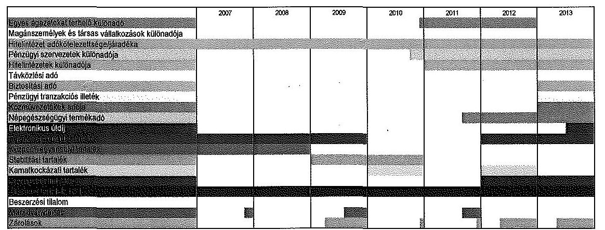

Az egyensúlyjavító intézkedések költségvetési hatásait összegszerűen a következő táblázat tartalmazza:

| Megnevezés | 2007 | 2008 | 2009 | 2010 | 2011 | 2012 | 2013 |
| :--: | :--: | :--: | :--: | :--: | :--: | :--: | :--: |
| Különsstök, járadékok teljesített elöirányzata* | 212,0 | 240,8 | 195,0 | 321,1 | 352,0 | 272,5 | 554,2 |
| Maradvány és zárolás összege (dec. 31.) | 400,0 | 583,2 | 738,7 | 687,5 | 648,6 | 813,2 | 828,9 |
| Tartalékok év végi állománya | 0,5 | 2,0 | 158,7 | 183,7 | 0,0 | 320,1 | 315,9 |
| Összesen | 612,5 | 826,0 | 1092,4 | 1192,3 | 1000,6 | 1405,8 | 1699,0 |
| Központi költségvetés hiánya (módosított elöirányzat) | 1656,5 | 1117,7 | 675,9 | 830,0 | 1531,0 | 689,5 | 1117,8 |
| Központi költségvetés pénzforgalmi hiánya (teljesités) | 1398,1 | 870,0 | 743,7 | 853,9 | 1727,1 | 611,2 | 985,3 |

[^0]
[^0]:    * fejezeti költségvetést érintő népegyészségügyi termékadó és elektronikus útdíj nélkül

---

Az egyensúlyjavító intézkedések alapvető célja - az azokat bevezető intézkedések indokolásai szerint - egyrészt az államháztartási egyensúly javítása volt, másrészt az ellenőrzött időszak második felében a hiánycél elérése és megtartása, illetve a költségvetési bevételek növelése volt. Az egyes intézkedések különböző mértékben járultak hozzá a központi költségvetés bevételeinek növeléséhez, a kiadások csökkentéséhez és ezáltal az egyensúly javításához. Bár az intézkedések összesített hatása az ellenőrzött időszak 4 évében összegszerűen meghaladta a központi költségvetés tényleges hiányának összegét, a 2009., 2010. és 2011. években ezek az intézkedések kevésnek bizonyultak a hiánycél tartásához. A központi költségvetés hiánya ezekben az években a módosított előirányzatot meghaladó mértékben teljesült. A hiány összegére, az egyensúlyi helyzetre összetett folyamatok, intézkedések hatottak. Az ellenőrzésnek nem volt célja ezek teljes körű feltérképezése, hatásának elemzése.

A központi költségvetés bevételi oldalát érintő különadó és járadékbevételek elérését célzó adónemek száma a 2007-2009 években meglévő háromról - a Kormány bevétel-növelő intézkedéseinek eredményeként, egyes adónemek kivezetése és új adónemek bevezetésének hatására - a 2013. évre hétre nőtt. Az intézkedések által befolyt bevételek 212,0 Mrd Ft-ról 554,2 Mrd Ft-ra, 261,4\%-ra nőttek. A központi költségvetés bevételi főösszegére az ellenőrzött években - a 2009. és 2012. évek kivételével - emelkedő mértékű növelő hatást gyakoroltak. Az ábra a különadó és járadékbevételeket veti össze a költségvetés bevételi főösszegével \%-os arányban. Ezen és a további ábrákon is feltüntettük a görbére illeszthető trendvonalat, ami a változás irányát és mértékét mutatja.
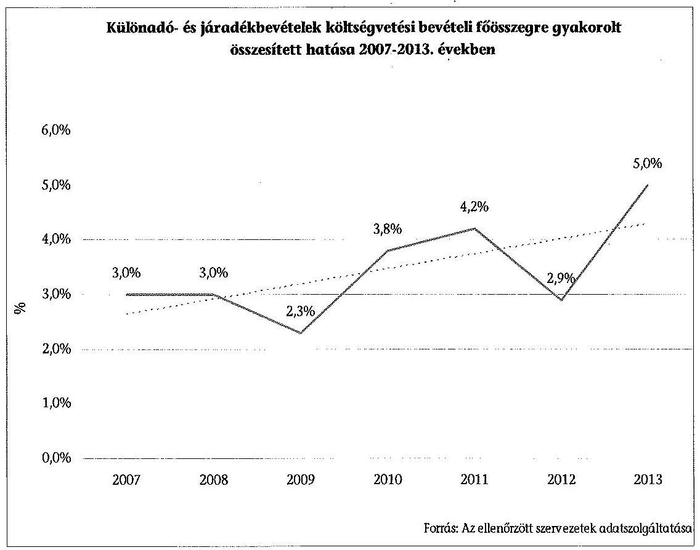

---

A külön adók és járadékok legmagasabb teljesített összege a 2013. évben volt. Ekkorra kivezetésre került a magánszemélyek és a társas vállalkozások különadó kötelezettsége és az egyes ágazatokat érintő különadó. A hitelintézetek adókötelezettsége/járadéka, a pénzügyi szervezetek és a hitelintézetek különadója valamint a távközlési adó mellett 2013-ban bevezetésre került a biztosítási adó, a pénzügyi tranzakciós illeték, és a közművezetékek adója. A 2013. évben e három új intézkedésből befolyt teljesített bevétel (26,2 Mrd Ft, 259,6 Mrd Ft és 54,9 Mrd Ft) a központi költségvetés bevételi főösszegét összesen 340,7 Mrd Ft-tal, 3,1\%-kal növelte. A 2013. évben tovább növelte az adó és járadékbevételeket a 2011. évben bevezetett népegészségügyi termékadó mellett az elektronikus útdíj is (2011. évben a népegészségügyi termékadó a központi költségvetés bevétele volt). E két adónem egyensúlyjavító hatása csak közvetetten érvényesült, hiszen az ebből származó bevételeket 2012-től az E. Alapba utalták, illetve az utak karbantartására kellett fordítani.

Az ellenőrzött időszakban a külön adók és járadékok növekvő mértékű bevételnövelő hatása csökkentően hatott a központi költségvetés hiányára.

Az egyes intézkedések költségvetési hiányra gyakorolt hatásának értékeléséhez az alábbi mutatót alkalmaztuk: az adott intézkedés összege / (költségvetési hiány + az adott intézkedés összege) (\%-os arány).

A kiszámított \%-os arány azt mutatja, hogy az egyes intézkedésekből keletkezett éves összeg milyen arányban fejtett ki csökkentő hatást a költségvetés hiányának alakulására. A mutatók nevezóje egy fiktív összeg, amely azt fejezi ki, hogy mekkora lett volna a hiány, amennyiben az adott intézkedés nem realizálódott volna.
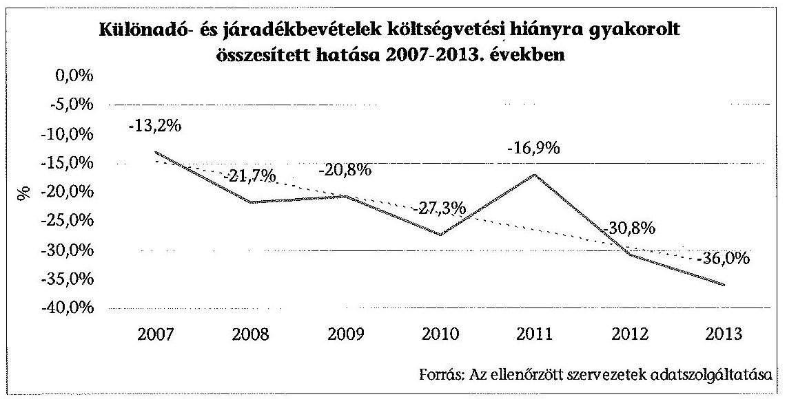

A központi költségvetés kiadási oldalát érintő intézkedések közül a maradványtartás és zárolás együttes teljesített összege a központi költségvetés kiadási főösszegéhez viszonyítva növekvő tendenciát mutatott, azaz az el nem költött előirányzat növekvő mértékben csökkentette a kiadási főösszeget.

---

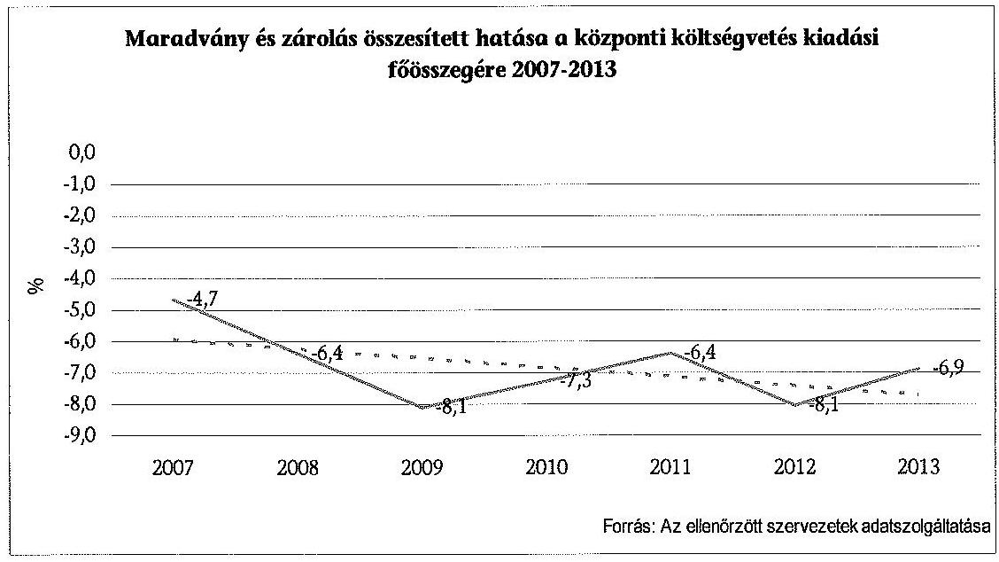

Az év végi maradvány teljesített összege a 2007. évi 400,0 Mrd Ft-ról a 2013. év végére közel megduplázódott, 772,2 Mrd Ft-ra nőtt. A zárolások összege a 2009. évben volt a legmagasabb, 101,2 Mrd Ft-ot tett ki.

A maradvány és zárolás kiadásokon belüli növekvő arányából adódóan, a fel nem használt előirányzat kedvezően hatott a központi költségvetés hiányának alakulására. Összességében megállapítható, hogy az ellenőrzött időszakban az év végi maradványtartás és a zárolás jellemzően növekvő tendenciája átlagosan $39,4 \%$-kal csökkentette a központi költségvetés hiányát.
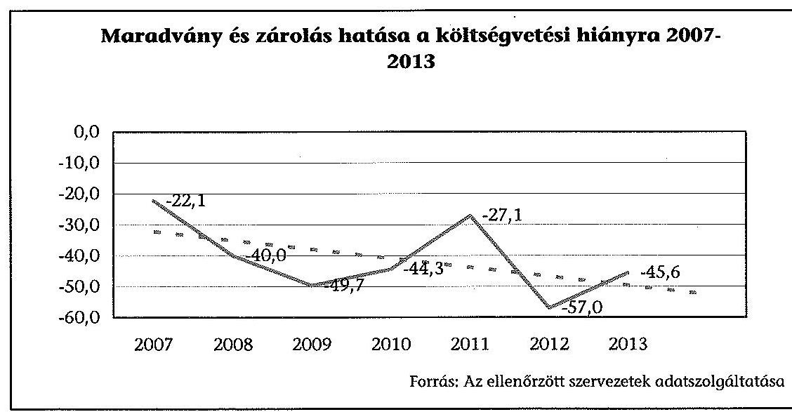

A beszerzési és szerződéskötési korlátozások költségvetésre gyakorolt hatása öszszegszerủen nem ismert, csak a felmentésekről áll rendelkezésre adat. A korlátozások alóli felmentések a kiadási előirányzatok felhasználása miatt az egyensúlyt rontották.

---

A tartalékok képzése az ellenőrzött időszak második felében kapott nagyobb hangsúlyt. (Kivétel a 2011. év, amikor nem volt stabilizációs célú tartalék.) A stabilizációs célú tartalékok (központi egyensúlyi tartalék, fejezeti egyensúlyi tartalék, stabilitási tartalék, kamatkockázati tartalék, Országvédelmi Alap) módosított előirányzatának összege a 2007. évi 125,4 Mrd Ft-ról 2013-ra 337,5 Mrd Ft-ra, több mint két és félszeresére nőtt. Hasonlóan az általános tartalék/rendkívüli kormányzati intézkedésekre szolgáló tartalék módosított előirányzatának összege is több mint kétszeresére nőtt, 45,6 Mrd Ft-ról 106,9 Mrd Ft-ra.

A költségvetésre a tartalékok év végi állománya hatott, ami a 2007. évi 0,5 Mrd Ft-ról 2013. év végére 315,9 Mrd Ft-ra nőtt. Az ellenőrzött időszak elején a megképzett stabilizációs célú tartalékok összegét - jellemzően az év végén - felhasználták. 2009-től a stabilizációs célú tartalékokból két évben használtak fel, 2009-ben 1,6 Mrd Ft-ot, míg 2013-ban 21,6 Mrd Ft-ot. E tendenciából adódóan a stabilizációs célú tartalékok növekvő mértékű csökkentő hatást gyakoroltak a központi költségvetés hiányára.
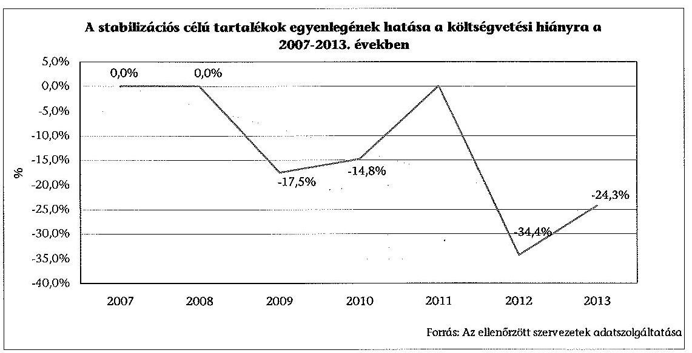

Az általános tartalék/rendkívüli kormányzati intézkedésekre szolgáló tartalékok közel teljes összege az ellenőrzött időszak minden évében felhasználásra került, így egyensúlyt javító szerepet nem töltött be.

Az egyensúlyjavító intézkedések nem egyszeri, rendkívüli intézkedésekként voltak jelen a költségvetési gazdálkodásban, hanem az ellenőrzött időszak hét évéről szerzett tapasztalatok alapján folyamatosan, egymással párhuzamosan léteztek és hatottak. A bevételt növelő intézkedések (külön adók, járadékok) jellemzően nem egy adott költségvetési évre kerültek bevezetésre. A kiadási oldalt érintő intézkedések - alapvetően a hiánycél biztosítása érdekben - az adott évre vonatkozóan rögzítettek előirányzatokat, állapítottak meg gazdálkodási szabályokat. Fontos ezért, hogy áttekintsük, hogyan történt az intézkedések előkészítése, továbbá hogyan hatottak ezek az intézkedések az egyensúly javítása mellett a költségvetési gazdálkodásra.

A bevételi oldalra hosszabb távon ható új adónemek bevezetését megelőzően a távközlési adó, a biztosítási adó, a közművezetékek adója, a népegész-

---

ségügyi termékadó és az elektronikus útdíj esetében a Jat.-nak megfelelően a jogszabály előkészitője megvizsgálta a tervezett jogszabály valamennyi jelentősnek ítélt hatását, így a társadalmi, gazdasági és költségvetési hatásokat, az intézkedés szükségességét, az intézkedés elmaradásának várható következményeit, az alkalmazás személyi, szervezeti és pénzügyi feltételeit. A pénzügyi tranzakciós illeték esetében a Jat. 17. §-ának előírásai ellenére nem állt az ellenőrzés rendelkezésére hasonló dokumentum.

A Kjtv. és az Ágazati különadó tv. előírásai alapján fizetendő adók és járadékok esetében a döntéseket - a bevezetés szükségességét indokoló - dokumentumokkal alátámasztották, azonban a Kjtv. hatálya alá tartozó adónemek esetében nem álltak megfelelő számítások rendelkezésre az adó alapjára, az érintett adóalanyok számára, a várható adó nagyságrendjére vonatkozóan. A központi költségvetésre gyakorolt éven túli hatás nem került bemutatásra.

A különadókból és járadékokból származó bevételek teljesülését az ellenőrzött időszakban a NAV által havonta szolgáltatott monitoring adatokon keresztül figyelemmel kísérték, lehetővé vált - a bevétel biztosítása érdekében - a szükséges beavatkozások (jogszabály módosítások, kiegészítések, hatályon kívül helyezések) megtétele. Az ellenőrzött adók és járadékok teljesített bevétele két évben (2007. és 2008. években) haladta meg a módosított előirányzatot. Egy évben (2010-ben) - az évközi bevezetés miatt - nem volt teljes körűen tervezett előirányzat, négy évben a teljesítés elmaradt a várakozásoktól. Ezt a következő tábla illusztrálja:

| Megnevezés |  | 2007 | 2008 | 2009 | 2010 | 2011 | 2012 | Mel Pr. 2013 |
| :--: | :--: | :--: | :--: | :--: | :--: | :--: | :--: | :--: |
| Különadok es   járadék/illeték   összesen | módosított   elöirányzat | 192,9 | 212,5 | 237,7 | 17,5 | 358,8 | 350,1 | 619,0 |
|  | teljesités | 212,0 | 240,8 | 195,0 | 321,1 | 352,0 | 272,5 | 554,2 |

Az egyes adónemeket elrendelő jogszabályok módosítására 33 alkalommal került sor, amelyekhez 4 esetben készült hatásvizsgálati lap. A 24/2011. (VIII. 9.). KIM rendelet szerint hatásvizsgálati lapot abban az esetben nem kell készíteni, ha a jogszabály módosítása technikai jellegű. A módosításokra 28 esetben nem technikai okok miatt került sor, hanem az adó mértékére, alapjára, adózók körére, illetve más, a bevételi összeg változását is eredményező okok miatt. A Jat. előírása szerint a miniszter folyamatosan figyelemmel kíséri a feladatkörébe tartozó jogszabályok hasznosulását és szükség szerint utólagos hatásvizsgálatot folytat le. Utólagos hatásvizsgálat készítésére az ellenőrzött időszakban egy adónem esetében egy alkalommal került sor. Az ellenőrzés tapasztalatai alapján, utólagos hatásvizsgálat több esetben is indokolt lett volna, tekintettel arra, hogy a tervezett bevételek több adónem esetében is elmaradtak az előzetes hatásvizsgálatban foglaltaktól.

A kiadási oldalt érintő ellenőrzött intézkedések esetében (maradványtartás, zárolás, beszerzési és szerződéskötési korlátozás) a döntések év közben születtek és csak az adott évre szóltak (kivétel a beszerzési és szerződéskötési korlátozásról szóló 1036/2012. (II. 21.) Korm. határozat, amelyben a 2013. évre is kiterjesztették a tilalmat). Az intézkedések előkészítése során a központi költségvetés adott, illetve az év végére várható pozíciója volt a meghatározó, egyéb ha-

---

tásokkal az előkészítő nem számolt. Maradványtartási kötelezettség a 2007., 2009. és 2011. években, zárolás a 2009. évtől kezdődően valamennyi évben, beszerzési és szerződéskötési korlátozás pedig a 2010. évtől volt jelen a rendszerben. Az egyedi intézkedések folyamatossá váltak, azonban a végrehajtás kereteit, az egyedi elbírálás feltételeit esetenként rögzítette az intézkedést elrendelő kormányhatározat. A lebonyolítás részletes, vagy kevésbé részletes szabályait a maradványtartás és a zárolás esetében az intézkedést előkészítő fejezet (PM/NGM) eseti rendelkező levele tartalmazta. A központi intézkedést követően a fejezetek saját intézményeik felé rendelték el a maradványtartást/zárolást. A beszerzési és szerződéskötési korlátozás esetében a lebonyolító szervezet (Kincstár) útmutatója tartalmazta a benyújtási és elbírálási folyamat szabályait. Az egyedi elbírálásokat (pl. maradványtartási kötelezettség összegének csökkentése, beszerzési tilalom alóli felmentés) bírálati szempontokkal nem támogatták.

Az ellenőrzés során egyensúlyjavító intézkedésként számba vett intézkedések közül az év végi maradványok nagysága képviseli a legnagyobb, és évről-évre növekvő összeget. Felhasználásának korlátozásával közvetlenül lehet hatni az adott évi egyensúly alakulására. Növekvő tömege azonban - elköltése esetében - kockázatot is hordoz, bár objektív okok miatt az év végén meghozott döntések (pl. maradványtartási kötelezettség december végi feloldása, áthúzódó kifizetések, az év közben meghirdetett pályázati keretek maradványa, az év végi támogatási többletek elköltésének áthúzódása, a döntések, szerződéskötések elhúzódása) az éven belüli elkölthetőség ellen hatnak.

A maradványtartás, zárolás esetében az elvárt keretszámok teljesültek. A beszerzési tilalom, szerződéskötési korlátozás esetében elvárt keretszám nem volt. A fenti intézkedések fejezetek, intézmények költségvetési gazdálkodására való hatását az előkészítő nem vizsgálta azzal az indokkal, hogy ezek nem véglegesen ható intézkedések. Az ellenőrzött intézmények adatszolgáltatása alapján az intézkedések a feladatellátás zavartalanságát nem veszélyeztették, szakmai feladatok elmaradására nem került sor. Az ellenőrzött intézmények adatszolgáltatásukban jelezték, hogy a múködtetési feladatok körében történtek halasztások. A központi alrendszer lejárt kötelezettségállománya az ellenőrzött időszakban folyamatosan növekvő tendenciát mutatott, a 2007. évi 14,6 Mrd Ft-ról több mint hatszorosára 89,0 Mrd Ft-ra nőtt a 2013. év végére. Az ellenőrzött intézmények esetében a maradvány és zárolás valamint a lejárt kötelezettségek állománya között az ellenőrzött időszakban erős kapcsolat figyelhető meg.

A stabilizációs célú tartalékok céljáról, mértékéről az adott évi költségvetési törvények rendelkeztek. A tervezett előirányzatok összegét megalapozó háttérszámítások nem ismertek. A stabilizációs célú tartalékok felhasználására vonatkozó eljárásrendek nem készültek. Az előirányzatok jellemzően év végén végrehajtott felszabadítása (2007. és 2008. években) a teljes körű felhasználást nem tette lehetővé a tárcák számára. Az általános tartalék/RKI mértéke az adott év költségvetési törvényében volt meghatározott az Áht. ${ }_{1,2}$ rendelkezései alapján. Az általános tartalék, illetve az RKI felhasználása során a költségvetési törvényekben foglaltakat betartották, azonban felhasználásuk célja a 2007-2012. években nem felelt meg az Áht. ${ }_{1}$-ben, illetve az Áht. ${ }_{2}$-ben foglalt előírásoknak.

---

Az ellenőrzött időszakban az egyensúlyjavító intézkedéseken belül a különadók aránya a 2007. évben 34,6\% volt, a 2013. évre közel hasonlóan alakult, 32,6\%ra változott. A maradványok, zárolások aránya csökkenő tendenciát mutatott, $65,3 \%$-ról $48,8 \%$-ra változott. A legnagyobb változást az intézkedéseken belül a 2012., 2013. évi jelentős tartalékképzéssel összefüggésben - a tartalékok állományának arányváltozása jelentette, ami a 2007. évi $0,1 \%$-ról a 2013. év végére $18,6 \%$-os arányt jelentett. Az intézkedések a költségvetési hiányra gyakorolt összesített hatását a következő diagram szemlélteti.
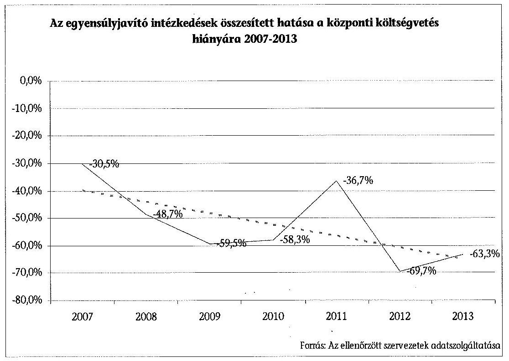

Az egyensúlyjavító intézkedések rendszerszemléletben történő ellenőrzése alapján azt kell mondanunk, hogy az intézkedések nem alkottak egységes rendszert. A több különböző rendszer logikái bizonyos esetekben hasonlóságot mutattak pl. bevételnövelő intézkedések (adók) esetében, más esetekben nagyon eltérő jellegzetességeket hordoztak, pl. a szerződéskötési korlátozások esetében még kitűzött, elérendő cél sem volt oly módon, mint a többi intézkedésnél, ahol az összegszerű célt kitűzték. A rendszer vizsgálatában 3 különböző típus figyelhető meg. A bevételnövelő intézkedések esetében az adók kivetésének jellegzetességeit, logikáját és rendszerét lehet felfedezni. A kiadáscsökkentések egyik fajtája az előzetesen meghatározott összegű kiadáscsökkentések rendszere, ide tartoznak a maradványtartási, zárolási intézkedések. A harmadik típus a beszerzési, szerződéskötési korlátozások rendszere, ahol összegszerű cél nincsen, a rendszer a kivételszerű engedélyezésre épül, aminek kritériumai nem ismertek. Ennél a típusnál a hatás sem ismert, hiszen a gyakorolt hatás egybemosódik a maradványokban a maradványtartás és zárolás hatásaival. Az egyensúlyjavító intézkedések ellenőrzésének tapasztalatai alapján a költségvetési gazdálkodás minden szintjén erősítendő a takarékos és hatékony forrásfelhasználás ösztönzése.

---

A helyszíni ellenőrzés megállapításainak hasznosítása mellett javasoljuk:

# A nemzetgazdasági miniszternek: 

1. A bevételi oldalra hosszabb távon ható új adónemek bevezetését megelőzően a távközlési adó, a biztosítási adó, a közművezetékek adója, a népegészségügyi termékadó és az elektronikus útdíj esetében a Jat.-nak megfelelően a jogszabály előkészítője megvizsgálta a tervezett jogszabály valamennyi jelentősnek ítélt hatását, így a társadalmi, gazdasági és költségvetési hatásokat, az intézkedés szükségességét, az intézkedés elmaradásának várható következményeit, az alkalmazás személyi, szervezeti és pénzügyi feltételeit. A pénzügyi tranzakciós illeték esetében a Jat. 17. §-ának előírásai ellenére nem állt az ellenőrzés rendelkezésére hasonló dokumentum.
A 24/2011. (VIII. 9.). KIM rendelet szerint hatásvizsgálati lapot abban az esetben nem kell készíteni, ha a jogszabály módosítása technikai jellegű. A módosításokra 28 esetben nem technikai okok miatt került sor, hanem az adó mértékére, alapjára, adózók körére, illetve más, a bevételi összeg változását is eredményező okok miatt.

Javaslat:
Intézkedjen, hogy az NGM által előkészített, nem technikai jellegű törvénytervezetek előterjesztése előtt - a jogszabályban előírtaknak megfelelően - készüljenek hatásvizsgálatok, hatásvizsgálati lapok.

---

# II. RÉSZLETES MEGÁLLAPÍTÁSOK 

## 1. Az adókat és illetéket/járadékot érintő egYes eGyENSÚLYJAVÍTÓ INTÉZKEDÉSEK

### 1.1. Az intézkedések bevezetése, módosítása és megszüntetése szükségességének meghatározása

Az ellenőrzött időszakot is érintően az OGY a költségvetés egyensúlyának javítása érdekében, az általános adófizetési kötelezettséget meghaladó közteherviselésre képes adófizetők szolidaritására alapozva, a Kjtv.-ben különadó- és járadékfizetési kötelezettséget állapított meg. A Kjtv.-ben egyensúlyjavító intézkedésként nevesített adónemek bevezetése és módosítása, továbbá az Ágazati különadó tv. szükségességének meghatározása dokumentumokkal alátámasztott volt. Az adó alapjára, az érintett adóalanyok számára és a várható adó nagyságrendjére vonatkozó számítások azonban - az egyes ágazatokat terhelő különadó fizetési kötelezettség kivételével - nem álltak az ellenőrzés rendelkezésére.

Különadó és járadékfizetési kötelezettségként bevezetésre került 2006-ban a magánszemélyek és a társas vállalkozások különadója, valamint a hitelintézetek adókötelezettsége és járadéka, 2010-ben a pénzügyi szervezetek különadója, valamint az egyes ágazatokat terhelő különadó és 2011-ben a hitelintézetek különadója.

A költségvetési hiánycél tartása érdekében a 2012. évben bevezetésre került a távközlési adó. A 2012. évi költségvetési folyamatok alapján a 2013. évben is szükség volt további egyensúlyjavító intézkedések meghozatalára. Az adóbevételek növelésével - a biztosítási adó ${ }^{1}$, a pénzügyi tranzakciós illeték ${ }^{2}$ és a közművezetékek adója bevezetésével - további, a központi költségvetés bevételi oldalát érintő korrekciók végrehajtására került sor.

A távközlési adóval, a biztosítási adóval, a pénzügyi tranzakciós illetékkel és a közművezetékek adójával kapcsolatos intézkedések meghozatalának szükségessége minden esetben egyértelmúen meghatározásra került.

A közművezetékek adója bevezetése szükségességének indoklása a törvény előkészítése során többször változott. A törvényjavaslat eredeti célja a közösségi közlekedés finanszírozási forrásainak bővítése volt, a bevezetést megelőzően célként a költségvetési bevételek növelése került megnevezésre.

[^0]
[^0]:    ${ }^{1}$ A biztosítási adó a bevezetésével kettő közterhet - a biztosítókat terhelő pénzügyi intézmények különadóját és a tüzvédelmi hozzájárulást - váltott fel.
    ${ }^{2}$ A pénzügyi tranzakciós illeték forgalmi típusú, a Magyarország területén végrehajtott lakossági és vállalati banki fizetési múveletekhez kapcsolódó közteher.

---

# A törvénymódosítások szükségességének dokumentáltsága hiányos volt. 

A Közm. tv. első módosítása esetében nem állt rendelkezésre dokumentum a módosítás szükségességének meghatározására.

A fejezeti költségvetés bevételeinek növelésére 2011-ben népegészségügyi termékadó ${ }^{3}$ és 2013-ban elektronikus útdíj rendszer ${ }^{4}$ bevezetésére került sor.

A népegészségügyi termékadó bevezetéséről szóló döntéshozatal előkészítése a Jat. előírásainak megfelel, az intézkedés bevezetésének szükségességét és várható hatásait meghatározták. A 2011. novemberi módosítással változott az adó mértéke és az adóköteles termékek köre. A módosítás során a Jat. 17. § (1) bekezdésében foglaltakat nem tartották be, hatásvizsgálat nem készült². Ezt követően a módosítások alátámasztására tanulmányok és elemzések készültek a Jat. előírásának megfelelően.

Az elektronikus útdíj rendszer bevezetésének előkészítése a 2009. évben kezdődött, az intézkedés bevezetésének szükségességét hatástanulmányokkal, számításokkal, elemzésekkel alátámasztották. A dijköteles útszakaszok bővítésének előre tervezett módosításait a bevezetés szükségességét alátámasztó tanulmányok, elemzések mutatták be. Az intézkedés módosítására ezen túlmenően nem került sor.

Az ellenőrzött időszakban 2010. január 1-jei hatállyal a Kjtv.-ben egyensúlyjavító intézkedésként nevesített adónemek közül a magánszemélyek és társas vállalkozások különadója megszüntetésre került sor. A megszüntetés szükségessége dokumentumokkal alátámasztott volt.

A 2010. január 1-től megszűnő magánszemélyek különadójának 4\%-os mértékét a $32 \%$-os személyi jövedelemadó felső kulcs tartalmazta. A társas vállalkozások különadó fizetési kötelezettségének megszüntetését a társasági adótörvény módosítása indokolta, amely adózás előtti eredmény korrekciós tételeinek részbeni megszűnését, valamint a $16 \%$-os adómérték $19 \%$-osra történő emelését jelentette.

### 1.2. Az intézkedések központi költségvetésre gyakorolt várható éves és éven túli hatásának vizsgálata

A központi költségvetés és az államháztartás egyensúlya javítására hozott intézkedések várható éves és éven túli hatását részben mérték fel.

[^0]
[^0]:    ${ }^{3}$ Az adóköteles termékek köre 2011-ben az üdítőital, az előrecsomagolt cukrozott készítmények, a sós snack termékek és az ételízesítők volt.
    ${ }^{4}$ Az autópályák, autóutak és főutak használatáért fizetendő, megtett távolsággal arányos dij.
    ${ }^{5}$ A 2011. november hónapban benyújtott NEFMI jelentés ugyanakkor számos ponton előkészítette és alátámasztotta az intézkedés módosítását.

---

A Jat. és a 24/2011. (VIII. 9.) KIM rendelet 2011. szeptember 30-tól előzetes hatásvizsgálat készítését rendelte el, amelynek tartalmaznia kellett az intézkedés költségvetésre ${ }^{6}$ gyakorolt várható hatását.

Az ellenőrzött adónemek tekintetében elvégzett hatásvizsgálatok számát a következő táblázat tartalmazza:

| Hatásvizsgálatok száma |  |  |  |  |  |
| :--: | :--: | :--: | :--: | :--: | :--: |
| Megnevezés | Előzetes hatásvizsgálat | Előzetes hatásvizsgálat módosítása | Törvény módosítások (2013. december 31-ig) | Módosításokhoz kapcsolódó hatásvizsgálati lapok | Utólagos hatásvizsgálat |
| Államháztartás egyensúlyát javító különadó | 0 | 0 | 7 | 3 | 0 |
| Egyes ágazatokhoz kapcsolódó különadó | 0 | 0 | 2 | 0 | 0 |
| Távközlési adó | 1 | 1 | 2 | 0 | 1 |
| Biztosítási adó | 1 | 1 | 2 | 0 | 0 |
| Pénzügyi tranzakciós illeték | 0 | 0 | 6 | 0 | 0 |
| Közmüvezetékek adója | 1 | 0 | 1 | 0 | 0 |
| NETA | 1 | 0 | 7 | 0 | 0 |
| UD rendszer | 1 | 0 | 6 | 0 | 0 |
| Összesen | 5 | 2 | 33 | 3 | 1 |

A jogszabályokban egyensúlyjavító intézkedésként nevesített különadók és járadékok bevezetésekor a Jat. és a 24/2011. (VIII. 9.) KIM rendelet nem volt hatályban, ezért előzetes hatásvizsgálatot nem kellett lefolytatni. A központi költségvetésre gyakorolt várható éves és éven túli hatásuk a 2007-2013. évek költségvetési törvényeiben, a beterjesztett törvényjavaslatok általános és a részletes indoklásaiban részben kerültek bemutatásra. A 2007., a 2009., a 2011., és a 2012. évek költségvetési törvényjavaslatai ${ }^{7}$ az Áht. 36. § (1) bekezdése b) pontjának előirrása ellenére nem tartalmazták a különadókból és járadékból tervezett bevételek következő három évre vonatkozó irányszámait. Az intézkedések módosításakor - a Jat. hatálybalépését követően készített előterjesztések esetében - a hitelintézeti járadék, valamint az egyes ágazatokat terhelő̉ különadó tekintetében a módosítások költségvetésre gyakorolt várható hatását nem mérték fel. A pénzügyi szervezetek különadója vonatkozásában három hatásvizsgálati lap készült a Kjtv. módosítására irányuló előterjesztésekhez.

A Jat. és a 24/2011. (VIII. 9.) KIM rendelet hatályba lépését követően a költségvetési hatások felmérése az intézkedés bevezetése előtt a következők szerint történt:

- a távközlési adó bevezetésének előzetes hatásvizsgálata az intézkedés költségvetési egyenlegre gyakorolt hatását 2012-2014. évekre vonatkozóan;

[^0]
[^0]:    ${ }^{6}$ Jat. 17. § (2) bekezdés aa) pontja és a 24/2011. (VIII. 9.) KIM rendelet 4. § (4) bekezdés b) pontja és 5. § (1) bekezdése
    ${ }^{7}$ a 2007. és a 2009. évben a magánszemélyek, társas vállalkozások különadója és hitelintézetek különadója, a 2011. és a 2012. évben a hitelintézetek különadója, pénzügyi szervezetek és hitelintézetek különadója és járadéka, egyes ágazatokat terhelő̉ különadó esetében

---

- a biztosítási adó bevezetésének az intézkedés költségvetési egyenlegre gyakorolt hatását a 2013. évre és további négy évre vonatkozóan tartalmazta.
- a közműszolgáltatók közművezetékek utáni, az önkormányzatok javára előírandó fizetési kötelezettségével kapcsolatban az ellenőrzött szervezet elkészítette a jogszabályi előírásoknak megfelelően 2012. október 8-i dátummal a hatásvizsgálati lapot.

A Jat. 17. §-a és a 24/2011. (VIII. 9.) KIM rendelet 5. § (1) bekezdésében foglaltak ellenére a pénzügyi tranzakciós illeték bevezetését megelőzően hatásvizsgálatot nem végeztek. A törvényjavaslat előterjesztése ${ }^{8}$ egy összegben tartalmazta az illeték bevezetésének költségvetési-bevételi hatását, melynek értéke 130,0 Mrd Ft volt. Az intézkedés központi költségvetésre gyakorolt hatásának vizsgálatával kapcsolatban egyéb számítást, dokumentumot az ellenőrzött szervezet nem készített. A hatásvizsgálat készítési kötelezettség alóli felmentésre irányuló kérelem ${ }^{9}$ sem állt az ellenőrzés rendelkezésére.

A távközlési és a biztosítási adóra vonatkozó jogszabályok módosítására két-két alkalommal, a pénzügyi tranzakciós illeték módosítására hat alkalommal került sor. A módosítások a költségvetésre gyakorolt várható hatását nem mérték fel.

A fejezeti költségvetés bevételeit növelő két intézkedés - népegészségügyi termékadó és elektronikus útdíj - bevezetését megelőzően hatásvizsgálat készült, amely bemutatta a költségvetésre gyakorolt várható hatásokat.

A népegészségügyi termékadó bevezetésétől éves szinten kb. 20 Mrd Ft adóbevételt vártak, 2011. szeptemberi hatálybalépés esetében ez a 2011. évre 3-5 Mrd Ftot jelentett. A NETA törvény 2011. november 30 -án hatályba lépett módosítását megelőzően az intézkedés központi költségvetésre gyakorolt éven túli hatását nem vizsgálták, hatásvizsgálatot a módosítást előterjesztő nem készített. 2013. október 14-ei dátummal az NGM előterjesztést készített a Kormány részére a népegészségügyi termékadót érintő törvénymódosítási javaslatokról. Az előterjesztés javaslatához az NGM hatásvizsgálati lapot készített, amelyben az intézkedés költségvetési egyenlegjavító hatását 75,9 M Ft-ban számszerúsítette.

Az elektronikus útdíj rendszer előzetes hatásvizsgálata alapján az intézkedés bevezetésével és müködtetésével kapcsolatos költségvetési egyenlegrontó hatása a 2013. évben 15 Mrd Ft, 2016-ig összesen 88 Mrd Ft. A bevezetés évében - 2013ban - az intézkedés egyenlegjavító hatása 90 Mrd Ft, 2016-ig összesen 577 Mrd Ft lehet. A hatásvizsgálati lapban foglalt adatokat előzetes számítások, elemzések és tanulmányok alapozták meg.

A 24/2011. (VIII. 9.) KIM rendelet 5. § (6) bekezdésében foglaltak ellenére az ellenőrzött adónemek tekintetében a hatásvizsgálati lapokhoz nem csatolták a hatásvizsgálat eredményeit alátámasztó részletes számításokat, a módszertan rövid leírását és az egyéb kiegészítő információt.

[^0]
[^0]:    ${ }^{8}$ 2012. május 3-i előterjesztés 4. pontja
    ${ }^{9}$ 24/2011. (VIII. 9.) KIM rendelet 5. § (3) bekezdés

---

A hatásvizsgálati tevékenységről szóló írásbeli beszámolót (hatásvizsgálati beszámolót) a jogszabály előkészitője a jogszabályi előírásoknak megfelelően elkészítette.

# 1.3. Az intézkedések hatásainak előzetes számbavétele 

A költségvetési egyensúly javítása, és a hiánycél teljesítése érdekében hozott bevételnövelő intézkedések esetében az intézkedések bevezetésének hatásait részben mérték fel.

A pénzügyi szervezetek különadója, a távközlési-, a biztosítási adó és az elektronikus útdíj rendszer bevezetését megelőzően készített hatásvizsgálatok az érintettekre gyakorolt versenyképességi, foglalkoztatási, társadalmi, költségvetési, adminisztratív és igazgatási hatásokat, valamint a lehetséges előnyöket, hátrányokat és kockázatokat mutatták be. Hátrányként került megfogalmazásra:

- a pénzügyi szervezetek különadója esetében az adminisztratív terhek növekedése és ennek költségvetési egyenleget rontó hatása;
- a távközlési adó esetében a piaci- és közigazgatási szereplők kapcsán az adminisztratív terhek növekedése, valamint az adófizetőket érintő kiadásnövekedés;
- a biztosítási adó esetében a biztosítások adóterhelését, ezáltal az adó fizetésére kötelezettek kiadásainak növekedését jelölte meg;
- a tanulmányok, elemzések, előterjesztések mind a 4 intézkedés esetében elsődlegesen a lakosság és a vállalkozások növekvő pénzügyi terheit jelölték meg.

Az intézkedésekhez kapcsolódó döntések előkészítése során a kedvezố és kedvezőtlen hatások számbavételével az intézkedés optimalizálására törekedtek.

A népegészségügyi termékadó bevezetése során az intézkedés várható hatásait elemezték, mely szerint az intézkedésnek jelentős nem kívánt hatásai várhatóan nincsenek.

A magánszemélyek és a társas vállalkozások különadója, a hitelintézeti járadék, valamint az egyes ágazatokat terhelő̉ különadó ${ }^{10}$, továbbá a pénzügyi tranzakciós illeték bevezetését megelőzően nem mérték fel az érintettekre gyakorolt versenyképességi, foglalkoztatási, társadalmi, költségvetési, adminisztratív és igazgatási hatásokat, valamint a várható előnyöket, hátrányokat és kockázatokat.

[^0]
[^0]:    ${ }^{10}$ Bevezetésük, előkészítésük időszakában a Jat. és a 24/2011. (VIII. 9.) KIM rendelet még nem volt hatályban, ezért hatásvizsgálatot nem kellett végezni.

---

# 1.4. Az egyes évekre elöirányzott bevételek teljesülése, és elemzése 

A költségvetési egyensúly javítása és a hiánycél elérése érdekében hozott - a központi költségvetési bevételek növelésére irányuló - intézkedések hatására az egyes években teljesített összes bevétel a 2007., a 2008. és a 2010. év kivételével nem érte el az összesített előirányzatot.

Az intézkedésekkel elérni kívánt bevételi előirányzatok és teljesített bevételek évente összesített adatait a következő ábra szemlélteti.
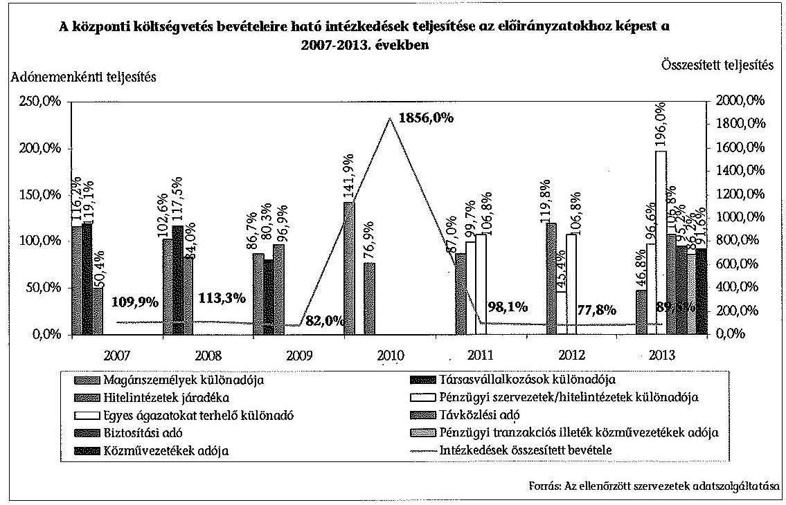

Az intézkedések hatására teljesített bevételek az előirányzatokat a 2010. évben jelentősen meghaladták. A 2010. évben került bevezetésre a pénzügyi szervezetek és hitelintézetek különadója, valamint az egyes ágazatokat terhelő különadó, amelyek bevételi előirányzattal nem rendelkeztek, azonban a teljesítés 185,7 Mrd Ft illetve 151,7 Mrd Ft volt. (Az egyes adónemek előirányzatait és teljesítési adatait a 2007-2013. években az 1. sz. melléklet tartalmazza.)

A központi költségvetés bevételét növelő intézkedések teljesítése és az előirányzattól történő elmaradásának okai a következők voltak:

- a magánszemélyek által teljesített különadó esetében a 2009. évi zárszámadási törvényjavaslatban foglaltak szerint az elmaradást a tervezettnél alacsonyabb jövedelemszint (adóalap) okozta;
- a társas vállalkozások által fizetendő különadó bevételek elmaradását a 2009. évben a várakozást felülmúló gazdasági visszaesés okozta, amelynek hatására csökkentek a befizetések és növekedtek az előző évvel kapcsolatos visszaigénylések, kiutalások. A 2010-2011. években az adóelőleg túlfizetések rendezése miatt 48,5 Mrd Ft-tal csökkentek a központi költségvetés bevételei;

---

A magánszemélyek és a társas vállalkozások által fizetendő különadó 2009. évi bevételi elmaradásának megszüntetésére nem történt intézkedés, a fizetési kötelezettségek 2010. január 1. napjától történő megszűnése miatt.

- a hitelintézetek különadójának, járadékának összesített előirányzata 122,3 Mrd Ft volt az ellenőrzött időszakban, amelytől a teljesítés 37,9 Mrd Fttal - 30,9\%-kal maradt el. A tervezett előirányzattól való elmaradás okát a 2008. évben nem tárták fel. A zárszámadási törvényjavaslatok indoklása alapján - a 2008. év kivételével - az elmaradást az adóalap tervezettnél alacsonyabb összege okozta. Az elmaradás okainak feltárását követően ezeket a tényezőket a következő évek előirányzatainak tervezése során figyelembe vették. További intézkedésként a 2008. évben pontosításra kerültek a hitelintézeti járadék fizetési kötelezettség szabályai, ami az adóalap bővülését eredményezte.

A teljesítés előirányzatoktól való elmaradását az ÁSZ az éves költségvetések végrehajtásáról készített jelentéseiben vizsgálta és a törvényjavaslatokban foglalt indoklásokat nem találta kielégítőnek.

- A pénzügyi szervezetek, hitelintézetek különadója és járadéka teljesítése a 2011-2013 években elmaradt az előirányzattól. A 2011. évben az elmaradás okát nem tárták fel. A 2012-2013. évek teljesítésének előirányzattól történő elmaradásának okait a zárszámadási törvények indoklásai tartalmazták.
- Az egyes ágazatokat terhelő̉ különadók teljesítése a 2011. és 2012. években az előirányzatot meghaladta.
- A távközlési adó 2012. július 1-i bevezetése következtében 2012. évben a bevétel előirányzattal nem rendelkezett, a teljesítés a 2013. évben az előirányzatot meghaladta.

A távközlési adó előzetes hatásvizsgálata során az NGM a bevezetés évében 21,4 Mrd Ft-ot tervezett az intézkedés költségvetési egyenlegjavító hatásaként. A teljesítés 9,2 Mrd Ft-tal ( $43,0 \%$-kal) maradt el a hatásvizsgálat során tervezett bevétel összegétől. Ennek oka, hogy az NGM az előzetes hatásvizsgálat elkészítésekor nem számolt a maximalizált adótételek hatásával, illetve azzal, hogy az üzleti célú emelt díjas sms-eket terhelő adó nem került bevezetésre. A távközlési adó bevezetését követően a 2012. július 1.-december 31. időszakra vonatkozóan utólagos hatásvizsgálat készült, amely szerint a 2012. évben befolyt bevétel elmaradt az előzetes hatásvizsgálat alapján várt bevételtől. Az utólagos hatásvizsgálat azonban az elmaradás okát nem tárta fel. Az utólagos hatásvizsgálat tapasztalatait figyelembe véve az NGM a 2013. évre 43,0 Mrd Ft bevételt tervezett. A teljesítés az előzetes hatásvizsgálatban foglalt becsült értéktől 4,0 Mrd Ft-tal 9,3\%-kal magasabb összeget mutatott.

- A biztosítási adó 2013. évre előirányzott összegétől a teljesítés elmaradt, amelynek oka - a 2013. évi zárszámadási törvényjavaslat indoklása szerint - hogy az új adónem bevezetéséről várt bevételek felmérése korlátozott adatokra támaszkodva történt, amely a tervezési bizonytalanságot növelte. Az előirányzott bevétel nem teljesülése okainak feltárásával kapcsolatos egyéb dokumentumot az ellenőrzött szervezet nem bocsátott az ellenőrzés rendelkezésére. A tervezett bevétel az intézkedés bevezetését megelőzően készített

---

hatásvizsgálati lap alapján 59,0 Mrd Ft volt a 2013. évben, amelytől a teljesítés 32,8 Mrd Ft-tal ( $55,6 \%$-kal) maradt el ${ }^{11}$.

- A pénzügyi tranzakciós illeték teljesített bevétele elmaradt az előirányzattól, a jogszabály 2013. augusztus 1-jei hatályú változása és egyszeri befizetési kötelezettség előirása és annak teljesítése ellenére. A zárszámadási törvényjavaslat indoklása szerint az elmaradás a pénzforgalmi szolgáltatók, valamint a Kincstár befizetéseinek elmaradásához egyaránt köthető.
- A közművezetékek adójának tényleges bevétele elmaradt a tervezettől, amelynek oka - a 2013. évi zárszámadási törvénytervezet indoklása szerint az előzetesen becsültnél kisebb adóalap okozott. A teljesítés 24,9 Mrd Ft-tal ( $83,0 \%$-kal) magasabb összegben realizálódott, mint a hatásvizsgálatban foglalt becsült érték összege ( $30,0 \mathrm{Mrd}$ Ft).

A fejezeti költségvetés bevételeinek növelése érdekében az ellenőrzés keretében vizsgált adónemek teljesítése a következők szerint alakult:

- A népegészségügyi termékadó 2011. szeptember 1-jével került bevezetésre, ezért ebben az évben előirányzattal nem rendelkezett. A tényleges bevételek a 2012-2013. években az előirányzattól elmaradtak, amelynek okát nem vizsgálták. A népegészségügyi termékadóból származó bevétel alakulását és ehhez kapcsolódóan az adó hatálya alá tartozó termékkört és fogyasztói szokás-változást az EMMI (NEFMI) folyamatosan figyelemmel kísérte, az intézkedés bevezetésének tapasztalatairól a Kormányt 2011. november 30-án tájékoztatta és egyben jelezte, hogy a bevételek elmaradhatnak a tervezettől. Ennek elkerülése érdekében javaslatot tett a NETA törvény módosítására. A népegészségügyi termékadó hatásvizsgálati lapja alapján a jogszabály előkészítője a 2012. évre 20,0 Mrd Ft egyenlegjavító hatást tervezett. A hatásvizsgálatban foglalt költségvetési hatást nem érték el, mert a teljesítés 0,9 Mrd Ft-tal ( $4,7 \%$-kal) elmaradt az előre jelzett összegtől.
- Az elektronikus útdíj rendszer bevezetésére a 2013. évben került sor. A teljesített bevétel összege 21,3 Mrd Ft-tal ( $28,4 \%$-kal) maradt el az előirányzattól és 36,3 Mrd Ft-tal ( $40,3 \%$-kal) maradt el az intézkedés bevezetését megelőzően készített hatásvizsgálat alapján várt bevételtől. Az intézkedés esetében utólagos hatásvizsgálat nem készült.

# 1.5. Az intézkedések hatásának és teljesülésének figyelemmel kísérése 

A magánszemélyek és társas vállalkozások különadója, a hitelintézetek adókötelezettsége és járadéka, a pénzügyi szervezetek és hitelintézetek különadója, a távközlési adó, a biztosítási adó, a pénzügyi tranzakciós illeték és a közművezetékek adója bevezetésének hatását és teljesülését a PM/NGM a NAV által havonta szolgáltatott monitoring adatokon keresztül kísérte fi-

[^0]
[^0]:    ${ }^{11}$ A teljesítés elmaradását részben az okozta, hogy a hatásvizsgálat a biztosítási adó és a baleseti adó összevonásával számolt, a 2013. évi költségvetés végrehajtásáról szóló törvény pedig - a törvényi szabályozásnak megfelelően - külön tünteti fel a biztosítási és külön a baleseti adóból származó bevételeket.

---

gyelemmel az ellenőrzött időszakban. Ezzel rendszeresen biztosított adatokat, információkat a döntéshozók számára a szükséges beavatkozásokhoz.

Ezen túlmenően a távközlési adó esetében 2013. március 27 -én készült utólagos hatásvizsgálat bevételi adatai visszajelzésül szolgáltak a 2012. évi bevételek alakulását, tervezettől való elmaradását illetően.

A Jat. előirása alapján a jogszabályok hasznosulásának folyamatos figyelemmel kísérése érdekében a jogszabályt beterjesztő miniszter szükség esetében utólagos hatásvizsgálatot ${ }^{13}$ végez. Az utólagos hatásvizsgálat során össze kell vetni és egyeztetni a jogszabály megalkotása során elvárt hatásokat a tényleges hatásokkal. Utólagos hatásvizsgálat - a távközlési adó kivételével - az ellenőrzött adónemek tekintetében nem készült.

A népegészségügyi termékadó bevezetése hatásának és teljesülésének figyelemmel kísérésére a bevezetést követő második hónaptól jelentések, tanulmányok, elemzések készültek. Az adóbevételek alakulásáról a NAV havi rendszerességgel nyújtott tájékoztatást az NGM részére.

A bevezetést követően készített tanulmányok, elemzések célja az volt, hogy az élelmiszergyártók - új, kedvezőtlen egészségügyi hatású termékösszetevők alkalmazásával az élelmiszergyártás folyamata során - ne kerülhessenek ki az adó hatálya alól.

A NEFMI a Kormány részére 2011. november 30 -án jelentést nyújtott be az intézkedés bevezetés óta eltelt időszakban befolyt bevételek alakulásról és felhasználásáról.

A NAV 2013. április hónapban „Chipsadó" címmel elemzést készített, melynek célja a népegészségügyi termékadó bevételek alakulásának bemutatása volt 2011. szeptember 1-jétől 2012. december 31-ig.

Az elektronikus útdíj bevezetését követően - 2013. augusztus 14-én - az intézkedés hatásainak és teljesülésének figyelemmel kísérését az NFM államtitkára levélben rendelte el. Az utasítás alapján a Közlekedésfejlesztési Koordinációs Központ az elektronikus útdíj rendszer múködéséről minden hónap 20. napjáig köteles összefoglaló jelentést készíteni és megküldeni az NFM részére. A Közlekedésfejlesztési és Koordinációs Központ a jelentéskészítési kötelezettségének eleget tett.

# 1.6. Az intézkedések hatása a központi költségvetés bevételére, hiányára és adósságára 

A költségvetés egyensúlyának javítását célzó kormányzati intézkedések eredményeként elért központi költségvetési bevételi többlet az ellenőrzött időszak minden évében hozzájárult a célkitúzés - a központi költségvetés és az államháztartás hiányának csökkentése - megvalósításához.

[^0]
[^0]:    ${ }^{13}$ Jat. 21. § (1) bekezdés

---

Az ellenőrzött években az intézkedésekkel elért összesített adó, illeték és járulék teljesített bevétele ${ }^{13}$ ( $2147,5 \mathrm{Mrd} \mathrm{Ft}$ ) a központi költségvetés összesített bevételi főösszegét ( $60791,7 \mathrm{Mrd} \mathrm{Ft}$ ) az ellenőrzött időszak átlagában 3,5\%-kal növelte.

Az intézkedések központi költségvetés bevételeire gyakorolt hatását a következő ábra szemlélteti:
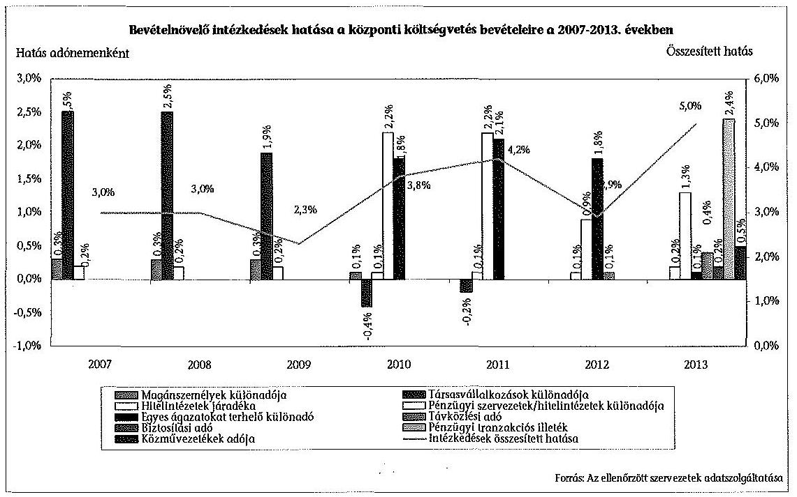

A bevételnövelő intézkedések a legkisebb mértékű hatást a 2009. évben - 2,3\% - fejtették ki, amikor a társas vállalkozások különadója 43,6 Mrd Ft-tal ( $21,8 \%$ kal), a magánszemélyek által befizetett különadó 7,9 Mrd Ft-tal ( $7,7 \%$-kal) volt alacsonyabb az előző évhez viszonyítva.

Az intézkedések a legkedvezőbb hatást a központi költségvetés bevételeire a 2013. évben gyakorolták. A 2013. évben került bevezetésre a biztosítási adó ( $26,2 \mathrm{Mrd}$ Ft), a pénzügyi tranzakciós illeték ( $259,6 \mathrm{Mrd}$ Ft) és a közművezetékek adója ( $54,9 \mathrm{Mrd}$ Ft).

A társas vállalkozások különadója gyakorolta a legnagyobb mértékű hatást a központi költségvetési bevételekre a 2007. és a 2008. évben 2,5\%-kal, a 2013. évben a pénzügyi tranzakciós illetékekből befolyt bevétel 2,4\%-kal.

Az ellenőrzött években az intézkedésekkel elért összesített adó, illeték és járadék teljesített bevétele ( $2147,5 \mathrm{Mrd}$ Ft) a központi költségvetés összesített hiá-

[^0]
[^0]:    ${ }^{13}$ Az összesített teljesített bevétel nem tartalmazza a népegészségügyi termékadó és az elektronikus útdíj összegét, mert azok a fejezetek kiadásait finanszírozták.

---

nyát (7189,3 Mrd Ft) az ellenőrzött időszak átlagában 29,8\%-kal csökkentette.

Az intézkedések központi költségvetés hiányára gyakorolt hatását a következő ábra szemlélteti:
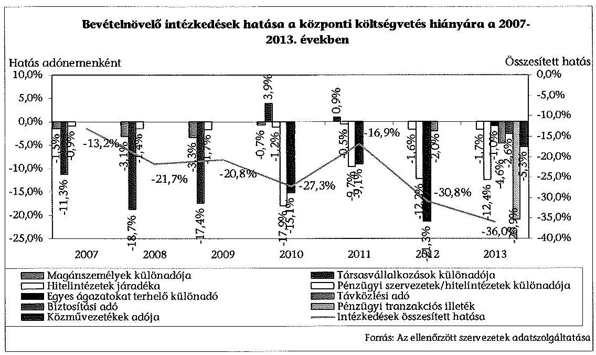

A központi költségvetés bevételeinek növelése érdekében hozott intézkedések hatására befolyt többletbevételek a központi költségvetés hiányára minden évben csökkentő hatást gyakoroltak, így a Kormány céljához, a költségvetés egyensúlyának javításához hozzájárultak. Az intézkedések eredményeként befolyt bevételek a központi költségvetés hiányára a 2007. évben gyakorolták a legkisebb - 13,2\%-os - hatást. 2010. évben annak ellenére, hogy két adónem is megszűnt (magánszemélyek és társas vállalkozások különadója), a bevezetett új intézkedések hatására - pénzügyi szervezetek, hitelintézetek különadója és egyes ágazatokat terhelő különadó - a bevételi többlet a központi költségvetés hiányára - $27,3 \%$-os csökkentő hatást gyakorolt. Az intézkedések eredményeként keletkező bevételi többlet a legnagyobb mértékű - 36,0\%-os csökkentő - hatást a költségvetés hiányára a 2013. évben gyakorolta az új adónemek bevezetésével.

A legnagyobb mértékű hatást a központi költségvetés hiányára az egyes ágazatokat terhelő̉ különadó - a 2012. évben - $21,3 \%$-ot - és a pénzügyi tranzakciós illeték - a 2013. évben - $20,9 \%$-ot - gyakorolta. A társas vállalkozások különadójának túlfizetése miatt a központi költségvetést a 2010. és 2011. évben terhelő visszafizetési kötelezettség a központi költségvetés hiányára kedvezőtlen hatással volt.

A költségvetés egyensúlya javítását célzó egyes bevételnövelő intézkedések hatása az államháztartás hiányára, a központi költségvetés hiányára gyakorolt hatással arányosan alakult, az államháztartás összesített hiányát (7317,2 Mrd Ft) az ellenőrzött időszak átlagában 29,8\%-kal csökkentette.

---

Az ellenőrzött években az intézkedésekkel elért összesített adó, illeték és járulék bevételek (2147,5 Mrd Ft) a központi költségvetés összesített adósságát (136 369,5 Mrd Ft) az ellenőrzött időszak átlagában 1,5\%-kal csökkentették. Az intézkedések hatását a központi költségvetés adósságára adónemenként és összesítve a következő ábra szemlélteti:
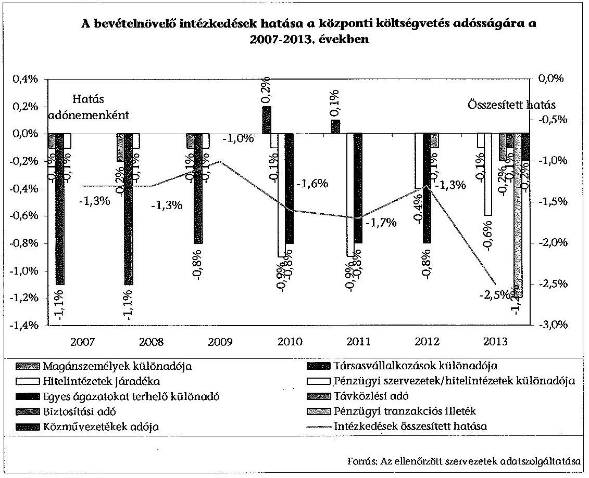

Az intézkedések a legkisebb mértékű hatást a 2009. évben (-1,0\%) gyakorolták a központi költségvetés adósságára. Az intézkedések hatására teljesült bevételek a legnagyobb mértékű hatást a 2013. évben gyakorolták a központi költségvetés adósságára, amikor annak -2,5\%-os csökkenését eredményezték.

Az egyes adónemek közül a legnagyobb központi költségvetési adósságcsökkentő hatással a pénzügyi tranzakciós illeték ( $-1,2 \%$-os hatás) bírt a 2013. évben, illetve a társas vállalkozások különadója ( $-1,1 \%$-os hatás) a 2007. és a 2008. évben. Ugyanakkor a társas vállalkozások különadója - a túlfizetések miatti visszafizetési kötelezettség miatt a 2010. és a 2011. évben a központi költségvetés adósságának alakulását kedvezőtlenül befolyásolta.

Az ellenőrzött években az intézkedésekkel elért összesített adó, illeték és járulék teljesített bevétele ( 2147,5 Mrd Ft) az államháztartás összesített adósságát (146 536,8 Mrd Ft) az ellenőrzött időszak átlagában 1,5\%-kal csökkentette. Az egyensúly javítását célzó intézkedések hatása az államháztartás adósságára adónemenként és összesítve is - megegyezett a központi költségvetés adósságára gyakorolt hatással.

---

# 1.7. A népegészségügyi termékadó E. Alapba történő átutalása és az elektronikus útdij felhasználása 

A népegészségügyi termékadóból befolyt bevétel az E. Alapba átutalásra került, az Országos Egészségbiztosítási Pénztár számviteli nyilvántartásaiban azt a „Népegészségügyi termékadó" bevételi számlán nyilvántartotta. (A bevezetés évében, 2011-ben a népegészségügyi termékadó a központi költségvetés bevétele volt).

Az NFM adatszolgáltatása alapján a jogszabályban meghatározott felhasználási jogcímek és az útdíj bevételek között közvetlen összefüggés nincs. A felhasználás jogcímeit az Útdíj tv. 13. § (2) bekezdése határozza meg, a költségvetési törvény szerint az útdíj bevételek a központi költségvetés bevételei között kerülnek jóváírásra. Ugyanakkor a felhasználás keretében szabályozott felhasználási jogcímekre a támogatást a központi költségvetés biztosítja.

Az Útdíj tv. 13. § (1) bekezdése szerint az útdíjból származó bevétel az Áht. 14. § (4) bekezdés d) pontja szerinti fejezet javára számolandó el, mint költségvetési bevétel. Az Áht. 14. § (4) bekezdés d) pontjának rendelkezése szerint az állam más fejezetbe nem sorolható közvetlen költségvetési bevételeit és költségvetési kiadásait önálló fejezetként tartalmazza. Az (5) bekezdés d) pontja úgy rendelkezik, hogy a kizárólag központi kezelésű előirányzatokat tartalmazó fejezetek tekintetében a fejezetet irányító szerv feladatait a központi költségvetésről szóló törvényben meghatározott szerv, ennek hiányában az államháztartásért felelős miniszter látja el.

Az Útdíj tv. 13. § (2) bekezdésében foglaltak alapján 2013-ban összesen 171,7 Mrd Ft felhasználására került sor. Az útdíj bevétel teljesített öszszege 53,7 Mrd Ft volt. (A felhasználás részletes adatait a 2. sz. melléklet tartalmazza.)

## 2. A tartalékokkal kapcsolatos eGyENSÚLYJAVíTÓ intÉzkedÉSEK

### 2.1. A stabilizációs célú tartalékokkal kapcsolatos döntések megalapozása, a központi költségvetésre gyakorolt hatás

A Kormány figyelmet fordított arra, hogy megteremtse azokat a feltételeket és eszközöket, amelyek biztosítják az éves költségvetések teljesíthetőségét, védelmet nyújtanak a világgazdaságban zajló folyamatok miatt előálló kockázatokkal szemben. A kockázatok kivédését szolgálták többek között a stabilizációs célú tartalékok, így a 2007-2008 közötti időszakban a központi egyensúlyi tartalék, 2009-2010-ben a stabilitási tartalék, a 2007-2009. években, és a 20122013. években a fejezeti egyensúlyi tartalék, 2010-ben és 2012-ben a kamat kockázati tartalék, valamint 2012-2013-ban az OVA. A 2011. évi központi költségvetés stabilizációs célú tartalékot nem tartalmazott.

A stabilizációs célú tartalékok céljáról, képzésének módjáról, mértékéről és igénybe vételének feltételeiről a 2007-2013 közötti időszakban az éves központi

---

költségvetési törvények rendelkeztek ${ }^{14}$. A központi költségvetésekben tervezett előirányzatok tervezésének részletes háttérszámításai nem ismertek.

A fejezeti egyensúlyi tartalék felhasználása eltérő módon volt szabályozott az ún. alkotmányos fejezetek, illetve a Kormány hatáskörű fejezetek esetében. Az alkotmányos fejezetek fejezeti egyensúlyi tartalékukat saját hatáskörben használhatták fel, az ellenőrzött időszakban változó feltételek mellett.

A 2007. évben az igénybevétel feltétele tervezett bevételeik, maradványképzési kötelezettségük teljesítése, múködőképességük, megkezdett fejlesztéseik miatti indokoltsága volt. A maradványtartási kötelezettség teljesítése 2008-2009-ben már nem volt feltétel.

A Kormány hatáskörébe tartozó fejezetek esetében a fejezeti egyensúlyi tartalék cél szerinti felhasználására a Kormány kapott felhatalmazást a kiadások alakulásának és a bevételek várható teljesítésének figyelembe vételével.

A kamat kockázati tartalék és a fejezeti egyensúlyi tartalék 2012. évi, az OVA 2012. és 2013. évi felhasználásának módját és feltételeit a központi költségvetési törvények azonos módon határozták meg. A kamat kockázati tartalék 2010. évi felhasználásának feltételei nem voltak meghatározottak.

A 2012. és a 2013. évben a szabályozás szerint az OVA-t, a kamat kockázati tartalékot, valamint a fejezeti egyensúlyi tartalékot tárgyév szeptember 30 -áig nem lehetett felhasználni. Ezt követően akkor, ha a túlzott hiányra vonatkozó jelentésben szereplő, tárgyévi várható hiány 2012. évben nem haladja meg a GDP $2,5 \%$-át, 2013. évben $2,7 \%$-át, tehát nem veszélyezteti a hiánycélt.

A stabilizációs célú tartalékok költségvetési törvényekben rögzített előirányzatainak megalapozását segítették a költségvetési törvényekhez, végrehajtásukhoz készített elemzések, prognózisok. Az NGM tájékoztatása szerint a stabilizációs célú tartalékok képzésével, felhasználásával összefüggésben külön Kormány előterjesztések, bizottsági előterjesztések nem készültek. Az előirányzatok képzése, mértékének kialakítása az éves költségvetési törvények elfogadásának folyamatában, az államháztartás helyzetének függvényében történt.

A stabilizációs célú tartalékok felhasználására vonatkozózóan eljárásrendek nem készültek. A PM a 2007-2009. években a Kincstári költségvetéssel rendelkező költségvetési szervek, továbbá a fejezeti kezelésű előirányzatok aktuális előirányzatait folyamatosan összevetette a teljesített kiadásokkal. Az irányító szervek tájékoztatást adtak a költségvetési szerveik tekintetében a bevételek és a kiadások, a fejezeti kezelésű előirányzatok tekintetében a felhasználás várható alakulásáról. A fejezetek negyedéves adatszolgáltatása tájékoztatást nyújtott

[^0]
[^0]:    ${ }^{14}$ Az Áht. 2 21. § (5) bekezdése szerint, ha a központi költségvetésről szóló törvény a fejezeti általános tartalékon, a rendkívüli kormányzati intézkedésekre szolgáló tartalékon és a céltartalékokon kívül más tartalék létrehozásáról rendelkezik, a központi költségvetésről szóló törvényben meg kell határozni a tartalék célját, felhasználásának módját és feltételeit. E jogszabályi követelménynek a 2012. és a 2013. évi költségvetési törvények megfeleltek 2012-ben az OVA, a kamat kockázati tartalék, a fejezeti egyensúlybiztosítási tartalék felhasználásának szabályozása tekintetében, 2013-ban az OVA vonatkozásában.

---

bevételeik és kiadásaik teljesüléséről, jelezte múködőképességük fenntarthatóságát, alapul szolgált a fejezeti egyensúlyi tartalékuk igénybe vételéhez, valamint részben támogatta a központi egyensúlyi tartalék felhasználásáról szóló döntéseket.

A Kormány az államháztartás helyzetének vizsgálatát követően úgy döntött, hogy a stabilizációs célú tartalék ${ }^{15}$ nem kerül felhasználására a 20102012. években.

Az ellenőrzött időszakban a stabilitási célú tartalékok (módosított) előirányzatának $21,4 \%$-át ( $257,2 \mathrm{Mrd}$ Ft) a fejezetek a költségvetési törvények előírásai alapján részben saját hatáskörben ${ }^{16}$, részben kormánydöntés alapján vették igénybe. Megtörtént a központi egyensúlyi tartalék ( $65,0 \mathrm{Mrd} \mathrm{Ft}$ ) teljes, valamint a fejezeti egyensúlyi tartalék $56,3 \%$-ának ( $192,2 \mathrm{Mrd}$ Ft) felhasználása. Az előirányzatok jellemzően év végén végrehajtott felszabadítása a teljes körű felhasználást nem tette lehetővé a tárcák számára, amely az év végi maradvány összegére növelő hatást gyakorolt. A stabilizációs célú tartalékok közül a kamatkockázati tartalék előirányzatának felhasználására - a kormányzati döntésnek megfelelően - nem került sor.

A felhasznált ( $192,2 \mathrm{Mrd}$ Ft) fejezeti egyensúlyi tartalék 70,6\%-át az azt tervező fejezetek vehették igénybe, $29,4 \%$-a elvonásra került. A felhasznált fejezeti egyensúlyi tartalék hozzájárult a fejezetek kiegyensúlyozott múködéséhez, a gazdálkodási feltételek biztosításához, részbeni forrása volt a prioritást élvező fejlesztéseknek. A tartalékok előirányzatait, felhasználását a 2007-2013. években a 3. sz. melléklet tartalmazza.

A központi egyensúlyi tartalék 2007. évi $45,0 \mathrm{Mrd}$ Ft-os és a 2008. évi 20,0 Mrd Ft-os előirányzatának felhasználása teljes mértékben megtörtént. A felhasználás megfelelt a 2007. évi költségvetési tv. és a 2008. évi költségvetési tv. előírásainak. A felhasználásról rendelkező kormányhatározatok közül három nem, vagy részlegesen határozta meg azokat a konkrét kiadási elöirányzatokat, amelyek javára történt a központi egyensúlyi tartalék igénybe vétele. A központi egyensúlyi tartalékkal összefüggő döntéseket megalapozó dokumentumot az NGM nem bocsátott az ellenőrzés rendelkezésére. A központi egyensúlyi tartalék és a fejezeti egyensúlyi tartalék konkrét kiadási előirányzatokra történő felosztásával összefüggésben dokumentumok nem álltak az ellenőrzés rendelkezésére. Az előirányzatok felhasználásával összefüggő négy kormányhatározat rögzítette az egyes támogatások nyújtásának és elszámolásának feltételeit. A stabilizációs célú tartalékok felhasználásával összefüggésben az NGM-nél támogatási szerződések, megállapodások nem álltak rendelkezésre.

A fejezeti egyensúlyi tartalék egy részét az un. alkotmányos fejezetek, valamint a GVH és az MTA fejezetek vették igénybe az éves költségvetési törvények előírásainak megfelelően. Az előirányzat Kormány általi felhasználása megfelelt

[^0]
[^0]:    ${ }^{15}$ A stabilitási tartalék képzése a 2009-2010. években, míg az OVA képzése a 20122013. években történt.
    ${ }^{16}$ Fejezeti egyensúlyi tartalék esetében.

---

az éves költségvetési törvényekben foglalt előírásoknak, amelyet a negyedéves fejezeti jelentések alapoztak meg. A fejezeti egyensúlyi tartalék előirányzatának tervezésével, elszámolásával összefüggő feladatokkal kapcsolatos dokumentumok nem álltak az ellenőrzés rendelkezésére.

A stabilizációs célú tartalékok év végi egyenlege a 2009-2010. és a 2012-2013. években a központi költségvetés kiadásaira, valamint költségvetési és az államháztartási hiányra és adósságra is kedvező hatást gyakorolt.

A stabilizációs célú tartalékok év végi állományának hatását a központi költségvetés kiadásaira, valamint a költségvetés és államháztartás hiányára, adósságára a következő diagram szemlélteti.
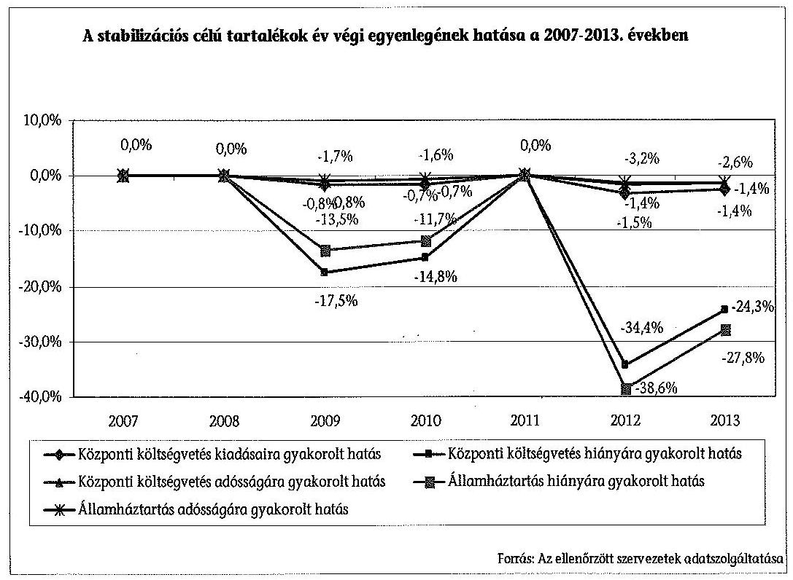

A 2007-2008. években a tervezett tartalékokat szinte teljes mértékben felhasználták ( $74,6 \mathrm{M}$ Ft és $69,9 \mathrm{M}$ Ft kivételével). Ezért a maradvány a központi költségvetés kiadásaira, hiányára és adósságára, valamint az államháztartás hiányára és adósságára számottevő hatást nem gyakorolt. Ugyanakkor a 2007. évben felhasznált 125,3 Mrd Ft, valamint a 2008. évben felhasznált 108,7 Mrd Ft növelte a központi költségvetés kiadásait, ezzel együtt a központi költségvetés és az államháztartás hiányát, adósságát. A kitűzött hiánycél teljesítését azonban nem veszélyeztette.

---

# 2.2. Az általános tartalék, illetve Rendkívüli Kormányzati Intézkedésekre szolgáló tartalékkal kapcsolatos döntések megalapozása, a központi költségvetésre gyakorolt hatás 

Az általános tartalék illetve az RKI képzésére és felhasználására vonatkozó szabályokat 2007-2011 között az Áht. ${ }_{1}$, 2012-től Áht. ${ }_{2}$ határozott meg. Általános tartalékot, illetve RKI-t 2012. december 31-ig az előre nem valószínúsíthető, nem tervezhető kiadásokra és az előirányzott, de elháríthatatlan ok miatt elmaradó bevételek pótlására kellett képezni. Az Áht. ${ }_{2}$ 2013. január 1-jétől nagyobb mozgásteret ad a Kormánynak, mert az RKI-t az év közben meghozott kormányzati döntésekből következő feladatok finanszírozására is lehet képezni/használni.

Az általános tartalék, illetve RKI képzésére vonatkozó jogszabályi elöírásokat a 2007-2013. évek között betartották, nagyságuk a központi költségvetés főösszegének $0,5 \%$-a és $1,0 \%$-a között mozgott.

Az általános tartalék, RKI felhasználását engedélyező, jóváhagyó dokumentumok rendelkezésre álltak. A Kormány az Áht., és Áht. ${ }_{2}$ által biztosított jogkörében eljárva a költségvetés általános tartalékának, illetve az RKI-re képzett tartalékának felhasználását kormányhatározattal rendelte el, az államháztartásért felelős miniszter ${ }^{17}$ és a fejezetet irányító szerv vezetője által benyújtott előterjesztések alapján. A döntések meghozatala és előterjesztése során a jogszabályi előírásokat részben tartották be. Az előterjesztéssel egyidejűleg nem tájékoztatták a Kormányt az általános tartalék, RKI igénybevételének naprakész helyzetéről - a 2007-2009 évek kivételével - az Ámr., 47. § (2) bekezdésében és az Ámr. ${ }_{2}$ 57. § (3) bekezdés f) pontjában foglaltak ellenére, nem mutatták be az RKI-re szolgáló tartalék szabad előirányzatának összegét ${ }^{18}$.

Az általános tartalék/RKI felhasználását a kormányhatározatokból vett, elemszámmal arányos rétegzett mintavétel alapján ellenőriztük. A 2013. évi mintatételek 28,6\%-ánál ${ }^{19}$ az előterjesztés nem tartalmazta az Ávr. 23. § (2) bekezdése szerinti nyilatkozatot, hogy az igényelt közfeladat ellátásra felhasználható szabad előirányzat nem áll rendelkezésre.

A döntéseket több esetben nem alapozták meg elemzésekkel, számításokkal: a véletlen minta alapján legalább az összes projekt 88,4\%-ának esetében.

Az általános tartalék, illetve az RKI felhasználása során a költségvetési törvényekben foglaltakat betartották, a felhasználás a módosított előirányzatot nem haladta meg.

[^0]
[^0]:    ${ }^{17}$ 2010. augusztus 15 -ig a pénzügyminiszter
    ${ }^{18}$ Az ÁSZ 2013. évi költségvetés végrehajtásáról szóló jelentésében foglaltak szerint „az NGM tájékoztatása alapján az előterjesztésekbe az RKI-re szolgáló tartalék szabad előirányzatának összegéről a tájékoztatás felső vezetői döntés alapján nem került be, mert az államháztartásért felelős államtitkár a kormányüléseken részt vett, számára megküldésre került az RKIről készített kimutatás, amely alapján tájékoztatta a Kormányt".
    ${ }^{19}$ Az 1435/2013. (VII. 11.) és az 1782/2013. (X. 31.) előterjesztések esetében.

---

Az ÁSZ a 2007-2013 évek költségvetése végrehajtásának ellenőrzései során megállapította, hogy az általános tartalék illetve az RKI előirányzatának felhasználása a 2007-2012. években nem felelt meg az Áht. 25. § (1), illetve az Áht. 2 21. § (1) bekezdésében foglalt előírásoknak, mert a fejezetek többletforrás igénye egyes feladatok esetében nem minősült előre nem valószínűsíthetőnek, nem tervezhetőnek, illetve előirányzott, de elháríthatatlan okok miatt elmaradó bevétel miatt pótolandónak. A szükséges előirányzat egyes fejezeteknél - azon esetekben, amikor a feladat, illetve tevékenység a tervezéskor már ismert, vagy már folyamatban lévő volt - átgondoltabb költségvetés készítésével, illetve forrás biztosításával tervezhető lett volna.

Az ÁSZ zárszámadási ellenőrzéseinek megállapításai mellett jelen ellenőrzés mintába választott tételei közül az éves költségvetés tervezésének időszakában előrelátóbb és megalapozottabb tervezéssel tervezhető lett volna az 1055/2011. (III. 22.) Korm. határozattal történő átcsoportosítás. A NEFMI fejezethez 450,0 M Ft került átcsoportosításra a 2011. évi Kajak-Kenu és Evezős Olimpiai Központ átalakítására. A 2011. évi világverseny megrendezésének dátuma és helyszíne egy korábban meghozott döntés alapján került kiválasztásra. A sportlétesítmények fejlesztésének szükségessége az előterjesztés szerint már korábban nyilvánvaló volt.

Az általános tartalék, illetve RKI felhasználása a kormányhatározatokban foglalt céloknak megfelelően történt. A felhasználás jogszerűségét jelen ellenőrzés mintatételeinek egy tizedénél a KEHI is ellenőrizte, ezek közül egy esetben állapított meg nem jogszerű felhasználást, amelynek visszafizetésére javaslatot tett. A nem jogszerűen felhasznált támogatás visszafizetésre került.

Az általános tartalék és RKI felhasználását az ÁSZ az éves költségvetések végrehajtásának ellenőrzése során is megvizsgálta, és az előre meghatározott céloktól való eltérést a felhasználás során nem állapított meg.

A mintatételek esetében az általános tartalék, illetve RKI felhasználása során előirányzat átcsoportosítások történtek, az NGM az előirányzat átcsoportosítással érintetteket tájékoztatta az előirányzatok átcsoportosításáról.

Az előirányzat átcsoportosítással érintett fejezetek a feladatot saját szervezetükkel, vagy közreműködő bevonásával látták el. A saját szervezettel való feladatellátás esetében az előirányzat átcsoportosításban részesültek kimutatások készítésével igazolták az átcsoportosított általános tartalék, illetve RKI szabályszerű felhasználását. A fel nem használt előirányzat átcsoportosítások összegét, illetve a visszatérítési kötelezettséggel adott előirányzat átcsoportosítások összegét az előirányzat átcsoportosítással érintett szervezetek a központi költségvetés egyéb bevételek számlájára visszautalták. Közreműködő bevonása esetében a pénzeszközök felhasználására a kormányhatározatokban foglaltaknak megfelelően támogatási szerződést kötöttek. A közreműködő szervezetek a támogatásokkal elszámoltak, a fel nem használt, illetve visszapótlási kötelezettséggel érintett összeget a központi költségvetés egyéb bevételek számlájára visszautalták.

---

Az általános tartalék, illetve az RKI felhasználásáról készült elszámolások dokumentumai ${ }^{20}$ több esetben nem álltak rendelkezésre az NGM-nél: a véletlen minta alapján az összes projekt legalább 26,5\%-ának esetében. A felhasználást, elszámolást több esetben nem ellenőrizték: a véletlen minta alapján az összes projekt legalább 88,0\%-ának esetében.

Az általános tartalék, illetve RKI előirányzatát év közben törvényi, illetve a Kormány hatáskörében a 2009. év kivételével megemelték. Az általános tartalék és RKI az ellenőrzött időszakban csaknem teljes mértékben felhasználásra került. Az általános tartalék és RKI előirányzatának és teljesítésének adatait a következő táblázat tartalmazza:

|  | 2007. év | 2008. év | 2009. év | 2010. év | 2011. év | 2012. év | 2013. év |
| :-- | --: | --: | --: | --: | --: | --: | --: |
| Módosított elöirányzat (Mrd Ft) | 45,6 | 51,7 | 47,2 | 153,5 | 93,7 | 102,4 | 106,8 |
| Teljesítés (Mrd Ft) | 45,2 | 49,7 | 46,6 | 118,4 | 93,7 | 102,4 | 106,8 |
| Teljesítés \%-a | $99,1 \%$ | $96,1 \%$ | $98,7 \%$ | $77,1 \%$ | $100,0 \%$ | $100,0 \%$ | $100,0 \%$ |

Az általános tartalék, és RKI év végi állománya 2010. év kivételével számottevő hatást nem gyakorolt a központi költségvetés kiadásaira, hiányára és adósságára, valamint az államháztartás hiányára és adósságára. Az általános tartalék és RKI év végi állományának hatásait a következő ábra szemlélteti:
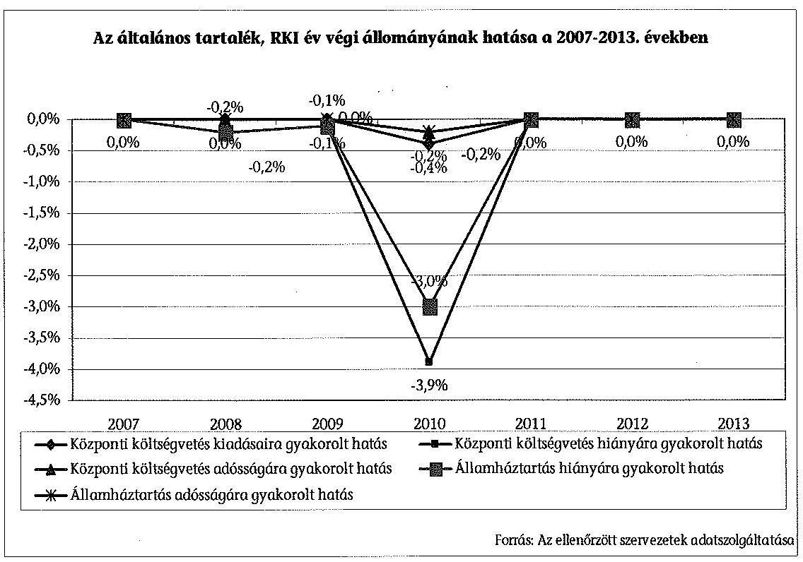

[^0]
[^0]:    ${ }^{20}$ Az NGM-nél az általános tartalék, illetve az RKI felhasználásáról készült elszámolások a 2007-2011. évekre vonatkozóan egyetlen mintába választott döntés esetében sem, a 2012-2013. évek mintájába választott döntések esetében három kormányhatározattal kapcsolatban (1599/2012.(XII.17.), 1196/2013.(IV.11.) és 1782/2013.(X.31.) Korm. határozatok) nem álltak rendelkezésre.

---

Az általános tartalék/RKI az ellenőrzött időszakban egy évben, 2010-ben gyakorolt 3,9 és 3,0\%-os csökkentő hatást a költségvetés és az államháztartás hiányára. Az általános tartalék, illetve RKI nagyarányú felhasználására irányuló döntések során szerepet játszottak az év végén történő előirányzat átcsoportosítások (az év utolsó napjaiban) is. Az év végén történő döntések azonban nem tették lehetővé, hogy az előirányzat átcsoportosítások tényleges pénzügyi felhasználása még a tárgyévben megtörténjen a kiadások finanszírozására, ezért ezekben az esetekben a maradványképződésre is hatást gyakoroltak. Ebben az esetben az előirányzat, mint előirányzat maradvány kimutatásra került és a következő évi kiadások finanszírozására szolgált, amely a következő év költségvetésének tervezése során figyelembe vehető annak megalapozottsága érdekében.

# 3. BESZERZÉSI ÉS SZERZŐDÉSKÖTÉSI KORLÁTOZÁSOK VÉGREHAJTÁSA 

A Kormány az Áht,-ben kapott felhatalmazás alapján első alkalommal 2010ben, majd az azt követő két évben is beszerzési és szerződéskötési korlátozást vezetett be ${ }^{21}$ a központi alrendszer kormányhatározatokban megjelölt intézményei részére.

### 3.1. A beszerzési és szerződéskötési korlátozások várható hatásainak előzetes felmérése

Az NGM sem a beszerzési és a szerződéskötési korlátozások éves költségvetésre gyakorolt várható hatását, sem annak a fejezetek/intézmények múködésére, feladatellátására vonatkozó hatását - tekintettel arra, hogy azok nem jelentettek forrás elvonást az érintett fejezetek számára - előzetesen nem mérte fel.

### 3.2. A korlátozó intézkedések alóli felmentési kérelmek benyújtási és elbírálási folyamatának szabályozása

A Kormány határozatok kijelölést tartalmaztak arra vonatkozóan, hogy ki kapott felhatalmazást - rendkívüli indokolt, egyedi esetekben - a korlátozások részbeni feloldására. Az ellenőrzött években a beszerzési tilalom alóli felmentési kérelmek és az azokkal kapcsolatos döntések szabályozására, az engedélyező szervezetek az eljárás szabályait nem alakították ki, így ennek hiányában a kérelmeket befogadó szervezetek útmutatóinak tartalma határozta meg az engedélyezési eljárás menetét.

Az 1132/2010. (VI. 18.) Korm. határozat 5. pontja első helyen a beszerzési korlátozások felelőseként a közigazgatási és igazságügyi minisztert nevesítette, míg egyetértési joggal a nemzetgazdasági minisztert jelölte meg. A felmentésekkel kapcsolatos feladatok ellátását a 2010. évben az NGM által összeállított útmutató segítette, amely a korlátozással érintett fejezeteknél is rendelkezésre állt.

[^0]
[^0]:    ${ }^{21}$ A korlátozások alapját a következő jogforrások teremtették meg: 1132/2010. (VI.18.), 1316/2011. (IX.19.) 1036/2012. (II. 21.) Korm. határozatok.

---

A 2011. évben a 1316/2011.(IX. 19.) Korm. határozat 5. pontja értelmében a tilalmak részbeni feloldására a Miniszterelnökséget irányító államtitkár kapott felhatalmazást, míg a kérelmek benyújtását a Kincstár elnökéhez rendelte, aki véleményezési joggal volt felruházva. A Kincstár - a hivatkozott 2011. évi kormányhatározat alapján - 2011. október 3-án útmutatót adott ki, melyben rendelkezett a fejezetek által - rendkívüli indokolt, egyedi esetekben - benyújtható, beszerzési és kötelezettségvállalási tilalom alóli felmentési kérelmek benyújtásának és az elbírálás folyamatának szabályairól.

A tilalom feloldását formalevélben, az annak mellékletét képező, kitöltött táblázattal, a közigazgatási államtitkár jóváhagyásával együttesen kellett megküldeni a Kincstár elnökének. A megalapozott döntés érdekében a Kincstár további adatokat kérhetett a kezdeményező fejezettől, majd a Kincstár elnöke a kérelmeket véleményével ellátva, megküldte a Miniszterelnökséget vezető államtitkár részére. Az államtitkár döntött az engedélyezésröl, döntéséről értesítette a Kincstár elnökét, aki a döntést levélben küldte meg a kérelmet benyújtó fejezet részére.

Az 1036/2012. (II. 21.) Korm. határozat nem módosította a 2011-ben meghatározott jogköröket. A Kincstár 2013 októberében újabb útmutatót adott ki, amely pontosításokat tartalmazott, valamint - sürgős esetekre - lehetővé tette a kérelmek elektronikus ügyintézését.

A fejezetek felmentési kérelmeit elemszámmal arányos rétegzett mintavétel alapján ellenőriztük. A 2010-2011. években egy-egy fejezet kérelme esetenként az idézett kormányhatározatban megjelölt több kategóriára ${ }^{22}$ is vonatkozott. A kért mentesítés ezekben a kérelmekben egy összegben került feltüntetetésre, ilyenkor a kezelhetőség érdekében az adatszolgáltatásban megkapott, összegszerűen rendelkezésre álló arányokat figyelembe véve osztottuk fel az előzetesen, kérelmekben fel nem osztott összegeket.

A 2012-2013 évekre vonatkozóan - a mintatételek alapján - a fejezetek felmentési kérelmeiben meghatározott kategóriákat és az adott kategóriákhoz rendelt összegeket a Kincstár már elkülönítetten tudta kezelni és nyilvántartani.

A korlátozó intézkedések alóli felmentési lehetőségek kritériumainak meghatározására a 2010. évi korlátozó intézkedések esetében a KIM és az NGM, majd az azt követő években a Kincstár és a Miniszterelnökség részéről nem került sor. A kritérium rendszer szabályozatlansága miatt nem volt megállapítható, hogy a felmentési kérelmek elbírálása milyen szempontrendszer szerint történt.

Az 1316/2011.(IX. 19.) és a 1036/2012. (II. 21.) Korm. határozatokban foglalt intézkedések végrehajtása érdekében a felmentési kérelmek engedélyezési eljárására kritériumrendszert nem alakítottak ki.

A döntések összhangja a kritérium szempontrendszerével, annak hiánya miatt nem volt ellenőrizhető.

[^0]
[^0]:    ${ }^{22}$ jutalom, jutalmazási jellegű juttatások, szellemi tevékenységek kifizetésére, bútorvásárlásra, informatikai eszköz, valamint személygépkocsi beszerzésekre kötendő szerződések, stb.

---

Az ellenőrzött időszakban elrendelt beszerzési és szerződéskötési korlátozások alól a fejezetek igyekeztek mentességekre szert tenni, melyekre a kormányhatárotok egy-egy pontja lehetőséget biztosított.

Az ellenőrzött időszakban benyújtott felmentési kérelmek alakulását - az IM és a Kincstár adatszolgáltatása alapján - a következő táblázat tartalmazza:

Adatok M Ft-ban és \%-ban

| Mégnevezés | 2010 | Megoszklis \%-a | 2011 | Megoszklis \%-a | 2012 | Megoszklis \%-a | 2013 | Megoszklis \%-a |
| :--: | :--: | :--: | :--: | :--: | :--: | :--: | :--: | :--: |
| Tárgyi eszköz vásárlás | 0,0 | 0,0\% | 28916,0 | 40,0\% | 0,0 | 0,0\% | 0,0 | 0,0\% |
| Bérleti és lóringdíjok | 41,2 | 0,1\% | 25117,4 | 34,7\% | 0,0 | 0,0\% | 0,0 | 0,0\% |
| Sogk. beszerzés | 3043,7 | 8,3\% | 0,0 | 0,0\% | 12313,9 | 49,1\% | 7378,6 | 62,5\% |
| Informatikai eszközbeszerzés | 10263,0 | 28,0\% | 0,0 | 0,0\% | 12048,1 | 48,1\% | 4057,1 | 34,4\% |
| Személyi lefizetések | 15348,3 | 41,9\% | 0,0 | 0,0\% | 0,0 | 0,0\% | 0,0 | 0,0\% |
| Vásárolt közszolgáltatások | 0,0 | 0,0\% | 9026,7 | 12,5\% | 0,0 | 0,0\% | 0,0 | 0,0\% |
| Szellemi tevékenységek dijai | 7594,5 | 20,7\% | 9251,9 | 12,8\% | 0,0 | 0,0\% | 0,0 | 0,0\% |
| Bútorvásárlás | 369,7 | 1,0\% | 0,0 | 0,0\% | 632,0 | 2,5\% | 215,9 | 1,8\% |
| Telekormásárlás | 1,2 | 0,0\% | 0,0 | 0,0\% | 71,1 | 0,3\% | 158,9 | 1,3\% |
| Felmentési összegek | 36661,6 | 100\% | 72312,0 | 100,0\% | 25065,1 | 100,0\% | 11810,5 | 100,0\% |
| Felmentési kérelmek összege | 38595,1 | - | 74934,0 | - | 31888,8 | - | 22302,1 | - |
| Engedélyezés \%-a | 95,0\% | - | 96,5\% | - | 78,6\% | - | 52,5\% | - |

Az 1132/2010. (VI.18.) Korm. határozatot a 2010. évben - az 1318/2010. (XII.27.) Korm. határozattal - hatályon kívül helyezték. A 2010. évben éltek a fejezetek a legtöbb típusú kiadással kapcsolatban mentességi kérelemmel, mert a 2010. évben hétféle, a következő években négy-négy féle kiadással kapcsolatban adtak be mentességi kérelmeket.

A 2011. évi felmentési kérelmek a 2010. évi összeg közel kétszeresét tették ki. A 2012. évben a megelőző év adatának alig több mint harmadát (34,7\%), a 2013. évben pedig a 2012. évi $47,1 \%$-át, a 2011. évinek viszont csupán, 16,3\%át érte el a felmentési kérelmek aránya. A benyújtott felmentési kérelmek öszszege csökkent, ezzel párhuzamosan az engedélyezett összegek is folyamatosan csökkentek. A kérelmek a 2011. évben 96,5\%-ban, 2012-ben 78,6\%-ban, míg a 2013. évben már csupán $52,5 \%$-ban kerültek engedélyezésre.

A 2011-2013. évek adatai alapján a legnagyobb összegű mentességet, a 2011. évben a tárgyi eszközök ${ }^{23}$ vásárlására kapták a fejezetek. A három év mentesítési összegének $26,5 \%$-át tette ki 28916,0 M Ft-os összegük. A második legnagyobb mentesített kiadási jogcímcsoportot a bérleti és lízing díjak képezték, 25 117,4 M Ft-os összegükkel, mely 23,0\%-os részarányt képviselt a három év mentesítési összegeiből. A személygépjárművek beszerzésére 19 692,5 M Ft öszszegű kérelemre kaptak mentességet a fejezetek, amely az összes felmentés $18,0 \%$-át tette ki. $10,0 \%$ fölötti - $14,7 \%$-os részaránnyal, 16 105,2 M Ft-tal az informatikai eszközök beszerzésére a negyedik legmagasabb nagyságrendű öszszeget fordíthatták a mentesített összegből a fejezetek.

[^0]
[^0]:    ${ }^{23}$ Feltételezhető, hogy ebben az évben az adatok részletezése még nem volt kellő mélységű, mivel a többi évben a tárgyi eszköz kategória nem létezett, így ez ekkor mintegy gyűjtőfogalomként volt értelmezhető.

---

A Kincstár által az NGM részére készített tájékoztató szerint a 2012. évben a beszerzési tilalom alól 11 fejezet ${ }^{24} 281$ felmentési kérelmet nyújtott be, 443 - ezen belül ugyanazon intézményt akár többször is - intézményt érintően. A legnagyobb összegű felmentést (12 313,9 illetve 12 048,1 M Ft-ot) személygépkocsi és informatikai eszközök beszerzésére kérték. 2013. évben 12 fejezet ${ }^{25}$ összesen 411 felmentési kérelmet nyújtott be a Kincstárhoz 333 intézményt - ezen belül ugyanazon intézményt akár többször is - érintően. A legnagyobb összegek ez évben is a személygépkocsik és az informatikai eszközök beszerzésénél jelentkeztek. Személygépkocsira 7378,6 M Ft-ot, informatikai eszközökre 4057,1 M Ftot mentesítettek a kérelmezők részére.

# 3.3. A korlátozó intézkedések alóli felmentések hatása a központi költségvetés hiányára 

A korlátozó intézkedések alóli felmentések központi költségvetés hiányára gyakorolt hatását a 2010-2013. évekre, a következő táblázat adatai szemléltetik:

Adatok Mrd Ft-ban, illetve \%-ban

| Megnevezés/Evek | 2010 | 2011 | 2012 | 2013 |
| :-- | --: | --: | --: | --: |
| A központi költségvetés   hiánya | 853,9 | 1727,1 | 611,2 | 985,3 |
| A korlátozó intézkedések   alóli felmentések összege | 36,7 | 72,3 | 25,0 | 11,8 |
| A felmentések összegének   aránya a központi   költségvetés hiányában | $4,3 \%$ | $4,2 \%$ | $4,1 \%$ | $1,2 \%$ |

A 2010-2013. években a beszerzési és szerződéskötési korlátozások alóli felmentések az engedélyezett beszerzések összegével növelték az adott év költségvetési hiányát.
4. A FEJEZETI/INTÉZMÉNYI KÖLTSÉGVETÉST ÉRINTŐ EGYENSÚLYJA VÍTÓ INTÉZKEDÉSEK

### 4.1. Az év végi maradványtartási kötelezettség fejezeti/intézményi költségvetésre és feladatellátásra gyakorolt hatása

Maradványtartási kötelezettség a 2007., a 2009. és a 2011. években érintette a fejezeteket/intézményeket.

A fejezetek 2007. évi maradványképzési kötelezettségét a 2216/2007. (XI. 16.) Korm. határozat rendelte el 258,4 Mrd Ft összegben. Az intézkedés megalapozását bemutató dokumentumok, előterjesztések nem álltak az

[^0]
[^0]:    ${ }^{24}$ KIM, KEHI, VM, HM, BM, NGM, NAV, NFM, KÜM, EMMI, KSH
    ${ }^{25}$ KIM, KEHI, Miniszterelnökség, VM, HM, BM, NGM, NAV, NFM, KÜM, EMMI, KSH

---

ellenőrzés rendelkezésére. A kormányhatározat a fejezetek maradványképzési kötelezettségének elrendelését és annak összegét tartalmazta, rendelkező intézkedések és szankciók nélkül. A maradványtartás elrendelése az év végéhez közeli időpontban történt, ezért az intézkedés a kötelezettségvállalások teljesíthetőségét kis mértékben befolyásolta.

A 2009. és 2011. évi maradványtartást - annak elrendelését megelőzően - a Kormány többször tárgyalta. A 2009. évi maradványtartási kötelezettséget a 2009. július 29 -én hatályba lépett 2007/2009. Korm. határozat rendelte el 539,6 Mrd Ft összegben, melynek alapja a 2008. évi maradvány volt (583,2 Mrd Ft).

A 2008. évi maradvány összegét korrekciós tételekkel módosították - különböző befizetett, illetve elvont maradvány összegekkel csökkentették illetve zárolásokkal növelték - de az egyes korrekciós elemekhez összegeket nem rendeltek. A fenti elemeken túl további szempontokat, hatásokat nem vettek figyelembe a fejezetek kötelezettségének meghatározásához.

Az intézkedést előkészítő PM az elvárt maradványtartási összeget a fejezetekkel egyeztette, melynek során az indokolt könnyítési kéréseket (egyszeri, torzító hatások) figyelembe vették. A Korm. határozat lehetővé tette, hogy a bejelentett maradványtartási kötelezettség jogcímenkénti, intézményi bontását év közben a fejezetet irányító szerv a főösszegén belül módosíthassa, így a maradványtartási kötelezettség feladatellátásra való hatásának mérlegelése a fejezetek szintjén valósult meg.

A teljesítés nyomon követéséről tájékoztatók készültek a pénzügyminiszter részére, melyek alapján a Kormány októberi ülésén tárgyalta a pénzügyminiszter jelentését, mely előterjesztésben - az időközbeni változások ismeretében - a maradványtartási kötelezettség 1,5\%-kal, 8,0 Mrd Ft-tal 531,6 Mrd Ft-ra történő csökkentésére született javaslat, melyet a 2011/2009. Korm. határozat tartalmazott.

A 2009. évi maradványtartási kötelezettség előírásával nem volt cél a közfeladat ellátás struktúrájának megváltoztatása, a Kormány határozata egyszeri, rövidtávon ható intézkedés volt. A maradványtartás előírása a kötelezettségvállalás lehetőségét nem korlátozta, a pénzügyi teljesítés következő évre történő áthúzódása a feladatok lassúbb ütemű megvalósítását jelentette.

A 2011. évi maradványtartási kötelezettséget a 1316/2011. (IX. 19.) Korm. határozat rendelte el 577,0 Mrd Ft összegben, melynek alapja szintén az előző évi maradvány volt. Elrendelését megelőzően a fejezetekkel egyeztetés nem történt.

Az év utolsó kormányülésén született a 1505/2011. (XII. 29.) Korm. határozattal az előírt maradványtartási kötelezettség azonnali hatállyal törlésre került.

A maradványtartási kötelezettség feloldására a nemzetgazdasági miniszter tett javaslatot, 2011. december 27 -én készült előterjesztésével. A feloldás célja a gazdasági növekedés élénkítése volt. Ezért a maradványtartási kötelezettség törlése a vállalkozásokkal szemben fennálló tartozások rendezésére történő felhívás mellett valósult meg.

---

# A maradványtartási kötelezettségek minden érintett évben teljesültek. 

A 2007. évben maradványképzési kötelezettségként meghatározott 258,4 Mrd Ft 400,0 Mrd Ft-ra teljesült ( $154,8 \%$ ).

Az előirányzat valamennyi fejezetnél túlteljesült. A túlteljesítés annak ellenére következett be, hogy a kötelezettséget elrendelő kormányhatározat november hónapban jelent meg és nem tartalmazott rendelkezést az előírás technikai lebonyolítására és betartatására vonatkozóan.

A 2009. évben a maradványtartás meghatározott módosított előirányzatának 531,6 Mrd Ft-os összege 637,5 Mrd Ft-ra teljesült (115,7\%).

A Magyar Szabadalmi Hivatal és a Pénzügyminisztérium kivételével minden fejezet túlteljesítette az előírást. A 2007/2009 Korm. rendelet biztosította az elrendelt maradványtartási kötelezettség központi költségvetés szintjén történő betartását. Az összegekre csak 2010. évi kötelezettség volt vállalható. A pénzügyminiszter feladata volt, hogy amennyiben a kötelezettség teljesítésének forrása költségvetési támogatás, a Kincstáron keresztül gondoskodjon a finanszírozás időarányos visszatartásáról. Amennyiben a maradványtartás az előző évek maradványát, illetve a saját bevételt érintette, azt függő elszámolással a fejezet maradvány elszámolási számlája kellett befizetni. A Kincstárnak tájékoztatnia kellett a pénzügyminisztert a bejelentési, illetve a befizetési kötelezettség végrehajtásáról.

A 2011. évre előírt 577,0 Mrd Ft maradványképzési kötelezettség - a teljesítési kötelezettség törlése ellenére - 606,9 Mrd Ft-ra teljesült. (105,2\%)

Az elrendelő kormányhatározat nem tartalmazott előírást a végrehajtás technikai lebonyolítására vonatkozóan. A nemzetgazdasági miniszter felhatalmazást kapott a fejezetek közötti nullszaldós módosításra. Az intézmények felügyeleti szervüktől kaptak iránymutatást mind a kötelezettség teljesítésének technikai módjáról, mind a törlést követő teendőikről. A maradványtartási kötelezettség feloldását követően a Kincstár felé rendelkezniük kellett a szabad forrásuk felhasználásáról, elsősorban a lejárt számlaállomány kiegyenlítése érdekében.

A maradványtartási kötelezettség elrendelésével a Kormánynak nem volt célja a feladatellátás átrendezése, az intézkedéssel a finanszírozás ütemezése módosult. A maradványtartással érintett előirányzatokra az intézmények kötelezettséget vállalhattak, ezért az előírás csak rövidtávon hatott a költségvetés egyenlegére.

A költségvetés hiánya ezzel tartható volt, mert a korábban felhalmozódott maradványok összegének csökkenése (az adott évi maradvány felhasználás) a folyó évi maradványképzés összegét nem haladhatta meg.

A maradványtartási kötelezettség hatását az intézmények működésére és feladatellátására 15 véletlenszerűen kiválasztott intézménynél ellenőriztük. A mintában szereplő, maradványtartással érintett intézményeknél a maradványtartás a feladatellátásban nem okozott fennakadást, ellátatlan feladatok nem keletkeztek, de beszűkítette a gazdálkodási lehetőségeket és hátrányosan érintette a feladatok tervezhetőségét.

---

A múködés területén fennakadást okoztak a kifizetetlen számlák, amit két intézmény jelzett, az intézményfenntartáshoz kapcsolódó beszerzések, karbantartások előirányzatához tartozóan. Ezeket a feladatokat a következő évben az áthozott maradvány felhasználásával teljesítették.

A mintában szereplő maradványtartással érintett intézmények közül egy sem jelzett nehézséget a feladatellátás terén, ezért intézkedésekre nem volt szükség. A múködési kiadások esetében sor került egyes feladatok halasztására, átütemezésére.

A maradványtartási kötelezettség a jelentős szakmai programok finanszírozásával és kiterjedt intézményhálózattal rendelkező fejezeteket érintette a legmagasabb összegekkel.

Például a GKM-et 2007-ben 58,0 Mrd Ft-tal, az Uniós Fejlesztéseket 2009-ben 135,1 Mrd Ft-tal, az NFM-et 2011-ben 141,0 Mrd Ft-tal érintette.

A teljesített maradványok megoszlását előirányzat típusonként a következő táblázat tartalmazza:

Adatok \%-ban

| Evek | 2007 |  |  | 2009 |  |  | 2011 |  |  |
| :--: | :--: | :--: | :--: | :--: | :--: | :--: | :--: | :--: | :--: |
| Előirányzat   típusok | Fejezeti   kez. ei. | Intéz-   mények | TB alapok | Fejezeti   kez. ei. | Intéz-   mények | TB alapok | Fejezeti   kez. ei. | Intéz-   mények | TB alapok |
| Megoszlás \% | 67,3 | 32,1 | 0,6 | 64,4 | 34,9 | 0,7 | 60,4 | 38,9 | 0,7 |

A maradványok kötelezettségvállalással növekvő arányban voltak terheltek, 2007-ben 78,7\%-ban, 2009-ben 86,7\%-ban és 2011-ben 92,4\%-ban. Ennek okai: az áthúzódó kifizetések, az év közben meghirdetett pályázati keretek maradványa, az év végi támogatási többletek (tartalékokból) elköltésének áthúzódása, a döntések, szerződéskötések elhúzódása.

# 4.2. Az év végi zárolás (csökkentés, törlés, rendkívüli befizetési) fejezeti/intézményi költségvetésre és feladatellátásra gyakorolt hatása 

Az ellenőrzött időszakban zárolási kötelezettségeket a 2009-2013. évekre vonatkozóan 12 kormányhatározat ${ }^{26}$ írt elő. 2007. és 2008. években nem volt zárolás.

Az NGM-nél a kormányhatározatok előterjesztései nem álltak rendelkezésre, ezért egyéb közvetett dokumentumok és írásbeli tájékoztatók alapján volt ellenőrizhető a zárolási tevékenység előkészítésének gyakorlata.

Az évek során kialakult gyakorlat volt, hogy az államháztartásért felelős miniszter havi prognózisok alapján figyelemmel kísérte a költségvetési hiány várható alakulását és arról folyamatosan tájékoztatta a Kormányt. Amennyiben a prognózisok a hiánycél „veszélybe kerülését" jelezték, annak tartásához szükséges in-

[^0]
[^0]:    ${ }^{26}$ Tételes felsorolásukat a Rövidítések jegyzéke tartalmazza.

---

tézkedések meghozatalát javasolta a Kormánynak. Ilyen javasolt intézkedések voltak a kormányhatározatokban megfogalmazott zárolási kötelezettségek is.

A zárolási kötelezettség feladatellátásra való hatásának mérlegelése nem a PM/NGM, hanem a fejezetek szintjén valósult meg. A zárolási kötelezettség végrehajtása a fejezetek feladata volt, melynek során törekedniük kellett a feladatellátás biztosítására és a lejárt kötelezettségállomány növekedésének elkerülésére.

Az elrendelt és a teljesített zárolások alakulását a 2009-2013 években a következő táblázat tartalmazza:

Adatok M Ft-ban

| Évek | Elrendelt   zárolások   összesen | Teljesített |  |  |  | Teljesített   /elrendelt   zárolások   különbözete |
| :--: | :--: | :--: | :--: | :--: | :--: | :--: |
|  |  | Támogatás   zárolás | Bevétel   befizetés | Elöirányzat   törlés | Zárolások   összesen |  |
| 2009 | 101219,7 | 97459,7 | 0,0 | 3760,0 | 101219,7 | 0,0 |
| 2010 | 54988,6 | 47699,5 | 9681,2 | 2207,3 | 59588,0 | 4599,4 |
| 2011 | 41747,4 | 35253,3 | 6494,1 | 0,0 | 41747,4 | 0,0 |
| 2012 | 98809,4 | 82542,8 | 12796,3 | 3488,9 | 98828,0 | 18,6 |
| 2013 | 56760,3 | 37631,3 | 11465,5 | 7663,5 | 56760,3 | 0,0 |
| Összesen | 353525,4 | 300586,6 | 40437,1 | 17119,7 | 358143,4 | 4618,0 |

Forrás: Az ellenőrzött szervezetek adatszolgáltatása
Az elrendelt zárolásokat 2010-ben és 2012-ben az előírtnál nagyobb összegben teljesítették. ${ }^{27}$

[^0]
[^0]:    ${ }^{27}$ 2010-ben a táblázat az 1132/2010.(VI.18.) Korm.hat. 1-4. és 7-9. pontjában, valamint a 1273/2010.(XII.8.) Korm.hat. által elrendelt zárolásokat/törléseket/befizetési kötelezettséget tartalmazza, melyeket az 1318/2010.(XII.27.) Korm.hat. csökkentésre változtatott. A zárolást elrendelő kormányhatározat 2-4. pontjában a zárolandó összegek nem voltak számszerúsítve, ezért elrendelt összegként csak a határozat mellékletében szereplő zárolási/befizetési, illetve a 7. pontban szereplő törlési kötelezettséget vettük figyelembe. Ezen kívül tartalmazza az összeg a 1273/2010.(XII.8.) Korm.határozat 2. mellékletében szereplő előírást, valamint a 2010. évi költségvetésről szóló 2009. évi CXXX. törvényt módosító 2010. évi LXXVI. törvény 2-3. §-ában előírt befizetési kötelezettség és az eredeti befizetési kötelezettség különbözetét is.
    2012-ben a teljesítés magasabb az előírt összegnél, mivel a XVII. NFM fejezet "TEN-T programok" törvénysorán árfolyam-különbözetből adódóan több befizetésre került sor.

---

A zárolások arányát a központi költségvetés kiadási főösszegeihez a következő táblázat tartalmazza:

Adatok Mrd Ft-ban illetve \%-ban

| Megnevezés | $\mathbf{2 0 0 9}$ | $\mathbf{2 0 1 0}$ | $\mathbf{2 0 1 1}$ | $\mathbf{2 0 1 2}$ | $\mathbf{2 0 1 3}$ |
| :-- | --: | --: | --: | --: | --: |
| Központi költségvetés   teljesített kiadási   főösszege | 9067,9 | 9315,1 | 10069,3 | 10014,8 | 11986,5 |
| A központi költségvetés   hiánya | 743,7 | 853,9 | 1727,1 | 611,2 | 985,3 |
| Zárolás éves összege | 101,2 | 59,6 | 41,7 | 98,8 | 56,8 |
| A zárolás aránya a   kiadási főösszeghez | $1,1 \%$ | $0,6 \%$ | $0,4 \%$ | $1,0 \%$ | $0,5 \%$ |
| A zárolás aránya a   központi költségvetés   hiányához | $13,6 \%$ | $7,0 \%$ | $2,4 \%$ | $16,2 \%$ | $5,8 \%$ |

A zárolt összegek a költségvetés egyensúlyára kedvezően hatottak, mivel a központi költségvetés kiadásait 0,4-1,1\%-al, a hiányát 2,4-16,2\%-kal csökkentették.

A Kormánynak az Áht; 38/A. § (2) bekezdésében előírtak szerint nem kellett tájékoztatnia az OGY-t zárolási döntéseiről, mivel azok értéke nem haladta meg az érintett előirányzatok 10\%-át és a költségvetés kiadási főösszegének 0,1\%-át.

A zárolások éves összegei - fejezetenként és évenként is - jelentősen eltértek egymástól. A zárolási kötelezettséggel érintett fejezetek száma is eltéréseket mutatott.

Zárolásokkal kapcsolatos fontosabb ismérveket a következő táblázat tartalmaz:
Adatok Mrd Ft-ban, illetve darabban

| Zárolásra vonatkozó   összegek ismérvei | $\mathbf{2 0 0 9}$ | $\mathbf{2 0 1 0}$ | $\mathbf{2 0 1 1}$ | $\mathbf{2 0 1 2}$ | $\mathbf{2 0 1 3}$ |
| :-- | --: | --: | --: | --: | --: |
| Legkisebb zárolt összeg | 39,9 | 211,3 | 165,7 | 14,0 | 20,0 |
| Legnagyobb zárolt összeg | 15453,7 | 12259,0 | 15993,4 | 31625,9 | 10880,0 |
| Átlagos zárolt összeg | 5061,0 | 5417,1 | 2982,0 | 5021,5 | 2987,4 |
| Átlagos felett zároló fejezetek   száma | 9 | 4 | 4 | 6 | 5 |

A 2013. évi legkisebb zárolt összeg a 2009. évinek a felét tette ki, míg a legnagyobb zárolt összeg annak 70,4\%-át érte el.

---

A legnagyobb összegeket zároló fejezeteket a következő táblázat tartalmazza:

| Sorrend | $\mathbf{2 0 0 9}$ | $\mathbf{2 0 1 0}$ | $\mathbf{2 0 1 1}$ | $\mathbf{2 0 1 2}$ | $\mathbf{2 0 1 3}$ |
| :--: | :--: | :--: | :--: | :--: | :--: |
| 1 | NFM | EMMI | NFM | NFM | VM |
| 2 | VM | NGM | Áll.vagyon | EMMI | EMMI |
| 3 | EMMI | NFM | EMMI | VM | NFM |
| 4 | HM | VM | KIM | BM | E-Alap |
| 5 | KIM | PSZÁF | Önk.tám. | KTA | NAV |
| 6 | ÖM | HM | VM | KIM | NGM |
| Részesedésük   a   zárolásokból | $\mathbf{8 1 , 5 \%}$ | $\mathbf{8 2 , 2 \%}$ | $\mathbf{8 3 , 2 \%}$ | $\mathbf{8 2 , 8 \%}$ | $\mathbf{6 9 , 6 \%}$ |

Minden évben a hat legnagyobb összeget zároló fejezet adatai kerültek a táblázatban feltüntetésre. A hat fejezet összesített részaránya a zárolásokból (81,5$69,6 \%$ ) jelzi a zárolások koncentráltságát.

A zárolások hatását az intézmények múködésére és feladatellátására 15 véletlenszerűen kiválasztott intézménynél ellenőriztük, a zárolási kötelezettségeknek az intézmények eleget tettek.

A zárolási kötelezettségek miatt az intézmények körében a következő problémák merültek fel: Az ellenőrzött intézmények 50\%-a jelezte, hogy a zárolás miatt maradtak el beszerzések, 10\%-nál az elmaradt beszerzéseket a következő évben, az előző évről áthozott maradvány felhasználásával oldották meg. A NAV és az OMF is azon 20\%-nyi intézmény közé tartozott, melyek jelezték, hogy keletkeztek a zárolás miatt kifizetetlen számláik, de azok db számára és összegére nem tudtak adatot szolgáltatni. Az intézmények 0,4\%-ánál (közöttük az NMI, a NAV, a TBSZBK és az OVF) okozott kisebb-nagyobb fennakadást a zárolás és 30\%-a (az NMI, a NAV és az OVF) jelezte felügyeleti szervének, hogy a zárolás miatt feladat elmaradása lesz. A mintába tartozó intézmények közül egyedül az NMI (10\%) jelezte azt, hogy felügyeleti szerve intézkedett a zárolás hatásainak tompítására, míg az intézmények 20\%-ánál a feladatokat a belső munkaerő átcsoportosításával látták el.

Az intézmények vezetőinek jelzése szerint a zárolásoknak néhány év múlva lesz negatív hatása, a nagyobb karbantartási és felújítási feladatok elmaradása miatt. Az intézmények igyekeztek rugalmasan alkalmazkodni a zárolások okozta forrás-szűküléshez.

Az ellenőrzött időszakban a zárolt összegek teljes, összesített nagysága sinusgörbe szerű függvény mentén mozgott. Két év csökkenés után, a 2012. évben növekedésbe csaptak át a zárolt összegek, majd a 2013. évben ismét csökkenés következett be.

---

Adatok Mrd Ft-ban
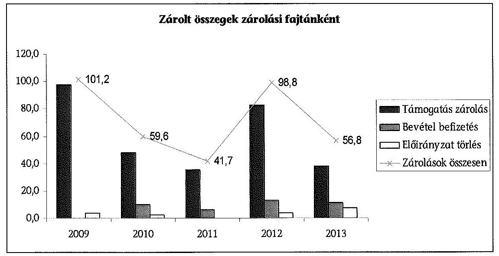

A zárolások fajták szerinti megoszlásai a 2009-2012. években: a támogatások zárolásai $66,3-96,3 \%$-os, a bevétel befizetések $0-20,2 \%$-os, az előirányzat törlések $0-13,5 \%$-os részarányok között mozogtak.

A 2013. évben átrendeződés történt 2012-höz képest a zárolási fajták között, mivel a támogatások zárolása $66,3 \%$-ra csökkent, a bevétel befizetések 20,2\%os részaránnyal, míg az előirányzat törlések 13,5\%-os részaránnyal az évek közötti legmagasabb értékeket képviselték. Összetételét tekintve - a vizsgált öt év átlagában - a zárolások legnagyobb hányadát, $82,1 \%$-ot a támogatások zárolása tette ki, míg a bevétel befizetés $13,0 \%$-os, az előirányzat törlés $4,9 \%$-os részarányt képviselt.

A központi költségvetés hiánycéljainak elérése érdekében - a 2009. évtől kezdődően többször ${ }^{28}$ került sor zárolási döntésre. Az elrendelés időpontjai és gyakorisága arra utal, hogy az ellenőrzött időszakban a Kormány a zárolást a hiánycél tartás „utolsó" eszközének tekintette.

# 4.3. A maradványtartási, a zárolási kötelezettség teljesítés együttes hatása a fejezet/intézmény lejárt kötelezettség állományára 

A fejezetek lejárt kötelezettség állományának alakulása a 2007-2013 években folyamatosan növekedett, a 2007. évi 14,7 Mrd Ft-ról több mint a hatszorosára 89,0 Mrd Ft-ra nőtt. Az összes tartozáson belül az átütemezett tartozások a 2007. évi 0,6 Mrd Ft-ról több mint ötszörösükre, 3,3 Mrd Ft-ra növekedtek a 2013. évre. A lejárt kötelezettségek állománya a 2008 év végére 3,4 Mrd Ft-tal csökkent, majd folyamatosan - több mint hatszorosára - a 2007 évi

[^0]
[^0]:    ${ }^{28}$ 2009. évben kétszer, 2010. évben egyszer, 2011. év decemberében kétszer (20 napon belül), a 2012. évben ötször (ebből két alkalommal 30 napon belül ismételten), a 2013. évben kétszer adtak ki zárolási kötelezettséget előíró kormányhatározatot.

---

14,0 Mrd Ft-ról a 2013. évre 86,7 Mrd Ft-ra nőtt. Az adatok részletezését a következő ábra mutatja:
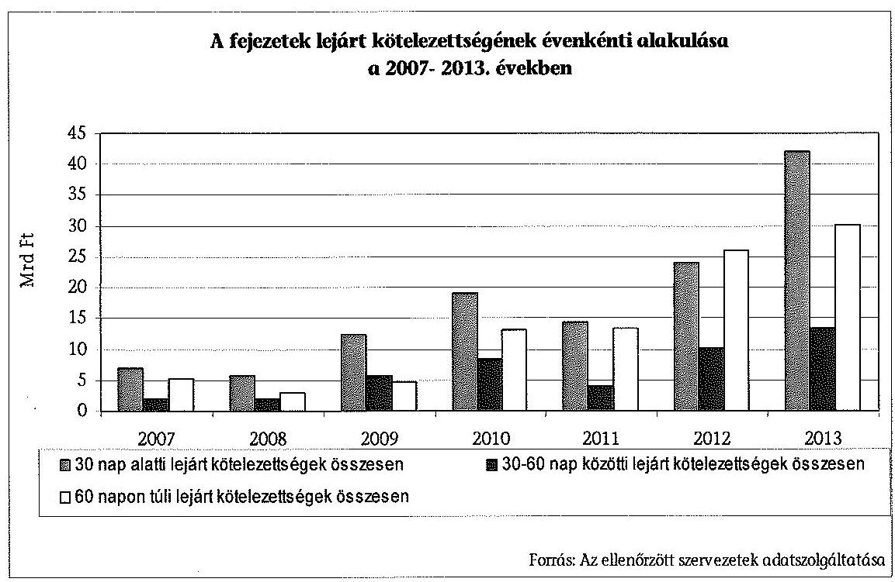

Az állammal szembeni lejárt kötelezettségek állománya növekedésének mértéke az összesített adatokét meghaladta, amelyet a következő táblázat mutat be:

Adatok M Ft-ban

| Megnevezés | 2007 | 2008 | 2009 | 2010 | 2011 | 2012 | 2013 |
| :--: | :--: | :--: | :--: | :--: | :--: | :--: | :--: |
| 30 nap alatt lejárt kötelezettségek összesen | 47 | 134 | 366 | 305 | 1554 | 900 | 6163 |
| 30-60 nap között lejárt kötelezettségek összesen | 39 | 89 | 259 | 326 | 319 | 537 | 536 |
| 60 napon túl lejárt kötelezettségek összesen | 73 | 97 | 268 | 1209 | 1453 | 7068 | 10447 |
| Lejárt kötelezettségek összesen | 159 | 320 | 893 | 1840 | 3326 | 8505 | 17146 |

A véletlen mintavétellel kiválasztott 15 intézménynél értékeltük a lejárt kötelezettségek alakulását.

Az ellenőrzött intézmények lejárt kötelezettségének záró állománya a 2007. évtől a 2013. év végéig 87,8\%-kal nőtt. A 60 napon túl lejárt kötelezettségek a 2013. év végén $74,4 \%$-os növekedést mutattak a 2007. év végi állományhoz viszonyítva. A 2012. évben ez az arány lényegesen kedvezőtlenebb volt, mivel 2007. év végéhez képest $771,1 \%$-os növekedést jelzett. A kórházak konszolidációja az ellenőrzött időszak végére jelentős javulást hozott e téren.

Az ellenőrzött intézmények esetében a maradvány és zárolás valamint a lejárt kötelezettségek állománya között a 2007-2013. években szoros kapcsolat figyelhető meg, a Pearson-féle együttható értéke 0,8 . Ezt az alábbi ábra szemlélteti:

---

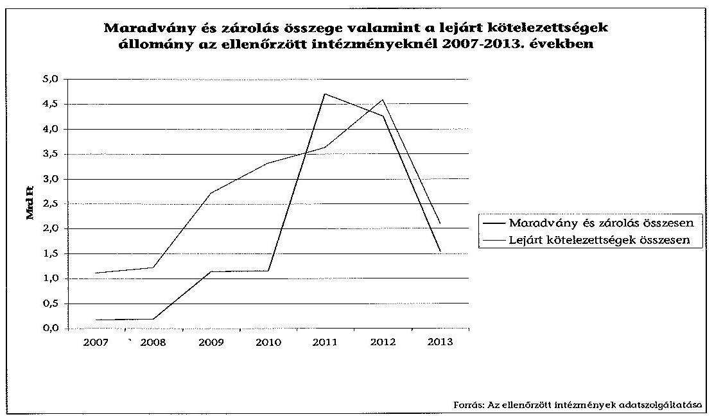

# 4.4. A maradványtartási és zárolási kötelezettség hatása a központi költségvetésre 

Az év végi maradvány és zárolás együttes összegének aránya a központi költségvetés kiadási főösszegéhez viszonyítva az ellenőrzött időszak átlagában $6,9 \%$ volt, az ellenőrzött időszakban az év végi maradvány és zárolás aránya a központi költségvetés kiadási főösszegéhez viszonyítva növekvő tendenciát mutatott.

A maradvány és zárolás összegének illetve arányának növekedése - a kiadások teljesítéséhez viszonyítva - csökkentő hatást gyakorolt a központi költségvetés hiányára. A mutatószám az első három évben 22,1\%-ról $49,7 \%$-ra növekedett. A 2010. évben a maradvány és a zárolás összege is csökkent, ami a mutató $44,3 \%$-ra történő visszaesését eredményezte. A 2011. évben a központi költségvetés hiánya növekedett az előző évhez viszonyítva, amelyet a maradvány és zárolás összegének és arányának visszaesése is okozott, így az intézkedés hatása $27,1 \%$-os csökkentés volt. A 2012-2013. évek a költségvetési hiány csökkenéséhez a magasabb év végi maradvány és zárolás is hozzájárult. Összességében megállapítható, hogy az ellenőrzött időszakban az év végi maradvány jellemzően növekvő tendenciája átlagosan $39,4 \%$-kal javította a központi költségvetés egyensúlyát.

---

A maradvány illetve a zárolás évente változó mértékben, de folyamatosan javította az államháztartás egyensúlyát és lehetővé tette az államháztartási hiány tervezett illetve konvergencia programban elvárt szintre való csökkentését. Az év végi maradvány és zárolás együttes összegének az államháztartás hiányára gyakorolt hatását a következő ábra mutatja be:
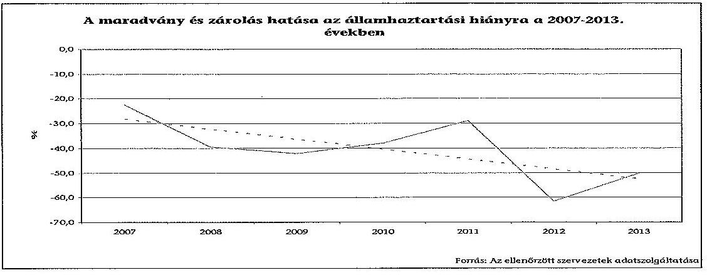

Az ellenőrzött időszakban a maradvány és zárolás aránya az államháztartás maradvánnyal és zárolással csökkentett hiányához viszonyítva átlagosan $39,1 \%$ volt.

Összességében a központi alrendszeri maradvány illetve zárolás csökkentette a központi költségvetés adósságát, ezáltal csökkent az államháztartás adóssága is.

Budapest, 2015. 4. hónap . 9...nap
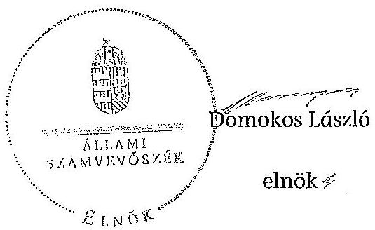

| Melléklet: | 4 db |
| :-- | :-- |
| Függelék: | 1 db |

---

# **Chemistry**

## **Chemical Reactions**

### **Balancing Chemical Equations**

1. **Write the unbalanced equation:**
   - Example: $$C_3H_8 + O_2 \rightarrow CO_2 + H_2O$$

2. **Balance the equation:**
   - Balance carbon atoms first.
   - Then balance hydrogen atoms.
   - Finally, balance oxygen atoms.
   - Balanced equation: $$C_3H_8 + 7O_2 \rightarrow 3CO_2 + 4H_2O$$

### **Types of Reactions**

1. **Combination Reaction:**
   - Example: $$2H_2 + O_2 \rightarrow 2H_2O$$

2. **Decomposition Reaction:**
   - Example: $$2H_2O_2 \rightarrow 2H_2O + O_2$$

3. **Single Displacement Reaction:**
   - Example: $$Zn + 2HCl \rightarrow ZnCl_2 + H_2$$

4. **Double Displacement Reaction:**
   - Example: $$AgNO_3 + NaCl \rightarrow AgCl + NaNO_3$$

5. **Combustion Reaction:**
   - Example: $$CH_4 + 2O_2 \rightarrow CO_2 + 2H_2O$$

## **Stoichiometry**

### **Mole Concept**

- **Mole (mol):** The amount of substance containing as many particles (atoms, molecules, ions) as there are atoms in exactly 12 grams of carbon-12.
- **Avogadro's Number:** $$6.022 \times 10^{23}$$ particles per mole.

### **Molar Mass**

- **Molar Mass:** The mass of one mole of a substance.
- Example: The molar mass of water ($$H_2O$$) is 18.015 g/mol.

### **Calculations**

1. **Moles to Mass:**
   - Formula: $$n = \frac{m}{M}$$
   - Example: Calculate the number of moles of $$H_2O$$ in 18 grams of water.
     - $$n = \frac{18.015 \, \text{g}}{18.015 \, \text{g/mol}} = 18.015 \, \text{g/mol}$$

2. **Moles to Mass:**
   - Formula: $$m = n \times M$$
   - Example: Calculate the mass of 18.015 g of water.
     - $$m = 18.015 \, \text{g/mol} = 18.015 \, \text{g/mol}$$

## **Gas Laws**

### **Ideal Gas Law**

- **Equation:** $$PV = nRT$$
- **Variables:**
  - $$P$$: Pressure (atm)
  - $$V$$: Volume (L)
  - $$n$$: Number of moles (mol)
  - $$R$$: Ideal gas constant (0.0821 L·atm/mol·K)
  - $$T$$: Temperature (K)

### **Boyle's Law**

- **Equation:** $$P_1V_1 = P_2V_2$$
- **Variables:**
  - P₁: Pressure (atm)
  - P₂: Volume (L)
  - P₃: Temperature (K)
  - P₁: Pressure (atm)
  - P₂: Volume (L)
  - P₃: Temperature (K)
  - P₁: Pressure (atm)

### **Boyle's Law (Boyle's Law)**

- **Equation:** $$\frac{P_1V_1}{P_2V_2} = \frac{V_1}{T_1}$$
- **Variables:**
  - P₁: Pressure (atm)
  - P₂: Volume (L)
  - P₃: Temperature (K)
  - P₁: Pressure (atm)
  - P₂: Volume (L)
  - P₁: Pressure (atm)

## **Thermochemistry**

### **Enthalpy (H)**

- **Definition:** The heat content of a system at constant pressure.
- **Equation:** $$\Delta H = q_p$$
- **Variables:**
  - $$q_p$$: Heat transferred at constant pressure.
  - $$q_p$$: Heat transferred at constant pressure.

### **Hess's Law**

- **Statement:** The enthalpy change for a reaction is the same whether it occurs in one step or multiple steps.
- **Equation:** $$\Delta H_{\text{reaction}} = \Delta H - Q_p$$
- **Variables:**
  - $$\Delta H$$: Heat transferred at constant pressure.
  - $$\Delta H$$: Heat transferred at constant pressure.

### **Hess's Law 2.0**

- **Statement:** The enthalpy change for a reaction is the same whether it occurs in one step or multiple steps.
- **Equation:** $$\Delta H_{\text{reaction}} = \Delta H - Q_p$$
- **Variables:**
  - $$Q_p$$: Heat transferred at constant pressure.
  - $$Q_p$$: Heat transferred at constant pressure.

## **Electrochemistry**

### **Oxidation and Reduction**

- **Oxidation:** Loss of electrons.
- **Reduction:** Gain of electrons.

### **Galvanic Cells**

- **Definition:** A cell that converts chemical energy into electrical energy.
- **Components:**
  - Anode: Oxidation occurs.
  - Cathode: Reduction occurs.
  - Salt Bridge: Connects the two half-cells.

### **Nernst Equation**

- **Equation:** $$E = E^\circ - \frac{RT}{nF} \ln Q$$
- **Variables:**
  - $$E$$: Energy (K)
  - $$E^\circ$$: Standard cell potential (V)
  - $$E$$: Number of electrons transferred (R)
  - $$E^\circ$$: Standard cell potential (V)
  - $$R$$: Ideal gas constant (0.0821 L·atm/mol·K)
  - $$T$$: Temperature (K)
  - $$n$$: Number of moles (mol)
  - $$F$$: Faraday constant (96,485 C/mol)
  - $$Q$$: Reaction quotient

---

Az ellenőrzés keretében vizsgált egyes adónemek előirányzatainak és teljesítésének alakulása

|  Megnevezés |  | 2007. év | 2008. év | 2009. év | 2010. év | 2011. év | 2012. év | 2013. év | Összesen  |
| --- | --- | --- | --- | --- | --- | --- | --- | --- | --- |
|  Magánszemélyek
különadója | előirányzat | 17,9 | 26,9 | 29,4 | 4,3 | 0,0 |  |  | 78,5  |
|   | teljesítés | 20,8 | 27,6 | 25,5 | 6,1 | 0,3 |  |  | 80,3  |
|   | teljesítés $\%-a$ | $116,4 \%$ | $102,9 \%$ | $86,8 \%$ | $140,9 \%$ |  |  |  | $102,4 \%$  |
|  Társas vállalkozások
különadója | előirányzat | 150,0 | 170,6 | 195,3 | 0,0 | 0,0 |  |  | 515,9  |
|   | teljesítés | 178,6 | 200,5 | 156,9 | $-32,4$ | $-16,1$ |  |  | 487,4  |
|   | teljesítés $\%-a$ | $119,1 \%$ | $117,5 \%$ | $80,3 \%$ |  |  |  |  | $94,5 \%$  |
|  Hitelintézetek
adókötelezettsége,
józadéka | előirányzat | 25,0 | 15,0 | 13,0 | 13,0 | 10,8 | 8,1 | 37,4 | 122,3  |
|   | teljesítés | 12,6 | 12,6 | 12,6 | 10,0 | 9,4 | 9,7 | 17,5 | 84,5  |
|   | teljesítés $\%-a$ | $50,2 \%$ | $84,3 \%$ | $97,1 \%$ | $77,3 \%$ | $86,9 \%$ | $120,3 \%$ | $46,8 \%$ | $69,1 \%$  |
|  Pénzügyi szervezetek,
hitelintézetek
különadója | előirányzat |  |  |  | 0,0 | 187,0 | 187,0 | 144,0 | 518,0  |
|   | teljesítés |  |  |  | 185,7 | 186,5 | 84,9 | 139,1 | 596,2  |
|   | teljesítés $\%-a$ |  |  |  |  | $99,7 \%$ | $45,4 \%$ | $96,6 \%$ | $113,1 \%$  |
|  Egyes ágazatokat
terhelő különadó | előirányzat |  |  |  | 0,0 | 161,0 | 155,0 | 5,0 | 321,0  |
|   | teljesítés |  |  |  | 151,7 | 171,9 | 165,6 | 9,8 | 499,1  |
|   | teljesítés $\%-a$ |  |  |  |  | $106,8 \%$ | $106,9 \%$ | $196,3 \%$ | $155,5 \%$  |
|  Távközlési adó | előirányzat |  |  |  |  |  | 0,0 | 44,0 | 44,0  |
|   | teljesítés |  |  |  |  |  | 12,2 | 47,0 | 59,2  |
|   | teljesítés $\%-a$ |  |  |  |  |  |  | $106,8 \%$ | $134,5 \%$  |
|  Biztosítási adó | előirányzat |  |  |  |  |  |  | 27,5 | 27,5  |
|   | teljesítés |  |  |  |  |  |  | 26,2 | 26,2  |
|   | teljesítés $\%-a$ |  |  |  |  |  |  | $95,2 \%$ | $95,2 \%$  |
|  Pénzügyi tranzakciós
illeték | előirányzat |  |  |  |  |  |  | 301,1 | 301,1  |
|   | teljesítés |  |  |  |  |  |  | 259,6 | 259,6  |
|   | teljesítés $\%-a$ |  |  |  |  |  |  | $86,2 \%$ | $86,2 \%$  |
|  Közművezetékek adója | előirányzat |  |  |  |  |  |  | 60,0 | 60,0  |
|   | teljesítés |  |  |  |  |  |  | 54,9 | 54,9  |
|   | teljesítés $\%-a$ |  |  |  |  |  |  | $91,6 \%$ | $91,6 \%$  |
|  Központi bevételek | előirányzat | 192,9 | 212,5 | 237,7 | 17,3 | 358,8 | 350,1 | 619,0 | 1988,3  |
|   | teljesítés | 212,0 | 240,8 | 195,0 | 321,1 | 352,0 | 272,5 | 554,2 | 2147,5  |
|   | teljesítés $\%-a$ | $109,9 \%$ | $113,3 \%$ | $82,0 \%$ | $1856,0 \%$ | $98,1 \%$ | $77,8 \%$ | $89,5 \%$ | $108,0 \%$  |
|  Népegészségügyi
termékadó | előirányzat |  |  |  |  | 0,0 | 20,0 | 21,2 | 41,2  |
|   | teljesítés |  |  |  |  | 3,3 | 19,1 | 18,9 | 41,2  |
|   | teljesítés $\%-a$ |  |  |  |  |  | $95,3 \%$ | $89,1 \%$ | $100,1 \%$  |
|  Elektronikus útdíj | előirányzat |  |  |  |  |  |  | 75,0 | 75,0  |
|   | teljesítés |  |  |  |  |  |  | 53,7 | 53,7  |
|   | teljesítés $\%-a$ |  |  |  |  |  |  | $71,6 \%$ | $71,6 \%$  |
|  Fejezeti költségvetés
bevételei | előirányzat |  |  |  |  |  | 20,0 | 96,2 | 116,2  |
|   | teljesítés |  |  |  |  | 3,3 | 19,1 | 72,6 | 94,9  |
|   | teljesítés $\%-a$ |  |  |  |  |  | $95,3 \%$ | $75,5 \%$ | $81,7 \%$  |
|  Mindösszesen | előirányzat | 192,9 | 212,5 | 237,7 | 17,3 | 358,8 | 370,1 | 715,2 | 2104,5  |
|   | teljesítés | 212,0 | 240,8 | 195,0 | 321,1 | 355,3 | 291,6 | 626,8 | 2242,4  |
|   | teljesítés $\%-a$ | $109,9 \%$ | $113,3 \%$ | $82,0 \%$ | $1856,0 \%$ | $99,0 \%$ | $78,8 \%$ | $87,6 \%$ | $106,6 \%$  |

---

.

---

# A költségvetési források Útdíj törvény szerinti felhasználása a 2013. évben 

## Megnevezés

Az útdíjszedési, egyetemes útdíjszolgáltatói, útdíjellenőrzési, útdíjellenőrzés támogatói rendszer múködtetése és fenntartása, valamint az azokhoz kapcsolódó - különösen műszaki szakmai, pénzügyi, számviteli és jogi - tevékenységek pénzügyi fedezetének biztosítása

A díjköteles országos közúthálózat üzemeltetése és fenntartása, valamint az azokhoz kapcsolódó különösen műszaki szakmai, pénzügyi, számviteli és jogi - tevékenységek pénzügyi fedezetének biztosítása

Az egyéb országos közúthálózati elemek üzemeltetése és fenntartása, valamint az azokhoz kapcsolódó - különösen műszaki szakmai, pénzügyi, számviteli és jogi - tevékenységek pénzügyi fedezetének biztosítása

A közúti közlekedési infrastruktúrával összefüggő egyéb állami feladatok, valamint az azokhoz kapcsolódó - különösen műszaki szakmai, pénzügyi, számviteli és jogi - tevékenységek pénzügyi fedezetének biztosítása

A koncessziós szerződés keretében üzemeltetett útszakaszok rendelkezésre állási díja fizetésének biztosítása

Az országos közúthálózati elemek meglévő kapacitásának bővítése és új hálózati elemek kiépítése

---

# **Chemistry**

## **Chemical Reactions**

### **Balancing Chemical Equations**

1. **Write the unbalanced equation:**
   - Example: $$C_3H_8 + O_2 \rightarrow CO_2 + H_2O$$

2. **Balance the equation:**
   - Balance carbon atoms first.
   - Then balance hydrogen atoms.
   - Finally, balance oxygen atoms.
   - Balanced equation: $$C_3H_8 + 7O_2 \rightarrow 3CO_2 + 4H_2O$$

3. **Balance the equation:**
   - Balance oxygen atoms.
   - Finally, balance oxygen atoms.
   - Balanced equation: $$C_3H_8 + 7O_2 \rightarrow 3CO_2 + 4H_2O$$

### **Types of Reactions**

1. **Combination Reaction:**
   - Example: $$2H_2 + O_2 \rightarrow 2H_2O$$

2. **Decomposition Reaction:**
   - Example: $$2H_2O_2 \rightarrow 2H_2O + O_2$$

3. **Single Displacement Reaction:**
   - Example: $$Zn + 2HCl \rightarrow ZnCl_2 + H_2$$

4. **Double Displacement Reaction:**
   - Example: $$AgNO_3 + NaCl \rightarrow AgCl + NaNO_3$$

5. **Combustion Reaction:**
   - Example: $$CH_4 + 2O_2 \rightarrow CO_2 + 2H_2O$$

## **Stoichiometry**

### **Mole Concept**

- **Mole (mol):** The amount of substance containing as many particles (atoms, molecules, ions) as there are atoms in exactly 12 grams of carbon-12.
- **Avogadro's Number:** $$6.022 \times 10^{23}$$ particles per mole.

### **Molar Mass**

- **Molar Mass:** The mass of one mole of a substance.
- Example: The molar mass of water ($$H_2O$$) is 18.015 g/mol.

### **Calculations**

1. **Moles to Mass:**
   - Formula: $$n = \frac{m}{M}$$
   - Example: Calculate the number of moles of $$H_2O$$ in 18 grams of water.
     - $$n = \frac{18.015 \, \text{g}}{18.015 \, \text{g/mol}} = 18.015 \, \text{g/mol}$$

2. **Mass to Moles:**
   - Formula: $$m = n \times M$$
   - Example: Calculate the mass of 18.015 g of 18 grams of water.
     - $$m = 18.015 \, \text{g/mol} = 18.015 \, \text{g/mol}$$

## **Gas Laws**

### **Ideal Gas Law**

- **Equation:** $$PV = nRT$$
  - P = Pressure (atm)
  - V = Volume (L)
  - n = Number of moles (mol)
  - R = Ideal gas constant (0.0821 L·atm/mol·K)
  - T = Temperature (K)

### **Boyle's Law**

- **Equation:** $$P_1V_1 = P_2V_2$$
  - P₁ = Pressure (atm)
  - V₁ = Volume (L)
  - n = Number of moles (mol)
  - R = Ideal gas constant (0.0821 L·atm/mol·K)
  - T = Temperature (K)

### **Boyle's Law**

- **Equation:** $$\frac{P_1V_1}{P_2V_2} = \frac{V_1}{T_1}$$

## **Thermochemistry**

### **Enthalpy (H)**

- **Definition:** The heat content of a system at constant pressure.
- **Equation:** $$\Delta H = q_p$$
  - qₚ = Heat transferred at constant pressure.

### **Hess's Law**

- **Statement:** The enthalpy change for a reaction is the same whether it occurs in one step or multiple steps.
- **Equation:** $$\Delta H_{\text{reaction}} = \Delta H - \Delta H_0$$
  - $$\Delta H_{\text{reaction}} = \Delta H - \Delta H_0$$

## **Electrochemistry**

### **Oxidation and Reduction**

- **Oxidation:** Loss of electrons.
- **Reduction:** Gain of electrons.

### **Galvanic Cells**

- **Definition:** A cell that converts chemical energy into electrical energy.
- **Components:**
  - Anode: Oxidation occurs.
  - Cathode: Reduction occurs.
  - Salt Bridge: Connects the two half-cells.

### **Nernst Equation**

- **Equation:** $$E = E^\circ - \frac{RT}{nF} \ln Q$$
  - E = Cell potential (V)
  - E° = Standard cell potential (V)
  - R = Ideal gas constant (0.0821 L·atm/mol·K)
  - T = Temperature (K)
  - n = Number of moles of electrons transferred
  - F = Faraday constant (96,485 C/mol)
  - Q = Reaction quotient

---

A központi költségvetés tartalékainak alakulása a 2007-2013. években

|  Megnevezés |  |  | 2007 | 2008 | 2009 | 2010 | 2011 | 2012 | Mrd Ft  |
| --- | --- | --- | --- | --- | --- | --- | --- | --- | --- |
|  Országvédelmi Alap | előirányzat | tervezett* | 0,0 | 0,0 | 0,0 | 0,0 | 0,0 | 170,0 | 400,0  |
|   |  | módosított** | 0,0 | 0,0 | 0,0 | 0,0 | 0,0 | 170,0 | 315,9  |
|   | teljesítés*** |  | 0,0 | 0,0 | 0,0 | 0,0 | 0,0 | 0,0 | 0,0  |
|  Központi egyensúlyt tartalék | előirányzat | tervezett* | 50,0 | 20,0 | 0,0 | 0,0 | 0,0 | 0,0 | 0,0  |
|   |  | módosított** | 45,0 | 20,0 | 0,0 | 0,0 | 0,0 | 0,0 | 0,0  |
|   | teljesítés*** |  | 45,0 | 20,0 | 0,0 | 0,0 | 0,0 | 0,0 | 0,0  |
|  Stabilitási tartalék | előirányzat | tervezett* | 0,0 | 0,0 | 78,0 | 98,6 | 0,0 | 0,0 | 0,0  |
|   |  | módosított** | 0,0 | 0,0 | 78,0 | 98,6 | 0,0 | 0,0 | 0,0  |
|   | teljesítés*** |  | 0,0 | 0,0 | 0,0 | 0,0 | 0,0 | 0,0 | 0,0  |
|  Fejezeti egyensúlyt tartalék | előirányzat | tervezett* | 80,4 | 88,8 | 81,7 | 0,0 | 0,0 | 52,1 | 21,6  |
|   |  | módosított** | 80,4 | 88,8 | 81,7 | 0,0 | 0,0 | 52,1 | 21,6  |
|   | teljesítés*** |  | 80,3 | 88,7 | 1,6 | 0,0 | 0,0 | 0,0 | 21,6  |
|  Kamatkockázati tartalék | előirányzat | tervezett* | 0,0 | 0,0 | 0,0 | 50,0 | 0,0 | 98,0 | 0,0  |
|   |  | módosított** | 0,0 | 0,0 | 0,0 | 50,0 | 0,0 | 98,0 | 0,0  |
|   | teljesítés*** |  | 0,0 | 0,0 | 0,0 | 0,0 | 0,0 | 0,0 | 0,0  |
|  Általános tartalék/Rendkívüli | előirányzat | tervezett* | 42,2 | 46,7 | 47,2 | 57,3 | 90,0 | 100,0 | 100,0  |
|   |  | módosított** | 45,6 | 51,7 | 47,5 | 153,5 | 93,7 | 102,4 | 106,9  |
|  Kormányzati Intézkedések | teljesítés*** |  | 45,2 | 49,7 | 46,6 | 118,4 | 93,7 | 102,4 | 106,9  |
|  Tartalék összesen | előirányzat | tervezett* | 172,6 | 155,5 | 206,9 | 205,9 | 90,0 | 420,1 | 521,6  |
|   |  | módosított** | 126,0 | 140,5 | 206,9 | 302,1 | 93,7 | 422,5 | 444,4  |
|   | teljesítés*** |  | 125,5 | 138,5 | 48,2 | 118,4 | 93,7 | 102,4 | 128,5  |

- törvényi eredeti előirányzat **törvényi illetve a Kormány hatáskörben elrendeit módosításokkal korrigált előirányzat (a felhasználásra vonatkozó ötszoportosítások nélkül) ***ötszoportosításra került előirányzat

---

.

---

# Beérkezett észrevételek és az azokra adott válaszok

---

# 4. SZÁMÚ MELLÉKLET A V-0366-839/2015. SZÁMÚ JELENTÉSHEZ

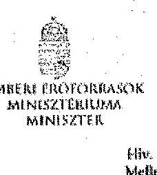

EMBÉRE PROTORRASOK
MINISZTÉRILHÁK
MINISZTÉR

Iktatószám: 28022-11/2014/IEL

Hiv. szám: V-0366-818/2014
Melléklet: -

Domokos László részére
elnői

Állami Számvevőszék

Budapest
Apáczai Csere János u. 10.
1052

Tárgy: Észrevétel „Az egyes egyensúlyjavító intézkedések és azok hatása a költségvetés végrehajtására” című számvevőszékủ jelentéstervezethez

Tisztelt Elnök Úr!

„Az egyes egyensúlyjavító intézkedések és azok hatása a költségvetés végrehajtására” című számvevőszékủ jelentéstervezethez az alábbi észrevételt testem.

A jelentéstervezet megállapításai értelmében az intézkedések nem alkottak egységes módszert, ez egyedi elbírálásokat (pl. beszerzési tilalom alatt felmentés) bizáltó szempontokkal nem tomogatták, az év végi maradványok felhasználásának korlátozása – annak egyre növekvő tömege miatt – kockázatot hordozott, az elrendelt maradványatát és zárulás következtében a fejezetek tejárt kötelezettség-állománya 2007-től 2013-ra több mint harasztására növekedett.

Annak ellenére, hogy a maradványatát és zárulás esetében az elvárt kovetszámok teljesülnek, valamint az Állami Számvevőszék megállapításával teljes mértékben egyetértik, jelezni kivánom, hogy az egyensúlyjavító intézkedések rendkívüli mértékben megsebezítették a fejezeti kezelésű előirányzatok, a fejezetek, valamint az irányítások, fenntartások alá tartozó intézmények évkóri gazdálkodását, és ezzel párhuzamosan erősen korlátozták a tervezhetőséget is.

Kérem Elnök Úrst, hogy az észrevételt szíveskedjen elfogadni.

Budapest, 2014. december „2014.”

Üdvözlettel:

Bárig Zoltán

Cím: 28022-11/2014/IEL
Melléklet: 2014. 06. 2014 11:10:10

2

---

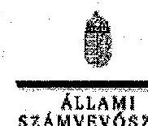

Iktazás: V-0366-846/2015.

Balog Zoltán
Miniszter

Emberi Erőforrások Minisztériuma

Budapest

Tisztelt Miniszter Úr!

Az egyensúlyjavító intézkedések ellenőrzése - Az egyensúlyjavító intézkedések és azok hatása a költségvetés végrehajtására* című jelentéstervezetre tett észrevételeit köszönettel megkaphat.

Az Állami Számvevőszék észrevételekre vonatkozó álláspontjáról a felügyeleti vezető által készített részletes tájékoztatást csatoltan megküldött.

Tájékoztatom Miniszter urat, hogy a számvevőszéki jelentés szövegezése az elfogadott észrevételek figyelembevételeivel készül.

Budapest, 2015. 7. 7. nap

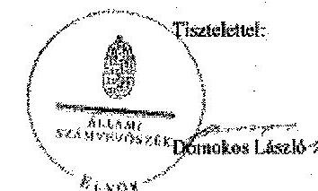

Meillekin: Tájékoztatás az észrevételek kezeléséről

1002 BUDAPEST, ARKUZN-ESZÉK, ARKIS-ÚTZK 55, 1304 Budapest, 4. Ft. 14. Telefon: 484 0100 - fax: 484 0201

---

# 4. SZÁMÚ MELLÉKLET 

A V-0366-839/2015. SZÁMÚ JELENTÉSHEZ

Iki.szám: V-0366-846/2015.

## Tájékoztatás   az észrevételok kezeléséről

„Az egyentélyjariító intézkedések ellenérzése - Az egyentélyjariító intézkedések és azok hatása a költségvetés végrehajtására" című jelentéstarvezetre 2014. december 30-áa tett észrevételei áttekintették. Az észrevételek általános jellegủ megállapítárak voltak, jelentésmódosítási javaslatot nem tartalmazztok.

Tájékoztatom Miniszter utat, hogy a számvevőszaki jelentés mellékleteként szerepelietjük a jelentéstarvezethez tett észrevételeit, valamint az azokra adott válaszunkat.

Budapest, 2015. 04. hó 28. nap.

Tisztelettel:

## Pajjunt

Dr. Pajjunt
Dr. Pajjunt
1002 BUDAPEST, ARKI DR. CISZER, JÖNSTESEK 5A, 1204 Budapest 1, 01104 Móden. 4440231 m. 200000

---

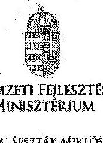

# D8. SZSZTÁK MIELOS

## Iktatészám: EFO/28137-3/2014-NFM

Úgyintéző: Siroimé Hábencius Gizelis
Telefonszám: 79-54405
E-mail: gizelis.habencius.siroimeti@sbt.gov.hu
Hiv. szám: V-0366-818/2014

**Domokos László**

**elnök**

**részére**

**Állami Számverőszék**

**Budapest**

Apáczai Csere János u. 10.
1052

**Tárgy:** Jelentéstervezet véleményezése

**Tisztelt Elnök Úr!**

Köszönettel megkaptam „Az egyensúlyjavító intézkedések és azok hatása a költségvetés végrehajtására” című jelentéstervezetüket.

A tervezettel kapcsolatban az alábbi észrevételeket teszem:

1. A jelentéstervezet több helyen is adóként, adónemként kezeli az elektronikus útdíj bevételeket (pl. 14, 16, 20. oldalák). Az elektronikus útdíj azonban nem adó, hanem egy szolgáltatásért szedett díj.
2. A jelentés 28. és 33. oldalán megállapítja, hogy a 2013. évi bevétel összege 21,3 milliárd forinttal (28,4%-kal) maradt el az előirányzattól, illetve „csak” 53,7 milliárd forint volt. Ezen információ - bár szigorúan véve belül szerint igaz - valójában jelentősen torzít, mert nem veszi figyelembe a bruttó és nettó összegek közötti eltérést, illetve azt a tényt, hogy a decemberi útdíj pénzforgalmilag csak januárban folyt be. A zárszámadási törvény (2014. évi LXII. törvény) általános indoklása (a parlament honlapján: http://www.parlament.hu/jrom40/01143/01143.htm) szerint:

---

Az elektronikus átdij esetében az ótdij-szolgáltatónál jelentkezô bruttó bevételek meghaladták a tervezettet. A költségvetési törvény hatályba lépése után elfogadott szabályok szerint azonban az ÁAK Zrt. (jelenlegi nevén Nemzeti Útdij-fizetési Szolgáltató Zrt.) a beszedett díjakat a tárgyhót követő hónapban, nettó módon utalta át a központi költségvetés központosított bevételi számlájára (miközben általános forgalmi adó bevallását is teljesítette), így az elöirányzathoz viszonyított alacsonyabb teljesítést ( $71,6 \%$ ) az magyarázza, hogy öt havi nettó bevétel viszonyul hat havi bruttó tervezámhoz. A 2013. év decemberében beszedett bevételek pénzforgalomban 2014. januárban jelentek meg a központi költségvetésben, ugyanakkor az uniós módszortan szerinti elszámolás alapján ezek a tavalyi évhez számolandók.
(A pénzforgalmilag 2014. januárban jelentkező 2013. decemberi teljesitést is belezsámóva a 2013. évi bevétel nettó 62,1: bruttó 78,9 milliárd forint)

Kérem észrevételeim szíves elfogadását.

Budapest, 2015. január „ $\boldsymbol{\text { " }}$ ",

Üdvözlettel:
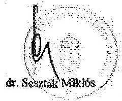

---

# 4. SZÁMÚ MELLÉKLET A V-0366-839/2015. SZÁMÚ JELENTÉSHEZ 

## 4. SZÁMÚ

SZÁMVEVÓSZÉK

Ikl.nám: V-0366-845/2015.

## Dr. Szeztük Miklós

minister

Nemzeti Fejlesztési Minisztérium
Budapest

## Tisztelt Miniszter Úr!

„Az egyensúlyjavító intézkedések ellenőrzése - Az egyensúlyjavító intézkedések és azok hatása a költségvetés végrehajtására" című jelentéstervezetre tett észrevételeit köszönettel megkap-
tani.

Az Állami Számvevőszék észrevételekre vonatkozó álláspontjáról a felügyeleti vezető által készített részletes tájékoztatást csatolnan megküldöm.

Tájékoztatom Miniszter utat, hogy a számvevőszék) jelentés szövegezése az elfogadott észrevételek figyelembevételevel készül.

Budapest, 2015.
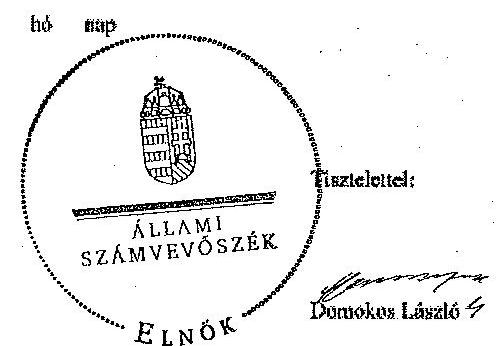

Melléklet: Tájékoztatás az észrevételek kezeléséről

10500000000000000000000000000000000000000000000000000000000000000000000000000000000000000000000000000000000000000000000000000000000000000000000000000000000000000000000000000000000000000000000000000000000

---

# Tájékoztatás   az észrevételek kezelésérül 

„Az egyensúlyjarló intézkedések elizsárzése - Az egyensúlyjarló intézkedések és azok hatása a költségvetés végrehajtására" című jelentéstervezetre 2013. január 14-én megkötött észrevételei áttalámának.

## Észrevétel 1. pont:

„A jelentéstervezet több helyen is adóként, udánemként kezelt az elektronikus átdíj bevételeket. (pl. 14, 16, 20. oldalak). Az elektronikus átdíj azonban nem adó, hanem egy szolgáltatásért szedett díj."

Köszönjük az észrevételt, múnek alapján a jelentésben az értelmező rendelkezéseket az elektronikus ótdíj értelmezésével kiegészítették a következők szerint: „a 2013 évi költségvetésben az átdíj pontos helye: XVII. Nemzeti Feflesztési Minisztérium- 22. Elektronikus átdíj. 2014 évsill az átdíj a „költségvetés közvetlen bevételei - 4. egyéb központosított bevételek - egyéb költségvetési bevételek- 2. központosított bevételek" soron jelenik meg. Mirel a költségvetés kicveileit bevételei jellemzően adó és járulékbevételek a jelentésben az átdijat külön nem kötönöjük el, adóként szerepelttijük."

## Észrevétel 2. pont: első rész

„A jelentés 28. és 33. oldalán megállapítja, hogy a 2013. évi bevétel összege 21,3 milliárd forrimód (26,406-kal) maradt el az elöledensztati, illetve „csak" 53,7 milliárd forint volt. Ezen információ - bár szigorúan véve betü szerint igaz - valójában jelentésen torzít, mert nem veszi figyelembe a bruttó és nettó összegek közötti eltérést, illetve azt a tényi, hogy a decemberi átdíj pénzforgalmilag csak januárban folyt be, a zárszámodást törvény (2014. évi LXII. törvényi általános indoklóra (a parlament honlapján:
http://www.parlament.hu/iron/0/01143/01143.htm) szerint."
Véleményünk szerint, amíg a költségvetés és a zárszámodás pénzforgalmi szemléletben készül, addig az értékelést is csak pénzforgalmi szemléletben tudjuk elvégezni. Így a költségvetés végrehajtásának értékelésekor nem lehet figyelembe venni eredményzemléletủ értékeléseket, tudva azt, hogy a két szemlélet közötti eltérést meg lehet magyarázni, számszakilag ki lehet mutani.

---

# Észrevétel 2. pont: második rész 

„Az elektronikus útdíj esetében az útdíj-szolgáltatómól jelentkező bruttó bevételek megbukadók a tervezettel. A költségvetési törvény hatályba lépése után elfogadott szabályok szerint azonban az AAK Zrt. (jelentégl nevén Nemzeti Útdíj-ftzetési Szolgáltató Zrt.) a beszedett díjakat a tárgyhát követő hánophat, nettó módon utalna át a központi költségvetés központosított bevételi számlájára (miközben áltakinns forgalmi adó bevallását is teljesítette), így az elöirányzathoz viszonyitati alacsonyabb teljesitett (71,6\%) az magyarázza, hogy öthevi nettó bevétel viszonyul hatbani bruttó tervezéséhez. A 2013. év decemberében beszedett bevételek pénzforgalamban 2014. januárban jelentek meg a központi költségvetésben, ugyanakkor az uniós módszertan szerinti elszámolás alapján ezek a tavalyi évhez számolandók. (A pénzforgalmiing 2014. januárban jelentkező 2013. decemberi teljesittést is belevszimítva a 2013. évi bevétel nem) 62.1: bruttó 78,9 milliárd forint!"

Véleményünk szerint, az útdíjból származó bevétel összege és az útdíj beszedését végző eredményazemléletủ könyvelést vezető gazdasági társaságnál jelentkező bevétel összehasonlítására vonatkozó adatok közötti eltérés okát nem lehet közvetlenül kimutatni. Az eltérést az észrevételben említett mindkét ok eredményezhette, de az számszakilag közvetlenül nem állapítható meg a költségvetési törvényből és annak végrehajtásából. A jelentésben a 2013 évi költségvetésben pénzforgalmi szemléletben elöirányzott és a 2013. évben pénzforgalmi szemléletben teljesített bevételeket hasonlítatnál össze, mindkettőt a törvényekben szereplő számok alapján. Az uniós módszertan szerint, eredményszemléletben készült elszámolás nem hasonlítható a pénzforgalmi szemléletủ költségvetési elöirányzathoz.

A 2. pontban tett észrevételek alapján a jelentéstervezet módosítása nem indokolt.
Tájékoztatom Miniszter utat, hogy a számvevőszaki jelentés mellékleteként szerepeltetjük a jelentéstervezethez tett észrevételeit, valamint az azokra adott válaszunkat.

Budapest, 2015.
hó
nap.

Tiszteltétel:

## Tarfou

Dr. Puley Gyeth

---

.

---

# A rendszerellenőrzés teljesítménykritériumai 

A közfeladatok és a közszolgáltatások hatékony és eredményes ellátása függ a döntéshozó és irányító szervek, illetve a végrehajtást végző szervezetek tevékenységétől. A döntéshozó szervek határoznak a társadalmi-gazdasági folyamatokba történő beavatkozásokról. A döntéshozók beavatkozásain általánosságban a jogszabályokban és az állami irányítás egyéb eszközeiben meghatározott feladatok ellátása érdekében tett intézkedéseket, tevékenységeket, programokat értjük. A rendszerellenőrzés a probléma központú vizsgálatok csoportjába tartozik azzal a sajátossággal, hogy az ellenőrzések a döntéshozók beavatkozásainak folyamatát, illetve ezek rendszerét átfogják.

A teljesítményt a döntéshozók beavatkozásainak rendszerében lehet gazdaságossági, hatékonysági és eredményességi szempontból vizsgálni.

Az egyensúlyjavító intézkedések és azok hatása a költségvetés végrehajtására címú ellenőrzés keretében a döntéshozók beavatkozásainak eredményességi szempontú megítélését tudtuk elvégezni. Az eredményesség megítélése két szinten volt lehetséges. 1. Az egyensúlyjavító intézkedés javította-e az egyensúlyt? 2. Az egyensúlyjavító intézkedés(ek) elérték-e céljukat?