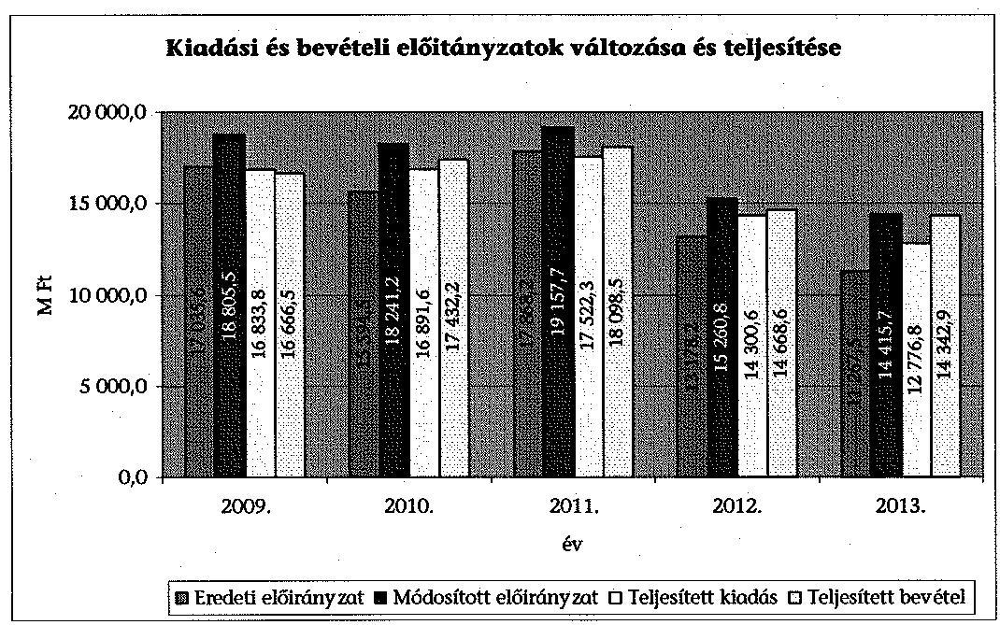
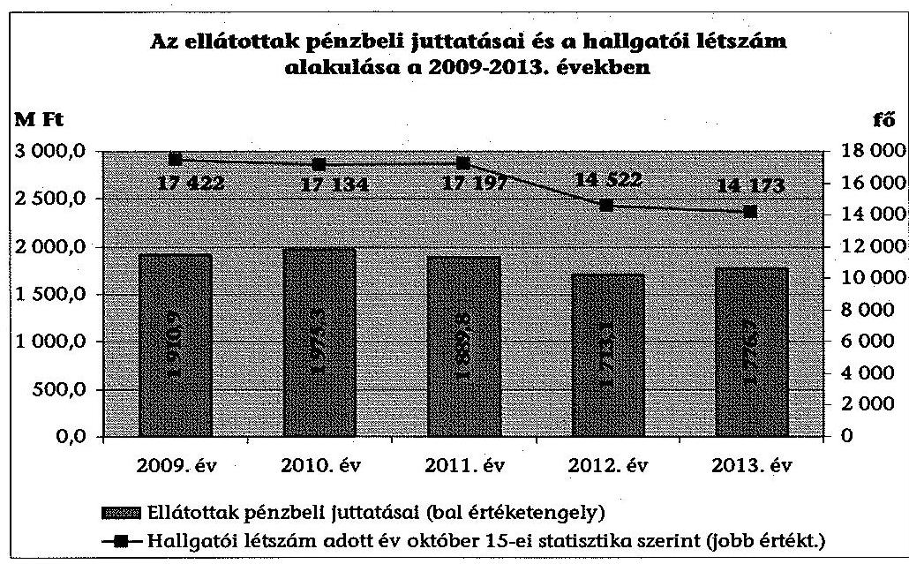
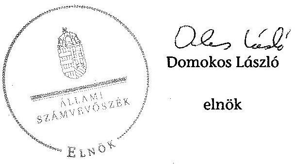
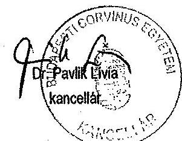
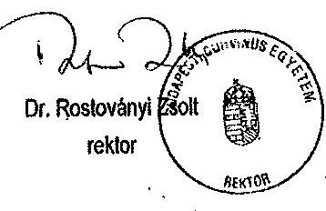
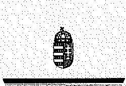
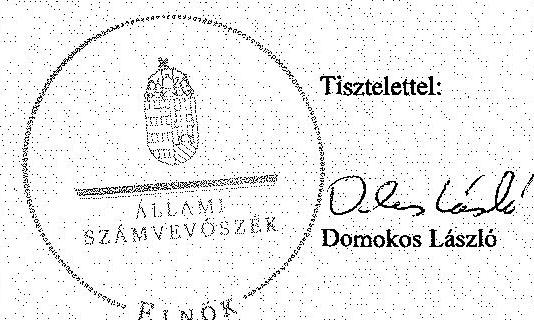

# ÁLLAMI   SZÁMVEVŐSZÉK 

## JELENTÉS

a Budapesti Corvinus Egyetem ellenőrzéséről - Az állami felsőoktatási intézmények gazdálkodásának, működésének ellenőrzése

---

# Állami Számvevőszék 

Iktatószám: V-0585-105/2015.
Témaszám: 1619
Vizsgálat-azonosító szám: V068911

## Az ellenőrzést felügyelte:

## Makkai Mária

felügyeleti vezető

## Az ellenőrzést vezette és az ellenőrzés végrehajtásáért felelős:   Gál Magdolna   ellenőrzésvezető

## A számvevői jelentések feldolgozásában és a jelentés összeállításában közreműködtek:

## Zaroba Szilvia Dr. Podonyi László   számvevő tanácsos számvevő főtanácsos

## Az ellenőrzést végezték:

## Balázsné Antoni Erika Zaroba Szilvia   számvevő számvevő tanácsos

## Kalmár István Dr. Podonyi László   számvevő tanácsos számvevő főtanácsos

## A témához kapcsolódó eddig készített számvevőszéki jelentések:

## címe

Jelentés az oktatási és kulturális ágazat irányítási rendszerének, működésének ellenőrzéséről
Jelentés a felsőoktatás oktatási infrastruktúra-fejlesztési programjának ellenőrzéséről
Jelentés az állami felsőoktatási intézmények érdekeltségébe tartozó 1290 gazdasági társaságok támogatásának és nyereségük hasznosulásának ellenőrzéséről
Jelentés a Szolnoki Főiskola ellenőrzéséről - Az állami felsőoktatási 14196 intézmények gazdálkodásának, működésének ellenőrzése
Jelentés a Pannon Egyetem ellenőrzéséről - Az állami felsőoktatási 14197 intézmények gazdálkodásának, működésének ellenőrzése
Jelentés a Károly Róbert Főiskola ellenőrzéséről - Az állami felsőoktatási 14198
intézmények gazdálkodásának, működésének ellenőrzése
Jelentés a Magyar Képzőművészeti Egyetem ellenőrzéséről - Az állami felsőoktatási intézmények gazdálkodásának, működésének ellenőrzése
Jelentés a Miskolci Egyetem ellenőrzéséről - Az állami felsőoktatási 14200
intézmények gazdálkodásának, működésének ellenőrzése

---

Jelentés a Széchenyi István Egyetem ellenőrzéséről - Az állami felsőoktatási intézmények gazdálkodásának, működésének ellenőrzése
Jelentés az Eszterházy Károly Főiskola ellenőrzéséről - Az állami 14204
felsőoktatási intézmények gazdálkodásának, működésének ellenőrzése
Jelentés a Magyar Táncművészeti Főiskola ellenőrzéséről - Az állami 14205 felsőoktatási intézmények gazdálkodásának, működésének ellenőrzése
Jelentés a Budapesti Műszaki és Gazdaságtudományi Egyetem ellenőrzéséről - Az állami felsőoktatási intézmények gazdálkodásának, működésének ellenőrzése

---

.

---

# TARTALOMJEGYZÉK 

BEVEZETÉS ..... 11
I. ÖSSZEGZŐ MEGÁLLAPÍTÁSOK, KÖVETKEZTETÉSEK, JAVASLATOK ..... 15
II. RÉSZLETES MEGÁLLAPÍTÁSOK ..... 22

1. A fenntartói és az ágazati irányítási jogok gyakorlása ..... 22
2. Az intézmény belső kontrollrendszerének kialakítása és működtetése ..... 24
3. Az intézmény döntéshozó szerveinek joggyakorlása, az oktatási és egyéb tevékenységek elkülönítése, a pénzügyi gazdálkodás szabályossága ..... 27
3.1. A döntéshozó szervek gazdálkodással kapcsolatos joggyakorlása ..... 27
3.2. Az oktatási és egyéb tevékenységek elkülönítése, az ellátott feladatok átláthatósága ..... 28
3.3. Az intézmény pénzügyi egyensúlya, fizetőképessége, a feladatok zavartalan ellátása ..... 29
3.4. Az intézmény előirányzat kezelése ..... 30
3.5. Az egyes hazai forrásból finanszírozott projektekkel való elszámolás ..... 40
4. Az intézmény vagyongazdálkodása ..... 40
4.1. A vagyongazdálkodási tevékenység kialakításának keretei ..... 40
4.2. A vagyonváltozások és a vagyonhasznosítás szabályszerűsége ..... 42
4.1. Az intézmény tulajdonosi joggyakorlásának szabályszerűsége ..... 48
5. A külső ellenőrzések hasznosulása ..... 50
5.1. ÁSZ ellenőrzések által tett javaslatok hasznosulása ..... 50
5.2. Az egyéb külső ellenőrzések javaslatainak hasznosulása ..... 52
6. Az integritás kontrollok kialakítása és működtetése ..... 53
MELLÉKLETEK
7. számú A Budapesti Corvinus Egyetem kiadási és bevételi előirányzatai, azok teljesítése a 2009-2013. években
8. számú A Budapesti Corvinus Egyetem kiadásainak, bevételeinek változása a 2009-2013. években
9. számú Kimutatás a Budapesti Corvinus Egyetem bevételeiről és kiadásairól, valamint adósságszolgálatáról a 2009-2013. években
10. számú A Budapesti Corvinus Egyetem mérlegadatai a 2009-2013. években
11. számú A Budapesti Corvinus Egyetem gazdálkodása szabályszerűségének értékelése a mintatételek alapján

---

6. számú A Budapesti Corvinus Egyetem rektorának észrevétele
7. számú A Budapesti Corvinus Egyetem rektorának észrevételére adott válasz

# FÜGGELÉK 

1. számú Az integritás érvényesítése érdekében kialakított és működtetett intézményi kontrollrendszer

---

# RÖVIDÍTÉSEK JEGYZÉKE 

| Törvények |  |
| :--: | :--: |
| Áht. 1 | 1992. évi XXXVIII. törvény az államháztartásról |
| Áht. 2 | 2011. évi CXCV. törvény az államháztartásról |
| ÁSZ tv. | 2011. évi LXVI. törvény az Állami Számvevőszékről |
| Eisztv. | 2005. évi XC. tv. az elektronikus információszabadságról |
| Feot. | 2005. évi CXXXIX. törvény a felsőoktatásról |
| Gt. | 2006. évi IV. törvény a gazdasági társaságokról |
| Info tv. | 2011. évi CXII. törvény az információs önrendelkezési jogról és az információszabadságról |
| Kbt. 1 | 2003. évi CXXIX. törvény a közbeszerzésekről |
| Kbt. 2 | 2011. évi CVIII. törvény a közbeszerzésekről |
| Kjt. | 1992. évi XXXIII. törvény a közalkalmazottak jogállásáról |
| Ktv. | 1992. évi XXIII. törvény a köztisztviselők jogállásáról |
| Nftv. | 2011. évi CCIV. törvény a nemzeti felsőoktatásról |
| Nvtv. | 2011. évi CXCVI. törvény a nemzeti vagyonról |
| Ptk. | 1959. évi IV. törvény a Magyar Köztársaság Polgári Törvénykönyvéről |
| Sztv. | 2000. évi C. törvény a számvitelről |
| Vtv. | 2007. évi CVI. törvény az állami vagyonról |
| Korm. rendeletek |  |
| 51/2007. (III. 26.) Korm. rendelet | 51/2007. (III. 26.) Korm. rendelet a felsőoktatásban részt vevő hallgatók juttatásairól és az általuk fizetendő egyes térítésekről |
| 50/2008. (III. 14.) Korm. rendelet | 50/2008. (III. 14.) Korm. rendelet a felsőoktatási intézmények képzési, tudományos célú és fenntartói normatíva alapján történő finanszírozásáról |
| Áhsz. | 249/2000. (XII. 24.) Korm. rendelet az államháztartás szervezetei beszámolási és könyvvezetési kötelezettségének sajátosságairól |
| Ámr. 1 | 217/1998. (XII. 30.) Korm. rendelet az államháztartás működési rendjéről |
| Ámr. 2 | 292/2009. (XII. 19.) Korm. rendelet az államháztartás működési rendjéről |
| Ávr. | 368/2011. (XII. 31.) Korm. rendelet az államháztartásról szóló törvény végrehajtásáról |
| Ber. | 193/2003. (XI. 26.) Korm. rendelet a költségvetési szervek belső ellenőrzésről |
| Bkr. | 370/2011. (XII. 31.) Korm. rendelet a költségvetési szervek belső kontrollrendszeréről és belső ellenőrzésről |
| Vtvr. | 254/2007. (X. 4.) Korm. rendelet az állami vagyonnal való gazdálkodásról |

---

Egyéb rövidítések
BCE, intézmény, egyetem
Corvinus TISZK Kft.
EMMI
FIR
GT
IFT
Kincstár
MNV Zrt.
NEFMI
NEPTUN
NFM
NGM
NKE
OH
OKM
PPP
SZMSZ
teljesítésigazolás

Budapesti Corvinus Egyetem
Corvinus TISZK kiemelkedően közhasznú Kft.
Emberi Erőforrások Minisztériuma
felsőoktatási információs rendszer
Gazdasági Tanács
Intézményfejlesztési Terv
Magyar Államkincstár
Magyar Nemzeti Vagyonkezelő Zrt.
Nemzeti Erőforrás Minisztérium
Hallgatói Információs és Pénzügyi Rendszer
Nemzeti Fejlesztési Minisztérium
Nemzetgazdasági Minisztérium
Nemzeti Közszolgálati Egyetem
Oktatási Hivatal
Oktatási és Kulturális Minisztérium
public private partnership
szervezeti és működési szabályzat
Ámr. 135. §, Ámr. 2 76. § szerint 2009. január 1- 2011. december 31 között szakmai teljesítésigazolás, az Ávr. 57. § alapján 2012. január 1-től teljesítésigazolás

---

# ÉRTELMEZŐ SZÓTÁR 

állami felsőoktatási intézmény saját tulajdona
állami vagyon
a felsőoktatási intézmény saját bevételének a költségek teljes körű levonása, - az adományozás és öröklés kivételével - a rendelkezésre bocsátott vagyon állagának megóvásáról, pótlásáról való gondoskodás után fennmaradt része terhére szerzett vagyona
A Vtv. 1. § (2) bekezdése szerint „állami vagyonnak minősül:
a) az állami tulajdonban lévő ingó dolog, valamint a dolog módjára hasznosítható természeti erő,
b) az állami tulajdonban lévő termőföldekből álló, külön törvényben szabályozott Nemzeti Földalap,
c) az állami tulajdonban lévő - a b) pont hatálya alá nem tartozó - ingatlan,
d) az állami tulajdonban lévő értékpapír,
e) az államot megillető társasági részesedés és más vagyoni értékű jog."
(hatályos 2010. június 16-ig)
„a) az állam tulajdonában lévő dolog, valamint a dolog módjára hasznosítható természeti erő,
b) az a) pont hatálya alá nem tartozó mindazon vagyon, amely vonatkozásában törvény az állam kizárólagos tulajdonjogát nevesíti,
c) az állam tulajdonában lévő tagsági jogviszonyt megtestesítő értékpapír, illetve az államot megillető egyéb társasági részesedés,
d) az államot megillető olyan immateriális, vagyoni értékkel rendelkező jogosultság, amelyet jogszabály vagyoni értékű jogként nevesít"
(hatályos 2010. június 17-től)
állami vagyon hasznosítása

A Vtv. 23. § (1) bekezdése szerint: „Az állami vagyont az MNV Zrt. maga kezeli, illetve szerződés - így különösen bérlet, haszonbérlet, szerződésen alapuló haszonélvezet, vagyonkezelés, megbizás - alapján központi költségvetési szervnek, természetes vagy jogi személynek, illetőleg jogi személyiséggel nem rendelkező gazdasági társaságnak hasznosításra átengedi." (hatályos 2010. december 31-ig)
„Az állami vagyont az MNV Zrt. maga kezeli, vagy szerződés így különösen bérlet, haszonbérlet, szerződésen alapuló haszonélvezet, vagyonkezelés, megbizás - alapján központi költségvetési szervnek, természetes vagy jogi személynek, vagy jogi személyiséggel nem rendelkező gazdálkodó szervezetnek hasznosításra átengedi."
(hatályos 2011. december 31-ig)
„Az állami vagyont az MNV Zrt. maga kezeli, vagy szerződés így különösen bérlet, haszonbérlet, megbizás - alapján központi költségvetési szervnek, természetes vagy jogi személynek, vagy jogi személyiséggel nem rendelkező gazdálkodó szervezetnek hasznosításra átengedi."
(hatályos 2012. január 1-jétől)
A Vtv. 23. § (2) bekezdése szerint: „Az állami vagyon hasznosítására kötött szerződések elsődleges célja az állami vagyon hatékony működtetése, állagának védelme, értékének megőrzése, illetve gyarapítása, az állami és közfeladatok ellátásának elősegítése."
A Vhr. 1. § (7) a. pontja szerint: „az a természetes személy, jogi személy, illetve jogi személyiséggel nem rendelkező gazdasági társaság, amely az MNV Zrt.-vel kötött szerződés alapján, bármely jogcímen (bérlet, haszonbérlet, vagyonkezelés, használat stb.) állami vagyont birtokol, használ, hasznosít". (hatályos 2010. december 31-ig)
„az a természetes személy, jogi személy, illetve jogi személyiséggel nem rendelkező szervezet, amely, illetve aki törvény vagy szerződés alapján, bármely jogcímen (pl. bérlet, haszonbérlet, vagyonkezelési szerződés, használat stb.) állami vagyont birtokol, használ, szedi annak használt, hasznosít, ide nem értve a tulajdonosi jogok gyakorlóját".
(hatályos 2011. január 1 - 2011. december 31-ig)
„az a természetes vagy jogi személy, jogi személyiséggel nem rendelkező szervezet, aki, vagy amely törvény vagy szerződés alapján, bármely jogcímen (bérlet, haszonbérlet, használat stb.) állami vagyont birtokol, használ, szedi annak használt, hasznosít, ide nem értve a haszonélvezőt, a vagyonkezelőt és a tulajdonosi jogok gyakorlóját".
(hatályos 2012. január 1-jétől)
„Állami vagyon tulajdonjogának bármely jogcímen történő, visszterhes átruházása" (Vhr. 1. § (7) d) pont).
A Vtv. 23. § (1) bekezdése szerint „az állami vagyont az MNV Zrt. maga kezeli, vagy szerződés - így különösen bérlet, haszonbérlet, szerződésen alapuló haszonélvezet, vagyonkezelés, megbizás - alapján központi költségvetési szervnek, természetes vagy jogi személynek, illetőleg jogi személyiséggel nem rendelkező gazdasági társaságnak hasznosításra átengedi" (hatályos 2010. január 1 - 2011. december 31-ig) „az állami vagyont az MNV Zrt. maga kezeli, vagy szerződés - így különösen bérlet, haszonbérlet, megbizás - alapján központi költségvetési szervnek, természetes vagy jogi személynek, vagy jogi személyiséggel nem rendelkező gazdálkodó szervezetnek hasznosításra átengedi." Az állami vagyonra vonatkozóan az MNV Zrt. kizárólag az Nvtv.-ben meghatározott személyekkel köthet vagyonkezelési szerződést.
(Vtv. 27. § (1) bekezdés) (hatályos 2012. január 1-jétől)
A módszer következetesen elkülöníti a folyó és a felhalmozási költségvetés bevételeit és kiadásait, azok költségvetési egyenlegeit. Bizonyos mértékig a vállalati gazdál-

---

|  | kodás logikai elemeit érvényesíti a felsőoktatási költségvetési szervek pénzügyi, jövedelmi helyzetének vizsgálata során. Az értékelés a pénzügyi kapacitás fogalmát helyezi a középpontba. |
| :--: | :--: |
| előirányzat-maradvány | Az államháztartás központi alrendszerébe tartozó költségvetési szerveknél a módosított bevételi és kiadási előirányzatok és azok teljesítésének a Kormány rendeletében meghatározott tételekkel korrigált különbözete az előirányzat-maradvány (Áht. 2 . § (1) bekezdés m) pont). |
| fenntartó | Feot. 7. § (2) és Nftv. 4. § (2) bekezdése szerint az, aki az alapítói jogot gyakorolja, ellátja a felsőoktatási intézmény fenntartásával kapcsolatos feladatokat (a továbbiakban: fenntartó) |
| Gazdasági Tanács | a felsőoktatási intézmény véleményező, a

 stratégiai döntések előkészítésében részt vevő, és a döntések ellenőrzésében közreműködő szerve |
| integritás | Az integritás olyasvalakit vagy valamit jelöl, aki vagy ami romlatlan, sértetlen, feddhetetlen. Az integritás elvek, értékek, cselekvések, módszerek, intézkedések konzisztenciáját jelenti: olyan magatartásmódot, amely meghatározott értékeknek megfelel. |
| intézményfejlesztési terv | A szenátus fogadja el az intézményfejlesztési tervet. Az intézményfejlesztési tervben kell meghatározni a fejlesztéssel, a fenntartó által a felsőoktatási intézmény rendelkezésére bocsátott vagyon hasznosításával, megóvásával, elidegenítésével kapcsolatos elképzeléseket, a várható bevételeket és kiadásokat. Az intézményfejlesztési tervet középtávra, legalább négyéves időszakra kell elkészíteni, évenkénti bontásban meghatározva a végrehajtás feladatait. Az intézményfejlesztési terv része a foglalkoztatási terv. A foglalkoztatási tervben kell meghatározni azt a létszámot, amelynek keretei között a felsőoktatási intézmény megoldhatja feladatait. (Forrás: Feot. 27. § (3) bekezdés) |
| jelentős összegű hiba | Minden esetben jelentős összegű a hiba, ha a hiba megállapításának évében az ellenőrzések során - ugyanazon évet érintően - megállapított hibák, hibahatások saját tőkét és tartalékokat növelő-csökkentő értékének együttes (előjeltől független) összege eléri, vagy meghaladja az ellenőrzött költségvetési év mérlegfőösszegének 2 százalékát, illetve ha a mérlegfőösszeg 2 százaléka meghaladja a 100 M Ft-ot, akkor a 100 M Ft. |
| kincstári biztos | A kincstári biztos kijelölését az államháztartásért felelős miniszternél a Kincstár kezdeményezi. A kincstári biztos köteles figyelemmel kísérni megbízatásának időpontjától kezdve a költségvetési szerv tervezését, gazdálkodását, beszámolását, a jogszabályokban előírt feladatainak ellátását, feltárni azokat az okokat, amelyek a tartós fizetésképtelenséghez vezettek, a szükséges intézkedések azonnali végrehajtására irányuló intézkedési tervet készíteni, azonnali intézkedéseket kezdeményezni és írásbeli utasításokat kiadni a tartozásállomány felszámolására, a gazdálkodás egyensúlyának biztosítására, a követelések behajtására. (Ávr. 116-117. §)
A központi költségvetésről szóló törvény elfogadását követően a fejezetet irányító szerv az államháztartás központi alrendszerébe tartozó költségvetési szerv és a fejezeti kezelésű előirányzat kiemelt előirányzatait, valamint az elkülönített állami pénzalapok és a társadalombiztosítás pénzügyi alapjai jogszabályi előírás szerinti bevételeit és kiadásait kincstári költségvetés kiadásával állapítja meg. (Áht. 24. § (3) bekezdés, Áht. 2 28. § (2) bekezdés)
A részesedés mértéke legalább 5% (Gt. 49. §).
Az államháztartásért felelős miniszter a Kormány irányítása alá tartozó fejezetet irányító szervhez, a Kormány irányítása vagy felügyelete alá tartozó költségvetési szervhez, valamint az elkülönített állami pénzalapok és a társadalombiztosítás pénzügyi alapjai kezelő szerveihez költségvetési főfelügyelőt, felügyelőt rendelhet ki. A költségvetési főfelügyelő, felügyelő a gazdálkodás költségvetés-politikával való összhangja és a takarékos, szabályszerű, eredményes működés érdekében a Kormány rendeletében meghatározott intézkedéseket tehet, így különösen előzetesen véleményezi a kötelezettségvállalásra irányuló eljárásokat és a nagy összegű kötelezettségvállalások tekintetében kifogással élhet. (Áht. 2 39. § (1)-(2) bekezdés)
A részesedés mértéke több mint 50%, de 75%-nál kisebb (Ptk. 685/B. §).

A részesedés mértéke több mint 20%, de 50%-nál kisebb (Sztv. 3. § (2) bek. 4) pont).
A minősített befolyásszerző az ellenőrzött társaságban a szavazatok legalább hetvenöt százalékával rendelkezik. (Gt. 52. § (2) bekezdés)
A felsőoktatási intézmények működéséhez biztosított normatív költségvetési támogatás lehet
a) hallgatói juttatásokhoz nyújtott,
b) képzési,
c) tudományos célú,
d) fenntartói,
e) egyes feladatokhoz nyújtott
támogatás. A központi költségvetésből biztosított normatív költségvetési támogatásra - a d) pontban meghatározott normatív költségvetési támogatás kivételével - a felsőoktatási intézmények azonos feltételek alapján válnak jogosulttá. Az a)-e) pontokban meghatározott jogcímek az a) és e) pontban meghatározott jogcímek kivételével -

---

normatív támogatások
saját bevétel
szenátus
többségi befolyást biztosító részesedés
nem jelentenek felhasználási kötöttséget. (Feot. 127. § (3) bekezdés)
Az ellenőrzési időszakban hatályos költségvetési törvények 3. számú mellékletében megjelölt közoktatási hozzájárulások, az 5. mellékletében megjelölt központosított előirányzatok, továbbá a 8. mellékletében megjelölt normatív, kötött felhasználású támogatások együttesen, az államháztartáson kívüli források - beleértve minden olyan, az Európai Uniótól származó támogatást, amelyhez nem az állami költségvetésen keresztül jut a felsőoktatási intézmény, továbbá a szakképzési hozzájárulási fizetési kötelezettség teljesítéseként elszámolt forrásokat is, ide nem értve az állami vagyon értékesítésének ellenértékét - valamint a Kutatási és Technológiai Innovációs Alapból származó bevételek.
A felsőoktatási intézmény döntést hozó és a döntés végrehajtását ellenőrző testülete. (Forrás: Feot. 20. § (1) bekezdés)
A Ptk. 685/B. § (1) bekezdése szerint „többségi befolyás: az olyan kapcsolat, amelynek révén természetes személy, jogi személy vagy jogi személyiség nélküli gazdasági társaság (a továbbiakban együtt: befolyással rendelkező) egy jogi személyben a szavazatok több mint ötven százalékával vagy meghatározó befolyással rendelkezik."

---

.

---

# JELENTÉS 

## a Budapesti Corvinus Egyetem ellenőrzéséről Az állami felsőoktatási intézmények gazdálkodásának, működésének ellenőrzése

## BEVEZETÉS

Az ÁSZ Stratégiája ${ }^{1}$ alapértékeinek egyike, hogy az államháztartás komplex folyamatainak átláthatósága érdekében rendszerszemléletű/holisztikus megközelítésű, egymásra épülő, a szinergiahatást kihasználó, összefoglaló értékelésre lehetőséget adó ellenőrzéseket végez. Az államháztartás központi alrendszerébe tartozó felsőoktatási intézmények ellenőrzése során az Állami Számvevőszék értékeli azok pénzügyi-gazdasági helyzetét, feltárja a működésükben rejlő kockázatokat, ezzel előmozdítja a közpénzügyek átláthatóságát, rendezettségét.

Az állami felsőoktatási intézmények gazdálkodását - az Áht. előírásai mellett a felsőoktatásról szóló 2005. évi CXXXIX. törvény (Feot.), valamint a nemzeti felsőoktatásról szóló 2011. évi CCIV. törvény (Nftv.) előírásai határozták meg.

Magyarország Nemzeti Reform Programja keretében, a Széll Kálmán Terv 2020-ig a 30-34 évesek körében, a felsőfokú vagy annak megfelelő végzettséggel rendelkezők arányának 30,3%-ra való növelését irányozta elő, amely a 2010. évhez képest 4,6%-pontos növekedési célkitűzést jelent. A rendezett gazdasági környezet, az önállósággal élni tudó, felelős, elszámoltatható intézményi gazdálkodói magatartás elengedhetetlen feltétele a kitűzött szakmai célok elérésének.

Az ellenőrzés célja annak megállapítása, hogy szabályos volt-e az állami felsőoktatási intézmények pénzügyi és vagyongazdálkodása, biztosított volt-e a vagyonnal való felelős gazdálkodás követelményének érvényesülése, jogszabályi előírásoknak megfelelően működött-e a belső kontrollrendszer; az irányító szerv tevékenysége a jogszabályi előírásoknak megfelelt-e, valamint az, hogy az egyházak által fenntartott, illetve működtetett felsőoktatási intézmények részére az államháztartásból juttatott, nem hitéleti célra biztosított támogatás felhasználása szabályszerű volt-e.

Ennek keretében értékeltük a BCE-nél:

- a fenntartói és az ágazati irányítási jogok gyakorlása előírásoknak való megfelelőségét;

[^0]
[^0]:    ${ }^{1}$ Állami Számvevőszék: Stratégia. Az Állami Számvevőszék hivatalos stratégiai dokumentum rendszere 2011-2015. 2012. december. http://www.asz.hu/strategia/asz-strategia/asz-strategia-2011.pdf

---

- az intézmény belső kontrollrendszere jogszabályoknak megfelelő kialakítását és működtetését;
- az intézmény döntéshozó szerveinek joggyakorlása jogszabályoknak való megfelelőségét; az intézmény oktatási és egyéb (gyakorlati és kutatási) tevékenységei elkülönítését, átláthatóságát, illetve pénzügyi gazdálkodása szabályszerűségét;
- az intézmény vagyongazdálkodása előírásoknak való megfelelőségét;
- az ellenőrzött időszakban végzett külső (ÁSZ, fenntartói, KEHI, kincstári) ellenőrzések által tett javaslatok hasznosulását;
- az intézmény korrupcióval szembeni veszélyeztetettségének csökkentése érdekében az integritási szemlélet érvényesülését a gazdálkodási folyamatokban.

Az ellenőrzés várható hasznosulása: Az ellenőrzés eredményének hasznosulásaként képet kapunk a felsőoktatási intézményekben kialakult pénzügyi helyzetről; a kormány által kirendelt költségvetési (fő) felügyelői rendszer működésének tapasztalatairól; az oktatási és egyéb tevékenységek és költségelszámolások elhatárolásáról, átláthatóságáról és szabályosságáról. A felsőoktatási intézmények gazdálkodási szabadságának pénzügyi és vagyoni helyzetre gyakorolt hatásairól, a vagyonnal való felelős, értékmegőrző gazdálkodás érvényesüléséről, továbbá a belső kontrollrendszer működéséről. Az ellenőrzés az ellenőrzött számára visszajelzést ad a gazdálkodása kereteinek kialakításáról, a működésében fellépő hiányosságokról, javaslataival hozzájárul azok kiküszöböléséhez és a jó kormányzáshoz. A törvényalkotás számára összegzett tapasztalatok állnak rendelkezésre a felsőoktatási intézmények döntéseinek, gazdálkodásának szabályszerűségéről, amelyek alapján - indokolt esetben - jogszabály-módosítás kezdeményezhető. Az integritás kultúra kialakítása hozzájárul az elszámoltathatóság és átláthatóság érvényesítéséhez, egyben támogatja a szervezet védettségét a korrupciós kitettséggel szemben, valamint annak megelőzése is irányítottabbá válik. A társadalom számára jelzi, hogy közpénz nem maradhat ellenőrizetlenül, az ÁSZ értékteremtő rend kialakításához és megőrzéséhez hozzájáruló tevékenysége pozitív hatással lesz a szervezetről kialakított összkép formálásában.

Az ellenőrzés típusa szabályszerűségi ellenőrzés.
Az ellenőrzött időszak: 2009. január 1. - 2013. december 31.
Az ellenőrzéssel érintett szervezetek: az Emberi Erőforrások Minisztériuma és a Budapesti Corvinus Egyetem.

Az ellenőrzés jogszabályi alapját az ÁSZ tv. 1. § (3) bekezdése, az 5. §. (3)-(6) bekezdései, valamint az államháztartásról szóló 2011. évi CXCV. törvény (Áht. ${ }_{2}$ ) 61. § (2) bekezdésének előírásai képezik.

Az ellenőrzés kiterjed minden olyan körülményre és adatra, amely az ÁSZ jogszabályban meghatározott feladataiban, valamint a program végrehajtása folyamán felmerült újabb összefüggések feltárásához szükséges.

---

Az ellenőrzés az INTOSAI által kiadott nemzetközi standardok figyelembe vételével, az ellenőrzési programtervezetben foglalt értékelési szempontok szerint történt.

A pénzügyi és vagyongazdálkodás terén az egyes területek szabályszerű működését mintavétellel ellenőriztük, ez alapján a sokaságban előforduló hibás tételek arányát becsültük. A jogszabályoknak és a belső előírásoknak megfelelőnek, azaz szabályszerűnek tekintettük az adott kiadási előirányzat felhasználását, bevétel beszedését, mérlegtétel értékelését, amennyiben a minta ellenőrzésének eredménye alapján 95%-os bizonyossággal a teljes sokaságban a hibás tételek aránya kisebb volt, mint 10%, nem megfelelőnek értékeltük, ha a hibás tételek aránya a 10%-ot meghaladta. Kockázatot, illetve magas kockázatot jeleztünk, amennyiben egy adott terület vonatkozásában a minta alapján a teljes sokaságban nem volt teljes körűen biztosított a jogszabályoknak és a belső szabályzatoknak megfelelő működés. A mintatételek kiértékelését az 5. számú melléklet tartalmazza.

A belső kontrollrendszer kialakításának és működtetésének értékelése során a jogszabályi előírások mellett az Ámr. 145/A. § (1) és (3) bekezdése, az Ámr. ${ }_{2}$ 155. § (3) bekezdése, valamint a Bkr. 5. § (1) bekezdése alapján figyelembe vettük az államháztartásért felelős miniszter által közzétett irányelvekben és módszertani útmutatókban 1/2009. (IX. 11.) PM irányelv, Pénzügyminisztérium Belső Kontroll Kézikönyv 2010. foglaltakat is. A belső kontrollrendszert az értékelés során legalább 85%-os megfelelőség esetén megfelelőnek, legalább 70%-os megfelelőség esetén részben megfelelőnek, 70%-os megfelelőség alatt pedig nem megfelelőnek minősítettük.

A BCE a 2009-2013. évek között önállóan működő és gazdálkodó központi költségvetési szerv volt. Az egyetem agrár, gazdaságtudományok, informatika, műszaki, jogi és igazgatási, társadalomtudományi területeken folytatott képzést, és alapfeladata körében a képzési területeken kutatási tevékenységet végzett. A Budapesti Közgazdaságtudományi és Államigazgatási Egyetem az 1999. évi LII. törvény rendelkezése alapján a jogelőd Budapesti Közgazdaságtudományi Egyetem és az Államigazgatási Főiskola integrációjával jött létre 2000. január 1-jén. A BCE a 2004. évi LX. törvény alapján 2004. szeptember 1-jén kezdte meg működését ezzel a választott új névvel. 2012. január 1-től a Közigazgatástudományi kar (korábbi Államigazgatási Főiskolai Kar) a Nemzeti Közszolgálati Egyetem része lett. Az NKE 2012. január 1-jén történt megalakulásakor a BCE-ből kivált a Közigazgatástudományi Kar, s ennek következtében ezen a képzési területen megszűnt az alapképzés. Az ellenőrzött időszakban a rektor személyében 2012. január 1-jei hatállyal történt változás, a jelenlegi gazdasági vezetőt 2012. október 15-ei hatállyal nevezte ki a miniszter.

---

Az ellenőrzéssel érintett intézmény jellemzőit, főbb gazdálkodási, vagyoni és létszám adatait az alábbi táblázat mutatja be.

| Megnevezés
 | Főbb gazdálkodási és vagyoni adatok (ezer Ft) |  |  |  |  |  | Változás 2013/2009. (\%) |
| :--: | :--: | :--: | :--: | :--: | :--: | :--: | :--: |
|  | 2009.01 .01 | 2009.12 .31 | 2010. | 2011. | 2012. | 2013. |  |
| KIADÁSI FŐÖSSZEG |  | 16833767 | 16891610 | 17522294 | 14300635 | 12776784 | 75,9 |
| BEVÉTELI FŐÖSSZEG |  | 16666533 | 17432179 | 18098480 | 14668600 | 14342897 | 86,1 |
| Költségvetési támogatások |  | 9084761 | 8957191 | 8900109 | 7564581 | 7186764 | 79,1 |
| Saját és átvett bevételek |  | 6818243 | 7746816 | 8268941 | 6307621 | 6788168 | 99,6 |
| Támogatások aránya (\%) |  | 54,5 | 51,4 | 49,2 | 51,6 | 50,1 |  |
| Mérlegfőösszeg | 11196774 | 11818783 | 13204586 | 14341355 | 12769853 | 13692914 | 122,3 |
|  | Jellemző létszámadatok (fő) ${ }^{*}$ |  |  |  |  |  |  |
| Oktatói létszám (fő) |  | 760 | 760 | 753 | 678 | 638 | 83,9 |
| Hallgatói létszám (fő) |  | 17422 | 17134 | 17197 | 14522 | 14173 | 81,4 |

*Az oktatói és hallgatói létszám az október 15-i statisztikában szereplő adat
A felsőoktatási intézmény kiadásai az öt év alatt 24,1 %-kal, a bevételei összességében 13,9 %-kal csökkentek. A bevételeken belül a költségvetési támogatás aránya átlagosan 51,3 % volt. A hallgatói létszám 3249 fővel, (18,6 %-kal) esett vissza, az oktatók létszáma pedig 760 főről 638 főre, 16,1 %-kal csökkent.

Az ÁSZ a 2011. évi LXVI. törvény 29. §-a szerint a jelentéstervezetet megküldte a Budapesti Corvinus Egyetem rektorának és az Emberi Erőforrások Minisztériuma miniszterének egyeztetésre. A Budapesti Corvinus Egyetem rektorának észrevételét és az arra adott választ a 6-7. számú melléklet tartalmazza. Az Emberi Erőforrások Minisztériuma minisztere az ÁSZ tv. 29. § (2) bekezdésében foglalt észrevételezési jogával nem élt, a törvényes határidőn belül észrevételt nem tett.

---

# I. ÖSSZEGZŐ MEGÁLLAPÍTÁSOK, KÖVETKEZTETÉSEK, JAVASLATOK 

A fenntartók a 2009-2013. évek között a jogszabályi előírásoknak megfelelően gyakorolták a fenntartói jogosultságaikat, mivel az alapító okiratok módosításával, az egyetem költségvetésének, illetve éves beszámolójának ellenőrzésével és jóváhagyásával kapcsolatos feladataikat ellátták. A jogszabályoknak megfelelően gyakorolták az egyetem felső vezetőinek kinevezésével, illetve megbízásával kapcsolatos jogosultságokat. Az OKM és a BCE közötti 2008-2010. évekre vonatkozó fenntartói megállapodásban foglaltak időarányos teljesítéséről az egyetem évente, a gazdálkodási beszámoló keretében adott számot, amelyet a fenntartó értékelt.

A miniszter az ágazati irányítási feladatait az ellenőrzött időszakban nem látta el teljes körűen. A miniszter nem készített a felsőoktatás rendszere vonatkozásában középtávú fejlesztési tervet.

A BCE belső kontrollrendszerének kialakítása és működtetése az ellenőrzött időszakban részben felelt meg a jogszabályi előírásoknak. Ezen belül a kontrollkörnyezet és a monitoring rendszer megfelelő, az információs és kommunikációs rendszer részben megfelelő volt, a kockázatkezelési rendszer és a kontrolltevékenységek nem voltak megfelelőek.

Az intézmény pénzügyi és vagyongazdálkodásának szabályszerűsége az ellenőrzött időszakban részben felelt meg a jogszabályoknak. Nem volt teljes körűen biztosított a vagyonnal való felelős gazdálkodás követelményének érvényesülése.

Az intézmény legfőbb döntést hozó szerve a Szenátus, amelynek gazdálkodással kapcsolatos joggyakorlása részben felelt meg a Feot. és az Nftv. előírásainak. A Szenátus által elfogadott vagyongazdálkodási terv - előterjesztés hiányában - nem volt.

Az egyetem oktatási és egyéb tevékenységeit a Feot.-ban és az Nftv.-ben előírtak szerint elkülönítette, az ellátott feladatok rendszere átlátható volt.

A BCE pénzügyi egyensúlya, folyamatos fizetőképessége nem volt biztosított, a 2010-2012. években a likviditási mutatók az egyetem fizetésképtelenségének közvetlen veszélyét jelezték. Az egyetem hatvan napon túli tartozásállománya 2011. január és 2013. december között minden hónap végén meghaladta a kincstári biztos kinevezéséhez szükséges jogszabályban előírt határértéket. Kincstári biztost nem jelöltek ki.

A 2009-2013 években a BCE az előirányzatok tervezését szabályszerűen, a jogszabályoknak megfelelően hajtotta végre. A bevételi és kiadási előirányzatok módosítása, azok elszámolása nem felelt meg teljes körűen a jogszabályoknak és belső szabályoknak, mivel a Kincstár tájékoztatása határidőben 

---

megtörtént, de az irányító szerv határidőben való tájékoztatása egy esetben elmaradt.

A rendszeres és nem rendszeres személyi juttatások előirányzatának felhasználása során a pénzügyi elszámolások, valamint a gazdálkodási jogkörök gyakorlása tekintetében nem volt teljes körűen biztosított a jogszabályoknak és belső szabályoknak való megfelelőség. A külső személyi juttatások előirányzatai terhére megkötött megbízási szerződések tartalma, teljesítése, számfejtése nem felelt meg teljes körűen a jogszabályoknak és belső szabályoknak.

A dologi kiadások előirányzatának felhasználása, a pénzügyi elszámolások, valamint a gazdálkodási jogkörök gyakorlása tekintetében nem felelt meg a jogszabályoknak és belső szabályoknak. A közbeszerzések alkalmazásának megítélésénél esetenként az egybeszámítási szabályokat mellőzték, mivel a nyomdai tevékenység ellátásánál, kollégiumi épület karbantartási, hibaelhárítási, udvarosi és kertészeti feladatainak ellátásánál közbeszerzési eljárás lefolytatása nélkül kötöttek szerződést.

A felújítások, beruházások előirányzatának felhasználása során a pénzügyi elszámolások, valamint a gazdálkodási jogkörök gyakorlása nem felelt meg a jogszabályoknak. Nem volt megfelelő a kötelezettségvállalás ellenjegyzése, a teljesítésigazolás, az érvényesítés, az utalványozás és ellenjegyzésének gyakorlata. A BCE megsértette a Kbt. ²-ben előírt közbeszerzési eljárás lefolytatásának kötelezettségét, mivel 2012. évben közbeszerzési eljárás lefolytatása nélkül kötött szoftverlicenc beszerzésére vonatkozó szerződést.

Az ellátotti juttatások megállapításai, kifizetése során nem tartották be teljes körűen a belső szabályzatokban és a jogszabályokban foglaltakat, előfordult, hogy az ellenőrzött juttatások dokumentációját - a folyamatban lévő felújítás miatt - nem tudták az ellenőrzés rendelkezésére bocsátani.

Az intézményi működési bevételek beszedése a pénzügyi elszámolások, valamint a gazdálkodási jogkörök gyakorlása tekintetében nem felelt meg a jogszabályoknak és belső szabályoknak. Egyes díjtételek esetében - dokumentum hiányában - azok elszámolása nem felelt meg a számviteli törvény szerinti valódiság elvének, valamint a bizonylatok megőrzésére vonatkozó szabályoknak.

Az intézményi térítési díjak, költségtérítések megállapítása nem felelt meg a jogszabályi és a belső előírásoknak. Az egyetem nem tartotta be a jogszabályokban előírtakat, mert az ellenőrzött díjbevételek és költségtérítések egy részét nem alapozta meg önköltségszámítás.

A hallgatói befizetéseket 2009. és 2012. között az egyetem egyik gazdasági társaságának egyik kereskedelmi banknál vezetett számlájára teljesítették megsértve ezzel az Áht. ¹⁻² vonatkozó rendelkezéseit. A gyűjtőszámlára befizetett bevételek főkönyvi könyvelése nem azonnal, hanem a bevétel kincstári számlára történő átvezetésekor történt meg, így megsértették az Áhsz. előírásait.

A BCE vagyonértékesítése és hasznosítása az ellenőrzött időszakban nem volt szabályszerű. Az immateriális javak és tárgyi eszközök bérbeadása, ér-

---

tékesítése a pénzügyi elszámolások, valamint a gazdálkodási jogkörök gyakorlása tekintetében nem felelt meg a jogszabályoknak és belső szabályoknak. A bérleti szerződéseket több esetben - a Vtv.-ben foglaltak ellenére - versenyeztetés mellőzésével kötötték meg.

Az éves előirányzat-maradvány megállapítása során egy esetben nem tartották be a vonatkozó jogszabályi előírásokat. A hazai forrásból finanszírozott projektekhez kapott támogatásokkal való elszámolás megfelelt a jogszabályi előírásoknak.

A BCE vagyongazdálkodással kapcsolatos tevékenységének szabályozottsága nem volt megfelelő, mert az ellenőrzött időszakban nem készítették el a beszerzések lebonyolításával kapcsolatos eljárásrendet, nem rendelkeztek vagyongazdálkodási tervvel, és az eszközök és források értékelésének szabályait 2013 júliusától a Számviteli Politika részben tartalmazta.

Az intézmény az ellenőrzött időszakban érvényes vagyonkezelési szerződéssel rendelkezett. A Feot. rendelkezéseivel ellentétben nem különítették el, és nem mutatták ki a saját tulajdonban lévő eszközöket.

A 2009-2013. években a december 31-ei fordulónappal készített mérlegben kimutatott eszközök és források leltározása nem felelt meg teljes körűen a jogszabályi előírásoknak. A 2009-2010. évekre nem rendelkeztek az Áhsz. alapján a felügyeleti szerv egyetértésével és engedélyével a leltározás két évenként történő végrehajtásáról. A leltárak kiértékelése a szervezeti egységek szintjén megtörtént. A leltározás eredményéről a Leltározási Szabályzatban foglaltak ellenére az ellenőrzött időszak éveiben nem készítették el az intézményi szintű leltár összesítését.

A mérlegtételek tartalma, besorolása nem minden esetben felelt meg a jogszabályi előírásoknak. A tartós részesedések kimutatása nem volt megfelelő, mert a mérlegsor a jogszabályi előírások ellenére több részesedést nem tartalmazott. Az aktív pénzügyi elszámolások és a követelések mérlegtételeinek tartalma, besorolása, értékelése nem felelt meg teljes körűen a jogszabályi követelményeknek. A követelések esetében az intézmény a jogszabályi előírások ellenére úgy mondott le kiszámlázott bérleti díj követeléséről, hogy a lemondással az egyetemet vagyoni hátrány érte.

A kötelezettségek mérlegtételeinek tartalma, besorolása, értékelése az Sztv., az Áht. ¹,² és az Áhsz. előírásainak megfelelő volt. Az intézménynél a passzív pénzügyi elszámolások esetében a mérlegtételek tartalma, besorolása, értékelése nem felelt meg a jogszabályi követelményeknek, mert bizonyos tételek esetében nem érvényesült az Sztv.-ben előírt valódiság elve. Az ellenőrzés során feltárt megbízhatósági hibák összege nem érte el az Áhsz.-ben meghatározott jelentős összeget.

A BCE tulajdonosi joggyakorlása nem volt szabályszerű. Az intézmény a 2009-2013. években négy gazdasági társaságban rendelkezett tulajdonrésszel. A BCE a Feot. előírása ellenére az ellenőrzött időszakban alapított gazdasági társaság esetleges veszteségeinek fedezésére kötelező tartalék-, illetve kockázati alapot nem hozott létre.

---

A BCE két gazdasági társasága több egymást követő évben sem rendelkezett a jegyzett tőkének megfelelő összegű saját tőkével. Mindemellett a Gt. előírásait megsértve az érintett gazdasági társaságok tekintetében nem született döntés sem az átalakulásról, sem a megszűnésről, sem a szükséges saját tőke biztosításáról. A részesedések értékelése nem felelt meg az Sztv. és az Áhsz. előírásainak, mivel a tartósan veszteséges gazdálkodás ellenére nem számoltak el értékvesztést a 2009-2012. években. Az intézmény rektora a Feot. előírása ellenére, nem készített jelentést a GT részére a felsőoktatási intézmény által alapított, illetve a részvételével működő intézményi társaságok működéséről.

Az ÁSZ három korábbi ellenőrzése során a felsőoktatás témakörében kilenc javaslatot fogalmazott meg a felsőoktatásért felelős minisztériumnak (OKM, NEFMI, EMMI). A minisztérium a javaslatokra intézkedési terveket készített, amelyek összesen 10 intézkedést tartalmaztak. Az intézkedések közül hármat (késéssel) megvalósítottak, hét nem valósult meg. A megvalósult intézkedések hozzájárultak a felsőoktatási intézményrendszer jobb működéséhez.

Elvégezték a felsőoktatási intézményrendszer kapacitás kihasználtságának felmérését. A felsőoktatási intézmények érdekeltségébe tartozó gazdasági társaságok ellenőrzése során feltárt hiányosságok kiküszöbölésére a minisztérium felszólította az intézményeket, amelyek a megtett intézkedésekről tájékoztatták a minisztériumot. A minisztérium tájékoztatást kért az érintett felsőoktatási intézményektől az 50% alatti intézményi részesedéssel működő gazdasági társaságok tevékenységének felülvizsgálatáról, működésük indokoltságáról és eredményességéről, valamint az intézményi részesedés megszüntetéséről és ütemezéséről.

Nem valósult meg a minisztérium felügyelete alá tartozó szervezetek feladatellátásának javítására számszerűsíthető mutatószámokon alapuló kritériumok és középtávú célrendszer kidolgozása. A felsőoktatási ágazat középtávú stratégiáját sem készítették el. Nem intézkedtek az oktatási infrastruktúra-fejlesztési programok előkészítési folyamatának hiányosságai miatti felelősség megállapítására. Nem hasznosították az állami felsőoktatási intézmények kapacitáskihasználtságával kapcsolatos felmérés eredményeit, így
 nem tettek intézkedést a felsőoktatási infrastruktúra közép- és hosszútávon történő hasznosítására. Nem alakítottak ki a PPP projektek támogatásához kapcsolódó követelményrendszert. Nem került sor az oktatási infrastruktúra-fejlesztési programok lebonyolításával kapcsolatos hiányosságok (kedvezőtlen feltételű szerződéskötés és kockázatmegosztás) miatti felelősség megállapítására. Nem dolgoztatták ki az állami felsőoktatási intézményekkel azok gazdasági társaságai szakmai feladatellátásának és gazdaságossági eredményességének mérését biztosító mutatószámokat és értékelési rendszert.

Az ÁSZ az ellenőrzött időszakot érintő jelentéseiben az BCE-nek nem tett javaslatot.

Az egyetem az ellenőrzött időszakban erőfeszítéseket tett az integritási szemlélet fejlesztésére, a korrupciós kockázatok csökkentésére és az ÁSZ integritás felmérésében annak kezdetétől részt vesz.

---

Az Állami Számvevőszékről szóló 2011. évi LXVI. törvény 33. § (1) bekezdésében foglaltak értelmében a jelentésben foglalt megállapításokhoz kapcsolódó intézkedési tervet köteles az ellenőrzött szervezet vezetője összeállítani, és azt a jelentés kézhezvételétől számított 30 napon belül az ÁSZ részére megküldeni. Amennyiben az intézkedési tervet határidőben nem küldi meg a szervezet, vagy az nem elfogadható, az ÁSZ elnöke a hivatkozott törvény 33. § (3) bekezdés a)-b) pontjaiban foglaltakat érvényesítheti.

Az ellenőrzés intézkedést igénylő megállapításai és javaslatai:

# az emberi erőforrások miniszterének: 

A BCE belső kontrollrendszerének kialakítása és működtetése összességében részben felelt meg az Áht. ${ }_{1-2}$, az Ámr. ${ }_{1-2}$, a Ber. és a Bkr. előírásainak. Azon belül a kockázatkezelési rendszer és a kontrolltevékenységek működtetése nem megfelelő, az információs és kommunikációs rendszer részben megfelelő, a kontrollkörnyezet és a monitoring rendszer megfelelő volt. Az egyetem pénzügyi gazdálkodását érintően a rendszeres és a nem rendszeres személyi juttatások, a külső személyi juttatások, az ellátottak juttatásai előirányzatainak felhasználása nem minden tekintetben volt szabályszerű. Az intézményi térítési díjak, költségtérítések megállapítása nem felelt meg a jogszabályi és a belső előírásoknak, mert az ellenőrzött díjbevételek és költségtérítések egy részét nem alapozta meg önköltségszámítás. A belső kontrollrendszer hiányosságai a vagyongazdálkodás területén is szabálytalanságokhoz vezettek.

Javaslat:
Intézkedjen az Nftv. 73. § (3) bekezdés e) pontja által meghatározott munkáltatói jogkörében eljárva a belső kontrollrendszer kialakításával és működtetésével, valamint a pénzügyi és vagyongazdálkodással, vagyonkimutatással összefüggésben feltárt szabálytalanságok tekintetében a munkajogi felelősséggel kapcsolatos körülmények kivizsgálására irányuló eljárás megindítása iránt, és a vizsgálat eredményének ismeretében tegye meg a szükséges intézkedéseket.

## a Budapesti Corvinus Egyetem rektorának²:

1. A belső kontrollrendszer kialakítása és működtetése részben felelt meg a jogszabályi előírásoknak:
a kontrolltevékenységek kialakítása és működtetése nem volt megfelelő, mivel a pénzügyi döntések dokumentumainak elkészítése, jóváhagyása, illetve ellenjegyzése vonatkozásában az egyetem nem biztosította a FEUVE szabályait, így nem tett eleget az Áht. 1 121/A. § (4) bekezdésében és a Bkr. 8. § (2) bekezdésében foglaltaknak, amely pénzügyi és vagyongazdálkodást érintő szabálytalanságot eredményezett;
[^0]
[^0]:    ${ }^{2}$ Az Nftv. 2014. július 24-től hatályos módosítását követően a belső kontrollrendszer kialakításáért és működtetéséért, továbbá a pénzügyi és vagyongazdálkodásért felelős személynek.

---

a kockázatkezelési rendszer kialakítása és működtetése nem volt megfelelő, mivel az Ámr. ${ }_{1}$ 145/C. § (2) bekezdése, az Ámr. ${ }_{2}$ 157. § (2) bekezdése és a Bkr. 7. §-a követelményeivel ellentétben - a kockázatokat teljes körűen nem mérték fel, nem elemezték, nem rangsorolták, rendszeresen, évenként nem vizsgálták felül;
az információs és kommunikációs rendszer kialakítása és működtetése részben volt megfelelő, mivel a közérdekű adatok megismerésére irányuló igények teljesítésének, valamint a kötelezően közzéteendő adatok nyilvánosságra hozatalának rendjét - az Info tv. 30. § (6) bekezdése, a 35. § (3) bekezdése, az Ámr. ${ }_{2}$ 20. § (3) bekezdés i) pontja és az Ávr. 13. § (2) bekezdés h) pontja, az Eisztv. 4. § (3) bekezdése ellenére - nem szabályozták.

Javaslat:
Intézkedjen a jogszabályoknak megfelelő belső kontrollrendszer működtetése érdekében - az ellenőrzött időszak óta bekövetkezett esetleges jogszabályi változásokra figyelemmel - a kontrolltevékenységek, a kockázatkezelési rendszer, valamint az információs és kommunikációs rendszer ellenőrzés által feltárt hiányosságainak megszüntetéséről.
2. A pénzügyi gazdálkodás területén a gazdálkodási jogkörök gyakorlása nem felelt meg az Ámr ${ }_{1}$ 135.-136. §-ai, az Ámr. ${ }_{2}$ 74. § és 76-78 §-ai, az Ávr. 50. § és 57-59. §-ai előírásainak.

Az intézményi térítési díjak és költségtérítések megállapításánál az egyetem nem tartotta be az Áhsz. 8. § (4) bekezdés c) pontban, a Feot. 126. § (1)-(2) bekezdéseiben, az Nftv. 82. § (3) bekezdésében és az Nftv. 83. §-ában előírtakat, mert az ellenőrzött díjbevételek és költségtérítések egy részét önköltségszámítással nem alapozták meg.

Az ellátotti és a rendszeres személyi juttatásoknál, valamint a cafeteria kifizetéseknél nem tartották be teljes körűen az Sztv. 169. § (2) bekezdésében előírt, a bizonylatok megőrzésére vonatkozó szabályokat. Az ellátotti juttatások dokumentációját nem tudták az ellenőrzés rendelkezésére bocsátani, a bérkartonok adatait alátámasztó illetmény-emelésről szóló értesítések, valamint a cafeteria nyilatkozatok nem álltak hiánytalanul rendelkezésre.

A nem rendszeres személyi juttatások előirányzatának felhasználása során előfordult, hogy visszamenőlegesen, visszavonásig tartó, konkrét feladatot nem meghatározó értesítés alapján részesítettek munkavállalót rendszeres kereset-kiegészítésben, amely a Kjt. 77. § (1) bekezdésében és az Ávr. 51. § (2) bekezdésében foglaltakkal, valamint a Foglalkoztatási szabályzat 38. §-a előírásaival nem állt összhangban. A külső személyi juttatások esetében előfordult, hogy az Ámr. ${ }_{2}$ 82. § (3) bekezdésében és az Ávr. 50. § (2) c) pontjában foglaltakat figyelmen kívül hagyva, munkaviszony jellegű tevékenységre, folyamatos munkavégzésre kötöttek szerződéseket.

A közbeszerzések alkalmazásánál esetenként megsértették a Kbt. ${ }_{1}$ 40. § (2) bekezdésében előírt egybeszámítási, valamint a Kbt. ${ }_{1}$ 240. §-ában a közbeszerzési eljárás lefolytatására előírt szabályokat.

Javaslat:
a) Intézkedjen a gazdálkodási jogkörök szabályszerű gyakorlásának érvényesítéséről.

---

b) Intézkedjen az intézményi térítési díjak és költségtérítések önköltségszámítással történő megalapozásáról a hatályos jogszabályoknak megfelelően.
c) Intézkedjen a bizonylatok jogszabályi előírásoknak megfelelő megőrzéséről.
d) Intézkedjen az Nftv. 13. § (2) bekezdésében ${ }^{3}$ meghatározott munkáltatói jogkörében eljárva a szabálytalan kereset-kiegészítéshez, a folyamatos munkavégzéshez kapcsolódó szerződésekhez, valamint a közbeszerzési szabálytalansághoz kapcsolódóan a munkajogi felelősség kivizsgálására irányuló eljárás megindítása iránt, és a vizsgálat eredményének ismeretében tegye meg a szükséges intézkedéseket.
3. A vagyongazdálkodás szabályszerűségét érintő hiányosság volt, hogy a 2010-2013. években a gépjárművek igénybevételének és használatának rendjét nem teljes körűen szabályozták, mivel - az Ámr. ${ }_{2} 20 . \S$ (3) bekezdés g) pontjában és az Ávr. 13. § (2) f) pontjában előírtak ellenére - az nem tartalmazott a személyes használatra vonatkozó előírásokat.

Az intézmény úgy mondott le 6,9 M Ft értékű követelésről, hogy az nem felelt meg az Áht. ${ }_{2}$ 97. § (1) bekezdése előírásainak, mert nem törvény által meghatározott esetben és módon történt a követelésről lemondás. A jogszabályban előírtaktól eltérő követelésről való lemondással az egyetemet vagyoni hátrány érte.

Javaslat:
a) Intézkedjen a személyes használatú gépjármű igénybevételének szabályozásáról.
b) Intézkedjen az Nftv. 13. § (2) bekezdésében ${ }^{4}$ meghatározott munkáltatói jogkörében eljárva a szabálytalan követelésről való lemondással kapcsolatban a munkajogi felelősség kivizsgálására irányuló eljárás megindítása iránt, és a vizsgálat eredményének ismeretében tegye meg a szükséges intézkedéseket.

[^0]
[^0]:    ${ }^{3}$ 2014. július 24-től az Nftv. 13/A. § (2) bekezdés e) pontja
    ${ }^{4}$ 2014. július 24-től az Nftv. 13/A. § (2) bekezdés e) pontja

---

# II. RÉSZLETES MEGÁLLAPÍTÁSOK 

## 1. A FENNTARTÓI ÉS AZ ÁGAZATI IRÁNYÍTÁSI JOGOK GYAKORLÁSA

A BCE alapítói és fenntartói feladatait az ellenőrzött időszakban az EMMI, illetve annak jogelődjei (OKM, NEFMI) látták el.

A BCE fenntartója a 2010. év májusáig az OKM, majd a NEFMI, illetve a 2012. év májusától az EMMI minisztere volt.

A miniszter az ellenőrzött időszakban a jogszabályokban meghatározott fenntartói feladatainak - a feltárt kisebb hiányosságoktól eltekintve - eleget tett.

A fenntartó a 2009-2013. évek között az előírtaknak megfelelően ${ }^{5}$ kiadta az egyetem módosított alapító okiratait. Az alapító okirat változásai miatt szükséges módosításokat az SZMSZ-en átvezették. Az irányító szerv az SZMSZ mellékleteit képező szabályzatokat a 2009-2013. évek között felülvizsgálta, észrevételeit írásban megküldte a rektor részére, eleget téve ezzel a Feot. 115. § (2) bekezdés da) pontjának és az Nftv. 73. § (3) bekezdés ca) pontja előírásainak.

Az irányító szerv a Feot. 115. § (2) bekezdés ea), illetve az Nftv. 73. § (3) bekezdés da) pontja alapján a 2009-2013. évek között nem ellenőrizte a BCE gazdálkodását.

Az éves költségvetések tervezésében az EMMI és jogelődjei ellátták az irányítói feladatukat. Ennek keretében évente közölték a költségvetési keretszámokat és közreműködtek a költségvetés tervezésében, meghatározták a BCE költségvetési előirányzatait és megállapították a kincstári költségvetését. A fenntartó a jogszabályoknak megfelelően gyakorolta az egyetem felső vezetőinek kinevezésével, megbízásával illetve a belső ellenőrzés vezetőjének megbízásával kapcsolatos jogosultságait. A régi rektor kinevezése 2011. december 31-én lejárt, a fenntartó az új rektor 2012. évi kinevezésével, illetve az egyetem gazdasági főigazgatójának 2012. évi megbízásával kapcsolatos feladatokat a jogszabályi előírás szerint elvégezte.

A korábbi gazdasági vezető kinevezése 2012. március 31-én lejárt. Az irányító szerv vezetője hozzájárult a pályázat kiírásához és az új vezető kinevezéséig a feladatok ellátásával megbízta a korábbi főigazgatót. Az új gazdasági főigazgatót 2012. október 15-ei hatállyal nevezte ki a miniszter.

A fenntartó és a BCE a 2008-2010. évekre megkötötte a Feot. 133/A. § (1) bekezdésében előírt hároméves fenntartói megállapodást. A megállapodásban a költségvetési támogatások jogcímek szerinti részletezése megfelelt a Feot. 133/A. § (2)-(3) bekezdésében előírtaknak, azokat évente aktualizálta a fenntartó. A teljesítménymutatókat az IFT-ben foglaltak figyelembevételével rögzí-

[^0]
[^0]:    ${ }^{5}$ Ámr. ${ }_{1}$ 10. § (11) bekezdés, Ámr. ${ }_{2}$ 10. § (10) bekezdés, Ávr. 5. §

---

tették a megállapodásban. Az időarányos teljesítését a BCE évente, a gazdálkodási beszámoló keretében értékelte.

A fenntartó megvizsgálta a BCE 2006-2010. évi IFT-jét, a 2009-2013. években közölte a BCE költségvetésének keretszámait, illetve az éves beszámolóinak értékelését és ellenőrzését - figyelemmel az Áht ${ }_{1}$ 49. § (5) bekezdés j) pontja, a Feot. 115. § (2) bekezdés c) és h) pontja és az Nftv. 73. § (3) bekezdés b) és g) pontja előírásaira - elvégezte.

A miniszter az ágazati irányítási feladatait az ellenőrzött időszakban nem látta el teljes körűen.

A miniszter - a vonatkozó jogszabályokban ${ }^{6}$ foglaltak ellenére - nem készíttetett a felsőoktatás rendszere vonatkozásában középtávú fejlesztési tervet.

A miniszter 2012. évben a Kormány döntését kérte ${ }^{7}$ a nemzeti felsőoktatás fejlesztéspolitikai irányainak meghatározása érdekében. A tárgyban a Kormány nem döntött. A döntésre benyújtott előterjesztés szerint a fejlesztéspolitikai irányok elfogadását követően és annak alapján tervezték a nemzeti felsőoktatási középtávú szakmapolitikai stratégia elkészítését.

A Kormány a FIR működéséért felelős szervnek az Oktatási Hivatalt jelölte ki. Az elektronikus nyilvántartás működtetéséhez szükséges informatikai hátteret és az adatok feldolgozását az Oktatási Hivatal az Educatio Társadalmi Szolgáltató
 Nonprofit Kft. bevonásával látta el. A felsőoktatási ágazati információs rendszer oktatásszakmai fejlesztési koncepcióját a fenntartó elkészítette.

A FIR Fejlesztési Stratégia című dokumentumot 2011. november 15-én írta alá az EMMI Felsőoktatásért és tudománypolitikáért felelős helyettes államtitkára, az Oktatási Hivatal elnöke és az Educatio Társadalmi Szolgáltató Nonprofit Kft. ügyvezetője.

A minisztérium az Oktatási Hivatallal a FIR biztonságos üzemeltetéséhez, az adatok védelméhez szükséges alapvető szervezeti, szabályozási kontrollokat 2012. év végéig nem teljes körűen alakította ki. A rendszerbe bevitt alapadatok nem voltak ellenőrzöttek, a rendszerbe épített adatellenőrzés hibajelzései nem voltak kellően konkrétak, illetve a FIR a személyi többszöröződéseket nem szűrte megfelelően ${ }^{8}$. A FIR átfogó megújítása után a 2012. szeptembertől rögzített a nyitott jogviszonnyal rendelkező hallgatók és az oktatók vonatkozásában adatok teljesek voltak. A visszamenőleges adatok tisztítása és beküldése folyamatban volt. A fenntartó a FIR biztonságos üzemeltetéséhez, az adatok védelméhez szükséges szabályozási kontrollokat 2013. év végén kialakította.

Az OKM Ellenőrzési Főosztálya a FIR kialakításának és működésének jogszabályi megfelelőségét 2010-ben ellenőrizte az OKM-nél, az Oktatási Hivatalnál és az Educatio Társadalmi Szolgáltató Nonprofit Kft.-nél.

[^0]
[^0]:    ${ }^{6}$ Feot. 104. § (1) bekezdés b) pont, Nftv. 64. § (3) bekezdés a) pont
    ${ }^{7}$ a kormányzati stratégiai irányításról szóló 38/2012. (III. 12.) Korm. rendelet 35. § (2) bekezdésére történő hivatkozással
    ${ }^{8}$ Feot. 103. § (1) bekezdés a) pont, Nftv. 64. § (2) bekezdés aa) pont

---

Elmaradt az oktatási ágazatra vonatkozóan az 1365/2011. (XI. 8.) Korm. határozatban - a nemzetgazdasági miniszter irányításával és az ágazatért felelős miniszter részvételével - előírt szervezeti és feladatellátási felülvizsgálati program kidolgozása.

A kormányhatározat a minisztérium számára a hatékony felsőoktatási feladatellátás érdekében közreműködési kötelezettséget írt elő követelmények és feltételek (feladatmutatók, mennyiségi és minőségi teljesítménymutatók, létszám- és költségnormák) kialakításában, a felsőoktatási intézmény-struktúra, illetve az intézményi belső működés korszerűsítési javaslatainak megtételében. A minisztérium tájékoztatása szerint a 2012. február 20-ig határidős feladatot nem végezték el, mert nem rendelkeztek információval a kormányhatározat 1. pontjában megjelölt miniszteri munkabizottság működéséről, valamint az általa kidolgozott módszertani útmutatóról, amely a munkálatokhoz adott volna iránymutatást ${ }^{9}$.

# 2. AZ INTÉZMÉNY BELSŐ KONTROLLRENDSZERÉNEK KIALAKÍTÁSA ÉS MŰKÖDTETÉSE 

A BCE belső kontrollrendszerének kialakítása és működtetése az ellenőrzött időszakban részben felelt meg a jogszabályi előírásoknak. Ezen belül a kontrollkörnyezet és a monitoring rendszer megfelelő, az információs és kommunikációs rendszer részben megfelelő volt, a kockázatkezelési rendszer és a kontrolltevékenységek nem voltak megfelelőek.

A rektor a költségvetési beszámoló keretében évente értékelte a belső kontrollok kialakítását és működését, a belső kontrollrendszerének minőségét, valamint erről - a jogszabályi előírásoknak ${ }^{10}$ megfelelően - nyilatkozatot tett a fenntartó felé.

A kontrollkörnyezet kialakítása megfelelő volt. Az intézmény rendelkezett megfelelő alapító okirattal, melyet - pl. feladatkörének, telephelyeinek változása miatt - folyamatosan aktualizált. Az egyetem elkészítette intézményi SZMSZ-ét, tartalma azonban nem felelt meg maradéktalanul a jogszabályi ${ }^{11}$ előírásoknak, mivel nem rögzítette a szervezeti egységek engedélyezett létszámadatait, illetve az intézményen belüli kapcsolattartás rendjét. A gazdasági szervezet 2009-ben kiadott ügyrendjét 2013-ig nem módosították, a 2013. évi módosítás során nem vezették át a jogszabályok 2012. évi változásait.

Az egyetem rendelkezett gazdálkodással összefüggő szabályzatokkal az Eszközök és források értékelési szabályzatának kivételével, ami nem felelt meg a jogszabályi ${ }^{12}$ előírásoknak. A szabályozások szükségszerű aktualizálása - a leltározási és a bizonylati szabályzat kivételével - megtörtént. A hatályban lévő szabályzatok összhangban álltak egymással, belső tartalmuk pontosításra, kiegészítésre szorult.

[^0]
[^0]:    ${ }^{9}$ Az 1365/2011. (XI. 8.) Korm. határozat 1. pontjának felelősei az NGM miniszter, a Miniszterelnökséget vezető államtitkár, valamint a KIM miniszter voltak.
    ${ }^{10}$ Ámr. ${ }_{1}$ 149. § (2) bekezdés c) pont, Áht. ${ }_{1}$ 121. § (3) bekezdés, Bkr. 11. § (1) bekezdés
    ${ }^{11}$ Ámr 1. 13/A. § (3) bekezdés e) pont, Ámr. ${ }_{2}$ 20. § (2) bekezdés e) pont és (7) bekezdés
    ${ }^{12}$ Sztv. 14. § (5) bekezdés b) pont, Áhsz. 8. § (4) bekezdés b) pont

---

A 2009-ben kiadott leltározási és leltárkészítési szabályzat - az Áhsz. 37. § (5) bekezdésének előírása ellenére - nem részletezte megfelelően a leltározás időszakában történő eszközmozgatások eljárásrendjét, bizonylatolását, valamint nem rögzítette a záró jegyzőkönyv elkészítésének határidejét. A pénzkezelési szabályzat az Sztv. 14. § (8) bekezdésében előírtak ellenére nem sorolta fel a készpénzállományt érintő pénzmozgások jogcímeit, és nem tartalmazta a pénzkezeléshez kapcsolódó összeférhetetlenségi szabályokat. A gazdálkodási (kötelezettségvállalási) szabályzat nem határozta meg a kisösszegű kifizetések rendjét az intézményi sajátosságoknak megfelelően, így nem tett eleget az Ávr. 53. § (2) bekezdésében ${ }^{13}$ foglaltaknak. Nem készült szabályozás a Kbt. ${ }_{1,2}$ hatálya alá nem tartozó beszerzések lebonyolításával kapcsolatos eljárásrendről, az Ávr. 13. § (2) bekezdés b) pontja ${ }^{14}$ ellenére.

A gazdálkodási folyamatok meghatározása és dokumentálása érdekében az egyetem ellenőrzési nyomvonalat készített, és szabályozta a szabálytalanságok kezelésének eljárásrendjét. Az ellenőrzési nyomvonal azonban a Bkr. 6. § (3) bekezdésével ${ }^{15}$ nem állt összhangban, kizárólag a gazdálkodás területét fedte le, nem tartalmazta az intézmény egészére a felelősségi és információs szinteket és kapcsolatokat, az irányítási és ellenőrzési folyamatokat.

A BCE kialakította az erőforrásokkal való szabályszerű és hatékony gazdálkodáshoz szükséges teljesítménykövetelményeket. Ezeket a 2008-2010. évekre szóló hároméves fenntartói megállapodásban rögzítette. Az egyetem további indikátorokat is alkalmazott a tevékenysége hatékonyságának, gazdaságosságának, illetve eredményességének mérésére. A kialakított teljesítményértékelési mutatók és kritériumok alapján az értékelés a vezetői információs rendszer működtetése keretében valósult meg.

Az egyetem kockázatkezelési rendszerének kialakítása és működtetése nem felelt meg a Bkr. 7. §-a ${ }^{16}$ előírásainak, a tevékenységgel kapcsolatos kockázatok teljes körű felmérése, elemzése, rangsorolása és rendszeres, évenkénti felülvizsgálata nem valósult meg.

A kontrolltevékenységek kialakítása és működtetése az ellenőrzött időszakban nem volt megfelelő. Az egyetem a kontrolltevékenység részeként a pénzügyi döntések dokumentumainak elkészítésére, jóváhagyására, illetve ellenjegyzésére vonatkozóan nem biztosította a folyamatba épített, előzetes, utólagos és vezetői ellenőrzést, ennek következtében nem tett eleget a Bkr. 8. § (2) bekezdésében ${ }^{17}$ foglaltaknak.

A gazdálkodási jogkörök működése összességében és az egyes részterületek vonatkozásában nem volt a jogszabályi előírásoknak és a belső szabályozásoknak megfelelő. A kontrollpontok nem működtek jól a kiadási előirányzatok

[^0]
[^0]:    ${ }^{13}$ ezt megelőzően: Ámr. ${ }_{1}$ 134. § (3) bekezdés, Ámr. ${ }_{2}$ 72. § (13) bekezdés
    ${ }^{14}$ ezt megelőzően: Ámr. ${ }_{2}$ 20. § (3) bekezdés b) pont
    ${ }^{15}$ ezt megelőzően: Ámr. ${ }_{1}$ 145/B. § (1) bekezdés, Ámr. ${ }_{2}$ 156. § (2) bekezdés
    ${ }^{16}$ ezt megelőzően: Ámr. ${ }_{1}$ 145/C. § (2) bekezdés, Ámr. ${ }_{2}$ 157. § (2) bekezdés
    ${ }^{17}$ ezt megelőzően: Áht. ${ }_{1}$ 121/A. § (4) bekezdés

---

felhasználásánál mivel előfordult, hogy a kifizetésekre visszamenőleges döntés született, a többletfeladatok ellátását nem igazolták, a kötelezettségvállalás ellenjegyzése utólagosan, a feladat elvégzése után történt. A teljesítés igazolását és az érvényesítést nem minden esetben végezték el. Jellemzően elmaradt az ellenőrzött utalványok ellenjegyzése, és előfordult, hogy az utalványozó aláírása is hiányzott. A bevételeknél a teljesítés igazolása többször elmaradt, és az érvényesítést esetenként nem végezték el.

A felmerült hiányosságok a folyamatba épített, illetve a vezetői ellenőrzés nem megfelelő működésére voltak visszavezethetőek.

Az információs és kommunikációs rendszer kialakításának és működtetésének szabályszerűsége az egyetemnél részben megfelelő volt.

Az intézmény az ellenőrzött időszakban rendelkezett hatályos informatikai biztonsági szabályzattal, adatvédelmi és adatbiztonsági szabályzattal, valamint iratkezelési szabályzattal. A közérdekű adatok megismerésére irányuló kérelmek intézésének, továbbá a kötelezően közzéteendő adatok nyilvánosságra hozatalának rendjét azonban - az Info tv. 30. § (6) bekezdése, 35. § (3) bekezdése, és az Ávr. 13. § (2) bekezdésének h) pontja ${ }^{18}$ ellenére - nem szabályozta.

Az információátadás különböző formáinak szabályai keretében, az egyetem nem alakított ki és nem működtetett ${ }^{19}$ olyan rendszereket, melyek biztosítják, hogy a megfelelő információk a megfelelő időben jussanak el az illetékes szervezethez, szervezeti egységhez, illetve személyhez, illetve azok hatékonyak, megbízhatóak és pontosak legyenek. Így a szervezeten belüli és kívüli, az információáramlás rendszeréhez kapcsolódóan a beszámolási szinteket, határidőket, módokat nem határozták meg. Az egyetem az ellenőrzött időszakban vezetői információs rendszert működtetett.

Az információs és kommunikációs rendszer működtetése keretében az egyetem teljesítette a FIR-rel kapcsolatos adatszolgáltatásokat. A közzétételi kötelezettség elektronikus úton történő teljesítéséhez szükséges informatikai rendszert az OH biztosította az egyetem részére.

Az egyetem az Info tv. 37. § (1) bekezdésében ${ }^{20}$ előírt közzétételi kötelezettségének részben tett eleget.

Az egyetem többségi tulajdonában álló, illetve részvételével működő gazdálkodó szervezetek adatait nem tette közzé a honlapon. A tevékenységre, működésre vonatkozó adatok között nem voltak elérhetőek pl. az egyetem által fenntartott adatbázisok leíró adatai, a nyilvános kiadványok adatai, az egyetem működésével kapcsolatos statisztikák. A gazdálkodási adatoknál hiányoztak pl. az éves költségvetések, a foglalkoztatottak személyi juttatásaira vonatkozó összesített adatok.

[^0]
[^0]:    ${ }^{18}$ ezt megelőzően: Ámr. ${ }_{2}$ 20. § (3) bekezdés i) pont
    ${ }^{19}$ Bkr. 9. §
    ${ }^{20}$ ezt megelőzően: Eisztv. 6. §

---

A monitoring rendszer kialakítása és működése a 2009-2013. években megfelelő volt. Az operatív tevékenységek keretében megvalósuló folyamatos és eseti nyomon követési rendszerek az oktatási, az üzemeltetési, valamint a gazdálkodási területen is működtek. A vezetői információs rendszer által biztosított adatokat havi jelentésekben dolgozták fel, valamint éves szintű összesítések, kimutatások készültek.

A belső ellenőrzés szervezeti és funkcionális függetlensége megvalósult, önálló szervezeti egységként működött a rektor felügyelete alatt. Feladatkörét SZMSZ-ben, valamint a belső ellenőrzési kézikönyvekben meghatározták. A belső ellenőrzési vezető a jogszabályi előírásoknak ${ }^{21}$ megfelelően az elvégzett ellenőrzésekről nyilvántartást vezetett, az ellenőrzéseket program alapján hajtották végre, minden vizsgálatról készült írásos jelentés. Megállapításaik alapján intézkedési tervek készültek, az azokban meghatározott feladatok végrehajtása - a kincstári kártya használati szabályozásának módosítása, valamint a számviteli szabályzatok 2013. évi felülvizsgálata kivételével - megtörtént.

# 3. AZ INTÉZMÉNY DÖNTÉSHOZÓ SZERVEINEK JOGGYAKORLÁSA, AZ OKTATÁSI ÉS EGYÉB TEVÉKENYSÉGEK ELKÜLÖNÍTÉSE, A PÉNZÜGYI GAZDÁLKODÁS SZABÁLYOSSÁGA 

A 2009-2013. években az egyetem pénzügyi gazdálkodása részben felelt meg a jogszabályoknak.

### 3.1. A döntéshozó szervek gazdálkodással kapcsolatos joggyakorlása

Az ellenőrzött időszakban az Szenátus gazdálkodással kapcsolatos joggyakorlása részben felelt meg a Feot. és az Nftv. előírásainak. Az egyetem az ellenőrzött időszakra vonatkozóan rendelkezett a Szenátus által elfogadott IFT-vel, és annak részét képezte a kutatás-fejlesztési innovációs stratégia. A 2009-2013. években előterjesztés hiányában a
 Szenátus nem döntött fejlesztések indításáról, illetve a BCE vagyongazdálkodási tervéről ${ }^{22}$. A jogszabályi előírásoknak ${ }^{23}$ megfelelően a Szenátus döntött a képzések indításának, megszüntetésének kezdeményezéséről, továbbá egy gazdasági társaság alapításában való részvételről.

A BCE a 2009-2013. években a Feot. 115. § (7) bekezdésében és az Nftv. 74. § (3) bekezdésében előírtaknak részben tett eleget, mivel a Szenátus döntését követő 15 napon belül a kötelezettségvállalási tervét és végrehajtásának ütemtervét nem küldte meg a fenntartó részére.

[^0]
[^0]:    ${ }^{21}$ Ber. 32. § (1)-(2) bekezdés, Bkr. 50. §
    ${ }^{22}$ Feot. 27. § (8) bekezdés a) pont, Nftv. 12. § (3) bekezdés ga) pont, Feot. 27. § (6) bekezdés d) pont, Nftv. 12. § (3) bekezdés gb) pont
    ${ }^{23}$ Feot. 27. § (8) bekezdés b) pont, 27. § (9) bekezdés a) pont, Nftv. 12. § (3) bekezdés hf) pont

---

A Szenátus a Feot. 27. § (5) bekezdése alapján a rektori pályázatokat véleményezte, de a rektor vezetői tevékenységét az ellenőrzött időszakban nem értékelte ${ }^{24}$.

Az egyetem döntéshozó szerveinek joggyakorlása a felsőoktatási normatív finanszírozási keretrendszerben a különböző jogcímeken kapott támogatások felhasználása esetében a jogszabályi előírásoknak megfelelően történt.

Az BCE által igénybe vett felhasználási kötöttség nélküli normatív támogatások felhasználására vonatkozó intézményi döntések megfeleltek a jogszabályi előírásoknak ${ }^{25}$.

A Szenátus a 2009-2013. években az elemi költségvetés elfogadása során jóváhagyta a képzési, tudományos célú és fenntartói normatív támogatás felosztását központi és decentralizált részre, illetve a decentralizált rész felosztását a szervezeti egységek között. A GT véleményezte az egyetem elemi költségvetését.

A hallgatók támogatására fordítandó keretek meghatározása a jogszabályi előírásokban meghatározott %-os arányok alapján történt. A Szenátus döntött a hallgatói juttatások fedezetére felhasználható folyó évi támogatási keretek felosztásáról. A 2009-2013. években a BCE a hallgatók részére nyújtható támogatások jogcímeit és feltételeit egy tanév időtartamára előre megállapította, és azt az intézményben szokásos módon honlapján közzétette. A hallgatói támogatások terhére megállapított hallgatói juttatási előirányzatok tervezéséről, felhasználásáról az egyetem az éves költségvetései és beszámolói keretében készített modell-számítást illetve elszámolást.

# 3.2. Az oktatási és egyéb tevékenységek elkülönítése, az ellátott feladatok átláthatósága 

Az egyetem oktatási és egyéb tevékenységeit a Feot.-ban és az Nftv.-ben előírtak szerint elkülönítette, az ellátott feladatok rendszere átlátható volt. A számviteli nyilvántartásokban a szakfeladatok, valamint a főkönyvi számlák alábontása mellett az egyes tevékenységek bevételeinek és kiadásainak elkülönítését témaszámok kialakításával biztosították. A témaszámok kialakítása megfelelt az alapító okirat, és az államháztartási szakfeladatrend szerinti bontásnak.

[^0]
[^0]:    ${ }^{24}$ Feot. 27. § (5) bekezdés, Nftv. 12. § (3) bekezdés d) pont
    ${ }^{25}$ 50/2008. (III. 14.) Korm. rendelet 9. § (1) és (2) bekezdés

---

# 3.3. Az intézmény pénzügyi egyensúlya, fizetőképessége, a feladatok zavartalan ellátása 

Az egyetem pénzügyi egyensúlya és fizetőképessége az ellenőrzött időszakban részben volt biztosított. A BCE pénzügyi helyzetét a CLF módszer segítségével elemeztük (2. számú melléklet). Az egyetem működési jövedelmét, a felhalmozási költségvetés egyenlegét, tárgyévi pénzügyi pozícióját az alábbi táblázat szemlélteti:

|  |  |  |  | adatok M Ft-ban |  |
| :-- | --: | --: | --: | --: | --: |
| Megnevezés | 2009. év | 2010. év | 2011. év | 2012. év | 2013. év |
| Folyó bevételek | 15091,2 | 15341,2 | 15776,5 | 13464,7 | 13926,8 |
| Folyó kiadások | 14834,6 | 14267,3 | 15947,8 | 13537,7 | 12364,3 |
| Működési jövedelem | $\mathbf{2 5 6 , 6}$ | $\mathbf{1 0 7 3 , 9}$ | $\mathbf{- 1 7 1 , 3}$ | $\mathbf{- 7 3 , 0}$ | $\mathbf{1 5 6 2 , 5}$ |
| Felhalmozási bevételek | 1011,7 | 1438,3 | 1781,4 | 627,7 | 48,2 |
| Felhalmozási kiadások | 1999,1 | 2624,4 | 1574,5 | 762,9 | 412,5 |
| Felhalmozási költségvetés egyenlege | $\mathbf{- 9 8 7 , 4}$ | $\mathbf{- 1 1 8 6 , 1}$ | $\mathbf{2 0 6 , 9}$ | $\mathbf{- 1 3 5 , 2}$ | $\mathbf{- 3 6 4 , 3}$ |
| Folyó és felhalmozási bevételek összesen | 16102,9 | 16779,5 | 17557,9 | 14092,4 | 13975,0 |
| Folyó és felhalmozási kiadások összesen | 16833,7 | 16891,7 | 17522,3 | 14300,6 | 12776,8 |
| Finanszírozási műveletek nélküli pozíció | $\mathbf{- 7 3 0 , 8}$ | $\mathbf{- 1 1 2 , 2}$ | $\mathbf{3 5 , 6}$ | $\mathbf{- 2 0 8 , 2}$ | $\mathbf{1 1 9 8 , 2}$ |
| Finanszírozási műveletek egyenlege | 917,6 | 49,4 | $-57,8$ | 61,7 | $-167,5$ |
| Tárgyévi pénzügyi pozíció | $\mathbf{1 8 6 , 8}$ | $\mathbf{- 6 2 , 8}$ | $\mathbf{- 2 2 , 2}$ | $\mathbf{- 1 4 6 , 5}$ | $\mathbf{1 0 3 0 , 7}$ |
| Hiteltörlesztés | 0,0 | 0,0 | 0,0 | 0,0 | 0,0 |
| Értékpapír beváltás | 820,0 | 0,0 | 0,0 | 0,0 | 0,0 |
| Nettó működési jövedelem | $\mathbf{2 5 6 , 6}$ | $\mathbf{1 0 7 3 , 9}$ | $\mathbf{- 1 7 1 , 3}$ | $\mathbf{- 7 3 , 0}$ | $\mathbf{1 5 6 2 , 5}$ |

Az egyetem 2009-2013. évi működési jövedelme összesen 2648,7 M Ft volt. A 2011. és a 2012. évi működési hiányt az előző évi előirányzat-maradvány igénybevételéből fedezték. A működési jövedelem és a nettó működési jövedelem összege a 2010-2013. években megegyezett, mivel ebben az időszakban a BCE-nek hiteltörlesztési kötelezettsége, értékpapír beváltása nem volt.

Az egyetem felhalmozási költségvetési egyenlege az ellenőrzött időszak éveiben - a 2011. évet kivéve - negatív volt. A hiányt a működési jövedelem többletéből és az előző évi maradvány igénybevételéből, 2009-ben ezen felül értékpapír eladásból fedezték.

Az egyetem a 2009-2013. években hitelfelvételről nem döntött. A 2009. évben értékesített befektetési célú értékpapírt, melyből 820,0 M Ft finanszírozási bevétele keletkezett. Tőketörlesztési kötelezettsége nem volt, így a finanszírozási műveletek egyenlegét - a 2009. évet kivéve - kizárólag az egyéb aktív és passzív pénzügyi elszámolások határozták meg.

A BCE tárgyévi pénzügyi pozíciója 2012-ig csökkent, majd 2013-ban a 2009. évhez képest öt és félszeresére, 1030,7 M Ft-ra emelkedett.

Az egyetem teljesített működési kiadásait a 2011-2012. években teljes egészében nem finanszírozta a működési költségvetési támogatás. A költségvetési támogatás csökkenése nem járt együtt a BCE saját bevételeinek növekedésével. 2013-ban a pénzügyi pozíció jelentős javulása ellenére a kötelezettségeken belüli lejárt szállítói tartozás állománya tovább növekedett (96,0 M Ft-tal).

---

A pénzügyi helyzet elemzésének mutatói alapján a BCE fizetőképessége nem volt biztosított a 2009-2012. években. A pénzügyi helyzet mutatóinak alakulását a következő táblázat szemlélteti:

|  | 2009. év | 2010. év | 2011. év | 2012. év | 2013. év |
| :-- | :--: | :--: | :--: | :--: | :--: |
| Likviditási   mutató | 0,69 | 0,35 | 0,50 | 0,48 | 1,30 |
| Pénzeszköz   likviditási   mutató | 0,42 | 0,18 | 0,27 | 0,29 | 1,01 |

A likviditási mutató ${ }^{26} 1,0$, illetve a pénzeszköz likviditási mutató ${ }^{27} 0,7$ alatti értéke a 2010-2012. években az egyetem fizetésképtelenségének közvetlen veszélyét jelezte. A 2013. évben a Felsőoktatási Struktúraátalakítási Alapból kapott 400,0 M Ft-os támogatás hatására az egyetem pénzügyi helyzetének mutatói jelentősen javultak.

Az egyetem hatvan napon túli tartozásállománya 2011. január és 2013. december között minden hónap végén meghaladta az éves eredeti kiadási előirányzatának 3,5%-át, vagy az 50,0 M Ft-ot ${ }^{28}$. A BCE a 2010-2013. években teljesítette az Ámr. 2 234. §-ában, illetve az Ávr. 7. számú melléklet 3. pontjában előírt adatszolgáltatási kötelezettségét a Kincstár felé a BCE előirányzatait terhelő tartozások állományáról. Az államháztartásért felelős miniszter azonban az Ámr. 2 164. § (1) bekezdés a) pontjában, illetve az Áht. 2 71. §-ában foglaltak ellenére nem jelölt ki kincstári biztost az intézményhez.

A Kormány ${ }^{29}$ 2011. április 12-étől határozatlan időre költségvetési felügyelőt rendelt ki az egyetemhez az Áht. ${ }_{1} 46/$A. § (1) bekezdése alapján. A Költségvetési főfelügyelő az Ávr. 61. § (4) bekezdés c) pontjában foglalt lehetőséggel élve a 2012. évben nyolc esetben, 80 M Ft értékű, a 2013. évben három alkalommal, 2,3 M Ft összegű kötelezettségvállalást utasított el.

# 3.4. Az intézmény előirányzat kezelése 

A BCE a kiadási és bevételi előirányzatok tervezése során a jogszabályokban és a fenntartó által kiadott tervezési irányelvekben foglaltak szerint járt el.

A BCE a felügyeleti szerv által a költségvetés tervezéséhez kért adatszolgáltatásokat (létszám, előmenetelek, tárgyévi hallgatói létszám, saját bevételek tervezett összege, stb.) határidőben és az előírt tartalommal teljesítette. Az előirányzatok tervezését mellékszámításokkal alátámasztották. A fenntartó által végzett

[^0]
[^0]:    ${ }^{26}$ A likviditási mutató mutatja, hogy a rövid lejáratú fizetési kötelezettségek kiegyenlítéséhez a forgóeszközök (a készletek kivételével) milyen arányban nyújtanak fedezetet.
    ${ }^{27}$ A pénzeszköz likviditási mutató kifejezi, hogy a pénzeszközök év végi állománya milyen arányban nyújt fedezetet a rövid lejáratú fizetési kötelezettségekre.
    ${ }^{28}$ Ámr. 2 164. § (1) bekezdés a) pont, Áht. 2 71. § (1) bekezdés
    ${ }^{29}$ 1083/2011. (IV. 12.) Korm. határozat

---

kincstári költségvetés és az elemi költségvetés kiemelt előirányzatainak egyezősége 2009-2013 között biztosított volt.

A költségvetési tervezéssel kapcsolatos feladatokat a gazdasági főigazgatóság ügyrendje, a tervezésre kiadott belső utasítások, körlevelek és a munkaköri leírások tartalmazták.

A bevételi és kiadási előirányzatok módosítása, azok elszámolása nem felelt meg teljes körűen a jogszabályoknak és belső szabályoknak, mivel a Kincstár tájékoztatatása határidőben megtörtént, de az irányító szerv határidőben való tájékoztatása egy esetben elmaradt ${ }^{30}$. Ez kockázatot jelez az ellenőrzött terület egészének szabályos működése szempontjából.

A 2009-2013. éves előirányzat-módosításokat az alábbi táblázat mutatja be:

|  |  |  |  |  |  | M Ft |
| :-- | --: | --: | --: | --: | --: | --: |
|  | $\mathbf{2 0 0 9}$ | $\mathbf{2 0 1 0}$ | $\mathbf{2 0 1 1}$ | $\mathbf{2 0 1 2}$ | $\mathbf{2 0 1 3}$ | Összesen |
| Országgyűlés | 0 | 0 | $-848,6$ | 0 | 0 | $-848,6$ |
| Kormány | 4,8 | 33,4 | 49,6 | $-271,1$ | 585,8 | 402,5 |

 |
| Fejezet | 842,2 | 982,5 | 854,9 | 862,5 | 1280,4 | 4822,5 |
| Intézmény | 922,9 | 1630,8 | 1233,6 | 1491,2 | 1282,0 | 6560,5 |
| Összesen | 1769,9 | 2646,7 | 1289,5 | 2082,6 | 3148,2 | 10936,9 |

A BCE költségvetési kiadási és bevételi előirányzatában a módosulás az eredetihez képest az évek sorrendjében 10,4%-os, 17,0%-os, 7,2%-os, 15,8%-os és 27,9%-os előirányzat-növekedést eredményezett.

A 2011. évi Országgyűlési hatáskörű előirányzat-módosításra az államháztartás egyensúlyának megőrzése érdekében elvont 848,6 M Ft összegű költségvetési támogatás előirányzatának rendezése miatt volt szükség. A kormányzati hatáskörű előirányzat-módosítások kormányhatározatok alapján elrendelt zárolások (dologi előirányzatok elvonása), valamint bér- és kereset-kiegészítés, bérkompenzáció finanszírozásának támogatásaként emelték a 2012. év kivételével az egyes évek eredeti előirányzatát. Az irányító szervi hatáskörben végrehajtott előirányzat-módosítások összességében 4822,5 M Ft-tal növelték az intézmény eredeti előirányzatát. Az irányító szervi hatáskörű előirányzat-módosítás a 2009-2013. évek között elsősorban a befektetői tőke bevonásával megvalósuló szolgáltatás bérleti díj (PPP) fedezetének biztosítása miatt történt.

Az intézményi hatáskörű előirányzat-módosítások a 2009-2013. években összesen 6560,5 M Ft értékűek voltak. A módosítások a személyi juttatások, a munkaadót terhelő járulékok, a dologi és egyéb folyó kiadások, az intézményi beruházási, felújítási kiadások előirányzatát emelték, valamint növekedett a felhalmozási előirányzat is. Az előirányzat-emelések forrását az előző évi jóváhagyott maradvány, előző évi előirányzat-maradvány átvétele, az intézményi működési bevételek, a támogatásértékű felhalmozási és működési célú bevételek biztosították.

[^0]
[^0]:    ${ }^{30}$ Ámr., 1 55. § (6) bekezdés, Ámr. 2 71. § (6) bekezdés, Ávr. 167. § (4) bekezdés

---

Az előirányzat-módosítás hatásköri szabályait és rendjét az SZMSZ-ben, a gazdálkodási szabályzatban, a gazdasági-műszaki főigazgatóság ügyrendjében, valamint munkaköri leírásokban szabályozták.

Az egyetem költségvetési kiadásait és bevételeit részletesen kiemelt előirányzatonként az 1. számú melléklet tartalmazza, összevont adatait az alábbi diagram szemlélteti:

Az eredeti előirányzat változását döntően a támogatásértékű bevételek és a költségvetési támogatás alakulása határozta meg. A működési költségvetési támogatás összege a 2009-2013. években folyamatosan csökkent, a 2013. évi támogatás a 2009. évi 67,1%-át tette ki. A felhalmozási bevételek eredeti előirányzata a 2009. évről a 2010. évre 1376,0 M Ft-tal csökkent, a 2011. évre 700,0 M Ft-tal nőtt, a 2012. és 2013. években 0 Ft volt.

A 2009-2013. években a módosított előirányzat több mint 93,0%-át az előző évi előirányzat-maradvány igénybevétel, a költségvetési támogatás és a támogatásértékű bevételek előirányzat-növekedése okozta.

A bevételek teljesítése minden évben elmaradt a módosított előirányzattól. A bevételek teljesítése a 2009. évről a 2010. évre 4,6%-kal, 765,6 M Ft-tal nőtt, a támogatásértékű működési bevételek 903,8 M Ft-os emelkedésének hatására, melyben meghatározó elem a PPP program támogatása volt. A teljesített bevételek a 2010. évről a 2011. évre 3,8%-kal, 666,3 M Ft-tal nőttek a támogatásértékű felhalmozási bevételek 629,0 M Ft-os emelkedése következtében. A támogatási bevételek 2012. évi 19,0%-os csökkenésében (előző évhez viszonyítottan) a hallgatói létszámcsökkenés (közigazgatási kar kiválása) játszott meghatározó szerepet, az előző évhez viszonyítva a 2013. évi 2,2%-os csökkenést a támogatásértékű felhalmozási bevétel 366,7 M Ft-os csökkenése határozta meg. A módosított bevételi előirányzat és a teljesítés viszonylatában a legnagyobb mértékű elmaradás a 2009. évben volt, mely a felhalmozási bevételek (-1654,5 M Ft) és a támogatásértékű működési bevételek (-222,1 M Ft) alulteljesülése miatt

---

következett be. Ennek főbb okai a központi elvonás, továbbá a pályázati finanszírozási rendszer sajátosságai voltak.

A teljesített kiadások az ellenőrzött időszak minden évében elmaradtak a módosított előirányzattól ${ }^{31}$. A 2009-2011. években az előző évhez viszonyítottan 0,3%-kal illetve 3,7%-kal nőttek. A 2012. évben a költségvetési támogatás (a közigazgatási kar kiválásának féléves hatása), illetve a támogatásértékű bevételek csökkenése hatására valamennyi kiadás elmaradt a 2011. évitől. A 2013. évben a működési kiadások maradtak el (a közigazgatási kar kiválásának teljes hatása) a 2012. évi teljesítés összegétől, hasonlóan a beruházások és felújítások is. Az ellenőrzött időszakban a dologi kiadások mintegy 1/3-át a PPP konstrukcióban kifizetett bérleti díjak jelentették, melynek közel felét megállapodás alapján a költségvetésből támogatásként biztosították. Az évek alatt folyamatosan növekvő, jelenleg éves szinten mintegy 1700 M Ft összegű díjak 2027-ig terhelik az intézmény költségvetését.

Az egyetem a 2009-2013. években a költségvetés módosított kiadási főösszegét az egyes években betartotta, azonban az Áht. 6. § (1) bekezdése ellenére a 2013. évben a kiemelt előirányzatok közül az egyéb felhalmozási kiadásoknál és az ellátottak pénzbeli juttatásainál a teljesített kifizetések összege meghaladta a jóváhagyott kiadási előirányzatokat, 100,4%, illetve 100,9%-ban teljesültek. Az intézmény az ellenőrzött időszak mindegyik évében betartotta a költségvetés módosított bevételi főösszegét.

Az egyetem a 2009-2013. években az éves és évközi kincstári adatszolgáltatásokat nem a jogszabályi előírásoknak megfelelően teljesítette. Az éves és féléves elemi költségvetési beszámolókat - a 2013. évi féléves elemi költségvetési beszámoló kivételével - az Áhsz. 10. § (1) bekezdésében foglalt határidőn túl nyújtotta be az irányító szervhez. A BCE a 2011-2013. években az időközi mérlegjelentéseket - a 2011. év III. és a 2012. év II.-III. negyedévi mérlegjelentések kivételével - az Ámr. 206. § (2) bekezdésében, illetve az Ávr. 170. § (2) bekezdésében foglalt határidőn túl készítette el.

A rendszeres és nem rendszeres személyi juttatások előirányzatának felhasználása során a pénzügyi elszámolások, valamint a gazdálkodási jogkörök gyakorlása tekintetében nem volt teljes körűen biztosított a jogszabályoknak és a belső szabályoknak való megfelelőség, mivel előfordult, hogy a kereset-kiegészítésekről visszamenőleges döntések születtek, valamint a többletfeladatok ellátását nem igazolták. Ez kockázatot jelez az ellenőrzött terület egészének szabályos működése szempontjából.

A rendszeres személyi juttatások ellenőrzése során az alkalmazottak besorolása megfelelt a jogszabályi előírásoknak, a végzettséget és nyelvtudást igazoló okmányok rendelkezésre álltak. A kifizetéseket alátámasztották a munkaidő-elszámolások, a havi létszámjelentések fellelhetők voltak.

[^0]
[^0]:    ${ }^{31}$ a 2009. évben 10,5%-kal, a 2010. évben 7,4%-kal, a 2011. évben 8,5%-kal, a 2012. évben 6,3%-kal, a 2013. évben 11,4%-kal

---

Az illetmény-emelésről szóló értesítések nem álltak hiánytalanul rendelkezésre, ezzel nem tettek eleget a bizonylatok megőrzésére vonatkozó szabályoknak ${ }^{32}$. Azon dolgozóknál, akik munkáltatói döntés alapján magasabb illetményre voltak jogosultak 2013-tól a kinevezés szerinti alapilletmény és a munkáltatói döntésen alapuló illetményrész összege külön-külön nem egyezett meg a bérkartonon feltüntetett összeggel, azonban a számfejtett bruttó bér összesítve már egyezőséget mutatott.

A nem rendszeres személyi juttatásokon belül jutalom fizetés esetén a vezetői engedélyezés fellelhető volt, a jutalom mértéke a jogszabály alapján megengedett határon belül maradt. A költségtérítések, hozzájárulások, szociális jellegű segélyek kifizetése a Kollektív Szerződés és a Cafeteria szabályzat utasításainak megfelelően, szabályosan történt. Megszűnő munkaviszony és fizetés nélküli szabadság esetén a cafeteria időarányos részét visszavonták. A cafeteria kifizetésekhez a munkavállalói nyilatkozatokat nem minden esetben tudták bemutatni az ellenőrzés részére, ezzel megsértették a bizonylatok megőrzésére vonatkozó szabályokat ${ }^{33}$.

A kereset-kiegészítések elszámolása, számfejtése a jogszabályoknak és a belső szabályoknak nem felelt meg. Előfordult, hogy a kifizetésre visszamenőleges döntés született, a többletfeladatok ellátását nem igazolták, ezáltal nem tettek eleget az Ávr. 51. § (2) bekezdése ${ }^{34}$ előírásainak. Előfordult, hogy visszamenőlegesen, visszavonásig tartó, konkrét feladatot nem meghatározó értesítés alapján részesítettek munkavállalót rendszeres kereset-kiegészítésben, amely a vonatkozó jogszabályokkal ${ }^{35}$, valamint a Foglalkoztatási szabályzat 38. §-a előírásaival - mely szerint többletfeladat meghatározott időre és legfeljebb egy évre rendelhető el - nem állt összhangban.

A külső személyi juttatások előirányzatai terhére megkötött megbízási szerződések tartalma, teljesítése, számfejtése nem felelt meg teljes körűen a jogszabályoknak ${ }^{36}$ és belső szabályoknak, mivel előfordult, hogy folyamatos munkavégzésre szóló szerződést kötöttek, valamint a kötelezettségvállalás ellenjegyzése utólagos volt. Ez magas kockázatot jelez az ellenőrzött terület egészének szabályos működése szempontjából.

Előfordult, hogy saját dolgozóval munkakörébe tartozó feladat ellátására kötöttek szerződést, ezzel nem tartották be az Ávr. 51. § (2) bekezdésének ${ }^{37}$ előírását.

Egy vegyésztechnikus dolgozónak a munkaköri leírásában is szereplő laboratóriumi mérések előkészítésére adott megbízást az Alkalmazott Kémia Tanszék.

[^0]
[^0]:    ${ }^{32}$ Sztv. 169. § (2) bekezdés
    ${ }^{33}$ Sztv. 169. § (2) bekezdés
    ${ }^{34}$ ezt megelőzően: Ámr. ${ }_{1}$ 59. § (9) bekezdés, Ámr. ${ }_{2}$ 90. § (6) bekezdés
    ${ }^{35}$ Kjt. 77. § (1) bekezdés, Ávr. 51. § (2) bekezdés
    ${ }^{36}$ Ávr. 50. § (2) bekezdés c) pont
    ${ }^{37}$ ezt megelőzően: Ámr. ${ }_{1}$ 59. § (9) bekezdés, Ámr. ${ }_{2}$ 90. § (6) bekezdés

---

A kollégiumi nevelőtanári szerződések folyamatos munkavégzésre szóltak, amelyek munkaviszony jellegű tevékenységre utaltak, ezáltal nem feleltek meg az Ávr. 50. § (2) bekezdés c) pontjában ${ }^{38}$ foglaltaknak. Többször előfordult, hogy a kötelezettségvállalást a jogszabályi előírás ${ }^{39}$ ellenére nem előzte meg az ellenjegyzés, arra utólagosan, a feladat elvégzése után került sor.

A külső személyi juttatások ellenőrzése során a teljesített kifizetéseket szerződések, a feladatok elvégzését igazoló dokumentumok minden esetben alátámasztották. Amennyiben készült tárgyiasult termék (pl. tanulmány), az rendelkezésre állt. A vizsgált megbízási szerződések a teljesítésigazolások és az esetleges részteljesítések feltételeit nem rögzítették, de a bennük meghatározott feladatok és határidők egyértelműek voltak.

A teljesített feladatokról szóló igazolásokat az arra feljogosított személyek állították ki, a számfejtések ezek alapján történtek. A számfejtések szabályosak, a teljesítésigazolásokkal egyező összegűek voltak, a megbízási díjak elszámolása a megbízottak rendelkezésre álló adónyilatkozatainak figyelembevételével történt. A nyilatkozatokat azonban nem minden esetben tudták bemutatni az ellenőrzés részére, ezzel megsértették a bizonylatok megőrzésére vonatkozó szabályokat ${ }^{40}$. A kifizetések főkönyvi elszámolása szabályosan megtörtént.

A dologi kiadások előirányzatának felhasználása a pénzügyi elszámolások, valamint a gazdálkodási jogkörök gyakorlása tekintetében nem felelt meg a jogszabályoknak és belső szabályoknak. Nem volt megfelelő a teljesítésigazolás, az érvényesítés, az utalványozás és azok ellenjegyzésének gyakorlata. A dologi kiadásokkal kapcsolatos gazdálkodási jogkörökhöz előírt belső kontrollok 2009. és 2013. évek között nem működtek megfelelően. A közbeszerzéseknél esetenként az egybeszámítási szabályokat mellőzték.

A 100 E Ft feletti kifizetések esetében az írásbeli kötelezettségvállalás dokumentuma minden esetben ellenjegyzéssel együtt rendelkezésre állt. A 100 E Ft alatti kifizetéseket 2012. évig, a jogszabályi előírás ${ }^{41}$ ellenére nem szabályozták. Az Egyetem likviditási egyensúlyát megtartó intézkedésekről szóló 4/2012. (V. 9.) sz. rektori-főigazgatói együttes utasítás kötelezővé tette minden pénzügyi akció előtt az előzetes kötelezettségvállalást, hivatkozva az Áht${ }_{2}$. 37. § (1) bekezdésére és az Ávr. 53-56. §-ában foglaltakra.

A teljesítés igazolását ${ }^{42}$ és az érvényesítést ${ }^{43}$ a jogszabályi rendelkezések ellenére nem minden esetben végezték el. Jellemzően elmaradt az ellenőrzött mintatételek utalványozásának ellenjegyzése
 }^{44}, és előfordult, hogy az utalványozó alá-

[^0]
[^0]:    ${ }^{38}$ ezt megelőzően: Ámr. ${ }_{2}$ 82. § (3) bekezdés c) pont
    ${ }^{39}$ Áht. ${ }_{1}$ 100/C. § (3) bekezdés, Áht. ${ }_{2}$ 37. § (1) bekezdés
    ${ }^{40}$ Sztv. 169. § (2) bekezdés
    ${ }^{41}$ Ámr. ${ }_{2}$ 72. § (14) bekezdés
    ${ }^{42}$ Ámr. ${ }_{1}$ 135. § (1) bekezdés, Ámr. ${ }_{2}$ 76. § (1) bekezdés, Ávr. 57. § (1) bekezdés
    ${ }^{43}$ Ámr. ${ }_{1}$ 135. § (3) bekezdés, Ámr. ${ }_{2}$ 77. § (1) bekezdés, Ávr. 58. § (1) bekezdés
    ${ }^{44}$ Ámr. ${ }_{1}$ 136. § (1) bekezdés, Ámr. ${ }_{2}$ 78. § (2) bekezdés a) pont

---

írása is hiányzott ${ }^{45}$. A jogszabályok által előírt összeférhetetlenségi szabályokat ${ }^{46}$ betartották.

A közbeszerzések alkalmazásának megítélésénél esetenként az egybeszámítási szabályokat mellőzték. A BCE egy Kft-nek nyomdai tevékenység ellátására nettó 2,1 M Ft összegben 2011. július 28-án megrendelést adott, közbeszerzési eljárás lefolytatása nélkül. A 2011. évben nyomdai tevékenységre a BCE már korábban több szerződést kötött, amelyek egybeszámításával a közbeszerzési értékhatárt meghaladta. A 4 szerződés együttes nettó értéke 8,9 M Ft volt.

A BCE a 2011. évben különféle társaságokkal nyomdai tevékenység ellátására április 15-én 3,3 M Ft, április 18-án 1,3 M Ft, július 8-án nettó 2,4 M Ft összegben kötött szerződést.

A Kbt. 2. §-a alapján a szolgáltatás beszerzési értéke - az egybeszámítási szabályok figyelembevételével Kbt.: 40. § - az adott évi költségvetési törvényben a szolgáltatásokra meghatározott 8 M Ft-os értékhatárt elérte, emiatt a szerződést Kbt.: 240. §-ában foglalt közbeszerzés jogtalan mellőzésével kötötték meg.

A BCE egy Kft-vel kollégiumi épület karbantartási, hibaelhárítási, udvarosi és kertészeti feladatai ellátására - 2013. július 1-jétől 2013. december 31-éig tartó időszakra - havi nettó 1,1 M Ft (július és augusztus nettó 0,5 M Ft) összegben (összesen: 5,2 M Ft) 2011. június 24-én vállalkozói szerződést kötött, közbeszerzési eljárás lefolytatása nélkül. A tevékenységre a BCE már korábban több szerződést kötött a Kft-vel, amelyek egybeszámításával a közbeszerzési értékhatárt meghaladta. A 3 szerződés együttes nettó értéke 11,6 M Ft volt.

A BCE a Kft-vel a feladat ellátására - a 2013. január 1-jétől 2013. március 31-éig tartó időszakra - havi nettó 1,1 M Ft összegben (összesen: 3,2 M Ft) 2013. január 1-jén, továbbá - a 2013. április 1-jétől 2013. június 30-éig tartó időszakra - havi nettó 1,1 M Ft összegben (összesen: 3,2 M Ft) 2013. március 28-án vállalkozói szerződést kötött.

A szolgáltatások igénybevételével a Kbt. 2 18. §-ában meghatározott egybeszámítási szabályokat figyelmen kívül hagyva a harmadik szerződés megkötésével az intézmény megsértette - a Kbt. 2 119. §-ára figyelemmel - a Kbt. 2 5. §-ában előírt közbeszerzés lefolytatásának kötelezettségét.

A felújítások, beruházások előirányzatának felhasználása során a pénzügyi elszámolások, valamint a gazdálkodási jogkörök gyakorlása nem felelt meg a jogszabályoknak. Nem volt megfelelő a kötelezettségvállalás ellenjegyzése, a teljesítésigazolás, az érvényesítés, az utalványozás és ellenjegyzésének gyakorlata. A felhalmozási kiadások nem minősültek szabályszerűnek, a vagyongazdálkodással kapcsolatos gazdálkodási jogkörökhöz előírt belső kontrollok a 2009. és 2013. évek között a felhalmozási kiadások esetében nem működtek megfelelően.

[^0]
[^0]:    ${ }^{45}$ Ámr. ${ }_{1}$ 136. § (1) bekezdés, Ámr. ${ }_{2}$ 78. § (2) bekezdés a) pont, Ávr. 59. § (3) bekezdés g) pont
    ${ }^{46}$ Ámr. ${ }_{1}$ 138. § (1) - (3) bekezdés, Ámr. ${ }_{2}$ 80. § (1) - (2) bekezdés és az Ávr. 60. § (1) - (2) bekezdés

---

A felhalmozási kiadásoknál esetenként hiányzott, illetve nem volt megállapítható az érvényesítés dátuma ${ }^{47}$. A 2010. évtől több esetben hiányzott a kötelezettségvállalás ellenjegyzésének dátuma ${ }^{48}$, valamint az ellenőrzött időszakban előfordult, hogy hiányzott a kötelezettségvállalás ellenjegyzése ${ }^{49}$, a teljesítésigazolás ${ }^{50}$, illetve az utalványrendeleten nem történt meg az utalványozás ${ }^{51}$.

A BCE megsértette a Kbt. 2 119. §-ra figyelemmel a Kbt. 2 5. §-ban előírt közbeszerzési eljárás lefolytatásának kötelezettségét, mivel 2012. évben közbeszerzési eljárás lefolytatása nélkül kötött meg szoftverlicenc beszerzésére vonatkozó szerződést.

A BCE egy társasággal szoftver licence beszerzése tárgyában nettó 16,8 M Ft (77 797,5 USD) összegben 2012. december 17-én szerződést kötött közbeszerzési eljárás lefolytatása nélkül. A beszerzett tőzsdei szimulációs szoftver tőzsdei információs szolgáltatást támogat, amely az egyetem pénzügyi laborjában áll a hallgatók rendelkezésére.

Az ellátotti juttatások megállapítása, kifizetése során nem tartották be teljes körűen a belső szabályzatokban és a jogszabályokban foglaltakat, mivel előfordult, hogy az ellenőrzött juttatások dokumentációját - a folyamatban lévő felújítás miatt - nem tudták az ellenőrzés rendelkezésére bocsátani.

Az ellátottak pénzügyi juttatásainak teljesített kiadási előirányzata a 2009. és a 2013. év között 10,8%-13,9%-os arányt képviselt a BCE kiadási előirányzatain belül. Az ellenőrzött időszakban az ellátottak juttatásainak alakulását a következő ábra mutatja:

[^0]
[^0]:    ${ }^{47}$ Ámr. ${ }_{2}$ 77. § (3) bekezdés, Ávr. 58. § (3) bekezdés
    ${ }^{48}$ 2010. augusztus 15-től az Ámr. ${ }_{2}$ 74. § (1) bekezdése, majd 2011. évtől az Ávr. 50. § (1) bekezdésének d) pont
    ${ }^{49}$ Ámr. ${ }_{2}$ 74. § (1) bekezdés
    ${ }^{50}$ Ámr. ${ }_{2}$ 76. § (1) bekezdés
    ${ }^{51}$ Ámr. ${ }_{1}$ 136. § (4) bekezdés g) pont, Ámr. ${ }_{2}$ 78. § (2) bekezdés a) pont, Ávr. 59. § (3) bekezdés g) pont

---

A 2009-2013. években az egyetem a Hallgatói térítési és juttatási szabályzatokban meghatározta a hallgatói juttatások rendszerét. A szabályzatokat a Szenátus elfogadta. A hallgatók a Hallgatói térítési és juttatási szabályzatban lévő információkról írásos és elektronikus tájékoztatást kaptak.

Az intézményi működési bevételek beszedése a pénzügyi elszámolások, valamint a gazdálkodási jogkörök gyakorlása tekintetében nem felelt meg a jogszabályoknak és belső szabályoknak. Egyes díjtételek ellenőrzésekor dokumentum hiányában nem volt megállapítható a befizető neve és a befizetés jogcíme, ezért azok elszámolása nem felelt meg a számviteli törvény szerinti valódiság elvének, valamint a bizonylatok megőrzésére vonatkozó szabályoknak ${ }^{52}$. 2009-ben többször előfordult, hogy az Ámr. ${ }_{1}$ 135. § (1) bekezdésében előírtak ellenére nem történt meg a működési bevételek teljesítés igazolása.

Az intézményi térítési díjak, költségtérítések megállapítása nem felelt meg a jogszabályi és a belső előírásoknak. Az egyetem nem tartotta be a jogszabályokban ${ }^{53}$ előírtakat, mert az ellenőrzött díjbevételek és költségtérítések egy részét nem alapozta meg önköltségszámítás. 2009-től 2012-ig a hallgatói befizetéseket az egyetem egy gazdasági társaságának egyik kereskedelmi banknál vezetett számlájára teljesítették. A hallgatói költségtérítések kereskedelmi banknál történő kezelése miatt az egyetem megsértette az Áht. ${ }_{1-2}$ vonatkozó rendelkezéseit ${ }^{54}$, miszerint a kincstári kör fizetési számlái kizárólag a Kincstárnál vezethetők. Nem tartotta be az Áhsz. előírásait, mert az Áhsz. 51. § (1) bekezdés a) pontja szerint a pénzforgalmat érintő gazdasági műveletek, események bizonylatainak adatait késedelem nélkül, készpénzforgalom esetén a pénzmozgással egyidejűleg, pénzforgalmi számla, előirányzat-felhasználási keretszámla forgalomnál a hitelintézeti értesítés, illetve a Kincstár értesítésének

[^0]
[^0]:    ${ }^{52}$ Sztv. 15. § (3) bekezdés, 169. § (2) bekezdés
    ${ }^{53}$ Áhsz. 8. § (4) bekezdés c) pont, Feot. 126. § (1)-(2) bekezdés, Nftv. 82. § (3) bekezdés, és 83.§
    ${ }^{54}$ Áht. ${ }_{1}$ 18/C. § (5) és az Áht. ${ }_{2}$ 79. § (1) bekezdés

---

megérkezésekor a könyvekben rögzíteni kell. Ezzel ellentétben a gyűjtőszámlára befizetett bevételek nem azonnal, a pénzintézeti értesítést követően kerültek könyvelésre a főkönyvi könyvelésben, hanem a kincstári számlára történő átvezetéskor. Ezt a gyakorlatot 2013. július elején megszüntették, a NEPTUN rendszer gyűjtőszámláját azt követően a Kincstárnál vezették.

A BCE vagyonértékesítése és hasznosítása az ellenőrzött időszakban nem volt szabályszerű. Az immateriális javak és tárgyi eszközök bérbeadása, értékesítése a pénzügyi elszámolások, valamint a gazdálkodási jogkörök gyakorlása tekintetében nem felelt meg a jogszabályoknak és belső szabályoknak. Nem volt megfelelő a teljesítésigazolás és az érvényesítés. A 2009. évi bevételek teljesítés igazolása a jogszabályi előírás ${ }^{55}$ ellenére elmaradt. A 2009-2013. évi bevételeknél több esetben az érvényesítést nem végezték el ${ }^{56}$.

A bérleti szerződéseket több esetben - a Vtv. 24. § (1) és (5) bekezdésében foglaltak ellenére - versenyeztetés mellőzésével kötötték meg.

A megállapított bérleti díjak fedezték a bérbe adott eszközök üzemeltetésére, fenntartására fordított kiadásokat, illetve a bérleti díjak biztosították a bérbe adott eszközök amortizációjának időarányos részét. A bérleti díjakat az inflációkövetés érdekében évente indexálták, melyről a bérlőket kiértesítették.

A vagyonértékesítések során árajánlatokat kértek be, az eladási ár minden esetben meghaladta a nyilvántartási értéket. Az értékesítések az MNV Zrt., illetve irányító szerv előzetes engedélyezéséhez nem voltak kötve.

Az éves előirányzat-maradvány megállapítása során egy esetben nem tartották be a vonatkozó jogszabályi előírásokat. A kötelezettséggel terhelt maradvány megállapításánál a 2012. évben előfordult, hogy a kötelezettségvállalás dokumentuma nem állt hiánytalanul rendelkezésre, ezzel nem tettek eleget a bizonylatok megőrzésére vonatkozó szabályoknak ${ }^{57}$. Ez kockázatot jelez az ellenőrzött terület egészének szabályos működése szempontjából.

A 2009-2013. években az éves beszámolókban és a kapcsolódó főkönyvi számlákon kimutatott előirányzat-maradványok összességében megegyeztek. A BCE az Áhsz. 51. § (2) bekezdésében előírtaknak megfelelően biztosította belső szabályaiban annak kialakítását, hogy a 0-s számlaosztályt érintően a könyvvezetés a kiegészítő melléklet pénzügyi adatainak közvetlen alátámasztására is alkalmas legyen. A beszámolóban kimutatott működési és felhalmozási célú elő-irányzat-maradványok megegyeztek a kapcsolódó 0-s főkönyvi számlákon szereplő összeggel.

Az ellenőrzött években a BCE előirányzat-maradványát az irányító szerv jóváhagyta. Az intézmény előirányzat-maradványából a központi költségvetést megillető előirányzat-maradvány megállapítása megfelelt a jogszabályban előírtaknak.

[^0]
[^0]:    ${ }^{55}$ Ámr. ${ }_{1}$ 135. § (1) bekezdés
    ${ }^{56}$ Ámr. ${ }_{1}$ 135. § (3) bekezdés, Ámr. ${ }_{2}$ 77. § (1) bekezdés, Ávr. 58. § (1) bekezdés
    ${ }^{57}$ Sztv. 169. § (2) bekezdés

---

A jogszabályban meghatározott értékhatárt elérő dologi és felhalmozási kiadási előirányzatokat terhelő, az előző év előirányzat-maradványa terhére vállalt kötelezettségeket határidőben bejelentette a Kincstárhoz.

# 3.5. Az egyes hazai forrásból finanszírozott projektekkel való elszámolás 

Az egyes, csak hazai forrásból finanszírozott projektekhez, feladatokhoz pályázati úton, vagy egyéb módon nyújtott költségvetési forrással való elszámolás megfelelt az előírásoknak.

Az egyetem a hazai forrásból finanszírozott
 projektekhez kapott támogatásokat szabályszerűen használta fel, a forrásokkal szabályosan elszámolt. A finanszírozott projekteket a támogatási szerződésben meghatározott tartalommal, a rendelkezésre álló pénzügyi, finanszírozási feltételekkel, a meghatározott ütem szerint valósították meg. Az előírt pénzügyi és szakmai beszámolókat minden esetben elkészítették. A BCE a támogatási szerződésekben vállalt kötelezettségeket teljesítette, támogatási szerződések felmondására, támogatás visszavonására, szankció érvényesítésére nem került sor.

## 4. Az intézmény vagyongazdálkodása

Az intézmény vagyongazdálkodásának szabályszerűsége az ellenőrzött időszakban részben felelt meg a jogszabályoknak. Nem volt teljes körűen biztosított a vagyonnal való felelős gazdálkodás követelményének érvényesülése.

### 4.1. A vagyongazdálkodási tevékenység kialakításának keretei

A BCE vagyongazdálkodással kapcsolatos tevékenységének szabályozottsága nem volt megfelelő.

A BCE a vagyongazdálkodásra vonatkozó döntési hatásköröket több szabályzatban (SZMSZ-ek, Selejtezési szabályzatok, Helyiséggazdálkodási szabályzatok) szabályozta.

A BCE a jogszabályokban ${ }^{58}$ előírtak ellenére nem készített vagyongazdálkodási tervet, azonban a 2007-2010 és 2012-2015 évekre szóló IFT-k tartalmazták a fejlesztéssel, a vagyon hasznosításával, megóvásával, elidegenítésével és a várható bevételekkel és kiadásokkal kapcsolatos célkitűzéseket. Kidolgozták a szükséges beruházási, karbantartási feladatokat, a várható kiadásokat és a figyelembe vehető forrásokat. Meghatározták az értékesítésre szánt ingatlanok körét, az ingatlanértékesítések várható bevételeit. A tervezett infrastrukturális fejlesztések, az ingatlangazdálkodás racionalizálása és a működési költségek

[^0]
[^0]:    ${ }^{58}$ Feot.27. § (6) bekezdés d) pont, Nftv. 12. § (3) bekezdés gb) pont. A BCE gazdálkodási szabályzata VIII. fejezet 2. c) pont szerint a Gazdasági Főigazgató köteles vagyongazdálkodási tervet elkészíteni.

---

csökkentése a BCE számára kiemelt jelentőséggel bírtak. A gazdálkodási célok illeszkedtek az alapfeladatokhoz.

A Szenátus elfogadta a BCE IFT-jét ${ }^{59}$, melyeket a GT a Feot. 25. § (1) bekezdés aa) pontjában előírtaknak megfelelően véleményezett.

A közbeszerzés alá tartozó beszerzéseket a közbeszerzési szabályzatokban szabályozták, melyeket a törvényváltozásnak megfelelően aktualizáltak. A közbeszerzési értékhatár alatti beszerzések nem tartoztak a szabályzatok tárgyi hatálya alá. A 2010 - 2013 közötti időszakban a Kbt. ${ }_{1,2}$ hatálya alá nem tartozó beszerzésekről az Ávr. 13. § (2) b) pontja ${ }^{60}$ ellenére nem készítették el a beszerzések lebonyolításával kapcsolatos eljárásrendet. Az elkészített szabályzatok tartalmazták a közbeszerzési eljárások előkészítésére, összegzésére, a feladatok elvégzésére, munkamegosztására, az eljárások megindítására, a szerződéskötésre és módosításra vonatkozó előírásokat, azonban nem tartalmazták a Kbt. ${ }_{1}$ 6. § (1) bekezdésében, valamint a Kbt. ${ }_{2}$ 22. § (1) bekezdésében előírtaknak megfelelően a belső ellenőrzés felelősségi rendjét.

A BCE kezelésében, tulajdonában lévő eszközök bérbeadási folyamatát az ellenőrzött időszakban szabályozták. A helyiségek bérletére vonatkozó szabályokat a Helyiséggazdálkodási szabályzatok tartalmazták, melyekben az alaptevékenységen kívüli, illetve a külső szervezet által történő használatot a piaci hasznosítás szerint használótól és a használat céljától függően differenciált árképzéssel helyiségkataszter alapján írták elő.

Az ellenőrzött időszakban hatályos Selejtezési szabályzatok ${ }^{61}$ tartalmazták a feleslegesnek minősített eszközök feltárására és hasznosítására vonatkozó szabályokat.

A BCE Önköltség számítási szabályzata meghatározta a szolgáltatásnyújtás, termékértékesítés esetére az önköltség számítás módját, a kalkuláció sémáját. A 2010-2013. években a gépjárművek igénybevételének és használatának rendjét nem teljes körűen szabályozták ${ }^{62}$, mivel az nem tartalmazott személyes használatra vonatkozó előírásokat. A hivatali tulajdonú mobiltelefonok és az egyetem vonalas telefonrendszerének magáncélra történő igénybevételét és elszámolásának rendjét a telefonos szolgáltatások átalakításáról a BCE-n az 5/2009. (II. 18.) számú rektori utasításban szabályozták.

[^0]
[^0]:    ${ }^{59}$ A 2007-2010 évekre szóló IFT-et a Szenátus a 30/2006/07. számú határozattal fogadta el, amely módosításra került a 41/2007/08. és 59/2008/09 számú határozatokkal, illetve a 2012-2015 évekre szóló IFT-et a Sz-74.b/2011/12. számú határozattal fogadta el, melyet a 2012. június 30 -án elfogadott Kutatóegyetemi minősítés iránti kérelemmel kiegészítettek.
    ${ }^{60}$ ezt megelőzően az Ámr. ${ }_{2}$ 20. § (3) bekezdés b) pont
    ${ }^{61}$ Az Egyetemi Tanács a 7/2005/06. számú határozatával elfogadott 2005. szeptember 26-tól 2009. november 16-ig hatályos, valamint a Szenátus a 11. c/2009/10. számú határozatával elfogadott 2009. november 16-tól hatályos szabályzatai.
    ${ }^{62}$ Ámr. ${ }_{2}$ 20. § (3) bekezdés g) pont és az Ávr. 13. § (2) f) pont

---

A BCE a belső szabályzatokban meghatározta a vagyonnal történő gazdálkodás - alapfeladat ellátásához rendelkezésére bocsátott vagyon nyilvántartásának, hasznosításának - eljárási szabályait. Rendelkeztek a pénzkezelésre, az eszközök hasznosítására és selejtezésére, a szabálytalanságok kezelésére vonatkozó szabályzattal, számlarenddel és ellenőrzési nyomvonallal. Az ellenőrzési nyomvonal azonban kizárólag a gazdálkodás területét fedte le, nem tartalmazta ${ }^{63}$ az intézmény egészére a felelősségi és információs szinteket és kapcsolatokat, az irányítási és ellenőrzési folyamatokat. A BCE 2009-től 2013. július 3-ig az Sztv. 14. § (5) bekezdés b) pontjában előírtak, valamint az Áhsz. 8. § (4) bekezdés b) pontja ellenére eszközök és források értékelési szabályzatával nem rendelkezett. Hatályba lépésétől, 2013. július 3-tól a Számviteli Politika az értékeléssel kapcsolatos szabályozást részben tartalmazta.

# 4.2. A vagyonváltozások és a vagyonhasznosítás szabályszerűsége 

Az intézménynél a vagyon értékesítésére és hasznosítására vonatkozó döntések nem feleltek meg teljes körűen a vonatkozó jogszabályoknak.

A BCE - az Alapító Okirat szerint - az ellenőrzött időszakban saját tulajdonú ingatlannal nem rendelkezett. Az Alapító Okiratban rögzített ingatlanok a Magyar Állam tulajdonai, melyek kezelésére a BCE a Vtv. 17. § 1. bekezdés e) pontja alapján az MNV Zrt.-vel 2009. augusztus 28-án Vagyonkezelési Szerződést ${ }^{64}$ kötött. A vagyonkezelési szerződést 2010. január 11-én és 2012. július 24-én módosították.

A BCE vagyonkezelésében lévő ingatlanaira a Vtvr. 7. § (2) bekezdés szerint a vagyonkezelői jog bejegyeztetése - egy kivételével - a helyszíni ellenőrzés megkezdéséig megtörtént.

Az ellenőrzött időszakban egy ingatlan értékesítés volt. A BCE cseremegállapodást kötött 2009. évben, mely alapján az MNV Zrt. felé a bejelentési kötelezettségét teljesítette, a tulajdonjog és a vagyonkezelői jog bejegyzésre került ${ }^{65}$.

Az egyetem vagyonnyilvántartása nem felelt meg a jogszabályokban előírt követelményeknek, mivel a vagyonát kizárólag alapfeladat ellátása érdekében rendelkezésére bocsátott, kezelésbe vett eszközként mutatta be, nem különítette el, és nem mutatta ki a Feot. 120. § (2) bekezdés előírása ellenére a saját tulajdonban lévő eszközöket.

Az ellenőrzött időszakban a BCE az állami vagyon állományáról a Vtvr. 14. § (1) és (3) bekezdéseiben előírt adatszolgáltatási kötelezettségének az MNV Zrt. részére eleget tett.

[^0]
[^0]:    ${ }^{63}$ Ámr. ${ }_{1}$ 145/B. § (1) bekezdés, Ámr. ${ }_{2}$ 156. § (2) bekezdés, Bkr. 6. § (3) bekezdés
    ${ }^{64}$ SZT-31942. számú Vagyonkezelési szerződés
    ${ }^{65}$ 2009. április 21-én kelt cseremegállapodás, és a 117107/5/2009. számú határozat

---

A 2009-2013. években a december 31-ei fordulónappal készített mérlegben kimutatott eszközök és források ${ }^{66}$ leltározása nem felelt meg teljes körűen a jogszabályi előírásoknak ${ }^{67}$.

Az egyetem a Leltározási szabályzatban a mérlegben kimutatott eszközökre és forrásokra - a tárgyi eszközök és kísérő okmányokkal ellátott tárgyi eszközök kivételével - éves leltározási kötelezettséget írt elő. A Leltározási szabályzat tartalmazta a leltározás bizonylataira, a leltározásban résztvevők feladataira, az előkészítésére, a leltár feldolgozására, összesítésére, a leltárkülönbözetek megállapítására és a leltár ellenőrzésére vonatkozó szabályokat, továbbá azt, hogy a leltározás megkezdése előtt leltári ütemtervet és az ütemterv elrendelésére leltározási utasítást kell kiadni. A 2009. és 2010. évre vonatkozó leltározási utasítást nem tudta bemutatni az intézmény. A 2011-2013. években a leltározási utasítást és az ütemtervet, továbbá a szervezeti egységek részletes ütemterveit az immateriális javak, tárgyi eszközök, készletek, idegen eszközök leltározása végrehajtásához elkészítették. A Gazdasági Főigazgató a BCE-ből szervezetileg 2012. évtől kiváló Közigazgatási Kar vagyonelemeinek leltározásáról kiadta a 6/2011. (III. 16.) számú leltározási utasítást, azonban a Soós Szakközépiskola önálló intézménnyé válásakor 2013-ban nem került sor leltározási utasítás kiadására. Az átszervezések miatt a leltározásokat elvégezték. ${ }^{68}$ A leltározási ütemtervben meghatározott feladatokat és határidőket nem minden esetben teljesítették.

A 2009-2013. években a leltározás irányításáért, végrehajtásáért felelős személyek írásban megbízást kaptak a feladataik ellátására. A leltározás irányítása, végrehajtása, ellenőrzése során a szabályzatban előírtak szerint betartották az összeférhetetlenségi szabályokat.

A BCE a leltározást a Leltározási Szabályzatban előírtak szerint a 2009-2012. években a kis értékű tárgyi eszközökre és tárgyi eszközökre folyamatos leltárfelvétellel ${ }^{69}$, két évenként végezte. Ez a gyakorlat a 2009-2010. években nem volt szabályszerű, mert az intézmény a 2011. és 2012. évekre vonatkozóan rendelkezett az Áhsz. 37. § (7) bekezdése alapján a felügyeleti szerv egyetértésével és engedélyével ${ }^{70}$ a leltározás két évenként történő végrehajtásáról. A 2013. évben fordulónapi leltározást bonyolítottak le. A 2009-2012. években a források dokumentált egyeztetését ${ }^{71}$ a főkönyvi számlák és az analitikus nyilvántartások között nem végezték el. A 2013. évben a könyvviteli mérlegében kimutatott eszközök és források állományának valódiságát mennyiségben és értékben ki-

[^0]
[^0]:    ${ }^{66}$ A Leltározási szabályzat szerint a saját tőke, tartalékok, aktív és passzív pénzügyi elszámolások esetében speciális egyeztetést kell végrehajtani.
    ${ }^{67}$ Áhsz. 37. § és 9. számú melléklete
    ${ }^{68}$ A Számviteli Politika szerint kötelező átszervezés, megszüntetés esetén a leltározást végrehajtani.
    ${ }^{69}$ Folyamatos leltározás esetén minden eszköz és forrás leltárazását egy meghatározott időtartamon belül kell végrehajtani, nincs fordulónapja. Akkor alkalmazható, ha olyan naprakész, a leltározás időpontjában a könyvvitellel egyező nyilvántartást vezetnek, melyek alapján a hiányok és a többletek azonnal megállapíthatók, rögzíthetők.
    ${ }^{70}$ A 17731-6/2011. KTF, valamint a 22188/2012. KTF számú engedélyek.
    ${ }^{71}$ Áhsz. 37. § (3) bekezdése

---

mutatott leltárral támasztották alá. A leltárívek a Leltározási Szabályzatban előírtak ellenére nem kerültek felvételre a szigorú számadású nyomtatványok nyilvántartásába.

Az ellenőrzött időszakban a leltárak kiértékelése, az eltérések kimutatása - a leltározási szabályzatuknak megfelelően - a szervezeti egységek szintjén megtörtént, a leltárfelelősök a leltáreltéréseket igazoló jelentésekben indokolták. A leltározás eredményéről a Leltározási Szabályzatban foglaltak ellenére nem készítették el az intézményi szintű leltár összesítését. A 2009-2012. évi leltáreltérésekkel kapcsolatban - az átadott dokumentációk alapján - személyi felelősséget nem állapítottak meg.

A BCE a beszámolójában a 2009. évben bruttó 319,7 M Ft, a 2010. évben 262,1 M Ft, a 2011. évben 98,4 M Ft, a 2012. évben 181,8 M Ft, a 2013. évben 279,6 M Ft értékű selejtezést, megsemmisülést mutatott ki.

A selejtezési eljárást követően - a selejtezési jegyzőkönyvek alapján - a szervezeti egységek vezetői végrehajtották a hatáskörükbe tartozó, selejtezésből következő feladatokat, azonban a megsemmisített eszközökről a megsemmisítési, a hasznosított eszközökről hasznosítási jegyzőkönyveket, hulladék átvételéről szóló igazolásokat, dokumentumokat nem minden esetben küldték meg a gazdasági főigazgatóság részére. A megsemmisítés dokumentumait a Selejtezési szabályzatban előírtaktól eltérően nem csatolták a selejtezési jegyzőkönyvhöz.

A főkönyvi és analitikus nyilvántartások leltáreltérésekkel
 történő helyesbítése érdekében a Gazdasági Főigazgató felé a jóváhagyási kérelmet elkészítették, azonban aláírt engedélyt nem tudtak bemutatni, ennek ellenére az eltérés könyvviteli rendezése a mérlegkészítés időpontjáig megtörtént.

A mérlegtételek tartalma, besorolása nem minden esetben felelt meg a jogszabályi előírásoknak.

A befektetett pénzügyi eszközök közül a tartós részesedések mérlegsora a jogszabályi előírások ${ }^{72}$ ellenére nem tartalmazta 2009-2012. évben a KIS-BORKÚT 2000 Bt-ben a Kecskeméti Kutatóintézet 2007-es átvételével szerzett 10\%-os tulajdoni részesedést, valamint 2009-2010. években a Corvinus TISZK Kft-ben 2009-ben szerzett 20\%-os, 0,5 M Ft értékű részesedést.

Az aktív pénzügyi elszámolások mérlegtételeinek tartalma, besorolása, értékelése nem felelt meg teljes körűen a jogszabályi követelményeknek, mivel az egyetem a mérlegeiben az egyéb aktív pénzügyi elszámolások állományában olyan korábbi években keletkezett tételeket is kimutatott, amelyek rendezése érdekében nem tették meg a szükséges intézkedéseket, ezáltal nem érvényesült az Sztv. 15.§ (3) bekezdésben előírt valódiság elve. Ez magas kockázatot jelez az ellenőrzött terület egészének szabályos működése szempontjából.

Az aktív átfutó elszámolások állományában egy 2010. évi 108 EUR (31,2 E Ft) összegű VIP kártyás vásárlást mutattak ki a 2010-2013. évi mérlegekben. A BCE

[^0]
[^0]:    ${ }^{72}$ Áhsz. 19. § (2) bekezdés

---

nyilatkozata szerint a szállásköltség kifizetésekor a szálloda tévesen emelte le az összeget, számlát nem állított ki róla. A tétel rendezése érdekében az egyetem nem tett intézkedést. Az Áht. 1. 108. § (4) bekezdése alapján a BCE-nek fel kellett volna hívnia önkéntes teljesítésre a szállodát a tévesen levont összeg visszafizetése érdekében. A felhívás nem teljesítésével az egyetem nem tett eleget a vonatkozó jogszabályok rendelkezéseinek ${ }^{73}$.

A követelések esetében a mérlegtételek tartalma, besorolása, értékelése nem felelt meg teljes körűen a jogszabályoknak és belső szabályoknak, mivel esetenként hibás besorolások is voltak. Ez kockázatot jelez az ellenőrzött terület egészének szabályos működése szempontjából.

Az intézmény úgy mondott le 6,9 M Ft értékű követelésről, hogy az nem felelt meg a jogszabályi előírásoknak ${ }^{74}$, mert nem törvény által meghatározott esetben és módon történt a követelés lemondása. A jogszabályban előírtaktól eltérő követelésről való lemondással az egyetemet vagyoni hátrány érte.

A BCE és egy Kft. „FA” (amely a jogelőd BKE által alapított Alapítványnak a tulajdona) 2005. április 1-én helységbérleti megállapodást kötött havi 0,6 M Ft/hó összegben két ingatlan helyiségei bérlete céljából. A BCE a helybérleti megállapodás 2012. április 13-án kelt 4. számú módosításával 2010. január 1-től visszamenőleges hatállyal módosította a 2005. április 1-én kelt szerződést. A módosítás szerint a 2010. január 1. és a 2012. április 13. közötti időszakban kiszámlázott bérleti díjköveteléseit 54,7\%-ban kívánja érvényesíteni. Egyúttal 2012. május 1-től havi 0,1 M Ft/hó bérleti díjat határozott meg. A BCE a fentiek alapján a 2011/35/000723 számú számlán kiszámlázott 0,6 M Ft/hó bérleti díjból 0,3 M Ft/hó összegű „kompenzálást” végzett. 2012. október hónapban a V-23272338 bizonylat alapján 2,8 M Ft 2011. évi bérleti díj fizetésétől, összesen a 2010. január 1. és 2012. április 13. között kiszámlázott bérleti díj 45,3\%-a, összesen 6,9 M Ft megfizetésétől tekintett el.

Egy bérleti díjból eredő 361 napon túl lejárt követelés esetében, az Áhsz. 31. § (2)-(3) bekezdésében foglaltak ellenére értékvesztést nem számoltak el.

A hallgatói költségtérítésből eredő követeléseket 2010-ben 74,5 M Ft, 2011-ben 73,7 M Ft összegben az Áhsz. 22. § (1) a) pontjában előírtak ellenére az adósokkal szembeni követelések között mutatták ki. A hallgatói költségtérítésből eredő követelések után az értékvesztést az ellenőrzött időszakban az Áhsz. 31. § (2) bekezdésében előírtak ellenére 2013. évben számolták el.

A követelések behajtása érdekében az intézkedéseket megtették. A kétes és behajthatatlan követeléseket negyedévente minősítették és a Gazdasági Főigazgató engedélye alapján kivezették.

A kötelezettségek esetében a mérlegtételek tartalma, besorolása, értékelése megfelelt a jogszabályoknak és belső szabályoknak. A kötelezettségeket az Sztv., az Áht. ${ }_{1,2}$ és az Áhsz. előírásainak megfelelően sorolták be, értékelték, tartalmuk megfelelt az előírásoknak.

[^0]
[^0]:    ${ }^{73}$ Áht. 1.108. § (4) bekezdés és Áht.2. 97. § (3) bekezdés
    ${ }^{74}$ Áht. 2 97. § (1) bekezdés

---

Az intézménynél a passzív pénzügyi elszámolások esetében a mérlegtételek tartalma, besorolása, értékelése nem felelt meg a jogszabályi követelményeknek. Az ellenőrzött időszakban a BCE egyéb passzív pénzügyi elszámolások állománya olyan két évnél régebbi tételeket tartalmazott, amelyek rendezését a mérleg készítés időpontjáig nem hajtották végre, ezáltal nem érvényesült az Sztv. 15. § (3) bekezdésében előírt valódiság elve.

A BCE 2009-2013. évi könyvviteli mérlegeinek megbízható és valós képet befolyásoló számszerűsített hibákat az alábbi táblázat mutatja be:
adatok M Ft-ban

| Megnevezés | 2009. év | 2010. év | 2011. év | 2012. év | 2013. év |
| :-- | :--: | :--: | :--: | :--: | :--: |
| Tartós részesedések kimu-   tatásával kapcsolatos   hibák | 0,5 | 0,5 | 0,0 | 0,0 | 0,0 |
| Adósok kimutatásával   kapcsolatos hibák | 0 | 74,5 | 73,7 | 0,0 | 0,0 |
| Összesen: | 0,5 | 75,0 | 73,7 | 0,0 | 0,0 |

A BCE 2009-2013. évre vonatkozó mérlegei megbízható és valós képet mutatnak a vagyoni helyzetről. Az ellenőrzés során feltárt hibák összege nem érte el az Áhsz. 5. § 8. pontjában meghatározott jelentős összeget.

Az eredményszemléletű számvitel bevezetésével kapcsolatban az ellenőrzés megállapította, hogy a BCE a 36/2013. (IX. 13.) NGM rendeletben előírtakat részben hajtotta végre. A leltározási feladatok közül a NGM rendelet 2. § (2) bekezdésében előírtak ellenére a raktáron fekvő készletek feltárásáról nem gondoskodtak, ezért hasznosításuk nem történt meg. A NGM rendelet 2. § (3) bekezdés a)-b) pontja szerint a függő átfutó kiadások, bevételek rendezése 2013. évben nem teljes körűen történt meg.

A 2008-2010. évekre vonatkozó Fenntartói megállapodás ${ }^{75}$ 2009. május 18-ai kiegészítésének megfelelően a BCE az ingatlanvagyon állagmegóvására, felújítására, karbantartására fordította az ingatlanok könyv szerinti értékének legalább 1,5\%-át (2009-ben 936,8 M Ft-ot, 2010-ben pedig további 1044,9 M Ft-ot).

A BCE könyvviteli mérleg szerinti vagyona a 2009. január 1-jén 11 196,8 M Ft volt, amely 2013. december 31-ére 22,3\%-kal 13 692,9 M Ft-ra növekedett. A változás alapvetően a befektetett eszközök értékének emelkedése miatt következett be, amely a végrehajtott beruházásokkal, felújításokkal függött össze, másrészt a forgóeszközök értékének, azon belül a pénzeszközök év végi állományi értéke növekedésének a következménye.

[^0]
[^0]:    ${ }^{75}$ A 2007. december 13-án kelt 35707/2007. számú Fenntartói megállapodás és a 12592/2009. számú kiegészítése.

---

Az intézmény vagyonán belül a befektetett eszközök 82,5\%-93,5\% közötti részarányt képviseltek, míg a forgóeszközök részaránya 6,5\%-17,5\% között volt az ellenőrzött időszakban. A befektetett eszközök - mérleg szerinti - nettó értéke a 2009. január 1-jei 9237,1 M Ft-ról 2013. december 31-re 2231,9 M Ft-tal (24,1\%-kal) 11469,0 M Ft-ra emelkedett a tárgyi eszközökön belül, az ingatlanok és kapcsolódó vagyoni értékű jogok változása miatt. Az ingatlanok mérleg szerinti értéke a felújítások eredményeként 35,4\%-kal (2696,0 M Ft-tal) a 2009. évi 7608,4 M Ft-ról 10 304,4 M Ft-ra növekedett. A 2012. évben a Közigazgatási Kar kiválásával nettó 1037,6 M Ft értékű immateriális javak és tárgyi eszközök került átadásra a Nemzeti Közszolgálati Egyetemnek.

A 2009-2013. közötti években a befektetett eszközökre együttesen 1358,1 M Ft összegű tervszerinti értékcsökkenést számoltak el. Az elszámolt értékcsökkenés hatására az immateriális javak és a tárgyi eszközök összesített használhatósági foka ${ }^{76}$ a 2009. évi 61,9\%-ról a 2013. évre 61,6\%-ra csökkent. A készletek 2012. évi 20\%-os és 2013. évi 45,5\%-os csökkenését a Soós Tangazdaság, illetve a Kecskeméti Kutatóállomás kiválása miatt a késztermékek állományának csökkenése okozta.

Az ellenőrzött időszak könyvviteli mérlegeiben szereplő követelésállomány a 2009. évi 327,8 M Ft-ról a 2013. évre 164,5 M Ft-ra csökkent, melyet a Közigazgatási Kar kiválása okozott. A vevőkövetelések lejárat szerinti megoszlása az ellenőrzött időszakban kedvezőtlenül alakult. Míg a 2009. évben a követelések 47,6\%-a lejárt volt, addig 2013. évben ez az arány 72,4\%-ra növekedett.

A saját tőke aránya mutató a 2009. évi 78\%-ról 2013-ban 73\%-ra, 5 százalékponttal csökkent. A kötelezettségek és a saját tőke aránya mutató a 2009. évi 18\%-ról 2013. év végére 17\%-ra csökkent. A kötelezettségek 2011. évtől (100\%-ban) rövid lejáratú kötelezettségek voltak. Az öt év átlagát tekintve a rövid lejáratú kötelezettségek 50,2\%-a áruszállításból és szolgáltatásnyújtásból (szállítók) származott, 49,8\% egyéb rövid lejáratú kötelezettség volt, amely támogatási program előlege miatt keletkezett. A szállítói kötelezettség 2010. évben 66,7\%-kal nőtt az előző évhez viszonyítva, amely a költségvetési szervek részére elrendelt ${ }^{77}$ kiadásteljesítési korláttal magyarázható.

A BCE a beruházások és felújítások hosszú távú finanszírozhatóságára vonatkozó hatástanulmányokat készített. A meglévő és az újonnan beszerzett eszközök folyamatos üzemeltetéséhez szükséges források biztosításáról az egyetem gondoskodott. A nem működtetett tárgyi eszköz állomány felülvizsgálata a szervezeti egységeknél történt. Forráshiány miatt a már elavult eszközöket is használták.

[^0]
[^0]:    ${ }^{76}$ Használhatósági fok mutatója a tárgyi eszközök, immateriális javak nettó értékének és a tárgyi eszközök, immateriális javak bruttó értékének hányadosa. A mutató növekedése azt jelzi, hogy az intézmény eszközeinek átlagos elhasználtsága csökken, a használhatóságuk javul.
    ${ }^{77}$ 1268/2010. (XII.3) Korm. határozat a 2010. évi költségvetési egyenleg teljesítéséhez szükséges intézkedésekről.

---

A beszerzett immateriális javak és tárgyi eszközök bekerülési értékének, besorolásának megállapítása, az értékcsökkenés elszámolása megfelelt a jogszabályokban és a BCE számviteli politikájában, valamint számlarendjében foglalt előírásoknak. Az eszközök üzembe helyezését és állományba vételét szabályszerűen végezték el.

A vagyongazdálkodással kapcsolatos gazdálkodási jogkörökre vonatkozó szabályzatok kialakítása során a BCE az Ámr. ${ }_{1,2}$ és az Ávr. vonatkozó rendelkezéseinek megfelelően járt el. A jogszabályi előírásoknak megfelelően szabályozta a kötelezettségvállalás, a kötelezettségvállalás ellenjegyzése, a teljesítésigazolás, az érvényesítés, az utalványozás és - az Ámr. ${ }_{1}$ 137. § (1) bekezdése szerint - az utalvány ellenjegyzésének rendjét, a jogosultak személyi- és jogkörét.

A térítésmentes átvételek az Áhsz. 32. §. (3)-(5) bekezdésében előírtaknak megfeleltek. Térítésmentes átvételre a 2009. évben ingatlanok, vagyoni értékű jogoknál 276,0 M Ft, gépek, berendezések és felszereléseknél 2010-ben 0,9 M Ft, 2011-ben 5,6 M Ft, 2012-ben 18,9 M Ft és 2013-ban 0,6 M Ft bruttó értékben került sor.

Alapítás, átszervezés miatti átadás az immateriális javak, tárgyi eszközök tekintetében 2012. évben a Közigazgatás-tudományi Kar kiválásával bruttó 1669,4 M Ft, 2013. évben a Soós Borászati Szakközépiskola és a Kecskeméti Kutató kiválásával bruttó 514,1 M Ft értékben a közfeladatok ellátásával összhangban történt. Az intézmény a térítésmentes eszközátadásnál szabályszerűen járt el.

A BCE vagyonhasznosítási bevételei az
 ellenőrzött időszakban kis mértékben csökkentek (a 2009. évben 357,8 M Ft, 2010-ben 323,8 M Ft, 2011-ben 399,0 M Ft, 2012-ben 360,8 M Ft és 2013-ban 280,3 M Ft), melyet a kiszámlázott, de nem realizálódott díjak magyaráznak.

# 4.3. Az intézmény tulajdonosi joggyakorlásának szabályszerűsége 

A BCE tulajdonosi joggyakorlása nem volt szabályszerű.
Az intézmény a 2009-2013. években négy gazdasági társaságban rendelkezett tulajdonrésszel.

| Gazdasági társaság neve | 2009. évi   tulajdoni   részesedés |  | 2010. évi   tulajdoni   részesedés |  | 2011. évi   tulajdoni   részesedés |  | 2012. évi   tulajdoni   részesedés |  | 2013. évi   tulajdoni   részesedés |  |
| :--: | :--: | :--: | :--: | :--: | :--: | :--: | :--: | :--: | :--: | :--: |
|  | aránya   $\%$ | összege   ezer Ft | aránya   $\%$ | összege   ezer Ft | aránya   $\%$ | összege   ezer Ft | aránya   $\%$ | összege   ezer Ft | aránya   $\%$ | összege   ezer Ft |
| BCE Innovációs Központ Nonprofit Kft. | 100,0 | 3000,0 | 100,0 | 3000,0 | 100,0 | 3000,0 | 100,0 | 3000,0 | 100,0 | 3000,0 |
| BCE Fejlesztő és Vagyonkezelő Nonprofit Zrt. | 100,0 | 10000,0 | 100,0 | 10000,0 | 100,0 | 10000,0 | 100,0 | 10000,0 | 100,0 | 10000,0 |
| Corvinus TISZK Klemelk. Közhusz. Nonprofit Kft. | 20,0 | 500,0 | 20,0 | 500,0 | 20,0 | 500,0 | 16,6 | 500,0 | 16,6 | 500,0 |
| KIS-BORKÚT 2000 Kereskedelmi Szolg. Bt. | 10,0 | 10,0 | 10,0 | 10,0 | 10,0 | 10,0 | 10,0 | 10,0 | 10,0 | 10,0 |

megjegyzés: a *dölt, vastag* adatok nem szerepeltek az intézmény mérlegében (könyvviteli könyvelésében).
Az intézmény gazdasági társaságai nem vettek részt további gazdasági társaságban. A gazdálkodó szervezetek az Nvtv. 3. § (1) bekezdés 1) pontjában foglaltaknak megfelelve eleget tettek az átláthatóság követelményének.

---

Az intézmény az ellenőrzött időszakban egy gazdasági társaság alapításában vett részt, szerzett részesedést. A 2009. május 25-i Szenátusi döntéssel ${ }^{78}$ létrehozott Corvinus TISZK Kft.-ben a BCE 20%-os tulajdonosi arányt szerzett. A tulajdonrész létrehozása az IFT-vel összhangban volt. A Feot. 121. § (5) bekezdésében előírtak ellenére a BCE a Kft. esetleges veszteségeinek fedezésére kötelező tartalék-, illetve kockázati alapot nem hozott létre.

A Zrt. alapítása óta nem végzett tevékenységet, nettó árbevétele nem volt, foglalkoztatottakkal nem rendelkezett. A Corvinus TISZK Kft. 2013. május 31-e óta végelszámolás alatt áll, a KIS-BORKÚT 2000 Bt. esetén a Szenátus 2013. május 13-ai határozatával támogatta az egyetem tagsági részesedésének megszüntetését.

A BCE Fejlesztő és Vagyonkezelő Nonprofit Zrt. a 2009-2013. években, a BCE Innovációs Központ Nonprofit Kft. a 2012-2013. években nem rendelkezett a jegyzett tőkének megfelelő összegű saját tőkével. E két gazdasági társaság a Gt. 51. § (1) bekezdését megsértve nem határozott más gazdasági társasággá való átalakulásáról, nem rendelkezett jogutód nélküli megszűnéséről, az alapító intézmény a szükséges saját tőke biztosításáról nem gondoskodott.

A tartós részesedések nyilvántartása nem felelt meg az Áhsz. 19. § (1)-(3) bekezdéseiben és 29. § (1) bekezdésében foglaltaknak, mert az intézmény nem mutatta ki a Corvinus TISZK Kft.-ben (2009-2010. évek) és a Bt.-ben (2009-2012. évek) meglévő részesedések értékét a könyvviteli mérlegeiben. A részesedések értékelése nem felelt meg a jogszabályi előírásoknak ${ }^{79}$, a Corvinus TISZK Kft. tartósan veszteséges gazdálkodása ellenére nem számoltak el értékvesztést a 2009-2012. években.

Az ellenőrzött időszakban az egyetem gazdasági társaságai részére hitelt, illetve tagi kölcsönt nem nyújtott, a tulajdonosi joggyakorlás keretében kifizetést nem teljesített. Az intézmény a 2009-2013. években gazdasági társaságaiba állami, illetve saját vagyont nem apportált. Az ellenőrzött időszakban alapított Corvinus TISZK Kft. alapítói hozzájárulását az egyetem 2009-2010. években a könyveiben nem szerepeltette.

Az ÁSZ 2011. évi helyszíni ellenőrzése során megállapítást nyert, hogy a Corvinus TISZK Kft. üzletrésze nem szerepel az egyetem könyveiben. Az ellenőrzést követően az ügyet kivizsgálták ${ }^{80}$. Ezt követően az üzletrészt a számviteli szabályok szerint rendezték.

Társasági szerződésben, alapszabályban vagy azzal egyenértékű dokumentumban nem határozták meg a tulajdonos számára fenntartott vagyongazdálkodási jogokat, az egyetem belső szabályzatban nem szabályozta a tulajdonosi joggyakorlás - ezen belül a társaságokra vonatkozó beszámoltatás, értékelés és ellenőrzés - rendjét ${ }^{81}$. Az Feot. 121. § (4) bekezdés szerint az intézmény rek-

[^0]
[^0]:    ${ }^{78}$ A Szenátus 74/2008/09. számú határozata (2009. május 25.)
    ${ }^{79}$ Sztv. 54. § (1)-(2) bekezdés, Áhsz. 5. § 7. b) pont, Áhsz. 31. § (1) bekezdés
    ${ }^{80}$ GM-11/8403/2011. október 14. számú ügyirat.
    ${ }^{81}$ Feot. 121/A. § (2) bekezdés

---

torának évente jelentést kellett készítenie a GT részére a felsőoktatási intézmény által alapított, illetve a részvételével működő intézményi társaság működéséről. A törvényi előírásnak megfelelő jelentést az ellenőrzött időszakban a rektor egyik évben sem készítette el.

A BCE gazdasági társaságaitól osztalékot nem vett fel. A gazdasági társaságok alapító okiratai szerint a gazdálkodás során elért eredményt nem osztották fel, azt az alapító okiratokban meghatározott közhasznú tevékenységre fordították.

A GT a 2009-2013. években nem tett javaslatot a - Feot. 121. § (4) bekezdésében előírt - társaságok működtetésével, illetve az esetleges vagyonvesztés elkerülését célzó intézkedésekkel kapcsolatban.

Az egyetem tulajdonosi ellenőrzési kötelezettségét a 100%-os tulajdonában álló társaságok esetében teljesítette, intézményi társaságai működésének tulajdonosi és közérdekvédelmi ellenőrzése érdekében felügyelő-bizottságokat hozott létre, illetve könyvvizsgálókat választott.

# 5. A KÜLSŐ ELLENŐRZÉSEK HASZNOSULÁSA 

### 5.1. ÁSZ ellenőrzések által tett javaslatok hasznosulása

Az ÁSZ a korábbi ellenőrzései során a felsőoktatás témakörében kilenc javaslatot fogalmazott meg a felsőoktatásért felelős minisztériumnak (OKM, NEFMI, EMMI). A minisztérium a javaslatokra intézkedési terveket készített, amelyek összesen 10 intézkedést tartalmaztak. Az intézkedések közül hármat (késéssel) megvalósítottak, hét nem valósult meg.

Az oktatási és kulturális ágazat irányítási rendszerének, működésének ellenőrzéséről szóló 1106 sz. ÁSZ jelentés javaslataira a NEFMI készített intézkedési tervet. A megfogalmazott öt javaslat közül jelen ellenőrzés keretében kifejezetten a felsőoktatás vonatkozásában releváns két javaslat - a 2. és a 3. sz. - utóellenőrzésére került sor.

Az ÁSZ jelentés 2. sz. javaslatára tervezett intézkedés, a minisztérium felügyelete alá tartozó szervezetek feladatellátásának javítására számszerűsíthető mutatószámokon alapuló kritériumok és középtávú célrendszer kidolgozása nem valósult meg. Az ÁSZ ellenőrzés 3. sz. javaslata, az oktatási ágazat középtávú stratégiájának kidolgozása sem történt meg.

A tervezett intézkedés 2012. december 31-i határideje előtt tíz nappal hozott kormányhatározat ${ }^{82}$ értelmében a felsőoktatásról szóló stratégiát 2013. október 31-ig kellett volna a Kormány elé terjeszteni. A stratégia elkészítése helyett a

[^0]
[^0]:    ${ }^{82}$ Az 1657/2012. (XII. 20.) Korm. határozat 12. pont.

---

2013 januárjában megalakult Felsőoktatási Kerekasztal keretében fogalmaztak meg egyes felsőoktatási stratégiai irányokat tartalmazó dokumentumot ${ }^{83}$.

Az ellenőrzött EMMI (illetve jogelődje a NEFMI) A felsőoktatás oktatási infrastruktúra-fejlesztési programjának ellenőrzéséről szóló 1171 sz. ÁSZ jelentésben tett javaslatokra intézkedési tervet készített, illetve tájékoztatást adott az intézkedéseiről. Az ÁSZ elnökének válaszlevelére egy kiegészített, ötpontos intézkedési tervet készített az EMMI 2012. május 30-án. A nemzeti erőforrás miniszternek címezett javaslatokra tervezett három intézkedés közül egy - öthónapos késéssel - megvalósult, kettő nem teljesült.

Nem történt intézkedés az oktatási infrastruktúra-fejlesztési programok előkészítési folyamatának ÁSZ által megállapított hiányosságai miatti felelősség megállapítására. A tervezett 2013. június 30. helyett 2013. november végére felmérték az állami felsőoktatási intézmények kapacitás-kihasználtságát, azonban még nem történtek meg az intézkedések a felmérés eredményeinek és a felsőoktatást érintő ágazati célok figyelembe vételével a felsőoktatási infrastruktúra közép- és hosszútávon történő hasznosítására.

Az ÁSZ jelentés két javaslatot közösen a nemzeti erőforrás miniszter és a nemzeti fejlesztési miniszter számára fogalmazott meg, amelyek szintén nem valósultak meg.

A minisztérium tájékoztatása szerint a PPP projektek támogatásához kapcsolódó követelményrendszer kialakításában a nemzeti fejlesztési miniszterrel nem történt együttműködés, mert kormányzati szinten nem terveztek indítani újabb projektet. A feladat határideje „folyamatos" volt. Az NFM-mel közös másik intézkedést sem hajtották végre. Így nem került sor az oktatási infrastruktúrafejlesztési programok lebonyolításával kapcsolatos, ÁSZ által megállapított hiányosságok (kedvezőtlen szerződéskötés és kockázatmegosztás) miatti felelősség megállapítására. A tervezett intézkedés határideje 2013. december 31. volt.

Az EMMI készített intézkedési tervet Az állami felsőoktatási intézmények érdekeltségébe tartozó gazdasági társaságok támogatásának és nyereségük hasznosulásának ellenőrzése című 1290 sz. ÁSZ jelentésében tett javaslatokra. A három tervezett intézkedésből kettő késedelmesen valósult meg, egyet nem hajtottak végre. Az ÁSZ 2. sz. javaslatára tervezett 1. sz. intézkedés nem hasznosult. Így az állami felsőoktatási intézmények gazdasági társaságai szakmai feladatellátásának és gazdaságossági eredményességének mérését biztosító mutatószámokat és értékelési rendszert a felsőoktatási intézményekkel nem dolgoztatták ki.

Az intézkedési tervben vállalt megvalósítási határidő 2013. január 31. volt, amelyet követően a minisztérium Felsőoktatási Főosztálya, illetve Belső Ellenőrzési Főosztálya a mutatószám rendszer bevezetésére újabb felsőoktatási finanszírozási szabályozásig további halasztást javasolt a minisztériumi felső veze-

[^0]
[^0]:    ${ }^{83}$ A felsőoktatás átalakításának stratégiai irányai és soron következő lépései, Készítette: Emberi Erőforrások Minisztériuma Felsőoktatásért Felelős Államtitkár és Kabinetje (Budapest, 2013. szeptember 26.).

---

tésnek. A javaslattal kapcsolatos döntésről nincs információ, az intézkedési terv módosítására nem érkezett jelzés az EMMI-től az ÁSZ-hoz.

A 2013. március 31-ei határidőre tervezett 2. sz. intézkedést 2013 végére hajtották végre. Az érintett felsőoktatási intézmények vezetőitől tájékoztató jelentést kért a minisztérium az 50% alatti intézményi részesedéssel működő gazdasági társaságok tevékenységének felülvizsgálatáról, működésük indokoltságáról és eredményességéről, valamint az intézményi részesedés megszüntetéséről és ütemezéséről. Szintén késedelmesen, 2013. január 31. helyett 2013 decemberében hajtották végre a 3. sz. intézkedést, amely alapján az érintett felsőoktatási intézmények vezetőit felszólította a minisztérium az ÁSZ vizsgálat során feltárt szabálytalanságok és hiányosságok megszüntetésére és az intézkedésekről szóló tájékoztató megküldésére.

Az ellenőrzött időszakot érintő számvevőszéki jelentések intézmény specifikus javaslatot nem tartalmaztak, ennek megfelelően az egyetemnél nem készítettek intézkedési tervet.

A felsőoktatás oktatási infrastruktúrafejlesztési programjának 2011. évi ellenőrzéséről, a PPP konstrukcióban megvalósult kiemelt kulturális és felsőoktatási projektek szerződéseinek teljesülése és társadalmi hasznosulása 2012. évi ellenőrzésről, valamint az állami felsőoktatási intézmények érdekeltségébe tartozó gazdasági társaságok támogatásának és nyereségük hasznosulásának 2012. évi ellenőrzéséről készült ÁSZ jelentés érintette a BCE gazdálkodását, működését. Javaslatokat a NEFMI, az NFM, illetve az EMMI részére fogalmaztak meg.

A gazdasági társaságokról szóló ÁSZ jelentés javaslatai alapján az EMMI intézkedést és tájékoztatást kért az állami felsőoktatási intézmények rektoraitól az 50% alatti intézményi részesedéssel működő gazdasági társaságok tevékenységének, működésük indokoltságának és eredményességének felülvizsgálatáról, valamint

 az esetleges intézményi részesedés megszüntetéséről és ütemezéséről. Az egyetem vezetése ennek eleget tett, a felülvizsgálat alapján több társaság végelszámolásáról, és egy tagsági részesedés megszüntetéséről döntött a Szenátus.

# 5.2. Az egyéb külső ellenőrzések javaslatainak hasznosulása 

A pénzügyi és vagyoni helyzetre vonatkozó egyéb külső ellenőrzést az MNV Zrt. végzett. A 2011-ben lebonyolított tulajdonosi ellenőrzés témavizsgálat volt, a vagyonkezelt állami vagyonnal való gazdálkodásra irányult, javaslatai alapján elkészült az intézkedési terv. A végrehajtott intézkedésekről 2012 januárjában beszámolt az egyetem. A beszámolóból megállapítható, hogy a feltárt hiányosságok kijavítása többségében megtörtént, a szükséges intézkedéseket valamennyi esetben megkezdték.

Módosították a Számviteli Politikát és a Számlarendet, de új leltározási szabályzat nem készült. A kifogásolt ingatlanok vagyonkataszterbeli állapota rendeződött, az egyes vagyonelemek átsorolása megtörtént. A Nemzeti Földalapkezelővel - az MNV Zrt-ből való kiválása miatt - a szerződéskötés nem történt meg.

---

# 6. Az integritás kontrollok kialakítása és működtetése 

Az egyetem az ellenőrzött időszakban erőfeszítéseket tett az integritási szemlélet fejlesztésére, valamint a korrupciós kockázatok csökkentésére, a 2013. évben önként kitöltötte az ÁSZ integritási kérdőívét. Az ellenőrzés keretében egy rövidített - a kontrollrendszerre összpontosító - kérdőív kitöltésére került sor. A kérdőívben előzetesen meghatározott öt szempont alapján értékelte az integritás kontrollok kiépítettségét és működtetését. Ennek értékelését az 1. számú Függelék tartalmazza.

Budapest, 2015. 02. hó 24. nap

Melléklet: $\quad 7 \mathrm{db}$
Függelék: $\quad 1 \mathrm{db}$

---

.

---

A Budapesti Corvinus Egyetem kiadási és bevételi előirányzatai, azok teljesítése a 2009-2013. években

|  Szn. | Megnevezés | 2009. év |  |  |  | 2010. év |  |  |  | 2011. év |  |  |  | 2012. év |  |  |  | 2013. év |  |   |
| --- | --- | --- | --- | --- | --- | --- | --- | --- | --- | --- | --- | --- | --- | --- | --- | --- | --- | --- | --- | --- |
|   |  | Kiadási |  |  |  | Kiadási |  |  |  | Kiadási |  |  |  | Kiadási |  |  |  | Kiadási |  |   |
|   |  |  |  |  |  |  |  |  |  |  |  |  |  |  |  |  |  |  |  |   |
|  1 | KIADÁSOK |  |  |  |  |  |  |  |  |  |  |  |  |  |  |  |  |  |  |   |
|  2 | Személyi juttatások | 2 828 331 | 6 065 490 | 2 942 177 | 2 938 331 | 4 113 486 | 2 726 159 | 6 199 331 | 4 220 285 | 4 205 821 | 5 054 600 | 2 687 655 | 2 434 301 | 2 020 400 | 2 276 727 | 4 570 885 |  |  |  |   |
|  3 | Működést terhelő járulékok | 1 863 927 | 1 940 259 | 1 728 271 | 1 746 638 | 1 794 816 | 1 444 564 | 1 816 606 | 1 740 504 | 1 572 759 | 1 520 700 | 1 557 055 | 1 440 954 | 1 519 650 | 1 590 704 | 1 177 688 |  |  |  |   |
|  4 | Ügyviteli kiadások (2011-ig egyéb folyó kiadások, 2012-ben
módosult (témázott kiadások) | 4 816 027 | 3 778 931 | 5 192 908 | 4 753 837 | 5 489 081 | 5 054 435 | 5 817 626 | 6 685 168 | 4 058 887 | 4 419 400 | 5 152 955 | 4 892 685 | 2 917 900 | 4 811 771 | 4 712 507 |  |  |  |   |
|  5 | Törvényintézményi juttatási kiadások (2012-ben fénybeny) | 0 | 35 000 | 29 283 | 0 | 45 000 | 78 290 | 0 | 205 900 | 131 607 | 0 | 50 000 | 44 444 | 8 527 | 308 527 | 24 933 |  |  |  |   |
|  6 | Törvényintézményi általános kiadások | 0 | 0 | 0 | 0 | 0 | 0 | 0 | 0 | 0 | 0 | 0 | 0 | 1 600 | 134 428 | 141 691 |  |  |  |   |
|  7 | Gazdálkodási célú előirányzat átadás | 0 | 17 000 | 7 634 | 0 | 17 000 | 7 720 | 0 | 8 000 | 8 490 | 0 | 15 000 | 17 324 | 0 | 0 | 0 |  |  |  |   |
|  8 | Működési célú pénzeszköz átadás | 23 000 | 40 632 | 23 381 | 33 000 | 38 110 | 20 690 | 23 000 | 42 100 | 89 800 | 20 500 | 37 165 | 37 665 | 11 973 | 11 973 | 101 644 |  |  |  |   |
|  9 | Fejlesztési célú pénzeszköz átadás | 1 600 | 16 650 | 5 028 | 1 650 | 4 650 | 0 | 1 650 | 6 650 | 2 000 | 1 600 | 1 600 | 1 000 | 0 | 0 | 0 |  |  |  |   |
|  10 | Alap- és vállalkozási tevékenység közötti elszámolások | 0 | 0 | 0 | 0 | 0 | 0 | 0 | 0 | 0 | 0 | 0 | 0 | 0 | 0 | 0 |  |  |  |   |
|  11 | Előző évek pénzbeni juttatásai (2012-ig Tém., szocpol és
egyéb szó) | 1 683 132 | 1 919 949 | 1 910 881 | 1 731 528 | 2 100 607 | 1 979 378 | 1 765 428 | 1 905 428 | 1 897 159 | 1 456 000 | 1 808 000 | 1 715 144 | 1 352 100 | 1 761 609 | 1 776 654 |  |  |  |   |
|  12 | Egyéb juttatás | 0 | 0 | 0 | 0 | 0 | 0 | 0 | 0 | 0 | 0 | 0 | 0 | 0 | 0 | 0 |  |  |  |   |
|  13 | Felújítás | 2 040 520 | 2 121 098 | 1 146 241 | 632 520 | 1 248 994 | 1 305 965 | 1 077 520 | 1 071 920 | 969 999 | 247 500 | 396 084 | 313 275 | 197 500 | 162 500 | 138 077 |  |  |  |   |
|  14 | Számviteli karbantartási kiadások ÁFA-val | 760 021 | 863 480 | 836 393 | 760 021 | 1 241 924 | 1 239 409 | 1 160 021 | 1 254 738 | 561 672 | 450 900 | 548 275 | 401 779 | 200 900 | 160 290 | 132 205 |  |  |  |   |
|  15 | Előző évi karbantartási kiadások ÁFA-val | 0 | 0 | 0 | 0 | 0 | 0 | 0 | 0 | 0 | 0 | 0 | 0 | 0 | 0 | 0 |  |  |  |   |
|  16 | Egyéb létesítményi általános kiadás | 0 | 0 | 10 000 | 0 | 0 | 0 | 0 | 0 | 0 | 0 | 0 | 0 | 0 | 0 | 0 |  |  |  |   |
|  17 | Kifizetések | 7 000 | 7 000 | 3 550 | 7 000 | 7 000 | 5 000 | 7 000 | 7 000 | 4 100 | 7 000 | 7 000 | 2 100 | 7 000 | 7 000 | 500 |  |  |  |   |
|  18 | Összesen | 17 035 608 | 18 805 489 | 16 853 767 | 15 594 493 | 18 241 168 | 16 891 610 | 17 868 182 | 19 157 693 | 17 522 294 | 15 178 200 | 15 260 767 | 16 300 635 | 11 367 500 | 14 415 729 | 12 776 784 |  |  |  |   |
|  19 | BEVÉTELEK |  |  |  |  |  |  |  |  |  |  |  |  |  |  |  |  |  |  |   |
|  20 | Különbözeti bevételek | 0 | 0 | 557 | 1 000 | 1 000 | 480 | 0 | 0 | 84 | 0 | 0 | 460 | 0 | 0 | 520 |  |  |  |   |
|  21 | Számviteli szűkítési bevételek | 5 022 821 | 5 022 821 | 5 022
 424 | 5 504 000 | 5 504 000 | 4 585 860 | 5 062 000 | 5 062 000 | 4 559 675 | 4 248 000 | 4 248 000 | 4 110 137 | 4 290 000 | 4 290 000 | 4 448 597 |  |  |  |   |
|  22 | Alap- és vállalkozási tevékenység közötti elszámolások | 0 | 0 | 0 | 0 | 0 | 0 | 0 | 0 | 0 | 0 | 0 | 0 | 0 | 0 | 0 |  |  |  |   |
|  23 | Felbukozati bevételség | 1 656 000 | 1 656 000 | 1 458 | 280 000 | 283 000 | 276 000 | 980 000 | 980 000 | 0 | 0 | 0 | 0 | 0 | 0 | 0 |  |  |  |   |
|  24 | Felbukozati célú pénzeszköz átvételek | 387 000 | 402 000 | 273 820 | 355 000 | 355 000 | 234 194 | 300 000 | 300 000 | 266 183 | 300 000 | 300 000 | 1 174 | 0 | 0 | 0 |  |  |  |   |
|  25 | Törvényintézet közzétételi visszatérődése és igénybevétel | 7 000 | 7 000 | 3 550 | 7 000 | 7 000 | 5 000 | 7 000 | 7 000 | 4 100 | 7 000 | 7 000 | 2 100 | 7 000 | 7 000 | 500 |  |  |  |   |
|  26 | Szürjföl szervelő kapott törvényintézés | 8 237 787 | 9 084 791 | 9 084 761 | 7 952 493 | 8 957 191 | 8 957 191 | 8 844 182 | 8 900 109 | 8 900 109 | 4 972 200 | 7 564 581 | 7 564 581 | 5 320 500 | 7 186 764 | 7 186 764 |  |  |  |   |
|  27 | Törvényintézetekül szűkítési bevétel | 550 000 | 655 000 | 432 850 | 470 000 | 905 000 | 1 556 701 | 1 450 000 | 1 055 015 | 1 500 784 | 1 000 000 | 1 215 000 | 1 138 752 | 1 000 000 | 1 372 000 | 1 437 463 |  |  |  |   |
|  28 | Törvényintézés értékű halmozás bevétel | 650 000 | 650 000 | 408 312 | 450 000 | 950 000 | 610 381 | 650 000 | 700 000 | 1 259 629 | 300 000 | 350 000 | 409 988 | 300 000 | 300 000 | 43 286 |  |  |  |   |
|  29 | Gőzös évi maradvány átvétel | 0 | 199 301 | 199 923 | 0 | 31 222 | 73 417 | 0 | 38 000 | 388 861 | 0 | 200 000 | 220 212 | 0 | 0 | 0 |  |  |  |   |
|  30 | Előbányzat maradvány felhasználás | 0 | 563 606 | 563 606 | 0 | 652 755 | 652 755 | 0 | 540 569 | 540 569 | 0 | 576 186 | 576 186 | 0 | 367 965 | 367 965 |  |  |  |   |
|  31 | Összesen | 17 035 608 | 18 805 489 | 16 666 533 | 15 594 493 | 18 241 168 | 17 632 179 | 17 868 182 | 19 157 693 | 18 098 480 | 15 178 200 | 15 260 767 | 16 668 600 | 11 367 500 | 14 415 729 | 14 342 897 |  |  |  |   |

---

#### A Budapesti Corvinus Egyetem kiadásainak, bevételeinek változása 2009-2013. években

|   |  |  |  |  |  |  | adatok ezer Ft-ban  |
| --- | --- | --- | --- | --- | --- | --- | --- |
|   |  | 2009. év | 2010. év | 2011. év | 2012. év | 2013. év | Index  |
|  Ssz. | Megnevezés | Teljesítés | Teljesítés | Teljesítés | Teljesítés | Teljesítés | 2013/2009  |
|  1 | KIADÁSOK |  |  |  |  |  |   |
|  2 | Személyi juttatások | 5 942 177 | 5 756 159 | 6 205 821 | 5 434 261 | 4 570 885 | 76,9%  |
|  3 | Rendszeres és nem rendszeres | 5 458 642 | 5 213 588 | 5 355 084 | 4 895 632 | 4 175 402 | 76,5%  |
|  4 | Rendszeres személyi juttatás | 4 123 426 | 4 012 666 | 4 126 113 | 3 771 569 | 3 546 964 | 86,0%  |
|  5 | Alapilletmény | 3 772 671 | 3 676 409 | 3 799 907 | 3 442 845 | 3 268 261 | 86,6%  |
|  6 | Nem rendszeres | 1 335 216 | 1 200 722 | 1 428 971 | 1 124 063 | 626 438 | 46,9%  |
|  7 | Műszaki fejlesztéshez kapcs. juttatások | 815 528 | 662 676 | 958 138 | 702 056 | 475 835 | 58,3%  |
|  8 | Normatív és teljesítéshez kötött jutalom | 162 042 | 47 381 | 19 370 | 19 330 | 12 808 | 7,9%  |
|  9 | Külső személyi juttatások | 483 535 | 542 771 | 650 737 | 538 629 | 397 483 | 82,2%  |
|  10 | Munkáltatót terhelő járulékok | 1 728 271 | 1 444 564 | 1 572 759 | 1 440 954 | 1 177 688 | 68,1%  |
|  11 | Dologi és folyó kiadások | 5 192 908 | 5 054 435 | 6 058 887 | 4 893 685 | 4 712 507 | 90,7%  |
|  12 | Dolog kiadások | 5 119 700 | 4 886 895 | 5 877 632 | 4 740 133 | 4 091 922 | 79,9%  |
|  13 | Készletbeszerzés | 474 389 | 396 029 | 424 783 | 348 603 | 228 263 | 48,1%  |
|  14 | Kommunikációs szolgáltatás | 201 356 | 158 485 | 264 697 | 155 302 | 152 535 | 75,8%  |
|  15 | Szolgáltatás kiadások | 2 443 276 | 2 291 995 | 2 785 557 | 2 198 779 | 2 179 850 | 89,2%  |
|  16 | Bérlet és lízing | 1 343 808 | 1 309 423 | 1 589 226 | 1 236 926 | 1 346 458 | 100,2%  |
|  17 | ebből PPP | 1 123 789 | 1 198 635 | 1 452 162 | 1 182 016 | 1 290 762 | 114,9%  |
|  18 | Gáz, villany, víz | 475 207 | 406 525 | 456 361 | 404 357 | 357 371 | 75,2%  |
|  19 | Működési célú ÁFA | 936 544 | 1 056 517 | 1 186 801 | 1 004 093 | 858 828 | 91,7%  |
|  20 | Kiküldetés, reprezentáció | 196 742 | 184 901 | 263 704 | 247 436 | 164 337 | 83,5%  |
|  21 | Szellemi tevékenység | 449 505 | 405 393 | 435 985 | 372 609 | 239 852 | 53,4%  |
|  22 | Egyéb folyó kiadások | 73 208 | 167 540 | 181 255 | 152 552 | 620 585 | 847,7%  |
|  23 | Előző évi maradvány visszafizetés | 0 | 0 | 0 | 0 | 0 |   |
|  24 | Adók, díjak, egyéb befizetések | 66 694 | 149 836 | 180 820 | 152 318 | 111 271 | 166,8%  |
|  25 | Előfizettek pénzbeli juttatások | 1 910 881 | 1 979 378 | 1 897 159 | 1 715 144 | 1 776 654 | 93,0%  |
|  26 | Egyéb működési kiadás (támog. ért. nélkül) | 31 035 | 28 410 | 97 052 | 54 989 | 101 144 | 325,9%  |
|  27 | Támogatásértékű működési kiadások | 29 283 | 78 290 | 151 607 | 44 448 | 24 933 | 85,1%  |
|  28 | Felhalmozási kiadások | 1 995 662 | 2 545 374 | 1 534 909 | 716 054 | 412 473 | 20,7%  |
|  29 | Intézményi beruházási kiadások (Állóval) (+egy. felh. kiad.) | 849 421 | 1 239 409 | 564 910 | 402 779 | 132 205 | 15,6%  |
|  30 | ebből immateriális javak | 50 111 | 83 995 | 78 510 | 74 960 | 4 400 | 8,8%  |
|  31 | ingatlanok és földterület | 135 679 | 393 220 | 58 200 | 10 976 | 9 897 | 7,3%  |
|  32 | gépek, berendezések,

 felszerelések | 491 204 | 576 136 | 301 931 | 226 704 | 92 369 | 18,8%  |
|  33 | járművek | 12 250 | 6 264 | 309 | 4 218 | 0 | 0,0%  |
|  34 | beruházások Állájs | 147 149 | 179 794 | 122 722 | 84 921 | 25 539 | 17,4%  |
|  35 | Felújítás (Állóval) | 1 146 241 | 1 305 965 | 969 999 | 313 275 | 138 077 | 12,0%  |
|  36 | ebből ingatlanok | 936 780 | 1 044 878 | 734 119 | 240 941 | 125 788 | 13,4%  |
|  37 | Kölcsönök nyújtása, törlesztése | 3 550 | 5 000 | 4 100 | 2 100 | 500 | 14,1%  |
|  38 | Összesen | 16 833 767 | 16 891 610 | 17 522 294 | 14 300 635 | 12 776 784 | 75,9%  |
|  39 | BEVÉTELEK |  |  |  |  |  |   |
|  40 | Működési bevételek | 6 131 094 | 6 620 311 | 6 759 229 | 5 894 357 | 6 744 382 | 110,0%  |
|  41 | Intézményi működési bevétel | 5 022 981 | 4 586 340 | 4 559 759 | 4 110 597 | 4 449 117 | 88,6%  |
|  42 | Szolgáltatások ellenértéke | 3 665 759 | 3 266 083 | 3 253 655 | 2 885 686 | 3 468 711 | 94,6%  |
|  43 | Intézményi ellátási díjak | 421 044 | 443 250 | 405 305 | 349 488 | 359 533 | 83,4%  |
|  44 | Hozam és kamatbevétel | 105 213 | 2 870 | 20 | 4 | 4 807 | 4,6%  |
|  45 | Működési célú pénzeszközökre átvételek | 675 255 | 697 270 | 698 706 | 645 008 | 867 805 | 128,5%  |
|  46 | Támogatásértékű működési bevétel | 432 858 | 1 336 701 | 1 500 764 | 1 138 752 | 1 427 463 | 329,8%  |
|  47 | Felhalmozási bevételek | 683 599 | 1 121 505 | 1 505 612 | 411 164 | 43 286 | 6,3%  |
|  48 | Tárgyi eszközök, immateriális javak értékesítése | 1 458 | 276 930 | 0 | 0 | 0 | 0,0%  |
|  49 | Pénzügyi befektetések bevételei | 0 | 0 | 0 | 0 | 0 | 0  |
|  50 | Felhalmozási célú pénzeszközökre átvételek | 273 829 | 234 194 | 266 183 | 1 176 | 0 | 0,0%  |
|  51 | Támogatásértékű felhalmozási bevétel | 408 312 | 610 381 | 1 239 429 | 409 988 | 43 286 | 10,6%  |
|  52 | Kölcsönök visszatérülése, igénybevétele | 3 550 | 5 000 | 4 100 | 2 100 | 500 | 14,1%  |
|  53 | Trányító szervezetek által kapott támogatás (műk. és felhalm.) | 9 084 761 | 8 957 191 | 8 900 109 | 7 564 581 | 7 186 764 | 79,1%  |
|  54 | Előző évi maradvány átvétele | 199 923 | 75 417 | 388 861 | 220 212 | 0 | 0,0%  |
|  55 | Előirányzat maradvány felhasználása | 563 606 | 652 755 | 540 569 | 576 186 | 367 965 | 65,3%  |
|  56 | Összesen | 16 666 533 | 17 432 179 | 18 098 480 | 14 668 600 | 14 342 897 | 86,1%  |

---

|  1. KEDENZ HELYEKUT
A VÁTRÁ-LOUZOLE, KÉRMEJEZENTÉSZ |  |  |  |  |  |   |
| --- | --- | --- | --- | --- | --- | --- |
|  1. KEDENZ HELYEKUT
A VÁTRÁ-LOUZOLE, KÉRMEJEZENTÉSZ |  |  |  |  |  |   |
|  1.1. 1.2. 1.3. 1.4. 1.5. 1.6. 1.7. 1.8. 1.9. 2.0. 2.1. 2.2. 2.3. 2.4. 2.5. 2.6. 2.7. 2.8. 2.9. 3.0. 3.1. 3.2. 3.3. 3.4. 3.5. 3.6. 3.7. 3.8. 3.9. 4.0. 4.1. 4.2. 4.3. 4.4. 4.5. 4.6. 4.7. 4.8. 4.9. 5. 5. 5. 5. 5. 5. 5. 5. 5. 5. 5. 5. 5. 5. 5. 5. 5. 5. 5. 5. 5. 5. 5. 5. 5. 5. 5. 5. 5. 5. 5. 5. 5. 5. 5. 5. 5. 5. 5. 5. 5. 5. 5. 5. 5. 5. 5. 5. 5. 5. 5. 5. 5. 5. 5. 5. 5. 5. 5. 5. 5. 5. 5. 5. 5. 5. 5. 5

---

|  Ssz. | Megnevezés | 2009. év | 2010. év | 2011. év | 2012. év | 2013. év | Index
(2013/2009)  |
| --- | --- | --- | --- | --- | --- | --- | --- |
|  1 | IMMATERIÁLIS JAVAK | 162 251 | 204 815 | 199 681 | 206 206 | 128 248 | 79,0%  |
|  4 | Vagyoni értékű jogok | 58 274 | 48 895 | 87 046 | 144 001 | 108 155 | 185,6%  |
|  5 | Szellemi termékek | 103 077 | 155 920 | 112 635 | 62 205 | 20 000 | 19,3%  |
|  6 | Immateriális javakra adott előírások |  |  |  |  |  | 0,0%  |
|  7 | Immateriális javak értékhelyesítésére |  |  |  |  |  | 0,0%  |
|  8 | TÁRGYI ESZKÖZÖK | 10 471 156 | 11 905 617 | 12 893 800 | 11 715 007 | 11 523 040 | 108,1%  |
|  9 | Ingatlanok és kapcsolódó vagyonértékű jogok | 9 014 827 | 10 328 717 | 11 314 062 | 10 435 838 | 10 304 417 | 114,3%  |
|  10 | Gépek, berendezések, felszerelések | 1 421 731 | 1 551 724 | 1 480 055 | 1 270 403 | 1 006 374 | 70,8%  |
|  11 | Járművek | 30 056 | 27 176 | 18 008 | 11 998 | 7 532 | 25,1%  |
|  12 | Beruházások, felújítások | 4 522 |  | 74 675 | 1 847 | 3 717 | 82,2%  |
|  13 | Beruházásra adott előírások |  |  |  |  |  | 0,0%  |
|  14 | Állami készletek, tartalékok |  |  |  |  |  | 0,0%  |
|  15 | Tárgyi eszközök értékhelyesítésére |  |  |  |  |  | 0,0%  |
|  16 | BEFEKTETETT PÉNZÜGYI ESZKÖZÖK | 17 599 | 20 726 | 21 217 | 20 708 | 18 715 | 106,3%  |
|  17 | Tartós részesedés | 13 000 | 13 000 | 13 600 | 13 500 | 13 510 | 103,9%  |
|  18 | Tartósan adott kölcsön | 4 599 | 7 726 | 7 717 | 7 208 | 5 255 | 113,2%  |
|  19 | GÉPBÉRLÉSRE, KEZELÉSRE ÁTADOTT VAGYONKEZELÉSRE VETT ESZKÖZÖK | 0 | 0 | 0 | 0 | 0 | 0,0%  |
|  20 | BEFEKTETETT ESZKÖZÖK ÖSSZESEN | 10 650 986 | 12 131 158 | 13 116 698 | 11 942 001 | 11 469 003 | 107,7%  |
|  21 | KÉSZLETEK | 43 650 | 39 932 | 43 652 | 34 906 | 19 034 | 43,6%  |
|  22 | Anyagok | 427 | 493 |  |  |  | 0,0%  |
|  23 | Késztermékek | 36 320 | 33 018 | 36 794 | 27 851 | 12 134 | 33,4%  |
|  24 | Áruk, göngyölegek, közvetített szolgáltatások | 6 003 | 6 421 | 6 898 | 7 255 | 6 900 | 100,0%  |
|  25 | Egyéb készletek** |  |  |  |  |  | 0,0%  |
|  26 | KÖVETELÉSEK | 241 971 | 334 287 | 314 538 | 153 994 | 164 528 | 68,0%  |
|  27 | Követelések áruszállításból és szolgáltatásból | 157 827 | 256 094 | 238 279 | 150 658 | 162 049 | 81,9%  |
|  28 | Adók | 39 700 | 74 520 | 73 876 |  |  | 0,0%  |
|  29 | Rövid lejáratú adott kölcsönök |  |  |  | 3 336 | 2 479 | 0,0%  |
|  30 | Egyéb követelések |  |  |  |  |  | 0,0%  |
|  31 | Ebből: támogatási program előírások előírt eszközök |  |  |  |  |  | 0,0%  |
|  32 | Hátrányos helyzetű programok szabályozási kölcsön |  |  |  |  |  | 0,0%  |
|  33 | Hóosztálói támogatási programok |  |  |  |  |  | 0,0%  |
|  34 | Hóosztálói felnevelési eszközök |  |  |  |  |  | 0,0%  |
|  35 | Hóosztálói felnevelési eszközök |  |  |  |  |  | 0,0%  |
|  36 |

 Hóosztálói felnevelési eszközök |  |  |  |  |  | 0,0%  |
|  37 | Hóosztálói felnevelési eszközök | 4 444 | 3 573 | 4 383 |  |  | 0,0%  |
|  38 | ÉRTÉKPAPÍROK | 0 | 0 | 0 | 0 | 0 | 0,0%  |
|  39 | Fegyelmezési célú hitelviszonyt megbízását és értékesített békésüket (könyvviteli szerinti érték) |  |  |  |  |  | 0,0%  |
|  40 | PÉNZESZKÖZÖK | 712 445 | 560 089 | 672 713 | 497 631 | 1 728 894 | 242,7%  |
|  41 | Pénzeszközök, nemesfémek, betétlevelek |  |  |  |  |  | 0,0%  |
|  42 | Költségvetési pénzeszközei számok |  |  |  |  | 2 615 | 0,0%  |
|  43 | Összesen | 493 428 | 430 842 | 406 472 | 281 949 | 1 290 016 | 261,4%  |
|  44 | Megnevezés | 219 017 | 129 447 | 264 241 | 235 682 | 436 261 | 199,2%  |
|  45 | EGYÉB AKTÍV PÉNZÜGYI ELSZÁMOLÁSOK | 169 731 | 139 120 | 193 854 | 141 321 | 311 455 | 183,5%  |
|  46 | FORGÓESZKÖZÖK ÖSSZESEN | 1 167 797 | 1 073 428 | 1 224 657 | 827 852 | 2 223 911 | 190,4%  |
|  47 | ESZKÖZÖK ÖSSZESEN | 11 828 703 | 13 204 586 | 14 341 355 | 12 769 853 | 13 692 914 | 115,9%  |
|  48 | SAJÁT TŐKE | 9 266 980 | 9 491 291 | 11 048 205 | 10 443 148 | 9 966 872 | 107,6%  |
|  49 | Tartós tőke | 3 124 021 | 9 266 981 | 9 266 981 | 9 266 981 | 9 266 981 | 296,6%  |
|  50 | Ebből: kezelésre vett eszközök |  | 9 266 981 | 9 266 981 | 9 266 981 | 9 266 981 | 0,0%  |
|  51 | Tőkeszámok | 6 142 959 | 224 310 | 1 781 224 | 1 176 167 | 699 891 | 11,4%  |
|  52 | Ebből: kezelésre vett eszközök tőkeszámok |  | 224 310 | 1 781 224 | 1 176 167 | 699 891 | 0,0%  |
|  53 | Értékelési tartalék |  |  |  |  |  | 0,0%  |
|  54 | TARTALÉKOK | 652 755 | 540 569 | 576 186 | 367 965 | 1 566 113 | 239,9%  |
|  55 | Költségvetési tartalékok | 652 755 | 540 569 | 576 186 | 367 965 | 1 566 113 | 239,9%  |
|  56 | Vállalkozási tartalékok |  |  |  |  |  | 0,0%  |
|  57 | KÖTELEZETTSÉGEK | 1 899 048 | 3 172 726 | 2 716 964 | 1 958 740 | 2 159 929 | 113,7%  |
|  58 | Hosszú lejáratú kötelezettségek | 628 | 303 |  |  |  | 0,0%  |
|  59 | Rövid lejáratú kötelezettségek | 1 581 822 | 3 035 331 | 2 447 211 | 1 709 705 | 1 709 963 | 101,7%  |
|  60 | Kötelezettségek áruszállító, szolgáltató (szállítók) | 929 032 | 1 549 351 | 926 467 | 852 063 | 1 067 829 | 114,9%  |
|  61 | Egyéb kötelezettségek | 752 792 | 1 486 980 | 1 641 724 | 857 642 | 642 134 | 85,3%  |
|  62 | EGYÉB PASSZÍV PÉNZÜGYI ELSZÁMOLÁSOK | 216 594 | 137 586 | 269 753 | 249 035 | 449 966 | 207,7%  |
|  63 | FORRÁSOK ÖSSZESEN | 11 818 703 | 13 204 586 | 14 341 355 | 12 769 853 | 13 692 914 | 115,9%  |

---

|  A Budapesti Corvinus Egyetem gazdálkodása szabályszerűségének értékelése a mintatételek alapján |  |  |  |  |  |  |  |  |  |  |  |  |  |  |  |   |
| --- | --- | --- | --- | --- | --- | --- | --- | --- | --- | --- | --- | --- | --- | --- | --- | --- |
|  értékelt terület |  |  |  |  |  |  |  |  |  |  |  |  |  |  |  |   |
|   |  |  |  |  |  |  |  |  |  |  |  |  |  |  |  |   |
|   |  |  |  |  |  |  |  |  |  |  |  |  |  |  |  |   |
|  pályázatok |  |  |  |  |  |  |  |  |  |  |  |  |  |  |  |   |
|  kötelezettségek |  |  |  |  |  |  |  |  |  |  |  |  |  |  |  |   |
|  előfinanszírozás-módosítások |  |  |  |  |  |  |  |  |  |  |  |  |  |  |  |   |
|  előfinanszírozás-módosítvány |  |  |  |  |  |  |  |  |  |  |  |  |  |  |  |   |
|  előfinanszírozott juttatások |  |  |  |  |  |  |  |  |  |  |  |  |  |  |  |   |
|  követelések |  |  |  |  |  |  |  |  |  |  |  |  |  |  |  |   |
|  személyi juttatások |  |  |  |  |  |  |  |  |  |  |  |  |  |  |  |   |
|  megházási díjak |  |  |  |  |  |  |  |  |  |  |  |  |  |  |  |   |
|  aktív elszámolások |  |  |  |  |  |  |  |  |  |  |  |  |  |  |  |   |
|  intézményi működési bevétel |  |  |  |  |  |  |  |  |  |  |  |  |  |  |  |   |
|  passzív elszámolások |  |  |  |  |  |  |  |  |  |  |  |  |  |  |  |   |
|  eljárás |  |  |  |  |  |  |  |  |  |  |  |  |  |  |  |   |
|  dologi kiadások |  |  |  |  |  |  |  |  |  |  |  |  |  |  |  |   |
|  feltelemmiai kiadások |  |  |  |  |  |  |  |  |  |  |  |  |  |  |  |   |
|  vagyonkezelési bevétel |  |  |  |  |  |  |  |  |  |  |  |  |  |  |  |   |

---

.

---

Domokos László részére
elnök

Állami Számvevőszék
1364 Budapest 4. Pf. 54

Tisztelt Elnök Úr!

A V-0585-096/2014. iktatószámú levelükkel megküldött - „a Budapesti Corvinus Egyetem ellenőrzéséről - Az állami felsőoktatási intézmények gazdálkodásának, működésének ellenőrzése" című jelentéstervezetet áttanulmányoztuk és a kapcsolódó észrevételeinket mellékelten küldjük meg.

Kérjük a jelentéstervezet véglegesítése során észrevételeink, javaslataink mérlegelését, figyelembevételét.

Budapest, 2015. január 8.

Köszönettel:

# Rektor 

1093 Budapest, Fővám tér 8.
Tel: 0614025124 Fax: 0612178883
rektor@uni-corvinus.hu
www.uni-corvinus.hu

---

# Az Állami Számvevőszék által 

„Jelentéstervezet a Budapesti Corvinus Egyetem ellenőrzéséről - Az állami felsőoktatási intézmények gazdálkodásának, működésének ellenőrzése"
cím alatt megküldött munkamateriál véleményezése

## I. Általános észrevételeink

A lefolytatott ellenőrzés során a számvevő kollégák részére az Egyetem igyekezett minden szükséges információt átadni, amelyek képesek voltak árnyalni, kiegészíteni a tényeket és az azokból levonható következtetéseket. Sajnos azonban a jelentéstervezetben sok esetben - vélhetően a tömörítési, rövidítési megfontolásoknak köszönhetően - olyan általánosító megállapítások maradtak kiegészítő adatok nélkül, amelyek a valós helyzetre vonatkozóan levonható következtetéseket torzíthatnak. Álláspontunk szerint a problémák feltárása és a következtetések megalapozása során szükséges lenne a mintaszámok és a hibaszámok adatait is szerepeltetni, mivel egy intézkedési gyakorlat megítéléséhez, vagy annak
 kockázatossága felméréséhez a hibaarány elengedhetetlenül szükséges. Egy 100-as mintából 1 hibás tétel rendszerint jól szabályozott folyamatra utal, de amennyiben az adatok törlésre kerülnek, a szöveg pedig tömörítésen esik át, akkor a vizsgált folyamat a végén „nem megfelelő" vagy „kockázatos" minősítést kap, annak ellenére, hogy a hibaarány alapján legrosszabb esetben is „nem hibamentes"-nek vagy „alacsony kockázatú"-nak lenne minősíthető.
Mindezek alapján, amennyiben erre lehetőség nyílik, az objektív kép kialakítása érdekében célszerűnek tartanánk a jelentéstervezet megállapításait kiegészíteni a hibaarányokkal és az adatok, tendenciák együttes figyelembevételével pontosítani az általánosító megállapításokat. Ezáltal természetesen a jelentés terjedelme növekszik, de álláspontunk szerint ez egy, a valóságot hívebben tükröző jelentést eredményezne.

## II. Részletező észrevételeink

A jelentéstervezet szövegét áttekintve az alábbiakban felsorolva, a jelentéstervezet oldalszámaira hivatkozva részletezzük észrevételeinket, valamint az azok alapján megfogalmazott módosítási javaslatainkat:

1. 16. oldal 3. bekezdés: A megállapításban szereplő szoftverbeszerzés álláspontunk szerint nem volt szabálytalan, és a KDB által a szerződés megszüntetésére irányuló bírósági eljárás a mai napig nem zárult le. A megállapítást ezért javasoljuk kiegészíteni azzal, hogy a szabálytalanság tényének megítélése egy folyamatban lévő jogi eljárásban zajlik, így jelenleg nem tekinthető végleges megállapításnak.
2. 17. oldal 3. bekezdés: Az Egyetem a vagyongazdálkodási tervet, amelynek külön dokumentumban való elkészítését egyébként ismereteink szerint jogszabály nem írja elő, a költségvetési tervezés során a költségvetési tervben minden évben elkészíti és elkészítette, illetve az éves költségvetés teljesítéséről készült beszámolóban a vagyongazdálkodással kapcsolatos tevékenységről minden évben részletesen be is számol, így álláspontunk szerint a vagyongazdálkodással kapcsolatos tervezési és beszámolási kötelezettségünk maradéktalanul teljesül. Ezért kérjük törölni a vagyongazdálkodási terv hiányára vonatkozó negatív megállapítást.

---

Ugyancsak pontosítani javasoljuk az értékeléssel kapcsolatos mondatrészt, mert az értékelésre vonatkozó szabályozás már a 2008-as számviteli politikánkban is szerepelt.
3. 18. oldal utolsó bekezdés: A BCE nem 2013-tól, hanem már az Állami Számvevőszék Integritás projektje adatfelvételi szakaszának kezdetétől részt vesz a projektben. Kérjük helyesbíteni a megállapítást.
4. 21. oldal 2 d) pont: Az intézkedési javaslat több problémakört kísérel meg együttesen megfogalmazni, de ennek eredményeképpen nem beazonosítható, hogy konkrétan mely ügyekkel kapcsolatos felelősség megállapítására utal a jelentés. Kérjük pontosítani a feladatot.
5. 21. oldal 3. d) pont: Ahogyan az ellenőrzés során is jeleztük, az Egyetem belső ellenőrzése már kivizsgálta a jelentés által „követelés-elengedésként" meghatározott szerződésmódosítást. Az Egyetem által megfogalmazott és az ellenőrzés részére átadott indoklásnak megfelelően a belső ellenőrzés megállapította, hogy a szerződésben alkalmazott módosított bérleti díj a jogszabályi előírásoknak megfelelő volt, a módosítás célja pedig az Egyetem nagyobb összegű követeléseinek esetleges megtérülése volt. Munkajogi felelősség tehát nem került megállapításra. Az ügy ismételt kivizsgálása várhatóan hasonló eredményt hoz, így indokolatlannak tartjuk az intézkedési tervben való szerepeltetést.
6. 26. oldal első bekezdés: A bekezdés utolsó három mondata álláspontunk szerint nem felel meg a valóságnak, így kérjük törlésüket az alábbiak miatt:

- Az utalványozás ellenjegyzésének „jellemző" elmaradásával nem értünk egyet. Minden kifizetési bizonylaton szerepel ellenjegyző aláírása, legfeljebb nem a megfelelő helyre került az aláírás. Az Egyetemen előírás volt, hogy a banki első helyi aláíró minden esetben ellenjegyző. Ismereteink szerint a kiadások érvényesítése nem maradt el, minden dokumentumon szerepel az érvényesítés, és az ellenőrzés során ennek ellentmondó megállapítással nem találkoztunk.
- A teljesítés igazolásával és az érvényesítés hiányával kapcsolatos két mondatot törölni javasoljuk. Az Ávr. 57. § (2) bekezdése szerint „A kötelezettséget vállaló szerv belső szabályzatában előírhatja a bevételek meghatározott körére nézve is a teljesítés igazolásának kötelezettségét." Ennek megfelelően nem kötelező a bevételek teljesítésigazolása, így annak hiánya nem lehet hiba. Ugyan 2000-ben ez még nem így volt, de a mintavételben szereplő 2000-es tételeknél vagy volt teljesítés igazolás vagy olyan jellegű volt (pl. előre számított bérleti díj), ahol nem kellett teljesítésigazolásnak lennie. Az érvényesítés pedig minden esetben megtörtént, mert az ügyviteli rendszerünk e nélkül az adott tételt nem engedi rögzíteni, vagyis a rögzítés ténye egyben az érvényesítés eredménye, így értelemszerűen minden, a rendszerből származó minta esetében az érvényesítés megtörtént.

7. 26. oldal második bekezdés: Tekintettel arra, hogy az első bekezdés nagyrészt nem megalapozott, így az ebből helytelen következtetést levonó második bekezdés sem lehet megalapozott, ezért törölni javasoljuk. (A gazdasági területen a folyamatba épített ellenőrzés véleményünk szerint mindenképpen megvalósult az ellenjegyzés, és a banki aláírások során minden esetben.)
8. 27. oldal 3.1. pont első bekezdés: A vagyongazdálkodási tervvel kapcsolatban már korábban jeleztük, hogy a vagyongazdálkodással kapcsolatos tervek minden esetben szerepeltek az éves költségvetésről készült előterjesztésben, amelyeket az Egyetem Szenátusa tárgyalt és elfogadott. Ismereteink szerint nincs előírás arra vonatkozóan, hogy a vagyongazdálkodással kapcsolatos elképzeléseket mindenképpen önálló előterjesztés keretében kellene tárgyalni, vagy akár kidolgozni, így az érintett mondat negatív tartalma a vagyongazdálkodási terv tekintetében nem megalapozott, kérjük törölni.

---

9. 30. oldal a 3.3. pont utolsó bekezdése: A Költségvetési felügyelő által vizsgált dokumentumokkal kapcsolatos megállapítás alapvetően hibás. A Költségvetési felügyelő 2012-ben 249 esetben összesen 3175,8 M Ft értékű, és 2013-ban 759 esetben összesen 3762,9 M Ft értékű kötelezettséget vizsgált összesen, tehát ezek nem az elutasított tételek, hanem minden vizsgált tétel. Az elutasított tételek adatai helyesen: 2012-ben 6 db 80 M Ft, 2013-ban pedig 3 db 2,3 M Ft értékben. Kérjük az adatok javítását, és a következtetés pontosítását. A Költségvetési felügyelő valóban tevékenyen hozzájárult az intézmény pénzügyi helyzetének javulásához, de ez semmiképpen sem a két évben összesen 83 M Ft elutasított kötelezettségvállalásban nyilvánult meg.
10. 31. oldal második bekezdés: A előirányzatok módosításának ellenőrzésekor a bizonylatokban ismereteink szerint az ellenőrzés nem állapított meg hiányosságot. A saját hatáskörű módosítások esetében egyetlen esetben a fenntartó felé valóban késedelmesen történt meg a bejelentés, de egyrészt ez nem jelenti azt, hogy elmaradt volna, másrészt a késedelemből kockázat nem származik, mivel a fenntartó a kincstáron keresztül ezeket az adatokat megkapja. Kérjük ennek megfelelően a bekezdés pontosítását, és a kockázatra való utalás törlését, vagy a teljes bekezdés törlését.
11. 33. oldal első bekezdés: Az utolsó mondatban a helyes évezám nem 2017, hanem 2027.
12. 33. oldal harmadik bekezdés: A jelentés megfogalmazása szerint a beszámolókat az Egyetem nem időben teljesítette. Álláspontunk szerint azonban a korrekt következtetés levonása érdekében szükséges lenne annak megjelenítése is, hogy minden esetben a fenntartóval egyeztetett és elfogadott időpontban történt meg a leadás. A fenntartó és a kincstár az adott körülményeket vagy követelményeket megfelelő, sokszor az intézmény által nem is befolyásolható, jogos indoknak vagy körülménynek tekintette. Kérjük a bekezdés ennek megfelelő kiegészítését.
13. 34. oldal harmadik bekezdés: A bekezdésben a kereset-kiegészítések munkakörbe tartozó feladatra történő utalását kiegészíteni kérjük azzal, hogy az Egyetem kereset-kiegészítést éppen a munkakörbe tartozó, de többletfeladatként megjelenő tevékenységre fizet, összhangban a jogszabályi előírásokkal (a nem munkakörbe tartozó többletfeladatok ellátása megbízási szerződéssel történhet). Ennek megfelelően az nem negatívum, hogy a munkakörbe tartozó feladatért kap kereset-kiegészítést, csak az minősülne annak, ha az nem többletfeladat lenne. Ilyen tényt azonban a vizsgálat nem állapított meg, így kérjük a bekezdés pontosítását.
14. 35. oldal második bekezdés: A bekezdés utolsó mondatával kapcsolatban meg kívánjuk jegyezni, hogy a bizonylatok átadása - éppen az egyébként szabályosnak tűnő folyamatok esetében - nem feltétlenül azok hiánya miatt maradt el. Az ÁSZ vizsgálat megkezdése előtt zajlott le egy átfogó KEHI vizsgálat, valamint változott meg jelentős mértékben a gazdasági terület vezetői állománya, így az átalakulás, valamint az egymást szorosan követő vizsgálatok okozta extrém munkaterhelés miatt a KEHI által kikért eredeti bizonylatok „visszahelyezése" nagyrészt nem történt meg az ÁSZ vizsgálat megkezdésig (2014 végére zajlott le). A korrekt következtetés levonása érdekében kérjük szerepeltetni ezeket a körülményeket is a jelentésben, tekintettel arra, hogy a bizonylatok átadásának elmaradása nem csak azok hiánya lehetett.
15. 35. oldal negyedik bekezdés: A Dologi kiadások elemzésénél leírt általánosító megállapítással nem tudunk egyetérteni. A megfogalmazás, amely szerint „Nem volt megfelelő a teljesítésigazolás, az érvényesítés, az utalványozás és azok ellenjegyzésének gyakorlata." azt sugallja, hogy a dologi kiadásokkal kapcsolatban teljes egészében rossz gyakorlatot folytat Egyetemünk. Ez azonban nem így van. Ismereteink szerint az ellenőrök a helyszíni vizsgálat során bár találtak hibákat, hiányosságokat ezen a területen, azok a mintaszámhoz képest nem voltak jelentősek, amely alapján az intézkedési gyakorlat ezen a területen nem rossznak, hanem éppen megfelelőnek és jól szabályozottnak bizonyult.

---

Természetesen azt nem vitatjuk, hogy hibák találhatók tevékenységünkben és annak dokumentálásában, de a korrekt tájékoztatás érdekében - a mintaszámhoz képest kis számú hiba előfordulása esetén - célszerűnek tartanánk a „nem megfelelő" jelző helyett az „esetenként hibákat tartalmazó" vagy egyéb, a helyes következtetés levonását segítő jelzős szerkezetek alkalmazását.
16. 35. oldal utolsó előtti bekezdés: A 100 ezer Ft alatti kötelezettségvállalások szabályozatlanságával kapcsolatos megállapítás nem felel meg a valóságnak. Az Egyetem gazdálkodási szabályzata szerint:
„Nem szükséges írásbeli kötelezettségvállalás a gazdasági eseményenként 100 ezer forintot el nem érő kifizetések...esetében."
2012-től - a gazdasági egyensúly helyreállítása érdekében - már ezekben az esetekben is kötelező az írásbeli kötelezettség-vállalás. A fentiek alapján az érintett bekezdés második mondatát, mint téves megállapítást, kérjük törölni.
17. 36. oldal utolsó bekezdés: A dologi kiadásokkal kapcsolatban leírtakhoz (id. 15. pont) hasonlóan itt sem tartjuk helyesnek az általánosítóan negatív „nem megfelelő" jelző alkalmazását, mivel ismereteink szerint a mintaszámhoz képest kis mennyiségű hiba jelentkezett ezen a területen is, tehát az intézkedési gyakorlatunk ugyan lehet „esetenként hibás", de álláspontunk szerint „alapvetően megfelelő", amelyet az ellenőrzés nem cáfolt, hanem alátámasztott. Kérjük a bekezdés pontosítását.
18. 37. oldal első bekezdés: A bekezdés utolsó mondatának utolsó két, a teljesítésigazolásra és az utalványozásra vonatkozó mellékmondatát törölni kérjük, tekintettel arra, hogy a BCE szabályzása értelmében a teljesítésigazoló volt egyben az utalványozó. A teljesítésigazolási formanyomtatványon a következő szerepelt „a teljesítést igazolom, utalványozom", tehát a teljesítésigazoláson ott van az utalványozó aláírása is, és teljesítésigazolás nélkül nem történt kifizetés.
19. 37. oldal második bekezdés: Lásd az 1. pontban megfogalmazott észrevételünket.
20. 37. oldal harmadik bekezdés: Az ellátottak juttatásaira vonatkozó megállapításban a bizonylatok megőrzésére vonatkozó megállapítást, valamint annak kockázatait nem tartjuk megalapozottnak. Ismereteink szerint minden bizonylat átadása megtörtént. Nehézség csak a tudnivalóink esetében merült fel annyiban, hogy a folyamatban lévő felújítás miatt lezárt területen őrzött és lezárt szekrények tartalmához nem tudtunk hozzáférni (ami jelentős anyagi és beruházási nehézséget jelentett volna), így a bizonylatok egy részét a vizsgálat végén csak elektronikus formában tudtuk átadni. Álláspontunk szerint ez a körülmény azonban messze nem szabálytalanságot, vagy kockázatot jelent, mindössze egyszerű mérlegelés eredménye volt. Kérjük a körülmények figyelembevételével pontosítani a bekezdést.
21. 38. oldal második bekezdés: Álláspontunk szerint a bekezdés utolsó mondata nem
 felel meg a valóságnak, mivel a működési bevételek teljesítésigazolása 2009-ben minden olyan esetben megvolt, amikor arra szükség volt. Ismereteink szerint a mintavételben szereplő tételeknél vagy volt teljesítésigazolás vagy olyan jellegű volt (pl. előre számlázott bérleti díj, mely esetében nem értelmezhető) ahol nem kellett teljesítésigazolásnak lennie. Kérjük a bekezdés utolsó mondatának törlését.
22. 38. oldal harmadik bekezdés: A hallgatói gyűjtőszámlával kapcsolatos megállapításokat pontosítani tartjuk szükségesnek, tekintettel arra, hogy a számla nem az Egyetem számlája volt, így az Egyetem nem sérthette meg a számlavezetésre vonatkozó Áht. rendelkezéseket. Ugyanezen okból nem sérthettük az Áhsz. könyvelésre vonatkozó előírásait, mivel a gazdasági társaság bankszámláján bonyolódó fizetést a saját könyveinkben nem jeleníthettük meg. Erre értelemszerűen csak akkor kerülhetett sor, amikor a hallgató által befizetett összeg az Egyetem bankszámláján, a kincstári számlán megjelent, és ekkor teljesítettük is könyvelési kötelezettségeinket. Mivel a bekezdés teljes egészében - hibás kiinduláson alapuló - megalapozatlan következtetéseket tartalmaz, teljes egészében törölni javasoljuk.
23. 39. oldal második bekezdés: A bekezdés harmadik és negyedik mondata véleményünk szerint valótlan. Az immateriális javak, tárgyi eszközök bérbeadásából származó 2009. évi bevételek olyan bérleti díjak, amelyeket az Egyetem előre számlázott, így a teljesítésigazolás ebben az esetben nem értelmezhető, a bevétel beérkezését nem előzi meg fizikai teljesítés. Az ilyen esetekben a teljesítésigazolás nem tehető meg, tehát hiánya nem hiányosság. Az érvényesítéssel kapcsolatban pedig már korábban kifejtettük, hogy az ügyviteli rendszerbe való rögzítés az érvényesítés eredménye, tehát a rendszerből származó minták esetében az érvényesítésnek szükség szerint meg kellett történnie. A fentiek alapján a bekezdés érintett mondatait törölni javasoljuk.
24. 39. oldal harmadik bekezdés: A bekezdés logikálag helyes, de a korrekt következtetések levonásához véleményünk szerint az az információ is szükséges, hogy négy év vizsgálata során összesen egy hiba merült fel, ami álláspontunk szerint nem kockázatot jelent, hanem kifejezetten alacsony kockázatú működést. Kérjük a bekezdés ennek megfelelő pontosítását.
25. 40. oldal utolsó bekezdés: Mint ezt korábban is jeleztük, az Egyetem vagyongazdálkodási tervei minden esetben szerepeltek a költségvetési előterjesztésekben, valamint az intézményfejlesztési tervekben, így a szükséges jóváhagyások minden esetben megszülettek. Ennek megfelelően kérjük a bekezdést kiegészíteni azzal, hogy a vagyongazdálkodási tervek az éves költségvetések részeként készültek el.
26. 42. oldal első bekezdés: A bekezdés végét javasoljuk kiegészíteni és pontosítani annak megfelelően, hogy már a 2008-tól érvényes számviteli politika is tartalmazott szabályozást az értékelésekkel kapcsolatban, így a vizsgált időszakban a szabályozás létezett, ha formailag nem is önálló szabályzatban.
27. 44. oldal hetedik bekezdés: A Kis-Borkút Bt.-vel kapcsolatos megállapítást kérjük kiegészíteni azzal, hogy a társaság a Kecskeméti Kutatóintézet Földművelésügyi és Vidékfejlesztési Minisztérium részéről történő átadása során került az Egyetemhez, de az átadási dokumentációban az átadó minisztérium ezt a társaságot nem szerepeltette, arról nem szerezhettünk tudomást a dokumentumokból, így a részesedés nyilvántartásba vételének elmaradása nem az Egyetemnek felróható okból történt. A hiba észlelését követően egyrészt rendezük a nyilvántartást, másrészt megkezdtük az inaktív részesezés felszámolásának jogi előkészítését.
28. 45. oldal harmadik bekezdés: Az itt leírtakkal kapcsolatban szükségesnek tartjuk rögzíteni, hogy álláspontunk szerint a bérleti díj nem jogellenesen került csökkentésre, és nem követelés-elengedésre került sor. A bérleti díj csökkenésében valóban szerepet játszott az a megfontolás, hogy az Egyetem a jogszabályi keretek között lehetőséget adjon a jelentésben is említett - jelenleg felszámolás alatt álló Aula Kiadó Kft. számára a konszolidációra, mivel csak ebben az esetben volt remény arra, hogy a jelentős tartozások legalább részben beszedhetők lesznek. A társaság a tananyag-digitalizálás területén tervezett projektjéből remélte a tartozásai megfizetését, és az adott pillanatban üzletileg nem irreális elképzelés elősegítése érdekében mérsékelte az Egyetem a felszámított bérleti díjat. Ennek a mérsékelésnek az alapja azonban nem díjelengedési szándék volt, hanem az a tény, hogy az Aula Kiadó Kft. az Egyetemtől a bérelt területekhez kapcsolódóan csak az üzemeltetési szolgáltatások egy szűk körét vette igénybe, míg a bérleti díj eredeti meghatározása során az Egyetem összes üzemeltetési szolgáltatás igénybevételét feltételezve állapította meg a díjat, vagyis a díj túlárazott volt. Ennek megállapítása érdekében a módosítást megelőzően arra vonatkozóan végeztünk kalkulációt, hogy mi az a reális bérleti díj, amely tükrözi a bérbeadás szolgáltatás valós értékét, de emellett segítheti az üzleti partnert a nehéz gazdasági helyzet kezelésében (és ezzel tartozásai esetleges kiegyenlítésében), ugyanakkor a jogszabályi előírásoknak minden szempontból megfelel. Mivel a hasznosításra vonatkozó jogszabályi környezet a minimális bérleti díjat az adott terület üzemeltetési önköltségében írja elő, így megvizsgáltuk az Aula Kiadó Kft. részére biztosított szolgáltatásokat és azok költségeit. Ennek eredményeképpen megállapítottuk, hogy az épület általános üzemeltetési szolgáltatásokból az Aula Kiadó Kft. számára korábban nem mindenit biztosítottunk, miközben a korábbi bérleti díj ezt feltételezte, vagyis olyan szolgáltatási elemekre (pl. takarítás) is felszámítottunk díjat, amelyet az Egyetem nem nyújtott. A felülvizsgálatban a társaság felé érvényesített reális díjat megalapozó önköltség kiszámítása során a valóban nyújtott üzemeltetési szolgáltatásokból indultunk ki, és azok alapján határoztuk meg a bérleti díjat. A kalkuláció eredményeképpen az Aula Kiadó Kft. részére is végzett szolgáltatások és a teljes üzemeltetési portfólió költségaránya 54,7 %. Ez azt jelenti, hogy 1 m² Aula Kiadó Kft. által bérelt területre eső valódi önköltség csak 57,4 %-a az 1 m² egyetemi használatú területnek, mivel a bérlő részére a közüzemeken, az épület rendszereit érintő karbantartáson és a rovarirtáson túl más szolgáltatást nem nyújtunk. Mivel a korábbi bérleti díj a teljes üzemeltetési portfólió alapján (ami a bérlőnek nyújtottakon felül számos egyéb szolgáltatást is tartalmaz) számított önköltségből került meghatározásra, így a valós szolgáltatások alapján számított bérleti díj a szolgáltatási díjarányoknak megfelelően a korábbi díj 54,7 %-a, a korrigált havi m² ár pedig 1930 Ft. Ez a kalkuláció azonban csak abban az esetben elégíti ki a jogszabályi környezetet, ha az érintett épület valódi önköltségét meghaladja. A főépület esetében a teljes, 32000 m²-re számított önköltség a teljes üzemeltetési portfólió ellenértéke alapján havi 1150 Ft/m², és mivel a korrigált díj ezt közel 70 %-kal meghaladja, a jogszabályi előírásokat kielégíti. Álláspontunk szerint tehát nem követelés-elengedésre, hanem megegyezés alapján visszamenőleges bérleti díj felülvizsgálatra került sor, amelynek alapja a nyújtott szolgáltatás és az ellenszolgáltatás egyenértékűségével kapcsolatos eltérés volt, és ezen nem változtat az az egyébként véleményünk szerinti racionális megfontolás sem, hogy ezáltal reméltük a nagyobb összegű tartozásaink esetleges behajthatóságát. A fentiekben felírtak alapján kérjük az érintett szövegrész pontosítását.
29. 48. oldal negyedik bekezdés: A Kiváló Kar helyes elnevezése Közigazgatás-tudományi Kar.
30. 53. oldal első bekezdés: A bekezdést kérjük pontosítani, tekintettel arra, hogy az Egyetem nem 2013-tól, hanem már az Állami Számvevőszék integritás projektje adatfelvételi szakaszának kezdetétől részt vesz a projektben.

Budapest, 2015. január 8.

.

#  

Ikt.szám: V-0585-101/2015.

## Dr. Rostoványi Zsolt úr

rektor
Budapesti Corvinus Egyetem

## Budapest

## Tisztelt Rektor Úr!

A „Jelentéstervezet a Budapesti Corvinus Egyetem ellenőrzéséről - Az állami felsőoktatási intézmények gazdálkodásának, működésének ellenőrzése" címmel készített számvevőszéki jelentéstervezetre tett észrevételeit köszönettel megkaptam.

Az Állami Számvevőszék észrevételekre vonatkozó álláspontjáról a felügyeleti vezető által készített részletes tájékoztatást csatoltan megküldöm.

Tájékoztatom Rektor urat, hogy a számvevőszéki jelentés szövegezése az elfogadott észrevételek figyelembevételével készül.

Budapest, 2015. 02. hó 05. nap

Melléklet: Tájékoztatás az elfogadott és az el nem fogadott észrevételekről

# Tájékoztatás   az elfogadott és az el nem fogadott észrevételekről 

A „Jelentéstervezet a Budapesti Corvinus Egyetem ellenőrzéséről - Az állami felsőoktatási intézmények gazdálkodásának, működésének ellenőrzése" címü jelentéstervezetre 2015. január 9-én érkezett észrevételeit áttekintettük, azok kezelésével kapcsolatban a következő tájékoztatást adom.

## I. Általános észrevételek

Az Állami Számvevőszék (ÁSZ) az ellenőrzéseit előre meghatározott módszertan alapján végzi. A jelentéstervezet bevezető részében foglaltak szerint „a pénzügyi és vagyongazdálkodás terén az egyes területek szabályszerű működését mintavétellel ellenőriztük, ez alapján a sokaságban előforduló hibás tételek arányát becsültük."

A mintavétel eredményeit kivetítettük a teljes sokaságra, amelynek során meghatároztuk a mintában feltárt hibaarányhoz tartozó alsó és felső hibahatárokat. Az Egyetem gazdálkodásának szabályszerűségi értékelését az 5. számú mellékletben mutattuk be.

A jogszabályoknak és a belső előírásoknak megfelelőnek, azaz szabályszerűnek tekintettük az adott kiadási előirányzat felhasználását, bevétel beszedését, mérlegtétel értékelését, amennyiben a minta ellenőrzésének eredménye alapján 95 %-os bizonyossággal a teljes sokaságban a hibás tételek aránya kisebb volt, mint 10 %, nem megfelelőnek értékeltük, ha a hibás tételek aránya a 10 %-ot meghaladta. Kockázatot, illetve magas kockázatot jeleztünk, amennyiben egy adott terület vonatkozásában a minta alapján a teljes sokaságban nem volt teljes körűen biztosított a jogszabályoknak és a belső szabályzatoknak megfelelő működés.

## II. Részletes észrevételek

1. A Jelentéstervezet 16. oldal 3. bekezdésére tett észrevételt nem fogadjuk el, mert tény, hogy „a BCE a 2012. évben a Kbt. ${ }_{2}$-ben előírt közbeszerzési eljárás lefolytatása nélkül kötötte meg a szoftverlicenc beszerzésére vonatkozó szerződést." Megállapításunkat az ellenőrzés idején folyamatban lévő jogi eljárás nem befolyásolja.
2. A Jelentéstervezet 17. oldal 3. bekezdésére tett észrevételt - amely az Egyetem vagyongazdálkodási tervének elkészítésére vonatkozott - a Feot. 27. § (6) bekezdés d) és az Nftv. 12. § (3) bekezdés gb) pontjai alapján nem fogadjuk el, mivel azok tartalmazzák a vagyongazdálkodási tervre vonatkozó előírásokat.

3. A Jelentéstervezet 18. oldal utolsó bekezdését az észrevétel alapján a következőre módosítjuk „az egyetem az ellenőrzött időszakban erőfeszítéseket tett az integritási szemlélet fejlesztésére, a korrupciós kockázatok csökkentésére és az ÁSZ integritás felmérésében annak kezdetétől részt vesz."
4. A Jelentéstervezet 21. oldal 2 d) pontra tett észrevétellel kapcsolatban jelezzük, hogy a javaslat a szabálytalan kereset-kiegészítéshez, a folyamatos munkavégzéshez kapcsolódó szerződésekhez (33. oldal 4. bekezdés és 34. oldal 3. bekezdés), valamint a közbeszerzési szabálytalansághoz kapcsolódóan (36. oldal 2-6. bekezdés és 37. oldal 2-3. bekezdés) a munkajogi felelősség kivizsgálására irányuló eljárás megindítására, és a vizsgálat eredményének ismeretében szükséges intézkedések megtételére vonatkozik. Megjegyezzük, hogy a javaslatot megalapozó megállapításokból is beazonosítható az intézkedésre vonatkozó téma.
5. A Jelentéstervezet 21. oldal 3 b) pontban tett javaslat - mely szerint „intézkedjen az Nfiv. 13. § (2) bekezdésében meghatározott munkáltatói jogkörében eljárva a szabálytalan követelésről való lemondással kapcsolatban a munkajogi felelősség kivizsgálására irányuló eljárás megindítása iránt, és a vizsgálat eredményének ismeretében tegye meg a szükséges intézkedéseket"- fenntartása indokolt, figyelemmel a jelentéstervezet vonatkozó megállapításaira.
6. A Jelentéstervezet 26. oldal első bekezdés utolsó három mondatának törlésére vonatkozó észrevételt nem fogadjuk el, mivel a bekezdésben a kontrolltevékenység összefoglaló értékelése szerepel, melyet a részletes megállapítások taglalnak (35. oldal 4., 6. bekezdés, 36. oldal utolsó bekezdés, 37. oldal első bekezdése, 38. oldal 2. bekezdés, 39. oldal 2. bekezdés).
7. A Jelentéstervezet 26. oldal második bekezdés törlését - az
 előző (6.) pontban leírtak miatt - nem tartjuk elfogadhatónak.
8. A Jelentéstervezet 27. oldal 3.1. pont első bekezdésre tett észrevételt nem fogadjuk el a 2. számú észrevételre adott válasz miatt. Továbbá a BCE gazdálkodási szabályzata VIII. fejezet 2. c) pontjában előírtak szerint a Gazdasági Főigazgató köteles vagyongazdálkodási tervet elkészíteni. A 28/2005/06. számú Egyetemi Tanács határozat a BCE gazdálkodási szabályzatáról (hatálytalan 2010. március 8-tól), 48/2009/10. számú Szenátusi határozat a BCE gazdálkodási szabályzatáról (hatályos 2010. március 8-tól).
9. A Jelentéstervezet 30. oldal 3.3. pont utolsó bekezdését a következőre pontosítjuk: „a Kötségvetési főfelügyelő az Ávr. 61. § (4) bekezdés c) pontjában foglalt lehetőséggel élve a 2012. évben nyolc esetben, 80 M Ft értékű, a 2013. évben három alkalommal, 2,3 M Ft összegű kötelezettségvállalást utasított el."
10. A Jelentéstervezet 31. oldal második bekezdését pontosítjuk, mely szerint „... de az irányító szerv határidőben való tájékoztatása egy esetben elmaradt."
11. A Jelentéstervezet 33. oldal első bekezdés utolsó mondatában az évszámot módosítjuk 2027-re.

---

12. A Jelentéstervezet 33. oldal harmadik bekezdésére tett észrevételt nem tudjuk elfogadni, mivel az átadott státusztörténet egyértelműen bizonyítja a jogszabályi előírásokhoz viszonyított késedelmes továbbítást.
13. A Jelentéstervezet 34. oldal harmadik bekezdésére tett - a kereset-kiegészítésre vonatkozó - észrevétel alapján a hivatkozott részt pontosítjuk „előfordult, hogy a kifizetésre visszamenőleges döntés született, a többletfeladatok ellátását nem igazolták, ez által nem tettek eleget az Avr. 51. § (2) bekezdése ${ }^{3}$ előírásainak. Ezzel összefüggésben a rektornak címzett 2. számú megállapítás 4. bekezdésében foglaltakat is pontosítjuk úgy, mi szerint a „hogy munkaköri feladatba tartozó tevékenységért fizettek kereset-kiegészítést, ezáltal megsértették az Ámr. 59. § (9) bekezdésének, az Ámr. 90. § (6) bekezdésének és az Ávr. 51. § (2) bekezdésének előírásait. Előfordult, " szövegrészt a bekezdésből töröljük.
14. A Jelentéstervezet 35. oldal második bekezdésére tett észrevételt nem fogadjuk el, mert a nyilatkozatok hiányát nem kérdőjelezték meg és azt sem, hogy „a nyilatkozatokat azonban nem minden esetben tudták bemutatni az ellenőrzés részére, ezzel megsértették a bizonylatok megőrzésére vonatkozó szabályokat ${ }^{5}$."
15. A Jelentéstervezet 35. oldal negyedik bekezdésére tett észrevételt nem tudjuk elfogadni az I. Általános észrevételre adott válasz miatt.
16. A Jelentéstervezet 35. oldal utolsó előtti bekezdésre tett észrevételt nem fogadjuk el, mert 2012. évig az előzetes írásbeli kötelezettségvállalást nem igénylő kifizetések rendjét - az Ámr. 72. § (14) bekezdésének előírásait figyelmen kívül hagyva - belső szabályzatban nem rögzítették.
17. A Jelentéstervezet 36. oldal utolsó bekezdésére tett észrevételt nem tudjuk elfogadni az I. Általános észrevételre adott válasz miatt.
18. A Jelentéstervezet 37. oldal első bekezdésére tett észrevételt nem tudjuk elfogadni, mert a teljesítés igazolása és az utalványozás az Ávr. 58. § (3) bekezdése szerint nem történhet egy időben. „Az érvényesítés az Avr. 59. § (2) bekezdése szerinti okmány utalványozása előtt történik."
19. A Jelentéstervezet 37. oldal második bekezdésre tett észrevételre adott válasz megegyezik a 1. pontban szereplő válasszal.
20. A Jelentéstervezet 37. oldal harmadik bekezdésre tett észrevétel alapján a bekezdést pontosítjuk, mely szerint „előfordult, hogy az ellenőrzött juttatások dokumentációját - a folyamatban lévő felújítás miatt - nem tudták az ellenőrzés rendelkezésére bocsátani."
21. A Jelentéstervezet 38. oldal második bekezdésére tett észrevételt nem fogadjuk el, mert az Ámr. 135. § (1) bekezdésében előírtak, hogy „a bevétel beszedésének elrendelése előtt okmányok alapján ellenőrizni, szakmailag igazolni kell azok jogosultságát,
[^0]
[^0]:    ${ }^{1}$ ezt megelőzően: Ámr., 59. § (9) bekezdés, Ámr. 4 90. § (6) bekezdés
    ${ }^{2}$ Sziv. 169. § (2) bekezdés

---

összegszerűségét, a szerződés, megrendelés, megállapodás teljesítését, illetve végrehajthatóságát."
22. A Jelentéstervezet 38. oldal harmadik bekezdésére tett észrevételt nem fogadjuk el, megállapításainkat fenntartjuk, mert az Egyetem az intézményi térítési díjak, költségtérítések hallgatói befizetéseivel kapcsolatosan, a 2009-2012. közötti időszakban a vonatkozó jogszabályokban foglaltakkal ellentétes gyakorlatot folytatott, amelyet 2013. július elején szüntetett meg.
23. A Jelentéstervezet 39. oldal második bekezdés harmadik és negyedik mondatára - „nem volt megfelelő a teljesítés igazolása és az érvényesítés. A 2009. évi bevételek teljesítés igazolása a jogszabályi előírás ${ }^{1}$ ellenére elmaradt ${ }^{2"}$ - tett észrevételt nem fogadjuk el, mert az érvényesítésre kialakított gyakorlat nem felelt meg a vonatkozó jogszabályi előírásoknak. (lásd a 6. számú észrevételre adott választ).
24. A Jelentéstervezet 39. oldal harmadik bekezdését pontosítjuk, mely szerint „az éves előirányzat-maradvány megállapítása során egy esetben nem tartották be a vonatkozó jogszabályi előírásokat."
25. A Jelentéstervezet 40. oldal utolsó bekezdés észrevételre vonatkozó válasz megegyezik a 2. és 8. számú észrevételekre adott válasszal.
26. A Jelentéstervezet 42. oldal első bekezdés kiegészítésére vonatkozó észrevételt nem fogadjuk el, a 2012. július 3-tól, és a 2013. július 3-tól hatályos számviteli politika úgy rendelkezett, hogy „a számviteli politikához kapcsolódóan egyes tevékenységek rész-előírásait külön szabályzatok rögzítik, amelyek a következők: ......eszközök és a források értékelésének szabályzata.". Ennek ellenére nem készítettek külön szabályozást."
27. A Jelentéstervezet 44. oldal hetedik bekezdésre tett észrevétel - amely „a befektetett pénzügyi eszközök közül a tartós részesedések mérlegsora a jogszabályi előírások ${ }^{2}$ ellenére nem tartalmazta 2009-2012. évben a KIS-BORKÚT 2000 Bt-ben a Kecskeméti Kutatóintézet 2007-es átvételével szerzett 10%-os tulajdoni részesedést" megállapításra vonatkozott - nem indokolja a jelentéstervezet kiegészítését. Az észrevételben leírtak magyarázatot tartalmaznak a mérlegben való szerepeltetés elmaradására.
28. A Jelentéstervezet 45. oldal harmadik bekezdésre tett észrevételt nem fogadjuk el, mert nem tartalmaz új információt, a megállapítás kiegészítése nem indokolt.
29. A Jelentéstervezet 48. oldal negyedik bekezdésre tett észrevétel alapján a kar elnevezését pontosítjuk, „Közigazgatás-tudományi Kar" elnevezésre.

[^0]
[^0]:    ${ }^{1}$ Ámr., 135. § (1) bekezdés
    ${ }^{2}$ Ámr., 135. § (3) bekezdés, Ámr., 77. § (1) bekezdés, Ávr. 58. § (1) bekezdés
    ${ }^{3}$ Ahsz. 19. § (2) bekezdés

---

30. A Jelentéstervezet 53. oldal első bekezdésre tett észrevételre vonatkozó válasz megegyezik a 3. számú észrevételre adott válasszal.

Tájékoztatom Rektor urat, hogy a számvevőszéki jelentés mellékleteként szerepeltetjük a jelentéstervezethez tett észrevételeit, valamint az azokra adott válaszunkat.

Budapest, 2015. 04. hó 05. nap

Makkai Mária
felügyeleti vezető

---

# Az integritás érvényesítése érdekében kialakított és működtetett intézményi kontrollrendszer 

A BCE-nél - az öt kockázati területet tekintve összességében - az integritás kontrollrendszere fejlesztendő.

Az ellenőrzött időszakban az integritás kontrollok szabályozása hiányos, az integritás kontrollok működése általánosságban megfelelő volt.

Nem szabályozták a különféle ajándékok, meghívások, utaztatások elfogadásának, a nemkívánatos magatartás kezelésére vonatkozó, a külső személyekkel való kapcsolattartás és a szervezeten belülről érkező közérdekű bejelentések eljárásrendjét, valamint a humánpolitikai tevékenységet. A szakemberek kiválasztásához nem alkalmaztak standardizált módszereket.

A kockázatok és kontrollok szintje alapján megállapítható, hogy a szervezetnél jelenlevő eredendő korrupciós kockázatok szintje meghaladta az azok kezelésére kiépült kontrollok szintjét. Így a kontrollok a jelenlegi szinten nem voltak képesek megfelelően kezelni a kockázatokat, illetve nem tudtak kellő mértékben hozzájárulni a szervezet feladatellátásához.
