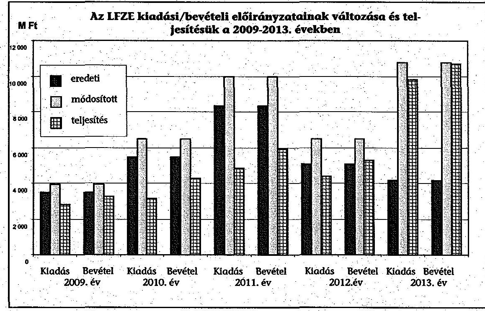
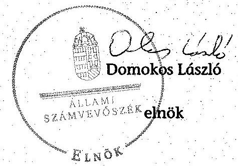
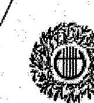
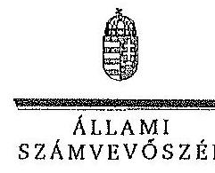

# ÁLLAMI
SZÁMVEVŐSZÉK

## JELENTÉS

A Liszt Ferenc Zeneművészeti Egyetem ellenőrzéséről -
Az állami felsőoktatási intézmények
gazdálkodásának, működésének ellenőrzése

---

# Állami Számvevőszék

Iktatószám: V-0577-321/2015
Témaszám: 1611
Vizsgálat-azonosító szám: V-068903

## Az ellenőrzést felügyelte:

## Kisgergely István

felügyeleti vezető

## Az ellenőrzés végrehajtásáért felelős:

Zakar László
ellenőrzésvezető

## A számvevői munkaanyagok feldolgozását és a Jelentés összeállítását végezte:

Zakar László
ellenőrzésvezető
Göller Géza
számvevő tanácsos
Nagy Erika
számvevő tanácsos

## Az ellenőrzést végezték:

| Göller Géza | Dr. Németh Eszter | Nagy Erika |
| :-- | :-- | :-- |
| számvevő tanácsos | számvevő | számvevő |
| Pogány Kinga Beatrix <br> számvevő | Völgyesi Mátyás <br> számvevő |  |

A témához kapcsolódó eddig készített számvevőszéki jelentések:
címe
sorszáma
Jelentés az oktatási és kulturális ágazat irányítási rendszerének, 1106 működésének ellenőrzéséről
Jelentés a felsőoktatás oktatási infrastruktúra-fejlesztési program- 1171 jának ellenőrzéséről
Jelentés az állami felsőoktatási intézmények érdekeltségébe tartozó 1290 gazdasági társaságok támogatásának és nyereségük hasznosulásának ellenőrzéséről

---

Jelentés a Szolnoki Főiskola ellenőrzéséről - Az állami felsőoktatási 14196
intézmények gazdálkodásának, működésének ellenőrzése
Jelentés a Pannon Egyetem ellenőrzéséről - Az állami felsőoktatási 14197
intézmények gazdálkodásának, működésének ellenőrzése
Jelentés a Károly Róbert Főiskola ellenőrzéséről - Az állami felsőok- 14198
tatási intézmények gazdálkodásának, működésének ellenőrzése
Jelentés a Magyar Képzőművészeti Egyetem ellenőrzéséről - Az ál- 14199
lami felsőoktatási intézmények gazdálkodásának, működésének
ellenőrzése
Jelentés a Miskolci Egyetem ellenőrzéséről - Az állami felsőoktatási 14200
intézmények gazdálkodásának, működésének ellenőrzése
Jelentés a Széchenyi István Egyetem ellenőrzéséről - Az állami fel- 14201
sőoktatási intézmények gazdálkodásának, működésének ellenőrzése
Jelentés az Eszterházy Károly Főiskola ellenőrzéséről - Az állami 14204
felsőoktatási intézmények gazdálkodásának, működésének ellenőrzése
Jelentés a Magyar Táncművészeti Főiskola ellenőrzéséről - Az ál- 14205
lami felsőoktatási intézmények gazdálkodásának, működésének ellenőrzése
Jelentés a Budapesti Műszaki és Gazdaságtudományi Egyetem el- 14218
lenőrzéséről - Az állami felsőoktatási intézmények gazdálkodásá-
nak, működésének ellenőrzése

---

.

---

# TARTALOMJEGYZÉK

BEVEZETÉS ..... 13
I. ÖSSZEGZŐ MEGÁLLAPÍTÁSOK, KÖVETKEZTETÉSEK, JAVASLATOK ..... 17
II. RÉSZLETES MEGÁLLAPÍTÁSOK ..... 29

1. A fenntartói és az ágazati irányítási jogok gyakorlása ..... 29
2. Az egyetem belső kontrollrendszerének kialakítása és működtetése ..... 32
3. Az egyetem döntéshozó szerveinek joggyakorlása, az oktatási és egyéb tevékenységek elkülönítése, a pénzügyi gazdálkodás ..... 36
3.1. Az egyetem döntéshozó szerveinek gazdálkodással kapcsolatos joggyakorlása ..... 36
3.2. Az egyetem oktatói és egyéb tevékenységei elkülönítése, az ellátott feladat átláthatósága ..... 38
3.3. Az egyetem pénzügyi egyensúlya, fizetőképessége ..... 38
3.4. Az egyetem előirányzat kezelése ..... 41
3.5. Az egyetem egyes hazai forrásból finanszírozott projektekhez, feladatokhoz kapott - nem normatív - költségvetési forrással való elszámolása ..... 48
4. Az egyetem vagyongazdálkodása ..... 48
4.1. A vagyongazdálkodási tevékenység keretei ..... 50
4.2. A vagyonváltozások és a vagyonhasznosítás szabályszerűsége ..... 51
5. A külső ellenőrzések által tett javaslatok hasznosulása ..... 56
5.1. ÁSZ ellenőrzések által tett javaslatok hasznosulása ..... 56
5.2. Az egyéb külső ellenőrzések javaslatainak hasznosulása ..... 57
6. Integritás kontrollok ..... 59

---

# MELLÉKLETEK

1. számú A Liszt Ferenc Zeneművészeti Egyetem kiadási és bevételi előirányzatai, azok teljesítése a 2009-2013. években
2. számú A Liszt Ferenc Zeneművészeti Egyetem kiadásainak, bevételeinek változása a 2009-2013. években
3. számú Kimutatás a Liszt Ferenc Zeneművészeti Egyetem bevételeiről és kiadásairól, valamint adósságszolgálatáról a 2009-2013. években
4. számú A Liszt Ferenc Zeneművészeti Egyetem mérlegadatai a 2009-2013. években
5. számú A Liszt Ferenc Zeneművészeti Egyetem gazdálkodása szabályszerűségének értékelése a mintatételek alapján
6. számú A Liszt Ferenc Zeneművészeti Egyetem észrevétele
7. számú A Liszt Ferenc Zeneművészeti Egyetem észrevételére adott válasz

## FÜGGELÉKEK

1. számú Az integritás érvényesítése érdekében kialakított és működtetett intézményi kontrollrendszer

---

# RÖVIDÍTÉSEK JEGYZÉKE

| Törvények |  |
| :--: | :--: |
| Áfa tv. | 2007. évi CXXVII. törvény az általános forgalmi adóról |
| Áht. 1 | 1992. évi XXXVIII. törvény az államháztartásról (hatálytalan 2012. január 1-jétől) |
| Áht. 2 | 2011. évi CXCV. törvény az államháztartásról |
| ÁSZ tv. | 2011. évi LXVI. törvény az Állami Számvevőszékről |
| Avtv. | 1992. évi LXIII. törvény a személyes adatok védelméről és a közérdekű adatok nyilvánosságáról |
| Eisztv. | 2005. évi XC. törvény az elektronikus információszabadságról (hatálytalan 2012. január 1-jétől) |
| Feot. | 2005. évi CXXXIX. törvény a felsőoktatásról (hatálytalan 2012. szeptember 1-jétől) |
| Info tv. | 2011. évi CXII. törvény az információs önrendelkezési jogról és az információszabadságról |
| Kbt. 1 | 2003. évi CXXIX. törvény a közbeszerzésekről (hatálytalan 2012. január 1-jétől) |
| Kbt. 2 | 2011. évi CVIII. törvény a közbeszerzésekről |
| Kjt. | 1992. évi XXXIII. törvény a közalkalmazottak jogállásáról |
| Mt. 1 | 1992. évi XXII. törvény a Munka Törvénykönyvéről (hatálytalan 2013. január 1-jétől) |
| Mt. 2 | 2012. évi I. törvény a munka törvénykönyvéről |
| Nftv. | 2011. évi CCIV. törvény a nemzeti felsőoktatásról |
| Nvtv. | 2011. évi CXCVI. törvény a nemzeti vagyonról |
| Sztv. | 2000. évi C. törvény a számvitelről |
| Vtv. | 2007. évi CVI. törvény az állami vagyonról |
| Korm. rendeletek |  |
| Áhsz. | 249/2000. (XII. 24.) Korm. rendelet az államháztartás szervezetei beszámolási és könyvvezetési kötelezettségének sajátosságairól (hatálytalan 2014. január 1-jétől) |
| Ámr. 1 | 217/1998. (XII. 30.) Korm. rendelet az államháztartás működési rendjéről (hatálytalan 2010. január 1-jétől) |
| Ámr. 2 | 292/2009. (XII. 19.) Korm. rendelet az államháztartás működési rendjéről (hatálytalan 2012. január 1-jétől) |
| Ávr. | 368/2011. (XII. 31.) Korm. rendelet az államháztartásról szóló törvény végrehajtásáról |
| Ber. | 193/2003. (XI. 26.) Korm. rendelet a költségvetési szervek belső ellenőrzéséről (hatálytalan 2012. január 1-jétől) |
| Bkr. | 370/2011. (XII. 31.) Korm. rendelet a költségvetési szervek belső kontrollrendszeréről és belső ellenőrzéséről |
| Vtvr. | 254/2007. (X. 4.) Korm. rendelet az állami vagyonnal való gazdálkodásról |
| 51/2007. (III. 26.) Korm. rendelet | 51/2007. (III. 26.) Korm. rendelet a felsőoktatásban részt vevő hallgatók juttatásairól és az általuk fizetendő téríté- |

---

# Határozatok

1360/2011. (XI. 5.) Korm. költségvetési főfelügyelők és költségvetési felügyelők kihatározat rendeléséről
1365/2011. (XI. 8.) Korm. a 2012. évi hiánycél tartását biztosító további feladatok határozat
1657/2012. (XII. 20.) a kormányzati stratégiai dokumentumok felülvizsgálatá-
Korm. határozat val kapcsolatos feladatokról

További rövidítések
ÁSZ
ÉMMI
EUTAF
FEUVE
FIR
IFT
KIM
Kincstár
KMOP
LFZE/egyetem/intézmény
MNV Zrt.
NEFMI
NGM
NFM
OKM
PPP
SZMSZ
TAMOP
VIR
Állami Számvevőszék
Emberi Erőforrások Minisztériuma
Európai Támogatásokat Auditáló Főigazgatóság
folyamatba épített, előzetes, utólagos és vezetői ellenőrzés
Felsőoktatási Információs Rendszer
Intézményfejlesztési Terv
Közigazgatási és Igazságügyi Minisztérium
Magyar Államkincstár
Közép-Magyarországi Operatív Program
Liszt Ferenc Zeneművészeti Egyetem
Magyar Nemzeti Vagyonkezelő Zrt.
Nemzeti Erőforrás Minisztérium
Nemzetgazdasági Minisztérium
Nemzeti Fejlesztési Minisztérium
Oktatási és Kulturális Minisztérium
Public Private Partnership (magán- és közszféra együttműködése)
Szervezeti és Működési Szabályzat
Társadalmi Megújulás Operatív Program
Vezetői Információs Rendszer

---

# ÉRTELMEZŐ SZÓTÁR

alapító

autonómia
állami felsőoktatási intézmény saját tulajdona
állami vagyon
A központi költségvetési szerv alapítója az Országgyűlés, a Kormány vagy a miniszter. A felsőoktatási intézmények vonatkozásában az alapítói jogokat a felsőoktatásért felelős minisztérium gyakorolja.
A felsőoktatási intézmény Feot.-ban, illetve Nftv.-ben szabályozott önrendelkezése, amely biztosítja az intézmény önálló oktatási, kutatási, szervezeti és működési, valamint gazdálkodási tevékenységét.
A felsőoktatási intézmény saját bevételének a költségek teljes körű levonása, - az adományozás és öröklés kivételével - a rendelkezésre bocsátott vagyon állagának megóvásáról, pótlásáról való gondoskodás után fennmaradt része terhére szerzett vagyona.
A Vtv. 1. § (2) bekezdése szerint állami vagyonnak minősül:
a) az állami tulajdonban lévő ingó dolog, valamint a dolog módjára hasznosítható természeti erő,
b) az állami tulajdonban lévő termőföldekből álló, külön törvényben szabályozott Nemzeti Földalap,
c) az állami tulajdonban lévő - a b) pont hatálya alá nem tartozó - ingatlan,
d) az állami tulajdonban lévő értékpapír,
e) az államot megillető társasági részesedés és más vagyoni értékű jog.
(hatályos 2010. június 16-ig)
a) az állam tulajdonában lévő dolog, valamint a dolog módjára hasznosítható természeti erő,
b) az a) pont hatálya alá nem tartozó mindazon vagyon, amely vonatkozásában törvény az állam kizárólagos tulajdonjogát nevesíti,
c) az állam tulajdonában lévő tagsági jogviszonyt megtestesítő értékpapír, illetve az államot megillető egyéb társasági részesedés,
d) az államot megillető olyan immateriális, vagyoni értékkel rendelkező jogosultság, amelyet jogszabály vagyoni értékű jogként nevesít.
(hatályos 2010. június 17-től)
A Vtv. 23. § (1) bekezdése szerint: Az állami vagyont az MNV Zrt. maga kezeli, illetve szerződés - így különösen bérlet, haszonbérlet, szerződésen alapuló haszonélvezet, vagyonkezelés, megbízás - alapján központi költségvetési szervnek, természetes vagy jogi személynek, illetőleg jogi személyiséggel nem rendelkező gazdasági társaságnak hasznosításra átengedi.
(hatályos 2010. december 31-ig)

---

állami vagyon hasznosítására kötött szerződés
állami vagyon használója
állami vagyon értékesítése

Az állami vagyont az MNV Zrt. maga kezeli, vagy szerződés - így különösen bérlet, haszonbérlet, szerződésen alapuló haszonélvezet, vagyonkezelés, megbízás - alapján központi költségvetési szervnek, természetes vagy jogi személynek, vagy jogi személyiséggel nem rendelkező gazdálkodó szervezetnek hasznosításra átengedi.
(hatályos 2011. december 31-ig)
Az állami vagyont az MNV Zrt. maga kezeli, vagy szerződés - így különösen bérlet, haszonbérlet, megbízás - alapján központi költségvetési szervnek, természetes vagy jogi személynek, vagy jogi személyiséggel nem rendelkező gazdálkodó szervezetnek hasznosításra átengedi.
(hatályos 2012. január 1-jétől)
A Vtv. 23. § (2) bekezdése szerint: Az állami vagyon hasznosítására kötött szerződések elsődleges célja az állami vagyon hatékony működtetése, állagának védelme, értékének megőrzése, illetve gyarapítása, az állami és közfeladatok ellátásának elősegítése.
A Vtvr. 1. § (7) a) pontja szerint: Az a természetes személy, jogi személy, illetve jogi személyiséggel nem rendelkező gazdasági társaság, amely az MNV Zrt.-vel kötött szerződés alapján, bármely jogcímen (bérlet, haszonbérlet, vagyonkezelés, használat stb.) állami vagyont birtokol, használ, hasznosít.
(hatályos 2010. december 31-ig)
Az a természetes személy, jogi személy, illetve jogi személyiséggel nem rendelkező szervezet, amely, illetve aki törvény vagy szerződés alapján, bármely jogcímen (pl. bérlet, haszonbérlet, vagyonkezelési szerződés, használat stb.) állami vagyont birtokol, használ, szedi annak hasznait, hasznosít, ide nem értve a tulajdonosi jogok gyakorlóját.
(hatályos 2011. január 1 - 2011. december 31-ig)
Az a természetes vagy jogi személy, jogi személyiséggel nem rendelkező szervezet, aki, vagy amely törvény vagy szerződés alapján, bármely jogcímen (bérlet, haszonbérlet, használat stb.) állami vagyont birtokol, használ, szedi annak hasznait, hasznosít, ide nem értve a haszonélvezőt, a vagyonkezelőt és a tulajdonosi jogok gyakorlóját.
(hatályos 2012. január 1-jétől)
Állami vagyon tulajdonjogának bármely jogcímen történő, visszterhes átruházása. (Vtvr. 1. § (7) d) pont)

---

állami vagyon kezelője /vagyonkezelő
belső kontrollrendszer

CLF-módszer

A Vtv. 23. § (1) bekezdése szerint: Az állami vagyont az MNV Zrt. maga kezeli, vagy szerződés - így különösen bérlet, haszonbérlet, szerződésen alapuló haszonélvezet, vagyonkezelés, megbízás - alapján központi költségvetési szervnek, természetes vagy jogi személynek, illetőleg jogi személyiséggel nem rendelkező gazdasági társaságnak hasznosításra átengedi. (hatályos 2010. január 1 - 2010. december 31-ig)

Az állami vagyont az MNV Zrt. maga kezeli, vagy szerződés - így különösen bérlet, haszonbérlet, szerződésen alapuló haszonélvezet, vagyonkezelés, megbízás - alapján központi költségvetési szervnek, természetes vagy jogi személynek, illetőleg jogi személyiséggel nem rendelkező gazdálkodó szervezetnek hasznosításra átengedi. (hatályos 2011. január 1 - 2011. december 31-ig)
Az állami vagyont az MNV Zrt. maga kezeli, vagy szerződés - így különösen bérlet, haszonbérlet, megbízás - alapján központi költségvetési szervnek, természetes vagy jogi személynek, vagy jogi személyiséggel nem rendelkező gazdálkodó szervezetnek hasznosításra átengedi. Az állami vagyonra vonatkozóan az MNV Zrt. kizárólag az Nvtv.-ben meghatározott személyekkel köthet vagyonkezelési
 szerződést.
(hatályos 2012. január 1-jétől)
A belső kontrollrendszer a kockázatok kezelése és tárgyilagos bizonyosság megszerzése érdekében kialakított folyamatrendszer, amely azt a célt szolgálja, hogy megvalósuljanak a következő célok:
a) a működés és gazdálkodás során a tevékenységeket szabályszerűen, gazdaságosan, hatékonyan, eredményesen hajtsák végre,
b) az elszámolási kötelezettségeket teljesítsék, és
c) megvédjék az erőforrásokat a veszteségektől, károktól és nem rendeltetésszerű használattól.
A módszer a működési és a felhalmozási költségvetés bevételeinek és kiadásainak, ezek egyenlegeinek elkülönített, majd összevont kimutatását alkalmazza valamely költségvetési intézmény pénzügyi helyzetének megítéléséhez. Kiemelten mutatja be a finanszírozási műveletek egyenlege nélküli és az azt magába foglaló pénzügyi pozíciót, valamint a tőketörlesztéssel, értékpapír beváltással csökkentett működési jövedelmet.
Az értékelés a pénzügyi kapacitás fogalmát helyezi a középpontba.

---

előirányzat-maradvány
fenntartó
finanszírozási műveletek nélküli pozíció
gazdasági tanács
hároméves
fenntartói megállapodás
információs és kommunikációs rendszer

Az államháztartás központi alrendszerébe tartozó költségvetési szerveknél a módosított bevételi és kiadási előirányzatok és azok teljesítésének a Kormány rendeletében meghatározott tételekkel korrigált különbözete az előirányzat-maradvány. (Áht. 22. § (1) bekezdés m) pontja)
A Feot. 7. § (2) és az Nftv. 4. § (2) bekezdése szerint az, aki az alapítói jogot gyakorolja, ellátja a felsőoktatási intézmény fenntartásával kapcsolatos feladatokat.
A CLF módszer szerint számított működési és felhalmozási tevékenység pénzügyi egyenlegének összevont értéke. Megmutatja, hogy a költségvetési intézmény bevételei fedezetet biztosítottak-e a kiadásokra. A finanszírozási műveletek nélküli (GFS) pozíció alapján a pénzügyi helyzetet akkor tekintettük megfelelőnek, ha az adott év működési és felhalmozási bevételei fedezetet nyújtottak az adott év működési és felhalmozási kiadásaira.
A felsőoktatási intézmény javaslattevő, véleményező, a stratégiai döntések előkészítésében részt vevő, és a döntések végrehajtásának ellenőrzésében közreműködő szerve.
Az állami felsőoktatási intézmények központi költségvetési támogatására három éves fenntartói megállapodást kell kötni az állami felsőoktatási intézmény és a fenntartó között. A fenntartói megállapodás tartalmazza a felsőoktatási intézmény által meghatározott hároméves időszakra vállalt teljesítménykövetelményeket, továbbá az állandó jellegű támogatási részeket, valamint a változó jellegű támogatások megállapításának jogcímeit. A változó elemű támogatás évenkénti elszámolási kötelezettséggel kerül meghatározásra.
A költségvetési szerv vezetője köteles olyan rendszereket kialakítani és működtetni, melyek biztosítják, hogy a megfelelő információk a megfelelő időben eljutnak az illetékes szervezethez, szervezeti egységhez, illetve személyhez.

---

intézményfejlesztési terv
integritás
irányító szerv
kincstári biztos
kincstári költségvetés
kockázatkezelési rendszer

A szenátus fogadja el az intézményfejlesztési tervet. Az intézményfejlesztési tervben kell meghatározni a fejlesztéssel, a fenntartó által a felsőoktatási intézmény rendelkezésére bocsátott vagyon hasznosításával, megóvásával, elidegenítésével kapcsolatos elképzeléseket, a várható bevételeket és kiadásokat. Az intézményfejlesztési tervet középtávra, legalább négyéves időszakra kell elkészíteni, évenkénti bontásban meghatározva a végrehajtás feladatait. Az intézményfejlesztési terv része a foglalkoztatási terv. A foglalkoztatási tervben kell meghatározni azt a létszámot, amelynek keretei között a felsőoktatási intézmény megoldhatja feladatait. (Feot. 27. § (3) bekezdés)
Az integritás olyasvalakit vagy valamit jelöl, aki vagy ami romlatlan, sértetlen, feddhetetlen. Az integritás elvek, értékek, cselekvések, módszerek, intézkedések konzisztenciáját jelenti: olyan magatartásmódot, amely meghatározott értékeknek megfelel.
A felsőoktatás ágazati irányítását - felsőoktatásszervezéssel, felsőoktatásfejlesztéssel, törvényességi ellenőrzéssel kapcsolatos feladatokat - ellátó miniszter által vezetett minisztérium. (Feot. 102-105/A. §, Nftv. 64-66. §)
A kincstári biztos kijelölését az államháztartásért felelős miniszternél a Kincstár kezdeményezi. A kincstári biztos köteles figyelemmel kísérni megbízatásának időpontjától kezdve a költségvetési szerv tervezését, gazdálkodását, beszámolását, a jogszabályokban előírt feladatainak ellátását, feltárni azokat az okokat, amelyek a tartós fizetésképtelenséghez vezettek, a szükséges intézkedések azonnali végrehajtására irányuló intézkedési tervet készíteni, azonnali intézkedéseket kezdeményezni és írásbeli utasításokat kiadni a tartozásállomány felszámolására, a gazdálkodás egyensúlyának biztosítására, a követelések behajtására. (Ávr. 116-117. §)
A központi költségvetésről szóló törvény elfogadását követően a fejezetet irányító szerv az államháztartás központi alrendszerébe tartozó költségvetési szerv és a fejezeti kezelésű előirányzat kiemelt előirányzatait, valamint az elkülönített állami pénzalapok és a társadalombiztosítás pénzügyi alapjai jogszabályi előírás szerinti bevételeit és kiadásait kincstári költségvetés kiadásával állapítja meg. (Áht. 24. § (3) bekezdés, Áht. 28. § (2) bekezdés, Ávr. 31. § (2) bekezdés)
Irányítási eszközök és módszerek összessége, melynek elemei a szervezeti célok elérését veszélyeztető tényezők (kockázatok) azonosítása, elemzése, csoportosítása, nyomon követése, valamint szükség esetén a kockázati kitettség mérséklése.

---

kontrollkörnyezet
kontrolltevékenység
költségvetési főfelügyelő, felügyelő
maximális hallgatói létszám
miniszter
minisztérium
monitoring
működési jövedelem

A kontrollkörnyezet a költségvetési szerv vezetőinek a szervezeti célok elérését segítő kontrollok kialakításával és működtetésével, korszerűsítésével kapcsolatos magatartását, a kontrollpontokról érkező információkra való reagálását jelenti.
Azok az elvek, politikák és eljárások, amelyeket a kockázatok meghatározása és a szervezet céljainak elérése érdekében alakítanak ki.
A költségvetési szerv vezetője köteles a szervezeten belül kontrolltevékenységeket kialakítani, amelyek biztosítják a kockázatok kezelését, hozzájárulnak a szervezet céljainak eléréséhez.
Az államháztartásért felelős miniszter a Kormány irányítása alá tartozó fejezetet irányító szervhez, a Kormány irányítása vagy felügyelete alá tartozó költségvetési szervhez, valamint az elkülönített állami pénzalapok és a társadalombiztosítás pénzügyi alapjai kezelő szerveihez költségvetési főfelügyelőt, felügyelőt rendelhet ki. A költségvetési főfelügyelő, felügyelő a gazdálkodás költségvetés-politikával való összhangja és a takarékos, szabályszerű, eredményes működés érdekében a Kormány rendeletében meghatározott intézkedéseket tehet, így különösen előzetesen véleményezi a kötelezettségvállalásra irányuló eljárásokat és a nagy összegű kötelezettségvállalások tekintetében kifogással élhet. (Áht. 39. § (1)-(2) bekezdés)
Az a felsőoktatási intézmény alapító okiratában, működési engedélyében meghatározott hallgatói létszám, ameddig terjedően a felsőoktatási intézmény - figyelembe véve a hallgatók fogadásához és az oktatói tevékenység folytatásához rendelkezésre álló személyi feltételeket, helyiségeket és eszközöket - valamennyi évfolyamára számítva, teljes kihasználtsággal működve hallgatói jogviszonyt létesíthet.
Az oktatásért felelős miniszter, aki 2009-től 2010 májusáig az OKM, 2010 májusától 2012 májusáig a NEFMI, 2012 májusától az EMMI minisztere volt.
A felsőoktatásért felelős minisztérium, amely 2009-től 2010 májusáig az OKM, 2010 májusától 2012 májusáig a NEFMI, 2012 májusától az EMMI volt.
A különböző szintű szervezeti célok megvalósításához szükséges folyamatok figyelemmel kísérése, melynek során a releváns eseményekről és tevékenységekről (együtt: folyamatokról) rendszeres jelleggel, strukturált, döntéstámogató információkhoz jutnak a szervezet vezetői.
A folyó bevételek és folyó kiadások egyenlege. Azt mutatja, hogy a folyó bevételek fedezetet nyújtanak-e a folyó kiadásokra.

---

normatív költségvetési támogatás felsőoktatási intézmények működéséhez
normatív támogatások
saját bevétel
szenátus
tárgyévi pénzügyi pozíció

A felsőoktatási intézmények működéséhez biztosított normatív költségvetési támogatás lehet
a) hallgatói juttatásokhoz nyújtott,
b) képzési,
c) tudományos célú,
d) fenntartói,
e) egyes feladatokhoz nyújtott
támogatás. A központi költségvetésből biztosított normatív költségvetési támogatásra - a d) pontban meghatározott normatív költségvetési támogatás kivételével - a felsőoktatási intézmények azonos feltételek alapján válnak jogosulttá. Az a)-e) pontokban meghatározott jogcímek - az a) és e) pontban meghatározott jogcímek kivételével - nem jelentenek felhasználási kötöttséget. (Feot. 127. § (3) bekezdés)
Az ellenőrzési időszakban hatályos költségvetési törvények 3. sz. mellékletében megjelölt közoktatási hozzájárulások, az 5. sz. mellékletében megjelölt központosított előirányzatok, továbbá a 8. sz. mellékletében megjelölt normatív, kötött felhasználású támogatások együttesen.
Az államháztartáson kívüli források - beleértve minden olyan, az Európai Uniótól származó támogatást, amelyhez nem az állami költségvetésen keresztül jut a felsőoktatási intézmény, továbbá a szakképzési hozzájárulási fizetési kötelezettség teljesítéseként elszámolt forrásokat is, ide nem értve az állami vagyon értékesítésének ellenértékét - valamint a Kutatási és Technológiai Innovációs Alapból származó bevételek.
A felsőoktatási intézmény, döntést hozó és a döntés végrehajtását ellenőrző testülete. (Feot. 20. § (1) bekezdés, Nftv. 12. § (1)-(3) bekezdés)
A működési és felhalmozási bevételek, valamint kiadások egyenlege a finanszírozási műveletek egyenlegének figyelembe vételével.

---

.

---

# JELENTÉS 

## A Liszt Ferenc Zeneművészeti Egyetem ellenőrzéséről - Az állami felsőoktatási intézmények gazdálkodásának, működésének ellenőrzése

## BEVEZETÉS

Az ÁSZ Stratégiája ${ }^{1}$ alapértékeinek egyike, hogy az államháztartás komplex folyamatainak átláthatósága érdekében rendszerszemléletű/holisztikus megközelítésű, egymásra épülő, a szinergiahatást kihasználó, összefoglaló értékelésre lehetőséget adó ellenőrzéseket végez. Az államháztartás központi alrendszerébe tartozó felsőoktatási intézmények ellenőrzése során az ÁSZ értékeli azok pénzügyi-gazdasági helyzetét, feltárja a működésükben rejlő kockázatokat, ezzel előmozdítja a közpénzügyek átláthatóságát, rendezettségét.

Az állami felsőoktatási intézmények gazdálkodását - az Áht. előírásai mellett - a Feot., valamint az Nftv. előírásai határozták meg.

Magyarország Nemzeti Reform Programja keretében, a Széll Kálmán Terv 2020-ig a 30-34 évesek körében, a felsőfokú vagy annak megfelelő végzettséggel rendelkezők arányának 30,3%-ra való növelését irányozta elő, amely a 2010. évhez képest 4,6%-pontos növekedési célkitűzést jelent. A rendezett gazdasági környezet, az önállósággal élni tudó, felelős, elszámoltatható intézményi gazdálkodói magatartás elengedhetetlen feltétele a kitűzött szakmai célok elérésének.

Az ellenőrzés célja annak megállapítása, hogy szabályos volt-e az állami felsőoktatási intézmény pénzügyi és vagyongazdálkodása, biztosított volt-e a vagyonnal való felelős gazdálkodás követelményének érvényesülése, jogszabályi előírásoknak megfelelően működött-e a belső kontrollrendszer; az irányító szerv tevékenysége a jogszabályi előírásoknak megfelelt-e.

Ennek keretében értékeltük a Liszt Ferenc Zeneművészeti Egyetemnél:

1) a fenntartói és az ágazati irányítási jogok gyakorlását;
2) az intézmény belső kontrollrendszere jogszabályoknak megfelelő kialakítását és működtetését;
[^0]
[^0]:    ${ }^{1}$ Állami Számvevőszék: Stratégia. Az Állami Számvevőszék hivatalos stratégiai dokumentum rendszere 2011-2015. 2012. december. http://www.asz.hu/strategia/asz-strategia/asz-strategia-2011.pdf

---

3) az intézmény döntéshozó szerveinek joggyakorlása jogszabályoknak való megfelelőségét; az intézmény oktatási és egyéb (gyakorlati és kutatási) tevékenységei elkülönítését, átláthatóságát, illetve pénzügyi gazdálkodása szabályszerűségét;
4) az intézmény vagyongazdálkodása előírásoknak való megfelelőségét;
5) az ellenőrzött időszakban végzett külső (ÁSZ, fenntartói, EUTAF) ellenőrzések által tett javaslatok hasznosulását;
6) az intézmény korrupcióval szembeni veszélyeztetettségének csökkentése érdekében az integritási szemlélet érvényesülését a gazdálkodási folyamatokban.

Az ellenőrzés várható hasznosulása: Az ellenőrzés eredményének hasznosulásaként képet kapunk az egyetemen kialakult pénzügyi helyzetről; a Kormány által kirendelt költségvetési (fő)felügyelői rendszer működésének tapasztalatairól; az oktatási és egyéb tevékenységek és költségelszámolások elhatárolásáról, átláthatóságáról és szabályosságáról. A felsőoktatási intézmények gazdálkodási szabadságának pénzügyi és vagyoni helyzetre gyakorolt hatásairól, a vagyonnal való felelős, értékmegőrző gazdálkodás érvényesüléséről, továbbá a belső kontrollrendszer működéséről. Az ellenőrzés az ellenőrzött számára visszajelzést ad a gazdálkodása kereteinek kialakításáról, a működésében fellépő hiányosságokról, javaslataival hozzájárul azok kiküszöböléséhez és a jó kormányzáshoz. A törvényalkotás számára összegzett tapasztalatok állnak rendelkezésre a felsőoktatási intézmények döntéseinek, gazdálkodásának szabályszerűségéről, amelyek alapján - indokolt esetben - jogszabály-módosítás kezdeményezhető. Az integritás kultúra kialakítása hozzájárul az elszámoltathatóság és átláthatóság érvényesítéséhez, egyben támogatja a szervezet védettségét a korrupciós kitettséggel szemben, valamint annak megelőzése is irányítottabbá válik. A társadalom számára jelzi, hogy közpénz nem maradhat ellenőrizetlenül, az ÁSZ értékteremtő rend kialakításához és megőrzéséhez hozzájáruló tevékenysége pozitív hatással lesz a szervezetről kialakított összkép formálásában.

Az ellenőrzés típusa szabályszerűségi ellenőrzés
Az ellenőrzött időszak 2009. január 1. - 2013. december 31.
Az ellenőrzéssel érintett szervezetek: az Emberi Erőforrások Minisztériuma és a Liszt Ferenc Zeneművészeti Egyetem

Az ellenőrzés jogszabályi alapját az Állami Számvevőszékről szóló 2011. évi LXVI. törvény 1. § (3) bekezdése, az 5. § (3)-(6) bekezdései, valamint az Áht. 61. § (2) bekezdésének előírásai képezik.

Az ellenőrzés kiterjedt minden olyan körülményre és adatra, amely az ÁSZ jogszabályban meghatározott feladataiban, valamint a program végrehajtása folyamán felmerült újabb összefüggések feltárásához szükséges volt.

Az ellenőrzés az INTOSAI által kiadott nemzetközi standardok figyelembe vételével, az ellenőrzési programban foglalt értékelési szempontok szerint történt.

---

Az ÁSZ a 2011. évi LXVI. törvény 29. §-a szerint a jelentéstervezetet megküldte az emberi erőforrások miniszterének és a Liszt Ferenc Zeneművészeti Egyetem rektorának. A beérkezett észrevételt és az arra adott választ a jelentés 6-7. sz. mellékletei tartalmazzák.

A pénzügyi és vagyongazdálkodás terén az egyes területek szabályszerű működését mintavétellel ellenőriztük, ez alapján a sokaságokban előforduló hibás tételek arányát becsültük. A jogszabályoknak és a belső előírásoknak megfelelőnek, azaz szabályszerűnek tekintettük az adott kiadási előirányzat felhasználását, bevétel beszedését, mérlegtétel értékelését, amennyiben a minta ellenőrzésének eredménye alapján $95 \%$-os bizonyossággal a teljes sokaságban a hibás tételek aránya kisebb volt, mint $10 \%$, nem megfelelőnek értékeltük, ha a hibás tételek aránya a $10 \%$-ot meghaladta. Kockázatot, illetve magas kockázatot jeleztünk, amennyiben egy adott terület vonatkozásában a minta alapján a teljes sokaságban nem volt teljes körűen biztosított a jogszabályoknak és a belső szabályzatoknak megfelelő működés. A mintatételek kiértékelését az 5. számú melléklet tartalmazza.

A belső kontrollrendszer kialakításának és működtetésének értékelése során a jogszabályi előírások mellett az Ámr. 1 145/A. § (1) és (3) bekezdése, az Ámr. 2 155. § (1) és (3) bekezdései, valamint a Bkr. 5. § (1) bekezdése alapján figyelembe vettük az államháztartásért felelős miniszter által közzétett irányelvekben és módszertani útmutatókban ${ }^{2}$ foglaltakat is. A belső kontrollrendszert az értékelés során legalább $85 \%$-os megfelelőség esetén megfelelőnek, legalább a $70 \%$-os megfelelőség esetén részben megfelelőnek, $70 \%$-os megfelelőség alatt pedig nem megfelelőnek minősítettük.

Az egyetem a 2009-2013. évek között önállóan működő és gazdálkodó központi költségvetési szerv volt. Az egyetem székhelye Budapest. Az egyetemen bölcsészettudományi és zeneművészeti képzés folyt. Az egyetem oktatási, tudományos szervezeti egységként intézeteket, tanszékeket, tanszéki csoportokat működtet, és doktori iskolát szervez. Az intézményben kulturális, múzeumi, könyvtári, kollégiumi feladatot ellátó szolgáltató szervezeti egységek is működtek. A köznevelési feladatai ellátására az ellenőrzött időszak alatt az egyetem a Bartók Béla Zeneművészeti Szakközépiskola és Gimnázium, valamint a Liszt Ferenc Zeneművészeti Egyetem Hangszerképző Szakközépiskola intézményeket tartotta fenn. Ezen kívül zongorajavító műhelyt és audiovizuális stúdiót működtetett. Az ellenőrzött időszakban az intézményt nem érintette átalakítás.

Az egyetem az ellenőrzött időszakban gazdálkodó szervezetet nem hozott létre, és gazdálkodó szervezetben tulajdonjoggal nem rendelkezett, PPP konstrukcióban nem vett részt. Az ellenőrzött időszak alatt a rektor személyében 2013. évben történt változás, az új rektor november 1-jétől látja el a rektori feladatokat. A gazdasági vezető személye az ellenőrzött időszak alatt négy alkalommal változott. Az egyetemhez 2011. évben költségvetési főfelügyelőt rendeltek ki.

[^0]
[^0]:    ${ }^{2}$ 1/2009. (IX. 11.) PM irányelv, Pénzügyminisztérium Belső Kontroll Kézikönyv 2010.

---

Az egyetem jellemzőit, főbb gazdálkodási, vagyoni és létszám adatait az alábbi táblázat mutatja be.

| Megnevezés | Főbb gazdálkodási és vagyoni adatok (ezer Ft) |  |  |  |  |  |
| :--: | :--: | :--: | :--: | :--: | :--: | :--: |
|  | 2009. | 2010. | 2011. | 2012. | 2013. | $\begin{gathered} 2013 / 2009 \\ (\%) \end{gathered}$ |
| KIADÁSI FŐÖSSZEG | 2830929 | 3175018 | 4903779 | 4353491 | 9753626 | 344,5 |
| BEVÉTELI FŐÖSSZEG | 3292521 | 4280544 | 5929143 | 5294824 | 10708913 | 325,2 |
| Költségvetési támogatások | 2459723 | 2439774 | 2386350 | 2178929 | 2900361 | 117,9 |
| Saját bevételek | 826876 | 1410674 | 2398916 | 1995441 | 6971891 | 843,2 |
| Finanszírozási bevételek | 1979 | $-6911$ | $-11277$ | 18906 | $-20904$ | - |
| Előirányzat maradvány felhasználás | 3943 | 437007 | 1155154 | 1101548 | 857565 | - |
| Támogatások aránya (\%) | 74,7 | 57,0 | 40,2 | 41,2 | 27,1 | 36,3 |
| Mérlegfőösszeg | 3473016 | 4783062 | 6662011 | 7669290 | 13370300 | 385,0 |
| Jellemző létszámadatok* (fő) |  |  |  |  |  |  |
| Oktatói létszám (fő) | 366 | 318 | 294 | 315 | 334 | 91,3 |
| Hallgatói létszám (fő) | 795 | 744 | 757 | 840 | 863 | 108,6 |

* Az oktatói és hallgatói létszám az október 15-i statisztikában szereplő adat.

Az egyetem kiadásai az öt év alatt 3,4-szeresére, a bevételei összességében 3,3szorosára nőttek. A bevételeken belül a költségvetési támogatások átlagos aránya $41,9 \%$ volt. Az ellenőrzött időszakban a költségvetési bevételek 17,9\%-kal, a saját és átvett bevételek 8,4-szeresére nőttek. A hallgatói létszám 68 fővel, ( $8,6 \%$-kal) emelkedett, az oktatók létszáma pedig 366 főről 334 főre, $8,7 \%$-kal csökkent. A felvehető maximális létszámhoz viszonyítva az egyetem kihasználtsága javult, a 2009. évi $81 \%$-ról a 2013. évre $88 \%$-ra.

---

# I. ÖSSZEGZŐ MEGÁLLAPÍTÁSOK, KÖVETKEZTETÉSEK, JAVASLATOK 

Az ellenőrzött időszakban a felsőoktatásért felelős minisztérium (OKM, NEFMI, EMMI) a jogszabályi előírásoknak megfelelően gyakorolta az intézménnyel kapcsolatos fenntartói feladatait. Alapítói jogosultságai keretében szabályszerűen adta ki az egyetem jogszabályi változásoknak megfelelően módosított alapító okiratát. A fenntartó az LFZE egy alkalommal megküldött SZMSZ módosítását felülvizsgálta.

A fenntartó a jogszabályi előírásoknak megfelelően kezdeményezte a rektor kinevezését, bízta meg a gazdasági vezetőt, valamint a belső ellenőrzési vezetőt. A rektor személyében az ellenőrzött időszakban egy alkalommal, a gazdasági vezető személyében négy alkalommal történt változás. A fenntartó teljes körűen nem tett eleget iratmegőrzési kötelezettségének, mivel a megbízások visszavonását dokumentumokkal csak két esetben tudta alátámasztani.

A fenntartó az előírásoknak megfelelően meghatározta az intézmény költségvetésének kereteit (főösszegeit), és ellenőrizte az éves költségvetési beszámolókat, azonban a beszámolókról értékelést nem készített a jogszabályi előírások ellenére. A fenntartó az ellenőrzött időszakban három ellenőrzést végzett, amely során ellenőrizte az egyetem gazdálkodását, működésének törvényességét, hatékonyságát.

A fenntartó az intézménnyel 2008-2010. évekre vonatkozóan megkötötte a hároméves fenntartói megállapodást, amelyben meghatározták a teljesítmény követelményeket. A fenntartó a megállapodásban foglaltak végrehajtását a 2009-2010. években értékelte.

A minisztérium az ágazati irányítási feladatait a 2009-2013. években nem látta el teljes körűen.

Elmaradt az oktatási ágazatra vonatkozóan a nemzetgazdasági miniszter irányításával és az oktatásért felelős miniszter részvételével, a kormányhatározatban előírt szervezeti és feladat ellátási felülvizsgálati program kidolgozása. A felsőoktatási törvény rendelkezései ellenére a miniszter nem készíttetett a felsőoktatás rendszere vonatkozásában a Kormány által elfogadott középtávú fejlesztési tervet.

A minisztérium az Oktatási Hivatallal a Felsőoktatási Információs Rendszer (FIR) biztonságos üzemeltetéséhez, az adatok védelméhez szükséges alapvető szervezeti, szabályozási kontrollokat 2012. év végéig nem teljes körűen alakította ki. A FIR átfogó megújítása után 2012 szeptemberétől rögzített - a nyitott jogviszonnyal rendelkező hallgatók és az oktatók vonatkozásában - adatok már teljes körűek. A fenntartó a FIR biztonságos üzemeltetéséhez, az adatok védelméhez szükséges szabályozási kontrollokat 2012. év végén kialakította. A fenntartó a 2012. szeptembertől működő FIR-t jogszabályi megfelelőségi, adatbiztonsági, illetve informatikai szempontból nem ellenőrizte.

---

Az LFZE belső kontrollrendszerének kialakítása és működtetése az ellenőrzött időszakban összességében nem volt megfelelő. Ezen belül a kontrollkörnyezet, a kockázatkezelési rendszer, a kontrolltevékenységek és az információs és kommunikációs rendszer kialakítása és működtetése nem volt megfelelő, a monitoring rendszer működése részben megfelelő volt. A kontrollrendszer hiányosságai kockázatot hordoztak a szabályszerű pénzügyi- és vagyongazdálkodás lebonyolításában, amelyet alátámasztanak az ellenőrzés során feltárt hibák. A rektor a belső kontrollrendszer minőségét értékelő nyilatkozatát az ellenőrzött években elkészítette, amelyben fejlesztendő területként jelölte meg a szabályozottságot, a kockázatkezelési rendszert, a minőségbiztosítási rendszert, a humánerőforrással kapcsolatos tevékenységet, valamint a VIR rendszer működését. Ennek ellenére nem történt fejlesztés a belső kontrollrendszerben az ellenőrzött időszak alatt.

A rektor nem megfelelően alakította ki az egyetem kontrollkörnyezetét, a szabályzatok hiánya, a meglévő szabályzatok tartalmi hiányosságai, illetve azok aktualizálásának elmaradása miatt nem felelt meg a jogszabályi előírásoknak. Az egyetem elkészítette SZMSZ-ét, amely azonban nem tartalmazta teljes körűen a jogszabályban előírt elemeket. Nem volt teljes körűen meghatározva az SZMSZ-ben a szervezeti egységek feladatai, működése, a szervezeti egységekhez tartozó munkakörök.

Az egyetem nem rendelkezett az ellenőrzött időszakban a gazdálkodással összefüggő valamennyi, jogszabályban előírt belső szabályzattal, így a gazdasági szervezetre vonatkozó ügyrenddel, számlarenddel, ellenőrzési nyomvonallal és szabálytalanságkezelési eljárásrenddel. Az ellenőrzött időszak alatt az egyetem nem határozta meg az etikai elvárásokat, valamint nem rendelkezett 2010 októberéig leltározási és leltárkészítési, értékelési, önköltség-számítási szabályzattal. A jogszabályi előírás ellenére a selejtezés részletes szabályait tartalmazó szabályzatát csak 2013 novemberében fogadta el. A belső szabályzatok közül a számviteli politika, a gazdálkodási és a pénzkezelési szabályzat nem felelt meg teljes körűen a vonatkozó jogszabályoknak.

Az egyetem a fenntartóval megkötött három éves fenntartói megállapodásban kialakította az erőforrásokkal való szabályszerű és hatékony gazdálkodáshoz szükséges teljesítménykövetelményeket, amelyekről a fenntartó felé beszámolt.

Az LFZE kockázatkezelési rendszerének kialakítása és működtetése nem volt megfelelő. Az LFZE az ellenőrzött időszakban a jogszabályi előírások ellenére nem mérte fel és nem elemezte a tevékenységével és gazdálkodásával kapcsolatos kockázatokat, valamint nem határozta meg az egyes kockázatokkal kapcsolatos intézkedéseket és azok teljesítésének nyomon követésének módját. Az egyetem kockázatkezelési szabályzattal 2010. évtől rendelkezett, amelyben általánosan határozta meg a kockázatkezelési rendszer kereteit és nem követte a szervezet sajátosságait.

A kontrolltevékenységek kialakítása és működtetése nem felelt meg a jogszabályi követelményeknek. A kontrollok működtetésében a pénzügyi gazdálkodás során, továbbá a mérlegtételek besorolásánál, értékelésénél tárt fel hiányosságokat az ellenőrzés, amelyek a FEUVE nem megfelelő működésére, az ellenőrzési nyomvonal hiányára voltak visszavezethetőek. A kontrolltevékeny-

---

ség nem megfelelő működtetése, a gazdálkodási jogkörök gyakorlásának hiányosságai a pénzügyi és vagyongazdálkodás területén szabálytalanságokat okoztak.

Az információs és kommunikációs rendszer kialakítása és működtetése az egyetemen nem volt megfelelő. A rektor az ellenőrzött időszakban a jogszabályi előírások ellenére nem működtetett olyan vezetői információs rendszert, amely teljes körűen szolgáltatta volna a vezetői döntésekhez szükséges információkat. Az LFZE nem rendelkezett adatvédelmi és adatbiztonsági szabályzattal. Az egyetem a FIR-rel kapcsolatos adatszolgáltatási kötelezettségét teljesítette az ellenőrzött időszakban.

A monitoring rendszer működtetése részben volt megfelelő az ellenőrzött időszak alatt. A belső ellenőrzés az ellenőrzött időszak 13 hónapjában nem működött, további 23,5 hónapban a belső ellenőrzést nem a jogszabályokban foglaltaknak megfelelően végezték, mivel funkcionális szervezeti egység helyett, szabálytalanul külső vállalkozó látta el a feladatot, illetve fenntartói megbízás nélkül alkalmaztak belső ellenőrzési vezetőt. A belső ellenőrzés kialakítása 2011. december 15-étől a jogszabályi előírásoknak megfelelően történt.

A belső ellenőrzés az ellenőrzött időszak alatt 14 ellenőrzést végzett, ebből 13 ellenőrzésnél javaslatot tett. Az elkészült 11 intézkedési tervből egy sem valósult meg maradéktalanul, nyolc esetben részben, három esetben nem hasznosultak a javaslatok. Az ellenőrzött szervezeti egységek a vonatkozó jogszabályi rendelkezések ellenére két ellenőrzéshez kapcsolódóan nem készítettek intézkedési tervet, de a javasolt intézkedéseket megvalósították.

A szenátus gazdálkodással kapcsolatos joggyakorlása részben megfelelő volt. A szenátus - előterjesztés hiányában - nem döntött a minőség és teljesítmény alapján differenciáló jövedelemelosztás elveiről, és nem fogadta el az egyetem vagyongazdálkodási tervét. Az LFZE nem küldte meg - egy eset kivételével - SZMSZ-ét és módosításait a fenntartó részére. A 2009-2013. években a jogszabályi előírás alapján a szenátus elfogadta az egyetem képzési programját.

Az LFZE által igénybe vett felhasználási kötöttség nélküli normatív támogatások felhasználására vonatkozó egyetemi döntések nem feleltek meg az egyetem gazdálkodási szabályzatában foglaltaknak, mert a képzési, tudományos célú és fenntartói normatív támogatás központi és decentralizált részre történt felosztása az ellenőrzött időszak alatt nem történt meg. Az egyetem által igénybe vett kötött felhasználású normatív támogatások felhasználására vonatkozó belső szabályozás részben felelt meg a jogszabályi előírásoknak, mivel az ellenőrzött időszakban a térítési és juttatási szabályzat nem határozta meg teljes körűen a hallgatói juttatások rendszerét.

Az intézményi térítési díjak és költségtérítések megállapítása nem felelt meg a jogszabályi és a belső előírásoknak. Rendszerhiba volt, hogy jogszabályi előírás ellenére a térítési díjakat és költségtérítéseket nem alapozta meg önköltségszámítás. A szenátus az ellenőrzött időszak alatt az egyetem térítési és juttatási szabályzatában foglaltak ellenére a költségtérítések és a térítési díjak összegéről határozatokat nem hozott.

---

Az LFZE oktatási és egyéb (gyakorlati és kutatási) tevékenységei átláthatóak voltak, mivel a jogszabályban előírtak szerint azokat a nyilvántartásában elkülönítette.

Az egyetem az ellenőrzött időszak alatt pozitív pénzügyi pozícióját az előző években képződött maradvány igénybevétele mellett érte el. Az LFZE-t érintő előirányzat-zárolásokat és -elvonásokat, valamint a saját bevételek jelentős részét kitevő bérleti díjbevételek csökkenését az egyetem költségcsökkentő intézkedései nem tudták ellensúlyozni, amelyek likviditási zavarokat okoztak. A likviditási zavarokat a bevételek és a kiadások közötti összhang hiánya okozta. A likviditási nehézségek kezelését megalapozó előirányzat-felhasználási és likviditás tervet nem készítettek.

Az intézmény fizetőképessége folyamatos fenntartói és Kormány hatáskörben hozott beavatkozásokkal volt biztosított. A 2009. évben 100,0 M Ft, a 2011. évben 364,0 M Ft és a 2013. évben 500,0 M Ft kiegészítő támogatást kapott az egyetem, a keret-előrehozás összege 2011. évben 48,0 M Ft, 2013. évben 493,3 M Ft volt. Az ellenőrzött időszak alatt a 2013. évben a pénzeszközök év végi állománya nem nyújtott fedezetet a rövid lejáratú kötelezettségekre, a lejárt szállítói tartozás összege 34,8 M Ft volt.

Az egyetemhez kincstári biztost nem jelölt ki az államháztartásért felelős miniszter. A Kormány 2011. november 5-étől az egyetemhez költségvetési főfelügyelőt rendelt ki. A költségvetési főfelügyelő erőfeszítéseket tett a szabályozott működés betartására, melyek kedvezően hatottak a gazdálkodásra, ennek ellenére az intézmény likviditási helyzete nem javult.

Az LFZE kiadási és bevételi előirányzatainak tervezése részben felelt meg a jogszabályokban foglaltaknak. Az egyetem ellenőrzött időszakban hatályos SZMSZ-ei meghatározták a költségvetési tervezéssel kapcsolatos jog- és felelősségi köröket. Az egyetem gazdálkodási szabályzata általánosságban határozta meg a költségvetés tervezés folyamatát, a tervezési folyamatokat feladatokra nem bontotta meg. A 2009-2012. évekre vonatkozó költségvetési javaslatok, a mellékszámítások irányító szervnek történt megküldést igazoló dokumentumok és a 2009-2010. évekre vonatkozó végleges költségvetés dokumentumai nem álltak rendelkezésre az egyetemnél.

Az egyetem pénzügyi gazdálkodása összességében nem felelt meg a jogszabályoknak és a belső szabályozásokban előírtaknak.

A bevételi és kiadási előirányzatok módosítása, azok elszámolása nem felelt meg teljes körűen a jogszabályoknak és a belső szabályzatoknak, mivel az LFZE az intézményi hatáskörű módosítások esetében nem tájékoztatta a fenntartót - 2013. év kivételével - a végrehajtott előirányzat módosításokról. Ez kockázatot jelez az ellenőrzött terület egészének szabályos működése szempontjából.

Az egyetem az ellenőrzött időszak alatt 12 365,1 M Ft költségvetési támogatásban részesült, 13 603,8 M Ft saját bevételt realizált, 25 016,8 M Ft költségvetési kiadást teljesített. Az LFZE teljesített költségvetési bevételei és kiadásai a módosított előirányzathoz képest minden évben alulteljesültek.

---

Az éves előirányzat-maradvány megállapítása során nem tartották be a vonatkozó jogszabályi előírásokat. Nem volt megfelelő, hogy az ellenőrzött időszakban a felhasználható előirányzat-maradványok összegét teljes egészében kötelezettségvállalással terhelt maradványként mutatták ki annak ellenére, hogy az azt alátámasztó dokumentumok nem minden esetben álltak rendelkezésre. Az előirányzat-maradványok felhasználása során rendszerhiba volt, hogy a teljesítésigazolásokat nem a jogszabályi előírások szerint végezték.

A rendszeres és nem rendszeres személyi juttatások előirányzatának felhasználása a pénzügyi elszámolások, valamint a gazdálkodási jogkörök gyakorlása tekintetében nem volt megfelelő. Rendszerhiba volt, hogy a személyi juttatások bérelszámolását munkaidő-nyilvántartással (jelenléti ívvel vagy egyéb, a teljesített munkaidőre vonatkozó nyilvántartással) nem támasztották alá, amely nem felelt meg a vonatkozó jogszabályi előírásoknak és az egyetem Kollektív Szerződésében foglaltaknak. Emiatt a teljesítés igazolása nem volt megalapozott, amely magában hordozza a teljesítés nélküli kifizetés kockázatát.

A külső személyi juttatások előirányzatai terhére megkötött megbízási szerződések tartalma, teljesítése nem felelt meg a jogszabályoknak és a belső szabályoknak. A 2009. évben a költségvetési szerv vezetője nem gondoskodott belső szabályzatban a szakmai teljesítés igazolását végző személyek kijelöléséről. Az ellenőrzött időszak alatt rendszerhiba volt, hogy hiányzott a teljesítést igazoló dokumentum, valamint a teljesítés igazolását végző kijelölés hiányában nem volt jogosult a teljesítésigazolásra.

A dologi kiadások előirányzatának felhasználása a pénzügyi elszámolások, valamint a gazdálkodási jogkörök gyakorlása tekintetében nem felelt meg a jogszabályoknak és belső szabályoknak. Rendszerhiba volt, hogy a teljesítésigazolást nem szabályszerűen végezték, a teljesítésigazolásra vonatkozó felhatalmazás hiánya miatt.

A felújítások, beruházások előirányzatának felhasználása során a pénzügyi elszámolások, valamint a gazdálkodási jogkörök gyakorlása nem felelt meg a jogszabályoknak és belső szabályoknak. Nem volt megfelelő a kötelezettségvállalás pénzügyi ellenjegyzése, mert a jogszabályi előírás ellenére a pénzügyi ellenjegyzés a kötelezettségvállalást követően történt. Továbbá nem volt szabályos a teljesítésigazolás, mert a teljesítésigazolásokon nem szerepelt dátum, valamint nem utalt a teljesítés tényére.

Az ellátottak juttatásai megállapítása, kifizetése során nem tartották be a belső szabályzatokban és a jogszabályokban foglaltakat. Rendszerhiba volt az ERASMUS ösztöndíjak esetében, hogy az utalványozást a belső szabályzat ellenére nem utalványrendeleten végezték, valamint az utalványozást a rektor írásbeli felhatalmazásával nem rendelkező végezte. Egyedi hiba volt, hogy egy 2009. évi tételhez az egyetem alátámasztó dokumentumot, bizonylatot nem tudott az ellenőrzés részére bemutatni, amellyel megsértették a valódiság elvét és a számviteli bizonylatok 8 évig történő megőrzésének Sztv. előírását.

Az intézményi működési bevételek beszedése és az immateriális javak és tárgyi eszközök bérbeadása, értékesítése pénzügyi elszámolásai, va-

---

lamint a gazdálkodási jogkörök gyakorlása tekintetében nem feleltek meg a jogszabályoknak és belső szabályoknak. Nem volt megfelelő a bevételeknél, hogy a 2009. évben a szakmai teljesítésigazolás és az érvényesítés nem történt meg a jogszabályban foglaltak ellenére. Rendszerhiba volt, hogy az egyetem a vonatkozó jogszabályt megsértve egyes bevételek esetében nem állított ki nyugtát.

Az egyes, csak hazai forrásból finanszírozott projektekhez, feladatokhoz pályázati úton vagy egyéb módon nyújtott költségvetési forrással való elszámolás megfelelt az előírásoknak. A projektek bevételeit és kiadásait a könyvelésben elkülönítették. A támogatással való elszámolási kötelezettségét az LFZE minden esetben teljesített.

Az egyetem az ellenőrzött időszak alatt egy uniós projekt keretében 13 169,0 M Ft-os fejlesztés megvalósításba kezdett, amelynek eredményeképpen az LFZE összes vagyona 2009. év eleji 2770,8 M Ft-ról 2013. december 31-re 13 370,3 M Ft-ra növekedett, amely 4,8 -szoros gyarapodást jelentett. A befektetett eszközök állománya az ingatlanok, gépek, berendezések, felszerelések, valamint a beruházások értéknövekedésének eredményeként 2303,2 M Ft-ról 11835,9 M Ft-ra növekedett, míg a forgóeszköz értéke 467,7 M Ft-ról 1534,4 M Ft-ra emelkedett. A forrásokon belül a kötelezettségek és a saját tőke aránya az ellenőrzött időszakban kedvezőtlenül változott, a 2009. évi 5,6\%-ról a 2013. év végére 16,6\%-ra nőtt. Az egyetemnek 2013. év végén hosszú lejáratú kötelezettsége nem volt, a rövid lejáratú kötelezettség állománya 1695,9 M Ft volt, amely 2,5 szerese az előző évinek. A kötelezettség állomány növekedés a pályázaton elnyert támogatások előfinanszírozása miatt a támogató felé fennálló elszámolási kötelezettségekből adódott.

Az egyetem vagyongazdálkodása összességében nem felelt meg a jogszabályoknak és a belső szabályozásokban előírtaknak.

Az egyetem az ellenőrzött időszak alatt - a 2011. év kivételével - rendelkezett a jogszabályban előírt IFT-vel. Az egyetem a jogszabályokban foglaltak ellenére az ellenőrzött időszakban éves vagyongazdálkodási tervet nem készített.

A vagyongazdálkodással kapcsolatos belső szabályzatok hiánya és hiányosságai kockázatot jelentettek az egyetemen a vagyongazdálkodási feladatok szabályszerű végrehajtására.

Az LFZE a vagyonelemeket nem szabályszerűen mutatta ki, több esetben megsértette a jogszabályokban és a belső szabályzatokban előírtakat. Az egyetem a 2009-2012. években a mérlegben kimutatott eszközöket és forrásokat - a tárgyi eszközök kivételével - nem támasztotta alá leltárral.

Az egyetem vagyonnyilvántartása alapján az MNV Zrt. felé teljesített adatszolgáltatási jelentésekben szereplő eszközök értéke nem egyezett meg a jogszabályi előírás ellenére az ellenőrzött időszak egyik évében sem a mérlegben szereplő adatokkal. Az MNV Zrt. felé teljesített hibás adatok oka - az LFZE nyilatkozata szerint -, hogy az ellenőrzött időszakot megelőzően az eszközök nem a mérleggel egyezően kerültek rögzítésre és ezeket a hibákat görgeti a rendszer.

---

A követelések esetében a mérlegtételek tartalma, besorolása, értékelése nem felelt meg a jogszabályoknak és a belső szabályzatoknak. Nem volt megfelelő a követelések értékelése, mivel rendszerhiba volt, hogy nem rendelkeztek a követelések vevők által elfogadott, elismert összegről szóló dokumentummal, folyószámla egyeztető levéllel. Továbbá a mérlegben a 2009. és a 2011. években követelésként nem kimutatható tételek voltak, amely nem felelt meg az Sztv.-ben foglaltnak.

A kötelezettségek esetében a mérlegtétel tartalma, besorolása és értékelése megfelelt a jogszabályoknak és a belső szabályzatoknak.

Az aktív és a passzív pénzügyi elszámolások esetében a mérlegtételek tartalma, besorolása, értékelése nem felelt meg a jogszabályi követelményeknek. Az egyetem az ellenőrzött időszakban az aktív és a passzív pénzügyi elszámolások állományában olyan függő, átfutó tételeket mutatott ki, amelyek alátámasztására dokumentumot, bizonylatot nem tudott az ellenőrzés részére átadni, bemutatni. Ezáltal nem biztosították a valódiság, valamint a számviteli bizonylatok megőrzésének Sztv. előírását.

Nem volt megfelelő az aktív pénzügyi elszámolások mérleg szerinti értékének a kimutatása, mert a 2009-2012. években az elszámolások között szereplő illetményelőlegek nem egyeztek meg az illetményelőleg-kérő lapok és az éves SZJA elszámoláshoz készült jövedelem kimutatásokkal. Az aktív pénzügyi elszámolások között kincstári kártya tranzakcióhoz kapcsolódó 2010-2012. évek elszámolatlan vásárlásai, illetve készpénzfelvételei voltak, amelyek esetében az egyetem az elszámolás dokumentumait átadni nem tudta, ezért az egyetem előleg elszámolására vonatkozó gyakorlata nem felelt meg az jogszabályi előírásoknak, valamint az ellenőrzött szervezetre vonatkozó belső szervezetszabályozó eszközeiben előírtaknak.

Az Áhsz. előírásai alapján nem volt megfelelő, hogy az egyetem 2009. évi idegen pénzeszközöket, a 2011. évi könyvtári ellátmányt, váltópénzt, a 2012. évi támogatási előleget, valamint a fenntartó által kiutalt fejezeti kezelési előirányzat maradványt a passzív pénzügyi elszámolások állományában mutatta ki.

Az egyetemen az eredmény-szemléletű számvitelre való áttéréssel kapcsolatos feladatok
 végrehajtása megfelelő volt.

Az egyetem az immateriális javak és tárgyi eszközök beszerzése során betartotta a jogszabályokban és a belső szabályzataiban foglaltakat. Az eszközök bekerülési értéke, besorolása és az értékcsökkenés elszámolása megfelelt az előírásoknak. Az immateriális javak és tárgyi eszközök állományát az egyetem az ellenőrzött időszak minden évében a további működés szükségessége szempontjából felülvizsgálta.

Az LFZE a vagyonelemek hasznosítása során nem tartotta be teljes körűen a vonatkozó jogszabályok és a belső szabályzatok előírásait. A bérleti díjak meghatározása során az egyetem nem vette figyelembe a jogszabályban és az önköltség-számítási szabályzatában előírtakat, önköltség-számítási kalkulációkat nem készített. A bérbeadások során az egyetem nem biztosította az átlátha-

---

tóság követelményét a 2012-2013. években, mert nem követelték meg a szerződő féltől a jogszabályi előírásnak megfelelő nyilatkozatokat.

Az ÁSZ három korábbi ellenőrzése során a felsőoktatás témakörében kilenc javaslatot fogalmazott meg a felsőoktatásért felelős minisztériumnak (OKM, NEFMI, EMMI). A minisztérium a javaslatokra intézkedési terveket készített, amelyek összesen 10 intézkedést tartalmaztak. Az intézkedések közül hármat (késéssel) megvalósítottak, hetet nem valósult meg. A megvalósult intézkedések hozzájárultak a felsőoktatási intézményrendszer jobb működéséhez.

A minisztériumban elvégezték a felsőoktatási intézményrendszer kapacitáskihasználtságának felmérését. A felsőoktatási intézmények érdekeltségébe tartozó gazdasági társaságok ellenőrzése során feltárt hiányosságok kiküszöbölésére a minisztérium felszólította az intézményeket, amelyek a megtett intézkedésekről tájékoztatták a minisztériumot. A minisztérium tájékoztatást kért az érintett felsőoktatási intézményektől az 50\% alatti intézményi részesedéssel működő gazdasági társaságok tevékenységének felülvizsgálatáról, működésük indokoltságáról és eredményességéről, valamint az intézményi részesedés megszüntetéséről és ütemezéséről.

Nem valósult meg a minisztérium felügyelete alá tartozó szervezetek feladatellátásának javítására számszerűsíthető mutatószámokon alapuló kritériumok és középtávú célrendszer kidolgozása. A felsőoktatási ágazat középtávú stratégiáját sem készítették el. Nem intézkedtek az oktatási infrastruktúra-fejlesztési programok előkészítési folyamatának hiányosságai miatti felelősség megállapítására. Nem hasznosították az állami felsőoktatási intézmények kapacitáskihasználtságával kapcsolatos felmérés eredményeit, így nem tettek intézkedést a felsőoktatási infrastruktúra közép- és hosszútávon történő hasznosítására. Nem alakítottak ki a PPP projektek támogatásához kapcsolódó követelményrendszert. Nem került sor az oktatási infrastruktúra-fejlesztési programok lebonyolításával kapcsolatos hiányosságok (kedvezőtlen feltételű szerződéskötés és kockázatmegosztás) miatti felelősség megállapítására. Nem dolgoztatták ki az állami felsőoktatási intézményekkel azok gazdasági társaságai szakmai feladatellátásának és gazdaságossági eredményességének mérését biztosító mutatószámokat és értékelési rendszert.

Egyéb külső ellenőrzés keretében az ellenőrzött időszakban a fenntartó, valamint az EUTAF végzett ellenőrzést az egyetemen. A fenntartói ellenőrzés észrevételei az SZMSZ módosítására, a gazdálkodási szabályzatok elkészítésére, aktualizálására, a szabálytalan kötelezettségvállalásokra, a belső ellenőrzés hiányára vonatkoztak, valamint a bizonylati fegyelemhez kapcsolódó intézkedésekhez kapcsolódtak. A fenntartói ellenőrzés javaslatai részben valósultak meg, utóellenőrzésre nem került sor. Az EUTAF a „Liszt Ferenc Zeneakadémiája, az európai felsőfokú zenei oktatás megújuló központja Budapesten" elnevezésű projekt végrehajtását ellenőrizte, amely lebonyolítását szabályosnak ítélte meg, javaslatot nem tett.

Az ellenőrzött szervezet nem vett részt az ÁSZ 2013. évi integritás felmérésében.

---

Az ÁSZ tv. 33. § (1) bekezdésében foglaltak értelmében a jelentésben foglalt megállapításokhoz kapcsolódó intézkedési tervet köteles az ellenőrzött szervezet vezetője összeállítani, és azt a jelentés kézhezvételétől számított 30 napon belül az ÁSZ részére megküldeni. Amennyiben az intézkedési tervet határidőben nem küldi meg a szervezet, vagy az nem elfogadható, az ÁSZ elnöke a hivatkozott törvény 33. § (3) bekezdés a)-b) pontjaiban foglaltakat érvényesítheti.

A helyszíni ellenőrzés megállapításainak hasznosítása mellett Javasoljuk:

# az emberi erőforrások miniszterének: 

1.  Az LFZE belső kontrollrendszerének kialakítása és működtetése összességében nem felelt meg az Áht.1.2, az Ámr.1.2, a Ber. és a Bkr. előírásainak. Ezen belül a kontrollkörnyezetet, a kontrolltevékenységeket, a kockázatkezelési rendszer működését, az információs és kommunikációs rendszert nem megfelelőnek, a monitoring rendszert részben megfelelőnek értékeltük. Az egyetem pénzügyi gazdálkodása összességében nem felelt meg az Áfa tv., az Mt.1.2, az Áhsz., az Ámr.1.2 és az Ávr. előírásainak. A belső kontrollrendszer hiányosságai a vagyongazdálkodás és a vagyonkimutatás területén is szabálytalanságokhoz vezettek.

Javaslat:
Intézkedjen az Nftv. 73. § (3) bekezdés e) pontja által meghatározott munkáltatói jogkörében eljárva a belső kontrollrendszer kialakításával és működtetésével, valamint a pénzügyi és vagyongazdálkodással, vagyonkimutatással összefüggésben feltárt szabálytalanságok tekintetében a munkajogi felelősséggel kapcsolatos körülmények kivizsgálására irányuló eljárás megindítása iránt, és a vizsgálat eredményének ismeretében tegye meg a szükséges intézkedéseket.

## a Liszt Ferenc Zeneművészeti Egyetem rektora ${ }^{3}$ részére:

1.  A belső kontrollrendszerének kialakítása és működtetése nem felelt meg az irányadó jogszabályi előírásoknak:
a kontrollkörnyezet kialakítása nem volt megfelelő, mivel a belső szabályzatok nem készültek el teljes körűen, a meglévő szabályzatokat nem minden esetben hozták összhangba a hatályos jogszabályi rendelkezésekkel, nem készítették el a működési folyamatok teljes körű ellenőrzési nyomvonalát, ami nem felelt meg az Ámr. ${ }_{1}$ 145/B. és D §-ában, az Ámr. ${ }_{2}$ 156. §-ában és a Bkr 6. §-ában foglaltaknak;
a kockázatkezelési rendszer működtetése nem volt megfelelő, mivel - az Ámr. ${ }_{1}$ 145/C. §-ában, az Ámr. ${ }_{2}$ 157. §-ában, és a Bkr. 7. §-ában előírtak ellenére - az egyetem nem végzett kockázatelemzést és nem működtetett kockázatkezelési rendszert;
[^0]
[^0]:    ${ }^{3}$ Az Nftv. 2014. július 24-től hatályos módosítását követően a belső kontrollrendszer kialakításáért és működtetéséért, továbbá a pénzügyi és vagyongazdálkodásért felelős személynek.

---

a kontrolltevékenységek kialakítása és működtetése nem felelt meg az Ámr. 145/A. és E. §-ában, az Ámr. 158 . §-ában és a Bkr. B. §-ában foglaltaknak, ami a pénzügyi és vagyongazdálkodást érintő szabálytalanságokat eredményezett;
az információs és kommunikációs rendszer kialakítása és működtetése nem volt megfelelő, mivel nem biztosította - az Ámr. 145/F. §-ában, az Ámr. 2 159. §-ában, és a Bkr. 9. §-ában foglaltak ellenére - a megalapozott vezetői döntéshez szükséges, megbízható információkat, valamint az egyetem nem készítette el adatvédelmi és adatbiztonsági szabályzatát, ami nem felelt meg az Avtv. 31/A. § (3) bekezdése és az Info tv. 24. § (3) bekezdésében foglalt előírásnak;
a monitoring rendszer - a belső ellenőrzés szabályozottságának és működésének hiányosságai miatt - részben volt megfelelő, mivel az ellenőrzési jelentés javaslatai alapján készített 11 intézkedési terv közül nyolcat részben, hármat egyáltalán nem hajtottak végre, amivel megsértették a Ber. 29. § (5) bekezdésében és a Bkr. 45. § (1) bekezdésében foglaltakat.

Javaslat:
Intézkedjen a belső kontrollrendszer jogszabályoknak megfelelő kialakítása és működtetése érdekében - az ellenőrzött időszak óta bekövetkezett esetleges jogszabályi változásokra figyelemmel - a kontrollkörnyezet, a kontrolltevékenységek, a kockázatkezelési rendszer, az információs és kommunikációs rendszer, valamint a monitoring rendszer ellenőrzés által feltárt hiányosságainak megszüntetéséről.
2.  A szenátus a gazdálkodással kapcsolatos joggyakorlása részben megfelelő volt. A szenátus a Feot. 27. § (6) bekezdés c) pontjának és az Nftv. 12. § (3) bekezdés ec) pontjának előírásai ellenére nem határozta meg a minőség és teljesítmény alapján differenciáló jövedelemelosztás elveit. A Feot. 115. § (7) bekezdése és az Nftv. 74. § (3) bekezdése ellenére az egyetem az intézmény elemi költségvetéseit a szenátus általi elfogadásuk előtt küldte meg a fenntartónak. Az intézmény a Feot. 115. § (7) bekezdése és az Nftv. 74. § (3) bekezdése előírásai ellenére nem küldte meg az SZMSZ-ét és módosításait a fenntartó részére.

Javaslat:
a) Intézkedjen a minőség és teljesítmény alapján differenciáló jövedelemelosztás elveinek meghatározásáról, és kezdeményezze annak elfogadását.
b) Intézkedjen a jövőben az intézmény SZMSZ-ének és módosításainak, valamint a költségvetésének a fenntartó részére jogszabályban előírt módon történő megküldéséről.
3.  A pénzügyi gazdálkodás területén nem volt szabályszerű a rendszeres és a nem rendszeres, valamint a külső személyi juttatások, a dologi és a felhalmozási kiadások, az ellátottak juttatásai előirányzatának felhasználása, illetve a működési és a felhalmozási bevételek beszedése, mert a gazdálkodási jogkörök gyakorlása nem felelt meg az Ámr. 134-136. §-ai, az Ámr. 74., 76., 78. §-ai és az Ávr. 57., 59. §-ai előírásainak; a személyi juttatások bérelszámolását munkaidő-nyilvántartással (jelenléti ívvel vagy egyéb, a teljesített munkaidőre vonatkozó nyilvántartással) nem támasztották alá, amely nem felelt meg az Mt. 140/A. §, illetve az Mt. 2 134. § előírásainak.

---

A térítési díjak és a költségtérítések, valamint a bérbeadási díjak megállapításához nem készítettek önköltségszámítást, megsértve az Áhsz. 9. sz. melléklet 12. pont előírásait. A felhalmozási és a működési díjbevételek beszedése esetében - az Áfa tv. 166. § (1) bekezdésében foglaltak ellenére - elmulasztották nyugta adását.

Javaslat:
a) Intézkedjen a gazdálkodási jogkörök szabályszerű gyakorlásának érvényesítéséről.
b) Intézkedjen az egyetem dolgozói munkaidő-nyilvántartásának kialakításáról, valamint a munkaidő-nyilvántartás vezetésének elmulasztásával kapcsolatos szabálytalanság tekintetében a munkajogi felelősséggel kapcsolatos körülmények kivizsgálására irányuló eljárás megindítása iránt, és a vizsgálat eredményének ismeretében tegye meg a szükséges intézkedéseket.
c) Intézkedjen a térítési díjak és költségtérítések, valamint a bérbeadási díjak megállapításának önköltségszámításon alapuló meghatározásáról.
d) Intézkedjen a jövőben a nyugtaadási kötelezettség teljesítéséről.
4.  A vagyongazdálkodás szabályszerűségét érintő hiba volt, hogy a Feot. 27. § (6) bekezdés d) pontjában, valamint az Nftv. 12. § (3) bekezdés gb) pontjaiban foglaltak ellenére nem készítettek vagyongazdálkodási tervet.

A 2009-2012. években a könyvviteli mérlegében kimutatott eszközök és források állományának valódiságát - az Sztv. 69. § (1) és az Áhsz. 37. § (2) bekezdésében és 9. számú mellékletének 4. dm) pontjában foglaltak ellenére - nem támasztották alá teljes körű leltárral. A követelések tartalma, besorolása és értékelése nem felelt meg az Sztv. 15. § (3), 29. § (1) és 65. § (1) bekezdéseiben, az aktív pénzügyi elszámolásoké az Sztv. 15. § (3) bekezdésében, a passzív pénzügyi elszámolásoké pedig az Áhsz. 22. § (9) bekezdésében és a 9. számú mellékletének 4. de) és h) pontjaiban foglaltaknak.

Az ellátottak juttatásai kiadási előirányzat teljesítésének, valamint az aktív és passzív pénzügyi elszámolások mérlegtételek alátámasztásához nem őriztek meg számviteli bizonylatot, amivel a megsértették Sztv. 15. § (3) bekezdésében előírt valódiság számviteli alapelvét, valamint nem tettek eleget az Sztv. 169. §-ában előírt bizonylatőrzési kötelezettségüknek.

Az egyetem előleg elszámolására vonatkozó gyakorlata nem felelt meg az Sztv. 165. § (3) bekezdésében és az Áhsz. 51. § (1) bekezdésében, valamint a belső szabályzatokban előírtaknak.

Az ellenőrzött időszakban az egyetem által a Vtvr. 14. § (1)-(2) bekezdései alapján az MNV Zrt.-nek küldött adatszolgáltatási jelentésekben szereplő eszközök értéke egyik évében sem egyezett meg a mérlegben szereplő adatokkal.

Az egyetem a bérbeadási folyamatok során a 2012-2013. években nem biztosította - az Nvtv. 11. § (11) bekezdésében előírt - átláthatóság követelményét, mert nem követelték meg a szerződő féltől az Nvtv. 3. § (1) bekezdés 1. pont b) és c) alpontjaiban előírt nyilatkozatot.

---

Javaslat:
a) Intézkedjen a vagyongazdálkodási terv elkészítése érdekében, és kezdeményezze annak elfogadását.
b) Intézkedjen a mérlegtételekkel kapcsolatosan feltárt hiányosságok, besorolási és értékelési szabálytalanságok megszüntetéséről.
c) Gondoskodjon a könyvviteli nyilvántartást közvetlenül és közvetetten alátámasztó számviteli bizonylatoknak a jogszabályban előírt ideig, olvasható formában, a könyvelési feljegyzések hivatkozása alapján visszakereshető módon való megőrizéséről.
d)
 Intézkedjen, hogy az előlegek elszámolása a jogszabályok és belső szabályzatok előírásainak megfelelően történjen.
e) Intézkedjen az MNV Zrt.-nek szolgáltatott adatok és a mérlegértékek egyezőségének biztosítása érdekében.
f) Intézkedjen a teljes körű leltárkészítés elmulasztása miatti, valamint az előlegekkel kapcsolatos elszámolási szabálytalanságok tekintetében a munkajogi felelősséggel kapcsolatos körülmények kivizsgálására irányuló eljárás megindítása iránt, és a vizsgálat eredményének ismeretében tegye meg a szükséges intézkedéseket.
g) Intézkedjen az eszközök bérbeadással történő hasznosítása során az átláthatóság követelményének biztosítása érdekében, a szerződő felektől megkövetelve a jogszabályban előírt nyilatkozat megtételét.

---

# II. RÉSZLETES MEGÁLLAPÍTÁSOK 

## 1. A fenntartói És az ÁGAZATI IRÁNYÍTÁSI JOGOK GYAKORLÁSA

Az ellenőrzött időszakban az LFZE fenntartói feladatait 2010 májusáig az OKM, 2012 májusáig a NEFMI, majd azt követően az EMMI látta el. A fenntartó a jogszabályi előírásoknak ${ }^{4}$ megfelelően gyakorolta az intézménnyel kapcsolatos alapítói jogait, az ellenőrzött időszak alatt a jogszabályi változásoknak megfelelően szabályszerűen módosította az egyetem alapító okiratát. A fenntartó az LFZE által egy alkalommal megküldött SZMSZ módosítását felülvizsgálta.

A fenntartó a jogszabályi előírásoknak ${ }^{5}$ megfelelően kezdeményezte a rektor kinevezését, és bízta meg a gazdasági vezetőt, valamint a belső ellenőrzési vezetőt. A kinevezési dokumentumok teljes körűen rendelkezésre álltak.

Az ellenőrzött időszak alatt a rektor személyében egy alkalommal - 2013. november 1-jén - történt változás. A rektori munkakör átadás-átvételi eljárását 2013. december 3-án szabályszerűen lefolytatták. A gazdasági vezető személye az ellenőrzött időszak alatt négy alkalommal változott, amely a gazdálkodás szabályszerű működésére kockázatot jelentett.

2013 augusztusától a pénzügyi vezető megbízott gazdasági vezetőként látta el a feladatkört. A munkakör betöltése érdekében a fenntartó pályázatot írt ki, a pályázati rangsort a szenátus felállította, amelyet a rektor továbbított az NGM részére. Az ellenőrzött időszak végéig gazdasági vezető nem került kinevezésre.

A fenntartó a megbízások visszavonását jogszabályi kötelezettségének ${ }^{6}$ ellenére - két eset kivételével - dokumentumokkal alátámasztani nem tudta ${ }^{7}$.

Az LFZE 2011. december 14-ig nem rendelkezett a fenntartó által kinevezett ${ }^{8}$ belső ellenőrzési vezetővel. A fenntartó által lefolytatott 2009. évi ellenőrzés megállapította, hogy az egyetemen a belső ellenőri feladatok, külső személy által határozott időre szóló megbízási szerződéssel való teljesítése ellentétes a Feot. 30. § (4) bekezdés, valamint a 115. § (2) bekezdés g) pontokban leírtakkal. Az ellenőrzött időszak alatt a belső ellenőrzési vezető szabályszerűen - rektori javaslatot követő - fenntartói kinevezéssel 2011. december 15-től rendelkezett.

A fenntartó az előírásoknak megfelelően meghatározta az egyetem költségvetésének kereteit (kiemelt előirányzatok főösszegeit) és ellenőrizte az éves

[^0]
[^0]:    ${ }^{4}$ Feot. 115. § (2) bekezdés b) pont, Nftv. 73. § (3) bekezdés a) pont
    ${ }^{5}$ Feot. 115. § (2) bekezdés f) és g) pontok, Nftv. 73. § (3) bekezdés e) és f) pontok
    ${ }^{6}$ a köziratokról, a közlevéltárakról és a magánlevéltári anyag védelméről szóló 1995.évi LXVI törvény 9. § (1) bekezdés e) pontja
    ${ }^{7}$ Feot. 115. § (2) bekezdés f) és g) pontok, Nftv. 73. § (3) bekezdés e) és f) pontok
    ${ }^{8}$ Feot. 115. § (2) bekezdés g) pont

---

költségvetési beszámolókat. A szöveges indoklások alapján ellenőrizte az LFZE működésének törvényességét, hatékonyságát, eredményességét, azonban a jogszabályi előírás ellenére ${ }^{9}$ nem értékelte az LFZE éves beszámolóit.

A fenntartó az ellenőrzött időszakban három ellenőrzést végzett, amely során ellenőrizte az egyetem gazdálkodását, működésének törvényességét, hatékonyságát.

A fenntartó az egyetemmel hároméves fenntartói megállapodást kötött a 2008-2010 évekre. A megállapodásban rögzített teljesítménymutatók az IFTben foglaltakkal összhangban voltak. Az LFZE a megállapodás teljesítéséről az éves költségvetési beszámolója keretében számolt be a jogszabálynak megfelelően. A fenntartó a 2009. és a 2010. évben értékelte az egyetem teljesítménymutatóinak alakulását. Az értékelésekben megállapították, hogy az egyetem a beszámolót késve, külön felszólítás után küldte be és a beszámolóban nem tértek ki a kapacitáskihasználás alakulására, az állagmegóvási kötelezettség teljesítésére. A 2010. évi értékelés megállapította, hogy az egyetem a kitűzött 14 teljesítménycélból 11 esetében elérte vagy meghaladta a második évre tervezett mértéket, amely 78,6%-os teljesítést jelentett. Elmaradás az oktatás, a kutatás és a gazdálkodás terén volt. Összességében megállapításra került, hogy a célok teljesítése a 2009. évitől jelentősen elmaradt és a kapacitás kihasználást figyelemmel kell kísérnie az egyetemnek.

A hároméves fenntartói megállapodásra vonatkozó törvényi szabályozás ${ }^{10} 2011$. január 1-jétől hatályát vesztette, így újabb hároméves fenntartói megállapodás megkötésére nem került sor.

Az egyetem IFT-t a 2007-2010. évekre, valamint a 2012-2015. évekre készített. A fenntartó a 2007-2010. évekre szóló IFT-t nem értékelte. Az LFZE 2012-2015. évekre vonatkozó IFT-t a fenntartó két független szakértő bevonásával értékelte, amelynek összesített eredménye 53,0%-os lett. Megállapították, hogy az IFT nem tartalmazta éves lebontásban a végrehajtás feladatait, amely ellentétes a jogszabályban foglaltakkal. ${ }^{11}$

Az elemzések megállapították továbbá, hogy az IFT felépítése aránytalan, a helyzetértékelésen van a fő hangsúly, nem a jövőkép kialakításának lépésein. A stratégiai irányok meghatározásánál nincsen céltérkép, a stratégiai mutatószámok esetében hiányoznak a bázisértékek és a definíciók.

A minisztérium az ágazati irányítási feladatait az ellenőrzött időszakban nem látta el teljes körűen.

A miniszter - a vonatkozó jogszabályokban ${ }^{12}$ foglaltak ellenére - nem készített a felsőoktatás rendszere vonatkozásában a Kormány által elfogadott középtávú fejlesztési tervet.

[^0]
[^0]:    ${ }^{9}$ Feot. 115. § (2) bekezdés c) pont, Nftv. 73. § (3) bekezdés b) pont
    ${ }^{10}$ Feot. 133/A. §
    ${ }^{11}$ Nftv. 12. § (4) bekezdés
    ${ }^{12}$ Feot. 104. § (1) bekezdés b) pont és az Nftv. 64. § (3) bekezdés a) pont

---

A Kormány a FIR működtetéséért felelős szervnek az Oktatási Hivatalt jelölte ki. Az elektronikus nyilvántartás működtetéséhez szükséges informatikai hátteret és az adatok feldolgozását az Oktatási Hivatal az Educatio Társadalmi Szolgáltató Nonprofit Kft. bevonásával látta el. A felsőoktatási ágazati információs rendszer oktatásszakmai fejlesztési koncepcióját a fenntartó elkészítette.

A FIR Fejlesztési Stratégia című dokumentumot 2011. november 15-én írta alá az EMMI Felsőoktatásért és tudománypolitikáért felelős helyettes államtitkára, az Oktatási Hivatal elnöke és az Educatio Társadalmi Szolgáltató Nonprofit Kft. ügyvezetője.

A minisztérium az Oktatási Hivatallal a FIR biztonságos üzemeltetéséhez, az adatok védelméhez szükséges alapvető szervezeti, szabályozási kontrollokat a 2012. év végéig nem teljes körűen alakította ki. A FIR átfogó megújítása után a 2012. szeptembertől rögzített - a nyitott jogviszonnyal rendelkező hallgatók és az oktatók vonatkozásában - adatok teljesek. A visszamenőleges adatok tisztítása és beküldése folyamatban volt. A fenntartó a FIR biztonságos üzemeltetéséhez, az adatok védelméhez szükséges szabályozási kontrollokat 2012. év végén kialakította.

Az OKM Ellenőrzési Főosztálya a FIR kialakításának és működésének jogszabályi megfelelőségét 2010-ben ellenőrizte az OKM-nél, az Oktatási Hivatalnál és az Educatio Társadalmi Szolgáltató Nonprofit Kft.-nél.

A jelentés megállapította, hogy a FIR kialakítása és működése csak részben felelt meg a jogszabályi előírásoknak, hiányzott a szakmai célkitűzések egyértelmű és pontos meghatározása. Ezek hiányában a FIR megfelelősége nem volt mérhető. A fontosabb nyilvántartási funkciók részben voltak működőképesek, az intézmények hiányos adatszolgáltatása veszélyeztette a FIR-től elvárt szolgáltatások teljesülését.

A fenntartó a 2012. szeptembertől működő FIR-t jogszabályi megfelelőségi, adatbiztonsági, illetve informatikai szempontból 2013. december 31-ig nem ellenőrizte.

Elmaradt az oktatási ágazatra vonatkozóan az 1365/2011. (XI. 8.) Korm. határozatban - a nemzetgazdasági miniszter irányításával és az ágazatért felelős miniszter részvételével - előírt szervezeti és feladat ellátási felülvizsgálati program kidolgozása.

A kormányhatározat a minisztérium számára a hatékony felsőoktatási feladatellátás érdekében közreműködési kötelezettséget írt elő követelmények és feltételek (feladatmutatók, mennyiségi és minőségi teljesítménymutatók, létszám- és költségnormák) kialakításában, a felsőoktatási intézmény-struktúra, illetve az intézményi belső működés korszerűsítési javaslatainak megtételében. A minisztérium tájékoztatása szerint a 2012. február 20-ig határidős feladatot nem végezték el, mert nem rendelkeztek információval a kormányhatározat 1. pontjában megjelölt miniszteri munkabizottság működéséről, valamint az általa kidolgozott módszertani útmutatóról, amely a munkálatokhoz adott volna iránymutatást. ${ }^{13}$.

[^0]
[^0]:    ${ }^{13}$ Az 1365/2011. (XI. 8.) Korm. határozat 1. pontjának felelősei az NGM miniszter, a Miniszterelnökséget vezető államtitkár, valamint a KIM miniszter voltak.

---

# 2. Az egyetem belső KONTROLLRENDSZERÉNEK KIALAKÍTÁSA ÉS MŰKÖDTETÉSE 

A belső kontrollrendszer kialakítása és működtetése az LFZE-nél az ellenőrzött időszakban összességében nem felelt meg a vonatkozó jogszabályi előírásoknak. A rendszer öt pillére közül nem megfelelő volt a kontrollkörnyezet, a kontrolltevékenységek, a kockázatkezelés, az információs és kommunikációs rendszer kialakítása és működtetése, részben megfelelő volt a monitoring rendszer működtetése. A kontrollrendszer hiányosságai kockázatot hordoztak a szabályszerű pénzügyi és vagyongazdálkodás lebonyolításában, amelyet alátámasztanak az ellenőrzés során feltárt hibák, hiányosságok.

A rektor az egyetem belső kontrollrendszerének minőségét értékelő nyilatkozatát - a jogszabályi kötelezettségét teljesítve ${ }^{14}$ - minden ellenőrzött évben elkészítette és a fenntartó részére megküldte. Az éves vezetői nyilatkozatokban fejlesztendőnek ítélte meg a szabályozottságot, a kockázatkezelési rendszert, a minőségbiztosítási rendszert, a humánerőforrással kapcsolatos tevékenységet, valamint a VIR rendszer működését. Ennek ellenére nem történt fejlesztés a belső kontrollrendszerben az ellenőrzött időszak alatt.

Az LFZE rektora az egyetem kontrollkörnyezetét nem megfelelően alakította ki, a szabályzatok hiánya, a meglévő szabályzatok tartalmi hiányosságai, illetve azok aktualizálásának elmaradása miatt nem felelt meg a jogszabályi előírásoknak ${ }^{15}$.

Az ellenőrzött időszak alatt az LFZE SZMSZ-e nem tartalmazta teljes körűen a szervezeti egységek feladatait, működését, a szervezeti egységekhez tartozó munkaköröket. A 2013. november 13-ától hatályos SZMSZ-ben meghatározott szervezeti felépítés nem volt szinkronban az Alapító okirattal.

Az SZMSZ-ben a főtitkár a rektor közvetlen irányítása, míg az Alapító okiratban a főigazgató irányítása alá tartozott. Az SZMSZ önálló fejezetekben szabályozta a Szervezeti és Működési Rendet és a Foglalkoztatási Követelmény Rendszert. A Hallgatói Követelményrendszert és a Minőségbiztosítási Rendszert külön szabályzatok tartalmazták.

Az LFZE gazdasági szervezetének a jogszabályi előírások ${ }^{16}$ ellenére a 2009-2013. évek között nem volt ügyrendje. Az egyetem nem rendelkezett az ellenőrzött időszak teljes tartama alatt a gazdálkodással összefüggő valamennyi, jogszabályban előírt belső szabályzattal, amelyek lefedték volna a pénz- és vagyongazdálkodással kapcsolatos folyamatokat, feladat és hatásköröket, továbbá a felelősségi viszonyokat.

Az LFZE nem rendelkezett számlarenddel ${ }^{17}$, ellenőrzési nyomvonallal ${ }^{18}$ és szabálytalanságkezelési eljárásrenddel ${ }^{19}$, valamint az ellenőrzött időszakban nem
 ${ }^{17}$ Sztv. 161. § (1) bekezdés

---

határozta meg az etikai elvárásokat ${ }^{20}$. Továbbá nem rendelkezett 2010. október 1-jéig leltározási és leltárkészítési szabályzattal ${ }^{21}$, értékelési szabályzattal ${ }^{22}$ valamint önköltség-számítási szabályzattal ${ }^{23}$. Az Áhsz. 37. § (5) bekezdésben meghatározottak ellenére a selejtezés részletes szabályait tartalmazó szabályzatát csak 2013. november 20-án fogadták el.

A belső szabályzatok egy része nem felelt meg teljes körűen a vonatkozó jogszabályi előírásoknak.

A számviteli politikában az Áhsz. 8. § (5) bekezdés e) pontjának előírása ellenére nem szabályozták a raktári készletek leltározása során az eltérések kompenzálásánál és a káló elszámolásánál figyelembe vehető szempontokat.

A gazdálkodási szabályzat nem rendelkezett a kötelezettségvállalások 0-as számlaosztályba történő nyilvántartásának eljárásrendjéről, amely nem felelt meg az Áhsz. 9. számú melléklet 15. pontjában előírtnak.

A pénzkezelési szabályzat nem tartalmazta az Sztv. 14. § (8) bekezdésben előírt a készpénzben és a bankszámlán tartott pénzeszközök közötti forgalom szabályait, a készpénzállomány ellenőrzésekor követendő eljárást, a pénzkezeléssel kapcsolatos bizonylati rendet, a pénzforgalommal kapcsolatos nyilvántartási szabályokat. A hiányosságokat a 2012. február 1-jén hatályba lépő új pénzkezelési szabályzattal megszüntették.

Az egyetem a 2009-2010. évekre kialakította az erőforrásokkal való szabályszerű és hatékony gazdálkodáshoz szükséges teljesítménykövetelményeket, amelyeket a fenntartóval kötött, 2008-2010. évekre vonatkozó három éves fenntartói megállapodás tartalmazott. A követelmények teljesítéséről, a mutatók alakulásáról beszámoltak a fenntartónak.

Az LFZE kockázatkezelési rendszerének kialakítása és működtetése az ellenőrzött időszakban nem volt megfelelő. Az LFZE rektora nem alakította ki és nem működtetett a jogszabályi előírásoknak megfelelő kockázatkezelési rendszert ${ }^{24}$.

Az LFZE az ellenőrzött időszakban a jogszabályi előírások ellenére nem mérte fel és nem elemezte a tevékenységével és gazdálkodásával kapcsolatos kockázatokat, valamint nem határozta meg az egyes kockázatokkal kapcsolatos intézkedéseket és azok teljesítésének nyomon követésének módját ${ }^{25}$. Az egyetem 2010. január 1-jétől hatályos kockázatkezelési szabályzata általánosan hatá-

[^0]
[^0]:    ${ }^{18}$ Ámr. ${ }_{1}$ 145/B. § (1) bekezdés, Ámr. ${ }_{2}$ 156. § (2) bekezdése, Bkr. 6. § (3) bekezdés
    ${ }^{19}$ Ámr. ${ }_{1}$ 145/A. § (5) bekezdés, Ámr. ${ }_{2}$ 156. § (3) bekezdés, Ámr. ${ }_{2}$ 161. §, Bkr. 6. § (4) bekezdés
    ${ }^{20}$ Ámr. ${ }_{1}$ 145/D. § c) pont, Ámr. ${ }_{2}$ 156. § (1) bekezdés c) pont, Bkr. 6. § (1) bekezdés c) pont
    ${ }^{21}$ Sztv. 14. § (5) bekezdés a) pont
    ${ }^{22}$ Sztv. 14. § (5) bekezdés b) pont
    ${ }^{23}$ Áhsz. 8. § (4) bekezdés c) pont
    ${ }^{24}$ Ámr. ${ }_{1}$ 145/C. §, Ámr. ${ }_{2}$ 157. §, Bkr. 7. §
    ${ }^{25}$ Ámr. ${ }_{1}$ 145/C. § (2)-(3) bekezdés, Ámr. ${ }_{2}$ 157. § (2)-(3) bekezdés, Bkr. 7. § (2) bekezdés

---

rozta meg a kockázatkezelési rendszer kereteit és nem követte a szervezet sajátosságait.

Az informatikai alkalmazások kockázatfelmérésére vonatkozóan a szervezeti egységek szintjén készültek dokumentumok.

A kontrolltevékenységek kialakítása és működtetése a feltárt hiányosságok alapján nem volt megfelelő, nem felelt meg a jogszabályi követelményeknek ${ }^{26}$. A kontrollok működtetésében a pénzügyi gazdálkodás során - ezen belül a kiadási előirányzatok szabályszerű felhasználásának és bevételek beszedésének kulcskontrolljainál - továbbá a mérlegtételek besorolásánál és értékelésénél tártunk fel hiányosságokat, amelyek a FEUVE nem megfelelő működésére, továbbá az ellenőrzési nyomvonal hiányára voltak visszavezethetőek.

A kiadásoknál rendszerhibaként került megállapításra, hogy az ellenőrzött időszak alatt a kifizetések előtt a teljesítés igazolását nem, vagy nem az előírásoknak megfelelően végezték el ${ }^{27}$. A teljesítést igazoló kijelölés hiányában ${ }^{28}$ nem volt jogosult a teljesítésigazolásra. A 2009. évben a külső személyi juttatásoknál a teljesítést igazolót belső szabályzatban nem határozták meg, amely ellentétes a jogszabályi előírással ${ }^{29}$.

Az ellátottak juttatásainál rendszerhiba volt, hogy az ellenőrzött időszak alatt utalványrendelet nem készült a hatályos jogszabályokban ${ }^{30}$ előírtak ellenére.

A bevételek szakmai teljesítés igazolását és a bevételek érvényesítését a 2009. évben a jogszabályban előírtak ellenére ${ }^{31}$ nem végezték el az egyetemen.

Az információs és kommunikációs rendszer kialakítása és működtetése az egyetemen nem volt megfelelő. Az LFZE rektora az ellenőrzött időszakban a jogszabályi előírások ${ }^{32}$ ellenére nem működtetett olyan vezetői információs rendszert, amely képes lett volna teljes körűen rendelkezésre bocsátani mindazon információkat, amelyek az egyes vezetői döntések meghozatalához szükségesek. A jogszabályi előírások ellenére adatvédelmi és adatbiztonsági szabályzattal az egyetem nem rendelkezett ${ }^{33}$.

Az LFZE rendelkezett hatályos, a jogosult vezető által aláírt informatikai biztonsági szabályzattal és iratkezelési szabályzattal, amelyeket 2012. évben aktualizáltak. A közzétételi szabályzat tartalmazta a kötelezően közzéteendő adatok nyilvánosságra hozatalának és a közérdekű adatok megismerésére irányuló igények teljesítésének rendjét. Az intézmény - mint adatközlő - gondoskodott az Eisztv.

[^0]
[^0]:    ${ }^{26}$ Ámr. ${ }_{1}$ 145/A. és 145/E. §, Ámr. ${ }_{2}$ 158. §, Bkr. 8. §
    ${ }^{27}$ Ámr. ${ }_{1}$ 135. § (1) bekezdés, Ámr. ${ }_{2}$ 76. § (1) bekezdés, Ávr. 57. § (1) bekezdés
    ${ }^{28}$ Ámr. ${ }_{1}$ 135. § (2) bekezdés, Ámr. ${ }_{2}$ 76. § (5) bekezdés, Ávr. 57. § (4) bekezdés
    ${ }^{29}$ Ámr. ${ }_{1}$ 135. § (2) bekezdés
    ${ }^{30}$ Ámr. ${ }_{1}$ 136. § (3)-(5) bekezdés, Ámr. ${ }_{2}$ 78. § (2)-(3) bekezdés, Ávr. 59. § (2)-(3) bekezdés
    ${ }^{31}$ Ámr. ${ }_{1}$ 135. § (1), (3) és (5) bekezdései
    ${ }^{32}$ Ámr. ${ }_{1}$ 145/F. §, Ámr. ${ }_{2}$ 159. §, Bkr. 9. §
    ${ }^{33}$ Avtv. 31/A. § (3) bekezdés, Info tv. 24. § (3) bekezdés

---

3. § (5) bekezdése, az Info tv. 34. § (2) bekezdése alapján a honlapja kialakításáról és folyamatos üzemeltetéséről.

Az egyetemen a 2012. évben bevezetett elektronikus iktatási rendszer alkalmas volt a jogosultsági kategóriák kezelésének biztosítására, a szervezeti hierarchia szerinti jogosultságok hozzáférésének szabályozására.

Az LFZE teljesítette a Feot. 35. § (2) és az Nftv. 19. § (3) bekezdéseiben előírt FIRrel kapcsolatos adatszolgáltatási kötelezettségét.

A monitoring rendszer működtetése részben volt a jogszabályokban foglaltaknak ${ }^{34}$ megfelelő a belső ellenőrzés hiányosságai miatt. A rektor 2010. június 30-ig a belső ellenőrzési tevékenységet a jogszabályban foglalt funkcionális szervezeti egység helyett, szabálytalanul külső vállalkozóval szerződés alapján végeztette el. ${ }^{35}$ Az ellenőrzött időszak alatt kétszer (2010. július 1. és 2011. május 31. között, valamint 2011. szeptember 15. és december 14. között) a belső ellenőrzés nem működött az egyetemen, mert a belső ellenőri státusz betöltetlen volt. ${ }^{36}$ 2011. június 1-jétől szeptember 14-ig az egyetem fenntartói megbízás ${ }^{37}$ nélküli (a rektor által kinevezett) belső ellenőrzési vezetőt alkalmazott. Szabályszerűen a belső ellenőrzés 2011. december 15-től működött az egyetemen, mivel a kinevezett belső ellenőrzési vezető, rektori javaslatot követően fenntartó általi megbízással végezte a feladatát és a szervezeti függetlensége biztosított volt.

A belső ellenőr feladatait az SZMSZ-ben, majd 2010. évtől a Belső ellenőrzési kézikönyvben határozták meg. A Belső ellenőrzési kézikönyvet azonban 2013. november 30-áig nem vizsgálták felül ${ }^{38}$ és nem aktualizáltak a jogszabályi változásokkal összhangban.

Az LFZE 2009. évre nem rendelkezett Belső ellenőrzési kézikönyvvel, amely ellentétes volt a jogszabályi előírásokkal ${ }^{39}$.

A belső ellenőrzés a 2009-2013. években 14 ellenőrzést végzett, ebből 13 ellenőrzésnél intézkedési javaslatot tett. Az ellenőrzött szervezeti egységek a vonatkozó jogszabályi rendelkezések ${ }^{40}$ ellenére két ellenőrzéshez kapcsolódóan nem készítettek intézkedési tervet, de a javasolt intézkedéseket megvalósították. Az elkészült 11 intézkedési tervből a vonatkozó jogszabályokban ${ }^{41}$ előírtak ellenére egy sem valósult meg maradéktalanul, nyolc esetben részben, három esetben egyáltalán nem valósultak meg a javaslatok.

[^0]
[^0]:    ${ }^{34}$ Áht.: 121/B. § (4) bekezdés, a Feot. 30. § (4) bekezdés, Feot. 115. § (2) bekezdés g) pont
    ${ }^{35}$ Feot. 30. § (4) bekezdés
    ${ }^{36}$ Áht.: 121/B. § (4) bekezdés, a Feot. 30. § (4) bekezdés
    ${ }^{37}$ Feot. 115. § (2) bekezdés g) pont
    ${ }^{38}$ Ber. 5. § (3) bekezdés, Bkr. 17. § (4) bekezdés
    ${ }^{39}$ Ber. 5. § (1) bekezdése
    ${ }^{40}$ Ber. 29. § (1) bekezdés, Bkr. 45. § (1) bekezdés
    ${ }^{41}$ Ber. 29. § (5) bekezdés, Bkr. 45. § (1) bekezdés

---

A belső ellenőrzés az éves összefoglaló jelentéseit elkészítette, amelyeket az intézkedési tervekkel együtt az irányító szervnek megküldtek. A belső ellenőrzési vezető az intézkedési tervek megvalósulásáról az előírt ${ }^{42}$ nyilvántartást vezette. Az intézkedési terveket a belső ellenőrzési vezető a Ber. 29. § (2) bekezdésének előírása ellenére a 2009-2010. években nem véleményezte.

# 3. AZ EGYETEM DÖNTÉSHOZÓ SZERVEINEK JOGGYAKORLÁSA, AZ OKTATÁSI ÉS EGYÉB TEVÉKENYSÉGEK ELKÜLÖNÍTÉSE, A PÉNZÜGYI GAZDÁLKODÁS 

Az egyetem pénzügyi gazdálkodása összességében nem felelt meg a jogszabályoknak és a belső szabályozásokban előírtaknak.

### 3.1. Az egyetem döntéshozó szerveinek gazdálkodással kapcsolatos joggyakorlása

A szenátus gazdálkodással kapcsolatos joggyakorlása részben felelt meg a Feot. és az Nftv. előírásainak.

Az ellenőrzött időszakban a szenátus a jogszabályi előírás ellenére nem döntött a minőség és teljesítmény alapján differenciáló jövedelemelosztás elveiről, és előterjesztés hiányában nem fogadta el az egyetem vagyongazdálkodási tervét ${ }^{43}$.

Az egyetem a 2009-2013. években a szenátus döntésétől számított 15 napon belül nem küldte meg - egy eset kivételével - a jogszabályi előírás ellenére ${ }^{44}$ a fenntartó részére az SZMSZ-ét és annak módosításait. Az LFZE az IFT 2010. évi módosítását nem küldte meg a fenntartónak a jogszabályban foglaltak ellenére ${ }^{45} 15$ napon belül.

A szenátus az egyetem elemi költségvetéseit a 2009-2013. években elfogadta, azonban azokat a rektor, illetve a főigazgató csak a fenntartónak történt benyújtás után terjesztette a szenátus elé ${ }^{46}$.

Az egyetem rektorának személyében 2013. november 1-jén történt változás. A szenátus a jogszabályokkal összhangban véleményezte a rektori pályázatokat, és értékelte a leköszönő rektor vezetői tevékenységét. A 2009-2013. években a jogszabályi előírás alapján a szenátus elfogadta az egyetem képzési programját, valamint döntött képzés indításáról, képzés megszüntetésére nem került sor az ellenőrzött időszakban.

[^0]
[^0]:    ${ }^{42}$ Ber. 32. §, Bkr. 47. §
    ${ }^{43}$ Feot. 27. § (6) bekezdés c) és d) pontja, Nftv. 12. § (3) bekezdés ec) és gb) pontja
    ${ $^{44}$ Feot. 115. § (7) bekezdése, Nftv. 74. § (3) bekezdés
    $^{45}$ Feot. 115. § (7) bekezdés
    $^{46}$ Feot. 115. § (7) bekezdés, Nftv. 74. § (3) bekezdés

---

Az ellenőrzött időszakban az LFZE költségvetési támogatásából a képzési, tudományos célú és fenntartói normatív támogatások összege 2009-ben 1137,8 M Ft, 2010-ben 1557,4 M Ft, 2011-ben 1027,6 M Ft, 2012-ben 880,6 M Ft, továbbá 2013-ban 1606,2 M Ft volt.

Az egyetem által igénybe vett - felhasználási kötöttség nélküli - képzési, tudományos célú és fenntartói normatív támogatások felhasználására vonatkozó intézményi döntések nem feleltek meg az egyetem gazdálkodási szabályzatában foglaltaknak, mert a képzési, tudományos célú és fenntartói normatív támogatás központi és decentralizált részre történt felosztása az ellenőrzött időszak alatt nem történt meg.

Az egyetem által igénybe vett - kötött felhasználású - hallgatói, egyéb feladatokra nyújtott normatív támogatások felhasználására vonatkozó belső szabályozás részben felelt meg a jogszabályi előírásoknak. Az egyetem az ellenőrzött időszakban a hatályos térítési és juttatási szabályzataiban nem a jogszabály előírásainak ${ }^{47}$ megfelelően szabályozta a hallgatói juttatások rendszerét. A szabályzat a hallgatói juttatások rendszereként az ösztöndíjak ${ }^{48}$ rendszerét jelölte és nem rendelkezett további támogatási jogcímekről ${ }^{49}$ és részarányokról.

Az éves beszámolás keretében az államilag támogatott, az ösztöndíjas, a részösztöndíjas teljes idejű képzésben résztvevő (nappali tagozatos) hallgatókkal kapcsolatos éves költségvetési támogatás elszámolása a fenntartóval megtörtént.

Az intézményi térítési díjak és költségtérítések megállapítása nem felelt meg a jogszabályi előírásnak és a belső szabályozásnak. Rendszerhiba volt, hogy a díjtételek megalapozásához az önköltség-számítási dokumentumok nem álltak rendelkezésre. A szenátus az egyetem térítési és juttatási szabályzatában foglaltak ellenére a költségtérítés és a térítési díjak összegét az ellenőrzött időszak alatt nem állapította meg, ilyen tartalmú határozatokat nem hozott.

A térítési és juttatási szabályzat szerint a térítési díjak összegét a szenátus állapítja meg egy tanévre előre, minden év május 31-ig.

A felsőoktatási intézmények oktatási tevékenységük önköltségének meghatározása során kötelesek meghatározni félévente az egy hallgatóra jutó önköltség összegét ${ }^{50}$. Az ellenőrzött időszakban az LFZE 2010. október 1-jéig nem rendelkezett önköltség-számítási szabályzattal. Ezt követően szabályozta az egyes tevékenységek és szolgáltatások önköltségének meghatározását, továbbá az alkalmazandó kalkulációs sémákat.

Az egyetem belső szabályzatban a gyakorlati vizsga megszervezésével és lebonyolításával kapcsolatos költségek díját, a vonósnégyes felkészítésének díját, a kollégiumi díjat és a szakmai program díjat nem határozta meg.

[^0]
[^0]:    $^{47}$ 51/2007. (III. 26.) Korm. rendelet 8-10. §-ai
    $^{48}$ 51/2007. (III. 26.) Korm. rendelet 7. § e) pontja
    $^{49}$ 51/2007. (III. 26.) Korm. rendelet 8-9. §-a
    $^{50}$ Áhsz. 9. sz. melléklet 12. pontja

---

# 3.2. Az egyetem oktatói és egyéb tevékenységei elkülönítése, az ellátott feladat átláthatósága 

Az egyetem az egyes alaptevékenységekhez (oktatási és egyéb), illetve szervezeti egységekhez tartozó bevételeket és kiadásokat elkülönítetten tartotta nyilván, az intézmény oktatási és egyéb tevékenységeinek elkülönítése, az ellátott feladatok átláthatósága biztosított volt.

Az LFZE a 2009-2013. években hatályos alapító okirataiban meghatározásra kerültek az egyetem által végzett, illetve végezhető tevékenységek, alap és kiegészítő tevékenységek szerint. Az éves intézményi beszámolókban tevékenységenként kerültek bemutatásra a kiadások és a bevételek, összhangban a meghatározott államháztartási szakfeladatrend tevékenységeivel. Az egyetem az ellenőrzött időszakban vállalkozási tevékenységet nem végzett.

Az egyetem számviteli rendszerében a főkönyvi számlákon túl témaszámokat is alkalmaztak az egyes gazdasági események költségének, fedezeti összegének, továbbá az elszámolási kötelezettséggel kapott támogatási összegekkel kapcsolatos bevételek és kiadások elkülönítésére. A témaszámok rendszere a szervezeti egységekhez, valamint az ellátott tevékenységekhez, feladatokhoz igazodott.

A főkönyvi könyvelés rendszerében a kiadások és bevételek elszámolásához használt főkönyvi számlákat és azok további alábontásait csak a számlatükör tartalmazta, mivel az egyetem az ellenőrzött időszakra vonatkozóan a jogszabályi előírás ${ }^{51}$ ellenére számlarenddel nem rendelkezett.

### 3.3. Az egyetem pénzügyi egyensúlya, fizetőképessége

Az LFZE pénzügyi helyzetét az ún. CLF-módszer segítségével elemeztük, amelyet a 3. számú melléklet tartalmaz. Az egyetem pénzügyi pozícióját, működési jövedelmét, felhalmozási költségvetési egyenlegét, illetve azok előirányzatmaradvány igénybevétellel korrigált összegét, valamint a nettó működési jövedelmet a következő táblázat szemlélteti (M Ft-ban):

[^0]
[^0]:    $^{51}$ Sztv. 161. § (1) bekezdése

---

| Megnevezés | 2009. év | 2010. év | 2011. év | 2012. év | 2013. év |
| :--: | :--: | :--: | :--: | :--: | :--: |
| Folyó bevételek | 2936,6 | 2380,3 | 2929,5 | 2758,3 | 3571,5 |
| Folyó kiadások | 2607,4 | 2489,3 | 2757,5 | 2751,4 | 3375,3 |
| Működési jövedelem | 329,2 | $-109,0$ | 172,0 | 6,9 | 196,2 |
| Működési c. előirányzat-maradvány igénybevétele | 3,9 | 373,0 | 404,3 | 1101,5 | 349,0 |
| Működési c. előirányzat-maradvány igénybevétellel korrigált működési jövedelem | 333,1 | 264,0 | 576,3 | 1108,4 | 545,2 |
| Felhalmozási bevételek | 350,0 | 1470,1 | 1855,8 | 1416,1 | 6300,7 |
| Felhalmozási kiadások | 214,9 | 674,3 | 2081,4 | 1667,0 | 6407,0 |
| Felhalmozási költségvetés egyenlege | 135,1 | 795,8 | $-225,6$ | $-250,9$ | $-106,3$ |
| Felhalmozási c. előirányzat-maradvány igénybevétele | 0,0 | 64,0 | 750,9 | 0,0 | 508,6 |
| Felhalmozási c. előirányzat-maradvány igénybevétellel korrigált felhalmozási költségvetés egyenlege | 135,1 | 859,8 | 525,3 | $-250,9$ | 402,3 |
| Folyó és felhalmozási bevételek összesen | 3286,6 | 3850,4 | 4785,3 | 4174,4 | 9872,2 |
| Folyó és felhalmozási kiadások összesen | 2822,3 | 3163,6 | 4838,9 | 4418,4 | 9782,3 |
| Finanszírozási műveletek nélküli pozíció | 464,3 | 686,8 | $-53,6$ | $-244,0$ | 89,9 |
| Finanszírozási műveletek egyenlege | $-6,7$ | $-18,4$ | $-76,2$ | 83,8 | 7,8 |
| Tárgyévi pénzügyi pozíció (pénzeszköz változás) | 457,6 | 668,4 | $-129,8$ | $-160,2$ | 97,7 |
| Előirányzat-maradvány igénybevétel összesen | 3,9 | 437,0 | 1155,2 | 1101,5 | 857,6 |
| Előirányzat-maradvány igénybevétellel korrigált tárgyévi pénzügyi pozíció | 461,5 | 1105,4 | 1025,4 | 941,3 | 955,3 |
| Hitelőirlesztés, értékpapír bevúttás | 0,0 | 0,0 | 0,0 | 0,0 | 0,0 |
| Nettó működési jövedelem | 329,2 | $-109,0$ | 172,0 | 6,9 | 196,2 |

Az ellenőrzött időszakban a 2010. év kivételével az LFZE működési jövedelme pozitív volt, azaz a folyó bevételei fedezték a folyó kiadásokat. Az egyetemnek 2010. évben negatív ( $-109,0 \mathrm{M} \mathrm{Ft}$ ) működési jövedelme keletkezett, amelyet bérleti díj bevételek elmaradása ${ }^{52}$ és a működési költségvetési támogatások csökkenése eredményezett.

A nettó működési jövedelem (pénzügyi kapacitás) a működési jövedelemmel megegyezett, mivel az egyetemnél hitelfelvétel, illetve értékpapír kibocsátás nem történt.

A felhalmozási költségvetés egyenlege a 2009. és a 2010. évben pozitív volt, majd a 2011. évtől negatív egyenleggel zárt. A felhalmozási költségvetés az ellenőrzött időszakban összesen 348,1 M Ft többletet mutatott, amely a 2010. évi kiugróan magas többletnek (795,8 M Ft) volt köszönhető.

A 2010. évi magas felhalmozási egyenleg a kiadási teljesítések lemaradásának következménye. Ennek oka alapvetően a „Liszt Ferenc Zeneakadémiája, az európai felsőfokú zenei oktatás megújuló központja Budapesten" című, KMOP-4.2.1/A_1-2008-0002 számú kiemelt projekt közbeszerzési eljárásának elhúzódása volt.

A felhalmozási célú előirányzat-maradvány igénybevételével korrigált felhalmozási költségvetés egyenleg csak a 2012. évben volt ( $-250,9 \mathrm{M} \mathrm{Ft}$ ) negatív értékű.

A finanszírozási műveletek nélküli pozíció a 2011-2012. években deficitet mutatott, mivel a felhalmozási költségvetés hiányát (2011-ben -225,6 M Ft,

[^0]
[^0]:    $^{52}$ A Zeneakadémia épületének felújítása megkezdődött, a koncertterem bérleti díjbevételének lehetősége megszűnt.

---

2012-ben -250,9 M Ft) nem volt képes kiegyenlíteni a működési költségvetés többlete (2011-ben 172,0 M Ft, 2012-ben 6,9 M Ft).

Az egyetem az ellenőrzött időszak alatt pozitív pénzügyi pozícióját az előző években képződött maradvány igénybevétele mellett érte el.

Az ellenőrzött időszakban az LFZE-t több előirányzat-zárolás, -elvonás érintette ${ }^{53}$. A saját bevételek jelentős részét kitevő bérleti díjbevétel ${ }^{54}$ a központi épület felújítás miatti bezárásával lecsökkent. A költségcsökkentések érdekében tett intézkedések nem tudták ellensúlyozni a zárolásokat, elvonásokat, amelyek likviditási nehézségeket okoztak az egyetemnél az ellenőrzött időszak alatt.

Az egyetem kiadás csökkentő intézkedései részben a beszerzések korlátozására, részben a létszám racionalizálásra irányultak. Ennek eredményeként 12 oktató közalkalmazotti jogviszonya megszűnt és a személyhez kapcsolódó költségtérítéseket és hozzájárulásokat (üdülési és étkezési hozzájárulás) csökkentették, illetve megszüntették.

A pénzeszköz likviditási mutató ${ }^{55}$ 2011. évig nőtt, majd csökkenni kezdett ${ }^{56}$. A 2013. évi 0,9 -es érték már azt jelentette, hogy a pénzeszközök év végi állománya nem nyújtott fedezetet a rövid lejáratú kötelezettségekre.

A 2013. kötelezettségek állománya a pályázati támogatások előfinanszírozása kapcsán adódó elszámolási kötelezettség miatt jelentősen, az előző évhez képes 2,5-szeresére (1005,3 M Ft-tal) nőtt.

A likviditási nehézségek a bevételek és a kiadások évközi ütemezésben fennálló összhanghiány miatt léptek fel. Ennek oka az volt, hogy az egyetem a működéséhez szükséges támogatás egy részét év közben, külön támogatási szerződés keretében kapta. Az egyetem az ellenőrzött időszakra vonatkozóan a jogszabályban előírt és a likviditási nehézségek kezelését megalapozó előirányzatfelhasználási, illetve likviditás tervvel nem rendelkezett. ${ }^{57}$

Az egyetem a pénzügyi egyensúlyi helyzet helyreállítása érdekében előrehozott támogatást igényelt és kapott 2011. és 2013. években. A keret-előrehozás összege a 2011. évben 48,0 M Ft, a 2013. évben 493,3 M Ft volt. A fenntartó a likviditási problémák kezelésére 2009. évben 100,0 M Ft, 2011. évben 364,0 M Ft és 2013. évben 500,0 M Ft kiegészítő támogatást nyújtott az egyetemnek.

[^0]
[^0]:    $^{53}$ Az egyetemtől 2009. évben 40,6 M Ft, 2010. évben 19,6 M Ft, 2011. évben 228,5 M Ft és 2012. évben 92,5 M Ft került zárolásra, majd elvonásra.
    $^{54}$ A bérleti díj bevételek 2009. évben 131,6 M Ft, 2010. évben 23,5 M Ft, 2011. évben 25,1 M Ft, 2012. évben 19,4 M Ft és 2013. évben 53,7 M Ft voltak.
    $^{55}$ A pénzeszköz likviditási mutató kifejezi, hogy a pénzeszközök év végi állománya milyen arányban nyújt fedezetet a rövid lejáratú fizetési kötelezettségekre.
    $^{56}$ A pénzeszközök likviditási mutatója 2009-ben 7,3, 2010-ben 10,3, 2011-ben 39,8, 2012-ben 1,9 és 2013-ban 0,9 volt.
    $^{57}$ Áht. 2 78. § (2) bekezdése, Ámr. 2 200. §, Ávr. 122. §

---

A pénzügyi pozíció romlását jelzi, hogy az egyetem eladósodási mutatója ${ }^{58}$ az ellenőrzött időszak második felére kedvezőtlen irányban változott. A mutató értéke 2009-ben 3,4\%, 2010-ben 3,1\%, 2011-ben 0,6\%, 2012-ben 9,0\% és 2013-ban $12,7 \%$ volt. A növekedést az okozta, hogy az előfinanszírozás alapján nyújtott támogatások elszámolása az adott évi költségvetési beszámoló elkészítését követően került elfogadásra. A kötelezettségek állománya a 2012. év végére 690,6 M Ft-ra és 2013. év végére 1695,9 M Ft-ra emelkedett. A lejárt szállítói tartozás 2013. évben 34,8 M Ft volt, ebből a 60 napon túli 1,5 M Ft.

Az egyetemhez kincstári biztost nem jelölt ki az államháztartásért felelős miniszter, mivel a kincstári biztos kirendeléséhez szükséges, az Áht. ${ }_{2}$ 71. §-ában rögzített 60 napon túli tartozásállományra vonatkozó határérték összeget nem haladta meg az egyetem.

A Kormány 2011. november 5-étől költségvetési főfelügyelőt rendelt ki ${ }^{59}$ az egyetemhez. A költségvetési főfelügyelő erőfeszítéseket tett a szabályozott működés betartására, melyek kedvezően hatottak a gazdálkodásra, ennek ellenére az LFZE pénzügyi pozíciója, likviditási helyzete nem javult.

A költségvetési főfelügyelő folyamatosan felhívta az LFZE vezetésének figyelmét, hogy a szenátusi előterjesztések az utolsó pillanatban készültek el, azokat a vezetés nem tárgyalta kellően végig. A költségvetési főfelügyelő jelentése szerint az egyetem gazdasági vezetése a 2013. évi elemi költségvetését főfelügyelői vizsgálat nélkül nyújtotta be ${ }^{60}$, és a keret-előrehozási kérelemhez 2013-ban egyetlen alkalommal sem kérte meg a jogszabály ${ }^{61}$ által előírt főfelügyelői véleményezést.

# 3.4. Az egyetem előirányzat kezelése 

Az LFZE költségvetési kiadásainak és bevételeinek részletes adatait az 1. számú melléklet tartalmazza.

Az LFZE kiadási és bevételi előirányzatainak tervezése részben felelt meg a jogszabályokban ${ }^{62}$ foglaltaknak. Az egyetem ellenőrzött időszakban hatályos SZMSZ-ei meghatározták a költségvetési tervezéssel kapcsolatos jog- és felelősségi köröket. A belső szabályzatok közül a gazdálkodási szabályzatában általánosságban került szabályozásra a költségvetési tervezés folyamata, a tervezési folyamatot feladatokra, lépésekre nem bontották le.

Az irányító szerv évente meghatározta az éves költségvetés tervezésének szempontrendszerét. A költségvetési javaslatok, a mellékszámítások és az irányító szervnek történt megküldést igazoló dokumentumok nem álltak teljes körűen rendelkezésre az ellenőrzött időszakra vonatkozóan.

[^0]
[^0]:    ${ }^{58}$ Az eladósodási mutató a hosszú és rövid lejáratú kötelezettségek összes forráson belüli arányát mutatja meg.
    ${ }^{59}$ 1360/2011. (XI. 5.) Korm. határozat
    ${ }^{60}$ Ávr. 61. § (4) bekezdés d) pontja, illetve az Ávr. 61. § (7) bekezdés b) pontja
    ${ }^{61}$ Ávr. 61. § (4) bekezdés d) pontja, illetve az Ávr. 61. § (7) bekezdés f) pontja
    ${ }^{62}$ Áht. ${ }_{1-2}$, az Ámr. ${ }_{1-2}$ és az Ávr.

---

A 2009-2013. évek közül a 2011. évi költségvetési javaslatból „az intézményi bevételek tervezése (1. sz. melléklet)", továbbá a „szöveges indokolás a bevételek várható teljesítéséhez, a létszámjavaslathoz" volt fellelhető, nem aláírt formában. A 2012. évi költségvetési javaslat előkészítési munkálataiból a táblázatos mellékletek voltak megtalálhatók, aláírás nélküli állapotban. Egyedül a 2013. évi költségvetési javaslat állt rendelkezésre aláírt formában.

A kiemelt előirányzati szinten a végleges kincstári költségvetés és az elemi költségvetés között a 2011-2013. években a jogszabályban előírt egyezőség biztosított volt. A 2009-2010. évekre vonatkozóan nem voltak fellelhetők a végleges kincstári költségvetés dokumentumai ${ }^{63}$.

A bevételi és kiadási előirányzatok módosítása, azok elszámolása nem felelt meg teljes körűen a jogszabályoknak és a belső szabályzatoknak, mivel az LFZE az intézményi hatáskörű módosítások esetében nem tájékoztatta ${ }^{64}$ a fenntartót - 2013. év kivételével - a végrehajtott saját hatáskörű előirányzat-módosításokról. Ez kockázatot jelez az ellenőrzött terület egészének szabályos működése szempontjából.

Az intézmény belső szabályzatában ${ }^{65}$ az előirányzatok módosítását és kezelésének rendjét meghatározták, azonban a főkönyvi könyvelésbe történő feladás rendjét nem alakították ki, valamint ügyrendben, eljárásrendben nem szabályozták az előirányzat módosítások könyvelésének rendjét. Az intézményi hatáskörű módosítások esetében a gazdálkodási szabályzat előírta, hogy a módosítások a Kincstár és a fenntartó egyidejű értesítése mellett hajthatóak végre, azonban a fenntartó értesítése a 2009-2012. években nem történt meg.

A 2009-2013. évi előirányzat-módosításokat az alábbi táblázat mutatja be.

|  |  |  |  |  | M Ft-ban |
| :-- | --: | --: | --: | --: | --: |
| Megnevezés | $\mathbf{2 0 0 9}$ | $\mathbf{2 0 1 0}$ | $\mathbf{2 0 1 1}$ | $\mathbf{2 0 1 2}$ | $\mathbf{2 0 1 3}$ |
| Országgyűlési hatáskör | 0,0 | 0,0 | $-228,5$ | 0,0 | 15,5 |
| Kormányzati hatáskör | 115,9 | 28,6 | 378,1 | $-58,6$ | 0,0 |
| Fejezeti hatáskör | 326,3 | 434,9 | 15,6 | 315,7 | 699,2 |
| Intézményi hatáskör | 4,3 | 531,7 | 1497,3 | 1119,1 | 1815,8 |
| Összesen | $\mathbf{4 4 6 , 5}$ | $\mathbf{9 9 5 , 2}$ | $\mathbf{1 6 6 2 , 5}$ | $\mathbf{1 3 7 6 , 2}$ | $\mathbf{2 5 3 0 , 5}$ |

Az államháztartási egyensúly megőrzése érdekében országgyűlési hatáskörben az egyetemtől 2011. évben 228,5 M Ft összeget vontak el. Kormányzati hatáskörű előirányzat módosítások döntően kereset kiegészítéshez, bérkompenzációhoz, illetve zárolásokhoz kapcsolódtak. A fejezeti hatáskörben végrehajtott előirányzatmódosítások között az uniós beruházáshoz történő hozzájárulás volt a meghatározó. Intézményi hatáskörben elsősorban az előző évi előirányzat-maradvány igénybevétele, a támogatásértékű működési bevételből származó többletbevétel, illetve az uniós projekt utó- és szállítói finanszírozásának kifizetési kérelmek alapján került sor előirányzat-módosításra.

[^0]
[^0]:    ${ }^{63}$ Ámr. ${ }_{1}$ 33. § (3) bekezdése, Ámr. ${ }_{2}$ 41. § (2) bekezdése
    ${ }^{64}$ Ámr. ${ }_{1}$ 55. § (6) bekezdése, Ámr. ${ }_{2}$ 71. § (6) bekezdése, Ávr. 167. § (4) bekezdése
    ${ }^{65}$ Gazdálkodási Szabályzat

---

Az LFZE naprakész előirányzat-nyilvántartással rendelkezett. A kimutatott előirányzat-változtatások megegyeztek az éves költségvetési beszámolóban szereplő adatokkal. Az előirányzat-módosítások (országgyűlési, kormány, irányító szervi, saját) átvezetése főkönyvben megfelelően történtek.

Az LFZE a 2009-2013. évek között az alaptevékenysége ellátásához szükséges forrásokat irányítószervi és saját bevételekből fedezte. Az egyetem az ellenőrzött időszak alatt 12365,1 M Ft költségvetési támogatásban részesült, 13603,8 M Ft saját bevételt realizált, 25016,8 M Ft költségvetési kiadást teljesített. Az egyetem 2009. évet megelőzően képződött maradvány felhasználás 3,9 M Ft-ot tett ki, a 2013. évet 947,5 M Ft előirányzat-maradvánnyal zárta. A bevételek és kiadások teljesítési adatainak részletezését a 2. számú melléklet tartalmazza.

Az LFZE eredeti, módosított előirányzatainak változását, továbbá a kiadások és bevételek teljesítésének alakulását a következő ábra szemlélteti.


Az LFZE eredeti előirányzata az ellenőrzött időszakban a 2011. évig emelkedett, majd a 2012. évtől csökkent. A 2013. évi eredeti előirányzat a 2009. évhez képest 663,8 M Ft-tal (18,9%-kal) emelkedett. Az előző évhez képest a 2012. évi csökkenést a csökkenő saját bevétel és költségvetési támogatás, valamint az előző évnél kevesebb pályázati források okozták.

Az ellenőrzött időszakban a költségvetési támogatás eredeti előirányzata a 2011. év kivételével folyamatosan csökkent, a 2009. évi 2037,6 M Ft-ról 2013. évre 1719,8 M Ft-ra.

Az egyetem előirányzatai - az előirányzatok év közbeni módosításainak következtében - 2009-ben 12,7%-kal, 2010-ben 18,2%-kal, 2011-ben 20,0%-kal, 2012-ben 27,1%-kal és 2013-ban 157,3%-kal nőttek az elemi költségvetésben megállapított előirányzatokhoz képest.

---

Az LFZE teljesített költségvetési bevételei a módosított előirányzathoz képest minden évben alulteljesültek, az ellenőrzött időszakban összesen 8119,3 M Ft bevételi elmaradás keletkezett, amely a módosított előirányzatok 21,6\%-a.

A 2009-2012. években az uniós projekt a tervezett ütemezésétől való eltérésből adódóan a támogatás értékű felhalmozási bevételek felhasználása jelentősen alulteljesült ${ }^{66}$.

Az LFZE a gazdálkodása során a költségvetés módosított kiadási főösszegét a 2009-2013. években betartotta. A módosított kiadási főösszegnél az ellenőrzött időszakban összesen 12 608,5 M Ft-tal kevesebb volt a teljesítés.

A 2009-2013. években a teljesített személyi juttatások és járulékaik 513,8 M Ft-tal, a dologi kiadások 2966,1 M Ft-tal, a felhalmozási kiadások 8927,1 M Ft-tal maradtak el a módosított előirányzattól. A dologi és a felhalmozási kiadások lemaradása uniós projekthez és ehhez kapcsolódó a fordított áfa befizetés alulteljesítésből adódott.

Az LFZE az ellenőrzött időszakban teljesítette a fenntartó felé az évközi és éves beszámoláshoz (elemi költségvetések, időközi mérlegjelentések, éves és féléves költségvetési beszámolók) kapcsolódó adatszolgáltatási kötelezettségeit.

Az időközi és éves mérlegjelentések az elektronikus rendszerekbe feltöltésre kerültek, a fenntartónak történt megküldésüket igazoló dokumentumok nem álltak rendelkezésre.

A rendszeres és nem rendszeres személyi juttatások előirányzatának felhasználása a pénzügyi elszámolások, valamint a gazdálkodási jogkörök gyakorlása tekintetében nem volt megfelelő. Rendszerhiba volt, hogy a személyi juttatások bérelszámolását munkaidő-nyilvántartással (jelenléti ívvel vagy egyéb, a teljesített munkaidőre vonatkozó nyilvántartással) nem támasztották alá, amely nem felelt meg a jogszabályi előírások ${ }^{67}$ és a Kollektív Szerződésben foglaltaknak. Emiatt a teljesítés igazolása nem volt megalapozott, ${ }^{68}$ amely magában hordozza a teljesítés nélküli kifizetés kockázatát.

A rendszeres személyi juttatások előirányzatának felhasználása során további eseti hibákat tártunk fel.

A kifizetésekhez kapcsolódóan egy kinevezés 2009. évi módosítása (kötelezettségvállalás) nem állt rendelkezésre, megsértve ezzel a vonatkozó jogszabályi előírásokat ${ }^{69}$.

Egy foglalkoztatott felsőfokú és középfokú nyelvvizsga bizonyítványa nem állt rendelkezésre annak ellenére, hogy a közalkalmazott részére nyelvpótlékot szám-

[^0]
[^0]:    ${ }^{66}$ A 2009-ben 672,9 M Ft, 2010-ben 2184,3 M Ft, 2011-ben 439,3 M Ft, 2012-ben 1178,7 M Ft a bevételi lemaradás.
    ${ }^{67}$ Mt. ${ }_{1}$ 140/A. § (1) és (3) bekezdése, Mt. 134. § (1)-(3) bekezdése, Ámr. ${ }_{1}$ 135. § (1) bekezdése, Ámr. ${ }_{2} 76 . \S$ (1) bekezdése, Ávr. 57. § (1) bekezdése
    ${ }^{68}$ Ámr. ${ }_{1}$ 135. § (1) bekezdése, Ámr. ${ }_{2}$ 76.§ (1) bekezdése, Ávr. 57. § (1) bekezdése
    ${ }^{69}$ Áht. ${ }_{1}$ 100/C. § (3) bekezdése, Ámr. ${ }_{1}$ 134. § (8) bekezdése

---

fejtettek (2011. évben). Ez nem felelt meg a jogszabály ${ }^{70}$ és a Kollektív Szerződés előírásainak.

A munkavállalók részére a munkakörükbe nem tartozó többletfeladatok elszámolása nem felelt meg az Ámr. 58. § (6) és az Ámr. 2 84. § (4) bekezdéseiben előírtaknak, mert a kiadás elszámolása a külső személyi juttatások helyett a nem rendszeres személyi juttatások terhére történt.

A külső személyi juttatások előirányzatai terhére megkötött megbízási szerződések tartalma, teljesítése nem felelt meg a jogszabályoknak és a belső szabályoknak. A 2009. évben az Ámr. 135 § (2) bekezdése ellenére a költségvetési szerv vezetője nem gondoskodott belső szabályzatban a szakmai teljesítés igazolását végző személyek kijelöléséről. Az ellenőrzött időszak alatt rendszerhiba volt, hogy hiányzott a teljesítést igazoló dokumentum ${ }^{71}$, valamint a teljesítés igazolását végző kijelölés hiányában nem volt jogosult ${ }^{72}$ a teljesítés igazolására.

Az LFZE a 2010-2013. évi szerződésekben nem kötötte ki - a jogszabályi előírások ${ }^{73}$ ellenére -, hogy a díj kizárólag abban az esetben illeti meg a költségvetési szerv állományába tartozó személyt, ha a szerződésben rögzített feladat mellett a munkakörébe tartozó feladatainak is maradéktalanul eleget tett.

A megbízási díjak kifizetéséhez kapcsolódóan a kötelezettségvállalás dokumentumai rendelkezésre álltak. Megbízási szerződést zenei rendezésre és hangtechnikai feladatokra, könyvtári állomány költöztetésének megtervezésére, koncert műszaki ügyelet biztosítására és verseny lebonyolítására kötöttek.

A dologi kiadások előirányzatának felhasználása a pénzügyi elszámolások, valamint a gazdálkodási jogkörök gyakorlása tekintetében nem felelt meg a jogszabályoknak és belső szabályoknak. Rendszerhiba volt, hogy a teljesítésigazolásra vonatkozó felhatalmazás nem történt meg, illetve az aláírás-minták több esetben nem voltak fellelhetőek, valamint a teljesítésigazolásra szóló jogosultságok nem az adott időszakhoz köthetőek ${ }^{74}$.

A 2009-2013 évekre vonatkozó közbeszerzési eljárásokat az adott időszakra vonatkozó jogszabályi előírások alapján indították meg.

Az LFZE 2013. évi dologi kiadását kitevő legnagyobb tétel a működési célú általános forgalmi adó volt (1141,8 MFt), amely a 2014. évben befejeződő uniós projekthez ${ }^{75}$ kapcsolódó fordított általános forgalmi adó miatti befizetés volt.

[^0]
[^0]:    ${ }^{70}$ Kjt. 74. § (3) bekezdése
    ${ }^{71}$ Ámr. 135. § (1) bekezdése, Ámr. 276. § (1) bekezdése, Ávr. 57. § (1) bekezdése
    ${ }^{72}$ Ámr. 135. § (2) bekezdése, Ámr. 276. § (5) bekezdése, Ávr. 57. § (4) bekezdése
    ${ }^{73}$ Ámr. 290. § (6) bekezdése, Ávr. 51. § (2) bekezdése
    ${ }^{74}$ Ámr. 276. § (3) bekezdése, Ámr. 280. § (3) bekezdése, Ávr. 60. § (3) bekezdése
    ${ }^{75}$ A KMOP 4.2.1/A_1-2008-0002. számú európai uniós társfinanszírozással megvalósuló „Liszt Ferenc Zeneakadémiája, az európai felsőfokú zenei oktatás megújuló központja Budapesten" elnevezésű projekt.

---

A felújítások, beruházások előirányzatának felhasználása során a pénzügyi elszámolások, valamint a gazdálkodási jogkörök gyakorlása nem felelt meg a jogszabályoknak és belső szabályoknak.

Rendszerhiba volt, hogy a 2009-2011. években a kötelezettségvállalás pénzügyi ellenjegyzése a jogszabályi előírás ${ }^{76}$ és a gazdálkodási szabályzat ellenére a kötelezettségvállalást követően, és nem azt megelőzően történt meg. Továbbá a teljesítésigazolást a jogszabályi előírások ${ }^{77}$ és a belső szabályzat ${ }^{78}$ ellenére nem szabályosan végezték el, mert a teljesítésigazolásokon nem szerepelt dátum, valamint utalás a teljesítés tényére.

A felújításokhoz, beruházásokhoz a kifizetési dokumentumok rendelkezésre álltak, a beszerzett eszközök állományba vételi bizonylatait megfelelően kiállították. Az eszköznyilvántartó kartonokra a beruházások, felújítások felvezetésre kerültek. A közbeszerzési eljárást a szükséges esetekben a jogszabályi előírások alapján lefolytatták.

Az ellátottak juttatásai megállapítása és kifizetése során nem tartották be a belső szabályzatokban és a jogszabályokban foglaltakat. Nem volt megfelelő az ERASMUS ösztöndíjak esetében az utalványozás, mert a belső szabályzat ellenére az utalványozást nem utalványrendeleten ${ }^{79}$ végezték el. Továbbá az utalványozás a jogszabályban előírtak és a belső szabályzatokban foglaltak ellenére a rektor írásbeli felhatalmazásával nem rendelkező személy végezte el, illetve az utalványozás elmaradt ${ }^{80}$.

Nem volt megfelelő, hogy az LFZE juttatásként számolt el olyan kiadásokat (étkezési jegyek, tankönyvvásárlás), melyek az Áhsz. 9. számú melléklet számlaosztályok tartalmára vonatkozó 9. a) és c) pontok előírásai szerint személyi juttatásként, illetve a dologi kiadások között kellett volna kimutatni.

Eseti hiba volt, hogy 2009. évi könyvviteli nyilvántartásban rögzített ellátotti juttatás tételhez (3335 Ft) az egyetem alátámasztó dokumentumot, bizonylatot nem tudott az ellenőrzés részére átadni, bemutatni, amellyel megsértették a valódiság ${ }^{81}$ alapelvét, valamint nem biztosították a Sztv. 169. § alapján a számviteli bizonylatok 8 évig történő megőrzését.

Az intézményi működési bevételek beszedése a pénzügyi elszámolások, valamint a gazdálkodási jogkörök gyakorlása tekintetében nem felelt meg a jogszabályoknak és a belső szabályoknak. Nem volt megfelelő a 2009. évi mű-

[^0]
[^0]:    ${ }^{76}$ Ámr. ${ }_{1}$ 18/A. § (5) bekezdése és 134. § (8) bekezdése, továbbá Ámr. ${ }_{2}$ 17. § (9) bekezdés és 74. § (1) bekezdése
    ${ }^{77}$ Ámr. ${ }_{1}$ 135. (1) bekezdése, Ámr. ${ }_{2}$ 76. § (3) bekezdése, valamint Ávr. 57. § (3) bekezdése.
    ${ }^{78}$ Gazdálkodási szabályzat, 4/2011. számú rektori utasítás
    ${ }^{79}$ Gazdálkodási szabályzat, Kötelezettségvállalási szabályzat, 3/2009. számú rektori utasítás, 5/2010. számú rektori utasítás
    ${ }^{80}$ Ámr. ${ }_{1}$ 136. § (1) bekezdése, Ámr. ${ }_{2}$ 78. § (2) bekezdése, Ávr. 59. § (1) bekezdése, Gazdálkodási szabályzat, Kötelezettségvállalási szabályzat, 3/2009. számú rektori utasítás
    ${ }^{81}$ Sztv. 15. § (3) bekezdése

---

ködési bevételeknél, hogy a szakmai teljesítésigazolások ${ }^{82}$ és a bevételek érvényesítése elmaradtak a jogszabályi előírás ellenére. ${ }^{83}$ Rendszerhiba volt, hogy egyes működési bevételek esetében (gyakorlati vizsga megszervezésével és lebonyolításával kapcsolatos költségek díja, habilitációs díj, különeljárási díj, múzeumi koncertbelépő) nem került sor nyugta kiállítására, amellyel az egyetem megsértette a vonatkozó jogszabályt ${ }^{84}$.

A hallgatói térítési díjakat az egyetem kincstári számlájára utalták, illetve fizették be az arra kötelezettek.

Az immateriális javak és tárgyi eszközök bérbeadása, értékesítése a pénzügyi elszámolások, valamint a gazdálkodási jogkörök gyakorlása tekintetében nem felelt meg a jogszabályoknak és a belső szabályzatoknak. A jogszabályi előírás ellenére ${ }^{85}$ elmaradt a 2009. évi szakmai teljesítésigazolások ${ }^{86}$ és bevételek érvényesítése. A hangszerkölcsönzési díjbevételeknél 2009-2011. években nyugta nem került kiállításra, amellyel az egyetem megsértette a vonatkozó jogszabályt ${ }^{87}$.

Az ellenőrzése során kiemelt figyelmet fordítottunk a nagy összegű tárgyi eszközök bérbeadásra, értékesítésre, amely jellemzően terembérleti díj bevételekből és hangszer értékesítésből származott.

Az LFZE az állami vagyon hasznosításának, bérbeadásának kereteit bérleti szerződésekben rögzítette. A szerződésekben meghatározták a bérleti díj összegét.

Az LFZE csereszerződés ${ }^{88}$ keretében eladta orgonáját a 2012. évben. A csere lebonyolítását követően az LFZE a tárgyi eszközök nyilvántartásából az értékesített orgonát nem vezette ki, ezáltal nem biztosították az Sztv. 15. § (3) bekezdésében előírt valódiság elvét.

Az éves előirányzat-maradvány megállapítása során nem tartották be a vonatkozó jogszabályi előírásokat. Nem volt megfelelő, hogy az ellenőrzött időszakban a felhasználható előirányzat-maradványok összegét teljes egészében kötelezettségvállalással terhelt maradványként mutatták ki annak ellenére, hogy az azt alátámasztó dokumentumok nem minden esetben álltak rendelkezésre ${ }^{89}$.

Az ellenőrzött tételeknél a kifizetések - egy eset kivételével - megfeleltek a kötelezettségvállalással terhelt maradvány jogcímeinek és összegeinek.

[^0]
[^0]:    ${ }^{82}$ Ámr. ${ }_{1}$ 135. (1) bekezdése.
    ${ }^{83}$ Ámr. ${ }_{1}$ 135. (3) és (5) bekezdése
    ${ }^{84}$ Áfa tv. 166. § (1) bekezdése
    ${ }^{85}$ Ámr. ${ }_{1}$ 135. (3) és (5) bekezdése
    ${ }^{86}$ Ámr. ${ }_{1}$ 135. (1) bekezdése.
    ${ }^{87}$ Áfa tv. 166. § (1) bekezdése
    ${ }^{88}$ RT/54/1/2012. számú csereszerződés
    ${ }^{89}$ Ámr. ${ }_{1}$ 66. § (10) bekezdés, Ámr. ${ }_{2}$ 210. §-a, Ávr. 150. §-a

---

Az előirányzat-maradvány felhasználása a gazdálkodási jogkörök gyakorlása tekintetében összességében nem volt szabályszerű. A kiadások teljesítésigazolása a jogszabályokban foglaltak ${ }^{90}$ ellenére elmaradt, illetve a teljesítésigazolást az arra nem jogosult személy végezte el.

Az LFZE éves beszámolójának előirányzat-maradvány űrlapja - 2010. év kivételével - megegyezett az analitikus nyilvántartásban kimutatott előirányzatmaradvány összegével.

A 2010. évben az analitikus nyilvántartásban 31,3 M Ft-tal több előirányzatmaradványt mutattak ki, mint az éves beszámolóban, ezzel megsértették az Áhsz. 9. § (4) bekezdése, 25. § (1)-(2) bekezdése, 38. § (2), (11) bekezdése, 39. § (1)(3), (6) bekezdéseit.

Az éves előirányzat-maradványok összegét a fenntartó jóváhagyta. Az LFZE ellenőrzött időszak alatt az előírt határidőben teljesítette a központi költségvetést megillető összeg befizetését.

# 3.5. Az egyetem egyes hazai forrásból finanszírozott projektekhez, feladatokhoz kapott - nem normatív - költségvetési forrással való elszámolása

Az egyes, csak hazai forrásból finanszírozott projektekhez, feladatokhoz pályázati úton vagy egyéb módon nyújtott költségvetési forrással való elszámolás megfelelt az előírásoknak. A támogatással való elszámolási kötelezettségét az LFZE minden esetben teljesítette, a szükséges hiánypótlások határidőben megtörténtek.

Visszafizetési kötelezettséget két esetben teljesített az egyetem, összesen 0,6 M Ft értékben, amelynek oka az elnyert támogatási összeget el nem érő felhasználás.

A finanszírozott projekteket a támogatási szerződésben meghatározott tartalommal, a rendelkezésre álló pénzügyi, finanszírozási feltételekkel, a meghatározott ütem szerint valósították meg. Az egyetem a támogatási szerződésben vállalt kötelezettségeket teljesítette, támogatási szerződése felmondására, támogatás visszavonására, szankció érvényesítésére nem került sor. A projektek bevételeit és kiadásait a könyvelésben elkülönítették.

## 4. Az EGYETEM VAGYONGAZDÁLKODÁSA

Az egyetem vagyona a 2009. január 1-jei 2770,8 M Ft-ról 2013. év végére 4,8szorosára, 13 370,3 M Ft-ra nőtt, elsősorban a befektetett eszközök több mint 5szörös (9532,8 M Ft-os) emelkedése miatt, amelyet egy uniós projekt megvalósulása eredményezett.

Az LFZE a „Liszt Ferenc Zeneakadémiája, az európai felsőfokú zenei oktatás megújuló központja Budapesten" elnevezésű projekt keretében 13 169,0 M Ft Európai uniós

[^0]
[^0]:    ${ }^{90}$ Ámr. ${ }_{1}$ 135. § (1) bekezdése, Ámr. ${ }_{2}$ 76. § (1) és (5) bekezdése és Ávr. 57. § (1) és (4) bekezdése

---

támogatásból a Wesselényi utcai oktatási épület és a Liszt Ferenc téri Zeneakadémia épület teljes rekonstrukcióját valósítja meg ${ }^{91}$.

Az ellenőrzött időszakban végrehajtott jelentős beruházási és felújítási tevékenység eredményeként a befektetett eszközök állománya 2009. január 1jei 2303,2 M Ft-ról 2013. év végére 11835,9 M Ft-ra emelkedett. A befektetett eszközök belül az LFZE legmeghatározóbb vagyoni eleme az ingatlanok mellett a beruházások és felújítások voltak. Az egyetem mérlegadatainak 2009-2013. évi alakulását a 4. számú melléklet mutatja be.

A gépek berendezések és felszerelések eszközállományának nettó értéke a 2009. év eleji 691,1 M Ft-ról 2013. év végére majdnem duplájára 1348,6 M Ft-ra emelkedett. Az eszközcsoport amortizálódását az ellenőrzött időszakban a beszerzésekkel, beruházásokkal pótolni tudták.

A tárgyi eszközök használhatósági foka ${ }^{92}$ a 2009. évi 71,9\%-ról a megvalósított fejlesztések hatására a 2013. évre 82,6%-ra nőtt. Az eszközök közül az épületek átlagos életkora a beruházások, felújítások hatására 8,1 évről 5,5 évre, a gépek, berendezések, felszerelések átlagos életkora - számítástechnikai eszközök nélkül - 2,4 évről 1,8 évre csökkent az ellenőrzött években.

A számítástechnikai eszközök az átlagos életkora nőtt, 2,6 évről 2,8 évre.
A forgóeszközök mérlegben kimutatott értéke a 2009. évi eleji 467,7 M Ft-ról 2013. évben 1066,7 M Ft-tal, 1534,4 M Ft-ra emelkedett, összes eszköz értékhez viszonyított aránya a 2009. évi 16,9\%-ról a 2013. évre 11,5%-ra csökkent.

A forgóeszközökön belül a követelések összege a 2009-2012. évek között folyamatosan csökkent ${ }^{93}$, majd 2013. év végére ugrásszerűen megemelkedett, záró értéke 63,8 M Ft volt. A 2013. év végi követeléseknek 60,8\%-a (38,8 M Ft) áruszállításból és szolgáltatásokból származott, melyek 45,6\%-a (17,7 M Ft) határidőn belüli követelés volt. A 2013. év végi követelések 39,1\%-át kitevő egyéb követelések KMOP 4.2.1/A_1-2008-0002. sz. projekt megnyitó ünnepségsorozatához kapcsolódott kiadások összege, melyet KIM támogatási szerződése alapján az egyetem előfinanszírozott.

A forgóeszközökön belül a pénzeszközök mérlegben kimutatott értéke a 2009. évi 381,5 M Ft-ról, 2013. év végére 1440,5 M Ft-ra emelkedett, amely elsősorban feladatfinanszírozásokra elkülönített számlák összegéből ${ }^{94}$ adódott.

[^0]
[^0]:    ${ }^{91}$ A projekt várhatóan 2015. évben fejeződik be.
    ${ }^{92}$ Használhatósági fok mutatója a tárgyi eszközök nettó értékének és a tárgyi eszközök bruttó értékének hányadosa. A mutató növekedése azt jelzi, hogy az intézmény eszközeinek átlagos elhasználtsága csökken, a használhatóság javul.
    ${ }^{93}$ 2009-ben 33,6 M Ft, 2010-ben 30,5 M Ft, 2011. évben 21,4 M Ft, 2012-ben 18,2 M Ft
    ${ }^{94}$ Az intézmény 2009. év végén 356,2 M Ft, 2010. év végén 1134,1 M Ft, 2011. év végén 924,6 M Ft, 2012. év végén 813,3 M Ft és 2013. év végén 533,6 M Ft feladatfinanszírozási KMOP, TÁMOP és nemzetközi támogatási programokhoz kapcsolódó pénzeszközzel rendelkezett.

---

A forrásokon belül az LFZE-nél a kötelezettségek és a saját tőke aránya ${ }^{95}$ az ellenőrzött időszakban kedvezőtlen irányban változott, a 2009. évi 5,6\%-ról a 2013. év végére 16,6\%-ra nőtt. Az egyetemnek 2013. év végén hosszú lejáratú kötelezettsége nem volt, a rövid lejáratú kötelezettség állománya 1695,9 M Ft volt, amely 2,5 szerese az előző évinek. A rövid lejáratú kötelezettség állomány növekedése a pályázaton elnyert támogatások előfinanszírozása miatt - a támogató felé - fennálló elszámolási kötelezettségekből adódott.

Az egyetem vagyongazdálkodása összességében nem felelt meg a jogszabályoknak és a belső szabályozásokban előírtaknak.

# 4.1. A vagyongazdálkodási tevékenység keretei 

Az LFZE az ellenőrzött időszak alatt 2011. évre vonatkozóan a Feot. 27. § (3) bekezdésében foglaltak ellenére nem rendelkezett IFT-vel. A fejlesztéssel, a rendelkezésre bocsátott vagyon gazdálkodásával, megóvásával kapcsolatos elképzeléseit a 2007-2010. évekre és a 2012-2015. évekre szóló IFT-k tartalmazták.

Az egyetem 2012. évben elfogadott IFT-je nem volt teljes körű, mert hiányzott a Feot. 27. § (3) bekezdésében foglalt végrehajtási feladatok évenkénti bontása, és a várható bevételek és kiadások.

Az egyetem az ellenőrzött időszakra vonatkozóan nem rendelkezett az IFT évenkénti végrehajtását részletező vagyongazdálkodási tervvel, amely megsértette a Feot. és az Nftv. előírásait ${ }^{96}$.

Az LFZE a vagyongazdálkodására vonatkozó felelősségi és döntési hatásköröket, valamint a kezelésében lévő tárgyi eszközök bérbeadási, értékesítési folyamatát a belső szabályzataiban szabályozta. Az egyetem elkészítette a jogszabályi előírásoknak megfelelően a beszerzéseinek, beruházásainak, felújításainak szabályszerűségét, átláthatóságát biztosító belső szervezetszabályozóit. Az LFZE a közbeszerzési értékhatárt elérő vagy meghaladó beszerzésekre vonatkozó belső szabályzatát csak 2009. április 10-én fogadta el, amely nem felelt meg a Kbt. 16. § előírásainak. A Beszerzések rendje utasítás szabályozta az ellenőrzött időszak alatt a Kbt. 1 és Kbt. 2 hatálya alá nem tartozó beszerzések lebonyolítását. Az utasítás helytelenül ${ }^{97}$ szabályozta a beszerzéshez kapcsolódó kötelezettségvállalást, mert az utasítás szerint a beszerzéshez kapcsolódó kötelezettségvállalás a beszerzés ellenjegyzését megelőzően történik.

A vagyongazdálkodással kapcsolatos belső szabályzatok hiánya és hiányosságai kockázatot jelentettek a vagyongazdálkodási feladatok szabályszerű végrehajtására. Az LFZE az ellenőrzött időszakban a vagyongazdálkodással kapcsolatos belső szabályzatokkal nem rendelkezett teljes körűen (részletesen kifejtve a 2. pontban).

[^0]
[^0]:    ${ }^{95}$ Kötelezettségek összesen/saját tőke összesen
    ${ }^{96}$ Feot. 27. § (6) bekezdés d) pontja és Nftv. 12. § (3) bekezdés gb) pontja
    ${ }^{97}$ Ámr. 1 134. § (8) bekezdés, az Ámr. 2 17. § (9) bekezdés és az Áht. 2 37. § (1) bekezdés

---

A 2012. február 1-jétől hatályos leltározási szabályzatban az ingatlanok, épületek, építmények háromévenkénti leltározását írták elő, amely nem felelt meg az Áhsz. 37. § (1) bekezdésben és szabályzatban foglaltaknak.

# 4.2. A vagyonváltozások és a vagyonhasznosítás szabályszerűsége 

Az LFZE a 2009-2013. években az éves könyvviteli mérlegében a vagyonát szabályosan, kizárólag az alapfeladat ellátása érdekében rendelkezésre bocsátott, kezelésbe vett eszközként mutatta ki.

Az LFZE a vagyonkezelésében lévő vagyonelemekre az MNV Zrt.-vel vagyonkezelési szerződést kötött, az ingatlanokra az egyetem vagyonkezelői joga bejegyzésre került.

Az egyetem a Vtvr. szerinti adatszolgáltatási kötelezettségét az ellenőrzött időszak alatt teljesítette az MNV Zrt. felé, ugyanakkor az adatszolgáltatási jelentéseiben szereplő eszközök értéke nem egyezett meg a jogszabályi előírás ellenére ${ }^{98}$ az ellenőrzött időszak egyik évében sem a mérlegben szereplő adatokkal. Az MNV Zrt. felé teljesített hibás adatok oka - az LFZE nyilatkozata szerint -, hogy az ellenőrzött időszakot megelőzően az eszközök nem a mérleggel egyezően kerültek rögzítésre és ezeket a hibákat görgeti a rendszer.

Az LFZE a vagyonelemeket nem szabályszerűen mutatta ki, több esetben megsértette a jogszabályokban és a belső szabályzatokban előírtakat.

A 2009-2012. években a nem szabályszerűen végrehajtott leltározások miatt a mérleg valódiság elvének ${ }^{99}$ betartása, a könyvviteli mérleg adatainak valódisága nem igazolható teljes körűen. A mérlegben kimutatott eszközöket nem teljes körűen leltározták, a forrásokat nem támasztották alá leltárral az Sztv.-ben ${ }^{100}$ és az Áhsz.-ben ${ }^{101}$ foglaltak ellenére. A 2009-2012. években csak a tárgyi eszközök mennyiségi leltározását végezték el.

A tárgyi eszközök mennyiségi leltározását a 2009. évben július 7-ei, július 30-ai és november 30-ai, a 2010. évben június 30-ai és november 26-ai fordulónappal végezték el. Nem biztosították azonban a leltárak mérleg fordulónapjára történő korrekcióját, így nem történt meg a felleltározott érték és a mérleg fordulónapjáig bekövetkezett állományváltozások összegének dokumentált összevezetése és annak a mérlegben szereplő adatokkal történő egyeztetése ${ }^{102}$.

A 2012. évben az LFZE az irányító szerv részére az éves költségvetési beszámolójával együtt megküldte a 2012. december 31-ei leltár adatairól készített Tanúsítványt, amelyben valótlanul úgy nyilatkozott, hogy „A költségvetési évről, dec-

[^0]
[^0]:    ${ }^{98}$ Vtvr. 14. § (1)-(2) bekezdései
    ${ }^{99}$ Sztv. 15. § (3) bekezdése
    ${ }^{100}$ Sztv. 69. § (1)
    ${ }^{101}$ Áhsz. 37. §. (2) bekezdés és 9. számú melléklet 4. dm) pontja
    ${ }^{102}$ Sztv. 69. § (5) bekezdése

---

ember 31-ei fordulónappal készített könyvviteli mérleg tételeinek valódiságát a 249/2000. (XII. 24.) Korm. rendelet 37. §-a alapján készített leltár alátámasztja".

Az LFZE Semmelweis u. épület helyiségeiben található tárgyi eszközök 2012. évi mennyiségi leltározásról, 2013. február 13-án felvett Leltározási jegyzőkönyvben a Leltározási bizottság észrevételezte, hogy a hangszertárból egy darab harsona hiányzik. Az eltűnt harsona ügyében kártérítési eljárás indult egy korábban felvett jegyzőkönyv alapján. Az eltűnt harsona miatt a leltár kiértékelés során leltáreltérést nem állapítottak meg.

Az LFZE a 2013. évben könyvviteli mérlegében szerepeltetett eszközök és források állományának valódiságát leltárral támasztotta alá.

Az LFZE költségvetési beszámolóinak könyvviteli mérlegében kimutatott vagyonelemek, mérlegtételek tartalma, besorolása és értékelése esetében nem érvényesültek teljes körűen a jogszabályi előírások.

A követelések esetében a mérlegtételek tartalma, besorolása, értékelése nem felelt meg a jogszabályoknak és a belső szabályzatoknak. Nem volt megfelelő a követelések értékelése, mivel rendszerhiba volt, hogy nem rendelkeztek a követelések vevők által elfogadott, elismert összegről szóló dokumentummal, folyószámla egyeztető levéllel ${ }^{103}$. Továbbá a mérlegben a követelések között a 2009. és a 2011. években követelésként nem kimutatható tételek voltak, amelyek nem feleltek meg az Sztv. 15. § (3) és 29. § (1) bekezdésekben foglaltnak.

Olyan késedelmi díjat mutattak ki követelésként, amelyet a hallgató a számla kiállításának évében már megfizetett, a mérlegkészítés időpontjában pénzügyileg rendezett volt. Előfordult, hogy stornó számlát szerepeltettek a követelések között, illetve követelésként mutattak ki, olyan követelést, amelyet a kiállítás évében sztornóztak.

A kötelezettségek esetében a mérlegtétel tartalma, besorolása és értékelése megfelelt a jogszabályoknak és a belső szabályzatoknak.

A kötelezettségeket az analitikus nyilvántartásból készült összesítő bizonylat alapján negyedévente lekönyvelték. Az LFZE az analitikus nyilvántartásában a beruházási és egyéb szállítói kötelezettségeit az ellenőrzött években elkülönítetten mutatta ki.

Az egyetem az ellenőrzött időszakban az aktív és a passzív pénzügyi elszámolások állományában olyan függő, átfutó tételeket mutatott ki, amelyek alátámasztására dokumentumot, bizonylatot nem tudott az ellenőrzés részére átadni, bemutatni. Ezáltal nem biztosították a valódiság ${ }^{104}$ számviteli alapelvét, valamint a számviteli bizonylatok 8 évig történő megőrzését a Sztv. 169. § (1) bekezdésnek megfelelően.

Az LFZE az aktív pénzügyi elszámolások mintatételeit alátámasztó dokumentumot a 2009. évben 1,2 E Ft, 2010. évben 1481,5 E Ft és 2011. évben 279,3 E Ft összegű tételhez nem tudott az ellenőrzés részére bemutatni, átadni.

[^0]
[^0]:    ${ }^{103}$ Sztv. 65. § (1) bekezdése
    ${ }^{104}$ Sztv. 15. § (3) bekezdése

---

Az LFZE a passzív pénzügyi elszámolások mintatételeit alátámasztó dokumentumot a 2009. évben 316,2 E Ft, 2011. évben 4,4 E Ft és 2012. évben 16,2 E Ft értékű tételekhez nem tudott az ellenőrzés részére bemutatni, átadni.

Az aktív pénzügyi elszámolások esetében a mérlegtételek tartalma, besorolása, értékelése nem felelt meg a jogszabályi követelményeknek. Nem volt megfelelő az aktív pénzügyi elszámolások mérlegtételeinek állománya, mert olyan előleget tartalmazott, amelyek nem egyeztek az illetményelőleg-kérő lapok és az éves SZJA elszámoláshoz készült jövedelem kimutatással, ezzel megsértették a valódiság számviteli alapelvét ${ }^{105}$.

A 2009. évben 555,3 E Ft, 2010. évben 27,0 E Ft, 2011. évben 27,0 E Ft és 100,0 E Ft, 2012. évre 135,0 E Ft illetményelőleg szerepelt az aktív pénzügyi elszámolások között. Az ellenőrzés 2009. évre 538,3 E Ft, 2010. évre 50,0 E Ft, 2011. évre 150,0 E Ft, 2012. évre 125,0 E Ft illetményelőleg elszámolást talált megalapozottnak az illetményelőleg-kérő lapok és az éves jövedelem kimutatások alapján.

Az aktív pénzügyi elszámolások mintatételei között kincstári kártya tranzakcióhoz 2010. évben 763,0 E Ft, 2011. évben 49,4 E Ft és 2012. évben 403,1 E Ft összegű elszámolatlan vásárlás, illetve készpénzfelvétel szerepelt, amelyek esetében az egyetem előleg elszámolására vonatkozó gyakorlata nem felelt meg az Sztv. 165. § (3) bekezdésében, az Áhsz. 51. § (1) bekezdésében, valamint az ellenőrzött szervezetre vonatkozó belső szervezetszabályozó ${ }^{106}$ eszközeiben előírtaknak.

Az előlegekkel való elszámolások vásárlások vagy készpénzfelvételek után rendszeresen több hónapos késedelemmel és újabb vásárlások és készpénzfelvételeket követően történtek meg. Az elszámolások nem minden esetben a vásárlások és/vagy felvett készpénz teljes összegével történtek meg, így előfordult, hogy az elszámolás után elszámolatlan előleg maradt vagy
 több előleggel számoltak el, mint a vásárlások, készpénzfelvételek eredeti összege volt. Az elszámolások különbözetének vissza/kifizetése azonban nem történt meg, ezért az év végi egyenlegekből nem állapítható meg, hogy melyik felvett előleggel nem számoltak el. Az egyetem az elszámolás dokumentumait átadni nem tudta.

Az aktív pénzügyi elszámolások között voltak egy évnél régebbi rendezetlen tételek, amelyek tisztázása érdekében szükséges intézkedéseket az egyetem nem tette meg.

Az aktív pénzügyi elszámolások mintatételei között szerepelt 2009. és 2011. évben a 2007. január 26-ai, 97,7 E Ft összegű szállás és útiköltség- és 2012. évben 2007. július 30-ai, 130,0 E Ft összegű útiköltség előleg kifizetés.

A passzív pénzügyi elszámolások esetében a mérlegtételek tartalma, besorolása, értékelése nem felelt meg a jogszabályi követelményeknek. Nem volt megfelelő, hogy a 2009. évi passzív átfutó bevételek között mutatták ki az LFZE

[^0]
[^0]:    ${ }^{105}$ Sztv. 15. § (3) bekezdése
    ${ }^{106}$ Kincstári kártyák használati rendje, Kincstári kártyával fizetett beszerzések és az utazási költségek elszámolásának rendje, pénzkezelési szabályzat

---

idegen pénzeszközei között nyilvántartott Bartók jogdíjak tárgyévi bevételeit, amely nem felelt meg az Áhsz. előírásainak ${ }^{107}$.

Az Áhsz. 9. számú melléklet 4. h) pontja alapján az államháztartáson kívülről továbbadási céllal kapott pénzeszközök év végi egyenlegét az államháztartáson kívülről kapott átvett pénzeszközök közé kell átvezetni.

A könyvtári ellátmányt, váltópénzt, 2011. évben az LFZE az aktív pénzügyi elszámolások helyett a passzív pénzügyi elszámolások között szerepeltette (tartozik egyenlegként) az Áhsz. 22. § (9) bekezdésében foglaltak ellenére.

A 2012. évi passzív pénzügyi elszámolások között mutatták ki a TÁMOP-3.2.13-12/1-2012-0089 azonosító számon kötött Támogatási szerződés alapján az egyetem részére kiutalt 6,1 M Ft előleget, amely ellentétes az Áhsz.-ben ${ }^{108}$ előírtaknak.

Az Áhsz. 9. számú melléklet 4. de) pontja alapján a támogatási előleget az egyéb rövid lejáratú kötelezettségek között kellett volna elkülönítetten kimutatni.

A 2012. december 27-én a fenntartó által kiutalt 10,7 M Ft-ot az LFZE a passzív pénzügyi elszámolások között mutatta ki a működési célú támogatásértékű bevétel egyéb fejezeti kezelésű előirányzat helyett ${ }^{109}$.

Az eredmény-szemléletű számvitelre való áttérés előkészítésével, bevezetésével kapcsolatos feladatok végrehajtását az LFZE megfelelően elvégezte.

Az ellenőrzött időszakban az immateriális javak és tárgyi eszközök - a Vtv. 23. § (2) bekezdésében foglalt előírásoknak megfelelve - az alapító okirat szerinti tevékenység érdekében kerültek felhasználásra az egyetemnél. Az éves működési költségvetések biztosították a meglévő és újonnan beszerzett eszközök üzemeltetéséhez szükséges forrásokat. Az egyetem az immateriális javak és tárgyi eszközök beszerzése során betartotta a jogszabályokban és a belső szabályzataiban foglaltakat. Az eszközök bekerülési értéke, besorolása és az értékcsökkenés elszámolása megfelelt az előírásoknak. Az immateriális javak és a tárgyi eszközök állományát az ellenőrzött időszakban minden évben a további működés szükségessége szempontjából felülvizsgálták.

Az ellenőrzött időszakban immateriális javak és tárgyi eszközök térítésmentes átadása nem, térítésmentes átvétele minden évben történt az egyetemen. A térítésmentes átvételek elszámolása megfelelt a jogszabályi előírásoknak.

Az LFZE az uniós projekthez ${ }^{110}$ megvalósíthatósági tanulmányt készített. A beszerzések és a beruházások, felújítások során a szükséges közbeszerzési eljárásokat lefolytatták. Az új vagyonelemek besorolása, bekerülési értékének meg-

[^0]
[^0]:    ${ }^{107}$ Áhsz. 9. számú melléklet 4. h) pontja
    ${ }^{108}$ Áhsz. 9. számú melléklet 4. de) pontja
    ${ }^{109}$ Áhsz. 26. § (9) bekezdése
    ${ }^{110}$ KMOP 4.2.1/A_1-2008-0002. sz. „Liszt Ferenc Zeneakadémiája, az európai felsőfokú zenei oktatás megújuló központja Budapesten" projekt

---

határozása, valamint az értékcsökkenések elszámolása szabályszerűen történt, az üzembe helyezési okmányok - egy eset kivételével - rendelkezésre álltak.

A Wesselényi utcai új oktatási épület 2011 szeptemberében került átadásra, azonban az épülethez nem állt rendelkezésre a műszaki átadás-átvételi jegyzőkönyv, a használatbavételi engedély alapján kiállított üzembe helyezési okmány ${ }^{111}$.

Az LFZE a vagyonelemek hasznosítása során nem tartotta be teljes körűen a vonatkozó jogszabályok és a belső szabályzatok előírásait. Az ellenőrzött időszakban az LFZE a kezelésében lévő állami vagyonba tartozó vagyontárgyakat (Zeneakadémia nagyterem, terem, hangszer, audiovizuális stúdió) adott bérbe. A terembérleti díjak meghatározása során azonban nem vette figyelembe a jogszabályban foglaltakat ${ }^{112}$ és az önköltség-számítási szabályzatában előírtakat, önköltség-számítási kalkulációkat nem készített. A kalkuláció hiányában nem állapítható meg, hogy a vagyontárgyak bérleti díja a vagyontárggyal kapcsolatban felmerülő költségeket és amortizációt fedezte-e.
2013. évi koncertterem bérleti díjainak meghatározása során a piaci árakból indultak ki, mivel a koncertterem és a Zeneakadémia épülete teljes rekonstrukción esett át ${ }^{113}$, a korábbi évek önköltségi árainak meghatározása nem lett volna releváns.

A bérleti jogviszony kereteit az LFZE és a bérlő között létrejött bérleti szerződés szabályozta. A szerződések kötelező tartalmai elemeit belső szabályzatban határozta meg, a szerződések tartalmazták a bérleti díj összegét. Az egyetem a bérbeadási folyamatok során a 2012-2013. években az átláthatóság követelményét biztosító - az Nvtv. 11. § (11) bekezdésében előírt - nyilatkozatokat ${ }^{114}$ nem követelte meg a szerződő féltől.

Az MNV Zrt. engedélyéhez kötött értékesítés az ellenőrzött időszak alatt nem történt.

A fenntartói megállapodás kiegészítésben rögzítették, hogy az állami vagyon használatának ellenértékeként az LFZE az ingatlan vagyonának 2008. december 31-ei könyv szerinti bruttó értékének (1638,4 MFt) legalább 1,5\%-át (24,6 M Ft-ot) az ingatlanvagyonának állagmegóvására, felújítására, karbantartására fordítja. A kiegészítésben vállalt kötelezettségének az egyetem eleget tett.

[^0]
[^0]:    ${ }^{111}$ Sztv. 52. § (2) bekezdése
    ${ }^{112}$ Áhsz. 9. számú melléklet 12. pontja
    ${ }^{113}$ A próbaüzem 2013 októberében kezdődött.
    ${ }^{114}$ Nvtv. 3. § (1) bekezdés 1. pont b) és c) alpontok

---

# 5. A KÜLSŐ ELLENŐRZÉSEK ÁLTAL TETT JAVASLATOK HASZNOSULÁSA 

### 5.1. ÁSZ ellenőrzések által tett javaslatok hasznosulása

Az ÁSZ a korábbi ellenőrzései során a felsőoktatás témakörében kilenc javaslatot fogalmazott meg a felsőoktatásért felelős minisztériumnak (OKM, NEFMI, EMMI). A minisztérium a javaslatokra intézkedési terveket készített, amelyek összesen 10 intézkedést tartalmaztak. Az intézkedések közül hármat (késéssel) megvalósítottak, hetet nem valósult meg.

Az oktatási és kulturális ágazat irányítási rendszerének, működésének ellenőrzéséről szóló 1106 sz. ÁSZ jelentés javaslataira a NEFMI készített intézkedési tervet. A megfogalmazott öt javaslat közül jelen ellenőrzés keretében kifejezetten a felsőoktatás vonatkozásában releváns két javaslat - a 2. és a 3. sz. - utóellenőrzésére került sor.

Az ÁSZ jelentés 2. sz. javaslatára tervezett intézkedés, a minisztérium felügyelete alá tartozó szervezetek feladatellátásának javítására számszerűsíthető mutatószámokon alapuló kritériumok és középtávú célrendszer kidolgozása nem valósult meg. Az ÁSZ ellenőrzés 3. sz. javaslata, az oktatási ágazat középtávú stratégiájának kidolgozása sem történt meg.

A tervezett intézkedés 2012. december 31-i határideje előtt tíz nappal hozott kormányhatározat ${ }^{115}$ értelmében a felsőoktatásról szóló stratégiát 2013. október 31-ig kellett volna a Kormány elé terjeszteni. A stratégia elkészítése helyett a 2013 januárjában megalakult Felsőoktatási Kerekasztal keretében fogalmaztak meg egyes felsőoktatási stratégiai irányokat tartalmazó dokumentumot ${ }^{116}$.

Az ellenőrzött EMMI (illetve jogelődje a NEFMI) A felsőoktatás oktatási infrastruktúra-fejlesztési programjának ellenőrzéséről szóló 1171 sz. ÁSZ jelentésben tett javaslatokra intézkedési tervet készített, illetve tájékoztatást adott az intézkedéseiről. Az ÁSZ elnökének válaszlevelére egy kiegészített, ötpontos intézkedési tervet készített az EMMI 2012. május 30-án. A nemzeti erőforrás miniszternek címezett javaslatokra tervezett három intézkedés közül egy - öt hónapos késéssel - megvalósult, kettő nem teljesült.

Nem történt intézkedés az oktatási infrastruktúra-fejlesztési programok előkészítési folyamatának ÁSZ által megállapított hiányosságai miatti felelősség megállapítására. A tervezett 2013. június 30. helyett 2013. november végére felmérték az állami felsőoktatási intézmények kapacitás-kihasználtságát, azonban még nem történtek meg az intézkedések a felmérés eredményeinek és a felsőoktatást érintő ágazati célok figyelembe vételével a felsőoktatási infrastruktúra közép- és hosszútávon történő hasznosítására.

[^0]
[^0]:    ${ }^{115}$ 1657/2012. (XII. 20.) Korm. határozat 12. pont
    ${ }^{116}$ A felsőoktatás átalakításának stratégiai irányai és soron következő lépései, Készítette: Emberi Erőforrások Minisztériuma Felsőoktatásért Felelős Államtitkár és Kabinetje (Budapest, 2013. szeptember 26.).

---

Az ÁSZ jelentés két javaslatot közösen a nemzeti erőforrás miniszter és a nemzeti fejlesztési miniszter számára fogalmazott meg, amelyek szintén nem valósultak meg.

A minisztérium tájékoztatása szerint a PPP projektek támogatásához kapcsolódó követelményrendszer kialakításában a nemzeti fejlesztési miniszterrel nem történt együttműködés, mert kormányzati szinten nem terveztek indítani újabb projektet. A feladat határideje „folyamatos" volt. Az NFM-mel közös másik intézkedést sem hajtották végre. Így nem került sor az oktatási infrastruktúra-fejlesztési programok lebonyolításával kapcsolatos, ÁSZ által megállapított hiányosságok (kedvezőtlen szerződéskötés és kockázatmegosztás) miatti felelősség megállapítására. A tervezett intézkedés határideje 2013. december 31. volt.

Az EMMI készített intézkedési tervet Az állami felsőoktatási intézmények érdekeltségébe tartozó gazdasági társaságok támogatásának és nyereségük hasznosulásának ellenőrzése című 1290 sz. ÁSZ jelentésében tett javaslatokra. A három tervezett intézkedésből kettő késedelmesen valósult meg, egyet nem hajtottak végre. Az ÁSZ 2. sz. javaslatára tervezett 1. sz. intézkedés nem hasznosult. Így az állami felsőoktatási intézmények gazdasági társaságai szakmai feladatellátásának és gazdaságossági eredményességének mérését biztosító mutatószámokat és értékelési rendszert a felsőoktatási intézményekkel nem dolgoztatták ki.

Az intézkedési tervben vállalt megvalósítási határidő 2013. január 31. volt, amelyet követően a minisztérium Felsőoktatási Főosztálya, illetve Belső Ellenőrzési Főosztálya a mutatószám rendszer bevezetésére újabb felsőoktatási finanszírozási szabályozásig további halasztást javasolt a minisztériumi felső vezetésnek. A javaslattal kapcsolatos döntésről nincs információ, az intézkedési terv módosítására nem érkezett jelzés az EMMI-től az ÁSZ-hoz.

A 2013. március 31-ei határidőre tervezett 2. sz. intézkedést 2013 végére hajtották végre. Az érintett felsőoktatási intézmények vezetőitől tájékoztató jelentést kért a minisztérium az 50\% alatti intézményi részesedéssel működő gazdasági társaságok tevékenységének felülvizsgálatáról, működésük indokoltságáról és eredményességéről, valamint az intézményi részesedés megszüntetéséről és ütemezéséről. Szintén késedelmesen, 2013. január 31. helyett 2013 decemberében hajtották végre a 3. sz. intézkedést, amely alapján az érintett felsőoktatási intézmények vezetőit felszólította a minisztérium az ÁSZ vizsgálat során feltárt szabálytalanságok és hiányosságok megszüntetésére és az intézkedésekről szóló tájékoztató megküldésére.

# 5.2. Az egyéb külső ellenőrzések javaslatainak hasznosulása 

Az ellenőrzött időszakban négy külső ellenőrzés (OKM, NEFMI és EUTAF) történt az egyetemen.

Az OKM 2009. és 2010. évi ellenőrzésének megállapításai kapcsán intézkedési tervek készültek, amelyek részben végrehajtásra kerültek. Utóellenőrzés lefolytatására nem került sor. A fenntartói ellenőrzés észrevételei a gazdálkodási szabályzatok elkészítésére, aktualizálására, a szabálytalan kötelezettségvállalásokra és a belső ellenőrzés hiányára vonatkoztak, valamint a bizonylati fegyelemhez kapcsolódó intézkedésekhez kapcsolódtak.

---

Az OKM 2009. évben az egyetem 2008. évről készített költségvetési beszámolójának megbízhatósági ellenőrzését végezte el, amely ellenőrzés során a szabályozást érintő javaslatai száma három, a gazdálkodási gyakorlatot érintő javaslatai száma hat darab volt. Az ellenőrzés által megállapított észrevétel volt az LFZE SZMSZ-ének módosításának szükségessége (összhangban a Feot. 21. §-ában foglaltakkal), az LFZE szabályzatainak teljes körű felülvizsgálata, köztük a Gazdálkodási Szabályzat és a Gazdasági Hivatal ügyrendjének elkészítése, a kötelezettségvállalási hatáskörrel nem rendelkező munkatársak szabálytalan kötelezettségvállalásai, a munkaköri leírások hiánya, valamint a belső ellenőrzés működésének hiánya.

Az OKM 2010. évben az egyetem 2009. évről készített költségvetési beszámolójának megbízhatósági ellenőrzését végezte el, amely ellenőrzés során a szabályozást érintő javaslatai száma három, a gazdálkodási gyakorlatot érintő javaslatai száma négy darab volt. Az észrevételekre az LFZE intézkedési tervet készített, amelyben szerepelt az Alapító Okirat és az SZMSZ átdolgozása, a Gazdálkodási Szabályzat elkészítése, a bizonylati fegyelem erősítése, valamint az LFZE valamennyi belső szabályzatának átvizsgálása és a foglalkoztatási jogviszonyok átfogó áttekintése.

A NEFMI 2011. évben soron kívüli szabályszerűségi vizsgálatot folytatott le, amely az egyetem Liszt Ferenc téri és Wesselényi utcai épületeinek felújításával összefüggő szabályszerűségi, műszaki ellenőrzési, a kapcsolódó uniós támogatások felhasználásának vizsgálatára terjedt ki. A szabályozást érintő javaslatok száma négy, a gazdálkodási gyakorlatot érintő javaslatok száma hat darab volt. Az intézkedési tervek végrehajtásáról, a megállapítások részben végrehajtásra kerültek. Utóellenőrzés elfolytatására nem került sor.

A NEFMI ellenőrzés nyomán az egyetem által megtett intézkedés volt a belső ellenőr szabályszerű foglalkoztatása és a belső ellenőrzési terv aktualizálása, a teljesítésigazolások rendszerének felülvizsgálata és a jogszabályi háttérnek megfelelő korrekciója, a munkaköri leírások aktualizálása, a besorolások felülvizsgálata, valamint a gazdálkodással összefüggő egyes szabályzatok ${ }^{117}$ aktualizálása.

Az EUTAF Regionális Programokat Ellenőrző Igazgatósága ellenőrizte az európai uniós társfinanszírozással megvalósuló Liszt Ferenc Zeneakadémia, az európai felsőfokú zenei oktatás megújuló központja Budapesten projekt végrehajtását. A projekt lebonyolítását szabályosnak ítélte meg, elmarasztaló megállapítást, javaslatot nem tett.

[^0]
[^0]:    ${ }^{117}$ Projekt Gazdálkodási Szabályzat, Projekt Közbeszerzési Szabályzat, Számviteli Politika, Számlarend; LFZE Közbeszerzési Szabályzat

---

# 6. INTEGRITÁS KONTROLLOK 

Az egyetem nem vett részt az ÁSZ 2013. évi integritási szemlélet fejlesztésében. Ezért a helyszíni ellenőrzés keretében került sor egy kérdőív kitöltésére. Ennek kiértékelését az 1. számú Függelék tartalmazza.

Budapest, 2015. 02. hónap 23. nap

| Melléklet: | 7 db |
| :-- | :-- |
| Függelék: | 1 db |



---

-

---

1.  sz. melléklet a V-0577-321/2015. sz. jelentéshez

A Liszt Ferenc Zeneművészeti Egyetem kiadási és bevételi előirányzatai, azok teljesítése a 2009-2013. években

| Tsz. | Megnevezés | 2009. év |  |  | 2010. év |  |  | 2011. év |  |  | 2012. év |  |  | 2013. év |  |   |
| --- | --- | --- | --- | --- | --- | --- | --- | --- | --- | --- | --- | --- | --- | --- | --- | --- |
|   |  | Eredeti előirányzat | Módosított előirányzat | Teljesítés | Eredeti előirányzat | Módosított előirányzat | Teljesítés | Eredeti előirányzat | Módosított előirányzat | Teljesítés | Eredeti előirányzat | Módosított előirányzat | Teljesítés | Eredeti előirányzat | Módosított előirányzat | Teljesítés  |
|  1 | BEADÁSOK |  |  |  |  |  |  |  |  |  |  |  |  |  |  |   |
|  2 | Személyi juttatások | 1 412 368 | 1 468 391 | 1 450 392 | 1 412 368 | 1 538 017 | 1 402 948 | 1 422 568 | 1 438 489 | 1 343 612 | 1 241 000 | 1 417 634 | 1 342 263 | 1 239 600 | 1 706 023 | 1 669 829  |
|  3 | Utazási költségtérítések juttatások | 439 912 | 476 930 | 443 733 | 413 432 | 448 342 | 376 987 | 416 152 | 413 319 | 339 007 | 341 300 | 377 447 | 367 049 | 360 900 | 492 660 | 436 887  |
|  4 | Dologi kiadások | 431 128 | 569 830 | 497 187 | 555 645 | 699 656 | 629 097 | 542 863 | 2 895 997 | 1 024 270 | 402 000 | 1 457 154 | 986 008 | 423 334 | 2 279 608 | 1 829 608  |
|  5 | Egyéb felhalmozási kiadások | 9 530 | 11 112 | 11 112 | 10 500 | 23 755 | 21 985 | 25 075 | 134 514 | 151 296 | 18 500 | 115 217 | 101 107 | 16 465 | 122 150 | 174 973  |
|  6 | Támogatásértékű mellékletei kiadások | 0 | 845 | 844 | 0 | 0 | 0 | 0 | 0 | 0 | 0 | 0 | 0 | 0 | 0 | 0  |
|  7 | Támogatásértékű felhalmozási kiadások | 0 | 0 | 0 | 0 | 0 | 0 | 0 | 0 | 0 | 0 | 0 | 0 | 0 | 0 | 0  |
|  8 | Előző évi előirányzat kiadás | 0 | 2 | 2 | 0 | 0 | 0 | 0 | 0 | 0 | 0 | 0 | 0 | 0 | 0 | 0  |
|  9 | Működési célú pénzeszköz kiadás | 18 478 | 6 843 | 1 587 | 18 478 | 18 478 | 0 | 18 478 | 16 243 | 18 243 | 0 | 0 | 0 | 0 | 24 983 | 24 983  |
|  10 | Felhalmozási célú pénzeszköz kiadás | 0 | 192 208 | 0 | 0 | 0 | 0 | 0 | 0 | 0 | 0 | 0 | 0 | 0 | 0 | 0  |
|  11 | Alap- és vállalkozási tevékenység közötti elszámolások | 0 | 0 | 0 | 0 | 0 | 0 | 0 | 0 | 0 | 0 | 0 | 0 | 0 | 0 | 0  |
|  12 | Előreutaltuk pénzbeli juttatások | 155 369 | 160 369 | 162 300 | 157 798 | 157 798 | 154 285 | 166 198 | 174 713 | 171 000 | 169 200 | 190 097 | 186 559 | 168 300 | 196 298 | 196 091  |
|  13 | Egyéb juttatás | 0 | 0 | 0 | 0 | 0 | 0 | 0 | 0 | 0 | 0 | 0 | 0 | 0 | 0 | 0  |
|  14 | Felújítás | 981 364 | 981 364 | 163 728 | 3 081 364 | 3 536 340 | 267 100 | 5 677 364 | 4 835 126 | 1 738 343 | 2 837 900 | 2 577 900 | 1 103 774 | 1 725 300 | 5 247 596 | 4 837 279  |
|  15 | Intézményt beruházató kiadások ÁFA-val | 48 636 | 52 036 | 31 117 | 48 636 | 49 036 | 11 124 | 48 636 | 49 036 | 33 206 | 48 600 | 509 000 | 281 246 | 48 600 | 686 477 | 612 671  |
|  16 | Költségvetési beruházató kiadások ÁFA-val | 0 | 20 063 | 20 063 | 0 | 0 | 0 | 0 | 0 | 0 | 0 | 0 | 0 | 0 | 0 | 0  |
|  17 | Egyéb intézményt felhalmozási kiadás | 0 | 0 | 0 | 0 | 0 | 0 | 0 | 0 | 0 | 0 | 0 | 0 | 0 | 0 | 0  |
|  18 | Követésük | 200 | 200 | 0 | 200 | 200 | 0 | 120 | 120 | 0 | 100 | 100 | 0 | 0 | 0 | 0  |
|  19 | Finanszírozás kiadások | 0 | 0 | 8 618 | 0 | 0 | 11 472 | 0 | 0 | 64 907 | 0 | 0 | -64 862 | 0 | 0 | -28 697  |
|  20 | Összesen | 3 516 942 | 3 963 404 | 3 830 929 | 5 476 441 | 6 671 712 | 5 175 018 | 6 317 255 | 9 979 757 | 4 905 779 | 5 076 600 | 6 654 609 | 4 163 491 | 4 280 700 | 10 755 015 | 9 753 626  |
|  21 | BEVÉTELEK |  |  |  |  |  |  |  |  |  |  |  |  |  |  |   |
|  22 | Költségvetési bevételek | 0 | 0 | 0 | 0 | 0 | 0 | 0 | 0 | 0 | 0 | 0 | 0 | 0 | 0 | 0  |
|  23 | Intézményi mellékleti bevételek | 379 167 | 379 167 | 411 498 | 300 010 | 361 791 | 331 281 | 300 000 | 545 000 | 575 559 | 520 000 | 823 524 | 544 876 | 554 000 | 1 425 328 | 1 425 328  |
|  24 | Működési célú pénzeszköz átvételek | 65 000 | 65 510 | 47 680 | 65 000 | 65 000 | 20 207 | 65 000 | 65 000 | 61 474 | 45 000 | 57 635 | 38 634 | 65 000 | 90 239 | 97 446  |
|  25 | Alap- és vállalkozási tevékenység közötti elszámolások | 0 | 0 | 0 | 0 | 0 | ```
0 | 0 | 0 | 0 | 0 | 0 | 0 | 0 | 0 | 0  |
|  26 | Felhalmozási célú bevételek | 0 | 0 | 0 | 0 | 0 | 0 | 0 | 0 | 0 | 0 | 0 | 834 | 0 | 200 | 200  |
|  27 | Felhalmozási célú pénzeszköz átvételek | 20 000 | 20 000 | 10 500 | 20 000 | 20 000 | 3 393 | 20 000 | 20 000 | 10 254 | 20 000 | 20 000 | 5 806 | 20 000 | 20 000 | 1 182  |
|  28 | Támogatási kölcsönök valamelyestítése és igénybevételük | 200 | 200 | 0 | 200 | 200 | 0 | 120 | 120 | 0 | 100 | 100 | 0 | 0 | 0 | 0  |
|  29 | Intézményi szervei kapott támogatás | 2 037 571 | 2 459 723 | 2 459 723 | 1 978 231 | 2 459 774 | 2 439 774 | 2 221 133 | 2 386 350 | 2 386 350 | 1 921 800 | 2 178 929 | 2 178 929 | 1 719 800 | 2 990 561 | 2 900 561  |
|  30 | Támogatási értékű mellékletei bevétel | 15 000 | 15 000 | 22 763 | 15 000 | 57 264 | 34 899 | 15 000 | 126 311 | 126 379 | 15 000 | 206 311 | 206 618 | 80 000 | 292 379 | 280 320  |
|  31 | Támogatási értékű felhalmozási bevétel | 1 000 000 | 1 000 000 | 314 372 | 3 100 000 | 3 037 736 | 969 197 | 5 696 000 | 5 696 000 | 1 525 155 | 2 856 500 | 2 015 052 | 1 127 173 | 1 741 900 | 5 171 536 | 5 169 205  |
|  32 | Hétző évi maradvány átvételek | 0 | 20 063 | 20 063 | 0 | 1 695 | 1 695 | 0 | 100 500 | 100 495 | 0 | 1 500 | 1 500 | 0 | 0 | 0  |
|  33 | Előttorgató maradvány felhasználás | 0 | 3 943 | 3 943 | 0 | 468 252 | 437 007 | 0 | 1 040 476 | 1 155 154 | 0 | 1 101 548 | 1 101 548 | 0 | 857 565 | 857 565  |
|  34 | Finanszírozás bevételét | 0 | 0 | 1 979 | 0 | 0 | -6 911 | 0 | 0 | -11 277 | 0 | 0 | 18 906 | 0 | 0 | -20 904  |
|  35 | Összesen | 3 516 942 | 3 963 404 | 3 295 521 | 5 476 441 | 6 671 712 | 4 280 344 | 6 317 255 | 9 979 757 | 5 839 145 | 5 076 600 | 6 654 609 | 5 294 829 | 4 180 700 | 10 755 015 | 10 700 915  |

---

.

---

2.sz. melléklet a V-0577-321/2015. sz. jelentéshez

A Liszt Ferenc Zeneművészeti Egyetem kiadásainak, bevételeinek változása a 2009-2013. években adatok ezer Ft-ban

|  Ssz. | Megnevezés | 2009. év | 2010. év | 2011. év | 2012. év | 2013. év | Index  |
| --- | --- | --- | --- | --- | --- | --- | --- |
|   |  | Teljesítés | Teljesítés | Teljesítés | Teljesítés | Teljesítés | 2013/2009  |
|  1 | KIADÁSOK |  |  |  |  |  |   |
|  2 | Személyi juttatások | 1 488 392 | 1 402 968 | 1 345 612 | 1 392 262 | 1 669 829 | 112,2%  |
|  3 | Rendszeres és nem rendszeres | 1 244 925 | 1 174 759 | 1 121 212 | 1 136 456 | 1 315 201 | 105,7%  |
|  4 | Rendszeres személyi juttatás | 1 144 066 | 1 112 229 | 1 062 986 | 1 066 273 | 1 144 401 | 100,0%  |
|  5 | Alapilletmény | 833 096 | 802 161 | 768 839 | 745 674 | 911 513 | 109,4%  |
|  6 | Nem rendszeres | 100 859 | 62 530 | 60 246 | 90 185 | 170 900 | 169,4%  |
|  7 | Munkavégzéshez képes juttatások | 3 728 | 27 510 | 26 980 | 52 634 | 121 973 | 3271,9%  |
|  8 | Normatív és teljesítéshez kötött jutalom | 4 255 | 1 901 | 330 | 2 500 | 0 | 0,0%  |
|  9 | Előző személyi juttatások | 243 667 | 328 209 | 222 380 | 235 806 | 354 528 | 145,5%  |
|  10 | Munkavégzéshez képes juttatások | 445 723 | 376 987 | 359 007 | 367 048 | 436 887 | 98,0%  |
|  11 | Dologi és folyó kiadások | 508 299 | 651 082 | 1 175 556 | 1 087 165 | 2 084 581 | 394,4%  |
|  12 | Dologi kiadások | 497 187 | 429 057 | 1 024 270 | 986 058 | 1 829 608 | 368,0%  |
|  13 | Készletbeszerzés | 28 626 | 23 253 | 28 074 | 38 934 | 51 933 | 181,4%  |
|  14 | Kommunikációs szolgáltatás | 24 366 | 27 867 | 34 506 | 25 427 | 28 696 | 117,8%  |
|  15 | Szolgáltatási kiadások | 161 115 | 221 301 | 525 082 | 313 747 | 328 948 | 204,2%  |
|  16 | Bérlet és lízing | 9 296 | 36 769 | 96 220 | 69 685 | 64 272 | 691,4%  |
|  17 | ebből PPP | 0 | 0 | 0 | 0 | 0 |   |
|  18 | Gáz, villany, víz | 65 901 | 70 197 | 67 805 | 107 845 | 88 631 | 134,5%  |
|  19 | Működési célú ÁFA | 55 661 | 191 183 | 435 913 | 413 778 | 1 141 820 | 2051,4%  |
|  20 | Kiküldetés, reprezentáció | 59 939 | 16 358 | 20 585 | 24 678 | 94 814 | 158,2%  |
|  21 | Szellemi tevékenység | 17 490 | 21 289 | 125 548 | 73 076 | 91 037 | 520,5%  |
|  22 | Egyéb felé kiadások | 11 112 | 21 985 | 151 286 | 101 107 | 174 973 | 1574,6%  |
|  23 | Előző évi maradvány visszafizetés | 0 | 2 005 | 114 687 | 91 860 | 44 989 |   |
|  24 | Adók, díjak, egyéb befizetések | 10 862 | 19 980 | 34 863 | 9 192 | 31 383 | 288,9%  |
|  25 | Egyéb működési célú kiadások | 2 431 | 0 | 0 | 0 | 24 985 | 1027,8%  |
|  26 | Előző évi előirányzat-maradvány, pénzmaradvány-átadás | 2 | 0 | 0 | 0 | 0 |   |
|  27 | Társadalom, szociálpolitikai és egyéb juttatás, támogatás | 0 | 0 | 16 243 | 0 | 0 |   |
|  28 | Eljátoztak pénzbeli juttatásai | 162 305 | 154 285 | 171 005 | 186 558 | 196 091 | 120,8%  |
|  29 | Felhalmozási kiadások | 214 938 | 578 224 | 1 771 449 | 1 385 320 | 5 449 950 | 2535,6%  |
|  30 | Intézményi beruházási kiadások | 26 619 | 8 921 | 26 563 | 225 974 | 482 534 | 1812,7%  |
|  31 | ebből ingatlan | 300 | 799 | 4 922 | 30 811 | 3 890 | 1296,7%  |
|  32 | Gépek, berendezések, felszerelések | 19 714 | 8 122 | 16 337 | 188 526 | 475 388 | 2411,4%  |
|  33 | Beruházások ÁFA-ja | 4 498 | 2 203 | 6 641 | 55 572 | 130 137 | 2893,2%  |
|  34 | Felújítás (Áfával) | 163 758 | 567 100 | 1 738 243 | 1 103 774 | 4 837 279 | 2953,9%  |
|  35 | ebből ingatlan (Áfával) | 162 040 | 567 100 | 1 738 243 | 1 101 874 | 4 836 112 | 2984,5%  |
|  38 | Egyéb intézményi felhalmozási kiadás | 20 063 | 0 | 0 | 0 | 0 | 0,0%  |
|  39 | Kölcsönök nyújtása, törlesztése | 0 | 0 | 0 | 0 | 0 |   |
|  40 | Finanszírozási kiadások | 4 639 | 11 472 | 64 907 | -64 862 | -28 697 | -332,2%  |
|  41 | Összesen | 2 830 929 | 3 175 018 | 4 903 779 | 4 353 491 | 9 753 626 | 344,5%  |
|  43 | BEVÉTELEK |  |  | 
``` |  |  |   |
|  44 | Működési bevételek | 481 941 | 436 332 | 763 012 | 860 128 | 1 801 299 | 373,8%  |
|  45 | Intézményi működési bevétel | 411 498 | 331 226 | 575 159 | 544 876 | 1 423 328 | 345,9%  |
|  46 | ebből szolgáltatások ellenértéke | 201 513 | 153 388 | 153 369 | 168 092 | 309 287 | 153,5%  |
|  47 | Intézményi ellátási díjak | 131 623 | 23 529 | 35 088 | 19 411 | 53 697 | 40,8%  |
|  48 | Hozzin és komorbevétel | 17 | 9 | 34 | 0 | 141 | 829,4%  |
|  49 | Működési célú pénzeszköz átvételek | 47 680 | 50 307 | 61 474 | 58 634 | 97 446 | 204,4%  |
|  50 | Támogatásértékű működési bevétel | 22 763 | 54 899 | 126 379 | 256 618 | 280 525 | 1232,4%  |
|  51 | EU programokra működési bevétel | 0 | 42 264 | 108 095 | 248 436 | 136 334 |   |
|  53 | Felhalmozási bevételek | 324 872 | 972 647 | 1 535 409 | 1 133 813 | 5 170 592 | 1591,6%  |
|  54 | Tárgyi eszközök, immateriális javak értékesítése | 0 | 55 | 0 | 825 | 205 |   |
|  55 | Pénzügyi befektetések bevételei | 0 | 0 | 0 | 9 | 0 |   |
|  56 | Felhalmozási célú pénzeszköz átvételek | 10 500 | 3 395 | 10 254 | 5 806 | 1 182 | 11,3%  |
|  57 | Támogatásértékű felhalmozási bevétel | 314 372 | 969 197 | 1 525 155 | 1 127 175 | 5 169 205 | 1644,3%  |
|  58 | EU programokra beruházási bevétel | 314 372 | 969 197 | 1 524 977 | 1 127 175 | 5 157 062 | 1640,4%  |
|  59 | Irányító szervtől kapott támogatás | 2 459 723 | 2 439 774 | 2 386 350 | 2 178 929 | 2 900 361 | 117,9%  |
|  62 | Előirányzat maradvány átvétele | 20 063 | 1 695 | 100 495 | 1 500 | 0 | 0,0%  |
|  63 | Előirányzat maradvány felhasználás | 3 943 | 437 007 | 1 155 154 | 1 101 548 | 857 563 | 21749,0%  |
|  64 | Finanszírozási bevételek | 1 979 | -6 911 | -11 277 | 18 906 | -20 906 | -1056,3%  |
|  65 | Összesen | 3 292 521 | 4 280 544 | 5 929 143 | 5 294 824 | 10 708 913 | 325,2%  |
 equation (a) in the equation (a) in the equation (a) in the equation (a) in the equation (a) in the equation (a) in the equation (a) in the equation (a) in the equation (a) in the equation (a) in the equation (a) in the equation (a) in the equation (a) in the equation (a) in the equation (a) in the equation (a) in the equation (a) in the equation (a) in the equation (a) in the equation (a) in the equation (a) in the equation (a) in the equation (a) in the equation (a) in the equation (a) in the equation (a) in the equation (a) in the equation (a) in the equation (a) in the equation (a) in the equation (a) in the equation (a) in the equation (a) in the equation (a) in the equation (a) in the equation (a) in the equation (a) in the equation (a) in the equation (a) in the equation (a) in the equation (a) in the equation (a) in the equation (a) in the equation (a) in the equation (a) in the equation (a) in the equation (a) in the equation (a) in the equation (a) in the equation (a) in the equation (a) in the equation (a) in the equation (a) in the equation (a) in the equation (a) in the equation (a) in the equation (a) in the equation (a) in the equation (a) in the equation (a) in the equation (a) in the equation (a) in the equation (a) in the equation (a) in the equation (a) in the equation (a) in the equation (a) in the equation (a) in the equation (a) in the equation (a) in the equation (a) in the equation (a) in the equation (a) in the equation (a) in the equation (a) in the equation (a) in the equation (a) in the equation (a) in the equation (a) in the equation (a) in the equation (a) in the equation (a) in the equation (a) in the equation (a) in the equation (a) in the equation (a) in the equation (a) in the equation (a) in the equation (a) in the equation (a) in the equation (a) in the equation (a) in the equation (a) in the equation (a) in the equation (a) in the equation (a) in the equation (a) in the equation (a) in the equation (a) in the equation (a) in the equation (a) in the equation (a) in the equation (a) in the equation (a) in the equation (a) in the equation (a) in the equation (a) in the equation (a) in the equation (a) in the equation (a) in the equation (a) in the equation (a) in the equation (a) in the equation (a) in the equation (a) in the equation (a) in the equation (a) in the equation (a) in the equation (a) in the equation (a) in the equation (a) in the equation (a) in the equation (a) in the equation (a) in the equation (a) in the equation (a) in the equation (a) in the equation (a) in the equation (a) in the equation (a) in the equation (a) in the equation (a) in the equation (a) in the equation (a) in the equation (a) in the equation (a) in the equation (a) in the equation (a) in the equation (a) in the equation (a) in the equation (a) in the equation (a) in the equation (a) in the equation (a) in the equation (a) in the equation (a) in the equation (a) in the equation (a) in the equation (a) in the equation (a) in the equation (a) in the equation (a) in the equation (a) in the equation (a) in the equation (a) in the equation (a) in the equation (a) in the equation (a) in the equation (a) in the equation (a) in the equation (a) in the equation (a) in the equation (a) in the equation (a) in the equation (a) in the equation (a) in the equation (a) in the equation (a) in the equation (a) in the equation (a) in the equation (a) in the equation (a) in the equation (a) in the equation (a) in the equation (a) in the equation (a) in the equation (a) in the equation (a) in the equation (a) in the equation (a) in the equation (a) in the equation (a) in the equation (a) in the equation (a) in the equation (a) in the equation (a) in the equation (a) in the equation (a) in the equation (a) in the equation (a) in the equation (a) in the equation (a) in the equation (a) in the equation (a) in the equation (a) in the equation (a) in the equation (a) in the equation (a) in the equation (a) in the equation (a) in the equation (a) in the
 equation (a) in the equation (a) in the equation (a) in the equation (a) in the equation (a) in the equation (a) in the equation (a) in the equation (a) in the equation (a) in the equation (a) in the equation (a) in the equation (a) in the equation (a) in the equation (a) in the equation (a) in the equation (a) in the equation (a) in the equation (a) in the equation (a) in the equation (a) in the equation (a) in the equation (a) in the equation (a) in the equation (a) in the equation (a) in the equation (a) in the equation (a) in the equation (a) in the equation (a) in the equation (a) in the equation (a) in the equation (a) in the equation (a) in the equation (a) in the equation (a) in the equation (a) in the equation (a) in the equation (a) in the equation (a) in the equation (a) in the equation (a) in the equation (a) in the equation (a) in the equation (a) in the equation (a) in the equation (a) in the equation (a) in the equation (a) in the equation (a) in the equation (a) in the equation (a) in the equation (a) in the equation (a) in the equation (a) in the equation (a) in the equation (a) in the equation (a) in the equation (a) in the equation (a) in the equation (a) in the equation (a) in the equation (a) in the equation (a) in the equation (a) in the equation (a) in the equation (a) in the equation (a) in the equation (a) in the equation (a) in the equation (a) in the equation (a) in the equation (a) in the equation (a) in the equation (a) in the equation (a) in the equation (a) in the equation (a) in the equation (a) in the equation (a) in the equation (a) in the equation (a) in the equation (a) in the equation (a) in the equation (a) in the equation (a) in the equation (a) in the equation (a) in the equation (a) in the equation (a) in the equation (a) in the equation (a) in the equation (a) in the equation (a) in the equation (a) in the equation (a) in the equation (a) in the equation (a) in the equation (a) in the equation (a) in the equation (a) in the equation (a) in the equation (a) in the equation (a) in the equation (a) in the equation (a) in the equation (a) in the equation (a) in the equation (a) in the equation (a) in the equation (a) in the equation (a) in the equation (a) in the equation (a) in the equation (a) in the equation (a) in the equation (a) in the equation (a) in the equation (a) in the equation (a) in the equation (a) in the equation (a) in the equation (a) in the equation (a) in the equation (a) in the equation (a) in the equation (a) in the equation (a) in the equation (a) in the equation (a) in the equation (a) in the equation (a) in the equation (a) in the equation (a) in the equation (a) in the equation (a) in the equation (a) in the equation (a) in the equation (a) in the equation (a) in the equation (a) in the equation (a) in the equation (a) in the equation (a) in the equation (a) in the equation (a) in the equation (a) in the equation (a) in the equation (a) in the equation (a) in the equation (a) in the equation (a) in the equation (a) in the equation (a) in the equation (a) in the equation (a) in the equation (a) in the equation (a) in the equation (a) in the equation (a) in the equation (a) in the equation (a) in the equation (a) in the equation (a) in the equation (a) in the equation (a) in the equation (a) in the equation (a) in the equation (a) in the equation (a) in the equation (a) in the equation (a) in the equation (a) in the equation (a) in the equation (a) in the equation (a) in the equation (a) in the equation (a) in the equation (a) in the equation (a) in the equation (a) in the equation (a) in the equation (a) in the equation (a) in the equation (a) in the equation (a) in the equation (a) in the equation (a) in the equation (a) in the equation (a) in the equation (a) in the equation (a) in the equation (a) in the equation (a) in the equation (a) in the equation (a) in the equation (a) in the equation (a) in the equation (a) in the equation (a) in the equation (a) in the equation (a) in the equation (a)
 equation (a) in the equation (a) in the equation (a) in the equation (a) in the equation (a) in the equation (a) in the equation (a) in the equation (a) in the equation (a) in the equation (a) in the equation (a) in the equation (a) in the equation (a) in the equation (a) in the equation (a) in the equation (a) in the equation (a) in the equation (a) in the equation (a) in the equation (a) in the equation (a) in the equation (a) in the equation (a) in the equation (a) in the equation (a) in the equation (a) in the equation (a) in the equation (a) in the equation (a) in the equation (a) in the equation (a) in the equation (a) in the equation (a) in the equation (a) in the equation (a) in the equation (a) in the equation (a) in the equation (a) in the equation (a) in the equation (a) in the equation (a) in the equation (a) in the equation (a) in the equation (a) in the equation (a) in the equation (a) in the equation (a) in the equation (a) in the equation (a) in the equation (a) in the equation (a) in the equation (a) in the equation (a) in the equation (a) in the equation (a) in the equation (a) in the equation (a) in the equation (a) in the equation (a) in the equation (a) in the equation (a) in the equation (a) in the equation (a) in the equation (a) in the equation (a) in the equation (a) in the equation (a) in the equation (a) in the equation (a) in the equation (a) in the equation (a) in the equation (a) in the equation (a) in the equation (a) in the equation (a) in the equation (a) in the equation (a) in the equation (a) in the equation (a) in the equation (a) in the equation (a) in the equation (a) in the equation (a) in the equation (a) in the equation (a) in the equation (a) in the equation (a) in the equation (a) in the equation (a) in the equation (a) in the equation (a) in the equation (a) in the equation (a) in the equation (a) in the equation (a) in the equation (a) in the equation (a) in the equation (a) in the equation (a) in the equation (a) in the equation (a) in the equation (a) in the equation (a) in the equation (a) in the equation (a) in the equation (a) in the equation (a) in the equation (a) in the equation (a) in the equation (a) in the equation (a) in the equation (a) in the equation (a) in the equation (a) in the equation (a) in the equation (a) in the equation (a) in the equation (a) in the equation (a) in the equation (a) in the equation (a) in the equation (a) in the equation (a) in the equation (a) in the equation (a) in the equation (a) in the equation (a) in the equation (a) in the equation (a) in the equation (a) in the equation (a) in the equation (a) in the equation (a) in the equation (a) in the equation (a) in the equation (a) in the equation (a) in the equation (a) in the equation (a) in the equation (a) in the equation (a) in the equation (a) in the equation (a) in the equation (a) in the equation (a) in the equation (a) in the equation (a) in the equation (a) in the equation (a) in the equation (a) in the equation (a) in the equation (a) in the equation (a) in the equation (a) in the equation (a) in the equation (a) in the equation (a) in the equation (a) in the equation (a) in the equation (a) in the equation (a) in the equation (a) in the equation (a) in the equation (a) in the equation (a) in the equation (a) in the equation (a) in the equation (a) in the equation (a) in the equation (a) in the equation (a) in the equation (a) in the equation (a) in the equation (a) in the equation (a) in the equation (a) in the equation (a) in the equation (a) in the equation (a) in the equation (a) in the equation (a) in the equation (a) in the equation (a) in the equation (a) in the equation (a) in the equation (a) in the equation (a) in the equation (a) in the equation (a) in the equation (a) in the equation (a) in the equation (a) in the equation (a) in the equation (a) in the equation (a) in the equation (a) in the equation (a) in the equation (a) in the equation (a) in the equation (a) in the equation (a) in the equation (a) in the equation (a) in the equation (a) in the equation (a) in the equation (a) in the equation (a) in the equation (a) in the equation (a) in the equation (a) in the equation (a) in the equation (a) in the equation (a) in the equation (a) in the equation (a) in the equation (a) in the equation (a) in the equation (a) in the equation (a) in the equation (a) in the equation (a) in the equation (a) in the equation (a) in the equation (a) in the equation (a) in the equation (a) in the equation (a) in the equation (a) in the equation (a) in the equation (a) in the equation (a) in the equation (a) in the equation (a) in the equation (a) in the equation (a) in the equation (a) in the equation (a) in the equation (a) in the equation (a) in the equation (a) in the equation (a) in the equation (a) in the equation (a) in the equation (a) in the equation (a) in the equation (a) in the equation (a) in the equation (a) in the equation (a) in the equation (a) in the equation (a) in the equation (a) in the equation (a) in the equation (a) in the equation (a) in the equation (a) in the equation (a) in the equation (a) in the equation (a) in the equation (a) in the equation (a) in the equation (a) in the equation (a) in the equation (a) in the equation (a) in the equation (a) in the equation (a) in the equation (a) in the equation (a) in the equation (a) in the equation (a) in the equation (a) in the equation (a) in the equation (a) in the equation (a) in the equation (a) in the equation (a) in the equation (a) in the equation (a) in the equation (a) in the equation (a) in the equation (a) in the equation (a) in the equation (a) in the equation (a) in the equation (a) in the equation (a) in the equation (a) in the equation (a) in the equation (a) in the equation (a) in the equation (a) in the equation (a) in the equation (a) in the equation (a) in the equation (a) in the equation (a) in the equation (a) in the equation (a) in the equation (a) in the equation (a) in the equation (a) in the equation (a) in the equation (a) in the equation (a) in the equation (a) in the equation (a) in the equation (a) in the equation (a) in the equation (a) in the equation (a) in the equation (a) in the equation (a) in the equation (a) in the equation (a) in the equation (a) in the equation (a) in the equation (a) in the equation (a) in the equation (a) in the equation (a) in the equation (a) in the equation (a) in the equation (a) in the equation (a) in the equation (a) in the equation (a) in the equation (a) in the equation (a) in the equation (a) in the equation (a) in the equation (a) in the equation (a) in the equation (a) in the equation (a) in the equation (a) in the equation (a) in the equation (a) in the equation (a) in the equation (a) in the equation (a) in the equation (a) in the equation (a) in the equation (a) in the equation (a) in the equation (a) in the equation (a) in the equation (a) in the equation (a) in the equation (a) in the equation (a) in the equation (a) in the equation (a) in the equation (a) in the equation (a) in the equation (a) in the equation (a) in the equation (a) in the equation (a) in the equation (a) in the equation (a) in the equation (a) in the equation (a) in the equation (a) in the equation (a) in the equation (a) in the equation (a) in the equation (a) in the equation (a) in the equation (a) in the equation (a) in the equation (a) in the equation (a) in the equation (a) in the equation (a) in the equation (a) in the equation (a) in the equation (a) in the equation (a) in the equation (a) in the equation (a) in the equation (a) in the equation (a) in the equation (a) in the equation (a) in the equation (a) in the equation (a) in the equation (a) in the equation (a) in the equation (a) in the equation (a) in the equation (a) in the equation (a) in the equation (a) in the equation (a) in the equation (a) in the equation (a) in the equation (a) in the equation (a) in the equation (a) in the equation (a) in the equation (a) in the equation (a) in the equation (a) in the equation (a) in the equation (a) in the equation (a) in the equation (a) in the equation (a) in the equation (a) in the equation (a) in the equation (a) in the equation (a) in the equation (a) in the equation (a) in the equation (a) in the equation (a) in the equation (a) in the equation (a) in the equation (a) in the equation (a) in the equation (a) in the equation (a) in the equation (a) in the equation (a) in the equation (a) in the equation (a) in the equation (a) in the equation (a) in the equation (a) in the equation (a) in the equation (a) in the equation (a) in the equation (a) in the equation (a) in the equation (a) in the equation (a) in the equation (a) in the equation (a) in the equation (a) in the equation (a) in the equation (a) in the equation (a) in the equation (a) in the equation (a) in the equation (a) in the equation (a) in the equation (a) in the equation (a) in the equation (a) in the equation (a) in the equation (a) in the equation (a) in the equation (a) in the equation (a) in the equation (a) in the equation (a) in the equation (a) in the equation (a) in the equation (a) in the equation (a) in the equation (a) in the equation (a) in the equation (a) in the equation (a) in the equation (a) in the equation (a) in the equation (a) in the equation (a) in the equation (a) in the equation (a) in the equation (a) in the equation (a) in the equation (a) in the equation (a) in the equation (a) in the equation (a) in the equation (a) in the equation (a) in the equation (a) in the equation (a) in the equation (a) in the equation (a) in the equation (a) in the equation (a) in the equation (a) in the equation (a) in the equation (a) in the equation (a) in the equation (a) in the equation (a) in the equation (a) in the equation (a) in the equation (a) in the equation (a) in the equation (a) in the equation (a) in the equation (a) in the equation (a) in the equation (a) in the equation (a) in the equation (a) in the equation (a) in the equation (a) in the equation (a) in the equation (a) in the equation (a) in the equation (a) in the equation (a) in the equation (a) in the equation (a) in the equation (a) in the equation (a) in the equation (a) in the equation (a) in the equation (a) in the equation (a) in the equation (a) in the equation (a) in the equation (a) in the equation (a) in the equation (a) in the equation (a) in the equation (a) in the equation (a) in the equation (a) in the equation (a) in the equation (a) in the equation (a) in the equation (a) in the equation (a) in the equation (a) in the equation (a) in the equation (a) in the equation (a) in the equation (a) in the equation (a) in the equation (a) in the equation (a) in the equation (a) in the equation (a) in the equation (a) in the equation (a) in the equation (a) in the equation (a) in the equation (a) in the equation (a) in the equation (a) in the equation (a) in the equation (a) in the equation (a) in the equation (a) in the equation (a) in the equation (a) in the equation (a) in the equation (a) in the equation (a) in the equation (a) in the equation (a) in the equation (a) in the equation (a) in the equation (a) in the equation (a) in the equation (a) in the equation (a) in the equation (a) in the equation (a) in the equation (a) in the equation (a) in the equation (a) in the equation (a) in the equation (a) in the equation (a) in the equation (a) in the equation (a) in the equation (a) in the equation (a) in the equation (a) in the equation (a) in the equation (a) in the equation (a) in the equation (a) in the equation (a) in the equation (a) in the equation (a) in the equation (a) in the equation (a) in the equation (a) in the equation (a) in the equation (a) in the equation (a) in the equation (a) in the equation (a) in the equation (a) in the equation (a) in the equation (a) in the equation (a) in the equation (a) in the equation (a) in the equation (a) in the equation (a) in the equation (a) in the equation (a)
 equation (a) in the equation (a) in the equation (a) in the equation (a) in the equation (a) in the equation (a) in the equation (a) in the equation (a) in the equation (a) in the equation (a) in the equation (a) in the equation (a) in the equation (a) in the equation (a) in the equation (a) in the equation (a) in the equation (a) in the equation (a) in the equation (a) in the equation (a) in the equation (a) in the equation (a) in the equation (a) in the equation (a) in the equation (a) in the equation (a) in the equation (a) in the equation (a) in the equation (a) in the equation (a) in the equation (a) in the equation (a) in the equation (a) in the equation (a) in the equation (a) in the equation (a) in the equation (a) in the equation (a) in the equation (a) in the equation (a) in the equation (a) in the equation (a) in the equation (a) in the equation (a) in the equation (a) in the equation (a) in the equation (a) in the equation (a) in the equation (a) in the equation (a) in the equation (a) in the equation (a) in the equation (a) in the equation (a) in the equation (a) in the equation (a) in the equation (a) in the equation (a) in the equation (a) in the equation (a) in the equation (a) in the equation (a) in the equation (a) in the equation (a) in the equation (a) in the equation (a) in the equation (a) in the equation (a) in the equation (a) in the equation (a) in the equation (a) in the equation (a) in the equation (a) in the equation (a) in the equation (a) in the equation (a) in the equation (a) in the equation (a) in the equation (a) in the equation (a) in the equation (a) in the equation (a) in the equation (a) in the equation (a) in the equation (a) in the equation (a) in the equation (a) in the equation (a) in the equation (a) in the equation (a) in the equation (a) in the equation (a) in the equation (a) in the equation (a) in the equation (a) in the equation (a) in the equation (a) in the equation (a) in the equation (a) in the equation (a) in the equation (a) in the equation (a) in the equation (a) in the equation (a) in the equation (a) in the equation (a) in the equation (a) in the equation (a) in the equation (a) in the equation (a) in the equation (a) in the equation (a) in the equation (a) in the equation (a) in the equation (a) in the equation (a) in the equation (a) in the equation (a) in the equation (a) in the equation (a) in the equation (a) in the equation (a) in the equation (a) in the equation (a) in the equation (a) in the equation (a) in the equation (a) in the equation (a) in the equation (a) in the equation (a) in the equation (a) in the equation (a) in the equation (a) in the equation (a) in the equation (a) in the equation (a) in the equation (a) in the equation (a) in the equation (a) in the equation (a) in the equation (a) in the equation (a) in the equation (a) in the equation (a) in the equation (a) in the equation (a) in the equation (a) in the equation (a) in the equation (a) in the equation (a) in the equation (a) in the equation (a) in the equation (a) in the equation (a) in the equation (a) in the equation (a) in the equation (a) in the equation (a) in the equation (a) in the equation (a) in the equation (a) in the equation (a) in the equation (a) in the equation (a) in the equation (a) in the equation (a) in the equation (a) in the equation (a) in the equation (a) in the equation (a) in the equation (a) in the equation (a) in the equation (a) in the equation (a) in the equation (a) in the equation (a) in the equation (a) in the equation (a) in the equation (a) in the equation (a) in the equation (a) in the equation (a) in the equation (a) in the equation (a) in the equation (a) in the equation (a) in the equation (a) in the equation (a) in the equation (a) in the equation (a) in the equation (a) in the equation (a) in the equation (a) in the equation (a) in the equation (a) in the equation (a) in the equation (a) in the equation (a) in the equation (a) in the equation (a) in the equation (a) in the equation (a)
 equation (a) in the equation (a) in the equation (a) in the equation (a) in the equation (a) in the equation (a) in the equation (a) in the equation (a) in the equation (a) in the equation (a) in the equation (a) in the equation (a) in the equation (a) in the equation (a) in the equation (a) in the equation (a) in the equation (a) in the equation (a) in the equation (a) in the equation (a) in the equation (a) in the equation (a) in the equation (a) in the equation (a) in the equation (a) in the equation (a) in the equation (a) in the equation (a) in the equation (a) in the equation (a) in the equation (a) in the equation (a) in the equation (a) in the equation (a) in the equation (a) in the equation (a) in the equation (a) in the equation (a) in the equation (a) in the equation (a) in the equation (a) in the equation (a) in the equation (a) in the equation (a) in the equation (a) in the equation (a) in the equation (a) in the equation (a) in the equation (a) in the equation (a) in the equation (a) in the equation (a) in the equation (a) in the equation (a) in the equation (a) in the equation (a) in the equation (a) in the equation (a) in the equation (a) in the equation (a) in the equation (a) in the equation (a) in the equation (a) in the equation (a) in the equation (a) in the equation (a) in the equation (a) in the equation (a) in the equation (a) in the equation (a) in the equation (a) in the equation (a) in the equation (a) in the equation (a) in the equation (a) in the equation (a) in the equation (a) in the equation (a) in the equation (a) in the equation (a) in the equation (a) in the equation (a) in the equation (a) in the equation (a) in the equation (a) in the equation (a) in the equation (a) in the equation (a) in the equation (a) in the equation (a) in the equation (a) in the equation (a) in the equation (a) in the equation (a) in the equation (a) in the equation (a) in the equation (a) in the equation (a) in the equation (a) in the equation (a) in the equation (a) in the equation (a) in the equation (a) in the equation (a) in the equation (a) in the equation (a) in the equation (a) in the equation (a) in the equation (a) in the equation (a) in the equation (a) in the equation (a) in the equation (a) in the equation (a) in the equation (a) in the equation (a) in the equation (a) in the equation (a) in the equation (a) in the equation (a) in the equation (a) in the equation (a) in the equation (a) in the equation (a) in the equation (a) in the equation (a) in the equation (a) in the equation (a) in the equation (a) in the equation (a) in the equation (a) in the equation (a) in the equation (a) in the equation (a) in the equation (a) in the equation (a) in the equation (a) in the equation (a) in the equation (a) in the equation (a) in the equation (a) in the equation (a) in the equation (a) in the equation (a) in the equation (a) in the equation (a) in the equation (a) in the equation (a) in the equation (a) in the equation (a) in the equation (a) in the equation (a) in the equation (a) in the equation (a) in the equation (a) in the equation (a) in the equation (a) in the equation (a) in the equation (a) in the equation (a) in the equation (a) in the equation (a) in the equation (a) in the equation (a) in the equation (a) in the equation (a) in the equation (a) in the equation (a) in the equation (a) in the equation (a) in the equation (a) in the equation (a) in the equation (a) in the equation (a) in the equation (a) in the equation (a) in the equation (a) in the equation (a) in the equation (a) in the equation (a) in the equation (a) in the equation (a) in the equation (a) in the equation (a) in the equation (a) in the equation (a) in the equation (a) in the equation (a) in the equation (a) in the equation (a) in the equation (a) in the equation (a) in the equation (a) in the equation (a) in the equation (a) in the equation (a) in the equation (a) in the equation (a) in the equation (a) in the equation (a) in the equation (a) in the equation (a) in the equation (a) in the equation (a) in the equation (a) in the equation (a) in the equation (a) in the equation (a) in the equation (a) in the equation (a) in the equation (a) in the equation (a) in the equation (a) in the equation (a) in the equation (a) in the equation (a) in the equation (a) in the equation (a) in the equation (a) in the equation (a) in the equation (a) in the equation (a) in the equation (a) in the equation (a) in the equation (a) in the equation (a) in the equation (a) in the equation (a) in the equation (a) in the equation (a) in the equation (a) in the equation (a) in the equation (a) in the equation (a) in the equation (a) in the equation (a) in the equation (a) in the equation (a) in the equation (a) in the equation (a) in the equation (a) in the equation (a) in the equation (a) in the equation (a) in the equation (a) in the equation (a) in the equation (a) in the equation (a) in the equation (a) in the equation (a) in the equation (a) in the equation (a) in the equation (a) in the equation (a) in the equation (a) in the equation (a) in the equation (a) in the equation (a) in the equation (a) in the equation (a) in the equation (a) in the equation (a) in the equation (a) in the equation (a) in the equation (a) in the equation (a) in the equation (a) in the equation (a) in the equation (a) in the equation (a) in the equation (a) in the equation (a) in the equation (a) in the equation (a) in the equation (a) in the equation (a) in the equation (a) in the equation (a) in the equation (a) in the equation (a) in the equation (a) in the equation (a) in the equation (a) in the equation (a) in the equation (a) in the equation (a) in the equation (a) in the equation (a) in the equation (a) in the equation (a) in the equation (a) in the equation (a) in the equation (a) in the equation (a) in the equation (a) in the equation (a) in the equation (a) in the equation (a) in the equation (a) in the equation (a) in the equation (a) in the equation (a) in the equation (a) in the equation (a) in the equation (a) in the equation (a) in the equation (a) in the equation (a) in the equation (a) in the equation (a) in the equation (a) in the equation (a) in the equation (a) in the equation (a) in the equation (a) in the equation (a) in the equation (a) in the equation (a) in the equation (a) in the equation (a) in the equation (a) in the equation (a) in the equation (a) in the equation (a) in the equation (a) in the equation (a) in the equation (a) in the equation (a) in the equation (a) in the equation (a) in the equation (a) in the equation (a) in the equation (a) in the equation (a) in the equation (a) in the equation (a) in the equation (a) in the equation (a) in the equation (a) in the equation (a) in the equation (a) in the equation (a) in the equation (a) in the equation (a) in the equation (a) in the equation (a) in the equation (a) in the equation (a) in the equation (a) in the equation (a) in the equation (a) in the equation (a) in the equation (a) in the equation (a) in the equation (a) in the equation (a) in the equation (a) in the equation (a) in the equation (a) in the equation (a) in the equation (a) in the equation (a) in the equation (a) in the equation (a) in the equation (a) in the equation (a) in the equation (a) in the equation (a) in the equation (a) in the equation (a) in the equation (a) in the equation (a) in the equation (a) in the equation (a) in the equation (a) in the equation (a) in the equation (a) in the equation (a) in the equation (a) in the equation (a) in the equation (a) in the equation (a) in the equation (a) in the equation (a) in the equation (a) in the equation (a) in the equation (a) in the equation (a) in the equation (a) in the equation (a) in the equation (a) in the equation (a) in the equation (a) in the equation (a) in the equation (a) in the equation (a) in the equation (a) in the equation (a) in the equation (a) in the equation (a) in the equation (a) in
 equation (a) in the equation (a) in the equation (a) in the equation (a) in the equation (a) in the equation (a) in the equation (a) in the equation (a) in the equation (a) in the equation (a) in the equation (a) in the equation (a) in the equation (a) in the equation (a) in the equation (a) in the equation (a) in the equation (a) in the equation (a) in the equation (a) in the equation (a) in the equation (a) in the equation (a) in the equation (a) in the equation (a) in the equation (a) in the equation (a) in the equation (a) in the equation (a) in the equation (a) in the equation (a) in the equation (a) in the equation (a) in the equation (a) in the equation (a) in the equation (a) in the equation (a) in the equation (a) in the equation (a) in the equation (a) in the equation (a) in the equation (a) in the equation (a) in the equation (a) in the equation (a) in the equation (a) in the equation (a) in the equation (a) in the equation (a) in the equation (a) in the equation (a) in the equation (a) in the equation (a) in the equation (a) in the equation (a) in the equation (a) in the equation (a) in the equation (a) in the equation (a) in the equation (a) in the equation (a) in the equation (a) in the equation (a) in the equation (a) in the equation (a) in the equation (a) in the equation (a) in the equation (a) in the equation (a) in the equation (a) in the equation (a) in the equation (a) in the equation (a) in the equation (a) in the equation (a) in the equation (a) in the equation (a) in the equation (a) in the equation (a) in the equation (a) in the equation (a) in the equation (a) in the equation (a) in the equation (a) in the equation (a) in the equation (a) in the equation (a) in the equation (a) in the equation (a) in the equation (a) in the equation (a) in the equation (a) in the equation (a) in the equation (a) in the equation (a) in the equation (a) in the equation (a) in the equation (a) in the equation (a) in the equation (a) in the equation (a) in the equation (a) in the equation (a) in the equation (a) in the equation (a) in the equation (a) in the equation (a) in the equation (a) in the equation (a) in the equation (a) in the equation (a) in the equation (a) in the equation (a) in the equation (a) in the equation (a) in the equation (a) in the equation (a) in the equation (a) in the equation (a) in the equation (a) in the equation (a) in the equation (a) in the equation (a) in the equation (a) in the equation (a) in the equation (a) in the equation (a) in the equation (a) in the equation (a) in the equation (a) in the equation (a) in the equation (a) in the equation (a) in the equation (a) in the equation (a) in the equation (a) in the equation (a) in the equation (a) in the equation (a) in the equation (a) in the equation (a) in the equation (a) in the equation (a) in the equation (a) in the equation (a) in the equation (a) in the equation (a) in the equation (a) in the equation (a) in the equation (a) in the equation (a) in the equation (a) in the equation (a) in the equation (a) in the equation (a) in the equation (a) in the equation (a) in the equation (a) in the equation (a) in the equation (a) in the equation (a) in the equation (a) in the equation (a) in the equation (a) in the equation (a) in the equation (a) in the equation (a) in the equation (a) in the equation (a) in the equation (a) in the equation (a) in the equation (a) in the equation (a) in the equation (a) in the equation (a) in the equation (a) in the equation (a) in the equation (a) in the equation (a) in the equation (a) in the equation (a) in the equation (a) in the equation (a) in the equation (a) in the equation (a) in the equation (a) in the equation (a) in the equation (a) in the equation (a) in the equation (a) in the equation (a) in the equation (a) in the equation (a) in the equation (a) in the equation (a) in the equation (a) in the equation (a) in the equation (a) in the equation (a) in the equation (a) in the equation (a) in the equation (a) in the equation (a)
 equation (a) in the equation (a) in the equation (a) in the equation (a) in the equation (a) in the equation (a) in the equation (a) in the equation (a) in the equation (a) in the equation (a) in the equation (a) in the equation (a) in the equation (a) in the equation (a) in the equation (a) in the equation (a) in the equation (a) in the equation (a) in the equation (a) in the equation (a) in the equation (a) in the equation (a) in the equation (a) in the equation (a) in the equation (a) in the equation (a) in the equation (a) in the equation (a) in the equation (a) in the equation (a) in the equation (a) in the equation (a) in the equation (a) in the equation (a) in the equation (a) in the equation (a) in the equation (a) in the equation (a) in the equation (a) in the equation (a) in the equation (a) in the equation (a) in the equation (a) in the equation (a) in the equation (a) in the equation (a) in the equation (a) in the equation (a) in the equation (a) in the equation (a) in the equation (a) in the equation (a) in the equation (a) in the equation (a) in the equation (a) in the equation (a) in the equation (a) in the equation (a) in the equation (a) in the equation (a) in the equation (a) in the equation (a) in the equation (a) in the equation (a) in the equation (a) in the equation (a) in the equation (a) in the equation (a) in the equation (a) in the equation (a) in the equation (a) in the equation (a) in the equation (a) in the equation (a) in the equation (a) in the equation (a) in the equation (a) in the equation (a) in the equation (a) in the equation (a) in the equation (a) in the equation (a) in the equation (a) in the equation (a) in the equation (a) in the equation (a) in the equation (a) in the equation (a) in the equation (a) in the equation (a) in the equation (a) in the equation (a) in the equation (a) in the equation (a) in the equation (a) in the equation (a) in the equation (a) in the equation (a) in the equation (a) in the equation (a) in the equation (a) in the equation (a) in the equation (a) in the equation (a) in the equation (a) in the equation (a) in the equation (a) in the equation (a) in the equation (a) in the equation (a) in the equation (a) in the equation (a) in the equation (a) in the equation (a) in the equation (a) in the equation (a) in the equation (a) in the equation (a) in the equation (a) in the equation (a) in the equation (a) in the equation (a) in the equation (a) in the equation (a) in the equation (a) in the equation (a) in the equation (a) in the equation (a) in the equation (a) in the equation (a) in the equation (a) in the equation (a) in the equation (a) in the equation (a) in the equation (a) in the equation (a) in the equation (a) in the equation (a) in the equation (a) in the equation (a) in the equation (a) in the equation (a) in the equation (a) in the equation (a) in the equation (a) in the equation (a) in the equation (a) in the equation (a) in the equation (a) in the equation (a) in the equation (a)

---

### 3. sz. melléklet a V.0577-321/2015. sz. jelentőshöz

|   |  |  |  |  |  |  |  |  |  |  |  |  |  |  |  |  |  |  |  |  |  |  |  |  |  |  |  |  |  |   |
| --- | --- | --- | --- | --- | --- | --- | --- | --- | --- | --- | --- | --- | --- | --- | --- | --- | --- | --- | --- | --- | --- | --- | --- | --- | --- | --- | --- | --- | --- | --- | --- |
|   |  |  |  |  |  |  |  |  |  |  |  |  |  |  |  |  |  |  |  |  |  |  |  |  |  |  |  |  |  |   |
|   |  |  |  |  |  |  |  |  |  |  |  |  |  |  |  |  |  |  |  |  |  |  |  |  |  |  |  |  |  |   |
|   |  |  |  |  |  |  |  |  |  |  |  |  |  |  |  |  |  |  |  |  |  |  |  |  |  |  |  |  |  |   |
|   |  |  |  |  |  |  |  |  |  |  |  |  |  |  |  |  |  |  |  |  |  |  |  |  |  |  |  |  |  |   |
|   |  |  |  |  |  |  |  |  |  |  |  |  |  |  |  |  |  |  |  |  |  |  |  |  |  |  |  |  |  |  |   |
|   |  |  |  |  |  |  |  |  |  |  |  |  |  |  |  |  |  |  |  |  |  |  |  |  |  |  |  |  |  |  |   |
|   |  |  |  |  |  |  |  |  |  |  |  |  |  |  |  |  |  |  |  |  |  |  |  |  |  |  |  |  |  |  |   |
|   |  |  |  |  |  |  |  |  |  |  |  |  |  |  |  |  |  |  |  |  |  |  |  |  |  |  |  |  |  |  |   |
|   |  |  |  |  |  |  |  |  |  |  |  |  |  |  |  |  |  |  |  |  |  |  |  |  |  |  |  |  |  |  |   |
|   |  |  |  |  |  |  |  |  |  |  |  |  |  |  |  |  |  |  |  |  |  |  |  |  |  |  |  |  |  |  |   |
|   |  |  |  |  |  |  |  |  |  |  |  |  |  |  |  |  |  |  |  |  |  |  |  |  |  |  |  |  |  |  |   |
|   |  |  |  |  |  |  |  |  |  |  |  |  |  |  |  |  |  |  |  |  |  |  |  |  |  |  |  |  |  |  |   |
|   |  |  |  |  |  | 
 |  |  |  |  |  |  |  |  |  |  |  |  |  |  |  |  |  |  |  |  |  |  |  |  |   |
|   |  |  |  |  |  |  |  |  |  |  |  |  |  |  |  |  |  |  |  |  |  |  |  |  |  |  |  |  |  |  |   |
|   |  |  |  |  |  |  |  |  |  |  |  |  |  |  |  |  |  |  |  |  |  |  |  |  |  |  |  |  |  |  |   |
|   |  |  |  |  |  |  |  |  |  |  |  |  |  |  |  |  |  |  |  |  |  |  |  |  |  |  |  |  |  |  |   |
|   |  |  |  |  |  |  |  |  |  |  |  |  |  |  |  |  |  |  |  |  |  |  |  |  |  |  |  |  |  |  |   |
|   |  |  |  |  |  |  |  |  |  |  |  |  |  |  |  |  |  |  |  |  |  |  |  |  |  |  |  |  |  |  |   |
|   |  |  |  |  |  |  |  |  |  |  |  |  |  |  |  |  |  |  |  |  |  |  |  |  |  |  |  |  |  |  |   |
|   |  |  |  |  |  |  |  |  |  |  |  |  |  |  |  |  |  |  |  |  |  |  |  |  |  |  |  |  |  |  |   |
|   |  |  |  |  |  |  |  |  |  |  |  |  |  |  |  |  |  |  |  |  |  |  |  |  |  |  |  |  |  |  |   |
|   |  |  |  |  |  |  |  |  |  |  |  |  |  |  |  |  |  |  |  |  |  |  |  |  |  |  |  |  |  |  |   |
|   |  |  |  |  |  |  |  |  |  |  |  |  |  |  |  |  |  |  |  |  |  |  |  |  |  |  |  |  |  |  |   |
|   |  |  |  |  |  |  |  |  |  |  |  |  |  |  |  |  |  |  |  |  |  |  |  |  |  |  |  |  |  |  |   |
|   |  |  |  |  |  |  |  |  |  |  |  |  |  |  |  |  |  |  |  |  |  |  |  |  |  |  |  |  |  |  |   |
|   |  |  |  |  |  |  |  |  |  |  |  |  |  |  |  |  |  |  |  |  |  |  |  |  |  |  |  |  |  |  |   |
|   |  |  |  |  |  |  |  |  |  |  |  |  |  |  |  |  |  |  |  |  |  |  |  |  |  |  |  |  |  |  |   |
|   |  |  |  |  |  |  |  |  |  |  |  |  |  |  |  |  |  |  |  |  |  |  |  |  |  |  |  |  |  |  |   |
|   |  |  |  |  |  |  |  |  |  |  |  |  |  |  |  |  |  |  |  |  |  |  |  |  |  |  |  |  |  |  |   |
|   |  |  |  |  |  |  |  |  |  |  |  |  |  |  |  |  |  |  |  |  |  |  |  |  |  |  |  |  |  |  |   |
|   |  |  |  |  |  |  |  |  |  |  |  |  |  |  |  |  |  |  |  |  |  |  |  |  |  |  |  |  |  |  |   |
|   |  |  |  |  |  |  |  |  |  |  |  |  |  |  |  |  |  |  |  |  |  |  |  |  |  |  |  |  |  |  |   |
|   |  |  |  |  |  |  |  |  |  |  |  |  |  |  |  |  |  |  |  |  |  |  |  |  |  |  |  |  |  |  |   |
|   |  |  |  |  |  |  |  |  |  |  |  |  |  |  |  |  |  |  |  |  |  |  |  |  |  |  |  |  |  |  |   |
|   |

---

# **SOLUTIONS**

## **PROBLEM 1**

### **Part (a)**

1. **Step 1:**
   - Let the number of the points in the equation (a) be equal to the number of points in the equation (a) in the equation (a) in the equation (a) in the equation (a) in the equation (a) in the equation (a) in the equation (a) in the equation (a) in the equation (a) in the equation (a) in the equation (a) in the equation (a) in the equation (a) in the equation (a) in the equation (a) in the equation (a) in the equation (a) in the equation (a) in the equation (a) in the equation (a) in the equation (a) in the equation (a) in the equation (a) in the equation (a) in the equation (a) in the equation (a) in the equation (a) in the equation (a) in the equation (a) in the equation (a) in the equation (a) in the equation (a) in the equation (a) in the equation (a) in the equation (a) in the equation (a) in the equation (a) in the equation (a) in the equation (a) in the equation (a) in the equation (a) in the equation (a) in the equation (a) in the equation (a) in the equation (a) in the equation (a) in the equation (a) in the equation (a) in the equation (a) in the equation (a) in the equation (a) in the equation (a) in the equation (a) in the equation (a) in the equation (a) in the equation (a) in the equation (a) in the equation (a) in the equation (a) in the equation (a) in the equation (a) in the equation (a) in the equation (a) in the equation (a) in the equation (a) in the equation (a) in the equation (a) in the equation (a) in the equation (a) in the equation (a) in the equation (a) in the equation (a) in the equation (a) in the equation (a) in the equation (a) in the equation (a) in the equation (a) in the equation (a) in the equation (a) in the equation (a) in the equation (a) in the equation (a) in the equation (a) in the equation (a) in the equation (a) in the equation (a) in the equation (a) in the equation (a) in the equation (a) in the equation (a) in the equation (a) in the equation (a) in the equation (a) in the equation (a) in the equation (a) in the equation (a) in the equation (a) in the equation (a) in the equation (a) in the equation (a) in the equation (a) in the equation (a) in the equation (a) in the equation (a) in the equation (a) in the equation (a) in the equation (a) in the equation (a) in the equation (a) in the equation (a) in the equation (a) in the equation (a) in the equation (a) in the equation (a) in the equation (a) in the equation (a) in the equation (a) in the equation (a) in the equation (a) in the equation (a) in the equation (a) in the equation (a) in the equation (a) in the equation (a) in the equation (a) in the equation (a) in the equation (a) in the equation (a) in the equation (a) in the equation (a) in the equation (a) in the equation (a) in the equation (a) in the equation (a) in the equation (a) in the equation (a) in the equation (a) in the equation (a) in the equation (a) in the equation (a) in the equation (a) in the equation (a) in the equation (a) in the equation (a) in the equation (a) in the equation (a) in the equation (a) in the equation (a) in the equation (a) in the equation (a) in the equation (a) in the equation (a) in the equation (a) in the equation (a) in the equation (a) in the equation (a) in the equation (a) in the equation (a) in the equation (a) in the equation (a) in the equation (a) in the equation (a) in the equation (a) in the equation (a) in the equation (a) in the equation (a) in the equation (a) in the equation (a) in the equation (a) in the equation (a) in the equation (a) in the equation (a) in the equation (a) in the equation (a) in the equation (a) in the equation (a) in the equation (a) in the equation (a) in the equation (a) in the equation (a) in the equation (a) in the equation (a) in the equation (a) in the equation (a) in the equation (a) in the equation (a) in the equation (a) in the equation (a) in the equation (a) in the equation (a) in the equation (a) in the equation (a) in the equation (a) in the equation (a) in the equation (a) in the equation (a) in the equation (a) in the equation (a) in the equation (a) in the equation (a) in the equation (a) in the equation (a) in the equation (a) in the equation (a) in the equation (a) in the equation (a) in the equation (a) in the equation (a) in the equation (a) in the equation (a) in the equation (a) in the equation (a) in the equation (a) in the equation (a) in the equation (a) in the equation (a) in the equation (a) in the equation (a) in the equation (a) in the equation (a) in the equation (a) in the equation (a) in the equation (a) in the equation (a) in the equation (a) in the equation (a) in the equation (a) in the equation (a) in the equation (a) in the equation (a) in the equation (a) in the equation (a) in the equation (a) in the equation (a)
 in the equation (a) in the equation (a) in the equation (a) in the equation (a) in the equation (a) in the equation (a) in the equation (a) in the equation (a) in the equation (a) in the equation (a) in the equation (a) in the equation (a) in the equation (a) in the equation (a) in the equation (a) in the equation (a) in the equation (a) in the equation (a) in the equation (a) in the equation (a) in the equation (a) in the equation (a) in the equation (a) in the equation (a) in the equation (a) in the equation (a) in the equation (a) in the equation (a) in the equation (a) in the equation (a) in the equation (a) in the equation (a) in the equation (a) in the equation (a) in the equation (a) in the equation (a) in the equation (a) in the equation (a) in the equation (a) in the equation (a) in the equation (a) in the equation (a) in the equation (a) in the equation (a) in the equation (a) in the equation (a) in the equation (a) in the equation (a) in the equation (a) in the equation (a) in the equation (a) in the equation (a) in the equation (a) in the equation (a) in the equation (a) in the equation (a) in the equation (a) in the equation (a) in the equation (a) in the equation (a) in the equation (a) in the equation (a) in the equation (a) in the equation (a) in the equation (a) in the equation (a) in the equation (a) in the equation (a) in the equation (a) in the equation (a) in the equation (a) in the equation (a) in the equation (a) in the equation (a) in the equation (a) in the equation (a) in the equation (a) in the equation (a) in the equation (a) in the equation (a) in the equation (a) in the equation (a) in the equation (a) in the equation (a) in the equation (a) in the equation (a) in the equation (a) in the equation (a) in the equation (a) in the equation (a) in the equation (a) in the equation (a) in the equation (a) in the equation (a) in the equation (a) in the equation (a) in the equation (a) in the equation (a) in the equation (a) in the equation (a) in the equation (a) in the equation (a) in the equation (a) in the equation (a) in the equation (a) in the equation (a) in the equation (a) in the equation (a) in the equation (a) in the equation (a) in the equation (a) in the equation (a) in the equation (a) in the equation (a) in the equation (a) in the equation (a) in the equation (a) in the equation (a) in the equation (a) in the equation (a) in the equation (a) in the equation (a) in the equation (a) in the equation (a) in the equation (a) in the equation (a) in the equation (a) in the equation (a) in the equation (a) in the equation (a) in the equation (a) in the equation (a) in the equation (a) in the equation (a) in the equation (a) in the equation (a) in the equation (a) in the equation (a) in the equation (a) in the equation (a) in the equation (a) in the equation (a) in the equation (a) in the equation (a) in the equation (a) in the equation (a) in the equation (a) in the equation (a) in the equation (a) in the equation (a) in the equation (a) in the equation (a) in the equation (a) in the equation (a) in the equation (a) in the equation (a) in the equation (a) in the equation (a) in the equation (a) in the equation (a) in the equation (a) in the equation (a) in the equation (a) in the equation (a) in the equation (a) in the equation (a) in the equation (a) in the equation (a) in the equation (a) in the equation (a) in the equation (a) in the equation (a) in the equation (a) in the equation (a) in the equation (a) in the equation (a) in the equation (a) in the equation (a) in the equation (a) in the equation (a) in the equation (a) in the equation (a) in the equation (a) in the equation (a) in the equation (a) in the equation (a) in the equation (a) in the equation (a) in the equation (a) in the equation (a) in the equation (a) in the equation (a) in the equation (a) in the equation (a) in the equation (a) in the equation (a) in the equation (a) in the equation (a) in the equation (a) in the equation (a) in the equation (a) in the equation (a) in the equation (a) in the equation (a) in the equation (a) in the equation (a) in the equation (a) in the equation (a) in the equation (a) in the equation (a) in the equation (a) in the equation (a) in the equation (a) in the equation (a) in the equation (a) in the equation (a) in the equation (a) in the equation (a) in the equation (a) in the equation (a) in the equation (a) in the equation (a) in the equation (a) in the equation (a) in the equation (a) in the equation (a) in the equation (a) in the equation (a) in the equation (a) in the equation (a) in the equation (a) in the equation (a) in the equation (a) in the equation (a) in the equation (a) in the equation (a) in the equation (a) in the equation (a) in the equation (a) in the equation (a) in the equation (a) in the equation (a) in the equation (a) in the equation (a) in the equation (a) in the equation (a) in the equation (a) in the equation (a) in the equation (a) in the equation (a) in the equation (a) in the equation (a) in the equation (a) in the equation (a) in the equation (a) in the equation (a) in the equation (a) in the equation (a) in the equation (a) in the equation (a) in the equation (a) in the equation (a) in the equation (a) in the equation (a) in the equation (a) in the equation (a) in the equation (a) in the equation (a) in the equation (a) in the equation (a) in the equation (a) in the equation (a) in the equation (a) in the equation (a) in the equation (a) in the equation (a) in the equation (a) in the equation (a) in the equation (a) in the equation (a) in the equation (a) in the equation (a) in the equation (a) in the equation (a) in the equation (a) in the equation (a) in the equation (a) in the equation (a) in the equation (a) in the equation (a) in the equation (a) in the equation (a) in the equation (a) in the equation (a) in the equation (a) in the equation (a) in the equation (a) in the equation (a) in the equation (a) in the equation (a) in the equation (a) in the equation (a) in the equation (a) in the equation (a) in the equation (a) in the equation (a) in the equation (a) in the equation (a) in the equation (a) in the equation (a) in the equation (a) in the equation (a) in the equation (a) in the equation (a) in the equation (a) in the equation (a) in the equation (a) in the equation (a) in the equation (a) in the equation (a) in the equation (a) in the equation (a) in the equation (a) in the equation (a) in the equation (a) in the equation (a) in the equation (a) in the equation (a) in the equation (a) in the equation (a) in the equation (a) in the equation (a) in the equation (a) in the equation (a) in the equation (a) in the equation (a) in the equation (a) in the equation (a) in the equation (a) in the equation (a) in the equation (a) in the equation (a) in the equation (a) in the equation (a) in the equation (a) in the equation (a) in the equation (a) in the equation (a) in the equation (a) in the equation (a) in the equation (a) in the equation (a) in the equation (a) in the equation (a) in the equation (a) in the equation (a) in the equation (a) in the equation (a) in the equation (a) in the equation (a) in the equation (a) in the equation (a) in the equation (a) in the equation (a) in the equation (a) in the equation (a) in the equation (a) in the equation (a) in the equation (a) in the equation (a) in the equation (a) in the equation (a) in the equation (a) in the equation (a) in the equation (a) in the equation (a) in the equation (a) in the equation (a) in the equation (a) in the equation (a) in the equation (a) in the equation (a) in the equation (a) in the equation (a) in the equation (a) in the equation (a) in the equation (a) in the equation (a) in the equation (a) in the equation (a) in the equation (a) in the equation (a) in the equation (a) in the equation (a) in the equation (a) in the equation (a) in the equation (a) in the equation (a) in the equation (a) in the equation (a) in the equation (a) in the equation (a) in the equation (a) in the equation (a) in the equation (a) in the equation (a) in the equation (a) in the equation (a) in the equation (a) in the equation (a) in the equation (a) in the equation (a) in the equation (a) in the equation (a) in the equation (a) in the equation (a) in the equation (a) in the equation (a) in the equation (a) in the equation (a) in the equation (a) in the equation (a) in the equation (a) in the equation (a) in the equation (a) in the equation (a) in the equation (a) in the equation (a) in the equation (a) in the equation (a) in the equation (a) in the equation (a) in the equation (a) in the equation (a) in the equation (a) in the equation (a) in the equation (a) in the equation (a) in the equation (a) in the equation (a) in the equation (a) in the equation (a) in the equation (a) in the equation (a) in the equation (a) in the equation (a) in the equation (a) in the equation (a) in the equation (a) in the equation (a) in the equation (a) in the equation (a) in the equation (a) in the equation (a) in the equation (a) in the equation (a) in the equation (a) in the equation (a) in the equation (a) in the equation (a) in the equation (a) in the equation (a) in the equation (a) in the equation (a) in the equation (a) in the equation (a) in the equation (a) in the equation (a) in the equation (a) in the equation (a) in the equation (a) in the equation (a) in the equation (a) in the equation (a) in the equation (a) in the equation (a) in the equation (a) in the equation (a) in the equation (a) in the equation (a) in the equation (a) in the equation (a) in the equation (a) in the equation (a) in the equation (a) in the equation (a) in the equation (a) in the equation (a) in the equation (a) in the equation (a) in the equation (a) in the equation (a) in the equation (a) in the equation (a) in the equation (a) in the equation (a) in the equation (a) in the equation (a) in the equation (a) in the equation (a) in the equation (a) in the equation (a) in the equation (a) in the equation (a) in the equation (a) in the equation (a) in the equation (a) in the equation (a) in the equation (a) in the equation (a) in the equation (a) in the equation (a) in the equation (a) in the equation (a) in the equation (a) in the equation (a) in the equation (a) in the equation (a) in the equation (a) in the equation (a) in the equation (a) in the equation (a) in the equation (a) in the equation (a) in the equation (a) in the equation (a) in the equation (a) in the equation (a) in the equation (a) in the equation (a) in the equation (a) in the equation (a) in the equation (a) in the equation (a) in the equation (a) in the equation (a) in the equation (a) in the equation (a) in the equation (a) in the equation (a) in the equation (a) in the equation (a) in the equation (a) in the equation (a) in the equation (a) in the equation (a) in the equation (a) in the equation (a) in the equation (a) in the equation (a) in the equation (a) in the equation (a) in the equation (a) in the equation (a) in the equation (a) in the equation (a) in the equation (a) in the equation (a) in the equation (a) in the equation (a) in the equation (a) in the equation (a) in the equation (a) in the equation (a) in the equation (a) in the equation (a) in the equation (a) in the equation (a) in the equation (a) in the equation (a) in the equation (a) in the equation (a) in the equation (a) in the equation (a) in the equation (a) in the equation (a) in the equation (a) in the equation (a) in the equation (a) in the equation (a) in the equation (a) in the equation (a) in the equation (a) in the equation (a) in the equation (a) in the equation (a) in the equation (a) in the equation (a) in the equation (a) in the equation (a) in the equation (a) in the equation (a) in the equation (a) in the equation (a) in the equation (a) in the equation (a) in the equation (a) in the equation (a) in the equation (a) in the equation (a) in the equation (a) in the equation (a) in the equation (a) in the equation (a) in the equation (a) in the equation (a) in the equation (a) in the equation (a) in the equation (a) in the equation (a) in the equation (a) in the equation (a) in the equation (a) in the equation (a) in the equation (a) in the equation (a) in the equation (a) in the equation (a) in the equation (a) in the equation (a) in the equation (a) in the equation (a) in the equation (a) in the equation (a) in the equation (a) in the equation (a) in the equation (a) in the equation (a) in the equation (a) in the equation (a) in the equation (a) in the equation (a) in the equation (a) in the equation (a) in the equation (a) in the equation (a) in the equation (a) in the equation (a) in the equation (a) in the equation (a) in the equation (a) in the equation (a) in the equation (a) in the equation (a) in the equation (a) in the equation (a) in the equation (a) in the equation (a) in the equation (a) in the equation (a) in the equation (a) in the equation (a) in the equation (a) in the equation (a) in the equation (a) in the equation (a) in the equation (a) in the equation (a) in the equation (a) in the equation (a) in the equation (a) in the equation (a) in the equation (a) in the equation (a) in the equation (a) in the equation (a) in the equation (a) in the equation (a) in the equation (a) in the equation (a) in the equation (a) in the equation (a) in the equation (a) in the equation (a) in the equation (a) in the equation (a) in the equation (a) in the equation (a) in the equation (a) in the equation (a) in the equation (a) in the equation (a) in the equation (a) in the equation (a) in the equation (a) in the equation (a) in the equation (a) in the equation (a) in the equation (a) in the equation (a) in the equation (a) in the equation (a) in the equation (a) in the equation (a) in the equation (a) in the equation (a) in the equation (a) in the equation (a) in the equation (a) in the equation (a) in the equation (a) in the equation (a) in the equation (a) in the equation (a) in the equation (a) in the equation (a) in the equation (a) in the equation (a) in the equation (a) in the equation (a) in the equation (a) in the equation (a) in the equation (a) in the equation (a) in the equation (a) in the equation (a) in the equation (a) in the equation (a) in the equation (a) in the equation (a) in the equation (a) in the equation (a) in the equation (a) in the equation (a) in the equation (a) in the equation (a) in the equation (a) in the equation (a) in the equation (a) in the equation (a) in the equation (a) in the equation (a) in the equation (a) in the equation (a) in the equation (a) in the equation (a) in the equation (a) in the equation (a) in the equation (a) in the equation (a) in the equation (a) in the equation (a) in the equation (a) in the equation (a) in the equation (a) in the equation (a) in the equation (a) in the equation (a) in the equation (a) in the equation (a) in the equation (a) in the equation (a) in the equation (a) in the equation (a) in the equation (a) in the equation (a) in the equation (a) in the equation (a) in the equation (a) in the equation (a) in the equation (a) in the equation (a) in the equation (a) in the equation (a) in the equation (a) in the equation (a) in the equation (a) in the equation (a) in the equation (a) in the equation (a) in the equation (a) in the equation (a) in the equation (a) in the equation (a) in the equation (a) in the equation (a) in the equation (a) in the equation (a) in the equation (a) in the equation (a) in the equation (a) in the equation (a) in the equation (a) in the equation (a) in the equation (a) in the equation (a) in the equation (a) in the equation (a) in the equation (a) in the equation (a) in the equation (a) in the equation (a) in the equation (a) in the equation (a) in the equation (a) in the equation (a) in the equation (a) in the equation (a) in the equation (a) in the equation (a) in the equation (a) in the equation (a) in the equation (a) in the equation (a)
 in the equation (a) in the equation (a) in the equation (a) in the equation (a) in the equation (a) in the equation (a) in the equation (a) in the equation (a) in the equation (a) in the equation (a) in the equation (a) in the equation (a) in the equation (a) in the equation (a) in the equation (a) in the equation (a) in the equation (a) in the equation (a) in the equation (a) in the equation (a) in the equation (a) in the equation (a) in the equation (a) in the equation (a) in the equation (a) in the equation (a) in the equation (a) in the equation (a) in the equation (a) in the equation (a) in the equation (a) in the equation (a) in the equation (a) in the equation (a) in the equation (a) in the equation (a) in the equation (a) in the equation (a) in the equation (a) in the equation (a) in the equation (a) in the equation (a) in the equation (a) in the equation (a) in the equation (a) in the equation (a) in the equation (a) in the equation (a) in the equation (a) in the equation (a) in the equation (a) in the equation (a) in the equation (a) in the equation (a) in the equation (a) in the equation (a) in the equation (a) in the equation (a) in the equation (a) in the equation (a) in the equation (a) in the equation (a) in the equation (a) in the equation (a) in the equation (a) in the equation (a) in the equation (a) in the equation (a) in the equation (a) in the equation (a) in the equation (a) in the equation (a) in the equation (a) in the equation (a) in the equation (a) in the equation (a) in the equation (a) in the equation (a) in the equation (a) in the equation (a) in the equation (a) in the equation (a) in the equation (a) in the equation (a) in the equation (a) in the equation (a) in the equation (a) in the equation (a) in the equation (a) in the equation (a) in the equation (a) in the equation (a) in the equation (a) in the equation (a) in the equation (a) in the equation (a) in the equation (a) in the equation (a) in the equation (a) in the equation (a) in the equation (a) in the equation (a) in the equation (a) in the equation (a) in the equation (a) in the equation (a) in the equation (a) in the equation (a) in the equation (a) in the equation (a) in the equation (a) in the equation (a) in the equation (a) in the equation (a) in the equation (a) in the equation (a) in the equation (a) in the equation (a) in the equation (a) in the equation (a) in the equation (a) in the equation (a) in the equation (a) in the equation (a) in the equation (a) in the equation (a) in the equation (a) in the equation (a) in the equation (a) in the equation (a) in the equation (a) in the equation (a) in the equation (a) in the equation (a) in the equation (a) in the equation (a) in the equation (a) in the equation (a) in the equation (a) in the equation (a) in the equation (a) in the equation (a) in the equation (a) in the equation (a) in the equation (a) in the equation (a) in the equation (a) in the equation (a) in the equation (a) in the equation (a) in the equation (a) in the equation (a) in the equation (a) in the equation (a) in the equation (a) in the equation (a) in the equation (a) in the equation (a) in the equation (a) in the equation (a) in the equation (a) in the equation (a) in the equation (a) in the equation (a) in the equation (a) in the equation (a) in the equation (a) in the equation (a) in the equation (a) in the equation (a) in the equation (a) in the equation (a) in the equation (a) in the equation (a) in the equation (a) in the equation (a) in the equation (a) in the equation (a) in the equation (a) in the equation (a) in the equation (a) in the equation (a) in the equation (a) in the equation (a) in the equation (a) in the equation (a) in the equation (a) in the equation (a) in the equation (a) in the equation (a) in the equation (a) in the equation (a) in the equation (a) in the equation (a) in the equation (a) in the equation (a) in the equation (a) in the equation (a) in the equation (a) in the equation (a) in the equation (a) in the equation (a) in the equation (a) in the equation (a) in the equation (a) in the equation (a) in the equation (a) in the equation (a) in the equation (a) in the equation (a) in the equation (a) in the equation (a) in the equation (a) in the equation (a) in the equation (a) in the equation (a) in the equation (a) in the equation (a) in the equation (a) in the equation (a) in the equation (a) in the equation (a) in the equation (a) in the equation (a) in the equation (a) in the equation (a) in the equation (a) in the equation (a) in the equation (a) in the equation (a) in the equation (a) in the equation (a) in the equation (a) in the equation (a) in the equation (a) in the equation (a) in the equation (a) in the equation (a) in the equation (a) in the equation (a) in the equation (a) in the equation (a) in the equation (a) in the equation (a) in the equation (a) in the equation (a) in the equation (a) in the equation (a) in the equation (a) in the equation (a) in the equation (a) in the equation (a) in the equation (a) in the equation (a) in the equation (a) in the equation (a) in the equation (a) in the equation (a) in the equation (a) in the equation (a) in the equation (a) in the equation (a) in the equation (a) in the equation (a) in the equation (a) in the equation (a) in the equation (a) in the equation (a) in the equation (a) in the equation (a) in the equation (a) in the equation (a) in the equation (a) in the equation (a) in the equation (a) in the equation (a) in the equation (a) in the equation (a) in the equation (a) in the equation (a) in the equation (a) in the equation (a) in the equation (a) in the equation (a) in the equation (a) in the equation (a) in the equation (a) in the equation (a) in the equation (a) in the equation (a) in the equation (a) in the equation (a) in the equation (a) in the equation (a) in the equation (a) in the equation (a) in the equation (a) in the equation (a) in the equation (a) in the equation (a) in the equation (a) in the equation (a) in the equation (a) in the equation (a) in the equation (a) in the equation (a) in the equation (a) in the equation (a) in the equation (a) in the equation (a) in the equation (a) in the equation (a) in the equation (a) in the equation (a) in the equation (a) in the equation (a) in the equation (a) in the equation (a) in the equation (a) in the equation (a) in the equation (a) in the equation (a) in the equation (a) in the equation (a) in the equation (a) in the equation (a) in the equation (a) in the equation (a) in the equation (a) in the equation (a) in the equation (a) in the equation (a) in the equation (a) in the equation (a) in the equation (a) in the equation (a) in the equation (a) in the equation (a) in the equation (a) in the equation (a) in the equation (a) in the equation (a) in the equation (a) in the equation (a) in the equation (a) in the equation (a) in the equation (a) in the equation (a) in the equation (a) in the equation (a) in the equation (a) in the equation (a) in the equation (a) in the equation (a) in the equation (a) in the equation (a) in the equation (a) in the equation (a) in the equation (a) in the equation (a) in the equation (a) in the equation (a) in the equation (a) in the equation (a) in the equation (a) in the equation (a) in the equation (a) in the equation (a) in the equation (a) in the equation (a) in the equation (a) in the equation (a) in the equation (a) in the equation (a) in the equation (a) in the equation (a) in the equation (a) in the equation (a) in the equation (a) in the equation (a) in the equation (a) in the equation (a) in the equation (a) in the equation (a) in the equation (a) in the equation (a) in the equation (a) in the equation (a) in the equation (a) in the equation (a) in the equation (a) in the equation (a) in the equation (a) in the equation (a) in the equation (a) in the equation (a) in the equation (a) in the equation (a) in the equation (a) in the equation (a) in the equation (a) in the equation (a) in the equation (a) in the equation (a) in the equation (a) in the equation (a) in the equation (a) in the equation (a) in the equation (a) in the equation (a) in the equation (a) in the equation (a) in the equation (a) in the equation (a) in the equation (a) in the equation (a) in the equation (a) in the equation (a) in the equation (a) in the equation (a) in the equation (a) in the equation (a) in the equation (a) in the equation (a) in the equation (a) in the equation (a) in the equation (a) in the equation (a) in the equation (a) in the equation (a) in the equation (a) in the equation (a) in the equation (a) in the equation (a) in the equation (a) in the equation (a) in the equation (a) in the equation (a) in the equation (a) in the equation (a) in the equation (a) in the equation (a) in the equation (a) in the equation (a) in the equation (a) in the equation (a) in the equation (a) in the equation (a) in the equation (a) in the equation (a) in the equation (a) in the equation (a) in the equation (a) in the equation (a) in the equation (a) in the equation (a) in the equation (a) in the equation (a) in the equation (a) in the equation (a) in the equation (a) in the equation (a) in the equation (a) in the equation (a) in the equation (a) in the equation (a) in the equation (a) in the equation (a) in the equation (a) in the equation (a) in the equation (a) in the equation (a) in the equation (a) in the equation (a) in the equation (a) in the equation (a) in the equation (a) in the equation (a) in the equation (a) in the equation (a) in the equation (a) in the equation (a) in the equation (a) in the equation (a) in the equation (a) in the equation (a) in the equation (a) in the equation (a) in the equation (a) in the equation (a) in the equation (a) in the equation (a) in the equation (a) in the equation (a) in the equation (a) in the equation (a) in the equation (a) in the equation (a) in the equation (a) in the equation (a) in the equation (a) in the equation (a) in the equation (a) in the equation (a) in the equation (a) in the equation (a) in the equation (a) in the equation (a) in the equation (a) in the equation (a) in the equation (a) in the equation (a) in the equation (a) in the equation (a) in the equation (a) in the equation (a) in the equation (a) in the equation (a) in the equation (a) in the equation (a) in the equation (a) in the equation (a) in the equation (a) in the equation (a) in the equation (a) in the equation (a) in the equation (a) in the equation (a) in the equation (a) in the equation (a) in the equation (a) in the equation (a) in the equation (a) in the equation (a) in the equation (a) in the equation (a) in the equation (a) in the equation (a) in the equation (a) in the equation (a) in the equation (a) in the equation (a) in the equation (a) in the equation (a) in the equation (a) in the equation (a) in the equation (a) in the equation (a) in the equation (a) in the equation (a) in the equation (a) in the equation (a) in the equation (a) in the equation (a) in the equation (a) in the equation (a) in the equation (a) in the equation (a) in the equation (a) in the equation (a) in the equation (a) in the equation (a) in the equation (a) in the equation (a) in the equation (a) in the equation (a) in the equation (a) in the equation (a) in the equation (a) in the equation (a) in the equation (a) in the equation (a) in the equation (a) in the equation (a) in the equation (a) in the equation (a) in the equation (a) in the equation (a) in the equation (a) in the equation (a) in the equation (a) in the equation (a) in the equation (a) in the equation (a) in the equation (a) in the equation (a) in the equation (a) in the equation (a) in the equation (a) in the equation (a) in the equation (a) in the equation (a) in the equation (a) in the equation (a) in the equation (a) in the equation (a) in the equation (a) in the equation (a) in the equation (a) in the equation (a) in the equation (a) in the equation (a) in the equation (a) in the equation (a) in the equation (a) in the equation (a) in the equation (a) in the equation (a) in the equation (a) in the equation (a) in the equation (a) in the equation (a) in the equation (a) in the equation (a) in the equation (a) in the equation (a) in the equation (a) in the equation (a) in the equation (a) in the equation (a) in the equation (a) in the equation (a) in the equation (a) in the equation (a) in the equation (a) in the equation (a) in the equation (a) in the equation (a) in the equation (a) in the equation (a) in the equation (a) in the equation (a) in the equation (a) in the equation (a) in the equation (a) in the equation (a) in the equation (a) in the equation (a) in the equation (a) in the equation (a) in the equation (a) in the equation (a) in the equation (a) in the equation (a) in the equation (a) in the equation (a) in the equation (a) in the equation (a) in the equation (a) in the equation (a) in the equation (a) in the equation (a) in the equation (a) in the equation (a) in the equation (a) in the equation (a) in the equation (a) in the equation (a) in the equation (a) in the equation (a) in the equation (a) in the equation (a) in the equation (a) in the equation (a) in the equation (a) in the equation (a) in the equation (a) in the equation (a) in the equation (a) in the equation (a) in the equation (a) in the equation (a) in the equation (a) in the equation (a) in the equation (a) in the equation (a) in the equation (a) in the equation (a) in the equation (a) in the equation (a) in the equation (a) in the equation (a) in the equation (a) in the equation (a) in the equation (a) in the equation (a) in the equation (a) in the equation (a) in the equation (a) in the equation (a) in the equation (a) in the equation (a) in the equation (a) in the equation (a) in the equation (a) in the equation (a) in the equation (a) in the equation (a) in the equation (a) in the equation (a) in the equation (a) in the equation (a) in the equation (a) in the equation (a) in the equation (a) in the equation (a) in the equation (a) in the equation (a) in the equation (a) in the equation (a) in the equation (a) in the equation (a) in the equation (a) in the equation (a) in the equation (a) in the equation (a) in the equation (a) in the equation (a) in the equation (a) in the equation (a) in the equation (a) in the equation (a) in the equation (a) in the equation (a) in the equation (a) in the equation (a) in the equation (a) in the equation (a) in the equation (a) in the equation (a) in the equation (a) in the equation (a) in the equation (a) in the equation (a) in the equation (a) in the equation (a) in the equation (a) in the equation (a) in the equation (a) in the equation (a) in the equation (a) in the equation (a) in the equation (a) in the equation (a) in the equation (a) in the equation (a) in the equation (a) in the equation (a) in the equation (a) in the equation (a) in the equation (a) in the equation (a) in the equation (a) in the equation (a) in the equation (a) in the equation (a) in the equation (a) in the equation (a) in the equation (a) in the equation (a) in the equation (a) in the equation (a) in the equation (a) in the equation (a) in the equation (a) in the equation (a) in the equation (a) in the equation (a) in the equation (a) in the equation (a) in the equation (a) in the equation (a) in the equation (a) in the equation (a) in the equation (a) in the equation (a) in the equation (a) in the equation (a) in the equation (a) in the equation (a) in the equation (a) in the equation (a) in the equation (a) in the equation (a) in the equation (a) in the equation (a) in the equation (a) in the equation (a) in the equation (a) in the equation (a) in the equation (a) in the equation (a) in the equation (a) in the equation (a) in the equation (a) in the equation (a) in the equation (a) in the equation (a) in the equation (a) in the equation (a) in the equation (a) in the equation (a) in the equation (a) in the equation (a) in the equation (a) in the equation (a) in the equation (a) in the equation (a) in the equation (a) in the equation (a) in the equation (a) in the equation (a) in the equation (a) in the equation (a) in the equation (a) in the equation (a) in the equation (a) in the equation (a) in the equation (a) in the equation (a) in the equation (a) in the equation (a) in the equation (a) in the equation (a) in the equation (a) in the equation (a) in the equation (a) in the equation (a) in the equation (a) in the equation (a) in the equation (a) in the equation (a) in the equation (a) in the equation (a) in the equation (a) in the equation (a) in the equation (a) in the equation (a) in the equation (a) in the equation (a) in the equation (a) in the equation (a) in the equation (a) in the equation (a) in the equation (a) in the equation (a) in the equation (a) in the equation (a) in the equation (a) in the equation (a) in the equation (a) in the equation (a) in the equation (a) in the equation (a) in the equation (a) in the equation (a) in the equation (a) in the equation (a) in the equation (a) in the equation (a) in the equation (a) in the equation (a) in the equation (a) in the equation (a) in the equation (a) in the equation (a) in the equation (a) in the equation (a) in the equation (a) in the equation (a) in the equation (a) in the equation (a) in the equation (a) in the equation (a) in the equation (a) in the equation (a) in the equation (a) in the equation (a) in the equation (a) in the equation (a) in the equation (a) in the equation (a) in the equation (a) in the equation (a) in the equation (a) in the equation (a) in the equation (a) in the equation (a) in the equation (a) in the equation (a) in the equation (a) in the equation (a) in the equation (a) in the equation (a) in the equation (a) in the equation (a) in the equation (a) in the equation (a) in the equation (a) in the equation (a) in the equation (a) in the equation (a) in the equation (a) in the equation (a) in the equation (a) in the equation (a) in the equation (a) in the equation (a) in the equation (a) in the equation (a) in the equation (a) in the equation (a) in the equation (a) in the equation (a) in the equation (a) in the equation (a) in the equation (a) in the equation (a) in the equation (a) in the equation (a) in the equation (a) in the equation (a) in the equation (a) in the equation (a) in the equation (a) in the equation (a) in the equation (a) in the equation (a) in the equation (a) in the equation (a) in the equation (a) in the equation (a) in the equation (a) in the equation (a) in the equation (a) in the equation (a) in the equation (a) in the equation (a) in the equation (a) in the equation (a) in the equation (a) in the equation (a) in the equation (a) in the equation (a) in the equation (a) in the equation (a) in the equation (a) in the equation (a) in the equation (a) in the equation (a) in the equation (a) in the equation (a) in the equation (a) in the equation (a) in the equation (a) in the equation (a) in the equation (a) in the equation (a) in the equation (a) in the equation (a) in the equation (a) in the equation (a) in the equation (a) in the equation (a) in the equation (a) in the equation (a) in the equation (a) in the equation (a) in the equation (a) in the equation (a) in the equation (a) in the equation (a) in the equation (a) in the equation (a) in the equation (a) in the equation (a) in the equation (a) in the equation (a) in the equation (a) in the equation (a) in the equation (a) in the equation (a) in the equation (a) in the equation (a) in the equation (a) in the equation (a) in the equation (a) in the equation (a) in the equation (a) in the equation (a) in the equation (a) in the equation (a) in the equation (a) in the equation (a) in the equation (a) in the equation (a) in the equation (a) in the equation (a) in the equation (a) in the equation (a) in the equation (a) in the equation (a) in the equation (a) in the equation (a) in the equation (a) in the equation (a) in the equation (a) in the equation (a) in the equation (a) in the equation (a) in the equation (a) in the equation (a) in the equation (a) in the equation (a) in the equation (a) in the equation (a) in the equation (a) in the equation (a) in the equation (a) in the equation (a) in the equation (a) in the equation (a) in the equation (a) in the equation (a) in the equation (a) in the equation (a) in the equation (a) in the equation (a) in the equation (a) in the equation (a) in the equation (a) in the equation (a) in the equation (a) in the equation (a) in the equation (a) in the equation (a) in the equation (a) in the equation (a) in the equation (a) in the equation (a) in the equation (a) in the equation (a) in the equation (a) in the equation (a) in the equation (a) in the equation (a) in the equation (a) in the equation (a) in the equation (a) in the equation (a) in the equation (a) in the equation (a) in the equation (a) in the equation (a) in the equation (a) in the equation (a) in the equation (a) in the equation (a) in the equation (a) in the equation (a) in the equation (a) in the equation (a) in the equation (a) in the equation (a) in the equation (a) in the equation (a) in the equation (a) in the equation (a) in the equation (a) in the equation (a) in the equation (a) in the equation (a) in the equation (a) in the equation (a) in the equation (a) in the equation (a) in the equation (a) in the equation (a) in the equation (a) in the equation (a) in the equation (a) in the equation (a) in the equation (a) in the equation (a) in the equation (a) in the equation (a) in the equation (a) in the equation (a) in the equation (a) in the equation (a) in the equation (a) in the equation (a) in the equation (a) in the equation (a) in the equation (a) in the equation (a) in the equation (a) in the equation (a) in the equation (a) in the equation (a) in the equation (a) in the equation (a) in the equation (a) in the equation (a) in the equation (a) in the equation (a) in the equation (a) in the equation (a) in the equation (a) in the equation (a) in the equation (a) in the equation (a) in the equation (a) in the equation (a) in the equation (a) in the equation (a) in the equation (a) in the equation (a) in the equation (a) in the equation (a) in the equation (a) in the equation (a) in the equation (a) in the equation (a) in the equation (a) in the equation (a) in the equation (a) in the equation (a) in the equation (a) in the equation (a) in the equation (a) in the equation (a) in the equation (a) in the equation (a) in the equation (a) in the equation (a) in the equation (a) in the equation (a) in the equation (a) in the equation (a) in the equation (a) in the equation (a) in the equation (a) in the equation (a) in the equation (a) in the equation (a) in the equation (a) in the equation (a) in the equation (a) in the equation (a) in the equation (a) in the equation (a) in the equation (a) in the equation (a) in the equation (a) in the equation (a) in the equation (a) in the equation (a) in the equation (a) in the equation (a) in the equation (a) in the equation (a) in the equation (a) in the equation (a) in the equation (a) in the equation (a) in the equation (a) in the equation (a) in the equation (a) in the equation (a) in the equation (a) in the equation (a) in the equation (a) in the equation (a) in the equation (a) in the equation (a) in the equation (a) in the equation (a) in the equation (a) in the equation (a) in the equation (a) in the equation (a) in the equation (a) in the equation (a) in the equation (a) in the equation (a) in the equation (a) in the equation (a) in the equation (a) in the equation (a) in the equation (a) in the equation (a) in the equation (a)

---

| Srt. | Megnevezés | 2009. jan. 1. | 2009. dec. 31. | 2010. dec. 31. | 2011. dec. 31. | 2012. dec. 31. | 2013. dec. 31. | 2013. dec. 31. | Index (2013. dec. |
| --- | --- | --- | --- | --- | --- | --- | --- | --- | --- |
| 1 | IMMATERIÁLIS JAVAK | 7 771 | 11 013 | 5 891 | 6 080 | 8 832 | 4 427 |  | 37,0% |
| 2 | Vagyoni értékű jogok | 273 | 211 | 147 | 83 | 20 | 0 |  | 0,0% |
| 3 | Szellemi termék | 7 496 | 10 801 | 5 744 | 6 597 | 8 832 | 4 427 |  | 39,7% |
| 4 | Immateriális javaslatlan adott előlegek | 0 | 0 | 0 | 0 | 0 | 0 |  |   |
| 5 | TÁRGYI ESZKÖZÖK | 2 295 186 | 3 517 560 | 3 137 603 | 5 049 967 | 6 256 752 | 11 831 494 |  | 515,5% |
| 6 | Ingatlanok és kapcsolódó vagyonértékű jogok | 1 400 385 | 1 393 686 | 1 380 067 | 3 476 005 | 3 439 304 | 5 555 255 |  | 332,4% |
| 7 | Gépek, berendezések, felszerelések | 691 107 | 717 615 | 705 617 | 774 297 | 816 334 | 1 348 668 |  | 190,1% |
| 8 | Járművek | 0 | 0 | 0 | 0 | 0 | 0 |  |   |
| 9 | Tenyészállatok | 0 | 0 | 0 | 0 | 0 | 0 |  |   |
| 10 | Beruházások, felújítások | 203 694 | 407 259 | 1 051 919 | 799 665 | 2 001 094 | 6 922 953 |  | 3398,7% |
| 11 | Beruházásokra adott előlegek | 0 | 0 | 0 | 0 | 0 | 24 659 |  |   |
| 12 | BEFEKTETETT PÉNZÜGYI ESZKÖZÖK | 220 | 230 | 112 | 81 | 50 | 20 |  | 9,1% |
| 13 | Török részeszlés | 0 | 0 | 0 | 0 | 0 | 0 |  |   |
| 14 | Történet adott kölcsön | 220 | 220 | 112 | 81 | 50 | 20 |  | 9,1% |
| 15 | ÜZEMELTETÉSRE KEZELÉSRE ÁTADOTT | 0 | 0 | 0 | 0 | 0 | 0 |  |   |
| 16 | VAGYONKEZELÉSRE VELI ESZKÖZÖK |  |  |  |  |  |  |  |   |
| 17 | BÉSÉLETÉK | 37 739 | 37 141 | 31 445 | 26 286 | 25 028 | 29 118 |  | 77,1% |
| 18 | Anyagok | 13 339 | 12 005 | 6 797 | 0 | 0 | 0 |  | 0,0% |
| 19 | Késztermékek | 0 | 0 | 0 | 0 | 0 | 0 |  |   |
| 20 | Áruk, göngyölegek, közvetített szolgáltatások | 24 420 | 25 156 | 24 638 | 26 286 | 26 028 | 29 118 |  | 119,2% |
| 21 | KÖVETELÉSEK | 38 934 | 33 558 | 30 543 | 21 426 | 18 290 | 63 842 |  | 164,0% |
| 22 | Követelések áruszállításból és szolgáltatásból | 38 727 | 32 121 | 26 481 | 12 754 | 7 199 | 38 836 |  | 100,2% |
| 23 | Adások | 0 | 0 | 0 | 0 | 0 | 0 |  |   |
| 24 | Kövid lejáratú adott kölcsönök | 0 | 0 | 0 | 0 | 32 | 31 |  |   |
| 25 | Egyéb követelések | 177 | 1 437 | 4 062 | 8 672 | 10 969 | 24 985 |  | 14115,8% |
| 26 | ÉRTÉKPAPÍROK | 0 | 0 | 0 | 0 | 0 | 0 |  |   |
| 27 | Forgatási célú kötelekvénnyi megtestesítő értékpapír bekerülési (könnyi esettől) értéke | 0 | 0 | 0 | 0 | 0 | 0 |  |   |
| 28 | PÉNZESZKÖZÖK | 381 513 | 855 438 | 1 547 899 | 1 463 104 | 1 329 804 | 1 440 492 |  | 377,6% |
| 29 | Pénzeszkek, sokkuk, betétkölnyvek | 0 | 0 | 0 | 13 | 0 | 0 |  |   |
| 30 | Kötelegyenlai pénzforgalmi számúlik | 0 | 0 | 0 | 0 | 0 | 0 |  |   |
|  31 | Elszámolási számlák | 12 703 | 470 321 | 1 126 870 | 1 009 067 | 848 772 | 946 587 |  | 7452,3%  |
|  32 | Követelések pénzintézetektől | 368 810 | 383 087 | 409 039 | 454 025 | 480 939 | 495 905 |  | 133,9%  |
|  33 | EGYÉB AKTÍV PÉNZÜGYI ELSZÁMOLÁSOK | 9 448 | 18 087 | 29 559 | 94 466 | 29 604 | 907 |  | 9,6%  |
|  34 | FORGÓESZKÖZÖK ÖSSZESEN | 467 653 | 944 224 | 1 639 456 | 1 605 283 | 1 403 636 | 1 534 359 |  | 228,1%  |
|  35 | ESZKÖZÖK ÖSSZESEN | 3 770 830 | 3 473 016 | 4 783 062 | 6 662 011 | 7 669 290 | 13 370 300 |  | 482,3%  |
|  36 | SAJÁT TŐKE | 2 234 210 | 2 482 555 | 3 055 681 | 5 067 798 | 5 619 807 | 10 233 153 |  | 453,9%  |
|  37 | Törzstőke | 247 472 | 247 472 | 247 472 | 247 472 | 247 472 | 247 472 |  | 100,0%  |
|  38 | Tőketartalék | 2 007 038 | 5 235 083 | 2 808 209 | 4 820 326 | 5 571 935 | 9 985 680 |  | 497,5%  |
|  39 | TARTALÉKOK | 3 945 | 468 253 | 1 135 154 | 1 101 548 | 857 563 | 947 494 |  | 24029,8%  |
|  40 | Kötelező tartalékok | 2 943 | 468 253 | 1 135 154 | 1 101 548 | 857 563 | 947 494 |  | 24029,8%  |
|  41 | KÖTELEZETTSÉGEK | 125 361 | 116 996 | 150 056 | 36 762 | 690 574 | 1 695 854 |  | 1352,8%  |
|  42 | Hosszú lejáratú kötelezettségek | 0 | 0 | 0 | 0 | 0 | 0 |  |   |
|  43 | Rövid lejáratú kötelezettségek | 125 361 | 116 996 | 150 056 | 36 762 | 690 574 | 1 695 854 |  | 1352,8%  |
|  44 | Kötelezettségek áruszállítás (szállítók) | 59 483 | 116 465 | 147 705 | 36 667 | 690 237 | 99 120 |  | 166,6%  |
|  45 | Egyéb kötelezettségek | 62 878 | 531 | 2 333 | 95 | 227 | 1 596 734 |  | 2423,8%  |
|  46 | EGYÉB PASSZÍV PÉNZÜGYI ELSZÁMOLÁSOK | 387 016 | 405 213 | 422 191 | 455 903 | 501 744 | 493 800 |  | 137,6%  |
|  47 | FORRÁSOK ÖSSZESEN | 3 770 830 | 3 473 016 | 4 783 062 | 6 662 011 | 7 669 290 | 13 370 300 |  | 482,3%  |

---

# **Chemistry**

## **Chemical Reactions**

### **Balancing Chemical Equations**

1. **Write the unbalanced equation:**
   - Example: $$C_3H_8 + O_2 \rightarrow CO_2 + H_2O$$

2. **Balance the equation:**
   - Balance carbon atoms first.
   - Then balance hydrogen atoms.
   - Finally, balance oxygen atoms.
   - Balanced equation: $$C_3H_8 + 7O_2 \rightarrow 3CO_2 + 4H_2O$$

### **Types of Reactions**

1. **Combination Reaction:**
   - Example: $$2H_2 + O_2 \rightarrow 2H_2O$$

2. **Decomposition Reaction:**
   - Example: $$2H_2O_2 \rightarrow 2H_2O + O_2$$

3. **Single Displacement Reaction:**
   - Example: $$Zn + 2HCl \rightarrow ZnCl_2 + H_2$$

4. **Double Displacement Reaction:**
   - Example: $$AgNO_3 + NaCl \rightarrow AgCl + NaNO_3$$

5. **Combustion Reaction:**
   - Example: $$CH_4 + 2O_2 \rightarrow CO_2 + 2H_2O$$

## **Stoichiometry**

### **Mole Concept**

- **Mole (mol):** The amount of substance containing as many particles (atoms, molecules, ions) as there are atoms in exactly 12 grams of carbon-12.
- **Avogadro's Number:** $$6.022 \times 10^{23}$$ particles per mole.

### **Molar Mass**

- **Molar Mass:** The mass of one mole of a substance.
- Example: The molar mass of water ($$H_2O$$) is 18.015 g/mol.

### **Calculations**

1. **Moles to Mass:**
   - Formula: $$n = \frac{m}{M}$$
   - Example: Calculate the number of moles of $$H_2O$$ in 18 grams of water.
     - $$n = \frac{18.015 \, \text{g}}{18.015 \, \text{g/mol}} = 18.015 \, \text{g/mol}$$

2. **Moles to Mass:**
   - Formula: $$m = n \times M$$
   - Example: Calculate the mass of 18.015 g of water.
     - $$m = 18.015 \, \text{g/mol} = 18.015 \, \text{g/mol}$$

## **Gas Laws**

### **Ideal Gas Law**

- **Equation:** $$PV = nRT$$
  - P: Pressure
  - V: Volume
  - n: Number of moles
  - R: Ideal gas constant (0.0821 L·atm/mol·K)
  - T: Temperature (Kelvin)

### **Boyle's Law**

- **Equation:** $$P_1V_1 = P_2V_2$$
  - P: Pressure
  - V: Volume
  - n: Number of moles
  - R: Ideal gas constant (0.0821 L·atm/mol·K)
  - T: Temperature (Kelvin)

### **Boyle's Law (Boyle's Law of 1832)**

- **Equation:** $$\frac{P_1V_1}{P_2V_2} = \frac{P_1}{2V_1}$$

## **Thermochemistry**

### **Enthalpy (H)**

- **Definition:** The heat content of a system at constant pressure.
- **Equation:** $$\Delta H = q_p$$
  - q: Heat transferred at constant pressure
  - q: Heat transferred at constant pressure

### **Hess's Law**

- **Statement:** The enthalpy change for a reaction is the same whether it occurs in one step or multiple steps.
- **Equation:** $$\Delta H = q_p - \Delta H_0$$
  - q: Heat transferred at constant pressure
  - q: Heat transferred at constant pressure

### **Hess's Law of 1832**

- **Statement:** The enthalpy change for a reaction is the same whether it occurs in one step or multiple steps.
- **Equation:** $$\Delta H = q_p - \Delta H_0$$

## **Electrochemistry**

### **Oxidation and Reduction**

- **Oxidation:** Loss of electrons.
- **Reduction:** Gain of electrons.

### **Galvanic Cells**

- **Definition:** A cell that converts chemical energy into electrical energy.
- **Components:**
  - Anode: Oxidation occurs.
  - Cathode: Reduction occurs.
  - Salt Bridge: Connects the two half-cells.

### **Nernst Equation**

- **Equation:** $$E = E^\circ - \frac{RT}{nF} \ln Q$$
  - E: Cell potential
  - E: Cell potential
  - R: Ideal gas constant
  - T: Temperature (Kelvin)
  - n: Number of moles of electrons transferred
  - F: Faraday constant (96,485 C/mol)
  - Q: Reaction quotient

---

|   | A Chart Present Zveøendrénøseti Egystøen punktklokslám nødhøjvøerÉnigåøek Artiklotåm ø minstatétøisk ulogååa |  |  |  |  |  |  |  |  |  |  |  |  |  |  |  |   |
| --- | --- | --- | --- | --- | --- | --- | --- | --- | --- | --- | --- | --- | --- | --- | --- | --- | --- |
|   |  |  |  |  |  |  |  |  |  |  |  |  |  |  |  |  |   |
|  |   |   |   |   |   |   |   |   |   |   |   |   |   |   |   |   |   |
|   | detiikalt tøntjert |  |  |  |  |  |  |  |  |  |  |  |  |  |  |  |   |
|   |  |  |  |  |  |  |  |  |  |  |  |  |  |  |  | Artiklotåm |   |
|   |  |  |  |  |  |  |  |  |  |  |  |  |  |  |  |  |   |
|   |  |  |  |  |  |  |  |  |  |  |  |  |  |  |  |  |   |
|   |  |  |  |  |  |  |  |  |  |  |  |  |  |  |  |  |   |
|   |  |  |  |  |  |  |  |  |  |  |  |  |  |  |  |  |   |
|   |  |  |  |  |  |  |  |  |  |  |  |  |  |  |  |  |   |
|   |  |  |  |  |  |  |  |  |  |  |  |  |  |  |  |  |   |
|   |  |  |  |  |  |  |  |  |  |  |  |  |  |  |  |  |   |
 |  |  |  |  |  |  |  |  |  |  |  |  |  |  |  |  |   |
|   |  |  |  |  |  |  |  |  |  |  |  |  |  |  |  |  |   |
|   |  |  |  |  |  |  |  |  |  |  |  |  |  |  |  |  |   |
|   |  |  |  |  |  |  |  |  |  |  |  |  |  |  |  |  |   |
|   |  |  |  |  |  |  |  |  |  |  |  |  |  |  |  |  |   |
|   |  |  |  |  |  |  |  |  |  |  |  |  |  |  |  |  |   |
|   |  |  |  |  |  |  |  |  |  |  |  |  |  |  |  |  |   |
|   |  |  |  |  |  |  |  |  |  |  |  |  |  |  |  |  |   |
|   |  |  |  |  |  |  |  |  |  |  |  |  |  |  |  |  |   |
|   |  |  |  |  |  |  |  |  |  |  |  |  |  |  |  |  |   |
|   |  |  |  |  |  |  |  |  |  |  |  |  |  |  |  |  |   |
|   |  |  |  |  |  |  |  |  |  |  |  |  |  |  |  |  |   |
|   |  |  |  |  |  |  |  |  |  |  |  |  |  |  |  |  |   |
|   |  |  |  |  |  |  |  |  |  |  |  |  |  |  |  |  |   |
|   |  |  |  |  |  |  |  |  |  |  |  |  |  |  |  |  |   |
|   |  |  |  |  |  |  |  |  |  |  |  |  |  |  |  |  |   |
|   |  |  |  |  |  |  |  |  |  |  |  |  |  |  |  |  |   |
|   |  |  |  |  |  |  |  |  |  |  |  |  |  |  |  |  |   |
|   |  |  |  |  |  |  |  |  |  |  |  |  |  |  |  |  |   |
|   |  |  |  |  |  |  |  |  |  |  |  |  |  |  |  |  |   |
|   |  |  |  |  |  |  |  |  |  |  |  |  |  |  |  |  |   |
|   |  |  |  |  |  |  |  |  |  |  |  |  |  |  |  |  |   |
|   |  |  |  |  |  |  |  |  |  |  |  |  |  |  |  |  |   |
|   |  |  |  |  |  |  |  |  |  |  |  |  |  |  |  |  |   |
|   |

---

.

---



# ZENEAKADÉMIA 

ALÁÍRÓLAP TEKINTETÉBEN

## 1136

## ÁLLAMI SZÁMVEVŐSZÉK

## 05571/2015

Főiroda: 2015 JAN 28
Rend.szám: 1-0577-311/2015
Melléklet:
Ikt.az: 10349/6/2/2015
Hiv.az: V-0577-311/2014
Ügyintéző: dr. Vétek Attila

## Domokos László

elnök
Állami Számvevőszék

## Budapest

1052
Apáczai Csere János utca 10.

Tárgy: A Liszt Ferenc Zeneművészeti Egyetem észrevételei az Állami Számvevőszék V-0577311/2014. iktatószámú, V-068905 vizsgálati azonosító számú vizsgálatával kapcsolatban

Tisztelt Elnök Úr!

Az Állami Számvevőszék (a továbbiakban: ÁSZ) szabályszerűségi ellenőrzést tartott a Liszt Ferenc Zeneművészeti Egyetemen (a továbbiakban: Egyetem), amellyel kapcsolatos jelentéstervezetet 2015. január 9. napján kapta meg az Egyetem. Az ÁSZ a 2009. január 1. és 2013. december 31. közötti időszakot vizsgálta az ellenőrzése során.

Az ÁSZ által megküldött jelentéstervezet kapcsán az alábbiakban kifejtett észrevételeket tesszük.
I. A jelentéstervezet 30. oldalán található, az intézményfejlesztési tervre (a továbbiakban: IFT) vonatkozóan az ÁSZ az alábbiakat állapította meg:
„Az LFZE 2012-2015 évekre vonatkozó IFT-t a fenntartó két független szakértő bevonásával értékelte, amelynek összesített eredménye $55,0 \%$-os lett...... hiányoznak a bázisértékek és a definíciók"

A fenntartó az IFT értékelést nem osztotta meg az Egyetemmel, a jelzett eredményről a számvevőktől értesültünk. Az IFT egy előre gyártott sablon kitöltéséből állt, az Egyetem minden pontra legjobb tudása szerint válaszolt, minden adatot a legjobb tudása szerint töltött fel. Az IFT írása során többször jeleztük a fenntartónak, hogy a sablonok és a hozzá tartozó excel táblák kérdései, a bekérendő adatok számos esetben alkalmatlanok egy művészeti egyetem tevékenységének megismerésére, arról valós kép alkotására. Panaszunknak mindössze egy táblázat esetében adtak helyt, ahol megengedték, hogy a művészeti szektorra jellemző mutatókat is beépíthessünk, de az IFT általános szellemiségét, amely leginkább kutatóegyetemek esetében volt releváns, nem tudtak jobban a művészeti egyetemek képességeihez igazítani. Úgy gondoljuk, hogy az alacsony eredmény elsősorban annak köszönhető, hogy a mi mutatószámaink általában kilógnak egy ilyen előre elkészített sémából.

---

# ZENEAKADÉMIA 

Miután semmilyen érdemi konzultáció nem történt a sehitében elkészíttetett IFT-k beadása után, így anyagunkat nem volt módunk érdemben megvédeni. Hozzá tesszük, hogy az általunk benyújtott IFT teljes mértékben az EU forrásból finanszírozott rekonstrukciós projekt megvalósíthatósági tanulmányára épült, hisz az abban foglaltak egy elég meglévő pályára állították az Egyetemet, amattól az EU ellenőrzések miatt nem is áll módunkban eltérni.
II. Téves az ÁSZ-nak a jelentéstervezet 35. oldal 5. bekezdésében foglalt azon észrevétele, hogy „A Belső Ellenőrzési Kézikönyvet azonban nem vizsgálták felül és nem aktualizálták a jogszabályi változásokkal összhangban." A megállapítást az alábbi indokaink alapján kérjük törölni.

A központi költségvetési szervek belső ellenőrzési tevékenységüket a Nemzetgazdasági Minisztérium által koordinált minőségbiztosítás alapján végzik, dokumentációjuk és eljárásaik a minisztérium által meghatározottak.

A költségvetési szervek belső kontrollrendszeréről és belső ellenőrzéséről szóló 370/2011. (XII. 31.) kormányrendelet vonatkozó, 17. § (4) bekezdése a Belső Ellenőrzési Kézikönyv két évenkénti felülvizsgálatát írja elő.

Ennek alapján a Liszt Ferenc Zeneművészeti Egyetemet a 2010-ben megalkotott és hatályba léptetett Belső Ellenőrzési Kézikönyvvel kapcsolatban első alkalommal 2012-ben terhelte annak felülvizsgálati kötelezettsége.

A belső ellenőrzésre vonatkozó átfogó jogszabályi változást, a 370/2011. (XII. 31.) Kormányrendelet 2012. január 1-jén történt hatályba lépését követően az NGM a Belső Ellenőrzési Kézikönyv teljes körű átdolgozását irányozta elő, azonban az új, a költségvetési szervek számára követendő mintaként szolgáló Belső Ellenőrzési Kézikönyv mintát csak 2013 feltelezikben tette föl a honlapjára, így a Kézikönyv módosítására is csak ezt követően kerülhetett sor.
http://ngmszahmaitenulatek.kormany.hu/belsa-ellenozzesi-kezikonyv-minta
2013. december 1-jei hatályba lépéssel az Egyetem az NGM Belső Ellenőrzési Kézikönyv minta szerint, a vonatkozó jogszabályokkal és az intézmény belső folyamataival összhangban elkészítette új Belső Ellenőrzési Kézikönyvét, melyet az ÁSZ ellenőrzés rendelkezésére bocsátott papír alapon és elektronikus formátumban is.

Fentiek alapján kérjük továbbá törölni a Liszt Ferenc Zeneművészeti Egyetem rektora részére tett javaslatok közül a 26. oldal 2. bekezdésében a „belső ellenőrzési kézikönyv nem felelt meg a Ber. 5. § (3) és Bkr. 17. § (4) bekezdésében foglaltaknak" szövegrészt, tekintettel arra, hogy a javaslatot megalapozó megállapítás téves, illetve a megállapítással kapcsolatban intézkedési kötelezettségünk - az észrevétel alapján - nincs.
III. A jelentéstervezet 34. oldalán kiemeli, hogy az Egyetem jogszabályi előírás ellenére nem működtetett olyan vezetői információs rendszert, amely képes lett volna teljes körűen

---

# ZENEAKADÉMIA 

## 6. SZÁMÚ MELLÉKLET A

## V-0577-321/2015. SZÁMÚ JELENTÉSHEZ

## ZENEAKADÉMIA

## 6. SZÁMÚ MELLÉKLET

vonatkozóan a jogszabályban előírt előirányzat-felhasználási, illetve likviditási tervvel nem rendelkezett.
... A fenntartó a likviditási problémák kezelésére 2009. évben 100,0 MFt, 2011. évben 364,0 MFt és 2013. évben 500,0 MFt kiegészítő támogatást nyújtott az egyetemnek".

Az ellenőrzési időszakban zajlott és még napjainkban is tart - a KMOP keretében - a már átadott Wesselényi utcai és Liszt Ferenc téri épületek rekonstrukciója, a koncerttevékenységhez szükséges professzionális műszaki eszközök, felszerelési tárgyak, hangszerek beszerzése. Az épületek átadásával jelentősen megnövekedtek az Egyetem épületüzemeltetési kiadásai, bővült az Egyetem szakmai feladatainak köre. E kiadási többletek elismeréseként és finanszírozásaként a felügyeleti szerv többlettámogatást hagyott jóvá az Egyetem részére.

A jelentéstervezetben feltüntetett támogatások sem az Egyetem likviditási problémájának kezelését szolgálták, hanem az elismert többletfeladatok fedezetét.

Az ellenőrzési időszakban jelentkezett likviditási nehézségek oka, hogy az adott költségvetési év javaslatától már jelentkező többletkiadások fedezete nem került beépítésre az Egyetem elemi költségvetésébe, ezáltal nem a havi javadalommal együtt, havi ütemezés szerint érkezett az Egyetem számlájára, hanem jelentős késéssel. A kiadások viszont a feladat ellátási kötelezettség teljesítése miatt jelentkeztek, így a támogatás időbeli elmaradása okozta az Egyetem likviditási problémáit. (A 2013. évben szakmai feladatellátáshoz nyújtott támogatás folyósításához szükséges támogatási szerződés 2013. július 2-én került aláírásra, a felújítási munkálatok miatti többletkiadásokhoz való hozzájárulás folyósításához a támogatási szerződés aláírás céljából 2013. október 2-án érkezett az Egyetemre.)

Az Egyetem nem rendelkezett az ellenőrzési időszakban likviditási, illetve előirányzatfelhasználási tervekkel, azonban a likviditási nehézségeinek oka nem ezen tervek hiánya, hanem az, hogy nem volt tervezhető a bevétetek alakulása, a támogatás a megnövekedett feladatok kiadásainak finanszírozásához nem a kiadások felmerülésével egy időben, hanem jelentős (több hónapos) késedelemmel érkezett az Egyetem előirányzat-keret számlájára.
„A pénzügyi pozíció romlását jelzi, hogy az egyetem eladósodási mutatója az ellenőrzési időszak második felére kedvezőtlen irányban változott. A mutató értéke 2009-ben 3,4\%, 2010-ben 3,1\%, 2011-ben 0,6\%, 2012-ben 9,0\% és 2013-ben 12,7\% volt."

A 2013. évben könyvelésre került valamennyi előfinanszírozás alapján nyújtott támogatás, amelyek pénzügyi elszámolása a beszámolási időszakot követő felhasználási határidő miatt még nem került felhasználásra, vagy a felhasznált támogatásról nyújtott beszámoló támogató által történő jóváhagyó levele még nem érkezett meg az Egyetem részére.

Az Egyetem finanszírozásának sajátossága, hogy a felügyeleti szerv a többletfeladatok végrehajtásához a 2013. évben 3 db támogatási szerződés alapján összesen 1.000.000 eFt-ot biztosított elszámolási kötelezettséggel. Tekintettel arra, hogy az alapfeladathoz nyújtott támogatások nem épültek be a 2013. évi elemi költségvetésbe, hanem elszámolási kötelezettséggel kerültek folyósításra, így rövid távú kötelezettségként kell kimutatni. Ezen kötelezettségek nem az Egyetem eladósodottságát mutatják, hanem egy sajátos finanszírozási formát jelentek.

[^0]
[^0]:    Liszt Ferenc Zeneművészeti Egyetem
    Liszt Ferenc tér 8., 1061 Budapest
    Kárpátí telefonszáma (18003-462-4600) www.zeneakademia.hu

---

# ZENEAKADÉMIA 

A mutatószámok egymáshoz való viszonyítása így nem az eladósodottságnak valós mértékét mutatják be.
„A kötelezettségek állománya 2012. év végére 690,6 Mft-ra és 2013. év végére 1.695,9 MFt-ra emelkedett, amely a támogatást programokhoz kapcsolódó elszámolási késedelem eredménye".

A 2013. évi mérlegben kimutatott kötelezettségek állományában kimutatott 1.596,7 M Ft értékű kötelezettség oka nem elszámolási késedelemből származik, hanem egyrészt olyan támogatások, pályázatok útján elnyert pénzeszközök elszámolási kötelezettségéből, mely pénzeszközök pénzügyi felhasználási határideje a beszámolót követő költségvetési évre esik, továbbá olyan már elszámolt pénzeszközökből, melyek elszámolása a támogatóhoz már benyújtásra került, azonban a támogató az elszámolás jóváhagyásáról értesítését még nem küldte meg az Egyetem részére.
VI. A jelentéstervezet „II. Részletes megállapítások" fejezetének 3.4. pontjában az Egyetem előirányzat kezelésével kapcsolatban az alábbiakat állapította meg:
„A munkavállalók részére a munkakörükbe nem tartozó többletfeladatok elszámolása nem felel meg az Ámr. 58. § (6) és az Ámr. 84 (4) bekezdéseiben előírtaknak, mert a kiadás elszámolása a külső személyi juttatások helyett a nem rendszeres személyi juttatások terhére történt."

Az Egyetem - a Kjt. alapján - az alkalmazottak által végzett többletfeladatokat keresetkiegészítés folyósításával ismeri el, tekintettel arra, hogy ezen feladatok ellátása a közalkalmazott jogviszony sajátosságai szerint történnek. A kereset-kiegészítés keresetbe tartozó juttatásnak minősül, így „nem rendszeres személyi juttatás"-ként kell elszámolni.
„Az éves előirányzat-maradvány megállapítása során nem tartották be a vonatkozó jogszabályi előírásokat. Nem volt megfelelő, hogy az ellenőrzött időszakban a felhasználható előirányzatmaradványok összegét teljes egészében kötelezettségvállalással terhelt maradványként mutatták ki annak ellenére, hogy az azt alátámasztó dokumentumok nem minden esetben álltak rendelkezés."

A felsőoktatásról szóló törvény alapján a felsőoktatási intézmény a költségvetési év végén keletkezett előirányzat-maradványát - a jogszabályi elszámolást követően kötelezettségvállalással terhelt előirányzat-maradványnak kell tekinteni, amelyet az a következő években az intézményi feladatok ellátására használhat fel, így a felhasználható előirányzat maradvány a jogszabály alapján kötelezettségvállalással terhelt előirányzat maradványnak minősül.
VII. A fenntartó felelősségével kapcsolatban tényazatlan állapítja meg a jelentéstervezet, hogy a vizsgált időszakban (2009-2013) történt gyakori gazdasági vezető váltás az Egyetem gazdálkodásának szabályszerű működésére jelentős kockázatot jelentett. 2013 augusztusától a pénzügyi vezető megbízott gazdasági vezetőként látja el a feladatkört. A gazdasági vezetői

---

# ZENEAKADÉMIA 

## 1375

poszton lévő folyamatosság is jelentős mértékben hozzájárult ahhoz, hogy az Egyetem a 2013. évet megelőző időszakban mutatkozott szabálytalanságokat folyamatosan kijavította, és az Egyetem mind szabályzatok megalkotásában, mind azok gyakorlati megvalósításban jelentős mértékben előrelépett.

Helyesen állapítja meg a jelentéstervezet, hogy a fenntartó felelőssége állapítható meg abban a tekintetben, hogy 2013 augusztusától nincs kinevezett gazdasági vezetője az Egyetemnek. Az Egyetem Szenátusa a kiírt pályázat során beérkezett pályázatokat rangsorolta, illetve megküldte a fenntartónak. A fenntartó ezt követően nem tett eleget annak a kötelezettségének, hogy a gazdasági vezetőt nevezzen ki az Egyetem élére.

Természetesen a Szabályzatok mellett elsősorban a törvények, kormányrendelések egyéb jogszabályok között folyik a munka, azzal egyetértünk, hogy nem minden esetben kellő időben aktualizált Szabályzatokból közvetlenül jogi hátrány nem származott, pl. az adatvédelmi szabályzat hiánya ellenére a közérdekű adatokról az info. tv. szabályainak megfelelően történt meg az egyetemi rendelkezés, de ugyanígy más esetekben is ez történt. A pontosabb megállapításokhoz kiegészítő vizsgálat során lehet elegendő adatot gyűjteni.

Az, ahogyan a jelentéstervezet sommásan hivatkozza, „nem felelt meg a jogszabályok rendelkezéseinek, a belső szabályoknak" pl. jelentéstervezet 45. oldal minden érdemi bekezdése, nem teszi követhetővé, azonosíthatóvá a felhozottakat. Látható az ellentmondás és jól értelmezhető az ellentmondás feloldásának módja is, a jelen észrevételek alapján tartott kiegészítő vizsgálat pontosabbá teszi az eljövendő munka kezdetét.

Amennyiben erre nincs lehetőség, kérjük, hogy az észrevételeink alapján egyeztető megbeszélés összehívása iránt szíveskedjenek intézkedni.

Az állami fenntartású felsőoktatási intézményekbe kinevezett kancellárok feladata az intézmény működtetése, ehhez ad szempontot az Állami Számvevőszék jelentése, amellyel szemben valós igény, annak minél pontosabb dokumentum alapú iránymutatása.

Erről nem mondhatunk le.
Kérjük Elnök Urat, hogy fenti észrevételeinket szíveskedjenek figyelembe venni, és a végleges jelentés elkészítését megelőzően személyes megbeszélés keretében lehetőséget adni arra, hogy a fenti vitás pontokat megvitathassuk.

Budapest, 2015. január 26.
Tisztelettel:
Dr. Vigh Andrea
Gekter
Dr. Kupper András
Kiszeret
Kiszeret
Kiszeret
Kiszeret
2015. január 26.

---

.

---



ELNOK

Ikt. szám: V-0577-319/2015.

Dr. Vigh Andrea asszony
rektor
Liszt Ferenc Zeneművészeti Egyetem

Budapest

Tisztelt Rektor Asszony!

A Liszt Ferenc Zeneművészeti Egyetem gazdálkodásának és működésének ellenőrzéséről készített jelentéstervezetre tett észrevételeit köszönettel megkaptam.

Az Állami Számvevőszék észrevételekre vonatkozó álláspontjáról a felügyeleti vezető által készített részletes tájékoztatást csatoltan megküldöm.

Tájékoztatom Rektor asszonyt, hogy az ÁSZ tv. 29. § (3) bekezdése alapján a számvevőszék jelentés mellékleteként szerepeltetjük a jelentéstervezethez tett, figyelembe nem vett észrevételeket az elutasítás indokainak feltüntetésével.

Budapest, 2015. év (v) hó /l nap

Tisztelettel:

Domokos László

Melléklet: Tájékoztatás az elfogadott és a figyelembe nem vett észrevételekről

1052 BUDAPEST, ALKOTMÁNY UTCA 10, 1364 Budapest 4. Pf. 54 telefon. 484 9181 fax. 484 9201

---

# Tájékoztatás <br> az elfogadott és a figyelembe nem vett észrevételekről 

A Liszt Ferenc Zeneművészeti Egyetem gazdálkodásának és működésének ellenőrzéséről készült számvevőszéki jelentéstervezethez az RT/15/2/2015. iktatószámú levélben tett észrevételeit köszönettel megkaptuk. A jelentéstervezetre tett észrevételeket áttekintettük, azok kezeléséről a következő tájékoztatást adom:
I. sz. észrevétel jelentéstervezet 30. oldal:

A jelentéstervezet 30. oldalán az Intézményfejlesztési terv értékeléséhez fűzött kiegészítését hogy ,,az IFT általános szellemiségét, amely leginkább kutatóegyetemek esetében volt releváns, nem tudtuk jobban a művészeti egyetemek képességeihez igazítani" - tudomásul vettük, azonban ez alapján a jelentéstervezetet nem módosítottuk. A nemzeti felsőoktatásról szóló 2011. évi CCIV. törvény (továbbiakban: Nftv.) 12. § (4) bekezdése meghatározza azokat az alapvető célokat, amelyek a jövőre vonatkozóan tartalmaznak fejlesztéseket. A jelentésben ezt a hiányosságot tüntettük fel.
II. sz. észrevétel jelentéstervezet 34-35. oldal:

A költségvetési szervek belső ellenőrzéséről szóló 193/2003, (XI. 26.) Korm. rendelet (továbbiakban: Ber.) 5. § (3) bekezdése szerint „a belső ellenőrzési vezető köteles a belső ellenőrzési kézikönyvet rendszeresen, de legalább évente felülvizsgálni, és a - jogszabályok vagy módszertani útmutatók változásai, illetve egyéb okok miatt - szükséges módosításokat átvezetni", ami alapján -tekintettel arra, hogy a Ber. 2011. december 31-éig volt hatályban - az első felülvizsgálatot 2011-ben kellett volna elvégezni. A költségvetési szervek belső kontrollrendszeréről és belső ellenőrzéséről szóló 370/2011. (XII. 31.) Korm. rendelet (továbbiakban: Bkr.) 17. § (4) bekezdése alapján ,, a belső ellenőrzési vezető köteles a belső ellenőrzési kézikönyvet rendszeresen, de legalább kétévente felülvizsgálni, és a - jogszabályok, módszertani útmutatók változásai, illetve egyéb okok miatt - szükséges módosításokat átvezetni". A jogi környezetnek az államháztartás belső kontrollrendszerét átalakító 2012. évi változása (új Áht., az Ávr. és a Bkr.) miatt a Belső ellenőrzési kézikönyv módosítását az ezzel kapcsolatos módszertani útmutató hiányában is meg kellett volna tenni.

Észrevétele alapján azonban a jelentéstervezet 35. oldalán található megállapításunkat a következők szerint pontosítottuk (aláhúzottan az új szövegrészek):
„A Belső ellenőrzési kézikönyvet azonban 2013. november 30-áig nem vizsgálták felül és nem aktualizáltak a jogszabályi változásokkal összhangban."
Ennek megfelelően a 26. oldalon a Belső ellenőrzési kézikönyvre vonatkozó intézkedést igénylő megállapítást töröltük:

[^0]
[^0]:    ${ }^{1}$ Ber. 5. § (3) bekezdés, Bkr. 17. § (4) bekezdés

---

,, a monitoring rendszer - a belső ellenőrzés szabályozottságának és működésének hiányosságai miatt - részben volt megfelelő, mivel a Belső ellenőrzési kézikönyv nem felelt meg a Ber. 5. § (3) és a Bkr. 17. § (4) bekezdéseiben foglaltaknak, valamint az ellenőrzési jelentés javaslatai alapján készített 11 intézkedési terv közül nyolcat részben, hármat egyáltalán nem hajtottak végre, amivel megsértették a Ber. 29. § (5) bekezdésében és a Bkr. 45. § (1) bekezdésében foglaltakat."
III. sz. észrevétel jelentéstervezet 19., 34. oldal:

A jelentéstervezet 34 oldalának utolsó részbekezdésében a vezetői információs rendszer működtetésével kapcsolatos észrevételét nem fogadjuk el az alábbiak miatt.
A jelentéstervezet 36. oldalán az egyetem döntéshozó szerveinek gazdálkodással kapcsolatos joggyakorlásának értékelésére észrevételt nem tettek. Ez a rész részletesen bemutatja a vezetői információs rendszer működésének hibáját, hogy a szenátus mint az egyetem egyik legfőbb döntéshozó, vezető szerve a vezetői döntésekről - információ hiányában - késve, a törvényi határidőt követően értesült. A rektor, illetve a főigazgató az elemi költségvetéseket csak a fenntartónak történt benyújtás után terjesztette a szenátus elé.
IV. sz. észrevétel jelentéstervezet 19., 34-35. oldal:

A jelentéstervezet 34. oldalán az adatvédelmi és adatbiztonsági szabályzat hiányával kapcsolatos észrevételét nem tudjuk figyelembe venni, mivel itt különböző szabályozási feladatokról van szó (közzététel, illetve adatbiztonság és adatvédelem), amelyeknek csak a közzététellel kapcsolatos részét teljesítette az egyetem. A Közzétételi szabályzatban meghatározta a kötelezően közzéteendő adatok nyilvánosságra hozatalának és a közérdekű adatok megismerésére irányuló igények teljesítésének rendjét. Az elkészített Informatikai biztonsági szabályzat az informatikai rendszerekben tárolt adatokkal kapcsolatos feladatokat rögzíti, amely csak egy része az adatbiztonság és adatvédelem szabályozási rendszerének.
Az egyetem nem készítette el - a személyes adatok védelméről és a közérdekű adatok nyilvánosságáról szóló 1992. évi LXIII. törvény 31/A. § (3) és az információs önrendelkezési jogról és az információszabadságról szóló 2011. évi CXII. törvény 24. § (3) bekezdésében előírt - ,,adatvédelmi és adatbiztonsági szabályzat"-ot, amely meghatározza az intézmény által összegyűjtött adatvagyon kezelésével (pl.: rögzítés, tárolás, feldolgozás, felhasználás, továbbítás, törlés) kapcsolatos fogalmakat, feladatokat és azok felelőseit. Az észrevételben hivatkozott Közzétételi szabályzat nem tartalmaz ezzel összefüggő szabályozást, a 11. § (4) bekezdése kifejezetten azt rögzíti, hogy ,,Az adatbiztonság részletes szabályait az Egyetem belső szabályzatban állapítja meg". A egyetem jogtanácsosa 2014. szeptember 15-én nyilatkozatot adott arról, hogy az egyetem 2009-2013. évekre vonatkozó adatvédelmi és adatbiztonsági szabályzatát az ellenőrzés részére bemutatni, átadni nem tudta.
V/1. sz. észrevétel jelentéstervezet 40. oldal:
A jelentéstervezet 40. oldalán az egyetem likviditását értékelő megállapításokat a következők szerint módosítottuk:
„A likviditási nehézségek alapvető oka a bevételek és a kiadások évközi ütemezésben fennálló összhanghiány volt miatt léptek fel. Ennek oka az volt, hogy az egyetem a működéséhez szükséges

---

támogatás egy részét év közben, külön támogatási szerződés keretében kapta. Az egyetem az ellenőrzött időszakra vonatkozóan a jogszabályban előírt és a likviditási nehézségek kezelését megalapozó előirányzat-felhasználási, illetve likviditás tervvel nem rendelkezett. ${ }^{2}$ "
Ennek megfelelően módosítottuk a 20. oldal ezzel kapcsolatos megállapítását:
„A likviditási zavarokat a bevételek és a kiadások közötti összhang hiánya okozta, valamint az A likviditási nehézségek kezelését megalapozó előirányzat-felhasználási és a likviditás tervet nem készítették hiánya okozta."
V/2. sz. észrevétel jelentéstervezet 40-41. oldal:
A jelentéstervezet 40-41. oldalán az egyetem pénzügyi pozícióját értékelő megállapításokat a következők szerint módosítottuk:
„A pénzügyi pozíció romlását jelzi, hogy az egyetem eladósodási mutatója ${ }^{3}$ az ellenőrzött időszak második felére kedvezőtlen irányban változott. A mutató értéke 2009-ben 3,4\%, 2010-ben 3,1\%, 2011-ben 0,6\%, 2012-ben 9,0\% és 2013-ban 12,7\% volt. A növekedést az okozta, hogy az előfinanszírozás alapján nyújtott támogatások elszámolása az adott évi költségvetési beszámoló elkészítését követően került elfogadásra."
V/3. sz. észrevétel jelentéstervezet 41. oldal:
A jelentéstervezet 41. oldalán a kötelezettségállomány növekedésével kapcsolatos megállapítást a következők szerint módosítottuk:
„A kötelezettségek állománya a 2012. év végére 690,6 M Ft-ra, 2013. év végére 1695,9 M Ft-ra emelkedett. A lejárt szállítói tartozás 2013. évben 34,8 M Ft volt, ebből a 60 napon túli 1,5 M Ft.

A kötelezettségek állománya 2012. év végére 690,6 M Ft-ra és 2013. év végére 1695,9 M Ft-ra emelkedett, amely a támogatási programokhoz kapcsolódó elszámolás késedelem eredményezett."
VI/1. sz. észrevétel jelentéstervezet 45. oldal:
A jelentéstervezet 45. oldalán a munkavállalók részére a munkakörükbe nem tartozó többletfeladatok elszámolásával kapcsolatos észrevételét nem tudjuk figyelembe venni. Az államháztartás működési rendjéről szóló 217/1998. (XII. 30.) Korm. rendelet (továbbiakban: Ámr.1) 58. § (6) és az államháztartás működési rendjéről szóló 292/2009. (XII. 19.) Korm. rendelet (továbbiakban: Ámr.2) 84. § (4) bekezdése egyaránt úgy fogalmaz, hogy az állományba tartozóknak a munkakörön kívüli munkáért fizetett juttatások a külső személyi juttatások közé tartoznak. A közalkalmazottak jogállásáról szóló 1992. évi XXXIII. törvény 77. § (1) bekezdésében definiált kereset-kiegészítés ezzel nem azonos, mert az csak a munkakörön belüli többletfeladatok teljesítésének ösztönzésére szolgál.
VI/2. sz. észrevétel jelentéstervezet 47. oldal:
A jelentéstervezet 47. oldalán az előirányzat-maradvány kimutatásával és elszámolásával kapcsolatos észrevételét nem tudjuk figyelembe venni. Az egyetemnek az adott időszakban hatályos előírásnak (Ámr. 166. § (10) bekezdése, Ámr. 2 210. §-a, Ávr. 150. §-a) megfelelően kellett kimutatni a kötelezettségvállalással terhelt maradványát, függetlenül attól, hogy a költségvetési év végén keletkezett előirányzat-maradványát - a felsőoktatásról szóló 2005. évi CXXXIX. törvény

[^0]
[^0]:    ${ }^{2}$ Áht. 2 78. § (2) bekezdése, Ámr. 2 200. §, Ávr. 122. §
    ${ }^{3}$ Az eladósodási mutató a hosszú és rövid lejáratú kötelezettségek összes forráson belüli arányát mutatja meg.

---

120. § (3) bekezdése, illetve az Nftv. 115. § (9) b) pontja alapján - kötelezettségvállalással terhelt előirányzat-maradványnak kell tekinteni, amelyet az egyetem a következő években az intézményi feladatok ellátására használhat fel.
VII. sz. észrevétel jelentéstervezet 45. oldal:

A jelentéstervezet 45. oldalán az egyetem előirányzat kezelésének értékeléséhez fűzött általánosságban tett észrevételeit tudomásul vettük, azonban azokat nem fogadjuk el, mert:
A külső személyi juttatások, valamint a dologi kiadások és felújítások, beruházások előirányzatainak felhasználása során konkrétan nevesíti a jelentéstervezet, hogy nem gondoskodtak a szakmai teljesítést igazoló személyek kijelöléséről, hiányzott a teljesítést igazoló dokumentum, az aláírásminták nem voltak fellelhetők, a kötelezettségvállalások pénzügyi ellenjegyzése a felújítások, beruházások esetében a kötelezettségvállalást követően történt. A fent felsorolt esetek a pénzügyi kontrollok területén jelentkező konkrét hibákat mutatnak be, amelyek alkalmasak a kancellár jövőbeni működésének elősegítésére.
Kérem a válaszlevelemben foglaltak szíves tudomásulvételét. Tájékoztatom Rektor asszonyt, hogy a számvevőszéki jelentés mellékleteként szerepeltetjük a jelentéstervezethez tett észrevételeit, valamint az Állami Számvevőszékről szóló 2011. évi LXVI. törvény 29. § (3) bekezdése alapján a figyelembe nem vett észrevételeket az elutasítás indokának feltüntetésével együtt.

Budapest, 2015. év 02. hó 18. nap

Kisgergely István
felügyeleti vezető

---

.

---

# Az integritás érvényesítése érdekében kialakított és működtetett intézményi kontrollrendszer

Az LFZE-nél az eredendő veszélyeztetettségi szint, a kockázatokat növelő tényező szintje és a szervezetnél kiépült, kockázatok kezelésére hivatott kontrollok szintje alacsony volt, amely alapján az integritás kontrollrendszere a 2013. évre vonatkozóan megfelelő volt.

A kockázatok és a kontrollok szintje alapján megállapítható, hogy a szervezetnél jelenlévő eredendő korrupciós kockázatok, valamint a kockázatokat növelő tényezők szintje nem haladja meg az azok kezelésére kiépült kontrollok szintjét. Így a kontrollok megfelelő szinten képesek kezelni a kockázatokat, illetve kellő mértékben hozzá tudnak járulni a szervezet feladatellátásához. Az egyetem adatszolgáltatása alapján nem volt megállapítható kockázat, azonban az ellenőrzés során tett megállapítások kockázatot jeleznek.