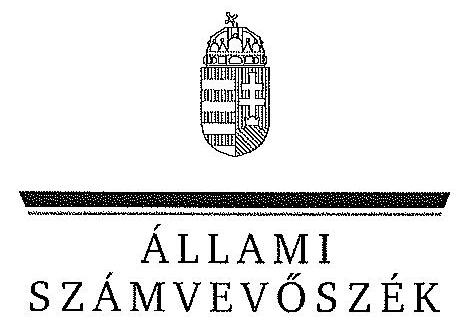

ÁLLAMI
SZÁMVEVŐSZÉK

# JELENTÉS 

az Óbudai Egyetem ellenőrzéséről - Az állami felsőoktatási intézmények gazdálkodásának, múködésének ellenőrzése

---

# Állami Számvevőszék 

Iktatószám: V-0578-106/2015.
Témaszám: 1612
Vizsgálat-azonosító szám: V068904

## Az ellenőrzést felügyelte:   Makkai Mária   felügyeleti vezető

## Az ellenőrzést vezette és az ellenőrzés végrehajtásáért felelős:   Gál Magdolna   ellenőrzésvezető

A számvevői munkaanyagok feldolgozását és a jelentés összeállítását végezte:

Varga Ágnes Klára Szepes Béla Bálint számvevő számvevő tanácsos

## Az ellenőrzést végezték:

Varga Ágnes Klára Szepes Béla Bálint számvevő
Jenei Zsuzsanna számvevő tanácsos
dr. Szabóné Nagy Katalin számvevő

## A témához kapcsolódó eddig készített számvevőszéki jelentések:

| címe | sorszáma |
| :-- | :-- |
| Jelentés az oktatási és kulturális ágazat irányítási rendszerének, | 1106 |
| működésének ellenőrzéséről |  |
| Jelentés a felsőoktatás oktatási infrastruktúra-fejlesztési program- | 1171 |
| jának ellenőrzéséről |  |
| Jelentés az állami felsőoktatási intézmények érdekeltségébe tartozó | 1290 |
| gazdasági társaságok támogatásának és nyereségük hasznosulá- |  |
| sának ellenőrzéséről |  |
| Jelentés a Szolnoki Főiskola ellenőrzéséről - Az állami felsőoktatási | 14196 |
| intézmények gazdálkodásának, múködésének ellenőrzése |  |
| Jelentés a Pannon Egyetem ellenőrzéséről - Az állami felsőoktatási | 14197 |
| intézmények gazdálkodásának, múködésének ellenőrzése |  |
| Jelentés a Károly Róbert Főiskola ellenőrzéséről - Az állami felsőok- | 14198 |
| tatási intézmények gazdálkodásának, múködésének ellenőrzése |  |
| Jelentés a Magyar Képzőművészeti Egyetem ellenőrzéséről - Az áll- | 14199 |
| lami felsőoktatási intézmények gazdálkodásának, múködésének |  |

---

ellenőrzése
Jelentés a Miskolci Egyetem ellenőrzéséről - Az állami felsőoktatási 14200
intézmények gazdálkodásának, múködésének ellenőrzése
Jelentés a Széchenyi István Egyetem ellenőrzéséről - Az állami fel- 14201
sőoktatási intézmények gazdálkodásának, múködésének ellenőrzé-
se
Jelentés az Eszterházy Károly Főiskola ellenőrzéséről - Az állami 14204
felsőoktatási intézmények gazdálkodásának, múködésének ellen-
őrzése
Jelentés a Magyar Táncművészeti Főiskola ellenőrzéséről - Az ál- 14205
lami felsőoktatási intézmények gazdálkodásának, múködésének ellenőrzése
Jelentés a Budapesti Műszaki és Gazdaságtudományi Egyetem el- 14218
lenőrzéséről - Az állami felsőoktatási intézmények gazdálkodásá-
nak, múködésének ellenőrzése

---

.

---

# TARTALOMJEGYZÉK 

BEVEZETÉS ..... 13
I. ÖSSZEGZŐ MEGÁLLAPÍTÁSOK, KÖVETKEZTETÉSEK, JAVASLATOK ..... 17
II. RÉSZLETES MEGÁLLAPÍTÁSOK ..... 25

1. A fenntartói és az ágazati irányítási jogok gyakorlása ..... 25
2. Az intézmény belső kontrollrendszerének kialakítása és múködtetése ..... 26
3. Az intézmény döntéshozó szerveinek joggyakorlása, az oktatási és egyéb tevékenységek elkülönítése, a pénzügyi gazdálkodás szabályossága ..... 29
3.1. A döntéshozó szervek gazdálkodással kapcsolatos joggyakorlása ..... 29
3.2. Az oktatási és egyéb tevékenységek elkülönítése, az ellátott feladatok átláthatósága ..... 31
3.3. Az intézmény pénzügyi egyensúlya, fizetőképessége, a feladatok zavartalan ellátása ..... 31
3.4. Az intézmény előirányzat kezelése ..... 34
3.5. Az egyes hazai forrásból finanszírozott projektekkel való elszámolás ..... 39
4. Az intézmény vagyongazdálkodása ..... 40
4.1. A vagyongazdálkodási tevékenységek keretei ..... 40
4.2. A vagyonváltozások és a vagyonhasznosítás szabályszerűsége ..... 41
4.3. Az intézmény tulajdonosi joggyakorlásának szabályszerűsége ..... 44
5. A külső ellenőrzések hasznosulása ..... 45
6. Az intézmény átalakítása ..... 46
7. Az integritás kontrollok kialakítása és múködtetése ..... 49
MELLÉKLETEK
8. számú Az Óbudai Egyetem (2009. december 31-ig Budapesti Műszaki Főiskola) kiadási és bevételi előirányzatai, azok teljesítése a 2009-2013. években
9. számú Az Óbudai Egyetem (2009. december 31-ig Budapesti Műszaki Főiskola) kiadásainak, bevételeinek változása a 2009-2013. években
10. számú Kimutatás az Óbudai Egyetem (2009. december 31-ig Budapesti Múszaki Főiskola) bevételeiről és kiadásairól, valamint adósságszolgálatáról a 2009-2013. években
11. számú Az Óbudai Egyetem (2009. december 31-ig Budapesti Műszaki Főiskola) mérlegadatai a 2009-2013. években

---

5. számú Az Óbudai Egyetem (2009. december 31-ig Budapesti Műszaki Fölskola) gazdálkodása szabályszerűségének értékelése a mintatételek alapján
6. számú Az Óbudai Egyetem rektorának észrevétele
7. számú Az Óbudai Egyetem rektorának észrevételére adott válasz

# FÜGGELÉK 

1. számú Az integritás érvényesítése érdekében kialakított és múködtetett intézményi kontrollrendszer

---

# RÖVIDÍTÉSEK JEGYZÉKE 

| Törvények |  |
| :--: | :--: |
| Áht. 1 | 1992. évi XXXVIII. törvény az államháztartásról |
| Áht. 2 | 2011. évi CXCV. törvény az államháztartásról |
| ÁSZ tv. | 2011. évi LXVI. törvény az Állami Számvevőszékről |
| Eisztv. | 2005. évi XC. törvény az elektronikus információszabadságról |
| Feot. | 2005. évi CXXXIX. törvény a felsőoktatásról |
| Gt. | 2006. évi IV. törvény a gazdasági társaságokról |
| Info tv. | 2011. évi CXII. törvény az információs önrendelkezési jogról és az információszabadságról |
| Jogállási tv. | 2008. évi CV. törvény a költségvetési szervek jogállásáról és gazdálkodásáról (hatályon kívül 2010. augusztus 15től) |
| Kbt. 1 | 2003. évi CXXIX. törvény a közbeszerzésekről |
| Kbt. 2 | 2011. évi CVIII. törvény a közbeszerzésekről |
| Kjt. | 1992. évi XXXIII. törvény a közalkalmazottak jogállásáról |
| Nftv. | 2011. évi CCIV. törvény a nemzeti felsőoktatásról |
| Nvtv. | 2011. évi CXCVI. törvény a nemzeti vagyonról |
| Ptk. | 1959. évi IV. törvény a Magyar Köztársaság Polgári Törvénykönyvéről |
| Sztv. | 2000. évi C. törvény a számvitelről |
| Vtv. | 2007. évi CVI. törvény az állami vagyonról |
| 2009. évi Kvtv. | 2008. évi CII. törvény a Magyar Köztársaság 2009. évi költségvetéséről |
| 2009. évi CXXXVIII. törvény | a felsőoktatásról szóló 2005. évi CXXXIX. törvény módosításáról szóló 2009. évi CXXXVIII. törvény |
| 2010. évi Kvtv. | 2009. évi CXXX. törvény a Magyar Köztársaság 2010. évi költségvetéséről |
| 2011. évi Kvtv. | 2010. évi CLXIX. törvény a Magyar Köztársaság 2011. évi költségvetéséről |
| 2012. évi Kvtv. | 2011. évi CLXXXVIII. törvény Magyarország 2012. évi központi költségvetéséről |
| 2013. évi Kvtv. | 2012. évi CCIV. törvény Magyarország 2013. évi központi költségvetéséről |
| Rendeletek |  |
| 50/2008. (III. 14.) Korm. rendelet | 50/2008. (III. 14.) Korm. rendelet a felsőoktatási intézmények képzési, tudományos célú és fenntartói normatíva alapján történő finanszírozásáról |
| 51/2007. (III. 26.) Korm. rendelet | 51/2007. (III. 26.) Korm. rendelet a felsőoktatásban részt vevő hallgatók juttatásairól és az általuk fizetendő egyes térítésekről |

---

| Áhsz. | 249/2000. (XII. 24.) Korm. rendelet az államháztartás szervezetei beszámolási és könyvvezetési kötelezettségének sajátosságairól |
| :--: | :--: |
| Ámr. | 217/1998. (XII. 30.) Korm. rendelet az államháztartás múködési rendjéről |
| Ámr. | 292/2009. (XII. 19.) Korm. rendelet az államháztartás múködési rendjéről |
| Ávr. | 368/2011. (XII. 31.) Korm. rendelet az államháztartásról szóló törvény végrehajtásáról |
| Ber. | 193/2003. (XI. 26.) Korm. rendelet a költségvetési szervek belső ellenőrzésről |
| Bkr. | 370/2011. (XII. 31.) Korm. rendelet a költségvetési szervek belső kontrollrendszeréről és belső ellenőrzésről |
| Vtvr. | 254/2007. (X. 4.) Korm. rendelet az állami vagyonnal való gazdálkodásról |
| NGM rendelet | 36/2013. (IX. 13.) NGM rendelet az államháztartás számvitelének 2014. évi megváltozásával kapcsolatos feladatokról |
| Határozat |  |
| 1268/2010. (XII. 3.)   Korm. határozat | 1268/2010. (XII. 3.) Korm. határozat a 2010. évi költségvetési egyenleg teljesítéséhez szükséges intézkedésekről |
| Egyéb rövidítések |  |
| AVIR | Adattár Alapú Vezetői Információs Rendszer |
| BMF, intézmény, főiskola | Budapesti Müszaki Főiskola, az Óbudai Egyetem jogelődje 2009. december 31-ig |
| E Ft | ezer forint |
| EMMI | Emberi Eröforrások Minisztériuma |
| FIR | felsőoktatási információs rendszer |
| Gazdasági főigazgatóság | A Budapesti Müszaki Főiskola/Óbudai Egyetem Gazdasági Főigazgatósága |
| IFT | Intézményfejlesztési Terv |
| Kincstár | Magyar Államkincstár |
| KIR | Központosított Illetmény-számfejtési Rendszer |
| M Ft | millió forint |
| MNV Zrt. | Magyar Nemzeti Vagyonkezelő Zrt. |
| MTA | Magyar Tudományos Akadémia |
| NEFMI | Nemzeti Erőforrás Minisztérium |
| NEPTUN | NEPTUN Tanulmányi Információs és Pénzügyi Rendszer |
| NGM | Nemzetgazdasági Minisztérium |
| PM | Pénzügyminisztérium |
| ÓE, intézmény, egyetem | Óbudai Egyetem |
| OH | Oktatási Hivatal |
| OKM | Oktatási és Kulturális Minisztérium |
| PPP | public private partnership |
| SZMR | Budapesti Müszaki Főiskola/Óbudai Egyetem Szervezeti Müködési Rendje |

---

SZMSZ
teljesítésigazolás

Budapesti Műszaki Főiskola/Óbudai Egyetem Szervezeti és Múködési Szabályzata
Ámr. ${ }_{1}$ 135. §, Ámr. ${ }_{2}$ 76. § szerint 2009. január 01. - 2011. december 31. között szakmai teljesítésigazolás, az Ávr. 57. § alapján 2012. január 01-től teljesítésigazolás

---

.

---

# ÉRTELMEZŐ SZÓTÁR 

állami felsőoktatási intézmény saját tulajdona
állami vagyon
a felsőoktatási intézmény saját bevételének a költségek teljes körű levonása, - az adományozás és öröklés kivételével - a rendelkezésre bocsátott vagyon állagának megóvásáról, pótlásáról való gondoskodás után fennmaradt része terhére szerzett vagyona
A Vtv. 1. § (2) bekezdése szerint „állami vagyonnak minösül:
a) az állami tulajdonban lévő ingó dolog, valamint a dolog módjára hasznosítható természeti erő,
b) az állami tulajdonban lévő termöföldekből álló, külön törvényben szabályozott Nemzeti Földalap,
c) az állami tulajdonban lévő - a b) pont hatálya alá nem tartozó - ingatlan,
d) az állami tulajdonban lévő értékpapír,
e) az államot megillető társasági részesedés és más vagyoni értékú jog."
(hatályos 2010. június 16-ig)
„a) az állam tulajdonában lévő dolog, valamint a dolog módjára hasznosítható természeti erő,
b) az a) pont hatálya alá nem tartozó mindazon vagyon, amely vonatkozásában törvény az állam kizárólagos tulajdonjogát nevesíti,
c) az állam tulajdonában lévő tagsági jogviszonyt megtestesítő értékpapír, illetve az államot megillető egyéb társasági részesedés,
d) az államot megillető olyan immateriális, vagyoni értékkel rendelkező jogosultság, amelyet jogszabály vagyoni értékű jogként nevesít"
(hatályos 2010. június 17-től)
állami vagyon hasznosítása

A Vtv. 23. § (1) bekezdése szerint: „Az állami vagyont az MNV Zrt. maga kezeli, illetve szerződés - így különösen bérlet, haszonbérlet, szerződésen alapuló haszonélvezet, vagyonkezelés, megbizás - alapján központi költségvetési szervnek, természetes vagy jogi személynek, illetőleg jogi személyiséggel nem rendelkező gazdasági társaságnak hasznosításra átengedi." (hatályos 2010. december 31-ig)
„Az állami vagyont az MNV Zrt. maga kezeli, vagy szerződés így különösen bérlet, haszonbérlet, szerződésen alapuló haszonélvezet, vagyonkezelés, megbizás - alapján központi költségvetési szervnek, természetes vagy jogi személynek, vagy jogi személyiséggel nem rendelkező gazdálkodó szervezetnek hasznosításra átengedi."
(hatályos 2011. december 31-ig)
„Az állami vagyont az MNV Zrt. maga kezeli, vagy szerződés így különösen bérlet, haszonbérlet, megbizás - alapján köz-

---

állami vagyon hasznosítására kötött szerződés
állami vagyon használója
állami vagyon értékesítése
állami vagyon kezelője /vagyonkezelő
CLF-módszer
ponti költségvetési szervnek, természetes vagy jogi személynek, vagy jogi személyiséggel nem rendelkező gazdálkodó szervezetnek hasznosításra átengedi."
(hatályos 2012. január 1-jétől)
A Vtv. 23. § (2) bekezdése szerint: „Az állami vagyon hasznosítására kötött szerződések elsődleges célja az állami vagyon hatékony müködtetése, állagának védelme, értékének megőrzése, illetve gyarapítása, az állami és közfeladatok ellátásának elősegítése."
A Vhr. 1. § (7) a. pontja szerint: „az a természetes személy, jogi személy, illetve jogi személyiséggel nem rendelkező gazdasági társaság, amely az MNV Zrt.-vel kötött szerződés alapján, bármely jogcímen (bérlet, haszonbérlet, vagyonkezelés, használat stb.) állami vagyont birtokol, használ, hasznosit". (hatályos 2010. december 31-ig)
„az a természetes személy, jogi személy, illetve jogi személyiséggel nem rendelkező szervezet, amely, illetve aki törvény vagy szerződés alapján, bármely jogcímen (pl. bérlet, haszonbérlet, vagyonkezelési szerződés, használat stb.) állami vagyont birtokol, használ, szedi annak használt, hasznosit, ide nem értve a tulajdonosi jogok gyakorlóját".
(hatályos 2011. január 1 - 2011. december 31-ig)
„az a természetes vagy jogi személy, jogi személyiséggel nem rendelkező szervezet, aki, vagy amely törvény vagy szerződés alapján, bármely jogcímen (bérlet, haszonbérlet, használat stb.) állami vagyont birtokol, használ, szedi annak használt, hasznosit, ide nem értve a haszonélvezőt, a vagyonkezelőt és a tulajdonosi jogok gyakorlóját".
(hatályos 2012. január 1-jétől)
„Állami vagyon tulajdonjogának bármely jogcímen történő, visszterhes átruházása" (Vhr. 1. § (7) d) pont).
A Vtv. 23. § (1) bekezdése szerint „az állami vagyont az MNV Zrt. maga kezeli, vagy szerződés - így különösen bérlet, haszonbérlet, szerződésen alapuló haszonélvezet, vagyonkezelés, megbizás - alapján központi költségvetési szervnek, természetes vagy jogi személynek, illetőleg jogi személyiséggel nem rendelkező gazdasági társaságnak hasznosításra átengedi" (hatályos 2010. január 01 - 2011. december 31-ig) „az állami vagyont az MNV Zrt. maga kezeli, vagy szerződés - így különösen bérlet, haszonbérlet, megbizás - alapján központi költségvetési szervnek, természetes vagy jogi személynek, vagy jogi személyiséggel nem rendelkező gazdálkodó szervezetnek hasznositásra átengedi." Az állami vagyonra vonatkozóan az MNV Zrt. kizárólag az Nvtv-ben meghatározott személyekkel köthet vagyonkezelési szerződést.
(Vtv. 27. § (1)) (hatályos 2012. január 1-jétől)
A módszer következetesen elkülöníti a folyó és a felhalmozási költségvetés bevételeit és kiadásait, azok költségvetési egyenlegeit. Bizonyos mértékig a vállalati gazdál-

---

|  | kodás logikai elemeit érvényesíti a felsőoktatási költségvetési szervek pénzügyi, jövedelmi helyzetének vizsgálata során. Az értékelés a pénzügyi kapacitás fogalmát helyezi a középpontba. |
| :--: | :--: |
| fenntartó | Feot. 7. § (2) és Nftv. 4. § (2) bekezdése szerint az, aki az alapítói jogot gyakorolja, ellátja a felsőoktatási intézmény fenntartásával kapcsolatos feladatokat (a továbbiakban: fenntartó) |
| előirányzat-maradvány | Az államháztartás központi alrendszerébe tartozó költségvetési szerveknél a módosított bevételi és kiadási előirányzatok és azok teljesítésének a Kormány rendeletében meghatározott tételekkel korrigált különbözete az elői-rányzat-maradvány (Áht. 2 . § (1) bekezdés m) pontja). |
| gazdasági tanács | a felsőoktatási intézmény véleményező, a stratégiai döntések előkészítésében részt vevő, és a döntések ellenőrzésében közremúködő szerve |
| intézményfejlesztési terv | A szenátus fogadja el az intézményfejlesztési tervet. Az intézményfejlesztési tervben kell meghatározni a fejlesztéssel, a fenntartó által a felsőoktatási intézmény rendelkezésére bocsátott vagyon hasznosításával, megóvásával, elidegenítésével kapcsolatos elképzeléseket, a várható bevételeket és kiadásokat. Az intézményfejlesztési tervet középtávra, legalább négyéves időszakra kell elkészíteni, évenkénti bontásban meghatározva a végrehajtás feladatait. Az intézményfejlesztési terv része a foglalkoztatási terv. A foglalkoztatási tervben kell meghatározni azt a létszámot, amelynek keretei között a felsőoktatási intézmény megoldhatja feladatait. (Forrás: Feot. 27. § (3) bekezdés) |
| integritás | Az integritás olyasvalakit vagy valamit jelöl, aki vagy ami romlatlan, sértetlen, feddhetetlen. Az integritás elvek, értékek, cselekvések, módszerek, intézkedések konzisztenciáját jelenti: olyan magatartásmódot, amely meghatározott értékeknek megfelel. |
| jelentős összegű hiba | Minden esetben jelentős összegű a hiba, ha a hiba megállapításának évében az ellenőrzések során - ugyanazon évet érintően - megállapított hibák, hibahatások saját tőkét és tartalékokat növelő-csökkentő értékének együttes (előjeltől független) összege eléri, vagy meghaladja az ellenőrzött költségvetési év mérlegfőösszegének 2 százalékát, illetve ha a mérlegfőösszeg 2 százaléka meghaladja a 100 M Ft -ot, akkor a 100 M Ft . |
| kincstári biztos | A kincstári biztos kijelölését az államháztartásért felelős miniszternél a Kincstár kezdeményezi. A kincstári biztos köteles figyelemmel kísérni megbízatásának időpontjától kezdve a költségvetési szerv tervezését, gazdálkodását, beszámolását, a jogszabályokban előírt feladatainak ellátását, feltárni azokat az okokat, amelyek a tartós fizetésképtelenséghez vezettek, a szükséges intézkedések azonnali végrehajtására irányuló intézkedési tervet készí- |

---

kincstári költségvetés
kisebbségi jogokat biztositó részesedés
költségvetési főfelügyelő, felügyelő
meghatározó (többségi) befolyást biztosító részesedés
mértékadó befolyást biztosító részesedés minősített többséget biztosító részesedés
normatív költségvetési támogatás felsőoktatási intézmények müködéséhez
teni, azonnali intézkedéseket kezdeményezni és írásbeli utasításokat kiadni a tartozásállomány felszámolására, a gazdálkodás egyensúlyának biztosítására, a követelések behajtására. (Ávr. 116-117. §)
A központi költségvetésről szóló törvény elfogadását követően a fejezetet irányító szerv az államháztartás központi alrendszerébe tartozó költségvetési szerv és a fejezeti kezelésű előirányzat kiemelt előirányzatait, valamint az elkülönített állami pénzalapok és a társadalombiztosítás pénzügyi alapjai jogszabályi előírás szerinti szerinti bevételeit és kiadásait kincstári költségvetés kiadásával állapítja meg. (Áht. 24. § (3) bekezdés, Áht. 2 28. § (2) bekezdés)
A részesedés mértéke több mint 5\% (Gt. 49. §).
Az államháztartásért felelős miniszter a Kormány irányítása alá tartozó fejezetet irányító szervhez, a Kormány irányítása vagy felügyelete alá tartozó költségvetési szervhez, valamint az elkülönített állami pénzalapok és a társadalombiztosítás pénzügyi alapjai kezelő szerveihez költségvetési főfelügyelőt, felügyelőt rendelhet ki. A költségvetési főfelügyelő, felügyelő a gazdálkodás költségve-tés-politikával való összhangja és a takarékos, szabályszerű, eredményes múködés érdekében a Kormány rendeletében meghatározott intézkedéseket tehet, így különösen előzetesen véleményezi a kötelezettségvállalásra irányuló eljárásokat és a nagy összegű kötelezettségvállalások tekintetében kifogással élhet. (Áht. 2 39. § (1)-(2) bekezdés)
A részesedés mértéke több mint 50\%, de 75\%-nál kisebb (Ptk. 685/B. §).

A részesedés mértéke több mint 20\%, de 50\%-nál kisebb (Sztv. 3. § (2) bek. 4. pont).
A minősített befolyásszerző az ellenőrzött társaságban a szavazatok legalább hetvenöt százalékával rendelkezik. (Gt. 52. § (2) bekezdés)
A felsőoktatási intézmények müködéséhez biztosított normatív költségvetési támogatás lehet
a) hallgatói juttatásokhoz nyújtott,
b) képzési,
c) tudományos célú,
d) fenntartói,
e) egyes feladatokhoz nyújtott
támogatás. A központi költségvetésből biztosított normatív költségvetési támogatásra - a d) pontban meghatározott normatív költségvetési támogatás kivételével - a felsőoktatási intézmények azonos feltételek alapján válnak jogosulttá. Az a)-e) pontokban meghatározott jogcímek -

---

normatív támogatások
saját bevétel
szenátus
többségi befolyást biztositó részesedés
az a) és e) pontban meghatározott jogcímek kivételével nem jelentenek felhasználási kötöttséget. (Feot. 127. § (3) bekezdés)
Az ellenőrzési időszakban hatályos költségvetési törvények 3. számú mellékletében megjelölt közoktatási hozzájárulások, az 5. mellékletében megjelölt központosított előirányzatok, továbbá a 8. mellékletében megjelölt normatív, kötött felhasználású támogatások együttesen.
az államháztartáson kívüli források - beleértve minden olyan, az Európai Uniótól származó támogatást, amelyhez nem az állami költségvetésen keresztül jut a felsőoktatási intézmény, továbbá a szakképzési hozzájárulási fizetési kötelezettség teljesítéseként elszámolt forrásokat is, ide nem értve az állami vagyon értékesítésének ellenértékét - valamint a Kutatási és Technológiai Innovációs Alapból származó bevételek
A felsőoktatási intézmény döntést hozó és a döntés végrehajtását ellenőrző testülete. (Forrás: Feot. 20. § (1) bekezdés)
A Ptk. 685/B. § (1) bekezdése szerint „többségi befolyás: az olyan kapcsolat, amelynek révén természetes személy, jogi személy vagy jogi személyiség nélküli gazdasági társaság (a továbbiakban együtt: befolyással rendelkező) egy jogi személyben a szavazatok több mint ötven százalékával vagy meghatározó befolyással rendelkezik."

---

.

---

# JELENTÉS 

## az Óbudai Egyetem ellenőrzéséről - Az állami felsőoktatási intézmények gazdálkodásának, múködésének ellenőrzése

## BEVEZETÉS

Az ÁSZ Stratégiája ${ }^{1}$ alapértékeinek egyike, hogy az államháztartás komplex folyamatainak átláthatósága érdekében rendszerszemléletű/holisztikus megközelítésű, egymásra épülő, a szinergiahatást kihasználó, összefoglaló értékelésre lehetőséget adó ellenőrzéseket végez. Az államháztartás központi alrendszerébe tartozó felsőoktatási intézmények ellenőrzése során az Állami Számvevőszék értékeli azok pénzügyi-gazdasági helyzetét, feltárja a működésükben rejlő kockázatokat, ezzel előmozdítja a közpénzügyek átláthatóságát, rendezettségét.

Az állami felsőoktatási intézmények gazdálkodását - az Áht. előírásai mellett a felsőoktatásról szóló 2005. évi CXXXIX. törvény (Feot.), valamint a nemzeti felsőoktatásról szóló 2011. évi CCIV. törvény (Nftv.) előírásai határozták meg.

Magyarország Nemzeti Reform Programja keretében, a Széll Kálmán Terv 2020-ig a 30-34 évesek körében, a felsőfokú vagy annak megfelelő végzettséggel rendelkezők arányának 30,3\%-ra való növelését irányozta elő, amely a 2010. évhez képest $4,6 \%$ pontos növekedési célkitűzést jelent. A rendezett gazdasági környezet, az önállósággal élni tudó, felelős, elszámoltatható intézményi gazdálkodói magatartás elengedhetetlen feltétele a kitűzött szakmai célok elérésének.

Az ellenőrzés célja annak megállapítása, hogy szabályos volt-e az állami felsőoktatási intézmények pénzügyi és vagyongazdálkodása, biztosított volt-e a vagyonnal való felelős gazdálkodás követelményének érvényesülése, jogszabályi előírásoknak megfelelően múködött-e a belső kontrollrendszer; az irányító szerv tevékenysége a jogszabályi előírásoknak megfelelt-e.

Ennek keretében értékeltük az Óbudai Egyetemnél:

- a fenntartói és az ágazati irányítási jogok gyakorlása előírásoknak való megfelelőségét;
- az intézmény belső kontrollrendszere jogszabályoknak megfelelő kialakítását és múködtetését;

[^0]
[^0]:    ${ }^{1}$ Állami Számvevőszék: Stratégia. Az Állami Számvevőszék hivatalos stratégiai dokumentum rendszere 2011-2015. 2012. december. http://www.asz.hu/strategia/asz-strategia/asz-strategia-2011.pdf

---

- az intézmény döntéshozó szerveinek joggyakorlása jogszabályoknak való megfelelőségét; az intézmény oktatási és egyéb (gyakorlati és kutatási) tevékenységei elkülönítését, átláthatóságát, illetve pénzügyi gazdálkodása szabályszerűségét;
- az intézmény vagyongazdálkodása előírásoknak való megfelelőségét;
- az ellenőrzött időszakban végzett külső (ÁSZ, fenntartói, KEHI, kincstári) ellenőrzések által tett javaslatok hasznosulását;
- az intézmény korrupcióval szembeni veszélyeztetettségének csökkentése érdekében az integritási szemlélet érvényesülését a gazdálkodási folyamatokban.
- az intézmény átalakítása során a vonatkozó jogszabályok betartását.

Az ellenőrzés várható hasznosulása: Az ellenőrzés eredményének hasznosulásaként képet kapunk a felsőoktatási intézményekben kialakult pénzügyi helyzetről; az oktatási és egyéb tevékenységek és költségelszámolások elhatárolásáról, átláthatóságáról és szabályosságáról. A felsőoktatási intézmények gazdálkodási szabadságának pénzügyi és vagyoni helyzetre gyakorolt hatásairól, a vagyonnal való felelős, értékmegőrző gazdálkodás érvényesüléséről, továbbá a belső kontrollrendszer működéséről. Az ellenőrzés az ellenőrzött számára viszszajelzést ad a gazdálkodása kereteinek kialakításáról, a múködésében fellépő hiányosságokról, javaslataival hozzájárul azok kiküszöböléséhez és a jó kormányzáshoz. A törvényalkotás számára összegzett tapasztalatok állnak rendelkezésre a felsőoktatási intézmények döntéseinek, gazdálkodásának szabályszerűségéről, amelyek alapján - indokolt esetben - jogszabály-módosítás kezdeményezhető. Az integritás kultúra kialakítása hozzájárul az elszámoltathatóság és átláthatóság érvényesítéséhez, egyben támogatja a szervezet védettségét a korrupciós kitettséggel szemben, valamint annak megelőzése is irányítottabbá válik. A társadalom számára jelzi, hogy közpénz nem maradhat ellenőrizetlenül, az ÁSZ értékteremtő rend kialakításához és megőrzéséhez hozzájáruló tevékenysége pozitív hatással lesz a szervezetről kialakított összkép formálásában.

Az ellenőrzés típusa szabályszerűségi ellenőrzés.
Az ellenőrzött időszak: 2009. január 1 - 2013. december 31.
Az ellenőrzéssel érintett szervezetek: az Emberi Erőforrások Minisztériuma és az Óbudai Egyetem.

Az ellenőrzés jogszabályi alapját az ÁSZ tv. 1. § (3) bekezdése, az 5. §. (3)(6) bekezdései, 33. § (7) bekezdése, valamint az államháztartásról szóló 2011. évi CXCV. törvény (Áht. ${ }_{2}$ ) 61. § (2) bekezdésének előírásai képezik.

Az ellenőrzés kiterjed minden olyan körülményre és adatra, amely az ÁSZ jogszabályban meghatározott feladataiban, valamint a program végrehajtása folyamán felmerült újabb összefüggések feltárásához szükséges.

Az ellenőrzés az INTOSAI által kiadott nemzetközi standardok figyelembe vételével, az ellenőrzési programban foglalt értékelési szempontok szerint történt.

---

A pénzügyi és vagyongazdálkodás terén az egyes területek szabályszerű működését mintavétellel ellenőriztük, ez alapján a sokaságban előforduló hibás tételek arányát becsültük. A jogszabályoknak és a belső előírásoknak megfelelőnek, azaz szabályszerűnek tekintettük az adott kiadási előirányzat felhasználását, bevétel beszedését, mérlegtétel értékelését, amennyiben a minta ellenőrzésének eredménye alapján $95 \%$-os bizonyossággal a teljes sokaságban a hibás tételek aránya kisebb volt, mint $10 \%$, nem megfelelőnek értékeltük, ha a hibás tételek aránya a $10 \%$-ot meghaladta. Kockázatot, illetve magas kockázatot jeleztünk, amennyiben egy adott terület vonatkozásában a minta alapján a teljes sokaságban nem volt teljes körűen biztosított a jogszabályoknak és a belső szabályzatoknak megfelelő működés. A mintatételek kiértékelését az 5. számú melléklet tartalmazza.

A belső kontrollrendszer kialakításának és múködtetésének értékelése során a jogszabályi előírások mellett az Ámr., 145/A. § (1) és (3) bekezdése, az Ámr. ${ }_{2}$ 155. § (1) és (3) bekezdése, valamint a Bkr. 5. § (1) bekezdése alapján figyelembe vettük az államháztartásért felelős miniszter által közétett irányelvekben és módszertani útmutatókban ${ }^{2}$ foglaltakat is. A belső kontrollrendszert az értékelés során legalább $85 \%$-os megfelelőség esetén megfelelőnek, legalább $70 \%$-os megfelelőség esetén részben megfelelőnek, $70 \%$-os megfelelőség alatt pedig nem megfelelőnek minősítettük.

Az ÓE a 2009-2013. évek között önállóan működő és gazdálkodó központi költségvetési szerv volt. Az egyetem gazdaságtudományok, informatika, műszaki tudományok, pedagógusképzés területeken folytatott képzést, és alapfeladata körében a képzési területeken kutatási tevékenységet végzett. A Budapesti Műszaki Főiskolát 2000. január 1-én alapították. Az intézmény átalakítására 2010. január 1-én került sor, a 2009. évi CXXXVIII. törvény módosította a Feot. 1. számú mellékletét, az állami főiskolák felsorolásából törölte a BMF-et, az állami egyetemek alcím alá pedig felvette az ÓE-t. A rektor és a gazdasági főigazgató vezetői megbízásának visszavonására, a vezetői feladatok ellátására szóló megbízások újbóli kiadására az intézmény átalakítása miatt került sor. A belső ellenőrzési egység vezetője az ellenőrzött időszakban nem változott.

Az ellenőrzéssel érintett intézmény jellemzőit, főbb gazdálkodási, vagyoni és létszám adatait az alábbi táblázat mutatja be.

| Megnevezés | Főbb gazdálkodási és vagyoni adatok (E Ft) |  |  |  |  |  | Változás   2013/2009. (%) |
| :--: | :--: | :--: | :--: | :--: | :--: | :--: | :--: |
|  | 2009.01 .01 | 2009.12 .31 | 2010. | 2011. | 2012. | 2013. |  |
| KIADÁSI FÖOSSZEG |  | 7451808 | 6996854 | 8456873 | 8533386 | 9175569 | 123,1 |
| BEVÉTELI FÖOSSZEG |  | 8191248 | 11084718 | 12046379 | 10807447 | 11336453 | 138,4 |
| Költségvetési támogatások |  | 4989910 | 5061953 | 4806658 | 4325838 | 4983800 | 99,9 |
| Saját és átvett bevételek |  | 2683404 | 2957799 | 3219516 | 2820503 | 4000933 | 149,1 |
| Támogatások aránya (\%) |  | 60,9 | 45,7 | 39,9 | 40,0 | 44,0 |  |
| Mérlegfőösszeg | 9409850 | 9082660 | 9868446 | 9599698 | 8683714 | 8229960 | 87,5 |
|  |  |  | jellemző létszámadatok (fő) ${ }^{\text {a }}$ |  |  |  |  |
| Oktatói létszám (fő) |  | 381 | 362 | 374 | 406 | 560 | 147,0 |
| Hallgatói létszám (fő) |  | 11438 | 11870 | 12210 | 12528 | 12653 | 110,8 |

[^0][^1]
[^0]:    ${ }^{2}$ 1/2009. (IX. 11.) PM irányelv, Pénzügyminisztérium Belső Kontroll Kézikönyv 2010.

[^1]:    ${ }^{2}$ 1/2009. (IX. 11.) PM irányelv, Pénzügyminisztérium Belső Kontroll Kézikönyv 2010.

---

A felsőoktatási intézmény kiadásai az ellenőrzött időszakban 7451,8 M Ft-ról 9175,6 M Ft-ra 23,1\%-kal, a bevételek 8191,2 M Ft-ról 11 336,5 M Ft-ra, 38,4\%kal nőttek. A támogatás átlagos aránya a bevételeken belül $45,2 \%$ volt.

A hallgatók létszáma az ellenőrzött időszakban 11438 fơről 12653 főre, 10,6\%-kal növekedett, a teljes- és részmunkaidőben foglalkoztatott oktatók létszáma 381 fôről 380 fôre csökkent. Az oktatásban 2009-ben nem, 2013-ban viszont 180 főt foglalkoztattak megbízási jogviszony keretében.

Az ÁSZ a 2011. évi LXVI. törvény 29. §-a szerint a jelentéstervezetet megküldte az Óbudai Egyetem rektorának és az Emberi Erőforrások Minisztériuma miniszterének egyeztetésre. Az Óbudai Egyetem rektorának észrevételét és az arra adott választ a 6-7. számú melléklet tartalmazza. Az Emberi Erőforrások Minisztériuma minisztere az ÁSZ tv. 29. § (2) bekezdésében foglalt észrevételezési jogával nem élt, a törvényes határidőn belül észrevételt nem tett.

---

# I. ÖSSZEGZŐ MEGÁLLAPÍTÁSOK, KÖVETKEZTETÉSEK, JAVASLATOK 

Az ellenőrzött időszakban a miniszter a jogszabályokban meghatározott fenntartói feladatainak eleget tett. Alapítói jogosultságai keretében - egy módosítás kivételével - szabályszerűen adta ki az intézmény jogszabályi és szervezeti változásoknak megfelelően módosított alapító okiratát, az intézményi SZMSZ-t és módosításait felülvizsgálta és véleményezte. A jogszabályoknak megfelelően gyakorolta az intézmény felső vezetőinek kinevezésével, illetve megbízásával kapcsolatos jogosultságait. A fenntartói irányítás keretében a minisztérium részt vett az ÓE éves költségvetésének tervezésében, megadta az ÓE költségvetési kereteit, a kiemelt előirányzatok főösszegeit. A 2009-2013. évek között a fenntartó gondoskodott az intézmény éves elemi költségvetési beszámolóinak ellenőrzéséről, azonban a számviteli rendelkezések alapján elkészített éves költségvetési beszámolókra dokumentált értékelést nem készített.

A fenntartó megkötötte az intézménnyel a 2008-2010. évekre vonatkozó fenntartói megállapodást, amelyben meghatározták a teljesítménykövetelményeket. A fenntartó a megállapodásban foglaltak végrehajtásáról szóló ÓE által készített beszámolót évente véleményezte.

A miniszter ágazati irányítási feladatait az ellenőrzött időszakban nem látta el teljes körűen. Elmaradt az oktatási ágazatra vonatkozóan a nemzetgazdasági miniszter irányításával és az oktatási miniszter részvételével, a kormányhatározatban előírt szervezeti és felülvizsgálati program kidolgozása. A felsőoktatási törvény rendelkezései ellenére a miniszter nem készíttetett a felsőoktatás rendszerére vonatkozó középtávú fejlesztési tervet.

Az intézmény belső kontrollrendszerének kialakítása és múködtetése a 2009-2013. években részben felelt meg a vonatkozó jogszabályi előírásoknak.

A kontrollkörnyezet kialakítása részben felelt meg a jogszabályi előírásoknak. Az intézmény az ellenőrzött időszakban rendelkezett Alapító Okirattal, elkészítették az intézmény SZMSZ-ét, tartalma azonban nem felelt meg maradéktalanul a jogszabályi előírásoknak, mivel az ellenőrzött időszakban az SZMSZ nem tartalmazta a szervezeti egységek engedélyezett létszámadatait. A gazdálkodásra vonatkozó szabályzatokkal rendelkeztek, de azok nem voltak teljes körűen összhangban a hatályos jogszabályokkal. Az ellenőrzési nyomvonalat a gazdasági folyamatokra kialakították, rendelkeztek az ellenőrzött időszakban szabálytalanságkezelési eljárásrenddel.

Az intézmény kockázatkezelési rendszere az ellenőrzött időszakban megfelelő volt.

Az ÓE kontrolltevékenysége az ellenőrzött időszakban nem volt megfelelő. A kiadási előirányzatok felhasználásánál a gazdálkodási jogkörök gyakorlásának hiányosságai az ellenőrzés során feltárt szabályszerűségi hibákhoz vezettek.

---

Az információs és kommunikációs rendszer kialakítása és működése, valamint a monitoring rendszer kialakítása az ellenőrzött időszakban megfelelő volt.

A szenátus gazdálkodással kapcsolatos joggyakorlása részben felelt meg a Feot. és az Nftv. előírásainak, mert az ellenőrzött időszakban a jogszabályi előírások ellenére éves kötelezettségvállalási terv és annak végrehajtására ütemterv, valamint éves vagyongazdálkodási terv nem került elfogadásra. Az egyetem döntéshozó szerveinek joggyakorlása - a felsőoktatási normatív finanszírozási keretrendszerben a különböző jogcímeken kapott támogatások felhasználása esetében - a jogszabályi előírásoknak megfelelt.

Az egyetem oktatási és egyéb tevékenységeit a Feot.-ban és az Nftv.-ben előírtak szerint elkülönítették, az ellátott feladatok rendszere átlátható volt. A számviteli nyilvántartásokban a szakfeladatok, valamint a főkönyvi számlák alábontása mellett az egyes tevékenységek bevételeinek és kiadásainak elkülönítését témaszámok kialakításával biztosították.

A 2009-2013. években az intézmény pénzügyi egyensúlya, fizetőképessége biztosított volt. Az intézmény pénzügyi gazdálkodásának szabályszerűsége részben felelt meg a jogszabályoknak.

Az intézmény az ellenőrzött időszakban a kiadási és a bevételi előirányzatok tervezése során a hatályos jogszabályokban és a fenntartó által kiadott tervezési irányelvekben foglaltak szerint járt el.

A bevételi és kiadási előirányzatok módosítása, azok elszámolása nem felelt meg a jogszabályoknak, mivel az intézménynél az előirányzatmaradvány igénybevétele és a többletbevétel felhasználása érdekében végrehajtott módosítások elrendelésének és ellenjegyzésének dokumentumait 2011 áprilisától - 2011. december 31-ig nem őrizték meg, ezzel megsértették a jogszabályi követelményeket. Az intézmény az ellenőrzött években a költségvetés módosított kiadási főösszegét és kiemelt előirányzatait a törvényi előírások szerint betartotta.

A 2009-2013. években az éves és évközi kincstári adatszolgáltatásokat - a 2010. I. félévi elemi költségvetési beszámoló benyújtása kivételével - az előírásoknak megfelelően teljesítették.

A rendszeres és nem rendszeres személyi juttatások előirányzatának felhasználása során a pénzügyi elszámolások, valamint a gazdálkodási jogkörök gyakorlása tekintetében nem volt biztosított a jogszabályoknak és belső szabályoknak való megfelelőség, mivel a rendszeres személyi juttatások kötelezettségvállalása ellenjegyzés hiányában történt, a nem rendszeres személyi juttatások kötelezettségvállalási dokumentumán több esetben elmaradt az ellenjegyzés. Esetenként előfordult, hogy a kötelezettségvállalás dokumentumát - a túlóra elrendelésénél és a céljutalom kitűzésénél - nem készítették el.

A külső személyi juttatások előirányzatai terhére megkötött megbízási szerződések kifizetése nem felelt meg teljes körűen a jogszabályoknak és a belső szabályoknak, mivel a kötelezettségvállalás dokumentumán nem minden eset-

---

ben történt meg az ellenjegyzés dátumának feltüntetése, illetve előfordult, hogy a kötelezettségvállalást nem előzte meg az ellenjegyzés.

A dologi kiadások előirányzatának felhasználása a pénzügyi elszámolások, valamint a gazdálkodási jogkörök gyakorlása tekintetében nem felelt meg a jogszabályoknak és a belső szabályoknak. A jogszabályi előírások ellenére több esetben elmaradt a kötelezettségvállalás ellenjegyzése, a kiadások kifizetése során a teljesítés igazolása, az érvényesítés, és az utalványozás. Előfordult, hogy az érvényesítés dátumát nem tüntették fel, ezzel nem tartották be a jogszabályi előírásokat. A 2009. évben jegyzet vásárlására vonatkozó, 50 E Ft feletti beszerzésnél nem történt előzetes írásbeli kötelezettségvállalás, így nem feleltek meg a vonatkozó törvényben és kormányrendeletben foglaltaknak. Előfordult, hogy képzésre vonatkozó számla kiállításakor sérült a bruttó elszámolás számviteli alapelve, mivel az intézmény által a partner felé elkészített számla összege az egymásnak nyújtott szolgáltatások egyenlegét tartalmazta. Az egyetem 2011. évben megsértette a hatályos közbeszerzési törvényt, mert irodaszert közbeszerzési eljárás mellőzésével szerzett be.

A felújítások, beruházások előirányzatának felhasználása során a pénzügyi elszámolások, valamint a gazdálkodási jogkörök gyakorlása nem felelt meg teljes körűen a jogszabályoknak és belső szabályoknak, mivel nem minden esetben történt meg a kötelezettségvállalás ellenjegyzése és a teljesítésigazolás.

Az ellátotti juttatások kifizetése során nem tartották be a belső szabályzatokban és a jogszabályokban foglaltakat, mivel a 100 E Ft feletti külföldi ösztöndíjban részesült hallgatók juttatásai kifizetésénél az utalvány nem tartalmazta a kötelezettségvállalás nyilvántartási számát, valamint az utalványrendeleten több esetben elmaradt az utalványozó aláírása.

Az intézményi térítési díjak, költségtérítések megállapítása nem felelt meg a jogszabályi és a belső előírásoknak, mivel a hallgatói juttatások és költségtérítési díjak megállapítása a jogszabályi előírás ellenére nem alapult önköltségszámításon.

Az intézményi múködési bevételek beszedése a pénzügyi elszámolások, valamint a gazdálkodási jogkörök gyakorlása tekintetében nem felelt meg a jogszabályoknak és a belső szabályoknak. A teljesítés igazolása nem felelt meg a jogszabályi előírásnak és a belső szabályzatban foglaltaknak, mivel az egyetem a hatályos rendelkezések szerint belső szabályzatban előírta a teljesítésigazolási kötelezettséget, azonban a gyakorlatban azt nem minden esetben teljesítette. A hallgatóknak a befizetéseket egy - az intézmény által az Erste Bank Zrt.-nél vezetett - gyűjtőszámlára kellett teljesíteni. A hallgatói költségtérítések kereskedelmi banknál történt kezelése miatt az intézmény megsértette az Áht ${ }_{1,2}$ rendelkezéseit, amely szerint a kincstári kör fizetési számlái a Kincstárnál vezethetők.

Az éves előirányzat-maradvány megállapítása során betartották a vonatkozó jogszabályi előírásokat.

---

Az egyes, csak hazai forrásból finanszírozott projektekhez, feladatokhoz kapott költségvetési forrással való elszámolás nem felelt meg teljes körűen az előírásoknak. Az intézmény a támogatásokat szabályszerűen használta fel, a forrásokkal való elszámolások megtörténtek, azonban annak bizonylatait nem őrizték meg minden esetben, ezzel megsértették az Sztv. rendelkezéseit. Az előírt pénzügyi és szakmai beszámolókat minden esetben elkészítették.

Az intézménynél a vagyonnal való felelős gazdálkodás érvényesítése a belső szabályzatok hiányossága ellenére biztosított volt. Az intézmény a vagyonkezelésében lévő állami vagyont teljes körűen nyilvántartotta, leltárkészítési kötelezettségének eleget tett. A Feot. szerint teljesítették a saját vagyon és a rendelkezésre bocsátott vagyon elkülönített nyilvántartását.

A vagyongazdálkodási tevékenység szabályozottsága részben volt megfelelő. Az intézmény kezelésében és tulajdonában lévő immateriális javak és tárgyi eszközök bérbeadási, vagyonhasznosítási folyamatát szabályozták, a szabályozás megfelelt a jogszabályi előírásoknak. A közbeszerzési törvény hatálya alá tartozó beszerzések eljárási szabályait közbeszerzési szabályzatban határozták meg. A Kbt. ${ }_{1}$ és a Kbt. ${ }_{2}$ hatályán kívül eső beszerzések lebonyolításával kapcsolatban eljárásrendet az egyetem a jogszabályi előírások ellenére nem készített.

Az intézménynél biztosított volt a vagyonváltozások és a vagyonhasznosítás szabályszerüsége. A vagyon analitikus nyilvántartásainak vezetését a jogszabályok és a belső szabályzatok előírásai szerint végezték. Az intézmény könyvviteli mérlegében szereplő értékadatokat főkönyvi és analitikus nyilvántartással, valamint leltárral alátámasztották. A Magyar Állam, mint tulajdonos képviseletében eljáró MNV Zrt.-vel a főiskola 2009. november 25 -én kötött Vagyonkezelési Szerződést, gondoskodtak a vagyonkezelői jog bejegyeztetéséről, az előírt adatszolgáltatási kötelezettségnek az MNV Zrt. részére eleget tettek. Állami vagyonba tartozó ingatlan értékesítés, továbbá MNV Zrt. engedélyhez kötött értékesítés nem történt. A bérbeadási folyamatok során az átláthatóság előírt követelményeinek teljesüléséről meggyőződtek. Az eszközök selejtezésének, hasznosításának előkészítése, végrehajtása, dokumentálása, ellenőrzése megfelelt a belső szabályzatoknak és a jogszabályi előírásoknak.

A mérlegtételek tartalma, besorolása, értékelése során nem minden esetben feleltek meg a jogszabályi előírásoknak. A követelések esetében a mérlegtételek tartalma, besorolása, értékelése nem felelt meg teljes körűen a jogszabályoknak és a belső szabályoknak, mivel előfordultak olyan tandijtartozást tartalmazó, több éve fennálló követelések, amelyek - az intézmény által a behajtás érdekében megtett intézkedések ellenére - nem teljesültek, a kapcsolódó mérlegtételek értékelésére, értékvesztés elszámolására nem került sor.

Az aktív és a passzív pénzügyi elszámolások esetében a mérlegtételek tartalma, besorolása, értékelése megfelelt a jogszabályi követelményeknek.

A kötelezettségek esetében a mérlegtételek tartalma, besorolása, értékelése megfelelt a jogszabályoknak és a belső szabályoknak. A kötelezettségek analitikus nyilvántartásával való egyeztetéseket a jogszabályi előírásoknak megfelelően elvégezték.

---

Az eredményszemléletú számvitel bevezetésével kapcsolatosan az ÓE az előírt határidőben és formában elkészítette és az EMMI számára megküldte a 2013. évi rendező mérlegét. A rendező mérleg készítésekor az NGM rendeletben előírt feladatokat, a rendező technikai tételek elszámolását megfelelően végrehajtották.

Az intézmény vagyona 2009. január 1-én 9 409,9 M Ft volt, amely 2013. december 31-re 12,5\%-kal 8230,0 M Ft-ra csökkent. A 2010. évben az előző évhez viszonyítottan jelentősen, $8,7 \%$-kal ( $785,8 \mathrm{M}$ Ft-tal) nőtt a vagyon értéke, majd a következő években folyamatosan csökkent. A változások alapvetően a forgatású célú értékpapírok állományának változását követték. A hároméves fenntartói megállapodásban - az ingatlanvagyon állagmegóvására, felújítására - előírt 1,5\%-os pótlási kötelezettséget az intézmény teljesítette.

Az ÓE tulajdonosi joggyakorlása megfelelő volt, felelősen gazdálkodott a tartós részesedéseivel.

Az ÁSZ három korábbi ellenőrzése során a felsőoktatás témakörében kilenc javaslatot fogalmazott meg a felsőoktatásért felelős minisztériumnak (OKM, NEFMI, EMMI). A minisztérium a javaslatokra intézkedési terveket készített, amelyek összesen 10 intézkedést tartalmaztak. Az intézkedések közül hármat (késéssel) megvalósítottak, hét nem valósult meg. A megvalósult intézkedések hozzájárultak a felsőoktatási intézményrendszer jobb múködéséhez.

Elvégezték a felsőoktatási intézményrendszer kapacitás kihasználtságának felmérését. A felsőoktatási intézmények érdekeltségébe tartozó gazdasági társaságok ellenőrzése során feltárt hiányosságok kiküszöbölésére a minisztérium felszólította az intézményeket, amelyek a megtett intézkedésekről tájékoztatták a minisztériumot. A minisztérium tájékoztatást kért az érintett felsőoktatási intézményektől az 50\% alatti intézményi részesedéssel működő gazdasági társaságok tevékenységének felülvizsgálatáról, müködésük indokoltságáról és eredményességéről, valamint az intézményi részesedés megszüntetéséről és ütemezéséről.

Nem valósult meg a minisztérium felügyelete alá tartozó szervezetek feladatellátásának javítására számszerúsíthető mutatószámokon alapuló kritériumok és középtávú célrendszer kidolgozása. A felsőoktatási ágazat középtávú stratégiáját sem készítették el. Nem intézkedtek az oktatási infrastruktúra-fejlesztési programok előkészítési folyamatának hiányosságai miatti felelősség megállapítására. Nem hasznosították az állami felsőoktatási intézmények kapacitáskihasználtságával kapcsolatos felmérés eredményeit, így nem tettek intézkedést a felsőoktatási infrastruktúra közép- és hosszútávon történő hasznosítására. Nem alakítottak ki a PPP projektek támogatásához kapcsolódó követelményrendszert. Nem került sor az oktatási infrastruktúra-fejlesztési programok lebonyolításával kapcsolatos hiányosságok (kedvezőtlen feltételű szerződéskötés és kockázatmegosztás) miatti felelősség megállapítására. Nem dolgoztatták ki az állami felsőoktatási intézményekkel azok gazdasági társaságai szakmai feladatellátásának és gazdaságossági eredményességének mérését biztosító mutatószámokat és értékelési rendszert.

---

Az ellenőrzött időszakban az intézményt érintő három ÁSZ ellenőrzés az egyetem számára javaslatokat nem fogalmazott meg. A külső ellenőrzést végző szervezetek közül az OKM végzett ellenőrzést. Az intézménynél hasznosultak az egyéb külső ellenőrzések javaslatai.

A fenntartó az átalakításhoz kapcsolódó alapítói, irányítói, felügyeleti feladatainak ellátásánál részben felelt meg a jogszabályoknak. A Feot. módosítására tekintettel a minisztérium 2009-ben átalakította az intézményt, az átalakításról határozatban rendelkezett. A BMF 2009. december 31 -én beolvadással megszűnt, valamennyi közfeladatát általános jogutódként a 2010. január 1-jétől létrehozott ÓE állami egyetemként látta el.

A fenntartó a megszüntetésről szóló OKM határozat helyett a megszüntető okiratban rendelkezett arról, hogy a BMF 2009. december 31-én vállalhat utoljára kötelezettséget. A BMF megszüntetésének kihirdetésénél a Jogállási tv.-ben meghatározott 45 napos határidő nem teljesülhetett, mert a Feot. módosításának kihirdetése (2009. november 24.) és a hatálybalépése (2010. január 1.) közötti időtartam ezt nem tette lehetővé.

A minisztérium a BMF megszünését megelőzően nem gondoskodott az eszközök és a források leltározásáról, a költségvetési beszámoló elkészítéséről, a vagyonátadásról, mivel a minisztérium a 2009. évi beszámoló elkészítésére 2010. évben kiadott - körlevélben határozta meg az átalakulással kapcsolatosan ellátandó költségvetési feladatokat, így késve, a BMF megszűnését követően teljesítette az Ámr. ${ }_{1}$-ben foglaltakat. A vagyonátadás-átvételről a jogszabályi előírások ellenére jegyzőkönyv nem készült.

A felsőoktatási intézmény átalakítás utáni bejelentése a Kincstárnál megvalósult. A jogutód ÓE az eszközök és források átvételét a megszűnt BMF mérlegadataival egyezően elszámolta.

Az egyetem az ellenőrzött időszakban erőfeszítéseket tett az integritási szemlélet fejlesztésére, valamint a korrupciós kockázatok csökkentésére, a 2013. évben önként részt vett az ÁSZ integritási felmérésében.

Az Állami Számvevőszékről szóló 2011. évi LXVI. törvény 33. § (1) bekezdésében foglaltak értelmében a jelentésben foglalt megállapításokhoz kapcsolódó intézkedési tervet köteles az ellenőrzött szervezet vezetője összeállítani, és azt a jelentés kézhezvételétől számított 30 napon belül az ÁSZ részére megküldeni. Amennyiben az intézkedési tervet határidőben nem küldi meg a szervezet, vagy az nem elfogadható, az ÁSZ elnöke a hivatkozott törvény 33. § (3) bekezdés a)-b) pontjaiban foglaltakat érvényesítheti.

Az ellenőrzés intézkedést igénylő megállapításai és javaslatai:

# az emberi erőforrások miniszterének: 

Az Óbudai Egyetemnél a hallgatói térítési díjakat nem a Kincstár által vezetett számlán kezelték, figyelmen kívül hagyva az Áht. ${ }_{1}$ 18/C. § (5) bekezdés és az Áht. ${ }_{2}$ 79. § (1) bekezdésének erre vonatkozó előírásait.

---

Javaslat:
Intézkedjen - az Nftv. 73. § (3) bekezdés e) pontjában foglalt jogkörében - a kincstári körön kívüli számlavezetés miatti szabálytalan pénzkezelés tekintetében a munkajogi felelősség kivizsgálására irányuló eljárás megindítása iránt, és a vizsgálat eredményének ismeretében tegye meg a szükséges intézkedéseket.

# Az Óbudai Egyetem rektorának ${ }^{3}$ : 

1. A belső kontrollrendszer kialakítása és múködtetése részben felelt meg az irányadó jogszabályi előírásoknak:
a kontrollkörnyezet kialakítása részben volt megfelelő, mivel egyes belső szabályzatok tartalma hiányos volt, a szabályzatokat nem minden esetben aktualizálták a jogszabályi változásokkal összhangban. Mindez nem biztosította az Ámr ${ }_{1}$ 145/D. §ában, az Ámr ${ }_{2}$ 156. §-ában, továbbá a Bkr. 6. §-ában foglalt előírások érvényesülését;
a kontrolltevékenységek múködtetése nem felelt meg az Ámr. ${ }_{1}$ 145/E. §-a, az Ámr. ${ }_{2}$ 158. §-a és a Bkr. 8. §-a előírásainak, amely pénzügyi és vagyongazdálkodást érintő szabálytalanságokat eredményezett.

Javaslat:
Intézkedjen a jogszabályoknak megfelelő belső kontrollrendszer kialakítása és múködtetése érdekében - az ellenőrzött időszak óta bekövetkezett jogszabályi változásokra figyelemmel - a kontrollkörnyezet és a kontrolltevékenységek hiányosságainak megszüntetéséről.
2. A pénzügyi gazdálkodás területén nem volt szabályszerű a rendszeres és a nem rendszeres személyi juttatások, a külső személyi juttatások, a dologi és felhalmozási kiadások, az ellátottak juttatásai előirányzatainak felhasználása, valamint az intézményi múködési bevételek beszedése, mivel a gazdálkodási jogkörök gyakorlása nem felelt meg az Áht ${ }_{1}$ 100/B. §-a és a 100/C. §-a, az Áht ${ }_{2}$. 37. § (1) bekezdése, az Ámr. ${ }_{1}$ 134-136. §-ai, az Ámr. ${ }_{2}$ 74. §-a, a 76-78. §-ai, az Ávr. 55. §-a, 57. §-a és 59. §-a előírásainak.

A hallgatói költségtérítéseket az Áht ${ }_{1}$ 18/C. § (5) és az Áht. ${ }_{2}$ 79. § (1) bekezdésében foglaltakat megsértve nem az intézmény Kincstárnál vezetett számláján kezelték.

A hallgatói költségtérítéseket - az Áhsz. 9. sz. melléklet 12. pontjában előírtak ellenére - nem alapozták meg önköltségszámítással.

Az előirányzat maradvány igénybevétele és a többletbevétel felhasználása érdekében végrehajtott módosításoknál, a hazai forrásból finanszírozott projektek elszámolásá-

[^0]
[^0]:    ${ }^{3}$ Az Nftv. 2014. július 24 -től hatályos módosítását követően a belső kontrollrendszer klalakításáért és múködtetéséért, továbbá a pénzügyi és vagyongazdálkodásért felelős, valamint a közbeszerzési szerződést aláíró személy felett munkáltatói jogkört gyakorló személynek.

---

nál nem tartották be az Sztv. 169. § (2) bekezdésében előírt, a bizonylatok megőrzésére vonatkozó szabályokat. Nem állt rendelkezésre az előirányzat módosításoknál 2011 áprilisától az elrendelést és ellenjegyzést igazoló bizonylat, a kötelezettségvállalás dokumentuma, valamint nem minden esetben őrizték meg a támogatási forrásokkal való elszámolás dokumentumait.

Az Egyetem egy közbeszerzésnél megsértette a Kbt. 40. § (2) bekezdésében előírt egybeszámítási, valamint a Kbt. 240 . §-ában előírt közbeszerzési eljárás lefolytatására előírt szabályokat.

Javaslat:
a) Intézkedjen a gazdálkodási jogkörök szabályszerű gyakorlásának érvényesítéséről.
b) Intézkedjen a hallgatói befizetések jogszabályi előírásoknak megfelelő kezeléséről.
c) Intézkedjen a hallgatói költségtérítések önköltségszámítással történő megalapozásáról a hatályos jogszabályoknak megfelelően.
d) Intézkedjen a közbeszerzési szabálytalanság tekintetében a munkajogi felelősség kivizsgálására irányuló eljárás megindítása iránt és a vizsgálat eredményének ismeretében tegye meg a szükséges intézkedéseket.
e) Intézkedjen a bizonylatok jogszabályi előírásoknak megfelelő megőrzéséről.
3. A vagyongazdálkodás szabályszerűségét érintő hiányosság volt, hogy az egyetem a 2009-2013. évek között - a Feot. 27. § (6) bekezdés d) pontjában, az Nftv. 12. § (3) bekezdés gb) pontjában és a 74. § (3) bekezdésében előírtak ellenére - nem rendelkezett a szenátus által elfogadott vagyongazdálkodási tervvel, éves kötelezettségvállalási tervvel és annak végrehajtására ütemtervvel.

Javaslat:
Intézkedjen a vagyongazdálkodási terv, éves kötelezettségvállalási terv és ütemterv jogszabályi előírásoknak megfelelő elkészítéséről, kezdeményezze azok jóváhagyását és elfogadását.

---

# II. RÉSZLETES MEGÁLLAPÍTÁSOK 

## 1. A fenntartói és az ágazati irányítÁsi jogOK GYAKORLÁSA

Az intézmény alapítói és fenntartói feladatait az ellenőrzött időszakban az EMMI, illetve annak jogelődei (OKM, NEFMI) látták el.

Az egyetem fenntartója a 2010. év májusáig az OKM, majd a NEFMI, illetve a 2012. év májusától az EMMI minisztere volt.

A miniszter az ellenőrzött időszakban a jogszabályokban meghatározott fenntartói feladatainak - a feltárt kisebb hiányosságoktól eltekintve - eleget tett.

Alapítói jogosultsága keretében az egyetem alapító okiratát egy kivétellel a mindenkor hatályos jogszabályoknak ${ }^{4}$ megfelelően módosította.

Az alapító okirat 2010. november 2-án kiadott OK-279-21/2010. sz. módosítása törölte az egyetem vállalkozási tevékenysége arányának felső határára vonatkozó rendelkezést a II. fejezet 4. pontjából, ugyanakkor a II. fejezet 2. pontja a vállalkozási tevékenység végzését nem zárta ki.

A fenntartó az egyetem által évente egy-egy alkalommal megküldött SZMSZ-t, illetve a mellékleteit és függelékelt, az abban lévő szabályzatokat jogi szempontból megvizsgálta és véleményezte.

A fenntartó az ÓE rektorának, gazdasági főigazgatójának vezetői megbízásával kapcsolatos feladatokat elvégezte. A belső ellenőrzési egység vezetője az ellenőrzött időszakban nem változott.

A fenntartói irányítás keretében a minisztérium részt vett az intézmény éves költségvetésének tervezésében, megadta a költségvetési kereteket, a kiemelt előirányzatok föösszegeit. A fenntartó gondoskodott a 2009-2013. évi elemi költségvetési beszámolók ellenőrzéséről ${ }^{5}$, azonban a számviteli rendelkezések alapján elkészített éves költségvetési beszámolókra vonatkozó dokumentált értékelést ${ }^{6}$ nem készített.

A fenntartó jogszabályi kötelezettségének eleget téve ellenőrizte a felsőoktatási intézmény gazdálkodását, működésének törvényességét, hatékonyságát. Az egyetem szakmai munkájának eredményességét a fenntartó az éves gazdálkodásról készült beszámoló elfogadása keretében tudomásul vette.

[^0]
[^0]:    ${ }^{4}$ Feot. 115. § (2) bekezdés b) pont, Nftv. 73. § (3) bekezdés a) pont, Jogállási tv. 4. § (1)(2) bekezdés, Áht., 90. § (1)-(2) bekezdés, Ávr. 5. § (1) bekezdés
    ${ }^{5}$ Feot. 115. § (2) bekezdés h) pont, Nftv. 73. § (3) bekezdés g) pont
    ${ }^{6}$ Feot. 115. § (2) bekezdés c) pont, Nftv. 73. § (3) bekezdés b) pont

---

A fenntartó és az ÓE jogelődje, a Budapesti Műszaki Főiskola a 2008-2010. évekre vonatkozóan a Feot. rendelkezéseivel összhangban kötötte meg a hároméves fenntartói megállapodást, melyben rögzítették a költségvetési támogatások nagyságát, az elérendő teljesítménykövetelményeket. A teljesítménycélok alakulására, a támogatások felhasználására vonatkozó - megállapodásban előírt - éves beszámolási kötelezettségét a főiskola teljesítette, melyet a fenntartó véleményezett.

A miniszter ágazati irányítási feladatait az ellenőrzött időszakban nem látta el teljes körűen. Hiányosság volt, hogy a vonatkozó jogszabályokban ${ }^{7}$ foglaltak ellenére nem készíttetett a felsőoktatás rendszerére vonatkozó középtávú fejlesztési tervet.

A Kormány a FIR múködéséért felelős szervnek az Oktatási Hivatalt jelölte ki. Az elektronikus nyilvántartás múködtetéséhez szükséges informatikai hátteret és az adatok feldolgozását az Oktatási Hivatal az Educatio Társadalmi Szolgáltató Nonprofit Kft. bevonásával látta el. A felsőoktatási ágazati információs rendszer oktatásszakmai fejlesztési koncepcióját a fenntartó elkészítette.

Az OKM Ellenőrzési Főosztálya a FIR kialakításának és működésének jogszabályi megfelelőségét 2010-ben ellenőrizte az OKM-nél, az Oktatási Hivatalnál és az Educatio Társadalmi Szolgáltató Nonprofit Kft.-nél.

Elmaradt az oktatási ágazatra vonatkozóan az 1365/2011. (XI. 8.) Korm. határozatban - a nemzetgazdasági miniszter irányításával és az ágazatért felelős miniszter részvételével - előírt szervezeti és feladat ellátási felülvizsgálati program kidolgozása.

A kormányhatározat a miniszter számára a hatékony felsőoktatási feladatellátás érdekében közreműködési kötelezettséget írt elő követelmények és feltételek (feladatmutatók, mennyiségi és minőségi teljesítménymutatók, létszám- és költségnormák) kialakításában, a felsőoktatási intézmény-struktúra, illetve az intézményi belső múködés korszerűsítési javaslatainak megtételében. A minisztérium tájékoztatása szerint a 2012. február 20-ig határidős feladatot nem végezték el, mert nem rendelkeztek információval a kormányhatározat 1. pontjában megjelölt miniszteri munkabizottság múködéséről, valamint az általa kidolgozott módszertani útmutatóról, amely a munkálatokhoz adott volna iránymutatást ${ }^{8}$.

# 2. AZ INTÉZMÉNY BELSŐ KONTROLLRENDSZERÉNEK KIALAKÍTÁSA ÉS MÜKÖDTETÉSE 

Az intézmény belsö kontrollrendszerének kialakítása és múködtetése a 2009-2013. években összességében részben felelt meg a vonatkozó jogszabályi

[^0]
[^0]:    ${ }^{7}$ Feot. 104. § (1) bekezdés b) pont, Nftv. 64. § (3) bekezdés a) pont
    ${ }^{8}$ Az 1365/2011. (XI. 8.) Korm. határozat 1. pontjának felelősei az NGM miniszter, a Miniszterelnökséget vezető államtitkár, a KIM miniszter, valamint az ágazatért felelős miniszter voltak.

---

előírásoknak. Ezen belül a kockázatkezelési rendszer, az információs és kommunikációs rendszer, valamint a monitoring rendszer múködtetése megfelelő, a kontrollkörnyezet részben megfelelő volt, a kontrolltevékenység múködése nem volt megfelelő.

A rektor a 2009-2013. években évente értékelte a belső kontrollok kialakítását és múködését, valamint erről nyilatkozatot tett a fenntartó felé, amely összhangban volt a jelen ellenőrzésben tett erre vonatkozó megállapításokkal.

A kontrollkörnyezet kialakítása részben felelt meg a jogszabályi előírásoknak. ${ }^{9}$ Az intézmény az ellenőrzött időszakban rendelkezett Alapító Okirattal, elkészítették az intézményi SZMSZ-t, tartalma azonban nem felelt meg maradéktalanul a jogszabályi előírásoknak, mivel az ellenőrzött időszakban az SZMSZ nem tartalmazta a szervezeti egységek engedélyezett létszámadatait. ${ }^{10}$ Gazdálkodásra vonatkozó szabályzatokkal rendelkeztek, de azok nem voltak teljes körűen összhangban a hatályos jogszabályokkal.

A számlarend nem tartalmazta a számlarendben foglaltakat alátámasztó bizonylati rendet, ${ }^{11}$ a fökönyvi számla értéke növekedésének, csökkenésének jogcímeit. ${ }^{12}$ A számviteli politikában nem szabályozták a raktári készletek leltározása során az eltérések kompenzálásánál figyelembe veendő szempontokat. ${ }^{13}$ A jelentős összegű hiba meghatározására vonatkozó előírások 2013. január 1-jét követően nem voltak összhangban a Sztv. 3. § (3) bekezdés 3. pontjában foglaltakkal. A pénzkezelési szabályzat 2010. január 1-től a 2013. júniusi módosításáig a szabályzat aktualizálásának elmaradása következtében hatályon kívül helyezett jogszabályra hivatkozott, ezzel megsértették a vonatkozó törvényben előírtakat ${ }^{14}$. A leltározási és leltárkészítési szabályzat az ellenőrzött időszakban az ingatlanok, gépek, berendezések, járművek esetén öt évenként írta elő a mennyiségi felvétellel történő leltározást, amely nem felelt meg a jogszabályi előírásnak. ${ }^{15}$

Az egyetem kötelezettségvállalásra, utalványozásra, ellenjegyzésre vonatkozó szabályzata 2010. augusztus 15-e és 2013. június 1-je között nem volt összhangban a hatályos jogszabályokkal, mivel a vonatkozó kormányrendeletek hatályba lépésével az abban foglalt gazdálkodási jogkörökkel kapcsolatos dokumentálási és eljárási részletszabályok kidolgozása nem történt meg teljes körúen ${ }^{16}$.

A gazdálkodási jogkörök gyakorlásakor az Ámr. ${ }_{2}$ új szabályként egyes jogkörök esetében előírta a dátum feltüntetését, az Ávr. hatályba lépésével megváltozott egyes gazdálkodási jogkörök elnevezése és tartalma.

[^0]
[^0]:    ${ }^{9}$ Ámr. ${ }_{1}$ 145/D. §, Ámr. ${ }_{2}$ 156. §, Bkr. 6. §
    ${ }^{10}$ Ámr. ${ }_{1}$ 13/A. § (3) bekezdés e) pont, Ámr. ${ }_{2}$ 20. § (2) bekezdés e) pont, Ávr. 13. § (1) bekezdés e) pont
    ${ }^{11}$ Sztv. 161.§ (2) d) pont
    ${ }^{12}$ az Sztv. 161. § (2) bekezdés b) pont
    ${ }^{13}$ az Áhsz. 8. § (5) bekezdés e) pont
    ${ }^{14}$ Sztv. 3. § (3) bek. 3. pont
    ${ }^{15}$ Áhsz. 37. § (1)-(3) és (7) bekezdés
    ${ }^{16}$ Ámr $_{2}$ 20. § (3) bekezdés a) pont, Ávr. 13. § (2) bekezdés a) pont

---

Az ellenőrzési nyomvonalat a gazdasági folyamatokra vonatkozóan kialakították, rendelkeztek az ellenőrzött időszakban szabálytalanságkezelési eljárásrenddel.

Az erőforrásokkal való szabályszerű és hatékony gazdálkodáshoz kialakított teljesítménykövetelményeket a 2008-2010-re vonatkozó hároméves fenntartói megállapodásban rögzítették. A követelmények teljesítéséről, a mutatók alakulásáról az éves szöveges (szakmai) beszámoló keretében az irányító szervnek beszámoltak.

Az intézmény kockázatkezelési rendszere az ellenőrzött időszakban megfelelő volt. A jogszabályi előírásoknak megfelelően rendelkeztek kockázatkezelési szabályzattal. A kockázatkezelési szabályzat tartalmazta a kockázatok folyamatgazdáit, a kockázatok értékelését és kategóriákba sorolását, a kockázat kezelésének lehetséges módjait, a kockázat nyilvántartását. A belső ellenőrzés vezetője elkészítette a kockázatelemzést a következő évi belső ellenőrzési munkatervek alátámasztására.

Az intézmény kontrolltevékenységének működtetése ${ }^{17}$ az ellenőrzött időszakban nem volt megfelelő. A kiadási előirányzatok felhasználásánál a gazdálkodási jogkörök gyakorlásának hiányosságai az ellenőrzés során feltárt szabályszerűségi hibákhoz vezettek. Nem volt teljes körű a kötelezettségvállalást alátámasztó dokumentumok elkészítése ${ }^{18}$, a kötelezettségvállalások ellenjegyzése ${ }^{19}$, a teljesítésigazolás ${ }^{20}$, az érvényesítés ${ }^{21}$ és az utalványozás ${ }^{22}$ elvégzése. Több esetben elmaradt az ellenjegyzés ${ }^{23}$ és az érvényesítés dátumának ${ }^{24}$, valamint az utalványrendeleten a kötelezettségvállalás nyilvántartási számának feltüntetése ${ }^{25}$.

Az információs és kommunikációs rendszer kialakítása és múködése - a feltárt kisebb hiányosságok ellenére - az ellenőrzött időszakban megfelelő volt.

Az intézmény az ellenőrzött időszakban rendelkezett hatályos informatikai biztonsági szabályzattal, adatvédelmi szabályzattal, valamint iratkezelési szabályzattal. Az egyetem adatvédelmi szabályzata és a belső elektronikus információs rendszere biztosította a szervezeti egységek, az alkalmazottak, megfelelő tájékoztatását. A hatályos szabályzatok, rendelkezések az egyetem internetes honlapján is elérhetőek voltak.

[^0]
[^0]:    ${ }^{17}$ Ámr. ${ }_{1}$ 145/E. §, Ámr. ${ }_{2}$ 158. §, Bkr. 8. §
    ${ }^{18}$ Áht. ${ }_{1}$ 100/C. § (3) bekezdés, Áht. ${ }_{2}$ 37. § (1) bekezdés
    ${ }^{19}$ Ámr. ${ }_{1}$ 134. § (8) bekezdés, Ámr. ${ }_{2}$ 74. § (1) bekezdés, Ávr. 55. § (1) bekezdés
    ${ }^{20}$ Ámr. ${ }_{2}$ 76. § (1) és (3) bekezdés, Ávr. 57. § § (1) és (3) bekezdés
    ${ }^{21}$ Ámr. ${ }_{1}$ 135. § (3) bekezdés, Ámr. ${ }_{2}$ 77. § (1) bekezdés, Ávr. 58. §. (1) bekezdés
    ${ }^{22}$ Ámr. ${ }_{1}$ 136. § (1) bekezdés, Ámr. ${ }_{2}$ 78. § (1) bekezdés
    ${ }^{23}$ Ámr. ${ }_{2}$ 74. § (1) bekezdés, Ávr. 55. § (1) bekezdés
    ${ }^{24}$ Ámr. ${ }_{2}$ 77. § (3) bekezdés, az Ávr. 58. § (3) bekezdés
    ${ }^{25}$ Ámr. ${ }_{1}$ 136. § (4) bekezdés h) pont, Ámr. ${ }_{2}$ 78. § (2) bekezdés g) pont, Ávr. 59. § (3) bekezdés f) pont

---

Az ÓE a 2009-2013. években a vonatkozó jogszabályoknak megfelelően teljesítette a FIR adatszolgáltatást. Az információs és kommunikációs rendszer múködtetése keretében gondoskodtak az intézmény honlapjának folyamatos üzemeltetéséről. A honlapon közzé tették a jogszabályokban előírt - szervezeti és személyzeti, valamint a tevékenységre és múködésre vonatkozó adatokat.

A monitoring rendszer kialakítása az ellenőrzött időszakban megfelelt a jogszabályi előírásoknak.

Az egyetem az intézményi döntéshozatali folyamatok támogatása érdekében adattár alapú vezetői információs rendszert működtetett. A 2010-2011-években kialakították az AVIR rendszert, amely az egyetemen működő különböző intézményi, oktatási, pénzügyi informatikai integrált modulokat tartalmazta. Az egyetemi stratégia nyomon követésére az intézményi stratégiai célok mentén mutatószámrendszereket alakítottak ki. Működtetéséhez létrehozták a rendszer Kompetencia Központját.

Az oktatási feladatok a NEPTUN rendszeren, a gazdálkodási feladatok a TÜSZ államháztartási számviteli rendszeren, a bér és munkaügyi adatok 2013. január 1jétől a PC-bér rendszer megszűntével a KIR Központi illetmény-számfejtési rendszeren keresztül voltak monitorozhatók.

A belső ellenőr függetlensége biztosított volt, a belső ellenőrzési feladatokat egy fő teljes munkaidőben látta el. A belső ellenőr feladatait, működésének szervezeti és szakmai kereteit a jogszabályi előírásnak megfelelően 2009-2013-ban az SZMSZ-ben, továbbá a belső ellenőrzési kézikönyvben rögzítették.

Az egyetem belső ellenőrzése a 2009-2013. években elkészítette az ellenőrzési jelentések, jegyzőkönyvek alapján a belső ellenőrzések nyilvántartását. Az ellenőrzött időszakban végrehajtott harminckilenc ellenőrzési jelentés egyike sem fogalmazott meg javaslatot. Az ellenőrzött időszakban elvégzett ellenőrzések közül öt ellenőrzés irányult a szabályzatok aktualizálásának vizsgálatára, egy ellenőrzés tárgya a kötelezettségvállalások rendjének ellenőrzése volt, ennek ellenére a belső ellenőr nem tárta fel a jelen ellenőrzésben e tárgykörökben jelzett hiányosságokat.

# 3. AZ INTÉZMÉNY DÖNTÉSHozÓ SZERVEINEK JOGGYAKORLÁSA, AZ OKTATÁSI ÉS EGYÉB TEVÉKENYSÉGEK ELKÜLÖNÍTÉSE, A PÉNZÜGYI GAZDÁLKODÁS SZABÁLYOSSÁGA 

A 2009-2013. években az intézmény pénzügyi egyensúlya, fizetőképessége biztosított volt. Az intézmény pénzügyi gazdálkodásának szabályszerűsége részben felelt meg a jogszabályoknak.

### 3.1. A döntéshozó szervek gazdálkodással kapcsolatos joggyakorlása

A szenátus gazdálkodással kapcsolatos joggyakorlása részben felelt meg a Feot. és az Nftv. előírásainak.

---

A szenátus elfogadta az egyetem beruházási és közbeszerzési tervét, azonban a jogszabályi előírás ellenére a 2009-2013. években nem döntött az éves kötelezettségvállalási terv és annak végrehajtására ütemterv ${ }^{26}$, valamint a vagyongazdálkodási terv elfogadásáról ${ }^{27}$.

Az egyetem a 2009-1013. években a törvényi előírásoknak ${ }^{28}$ megfelelve rendelkezett a szenátus által elfogadott intézményfejlesztési tervvel. Az egyetem az intézményfejlesztési tervben meghatározta a fejlesztéssel, vagyon hasznosításával, megóvásával, kapcsolatos terveket, a várható bevételeket és kiadásokat ${ }^{29}$. A szenátus - az intézményfejlesztési tervvel összhangban - elfogadta a kutatás-fejlesztési innovációs stratégiát ${ }^{30}$. Az intézményfejlesztési terv indikátorai teljesülését a szenátus évente értékelte.

A szenátus 2009. december 22-én elfogadta az intézmény SZMSZ-ét és annak módosításait, a „Minőség és teljesítmény alapján differenciáló jövedelemelosztási szabályzat"-ot, eleget téve törvényi kötelezettségének ${ }^{31}$. Az egyetem, egyetemi oktatói ösztöndíj és csoportos kutatói ösztöndíj rendszer kialakításával biztosította a teljesítmény alapján differenciáló jövedelemelosztást.

A szenátus a 2009-2013. években a rektor vezetői tevékenységét - az egyetem vezetésének értékelése napirendben - évente megtárgyalta ${ }^{32}$ és értékelte.

A szenátus a 2009-2013. években a jogszabályi előírás alapján ${ }^{33}$ döntött képzés indításáról, képzés megszüntetésére nem került sor az időszakban.

Az egyetem döntéshozó szerveinek joggyakorlása a felsőoktatási normatív finanszírozási keretrendszerben a különböző jogcímeken kapott támogatások felhasználása esetében a jogszabályi előírásoknak megfelelően történt. Az egyetem által igénybe vett felhasználási kötöttség nélküli normatív támogatások kiadására vonatkozó intézményi döntések megfeleltek a jogszabályi előírásoknak ${ }^{34}$.

A szenátus a 2009-2013. években az elemi költségvetés elfogadásakor jóváhagyta a képzési, tudományos célú és fenntartói normatív támogatás felosztását központi és decentralizált részekre, illetve a decentralizált részek felosztását a szervezeti egységek között. Az egyetem Gazdasági Tanácsa véleményezte az egyetem belső költségvetését.

[^0]
[^0]:    ${ }^{26}$ Feot. 27. § (6) d) pont, Nftv. 74.§ (3) bekezdés
    ${ }^{27}$ Feot. 27. § (6) bekezdés d) pont, Nftv. 12. § (3) bekezdés gb ) pont
    ${ }^{28}$ Feot. 27. § (3) bekezdés, Nftv. 12. § (3) bekezdés c) pont
    ${ }^{29}$ Feot. 27. § (3) bekezdés, Nftv. 12. § (4) bekezdés
    ${ }^{30}$ Feot. 27. § (4) bekezdés, Nftv. 12. § (3) bekezdés c) pont
    ${ }^{31}$ Feot. 27. § (6) bekezdés b), c) pont
    ${ }^{32}$ Feot. 27. § (5) bekezdés, Nftv. 12. § (3) bekezdés d) pont
    ${ }^{33}$ A Feot. 27. § (9) bekezdés a) pont, Nftv. 12. § (3) bekezdés hf) pont
    ${ }^{34}$ 50/2008. (III. 14.) Korm. rendelet 9. § (1) és (2) bekezdés

---

A hallgatók támogatására fordítandó keretek meghatározása a jogszabályi előírásokban meghatározott ${ }^{35}$ százalékos arányok alapján történt. A szenátus döntött a hallgatói juttatások fedezetére felhasználható folyó évi támogatási keretek felosztásáról.

A 2009-2013. években a hallgatók részére nyújtható támogatások jogcímeit és feltételeit egy tanév időtartamára előre megállapították, és azt a szokásos módon az intézmény honlapján közzétették.

A hallgatói támogatások terhére megállapított hallgatói juttatási előirányzatok tervezéséről, felhasználásáról az egyetem az éves költségvetések és beszámolók keretében készített modell-számítást illetve elszámolást.

Az ellenőrzött időszakban hatályos térítési és juttatási szabályzataiban összhangban a normatív forráskerettel - kialakították a hallgatói juttatások rendszerét.

A fenntartónak beküldött éves beszámolás keretében az államilag támogatott, az ösztöndíjas, a részösztöndíjas nappali tagozatos hallgatókkal kapcsolatos éves költségvetési támogatás elszámolását a fenntartó által előírt beszámoló séma szerint elvégezték.

# 3.2. Az oktatási és egyéb tevékenységek elkülönítése, az ellátott feladatok átláthatósága 

Az intézmény oktatási és egyéb tevékenységeit a Feot.-ban és az Nftv.-ben előírtak szerint elkülönítették, az ellátott feladatok rendszere átlátható volt. A számviteli nyilvántartásokban a szakfeladatok, valamint a főkönyvi számlák alábontása mellett az egyes tevékenységek bevételeinek és kiadásainak elkülönítését témaszámok kialakításával biztosították.

A témaszámok kialakítása megfelelt az alapítói okirat, és az államháztartási szakfeladat-rend szerinti bontásnak.

### 3.3. Az intézmény pénzügyi egyensúlya, fizetőképessége, a feladatok zavartalan ellátása

Az intézmény pénzügyi helyzetének elemzése a CLF módszer szerint számított mutatók segítségével történt (3. számú melléklet). Az intézmény pénzügyi pozícióját, működési jövedelmét, felhalmozási költségvetési egyenlegét, nettó múködési jövedelmét a következő táblázat tartalmazza.

[^0]
[^0]:    ${ }^{35}$ 51/2007. (III. 26.) Korm. rendelet 8-9. §

---

adatok M Ft-ban

| Megnevezés | 2009. év | 2010. év | 2011. év | 2012. év | 2013. év |
| :--: | :--: | :--: | :--: | :--: | :--: |
| Folyó bevételek | 6937,7 | 10059,1 | 7631,0 | 6846,5 | 8402,3 |
| Folyó kiadások | 6890,9 | 6579,3 | 7591,2 | 7574,4 | 8546,9 |
| Múködési jövedelem | 46,8 | 3479,8 | 39,8 | $-727,9$ | $-144,6$ |
| Felhalmozási bevételek | 737,0 | 1025,6 | 395,2 | 341,3 | 582,4 |
| Felhalmozási kiadások | 554,4 | 417,5 | 835,7 | 948,9 | 628,6 |
| Felhalmozási költségvetés egyenlege | 182,6 | 608,1 | $-440,5$ | $-607,6$ | $-46,2$ |
| Folyó és felhalmozási bevételek összesen | 7674,7 | 11084,7 | 8026,2 | 7187,8 | 8984,7 |
| Folyó és felhalmozási kiadások összesen | 7445,3 | 6996,8 | 8426,9 | 8523,3 | 9175,5 |
| Finanszírozási múveletek nélküli pozíció | 229,4 | 4087,9 | $-400,7$ | $-1335,5$ | $-190,8$ |
| Finanszírozási múveletek egyenlege | 309,9 | $-2674,3$ | 268,4 | 1091,8 | 1021,5 |
| Tárgyévi pénzügyi pozíció | 539,3 | 1413,6 | $-132,3$ | $-243,7$ | 830,7 |
| Hiteltörlesztés, értékpapír beváltás | 0 | 0 | 0 | 0 | 0 , |
| Nettó múködési jövedelem | 46,8 | 3479,8 | 39,8 | $-727,9$ | $-144,6$ |

Az intézmény 2009-2013. évi múködési jövedelme összesen 2693,9 M Ft volt. A 2012-2013. évi múködési hiányt az előző évi maradvány igénybevételéből fedezték. A 2010. évi kiugróan magas összegű működési jövedelmet az intézmény részére 2009. évben előírt 2622,5 M Ft maradványtartási kötelezettség, valamint a 2010. évi folyó kiadások csökkenése indokolta.

A minisztérium a BMF részére 2009. évben 2622,5 M Ft maradványtartási kötelezettséget írt elő, melyet év közben nem oldottak fel. A 2009. évben képződött maradvány az intézmény átalakítása következtében a következő évben az átalakulás utáni új intézménynél pénzforgalmi bevételként jelentkezett növelve a bevételi előirányzatot.

Az 1268/2010. (XII. 3.) Korm. határozat által elrendelt kiadásteljesítési korlát következtében ${ }^{36}$ a 2010. december havi juttatások, bérek és más kötelezettségek kifizetésére 2010. december hónap helyett 2011. januárban nyílt lehetőség.

A 2012. évi magas múködési hiányt az okozta, hogy az egyetem valamennyi bevételi előirányzata csökkent, továbbá a szakképzés finanszírozási rendszerének átalakítása következtében jelentősen csökkent az átvett szakképzési hozzájárulás összege.

[^0]
[^0]:    ${ }^{36}$ A fenntartó OKM 12.733-16/2009 ikt. számú levele

---

A felhalmozási költségvetés egyenlege összességében -303,6 M Ft volt. A felhalmozási hiányt az előző évi felhalmozási célú előirányzat maradvány igénybevételével finanszírozták. A felhalmozási célú maradványok jelentős hányada a beszerzések korlátozásának következménye volt.

A finanszírozási múveletek nélküli pozíció a 2011-2013. években negatív volt, mely években a felhalmozási költségvetés hiányát a múködési jövedelem nem fedezte. Az intézmény nettó múködési jövedelme megegyezett a múködési jövedelem összegével, mivel az ellenőrzött időszakban hiteltörlesztés és értékpapír beváltás nem történt.

A pénzügyi helyzet elemzésének mutatói alapján, az intézmény fizetőképessége biztosított volt az ellenőrzött időszakban. A stabil pénzügyi egyensúlyt támasztották alá az egyetem likviditási mutatói. A likviditási mutató ${ }^{37}$ és a pénzügyi likviditási mutató ${ }^{38}$ az ellenőrzött időszak valamennyi évében jelentősen magasabb volt a szakmailag elvárható 1-es értéknél ${ }^{39}$. Ez annak eredménye, hogy az intézményt hosszúlejáratú kötelezettség nem terhelte, és nem volt magas a rövid lejáratú kötelezettségeinek aránya.

Az egyetem a 2007-2008. években befektetői tőke bevonásával (PPP) megvalósított oktatási épület és 391 férőhelyes diákotthon szolgáltatásért a 2009-2013. években összesen 1949,4 M Ft bérleti díjat fizetett, melyhez megállapodás alapján az irányító szerv 709,8 M Ft költségvetési támogatással járult hozzá. A kifizetett bérleti díj összességében az ellenőrzött időszak dologi kiadásainak $16,9 \%$-át jelentette.

Az intézményt az ellenőrzött időszakban a (2012. évet kivéve) minden évben érintették az előirányzatok felhasználására vonatkozó korlátozó intézkedések. Az intézmény az elrendelt intézkedések mellett is megőrizte fizetőképességét.

A BMF-et a 2009. évben 105,6 M Ft zárolás és elvonás és 2622,5 M Ft maradványtartási kötelezettség terhelte. Az ÓE-nél a 2010. évben zárolt összeget feloldották, a 2011. évben 494,5 M Ft zárolás és elvonás történt, a 2013. évben 809,0 M Ft befizetési kötelezettséget írtak elő az intézmény számára.

Az intézmény 60 napon túl lejárt szállítói tartozása nem érte el a kincstári biztos kirendeléséhez szükséges, az Áht. 2 71. §-ában rögzített határértéket (az éves eredeti kiadási előirányzat $3,5 \%$-a vagy 50 M Ft ), ezért kincstári biztost nem jelöltek ki. Költségvetési felügyelő kirendelésére az ellenőrzött időszakban nem került sor.

[^0]
[^0]:    ${ }^{37}$ A likviditási mutató annak indikátora, hogy a rövidlejáratú fizetési kötelezettségek kiegyenlítéséhez a forgóeszközök milyen arányban nyújtanak fedezetet.
    ${ }^{38}$ A pénzeszköz likviditási mutató azt jelzi, hogy a pénzeszközök (készletek nélküli) év végi állománya milyen arányban nyújt fedezetet a rövidlejáratú kötelezettségekre.
    ${ }^{39}$ A likviditási mutató értéke 2009-ben 13,1; 2010-ben 5,3; 2011-ben 9,5 2012-ben 4,5; 2013-ban 4,1, a pénzügyi likviditási mutató értéke 2009-ben 4,4; 2010-ben 1,7; 2011ben 3,0 2012-ben 1,8; 2013-ban 3,3 volt.

---

# 3.4. Az intézmény előirányzat kezelése 

Az Óbudai Egyetem az ellenőrzött időszakban a kiadási és a bevételi előirányzatok tervezése során a hatályos jogszabályokban és a fenntartó által kiadott tervezési irányelvekben foglaltak szerint járt el.

A fenntartó által a költségvetés tervezéséhez kért adatszolgáltatásokat (létszám, közszolgálati és tudományos előmenetel, tárgyév október 15-i létszám, saját bevételek tervezett összege, stb.) határidőben, az előírt tartalommal teljesítette. Az előirányzatok tervezését mellékszámításokkal alátámasztották. A fenntartó által elfogadott és véglegesített kincstári költségvetés és az elemi költségvetés kiemelt előirányzatainak egyezősége biztosított volt.

A költségvetés tervezésére vonatkozó kiemelt feladatokat a gazdálkodási szabályzat, a Gazdasági főigazgatóság szervezeti működési rendje, a számviteli politika, a tervezéshez biztosított belső szabályozó eszközök (utasítások, körlevelek) és a munkaköri leírások tartalmazták.

A bevételi és kiadási előirányzatok módosítása, azok elszámolása nem felelt meg a jogszabályoknak, mivel az intézménynél az előirányzatmaradvány igénybevétele és a többletbevétel felhasználása érdekében végrehajtott módosítások elrendelésének és ellenjegyzésének dokumentumait ${ }^{40} 2011$ áprilisától - 2011. december 31-ig nem őrizték meg, ezért a Kincstárhoz elektronikus úton benyújtott EG03-I bizonylatokról nem állt rendelkezésre a benyújtást megelőző, elrendelést és ellenjegyzést igazoló bizonylat, ezzel megsértették a jogszabályi követelményeket ${ }^{41}$. Az intézményi előirányzat-módosításokról a főkönyvi számla kijelölését tartalmazó utalványrendelet és a Kincstári bejelentő lap állt rendelkezésre.

A 2009-2011. években elrendelt zárolásokat az Áhsz. rendelkezésének ${ }^{42}$ megfelelően átvezették a zárolt bevételi és kiadási előirányzatok közé, illetve az el nem vont zárolt előirányzatokat év végén visszavezették. A zárolt kiadási és bevételi számláknak egyenlege év végén nem maradt.

Az intézmény az ellenőrzött években a költségvetés módosított kiadási főösszegét és kiemelt előirányzatait a törvényi előírások szerint betartotta.

[^0]
[^0]:    ${ }^{40}$ Ámr. ${ }_{2} 60 . \S$ (6) bekezdés
    ${ }^{41}$ Sztv. 165. § (1)-(2) bekezdés, 166. § (1)-(2) bekezdés, 169. § (1)-(2) bekezdés
    ${ }^{42}$ Áhsz. 9. számú melléklet 9. pont f) alpont második bekezdés, a 14. pont e) alpont második bekezdés

---

A 2009-2013. évi előirányzat-módosítások összegének hatáskörönkénti alakulását az alábbi táblázat mutatja be (adatok M Ft-ban):

| Megnevezés | 2009. év | 2010. év | 2011. év | 2012. év | 2013. év |
| :-- | --: | --: | --: | --: | --: |
| Országgyúlési hatáskör |  |  | $-494,5$ |  |  |
| Kormányzati hatáskör | $-7,9$ | 16,6 | 44,8 | $-158,6$ | 155,0 |
| Fejezeti hatáskör | 147,2 | 939,9 | 164,1 | 160,3 | 260,1 |
| Intézményi hatáskör | 1510,2 | 2738,2 | 4484,9 | 3619,5 | 3001,7 |
| Összesen | $\mathbf{1 6 4 9 , 5}$ | $\mathbf{3 6 9 4 , 7}$ | $\mathbf{4 1 9 9 , 3}$ | $\mathbf{3 6 2 1 , 2}$ | $\mathbf{3 4 1 6 , 8}$ |

Az ellenőrzött időszakban az országgyűlési és a kormányzati hatáskörben végrehajtott intézkedések a költségvetési egyensúly javítása, megtartása érdekében csökkentették az előirányzatokat, illetve a kormányzati intézkedések a prémiumévek programhoz, kereset-kiegészítéshez, bérkompenzációhoz kapcsolódóan biztosítottak többletforrásokat. Az irányítószerv hatáskörében végrehajtott módosítások a befektetői tőke bevonásával megvalósult szolgáltatás bérleti dijának (PPP) támogatását és az elnyert OTKA pályázatok átcsoportosított fedezetét biztosították. Az intézményi hatáskörű módosítások az előző évi előirányzatmaradvány igénybevételét, valamint pályázatokból és az intézményi müködési, felhalmozási többletbevételből származó források felhasználását tették lehetővé.

Az intézmény költségvetési kiadásait és bevételeit részletesen kiemelt előirányzatonként az 1. számú melléklet, a teljesített kiadások és bevételek változásait a 2. számú melléklet tartalmazza, összevont adatait az alábbi diagram szemlélteti:
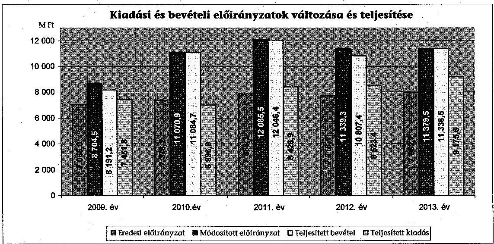

Az eredeti elöirányzat 2009. évről 2013. évre 7055,0 M Ft-ról 907,7 M Ft-tal 7962,7 M Ft-ra nőtt. A múködési költségvetési támogatás összege a 2009. évről 2013. évre nem változott, miközben az egyetemmé válást követően a foglalkoztatottak, és a hallgatók létszáma nőtt.

---

A módosított előirányzat a 2009. évben 23,4\%-kal, a 2010. évben 50,1\%kal, a 2011. évben 53,2\%-kal, a 2012. évben 46,9\%-kal, a 2013. évben 42,9\%kal haladta meg az eredeti előirányzatot. Az előirányzat módosítást döntően az előző évi előirányzat maradvány igénybevétele / átvétele határozta meg.

Az intézmény a 2009-2013. években összesen 53466 M Ft bevételt realizált és összesen 40574 M Ft kiadást teljesített. A teljesített költségvetési bevételek a 2009. évi 8191,2 M Ft-ról 11 336,4 M Ft-ra, 38,4\%-kal emelkedtek. A teljesített költségvetési kiadások összege a 2009. évi 7451,8 M Ft-ról 2013-ra 9175,6 M Ft$\mathrm{ra}, 23,1 \%$-kal nőtt.

A 2009-2013. években az éves és évközi kincstári adatszolgáltatásokat a 2010. évi I. félévi elemi költségvetési beszámoló benyújtása kivételével az előírásoknak megfelelően teljesítették. A 2010. évi féléves elemi költségvetési beszámolót az egyetem határidőn túl ${ }^{43}$ nyújtotta be a fenntartó részére.

A rendszeres és nem rendszeres személyi juttatások előirányzatának felhasználása során a pénzügyi elszámolások, valamint a gazdálkodási jogkörök gyakorlása tekintetében nem volt biztosított a jogszabályoknak és belső szabályoknak való megfelelőség, mivel a rendszeres személyi juttatások kötelezettségvállalása ellenjegyzés hiányában történt ${ }^{44}$, a nem rendszeres személyi juttatások kötelezettségvállalási dokumentumán több esetben elmaradt az ellenjegyzés ${ }^{45}$. Esetenként előfordult, hogy a kötelezettségvállalás dokumentumát - a túlóra elrendelésénél és a céljutalom kitűzésénél - nem készítették el ${ }^{46}$.

A külső személyi juttatások előirányzatai terhére megkötött megbízási szerződések kifizetése nem felelt meg teljes körűen a jogszabályoknak és a belső szabályoknak, mivel a kötelezettségvállalás dokumentumán nem minden esetben történt meg az ellenjegyzés dátumának feltüntetése ${ }^{47}$, illetve előfordult, hogy a kötelezettségvállalást nem előzte meg az ellenjegyzés ${ }^{48}$. Ez kockázatot jelez az ellenőrzött terület egészének szabályos múködése szempontjából.

A dologi kiadások előirányzatának felhasználása a pénzügyi elszámolások, valamint a gazdálkodási jogkörök gyakorlása tekintetében nem felelt meg a jogszabályoknak és belső szabályoknak. A jogszabályi előírások ellenére több esetben elmaradt a kötelezettségvállalások dokumentumán a kötelezettségvállalás ellenjegyzése ${ }^{49}$, a kiadások kifizetése során a teljesítés igazolása ${ }^{50}$, az érvé-

[^0]
[^0]:    ${ }^{43}$ Áhsz. 10. § (1) bekezdés
    ${ }^{44}$ Ámr. ${ }_{1}$ 134. § (8) bekezdés, Ámr. ${ }_{2}$ 74. § (1) bekezdés, Ávr. 55. § (1) bekezdés, Áht. ${ }_{2}$ 37. § (1) bekezdés
    ${ }^{45}$ Ámr. ${ }_{1}$ 134. § (8) bekezdés, Ámr. ${ }_{2}$ 74. § (1) bekezdés, Ávr. 55. § (1) bekezdés, Áht. ${ }_{2}$ 37. § (1) bekezdés
    ${ }^{46}$ Áht. ${ }_{1}$ 100/C. § (3) bekezdés, Áht. ${ }_{2}$ 37. § (1) bekezdés
    ${ }^{47}$ Ámr. ${ }_{2}$ 74. § (1) bekezdés, Ávr. 55. § (1) bekezdés
    ${ }^{48}$ Ámr. ${ }_{1}$ 134. § (8) bekezdés, Ámr. ${ }_{2}$ 74. § (1) bekezdés, Ávr. 55. § (1) bekezdés, Áht. ${ }_{2}$ 37. § (1) bekezdés
    ${ }^{49}$ Ámr. ${ }_{1}$ 134. § (8) bekezdés, Ámr. ${ }_{2}$ 74. § (1) bekezdés, Áht. ${ }_{2}$ 37. § (1) bekezdés
    ${ }^{50}$ Ámr. ${ }_{1} 135$ § (1) bekezdés, Ámr. ${ }_{2}$ 76. § (1) bekezdés, Ávr. 57. § (1) bekezdés

---

nyesítés ${ }^{51}$, és az utalványozás ${ }^{52}$. Előfordult, hogy az érvényesítés dátumát nem tüntették fel, ezzel nem tartották be a jogszabályi előírásokat ${ }^{53}$. A 2009. évben jegyzet vásárlására vonatkozó, 50 E Ft feletti beszerzésnél nem történt előzetes írásbeli kötelezettségvállalás, így nem feleltek meg a vonatkozó törvényben ${ }^{54}$ és a kormányrendeletben ${ }^{55}$ foglaltaknak. Előfordult, hogy képzésre vonatkozó számla kiállításakor sérült a bruttó elszámolás számviteli alapelve ${ }^{56}$, mivel az intézmény által a partner felé elkészített számla összege az egymásnak nyújtott szolgáltatások egyenlegét tartalmazta.

A dologi kiadások előirányzatának felhasználásakor a jogszabályban ${ }^{57}$ - a gazdálkodási jogkörök gyakorlására - meghatározott összeférhetetlenségi szabályokat betartották.

Az egyetem közbeszerzési eljárás mellőzésével szerzett be 2011. évben irodaszereket, nettó 10743107 Ft értékben, amelyet egy 2011. december 19-i irodaszer beszerzési számlával ért el. Az intézmény a Kbt. ${ }_{1} 40 . \S$ (1)-(4) bekezdésében meghatározott egybeszámítási szabályokat figyelmen kívül hagyva az irodaszer beszerzéssel - figyelemmel arra, hogy az ehhez kapcsolódó kifizetést megelőzően az elszámolt forgalom nettó 10496053 Ft volt, amely meghaladja az árubeszerzések esetében irányadó 8 M Ft -os értékhatárt - megsértette a Kbt. ${ }_{1}$ 2. §-ban előírt közbeszerzési törvény alkalmazásának kötelezettségét.

A felújítások, beruházások előirányzatának felhasználása során a pénzügyi elszámolások, valamint a gazdálkodási jogkörök gyakorlása nem felelt meg teljes körűen a jogszabályoknak és belső szabályoknak, mivel nem minden esetben történt meg a kötelezettségvállalás ellenjegyzése ${ }^{58}$, és a teljesítésigazolás ${ }^{59}$. Ez kockázatot jelez az ellenőrzött terület egészének szabályos múködése szempontjából.

Az analitikus nyilvántartásokban az állománynövekedés elszámolása, az eszközök bekerülési értékének meghatározása, besorolása, értékelése a jogszabályi előírásoknak és a számviteli politikában megfogalmazott követelményeknek megfelelően történt. Az üzembe helyezés dokumentálása szabályszerűen történt, az eszköz a tárgyévi mérleget alátámasztó leltárban megtalálható volt. A tárgyévi múködési költségvetés dologi kiadási előirányzatai tartalmazták azokat a forrásokat, amelyek a meglévő és az újonnan üzembe helyezett eszközök folyamatos üzemeltetéséhez, karbantartásához szükségesek voltak.

[^0]
[^0]:    ${ }^{51}$ Ámr. ${ }_{1}$ 135. § (3) bekezdés, Ámr. ${ }_{2}$ 77. § (1) bekezdés, Ávr. 58. §. (1) bekezdés
    ${ }^{52}$ Ámr. ${ }_{1}$ 136. § (1) bekezdés, Ámr. ${ }_{2}$ 78. § (1) bekezdés, Ávr. 59. §. (1) bekezdés
    ${ }^{53}$ Ámr. ${ }_{1}$ 135. § (3) bekezdés, az Ámr. ${ }_{2}$ 77. § (3) bekezdés, az Ávr. 58. § (3) bekezdés
    ${ }^{54}$ Áht. ${ }_{1}$ 100/B (3) bekezdés
    ${ }^{55}$ Ámr. ${ }_{1}$ 134. § (3) bekezdés
    ${ }^{56}$ Áhsz. 9. § (6) bekezdés
    ${ }^{57}$ Ámr. ${ }_{1}$ 138. § (1) és (2) bekezdés, az Ámr. ${ }_{2}$ 80. § (1) bekezdés, az Ávr. 60. § (1) bekezdés
    ${ }^{58}$ Ámr. ${ }_{1}$ 134. § (8) bekezdés, Ámr. ${ }_{2}$ 74. § (1) bekezdés, Áht. ${ }_{2}$ 37. § (1) bekezdés
    ${ }^{59}$ Ámr. ${ }_{1}$ 135. § (1) bekezdés Ámr. ${ }_{2}$ 76. § (1) bekezdés, Ávr. 57. § (1) bekezdés

---

Az ellátotti juttatások kifizetése során nem tartották be a belső szabályzatokban és a jogszabályokban foglaltakat. A jogszabályi előírás ellenére a 100 E Ft feletti külföldi ösztöndíjban részesült hallgatók juttatásai kifizetésénél az utalvány nem tartalmazta a kötelezettségvállalás nyilvántartási számát ${ }^{60}$, valamint az utalványrendeleten több esetben elmaradt az utalványozó aláírása $^{61}$.

Az intézményi térítési díjak, költségtérítések megállapítása nem felelt meg a jogszabályi és belső előírásoknak, mivel a hallgatói juttatások és költségtérítési díjak megállapítása a jogszabályi előírás ellenére nem alapult önköltségszámításon ${ }^{62}$.

Az irányító szerv nem élt az oktatási tevékenységgel kapcsolatban az egy hallgatóra jutó önköltség meghatározásának sajátos szakágazati követelményeinek módszertani útmutatóban történő meghatározásával ${ }^{63}$.

A szenátus az intézményi költségtérítés és térítési díjak feltételeit, megállapításának rendjét térítési és juttatási szabályzatban határozta meg. A szabályzat a hallgatók által fizetendő térítéseket és díjakat részletesen összegszerűen is tartalmazta. A hallgatók által fizetett képzési költségtérítéseket eljárási díjakat az egyetem a fenntartónak a költségvetés tervezésekor saját bevétele tervezésének részeként, valamint a szabályzat módosításakor jóváhagyásra bemutatta.

Az egyéb szolgáltatások díjszabásának megállapításához az ellenőrzött időszakban az önköltségszámításokat elvégezték, az elő és utókalkulációt elkészítették.

Az intézményi múködési bevételek beszedése a pénzügyi elszámolások, valamint a gazdálkodási jogkörök gyakorlása tekintetében nem felelt meg a jogszabályoknak és belső szabályoknak.

A teljesítés igazolása nem felelt meg a jogszabályi előírásnak és a belső szabályzatban foglaltaknak, mivel az egyetem a hatályos rendelkezések ${ }^{64}$ szerint belső szabályzatban előírta a teljesítés-igazolási kötelezettséget, azonban a gyakorlatban azt nem minden esetben teljesítette.

A hallgatóknak a befizetéseket egy az intézmény által az Erste Bank Zrt.-nél vezetett gyűjtőszámlára kellett teljesíteni. A hallgatói költségtérítések kereskedelmi banknál kezelése miatt az egyetem megsértette az Áht. ${ }_{1.2}$ rendelkezéseit ${ }^{65}$, mely szerint a kincstári kör fizetési számlái a Kincstárnál vezethetők.

[^0]
[^0]:    ${ }^{60}$ Ámr. ${ }_{1}$ 136. § (4) bekezdés h) pont, Ámr. ${ }_{2}$ 78. § (2) bekezdés g) pont, Ávr. 59. § (3) bekezdés f) pont
    ${ }^{61}$ Ámr. ${ }_{1}$ 136. § (4) bekezdés g) pont, Ámr. ${ }_{2}$ 78. § (2) bekezdés a) pont, Ávr 59. § (3) bekezdés g) pont
    ${ }^{62}$ Áhsz. 9. sz. melléklet 12. pont
    ${ }^{63}$ Áhsz. 8. § (19) bekezdés.
    ${ }^{64}$ Ámr. ${ }_{2}$ 76. § (2) bekezdés, Ávr. 57. § (2) bekezdés
    ${ }^{65}$ Áht. ${ }_{1}$ 18/C. § (5) és az Áht. ${ }_{2}$ 79. § (1) bekezdés

---

Az éves előirányzat-maradvány megállapítása során betartották a vonatkozó jogszabályi előírásokat. Az éves költségvetési beszámolók 42. úrlapján kimutatott kiadási megtakarítás, a bevételi lemaradás valamint az előirányzatmaradvány összege megegyezett a mérleg és a kapcsolódó főkönyvi számlák adatával. A szöveges beszámolóban a felhasználási jogcímenként részletezett előirányzat-maradvány összegét a számszaki beszámolóval egyező értékben rögzítették.

Az intézmény előirányzat-maradványából a központi költségvetést megillető, elvonandó előirányzat-maradvány megállapítása megfelelt a jogszabályokban ${ }^{66}$ foglaltaknak. Az egyetem az Ámr. ${ }_{2}$-ben és az Ávr.-ben foglaltak ${ }^{67}$ szerint a 2010. évtől az előirányzat-maradvány megállapításánál figyelembe vette a forgatási célú értékpapír állományt.

A kötelezettségvállalással terhelt előirányzat-maradvány megállapítása megfelelt a jogszabályban foglaltaknak, az előirányzat-maradvány feladattal való terhelését igazolták.

A fenntartó az előző évi előirányzat-maradványt jóváhagyta, a befizetési kötelezettség teljesítését 2010. május 20-án, 2011. július 24-én, 2012. június 16-án előírta. Az egyetem a 2009-2011. évben képződött előirányzat-maradványát terhelő befizetési kötelezettségét a jogszabály előirása szerint, ${ }^{68}$ és a megadott határidőben teljesítette.

# 3.5. Az egyes hazai forrásból finanszírozott projektekkel való elszámolás 

Az egyes, csak hazai forrásból finanszírozott projektekhez, feladatokhoz pályázati úton, vagy egyéb módon nyújtott költségvetési forrással való elszámolás nem felelt meg teljes körűen az előírásoknak. Ez kockázatot jelez az ellenőrzött terület szabályos múködése szempontjából.

Az intézmény a hazai forrásból finanszírozott projektekhez kapott támogatásokat szabályszerűen használta fel, a forrásokkal való elszámolások megtörténtek, azonban annak bizonylatait nem őrizték meg minden esetben. Ezzel megsértették az Sztv. ${ }^{69}$ rendelkezéseit. A finanszírozott projekteket a támogatási szerződésben meghatározott tartalommal, a rendelkezésre álló pénzügyi, finanszírozási feltételekkel, a meghatározott ütem szerint valósították meg. Az előírt pénzügyi és szakmai beszámolókat minden esetben elkészítették. Az egyetem a támogatási szerződésekben vállalt kötelezettségeket teljesítette, támogatási szerződések felmondására, támogatás visszavonására, szankció érvényesítésére nem került sor.

[^0]
[^0]:    ${ }^{66}$ Ámr. ${ }_{1}$ 66. § (6) és (10) bekezdés, Ámr. ${ }_{2}$ 208. §, Ávr. 151. § (1) bekezdés
    ${ }^{67}$ Ámr. ${ }_{2}$ 207. § (4) bekezdés, Ávr. 149. § (2) bekezdés
    ${ }^{68}$ Ámr. ${ }_{2}$ 212. § (10) bekezdés a) pont, Ávr. 154. § (1) bekezdés
    ${ }^{69}$ Sztv. 169. § (1)-(2) bekezdés

---

Az MTA Lendület program keretében a BMF majd az Óbudai Egyetem kutatócsoportjai nem nyújtottak be pályázatot az MTA fejezeti kezelésú forrásainak elnyeréséért.

# 4. AZ INTÉZMÉNY VAGYONGAZDÁLKODÁSA 

Az intézménynél a vagyonnal való felelős gazdálkodás érvényesítése, a belső szabályzatok hiányossága ellenére biztosított volt. Az intézmény a vagyonkezelésében lévő állami vagyont teljes körűen nyilvántartotta, leltárkészítési kötelezettségének eleget tett. A Feot. szerint teljesítették a saját vagyon és a rendelkezésre bocsátott vagyon elkülönített nyilvántartását.

### 4.1. A vagyongazdálkodási tevékenységek keretei

A vagyongazdálkodási tevékenység szabályozottsága részben volt megfelelő. Az intézmény kezelésében és tulajdonában lévő immateriális javak és tárgyi eszközök bérbeadási, vagyonhasznosítási folyamatát szabályozták, a szabályozás megfelelt a jogszabályi előírásoknak.

Az intézmény a Feot. előírása alapján elkészítette az IFT-ket és azok módosítását, melyeket a Feot., valamint az Nftv. előírásainak megfelelően a szenátus elfogadott.

Az intézmény szenátusa a törvényi előírás ${ }^{70}$ ellenére nem fogadott el vagyongazdálkodási tervet a 2009-2013. években. Az éves költségvetések tervezése során- az IFT-kben megfogalmazott fejlesztési és felújítási program végrehajtása érdekében - részletesen kidolgozták az adott költségvetési évben szükséges felújítási, beruházási, karbantartási feladatokat, a várható kiadásokat, és a figyelembe vehető forrásokat. Meghatározták továbbá az értékesítésre szánt ingatlanok körét, az ingatlanértékesítések várható bevételeit.

A közbeszerzési törvény hatálya alá tartozó beszerzések eljárási szabályait közbeszerzési szabályzatban határozták meg. A szabályzat tartalmazta a közbeszerzési eljárás előkészítésének, lefolytatásának általános szabályait, felelősségi, ellenőrzési és dokumentálási rendjét, valamint a nyílt, a meghívásos és a tárgyalásos eljárás szabályait. A Kbt., és a Kbt., ${ }_{2}$ hatályán kívül eső beszerzések lebonyolításával kapcsolatban eljárásrendet az egyetem a jogszabályi előírások ellenére a 2010-2013 közötti időszakra nem készített ${ }^{71}$.

A 2009-2013. május 13. között a gazdálkodási szabályzat, ezt követően az ingatlan és vagyonkezelési szabályzat tartalmazta a vagyongazdálkodás szabályait. A szabályzat megalkotásánál figyelembe vették a Vtv. előírásait, valamint a vagyonkezelési szerződésben meghatározottakat. A Vtv. 24. §-ára tekintettel rögzítették a versenyeztetési kötelezettséget, a pályázati felhívás minimális követelményeit, valamint a bérleti jogviszony létesítésének szabályait.

[^0]
[^0]:    ${ }^{70}$ Feot. 27. § (6) bekezdés d) pont, Nftv. 12. § (3) bekezdés gb) pont
    ${ }^{71}$ Ámr. ${ }_{2}$ 20. § (3) b) pont, Ávr. 13. § (2) b) pont

---

Rendelkeztek a szenátus által elfogadott ${ }^{72}$ felesleges vagyontárgyak hasznosításának és selejtezésének szabályzatával, valamint leltározási szabályzattal.

Az ellenőrzött időszakban az SZMSZ-ben, az SZMR-ben, valamint a Gazdálkodási szabályzatban határozták meg a vagyongazdálkodással kapcsolatos döntési szinteket, valamint feladat és hatásköröket.

Az egyetem a belső szabályzatokban ${ }^{73}$ meghatározta a vagyonnal történő gazdálkodás - alapfeladat ellátásához rendelkezésére bocsátott vagyon nyilvántartásának, értékelésének, hasznosításának - eljárási szabályait.

# 4.2. A vagyonváltozások és a vagyonhasznosítás szabályszerűsége 

Az intézménynél biztosított volt a vagyonváltozások és a vagyonhasznosítás szabályszerűsége.

A vagyon analitikus nyilvántartásainak vezetését a jogszabályok és a belső szabályzatok előírásai szerint végezték, a rendelkezésükre bocsátott vagyont és a saját vagyont elkülönítetten tartották nyilván.

Az intézmény könyvviteli mérlegében szereplő értékadatokat főkönyvi és analitikus nyilvántartással, valamint leltárral ${ }^{74}$ alátámasztották. A befektetett pénzügyi eszközöket, a készleteket, követeléseket, forrásokat évente, az immateriális javakat és a tárgyi eszközöket kétévente leltározták, a leltározás kétévenkénti végrehajtásához rendelkeztek az irányító szerv egyetértésével ${ }^{75}$. A leltárak kiértékelést követően egy esetben állapítottak meg leltárhiányt, melynek okát kivizsgálták, a leltárkülönbözeti jegyzőkönyvet felvették. A kimutatott leltárhiányt a főkönyvi és az analitikus nyilvántartásban szabályszerűen számolták el.

Az intézmény egy saját tulajdonú ingatlannal rendelkezett, az általa használt további ingatlanoknak vagyonkezelője volt. A Magyar Állam, mint tulajdonos képviseletében eljáró MNV Zrt.-vel a főiskola 2009. november 25 -én kötött Vagyonkezelési Szerződést ${ }^{76}$, gondoskodtak a vagyonkezelői jog bejegyeztetéséről ${ }^{77}$.

Az ellenőrzött időszakban az intézmény az állami vagyon állományáról a Vtvr. 14. § (1) és (3) bekezdéseiben előírt adatszolgáltatási kötelezettségének az MNV Zrt. részére eleget tett.

[^0]
[^0]:    ${ }^{72}$ Hatályba lépett 2008. szeptember 30-án és 2010. január 1-jén.
    ${ }^{73}$ A Számviteli Politikában, a Gazdálkodási Szabályzatban, Ingatlan- és vagyonkezelési Szabályzatban, valamint a Leltározási szabályzatban rögzítették a vagyonkezelésre vonatkozó szabályokat.
    ${ }^{74}$ Áhsz. 37. § (1)-(3) bekezdés
    ${ }^{75}$ Áhsz. 37. § (7) bekezdés
    ${ }^{76}$ Vagyonkezelési Szerződés száma: SZT-32239, melyet határozatlan időtartamra kötöttek az állami és közfeladatok teljesítése érdekében.
    ${ }^{77}$ Vtvr. 7. § (2) bekezdés szerint

---

Az ellenőrzés időszakában állami vagyonba tartozó ingatlan értékesítés, továbbá MNV Zrt. engedélyhez kötött értékesítés nem történt. A bérbeadási folyamatok során az átláthatóság előírt követelményeinek teljesüléséről meggyőződtek.

Az eszközök selejtezésének, hasznosításának előkészítése, végrehajtása, dokumentálása, ellenőrzése megfelelt a belső szabályzatok és jogszabályi előírásoknak. A selejtezésekre minden esetben a leltározás megkezdése előtt került sor. A selejtezésekről, hasznosításról elkészültek a jegyzőkönyvek, melyek alapján a selejtezett eszközöket a nyilvántartásokból kivezették.

A mérlegtételek tartalma, besorolása, értékelése nem minden esetben felelt meg a jogszabályi előírásoknak. A követelések esetében a mérlegtételek tartalma, besorolása, értékelése nem felelt meg teljes körűen a jogszabályoknak és belső szabályoknak. Ez kockázatot jelez az ellenőrzött terület szabályos működése szempontjából.

Előfordultak olyan tandíjtartozást tartalmazó több éve fennálló követelések, amelyek - az intézmény által a behajtás érdekében megtett intézkedések ellenére - nem teljesültek, a kapcsolódó mérlegtételek értékelésére, értékvesztés elszámolására nem került sor ${ }^{78}$. Az Áhsz. előírásainak megfelelően a követelések állományát rögzítő számlákat vezették, negyedévenkénti összegző kimutatást és főkönyvi feladást készítettek.

Az aktív és a passzív pénzügyi elszámolások, valamint a kötelezettségek esetében a mérlegtételek tartalma, besorolása, értékelése megfelelt a jogszabályi követelményeknek. A kötelezettségek analitikus nyilvántartásával való egyeztetéseket a jogszabályi előírásoknak megfelelően elvégezték.

Az eredményszemléletű számvitel bevezetésével kapcsolatosan az ÓE az előírt határidőben és formában elkészítette, és az EMMI számára megküldte a 2013. évi rendező mérlegét. A rendező mérleg készítésekor az NGM rendeletben előírt feladatokat, a rendező technikai tételek elszámolását megfelelően végrehajtották.

Az intézmény könyvviteli mérleg szerinti vagyona 2009. január 1-én 9 409,9 M Ft volt, amely 2013. december 31-re 12,5\%-kal 8230,0 M Ft-ra csökkent. Az előző évhez viszonyítottan a változás 2010. évben volt a legjelentősebb, amikor $8,7 \%$-kal ( $785,8 \mathrm{M}$ Ft-tal) nőtt a vagyon értéke, amit 2011-2013-ig minden évben csökkenés követett, amely alapvetően a forgatású célú értékpapírok állományának változása miatt következett be.

Az ellenőrzött időszakban a befektetett eszközök 55,4\% - 71,3\% közötti részarányt képviseltek az eszközvagyonon belül, míg a forgóeszközök részaránya $28,7 \%-44,6 \%$ között mozgott. A befektetett eszközök - mérleg szerinti - nettó értéke a 2009. január 1-ei 6009,8 M Ft-ról 2013. december 31-re 5865,7 M Ft-ra, $2,4 \%$-kal csökkent. A befektetett eszközökön belül a tárgyi eszközök részaránya volt meghatározó.

[^0]
[^0]:    ${ }^{78}$ Áhsz. 5. § 3. pont, 34. § (10) bekezdés

---

Az ingatlanok értéke a 2009. január 1-jei 4560,7 M Ft-ról 2013. december 31-re 239,0 M Ft-tal, 4799,7 M Ft-ra nőtt. Az ingatlanok tárgyi eszközökön belüli aránya növekvő tendenciájú, a 2009. évben 73,6 \%, a 2010. évben 75,7 \%, a 2011. évben 76,7 \%, a 2012. évben 72,9 \% 2013. évben 83,1 \% volt. Az ingatlanok értékének növekedését telek vásárlás, és pályázati forrásokból megvalósuló felújítások, beruházások eredményezték.

A gépek, berendezések és felszerelések eszközcsoport az ellenőrzött időszakban 1241,1 M Ft-ról 960,7 M Ft-ra csökkent, ami 22,6\%-os csökkenést jelentett. A csökkenés az évenkénti elszámolt értékcsökkenés és a beszerzési tilalom elrendelésének együttes hatása miatt következett be.

A tárgyi eszközök használhatósági foka az ellenőrzött időszakban valamennyi eszközcsoportban csökkent az amortizáció következtében, mivel az minden évben meghaladta az eszközön végrehajtott beruházások és felújítások értékét.

Az ingatlanok, azon belül az épületek használhatósági foka a 2009. évi 83,6\%ról a 2013. évre 80,2\%-ra csökkent, az építmények használhatósági foka a 2009. évi $75 \%$-ról, a 2013.évre $65,7 \%$-ra csökkent.

A használhatósági fok értéke a számítástechnikai eszközök esetében 20,4\%-ról $7,3 \%$-ra, a gépek, berendezések és felszerelések esetében $34,4 \%$-ról $25,8 \%$-ra, a járművek esetében $45,1 \%$-ról $11,5 \%$-ra csökkent.

A hároméves fenntartói megállapodásban - az ingatlanvagyon állagmegóvására, felújítására - előírt 1,5\%-os pótlási kötelezettséget az intézmény teljesítette.

A befektetett eszközökön belül a tartós részesedések értékét a mérlegben szabályszerűen mutatták ki. A részesedések könyv szerinti értéke a 20092012. években $3,1 \mathrm{M}$ Ft volt. Az intézmény részesedéseivel érintett gazdasági társaságok alapító okirataiban, illetve társasági szerződéseiben szereplő törzsbetét értéke 2009-2012. között nem változott. A 2013. évben az Alba Regia TISZSZK Kft. végelszámolással megszűnt, így az egyetem 5\%-os, 100 E Ft-os részesedését kivezette, a tartós részesedés értéke 3,0 M Ft-ra csökkent.

Az értékpapírok állományának értéke 2009. január 1-én 2325,5 M Ft-ról 2013. év végére 0 Ft-ra csökkent. Az értékpapír állományában a kincstári hálózatban értékesített forgatási célú hitelviszonyt megtestesítő diszkontkincstárjegyeket szerepeltetett, amelynek a 2009. és a 2010. évi, 2011. évi és 2012. évi értéke a könyvviteli mérlegben 1939,7 M Ft, 2627,3 M Ft, 2325,0 M Ft, és 1000,0 M Ft volt. A 2013. év végére az összes kincstárjegyet értékesítették.

Az egyetem mérleg szerinti követelései a 2009. január 1-i 332,4 M Ft-ról 2013. december 31-ére 57,0\%-kal, 142,9 M Ft-ra csökkentek. A vizsgált évek átlagában a követelések 2,9\%-a volt rövid lejáratú adott kölcsön, 96,4\%-át a vevői követelések képezték.

A kötelezettségek és a saját tőke aránya mutató a 2009. évi 4,9\%-ról 2010 évre $16,9 \%$-ra változott, ezzel együtt a szállítói kötelezettség a 2009 évi

---

18,4 M Ft-ról 2010. évre 420,7 M Ft-ra nőtt. A szállítói tartozás emelkedése az intézmény részére elrendelt ${ }^{79}$ kiadásteljesítési korláttal magyarázható. Az intézménynek hosszú lejáratú kötelezettsége az ellenőrzött öt év tekintetében nem volt.

Az intézmény mérleg szerinti kötelezettségei az egyéb passzív pénzügyi elszámolások nélkül 2009. január 1-jei 206,5 M Ft-ról 2013. december 31-i 579,7 M Ft-ra, 180,8\%-kal növekedtek. A rövid lejáratú kötelezettségek 96,3\%át a támogatási programok előlege adta, a fennmaradó 3,7\% áruszállítás és szolgáltatás teljesítéséből eredő kötelezettség volt.

# 4.3. Az intézmény tulajdonosi joggyakorlásának szabályszerűsége 

A felsőoktatási intézmény az ellenőrzött öt évben tulajdonosi jogait szabályosan gyakorolta, felelősen gazdálkodott a tartós részesedéseivel.

A tartós részesedésekkel az ellenőrzés által érintett időszak alatt az ÓE, illetve jogelődje két társaságban rendelkezett.

Az Óbudai egyetem a jogelődje által alapított, - 2007. február 2-től 2009. január 1-ig közhasznú társaságként működő - BMF Nonprofit Szolgáltató Kft. 100\%-os tulajdonrészével rendelkezett, az intézményi részesedés névértéke és könyv szerinti értéke $3,0 \mathrm{M} \mathrm{Ft}$ volt. A társaságot az egyetem, az alapító okiratának módosításával Óbudai egyetem Szolgáltató Nonprofit Kft.-vé alakította át 2013. január 15-én. A társaság a 2009-2013. években vállalkozási tevékenységet nem folytatott. Közhasznú tevékenységként - igazodva az egyetem széttagoltságához - három, az egyetem tulajdonában álló könyvesboltban a hallgatók részére jegyzet és könyvértékesítést végzett. A 2012/2013-as tanévtől egy értékesítő helyet müködtettek.

A székesfehérvári székhelyű Alba Regia Térségi Integrált Szakképzési Szervezési Közhasznú Nonprofit korlátolt felelősségű társaság (Alba Regia TISZSZK) alapítására 2009. január 1-jén, a BMF 5\%-os 100 E Ft-os saját forrásból származó alapítói részesedésével került sor. A társaság alapításában a fólskola részvétele, a részesedés aránya az intézményfejlesztési tervvel összhangban volt. Az alapítók 2013. október 1-én a társaság végelszámolással történő megszűntetéséről döntöttek a társaság szakképzési hozzájárulás bevételének csökkenése miatt. A végelszámolás befejezését követően a részesedés kivezetése a nyilvántartásokból megtörtént.

Az egyetem a tartós részesedések által érintett gazdasági társaságok esetében az alapdokumentumok kialakításakor meghatározta és érvényesítette a tulajdonosra vonatkozó vagyongazdálkodási jogokat és kötelezettségeket ${ }^{80}$. Az intézmény tulajdonában lévő gazdasági társaságok átláthatónak minősültek ${ }^{81}$. Az

[^0]
[^0]:    ${ }^{79}$ A 1268/2010. (XII. 3.) Korm. határozat által elrendelt kiadásteljesítési korlát
    ${ }^{80}$ BMF Nonprofit Szolgáltató Kft. 2009. január 1-jei alapító okirat 1. pontja; Alba Regia TISZSZK 2009. augusztus 31-i társasági szerződése 7., 9., 11. pontjai
    ${ }^{81}$ Nvtv. 3. § (1) bekezdés 1. pont

---

intézmény a részesedései után 2009-2013. években nem részesült osztalékban. A gazdasági társaságok részére működési és felhalmozási célú pénzeszközátadás, tagi kölcsön nyújtása az ellenőrzött időszakban nem történt. A tartós részesedések nyilvántartása, értékelése megfelelt a jogszabályi előírásoknak.

A gazdasági társaságokkal kapcsolatos alapítói jogokat (alapítás, végelszámolással megszüntetés, tisztségviselők megbízása és beszámoltatása, éves beszámolók elfogadása), a 2009-2013. években az intézmény szenátusa által elfogadott SZMR 45. függelékének ${ }^{82}$ megfelelő módon, a teljes ellenőrzött időszakban a rektor gyakorolta. A felsőoktatási intézmény rektora a jogszabályi előírásnak ${ }^{83}$ megfelelően, a 2009-2012. években évente jelentést készített a gazdasági tanács részére a felsőoktatási intézmény által alapított, illetve a részvételével működő társaság működéséről. A Szenátus az egyetem éves költségvetésének végrehajtásáról készített beszámolóval egyidejűleg megtárgyalta a részesedések által érintett társaságok beszámolóját, ennek részeként a mérlegbeszámolót, a közhasznúsági jelentést, és a gazdasági tanács észrevételeit, javaslatait.

# 5. A KÜLSŐ ELLENŐRZÉSEK HASZNOSULÁSA 

Az ÁSZ három korábbi ellenőrzése során a felsőoktatás témakörében kilenc javaslatot fogalmazott meg a felsőoktatásért felelős minisztériumnak (OKM, NEFMI, EMMI). A minisztérium a javaslatokra intézkedési terveket készített, amelyek összesen 10 intézkedést tartalmaztak. Az intézkedések közül hármat (késéssel) megvalósítottak, hét nem valósult meg. A megvalósult intézkedések hozzájárultak a felsőoktatási intézményrendszer jobb múködéséhez.

Elvégezték a felsőoktatási intézményrendszer kapacitás kihasználtságának felmérését. A felsőoktatási intézmények érdekeltségébe tartozó gazdasági társaságok ellenőrzése során feltárt hiányosságok kiküszöbölésére a minisztérium felszólította az intézményeket, amelyek a megtett intézkedésekről tájékoztatták a minisztériumot. A minisztérium tájékoztatást kért az érintett felsőoktatási intézményektől az 50\% alatti intézményi részesedéssel működő gazdasági társaságok tevékenységének felülvizsgálatáról, müködésük indokoltságáról és eredményességéről, valamint az intézményi részesedés megszüntetéséről és ütemezéséről.

Nem valósult meg a minisztérium felügyelete alá tartozó szervezetek feladatellátásának javítására számszerűsíthető mutatószámokon alapuló kritériumok és középtávú célrendszer kidolgozása. A felsőoktatási ágazat középtávú stratégiáját sem készítették el. Nem intézkedtek az oktatási infrastruktúra-fejlesztési programok előkészítési folyamatának hiányosságai miatti felelősség megállapítására. Nem hasznosították az állami felsőoktatási intézmények kapacitáskihasználtságával kapcsolatos felmérés eredményeit, így nem tettek intézkedést a felsőoktatási infrastruktúra közép- és hosszútávon történő hasznosítására. Nem alakítottak ki a PPP projektek támogatásához kapcsolódó követelmény-

[^0]
[^0]:    ${ }^{82}$ Az Óbudai Egyetem Szervezeti Működési Rendje 45. függeléke az Óbudai Egyetem részesedésszerzésének eljárási rendjéről, a társaságok beszámoltatási, ellenőrzési, értékelési rendszeréről, szóló szabályzat, hatályos 2013. június 29-től.
    ${ }^{83}$ A Feot. 121. § (4) bekezdés

---

rendszert. Nem került sor az oktatási infrastruktúra-fejlesztési programok lebonyolításával kapcsolatos hiányosságok (kedvezőtlen feltételű szerződéskötés és kockázatmegosztás) miatti felelősség megállapítására. Nem dolgoztatták ki az állami felsőoktatási intézményekkel azok gazdasági társaságai szakmai feladatellátásának és gazdaságossági eredményességének mérését biztosító mutatószámokat és értékelési rendszert.

A 2009-2013-as időszakban az ÁSZ három témában végzett ellenőrzést az intézményt érintően.
1171. sz. Jelentés a felsőoktatás oktatási infrastruktúra-fejlesztési programjának ellenőrzéséről, 1287. sz. Jelentés a PPP konstrukcióban megvalósult kiemelt kulturális és felsőoktatási projektek szerződéseinek teljesülése és társadalmi hasznosulásának ellenőrzéséről, 1290. sz. Jelentés az állami felsőoktatási intézmények érdekeltségébe tartozó gazdasági társaságok támogatásának és nyereségük hasznosulásának ellenőrzéséről.

A jelentések intézkedési javaslatokat a felügyeleti szerv részére fogalmaztak meg, az egyetemnek intézkedési terv készítési kötelezettsége nem volt.

Az intézménynél hasznosultak az egyéb külső ellenőrzések javaslatai. Az OKM, mint fenntartó 2009-ben rendszer- és szabályszerűségi ellenőrzést végzett a főiskola 2008. évi testületi döntési mechanizmusainak működéséről. Jelentésében javaslatot tett a vezetői döntéseket támogató információs rendszer mielőbbi bevezetése és működtetése érdekében. Az intézmény elkészítette az intézkedési tervét, melynek végrehajtásáról a fenntartót tájékoztatták.

A fenntartó beruházási főosztálya 2009-ben komplex szakmai ellenőrzés címmel a BMF ingatlanfejlesztés, vagyongazdálkodás, szolgáltatásvásárlási tevékenysége (PPP beruházások) területén végzett ellenőrzést. Ellenőrzési jelentésében felhívta a figyelmet a monitoring rendszer működtetésére vonatkozó előírások betartására. Az egyetem az intézkedési terv készítési kötelezettségének, a végrehajtásáról szóló tájékoztatási kötelezettségének eleget tett.

# 6. Az intézmény átalakítÁsa 

A BMF szenátusa SZ-XXXIX/67/2009. számú határozatában ${ }^{84}$ felhatalmazta a rektort, hogy kezdeményezze a Magyar Országgyúlésnél az intézmény egyetemmé nyilvánítását, s Óbudai Egyetem néven való bejegyzését. A főiskola a törvény erejénél fogva alakult át Óbudai Egyetemmé, ezért az intézmény létrehozását megelőző fenntartói feladatok teljesítésére ezt követően került sor. A 2009. évi CXXXVIII. törvény módosította a Feot. 1. számú mellékletét, az állami főiskolák felsorolásából törölte ${ }^{85}$ a BMF-et, az állami egyetemek alcím alá pedig felvette ${ }^{86}$ az ÓE-t.

[^0]
[^0]:    ${ }^{84}$ 2009. szeptember 7-i ülésén
    ${ }^{85}$ 2009. évi CXXXVIII. törvény 49. § f) pont
    ${ }^{86}$ 2009. évi CXXXVIII. törvény 45. §

---

A BMF a 2009. évi CXXXVIII. törvény 49. §-a alapján 2010. január 1-jétől egyetemként folytatta további múködését.

# A fenntartó az átalakításhoz kapcsolódó alapítói, irányítói, felügye- 

leti feladatainak ellátásánál részben felelt meg a jogszabályoknak. A Feot. módosítására tekintettel a minisztérium 2009-ben átalakította az intézményt, az átalakításról határozatban ${ }^{87}$ rendelkezett. A BMF 2009. december 31-én beolvadással megszűnt, valamennyi közfeladatát általános jogutódként a 2010. január 1-jétől létrehozott ÓE - a Feot. módosítása értelmében - állami egyetemként látta el. Az ÓE rektori és gazdasági vezetői feladatainak ellátására - a jogszabályoknak megfelelő eljárások lefolytatása után - a megszűnt intézmény rektora és gazdasági főigazgatója kapott ismételten vezetői megbízást.

A fenntartó kiadta a megszüntető ${ }^{88}$, illetve alapító ${ }^{89}$ okiratot, a dokumentumok a tartalmi előírásoknak ${ }^{90}$ egy kivétellel megfeleltek. A Jogállási tv. rendelkezése ${ }^{91}$ szerint a megszüntető jogszabályban (határozatban) kellett megjelölni azt a naptári napot ameddig a megszűnő költségvetési szerv utoljára kötelezettséget vállalhat. A fenntartó a megszüntetésről szóló OKM határozat helyett a megszüntető okiratban rendelkezett arról, hogy a BMF 2009. december 31-én vállalhat utoljára kötelezettséget, amely nem okozott jogosulatlan kötelezettségvállalást. A BMF megszüntetésének kihirdetésénél a Jogállási tv.-ben ${ }^{92}$ meghatározott 45 napos határidő nem teljesülhetett mert a Feot. módosításának kihirdetése (2009. november 24.) és a hatálybalépése (2010. január 1.) közötti időtartam ezt nem tette lehetővé.

A minisztérium az Ámr.1-ben ${ }^{93}$ foglaltaknak megfelelően a BMF megszüntetését megelőzően a megszüntető határozat, illetve okirat kiadásával gondoskodott a közfeladat jövőbeni ellátása módjának, illetve szervezeti formájának meghatározásáról, a BMF valamennyi joga, kötelezettsége - ideértve valamennyi vagyoni jogot és előirányzatot - tekintetében az ÓE-t jelölte meg jogutódnak. A minisztérium intézkedett ${ }^{94}$ az OH felé a működési engedély BMF-től történő visszavonásáról, illetve az ÓE részére kiadásáról 2010. január 1-jei hatállyal ${ }^{95}$. Az intézményi átalakításhoz kapcsolódóan a fenntartó kezdeményezte a Kincstár által vezetett törzskönyvi nyilvántartás módosítását, a BMF kincs-

[^0]
[^0]:    ${ }^{87}$ 3/2009. (XII. 31.) OKM határozat a BMF megszüntetéséről és 4/2009. (XII. 31.) OKM határozat az ÓE létesítéséről
    ${ }^{88} 30734-1 / 2009 /$ OKM
    ${ }^{89} 30733-1 / 2009 /$ OKM
    ${ }^{90}$ A megszüntetésről rendelkező jogszabály (határozat) tartalmát a Jogállási tv. 13. § (2) bekezdése, a megszüntető okirat tartalmát az Ámr., 11. § (2) bekezdése, az alapító okirat tartalmát a Jogállási tv. 4. §-a szabályozta
    ${ }^{91}$ Jogállási tv. 13. § (2) bekezdés
    ${ }^{92}$ Jogállási tv. 13. § (1) bekezdés szerint az átalakításról, megszüntetésről - az alapításnak megfelelően - jogszabályban vagy határozatban kell rendelkezni, melyet legalább negyvenöt nappal az átalakítás, megszüntetés kérelmezett napja előtt ki kell hirdetni.
    ${ }^{93}$ Ámr., 11. § (1) bekezdés
    ${ }^{94}$ Az OKM 300093-4/2009. számú intézkedése
    ${ }^{95}$ OH-FHF/2571-1-2/2009. számú intézkedés

---

tári számláinak megszűnését, az ÓE számláinak megnyitását. Az OKM intézkedésére a Kincstár az ÓE törzskönyvi nyilvántartásba történő bejegyzéséről ${ }^{96}$, a BMF nyilvántartásból törléséről ${ }^{97}$ 2009. december 30-án határozatot adott ki, valamint gondoskodott a számlák megszüntetéséről és megnyitásáról.

A minisztérium a BMF megszűnését megelőzően nem gondoskodott az eszközök és a források leltározásáról, a költségvetési beszámoló elkészítéséről, a vagyonátadásról. A minisztérium a 2009. évi beszámoló elkészítésére - 2010. évben kiadott - körlevélben határozta meg az átalakulással kapcsolatosan ellátandó költségvetési feladatokat, így késve a BMF megszűnését követően teljesítette az Ámr.1-ben foglaltakat ${ }^{98}$. Az Áhsz.-ben előírtak szerint ${ }^{99}$ a megszűnő BMF - az éves elemi költségvetési beszámolónak megfelelő tartalommal - elkészített és felülvizsgált beszámolóját az államháztartásért felelős miniszterhez a megszűnés napját követő 120 napon belül a fenntartó megküldte. A költségvetési beszámolót, illetve a vagyonátadás-átvételről készített beszámoló egy-egy aláírt a felügyeleti szervi egyetértő záradékával ellátott - példányát a minisztérium megőrizte, a vagyonátadás-átvételről jegyzőkönyv nem készült ${ }^{100}$.

A felsőoktatási intézmény átalakulása előtti bejelentési, szakmai és számviteli, továbbá vagyonátadási feladatai teljesültek. Az általános jogutódlásra, illetve a megszüntető határozat keltére tekintettel a bejelentési, számviteli, vagyonátadási feladatokat a jogutód intézmény teljesítette.

Az átalakulás előtti szervezet számviteli feladatai teljesültek az irányító szerv által meghatározott fordulónapra. A BMF éves gazdálkodásáról a 2009. december 31-i megszűnés fordulónapjával az ÓE az éves költségvetési beszámolót 2010. február 28-ig elkészítette. A beszámolót a fenntartó ellenőrizte. A költségvetési szerv megszűnésével, átszervezésével, illetve alapításával kapcsolatos átvezetéseket az átadó és az átvevő intézmény a könyveiben elvégezte. A vagyonátadási jelentést az intézmény 2010 májusában elkészítette.

A megszűnés fordulónapja megegyezett a költségvetési év végével ezért előirányzatok átadására nem került sor.

A felsőoktatási intézmény átalakítás utáni bejelentése a Kincstárnál megvalósult. A fenntartó 2009. december 30-án intézkedett a BMF kincstári számláinak megszüntetéséről. A kincstári kártyaszámlák, és devizaszámlák megszüntetésére 2010. február 17-18-án, egy céleisszámolási számla és az elői-rányzat-felhasználási keretszámla megszüntetésére 2010. május 18-án került sor. A jogutód ÓE az eszközök és források átvételét a megszűnt BMF mérlegadataival egyezően elszámolta. Az Áhsz. 13/A. § (6) bekezdésének megfelelően a megszűnés napjára készített éves költségvetési beszámoló, aláírt példányát - a fenntartó egyetértő záradékával ellátva - megőrizte.

[^0]
[^0]:    ${ }^{96} 88 / 773065 / 2 / 2009$. iktatószámon kiadott határozat
    ${ }^{97} 88 / 329837 / 16 / 2009$. iktatószámon kiadott határozat
    ${ }^{98}$ Ámr. ${ }_{1}$ 11. § (1) bekezdés b) pont
    ${ }^{99}$ Áhsz. 10. § (14) bekezdés
    ${ }^{100}$ Áhsz. 13/A. § (6) bekezdésének

---

Az intézmény 2010. február 3-án kezdeményezte az APEH-nál a jogelőd és a jogutód intézmények törzsadatainak rendezését, folyószámlájának összevezetését, melynek megtörténtéről május 21-én kapott értesítést. ${ }^{101}$

# 7. Az integritÁs Kontrollok kialakítÁsa És múködtetése 

Az egyetem az ellenőrzött időszakban erőfeszítéseket tett az integritási szemlélet fejlesztésére, valamint a korrupciós kockázatok csökkentésére, a 2013. évben önként kitöltötte az ÁSZ integritási kérdőívét. Az ellenőrzés keretében egy rövidített - a kontrollrendszerre összpontosító - kérdőív kitöltésére került sor. A kérdőívben előzetesen meghatározott öt szempont alapján értékelte az integritás kontrollok kiépítettségét és múködtetését. Ennek értékelését az 1. számú Függelék tartalmazza.

Budapest, 2015. 03 . hó 05. nap
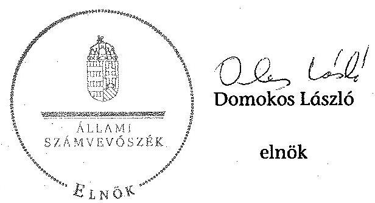

Melléklet: $\quad 7 \mathrm{db}$
Függelék: $\quad 1 \mathrm{db}$

[^0]
[^0]:    ${ }^{101} 2556436474$ iktatószámú APEH intézkedés

---

.

---

1. GZÁSÁŰ MELŐSZET A V-2019-OSCISCIJ. GZÁSÁŰ ELEKTŐJÁSZ

Az Ólindul Egyetem (2009. december 31-ig Endespert Mészoki Főiskola) kiadani és bevételi előirányzatai, azok teljesítése a 2009-2013. években

|  No. | Megnevezés | Szadati előirányzatai | Szadati előirányzatai | Választás | Szadati előirányzatai | Szadati előirányzatai | Választás | Szadati előirányzatai | Szadati előirányzatai | Választás | Szadati előirányzatai | Szadati előirányzatai | Választás | Szadati előirányzatai | Szadati előirányzatai | Választás  |
| --- | --- | --- | --- | --- | --- | --- | --- | --- | --- | --- | --- | --- | --- | --- | --- | --- |
|  1. | KIADÁSOK |  |  |  |  |  |  |  |  |  |  |  |  |  |  |   |
|  2. | Személyi joberások | 2 798 671 | 3 379 670 | 2 986 302 | 3 192 038 | 4 185 760 | 3 710 455 | 3 373 938 | 4 680 919 | 3 268 033 | 3 373 905 | 4 112 088 | 3 233 076 | 3 000 400 | 4 127 375 | 5 506 729  |
|  3. | Hiznámolót terhező járulások | 956 071 | 1 007 634 | 867 772 | 881 381 | 1 169 317 | 691 839 | 920 881 | 1 202 876 | 854 684 | 909 900 | 1 087 275 | 853 498 | 916 900 | 1 033 000 | 905 508  |
|  4. | Töröngi kiadások (100000000000000000000000000000000000000000000000000000000000000000000000000000000000000000000000000000000000000000000000000000000000000000000000000000000000000000000000000000000000000000000000000000000

---

.

---

#### Az Óbudal Egyetem (2009. december 31-ig Budapesti Műszaki Főiskola) kiadósainak, bevételesnek változása a 2009-2013. években

|   |  |  |  |  |  |  | adatok ezer 1t-ban |   |
| --- | --- | --- | --- | --- | --- | --- | --- | --- |
|   |  | 2009. év | 2010. év | 2011. év | 2012. év | 2013. év | 2013/2009 |   |
|  Sze. | Megnevezés | Teljesítés | Teljesítés | Teljesítés | Teljesítés | Teljesítés |  |   |
|   | **KIADÁSOK** |  |  |  |  |  |  |   |
|  1. | Személyi juttatások | 2 984 362 | 2 716 485 | 3 268 035 | 3 233 074 | 3 564 729 | 119,4% |   |
|  2. | Rendszerek és nem rendszeres | 2 781 246 | 2 472 895 | 2 521 441 | 2 405 780 | 2 406 532 | 86,5% |   |
|  3. | Rendszerek személyi juttatás | 2 215 028 | 2 141 035 | 1 832 576 | 1 948 980 | 1 983 557 | 89,6% |   |
|  4. | Alaptőelmény | 1 686 658 | 1 692 294 | 1 670 034 | 1 786 433 | 1 830 122 | 108,5% |   |
|  5. | Nem rendezvén | 566 318 | 531 857 | 688 865 | 436 800 | 421 175 | 74,4% |   |
|  6. | Munkovégzetében kapcs juttatások | 236 315 | 104 416 | 469 059 | 272 122 | 208 429 | 88,2% |   |
|  7. | Normatív és teljesítéshez kötött jutalom | 167 210 | 61 320 | 321 739 | 155 772 | 117 909 | 70,5% |   |
|  8. | Átjud személyi juttatások | 203 016 | 242 593 | 746 594 | 827 294 | 1 158 197 | 570,5% |   |
|  9. | Munkosidőt torkelő járulékok | 867 772 | 691 859 | 834 684 | 852 698 | 905 048 | 104,3% |   |
|  10. | Dologi és folyó kiadások | 2 066 542 | 2 151 650 | 2 475 725 | 2 408 064 | 2 983 375 | 144,4% |   |
|  11. | Dologi kiadások | 2 032 748 | 2 002 750 | 2 388 752 | 2 292 456 | 2 722 790 | 135,2% |   |
|  12. | Kizárisfezerzés | 170 937 | 194 629 | 224 594 | 241 792 | 153 347 | 79,5% |   |
|  13. | Kommunikációs szolgáltatás | 67 464 | 102 463 | 72 628 | 100 439 | 83 154 | 123,3% |   |
|  14. | Szolgáltattal kiadások | 983 081 | 860 650 | 1 192 000 | 1 123 950 | 1 091 170 | 110,8% |   |
|  15. | Bártár és dáting | 587 320 | 572 057 | 578 525 | 604 624 | 631 547 | 107,5% |   |
|  16. | Előző PPP | 375 004 | 374 097 | 387 859 | 404 325 | 402 352 | 107,3% |   |
|  17. | Gás, villany, vás | 209 447 | 193 306 | 225 129 | 264 764 | 220 445 | 105,3% |   |
|  18. | Működési célú ÁFA | 407 374 | 415 661 | 461 747 | 467 828 | 329 575 | 80,9% |   |
|  19. | Kárisfezerzés | 62 129 | 60 152 | 92 170 | 115 845 | 113 145 | 182,1% |   |
|  20. | Szelíteni tevékenység | 32 061 | 32 538 | 56 341 | 17 962 | 0 | 0,0% |   |
|  21. | Egyéb feljolt kiadások | 30 784 | 148 900 | 87 000 | 114 608 | 230 582 | 749,0% |   |
|  22. | Előző évi maradvány visszafizetés | 5 179 | 3 496 | 7 097 | 37 834 | 0 | 0,0% |   |
|  23. | Ádok, díjak, egyéb befizetések | 55 389 | 84 129 | 79 438 | 76 428 | 73 879 | 291,0% |   |
|  24. | Előző évi előremenyítéki átadás | 0 | 0 | 0 | 2 701 | 0 | 0,0% |   |
|  25. | Alap- és vállalkozási tevékenység közötti elszámolások | 6 450 | 0 | 0 | 0 | 0 | 0,0% |   |
|  26. | Előzőtartó pénzbeli juttatások | 940 923 | 1 005 018 | 1 006 141 | 1 072 726 | 1 088 711 | 115,7% |   |
|  27. | Egyéb juttatás | 0 | 0 | 0 | 0 | 0 | 0,0% |   |
|  28. | Támogatásértékű működési kiadások | 4569 | 296 | 6500 | 3599 | 5084 | 111,3% |   |
|  29. | Működési célú pénzesekintés | 26745 | 14015 | 73 | 2581 | 0 | 0,0% |   |
|  30. | Felhalmozási kiadások | 548 995 | 415 734 | 825 708 | 947 943 | 626 622 | 114,1% |   |
|  31. | Intézményt beruházási kiadások | 415 435 | 288 979 | 575 386 | 528 941 | 428 260 | 103,1% |   |
|  32. | Előző ingatlan | 4 796 | 3 367 | 964 | 122 484 | 272 559 | 5685,0% |   |
|  33. | Gépek, berendezősek, felzserelések | 371 337 | 253 718 | 423 136 | 337 270 | 152 171 | 41,0% |   |
|  34. | Felújítás | 45 140 | 39 156 | 119 441 | 280 179 | 82 679 | 183,2% |   |
|  35. | Előző ingatlan (Átípus) | 44 038 | 39 136 | 119 441 | 280 179 | 82 679 | 187,7% |   |
|  36. | Központi beruházási kiadások ÁFA-val | 0 | 0 | 0 | 0 | 0 | 0,0% |   |
|  37. | Támogatásértékű felhalmozási kiadások | 1244 | 0 | 0 | 0 | 0 | 0,0% |   |
|  38. | Közzetés | 4 200 | 1 800 | 10 000 | 1 000 | 2 000 | 47,6% |   |
|  39. | Összesen | 7 451 808 | 6 996 854 | 8 426 873 | 8 523 386 | 9 175 569 | 123,1% |   |
|   | **BEVÉTELEK** |  |  |  |  |  |  |   |
|  40. | Működési bevételők | 2 342 284 | 2 641 679 | 2 892 554 | 2 508 343 | 2 506 748 | 149,7% |   |
|  41. | Intézményt működési bevétel | 2 067 333 | 2 096 481 | 2 167 435 | 2 032 795 | 1 852 535 | 89,6% |   |
|  42. | Szolgáltatások előreértéke | 1 379 527 | 1 475 019 | 1 498 623 | 1 384 865 | 1 361 671 | 98,7% |   |
|  43. | Intézményt eljátéki díjak | 257 063 | 296 385 | 361 653 | 343 373 | 328 217 | 118,5% |   |
|  44. | Hozom és kontaktbevétel | 226 832 | 116 942 | 96 420 | 151 818 | 53 363 | 14,7% |   |
|  45. | Működési célú pénzesekintés | 178 245 | 235 101 | 251 461 | 136 419 | 138 252 | 77,6% |   |
|  46. | Előző azalai forrás | 0 | 0 | 0 | 0 | 0 | 0,0% |   |
|  47. | Támogatásértékű működési bevétel | 96 600 | 310 097 | 473 658 | 339 129 | 1 515 981 | 1569,2% |   |
|  48. | Felhalmozási bevételők | 336 820 | 314 320 | 316 963 | 311 160 | 492 185 | 146,1% |   |
|  49. | Felhalmoztat célú pénzesekintés | 323 423 | 213 121 | 269 894 | 1 792 | 300 | 0,3% |   |
|  50. | Előző azalai forrás | 55 500 | 0 | 0 | 0 | 0 | 0,0% |   |
|  51. | Támogatásértékű felhalmozási bevétel | 13 972 | 102 199 | 6 774 | 269 368 | 491 482 | 3517,6% |   |
|  52. | Felhalmoztat célú kontaktbevétel | 0 | 0 | 40 000 | 0 | 0 | 0,0% |   |
|  53. | Támogatási kölcsönök visszatérítése és igénybevétel | 4 200 | 1 800 | 10 000 | 1 000 | 2 000 | 47,6% |   |
|  54. | Irányító szervek kapott támogatás | 4 989 910 | 4 061 953 | 4 806 658 | 4 223 838 | 4 983 800 | 99,9% |   |
|  55. | EU programokra működdel bevétel | 0 | 0 | 0 | 0 | 0 | 0,0% |   |
|  56. | EU programokra felhalmozási bevétel | 0 | 0 | 0 | 0 | 0 | 0,0% |   |
|  57. | Előző évi maradvány átvétel | 1 500 | 3 064 906 | 0 | 41 600 | 0 | 0,0% |   |
|  58. | Előremenyítéki maradvány felhasználás | 516 434 | 0 | 4 020 205 | 3 619 506 | 2 551 720 | 455,4% |   |
|  59. | Összesen | 8 191 248 | 11 084 718 | 12 046 379 | 10 807 447 | 11 336 453 | 138,4% |   |

---

.

---

# Kintutatás az Óbadai Egyetem (2009. december 31-ig Budapesti Műszaki Főiskolaj bevételeiről és kiadásairól, valamint adósságszolgálatáról o 2009-2013. években

|  Sz. | ÜZ-nyil. | 2009. év | 2010. év | 2011. év | 2012. év | 2013. év  |
| --- | --- | --- | --- | --- | --- | --- |
|   |  |  |  |  |  | 2012. év  |
|  1. | 1. FOLYÓ KÖLTEÉGVEYES |  |  |  |  |   |
|  2. | 1.1.1. Hattinikai jogkötékű köthető ártalasságrát, egyéb saját, illetve ÁrA bevételek | 1 840 698 | 1 979 559 | 2 070 981 | 1 900 877 | 1 819 691  |
|  3. | 1.1.2. Szakciókötő kötelegyedés tájékoztatása | 4 821 696 | 4 883 560 | 4 738 444 | 4 296 538 | 4 505 600  |
|  4. | 1.1.3. Tájékoztatások a működési bevételek | 94 606 | 310 097 | 473 634 | 320 129 | 1 315 981  |
|  5. | 1.1.4. Fő-66 és kültülnéző ütvett pénzbesételek | 94 201 | 99 201 | 12 001 | 2 880 | 3 338  |
|  6. | 1.1.5. Szakciókötő célú jogelőt pénzbesételejévévé állomásárcsátáson kínáljuk | 79 956 | 135 900 | 236 460 | 133 534 | 132 893  |
|  7. | 1.1.6. Hossam- és komorbovétekek | 0 | 116 943 | 96 420 | 131 818 | 32 884  |
|  8. | 1.1.7. Külvetésük mozgásbővés, tájékoztatása | 0 | 0 | 0 | 0 | 0  |
|  9. | 1.1.8. Ebből évt vállalkozási mozgásbővés, pátszámasdíjány jövővé | 836 | 2 523 473 | 0 | 31 890 | 0  |
|  10. | 1.1. Folyó bevételek (1.1.1.+1.1.3.+1.1.3.+1.1.4.+1.1.5.+1.1.6.+1.1.7.+1.1.8.) | 6 937 743 | 10 059 104 | 7 630 964 | 6 886 281 | 8 402 846  |
|  11. | 1.2.1. Szakciókötő kiadások komorbosításai nélkül (68691+02+03+04+05+06+07+08+09+07+10) | 5 918 676 | 5 559 994 | 6 578 451 | 6 493 836 | 7 453 152  |
|  12. | 1.2.2. Tájékoztatások a működési kiadások | 4 389 | 299 | 6 500 | 2 599 | 3 084  |
|  13. | 1.2.2.1. Vállalkozásokok | 433 | 1 666 | 0 | 0 | 0  |
|  14. | 1.2.2.2. Fő-nek, illetve külföldre | 20 755 | 7 113 | 0 | 0 | 0  |
|  15. | 1.2.2.3. Hatalmazóvágyakok | 0 | 2 263 | 0 | 682 | 0  |
|  16. | 1.2.2.4. Hátgondó gyuvacslakok | 2 327 | 110 | 72 | 1 299 | 0  |
|  17. | 1.2.2.5. Igazadó és kizárószobolódói szétfőszó kötvét | 0 | 0 | 0 | 0 | 0  |
|  18. | 1.2.3. Szakciókötő célú pénzbesételek (+1.2.3.1+1.2.3.2+1.2.3.3.+1.2.3.4.+1.2.3.5.) | 36 743 | 14 013 | 73 | 2 581 | 0  |
|  19. | 1.2.4. Vízóvalalágy, tájékoztatások és egyéb jóvalalágy, tájékoztatása | 0 | 0 | 0 | 0 | 0  |
|  20. | 1.2.5. Külvetésük pénzbeí bátadások | 940 933 | 1 005 018 | 1 006 141 | 1 072 726 | 1 088 711  |
|  21. | 1.2.6. Komorbosítások | 0 | 0 | 0 | 0 | 0  |
|  22. | 1.2.7. Külvetésük nyújtása, tájékoztatása | 0 | 0 | 0 | 0 | 0  |
|  23. | 1.2.8. Ebből évt vállalkozási mozgásbőv és felhős | 0 | 0 | 0 | 2 701 | 0  |
|  24. | 1.3. Folyó kiadások (1.3.1.+1.3.2.+1.3.3.+1.3.4.+1.3.5.+1.3.6.+1.3.7.+1.3.8.) | 6 890 913 | 6 579 320 | 7 591 162 | 7 574 443 | 8 546 947  |
|  25. | 1.3. Folyó költségvetés egységben, működési jövedelem (1.1. - 1.2.) | 46 832 | 3 479 784 | 39 799 | -727 862 | 144 599  |
|  26. | 1.3.1. Az előző évt vállalkozási mozgásbőv tájékoztatási levegésben (1.1. - 1.2. - 1.3.1.1.1.1.1.1.1.2.1.1.2.1.2.1.2.1.2.1.2.1.2.1.2.1.2.1.2.1.2.1.2.1.2.1.2.1.2.1.2.1.2.1.2.1.2.1.2.1.2.1.2.1.2.1.2.1.2.1.2.1.2.1.2.1.2.1.2.1.2.1.2.1.2.1.2.1.2.1.2.1.2.1.2.1.2.1.2.1.2.1.2.1.2.1.2.1.2.1.2.1.2.1.2.1.2.1.2.1.2.1.2.1

---

.

---

Az Óbudul Egyetem (2009. december 31-ig Budapesti Műszaki Főiskola) mérlegudatni a 2009-2013. években

|  Sz. | Megnevezés | 2009. év | 2010. év | 2011. év | 2012. év | 2013. év | Adatok ezer Ft.huH  |
| --- | --- | --- | --- | --- | --- | --- | --- |
|  1. | IMMATERIALIS JAVAK | 69 657 | 56 649 | 75 046 | 113 277 | 81 422 | 116,9%  |
|  2. | Vagyozó értékű jogok | 17 311 | 20 152 | 21 509 | 80 255 | 68 295 | 394,5%  |
|  3. | Szellemi termékek | 49 801 | 34 052 | 53 537 | 33 022 | 13 127 | 26,4%  |
|  4. | Immateriális javakos adott előlegek | 2 545 | 2 445 | - | - | - | 0,0%  |
|  5. | TÁRGYI ESZKÖZÖK | 5 409 275 | 5 404 098 | 5 383 623 | 5 911 279 | 5 777 316 | 106,8%  |
|  6. | Ingatlanok és kapcsolódó vagyonértékű jogok | 3 979 955 | 4 090 756 | 4 127 351 | 4 308 450 | 4 799 708 | 120,6%  |
|  7. | Gépek, berendezések, felszerelések | 1 286 753 | 1 247 360 | 1 205 975 | 1 329 272 | 960 721 | 74,7%  |
|  8. | Járművek | 37 051 | 26 315 | 22 421 | 19 340 | 10 489 | 28,3%  |
|  9. | Beruházások, felújítások | 105 538 | 39 667 | 27 876 | 254 317 | 6 398 | 6,1%  |
|  10. | BEFEKTETETT PÉNZÜGYI ESZKÖZÖK | 10 810 | 9 853 | 15 152 | 9 588 | 7 004 | 64,8%  |
|  11. | Tartós elszserlés | 3 100 | 3 100 | 3 100 | 3 100 | 3 000 | 96,8%  |
|  12. | Tettinasi adott kölcsön | 7 710 | 6 753 | 12 052 | 6 488 | 4 004 | 51,9%  |
|  13. | ÜZEMELTETÉSRE KEZELÉSRE ÁTADOTT VAGYONKEZELÉSRE VETT ESZKÖZÖK | - | - | - | - | - | -  |
|  14. | BEFEKTETETT ESZKÖZÖK ÖSSZESEN | 5 489 742 | 5 470 600 | 5 473 821 | 6 034 144 | 5 865 742 | 106,8%  |
|  15. | KÉSZLETEK | 52 772 | 52 491 | 54 619 | 70 220 | 39 429 | 74,7%  |
|  16. | Anyugok | 3 373 | 3 983 | 3 866 | 4 026 | 3 751 | 111,2%  |
|  17. | Eksztermékek | 12 180 | 7 828 | 8 237 | 15 681 | - | 0,0%  |
|  18. | Áruk, göngyölegek, közvetített szolgáltatások | 37 220 | 40 680 | 42 316 | 50 513 | 35 678 | 95,9%  |
|  19. | KÖVETELÉSEK | 295 887 | 230 205 | 222 787 | 217 920 | 142 854 | 48,3%  |
|  20. | Követelések áruspólításból és szolgáltatásból | 240 133 | 221 886 | 314 719 | 208 653 | 137 739 | 57,4%  |
|  21. | Bővíd lejáratú adott kölcsönök | 45 921 | - | - | 5 200 | 4 112 | 9,0%  |
|  22. | Egyéb követelések | 9 833 | 8 319 | 8 068 | 4 067 | 1 003 | 10,2%  |
|  23. | Előző: támogatási program előlegek előfinanszírozás | 1 727 | - | - | - | - | 0,0%  |
|  24. | ÉRTÉKPAPÍBOK | 1 939 717 | 2 627 296 | 2 325 046 | 999 996 | - | 0,0%  |
|  25. | Forgaléki célú hiteleszmeget megtestesítő értékpapír helyettifési (könny szerteti) értéke | 1 939 717 | 2 627 296 | 2 325 046 | 999 996 | - | 0,0%  |
|  26. | PÉNZESZKÖZÖK | 1 200 835 | 1 435 258 | 1 286 005 | 1 044 783 | 1 889 076 | 157,5%  |
|  27. | Költségvetési pénzforgalmi számúik | - | 26 265 | 29 771 | 22 108 | 22 291 | -  |
|  28. | Üzzőmoldal számúik | 1 168 579 | 1 387 318 | 1 251 485 | 1 015 456 | 1 845 970 | 158,0%  |
|  29. | Idegen pénzeszközök | 32 256 | 21 873 | 4 749 | 7 219 | 20 815 | 64,5%  |
|  30. | EGYÉB AKTÍV PÉNZÜGYI ELSZÁMOLÁSOK | 103 707 | 52 596 | 137 420 | 316 651 | 292 859 | 382,4%  |
|  31. | FORGÓESZKÖZÖK ÖSSZESEN | 3 592 918 | 4 397 846 | 4 125 877 | 2 649 570 | 2 364 218 | 65,8%  |
|  32. | ESZKÖZÖK ÖSSZESEN | 9 082 660 | 9 068 446 | 9 599 698 | 8 082 714 | 8 229 960 | 90,4%  |
|  33. | JÁJÁT TŐKI | 5 567 506 | 4 926 698 | 5 420 751 | 5 737 856 | 5 478 541 | 98,4%  |
|  34. | Tartás tőke | 1 035 147 | 5 567 506 | 5 567 506 | 5 567 506 | 5 567 506 | 537,8%  |
|  35. | Előző: kezelésre vett eszközök | - | 5 567 502 | 5 567 502 | 5 567 506 | 5 567 506 | -  |
|  36. | Tőkeváltozások | 4 532 559 | 640 808 | 146 755 | 170 350 | 88 965 | -2,0%  |
|  37. | Előző: kezelésre vett eszközök tőkeváltozása | - | 640 808 | 146 755 | 170 350 | 88 965 | -2,0%  |
|  38. | TARTALÉKOK | 3 064 966 | 4 087 864 | 3 687 165 | 2 351 720 | 2 160 884 | 70,5%  |
|  39. | Költségvetési tartalékok | 3 064 966 | 4 087 864 | 3 687 165 | 2 351 720 | 2 160 884 | 70,5%  |
|  40. | KÖTELEZETTSÉGEK | 450 108 | 853 884 | 491 782 | 594 138 | 590 535 | 131,2%  |
|  41. | Hosszú lejáratú kötelezettségek | - | - | - | - | - | -  |
|  42. | Bővíd lejáratú kötelezettségek | 574 611 | 833 457 | 432 539 | 590 713 | 579 748 | 211,1%  |
|  43. | Kötelezettségek áruspólí, szolgáltatások | 18 574 | 420 701 | 18 286 | 15 671 | 5 094 | 44,1%  |
|  44. | Egyéb kötelezettségek | 256 237 | 412 756 | 414 033 | 575 042 | 571 654 | 233,1%  |
|  45. | EGYÉB PASSZÍV PÉNZÜGYI ELSZÁMOLÁSOK | 175 577 | 20 427 | 59 443 | 3 425 | 10 787 | 6,1%  |
|  46. | FORRÁSOK ÖSSZESEN | 9 082 660 | 9 068 446 | 9 599 698 | 8 683 714 | 8 229 960 | 90,6%  |

---

.

---

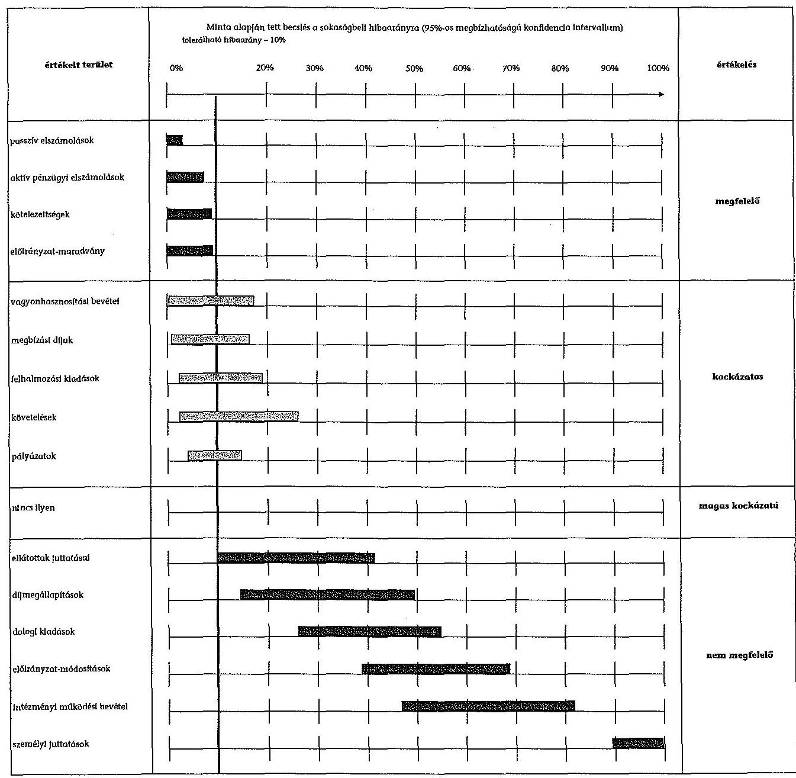

#### Az Örnási Egyetem (2009. december 31-ig Budapesti Műszaki Főlekető) gazdálkodása szabályszerűségének értékelése a mialattételok alapján

---

.

---

# ÓBUDAI EGYETEM 

Rektor

Iktatószám: OE-KA-377/23, 2014
Hiv. szám: V-0578-099/2014.
Budapest, 2015. január 12.

## Állami Számvevőszék

## Domokos László

## Elnök Úr részére

## Budapest

Apáczai Csere János u. 10.
Tárgy: ellenőrzési jelentés tervezetre észrevételek

## Tisztelt Elnök Úr!

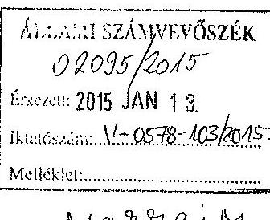

Köszönettel megkaptuk az Állami Számvevőszék által az Óbudai Egyetemnél „Az állami felsőoktatási intézmények gazdálkodásának, müködésének ellenőrzése, valamint az egyházak által fenntartott felsőoktatási intézmények részére az államháztartásból juttatott támogatások felhasználásának ellenőrzése" tárgyában összeállított jelentéstervezetet.

Tájékoztatom, hogy már a vizsgálat időszaka alatt, illetve azt követően is tettünk lépéseket a jelzett hiányosságok kiküszöbölésére, mint pl. a hallgatói gyüjtőszámlát a Kincstárba áttettük a vizsgálat lezárása előtt, még a 2014-es naptári évben.

A jelentéstervezetben rögzített megállapításokra az alábbiakban kívánunk észrevételt tenni oly módon, hogy idézzük az adott jelentésrészletet az oldalszám megadásával, s azt követően ismertetjük véleményünket.

## 16. oldalon: "... az oktatók létszáma 381 föröl 560 före, 47\%-al növekedett."

Az idézett szakasz a vizsgált időszakban bekövetkezett létszámváltozásra utal. Az adatok valóban az október 15-ei statisztikából valók. 2009-ben a teljes és részmunkaidős létszám összesen 381 fő, a megbízással foglalkoztatottak létszáma nulla volt a statisztikai adat szerint. Az oktatói létszám számításában változás következett be az ellenőrzött időszakban.
2013-ban a teljes és részmunkaidős létszám összesen 380 fő, a megbízással foglalkoztatottak száma 180 fő, Ez utóbbit átszámítva teljes munkaidős foglalkoztatásra a statisztikában megjelenő adat szerint 19,22 fő, ezt a reális adatot hozzáadva a 380 főhöz, összesen 400 fő az oktatói létszám.
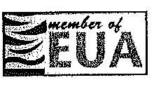

1034 Budapest, Bécsi út 96/b. www.uni-obuda.hu
Tel.: (06-1) 666-5601 Fax.: (06-1) 666-5620 rektor@uni-obuda.hu

---

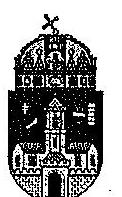

# ÓBUDAI EGYETEM 

Rektor

A fenti adatok alapján 5\%-os oktatói létszámnövekedés következett be, mely reális adat (egyébként a heti 2 órát tartó oktatót is 1 fônek számolja a rendszer, ami irreális eredményhez vezet...).
18. oldalon: „A 2009-2013. években az éves és évközi kincstári adatszolgáltatásokat - a 2010. I. félévi elemi költségvetési beszámoló benyújtása - kivételével - az előírásoknak megfelelőn teljesitették."

A 2010. I. félévi beszámolót még a Nemzeti Eröforrás Minisztérium Helyettes Államtitkárának OK-3599/2010. sz. levele alapján legkésőbb 2010. július 30 -áig az intézményi referenssel elözetesen egyeztetett időpontban kellett leadni.
2010. I. félévi elemi költségvetési beszámoló július 23 -ai dátummal készült. Sajnálatos módon az intézményi referens az ÁSZ érintett ellenőrének bemutatott beszámolót nem látta el dátummal és nem írta alá. Mivel a 2010. évi naptárunk már nem áll rendelkezésre, így nem tudjuk, hogy július 23. és 30. között melyik nap került leadásra a beszámoló, de az biztos, hogy az Államtitkár által megadott határidőig benyújtásra került.
19. oldalon „A dolgi kiadások....................Elöfordult, hogy képzésre vonatkozó számla kiállításakor sérült a bruttó elszámolás számviteli alapelve, mivel az intézmény által a partner felé elkészített számla össze egymásnak nyújtott szolgáltatások egyenlegét tartalmazta."

A jelentés ezen szakaszában érintett észrevételről nincs tudomásunk. A képzésre vonatkozóan kiállított számlák a bevételekre vonatkoznak.
19. oldalon „Az ellátotti juttatások kifizetése során nem tartották be........ 100 E Ft feletti külföldi ösztöndijban részesül hallatók juttatásai kifizetésénél az utalvány nem tartalmazta a kötelezettségvállalás nyilvántartási számát, valamint az utalványrendeleten több esetben elmaradt az utalványozó aláírása."

Tudomásunk szerint a 100 E Ft feletti külföldi ösztöndijak kifizetése esetében az utalványrendelet minden esetben tartalmazta az utalványozó aláírását.
19. oldalon: "Az intézményi térítési díjak, költségtérítések megállapítása nem felett meg a jogszabályi és belső előírásoknak, mivel a hallgatói juttatások és költségtérítési díjak megállapítása a jogszabályi előirás ellenére nem alapult önköltségszámításon."

Az önköltségszámításra vonatkozó modellszámítás, módszertan nem állt a rendelkezésünkre, noha ezek kidolgozásához az irányító minisztérium is többször hozzáfogott. Ahogy az összefoglaló jelentés is megállapítja a 39. oldalon: "Az irányító
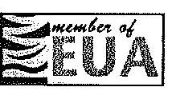

1034 Budapest, Bécsi út 96/b. www.uni-obuda.hu
Tel.: (06-1) 666-5601 Fax.: (06-1) 666-5620 rektor@uni-obuda.hu

---

# ÓBUDAI EGYETEM 

## Rektor

szerv nem élt az oktatási tevékenységgel kapcsolatban az egy hallgatóra jutó önköltség meghatározásának sajátos szakágazati követelményeinek módszertani útmutatóban történő meghatározásával."
Egyetemünk szem elött tartotta, hogy az államilag támogatott hallgatók után kapott képzési támogatást, jóval meghaladó mértékű költségtérítési díjakat határozzon meg, továbbá erről a fenntartót is értesítette, ahogyan ezt a jelentés 39. oldalon megállapítja: „A szenátus az intézményi költségtérités és térítési dijak feltételeit, megállapításának rendjét térítési és juttatási szabályzatában határozta meg. A szabályzat a hallgatók által fizetendő térítéseket és dijakat részletesen összegszerűen is tartalmazta. A hallgatók által fizetett képzési költségtérítéseket eljárási dijakat az egyetem a fenntartónak a költségvetés tervezésekor saját bevétele tervezésének részeként, valamint a szabályzat módosításakor jóváhagyásra bemutatta."
19. oldal „Az immateriális javak és tárgyi eszközök bérbeadása, értékesítése ...... hogy a helyiségbérleti megállapodásra vonatkozó kötelezettségvállalás dokumentumát nem tudták bemutatni..."

A helységbérleti megállapodásra vonatkozó dokumentumok rendelkezésre álltak. A bérleti szerződések a követelések dokumentumai.
20. oldalon „A mérlegtételek tartalma, besorolása, értékelése.......... a mérlegtételek értékelése, értékvesztés elszámolására nem került sor, nem történt behajthatatlanság címén követelés leírás."

A mérlegtételek értékelését végrehajtottuk. Értékvesztést nem számoltunk el. Behajthatatlanság címén a tartozás leírásra került a 2010., 2012., 2013. évek során, melyet a 9. sz. tanúsítványban szerepeltettünk.
21. oldal „Az ÓE tulajdonosi joggyakorlása megfelelő volt, felelősen gazdálkodott a tartós részesedéseivel. Az intézmény az ellenőrzött időszakban egy társaságban való részvételéről döntött."

Az ellenőrzött időszakban az intézményünk két gazdasági társaságban volt érdekelt. Ezek közül az Alba Regia TISZSZ Közhasznú Nonprofit Kft. 2013. évben került felszámolásra és vezettük ki könyveinkből.
27. oldal „A számlarend nem tartalmazta a számlarendben foglaltakat alátámasztó bizonylati rendet, a főkönyvi számla értéke növekedésének, csökkentésének jogcímeit, a számlát érintő gazdasági eseményeket. A számviteli politikában nem szabályozták a raktári készletek leltározása során az eltérések kompenzálásánál figyelembe veendő szempontokat"

---

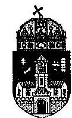

# ÓBUDAI EGYETEM 

## Rektor

Véleményünk szerint a számlarend tartalmazta a gazdasági eseményeket. Az egyetem nem rendelkezik raktárral, ezért nem szerepel a számviteli politikában a raktárakra vonatkozóan ilyen előírás.
29. oldalon „Az ÓE a 2009-2013. években............. A gazdálkodási adatok között elmaradt a vezetők és vezető tisztségviselők illetményének, munkabérének, és rendszeres juttatásainak, valamint költségtérítéseinek közzététele."

Az intézményi honlapon ezen adatok 2010. évtől rendelkezésre állnak. Minden negyedév végén kerülnek kiszámításra, és ezután kerülnek fel a honlapra a szabályozásnak megfelelően.
33. oldalon: „A 2012 évi magas müködési hiányt az okozta..."

A folyó kiadások tartalmazták az előirányzat maradvány terhére történt kiadásokat is, míg a bevételek csak a 2012. évi bevételeket tartalmazták. A müködési hiány nem igényeite hitel felvételét, továbbá nem jelentkeztek likviditási problémák sem.
39. oldalon: „A hallgatóknak a befizetéseket egy az intézmény által az Erste Bank Zrt.-nél vezetett gyüjtőszámlára kellett teljesíteni A hallgatói költségtéritések kereskedelmi banknál kezelése miatt az egyetem megsértette az Áht rendelkezéseit, mely szerint a kincstári kör fizetési számlái a Kincstárnál vezethetök."

Az Óbudai Egyetem még a vizsgálat idején kezdeményezte a Kincstárnál a gyüjtőszámla megnyitását, amit meg is kapott. Ezt követően 2014. november 14-én (a következő heti rektori szünetet is felhasználva, mivel a hallgatók Neptun aktivitása ekkor alacsony) egy hétre a Neptun rendszer leállításával a szükséges beállításokat és pénzügyi átcsoportosításokat sikeresen elvégezte, és azóta a hallgatók pénzügyei a kincstári gyüjtőszámlán bonyolódnak.

A vizsgált 2009-2013-as időszakra vonatkozó jelentésben foglalt megállapításokat munkánk során hasznosítani fogjuk, a végleges jelentés elkészültét követően intézkedési tervben határozzuk meg az elvégzendő feladatokat.

Kérjük az észrevételeink elfogadását a jelentés véglegesítésénél.
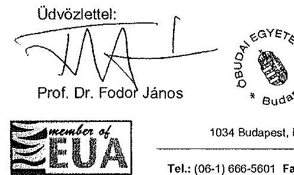

1034 Budapest, Bécsi út 96/b. www.uni-obuda.hu
Tel.: (06-1) 666-5601 Fax.: (06-1) 666-5620 rektor@uni-obuda.hu

---

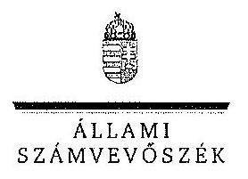

ELNÖK

Ikt.szám: V-0578-104/2015.

Prof. Dr. Fodor János úr
rektor
Óbudai Egyetem

Budapest

# Tisztelt Rektor Úr! 

A ,,Jelentéstervezet az Óbudai Egyetem ellenőrzéséröl - Az állami felsőoktatási intézmények gazdálkodásának, müködésének ellenőrzése" címủ jelentéstervezetre tett észrevételeit köszönettel megkaptam.

Az Állami Számvevőszék észrevételekre vonatkozó álláspontjáról a felügyeleti vezető által készített részletes tájékoztatást csatoltan megküldöm.

Tájékoztatom Rektor urat, hogy a számvevőszéki jelentés szövegezése az elfogadott észrevételek figyelembevételével készül.

Budapest, 2015. 02. hó $A O$, nap
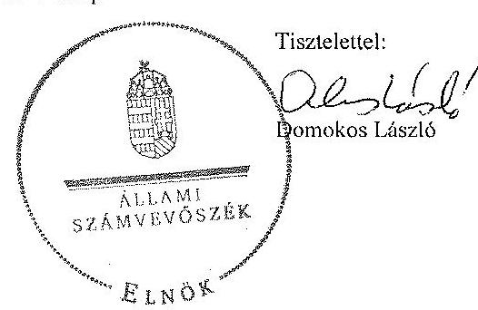

Melléklet: Tájékoztatás az elfogadott és az el nem fogadott észrevételekről

---

# Tájékoztatás   az elfogadott és az el nem fogadott észrevételekről 

A „Jelentéstervezet az Óbudai Egyetem ellenörzéséről - Az állami felzöoktatási intézmények gazdálkodásának, müködésének ellenörzése" címü jelentéstervezetre 2015. január 13-án érkezett észrevételeit áttekintettük, azok kezelésével kapcsolatban a következő tájékoztatást adom.

## 1) 16. oldal

A helyszíni ellenőrzés során átadott, az Oktatási Föigazgató által hitelesített informatikai lekérdezéssel elöállított dokumentum alapján az egyetem teljes oktatói létszáma 2013-ban 560 fő volt, amely alapján a megállapításunk helytálló. Az oktatói létszám részletesebb bemutatása érdekében azonban a jelentéstervezet 16. oldal utolsó bekezdését az alábbiakra pontosítjuk:
„A hallgatók létszáma az ellenőrzött időszakban 11438 föröl 12653 före, 10,6\%-kal növekedett, a teljes- és részmunkaidöben foglalkoztatott oktatók létszáma 381 föröl 380 före csökkent. Az oktatásban 2009-ben nem, 2013-ban viszont 180 föi foglalkoztattak megbizási jogviszony keretében."

## 2) 18. oldal

Az ellenőrzés részére átadott dokumentumok nem támasztják alá azt, hogy a 2010. I. félévi elemi költségvetési beszámoló benyújtását az elöírásoknak megfelelően teljesítették. Az észrevételükben leírtak is megerősítik, hogy nem áll rendelkezésre olyan dokumentum, amelyből megállapítható lenne, hogy melyik nap került átadásra a beszámoló. Az előbbiekre tekintettel megállapítás módosítása nem indokolt.

## 3) 19. oldal

A megállapításunk helytálló, az ellenőrzés részére átadott dokumentumok alátámasztják, hogy a Nyugat-Magyarországi Egyetemmel közösen indított mesterképzés esetében az oktatói szakmai szolgáltatásra kifizetett számla esetében megsértették a bruttó elszámolás elvét.

## 4) 19. oldal

Az ellenőrzés részére átadott dokumentumok alapján (pl.: 2012. évi utálványrendelet 2636/9/2012.02.17) megállapítható, hogy a 100 E Ft feletti külföldi ösztöndíjban részesült hallgatók juttatásai kifizetésénél az utalványrendeleten több esetben elmaradt az utalványozó aláírása. A jelentéstervezet kifogásolt megállapítása helytálló, módosítása nem indokolt.

---

# 5) 19. oldal 

Az önköltségszámításra vonatkozó tájékoztatást köszönjük, az nem cáfolja a jelentéstervezet megállapítását, ezért módosítása nem indokolt.

## 6) 19. oldal

Az ellenőrzés részére átadott tárgyi eszközök bérbeadásával kapcsolatos dokumentumok ismételt áttekintése alapján a jelentéstervezet 19. oldalának utolsó bekezdését és ezzel összefüggésben a 39. oldal utolsó előtti bekezdését, valamint az Egyetem rektorának tett 2. számú intézkedést igénylő megállapítás 4. bekezdésének ,, a helyiségbérleti megállapodásra vonatkozó kötelezettségvállalásnál" szövegrészét töröljük.

## 7) 20. oldal

A mérlegtételek értékelésével kapcsolatos megállapításunk helytálló. A jelentéstervezet megállapítását, miszerint értékvesztést nem számoltak el az észrevételben is megerősítik.

A követelések leírásával kapcsolatos dokumentumok ismételt áttekintését követően azonban a jelentéstervezet 20. oldal utolsó bekezdésének utolsó mondatát az alábbiak szerint pontosítjuk:
„A követelések esetében a mérlegtételek tartalma, besorolása, értékelése nem felelt meg teljes körűen a jogszabályoknak és a belső szabályoknak, mivel elöfordultak olyan tandijtartozást tartalmazó, több éve fennálló követelések, amelyek - az intézmény által a behaftás érdekében megtett intézkedések ellenére - nem teljesültek, a kapcsolódó mérlegtételek értékelésére, értékvesztés elszámolására nem került sor."

Az előbbiekkel összefüggésben a jelentéstervezet 43. oldal 4. bekezdés első mondatát a következőre pontosítjuk:
„Elöfordultak olyan tandijtartozást tartalmazó több éve fennálló követelések, amelyek az intézmény által a behaftás érdekében megtett intézkedések ellenére - nem teljesültek, a kapcsolódó mérlegtételek értékelésére, értékvesztés elszámolására nem került sor."

## 8) 21. oldal

A dokumentumok ismételt áttekintését követően a jelentéstervezet 21. oldal 5. bekezdését az alábbiak szerint pontosítjuk:
„Az ÖE tulajdonosi joggyakorlása megfelelő volt, felelősen gazdálkodott a tartós részesedéseivel."

Az előbbiekkel összefüggésben a jelentéstervezet 45. oldal 3. bekezdését a következőre pontosítjuk:
„A felsőoktatási intézmény az ellenőrzött öt évben tulajdonosi jogait szabályosan gyakorolta, felelősen gazdálkodott a tartós részesedéseivel."

---

# 9) 27. oldal 

A jelentéstervezet 27. oldalára vonatkozó észrevételét részben fogadjuk el. Az ellenőrzés részére átadott számlarendekben foglaltak szerint „az Egyetem raktárral rendelkezik", ezért a raktári készletek leltározására vonatkozó megállapításunkat fenntartjuk. A jelentéstervezet 27. oldal 4. bekezdésének első mondatát azonban a következőre pontosítjuk:
„A számlarend nem tartalmazta a számlarendben foglaltakat alátámasztó bizonylati rendet, a fökönyvi számla értéke növekedésének, csökkenésének jogcímeit."

## 10) 29. oldal

Az információs és kommunikációs rendszer müködtetésével kapcsolatos, 29. oldal 2. bekezdés utolsó mondatában szereplő megállapítást töröljük.

## 11) 33. oldal

A 2012. évi müködési hiány okaihoz kapcsolódó tájékoztatást köszönjük, amely a megállapítás módosítását nem indokolja. Az észrevételben leírtakat a jelentés mellékletében szerepeltetjük.

## 12) 39. oldal

A hallgatói befizetések kezelésével kapcsolatos hiányosságok megszüntetésének érdekében megtett intézkedésekről adott tájékoztatásukat köszönjük. Ezzel összefüggésben tájékoztatom, hogy az Állami Számvevőszékről szóló 2011. évi LXVI. törvény 33. § (1) bekezdésben foglaltaknak megfelelően az ellenőrzött szervezet vezetője köteles a jelentésben foglalt megállapításokhoz kapcsolódó intézkedési tervet összeállítani, és azt a jelentés kézhezvételétől számított harminc napon belül az Állami Számvevőszék részére megküldeni. A jelentéstervezet intézkedést igénylő megállapításaival kapcsolatos javaslatok hasznosítására vonatkozó tervezett vagy már végrehajtott intézkedéseket, így az észrevételben foglalt intézkedéseket is ezen intézkedési tervben indokolt szerepeltetni. Az észrevétel nem kifogásolja az ellenőrzött időszakban fennálló és megállapított hiányosságokat, így annak módosítása nem indokolt.

Tájékoztatom Rektor urat, hogy a számvevőszéki jelentés mellékleteként szerepeltetjük a jelentéstervezethez tett észrevételeit, valamint az azokra adott válaszunkat.

Budapest, 2015. év $O L$. hó $A O$. nap
Makkai Mária
felügyeleti vezető

---

# Az integritás érvényesítése érdekében kialakított és múködtetett intézményi kontrollrendszer 

Az intézménynél - az öt kockázati területet összességében tekintve - az integritás kontrollrendszerének kialakítása és müködtetése megfelelő ${ }^{1}$ volt.

A humánerőforrás-gazdálkodás kontrollszintje kiváló volt. Szabályozták a humánpolitikai tevékenység egészét, az Egyetem alkalmazottai rendelkeztek munkaköri leírással, és alkalmazták az új munkatársak kiválasztását szolgáló, az objektív megítélést segítő eljárást. Az új munkatársak kiválasztásakor nem minden esetben írtak ki álláspályázatot.

Az összeférhetetlenség és etikai elvárások kontrollszintje megfelelő volt, mivel az intézmény munkatársai kötelezően nyilatkoztak gazdasági érdekeltségeikről, vagy egyéb, a tevékenység szempontjából releváns összeférhetetlenségről, és szabályozták a munkavégzésre vonatkozó etikai elvárásokat. Nem szabályozták a különféle ajándékok, meghívások, utaztatás elfogadásának feltételeit. A szervezet vagyonának megvédésére tett intézkedések megfelelőek voltak, mert szabályozták az Egyetem tulajdonában lévő eszközök használatát, valamint intézkedéseket tettek az eszközök és információk biztonságos tárolására. Szabályozták a külső személyekkel való kapcsolattartást. Rendszeres korrupciós kockázatelemzést nem végeztek.

A nemkívánatos dolgozói magatartással szembeni intézkedések és azok érvényesülése fejlesztendő terület volt. Nem határozták meg a szervezeten belülről érkező közérdekű bejelentések eljárásrendjét és nem rendelkeztek szabályozással a bejelentést tevők megfelelő védelmének biztosítására.

[^0]
[^0]:    ${ }^{1}$ Az intézmény a 2013. évi Kockázatokat Mérséklő Kontrollok Tényezője index tekintetében 83,2\%-os eredményt ért el. Az index azt tükrözi, hogy az adott szervezetnél létez-nek-e intézményesült kontrollok, illetőleg, hogy ezek ténylegesen működnek-e, betöltike rendeltetésüket. Ehhez az indexhez olyan faktorok tartoznak, mint a szervezet belsó szabályozása, a belső ellenőrzés, valamint az egyéb integritás kontrollok: etikai követelmények meghatározása, összeférhetetlenségi helyzetek kezelése, a bejelentések, panaszok kezelése, rendszeres kockázatelemzés és tudatos stratégiai menedzsment.