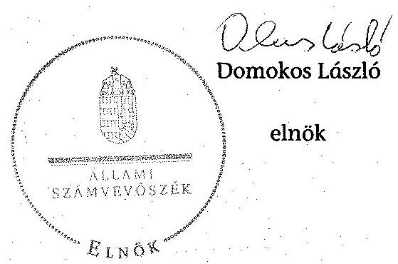
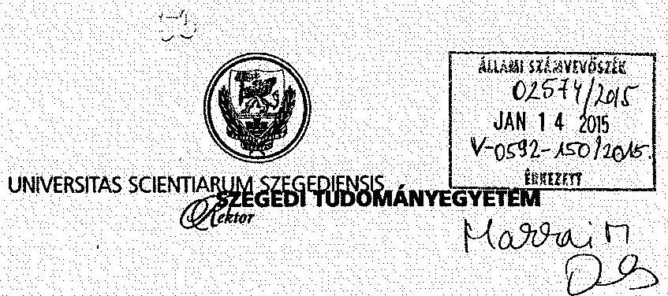
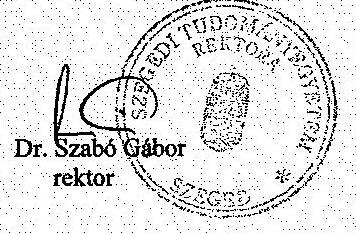
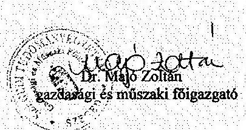
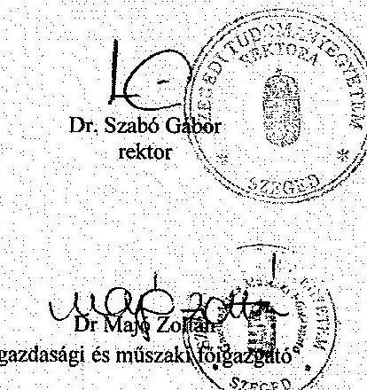
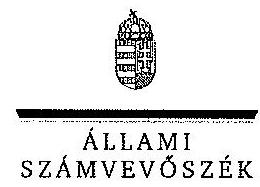
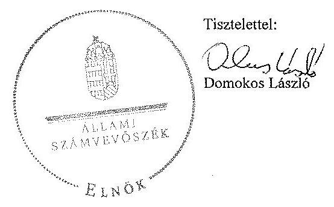

# ÁLLAMI   SZÁMVEVŐSZÉK 

## JELENTÉS

a Szegedi Tudományegyetem ellenőrzéséről - Az állami felsőoktatási intézmények gazdálkodásának, működésének ellenőrzése

---

# Állami Számvevőszék 

Iktatószám: V-0592-153/2015.
Témaszám: 1626
Vizsgálat-azonosító szám: V-068918

## Az ellenőrzést felügyelte:

Makkai Mária
felügyeleti vezető

## Az ellenőrzés végrehajtásáért felelős:

Keresztes Tamás
ellenőrzésvezető

## A számvevői munkaanyagok feldolgozását és a Jelentés összeállítását

végezte:

## Keresztes Tamás

ellenőrzésvezető
Gölöncsér Péter
számvevő
Schmidt János
számvevő

## Az ellenőrzést végezték:

| Beck Miklós számvevő tanácsos | Gölöncsér Péter számvevő | Dr. Halmné Harsányi Zsuzsanna számvevő tanácsos |
| :--: | :--: | :--: |
| Schmidt János   Számvevő | Szeghő Kornélia számvevő | Tamás László számvevő |
| Temesváry Miklós számvevő tanácsos | Tóth Sándor számvevő | Vámos Imre számvevő |

## A témához kapcsolódó eddig készített számvevőszéki jelentések:

## címe

sorszáma
Jelentés az oktatási és kulturális ágazat irányítási rendszerének, 1106 működésének ellenőrzéséről
Jelentés a felsőoktatás oktatási infrastruktúra-fejlesztési program- 1171 jának ellenőrzéséről
Jelentés az állami felsőoktatási intézmények érdekeltségébe tartozó 1290 gazdasági társaságok támogatásának és nyereségük hasznosulásának ellenőrzéséről

---

Jelentés a Szolnoki Főiskola ellenőrzéséről - Az állami felsőoktatási 14196
intézmények gazdálkodásának, működésének ellenőrzése
Jelentés a Pannon Egyetem ellenőrzéséről - Az állami felsőoktatási 14197
intézmények gazdálkodásának, működésének ellenőrzése
Jelentés a Károly Róbert Főiskola ellenőrzéséről - Az állami felsőok- 14198
tatási intézmények gazdálkodásának, működésének ellenőrzése
Jelentés a Magyar Képzőművészeti Egyetem ellenőrzéséről - Az ál- 14199
lami felsőoktatási intézmények gazdálkodásának, működésének ellenőrzése
Jelentés a Miskolci Egyetem ellenőrzéséről - Az állami felsőoktatási 14200
intézmények gazdálkodásának, működésének ellenőrzése
Jelentés a Széchenyi István Egyetem ellenőrzéséről - Az állami fel- 14201
sőoktatási intézmények gazdálkodásának, működésének ellenőrzése
Jelentés az Eszterházy Károly Főiskola ellenőrzéséről - Az állami 14204
felsőoktatási intézmények gazdálkodásának, működésének ellenőrzése
Jelentés a Magyar Táncművészeti Főiskola ellenőrzéséről - Az ál- 14205
lami felsőoktatási intézmények gazdálkodásának, működésének ellenőrzése
Jelentés a Budapesti Műszaki és Gazdaságtudományi Egyetem el- 14218
lenőrzéséről - Az állami felsőoktatási intézmények gazdálkodásának, működésének ellenőrzése

---

.

---

# TARTALOMJEGYZÉK 

BEVEZETÉS ..... 13
I. ÖSSZEGZŐ MEGÁLLAPÍTÁSOK, KÖVETKEZTETÉSEK, JAVASLATOK ..... 17
II. RÉSZLETES MEGÁLLAPÍTÁSOK ..... 26

1. A felsőoktatásért felelős minisztérium fenntartói és ágazati irányítói tevékenysége ..... 26
2. Az intézmény belső kontrollrendszerének kiépítése és működtetése ..... 28
3. Az intézmény pénzügyi gazdálkodása ..... 32
3.1. A kiadási és bevételi előirányzatok alakulása és a pénzügyi egyensúlyt befolyásoló tényezők ..... 32
3.2. A döntéshozó szervek gazdálkodással kapcsolatos joggyakorlásának szabályszerűsége ..... 39
3.3. A bevételi és kiadási előirányzatok megállapítása, módosítása, elkülönítése, az előirányzat-maradványok kezelése, adatszolgáltatási kötelezettség teljesítése ..... 40
3.4. A kiadási előirányzatok felhasználása ..... 42
3.5. A bevételi előirányzatok beszedése ..... 45
4. Az intézmény vagyongazdálkodása ..... 46
4.1. A vagyon változása ..... 46
4.2. A vagyongazdálkodás szabályozottsága ..... 47
4.3. A vagyonelemek kimutatása ..... 48
4.4. A vagyonelemekkel történő gazdálkodás ..... 51
5. A külső ellenőrzések által tett javaslatok hasznosulása ..... 54
5.1. ÁSZ ellenőrzések által tett javaslatok hasznosulása ..... 54
5.2. Az egyéb külső ellenőrzések javaslatainak hasznosulása ..... 55
MELLÉKLETEK
6. számú A Szegedi Tudományegyetem kiadási és bevételi előirányzatai, azok teljesítése a 2009-2013. években
7. számú A Szegedi Tudományegyetem kiadásainak, bevételeinek változása a 2009-2013. években
8. számú Kimutatás a Szegedi Tudományegyetem bevételeiről és kiadásairól, valamint adósságszolgálatáról a 2009-2013. években
9. számú A Szegedi Tudományegyetem mérlegadatai a 2009-2013. években

---

5. számú A Szegedi Tudományegyetem gazdálkodása szabályszerűségének értékelése a mintatételek alapján
6. számú A Szegedi Tudományegyetem rektorának észrevétele
7. számú A Szegedi Tudományegyetem rektorának észrevételére adott válasz

# FÜGGELÉKEK 

1. számú Az integritás érvényesítése érdekében kialakított és működtetett intézményi kontrollrendszer

---

# RÖVIDÍTÉSEK JEGYZÉKE 

## Törvények

Áht. 1
Áht. 2
ÁSZ tv.
Feot.
Gt.
Info tv.
Kbt. 1
Kbt. 2
Kjt.
Mtv. 1
Mtv. 2
Nftv.
Nvtv.
Szja tv.
Sztv.
Tbj.

Vtv.
Korm. rendeletek
Áhsz.

Új Áhsz.
Ámr. 1
Ámr. 2
Ávr.
Ber.

1992. évi XXXVIII. törvény az államháztartásról (hatálytalan 2012. január 1-jétől)
2011. évi CXCV. törvény az államháztartásról
2011. évi LXVI. törvény az Állami Számvevőszékről
2005. évi CXXXIX. törvény a felsőoktatásról (hatálytalan 2012. szeptember 1-jétől)
2006. évi IV. törvény a gazdasági társaságokról (hatálytalan 2014. március 15-étől)
2011. évi CXII. törvény az információs önrendelkezési jogról és az információszabadságról
2003. évi CXXIX. törvény a közbeszerzésekről (hatálytalan 2012. január 1-jétől)
2011. évi CVIII. törvény a közbeszerzésekről
1992. évi XXXIII. törvény a közalkalmazottak jogállásáról
1992. évi XXII. törvény a Munka Törvénykönyvéről (hatálytalan 2013. január 1-jétől)
2012. évi I. törvény a munka törvénykönyvéről
2011. évi CCIV. törvény a nemzeti felsőoktatásról
2011. évi CXCVI. törvény a nemzeti vagyonról
1995. évi CXVII. törvény a személyi jövedelemadóról
2000. évi C. törvény a számvitelről
1997. évi LXXX. törvény a társadalombiztosítás ellátásaira és a magánnyugdíjra jogosultakról, valamint e szolgáltatások fedezetéről
2007. évi CVI. törvény az állami vagyonról
249/2000. (XII. 24.) Korm. rendelet az államháztartás szervezetei beszámolási és könyvvezetési kötelezettségének sajátosságairól (hatálytalan 2014. január 1-jétől)
4/2013. (I. 11.) Korm. rendelet az államháztartás számviteléről
217/1998. (XII. 30.) Korm. rendelet az államháztartás működési rendjéről (hatálytalan 2010. január 1-jétől)
292/2009. (XII. 19.) Korm. rendelet az államháztartás működési rendjéről (hatálytalan 2012. január 1-jétől)
368/2011. (XII. 31.) Korm. rendelet az államháztartásról szóló törvény végrehajtásáról
193/2003. (XI. 26.) Korm. rendelet a költségvetési szervek belső ellenőrzéséről (hatálytalan 2012. január 1-jétől)

---

Bkr.
Vtvr.
223/2000. (XII. 23.)
Korm. rendelet

## Miniszteri rendeletek

36/2013. (IX. 13.)
NGM rendelet

## Határozatok

1001/2009. (I. 13.)
Korm. határozat
1033/2009. (III. 17.)
Korm. határozat
1132/2010. (VI. 18.)
Korm. határozat
1193/2010. (IX. 14.)
Korm. határozat
1025/2011. (II. 11.)
Korm. határozat
1365/2011. (XI. 8.)
Korm. határozat
1122/2012.(IV. 25.)
Korm. határozat
1428/2012. (X. 8.)
Korm. határozat
1657/2012. (XII. 20.)
Korm. határozat

## Egyéb rövidítések

áfa
ÁSZ
DAOP
Educatio Kft.
E Ft
EMMI
ETR
FIR
GMF
GT
IFT

370/2011. (XII. 31.) Korm. rendelet a költségvetési szervek belső kontrollrendszeréről és belső ellenőrzéséről 254/2007. (X. 4.) Korm. rendelet az állami vagyonnal való gazdálkodásról
a közalkalmazottak jogállásáról szóló 1992. évi XXXIII. törvény egészségügyi ágazatban történő végrehajtásáról
a 2009. évi havi kereset-kiegészítés forrásigényének biztosításához szükséges intézkedésekről
a 2009. évi államháztartási egyensúly megőrzéséhez szükséges intézkedésekről
a 2010. évi költségvetéssel összefüggő egyes feladatokról
a költségvetési főfelügyelők kirendeléséről
az államháztartási egyensúly megőrzéséhez szükséges intézkedésekről
a 2012. évi költségvetési hiánycél tartását biztosító további feladatokról
a Széll Kálmán terv kiterjesztése keretében megvalósítandó egyes intézkedésekről
a 2012. évi költségvetési egyenleg tartását biztosító intézkedésekről
a kormányzati stratégiai dokumentumok felülvizsgálatával kapcsolatos feladatokról
általános forgalmi adó
Állami Számvevőszék
Dél-alföldi Operatív Program
Educatio Társadalmi Szolgáltató Nonprofit Kft.
ezer forint
Emberi Erőforrások Minisztériuma
Egyetemi Tanulmányi Rendszer
Felsőoktatási Információs Rendszer
Gazdasági és Műszaki Főigazgatóság
Gazdasági Tanács
Intézményfejlesztési Terv

---

| INTOSAI | Legfőbb Ellenőrzési Intézmények Nemzetközi Szakmai Szervezete (International Organization of Supreme Audit Institutions) |
| :--: | :--: |
| ISO | Nemzetközi Szabványügyi Szervezet (International Organization for Standardization) |
| KEHI | Kormányzati Ellenőrzési Hivatal |
| KIM | Közigazgatási és Igazságügyi Minisztérium |
| Kincstár | Magyar Államkincstár |
| KIR | Központi Illetmény-számfejtési Rendszer |
| KSZ | Kollektív Szerződés |
| KTIA | Kutatási és Technológiai Innovációs Alap |
| M Ft | millió forint |
| MNV Zrt. | Magyar Nemzeti Vagyonkezelő Zrt. |
| Mrd Ft | milliárd forint |
| MTA | Magyar Tudományos Akadémia |
| NAV | Nemzeti Adó- és Vámhivatal |
| NEFMI | Nemzeti Erőforrás Minisztérium |
| NEPTUN | Tanulmányi hallgatói információs rendszer |
| NFÜ | Nemzeti Fejlesztési Ügynökség |
| NGM | Nemzetgazdasági Minisztérium |
| OH | Oktatási Hivatal |
| OKM | Oktatási és Kulturális Minisztérium |
| OTKA | Országos Tudományos Kutatási Alapprogramok |
| PM | Pénzügyminisztérium |
| PPP | Public-Private Partnership (magán és közszféra együttműködése) |
| SAP | Integrált vállalatirányítási rendszer |
| SZTE, egyetem, intézmény | Szegedi Tudományegyetem |
| SZMSZ | Szervezeti és Működési Szabályzat |
| TÜSZ | Teljeskörű Ügyvitel Szolgáltató Rendszer |
| VIR | Vezetői Információs Rendszer |

---

# FOGALOMTÁR 

alapító

állami felsőoktatási intézmény saját tulajdona
állami vagyon

A központi költségvetési szerv alapítója az Országgyűlés, a Kormány vagy a miniszter. A felsőoktatási intézmények vonatkozásában az alapítói jogokat a felsőoktatásért felelős minisztérium gyakorolja.
A felsőoktatási intézmény saját bevételének a költségek teljes körű levonása - az adományozás és öröklés kivételével -, a rendelkezésre bocsátott vagyon állagának megóvásáról, pótlásáról való gondoskodás után fennmaradt része terhére szerzett vagyona.
A Vtv. 1. § (2) bekezdése szerint állami vagyonnak minősül:
a) az állami tulajdonban lévő ingó dolog, valamint a dolog módjára hasznosítható természeti erő,
b) az állami tulajdonban lévő termőföldekből álló, külön törvényben szabályozott Nemzeti Földalap,
c) az állami tulajdonban lévő - a b) pont hatálya alá nem tartozó - ingatlan,
d) az állami tulajdonban lévő értékpapír,
e) az államot megillető társasági részesedés és más vagyoni értékű jog;
(hatályos 2010. június 16-ig)
a) az állam tulajdonában lévő dolog, valamint a dolog módjára hasznosítható természeti erő,
b) az a) pont hatálya alá nem tartozó mindazon vagyon, amely vonatkozásában törvény az állam kizárólagos tulajdonjogát nevesíti,
c) az állam tulajdonában lévő tagsági jogviszonyt megtestesítő értékpapír, illetve az államot megillető egyéb társasági részesedés,
d) az államot megillető olyan immateriális, vagyoni értékkel rendelkező jogosultság, amelyet jogszabály vagyoni értékű jogként nevesít.
(hatályos 2010. június 17-től 2012. szeptember 9-ig)
a) az állam tulajdonában lévő dolog, valamint a dolog módjára hasznosítható természeti erő,
b) az a) pont hatálya alá nem tartozó mindazon vagyon, amely vonatkozásában törvény az állam kizárólagos tulajdonjogát nevesíti,
c) az állam tulajdonában lévő tagsági jogviszonyt megtestesítő értékpapír, illetve az államot megillető egyéb társasági részesedés,
d) az államot megillető olyan immateriális, vagyoni értékkel rendelkező jogosultság, amelyet jogszabály vagyoni értékű jogként nevesít,
e) az állam tulajdonában lévő pénzügyi eszközök.

---

## állami vagyon hasznosítása

állami vagyon értékesítése
állami vagyon kezelője /vagyonkezelő
(hatályos: 2012. szeptember 10-től)
A Vtv. 23. § (1) bekezdése szerint: Az állami vagyont az MNV Zrt. maga kezeli, illetve szerződés - így különösen bérlet, haszonbérlet, szerződésen alapuló haszonélvezet, vagyonkezelés, megbízás - alapján központi költségvetési szervnek, természetes vagy jogi személynek, illetőleg jogi személyiséggel nem rendelkező gazdasági társaságnak hasznosításra átengedi.
(hatályos 2010. december 31-ig)
Az állami vagyont az MNV Zrt. maga kezeli, vagy szerződés - így különösen bérlet, haszonbérlet, szerződésen alapuló haszonélvezet, vagyonkezelés, megbízás - alapján központi költségvetési szervnek, természetes vagy jogi személynek, vagy jogi személyiséggel nem rendelkező gazdálkodó szervezetnek hasznosításra átengedi.
(hatályos 2011. január 1-jétől 2011. december 31-ig)
Az állami vagyont az MNV Zrt. maga kezeli, vagy szerződés - így különösen bérlet, haszonbérlet, megbízás alapján központi költségvetési szervnek, természetes vagy jogi személynek, vagy jogi személyiséggel nem rendelkező gazdálkodó szervezetnek hasznosításra átengedi.
(hatályos 2012. január 1-jétől 2013. június 27-ig)
Az állami vagyonnal a tulajdonosi joggyakorló maga gazdálkodik, vagy szerződés - így különösen bérlet, haszonbérlet, megbízás - alapján hasznosításra átengedi, illetőleg vagyonkezelésbe, haszonélvezetbe adja.
(hatályos: 2013. június 28-tól)
Állami vagyon tulajdonjogának bármely jogcímen történő, visszterhes átruházása. (Vtvr. 1. § (7) bekezdés d) pont)
A Vtv. 23. § (1) bekezdése szerint: Az állami vagyont az MNV Zrt. maga kezeli, vagy szerződés - így különösen bérlet, haszonbérlet, szerződésen alapuló haszonélvezet, vagyonkezelés, megbízás - alapján központi költségvetési szervnek, természetes vagy jogi személynek, illetőleg jogi személyiséggel nem rendelkező gazdasági társaságnak hasznosításra átengedi. (hatályos 2010. január 1-jétől 2010. december 31-ig)
Az állami vagyont az MNV Zrt. maga kezeli, vagy szerződés - így különösen bérlet, haszonbérlet, szerződésen alapuló haszonélvezet, vagyonkezelés, megbízás - alapján központi költségvetési szervnek, természetes vagy jogi személynek, illetőleg jogi személyiséggel nem rendelkező gazdálkodó szervezetnek hasznosításra átengedi. (hatályos 2011. január 1-jétől 2011. december 31-ig)
Az állami vagyont az MNV Zrt. maga kezeli, vagy szerződés - így különösen bérlet, haszonbérlet, megbízás alapján központi költségvetési szervnek, természetes

---

autonómia
belső kontrollrendszer

CLF-módszer
előirányzat-maradvány
fenntartó
finanszírozási műveletek nélküli pozíció

Gazdasági Tanács
vagy jogi személynek, vagy
 jogi személyiséggel nem rendelkező gazdálkodó szervezetnek hasznosításra átengedi. Az állami vagyonra vonatkozóan az MNV Zrt. kizárólag az Nvtv.-ben meghatározott személyekkel köthet vagyonkezelési szerződést.
(hatályos 2012. január 1-jétől)
A felsőoktatási intézmény Feot.-ban, illetve Nftv.-ben szabályozott önrendelkezése, amely biztosítja az intézmény önálló oktatási, kutatási, szervezeti és működési, valamint gazdálkodási tevékenységét.
A belső kontrollrendszer a kockázatok kezelése és tárgyilagos bizonyosság megszerzése érdekében kialakított folyamatrendszer, amely azt a célt szolgálja, hogy megvalósuljanak a következő célok:
a) a működés és gazdálkodás során a tevékenységeket szabályszerűen, gazdaságosan, hatékonyan, eredményesen hajtsák végre,
b) az elszámolási kötelezettségeket teljesítsék, és
c) megvédjék az erőforrásokat a veszteségektől, károktól és nem rendeltetésszerű használattól.
A módszer a működési és a felhalmozási költségvetés bevételeinek és kiadásainak, ezek egyenlegeinek elkülönített, majd összevont kimutatását alkalmazza valamely költségvetési intézmény pénzügyi helyzetének megítéléséhez. Kiemelten mutatja be a finanszírozási műveletek egyenlege nélküli és az azt magába foglaló pénzügyi pozíciót, valamint a tőketörlesztéssel, értékpapírbeváltással csökkentett működési jövedelmet.
Az értékelés a pénzügyi kapacitás fogalmát helyezi a középpontba.
Az államháztartás központi alrendszerébe tartozó költségvetési szerveknél a módosított bevételi és kiadási előirányzatok és azok teljesítésének a Kormány rendeletében meghatározott tételekkel korrigált különbözete az előirányzat-maradvány. (Áht. 2. § (1) bekezdés m) pontja)
A Feot. 7. § (2) bekezdése és az Nftv. 4. § (2) bekezdése szerint az, aki az alapítói jogot gyakorolja, ellátja a felsőoktatási intézmény fenntartásával kapcsolatos feladatokat.
A CLF-módszer szerint számított működési és felhalmozási tevékenység pénzügyi egyenlegének összevont értéke. Megmutatja, hogy a költségvetési intézmény bevételei fedezetet biztosítottak-e a kiadásokra. A finanszírozási műveletek nélküli (GFS) pozíció alapján a pénzügyi helyzetet akkor tekintettük megfelelőnek, ha az adott év működési és felhalmozási bevételei fedezetet nyújtottak az adott év működési és felhalmozási kiadásaira.
A felsőoktatási intézmény javaslattevő, véleményező, a stratégiai döntések előkészítésében részt vevő és a döntés-

---

hároméves fenntartói megállapodás
információs és kommunikációs rendszer
intézményfejlesztési terv
integritás
kincstári biztos
sek végrehajtásának ellenőrzésében közreműködő szerve. Az állami felsőoktatási intézmények központi költségvetési támogatására hároméves fenntartói megállapodást kell kötni az állami felsőoktatási intézmény és a fenntartó között. A fenntartói megállapodás tartalmazza a felsőoktatási intézmény által meghatározott hároméves időszakra vállalt teljesítménykövetelményeket, továbbá az állandó jellegű támogatási részeket, valamint a változó jellegű támogatások megállapításának jogcímeit. A változó elemű támogatás évenkénti elszámolási kötelezettséggel kerül meghatározásra.
A költségvetési szerv vezetője köteles olyan rendszereket kialakítani és működtetni, melyek biztosítják, hogy a megfelelő információk a megfelelő időben eljussanak az illetékes szervezethez, szervezeti egységhez, illetve személyhez.
A szenátus fogadja el az intézményfejlesztési tervet. Az intézményfejlesztési tervben kell meghatározni a fejlesztéssel, a fenntartó által a felsőoktatási intézmény rendelkezésére bocsátott vagyon hasznosításával, megóvásával, elidegenítésével kapcsolatos elképzeléseket, a várható bevételeket és kiadásokat. Az intézményfejlesztési tervet középtávra, legalább négyéves időszakra kell elkészíteni, évenkénti bontásban meghatározva a végrehajtás feladatait. Az intézményfejlesztési terv része a foglalkoztatási terv. A foglalkoztatási tervben kell meghatározni azt a létszámot, amelynek keretei között a felsőoktatási intézmény megoldhatja feladatait. (Feot. 27. § (3) bekezdés)
Az integritás olyasvalakit vagy valamit jelöl, aki vagy ami romlatlan, sértetlen, feddhetetlen. Az integritás elvek, értékek, cselekvések, módszerek, intézkedések konzisztenciáját jelenti: olyan magatartásmódot, amely meghatározott értékeknek megfelel.
A kincstári biztos kijelölését az államháztartásért felelős miniszternél a Kincstár kezdeményezi. A kincstári biztos köteles figyelemmel kísérni megbízatásának időpontjától kezdve a költségvetési szerv tervezését, gazdálkodását, beszámolását, a jogszabályokban előírt feladatainak ellátását, feltárni azokat az okokat, amelyek a tartós fizetésképtelenséghez vezettek, a szükséges intézkedések azonnali végrehajtására irányuló intézkedési tervet készíteni, azonnali intézkedéseket kezdeményezni, és írásbeli utasításokat kiadni a tartozásállomány felszámolására, a gazdálkodás egyensúlyának biztosítására, a követelések behajtására. (Ávr. 116-117. §)

---

kincstári költségvetés
kockázatkezelési rendszer
kontrollkörnyezet
kontrolltevékenység
költségvetési főfelügye-
lő, felügyelő
maximális hallgatói
létszám
minisztérium

A központi költségvetésről szóló törvény elfogadását követően a fejezetet irányító szerv az államháztartás központi alrendszerébe tartozó költségvetési szerv és a fejezeti kezelésű előirányzat kiemelt előirányzatait, valamint az elkülönített állami pénzalapok és a társadalombiztosítás pénzügyi alapjai jogszabályi előírás szerinti bevételeit és kiadásait kincstári költségvetés kiadásával állapítja meg. (Áht. 24. § (3) bekezdés, Áht. 2 28. § (2) bekezdés, Ávr. 31. § (2) bekezdés)
Irányítási eszközök és módszerek összessége, melynek elemei a szervezeti célok elérését veszélyeztető tényezők (kockázatok) azonosítása, elemzése, csoportosítása, nyomon követése, valamint szükség esetén a kockázati kitettség mérséklése.
A kontrollkörnyezet a költségvetési szerv vezetőinek a szervezeti célok elérését segítő kontrollok kialakításával és működtetésével, korszerűsítésével kapcsolatos magatartását, a kontrollpontokról érkező információkra való reagálását jelenti.
Azok az elvek, politikák és eljárások, amelyeket a kockázatok meghatározása és a szervezet céljainak elérése érdekében alakítanak ki.
A költségvetési szerv vezetője köteles a szervezeten belül kontrolltevékenységeket kialakítani, amelyek biztosítják a kockázatok kezelését, hozzájárulnak a szervezet céljainak eléréséhez.
Az államháztartásért felelős miniszter a Kormány irányítása alá tartozó fejezetet irányító szervhez, a Kormány irányítása vagy felügyelete alá tartozó költségvetési szervhez, valamint az elkülönített állami pénzalapok és a társadalombiztosítás pénzügyi alapjai kezelő szerveihez költségvetési főfelügyelőt, felügyelőt rendelhet ki. A költségvetési főfelügyelő, felügyelő a gazdálkodás költségvetés-politikával való összhangja és a takarékos, szabályszerű, eredményes működés érdekében a Kormány rendeletében meghatározott intézkedéseket tehet, így különösen előzetesen véleményezi a kötelezettségvállalásra irányuló eljárásokat, és a nagy összegű kötelezettségvállalások tekintetében kifogással élhet. (Áht. 2 39. § (1)-(2) bekezdés)

Az a felsőoktatási intézmény alapító okiratában, működési engedélyében meghatározott hallgatói létszám, ameddig terjedően a felsőoktatási intézmény - figyelembe véve a hallgatók fogadásához és az oktatói tevékenység folytatásához rendelkezésre álló személyi feltételeket, helyiségeket és eszközöket - valamennyi évfolyamára számítva, teljes kihasználtsággal működve hallgatói jogviszonyt létesíthet.
A felsőoktatásért felelős minisztérium, amely 2009-től 2010 májusáig az OKM, 2010 májusától 2012 májusáig

---

monitoring
működési jövedelem
normatív költségvetési támogatás felsőoktatási intézmények működéséhez
normatív támogatások
saját bevétel
szenátus
tárgyévi pénzügyi pozíció
többségi befolyást biztosító részesedés
a NEFMI, 2012 májusától az EMMI volt.
A különböző szintű szervezeti célok megvalósításához szükséges folyamatok figyelemmel kísérése, melynek során a releváns eseményekről és tevékenységekről (együtt: folyamatokról) rendszeres jelleggel, strukturált, döntéstámogató információkhoz jutnak a szervezet vezetői.
A folyó bevételek és folyó kiadások egyenlege. Azt mutatja, hogy a folyó bevételek fedezetet nyújtanak-e a folyó kiadásokra.
A felsőoktatási intézmények működéséhez biztosított normatív költségvetési támogatás lehet
a) hallgatói juttatásokhoz nyújtott,
b) képzési,
c) tudományos célú,
d) fenntartói,
e) egyes feladatokhoz nyújtott
támogatás. A központi költségvetésből biztosított normatív költségvetési támogatásra - a d) pontban meghatározott normatív költségvetési támogatás kivételével - a felsőoktatási intézmények azonos feltételek alapján válnak jogosulttá. Az a)-e) pontokban meghatározott jogcímek - az a) és e) pontban meghatározott jogcímek kivételével - nem jelentenek felhasználási kötöttséget. (Feot. 127. § (3) bekezdés)
Az ellenőrzési időszakban hatályos költségvetési törvények 3. számú mellékletében megjelölt közoktatási hozzájárulások, az 5. mellékletében megjelölt központosított előirányzatok, továbbá a 8. mellékletében megjelölt normatív, kötött felhasználású támogatások együttesen.
Az államháztartáson kívüli források - beleértve minden olyan, az Európai Uniótól származó támogatást, amelyhez nem az állami költségvetésen keresztül jut a felsőoktatási intézmény, továbbá a szakképzési hozzájárulási fizetési kötelezettség teljesítéseként elszámolt forrásokat is, ide nem értve az állami vagyon értékesítésének ellenértékét -, valamint a Kutatási és Technológiai Innovációs Alapból származó bevételek.
A felsőoktatási intézmény döntést hozó és a döntés végrehajtását ellenőrző testülete. (Feot. 20. § (1) bekezdés)
A működési és felhalmozási bevételek, valamint kiadások egyenlege a finanszírozási műveletek egyenlegének figyelembe vételével.
A Ptk. 685/B. § (1) bekezdése szerint többségi befolyás: az olyan kapcsolat, amelynek révén természetes személy, jogi személy vagy jogi személyiség nélküli gazdasági társaság (a továbbiakban együtt: befolyással rendelkező) egy jogi személyben a szavazatok több mint ötven százalékával vagy meghatározó befolyással rendelkezik.

---

.

---

# JELENTÉS 

## a Szegedi Tudományegyetem ellenőrzéséről Az állami felsőoktatási intézmények gazdálkodásának, működésének ellenőrzése

## BEVEZETÉS

Az ÁSZ Stratégiája ${ }^{1}$ alapértékeinek egyike, hogy az államháztartás komplex folyamatainak átláthatósága érdekében rendszerszemléletű/holisztikus megközelítésű, egymásra épülő, a szinergiahatást kihasználó, összefoglaló értékelésre lehetőséget adó ellenőrzéseket végez. Az államháztartás központi alrendszerébe tartozó felsőoktatási intézmények ellenőrzése során az Állami Számvevőszék értékeli azok pénzügyi-gazdasági helyzetét, feltárja a működésükben rejlő kockázatokat, ezzel előmozdítja a közpénzügyek átláthatóságát, rendezettségét.

Az állami felsőoktatási intézmények gazdálkodását - az Áht. ${ }_{1}$ és az Áht. ${ }_{2}$ előírásai mellett - a felsőoktatásról szóló 2005. évi CXXXIX. törvény (Feot.), valamint a nemzeti felsőoktatásról szóló 2011. évi CCIV. törvény (Nftv.) előírásai határozták meg.

Magyarország Nemzeti Reform Programja keretében, a Széll Kálmán Terv 2020-ig a 30-34 évesek körében, a felsőfokú vagy annak megfelelő végzettséggel rendelkezők arányának $30,3 \%$-ra való növelését irányozta elő, amely a 2010. évhez képest $4,6 \%$ pontos növekedési célkitűzést jelent. A rendezett gazdasági környezet, az önállósággal élni tudó, felelős, elszámoltatható intézményi gazdálkodói magatartás elengedhetetlen feltétele a kitűzött szakmai célok elérésének.

Az ellenőrzés célja annak megállapítása, hogy szabályos volt-e az állami felsőoktatási intézmény pénzügyi és vagyongazdálkodása, biztosított volt-e a vagyonnal való felelős gazdálkodás követelményének érvényesülése, jogszabályi előírásoknak megfelelően működött-e a belső kontrollrendszer, az irányító szerv tevékenysége a jogszabályi előírásoknak megfelelt-e.

Ennek keretében értékeltük a Szegedi Tudományegyetemnél:

- a fenntartói és az ágazati irányítási jogok gyakorlása előírásoknak való megfelelőségét;

[^0]
[^0]:    ${ }^{1}$ Állami Számvevőszék: Stratégia. Az Állami Számvevőszék hivatalos stratégiai dokumentum rendszere 2011-2015. 2012. december. http://www.asz.hu/strategia/asz-strategia/asz-strategia-2011.pdf

---

- az intézmény belső kontrollrendszere jogszabályoknak megfelelő kialakítását és működtetését;
- az intézmény döntéshozó szerveinek joggyakorlása jogszabályoknak való megfelelőségét; az intézmény oktatási és egyéb (gyakorlati és kutatási) tevékenységei elkülönítését, átláthatóságát, illetve pénzügyi gazdálkodása szabályszerűségét;
- az intézmény vagyongazdálkodása előírásoknak való megfelelőségét;
- az ellenőrzött időszakban végzett külső (ÁSZ, fenntartói, KEHI, kincstári) ellenőrzések által tett javaslatok hasznosulását;
- az intézmény korrupcióval szembeni veszélyeztetettségének csökkentése érdekében az integritási szemlélet érvényesülését a gazdálkodási folyamatokban.

Az ellenőrzés várható hasznosulása: Az ellenőrzés eredményének hasznosulásaként képet kapunk a Szegedi Tudományegyetemnél kialakult pénzügyi helyzetről; a kormány által kirendelt költségvetési (fő) felügyelői rendszer működésének tapasztalatairól; az oktatási és egyéb tevékenységek és költségelszámolások elhatárolásáról, átláthatóságáról és szabályosságáról. A felsőoktatási intézmények gazdálkodási szabadságának pénzügyi és vagyoni helyzetre gyakorolt hatásairól, a vagyonnal való felelős, értékmegőrző gazdálkodás érvényesüléséről, továbbá a belső kontrollrendszer működéséről. Az ellenőrzés az ellenőrzött számára visszajelzést ad a gazdálkodása kereteinek kialakításáról, a működésében fellépő hiányosságokról, javaslataival hozzájárul azok kiküszöböléséhez és a jó kormányzáshoz. A törvényalkotás számára összegzett tapasztalatok állnak rendelkezésre a felsőoktatási intézmények döntéseinek, gazdálkodásának szabályszerűségéről, amelyek alapján - indokolt esetben - jogszabály-módosítás kezdeményezhető. Az integritás kultúra kialakítása hozzájárul az elszámoltathatóság és átláthatóság érvényesítéséhez, egyben támogatja a szervezet védettségét a korrupciós kitettséggel szemben, valamint annak megelőzése is irányítottabbá válik. A társadalom számára jelzi, hogy közpénz nem maradhat ellenőrizetlenül, az ÁSZ értékteremtő rend kialakításához és megőrzéséhez hozzájáruló tevékenysége pozitív hatással lesz a szervezetről kialakított összkép formálásában.

Az ellenőrzés típusa: szabályszerűségi ellenőrzés
Az ellenőrzött időszak: 2009. január 1. - 2013. december 31.
Az ellenőrzéssel érintett szervezetek: az Emberi Erőforrások Minisztériuma és a Szegedi Tudományegyetem

Az ellenőrzés jogszabályi alapját az Állami Számvevőszékről szóló 2011. évi LXVI. törvény 1. § (3) bekezdése, az 5. § (3)-(6) bekezdései, 33. § (7) bekezdése,
 valamint az államháztartásról szóló 2011. évi CXCV. törvény 61. § (2) bekezdésének előírásai képezik.

Az ellenőrzés az INTOSAI által kiadott nemzetközi standardok figyelembe vételével, az ellenőrzési programban foglalt értékelési szempontok szerint történt.

---

A pénzügyi és vagyongazdálkodás terén az egyes területek szabályszerű működését mintavétellel ellenőriztük, ez alapján a sokaságokban előforduló hibás tételek arányát becsültük. A jogszabályoknak és a belső előírásoknak megfelelőnek, azaz szabályszerűnek tekintettük az adott kiadási előirányzat felhasználását, bevétel beszedését, mérlegtétel értékelését, amennyiben a minta ellenőrzésének eredménye alapján 95%-os bizonyossággal a teljes sokaságban a hibás tételek aránya kisebb volt, mint 10%, nem megfelelőnek értékeltük, ha a hibás tételek aránya a 10%-ot meghaladta. Kockázatot, illetve magas kockázatot jeleztünk, amennyiben egy adott terület vonatkozásában a minta alapján a teljes sokaságban nem volt teljes körűen biztosított a jogszabályoknak és a belső szabályzatoknak megfelelő működés. A mintatételek kiértékelését az 5. számú melléklet tartalmazza.

A belső kontrollrendszer kialakításának és működtetésének értékelése során a jogszabályi előírások mellett az Ámr., 145/A. § (1) és (3) bekezdése, az Ámr. 155. § (1) és (3) bekezdése, valamint a Bkr. 5. § (1) bekezdése alapján figyelembe vettük az államháztartásért felelős miniszter által közzétett irányelvekben és módszertani útmutatókban foglaltakat is. A belső kontrollrendszert az értékelés során legalább 85%-os megfelelőség esetén megfelelőnek, legalább 70%-os megfelelőség esetén részben megfelelőnek, 70%-os megfelelőség alatt pedig nem megfelelőnek minősítettük.

Az 1581-ben alapított, és a kolozsvári egyetemből kivált SZTE három alapfeladata az oktatás, a kutatás és a gyógyítás. A 2009-2013. évek között az egyetem önállóan működő és gazdálkodó központi költségvetési szerv volt. A 2000. január 1-jei felsőoktatási integráció és kettő újabb bővítés után 2013-ban az egyetemen 12 karon folyik felsőfokú képzés, illetve kutatási, művészeti tevékenység. A közoktatási tevékenysége keretében az SZTE kettő általános iskolában, egy gimnáziumban és egy szakközépiskolában folytat alap- és középfokú oktatási tevékenységet. Az ellenőrzött időszakban az intézményt átalakítás nem érintette. A rektor személyében 2010. évben, a gazdasági főigazgató személyében 2011. évben történt változás. A Kormány költségvetési főfelügyelőt rendelt ki az intézményhez 2011. december 1-jétől. A főfelügyelő kirendelését a 2012-2013-ban is egy-egy évre meghosszabbították.

Az SZTE-nek az ellenőrzött időszakban 12 gazdasági társaságban volt tulajdonosi részesedése. Három kft. esetében az egyetem 100%-os, további három társaságban többségi tulajdoni hányaddal rendelkezett.

Az SZTE kiadásai az ellenőrzött időszakban 22,8%-kal, a bevételei 23,5%-kal nőttek. A bevételeken belül a költségvetési támogatás aránya 27,3% volt átlagosan, és az ellenőrzött időszakban 16,3%-kal csökkent, míg a saját és átvett bevételek 48,3%-kal nőttek. Az SZTE pénzügyi helyzetét az ellenőrzött időszakban kedvezően befolyásolta, hogy a tervezettel ellentétben nem PPP konstruk-

[^0]
[^0]:    ${ }^{2}$ 1/2009. (IX. 11.) PM irányelv, Pénzügyminisztérium Belső Kontroll Kézikönyv 2010.
    ${ }^{3}$ Állam és Jogtudományi, Általános Orvosi, Bölcsésztudományi, Egészségtudományi és Szociális Képzés, Fogorvostudományi, Gazdaságtudományi, Gyógyszertudományi, Juhász Gyula Pedagógusképző, Mezőgazdasági, Mérnöki, Természettudományi és Informatikai, Zeneművészeti

---

cióban, hanem EU pályázatok segítségével valósította meg fejlesztéseit (főépület, kollégiumok, Klinikai Központ beruházásai).

Az ellenőrzött időszakban a hallgatói létszám 26827 főről 23305 főre (13,1%-kal), az oktatók létszáma pedig 1623 főről 1544 főre (4,9%-kal) csökkent.

Az SZTE főbb gazdálkodási, vagyoni és létszámadatait az alábbi táblázat mutatja be:

| Megnevezés | Főbb gazdálkodási adatok (ezer Ft) |  |  |  |  | $\begin{gathered} 2013 / 2009 \\ (\%) \end{gathered}$ |
| :--: | :--: | :--: | :--: | :--: | :--: | :--: |
|  | 2009. | 2010. | 2011. | 2012. | 2013. |  |
| Kiadási főösszeg | 57931798 | 62037096 | 64477438 | 63925141 | 71153044 | 122,8 |
| Bevételi Főösszeg | 60588935 | 66204438 | 68014872 | 67291683 | 74843773 | 123,5 |
| Költségvetési támogatások | 19888966 | 19292543 | 18302075 | 17320357 | 16640468 | 83,7 |
| Saját és átvett bevételek | 36962718 | 42154144 | 45545455 | 46433892 | 54836763 | 148,4 |
| Előirányzat maradvány | 3737251 | 4757751 | 4167342 | 3537434 | 3366542 | 90,1 |
| Támogatások aránya (\%) | 32,8 | 29,1 | 26,9 | 25,7 | 22,2 | - |
| Mérlegfőösszeg | 41390958 | 43810791 | 49168333 | 50267154 | 60641299 | 146,5 |
| Jellemző létszámadatok (fő)* |  |  |  |  |  |  |
| Oktatói létszám | 1623 | 1602 | 1615 | 1579 | 1544 | 95,1 |
| Hallgatói létszám | 26827 | 26018 | 25775 | 24834 | 23305 | 86,9 |

Forrás: SZTE beszámolók 2009-2013

* Az oktatói és hallgatói létszám az október 15-i adat

Az ÁSZ a 2011. évi LXVI. törvény 29. §-a szerint a jelentéstervezetet megküldte a Szegedi Tudományegyetem rektorának és az Emberi Erőforrások Minisztériuma miniszterének egyeztetésre. A Szegedi Tudományegyetem rektorának észrevételét és az arra adott választ a 6-7. számú melléklet tartalmazza. Az Emberi Erőforrások Minisztériuma minisztere az ÁSZ tv. 29. § (2) bekezdésében foglalt észrevételezési jogával nem élt, a törvényes határidőn belül észrevételt nem tett.

---

# I. ÖSSZEGZŐ MEGÁLLAPÍTÁSOK, KÖVETKEZTETÉSEK, JAVASLATOK 

Az ellenőrzött időszakban a felsőoktatásért felelős minisztérium (OKM, NEFMI, EMMI) a jogszabályi előírásoknak megfelelően gyakorolta fenntartói feladatait. Ugyanakkor az ágazati irányítási feladatait nem látta el teljes körűen.

Elmaradt az oktatási ágazatra vonatkozóan a nemzetgazdasági miniszter irányításával és az oktatásért felelős miniszter részvételével, a kormányhatározatban előírt szervezeti és feladatellátási felülvizsgálati program kidolgozása. A felsőoktatási törvény rendelkezései ellenére a miniszter nem készíttetett a felsőoktatás rendszere vonatkozásában elfogadott középtávú fejlesztési tervet.

A minisztérium az Oktatási Hivatallal a Felsőoktatási Információs Rendszer (FIR) biztonságos üzemeltetéséhez, az adatok védelméhez szükséges alapvető kontrollokat a 2012. év végéig nem teljes körűen alakította ki. A FIR átfogó megújítása után 2012 szeptemberétől - a nyitott jogviszonnyal rendelkező hallgatók és az oktatók vonatkozásában - rögzített adatok már teljes körűek. A fenntartó a FIR biztonságos üzemeltetéséhez, az adatok védelméhez szükséges kontrollokat a 2012. év végén kialakította, ugyanakkor a 2012. szeptemberétől működő FIR-t jogszabályi megfelelőségi, adatbiztonsági, illetve informatikai szempontból 2013. év végéig nem ellenőrizte.

Az SZTE belső kontrollrendszerének kialakítása és működtetése részben felelt meg a vonatkozó jogszabályi előírásoknak. Ezen belül a kontrollkörnyezet kialakítása, a kontrolltevékenységek működtetése, az információs és kommunikációs rendszer, valamint a monitoring rendszer részben megfelelő, a kockázatkezelés pedig nem megfelelő volt. A kontrollok kialakításában és működtetésében az ellenőrzött időszakban javuló tendencia volt tapasztalható.

Az intézmény kontrollkörnyezetének kialakítása részben felelt meg a jogszabályi előírásoknak. Az intézmény az ellenőrzött időszakban nem rendelkezett valamennyi, jogszabályban előírt belső szabályzattal. Az egyetem belső szabályozásait több esetben nem aktualizálták a jogszabályi változásoknak megfelelően. A belső szabályzatok egy része nem teljes körűen felelt meg a vonatkozó jogszabályi előírásoknak.

A kockázatkezelési rendszer kialakítása és működtetése nem felelt meg a jogszabályi követelményeknek. A kockázatkezelési szabályzat hiányos volt és nem aktualizálták. Nem történt meg a kockázatok meghatározása, felmérése és elemzése sem.

A kontrolltevékenységek kialakítása megfelelő volt, azonban a kontrolltevékenységek alkalmazása csak részben volt megfelelő. Ezek a folyamatba épített, illetve a vezetői ellenőrzés nem megfelelő működésére voltak visszavezethetőek.

---

Az információs és kommunikációs rendszer kialakítása részben felelt meg a vonatkozó előírásoknak. Hiányosság volt, hogy nem aktualizálták az informatikai biztonsági szabályzatot. Az egyetem a közérdekű szervezeti, működési és gazdálkodási adataira vonatkozó közzétételi kötelezettségének a saját honlapján hiányosan tett eleget.

Az intézmény monitoring rendszere - a belső ellenőrzés hiányosságai miatt - részben volt megfelelő. A belső ellenőrzés javaslatai alapján készült intézkedési terveket a belső ellenőrzési vezető dokumentáltan nem véleményezte. A belső ellenőrzés javaslatainak egy része nem vagy nem határidőben hasznosult.

Az ellenőrzött szervezet nem vett részt az ÁSZ 2013. évi integritás felmérésében.
Az intézmény pénzügyi egyensúlya a 2009-2013. években biztosított volt, a likviditási helyzete azonban a 2012. évtől romlott. Az SZTE likviditási hitelt és támogatási kölcsönt nem vett fel, a likviditás biztosítása érdekében a finanszírozási tervtől eltérő, előrehozott támogatást nem igényelt.

A likviditási mutató és a pénzeszköz likviditási mutató értéke a 2012. évtől romlott, és a 2012-2013. évben a pénzeszközök már nem nyújtottak fedezetet a rövid lejáratú kötelezettségek teljesítéséhez. A likviditás változása a betegellátás területén jelentkező forráshiánnyal volt összefüggésben. Az egészségügyi terület forráshiányából adódó likviditási hiányt az egyetem az oktatási területre biztosított források terhére oldotta meg, illetve a ki nem egyenlített számlákat szállítói kötelezettségként tartotta nyilván.

Az SZTE pénzügyi gazdálkodása nem minden tekintetben volt szabályszerű.
A szenátus a Feot.-ban és az Nftv.-ben előírt gazdálkodást érintő feladatait, hatásköreit összességében megfelelően látta el. A normatív támogatások felhasználására vonatkozó intézményi döntések összhangban voltak a jogszabályokkal, belső szabályzatokkal. Ugyanakkor az intézményi térítési díjak, költségtérítések megállapítása nem felelt meg a jogszabályi és belső előírásoknak. Több esetben előfordult, hogy egyes költségtérítéseket nem alapoztak meg önköltségszámítással. Emiatt a megállapított költségtérítés és ráfordítás arányára vonatkozó előírások teljesülése nem volt megállapítható.

Az SZTE a kiadási és bevételi előirányzatok tervezése során nem tartotta be teljes körűen a jogszabályokban és a fenntartó által kiadott tervezési irányelvben foglaltakat. Az intézmény az ellenőrzött időszakban külön nem alakította ki a költségvetési tervezés ellenőrzési nyomvonalát. A 2010. évi elemi költségvetést alátámasztó számítást és szöveges indokolást az egyetem nem tudta bemutatni.

A bevételi és kiadási előirányzatok módosítása, az előirányzatmaradvány megállapítása és felhasználása megfelelt a jogszabályoknak és belső szabályoknak.

Az intézmény oktatási és egyéb tevékenységeit az előírásoknak megfelelően elkülönítették, átlátható volt az ellátott feladatok rendszere.

---

Az egyetem teljesítette az évközi és éves beszámoláshoz kapcsolódó adatszolgáltatási kötelezettségét, több esetben azonban késedelmesen küldte meg a dokumentumokat a fenntartó részére.

A rendszeres és nem rendszeres személyi juttatások előirányzatainak felhasználása a pénzügyi elszámolások, valamint a gazdálkodási jogkörök gyakorlása tekintetében nem volt szabályszerű. Több esetben előfordult, hogy a személyi juttatások kifizetését nem vagy nem teljes körűen támasztotta alá munkaidő elszámolás, továbbá a személyügyi dokumentáció nem tartalmazta a munkaköri leírásokat. A nem rendszeres juttatásoknál az önkéntes nyugdíjpénztárhoz való munkáltatói hozzájárulás kötelezettségvállalása nem minden esetben állt rendelkezésre. Az SZTE a közalkalmazottainak kifizetett keresetkiegészítést a jogszabályi előírásokat megsértve a külső személyi juttatások helyett a nem rendszeres személyi juttatások előirányzata terhére teljesítette.

A külső személyi juttatások előirányzatai terhére kötött megbízási szerződésekhez kapcsolódó díjak elszámolása során a gazdálkodási jogkörök gyakorlása nem felelt meg teljes körűen a jogszabályoknak és belső szabályoknak. Egyedi hiba volt, hogy az SZTE állományába tartozó személlyel rendszeresen felmerülő feladatokra kötöttek megbízási szerződést annak ellenére, hogy ezt a belső szabályozás tiltotta.

A dologi kiadások előirányzatának felhasználása a pénzügyi elszámolások, valamint a gazdálkodási jogkörök gyakorlása
 tekintetében nem felelt meg teljes körűen a jogszabályoknak és belső szabályoknak. Egyedi hiba volt, hogy az egyetem megsértette a közbeszerzési törvény egybeszámításra és közbeszerzés lefolytatására vonatkozó szabályait és kötelezettségvállalás nélkül történtek meg a kifizetések.

A felhalmozási kiadások előirányzatainak felhasználása a pénzügyi elszámolások, valamint a gazdálkodási jogkörök gyakorlása tekintetében nem felelt meg a jogszabályoknak és belső szabályoknak. Több esetben előfordult, hogy nem állt rendelkezésre a jogszabályi és belső szabályozási előírásoknak megfelelő kötelezettségvállalási dokumentum, illetve a kötelezettségvállalás nem szabályszerűen történt meg, továbbá a kötelezettségvállalás pénzügyi ellenjegyzése elmaradt.

Az ellátotti juttatások megállapítása, kifizetése során nem tartották be teljes körűen a jogszabályokban és belső szabályokban foglaltakat. Egyedi hibaként előfordult a 2009. évben, hogy a kötelezettségvállalás nem állt rendelkezésre.

Az intézményi működési bevételek beszedése a pénzügyi elszámolások, valamint a gazdálkodási jogkörök gyakorlása tekintetében nem felelt meg a jogszabályoknak és belső szabályoknak. A jogszabályban foglaltakkal ellentétben az egyetem nem minden esetben készített önköltség-kalkulációt egyes költségtérítések (akkreditált képzés, egyéb tanfolyam díja, fénymásoló kártya díja) megállapításához. Az egyetem a jogszabályi rendelkezéseket megsértve, az idegen nyelvű képzésekre vonatkozó, devizában teljesített hallgatói költségtérítéseket nem kincstári számlán, hanem az MKB Bank Zrt.-nél vezetett devizaszámlán szedte be, de nem rendelkezett a devizaszámla vezetésére vonatkozóan a Kincstár engedélyével.

---

Az immateriális javak és tárgyi eszközök bérbeadása, értékesítése a pénzügyi elszámolások, valamint a gazdálkodási jogkörök gyakorlása tekintetében - egyedi hibák miatt - nem felelt meg teljes körűen a jogszabályoknak és belső szabályoknak.

Az egyes, csak hazai forrásból finanszírozott projektekhez, feladatokhoz pályázati úton vagy egyéb módon nyújtott költségvetési forrással való elszámolás nem felelt meg teljes körűen az előírásoknak. Egyedi esetben előfordult, hogy a támogatást folyósító az egyetemnek juttatott összeg egy részét jogosulatlanul igénybe vett támogatásnak minősítette.

Az egyetem vagyona a 2009. január 1-jei 42 295,1 M Ft-ról a 2013. év végére 43,4%-kal 60 641,3 M Ft-ra nőtt. Az ellenőrzött időszakban végrehajtott jelentős beruházási és felújítási tevékenység eredményeként a befektetett eszközök állományának értéke a 2009. január 1-jei 35 453,3 M Ft-ról a 2013. évre 55 189,1 M Ft-ra növekedett. A forgóeszközök mérlegben kimutatott értéke a 2009. január 1-jei 6841,8 M Ft-ról a 2013. év végére 5452,2 M Ft-ra csökkent. A változás döntő részben az ellenőrzött időszak elején meglévő értékpapírok állományának beváltásából adódott.

Az SZTE az ellenőrzött időszakban a vagyongazdálkodással kapcsolatos belső szabályzatokkal rendelkezett, azok - néhány kisebb súlyú hiányosság kivételével - megfeleltek a jogszabályokban megfogalmazott követelményeknek. Ugyanakkor vagyongazdálkodási tervet az intézmény nem készített.

Az SZTE a vagyonelemek kimutatása során nem minden tekintetben járt el szabályszerűen. A feltárt hibák azonban nem minősültek jelentősnek, így a beszámoló megbízhatóságát nem befolyásolják.

Az egyetem a 2009-2013. években a könyvviteli mérlegében kimutatott eszközök és források állományának valódiságát mennyiségben és értékben kimutatott leltárral támasztotta alá.

A saját tulajdonban lévő eszközöket nem különítették el és nem mutatták ki, annak ellenére, hogy az ellenőrzött időszakban rendelkeztek saját vagyonnal.

A részesedések állományának tartalma, besorolása, értékelése nem volt szabályszerű. A részesedések közül egy 150,0 E Ft értékű apporttal szerzett részesedést az egyetem a 2009-2011. évi mérlegeiben nem mutatott ki. Az ellenőrzött időszakban négy társaságnak csökkent tartósan a saját tőkéje a jegyzett tőke alá, ennek ellenére a részesedések után nem számoltak el értékvesztést.

A követelések esetében a mérlegtételek tartalma, besorolása és értékelése nem felelt meg teljes körűen a jogszabályoknak, belső szabályoknak. Ez magas kockázatot jelez az ellenőrzött terület egészének szabályos működése szempontjából. Az egyetem a 2009-2012. években nem értékelte teljes körűen a követeléseit és a követelések után értékvesztést sem számolt el. Az értékvesztés elszámolásának elmaradása szabályozási hiányosságra volt visszavezethető.

Az aktív pénzügyi elszámolások esetében a mérlegtételek tartalma, besorolása és értékelése nem felelt meg teljes körűen a jogszabályi követelményeknek.

---

Ez magas kockázatot jelez az ellenőrzött terület egészének szabályos működése szempontjából. Az egyetem nem értékelte az ellenőrzött időszakban a külföldi pénzértékre szóló aktív pénzügyi elszámolásokat. A 2009-2012. években az aktív pénzügyi elszámolások soron szerepeltetett éven túli rendezetlen tételeket is, amelyeket a megfelelő jogcímen kiadásként nem számolt el.

A kötelezettségek és a passzív pénzügyi elszámolások esetében a mérlegtételek tartalma, besorolása és értékelése megfelelt a jogszabályoknak és belső szabályoknak.

Az SZTE alapvetően a jogszabályi előírásoknak megfelelően hajtotta végre az eredményszemléletű számvitel bevezetésével kapcsolatos feladatokat.

Az egyetem a vagyonelemekkel történő gazdálkodása során a jogszabályokban és a belső szabályozásokban előírtakat részben tartotta be.

A selejtezések előkészítése, végrehajtása, dokumentálása megfelelt a belső szabályzatban foglaltaknak.

Az immateriális javak és tárgyi eszközök beszerzése során az egyetem döntései szabályszerűek voltak. Az eszközök bekerülési értékének, besorolásának megállapítása, év végi értékelése, valamint az értékcsökkenés elszámolása szabályos volt. Az állományba vétel és az üzembe helyezés dokumentálása megfelelt az előírásoknak.

A vagyon értékesítésével és bérbeadásával kapcsolatos döntések, illetve az MNV Zrt. engedélyéhez kötött értékesítések csak részben feleltek meg a jogszabályoknak és a belső szabályozásoknak. Egy esetben a vagyonelem értékesítéséhez nem rendelkeztek az MNV Zrt. engedélyével, továbbá egy selejtezett eszköz értékesítésével kapcsolatos döntést nem az arra jogosult személy hozta meg.

Vagyonelemek térítésmentes átadás-átvétele a jogszabályi előírásoknak megfelelt.

Az egyetem az ellenőrzött időszakban nem minden tekintetben gazdálkodott felelősen részesedéseivel. A részesedések nyilvántartása nem felelt meg teljes körűen az előírásoknak. Az SZTE a gazdasági társaság alapításakor az esetleges veszteségek kezelésére tartalék, illetve kockázati alapot nem hozott létre, ugyanakkor a társaságok összességében eredményesen működtek. Az SZTE az érdekeltségébe tartozó gazdasági társaságoknál az ellenőrzött időszakban a tulajdonosi jogok és kötelezettségek érvényesülését nem biztosította teljes körűen. Az egyetem tájékoztatása szerint a rektor a gazdasági társaságokkal kapcsolatos tulajdonosi jogok gyakorlását egyes társaságok esetében átruházta az SZTE egyéb vezetőire. A tulajdonosi jogok átruházásairól azonban dokumentumok nem álltak rendelkezésre, így nem volt ellenőrizhető a tulajdonosi joggyakorlás megfelelősége. Az intézménynél a 2009-2010. években nem alakítottak ki a társaságok tevékenységét nyomon követő rendszert.

Az ÁSZ három korábbi ellenőrzése során a felsőoktatás témakörében kilenc javaslatot fogalmazott meg a felsőoktatásért felelős minisztériumnak (OKM, NEFMI, EMMI). A minisztérium a javaslatokra intézkedési terveket készített, amelyek összesen 10 intézkedést tartalmaztak. Az intézkedések közül hár-

---

mat (határidőn túl) megvalósítottak, hét nem valósult meg. A megvalósult intézkedések hozzájárultak a felsőoktatási intézményrendszer jobb működéséhez.

Elvégezték az állami felsőoktatási intézményrendszer kapacitáskihasználtságának felmérését. A felsőoktatási intézmények érdekeltségébe tartozó gazdasági társaságok ellenőrzése során feltárt hiányosságok megszüntetésére a minisztérium felszólította az intézményeket, amelyek a megtett intézkedésekről tájékoztatást adtak. A minisztérium tájékoztatást kért az érintett felsőoktatási intézményektől az 50% alatti intézményi részesedéssel működő gazdasági társaságok tevékenységének felülvizsgálatáról, működésük indokoltságáról és eredményességéről, valamint az intézményi részesedés megszüntetéséről és annak ütemezéséről.

Nem valósult meg a minisztérium felügyelete alá tartozó szervezetek feladatellátásának javítására számszerűsíthető mutatószámokon alapuló kritériumok és középtávú célrendszer kidolgozása. A felsőoktatási ágazat középtávú stratégiáját sem készítették el. Nem intézkedtek az oktatási infrastruktúra-fejlesztési programok előkészítési folyamatának hiányosságai miatti felelősség megállapítására. Nem hasznosították az állami felsőoktatási intézmények kapacitáskihasználtságával kapcsolatos felmérés eredményeit, így nem tettek intézkedést a felsőoktatási infrastruktúra közép- és hosszútávon történő hasznosítására. Nem alakítottak ki a PPP projektek támogatásához kapcsolódó követelményrendszert. Nem került sor az oktatási infrastruktúra-fejlesztési programok lebonyolításával kapcsolatos hiányosságok (kedvezőtlen feltételű szerződéskötés és kockázatmegosztás) miatti felelősség megállapítására. Nem dolgoztatták ki az állami felsőoktatási intézményekkel azok gazdasági társaságai szakmai feladatellátásának és gazdaságossági eredményességének mérését biztosító mutatószámokat és értékelési rendszert.

Az egyetemet a 2009-2013. években négy egyéb külső ellenőrzés érintette, amelyből egyet a KEHI, hármat a fenntartó végzett. Az ellenőrzések során a fenntartó által tett javaslatok csak részben hasznosultak. Ennek ellenére hozzájárultak az egyetem szabályszerű működéséhez.

Az Állami Számvevőszékről szóló 2011. évi LXVI. törvény 33. § (1) bekezdésében foglaltak értelmében a jelentésben foglalt megállapításokhoz kapcsolódó intézkedési tervet köteles az ellenőrzött szervezet vezetője összeállítani, és azt a jelentés kézhezvételétől számított 30 napon belül az ÁSZ részére megküldeni. Amennyiben az intézkedési tervet határidőben nem küldi meg a szervezet, vagy az nem elfogadható, az ÁSZ elnöke a hivatkozott törvény 33. § (3) bekezdés a)-b) pontjaiban foglaltakat érvényesítheti.

Az ellenőrzés intézkedést igénylő megállapításai és javaslatai:

# az emberi erőforrások miniszterének: 

1. A Szegedi Tudományegyetem belső kontrollrendszerének kialakítása és működtetése részben felelt meg az Áht. ${ }_{1-2}$, az Ámr. ${ }_{1-2}$, a Ber. és a Bkr. előírásainak. Azon belül a kockázatkezelési rendszer kialakítása és működtetése nem volt megfelelő, a kontrolltevékenységek működtetése, az információs és kommunikációs rendszer kialakítása, a kontrollkörnyezet kialakítása és a monitoring rendszer részben volt megfelelő. Az

---

egyetem pénzügyi gazdálkodása nem minden tekintetben felelt meg a jogszabályokban előírtaknak. A belső kontrollrendszer hiányosságai a vagyongazdálkodás területén is szabálytalanságokhoz vezettek.

Javaslat:
Intézkedjen az Nftv. 73. § (3) bekezdés e) pontja által meghatározott munkáltatói jogkörében eljárva a belső kontrollrendszer kialakításával és működtetésével, valamint a pénzügyi és vagyongazdálkodással összefüggésben feltárt szabálytalanságok tekintetében a munkajogi felelősséggel kapcsolatos körülmények kivizsgálására irányuló eljárás megindítása iránt, és a vizsgálat eredményének ismeretében tegye meg a szükséges intézkedéseket.
2. Az egyetemnél az idegen nyelvű képzésekre vonatkozó, devizában teljesített hallgatói költségtérítéseket nem a Kincstár által vezetett számlán kezelték, figyelmen kívül hagyva az Áht., 18/C. § (5) és az Áht. 2 79. § (1) bekezdésének erre vonatkozó előírásait.

Javaslat:
Intézkedjen - az Nftv. 73. § (3) bekezdés e) pontjában foglalt jogkörében - a kincstári körön kívüli számlavezetés miatt szabálytalan pénzkezeléshez kapcsolódóan a munkajogi felelősség kivizsgálására irányuló eljárás megindítása iránt, és a vizsgálat eredményének ismeretében tegye meg a szükséges intézkedéseket.

# a Szegedi Tudományegyetem rektorának ${ }^{4}$ : 

1. A belső kontrollrendszer kialakítása és működtetése részben felelt meg a jogszabályi előírásoknak:
a kontrollkörnyezet kialakítása részben volt megfelelő, mivel az intézmény az ellenőrzött időszakban nem rendelkezett valamennyi, jogszabályban előírt belső szabályzattal, a belső szabályzatokat nem minden esetben aktualizálták a jogszabályi változásokkal összhangban. Mindez nem biztosította az Ámr., 145/D. §-ában, az Ámr. 2 156. §-ában és a Bkr. 6. §-ában foglalt előírások érvényesülését;
a kockázatkezelési rendszer kialakítása és működtetése nem volt megfelelő, mivel az Ámr., 145/C. § (2) bekezdése, az Ámr. 2 157. § (2) bekezdése és a Bkr. 7. §-a követelményeivel ellentétben - a kockázatokat nem határozták meg, nem mérték fel, nem elemezték, a kockázatkezelési szabályzat hiányos volt és elmaradt az aktualizálása;
a kontrolltevékenységek működtetése részben felelt meg az Ámr., 145/A. és E. §-ai, az Ámr. 2 158. §-a és a Bkr. 8. §-a előírásainak, amely pénzügyi és vagyongazdálkodást érintő szabálytalanságokat eredményezett;
[^0]
[^0]:    ${ }^{4}$ Az Nftv. 2014. július 24-től hatályos módosítását követően a belső kontrollrendszer kialakításáért és működtetéséért, továbbá a pénzügyi és vagyongazdálkodásért felelős személynek.

---

az információs és kommunikációs rendszer kialakítása részben felelt meg az Ámr. 1 145/F. §-a, az Ámr. ${ }_{2}$
 159. §-a és a Bkr. 9. §-a előírásainak, mivel elmaradt az informatikai biztonsági szabályzat aktualizálása és az egyetem a közérdekű szervezeti, működési és gazdálkodási adataira vonatkozó közzétételi kötelezettségének hiányosan tett eleget;
a monitoring rendszer részben volt megfelelő a belső ellenőrzés működtetésének hiányosságai miatt, mivel az nem volt összhangban a Ber. 29. §-a és a Bkr. 45. §-a előírásaival.

Javaslat:
Intézkedjen a jogszabályoknak megfelelő belső kontrollrendszer működtetésének érdekében - az ellenőrzött időszak óta bekövetkezett esetleges jogszabályi változásokra figyelemmel - a belső kontrollrendszer ellenőrzés által feltárt hiányosságainak megszüntetéséről.
2. A pénzügyi gazdálkodás területén nem volt szabályszerű a rendszeres és nem rendszeres személyi juttatások, a dologi és a felhalmozási kiadások előirányzatának felhasználása, valamint a működési bevételek beszedése, mivel a gazdálkodási jogkörök gyakorlása nem felelt meg az Áht. 1 100/C. §-a, az Ámr. 1 134-135. §-ai, az Ámr. 72., 74., 76. §-ai és az Ávr. 52., 55., 57. §-ai előírásainak.

A hallgatói költségtérítéseket - az Áhsz. 9. sz. melléklet 12. pontjában előírtak ellenére - nem alapozták meg önköltségszámítással.

A közbeszerzések alkalmazásánál esetenként megsértették a Kbt. 40. § (1)-(2) bekezdésében előírt egybeszámítási, valamint a Kbt. 240. § (1) bekezdésében a közbeszerzési eljárás lefolytatására előírt szabályokat.

Az egyetem az idegen nyelvű képzésekre vonatkozó, devizában teljesített hallgatói költségtérítéseket nem a Kincstár által vezetett számlán kezelte, figyelmen kívül hagyva az Áht. 1 18/C. § (5) és az Áht. 2 79. § (1) bekezdésének erre vonatkozó előírásait.

Több esetben előfordult, hogy a személyi juttatások kifizetését nem vagy nem teljes körűen támasztotta alá munkaidő elszámolás, így a teljesítésigazolások sem voltak szabályszerűek. A személyügyi dokumentáció egyedi esetekben nem tartalmazta a munkaköri leírásokat. Mindez nem felelt meg az Mtv. 1 140/A. § (1), (3) bekezdésében, az Mtv. 2 134. § (1)-(3) bekezdésében, az Ámr. 1 135. § (1) bekezdésében, az Ámr. 2 76. § (1) bekezdésében, az Ávr. 57. § (1) bekezdésében, az Mtv. 1 76. § (5) bekezdésében, az Mtv. 2 46. § (1) bekezdés d) pontjában foglaltaknak.

Javaslat:
a) Intézkedjen a gazdálkodási jogkörök szabályszerű gyakorlásának érvényesítéséről.
b) Intézkedjen az intézményi térítési díjak és költségtérítések önköltségszámítással történő megalapozásáról a hatályos jogszabályoknak megfelelően.

---

c) Intézkedjen az Nftv. 13. § (2) bekezdésében ${ }^{5}$ meghatározott munkáltatói jogkörében eljárva a közbeszerzési, a személyi juttatások kifizetésével összefüggő, valamint a kincstári körön kívüli számlavezetési szabálytalansághoz kapcsolódóan a munkajogi felelősség kivizsgálására irányuló eljárás megindítása iránt, és a vizsgálat eredményének ismeretében tegye meg a szükséges intézkedéseket.
3. A vagyongazdálkodás szabályszerűségét érintő hiányosság volt, hogy az egyetem a 2009-2013. évek között - a Feot. 27. § (6) bekezdésében, az Nftv. 12. § (3) bekezdés gb) pontjában előírtak ellenére - nem rendelkezett a szenátus által elfogadott vagyongazdálkodási tervvel.

Javaslat:
Intézkedjen a vagyongazdálkodási terv jogszabályi előírásoknak megfelelő elkészítéséről, kezdeményezze annak a fenntartó egyetértésével történő, Szenátus általi elfogadását.

[^0]
[^0]:    ${ }^{5}$ 2014. július 24-től az Nftv. 13/A. § (2) bekezdés e) pontja

---

# II. RÉSZLETES MEGÁLLAPÍTÁSOK 

## 1. A FELSŐOKTATÁSÉRT FELELŐS MINISZTÉRIUM FENNTARTÓI ÉS ÁGAZATI IRÁNYÍTÓI TEVÉKENYSÉGE

Az egyetem alapítói és fenntartói jogosultságait az ellenőrzött időszakban az EMMI, illetve annak jogelődjei (OKM, NEFMI) látták el.

Az SZTE fenntartója 2010. májusáig az OKM, majd a NEFMI, illetve 2012. májusától az EMMI volt.

Az ellenőrzött időszakban a minisztérium fenntartói feladatait a jogszabályi előírásoknak megfelelően látta el.

Alapítói jogosultságai keretében szabályszerűen adta ki az egyetem jogszabályi és szervezeti változásoknak megfelelően módosított alapító okiratát.

A fenntartói irányítás keretében a minisztérium közreműködött az SZTE éves költségvetésének tervezésében, ennek keretében közölte az egyetem költségvetésének kereteit, a kiemelt előirányzatok főösszegeit. A minisztérium az intézmény éves költségvetési, illetve gazdálkodási beszámolóinak ellenőrzését az ellenőrzött időszakban elvégezte. Felülvizsgálta az SZTE 2012-2016. évre szóló intézményfejlesztési tervét, illetve az intézmény által megküldött SZMSZ módosításokat.

A fenntartó a jogszabályoknak megfelelően gyakorolta az egyetem felső vezetőinek kinevezésével, illetve megbízásával kapcsolatos jogosultságait, továbbá a rektor vonatkozásában a munkáltatói jogokat.

Az egyetem és az OKM a 2008-2010. évekre vonatkozóan a jogszabályi rendelkezésekkel összhangban kötötte meg a hároméves fenntartói megállapodást. A megállapodásban rögzítették a minisztérium által összeállított kritériumcsomagból választott teljesítménymutatókat, meghatározták az évente elvárt célértékeket. A fenntartói megállapodásban foglaltak időarányos teljesítését mind az SZTE, mind a fenntartó évente értékelte. Az értékelés szerint az SZTE összességében 103,8%-ra teljesítette a kitűzött teljesítménycélokat. Egy mutatónál ${ }^{6}$ történt a 2010. évben kismértékű elmaradás.

A felsőoktatásért felelős miniszter az ágazati irányítási feladatait az ellenőrzött időszakban nem látta el teljes körűen.

A miniszter - a vonatkozó jogszabályokban ${ }^{7}$ foglaltak ellenére - nem készített a felsőoktatás rendszere vonatkozásában elfogadott középtávú fejlesztési tervet.

[^0]
[^0]:    ${ }^{6}$ Saját bevétel növekedési üteme ingatlanértékesítéssel.
    ${ }^{7}$ Feot. 104. § (1) bekezdés b) pont és az Nftv. 64. § (3) bekezdés a) pont.

---

A Kormány a FIR működéséért felelős szervnek az OH-t jelölte ki. Az elektronikus nyilvántartás működtetéséhez szükséges informatikai hátteret és az adatok feldolgozását az OH az Educatio Kft. bevonásával látta el. A felsőoktatási ágazati információs rendszer oktatásszakmai fejlesztési koncepcióját a fenntartó elkészítette.

A FIR Fejlesztési Stratégia című dokumentumot 2011. november 15-én írta alá az EMMI Felsőoktatásért és tudománypolitikáért felelős helyettes államtitkára, az OH elnöke és az Educatio Kft. ügyvezetője.

A minisztérium az OH-val a FIR biztonságos üzemeltetéséhez, az adatok védelméhez szükséges alapvető kontrollokat a 2012. év végéig nem teljes körűen alakította ki. A FIR átfogó megújítása után a 2012. szeptemberétől - a nyitott jogviszonnyal rendelkező hallgatók és az oktatók vonatkozásában - rögzített adatok teljesek. A visszamenőleges adatok tisztítása és beküldése folyamatban volt. A fenntartó a FIR biztonságos üzemeltetéséhez, az adatok védelméhez szükséges kontrollokat 2012. év végén kialakította.

Az OKM Ellenőrzési Főosztálya a FIR kialakításának és működésének jogszabályi megfelelőségét 2010-ben ellenőrizte az OKM-nél, az OH-nál és az Educatio Kft.-nél.

A jelentés megállapította, hogy a FIR kialakítása és működése csak részben felelt meg a jogszabályi előírásoknak, hiányzott a szakmai célkitűzések egyértelmű és pontos meghatározása. Ezek hiányában a FIR megfelelősége nem volt mérhető. A fontosabb nyilvántartási funkciók részben voltak működőképesek, az intézmények hiányos adatszolgáltatása veszélyeztette a FIR-től elvárt szolgáltatások teljesülését.

A fenntartó a 2012. szeptemberétől működő FIR-t jogszabályi megfelelőségi, adatbiztonsági, illetve informatikai szempontból 2013. december 31-ig nem ellenőrizte.

Elmaradt az oktatási ágazatra vonatkozóan az 1365/2011. (XI. 8.) Korm. határozatban - a nemzetgazdasági miniszter irányításával és az ágazatért felelős miniszter részvételével - előírt szervezeti és feladat-ellátási felülvizsgálati program kidolgozása.

A kormányhatározat a minisztérium számára a hatékony felsőoktatási feladatellátás érdekében közreműködési kötelezettséget írt elő a követelmények és feltételek (feladatmutatók, mennyiségi és minőségi teljesítménymutatók, létszám- és költségnormák) kialakításában, a felsőoktatási intézménystruktúra, illetve az intézményi belső működés korszerűsítési javaslatainak megtételében. A minisztérium tájékoztatása szerint a 2012. február 20-ig határidős feladatot nem végezték el, mert nem rendelkeztek információval a kormányhatározat 1. pontjában megjelölt miniszteri munkabizottság működéséről, valamint az általa kidolgozott módszertani útmutatóról, amely a munkálatokhoz adott volna iránymutatást ${ }^{8}$.

[^0]
[^0]:    ${ }^{8}$ Az 1365/2011. (XI. 8.) Korm. határozat 1. pontjának felelősei az NGM miniszter, a Miniszterelnökséget vezető államtitkár, valamint a KIM miniszter voltak.

---

# 2. Az intézmény belső kontrollrendszerének kiépítése és működtetése 

Az SZTE belső kontrollrendszerének kialakítása és működtetése részben felelt meg a vonatkozó jogszabályi előírásoknak. Ezen belül a kontrollkörnyezet kialakítása, a kontrolltevékenységek működtetése, az információs és kommunikációs rendszer, valamint a monitoring rendszer részben megfelelő, a kockázatkezelés pedig nem megfelelő volt. A kontrollok kialakításában és működtetésében javuló tendencia volt tapasztalható. A rektor a 2009-2013. években évente értékelte a belső kontrollok kialakítását és működését, valamint erről nyilatkozatot tett a fenntartó felé, amely nem volt teljes körűen összhangban a kontrollrendszer tényleges működésével.

## Az intézmény kontrollkörnyezetének kialakítása részben felelt meg a jogszabályi előírásoknak ${ }^{9}$.

Az SZTE elkészítette az oktatási, kutatási, szervezeti, működési és gazdálkodási autonómiáját biztosító intézményi SZMSZ-t. Az SZMSZ-ek tartalmazták a szervezet működési rendjét, a szervezeti egységek feladatait, a szervezet felépítését, szervezeti ábráját. Kisebb hiányosság volt, hogy az SZMSZ-ből hiányoztak szervezeti egységek engedélyezett létszámadatai ${ }^{10}$.

Az egyetem SZMSZ-ének mellékleteként elfogadott foglalkoztatási követelményrendszer szabályozta az oktatók tanításra fordítandó idejét, valamint a kutatási és egyéb feladatokra fordított munkaidő megosztását. A szabályozás megfelelt a jogszabályi előírásoknak.

Az intézmény az ellenőrzött időszakban nem rendelkezett valamennyi, jogszabályban előírt belső szabályzattal.

Az egyetem 2009. évre vonatkozó gazdálkodási szabályzatát nem tudták bemutatni ${ }^{11}$. Az egyetem a 2009-2013. évek között bizonylat szabályzattal, illetve bizonylatrenddel nem rendelkezett ${ }^{12}$.

A 2009-2013 közötti időszakban nem szabályozták a közérdekű adatok megismerésére irányuló kérelmek intézésének, továbbá a kötelezően közzéteendő adatok nyilvánosságra hozatalának rendjét ${ }^{13}$.

A 2010. évben nem szabályozták a Kbt. ${ }_{1}$ hatálya alá nem tartozó beszerzések lebonyolításának rendjét ${ }^{14}$.

[^0]
[^0]:    ${ }^{9}$ Ámr. ${ }_{1}$ 145/D. §, Ámr. ${ }_{2}$ 156. §, Bkr. 6. §.
    ${ }^{10}$ Ámr. ${ }_{1}$ 13/A. § (3) bekezdés e) pont, Ámr. ${ }_{2}$ 20. § (2) bekezdés e) pont, Ávr. 13. § (1) bekezdés e) pont.
    ${ }^{11}$ Ámr. ${ }_{1}$ 134. § (3) bekezdés, 135. § (2) bekezdés.
    ${ }^{12}$ Sztv. 161. § (2) bekezdés d) pont, Áhsz. 51. §.
    ${ }^{13}$ Ámr. ${ }_{2}$ 20. § (3) bekezdés i) pont, Ávr. 13. § (2) bekezdés h) pont.
    ${ }^{14}$ Ámr. ${ }_{2}$ 20. § (3) bekezdés b) pont.

---

Az egyetem belső szabályozásait több esetben nem aktualizálták a jogszabályi változásoknak megfelelően, így azok nem minden tekintetben voltak összhangban a hatályos jogszabályokkal ${ }^{15}$.

A számlarendet 2010-2013., a leltározási és leltárkészítési szabályzatot 2009-2013., a gazdálkodási szabályzatot 2011-2013., a közbeszerzési szabályzatot 2009-2010., az ellenőrzési nyomvonalat 2006-2013., a szabálytalanságok kezelésének eljárásrendjét 2007-2013., a kockázatkezelési szabályzatot 2009-2013. és az informatikai biztonsági szabályzatot 2010-2013. között nem aktualizálták.

A belső szabályzatok egy része nem teljes körűen felelt meg a vonatkozó jogszabályi előírásoknak.

Az egyetem számlarendje nem tartalmazta a könyvviteli számla értéke növekedésének, csökkenésének jogcímeit, illetve csak részben tartalmazta a főkönyvi számlák és az analitikus nyilvántartások kapcsolatát ${ }^{16}$.

A leltározási és leltárkészítési szabályzat nem tartalmazta az üzemeltetésre, kezelésre átadott, vagyonkezelésbe vett, illetve az idegen helyen tárolt eszközök leltározásának módját ${ }^{17}$ és a könyvviteli mérlegben értékkel nem szereplő, használt és használatban lévő készletek, kis értékű immateriális javak, tárgyi eszközök, valamint a 0-ra leírt eszközök leltározási módját ${ }^{18}$.

Az eszközök és források értékelésének szabályzata nem határozta meg követeléstípusonként a minősítés szempontjait és a dokumentálás rendjét ${
 }^{19}$.

Az egyetem ellenőrzési nyomvonala nem tartalmazta a folyamatok szöveges, táblázatos, vagy folyamatábrán bemutatott leírását, ezen belül az információs, felelősségi szinteket és kapcsolatokat, irányítási és ellenőrzési folyamatokat ${ }^{20}$.

Az egyetem a 2009-2010. évekre kialakította az erőforrásokkal való szabályszerű és hatékony gazdálkodáshoz szükséges teljesítménykövetelményeket. Ezeket az OKM-mel kötött, 2008-2010. évekre vonatkozó hároméves fenntartói megállapodás tartalmazta. Öt tevékenységi területen (oktatás, kutatás, gazdálkodás, irányítás-szervezeti hatékonyság, nemzetközi-regionális együttműködés) összesen 16 mutatót határoztak meg. A követelmények teljesítéséről és a mutatók alakulásáról beszámoltak a fenntartónak.

A kockázatkezelési rendszer kialakítása és működtetése nem felelt meg a jogszabályi követelményeknek.

Az egyetem a kockázatkezelési szabályzatát 2008. március 23-án adta ki, aktualizálására azonban az ellenőrzött időszakban nem került sor. A szabályzat a 2010-2013. években hiányos volt, mert a kockázatok folyamatgazdáit nem jelölték ki, az elfogadható kockázati kereteket, a kockázat kezelésének lehetséges módjait, a kockázatok nyilvántartását nem határozták meg. A válaszintézkedések folyamatba építéséről nem gondoskodtak és a kockázati környezet („profil”) rendszeres felülvizsgálatát nem írták elő. Emellett az egyetem a 2010-2012. években nem rendelkezett kockázatkezelési eljárásrenddel. A kockázatok meghatározása, felmérése és elemzése sem történt meg. Mindezekkel megsértették a vonatkozó jogszabályi rendelkezéseket ${ }^{21}$.

A kontrolltevékenységek kialakítása megfelelt az előírásoknak, a kontrolltevékenységek működtetése azonban csak részben volt megfelelő ${ }^{22}$. Ezek a folyamatba épített, illetve a vezetői ellenőrzés nem megfelelő működésére voltak visszavezethetőek.

A kontrollok működtetésében a rendszeres és nem rendszeres személyi juttatások, a felhalmozási kiadások előirányzatainak felhasználása, valamint az intézményi működési bevételek beszedése területén tapasztaltunk hiányosságokat.

# Az információs és kommunikációs rendszerének kialakítása részben megfelelő volt ${ }^{23}$. 

Az SZMSZ, a szervezeti egységek ügyrendjei, az informatikai rendszerek használatának és üzemeltetésének szabályzatai, valamint az információk áramlását biztosító informatikai rendszerek lehetővé tették, hogy a megfelelő információk a megfelelő időben eljuthassanak az illetékes szervezeti egységekhez, illetve személyekhez. Ugyanakkor hiányosság volt, hogy nem aktualizálták az egyetem informatikai biztonsági szabályzatát ${ }^{24}$.

A szervezet tagjai részére a kommunikációt és az információk megfelelő áramlását az egyetem honlapja, az alkalmazott levelezőrendszer, az ETR tanulmányi információs rendszer, a monitoring tevékenység ellátásához is alkalmazott GMF (ETR) Modulo és a GMF (ETR) CooSpace rendszerek biztosították.

Az egyetem a 2011. évben indította el honlapján a közbeszerzési értékhatárokat el nem érő beszerzések lebonyolítására szolgáló webes beszerzési rendszer üzemeltetését. A regisztráció és az ajánlattétel mindenki számára elérhető. Az ajánlatok benyújtása és a bontási folyamat naplózott. Az egyetem megelőző beszerzéseinek részletes (az ajánlat tárgyára, a nyertes ajánlattevőre és a nyertes ajánlati árra is kiterjedő) adatai a rendszer honlapján szabadon hozzáférhetők.

Az egyetem a közérdekű szervezeti, működési és gazdálkodási adataira vonatkozó közzétételi kötelezettségének - saját honlapján - hiányosan tett eleget.

[^0]
[^0]:    ${ }^{21}$ Ámr. ${ }_{2}$, 155. § (3) bekezdés, 157. §, Bkr. 5. § (1) bekezdés, 7. §.
    ${ }^{22}$ Ámr. ${ }_{1}$ 145/A. §, 145/E. § (1) bekezdés, Ámr. ${ }_{2}$ 158. § (1) bekezdés, Bkr. 8. § (1)-(2) bekezdés.
    ${ }^{23}$ Ámr. ${ }_{1}$ 145/F. §, Ámr. ${ }_{2}$ 159. §, Bkr. 9. §.
    ${ }^{24}$ Az Informatikai biztonsági szabályzat előírta, hogy: „A Szabályzatot az Informatikai Bizottság évente felülvizsgálja, és módosítási javaslatait a Szenátus felé megteszi.".

---

A kötelezően közzéteendő működési adatok között nem volt elérhető a közérdekű adatok megismerésére irányuló igények intézésének rendjét leíró dokumentum, az ügyek intézésében illetékes szervezeti egység neve, elérhetősége, illetve az adatvédelmi felelős vagy az információs jogokkal foglalkozó személy neve ${ }^{25}$. A gazdálkodási adatok között nem voltak fellelhetők az egyetem költségvetési beszámolói, a foglalkoztatottak létszámára és személyi juttatásaira vonatkozó összesített adatok, a vezetők és vezető tisztségviselők illetménye, munkabére, és rendszeres juttatásai, valamint költségtérítése, az egyéb alkalmazottaknak nyújtott juttatások fajtája és mértéke összesítve ${ }^{26}$.

Az egyetem szabályszerűen teljesítette a FIR-rel kapcsolatban a számára előírt adatszolgáltatást.

Az intézmény nyomonkövetési (monitoring) rendszere - a belső ellenőrzés hiányosságai miatt - részben volt megfelelő ${ }^{27}$.

Az SZTE az oktatási, illetve gazdálkodási tevékenységére vonatkozóan egyaránt kialakította a monitoring rendszerét. A monitoring tevékenységet az éves, a féléves, illetve eseti beszámolók rendszere, a belső ellenőrzés, illetve a Kontrolling Iroda működtetése biztosította.

Az oktatási feladatok monitoring feladatainak ellátását az ETR tanulmányi információs rendszer, a gazdálkodási feladatok monitoring feladatainak ellátását a VIR, a TÜSZ, az SAP, a GMF (ETR) Modulo, a GMF (ETR) CooSpace, az Ingatlannyilvántartó és energia, a Bérleti szerződés nyilvántartó, valamint a Bérenc, a Nexon (2003. január 1-jétől a KIR) humánpolitikai rendszerek segítették.

Az egyetem belső ellenőrzése nem minden tekintetben működött megfelelően.
Az egyetem belső ellenőrzése az ellenőrzött időszakban összesen 66 ellenőrzést végzett, amelyből 64 gazdálkodáshoz kapcsolódott. A gazdálkodási feladatokkal összefüggő 61 ellenőrzés során ${ }^{28} 104$ szabályozottságot és 57 gazdálkodási gyakorlatot érintő javaslatot fogalmaztak meg. Javaslataik alapján a szervezeti egységek vezetői 16 ellenőrzés esetében készítettek intézkedési tervet, 45 esetben nem készült intézkedési terv ${ }^{29}$. Az intézkedési terveket a belső ellenőrzési vezető dokumentáltan nem véleményezte ${ }^{30}$. Az intézkedési tervben megjelölt felelősök hat esetben (12 intézkedés vonatkozásában) a határidő betartásával, nyolc esetben (22 intézkedés vonatkozásában) a határidő részbeni betartásával hajtották végre a meghatározott intézkedéseket. A belső ellenőrzés javaslatai 24 esetben teljes egészében, 31 esetben részben és hét esetben nem hasznosultak, kettő ellenőrzés tekintetében a számvevőszéki ellenőrzés lezárásáig az intézkedési tervben megjelölt határidők még nem teltek le. Az ellenőrzött időszakban a belső ellenőrzés összesen 17 utóellenőrzést végzett.

Nem hasznosultak a jelentések javaslatai az egyetemi szolgálati lakások bérleti díjainak megállapításával kapcsolatban. Részben felülvizsgálták a bérleti díjakat, de egységes szabályozást nem adtak ki.

A Szent-Györgyi Albert Klinikai Központnál lefolytatott, a pénzkezelés szabályainak betartását áttekintő ellenőrzés javaslatainak megvalósítását utóellenőrzés keretében is ellenőrizte a belső ellenőrzés. Az utóellenőrzés nyomán feltárt hiányosságok (bizonylatok kezelésében, munkaköri leírásokban, szabályok betartásában) megszüntetésére orvoskari belső utasításban rendelkezett az érintett vezető. A hiányosságok megszüntetését ezt követően a belső ellenőrzés nem ellenőrizte.

A szakképzési hozzájárulás felhasználása során tapasztalt hiányosságok megszüntetésére javasolt egységes szabályozás nem készült el.

A Juhász Gyula Pedagógusképző Kar által elnyert DAOP pályázat pénzügyi és szakmai lebonyolítását áttekintő ellenőrzés során lebonyolítási és elszámolási szabálytalanságokat állapított meg a belső ellenőrzés. A pályázat lebonyolítását vállalkozói szerződésben rögzítették a felek, azonban a vállalkozó nem teljesített megfelelően. A belső ellenőrzés javaslatot fogalmazott meg a szerződéses összegek visszakövetelésének megfontolására, amellyel kapcsolatban intézkedések nem történtek.

A külső és belső ellenőrzésekről, valamint a belső ellenőrzések nyomán megfogalmazott javaslatok megvalósulásáról évenkénti nyilvántartást vezettek.

Az egyetem nem vett részt az ÁSZ integritási felmérésében. Ezért a helyszíni ellenőrzés keretében került sor egy kérdőív kitöltésére. Ennek kiértékelését az 1. számú Függelék tartalmazza.

# 3. AZ INTÉZMÉNY PÉNZÜGYI GAZDÁLKODÁSA 

Az SZTE pénzügyi gazdálkodása nem minden tekintetben volt szabályszerű.

### 3.1. A kiadási és bevételi előirányzatok alakulása és a pénzügyi egyensúlyt befolyásoló tényezők

Az egyetem költségvetési kiadásainak és bevételeinek részletes adatait az 1. számú melléklet, a teljesítési adatok részletezését a 2. számú melléklet tartalmazza.

Az intézmény eredeti kiadási előirányzata 2013-ra a 2009. évhez képest 25,4%-kal (13 653,9 M Ft-tal), 53703,4 M Ft-ról 67357,3 M Ft-ra növekedett. A költségvetési bevétel eredeti előirányzata az ellenőrzött időszakban 34707,9 M Ft-ról 54 923,0 M Ft-ra 58,2%-kal (20 215,1 M Ft-tal) nőtt, míg a támogatások eredeti előirányzata 18 995,4 M Ft-ról 12 434,3 M Ft-ra 34,5%-kal (6561,1 M Ft-tal) csökkent.

---

Az egyetem előirányzatait országgyűlési, Kormány és irányító szervi hatáskörben is módosították, de a módosítások döntő hányada intézményi hatáskörben történt.

Az államháztartás egyensúlyának megőrzése érdekében országgyűlési hatáskörben az intézménytől a 2011. évben 2021,0 M Ft összeget vontak el a Magyar Köztársaság 2011. évi költségvetésének módosításáról szóló 2011. évi CXIV. törvény 7. §-a alapján. 2013-ban 47,0 M Ft-ot a pedagógus életpályával összefüggő kiadásokra biztosított az Országgyűlés a 2013. évi CXLIV. tv. szerint.

Kormányzati hatáskörben mind az öt évben módosították az intézmény előirányzatait, az időszak alatt összesen 1088,2 M Ft összegben. A módosítások a zárolásokkal, a Prémium Évek Programmal, a bérkompenzációval és a keresetkiegészítésekkel voltak összefüggésben.

Irányító szervi hatáskörben az előirányzat-módosítások elsősorban az OTKA támogatásai, valamint rezidensi keretemelés miatt történtek.

Intézményi hatáskörben az előirányzat-módosításokat a saját bevételek túlteljesülései és az előirányzat-maradványok és előirányzat-átcsoportosítások indokolták.

Az SZTE éves előirányzat-módosításait az alábbi táblázat mutatja be:

|  Megnevezés | 2009. év | 2010. év | 2011. év | 2012. év | 2013. év  |
| --- | --- | --- | --- | --- | --- |
|  Országgyűlési hatáskör | 0 | 0 | $-2021,0$ | 0 | 47,0  |
|  Kormányzati hatáskör | 369,9 | 159,0 | 222,9 | $-315,1$ | 651,5  |
|  Fejezeti hatáskör | 523,6 | 495,0 | 417,0 | 2286,6 | 3507,7  |
|  Intézményi hatáskör | 7240,9 | 10352,8 | 7838,9 | 7871,2 | 5165,8  |
|  Összesen | $\mathbf{8134,4}$ | $\mathbf{11006,8}$ | $\mathbf{6457,8}$ | $\mathbf{9842,7}$ | $\mathbf{9372,0}$  |

A költségvetési kiadások módosított előirányzata 2013-ra a 2009. évhez képest 24,1%-kal (14 891,5 M Ft-tal), 61 837,8 M Ft-ról 76 729,3 M Ft-ra növekedett. A költségvetési törvényekben biztosított eredeti kiadási

 előirányzat 2009-ben 15,1%-kal (8134,4 M Ft-tal), 2010-ben 19,9%-kal (11 006,8 M Ft-tal), 2011-ben 10,8%-kal (6457,7 M Ft-tal), 2012-ben 16,9%-kal (9842,7 M Ft-tal), 2013-ban 13,9%-kal (9372,0 M Ft-tal) emelkedett, amely néhány kivételtől eltekintve minden kiemelt kiadási előirányzatot érintett az ellenőrzött években.

A költségvetési bevételek módosított előirányzata 2013-ra a 2009. évhez képest 48,4%-kal (18 510,7 M Ft-tal), 38 211,6 M Ft-ról 56 722,3 M Ft-ra növekedett. A költségvetési bevételek eredeti előirányzatait jelentősen növelték az ellenőrzött időszak minden évében (2009-ben 10,1%-kal, 2010-ben 15,4%-kal, 2011-ben 9,2%-kal, 2012-ben 13,7%-kal, 2013-ban 3,3%-kal), elsősorban az előirányzatmaradványok és a többletbevételek előirányzatosítása miatt. Az ellenőrzött időszakban a költségvetési támogatások eredeti előirányzatait a fenntartó évközben összességében 16,3%-kal (3248,5 M Ft-tal) csökkentette.

---

A teljesített költségvetési kiadások 2009. évi 57 931,8 M Ft-os összege 2013-ra 71 153,0 M Ft-ra, 22,8%-kal (13 221,2 M Ft-tal) nőtt. A teljesített kiadások minden ellenőrzött évben elmaradtak a módosított előirányzattól (2009-ben 6,3%-kal, 2010-ben 6,4%-kal, 2011-ben 2,5%-kal, 2012-ben 6,0%-kal, 2013-ban 7,3%-kal). Az elmaradások jelentősek voltak a dologi kiadásoknál, a személyi juttatásoknál, az intézményi beruházásoknál és a felújításoknál.

A teljesített költségvetési bevételek a 2009. és 2013. évek között 48,4%-kal (17 874,0 M Ft-tal), 36 962,7 M Ft-ról 54 836,7 M Ft-ra növekedtek. A teljesítés 2011-ben 4,3%-kal meghaladta a módosított előirányzatot, míg 2009-ben 3,3%-kal, 2010-ben 0,2%-kal, 2012-ben 1,5%-kal, 2013-ban 3,3%-kal elmaradt attól. Az alulteljesítés elsősorban az intézményi működési bevételeknél és a működési célú pénzeszközátvételnél jelentkezett.

Az SZTE teljesített kiadásait 2009-ben 34,3%-ban, 2010-ben 31,1%-ban, 2011-ben 28,4%-ban, 2012-ben 27,1%-ban, 2013-ban 23,4%-ban a költségvetési támogatás finanszírozta. A támogatás értékű bevételek - amelyek elsősorban a klinika működtetésével, az egészségügyi szolgáltatások nyújtásával összefüggésben realizálódtak - a teljesített kiadások folyamatosan növekvő hányadára nyújtottak fedezetet. A támogatásértékű bevételek 2009-ben a kiadások 45,4%-át, 2010-ben 48,8%-át, 2011-ben 51,2%-át, 2012-ben 52,9%-át, 2013-ban 61,3%-át tette ki. Az államháztartáson belüli támogatások így összesen a 2009-2013. évek között a kiadások 79,7-84,7%-ára biztosítottak forrást.

Az év végén kimutatott összes előirányzat-maradvány a 2009. évben 4757,8 M Ft, a 2010. évben 4065,8 M Ft, a 2011. évben 3537,4 M Ft, a 2012. évben 3366,5 M Ft, illetve 2013-ban 3681,4 M Ft volt.

Az ellenőrzött öt évből négy évben bevételi lemaradás volt tapasztalható, amelynek összege 2009-ben 1248,9 M Ft, 2010-ben 69,7 M Ft, 2012-ben 721,5 M Ft, illetve 2013-ban 1885,5 M Ft volt. Bevételi többlet csak 2011. évben keletkezett 1879,4 M Ft összegben. A kiadási megtakarítás a 2009-2013. években rendre 3906,0 M Ft, 4237,0 M Ft, 1658,0 M Ft, 4088,0 M Ft, illetve 5576,3 M Ft volt, amely a kiadási előirányzat teljesítések 6,7%-át, 6,8%-át, 2,6%-át, 6,4%-át, illetve 7,8%-át tette ki. Előző évekből származó előirányzat-maradványt kizárólag a 2009. évi beszámoló tartalmazott 2100,6 M Ft értékben. Költségvetési szervet meg nem illető összeget 2010-ben 101,5 M Ft, 2013-ban 9,3 M Ft összegben mutattak ki az éves költségvetési beszámolókban.

Az egyetem hallgatói létszáma az ellenőrzött időszakban 26827 főről 23305 főre, 13,1%-kal csökkent a felsőoktatás átlagos 13,6%-os létszámváltozásával szemben. A felvehető maximális hallgatói létszám 39026 fő volt az alapító okirat szerint, az egyetem a rendelkezésre álló férőhely kapacitás 59,7%-át tudta kihasználni 2013-ban. Az egyetemnél foglalkoztatottak átlagos statisztikai létszáma a 2009. és 2013. évek között 6681 főről 6833 főre, 2,3%-kal nőtt. Az egyetem oktatói létszáma a 2009. évről 2013. évre 1623-ról 1544-re 4,9%-kal csökkent.

Az intézmény pénzügyi egyensúlya a 2009-2013. években biztosított volt, a likviditási helyzete azonban a 2012. évtől romlott. Az SZTE likviditási hitelt és támogatási kölcsönt nem vett fel, a likviditás biztosítása érdekében a finanszí-

---

rozási tervtől eltérő, előrehozott támogatást nem igényelt. Kincstári biztost az intézményhez nem rendeltek ki.

Az egyetem 2009-2011. években nem készített a jogszabályban előírt $^{31}$ tartalmú előirányzat felhasználási tervet, illetve 2012-2013. években likviditási tervet. A likviditási terv jogszabálytól eltérő összeállítása az egyetem pénzügyi egyensúlyára nem volt hatással.

A likviditási mutató $^{32}$ és a pénzeszköz likviditási mutató $^{33}$ értéke a 2012. évtől romlott $^{34}$, és a 2012-2013. évben a pénzeszközök már nem nyújtottak fedezetet a rövid lejáratú kötelezettségek teljesítéséhez. A likviditás változása a betegellátás területén jelentkező forráshiánnyal volt összefüggésben. Az egyetem éves költségvetési beszámolói alapján a klinika kumulált forráshiánya $^{35}$ a 2009. év végére meghaladta az 5,0 Mrd Ft-ot, a 2010. év végére a 6,0 Mrd Ft-ot, a 2011. év végére a 8,0 Mrd Ft-ot a 2012. év végére a 11,0 Mrd Ft-ot, a 2013. év végére a 13,0 Mrd Ft-ot. Az egészségügyi terület forráshiányából adódó likviditási hiányt az egyetem az oktatási területre biztosított források terhére oldotta meg, illetve a ki nem egyenlített számlákat szállítói kötelezettségként tartotta nyilván.

A Kormány az 1193/2010. (IX. 14.) számú határozatával költségvetési főfelügyelőt rendelt ki az intézményhez 2011. december 1-jétől egy évre. A főfelügyelő kirendelését a 2012. évben és a 2013. évben egy-egy évvel meghosszabbították. A főfelügyelő tevékenysége keretében közreműködött az egyetem gazdálkodásának racionalizálásában, azonban érdemben nem járult hozzá a likviditás javításához.

A költségvetési főfelügyelő figyelemmel kísérte az egyetem pénzügyi-gazdasági (költségvetési, finanszírozási, likviditási) helyzetét, véleményezte a 10,0 M Ft értékhatár feletti kötelezettségvállalásait és a gazdálkodást érintő új belső szabályzatokat. A főfelügyelő ellenőrizte a közbeszerzési dokumentációkat, valamint a közbeszerzési értékhatár alatti beszerzéseket, illetve összehasonlító elemzéseket végzett elsősorban az egészségügyi ellátás szakterületét érintően. A főfelügyelői jelentések szerint a 2011-2013. években az intézmény gazdálkodása kiegyensúlyozott, pénzügyi helyzete - az egészségügyi alulfinanszírozásból adódó problémák mellett - stabil volt, a közmű szolgáltatók felé a jelentősebb tartozások rendeződtek, a működés pénzügyi feltételei biztosítottak voltak.

[^0]
[^0]:    $^{31}$ Ámr. $_{1}$ 138/B. § (1) bekezdés, Ámr. $_{2}$ 200. § (1) bekezdés, Ávr. 122. § (1) bekezdés.
    $^{32}$ A likviditási mutató kifejezi, hogy a rövid lejáratú fizetési kötelezettségek kiegyenlítéséhez a forgóeszközök milyen arányban nyújtanak fedezetet.
    $^{33}$ A pénzeszköz likviditási mutató kifejezi, hogy a pénzeszközök év végi állománya milyen arányban nyújt fedezetet a rövid lejáratú fizetési kötelezettségekre.
    $^{34}$ A likviditási mutató értéke 2009. évben 1,28, 2010-ben 1,39, 2011-ben 1,82, 2012-ben 0,98, 2013-ban 0,99 volt. A pénzeszköz likviditási mutató értéke 2009. évben 1,02, 2010-ben 1,02, 2011-ben 1,39, 2012-ben 0,73, 2013-ban 0,65 volt.
    $^{35}$ A befolyt bevétel és a ténylegesen teljesített kiadások egyenlege.

---

Az egyetem pénzügyi helyzetét a CLF-módszer segítségével is elemeztük (3. számú melléklet). Az SZTE pénzügyi pozícióját, működési jövedelmét, felhalmozási költségvetési egyenlegét, nettó működési jövedelmét az alábbi táblázat szemlélteti M Ft-ban:

| Megnevezés | 2009. év | 2010. év | 2011. év | 2012. év | 2013. év |
| :--: | :--: | :--: | :--: | :--: | :--: |
| Folyó bevételek | 54880,1 | 58664,2 | 59232,1 | 58373,3 | 60216,1 |
| Folyó kiadások | 54 107,9 | 56631,5 | 57085,0 | 57373,9 | 58723,1 |
| Működési jövedelem | 772,2 | 2032,7 | 2147,1 | 999,4 | 1493,0 |
| Felhalmozási bevételek | 1971,6 | 2782,5 | 4615,4 | 5381,0 | 11261,1 |
| Felhalmozási kiadások | 3823,9 | 5405,6 | 7392,4 | 6551,3 | 12429,9 |
| Felhalmozási költségvetés egyenlege | $-1852,3$ | $-2623,1$ | $-2777,0$ | $-1170,3$ | $-1168,8$ |
| Folyó és felhalmozási bevételek összesen | 56851,7 | 61446,7 | 63847,5 | 63754,3 | 71477,2 |
| Folyó és felhalmozási kiadások összesen | 57931,8 | 62037,1 | 64477,4 | 63925,2 | 71 153,0 |
| Finanszírozási műveletek nélküli pozíció | $-1080,1$ | $-590,4$ | $-629,9$ | $-170,9$ | 324,2 |
| Finanszírozási műveletek egyenlege | 2048,2 | 46,5 | 1892,3 | $-1703,9$ | $-159,0$ |
| Tárgyévi pénzügyi pozíció (pénzeszköz változás) | 968,1 | $-543,9$ | 1262,4 | $-1874,8$ | 165,2 |
| Hiteltörlesztés, értékpapír beváltás | 0 | 0 | 0 | 0 | 0 |
| Nettó működési jövedelem | 772,2 | 2032,7 | 2147,1 | 999,4 | 1493,0 |

Az SZTE pénzügyi pozíciója az ellenőrzött időszak egészét tekintve érdemben nem változott, mert az idegen pénzeszközök nélküli pénzállománya 2009. január 1. és 2013. december 31. közötti időszakban mindössze 0,6%-kal (23,2 M Ft-tal) csökkent. A pénzállomány évenkénti változása ugyanakkor jelentős ingadozásokat mutatott.

Az ellenőrzött időszakban a folyó bevételek 54 880,1 M Ft-ról 60 216,1 M Ft-ra nőttek. A folyó bevételek 9,7%-os (5336,0 M Ft) növekedéséhez elsősorban a társadalombiztosítás pénzügyi alapjaitól származó bevétel 23,5%-os (5082,0 M Ft) emelkedése $^{36}$ járult hozzá. A 2009. és 2013. évek között mintegy

[^0]
[^0]:    $^{36}$ A társadalombiztosítás pénzügyi alapjaitól származó támogatásértékű bevételek 2009. évi 21 647,0 M Ft-ról az ellenőrzött időszak végére 26 729,0 M Ft-ra (23,5%-kal) emelkedtek és járultak hozzá az egyetem által működtetett klinika finanszírozásához.

---

megtizszereződött a hazai pályázatokból származó és a nemzetközi szervezetektől átvett támogatások összege.

A folyó kiadások a 2009. évi 54 107,9 M Ft-ról a 2013. évre 58 723,1 M Ft-ra nőttek. A folyó kiadások 8,5%-os növekedését elsősorban a működési kiadások, ezen belül a személyi juttatások összegének emelkedése okozta.

A SZTE folyó bevételei minden évben meghaladták a folyó kiadásokat, így a 2009-2013. években összesen 7444,4 M Ft működési többletjövedelem keletkezett. A működési jövedelem és a nettó működési jövedelem összege megegyezett, mert a 2009. és 2013. évek között az SZTE-nek nem volt hitelfelvétele és tőketörlesztési, értékpapír-beváltási kötelezettsége sem.

Az ellenőrzött időszakban összesen 26011,6 M Ft felhalmozási bevétel felett rendelkezett az SZTE, amelynek döntő része támogatásértékű saját bevétel volt. A bevételek 2009. és 2013. évek közötti, 5,7-szeresére történő növekedése elsősorban a klinika fejlesztési projektek finanszírozásához nyújtott támogatásértékű felhalmozási bevételek emelkedésével függött össze.

Felhalmozási kiadásokra a 2009-2013. évek között az SZTE 35 603,1 M Ft-ot fordított, 79,5%-át beruházásokra, 20,5%-át felújításokra. A kiadásokból megvalósult főbb beruházások épületkorszerűsítésekkel, bővítésekkel, felújításokkal és energetikai rekonstrukciós projektekkel voltak összefüggésben. A kiadások ellenőrzött időszakban bekövetkezett jelentős emelkedését a 2013. évi nagyberuházások eredményezték $^{37}$.

A felhalmozási költségvetés egyenlege a 2009-2013. években összesen 9591,5 M Ft hiányt mutatott, mert a felhalmozási kiadások valamennyi vizsgált évben meghaladták a felhalmozási bevételeket. A negatív egyenleget a felhalmozási bevételek és a felhalmozási kiadások teljesítése közötti ütemkülönbség okozta.

Az SZTE finanszírozási műveletek nélküli pozíciója - a 2011. évet kivéve - minden évben javult, azonban kiadásait meghaladó bevételt csak 2013-ban (324,2 M Ft) ért el. A 2009-2012. évi negatív egyenleget a folyó költségvetés pozitív egyenlegét meghaladó felhalmozási költségvetés negatív egyenlege okozta. A 2009-2012. években
 a folyó és a felhalmozási költségvetés negatív egyenlegét - a CLF-számításon kívül eső - előző évi előirányzat-maradvány igénybevételével biztosították.

A finanszírozási műveletek egyenlege a 2009. évi 2048,2 M Ft-ról -159,0 M Ft-ra változott, amelynek oka elsősorban az értékpapír-állomány megszüntetése volt.

Az egyetem 2008. november 26-án diszkont kincstárjegy (D090408) megnevezésű állampapírt vásárolt 2100,6 M Ft összegben, amelynek lejárata 2009. április 8-án volt. Ezen időpontot követően az ellenőrzött időszakban értékpapírt az egyetem nem vásárolt, azzal nem rendelkezett.

[^0]
[^0]:    ${ }^{37}$ 2013-ban került átadásra a 265 ágyas klinikai tömb, nyolc műtő, új intenzív és sürgősségi betegellátó osztályok és helikopter-leszálló.

---

Az ellenőrzött időszakban az egyetemet 3578,8 M Ft összegű zárolás, valamint 500,0 M Ft összegű maradványtartási kötelezettség érintette, amely a feladatellátást nem veszélyeztette. A zárolások és a maradványtartási kötelezettségek előírása a tárgyévi fizetési kötelezettségek vállalásának átütemezését, illetve új kötelezettségvállalás esetében a pénzügyi teljesítések halasztását okozta. A fenntartói előírások teljesítése érdekében az egyetem szigorú takarékossági intézkedéseket hozott.

Az intézménynél a 2009. évben 411,2 M Ft, a 2010. évben 275,5 M Ft, a 2011. évben 2012,0 M Ft, a 2012. évben 880,1 M Ft összegű előirányzat-zárolást rendeltek el, melyet teljes egészében elvontak ${ }^{38}$. A maradványtartási kötelezettség az ellenőrzött időszakon belül a 2009. év gazdálkodását érintette ${ }^{39}$. Az elrendelt 5163,0 M Ft maradványtartási kötelezettséget 2009. december 21-én részben, 4663,0 M Ft összegben oldották fel, a fennmaradó 500,0 M Ft kötelezettség fennmaradt.

A szállítói tartozás állománya a 2009. évi 4496,1 M Ft-ról a 2013. évre 22,8%-kal, 5523,0 M Ft-ra nőtt. Ugyanakkor mind a lejárt, mind a 60 napon túli tartozások összege kedvezően változott. A lejárt szállítói tartozásán belül a 180 napon túli tartozások aránya is jelentősen csökkent, a 2009. évi 15%-ról a 2013. évre 2,4%-ra.

A követelések állománya nem gyakorolt érdemi hatást az egyetem likviditására.

Az SZTE követelésállománya az ellenőrzött időszak egészét tekintve 18,9%-kal növekedett. A 2009. január 1-jei 763,2 M Ft-ról 2010-ben 1138,5 M Ft-ra, majd a 2011. év végére 1347,2 M Ft-ra emelkedett. A 2012. év végén a követelésállomány az előző évhez képest harmadával, 893,2 M Ft-ra csökkent a hatékonyabb követeléskezelés eredményeként és a 2013. évben érdemben nem változott (907,1 M Ft).

A határidőn túli követelések értéke és az összes követelésen belüli aránya kedvezőtlenül változott, a 2009. évi 433,0 M Ft-ról a 2013. év végére 665,7 M Ft-ra (53,8%-kal) növekedett. A 2009. év végén a kimutatott követelések 56,7%-a, a 2013. év végén 73,4%-a volt lejárt határidejű. Kedvezőtlenül változott a lejárt követelések szerkezete is: 2009-ben a követelésállomány 44,0%-a 90 napon belüli volt, 2013-ban ez mindössze 30,4%-ot tett ki, a 91-180 nap közötti követelések aránya azonban 9,5%-ról 31,2%-ra, a 181-365 nap közöttiek 1,9%-ról 27,2%-ra nőtt. Ugyanakkor a 365 napon túli követelések aránya jelentősen csökkent a 2009. év végi 47,7%-ról a 2013. év végére 11,2%-ra.

Az MTA Lendület Programmal kapcsolatosan az egyetem nem teljesített a 2009-2013. években kifizetést, így az nem volt hatással a likviditási helyzetre.

[^0]
[^0]:    ${ }^{38}$ 2009-ben az 1001/2009. (I. 13.), valamint az 1033/2009. (III. 17.) Korm. határozatok, 2010-ben az 1132/2010. (VI. 18.) Korm. határozat, 2011-ben a 2011. évi CXIV. tv., valamint az 1025/2011. (II. 11.) Korm. határozat, 2012-ben az 1122/2012. (IV. 25.) és az 1428/2012. (X. 8.) Korm. határozatok rendelkeztek a zárolásról.
    ${ }^{39}$ 2007/2009. (VII. 29.) Korm. határozat rendelkezett a maradványtartási kötelezettségről.

---

Az egyetemnél az ellenőrzött időszakban nem történt jelentős feladatátadás, illetve -átvétel, így azok az egyetem pénzügyi egyensúlyára nem voltak befolyással.

# 3.2. A döntéshozó szervek gazdálkodással kapcsolatos joggyakorlásának szabályszerűsége 

A szenátus a Feot.-ban és az Nftv.-ben előírt gazdálkodást érintő feladatait, hatásköreit összességében megfelelően látta el.

Az egyetem a jogszabályi rendelkezéseknek megfelelően elkészítette intézményfejlesztési tervét, amelyet a GT véleményezését követően a szenátus elfogadott.

Az SZTE szenátusa az előírásokkal összhangban elfogadta a képzési programját, az SZMSZ-t, a fenntartó által meghatározott keretek között a költségvetését, valamint a számviteli rendelkezések alapján elkészített éves beszámolóját. Döntött - szükséges esetben a fenntartó egyetértésével - fejlesztés és képzés indításáról, képzés megszüntetéséről, továbbá gazdálkodó szervezet alapításáról, gazdálkodó szervezetben részesedés szerzéséről, gazdálkodó szervezettel történő együttműködésről.

A 2013. évre vonatkozóan nem döntött a szenátus az intézmény költségvetésének elfogadásáról ${ }^{40}$. Hiányosságként állapítottuk meg a 2009-2013. évekre vonatkozóan, hogy a szenátus nem fogadta el a minőség és teljesítmény alapján differenciáló jövedelemelosztás alapelveit ${ }^{41}$. A szenátus a 2009-2011. években nem fogadott el, illetve a 2012-2013. években a fenntartó egyetértésével nem döntött a vagyongazdálkodási tervről ${ }^{42}$, mert azt az intézmény a vizsgált időszakban nem készítette el.

A normatív támogatások felhasználására vonatkozó intézményi döntések összhangban voltak a jogszabályokkal, belső szabályzatokkal.

A hallgatói és egyéb feladatokra nyújtott, kötött felhasználású normatív támogatások előirányzata a 2009. és 2013. évek között rendre 3527,1 M Ft, 3598,9 M Ft, 3689,9 M Ft, 3579,2 M Ft és 3293,8 M Ft; a teljesítés 3345,8 M Ft, 3347,2 M Ft, 3205,1 M Ft, 3311,9 M Ft és 3343,6 M Ft volt.

Az ellenőrzött időszakban a kötött felhasználású normatív költségvetési támogatások felhasználásával kapcsolatos döntések megfeleltek a jogszabályi előírásoknak és a belső szabályozásnak. Az SZTE a vonatkozó jogszabályban előírtaknak megfelelően döntött a hallgatói juttatások fedezetére folyósított éves támogatási keretek felosztásáról. Az egyetem a hallgatói juttatások előirányzatának felhasználásáról a szenátus számára négyhavonta, illetve az éves beszámoló keretében készített elszámolást.

[^0]
[^0]:    ${ }^{40}$ Nftv. 12. § (3) bekezdés ed) pont.
    ${ }^{41}$ Feot. 27. § (6) bekezdés c) pont, Nftv. 12. § (3) bekezdés ec) pont.
    ${ }^{42}$ Feot. 27. § (6) bekezdés d) pont, Nftv. 12. § (3) bekezdés gb) pont.

---

A 2009-2013. években az intézmény részére folyósított költségvetési támogatásból a képzési, tudományos célú és fenntartói normatív támogatások összege rendre 18719,1 M Ft, 18199,8 M Ft, 17212,1 M Ft, 16230,4 M Ft, illetve 13268,9 M Ft volt.

Az ellenőrzött időszakban a nem kötött felhasználású normatív költségvetési támogatások felhasználásával kapcsolatos döntések megfeleltek a jogszabályi előírásoknak. A szenátus a vonatkozó előírásokkal összhangban hagyta jóvá a képzési, tudományos célú és fenntartói normatív támogatások felosztását a központi, illetve decentralizált részre, továbbá döntött a decentralizált rész elosztásáról a karok között. Ezekről a költségvetés jóváhagyása keretében döntött. A GT a 2009-2012. években az előírásoknak megfelelően véleményezte a költségvetést.

# Az intézményi térítési díjak, költségtérítések megállapítása nem felelt meg a jogszabályi és belső előírásoknak. 

Több esetben előfordult, hogy egyes költségtérítéseket (akkreditált képzés, egyéb tanfolyam díja, fénymásoló kártya díja) nem alapoztak meg önköltségszámítással ${ }^{43}$. Emiatt a megállapított költségtérítés és ráfordítás arányára vonatkozó előírások ${ }^{44}$ teljesülése nem volt megállapítható.

Az SZTE rendelkezett a jogszabályban előírt önköltség-számítási szabályzattal. Az önköltség-számítási szabályzat az előírásoknak megfelelően meghatározta a képzési átlagköltség, a Klinikai Központ, a pályázatok, az alaptevékenységet segítő üzemi szolgáltatások, a kiadói tevékenység és a Kongresszusi Központ önköltségszámítását.

Az egyetem a 2012. évre az oktatásra vonatkozóan önköltség-számítási módszertant dolgozott ki, amely összhangban volt a jogszabályi előírásokkal. Ennek alapján utókalkulációt készítettek a megfelelő elektronikus adatbázisok adatainak, így az ETR teljesítési, a Nexon személyi ráfordítási adatainak, a kari főkönyvekben rögzített oktatást terhelő költségeknek, valamint a központi egységek költségadatainak automatikus feldolgozásával. A módszer alkalmazásával félévenként határozták meg a teljes költséget az egyes szakokra, amelyhez hozzárendelték a féléves hallgatószámot, és kiszámították az egy hallgatóra jutó féléves költséget.

### 3.3. A bevételi és kiadási előirányzatok megállapítása, módosítása, elkülönítése, az előirányzat-maradványok kezelése, adatszolgáltatási kötelezettség teljesítése

Az SZTE a kiadási és bevételi előirányzatok tervezése során nem tartotta be teljes körűen a jogszabályokban és a fenntartó által kiadott tervezési irányelvben foglaltakat.

[^0]
[^0]:    ${ }^{43}$ Áhsz. 9. számú melléklet 12. pontja.
    ${ }^{44}$ Feot. 120. § (7) bekezdés, 126. § (1)-(2) bekezdés, Nftv. 82. § (3) bekezdés, 83. §.

---

A költségvetési tervezéssel kapcsolatos feladatokat belső szabályzatokban és munkaköri leírásokban rögzítették.

Az intézmény az ellenőrzött időszakban külön nem alakította ki és így nem is tartotta karban a költségvetési tervezés ellenőrzési nyomvonalát, ezzel megsértette a vonatkozó jogszabályi előírásokat ${ }^{45}$.

Az intézmény a 2009. és a 2011-2013. években a jogszabályi előírásoknak megfelelően elkészítette és mellékszámításokkal megalapozta a költségvetési javaslatát, majd azt megküldte a fenntartónak. A 2010. évi költségvetési javaslatát megalapozó mellékszámításokat az intézmény nem tudta bemutatni ${ }^{46}$.

Az SZTE az ellenőrzött időszak minden évében a kincstári költségvetés alapján elkészítette és megküldte az elemi költségvetését a fenntartónak. A 2010. évi elemi költségvetést alátámasztó számítás és szöveges indokolás azonban nem állt rendelkezésre ${ }^{47}$. Az egyezőség kiemelt előirányzati szinten a végleges kincstári költségvetés és az elemi költségvetés között biztosított volt.

A bevételi és kiadási előirányzatok módosítása, azok elszámolása megfelelt a jogszabályoknak és belső szabályoknak.

Az ellenőrzött időszakban az intézmény az előirányzat-módosításokat szabályszerűen hajtotta végre, azokat átvezette a számviteli nyilvántartásokon. A kimutatott előirányzat-változtatások megegyeztek az SZTE éves költségvetési beszámolóiban szereplő adatokkal.

Az intézmény oktatási és egyéb tevékenységeit az előírásoknak megfelelően elkülönítették, átlátható volt az ellátott feladatok rendszere.

Az SZTE a számlarendjében és számlatükrében kialakította az egyes tevékenységek bevételeinek és kiadásainak elkülönítéséhez szükséges főkönyvi számlarészletezéseket. A főkönyvi könyvelésből lekérdezhetők, illetve az analitikus nyilvántartásból előállíthatók voltak a belső szabályozásnak és a jogszabályi előírásoknak megfelelően az egyetem tevékenységeinek elkülönített bevételei és kiadásai. Az egyes tevékenységeknek és kiadásoknak az elkülönítését az éves költségvetési beszámolókban megvalósították, az ellenőrzött időszak beszámolóiban a saját bevételeket, a kapott támogatásokat, a személyi juttatásokat és járulékokat, valamint a dologi kiadásokat és egyéb kifizetéseket elkülönítették. Az oktatási tevékenységek (ezen belül az alap-, mester- és doktori képzés, az állami ösztöndíjjal és az önköltséges úton megvalósuló képzés, a közoktatási funkció, a művészeti képzés stb.), továbbá az egyéb szolgáltatási tevékenységek adatai az ellenőrzött időszakban az éves beszámolókban kimutatásra kerültek.

Az előirányzat-maradvány megállapítása és felhasználása során betartották a vonatkozó jogszabályi előírásokat.

[^0]
[^0]:    ${ }^{45}$ Ámr. $_{1}$ 145/B. § (1) bekezdés, Ámr. $_{2}$ 156. § (2) bekezdés, Bkr. 6. § (3) bekezdés.
    ${ }^{46}$ Ámr. $_{1}$ 25. § és 27. § (2) bekezdés.
    ${ }^{47}$ Ámr. $_{2}$ 46. § (2) bekezdés.

---

Az előirányzat-maradvány levezetése az ellenőrzött időszakban szabályszerűen történt. Az éves költségvetési beszámolókban kimutatott kiadási megtakarítások, bevételi lemaradások és előirányzat-maradványok értékei megegyeztek a mérleg „költségvetési tartalékok" soraiban szereplő összegekkel és a kapcsolódó főkönyvi
 számlákon bemutatott adatokkal.

Az SZTE az ellenőrzött időszakban a felhasználható előirányzat-maradvány összegét teljes egészében kötelezettségvállalással terhelt maradványként mutatta ki, amelyeknél a jogszabályoknak megfelelő dokumentumok támasztották alá a kötelezettségvállalást. A szöveges beszámolókban feltüntették az előző évi előirányzat-maradvány felhasználásának helyes értékét és annak jogcímeit. Az előző évi maradvány igénybevétele tekintetében az éves költségvetési beszámolók 10. űrlapjának megfelelő soraiban szereplő értékek és a vonatkozó főkönyvi kivonatok értékei megegyeztek.

Az előirányzat-maradvány 2010-ben 101,5 M Ft, 2013-ban 9,3 M Ft értékben tartalmazott intézményt meg nem illető összeget, amelyet a fenntartó felé határidőben teljesítettek.

Az egyetem teljesítette az évközi és éves beszámoláshoz kapcsolódó adatszolgáltatási kötelezettségét, több esetben azonban a jogszabályokban előírt határidőt ${ }^{48}$ követően küldte meg a dokumentumokat a fenntartó részére.

Az egyetem a féléves és éves elemi költségvetési beszámolóit az Áhsz. 10. § (1) bekezdése szerinti határidőt (július 31-ig, illetve követő év február 28-ig) túllépve nyújtotta be a fenntartónak. A 2011. évi beszámolót 2012. március 8-án, a 2012. évi beszámolót 2013. március 11-én, a 2013. évi beszámolót 2014. március 17-én nyújtotta be az egyetem. A féléves beszámolót 2011. július 20-án, 2012. július 26-án, 2013. augusztus 1-én továbbították. Az egyetem a 2009. és 2010. évekről az ezekben az években adatszolgáltatásra használt K11 rendszer megszüntetése miatt az ÁSZ ellenőrzés részére nem tudott adatot szolgáltatni.

Az időközi és éves mérlegjelentéseket az egyetem késedelmesen küldte meg a fenntartónak ${ }^{49}$. 2011-ben a III. negyedévről hat nap késéssel, a IV. negyedévről 14 nap késéssel, 2012-ben a II. negyedévről hat nap késéssel, a III. negyedévről négy nap késéssel, a IV. negyedévben 26 nap késéssel, 2013-ban az I-III. negyedévekről kettő-kettő nap késéssel, a IV. negyedévről 33 nap késéssel számolt be. A 2009-2010. évekről az egyetem nem tudott adatot szolgáltatni.

# 3.4. A kiadási előirányzatok felhasználása 

A rendszeres és nem rendszeres személyi juttatások előirányzatainak felhasználása során a pénzügyi elszámolások, valamint a gazdálkodási jogkörök gyakorlása tekintetében nem volt biztosított a jogszabályoknak és belső szabályoknak való megfelelés.

Több esetben előfordult, hogy a személyi juttatások kifizetését nem vagy nem teljes körűen támasztotta alá munkaidő elszámolás, így a teljesítésigazolások

[^0]
[^0]:    ${ }^{48}$ Áhsz. 10. § (1) bekezdés, Ámr. ${ }_{2}$ 206. § (2) bekezdés, Ávr. 170. § (2) bekezdés.
    ${ }^{49}$ Ámr. ${ }_{2}$ 206. § (2) bekezdés, Ávr. 170. § (2) bekezdés.

---

sem voltak szabályszerűek ${ }^{50}$. A személyügyi dokumentáció egyedi esetekben nem tartalmazta a munkaköri leírásokat ${ }^{51}$.

Egyedi hiba volt 2009-ben, hogy a kinevezési okirat nem felelt meg a jogszabályi előírásoknak, mert az abban feltüntetett munkahelyi pótlék jogcíme 2009. január 1-jétől a vonatkozó jogszabály ${ }^{52}$ hatályon kívül helyezése miatt megváltozott, így a megállapított pótlék összege is hibás volt.

A pótlékok és illetménykiegészítések számítása, számfejtése során egy 2009. évi egyedi esetben nem tartották be a vonatkozó szabályokat.

Az oktató 10,0 E Ft egyéb pótlékban részesült. A Fizikai Tanszék tanszékvezetője a 2008. szeptember 1-től 2009. június 30-ig esedékes vezetői pótlékát elosztotta azon munkatársai között, akik a vezetéssel kapcsolatos többletfeladatokból részt vállaltak. Az egyetem nem járt el szabályszerűen, amikor számfejtette a pótlékot, mert a Kjt. 70. és 75. §-ai, illetve az egyetem KSZ-e alapján ezen a jogcímen nem számolható el illetménypótlék.

A nem rendszeres juttatásoknál több esetben előfordult, hogy az önkéntes nyugdíjpénztárhoz való munkáltatói hozzájárulás kötelezettségvállalása nem állt rendelkezésre ${ }^{53}$.

Az SZTE a közalkalmazottait a Kjt. 77. § (1) bekezdése alapján a munkakörükön kívüli átmeneti többletfeladatok teljesítéséért kereset-kiegészítésben részesítette. Ezeket a kifizetéseket a nem rendszeres személyi juttatások előirányzata terhére teljesítették. Az egyetem gyakorlata ellentétes volt a jogszabályi ${ }^{54}$ rendelkezésekkel, melyek kimondták, hogy a saját munkavállalónak munkakörén kívüli munkáért fizetett juttatás a külső személyi juttatás előirányzat terhére történhet.

Egyedi hiba volt a 2012. évben, hogy a közalkalmazott éves szinten 146,0 E Ft étkezési hozzájárulásban részesült, amely meghaladta a belső szabályozásban előírt összeget.

A külső személyi juttatások előirányzatai terhére kötött megbízási szerződésekhez kapcsolódó díjak elszámolása során a gazdálkodási jogkörök gyakorlása nem felelt meg teljes körűen a belső szabályoknak. Ez kockázatot jelez az ellenőrzött terület egészének szabályos működése szempontjából. Egyedi hiba volt, hogy a belső szabályozással ellentétesen az SZTE állományába tarto-

[^0]
[^0]:    ${ }^{50}$ Mtv. ${ }_{1}$ 140/A. § (1), (3) bekezdés, Mtv. ${ }_{2}$ 134. § (1)-(3) bekezdés, Ámr. ${ }_{1}$ 135. § (1) bekezdés, Ámr. ${ }_{2}$ 76. § (1) bekezdés, Ávr. 57. § (1) bekezdés.
    ${ }^{51}$ Mtv. ${ }_{1}$ 76. § (5) bekezdés, Mtv. ${ }_{2}$ 46. § (1) bekezdés d) pont.
    ${ }^{52}$ 233/2000. (XII. 23.) Korm. rendelet a Kjt. egészségügyi ágazatban történő végrehajtásáról (hatálytalan 2009. január 1-jétől).
    ${ }^{53}$ Ámr. ${ }_{1}$ 134. § (1) bekezdés, Ámr. ${ }_{2}$ 72. § (1) bekezdés és (3) bekezdés a) pont, Ávr. 52. § (1) bekezdés a) pont.
    ${ }^{54}$ Ámr. ${ }_{1}$ 58. § (6) bekezdés, Ámr. ${ }_{2}$ 84. § (4) bekezdés.

---

zó személlyel rendszeresen felmerülő feladatokra kötöttek megbízási szerződést annak ellenére, hogy ezt a belső szabályozás ${ }^{55}$ tiltotta.

A teljesítésigazolás, az érvényesítés és az utalványozás szabályszerűen történt. A megbízási díjak számfejtése során betartották a vonatkozó jogszabályi rendelkezéseket.

A dologi kiadások előirányzatának felhasználása a pénzügyi elszámolások, valamint a gazdálkodási jogkörök gyakorlása tekintetében nem felelt meg teljes körűen a jogszabályoknak és belső szabályoknak. Ez kockázatot jelez az ellenőrzött terület egészének szabályos működése szempontjából.

Előfordult, hogy az egyetem megsértette a közbeszerzési törvény egybeszámításra és közbeszerzés lefolytatására vonatkozó szabályait ${ }^{56}$. Egy esetben a közbeszerzéssel érintett szerződés 2011. január 3-án lejárt, ennek ellenére az SZTE továbbra is rendelt izolációs anyagokat az adott szállítótól. A 2011. évben leszállított anyagok értéke összesen 35,8 M Ft volt, amely meghaladta a közbeszerzési értékhatárt, továbbá az intézmény megsértette a vonatkozó jogszabályokat azzal is, hogy a kapcsolódó kifizetések kötelezettségvállalás nélkül történtek ${ }^{57}$. Egy másik esetben, a 2009. évi laboratóriumi vegyszerbeszerzés alkalmával a szállítói forgalom ( $61,1 \mathrm{M} \mathrm{Ft}$ ) éves szinten meghaladta a közbeszerzési értékhatárt, ennek ellenére nem folytattak le közbeszerzési eljárást.

A dologi kiadások esetében a kötelezettségvállalások ellenjegyezése megtörtént. A gazdasági eseményeket alátámasztó dokumentumok, a kiadási utalványrendeletek, számlák, teljesítésigazolások, vállalkozási, illetve megbízási szerződések rendelkezésre álltak. A pénzügyi kifizetések a szerződésekben meghatározott, illetve megrendeléseknek megfelelő összegek szerint történtek. A készlet bekerülési értékét az Sztv., az Áhsz., illetve a számviteli politika előírásai szerint állapították meg.

A felhalmozási kiadások előirányzatainak felhasználása a pénzügyi elszámolások, valamint a gazdálkodási jogkörök gyakorlása tekintetében nem felelt meg a jogszabályoknak és belső szabályoknak.

Több esetben előfordult, hogy nem állt rendelkezésre a jogszabályi és belső szabályozási előírásoknak ${ }^{58}$ megfelelő kötelezettségvállalási dokumentum, illetve a kötelezettségvállalás nem szabályszerűen történt meg ${ }^{59}$. Visszatérő hiba volt, hogy a kötelezettségvállalás pénzügyi ellenjegyzése ${ }^{60}$ elmaradt.

[^0]
[^0]:    ${ }^{55}$ A munkavégzés alapjául szolgáló szerződések minősítése tárgyában kiadott 1/2006. számú rektori utasítás.
    ${ }^{56}$ Kbt., 40. § (1)-(2) bekezdés, 240. § (1) bekezdés.
    ${ }^{57}$ Áht., 100/C. § (1) bekezdés, Ámr. 134. § (8) bekezdés.
    ${ }^{58}$ Ámr. 1 2. § 67. pont, Ámr. 72. § (1) bekezdés, Áht. 2 2. § (1) bekezdés o) pont.
    ${ }^{59}$ Ámr. 134. § (1) bekezdés, Ámr. 2 72. § (1), (3) bekezdés, Ávr. 52. § (1) bekezdés.
    ${ }^{60}$ Ámr. 134. § (8) bekezdés, Ámr. 2 74. § (1) bekezdés, Ávr. 55. § (1) bekezdés.

---

Az ellátotti juttatások megállapítása, kifizetése során nem tartották be teljes körűen a jogszabályokban foglaltakat. Ez kockázatot jelez az ellenőrzött terület egészének szabályos működése szempontjából. Egyedi hibaként előfordult a 2009. évben, hogy a kötelezettségvállalási dokumentum nem állt rendelkezésre ${ }^{61}$.

A kötelezettségvállalások dokumentumai - egy kivétellel - rendelkezésre álltak, azok ellenjegyzése megtörtént. Megfelelő volt a teljesítésigazolás, az érvényesítés és az utalványozás. A hallgatói juttatások megállapítása a jogszabályokkal és belső szabályzatokkal összhangban történt.

# 3.5. A bevételi előirányzatok beszedése 

Az intézményi működési bevételek beszedése a pénzügyi elszámolások, valamint a gazdálkodási jogkörök gyakorlása tekintetében nem felelt meg a jogszabályoknak és belső szabályoknak.

A jogszabályban foglaltakkal ${ }^{62}$ ellentétben az egyetem nem minden esetben készített önköltség-kalkulációt egyes költségtérítések (akkreditált képzés, egyéb tanfolyam díja, fénymásoló kártya díja) megállapításához.

Az egyetem az idegen nyelvű képzésekre vonatkozó, devizában teljesített hallgatói költségtérítéseket - az Áht. ${ }_{1-2}$ rendelkezéseit ${ }^{63}$ megsértve - az MKB Bank Zrt.-nél vezetett devizaszámlán (gyűjtőszámlán) szedte be, de nem rendelkezett a devizaszámla vezetésére vonatkozóan a Kincstár engedélyével.

Az SZTE a devizaszámlákon a külföldi támogatásokat, valamint a nem európai uniós országokból érkezett külföldi hallgatók tandíját szedte be. Az intézmény 2005. augusztus 1-jén kötött devizaszámla-szerződést az MKB Bank Zrt.-vel, amelynek keretében 110 db euróban, 40 db USA dollárban és 10 db angol fontban vezetett számlát nyitottak meg. Az egyetem nevében a gazdasági és műszaki főigazgató és a devizagazdálkodási csoportvezető járt el. A számlák felett a gazdasági és műszaki főigazgató és helyettese, a Pénzügyi és Számviteli Iroda és a Pályázatkezelő Iroda vezetője, valamint munkatársai rendelkeztek.

A gazdasági és műszaki főigazgató egyedi döntései alapján a hitelintézeti devizaszámlákról változó rendszerességgel utaltak át összegeket a kincstári számlára: a 2011. évben 13 alkalommal összesen 1622,9 M Ft-ot, a 2012. évben négy alkalommal összesen 2739,3 M Ft-ot, a 2013. évben öt alkalommal összesen 1376,3 M Ft-ot. A hitelintézeti devizaszámlákról történő átutalás gyakoriságát, eljárásrendjét tartalmazó belső szabályozással nem rendelkeztek.

Az immateriális javak és tárgyi eszközök bérbeadása, értékesítése a pénzügyi elszámolások, valamint a gazdálkodási jogkörök gyakorlása tekintetében nem felelt meg teljes körűen a jogszabályoknak és belső szabályoknak. Ez kockázatot jelez az ellenőrzött terület egészének szabályos működése szempontjából.

[^0]
[^0]:    ${ }^{61}$ Ámr. ${ }_{1}$ 134. § (1) bekezdés.
    ${ }^{62}$ Áhsz. 9. számú melléklet 12. pontja.
    ${ }^{63}$ Áht. ${ }_{1}$ 18/C. § (5), (10) bekezdés, Áht. ${ }_{2}$ 79. § (1), (6) bekezdés.

---

Egyedi hiba volt, hogy egy $25,0 \mathrm{M}$ Ft bruttó értéket meghaladó ingatlan értékesítése a 2010. évben az MNV Zrt. engedélyének hiányában történt meg ${ }^{64}$, továbbá egy selejtezett eszköz értékesítésével kapcsolatos döntést 2009-ben nem a belső szabályzatban ${ }^{65}$ meghatározott és arra jogosult személy hozta meg.

Az egyes, csak hazai forrásból finanszírozott projektekhez,
 feladatokhoz pályázati úton vagy egyéb módon nyújtott költségvetési forrással való elszámolás nem felelt meg teljes körűen az előírásoknak. Ez kockázatot jelez az ellenőrzött terület egészének szabályos működése szempontjából.

A pályázatok rész-, illetve végelszámolásait az SZTE a támogató által előírt tartalommal, a formai követelményeknek megfelelően, határidőben nyújtotta be. Egy esetben történt pályázattal kapcsolatos ellenőrzés. A támogatást egy hattagú konzorcium vette igénybe, amelynek az SZTE is tagja volt. A támogatást folyósító NFÜ a KTIA forrásaiból az egyetemnek juttatott 17,5 M Ft-ból $0,5 \mathrm{M}$ Ft-ot minősített jogosulatlanul igénybe vett támogatásnak, amelyet az egyetem $0,1 \mathrm{M}$ Ft kamattal együtt visszafizetett.

# 4. AZ INTÉZMÉNY VAGYONGAZDÁLKODÁSA 

Az SZTE vagyongazdálkodása nem minden tekintetben felelt meg a jogszabályi előírásoknak.

### 4.1. A vagyon változása

Az egyetem vagyona a 2009. január 1-jei 42 295,1 M Ft-ról a 2013. év végére $43,4 \%$-kal 60 641,3 M Ft-ra nőtt, ami a befektetett eszközök 55,7\%-os növekedésével függött össze (a mérlegadatokat a 4. számú melléklet részletezi).

Az ellenőrzött időszakban végrehajtott jelentős beruházási és felújítási tevékenység eredményeként a befektetett eszközök állományának értéke a 2009. január 1-jei 35 453,3 M Ft-ról a 2013. évre 55 189,1 M Ft-ra növekedett, az összes eszközértékhez viszonyított aránya $83,8 \%$-ról $91,0 \%$-ra változott. A befektetett eszközökön belül nettó érték alapján a legmeghatározóbb vagyoni elemek az ingatlanok voltak, amelyeknek állományi értéke a 2009. január 1-jei 21 806,2 M Ft-ról a 2013. év végére 30 565,1 M Ft-ra nőtt. Ugyanezen időszakban a gépek, berendezések és felszerelések eszközállományának nettó értéke kisebb mértékben ( $16,8 \%$-kal), 4988,7 M Ft-ról 5827,5 M Ft-ra nőtt.

A tárgyi eszközök használhatósági foka ${ }^{66}$ az ellenőrzött időszakban kedvezőtlenül változott, a 2009. év elején 56,8\%, a 2013. év végén 55,6\% volt. A tár-

[^0]
[^0]:    ${ }^{64}$ Vtv. 33. § (2) bekezdés, Vtvr. 25. §.
    ${ }^{65}$ Vagyonkezelési és Versenyeztetési Szabályzat.
    ${ }^{66}$ A használhatósági fok mutatója a tárgyi eszközök, immateriális javak nettó értékének és a tárgyi eszközök, immateriális javak bruttó értékének a hányadosa. A mutató növekedése azt jelzi, hogy az intézmény eszközeinek átlagos elhasználtsága csökken, a használhatóságuk javul.

---

gyi eszközök elhasználódási szintje ${ }^{67}$ a használhatósági fokuk változását követve a 2009. év eleji $43,2 \%$-ról a 2013. év végére $44,4 \%$-ra romlott.

Az - elhasználódási szint és az értékcsökkenési leírási kulcs hányadosaként meghatározott - átlagos életkor a beruházások, felújítások ellenére az épületeknél a 2009. évi 10,0 évről a 2013. évben 10,7 évre nőtt. Az egyéb berendezések, felszerelések esetében 4,9 évről 5,2 évre, a járművek esetében 3,7 évről 4,8 évre változott az átlagos életkor, ami azt jelzi, hogy a beruházások és felújítások nem tudták ellensúlyozni az eszközök amortizációját.

A 2008-2010. évekre vonatkozó fenntartói megállapodásban szereplő teljesítménycéloknak megfelelően az SZTE az oktatási, kutatási, szolgáltatási létesítmények korszerűsítésére fordította az ingatlanok könyv szerinti értékének legalább $1,5 \%$-át.

A megállapodás melléklete alapján az intézmény az állami vagyon használataként létesítményhasznosítás keretében 2009. január 1. és 2010. december 31. közötti időszakban összesen 1600,0 M Ft-ot (évenként 700,0 M Ft és 900,0 M Ft) köteles a kezelésében lévő állami vagyon állagának megóvására, karbantartására és felújítására fordítani. Az egyetem már 2009-ben is 1900,1 M Ft-ot, 2010-ben pedig további 1272,8 M Ft-ot fordított az ingatlanok felújítására, karbantartására.

A forgóeszközök mérlegben kimutatott értéke a 2009. január 1-jei 6841,8 M Ft-ról a 2013. év végére 5452,2 M Ft-ra, összes eszközértékhez viszonyított aránya $16,2 \%$-ról $9,0 \%$-ra csökkent. A változás döntő részben az ellenőrzött időszak elején meglévő értékpapírok állományának beváltásából adódott.

A saját tőke aránya mutató ${ }^{68}$, valamint a kötelezettségek és saját tőke aránya mutató ${ }^{69}$ az ellenőrzött időszakban kedvező irányban változott. A saját tőke aránya a 2009. évi 57,8\%-ról a 2013. évre 72,9\%-ra nőtt, míg a kötelezettségek és saját tőke aránya $53,1 \%$-ról $27,5 \%$-ra csökkent, ami döntő részben a saját tőke állományának növekedésével függött össze.

# 4.2. A vagyongazdálkodás szabályozottsága 

Az SZTE az ellenőrzött időszakban a vagyongazdálkodással kapcsolatos belső szabályzatokkal rendelkezett, azok - néhány kisebb súlyú hiányosság kivételével - megfeleltek a jogszabályokban megfogalmazott követelményeknek.

Az egyetem az ellenőrzött évek vonatkozásában rendelkezett a szenátus által elfogadott IFT-vel.

[^0]
[^0]:    ${ }^{67}$ Az elhasználódási szint a tárgyi eszközök elszámolt értékcsökkenésének és a tárgyi eszközök záró bruttó értékének a hányadosa.
    ${ }^{68}$ A saját tőke az összes forráshoz viszonyítva.
    ${ }^{69}$ Kötelezettségek összesen/saját tőke összesen.

---

Az intézmény a Feot. és az Nftv. előírásai ${ }^{70}$ ellenére a 2009-2013. években külön vagyongazdálkodási tervet nem készített.

Az SZTE az ellenőrzött időszakban a gazdálkodási szabályzatban határozta meg a vagyongazdálkodással kapcsolatos előírásokat, valamint a feladat- és hatásköröket.

Az SZTE vagyongazdálkodására vonatkozó döntési hatásköröket a szenátus gyakorolta. A szenátus döntött a fejlesztések indításáról, a gazdálkodó szervezet alapításáról, a gazdálkodó szervezetben való részesedés szerzéséről, a rendelkezésére bocsátott, illetve a tulajdonában lévő ingatlanvagyon hasznosításáról.

Az egyetem belső szabályzatokban ${ }^{71}$ meghatározta a vagyonnal történő gazdálkodás eljárási szabályait. Ugyanakkor a leltározási szabályzat aktualizálása elmaradt, így az nem volt teljes körűen összhangban a vonatkozó jogszabályokkal ${ }^{72}$.

# 4.3. A vagyonelemek kimutatása 

Az SZTE a vagyonelemek kimutatása során nem minden tekintetben járt el szabályszerűen. A feltárt hibák azonban nem minősültek jelentősnek, így a beszámoló megbízhatóságát nem befolyásolják.

Az intézmény alapvetően a jogszabályi előírásoknak megfelelően alakította ki és vezette az intézményi vagyon analitikus nyilvántartásait. Kisebb hiányosság volt, hogy az egyetem a központi költségvetési szervek számára előírt, a nemzeti vagyonra vonatkozóan elkülönített nyilvántartást nem vezette ${ }^{73}$. Az SZTE ugyanakkor - egy saját tulajdonú ingatlan és az intézményi társaságokban meglévő részesedések kivételével - kizárólag forgalomképes kincstári vagyonnal rendelkezett.

Az egyetem a 2009-2013. években a könyvviteli mérlegében kimutatott eszközök és források állományának valódiságát mennyiségben és értékben kimutatott leltárral támasztotta alá.

A leltárak kiértékelése, az eltérések kimutatása - a leltározási szabályzatuknak megfelelően - megtörtént, a leltárfelelősök a leltáreltéréseket igazoló jelentésekben indokolták. A leltáreltérésekkel kapcsolatban személyi felelősséget egy esetben állapítottak meg. A 2009-2011. években a leltáreltérések megállapítását tartalmazó dokumentumot a gazdasági és műszaki főigazgató - a leltáro-

[^0]
[^0]:    ${ }^{70}$ Feot. 27. § (6) bekezdés d) pont, Nftv. 12. § (3) bekezdés gb) pont.
    ${ }^{71}$ A számviteli politikában, gazdálkodási szabályzatban, selejtezési szabályzatban, leltározási szabályzatban, vagyonkezelési szabályzatban, versenyeztetési és közbeszerzési szabályzatokban, továbbá a közbeszerzési értékhatár alatti beszerzések esetében ügyrend a beszerzési eljárások lebonyolításáról a Webra rendszer alkalmazásával megnevezésű szabályzatban.
    ${ }^{72}$ Sztv. 69. §, Áhsz. 37. §.
    ${ }^{73}$ Áhsz. 9. sz. melléklet számlaosztályok tartalmára vonatkozó előírásai 1. pont k) alpont.

---

zási szabályzat előírásaitól eltérően - nem hagyta jóvá. Így a főkönyvi és analitikus nyilvántartások leltáreltérésekkel történő helyesbítése, és könyvviteli rendezése nem a belső szabályozás szerint jóváhagyott dokumentum alapján történt ${ }^{74}$. A leltározás irányítása, végrehajtása, ellenőrzése során betartották az összeférhetetlenségi szabályokat.

Az SZTE a 2009-2013. években az éves könyvviteli mérlegében a vagyonát kizárólag alapfeladat ellátása érdekében rendelkezésére bocsátott, kezelésbe vett eszközként mutatta be. Nem különítették el, és nem mutatták ki a saját tulajdonban lévő eszközöket, annak ellenére, hogy az ellenőrzött időszakban rendelkeztek saját vagyonnal ${ }^{75}$.

A részesedések állományának tartalma, besorolása, értékelése nem volt szabályszerű. A részesedések közül egy 150,0 E Ft értékű apporttal szerzett részesedést az egyetem a 2009-2011. évi mérlegeiben nem mutatott ki. Ezzel megsértette a teljesség számviteli alapelvét ${ }^{76}$. Az ellenőrzött időszakban négy társaságnak csökkent tartósan (legalább kettő, egymást követő évben) a saját tőkéje a jegyzett tőke alá, egy esetben pedig a tartós csökkenés miatt az ellenőrzési időszak utolsó évében negatívvá vált a saját tőkéje. Az egyetem a részesedések után annak ellenére nem számolt el értékvesztést, hogy az eltérések több esetben meghaladták a számviteli politikában meghatározott jelentős összeget. Ez nem felelt meg a vonatkozó jogszabályi előírásnak ${ }^{77}$.

Az SZTE az ellenőrzött időszak mérlegeiben értékpapírokat nem mutatott ki.
A követelések esetében a mérlegtételek tartalma, besorolása és értékelése nem felelt meg teljes körűen a jogszabályoknak, belső szabályoknak. Ez magas kockázatot jelez az ellenőrzött terület egészének szabályos működése szempontjából.

Az egyetem a 2009-2012. években nem értékelte teljes körűen a követeléseit. A követelések után ebben az időszakban értékvesztést sem számolt el. Mindezekkel megsértette az Áhsz. vonatkozó rendelkezéseit ${ }^{78}$.

Az SZTE a 2009. évben nem értékelte a könyveiben szereplő követeléseket. A 2010. évben kizárólag a devizára szóló vevői követelések, a 2011. évben csak a vevőkövetelések mérlegfordulónapi értékelése történt meg. A 2012. évben elmaradt a devizára szóló követelések és az egyéb követelések értékelése.

Az értékvesztés elszámolásának elmaradása szabályozási hiányosságra volt visszavezethető. Az egyetem számviteli politikája és értékelési szabályzata az

[^0]
[^0]:    ${ }^{74}$ Sztv. 165. § (2) bekezdés.
    ${ }^{75}$ Feot. 120. § (2) bekezdés, Nftv. 90. § (5) bekezdés.
    ${ }^{76}$ Sztv. 15. § (2) bekezdés.
    ${ }^{77}$ Sztv. 54. § (1) bekezdés.
    ${ }^{78}$ Áhsz. 31. § (2) bekezdés, 34. § (5) bekezdés.

---

ellenőrzött időszakban nem tartalmazott előírást arra vonatkozóan, hogy értékvesztést milyen mértékben és milyen feltételekkel kell elszámolni ${ }^{79}$.

A kötelezettségek esetében a mérlegtételek tartalma, besorolása és értékelése megfelelt a jogszabályoknak és belső szabályoknak.

Az SZTE a kötelezettségek esetében megfelelően alkalmazta a Sztv., az Áhsz. és a belső szabályozások mérlegtételek tartalmára, besorolására vonatkozó előírásait. Elkülönítve mutatták ki a tárgyévi költségvetést terhelő előző évi és folyó évi, valamint a tárgyévet követő évi költségvetést terhelő szállítói beruházási szállítói és egyéb kötelezettségeket. A tárgyévet, illetve a tárgyévet követő évet terhelő szállítói kötelezettség elkülönítése az Áhsz. előírásainak megfelelő volt. A kötelezettségek értékelése során az intézmény az Sztv., az Áhsz. valamint a vonatkozó belső szabályozások rendelkezései szerint járt el. Az egyetem a kötelezettségek analitikus nyilvántartását az előírásoknak megfelelően vezette, az összegző kimutatás, főkönyvi feladás megfelelt az előírásoknak. Az ellenőrzött időszakban a kötelezettségek mérlegadatainak egyezősége az analitikus nyilvántartással biztosított volt.

Az aktív pénzügyi elszámolások esetében a mérlegtételek tartalma, besorolása és értékelése nem felelt meg teljes körűen a jogszabályi követelményeknek. Ez magas kockázatot jelez az ellenőrzött terület egészének szabályos működése szempontjából.

Az egyetem nem értékelte az ellenőrzött időszakban a külföldi pénzértékre szóló aktív pénzügyi elszámolásokat, így árfolyam-különbözetet sem számolt el, megsértve ezzel a jogszabályi előírást ${ }^{80}$.

Az SZTE a 2009-2012. években az aktív pénzügyi elszámolások soron szerepeltetett éven túli rendezetlen tételeket
 is, amelyeket a megfelelő jogcímen kiadásként nem számolt el, megsértve ezzel a teljesség számviteli alapelvét ${ }^{81}$. Az éven túli tételek rendezése a 2013. évben megtörtént.

A passzív pénzügyi elszámolások esetében a mérlegtételek tartalma, besorolása és értékelése megfelelt a jogszabályi előírásoknak.

A SZTE a passzív pénzügyi elszámolások területén megfelelően alkalmazta az Sztv., az Áhsz. és a belső szabályozások mérlegtételek tartalmára, besorolására vonatkozó előírásait. A passzív pénzügyi elszámolások értékelése során az intézmény a Sztv., az Áhsz., valamint a belső szabályozások rendelkezései szerint járt el. Az ellenőrzött időszakban az egyéb passzív elszámolások mérlegadatainak egyezősége az analitikus nyilvántartással biztosított volt.

Az SZTE - egy kisebb súlyú hiányosságtól eltekintve - a jogszabályi előírásoknak megfelelően végrehajtotta az eredményszemléletű számvitel bevezetésével kapcsolatos feladatokat.

[^0]
[^0]:    ${ }^{79}$ Áhsz. 8. § (17) bekezdés d) pont.
    ${ }^{80}$ Áhsz. 33. § (1) bekezdés.
    ${ }^{81}$ Sztv. 15. § (2) bekezdés.

---

Az átállásra való felkészülés során azonosították a függő, átfutó kiadásokat és bevételeket, pénzügyileg rendezték azokat a függő, átfutó tételeket, amelyek végleges jogcímen nem kerülhettek elszámolásra. A pénzügyi rendezés lehetőségének hiányában ezeket bevételként elszámolták és a kötelezettségek közé felvették. Az SZTE a 2013. évi mérlegében nem tartott nyilván olyan befejezetlen beruházást, amely évek óta az állományban szerepelt, és amellyel kapcsolatosan fennállt a selejtezés lehetősége. Az elfekvő készletek feltárására tettek lépéseket, ilyen állományt nem találtak. A rendező technikai tételek könyvelése során kivezetésre került azon eszközök bruttó értéke, értékcsökkenése és az azokkal kapcsolatos tartalékok és kötelezettségek, amely eszközökre az egyetem tulajdonosként, tulajdonosi joggyakorlóként államháztartáson belüli szervezettel vagyonkezelői jogot létesített. Kimutatták azokat a kötelezettségeket, amelyeket a 2013. évi szabályok alapján nem könyveltek, azonban az új Áhsz. szerint a mérlegben szerepeltetni kell, valamint átvezették a 41. Saját tőke és a 42. Tartalékok számlacsoport könyvviteli számláinak egyenlegét a 4922. Egyéb mérlegrendezési számlára.

Az intézmény 2013. december 31-re vonatkozóan nem rendelkezett kötelezettségvállalás leltárral, így nem tett eleget a vonatkozó jogszabályban leírtaknak ${ }^{82}$. Az SZTE a 2014. év nyitási munkálatai során azonban tételesen rögzítette a fennálló kötelezettségvállalásokat, erről lista készült, amely a leltár adattartalmával megegyező volt.

# 4.4. A vagyonelemekkel történő gazdálkodás 

Az SZTE a vagyonelemekkel történő gazdálkodása során a jogszabályokban és a belső szabályozásokban előírtakat részben tartotta be.

Az egyetem a 2009-2013. időszak minden évében selejtezte eszközeit. A selejtezések előkészítése, végrehajtása, dokumentálása megfelelt a belső szabályzatban foglaltaknak. Az ellenőrzött időszakban jelentős, $1,0 \mathrm{MFt}$ nettó egyedi értéket meghaladó összegű selejtezést ${ }^{83}$ egy évben (2009-ben) végeztek. A selejtezésekről minden esetben jegyzőkönyveket állítottak ki. A selejtezett vagyontárgyakat a selejtezési jegyzőkönyv főigazgatói jóváhagyását követően a nyilvántartásokból kivezették.

Az SZTE a 2009. évben az eszközök nettó értéke alapján 10,7 M Ft, a 2010. évben 1,5 M Ft, a 2011. évben 0,4 M Ft, a 2012. évben 0,8 M Ft, a 2013. évben 1,2 M Ft értékű selejtezést, megsemmisülést számolt el.

Az immateriális javak és tárgyi eszközök beszerzése során az egyetem döntései és azok dokumentálása megfeleltek az előírásoknak. Az eszközök bekerülési értékének, besorolásának megállapítása, év végi értékelése, valamint az értékcsökkenés elszámolása szabályos volt. Az állományba vétel és az üzembe helyezés dokumentálása megfelelt az előírásoknak.

A meglévő és az újonnan beszerzett eszközök folyamatos üzemeltetéséhez szükséges források biztosításáról az SZTE gondoskodott.

[^0]
[^0]:    ${ }^{82}$ 36/2013. (IX. 13.) NGM rendelet 2. § (1) bekezdés.
    ${ }^{83}$ Egyetemi ingatlan fejlesztések kapcsán lebontásra került épületek miatti selejtezések (sportpálya és kazánház) három különböző ingatlan földterületen.

---

A vagyon értékesítésével és bérbeadásával kapcsolatos döntések, illetve az MNV Zrt. engedélyéhez kötött értékesítések csak részben feleltek meg a jogszabályoknak és a belső szabályozásoknak.

Egy 25,0 M Ft bruttó értéket meghaladó ingatlan értékesítése a 2010. évben az MNV Zrt. engedélyének hiányában történt meg ${ }^{84}$, továbbá egy selejtezett eszköz értékesítésével kapcsolatos döntést 2009-ben nem a belső szabályzatban ${ }^{85}$ meghatározott és arra jogosult személy hozott meg.

Az SZTE a bérbeadási folyamat során a törvényi előírásnak megfelelően meggyőződött az átláthatóság előírt követelményének érvényesüléséről. Az előírásoknak megfelelően az egyetem - körlevél formában - gondoskodott a nemzeti vagyonról szóló törvény hatálybalépését megelőzően kötött szerződések esetében is az átláthatósági nyilatkozatok bekéréséről.

Az SZTE kezelésében lévő, állami vagyonba tartozó, értékhatár alatti ingatlanok értékesítése a hatályos jogszabályi rendelkezéseknek megfelelt. Az értékesítések az OKM előzetes egyetértésével történtek. Az egyetem az ellenőrzött időszakban a vagyonkezelői szerződésekben előírtakat betartotta, a Vtvr. szerinti adatszolgáltatási kötelezettségét az MNV Zrt. által biztosított adatgyűjtő program használatával teljesítette. Az ingatlanértékesítésből befolyó bevételek felhasználásának jogcímét és ütemezését az illetékes minisztérium jóváhagyta.

Vagyonelemek térítésmentes átadás-átvételére minden ellenőrzött évben sor került. A térítésmentes átadás-átvételek a jogszabályi előírásoknak megfeleltek. Az eszközök nyilvántartásba vétele az állományba vétel időpontjában ismert piaci értéken történt. A piaci értéket a kapcsolódó dokumentumokban rögzítették. Az átvételeket megfelelően dokumentálták, az eszközök a leltárakban szerepeltek.

# Az egyetem az ellenőrzött időszakban nem minden tekintetben gazdálkodott felelősen részesedéseivel. 

Az SZTE az ellenőrzött időszakban 12 gazdálkodó szervezetben rendelkezett részesedéssel. Egy gazdasági társaság alapítása történt a 2010. évben, míg ugyanebben az évben egy gazdasági társaság végelszámolással megszűnt. A részesedés megszerzése a vonatkozó jogszabályi előírásokkal és az IFT-ben foglaltakkal összhangban történt. Az új részesedések beszerzésének forrása az egyetem intézményi saját bevételéből származott. A megszüntetett társaságok esetében a meglévő részesedéseket szabályszerűen vezették ki a nyilvántartásokból.

A gazdasági társaság alapítását a nemzetközi lézerközpont létrehozása, illetve a hozzá kapcsolódó tudáspark kialakításában történő részvétel indokolta. Az Új Magyarország Fejlesztési Terv keretében európai uniós támogatással kezdődött

[^0]
[^0]:    ${ }^{84}$ Vtv. 33. § (2) bekezdés, Vtvr. 25. §.
    ${ }^{85}$ Vagyonkezelési és Versenyeztetési Szabályzat.

---

meg a szegedi ELI (Extreme Light Infrastructure) szuperlézer kutatóközpont építésének hazai előkészítő projektje.

Az intézmény tartós részesedései között kimutatott gazdasági társaságok tulajdonosi szerkezetük alapján átláthatónak minősültek.

Az SZTE a 2009-2012. években a gazdasági társaság alapításakor az esetleges veszteségeinek kezelésére tartalék, illetve kockázati alapot - a vonatkozó jogszabályi előírások ${ }^{86}$ ellenére - nem hozott létre.

Veszteséges gazdálkodás esetén a GT a jogszabályi rendelkezéseket ${ }^{87}$ megsértve a 2009-2012. években nem készített javaslatot a gazdasági társaságok vagyonvesztésének elkerülését célzó intézkedésekről és a veszteség rendezéséről.

Az egyetem az ellenőrzött időszakban egy gazdasági társaságnak adott át működési támogatásként pénzeszközt a közöttük létrejött közhasznú feladatok ellátására kötött szerződés alapján. A pénzeszközátadás szabályszerűen történt.

Az SZTE az érdekeltségébe tartozó egyes gazdasági társaságoknál az ellenőrzött időszakban a tulajdonosi jogok és kötelezettségek érvényesülését nem biztosította teljes körűen.

Az egyetem tájékoztatása szerint a rektor a Feot.-ban foglaltakkal élve a gazdasági társaságokkal kapcsolatos tulajdonosi jogok gyakorlását egyes társaságok esetében átruházta az SZTE egyéb vezetőire. A tulajdonosi jogok átruházásairól dokumentumok nem álltak rendelkezésre, így nem volt ellenőrizhető a tulajdonosi joggyakorlás megfelelősége.

Az intézménynél a 2009-2010. években nem alakítottak ki olyan monitoring rendszert, amely biztosította volna, hogy év közben folyamatosan nyomon követhető legyen a társaságok tevékenysége ${ }^{88}$. A vagyoni helyzet elemzését a 2011. évtől kezdődően végzik, a társaságok beszámolóinak és évközi adatainak feldolgozásával.

Az ellenőrzött időszakban az SZTE belső ellenőrzés keretében egy alkalommal 2010. évben - ellenőrizte a tulajdonosi joggyakorlást a gazdasági társaságai esetében.

Az egyetem tulajdonában lévő gazdasági társaságok a 2009-2013. években összeségében eredményesen működtek, összesen $13,5 \mathrm{M}$ Ft mérleg szerinti eredményt értek el. A gazdasági társaságok az egyes években elért gazdálkodási eredményük után nem fizettek osztalékot az SZTE-nek. A társaságok működése nem befolyásolta az egyetem gazdálkodását.

[^0]
[^0]:    ${ }^{86}$ Feot. 121. § (5) bekezdés.
    ${ }^{87}$ Feot. 121. § (4) bekezdés.
    ${ }^{88}$ Ámr. ${ }_{1}$ 145/G. §, Ámr. ${ }_{2}$ 160. § (1) bekezdés.

---

# 5. A KÜLSŐ ELLENŐRZÉSEK ÁLTAL TETT JAVASLATOK HASZNOSULÁSA 

### 5.1. ÁSZ ellenőrzések által tett javaslatok hasznosulása

Az ÁSZ a korábbi ellenőrzései során a felsőoktatás témakörében kilenc javaslatot fogalmazott meg a felsőoktatásért felelős minisztériumnak (OKM, NEFMI, EMMI). A minisztérium a javaslatokra intézkedési terveket készített, amelyek összesen 10 intézkedést tartalmaztak. Az intézkedések közül hármat (határidőt követően) megvalósítottak, hét nem valósult meg. A megvalósult intézkedések hozzájárultak a felsőoktatási intézményrendszer jobb működéséhez.

Az oktatási és kulturális ágazat irányítási rendszerének, működésének ellenőrzéséről szóló, 1106 sz. ÁSZ jelentés javaslataira a NEFMI készített intézkedési tervet. A megfogalmazott öt javaslat közül jelen ellenőrzés keretében kifejezetten a felsőoktatás vonatkozásában releváns kettő javaslat - a 2. és a 3. sz. - utóellenőrzésére került sor.

Az ÁSZ jelentés 2. sz. javaslatára tervezett intézkedés, a minisztérium felügyelete alá tartozó szervezetek feladatellátásának javítására szolgáló számszerűsíthető mutatószámokon alapuló kritériumok és középtávú célrendszer kidolgozása nem valósult meg. Az ÁSZ ellenőrzés 3. sz. javaslata, az oktatási ágazat középtávú stratégiájának kidolgozása sem történt meg.

A tervezett intézkedés 2012. december 31-i határideje előtt tíz nappal hozott kormányhatározat ${ }^{89}$ értelmében a felsőoktatásról szóló stratégiát 2013. október 31-ig kellett volna a Kormány elé terjeszteni. A stratégia elkészítése helyett a 2013 januárjában megalakult Felsőoktatási Kerekasztal keretében fogalmaztak meg egyes felsőoktatási stratégiai irányokat tartalmazó dokumentumot ${ }^{90}$.

Az ellenőrzött EMMI (illetve jogelődje a NEFMI) A felsőoktatás oktatási infrastruktúra-fejlesztési programjának ellenőrzéséről szóló, 1171 sz. ÁSZ jelentésben tett javaslatokra intézkedési tervet készített, illetve tájékoztatást adott az intézkedéseiről. Az ÁSZ elnökének válaszlevelére egy kiegészített, ötpontos intézkedési tervet készített az EMMI 2012. május 30-án. A nemzeti erőforrás miniszternek címezett javaslatokra tervezett három intézkedés közül egy - öthónapos késéssel - megvalósult, kettő nem teljesült.

Nem történt intézkedés az oktatási infrastruktúra-fejlesztési programok előkészítési folyamatának ÁSZ által megállapított hiányosságai miatti felelősség megállapítására. A tervezett 2013. június 30. helyett 2013. november végére felmérték az állami felsőoktatási intézmények kapacitás-kihasználtságát, azonban még nem történtek meg az intézkedések a felmérés eredményeinek és a felsőoktatást érintő ágazati célok figyelembe vételével a felsőoktatási infrastruktúra közép- és hosszútávon történő hasznosítására.

[^0]
[^0]:    ${ }^{89}$ 1657/2012. (XII. 20.) Korm. határozat 12. pont.
    ${ }^{90}$ A felsőoktatás átalakításának stratégiai irányai és soron következő lépései, készítette: Emberi Erőforrások Minisztériuma Felsőoktatásért Felelős Államtitkár és Kabinetje (Budapest, 2013. szeptember 26.).

---

Az ÁSZ jelentés kettő javaslatot közösen a nemzeti erőforrás miniszter és a nemzeti fejlesztési miniszter számára fogalmazott meg, amelyek szintén nem valósultak meg.

A minisztérium tájékoztatása szerint a PPP projektek támogatásához kapcsolódó követelményrendszert nem alakították ki, mert kormányzati szinten nem terveztek indítani újabb projektet. A feladat határideje „folyamatos" volt. Az NFM-mel közös másik intézkedést sem hajtották végre. Így nem került sor az oktatási infrastruktúra-fejlesztési programok lebonyolításával kapcsolatos, ÁSZ által megállapított hiányosságok (kedvezőtlen szerződéskötés és kockázatmegosztás)
 miatti felelősség megállapítására. A tervezett intézkedés határideje 2013. december 31. volt.

Az EMMI készített intézkedési tervet Az állami felsőoktatási intézmények érdekeltségébe tartozó gazdasági társaságok támogatásának és nyereségük hasznosulásának ellenőrzése címú, 1290 sz. ÁSZ jelentésben tett javaslatokra. A három tervezett intézkedésből kettő késedelmesen valósult meg, egyet nem hajtottak végre. Az ÁSZ 2. sz. javaslatára tervezett 1. sz. intézkedés nem hasznosult. Így az állami felsőoktatási intézmények gazdasági társaságai szakmai feladatellátásának és gazdaságossági eredményességének mérését biztosító mutatószámokat és értékelési rendszert a felsőoktatási intézményekkel nem dolgoztatták ki.

Az intézkedési tervben vállalt megvalósítási határidő 2013. január 31. volt, amelyet követően a minisztérium Felsőoktatási Főosztálya, illetve Belső Ellenőrzési Főosztálya a mutatószám rendszer bevezetésére újabb felsőoktatási finanszírozási szabályozásig további halasztást javasolt a minisztériumi felső vezetésnek. A javaslattal kapcsolatos döntésről nincs információ, az intézkedési terv módosítására nem érkezett jelzés az EMMI-től az ÁSZ-hoz.

A 2013. március 31-ei határidőre tervezett 2. sz. intézkedést 2013 végére hajtották végre. Az érintett felsőoktatási intézmények vezetőitől tájékoztató jelentést kért a minisztérium az 50% alatti intézményi részesedéssel működő gazdasági társaságok tevékenységének felülvizsgálatáról, működésük indokoltságáról és eredményességéről, valamint az intézményi részesedés megszüntetéséről és annak ütemezéséről. Szintén késedelmesen, 2013. január 31. helyett 2013 decemberében hajtották végre a 3. sz. intézkedést, amely alapján az érintett felsőoktatási intézmények vezetőit felszólította a minisztérium az ÁSZ vizsgálat során feltárt szabálytalanságok és hiányosságok megszüntetésére és az intézkedésekről szóló tájékoztató megküldésére.

# 5.2. Az egyéb külső ellenőrzések javaslatainak hasznosulása 

Az egyetemet a 2009-2013. években négy egyéb külső ellenőrzés érintette, amelyből egyet a KEHI, hármat a fenntartó végzett. Az ellenőrzések során a fenntartó által tett javaslatok csak részben hasznosultak. Ennek ellenére hozzájárultak az egyetem szabályszerű működéséhez.

A 2013-ban a KEHI az „Állami fenntartású felsőoktatási intézmények költségvetési tervezésének és végrehajtásának gyakorlatáról tanácsadó tevékenység végzése a 355/2011. (XII. 30.) Korm. rendelet alapján" témakörben végzett ellenőrzést. A jelentés javaslatot nem tartalmazott.

---

A fenntartó a 2009. évben a 2008. évi intézményi költségvetési beszámoló megbízhatóságát, továbbá az egyetem informatikai rendszerét ellenőrizte. A 2011. évben a minisztérium ellenőrzése támogatás felhasználására irányult.

A 2008. évi intézményi költségvetési beszámoló megbízhatósági ellenőrzése összesen 11 (hét szabályozást, négy gazdálkodási gyakorlatot érintő) javaslatot fogalmazott meg. A jelentéshez kapcsolódóan készült intézkedési terv, ugyanakkor az előírt intézkedéseket csak részben hajtották végre. Három javaslat csak részben, egy javaslat pedig nem hasznosult.

Részben hajtották végre az önálló szabályzatok elkészítésére vonatkozó javaslatot, mert külön bizonylati szabályzatot nem fogadtak el. Részben teljesült a belső ellenőrzési kézikönyv évenkénti felülvizsgálatára és jogszabályi változásoknak megfelelő módosítására vonatkozó javaslat, mivel az 2010-ben, 2012-ben, 2013-ban megtörtént, viszont 2011-ben azt nem végezték el. Csak részben történt meg a belső ellenőrzési kapacitás megerősítése. A belső ellenőrzés létszáma 2010-ben kettő fő, 2011-ben három fő, 2012-ben négy fő, 2013-ban ismét kettő fő volt. Nem valósult meg az egységes gazdasági informatikai szoftver alkalmazása az egyetem valamennyi gazdasági részlegénél.

Az SZTE informatika rendszerének ellenőrzésére készült intézkedési terv hat szabályozási és egy gazdálkodási gyakorlatot érintő javaslatot tartalmazott. A javaslatok közül három csak részben, négy javaslat pedig nem hasznosult.

Részben teljesült az informatikai szabályozásra vonatkozó intézkedés, mert a szenátus nem fogadta el az információbiztonság politikáját, ugyanakkor az információbiztonsági szabályzatot elfogadták. Részben történt meg a számítógépes infrastruktúra szabályzat aktualizálása, mert a módosított szabályzatot a szenátus nem fogadta el. Nem valósult meg a központi informatikai szervezet felügyeleti és koordinatív szerepének erősítésére vonatkozó javaslat. Nem dolgozták ki az informatikai szervezetek ügyrendjét. Részben hasznosult a tárolt adatok biztonságát befolyásoló folyamatok, illetve események kezelésére vonatkozó szabályzatok (pl. működésbiztonsági és katasztrófa-elhárítási terv) és dokumentációs rendszer kidolgozására vonatkozó javaslat. A központi mentési rendszer üzemeltetési kézikönyve elkészült, továbbá az informatikai stratégia aktualizálása is megtörtént, azt azonban nem fogadták el. Nem valósult meg egy kft.-vel kötött szerződés felülvizsgálata. Nem hasznosult a párhuzamosan, egymástól függetlenül működtetett TÚSZ és SAP rendszerekben kezelt adatok hitelességét érintő információbiztonsági fenyegetettség megszüntetésére vonatkozó javaslat.

A támogatás felhasználásának ellenőrzése során a fenntartó által tett három javaslatra készült intézkedési terv, amelyet teljes körűen végrehajtottak.

Budapest, 2015. 03. hó 47. nap

| Melléklet: | 7 db |
| :-- | --: |
| Függelék | 1 db |

---

|   |  |  |  |  |  |  |  |  |  |  |  |  |  |  |  |  |  |  |  |  |  |  |  |  |  |  |  |  |  |  |  |  |  |  |  |  |  |  |  |  |  |  |  |  |  |  |  |  |  |  |  |  |  |  |  |  |  |  |  |  |  |  |  |  |  |  |  |  |  |  |  |  |  |  |  |  |  |  |  |  |  |  |  |  |  |  |  |  |  |  |  |  |  |  |  |  |  |  |  |  |  | 

---

### A Szegedi Tudományegyetem kiadásainak, bevételeinek változása 2009-2013. években

|   |  |  |  |  |  |  | adatok ezer Ft-ban  |
| --- | --- | --- | --- | --- | --- | --- | --- |
|   |  | 2009. év | 2010. év | 2011. év | 2012. év | 2013. év |   |
|  Sz. | Megnevezés | Teljesítés | Teljesítés | Teljesítés | Teljesítés | Teljesítés | 2013/2009  |
|  1 | Költségvetési kiadások | 57 931 794 | 42 027 096 | 68 877 438 | 65 955 181 | 71 153 044 | 122,8%  |
|  2 | Személyi juttatások | 20 294 384 | 21 404 882 | 21 910 142 | 22 420 478 | 24 765 183 | 116,6%  |
|  3 | Rendszeres és nem rendszeres | 19 568 081 | 20 220 412 | 19 719 558 | 21 121 113 | 22 493 757 | 116,3%  |
|  4 | Rendszeres személyi juttatás | 13 801 851 | 14 471 631 | 14 414 532 | 15 400 935 | 17 188 432 | 124,3%  |
|  5 | Átalánydíj | 13 097 057 | 13 694 319 | 13 593 705 | 12 666 493 | 15 461 203 | 111,5%  |
|  6 | Nem rendszeres | 5 444 730 | 5 727 781 | 5 304 826 | 5 720 181 | 5 305 305 | 97,9%  |
|  7 | Munkszolgatások kapcs. juttatások | 4 047 908 | 4 453 550 | 4 134 805 | 4 961 682 | 4 711 138 | 116,4%  |
|  8 | Normatív és teljesítéshez kötött jutalom | 37 476 | - | - | - | 13 773 | 36,7%  |
|  9 | Ebből személyi juttatások | 1 047 803 | 1 175 431 | 1 290 784 | 1 299 163 | 1 211 420 | 115,6%  |
|  10 | Munkáltatót terhelő járulékok | 6 102 986 | 5 645 068 | 5 529 715 | 6 025 984 | 6 419 835 | 105,2%  |
|  11 | Dologi és folyó kiadások | 24 126 277 | 26 250 158 | 27 338 720 | 25 358 808 | 25 187 853 | 104,4%  |
|  12 | Dologi kiadások | 23 834 147 | 25 705 240 | 26 723 930 | 26 358 408 | 25 107 815 | 105,4%  |
|  13 | Készletbeszerzés | 8 162 575 | 9 125 166 | 10 085 263 | 9 068 835 | 9 333 045 | 114,3%  |
|  14 | Kommunikációs szolgáltatás | 810 036 | 945 657 | 921 066 | 715 053 | 795 423 | 98,2%  |
|  15 | Szolgáltatási kiadások | 9 735 205 | 9 897 712 | 9 737 310 | 9 467 298 | 8 631 849 | 88,7%  |
|  16 | Bérlet és lízing | 334 887 | 386 059 | 616 593 | 590 950 | 527 872 | 157,6%  |
|  17 | ebből FFP | - | - | - | - | - | -  |
|  18 | Gáz, villany, távhő, víz | 2 047 365 | 1 771 594 | 1 937 003 | 2 140 694 | 1 724 812 | 84,2%  |
|  19 | Működési célú ÁFA | 3 368 756 | 4 007 514 | 4 145 937 | 4 246 022 | 3 712 402 | 110,2%  |
|  20 | Kiadások, rezsikiegyenlítés | 254 879 | 441 780 | 446 454 | 448 702 | 450 443 | 176,7%  |
|  21 | Szellemi tevékenység | 36 030 | 30 520 | - | - | - | 0%  |
|  22 | Egyéb fejlesztési kiadások | 292 150 | 348 910 | 394 830 |  |  |   |
|  23 | Előző évi maradvány vízszabályozás | - | - | 191 309 | - | - | -  |
|  24 | Előző évi előirányzat átadás | 51 737 | 57 593 | 69 952 | 55 968 | - | 0%  |
|  25 | Támogatásértékű működési kiadások | 41 936 | 68 278 | 50 236 | 47 708 | 87 951 | 209,8%  |

 |
|  26 | Működési célú pénzeszköz átadás | 101 149 | 82 024 | 165 298 | 370 274 | 258 213 | 252,0%  |
|  27 | Alap- és vállalkozási tevékenység közötti elszámolások | - | - | - | - | - | -  |
|  28 | Előző feljuttatások | 3 337 094 | 3 153 725 | 2 847 346 | 2 916 778 | 2 843 798 | 81,5%  |
|  29 | Egyéb juttatás | 12 081 | 7 436 | - | - | - | 0,9%  |
|  30 | Felhalmozás kiadások | 3 097 333 | 4 945 449 | 7 277 738 | 6 551 901 | 12 418 749 | 205,3%  |
|  31 | Intézményi beruházási kiadások | 2 489 598 | 4 376 161 | 4 899 495 | 5 421 205 | 11 028 973 | 443,0%  |
|  32 | ebből ingatlan | 680 054 | 1 931 316 | 1 678 260 | 2 027 986 | 3 334 763 | 516,3%  |
|  33 | Gépek, berendezések, felszerelések | 1 284 221 | 1 417 785 | 1 849 153 | - | 4 052 224 | 244,7%  |
|  34 | Felújítás | 1 317 751 | 258 105 | 2 478 343 | 1 080 306 | 1 389 776 | 101,5%  |
|  35 | ebből ingatlan (Ádánul) | 1 075 945 | 474 831 | 1 873 999 | 659 315 | 1 102 407 | 103,5%  |
|  36 | Könyvelési beruházási kiadások ÁFA-val | - | 30 060 | - |  |  |   |
|  37 | Egyéb intézményi felhalmozás kiadás | - | 607 702 | 50 | - | - | -  |
|  38 | Támogatásértékű felhalmozás kiadások | - | - | - | 4 519 | - | -  |
|  39 | Felhalmozás célú pénzeszköz átadás | - | 16 106 | - | - | - | -  |
|  40 | Kölcsönök | 16 835 | 16 388 | 14 652 | 14 849 | 11 160 | 69,6%  |
|  41 | KÖLTSÉGVETÉSI BEVÉTELEK | 56 942 715 | 42 154 184 | 45 545 455 | 46 423 592 | 54 536 763 | 148,4%  |
|  42 | Közhatalmi bevételek | - | - | - | - | - | -  |
|  43 | Működési bevételek | 25 216 892 | 29 208 868 | 41 177 024 | 41 919 741 | 65 781 129 | 122,7%  |
|  44 | Intézményi működési bevételek | 9 389 872 | 10 144 808 | 10 870 533 | 10 310 027 | 9 609 600 | 102,5%  |
|  45 | Szolgáltatások ellenértéke | 5 199 368 | 5 814 385 | 6 751 044 | 7 590 944 | 7 683 003 | 147,8%  |
|  46 | Intézményi ellátási díjak | 2 106 180 | 2 060 208 | 1 279 308 | 464 505 | 449 290 | 51,9%  |
|  47 | Hozzájárulás és kamatbevétel | 403 089 | 595 935 | 325 818 | 79 260 | 136 506 | 53,7%  |
|  48 | Működési célú pénzeszköz átvételek | 838 830 | 908 490 | 1 153 753 | 1 427 930 | 1 314 533 | 136,7%  |
|  49 | Támogatásértékű működési bevételek | 25 078 057 | 28 135 437 | 29 553 266 | 29 281 751 | 32 777 343 | 108,7%  |
|  50 | Ebből évi maradvány átvétele | 119 310 | 267 993 | 21 382 | 220 234 |  | 0,9%  |
|  51 | Felhalmozás bevételek | 14 726 | 326 062 | 85 157 | 25 744 | 3 667 | 24,9%  |
|  52 | Felhalmozás célú pénzeszköz átvételek | 277 612 | 291 988 | 414 719 | 425 468 | 306 414 | 116,8%  |
|  53 | Támogatásértékű felhalmozás bevételek | 1 218 466 | 2 094 816 | 3 832 094 | 4 325 809 | 10 814 245 | 107,4%  |
|  54 | Támogatási kölcsönök visszafizetése és igénybevételek | 16 425 | 15 370 | 14 652 | 14 849 | 11 160 | 71,9%  |
|  55 | ÜRÖPÉTŐSZERVEZETI KAPCSOLATOK | 19 688 965 | 19 292 543 | 15 392 073 | 17 320 257 | 15 289 852 | 53,7%  |
|  56 | ELŐIRÁNYZATMARADVÁNY FELHASZNÁLÁS | 3 727 351 | 4 727 751 | 5 167 342 | 5 537 454 | 5 366 542 | 90,1%  |
|  57 | ÖSSZESEN | 60 508 933 | 66 204 438 | 68 014 872 | 67 291 655 | 74 843 773 | 122,2%  |

---

# 3. SZÁMÚ MŰLEKLET A V-0292-153/2015. SZÁMÚ JELENTÉSHEZ

## Kimutatás a Szegedi Tudományegyetem bevételeiről és kiadásairól, valamint adósságszolgálatáról a 2009-2013. években (CLF módszer szerint)

|   |  |  |  |  |  |  |  |  |  |  |  |  |  |  |  |  |  |  |  |  |  |  | adatok xxx 24. hus  |
| --- | --- | --- | --- | --- | --- | --- | --- | --- | --- | --- | --- | --- | --- | --- | --- | --- | --- | --- | --- | --- | --- | --- | --- |
|   |  |  |  |  |  |  |  |  |  |  |  |  |  |  |  |  |  |  |  |  |  |  |   |
|   |  |  |  |  |  |  |  |  |  |  |  |  |  |  |  |  |  |  |  |  |  |  |   |
|   |  |  |  |  |  |  |  |  |  |  |  |  |  |  |  |  |  |  |  |  |  |  |   |
|   |  |  |  |  |  |  |  |  |  |  |  |  |  |  |  |  |  |  |  |  |  |  |   |
|   |  |  |  |  |  |  |  |  |  |  |  |  |  |  |  |  |  |  |  |  |  |  |   |
|   |  |  |  |  |  |  |  |  |  |  |  |  |  |  |  |  |  |  |  |  |  |  |   |
|   |  |  |  |  |  |  |  |  |  |  |  |  |  |  |  |  |  |  |  |  |  |  |  |   |
|   |  |  |  |  |  |  |  |  |  |  |  |  |  |  |  |  |  |  |  |  |  |  |  |   |
|   |  |  |  |  |  |  |  |  |  |  |  |  |  |  |  |  |  |  |  |  |  |  |  |   |
|   |  |  |  |  |  |  |  |  |  |  |  |  |  |  |  |  |  |  |  |  |  |  |  |   |
|   |  |  |  |  |  |  |  |  |  |  |  |  |  |  |  |  |  |  |  |  |  |  |  |   |
|   |  |  |  |  |  |  |  |  |  |  |  |  |  |  |  |  |  |  |  |  |  |  |  |   |
|   |  |  |  |  |  |  |  |  |  |  |  |  |  |  |  |  |  |  |  |  |  |  |  |   |

  |  |  |  |  |  |  |  |  |  |  |  |  |  |   |
|   |  |  |  |  |  |  |  |  |  |  |  |  |  |  |  |  |  |  |  |  |  |  |  |   |
|   |  |  |  |  |  |  |  |  |  |  |  |  |  |  |  |  |  |  |  |  |  |  |  |   |
|   |  |  |  |  |  |  |  |  |  |  |  |  |  |  |  |  |  |  |  |  |  |  |  |   |
|   |  |  |  |  |  |  |  |  |  |  |  |  |  |  |  |  |  |  |  |  |  |  |  |   |
|   |  |  |  |  |  |  |  |  |  |  |  |  |  |  |  |  |  |  |  |  |  |  |  |   |
|   |  |  |  |  |  |  |  |  |  |  |  |  |  |  |  |  |  |  |  |  |  |  |  |   |
|   |  |  |  |  |  |  |  |  |  |  |  |  |  |  |  |  |  |  |  |  |  |  |  |   |
|   |  |  |  |  |  |  |  |  |  |  |  |  |  |  |  |  |  |  |  |  |  |  |  |   |
|   |  |  |  |  |  |  |  |  |  |  |  |  |  |  |  |  |  |  |  |  |  |  |  |   |
|   |  |  |  |  |  |  |  |  |  |  |  |  |  |  |  |  |  |  |  |  |  |  |  |   |
|   |  |  |  |  |  |  |  |  |  |  |  |  |  |  |  |  |  |  |  |  |  |  |  |   |
|   |  |  |  |  |  |  |  |  |  |  |  |  |  |  |  |  |  |  |  |  |  |  |  |   |
|   |  |  |  |  |  |  |  |  |  |  |  |  |  |  |  |  |  |  |  |  |  |  |  |   |
|   |  |  |  |  |  |  |  |  |  |  |  |  |  |  |  |  |  |  |  |  |  |  |  |   |
|   |  |  |  |  |  |  |  |  |  |  |  |  |  |  |  |  |  |  |  |  |  |  |  |   |
|   |  |  |  |  |  |  |  |  |  |  |  |  |  |  |  |  |  |  |  |  |  |  |  |   |
|   |  |  |  |  |  |  |  |  |  |  |  |  |  |  |  |  |  |  |  |  |  |  |  |   |
|   |  |  |  |  |  |  |  |  |  |  |  |  |  |  |  |  |  |  |  |  |  |  |  |   |
|   |  |  |  |  |  |  |  |  |  |  |  |  |  |  |  |  |  |  |  |  |  |  |  |   |
|   |  |  |  |  |  |  |  |  |  |  |  |  |  |  |  |  |  |  |  |  |  |  |  |   |
|   |  |  |  |  |  |  |  |  |  |  |  |  |  |  |  |  |  |  |  |  |  |  |  |   |
|   |  |  |  |  |  |  |  |  |  |  |  |  |  |  |  |  |  |  |  |  |  |  |  |   |
|   |  |  |  |  |  |  |  |  |  |  |  |  |  |  |  |  |  |  |  |  |  |  |  |   |
|   |  |  |  |  |  |  |  |  |  |  |  |  |  |  |  |  |  |  |  |  |  |  |  |   |
|   |

---

A Szegedi Tudományegyetem mérlegadatai a 2009-2013. években

|  Szt. | Megnevezés | 2009. év | 2010. év | 2011. év | 2012. év | 2013. év | Index
(2013/2009)  |
| --- | --- | --- | --- | --- | --- | --- | --- |
|  1 | IMMATERIÁLIS JAVÁK | 171 600 | 239 011 | 271 886 | 258 840 | 225 652 | 131,5%  |
|  4 | Vagyoni értékű jogok | 145 826 | 203 978 | 241 979 | 242 386 | 209 674 | 143,8%  |
|  5 | Szellemi termékek | 25 774 | 26 823 | 29 467 | 16 424 | 15 978 | 62,0%  |
|  6 | Immateriális javakra adott előlegek |  |  |  |  |  |   |
|  7 | Immateriális javak értékhelyesítésére |  |  |  |  |  |   |
|  8 | TÁRGYI ESZKÖZÖK | 28 051 512 | 30 908 544 | 34 942 374 | 30 708 682 | 48 279 581 | 172,1%  |
|  9 | Ingatlanok és kapcsolódó vagyonértékű jogok | 22 976 746 | 23 718 217 | 28 911 670 | 29 886 897 | 30 656 130 | 133,4%  |
|  10 | Gépek, berendezések, felszerelések | 4 669 573 | 4 630 104 | 5 150 680 | 5 921 542 | 5 827 464 | 124,8%  |
|  11 | Jászolások | 42 750 | 41 115 | 26 444 | 15 235 | 7 600 | 17,8%  |
|  13 | Beruházások, felújítások | 362 443 | 2 519 110 | 853 580 | 2 884 988 | 11 788 387 | 3252,5%  |
|  14 | Beruházásra adott előlegek |  |  |  |  |  | 

  |
|  15 | Állami készletek, tartalékok |  |  |  |  |  |   |
|  16 | Tárgyi eszközök értékhelyesbítésére |  |  |  |  |  |   |
|  17 | BEFEKTETETT PÉNZÜGYI ESZKÖZÖK | 79 176 | 80 601 | 79 403 | 78 168 | 66 431 | 83,9%  |
|  18 | Tartás részesedés | 41 330 | 42 340 | 40 020 | 38 670 | 35 670 | 81,5%  |
|  19 | Tartáson adott kölcsön | 37 846 | 36 261 | 39 383 | 39 498 | 32 761 | 86,6%  |
|  20 | ÜZEMELTETÉSRE, KEZELÉSRE ÁTADOTT VAGYONKEZELÉSRE VETT ESZKÖZÖK | 7 353 434 | 7 067 535 | 6 911 727 | 6 606 714 | 6 617 400 | 90,0%  |
|  21 | BEFEKTETETT ESZKÖZÖK ÖSSZESEN | 35 655 722 | 38 287 491 | 42 204 958 | 45 652 404 | 55 189 064 | 154,8%  |
|  22 | KÉSZLETEK | 182 153 | 183 345 | 149 015 | 147 365 | 217 005 | 119,1%  |
|  23 | Anyagok | 182 153 | 183 182 | 134 906 | 135 072 | 138 952 | 76,3%  |
|  25 | (Sajátkészletek) Szélen termelés, félkész termékek |  |  |  |  | 74 612 |   |
|  26 | Áruk, göngyölegek, közvetített szolgáltatások |  |  |  |  |  |   |
|  27 | (Egyéb készletek**) tétv. Hízó, egyéb állat |  | 163 | 14 709 | 12 293 | 3 441 |   |
|  28 | KÖVETELÉSEK | 763 199 | 1 138 518 | 1 347 244 | 893 190 | 907 149 | 118,9%  |
|  29 | Követelések áruszállításból és szolgáltatásból | 726 507 | 1 134 756 | 1 343 429 | 889 529 | 900 174 | 123,9%  |
|  31 | Rövid lejáratú adott kölcsönök | 32 614 |  |  |  | 3 714 |   |
|  32 | Egyéb követelések | 4 078 | 3 762 | 3 805 | 3 661 | 3 261 | 80,0%  |
|  33 | Előleg, támogatási program előlegek előfinanszírozás |  |  |  |  |  |   |
|  34 | Támogatási programok szabálytalan kölcsönök |  |  |  |  |  |   |
|  35 | Nemzetközi támogatási programok |  |  |  |  |  |   |
|  36 | Barátságos és készségvállalóbb szűrőszövet kör |  |  |  |  |  |   |
|  37 | Egyéb követelés | 4 078 | 3 762 | 3 805 | 3 661 | 3 261 |   |
|  38 | ÉRTÉKPAPÍROK | 0 | 0 | 0 | 0 | 0 |   |
|  43 | Forgóeszköz célú kitérítésként megtestesülő értékesítési bekerülési (könyvi szerinti) értéke |  |  |  |  |  |   |
|  45 | PÉNZESZKÖZÖK | 4 603 467 | 4 059 617 | 5 320 746 | 3 446 114 | 4 120 763 | 89,5%  |
|  46 | Pénzeszközök, csekk, betétkönyv |  |  |  |  |  |   |
|  47 | Külföldi pénzforgalmi számla | 611 542 | 829 666 | 1 922 259 | 2 595 943 | 1 776 715 | 290,5%  |
|  48 | Ebrámolási számla | 3 974 229 | 3 212 155 | 3 381 928 | 833 400 | 1 817 798 | 45,7%  |
|  49 | Idegen pénzeszközök | 17 696 | 17 796 | 16 559 | 16 771 | 526 250 | 2975,8%  |
|  50 | EGYÉB AKTÍV PÉNZÜGYI ELSZÁMOLÁSOK | 186 417 | 141 820 | 145 778 | 128 081 | 207 318 | 111,2%  |
|  51 | FORGÓESZKÖZÖK ÖSSZESEN | 5 735 236 | 5 523 300 | 6 963 285 | 4 614 750 | 5 452 235 | 95,1%  |
|  52 | ESZKÖZÖK ÖSSZESEN | 41 390 958 | 43 810 791 | 49 160 333 | 50 267 154 | 60 641 299 | 146,5%  |
|  53 | SÁJÁT TŐKE | 23 921 567 | 27 170 730 | 31 130 282 | 33 259 028 | 44 189 822 | 184,7%  |
|  54 | Tartós tőke | 8 530 738 | 22 921 567 | 23 921 567 | 23 921 568 | 23 921 568 | 280,4%  |
|  56 | Tőkevállalások | 15 590 829 | 3 249 163 | 7 208 715 | 9 337 462 | 20 268 236 | 131,7%  |
|  59 | TARTALÉKOK | 4 757 751 | 4 167 342 | 3 537 434 | 3 366 542 | 3 690 729 | 77,6%  |
|  60 | Külföldi tartalékok | 4 757 751 | 4 167 342 | 3 537 434 | 3 366 542 | 3 690 729 | 77,6%  |
|  61 | Vállalkozási tartalékok |  |  |  |  |  |   |
|  62 | KÖTELEZETTSÉGEK | 12 695 009 | 12 454 320 | 12 586 151 | 13 448 881 | 12 141 782 | 95,6%  |
|  63 | Hosszú lejáratú kötelezettségek | 8 198 866 | 8 477 693 | 8 756 450 | 8 756 450 | 6 617 400 |   |
|  64 | Rövid lejáratú kötelezettségek | 4 496 143 | 3 976 637 | 3 829 701 | 4 692 431 | 5 524 382 | 122,9%  |
|  65 | Kötelezettségek áruszáll.,szolg. (szállítók) | 4 496 143 | 3 976 637 | 3 829 701 | 4 692 431 | 5 522 977 | 122,8%  |
|  66 | Egyéb kötelezettségek |  |  |  |  | 1 405 |   |
|  67 | EGYÉB PASSZÍV PÉNZÜGYI ELSZÁMOLÁSOK | 16 631 | 18 389 | 1 914 466 | 192 703 | 618 966 | 3721,8%  |
|  68 | FORRÁSOK ÖSSZESEN | 41 390 958 | 43 810 791 | 49 160 333 | 50 267 154 | 60 641 299 | 146,5%  |

---

5. SZÁMÚ MELLÉKLET A V-0592-153/2015. SZÁMÚ JELENTÉSHEZ

A Szegedi Tudományegyetem gazdálkodása szabályszerűségének értékelése a mintatételek alapján

|  |   |   |   |   |   |   |   |   |   |   |   |   |
| --- | --- | --- | --- | --- | --- | --- | --- | --- | --- | --- | --- | --- |
|  értékelt terület |  |  |  |  |  |  |  |  |  |  |  |   |
|   |  |  |  |  |  |  |  |  |  |  |  | 80%  |
|   |  |  |  |  |  |  |  |  |  |  |  | 90%  |
|   |  |  |  |  |  |  |  |  |  |  |  | 100%  |
|  kötelezettség |  |  |  |  |  |  |  |  |  |  |  |   |
|  passzív elszámolások |  |  |  |  |  |  |  |  |  |  |  |   |
|  előirányzat-módosítvány |  |  |  |  |  |  |  |  |  |  |  |   |
|  előirányzat-módosítások |  |  |  |  |  |  |  |  |  |  |  |   |
|  ellátó juttatások |  |  |  |  |  |  |  |  |  |  |  |   |
|  pályázatok |  |  |  |  |  |  |  |  |  |  |  |   |
|  dologi kiadások |  |  |  |  |  |  |  |  |  |  |  |   |
|  megfelelő díjak |  |  |  |  |  |  |  |  |  |  |  |   |
|  vagyonhasznosítási bevétel |  |  |  |  |  |  |  |  |  |  |  |   |
|  aktív elszámolások |  |  |  |  |  |  |  |  |  |  |  |   |
|  követelés |  | 
 |  |  |  |  |  |  |  |  |  |   |
|  intézményi működési bevétel |  |  |  |  |  |  |  |  |  |  |  |   |
|  felhasználási kiadások |  |  |  |  |  |  |  |  |  |  |  |   |
|  díjazatlás |  |  |  |  |  |  |  |  |  |  |  |   |
|  személyi juttatások |  |  |  |  |  |  |  |  |  |  |  |   |

A szegedi Tudományegyetem gazdálkodása szabályszerűségének értékelése a mintatételek alapján

|  |   |   |   |   |   |   |   |   |   |   |   |   |
| --- | --- | --- | --- | --- | --- | --- | --- | --- | --- | --- | --- | --- |
|  |   |   |   |   |   |   |   |   |   |   |   |   |
|  |   |   |   |   |   |   |   |   |   |   |   |   |
|  |   |   |   |   |   |   |   |   |   |   |   |   |
|  |   |   |   |   |   |   |   |   |   |   |   |   |
|  |   |   |   |   |   |   |   |   |   |   |   |   |
|  |   |   |   |   |   |   |   |   |   |   |   |   |
|  |   |   |   |   |   |   |   |   |   |   |   |   |
|  |   |   |   |   |   |   |   |   |   |   |   |   |
|  |   |   |   |   |   |   |   |   |   |   |   |   |
|  |   |   |   |   |   |   |   |   |   |   |   |   |
|  |   |   |   |   |   |   |   |   |   |   |   |   |
|  |   |   |   |   |   |   |   |   |   |   |   |   |
|  |   |   |   |   |   |   |   |   |   |   |   |   |
|  |   |   |   |   |   |   |   |   |   |   |   |   |
|  |   |   |   |   |   |   |   |   |   |   |   |   |
|  |   |   |   |   |   |   |   |   |   |   |   |   |
|  |   |   |   |   |   |   |   |   |   |   |   |   |
|  |   |   |   |   |   |   |   |   |   |   |   |   |
|  |   |   |   |   |   |   |   |   |   |   |   |   |
|  |   |   |   |   |   |   |   |   |   |   |   |   |
|  |   |   |   |   |   |   |   |   |   |   |   |   |
|  |   |   |   |   |   |   |   |   |   |   |   |   |
|  |   |   |   |   |   |   |   |   |   |   |   |   |
|  |   |   |   |   |   |   |   |   |   |   |   |   |
|  |   |   |   |   |   |   |   |   |   |   |   |   |
|  |   |   |   |   |   |   |   |   |   |   |   |   |
|  |   |   |   |   |   |   |   |   |   |   |   |   |
|  |   |   |   |   |   |   |   |   |   |   |   |   |

---

.

---

# Domonkos László 

Ikt.sz.: 20-2/2014
elnök

## Állami Számvevőszék

## Budapest

Tisztelt Elnök Úr!

Mellékelten küldöm „a Szegedi Tudományegyetem ellenőrzéséről - Az állami felsőoktatási intézmények gazdálkodásának, működésének ellenőrzése" címmel készített számvevőszéki jelentéstervezethez tett észrevételeinket.

A Szegedi Tudományegyetem nevében ezúton is köszönjük az ÁSZ vizsgálatban résztvevő kollégák konstruktív hozzáállását. Fontosnak tartjuk kiemelni a vizsgálatvezető kiváló szakmai felkészültségét, tárgyilagos, de minden esetben segítőkész munkáját.

Az átfogó, 5 éves vizsgálat megállapításait a csatolt észrevételek mellett tudomásul vesszük.

Szeged, 2015. január 14.

Tisztelettel:

---

# Az Állami Számvevőszék 2014. évi 

„a Szegedi Tudományegyetem ellenőrzéséről - Az állami felsőoktatási intézmények gazdálkodásának, működésének ellenőrzése"
jelentéstervezetének észrevételezése
készült: Szeged, 2015. január 14.

---

# Tartalomjegyzék: 

Bevezető ..... 3
Megállapított szabálytalanság, melyeknél észrevétellel élünk ..... 4
Megállapított szabálytalanság, melynél már időközben intézkedtünk: ..... 8
Megállapított szabálytalanság, melyhez 2015-ben intézkedést foganatosítunk: ..... 11
Megjegyzések: ..... 14
Zárszó: ..... 15

---

# Bevezető: 

A Szegedi Tudományegyetem, mint költségvetési intézmény véleményezte az ÁSZ jelentéstervezetet (V-0592-146/2014), melyet köszönettel megkaptunk. Észrevételeinket az alábbi szerkezetben közöljük:

## I. Megállapított szabálytalanság, melyeknél észrevétellel élünk:

Ezen fejezetben a jelentéstervezetben szereplő azon megállapításokra teszünk észrevételt, melyekkel nem értünk egyet akár tényszerűség, akár az abból levont következtetés tekintetében.
II. Megállapított szabálytalanság, melynél már időközben intézkedtünk:

Ezek között olyanokat szerepeltetünk, ahol a feltárt a szabálytalanság a vizsgált esetre vagy időszakra vonatkozóan tényszerű, de azóta már intézkedés történt az adott területen.
III. Megállapított szabálytalanság, melyhez 2015-ben intézkedést foganatosítunk:

A jelentéstervezetben megállapított szabálytalanság meglétét nem vitatjuk, a szabályszerű működés érdekében szükséges lépésekről

 2015-ben haladéktalanul intézkedünk.

## IV. Megjegyzések:

A vizsgálati dokumentáció egészével kapcsolatos észrevételek, mint például a vizsgálati megállapítások időbeli lefutása, elütések, esetleges számszaki hibák.

---

# Megállapított szabálytalanság, melyeknél észrevétellel élünk: 

A jelentés tervezet 18. és 31. oldalán található megállapítások szerint: „Az intézmény monitoring rendszere - a belső ellenőrzés hiányosságai miatt - részben volt megfelelő. A belső ellenőrzés javaslatai alapján készült intézkedési terveket a belső ellenőrzési vezető dokumentáltan nem véleményezte. A belső ellenőrzés javaslatainak egy része nem vagy nem határidőben hasznosult." és „Az egyetem belső ellenőrzése nem minden tekintetben működött megfelelően".

## Észrevételünk:

A költségvetési szervek belső ellenőrzéséről szóló 193/2003. (XI. 26.) Korm. rendelet (Ber.) 29. §-a szerint az elkészített intézkedési tervet az ellenőrzött szervezeti egység vezetője haladéktalanul köteles megküldeni az ellenőrzést végző szervezeti egység belső ellenőrzési vezetőjének, aki az intézkedési tervet annak kézhezvételétől számított 8 munkanapon belül véleményezi. Amennyiben az ellenőrzést végző szervezeti egység részéről az intézkedési tervet vitatják, arról írásban kell tájékoztatni az ellenőrzött szervezeti egységet.
A belső ellenőrzésre vonatkozó újabb, hatályos jogszabály, a költségvetési szervek belső kontrollrendszeréről és belső ellenőrzéséről szóló 370/2011. (XII. 31.) Korm. rendelet (Bkr.) 45. §-a szerint az intézkedési tervet az ellenőrzött szervezeti egység vezetője köteles elkészíteni és megküldeni a költségvetési szerv vezetője és a belső ellenőrzési vezető részére, amelynek jóváhagyásáról 8 napon belül - a belső ellenőrzési vezető véleményének kikérésével - a költségvetési szerv vezetője dönt.
Egyik jogszabályhely sem írta/írja elő a belső ellenőrzést végző szervezeti egység részéről az elfogadott intézkedési tervjavaslat dokumentált véleményezésének kötelezettségét. Mivel az intézkedési tervek elkészítése során az SZTE ellenőrzött szervezeti egységei a belső ellenőrzéssel mindenkor együttműködtek, ezért a megküldött intézkedési tervekkel való egyetértés további írásos adminisztrációjára megítélésünk szerint nincs szükség, és erre jogszabályi kötelezettség sincs.
A jelentés tervezet 32. oldalán található megállapítások a nem vagy részben hasznosult jelentési javaslatokra és intézkedési tervpontokra vonatkozóan tényszerűek ugyan, azonban azokból a belső ellenőrzés működésére vonatkozó negatív következtetéseket túlzónak tartjuk.

## Észrevételünk:

Az intézkedési tervek elkészítéséért, a felelős személyek és a vonatkozó határidők kijelöléséért, azok végrehajtásáért valamint a megvalósult intézkedésekről történő beszámolásért az ellenőrzött illetve a javaslattal érintett szervezeti egység vezetője a felelős. Az ellenőrzési jelentésekben tett javaslatok száma valamint az elkészített intézkedési tervek és az azokban foglalt feladatok számának aránya a belső ellenőrzés működésének megfelelőségére vonatkozó megállapítás megtételére nem alkalmas mutató. Az intézkedési tervek végrehajtásának előmozdítására a belső

---

ellenőrzésnek az utóellenőrzések elvégzésén kívül más jogi eszköze nincs, azokat pedig a kapacitáshoz mérten elvégezte.

A jelentés tervezet 40. oldalán az alábbi olvasható: „Egy másik esetben, a 2009. évi laboratóriumi vegyszerbeszerzés alkalmával a szállítói forgalom (61,1 M Ft) éves szinten meghaladta a közbeszerzési értékhatárt, ennek ellenére nem folytattak le közbeszerzési eljárást."

# Észrevételünk: 

A fenti megállapítás álláspontunk szerint nem helytálló, ugyanis a jelentés nem tér ki arra, hogy mely szállító forgalmára gondol. Álláspontunk szerint egy szállító éves forgalma alapján nem állapítható meg, hogy közbeszerzés köteles lett volna-e az általa szállított termékek beszerzése. Egy vegyszerforgalmazó cég, több, vegyszerekkel nem egybeszámítandó terméket (laboratóriumi fogyóanyag, laboratóriumi műszer stb.) is forgalmaz és szállít az Egyetemre. Továbbá az ÁSZ jelentésben írt összeg a teljesítés szerinti pénzügyi forgalom alapján került feltüntetésre, amely tartalmazhat olyan pénzügyi tételeket, melyek a vizsgált évet megelőző évben kerültek megrendelésre így a vizsgált évben a közbeszerzés szempontjából nem relevánsak - de csak az adott évben kerültek kifizetésre (teljesítésre).
A CooSpace felületre feltöltött dokumentumokból kikövetkeztethető, hogy vélhetőleg a DIAGON Diagnosztikai Kft. 2009. évi pénzügyi forgalmára utal a megállapítás (vagyis az adott időszakban kifizetésre került összegről van szó). A közbeszerzés vonatkozásában az ÁSZ-nak átadott DIAGON 2009. tételes beszerzési fogalmára vonatkozó dokumentum összesen nettó $41,58 \mathrm{M} \mathrm{Ft}$ értékű megrendelést tartalmaz, 2009. januártól decemberig (közbeszerzési szempontból ez tekinthető relevánsnak). Az érintett cég rendelési listájából ugyanakkor egyértelműen kitűnik az is, hogy ezek jelentős része nem vegyszer, hanem laboratóriumi műszer (pl. hematológiai kémiai automaták, hőiró stb.), illetve fogyóanyag (pl. küvetták, centrifuga csövek, stb.).
A Kbt. (akkori és mostani) egybeszámítási szabályai szerint, ezen nem hasonló, illetve egymással nem összefüggő beszerzési tárgyak értékeit nem kell egybeszámítani, így álláspontunk szerint nem helytálló azon megállapítás, hogy ugyanazon szállító különböző beszerzési tárgyainak együttes értéke alapján az ajánlatkérőt közbeszerzési kötelezettség terhelte volna.

A jelentés tervezet 53. oldalán található megállapítása, miszerint az ellenőrzött időszakban az SZTE belső ellenőrzés keretében nem ellenőrizte a tulajdonosi joggyakorlást és a gazdasági társaságokat álláspontunk szerint nem tényszerű.

## Észrevételünk:

A belső ellenőrzés 2010. évben a 8.1-1-2010. számú ellenőrzési jelentésben valamint a 63-2-2010. iktatószámú kiegészítésében vizsgálta a kérdéses területet. Az ellenőrzés célja volt a Szegedi Tudományegyetem gazdasági társaságokban való részesedésének, ezen társaságok tevékenységének valamint az általuk nyújtott szolgáltatások az

---

egyetemi gazdálkodásra és működésre való hatásának a vizsgálata. (lásd 1. számú melléklet)

A rendszeres és nem rendszeres személyi juttatások előirányzatainak felhasználása kapcsán a jelentés tervezetben az alábbi megállapítás található: „az SZTE a közalkalmazottainak kifizetett kereset kiegészítést a jogszabályi előírásokat megsértve, a külső személyi juttatások helyett a nem rendszeres személyi juttatások előirányzata terhére teljesítette."

# Észrevételünk: 

Az SZTE 2009-2013. években a személyi juttatások kiemelt előirányzaton belül nem tervezhetett „teljesítményhez kötött jutalom", illetve „normatív jutalom" kiadásokat, mert a személyi kör nem volt ismert. Év végén, a személyi juttatások kiemelt előirányzaton belüli főkönyvi rendezés történt meg, az adott évi teljesítés erejéig.

Intézményi működési bevételek beszedése kapcsán a jelentéstervezetben az alábbi olvasható: „Az egyetem a devizaszámlára befizetett bevételeket szabálytalanul nem azonnal, a pénzintézeti értesítést követően könyvelte a főkönyvi könyvelésben, hanem csak a kincstári számlára történő átutaláskor."

## Észrevételünk:

Az MKB Bank Zrt-nél vezethető devizaszámlákra 2009. évi Magyar Államkincstártól származó engedéllyel rendelkeztünk (lásd 2. számú melléklet). Az Egyetem a devizaszámlára fizetett bevételeket azonnal, a pénzintézeti értesítésnek megfelelően könyvelte a főkönyvi könyvelésben, nem a kincstári számlára történő konvertálást követően, melyet az ellenőröknek bemutattunk. Az MKB bankszámlák egyenlege minden kimutatás, adatszolgáltatás és intézményi beszámoló része volt. A hitelintézeti devizaszámláról forintra történő átváltások változó rendszerességgel - a devizás témaszám forintban elköltött összege alapján, írásos rendelkezés után kerültek át a kincstári számlára. Az SZTE úgynevezett „gyűjtőszámlát" nem vezet, és nem vezetett. Amennyiben álláspontunkat elfogadják, kérjük az 5. számú melléklet megfelelő sorának felülvizsgálatát is.

A döntéshozó szervek gazdálkodással kapcsolatos joggyakorlásának szabályszerűsége pontban a tervezetben olvasható, hogy ,, A 2013. évre vonatkozóan nem döntött a szenátus az intézmény költségvetésének elfogadásáról"

## Észrevételünk:

A szenátus 2013.07.15-i ülésén elfogadta az SZTE költségvetését, mely a kincstári költségvetés alapján készült. (lásd 3. számú melléklet)

---

A jelentéstervezet 43. oldalán olvasható, hogy ,, a munkahelyi pótlék összege hibásan került megállapításra a 2009. január 1-jétől a vonatkozó jogszabály hatályon kívül helyezése miatt".

Észrevételünk:
Csatoljuk a SZOTE 1997-es Kollektív Szerződését, mely az ellenőröknek is bemutatásra került, a 3 műszakos munkahelyen ápolási tevékenységet végzők 2000,-Ft-os pótlék kiegészítéséről. Ennek alapján álláspontunk szerint a megállapított pótlék összege nem hibás (lásd 4. számú melléklet). Amennyiben álláspontunkat elfogadják, kérjük az 5. számú melléklet megfelelő sorának felülvizsgálatát is.

---

# Megállapított szabálytalanság, melynél már időközben intézkedtünk: 

A belső kontrollrendszerre vonatkozóan a jelentéstervezet 17. és 28. oldalán található megállapítások tényszerűek, azonban már a helyszíni vizsgálatot követően jelentős változások történtek az alábbi területeken:

Megtett intézkedés:
Az SZTE a belső kontrollrendszerét egy új, 2014. december 19-én kiadott 5/2014 számú Rektori Utasításban, ún. Belső Kontroll Kézikönyv keretein belül szabályozta, amely magában foglalja a rendszer összes elemét, előkészítése ezért hosszabb folyamatot volt. (lásd 5. számú melléklet). A Kézikönyv része lett a kockázatkezelési rendszer kialakításának és működtetésének szabályozása, ezen belül meghatározza a kockázatkezelés lépéseit, a kockázatkezelésre alkalmazandó kontrolltevékenységeket, a kockázatok és intézkedések nyilvántartását.

Az ellátottak juttatásai kapcsán a jelentéstervezet 19. oldalán az található, hogy az ÁSZ a vizsgálati programban a 2009-2013. közötti időszakra vonatkozóan vizsgálta az ellátottak pénzbeli juttatásainak szabályszerűségét. A vizsgálat során véletlenszerűen harminc mintatételt választottak, amelyek közül kettő 2009. évi mintatétel esetében tapasztaltak hiányosságokat (FOK Kiemelt ösztöndíj és ÁOK Kiemelt ösztöndíj). Ebben az időszakban a karok még önállóan határozták meg a hallgatói juttatásokat, majd azokat az érvényes munkamegosztás és ügymenet szerint a kar Tanulmányi Osztályának ügyintézője rögzítette és továbbította a HSZI részére, amely a számfejtést végezte. Az ÁSZ által feltárt hiányosság oka az volt, hogy az említett két minta esetében a kari ügyintéző az utalási lista alapjául szolgáló eredeti listákat, jegyzőkönyveket nem iktatta és nem őrizte meg.

Megtett intézkedés:
A Szegedi Tudományegyetem 2010-ben valamennyi, a hallgatói ösztöndíjak megállapítására vonatkozó szabályzatát módosította, az ösztöndíjak megállapításával, kiszámításával kapcsolatos feladatokat központosította és a HSZI adminisztratív feladatai közé sorolta.

Ezzel a módosítással sikerült biztosítani, hogy az ösztöndíjak megállapítása, az azokkal kapcsolatos döntések és adminisztrációs intézkedések ellenőrizhető és követhető módon kerüljenek elvégzésre. Az intézkedések hatékonyságát az is jelzi, hogy az ilyen típusú ösztöndíjak közül kiválasztott mintatételekkel a 2010. utáni időszakban semmilyen problémát nem tapasztaltak az ÁSZ munkatársai az ellenőrzés során.

A jelentéstervezet 20. oldalán olvasható, hogy a „részesedések közül egy 150,0 E Ft értékű apporttal szerzett részesedést az egyetem a 2009-2011. évi mérlegében nem szerepeltette".

---

# Megtett intézkedés: 

A ki nem mutatott 150.000,- Ft értékű részesedés (DABIC Kft.) időközben a mérlegben kimutatásra került, a könyvelésben 2012 óta szerepel. Azon többségi tulajdonú társaságok, melyek tekintetében a saját tőke a jegyzett tőke alá csökkent, a konszolidációs folyamatok megindultak, illetőleg végelszámolási folyamatok kezdődtek meg. A részesedések értékelése a vizsgált időszak végére már megvalósult, és azóta folyamatos.

A jelentéstervezet 21. oldalán megfogalmazottak szerint „a rektor a gazdasági társaságokkal kapcsolatos tulajdonosi jogok gyakorlását egyes társaságok esetén átruházta az SZTE egyéb vezetőire. A tulajdonosi jogok átruházásáról dokumentumok azonban nem álltak rendelkezésre."

Megtett intézkedés:
Az egyetemi részesedéssel működő gazdasági társaságok esetében a tulajdonosi jog gyakorlása a vizsgált időszakban nem minden esetben volt dokumentummal alátámasztva, a vizsgált időszak végén a tulajdonosi joggyakorlás átruházására vonatkozó meghatalmazások részben már rendelkezésre álltak. A vizsgált időszakot követően valamennyi átruházott tulajdonosi joggyakorlás írásbeli meghatalmazással alátámasztásra került.

Közérdekű adatok megismerése, kötelezően közzéteendő adatok nyilvánossága.

## Megtett intézkedés:

Az Egyetem a közérdekű adatok megismerésére irányuló kérelmek intézésének, továbbá a kötelezően közzéteendő adatok nyilvánosságra hozatalának rendjét a jogszabályi előírásoknak megfelelően a 2014. szeptember 1-jén hatályba lépett a Szegedi Tudományegyetem Adatvédelmi, Közérdekű Adatmegismerési és Közzétételi Szabályzatában határozta meg. (lásd 6. számú melléklet)

A jelentés tervezet 28. oldal utolsó bekezdése szerint: „2010. évben nem szabályozták a Kbt. hatálya alá nem tartozó beszerzések rendjét"

## Megtett intézkedés:

2011. évtől bevezetésre került a „webra" beszerzési rendszer. A Szenátus 2014. szeptember 29-én hozott 311/214. számú határozatával elfogadta a 2014. évi Közbeszerzési Szabályzat 1. sz. mellékleteként az ,,Eljárásrend a beszerzési eljárások
 lebonyolításáról - Közbeszerzési értékhatár alatti beszerzések a Webra rendszer alkalmazásával" eljárásrendet.

---

A 43. oldalon olvasható, hogy ,,az önkéntes nyugdíjpénztárhoz való munkáltatói hozzájárulás kötelezettségvállalása nem állt rendelkezésre".

# Megtett intézkedés: 

A Szegedi Tudományegyetem vezetése 2013-ban megszüntette a munkáltatói hozzájárulás folyósítását, melyet elsősorban a jogelőd intézmények adtak a közalkalmazottaknak az akkor érvényben lévő jogszabályi előírásoknak megfelelően.

A 43. oldal hatodik bekezdése szerint egyedi hiba volt, hogy a közalkalmazott éves szinten 146,0 E Ft étkezési hozzájárulásban részesült 2012. évben.

Megtett intézkedés:
Az ÁSZ jelentés szerinti 2012. év megjelölés téves - valószínűleg gépelési hiba - a bemutatott és ellenőrzött dokumentum 2011-es. 2012-től az SZTE már intézményi és nem egységei szintjén rendezte az étkezési hozzájárulás mértékét a juttatási megállapodásban, és azóta is egységes központi elbírálás van érvényben.

---

# Megállapított szabálytalanság, melyhez 2015-ben intézkedést foganatosítunk: 

A jelentéstervezet 19. oldalán olvasható, hogy „több esetben előfordult, hogy a személyi juttatások kifizetését nem vagy nem teljes körűen támasztotta alá munkaidő elszámolás, továbbá a személyügyi dokumentáció nem tartalmazza a munkaköri leírásokat".

A Szegedi Tudományegyetem vezetése együttműködve a többi kutatóegyetemmel és felsőoktatási államtitkársággal javaslatot dolgoz ki az oktatók és kutatók, elsősorban elektronikus munkaidő nyilvántartásának megoldására a már most is működő Egységes Tanulmányi Információs rendszer (ETR) felhasználásával. A közalkalmazottak munkaköri leírása kapcsán aktualizálja a Foglalkoztatási követelményrendszert, valamint a munkaköri leírásmintákat, melyek jelenleg is a Személyügyi Szolgáltató Iroda honlapjáról letölthetők.

A jelentéstervezet 20. oldalán olvasható, hogy vagyongazdálkodási tervet az intézmény nem készített.

Az SZTE Vagyongazdálkodási Terv elkészítése tekintetében intézkedési tervet foganatosít a 2015-ös évben.

A jelentéstervezet 29. oldalán az ellenőrzési nyomvonalra és a kockázatkezelésre vonatkozóan tett megállapításai nyomán az alábbi javaslatokat, intézkedéseket foganatosítjuk.

Az SZTE a kockázatkezeléssel kapcsolatosan a kockázatok folyamatgazdáinak kijelölését, az elfogadható kockázati keretek meghatározását a kancellár által benyújtandó, a szenátus által elfogadandó új szervezeti struktúra bevezetését és a kockázatkezelési stratégia kiválasztását követően valósítja meg.
Az intézmény legfontosabb gazdasági jellegű folyamatainak kockázatkezelésen alapuló ellenőrzési nyomvonalának kialakításával és működtetésével kapcsolatos feladat- és hatásköröket az 5/2014. (XII. 19.) sz. Rektori Utasítás a Szegedi Tudományegyetem Belső Kontrollrendszeréről szóló szabályozás tartalmazza, melynek végrehajtását a Bkr. 6.§ (3) bekezdésében előírt kötelezettség alapján a költségvetési szerv vezetője rendeli el és kéri számon.

---

Információs rendszerek, jelentéstervezet 30. oldal.

Az egyetem a vizsgált időszakban, 2010-től folyamatos erőfeszítéseket tett annak érdekében, hogy javítsa belső információs és kommunikációs tevékenységét, erre külön pénzügyi és szervezeti erőforrásokat rendelt. A GMF egységes levelezési rendszere, a GMF CooSpace és Modulo rendszerek bevezetése és alkalmazása jelentősen javította a belső kommunikáció hatékonyságát, elősegítette a tudásmegosztást, az egyes munkafolyamatokra vonatkozó szabályok betartását és ellenőrzését. Az információs rendszerek továbbfejlesztése jelenleg is folyik, egy egységes elektronikus iktató rendszer bevezetésével.

A jelentéstervezet 30. oldalán található megállapítás szerint az SZTE nem aktualizálta az informatikai és biztonsági szabályzatát.

Az SZTE vezetése javaslatot tesz a Szenátusnak az informatikai bizottság tagjainak megválasztására, és a bizottság állásfoglalása alapján aktualizálja a fent említett szabályzatot.

A jelentéstervezet 39. oldalán megállapított hiányosság megszüntetésére a következő intézkedési tervet alakítjuk ki:

Az Nftv. 12. § (3) bekezdés ec) pont értelmében a Szenátus elé terjesztjük az intézmény minőség és teljesítmény alapján differenciáló jövedelemelosztási elveit és az alapján kidolgozzuk a jövedelemelosztás egyetemi rendszerét, figyelembe véve az erre biztosított költségvetési és saját bevételi forrásokat.

Az Egyetem még nem rendelkezik különálló Bizonylati Szabályzattal, illetve Bizonylati Renddel, azonban az Sztv. 161. § (2) bekezdés d) pontjában foglaltaknak eleget tett, mivel a 2009. évben kiadott Számlarendje tartalmazza a számlarendben foglaltakat alátámasztó bizonylati rendet. (lásd 7. számú melléklet) A korábbi gyakorlatnak megfelelően egyéb szabályzatainak mellékleteként gyűjtötte össze a vonatkozó bizonylati mintákat. Az egyetemi egybefoglalt Bizonylati Rend kidolgozása jelenleg a TÁMOP-4.1.1.C-12/1/KONV-2012-0004 kódszámú projekt keretében zajlik, amelynek megvalósulása 2015. I. félévének végére várható.

---

Felhalmozási kiadások, előirányzatok felhasználása kapcsán a jelentéstervezet megállapítja, hogy „Több esetben előfordult, hogy nem állt rendelkezésre a jogszabályi és belső szabályozási előírásoknak megfelelő kötelezettségvállalási dokumentum, illetve a kötelezettségvállalás nem szabályszerűen történt meg. Visszatérő hiba volt, hogy a kötelezettségvállalás pénzügyi ellenjegyzése elmaradt."

2015-ben az új kancellári rendszer kapcsán a kötelezettségvállalási szabályzat átdolgozása mellett a kötelezettségvállalás, ellenjegyzés egységes rendszerét pontosítjuk a decentralizáltan gazdálkodó egységek esetén is, melynek alapeleme, hogy külön-külön, egységenként kerüljön kinevezésre ellenjegyző a gazdasági ügyintéző munkakörökre alapozva, továbbá az Áht. szabályai szerint a kötelezettségvállalás és az ellenjegyzési jogkörök szétválasztása minden egyetemi egység szintjén valósuljon meg.

---

# Megjegyzések: 

- Vizsgálati időszak átfogó időbeli összehasonlítása: álláspontunk szerint a jelentéstervezetben bemutatott, dokumentált hibák illetve hiányosságok elsősorban a 2009-2010-es időszakra vonatkoznak, de nem tér ki arra, hogy a hibák időbeli lefolyása milyen intenzitású, és azok túlnyomó részben az időszak elejére esnek. Álláspontunk szerint az ötéves időszakról átfogó képet módszertanilag ezen időbeni intenzitás bemutatása mellett lehet csak adni, melyre a vezetői összefoglaló nem tér ki.
- Intézményi működési bevételek beszedése kapcsán a jelentéstervezet szerint "A jogszabályban foglaltakkal ellentétben, az egyetem nem minden esetben készített önköltség-kalkulációt egyes költségtérítések megállapításához." Az SZTE rendelkezik önköltség számítási szabályzattal, és a képzéseire végzett önköltségszámítást, melyet az ellenőröknek be is mutattunk, a jelentés tartalmazza is. A jelentéstervezetben leírt egyes esetekben pl.: a vizsga és utóvizsgadij megállapításakor, álláspontunk szerint nem az önköltség számítás jogszabályi követelményét kell alkalmazni. Itt egy olyan a hallgatói önkormányzatokkal egyeztetett díjról van szó, melynek célja, hogy a megismételt vizsgák anyagi következményekkel is járjon a hallgatóknak, ösztönözze őket arra, hogy a vizsgákon jelenjenek meg (hasonlóan ahogy például a belépő kártyák elvesztése esetén szedett pótdíjak sem önköltség alapúak egyetlen szervezet esetén sem, vagy ahogy a parkolási díj megfizetés elmaradásának pótdíjazása sem önköltség alapú). Amennyiben álláspontunkat elfogadják, kérjük az 5. számú melléklet megfelelő sorának felülvizsgálatát is.
- Az Állami Számvevőszék jelentéstervezetének 20. oldalán található megállapítás szerint „Az egyes, csak hazai forrásból finanszírozott projektekhez, feladatokhoz pályázati úton vagy egyéb módon nyújtott költségvetési forrással való elszámolás nem felelt meg teljes körűen az előírásoknak. Egyedi esetben előfordult, hogy a támogatást folyósító az egyetemnek juttatott összeg egy részét jogosulatlanul igénybe vett támogatásnak minősítette." Álláspontunk szerint az egyetem szabályzatai tartalmazzák a pályázati pénzeszközök felhasználásának általános szabályait. A hazai forrásból finanszírozott pályázatok esetén a kötelezettségvállalás, illetve annak pénzügyi ellenjegyzése minden esetben a felhasználás speciális, támogató/kiíró szabályainak figyelembe vétele mellett történik. Ettől függetlenül előfordulhat, hogy a forrást biztosító szervezet egy adott tételt utólag el nem számolható költségnek minősít, mely álláspontunk szerint nem tekinthető jogosulatlan igénybevételnek.
- A jelentés 36. oldalán található táblázat „hiteltörlesztés, értékpapír beváltás" sorban 2009-2012. éveknél véleményünk szerint nem lehet 0 , azaz nulla az év végi érték, hiszen ezekben az években az SZTE rendelkezett értékpapírokkal.
- A jelentéstervezet szerint „Az egyetem teljesítette az évközi és éves beszámoláshoz kapcsolódó adatszolgáltatási kötelezettségét, több esetben azonban a jogszabályi előírt határidőt követően küldte meg a dokumentumokat a fenntartó részére." Határozottan kijelentjük, hogy az éves beszámolók fenntartónak történő személyes leadása minden

---

esetben előzetesen, a minisztériumi hivatalos kapcsolattartónkkal egyeztetett időpontokban történt. A személyes egyeztetés, leadás után vagy azzal párhuzamosan (a helyszínen) lehetett a KGR-ben feladni a beszámolót. Megítélésünk szerint a beszámolónak a fenntartó részére történő személyes leadása - mely a gyakorlat szerint pár órát vesz igénybe - a felsőoktatás egészét tekintve egyetlen nap alatt nem lebonyolítható, ami nem jelenti azt, hogy a jogszabályban rögzített határnapra nem készül el.

# Zárszó: 

A Szegedi Tudományegyetem nevében ezúton is köszönjük az ÁSZ vizsgálatban résztvevő kollégák konstruktív hozzáállását, különösen a szoros vizsgálati határidők ismeretében. Fontosnak tartjuk kiemelni a vizsgálatvezető kiváló szakmai felkészültségét, tárgyilagos, de minden esetben segítőkész hozzáállását. A Szegedi Tudományegyetem, mint zöld egyetem észrevételeit 1 eredeti példányban és elektronikus úton (mellékelt pendrive) is rendelkezésükre bocsájtja a sokszorosítási és iroda költségek minimalizálása érdekében.

Az átfogó, 5 éves vizsgálat megállapításait a fenti észrevételek mellett tudomásul vesszük.

Szeged, 2015. január 14.

---

ELNÖK

Ikt.szám: V-0592-151/2015.

Dr. Szabó Gábor úr
rektor
Szegedi Tudományegyetem

# Szeged 

## Tisztelt Rektor Úr!

A „Jelentéstervezet a Szegedi Tudományegyetem ellenőrzéséről - Az állami felsőoktatási intézmények gazdálkodásának, működésének ellenőrzése" címü jelentéstervezetre tett észrevételeit köszönettel megkaptam.

Az Állami Számvevőszék észrevételekre vonatkozó álláspontjáról a felügyeleti vezető által készített részletes tájékoztatást csatoltan megküldöm.

Tájékoztatom Rektor urat, hogy a számvevőszéki jelentés szövegezése az elfogadott észrevételek figyelembevételével készül.

Budapest, 2015. 02. hó 40. nap

Melléklet: Tájékoztatás az elfogadott és az el nem fogadott észrevételekről

---

# Tájékoztatás   az elfogadott és az el nem fogadott észrevételekről 

A „Jelentéstervezet a Szegedi Tudományegyetem ellenőrzéséről - Az állami felsőoktatási intézmények gazdálkodásának, működésének ellenőrzése" címü jelentéstervezetre 2015. január 14-én érkezett észrevételeit áttekintettük, azok kezelésével kapcsolatban a következő tájékoztatást adom.

## Észrevételek

## Jelentéstervezet 18. és 31. oldal

Az észrevétel szerint az SZTE ellenőrzött szervezeti egységei a belső ellenőrzéssel együttműködtek, ezért megítélése szerint a megküldött intézkedési tervekkel való egyetértés további írásos adminisztrációjára nincs szükség, és erre jogszabályi kötelezettség sincs.
A kifogásolt megállapítás helytálló. Az ellenőrzött időszakban hatályos jogszabályok nem szabályozzák az intézkedési tervekkel való egyetértés, és nem egyetértés eseteit. A belső ellenőrzési vezető - elfogadó, vagy el nem fogadó - véleményének a jogszabályban előírt határidőben történő megtételét azonban csak írásos dokumentum igazolja. Ebből adódóan a jogalkotói szándéka, miszerint a vélemény írásos formába öntése szükséges a hivatkozott jogszabályi előírásokból kiolvasható.

A Ber. 29. § (2) bekezdése alapján ,,az elkészített intézkedési tervet az ellenőrzött szerv, illetve szervezeti egység vezetője haladéktalanul megküldi az ellenőrzést végző szerv, illetve szervezeti egység belső ellenőrzési vezetőjének, aki az intézkedési tervet annak kézhezvételétől számított 8 munkanapon belül véleményezi."

A Bkr. 45. § (4) bekezdése szerint „a költségvetési szerv vezetője az intézkedési terv jóváhagyásáról az intézkedési terv kézhezvételétől számított 8 napon belül a belső ellenőrzési vezető véleményének kikérésével - dönt."
Előzőekre tekintettel a jelentéstervezetben foglalt megállapítás helytálló, módosítása nem indokolt.

## Jelentéstervezet 32. oldal

A belső ellenőrzés javaslatainak hasznosulásával kapcsolatos megállapításokat az észrevétel tényszerűnek, ugyanakkor a belső ellenőrzés működésére vonatkozó negatív következtetéseket túlzónak tartja. A belső ellenőrzés nem minden tekintetben megfelelő működését támasztja alá az, hogy az intézkedési terveket a belső ellenőrzési vezető dokumentáltan nem véleményezte, továbbá az a nem vitatott tény, hogy az ellenőrzött szervezeti egységek 45 esetben nem készítettek intézkedési tervet, így a javaslatok hasznosulásának nyomon követésére nem volt lehetőség. Minderre tekintettel a jelentéstervezetben foglalt megállapítás helytálló, módosítása nem indokolt.

---

# Jelentéstervezet 40. oldal 

Az észrevétel szerint egy szállító éves forgalma alapján nem állapítható meg, hogy közbeszerzés köteles lett volna az általa szállított termékek beszerzése. Továbbá a cég rendelési listájából kitűnik, hogy azok jelentős része nem vegyszer, hanem laboratóriumi műszer, illetve fogyóanyag.
A dokumentumokat ismételten áttekintettük. A Szegedi Tudományegyetem 2009. évben a DIAGON Kft-től laboratóriumi vegyszereket összesen  $61,6 \mathrm{M} \mathrm{Ft}$ értékben rendelt. Ezt az
 értéket tartalmazza a 2009. évi összes szállítói forgalom. A 2009. évi összes megrendelésből a Klinikai Központ rendelése $41,5 \mathrm{M} \mathrm{Ft}$ volt, melyre az észrevétel is utal.
Ehhez kapcsolódóan a 2014. október 8-án kelt XLVII/569/2014. számú dokumentumból kitűnik, hogy a DIAGON Kft.-től gyógyszerszint meghatározásához szükséges reagens megvásárlásához a Szegedi Tudományegyetem is közbeszerzési eljárás kiírását tartotta szükségesnek, ami 2010-től érvényes. A levélből, továbbá a Szegedi Tudományegyetem ellenőrzés részére tett nyilatkozatából kiderül, hogy ezt megelőzően a DIAGON Kft.-től az Egyetem egyedi árajánlat alapján vásárolta a gyógyszerszint meghatározásához szükséges reagenseket.

Az XLVII/569/2014. sz. levél szerint: „A Laboratóriumi Medicina Intézet reagensek vásárlására szóló közbeszerzési eljárása 2009. november 9-én lett kiírva, ami 2010-től érvényes. Ezt megelőzően a gyógyszerszint meghatározásához szükséges reagenseket a Diagon Kft.-től vásárolta az intézet egyedi árajánlat szerint."
Megállapításunk helytálló, mivel sem az ellenőrzés során, sem az észrevételben nem mutatták ki, hogy a $41,5 \mathrm{M}$ Ft megrendelésből milyen értéket képviselnek a laboratóriumi műszerek és a fogyóanyagok. A rendelkezésre álló dokumentumok alapján a megállapítás módosítása nem indokolt.

## Jelentéstervezet 53. oldal

Az észrevétel alapján a jelentéstervezet 53. oldal 9. bekezdését az alábbiak szerint pontosítjuk.
„Az ellenőrzött időszakban az SZTE belső ellenőrzés keretében egy alkalommal - 2010. évben - ellenőrizte a tulajdonosi joggyakorlást a gazdasági társaságai esetében."

## Rendszeres és nem rendszeres személyi juttatások

Az észrevétel szerint „Az SZTE 2009-2013. években a személyi juttatások kiemelt előirányzaton belül nem tervezhetett „teljesítményhez kötött jutalom", illetve „normatív jutalom" kiadásokat, mert a személyi kör nem volt ismert.". A jelentéstervezet nem a fenti jogcímen történő kiadások tervezésével, hanem a kereset kiegészítés vonatkozásában állapít meg szabálytalanságot. Erre tekintettel a jelentéstervezet módosítása nem indokolt.

## Intézményi működési bevételek beszedése

Helytálló az a megállapításunk, hogy „Az egyetem a jogszabályi rendelkezéseket megsértve, az idegen nyelvű képzésekre vonatkozó, devizában teljesített hallgatói költségtérítéseket nem kincstári számlán, hanem az MKB Bank Zrt.-nél vezetett devizaszámlán szedte be, de nem rendelkezett a devizaszámla vezetésére vonatkozóan a Kincstár engedélyével.". A Kincstári engedély 2009-ben kifejezetten a folyamatban lévő pályázatokhoz kapcsolódó devizaszámlákra volt a pályázatok lezárásáig, az új pályázatokhoz kapcsolódóan már nem. A hallgatói költségtérítésekre egyáltalán nem volt engedély.

---

A gyüjtőszámlával kapcsolatos megállapítást fenntartjuk, amit a jelentéstervezet 45. oldal 7. bekezdésében leírtak támasztanak alá. A dokumentumok ismételt áttekintése alapján a jelentéstervezet 19. oldal utolsó mondatát, amely átnyúlik a 20. oldalra, valamint a 45. oldal utolsó bekezdését töröljük.

# A döntéshozó szervek gazdálkodásával kapcsolatos joggyakorlásának szabályszerűsége 

A 2013. évi költségvetés elfogadásával kapcsolatosan megküldött (3. sz. melléklet) dokumentumot köszönjük, amely a 2013. évi átmeneti költségvetés elfogadásáról szól. A jelentéstervezetben kifogásolt megállapítás azonban nem az átmeneti költségvetés, hanem a 2013. évre az intézmény költségvetésének el nem fogadásáról szól.

A megállapítást az ellenőrzés részére átadott dokumentumok támasztják alá, amely azok alapján helytálló, ezért a jelentéstervezet módosítása nem indokolt.

## Jelentéstervezet 43. oldal

Az észrevétel 4. sz. mellékleteként megküldött Kollektív Szerződés kivonatát köszönjük, mely az ellenőrzés számára nem állt rendelkezésre. Az észrevétel szerint a jelentéstervezetben foglalt megállapítással ellentétben a munkahelyi pótlék összege nem hibás.

Megállapításunk helytálló, melyet az ellenőrzés részére átadott dokumentumok alátámasztanak. A dokumentumok ismételt áttekintése alapján a kifogásolt tételnél a jelentéstervezetben foglalt megállapítással - amely egyedi hiba volt 2009-ben - összhangban a hibát az egyetem is észlelte, annak eredményeként pedig az érintett közalkalmazott kinevezését 2009. május 1-jétől módosította. A 2000 Ft különbözetet 2009. május 1-jétől a munkavállaló részére illetménypótlék kiegészítésként folyósították tovább. Mindezekre tekintettel a jelentéstervezet módosítása nem indokolt.

## Megtett, illetve tervezett intézkedések

Az Állami Számvevőszékről szóló 2011. évi LXVI. törvény 33. § (1) bekezdésében foglaltaknak megfelelően az ellenőrzött szervezet vezetője köteles a számvevőszéki jelentésben foglalt megállapításokhoz kapcsolódóan intézkedési tervet készíteni és azt a jelentés kézhezvételétől számított 30 napon belül az ÁSZ részére megküldeni.

## Megjegyzések

## Vizsgált időszak átfogó időbeli összehasonlítása

A megállapítások a teljes ellenőrzési időszakra vonatkoznak, a jelentéstervezet a megállapított hiányosságoknál tartalmazza azok bekövetkezésének idejét. A jelentéstervezet bevezetőjében (15. oldal első és második bekezdés) szerepel az értékelés leírása. E szerint: „A pénzügyi és vagyongazdálkodás terén az egyes területek szabályszerű működését mintavétellel ellenőriztük, ez alapján a sokaságokban előforduló hibás tételek arányát becsültük." „A belső kontrollrendszert az értékelés során legalább 85%-os megfelelőség esetén megfelelőnek, legalább a 70%-os megfelelőség esetén részben megfelelőnek, 70%-os megfelelőség alatt pedig nem megfelelőnek minősítettük."

---

Mindezeknek megfelelően a hibák kivetítése a teljes időszakra történt, ugyanakkor a javuló tendencia is bemutatásra került (pl. jelentéstervezet 28. oldal első bekezdés harmadik mondat: „A kontrollok kialakításában és működtetésében javuló tendencia volt tapasztalható.").

# Intézmény működési bevételének beszedése 

Az önköltség-kalkulációval kapcsolatos megállapításunk helytálló, azonban az észrevétel alapján a jelentéstervezet 18. oldal utolsó bekezdés második mondatának és ezzel összefüggésben a 45. oldal 3.5 pont második bekezdés zárójelében felsoroltak közül a „külföldi hallgató vizsgadija" szövegrészt töröljük.

## A jelentéstervezet 20. oldala

A támogatás jogosulatlan igénybevételével kapcsolatos megjegyzést köszönjük. A jelentéstervezet 20. oldal harmadik bekezdése, ezzel összefüggésben a 46. oldal 4. bekezdés 3-5. mondata a pályázattal kapcsolatos ellenőrzés vonatkozásában tartalmaz tényszerű megállapításokat. Abból kiderül, hogy a kifogásolt jogosulatlan igénybevételt a támogatást folyósító NFÜ állapította meg. Erre tekintettel a jelentéstervezetben foglalt megállapítás módosítása nem indokolt.

## A jelentéstervezet 36. oldalán található táblázat

A megjegyzés szerint a jelentéstervezet 36. oldalán található táblázat „Hiteltörlesztés, értékpapír beváltás" soron a 2009-2012. éveknél szerepeltetett nulla nem lehetséges, mivel az SZTE rendelkezett értékpapírokkal.

A táblázatban rögzített „0" adat helyes, mivel az adott soron csak akkor szerepelhet érték, amennyiben az SZTE az értékpapír kibocsátó és azt váltja be.

## A jelentéstervezet éves beszámoláshoz kapcsolódó része

A beszámoláshoz kapcsolódó megjegyzést köszönjük, amely az évközi és éves beszámolással összefüggő adatszolgáltatási kötelezettség határidőt követő teljesítésével kapcsolatos magyarázat. A hivatkozott előzetes egyeztetésről dokumentáció nem állt rendelkezésre. A jelentéstervezetben foglalt megállapítás helytálló, az a rendelkezésre bocsátott dokumentumok alapján történt, ezért a módosítás nem indokolt.

Tájékoztatom Rektor urat, hogy a számvevőszéki jelentés mellékleteként szerepeltetjük a jelentéstervezethez tett észrevételeit, valamint az azokra adott válaszunkat.

Budapest, 2015. év 02. hó AQ nap
Makkai Mária
felügyeleti vezető

---

.

---

# Az integritás érvényesítése érdekében kialakított és működtetett intézményi kontrollrendszer 

A szervezeti feddhetetlenséget biztosító integritás kontrollok minősítése összeségében kiváló volt.

Az SZTE eredendő veszélyeztetettségi szintje alacsony, míg a kockázatokat növelő tényezők szintje magas. Emellett a szervezetnél kiépült, a kockázatok kezelésére hivatott kontrollok szintje is magas. A kockázatok és a kontrollok szintje alapján megállapítható, hogy a szervezetnél jelenlévő korrupciós kockázatok, valamint az azok kezelésére kiépült kontrollok szintje között egyensúly van. Így a kiépült kontrollok képesek kezelni a kockázatokat, valamint hatékonyan támogatni a szervezet feladatellátását.
