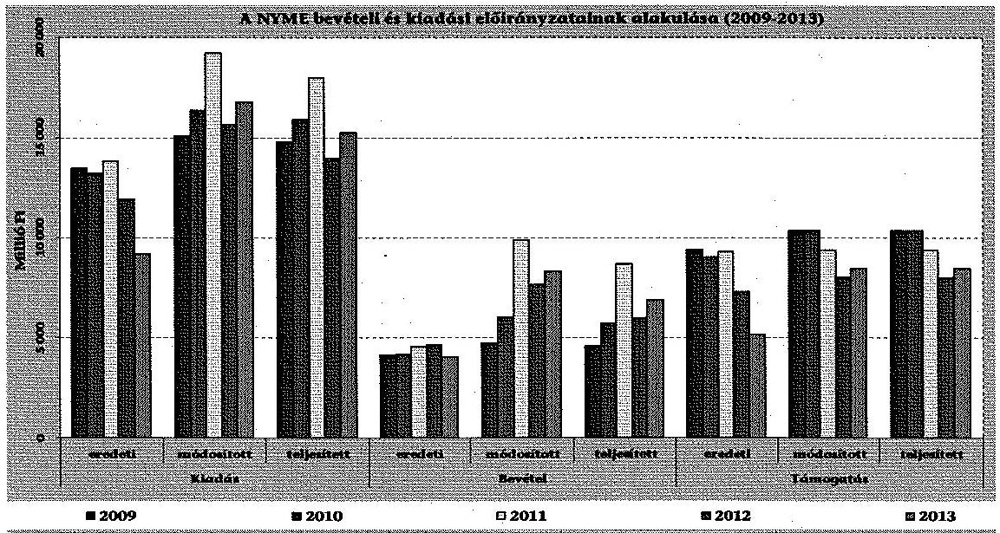
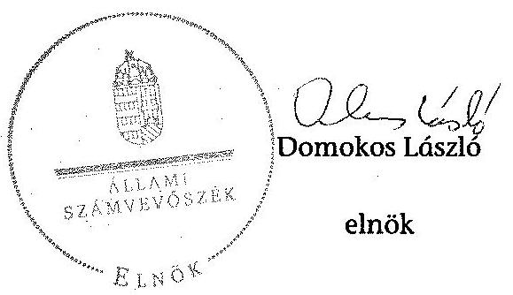
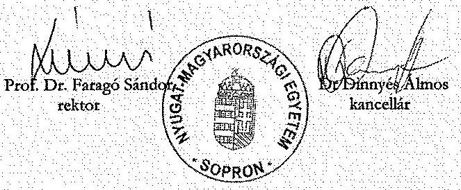
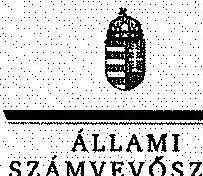
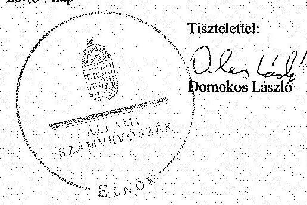
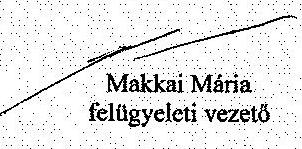

# ÁLLAMI   SZÁMVEVŐSZÉK 

## JELENTÉS

a Nyugat-magyarországi Egyetem ellenőrzéséről - Az állami felsőoktatási intézmények gazdálkodásának, működésének ellenőrzése

---

# Állami Számvevőszék 

Iktatószám: V-0588-125/2015.
Témaszám: 1622
Vizsgálat-azonosító szám: V-068914

## Az ellenőrzést felügyelte:

Makkai Mária
felügyeleti vezető
Az ellenőrzés végrehajtásáért felelős:
Kováts T. Balázs
ellenőrzésvezető
A számvevői munkaanyagok feldolgozását és a Jelentés összeállítását végezte:

Kováts T. Balázs
ellenőrzésvezető
Baki István
számvevő tanácsos
Dr. Zsolnay András
számvevő
Igar Tamás
számvevő

Az ellenőrzést végezték:

| Baki István | Bencsik Árpád | Buús Zoltánné |
| :-- | :-- | :-- |
| számvevő tanácsos | számvevő | Hütter Erzsébet |
|  |  | számvevő tanácsos |
| Dr. Zsolnay András | Humli Tamásné | Igar Tamás |
| számvevő | számvevő tanácsos | számvevő |
| Kiss Rita Teréz | Magyaricsné Hajdú | Pálfiné Pusztai |
| számvevő tanácsos | Regina | Magdolna |
|  | számvevő | számvevő tanácsos |

## Ritecz Tibor

számvevő tanácsos

A témához kapcsolódó eddig készített számvevőszéki jelentések:
címe
sorszáma
Jelentés az oktatási és kulturális ágazat irányítási rendszerének, 1106 működésének ellenőrzéséről

---

Jelentés a felsőoktatás oktatási infrastruktúra-fejlesztési program- ..... 1171 jának ellenőrzéséről
Jelentés az állami felsőoktatási intézmények érdekeltségébe tartozó ..... 1290 gazdasági társaságok támogatásának és nyereségük hasznosulásának ellenőrzéséről
Jelentés a Szolnoki Főiskola ellenőrzéséről - Az állami felsőoktatási ..... 14196 intézmények gazdálkodásának, működésének ellenőrzése
Jelentés a Pannon Egyetem ellenőrzéséről - Az állami felsőoktatási ..... 14197 intézmények gazdálkodásának, működésének ellenőrzése
Jelentés a Károly Róbert Főiskola ellenőrzéséről - Az állami felsőok- ..... 14198 tatási intézmények gazdálkodásának, működésének ellenőrzése
Jelentés a Magyar Képzőművészeti Egyetem ellenőrzéséről - Az ál- ..... 14199 lami felsőoktatási intézmények gazdálkodásának, működésének ellenőrzése
Jelentés a Miskolci Egyetem ellenőrzéséről - Az állami felsőoktatási ..... 14200 intézmények gazdálkodásának, működésének ellenőrzése
Jelentés a Széchenyi István Egyetem ellenőrzéséről - Az állami fel- ..... 14201 sőoktatási intézmények gazdálkodásának, működésének ellenőrzése
Jelentés az Eszterházy Károly Főiskola ellenőrzéséről - Az állami ..... 14204 felsőoktatási intézmények gazdálkodásának, működésének ellenőrzése
Jelentés a Magyar Táncművészeti Főiskola ellenőrzéséről - Az ál- ..... 14205 lami felsőoktatási intézmények gazdálkodásának, működésének ellenőrzése
Jelentés a Budapesti Műszaki és Gazdaságtudományi Egyetem el- ..... 14218 lenőrzéséről - Az állami felsőoktatási intézmények gazdálkodásá- nak, működésének ellenőrzése

---

.

---

# TARTALOMJEGYZÉK 

BEVEZETÉS ..... 13
I. ÖSSZEGZŐ MEGÁLLAPÍTÁSOK, KÖVETKEZTETÉSEK, JAVASLATOK ..... 17
II. RÉSZLETES MEGÁLLAPÍTÁSOK ..... 25

1. Fenntartói és ágazati irányítási jogok gyakorlása ..... 25
2. Az intézmény belső kontrollrendszerének kialakítása és működtetése ..... 27
3. Az egyetem pénzügyi gazdálkodása ..... 32
3.1. A bevételi és kiadási előirányzatok alakulása, a pénzügyi egyensúlyt befolyásoló tényezők ..... 32
3.2. A döntéshozó szervek gazdálkodással kapcsolatos joggyakorlása ..... 38
3.3. Az oktatási és egyéb tevékenységek elkülönítése ..... 40
3.4. A bevételi és kiadási előirányzatok megállapítása, módosítás szabályossága, felhasználással kapcsolatos adatszolgáltatások, maradványok kezelése ..... 41
3.5. Kiadási előirányzatok felhasználása ..... 42
3.6. Bevételi előirányzatok beszedése ..... 46
3.7. A hazai forrásból finanszírozott projektekhez, feladatokhoz kapott forrásokkal való elszámolás ..... 47
4. Az egyetem vagyongazdálkodása ..... 47
4.1. A vagyongazdálkodás szabályozottsága ..... 47
4.2. Vagyonelemek kimutatása ..... 49
4.3. Vagyonelemekkel való gazdálkodás ..... 53
4.4. A vagyon változása ..... 55
5. A külső ellenőrzések által tett javaslatok hasznosulása ..... 58
5.1. ÁSZ ellenőrzések által tett javaslatok hasznosulása ..... 58
5.2. Az egyéb külső ellenőrzések javaslatainak hasznosulása ..... 60
6. Az integritás kontrollok kialakítása és működtetése ..... 61
MELLÉKLETEK
7. számú A Nyugat-magyarországi Egyetem kiadási és bevételi előirányzatai, azok teljesítése a 2009-2013. években
8. számú A Nyugat-magyarországi Egyetem kiadásainak, bevételeinek változása a 2009-2013. években
9. számú Kimutatás a Nyugat-magyarországi Egyetem bevételeiről és kiadásairól, valamint adósságszolgálatáról a 2009-2013. években

---

4. számú A Nyugat-magyarországi Egyetem mérlegadatai a 2009-2013. években
5. számú A Nyugat-magyarországi Egyetem gazdálkodása szabályszerűségének értékelése a mintatételek alapján
6. számú A Nyugat-magyarországi Egyetem rektorának észrevétele
7. számú A Nyugat-magyarországi Egyetem rektorának észrevételére adott válasz

# FÜGGELÉK 

1. számú Az integritás érvényesítése érdekében kialakított és működtetett intézményi kontrollrendszer

---

# RÖVIDÍTÉSEK JEGYZÉKE 

## Törvények

Áht. 1
Áht. 2
ÁSZ tv.
Eisztv.
Feot.
Gt.
Info tv.
$\mathrm{Kbt} . \mathrm{l}_{1}$
Kbt. 2
Kjt.
Nftv.
Nvtv.
Sztv.
Vtv.
Korm. rendeletek
Áhsz.

Új Áhsz.
Ámr. 1
Ámr. 2
Ávr.
Ber.
Bkr.
Vtvr.
51/2007. (III. 26.) Korm. rendelet

50/2008. (III. 14.) Korm. rendelet
1992. évi XXXVIII. törvény az államháztartásról (hatálytalan 2012. január 1-jétől)
2011. évi CXCV. törvény az államháztartásról
2011. évi LXVI. törvény az Állami Számvevőszékről
2005. évi XC. törvény az elektronikus információszabadságról (hatálytalan 2012. január 1-jétől)
2005. évi CXXXIX. törvény a felsőoktatásról (hatálytalan 2012. szeptember 1-jétől)
2006. évi IV. törvény a gazdasági társaságokról (hatálytalan 2014. március 15-től)
2011. évi CXII. törvény az információs önrendelkezési jogról és az információszabadságról
2003. évi CXXIX. törvény a közbeszerzésekről
2011. évi CVIII. törvény a közbeszerzésekről
1992. évi XXXIII. törvény a közalkalmazottak jogállásáról
2011. évi CCIV. törvény a nemzeti felsőoktatásról
2011. évi CXCVI. törvény a nemzeti vagyonról
2000. évi C. törvény a számvitelről
2007. évi CVI. törvény az állami vagyonról

249/2000. (XII. 24.) Korm. rendelet az államháztartás szervezetei beszámolási és könyvvezetési kötelezettségének sajátosságairól (hatálytalan 2014. január 1-jétől)
4/2013. (I. 11.) Korm. rendelet az államháztartás számviteléről
217/1998. (XII. 30.) Korm. rendelet az államháztartás működési rendjéről (hatálytalan 2010. január 1-jétől)
292/2009. (XII. 19.) Korm. rendelet az államháztartás működési rendjéről (hatálytalan 2012. január 1-jétől)
368/2011. (XII. 31.) Korm. rendelet az államháztartásról szóló törvény végrehajtásáról
193/2003. (XI. 26.) Korm. rendelet a költségvetési szervek belső ellenőrzéséről (hatálytalan 2012. január 1-jétől)
370/2011. (XII. 31.) Korm. rendelet a költségvetési szervek belső kontrollrendszeréről és belső ellenőrzéséről
254/2007. (X. 4.) Korm. rendelet az állami vagyonnal való gazdálkodásról
51/2007. (III. 26.) Korm. rendelet a felsőoktatásban részt vevő hallgatók juttatásairól és az általuk fizetendő egyes térítésekről
50/2008. (III. 14.) Korm. rendelet a felsőoktatási intézmények képzési, tudományos célú és fenntartói normatíva

---

## Határozatok

1132/2010. (VI. 18.)
Korm. határozat
1083/2011. (IV.12.)
Korm. határozat
1316/2011. (IX. 19.)
Korm. határozat
1365/2011. (XI. 8.)
Korm. határozat
1036/2012. (II. 21.)
Korm. határozat

1657/2012. (XII. 20.)
Korm. határozat

## További rövidítések

adatvédelmi és adatkezelési szabályzat
alapító okirat
ÁSZ
egyetem
/intézmény/NYME
EMMI
értékelési szabályzat
EGR
FEUVE
FIR
FSA
GT
gazdálkodási szabályzat
HÖK
IFT
leltározási szabályzat
KEOP
Kincstár
KIR
közbeszerzési szabályzat
miniszter/fenntartó
minisztérium
alapján történő finanszírozásáról
1132/2010. (VI. 18.) Korm. határozat a 2010. évi költségvetéssel összefüggő egyes feladatokról
1083/2011. (IV.12.) Korm. határozat a költségvetési főfelügyelők és költségvetési felügyelők kirendeléséről
1316/2011. (IX. 19.) Korm. határozat a 2011. évi költségvetési egyensúlyt megtartó intézkedésekről
1365/2011. (XI. 8.) Korm. határozat a 2012. évi hiánycél tartását biztosító további feladatokról
1036/2012. (II. 21.) Korm. határozat a 2012. és 2013. évi költségvetési hiánycél biztosításához szükséges további intézkedésekről
1657/2012. (XII. 20.) Korm. határozat a kormányzati stratégiai dokumentumok felülvizsgálatával kapcsolatos feladatokról
a Nyugat-magyarországi Egyetem Adatvédelmi és adatkezelési szabályzata
a Nyugat-magyarországi Egyetem alapító okirata
Állami Számvevőszék
Nyugat-magyarországi Egyetem
Emberi Erőforrások Minisztériuma
a Nyugat-magyarországi Egyetem eszközök és források értékelési szabályzata
Egységes gazdálkodási rendszer
folyamatba épített, előzetes, utólagos és vezetői ellenőrzés
Felsőoktatási Információs Rendszer
Felsőoktatási Strukturális Alap
a Nyugat-magyarországi Egyetem Gazdasági Tanácsa
a Nyugat-magyarországi Egyetem gazdálkodási szabályzata
Hallgatói Önkormányzat
Intézményfejlesztési Terv
a Nyugat-magyarországi Egyetem leltározási és leltárkezelési szabályzata
Környezet és Energia Operatív Program
Magyar Államkincstár
Központosított Illetmény számfejtési Rendszer (A Magyar Államkincstár által működtetett informatikai rendszer)
a Nyugat-magyarországi Egyetem közbeszerzési szabályzata
az oktatásért felelős miniszter.
2009-től 2010 májusáig az OKM, 2010 májusától 2012 májusáig a NEFMI, 2012 májusától az EMMI

---

| MNV Zrt. | Magyar Nemzeti Vagyonkezelő Zrt. |
| :-- | :-- |
| NEFMI | Nemzeti Erőforrás Minisztérium |
| NEPTUN | Tanulmányi hallgatói információs rendszer |
| NGM | Nemzetgazdasági Minisztérium |
| OH | Oktatási Hivatal |
| OKM | Oktatási és Kulturális Minisztérium |
| PPP | Public-Private Partnership (magán és közszféra együtt- |
|  | működése) |
| selejtezési szabályzat | a Nyugat-magyarországi Egyetem 2008. és 2013. között |
|  | hatályos vagyontárgyak hasznosításának és selejtezésé- |
|  | nek szabályzatai |
| számlarend | a Nyugat-magyarországi Egyetem számlarendje |
| számviteli politika | a Nyugat-magyarországi Egyetem számviteli politikája |
| szenátus | a Nyugat-magyarországi Egyetem szenátusa |
| SZMSZ | a Nyugat-magyarországi Egyetem Szervezeti és Működési |
|  | Szabályzata |
| TÁMOP | Társadalmi Megújulás Operatív Program |

---

# ÉRTELMEZŐ SZÓTÁR 

alapító
autonómia
állami felsőoktatási intézmény saját tulajdona
állami vagyon
állami vagyon hasznosítása

A központi költségvetési szerv alapítója az Országgyűlés, a Kormány vagy a miniszter. A felsőoktatási intézmények vonatkozásában az alapítói jogokat a felsőoktatásért felelős minisztérium gyakorolja.
A felsőoktatási intézmény Feot.-ban, illetve Nftv.-ben szabályozott önrendelkezése, amely biztosítja az intézmény önálló oktatási, kutatási, szervezeti és működési, valamint gazdálkodási tevékenységét
A felsőoktatási intézmény saját bevételének a költségek teljes körű levonása, - az adományozás és öröklés kivételével - a rendelkezésre bocsátott vagyon állagának megóvásáról, pótlásáról való gondoskodás után fennmaradt része terhére szerzett vagyona
A Vtv. 1. § (2) bekezdése szerint állami vagyonnak minősül:
a) az állami tulajdonban lévő ingó dolog, valamint a dolog módjára hasznosítható természeti erő,
b) az állami tulajdonban lévő termőföldekből álló, külön törvényben szabályozott Nemzeti Földalap,
c) az állami tulajdonban lévő - a b) pont hatálya alá nem tartozó - ingatlan,
d) az állami tulajdonban lévő értékpapír,
e) az államot megillető társasági részesedés és más vagyoni értékű jog.
(hatályos 2010. június 16-ig)
a) az állam tulajdonában lévő dolog, valamint a dolog módjára hasznosítható természeti erő,
b) az a) pont hatálya alá nem tartozó mindazon vagyon, amely vonatkozásában törvény az állam kizárólagos tulajdonjogát nevesíti,
c) az állam tulajdonában lévő tagsági jogviszonyt megtestesítő értékpapír, illetve az államot megillető egyéb társasági részesedés,
d) az államot megillető olyan immateriális, vagyoni értékkel rendelkező jogosultság, amelyet jogszabály vagyoni értékű jogként nevesít.
(hatályos 2010. június 17-től)
A Vtv. 23. § (1) bekezdése szerint: Az állami vagyont az MNV Zrt. maga kezeli, illetve szerződés - így különösen bérlet, haszonbérlet, szerződésen alapuló haszonélvezet, vagyonkezelés, megbízás - alapján központi költségvetési szervnek, természetes vagy jogi személynek, illetőleg jogi személyiséggel nem rendelkező gazdasági társaságnak hasznosításra átengedi. (hatályos 2010. december 31-ig)

---

állami vagyon hasznosítására kötött szerződés
állami vagyon használója
állami vagyon értékesítése
állami vagyon kezelője /vagyonkezelő

Az állami vagyont az MNV Zrt. maga kezeli, vagy szerződés - így különösen bérlet, haszonbérlet, szerződésen alapuló haszonélvezet, vagyonkezelés, megbízás - alapján központi költségvetési szervnek, természetes vagy jogi személynek, vagy jogi személyiséggel nem rendelkező gazdálkodó szervezetnek hasznosításra átengedi.
(hatályos 2011. december 31-ig)
Az állami vagyont az MNV Zrt. maga kezeli, vagy szerződés - így különösen bérlet, haszonbérlet, megbízás - alapján központi költségvetési szervnek, természetes vagy jogi személynek, vagy jogi személyiséggel nem rendelkező gazdálkodó szervezetnek hasznosításra átengedi.
(hatályos 2012. január 1-jétől)
A Vtv. 23. § (2) bekezdése szerint: Az állami vagyon hasznosítására kötött szerződések elsődleges célja az állami vagyon hatékony működtetése, állagának védelme, értékének megőrzése, illetve gyarapítása, az állami és közfeladatok ellátásának elősegítése.
A Vtvr. 1. § (7) a) pontja szerint: Az a természetes személy, jogi személy, illetve jogi személyiséggel nem rendelkező gazdasági társaság, amely az MNV Zrt.vel kötött szerződés alapján, bármely jogcímen (bérlet, haszonbérlet, vagyonkezelés, használat stb.) állami vagyont birtokol, használ, hasznosít.
(hatályos 2010. december 31-ig)
Az a természetes személy, jogi személy, illetve jogi személyiséggel nem rendelkező szervezet, amely, illetve aki törvény vagy szerződés alapján, bármely jogcímen (pl. bérlet, haszonbérlet, vagyonkezelési szerződés, használat stb.) állami vagyont birtokol, használ, szedi annak használt, hasznosít, ide nem értve a tulajdonosi jogok gyakorlóját.
(hatályos 2011. január 1 - 2011. december 31-ig)
Az a természetes vagy jogi személy, jogi személyiséggel nem rendelkező szervezet, aki, vagy amely törvény vagy szerződés alapján, bármely jogcímen (bérlet, haszonbérlet, használat stb.) állami vagyont birtokol, használ, szedi annak használt, hasznosít, ide nem értve a haszonélvezőt, a vagyonkezelőt és

 a tulajdonosi jogok gyakorlóját.
(hatályos 2012. január 1-jétől)
Állami vagyon tulajdonjogának bármely jogcímen történő, visszterhes átruházása. (Vtvr. 1. § (7) d) pont)
A Vtv. 23. § (1) bekezdése szerint: Az állami vagyont az MNV Zrt. maga kezeli, vagy szerződés - így különösen bérlet, haszonbérlet, szerződésen alapuló ha-

---

belső kontrollrendszer

CLF-módszer
előirányzat-maradvány
szonélvezet, vagyonkezelés, megbízás - alapján központi költségvetési szervnek, természetes vagy jogi személynek, illetőleg jogi személyiséggel nem rendelkező gazdasági társaságnak hasznosításra átengedi. (hatályos 2010. január 1-2010. december 31-ig)
Az állami vagyont az MNV Zrt. maga kezeli, vagy szerződés - így különösen bérlet, haszonbérlet, szerződésen alapuló haszonélvezet, vagyonkezelés, megbízás - alapján központi költségvetési szervnek, természetes vagy jogi személynek, illetőleg jogi személyiséggel nem rendelkező gazdálkodó szervezetnek hasznosításra átengedi. (hatályos 2011. január 1-2011. december 31-ig)

Az állami vagyont az MNV Zrt. maga kezeli, vagy szerződés - így különösen bérlet, haszonbérlet, megbízás - alapján központi költségvetési szervnek, természetes vagy jogi személynek, vagy jogi személyiséggel nem rendelkező gazdálkodó szervezetnek hasznosításra átengedi. Az állami vagyonra vonatkozóan az MNV Zrt. kizárólag az Nvtv-ben meghatározott személyekkel köthet vagyonkezelési szerződést. (hatályos 2012. január 1-jétől)
A belső kontrollrendszer a kockázatok kezelése és tárgyilagos bizonyosság megszerzése érdekében kialakított folyamatrendszer, amely azt a célt szolgálja, hogy megvalósuljanak a következő célok:
a) a működés és gazdálkodás során a tevékenységeket szabályszerűen, gazdaságosan, hatékonyan, eredményesen hajtsák végre,
b) az elszámolási kötelezettségeket teljesítsék, és
c) megvédjék az erőforrásokat a veszteségektől, károktól és nem rendeltetésszerű használattól.
A módszer a működési és a felhalmozási költségvetés bevételeinek és kiadásainak, ezek egyenlegeinek elkülönített, majd összevont kimutatását alkalmazza valamely költségvetési intézmény pénzügyi helyzetének megítéléséhez. Kiemelten mutatja be a finanszírozási műveletek egyenlege nélküli és az azt magába foglaló pénzügyi pozíciót, valamint a tőketörlesztéssel, értékpapír beváltással csökkentett működési jövedelmet.
Az értékelés a pénzügyi kapacitás fogalmát helyezi a középpontba.
Az államháztartás központi alrendszerébe tartozó költségvetési szerveknél a módosított bevételi és kiadási előirányzatok és azok teljesítésének a Kormány rendeletében meghatározott tételekkel korrigált különbözete az előirányzat-maradvány. (Áht. 2. § (1) bekezdés m) pontja)

---

fenntartó
finanszírozási műveletek nélküli pozíció

Gazdasági Tanács
hároméves fenntartói megállapodás
információs és kommunikációs rendszer
intézményfejlesztési terv
integritás

A Feot. 7. § (2) és az Nftv. 4. § (2) bekezdése szerint az, aki az alapítói jogot gyakorolja, ellátja a felsőoktatási intézmény fenntartásával kapcsolatos feladatokat.
A CLF módszer szerint számított működési és felhalmozási tevékenység pénzügyi egyenlegének összevont értéke. Megmutatja, hogy a költségvetési intézmény bevételei fedezetet biztosítottak-e a kiadásokra. A finanszírozási műveletek nélküli (GFS) pozíció alapján a pénzügyi helyzetet akkor tekintettük megfelelőnek, ha az adott év működési és felhalmozási bevételei fedezetet nyújtottak az adott év működési és felhalmozási kiadásaira.
A felsőoktatási intézmény javaslattevő, véleményező, a stratégiai döntések előkészítésében részt vevő, és a döntések végrehajtásának ellenőrzésében közreműködő szerve
Az állami felsőoktatási intézmények központi költségvetési támogatására három éves fenntartói megállapodást kell kötni az állami felsőoktatási intézmény és a fenntartó között. A fenntartói megállapodás tartalmazza a felsőoktatási intézmény által meghatározott hároméves időszakra vállalt teljesítménykövetelményeket, továbbá az állandó jellegű támogatási részeket, valamint a változó jellegű támogatások megállapításának jogcímeit. A változó elemű támogatás évenkénti elszámolási kötelezettséggel kerül meghatározásra.
A költségvetési szerv vezetője köteles olyan rendszereket kialakítani és működtetni, melyek biztosítják, hogy a megfelelő információk a megfelelő időben eljutnak az illetékes szervezethez, szervezeti egységhez, illetve személyhez.
A szenátus fogadja el az intézményfejlesztési tervet. Az intézményfejlesztési tervben kell meghatározni a fejlesztéssel, a fenntartó által a felsőoktatási intézmény rendelkezésére bocsátott vagyon hasznosításával, megóvásával, elidegenítésével kapcsolatos elképzeléseket, a várható bevételeket és kiadásokat. Az intézményfejlesztési tervet középtávra, legalább négyéves időszakra kell elkészíteni, évenkénti bontásban meghatározva a végrehajtás feladatait. Az intézményfejlesztési terv része a foglalkoztatási terv. A foglalkoztatási tervben kell meghatározni azt a létszámot, amelynek keretei között a felsőoktatási intézmény megoldhatja feladatait. (Feot. 27. § (3) bekezdés)
Az integritás olyasvalakit vagy valamit jelöl, aki vagy ami romlatlan, sértetlen, feddhetetlen. Az integritás elvek, értékek, cselekvések, módszerek, intéz-

---

kincstári biztos
kincstári költségvetés
kockázatkezelési rendszer
kontrollkörnyezet
költségvetési főfelügyelő, felügyelő
kedések konzisztenciáját jelenti: olyan magatartásmódot, amely meghatározott értékeknek megfelel.
A kincstári biztos kijelölését az államháztartásért felelős miniszternél a Kincstár kezdeményezi. A kincstári biztos köteles figyelemmel kísérni megbízatásának időpontjától kezdve a költségvetési szerv tervezését, gazdálkodását, beszámolását, a jogszabályokban előírt feladatainak ellátását, feltárni azokat az okokat, amelyek a tartós fizetésképtelenséghez vezettek, a szükséges intézkedések azonnali végrehajtására irányuló intézkedési tervet készíteni, azonnali intézkedéseket kezdeményezni és írásbeli utasításokat kiadni a tartozásállomány felszámolására, a gazdálkodás egyensúlyának biztosítására, a követelések behajtására. (Ávr. 116-117. §)
A központi költségvetésről szóló törvény elfogadását követően a fejezetet irányító szerv az államháztartás központi alrendszerébe tartozó költségvetési szerv és a fejezeti kezelésű előirányzat kiemelt előirányzatait, valamint az elkülönített állami pénzalapok és a társadalombiztosítás pénzügyi alapjai jogszabályi előírás szerinti bevételeit és kiadásait kincstári költségvetés kiadásával állapítja meg. (Áht.; 24. § (3) bekezdés, Áht. 2 28. § (2) bekezdés, Ávr. 31. § (2) bekezdés) Irányítási eszközök és módszerek összessége, melynek elemei a szervezeti célok elérését veszélyeztető tényezők (kockázatok) azonosítása, elemzése, csoportosítása, nyomon követése, valamint szükség esetén a kockázati kitettség mérséklése.
A kontrollkörnyezet a költségvetési szerv vezetőinek a szervezeti célok elérését segítő kontrollok kialakításával és működtetésével, korszerűsítésével kapcsolatos magatartását, a kontrollpontokról érkező információkra való reagálását jelenti.
Azok az elvek, politikák és eljárások, amelyeket a kockázatok meghatározása és a szervezet céljainak elérése érdekében alakítanak ki.
A költségvetési szerv vezetője köteles a szervezeten belül kontrolltevékenységeket kialakítani, amelyek biztosítják a kockázatok kezelését, hozzájárulnak a szervezet céljainak eléréséhez.
Az államháztartásért felelős miniszter a Kormány irányítása alá tartozó fejezetet irányító szervhez, a Kormány irányítása vagy felügyelete alá tartozó költségvetési szervhez, valamint az elkülönített állami pénzalapok és a társadalombiztosítás pénzügyi alapjai kezelő szerveihez költségvetési főfelügyelőt, felügyelőt rendelhet ki. A költségvetési főfelügyelő, felügyelő a gazdálkodás költségvetés-politikával való összhangja és a takarékos, szabályszerű, eredményes

---

kisebbségi jogokat biztosító részesedés
maximális hallgatói létszám
mértékadó befolyást biztosító részesedés
minisztérium
minősített többséget biztosító részesedés
monitoring
működési jövedelem
normatív költségvetési támogatás felsőoktatási intézmények működéséhez
működés érdekében a Kormány rendeletében meghatározott intézkedéseket tehet, így különösen előzetesen véleményezi a kötelezettségvállalásra irányuló eljárásokat és a nagy összegű kötelezettségvállalások tekintetében kifogással élhet. (Áht. 3 39. § (1)-(2) bekezdés)

A részesedés mértéke legalább 5%. (Gt. 49. §)
Az a felsőoktatási intézmény alapító okiratában, működési engedélyében meghatározott hallgatói létszám, ameddig terjedően a felsőoktatási intézmény - figyelembe véve a hallgatók fogadásához és az oktatói tevékenység folytatásához rendelkezésre álló személyi feltételeket, helyiségeket és eszközöket - valamennyi évfolyamára számítva, teljes kihasználtsággal működve hallgatói jogviszonyt létesíthet.
A részesedés mértéke legalább 20%, de 50%-nál kisebb. (Sztv. 3. § (2) bekezdés 4. pont)
A felsőoktatásért felelős minisztérium, amely 2009-től 2010 májusáig az OKM, 2010 májusától 2012 májusáig a NEFMI, 2012 májusától az EMMI volt.
A minősített befolyásszerző az ellenőrzött társaságban a szavazatok legalább hetvenöt százalékával rendelkezik. (Gt. 52. § (2) bekezdés)
A különböző szintű szervezeti célok megvalósításához szükséges folyamatok figyelemmel kísérése, melynek során a releváns eseményekről és tevékenységekről (együtt: folyamatokról) rendszeres jelleggel, strukturált, döntéstámogató információkhoz jutnak a szervezet vezetői.
A folyó bevételek és folyó kiadások egyenlege. Azt mutatja, hogy a folyó bevételek fedezetet nyújtanak-e a folyó kiadásokra.
A felsőoktatási intézmények működéséhez biztosított normatív költségvetési támogatás lehet
a) hallgatói juttatásokhoz nyújtott,
b) képzési,
c) tudományos célú,
d) fenntartói,
e) egyes feladatokhoz nyújtott
támogatás. A központi költségvetésből biztosított normatív költségvetési támogatásra - a d) pontban meghatározott normatív költségvetési támogatás kivételével - a felsőoktatási intézmények azonos feltételek alapján válnak jogosulttá. Az a)-e) pontokban meghatározott jogcímek - az a) és e) pontban meghatározott jogcímek kivételével - nem jelentenek felhasználási kötöttséget. (Feot. 127. § (3) bekezdés)

---

normatív támogatások
saját bevétel
szenátus
tárgyévi pénzügyi pozíció

Az ellenőrzési időszakban hatályos költségvetési törvények 3. sz. mellékletében megjelölt közoktatási hozzájárulások, az 5. sz. mellékletében megjelölt központosított előirányzatok, továbbá a 8. sz. mellékletében megjelölt normatív, kötött felhasználású támogatások együttesen.
Az államháztartáson kívüli források - beleértve minden olyan, az Európai Uniótól származó támogatást, amelyhez nem az állami költségvetésen keresztül jut a felsőoktatási intézmény, továbbá a szakképzési hozzájárulási fizetési kötelezettség teljesítéseként elszámolt forrásokat is, ide nem értve az állami vagyon értékesítésének ellenértékét - valamint a Kutatási és Technológiai Innovációs Alapból származó bevételek.
A felsőoktatási intézmény, döntést hozó és a döntés végrehajtását ellenőrző testülete. (Feot. 20. § (1) bekezdés, Nftv. 12. § (1)-(3) bekezdés)
A működési és felhalmozási bevételek, valamint kiadások egyenlege a finanszírozási műveletek egyenlegének figyelembe vételével.

---

# JELENTÉS   a Nyugat-magyarországi Egyetem ellenőrzéséről - Az állami felsőoktatási intézmények gazdálkodásának, működésének ellenőrzése 

## BEVEZETÉS

Az ÁSZ Stratégiája ${ }^{1}$ alapértékeinek egyike, hogy az államháztartás komplex folyamatainak átláthatósága érdekében rendszerszemléletű/holisztikus megközelítésű, egymásra épülő, a szinergiahatást kihasználó, összefoglaló értékelésre lehetőséget adó ellenőrzéseket végez. Az államháztartás központi alrendszerébe tartozó felsőoktatási intézmények ellenőrzése során az Állami Számvevőszék értékeli azok pénzügyi-gazdasági helyzetét, feltárja a működésükben rejlő kockázatokat, ezzel előmozdítja a közpénzügyek átláthatóságát, rendezettségét.

Az állami felsőoktatási intézmények gazdálkodását - az Áht. ${ }_{1,2}$ előírásai mellett - a felsőoktatásról szóló 2005. évi CXXXIX. törvény (Feot.), valamint a nemzeti felsőoktatásról szóló 2011. évi CCIV. törvény (Nftv.) előírásai határozták meg.

Magyarország Nemzeti Reform Programja keretében, a Széll Kálmán Terv 2020-ig a 30-34 évesek körében, a felsőfokú vagy annak megfelelő végzettséggel rendelkezők arányának 30,3%-ra való növelését irányozta elő, amely a 2010. évhez képest 4,6% pontos növekedési célkitűzést jelent. A rendezett gazdasági környezet, az önállósággal élni tudó, felelős, elszámoltatható intézményi gazdálkodói magatartás elengedhetetlen feltétele a kitűzött szakmai célok elérésének.

Az ellenőrzés célja annak megállapítása, hogy szabályos volt-e az állami felsőoktatási intézmény pénzügyi és vagyongazdálkodása, biztosított volt-e a vagyonnal való felelős gazdálkodás követelményének érvényesülése, jogszabályi előírásoknak megfelelően működött-e a belső kontrollrendszer; az irányító szerv tevékenysége a jogszabályi előírásoknak megfelelt-e.

Ennek keretében értékeltük a Nyugat-magyarországi Egyetemnél:

- a fenntartói és az ágazati irányítási jogok gyakorlása előírásoknak való megfelelőségét;

[^0]
[^0]:    ${ }^{1}$ Állami Számvevőszék: Stratégia. Az Állami Számvevőszék hivatalos stratégiai dokumentum rendszere 2011-2015. 2012. december. http://www.asz.hu/strategia/asz-strategia/asz-strategia-2011.pdf

---

- az intézmény belső kontrollrendszere jogszabályoknak megfelelő kialakítását és működtetését;
- az intézmény döntéshozó szerveinek joggyakorlása jogszabályoknak való megfelelőségét; az intézmény oktatási és egyéb (gyakorlati és kutatási) tevékenységei elkülönítését, átláthatóságát, illetve pénzügyi gazdálkodása szabályszerűségét;
- az intézmény vagyongazdálkodása előírásoknak való megfelelőségét;
- az ellenőrzött időszakban végzett külső (ÁSZ, fenntartói, KEHI, kincstári) ellenőrzések által tett javaslatok hasznosulását;
- az intézmény korrupcióval szembeni veszélyeztetettségének csökkentése érdekében az integritási szemlélet érvényesülését a gazdálkodási folyamatokban.

Az ellenőrzés várható hasznosulása: Az ellenőrzés eredményének hasznosulásaként képet kapunk a Nyugat-magyarországi Egyetemen kialakult pénzügyi helyzetről; a kormány által kirendelt költségvetési (fő) felügyelői rendszer működésének tapasztalatairól; az oktatási és egyéb tevékenységek és költségelszámolások elhatárolásáról, átláthatóságáról és szabályosságáról. A felsőoktatási intézmények gazdálkodási szabadságának pénzügyi és vagyoni helyzetre gyakorolt hatásairól, a vagyonnal való felelős, értékmegőrző gazdálkodás érvényesüléséről, továbbá a belső kontrollrendszer működéséről. Az ellenőrzés az ellenőrzött számára visszajelzést ad a gazdálkodása
 kereteinek kialakításáról, a működésében fellépő hiányosságokról, javaslataival hozzájárul azok kiküszöböléséhez és a jó kormányzáshoz. A törvényalkotás számára összegzett tapasztalatok állnak rendelkezésre a felsőoktatási intézmények döntéseinek, gazdálkodásának szabályszerűségéről, amelyek alapján - indokolt esetben - jogszabály-módosítás kezdeményezhető. Az integritás kultúra kialakítása hozzájárul az elszámoltathatóság és átláthatóság érvényesítéséhez, egyben támogatja a szervezet védettségét a korrupciós kitettséggel szemben, valamint annak megelőzése is irányítottabbá válik. A társadalom számára jelzi, hogy közpénz nem maradhat ellenőrizetlenül, az ÁSZ értékteremtő rend kialakításához és megőrzéséhez hozzájáruló tevékenysége pozitív hatással lesz a szervezetről kialakított összkép formálásában.

Az ellenőrzés típusa: szabályszerűségi ellenőrzés
Az ellenőrzött időszak: 2009. január 1. - 2013. december 31.
Az ellenőrzéssel érintett szervezetek: az Emberi Erőforrások Minisztériuma és a Nyugat-magyarországi Egyetem.

Az ellenőrzés jogszabályi alapját az Állami Számvevőszékről szóló 2011. évi LXVI. törvény 1. § (3) bekezdése, az 5. § (3)-(6) bekezdései, 33. § (7) bekezdése, valamint az Államháztartásról szóló 2011. évi CXCV. törvény 61. § (2) bekezdésének előírásai képezik.

Az ellenőrzés az INTOSAI által kiadott nemzetközi standardok figyelembe vételével, az ellenőrzési programban foglalt értékelési szempontok szerint történt.

---

A pénzügyi és vagyongazdálkodás terén az egyes területek szabályszerű működését mintavétellel ellenőriztük, ez alapján a sokaságokban előforduló hibás tételek arányát becsültük. A jogszabályoknak és a belső előírásoknak megfelelőnek, azaz szabályszerűnek tekintettük az adott kiadási előirányzat felhasználását, bevétel beszedését, mérlegtétel értékelését, amennyiben a minta ellenőrzésének eredménye alapján 95%-os bizonyossággal a teljes sokaságban a hibás tételek aránya kisebb volt, mint 10%, nem megfelelőnek értékeltük, ha a hibás tételek aránya a 10%-ot meghaladta. Kockázatot, illetve magas kockázatot jeleztünk, amennyiben egy adott terület vonatkozásában a minta alapján a teljes sokaságban nem volt teljes körűen biztosított a jogszabályoknak és a belső szabályzatoknak megfelelő működés. A mintatételek kiértékelését az 5. számú melléklet tartalmazza.

A belső kontrollrendszer kialakításának és működtetésének értékelése során a jogszabályi előírások mellett az Ámr. 145/A. § (1) és (3) bekezdése, az Ámr. 155. § (1) és (3) bekezdése, valamint a Bkr. 5. § (1) bekezdése alapján figyelembe vettük az államháztartásért felelős miniszter által közzétett irányelvekben és módszertani útmutatókban foglaltakat is. A belső kontrollrendszert az értékelés során legalább 85%-os megfelelőség esetén megfelelőnek, legalább 70%-os megfelelőség esetén részben megfelelőnek, 70%-os megfelelőség alatt pedig nem megfelelőnek minősítettük.

Az egyetemet az érintett időszakban átalakítás nem érintette, ezért az ellenőrzés az átalakítás során alkalmazandó jogszabályok betartásának ellenőrzésére nem terjedt ki.

A Nyugat-magyarországi Egyetem (NYME) gazdálkodási besorolása alapján a 2009-2013. évek között önállóan működő és gazdálkodó költségvetési szerv volt. Az ellenőrzött időszakban szakmai feladat átadása/átvétele nem történt.

A 2009-2013. évek között az egyetemen tíz karon folyt képzés. A 2009. évben négy telephellyel rendelkeztek, a 2013. évben hat telephelyen folyt oktatás. Az intézményben Savaria Egyetemi Központ néven egyetemi regionális központ, valamint Regionális Pedagógiai Szolgáltató és Kutató Központ működik. Az alapító okirat értelmében a 2013. évben a felvehető maximális hallgatói létszám 23109 fő volt. Az egyetemhez a 2011. évben költségvetési felügyelőt rendeltek ki.

Az intézmény kiadásai az öt év alatt 3,3%-kal, a bevételei összességében 2,9%-kal nőttek. A bevételeken belül a költségvetési támogatás aránya 59,6% volt átlagosan és az ellenőrzött időszakban 18,0%-kal csökkentek, a saját és átvett bevételek 50,1%-kal nőttek. A hallgatók létszáma az ellenőrzött időszakban folyamatosan, 4164 fővel, 29,2%-os mértékben csökkent, az oktatók létszáma pedig 657 főről 556 főre, 15,4%-kal csökkent.

[^0]
[^0]:    ² 1/2009. (IX. 11.) PM irányelv, Pénzügyminisztérium Belső Kontroll Kézikönyv 2010.

---

A NYME főbb gazdálkodási, vagyoni és létszám adatait az alábbi táblázat mutatja be:

| Megnevezés | Főbb gazdálkodási és vagyoni adatok (M Ft) |  |  |  |  |  |
| :--: | :--: | :--: | :--: | :--: | :--: | :--: |
|  | 2009. év | 2010. év | 2011. év | 2012. év | 2013. év | $\begin{gathered} 2013 / 2009 . \\ \text { (\%) } \end{gathered}$ |
| KIADÁSI FŐÖSSZEG | 14783,0 | 15917,1 | 18009,7 | 13967,6 | 15268,5 | 103,3 |
| BEVÉTELI FŐÖSSZEG | 14934,9 | 16079,7 | 18021,3 | 13979,5 | 15372,5 | 102,9 |
| Költségvetési támogatások | 10348,5 | 10359,4 | 9365,2 | 8004,5 | 8488,8 | 82,0 |
| Saját és átvett bevételek | 4586,4 | 5720,3 | 8656,1 | 5975,0 | 6883,7 | 150,1 |
| Támogatások aránya | 69,3 | 64,4 | 52,0 | 57,3 | 55,2 | - |
| Mérlegfőösszeg | 9178,9 | 10165,9 | 12670,3 | 13723,5 | 13425,9 | 146,3 |
| Jellemző létszámadatok* (fő) |  |  |  |  |  |  |
| Oktatói létszám | 657 | 645 | 641 | 587 | 556 | 84,6 |
| Hallgatói létszám | 14261 | 13590 | 13246 | 11693 | 10097 | 70,8 |

*Oktatói és hallgatói létszám az október 15-i statisztikában szereplő adat
Az ÁSZ a 2011. évi LXVI. törvény 29. §-a szerint a jelentéstervezetet megküldte a Nyugat-magyarországi Egyetem rektorának és az Emberi Erőforrások Minisztériuma miniszterének egyeztetésre. A Nyugat-magyarországi Egyetem rektorának észrevételét és az arra adott választ a 6-7. számú melléklet tartalmazza. Az Emberi Erőforrások Minisztériuma minisztere az ÁSZ tv. 29. § (2) bekezdésében foglalt észrevételezési jogával nem élt, a törvényes határidőn belül észrevételt nem tett.

---

# I. ÖSSZEGZŐ MEGÁLLAPÍTÁSOK, KÖVETKEZTETÉSEK, JAVASLATOK 

Az ellenőrzött időszak alatt a felsőoktatásért felelős miniszter (OKM, NEFMI, EMMI) a jogszabályi előírásoknak megfelelően gyakorolta a fenntartói feladatait. A fenntartó az előírásoknak megfelelően közreműködött a NYME éves költségvetésének tervezésében, meghatározta és közölte az egyetemmel költségvetésének kereteit, a kiemelt előirányzatok főösszegeit. A minisztérium az ellenőrzött időszak minden évében ellenőrizte és elfogadta az NYME elemi költségvetéseit és költségvetési beszámolóit. A minisztérium a jogszabályi kötelezettségének eleget téve ellenőrizte a felsőoktatási intézmény gazdálkodását, működésének törvényességét, hatékonyságát. A minisztérium az egyetem által beküldött SZMSZ módosításokat véleményezte, vagy véleményadás nélkül elfogadta azokat. A fenntartó a jogszabályoknak megfelelően gyakorolta az egyetem felső vezetőinek kinevezésével, illetve megbízásával kapcsolatos jogosultságait. Az egyetem és a fenntartó a jogszabályoknak megfelelően megkötötte a 2008-2010. évekre szóló három éves fenntartói megállapodást, melyben rögzítették a minisztérium által összeállított kritériumcsomagból választott teljesítménymutatókat, meghatározták az évente elvárt célértékeket. Az egyetem a teljesítménycélok éves alakulását és az éves támogatás felhasználását az éves költségvetési beszámoló keretében bemutatta, a minisztérium a beszámolókat elfogadta és véleményezte.

A miniszter az ágazati irányítási feladatait a 2009-2013. években nem látta el teljes körűen. Elmaradt az oktatási ágazatra vonatkozóan a nemzetgazdasági miniszter irányításával és az oktatásért felelős miniszter részvételével, a kormányhatározatban előírt szervezeti és feladatellátási felülvizsgálati program kidolgozása. A felsőoktatási törvény rendelkezései ellenére a miniszter nem készíttetett a felsőoktatás rendszere vonatkozásában elfogadott középtávú fejlesztési tervet. A minisztérium az OH-val a FIR biztonságos üzemeltetéséhez, az adatok védelméhez szükséges alapvető kontrollokat a 2012. év végéig nem teljes körűen alakította ki. A FIR átfogó megújítása után 2012 szeptemberétől a nyitott jogviszonnyal rendelkező hallgatók és az oktatók vonatkozásában rögzített adatok már teljes körűek. A fenntartó a FIR biztonságos üzemeltetéséhez, az adatok védelméhez szükséges kontrollokat a 2012. év végén kialakította, ugyanakkor a 2012. szeptembertől működő FIR-t jogszabályi megfelelőségi, adatbiztonsági, illetve informatikai szempontból 2013. év végéig nem ellenőrizte.

A NYME belső kontrollrendszerének kialakítása és működtetése összességében megfelelő volt.

Az intézmény a kontrollkörnyezetét a jogszabályi előírásoknak összességében megfelelően alakította ki. Az egyetem belső szabályai több esetben nem kerültek aktualizálásra.

Az ellenőrzött időszakban az intézmény kockázatkezelési rendszerének kialakítása és működése összességében megfelelő volt. Az intézmény rendelke-

---

zett hatályos, a kockázatkezelési szabályzattal tartalmilag egyenértékű szabályozással, azonban az nem tartalmazta a kockázatok folyamatgazdáit és a válaszintézkedések beépítését a folyamatokba.

A kontrolltevékenységgel kapcsolatos szabályozási keret kialakítása megfelelő volt, azonban a kontrolltevékenységek alkalmazása nem volt megfelelő. Ezek a folyamatba épített, illetve a vezetői ellenőrzés nem megfelelő működésére voltak visszavezethetőek. Az ÁSZ ellenőrzés a kontrollok működtetésében a rendszeres és nem rendszeres személyi juttatások előirányzatainak felhasználásánál, a dologi előirányzat felhasználásánál, a felhalmozási kiadásoknál és vagyonhasznosítási bevételeknél, az ellátottak juttatásainál és a működési bevételeknél tapasztalt hiányosságokat.

Az ellenőrzött időszakban az intézmény információs és kommunikációs rendszerének kialakítása és működtetése 2009-2012-ben részben megfelelő, 2013-ban megfelelő volt. Az intézmény SZMSZ-e 2009-2012 között nem tartalmazta az adatkezelés és továbbítás intézményi rendjét.

Az ellenőrzött időszakban a monitoring rendszer kialakítása és működtetése a jogszabályi előírásoknak megfelelt.

A belső ellenőrzés függetlensége az ellenőrzési időszakban biztosított volt, az ellenőrzés szervezete, felügyelete és a munkaköri jogok gyakorlása közvetlenül az intézményvezető rektorhoz tartozott. A belső ellenőröket megillető betekintési és hozzáférési jogosultság az ellenőrzési időszakban biztosított volt. A belső ellenőrzési vezető az elvégzett ellenőrzésekről nyilvántartást vezetett. A belső ellenőri megbízásoknál érvényesültek a jogszabályok által előírt összeférhetetlenségi követelmények. Az ellenőrzött időszakban a belső ellenőrzés által előírt intézkedési tervek alapján tett intézkedések utóellenőrzése részben történt meg.

Az intézmény pénzügyi egyensúlya az ellenőrzött időszakban részben volt biztosított, az egyensúly fenntartása az egyetem által hozott takarékossági intézkedések és esetenként az irányító szervtől kapott pótlólagos támogatás (2013. évben FSA) révén volt biztosított. Az ellenőrzött időszakban az egyetemet 1614,4 M Ft összegű zárolás, valamint 348,5 M Ft összegű maradványtartási kötelezettség érintette. Az intézmény folyamatos fizetőképessége a 2009-2013. években csak részben volt biztosított. Az egyetem az ellenőrzött időszakban likviditási hitelt nem vett igénybe, azonban a likviditás javítása érdekében évről évre növekvő összegben a finanszírozási tervtől eltérő, előrehozott támogatást igényelt és kapott. Az államháztartásért felelős miniszter a jogszabályban foglaltak ellenére az egyetemhez kincstári biztost nem jelölt ki. A Kormány 2011. április 15-től költségvetési felügyelőt nevezett ki, ezzel azonban az intézmény pénzügyi helyzetében érdemi javulást nem tudott elérni.

Az egyetem pénzügyi gazdálkodása nem minden tekintetben volt szabályszerű.

A gazdálkodással kapcsolatos joggyakorlás részben felelt meg a jogszabályi előírásoknak. A szenátus 2009. és 2011. években nem fogadta el a vagyongazdálkodási tervet. Az egyetem az ellenőrzött időszakban a szenátus döntését követő 15 napon belül nem küldte meg a fenntartónak az SZMSZ-ét és

---

módosításait, kötelezettségvállalási tervét, és végrehajtásának ütemtervét valamint ezek módosításait. Az ellenőrzött időszakban felhasználási kötöttség nélküli és kötött felhasználású normatív költségvetési támogatások felhasználásával kapcsolatos döntések megfeleltek a jogszabályi előírásoknak. Az intézményi térítési díjak, költségtérítések megállapítása nem felelt meg a jogszabályi és belső szabályzatokban foglalt előírásoknak, mivel az egyetem a díjbevételeket és költségtérítéseket nem alapozta meg önköltség-számítással. Az egyetem oktatási és egyéb tevékenységeit az SZMSZ-ben valamint a további belső szabályzataiban feladatonként, szakfeladatonként elkülönítette. Az
 ellátott feladatok rendszere átlátható volt és a jogszabályi előírásoknak megfelelt. Az egyetem a kiadási és bevételi előirányzatok tervezése során a jogszabályokban, a belső szabályzatokban és a fenntartó által kiadott tervezési irányelvekben foglaltak szerint járt el. A bevételi és kiadási előirányzatok módosítása, azok elszámolása megfelelt a jogszabályokban és a belső szabályzatokban foglalt előírásoknak. A számviteli nyilvántartásokon a módosításokat átvezették. Az előirányzat-maradvány megállapítása és felhasználása az ellenőrzött években megfelelt a jogszabályi előírásoknak. Az egyetem az ellenőrzött időszakban a fenntartó felé - néhány esetben késve - teljesítette az évközi és éves beszámoláshoz kapcsolódó adatszolgáltatási kötelezettségét.

A rendszeres és nem rendszeres személyi juttatások előirányzatának felhasználása során a pénzügyi elszámolások, valamint a gazdálkodási jogkörök gyakorlása nem felelt meg a jogszabályokban és belső szabályokban előírtaknak. A hiányosságok nagy része a pénzgazdálkodási jogkörök gyakorlásának elmaradásához kötődött. Rendszeres hiba volt a kötelezettségvállalások (pénzügyi) ellenjegyzésének és a (szakmai) teljesítés igazolásának elmaradása. Visszatérő hiba volt, hogy a kinevezési okirat a jogszabályi rendelkezések alapján számítandó alapilletmény összegénél nagyobb összeget állapított meg. A 2010. évben a Kormány határozatával ellentétben az egyetemen a tilalom életbe lépését követően jutalom kifizetésére került sor.

A külső személyi juttatások előirányzatai terhére megkötött megbízási szerződések tartalma, teljesítése, számfejtése nem felelt meg a jogszabályoknak és a belső szabályoknak. A hiányosságok a pénzgazdálkodási jogkörök gyakorlásának elmaradásához vagy téves gyakorlásához kötődtek: (szakmai) teljesítés igazolás elmaradása vagy nem az arra kijelölt személy általi elvégzése, valamint a teljesítés igazoló személy kijelölésének elmulasztása.

A dologi kiadások előirányzatának felhasználása a pénzügyi elszámolások, valamint a gazdálkodási jogkörök gyakorlása tekintetében nem felelt meg a jogszabályoknak és a belső szabályoknak. A hiányosságok nagyrészt a pénzgazdálkodási jogkörök gyakorlásának elmaradásához vagy téves gyakorlásához kötődtek. Rendszeres hiba volt az érvényesítés, az utalványozás és az utalványozás ellenjegyzésének elmaradása vagy nem megfelelő teljesítése, valamint az összeférhetetlenségi szabályok megsértése. Egyedi hibaként fordult elő, hogy a dologi kiadások kontírozása nem felelt a jogszabály rendelkezéseinek.

Az egyetem felhalmozási kiadások előirányzatának felhasználása a pénzügyi elszámolások, valamint a gazdálkodási jogkörök gyakorlása tekinte-

---

tében nem felelt meg a jogszabályoknak és a belső szabályoknak. A hiányosságok nagyrészt a pénzgazdálkodási jogkörök gyakorlásának elmaradásához kötődtek. Rendszeres hiba volt a kötelezettségvállalások (pénzügyi) ellenjegyzésének és az utalványozás ellenjegyzésének elmaradása. Egyedi hibaként fordult elő közbeszerzési egybeszámítási szabály megsértése.

Az egyetem az ellátotti juttatások megállapítása, kifizetése során nem tartotta be a jogszabályokban és a belső szabályzatokban foglaltakat. A hiányosságok a pénzgazdálkodási jogkörök gyakorlásának elmaradásához vagy hibás gyakorlásához kötődtek. Rendszeres hiba volt a (szakmai) teljesítés igazolás, utalványozás hiánya, továbbá az érvényesítés szabálytalansága.

Az intézményi működési bevételek beszedése a pénzügyi elszámolások, valamint a gazdálkodási jogkörök gyakorlása tekintetében nem felelt meg a jogszabályoknak és a belső szabályoknak, mivel (szakmai) teljesítés igazolás nem történt.

Az immateriális javak és tárgyi eszközök bérbeadása, értékesítése a pénzügyi elszámolások, valamint a gazdálkodási jogkörök gyakorlása tekintetében nem felelt meg a jogszabályoknak és a belső szabályoknak. Rendszeres hibaként fordult elő a (szakmai) teljesítés igazolás és az érvényesítés elmaradása.

Az egyes, csak hazai forrásból finanszírozott projektekhez, feladatokhoz pályázati úton vagy egyéb módon nyújtott költségvetési forrással való elszámolás nem felelt meg teljes körűen az előírásoknak. Visszatérő hiba volt, hogy nem állt rendelkezésre a kapott forrással történő elszámolás és a támogató általi elfogadás dokumentuma. A támogatási szerződés felmondására, illetve a támogatást nyújtó részéről szankció alkalmazására egy esetben került sor.

Az egyetem vagyona a 2009. év eleji 9263,8 M Ft-ról 2013. év végére 13 425,9 M Ft-ra (44,9%-kal) nőtt. A vagyon változása a befektetett eszközökön belül az ingatlanok és gépek, berendezések értékének emelkedése miatt következett be.

Az egyetem az ellenőrzött időszakban a vagyongazdálkodással kapcsolatos belső szabályzatokkal rendelkezett, azok alapvetően megfeleltek a jogszabályokban megfogalmazott követelményeknek. Az egyetem elkészítette az intézményfejlesztési terveket és azok módosításait, valamint a vagyongazdálkodási terveket, melyeket a jogszabálynak megfelelően - két év vagyongazdálkodási terv kivételével - a szenátus elfogadott. Az intézmény vagyongazdálkodása és vagyonkimutatása nem volt szabályszerű, több esetben is megsértette a jogszabályokban és a belső szabályozásokban előírtakat. Az egyetem leltározási szabályzata a befektetett eszközök kétévenkénti leltározását írta elő, azonban ehhez a 2009-2013. években a felügyeleti szerv hozzájárulásával nem rendelkezett. Ebben az időszakban a könyvviteli mérlegben szereplő eszközöket nem leltározták teljes körűen, ennek ellenére a fenntartó felé valótlanul úgy nyilatkoztak, hogy a mérleg valódiságát a számviteli előírások alapján készített leltár alátámasztja. A leltározást az ellenőrzött időszakban nem a jogszabályi előírásoknak megfelelően végezték el, ezért a könyvviteli mérleg leltárral történő alátámasztása nem volt biztosított. A 2009-2013. idő-

---

szakban minden évben történt selejtezés, aminek az előkészítése és végrehajtása a belső szabályzatban rögzítetteknek megfelelően történt. Az egyetem a saját, valamint a rendelkezésére bocsátott vagyon elkülönített nyilvántartásáról a 2009. évben a jogszabályi előírások ellenére nem gondoskodott.

A NYME 2010-2012. évre vonatkozó mérlegei nem mutattak megbízható és valós képet az intézmény vagyoni helyzetéről, a feltárt hibák összege meghaladta a jelentős összeget. A követelések és az aktív pénzügyi elszámolások értékelése nem felelt meg a jogszabályi előírásoknak. Az egyetem a 2010-2012. évben a jogszabályon alapuló, hallgatóktól származó térítési díjköveteléseket az adósok között nem mutatta ki, a leltárban, illetve az év végi zárómérlegében nem szerepeltette, ezáltal megsértették a teljesség számviteli alapelvét. Rendszeres hiba volt, hogy a követelés mérlegtételeknél értékvesztés elszámolására nem került sor, annak ellenére, hogy az értékvesztés elszámolása indokolt lett volna. Több esetben a 2009-2012. évek mérlegeiben az aktív pénzügyi elszámolások állományában egy évnél régebbi kauciót, illetve egy esetben egy évnél régebbi óvadékot mutattak ki, továbbá a nemzetközi diákigazolvány értékesítéséből származó bevételt függő bevétel helyett függő kiadásként számolták el. Visszatérő hibaként a saját gazdasági társaságának 2012-2013. évben egy éven túlra adott kölcsön összegét tartósan adott kölcsön helyett függő kiadásként tartották nyilván.

Az intézmény határidőre szabályosan elvégezte az eredményszemléletű számvitel bevezetésével kapcsolatos feladatait.

Az egyetem az eszközök beszerzése, létesítése, felújítása során a jogszabályokba és a belső szabályokba foglalt döntési és véleményezési feladatokat részben megfelelően hajtotta végre, mivel a közbeszerzési szabályokat nem alkalmazta minden esetben. A beszerzett, létesített és felújított eszközök analitikus nyilvántartása, az eszközök bekerülési értékének meghatározása, besorolása és értékelése, az üzembe helyezések dokumentálása, valamint az értékcsökkenés elszámolása megfelelt a jogszabályoknak, a kapcsolódó kontrollpontok megfelelően működtek. A 2009-2013. évi időszakban közfeladat változással kapcsolatos térítésmentes átadás nem történt. Az intézmény az ellenőrzött időszak mérlegei szerint forgatási célú értékpapírral nem rendelkezett.

Az eszközök értékesítésével és hasznosításával kapcsolatos döntések nem feleltek meg a jogszabályi előírásoknak és a belső szabályozásnak. Több esetben a kötelezettségvállalási dokumentumok (bérleti szerződések) nem álltak rendelkezésre. Az intézmény a bérbeadási folyamatok során az átláthatóság jogszabályi követelményének érvényesüléséről nem győződött meg, az átláthatóságra vonatkozó nyilatkozatokkal nem rendelkezett.

Az egyetem a tulajdonosi ellenőrzési jogát az ellenőrzött időszak alatt megfelelően gyakorolta. A 100,0%-os tulajdonú gazdasági társaságai közül két gazdasági társaságának négy alkalommal nyújtott kölcsönt. Egy gazdasági társaság fizetett a NYME részére osztalékot. A gazdasági társaságok 2009-2013. évi működése az egyetem feladatellátására és likvidítására kedvezően hatott.

Az ÁSZ három korábbi ellenőrzése során a felsőoktatás témakörében kilenc javaslatot fogalmazott meg a felsőoktatásért felelős minisztériumnak

---

(OKM, NEFMI, EMMI). A minisztérium a javaslatokra intézkedési terveket készített, amelyek összesen tíz intézkedést tartalmaztak. Az intézkedések közül hármat (késéssel) megvalósítottak, hét nem valósult meg.

A minisztérium elvégezte a felsőoktatási intézményrendszer kapacitás kihasználtságának felmérését. A felsőoktatási intézmények érdekeltségébe tartozó gazdasági társaságok ellenőrzése során feltárt hiányosságok kiküszöbölésére a minisztérium felszólította az intézményeket, amelyek a megtett intézkedésekről tájékoztatták a minisztériumot. A minisztérium tájékoztatást kért az érintett felsőoktatási intézményektől az 50% alatti intézményi részesedéssel működő gazdasági társaságok tevékenységének felülvizsgálatáról, működésük indokoltságáról és eredményességéről, valamint az intézményi részesedés megszüntetéséről és ütemezéséről.

Nem valósult meg a minisztérium felügyelete alá tartozó szervezetek feladatellátásának javítására számszerűsíthető mutatószámokon alapuló kritériumok és középtávú célrendszer kidolgozása. A felsőoktatási ágazat középtávú stratégiáját sem készítették el. Nem intézkedtek az oktatási infrastruktúra-fejlesztési programok előkészítési folyamatának hiányosságai miatti felelősség megállapítására. Nem hasznosították az állami felsőoktatási intézmények kapacitáskihasználtságával kapcsolatos felmérés eredményeit, így nem tettek intézkedést a felsőoktatási infrastruktúra közép- és hosszútávon történő hasznosítására. Nem alakítottak ki a PPP projektek támogatásához kapcsolódó követelményrendszert. Nem került sor az oktatási infrastruktúra-fejlesztési programok lebonyolításával kapcsolatos hiányosságok (kedvezőtlen feltételű szerződéskötés és kockázatmegosztás) miatti felelősség megállapítására. Nem dolgoztatták ki az állami felsőoktatási intézményekkel azok gazdasági társaságai szakmai feladatellátásának és gazdaságossági eredményességének mérését biztosító mutatószámokat és értékelési rendszert.

Az ellenőrzött időszakban az egyetemnél végzett egyéb külső ellenőrzések javaslatai kapcsán intézkedési terveket készítettek. Az intézkedési tervekben foglalt intézkedések egy része nem teljesült, ezek a gazdálkodás fejlesztését, a likviditás javítását célozták, valamint az ingatlangazdálkodás, a hallgatói követelések, a közüzemi nyilvántartás, az önköltség-számítási rendszer kidolgozását, hatékonyságának javítását érintették. Az egyetem nyilvántartotta a javaslatokat, a tervezett intézkedéseket és azok teljesülését. Utóellenőrzés az intézkedések jellegéből következően két esetben volt indokolt, ezeket határidőben végrehajtották.

Az egyetem az ellenőrzött időszakban erőfeszítéseket tett az integritási szemlélet fejlesztésére, valamint a korrupciós kockázatok csökkentésére, a 2013. évben önként részt vett az ÁSZ integritási felmérésében.

Az Állami Számvevőszékről szóló 2011. évi LXVI. törvény 33. § (1) bekezdésében foglaltak értelmében a jelentésben foglalt megállapításokhoz kapcsolódó intézkedési tervet köteles az ellenőrzött szervezet vezetője összeállítani, és azt a jelentés kézhezvételétől számított 30 napon belül az ÁSZ részére megküldeni. Amennyiben az intézkedési tervet határidőben nem küldi meg a szervezet, vagy az nem elfogadható, az ÁSZ elnöke a hivatkozott törvény 33. § (3) bekezdés a)-b) pontjaiban foglaltakat érvényesítheti.

---

Az ellenőrzés intézkedést igénylő megállapításai és javaslatai:

# az emberi erőforrások miniszterének: 

Az egyetem vagyongazdálkodása, vagyonelemeinek kimutatása több esetben nem felelt meg az Sztv. és az Áhsz. követelményeinek. Az egyetem 2010-2012. évekre vonatkozó mérlegeiben az ellenőrzés során feltárt hibák összege meghaladta az új Áhsz.-ben meghatározott jelentős összeget. Az egyetem leltározási szabályzata a befektetett eszközök kétévenkénti leltározását írta elő, azonban ehhez a 2009-2013. években a felügyeleti szerv hozzájárulásával nem rendelkezett. Ebben az időszakban a könyvviteli mérlegben szereplő eszközöket nem leltározták teljes körűen, ennek ellenére a fenntartó felé valótlanul úgy nyilatkoztak, hogy a mérleg valódiságát a számviteli előírások alapján készített leltár alátámasztja.

Javaslat:
Intézkedjen az Nftv. 73. § (3) bekezdés e) pontja által meghatározott munkáltatói jogkörében eljárva a vagyongazdálkodással és vagyonelemeinek kimutatásával összefüggésben feltárt szabálytalanságok tekintetében a munkajogi felelősséggel kapcsolatos körülmények kivizsgálására irányuló eljárás megindítása iránt, és a vizsgálat eredményének ismeretében tegye meg a szükséges intézkedéseket.

## a Nyugat-magyarországi Egyetem rektorának ${ }^{3}$ :

1. A belső kontrollrendszer kialakítása összességében megfelelő volt. Azon belül a kontrolltevékenységek működtetése nem felelt meg az Ámr. 145/E. §-a, az
 Ámr. ${ }_{2}$ 158. §-a és a Bkr. 8. §-a előírásainak, amely pénzügyi és vagyongazdálkodást érintő szabálytalanságokat eredményezett.

Javaslat:
Intézkedjen a jogszabályoknak megfelelő belső kontrollrendszer működtetése érdekében - az ellenőrzött időszak óta bekövetkezett esetleges jogszabályi változásokra figyelemmel - a kontrolltevékenységek ellenőrzés által feltárt hiányosságainak megszüntetéséről.
2. A pénzügyi gazdálkodás területén nem volt szabályszerű a rendszeres és nem rendszeres személyi juttatások, a külső személyi juttatások, a dologi és felhalmozási kiadások, az ellátottak juttatásai előirányzatainak felhasználása, az intézményi működési bevételek beszedése, mivel a gazdálkodási jogkörök gyakorlása nem felelt meg az Ámr ${ }_{1}$ 135.-136. §-ainak, az Ámr. ${ }_{2}$ 74. § és 76-78. §-ainak, az Ávr. 57-59. §-ainak előírásainak.

A térítési dijakat, költségtérítéseket - az Áhsz. 9. sz. melléklet 12. pontjában előírtak ellenére - nem alapozták meg önköltségszámítással.

[^0]
[^0]:    ${ }^{3}$ Az Nftv. 2014. július 24-től hatályos módosítását követően a belső kontrollrendszer kialakításáért és működtetéséért, továbbá a pénzügyi és vagyongazdálkodásért felelős, valamint a közbeszerzési eljárás mellőzésével megkötött szerződést aláíró személy felett munkáltatói jogkört gyakorló személynek.

---

A közbeszerzés alkalmazásánál három számítástechnikai eszköz beszerzésénél megsértették a Kbt. 140. § (2) bekezdésében, valamint a Kbt. 1240. § (1) bekezdésében a közbeszerzési eljárás lefolytatására előírt szabályokat.

Az egyetem két közalkalmazott kinevezési okiratában az alapilletmény összegét a 2009. évi CXXX. törvény 12. melléklete, a 2011. évi CLXXXVIII. törvény 11. melléklete és a Kjt. 61. §-a alapján számítandó összegnél magasabb összegben állapította meg.

Javaslat:
a) Intézkedjen a gazdálkodási jogkörök szabályszerű gyakorlásának érvényesítéséről.
b) Intézkedjen az intézményi térítési díjak és költségtérítések önköltségszámítással történő megalapozásáról a hatályos jogszabályoknak megfelelően.
c) Intézkedjen az Nftv. 13. § (2) bekezdésében ${ }^{4}$ meghatározott munkáltatói jogkörében eljárva a közbeszerzési szabálytalansághoz, a szabálytalan alapilletmény megállapításhoz kapcsolódóan a munkajogi felelősség kivizsgálására irányuló eljárás megindítása iránt, és a vizsgálat eredményének ismeretében tegye meg a szükséges intézkedéseket.
3. A vagyongazdálkodás és kimutatás szabályszerűségét érintő hiba volt, hogy az egyetem az ellenőrzött időszakban nem rendelkezett - az Áhsz. 37. § (7) bekezdésében előírt a befektetett eszközök kétévenkénti leltározására vonatkozó - felügyeleti szerv hozzájárulásával és az Áhsz. 37. § (1) és (3) bekezdéseiben foglaltak ellenére a leltározást 2009-2012. között évente nem végezték el.

Az egyetem mérlegében szereplő egyes vagyonelemek kimutatása, besorolása és mérlegértékük megállapítása nem felelt meg az Sztv., illetve az Áhsz. előírásainak. Az ellenőrzés során feltárt hibák összege meghaladta az új Áhsz. 1. § (1) bekezdésének 3) pontjában meghatározott jelentős összeget.

Javaslat:
a) Intézkedjen az Nftv. 13. § (2) bekezdésében ${ }^{5}$ meghatározott munkáltatói jogkörében eljárva a szabálytalan leltározáshoz kapcsolódóan a munkajogi felelősség kivizsgálására irányuló eljárás megindítása iránt, és a vizsgálat eredményének ismeretében tegye meg a szükséges intézkedéseket, továbbá intézkedjen a mérlegben kimutatott eszközök szabályszerű leltározásáról.
b) Intézkedjen a mérlegtételekkel kapcsolatban feltárt hiányosságok, besorolási és értékelési szabálytalanságok megszüntetéséről.

[^0]
[^0]:    ${ }^{4}$ 2014. július 24-től az Nftv. 13/A. § (2) bekezdés e) pontja
    ${ }^{5}$ 2014. július 24-től az Nftv. 13/A. § (2) bekezdés e) pontja

---

# II. RÉSZLETES MEGÁLLAPÍTÁSOK 

## 1. FENNTARTÓI ÉS ÁGAZATI IRÁNYÍTÁSI JOGOK GYAKORLÁSA

Az állam nevében a NYME fenntartói jogait ${ }^{6}$ az ellenőrzött időszakban az oktatásért felelős miniszter gyakorolta.

A NYME fenntartója 2010. májusáig az OKM, majd tárcaösszevonással a NEFMI, illetve 2012. májusától az EMMI volt.

A minisztérium alapítói és fenntartói feladatait az ellenőrzött időszakban a jogszabályi előírásoknak megfelelően látta el.

A minisztérium az alapítói jogosultságai keretében szabályszerűen adta ki az egyetem jogszabályi és szervezeti változásoknak megfelelően módosított ${ }^{7}$ alapító okiratát. Az előírásoknak megfelelően közreműködött a NYME éves költségvetésének tervezésében, meghatározta és közölte az egyetemmel költségvetésének kereteit, a kiemelt előirányzatok főösszegeit. A minisztérium az ellenőrzött időszak minden évében ellenőrizte és elfogadta az NYME éves költségvetéseit és költségvetési beszámolóit. A jogszabályi kötelezettségének eleget téve ellenőrizte a felsőoktatási intézmény gazdálkodását, működésének törvényességét, hatékonyságát. Az egyetem szakmai munkájának eredményességét a fenntartó az éves gazdálkodásról készült beszámoló elfogadása keretében tudomásul vette.

Az egyetem négy alkalommal küldte meg a fenntartónak a módosított SZMSZ-t véleményezésre. A minisztérium a beküldött SZMSZ módosításokat kétszer – egy esetben a jogszabály által előírt határidőn túl ${ }^{8}$ – véleményezte, a többi esetben véleményadás nélkül elfogadta azokat.

Az egyetem az ellenőrzött időszakban két intézményfejlesztési tervet adott ki ${ }^{9}$. A minisztérium – a törvényben előírt határidőn belül – véleményezte az egyetem 2012-2015. közötti időszakra szóló IFT-ét.

A fenntartó a jogszabályoknak megfelelően gyakorolta az egyetem felső vezetőinek kinevezésével, illetve megbízásával kapcsolatos jogosultságait.

A gazdasági főigazgató miniszter általi kinevezése 2012. december 31-én lejárt. A jogszabály-módosításokból eredő miniszterek közötti hatáskör-átadás miatt a főigazgató miniszteri kinevezése 2012. december 31-ét követően nem történt meg. Az egyetem jelezte a kinevezés csúszásával kapcsolatos problémát az állami vagyon felügyeletéért felelős miniszternek, majd 2013. január 7-én kelt levelében az

[^0]
[^0]:    ${ }^{6}$ Feot. 7. § (4) bekezdése, Nftv. 4. § (4) bekezdése.
    ${ }^{7}$ Az ellenőrzött időszakban a fenntartó összesen hat alkalommal módosította a NYME alapító okiratát.
    ${ }^{8}$ A Feot. 115. § (8) bekezdésében és az Nftv. 74. § (4) bekezdésben foglaltak szerint.
    ${ }^{9}$ 2008. március 25-én adták ki a 2008-2011. közötti időszakra szóló, 2012. június 25-én pedig a 2012-2015. közötti időszakra szóló IFT-t.

---

EMMI-nek is. A rektor a gazdasági főigazgatói pozíció betöltésére kiírt pályázat szenátusi kiértékelését követően a gazdasági főigazgató miniszteri kinevezéséig átmeneti megoldásként 2012. december 8-ai keltezéssel a pályázati nyertes hivatalban lévő gazdasági főigazgatót kérte fel arra, hogy a gazdasági vezetői feladatokat ügyvivő szakértőként ideiglenes vezetői megbízással lássa el 2013. január 1-jétől. Az ÁSZ helyszíni ellenőrzésének időpontjáig a gazdasági vezető miniszteri kinevezésre nem került sor.

Az egyetem és a fenntartó a Feot. ${ }^{10}$ rendelkezéseivel összhangban megkötötte a 2008-2010. évekre szóló hároméves fenntartói megállapodást, melyben rögzítették a minisztérium által összeállított kritériumcsomagból választott teljesítménymutatókat, meghatározták az évente elvárt célértékeket. Az egyetem a teljesítménycélok éves alakulását és az éves támogatás felhasználását az éves költségvetési beszámoló keretében bemutatta, a minisztérium a beszámolókat elfogadta és véleményezte.

A hároméves fenntartói megállapodásban az egyetem 2008-2010. közötti időszakra öt alapvető (oktatás, kutatás, gazdálkodás, irányítás és szervezeti hatékonyság, nemzetközi és regionális együttműködés) értékelési területen összesen 14 teljesítménycél éves értékeinek folyamatos javulását vállalta. A 14 mutató közül 2008-ban 13 (92,8%), 2009-ben 12 (85,7%), 2010-ben pedig ugyancsak 12 (85,7%) mutató változása érte el a tárgyévre tervezett mértéket. A minisztérium 2009. május 29-ei keltezéssel értékelte a 2008. évi teljesítést és azt példásnak minősítette, azonban a jóváhagyott hallgatói keretlétszámtól való 44%-os elmaradás miatt intézkedést kért az egyetemtől. Az egyetem a képzési szerkezet bővítésével, új szakok indításával igyekezett orvosolni a problémát, azonban 2009-ben a hallgatói összlétszám csökkenése 7,7%-kal tovább folytatódott, mindemellett az újonnan felvett hallgatók száma 6,6%-kal növekedett a bázisidőszakhoz képest. A fenntartó 2010. április 6-án értékelte a 2009. évi teljesítést, a beszámolót elfogadta, intézkedési kötelezettséget nem írt elő.

A miniszter az ágazati irányítási feladatait az ellenőrzött időszakban nem látta el teljes körűen.

A miniszter – a vonatkozó jogszabályokban ${ }^{11}$ foglaltak ellenére – nem készített a felsőoktatás rendszere vonatkozásában elfogadott középtávú fejlesztési tervet.

A Kormány a FIR működéséért felelős szervnek az OH-t jelölte ki. Az elektronikus nyilvántartás működtetéséhez szükséges informatikai hátteret és az adatok feldolgozását az OH az Educatio Kft. bevonásával látta el. A felsőoktatási ágazati információs rendszer oktatásszakmai fejlesztési koncepcióját a fenntartó elkészítette.

A FIR Fejlesztési Stratégia című dokumentumot 2011. november 15-én írta alá az EMMI Felsőoktatásért és tudománypolitikáért felelős helyettes államtitkára, az OH elnöke és az Educatio Kft. ügyvezetője.

A minisztérium az OH-val a FIR biztonságos üzemeltetéséhez, az adatok védelméhez szükséges alapvető kontrollokat a 2012. év végéig nem teljes körűen

[^0]
[^0]:    ${ }^{10}$ Feot. 133/A. § (1), (4)-(6) bekezdései.
    ${ }^{11}$ Feot. 104. § (1) bekezdés b) pont és az Nftv. 64. § (3) bekezdés a) pont.

---

alakította ki. A FIR átfogó megújítása után a 2012. szeptemberétől – a nyitott jogviszonnyal rendelkező hallgatók és az oktatók vonatkozásában – rögzített adatok teljesek voltak. A visszamenőleges adatok tisztítása és beküldése folyamatban volt. A fenntartó a FIR biztonságos üzemeltetéséhez, az adatok védelméhez szükséges kontrollokat 2012. év végén kialakította.

Az OKM Ellenőrzési Főosztálya a FIR kialakításának és működésének jogszabályi megfelelőségét 2010-ben ellenőrizte az OKM-nél, az OH-nál és az Educatio Kft.-nél.

A jelentés megállapította, hogy a FIR kialakítása és működése csak részben felelt meg a jogszabályi előírásoknak, hiányzott a szakmai célkitűzések egyértelmű és pontos meghatározása. Ezek hiányában a FIR megfelelősége nem volt mérhető. A fontosabb nyilvántartási funkciók részben voltak működőképesek, az intézmények hiányos adatszolgáltatása veszélyeztette a FIR-től elvárt szolgáltatások teljesülését.

A fenntartó a 2012. szeptembertől működő FIR-t jogszabályi megfelelőségi, adatbiztonsági, illetve informatikai szempontból 2013. december 31-ig nem ellenőrizte.

Elmaradt az oktatási ágazatra vonatkozóan az 1365/2011. (XI. 8.) Korm. határozatban – a nemzetgazdasági miniszter irányításával és az ágazatért felelős miniszter részvételével – előírt szervezeti és feladat-ellátási felülvizsgálati program kidolgozása.

A kormányhatározat a minisztérium számára a hatékony felsőoktatási feladatellátás érdekében közreműködési kötelezettséget írt elő a követelmények és feltételek (feladatmutatók, mennyiségi és minőségi teljesítménymutatók, létszám- és költségnormák) kialakításában, a felsőoktatási intézménystruktúra, illetve az intézményi belső működés korszerűsítési javaslatainak megtételében. A minisztérium tájékoztatása szerint a 2012. február 20-ig határidős feladatot nem végezték el, mert nem rendelkeztek információval a kormányhatározat 1. pontjában megjelölt miniszteri munkabizottság működéséről, valamint az általa kidolgozott módszertani útmutatóról, amely a munkálatokhoz adott volna iránymutatást ${ }^{12}$.

# 2. AZ INTÉZMÉNY BELSŐ KONTROLLRENDSZERÉNEK KIALAKÍTÁSA ÉS MŰKÖDTETÉSE 

Az egyetem belső kontrollrendszerének kialakítása és működtetése összességében megfelelő volt. Ezen belül a kontrollkörnyezet kialakítása és működtetése megfelelő, a kockázatkezelési rendszer kialakítása megfelelő, a kontrolltevékenység kialakítása és működtetése részben megfelelő, az információs és kommunikációs rendszer kialakítása és működtetése részben megfelelő, a monitoring rendszer megfelelő volt.

Az intézmény vezetője az ellenőrzött időszakban minden évben nyilatkozott a belső kontroll rendszerek szabályszerű, gazdaságos, hatékony és eredményes

[^0]
[^0]:    ${ }^{12}$ Az 1365/2011. (XI. 8.) Korm. határozat 1. pontjának felelősei az NGM miniszter, a Miniszterelnökséget vezető államtitkár, valamint a KIM miniszter voltak.

---

működéséről, a nyilatkozataiban kiemelte a monitoring rendszer fejlesztésének szükségességét. Az intézményvezető nyilatkozatai részben összhangban voltak az ÁSZ-nak a belső kontrollrendszer működésével kapcsolatban feltárt megállapításaival. A belső kontrollrendszer működésében a 2009. évhez képest minden évben javulás volt megfigyelhető. A legnagyobb mértékű javulás 2009. és 2010. között történt, amit döntően az okozott,
 hogy 2010-ben négy belső szabályozást aktualizáltak.

Az intézmény a kontrollkörnyezetét - a hiányosságoktól eltekintve - a jogszabályi előírásoknak megfelelően alakította ki.

A NYME a vonatkozó előírások alapján elkészítette és folyamatosan aktualizálta az oktatási, kutatási, szervezeti működését és a gazdálkodási autonómiáját biztosító intézményi SZMSZ-t.

Az egyetem az SZMSZ-ét az ellenőrzött időszakban 19 alkalommal aktualizálta, azonban az elfogadott módosításokat a jogszabályi előírások ${ }^{13}$ ellenére csak négy alkalommal küldte el a fenntartónak. Az SZMSZ tartalmazta a szervezet működési rendjét, a szervezeti egységek feladatait, a szervezet felépítését és szervezeti ábráját. Az SZMSZ a jogszabályi előírások ${ }^{14}$ ellenére az ellenőrzött időszakban nem tartalmazta a szervezeti egységek engedélyezett létszámát. Az egyetem szabályozta az oktatók tanításra fordítandó idejét, ennek, valamint a kutatásra és egyéb feladatra fordított munkaidő megosztását, a hallgatói követelményrendszert. A szabályozás megfelelt a Feot. és az Nftv. előírásainak.

Az intézmény az ellenőrzött időszakban a jogszabályi előírások ellenére ${ }^{15}$ nem határozott meg etikai elvárásokat.

Az egyetem belső szabályzatai nem minden tekintetben voltak összhangban a hatályos jogszabályokkal, továbbá több esetben nem kerültek aktualizálásra.

A 2009. évben a gazdálkodási szabályzat és a kötelezettségvállalás, érvényesítés, utalványozás és ellenjegyzés rendje nem tartalmazta az 50000 forintot, illetve 2010-től a 100000 forintot el nem érő kifizetések rendjét ${ }^{16}$. A 2009. évben a számviteli politika, az Áhsz. 8. § (8) bekezdés rendelkezésének ellenére a mérlegkészítés időpontját nem tartalmazta. Az egyetem számlarendjét a szenátus a 351/2008. (XII. 12.) számú határozatával fogadta el, melyet ezt követően nem aktualizáltak ${ }^{17}$. A számlarend a könyvviteli számla értéke növekedésének és csökkenésének jogcímeit nem tartalmazta ${ }^{18}$. Az egyetem értékelési szabályzatát a szenátus a 349/2008. (XII. 10.) számú határozatával fogadta el, melyet az ellenőrzött időszakban nem aktualizált ${ }^{19}$. A szabályzat a jogszabályon alapuló jogerős
${ }^{13}$ Feot. 115. § (7) bekezdése, Nftv. 74. § (3) bekezdése.
${ }^{14}$ Ámr. ${ }_{1}$ 13/A. § (3) bekezdés e) pontja, Ámr. ${ }_{2}$ 20. § (2) bekezdés e) pontja, Ávr. 13. § (1) bekezdés e) pontja.
${ }^{15}$ Ámr. ${ }_{1}$ 145/D. § c) pont, Ámr. ${ }_{2}$ 156. § (1) bekezdés c) pont, Bkr. 6. § (1) bekezdés c) pontja.
${ }^{16}$ Ámr. ${ }_{1}$ 134. § (3) és az Ámr. ${ }_{2}$ 72. § (11) bekezdése.
${ }^{17}$ Sztv. 161. § (5) bekezdése.
${ }^{18}$ Sztv. 161. § (2) bekezdés b) pontja.
${ }^{19}$ Sztv. 14. § (11) bekezdése.

---

követelések minősítési elveit nem tartalmazta ${ }^{20}$. Az egyetem pénzkezelési szabályzata az ellenőrzött időszakban nem tartalmazta az intézmény által igénybe vehető kincstári kártya típusait és a felhasználás eljárásrendjét ${ }^{21}$. Az önköltségszámítási rendet a szenátus a 350/2008. (XII. 10.) számú határozatával fogadta el, amit az ellenőrzött időszakban nem aktualizáltak ${ }^{22}$. Az intézmény az ellenőrzött időszakban rendelkezett hatályos és jogosult vezető által aláírt közbeszerzési szabályzattal, azonban a szabályzat 2009-2011-ben nem tartalmazta a $\mathrm{Kbt}_{\text {.1,2 }}$ hatálya alá nem tartozó beszerzések lebonyolításának rendjét ${ }^{23}$.

Az egyetem a 2008-2010. évekre kialakította az erőforrásokkal való szabályszerű és hatékony gazdálkodáshoz szükséges teljesítménykövetelményeket, melyeket OKM-mel aláírt három éves fenntartói megállapodás tartalmazott. Öt területen (oktatás, kutatás, gazdálkodás, irányítás és szervezeti hatékonyság, nemzetközi és regionális együttműködés) összesen 14 mutatót határoztak meg. Az intézmény évente értékelte a közfeladat-ellátás gazdaságosságát, hatékonyságát és eredményességét és a fenntartói megállapodásban vállaltak szerint szövegesen és táblázatban is bemutatta a fenntartónak teljesítménymutatók alakulását.

Az ellenőrzött időszakban az intézmény kockázatkezelési rendszerének kialakítása és működése összességében megfelelő volt.

Az intézmény 2009. és 2012. között rendelkezett hatályos, a kockázatkezelési szabályzattal tartalmilag egyenértékű szabályozással. A szabályzat tartalmazta a kockázatkezelési rendszer kialakítását, a kockázat fogalmát, a kockázat azonosítóját, a Kockázatkezelő Bizottság működtetését, a kockázatok értékelését és kategóriákba sorolását, a kockázat kezelésének lehetséges módjait és a kockázat nyilvántartását, azonban a 2012. évben nem tartalmazta a kockázatok folyamatgazdáit ${ }^{24}$. Az egyetem 2013-ban fogadta el a Kockázat felmérési és kezelési szabályzatát, amely továbbra sem tartalmazta a kockázatok folyamatgazdáit, valamint nem tartalmazta a válaszintézkedések beépítését a folyamatokba, ezért a kockázatokkal kapcsolatos intézkedések teljesítésének folyamatos nyomon követését ${ }^{25}$.

A kontrolltevékenységgel kapcsolatos szabályozási keret kialakítása megfelelő volt, azonban a kontrolltevékenységek alkalmazása nem volt megfelelő ${ }^{26}$, amit a folyamatba épített, illetve a vezetői ellenőrzés nem megfelelő működésére lehetett visszavezetni.

Az egyetem szabályozta a kötelezettségvállalás, ellenjegyzés és utalványozás rendjét, a pénzügyi és vagyongazdálkodási folyamatok folyamatba épített, előzetes, utólagos és vezetői ellenőrzés szabályait. A kontrollok működtetésében a rendszeres és nem rendszeres személyi juttatások előirányzatainak felhasználás-

[^0]
[^0]:    ${ }^{20}$ Áhsz. 8. § (17) bekezdés a) pontja.
    ${ }^{21}$ Sztv. 14. §. (8) bekezdése, a 46/2009. (XII. 30.) PM rendelet 23. § (9) bekezdése.
    ${ }^{22}$ Sztv. 14. § (11) bekezdése.
    ${ }^{23}$ Ámr. ${ }_{2}$ 20. § (3) b) bekezdése.
    ${ }^{24}$ Bkr. 7. § (2) bekezdése.
    ${ }^{25}$ Bkr. 7. § (2) bekezdése.
    ${ }^{26}$ Ámr. ${ }_{1}$ 145/E. § (1) bekezdés, Ámr. ${ }_{2}$ 158. § (1) bekezdés, Bkr. 8. § (1)-(2) bekezdés.

---

ánál, a felhalmozási kiadásoknál és vagyonhasznosítási bevételeknél, az ellátottak juttatásainál, működési bevételeknél, a dologi előirányzat felhasználásánál tapasztaltunk hiányosságokat.

Az intézmény információs és kommunikációs rendszerének kialakítása és működtetése 2009-2012-ben részben megfelelő, 2013-ban megfelelő volt.

Az információs és kommunikációs rendszer kialakítása és működtetése több szabályzathoz kötődött. Az SZMSZ, az adatvédelmi és adatkezelési szabályzat, az ellenőrzési nyomvonal, az informatikai szabályzat, az informatikai biztonsági szabályzat, Szoftver Etikai Kódex együttesen tartalmazták az információ áramlás kereteit. Az adatvédelmi és adatkezelési szabályzatot 2008-ban adták ki és 2009-2012. között nem aktualizálták. A közérdekű adatok megismerésére irányuló igények teljesítésének rendjét ${ }^{27}$ 2010-2012 között nem szabályozta, a szabályzatot csak 2013-ban készítették el. Az intézmény SZMSZ-e 2009-2012. között nem tartalmazta az adatkezelés és továbbítás intézményi rendjét ${ }^{28}$. Az intézmény pályázati forrásból 2011-ben adattár alapú vezető információs rendszert alakított ki. Az intézmény az információs és kommunikációs rendszer működtetése keretében a FIR-rel kapcsolatos, előírt adatszolgáltatásokat teljesítette.

Az ellenőrzött időszakban a monitoring rendszer kialakítása és működtetése a jogszabályi előírásoknak megfelelt.

Az egyetem az oktatási, illetve gazdálkodási tevékenységére vonatkozóan egyaránt kialakította a monitoring rendszerét. Az oktatási feladatok monitorozása a NEPTUN tanulmányi hallgatói információs rendszerrel, a gazdálkodási feladatok monitorozása az EGR rendszerrel történt.

A belső ellenőrzés függetlensége az ellenőrzési időszakban biztosított volt, az ellenőrzés szervezete, felügyelete és a munkaköri jogok gyakorlása közvetlenül az intézményvezető rektorhoz tartozott. A belső ellenőröket megillető betekintési és hozzáférési jogosultság az ellenőrzött időszakban biztosított volt. A belső ellenőrzési vezető az elvégzett ellenőrzésekről nyilvántartást vezetett. A belső ellenőri megbízásoknál érvényesültek a jogszabályok által előírt összeférhetetlenségi követelmények.

Az ellenőrzött időszakban 58 ellenőrzésre került sor, amelyek 2009. és 2011. között kari gazdálkodásokat érintő, 2012-ben a Savaria Egyetemi Központ átalakításával kapcsolatos, 2013-ban operatív gazdálkodási feladatokat érintő ellenőrzések voltak. Az 58 ellenőrzésből 13 szabályszerűségi, 17 „rendszer”, 17 teljesítmény és 11 pénzügyi ellenőrzés volt. Az ellenőrzések 171 javaslatot fogalmaztak meg, amelyből 133 megvalósult, 12 nem teljesült és 26 javaslat teljesítése az ÁSZ ellenőrzéskor folyamatban volt.

Az 58 ellenőrzés 47 intézkedési terv készítését írta elő, amelyből 38 határidőre, nyolc a jogszabályban foglalt határidőn ${ }^{29}$ túl készült el. Egy intézkedési terv a vonatkozó jogszabályi rendelkezések ${ }^{30}$ ellenére nem készült el. Az intézkedési ter-

[^0]
[^0]:    ${ }^{27}$ Ámr. ${ }_{2}$ 20. § (3) bekezdés i) pontja, Ávr. 13. § (2) bekezdése h) pontja, Info tv. 30. § (6) bekezdése.
    ${ }^{28}$ Feot. 34. § (4) bekezdés (2012. augusztus 31-ig hatályos).
    ${ }^{29}$ Ber. 29. § (1) bekezdés, Bkr. 45. § (3) bekezdése.
    ${ }^{30}$ Ber. 29. § (1) bekezdés, Bkr. 45. § (1) bekezdése.

---

veket a belső ellenőrzés vezetője dokumentáltan nem véleményezte ${ }^{31}$. Az elkészült intézkedési tervek kidolgozottsága megfelelő volt, azok a jogszabályi előírásoknak ${ }^{32}$ megfelelően tartalmazták a felelősöket és a teljesítési határidőket.

Az ellenőrzött időszakban az intézkedési tervek alapján tett intézkedések utóellenőrzése részben történt meg. A 2009-2011. évi időszakban az utóellenőrzések kizárólag az éves beszámoló ellenőrzések keretében valósultak meg. A 2012. évben három utóellenőrzést végeztek, amelyből kettő az egyetem két karának 2010. évi ellenőrzéséhez nyúlt vissza, egy pedig az egyetemi pénztár működésének utóellenőrzése volt. A 2013. évben utóellenőrzést nem végeztek.

A 2009. évben gazdasági tartalmú ellenőrzés volt a leltárak és leltározás szabályszerűségi ellenőrzése, a FEUVE rendszer ellenőrzése, a mérlegbeszámoló és pénzügyi szabályszerűségi ellenőrzése, az eszközállomány változásának szabályszerűségi ellenőrzése. A 2010. évben gazdasági tartalmú ellenőrzés nem volt, az ellenőrzések jelentős hányada a Közgazdaságtudományi Kar konszolidációs intézkedési terv végrehajtására irányult. A 2011. évben gazdasági tartalmú ellenőrzések voltak a pénztárak ellenőrzései, az intézményi belső kontrollrendszer folyamatának rendszerellenőrzése és a közbeszerzési eljárások végrehajtásának rendszerellenőrzése. 2012-ben gazdasági tartalmú ellenőrzés volt az intézmények pénzkezelési ellenőrzései és a számviteli szabályozottság ellenőrzése. 2013-ban gazdasági tartalmú ellenőrzés volt a belső kontrollrendszer ellenőrzése és ismételten a számviteli szabályozottság ellenőrzése.

[^0]
[^0]:    ${ }^{31}$ Ber. 29. § (2) bekezdés, Bkr. 45. § (4) bekezdése.
    ${ }^{32}$ Ber. 29. § (1) és a Bkr. 45. § (2) bekezdése.

---

# 3. Az egyetem pénzügyi gazdálkodása 

Az ellenőrzött időszakban az egyetem pénzügyi gazdálkodása nem teljes körűen felelt meg a jogszabályokban és belső szabályozásokban foglaltaknak.

### 3.1. A bevételi és kiadási előirányzatok alakulása, a pénzügyi egyensúlyt befolyásoló tényezők

Az intézmény 2013. évi eredeti kiadási előirányzata 2009. évhez képest 32,0%-kal (4316,3 M Ft) volt alacsonyabb. A saját bevétel eredeti előirányzata az ellenőrzött időszakban 4107,2 M Ft-ról 2,1%-kal (85,7 M Ft-tal) csökkent, míg a támogatások eredeti előirányzata 9379,9 M Ft-ról 5149,3 M Ft-ra 45,1%-kal (4230,6 M Ft-tal) mérséklődött.

A NYME költségvetési kiadásainak és bevételeinek részletes adatait az 1. számú melléklet tartalmazza.

Az egyetem előirányzatait országgyűlési, kormányzati, irányító szervi és intézményi hatáskörben többször módosították, a módosítások döntő hányada (64,7%) intézményi hatáskörben történt.

A 2009-2013. évi előirányzat-módosításokat az alábbi táblázat mutatja be (M Ft-ban):

|  | 2009. év | 2010. év | 2011. év | 2012. év | 2013. év | Összesen |
| :--: | :--: | :--: | :--: | :--: | :--: | :--: |
| OGY | 0,0 | 0,0 | -996,6 | 0,0 | 52,1 | 944,5

 |
| Kormány | 73,1 | 165,7 | 120,3 | $-195,0$ | 496,4 | 660,5 |
| Irányító szerv | 895,6 | 1145,3 | 943,2 | 888,0 | 2791,0 | 6663,1 |
| Intézmény | 636,8 | 1867,9 | 5362,5 | 3021,7 | 4291,9 | 15180,8 |
| Összesen | $\mathbf{1 605,4}$ | $\mathbf{3 178,8}$ | $\mathbf{5 429,4}$ | $\mathbf{3 714,7}$ | $\mathbf{7 631,4}$ | $\mathbf{2 3 448,9}$ |

---

Az államháztartás egyensúlyának megőrzése érdekében országgyűlési hatáskörben az intézménytől a 2011. évben 996,6 M Ft összeget vontak el a Magyar Köztársaság 2011. évi költségvetéséről szóló 2010. évi CLXIX. törvény módosításáról szóló 2011. évi CXIV. törvény 7. §-a alapján. 2013. évben országgyűlési hatáskörű előirányzat módosítás egyszeri jelleggel 52,1 M Ft pótelőirányzatot biztosított az intézménynek a Pedagógus életpálya modell bevezetésével kapcsolatos többletkiadások finanszírozására.

Kormányzati hatáskörben mind az öt évben módosították az intézmény előirányzatait. A módosítások jellemzően a zárolásokkal, a Prémium Évek Programmal, a kereset kiegészítésekkel és a bérkompenzációval voltak összefüggésben. Az egyetem a 2013. évben a központi költségvetés céltartalékából a létszámcsökkentések támogatására és rendkívüli kormányzati intézkedések tartalékából a felsőoktatási intézmények finanszírozási problémáinak kezelésére ${ }^{33}$ kapott egyszeri jelleggel pótelőirányzatot.

Irányító szervi hatáskörben az előirányzat-módosítások elsősorban a PPP konstrukcióban épült ingatlanok és az Országos Tudományos Kutatási Alapprogramok támogatásai miatt történtek. 2013. évben az egyetem 1865,0 M Ft támogatásban részesült a Struktúraátalakítási alapból ${ }^{34}$, amely szintén irányító szervi előirányzat módosítás keretében történt.

Intézményi hatáskörben az előirányzat módosításokat a saját bevételek túlteljesülései, előirányzat-átcsoportosítások és az előirányzat-maradványok tették lehetővé.

Az egyetem részére a biztosított eredeti kiadási előirányzat 2009-ben 11,9%-kal, 2010-ben 24,0%-kal, 2011-ben 39,3%-kal, 2012-ben 31,1%-kal míg 2013-ban 83,2%-kal emelkedett. A 2013. évi működőképességét csak az irányító szerv által jutatott pótelőirányzatok (FSA) segítségével tudta megőrizni.

A korábbi évekkel összehasonlítva a 2013. évben kiemelkedő volt az évközi előirányzat-módosítások összege (7631,4 M Ft) és ennek eredeti előirányzathoz viszonyított aránya (83,2%). Ez részben azzal magyarázható, hogy 2013. évi költségvetés tervezéskor az irányítószervtől kapott támogatások és a saját bevételek eredeti előirányzata a 2012. évhez képest csökkent, ezért a kiadásokat ugyanúgy csökkentve tervezték meg. Az eredeti kiadási előirányzat csökkentésből 2683,8 M Ft-ot a dologi kiadásoknál érvényesítettek, így azt az előző évi eredeti előirányzat mindössze 10,5%-ára, 314,9 M Ft-ra tervezték.

Az ellenőrzött időszakban a módosítások jellemzően a dologi kiadások, a felújítások és az intézményi beruházási kiadások előirányzatait emelték, miközben az évközi takarékossági intézkedések, zárolások következtében a személyi juttatások és a munkáltatókat terhelő járulékok eredeti előirányzatait csökkentették.

A kiadási előirányzat-emelések fedezetét a bevételi oldalon 2009. évben 60,3%-ban, 2010. évben 41,2%-ban, 2011. évben 1,2%-ban, 2012. évben 18,7%-ban, 2013. évben 43,8%-ban az irányítószervtől kapott támogatások előirányzat-emelése biztosította, miközben a fennmaradó rész a saját bevételek előirányzat-növeléséből származott.

[^0]
[^0]:    ${ }^{33}$ 1436/2013. (VII.11.) Korm. határozat.
    ${ }^{34}$ A 27721/2013. számú támogatási szerződés alapján

---

A teljesített kiadások 2009. évi 14 783,0 M Ft-os összege 2013-ra 3,3%-kal (485,0 M Ft-tal) nőtt. A teljesített kiadások összességében minden ellenőrzött évben elmaradtak a módosított előirányzattól. Az összegszerűen jelentősebb elmaradások a dologi kiadásoknál és a személyi juttatásoknál keletkeztek.

Az NYME költségvetésének módosított kiadási és bevételi főösszegét az ellenőrzött időszakban nem lépte túl.

Előirányzat-túllépés - a jogszabályi előírások ${ }^{35}$ ellenére - a kiemelt előirányzatoknál a 2010. évben történt, a munkaadói járulékok, valamint az egyéb működési célú kiadások soron.

A teljesített saját bevételek 2009-2013. között 50,1%-kal (2297,3 M Ft-tal) növekedtek, míg az irányító szervtől kapott támogatások 18,0%-kal (1859,7 M Ft-tal) csökkentek. A fenti folyamat eredményeképpen az egyetem a teljesített kiadásait növekvő arányban (2009-ben 30,7%-ban, 2010-ben 35,6%-ban, 2011-ben 48,0%-ban, 2012-ben 42,7%-ban, 2013-ban 44,8%-ban) saját bevételekből finanszírozta.

A bevételek és kiadások teljesítési adatainak részletezését a 2. számú melléklet tartalmazza.

Az ellenőrzött időszakban az év végén kimutatott összes előirányzat-maradvány a 2009. évben 151,9 M Ft, a 2010. évben 162,5 M Ft, a 2011. évben 11,7 M Ft, a 2012. évben 11,9 M Ft, illetve 2013. évben 104,1 M Ft volt, amelyből 2009. évben 27,5 M Ft, 2012. évben 11,9 M Ft volt kötelezettségvállalással terhelt.

A NYME bevételi lemaradása a 2009. évben 157,6 M Ft, a 2010. évben 319,1 M Ft, a 2011. évben 1227,9 M Ft, a 2012. évben 1575,2 M Ft, illetve a 2013. évben 1429,7 M Ft volt. A kiadási megtakarítása a 2009-2013. években rendre 309,5 M Ft, 481,6 M Ft, 1239,6 M Ft, 1680,0 M Ft, illetve 1533,8 M Ft volt, amely a kiadási előirányzat-teljesítések 2,1%-át, 2,9%-át, 6,4%-át, 10,7%-át, illetve 9,1%-át tette ki. Az egyetem vállalkozási tevékenységet 2009-2013. években nem folytatott, így vállalkozási maradványa sem keletkezett.

A hallgatók létszáma az ellenőrzött időszakban 14261 főről, 4164 fővel (29,2%-kal) csökkent, az államilag támogatott hallgatók részaránya 61,5%-ról 60,3%-ra mérséklődött. Az alapító okirat szerint az intézmény maximális hallgatói létszáma 23109 fő, ez alapján a 2013. évben az egyetem a rendelkezésre álló kapacitás 43,7%-át tudta kihasználni.

Az intézmény a tevékenységét a 2009-2013. évek költségvetési beszámolójában bemutatott átlagos statisztikai állományi létszámadatok szerint - a részmunkaidőben foglalkoztatottakkal együtt számítva - a 2009-ben 1687 fővel, a 2010-ben 1773 fővel, a 2011. évben 1706 fővel, a 2012. évben 1550 fővel, a 2013. évben 1314 fővel látta el.

Az egyetem a felügyeleti szervtől minden év elején levélben értesítést kapott az alkalmazandó keretszámról, amely az engedélyezett létszámkeretet is tartalmazta. Az

[^0]
[^0]:    ${ }^{35}$ Áht.; 12/A. § (1) bekezdése.

---

NYME a 2010. évben a költségvetési beszámolója 34. és 35. űrlapjának adatai szerint az engedélyezett létszámot ${ }^{36}$ 2 fővel meghaladó átlagos statisztikai állományi létszámot ért el.

Az intézmény folyamatos fizetőképessége a 2009-2013. években részben volt biztosított. Az egyetem az ellenőrzött időszakban likviditási hitelt nem vett igénybe, azonban a likviditás javítása érdekében évről-évre növekvő összegben a finanszírozási tervtől eltérő, előrehozott támogatást igényelt.

A 2009. évben 272,3 M Ft, a 2010. évben 336,8 M Ft, a 2011. évben 300,0 M Ft, a 2012. évben 600,0 M Ft a 2013. évben már 1550,0 M Ft keret-előrehozás történt. Keret-előrehozás a PPP bérleti díjának kifizetése, illetve a 2013. évben a munkabérek, hallgatói ösztöndíjak és a közüzemi tartozások rendezése érdekében történt.

Az intézmény pénzeszköz-likviditási mutatójának ${ }^{37}$ és likviditási mutatójának ${ }^{38}$ értéke az ellenőrzött időszakban végig 1 alatt ${ }^{39}$ volt, ami azt jelentette, hogy sem a pénzeszközök év végi állománya, sem a készletek, követelések és pénzeszközök együttes összege nem nyújtott fedezetet a rövid lejáratú kötelezettségek teljesítésére. A korábbi évek fokozatosan romló likviditási mutatói után a 2013. évben kedvező irányú elmozdulás történt, melyben nagy szerepe volt a kapott támogatásnak, mellyel a rövid lejáratú kötelezettségek állományát a 2012. évi 3460,9 M Ft-ról a 2013. évben 2143,1 M Ft-ra tudták csökkenteni.

A likviditási nehézségek és a keret-előrehozási igények növekedése összefüggött a 2009-2013. között végrehajtott előirányzat-zárolásokkal, költségvetési támogatás-csökkentéssel, illetve az utóbbiban közrejátszó hallgatói létszám-csökkenéssel. Kedvezőtlen hatással volt a likviditásra az is, hogy a PPP projektek bérleti díjához a felügyeleti szerv által pótelőirányzatként biztosított hozzájárulás első részletét a 2009-2010. években kialakult gyakorlattal szemben 2011-2013. években nem májustól, hanem júliustól kezdődően folyósították.

Az egyetemen a 2007. évben hat PPP projekt keretében felújítás, infrastrukturális fejlesztés, diákotthon-létesítése valósult meg. A szolgáltatási dijakhoz a fenntartó is hozzájárult, de 2010. év kivételével a kapcsolódó fizetési kötelezettség több mint felét az egyetemnek kellett biztosítani ${ }^{40}$. Az egyetem a fizetési hátralékok és késedelmes fizetések miatt öt év alatt 392,5 M Ft késedelmi kamatot fizetett,

[^0]
[^0]:    ${ }^{36}$ OKM 203/2010. ügyiratszámú értesítés a 2010. évi kincstári költségvetési előirányzatokról.
    ${ }^{37}$ A pénzeszköz-likviditási mutató kifejezi, hogy a pénzeszközök év végi állománya milyen arányban nyújt fedezetet a rövid lejáratú fizetési kötelezettségekre.
    ${ }^{38}$ A likviditási mutató mutatja, hogy a rövid lejáratú kötelezettségek kiegyenlítéséhez a forgóeszközök milyen arányban nyújtanak fedezetet.
    ${ }^{39}$ Pénzeszköz-likviditási mutató: 2009-ben 0,20; 2010-ben 0,12; 2011-ben 0,07; 2012-ben 0,11 és 2013-ban 0,15 volt. A likviditási mutató: 2009-ben 0,49; 2010-ben 0,26; 2011-ben 0,19; 2012-ben 0,18 és 2013-ban 0,37 volt.
    ${ }^{40}$ PPP díjból az Egyetemet terhelő részarány: 2009-ben 55,1%, 2010-ben 49,0%, 2011-ben 57,2%, 2012-ben 61,0% és 2013-ban 56,5% volt.

---

amelyből 249,3 M Ft a PPP projektekhez kötődött. A fenntartót a fennálló problémákról tájékoztatták.

Az egyetem pénzügyi helyzetét a CLF módszerrel is elemeztük (3. számú melléklet). A NYME pénzügyi pozícióját, működési jövedelmét, felhalmozási költségvetési egyenlegét, nettó működési jövedelmét az alábbi táblázat szemlélteti M Ft-ban:

| Megnevezés | 2009. év | 2010. év | 2011. év | 2012. év | 2013. év |
| :--: | :--: | :--: | :--: | :--: | :--: |
| Folyó bevételek | 14 166,3 | 14 217,6 | 14 459,9 | 12 566,7 | 13 966,7 |
| Folyó kiadások | 14 043,8 | 14 526,0 | 14 888,4 | 12 342,7 | 13 801,1 |
| Működési jövedelem | 122,5 | $-308,4$ | $-428,5$ | 224,0 | 165,6 |
| Működési c. előirányzat-maradvány igénybevétele | 96,8 | 151,9 | 162,5 | 11,7 | 11,9 |
| Működési c. előirányzat-maradvány igénybevételével korrigált működési jövedelem | 219,3 | $-156,5$ | $-266,0$ | 235,7 | 177,5 |
| Felhalmozási bevételek | 671,8 | 1710,1 | 3 398,9 | 1401,1 | 1393,9 |
| Felhalmozási kiadások | 739,2 | 1391,1 | 3 121,2 | 1624,9 | 1467,3 |
| Felhalmozási költségvetés-egyenlege | $-67,4$ | 319,0 | 277,7 | $-223,8$ | $-73,4$ |
| Felhalmozási c.előirányzat-maradvány igénybevétele | 0,0 | 0,0 | 0,0 | 0,0 | 0,0 |
| Felhalmozási c. előirányzat-maradvány igénybevételével korrigált felhalmozási egyenleg | $-67,4$ | 319,0 | 277,7 | $-223,8$ | $-73,4$ |
| Folyó és felhalmozási bevételek összesen | 14 838,1 | 15 927,7 | 17 858,8 | 13 967,8 | 15 360,6 |
| Folyó és felhalmozási kiadások összesen | 14 783,0 | 15 917,1 | 18 009,6 | 13 967,6 | 15 268,4 |
| Finanszírozási műveletek nélküli pozíció | 55,1 | 10,6 | $-150,8$ | 0,2 | 92,2 |
| Finanszírozási

 műveletek egyenlege | 21,5 | 15,5 | $-39,8$ | 17,5 | $-75,8$ |
| Tárgyévi pénzügyi pozíció (pénzeszköz változás) | 76,6 | 26,1 | $-190,6$ | 17,7 | 16,4 |
| Előirányzat maradvány igénybevétel összesen | 96,8 | 151,9 | 162,5 | 11,7 | 11,9 |
| Előirányzat maradvány igénybevétellel korrigált tárgyévi pénzügyi pozíció | 173,4 | 178,0 | $-28,1$ | 29,4 | 28,3 |
| Hiteltörlesztés, értékpapír beváltás | 0,0 | 0,0 | 0,0 | 0,0 | 0,0 |
| Nettó működési jövedelem | 122,5 | $-308,4$ | $-428,5$ | 224,0 | 165,6 |

Az ellenőrzött időszakban a 2010. és 2011. években az egyetem folyó bevételei nem fedezték a folyó kiadásokat, a működési jövedelem negatív volt. Összesen 224,8 M Ft működési hiány keletkezett.

A 2009-2011. időszakban a folyó kiadások emelkedésének dinamikája (106,0\%) meghaladta a folyó bevételek növekedésének ütemét (102,1\%). A folyó kiadások növekedését elsősorban a dologi kiadások gyorsították (pl.: működési célú általános forgalmi adó, rezsi költségek, szellemi tevékenységek kifizetései), a folyó bevételek növekedési ütemét a fogyatkozó hallgatói létszám és a központi takarékossági intézkedések miatt csökkenő irányító szervi támogatás lassította. 2012. évben a kieső irányítószeri támogatást saját bevételekkel már nem tudták ellentételezni, így a folyó bevételek jelentős $13,1 \%$-os visszaesése következett be, amely az intézmény részéről a sürgős és a korábbinál nagyobb volumenű takarékossági intézkedésekhez és létszámleépítéshez vezetett a folyó kiadások visszafogása érdekében. Az irányítószeri támogatások további csökkenése miatt a 2013. évben a pozitív működési jövedelem már csak az FSA támogatásoknak köszönhetően volt biztosítható.

A 2009-2013. időszakban 434,8 M Ft működési célú előirányzat maradványt vettek igénybe, mellyel a működési jövedelmet kiegészítve az ellenőrzött időszak egésze tekintetében pozitív korrigált működési jövedelmet kapunk (209,9 M Ft). A működési jövedelem minden évben megegyezett a nettó működési jövedelemmel, mivel az egyetem az ellenőrzött időszakban hiteltörlesztést, értékpapír beváltást nem végzett.

---

A felhalmozási költségvetés egyenlege az ellenőrzött időszakon belül 2009., 2012-2013. években is hiányt mutatott, azonban az ellenőrzött időszak egészét tekintve $232,1 \mathrm{M}$ Ft bevételi többlet realizálódott.

A felhalmozási bevételek és ezzel párhuzamosan a felhalmozási kiadások 2009-2011. időszakban növekedtek, majd az időszak második felében évenként csökkenő tendenciát mutattak. A felhalmozási bevételek és kiadások alakulását alapvetően meghatározták az egyetem által elnyert pályázati források, melyekből kutatólabor építése, Ligneum forrásközpont kivitelezése, épület felújítások, eszközbeszerzések valósulhattak meg.

A finanszírozási műveletek nélküli pénzügyi pozíció összességében pozitív volt $(7,3 \mathrm{MFt})$.

A tárgyévi pénzügyi pozíció 2012-2013. évi javulása a 2011. évhez képest, a szállítókkal szembeni tartozások nagyságrendje mellett nem tekinthető a pénzügyi stabilitás jelének. A finanszírozási célú műveletek egyenlegével korrigált tárgyévi pénzügyi pozíció alapján finanszírozási igény a 2011. évben keletkezett 190,6 M Ft összegben, amelyből 162,5 M Ft-ra az előző évi előirányzatmaradvány biztosított fedezetet.

Az ellenőrzött időszakban az intézmény pénzügyi pozíciója romlott. Az egyetem 2009. évi 175,3 M Ft-os - idegen pénzeszközök nélküli - pénzállománya a 2013. évre 74,4\%-kal (130,5 M Ft-tal) csökkent.

Összességében megállapítható, hogy az egyetem pénzügyi egyensúlya csak részben volt biztosított az ellenőrzött időszakban. A pénzügyi egyensúly fenntartása a takarékossági intézkedések és esetenként az irányító szervtől kapott pótlólagos támogatás révén volt biztosítható.

A zárolások, maradványtartások elrendelése a tárgyévi fizetési kötelezettségek pénzügyi teljesülésének késedelmét vonta maga után. Az ellenőrzött időszakban az egyetemet 1614,4 M Ft összegű zárolás, valamint 348,5 M Ft összegű maradványtartási kötelezettség érintette.

A 2009. évben 168,8 M Ft, 2010. évben 91,2 M Ft, 2011. évben 996,6 M Ft, 2012. évben 357,8 M Ft összegű előirányzat zárolás érintette, melyet teljes egészében elvontak. A maradványtartási kötelezettség a 2009. évet (37,0 M Ft-tal) és a 2011. évet (311,5 M Ft-tal) érintette. Az elrendelt kötelezettséget 2009. évben nem oldották fel, míg 2011. évben erre december 29-én került sor.

A zárolások révén jelentkező támogatáscsökkenés kigazdálkodására az egyetem a karok és keretgazdálkodók részére minden évben intézkedési terv készítését írta elő. Az intézkedési tervek elsősorban a személyi juttatások és járulékaik, a dologi kiadások, egyéb működési kiadások és az intézményi beruházások kiadásait érintették. Az évek során többek közt csökkentették a magasabb vezetői illetményeket, az egyéb személyi juttatásokat, a nyugdíjasok foglalkoztatását, a külső óraadók számát és óradíjait, a kis értékű tárgyi eszköz beszerzést, a reprezentációs kiadásokat, épületek bezárásával az energia felhasználást, illetve megszüntették az étkezési utalvány folyósítását. Jelentős dolgozói létszámcsökkentésre is sor került, amelynek eredményeképpen a 2009. évi 1687 fős átlagos statisztikai állományi létszám 2013. évre 1314 főre mérséklődött.

---

Az államháztartásért felelős miniszter a jogszabályi előírások ${ }^{41}$ ellenére az egyetemhez kincstári biztost nem jelölt ki, pedig az egyetem tartozás állománya az ellenőrzött időszakban meghaladta az 50,0 M Ft-ot.

A Kormány az 1083/2011. (IV. 12.) számú határozatával költségvetési felügyelőt nevezett ki ${ }^{42}$ 2011. április 15-től, egy év időtartamra, a kinevezés időtartama meghosszabbításra került.

A költségvetési felügyelő jogkörének gyakorlásával kapcsolatos szabályokat 1/2011. (V. 20.) számú rektori körlevél szabályozta. Ez alapján a költségvetési felügyelő az egyetem kezelésében lévő közpénz felhasználásával kapcsolatban minden adatot jogosult volt megismerni, előzetesen véleményezni a belső szabályzatokat, a kötelezettségvállalásokat, a gazdálkodással összefüggő intézkedéseket, illetve bruttó 10 M Ft-ot elérő kötelezettségvállalások esetében jogosult volt kifogással élni. A költségvetési felügyelő intézkedései az egyetem pénzügyi helyzetében jelentősebb javulást nem eredményeztek. A költségvetési felügyelő 2013. évről készített jelentésében kifejtette, hogy az egyetem a jelenlegi feltételek mellett csak jelentős állami támogatással képes feladatait ellátni.

# 3.2. A döntéshozó szervek gazdálkodással kapcsolatos joggyakorlása 

A felsőoktatási intézmény vezető testülete a szenátus. ${ }^{43}$, a szenátus elnöke az intézményt vezető rektor. A szenátust illetik meg a felsőoktatási intézmény Alaptörvényben rögzített jogosultságai ${ }^{44}$.

Az egyetem szenátusának gazdálkodással kapcsolatos joggyakorlása részben felelt meg a Feot. és az Nftv. előírásainak.

A szenátus az ellenőrzött időszakban a Feot. és az Nftv. előírásainak megfelelően elfogadta az IFT-t. Véleményezte a rektori pályázatot és értékelte a rektor vezetői tevékenységét. Elfogadta az egyetem képzési programját és annak módosítását, valamint a SZMSZ-t, továbbá annak részeként a minőség és teljesítmény alapján differenciáló jövedelemelosztás elveit. A fenntartó által meghatározott költségvetési támogatás felosztásáról készült előterjesztést, továbbá a számviteli rendelkezések alapján elkészített éves beszámolókat az ellenőrzött időszakban a szenátus tárgyalta és elfogadta. A szenátus a jogszabályokban előírtaknak megfelelően döntött képzés indításának kezdeményezéséről.

A szenátus 2009. és 2011. években nem fogadta el az egyetem vagyongazdálkodási tervét ${ }^{45}$.

[^0]
[^0]:    ${ }^{41}$ Ámr. ${ }_{2}$ 164. § (1) bekezdés a) pontja, 2012. január 1-jétől az Áht. ${ }_{2}$ 71. § (1) bekezdése.
    ${ }^{42}$ Áht. ${ }_{1}$ 46/A. §-a.
    ${ }^{43}$ Feot. 20. § (1) bekezdése, Nftv. 12. § (1) bekezdése.
    ${ }^{44}$ Nftv. 12. § (2) bekezdése.
    ${ }^{45}$ Feot. 27. § (6) bekezdés d) pontja.

---

Az egyetem az ellenőrzött időszakban a szenátus döntését követő 15 napon belül - a Feot. és az Nftv. vonatkozó előírásai ellenére ${ }^{46}$ - mindössze négy esetben küldte meg a fenntartónak az SZMSZ-ét és módosításait (három esetben a határidő lejártát követően), míg az ellenőrzött időszakot érintő további 15 esetben egyáltalán nem küldte meg. Az intézmény az ellenőrzött időszakban nem küldte meg a kötelezettségvállalási tervét, végrehajtásának ütemtervét valamint ezek módosításait. A szenátus döntését követően határidőben megküldte a fenntartónak a költségvetését és annak módosításait.

A szenátus 2013-ban döntött gazdálkodó szervezet alapításáról, gazdálkodó szervezetben részesedés szerzéséről, illetve gazdálkodó szervezettel történő együttműködésről, de ehhez nem rendelkezett az előírt fenntartói egyetértéssel ${ }^{47}$.

Az NYME által igénybe vett felhasználási kötöttség nélküli normatív támogatások felhasználására vonatkozó intézményi döntések megfeleltek a jogszabályi előírásoknak ${ }^{48}$.

A szenátus a felhasználási kötöttség nélküli normatív támogatások központi és decentralizált részre, illetve a decentralizált rész szervezeti egységekre történő felosztásáról a költségvetés jóváhagyása keretében döntött.

Az ellenőrzött időszakban a kötött felhasználású normatív költségvetési támogatások felhasználásával kapcsolatos döntések megfeleltek a jogszabályi előírásoknak ${ }^{49}$.

A hallgatók támogatására fordítandó keretek meghatározása a jogszabályi előírásokban meghatározott %-os arányok figyelembevételével történt. A hallgatók részére nyújtott támogatások jogcímeit és feltételeit SZMSZ III. számú részének IX. fejezete tartalmazta, amelyet „Juttatási és térítési szabályzat kari kiegészítése" cím alatt egészítettek ki karonkénti specialitásokkal.

Az intézményi térítési díjak, költségtérítések megállapítása nem felelt meg a jogszabályi és belső előírásoknak, mivel az NYME nem tartotta be az Áhsz.-ben ${ }^{50}$ és az önköltség-számítási szabályzatában előírtakat.

Rendszeres hiba volt, hogy az egyetem az ellenőrzött időszakban a díjbevételeket és költségtérítéseket nem alapozta meg önköltség-számítással. Az egyetem többek között nem végzett önköltség-számítást a méltányossági eljárási díjak, a külön eljárási díjak, a mobil telefon költségtérítések, a vizsgadíjak, a könyvtári regisztrációs díjak, étkezési térítési díjak összegének kalkulálása során.

[^0]
[^0]:    ${ }^{46}$ Feot. 115. § (7) bekezdés, illetve az Nftv. 74. § (3) bekezdése.
    ${ }^{47}$ Nftv. 12.§ (3) gc) bekezdése.
    ${ }^{48}$ 50/2008. (III. 14.) Korm. rendelet 9. § (1) és (2) bekezdése.
    ${ }^{49}$ Feot. 127. § (3) bekezdés, 51/2007. (III.26.) Korm. rendelet 6-10. §-ai
    ${ }^{50}$ Áhsz. 9. sz. melléklet 12. pontja.

---

Az ellenőrzött években önköltség-számítást nem végeztek, nem határozták meg az oktatási tevékenység önköltségét ${ }^{51}$ sem, holott a jogszabály szerint a költségtérítés összegét a felsőoktatási intézmény - a képzéssel kapcsolatos valamennyi ráfordításra tekintettel - köteles meghatározni.

A NYME önköltség-számítási szabályzata 2008. december 10-étől volt hatályos ${ }^{52}$, aktualizálására az ellenőrzött időszak alatt nem került sor. Az önköltségszámításai szabályzatban meghatározták a költségek elszámolásának és felosztásának irányelveit, kalkulációs sémáját, az önköltség-számítás tárgyát (kalkulációs egység), a kalkulációk költségtartalmát, a kötelező előkalkuláció és utókalkuláció készítésének eseteit.

Az egyetem csak új költségtérítéses képzések indítása esetében készítettek előkalkulációt, de a már folyamatban lévő képzéstípusoknál elmulasztották ezt évenként megismételni. A karok minden tanévet megelőzően meghatározták a hallgatók által fizetendő térítési díjak összegét, de ennek során elsősorban a kar egészének gazdálkodási eredményét és a piaci „árak" szabta korlátot vették figyelembe. A képzésekhez kapcsolódó utókalkulációt igazolható módon mindössze egy esetben végeztek, a többi esetben az utókalkuláció elmaradásával megsértették az önköltség-számítási szabályzatot.

Az egyetem - a jogszabályi előírás ellenére ${ }^{53}$ - a tevékenysége önköltségének meghatározása során szakonként (szakirányonként), a képzés, alapképzés, mesterképzés, beleértve az egységes, osztatlan képzést is, doktori képzés, szakirányú továbbképzés, illetve egyéb képzések tekintetében, munkarend szerint nem határozta meg évente az egy hallgatóra jutó önköltség összegét.

# 3.3. Az oktatási és egyéb tevékenységek elkülönítése 

Az egyetem oktatási és egyéb tevékenységeit az SZMSZ-ben valamint a további belső
 szabályzatokban feladatonként, szakfeladatonként elkülönítették. Az oktatásra, képzésre és az egyéb feladatokra elkülönítést a főkönyvi könyvelésben a szakfeladat-rend és témaszámok alkalmazásával kialakították és alkalmazták. Az ellátott feladatok rendszere átlátható volt és a jogszabályi előírásoknak ${ }^{54}$ megfelelt.

[^0]
[^0]:    ${ }^{51}$ Áhsz. 8. § (15) bekezdése, 9. számú melléklet 12. pontja.
    ${ }^{52}$ 350/2008. (XII.10.) számú szenátusi határozattal elfogadva.
    ${ }^{53}$ Áhsz 9. sz. melléklet 12. pontja.
    ${ }^{54}$ Feot. 12. §, 16. §, 18-19. §, 30. §, 106-111. §, 120. § (7) bek, Nftv. 6-10. §, 15-16. §, 7071. §

---

# 3.4. A bevételi és kiadási előirányzatok megállapítása, módosítás szabályossága, felhasználással kapcsolatos adatszolgáltatások, maradványok kezelése 

Az egyetem a kiadási és bevételi előirányzatok tervezése során a jogszabályokban, belső szabályzatokban és a fenntartó által kiadott tervezési irányelvekben foglaltak szerint járt el.

Az egyetem gazdasági szervezettel rendelkezett ${ }^{55}$, melyet a megfelelő képesítéssel rendelkező gazdasági főigazgató irányított. Az éves költségvetés tartalmával és tervezésével kapcsolatos általános feladatokat a gazdálkodási szabályzatban, a gazdasági főigazgatóság ügyrendjében, illetve a FEUVE szabályzatában határozták meg. A FEUVE szabályzatában foglaltakat karbantartották ${ }^{56}$.

A NYME a jogszabályi előírásoknak megfelelően elkészítette a költségvetési javaslatát és azt a fejezetet irányító szervnek határidőben megküldte. Az intézmény a 2009-2013. évek között a kincstári költségvetés alapján elkészítette és megküldte az elemi költségvetését az irányító szervnek. A végleges kincstári költségvetés és az elemi költségvetés között az ellenőrzött időszakban biztosított volt az egyezőség a kiemelt előirányzatok szintjén.

Az ellenőrzött időszakban a bevételi és kiadási előirányzatok módosítása, azok elszámolása megfelelt a jogszabályoknak és belső szabályoknak.

Az intézmény rendelkezett naprakész előirányzat-nyilvántartással az ellenőrzött időszakban. A belső szabályzatokban kialakításra került az előirányzatok és azok módosításainak főkönyvi könyvelésbe történő feladásának rendje. A gazdasági főigazgatóság ügyrendje, belső szabályzatai (számviteli szabályzat, FEUVE szabályzat melléklete - ellenőrzési nyomvonal), valamint az alkalmazottak munkaköri leírásai szabályozták az előirányzatok könyvelésének rendjét. A 2009-2013. évi éves költségvetési beszámolók 23. űrlapján szereplő előirányzat-módosítások megegyeztek a főkönyvi könyvelés szerinti előirányzat-változtatásokkal. A módosított bevételi és kiadási előirányzatokból átvezették a zárolt bevételi és kiadási előirányzatok közé azokat a bevételi és kiadási előirányzatokat év közben, amelyek folyósítását, felhasználását jogszabály, illetve irányító szervi döntés korlátozta (zárolta) ${ }^{57}$. A zárolt előirányzatok év végéig elvonásra kerültek. Az éves beszámoló 42. űrlapján, a mérlegben és a kapcsolódó főkönyvi számlákon kimutatott előirányzat-maradvány - a 2009. év kivételével - megegyezett. „A 2009. évben a 75. űrlapon kimutatott előirányzat-maradvány - könyveléstechnikai hibából adódóan - 5,7 M Ft-tal eltért a jóváhagyott összegtől, ezzel megsértették a valódiság számviteli alapelvét ${ }^{58}$.

Az előirányzat-maradvány megállapítása és felhasználása megfelelt a jogszabályi előírásoknak. Az ellenőrzött időszakban a felhasználható előirányzatmaradványok összegét teljes egészében kötelezettségvállalással terhelt marad-

[^0]
[^0]:    ${ }^{55}$ Áht., 94. § (4), illetve az Áht., 10. § (4) bekezdése.
    ${ }^{56}$ Bkr. 6. § (3) bekezdése.
    ${ }^{57}$ Áhsz. 9. sz. melléklet 9. f) pontjának 2. bekezdését és a 14. e) pont 2. bekezdés.
    ${ }^{58}$ Sztv. 15. § (3) bekezdése.

---

ványként mutatták ki, mely dokumentumokkal megfelelően alátámasztott volt.

Az egyetem előirányzat-maradványát az irányító szerv 2009-ben felülvizsgálta és jóváhagyta, 2010-2013 között megállapította ${ }^{59}$, majd döntéséről az intézményt értesítette. Az egyetem a központi költségvetést megillető összeg befizetésének teljesítéséről a 2011. évi maradvány esetében a maradvány jóváhagyását követően a jogszabályban előírt ${ }^{60} 30$ napos határidőn túl intézkedett, a 2009. és a 2010. évi maradvány rendezésére pedig részletfizetést kért. A kötelezettséggel terhelt 2009. és 2012. évi maradványt jogszerűen dologi kiadások teljesítésére használta fel.

Az egyetem az ellenőrzött időszakban a fenntartó felé - néhány esetben késve - teljesítette az évközi és éves beszámoláshoz kapcsolódó adatszolgáltatási kötelezettségét.

A 2009. évi I. negyedévi, a 2010. évi II. negyedévi, a 2011. évi IV. negyedévi, a 2012. évi II. és IV. negyedévi, valamint a 2013. évi II-IV. negyedévi mérlegjelentés leadása a jogszabályban foglalt határidőt ${ }^{61}$ követően valósult meg. A 2010. évi és a 2013. évi éves elemi költségvetési beszámoló leadása a jogszabályban rögzített határidőt ${ }^{62}$ (február 28.) követően történt meg.

# 3.5. Kiadási előirányzatok felhasználása 

A kiadási előirányzatok felhasználása nem minden tekintetben felelt meg a vonatkozó jogszabályok és belső szabályozások előírásainak.

Az intézmény személyügyi jellegű kifizetéseinek számfejtése a 2009-2012. években az egyetem által használt EGR program munkaügyi moduljában történt, majd 2013 elején a NYME csatlakozott a központi illetmény-számfejtési rendszerhez (KIR).

Az EGR rendszer megfelelt a jogszabályi követelményeknek, és kezelte az intézmény specialitásait. A KIR rendszerhez történő csatlakozást követően problémaként jelentkezett, hogy a KIR rendszer nem tudott kezelni, illetve rendelkezésre bocsátani témaszám mélységű elszámolásokat, amelyek a NYME számára létfontosságúak voltak, így az egyetem munkatársai az EGR rendszerben párhuzamosan kénytelenek voltak a szükséges bontásokat nyilvántartani és előállítani. A 2013. évben a KIR nem biztosította a NYME főkönyvi könyvelési rendszerével való összhang megteremtését, ezért a Kincstárral folyamatos egyeztetésre volt szükség.

A 2009. és 2013. évek között a személyi juttatás és kapcsoló járulék kiadások nagysága 731,2 M Ft-tal (10,3%-kal) mérséklődött. 2011. évben az államháztartási egyensúly megőrzéséhez szükséges intézkedésekről szóló 1025/2011. (II. 11.) Korm. határozat alapján 856,6 M Ft zárolás történt, amelyből 262,4 M Ft-ot személyi juttatások soron terveztek megtakarítani. A közpon-

[^0]
[^0]:    ${ }^{59}$ Ámr. ${ }_{1}$ 66. § (4) bekezdése, az Ámr. ${ }_{2}$ 212. § (9) bekezdése, az Ávr. 153. § (4) bekezdése.
    ${ }^{60}$ Ávr. 154. § (1) bekezdése.
    ${ }^{61}$ Ámr. ${ }_{2}$ 206. § (2) bekezdése és az Ávr. 170. § (2) bekezdése.
    ${ }^{62}$ Áhsz. 10. § (1) bekezdése.

---

tilag elrendelt megszorítások személyi juttatásokra gyakorolt hatása a 2012. évben mutatkozott meg legjelentősebben, amikor a foglalkoztatottak létszámának csökkenése és egyéb takarékossági intézkedések miatt a kifizetett rendszeres személyi juttatások mintegy 628,5 M Ft-os (12,8%-os) mérséklődést mutattak. A rektor létszámcsökkentés végrehajtását is elrendelte, ami az év folyamán 160 főt érintett.

Az intézkedések karonként eltérőek voltak. Ennek keretében többek közt csökkentették - ekkor még az intézmény saját döntése értelmében - a nyugdíjasok foglalkoztatását, a külső óraadók számát, illetve az óradíjakat, a vezetők illetve magasabb keresetű dolgozók esetében részleges jövedelem elvonás történt, az oktatók többlet órákat vállaltak.

A takarékossági intézkedések 2013. évben tovább folytatódtak. Az egyetem összeállított intézkedési terve a „kényszeryugdijazásokra” és egyéb létszámleépítésre való tekintettel 106 fős létszámcsökkentést irányozott elő, melyet végrehajtottak.

A rendszeres és nem rendszeres személyi juttatások előirányzatának felhasználása során a pénzügyi elszámolások, valamint a gazdálkodási jogkörök gyakorlása nem felelt meg a jogszabályokban és belső szabályokban előírtaknak.

Rendszeres hiba volt, hogy a kinevezések és a kinevezés-módosítások (kötelezettségvállalások) közül - a jogszabályi előírások ellenére - nem történt meg a kötelezettségvállalás ellenjegyzése ${ }^{63}$, illetve a pénzügyi ellenjegyzés ${ }^{64}$. Visszatérő hiba volt, hogy a kinevezési okiratban a kapcsolódó jogszabályi rendelkezések ${ }^{65}$ alapján számítandó összegnél magasabb összegben került megállapításra az alapilletmény összege. Továbbá egyedi hibaként nem állt rendelkezésre a bérelszámolást alátámasztó jelenléti ív, melynek hiányában a kifizetést teljesítés igazolással nem támasztották alá, ami nem felelt meg a vonatkozó jogszabályi előírásoknak ${ }^{66}$ és magában hordozta a teljesítés nélküli kifizetés kockázatát.

A nem rendszeres juttatások esetében kétféle hiányosság rendszerszintű hibaként fordult elő.

A jogszabályi előírásokkal ellentétben rendszeres hibaként elmaradt a kötelezettségvállaló dokumentumon a kötelezettségvállalás ellenjegyzése ${ }^{67}$, illetve a pénzügyi ellenjegyzés ${ }^{68}$, továbbá elmaradt a teljesítés igazolása ${ }^{69}$.
${ }^{63}$ Ámr. ${ }_{1}$ 134. § (8) bekezdése, az Ámr. ${ }_{2}$ 74. § (1) bekezdése.
${ }^{64}$ Ávr. 55. § (1) bekezdése.
${ }^{65}$ A Magyar Köztársaság 2010. évi költségvetéséről szóló 2009. évi CXXX. törvény 12. melléklete, valamint a Magyarország 2012. évi központi költségvetéséről szóló 2011. évi CLXXXVIII. törvény 11. melléklete, Kjt. 61. §-a
${ }^{66}$ A Munka Törvénykönyvéről szóló 1992. évi XXII. törvény 140/A. § (1) és (3) bekezdése, a munka törvénykönyvéről szóló 2012. évi I. törvény 134. § (1)-(3) bekezdése, Ámr. ${ }_{1}$ 135. § (1) bekezdése, Ámr. ${ }_{2}$ 76. § (1) bekezdése, Ávr. 57. § (1) bekezdése.
${ }^{67}$ Ámr. ${ }_{1}$ 134. § (8) bekezdése, az Ámr. ${ }_{2}$ 74. § (1) bekezdése.
${ }^{68}$ Ávr. 55. § (1) bekezdése.
${ }^{69}$ Ámr. ${ }_{1}$ 135. § (1) bekezdése, az Ámr. ${ }_{2}$ 76. § (1) bekezdése és az Ávr. 57. § (1) bekezdése.

---

Az ellenőrzött időszakban az egyetem személyi juttatások előirányzatán belül a jubileumi jutalom soron kívül más jutalom előirányzatot csak a 2009. és 2010. években képzett, a 2009-2013. években a jutalom előirányzatokat évközben sem módosította. Ennek ellenére a 2011. évben 8,8 M Ft, 2012. évben 7,5 M Ft és 2013. évben 40,4 M Ft normatív és teljesítményhez kötött jutalom kifizetésére került sor a kincstári költségvetési beszámolójának 2. űrlapja alapján eredeti és módosított kiadási előirányzat hiányában, amellyel megsértették az Áht. ${ }_{1}$ és Áht. ${ }_{2}$ vonatkozó rendelkezéseit ${ }^{70}$. A Kormány 2010. június 18-tól kezdődően ${ }^{71}$ az irányítása alá tartozó fejezeteknél felfüggesztette a jutalom kifizetéseket. Az egyetem a tilalom ellenére 2010. évben a tilalom életbe lépését követően jutalom kifizetést teljesített, a kifizetésekhez kapcsolódóan engedélyeztetési eljárás nem történt.

A külső személyi juttatások előirányzatai terhére megkötött megbízási szerződések tartalma, teljesítése, számfejtése nem felelt meg a jogszabályoknak és belső szabályoknak.

Egyedi hibaként megbízási szerződést kötelezettségvállalóként ${ }^{72}$ megfelelő jogosultsággal nem rendelkező személy írt alá, továbbá a szerződésen nem volt kötelezettségvállalás ellenjegyzés, valamint a kötelezettségvállalás ellenjegyzését jogosulatlan személy végezte el ${ }^{73}$. Visszatérő hibaként elmaradt a teljesítés igazolás feltételeinek részletes meghatározása és a teljesítés igazoló kijelölése ${ }^{74}$. A teljesítés igazolását nem a kötelezettségvállaló által arra írásban megjelölt személy végezte el, valamint az aláírt teljesítésigazolást nem tudták bemutatni ${ }^{75}$.

A dologi kiadások előirányzatának felhasználása a pénzügyi elszámolások, valamint a gazdálkodási jogkörök gyakorlása tekintetében nem felelt meg a jogszabályoknak és belső szabályoknak.

Az egyetem a dologi kiadások előirányzatának felhasználása során több esetben megsértette a jogszabályi előírásokat. A kötelezettségvállalásról több esetben nem állt rendelkezésre írásos dokumentum ${ }^{76}$, kötelezettségvállalás ellenjegyzése ${ }^{77}$ hiányzott a kötelezettségvállalás dokumentumáról, a szakmai teljesítés igazolás ${ }^{78}$ és az érvényesítés hiányzott, továbbá nem az arra feljogosított személy ${ }^{79}$ végezte el.

[^0]
[^0]:    ${ }^{70}$ Áht. ${ }_{1}$ 12/A. § (1) bekezdése, és Áht. ${ }_{2}$ 6. § (1)
 bekezdése.
    ${ }^{71} 1132 / 2010$. (VI. 18.) Korm. határozat.
    ${ }^{72}$ Ámr. ${ }_{2}$ 72. § (3) bekezdése.
    ${ }^{73}$ Ámr. ${ }_{2}$ 74. § (1)-(2) bekezdése, Ávr. 55. § (1)-(2) bekezdése.
    ${ }^{74}$ Ámr. ${ }_{2}$ 76. § (5) bekezdése, Ámr. ${ }_{2}$ 82. § (1) bekezdése.
    ${ }^{75}$ Ámr. ${ }_{1}$ 135. § (1)-(2) bekezdése, Ámr. ${ }_{2}$ 76. § (1), (5) bekezdése, Ávr. 57. § (1), (4) bekezdése.
    ${ }^{76}$ Ámr. ${ }_{1}$ 134. § (8) bekezdése, Ávr. 52. § (1) bekezdése, Sztv. 169. §-a.
    ${ }^{77}$ Ámr. ${ }_{1}$ 134. § (8) bekezdése, Ámr. ${ }_{2}$ 74. § (1) bekezdése, Ávr. 55. § (1) bekezdése.
    ${ }^{78}$ Ámr. ${ }_{1}$ 135. § (1) bekezdése, Ámr. ${ }_{2}$ 76. § (1) bekezdése, Ávr. 57. § (1) bekezdése.
    ${ }^{79}$ Ámr. ${ }_{1}$ 135. § (3)-(5) bekezdése, Ámr. ${ }_{2}$ 77. § (1)-(5) bekezdése, Ávr. 58. § (1)-(4) bekezdés

---

Több esetben az utalványozás nem történt meg, továbbá az érvényesítés hiányában került rá sor ${ }^{80}$. Rendszeres hiba volt, hogy hiányzott az utalványozás ellenjegyzése, továbbá az utalvány ellenjegyzője nem rendelkezett erre megfelelő jogosultsággal ${ }^{81}$. A gazdálkodási jogkörök összeférhetetlenségi előírásainak több esetben nem tettek eleget, mivel az érvényesítő azonos volt az utalványozóval ${ }^{82}$.

A dologi kiadások kontírozása több esetben nem felelt meg a Sztv. rendelkezéseinek ${ }^{83}$, mert a beruházási tervdokumentációt dologi kiadásként könyvelték a készülő eszköznél a bekerülési érték részeként történő aktiválás helyett.

A dologi kiadások legjelentősebb tétele a PPP konstrukcióhoz kapcsolódó szolgáltatási díj volt, amelynek aránya a dologi kiadásokon belül 2009-ben 31,3%, 2010-ben 30,5%, 2011-ben 24,7%, 2012-ben 29,3% és 2013-ban 30,0% volt.

A felhalmozási kiadások előirányzat felhasználása során a pénzügyi elszámolások, valamint a gazdálkodási jogkörök gyakorlása tekintetében nem volt biztosított a jogszabályoknak és belső szabályoknak való megfelelőség.

Rendszeres hibaként fordult elő, hogy nem történt meg a kötelezettségvállalás ellenjegyzése, pénzügyi ellenjegyzése ${ }^{84}$, utalványozás ellenjegyzése ${ }^{85}$. Több esetben a 100000 Ft feletti kifizetésnél nem állt rendelkezésre az írásban történő kötelezettségvállalás dokumentuma ${ }^{86}$.

Az egyetem számítástechnikai eszközök beszerzése esetében a beszerzést nem a kapcsolódó keretmegállapodás alapján, hanem közbeszerzés nélkül hajtották végre, mellyel az egyetem megsértette a jogszabályban foglalt egybeszámítási szabályokat ${ }^{87}$.

Az egyetem nyilatkozata szerint a tárgyévi működési költségvetés dologi kiadási előirányzatai nem tartalmazták azokat a forrásokat, amelyek a meglévő és az újonnan üzembe helyezett eszközök folyamatos üzemeltetéséhez, karbantartásához szükségesek. Az intézmény vezetése a leltározáskor felülvizsgálta a nem működtetett tárgyévi eszközállományát abból a szempontból, hogy ezekre az eszközökre a további feladatellátás során szükség lesz-e. Az éves beszerzési tervhez nem készültek olyan felmérések és gazdaságossági számítások, amelyekből kiderül, mely szakmai eszközcsoportok vásárlása indokolt, illetve szükséges az erkölcsi és fizikai elavultság alapján.

A NYME az ellátotti juttatások megállapítása, kifizetése során nem tartotta be a belső szabályzatokban és a jogszabályokban foglaltakat.

[^0]
[^0]:    ${ }^{80}$ Ámr. ${ }_{1}$ 136. § (1),(3)-(4) bekezdése, Ámr. ${ }_{2}$ 78. § (1)-(2) bekezdése, Ávr. 59. § (1), (3) bekezdése.
    ${ }^{81}$ Ámr. ${ }_{1}$ 136. § (4) bekezdés g) pont és 137. § (1) bekezdése, Ámr. ${ }_{2}$ 78. § (2) bekezdés a) pont és 79. § (1) bekezdése.
    ${ }^{82}$ Ámr. ${ }_{2}$ 80. § (1) bekezdése, Ávr. 60. § (1) bekezdése.
    ${ }^{83}$ Sztv. 47. § (4) bekezdés d) pontja.
    ${ }^{84}$ Ámr. ${ }_{1}$ 134. § (8) bekezdése, Ámr. ${ }_{2}$ 74. § (1) bekezdése, Ávr. 55. § (1) bekezdése.
    ${ }^{85}$ Ámr. ${ }_{1}$ 136. § (4) bekezdés g) pont, Ámr. ${ }_{2}$ 78. § (2) bekezdés a) pontja.
    ${ }^{86}$ Ámr. ${ }_{1}$ 134. § (8) bekezdése, Áht. ${ }_{2}$ 37. § (1) bekezdése.
    ${ }^{87}$ Kbt. 40. § (1)-(2) bekezdése.

---

Az ellenőrzés a gazdálkodási jogkörök gyakorlásánál rendszeres hiányosságokat tárt fel. A szakmai teljesítés igazolások a jogszabályi előírások ${ }^{88}$ ellenére elmaradtak. Több esetben elmaradt az érvényesítés. Rendszeres hiba volt, hogy a jogszabályi előírások ${ }^{89}$ ellenére az érvényesítő nem ellenőrizte a megelőző ügymenetben a jogszabályok és a belső szabályozások előírásainak betartását, továbbá az utalványozás ${ }^{90}$ dokumentáltan nem történt meg.

# 3.6. Bevételi előirányzatok beszedése 

Az intézményi működési bevételek beszedése a pénzügyi elszámolások, valamint a gazdálkodási jogkörök gyakorlása tekintetében nem felelt meg a jogszabályoknak és belső szabályoknak.

A 2009. évben a jogszabály kötelezően előírta ${ }^{91}$ a bevételek beszedésének szakmai teljesítés igazolását, azonban 2010-től a jogszabályok ${ }^{92}$ úgy rendelkeztek, hogy a bevételek meghatározott körére előírhatta a teljesítés igazolási kötelezettséget. Az egyetem a gazdálkodási szabályzata ${ }^{93}$ előírta a bevételekre vonatkozó teljesítés igazolási kötelezettségét, azonban az intézményi működési bevételeknél a (szakmai) teljesítés igazolást a vonatkozó jogszabályokban ${ }^{94}$ és a belső szabályzatokban foglaltak ellenére nem végezték el.

Az Áhsz. 9. mell. 12. pont előírása ellenére nem készítettek minden évben előkalkulációt és utókalkulációt, így összességében a költségtérítések összegének meghatározása nem felelt meg a jogszabályban leírtaknak.

A működési bevételek jelentős részét a hallgatókkal szembeni követelések különböző jogcímen teljesült tételei alkották.

Az immateriális javak és tárgyi eszközök bérbeadása, értékesítése a pénzügyi elszámolások, valamint a gazdálkodási jogkörök gyakorlása tekintetében nem felelt meg a jogszabályoknak és belső szabályoknak.

Rendszeres hibaként fordult elő a gazdálkodási jogkörök gyakorlása során, hogy a jogszabályok ${ }^{95}$ és belső szabályozások ${ }^{96}$ előírása ellenére nem történt meg a bevételek szakmai teljesítés igazolása, továbbá az érvényesítési feladatokat sem végezték el ${ }^{97}$. Több esetben a terembérleti díj bevételekhez kötelezettségvállalási do-

[^0]
[^0]:    ${ }^{88}$ Ámr. ${ }_{1}$ 135. § (1) bekezdése, Ámr. ${ }_{2}$ 76. § (1) bekezdése, Ávr. 57. § (1) bekezdése.
    ${ }^{89}$ Ámr. ${ }_{1}$ 135. § (3) bekezdése, Ámr. ${ }_{2}$ 77. § (1), (3) bekezdése, Ávr. 58. § (1), (3) bekezdése.
    ${ }^{90}$ Ámr. ${ }_{1}$ 136. § (1),(3)-(4) bekezdése, Ámr. ${ }_{2}$ 78. § (1)-(2) bekezdése, Ávr. 59. § (1), (3) bekezdése.
    ${ }^{91}$ Ámr. ${ }_{1}$ 135. § (1) bekezdése.
    ${ }^{92}$ Ámr. ${ }_{2}$ 76. § (2) bekezdése, az Ávr. 57. § (2) bekezdése.
    ${ }^{93}$ Gazdálkodási szabályzat 11. § (12), illetve (13) bekezdése.
    ${ }^{94}$ Ámr. ${ }_{1}$ 135. § (1) bekezdése, Ámr. ${ }_{2}$ 76. § (2) bekezdése, Ávr. 57. § (2) bekezdése.
    ${ }^{95}$ Ámr. ${ }_{1}$ 135. § (1) bekezdése, illetve az Ámr. ${ }_{2}$ 76.§ (3) bekezdése, Ávr. 57. § (2)-(3) bekezdése, az ellenőrzött időszak egészére vonatkozóan az egyetem kötelezettségvállalási szabályzata és gazdálkodási szabályzata.
    ${ }^{96}$ Gazdálkodási szabályzat 11. § (12), illetve (13) bekezdése.
    ${ }^{97}$ Ámr. ${ }_{1}$ 135. § (3) bekezdése, az Ámr. ${ }_{2}$ 77. § (1) bekezdése és az Ávr. 58. § (1) bekezdése.

---

kumentum (szerződés) nem állt rendelkezésre ${ }^{98}$. Továbbá egyedi hibaként fordult elő, hogy a kötelezettségvállalás ellenjegyzés nélkül történt ${ }^{99}$ meg.

# 3.7. A hazai forrásból finanszírozott projektekhez, feladatokhoz kapott forrásokkal való elszámolás 

Az egyes, csak hazai forrásból finanszírozott projektekhez, feladatokhoz pályázati úton vagy egyéb módon nyújtott költségvetési forrással való elszámolás nem felelt meg teljes körűen az előírásoknak ${ }^{100}$. Ez kockázatot jelez az ellenőrzött terület egészének szabályos működése szempontjából.

Visszatérő hibaként az egyetem - a jogszabályi előírások ${ }^{101}$ ellenére - nem tudta bemutatni a kapott forrással történő elszámolás és támogató általi elfogadásának dokumentumait. Ez kockázatot jelez az ellenőrzött terület egészének szabályos működése szempontjából.

A támogatási szerződés felmondására, illetve a támogatást nyújtó részéről szankció alkalmazására egyedi esetben került sor, ekkor a NYME részéről támogatásból rendezendő kiadás kifizetésre a támogatási időszakon túl került sor, ezért a támogatást nyújtó szervezet a támogatás visszafizettetésével szankcionálta a szabálytalanságot.

A kapott pályázati források nagyrészt a NYME tudományos kutatási és oktatási tevékenységéhez kapcsolódtak. A NYME a pályázati forrásokat számviteli nyilvántartásában elkülönítetten tartotta nyilván. A támogató nem írta elő a NYME honlapján megjelenítendő pályázati tájékoztatást.

## 4. Az egyetem VAGYONGAZDÁLKODÁSA

Az egyetem vagyongazdálkodása és vagyonkimutatása nem volt szabályszerű, több esetben is megsértette a jogszabályokban és a belső szabályozásokban előírtakat. Az egyetem 2010-2012. évekre vonatkozó mérlegei - a hallgatói követelés állomány mérlegben történt kimutatásának hiánya miatt - a vagyoni helyzetről nem mutattak megbízható és valós képet.

### 4.1. A vagyongazdálkodás szabályozottsága

A NYME az ellenőrzött időszakban a vagyongazdálkodással kapcsolatos belső szabályzatokkal rendelkezett, azok alapvetően megfeleltek a jogszabályokban megfogalmazott követelményeknek.

Az egyetem mind a 2007-2011. évek, mind a 2012-2016. évek vonatkozásában rendelkezett a szenátus által elfogadott intézményfejlesztési tervvel.

[^0]
[^0]:    ${ }^{98}$ Ámr. ${ }_{1}$ 134. § (8) bekezdése, Áht. ${ }_{2}$ 37. § (1) bekezdése, Sztv. 169. §-a.
    ${ }^{99}$ Ámr. ${ }_{1}$ 134. § (8) bekezdése.
    ${ }^{100}$ Áht. ${ }_{1}$ 13/A. § (2) bekezdés, Áht. ${ }_{2}$ 53. §.
    ${ }^{101}$ Sztv. 169. §-a.

---

Az intézményfejlesztési tervek tartalmazták az elérendő célokat, éves ütemezésben az intézmény infrastruktúra fejlesztését, a megvalósításhoz szükséges forrásokat és az intézményfejlesztéssel kapcsolatos monitoring tevékenységet.

A vagyongazdálkodási tervet a 2010., a 2012. és a 2013. évben a szenátus elfogadta. Azonban a 2009. és a 2011. években a vagyongazdálkodási terveket - a jogszabályi előírások ellenére ${ }^{102}$ - a GT nem véleményezte és a szenátus által nem kerültek elfogadásra.

A 2009-es és 2011-es években csak a vagyongazdálkodási terv részét képező „Egyetem fejlesztés aktuális kérdései" című előterjesztéseket tárgyalta a GT és ezeket fogadta el a szenátus.

Az ellenőrzött időszakban az NYME az SZMSZ-ben, valamint a gazdálkodási szabályzatokban határozta meg a vagyongazdálkodással kapcsolatos döntési szinteket, valamint feladat és hatásköröket.

Az ellenőrzött időszakban az egyetem rendelkezett közbeszerzési szabályzattal, amely tartalmazta a közbeszerzési eljárás előkészítésével, lebonyolításával, ellenőrzésével kapcsolatos feladatokat a dokumentálással, az ajánlatok elbírálásával, összesítésével, az eredményhirdetéssel és a szerződéskötéssel kapcsolatos eljárásrendet.

A szabályzat hiányossága volt, hogy nem tartalmazta a Kbt. ${ }_{1,2}$ hatálya alá nem tartozó beszerzések lebonyolítását, az ajánlati biztosíték kezelésével és nyilvántartásával kapcsolatos feladatok szabályozását.

A

 NYME a belső szabályzatokban meghatározta a vagyonnal történő gazdálkodás – alapfeladat ellátásához rendelkezésére bocsátott vagyon nyilvántartásának, értékelésének, hasznosításának – eljárási szabályait. A 2009–2013. években a leltározási szabályzat és a közbeszerzési szabályzat hiányosságai, az értékelési szabályzat aktualizálásának elmaradása kockázatot jelentett a vagyongazdálkodási feladatok szabályszerű végrehajtására.

A NYME a 2009–2013. években a leltározási szabályzatban nem határozta meg az idegen helyen tárolt eszközök, a vagyonkezelésbe vett, valamint a 0-ra leírt eszközök leltározásának módját, a leltározás időszakában történt eszközmozgatások eljárásrendjét, bizonylatolását. A szabályzat nem tartalmazta az üzemeltetésre, kezelésre átadott eszközök leltározásának módját, amely hiányosságot a későbbiekben pótolták.

Az egyetem, a kezelésében lévő használaton kívüli eszközök, feleslegessé vált vagyontárgyak (immateriális javak, tárgyi eszközök) bérbeadási, értékesítési folyamatát, térítésmentes átadásának szabályait a selejtezési szabályzatban, továbbá a gazdálkodási szabályzatokban rögzítette. Az intézményi vagyontárgyak személyes célú használatát a gépjárművekkel kapcsolatosan szabályozták. Az intézményi tulajdonú mobiltelefonok és az egyetem vonalas telefonrendszerének magáncélra történő igénybevételét, és elszámolásának rendjét a vezetékes és rádiótelefonok használóinak szabályzata tartalmazta. A szabály-

[^0]
[^0]:    ${ }^{102}$ Feot. 25. § (1) bekezdés ac) pontja, 27. § (6) bekezdés d) pontja.

---

zatok – a hiányosságok ellenére – biztosították a vagyongazdálkodással feladatok szabályszerű ellátásának kereteit.

# 4.2. Vagyonelemek kimutatása 

A NYME 2010–2012. évre vonatkozó mérlegei nem mutatnak megbízható és valós képet az intézmény vagyoni helyzetéről. Az ellenőrzés során feltárt hibák összege meghaladta – az új Áhsz. 1. § (1) bekezdése 3. pontjában meghatározott jelentős összeget ${ }^{103}$. Az intézmény 2009–2012. évi könyvviteli mérlegeinek számszerűsített hibáit a következő táblázat mutatja be M Ft-ban:

| Megnevezés | 2009. év | 2010. év | 2011. év | 2012. év | 2013. év |
| :--: | :--: | :--: | :--: | :--: | :--: |
| Követelések kimutatásával kapcsolatos hibák összege (mintából) | 1,1 | - | - | 0,1 | - |
| Hallgatói térítési díjak kimutatásával kapcsolatos hibák összege | 20,5 | 108,8 | 128,9 | 151,7 | - |
| Kötelezettségek kimutatásával kapcsolatos hibák összege (mintából) | 2,3 | - | 0,1 | - | - |
| Aktív pénzügyi elszámolások kimutatásával kapcsolatos hibák összege (mintából) | 0,2 | 0,8 | 0,8 | 20,8 | 10,0 |
| Aktív pénzügyi elszámolások kimutatásával kapcsolatos további hibák összege | - | - | - | - | 43,0 |
| Passzív pénzügyi elszámolások kimutatásával kapcsolatos hibák összege (mintából) | 20,0 | 19,0 | - | - | - |
| Összesen: | 44,1 | 128,6 | 129,8 | 172,6 | 53,0 |

Az intézmény a jogszabályi és a belső szabályozási előírásoknak megfelelően alakította ki és vezette az intézményi vagyon analitikus nyilvántartásait. A főkönyvi és analitikus nyilvántartásokat az előírások szerint vezették, azok az ellenőrzött időszak minden évében az év végén egyezőséget mutattak.

A NYME 2009-ben 40,1 M Ft összegű saját vagyonnal ${ }^{104}$ rendelkezett, amit a jogszabály ${ }^{105}$, valamint a belső szabályzata ${ }^{106}$ rendelkezéseivel ellentétben a nyilvántartásában, mint saját tulajdonú vagyont nem különített el, a hiányosságot az egyetem 2010-ben pótolta. A NYME a könyvviteli mérlegeiben a 2010–2012. években megfelelően elkülönítetten mutatta be a saját tulajdonban lévő eszközöket, azonban a saját tulajdonú vagyon kimutatását a jogszabályokban ${ }^{107}$ rögzítettek ellenére a mérlegadatokat leltárral és analitikus nyilvántartással nem támasztotta alá. Az ellenőrzött időszakban az egyetem – az állami vagyon állományáról – az MNV Zrt. részére nyújtandó adatszolgáltatási kötelezettségének ${ }^{108}$ határidőn túl ${ }^{109}$ tett eleget.

[^0]
[^0]:    ${ }^{103}$ A mérlegfőösszeg 2\%-át, vagy – ha a mérlegfőösszeg 2\%-a meghaladja a százmillió forintot – a százmillió forintot.
    ${ }^{104}$ Feot. 123. § (1) bekezdése.
    ${ }^{105}$ Feot. 120. § (2) bekezdése.
    ${ }^{106}$ SZMSZ 9. § (5) bekezdése.
    ${ }^{107}$ Sztv. 69. § (1)–(2) bekezdései, Áhsz. 37. (2) bekezdése.
    ${ }^{108}$ Vtvr. 14. § (1) és (3) bekezdése.

---

A leltározási szabályzatok nem határozták meg az üzemeltetésre, kezelésre átadott, a vagyonkezelésbe vett eszközök leltározásának a módját, nem rögzítették az idegen helyen tárolt eszközök leltározásának a módját ${ }^{110}$, továbbá nem rendelkeztek a leltározás időszakában mozgó eszközökkel, készletekkel kapcsolatos eljárásról és bizonylatolásról ${ }^{111}$. Az ellenőrzött időszakban a hatályos belső szabályzattal ${ }^{112}$ ellentétben leltározási utasítást nem készítettek. Az NYME a leltározási szabályzatában az Áhsz. alapján a befektetett eszközök kétévenkénti leltározását írta elő, azonban ehhez a 2009–2013. években az irányító szerv hozzájárulásával nem rendelkezett ${ }^{113}$. A NYME a fenntartó szerv részére az éves költségvetési beszámolójával együtt megküldte a 2009–2013. december 31-ei leltár adatairól készített tanúsítványt, amelyben arról nyilatkozott, hogy „A költségvetési évről, december 31-ei fordulónappal készített könyvviteli mérleg tételeinek valódiságát a 249/2000. (XII. 24.) Korm. rendelet 37. §a alapján készített leltár alátámasztja".

Mivel az egyetem a kétévenkénti leltározáshoz a felügyeleti szerv engedélyével nem rendelkezett, a mérlegben szereplő eszközeit az Áhsz.-ben előírtaknak ${ }^{114}$ megfelelően évente kellett volna teljes körűen (mennyiségi leltárfelvétellel) leltároznia, azonban a 2009–2012. években ez nem történt meg. Az egyetem 2013-ban az eszközeit teljes körűen leltározta.

Az egyetem a vagyontárgyak és készletek selejtezésének rendjét szabályzatában rögzítette. A 2009–2013. időszakban minden évében történt selejtezés, aminek az előkészítése és végrehajtása a szabályzatban rögzítetteknek megfelelően történt.

A NYME a beszámolójában a 2009. évben bruttó 71,2 M Ft, a 2010. évben 71,0 M Ft, a 2011. évben 134,0 M Ft, a 2012. évben 20,4 M Ft, 2013. évben 379,5 M Ft értékű selejtezést, megsemmisítést mutatott ki. A 2009–2013. években a selejtezett eszközök selejtezési jegyzőkönyvben feltüntetett bruttó értéke minden esetben eltért az analitikus és a főkönyvi nyilvántartásban szerepeltetett bruttó értéktől. A 2009–2013. évek eltéréseinek összege – az egyetem által készített kimutatás alapján – 27,0 M Ft volt.

A leltárak kiértékelése, az eltérések kimutatása – a leltározási szabályzatuknak megfelelően – megtörtént, a leltárfelelősök a leltáreltéréseket a leltározásról készített jegyzőkönyvek mellékletét képező leltárfelvételi íveken feltüntették. A főkönyvi és analitikus nyilvántartások leltáreltérésekkel történő helyesbítése, és könyvviteli rendezése a mérlegkészítés időpontjáig megtörtént.

[^0]
[^0]:    ${ }^{109}$ Vtvr. melléklete II. 1 pontja.
    ${ }^{110}$ Áhsz. 37.§ (3)–(4) bekezdései.
    ${ }^{111}$ Áhsz. 37. § (5) bekezdése.
    ${ }^{112}$ Leltározási-leltárkezelési szabályzat 3. § (4), 4. § (2) bekezdése.
    ${ }^{113}$ Áhsz. 37. § (7) bekezdése.
    ${ }^{114}$ Áhsz. 37. § (1) és (3) bekezdése.

---

A követelések esetében a mérlegtételek tartalma, besorolása, értékelése nem felelt meg teljes körűen a jogszabályoknak és belső szabályoknak. Ez magas kockázatot jelez az ellenőrzött terület egészének szabályos működése szempontjából.

Több esetben a követelést a leltárban, illetve az év végi zárómérlegben nem szerepeltették, ezáltal megsértették a teljesség számviteli alapelvét ${ }^{115}$.

A jogszabályban ${ }^{116}$ és belső szabályzatban előírtak ${ }^{117}$ ellenére több esetben az ellenőrzött időszakban értékvesztés elszámolására nem került sor, annak ellenére, hogy az értékvesztés elszámolása indokolt lett volna.

A számviteli politika rendelkezése alapján értékvesztést kell elszámolni a követelések esetében, ha megfizetésének határideje lejárt és a követelés bizonytalanná vált. Az értékvesztés akkor tekinthető tartósnak, ha az előírt teljesítés időpontjától félévet meghaladóan nem rendeződött, nem került elszámolásra az előleg, a kölcsön, a követelés.

Az egyetem több esetben a követeléseivel kapcsolatban nem tette meg a szükséges intézkedéseket.

Több esetben egyenleg közlőt ${ }^{118}$, fizetési felszólítást a vevő részére nem küldtek, ezzel megsértették a valódiság számviteli alapelvét ${ }^{119}$. A követelések közül a helyszíni ellenőrzés időpontjáig több megtérült, illetve jogszerűen, behajthatatlanság jogcímén leírásra került.

Az egyetemnél az ellenőrzött időszakban követelés elengedésére nem került sor. Az el nem ismert követeléseket az Áhsz.-ben előírtak ${ }^{120}$ ellenére a nullás számlaosztályba nem vezették át. A behajthatatlan követeléseket az Áhsz. előírásainak megfelelően kivezették.

Az egyetem a 2012. évben az Áhsz.-ben ${ }^{121}$ foglaltak ellenére a jogszabályon alapuló, hallgatókkal szembeni térítési díjköveteléseket az adósok között nem mutatta ki, a leltárban, illetve az év végi zárómérlegében nem szerepeltette. Továbbá a 2009. évben a hallgatói térítési díj bevételek NEPTUN rendszerben szereplő összege nem egyezett meg az éves beszámoló mérlegében kimutatott összeggel. Az egyetem a 2009. évben megsértette a valódiság számviteli alapelvét ${ }^{122}$, a 2009–2013. években pedig megsértette a teljesség számviteli

[^0]
[^0]:    ${ }^{115}$ Sztv. 15. § (2) bekezdés, Áhsz. 9. § (2) bekezdés.
    ${ }^{116}$ Sztv. 55. §-a.
    ${ }^{117}$ Számviteli politika 10/G. §
    ${ }^{118}$ Áhsz. 22. § (1) bekezdés a) pont.
    ${ }^{119}$ Sztv. 15. § (3) bekezdés.
    ${ }^{120}$ Áhsz. 9. számú melléklet 2. ch) pont.
    ${ }^{121}$ Áhsz. 22. § (1) bekezdés b) pont
    ${ }^{122}$ Sztv. 15. § (3) bekezdés.

---

alapelvét ${ }^{123}$. A 2013. évben a hallgatókkal szembeni térítési díj követeléseket az Áhsz.-ben előírtaknak megfelelően számolták el.

Az egyetem által tett nyilatkozat szerint a 2010. évben 108,8 M Ft, a 2011. évben 128,9 M Ft, 2012. évben 151,7 M Ft hallgatókkal szembeni térítési díj követelés nem szerepelt a mérlegében. A 2009. évi mérlegben a követelések között az adós soron 51,7 M Ft szerepelt, míg az egyetem nyilatkozata alapján a hallgatói kintlévőségeinek állománya 2009. december 31-én 72,2 M Ft volt. A 2009. évi mérlegben szerepeltetett összeget az egyetem a jogszabályokban leírtak ${ }^{124}$ ellenére analitikus nyilvántartással nem tudta alátámasztani. A 2010. évtől az egyetem a mérlegben szerepeltetett térítési díj követeléseket a NEPTUN-ból származó kimutatással már alá tudta támasztani. A 2009–2013. évi időszakban a hallgatókkal szembeni térítési díj követelések állományát rögzítő számlák vezetése, a negyedévenkénti összegező kimutatás elkészítése és főkönyvi feladás a jogszabályban ${ }^{125}$ foglaltak ellenére nem történt meg.

A kötelezettségek esetében a mérlegtételek tartalma, besorolása és értékelése megfelelt a jogszabályoknak és belső szabályoknak.

Több esetben a kötelezettségeket a leltárban, illetve az év végi zárómérlegben nem szerepeltették, ezáltal megsértették a teljesség számviteli alapelvét ${ }^{126}$.

Az intézménynél az aktív pénzügyi elszámolások esetében a mérlegtételek tartalma, besorolása, értékelése nem felelt meg a jogszabályi követelményeknek.

Az egyetem a 2009–2012. évi mérlegeiben több esetben az aktív pénzügyi elszámolások állományában egy évnél régebbi kauciót, illetve egy esetben egy évnél régebbi óvadékot mutatott ki, valamint visszatérő hibaként a nemzetközi diákigazolvány értékesítéséből származó – negatív előjellel szerepeltetett – bevételét függő bevétel helyett függő kiadásként számolta el.
 el, ami nem felelt meg a jogszabály előírásainak ${ }^{127}$.

Visszatérő hibaként saját gazdasági társaságának 2012-2013. években egy éven túlra adott kölcsön összegét a jogszabály előírásaival ${ }^{128}$ ellentétben tartósan adott kölcsön helyett függő kiadásként tartotta nyilván.

Az intézménynél a passzív pénzügyi elszámolások esetében a mérlegtételek tartalma, besorolása, értékelése nem felelt meg teljes körűen a jogszabályi követelményeknek. Ez kockázatot jelez az ellenőrzött terület egészének szabályos működése szempontjából.

Egyedi hibaként alapítványtól a 2008. évben felvett kölcsön 2009-2010. évek végén fennálló kötelezettségeit az egyetem a jogszabály előírásaival ${ }^{129}$ ellentétben

[^0]
[^0]:    ${ }^{123}$ Sztv. 15. § (2) bekezdés, Áhsz. 9. § (2) bekezdés.
    ${ }^{124}$ Sztv. 69. § (1)-(2) bekezdése, Áhsz. 37. (2) bekezdése.
    ${ }^{125}$ Áhsz. 9. számú melléklet 2. ca) pontja.
    ${ }^{126}$ Sztv. 15. § (2) bekezdés, Áhsz. 9. § (2) bekezdése.
    ${ }^{127}$ Áhsz. 12. §, 21. §, 22. § (7)-(11) bekezdése.
    ${ }^{128}$ Áhsz. 9. számú melléklet 1. j. pontja.
    ${ }^{129}$ Áhsz. 9. számú melléklet 4. c pontja.

---

hosszú lejáratú kötelezettség helyett függő bevételként tartotta nyilván. A 2008. évben felvett kölcsön összege 22,0 M Ft volt, ami 2011-ben visszafizetésre került.

Az egyetem nyilatkozata alapján az ellenőrzött időszakban az előző éveket érintő hibák nem voltak, ezért a folyó évi könyvelésben helyesbítésre nem került sor. Az egyéb passzív pénzügyi elszámolások mérlegsorait főkönyvi számlákkal, analitikus nyilvántartással, leltárral szabályszerűen alátámasztotta. Az egy évnél régebbi rendezetlen tételek tisztázása megtörtént, a passzív pénzügyi elszámolások között rendezetlen tételek a 2013. év végén nem voltak.

Az eredményszemléletű számvitel bevezetésével kapcsolatosan a NYME elkészítette, és az EMMI számára megküldte a 2013. évi rendező mérlegét. A rendező mérleg elkészítésekor az államháztartás számvitelének 2014. évi megváltozásával kapcsolatos feladatokról szóló 36/2013. (IX. 13.) számú NGM rendeletben előírt feladatokat, a rendező technikai tételek elszámolását megfelelően végrehajtották, az NGM rendeletben előírt leltározással kapcsolatos feladatokat elvégezték.

Nem történt meg azonban a függő kiadások pénzügyi rendezése, mivel a 2013. év végi mérlegben a függő kiadások állománya a jogszabályban előírtakkal ${ }^{130}$ ellentétben az NYME által a saját tulajdonú gazdasági társaságának éven túlra adott kölcsönösszeg fennálló részét tartalmazta.

# 4.3. Vagyonelemekkel való gazdálkodás 

A NYME az eszközök beszerzése, létesítése, felújítása során a jogszabályokba ${ }^{131}$ és a belső szabályokba foglalt döntési és véleményezési feladatokat részben megfelelően hajtotta végre, mivel az egyetem megsértette a jogszabályban foglalt egybeszámítási szabályokat ${ }^{132}$.

A beszerzett, létesített és felújított eszközök analitikus nyilvántartása, az eszközök bekerülési értékének meghatározása, besorolása és értékelése, az üzembe helyezések dokumentálása, valamint az értékcsökkenés elszámolása megfelelt a jogszabályoknak, a kapcsolódó kontrollpontok megfelelően működtek.

A 2009-2013. évi időszakban közfeladat változással kapcsolatos térítésmentes átadás nem volt. A 2010-2011. években a költségvetési intézményeknek történt térítésmentes átadások megfeleltek a jogszabályban ${ }^{133}$ és a belső szabályzatban előírtaknak. Az ellenőrzött időszakban térítésmentes átvétel egy esetben történt, 2010-ben a NYME átvette a nagycenki méntelep vagyonkezelési jogát. A térítésmentes átadás-átvétel szabályszerűen valósult meg.

Az intézmény az ellenőrzési időszak mérlegei szerint forgatási célú értékpapírral nem rendelkezett.

[^0]
[^0]:    ${ }^{130}$ Áhsz. 9. számú melléklet 3. g. pontja.
    ${ }^{131}$ Feot. 25. § (1), 27. § (8) bekezdése, Nftv. 12 § (3), 89. § (1) bekezdése.
    ${ }^{132}$ Kbt. 40. § (1)-(2) bekezdése.
    ${ }^{133}$ Vtv. 36. §, Vtvr. 50-51. §.

---

A vagyon értékesítésével és hasznosításával kapcsolatos döntések nem feleltek meg a Feot. és az Nftv. tv. előírásainak és a belső szabályozásnak. A vagyon értékesítésével és hasznosításával kapcsolatos döntések - Feot. és az Nftv. előírásainak és a belső szabályozásnak való - megfelelőssége részben volt megítélhető.

A dokumentummal alátámasztott bérbeadási tevékenységeknél a belső szabályzatoknak megfelelően jártak el. Azonban több esetben a bérleti szerződések - a jogszabályi előírások ${ }^{134}$ ellenére - nem álltak rendelkezésre. A bérleti szerződések hiányos megléte miatt a döntési jogosultságok szabályszerűsége nem volt teljes körűen megítélhető.

Az intézmény a bérbeadási folyamatok során az átláthatóság jogszabályi követelményének ${ }^{135}$ érvényesüléséről nem győződött meg, átláthatóságra vonatkozó nyilatkozatokkal ${ }^{136}$ nem rendelkezett.

Az intézménynél előforduló, az MNV Zrt. engedélyéhez kötött értékesítés folyamatának belső szabályozottsága és gyakorlata megfelelt a jogszabályi előírásoknak ${ }^{137}$.

Az ellenőrzött időszakban egy ingatlan értékesítés történt, az ingatlan értékesítéséről a szenátus 27/2012. (I.25.) sz. határozatával döntött. Az intézmény az MNV Zrt. és a fenntartó előzetes jóváhagyását megkapta, az értékesítés során a jogszabályi előírásokat betartva járt el. Az ingatlan értékesítésből származó bevételt a Nemzeti Fejlesztési Minisztérium által előírtak szerint a Soproni Diákotthon Kft. PPP bérleti díj törlesztésére használta fel, ami megfelelt a jogszabályokban előírtaknak ${ }^{138}$.

Az egyetem tulajdonosi joggyakorlása az ellenőrzött időszakban megfelelt a jogszabályokban előírtaknak.

A NYME az ellenőrzött időszakban gazdasági társaságot nem alapított, egy esetben döntött újabb gazdasági társaságban történő részvételről. A gazdasági társaságok a jogszabályban ${ }^{139}$ foglaltaknak megfelelve, a tulajdonosi szerkezetük alapján átlátható szervezetnek minősültek.

A NYME a 2009-2011. években hat - az ellenőrzött időszakot megelőző években létrehozott - gazdálkodó szervezetben rendelkezett részesedéssel. A 2012. évben egy társaság megszűnt, a 2013. évben pedig az egyetem egy további társaságban részesedést szerzett ${ }^{140}$. Az egyetem 2013. december 31-én négy gazdasági társaságban kizárólagos tulajdonos volt, két társaságban 25% alatti részesedéssel rendelkezett.

[^0]
[^0]:    ${ }^{134}$ Sztv. 169. §-a.
    ${ }^{135}$ Nvtv. 11. § (11) bekezdése.
    ${ }^{136}$ Nvtv. 3. § (2) bekezdése.
    ${ }^{137}$ Nvtv. 11. § (8) bekezdése,Vtv. 33-37. §
    ${ }^{138}$ Nftv. 90. § (1) bekezdése.
    ${ }^{139}$ Nvtv. 3. § (1) bekezdés b) pont bd alpontja.
    ${ }^{140}$ Nftv. 115. § (10)-(11) bekezdése.

---

Az egyetem tulajdonosi jogainak a gyakorlását nem érintette a jogszabályban ${ }^{141}$ rögzített, a Nemzeti Vagyongazdálkodási Tanács döntésének szükségessége és az MNV Zrt.-vel kötendő szerződéskötési kötelezettség. A gazdasági társaságokban való részesedéseinek a forrása saját vagyon volt. A tartós részesedései állományának nyilvántartása és értékelése a 2009-2013. években megfelelt a jogszabályi előírásoknak. A 2009-2012. években a jogszabályban ${ }^{142}$ előírtak ellenére a gazdasági társaságok esetleges veszteségeinek kezelésére tartalék, illetve kockázati alapot a NYME nem hozott létre, azonban a gazdasági társaságok nyereséges gazdálkodása alapján pótbefizetések teljesítésére nem volt szükség. Az egyetem egy gazdasági társasága részesült a 2009-2013. években működési célú pénzeszközátadásban (9,7 M Ft), pályázati önrészhez kapcsolódóan. A 2012-2013. években a 100,0%-os tulajdonú gazdasági társaságai közül két gazdasági társaságának négy alkalommal nyújtott kölcsönt. A pénzeszközátadás és a kölcsönök nyújtása a jogszabályi előírásoknak megfelelően történt.

Az ellenőrzött időszakban a tulajdonosi jogok és kötelezettségek érvényesülését az Alapítói határozatban rögzítette, amely tartalmazta a tulajdonosi jogok gyakorlásának, beszámolásának, értékelésének, ellenőrzésének rendjét. A gazdasági társaságok 2009-2013. évi működéséről a beszámolók elkészítéséről az egyetem rektora gondoskodott, a beszámolókat a 2009-2011. években a GT véleményezte, a 2009-2013. években a szenátus jóváhagyta. A gazdasági társaságok a 2009-2010. években osztalékot nem fizettek. A 2011-2013. években az előző évi eredménye után egy gazdasági társaság - a Pannon Famulus Kft. - fizetett a NYME részére osztalékot. A gazdasági társaságok 2009-2013. évi működése az egyetem feladatellátására és likviditására kedvezően hatott.

# 4.4. A vagyon változása 

Az egyetem vagyona a 2009. év eleji 9 263,8 M Ft-ról 2013. év végére (44,9%-kal) 13 425,9 M Ft-ra nőtt (a mérlegadatokat a 4. számú melléklet részletezi). A növekedés döntő hányadát, a befektetett eszközök beruházásokkal és fejlesztésekkel megvalósult állomány növekedése eredményezte.

Az ellenőrzött időszakban végrehajtott jelentős beruházási és felújítási tevékenység eredményeként a befektetett eszközök állományának aránya, az összes eszközállományon belül a 2009-2011. között 93,5%-ról 96,3%-ra nőtt, majd 2013-ra 94,1%-ra csökkent. A befektetett eszközök értéke a 2009. év eleji 8 737,1 M Ft-ról 2013. év végére 3 899,6 M Ft-tal (44,6%-kal) 12 636,7 M Ft-ra nőtt. Az eszközállomány növekedésének a lehetőségét alapvetően az tette lehetővé, hogy a Kormány 2010-2013. évekre hatályba léptetett beszerzési korlátozásai ${ }^{143}$ alól a NYME mentesítést kért és kapott.

[^0]
[^0]:    ${ }^{141}$ Feot. 121. § (1), (12) bekezdése.
    ${ }^{142}$ Feot. 121. § (5) bekezdése.
    ${ }^{143}$ 1132/2010. (VI. 18.), 1316/2011. (IX. 19.), 1036/2012. (II. 21.) sz. Korm. határozatok

---

A befektetett eszközökön belül a tárgyi eszközök és ezen belül a legmeghatározóbb vagyoni elem az ingatlanok voltak, melynek részaránya 2009-ben 83,6%, 2010-ben 80,6%, 2011-ben 64,1%, 2012-ben 75,3%, 2013-ban 79,0% volt. Az ingatlanok és kapcsolódó vagyoni értékű jogok állománya a 2009-2013. években az előző évhez viszonyítva 6,6%-kal, 2,3%-kal, 26,3%-kal és 1,1%-kal növekedett. A legnagyobb arányú (26,3%) növekedést a beruházások, felújítások eredményezték. Az egyetem az ellenőrzött időszakban összesen 2 510,6 M Ft értékű beruházást és felújítást hajtott végre. Az immateriális javak mérlegben kimutatott nettó értéke a 2009. év eleji 75,7 M Ft-ról 2013. év végére 174,7 M Ft-ra nőtt, döntően a szellemi termékek beszerzéseinek növekedése következtében. A gépek, berendezések és felszerelések eszközállományának bruttó értéke a 2009. évi 5 223,3 M Ft-ról a 2013. év végére 54,9%-kal 8 091,9 M Ft-ra, nettó értéke 1 089,1 M Ft-ról 109,3%-kal 2 279,6 M Ft-ra emelkedett. A befektetett pénzügyi eszközök állománya a 2009-2013. években lényegesen nem változott.

A befektetett eszközök amortizálódását az ellenőrzött időszakban a beszerzésekkel részben pótolták. Az immateriális javak és a tárgyi eszközök használhatósági fok ${ }^{144}$ mutatója az ellenőrzött időszakban kedvezőtlen irányba változott, amely az intézmény eszközeinek átlagos elhasználtságának növekedését jelezte. Az épületek, építmények, számítástechnikai eszközök, járművek használhatósági mutatója a 2009. évről a 2013. évre csökkent, az intézmény eszközeinek átlagos elhasználtsága nőtt. Az eszközök elhasználódási szintje ${ }^{145}$ a használhatósági fokuk változását követve az ellenőrzött időszakban kedvezőtlen irányba változott, elhasználódási szint mutatójuk a 2009. évről a 2013. évre növekedett.

Az - elhasználódási szint és az értékcsökkenési leírási kulcs hányadosaként meghatározott - átlagos életkor mutató az elszámolt amortizációnál kisebb mértékben végrehajtott beruházások, felújítások hatására az épületeknél a 2009. évi 9,9 évről a 2013. évre 10,3 évre, az építményeknél 5,4 évről 8,7 évre nőtt. A gépek, berendezések felszerelések esetében az átlagos életkor a 2009. évi 5,2 évről a 2013. évre 4,6 évre csökkent az amortizációt meghaladó mértékű beszerzések eredményeként. A számítástechnikai eszközök átlagos életkora az
 ellenőrzött időszakban a 2009. évről a 2013. évre nem változott 2,7 év volt, a járműveknél 3,8 évről 4,5 évre emelkedett. Az ingatlanvagyon állagmegóvására és felújítására fordított összeg meghaladta az ingatlanvagyon könyvszerinti értékének 1,5%-át, az intézmény a visszapótlási kötelezettségének $^{146}$ eleget tett.

A forgóeszközök mérlegben kimutatott értéke a 2009. január 1-jei 526,7 M Ft-ról a 2013. év végére 262,5 M Ft-tal (49,8%-kal) 789,2 M Ft-ra, az összes eszközön belüli aránya 5,7%-ról 5,9%-ra növekedett. A növekedést döntően a követelésállomány (a hallgatói kintlévőség állomány) és a közvetlen uniós pályázatokhoz kapcsolódó támogatási pénzeszközök kincstári deviza-

[^0]
[^0]:    $^{144}$ Használhatósági fok mutató: a leírási kulcsonként elkülönített tárgyi eszközök, immateriális javak nettó értékének és a tárgyi eszközök, immateriális javak bruttó értékének hányadosa. A mutató növekedése azt jelzi, hogy az intézmény eszközeinek átlagos elhasználtsága csökken, a használhatóságuk javul.
    $^{145}$ Elhasználódási szint: a leírási kulcsonként elkülönített tárgyi eszközök elszámolt értékcsökkenésének és a tárgyi eszközök záró bruttó értékének hányadosa.
    $^{146}$ Vtv. 27. § (7) bekezdés.

---

számláról történt felhasználása, mint idegen pénzeszköz állomány növekedése eredményezte.

A követelések mérleg szerinti állománya a 2009. évben 287,5 M Ft, a 2010. évben 292,5 M Ft, a 2011. évben 240,1 M Ft, a 2012. évben 173,7 M Ft, a 2013. évben 374,6 M Ft volt. Azonban az intézmény mérleg szerint kimutatott követelésállománya a 2010-2012. években nem tartalmazta a hallgatói térítési díjakkal kapcsolatos követelések összegét $^{147}$, ezzel megsértették a teljesség számviteli alapelvét $^{148}$.

Az egyetem vevőállománya 2009-ben 231,4 M Ft, 2010-ben 287,6 M Ft, 2011-ben 234,7 M Ft, 2012-ben 170,0 M Ft, míg 2013-ban 181,4 M Ft volt.

A határidőn túli vevő követelések értéke a 2009. év végi 160,6 M Ft-ról 2011-ben 218,8 M Ft-ra nőtt, majd 2013. év végére 128,7 M Ft-ra csökkent. A 2009. év elején kimutatott vevő követelések 69,4%-a volt lejárt határidejű követelés, míg 2011-re az arányuk már 93,2% volt, de 2013. év végén alig haladta meg a 2009-es szintet, 70,9% volt. A lejárt követelések döntő hányada 2009-ben (70,8%-a), 2011-ben (82,1%-a) és 2012-ben (71,6%-a) 90 napon belüli lejárt követelés volt. 2010-ben és 2013-ban azonban a lejárt követelések döntő része 90-180 nap közötti lejárattal rendelkező követelés volt. Jelentősebb 180 napon túli lejárt követelést a 2010. és a 2013. években mutattak ki. Ezek alapvetően a kutatás-fejlesztési szolgáltatáshoz kapcsolódtak, ahol a megrendelő pályázati forrás kifizetésének elhúzódása következtében nem tudott eleget tenni határidőben fizetési kötelezettségének. A lejárt követeléseken belül az éven túli követelések aránya a 2009. év végi 12,3%-ról a 2010-re 19,9%-ra nőtt, majd 2012-ben 5,0%-ra csökkent, de 2013-ban ismét 13,7%-ra nőtt.

Az egyetem 2010-ben 0,5 M Ft, 2012-ben 10,0 M Ft, 2013-ban 2,1 M Ft értékben írt le követeléseket behajthatatlanság címén. A leírások eredménytelen végrehajtásokkal, elévülésekkel és kisösszegű követelésekkel függtek össze.

Az egyetem értékpapírral az ellenőrzött időszakban nem rendelkezett. A pénzeszközök állománya a 2009. január 1-jei 175,2 M Ft-ról 2013. december 31-re 321,8 M Ft-ra 83,7%-kal nőtt, az idegen pénzeszközök 261,8%-os növekedése következtében. Az idegen pénzeszközök változását a közvetlen EU-s pályázathoz kapcsolódó - a MÁK devizaszámlán elhelyezett - támogatási összegek felhasználása eredményezte.

A forrásokon belül a saját tőke állománya a 2009. év eleji 7664,2 M Ft-ról 2013. év végére 10 829,6 M Ft-ra (3165,3 M Ft-tal, 41,3%-kal) nőtt. Legnagyobb mértékben 2011-ben (2776,8 M Ft-tal, 38,9%-kal) nőtt az előző időszakhoz viszonyítva, a növekedést a pályázatokból megvalósított beruházások aktívált értékének - többek között az épület felújítások, valamint a Tudományos Központ és a Kutatólabor - saját tőkére gyakorolt hatása okozta.

A kötelezettségek állománya a 2009. év eleji 1502,8 M Ft-ról 2013. év végére 2492,3 M Ft-ra (989,5 M Ft-tal, 65,8%-kal) nőtt.

[^0]
[^0]:    $^{147}$ Áhsz. 22. § (1) bekezdés b) pont
    $^{148}$ Sztv. 15. § (2) bekezdése.

---

Az ellenőrzött időszakban a NYME könyvviteli mérlegében kimutatott kötelezettségek nagyrészt rövid lejáratú kötelezettségekből, ezen belül szállítói kötelezettségekből adódtak. A hosszú lejáratú kötelezettségek állománya a 2009. év eleji 95,0 M Ft-ról 2013. év végére fokozatosan 85,3 M Ft-ra csökkent, az összes követelésen belüli aránya nem haladta meg a 6,6%-ot.

Az egyetem szállítói állománya a 2009. év végi 963,4 M Ft-ról - a költségvetési támogatások csökkenéséből és az év végén elrendelt zárolásokból is adódóan - a 2012. év végére (1692,3 M Ft-tal, 175,7%-kal) 2655,7 M Ft-ra emelkedett. A 2013. év végére (1304,6 M Ft-tal, 49,1%-kal) 1351,1 M Ft-ra csökkent.

A szállító állományból lejárt tartozás aránya a 2012. évben volt legmagasabb (98,6%) és 2011. évben volt a legalacsonyabb (61,6%). Negatív tendenciát mutat, hogy a lejárt szállítói tartozás belül a 60 napot meg nem haladó szállítói tartozás aránya 2009. évi 60,3%-ról 2010-re 80,6%-ra nőtt, majd 2013-ra 41,0%-ra csökkent. Ezzel egyidejűleg a 60 napon túl lejárt szállító állomány összege a 2009. évi 358,0 M Ft-ról a 2013. év végére 720,3 M Ft-ra emelkedett (elsődlegesen a költségvetési támogatás csökkenése miatt), a lejárt tartozásokhoz viszonyítva aránya 39,7%-ról 59,0%-ra nőtt. Az éven túli kötelezettségek állománya a 2009. év végén 42,3 M Ft, a 2010. év végén 64,1 M Ft, a 2011. év végén 93,9 M Ft, a 2012. év végén 88,6 M Ft és a 2013. év végén 100,9 M Ft volt.

A 2009. évben a 180 napon túli tartozások ötöde a PPP projektekhez, 36,0%-a pályázattal kapcsolatos kifizetésekhez, 32,0%-a közmű díjakhoz, internet szolgáltatáshoz kapcsolódott. A 2013. évben a PPP projektek tartozása a 180 napon túli tartozások közel 30%-át tette ki. Ezen túl jelentősebb arányt képviseltek a pályázati kifizetések (11,9%), illetve az internet tartozások (7,0%).

Az ellenőrzött időszakban a saját tőke aránya mutató $^{149}$ értékében növekedés és csökkenés egyaránt megfigyelhető volt. A mutató a 2009. évi 83,0%-ról a 2012-re 71,3%-ra csökkent, majd 2013-ra 80,7%-ra növekedett. A kötelezettségek és a saját tőke aránya mutató $^{150}$ a 2009. évi 17,2%-ról 2012-re 36,3%-ra nőtt, majd 2013-ra 20,6%-ra csökkent. A kedvezőtlen irányú változást a saját tőke összegének csökkenése és a kötelezettségállomány növekedésének együttes eredménye okozta. A 2013. évre kedvező irányú változás a saját tőke 10,7%-os növekedése és a kötelezettségek 37,2%-os csökkenése okozta. Az ellenőrzött időszak alatt pozitív és negatív tendencia egyaránt megfigyelhető volt.

# 5. A KÜLSŐ ELLENŐRZÉSEK ÁLTAL TETT JAVASLATOK HASZNOSULÁSA 

### 5.1. ÁSZ ellenőrzések által tett javaslatok hasznosulása

A minisztérium fenntartói tevékenységét három korábbi ÁSZ jelentés érintette, amelyek közvetlenül a felsőoktatáshoz köthetően összesen kilenc javaslatot fogalmaztak meg. A javaslatokra a fenntartó intézkedési terveket készített, azon-

[^0]
[^0]:    $^{149}$ A saját tőke az összes forráshoz viszonyítva.
    $^{150}$ Kötelezettségek összesen/saját tőke összesen.

---

ban a tervezett tíz intézkedés közül csak három valósult meg, azok is csak határidőn túl $^{151}$.

Az oktatási és kulturális ágazat irányítási rendszerének, működésének ellenőrzéséről szóló 1106 sz. ÁSZ jelentésben megfogalmazott öt javaslat közül a felsőoktatáshoz a 2. és a 3. sz. javaslat köthető, amelyekre a NEFMI készített intézkedési tervet. Az utóellenőrzés során megállapítást nyert, hogy az ÁSZ jelentés 2. sz. javaslatára tervezett intézkedés - a minisztérium felügyelete alá tartozó szervezetek feladatellátásának javítására számszerűsíthető mutatószámokon alapuló kritériumok és középtávú célrendszer kidolgozása - nem valósult meg. Az ÁSZ ellenőrzés 3. sz. javaslata, az oktatási ágazat középtávú stratégiájának kidolgozása sem történt meg.

A tervezett intézkedés 2012. december 31-ei határideje előtt tíz nappal hozott kormányhatározat $^{152}$ értelmében a felsőoktatásról szóló stratégiát 2013. október 31-ig kellett volna a Kormány elé terjeszteni. A stratégia elkészítése helyett a 2013 januárjában megalakult Felsőoktatási Kerekasztal keretében határoztak meg egyes felsőoktatási stratégiai irányokat $^{153}$.

A felsőoktatás oktatási infrastruktúra-fejlesztési programjának ellenőrzéséről szóló 1171 sz. ÁSZ jelentésben tett javaslatokra a minisztérium intézkedési tervet készített, amelyet az ÁSZ elnökének felhívására 2012. május 30-án kiegészített. Az utóellenőrzés megállapította, hogy az ÁSZ ellenőrzés két javaslatára tervezett három intézkedés közül csak egy teljesült, öt hónapos késéssel.

Nem történt intézkedés az oktatási infrastruktúra-fejlesztési programok előkészítési folyamatának ÁSZ által megállapított hiányosságai miatti felelősség megállapítása ügyében. A tervezett 2013. június 30. helyett 2013. november végére mérték csak fel az állami felsőoktatási intézmények kapacitás-kihasználtságát, azonban még nem történtek a felsőoktatási infrastruktúra közép- és hosszútávon történő hasznosítására olyan intézkedések, amelyek a felmérés eredményeit és a felsőoktatást érintő ágazati célokat is figyelembe veszik.

Az ÁSZ jelentés két javaslatot a nemzeti fejlesztési miniszternek fogalmazott meg a nemzeti erőforrás miniszter együttműködése mellett, amelyek szintén nem valósultak meg.

A minisztérium tájékoztatása szerint a PPP projektek támogatásához kapcsolódó követelményrendszer kialakításában a nemzeti fejlesztési miniszterrel nem történt együttműködés, mert kormányzati szinten nem terveztek indítani újabb projektet, bár a feladat határideje „folyamatos" volt. Az oktatási infrastruktúrafejlesztési programok lebonyolításával kapcsolatos, 2013. december 31-ei határ-

[^0]
[^0]:    $^{151}$ A Bkr. 13. § (2) bekezdése szerint az intézkedési terv elkészítéséért, végrehajtásáért és a megtett intézkedésekről történő beszámolásért az ellenőrzött, valamint a javaslattal érintett szerv, illetve szervezeti egység vezetője felelős.
    $^{152}$ Az 1657/2012. (XII. 20.) Korm. határozat a kormányzati stratégiai dokumentumok felülvizsgálatával kapcsolatos feladatokról, 12. pont.
    $^{153}$ A felsőoktatás átalakításának stratégiai irányai és soron következő lépései, Készítette: Emberi Erőforrások Minisztériuma Felsőoktatásért Felelős Államtitkár és Kabinetje (Budapest, 2013. szeptember 26.).

---

idejű intézkedést - az ÁSZ által megállapított kedvezőtlen szerződéskötés és kockázatmegosztás miatti felelősség megállapítását - sem hajtották végre.

Az állami felsőoktatási intézmények érdekeltségébe tartozó gazdasági társaságok támogatásának és nyereségük hasznosulásának ellenőrzése címú 1290 sz. ÁSZ jelentésében tett javaslatok kapcsán az EMMI elkészítette intézkedési tervét. Az utóellenőrzés feltárta, hogy a három tervezett intézkedésből kettő késedelmesen valósult meg, egyet nem hajtottak végre.

Az állami felsőoktatási intézmények gazdasági társaságai szakmai feladatellátásának és gazdaságossági eredményességének mérését biztosító mutatószámokat és értékelési rendszert a felsőoktatási intézményekkel a 2013. január 31-ei határidőig nem dolgoztatták ki. Az ÁSZ javaslatának megfelelően az érintett felsőoktatási intézmények vezetőitől a minisztérium tájékoztató jelentést kért az 50% alatti intézményi részesedéssel működő gazdasági társaságok tevékenységének felülvizsgálatáról, működésük indokoltságáról és eredményességéről, valamint az intézményi részesedés megszüntetéséről és ütemezéséről, azonban a 2013. március 31. határidőre tervezett intézkedést csak 2013 végére hajtották végre. Szintén késedelmesen, 2013. január 31. helyett 2013. decemberében hajtották végre azt az intézkedést,
 amely alapján az érintett felsőoktatási intézmények vezetőit a Minisztérium felszólította az ÁSZ ellenőrzés során feltárt szabálytalanságok és hiányosságok megszüntetésére és az intézkedésekről szóló tájékoztató megküldésére.

# 5.2. Az egyéb külső ellenőrzések javaslatainak hasznosulása 

Az ellenőrzött időszakban az egyetemnél végzett egyéb kilenc külső ellenőrzés közül hetet a minisztérium, egyet a KEHI, egyet pedig a Kincstár folytatott le.

Az ellenőrzések során összesen 27 javaslat született, az egyetem a javaslatok végrehajtására 6 intézkedési tervet készített, ami összesen 38 intézkedést tartalmazott. Az intézkedési tervekben foglalt intézkedésekből 23 intézkedést a javaslatoknak megfelelően végrehajtottak, 9 javaslat esetében az intézkedés az ÁSZ ellenőrzés időpontjában még folyamatban volt, 6 intézkedés nem teljesült. Az egyetem nyilvántartotta a javaslatokat, a tervezett intézkedéseket és azok teljesülését. Utóellenőrzés az intézkedések jellegéből következően két esetben volt indokolt, ezeket határidőben végrehajtották.

A KEHI és a Kincstár által lefolytatott ellenőrzések során megfogalmazott javaslatokra készített intézkedéseket határidőben végrehajtották.

Az EMMI Belső Ellenőrzési Főosztálya 2013. december 29-én fejezte be az egyetem likviditási helyzetének ellenőrzését. A fenntartó a likviditási helyzetet értékelő jelentésében összesen 16 javaslatot tett, ezek közül négy a szabályozásra, 12 a gazdálkodási gyakorlat javítására vonatkozott. A javaslatok végrehajtására az egyetem 2014. január 10-ére állított össze részletes intézkedési tervet, amelyben összesen 29 intézkedést írtak elő. A 29 intézkedés közül 14-et megvalósítottak, 9 esetben az ÁSZ ellenőrzés időpontjában a határidő még nem járt le, 6 nem teljesült.

A szabályszerűséget javító intézkedések az aláírási jogkörök nyilvántartásának felülvizsgálatára, az utalványozás, szakmai teljesítésigazolás, a kötelezettségvállalás szabályozásának pontosítására, aktualizálására vonatkoztak. A gazdálkodás fejlesztésére előírt intézkedések a likviditás javítására, az ingatlangazdálkodás, a hallgatói követelések, a közüzemi nyilvántartás, az önköltség-számítási

---

rendszer kidolgozására, hatékonyságának javítására, a Geo-Informatikai Kar áthelyezésére, valamint az engedélyezett alkalmazotti létszám módosítására vonatkoztak. Célul tűzték ki ezen kívül az EGR és KIR közötti átmenet fejlesztését is.

# 6. AZ INTEGRITÁS KONTROLLOK KIALAKÍTÁSA ÉS MŰKÖDTETÉSE 

Az egyetem az ellenőrzött időszakban erőfeszítéseket tett az integritási szemlélet fejlesztésére, valamint a korrupciós kockázatok csökkentésére, a 2013. évben önként kitöltötte az ÁSZ integritási kérdőívét. Az ellenőrzés keretében egy rövidített - a kontrollrendszerre összpontosító - kérdőív kitöltésére került sor. A kérdőívben előzetesen meghatározott öt szempont alapján értékelte az integritás kontrollok kiépítettségét és működtetését. Ennek értékelését az 1. számú Függelék tartalmazza.

Budapest, 2015. 03. hó 17. nap

Melléklet: $\quad 7 \mathrm{db}$
Függelék: $\quad 1 \mathrm{db}$

---

.

---

1. SZÁMÓ MEGÁLLAPÍTÁS A V-0088-126/2015. SZÁMÚ JELENTÉSHEZ

A Nyugat-magyarországi Egyetem kiadási és bevételi előirányzatai, azok teljesítése a 2009-2013. években

|  Sz. | Megnevezés | 2009. év |  | 2010. év |  |  | 2011. év |  |  | 2012. év |  |  | 2013. év |  |   |
| --- | --- | --- | --- | --- | --- | --- | --- | --- | --- | --- | --- | --- | --- | --- | --- |
|   |  | Eredeti előirányzat | Mindegyesítő előirányzat | Teljesítés | Eredeti előirányzat | Mindegyesítő előirányzat | Teljesítés | Eredeti előirányzat | Mindegyesítő előirányzat | Teljesítés | Eredeti előirányzat | Mindegyesítő előirányzat | Teljesítés | Eredeti előirányzat | Mindegyesítő előirányzat  |
|  1 | BIAHÁSOK |  |  |  |  |  |  |  |  |  |  |  |  |  |   |
|  2 | Személyi juttatások | 3 868 758 | 5 497 458 | 5 466 781 | 3 887 830 | 5 731 283 | 5 739 146 | 3 907 830 | 5 731 632 | 5 645 374 | 5 741 200 | 5 434 683 | 4 912 797 | 5 737 400 | 5 335 124  |
|  3 | Működési terhelő járulások | 1 890 083 | 1 647 867 | 1 641 302 | 1 639 639 | 1 480 063 | 1 488 760 | 1 661 429 | 1 586 362 | 1 479 285 | 1 606 300 | 1 540 900 | 1 309 620 | 1 605 300 | 1 490 638  |
|  4 | Üzemeltetési kiadások | 3 533 880 | 5 736 670 | 5 561 478 | 3 473 907 | 6 242 625 | 6 031 908 | 3 976 245 | 6 698 045 | 6 503 495 | 3 752 910 | 5 288 863 | 4 887 106 | 111 583 | 6 506 023  |
|  5 | Egyéb folyó kiadások | 53 772 | 100 772 | 100 897 | 94 516 | 94 516 | 106 487 | 108 119 | 378 119 | 170 358 | 245 790 | 321 790 | 194 262 | 203 317 | 646 944  |
|  6 | Tőkefinanszírozásból finanszírozott működési kiadások | 8 627 | 1 627 | 0 | 8 627 | 13 627 | 20 190 | 8 627 | 8 627 | 16 080 | 8 600 | 8 600 | 6 777 | 8 600 | 6 600  |
|  7 | Tőkefinanszírozásból finanszírozott fejlesztési kiadások | 1 700 | 1 700 | 0 | 1 700 | 1 700 | 0 | 1 700 | 1 700 | 1 773 | 1 700 | 1 700 | 1 072 | 1 700 | 1 700  |
|  8 | Előző évi előirányzat átadás | 0 | 0 | 0 | 0 | 0 | 0 | 0 | 0 | 0 | 0 | 0 | 0 | 0 | 0  |
|  9 | Működési célú pénzeszköz átadás | 9 031 | 27 261 | 25 363 | 9 031 | 36 031 | 35 543 | 9 031 | 38 000 | 19 305 | 8 000 | 16 000 | 15 294 | 8 000 | 63 000  |
|  10 | Fejlesztési célú pénzeszköz átadás | 2 900 | 2 900 | 0 | 2 900 | 2 900 | 0 | 2 900 | 2 850 | 0 | 2 900 | 3 900 | 0 | 4 400 | 4 400  |
|  11 | Alap- és vállalkozási tevékenység közötti elszámolások | 0 | 0 | 0 | 0 | 0 | 0 | 0 | 0 | 0 | 0 | 0 | 0 | 0 | 0  |
|  12 | Előforduló pénzügyi juttatása | 1 284 481 | 1 284 481 | 1 199 121 | 1 259 963 | 1 119 929 | 1 104 016 | 1 246 853 | 1 246 853 | 1 034 574 | 995 300 | 1 060 300 | 1 016 572 | 922 200 | 1 006 700  |
|  13 | Egyéb juttatás | 0 | 0 | 0 | 0 | 0 | 0 | 0 | 0 | 0 | 0 | 0 | 0 | 0 | 0  |
|  14 | Felújítás | 11 000 | 391 000 | 382 536 | 11 000 | 301 000 | 420 683 | 11 000 | 211 000 | 160 970 | 11 000 | 21 000 | 8 666 | 11 000 | 461 000  |
|  15 | Szélesebb körű beruházási kiadások ÁFA-val | 824 386 | 489 286 | 456 848 | 627 111 | 1 123 281 | 970 447 | 824 661 | 2 344 580 | 2 938 464 | 557 400 | 1 957 400 | 1 615 128 | 557 400 | 1 258 100  |
|  16 | Elnyerett beruházási kiadások ÁFA-val | 0 | 0 | 0 | 0 | 0 | 0 | 0 | 0 | 0 | 0 | 0 | 0 | 0 | 0  |
|  17 | Egyéb intézményi fejlesztési kiadás | 0 | 0 | 0 | 0 | 0 | 0 | 0 | 0 | 0 | 0 | 0 | 0 | 0 | 0  |
|  18 | Előlegek | 1 492 | 1 492 | 0 | 1 492 | 1 492 | 0 | 1 492 | 1 492 | 0 | 1 500 | 1 500 | 0 | 0 | 0  |
|  19 | Összesen | 13 487 113 | 15 092 517 | 14 783 026 | 13 219 909 | 16 398 736 | 15 917 140 | 13 819 556 | 19 349 263 | 18 009 603 | 11 932 900 | 15 647 641 | 13 967 614 | 9 170 800 | 16 802 249  |
|  20 | BEVÉTELEK |  |  |  |  |  |  |  |  |  |  |  |  |  |   |
|  21 | Előfordulási bevételek | 0 | 0 | 0 | 0 | 0 | 0 | 0 | 0 | 0 | 0 | 0 | 0 | 0 | 0  |
|  22 | Intézményi működésből származó bevételek | 2 585 731 | 2 585 731 | 2 650 247 | 2 600 000 | 3 250 000 | 3 087 254 | 3 000 000 | 3 000 000 | 3 296 873 | 3 100 000 | 3 100 000 | 3 662 050 | 2 500 000 | 3 000 000  |
|  23 | Működési célú pénzeszköz átvételek | 200 000 | 310 000 | 325 599 | 300 000 | 300 000 | 254 058 | 250 000 | 250 000 | 410 313 | 250 000 | 250 000 | 392 427 | 250 000 | 250 000  |
|  24 | Alap-

 és vállalkozási tevékenység közötti elszámolások | 0 | 0 | 0 | 0 | 0 | 0 | 0 | 0 | 0 | 0 | 0 | 0 | 0 | 0  |
|  25 | Fejlesztési eszköz bevételek | 0 | 0 | 1 080 | 0 | 0 | 780 | 0 | 0 | 13 912 | 0 | 0 | 31 362 | 0 | 0  |
|  26 | Fejlesztési célú pénzeszköz átvételek | 150 000 | 340 000 | 237 544 | 150 000 | 370 000 | 272 467 | 150 000 | 150 000 | 269 050 | 150 000 | 150 000 | 19 647 | 151 500 | 151 500  |
|  27 | Tőkefinanszírozású felújítások vásárlásból és színvásárlás bevétel | 1 492 | 1 492 | 0 | 1 492 | 1 492 | 0 | 1 492 | 1 492 | 0 | 1 500 | 1 500 | 157 | 0 | 0  |
|  28 | Intézménytől kapott tőkefinanszírozás | 9 379 892 | 10 348 521 | 10 348 521 | 9 048 417 | 10 359 369 | 10 359 363 | 9 398 358 | 9 365 250 | 9 365 250 | 7 311 400 | 8 004 464 | 8 004 464 | 5 149 500 | 8 488 854  |
|  29 | Tőkefinanszírozás értékű működési bevétel | 700 000 | 1 090 000 | 962 608 | 700 000 | 1 000 000 | 966 387 | 700 000 | 3 050 000 | 1 935 307 | 700 000 | 1 500 000 | 1 532 582 | 900 000 | 2 232 000  |
|  30 | Tőkefinanszírozás értékű fejlesztési bevétel | 420 000 | 420 000 | 392 000 | 420 000 | 966 000 | 962 677 | 420 000 | 3 370 000 | 2 567 884 | 420 000 | 2 630 000 | 1 335 524 | 420 000 | 1 570 000  |
|  31 | Előző évi számla átvétele | 0 | 0 | 21 950 | 0 | 0 | 4 889 | 0 | 0 | 2 250 | 0 | 0 | 64 809 | 0 | 0  |
|  32 | Előirányzat számla fejlesztési | 0 | 96 772 | 96 772 | 0 | 151 901 | 151 901 | 0 | 162 521 | 162 521 | 0 | 11 677 | 11 677 | 0 | 11 885  |
|  33 | Összesen | 13 487 113 | 15 092 517 | 14 934 927 | 13 219 909 | 16 398 736 | 15 879 661 | 13 819 556 | 19 349 263 | 18 021 250 | 11 932 900 | 15 647 641 | 13 979 559 | 9 170 800 | 16 802 249  |

---

#### A Nyugat-magyarországi Egyetem kiadásainak, bevételeinek változása 2009-2013. években

|   |  |  |  |  |  |  |  |  |  |  |  |  |  |  |  |  |  |  |  |  |  |  |  |  |  |  |  |  |  |  |  |   |
| --- | --- | --- | --- | --- | --- | --- | --- | --- | --- | --- | --- | --- | --- | --- | --- | --- | --- | --- | --- | --- | --- | --- | --- | --- | --- | --- | --- | --- | --- | --- | --- | --- | --- |
|   |  |  |  |  |  |  |  |  |  |  |  |  |  |  |  |  |  |  |  |  |  |  |  |  |  |  |  |  |  |  |  |  |   |
|   |  |  |  |  |  |  |  |  |  |  |  |  |  |  |  |  |  |  |  |  |  |  |  |  |  |  |  |  |  |  |  |  |   |
|   |  |  |  |  |  |  |  |  |  |  |  |  |  |  |  |  |  |  |  |  |  |  |  |  |  |  |  |  |  |  |  |  |   |
|   |  |  |  |  |  |  |  |  |  |  |  |  |  |  |  |  |  |  |  |  |  |  |  |  |  |  |  |  |  |  |  |  |   |
|   |  |  |  |  |  |  |  |  |  |  |  |  |  |  |  |  |  |  |  |  |  |  |  |  |  |  |  |  |  |  |  |  |   |
|   |  |  |  |  |  |  |  |  |  |  |  |  |  |  |  |  |  |  |  |  |  |  |  |  |  |  |  |  |  |  |  |  |   |
|   |  |  |  |  |  |  |  |  |  |  |  |  |  |  |  |  |  |  |  |  |  |  |  |  |  |  |  |  |  |  |  |  |   |
|   |  |  |  |  |  |  |  |  |  |  |  |  |  |  |  |  |  |  |  |  |  |  |  |  |  |  |  |  |  |  |  |  |   |
|   |  |  |  |  |  |  |  |  |  |  |  |  |  |  |  |  |  |  |  |  |  |  |  |  |  |  |  |  |  |  |  |  |   |
|   |  |  |  |  |  |  |  |  |  |  |  |  |  |  |  |  |  |  |  |  |  |  |  |  |  |  |  |  |  |  |  |  |   |
|   |  |  |  |  |  |  |  |  |  |  |  |  |  |  |  |  |  |  |  |  |  |  |  |  |  |  |  |  |  |  |  |  |   |
|   |  |  |  |  |  |  |  |  |  |  |  |  |  |  |  |  |  |  |  |  |  |  |  |  |  |  |  |  |  |  |  |  |   |
|   |  |  |  |  |  |  |  |  |  |  |  |  |  |  |  |  |  |  |  |  |  |  |  |  |  |  |  |  |  |  |  |  |   |
|   |  |  |  |  |  |  |  |  |  |  |  |  |  |  |  |  |  |  |  |  |  |  |  |  |  |  |  |  |  |  |  |  |   |

 |  |  |  |  |  |  |  |  |   |
|   |  |  |  |  |  |  |  |  |  |  |  |  |  |  |  |  |  |  |  |  |  |  |  |  |  |  |  |  |  |  |  |  |   |
|   |  |  |  |  |  |  |  |  |  |  |  |  |  |  |  |  |  |  |  |  |  |  |  |  |  |  |  |  |  |  |  |  |   |
|   |  |  |  |  |  |  |  |  |  |  |  |  |  |  |  |  |  |  |  |  |  |  |  |  |  |  |  |  |  |  |  |  |   |
|   |  |  |  |  |  |  |  |  |  |  |  |  |  |  |  |  |  |  |  |  |  |  |  |  |  |  |  |  |  |  |  |  |   |
|   |  |  |  |  |  |  |  |  |  |  |  |  |  |  |  |  |  |  |  |  |  |  |  |  |  |  |  |  |  |  |  |  |   |
|   |  |  |  |  |  |  |  |  |  |  |  |  |  |  |  |  |  |  |  |  |  |  |  |  |  |  |  |  |  |  |  |  |   |
|   |  |  |  |  |  |  |  |  |  |  |  |  |  |  |  |  |  |  |  |  |  |  |  |  |  |  |  |  |  |  |  |  |   |
|   |  |  |  |  |  |  |  |  |  |  |  |  |  |  |  |  |  |  |  |  |  |  |  |  |  |  |  |  |  |  |  |  |   |
|   |  |  |  |  |  |  |  |  |  |  |  |  |  |  |  |  |  |  |  |  |  |  |  |  |  |  |  |  |  |  |  |  |   |
|   |  |  |  |  |  |  |  |  |  |  |  |  |  |  |  |  |  |  |  |  |  |  |  |  |  |  |  |  |  |  |  |  |   |
|   |  |  |  |  |  |  |  |  |  |  |  |  |  |  |  |  |  |  |  |  |  |  |  |  |  |  |  |  |  |  |  |  |   |
|   |  |  |  |  |  |  |  |  |  |  |  |  |  |  |  |  |  |  |  |  |  |  |  |  |  |  |  |  |  |  |  |  |   |
|   |  |  |  |  |  |  |  |  |  |  |  |  |  |  |  |  |  |  |  |  |  |  |  |  |  |  |  |  |  |  |  |  |   |
|   |  |  |  |  |  |  |  |  |  |  |  |  |  |  |  |  |  |  |  |  |  |  |  |  |  |  |  |  |  |  |  |  |   |
|   |  |  |  |  |  |  |  |  |  |  |  |  |  |  |  |  |  |  |  |  |  |  |  |  |  |  |  |  |  |  |  |  |   |
|   |  |  |  |  |  |  |  |  |  |  |  |  |  |  |  |  |  |  |  |  |  |  |  |  |  |  |  |  |  |  |  |  |   |
|   |  |  |  |  |  |  |  |  |  |  |  |  |  |  |  |  |  |  |  |  |  |  |  |  |  |  |  |  |  |  |  |  |   |
|   |  |  |  |  |  |  |  |  |  |  |  |  |  |  |  |  |  |  |  |  |  |  |  |  |  |  |  |  |  |  |  |  |   |

---

#### Kimutatás a Nyugat-magyarországi Egyetem bevételeiről és kiadásairól, valamint adószámszolgálatáról a 2009-2013. években

|  Sz. | CZS számítás módszer szerint | 2009. év | 2010. év | 2011. év | 2012. év | 2013. év  |
| --- | --- | --- | --- | --- | --- | --- |
|   |  | 1. | 2. | 3. | 4. | 5.  |
|  1. | 1. FOLYÓ BÖLVEKNYETÉS |  |  |  |  |   |
|  2. | 1.1.1. Ilatósági jogkötés körbeél (kötésmétrel), egyéb saját, illetve ÁFA bevételek | 2 645 438 | 2 883 063 | 3 010 204 | 3 643 898 | 2 792 784  |
|  3. | 1.1.2. Málkodási költségvetés támogatása | 10 213 368 | 10 086 499 | 9 085 056 | 8 003 461 | 8 488 154  |
|  4. | 1.1.3. Támogatásértékű működési bevételek | 962 608 | 984 287 | 1 933 307 | 1 551 542 | 1 473 520  |
|  5. | 1.1.4. Fő-kit is kiállítókról átvett pénzeszközök | 289 753 | 216 888 | 263 463 | 246 933 | 145 286  |
|  6. | 1.1.5. Málkodási célú "egyéb" pénzeszközösvétel állomháztartása kiválcél | 33 847 | 37 170 | 37 820 | 48 472 | 52 333  |
|  7. | 1.1.6. Jószom- és komutbevételét | 0 | 0 | 0 | 0 | 0  |
|  8. | 1.1.7. Kötestetői elutasítási álom, igénybevételét | 0 | 0 | 0 | 0 | 0  |
|  9. | 1.1.8. Előző évi előirányzat-moradvány, pénzesuradvány átvétel | 21 330 | 4 889 | 2 220 | 62 444 | 0  |
|  10. | 1.2. Folyó bonitokok (1.1.1.-1.1.2.-1.1.3.-1.1.4.-1.1.5.-1.1.6.-1.1.7.-1.1.8.) | 14 166 863 | 14 317 615 | 14 459 956 | 13 566 734 | 13 966 762  |
|  11. | 1.2.1. Málkodási kiadások komutkíváthacok nélkül | 12 822 269 | 13 366 289 | 13 797 817 | 11 296 323 | 12 623 646  |
|  12. | 1.2.2. Támogatásértékű működési kiadások | 0 | 50 100 | 16 081 | 9 777 | 21 779  |
|  13. | 1.2.3.1. Főfelkettésőbeél | 7 405 | 17 318 | 0 | 0 |

 13 426  |
|  14. | 1.2.3.2. Főnek, illetve külülés | 0 | 0 | 0 | 0 | 0  |
|  15. | 1.2.3.3. Megtöltőszoboltyokok | 0 | 0 | 0 | 0 | 0  |
|  16. | 1.2.3.4. Non-profit szerszámok | 17 958 | 17 625 | 19 203 | 15 294 | 0  |
|  17. | 1.2.3.5. Gecseszít- és kerszabpolitokok (származtatott kiütés) | 0 | 0 | 0 | 0 | 0  |
|  18. | 1.2.4. Málkodási célú pénzeszközösvétel (1.2.3.1.2.3.2.3.3.3.3.4.1.2.3.4.1.2.3.5.) | 22 343 | 32 242 | 19 202 | 13 294 | 23 429  |
|  19. | 1.2.5. Támogatásos, szociálpolitikai és egyéb juttatás, támogatás (2013-14) az elöljárók pénzből | 0 | 0 | 0 | 0 | 0  |
|  20. | 1.2.6. Elöljárók pénzbeli juttatásai | 1 196 151 | 1 104 056 | 1 054 374 | 1 016 672 | 952 385  |
|  21. | 1.2.7. Kommunikációs kiadások | 109 | 14 | 185 | 7 782 | 179 689  |
|  22. | 1.2.8. Előző évek nyújtása, törlesztése | 0 | 0 | 0 | 0 | 0  |
|  23. | 1.2.9. Előző évi előirányzat-maradvány átadás | 0 | 0 | 0 | 0 | 0  |
|  24. | 1.3. Folyó kiadások (1.3.1.-1.3.2.-1.3.3.-1.3.4.-1.3.5.-1.3.6.-1.2.7.-1.2.8.) | 14 043 842 | 14 526 010 | 14 888 476 | 12 342 748 | 13 001 149  |
|  25. | 1.4. Folyó költségvetés egymástan, működési jövedelem (1.1. - 1.2.) | 122 521 | -308 393 | -428 339 | 223 987 | 163 613  |
|  26. | 1.4.1 Az előző évi előirányzat-maradvány igénybevételével korrigált folyó költségvetés | 219 394 | -158 894 | -264 029 | 233 664 | 177 508  |
|  27. | 2. FEJEZET: TÖLTÉGYETÉS | 0 | 0 | 0 | 0 | 0  |
|  28. | 2.1.1. Felbukoztatási saját bevételek | 1 100 | 205 157 | 291 762 | 16 574 | 122 234  |
|  29. | 2.1.2. Felbukoztatási kiadások költségvetési támogatása | 155 101 | 272 864 | 270 274 | 2 000 | 700  |
|  30. | 2.1.3. Támogatásértékű felbukoztatási bevételek | 292 994 | 962 677 | 2 267 884 | 1 335 324 | 1 370 844  |
|  31. | 2.1.4. Fő-kit is kiállítókról átvett pénzeszközök | 0 | 0 | 0 | 0 | 0  |
|  32. | 2.1.5. Felbukoztatási célú egyéb pénzeszközösvétel állomáztartásos kiválcél | 237 244 | 272 447 | 269 009 | 19 647 | 0  |
|  33. | 2.1.6. Jószolgálati és kommunális bevételek | 4 789 | 0 | 0 | 32 000 | 0  |
|  34. | 2.1.7. Előző évek elutasítási álom, igénybevétele | 0 | 0 | 0 | 187 | 0  |
|  35. | 2.1.8. Előző évi előirányzat-maradvány, pénzeszköz átadás | 600 | 0 | 0 | 1 560 | 0  |
|  36. | 2.1. Felbukoztatási bevételek (2.1.1.-2.1.2.-2.1.3.-2.1.4.-2.1.5.-2.1.6.-2.1.7.-2.1.8.) | 671 791 | 1 710 145 | 3 398 913 | 1 401 097 | 1 393 878  |
|  37. | 2.2.1. Hajó felújítási kiadás (2011-12) alá kell | 282 336 | 420 483 | 180 970 | 8 668 | 200 414  |
|  38. | 2.2.2. Hajó beruházási kiadás (2011-12) alá kell | 276 127 | 723 429 | 2 928 464 | 1 615 128 | 1 106 799  |
|  39. | 2.2.3. Hajó beruházási és felújítási kiadás (2010-ig) | 80 691 | 248 018 | 0 | 0 | 0  |
|  40. | 2.2.4. Befektetési célú részvényvásárlás | 0 | 0 | 0 | 0 | 120  |
|  41. | 2.2.5. Támogatásértékű felbukoztatási kiadások | 0 | 0 | 1 773 | 1 072 | 0  |
|  42. | 2.2.6. Fő-nek és kiállítások átadott pénzeszközök | 0 | 0 | 0 | 0 | 0  |
|  43. | 2.2.7. Felbukoztatási célú egyéb pénzeszközösvétel állomáztartásos kiválcs | 0 | 0 | 0 | 0 | 0  |
|  44. | 2.2.8. Kommunikációs kiadások | 0 | 0 | 0 | 0 | 0  |
|  45. | 2.2.9. Előző évek nyújtása, törlesztése | 0 | 0 | 0 | 0 | 0  |
|  46. | 2.2.10. Előző évi előirányzat-maradvány átadás | 0 | 0 | 0 | 0 | 0  |
|  47. | 2.2.11. ÁFA bevételek | 0 | 0 | 0 | 0 | 0  |
|  48. | 2.3. Felbukoztatási kiadások (2.2.1.-2.2.2.-2.2.3.-2.2.4.-2.2.5.-2.2.6.-2.2.7.-2.2.8.-2.2.9.-2.2.10.-2.2.11.) | 739 106 | 1 391 130 | 3 121 207 | 1 624 866 | 1 467 333  |
|  49. | 2.4. Felbukoztatási költségvetés egymástan (2.1. - 2.3.) | -67 395 | -319 015 | 277 706 | -223 769 | -73 453  |
|  50. | 2.5.1. Az előző évi előirányzat-maradvány igénybevételével korrigált felbukoztatási kiadások | 67 395 | 319 015 | 277 706 | -223 769 | -73 453  |
|  51. | 3. ENSERVÍRÓZÁSI MŰVELETEK NELKÜL (GES) POZÍCIÓ (1.3.-2.3.) | 23 128 | 10 620 | 120 844 | 210 | 93 138  |
|  52. | 3.1. előző évi előirányzat-maradvány igénybevételével korrigált GPS pozíció (1.3.1.-2.3.1.) | 151 901 | 162 521 | 11 677 | 11 895 | 104 053  |
|  53. | 4. FINANSZÍROZÁSI MŰVELETEK | 0 | 0 | 0 | 0 | 0  |
|  54. | 4.1. Hitelforrás | 0 | 0 | 0 | 0 | 0  |
|  55. | 4.2. Hitelforrás | 0 | 0 | 0 | 0 | 0  |
|  56. | 4.3. Forgatói és befektetési célú értékpapírok kibocsátása | 0 | 0 | 0 | 0 | 0  |
|  57. | 4.4. Forgatói és befektetési célú értékpapírok beváltása | 0 | 0 | 0 | 0 | 0  |
|  58. | 4.5. Forgatói és befektetési célú értékpapírok bevételei | 0 | 0 | 0 | 0 | 0  |
|  59. | 4.6. Forgatói és befektetési célú értékpapírok vásárlása | 0 | 0 | 0 | 0 | 0  |
|  60. | 4.7. Egyéb finanszírozási bevételek (függő, átfizet, kiegészítési) | 15 101 | 13 740 | -42 292 | 44 268 | -56 733  |
|  61. | 4.8. Egyéb finanszírozási kiadások (függő, átfizet, kiegészítési) | -6 337 | 296 | -3 779 | 27 088 | 19 050  |
|  62. | 4.9. Finanszírozási műveletek egymással (1.1.-2.3.-2.3.-2.4.-2.4.-2.4.-2.4.-2.4.-2.4.-2.4.-2.4.-2.4.-2.4.-2.4.-2.4.-2.4.-2.4.-2.4.-2.4.-2.4.-2.4.-2.4.-2.4.-2.4.-2.4.-2.4.-2.4.-2.4.-2.4.-2.4.-2.4.-2.4.-2.4.-2.4.-2.4.-2.4.-2.4.-2.4.-2.4.-2.4.-2.4.-2.4.-2.4.-2.4.-2.4.-2.4.-2.4.-2.4.-2.4.-2.4.-2.4.-2.4.-2.4.-2.4.-2.4.-

---

### A Nyugat-magyarországi Egyetem mérlegadatai a 2009-2013. években

|  Szé. | Megnevezés | 2009. év | 2010. év | 2011. év | 2012. év | 2013. év | Index (2013/2009)  |
| --- | --- | --- | --- | --- | --- | --- | --- |
|  1 | Immateriális javak | 71 473 | 53 419 | 234 696 | 258 989 | 174 669 | 244,4%  |
|  2 | Vagyoni értékű jogok | 49 799 | 53 176 | 30 529 | 34 906 | 30 750 | 61,8%  |
|  3 | Szellemi termékek | 21 677 | 20 243 | 71 151 | 223 993 | 143 919 | 663,9%  |
|   | Innovációs javaslatra adott előlegek | 0 | 0 | 133 210 | 0 | 0 | -  |
|  4 | Tárgyi eszközök | 8 372 741 | 9 298 926 | 11 830 442 | 12 724 015 | 12 327 723 | 147,2%  |
|  5 | Ingatlanok és kapcsolódó vagyonértékű jogok | 7 174 307 | 7 648 057 | 7 823 320 | 9 879 217 | 9 989 231 | 139,2%  |
|  6 | Gépek, berendezések, felszerelések | 1 089 065 | 1 102 232 | 1 951 788 | 2 644 194 | 2 279 633 | 209,3%  |
|  7 | Járművek | 109 182 | 90 362 | 129 403 | 94 350 | 58 860 | 53,9%  |
|   | Beruházások, felújítások | 187 | 458 275 | 1 945 951 | 106 254 | 0 | 0,0%  |
|  8 | Befektetett pénzügyi eszközök | 48 783 | 48 458 | 48 288 | 45 785 | 49 014 | 100,5%  |
|  9 | Tartós részesedés | 40 080 | 40 080 | 40 080 | 39 570 | 39 690 | 99,0%  |
|  10 | Tartósan adott kölcsön | 8 702 | 8 378 | 8 300 | 6 215 | 9 324 | 107,1%  |
|  11 | Üzemeltetésre, kezelésre átadott vagyonkezelésre vett eszközök | 93 051 | 91 109 | 89 167 | 87 225 | 85 283 | 91,7%  |
|  12 | Befektetett eszközök összesen | 8 586 047 | 9 491 912 | 12 202 579 | 13 116 018 | 12 636 689 | 147,2%  |
|  13 | Készletek | 43 008 | 44 216 | 37 928 | 27 639 | 33 549 | 78,0%  |
|  14 | Anyagok | 5 049 | 4 621 | 8 727 | 8 149 | 11 872 | 235,1%  |
|   | Közművek | 13 738 | 15 998 | 12 751 | 6 753 | 7 482 | 54,5%  |
|  15 |

 Áruk, göngyölegek, közvetített szolgáltatások | 14 005 | 13 150 | 7 178 | 4 328 | 4 186 | 29,9%  |
|   | Egyéb készletek | 10 216 | 10 447 | 9 272 | 8 409 | 10 009 | 98,0%  |
|  16 | KÖVETELÉSEK | 287 543 | 292 471 | 240 072 | 173 690 | 374 622 | 130,3%  |
|  17 | Követelések áruszállításból és szolgáltatásból | 231 423 | 287 590 | 234 713 | 170 007 | 181 394 | 78,4%  |
|  18 | Adások | 51 665 | 0 | 0 | 0 | 193 228 | 374,0%  |
|   | Rövid lejáratú adott kölcsönök | 0 | 0 | 0 | 3 683 | 0 | -  |
|   | Egyéb követelések | 4 454 | 4 881 | 5 359 | 0 | 0 | 0,0%  |
|  19 | ÉRTÉKPAPÍROK | 0 | 0 | 0 | 0 | 0 | -  |
|  20 | PÉNZESZKÖZÖK | 245 728 | 320 418 | 176 615 | 365 938 | 321 799 | 131,0%  |
|  21 | Pénztárban, csekkok, betétkönyvek | 0 | 0 | 0 | 0 | 0 | -  |
|  22 | Elszámolási számlák | 175 268 | 201 332 | 10 715 | 28 413 | 44 788 | 25,6%  |
|  23 | Idegen pénzeszközök | 70 460 | 119 086 | 165 900 | 337 525 | 277 011 | 593,1%  |
|  24 | EGYÉB AKTÍV PÉNZÜGYI ELSZÁMOLÁSOK | 16 610 | 16 906 | 13 127 | 40 213 | 59 265 | 356,8%  |
|  25 | FORGÓESZKÖZÖK ÖSSZESEN | 592 888 | 674 011 | 467 742 | 607 482 | 789 235 | 133,1%  |
|  26 | ESZKÖZÖK ÖSSZESEN | 9 178 935 | 10 165 923 | 12 670 321 | 13 723 496 | 13 425 924 | 146,3%  |
|  27 | SAJÁT TÖKE | 7 616 017 | 7 136 481 | 9 913 261 | 9 781 833 | 10 829 589 | 142,2%  |
|  28 | Tartós tőke | 2 289 286 | 7 616 017 | 7 616 017 | 7 616 017 | 7 616 017 | 352,6%  |
|  29 | Tőkeváltozások | 5 326 431 | -479 536 | 2 297 244 | 2 165 815 | 3 213 572 | 60,3%  |
|  30 | Értékelési tartalék | 0 | 0 | 0 | 0 | 0 | -  |
|  31 | TARTALÉKOK | 151 901 | 162 521 | 11 677 | 11 895 | 104 053 | 68,5%  |
|  32 | Költségvetési tartalékok | 151 901 | 162 521 | 11 677 | 11 895 | 104 053 | 68,5%  |
|  33 | Vállalkozási tartalékok | 0 | 0 | 0 | 0 | 0 | -  |
|  34 | KÖTELEZETTSÉGEK (posztáv. págyi elsz. nélkül) | 1 310 204 | 2 701 661 | 2 576 482 | 3 548 121 | 2 228 353 | 170,1%  |
|  35 | Hosszú lejáratú kötelezettségek | 93 051 | 91 109 | 89 167 | 87 225 | 85 283 | 91,7%  |
|  36 | Rövid lejáratú kötelezettségek | 1 217 153 | 2 610 552 | 2 487 315 | 3 460 896 | 2 143 070 | 176,1%  |
|  37 | Kötelezettségek áruszállításból, szolgáltatásból (szállítók) | 963 413 | 1 821 125 | 1 515 174 | 2 655 707 | 1 551 110 | 140,2%  |
|  38 | Egyéb kötelezettségek | 253 740 | 789 427 | 974 141 | 805 189 | 791 960 | 312,1%  |
|  39 | EGYÉB PASSZÍV PÉNZÜGYI ELSZÁMOLÁSOK | 100 813 | 165 268 | 168 901 | 381 648 | 263 929 | 261,8%  |
|  40 | FORRÁSOK ÖSSZESEN | 9 178 935 | 10 165 923 | 12 670 321 | 13 723 496 | 13 425 924 | 146,3%  |

---

|  A Nyugat-Magyarországi Egyetem gazdálkodása szabályszerűségének értékelése a mintatételek alapján |  |  |  |  |  |  |  |  |  |  |  |  |  |  |  |  |  |  |  |  |  |   |
| --- | --- | --- | --- | --- | --- | --- | --- | --- | --- | --- | --- | --- | --- | --- | --- | --- | --- | --- | --- | --- | --- | --- |
|  értékelt terület |  |  |  |  |  |  |  |  |  |  |  |  |  |  |  |  |  |  |  |  |  |   |
|   |  |  |  |  |  |  |  |  |  |  |  |  |  |  |  |  |  |  |  |  |  |   |
|   |  |  |  |  |  |  |  |  |  |  |  |  |  |  |  |  |  |  |  |  |  |   |
|   | előterjesztett módosítások |  |  |  |  |  |  |  |  |  |  |  |  |  |  |  |  |  |  |  |  |   |
|   | kötelezettség |  |  |  |  |  |  |  |  |  |  |  |  |  |  |  |  |  |  |  |  |   |
|   |  |  |  |  |  |  |  |  |  |  |  |  |  |  |  |  |  |  |  |  |  |   |
|   |  |  |  |  |  |  |  |  |  |  |  |  |  |  |  |  |  |  |  |  |  |   |
|   |  |  |  |  |  |  |  |  |  |  |  |  |  |  |  |  |  |  |  |  |  |   |
|   |  |  |  |  |  |  |  |  |  |  |  |  |  |  |  |  |  |  |  |  |  |   |
|   |  |  |  |  |  |  |  |  |  |  |  |  |  |  |  |  |  |  |  |  |  |   |
|   |  |  |  |  |  |  |  |  |  |  |  |  |  |  |  |  |  |  |  |  |  |   |
|   |  |  |  |  |  |  |  |  |  |  |  |  |  |  |  |  |  |  |  |  |  |   |
|   |  |  |  |  |  |  |  |  |  |  |  |  |  |  |  |  |  |  |  |  |  |   |
|   |  |  |  |  |  |  |  |  |  |  |  |  |  |  |  |  |  |  |  |  |  |   |
|   |  |  |  |  |  |  |  |  |  |  |  |  |  |  |  |  |  |  |  |  |  |   |
|   |  |  |  |  |  |  |  |  |  |  |  |  |  |  |  |  |  |  |  |  |  |   |
|   |  |  |  |  |  |  |  |  |  |  |  |  |  |  |  |  |  |  |  |  |  |   |

  |  |  |  |  |  |  |  |  |  |  |  |  |  |  |   |
|   |  |  |  |  |  |  |  |  |  |  |  |  |  |  |  |  |  |  |  |  |  |   |
|   |  |  |  |  |  |  |  |  |  |  |  |  |  |  |  |  |  |  |  |  |  |   |
|   |  |  |  |  |  |  |  |  |  |  |  |  |  |  |  |  |  |  |  |  |  |   |
|   |  |  |  |  |  |  |  |  |  |  |  |  |  |  |  |  |  |  |  |  |  |   |
|   |  |  |  |  |  |  |  |  |  |  |  |  |  |  |  |  |  |  |  |  |  |   |
|   |  |  |  |  |  |  |  |  |  |  |  |  |  |  |  |  |  |  |  |  |  |   |
|   |  |  |  |  |  |  |  |  |  |  |  |  |  |  |  |  |  |  |  |  |  |   |
|   |  |  |  |  |  |  |  |  |  |  |  |  |  |  |  |  |  |  |  |  |  |   |
|   |  |  |  |  |  |  |  |  |  |  |  |  |  |  |  |  |  |  |  |  |  |   |
|   |  |  |  |  |  |  |  |  |  |  |  |  |  |  |  |  |  |  |  |  |  |   |
|   |  |  |  |  |  |  |  |  |  |  |  |  |  |  |  |  |  |  |  |  |  |   |
|   |  |  |  |  |  |  |  |  |  |  |  |  |  |  |  |  |  |  |  |  |  |   |
|   |  |  |  |  |  |  |  |  |  |  |  |  |  |  |  |  |  |  |  |  |  |   |
|   |  |  |  |  |  |  |  |  |  |  |  |  |  |  |  |  |  |  |  |  |  |   |
|   |  |  |  |  |  |  |  |  |  |  |  |  |  |  |  |  |  |  |  |  |  |   |
|   |  |  |  |  |  |  |  |  |  |  |  |  |  |  |  |  |  |  |  |  |  |   |
|   |  |  |  |  |  |  |  |  |  |  |  |  |  |  |  |  |  |  |  |  |  |   |
|   |  |  |  |  |  |  |  |  |  |  |  |  |  |  |  |  |  |  |  |  |  |   |
|   |  |  |  |  |  |  |  |  |  |  |  |  |  |  |  |  |  |  |  |  |  |   |
|   |

---

# 54 

## NYUGAT-MAGYARORSZÁGI EGYETEM REKTOR

cím: 9400 Sopron, Bajcsy-Zsilinszky utca 4.  postacím: 9401 Sopron, Pf. 132.  telefonszám: 06 95 516-142; fax: 06 95 312-240
e-mail: rektor@nyme.hu  webcím: www.nyme.hu

ÁLLAMI SZÁMVEVŐSZÉK 027/14/2015
Érkezési idő: 2015. JANUÁR 15.
Iktatószám: V-0588-125/2015
Melléklet: $\qquad$
Iktatószám: RH-30-1/2015.

## Állami Számvevőszék

## Domokos László elnök részére

Budapest, IV.
Pf. 54.
1364

## Tisztelt Elnök Úr!

A Nyugat-magyarországi Egyetem az Állami Számvevőszék V-0588-118/2014. iktatószámú levél mellékleteként megküldött, „a Nyugat-magyarországi Egyetem ellenőrzéséről - Az állami felsőoktatási intézmények gazdálkodásának, működésének ellenőrzése" c. jelentés tervezetére az alábbi észrevételt teszi:

Általánosságban azt sugallja a jelentés tervezet, hogy a Nyugat-magyarországi Egyetemen nagyon sok minden szabálytalanul történt. Alátámasztja ezt, hogy szinte állandó jelleggel használja a „rendszeres hiba", „visszatérő hiba" kifejezéseket, ugyanakkor az ellenőrzés során tapasztaltuk, hogy egyes esetektől van szó, és nem rendszerbeli, vagy szabályozatlansági hibákról. A jelentés tervezet sokszor általánosságban beszél, a konkrét hibás, vagy nem jogszabályszerű intézkedést nem jelöli meg beazonosítható módon.
A jelentés tervezet 48. oldalán megjegyzi, hogy „az éves beszerzési tervhez nem készültek olyan felmérések és gazdaságossági számítások, amelyekből kiderül, mely szakmai eszközcsoportok vásárlása indokolt, illetve szükséges az erkölcsi és fizikai elavultság alapján". A megállapítás vitatható abban a formában, hogy az év közben indított pályázatokból beszerzett eszközök esetében nem lehet az éves beszerzési tervben rendelkezni ezekről a beszerzésekről. Az év elején rendelkezésre álló információk alapján minden esetben meghatározásra kerültek azon eszköz igények, amelyek az alapfeladat ellátásához feltétlenül szükségesek. Év közbeni módosítások valóban nem szerepeltek az év elejei beszerzési tervben. 2009-ben és 2011-ben valóban nem volt a jogszabályok által előírt vagyongazdálkodási terv, azonban az „Egyetemi fejlesztés aktuális kérdései" c. anyag, amelyet a Szenátus is elfogadott, ezt a célt szolgálta.
A jelentés tervezet 25. oldalán található javaslatokra vonatkozó intézkedéseket megtesszük.
Sopron, 2015. január 13.

---

#  

## Elnök

Ikt.szám: V-0588-123/2015.

Prof. Dr. Faragó Sándor úr
rektor
Nyugat-magyarországi Egyetem

## Sopron

## Tisztelt Rektor Úr!

A „Jelentéstervezet a Nyugat-magyarországi Egyetem ellenőrzéséről - Az állami felsőoktatási intézmények gazdálkodásának, működésének ellenőrzése" című jelentéstervezetre tett észrevételeit köszönettel megkaptam.

Az Állami Számvevőszék észrevételekre vonatkozó álláspontjáról a felügyeleti vezető által készített részletes tájékoztatást csatoltan megküldöm.

Tájékoztatom Rektor urat, hogy a számvevőszéki jelentés mellékleteként szerepeltetjük a jelentéstervezethez tett észrevételeit, valamint az azokra adott válaszunkat.

Budapest, 2015. február 4.

Melléklet: Tájékoztatás az el nem fogadott észrevételekről

---

# Tájékoztatás   az el nem fogadott észrevételekről 

A „Jelentéstervezet a Nyugat-magyarországi Egyetem ellenőrzéséről - Az állami felsőoktatási intézmények gazdálkodásának, működésének ellenőrzése" című jelentéstervezetre 2015. január 15-én érkezett észrevételeit áttekintettük, azok kezelésével kapcsolatban a következő tájékoztatást adom.
Az észrevétel szerint a jelentéstervezetben tapasztalatuk alapján egyes esetekről és nem rendszerbeli, vagy szabályozatlansági hibákról van szó. A jelentéstervezet a rendszeres, visszatérő hiba mellett több esetben egyedi hibákat (pl. 22. oldal első bekezdés, 49. oldal utolsó részbekezdés, 55. oldal 5. részbekezdés) is tartalmaz. A rendszeres, visszatérő hibák esetében a részletes megállapítások fejezetben az adott bevételi és kiadási előirányzatokhoz, valamint a mérlegsorokhoz kapcsolódó minősítést alátámasztó megállapítás konkrétan tartalmazza a hiba jellegét, amely tartalmában is utal arra, hogy a feltárt hiba több tételt (pl. „...egy éven túlira adott kölcsönök összegét tartósan adott kölcsön helyett függő kiadásként tartották nyilván. ") érint. Ezen túlmenően több kiadási és bevételi előirányzat esetében azonos tartalmú hiányosság (pl. a (szakmai) teljesítésigazolás, az érvényesítés, utalványos ellenjegyzésének elmaradása) került megállapításra. Mindez megalapozza a „rendszeres hiba" vagy „visszatérő hiba" minősítéseket, ezért a jelentéstervezet módosítása nem indokolt.
A jelentéstervezet 48. oldalán szereplő éves beszerzési tervvel kapcsolatos észrevétel nem mond ellent a jelentéstervezetben foglalt megállapításnak, hanem azt magyarázza. Az észrevétel szerint minden évben meghatározták azon eszköz igényeket, amelyek az alapfeladat ellátásához szükségesek. A jelentéstervezetben kifogásolt megállapítás helytálló, az éves beszerzési tervhez készítendő felmérések és gazdaságossági számítások hiányát rögzíti, nem az eszköz igény meghatározásának elmaradását, ezért a jelentéstervezetben foglalt megállapítás módosítása nem indokolt.
A jelentéstervezetben a vagyongazdálkodási terv elfogadásának hiányával kapcsolatos megállapítás helytálló, amelyet az észrevétel is megerősít. A vonatkozó jogszabály Főot. 27. § (6) bekezdés d) pontja szerint a szenátus fogadja el a felsőoktatási intézmény vagyongazdálkodási tervét. Ilyen dokumentumot a szenátus nem fogadott el, ezért a jelentéstervezet módosítása nem indokolt.

Budapest, 2015. február 10.

---

# Az integritás érvényesítése érdekében kialakított és működtetett intézményi kontrollrendszer 

A NYME-nél - az öt kockázati területet összességében tekintve - az integritás kontrollrendszer megfelelő volt.

A

 helyszíni ellenőrzés alkalmával az integritás öt kiemelt kockázati területe került értékelésre.

Az öt kockázati terület közül az összeférhetetlenség és etikai elvárások kontrollja megfelelő volt, a humánerőforrás-gazdálkodás kontrollja kiváló értékelést kapott. A szervezet vagyonának megvédésére tett intézkedések megfelelő értékelést értek el. A nemkívánatos dolgozói magatartással szembeni intézkedések és azok érvényesülése tekintetében a kontrollok fejlesztendőnek bizonyultak. Az integritás erősítésének, annak tudatosításának, valamint a kockázatelemzések alkalmazásának tekintetében az egyetem gyakorlata megfelelő értékelést kapott.

Az öt kockázati területen több hiányosság fordult elő, amelyek rontották az integritás szemlélet megvalósulását. Az egyetem nem szabályozta a munkavégzésre vonatkozó etikai elvárásokat, valamint a különféle ajándékok, meghívások, utaztatás elfogadásának feltételeit. Az új munkatársak kiválasztásakor nem minden esetben írtak ki álláspályázatot, továbbá a kiválasztások során nem alkalmaztak valamilyen, az objektív megítélést lehetővé tevő, általánosan elfogadott módszert. Az egyetem nem alkotott szabályozást a külső személyekkel való kapcsolattartásra, továbbá a nemkívánatos magatartás kezelésére, szervezeten belülről érkező közérdekű bejelentések intézésére, a bejelentést tevők megfelelő védelmére és nem működtettek a szervezeten kívülről érkező panaszokat és közérdekű bejelentéseket kezelő rendszert. A korrupciós szempontból veszélyeztetett beosztásokban dolgozó alkalmazottak figyelmét nem hívták fel a jellemző kockázatokra és a kockázatokat megelőző intézkedésekre, nem végeztek rendszeres korrupciós kockázatelemzést.

---

.
