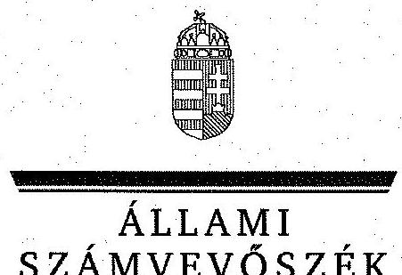

# JELENTÉS 

Az EU támogatások felhasználásának rendszere -
A Nemzeti Fejlesztési Ügynökség (és a Közremúködő Szervezetek) uniós támogatásokkal kapcsolatos feladatellátásának ellenőrzéséről

---

# Állami Számvevőszék 

Iktatószám: V-0484-1367/2014.
Témaszám: 1518
Vizsgálat-azonosító szám: V0668

## Az ellenőrzést felügyelte:

## Pongrácz Éva

felügyeleti vezető
Az ellenőrzést vezette és az ellenőrzés végrehajtásáért felelős:
Budai Éva
Ellenőrzésvezető
A számvevőszéki jelentés összeállításában közremüködtek:
Kóródi Gábor
számvevő
Literáti Gergő
számvevő asszisztens
Pencz Mária
számvevő tanácsos
Az ellenőrzést végezték:
Dr. Szöllősi Zsolt
számvevő

## Kóródi Gábor

számvevő

## Literáti Gergő

számvevő asszisztens

## Luhály Matild

számvevő

Pencz Mária
számvevő tanácsos

## Szalontai Miklós

számvevő tanácsos

## Lakatos József

számvevő tanácsos

Lukatos József
számvevő tanácsos

Lukatos József
számvevő tanácsos

Lukatos József
számvevő tanácsos

## Mészáros Ildikó Éva

számvevő

## Schmidt János

számvevő

Vörösné Lakatos
Zsuzsanna
számvevő

---

# A témához kapcsolódó eddig készített számvevőszéki jelentések: 

## címe

Jelentés a gazdaságfejlesztés állami eszközrendszere múködésének ellenőrzéséről
Jelentés a Nemzeti Fejlesztési Ügynökség múködésének ellenőrzéséről
Jelentés a 2007-től uniós finanszírozással megvalósuló, kormányzati döntésen alapuló beruházási projektek pályáztatási, tervezési és előkészítési tapasztalatainak értékelése ellenőrzésről
Jelentés a Magyar Köztársaság 2011. évi költségvetése végrehajtásának ellenőrzéséről
Jelentés a Magyar Köztársaság 2007. évi költségvetése végrehajtásának ellenőrzéséről
Jelentés a Magyar Köztársaság 2008. évi költségvetése végrehajtásának ellenőrzéséről
Jelentés a Magyar Köztársaság 2009. évi költségvetése végrehajtásának ellenőrzéséről
Jelentés a Magyar Köztársaság 2010. évi költségvetése végrehajtásának ellenőrzéséről
Jelentés a beruházásokhoz kapcsolódó adókedvezmények és támogatások ellenőrzéséről
Jelentés a Magyar Köztársaság 2011. évi költségvetése végrehajtásának ellenőrzéséről
Jelentés Magyarország 2012. évi központi költségvetése végrehajtásának ellenőrzéséről
Jelentés az ESZA Társadalmi Szolgáltató Nonprofit Kft. gazdálkodásának ellenőrzéséről
Jelentés a 2013. évi zárszámadásról - Magyarország 2013. évi költségvetése végrehajtásának ellenőrzéséről

---

.

---

# TARTALOMJEGYZÉK 

BEVEZETÉS ..... 7
I. ÖSSZEGZŐ MEGÁLLAPÍTÁSOK, KÖVETKEZTETÉSEK, ..... 11
II. RÉSZLETES MEGÁLLAPÍTÁSOK ..... 17

1. A kialakított szabályozási környezet és az NFÜ szervezeti struktúrája ..... 17
2. A végrehajtásban érintett NFÜ és a közreműködő szervezetek feladatellátása ..... 19
2.1. Az NFÜ feladatellátása ..... 19
2.1.1. Az NFÜ közreműködő szervezetekkel kapcsolatos feladatai ..... 22
2.1.2. EMIR rendszer működtetése és továbbfejlesztése ..... 24
2.2. A közreműködő szervezetek feladatellátása ..... 25
2.2.1. A pályázatkezelési tevékenység szabályozása, a pályázati felhívások közzététele ..... 25
2.2.2. Pályázatok érkeztetése, formai felülvizsgálata és elbírálása ..... 26
2.2.3. A projekt megvalósítás nyomon követése ..... 27
2.2.4. A közreműködő szervezetek pályázatokkal kapcsolatos ellenőrzési tevékenysége ..... 28
2.2.5. A közreműködő szervezetek belső kontrollrendszere ..... 29
3. Az operatív programok célkitűzéseit mérő indikátorok ..... 30
3.1. Az indikátorok kialakítása ..... 30
3.2. Az indikátorok nyomon követése ..... 31
3.3. Az indikátorok értékelése, felülvizsgálata és módosítása ..... 32
3.4. A kedvezményezett által elnyert EU-s támogatások felhasználása ..... 34
3.4.1. A kedvezményezett részére meghatározott indikátorok teljesítése ..... 35
4. Az NFÜ-nek az NSRK forrásai felhasználásához történő hozzájárulása ..... 35
4.1. Az NSRK forrásai lekötésének teljesülése a 2013. év végéig ..... 35
4.2. Az NSRK forrásai kifizetésének teljesülése a 2013. év végéig ..... 38
4.3. Az EU-s támogatások eredményes felhasználása érdekében tett lépések ..... 40
5. Az atipikus foglalkoztatási formák ösztönzésének támogatására fordított pénzeszközök felhasználása ..... 42

---

# MELLÉKLETEK 

1. számú OP-k előrehaladása a célértékkel rendelkező indikátorok alapján
2. számú OP-k célértékeinek teljesülése az indikátorok alapján - Összefoglaló tábla
3. számú A NORDA Észak-magyarországi Regionális Fejlesztési Ügynökség Közhasznú Nonprofit Kft. észrevétele
4. számú A NORDA Észak-magyarországi Regionális Fejlesztési Ügynökség Közhasznú Nonprofit Kft. észrevételére adott válaszlevél
5. számú Az Emberi Erőforrások Minisztériumának észrevétele
6. számú Az Emberi Erőforrások Minisztériumának észrevételére adott válaszlevél
7. számú A Miniszterelnökség észrevétele
8. számú A Miniszterelnökség észrevételére adott válaszlevél
9. számú A Nemzeti Fejlesztési Minisztérium észrevétele
10. számú A Nemzeti Fejlesztési Minisztérium észrevételére adott válaszlevél
11. számú A Nemzetgazdasági Minisztérium észrevétele
12. számú A Nemzetgazdasági Minisztérium észrevételére adott válaszlevél

## FÜGGELÉKEK

1. számú Fogalomtár
2. számú Kimutatás az ellenőrzött szervezetekről
3. számú Az NFÜ SZMSZ-ei a 2007-2013. programozási időszakban

---

# RÖVIDÍTÉSEK ÉS JOGSZABÁLYOK JEGYZÉKE 

## Európai Uniós jogforrások

1083/2006/EK rendelet

1828/2006/EK rendelet

## Törvények

Áht.
ÁSZ tv.
Alaptörvény

## Rendeletek

16/2006. (XII. 28.)
MeHVM-PM együttes rendelet

102/2006. (IV. 28.)
Korm. rendelet

255/2006. (XII. 8.)
Korm. rendelet

281/2006. (XII. 23.)
Korm. rendelet

4/2011. (I. 28.) Korm. rendelet

A Tanács 1083/2006/EK Rendelete (2006. július 11.) az Európai Regionális Fejlesztési Alapra, az Európai Szociális Alapra és a Kohéziós Alapra vonatkozó általános rendelkezések megállapításáról és az 1260/1999/EK rendelet hatályon kívül helyezéséról
A Bizottság 2006. december 8-i 1828/2006/EK Rendelete az Európai Regionális Fejlesztési Alapra, az Európai Szociális Alapra és a Kohéziós Alapra vonatkozó általános rendelkezések megállapításáról szóló 1083/2006/EK tanácsi rendelet, valamint az Európai Regionális Fejlesztési Alapról szóló 1080/2006/EK európai parlamenti és a tanácsi rendelet végrehajtására vonatkozó szabályok meghatározásáról
az államháztartásról szóló 2011. évi CXCV. törvény az Állami Számvevőszékről szóló 2011. évi LXVI. törvény Magyarország Alaptörvénye (2011. április 25.)
a 2007-2013 programozási időszakban az Európai Regionális Fejlesztési Alapból, az Európai Szociális Alapból és a Kohéziós Alapból származó támogatások felhasználásának általános eljárási szabályairól (hatályon kívül helyezte a 4/2011. (I. 28.) Korm. rendelet, hatálytalan 2011. február 9-étől)
az Európai Unió által nyújtott egyes pénzügyi támogatások felhasználásával megvalósuló, és egyes nemzetközi megállapodások alapján finanszírozott programok monitoring rendszerének kialakításáról és múködéséről
a 2007-2013 programozási időszakban az Európai Regionális Fejlesztési Alapból, az Európai Szociális Alapból és a Kohéziós Alapból származó támogatások felhasználásának alapvető szabályairól és felelős intézményeiről (hatályon kívül helyezte a 4/2011. (I. 28.) Korm. rendelet, hatálytalan 2011. február 9-étől)
a 2007-2013 programozási időszakban az Európai Regionális Fejlesztési Alapból, az Európai Szociális Alapból és a Kohéziós Alapból származó támogatások fogadásához kapcsolódó pénzügyi lebonyolítási és ellenőrzési rendszerek kialakításáról (hatályon kívül helyezte a 4/2011. (I. 28.) Korm. rendelet, hatálytalan 2011. február 9-étől)
a 2007-2013 programozási időszakban az Európai Regionális Fejlesztési Alapból, az Európai Szociális Alapból és a Kohéziós Alapból származó támogatások felhasználásá-

---

475/2013. (XII. 17.)
Korm. rendelet
Ber.

Bkr.

## Határozatok

1103/2006. (X. 30.)
Korm. határozat
1423/2011. (XII. 6.)
Korm. határozat

## Utasítások

7/2010. (III. 4.) számú elnöki utasítás

EMK
$\mathrm{EMK}_{1}$

EMK $_{2}$

EMK $_{3}$
EMK $_{4}$

## Szórövidítések

ÁROP
ÁSZ
DARFÜ
EKOP
EMIR
ESZA nKft.
EU
EU Bizottság
ÉARFÜ
GOP
IH
nak rendjéről
a Nemzeti Fejlesztési Ügynökség megszüntetésével összefüggő egyes kérdésekről
a költségvetési szervek belső ellenőrzéséről szóló 193/2003. (XI. 26.) Korm. rendelet (hatályon kívül helyezte a 370/2011. (XII. 31.) Korm. rendelet, hatálytalan 2012. január 1-jétől)
a költségvetési szervek belső kontrollrendszeréről és belső ellenőrzéséről szóló 370/2011. (XII. 31.) Korm. rendelet

Az Új Magyarország Fejlesztési Terv elfogadásáról
a Nemzeti Stratégiai Referencia Keret fejlesztési forrásai kifizetésének gyorsításához szükséges feladatokról

A Nemzeti Fejlesztési Ügynökség elnökének 7/2010. (III. 4.) utasítása az Új Magyarország Fejlesztési terv indikátorainak kezeléséről szóló Intézkedési terv kiadásáról
Egységes múködési kézikönyv
16/2011. (III. 8.) NFM utasítás az egységes múködési kézikönyv kiadásáról (hatályon kívül helyezte a 24/2011. (V. 6.) NFM utasítás, hatálytalan 2011. május 7étől)
24/2011. (V. 6.) NFM utasítás az egységes múködési kézikönyv kiadásáról (hatályon kívül helyezte a 26/2012. (X. 24.) NFM utasítás, hatálytalan 2012. október 25-étől)
26/2012. (X. 24.) NFM utasítás az egységes múködési kézikönyvről
547/2013. XII. 30.) Korm. rendelet az egységes múködési kézikönyvről

Államreform Operatív Program
Állami Számvevőszék
Dél-alföldi Regionális Fejlesztési Ügynökség Közhasznú Nonprofit Kft.
Elektronikus Közigazgatás Operatív Program
Egységes Monitoring Információs Rendszer
Európai Szociális Alap Társadalmi Szolgáltató Nonprofit Kft.
Európai Unió
Európai Bizottság
Észak-alföldi Regionális Fejlesztési Ügynökség Közhasznú Nonprofit Kft.
Gazdaságfejlesztési Operatív Program
Irányító Hatóság

---

| IMCS | Indikátor munkacsoport |
| :--: | :--: |
| IMK | Interaktív múködési kézikönyv |
| KEOP | Környezet és Energia Operatív Program |
| KIKSZ | KIKSZ Közlekedésfejlesztési Zrt. |
| Kincstár | Magyar Államkincstár |
| KOR IH | NFÜ Koordinációs Irányító Hatósága |
| Kormány | Magyarország Kormánya |
| KÖZOP | Közlekedés Operatív Program |
| KSz | Közremüködő Szervezet |
| M Ft | millió forint |
| MAG Zrt. | Magyar Gazdaságfejlesztési Központ Zrt. |
| MB | Monitoring Bizottság |
| ME | Miniszterelnökség |
| M EUR | millió euró |
| Mrd Ft | milliárd forint |
| NFM | Nemzeti Fejlesztési Minisztérium |
| NFÜ | Nemzeti Fejlesztési Ügynökség |
| NORDA | Észak-magyarországi Regionális Fejlesztési Ügynökség Közhasznú Nonprofit Kft. |
| NSRK | Magyarország 2006. július 11-i 1083/2006/EK Tanácsi Rendelet 27. cikke szerinti, a 2007-2013-as programozási időszakra vonatkozó Nemzeti Stratégiai Referencia Kerete |
| OP | Operatív Program |
| PEJ | Projekt előrehaladási jelentés |
| PFJ | Projekt fenntartási jelentés |
| Pro Regio | Pro Regio Közép-Magyarországi Regionális Fejlesztési és Szolgáltató Nonprofit Kft. |
| ROP | Regionális Operatív Program |
| SLA szerződés/ megállapodás | „Service-Level Agreement" (a Közremüködő Szervezetekkel kötött feladatellátási szerződés) |
| STRAPI | Strukturális Alapok Programiroda |
| NFÜ SZMSZ-e | Az NFÜ Szervezeti és Müködési Szabályzata |
| TÁMOP | Társadalmi Megújulás Operatív Program |
| TIOP | Társadalmi Infrastruktúra Operatív Program |
| TO | Támogatói Okirat |
| TSZ | Támogatási Szerződés |
| ÚMFT | Új Magyarország Fejlesztési Terv |
| VÁTI nKft. | VÁTI Magyar Regionális Fejlesztési és Urbanisztikai Nonprofit Kft. |
| VOP | Végrehajtás Operatív Program |

---

.

---

# JELENTÉS 

## az EU támogatások felhasználásának rendszere - A Nemzeti Fejlesztési Ügynökség (és a Közremúködő Szervezetek) uniós támogatásokkal kapcsolatos feladatellátásának ellenőrzéséről

## BEVEZETÉS

A Nemzeti Fejlesztési Ügynökségről szóló 130/2006. (VI. 15.) Korm. rendelettel 2006. július 1-jén jött létre az NFÜ, feladata a 2007-2013-as időszak Nemzeti Stratégiai Referencia Keret (NSRK) 15 operatív programja (OP) tervezésének, programozásának és megvalósításának koordinációja volt. Az NSRK 15 OP hét irányító hatósága (IH) a Nemzeti Fejlesztési Ügynökség (NFÜ) szervezetén belül helyezkedett el, főosztályokként működtek. Az IH-kat és az általuk irányított programokat az NFÜ SZMSZ-e tartalmazta. A 475/2013. (XII. 17.) Korm. rendelet értelmében az NFÜ 2014. január 1-jétől jogutódlással megszűnt, a jogutód a Miniszterelnökség lett, az IH-k a minisztériumokhoz kerültek.

A 2007-2013-as programozási időszakra vonatkozóan az IH a Strukturális Alapok és a Kohéziós Alap forrásainak szabályszerű, hatékony és eredményes felhasználásához szükséges intézményrendszer felső eleme volt. Általános és átfogó felelősséget viselt az OP-k, projektek hatékony és szabályszerű végrehajtásáért. Felelősségi köréből eredően ellenőrizte a közösségi, valamint a hazai jogszabályok betartását, koordinálta az EU-s források szétosztásának folyamatát, irányította az intézményrendszer, a statisztikai és a pénzügyi nyilvántartási rendszer múködését. Részt vett továbbá a költségvetési tervezésben, valamint Közreműködő szervezetek (KSz) bevonásával irányította a meghirdetett pályázatok és a kiemelt projektek végrehajtását.

A közösségi jogszabályok alapján a tagállamok kijelölhettek egy vagy több KSz-t is, amely az IH illetékessége alatt járt el, vagy ilyen hatóság nevében hajtott végre feladatokat a kedvezményezettek tekintetében. A KSz-ek tevékenységüket a közösségi jogszabályok és az IH-k által megadott szempontok figyelembevételével látták el. Tevékenységi körük kiterjedt a pályázatkezeléssel kapcsolatos feladatokra, a támogatási szerződések megkötésére, a kifizetési igénylések, a számlák és a számlákhoz kapcsolódó dokumentumok befogadására, a teljesítések igazolására, a lebonyolítási számlákról történő kifizetések utalványozására, az összesített forrásigények IH-k részére történő továbbítására, a bizonylatok számviteli nyilvántartására.

---

Az ÁSZ 1297 sz., 13080 sz. és 14207 sz. zárszámadási jelentései ${ }^{1}$ megállapították, hogy a Magyarország rendelkezésére álló keretösszegből lekötött összegek és a teljesített kifizetések több OP esetében elmaradtak az időarányostól, így magas kockázatot jelentenek a támogatások teljes felhasználása szempontjából.

Az EU-s források felhasználása a kormányzati célok között is kiemelt súllyal szerepel, mind annak hatékonysága, mind a következő programozási időszakban rendelkezésre álló források elérése tárgyában. Központi érdek a rendelkezésre álló több mint 8000 Mrd Ft EU-s forrás eredményes felhasználása.

# Az ellenőrzés célja annak értékelése volt, hogy 

- a kialakított szabályozási és intézményrendszer hozzájárult-e az uniós források szabályszerű és eredményes felhasználásához;
- a végrehajtásban érintett NFÜ és a KSz-ek feladataikat eredményesen, az előírásoknak megfelelően látták-e el;
- az NFÜ biztosította-e az OP-k célkitűzéseit mérő indikátorok teljesülésének nyomon követését, ellenőrzését;
- az NFÜ tevékenysége hozzájárult-e a 2007-2013-as programozási időszakra vonatkozó NSRK forrásainak felhasználásához;
- a források felhasználása szabályszerű volt-e a munkaerő-piaci rugalmasság javítására, az atipikus foglalkoztatási formák ösztönzésének támogatására fordított uniós pénzeszközöknél.

Magyarország 2004. május 1-jén lett az EU teljes jogú tagállama, bekapcsolódva ezzel a 2000-2006-as programozási időszakba. Az I. Nemzeti Fejlesztési Terv végrehajtásáért felelős IH-k a tárcák (Földművelésügyi és Vidékfejlesztési Minisztérium, Gazdasági és Közlekedési Minisztérium, Foglalkoztatáspolitikai és Munkaügyi Minisztérium) alá tartoztak, a feladatok végrehajtásában 22 KSz vett részt. Az NFÜ 2006-os létrehozásával az IH-kat egy szervezetbe vonták öszsze, amellyel egy koncentrált lebonyolítási rendszer jött létre. Az NFÜ párhuzamosan látta el a 2004-2006. évekre szóló I. Nemzeti Fejlesztési Terv végrehajtásához, zárásához és a 2007-2013. programozási időszakhoz kapcsolódó koordinációs feladatokat.

Az ellenőrzés középpontjában a támogatások felhasználása érdekében 2007. évtől folyamatosan kidolgozott és fejlesztett, szervezetét és eljárásait érintően többször módosított rendszer, annak szereplői, és az általuk végzett tevékenységek álltak. Az ellenőrzés keretében sor került a munkaerő-piaci rugalmasság javítására, az atipikus foglalkoztatási formák ösztönzésének támogatására fordított EU-s pénzeszközök szabályszerű felhasználásának ellenőrzésére.

[^0]
[^0]:    ${ }^{1}$ Az ÁSZ 1297 sz. ellenőrzési jelentése a Magyar Köztársaság 2011. évi költségvetése végrehajtásának ellenőrzéséről, az 13080 sz. ellenőrzési jelentése Magyarország 2012. évi központi költségvetése végrehajtásának ellenőrzéséről, valamint a 14207 sz. jelentése Magyarország 2013. évi költségvetése végrehajtásának ellenőrzéséről.

---

Az NSRK keretében ilyen célokra 2009-től biztosítottak forrásokat, döntően a TÁMOP-ból, amelynek kezelését az ESZA nKft., mint KSz végezte.

Az ellenőrzés kiterjedt a szervezeti és szabályozási keretek, a szervezeti és szabályozási változások, valamint a kifizetések gyorsítása érdekében tett intézkedések kialakítása, végrehajtása teljes folyamatának és eredményének ellenőrzésére. Az ellenőrzés szabályszerűségi kérdéseinél a hazai jogszabályokat tekintettük irányadónak.

Az ellenőrzés során a minták kiválasztása rétegezett, véletlenszerű mintavétellel történt. A mintavétel lefedte a 2007-2013-as programozási periódus minden évét, minden KSz-t, továbbá minden OP-t. A pályázatkezelés esetében a mintavétel alapját a már pénzügyileg lezárt projektek képezték, úgy, hogy az ellenőrzés lefedje a támogatás-kezelési folyamat valamennyi szakaszát, a pályáztatástól a fenntartási időszakig. Az ellenőrzés során mintavétellel érintett területek az OP-k, akció tervek módosításai, az NFÜ KSz-eket érintő ellenőrzései, az EU-s pályázatok, valamint a KSz-ek helyszíni ellenőrzései voltak. A minta kiválasztása az NFÜ-től, illetve a KSz-ektől bekért tanúsítványok alapján történt.

Az ellenőrzésről készült ÁSZ jelentés rámutat a végrehajtás erősségeire és gyengeségeire, valamint javaslatokat fogalmaz meg a jogalkotók és az ellenőrzött szervezetek vezetői számára a végrehajtás eredményességének, hatékonyságának javítása érdekében.

Az ellenőrzés tapasztalataival hozzá kívánunk járulni az ellenőrzött szervezetek hatékony állami közfeladat-ellátásához, az ellenőrzés során feltárt kockázatok, hiányosságok megfelelő kezeléséhez és a „jó gyakorlatok" terjesztéséhez. Az ellenőrzés aktualitását az adta, hogy a Kormány határozataiban foglaltak alapján az ellenőrzés tervezésekor folyamatban volt a felkészülés a 2014-2020-as EU-s költségvetési periódus forrásainak fogadására és az intézményrendszer kialakítására. Megállapításainkkal támogatni kívánjuk az EU-s források felhasználásának új hazai intézményrendszere múködtetését, egyúttal az EU-s források minél nagyobb mértékű felhasználását, ezen keresztül az EU-s támogatásokat közvetítő intézmények iránti közbizalom erősítését.

Az ellenőrzés típusa: rendszerellenőrzés
Az ellenőrzött időszak: 2007-2013. évek
Az ellenőrzéssel érintett szervezetek: az NFÜ (irányító hatóságok) jogutódjaként megjelölt szervezetek (Miniszterelnökség, Nemzetgazdasági Minisztérium, Nemzeti Fejlesztési Minisztérium, Emberi Erőforrások Minisztériuma); az NFÜ feladatának végrehajtásban részt vevő közreműködő szervezetek (2. számú függelék szerint) és a támogatások azon végső kedvezményezettjei, akik az EU-s támogatású projektekből vett mintavételezés során kiválasztásra kerültek.

Az ellenőrzés jogszabályi alapját az ÁSZ tv. 1. § (3) bekezdése, az 5. § (2)(3) és (5)-(6) bekezdései, valamint az Áht. 61. § (2) bekezdése képezi.

Az ÁSZ a 2011. évi LXVI. törvény 29. §-a szerint megküldte a jelentéstervezetet a Miniszterelnökséget vezető miniszter, az Emberi Erőforrások minisztere, a Nemzeti Fejlesztési miniszter, a Nemzetgazdasági miniszter és a Közreműködő

---

Szervezetek vezetői részére. A beérkezett észrevételeket és az azokra adott válaszokat a jelentés 3-12. számú mellékletei tartalmazzák.

---

# I. ÖSSZEGZŐ MEGÁLLAPÍTÁSOK, KÖVETKEZTETÉSEK, JAVASLATOK 

A 2004. május 1. óta EU-s forrásokból megvalósuló fejlesztéspolitika végrehajtása két programozási időszakra vonatkozott. A 2004-2006. évekre szóló I. Nemzeti Fejlesztési Terv - amely 2010-ben zárult le - és a 2007-2013. időszakra szóló Új Magyarország Fejlesztési Terv (továbbiakban: ÚMFT) végrehajtását végző intézményrendszer eltérő volt. A 2004-2006-os időszakban az öt Irányító Hatóság (továbbiakban: IH) a szaktárcák irányítása alatt, minisztériumi főosztályként múködött. Az Nemzeti Fejlesztési Ügynökség (továbbiakban: NFÜ) létrehozásával az Operatív Programok (továbbiakban: OP) tervezését és végrehajtását egyetlen szervezet látta el, amellyel egységesítésre került az EU-s források felhasználásnak rendszere. Az új intézmény létrehozásnak célja az EU-s támogatások felhasználása hatékonyságának és eredményességének növelése volt.

Az NFÜ és a Közreműködő Szervezetek (továbbiakban: KSz-ek) a 2007-2013-as programozási időszakban 8204,9 Mrd Ft támogatás hatékony felhasználásáért voltak felelősek, amely a nemzetgazdaság működésére is jelentős hatással volt. A 2007-2013-as programozási időszak volt az első teljes EU-s költségvetési ciklus, amely során először érkezett komplex, ország fejlesztésre felhasználható forrás Magyarországra.

A 2007-2013-as programozási időszakra kialakított szabályozási környezet és a végrehajtásra 2006-ban létrehozott NFÜ intézményrendszere összességében megteremtette a feltételét az EU-s támogatások szabályszerű és eredményes felhasználásának. Az NFÜ szervezeti struktúrája és belső szabályzatai a jogszabályi előírásoknak megfeleltek, azonban a jogszabályok és a belső szabályzatok folyamatos változása, továbbá a 2004-2006. programozási időszak zárásának elhúzódása és az ezzel párhuzamosan futó 2007-2013. programozási időszak nehezítette a feladatellátást.

Az NFÜ feladatait az ellenőrzött időszakban jellemzően szabályszerűen és eredményesen hajtotta végre, az e téren tapasztalt hiányosságok nem gyakoroltak lényeges hatást a szabályosságra. Az NFÜ feladatellátásával összességében hozzájárult a 2007-2013-as időszakra vonatkozó Nemzeti Stratégiai Referencia Keret (továbbiakban: NSRK) 112,4\%-os támogatói döntéssel történő lekötéséhez, megteremtve ezzel a lehetőségét az EU-s források eredményes felhasználásának.

Az NFÜ koordináló szerepe érvényesült, azonban a megvalósítását nehezítette a 2007-2011. közötti átfogó törvényi szabályozás hiánya, illetve a 20072013. közötti időszakban bekövetkezett szervezeti változások. Az NFÜ az OP-k tervezésével, programozásával és megvalósításával kapcsolatos feladatait az ellenőrzött időszakban az IH-kon keresztül látta el. A közösségi jogszabály lehetővé tette, hogy a meghirdetett pályázatok lebonyolítását és végrehajtását KSzek végezzék. A hatáskör-átruházás mellett a felelősség az IH-kat terhelte. Az IHk és a KSz-ek közötti együttműködés, az információáramlás és a kapcsolattartás biztosított volt, a múködés összhangja megvalósult.

---

Az NFÜ feladatellátása kiterjedt az OP-k módosítási javaslataira, továbbá az akciótervek és azok módosításának elkészítésére. Az ellenőrzött időszakban OP módosítására 34 esetben, OP-kon belül elfogadott akciótervek módosítására 262 esetben került sor. Az NFÜ OP módosítást forrásvesztés elkerülése érdekében, többletforrás igény felmerülésekor, a nemzeti prioritásokban bekövetkezett változások, indikátorok módosítása, végrehajtási nehézségek miatt, illetve az OP-k félidei áttekintő értékelése alapján készített elő. Az akciótervek módosítására többek között a kedvezményezettek körének bővítése, keretmódosítás, áttervezés, illetve forrásátcsoportosítás alapján került sor. Az ellenőrzött időszakban a módosítások megalapozottak és kidolgozottak voltak, az egyeztetési mechanizmus az ellenőrzött esetekben megfelelően múködött.

Az NFÜ az egységes kommunikációs stratégiáját, szabálytalanságkezelési- és projektfelügyeleti rendszerét kialakította és múködtette, valamint az OP-k esetében Monitoring Bizottságot (továbbiakban: MB) hozott létre és gondoskodott azok múködtetéséről. Az NFÜ az EU Bizottság és a Nemzeti Fejlesztési Kormánybizottság felé fennálló jelentéskészítési kötelezettségét az ellenőrzött időszakban teljesítette, az Egységes Monitoring Információs Rendszer (továbbiakban: EMIR) múködtetésével összefüggő feladatainak az előírtak szerint eleget tett. Az EMIR rendszer fejlesztése az informatikai stratégia előirása ellenére jóváhagyott középtávú fejlesztési terv vagy koncepció nélkül valósult meg, azonban az NFÜ 2010-től „EMIR Fejlesztési Portfólió" címmel évente meghatározta az éven belüli, projektszerű fejlesztési célokat.

Az NFÜ a KSz-ekkel kapcsolatos feladatait összességében a jogszabályi előírásoknak megfelelően látta el. A KSz-ek 2011-ig fennálló túlfinanszírozása mellett tapasztalt hiányosságok nem gyakoroltak lényeges hatást a szabályosságra. Az NFÜ a KSz-ekre delegált feladatai ellátásához múködési kézikönyvet készített, 2011 februárjáig jóváhagyta - a VÁTI Magyar Regionális Fejlesztési és Urbanisztikai Nonprofit Kft. (továbbiakban: VÁTI nKft.), az Európai Szociális Alap Társadalmi Szolgáltató Nonprofit Kft. (továbbiakban: ESZA nKft.) és a Strukturális Alapok Programiroda (továbbiakban: STRAPI) belső eljárásrendjeit kivéve - a KSz-ek támogatások felhasználásával kapcsolatos belső eljárásrendjeit, amely kötelezettsége 2011. február 9-től megszűnt.

Az NFÜ a KSz-ekre átruházott feladatok ellátásának elsőszintű ellenőrzésére a Kincstárral együttműködési megállapodást kötött. A Kincstár a megállapodás keretében elvégezte a KSz-ek projekt-kiválasztási és lebonyolítási tevékenységének, a KSz-ek költségelszámolásának, a kifizetési előrejelzéseknek, valamint a közbeszerzési eljárások végrehajtásának ellenőrzését. Az IH-k a kincstári ellenőrzésekről készített, a ROP-k 2010. évi jelentéstervezeteit az ellenőrzési tevékenység kezdeti időszakában késedelmesen vizsgálták felül, amelynek következtében az azokban szereplő megállapítások aktualitásukat vesztették.

Az NFÜ az OP-k végrehajtásával kapcsolatos pénzügyi és technikai feladatok ellátására a KSz-ekkel teljesítményalapú finanszírozáson alapuló „Service-Level Agreement" (a Közremúködő Szervezetekkel kötött feladatellátási szerződés, továbbiakban: SLA) szerződéseket kötött. Az SLA szerződések tartalmazták az NFÜ és a KSz-ek közötti feladat-megosztási és felelősségi szabályokat, a megállapodásokban rögzítették a felek jogait és kötelezettségeit, a tervezés és finanszírozás rendszerét, valamint az NFÜ és KSz-ek együttmúködésének szabályozását.

---

Az NFÜ a KSz-ek túlfinanszírozására vonatkozóan intézkedést 2010-ig nem tett. Az NFÜ belső ellenőrzési egysége már 2008-tól számos hiányosságot tárt fel az SLA szerződésekkel kapcsolatban. Az NFÜ az SLA szerződések teljes körű felülvizsgálatát rendelte el 2010-től, amely az értékelés és az ellenőrzési pontok hiányát, eltérő teljesítményértékelési módszerek alkalmazását, valamint a KSzek túlfinanszírozását állapította meg. A feltárt hiányosságok hátráltatták a teljesítményalapú finanszírozás elvének érvényesülését, ezért az SLA szerződéseket a 2011. évben egységesen módosították és a korábbi elszámolási rendszert úgy alakították át, hogy biztosítsa az egységes értékelést, illetve megakadályozza a KSz-ek túlfinanszírozását. A KSz-ek a költségvetésből juttatott múködési támogatásokkal és az SLA szerződések díjaival az ellenőrzött időszakban elszámoltak, az előírt teljesítménymutatókat teljesítették. Az NFÜ és a KSz-ek közötti elszámolásra a 2011-2013. időszakban negyedéves teljesítményértékelések alapján került sor.

A KSz-ek tevékenységükkel hozzájárultak a projektek szabályszerű megvalósításához, a 2007-2013. időszakban pályázatkezelési feladataikat összességében eredményesen, a jogszabályi előírásoknak és az SLA szerződéseknek megfelelően ellátták, a feltárt hiányosságok eseti jelleggel fordultak elő. A KSzek az ellenőrzött időszakban rendelkeztek a pályáztatás és projekt megvalósítás egyes szakaszaira vonatkozó eljárásrendekkel. Az ellenőrzött pályázatok esetében az érkeztetés, a formai felülvizsgálat, a szakmai elbírálás, a bíráló bizottságok működése, a szerződéskötés, valamint a nyertes pályázatok vonatkozó adatainak közzététele a jogszabályi előírásoknak megfelelt. A KSz-ek az ellenőrzött pályázatok esetében a projekt-megvalósulását nyomon követték. Hiányosságok voltak tapasztalhatók azonban a KSz-ek projektek megvalósítása során végzett monitoring- és ellenőrzési feladatainak ellátása tekintetében. A KSz-ek az EMIR rendszer Pályázó Tájékoztató felületén nem nyitották meg több esetben a kedvezményezettek részére a Projekt fenntartási jelentés (továbbiakban: PFJ) benyújtásának felületét, így a kedvezményezettek PFJ nyújtási kötelezettségüknek nem tudtak eleget tenni. A kedvezményezetteknek a fenntartási időszakban - az Általános Szerződési Feltételekben előírtaknak megfelelően - PFJ-ben kellett beszámolniuk a Támogatási Szerződésekben (továbbiakban: TSZ) vagy Támogatói Okiratokban (továbbiakban: TO) foglaltak teljesüléséről, a projekt múködtetése során tervezett és az elért számszerűsíthető eredményekről. A KSz-ek a támogatás kiutalására vonatkozó határidőt nem minden esetben tartották be, amelynek következtében késedelmi pótlékfizetési kötelezettségük keletkezett a kedvezményezettek felé.

A KSz-ek a folyamatba épített ellenőrzés részeként végzett dokumentumalapú és kockázatelemzésre alapozott helyszíni ellenőrzéseiket az ellenőrzött időszakban az előírtak alapján végezték. Helyszíni ellenőrzési kötelezettségüket az ellenőrzési terveiknek megfelelően eredményesen ellátták, az ellenőrök képzettségére és szakmai tapasztalatára vonatkozó előírást betartották. Belső kontrollrendszerük az ellenőrzött időszakban az előírásoknak összességében megfelelt, a feltárt hiányosságok csak eseti jelleggel fordultak elő, ezért az összesítő minősítést nem befolyásolták. A KSz-ek vezetői a belső kontrollrendszerek hatékony, eredményes és gazdaságos működtetéséről szóló vezetői nyilatkozattételi kötelezettségüknek az ellenőrzött időszakban teljes körűen nem tettek eleget, mert a Pro Regio-nál a 2007. évről, az Észak-Alföldi Regionális Fejlesztési Ügynökség Közhasznú Nonprofit Kft.-nél (továbbiakban: ÉARFÜ)a 2007-2008. évekről, valamint a KIKSZ Közlekedésfejlesztési Zrt.-nél (továbbiakban: KIKSZ) a 2010-

---

2013. évekről nem készült vezetői nyilatkozat az irányítási és ellenőrzési rendszerek megfelelő és megbízható múködéséről. A KSz-ek közül a Dél-alföldi Regionális Fejlesztési Ügynökség Közhasznú Nonprofit Kft. (továbbiakban: DARFÜ) belső ellenőrzési vezetője az éves ellenőrzési jelentéskészítési kötelezettségét az ellenőrzött időszakban teljes körűen nem teljesítette, mert a 2007-2009. évekre nem álltak rendelkezésre az éves belső ellenőrzési jelentések.

A munkaerő-piaci rugalmasság javítása, az atipikus foglalkoztatási formák ösztönzésének támogatása a foglalkoztatás nem hagyományos formáinak terjesztését (pl.: távmunka, munkaerő-kölcsönzés) és a hátrányos helyzetűek munkába állási esélyeinek javítását szolgálta. A Társadalmi Megújulás Operatív Program (továbbiakban: TÁMOP) keretei között 2009-től az atipikus foglalkoztatási formák ösztönzésének támogatására meghirdetett pályázatokat az ESZA nKft. kezelte, a támogatások felhasználása az ellenőrzött időszakban szabályszerű volt. Az atipikus foglalkoztatási formák ösztönzésére szolgáló keret $80 \%$-ban, $3,2 \mathrm{Mrd}$ Ft összegben került támogatási szerződéssel lekötésre, amelynek a $92,5 \%$-át fizették ki 2013. év végéig.

A Kormány Magyarország 2007-2013-as programozási időszakra vonatkozó NSRK céljainak elérése érdekében az OP-kban hat prioritást (gazdaságfejlesztés, közlekedésfejlesztés, társadalom megújulása, környezeti és energetikai fejlesztés, területfejlesztés és államreform) határozott meg, amelyek minden esetben összhangban álltak az NSRK-ban rögzített célokkal. A prioritásokhoz tartozó célok indikátorait OP szinten meghatározták, az output-, eredmény- és hatásindikátorok egymásra épülő rendszerét kialakították.

Az NFÜ részben biztosította az OP-k célkitűzéseit mérő indikátorok teljesülésének nyomon követését, ellenőrzését. Az indikátorok teljesülésének nyomon követésére, mérésére és jelentésére alkalmas rendszert kialakította, azonban az indikátorok EMIR rendszerbe való feltöltése az ellenőrzött időszakban nem minden indikátor esetében történt meg. A szuperszettekbe kötött indikátorok terv- és tényértékének EMIR rendszerre vonatkozó feltöltöttsége 2010. áprilisban 76\%, illetve $78 \%$ volt. Az NFÜ elnöke 2010. évi utasításával előírta az IH-k számára az indikátorok $95 \%$-os feltöltöttségi szintjének elérését, azonban a szuperszettekbe kötött indikátorok terv- és tényértékei 2013. december 31 -én is csak $96 \%$ és $91 \%$-os szintre nőttek. Az ellenőrzött időszakban az indikátorok alacsony feltöltöttségi szintje korlátozta az indikátorok teljesülésének nyomon követését.

Az OP-k szintjén meghatározott indikátorok 60\%-a a célértékükhöz viszonyítva a 2007-2013. években nem teljesült időarányosan, az indikátorok közel egyharmada nem érte el a célérték $25 \%$-át, amely az EU-s támogatások felhasználásának időarányos elmaradásával függött össze. A 2012. évtől felgyorsuló kifizetésekkel párhuzamosan az indikátorok teljesülése is javuló tendenciát mutatott. Az IH-k az EU Bizottság részére készített éves jelentésekben az indikátorok teljesüléséről beszámoltak, a jelentések tartalmát a monitoring rendszer részeként a MB-k az ellenőrzött időszakban jóváhagyták. Az NFÜ az OP-kban meghatározott célok, eredmények elérését akadályozó problémákat feltárta, a félidei áttekintő értékeléseket minden OP-ra vonatkozóan elkészítette. Ezek alapján az indikátor rendszer felülvizsgálata megtörtént, a módosító intézkedéseket az EU Bizottság elfogadta.

---

Az NFÜ feladatellátásával eredményesen járult hozzá az NSRK 104,3\%-os szerződéssel történő lekötéséhez, azonban 11 OP esetében (KEOP, TÁMOP, TIOP, VOP és ROP-ok) a 2013. év végéig a szerződéses lekötés nem érte el a rendelkezésre álló keretösszeget. A 11 OP esetében a szerződéssel le nem kötött összeg 2013. december 31 -én 318,6 Mrd Ft volt. Az NFÜ források felhasználása során végzett tevékenysége nem tekinthető maradéktalanul eredményesnek, mivel a 2007-2013. évi költségvetések módosított kiadási előirányzataiból kumulált EUs támogatásokból 4966,7 Mrd Ft, azaz a források 70,6\%-ának kifizetése valósult meg. Az EU Bizottság automatikusan visszavonja a támogatás azon részét, amelyet nem használtak fel az előfinanszírozás vagy az időközi kifizetések teljesítésére az OP-ra vonatkozó költségvetési kötelezettségvállalást követő második év (2010-ig harmadik év) december 31-ig. Az „n+2" szabály megsértése 2012-ben 3,8 Mrd Ft-ot, 2013-ban 4,1 Mrd Ft-ot érintett, amelyet elsősorban a konstrukciók meghirdetésének és a projektek megvalósításának a késése okozott.

Az ellenőrzött időszakban a szabálytalanságok közül jellemző volt a közbeszerzési, valamint a gazdasági nehézségek miatt nem megfelelően megvalósuló projektek miatti szabálytalanság. Az ellenőrzött időszakban 72727 támogatottal összefüggésben 6179 db szabálytalansági döntés született. A szabálytalanságok száma 2008. évi öt db-ról a 2013. évben 1623 db-ra emelkedett. Az ellenőrzött időszakban a tagállam által megállapított pénzügyi korrekció összege 8646,5 M Ft, az EU Bizottság által megállapított pénzügyi korrekció összege 75 940,4 M Ft volt, ami a teljes NSRK keret 0,9\%-a. Az EU Bizottság szabálytalansággal kapcsolatos megállapításai következtében tényleges forráselvonás 2013. év végéig nem történt, a pénzügyi korrekcióval érintett összegek újrafelhasználásáról az IH-k intézkedtek.

A Kormány az NSRK fejlesztési források kifizetésének gyorsabb megvalósítását stratégiai célkitűzésnek tekintette. A 2007-2013-as programozási időszakban az NFÜ az EU-s forrásokat szabályszerűen kezelte, azonban az intézményrendszer összevonása ellenére a pályázati kiírások és ezzel párhuzamosan a kifizetések lassan indultak be. Az EU-s források kifizetései 2007-ben 0,2\%-on, 2008-ban 2,5\%-on, 2009-ben 9,4\%-on, 2010-ben 14,7\%-on, 2011-ben 18,2\%-on, 2012ben $21,6 \%$-on, 2013-ban $34 \%$-on teljesültek.

Az NFÜ előkészítő és végrehajtó szerepet töltött be a kifizetések gyorsítását célzó intézkedések tekintetében. A kormányzati intézkedések eredményeként egyszerűsítették az akciótervek szerkezetét, csökkentették a pályázatok előkészítésére és kezelésére meghatározott határidőket, elősegítették az elektronikus ügyintézést, bevezették a projekt felügyeleti rendszert, alkalmazták a biztosíték melletti közvetlen szállítói kifizetést, valamint csökkentették a közbeszerzési határidőket. A Közlekedés Operatív Program (továbbiakban: KÖZOP) szabad keretének felhasználása érdekében megteremtették a lehetőségét az új és szakaszolt projektek indításának. A gazdasági válság hatásainak enyhítése érdekében a kedvezményezett kérhette a TSZ módosítását, ha a nagyprojekt vagy kiemelt projekt költsége a kedvezményezett által nem befolyásolható körülmény miatt növekedett. A forrásvesztés elkerülése érdekében csökkentették az ügyintézési időt, kiszélesítették a kedvezményezettek körét, illetve bevezették a teljesköltségalapú elszámolást. Az NFÜ a kormányzati előírásokat beépítette a feladatellátásának munkafolyamataiba, amely következtében a 2013. évi jelentős forrásvesztési kockázatot sikerült elkerülni. Az EU-s források eredményes felhasználá-

---

sa érdekében hozott kormányzati intézkedések következtében a támogatói döntéssel lekötött EU-s és hazai támogatási keretösszeg 25,3\%-áról 2013-ban döntöttek.

A helyszíni ellenőrzés intézkedést igénylő megállapításai és javaslatai

# a Miniszterelnökséget vezetó miniszternek: 

1. A 2007-2013. években az éves költségvetés módosított kiadási előirányzataként kumulált 7039,8 Mrd Ft összegű EU-s támogatások kifizetése 70,6\%-ban (4966,7 Mrd Ft) valósult meg. Az NSRK OP-k kifizetései nem biztosították a források terv szerinti felhasználását a programidőszak eddig eltelt időtartama alatt.

Javaslat:
Kiemelten kísérje figyelemmel a támogatások kifizetéseit az EU-s források teljes körű felhasználása érdekében, hogy az EU Bizottság az „n+2" időszak végén automatikusan ne vonja vissza a támogatások előfinanszírozással vagy időközi kifizetéssel még nem érintett részét.

---

# II. RÉSZLETES MEGÁLLAPÍTÁSOK 

## 1. A KIALAKÍTOTT SZABÁLYOZÁSI KÖRNYEZET ÉS AZ NFÜ SZERVEZE-

TI STRUKTÚRÁJA

A kialakított szabályozási- és intézményrendszer megteremtette a feltételét az ellenőrzött időszakban az EU-s támogatások szabályszerű és eredményes felhasználásának, a tapasztalt hiányosságok nem gyakoroltak lényeges hatást a szabályosságra. Az NFÜ szabályozási környezetét és szervezeti struktúráját a jogszabályoknak megfelelően a programozási időszak kezdetére kialakították, azonban a jogszabályoknak és belső szabályzatoknak a folyamatos változásai, valamint a párhuzamosan futó programozási időszakok feladatai nem támogatták a kiszámíthatóságot.

Az NFÜ az ellenőrzött időszakban a 2004-2006. és a 2007-2013. programozási időszakhoz kapcsolódó feladatokat is ellátott, amelyekre különböző jogszabályok voltak hatályban. A jogszabályok és a közjogi szervezetszabályozó eszközök mennyisége az ellenőrzött időszakban folyamatosan nőtt és többször változott. A támogatások odaítélésének és felhasználásának szabályait kormányrendeletek és miniszteri együttes rendeletek formájában meghatározták, amelyek több alkalommal módosultak. A 2007-2013. közötti programozási időszakban az EU-s támogatások felhasználásának alapvető szabályait és felelős intézményeit rögzítő 255/2006. (XII. 8.) Korm. rendeletet tizenkétszer, a támogatások fogadásához kapcsolódó pénzügyi lebonyolítási és ellenőrzési rendszereket szabályozó 281/2006. (XII. 23.) Korm. rendeletet tizenötször, a támogatások felhasználásának általános eljárási rendjét tartalmazó 16/2006. (XII. 28.) MeHVM-PM együttes rendeletet kilencszer, a 2011. februárról hatályos, az előzőekben részletezett jogszabályokat hatályon kívül helyező, a támogatások felhasználási rendjét szabályozó 4/2011. (I. 28.) Korm. rendeletet tizennyolcszor módosították.

Az NFÜ országos illetékességű, önállóan működő és gazdálkodó költségvetési szervként jött létre, előirányzatai felett az ellenőrzött időszakban teljes jogkörrel rendelkezett. Az NFÜ-t az EU-s támogatások igénybevételéhez szükséges tervek, OP-k elkészítésére, a támogatások felhasználásához szükséges intézményrendszer központi szerveként hozták létre. Az NFÜ az ellenőrzött időszakban a jogszabályokban előírt feladatait belső szabályzatokban rögzítette, amelyek módosításai időben követték a jogszabályi és a szervezeti változásokat, hozzájárulva ezzel az EU-s források eredményes felhasználásához. A belső szabályozási környezet részeként elkészült az NFÜ alapító okirata, az NFÜ SZMSZ-e és annak módosításai, az IH-k ügyrendjei, a munkafolyamatokat rögzítő szabályzatok, és a múködési kézikönyvek.

A 2007. évben kiadott IMK rögzítette az egységes eljárási szabályrendszert, hatálya kiterjedt az NFÜ horizontális egységeire, az IH-kra, valamint a KSz-ekre. A 2011. február 9-ét követően meghirdetett felhívások tekintetében kiadták az $\mathrm{EMK}_{1,2,3,4}$-et, amely tartalmazta a KSz-ek - OP-k kidolgozása, a szerződés tervezetek kialakítása, a projektek kiválasztása, befogadása, szerződéskötési felté-

---

teleinek ellenőrzése és a monitoring tevékenység során - ellátandó feladatait. Az $\mathrm{EMK}_{1,2,3,4}$ tartalmazta továbbá a projekt kiválasztási folyamatát, beleértve a pályázatok érkeztetését, az EMIR rendszerbe való feltöltését, a befogadási és szerződéskötési feltételek formai és tartalmi ellenőrzését, a döntés-előkészítést, valamint a pályázók értesítését a befogadásról és a támogatói döntésről.

A 2007-2013. programozási időszakban az Európai Regionális Fejlesztési Alapból, az Európai Szociális Alapból és a Kohéziós Alapból származó támogatások felhasználásának rendjét és a munkafolyamatokra vonatkozó szabályokat rögzítő IMK módosításai időben követték a jogszabályi és a szervezeti változásokat. Az IMK heti frissítéssel volt elérhető a 2007-2010. közötti időszakban, az EMK-t 2011-2013. között hétszer módosították. Az IMK-t és módosításait 2007-től az NFÜ elnöke hagyta jóvá, az EMK-t NFM utasításként adták ki 2011. márciustól. Az EMK szabályait 2013. decembertől az Alaptörvény 15. cikk (3) bekezdésében meghatározott eredeti jogalkotói hatáskörében, az Alaptörvény 15. cikk (1) bekezdésében meghatározott feladatkörében eljárva a Kormány határozta meg.

Az NFÜ-t elnök vezette, akinek munkáját az elnökhelyettesek támogatták. Az elnök a feladatát 2006. július 1. és 2007. június 30. között a Miniszterelnöki Hivatalt vezető miniszter irányítása alatt, a fejlesztéspolitikai kormánybiztos szakmai irányításával végezte. Az NFÜ irányítási feladatait 2007. július 1-jétől az önkormányzati és területfejlesztési miniszter, 2008. május 15 -től a nemzeti fejlesztési és gazdasági miniszter, 2010. július 1-jétől a nemzeti fejlesztési miniszter, 2013. július 31-től 2013. december 31-ig a Miniszterelnökséget vezető államtitkár útján a miniszterelnök látta el.

Az NFÜ feladatait és annak szervezeten belüli elkülönítését, a felelősségi és hatásköröket, továbbá a kapcsolattartás szabályait az ellenőrzött időszakban az NFÜ SZMSZ-e tartalmazta. Az IH-k az NSRK forrásainak felhasználásához kapcsolódóan ellátták a tervezési, programozási, értékelési, összehangolási és koordinációs feladatokat, továbbá feleltek az OP-k, projektek hatékony és szabályszerű végrehajtásáért. A KSz-ek tevékenységi köre a pályázatkezeléssel és projekt megvalósítással kapcsolatos feladatok ellátására terjedt ki. Az intézményrendszer részeként az IH-k és a KSz-ek közötti együttmüködés, az információáramlás és a kapcsolattartás biztosított volt, a müködés összhangja megvalósult.

Az NFÜ Alapító okirata hatszor, az NFÜ SZMSZ-e kilenc alkalommal módosult a 2007-2013. években. Az NFÜ Alapító okiratában foglaltaknak megfelelően 2008. október 20-ig az SZMSZ-t elnöki utasítással adták ki annak ellenére, hogy a Központi államigazgatási szervekről, valamint a Kormány tagjai és az Államtitkárok jogállásáról szóló 2006. évi LVII. törvény 74. § (1) pontja alapján az SZMSZ kiadása a központi hivatalt irányító miniszter hatáskörét képezte. 2008. február 1. és 2009. január 31. között kettő, 2009. február 1. és 2009. február 19. között három NFÜ SZMSZ volt egyidejűleg hatályban, amelyet a szervezetben időközben bekövetkezett változások miatti módosítások okoztak. A 2008. október 21-i Alapító okirat az NFÜ SZMSZ-ének kiadását már az NFM-et irányító Miniszter hatáskörébe rendelte, ennek ellenére 2009. február 20. és 2009. szeptember 6. között továbbra is két NFÜ SZMSZ került párhuzamosan kiadásra, amely nem támogatta a feladat és hatáskörök egyértelmú kialakítását. Az egyik NFÜ SZMSZ elnöki, a másik nemzeti fejlesztési és gazda-

---

sági miniszteri utasítással jelent meg. A NFÜ SZMSZ-ei között fennálló párhuzamosságokat 2009. szeptember 7-től megszűntették (3. számú függelék).

# 2. A VÉGREHajtÁsban Érintett NFÜ És a kÖzREMŰKÖDŐ SZERVEZETEK FELADATELLÁTÁSA 

### 2.1. Az NFÜ feladatellátása

Az NFÜ a jogszabályban rögzített feladatait alapvetően szabályszerűen látta el, azonban a KSz-ekkel kapcsolatos felügyeleti feladatai ellátása során hiányosságok voltak tapasztalhatók. Az NFÜ 2007-2010. között a KSz-ek túlfinanszírozására vonatkozóan nem tett intézkedést annak ellenére, hogy a finanszírozás forrásául szolgáló EU-s támogatásokkal kapcsolatban elszámolási kötelezettség állt fenn. A túlfinanszírozás megszüntetése érdekében a KSz-ekkel megkötött SLA szerződések 2011. évi módosítása során intézkedett.

Az NFÜ feladatellátásával összességében hozzájárult az NSRK keret pozitív támogatói döntéssel történő lekötéséhez, megteremtette ezzel a lehetőségét az EU-s források eredményes felhasználásának.

Az NFÜ feladatellátása a 255/2006. (XII. 8.) Korm. rendelet 7. §-a és a 4/2011. (I. 28.) Korm. rendelet 15. § (1) bekezdése alapján kiterjedt az OP-k szakmai előrehaladásának nyomon követésére és felügyeletére, az OP-k módosításának javaslatára, az akciótervek és azok módosításának elkészítésére, az OP-kat érintő kérdésekben az EU Bizottsággal történő kapcsolattartásra, az OPkal kapcsolatos értékelő munka koordinációjára. Feladatai között szerepelt továbbá az EMK kidolgozása, a szabálytalanságkezelési rendszer és a monitoring bizottságok kialakítása és múködtetése, a pályázati kiírások és támogatási szerződésminták elkészítése, az EMIR rendszer folyamatos múködtetése és továbbfejlesztése, valamint az egységes kommunikációs stratégia kidolgozása.

Az NFÜ a 2007-2013-as időszakban érvényesítette koordináló szerepét az OP-k tervezése, programozása során. Az NFÜ az OP-k tervezése során részletesen, évek szerinti bontásban bemutatta az EU Bizottságnak a tervezett támogatások indokoltságát és célját, továbbá azok kapcsolódását a közösségi, valamint az ágazati és regionális stratégiákhoz és programokhoz, a nemzeti finanszírozásból megvalósuló fejlesztésekhez. Az NFÜ a tartalmi koordinációt az OPk végrehajtása során az - egyes OP-k tervezési-végrehajtási részleteit tartalmazó, kétéves kitekintéssel készülő - egy OP-ra, vagy annak prioritási tengelyére vonatkozó akciótervekben biztosította. Az akcióterveket az IH-k készítették elő az érintett minisztériumok, illetve régiók és a KSz szakembereiből álló munkacsoport közreműködésével a különböző ágazati és regionális programokkal, illetve adott esetben a nemzeti finanszírozásból megvalósuló fejlesztésekkel összhangban. Az akcióterv-dokumentumban bemutatták a megvalósulást szolgáló támogatási konstrukciókat, azok ütemezését és a forrásfelosztást.

Az OP-k módosítására az ellenőrzött időszakban 34 esetben került sor, további egy esetben a KÖZOP-ot érintően a 2007-2013-as programozási időszakra vonatkozó OP módosítás 2013-ban nem fejeződött be. Az Európai Regionális Fejlesztési Alapra, az Európai Szociális Alapra és a Kohéziós Alapra vonatkozó általános rendelkezéseket tartalmazó 1083/2006/EK rendelet

---

33. cikk (1) bekezdésében foglaltaknak az NFÜ eleget tett, kezdeményezte az OP-k módosításának előkészítését. A módosításokra a forrásvesztés elkerülése érdekében, vagy a többletforrás igény felmerülése, a nemzeti prioritásokban bekövetkezett változások, az indikátorok módosítása, a végrehajtási nehézségek miatt, illetve az OP-k félidei áttekintő értékelése alapján került sor.

Az EU Bizottság által jóváhagyott EU-s és hazai források számszerüsített módosításait a következő táblázat tartalmazza:

| NSRK EU-s hazai keret (M EUR) |  | 2007. évben   jóváhagyott   keret | Változás | 2013.XII.31.   módosított   keret |
| :-- | :-- | :--: | :--: | :--: |
|  | ERFA | $12649,7$ | $-11,2$ | $12638,5$ |
| EU támogatás   források szerint | ESZA | 3629,1 | $-2,2$ | 3626,9 |
|  | KA | 8642,3 | 0,0 | 8642,3 |
|  | Összesen | 24921,1 | $-13,4$ | 24907,7 |
| Hazai forrás |  | 4397,8 | $-1,9$ | 4396,0 |
| Mindösszesen |  | 29319,0 | $-15,3$ | 29303,7 |

A 2007-2013. programozási időszakot érintően az akciótervek módosítására 2013. december 31-ig 262 esetben került sor. Az akciótervek módosítását a kedvezményezettek körének bővítése, áttervezés, keretmódosítás, illetve az OP-n belül a konstrukciók közötti, vagy OP-k közötti forrásátcsoportosítások okozták.

Az ellenőrzött időszakban mind az OP, mind az akcióterveket érintő módosítások megalapozottak és kidolgozattak voltak, azokat elemzésekkel és számításokkal támasztották alá. Az IH-k az előkészítés során kidolgozták a módosítások várható hatásait, a döntésekhez a szükséges információkat megadták. Az MB-k megtárgyalták és véleményezték az OP-k és az akciótervek módosítását, illetve az értékelések szempontrendszerét. Az EU Bizottság számára benyújtandó OP-k tartalmáról és azok módosításáról, valamint az akciótervek és módosításaik jóváhagyásáról 2007. január 1. és 2012. július 2. között a Kormány, 2012. július 3-tól a Nemzeti Fejlesztési Kormánybizottság kormányhatározatban döntött.

Az egyeztetési mechanizmus az ellenőrzött esetekben a 1083/2006/EK rendelet partnerségről szóló 11. cikk előírásainak megfelelően múködött. Az NFÜ és az érintett állami és szakmai, illetve civilszervezetek közötti egyeztetések során megfogalmazott javaslatok, a társadalmi konzultáció eredményei az akciótervek módosítására benyújtott kormány-előterjesztésekbe beépültek. Az NFÜ az akcióterveket a minisztériumok bevonásával véglegesítette, az EU illetékes bizottsága az OP-k módosítását elfogadta.

---

Az NFÜ EU Bizottsággal való kapcsolattartása az ellenőrzött időszakban elektronikus úton történt az 1828/2006/EK rendelet 39-42. cikkének megfelelően, az SFC2007² rendszeren keresztül. Az NFÜ az OP-k előrehaladására vonatkozó adatok továbbítása esetén az EU Bizottsággal való kapcsolattartást az NFÜ SZMSZ-ében és külön elnöki utasításokban ${ }^{3}$ az IH-k feladataként írta elő, az IH vezetőjének felelősségével. A több IH-t érintő ügyekben az NFÜ képviseletét az EU Bizottságnál a KOR IH látta el.

Az összehangolt kommunikációs tevékenység érdekében az NFÜ 2008 júniusában kidolgozta az OP-k megvalósítására vonatkozó egységes kommunikációs stratégiáját a 255/2006. (XII. 8.) Korm. rendelet 7. § (3) bekezdése h) pontjának, valamint a 4/2011. (I. 28.) Korm. rendelet 15. § (1) bekezdése n) pontjának megfelelően, amelyet az EU Bizottsága elfogadott. A szabályozás kiterjedt a KSz-ekre és a kedvezményezettekre is. A kommunikációs stratégia útmutatást nyújtott a kedvezményezetteknek a lebonyolítandó kommunikációs kampányokon, klasszikus hirdetési és PRtevékenységeken túl a sajtóval és a pályázókkal folytatott, napi szintű ügyfélszolgálati tevékenységhez. A kommunikációs stratégia aktualizálására 2012 februárjában került sor. Az NFÜ a tájékoztatással és nyilvánossággal kapcsolatos kötelezettségének a pályázati kiírások, felhívások és a támogatási szerződésminták honlapon történő megjelentetésével eleget tett, a pályázók tájékoztatására pályázati ügyfélszolgálatokat müködtetett.

Az NFÜ az ellenőrzött időszakban kialakította és müködtette szabálytalanságkezelési rendszerét, amely az 1083/2006/EK rendelet 70. cikk (1) bekezdésének b) pontjában előírtaknak megfelelt. Az NFÜ az EU-s támogatásokra kidolgozta a folyamat részletes eljárásrendjét, amelynek részét képezte a szabálytalanságkezelési eljárásrend, valamint a kifizetés jogosultságát megalapozó hitelesítés. A szabálytalansági eljárásokat lefolytatták, a szabálytalanságok nyilvántartásáról az EMIR rendszerben gondoskodtak.

Az NFÜ az 1083/2006/EK rendelet 63. cikk előírásának megfelelően minden OP esetében MB-t hozott létre és gondoskodott müködtetésükröl, ügyrendjük kidolgozásáról. Az OP-k végrehajtásának biztosítása az IH-k és a MB-k hatáskörét képezte. A MB-k évente legalább kétszer üléseztek, amelyek során jóváhagyták a finanszírozott műveletek kiválasztási kritériumait, felülvizsgálták az OP-k konkrét céljainak megvalósítását, megvizsgálták a végrehajtás eredményeit, valamint jóváhagyták az éves jelentéseket.

Az NFÜ 2012. március 31-étől projektfelügyeleti rendszert müködtetett a 4/2011. (I. 28.) Korm. rendelet 15. § (1) bekezdés u) pontja alapján, azon projektek esetében, amelyeknél fennállt a határidőben történő megvalósítás elmaradásának reális veszélye. Az NFÜ jelentéstételi kötelezettségeinek az ellenőrzött időszakban az előírtak szerint eleget tett. Az NFÜ feladata volt az 1083/2006/EK rendelet 29. és 67. cikke alapján, továbbá az 1828/2006/EK rendelet XVIII. mellékletében előírt formában és tartalommal stratégiai, éves és

[^0]
[^0]:    ${ }^{2}$ SFC=System for Fund management in the European Community
    ${ }^{3}$ Az Európai Bizottsággal való kapcsolattartás rendjét 2007. március 9-től az NFÜ elnökének 3/2007. (III. 6.) számú, majd 2013. december 18-tól a 40/2013. (XII. 17.) számú utasításában szabályozták.

---

záró végrehajtási jelentések készítése az EU Bizottság részére. Az NFÜ a stratégiai és éves jelentéstételi kötelezettségének az ellenőrzött időszakban eleget tett. A források felhasználásának alakulásáról, a határidőre nem teljesítő projektek köréről és a végrehajtásuk támogatása érdekében megtett intézkedésekről, a Nemzeti Fejlesztési Kormánybizottság részére 2012. március 31-től negyedéves rendszerességgel beszámolt a 4/2011. (I. 28.) Korm. rendelet 15. § (1) bekezdés w) pontja alapján.

# 2.1.1. Az NFÜ közremúködő szervezetekkel kapcsolatos feladatai 

A KSz-ek OP-kal kapcsolatos tevékenységének támogatáspolitikai felügyelete, ellenőrzése és értékelése az NFÜ feladatát képezte a 255/2006. (XII. 8.) Korm. rendelet 7. § (5) bekezdésének e) pontja alapján. A 2011. február 9-től hatályos 4/2011. (I. 28.) Korm. rendelet 16. §-a a KSz-ekre átruházott feladatok végrehajtásának NFÜ általi ellenőrzését írta elő, a felügyeleti és értékelési szabályokat az SLA szerződések rögzítették. Az NFÜ - az IH-kon keresztül - a KSz-ekkel kapcsolatos, jogszabályokban elöírt feladatainak összességében eleget tett, a tapasztalt hiányosságok nem gyakoroltak lényeges hatást a szabályosságra.

Az IH-k az NFÜ belső ellenőrzési egysége, a Kincstár és külső szakértők megbízásával végeztették a KSz-ekre delegált feladatok ellenőrzését. Az NFÜ belső ellenőrzési egysége a KSz-ekre átruházott feladatok végrehajtásának ellenőrzését a 281/2006. (XII. 23.) Korm. rendelet 7. §, valamint a 4/2011. (I. 28.) Korm. rendelet 16. § előírásának megfelelően - a 2010. év kivételével kockázatelemzés alapján végezte. Az NFÜ belső ellenőrzési egysége által végzett ellenőrzések kiterjedtek a KSz-ek elkülönített nyilvántartásainak ellenőrzésére, az új közbeszerzés-ellenőrzési eljárásrend gyakorlati alkalmazására, a pénzügyi korrekció alapját képező adatok ellenőrzésére, az EMIR rendszer feltöltöttségére, az EMIR rendszer informatikai rendszerellenőrzésére, valamint a szabálytalanságkezelési folyamatok ellenőrzésére.

A Kincstár a KSz-ekre delegált feladatok végrehajtásának ellenőrzését a 281/2006. (XII. 23) Korm. rendelet 7/A. § (1)-(4) bekezdéseiben és a 4/2011. (I. 28.) Korm. rendelet 16. § (2)-(5) bekezdéseiben foglaltak, valamint az NFÜ-vel a 2008. évtől kötött együttmúködési megállapodás alapján látta el. A Kincstár által a témában elvégzett ellenőrzések a KSz-ek projekt-kiválasztási és lebonyolítási tevékenységére, a KSz-ek költségelszámolására, a kifizetési előrejelzések, valamint a közbeszerzési eljárások végrehajtásának ellenőrzésére és a kedvezményezetteknél lefolytatandó elsőszintű helyszíni ellenőrzésekre terjedtek ki.

A Kincstár az NFÜ-vel kötött együttműködési megállapodás végrehajtására éves munkatervet készített, ellenőrzéseit azonban nem minden esetben tudta végrehajtani a 2008-2013-as időszakban, mert vagy nem érkezett az NFÜ-től felkérés az ellenőrzés lebonyolítására, vagy az IH lemondta az ellenőrzést. A felkérések és a lemondások elmaradásának oka a legtöbb esetben nem volt ismert, egyes esetekben a kiesések oka vezetőváltás volt. A Kincstár az együttmúködési megállapodásokban előírt éves jelentéseit elkészítette, amelyeket 2008tól az NFÜ részére megküldött. Az IH-k az ellenőrzésekről készített jelentéstervezeteket részben vizsgálták felül, egyes ellenőrzési jelentéseket az

---

ellenőrzési tevékenység kezdeti időszakában három év késedelemmel (a ROP-ok esetében 2013-ban vizsgálta felül a 2010-ben készült ellenőrzési jelentéseket), a jogszabályi változások miatt az ellenőrzési megállapítások részben aktualitásukat vesztették.

A KSz-eknek az ellenőrzött időszakban éves munkatervet kellett készíteniük a 255/2006. (XII. 8.) Korm. rendelet 11. § (1) bekezdés c) pontja, valamint a 4/2011. (I. 28.) Korm. rendelet 17. § (1) bekezdés b) pontja alapján. A munkaterveket a KSz-ek - az ESZA nKft és a STRAPI 2007. évi munkatervét kivéve minden évben elkészítették, azokat az IH-k - az ESZA nKft. 2010. évi munkatervét kivéve - véleményezték és jóváhagyták.

A KSz-ek tevékenységükre vonatkozóan a 2007-2010. években változó mértékben és területen dolgoztak ki belső szabályozó eszközöket, amelyek 2011-ig, az $\mathrm{EMK}_{1}$ megjelenéséig nem voltak egységesek. Az NFÜ-nek a 255/2006. (XII. 8.) Korm. rendelet 7. § (5) bekezdés c) pontja értelmében 2011. januárig jóvá kellett hagynia a KSz-ek támogatások felhasználásával kapcsolatos belső eljárásrendjeit, amelynek nem minden esetben tettek eleget. A VÁTI nKft. 2009-ben megküldte az összes, támogatásokkal kapcsolatos szabályzatát az IH részére. Ezt követően a szabályzatok megküldéséről dokumentum nem állt az ellenőrzés rendelkezésére. Az ESZA nKft. az ellenőrzött időszakban kockázatelemzési szabályzatát véleményeztette az IH-val, azonban a 2008-tól kidolgozott eljárásrendjei az IH részére nem kerültek megküldésre. A STRAPI az eljárásrendeket nem küldte meg az IH részére, csak saját hatáskörben kerültek jóváhagyásra. A 2011. február 9-től hatályba lépő 4/2011. (I. 28.) Korm. rendelet a KSz-ek támogatásokkal kapcsolatos belső eljárásrendjeinek NFÜ általi jóváhagyását már nem írta elő.

A 2007-2013. időszakban az EU-s források hatékony felhasználásáért az NFÜ felelt. Az 1083/2006/EK rendelet 42. cikk (1) bekezdése lehetővé tette, hogy a meghirdetett pályázatok lebonyolítását és végrehajtását a KSz-ek végezzék. A feladatok átruházásának megvalósítása érdekében az NFÜ a KSz-ekkel jogszabályi kijelölés alapján teljesítmény-alapú finanszírozást tartalmazó, úgynevezett SLA szerződéseket kötött 2007. február - 2008. június között, az OP-k végrehajtásával kapcsolatos pénzügyi és technikai feladatok ellátására vonatkozóan. Az SLA szerződések pénzügyi forrását az OP-k technikai segítségnyújtásra jóváhagyott pénzügyi kerete biztosította.

Az SLA szerződések 2007-2011. között a díjazás mértékében, illetve módjában eltérőek voltak, nem tartalmazták a teljesítményalapú díjazás kifizetési alapját képező ellenőrzési pontokat, a kifizetés pontos feltételeit, valamint a részleges teljesítésre vonatkozó rendelkezéseket, ezért nem támogatták az átlátható, egyértelmú és egységes teljesítményértékelést.

Az NFÜ belső ellenőrzési egysége 2008-tól számos hiányosságot tárt fel az SLA szerződésekkel kapcsolatban. Megállapították, hogy a KSz-eknél a költségek és bevételek elkülönített nyilvántartása, a költségek arányosításának elvei, a ráfordított kapacitások megfelelő dokumentálása nem megfelelően és nem teljes körűen valósult meg, továbbá hogy a KSz-ek 2007-2010. között folyamatosan túlfinanszírozottak voltak, ami nem segítette a teljesítményalapú finanszírozás elvének érvényesülését. A KSz-ek feladatellátásával kapcsolatos tárgyévi bevételei meghaladták a tárgyévi kiadásokat, amelynek következtében

---

eredményük keletkezett. Az NFÜ az SLA szerződések 2007-2010. közötti elszámolásainak teljes körű felülvizsgálatát rendelte el 2010-ben, amely megerősítette a KSz-ek folyamatos túlfinanszírozását, ennek következtében a 2011. évben egységesen módosították az SLA szerződéseket.

A módosított elszámolási rendszer biztosította a KSz-ek teljesítményének egységes értékelését, illetve megakadályozta a KSz-ek 2010-ig jellemző túlfinanszírozását. A szerződésekben új díjelemeket rögzítettek, amelyek meghatározott költségek és ráfordítások fedezetéül szolgáltak. A 2011-2013. közötti időszakban az NFÜ és a KSz-ek közötti elszámolásra az SLA szerződésekben előírt ellenőrzést követően, minden KSz-re kiterjedő, egységes, negyedéves teljesítményértékelések alapján került sor. A negyedéves értékeléseket az NFÜ KSz Kontrolling Főosztálya végezte.

Az NFÜ a 2007-2013. évek között 172 901,0 M Ft-ot utalt át az SLA szerződések díjaként, a KSz-eknek juttatott költségvetési támogatás 24836,0 M Ft volt. A KSz-ek a költségvetésből juttatott múködési támogatásokkal, és az SLA szerződések díjaival az ellenőrzött időszakban elszámoltak, az előírt teljesítménymutatókat - 2008-ig a pályázati kiírások lassú beindulása miatt részben - teljesítették, amivel összességében hozzájárultak a támogatások eredményes felhasználásához.

# 2.1.2. EMIR rendszer múködtetése és továbbfejlesztése 

Az NFÜ az informatikai feladatellátás szervezeti szabályozási feltételeit az ellenőrzött időszakra vonatkozóan kialakította és folyamatosan fejlesztette. A fejlesztéspolitikai tervezést támogató informatikai háttér fejlesztéséért és múködtetéséért 2008-tól az NFÜ Informatikai és Tájékoztatási Főosztálya volt a felelős. Az Informatikai és Tájékoztatási Főosztályon belül 2009-ben került kialakításra az EMIR Osztály.

Az EMIR rendszer múködését az ellenőrzési időszakban a 102/2006. (IV. 28.) Korm. rendelet szabályozta. Az EMIR alrendszerei és funkciói biztosították az informatikai támogatást a pályázati információ kezelési és nyilvántartási feladatok ellátásához. Az EMIR rendszerben készítették el a támogatási rendszer végrehajtása során keletkező jelentős számú belső döntés előkészítő és pályázóknak küldendő külső dokumentumokat, továbbá a pályázatok, kifizetési igények, projekt jelentések bírálatát. A rendszer támogatta a pályázók naprakész tájékoztatását, továbbá a támogatási programok nyomon követéséhez szükséges statisztikák szolgáltatását a döntéshozók számára. A rendszerbe épített ellenőrzési pontok elősegítették a formai okok miatt elutasított pályázatok számának csökkentését, illetve az ilyen hibákkal járó intézmény szintű többletmunkát.

Az EMIR rendszerüzemeltetési feladatait - a nemzeti adatvagyon körébe tartozó állami nyilvántartások fokozottabb védelméről szóló 2010. évi CLVII. törvény 2. § (2) bekezdésében előírtaknak eleget téve adatfeldolgozóként - 2011-től a Nemzeti Infokommunikációs Szolgáltató Zrt. látta el.

Az NFÜ a Kormányzati informatika koordinációjáról és a kapcsolódó eljárási rendről szóló 44/2005 (III. 11.) Korm. rendelet 3. § (1) bekezdésében előírt szervezeti informatikai stratégia meghatározásának és évenkénti felülvizs-

---

gálatának 2007. január 1. és 2009. április 15. között nem tett eleget. Informatikai stratégiáját 2009. április 15 -én hagyta jóvá az informatikai biztonsági és üzemeltetési kérdések rendjéről szóló 16/2008. (08. 19.) elnöki utasítás módosításával. Az informatikai stratégia feladatként írta elő az EMIR rendszer fejlesztési koncepciójának kidolgozását, amely az ellenőrzött időszak végéig nem került elfogadásra, az EMIR rendszer fejlesztése jóváhagyott középtávú (2-3 évre vonatkozó) fejlesztési terv vagy koncepció nélkül valósult meg. Az NFÜ a 2010. évtől évente elkészítette „EMIR Fejlesztési Portfölió"ját, amely a következő évre meghatározott, előre tervezett fejlesztési célokat tartalmazott.

Az NFÜ az EMIR rendszer fejlesztését külső vállalkozó bevonásával valósította meg. A szállítóval megkötött szerződés alapján a rendszer tulajdonjoga a szállítónál maradt, az NFÜ felhasználói licencet kapott az EMIR rendszerhez. Az NFÜ kialakította és alkalmazta a fejlesztésekkel szemben támasztott minőségi követelmények teljesülését biztosító kontrollokat, 2012-től a fejlesztőktől független minőségbiztosítót alkalmazott.

# 2.2. A közremúködő szervezetek feladatellátása 

Az ellenőrzött időszakban a pályázatkezelési rendszert, ezen belül a pályázati felhívások meghirdetését, a pályázatok elbírálását, a szerződéskötéseket és a projektek megvalósulásának nyomon követését alapvetően az IMK, az $\mathrm{EMK}_{1,2,3,4}$, a 16/2006. (XII. 28.) MeHVM-PM együttes rendelet és a 4/2011. (I. 28) Korm. rendelet szabályozta. A KSz-ek összességében hozzájárultak a források szabályszerú felhasználásához, feladataikat a jogszabályi előírások, az SLA szerződések, az IMK és $\mathrm{EMK}_{1,2,3,4}$, valamint a belső eljárásrendek betartásával látták el, az eljárási szabályokat kisebb hiányosságokkal betartották. A KSzek az NSRK keretszerződéssel történő lekötésével, a projektek megvalósítása során végzett monitoring- és ellenőrzési feladataik elvégzésével összességében hozzájárultak a források eredményes felhasználásához.

A mintavétel alapján 100 db fejlesztési és 30 db atipikus foglalkoztatási formák ösztönzésének támogatására pályázott kedvezményezett ellenőrzésére került sor.

### 2.2.1. A pályázatkezelési tevékenység szabályozása, a pályázati felhívások közzététele

Az NFÜ és a KSz-ek közötti feladat-megosztási és felelősségi szabályokat az SLA szerződések tartalmazták. Az SLA szerződések 2011. évi módosításait követően a KSz-ek pályázatkezeléssel kapcsolatos feladatait az IMK és $\mathrm{EMK}_{1,2,3,4}$ szabályozta, amelyet kiegészítettek a pályázatkezelési tevékenység egyes szakaszaira vonatkozó belső szabályzattal, eljárásrenddel.

A KSz-ek a pályáztatás és projekt megvalósítás egyes szakaszaira vonatkozó eljárásrendjeiket elkészítették, azokat 2007-2013. között rendszeresen felülvizsgálták és aktualizálták. Az eljárásrendek megfeleltethetőek voltak a pályáztatási rendszer egyes részfolyamatainak, és összhangban voltak a központi szabályozással. A kialakított belső szabályozások tartalmazták az egyes folyamatok kontrollpontjait magába foglaló ellenőrzési nyomvonalakat.

---

Az ellenőrzött időszakban a 16/2006. (XII. 28.) MeHVM-PM együttes rendelet 5. § (1)-(3) bekezdései a pályázati felhívások meghirdetését és közzétételét az NFÜ feladatkörébe rendelték. Az egyes pályázatok meghirdetése előtt a 4/2011. (I. 28.) Korm. rendelet 17. § (1) bekezdés a), illetve i) pontjai szerint a KSz-ek részt vehettek a Pályázat Előkészítő Munkacsoporton keresztül az OP-k kidolgozásában, a pályázati felhívások előkészítésében. Pályázat Előkészítő Munkacsoport a 2011. évben a hét ROP, az ÁROP, TÁMOP, TIOP és KEOP esetében múködött. Az IH-k a 2012. évben még esetenként múködtettek Pályázat Előkészítő Munkacsoportot, de többségüknél azok szervezett keretek közötti múködtetése megszűnt.

A pályázati felhívások megfeleltek a kötelező tartalmi elemekre vonatkozó előírásoknak. A pályázati felhívások szerves részét képező Általános szerződési feltételek, pályázati útmutató és egyéb dokumentációk információt tartalmaztak a pályázók köréről, a tartalmi és formai követelményekről, az értékelési kritériumokról, kitöltő programok használatáról. A pályázati útmutatók tartalmazták a jogszabályokban rögzített tartalmi elemeket. A közpénzekből nyújtott támogatások átláthatóságáról szóló 2007. évi CLXXXI. tv. 5. § (2) bekezdés értelmében a nyertes pályázatok vonatkozó adatait közzétették az NFÜ honlapján.

Az ellenőrzött 100 db fejlesztési minta esetében, a beérkezett pályázatok nagy száma és a rendelkezésre álló keret valószínűsíthető kimerülése miatt a meghirdetett pályázatok $10 \%$-ánál került sor felfüggesztésre, illetve $32 \%$-ánál a pályázatok módosítására. Az atipikus foglalkoztatási formák ösztönzése 30 db mintatételénél pályázatot nem függesztettek fel, azonban mindegyik pályázatot módosították. Adatlap ismételt benyújtására az ellenőrzött fejlesztési kedvezményezettek 14\%-ánál volt szükség.

A közpénzekből nyújtott támogatások átláthatóságáról szóló 2007. évi CLXXXI törvény 6-12. §-ai alapján meghatározták az összeférhetetlenségi követelmények azon feltételeit, amelyek megléte esetén a pályázó nem részesülhet támogatásban. A 255/2006. (XII. 8.) Korm. rendelet 18. §-a és a 4/2011. (I. 28.) Korm. rendelet 14. §-a alapján a pályázatot kiíróknak és a KSz-nek írtak elő összeférhetetlenségi követelményeket. A pályázók összeférhetetlenségének kizárására a KSz-ek a nyilatkoztatást alkalmazták.

# 2.2.2. Pályázatok érkeztetése, formai felülvizsgálata és elbírálása 

A benyújtott pályázatokat a KSz-ek megfelelően érkeztették, formai szempontból felülvizsgálták, tartalmi szempontból értékelték, azok tartalma a jogszabályi előírásoknak megfelelt.

A pályázatok elbírálására vonatkozóan döntési jogosultsága az NFÜ-nek volt, aki e feladatát az IH-k vezetőjére delegálta. A beérkezett pályázatok szakmai elbírálása, valamint a bíráló bizottságok múködése a 16/2006. (XII. 28.) MeHVM-PM együttes rendelet 8. §-ában elöírtaknak megfelelt. A KSz-ek az ellenőrzött esetekben a döntésről támogató levélben értesítették a kedvezményezettet.

Az ellenőrzött fejlesztési projektek 87\%-a, valamint az atipikus foglalkoztatási pályázatok $100 \%$-a standard elbírálású volt, a pályázatok elbírálásáról a bírá-

---

ló bizottság az értékelők javaslata alapján döntött. A mintába került fejlesztési projektek 13\%-a normatív támogatású volt, amelyek nem igényeltek mérlegelést, az elbírálás során csak a teljességi és jogosultsági feltételek teljesülését vették figyelembe. A formai követelményeknek való megfelelőség mellett, a támogatási keret kimerülését követően a KSz-ek vagy IH-k vezetői a pályázatokat elutasították. Normatív támogatás esetében a TO-k egyoldalú kötelezettségvállalást fogalmaztak meg.

# 2.2.3. A projekt megvalósítás nyomon követése 

A nyertes pályázókkal a döntést követően, annak megfelelően a KSz-ek a KSz vagy az IH vezetője által jóváhagyott összeggel TSZ-t vagy TO-t kötöttek. Az ellenőrzött 100 db fejlesztési és 30 db atipikus mintatétel 68,5\%-ban ( 73 db fejlesztési és 16 db atipikus foglalkoztatási projekt esetében) a TSZ/TO módosítására került sor. A módosítások nem érintették a projektek tárgyát, pusztán a megvalósítás időbeli ütemezését, illetve más szerződéses feltételeket. Több esetben a módosításokat a jogszabályi változás tette szükségessé.

Az ellenőrzött tételek esetében a projekt-megvalósulását a KSz-ek a 2007-2013-as években nyomon követték, a pályázók által a 16/2006. (XII. 28.) MeHVM-PM együttes rendelet 23. §-ában rögzítettek szerint benyújtott PEJ-ek és záró beszámolók TSZ-nek való megfelelőségét ellenőrizték. Kifizetési kérelem alapján támogatás kifizetésére csak a PEJ-ek megfelelő alátámasztottsággal és hiánytalan dokumentáltsággal történt benyújtása és az azt követő eredményes formai és tartalmi ellenőrzése után került sor.

A KSz-ek feladatellátásának ellenőrzése néhány esetben hiányosságokat tárt fel. A KSz-ek az ellenőrzött 100 db fejlesztési és 30 db atipikus mintából két esetben a támogatás kiutalására vonatkozóan az IMK-ban és az $\mathrm{EMK}_{1,2,3}$-ban elöírt határidőt nem tartották be, így kifizetéskor késedelmi pótlékkal növelten került kiutalásra a támogatott összeg a kedvezményezettek felé. A fenntartási időszakra vonatkozóan a 16/2006. (XII. 28.) MeHVMPM együttes rendelet 24. § (4) bekezdése és a 4/2011. (I. 28.) Korm. rendelet 80. § (4) bekezdése alapján a KSz-ek a kedvezményezettek számára PFJ benyújtását írhatták elő. A törvény adta lehetőséget az ellenőrzött időszakban az Általános Szerződési Feltételekben rögzítették, továbbá ha a TSZ vagy TO a beszámolási kötelezettségek teljesítésére elektronikus alkalmazást tett lehetővé, akkor a kedvezményezett kötelezettségét csak elektronikusan teljesíthette. Az ellenőrzött 100 db fejlesztési és 30 db atipikus kedvezményezett 19,2\%-a ( 17 db fejlesztési és 8 db atipikus foglalkoztatási projekt) PFJ benyújtási kötelezettségét a KSz-ek mulasztása miatt nem tudta teljesíteni, mert a KSz-ek az EMIR rendszer Pályázó Tájékoztató felületén nem nyitották meg részükre a feltöltést.

A KSz-ek intézkedéseinek következtében az elbírálás, a döntés, a TSZ-ek megkötése, a kifizetési kérelmek elbírálása, valamint a kifizetési igények teljesítése közötti időintervallumok rövidültek, amely hozzájárult a feladatellátás eredményességéhez. A KSz-ek a pályázatok elbírálása és a döntés gyorsítása érdekében ütemtervet határoztak meg, éltek a belső humán erőforrás átcsoportosítás lehetőségével, továbbá növelték az értékelő személyek számát. A módosuló jogszabályokkal összhangban csökkentették a szerződéskötéshez és a kifizetési kérelmekhez kapcsolódó bekérendő dokumentumok mennyiségét. Mind a szerződéskötésre, mind a kifizetési igények teljesítésére vonatkozóan a jogsza-

---

bályban foglalt határidőknél rövidebb határidő kitűzésével igyekeztek csökkenteni az ügyintézési határidőket. A KSz-ek a pályázók tájékoztatását célzó, nyilvános rendezvényeket tartottak, amelyek célja a pályázati, projektmegvalósítási rendszer átláthatóbbá és közérthetőbbé tétele volt a hiánypótlások elősegítése érdekében.

A 4/2011. (I. 28.) Korm. rendelet 17. § (2) bekezdésében, illetve a 255/2006. (XII. 8.) Korm. rendelet 12. § (3) bekezdésében foglaltak szerint a KSz-ek feladataik ellátásához, kizárólag átmeneti jelleggel, vagy speciális szakterületen - az NFÜ egyetértésével - megállapodást köthettek alvállalkozókkal. A 2007-2013. közötti időszakban az alvállalkozói megállapodások átmeneti jellegűek voltak, jellemzően szakértői feladatok ellátására irányultak (pl.: pályázat kiválasztásához, értékeléséhez), az NFÜ előzetes hozzájárulása dokumentummal alátámasztott volt. Az alvállalkozók bevonása az ellenőrzött mintatételek alapján megalapozott és szabályszerú volt, a KSz-ek alvállalkozók bevonásával végrehajtott feladatellátása összességében hozzájárult a támogatások szabályszerű és eredményes felhasználásához.

# 2.2.4. A közremúködő szervezetek pályázatokkal kapcsolatos ellenőrzési tevékenysége 

A folyamatba épített ellenőrzés részeként a KSz-ek az ellenőrzött időszakban dokumentumalapú ellenőrzéseket és kockázatelemzésre alapozott helyszíni ellenőrzéseket végeztek. A KSz-ek ellenőrzései a jogszabályokban, valamint az SLA szerződésekben előírtaknak megfeleltek, a tervezhetőségnek és projekt életútnak megfelelő helyszíni ellenőrzési kötelezettségüknek eleget tettek. Helyszíni ellenőrzési tevékenységüket az ellenőrzési terveiknek megfelelően, eredményesen látták el.

A folyamatba épített - dokumentum alapú és helyszíni - ellenőrzés részeként a KSz-eknek kellett gondoskodniuk a jelentések, nyilatkozatok, kifizetési igények ellenőrzéséről, hitelesítéséről. A KSz-ek dokumentum alapú ellenőrzései kiterjedtek többek között, a benyújtott számla felülvizsgálatára, a kettős finanszírozás elkerülésére vonatkozó előírások teljesülésére, a közbeszerzésekre vonatkozó előírások betartására és arra, hogy a projektek pénzügyi, fizikai vagy műszaki szempontból történő előrehaladása megfelelt-e TSZ-nek vagy TO-nak.

Az ellenőrzött 100 db fejlesztési és 30 db atipikus pályázat $96,2 \%$-nál ( 95 db fejlesztési és 30 db atipikus foglalkoztatási projektnél) a kifizetési igény kapcsán hiánypótlásra volt szükség a formai vagy tartalmi feltételek nem megfelelő teljesítése miatt.

A 281/2006. (XII. 23.) Korm. rendelet 32. § (1) bekezdése, valamint a 4/2011. (I. 28.) Korm. rendelet 76. § (1) bekezdése alapján a folyamatba épített ellenőrzés részeként a KSz-ek a - kockázatelemzésen alapuló mintavételezéssel kiválasztott - projektek vonatkozásában helyszíni ellenőrzést végeztek. A KSzek ellenőrzési tevékenységüket 2011-től az IH által jóváhagyott - helyszíni ellenőrzésekre vonatkozó - költségvetések alapján látták el.

A helyszíni ellenőrzések kiterjedtek többek között a projektek fizikai és pénzügyi előrehaladására, a támogatás kifizetésének engedélyezésére, a projektek zárásával, fenntartásával kapcsolatos feladatok ellátására. Az ellenőrzések során

---

megállapított hiányosságokat, az előírásoktól való eltéréseket a helyszíni ellenőrzési jegyzőkönyvekben rögzítették. A támogatási szerződésben foglaltak betartása érdekében szükséges korrekciós lépéseket intézkedési tervekben írták elő, a hiányzó dokumentumokat, megadott határidőre, hiánypótlás keretében kellett az ellenőrzötteknek rendelkezésre bocsátani. A beérkezés és áttekintés után a helyszíni ellenőrzést végzők záradékolták az ellenőrzési jegyzőkönyveket, feltüntetve azt, hogy a megküldött dokumentumok megfelelőek, vagy további hiánypótlás szükséges. A KSz-ek ellenőrzései során előforduló hibákat a pályázók az ellenőrzést követően javították.

A megvalósítási időszakban helyszíni ellenőrzés lefolytatására a 100 db fejlesztési és 30 db atipikus mintatétel $76,2 \%$-ban ( 72 db fejlesztési és 27 db atipikus foglalkoztatási projekt) került sor. Rendkívüli helyszíni ellenőrzést 14 esetben rendeltek el. A lefolytatott szabálytalansági eljárások az ellenőrzött 100 db fejlesztési és 30 db atipikus mintatételből 16 esetben jártak pénzügyi következménnyel (támogatás csökkentése, visszafizetése).

Az $\mathrm{EMK}_{2,3}$ által előírt, a helyszíni ellenőrök képzettségére és szakmai tapasztalatára vonatkozó előírást a KSz-ek betartották. A helyszíni ellenőrzésekhez műszaki és pénzügyi végzettségű, és szakmai tapasztalattal bíró humánerőforrás került alkalmazásra. Az ellenőrök összeférhetetlenségi nyilatkozatai rendelkezésre álltak, a 255/2006. (XII. 8.) Korm. rendelet 18. § (6) bekezdésének, a 4/2011. (I. 28.) Korm. rendelet 14. § (6) bekezdésének, valamint az $\mathrm{EMK}_{3} 435 . \S$ (5) bekezdésének az összeférhetetlenségre vonatkozó előírásai teljesültek.

# 2.2.5. A közremúködő szervezetek belső kontrollrendszere 

A KSz-ek belső kontrollrendszerének kialakítása és múködtetése az ellenőrzött időszakban összességében a 281/2006. (XII. 23.) Korm. rendelet 5. § (2) bekezdésében, illetve a 4/2011. (I. 28.) Korm. rendelet 12. § (1) bekezdésében foglalt előírásoknak megfelelt. Gondoskodtak az ellenőrzési nyomvonal, a szabálytalanságkezelési és kockázatkezelési eljárásrend, valamint a közbeszerzésekre és a követeléskezelésre vonatkozó eljárásrend kialakításáról.

A KSz-ek vezetői az ellenőrzött időszakban az általuk működtetett irányítási- és kontrollrendszerek müködésével kapcsolatban előírt nyilatkozattételi kötelezettségüknek teljes körűen nem tettek eleget. A 281/2006. (XII. 23.) Korm. rendelet 8. § (1) bekezdés előirása ellenére a Pro Regio-nál a 2007. évről, az ÉARFÜ-nél a 2007-2008. évekről nem állt rendelkezésre vezetői nyilatkozat az irányítási és ellenőrzési rendszerek megfelelő és megbízható müködéséről. A KIKSZ vezetője a 2010-2013. években nem tett eleget a belső kontrollok müködésével kapcsolatos, a 281/2006. (XII. 23.) Korm. rendelet 8. § (1) bekezdésében és a rendelet 1. számú mellékletében, valamint a 4/2011. (I. 28.) Korm. rendelet 13. § (1) bekezdésében és a rendelet 2. számú mellékletében foglalt nyilatkozattételi kötelezettségének, mert nem készítette el a belső kontrollrendszerek hatékony, eredményes és gazdaságos működtetéséről szóló vezetői nyilatkozatokat.

---

A belső ellenőrzés kialakítása és múködtetése az ellenőrzött időszakban a Ber. és a Bkr. előírásainak megfelelta ${ }^{4}$. A KSz-ek a belső ellenőrzést végző személyek és szervezetek jogállását, feladatait meghatározták. A belső ellenőrzés funkcionális függetlenségét biztosították, a belső ellenőrzést végző személy tevékenységét a KSz vezetőjének alárendelve végezte. A belső ellenőrök rendelkeztek az előírt iskolai végzettséggel, munkájukat a jogszabályi előírások szerint végezték, a belső ellenőrzési megbízások során az összeférhetetlenségi előírásokat betartották.

A KSz-ek vezetői a belső ellenőrzési kézikönyvet a Ber. 5. § (1) bekezdése és a Bkr. 17. § (1) bekezdése előírásának megfelelően jóváhagyták. A KSz-eknél a belső ellenőrzési tevékenységet a 2007-2013. években kockázatelemzésen alapuló éves ellenőrzési tervek alapján végezték. Az ellenőrzöttek az intézkedést igénylő megállapítások alapján intézkedési tervet készítettek, amelyet a belső ellenőrzés részére megküldtek. Az intézkedési tervekről a belső ellenőrzés nyilvántartást vezetett. Az intézkedési tervekben foglaltak végrehajtását a KSz-ek belső ellenőrzése nyomon követte. A belső ellenőrzési vezetők - két KSz kivételével - az ellenőrzött időszakban elkészítették a Ber. 31. §, és a Bkr. 49. § előírásai alapján az éves ellenőrzési jelentéseket. A DARFÜ belső ellenőrzési vezetője a 2007-2009. évekre vonatkozóan nem tett eleget a Bkr. 49. § (1) bekezdésében foglaltaknak, nem készítette el az éves belső ellenőrzési jelentéseket.

# 3. AZ OPERATÍV PROGRAMOK CÉLKITŰZÉSEIT MÉRŐ INDIKÁTOROK 

Az NFÜ az OP-k célkitűzéseit mérő indikátorok teljesülésének nyomon követését és ellenőrzését részben biztosította, az EMIR rendszerben szereplő indikátorok feltöltöttségében hiányosságok mutatkoztak.

### 3.1. Az indikátorok kialakítása

A 1083/2006/EK rendelet 37. cikk (1) bekezdés c) pontja előírta, hogy a célokat számszerüsíteni kell az eredményekre vonatkozó, korlátozott számú indikátor használatával, figyelembe véve az arányosság elvét, továbbá az indikátoroknak lehetővé kell tenniük a kiindulási helyzethez képest elért haladás értékelését és a prioritási tengelyek célkitűzései elérésének mérését. Az OP-k, illetve azon belül a prioritások szintjén meghatározott célok elérésének mérése a SMART kritériumoknak megfelelő (konkrét, mérhető, releváns, elérhető, reális és határidőhöz kötött) indikátorok kialakításával biztosítható.

Az NFÜ a 2007-2013-as programozási időszak elején segédletet készített az OP-k indikátorainak meghatározásához, valamint útmutatót az OP-ban szereplő célértékek kialakításához. Az 1083/2006/EK rendelet 48. cikk (2) bekezdése az OP-ra vonatkozóan előzetes értékelés elkészítését írta elő. Az OP-k kialakításának megfelelőségére vonatkozó előzetes értékeléseket 2007-ben az NFÜ által megbízott független szakértők elkészítették, amelyek támogatták az OP-k elkészítését és kiterjedtek az indikátorokkal kapcsolatos kritériumok elemzésére is.

[^0]
[^0]:    ${ }^{4}$ A KSz-ek Ber. és a Bkr. hatálya alá tartozását a 281/2006. (XII. 23.) Korm. rendelet 45. § (1) bekezdése és a 4/2011. (I. 28) Korm. rendelet 106. § (1) bekezdése szabályozta.

---

Az NSRK-ban rögzített egyes prioritásokhoz tartozó célok indikátorait OP szinten meghatározták, valamint kialakították az output-, eredmény- és hatásindikátorok egymásra épülő rendszerét.

Az indikátorok a tervezéssel egy időben készülő előzetes értékelések alapján a SMART kritériumoknak többségében megfeleltek. Az indikátorok tervezésekor meghatározták a kiinduló adatokat, a mutatókhoz teljesítményegységet, mértékegységet rendeltek, a kitűzött célértékek mérhetőségét és elérhetőségét biztosították. Ez alól kivételt képezett a ROP-k és az EKOP indikátorainak bázis- és célértéke, mert azt 2007-ben az előzetes értékelés alapján több esetben nem állapították meg. Az OP indikátorai és azok célértékei az OP-kal együtt kerültek elfogadásra az EU Bizottság által 2007. július és augusztus hónapban.

# 3.2. Az indikátorok nyomon követése 

A 255/2006. (XII. 8.) Korm. rendelet 7. §. (4) bekezdés c) pontja, illetve a 4/2011. (I. 28.) Korm. rendelet 15. §. (1) bekezdés a) pontja szerint az NFÜ feladata volt az OP-k szakmai előrehaladásának nyomon követése és felügyelete, különös tekintettel az indikátorok teljesülésére.

Az NFÜ az indikátorok teljesülésének nyomon követésére, mérésére és jelentésére alkalmas rendszert az EMIR rendszer ÚMFT alrendszeren belül kialakította. A pályázati kiírásokhoz kapcsolódó indikátor típusokat az EMIR rendszerbe az IH, a pályázatok tervadatait a KSz , míg a projektek tényadatait a KSz vagy a kedvezményezett rögzítette.

Az IH-k a több OP-t érintő indikátorok teljesülését rendszerszinten kezelték. A KOR IH Értékelési és Módszertani Főosztálya, illetve a Központi Monitoring Főosztály az OP-k célkitűzése teljesülésének NSRK-hoz viszonyított alakulásáról negyedévente jelentést készített a Kormány számára. Az IH-k az EMIR rendszerből-, illetve a külső forrásból származó OP- és prioritás szintű indikátorok teljesüléséről az EU Bizottságnak az éves jelentésekben beszámoltak.

Az NFÜ az indikátorok nyomon követését akadályozó problémákat feltárta. Külső szakértő által készített 2009. évi értékelés megállapította, hogy jelentős számú, 420 db indikátorból 127 db csak OP vagy prioritás szinten jelenik meg az EMIR rendszerben, míg 119 db indikátor egyáltalán nem került feltöltésre. Az értékelés szerint ugyanakkor jelentős mennyiségben rögzítettek a tervezési dokumentumokban meg nem jelölt indikátorokat. A ROP-k és a KÖZOP esetében 2010-ig az éves jelentések az indikátorokra vonatkozóan nem tartalmaztak megfelelő adatot. A hiányosságok megszüntetése érdekében az NFÜ elnökének 7/2010. (III. 4.) számú utasítás alapján az IH-k indikátorügyekért felelős személyeket jelöltek ki, továbbá negyedéves rendszerességgel ülésező IMCS létrehozását írta elő, amelyen keresztül a résztvevők naprakész információkkal rendelkeztek az indikátorrendszer múködéséről és múködtetéséről. Az elnöki utasítás ellenére a 2010-2012. években kettő, 2013-ban három indikátor munkacsoportülést tartottak, az előírt negyedéves rendszerességet nem tartották be.

A 2010. április 26-i IMCS emlékeztetője szerint a KÖZOP az indikátorok nyilvántartására az EMIR rendszeren kívüli nyilvántartást, a KIKSZ saját nyilvántartását és a Közlekedéstudományi Intézet Nonprofit Kft. külön adatszolgálta-

---

tását használta, amelyek a 102/2006. Korm. rendelet 18. § (4) bekezdésében előírtak ellenére nem kapcsolódtak az EMIR rendszerhez és nem tették lehetővé az EU Bizottságnak történő adatszolgáltatás teljesítését.

Az 1083/2006/EK rendelet 66-67. cikkeiben megfogalmazott, az indikátorok átláthatóságára vonatkozó előírások betartása érdekében az NFÜ elnöke az ÚMFT indikátorainak kezeléséről szóló 7/2010. (III. 4.) számú utasításával intézkedési tervet adott ki, amelyben megállapította az indikátorok létrehozásában és múködtetésében közremúködők feladatait. Az intézkedés célja az ÚMFT nyomon követéséhez szükséges kiemelt indikátorok megbízhatóságának és az indikátorrendszer átláthatóságának biztosítása, valamint feltöltöttségének növelése volt, mivel a szuperszettekbe kötött indikátorok esetében a terv- és tényérték feltöltöttségének mértéke 2010. áprilisban 76\%, illetve 78\% volt. Az NFÜ elnöke az utasítás hatályba lépésétől számított 40 munkanapos határidőt túzött ki az indikátorok EMIR rendszerre vonatkozó $95 \%$-os feltöltöttségi szintjének elérésére, azonban az IMCS 2010. július 21-i ülésének emlékeztetője alapján az IH-k ennek a kötelezettségnek nem tettek eleget. A szuperszettekbe kötött indikátorok terv- és tényérték feltöltöttsége az ellenőrzött időszak végére is csak $96 \%$ és $91 \%$-ra nőtt. A 2007-2013-as programozási időszakban az indikátorok EMIR rendszerre vonatkozó alacsony töltöttségi szintje korlátozta az indikátorok teljesülésének nyomon követését.

Az ellenőrzött időszakban, az OP-kban szereplő indikátorok 60\%-a a kitüzött célértékhez viszonyítva nem teljesült időarányosan, a mutatók közel egyharmada esetében az indikátor értéke nem érte el a célérték 25\%-át. Az indikátorok időarányosan alacsony teljesülése alapvetően a támogatások felhasználásának időarányos elmaradásával függött össze. A 2012. évtől felgyorsuló kifizetési ütem következtében az indikátorok teljesülése a 2012-2013. években javuló tendenciát mutatott (2. számú melléklet).

# 3.3. Az indikátorok értékelése, felülvizsgálata és módosítása 

Az NFÜ az 1083/2006/EK rendelet 47. cikkének (1)-(2) bekezdéseiben előírt félidei áttekintő értékelést minden OP-ra vonatkozóan elkészítette, ezek alapján az OP-k indikátor rendszerét felülvizsgálták és az OP-k módosításaira intézkedéseket tettek az EU Bizottság jóváhagyásával. A megtett korrekciós intézkedések teljesülését nyomon követték. A TIOP, TÁMOP, ROP-k, ÁROP indikátorait érintő módosítás két évet vett igénybe, amely a hét éves programozási időszakhoz viszonyítva hosszúnak tekinthető. Az indikátorok értékének növekedése és a megtett intézkedések között nem mutatható ki közvetlen kapcsolat.

A Kormány a gazdasági válság hatásainak enyhítése érdekében, 2009-ben a GOP-ra 111,0 Mrd Ft-tal több forrást biztosított a TIOP és a KÖZOP programokból való átcsoportosítással, továbbá a GOP négy OP-szintű indikátorából kettő esetében a célértéket csökkentette. A „létrehozott bruttó új munkahelyek száma" mutató célértéke 80 ezer föről 66 ezer före, a „program beavatkozásaihoz kötődő magánberuházás" indikátor célértéke 200\%-ról 170\%-ra csökkent. Az OP módosítást 2009. augusztus 18-án az EU Bizottság jóváhagyta.

Az EU Bizottság által 2012. június 1-én jóváhagyott ÁROP módosítás alapján a prioritások közötti, pénzügyi keretek átcsoportosítását hajtották végre

---

2,5 Mrd Ft értékben, illetve módosították az allokációs kulcsokat és egyes prioritás szintű indikátorokat (1. számú melléklet).

A TÁMOP 2010. decemberében készült félidei áttekintő értékelése alapján a TÁMOP és a TIOP azonos tartalmú indikátorait harmonizálták és egységesítették. A TÁMOP prioritásokhoz kapcsolt indikátorok és a konstrukció-szintű monitoring indikátorok közötti stratégiai, módszertani illeszkedés az értékelők szerint nem mindenütt volt megfelelő. Ezek az indikátorok tartalmukban nem mindig voltak azonosak az OP-ban nevesített indikátorokkal, így az indikátorérték meghatározásához a pályázók körében külön adatgyűjtésre volt szükség, ezért az OP indikátorok felülvizsgálatára tettek javaslatot. Ezen túlmenően az abszorpciós kockázatok kezelése érdekében tervezett prioritások közötti forrásátcsoportosítás, valamint a 2010. februárjában elkészült TÁMOP indikátorok részletes értékelése is indokolta az indikátorok és azok célértékéinek felülvizsgálatát. Az OP 2012. évi módosítása következtében 5,7 Mrd Ft értékű forrásátcsoportosítás történt.

Az EKOP módosítását az EU Bizottság 2012. március 28-án hagyta jóvá, amely alapján 9,5 Mrd Ft prioritások közötti átcsoportosításra került sor a prioritási célok időarányos teljesülése, a módosult szakpolitikai célok, az abszorpciós eredmények és a jövőbeni fejlesztések támogatási igénye alapján. Módosításra került a prioritások tartalma, mert az EKOP keretén belül megvalósítani tervezett egyes célok elérését szolgáló fejlesztések részben módosított tartalommal és költséghatékonyabb módon is megvalósíthatóak voltak. A programozási időszak megkezdése óta elmúlt évek tapasztalatai és az egyes indikátorok aktuális és várható értékeinek összevetése alapján, illetve a szakmai tartalom módosulása miatt szükségessé vált több indikátor esetében a célértékek módosítása, míg egyes indikátorok esetében azok újradefiniálása történt.

Az ROP-k 2010. július 30-i félidei áttekintő értékelése alapján módszertani és tervezési hibák miatt a ROP-k indikátorai nem voltak alkalmasak az eredmények nyomon követésére, nem tudtak részletes és megfelelő információt nyújtani a programok céljai mentén történő előrehaladásról (mutatószámok definíciójának pontosítása, mérhetőség biztosítása, egyes régiók közötti szinkronizáció, indikátorok alkalmazhatósága). Az értékelést követően az indikátorok felülvizsgálata megtörtént, a módosításokról a két évvel későbbi, 20072013. évekre szóló regionális operatív programok indikátorokat érintő módosításáról szóló 1222/2012. (VII. 3.) Korm. határozatban rendelkeztek. A felülvizsgálat eredményeként a ROP-k közötti összehasonlíthatóság biztosított lett. A TIOP indikátorrendszerét 2009-ben értékelték, addig bizonyos indikátorok adatai nem álltak rendszeres időközönként rendelkezésre, illetve módszertani hátterük változott, vagy az OP keretében megvalósuló tevékenységekkel nem voltak szoros összhangban. A TIOP 2010-es félidei áttekintő értékelése az indikátorok felülvizsgálatára tett javaslatot. Az indikátorrendszer tényleges felülvizsgálatra két évvel később, 2011 első félévében került sor. A felülvizsgálat javaslata alapján a specifikus cél- és a prioritási szintű indikátorok célértéke használhatóvá vált.

Az Egységes Közlekedésfejlesztési Stratégia 2008. szeptember 3-i Kormány általi jóváhagyását követően a KÖZOP indikátorainak felülvizsgálata vált szükségessé. Az indikátorrendszer módosítását az EU Bizottság jóváhagyta. A KÖZOP-ból a KEOP részére történt 108,0 Mrd Ft forrásátcsoportosítás következtében az in-

---

dikátorok célértékeinek módosítására került sor. A KEOP indikátorok a végrehajtás során probléma merült fel a nem megfelelő mérési módszertan, illetve a nem megfelelő bázis vagy célérték miatt. A KEOP félidei áttekintő értékelése alapján az indikátorok előállíthatóságának és értékelhetőségének figyelembevételével az indikátorrendszer felülvizsgálatának eredményei 2012-ben beépítésre kerültek az OP-ba.

A VOP pénzügyi előrehaladásának elemzése, illetve a félidei áttekintő értékelés alapján a 2011. évben 15,1 Mrd Ft értékű forrásátcsoportosításra került sor a prioritások között. A forrásátcsoportosítás eredményeinek nyomon követése, valamint a VOP eredményeinek pontosabb leírása érdekében két új indikátor került bevezetésre. Pontosításra kerültek a teljesíthetőség érdekében az abszorpciós, értékelési és tájékoztatási indikátorok célértékei valamint céldátumai.

# 3.4. A kedvezményezett által elnyert EU-s támogatások felhasználása 

Az ellenőrzött 100 db fejlesztési és 30 db atipikus mintatétel alapján összességében a kedvezményezettek a támogatásokat a TSZ-ben, illetve TO-ban meghatározott fejlesztési feladatok elvégzéséhez használták fel, amelyről a KSz-ek a PEJ-ek és a kifizetési kérelmek, valamint a záró beszámolók folyamatba épített ellenőrzése, továbbá a helyszíni ellenőrzések során meggyőződtek.

A pályázók által benyújtott kifizetési kérelmek rendelkezésre álltak. A kedvezményezettek a kifizetési igénylésekben nyilatkoztak arról, hogy a benyújtott kifizetési igényléshez kapcsolódó elszámolások bizonylatai valós és elszámolható költségeken alapulnak és a támogatott fejlesztési feladat megvalósításával kapcsolatban merültek fel. A kedvezményezettek projektekkel kapcsolatos kifizetési bizonylatai, nyilvántartásai összhangban voltak a benyújtott kifizetési igénylésekhez kapcsolódó elszámolásokkal.

A 100 db fejlesztési és 30 db atipikus mintába került kedvezményezett - négy kivételével - a 16/2006. (XII. 28.) MeHVM-PM együttes rendelet 24. § (3) bekezdés, valamint a $4 / 2011$ (I. 28.) Korm. rendelet 80. § (3) bekezdés előírásainak megfelelően nyilvántartásaiban a projekttel kapcsolatos számláit elkülönítetten tartotta nyilván.

Kifizetés felfüggesztésére a 100 db fejlesztési és 30 db atipikus projektből 25 esetben került sor a megvalósítás időszakában, a TSZ vagy TO módosítását 89 esetben hajtották végre, költségnövekmény a mintavétellel érintett projektek 20\%-ában fordult elő. A költségnövekményt saját forrásból vagy hitelből fedezték a kedvezményezettek.

Az ellenőrzött tételek sokaságra történő kivetítése eredményeként a fejlesztési célú támogatásokra vonatkozó kifizetések legalább 10,3\%-ban nem feleltek meg a TSZ-ben és a TO-ban foglaltaknak, mert a nyilvántartás nem volt összhangban a benyújtott kifizetési igénylésekhez kapcsolódó elszámolásokkal, amelyet hiánypótlás keretében pótoltak. Az EU-s források kifizetése 2013. december 31 -én 4966,7 Mrd Ft volt.

---

# 3.4.1. A kedvezményezett részére meghatározott indikátorok teljesítése 

A TSz-ben foglaltakkal összhangban a kedvezményezettek által elvégzett tevékenység céljaihoz mért előrehaladás, valamint a célok számszerúsített mutatói a PFJ-ekben indikátor néven szerepeltek. A KSz-ek kialakították és múködtették a fenntartási időszakra vonatkozóan az indikátorok teljesülését támogató rendszert. Valamennyi PFJ-ben a kedvezményezetteknek be kellett számolniuk a fenntartási időszakra vállalt indikátorokról, amelyek teljesülését a KSz-ek a teljesítés alátámasztásául csatolt dokumentumok elemzésével vizsgálták.

Az atipikus foglalkoztatási formák ösztönzésének támogatások keretében ellenőrzött mintatételek sokaságra történő kivetítése eredményeként azoknál a projekteknél, ahol megállapították a fenntartási kötelezettséget, legalább az esetek 12,3\%-ában a kedvezményezettek az előírtak ellenére nem számoltak be az indikátorok évenkénti alakulásáról. A fejlesztési projekteknél a kivetítés következtében ez $11,2 \%$-ot tett ki.

A TSZ-ben vállalt indikátorok a 100 db fejlesztési és 30 db atipikus mintába került kedvezményezettből hét esetében nem teljesültek. A fenntartási időszakra vonatkozó teljesítések elmaradásának oka a hétből három esetben a gazdasági válság miatti árbevétel és eredmény csökkenése volt. Az indikátorok teljesítésének elmaradásakor egyes KSz-ek saját hatáskörben dönthettek a kedvezményezettek által vállalt teljesítményindikátorok esetleges módosításáról (pl.: MAG Zrt.). Két esetében a számszerúsített vállalások nem teljesítésekor a KSz-ek a módosítási javaslatot az IH részére terjesztették elő. Az ellenőrzött 100 db fejlesztési és 30 db atipikus projektek esetében a meghatározott indikátorok teljesülését négy kedvezményezett látta veszélyeztetettnek. A veszélyeket a KSz is reálisnak ítélte, ezért szerződés módosításra került sor az indikátorokra vonatkozóan.

## 4. Az NFÜ-NEK AZ NSRK FORRÁSAI FELHASZNÁLÁsÁHOZ TÖRTÉNŐ HOZZÁJÁRULÁSA

Az NFÜ feladatellátása a forráskihelyezés területén eredményes volt, 2013. december 31-én az NSRK EU-s és hazai források 2007-2013. évekre rendelkezésre álló 8204,9 Mrd Ft-ot kitevő teljes keretének pozitív támogatói döntéssel történő lekötése 112,4\%-on, míg a szerződéses lekötöttsége 104,3\%-on állt. Az OP-kra megbontott forrásoknak szerződéssel történő lekötése 11 OP esetében 2013. év végéig nem érte el a rendelkezésükre álló teljes keretösszeget, a fennmaradó le nem szerződött keret 318,6 Mrd Ft-ot tett ki. A 2007-2013. években az éves költségvetés módosított kiadási előirányzataként kumulált 7039,8 Mrd Ft összegű EU-s támogatások kifizetése 70,6\%-ban (4966,7 Mrd Ft) valósult meg, ezen a területen a feladatellátás nem volt eredményes.

### 4.1. Az NSRK forrásai lekötésének teljesülése a 2013. év végéig

A Kormány az 1103/2006. (X. 30.) számú határozatában fogadta el az ÚMFTt, mint Magyarország 2007-2013. évekre vonatkozó NSRK-ját, amelyet az EU

---

Bizottság 2007. május 7-én 24 921,2 M EUR összegben hagyott jóvá. Az ÚMFT tartalmazta azokat a célokat, amelyeket a tagállam a számára elérhető összes forrás segítségével meg kívánt valósítani. Átfogó célként a foglalkoztatás bővítését és a tartós gazdasági növekedés feltételeinek megteremtését határozták meg. Ezen túlmenően az ÚMFT horizontális célok elérését is előírta, amely szerint az ágazati és regionális programokat át kell hatnia a környezeti, a makrogazdasági és a társadalmi fenntarthatóság elvének, valamint a területi és társadalmi összetartozás (kohézió) biztosításának.

Az NSRK céljainak elérése érdekében hat prioritás került meghatározásra, melyek a gazdaságfejlesztés, a közlekedésfejlesztés, a társadalom megújulása, a környezeti és energetikai fejlesztés, a területfejlesztés és az államreform. Az OPkban meghatározott prioritások minden esetben összhangban álltak az NSRK-ban rögzített célokkal.

Az NSRK EU-s forrásai a Kohéziós Alap, az Európai Regionális Fejlesztési Alap és az Európai Szociális Alap volt. Az NSRK források felhasználási feltételeként az EU-s támogatásból finanszírozható kötelezettségvállalási keretelőirányzatot az éves költségvetési törvények határozták meg. A költségvetési törvények felhatalmazást adtak az adott költségvetési év keretén túl a következő év keretének terhére történő kötelezettségvállalásra.

Az alapok közötti, célkitűzések szerinti forrásmegosztást a következő diagram mutatja:
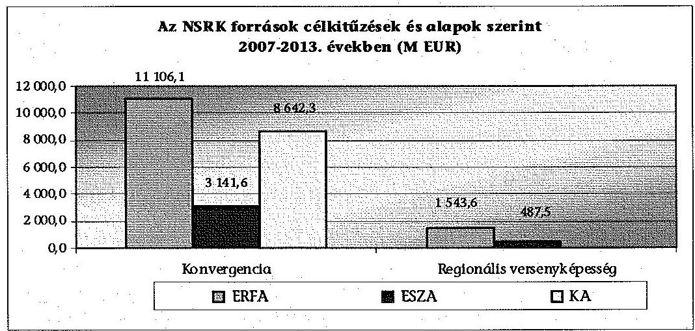

Az NSRK források végrehajtásának ÚMFT programját a 2007. évi indulás óta az EU Bizottság OP-ként hagyta jóvá.

Az NSRK források 2007-2013. évekre rendelkezésre álló teljes keretének pozitív támogatói döntéssel történő lekötése eredményes, 2013. december 31én 9219,1 Mrd Ft (32 925,5 M EUR), 112,4\%-os lekötöttségű volt. A rendelkezésre álló EU-s és hazai forrás a 8204,9 Mrd Ft keretösszeget 1014,3 Mrd Ft-tal haladta meg. A forrásoknak a támogatói döntéssel történő lekötése azonban egyes OP-k esetében (TÁMOP, TIOP, VOP és a ROP-ok) a 2013. év végéig nem érte el a rendelkezésükre álló teljes keretösszeget. A VOP esetében kötelezettségvállalásra 2015 végéig van lehetőség.

---

Az NSRK EU-s és hazai keretszerződéses lekötöttségének 2013. december 31-i állapotát az következő táblázat mutatja:

| Operatív program | $\begin{aligned} & \text { 2007- } \\ & 2013 \\ & \text { NSRK } \\ & \text { keret } \\ & \text { Mrd Ft } \end{aligned}$ | Keret megoszlása OP-ok szerint | Szerzödéssel lekötött összeg Mrd Ft | Szerződéses lekötöttség arányu az NSRK kerethez | $\begin{gathered} \text { Szerző- } \\ \text { déssel } \\ \text { lekötött } \\ \text { összeg } \\ \text { meg- } \\ \text { oszlása } \end{gathered}$ | Ebből: 2013. évben szerződéssel lekötött összeg Mrd Ft | Szerződéses lekötés eltérése az NSRK keret-összegből Mrd Ft |
| :--: | :--: | :--: | :--: | :--: | :--: | :--: | :--: |
| ÁROP | 48,5 | 0,6\% | 52,1 | 107,3\% | 0,6\% | 21,0 | 3,6 |
| EKOP | 114,4 | 1,4\% | 136,4 | 119,2\% | 1,6\% | 35,5 | 22,0 |
| GOP | 941,7 | 11,5\% | 1016,6 | 107,9\% | 11,9\% | 35,6 | 74,9 |
| KÖZOP | 1872,5 | 22,8\% | 2447,2 | 130,7\% | 28,6\% | 62,6 | 574,7 |
| Összesen | 2977,1 | 36,3\% | 3652,2 | 122,7\% | 42,7\% | 154,7 | 675,1 |
| KEOP | 1484,6 | 18,1\% | 1445,5 | 97,4\% | 16,9\% | 78,1 | $-39,1$ |
| TÁMOP | 1146,2 | 14,0\% | 1056,8 | 92,2\% | 12,3\% | 49,1 | $-89,5$ |
| TIOP | 587,0 | 7,2\% | 529,3 | 90,2\% | 6,2\% | 303,5 | $-57,8$ |
| VOP | 108,8 | 1,3\% | 106,3 | 97,7\% | 1,2\% | 31,5 | $-2,5$ |
| ROP | 1901,2 | 23,2\% | 1771,4 | 93,2\% | 20,7\% | 1459,5 | $-129,8$ |
| Összesen | 5227,8 | 63,7\% | 4909,2 | 93,9\% | 57,3\% | 1921,7 | $-318,6$ |
| Mindösz-   szesen | 8204,9 | 100,0\% | 8561,4 | 104,3\% | 100,0\% | 2076,4 | 356,5 |

Az 1083/2006/EK rendelet 93. cikk (1) bekezdése értelmében az EU Bizottság automatikusan visszavonja a támogatás azon részét, amelyet nem használtak fel az előfinanszírozás vagy az időközi kifizetések teljesítésére az OP-ra vonatkozó költségvetési kötelezettségvállalást követő második év december 31-ig (,n+2"). Amennyiben a támogatásra rendelkezésre álló kötelezettségvállalási keret kimerül, vagy annak kimerülése előre jelezhető, az NFÜ a 16/2006. (XII. 28.) MeHVM-PM együttes rendelet 5. § (8) bekezdésének és a 4/2011 (I. 28.) Korm. rendelet 21. § (10) bekezdésének megfelelően a benyújtás lehetőségét felfüggeszthette vagy a pályázatot lezárhatta.

Az NSRK EU-s és hazai keretszerződéses lekötöttsége 2013. december 31én 104,3\%-on teljesült. Az NSRK keretének az ÁROP, EKOP, GOP, KÖZOP esetében a támogatási szerződéssel történt lekötése meghaladta az NSRK pénzügyi tervében meghatározott, rendelkezésre álló keretösszeget. A 2013. december 31-ig szerződéssel le nem kötött NSRK keret összege 11 OP-nál összesen 318,6 Mrd Ft volt, amely a teljes keret 3,9\%-át teszi ki. A ROP-k, TÁMOP, KEOP, TIOP, VOP programok támogatói döntéssel lekötött összege 2013. december 31.-én 3589,6 Mrd Ft volt, a részükre meghatározott 3743,3 Mrd Ft NSRK keretösszeggel szemben. A szerződéses lekötöttségből a 2013. évben valósult meg a teljes lekötöttség 24,3\%-a. Legnagyobb mértékben 30,7\%-kal (574,7 Mrd Ft-tal) a KÖZOP program esetében haladta meg a szerződéskötés összege az NSRK ke-

---

retösszeget. A többletkötelezettség-vállalást a 4/2011. (I. 28.) Korm. rendelet 20/A §-a, valamint a 29/A. §-a szabályozza. Az NFÜ az OP-k prioritások keretein felüli többletkötelezettség-vállalási igényét az államháztartásért felelős miniszter hagyta jóvá. Az OP-k a 2012. évben 199,5 Mrd Ft, a 2013. évben 198,1 Mrd Ft, összesen 397,6 Mrd Ft többletkötelezettség-vállalásra kaptak engedélyt a Nemzetgazdasági Minisztériumtól.

A 2007-2012. évre az NFÜ által az előző évek zárszámadási ellenőrzéseihez megküldött tanúsítványok és a jelen ellenőrzéshez az ME által kitöltött tanúsítványok közötti eltérést - az ME tájékoztatása szerint - a visszalépések és a szerződésmódosítások miatt bekövetkezett változások okozták. Az adatszolgáltatás eltérése ezen ellenőrzés megállapításaira vonatkozóan problémát nem okozott.

# 4.2. Az NSRK forrásai kifizetésének teljesülése a 2013. év végéig 

A 2007-2013. években az éves költségvetés módosított kiadási előirányzataként kumulált 7039,8 Mrd Ft összegű EU-s támogatások kifizetése 70,6\%-ban (4966,7 Mrd Ft) valósult meg. Az NSRK EU-s és hazai - 2007-2013. évekre rendelkezésre álló - 8204,9 Mrd Ft keretéhez viszonyítva a kifizetések 2013. december 31-én $61,1 \%$-on ( 5012,5 Mrd Ft) teljesültek. Az NSRK 2013. december 31-i teljesítése nem volt eredményes. Az NSRK OP-k kifizetései nem biztosították a források terv szerinti felhasználását a programidőszak eddig eltelt időtartama alatt. A 2007-2013. év végéig teljesített kifizetésekből 1707,3 Mrd Ft kifizetésére a 2013. évben került sor, amely az eddigi kifizetéseknek a $34 \%$-át, egy év alatt több mint a kifizetett összeg egyharmadát tette ki.

Az NSRK keretösszegből kifizetett támogatásokat és a kifizetések NSRK teljes keretéhez viszonyított arányait a következő diagram operatív programonként mutatja be:
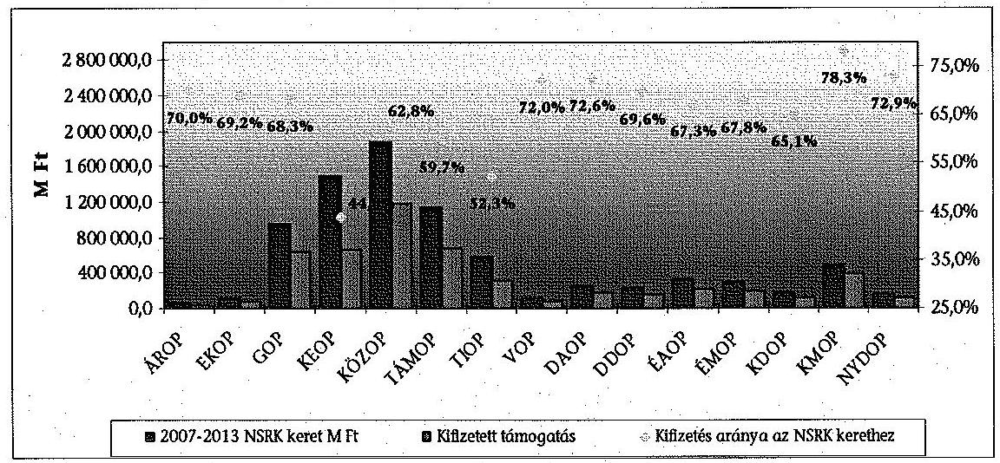

Az NSRK keretösszegből magas részarányt képviselő GOP, KEOP, KÖZOP, TÁMOP, TIOP programok kifizetéseinek teljesítése együttesen a keretösszegük $57,4 \%$-át érte el.

---

A 2007-2013. közötti időszakban az EU Bizottság által jóváhagyott EU-s támogatás 24 921,2 M EUR keretéből a 2012. és 2013. években az „n+2" szabály amely szerint az egyes programok éves keretének megfelelő összeg legfeljebb az adott évet követő második (2010-ig az „n+3" szabály miatt a harmadik) évig hívható le - megsértése 7,9 Mrd Ft ${ }^{5}$-ot tett ki. Az OP-k éves jelentései alapján az „n+2" szabály feltételeinek a 2012. évben két, 2013-ban egy OP nem tudott megfelelni: az ÁROP 0,6 Mrd Ft-tal, az EKOP 3,2 Mrd Ft-tal, a TÁMOP a 2013. évben 4,1 Mrd Ft-tal volt érintett.

Az ÁROP érintettségének okai a konstrukciók meghirdetésének (a magas tételszám és a kapacitáshiány miatt) a tervezettől való elmaradása és a folyamatban lévő projektek csúszása voltak. A projektek lassúbb megvalósítása a jogszabályváltozásoknak a projektek szakmai tartalmára, indítására gyakorolt hatására vezethető vissza. Az EKOP 2012. évi, az elvárthoz képest lassúbb előrehaladásának alapvető oka, hogy a 2009-2010-es akcióterv módosítására és a 2011-2013-as akciótervek elfogadására csak 2011 júliusában került sor, így ezeknek a konstrukcióknak a meghirdetése és a projektek kivitelezése is jelentősen késett. A TÁMOP esetében több tényező együttes hatása közül kiemelhető, hogy az OP 2013. évi pozitív támogatói döntési lekötési szintje $97,3 \%$ volt, amely elmaradt az NSRK források 112,4\%-os lekötöttségétől. A beérkezett pályázatok értékelésének és döntési folyamatának elhúzódása kihatott a pénzügyi teljesítések volumenére.

Az ellenőrzött időszakban 72727 támogatott részére összesen - a pályázói viszszalépések kiszűrése nélkül - 9646 965,1 M Ft támogatást ítéltek meg, amellyel kapcsolatban összesen 6179 db szabálytalansági döntés született. A szabálytalanságok száma a 2008. évi öt db-ról 2013. évben 1623 db-ra nőtt. A szabálytalanságok $91,9 \%$-a, 5678 db a 2011-2013. években történt, csalás gyanúja 33 esetben-, jogerős csalás egy esetben fordult elő. A szabálytalansággal érintett összeg összesen 39133,4 M Ft volt, amely a teljes támogatási összeg $0,4 \%$-át tette ki. A szabálytalansági eljárások 2007-2011. között emelkedő tendenciát mutattak, 2011-hez képest 2012-ben 35,7\%-kal, 2013-ban 34,2\%-kal csökkentek. A szabálytalanságok típusa között jellemző volt a közbeszerzési, valamint a gazdasági nehézségek miatt nem megfelelően megvalósuló projektek miatti szabálytalanság.

A szabálytalanságok számát és a szabálytalanságokkal összefüggő Ft összegeket mutatja a következő diagram:

[^0]
[^0]:    ${ }^{5} 280$ HUF/EUR árfolyamon kalkulálva

---

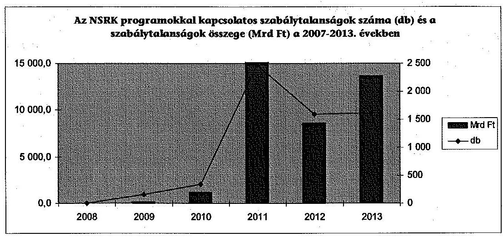

Az ellenőrzött időszakban a tagállam által megállapított pénzügyi korrekció összege 8646,5 M Ft, az EU Bizottság által megállapított pénzügyi korrekció összege 75 940,4 M Ft volt ( 280 HUF/EUR árfolyamon számolva). A tagállam által megállapított pénzügyi korrekció 32,9\%-a 2012. évben, 66\%-a 2013. évben került megállapításra. A korrekció kétszeres növekedését a KÖZOP IH által 2013-ban hozott - az EU Bizottság által 2011. évben megküldött, a Sze-ged-Makó közötti autópálya szakasz megvalósításának ellenőrzése alapján pénzügyi korrekcióra vonatkozó döntése idézte elő. A tagállami pénzügyi korrekció 79,4\%-át, 6,9 Mrd Ft-ot a GOP, KÖZOP, TIOP és a KMOP OP-k esetében feltárt szabálytalanságok miatt megállapított korrekció tette ki. A pénzügyi korrekció miatt felszabaduló források az érintett OP adott prioritásának szabad forrásaként jelentek meg, amelyek felhasználása az OP feladata volt.

Az EU Bizottság audit szabálytalansági eljárásra vonatkozó megállapításai miatti pénzügyi korrekció következtében tényleges forráselvonás a 2013. év végéig nem történt, a megállapított pénzügyi korrekciókat az NFÜ figyelembe vette, az érintett összegek újrafelhasználására - az EU Bizottság vonatkozó előírásait betartva - az III-k intézkedtek, ezáltal az NFÜ szabálytalanságkezelési tevékenysége hozzájárult az EU-s források felhasználásának eredményességéhez.

# 4.3. Az EU-s támogatások eredményes felhasználása érdekében tett lépések 

Az ÁSZ a 2009-2013. éves költségvetés végrehajtásának ellenőrzései ${ }^{6}$ során a rendelkezésre álló EU-s források felhasználására vonatkozóan megállapította, hogy a kifizetések teljesítése és az OP-k végrehajtása az időarányostól elmaradt. A jelentések felhívták a figyelmet a lehetséges forrásvesztés elkerülése érdekében szükséges intézkedések megtételére.

Az NFÜ jelentős mértékű előkészítő tevékenységet végzett a kifizetések gyorsítását célzó intézkedések tekintetében. Az NSRK EU-támogatások eredményes felhasználása érdekében számos kezdeményezést, előterjesztést és jelentést készí-

[^0]
[^0]:    ${ }^{6}$ 1016., 1117, 1297, 1308 számú ÁSZ Jelentések

---

tett a Nemzeti Fejlesztési Kormánybizottság részére. Az NFÜ az NFM részére öszszeállította 12 törvény azon előírásait, amelyek a 2007-2013-as EU-s forrásfelhasználást akadályozó jogszabályi korlátozásokat tartalmazták. Az NFÜ jelentései alapján a 2013. évben a 2010. évi kötelezettség utáni „n+3"-as és a 2011. évi „n+2"-es szabálynak az együttes érvényesülése miatt megnövekedett pénzügyi teljesítmény követelményeknek való megfelelés intézkedések nélkül jelentős forrásvesztéssel járt volna.

A Kormány az NSRK fejlesztési források kifizetésének gyorsabb megvalósítását stratégiai célkitűzésnek tekintette, amely következtében 2013. évben kilenc kormányhatározat alapján történt intézkedés.

A fejlesztési források kifizetésének gyorsításához szükséges intézkedéseket, feladatokat az 1423/2011. (XII. 6.) Korm. határozat tartalmazta. A határozat intézkedéseinek megvalósítása a 4/2011. (I. 28.) Korm. rendeletnek a 25/2012. (II. 29.) Korm. rendelettel történő módosításaként jelent meg. Az EU-s források kifizetésének gyorsítását szolgáló intézkedések következtében az akciótervek szerkezete egyszerúsödött, a pályázatok előkészítésére és kezelésére meghatározott határidők csökkentek, előtérbe került az elektronikus ügyintézés, bevezették a projekt felügyeleti rendszert, biztosíték melletti közvetlen szállítói kifizetést alkalmaztak, a közbeszerzési szabályok határidejét csökkentették, valamint biztosították az ÁFA kompenzációt.

A gazdasági válság hatásainak enyhítésére a 4/2011. (I. 28.) Korm. rendelet 61. § (2) és (5) bekezdéseiben előírtak szerint, amennyiben a nagyprojekt vagy kiemelt projekt költsége a kedvezményezett által nem befolyásolható körülmény miatt növekedett meg, a kedvezményezett kérhette a TSZ módosítását, részletesen bemutatva és számszerúsítve a költség növekmény egyes okait. A nagyprojekt vagy kiemelt projekt támogatásának növeléséről a Kormány, illetve a Nemzeti Fejlesztési Kormánybizottság döntött. Az 1423/2011. (XII. 6.) Korm. határozat 2012. március 31-ei határidőre a Kormány részére jelentéskészítési kötelezettséget írt elő a nemzeti fejlesztési miniszternek a határozatban foglalt intézkedések végrehajtásáról, bemutatva azok hatásait. Az NFM által elkészített előterjesztést a Kormány a 2012. május 9-ei ülésén megtárgyalta és tudomásul vette. Az NFM a kormányhatározat feladatainak végrehajtásáról a teljesítés határidő késedelmének okaként a feladatok széleskörű egyeztetési kötelezettségét és a felmerült vitás kérdésekben a tárcákkal történő megegyezésnek az időigényét jelölte meg. A kormányhatározat 16 pontjában és alpontjaiban meghatározott 45 feladatából 31 teljesült, 2 részben teljesült, 10 folyamatban volt és kettő nem teljesült a jelentés készítésének időpontjában. A két nem teljesült feladat - a 7. d) az önerő biztosításának módjáról útmutató, valamint a 8. a) az egységes megvalósíthatósági sablon készítése - teljesítésétől elálltak.

A Közlekedés Operatív Program szabad forrásainak felhasználásáról szóló 1063/2013. (II. 18.) Korm. határozat lehetőséget nyújtott a KÖZOP szabad keretének felhasználására, új és szakaszolt projektek indítására. A szakaszolt projektek indításának jogi feltételét a 4/2011. (I. 28.) Korm. rendeletnek a 356/2013. (X. 8.) Korm. rendelettel történő módosítása teremtette meg. A szakaszolt projekt a fizikai és pénzügyi szempontból két egyértelműen elhatárolható szakaszból álló projekt, amelynek első szakasza a 2007-

---

2013. programozási időszakban, második szakasza a 2014-2020. programozási időszakban valósul meg.

Az OP-k közötti és az OP-kon belüli forrásátcsoportosításra vonatkozó módosításokat, hangsúlyt fektetve a forrásvesztés elkerülését elősegítő, az önerő csökkentésére irányuló lépések bevezetését az egyes 2007-2013. évekre szóló operatív programok módosításáról szóló 1623/2013. (IX. 5.) Korm. határozat tartalmazta. Az intézkedések következtében az ügyintézési idők csökkentek, a kedvezményezettek körét kiszélesítették (ÁROP), illetve a közkiadásalapú elszámolás helyett a teljesköltség-alapú elszámolás vezették be. A keretek forrásvesztésének elkerülése, minimálisra mérséklése céljából a nagyprojektek volumenének növelésével 2013. évben 30 db nagyprojekt előkészítése történt, amelyből az EU Bizottság 2013. évben egy projektet fogadott el.

Az NFÜ közremúködött a kormányhatározatok végrehajtásában, az új előírások beépültek a feladatellátásának munkafolyamataiba. A 2013. évi „n+2" célkitűzés teljesítését, a forrásvesztés elkerülését az IH-k a kifizetések folyamatos monitorozásával, havi előrejelzések készítésével támogatták. A projektek gyorsítását negyedéves monitoring megbeszélések szolgálták. A hatósági eljárások elhúzódásának felszámolására kormányközi munkacsoportot alakítottak a fejlesztési, közlekedési, környezetvédelmi és hatósági szakterületek részvételével. Az ÚMFT program-periódus utolsó éveiben az EU-s támogatások eredményes felhasználása érdekében hozott intézkedések hatására a 2013. évi jelentős forrásvesztési kockázatot sikerült elkerülni. A végrehajtott intézkedések hozzájárultak a feladatellátás eredményességének növeléséhez, a támogatói döntéssel lekötött EU-s és hazai támogatási keretösszeg 25,3\%-a (2073,5 Mrd Ft) 2013. évben meghozott döntések eredménye volt.

# 5. Az atipikus foglalkoztatási formák ösztönzésének támoGATÁSÁRA FORDÍTOTT PÉNZESZKÖZÖK FELHASZNÁLÁSA 

A 2009-2010. évi akcióterv alapján az atipikus foglalkoztatási formák támogatásának célja - a foglalkoztatás nem hagyományos formáinak elterjesztésén, szervezett foglalkoztatássá alakításán keresztül - a hátrányos helyzetűek munkába állási esélyeinek a javítása volt. Az ÚMFT az ellenőrzési időszakban a TÁMOP keretei között hat támogatási programot ${ }^{7}$ tartalmazott az atipikus foglalkoztatási formák ösztönzésére. Atipikusnak nevezünk minden olyan foglalkoztatási formát, ami nem egyezik meg a hagyományos, alkalmazotti, rendszeres, kötött, nappali nyolc órás munkavégzéssel (pl.: távmunka, munkaerőkölcsönzés, önfoglalkoztatás, alkalmi munka).

A munkaerő-piaci rugalmasság javítására, az atipikus foglalkoztatási formák ösztönzésének támogatására fordított EU-s pénzeszközöknél a források odaítélése, folyósítása, elszámolása és felhasználása az ellenőrzött idôszakban szabályszerű volt.

[^0]
[^0]:    7 TÁMOP-2.4.3.A-09/1; TÁMOP-2.4.3.A-09/2; TÁMOP-2.4.3.B-1-09/1; TÁMOP-2.4.3.B-2-10/1; TÁMOP-2.4.3.B-2-10/2; TÁMOP-2.4.3.B-2-11/1 támogatási programok

---

Az NSRK keretből 2009-től a munkaerő-piaci rugalmasság javítására, az atipikus foglalkoztatási formák ösztönzésének támogatására fordított EU-s források kezelését az ESZA nKft. végezte. Az ESZA nKft. belső kontroll rendszerének kialakítása az ellenőrzött időszakban a jogszabályi előírásoknak megfelelt. A kontroll eljárásokat és az alkalmazott kontroll eszközöket kialakították, a feladatellátás folyamatainak szabályozását az eljárásrendek és az ellenőrzési nyomvonalak tartalmazták. Az ESZA nKft. belső ellenőrzésének kialakítása és múködtetése az ellenőrzött időszakban a jogszabályi előírásoknak megfelelt. A belső kontrollrendszer múködését az ellenőrzött időszakban értékelték, a feltárt hiányosságok megszüntetésére intézkedtek, valamint működtettek szabálytalanságkezelési rendszert. Az ESZA nKft. által kialakított és működtetett monitoring, értékelési és beszámolási rendszer hozzájárult a támogatások szabályszerű felhasználásához. Az ESZA nKft. a projektek megvalósításának előrehaladását folyamatosan nyomon követte, a támogatások kifizetése az engedélyezett kifizetési kérelmek alapján történt. A kedvezményezettek az EU támogatások felhasználása egész folyamatában eleget tettek a jogszabályokban és a támogatási szerződésekben előírtaknak.

Az atipikus foglalkoztatási formák ösztönzésére szolgáló források támogatási szerződéssel történő lekötése nem tekinthető eredményesnek, mert 2013. év végéig a teljes keret $80 \%$-a, 3,2 Mrd Ft került lekötésre. A TÁMOP-on belül az atipikus támogatási programok a 2013. év végi szerződéskötések értékét tekintve $0,3 \%$-os arányt képviseltek. A TÁMOP keretei között 2009-től meghirdetett atipikus támogatási programokra történt kifizetések összege 2013. december 31-ig 2991,6 M Ft volt, a szerződéssel lekötött támogatások 92,5\%ban kerültek kifizetésre. A TÁMOP-on belül az atipikus támogatási programok a 2013. év végéig történt kifizetések $0,4 \%$-át tették ki.

Budapest, 2015. 02. hónap 16. nap

Melléklet: 12 db
Függelék: 3 db
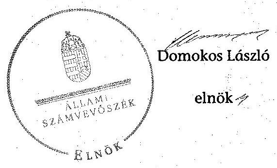

---

.

---

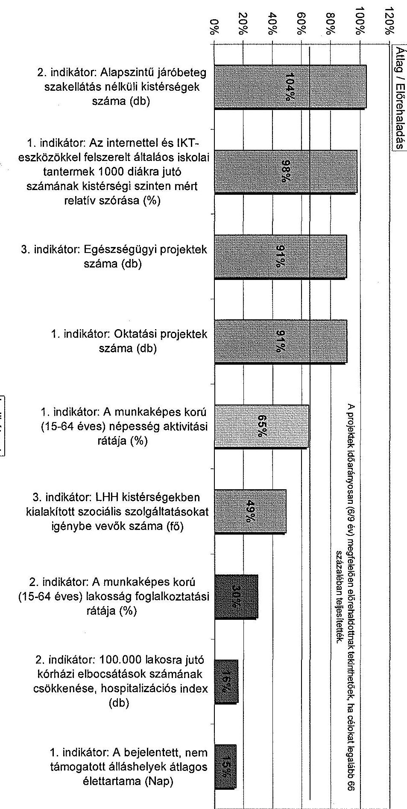
1. SZAMÚ MELLEKLET A V-0484-1367/2014. SZAMÚ JELENTÉSHEZ

---

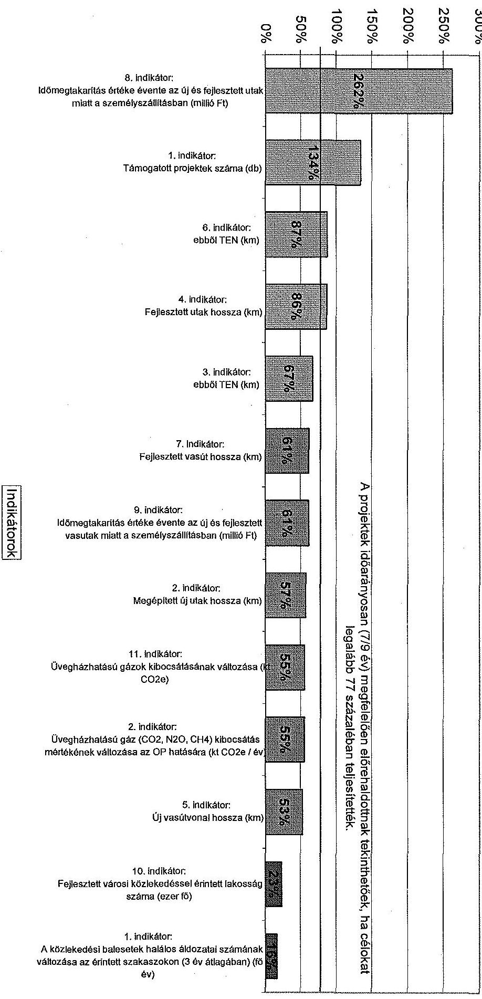

A KÖZÖP előrehaladása az Örgyes ÖP szintű indikátorok alapján 2007-2013

---

# A GOP, ÁROP, EKOP és a VOP előrehaladása az egyes OP szintű indikátorok alapján 2007-2013 

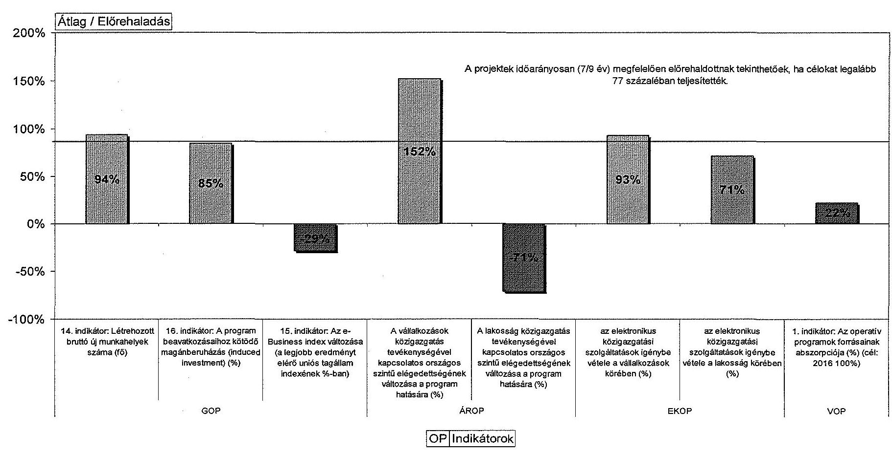

A VOP indikátor esetében, szükséges figyelembe venni, hogy az indikátor csak a lezárt projektek kifizetéseit tartalmazza, ami nem a kifizetések 2015. december 31-ei végső határidejével időarányosan növekszik. Különösen jelentősen befolyásolják az indikátor értékét a nagy beruházási projektek, ezek teljes vagy egyes szakaszainak végrehajtása 2014-2015-ben fejeződik be, akkor lehet a projektet lezárni, és akkor lehet az indikátor számításába ezen projektek kifizetett támogatását is figyelembe venni. Ez is indokolja, hogy a VOP indikátor értéke csak kevesebb, mint $1 / 3$-a a teljes kifizetésnek.

---

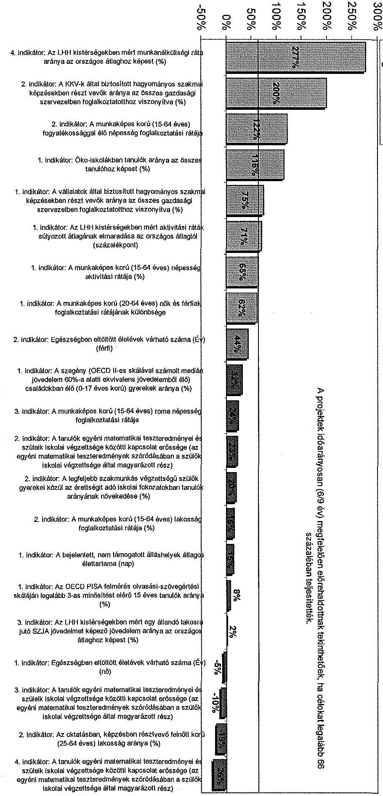

Az TAMOP előrehaladása az egyes indikátorok alapján 2007-2012

---

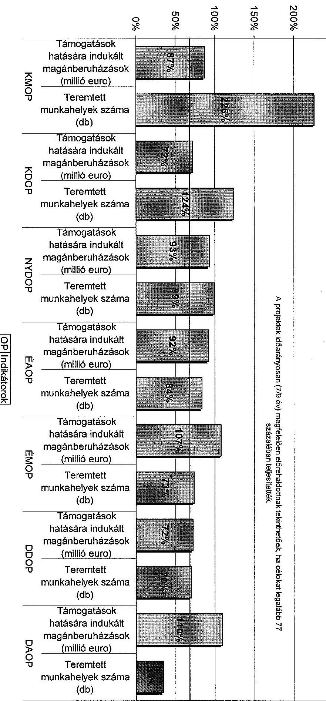

1. SZÁMÚ MELLEKLET A V-0484-1367/2014. SZÁMÚ JELENTÉSHEZ

A ROP-ok előrehaladása a célértékkel rendelkező OP-k szintű indikátorok alapján 2007-2013

---

# OP KEOP

A KEOP előrehaladása az egyes OP szintű indikátorok alapján 2007-2013

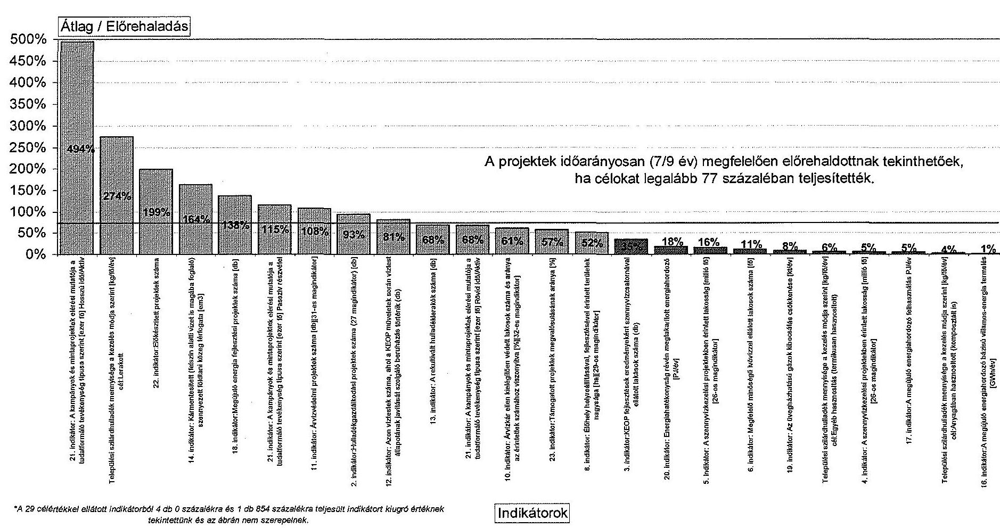

---

|   |  | A 2015. évi célértékkel rendelkező OP szintű indikátorok időarányos teljesülése |  |  |  |  |  |  |  |   |
| --- | --- | --- | --- | --- | --- | --- | --- | --- | --- | --- |
|   | Tanúsítványban
átadott indikátorok
előrehaladását
bemutató
adatsorok száma | Ebből
célértékkel
rendelkezik | Időarányosan nem
teljesült* | Az időarányosan
nem
teljesült*indikátorok
aránya a 2015. évi
célértékkel
rendelkező
idikátorokhoz
viszonyítva | Teljesülés
alapja | 25
százalék
alatt
teljesült | A 2015. évi célhoz
képest 25 százalék alatt
teljesült indikátorok
aránya az összes
célértékkel rendelkező
idikátorhoz viszonyítva | 0
százalékra
teljesült | A negatív
irányban
előrehaladott
indikátorok
száma | Tanúsítványban
végig 0-s adatsor
2007-2013  |
|  EKOP | 2 | 2 | 1 | 50% | 77 | 0 | 0% | 0 | 0 | 0  |
|  AROP | 2 | 2 | 1 | 50% | 77 | 1 | 50% | 0 | 1 | 0  |
|  GOP | 16 | 4 | 3 | 75% | 77 | 1 | 25% | 0 | 1 | 0  |
|  KÖZOP | 47 | 47 | 33 | 70% | 77 | 13 | 28% | 9 | 0 | 11  |
|  VOP** | 8 | 8 | 3 | 38% | 77 | 1 | 13% | 0 | 0 | 0  |
|  KEOP | 30 | 29 | 18 | 62% | 77 | 14 | 48% | 5 | 0 | 8  |
|  TÁMOP | 22 | 20 | 14 | 70% | 66 | 11 | 55% | 0 | 4 | 0  |
|  TÍOP | 10 | 9 | 4 | 44% | 66 | 2 | 22% | 0 | 0 | 0  |
|  ROP(áttag) | 39 | 29 | 12 | 41% | 77 | 3 | 10% | 3 | 0 | 3  |
|  Összesen | 176 | 150 | 89 | 59% |  | 46 | 31% | 17 | 6 | 22  |
|  *Nem érte el a 2015. évi célérték 66 %-át (6/9 év), illetve 77 %-át (7/9 év), attól függően, hogy 2012-ig vagy 2013-ig álltak-e rendelkezésre adatok.
**A három VOP indikátomát a tényértéket nem lehet a 7-9 éves időszakra vetíteni és így időarányosan számított célértékhez hasonlítani. |  |  |  |  |  |  |  |  |  |  |   |

---

# **Chemistry**

## **Chemical Reactions**

### **Balancing Chemical Equations**

1. **Write the unbalanced equation:**
   - Example: $$C_3H_8 + O_2 \rightarrow CO_2 + H_2O$$

2. **Balance the equation:**
   - Balance carbon atoms first.
   - Then balance hydrogen atoms.
   - Finally, balance oxygen atoms.
   - Balanced equation: $$C_3H_8 + 7O_2 \rightarrow 3CO_2 + 4H_2O$$

3. **Balance the equation:**
   - Balance oxygen atoms first.
   - Then balance oxygen oxygen atoms.
   - Balanced equation: $$C_3H_8 + 7O_2 \rightarrow 3CO_2 + 4H_2O$$

### **Types of Reactions**

1. **Combination Reaction:**
   - Example: $$2H_2 + O_2 \rightarrow 2H_2O$$

2. **Decomposition Reaction:**
   - Example: $$2H_2O_2 \rightarrow 2H_2O + O_2$$

3. **Single Displacement Reaction:**
   - Example: $$Zn + 2HCl \rightarrow ZnCl_2 + H_2$$

4. **Double Displacement Reaction:**
   - Example: $$AgNO_3 + NaCl \rightarrow AgCl + NaNO_3$$

5. **Combustion Reaction:**
   - Example: $$CH_4 + 2O_2 \rightarrow CO_2 + 2H_2O$$

## **Stoichiometry**

### **Mole Concept**

- **Mole (mol):** The amount of substance containing as many particles (atoms, molecules, ions) as there are atoms in exactly 12 grams of carbon-12.
- **Avogadro's Number:** $$6.022 \times 10^{23}$$ particles per mole.

### **Molar Mass**

- **Molar Mass:** The mass of one mole of a substance.
- Example: The molar mass of water ($$H_2O$$) is 18.015 g/mol.

### **Calculations**

1. **Moles to Mass:**
   - Formula: $$n = \frac{m}{M}$$
   - Example: Calculate the number of moles of $$H_2O$$ in 18 grams of water.
     - $$n = \frac{18.015 \, \text{g}}{18.015 \, \text{g/mol}} = 18.015 \, \text{g/mol}$$

2. **Moles to Mass:**
   - Formula: $$m = n \times M$$
   - Example: Calculate the mass of 18.015 g of water.
     - $$m = 18.015 \, \text{g/mol} = 18.015 \, \text{g/mol}$$

## **Gas Laws**

### **Ideal Gas Law**

- **Equation:** $$PV = nRT$$
- **Variables:**
  - $$P$$: Pressure (atm)
  - $$V$$: Volume (L)
  - $$n$$: Number of moles (mol)
  - $$R$$: Ideal gas constant (0.0821 L·atm/mol·K)
  - $$T$$: Temperature (K)

### **Boyle's Law**

- **Equation:** $$P_1V_1 = P_2V_2$$
- **Variables:**
  - P₁: Pressure (atm)
  - P₂: Volume (L)
  - P₃: Pressure (atm)
  - P₁: Pressure (atm)
  - P₂: Volume (L)
  - P₃: Pressure (atm)
  - P₁: Pressure (atm)

### **Boyle's Law**

- **Equation:** $$\frac{P_1V_1}{P_2V_2} = \frac{P_2V_2}{T_1}$$
- **Variables:**
  - P₁: Pressure (atm)
  - P₂: Volume (L)
  - P₃: Pressure (atm)
  - P₁: Pressure (atm)
  - P₂: Volume (L)
  - P₃: Pressure (atm)

## **Thermochemistry**

### **Enthalpy Change (ΔH)**

- **Definition:** The heat content of a system at constant pressure.
- **Equation:** $$\Delta H = q_p$$
- **Equation:** $$\Delta H = q_p + \frac{Q_p}{2}$$

### **Hess's Law**

- **Statement:** The enthalpy change for a reaction is the same whether it occurs in one step or multiple steps.
- **Equation:** $$\Delta H_{\text{reaction}} = \Delta H - \Delta H_0$$
- **Statement:** The enthalpy change for a reaction is the same whether it occurs in one step or multiple steps.

### **Hess's Law 2**

- **Statement:** The enthalpy change for a reaction is the same whether it occurs in one step or multiple steps.
- **Equation:** $$\Delta H_{\text{reaction}} = \Delta H - \Delta H_0$$
- **Statement:** The enthalpy change for a reaction is the same whether it occurs in one step or multiple steps.

### **Calorimetry**

- **Definition:** The mass of a substance.
- **Equation:** $$\Delta M = q_p \Delta H$$
- **Equation:** $$\Delta M = q_p + \frac{Q_p}{2}$$

## **Electrochemistry**

### **Oxidation and Reduction**

- **Oxidation:** Loss of electrons.
- **Reduction:** Gain of electrons.

### **Galvanic Cells**

- **Definition:** A cell that converts chemical energy into electrical energy.
- **Components:**
  - Anode: Oxidation occurs.
  - Cathode: Reduction occurs.
  - Salt Bridge: Connects the two half-cells.

### **Nernst Equation**

- **Equation:** $$E = E^\circ - \frac{RT}{nF} \ln Q$$
- **Variables:**
  - E: Cell potential
  - R: Ideal gas constant
  - F: Faraday constant
  - R: Standard cell potential
  - Q: Reaction quotient

### **Nernst Equation**

- **Equation:** $$\Delta N = \frac{RT}{nF} \ln Q$$
- **Variables:**
  - R: Standard cell potential
  - F: Faraday constant
  - R: Standard cell potential
  - Q: Reaction quotient

---

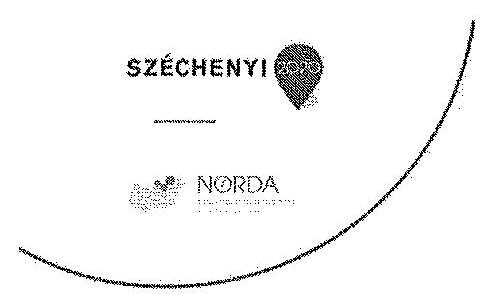

DOMOKOS LÁSZLÓ
elnök

ÁLLAMI SZÁMVEVŐSZÉK
Budapest
Apáczai Csere János utca 10. 1052

## TISZTELT ELNÖK ÚR!

Hivatkozva az Állami Számvevőszék V-0484-1383/2014 iktatószámú levelére, „az EU támogatások felhasználásának rendszere - A Nemzeti Fejlesztési Ügynökség (és a Közremüködő Szervezetek) uniós támogatásokkal kapcsolatos feladatellátásának ellenörzéséről" címmel készített számvevőszéki jelentéstervezettel kapcsolatos észrevételünk a következő:
a jelentéstervezet 29. oldalán, a 2.2.5. A közremüködő szervezetek belső kontrollrendszere pontban leírtak értelmében 'a NORDA belső ellenőrzési vezetője a 2012-2013. évekre vonatkozóan nem tett eleget a Bkr. 49. § (1) bekezdésében foglaltaknak, nem készítette el az éves belső ellenőrzési jelentéseket."

Az Állami Számvevőszék által kért adatszolgáltatási kötelezettség során a belső ellenőr minden kért dokumentumot rendelkezésre bocsátott, így a 2012. és a 2013. évre vonatkozó éves belső ellenőrzési jelentést is. A dokumentumok, melyek között megtalálhatóak a számvevőszéki jelentéstervezetben hiányolt jelentések is, elektronikus adathordozón kerültek átadásra.

Jelen levelemhez mellékelem a 2012. és a 2013. évre vonatkozó összefoglaló belső ellenőrzési jelentéseket és egyúttal kérem, hogy a jelentéstervezet fent említett megállapítását törölni szíveskedjenek.

Miskolc, 2014. december 18.

A további sikeres együttmüködésben bízva tisztelsttel:
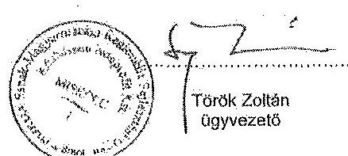

NORDA Észak-Magyarországi Regionális
Fejlesztési Ügynökség Kérhászni Nonprofit Kft.
3525 Miskolc, Széchenyi u. 107.
3300 Eger, Szálloda u. 5.
3100 Salgátsején, Kassel sor 54.

---

.

---

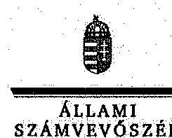

ELNÖK

Ikt.szám: V-0484-1397/2015.

Török Zoltán úr
ügyvezető

NORDA Észak-magyarországi Regionális Fejlesztési Ügynökség Közhasznú Nonprofit Kft.

Miskolc

Tisztelt Ügyvezető Úr!

A „Jelentéstervezet Az EU támogatások felhasználásának rendszere – A Nemzeti Fejlesztési Ügynökség (és a Közreműködő szervezetek) uniós támogatásokkal kapcsolatos feladatellátásának ellenőrzéséről” című jelentéstervezetre tett észrevételeit köszönettel megkaptam.

Az Állami Számvevőszék észrevételekre vonatkozó álláspontjáról a felügyeleti vezető által készített részletes tájékoztatást csatoltan megküldőm.

Budapest, 2015. év
☐☐
hó ☐ nap

Tisztelettel:

Melléklet: Tájékoztatás az elfogadott észrevételekről

Dümokos László

1052 BUDAPEST, APÁCEN CSERE JÁNOS UTCA 10. 1364 Budapest 4. Pf. 54 telefon: 484 9101 fax: 484 9291

---

# Tájékoztatás   az elfogadott észrevételekröl 

A „Jelentéstervezet Az EU támogatások felhasználásának rendszere - A Nemzeti Fejlesztési Ügynökség (és a Közremüködő szervezetek) uniós támogatásokkal kapcsolatos feladatellátásának ellenörzéséröl" címủ jelentéstervezethez kapcsolódó Norda-NORDA14/91/2 iktatószámú levélben tett észrevételeit köszönettel megkaptuk.
A jelentéstervezetre tett észrevételeket áttekintettük, azok kezeléséről a következő tájékoztatást adom:

A jelentéstervezetben foglaltakra megküldött észrevételét elfogadjuk. A jelentéstervezet 12. oldal utolsó előtti bekezdésében és a 29. oldal 2. bekezdésében szereplő megállapításokból a NORDA Észak-magyarországi Regionális Fejlesztési Ügynökség Közhasznú Nonprofit Kftre vonatkozó megállapítás törlésre került.

Kérem a válaszlevelemben foglaltak szíves tudomásulvételét. Tájékoztatom Ügyvezető urat, hogy a számvevőszéki jelentésben az ÁSZ. tv. 29. § (3) bekezdése alapján szerepeltetjük a figyelembe nem vett észrevételeket az elutasítás indokának feltüntetésével együtt.

Budapest, 2015. év $\quad O l . \quad$ hó 27 nap
Tisztelettel:
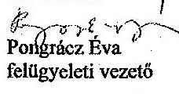

---

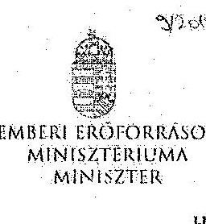

Iktatószám: 60740-3/2014/ELL

Hiv. szám: V-0484-1378/2014
Melléklet: 2 db

Domokos László részére
elnök

Állami Számvevőszék

Budapest
Apáczai Csere János u. 10.
1052

Tárgy: Észrevétel „Az EU támogatások felhasználásának rendszere – A Nemzeti Fejlesztési
Ügynökség (és a Közreműködő Szervezetek) uniós támogatásokkal kapcsolatos
feladatellátásának ellenőrzéséről” című számvevőszéki jelentéstervezethez

Tisztelt Elnök Úr!

„Az EU támogatások felhasználásának rendszere – A Nemzeti Fejlesztési Ügynökség (és a
Közreműködő Szervezetek) uniós támogatásokkal kapcsolatos feladatellátásának ellenőrzéséről”
című számvevőszéki jelentéstervezethez az alábbi észrevételeket teszem.

A jelentéstervezet 7. oldal 2. bekezdéséhez kapcsolódó észrevétel:

Megállapítás:
„Részt vett továbbá a költségvetési tervezésben, valamint Közreműködő szervezetele (KSz)
bevonásával irányította a meghirdetett pályázatok és a központi programok végrehajtását.”

Észrevétel:
Indokoltnak tartom a „központi program” kifejezés helyett a „kiemelt program” kifejezés
használatát.

A jelentéstervezet 7. oldal 2. bekezdéséhez kapcsolódó észrevétel:

Megállapítás:
„Tevékenységi körük kiterjedt a pályázatkezeléssel kapcsolatos feladatokra, a támogatási
szexződések megkötésére, a kifizetés-igénylési kérelmek, a számlaik és a számlákhoz kapcsolódó
dokumentumok befogadására, a teljesítések igazolására, a lebonyolítási számlákról történő
kifizetések utalványozására, az összesített forrásigények IH-k részére történő továbbítására, a
bizonylatok számviteli nyilvántartására.”

Cím: 1054 Budapest, 11. 10. 2015, 10:00, 10:05, 10:15, 11:00, 11:30, 11:50, 11:70, 11:90, 12:00, 12:30, 13:00, 13:30, 13:50, 14:00, 14:30, 15:00, 15:30, 16:00, 16:30, 17:00, 17:30, 18:00, 18:30, 19:00, 20:00, 21:00, 21:30, 22:00, 22:30, 23:00, 23:30, 24:00, 24:30, 25:00, 25:30, 26:00, 26:30, 27:00, 27:30, 28:00, 28:30, 29:00, 29:30, 30:00, 31:00, 32:00, 33:00, 34:00, 35:00, 36:00, 37:00, 38:00, 39:00, 40:00, 41:00, 42:00, 43:00, 44:00, 45:00, 46:00, 47:00, 48:00, 49:00, 50:00, 51:00, 52:00, 53:00, 54:00, 55:00, 56:00, 57:00, 58:00, 59:00, 60:00, 61:00, 62:00, 63:00, 64:00, 65:00, 66:00, 67:00, 68:00, 69:00, 70:00, 71:00, 72:00, 73:00, 74:00, 75:00, 76:00, 77:00, 78:00, 79:00, 80:00, 81:00, 82:00, 83:00, 84:00, 85:00, 86:00, 87:00, 88:00, 89:00, 90:00, 91:00, 92:00, 93:00, 94:00, 95:00, 96:00, 97:00, 98:00, 99:00, 100:00, 101:00, 102:00, 103:00, 104:00, 105:00, 106:00, 107:00, 108:00, 109:00, 110:00, 111:00, 112:00, 113:00, 114:00, 115:00, 116:00, 117:00, 118:00, 119:00, 120:00, 121:00, 122:00, 123:00, 124:00, 125:00, 126:00, 127:00, 128:00, 129:00, 130:00, 131:00, 132:00, 133:00, 134:00, 135:00, 136:00, 137:00, 138:00, 139:00, 140:00, 141:00, 142:00, 143:00, 144:00, 145:00, 146:00, 147:00, 148:00, 149:00, 150:00, 151:00, 152:00, 153:00, 154:00, 155:00, 156:00, 157:00, 158:00, 159:00, 160:00, 161:00, 162:00, 163:00, 164:00, 165:00, 166:00, 167:00, 168:00, 169:00, 170:00, 171:00, 172:00, 173:00, 174:00, 175:00, 176:00, 177:00, 178:00, 179:00, 180:00, 181:00, 182:00, 183:00, 184:00, 185:00, 186:00, 187:00, 188:00, 189:00, 190:00, 191:00, 192:00, 193:00, 194:00, 195:00, 196:00, 197:00, 198:00, 199:00, 200:00, 201:00, 202:00, 203:00, 204:00, 205:00, 206:00, 207:00, 208:00, 209:00, 210:00, 211:00, 212:00, 213:00, 214:00, 215:00, 216:00, 217:00, 218:00, 219:00, 220:00, 221:00, 222:00, 223:00, 224:00, 225:00, 226:00, 227:00, 228:00, 229:00, 230:00, 231:00, 232:00, 233:00, 234:00, 235:00, 236:00, 237:00, 238:00, 239:00, 240:00, 241:00, 242:00, 243:00, 244:00, 245:00, 246:00, 247:00, 248:00, 249:00, 250:00, 251:00, 252:00, 253:00, 254:00, 255:00, 256:00, 257:00, 258:00, 259:00, 260:00, 261:00, 262:00, 263:00, 264:00, 265:00, 266:00, 267:00, 268:00, 269:00, 270:00, 271:00, 272:00, 273:00, 274:00, 275:00, 276:00, 277:00, 278:00, 279:00, 280:00, 281:00, 282:00, 283:00, 284:00, 285:00, 286:00, 287:00, 288:00, 289:00, 290:00, 291:00, 292:00, 293:00, 294:00, 295:00, 296:00, 297:00, 298:00, 299:00, 210:00, 211:00, 212:00, 213:00, 214:00, 215:00, 216:00, 217:00, 218:00, 219:00, 220:00, 221:00, 222:00, 223:00, 224:00, 225:00, 226:00, 227:00, 228:00, 229:00, 230:00, 231:00, 232:00, 233:00, 234:00, 235:00, 236:00, 237:00, 238:00, 239:00, 240:00, 241:00, 242:00, 243:00, 244:00, 245:00, 246:00, 247:00, 248:00, 249:00, 250:00, 251:00, 252:00, 253:00, 254:00, 255:00, 256:00, 257:00, 258:00, 259:00, 260:00, 261:00, 262:00, 263:00, 264:00, 265:00, 266:00, 267:00, 268:00, 269:00, 270:00, 271:00, 272:00, 273:00, 274:00, 275:00, 276:00, 277:00, 278:00, 279:00, 280:00, 281:00, 282:00, 283:00, 284:00, 285:00, 286:00, 287:00, 288:00, 289:00, 290:00, 291:00, 292:00, 293:00, 294:00, 295:00, 296:00, 297:00, 298:00, 299:00, 210:00, 211:00, 212:00, 213:00, 214:00, 215:00, 216:00, 217:00, 218:00, 219:00, 220:00, 221:00, 222:00, 223:00, 224:00, 225:00, 226:00, 227:00, 228:00, 229:00, 230:00, 231:00, 232:00, 233:00, 234:00, 235:00, 236:00, 237:00, 238:00, 239:00, 240:00, 241:00, 242:00, 243:00, 244:00, 245:00, 246:00, 247:00, 248:00, 249:00, 250:00, 251:00, 252:00, 253:00, 254:00, 255:00, 256:00, 257:00, 258:00, 259:00, 260:00, 261:00, 262:00, 263:00, 264:00, 265:00, 266:00, 267:00, 268:00, 269:00, 270:00, 271:00, 272:00, 273:00, 274:00, 275:00, 276:00, 277:00, 278:00, 279:00, 280:00, 281:00, 282:00, 283:00, 284:00, 285:00, 286:00, 287:00, 288:00, 289:00, 290:00, 291:00, 292:00, 293:00, 294:00, 295:00, 296:00, 297:00, 298:00, 299:00, 210:00, 211:00, 212:00, 213:00, 214:00, 215:00, 216:00, 217:00, 218:00, 219:00, 220:00, 221:00, 222:00, 223:00, 224:00, 225:00, 226:00, 227:00, 228:00, 229:00, 230:00, 231:00, 232:00, 233:00, 234:00, 235:00, 236:00, 237:00, 238:00, 239:00, 240:00, 241:00, 242:00, 243:00, 244:00, 245:00, 246:00, 247:00, 248:00, 249:00, 250:00, 251:00, 252:00, 253:00, 254:00, 255:00, 256:00, 257:00, 258:00, 259:00, 260:00, 261:00, 262:00, 263:00, 264:00, 265:00, 266:00, 267:00, 268:00, 269:00, 270:00, 271:00, 272:00, 273:00, 274:00, 275:00, 276:00, 277:00, 278:00, 279:00, 280:00, 281:00, 282:00, 283:00, 284:00, 285:00, 286:00, 287:00, 288:00, 289:00, 290:00, 291:00, 292:00, 293:00, 294:00, 295:00, 296:00, 297:00, 298:00, 299:00, 210:00, 211:00, 212:00, 213:00, 214:00, 215:00, 216:00, 217:00, 218:00, 219:00, 220:00, 221:00, 222:00, 223:00, 224:00, 225:00, 226:00, 227:00, 228:00, 229:00, 230:00, 231:00, 232:00, 233:00, 234:00, 235:00, 236:00, 237:00, 238:00, 239:00, 240:00, 241:00, 242:00, 243:00, 244:00, 245:00, 246:00, 247:00, 248:00, 249:00, 250:00, 251:00, 252:00, 253:00, 254:00, 255:00, 256:00, 257:00, 258:00, 259:00, 260:00, 261:00, 262:00, 263:00, 264:00, 265:00, 266:00, 267:00, 268:00, 269:00, 270:00, 271:00, 272:00, 273:00, 274:00, 275:00, 276:00, 277:00, 278:00, 279:00, 280:00, 281:00, 282:00, 283:00, 284:00, 285:00, 286:00, 287:00, 288:00, 289:00, 290:00, 291:00, 292:00, 293:00, 294:00, 295:00, 296:00, 297:00, 298:00, 299:00, 210:00, 211:00, 212:00, 213:00, 214:00, 215:00, 216:00, 217:00, 218:00, 219:00, 220:00, 221:00, 222:00, 223:00, 224:00, 225:00, 226:00, 227:00, 228:00, 229:00, 230:00, 231:00, 232:00, 233:00, 234:00, 235:00, 236:00, 237:00, 238:00, 239:00, 240:00, 241:00, 242:00, 243:00, 244:00, 245:00, 246:00, 247:00, 248:00, 249:00, 250:00, 251:00, 252:00, 253:00, 254:00, 255:00, 256:00, 257:00, 258:00, 259:00, 260:00, 261:00, 262:00, 263:00, 264:00, 265:00, 266:00, 267:00, 268:00, 269:00, 270:00, 271:00, 272:00, 273:00, 274:00, 275:00, 276:00, 277:00, 278:00, 279:00, 280:00, 281:00, 282:00, 283:00, 284:00, 285:00, 286:00, 287:00, 288:00, 289:00, 290:00, 291:00, 292:00, 293:00, 294:00, 295:00, 296:00, 297:00, 298:00, 299:00, 210:00, 211:00, 212:00, 213:00, 214:00, 215:00, 216:00, 217:00, 218:00, 219:00, 220:00, 221:00, 222:00, 223:00, 224:00, 225:00, 226:00, 227:00, 228:00, 229:00, 230:00, 231:00, 232:00, 233:00, 234:00, 235:00, 236:00, 237:00, 238:00, 239:00, 240:00, 241:00, 242:00, 243:00, 244:00, 245:00, 246:00, 247:00, 248:00, 249:00, 250:00, 251:00, 252:00, 253:00, 254:00, 255:00, 256:00, 257:00, 258:00, 259:00, 260:00, 261:00, 262:00, 263:00, 264:00, 265:00, 266:00, 267:00, 268:00, 269:00, 270:00, 271:00, 272:00, 273:00, 274:00, 275:00, 276:00, 277:00, 278:00, 279:00, 280:00, 281:00, 282:00, 283:00, 284:00, 285:00, 286:00, 287:00, 288:00, 289:00, 290:00, 291:00, 292:00, 293:00, 294:00, 295:00, 296:00, 297:00, 298:00, 299:00, 210:00, 211:00, 212:00, 213:00, 214:00, 215:00, 216:00, 217:00, 218:00, 219:00, 220:00, 221:00, 222:00, 223:00, 224:00, 225:00, 226:00, 227:00, 228:00, 229:00, 230:00, 231:00, 232:00, 233:00, 234:00, 235:00, 236:00, 237:00, 238:00, 239:00, 240:00, 241:00, 242:00, 243:00, 244:00, 245:00, 246:00, 247:00, 248:00, 249:00, 250:00, 251:00, 252:00, 253:00, 254:00, 255:00, 256:00, 257:00, 258:00, 259:00, 260:00, 261:00, 262:00, 263:00, 264:00, 265:00, 266:00, 267:00, 268:00, 269:00, 270:00, 271:00, 272:00, 273:00, 274:00, 275:00, 276:00, 277:00, 278:00, 279:00, 280:00, 281:00, 282:00, 283:00, 284:00, 285:00, 286:00, 287:00, 288:00, 289:00, 290:00, 291:00, 292:00, 293:00, 294:00, 295:00, 296:00, 297:00, 298:00, 299:00, 291:00, 292:00, 293:00, 294:00, 295:00, 296:00, 297:00, 298:00, 299:00, 291:00, 292:00, 293:00, 294:00, 295:00, 296:00, 297:00, 298:00, 299:00, 291:00, 292:00, 293:00, 294:00, 295:00, 296:00, 297:00, 298:00, 299:00, 291:00, 292:00, 293:00, 294:00, 295:00, 296:00, 297:00, 298:00, 299:00, 291:00, 292:00, 293:00, 294:00, 295:00, 296:00, 297:00, 298:00, 299:00, 291:00, 292:00, 293:00, 294:00, 295:00, 296:00, 297:00, 298:00, 299:00, 291:00, 292:00, 293:00, 294:00, 295:00, 296:00, 297:00, 298:00, 299:00, 291:00, 292:00, 293:00, 294:00, 295:00, 296:00, 297:00, 298:00, 299:00, 291:00, 292:00, 293:00, 294:00, 295:00, 296:00, 297:00, 298:00, 299:00, 291:00, 292:00, 293:00, 294:00, 295:00, 296:00, 297:00, 298:00, 299:00, 291:00, 292:00, 293:00, 294:00, 295:00, 296:00, 297:00, 298:00, 299:00, 291:00, 292:00, 293:00, 294:0, 295:00, 296:00, 297:00, 298:00, 299:00, 291:00, 292:00, 293:00, 294:0, 295:00, 296:00, 297:00, 298:00, 299:00, 291:00, 292:00, 293:00, 294:0, 295:00, 296:00, 297:00, 298:00, 299:00, 291:00, 292:00, 293:00, 294:0, 295:00, 296:00, 297:00, 298:00, 299:00, 291:00, 292:00, 293:00, 294:0, 295:00, 296:00, 297:00, 298:00, 299:00, 291:00, 292:00, 293:00, 294:0, 295:00, 296:00, 297:00, 298:00, 299:00, 291:00, 292:00, 293:00, 294:0, 295:00, 296:00, 297:00, 298:00, 299:00, 291:00, 292:00, 293:00, 294:0, 295:00, 296:00, 297:00, 298:00, 299:00, 291:00, 292:00, 293:00, 294:0, 295:00, 296:00, 297:00, 298:00, 299:00, 291:00, 292:00, 293:00, 294:0, 295:00, 296:00, 297:00, 298:00, 299:00, 291:00, 292:00, 293:00, 294:0, 295:00, 296:00, 297:00, 298:00, 299:00, 291:00, 292:00, 292:00, 293:00, 294:0, 295:00, 296:00, 297:00, 298:00, 299:00, 291:00, 292:00, 293:00, 294:0, 295:00, 296:00, 297:00, 298:00, 299:00, 291:00, 292:00, 293:00, 294:0, 295:00, 296:00, 298:00, 299:00, 291:00, 292:00, 292:00, 294:0, 295:00, 296:00, 298:00, 299:00, 298:00, 299:00, 291:00, 292:00, 293:00, 294:0, 295:00, 296:00, 297:00, 298:00, 299:00, 291:00, 292:00, 293:00, 294:0, 295:00, 296:00, 297:00, 298:00, 299:00, 291:00, 292:00, 293:0, 295:00, 296:00, 297:00, 298:00, 299:00, 299:00, 291:00, 292:00, 293:0, 295:00, 296:00, 297:00, 298:00, 299:00, 291:00, 293:0, 295:00, 296:00, 297:00, 298:00, 298:00, 299:00, 298:00, 299:00, 291:00, 293:0, 295:00, 296:00, 297:00, 298:00, 298:00, 299:00, 291:00, 293:0, 295:00, 296:00, 297:00, 298:00, 298:00, 298:00, 298:00, 298:00, 298:00, 298:00, 298:00, 298:00, 298:00, 298:00, 298:00, 298:00, 298:00, 298:00, 298:00, 298:00, 298:00, 298:00, 298:00, 298:00, 298:00, 298:00, 298:00, 298:00, 298:00, 298:00, 298:00, 298:00, 298:00, 298:00, 298:00, 298:00, 298:00, 298:00, 298:00, 298:00, 298:00, 298:00, 298:00, 298:00, 298:00, 298:00, 298:00, 298:00, 298:00, 298:00, 298:00, 298:00, 298:00, 298:00, 298:00, 298:00, 298:00, 298:00, 298:00, 298:00, 298:00, 298:00, 298:00, 298:00, 298:00, 298:00, 298:00, 298:00, 298:00, 298:00, 298:00, 298:00, 298:00, 298:00, 298:00, 298:00, 298:00, 298:00, 298:00, 298:00, 298:00, 298:00, 298:00, 298:00, 298:00, 298:00, 298:00, 298:00, 298:00, 298:00, 298:00, 298:00, 298:00, 298:00, 298:00, 298:00, 298:00, 298:00, 298:00, 298:00, 298:00, 298:00, 298:00, 298:00, 298:00, 298:00, 298:00, 298:00, 298:00, 298:00, 298:00, 298:00, 298:00, 298:00, 298:00, 298:00, 298:00, 298:00, 298:00, 298:00, 298:00, 298:00, 298:00, 298:00, 298:00, 298:00, 298:00, 298:00, 298:00, 298:00, 298:00, 298:00, 298:00, 298:00, 298:00, 298:00, 298:00, 298:00, 298:00, 298:00, 298:00, 298:00, 298:00, 298:00, 298:00, 298:00, 298:00, 298:00, 298:00, 298:00, 298:00, 298:00, 298:00, 298:00, 298:00, 298:00, 298:00, 298:00, 298:00, 298:00, 298:00, 298:00, 298:00, 298:00, 298:00, 298:00, 298:00, 298:00, 298:00, 298:00, 298:00, 298:00, 298:00, 298:00, 298:00, 298:00, 298:00, 298:00, 298:00, 298:00, 298:00, 298:00, 298:00, 298:00, 298:00, 298:00, 298:00, 298:00, 298:00, 298:00, 298:00, 298:00, 298:00, 298:00, 298:00, 298:00, 298:00, 298:00, 298:00, 298:00, 298:00, 298:00, 298:00, 298:00, 298:00, 298:00, 298:00, 298:00, 298:00, 298:00, 298:00, 298:00, 298:00, 298:00, 298:00, 298:00, 298:00, 298:00, 298:00, 298:00, 298:00, 298:00, 298:00, 298:00, 298:00, 298:00, 298:00, 298:00, 298:00, 298:00, 298:00, 298:00, 298:00, 298:00, 298:00, 298:00, 298:00, 298:00, 298:00, 298:00, 298:00, 298:00, 298:00, 298:00, 298:00, 298:00, 298:00, 298:00, 298:00, 298:00, 298:00, 298:00, 298:00, 298:00, 298:00, 298:00, 298:00, 298:00, 298:00, 298:00, 298:00, 298:00, 298:00, 298:00, 298:00, 298:00, 298:00, 298:00, 298:00, 298:00, 298:00, 298:00, 298:00, 298:00, 298:00, 298:00, 298:00, 298:00, 298:00, 298:00, 298:00, 298:00, 298:00, 298:00, 298:00, 298:00, 298:00, 298:00, 298:00, 298:00, 298:00, 298:00, 298:00, 298:00, 298:00, 298:00, 298:00, 298:00, 298:00, 298:00, 298:00, 298:00, 298:00, 298:00, 298:00, 298:00, 298:00, 298:00, 298:00, 298:00, 298:00, 298:00, 298:00, 298:00, 298:00, 298:00, 298:00, 298:00, 298:00, 298:00, 298:00, 298:00, 298:00, 298:00, 298:00, 298:00, 298:00, 298:00, 298:00, 298:00, 298:00, 298:00, 298:00, 298:00, 298:00, 298:00, 298:00, 298:00, 298:00, 298:00, 298:00, 298:00, 298:00, 298:00, 298:00, 298:00, 298:00, 298:00, 298:00, 298:00, 298:00, 298:00, 298:00, 298:00, 298:00, 298:00, 298:00, 298:00, 298:00, 298:00, 298:00, 298:00, 298:00, 298:00, 298:00, 298:00, 298:00, 298:00, 298:00, 298:00, 298:00, 298:00, 298:00, 298:00, 298:00, 298:00, 298:00, 298:00, 298:00, 298:00, 298

---

Észrevétel:
Indokoltnak tartom a „kifizetés-igénylési kérelmek" kifejezés helyett a „kifizetési igénylések" kifejezés használatát.

A jelentéstervezet 22. oldal 2. bekezdéséhez kapcsolódó észrevétel:
Megállapítás:
„A munkaterveket a KSz-ek - az ESZA nKft és a STRAPI 2007. évi munkatervét kivéve minden évben elkészítették, azokat az IH-k - az ESZA nKft. 2010. évi munkatervét kivéve véleményezték és jóváhagyták."

Észrevétel:
A helyszíni ellenőrzés időszakában az EMMI Irányító Hatósági Feladatokat Ellátó Titkárság költözés miatt - nem tudta az ellenőrök rendelkezésére bocsátani az ESZA nKft. 2010. évi munkatervének jóváhagyásáról szóló levelet. Jelen levél mellékleteként megküldöm a Humán Erőforrás Programok Irányító Hatósága által küldött, „Az ESZA Kht. 2009. évi beszámolójának jóváhagyása" tárgyú levelet, mely tartalmazza az ESZA Kht. 2010. évi munkatervének jóváhagyását.
A fentiek alapján indokoltnak tartom a megállapítás módosítását.
A jelentéstervezet 25. oldal 1. bekezdéséhez kapcsolódó észrevétel:
Megállapítás:
„Az egyes pályázatok meghirdetése előtt a 4/2011. (1. 28.) Korm. rendelet 17. § (1) bekezdés i) pontja szerint a KSz-ek részt vehettek a Pályázat Előkészítő Munkacsoporton keresztül az OP-k kidolgozásában, a pályázati felhívások előkészítésében."

Észrevétel:
Javasolom a jogszabályi hivatkozás pontosítását az alábbiak szerint:
4/2011. (1. 28.) Korm. rendelet 17. § (1) bekezdés a), illetve i) pontja szerint a KSz-ek részt vehettek a Pályázat Előkészítő Munkacsoporton keresztül az OP-k kidolgozásában, a pályázati felhívások előkészítésében.

A jelentéstervezet 36. oldal 1. bekezdéséhez kapcsolódó észrevétel:
Megállapítás:
„Amennyiben az „n+2" időszak végén a keret szerződéssel lekötött összege meghaladhatja a 100\%-ot, akkor a 16/2006. (XII. 28.) MeHVM-PM együttes rendelet 5. § (8) bekezdésének és a 4/2011. (I. 28.) Korm. rendelet 21. § (10) bekezdésének megfelelően a pályazatok felfüggesztésére kerül sor."

Észrevétel:
Javasolom a mondat pontosítását az alábbiak szerint:
Amennyiben az „n+2" időszak végén a keret szerződéssel lekötött összege meghaladhatja a 100\%-ot, akkor a 16/2006. (XII. 28.) MeHVM-PM együttes rendelet 5. § (8) bekezdésének és a 4/2011. (1. 28.) Korm. rendelet 21. § (10) bekezdésének megfelelően a pályázatok benyújtásának felfüggesztésére kerül sor.

A jelentestervezet 40. oldal 4 bekezdéséhez kapcsolódó észrevétel:

---

# Megállapítás: 

A kormányhatározat 16 pontjában és alpontjaiban meghatározott 45 feladatából 31 teljesült, 2 részben teljesült 10 folyamatban volt és kettő nem teljesült a jelentés készitésének időpontjában. „A két nem teljesült feladat - a 7. d) az önerő biztosításának módjáról útmutató, valamint a 8. a) az egységes megvalósíthatósági sablon készítése - teljesítésétől elálltak."

Észrevétel:
A Humán Erőforrás Programok Irányító Hatósága 8. a) az egységes megvalósíthatósági sablon készítése feladatnak eleget téve 2012. január 27-én „Megvalósíthatósági tanulmány tartalmi követelményei TÁMOP és TIOP pályázatokhoz" tárgyú útmutatót bocsátott ki.
A fentiek alapján indokoltnak tartom a jelentés pontosítását.
Kérem Elnök Urat, hogy az észrevételeket szíveskedjen elfogadni.
Budapest, 2014. december „ 54 „.

Üdvözlettel:
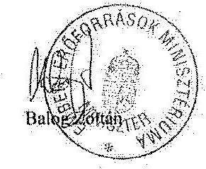

---

.

---

# 6. SZÁMÚ MELLÉKLET A V-484-1367/2014. SZÁMÚ JELENTÉSHEZ 

## 6

## 6

## ALLAMI

SZÁMVEVÔSZÉK

Ikt.szám: V-0484-1396/2015.

## Balog Zoltán úr

miniszter
Emberi Erôforrások Minisztériuma

## Budapest

## Tisztelt Miniszter Úr!

A „Jelentéstervezet Az EU támogatások felhasználásának rendszere - A Nemzeti Feflesztési Úgynökség (és a Közremüködő szervezetek) uniós támogatásokkal kapcsolatos feladatellátásának ellenôrzéséről" címủ jelentéstervezetre tett észrevételeit köszönettel megkaptam.
Az Állami Számvevőszék észrevételekre vonatkozó álláspontjáról a felügyeleti vezető által készített részletes tájékoztatást csatoltan megküldöm.

Tájékoztatom Miniszter urat, hogy az ÁSZ. tv. 29. § (3) bekezdése alapján a számvevőszéki jelentések mellékleteként szerepeltetjük a jelentéstervezethez tett, figyelembe nem vett észrevételeket az elutasítás indokának feltüntetésével.

Budapest, 2015. év $\quad 01$ hó 20 nap
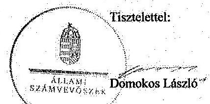

Melléklet: Tájékoztatás az elfogadott és a figyelembe nem vett észrevételekről

---

# Tájékoztatás   az elfogadott és a figyelembe nem vett észrevételekröl 

A „Jelentéstervezet Az EU támogatások felhasználásának rendszere - A Nemzeti Fejlesztési Ügynökség (és a Közremüködő szervezetek) uniós támogatásokkal kapcsolatos feladatellátásának ellenörzéséről" cimủ jelentéstervezethez kapcsolódó 60740-3/2014/ELL iktatószámú levélben tett észrevételeit köszönettel megkaptuk.
A jelentéstervezetre tett észrevételeket áttekintettük, azok kezeléséről a következő tájékoztatást adom:
A jelentéstervezet 7. oldal 2. és 3. bekezdéséhez, és a 25. oldal 1. bekezdéséhez tett észrevételét elfogadom, az észrevételekben javasolt módosítások átvezetése a jelentéstervezetben megtörtént.

A jelentéstervezet 22. oldal 2. bekezdésében foglalt megállapításunkat fenntartjuk, mivel az ellenőrzés során a jelentéstervezet észrevételezésére történő megküldéséig az észrevételhez csatoltan megküldött dokumentumok nem kerültek átadásra az ÁSZ részére.

A jelentéstervezet 36. oldal 1. bekezdéséhez kapcsolódó észrevétel esetében a jelenleg is hatályban lévô 4/2011. (I. 28.) Korm. rendelet 21. § (10) bekezdésében alkalmazott megfogalmazás szerint módosítottam a jelentéstervezetet: „Amennyiben az „n+2" időszak végén a keret szerződéssel lekötött összege meghaladhatja a $100 \%$-ot, akkor a 16/2006. (XII. 28.) MeHVM-PM együttes rendelet 5. § (8) bekezdésének és a 4/2011. (I. 28.) Korm. rendelet 21. § (10) bekezdésének megfelelően a pályázatok benyújtási lehetöségének felfüggesztésére kerülhet sor."

A jelentéstervezet 40. oldal 4. bekezdéséhez kapcsolódó észrevétel esetében, az értékelést követően megállapítottam, hogy a 2012. január 27-én kibocsátott, a „Megvalósíthatósági tanulmány tartalmi követelményei TÁMOP és TIOP pályázatokhoz" tárgyú útmutató nem feleltethető meg a helyszíni ellenőrzés során a számvevők rendelkezésére bocsátott NFM 9480/2/2012. iktatószámú, 2012. május 7-én kelt feljegyzés 7. oldal 2. bekezdésében szereplő egységes megvalósíthatósági tanulmány sablonnak, mert az kizárólag a TÁMOP és TIOP pályázatok tartalmi követelményeit rögzíti és nem egy sablon, mely minden pályázati típus esetén egységesen alkalmazható.

Kérem a válaszlevelemben foglaltak szíves tudomásulvételét. Tájékoztatom Miniszter urat, hogy a számvevőszéki jelentésben az ÁSZ. tv. 29. § (3) bekezdése alapján szerepeltetjük a figyelembe nem vett észrevételeket az elutasítás indokának feltüntetésével együtt.

Budapest, 2015. év 01. hó 27 -nap

Tisztelettel:
Pongrácz Eva
felügyeleti vezető

---

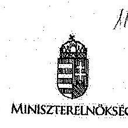

Tárgy: jelentéstervezet észrevételezése

Domokos László
elnök

Állami Számvevőszék

Tisztelt Elnök Úr!
Az „EU támogatások felhasználásának rendszere - A Nemzeti Fejlesztési Ügynökség (és a Közremüködő Szervezetek) uráós támogatásokkal kapcsolatos feladatellátásának ellenőrzéséről" készült jelentéstervezetet köszönettel megkaptuk, melyre az alábbi észrevételeket tesszük.

# Jelentéstervezet 7. oldal 2 bekezdés 

„Részt vett továbbá a költségvetési tervezésben, valamint Közremüködő szervezetek (KSz) bevonásával irányította a meghirdetett pályázatok és a központi programok végrehajtását."

## Észrevétel:

Javasoljuk, hogy a „központi program" kifejezés helyett „kiemelt projektek" kifejezést szíveskedjenek feltüntetni a végleges jelentésben. (HEP, MÉF)
„Tevékenységi körük kiterjedt a pályázatkezeléssel kapcsolatos feladatokra, a támogatási szerzödések megkötésére, a kifizetés-igénylési kérelmek,a számlák és a számlákhoz kapcsolódó dokumentumok befogadására, a teljesitések igazolására, a lebonyolítási számlákról történő kifizetések utalványozására, az összesített forrásigények II- k részére történő továbbítására, a bizonylatok számviteli nyilvántartására."

## Észrevétel:

Javasoljuk, hogy a „kifizetés-igénylési kérelmek" kifejezés helyett „kifizetési igénylések" kifejezést szíveskedjenek feltüntetni a végleges jelentésben. (HEP)

## Jelentéstervezet 11. old. 4. bekezdés, és 21. old. utolsó bekezdés:

„Az II-k a kincstári ellenőrzésekről készített jelentéstervezeteket néhány esetben késedelmesen vizsgálták felül, amelynek következtében az azokban szereplő megállapítások aktualitásukat vesztették (PL: KOP-k 2010. évi jelentéstervezetei)."

---

# MINISZTERELNÖKSÉG 

„Az IH-k az ellenörzésekröl készitett jelentéstervezeteket részben vizsgálták felül, egyes ellenörzési jelentéseket az IH-k három év késedelemmel véleményezték (a ROP-ok esetében 2013-ban vizsgálta felül a 2010-ben készült ellenörzési jelentéseket), ...."

## Észrevétel:

A megállapításokhoz kapcsolódóan megjegyezzük, hogy a MÁK által készített jelentéstervezetek IH általi felülvizsgálata nem jogszabályt, ill. egyéb szabályozásból eredő kötelezettség, ezen tevékenységet az IH kizárólag minőségbiztositási célból végzi és nem tekintendő a jelentéstervezet véleményezésének. A véleményezés, ill. észrevételezés az ellenőrzött szervezetek, a KSZ-ek feladata. A késedelmes felülvizsgálat a ROP-ok esetében az IH ellenőrzési tevékenységének megkezdésekor, a 2010. és 2011. években fordult elő és az ÁSZ mintavétele ROP esetében jellemzöen ebből az időszakból történt. Ahogy azt a 2013-as év ellenőrzéséből vett minta is alátámasztja, a későbbiekben ez a probléma megszűnt köszönhetően az ellenőrzési módszertan javításának, a MÁK ellenőrzési tevékenységének javulásának, ill. a kapacitáshiány megszűnésének az IH-ban. Határidőben megtörténik az IH által a MÁK által készített jelentéstervezetek felülvizsgálata és a jelentéstervezetek KSZ-ek részére, véleményezésre történő megküldése.

A fentiek alapján kérjük a megállapítások alábbiak szerint történő pontosítását:
„Az IH-k a kincstári ellenőrzésekről készített jelentéstervezeteket az ellenőrzési tevékenység kezdeti időszakában néhány esetben késedelmesen vizsgálták felül, amelynek következtében az azokban szereplő megállapítások aktualitásukat vesztették (PI.: ROP-k 2010. évi jelentéstervezetei)."
„Az IH-k az ellenőrzésekről készített jelentéstervezeteket részben vizsgálták felül, egyes ellenőrzési jelentéseket az ellenőrzési tevékenység kezdeti időszakában az-IH-k három év késedelemmel véleményezték (a ROP-k esetében 2013-ban vizsgálta felül a 2010-ben készült ellenőrzési jelentéseket). (ROP)

## Jelentéstervezet 11. old. utolsó bekezdés és 23. old. első bekezdés

## Észrevétel

Az ÁSZ a 2011.január 1-től bevezetett új elszámolási rendszerrel kapcsolatban többször használja a "teljesítményértékelés" fogalmat. Az új elszámolási rendszerben nem a klasszikus értelemben vett teljesítményértékelésről volt szó, inkább a teljesítmény méréséről, illetve a gazdálkodás szabályosságának és hatékonyságának vizsgálatáról. Amennyiben a "teljesítményértékelés" fogalom a végleges jelentésben is benne marad, javasoljuk valamely pontban magyarázni, hogy azt a jelentésben gyüjtő fogalomként használják, mely magában foglalja a KSZ-ek elszámolásainak pénzügyi és szakmai ellenőrzését, valamint gazdálkodásuk hatékonyságának vizsgálatát. (KSZ Koord.)

---

# 7. SZÁMÚ MELLÉKLET A V-484-1367/2014. SZÁMÚ JELENTÉSHEZ 

## Jelentéstervezet 12. old. 3. bekezdés és 28. old. utolsó bekezdés

„...A KIKSZ Közlekedésfejlesztési Zrt-nél a 2010-2013. közötti időszakban nem készült vezetői nyilatkozat az irányítási és ellenőrzési rendszerek megfelelő és megbizható müködéséröl..."
„...a KIKSZ Közlekedésfejlesztési Zrt. vezetője a 2010-2013. években nem tett eleget a belső kontrollok müködésével kapcsolatos, a 281/2006. (XII. 23.) Korm. rendelet 8. § (1) bekezdésében és a rendelet 1. számú mellékletében, valamint a 4/2011. (I. 28.) Korm. rendelet 13. § (1) bekezdésében és a Rendelet 2. számú mellékletében foglalt nyilatkozattételi kötelezettségének..."

## Észrevétel:

A fenti megállapításra tekintettel ezúton tisztelettel kérjük, hogy a végleges jelentés már azt tartalmazza, hogy a KIKSZ Közlekedésfejlesztési Zrt. vezetője a 2010-2013. években a fenti jogszabályi előírásoknak megfelelően maradéktalanul eleget tett a belső kontrollok múködésével kapcsolatos nyilatkozattételi kötelezettségének, és nyilatkozott arról, hogy az általa vezetett szervezetnél az előírásoknak megfelelően gondoskodott az európai uniós támogatásokkal kapcsolatos feladatok ellátásához kapcsolódó belső kontroll rendszerek hatékony, eredményes és gazdaságos múködéséről. Ennek alátámasztására csatoljuk: (5. sz. melléklet)

- Dr. Nemcsok Dénes Sándor helyettes államtitkár úr részére KIKSZ-K-3411/2014. ikt. számon, 2014. február 27-i keltezéssel megküldött levelet és kapcsolódó Nyilatkozatot
- Szalóki Flórián helyettes államtitkár úr részére KIKSZ-K-3412/2014. ikt. számon, 2014. február 27-i keltezéssel megküldött levelet és kapcsolódó Nyilatkozatokat Petykó Zoltán elnök úr részére KIKSZ-K-1543/2013. ikt. számon, 2013. január 29-i keltezéssel megküldött levelet és kapcsolódó Nyilatkozatokat
- Petykó Zoltán elnök úr részére KIKSZ-K-1549/2012. ikt. számon, 2012. február 1-i keltezéssel megküldött levelet és kapcsolódó Nyilatkozatokat
- Petykó Zoltán elnök úr részére KIKSZ-K-1796/2011. ikt. számon, 2011. február 10-i keltezéssel megküldött levelet és kapcsolódó Nyilatkozatokat
- továbbá Huba Bence gazdasági elnökhelyettes úrnak az Irányító Hatóságok vezetőihez címzett, 23/11-1/2012. ikt. számú, 2012. január 12-i keltezésú feljegyzését, mely az „IH és KSZ -vezetők nyilatkozatának bekérése irányítási és ellenőrzési rendszerekről" tárgyban íródott

A fentiekben kifejtettekre tekintettel kérjük törölni a Jelentéstervezet fenti megállapításaiban foglaltakat, továbbá kérjük, hogy a végleges jelentést már az észrevételeinkben előadottaknak megfelelően szíveskedjen kialakítani.
Hivatkozva a V-0484-1373/2014. ikt. számú a Nemzeti Fejlesztési Minisztérium részére címzett figyelemfelhívó levelére, a fent előadottakat figyelembe véve a intézkedés megtételét nem látjuk szükségesnek, tekintettel arra, hogy a belső kontroll rendszerek hatékony, eredményes és gazdaságos múködéséről szóló KSZ vezetői nyilatkozatok - mint kiderült rendelkezésre állnak. (KÖZOP)

---

# Jelenéstervezet 15. old. javaslat: 

## Észrevétel:

Megjegyezni kívánjuk, hogy a Kormány 1051/2014. (II. 7.) Korm. határozat a Nemzeti Stratégiai Referencia Keret 2014. évi munkatervéről 2. pontja, valamint a
A Kormány 1733/2014. (XII. 12.) Korm. határozata az uniós programok 2014-es kifizetési tervének teljesüléséről, tartalmazzák a javaslatban megfogalmazott cél eléréséhez szükséges feladatokat. Az intézményrendszer továbbra is kiemelt figyelmet fordít a támogatások kifizetésére az EU-s források teljes körű felhasználása érdekében.

## Jelentéstervezet 17. old. 2. bekezdés:

„Az EMK-t 2007. januártöl NFÜ utasításként .... adták ki.

## Észrevétel:

Kérjük pontosítani: az IMK-t és módosításait 2007-től az NFÜ elnöke hagyta jóvá, az EMK-t NFM utasításként adták ki 2011. márciustól.

## Jelentéstervezet 22. oldal 2 bekezdés

„A munkatervekei a KSz-ek - az ESZA nKft és a STRAPI 2007. évi munkatervét kivéve - minden évben elkészítették, azokat az IH-k - az ESZA nKft. 2010. évi munkatervét kivéve - véleményezték és jóváhagyták."

## Észrevétel:

A helyszíni ellenőrzés időszakában az EMMI Irányító Hatósági Feladatokat Ellátó Titkárság - költözés miatt - nem tudta az ellenőrök rendelkezésére bocsátani az ESZA nKft. 2010. évi munkatervének jóváhagyásáról szóló levelet. Utólag, jelen levél mellékleteként megküldjük a Humán Erőforrás Programok Irányító Hatósága által küldött, „Az ESZA Kht. 2009. évi beszámolójának jóváhagyása" tárgyú levelet, mely tartalmazza az ESZA Kht. 2010. évi munkatervének jóváhagyását. (3. sz. melléklet)

Kérjük, hogy a fentiek alapján a megállapítást módosítani szíveskedjenek. (HEP)

## Jelentéstervezet 23. old. utolsó bekezdés:

## Észrevétel:

Mivel a végrehajtási szabályok itt is leírt gyakori változásai miatt nem volt életszerű az azokat folyamatosan követő informatikai rendszer ezekből fakadó továbbfejlesztésének középtávú tervezése (ekkora időtávra nem tudja a szakma és a fejlesztéspolitikai irányítás minden esetben pontosan előrejelezni a várható működési változásokat, főleg azok pontos mértékét és részleteit), ezért véleményünk szerint az éves tervezés tökéletesen betöltötte ezt a funkciót és biztosította a rendszer tervszerű továbbfejlesztését, beleértve a nem

---

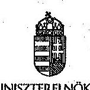
szabálykövetésből fakadó, hanem IT szolgáltatás-fejlesztési jellegű továbbfejlesztéseket is. Javasoljuk pontosítani: „... középtávú terv vagy koncepció helyett éves tervezéssel valósult meg. Az NFÜ a 2010. évtől... ..., amely a következő évre meghatározott, előre tervezett fejlesztési célokat tartalmazta.", mivel pontosan ezek a portfolióban szereplő projektszerű fejlesztések alkották a tervezett fejlesztéseket, méghozzá teljes körűen. (FIF)

# Jelentéstervezet 24. old. 2. bekezdés 

„Az NFÜ kialakította és alkalmazta a fejlesztésekkel szemben támasztott minőségi követelmények teljesülését biztosító kontrollokat, 2012-tól a fejlesztőktől független minőségbiztosítót alkalmazott"

## Észrevétel:

A független minőségbiztosító alkalmazása az EMIR fejlesztése során 2008-tól kezdődően volt biztosított, annak 2007-es beindítását követően, az erről szóló szerződést csatoljuk. (2. sz. melléklet) (FIF)

## Jelentéstervezet 24. oldal 5. bekezdés

„A 2011-ben módosított SLA megállapodások már nem rögzítették a KSZ-ek pályázatkezeléssel kapcsolatos feladatait, azokat az EMK és IMK szabályozta...."

## Észrevétel:

A megállapítást pontosítanánk, miszerint a 2011-es módosítást követően is tartalmazza az SLA a KSZ-ek pályázatkezeléssel kapcsolatos feladatit (a szabályozást valóban csak EMK, IMK tartalmazza), ez megtalálható a SLA 5. sz. mellékletében (elszámolási egységek), de az 1.sz. mellékletében is mely a munkaterv (azon belül a tevékenységi terv tartalmazza azokat). (KSZ Koord.)

## Jelentéstervezet 25. oldal 1. bekezdés:

„Az egyes pályázatok meghirdetése előtt a 4/2011. (I. 28.) Korm. rendelet 17. § (1) bekezdés i) pontja szerint a KSz-ek részt vehettek a Pályázat Előkészitő Munkacsoporton keresztül az OP-k kidolgozásában, a pályázati felhívások előkészítésében."

## Észrevétel:

Javasoljuk a jogszabályi hivatkozást pontosítani az alábbiak szerint:
4/2011. (I. 28.) Korm. rendelet 17. § (1) bekezdés a), illetve i) pontja szerint a KSz-ek részt vehettek a Pályázat Előkészítő Munkacsoporton keresztül az OP-k kidolgozásában, a pályázati felhívások előkészítésében. (HEP)

## Jelentéstervezet 28. o. 2. bekezdés

„A 281/2006. (XII. 23.) Korm. rendelet 8. § (1) bekezdés elöirása ellenére a Pro Regio-nál a 2007. évtől, az ÉARFÜ-nél a 2007-2008. évekről nem állt rendelkezésre vezetői nyilatkozat az irányítási és

---

# MINISZTERELNÖKSÉG 

ellenőrzési rendszerek megfelelő és megbizható müködéséröl. A KIKSZ vezetője a 2010-2013. években nem tett eleget a belső kontrollok müködésével kapcsolatos, ...."

## Észrevétel:

Az ÉARFŰ 2008. évról szóló, ill. a KIKSZ ROP IH-nál rendelkezésre álló vezetői nyilatkozatait mellékelve megküldjük, ezért kérjük a megállapítás megfelelő módosítását. (1. sz. melléklet) (ROP)

## Jelentéstervezet 30. old. 6. bekezdés

Megállapítás: „...az NFÜ elnökének 7/2010. (III.4.) számú utasítás alapján az IH-k indikátorügyekért felelős személyeket jelöltek ki, továbbá negyedéves rendszerességgel ülésező IMCS létrehozását írta elő.... Az elnöki utasítás ellenére a 2010-2012. években kettő, 2013-ban három munkacsoport ülést tartottak, az elöírt negyedéves rendszerességet nem tartották be"

## Észrevétel:

Kérjük elfogadni, hogy az indikátor munkacsoport a „szükséges gyakorisággal" ülésezett, ez évente változott, és elvégezte feladatait. Kiegészítésül megjegyezzük, hogy a 2014-2020-as évekre vonatkozó új jogszabály a 272/2014. (XI. 5.) Korm. rendelet rendelkezett a Monitoring és Értékelési Munkacsoport felállításáról, amely az Indikátor munkacsoport munkáját viszi tovább. A munkacsoport 2014. decemberében felállításra került. (MÉF)

## Jelentéstervezet 33. o. 2. bekezdés

## Észrevétel:

A jelentés az indikátorok kapcsán tesz említést- melyben az OP módosítások indikátorokat érintő részeit sorolják fel. Viszont VOP esetében nem az indikátormódosítás, hanem a forrásátcsoportosítás indoklásának leírása történt, mely ebben a részben nem releváns, helyette javasoljuk:
„A forrásátcsoportosítás eredményeinek nyomon követése, valamint a VOP eredményeinek pontosabb leírása érdekében két új indikátor került bevezetésre. Pontosításra kerültek a teljesíthetőség érdekében az abszorpciós, értékelési és tájékoztatási indikátorok célértékei valamint céldátumai." (VOP)

## Jelentéstervezet 35. o. utolsó elötti bekezdés

## Észrevétel:

A jelentéstervezet leírja, hogy a VOP esetében 2013 végéig nincs lekötve minden rendelkezésre álló forrás. Mivel a jelentés nem füz további megjegyzést, így lehetőség van arra, hogy az olvasó rossz következtetést vonjon le. Ezért kérjük kiegészíteni:

---

# MINISZTERELNÖKSÉG 

" A kötelezettségvállalásra 2015. végéig van lehetőség." (VOP)

## Jelentéstervezet 36. oldal 1 bekezdés

„Amennyiben az „n+2" időszak végén a keret szerződéssel lekötött összege meghaladhatja a 100\%-ot, akkor a 16/2006. (XII. 28.) MeHVM-PM együttes rendelet 5. § (8) bekezdésének és a 4/2011. (I. 28.) Korm. rendelet 21. § (10) bekezdésének megfelelően a pályázatok felfüggesztésére kerül sor."

## Észrevétel:

Javasoljuk a mondatot pontosítani az alábbiak szerint:
Amennyiben az „n+2" időszak végén a keret szerződéssel lekötött összege meghaladhatja a $100 \%$-ot, akkor a 16/2006. (XII. 28.) MeHVM-PM együttes rendelet 5. § (8) bekezdésének és a 4/2011. (I. 28.) Korm. rendelet 21. § (10) bekezdésének megfelelően a pályázatok benyújtásának felfüggesztésére kerül sor. (HEP)

## Jelentéstervezet 40. oldal 4 bekezdés

„A kormánylatározat 16 pontjában és alpontjaiban meghatározott 45 feladatából 31 teljesült, 2 részben teljesült 10 folyamatban volt és kettő nem teljesült a jelentés készitésének időpontjában. „A két nem teljesült feladat - a 7. d) az önerő biztosításának módjáról útmutató, valamint a 8. a) az egységes megvalósíthatósági sablon készítése - teljesitésétől elálltak."

## Észrevétel:

A Humán Erőforrás Programok Irányító Hatósága 8. a) az egységes megvalósíthatósági sablon készítése feladatnak eleget téve 2012. január 27-én „Megvalósíthatósági tanulmány tartalmi követelményei TÁMOP és TIOP pályázatokhoz" tárgyú útmutatót bocsátott ki. (4. sz. melléklet)
Kérjük a végleges jelentést a fentiek alapján pontosítani szíveskedjenek. (HEP)

## Jelentéstervezet 1.sz. melléklet 3. oldal

## Észrevétel:

OP szintű indikátor előrehaladás: a jelentés összehasonlítja, hogy időarányosan hogyan kellett volna alakulnia az értékeknek. A VOP "NSRK abszorpció" nevű indikátor tény értéke $22 \%$, a jelentés szerint az elérendő érték időarányosan számítva 7/9-ed, azaz 77\%. Mivel a jelentés nem fúz további megjegyzést, így lehetőség van arra, hogy az olvasó rossz következtetést vonjon le. Ezért kérjük kiegészíteni:
„Az indikátornál nem ad valós képet, ha a tényértéket időarányosan számított célértékhez hasonlítjuk, mivel az indikátor csak a lezárt projektek kifizetéseit tartalmazza, ami nem időarányosan egyenletesen növekszik. Különösen jelentősen befolyásolják az indikátor értékét a nagy beruházási projektek, ezek teljes vagy egyes szakaszainak végrehajtása 2014-2015-ben fejeződik be, akkor lehet a projektet lezárni, és akkor lehet az indikátor számításába ezen projektek kifizetett támogatását is figyelembe venni. Ez is indokolja, hogy a VOP indikátor értéke csak kevesebb, mint 1/3-a a teljes kifizetésnek." (VOP)

---

# 7. SZÁMÚ MELLÉKLET 

A V-484-1367/2014. SZÁMÚ JELENTÉSHEZ

## Jelentéstervezet 2.sz melléklet

## Észrevétel:

Az indikátorok időarányos teljesítése: a jelentés a VOP-nál 8-ból három indikátor esetében írja, hogy alatta van az idôarányosnak Mivel ezeknél (NSRK abszorpció - melyre elôzõ észrevételünk vonatkozik, illetve a 2 új, a módosítással bevezetett indikátor) nem lehet a 7-9 éves idôszakhoz hasonlítani, kérjük módosítani:
"A három VOP indikátornál a tényértéket nem lehet a 7-9 éves idôszakra vetíteni és így idôarányosan számított célértékhez hasonlítani." (VOP)

Csatoltan küldöm továbbá a figyelemfelhívó levélben szereplő megállapítások kapcsán készült intézkedési tervet, egyben kérem tisztelettel annak elfogadását.

A végleges jelentés elkészítésekor kérjük észrevételeink elfogadását.
Ellenőrzési munkájukat ezúton is köszönöm!

Budapest, 2015. január $\sqrt{3}$.
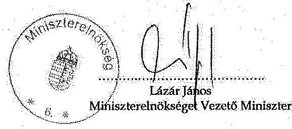

Mellékletek: Figyelemfelhívó levél kapcsán készített Intézkedési Terv
EARFÜ vezetői nyilatkozat
Megbízási szerződés KÜRT ZRT.
ESZA KHT munkaterv jóváhagyás
TÁMOP-TIOP Megvalósíthatósági tanulmány Útmutató
KIKSZ vezetői nyilatkozatok

---

# 8. SZAMÚ MELLÉKLET A V-484-1367/2014 SZAMÚ JELENTÉSHEZ 

## 8

## 8.180 K

ÁLLAMI
SZÁMVEVÔSZÉK

Ikt.szám: V-0484-1400/2015.

Dr. Lázár János úr
miniszter
Miniszterelnökség

## Budapest

## Tisztelt Miniszter Úr!

A „Jelentéstervezet Az EU támogatások felhasználásának rendszere - A Nemzeti Fejlesztési Úgynökség (és a Közremüködő szervezetek) uniós támogatásokkal kapcsolatos feladatellátásának ellenőrzéséről" című jelentéstervezetre tett észrevételeit köszönettel megkaptam.
Az Állami Számvevőszék észrevételekre vonatkozó álláspontjáról a felügyeleti vezető által készített részletes tájékoztatást csatoltan megküldöm.

Tájékoztatom Miniszter urat, hogy az ÁSZ. tv. 29. § (3) bekezdése alapján a számvevőszéki jelentések mellékleteként szerepeltetjük a jelentéstervezethez tett, figyelembe nem vett észrevételeket az elutasítás indokának feltüntetésével.

Budapest, 2015. év
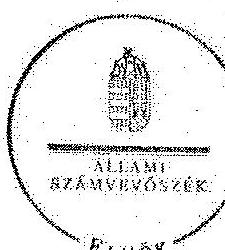

Tisztelettel:

Domokos László ${ }^{\text {® }}$

Melléklet: Tájékoztatás az elfogadott és a figyelembe nem vett észrevételekről

---

# Tájékoztatás   az elfogadott és a figyelembe nem vett észrevételekröl 

A „Jelentéstervezet Az EU támogatások felhasználásának rendszere - A Nemzeti Fejlesztési Ügynökség (és a Közremüködő szervezetek) uniós támogatásokkal kapcsolatos feladatellátásának ellenörzéséről" címủ jelentéstervezethez kapcsolódó, az ÁSZ elnöke részére 2015. január 5-én elektronikusan megküldött levélben tett észrevételeit köszönettel megkaptuk.
A jelentéstervezetre tett észrevételeket áttekintettük, azok kezeléséről a következő tájékoztatást adom:
A jelentéstervezet 7. oldal 2. és 3. bekezdése esetében az észrevétel alapján a „központi program" kifejezés helyébe a „kiemelt projektek" kifejezést, illetve a „kifizetés-igénylési kérelmek" helyébe a „kifizetési igénylések" kifejezést írtuk.
A 11. oldal 4. bekezdéséhez és a 21. oldal utolsó bekezdéséhez kapcsolódó észrevételt figyelembe véve a jelentéstervezetet a következők szerint módosítottuk: „Az IH-k a kincstári ellenőrzésekről készített, a ROP-k 2010. évi jelentéstervezeteit az ellenőrzési tevékenység kezdeti időszakában késedelmesen vizsgálták felül, amelynek következtében az azokban szereplő megállapítások aktualitásukat vesztették.", illetve „Az IH-k az ellenőrzésekről készített jelentéstervezeteket részben vizsgálták felül, egyes ellenőrzési jelentéseket az ellenőrzési tevékenység kezdeti időszakában három év késedelemmel (a ROP-k esetében 2013-ban vizsgálta felül a 2010-ben készült ellenőrzési jelentéseket).

A 11. oldal utolsó bekezdésére és a 23. oldal első bekezdésére vonatkozó észrevétel alapján a jelentéstervezet 1. sz. függelékét képező fogalomtárban meghatározásra került a teljesítményértékelés fogalma a következők szerint: „Magában foglalja a KSZ-ek elszámolásainak pénzügyi és szakmai ellenőrzését, valamint gazdálkodásuk hatékonyságának vizsgálatát."

A jelentéstervezet 12. oldal 3. bekezdésében és a 28. oldal utolsó bekezdésében foglalt megállapításunkat fenntartjuk, mivel az ellenőrzés során a jelentéstervezet észrevételezésére történő megküldéséig az észrevételhez csatoltan megküldött dokumentumok nem kerültek átadásra az ÁSZ részére.

A jelentéstervezet 15. oldalához kapcsolódó észrevételt nem fogadjuk el, mert az észrevételben leírt intézkedés a 2014. évben történt, amely nem érinti az ellenőrzött időszakot. Ellenőrzésünk a 2007. január 1.-2013. december 31. közötti időszakot érintette, ezért csak az ellenőrzött hét évre vonatkozó megállapításokat tudjuk bemutatni.

A 17. oldal 2. bekezdéséhez kapcsolódó észrevételt elfogadva a jelentéstervezetet a következőképpen módosítottuk.: „Az IMK-t és módosításait 2007-től az NFÜ elnöke hagyta jóvá, az EMK-t NFM utasításként adták ki 2011. márciustól.".

A 22. oldal 2. bekezdésére vonatkozó észrevétel esetében Megállapításunkat fenntartjuk, mivel az ellenőrzés során a jelentéstervezet észrevételezésére történő megküldéséig az észrevételhez csatoltan megküldött dokumentumok nem kerültek átadásra az ÁSZ részére.

---

A jelentéstervezet 23. oldal utolsó bekezdésére tett észrevételt részben fogadjuk el, mert a jogszabályok középtávú terv vagy koncepció elkészitését írták elő, nem pedig éves tervezés megvalósitását. A jelentéstervezet 24. oldal első bekezdésének utolsó mondatát az észrevételnek megfelelően javítottuk: „Az NFÜ a 2010. évtől évente elkészítette „EMIR Fejlesztési Port-fölió"-ját, amely a következő évre meghatározott, előre tervezett fejlesztési célokat tartalmazott.".

A 24. oldal 2. bekezdésében foglalt megállapításunkat fenntartjuk, mivel az ellenőrzés során a jelentéstervezet észrevételezésére történő megküldéséig az észrevételhez csatoltan megküldött dokumentumok nem kerültek átadásra az ÁSZ részére.

A 24. oldal 5. bekezdésére tett észrevételt elfogadva a jelentéstervezetet a következőképpen módosítottuk: „Az SLA szerződések 2011. évi módosításait követően a KSz-ek pályázatkezeléssel kapcsolatos feladatait az IMK és $\mathrm{EMK}_{1,2,3,4}$ szabályozta".

A 25. oldal 1. bekezdéséhez kapcsolódó észrevételt elfogadjuk, a jelentéstervezetet az észrevételnek megfelelőn módosítottuk: „Az egyes pályázatok meghirdetése előtt a 4/2011. (I. 28.) Korm. rendelet 17. § (1) bekezdés a), illetve i) pontjai szerint a KSz-ek részt vehettek a Pályázat Előkészítő Munkacsoporton keresztül az OP-k kidolgozásában, a pályázati felhívások előkészítésében.".

A 28. oldal 2. bekezdésében foglalt megállapításunkat fenntartjuk, mivel az ellenőrzés során a jelentéstervezet észrevételezésére történő megküldéséig az észrevételhez csatoltan megküldött dokumentumok nem kerültek átadásra az ÁSZ részére.

A jelentéstervezet 30. oldal 6. bekezdésre vonatkozó észrevételt nem fogadjuk el, mert a gyakorlat nem felelt meg az előírásoknak és az észrevételben említett 272/2014. (XI. 5.) Korm. rendelet kiadására az ellenőrzött időszakot követően került sor.

A 33. oldal 2. bekezdéséhez kapcsolódó észrevételt elfogadjuk a jelentéstervezetet az észrevétel alapján kiegészítettük: „A forrásátcsoportosítás eredményeinek nyomon követése, valamint a VOP eredményeinek pontosabb leírása érdekében két új indikátor került bevezetésre. Pontosításra kerültek a teljesíthetőség érdekében az abszorpciós, értékelési és tájékoztatási indikátorok célértékei, valamint céldátumai.".

A 35. oldal utolsó előtti bekezdésére vonatkozó észrevételt elfogadjuk, a jelentéstervezetet a javasolt mondattal kiegészítettük: „A VOP esetében kötelezettségvállalásra 2015. végéig van lehetőség.".

A jelentéstervezet 36. oldal 1. bekezdéséhez kapcsolódó észrevétel esetében, az észrevételüket is figyelembe véve a jelenleg is hatályban lévő 4/2011. (I. 28.) Korm. rendelet 21. § (10) bekezdésében alkalmazott megfogalmazás szerint módosítottuk a jelentéstervezetet: „Amennyiben a támogatásra rendelkezésre álló kötelezettségvállalási keret kimerül, vagy annak kimerülése előre jelezhető, az NFÜ a 16/2006. (XII. 28.) MeHVM-PM együttes rendelet 5. § (8) bekezdésének és a 4/2011 (I. 28.) Korm. rendelet 21. § (10) bekezdésének megfelelően a benyújtás lehetőségét felfüggeszthette vagy a pályázatot lezárhatta."

A jelentéstervezet 40. oldal 4. bekezdéséhez kapcsolódó észrevétel alapján a jelentéstervezet módosítására nem került sor. Az észrevétel értékelését követően megállapítottuk, hogy a 2012. január 27-én kibocsátott „Megvalósíthatósági tanulmány tartalmi követelményei TÁMOP és TIOP pályázatokhoz" tárgyú útmutató nem feleltethető meg a helyszíni ellenőrzés

---

során a számvevők rendelkezésére bocsátott NFM 9480/2/2012. iktatószámú, 2012. május 7én kelt feljegyzés 7. oldal 2. bekezdésében szereplő egységes megvalósíthatósági tanulmány sablonnak, mert az kizárólag a TÁMOP és TIOP pályázatok tartalmi követelményeit rögzíti és nem egy sablon, mely minden pályázati típus esetén egységesen alkalmazható.

A jelentéstervezet 1. számú mellékletének 3. oldalához kapcsolódó észrevételt elfogadjuk, a diagramot a következő megállapítással egészítettük ki: „VOP indikátor esetében, szükséges figyelembe venni, hogy az indikátor csak a lezárt projektek kifizetéseit tartalmazza, ami nem a kifizetések 2015. december 31-ei végső határidejével időarányosan növekszik. Különösen jelentősen befolyásolják az indikátor értékét a nagy beruházási projektek, ezek teljes vagy egyes szakaszainak végrehajtása 2014-2015-ben fejeződik be, akkor lehet a projektet lezárni, és akkor lehet az indikátor számításába ezen projektek kifizetett támogatását is figyelembe venni. Ez is indokolja, hogy a VOP indikátor értéke csak kevesebb, mint 1/3-a a teljes kifizetésnek.".

A 2. számú mellékletéhez kapcsolódó észrevételt elfogadjuk, az észrevételben javasolt módosítás -„A három VOP indikátornál a tényértéket nem lehet a 7-9 éves időszakra vetíteni és így időarányosan számított célértékhez hasonlítani." - átvezetése a jelentéstervezet 2. sz. mellékletében megtörtént.

Kérem a válaszlevelemben foglaltak szíves tudomásulvételét. Tájékoztatom Miniszter urat, hogy a számvevőszéki jelentésben az ÁSZ. tv. 29. § (3) bekezdése alapján szerepeltetjük a figyelembe nem vett észrevételeket az elutasítás indokának feltüntetésével együtt.

Budapest, 2015. év $\quad 07 . \quad$ hó $02_{\text {nap }}$
Tisztelettel:
Pungrácz Eva
felügyeleti vezető

---

# 9. SZAMÚ MELLÉKLET A V-484-1367/2014. SZAMÚ JELENTÉSHEZ 

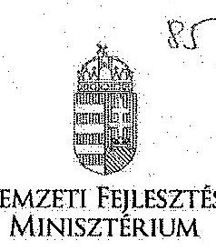

NEMZETI. FEJLESZTÉSI MINISZTÉRIUM

DR. SESZTÁK MIKLÓS
mielszrím

## Iktatószám: EFO/28404-2/2014-NFM

Ügyintéző: Simonné Hábencius Gizella
Telefonszám: 79-54405
E-mail: gizella.habencius.simonne@ufm.gov.hu
Hiv. szám: V- 0484-1377/2014.
V- 0484-1373/2014.

## Domokos László

elnök
részére
Állami Számvevőszék

## Budapest

Apáczai Csere János u. 10.
1052

Tárgy: Jelentéstervezet véleményezése és elnöki figyelemfelhívó észrevételezése

## Tisztelt Elnök Úr!

Észrevételezés végett köszönettel megkaptam „Az EU támogatások felhasználásának rendszere - A Nemzeti Fejlesztési Úgynökség ( és a Közremüködő Szervezetek) uniós támogatásokkal kapcsolatos feladatellátásának ellenőrzéséről" szóló ÁSZ jelentéstervezetet és a hozzá kapcsolódó, V-0484-1373/2014. számú elnöki. figyelemfelhívó levelet.

A tervezettel kapcsolatban az alábbi észrevételt teszem:

## Észrevétel - a jelentéstervezet 12. és 28. oldalán is szereplä megállapításhoz:

Megállapítás: (Jelentéstervezet 12. oldal) „A KIKSZ Közlekedésfejlesztési Zrt-nél a 2010-2013. évekről nem készült vezetői nyilatkozat az irányítási és ellenőrzési rendszerek megfelelő és megbízható müködéséről, és így (Jelentéstervezet 28. oldal) a KIKSZ Közlekedésfejlesztési Zrt. vezetője a 2010-2013. években nem tett eleget a belső kontrollok müködésével kapcsolatos, a 281/2006. (XII. 23.) Korm. rendelet 8. § (1)

---

bekezdésében és a rendelet 1. számú mellékletében, valamint a 4/2011. (I. 28.) Korm. rendelet 13. § (1) bekezdésében és a rendelet 2. számú mellékletében foglalt nyilatkozattételi kötelezettségének."

Észrevétel: A fenti megállapításhoz kapcsolódóan tájékoztatom, hogy a KIKSZ Közlekedésfejlesztési Zrt. vezetője a 2010-2013. években a fenti jogszabályi előírásoknak megfelelően maradéktalanul eleget tett a belső kontrollok működésével kapcsolatos nyilatkozattételi kötelezettségének és nyilatkozott arról, hogy az általa vezetett szervezetnél az előírásoknak megfelelően gondoskodott az európai uniós támogatásokkal kapcsolatos feladatok ellátásához kapcsolódó belső kontroll rendszerek hatékony, eredményes és gazdaságos müködéséről. Ennek alátámasztására mellékelem:

- Dr. Nemcsok Dénes Sándor helyettes államtitkár úr részére, KIKSZ-K-3411/2014. ikt. számon, 2014. február 27-i keltezéssel megküldött levelet és kapcsolódó Nyilatkozatot (1. sz. melléklet)
- Szalóki Flórián helyettes államtitkár úr részére, KIKSZ-K-3412/2014. ikt. számon, 2014. február 27-i keltezéssel megküldött levelet és kapcsolódó Nyilatkozatokat (2. sz. melléklet)
- Petykó Zoltán elnök úr részére, KIKSZ-K-1543/2013. ikt. számon, 2013. január 29-i keltezéssel megküldött levelet és kapcsolódó Nyilatkozatokat (3. sz. melléklet)
- Petykó Zoltán elnök úr részére, KIKSZ-K-1549/2012. ikt. számon, 2012. február 1-i keltezéssel megküldött levelet és kapcsolódó Nyilatkozatokat (4. sz. melléklet)
- Petykó Zoltán elnök úr részére, KIKSZ-K-1796/2011. ikt. számon, 2011. február 10-i keltezéssel megküldött levelet és kapcsolódó Nyilatkozatokat (5. sz. melléklet)
- továbbá Huba Bence gazdasági elnökhelyettes úrnak az Irányító Hatóságok vezetőihez címzett, 23/11-1/2012. ikt. számú, 2012. január 12-i keltezésű feljegyzését, mely az „IH és KSZ -vezetők nyilatkozatának bekérése irányítási és ellenőrzési rendszerekről" tárgyban íródott (6. sz. melléklet)

A fentiekre tekintettel kérem törölni a jelentéstervezet vitatott megállapításait és a végleges jelentést az észrevételben megfogalmazottak figyelembevételével kialakítani, valamint a V-0484-1373/2014. számú elnöki figyelemfelhívó levélben foglaltakat tárgytalannak tekinteni.

Budapest, 2015. január , 1 H.,

Üdvözlettel:
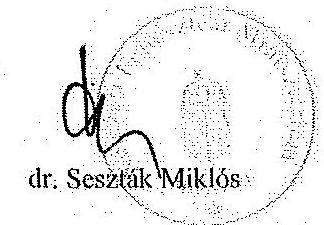

Pentactric 1440 Budlejoos, Pl. 1 Telefon: (06 1) 7951700 Fax: (06 1) 7950631 E-mail: mitsusufbint.gov.bu Web: www.kormeny.hu

---

# 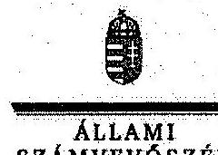 

Ikt.szám: V-0484-1401/2015.

## Dr. Seszták Miklós úr

miniszter
Nemzeti Fejlesztési Minisztérium

## Budapest

## Tisztelt Miniszter Úr!

A „Jelentéstervezet Az EU támogatások felhasználásának rendszere - A Nemzeti Fejlesztési Ügynökség (és a Közremüködő szervezetek) uniós támogatásokkal kapcsolatos feladatellátásának ellenőrzéséről" címủ jelentéstervezetre tett észrevételeit köszönettel megkaptam.
Az Állami Számvevőszék észrevételekre vonatkozó álláspontjáról a felügyeleti vezető által készített részletes tájékoztatást csatoltan megküldőm.

Tájékoztatom Miniszter urat, hogy az ÁSZ. tv. 29. § (3) bekezdése alapján a számvevőszéki jelentések mellékleteként szerepeltetjük a jelentéstervezethez tett, figyelembe nem vett észrevételeket az elutasítás indokának feltüntetésével.

Budapest, 2015. év $\quad 21$ hó 19 nap
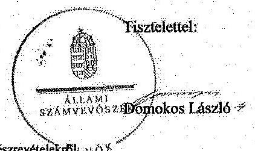

Melléklet: Tájékoztatás a figyelembe nem vett észrevételskolli; 1000

---

# Tájékoztatás   a figyelembe nem vett észrevételekröl 

A „Jelentéstervezet Az EU támogatások felhasználásának rendszere - A Nemzeti Fejlesztési Ügynökség (és a Közremüködő szervezetek) uniós támogatásokkal kapcsolatos feladatellátásának ellenôrzésérôl" címủ jelentéstervezethez kapcsolódó EFO/28404-2/2014-NFM iktatószámú levélben tett észrevételeit köszönettel megkaptuk.
A jelentéstervezetre tett észrevételeket áttekintettük, azok kezeléséről a következô tájékoztatást adom:
A jelentéstervezet 12. oldalán és a 28. oldalán szereplő megállapításunkat fenntartjuk, mivel az ellenôrzés során a jelentéstervezet észrevételezésére történő megküldéséig az észrevételhez csatoltan megküldött dokumentumok nem kerültek átadásra az ÁSZ részére.

Kérem a válaszlevelemben foglaltak szíves tudomásulvételét. Tájékoztatom Miniszter urat, hogy a számvevőszéki jelentésben az ÁSZ. tv. 29. § (3) bekezdése alapján szerepeltetjük a figyelembe nem vett észrevételeket az elutasítás indokának feltüntetésével együtt.

Budapest, 2015. év 01 - hó ${ }^{\text {ty }}$-nap
Tisztelettel:
$\frac{\text { fexon }}{}$ $\frac{1}{2}$

---

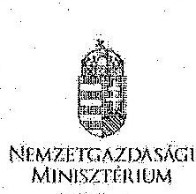

NEMZETGAZDASÁGI MINISZTÉRIUM Miniszter

## ÁLLAMI SZÁMVEVŐSZÉK 05507/2015

Érkezz: 2015 JAN 23.
Iktatószám: V-0484-1461/2015.
Melléklet: $\qquad$
Pougráaet

Domokos László úr részére elnök

Állami Számvevőszék
Budapest
Apáczai Csere János u. 10. 1052

Iktatószám: NGM/403/2015.
Hiv. szám: V-0484-1376/2014.
Úgyintéző: Szabó Zoltán
Telefonszám: 795-1541
Tárgy: A Nemzeti Fejlesztési
Ügynökség (és a Közremüködő
Szervezetek) uniós támogatásokkal kapcsolatos feladatellátásának ellenőrzéséről készült jelentés-
tervezet

# Tisztelt Elnök Úr! 

„Az EU támogatások felhasználásának rendszere - A Nemzeti Fejlesztési Ügynökség (és a Közremüködő Szervezetek) uniós támogatásokkal kapcsolatos feladatellátásának ellenőrzéséről" szóló számvevőszéki jelentéstervezet elkészítését és megküldését köszönettel vettem, mellyel kapcsolatban az alábbi észrevételeket teszem.
1.) Államháztartásért felelős miniszterként:

- A jelentés 36. oldala, táblázat alatti második bekezdés: „Az 1083/2006/EK rendelet 28. cikk (1) bekezdése alapján az NSRK hatálya 2013. december 31., azonban ebben az időpontban a ROP-ok, TÁMOP, KEOP, TIOP, VOP programok támogatói döntéssel lekötött összege 3589,6 Mrd Ft volt, a részükre meghatározott 3743,3 Mrd Ft NSRK keretösszeggel szemben."

Észrevétel: A fentiekkel azt sugallja az Állami Számvevőszék (továbbiakban: ÁSZ), hogy hazai kötelezettségvállalásra állapított meg határidőt az EK rendelet (amit a tervezet szerint a felsorolt OP-k nem teljesítettek), ami nem pontos (és ezzel a téves ÁSZ értelmezéssel már többször találkoztunk). A 2013. december 31-i határidő az Európai Bizottságra vonatkozik, annak kell eddig az időpontig a kötelezettségvállalást megtennie (1083/2006/EK rendelet 75.§ (1) bekezdés), míg a tagállam ezt követően is vállalhat kötelezettséget az NSRK terhére. A fenti mondatot kérem ennek megfelelően javítani és abból az első tagmondatot és az „azonban" szót törölni.

- A jelentés 36. oldala, táblázat alatti első bekezdés első két mondata:

Észrevétel: Nem világos (és az előző pontban említett téves értelmezéssel függhet össze), hogy a jelentéstervezet mire akar utalni a 2007-2013 közötti NSRK-keretből 2013. december 31-ig szerzödéssel lekötött összeg mértékével (104,3\%) és az ún. „n+2" szabály említésével. Az „n+2" szabály nem a kötelezettségvállalásra (szerzödéskötésre) nézve ír elő határidőt, hanem a kifizetési kérelmek benyújtására vonatkozóan és a

---

határidő nem a 2007-2013 közötti teljes keret, hanem az éves keretek felhasználására vonatkozik. Kérem a hivatkozott szakasz ezt figyelembevevő kiegészítését vagy elhagyását.

- A jelentés 36. oldala, táblázat alatti első bekezdés harmadik mondata: „Amennyiben az n+2 időszak végén a keret szerződéssel lekötött összege meghaladhatja a $100 \%$-ot, akkor a 16/2006. (XII. 28.) MeHVM-PM együttes rendelet 5. § (8) bekezdésének és a 4/2011. (I. 28.) Korm. rendelet 21. § (10) bekezdésének megfelelően a pályázatok felfüggesztésére kerül sor."

Észrevétel: Nem világos, hogy a jelentéstervezet mit ért az „n+2 időszak végén" és hogyan kapcsolódik ez a hivatkozott rendeletekhez, mert míg utóbbiak pályázati felhívásokra és azok keretének kimerülése esetére vonatkoznak, addig az ön. „n+2" szabály jóval magasabb szintü keretekre, az operatív programok prioritásaira vonatkozik és az azokban rendelkezésre álló keretek „alülteljesitésének" következményére. Kérem az idézett szakasz teljes törlését vagy kiegészítését a fenti ellentmondás tisztázásával. Az idézett szakaszban az „Amennyiben...meghaladhatja, akkor..." szúkapcsolat használata sem világos, annak is pontosítása vagy teljes elhagyása szükséges.
2.) A Regionális Fejlesztési Programok, valamint a Gazdaságfejlesztési Operatív Program Irányító Hatóságának müködtetéséért felelős szerv vezetőjeként:

A Regionális Fejlesztési Programokért Felelős Helyettes Államtitkárság észrevételeit a Miniszterelnökségen keresztül juttatja el az Állami Számvevőszékhez (az 547/2013. (XII. 30.) Korm. rendelet alapján az Irányító Hatóságok észrevételeit a Miniszterelnökség koordinálja), a Gazdaságfejlesztési Programok Végrehajtásáért Felelős Helyettes Államtitkárság pedig nem tesz észrevételt.
3.) A Társadalmi Megújulás Operatív Program 1. és 2. prioritásának szakmai felelőseként:

Észrevételeimet mellékelten jelzem.
Kérem Tisztelt Elnök Urat, hogy a jelentéstervezet véglegesitése során a fenti és a mellékelt észrevételeimet figyelembe venni szíveskedjék.

Budapest, 2015. január " $\mathcal{N}$."

Udviszlettel:
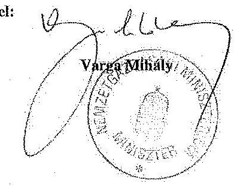

Melléklet!

---

NGM észrevételek a TÁMOP 1. és 2. prioritásának szakmai felelőseként „az EU támogatások felhasználásának rendszere - A Nemzeti Fejlesztési Ügynökség (és a Közremüködő Szervezetek) uniós támogatásokkal kapcsolatos feladatellátásának ellenőrzéséről" címmel készített számvevőszéki jelentéstervezethez

| Oldal-   szám | ÁSZ Jelentés véleményezett része | Észrevételek az ÁSZ megállapításához |
| :--: | :--: | :--: |
| 41. | A munkaerő-piaci rugalmasság javítására, az atipikus foglalkoztatási formák ösztönzésének támogatására fordított EU-s pénzeszközöknél a források odaítélése, folyósítása, elszámolása és felhasználása az ellenőrzött időszakban szabályszerű volt. | Köszönjük. |
| 42. | Az atipikus foglalkoztatási formák ösztönzésére szolgáló források támogatási szerződéssel történő lekötése nem tekinthető eredményesnek, mert 2013. év végéig a teljes keret $80 \%-a, 3,2$ Mrd Ft került lekötésre. A TÁMOP-on belül az atipikus támogatási programok a 2013. év végi szerződéskötések értékét tekintve $0,3 \%$-os arányt képviseltek. A TÁMOP keretei között 2009-től meghirdetett atipikus támogatási programokra történt kifizetések összege 2013. december 31-ig 2991,6 M Ft volt, a szerződéssel lekötött támogatások 92,5\%-ban kerültek kifizetésre. A TÁMOP-on belül az atipikus támogatási programok a 2013. év végéig történt kifizetések $0,4 \%$-át tették ki. | A bekezdés megállapításai két pályázati konstrukcióra vonatkoznak (TÁMOP 2.4.3. A-09; TÁMOP 2.4.3. B2-10/11.) A rendelkezésre álló forrás támogatási szerződéssel való lekötése ugyan nem teljes körü, de kirívónak sem tekinthető az elmaradás. A megállapítást érdemes lehet relációba helyezni más pályázati konstrukciókkal, továbbá fontos megemlíteni, hogy a források pénzügyi lekötése csupán egy perspektívából való olvasata a konstrukció eredményességének, csak pénzügyi szempontból minősíti a beavatkozást.   Kérnénk a két pályázati konstrukció kiemelésének indoklását is, hiszen erre a kiválasztásra nem tér ki a jelentés. |

---

| 38. | Ján az ${ }_{n} n+2^{n}$ szabály feltételeinek a 2012. évben két, 2013-ban egy OP nem tudott megfelelni: az ÁROP 0,6 Mrd Ft-tal, az EKOP 3,2 Mrd Ft-tal, a TÁMOP a 2013. évben 4,1 Mrd Ft-tal volt érintett.   sen késett. A TÁMOP esetében több tényező együttes hatása közül kiemelhető, hogy az OP 2013. évi pozitív támogatói döntési lekötési szintje $97,3 \%$ volt, amely elmaradt az NSRK források 112,4\%-os lekötöttségétől. A beérkezett pályázatok értékelésének és döntési folyamatának elhúzódása kihatott a pénzügyi teljesítések volumenére. | Az „n+2" szabály feltételeinek a szakpolitikai felelősségünk alá tartozó TÁMOP 1. és 2. prioritás megfelelés a kifizetések elmaradásából adódó korrekció ezeket a prioritásokat nem érintette.   A támogatói döntések jelentős késedelme számos TÁMOP-os pályázati konstrukciót érintett. A TÁMOP 2. prioritásának pályázatal esetében a kiválasztási szakasz több esetben 200 nappal is meghaladta a jogszabályban elóirt határidőt. Ez a jelenség komoly veszélyt jelentett a pályázatok végrehajtása szempontjából, a jelentés ennek okaira is kitérhetett volna. |
| :--: | :--: | :--: |
| 31. | Az NFU az 1083/2006/EK rendelet 47. cikkének (1)-(2) bekezdéselben elóirt félidei áttekintő értékelést minden OP-ra vonatkozóan elkészítette, ezek alapján az OP-k indikátor rendszerét felülvizsgálták és az OP-k módosításaira intézkedéseket tettek az EU Bizottság jóváhagyásával. A megtett korrekciós intézkedések teljesülését nyomon követték. A TIOP, TÁMOP, ROP-k, ÁROP indikátorait érintő módosítás két évet vett igénybe, amely a hét éves programozási időszakhoz viszonyítva hosszúnak tekinthető. Az indikátorok értékének növekedése és a megtett intézkedések között nem mutatható ki közvetlen kapcsolat. | A 31. és 32. oldalon a TÁMOP indikátorainak teljesülésével kapcsolatos észrevételek nagyon általánosak, az ellenőrzés alapján tett megállapítások nem minden esetben értelmezhetők, hiányzik a levont következtések megalapozása, vagy példákkal való szemléltetése.   Az indikátor célértékek növekedése és a megtett intézkedések közötti kapcsolat hiányára utaló megállapítás (31. oldal), vagy a 32. oldalon a TÁMOP prioritás szintü indikátoral és a konstrukció szintü indikátorok közötti stratégiai és módszertani összefüggések hiányára tett |

---

|  |  | megállapítás is nagyon általános ahhoz, hogy az egyes szakterületért felelốs tárcák arra érdemben reagálni tudjanak (melyik prioritásra vonatkoznak az észrevételek?). |
| :--: | :--: | :--: |
| 32. | A TÁMOP 2010. decemberében készült félidei áttekintô értékelése alapján a TÁMOP és a TIOP azonos tartalmú indikátorait harmonizálták és egységesitették. A TÁMOP prioritásokhoz kapcsolt indikátorok és a konstrukció-szintũ monitoring indikátorok közötti stratégiai, módszertani illeszkedés az értékelők szerint nem mindenütt volt megfelelô. Ezek az indikátorok tartalmukban nem mindig voltak azonosak az OP-ban nevesített indikátorokkal, így az indikátorérték meghatározásához a pályázók körében külön adatgyûjtésre volt szükség, ezért az OP indikátorok felülvizsgálatára tettek javaslatot. Ezen túlmenően az abszorpciós kockázatok kezelése érdekében tervezett prioritások közötti forrásátcsoportositás, valamint a 2010. februárjában elkészült TÁMOP indikátorok részletes értékelése is indokolta az indikátorok és azok célértékéinek felülvizsgálatát. Az OP 2012. évi módosítása következtében 5,7 Mrd Ft értékủ forrásátcsoportositás történt. | A TÁMOP prioritás szintũ indikátora és a konstrukció szintũ indikátorok közötti stratégiai és módszertani összefüggések hiányára tett megállapítás nagyon általános ahhoz, hogy az egyes szakterületért felelôs tárcák arra érdemben reagálni tudjanak.   A bekezdés közepén szereplő „Ezek az indikátorok..." kezdetü mondat nehezen értelmezhetô: A pályázók körében való külön adatgyûjtésre a 1828/2006/EK rendelet XXIII. melléklete szerinti adatigény miatt volt szükség. Az indikátorok fenti melléklet szerinti adatgyûjtését az NFÜ jelentös késedelemmel kezdte meg. Ez a hiányosság konkrétabb megállapításokat, javaslatokat is követelne az ÁSZ jelentésében.   Az indikátorok konstrukció szintũ sokszínüsége azért jelent problémát, mert azok rendszerelvü megszervezése, az OP-indikátorokhoz való viszonyuk leírása nem valósult meg, ennek értelmezéséhez azonban a megállapítás világosabb magyarázatára lenne szükség. |

---

.

---

# 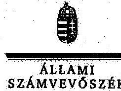 

Ikt.szám: V-0484-1402/2015.

## Varga Mihály úr

miniszter
Nemzetgazdasági Minisztérium

## Budapest

## Tisztelt Miniszter Úr!

A „Jelentéstervezet Az EU támogatások felhasználásának rendszere - A Nemzeti Feflesztési Ügynökség (és a Közremüködő szervezetek) uniós támogatásokkal kapcsolatos feladatellátásának ellenőrzéséről" címủ jelentéstervezetre tett észrevételeit köszönettel megkaptam.
Az Állami Számvevőszék észrevételekre vonatkozó álláspontjáról a felügyeleti vezető által készített részletes tájékoztatást csatoltan megküldöm.

Tájékoztatom Miniszter urat, hogy az ÁSZ. tv. 29. § (3) bekezdése alapján a számvevőszéki jelentések múllékleteként szerepeltetjük a jelentéstervezethez tett, figyelembe nem vett észrevételeket az elutasítás indokának feltüntetésével.

Budapest, 2015. év
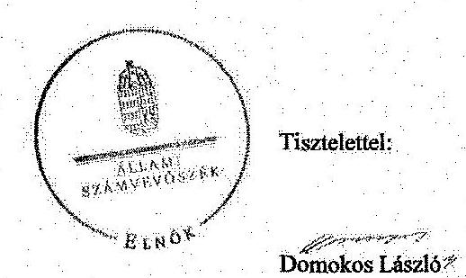

Melléklet: Tájékoztatás az elfogadott és a figyelembe nem vett észrevételekről

---

# Tájékoztatás   az elfogadott és a figyelembe nem vett észrevételekröl 

A „Jelentéstervezet Az EU támogatások felhasználásának rendszere - A Nemzeti Fejlesztési Ügynökség (és a Közremüködő szervezetek) uniós támogatásokkal kapcsolatos feladatellátásának ellenörzéséről" címủ jelentéstervezethez kapcsolódó NGM/403/2015. iktatószámú levélben tett észrevételeit köszönettel megkaptuk.
A jelentéstervezetre tett észrevételeket áttekintettük, azok kezeléséről a következő tájékoztatást adom:
A jelentéstervezet 36. oldal, táblázat alatti 1. és 2. bekezdésre vonatkozó észrevételeit figyelembe véve, a jelentéstervezetet a következőképpen módosítottuk: „Az 1083/2006/EK rendelet 93. cikk (1) bekezdése értelmében az EU Bizottság automatikusan visszavonja a támogatás azon részét, amelyet nem használtak fel az előfinanszírozás vagy az időközi kifizetések teljesítésére az OP-ra vonatkozó költségvetési kötelezettségvállalást követő második év december 31-ig (, $n+2^{\prime \prime}$ ). Amennyiben a támogatásra rendelkezésre álló kötelezettségvállalási keret kimerül, vagy annak kimerülése előre jelezhető, az NFÜ a 16/2006. (XII. 28.) MeHVM-PM együttes rendelet 5. § (8) bekezdésének és a 4/2011 (I. 28.) Korm. rendelet 21. § (10) bekezdésének megfelelően a benyújtás lehetőségét felfüggeszthette vagy a pályázatot lezárhatta.

Az NSRK EU-s és hazai keret szerződéses lekötöttsége 2013. december 31-én 104,3\%-on teljesült. Az NSRK keretének az ÁROP, EKOP, GOP, KÖZOP esetében a támogatási szerződéssel történt lekötése meghaladta az NSRK pénzügyi tervében meghatározott, rendelkezésre álló keretösszeget. A 2013. december 31-ig szerződéssel le nem kötött NSRK keret összege 11 OP-nál összesen 318,6 Mrd Ft volt, amely a teljes keret $3,9 \%$-át teszi ki. A ROP-k, TÁMOP, KEOP, TIOP, VOP programok támogatói döntéssel lekötött összege 2013. december 31.-én 3589,6 Mrd Ft volt, a részükre meghatározott 3743,3 Mrd Ft NSRK keretösszeggel szemben. A szerződéses lekötöttségből a 2013. évben valósult meg a teljes lekötöttség 24,3\%a. Legnagyobb mértékben $30,7 \%$-kal ( 574,7 Mrd Ft-tal) a KÖZOP program esetében haladta meg a szerződéskötés összege az NSRK keretösszeget. A többletkötelezettség-vállalást a 4/2011. (I. 28.) Korm. rendelet 20/A §-a, valamint a 29/A. §-a szabályozza. Az NFÜ az OP-k prioritások keretein felüli többletkötelezettség-vállalási igényét az államháztartásért felelős miniszter hagyta jóvá. Az OP-k a 2012. évben 199,5 Mrd Ft, a 2013. évben 198,1 Mrd Ft, összesen 397,6 Mrd Ft többletkötelezettség-vállalásra kaptak engedélyt a Nemzetgazdasági Minisztériumtól.".

Az észrevétel mellékletében szereplő 41. oldalhoz kapcsolódó észrevételt tudomásul vettük.
A 42. oldalra vonatkozó észrevétel esetében az indoklást nem tartjuk szükségesnek, mert a jelzett adatok az ÁSZ ellenőrzés részére átadott tanúsítványok alapján kerültek figyelembe vételre az ellenőrzési programban foglalt feladatok alapján, illetve tekintettel arra, hogy az ellenőrzés ezen projektek esetében tárt fel hiányosságot.

A 38. oldalra tett észrevétel alapján a jelentéstervezet megállapításainak módosítását nem tartjuk szükségesnek, mert az észrevétel konkrét javaslatot nem tartalmaz, az ellenőrzési programban megfogalmazott kérdések megválaszolásra kerültek.

A 31. oldalra vonatkozó észrevétel alapján a jelentéstervezet megállapításainak módosítását nem tartjuk indokoltnak, mert az észrevétel konkrét javaslatot nem tartalmaz.

---

A 32. oldalhoz kapcsolódó észrevétel alapján a jelentéstervezet módosítását nem tartjuk szükségesnek, mert konkrét javaslatot az észrevétel nem tartalmaz.

Tájékoztatom Miniszter urat, hogy az ellenőrzés célja egy összesített következtetés levonása volt.

Kérem a válaszlevelemben foglaltak szíves tudomásulvételét. Tájékoztatom Miniszter urat, hogy a számvevőszéki jelentésben az ÁSZ. tv. 29. § (3) bekezdése alapján szerepeltetjük a figyelembe nem vett észrevételeket az elutasítás indokának feltüntetésével együtt.

Budapest, 2015. év 02. hó 02. nap

Tisztelettel:
Pongrácz Eva
felügyeleti vezető

---

.

---

# FOGALOMTÁR 

Akcióterv

Átláthatóság

Belső kontrollrendszer

Egységes Monitoring Információs Rendszer (EMIR)

Az operatív program vagy egyes prioritástengelyek végrehajtására vonatkozó, két vagy több évre szóló részletes programozási és végrehajtási dokumentum, amely tartalmazza az operatív program, illetve a prioritástengely megvalósításának bemutatását, ütemezését és indikatív forrásfelosztását a teljes programozási időszakra, továbbá a támogatási konstrukciók bemutatását legalább 2 évre. (Forrás: 4/2011. Korm. rendelet (I. 28.) 2. § (1) bekezdés 1. pontja, 255/2006. (XII. 8.) Korm. rendelet 2. § (1) bekezdés a) pontja)
A közpénzek felhasználására vonatkozó alapvető követelmény, amelynek teljesülését a teljesítményellenőrzés támogatja. A közpénzfelhasználás zárt célrendszerének elemei: a költségvetési számadatok egyértelmű indokolása és alátámasztása; az éves beszámolók megjelentetése, és mindenki számára érthető formában való közreadása; a nyilvánosság eszközeivel ösztönzés a magasabb színvonalú munkavégzésre; független, megbízható ellenőrzés és elemzés; a nyilvánosság számára elérhető tájékoztatás biztosítása. (Forrás: Módszertan a teljesítményellenőrzéshez, ÁSZ 2008.)
A kockázatok kezelése és tárgyilagos bizonyosság megszerzése érdekében kialakított folyamatrendszer, ami azt a célt szolgálja, hogy megvalósuljanak a következő célok:
a múködés és a gazdálkodás során a tevékenységeket szabályszerűen, gazdaságosan, hatékonyan, eredményesen hajtsák végre,
az elszámolási kötelezettségeket teljesítsék, és megvédjék az erőforrásokat a veszteségektől, károktól és a nem rendeltetésszerú használattól.
(Áht. 69. § (1) bekezdéséből levezetett fogalom)
Egységes Monitoring Információs Rendszer (EMIR)

A strukturális alapokból, a Kohéziós Alapból, a PHARE-ból, az Átmeneti Támogatásból, a Schengen Alapból, az Európai Gazdasági Térség és Norvég Finanszírozási Mechanizmusból, valamint az ezekhez társuló hazai forrásokból megvalósuló programokkal és projektekkel kapcsolatos menedzsment (végrehajtási és kifizetési), monitoring, illetve ellenőrzési, szabálytalanságkezelési és számviteli feladatokat támogató információtechnológiai rendszer. (Forrás: 102/2006. (IV. 28.) Korm. rendelet 2. § (1) bekezdés a) pontja, 255/2006. (XII. 8.) Korm. rendelet 2. § (1) bekezdés e) pontja)
Ellenőrzési nyomvonal Az Európai Unió által meghatározott, a Nemzeti

---

Eredményesség

Európai Regionális Fejlesztési Alap (ERFA)

Európai Szociális Alap

Hatékonyság

Igazoló hatóság

Indikátor

Stratégia Referencia Keret operatív programok támogatásai felhasználásának rendszervizsgálati eszköze, a támogatástervezési, pénzügyi irányítási és kontrollrendszerének leírása szövegesen vagy táblázatba foglalva, vagy folyamatábrával szemléltetve, amely tartalmazza különösen a felelősségi és információs szinteket és kapcsolatokat, továbbá irányítási és kontrollfolyamatokat, lehetővé téve azok nyomon követését és utólagos ellenőrzését. (Forrás: 4/2011. (I. 28.) Korm. rendelet 2. § (1) bekezdés 5. pontja)
Annak követelménye, hogy a kitűzött célok - az elfogadott módosításokat, változó körülményeket figyelembe véve - megvalósuljanak, a tevékenység tervezett és tényleges hatása közötti különbség a lehető legkisebb mértékű legyen, vagy a tényleges hatás legyen kedvezőbb a tervezettnél. (Forrás: 370/2011. (XII. 31.) Korm. rendelet 2. § (g) pontja)

Az Európai Unió strukturális alapjainak egyike, rendeltetése, hogy elősegítse a Közösségen belüli legjelentősebb regionális egyenlőtlenségek orvoslását a fejlődésben lemaradt térségek fejlesztésében és strukturális alkalmazkodásában, valamint a hanyatló ipari térségek átalakításában való részvétel útján. (Forrás: Az Európai Unió Múködéséről szóló szerződés (EUMSZ) egységes szerkezetbe foglalt változatának 176. cikke)

Az Európai Unió strukturális alapjainak egyike, amelynek célja az Unión belül a munkavállalók foglalkoztatásának megkönnyítése, földrajzi és foglalkozási mobilitásuk növelése, továbbá az ipari és a termelési rendszerben bekövetkező változásokhoz való alkalmazkodásuk megkönnyítése, különösen szakképzés és átképzés útján. (Forrás: Az Európai Unió múködéséről szóló szerződés 162. cikke)
Annak követelménye, hogy az előállított termékek, nyújtott szolgáltatások, az ellátott feladat más eredményének értéke, vagy az azokból származó bevétel a lehető legnagyobb mértékben haladja meg a felhasznált erőforrásokhoz kapcsolódó kiadásokat vagy ráfordításokat. (Forrás: 370/2011. (XII. 31.) Korm. rendelet 2. § (j) pontja)
A tagállam által kijelölt nemzeti, regionális vagy helyi hatóság, illetve szervezet, amely a Bizottság részére történő megküldést megelőzően igazolja a költségnyilatkozatot és a kifizetési kérelmeket. (Forrás: Az Európai Unió Tanácsának 2006. július 11-i 1083/2006/EK rendeletének 59. cikk 1. bekezdés b) pontja)
Megvalósulást, teljesülést mérő fizikailag vagy pénzügyileg számszerúsített mutató. (Forrás: 4/2011.

---

Indikátor szuperszett

Intézkedési Terv

Irányító hatóság

Kedvezményezett

Kiemelt projekt

Kohéziós Alap

Közreműködő szervezet

Monitoring
(I. 28.) Korm. rendelet 2. § (1) bekezdés 10. pontja) Az EMIR-ben rögzített indikátorok azonos nevü, azonos tulajdonságokkal rendelkező, de különböző értelmezési szinteken értelmezhető csoportja, amely egy-egy magindikátorra, illetve egy-egy OP indikátorra, valamint a KOR IH által kijelölt további kiemelten kezelt indikátorokra megmutatja annak öszszes, EMIR-ben rögzített értelmezési szintjét.
(Forrás: Az NFÜ elnökének 7/2010. (III. 4.) számú utasítása az ÚMFT indikátorainak kezeléséről szóló intézkedési terv kiadásáról II. (e) és (g) pontjai)
Az ellenőrzési javaslatok alapján az ellenőrzött szervezet, szervezeti egység által készített intézkedések végrehajtásának ütemezése a végrehajtásáért felelős személyek és a vonatkozó határidők megjelölésével. (Forrás: 370/2011. (XII. 31.) Korm. rendelet 2. § (k) pontja)
A tagállam által az operatív program irányítására kijelölt nemzeti, regionális vagy helyi hatóság, illetve közjogi vagy magánszerv. (Forrás: Az Európai Unió Tanácsának 2006. július 11-i 1083/2006/EK rendeletének 59. cikk 1. bekezdés a) pontja)
A támogatásban részesített támogatást igénylő (Forrás: 4/2011. (I. 28.) Korm. rendelet 2. § (1) bekezdés 10. pontja)

A Kormány által jóváhagyott országos vagy regionális jelentőségű fejlesztési projekt, amelyet az akcióterv nevesítve tartalmaz. (Forrás: 4/2011. (I. 28.) Korm. rendelet 2. § (1) bekezdés 11. pontja, 255/2006. (XII. 8.) Korm. rendelet (1) bekezdés h) pontja)

Az Európai Unió strukturális alapjainak egyike, amelynek célja a Közösség gazdasági és társadalmi kohéziójának megerősítése és a fenntartható fejlődés elősegítése (Forrás: A Tanács 2006. július 11-i a Kohéziós Alap létrehozásáról szóló 1084/2006/EK rendeletének 1. cikke)
Bármely közjogi vagy magánjogi intézmény, amely egy irányító vagy az igazoló hatóság illetékessége alatt jár el, vagy ilyen hatóság nevében hajt végre feladatokat a műveleteket végrehajtó kedvezménye zettek tekintetében (Forrás: A Tanács 2006. július 11ei 1083/2006/EK rendelet 2. cikk (6) bekezdése)
A források felhasználásának (pénzügyi monitoring), az eredményeknek és a teljesítményeknek (szakmai monitoring) mindenre kiterjedő - többek között szabályossági, hatékonysági és célszerűségi - vizsgálata rendszeres jelleggel projekt, illetve program szinten. (Forrás: 102/2006. (IV. 28.) Korm. rendelet 2. § (1) bekezdés g) pontja)

---

Monitoring bizottság

Monitoring rendszer
„ $n+3 / n+2$ "szabály

Nemzeti Stratégiai Referencia Keret (NSRK)

Nonprofit gazdasági társaság

Operatív program

Prioritási tengely

Program

Projekt

Monitoring tevékenységet végző, elsősorban a program megvalósításában részt vevő partnerek képviselöiből álló, önálló jogalanyisággal nem rendelkező testület. (Forrás: 102/2006. (IV. 28.) Korm. rendelet 2. § (1) bekezdés h) pontja)
A monitoring tevékenység folytatása céljából létrehozott intézmények, szervezetek, testületek és eszközök, eljárásrendek, valamint ezek müködtetése érdekében foganatosított intézkedések összessége. (Forrás: 102/2006. (IV. 28.) Korm. rendelet 2. § (1) bekezdés j) pontja)
Az EU Bizottság automatikusan visszavonja a támogatás azon részét, amelyet nem használtak fel az előfinanszírozás vagy az időközi kifizetések teljesítésére az operatív programra vonatkozó költségvetési kötelezettségvállalást követő második év december 31-ig (, $n+2$ "), 2010-ig tett kötelezettségvállalásnál a harmadik év december 31-ig (, $n+3$ "). (Forrás: 1083/2006/EK rendelet 93. cikk (1) bekezdése)
Magyarország 2006. július 11-i 1083/2006/EK Tanácsi Rendelet 27. cikke szerinti, a 2007-2013-as programozási időszakra vonatkozó Nemzeti Stratégiai Referencia Kerete
Nem jövedelemszerzésre irányuló, közös gazdasági tevékenység közös folytatására alapított gazdasági társaság (nonprofit) amely bármely társasági formában alapítható és müködtethető. A gazdasági társaság nonprofit jellegét a gazdasági társaság cégnevében fel kell tüntetni. (Forrás: A 2006. évi IV. törvény 4. § (1) bekezdéséből levezetett fogalom)

A tagállam által benyújtott és a Bizottság által elfogadott dokumentum, amely összefüggő prioritások alkalmazásával fejlesztési stratégiát határoz meg, amelynek megvalósításához valamely alapból, illetve a „konvergencia" célkitúzés esetében a Kohéziós Alapból és az ERFA-ból támogatást vesznek igénybe. (Forrás: Az Európai Unió Tanácsának 2006. július 11i 1083/2006/EK rendeletének 2. cikk (1) bekezdése)
Valamely operatív program stratégiájának egyik prioritása, amely olyan múveleteket foglal magában, amelyek kapcsolódnak egymáshoz, és konkrét, mérhető célokkal rendelkeznek. (Forrás: Az Európai Unió Tanácsának 2006. július 11-i 1083/2006/EK rendeletének 2. cikk (2) bekezdése)
Meghatározott célrendszer érdekében végrehajtandó feladatok és azok végrehajtására kidolgozott keretfeltételek egysége. (Forrás: 102/2006. (IV. 28.) Korm. rendelet 2. § (1) bekezdés s) pontja)
Olyan gazdaságilag oszthatatlan munkafázisok sora, amely pontos technikai funkciót lát el, és világosan

---

meghatározott célokkal rendelkezik. (Forrás: 102/2006. (IV. 28.) Korm. rendelet 2. § (1) bekezdés u) pontja)
Az 1083/2006/EK tanácsi rendelet 2. cikk 3. pontjában meghatározott múvelet. (Forrás: 4/2011 (I. 28.) Korm. rendelet 2.§ (2) bekezdés 22. pontja) Múvelet: az érintett operatív program irányító hatósága által vagy hatáskörében a monitoring bizottság által megállapított kritériumoknak megfelelően kiválasztott projekt vagy projektcsoport, amelyet egy vagy több kedvezményezett hajt végre oly módon, hogy megvalósíthatóvá váljanak a kapcsolódó prioritási tengely céljai. (Forrás: 1083/2006/EK tanácsi rendelet 2. cikk 3. pontja)
SLA szerződés/megállapodás

Támogatási konstrukció

Támogatási szerződés

Támogatási okirat

Teljesítményértékelés

Új Magyarország Fejlesztési Terv /ÚJ Széchenyi terv (ÚMFT/ÚSZT)
Az NFÜ és az Operatív Program végrehajtásában Közreműködő Szervezet közötti feladatmegosztást, valamint a KSz finanszírozásának módját rögzítő ún. „Service Level Agreement" (szolgáltatási szerződés). (Forrás: 4/2011. Korm. rendelet (I. 28.) 15. § (1) bekezdés q) pontja)
Azonos céllal, támogatható tevékenységekkel, támogatási formával és indikátorokkal jellemezhető egy vagy több pályázat illetve kiemelt projekt. (Forrás: 4/2011. (I. 28.) Korm. rendelet 2. § (1) bekezdés 26. pontja, 255/2006. (XII. 8.) Korm. rendelet 2. § (1) bekezdés q) pontja)
A kedvezményezett és az NFÜ között létrejött polgári jogi szerződés. (Forrás: 4/2011. (I. 28.) Korm. rendelet 2. § (1) bekezdés 27. pontja)

A lebonyolításban érintett szervezet által kiadott dokumentum, amely a pályázat elfogadásával keletkeztet a támogatás nyújtásának és felhasználásának részletes szabályairól szólóan polgári jogi jogviszonyt. (Forrás: 4/2011. (I. 28.) Korm. rendelet 2. § (1) bekezdés 28. pont, 25/2006. (XII. 8.) Korm. rendelet 2 § (1) bekezdés r) pontja)
Magában foglalja a KSZ-ek elszámolásainak pénzügyi és szakmai ellenőrzését, valamint gazdálkodásuk hatékonyságának vizsgálatát.
Az Új Magyarország Fejlesztési Terv célja a foglalkoztatás bővítése és a tartós növekedés feltételeinek megteremtése. Ennek érdekében 2007-2013 között hat kiemelt területen indított el összehangolt állami és európai uniós fejlesztéseket: a gazdaságban, a közlekedésben, a társadalom megújulása érdekében, a környezet és az energetika területén, a területfejlesztésben és az államreform feladataival összefüggésben. Az Új Magyarország Fejlesztési Terv operatív programjai: Államreform Operatív Program (ÁROP); Elektronikus Közigazgatás Operatív Program (EKOP);

---

Gazdaságfejlesztés Operatív Program (GOP); Környezet és Energia Operatív Program (KEOP); Közlekedés Operatív Program (KÖZOP); Dél-Alföldi Operatív Program (DAOP); Dél-Dunántúli Operatív Program (DDOP); Észak-Alföldi Operatív Program (ÉAOP); Észak-Magyarországi Operatív Program (ÉMOP); Kö-zép-Dunántúli Operatív Program (KDOP); KözépMagyarországi Operatív Program (KMOP); NyugatDunántúli Operatív Program (NYDOP); Társadalmi Infrastruktúra Operatív Program (TIOP); Társadalmi Megújulás Operatív Program (TÁMOP). Az Új Széchenyi Terv keretében uniós forrásból finanszírozott pályázati felhívások a 2011. február 9. utáni meghirdetésűek, az ezen időpont előtti meghirdetésűek tartoznak az ÚMFT-hez. (Forrás: A 1103/2006. (X. 30.) Korm. határozat alapján)

---

# KIMUTATÁS AZ ELLENŐRÖTT SZERVEZETEKRŐL 

## ELLENŐRZÖTT KÖZREMÜKÖDŐ SZERVEZETEK

Dél-alföldi Regionális Fejlesztési Ügynökség Nonprofit Kft.
Dél-dunántúli Regionális Fejlesztési Ügynökség Közhasznú Nonprofit Kft.
Észak-alföldi Regionális Fejlesztési Ügynökség Közhasznú Nonprofit Kft.
Európai Szociális Alap Társadalmi Szolgáltató Nonprofit Kft.
Közép-dunántúli Regionális Fejlesztési Ügynökség Közhasznú Nonprofit Kft.
KIKSZ Közlekedésfejlesztési Zrt.
Magyar Gazdaságfejlesztési Központ Zrt.
Nemzeti Környezetvédelmi és Energia Központ Nonprofit Kft.
NORDA Észak-magyarországi Regionális Fejlesztési Ügynökség Közhasznú Nonprofit Kft.
Nyugat-dunántúli Regionális Fejlesztési Ügynökség Közhasznú Nonprofit Kft.
Pro Regio Közép-Magyarországi Regionális Fejlesztési és Szolgáltató Nonprofit Közhasznú Kft.

## ELLENŐRZÖTT FEJLESZTÉSI PROJEKTEK

## Kedvezményezett:

Adács Község Önkormányzata
Alex-Gery Kereskedelmi Vendéglátó és Szolgáltató Kft.
ALVEOLA Kereskedelmi és Szolgáltató Kft.
Balatonboglár Város Önkormányzata
Békéscsaba Megyei Jogú Város Önkormányzata
BERGLAND HUNGÁRIA Gyártó és Kereskedelmi Kft.
Biztos Siker Szórakoztató és Ingatlanközvetítő Bt.
BRAVO Kereskedelmi Kft.
Budapesti Műszaki és Gazdaságtudományi Egyetem
Caminus Energiaracionalizálási Szolgáltató és Fővállalkozó Zrt.
Carbon Composites Szálerősített Műanyagszerkezeteket Gyártó Kft.
Clean-Team Takarító Kft.
Credit Car Csepel Kereskedelmi és Szolgáltató Kft.
CrossInfo Hungary Kft.
Csanádpalota Város Önkormányzata
CSAT Egyestlet a Hátrányos Helyzetü Rétegek Munkaerőpiaci Csatlakozásáért
Csörög Község Önkormányzata
DanubiSoft Számítástechnikai Kft.
DENICO Ipari és Kereskedelmi Kft.
Dr. BÉKÉS Fogszakorvosi Bt.
Dr. Margóczi Péter Zoltán fogszakorvos egyéni vállalkozó
EDU COOP Pedagógiai Intézet
ELRADO Élelmiszerelőállító, Kereskedelmi és Szolgáltató Kft.
Ercsi Város Önkormányzata
FA-FIRMA Fafeldolgozó és Szolgáltató Kft.
FIRST-GATE Szolgáltató Kft.
FORCOP Faipari, Kereskedelmi és Szolgáltató Kft.
Fővárosi Állat- és Növénykert
GEOFFICE Szolgáltató Kft.

## Pályázati azonosító:

ÉMOP-3.1.3/A-09-2009-0052
GOP-2.1.1-11/M-2011-0174
KMOP-1.2.1-11/A-2011-0386
ÁROP-1.A.2/A-2008-0078
DAOP-1.1.1/A-09-2009-0023
GOP-2.1.1/A-2007-0463
GOP-2.1.1-11/M-2012-4493
DAOP-1.1.1/E-11-2012-0055
TÁMOP-4.1.2-08/2/C/KMR-2009-0005
KEOP-5.2.0/A/09-2010-0028
KDOP-1.1.1/C-2009-0066
TÁMOP-2.3.3/A-09/1-2009-0278
KMOP-1.2.1-09/A-2009-0136
DAOP-1.2.1-11-2011-0010
TIOP-1.1.1-07/1-2008-0234
TÁMOP-1.4.3-08/2-2009-0052
KMOP-3.3.1/B-10-2010-0034
KMOP-1.1.4-09-2010-0017
GOP-2.2.1.-2007-0046
GOP-2.1.1-09/A-2009-0508
GOP-2.1.1-11/M-2011-0895
TÁMOP-3.2.2-08/A/1-2008-0001
KMOP-1.2.1-10/A-2010-0018
KDOP-5.1.1/2F-2f-2009-0026
GOP-2.1.1-09/A-2009-3157
GOP-2.1.1-11/M-2012-0651
GOP-2.2.1-09/1-2009-0251
KMOP-3.2.1/B-2008-0002
KMOP-1.2.1-09/A/2-2009-0117

---

| 30 | GLEDICIA Kereskedelmi Kft. | GOP-2.1.1-11/A-2012-0357 |
| :--: | :--: | :--: |
| 31 | Gödöllő Város Önkormányzata | KMOP-4.4.1/B-2008-0019 |
| 32 | Gratovin Szolgáltató, Tanácsadó Zrt. | DDOP-1.1.3-11-2011-0015 |
| 33 | HÓD Ipari - Kereskedelmi Kft. | GOP-2.1.1-10/A-2010-1456 |
| 34 | HONOREX Faipari, Szolgáltató és Kereskedelmi Kft. | GOP-2.1.1-09/A/2-2010-0585 |
| 35 | Horvátzsidány Község Önkormányzata | NYDOP-5.2.1/A-2008-0007 |
| 36 | Humán Esély Tanácsadó Közhasznú Nonprofit Kft. | KEOP-6.1.0/B/11-2011-0013 |
| 37 | H-Vend Service Ipari, Fejlesztési, Szolgáltató és Kereskedelmi Kft. | GOP-2.1.1-09/A-2009-1689 |
| 38 | ICT EURÓPA TENDERHÁZ Gazdasági Tanácsadó és Szolgáltató Kft. | KMOP-1.2.1-11/B-2012-0094 |
| 39 | Illyés Gyula Általános Iskola, Alapfokú Müvészetoktatási Intézmény, Óvoda, Egységes Pedagógiai Szakszolgálat és Pedagógiai Szakmai Szolgáltató Intézmény | KEOP-6.2.0/A/09-2009-0029 |
| 40 | INTERTON Elektroakusztikai Kft. | KMOP-1.1.4-07/1-2008-0001 |
| 41 | Ipoly Erdő Zrt. | KMOP-3.2.1/A-09-2009-0010 |
| 42 | Iszkaszentgyörgy Községi Önkormányzat | KDOP-4.2.1/B-08-2008-0029 |
| 43 | Jánossomorja Város Önkormányzata | NYDOP-3.1.1/D-2008-0008 |
| 44 | Kertész László Városi Könyvtár | TIOP-1.2.3-08/1-2008-0037 |
| 45 | Kocsis József Ottó egyéni vállalkozó | GOP-2.1.1/A-2007-0567 |
| 46 | Komárom Város Önkormányzata | KEOP-5.1.0-2008-0059 |
| 47 | Kord 100 Kereskedelmi és Szolgáltató Kft. | GOP-2.1.1-11/M-2012-4034 |
| 48 | Kozma Müszaki Kereskedelmi Kft. | NYDOP-1.3.1/D-2009-0098 |
| 49 | Közép-Szabolcsi Kiztérségi Többcélú Társulás | ÁROP-1.1.5-08/C/B-2008-0004 |
| 50 | Közlekedésfejlesztési Koordinációs Központ Közlekedésfejlesztési Integrált Közremüködő Szervezet | KÖZOP-6.1.1-2008-0002 |
| 51 | LAVIMED Egészségügyi Szolgáltató Bt. | GOP-2.1.1-11/M-2012-2855 |
| 52 | Legföbb Ügyészség | EKOP-1.A.1-08/C-2009-0010 |
| 53 | MAGISZ Kereskedelmi és Szolgáltató Kft. | GOP-2.1.1/B-2007-0066 |
| 54 | Magyar Közút Nonprofit Zrt. | DDOP-5.1.3/A-09-2E-2011-0002 |
| 55 | Magyar Közút Nonprofit Zrt. | ÉAOP-3.1.1-2008-0003 |
| 56 | Mecsek Dráva Regionális Szilárdhulladék Kezelő Rendszer Létrehozását Célzó Önkormányzati Társulás | KEOP-2.3.0/2F-2008-0003 |
| 57 | Medorto Gyógyászati Segédeszközöket Gyártó, Forgalmazó, Kereskedelmi és Szolgáltató Kft. | GOP-2.1.1-11/M-2012-1250 |
| 58 | Mezőcsáti Református Egyházközség | ÉMOP-4.3.1/B-09-2010-0030 |
| 59 | Mohács Város Önkormányzata | DDOP-4.1.1/D-09-2E-2009-0003 |
| 60 | Mohács Város Önkormányzata | DDOP-3.1.2/2F-2E-2009-0005 |
| 61 | Mohács Város Önkormányzata | KÖZOP-4.4.0-09-2010-0001 |
| 62 | Monor Város Önkormányzata | KMOP-2.1.2-2007-0033 |
| 63 | Németkér Község Önkormányzata | DDOP-5.1.4-2008-0019 |
| 64 | Nemzeti Élelmiszerlánc-biztonsági Hivatal | ÁROP-2.2.16-2012-2012-0002 |
| 65 | Nógrád Nehézgép Szolgáltató Bt. | GOP-2.1.1-09/A-2009-1346 |
| 66 | NTL Vegyesiparcikk Kereskedelmi Bt. | GOP-2.1.1-11/M-2012-2054 |
| 67 | Nyiregyháza Megyei Jogú Város Önkormányzata | ÉAOP-3.1.4/B-2008-0010 |
| 68 | Nyírmihálydi Község Önkormányzata | ÉAOP-4.1.1/2F-2E-2009-0019 |
| 69 | Ormosbánya Községi Önkormányzat | ÉMOP-3.1.3-2008-0206 |
| 70 | Örkényi Takarékszövetkezet | KMOP-1.2.5-09-2010-0095 |
| 71 | Pátyod Község Önkormányzata | TIOP-1.2.5-09/1-2009-0006 |
| 72 | Polgár Alapítvány az Esélyekért | TÁMOP-3.4.4/B-08/1-2009-0124 |
| 73 | Portness C.E. Kereskedelmi és Szolgáltató Kft. | KMOP-1.2.5-09-2010-0312 |
| 74 | PREDEA Épitoipari, Kereskedelmi és Szolgáltató Kft. | TÁMOP-2.1.3.A-12/1-2012-0455 |
| 75 | PRIMCOM Kereskedelmi és Szolgáltató Kft. | GOP-2.1.1-11/A-2012-0241 |
| 76 | Pusztadobos Község Önkormányzata | TÁMOP-3.3.7-09/1-2009-0031 |
| 77 | ReMat Hulladékhasznosító Zrt. | GOP-2.1.4-09/H-2010-0001 |

---

|  78 | RENDBAU Épitöipari és Szolgáltató Kft. | KDOP-1.1.1/C-11-2011-0021  |
| --- | --- | --- |
|  79 | Róka Ferenc egyéni vállalkozó | GOP-2.1.1/A-2007-0431  |
|  80 | R-STEEL Kereskedelmi és Szolgáltató Kft. | GOP-2.1.1-11/A-2011-1388  |
|  81 | Skublics és Tsai Kereskedelmi és Szolgáltató Kft. | KMOP-1.2.1/B-2007-0113  |
|  82 | Soltvadkert Város Önkormányzata | DAOP-5.1.2/B-2008-0014  |
|  83 | Soltvadkert Város Önkormányzata | DAOP-4.1.3/C-2f-2009-0009  |
|  84 | Szabó Istvánné egyéni vállalkozó | GOP-2.1.1-11/A-2012-0278  |
|  85 | Szegedi Tudományegyetem | TÁMOP-4.1.2-08/1/A-2009-0008  |
|  86 | Székesfehérvár Megyei Jogú Város Önkormányzata | KDOP-4.2.1/B-08-2008-0003  |
|  87 | SZIMmetria Gépipari és Kereskedelmi Kft. | GOP-1.3.1-09/A-2009-0103  |
|  88 | SZTÁV-DETTŐ Szakmai, Oktatási, Átképzési, Szervezési Kft. | GOP-2.1.1-09/A-2009-0939  |
|  89 | Teleki László Városi Könyvtár és Müvelődési Központ | TÁMOP-3.2.3-09/2-2010-0023  |
|  90 | Tiszaszólós Község Önkormányzat | ÉAOP-3.1.2/B-2010-0028  |
|  91 | Tolcsva Község Önkormányzata | ÉMOP-3.2.1/C-2f-2009-0005  |
|  92 | UniTrade M\&M Fémipari, Kereskedelmi és Szolgáltató Kft. | ÉAOP-1.1.1/D-11-2011-0051  |
|  93 | Uzoni Péter Gimnázium és Általános Iskola | TIOP-1.2.3-11/1-2012-0011  |
|  94 | VÉD-Ö 2000 Kereskedelmi és Szolgáltató Kft. | ÉMOP-1.1.1/F-11-2011-0080  |
|  95 | VITÁL CLUB Kerékpár Áruház Kereskedelmi és Szolgáltató Kft. | GOP-2.2.1-08/2-2008-0022  |
|  96 | WINTOP Kereskedelmi és Szolgáltató Kft. | GOP-2.2.1-09/1-2011-0035  |
|  97 | Zalaegerszeg Megyei Jogú Város Önkormányzata | NYDOP-4.3.1/C-09-2009-0001  |
|  98 | Zalaújlak Község Önkormányzata | NYDOP-4.1.1/1-A-2f-2009-0002  |
|  99 | ZF Hungária Ipari és Kereskedelmi Kft. | GOP-2.1.1/C-2007-0015  |
|  100 | Zirc Városi Erzsébet Kórház-Rendelőintézet | TÁMOP-6.2.4/A-09/1-2010-0036  |

# ELLENÖRZÖTT ATIPIKUS FOGLALKOZTATÁSI PROJEKTEK

|   | Kedvezményezett: | Pályázati azonosító:  |
| --- | --- | --- |
|  101 | Armarium-Hungária Szociális Szövetkezet | TÁMOP-2.4.3/B-2-10/1-2010-0048  |
|  102 | Barnabee's Kreatív Kommunikációs Tanácsadó Szociális Szövetkezet | TÁMOP-2.4.3/B-2-10/1-2010-0036  |
|  103 | Bonyhádi Tranzit-Coop Szolgáltató Szociális Szövetkezet | TÁMOP-2.4.3/B-2-10/1-2010-0062  |
|  104 | Brumm Szociális Szövetkezet | TÁMOP-2.4.3/B-2-10/1-2010-0088  |
|  105 | Budapest Esély Nonprofit Kft. | TÁMOP-2.4.3/A-09/2-2009-0003  |
|  106 | DOLGOS-SZORGOS Szociális Szövetkezet | TÁMOP-2.4.3/B-2-10/1-2010-0071  |
|  107 | DOLGOZZUNK EGYÜTT Szociális Szövetkezet | TÁMOP-2.4.3/B-2-11/1-2011-0010  |
|  108 | Együtt Csomagolunk Szociális Szövetkezet | TÁMOP-2.4.3/B-2-10/1-2010-0123  |
|  109 | Együtt Egymásért Kegyetlen Térségi Szociális Szövetkezet | TÁMOP-2.4.3/B-2-11/1-2011-0003  |
|  110 | EGYÜTT VAN JÖVÖNK Szociális Szövetkezet | TÁMOP-2.4.3/B-2-10/1-2010-0098  |
|  111 | Első Nyirségi Fejlesztési Társaság | TÁMOP-2.4.3/A-09/1-2009-0001  |
|  112 | Gödölye Szociális Szövetkezet | TÁMOP-2.4.3/B-2-10/2-2010-0013  |
|  113 | HAJDÚ FORMA Szociális Szövetkezet | TÁMOP-2.4.3/B-2-10/1-2010-0026  |
|  114 | Hátrányos Helyzetüek Foglalkoztatásáért Szociális Szövetkezet | TÁMOP-2.4.3/B-2-10/1-2010-0101  |
|  115 | Humán-Balmaz Szociális Szövetkezet | TÁMOP-2.4.3/B-2-10/1-2010-0019  |
|  116 | Icinke-Picinke Szociális Szövetkezet | TÁMOP-2.4.3/B-2-10/2-2010-0014  |
|  117 | Képző- és Iparművészeti Szociális Szövetkezet | TÁMOP-2.4.3/B-2-10/2-2010-0008  |
|  118 | Közösségi Szociális Szövetkezet | TÁMOP-2.4.3/B-2-10/2-2010-0039  |
|  119 | Kristály-Plusz Regionális Szociális Szövetkezet | TÁMOP-2.4.3/B-2-10/1-2010-0039  |
|  120 | Lépéselőny közhasznú Egyesület | TÁMOP-2.4.3/A-09/1-2009-0009  |
|  121 | Maugli Dzsuingele Játszóház Szociális Szövetkezet | TÁMOP-2.4.3/B-2-10/1-2010-0060  |

---

| 122 | MIEGYMÁSÉRT Szociális Szövetkezet | TÁMOP-2.4.3/B-2-10/1-2010-0058 |
| :--: | :--: | :--: |
| 123 | Munkanélkülieket Segítő Közhasznú Szervezetek Magyarországi Szövetsége | TÁMOP-2.4.3/A-09/1-2009-0004 |
| 124 | Országos Foglalkoztatási Közhasznú Nonprofit Kft. | TÁMOP-2.4.3/B/1-09/1-2010-0001 |
| 125 | Pann-túra Turisztikai Szociális Szövetkezet | TÁMOP-2.4.3/B-2-10/1-2010-0029 |
| 126 | PROMO Marketing és Média Szociális Szövetkezet | TÁMOP-2.4.3/B-2-10/1-2010-0043 |
| 127 | Séfpartner Szolgáltató és Kereskedelmi Szociális Szövetkezet | TÁMOP-2.4.3/B-2-10/1-2010-0044 |
| 128 | Szatmári Ízek Háza Szociális Szövetkezet | TÁMOP-2.4.3/B-2-10/1-2010-0138 |
| 129 | Táivilág Szociális Szövetkezet | TÁMOP-2.4.3/B-2-10/1-2010-0079 |
| 130 | Tiszamenti Tiszta Forrás Szociális Szövetkezet | TÁMOP-2.4.3/B-2-10/1-2010-0022 |

---

# Az NFÜ SZMSZ-ei a 2007-2013. programozási időszakban 

11/2006. (MK 120.) MeHVM utasítás a Nemzeti Fejlesztési Ügynökség Szervezeti és Müködési Szabályzatának kiadásáról (hatályos: 2006. október 1. - 2009. február 19.)

3/2008. (I. 31.) elnöki utasítás a Nemzeti Fejlesztési Ügynökség Szervezeti és Müködési Szabályzatának kiadásáról (hatályos: 2008. február 1. - 2009. január 31.)

2/2009. (I. 30.) elnöki utasítás a Nemzeti Fejlesztési Ügynökség Szervezeti és Müködési Szabályzatának kiadásáról (hatályos: 2009. február 1. - 2009. szeptember 31.)

3/2009. (II. 27.) NFGM utasítás a Nemzeti Fejlesztési Ügynökség Szervezeti és Müködési Szabályzatának kiadásáról (hatályos: 2009. február 1. - 2009. szeptember 31.)

17/2009. (IX. 4.) NFGM utasítás a Nemzeti Fejlesztési Ügynökség Szervezeti és Müködési Szabályzatának kiadásáról

12/2010. (XI. 26.) NFM utasítás a Nemzeti Fejlesztési Ügynökség Szervezeti és Müködési Szabályzatának kiadásáról

2/2011. (I. 7.) NFM utasítás a Nemzeti Fejlesztési Ügynökség Szervezeti és Müködési Szabályzatának kiadásáról

17/2012. (VI. 15.) NFM utasítás a Nemzeti Fejlesztési Ügynökség Szervezeti és Müködési Szabályzatának kiadásáról

5/2013. (VIII. 16.) ME utasítás a Nemzeti Fejlesztési Ügynökség Szervezeti és Müködési Szabályzatának kiadásáról