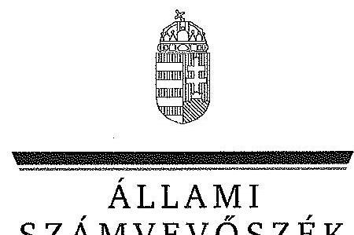

ÁLLAMI
SZÁMVEVŐSZÉK

# JELENTÉS 

Az MTA egyes kutatóintézeteinek ellenőrzése - A Magyar Tudományos Akadémia kutatóintézeti hálózatának átalakítása, egyes kiemelt kutatóintézetek gazdálkodása és feladatellátása ellenőrzése

---

# Állami Számvevőszék 

Iktatószám: V-0446-518/2015.
Témaszám: 1480
Vizsgálat-azonosító szám: V0682

## Az ellenőrzést felügyelte:

Dr. Pulay Gyula Zoltán
felügyeleti vezető
Az ellenőrzést vezette és az ellenőrzés végrehajtásáért felelős:
Dobos András Csaba
ellenőrzésvezető
Korsósné Vigh Andrea
ellenőrzésvezető
A jelentéstervezet összeállításában közreműködtek:
Dr. Babos János
számvevő tanácsos
Cseh Árpád
számvevő gyakornok
Dr. Gaálné Berente Mónika
számvevő tanácsos
Kupcsik Éva
számvevő
Molnár Istvánné
számvevő tanácsos
Várkonyi Zsolt Kristóf
számvevő tanácsos
Az ellenőrzést végezték:

| Bus András Péter | Dr. Csapó Anna | Dr. Eke-Pekács Tibor |
| :-- | :-- | :-- |
| számvevő tanácsos | számvevő tanácsos | számvevő tanácsos |
| Dr. Gaálné Berente | Fekete Győr László | Fórián Erika |
| Mónika | számvevő | számvevő tanácsos |
| számvevő |  |  |
| Komonszky Krisztina | Kriston-Vizi János | Laczi Hedvig Anna |
| számvevő | számvevő tanácsos | számvevő |
| Várkonyi Zsolt Kristóf |  |  |
| számvevő tanácsos |  |  |

---

# A témához kapcsolódó eddig készített számvevőséki jelentések: 

## címe

Jelentés Magyarország 2013. évi központi költségvetése végrehajtásának ellenőrzéséről
Jelentés Magyarország 2012. évi központi költségvetése végrehajtásának ellenőrzéséről
Jelentés a Magyar Köztársaság 2011. évi költségvetése végrehajtásának ellenőrzéséről
Jelentés a Magyar Köztársaság 2010. évi költségvetése végrehajtásának ellenőrzéséről
Jelentés a Magyar Tudományos Akadémia fejezet működésének ellenőrzéséről
sorszáma
14207
13080
1297
1117
0621

---

.

---

# TARTALOMJEGYZÉK 

BEVEZETÉS ..... 3
I. ÖSSZEGZŐ MEGÁLLAPÍTÁSOK, KÖVETKEZTETÉSEK, JAVASLATOK ..... 6
II. RÉSZLETES MEGÁLLAPÍTÁSOK ..... 15

1. Az MTA kutatóhálózata szervezeti rendszere átalakításának szabályszerűsége ..... 15
1.1. Az átalakítás előkészítésének szabályszerűsége ..... 15
1.2. Az átalakítás végrehajtásának szabályszerűsége, a szervezeti és irányítási struktúra egyszerűsítésére, valamint a működés gazdaságosabbá tételére vonatkozó szempontok érvényesítése ..... 19
2. Az ellenőrzött intézmények feladatellátásának és gazdálkodásának, a belső kontrollok kialakításának szabályszerűsége ..... 23
2.1. A belső kontrollrendszer kialakításának és működtetésének szabályszerűsége ..... 23
2.2. Az intézmények közfeladat ellátásának szabályszerűsége ..... 28
2.3. A kutatóhálózat intézményei pénzügyi gazdálkodásának szabályszerűsége ..... 30
2.4. Az intézmények vagyongazdálkodása előírásoknak való megfelelősége ..... 34
3. Az MTA irányító, és kontroll feladatai gyakorlásának, beszámolásának szabályszerűsége ..... 40
3.1. Az MTA irányítási és kontroll feladatai gyakorlásának szabályszerűsége ..... 40
3.2. Az MTA beszámolási kötelezettségeinek teljesítése ..... 42
4. Az integritás kontrollok kialakítása és működtetése ..... 42

---

# MELLÉKLETEK 

1.a számú Az MTA kutatóintézetei és kutatóközpontjai a 2011. évben
1.b számú A kutatóintézet-hálózat átalakításának szemléltetése az ellenőrzött intézmények átalakításán keresztül
1.c számú Az MTA kutatóközpontjai és kutatóintézetei 2012-től
2. számú A kutatói átlaglétszám és a nem kutatók létszáma kutatóközpontonként a 2010-2013. években
3. számú Az ellenőrzött kutatóközpontok kiadási, bevételi előirányzatainak alakulása és teljesítése a 2010-2013. években
4. számú Az ellenőrzött kutatóközpontok szállítói kötelezettségeinek lejárat szerinti alakulása a 2010-2013. években
5. számú Az ellenőrzött kutatóközpontok mérlegeinek alakulása a 2010-2013. években
6. számú Az ellenőrzött kutatóközpontok gazdasági társaságokban szerzett részesedéseinek változása a 2010-2013. években
7. számú Az ellenőrzött kutatóközpontok tulajdonosi joggyakorlása alá tartozó gazdálkodó szervezetek részére nyújtott kifizetések a 2010-2013. években
8. számú Az ellenőrzött kutatóközpontok gép-műszer állománya a 2010-2013. években

## FÜGGELÉKEK

1. számú Rövidítések jegyzéke
2. számú Fogalomtár

---

# JELENTÉS 

## Az MTA egyes kutatóintézeteinek ellenőrzése A Magyar Tudományos Akadémia kutatóintézeti hálózatának átalakítása, egyes kiemelt kutatóintézetek gazdálkodása és feladatellátása ellenőrzése

## BEVEZETÉS

A Magyar Tudományos Akadémia (MTA) Magyarország legmagasabb szintű tudományos testülete. A tudományok műveléséért, támogatásáért, képviseletéért országos szinten felelős tudományos köztestület önkormányzati elven működik. Az MTA alapvető közfeladatait, szervezeti felépítését a Magyar Tudományos Akadémiáról szóló, 2009-ben módosított 1994. évi XL. törvény (MTAtv.) szabályozza. Az MTA a központi költségvetésben önálló fejezetet alkot.

Az MTA közfeladatai között kiemelt szerepe van a tudomány valamennyi területére kiterjedő tudományos kutatások folytatásának, aminek céljából a központi költségvetésből biztosított támogatás felhasználásával működteti Magyarország egyetlen főhivatású kutatóintézeti hálózatát. A saját kutatóintézeti hálózat mellett az MTA felsőoktatási intézményekben és közgyűjteményekben is tart fenn kutatócsoportokat az intézményekkel kötött megállapodás alapján. Jelentős összegeket biztosít továbbá tudományos kutatási célú pályázatok finanszírozására, ezen belül is kiemelt figyelmet fordítva a kimagasló teljesítményt nyújtó fiatal kutatókra. Az MTAtv. feladatként fogalmazza meg az MTA részére azt is, hogy szorgalmazza és segítse a tudományos kutatások eredményeinek társadalmi és gazdasági hasznosítását.

Az MTA költségvetési támogatásának előirányzata 2012-ben 43,48 Mrd Ft volt, ami mintegy 17%-os növekedést jelentett 2011-hez képest. A 2013. évi központi költségvetés gyakorlatilag változatlan összegű, 43,13 Mrd Ft támogatást irányzott elő a köztestület részére. Az elmúlt 4 évben folyamatosan a támogatások mintegy 2/3 részét fordították kutatási célokra, ami 2012-ben és 2013-ban egyaránt 29 Mrd Ft-os nagyságrendet jelentett évente. A kutatások támogatásán belül jelentős, 50% körüli arányt képviselnek az MTA kutatóintézeti hálózatának működését szolgáló támogatások.

Az MTA kutatóhálózatát 2011 végével átszervezték. Az átalakítás célja az volt, hogy a kutatóhálózat ésszerűbb és takarékosabb intézményi működési keretek között, kutatási potenciálját megőrizve, koncentráltabb kutatási stratégia mentén teljesítse közfeladatait. A megújítás eredményeként 2012. január 1-jétől az addig önálló költségvetési intézményként működő 38 kutatóintézet és 2 kutató-

---

központ 10 kutatóközponttá és 5 kutatóintézetté alakult át. A korábbi széttagolt akadémiai kutatóhálózat elemei a kutatóközpontok keretein belül, azok szervezeti egységeiként működtek tovább. A kutatóközpontok és a - nem kutatóközponti szervezeti egységként működő - kutatóintézetek önállóan működő és gazdálkodó köztestületi költségvetési szervekként az MTA intézményei. Létrehozásukhoz, átszervezésükhöz, megszüntetésükhöz a Közgyűlés határozata szükséges. Az akadémiai kutatóhálózat testületi felügyeletét az Akadémiai Kutatóintézetek Tanácsa (AKT) látja el. Az AKT összetételét az MTAtv., létrehozásának részletes eljárási rendjét és működési szabályait az Alapszabály 1,2 és az Ügyrend 1,2 határozza meg.

Az MTA-t az ÁSZ többször ellenőrizte, utoljára 2006-ban. A kutatóintézeti hálózatra fókuszáló ellenőrzésre ugyanakkor még nem került sor.

Az ellenőrzés célja annak értékelése volt, hogy szabályosan történt-e 2011 végén a kutatóhálózat átalakítása; az átalakítás során meghatározták és érvényesítették-e a szervezeti és irányítási struktúra egyszerűsítésére, valamint a működés gazdaságosabbá tételére vonatkozó szempontokat; szabályszerűen működtek-e a kutatóhálózat intézményei; az irányító szervezet a jogszabályi előírásoknak megfelelően gyakorolta-e szakmai és gazdálkodási irányító, illetve kontroll feladatait.

A belső kontrollrendszer kialakításának és működtetésének szabályszerűségét az erre irányuló ellenőrzési kérdésekre adott válaszok összesítése alapján értékeltük. A belső kontrollrendszert az értékelés során legalább 85%-os megfelelőség esetén megfelelőnek, legalább a 70%-os megfelelőség esetén részben megfelelőnek, 70%-os megfelelőség alatt pedig nem megfelelőnek minősítettük. 1

Az ellenőrzés során a kiadási előirányzatok felhasználását, az éves előirányzatmaradvány megállapítását és felhasználását, a kiadási előirányzatok felhasználása során a pénzgazdálkodással kapcsolatos gazdálkodási jogkörökhöz előírt belső kontrollok működtetését, valamint a vagyon hasznosításából származó bevételek megállapítását és realizálását, azok szabályszerűségét mintavétellel ellenőriztük. A jogszabályoknak és a belső előírásoknak megfelelőnek, azaz szabályszerűnek tekintettük az adott területet, amennyiben a minta ellenőrzésének eredménye alapján 95%-os bizonyossággal a teljes sokaságban a hibaszázalék kisebb volt, mint 10%, nem megfelelőnek értékeltük, ha a hibaszázalék a 10%-ot meghaladta. Kockázatot, illetve magas kockázatot jeleztünk, amennyiben egy adott terület vonatkozásában a minta alapján a teljes sokaságban nem volt teljes körűen biztosított a jogszabályoknak és a belső szabályzatoknak megfelelő működés.

[^0]
[^0]:    1 Az ellenőrzés kapcsolódott Magyarország 2013. évi központi költségvetése végrehajtásának (továbbiakban zárszámadás) ellenőrzéséhez, amelynek keretében az ÁSZ ellenőrizte az MTA Természettudományi Kutatóközpontját (MTA TTK). A zárszámadás során a belső kontrollrendszer értékelésére vonatkozó megállapításokat az ellenőrzés során hasznosítottuk, azonban a jelentésben szereplő részminősítések - az egyes területekhez kapcsolódó részletesebb kérdések miatt - eltérhettek attól.

---

Az intézmény korrupcióval szembeni veszélyeztetettségének csökkentése érdekében felmértük az integritási szemlélet érvényesülését a gazdálkodási folyamatokban.

Az ellenőrzés várható hasznosulásaként objektív kép alakítható ki a kutatóintézeti hálózat működéséről, a tudományos kutatásokra fordított közpénzek felhasználásáról, az MTA által kialakított kontrollrendszer működtetésével, továbbá a kutatási feladatok ellátásának szabályszerűségével kapcsolatos jó gyakorlatokról és javítási lehetőségekről. Megítélhetővé válik az átszervezés célszerűsége, megalapozottsága. Az ellenőrzés javaslatai, megállapításai nyomán javulhat a tudományos műhelyek működésének szabályozottsága, a kutatásokra fordított közpénzek felhasználásának átláthatósága, nyomon követhetősége, elősegítve ezzel a tudományos intézmények hatékony, gazdaságos közpénzfelhasználását, a tudomány eredményeinek közjó érdekében történő hasznosulását, ezen keresztül a „jó kormányzás" megvalósítását.

Az ellenőrzés típusa: szabályszerűségi ellenőrzés
Az ellenőrzött időszak: 2010. január 1 - 2013. december 31.
Az ellenőrzéssel érintett szervezetek: az MTA, a kutatóhálózat intézményei közül az MTA Bölcsészettudományi Kutatóközpont, az MTA Ökológiai Kutatóközpont, az MTA Természettudományi Kutatóközpont, valamint ezek egy-egy szervezeti egysége, a Régészeti Intézet, a Balatoni Limnológiai Intézet, a Műszaki Fizikai és Anyagtudományi Intézet.

Az ellenőrzés végrehajtásának jogszabályi alapját az ÁSZ tv. 1. § (3) bekezdése és 5. § (2)-(4) bekezdései, valamint az Áht 61. § (2) bekezdése képezték.

Az ÁSZ a jelentéstervezetet az Állami Számvevőszékről szóló 2011. évi LXVI. törvény 29. §-a alapján észrevételezésre az Magyar Tudományos Akadémiának, az MTA Bölcsészettudományi Kutatóközpontnak, az MTA Ökológiai Kutatóközpontnak, az MTA Természettudományi Kutatóközpontnak. A beérkezett észrevételeket a jelentés véglegesítése során hasznosítottuk. Az észrevételeket és az azokra adott válaszokat a jelentés 9. számú melléklete tartalmazza.

---

# I. ÖSSZEGZŐ MEGÁLLAPÍTÁSOK, KÖVETKEZTETÉSEK, JAVASLATOK 

Az MTA a 2011. májusi Közgyűlésén fogalmazta meg, hogy az 1970-es években kialakított kutatóhálózata, annak szervezeti merevsége miatt a témaváltásokra felkészületlen, szétaprózódott, magas költséget és szakmai töredezettséget mutató szervezetté vált. Az évek során az infrastruktúra folyamatosan elértéktelenedett, a kutatói utánpótlás nem volt biztosított, a szervezet eljutott teljesítőképessége határáig, amibe már nem lehetett hatékonyan többletforrásokat juttatni.

Az előkészítési szakaszban elkészített megújítási koncepcióban meghatározták a kutatóintézet-hálózat szervezeti és irányítási struktúrája egyszerűsítésére, működése gazdaságosabbá, hatékonyabbá tételére vonatkozó szempontokat, elképzeléseket, valamint az átalakítás adminisztratív módját, időpontját. Az átalakítás lényege, hogy a kutatóintézet-hálózat költségvetési szerveinek (az önállóan működő és gazdálkodó kutatóintézeteknek és kutatóközpontoknak) a száma 40-ről 15-re csökken oly módon, hogy a 2011-ben működő két kutatóközpont és 38 kutatóintézet helyett 2012. január 1-jétől 10 kutatóközpont és öt kutatóintézet jön létre. Az átalakítás adminisztratív módja a beolvadás, az így megszűnő - 2011-ben önállóan működő és gazdálkodó költségvetési szerv - kutatóintézetekből 2012. január 1-jétől új kutatóközpontok jönnek létre. A beolvadással megszűnő költségvetési szervek közfeladatainak ellátása, jogai és kötelezettségei, vagyonuk, vagyoni jogaik és költségvetési előirányzataik, valamint a munkáltatói jogok gyakorlása tekintetében az általános jogutód az a kutatóközpont, amelybe a megszűnő kutatóintézetek beolvadnak. A költségvetési szervként megszűnő, beolvadó kutatóintézet a kutatóközpontban tudományos autonómiával rendelkező kutatóintézet szervezeti egységként folytatja működését, gazdasági szervezete és működési önállósága azonban megszűnik, e feladatokat centralizáltan a kutatóközpont látja el. A gazdasági, adminisztratív, üzemeltetési feladatok központosítása a kutatóintézet-hálózat szintjén - e feladatokat ellátók körében, a kutatói létszám változatlanul hagyása mellett - 143 fő létszámcsökkentést tesz lehetővé, egyidejűleg e területeken a vezetői szintek száma csökken, az irányítási struktúra egyszerűsödik. Az így keletkező megtakarítás a kutatók számának a növelésére és a kutatás dologi feltételeinek a javítására fordítható. A kutatóintézetek kutatóközpontokba történő

 egyesítése megteremti a kutatási feladatok összehangolásának, a kutatási infrastruktúra célzott, gazdaságosabb fejlesztésének lehetőségét (a párhuzamosságok megszüntetését), ezáltal méretgazdaságossági előnyöket, versenyképességet növelő feltételeket eredményez.

Az új kutatóközpontok létrehozása és 2012-2013. évi működtetése során a szervezeti és irányítási struktúra egyszerűsítésére, valamint a működés gazdaságosabbá tételére vonatkozó szempontokat érvényesítették. A kutatóintézet-hálózat intézményeinek számának 40-ről 15-re való csökkentését, valamint a gazdasági, adminisztratív, üzemeltetési feladatok centralizációját, az e feladatokat ellátók létszámának 143 fővel történő leépítését megvalósították, miközben a költségvetési szervek közfeladatai ellátása

---

nem sérült, a szervezeti struktúra egyszerűsödött. A funkcionális feladatok kutatóközpont szintre integrálása és a kapcsolódó létszámcsökkentés végrehajtása, továbbá egyes kutatóközpontokban a kutatói létszám emelkedése eredményeként - a jogelőd kutatóintézetek összesített adatához képest - a 2013. és a 2010. év viszonylatában javult a kutatók, nem kutatók aránya. Ez az ellenőrzött MTA BTK-nál 5%, az MTA ÖK-nál 4%, az MTA TTK-nál 10% kutatói létszámarány növekedést jelentett. A kutatói intézményhálózat szétaprózottsága megszüntetésével tervezetten, a rendelkezésre álló források célzott felhasználásával megkezdődött az informatikai rendszerek, a gép-műszerállomány és a létesítmények korszerűsítése. Ennek következtében a gép-műszerállomány használhatósági foka az ellenőrzött intézmények mindegyikében javult, 12,9-21,5% közötti szintről 28,3-33,8% közötti szintre emelkedett, egyidejűleg a még használatban lévő, de teljesen leírt eszközállomány csökkent. A hatékony és gazdaságos működés, fejlesztés és a versenyképes kutatási célkitűzések realizálásának eszköze volt, hogy a fejezeti források egy részéhez - a 2012. évben 5408,5 M Ft, a 2013. évben 6550,4 M Ft támogatáshoz - az átalakításhoz kapcsolódó célkitűzések megvalósítására kiírt versenypályázatok útján juthattak hozzá a kutatóközpontok. E fejezeti forrásokból az ellenőrzött kutatóközpontok részesedése a 2012-2013. években együttesen a következő volt: az MTA BTK 803,0 M Ft, az MTA ÖK 671,3 M Ft, az MTA TTK 1719,6 M Ft. Tekintettel arra, hogy a K+F kutatások átfutási ideje több éves, és az MTA a 2012. évben az átszervezést, a 2013. évben pedig az átszervezés finomhangolását jelölte meg feladatként, az átalakítás tudományos eredményeinek hatása döntően az ellenőrzött időszakot követően jelentkezhet.

Az átalakítás előkészítése, a döntéshozatal és az átalakítás végrehajtása szabályszerű volt. Az Ügyrend$_{1}$ előírásának megfelelően az elnök kijelölte és megbízta a költségvetési szervek átalakításáért felelős elnöki biztosokat. Az elnök a megújítási koncepciót az MTA különböző szervezeteivel egyeztette és gondoskodott az Áht$_{1}$-ben előírt közigazgatási egyeztetés tekintetében az államháztartásért felelős miniszter tájékoztatásáról, aki egyetértett a kutatóhálózat átalakításával. Az átalakításról szóló javaslatot - amely tartalmazta a kutatóintézetek és kutatóközpontok közfeladatait, az átalakítás szakmai indoklását - az elnök az Alapszabály$_{1}$-ben előírt szervezetek véleményével terjesztette döntésre a Közgyűlés elé. A Közgyűlés az MTAtv.-ben meghatározott jogkörében a 7/2011. (XII. 5.) számú határozatában az Áht$_{1}$ és az Ámr. előírásainak megfelelő módon és tartalommal döntött a kutatóközpontok és a kutatóintézetek szervezeti átalakulásáról. Az átalakulással érintett kutatóintézetek megszüntető okiratai az Ámr. előírásainak megfelelően készültek el, amelyeket a Közgyűlés döntését követően az MTAtv.-ben biztosított jogkörében az elnök írt alá. Az MTA - az Áhsz.-ben és az Ámr.-ben meghatározottak szerint - a szükséges dokumentumok megküldésével intézkedett a MÁK-nál az érintett köztestületi szervek megszüntetéséről és a törzskönyvi nyilvántartásból való törlésükről. A megszűnéssel kapcsolatos számviteli feladatokat az Áhsz.-ben meghatározottak szerint hajtották végre. Elkészítették a vagyonátadási jelentéseket, valamint a megszüntető szervezet (MTA) által meghatározott fordulónappal - leltárral és záró főkönyvi kivonattal alátámasztott - éves elemi költségvetési beszámolókat az Áhsz.-ben meghatározott adattartalommal. Értesítették az érintett gazdasági partnereiket, illetve a tartósan távollévő alkalmazottakat. Az MTA az átalakítás során az alapító és megszüntető okiratokat az Ámr.-ben

---

meghatározott tartalommal - az Áht$_{1}$-ben foglaltaknak megfelelően - a Hivatalos Értesítőben közzétette.

A belső kontrollrendszer kialakítását és működtetését a 2010-2011. éveket érintően három kiválasztott kutatóintézetnél, a 2012-2013. évek tekintetében a jogutód kutatóközpontjaiknál értékeltük, amelynek eredményét a következő táblázat szemlélteti.

| Ellenőrzött intézmények | Minősítés |  |  |  |
| :--: | :--: | :--: | :--: | :--: |
|  | 2010. év | 2011. év | 2012. év | 2013. év |
| MTA RI - MTA BTK | megfelelő | megfelelő | megfelelő | megfelelő |
| MTA BLKI - MTA ÖK | részben megfelelő | megfelelő | megfelelő | megfelelő |
| MTA MFA - MTA TTK | részben megfelelő | részben megfelelő | részben   megfelelő | részben   megfelelő |

Az átalakítást követően az új szervezeti struktúrával összhangban lévő belső kontrollrendszert az ellenőrzött három kutatóközpont közül az MTA BTK és az MTA ÖK - kisebb hiányosságokkal - a jogszabályi és az MTA belső szabályzataiban foglalt előírásoknak megfelelően kialakította és működtette. Az MTA TTK-nál a belső kontrollrendszer kialakítása nem volt teljes körű, részben volt a jogszabályok és az MTA belső előírásainak megfelelő.

Az MTA BTK-nál a pénzkezelési szabályzat$_{1,2}$-ban nem rögzítették a 30 napon túli előlegek Szja. tv. alapján megállapított adó és járulék vonzatának szabályozását. A kutatóközpont nem rendelkezett az SZMSZ-e mellékleteként a szellemi vagyonnal való gazdálkodásról, a szellemi tulajdon kezeléséről szóló szabályzattal, az Alapszabály$_{2}$ előírásai ellenére. Az ellenőrzési nyomvonalat nem a költségvetési szerv valamennyi működési folyamatára, hanem csak a gazdálkodási folyamatokra készítették el a Bkr. előírása ellenére.

Az MTA ÖK-nál a gazdálkodási jogkörök gyakorlóiról a 2012-2013. években vezetett nyilvántartás az Ávr.-ben és a gazdálkodási szabályzatban előírtak ellenére a teljesítésigazolásra - szabályszerűen megtörtént kijelölés alapján - jogosult személyek nevét és aláírás mintáját nem tartalmazta. A kutatóközpont nem rendelkezett az SZMSZ-e mellékleteként a szellemi vagyonnal való gazdálkodásról, a szellemi tulajdon kezeléséről szóló szabályzattal, az Alapszabály előírásai ellenére. Az MTA ÖK és az MTA TTK alapító okiratában és SZMSZ-ében nem határozták meg a kutatóközpont vállalkozási tevékenységével összefüggésben a vállalkozási eredmény felosztásának szabályait, e tekinteben az Alapszabály előírásai nem érvényesültek.

Az MTA TTK SZMSZ-e nem tartalmazta valamennyi szervezeti egység engedélyezett létszámát, továbbá a gazdasági szervezet tagjainak feladat- és hatásköre tekintetében a helyettesítés rendjét - a gazdasági igazgató kivételével - az SZMSZ-ben, ügyrendben, munkaköri leírásban vagy egyéb belső szabályzatban nem határozták meg az Ávr. előírása ellenére. Az MTA TTK számlarendje a Számv. tv. előírása ellenére nem tartalmazta a számlarendben foglaltakat alátámasztó bizonylati rendet. A 2013. évben a számlarenden és a számlatükrön

---

az Áhsz. 9. számú melléklete változásainak átvezetése, továbbá a számviteli politika aktualizálása a jelentős összegű hiba meghatározásának változása tekintetében a Számv. tv. és az Áhsz. előírásai ellenére nem történt meg. Az MTA TTK nem rendelkezett ellenőrzési nyomvonallal, továbbá a kutatóközpont sajátosságainak megfelelő kockázatkezelési rendszert nem alakította ki és nem működtette, az intézmény tevékenységeivel kapcsolatos kockázatokat nem mérte fel és nem elemezte a Bkr. előírása ellenére. Nem alakították ki, nem szabályozták - a szervezet sajátosságaihoz igazodóan - azokat a tevékenységeket, amelyek biztosítják a folyamatba épített, előzetes, utólagos és vezetői ellenőrzést, e tekinteben a Bkr előírásai nem érvényesültek.

Az ellenőrzött intézmények közfeladat ellátása szabályszerű volt. A kutatóintézetek és kutatóközpontok az alapító okirataikban rögzített közfeladataikat ellátták, az előírt és a ténylegesen ellátott feladatok összhangja biztosított volt. Az intézmények meghatározták és a minősítés során vizsgálták a tudományos munkakört betöltő közalkalmazottak kutatói követelményeit és azok betartását. Az AKT által meghatározott szempontok és mutatók alapján az intézmények a tudományos tevékenységükre vonatkozó beszámolási kötelezettségüknek évente eleget tettek, amelyeket az AKT értékelt és - előterjesztése alapján - a Közgyűlés elfogadott. Az ellenőrzött intézmények részére kijelölt közfeladatok és az ellátásukra a költségvetési törvényekben biztosított erőforrások összhangban voltak.

A kiadási előirányzatok felhasználása során a jogszabályok és a belső szabályzatok előírásait a pénzgazdálkodással kapcsolatos gazdálkodási jogkörökhöz előírt belső kontrollok tekintetében az ellenőrzött intézmények eltérő mértékben érvényesítették. A 2010-2011. években a pénzgazdálkodással kapcsolatos gazdálkodási jogkörökhöz előírt belső kontrollok működése az ellenőrzött kutatóintézetek közül az MTA RI-nél és az MTA MFA-nál nem volt megfelelő. Az MTA BLKI-nél a 2010. évben e kontrollok nem működtek megfelelően és azok működtetése a 2011. évben sem volt teljes körűen szabályszerű, amely kockázatot jelez az ellenőrzött terület egészének szabályszerű működése szempontjából. A szervezeti átalakítást követően a 2012-2013. években a pénzgazdálkodással kapcsolatos gazdálkodási jogkörökhöz előírt belső kontrollok működtetése az MTA BTK-nál és az MTA ÖK-nál megfelelt a jogszabályoknak és a belső szabályzatoknak. Az MTA TTK-nál a gazdálkodási jogkörökhöz előírt belső kontrollok a 2012. évben nem működtek megfelelően, a 2013. évben pedig a működtetésük nem volt teljes körűen szabályszerű, ami kockázatot jelez az ellenőrzött terület egészének szabályos működése szempontjából.

Az éves kiadási előirányzatok felhasználása, módosítása és az előirányzat maradványok megállapítása és felhasználása megfelelt a jogszabályok előírásainak. Az előirányzat-zárolások, valamint a kiadási előirányzatok felhasználását korlátozó intézkedések - csekély mértékük miatt érdemben nem befolyásolták a gazdálkodást. Az 2010-2013. években biztosított volt az ellenőrzött intézmények likviditása, fizetőképessége. Átmeneti likviditási feszültségeket az előfinanszírozásos, utólagos elszámolással elnyert pályázati támogatások, az MTA TTK esetében a Q2 beruházással összefüggő kifizetések okoztak.

---

Az ellenőrzött intézmények vagyongazdálkodása a leltározás, a gazdasági társaságokban lévő részesedések tekintetében a tulajdonosi jogok gyakorlása, valamint a vagyon hasznosítása terén feltárt hiányosságok miatt részben volt a jogszabályi előírásoknak megfelelő.

A kutatóintézetek és kutatóközpontok az immateriális javak és tárgyi eszközök beszerzése során a Kbt$_{1,2}$ és a belső szabályzatok előírásait betartották. A beszerzett, létesített eszközök bekerülési értéke, az eszközök állományba vétele és az értékcsökkenés elszámolása - az MTA RI-nél feltárt eseti eszköz besorolási hiba, valamint az MTA MFA-nál az állományba vétel hiányos dokumentálása kivételével - szabályszerű volt. Az eszközök év végi értékelése az Áhsz., valamint a belső szabályzatok előírásainak figyelembe vételével történt.

Az ellenőrzött kutatóintézetek, kutatóközpontok a beszámolás során érvényesítették a valódiság és a folytonosság elvét, a felhalmozási kiadásokból beszerzett, létesített eszközök a tárgyévi mérleget alátámasztó leltárdokumentumokban megtalálhatóak voltak. Az ellenőrzöttek, mint az MTAtv. értelmében költségvetési szervek, az Áhsz.-ben és a leltárkészítési és leltározási szabályzatban előírt év végi leltározási és leltárkészítési előírásoknak az ellenőrzött időszakban - az MTA RI 2010-2011. évi és az MTA BTK 2012. évi leltárkiértékelése, valamint az MTA TTK 2012. évi leltárkészítésének teljessége kivételével - dokumentáltan eleget tettek. A selejtezéseket az indokolt esetekben az ellenőrzött intézmények - az év végi leltározást megelőzően - szabályszerűen végezték el.

A kutatóintézetek és kutatóközpontok az ellenőrzött években megvalósított beruházásokkal megfelelően gondoskodtak a kutatási infrastruktúra tervszerű fejlesztéséről és a végrehajtott felújításokkal az állagmegóvásról, amelyek forrása külső pályázati támogatás, illetve az MTA-tól kapott pótelőirányzat volt. Az MTA ellenőrzött intézményeinek vagyona a 2010. évtől a 2013. év végére 5823,7 M Ft-tal, 50,8%-kal növekedett.
 A legnagyobb mértékű a tárgyi eszközök állományának 83,3%-os növekedése volt, amit az MTA TTK Q2 ingatlan beruházása, valamint gépek és berendezések beszerzése eredményezett. A gépműszer állomány 2010. évi alacsony használhatósági foka az ellenőrzött időszakban emelkedett.

Az MTA ellenőrzött kutatóintézetei, kutatóközpontjai - az MTA BLKI és a jogutód MTA ÖK kivételével - rendelkeztek gazdasági társaságokban tulajdonosi részesedéssel, ahol a tulajdonosi ellenőrzést a felügyelő bizottságok, illetve taggyűlések útján, az MTA TTK kivételével az MTA Vagyongazdálkodási és Vagyonkezelési Szabályzat$_{1,2}$ előírásainak megfelelően gyakorolták. A 2010-2013. években a tulajdonosi joggyakorlással összefüggésben pénzeszköz és vagyonátadás nem volt.

Az MTA TTK hat gazdasági társaságban rendelkezett részesedéssel. A 2012. évi intézményhálózat megújításának programjával párhuzamosan a gazdasági társaságok működésének közgazdasági és jogi szempontrendszerű felülvizsgálata alapján a tulajdonosi joggyakorlást a Nanochem Kft. és a Cellpharma Kft. esetében az MTA TTK-tól az MTA megvonta és tulajdonosi jogkörében a Nanochem Kft.-t a Kémiai Technológiai Transzfer Kft.-be beolvasztotta. A TactoLogic Műszaki Kutatófejlesztő Kft.-nél a saját tőke összege az ellenőrzött időszak egészében negatív volt, azonban a gazdasági társaság nem kezdeményezte a tulajdonosok felé a Gt. tv-ben előírt határidőn belül a szükséges intézkedéseket (a saját tőke biztosítása).

Az ellenőrzött intézmények használatába adott vagyonra vonatkozó, az MTA-val a 2010-2013. években megkötött ingó és ingatlan vagyonhasználati szerződésekben rögzített jogok és kötelezettségek a kutatási feladatokat és tulajdonosi érdekeket egyaránt szolgálták. A szerződések tartalmi és formai elemei megfeleltek az Alapszabály$_{1,2}$-ben, valamint az MTA Vagyongazdálkodási és Vagyonhasznosítási Szabályzat$_{1,2}$-ben foglaltaknak. Ugyanakkor az egyes vagyonhasználati szerződések megkötésének időbeli késedelme, illetve az aktualizálásának elmaradása miatt az MTA és az MTA RI, az MTA BTK, az MTA ÖK, az MTA MFA, az MTA TTK nem tartották be az MTA Vagyongazdálkodási és Vagyonhasznosítási Szabályzat$_{1,2}$ előírásait. Az MTA TTK-val az Ingó vagyon (tárgyi eszközök, készletek) használati szerződés megkötésére az ellenőrzött időszak (2013. év) végéig nem került sor.

A használatába adott vagyon hasznosítása, a hasznosításból származó bevételek megállapítása, realizálása során az ellenőrzött intézmények az MTAtv.-ben és az MTA belső szabályaiban foglalt előírásokat - az MTA MFA-nál és az MTA TTK-nál az engedélyezési előírások betartása terén feltárt szabálytalanságok kivételével - érvényesítették. Az MTA MFA-nál a nullára leírt, selejtezett eszközértékesítéseket a gazdasági vezető engedélyezte, ellentétben az MTA Vagyongazdálkodási és Vagyonhasznosítási Szabályzat$_{1}$-ban meghatározott főigazgatói engedélyezéssel. Az MTA TTK-nál egy három évet meghaladó bérleti szerződés megkötéséhez nem kérték meg az elnök engedélyét az Ingatlanhasználati szerződés előírása ellenére.

Az MTA a kutatóhálózat szakmai feladatellátására, a gazdálkodásra vonatkozó és egyéb irányítási jogosultságait szabályszerűen gyakorolta. Az MTA irányítási feladatai keretében az átalakult kutatóközpontok SZMSZ-eit az MTAtv. szerint az AKT határozattal hagyta jóvá. A vezetőket és a gazdasági vezetőket az Áht. 2 szerint az MTA elnöke bízta meg.

Az Alapszabály$_{2}$, valamint az Áht. $_{1,2}$ előírásainak megfelelően, írásban rögzítették az erőforrásokkal való szabályszerű és hatékony gazdálkodáshoz szükséges követelményeket. A fejezetet irányító szerv vezetője az Áht. $_{1,2}$, valamint az Ámr. és az Ávr. előírásai szerint megállapította költségvetésüket, gyakorolta az előirányzatok változásával kapcsolatos jogköreit, figyelemmel kísérte azok végrehajtását, jóváhagyta a beszámolókat, az előirányzat maradványokat és a létszámot. A Közgyűlés határozattal elfogadta a Vagyongazdálkodási Irányelveket és megválasztotta az MTA Vagyonkezelő Testületének a tagjait. Az elnök határozatával közzétették az Elnökségi határozattal jóváhagyott Vagyongazdálkodási és Vagyonhasznosítási Szabályzat$_{2}$-t. Az MTA ellenőrzési feladatai keretében az elnök - az Áht. $_{1,2}$, valamint az Ámr. és a Bkr. előírásai szerint - az éves szakmai feladatellátásról az intézmények vezetőit beszámoltatta, szakmai és gazdálkodási tevékenységeiket ellenőrizte, a belső kontrollrendszer működését értékeltette.

Az OGY felé előírt beszámolási, valamint a Kormány felé előírt tájékoztatási kötelezettségeknek az MTA eleget tett. Az MTA elnöke az MTAtv. előírásai szerint az MTA 2009-2010. évi tevékenységéről beszámolt az OGY részére. A beszámolót megtárgyalta és egyhangúan elfogadta az Országgyűlés Foglalkoztatási és munkaügyi bizottsága, az Oktatási, tudományos és kutatási bizottsága, valamint a Nemzeti Összetartozás bizottsága, melyet az OGY a 67/2012. (X. 9.) OGY határozattal elfogadott. A Kormány tájékoztatására minden évben sor került.

Az integritás kontrollok kialakítása és működtetése - az integritás kérdőívek alapján - az ellenőrzött kutatóközpontoknál eltérő (kiváló, jó, közepes) szintű volt. Az MTA BTK-nál érvényesült az integritás szemlélet, és az intézmény összességében kiváló minősítést ért el. Az MTA ÖK eredendő korrupciós veszélyeztetettsége a 2013. évben alacsony, a korrupciós veszélyeket növelő tényezők jelenléte viszont - a referencia intézményekhez képest - magasabb, a korrupciós kockázatokat mérséklő kontrollok kiépítettsége jó volt. Az MTA TTK korrupciós veszélyeztetettségét növelő, valamint a kockázatokat mérséklő kontrollok tényezőinek értéke egyaránt közepes volt. Mindhárom kutatóközpont esetében az ellenőrzés megállapításai és az integritás kérdőív eredményei összhangban voltak a helyszíni ellenőrzés tapasztalataival.

A helyszíni ellenőrzés megállapításainak hasznosítása mellett javasoljuk:

# Az MTA elnöke részére: 

1. A vagyongazdálkodás terén feltárt hiányosság volt, hogy az MTA és az MTA TTK Ingó Vagyon Használati Szerződést az ellenőrzött időszakban nem kötött az MTA Vagyongazdálkodási és Vagyonhasznosítási Szabályzat, 6.1 pontja, valamint MTA Vagyongazdálkodási és Vagyonhasznosítási Szabályzat, 14. § (2) bekezdés előírása ellenére.

Javaslat:
Intézkedjen az Ingó Vagyon Használati Szerződés megkötéséről.

## az MTA BTK főigazgatója részére:

1. Az MTA BTK belső kontrollrendszerének a kialakítása és működtetése összességében megfelelt a jogszabályi előírásoknak, azonban az ellenőrzés kisebb hiányosságokat tárt fel a kontrollkörnyezet kialakítása tekintetében. Az MTA BTK Pénzkezelési Szabályzat$_{1,2}$-ban nem rögzítették a 30 napon túli előlegek Szja. tv. 72. § (4) bekezdése c) és n) pontja alapján megállapított adó és járulék vonzatának szabályozását. Az ellenőrzési nyomvonalat nem a költségvetési szerv valamennyi működési folyamatára, hanem csak a gazdálkodási folyamatokra készítették el a Bkr. 6. § (3) bekezdés előírása ellenére.

Javaslat:
Intézkedjen a kontrollkörnyezet ellenőrzés által feltárt hiányosságainak megszüntetéséről.

---

# az MTA ÖK főigazgatója részére: 

1. Az MTA ÖK belső kontrollrendszerének a kialakítása és működtetése összességében megfelelt a jogszabályok és az MTA belső szabályai előírásainak, azonban a kontrollkörnyezet kialakítása tekintetében feltárt hiányosság volt, hogy a kutatóközpont alapító okiratában és az SZMSZ-ében nem határozták meg a vállalkozási tevékenységével összefüggésben a vállalkozási eredmény felosztásának szabályait az Alapszabály$_{2}$ 55. § (5) bekezdés előírása ellenére. Az SZMSZ mellékleteként nem készítették el a szellemi vagyonnal való gazdálkodásról, a szellemi tulajdon kezeléséről szóló szabályzatot az Alapszabály$_{2}$ 55. § (4) bekezdése és 66. § (6) bekezdése előírásai ellenére. A gazdálkodási jogkörök gyakorlóiról a 2012-2013. években vezetett nyilvántartás az Ávr. 60. § (3) bekezdésében és a gazdálkodási szabályzatban előírtak ellenére a teljesítésigazolásra - szabályszerűen megtörtént kijelölés alapján - jogosult személyek nevét és aláírás mintáját nem tartalmazta.

Javaslat:
Intézkedjen a kontrollkörnyezet ellenőrzés által feltárt hiányosságainak megszüntetéséről.

## Az MTA TTK főigazgatója részére:

1. Az MTA TTK belső kontrollrendszerének a kialakítása és működtetése részben felelt meg a jogszabályok és az MTA belső szabályai előírásainak.

A kontrollkörnyezet kialakítása összességében megfelelt a jogszabályok és az MTA belső szabályai előírásainak, azonban az intézmény alapító okiratában és SZMSZ-ében nem határozták meg a kutatóközpont vállalkozási tevékenységével összefüggésben a vállalkozási eredmény felosztásának szabályait az Alapszabály$_{2}$ 55. § (5) bekezdés előírása ellenére. A kutatóközpont SZMSZ-e a szervezeti ábrán nevesített Tudományos Titkárság, Könyvtár, Pályázati Iroda és Belső ellenőr tekintetében nem tartalmazta a szervezeti egységek engedélyezett létszámát az Ávr. 13. § (1) bekezdés e) pontjában foglalt előírás ellenére. A gazdasági szervezet tagjainak feladat- és hatásköre tekintetében a helyettesítés rendjét - a gazdasági igazgató kivételével - az SZMSZ-ben, ügyrendben, munkaköri leírásban vagy egyéb belső szabályzatban az Ávr. 13. § (5) bekezdés előírása ellenére nem határozták meg. Az MTA TTK számlarendje a Számv. tv. 161. § (2) bekezdés d) pontja ellenére nem tartalmazta a számlarendben foglaltakat alátámasztó bizonylati rendet. A 2013. évben a számlarenden és a számlatükrön az Áhsz. 9. számú melléklete 2013. január 1-jei változásainak átvezetése - az Áhsz. 49. § (6) bekezdése előírása ellenére - nem történt meg. A számviteli politika aktualizálása a jelentős összegű hiba meghatározásának 2013. márciusi változását követően a Számv. tv. 14. § (3)-(4), (11) bekezdéseinek, valamint az Áhsz. 8. § (3)-(4), (12) bekezdéseinek előírásai ellenére nem történt meg. Az intézmény nem rendelkezett a Bkr. 6. § (3) bekezdés előírásának megfelelő ellenőrzési nyomvonallal.

A kockázatkezelési rendszer kialakítása és működtetése nem volt megfelelő, mert az MTA TTK a kutatóközpont sajátosságainak megfelelő kockázatkezelési rendszert a Bkr. 7. § előírásai ellenére nem alakította ki és nem működtette, a kockázatkezelés szabályozása nem követte a szervezeti változásokat, továbbá az intézmény tevékenységeivel kapcsolatos kockázatokat nem mérték fel és nem elemezték.

A kontrolltevékenységek kialakítása és működtetése részben volt megfelelő, mert a 2012. évi szervezeti átalakulást követően nem alakították ki, nem szabályozták - a szervezet sajátosságaihoz igazodóan - azokat a tevékenységeket, amelyek biztosítják a folyamatba épített, előzetes, utólagos és vezetői ellenőrzést (FEUVE), ezzel nem érvényesültek teljes körűen a Bkr. 8. § (2) bekezdésében foglalt előírások.

Javaslat:
Intézkedjen a jogszabályoknak megfelelő kontrollrendszer kialakítása és működtetése érdekében - az ellenőrzött időszak óta bekövetkezett esetleges jogszabályi változásokra figyelemmel - a kontrollkörnyezet, a kockázatkezelési rendszer és a kontrolltevékenységek terén az ellenőrzés által feltárt hiányosságok megszüntetéséről.
2. A 2013. évi kiadási előirányzatok felhasználása során a pénzgazdálkodással kapcsolatos gazdálkodási jogkörökhöz előírt belső kontrollok működtetése nem volt teljes körűen szabályszerű, mivel kettő dologi kiadás esetében a teljesítésigazolást az Ávr. 57. § (4) bekezdés előírása ellenére kijelöléssel nem rendelkező személy végezte el. Ez kockázatot jelez az ellenőrzött terület egészének szabályos működése szempontjából.

Javaslat:
Intézkedjen a gazdálkodási jogkörök szabályszerű gyakorlásának érvényesítéséről.
3. A vagyongazdálkodás terén feltárt hiányosság volt, hogy az MTA és az MTA TTK Ingó Vagyon Használati Szerződést az ellenőrzött időszakban nem kötött az MTA Vagyongazdálkodási és Vagyonhasznosítási Szabályzat$_{1}$ 6.1 pontja, valamint MTA Vagyongazdálkodási és Vagyonhasznosítási Szabályzat$_{2}$ 14. § (2) bekezdés előírása ellenére.

Javaslat:
Intézkedjen az Ingó Vagyon Használati Szerződés megkötéséről.

---

# II. RÉSZLETES MEGÁLLAPÍTÁSOK 

## 1. Az MTA KUTATÓHÁLÓZATA SZERVEZETI RENDSZERE ÁTALAKÍTÁSÁNAK SZABÁLYSZERŰSÉGE

### 1.1. Az átalakítás előkészítésének szabályszerűsége

Az MTA kutatóintézet-hálózata átalakításának előkészítése a 2011. május 2-3-i Közgyűlésen történt elnöki kezdeményezéstől a 2011. december 5-i közgyűlési döntéshozatalig tartott. Az átalakítás előkészítése és a döntéshozatal során a jogszabályokban és az MTA belső szabályaiban foglalt előírásokat érvényesítették.

Az elnök az MTA 2011. május 2-3-i Közgyűlésén rámutatott a kutatóintézet-hálózat fennálló szerkezetének és működésének megszűnéssel fenyegető nehézségeire. A beszédében elhangzottak szerint egyértelművé vált, hogy a fennálló kutatóhálózat - melynek infrastruktúrája rohamosan elértéktelenedik, szerkezete merev, nem felel meg a tudományos kutatások modern követelményeinek, a kutatói utánpótlás nem
 biztosított - nem finanszírozható és nem tartható fenn tovább. A kutatóintézet-hálózat szerkezeti problémáinak hatása Magyarországnak a nemzetközi tudományos közéletben (egyes mutatók alapján) való fokozatos térvesztésében is tetten érhető. Az Alapszabály; 46. § (1) bekezdésében foglalt kezdeményezési jogával élve az elnök megfogalmazta a kutatóintézet-hálózat szervezeti megújításának szükségességét, az átszervezésre (az intézmények száma csökkentésére), egyidejűleg a hatékonyság, kiválóság, fenntarthatóság és a versenyképesség megteremtésére vonatkozó elképzelését. Célként határozta meg - a fokozatos térvesztés elkerülése, a gazdaságos és hatékony működés elősegítése érdekében - az átalakítással a kutatóhálózat új fejlődési pályára állítását és 2011. december 5-ére rendkívüli Közgyűlést hívott össze.

A májusi Közgyűlést követően az MTA elkészítette a kutatóhálózat teljes megújításának koncepcióját és előkészítette annak megvalósítását. A koncepció szerint a megújítás célja ${ }^{2}$ az volt, hogy „a hazai kutatási hagyományokra építve a nemzetközi kutatási térben is számottevő, méretében és szolgáltatásaiban is versenyképes, eredményes alap- és alkalmazott kutatással foglalkozó kutatóintézeti-hálózat alakuljon ki a személyi, infrastrukturális és pénzügyi erőforrások hatékony felhasználásának elve alapján, a szétaprózottság felszámolásával." A megújítási koncepcióban meghatározták a kutatóintézeti-hálózat szervezeti és irányítási struktúrája egyszerűsítésére, működése gazdaságosabbá, hatékonyabbá tételére vonatkozó szempontokat, elképzeléseket.

[^0]
[^0]:    ${ }^{2}$ Részlet az MTA Stratégiai Tanácsadó Testülete számára, az MTA intézményhálózatának megújításáról szóló előterjesztésből.

---

A megújítási terv értelmében 2012. január 1-jétől:

- a kutatóintézet-hálózat intézményeinek száma 40-ről 15-re csökken oly módon, hogy a 2011-ben működő két kutatóközpont és 38 kutatóintézet (összesen 40 költségvetési szerv) helyett 10 kutatóközpont és öt kutatóintézet (összesen 15 költségvetési szerv) jön létre. Öt kutatóintézet és egy kutatóközpont változatlan formában működik tovább, 33 kutatóintézetből és egy kutatóközpontból pedig kilenc új kutatóközpont alakul. Az új kutatóközpontokban jogi személyiség nélküli kutatóintézetek (szervezeti egységek) jönnek létre, amelyek megőrzik tudományos autonómiájukat, de nem rendelkeznek gazdálkodási és működési önállósággal (az átalakulás folyamatát az 1.a, 1.b és 1.c számú mellékletek szemléltetik);
- minden kutatóközpontnak egy közös gazdasági szervezete (és így egy gazdasági vezetője) lesz. Az új kutatóközpontok funkcionális (gazdasági, adminisztratív, üzemeltetési) feladatai - az intézeti létszámgazdálkodás áttekintése, egyeztetése alapján, e funkciók centralizációja révén 143 fővel kisebb személyi állománnyal láthatók el. Ezzel egyidejűleg a vezetői szintek száma is csökken, az irányítási struktúra egyszerűsödik;
- az így keletkező (az előzetes számítások szerint mintegy 250-270 M Ft-os) megtakarítást a kutatók számának növelésére és a kutatás dologi feltételeinek javítására lehet fordítani;
- a kutatóintézetek kutatóközpontokba történő egyesítése méretgazdaságossági előnyöket, ezáltal versenyképességet növelő feltételeket teremtenek. A kutatóközpont nagyobb méretének köszönhetően a kutatóintézeteknél alkalmasabb koncentrált és multidiszciplináris kutatások végzésére, a kutatási infrastruktúra és műszerpark fejlesztése célzottabban és gazdaságosabban valósítható meg. Csak a nagyobb kutatóközpontokban jöhet létre az a kritikus tömeg (kutatói potenciál), amely a nemzetközi pályázati térben versenyképes kutatócsoportok számára biztosítja az együttműködéshez szükséges tudáskomponenseket, erősíti a pályázati eredményességet;
- a megújult intézményhálózatban a kutatási feladatok összehangolását követően olyan teljesítménykövetelmények érvényesíthetők, amelyekben az egyéni kiválóságokon keresztül történő kutatásfinanszírozás szerepe megnő a kutatási tevékenység eredményességének fokozása érdekében.

A megújítási tervben meghatározták az akadémiai kutatóintézetek köztestületi költségvetési szervek - átalakításának adminisztratív módját, amely az Áht.: 95. § (2) bekezdése szerinti beolvadás. A koncepció szerint 2012. január 1-jétől az egy kutatóközpontot alkotó intézetek egyikébe beolvad a többi költségvetési szerv. Az így létrejött költségvetési szerv (a bázisintézmény) azonnal átalakul kutatóközponttá. A beolvadó költségvetési szervek megszűnnek, a jogutód az átvevő költségvetési szerv. A megszűnő költségvetési szervek valamennyi közfeladatának jövőbeni ellátása, valamennyi joga és kötelezettsége, vagyona, vagyoni jogai és költségvetési előirányzatai, valamint a munkáltatói jogok gyakorlása tekintetében általános jogutód az a költségvetési szerv, amelybe a köztestületi költségvetési szervek beolvadnak.

---

Az átalakítás előkészítésének a folyamata a feladatokat, határidőket és felelősöket részletesen meghatározó ütemterv alapján zajlott.

Az elnök, a kiválóság, a fenntarthatóság és a versenyképesség elvein alapuló, az akadémiai intézményhálózat megújítását célzó koncepciót bemutatta az MTA különböző szervezeteinek, testületeinek.

A koncepciót - az intézet igazgatókkal történt egyeztetéseket követően ${ }^{3}$ - az AKT az 1/4/2011. (06. 27.) sz. határozatával elfogadta. Az Elnökség a 38/2011. (VI. 28.) sz. elnökségi határozatával szintén tudomásul vette a koncepcióban foglaltakat, és támogatta az MTA elnökét, hogy a 2011. december 5-ei Közgyűlésre készítse elő az akadémiai kutatóintézet-hálózat megújítására vonatkozó javaslatot, valamint folytassa le az átalakítás jogi, pénzügyi és adminisztratív előkészítéséhez szükséges tárgyalásokat és a közigazgatási egyeztetéseket.

A szerkezeti megújítás részletes terveivel és lépéseivel - az AKT-on és az Elnökségen kívül - egyetértett a Vezetői Kollégium, a Stratégiai Tanácsadó Testület, a Vagyonkezelő Testület, az Akadémiai Érdekegyeztető Tanács és a Felügyelő Testület is. ${ }^{4}$

Az Ügyrend ${ }_{1}$ 32. § (1)-(2) bekezdései előírásának megfelelően 2011. július 15-én az elnök kijelölte és megbízta a költségvetési szervek átalakításáért felelős elnöki biztosokat.

A megbízólevelekben foglaltak szerint az új kutatóközpontok létrehozásának irányításáért felelős elnöki biztosok feladata volt különösen: az új költségvetési szerv közfeladatai meghatározásának és az intézmény szakmai koncepciója elkészítésének irányítása; közreműködés az alapító okirat közigazgatási egyeztetésében, a megszűnő költségvetési szervekkel kapcsolatos szakmai, pénzügyi és jogi feladatok irányítása; közreműködés az átalakulással érintett költségvetési szervek munkavállalóival, valamint a szakszervezetekkel és közalkalmazotti tanácsokkal folytatandó tárgyalásokban; továbbá a megszűnő (integrálódó) költségvetési szervek vagyonáról tájékoztató készítése az MTA Vagyonkezelő Testülete részére.

Ezzel egyidejűleg az elnök gazdasági vezetőket bízott meg az átalakulás előkészítése időtartamára az új kutatóközpontok létrehozásával (és a beolvadó költségvetési szervek megszüntetésével) kapcsolatos pénzügyi-gazdasági és vagyongazdálkodási feladatok irányítására, valamint az új kutatóközpontok gazdasági szervezetének az MTA GI egyetértésével történő kialakítására.

Az intézeti létszámgazdálkodás áttekintése alapján az elnöki biztosokkal történt 2011. augusztus 29-i megállapodás értelmében az új kutatóközpontok funkcionális (gazdasági, adminisztratív, üzemeltetési) feladatai összesen 143

[^0]
[^0]:    ${ }^{3}$ Az egyeztető megbeszélésekről 2011. június 20-22. között jóváhagyó nyilatkozatok kerültek kiadásra, amelyek szerint az intézetek vezetői elfogadták az MTA átalakítására vonatkozó koncepciót.
    ${ }^{4}$ 33/2011. (IX. 13.) számú Vezetői Kollégiumi határozat; a Stratégiai Tanácsadó Testület 2011. szeptember 19-ei állásfoglalása; 5/2011. (X. 20.) számú Vagyonkezelő Testületi határozat. Az AÉT és a Felügyelő Testület támogatásával kapcsolatos információk olvashatók az MTA elnökének, a Kormány számára készített 2011. november 23-ai tájékoztatójában és a 2011. december 5-ei Közgyűlésről készült jegyzőkönyvben is.

---

fővel kisebb személyi állománnyal láthatók el. Az elnök - az Akadémiát érintő költségvetési elvonások, valamint a működőképesség fenntartása érdekében 2011. szeptember 1-jétől 5%-os irányítószervi létszámcsökkentést rendelt el, amely a kutatóintézeti-hálózatot összesen 211 fővel érintette. ${ }^{5}$ Az elnök e levelében rendelkezett az új engedélyezett létszámból eredő feladatoknak az intézményvezetők saját hatáskörben (a jogszabályok és az intézményvezetők rendelkezésére bocsátott módszertani útmutató alapján) történő végrehajtására, továbbá arról, hogy az intézetek új kutatóközpontokba való egyesülése a 2011. szeptember 1-jétől engedélyezett létszámmal történik. A 2012. január 1-jétől fennálló új kutatóközpontok szervezetét (így engedélyezett létszámát, vezetői szintjeit, szervezeti egységeit) a központok 2012. február 28-ig kiadandó szervezeti és működési szabályzataiban határozzák meg.

A közgyűlési döntés előkészítése során az elnök gondoskodott a megújítási program közigazgatási egyeztetéséről, és - összhangban az Áht.; 89. § (2) bekezdésében foglaltakkal - 2011. október 13-ai előterjesztésében ${ }^{6}$ tájékoztatta az államháztartásért felelős minisztert, melyben az átalakításhoz szükséges előzetes egyetértését kérte. A nemzetgazdasági miniszter 2011. november 18-án előzetes egyetértésével ${ }^{7}$ biztosította a kutatóhálózat átalakítását.

Az átalakítási javaslatot az elnök az Alapszabály; 46. § (1) bekezdés előírásának megfelelően az előírt szervezetek véleményével terjesztette döntésre a Közgyűlés elé.

A Közgyűlés az MTAtv. 17. § (2) bekezdésében meghatározott jogkörében - a kutatóintézet-hálózat megújításával kapcsolatos előterjesztést megismerve - a 7/2011. (XII. 5.) számú határozatában a jogszabályi előírásoknak megfelelő módon és tartalommal döntött a kutatóközpontok és a kutatóintézetek szervezeti átalakulásáról. A határozat tartalmazta az Áht.; 95. § (2) bekezdés szerinti beolvadással történő átalakulás részleteit kutatóközpontonként, a beolvadó és az újonnan létrejövő költségvetési szervek nevét, jogállását, 2012. január 1. dátummal rögzítette az átalakulás időpontját. Meghatározta - az Ámr. 11. § (1) bekezdés a), c) és f) pontjai előírásának megfelelően - a beolvadással megszűnő költségvetési szervek közfeladatai jövőbeni ellátásának módját, e költségvetési szervek valamennyi joga és kötelezettsége, vagyona, vagyoni jogai és költségvetési előirányzatai, valamint a munkáltatói jogok gyakorlása tekintetében a jogutód költségvetési szerveket. Rendelkezett a beolvadó költségvetési szervek vezetőinek és gazdasági vezetőinek vezetői megbízatása 2011. december 31-i megszűnéséről. Felhatalmazta az elnököt az alapító és megszüntető okiratok aláírására, az átalakításhoz szükséges további intézkedések megtételére.

Az elnök a jogutód költségvetési intézmények gazdasági vezetőit bízta meg felelősként az Ámr. 11. § b) pont szerinti feladatok - az eszközök és források leltározásának, a beszámolók elkészítésének, valamint a vagyonátadás - lebonyolí-

[^0]
[^0]:    ${ }^{5}$ Az MTA elnökének E-827/40/2011. iktatószámú levele.
    ${ }^{6}$ Az MTA elnökének E-1132/2011. iktatószámú tájékoztatása.
    ${ }^{7}$ NGM/22161/2/2011. iktatószámú tájékoztatása.

---

tásának koordinálásával. A megbízásban meghatározták a feladatok elvégzésének határidejét.

# 1.2. Az átalakítás végrehajtásának szabályszerűsége, a szervezeti és irányítási struktúra egyszerűsítésére, valamint a működés gazdaságosabbá tételére vonatkozó szempontok érvényesítése 

Az átalakítás végrehajtása során a jogszabályok és az MTA belső szabályainak előírásait érvényesítették.

Az átalakításra vonatkozó közgyűlési döntést megelőző előkészítő szakaszban az Ámr. 11. § (2) bekezdés előírásainak megfelelően - elkészültek a költségvetési szervek megszüntető okiratai, amelyek tartalmazták a megszűnés okát, a megszüntetett költségvetési szerv által ellátott közfeladat jövőbeni ellátását, a megszüntető határozat számát. Az átalakítást jóváhagyó közgyűlési határozatot követően az elnök 2011. december 6-án - az MTAtv. 17. § (2) bekezdés alapján biztosított jogkörében - aláírta a megszüntető okiratokat. A megszüntető okiratok alapján a jogelőd intézmények 2011. december 8-ig vállalhattak kötelezettséget.

Az átalakítás kihirdetése szabályszerűen megtörtént. Az MTA elnöke gondoskodott arról, hogy a kutatóhálózat érintett szervezetei átalakító okiratainak - az Áht.; 96. § (1) bekezdésében előírt - kihirdetési határidejétől a Kormány eltérően rendelkezzen annak érdekében, hogy az átalakításhoz kapcsolódó adminisztratív intézkedések miatt az átalakítás időpontja biztosított legyen. ${ }^{8}$ A Kormány az 1428/2011. (XII. 7.) Korm. határozatban hívta fel a közigazgatási és igazságügyi minisztert, hogy a beolvadással történő megszüntetésük érdekében az MTA költségvetési szervek átalakító okiratai közzétételéről a beolvadások kérelmezett időpontja - 2011. december 31. - előtt legalább 15 nappal gondoskodjon.

A kormányhatározatnak megfelelően az MTA irányítása alá tartozó költségvetési szervek alapító és megszüntető okiratai a Magyar Közlöny mellékletében, a Hivatalos Értesítőben 2011. december 16-án közzétételre kerültek.

Az átalakítással kapcsolatos bejelentési kötelezettségeket, szakmai és számviteli feladatokat az érintett intézmények az MTA GI koordinálása mellett hajtották végre. Ennek keretében az MTA GI kérte a MÁK-tól az intézmények törzskönyvi nyilvántartásból történő törlését. A MÁK - az Áht.; 96. § (5) bekezdés előírásai
 értelmében - a köztestületi költségvetési szerveket 2011. december 31-ei megszűnési és 2011. december 13-ai törlési dátummal törölte a törzskönyvi nyilvántartásából.

[^0]
[^0]:    ${ }^{8}$ Az MTA elnökének E-1132/1/2011. iktatószámú levele dr. Navracsics Tibor közigazgatási és igazságügyi miniszter részére.

---

Az MTA GI irányításával, közreműködésével került sor a MÁK-nál vezetett számlák (előirányzat-felhasználási keretszámlák, devizaszámlák és egyéb számlák) megszüntetésére, az egyenlegek és a még beérkező bevételek jogutód részére történő átvezetésére, a kincstári kártyák megszüntetésére. ${ }^{9}$ Az MTA GI az Art. 17/A. § (6) bekezdése alapján eljárva a MÁK-hoz történő bejelentéssel tett eleget - az Art. 17/A. § (1) bekezdésében meghatározott - a NAV-hoz teljesítendő bejelentési kötelezettségének.

Az átszervezés esetére vonatkozó - Áhsz. 7. § (12) bekezdésében és a 13/A. § (1) bekezdésében meghatározott - beszámolási kötelezettségnek az intézmények a 2011. évi elemi költségvetési beszámoló elkészítésével eleget tettek. A beolvadó intézmények elkészítették, és a MÁK-nak megküldték a vagyonátadás-átvételről szóló jegyzőkönyveket („O. jelentést"). A költségvetési beszámolók tartalmazták a könyvviteli mérleget, a pénzforgalmi jelentést, az előirányzat-maradvány kimutatást, a pénzforgalom egyeztetését és a befektetett eszközök állományának alakulását. A beszámolókat záró főkönyvi kivonatokkal és leltárakkal támasztották alá. A beszámolási kötelezettség teljesítése - a beszámolási határidő, valamint a dokumentáltság terén két kutatóközpontnál feltárt hiányosságok kivételével - szabályszerű volt.

Az MTA BTK esetében az Áhsz. 13/A. § (1) bekezdésében foglaltak ellenére a leltárral és záró főkönyvi kivonattal alátámasztott beszámolót három intézet ${ }^{10}$ az előírt 60 napos határidőn túl készítette el.

Az MTA TTK-nál az intézményi beszámolók és a vagyonátadás-átvételről készített jegyzőkönyvnek az irányítószerv egyetértő záradékával ellátott példányait az Áhsz. 13/A. § (6) bekezdésében foglaltak ellenére sem az irányító szerv, sem a jogutód MTA TTK nem tudta az ellenőrzés rendelkezésére bocsátani.

Az átalakítással érintett intézményeknél a feladatok átadás-átvételi eljárása és dokumentálása - az iratkezelés terén az MTA BTK-nál feltárt kisebb hiányosság kivételével - az előírásoknak megfelelő ${ }^{11}$ volt. Az összevonásra került intézetek dolgozóinak személyi anyagai tartalmazták az értesítést a munkáltató személyében bekövetkezett változásról. A folyamatos szolgáltatási szerződéses külső partnereket a szervezet jogi státuszában bekövetkezett változásról értesítették.

[^0]
[^0]:    ${ }^{9}$ Ennek keretében a jogelőd intézetek 2011. év november 18-án megkapták a számlaszámok kimutatásait, a szükséges intézkedések és felelősök megnevezését, valamint az ezzel összefüggő feladatok határidejét.
    ${ }^{10}$ MTA Filozófiai Kutatóintézet, MTA Irodalomtudományi Intézet, MTA Művészettörténeti Kutatóintézet.
    ${ }^{11}$ Az Áht.: 96. § (6) bekezdése, a 335/2005. (XII. 29.) Korm. rendelet 15. §-a, 15/A. §-a, 15/B. §-a, valamint az MTA elnökének 19/2009. (XII. 15.) számú határozatában foglalt eljárásrend alapján.

---

Az MTA BTK és a megszűnő intézetek a 335/2005. (XII. 29.) Korm. rendelet 15/A. § (1) bekezdésének előírásai ellenére nem készítettek jegyzőkönyvet a küldemények és a kezelésükben lévő ügyek ${ }^{12}$ iratainak átadás-átvételéhez.

# A kutatóintézet-hálózat átalakításának végrehajtása során a szervezeti és irányítási struktúra egyszerűsítésére, valamint a működés gazdaságosabbá tételére vonatkozó szempontokat érvényesítették. 

- A kutatóintézet-hálózat intézményei (önállóan működő és gazdálkodó költségvetési szervei) számának 40-ről 15-re ( $62,5 \%$-kal) való csökkentését, egyidejűleg a gazdasági, adminisztratív, üzemeltetési feladatok centralizációját, az e feladatokat ellátók létszámának 143 fővel történő leépítését megvalósították, miközben a költségvetési szervek közfeladatai ellátása nem sérült, a szervezeti struktúra egyszerűsödött.
- A funkcionális (gazdasági, adminisztratív, üzemeltetési) feladatok kutatóközpont szintjére integrálása és a kapcsolódó létszámcsökkentés végrehajtása, továbbá egyes kutatóközpontokban a kutatói létszám emelkedése eredményeként - a jogelőd kutatóintézetek összesített adatához képest - a 2013. és a 2010. év viszonylatában javult a kutatók, nem kutatók aránya. Ez az ellenőrzött MTA BTK-nál 5\%, az MTA ÖK-nál 4\%, az MTA TTK-nál 10\% létszámarány eltolódást jelent a kutatók javára. A kutatói és a nem kutatói átlaglétszám 2010-2013. közötti változását - az ellenőrzött kutatóközpontok és jogelődeik tekintetében - a következő grafikon és a 2. számú melléklet szemlélteti.
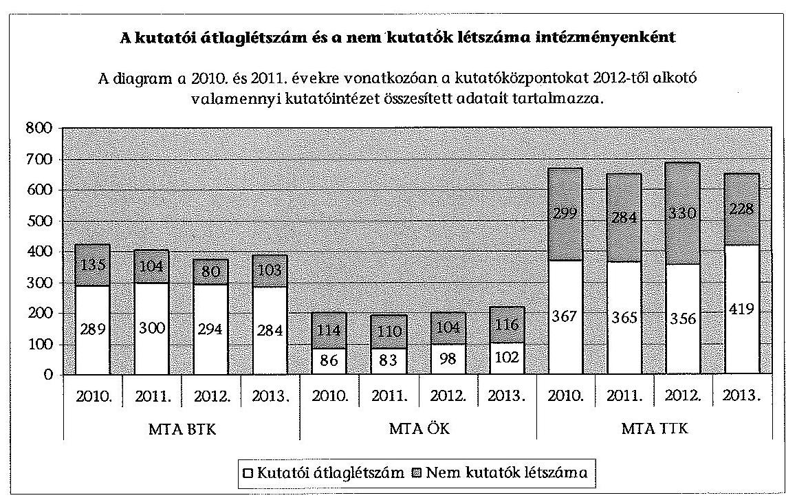
- A kutatói intézményhálózat szétaprózottsága megszüntetésével tervezetten, a rendelkezésre álló források célzott felhasználásával megkezdődött az informatikai rendszerek, a gép-műszerállomány és a létesítmények korszerűsí-

[^0]
[^0]:    ${ }^{12}$ A gazdasági igazgató 2014. június 25-én tett nyilatkozata alapján.

---

tése. Ennek következtében a gép-műszerállomány használhatósági foka 2013-ra a 2010. évhez viszonyítva az ellenőrzött intézmények mindegyikében javult, amelynek mértékét a következő grafikon szemlélteti.
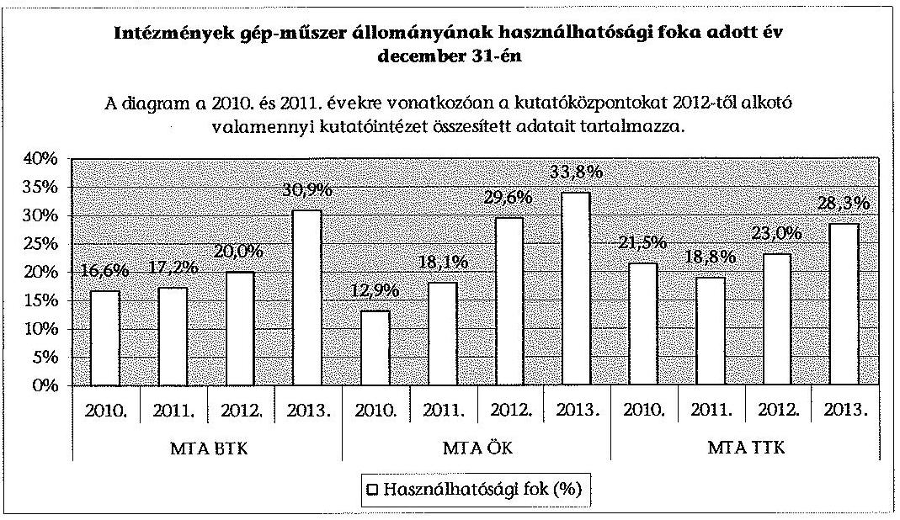

A még használatban lévő, de teljesen leírt gép-műszerállomány az ellenőrzött időszakban csökkent (8. számú melléklet: Az ellenőrzött kutatóközpontok gép-műszerállománya a 2010-2013. években).

- A hatékony és gazdaságos működés, fejlesztés és a versenyképes kutatási célkitűzések realizálásának eszköze volt, hogy a fejezeti források egy részéhez - a 2012. évben 5408,5 M Ft, a 2013. évben 6550,4 M Ft${ }^{13}$ támogatáshoz - az átalakítás célkitűzései megvalósításához kapcsolódó versenypályázatok${ }^{14}$ útján juthattak hozzá a kutatóközpontok. Mindez a szóban forgó támogatások erősen differenciált, a kiválóság elvén alapuló elosztását jelentette, kedvező helyzetbe hozva az innovatív kutatókat, kutatócsoportokat, intézményeket. E pályázati forrásokból az ellenőrzött kutatóintézetek részesedése a következő volt: a 2012. évben az MTA BTK 334,3 M Ft, az MTA ÖK 306,9 M Ft, az MTA TTK 849,8 M Ft; a 2013. évben az MTA BTK 468,7 M Ft, az MTA ÖK 364,4 M Ft, az MTA TTK 869,8 M Ft.

Tekintettel arra, hogy a K+F kutatások átfutási ideje több éves, és az MTA a 2012. évben az átszervezést, a 2013. évben pedig az átszervezés finomhangolását jelölte meg feladatként, az átalakítás tudományos eredményeinek hatása döntően az ellenőrzött időszakot követően jelentkezhet.

[^0]
[^0]:    ${ }^{13}$ A kutatóhálózat megújítására a 2013. évi előirányzati keret terhére a 2012. évben odaítélt támogatással együtt. Forrás: Beszámoló az MTA 2012. évi költségvetéséről és vagyoni helyzetéről 28. oldal, és Beszámoló az MTA 2013. évi költségvetéséről és vagyoni helyzetéről 32. oldal.
    ${ }^{14}$ A 2012. évben Infrastruktúra fejlesztése, Felújítás, Lendület program, Kutatóhálózat megújítása; a 2013. évben - a 2012. évieken túl - EU-s és hazai kutatóintézeti pályázatok kiegészítő támogatása, Mobilitás, konferenciaszervezés és kiváló külföldi kutatók támogatása, Posztdoktori támogatás, Főigazgatói intézkedési terv támogatása.

---

# 2. Az ellenőrzött intézmények feladatellátásának és gazdálkodásának, a belső kontrollok kialakításának szabályszerűsége 

### 2.1. A belső kontrollrendszer kialakításának és működtetésének szabályszerűsége

Az ellenőrzött intézmények (2010-2011. években kutatóintézetek, 2012-2013. években jogutód kutatóközpontok) belső kontrollrendszere kialakítását és működtetését évente összefoglalóan és kontrollterületenkénti bontásban is értékeltük. Az összefoglaló értékelés eredményét a következő táblázat ${ }^{15}$ szemlélteti.

| Megnevezés | MTA RI |  | MTA BTK |  | MTA BLKI |  | MTA ÖK |  | MTA MFA |  | MTA TTK |  |
| :--: | :--: | :--: | :--: | :--: | :--: | :--: | :--: | :--: | :--: | :--: | :--: | :--: |
|  | 2010. | 2011. | 2012. | 2013. | 2010. | 2011. | 2012. | 2013. | 2010. | 2011. | 2012. | 2013. |
| Összegző értékelés | M | M | M | M | R | M | M | M | R | R | R | R |

A kontrollkörnyezet kialakítása és működtetése megfelelőségét a jogszabályi környezetnek megfelelő szabályozottság kialakításának és működtetésének, a szervezeti felépítés megjelenítésének, a kapcsolódó, egyértelmű feladat-, felelősség- és hatásköröket bemutató ellenőrzési nyomvonalnak és a szabálytalanságok kezelésére vonatkozó eljárásrendnek a felülvizsgálata alapján értékeltük.

| Megnevezés | MTA RI |  | MTA BTK |  | MTA BLKI |  | MTA ÖK |  | MTA MFA |  | MTA TTK |  |
| :--: | :--: | :--: | :--: | :--: | :--: | :--: | :--: | :--: | :--: | :--: | :--: | :--: |
|  | 2010. | 2011. | 2012. | 2013. | 2010. | 2011. | 2012. | 2013. | 2010. | 2011. | 2012. | 2013. |
| Kontrollkörnyezet | M | M | M | M | R | M | M | M | R | R | M | M |

A 2010-2011. években a kontrollterület értékelése az MTA RI-nél mindkét évben - kisebb hiányosságokkal - megfelelő, az MTA BLKI-nál a 2010. évben részben megfelelő, a 2011. évben - kisebb hiányosságokkal - megfelelő, az MTA MFA-nál mindkét évben részben megfelelő volt.

Az MTA RI-nél az SZMSZ nem tartalmazta a szervezeti egységek engedélyezett létszámát az Ámr. 20. § (2) bekezdés e) pontjának előírása ellenére. A kötelezettségvállalásra, ellenjegyzésre, szakmai teljesítés igazolására, érvényesítésre és utalványozásra jogosult személyek aláírás-mintájáról az Ámr. 80. § (3) bekezdés előírása ellenére naprakész nyilvántartást nem vezettek. A pénzkezelési szabályzatban nem rögzítették a 30 napon túli előlegek Szja. tv. 72. § (4) bekezdés c) és n) pontja alapján megállapított adó és járulék vonzatának szabályozását. A közbeszerzési szabályzatban nem határozták meg az írásbeli összegzéskészítés és az ajánlattevők részére történő megküldési kötelezettség, valamint az ajánlatok felbontásáról készített jegyzőkönyv elküldésének felelősét (Kbt., 79. §, 80. § 93. § (1)(2) bekezdés, 94. §). Az ellenőrzési nyomvonalat az Ámr. 156. § (2) bekezdés előírása ellenére nem a költségvetési szerv valamennyi működési folyamatára, hanem csak a gazdálkodási folyamatokra készítették el.

[^0]
[^0]:    ${ }^{15}$ A fejezet táblázataiban szereplő betűk jelentése: $\mathrm{M}=$ megfelelő, $\mathrm{R}=$ részben megfelelő, $\mathrm{N}=$ nem megfelelő.

---

Az MTA BLKI esetében a 2010. évben a számviteli politika ${ }_{1}$ nem tartalmazta a jelentős összeg meghatározását, a terven felüli értékcsökkenés elszámolásának szabályait, a beszerzett immateriális javak és tárgyi eszközök üzembe helyezésének szabályait, valamint a befektetett eszközök piaci értéken történő értékelése esetén az eszközök piaci értéke és könyv szerinti értéke közötti különbözet jelentős összegének meghatározását a Számv. tv. 14. § (3)-(4) bekezdései és az Áhsz. 8. § (3) és (5) bekezdései előírásai ellenére. A 2011. évtől hatályos számviteli politika ${ }_{2}$ a jogszabályi előírásoknak megfelelt. Az eszközök és források értékelési szabályzata a 2010-2011. években nem tartalmazta követeléstípusonként a minősítés szempontjait és a dokumentálás rendjét a kis összegű követelések esetében (Áhsz. 8. § (17) bekezdés d) pont). Az Ámr. 161. §-ban előírt szabálytalanságkezelési eljárásrenddel a 2010. évben - az ellenőrzés részére átadott dokumentumok alapján - nem rendelkeztek. A szabályozást a 2011. évben a jogszabályi előírásoknak megfelelően elkészítették. A 2010-2011. években az Ámr. 20. § (3) bekezdés b) pontjának előírásai ellenére nem szabályozták a közbeszerzési értékhatár alatti beszerzések eljárásrendjét. A 2010. évben hatályos ellenőrzési nyomvonallal - az ellenőrzés részére átadott dokumentumok alapján - nem rendelkeztek, a
 2011. évtől hatályos ellenőrzési nyomvonalat nem a költségvetési szerv valamennyi működési folyamatára, hanem csak a gazdálkodási folyamatokra készítették el az Ámr. 156. § (2) bekezdés előírása ellenére.

Az MTA MFA SZMSZ-e az Ámr. 20. § (2) bekezdés e) pontja ellenére - a gazdasági szervezet kivételével - nem tartalmazta a szervezeti egységek engedélyezett létszámát, valamint egy szervezeti egység - az Integrált Mikro/Nanorendszerek Technológiai Platform - tekintetében annak feladatait.

A számlarend aktualizálása az Ámr. 2010. január 1-jei hatályba lépését követően, valamint a számlarenden és a számlatükrön az Áhsz. 9. számú melléklete 2010. január 1-jei változásainak átvezetése nem történt meg az Áhsz. 49. § (6) bekezdés előírása ellenére. A számlarend tartalma nem felelt meg a Számv. tv. 161. § (2) bekezdés c) pontja előírásának, mert nem tartalmazta a főkönyvi számla és az analitikus nyilvántartás kapcsolatát.

A Számv. tv. 14. § (5) bekezdés a) pontjában és az Áhsz. 8. § (4) bekezdés a) pontjában előírt ${ }^{16}$ eszközök és források leltározási és leltárkészítési szabályzatában nem rögzítették a leltározás időszakában történő eszközök mozgatásának eljárásrendjét, bizonylatolását; a leltározás és a könyvviteli nyilvántartások egyeztetésének módját; a leltárak kiértékelésének feladatait, szabályait; a leltározás minden szakaszát felölelő ellenőrzési feladatokat, valamint a záró jegyzőkönyvek elkészítésének határidejét.

Az MTA MFA gazdasági szervezetének ügyrendje nem tartalmazta az Ámr. 235. § (1) és (3) bekezdéseiben szabályozott 5 M Ft egyedi értékhatárt elérő kötelezettségvállalások MÁK-hoz történő bejelentésével kapcsolatos feladatokat. Az Ámr. 20. § (3) bekezdés a) pontja ellenére a szakmai teljesítés igazolás gyakorlásának módjával, eljárási és dokumentációs részletszabályaival, valamint az ezeket végző személyek kijelölésének rendjével kapcsolatos belső előírásokat, feltételeket belső szabályzatban nem rendezték. Az Ámr. 80. § (3) bekezdése ellenére az MTA MFA a kötelezettségvállalásra, ellenjegyzésre, szakmai teljesítés igazolására, érvényesítésre, utalványozásra jogosult személyekről és aláírás-mintájukról nyilvántartást nem vezetett.

[^0]
[^0]:    ${ }^{16}$ figyelemmel az Áhsz. 37. § (5) bekezdésében rögzített kötelezettségre

---

A közbeszerzési szabályzatban a Kbt.. 6. § (1) bekezdés előírása ellenére nem határozták meg a közbeszerzési ajánlatok elbírálására létrehozott bírálóbizottság tagjai kiválasztásának szempontjait, feladatait, döntéshozatali eljárásrendjét, a határozatképesség feltételeit. ${ }^{17}$ Nem rögzítették a közbeszerzési eljárás során az írásbeli összegzéskészítés és az ajánlattevők részére történő megküldési kötelezettség, ${ }^{18}$ és az ajánlatok felbontásáról készített jegyzőkönyv elküldésének felelősét. ${ }^{19}$

A 2010-2011. években az ellenőrzési nyomvonalban az Ámr. 156. § (2) bekezdés előírása ellenére nem az MTA MFA egészére vonatkozóan történt meg a működési folyamatok leírása, a felelősségi és információs szintek és kapcsolatok, az irányítási és ellenőrzési folyamatok meghatározása, hanem kizárólag a gazdálkodással és pályázatokkal kapcsolatos feladatokra.

Az intézmények átalakulását követően a 2012-2013. években a kontrollterület értékelése mindhárom ellenőrzött kutatóközpont (az MTA BTK, az MTA ÖK és az MTA TTK) esetében - kisebb hiányosságokkal - megfelelő volt.

Az MTA BTK-nál a 2012-2013. években hatályos pénzkezelési szabályzat ${ }_{1,2}$-ban nem rögzítették a 30 napon túli előlegek Szja. tv. 72. § (4) bekezdés c) és n) pontja alapján megállapított adó és járulék vonzatának szabályozását. Az MTA BTK a 2012-2013. években nem rendelkezett SZMSZ-e mellékleteként a szellemi vagyonnal való gazdálkodásról, a szellemi tulajdon kezeléséről szóló szabályzattal, az Alapszabály ${ }_{2}$ 55. § (4) bekezdés és 66. § (6) bekezdés előírásai ellenére. ${ }^{20}$ Az ellenőrzési nyomvonalat nem a költségvetési szerv valamennyi működési folyamatára, hanem csak a gazdálkodási folyamatokra készítették el a Bkr. 6. § (3) bekezdés előírása ellenére.

Az MTA ÖK alapító okiratában és SZMSZ-ében nem határozták meg a kutatóközpont vállalkozási tevékenységével összefüggésben a vállalkozási eredmény felosztásának szabályait az Alapszabály ${ }_{2}$ 55. § (5) bekezdés előírása ellenére. A gazdasági szervezet MTA ÖK-ra kialakított, a 2012. január 1-jétől történt szervezeti változásoknak megfelelő ügyrendjét 2013.08.01-i hatállyal adták ki, addig a jogelőd MTA BLKI 2010.12.01-től hatályos ügyrendjét alkalmazták. A 2012-2013. években a kutatóközpont SZMSZ-e mellékleteként nem készítették el szellemi vagyonnal való gazdálkodásról, a szellemi tulajdon kezeléséről szóló szabályzatot az Alapszabály ${ }_{2}$ 55. § (4) bekezdése és 66. § (6) bekezdése előírásai ellenére, a jogelőd MTA BLKI 2005. évben kiadott szabályzatát alkalmazták. Az MTA ÖK-nál a gazdálkodási jogkörök gyakorlóiról a 2012-2013. években vezetett nyilvántartás az Ávr. 60. § (3) bekezdésében és a gazdálkodási szabályzatban előírtak ellenére a teljesítésigazolásra - szabályszerűen megtörtént kijelölés alapján - jogosult személyek nevét és aláírás mintáját nem tartalmazta.

Az MTA TTK alapító okiratában és SZMSZ-ében nem határozták meg a kutatóközpont vállalkozási tevékenységével összefüggésben a vállalkozási eredmény felosztásának szabályait az Alapszabály ${ }_{2}$ 55. § (5) bekezdés előírása ellenére. A kutatóközpont 2012-2013. években hatályos SZMSZ-e a szervezeti ábrán nevesített

[^0]
[^0]:    ${ }^{17}$ Kbt. 18. § (3) bekezdés
    ${ }^{18}$ Kbt. 193. § (1)-(2) bekezdés, 7. §, 94. §
    ${ }^{19}$ Kbt. 179. §, 80. §
    ${ }^{20}$ A szellemi vagyonnal való gazdálkodásról szóló szabályzatot az MTA BTK főigazgatója 2013. szeptember 30-án elfogadta, a szabályzat hatályba lépése azonban 2014. január 1. volt.

---

Tudományos Titkárság, Könyvtár, Pályázati Iroda és Belső ellenőr tekintetében nem tartalmazta a szervezeti egységek engedélyezett létszámát az Ávr. 13. § (1) bekezdés e) pontjában foglalt előírás ellenére. A gazdasági szervezet tagjainak feladat- és hatásköre tekintetében a helyettesítés rendjét - a gazdasági igazgató kivételével - az SZMSZ-ben, ügyrendben, munkaköri leírásban vagy egyéb belső szabályzatban az Ávr. 13. § (5) bekezdés előírása ellenére nem határozták meg.

A 2012-2013. években az MTA TTK számlarendje a Számv. tv. 161. § (2) bekezdés d) pontja ellenére nem tartalmazta a számlarendben foglaltakat alátámasztó bizonylati rendet. A 2013. évben a számlarenden és a számlatükrön az Áhsz. 9. számú melléklete 2013. január 1-jei változásainak átvezetése - az Áhsz. 49. § (6) bekezdése előírása ellenére - nem történt meg. A számviteli politika aktualizálása a jelentős összegű hiba meghatározásának 2013. március 12-ei változását követően a Számv. tv. 14. § (3)-(4), (11) bekezdéseinek, valamint az Áhsz. 8. § (3)-(4), (12) bekezdéseinek előírásai ellenére nem történt meg.

A gazdálkodási jogkörök gyakorlóinak kijelölése a 2012-2013. években megfelelt a jogszabályi előírásoknak, azonban az Ávr. 60. § (3) bekezdése ellenére a 2012. évben az MTA TTK a teljesítés igazolására jogosult személyekről és aláírásmintájukról nyilvántartást nem vezetett.

A 2012-2013. években az MTA TTK nem rendelkezett a Bkr. 6. § (3) bekezdés előírásának megfelelő ellenőrzési nyomvonallal. Az MTA TTK a 2012. évben szellemi tulajdonnal való gazdálkodásról, szellemi tulajdon kezeléséről szóló szabályzattal nem rendelkezett az MTA Alapszabálya ${ }_{2}$ 55. § (4) bekezdésének és 66. § (6) bekezdésének előírásai ellenére. A 2013. évben a szabályzatot elkészítették.

A kockázatkezelési rendszer kialakítását és működtetését e kontrollterület szabályozása, az intézmény kockázatainak dokumentált meghatározása, felmérése és elemzése, a 2010-2011. években az Ámr. 157. §, a 2012-2013. években a Bkr. 7. § előírásai érvényesülése felülvizsgálata alapján értékeltük.

| Megnevezés | MTA RI |  | MTA BTK |  | MTA BLKI |  | MTA ÖK |  | MTA MFA |  | MTA TTK |  |
| :--: | :--: | :--: | :--: | :--: | :--: | :--: | :--: | :--: | :--: | :--: | :--: | :--: |
|  | 2010. | 2011. | 2012. | 2013. | 2010. | 2011. | 2012. | 2013. | 2010. | 2011. | 2012. | 2013. |
| Kockázatkezelési rendszer | M | M | M | M | N | M | M | M | M | M | N | N |

A kontrollterület az ellenőrzött kutatóintézetek közül az MTA RI-nél és az MTA MFA-nál a 2010-2011. években megfelelő volt. Az MTA BLKI-nál a kockázatkezelési rendszer kialakítása és működtetése a 2010. évben nem megfelelő értékelést kapott, mert az Ámr. 157. §-ában előírt kockázatelemzés és kockázatkezelési tevékenység végzését dokumentummal nem igazolták. A 2011. évben a kontrollterület értékelése - a 2011. évtől hatályba léptetett új szabályozás, valamint az intézményi kockázatok dokumentált felmérése és elemzése alapján - megfelelőre javult.

A kontrollterület az ellenőrzött kutatóközpontok közül a 2012-2013. években az MTA BTK-nál és az MTA ÖK-nál megfelelő értékelést kapott. Az MTA TTK a 2012-2013. években a kutatóközpont sajátosságainak megfelelő kockázatkezelési rendszert a Bkr. 7. § előírásai ellenére nem alakította ki és nem működtette, a kockázatkezelés szabályozása nem követte a szervezeti változásokat, továbbá az intézmény tevékenységeivel kapcsolatos kockázatokat nem mérték fel és

---

nem elemezték, ezért a kontrollterület a jogszabályi előírásoknak nem megfelelő volt.

A kontrolltevékenységek megfelelőségét a pénzügyi és vagyongazdálkodási folyamatokhoz kapcsolódó jogosultságok és jogkörök kialakítása és működtetése felülvizsgálata alapján értékeltük.

| Megnevezés | MTA RI |  | MTA BTK |  | MTA BLKI |  | MTA ÖK |  | MTA MFA |  | MTA TTK |  |
| :--: | :--: | :--: | :--: | :--: | :--: | :--: | :--: | :--: | :--: | :--: | :--: | :--: |
|  | 2010. | 2011. | 2012. | 2013. | 2010. | 2011. | 2012. | 2013. | 2010. | 2011. | 2012. | 2013. |
| Kontroll-   tevékenységek | M | M | M | M | M | M | M | M | M | M | R | R |

A kontrolltevékenységek kialakítása és működtetése a 2010-2011. években az ellenőrzött kutatóintézetek (MTA RI, MTA BLKI, MTA MFA) mindegyikénél megfelelő volt. A kontrolltevékenységek kialakítása a pénzügyi és vagyongazdálkodási területeken az Áht. ${ }_{1}$ 121. §-ának és a 121/A. § (4) bekezdésének a FEUVE kialakítására vonatkozó előírásaival, valamint az Ámr. 158. §-ban előírtakkal összhangban történt.

A 2012-2013. években e kontrollterület az ellenőrzött kutatóközpontok közül az MTA BTK és az MTA ÖK esetében a jogszabályi előírásoknak megfelelő volt. A kontrolltevékenység szabályozása, a FEUVE kialakítása, a felelősségi körök meghatározása a Bkr. 8. § (2) és (4) bekezdései előírásaival összhangban történt. A kontrollok működését a bizonylatok ellenőrzése - eseti hiányosságok mellett - visszaigazolta. Az MTA TTK esetében 2012-2013. években a kontrollterület a jogszabályi előírásoknak részben megfelelő volt. Az engedélyezési, jóváhagyási és kontrolleljárások, a dokumentumokhoz és információkhoz való hozzáférés, valamint a beszámolási eljárások - felelősségi körök útján történő meghatározása a belső szabályzatokban, munkaköri leírásokban a Bkr. 8. § (4) bekezdése előírása szerint megtörtént. A 2012. évi kutatóközponttá történő szervezeti átalakulást követően azonban nem alakították ki, nem szabályozták
 - a szervezet sajátosságaihoz igazodóan - azokat a tevékenységeket, amelyek biztosítják a folyamatba épített, előzetes, utólagos és vezetői ellenőrzést (FEUVE), ezzel nem érvényesültek teljes körűen a Bkr. 8. § (2) bekezdésében foglalt előírások.

Az információs és kommunikációs rendszer a 2010-2011. években az ellenőrzött kutatóintézeteknél az Ámr. 159. § (1), a 2012-2013. években az ellenőrzött kutatóközpontokban a Bkr. 9. § (1) bekezdés előírásainak megfelelő volt. A belső szabályzatokban összességében kialakították azokat a rendszereket, amelyek biztosították az információk megfelelő időben az illetékes szervezethez, szervezeti egységhez, személyhez történő eljutását.

| Megnevezés | MTA RI |  | MTA BTK |  | MTA BLKI |  | MTA ÖK |  | MTA MFA |  | MTA TTK |  |
| :--: | :--: | :--: | :--: | :--: | :--: | :--: | :--: | :--: | :--: | :--: | :--: | :--: |
|  | 2010. | 2011. | 2012. | 2013. | 2010. | 2011. | 2012. | 2013. | 2010. | 2011. | 2012. | 2013. |
| Információs és   kommunikációs   rendszer | M | M | M | M | M | M | M | M | M | M | M | M |

A monitoring rendszer kialakítását és működtetését a vezetői információs rendszer és a belső ellenőrzési rendszer kialakítása és működtetése, valamint a külső ellenőrzésekre tett intézkedési tervek nyomon követése, ezek alapján a

---

2010-2011. években az Ámr. 160. §, a 2012-2013. években a Bkr. 10. § érvényesülésének felülvizsgálata alapján értékeltük.

| Megnevezés | MTA RI |  | MTA BTK |  | MTA BLKI |  | MTA ÖK |  | MTA MFA |  | MTA TTK |  |
| :--: | :--: | :--: | :--: | :--: | :--: | :--: | :--: | :--: | :--: | :--: | :--: | :--: |
|  | 2010. | 2011. | 2012. | 2013. | 2010. | 2011. | 2012. | 2013. | 2010. | 2011. | 2012. | 2013. |
| Monitoring rendszer | R | R | M | M | M | R | M | M | R | R | M | M |

Az ellenőrzött kutatóintézetek monitoring rendszere az MTA RI és az MTA MFA esetében a 2010-2011. években részben megfelelő volt, az MTA BLKI a 2010. évben megfelelő értékelést kapott, amely a 2011. évben részben megfelelőre változott.

Az MTA RI-nél a monitoring rendszer hiányossága volt, hogy a Ber. 29. § (1) bekezdésében előírt intézkedési terv készítési kötelezettségnek a 2011. évben három jelentés javaslatai tekintetében nem tettek eleget. A 2010-2011. években elkészült intézkedési tervek Ber. 29. § (2) bekezdésében előírt véleményezését az ellenőrzés vezetője dokumentáltan nem végezte el.

Az MTA BLKI-nál - az ellenőrzés rendelkezésére bocsájtott dokumentumok alapján - a 2011. évben az elvégzett ellenőrzésekről nem vezették a Ber. 32. § (1)(2) bekezdéseiben előírt nyilvántartást.

Az MTA MFA-nál a 2010-2011. években a Ber. 32. § (2) bekezdésében foglalt előírások ellenére a belső ellenőrzési vezető által az elvégzett ellenőrzésekről vezetett nyilvántartás nem tartalmazta az ellenőrzött szerv, illetve szervezeti egységek megnevezését, az ellenőrzések kezdetének és lezárásának időpontját, illetve az ellenőrök nevét.

Az ellenőrzött kutatóközpontok (MTA BTK, MTA ÖK, MTA TTK) monitoring rendszere a 2012-2013. években megfelelő volt. A vezetői információs rendszer és a belső ellenőrzés szervezeti kereteinek a kialakítása és működtetése során a Bkr. 21 előírásait érvényesítették. Az elvégzett belső és külső (felügyeleti) ellenőrzésekről vezetett nyilvántartásokban az ellenőrzések javaslataira készített intézkedési terveket és azok realizálását nyomon követték.

# 2.2. Az intézmények közfeladat ellátásának szabályszerűsége 

Az ellenőrzött intézmények az alapító okirataikban az MTAtv. 18. § (1) bekezdésében foglalt előírásokkal összhangban rögzített közfeladataikat szabályszerűen ellátták.

Az MTA - az Alapszabály 1,2 56. § előírásával összhangban, szabályzataiban, rendelkezéseiben határozta meg az általános tudományos teljesítmény- és gazdálkodási követelményeket. Az egyes intézetek szakterületéből adódó egyedi követelményeket, az intézet közfeladatainak mérhető teljesítménymutatóira vonatkozó alapvető vállalásokat a kutatási koncepciókban, szakmai éves munkatervekben, a főigazgatói kinevezéshez valamint a kutatóintézet-hálózat

[^0]
[^0]:    21 Bkr. 10. §, 15. § (1)-(2) bekezdések, 18-20. §, 25. §, 45. § (3)-(4) bekezdések, 47. §

---

megújításához kapcsolódó támogatásokra irányuló pályázatokban rögzítették.

Az ellenőrzött években az AKT eleget tett az MTAtv. 17. § (7) bekezdése b) és f) pontjaiban, valamint az Alapszabály 1,2 51. § (2)-(3) bekezdésében előírt feladatainak. Évente meghatározta (aktualizálta) a feladatok ellátásának értékelési szempontjait, mutatóit, pontozását, értékelte - esetenként a KTT bevonásával - az intézmények szakmai beszámolóit, tevékenységét, teljesítményét és irányítási rendszerét. Az AKT az éves értékeléseiben határozattal tudomásul vette a közfeladat-ellátásáról készült beszámolókat, amelyeket az MTAtv. 17. § (7) bekezdés g) pontjában foglalt előírásnak megfelelően a Közgyűlés elé terjesztett. Az intézmények tudományos tevékenységéről készült beszámolókat - az éves gazdálkodásukról készült beszámolóval egyidejűleg - a Közgyűlés megtárgyalta és jóváhagyta. Az MTA közzé tette honlapján a kutatóhelyek éves tudományos eredményeiről a szakmai beszámolók alapján készített tájékoztatót.

# A tudományos munkakört betöltő közalkalmazottakra vonatkozó követelményeket, a szükséges feltételeket az ellenőrzött szervezetek belső szabályzatokban meghatározták és értékelték azok teljesülését. 

Az MTA RI a 2010-2011. években a minden közalkalmazottjára vonatkozó követelményrendszeren túl a tudományos munkakörök betöltéséhez szükséges feltételeket a belső habilitációs szabályzatában írta elő. Az MTA BTK-nál a szervezeti átalakulást követően a 2012-2013. években a tudományos követelményrendszert az integrálódott intézetek korábbi szabályozásai alapján működtették. Az MTA BTK tudományos munkakörben foglalkoztatottakra vonatkozó követelmény és előmeneteli rendszerét (minősítési szabályzat) 2013. szeptember 30-án fogadták el. 22 Az MTA RI és az MTA BTK éves beszámolók keretében számoltatta be a tudományos munkatársakat éves tevékenységükről és a következő évekre vonatkozó terveikről, melyről az MTA részére éves beszámolót készítettek.

Az MTA BLKI-nál és az MTA ÖK-nál meghatározták és a minősítés során vizsgálták a tudományos munkakört betöltő közalkalmazottak kutatói követelményeit és azok betartását. A tudományos minősítési szabályzatban rögzítették a tudományos munkakörben foglalkoztatottaktól elvárt teljesítmény-mutatókat. A szabályzat meghatározta a teljesítmény indikátorokon és követelményeken kívül a Kjt. 40. §-a szerinti közalkalmazotti minősítés végrehajtásának módját. A kutatók évente elkészítették éves szakmai terveiket és az előírt szakmai beszámolóikat, amelyeket a tárgyévet követő év februárjában megtartott éves szakmai értékelő értekezlet során elfogadhatott, vagy nem megfelelőnek minősíthetett a munkáltató.

Az MTA MFA az SZMSZ-ében, valamint a főmunkatársi kinevezések szabályzatában határozta meg a minősítés tudományos feltételeit (önálló tudományos eredmények és tudományos arculat, legalább hatéves kutatói vagy oktatói gyakorlat, rendszeres publikálás), a minősítés során figyelembe vehető további szempontokat (pl.: szakmai előadások, díjak, elnyert pályázatok). Az MTA TTK az SZMSZ-ében rögzítette a tudományos munkakörben foglalkoztatottak minősítésének keretszabályait. A 2012-2013. években az MTA TTK-nál a tudományos

[^0]
[^0]:    22 Hatályos: 2014. január 1-től

---

munkakörben foglalkoztatottak minősítésére a beolvadt intézetek korábbi szabályozásai alapján vizsgálták a kutatói követelmények betartását. A Kjt. 79/D. § (4) bekezdésében foglaltaknak megfelelően magasabb fizetési fokozatba sorolás előtt értékelték a közalkalmazott oktatói, kutatói követelménynek való megfelelését.

A kutatóintézetek, kutatóközpontok szakmai beszámolói és azok értékelése alapján az előírt és a ténylegesen ellátott feladatok összhangja a 2010-2013. években biztosított volt valamennyi ellenőrzött szervezet esetében.

# 2.3. A kutatóhálózat intézményei pénzügyi gazdálkodásának szabályszerűsége 

A kiadási előirányzatok felhasználása során a jogszabályok és a belső szabályzatok előírásait a pénzgazdálkodással kapcsolatos gazdálkodási jogkörökhöz előírt belső kontrollok tekintetében az ellenőrzött intézmények eltérő mértékben érvényesítették.

## MTA RI és MTA BTK

A 2010-2011. években az MTA RI-nél a kiadási előirányzatok felhasználása során a pénzgazdálkodással kapcsolatos gazdálkodási jogkörökhöz előírt belső kontrollok nem működtek megfelelően, mert a szakmai teljesítésigazolás és az utalvány ellenjegyzés jogköröket gyakorlók nem rendelkeztek szabályszerű kijelöléssel. 23

Az MTA BTK-nál a 2012. és a 2013. években a kiadási előirányzatok felhasználása során a pénzgazdálkodással kapcsolatos gazdálkodási jogkörökhöz előírt belső kontrollok működtetése megfelelt a jogszabályok és a belső szabályzatok előírásainak.

Az MTA BTK-nál és a jogelőd MTA RI-nél az ellenőrzött időszakban a külső személyi juttatások, megbízási díjak kifizetéséhez - egy kivétellel - rendelkezésre álltak a megbízási szerződések, azokat a 2010-2011. években a kötelezettségvállalás ellenjegyzője, a 2012. évben a pénzügyi ellenjegyző ellenjegyezte. A külső személyi juttatásokra szóló megbízási szerződéseket a tárgyévi előirányzatok terhére kötötték, a szerződések mérhető feladatra szóltak, saját dolgozóval csak a munkaköri feladatai között nem szereplő feladatra kötöttek megbízást, a kifizetéseket a 2012-2013. években szabályszerű teljesítésigazolással támasztották alá. A rendszeres személyi juttatások kifizetéséhez a kötelezettségvállalási dokumentumok rendelkezésre álltak, azonban a 2010-2011. években ezekről hiányzott a kötelezettségvállalás ellenjegyzése az Ámr. 74. § (1) bekezdésben előírtak ellenére. A juttatások kifizetéséhez az intézmény rendelkezett a szükséges előirányzattal.

A Kbt. 1,2 hatálya alá tartozó dologi és felhalmozási kifizetéseknél lefolytatták a szükséges közbeszerzési eljárást. A felhalmozási kiadások ellenőrzött tételeinél megtörtént a beruházások, felújítások üzembe helyezése, a bekerülési érték meghatározása, állományba vétele, értékcsökkenésének megállapítása, elszámolása.

[^0]
[^0]:    23 Ámr. 74. § (2) bekezdés a) és Ámr. 76. § (5) bekezdés

---

Az ellenőrzött pénzeszközátadások között a 2010. évben egy pályázati támogatásmaradvány visszafizetése, a 2011. évben a szervezeti átalakulás miatti év végi pénzeszközátadás (előirányzat-felhasználási keretszámla év végi egyenleg maradványa), a 2012-2013. években elszámolatlan támogatási előleg maradvány visszafizetés, illetve projekt maradványok elszámolása szerepelt, amelyeket a jogszabályi előírásoknak megfelelően számoltak el.

# MTA BLKI és MTA ÖK 

Az MTA BLKI-nél a 2010. évben a kiadási előirányzatok felhasználása során a pénzgazdálkodással kapcsolatos gazdálkodási jogkörökhöz előírt belső kontrollok nem működtek megfelelően, mert a személyi jellegű kiadások szakmai teljesítésigazolásának és utalvány ellenjegyzésének elvégzését igazoló dokumentumok nem álltak rendelkezésre, továbbá:

- a szakmai teljesítésigazoló a dologi kiadásoknál nem, vagy írásbeli kijelölési dokumentum hiányában jogosulatlanul látta el az Ámr. 76. § (1) bekezdésben foglalt feladatát, a kiadások teljesítésének jogossága, összegszerűsége, valamint az ellenszolgáltatás teljesítése ellenőrzését, igazolását, továbbá egy felhalmozási kiadás esetében a szakmai teljesítésigazolás dátuma a tényleges teljesítést - az Ámr. 76. § (1) bekezdés szerinti, a teljesítést igazoló számla rendelkezésre állását - megelőző volt;
- az utalvány ellenjegyzője nem az Ámr. 79. § (1)-(3) bekezdésében előírtak szerint végezte el ellenőrzési feladatát, mert a dologi kiadások ellenjegyzése során egy esetben nem észrevételezte, hogy az Ámr. 74. § (1) bekezdésben előírtak ellenére ellenjegyzés nélkül vállaltak kötelezettséget, a felhalmozási kiadások ellenjegyzését annak ellenére elvégezte, hogy esetenként az előzetes írásbeli kötelezettségvállaló nem az arra jogosult volt, illetve az Ámr. 74. § (1) bekezdés ellenére ellenjegyzés nélkül, továbbá előzetes
 írásbeli kötelezettségvállalási dokumentum nélkül vállaltak kötelezettséget. Nem jelezte továbbá, hogy a dologi és a felhalmozási kiadások utalványairól az Ámr. 78. § (2) bekezdés g) pontjaiban előírtak ellenére esetenként hiányzott a kötelezettségvállalás nyilvántartási száma.

Az MTA BLKI-nél a 2011. évben a kiadási előirányzatok felhasználása során a pénzgazdálkodással kapcsolatos gazdálkodási jogkörökhöz előírt belső kontrollok működtetése nem volt teljes körűen szabályszerű, mert:

- a szakmai teljesítésigazoló a dologi kiadásoknál egy-egy esetben nem, vagy írásbeli kijelölési dokumentum hiányában jogosulatlanul látta el az Ámr. 76. § (1) bekezdésben foglalt feladatát, a kiadások teljesítésének jogossága, összegszerűsége, valamint az ellenszolgáltatás teljesítése ellenőrzését, igazolását;
- az utalvány ellenjegyzője nem az Ámr. 79. § (1)-(3) bekezdésében előírtak szerint végezte el ellenőrzési feladatát, mert a dologi kiadások ellenjegyzése során egy esetben nem észrevételezte, hogy az Ámr. 76. § (1) bekezdésben előírtak ellenére a szakmai teljesítésigazolás nem történt meg, továbbá a felhalmozási kiadások ellenjegyzését annak ellenére elvégezte, hogy esetenként az előzetes írásbeli kötelezettségvállaló nem az arra jogosult volt.

---

Ez kockázatot jelez az ellenőrzött terület egészének szabályszerű működése szempontjából.

Az MTA ÖK-nál a 2012-2013. években a kiadási előirányzatok felhasználása során a pénzgazdálkodással kapcsolatos gazdálkodási jogkörökhöz előírt belső kontrollokat megfelelően működtették.

A rendszeres és nem rendszeres személyi juttatásoknál, külső személyi juttatásoknál a kötelezettségvállalás dokumentumai rendelkezésre álltak, az MTA ÖK-nál és jogelőd intézeténél rendelkeztek a kifizetésekhez szükséges előirányzattal, a juttatások elszámolása és számfejtése a jogszabályoknak és a belső szabályzatoknak megfelelően történt. A Kbt. hatálya alá tartozó dologi és felhalmozási kifizetéseknél lefolytatták a szükséges közbeszerzési eljárást. A felhalmozási kiadások ellenőrzött tételeinél megtörtént a beruházások, felújítások üzembe helyezése, a bekerülési érték meghatározása, állományba vétele, értékcsökkenésének megállapítása, elszámolása. Az ellenőrzött pénzeszközátadások között a 2011-2012 években egy-egy pályázati támogatásmaradvány visszafizetése szerepelt, amelyeket a jogszabályi előírásoknak megfelelően számoltak el.

# MTA MFA és MTA TTK 

Az MTA MFA-nál a 2010-2011. évi kiadási előirányzatok felhasználása során a pénzgazdálkodással kapcsolatos gazdálkodási jogkörökhöz előírt belső kontrollok nem működtek megfelelően, mert a szakmai teljesítésigazolás és az utalvány ellenjegyzés jogköröket ellátók nem rendelkeztek szabályszerű kijelöléssel. ${ }^{24}$

Az MTA TTK-nál a 2012. évben a kiadási előirányzatok felhasználása során a pénzgazdálkodással kapcsolatos gazdálkodási jogkörökhöz előírt belső kontrollokat nem megfelelően működtették, mert:

- a dologi, személyi jellegű és felhalmozási kiadásoknál, valamint a működési célú pénzeszközátadásnál a teljesítésigazoló nem, vagy kijelölés hiányában nem jogszerűen látta el az Ávr. 57. § (1) bekezdésben foglalt feladatát, a kiadások teljesítésének jogossága, összegszerűsége, valamint az ellenszolgáltatás teljesítése ellenőrzését, igazolását;
- az érvényesítő nem az Ávr. 58. § (1)-(2) bekezdésében előírtak szerint végezte el ellenőrzési és jelzési feladatát, a megelőző ügymenetben a gazdálkodási szabályok - ennek keretében az Ávr. előírásai - betartásának ellenőrzését. Nem jelezte, hogy egy felhalmozási kötelezettségvállalásra az Áht2 37. § (1) bekezdésben előírtak ellenére ellenjegyzés nélkül került sor, továbbá három dologi kiadás kötelezettségvállalási dokumentumáról hiányzott a kötelezettségvállaló aláírása. A dologi és felhalmozási kiadásoknál az érvényesítés dátumának megjelölése hiányában az érvényesítés nem az Ávr. 58. § (3) bekezdésében előírt módon történt.

Az MTA TTK-nál a 2013. évben a kiadási előirányzatok felhasználása során a pénzgazdálkodással kapcsolatos gazdálkodási jogkörökhöz előírt belső kontrollok működtetése nem volt teljes körűen szabályszerű, mivel

[^0]
[^0]:    ${ }^{24}$ Ámr. 74. § (2) bekezdés a) pont és Ámr. 76. § (5) bekezdés

---

kettő dologi kiadás esetében a teljesítésigazolást az Ávr. 57. § (4) bekezdésben előírtak ellenére kijelöléssel nem rendelkező személy végezte. Ez kockázatot jelez az ellenőrzött terület egészének szabályos működése szempontjából.

Az ellenőrzött rendszeres személyi juttatások kifizetéseit megfelelő dokumentumok támasztották alá. A külső személyi juttatások szerződéseiben a feladat meghatározása egyértelmű volt és nem érintett alapfeladatokat. A szerződést a kötelezettségvállalásra jogosult írta alá. A teljesítés tárgyiasult eredménye rendelkezésre állt. A számfejtés a szerződésben meghatározott megbízási díjnak megfelelően történt, a járulékok levonása megfelelt a jogszabályi előírásoknak. Az ellenőrzött dologi és felhalmozási kiadások tételeinél a Kbt. ${ }_{1,2}$ hatálya alá tartozó kifizetéseknél lefolytatták a közbeszerzési eljárást, a beruházások, beszerzések állományba vétele megtörtént. Az Áht. ${ }_{1}$ 13/A. § (2) bekezdése, az Ámr. 125. § (1)-(2) bekezdései és az Ávr. 80. § (1) bekezdése ellenére az ellenőrzött pénzeszközátadások közül egy esetben a 2010. évben az MTA MFA-nál és a 2012. évben az MTA TTK-nál nem történt meg az előírt elszámolás. Továbbá a 2011. évben az MTA MFA-nál nem írtak elő elszámolási kötelezettséget.

A 2010-2013. években az ellenőrzött intézmények a 2010-2013. évi Kvtv.-k az Áht. ${ }_{1,2}$ és az MTAtv. előírásai alapján teljesítették a kiemelt költségvetési előirányzatokat. A 2010-2013. években az ellenőrzött intézmények szakmai feladatellátásában nem kellett feladatokat elhagyni előirányzat hiánya miatt. (3. számú melléklet: Az ellenőrzött kutatóközpontok kiadási, bevételi előirányzatainak alakulása és teljesítése a 2010-2013. években)

Az 2010-2013. években az ellenőrzött kutatóintézetek és kutatóközpontok az eredeti előirányzatok módosítása során betartották az Ámr., az Ávr., és az MTAtv. előírásait. A többletbevételek terhére történő kiemelt előirányzat módosításokra az irányító szerv felhatalmazásával és jóváhagyásával került sor. Az előirányzatok változásáról vezetett analitikus nyilvántartások alátámasztották az ellenőrzött intézmények éves intézményi beszámolói „23. Költségvetési előirányzatok egyeztetése" űrlapjában szerepeltetett adatokat.

Az ellenőrzött időszakban előirányzat-zárolások, valamint kiadási előirányzatok felhasználását időlegesen, vagy véglegesen korlátozó intézkedések - az 1025/2011. (II. 11.) Korm. határozatban foglaltakra figyelemmel az MTA elnökének döntése alapján a kutatóintézeti-hálózatot érintően egységesen 2011. szeptember 1-jétől elrendelt 5%-os létszám leépítés személyi juttatási előirányzatának és annak járulékainak elvonásán felül - az ellenőrzött intézmények gazdálkodását nem érintették.

Az ellenőrzött időszakban a vizsgált intézmények likviditása, fizetőképessége biztosított volt, lejárt szállítói kötelezettsége - tendenciájában csökkenő összegben és 30 napot nem meghaladó mértékben - az MTA RI-nek és az MTA BTK-nak volt. Az intézmények pénzügyi stabilitása a likviditási mutatók ${ }^{25}$ alapján évente változó képet mutatott, amely az előfinanszírozásos, utólagos elszámolással elnyert pályázati támogatásokkal, az MTA TTK esetében a Q2

[^0]
[^0]:    ${ }^{25}$ Likviditási mutató: Forgóeszközök összesen/Rövid lejáratú kötelezettségek összesen; Pénzeszköz likviditási mutató: Pénzeszközök összesen/Rövid lejáratú kötelezettségek összesen (statikus mutatók a beszámolók mérleg adatai alapján).

---

beruházással kapcsolatos kifizetésekkel volt összefüggésben. (4. számú melléklet: Az ellenőrzött kutatóközpontok szállítói kötelezettségeinek lejárat szerinti alakulása a 2010-2013. években)

Az MTA RI-nek a 2010-2011. évi pénzügyi helyzete - rövid távú fizetőképességét jellemző likviditási mutatói alapján - stabil volt. Forgóeszközei, illetve pénzeszközei a 2010. év végén jelentősen, a 2011. év végén meghaladták a rövid lejáratú kötelezettségeinek értékét. Az MTA BTK-nál a 2012. évben a forgóeszközök nem nyújtottak fedezetet a rövid lejáratú kötelezettségekre (a likviditási mutató 0,5 volt), amely a jelentős számban és összegben elnyert pályázati támogatások előfinanszírozásával volt összefüggésben. Az MTA BTK-nál a pénzügyi helyzet a 2013. évben stabilizálódott, forgóeszközei és pénzeszközei fedezték a rövid lejáratú kötelezettségeket.

Az MTA BLKI likviditási mutatója a 2010. évben 3,0, a 2011. évben 0,9, a pénzeszköz likviditási mutatója a 2010. évben 2,9, a 2011. évben 0,8 volt. Az MTA ÖK-nál a 2012. évben a forgóeszközök illetve a pénzeszközök fedezetet nyújtottak a rövid lejáratú kötelezettségekre (a likviditási mutató 1,2 a pénzeszköz likviditási mutató 1,1 volt). Az MTA ÖK likviditása a 2013. évben csökkent, a likviditási mutató 0,4 volt, amely azonban nem befolyásolta a fizetőképességet, a szállítói számlák határidőben történő kiegyenlítését.

Az MTA MFA-nál 2010-ben a pályázati pénzek kintlévőségéből eredő likviditási feszültség kezelése 20,9 M Ft előirányzat keret előrehozást tett szükségessé. A likviditási mutató 2010-ben 0,7, 2012-ben 0,6, a pénzeszköz likviditási mutató 2010-ben 0,3, 2011-ben 0,4 volt. Az MTA TTK forgóeszközei egyik évben sem fedezték a rövid lejáratú kötelezettségeket, e mellett a likviditási mutatók romló pénzügyi stabilitást mutattak elsődlegesen a Q2 beruházással összefüggő kifizetések miatt. A likviditási mutató 2012-ben 0,9, 2013-ban 0,2 volt.

A 2010-2013. években az előirányzat-maradvány összegét az ellenőrzött intézmények a jogszabályok ${ }^{26}$ előírásainak megfelelően állapították meg, az előirányzatok teljes összege minden intézménynél kötelezettségvállalással terhelt, szerződésekkel, megrendelésekkel és kinevezésekkel alátámasztott volt. A kötelezettségvállalási dokumentumok a jogszabályoknak és a belső szabályzatoknak megfelelően készültek el. Az ellenőrzött időszakban meghiúsult kötelezettségvállalásból adódó visszafizetési kötelezettség nem keletkezett, illetve a költségvetési szervet meg nem illető maradvány nem képződött az ellenőrzött szervezeteknél.

# 2.4. Az intézmények vagyongazdálkodása előírásoknak való megfelelősége 

Az ellenőrzött időszakban az immateriális javak és tárgyi eszközök beszerzése során az ellenőrzött kutatóintézetek, kutatóközpontok - a mintatételek ellenőrzésének tapasztalatai alapján - a Kbt. ${ }_{1,2}$ előírásait betartották.

[^0]
[^0]:    ${ }^{26}$ Áht. ${ }_{1,2}$, az MTAtv., az Ámr., az Ávr. és az Áhsz.

---

A beszerzett, létesített eszközök bekerülési értékének megállapítása, állományba vétele - kisebb 2011. évi dokumentációs és besorolási hiányosságok kivételével - az ellenőrzött időszakban szabályszerű ${ }^{27}$ volt.

Az MTA-RI 2011. évi felhalmozási kiadásainak egy ellenőrzött ( $0,5 \mathrm{M} \mathrm{Ft}$ ) tétele esetében a kisértékű tárgyi eszközként történt elszámolás nem felelt meg a Számv. tv. 51. § (1) bekezdésében foglalt előírásnak, amelynek következtében a mérleg befektetett eszközök értékelésénél nem érvényesültek teljes körűen a Számv. tv 15. § (3) bekezdésében és az MTA RI számviteli politikájának 9. pontjában foglalt értékelési előírások. Az MTA MFA 2011. évi felhalmozási kiadásainak két tétele ( $10,1 \mathrm{M} \mathrm{Ft}$ ) esetében nem készítették el az MTA-MFA számviteli politikája 2.1 pontjában előírt „Állománybavételi és Üzembehelyezési bizonylat"-ot.

Az eszközök év végi értékelését az ellenőrzött szervezetek az Áhsz., valamint a belső szabályzatokban ${ }^{28}$ foglalt előírásokkal összhangban végezték. Az eszközök értékcsökkenés elszámolása az ellenőrzött egyedi tárgyieszköz-nyilvántartó kartonok adatai alapján - az MTA-RI 2011. évi egy mintatétele kivételével - az Áhsz. 30. § (2) bekezdésében előírt leírási kulcsok alkalmazásával szabályosan történt.

Az ellenőrzött időszakban érvényesült a valódiság és a folytonosság elve. A felhalmozási kiadásokból beszerzett eszközök a tárgyévi mérleget alátámasztó leltárakban megtalálhatóak voltak. Az ellenőrzött kutatóintézetek, kutatóközpontok az év végi mérlegtételek leltárral való alátámasztása követelménynek, az Áhsz. 37. §-ában és a belső szabályzataikban előírt év végi leltározási és leltárkészítési előírásoknak az ellenőrzött időszakban - az MTA BLKI és MTA ÖK kivételével - nem teljes körűen tettek eleget.

Az MTA-RI 2010-2011. évi mérleg alátámasztó leltárainak dokumentumai - a leltárak kiértékelésének, az eltérések kimutatásának, a zárótételek könyvelésének leltárdokumentumai tekintetében - hiányosak voltak, nem tettek eleget az MTA RI Leltárkészítési és leltározási szabályzata 3.6.2. pontjában foglalt dokumentálási és a 9. pontjában foglalt 10 éves bizonylat megőrzési kötelezettségnek. Az MTA BTK-nál a 2012-2013. években leltározási utasítás és ütemterv alapján teljes körűen mennyiségi felvétellel leltározták az eszközöket, azonban a 2012. évben nem készült leltárkiértékelési záró jegyzőkönyv, ezzel nem tettek eleget az MTA BTK Leltározási Szabályzata IX. fejezetében előírtaknak.

Az
 MTA BLKI-nál és az MTA ÖK-nál az ellenőrzött időszakban a mennyiségi felvétellel és egyeztetéssel végzett leltározás és leltárkészítés megfelelt az Áhsz. 37. §-ában és a Leltározási és leltárkészítési szabályzat ${ }_{1,2}$ előírásainak. A leltárak kiértékelése alapján eltérés nem volt.

Az MTA MFA és az MTA TTK a könyvviteli mérlegeit az ellenőrzött időszakban - a 2012. év kivételével - az Áhsz. 37. §-ában és a Leltározási szabályzatban foglaltaknak megfelelően végrehajtott leltározással és leltárral támasztotta alá. Az MTA TTK a 2012. évben a befektetett eszközök, a saját tőke mérlegtételek

[^0]
[^0]:    ${ }^{27}$ a Számv. tv. 47. § (1)-(8) bekezdéseiben, a 48. § (1)-(6) és (8) bekezdéseiben, valamint az Áhsz. 17-18. §-aiban foglalt előírásoknak megfelelő
    ${ }^{28}$ Áhsz. 17.-18., 27.-30. § és a 33.-36. §-ai, Eszközök és források értékelési szabályzata, Számviteli Politika

---

Áhsz. 37. § (3) bekezdésében előírt egyeztetéssel végrehajtott leltározásának a dokumentumai hiányában nem tett eleget teljes körűen a Számv. tv. 69. § (1) bekezdésében és az Áhsz. 37. § (1)-(3) bekezdéseiben foglaltaknak. Az MTA TTK a 2012-2013. években a leltározás előkészítése során a Leltározási szabályzat 3.1 pontja előírása ellenére leltározási utasítást nem készített. A leltározási ütemtervet késedelmesen - az MTA TTK leltározási szabályzatában meghatározott, a leltározás megkezdése előtt 60 napon túl - adták ki, továbbá az ütemterv tartalmilag és formailag nem felelt meg az MTA TTK Leltározási szabályzata 2. számú mellékletében foglaltaknak.

A selejtezéseket az indokolt esetekben az ellenőrzött intézmények - az év végi leltározást megelőzően - szabályszerűen végezték el.

A kutatóintézetek és kutatóközpontok az ellenőrzött években a rendelkezésre álló források (elsősorban pályázatok, illetve az irányító szerv által év közben biztosított pótelőirányzatok, előfinanszírozások) mértékéig gondoskodtak a kutatási infrastruktúra tervszerű fejlesztéséről és állagmegóvásáról, azt szabályszerűen végezték (5. számú melléklet: Az ellenőrzött kutatóközpontok mérlegeinek alakulása a 2010-2013. években). A gép-műszerállomány megújulását jól mutatja, hogy a használhatósági fok a 2010. évi kritikusan alacsony 12,9-21,5 % közötti értékről a 2013. évre 28,3-33,8 % közötti szintre emelkedett.

Az MTA BTK és jogelődei tekintetében a vagyon 2010. évről 2013. évre történő mintegy felére csökkenését az MTA-n belüli ingatlan kezelés 2012. évi átrendezése, az MTA LGK részére átadott ingatlanok és ingatlanokhoz kapcsolódó vagyoni értékű jogok ${ }^{29}$ nyilvántartásokban történő megjelenítése eredményezte. Az MTA ÖK valamint az MTA TTK és jogelődei tekintetében a 2010-2013. évek viszonylatában bekövetkezett közel kétszeres vagyonnövekedést elsődlegesen az időszakban megvalósult beruházások eredményezték. Ezek közül kiemelt (9500 M Ft) nagyságrendű az MTA TTK - az Eötvös Loránd Tudományegyetem és a Budapesti Műszaki és Gazdaságtudományi Egyetem lágymányosi campusa közelében felépült - új épületegyüttese (Q2 program), amely a 2009. évben indult, az átadásra 2013. év őszén került sor.

Az ellenőrzött kutatóintézetek, kutatóközpontok - az MTA BLKI és az MTA ÖK kivételével - rendelkeztek gazdasági társaságokban részesedéssel, a tulajdonosi jogokat a taggyülések útján, az MTA TTK kivételével szabályszerűen, az MTA Vagyongazdálkodási és Vagyonhasznosítási Szabályzata ${ }_{1,2}$ előírásainak megfelelően gyakorolták. (6. számú melléklet: Az ellenőrzött kutatóközpontok gazdasági társaságokban szerzett részesedései változása a 2010-2013. években; 7. számú melléklet: Az ellenőrzött kutatóközpontok tulajdonosi joggyakorlása alá tartozó gazdálkodó szervezetek részére nyújtott kifizetések a 2010-2013. években)

Az MTA RI és az MTA BTK az ellenőrzött időszakban az Archeosztráda Kft.-ben rendelkezett részesedéssel. Az MTA 2013. márciusában a társaság veszteséges gazdálkodása miatt - a negatív saját tőke rendezése érdekében - a társaság jegyzett tőkéjét a tagi kölcsön terhére 11,1 M Ft-ra emelte. A tranzakció hatására az

[^0]
[^0]:    ${ }^{29}$ A 2012. évben a Budapest I. kerület, Országház és Úri utcákban lévő „várépület együttes" kezelési joga átkerült az MTA LGK hatáskörébe.

---

MTA BTK tulajdoni hányada 74,0%-ról 20,0%-ra csökkent. Az ellenőrzött időszakban az MTA RI és az MTA BTK az Archeosztráda Kft.-ben való részesedését az Áhsz. 19. § (1)-(3) bekezdéseiben előírtak szerint szerepeltette az éves beszámolóiban, valamint a kiegészítő mellékletekben. Az MTA BTK a 2013. évi elemi költségvetési beszámolójában a részesedés értékelése alapján 2,2 M Ft értékvesztést számolt el a Számv. tv. 54. §-a és az Áhsz. 31. §-a előírásainak figyelembe vételével, melynek következtében a 2013. évi mérlegében ez a részesedés értékkel nem szerepelt. Az MTA RI 2010-2011. években 155,5 M Ft-ot, az MTA BTK a 2012-2013. években 46,0 M Ft szolgáltatási díjat fizetett ki szerződés alapján az Archeosztráda Kft.-nek. ${ }^{30}$ Az Archeosztráda Kft. a 2011. évtől veszteségesen végezte a tevékenységét, ezért a taggyűlés ${ }^{31}$ a társaság jogutód nélküli megszűnéséről döntött 2013. június 1-jei kezdő időponttal.

Az MTA MFA 2010. január 1. és 2011. december 31. között három gazdasági társaságban rendelkezett részesedéssel. Az MTA MFA a részesedések mérlegértékét leltárral alátámasztotta, mindkét érintett évben az év végi szöveges beszámoló tartalmazott a társaságok tevékenységének értékeléséről szóló tájékoztatót. Az MTA MFA 2010-2011. évi mérlegében az Áhsz. 19. § (1) bekezdésében foglalt hosszú lejáratú, illetve a 22. § (1) bekezdés c) pontjának rövid lejáratú kölcsönökre vonatkozó előírásaival szemben a függő kiadásai között mutatták ki a TactoLogic Műszaki Kutató Fejlesztő Kft. részére 2009. évben 5,5 M Ft nyújtott tagi kölcsönt.

Az MTA TTK 2012. január 1. és 2013. december 31. között hat gazdasági társaságban rendelkezett részesedéssel és gyakorolt tulajdonosi jogot. Az MTA felülvizsgálata ${ }^{32}$ eredményeként a Nanochem Kft. és a Cellpharma Kft. tulajdonosi képviseletét az MTA TTK-tól megvonta. ${ }^{33}$

Az MTA TTK a 2012. évi mérlegében szereplő részesedések értékét az Áhsz 37. § (1) bekezdése ellenére leltárral nem támasztotta alá. A 2013. évben a befektetett eszközöket, azon belül a részesedéseket tételes leltárral alátámasztották, a szöveges beszámolóban a 2013. december 31-ei állapotnak megfelelően a társaságok adatait megfelelően szerepeltették.

Az MTA MFA és az MTA TTK a tulajdonosi jogokat a felügyelő bizottságokon keresztül és a taggyűléseken gyakorolták. A TactoLogic Műszaki Kutató-fejlesztő Kft.-nél a saját tőke összege a 2010-2013. években negatív volt. ${ }^{34}$ A társaság annak ellenére, hogy a társasági formájára kötelezően előírt jegyzett tőkének megfelelő összegű saját tőkével két egymás követő évben nem rendelkezett - nem kezdeményezte a Gt. tv. 51. § (1) bekezdésében meghatározott előírások alapján a második üzleti év beszámolójának elfogadásától számított három hónapon belül a szükséges intézkedéseket (saját tőke biztosítása). ${ }^{35}$ A tulajdonosok a 2013. évi beszámoló elfogadásával egy időben határozattal ${ }^{36}$ a jogutód nélküli megszüntetésről döntöttek. A 2010-2013. években a tulajdonosi joggyakorlással összefüggésben a szerződés alapján (működési és felhalmozási célú) pénzeszközátadás, szerződésre vagy egyedi megrendelésre tekintettel teljesített kifizetés, tőkeemelés, veszteség fedezetére pótbefizetés, alapítási, tőkeemelési céllal vagyonátadás nem volt.

Az ellenőrzött intézmények használatába adott vagyonra vonatkozó, az MTA-val 2010-2013. években megkötött ingó és ingatlan vagyonhasználati szerződésekben rögzített jogok és kötelezettségek a kutatási feladatokat és a tulajdonosi érdekeket egyaránt szolgálták. A szerződések tartalmi és formai elemei megfeleltek az MTA Alapszabálya ${ }_{1,2}$ 66. § (7)-(8) bekezdéseiben és az MTA Vagyongazdálkodási és Vagyonhasznosítási Szabályzatában ${ }_{1,2}$ foglaltaknak. Ugyanakkor az egyes vagyonhasználati szerződések megkötésének időbeli késedelme, illetve aktualizálásának elmaradása miatt az ellenőrzöttek nem tartották be az MTA Vagyongazdálkodási és Vagyonhasznosítási Szabályzatában ${ }_{1,2}$ foglaltakat.

Az MTA RI az MTA-val késedelmesen, 2011. május 19-ei keltezéssel kötötte meg az Ingó vagyon Használati szerződést, ${ }^{37}$ amelynek melléklete a 2009. december 31-ei eszköz állapotok alapján tartalmazta a használatba adott 50 M Ft feletti értékű eszközöket és összevontan (tételes lista nélkül) az 50 M Ft alatti értékű eszközöket. A 2012. évre nem készült ingóvagyon használati szerződést, emiatt az MTA BTK nem tett eleget az MTA Vagyongazdálkodási és Vagyonhasznosítási Szabályzatának ${ }_{2}$ 14. § (2) bekezdésében foglaltaknak. Az MTA és az MTA BTK 2012. január 1-jei dátummal megkötött Ingatlanhasználati szerződése tartalmazta a használatba adott ingatlanok részletes leírását, üzemeltetőjét, a bérbeadás feltételeit, a használati díjakat, valamint a szerződés módosítására vonatkozó feltételeket.

Az MTA és az MTA BLKI 2010-ben Ingatlan Használati Szerződést, valamint Ingó vagyon Használati Szerződést kötött. Az MTA és az MTA ÖK az Ingatlanhasználati szerződést 2012. év január 1-jén, ugyanakkor az ingó vagyon használatba adásáról szóló szerződést ${ }^{38}$ késedelmesen kötötték meg, ezzel az MTA és az MTA ÖK nem tett eleget az MTA Vagyongazdálkodási és Vagyonhasznosítási Szabályzatának ${ }_{2}$ 14. § (2) pontjában foglalt előírásoknak.

Az MTA MFA a 2010. évben nem rendelkezett aláírt Ingatlan Használati és Ingó vagyon Használati Szerződéssel, azokat az MTA elnöke és az MTA MFA igazgatója 2011. július 29-én írták alá. Az MTA az akadémiai költségvetési szervek átalakítása keretében 2012. január 1-jén az MTA TTK-val, mint jogutód költségvetési szervvel Ingatlan Használati szerződést kötött. Az Ingó vagyon (tárgyi eszközök, készletek) Használati Szerződést 2013. év végéig nem kötöttek, így az MTA Vagyongazdálkodási és Vagyonhasznosítási Szabályzatának ${ }_{1}$ 6.1 pontját, valamint

[^0]
[^0]:    ${ }^{35}$ 2012. évi üzleti évről szóló 1/2013.06.10-ei taggyűlési döntés
    ${ }^{36}$ 14/2014.05.28. számú határozat.
    ${ }^{37}$ Nyilatkozat a 2010. évi szerződéskötés elmaradásáról
    ${ }^{38}$ Az MTA VSZ és az MTA ÖK között az Ingó vagyon hasznosítási szerződés megkötésére 2013. november 12-én került sor.

---

MTA Vagyongazdálkodási és Vagyonhasznosítási Szabályzata ${ }_{2}$ 14. § (2) bekezdés előírását nem érvényesítették. ${ }^{39}$

A használatába adott vagyon hasznosítása, a hasznosításból származó bevételek megállapítása, realizálása során az ellenőrzött intézmények az MTAtv.-ben és az MTA belső szabályaiban ${ }^{40}$ foglalt előírásokat - az MTA MFA-nál és az MTA TTK-nál az engedélyezési előírások betartása terén feltárt szabálytalanságok kivételével - érvényesítették.

Az MTA előzetes hozzájárulásához kötött eszközértékesítés a kutatóintézeteknél, kutatóközpontoknál az ellenőrzött időszakban nem történt, az intézeteknél az eszközértékesítésekre számottevő összegekben nem került sor. Az ellenőrzésre kijelölt tételekhez kapcsolódó szerződések az MTA tulajdonosi érdekeire hátrányos feltételeket nem tartalmaztak.

- Az ellenőrzött időszakban az MTA RI vagyonhasznosítási és értékesítési tevékenységet nem
 végzett. Vagyonhasznosítási bevétele - az ellenőrzött bizonylatok alapján - az MTA BTK-nak helyiségek eseti bérbeadásából, az MTA BLKI-nak és az MTA ÖK-nak vízijármű-felügyeleti díjakból, helyiségek (étterem, konyha), valamint lakások és garázsok (jellemzően saját dolgozó részére történő) tartós bérbeadásából származtak. Az ellenőrzött időszakban az eseti, valamint a tartós bérleti szerződések megkötése során figyelembe vették az MTAtv., az Alapszabály1,2, az Ingatlanhasználati szerződés, és az MTA Vagyongazdálkodási és vagyonhasznosítási szabályzat1,2 előírásait. Az MTA BLKI és az MTA ÖK esetében a lakások/garázsok bérleti díjai az 1990-es évek közepén kerültek megállapításra és - a bérleti szerződésben foglaltaknak megfelelően - évente a KSH által hivatalosan közzétett inflációs rátával emelték. A kiszámlázott összegek realizálódtak, a befolyt bevételek nyilvántartásba vétele az összeg folyószámlára történt beérkezése után megtörtént.
- Az MTA MFA vagyon hasznosításának ellenőrzésre kijelölt mintatételek a dolgozók, illetve felsőoktatási intézmény részére történt, nullára leírt, selejtezett eszközértékesítések voltak. Az értékesítéseket minden esetben a gazdasági vezető engedélyezte, ellentétben az MTA Vagyongazdálkodási és Vagyonhasznosítási Szabályzat1 6.1. pontjában, valamint az Ingó vagyon (tárgyi eszközök, készletek) Használati Szerződés 2.4. pontjában meghatározott főigazgatói engedélyezéssel.
- Az MTA TTK-nál a vagyon hasznosításának ellenőrzésre kiválasztott 2012-2013. évi mintatételek bérleti díjbevételei (vendégszobák, labor helyiségek, egyéb bérleti díj bevétel), valamint immateriális javak értékesítéséből származó többletbevétel kategóriába tartoztak. Az MTA TTK által megkötött és

[^0]
[^0]:    ${ }^{39}$ Az MTA Titkárság Vagyongazdálkodási Osztályának a vezetője által 2014. július 3-án adott nyilatkozat alapján a szervezet átalakítás miatt 2012. január 1-jétől nem volt indokolt az MFA Ingóvagyon használati szerződés aktualizálása, a TTK 2013. évi új telephelyre költözése és a selejtezések miatt az ellenőrzés időszakában felülvizsgálat alatt volt.
    ${ }^{40}$ Alapszabály ${ }_{1,2}$, Ingatlanhasználati szerződés, MTA Vagyongazdálkodási és Vagyonhasznosítási Szabályzata ${ }_{1,2}$

---

ellenőrzött bérleti szerződések közül egy szerződés három évet meghaladó időtartamú volt, amelyhez nem kérték meg az MTA elnöke engedélyét, ezáltal nem érvényesült az Ingatlanhasználati szerződés 3.1. pontjának előírása.

# 3. Az MTA IRÁNYÍTÓ, ÉS KONTROLL FELADATAI GYAKORLÁSÁNAK, BESZÁMOLÁSÁNAK SZABÁLYSZERŰSÉGE 

### 3.1. Az MTA irányítási és kontroll feladatai gyakorlásának szabályszerűsége

Az MTA a kutatóhálózat szakmai feladatellátására, a gazdálkodásra vonatkozó és egyéb irányítási jogosultságait szabályszerűen gyakorolta.

Az MTA az intézményekkel kapcsolatos alapítói jogosultságait szabályszerűen gyakorolta. Az MTA BTK, az MTA ÖK és az MTA TTK alapító okiratai tartalmazták az Áht. 90. § (1) bekezdésében meghatározott elemeket. Az átalakult intézmények SZMSZ-ét - az MTAtv. 17. § (7) bekezdésének i) pontja szerint - az AKT határozattal ${ }^{41}$ hagyta jóvá. A költségvetési intézmények vezetőit és gazdasági vezetőit - az Áht. ${ }_{2} 9. § (1) bekezdés b) és c) pontjai szerint - az MTA elnöke bízta meg.

Az irányító szerv az intézményekkel kapcsolatos felügyeleti jogosultságait szabályosan gyakorolta. Az MTA Alapszabálya ${ }_{1,2}$ 65. § és 66. § (1)-(12) bekezdéseiben - az Áht. 149. § (5) bekezdés f) pontjában, valamint az Áht. 2 9. § (1) bekezdés f) pontjában rögzített előírásoknak megfelelő joggyakorlás érdekében - írásban rögzítették az erőforrásokkal való szabályszerű és hatékony gazdálkodáshoz szükséges követelményeket. A fejezetet irányító szerv vezetője az irányítása alá tartozó költségvetési intézmények költségvetését megállapította, gyakorolta az előirányzatok változásával kapcsolatos jogköreit, figyelemmel kísérte az intézmények költségvetései végrehajtását, jóváhagyta a beszámolókat, az előirányzat maradványokat és a létszámot. E jogkörök ellátása útján, továbbá a felügyeleti ellenőrzések keretében - az Áht. ${ }_{1,2}$, valamint az Ámr. és az Ávr. követelményei ${ }^{42}$ alapján - számon kérte és ellenőrizte a szabályszerű és hatékony gazdálkodás követelményeit.

A hatékony gazdálkodás követelményének érvényesülése érdekében az intézményhálózat megújításának programjával párhuzamosan megkezdődött az MTA vagyongazdálkodási tevékenységének felülvizsgálata.

Ennek célja az akadémiai intézményrendszer szervezeti megújulásához alkalmazkodni képes, a korábbiakhoz viszonyítva aktivabb vagyongazdálkodási eszközök rendszerszerű alkalmazását lehetővé tévő szabályozási környezet létreho-

[^0]
[^0]:    ${ }^{41}$ Az AKT 3/1/2012. (II. 27.) és 3/4/2012. (VI. 25.) számú határozatai.
    ${ }^{42}$ Áht. 149. § (5) bekezdés h)-l) pontjai, valamint az Áht. 2 9. § (1) bekezdés f) és i) pontja, (2) bekezdés 13. § (2) bekezdés, 18. § (1) és (4) bekezdései, 28. § (4) bekezdés, 33. § (3) bekezdés, 43. § (1)-(2) bekezdései és 88. § (1) bekezdés, továbbá az Ávr. 16. §

---

zása volt. A megújulás első lépéseként az MTAtv. 23. § (1) és (3) bekezdéseinek megfelelően az MTA Alapszabálya ${ }_{2}$ 66. § (1)-(12) bekezdéseiben meghatározták a vagyonnal történő gazdálkodás részletes szabályait, valamint az MTA irányítása alá tartozó költségvetési szervekkel kötött vagyonhasználati szerződés főbb tartalmi és formai elemeit. Valamennyi, az akadémiai vagyongazdálkodást érintő szabályozás felülvizsgálata és szükség szerinti módosítása a 2012. évben megtörtént. Ezen belül a Vagyonkezelő Testület támogatásával az Elnökség új Vagyongazdálkodási és Vagyonhasznosítási Szabályzat ${ }_{2}$-ot fogadott el. Az MTA Vagyongazdálkodási és Vagyonhasznosítási Szabályzata ${ }_{2}$ tartalmazta az MTA tulajdonában lévő ingatlanok elidegenítésének, megterhelésének, alapítványba vagy gazdasági társaságba nem pénzbeli hozzájárulásként való bevitelének, valamint használatba adásának elveit.

A 22/2012. (V. 8.) számú közgyűlési határozattal elfogadott Vagyongazdálkodási Irányelvek szerint az egymáshoz közeli kutatási területek tevékenységének összehangolásával párhuzamosan az MTA tulajdonába tartozó vagyonelemekkel való gazdálkodás eredményessége jelentősen javítható. Az aktívabb gazdálkodásban rejlő potenciál jobb kiaknázásával nyerhető forrásbővüléssel tovább javulhatnak az élvonalba tartozó kutatások finanszírozási lehetőségei.

Az MTA a vagyongazdálkodási szabályok - az Elnökség 62/2012. (XII. 18.) számú határozataival jóváhagyott és az elnök 41/2012. (XII. 19.) sz. határozatával közzétett MTA Vagyongazdálkodási és Vagyonhasznosítási Szabályzata ${ }_{2}$ - megalkotása és elfogadása során az Alapszabály ${ }_{2}$ 27. § (1) bekezdésének b) pontjában előírtak alapján a vagyongazdálkodással kapcsolatos szabályok elfogadását a Közgyűlés kizárólagos, át nem ruházható hatáskörei közé sorolja, ennek további részletszabályait tartalmazó szabályzat jóváhagyását az Elnökség hatáskörébe utalja. A Közgyűlés az MTA Vagyonkezelő Testületének a tagjait a 43/2011. (V. 3.) számú határozatában választotta meg.

A 2012. évben megkezdődött az MTA érdekeit, közfeladat-ellátását nem szolgáló, felesleges ingatlanok értékesítése. Az akadémiai ingatlan-portfólió azon elemeinél, amelyek nem használhatóak kutatási célokra, ugyanakkor bérbeadásukkal az ingatlanpiacon jelentősebb felújítások, korszerűsítések nélkül nem lehet megfelelő bevételt elérni, a felelős vagyonhasznosítás reális módjának - a hatályos MTA Vagyongazdálkodási és Vagyonhasznosítási Szabályzata ${ }_{2}$ szerint - az ingatlanértékesítést tekintették.

Az MTA az intézményekkel kapcsolatos ellenőrzési jogosultságait szabályosan gyakorolta. Az elnök - az Áht. ${ }_{1,2}$ valamint az Ámr. és a Bkr. előírásai ${ }^{43}$ szerint - az éves szakmai feladatellátásról az intézmények vezetőit beszámoltatta, szakmai és gazdálkodási tevékenységeiket ellenőrizte, a belső kontrollrendszer működését értékeltette. Az AKT az intézmények szakmai feladatellátását jóváhagyta. ${ }^{44}$

[^0]
[^0]:    ${ }^{43}$ Áht. 149. § (5) bekezdés d), f) és t) pontjai és a 93. § (1) bekezdés f) pontja, valamint az Áht. 2 9. § (1) bekezdés i) pontja, a 18. § (1) bekezdés, továbbá az Ámr. 217. § c) pontja és a Bkr. 11. §
    ${ }^{44}$ Az AKT az intézmények szakmai feladatellátását az AKT 7/6/2011 (X. 27.), az AKT 2/7/2012 (XI. 26.), valamint az AKT 3/9/2013 (XI.25.) számú határozataival hagyta jóvá.

---

Az irányítószervi ellenőrzés keretében az MTA Titkársága Ellenőrzési Főosztálya a 2011. évben az MTA RI-nél végzett utóellenőrzést egy 2009. évben lefolytatott, a 2006-2008. évekre vonatkozó rendszerellenőrzéshez kapcsolódóan, az MTA BLKI-nél pedig egy pénzügyi ellenőrzést folytattak le. A 2012. évben az MTA Titkársága Ellenőrzési Főosztály az MTA TTK irányítási, végrehajtási, pénzügyi lebonyolítási, beszámolási és ellenőrzési rendszerek működésének átfogó vizsgálatát végezte el. A 2013. évben az MTA Titkársága Ellenőrzési Főosztálya az MTA BTK-nál hajtott végre ellenőrzést, amely során megfogalmazott javaslatokra az intézmény intézkedési tervet készített és az MTA Titkárság Ellenőrzési Főosztálya év végén az összefoglaló éves ellenőrzési jelentés mellékletében beszámolt annak végrehajtásáról. Az irányítószervi ellenőrzések javaslatai és az intézmények erre tett intézkedései hozzájárultak a belső kontrollrendszer működtetésének javulásához, annak ellenére, hogy a javaslatok nem hasznosultak teljes körűen.

# 3.2. Az MTA beszámolási kötelezettségeinek teljesítése 

Az elnök az MTAtv. 3. § (2) bekezdésében előírt kötelezettségének eleget tett, „az MTA munkájáról és a magyar tudomány helyzetéről 2009-2010" tárgyú előterjesztésében beszámolt az OGY részére. A beszámolót megtárgyalták és egyhangúan elfogadták az Országgyűlés Foglalkoztatási és Munkaügyi, az Oktatási, Tudományos és Kutatási valamint a Nemzeti Összetartozás bizottságai. A 2012. szeptember 18-án lezajlott általános vitát követően, az OGY a 67/2012. (X. 9.) OGY határozattal a beszámolót elfogadta. A 2011-2012. évekről szóló beszámolót az MTA 2013. december 18-án az Országgyűlés elnökének elküldte. Az MTA elnöke az MTAtv. 3. § (3) bekezdésében előírtak szerint az ellenőrzött időszak minden évében tájékoztatta a Kormányt az MTA munkájáról, valamint a magyar társadalom és gazdaság fellendítése érdekében elért eredményeiről.

## 4. AZ INTEGRITÁS KONTROLLOK KIALAKÍTÁSA ÉS MŰKÖDTETÉSE

Az Integritás projekt keretében az ÁSZ két alkalommal, a 2011. és a 2012. években végzett a közszféra intézményei körében országos adatfelmérést, amelyben az ellenőrzött intézmények közül egyedül az MTA BTK volt érintett. Ugyanakkor mindhárom intézmény kitöltötte az integritás kérdőívet a Magyarország 2013. évi központi költségvetése végrehajtásának ellenőrzése során.

Az integritás kontrollok kialakítása és működtetése - az integritás kérdőívek alapján - az ellenőrzött kutatóközpontoknál eltérő (kiváló, jó, közepes) szintű volt.

Az MTA BTK esetében a kitöltött integritás kérdőívben szereplő adatokat alátámasztották a jelenlegi ellenőrzés megállapításai. Az MTA BTK-nál az integritás szemlélet érvényesült, az intézmény összességében kiváló minősítést ért el. Az MTA BTK-nál a működéssel összefüggő tényezők közül a 2012. évi intézeti összevonások növelték a korrupciós veszélyeztetettséget. Ezeket a veszélyeket a kockázatokat mérséklő kontrollok kiépítésével és működtetésével mérsékelték.

---

Az MTA ÖK eredendő korrupciós veszélyeztetettsége 2013-ban alacsony volt, közel fele a hasonló méretű intézményeknél tapasztalt értéknek. A referencia intézményekkel összehasonlítva a korrupciós veszélyeket növelő tényezők jelenléte magasabb volt az MTA ÖK esetében. A kockázatokat mérséklő kontrollok tényezőjének értéke viszont kedvezőbben alakult így a korrupciós kockázatokat mérséklő kontrollok kiépítettsége jó.

Az MTA TTK eredendő korrupciós veszélyeztetettségi tényezők indexe alacsony, a korrupciós veszélyeztetettséget növelő tényezők értéke közepes volt, a kockázatokat mérséklő kontrollok tényezője közepes értéket kapott.

Mindhárom kutatóközpont esetében az ellenőrzés megállapításai és az integritás kérdőív eredményei összhangban voltak.

Budapest, 2015. [folciair hónap 73. nap](https://hu.wikipedia.org/wiki/Juliusi_napt%C3%A1r)

Melléklet $\quad 9 \mathrm{db}$
Függelék: $\quad 2 \mathrm{db}$
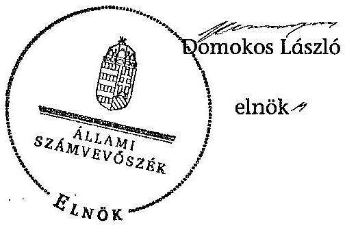

---

.

---

# Az MTA kutatóintézetei és kutatóközpontjai a 2011. évben

(40 költségvetési szerv: 38 kutatóintézet és 2 kutatóközpont)

|  Kutatóintézetek | Kutatóközpontok  |
| --- | --- |
|  1 Atommagkutató Intézet (Atomki) | 1. Kémiai Kutatóközpont (KKK)  |
|  2 Földrajztudományi Kutatóintézet (FKI) | Anyag- és Környezetkémiai Intézet (AKI)  |
| 

 3 Geokémiai Kutatóintézet (GKKI) | Biomolekuláris Kémiai Intézet (BKI)  |
|  4 Geodéziai és Geofizikai Kutatóintézet (GGKI) | Nanokémiai és Katalizis Intézet (NKI)  |
|  5 Izotópiai Kutatóintézet (IKI) | Szerkezeti Kémiai Intézet (SZKI)  |
|  6 KFKI Atomenergetikai Kutatóintézet (AEKI) |   |
|  7 KFKI Részecske- és Magfizikai Kutatóintézet (RMKI) |   |
|  8 Konkoly Thege Miklós Csillagászati Kutatóintézet (CSKI) |   |
|  9 Műszaki Fizikai és Anyagtudományi Kutatóintézet (MFA) |   |
|  10 Rényi Alfréd Matematikai Kutatóintézet (RAMKI) |   |
|  11 Számítástechnikai és Automatizálási Kutatóintézet (SZTAKI) |   |
|  12 Szilárdtest-fizikai és Optikai Kutatóintézet (SZFKI) |   |
|  13 Állatorvos-tudományi Kutatóintézet (ÁOKI) | 2. Szegedi Biológiai Kutatóközpont (SZBK)  |
|  14 Balatoni Limnológiai Kutatóintézet (BLI) | Biofizikai Intézet (BFI)  |
|  15 Duna-Kutató Intézet (DKI) | Biokémiai Intézet (BKI)  |
|  16 Kísérleti Orvostudományi Kutatóintézet (KOKI) | Genetikai Intézet (GI)  |
|  17 Mezőgazdasági Kutatóintézet (MGKI) | Növényvédelmi Kutatóintézet (NÖVKI)  |
|  18 Növényvédelmi Kutatóintézet (NÖVKI) |   |
|  19 Ökológiai és Botanikai Kutatóintézet (ÖBKI) |   |
|  20 SZBK Enzimológiai Intézet (EI) |   |
|  21 Talajtani és Agrokémiai Kutatóintézet (TAKI) |   |
|  22 Etnikai-nemzeti Kisebbségkutató Intézet (ENKI) |   |
|  23 Filozófiai Kutatóintézet (FILKI) |   |
|  24 Irodalomtudományi Intézet (ITI) |   |
|  25 Jogtudományi Intézet (JTI) |   |
|  26 Közgazdaságtudományi Intézet (KTI) |   |
|  27 Művészettörténeti Kutatóintézet (MKI) |   |
|  28 Néprajzi Kutatóintézet (NKI) |   |
|  29 Nyelvtudományi Intézet (NYTI) |   |
|  30 Politikatudományi Intézet (PTI) |   |
|  31 Pszichológiai Kutatóintézet (PKI) |   |
|  32 Régészeti Intézet (RI) |   |
|  33 Regionális Kutatások Központja (RKK) |   |
|  34 Szociológiai Kutatóintézet (SZKI) |   |
|  35 Társadalomkutató Központ (TK) |   |
|  36 Történelemtudományi Intézet (TTI) |   |
|  37 Világgazdasági Kutatóintézet (VKI) |   |
|  38 Zenetudományi Intézet (ZTI) |   |

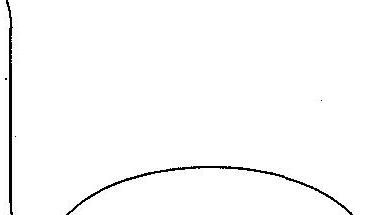

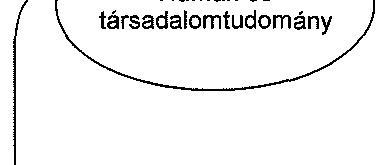

Forrás: Előterjesztés az MTA 2011. december 5-i közgyűlésére

---

# A kutatóintézet-hálózat átalakításának szemléltetése az ellenőrzött intézmények átalakításán keresztül

## Kutatóintézetek beolvadása a bázisintézménybe

### Új kutatóközpontok létrejötte

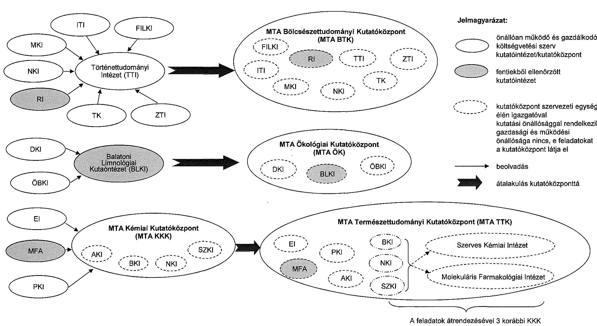

### Jelmagyarázat:
- Önállóan működő és gazdálkodó költségvetési szerv
- Kutatóintézet/kutatóközpont
- Intézményekből ellenőrzött kutatóintézet
- Kutatóközpont szervezeti egysége
- Élén igazgatóval
- Kutatási önállósággal rendelkezik gazdasági és működési
- Önállósága nincs, e feladatokat a kutatóközpont látja el
- Beolvadás
- Átalakulás kutatóközponttá

### MTA Természettudományi Kutatóközpont (MTA TTK)
- **BKI**
- **BKI**
- **BKI**
- **BKI**
- **BKI**
- **MFA**
- **ÁKI**
- **ÁKI**
- **SZKI**
- **SZKI**

A feladatok átrendezésével 3 korábbi KKK kutatóintézetből 2 alakult

Az intézményi neveknél alkalmazott rövidítések tartalma az 1.a és 1.c mellékleteken megtalálhatók.

---

# Az MTA kutatóközpontjai és kutatóintézetei 2012-től

(15 költségvetési szerv: 10 kutatóközpont és 5 kutatóintézet)

|  I. | Az átszervezéssel létrejött kutatóközpontok és az azokat alkotó kutatóintézetek |   |
| --- | --- | --- |
|   | Új kutatóközpontok 2012-től | Az új kutatóközpontokat alkotó intézetek, 2012-es nevükkel, 2011-es rövidítésükkel  |
|   | jogi státuszuk: önállóan működő és gazdálkodó költségvetési szervek, jogi személyek | jogi státuszuk: a kutatóközpont szervezeti egységei (a beolvadással a költségvetési szerv és jogi személy státuszuk megszűnt: nincs gazdasági szervezetük, gazdálkodásukról nem készítenek önálló beszámolót), a kutatási autonómiájuk megmaradt  |
|  1. | MTA Agrártudományi Kutatóközpont (MTA ATK)
Bázisintézmény: MGKI | Állatorvos-tudományi Intézet (ÁOKI)
Mezőgazdasági Intézet (MGKI)
Növényvédelmi Intézet (NÖVKI)
Talajtani és Agrokémiai Intézet (TAKI)  |
|  2. | MTA Bölcsészettudományi Kutatóközpont (MTA BTK)
Bázisintézmény: TTI | Filozófiai Intézet (FILKI)
Irodalomtudományi Intézet (ITI)
Művészettörténeti Intézet (MKI)
Néprajzi Intézet (NKI)
Régészeti Intézet (RI)
Társadalomkutató Központ (TK)
Történelemtudományi Intézet (TTI)
Zenetudományi Intézet (ZTI)  |
|  3. | MTA Csillagászati és Földtudományi Kutatóközpont (MTA CSFK)
Bázisintézmény: CSKI | Konkoly Thege Miklós Csillagászati Intézet (CSKI)
Földrajztudományi Intézet (FKI)
Geodéziai és Geofizikai Intézet (GGKI)
Földtani és Geokémiai Intézet (GKI)  |
|  4. | MTA Energiatudományi Kutatóközpont (MTA EK) Bázisintézmény: AEKI | Atomenergia-kutató Intézet (AEKI)
Izotópkutató Intézet (IKI)  |
|  5. | MTA Közgazdaság- és Regionális Tudományi Kutatóközpont (MTA KRTK)
Bázisintézmény: KTI | Közgazdaságtudományi Intézet (KTI)
Regionális Kutatások Intézete (RKK)
Világgazdasági Intézet (VKI)  |
|  6. | MTA Ökológiai Kutatóközpont (MTA ÖK) Bázisintézmény: BLKI | Balatoni Limnológiai Intézet (BLKI)
Duna-kutató Intézet (DKI)
Ökológiai és Botanikai Intézet (ÖBKI)  |
|  7. | MTA Társadalomtudományi Kutatóközpont (MTA TK)
Bázisintézmény: PTI | Kisebbségkutató Intézet (ENKI)
Jogtudományi Intézet (JTI)
Politikatudományi Intézet (PTI)
Szociológiai Intézet (SZKI)  |
|  8. | MTA Természettudományi Kutatóközpont (MTA TTK)
Bázisintézmény: KKK | Enzimológiai Intézet (EI)
Anyag- és Környezetkémiai Intézet (KKK intézet)
Szerves Kémiai Intézet (átalakuló KKK intézet)
Molekuláris Farmakológiai Intézet (átalakuló KKK intézet)
Műszaki Fizikai és Anyagtudományi Intézet (MFA)
Kognitív Idegtudományi és Pszichológiai Intézet (PKI)  |
|  9. | MTA Wigner Fizikai Kutatóközpont (MTA W)
Bázisintézmény: RMKI | Részecske- és Magfizikai Intézet (RMKI)
Szilárdtestfizikai és Optikai Intézet (SZFKI)  |
|  II. | Az átszervezéssel nem érintett 5 kutatóintézet és 1 kutatóközpont |   |
|  10. |  |   |
|  11. | MTA Kísérleti Orvostudományi Kutatóintézet (KOKI) |   |
|  12. | MTA Nyelvtudományi Intézet (NYTI) |   |
|  13. | MTA Rényi Alfréd Matematikai Kutatóintézet (RAMKI) |   |
|  14. | MTA Számítástechnikai és Automatizálási Kutatóintézet (SZTAKI) |   |
|  15. | MTA Szegedi Biológiai Kutatóközpont (SZBK) |   |
|   | Forrás: Előterjesztés az MTA 2011. december 5-i közgyűlésére |   |
|   | Bázisintézmény: amelybe az új kutatóközpontot alkotó többi kutatóintézet beolvadt |   |

---

.

---

A kutatói átlaglétszám és a nem kutatók létszáma kutatóközpontként a 2010-2013. években (fő)

|  Létszám | 2010. |  |  |  | 2011. |  |  |  | 2012. |  |  |  | 2013. |  |  |  | 2014. |  |  |  | 2015. |  |  |  | 2016. |  |  |   |
| --- | --- | --- | --- | --- | --- | --- | --- | --- | --- | --- | --- | --- | --- | --- | --- | --- | --- | --- | --- | --- | --- | --- | --- | --- | --- | --- | --- | --- |
|   | MTA BTK
jogelődjei
összesen | MTA ÖK
jogelődjei
összesen | MTA TTK
jogelődjei
összesen | Összesen | MTA BTK
jogelődjei
összesen | MTA ÖK
jogelődjei
összesen | MTA TTK
jogelődjei
összesen | Összesen | MTA BTK | MTA ÖK | MTA TTK | Összesen | MTA BTK | MTA ÖK | MTA TTK | Összesen | 2011. év - 2013. év
2010. év | 2011. év - 2012. év | 2013. év - 2012. év | 2014. év - 2013. év | 2015. év - 2012. év | 2016. év - 2013. év | 2015. év - 2012. év | 2016. év - 2013. év | 2015. év - 2012. év |   |
|  Kutatói átlaglétszám | 285 | 86 | 367 | 742 | 330 | 83 | 362 | 748 | 294 | 98 | 356 | 748 | 284 | 102 | 419 | 805 | 63 | 0 | 57 |  |  |  |  |  |  |  |   |
|  Nem kutatói létszám | 133 | 114 | 299 | 548 | 104 | 110 | 284 | 498 | 80 | 104 | 320 | 514 | 155 | 116 | 228 | 447 | -101 | 16 | -67 |  |  |  |  |  |  |  |   |
|  Összesen | 424 | 209 | 666 | 1290 | 694 | 193 | 649 | 1246 | 374 | 202 | 686 | 1262 | 387 | 218 | 647 | 1232 | -38 | 16 | -10 |  |  |  |  |  |  |  |   |

A táblázat a 2010. és 2011. évekre vonatkozóan az ellenőrzött kutatóközpontokat 2012-től alkotó valamennyi intézet összesített adatait tartalmazza.

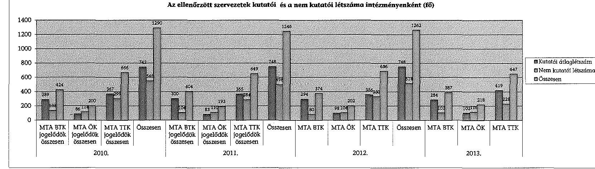

---

Az ellenőrzött kutatóközpontok kiadási, bevételi előirányzatainak alakulása és teljesítése a 2010-2013. években

|   |  |  |  |  |  |  |  |  |  |  |  |  |  |  |  |  |  |  |  |  |  |   |
| --- | --- | --- | --- | --- | --- | --- | --- | --- | --- | --- | --- | --- | --- | --- | --- | --- | --- | --- | --- | --- | --- | --- |
|   |  |  |  |  |  |  |  |  |  |  |  |  |  |  |  |  |  |  |  |  |  |   |
|   |  |  |  |  |  |  |  |  |  |  |  |  |  |  |  |  |  |  |  |  |  |   |
|   |  |  |  |  |  |  |  |  |  |  |  |  |  |  |  |  |  |  |  |  |  |   |
|   |  |  |  |  |  |  |  |  |  |  |  |  |  |  |  |  |  |  |  |  |  |   |

 |  |  |  |  |  |  |  |  |  |  |  |  |   |
|   |  |  |  |  |  |  |  |  |  |  |  |  |  |  |  |  |  |  |  |  |  |   |
|   |  |  |  |  |  |  |  |  |  |  |  |  |  |  |  |  |  |  |  |  |  |   |
|   |  |  |  |  |  |  |  |  |  |  |  |  |  |  |  |  |  |  |  |  |  |   |
|   |  |  |  |  |  |  |  |  |  |  |  |  |  |  |  |  |  |  |  |  |  |   |
|   |  |  |  |  |  |  |  |  |  |  |  |  |  |  |  |  |  |  |  |  |  |   |
|   |  |  |  |  |  |  |  |  |  |  |  |  |  |  |  |  |  |  |  |  |  |   |
|   |  |  |  |  |  |  |  |  |  |  |  |  |  |  |  |  |  |  |  |  |  |   |
|   |  |  |  |  |  |  |  |  |  |  |  |  |  |  |  |  |  |  |  |  |  |   |
|   |  |  |  |  |  |  |  |  |  |  |  |  |  |  |  |  |  |  |  |  |  |   |
|   |  |  |  |  |  |  |  |  |  |  |  |  |  |  |  |  |  |  |  |  |  |   |
|   |  |  |  |  |  |  |  |  |  |  |  |  |  |  |  |  |  |  |  |  |  |   |
|   |  |  |  |  |  |  |  |  |  |  |  |  |  |  |  |  |  |  |  |  |  |   |
|   |  |  |  |  |  |  |  |  |  |  |  |  |  |  |  |  |  |  |  |  |  |   |
|   |  |  |  |  |  |  |  |  |  |  |  |  |  |  |  |  |  |  |  |  |  |   |
|   |  |  |  |  |  |  |  |  |  |  |  |  |  |  |  |  |  |  |  |  |  |   |
|   |  |  |  |  |  |  |  |  |  |  |  |  |  |  |  |  |  |  |  |  |  |   |
|   |  |  |  |  |  |  |  |  |  |  |  |  |  |  |  |  |  |  |  |  |  |   |
|   |  |  |  |  |  |  |  |  |  |  |  |  |  |  |  |  |  |  |  |  |  |   |
|   |  |  |  |  |  |  |  |  |  |  |  |  |  |  |  |  |  |  |  |  |  |   |
|   |  |  |  |  |  |  |  |  |  |  |  |  |  |  |  |  |  |  |  |  |  |   |
|   |  |  |  |  |  |  |  |  |  |  |  |  |  |  |  |  |  |  |  |  |  |   |
|   |  |  |  |  |  |  |  |  |  |  |  |  |  |  |  |  |  |  |  |  |  |   |
|   |  |  |  |  |  |  |  |  |  |  |  |  |  |  |  |  |  |  |  |  |  |   |
|   |  |  |  |  |  |  |  |  |  |  |  |  |  |  |  |  |  |  |  |  |  |   |
|   |  |  |  |  |  |  |  |  |  |  |  |  |  |  |  |  |  |  |  |  |  |   |
|   |

---

Az ellenőrzött kutatóközpontok szállítói kötelezettségeinek lejárat szerinti alakulása a 2010-2013. években adatok: M Ft-ban, egytizedes pontossággal

|  Szállítói kötelezettségek lejárat szerint | 2010. december 31. |  |  | 2011. december 31. |  |  | 2012. december 31. |  |  | 2013. december 31. |  |   |
| --- | --- | --- | --- | --- | --- | --- | --- | --- | --- | --- | --- | --- |
|   | MTA BTK jogelődök összesen | MTA ÖK jogelődök összesen | MTA TTK jogelődök összesen | MTA BTK jogelődök összesen | MTA ÖK jogelődök összesen | MTA TTK jogelődök összesen | MTA BTK | MTA ÖK | MTA TTK | MTA BTK | MTA ÖK | MTA TTK  |
|  Mérleg szerinti szállítói kötelezettségek összesen | 20,0 | 36,0 | 1313,8 | 10,2 | 51,6 | 1121,3 | 15,6 | 3,5 | 1208,4 | 1,5 | 12,4 | 1163,6  |
|  Ebből átütemezési megállapodással érintett | - | - | - | - | - | - | - | - | - | - | - | -  |
|  Lejárt szállítói tartozás | 20,0 | 0 | 0 | 10,2 | 0 | 0 | 15,6 | 0 | 0 | 1,5 | 0 | 0  |
|  30 nap alatti | 20,0 | 0 | 0 | 10,2 | 0 | 0 | 15,6 | 0 | 0 | 1,5 | 0 | 0  |

A táblázat a 2010. és 2011. évekre vonatkozóan a kutatóközpontokat 2012-től alkotó valamennyi kutatóintézet összesített adatait tartalmazza. Forrás:
 11. számú tanúsítvány

---

Az ellenőrzött kutatóközpontok mérlegeinek alakulása a 2010-2013. években

|  Megnevezés | 2010. december 31. |  |  | 2011. december 31. |  |  | 2012. december 31. |  |  | 2013. december 31. |  |  | Index (2013/2010) |  |   |
| --- | --- | --- | --- | --- | --- | --- | --- | --- | --- | --- | --- | --- | --- | --- | --- |
|   | MTA BTK jogelődök összesen | MTA ÖK jogelődök összesen | MTA TTK jogelődök összesen | MTA BTK jogelődök összesen | MTA ÖK jogelődök összesen | MTA TTK jogelődök összesen | MTA BTK | MTA ÖK | MTA TTK | MTA BTK | MTA ÖK | MTA TTK | MTA BTK | MTA ÖK | MTA TTK  |
|  IMMATERIÁLIS JAVAK | 9,4 | 4,8 | 39,7 | 9,5 | 5,3 | 34,4 | 19,0 | 18,1 | 42,6 | 44,5 | 48,4 | 37,0 | 475,1% | 1019,5% | 93,2%  |
|  TÁRGYI ESZKÖZÖK | 2638,8 | 847,0 | 4537,3 | 2749,7 | 1351,5 | 4360,2 | 1065,6 | 1779,0 | 6339,0 | 1162,6 | 1970,5 | 11576,8 | 44,1% | 232,6% | 255,1%  |
|  BEFEKTETETT PÉNZÜGYI ESZKÖZÖK | 5,3 | - | 12,4 | 4,2 | - | 13,6 | 3,1 | - | 13,3 | 0,1 | - | 10,4 | 1,0% | - | 84,1%  |
|  ÜZEMÉLTETÉSRE KEZELÉSRE ÁTADOTT VAGYONKÉZELÉSRE VETT ESZKÖZÖK | - | - | - | - | - | - | - | - | - | - | - | - | - | - | -  |
|  BEFEKTETETT ESZKÖZÖK ÖSSZESEN | 2653,5 | 851,8 | 4589,3 | 2763,4 | 1356,8 | 4408,2 | 1087,7 | 1797,2 | 6394,9 | 1207,2 | 2019,0 | 11624,2 | 45,5% | 237,0% | 253,3%  |
|  KÉSZLETEK | 236,6 | 1,7 | 14,8 | 204,9 | 2,2 | 13,7 | 196,9 | 1,6 | 52,1 | 72,9 | - | - | 30,8% | - | -  |
|  KÖVETELÉSEK | 26,3 | 10,9 | 1336,6 | 2,7 | 19,7 | 414,8 | 10,1 | 4,4 | 298,1 | 4,7 | 24,2 | 180,9 | 17,9% | 221,6% | 13,5%  |
|  ÉRTÉKPAPÍROK | - | - | - | - | - | - | - | - | - | - | - | - | - | - | -  |
|  PÉNZESZKÖZÖK | 575,4 | 292,3 | 847,5 | 308,6 | 305,3 | 1373,3 | 382,9 | 410,4 | 6630,5 | 570,3 | 204,8 | 1330,9 | 99,1% | 70,1% | 157,0%  |
|  EGYÉB AKTÍV PÉNZÜGYI ELSZÁMOLÁSOK | 1,2 | - | 28,4 | 1,0 | 11,3 | 164,3 | 0,9 | - | 2,7 | - | - | 51,0 | - | - | 179,7%  |
|  FORGŐESZKÖZÖK ÖSSZESEN | 839,5 | 304,9 | 2227,2 | 517,3 | 338,5 | 1966,2 | 590,8 | 416,4 | 6983,5 | 647,9 | 229,0 | 1562,8 | 77,2% | 75,1% | 70,2%  |
|  ESZKÖZÖK ÖSSZESEN | 3493,0 | 1156,7 | 6816,5 | 3280,8 | 1695,3 | 6374,3 | 1678,5 | 2213,6 | 13378,4 | 1855,1 | 2247,9 | 13187,0 | 53,1% | 194,3% | 193,5%  |
|  SAJÁT TÖKE | 2608,4 | 764,2 | 2880,2 | 2511,0 | 1020,9 | 1373,3 | 544,6 | 1330,9 | -709,4 | 828,8 | 1516,4 | 4050,1 | 31,8% | 198,4% | 140,6%  |
|  TARTALÉKOK | 568,4 | 241,0 | 729,5 | 309,2 | 276,9 | 1511,7 | 382,8 | 410,4 | 6623,1 | 568,3 | 204,8 | 1319,2 | 100,0% | 85,0% | 180,8%  |
|  KÖTELEZETTSÉGEK | 308,7 | 100,2 | 3070,6 | 460,2 | 357,8 | 3470,5 | 751,1 | 472,3 | 7464,6 | 458,1 | 526,7 | 7767,5 | 148,4% | 525,7% | 253,0%  |
|  EGYÉB PASSZÍV PÉNZÜGYI ELSZÁMOLÁSOK | 7,4 | 51,3 | 136,2 | 0,4 | 39,7 | 18,8 | - | - | - | - | - | 50,3 | - | - | 36,9%  |
|  FORRÁSOK ÖSSZESEN | 3493,0 | 1156,7 | 6816,5 | 3280,8 | 1695,3 | 6374,3 | 1678,5 | 2213,6 | 13378,4 | 1855,1 | 2247,9 | 13187,0 | 53,1% | 194,3% | 193,5%  |

A táblázat a 2010. és 2011. évekre vonatkozóan a kutatóközpontokat 2012-től alkotó valamennyi kutatóintézet összesített adatait tartalmazza. Forrás: Beszámolók a Magyar Tudományos Akadémia 2010-2013. évi költségvetéséről és vagyoni helyzetéről

---

Az ellenőrzött kutatóközpontok gazdasági társaságokban szerzett részesedéseinek változása a 2010-2013. években

|  |   |   |   |   |   |   |   |   |   |   |   |
| --- | --- | --- | --- | --- | --- | --- | --- | --- | --- | --- | --- |
|   |  |  |  |  |  |  |  |  |  | 2013. 12. 31-én |   |
|  Intézmény | Társaság megnevezése | Tulajdoni hányad (%) | Bekerülési érték | Értékvesztés | Könyv szerinti érték | éve | jogcíme | Tulajdoni hányad (%) | Bekerülési érték | Értékvesztés | Könyv szerinti érték  |
|  MTA BTK | Archeosztráda Kft. | 74,0 | 2,2 | - | 2,2 | 2013. | törzstőke emelés | 20,0 | 2,2 | 2,2 | 0,0  |
|  MTA ÖK | - | - | - | - | - | - | - | - | - | - | -  |
|  MTA TTK | Húsep Kutatási és Tanácsadó Kft. | 25,0 | 1,0 | - | 1,0 | - | - | 25,0 | 1,0 | - | 1,0  |
|   | Ante Innovatív Technológiák Kft. (MTA MFA) | 100,0 | 3,0 | - | 3,0 | - | - | 100,0 | 3,0 | - | 3,0  |
|   | TactoLogic Kft. (MTA MFA) | 50,0 | 1,5 | - | 1,5 | - | - | 50,0 | 1,5 | - | 1,5  |
|   | KFKI Üzemeltető Kft. (MTA MFA) | 20,8 | 1,0 | - | 1,0 | - | - | 20,8 | 1,0 | - | 1,0  |
|   | Nanochem Kft. | 34,0 | 1,0 | - | 1,0 | 2013. | tulajdonosi képviselet váltás | - | - | - | -  |
|   | Cellpharma Kft. | 25,0 | 0,3 | - | 0,3 | 2013. | tulajdonosi képviselet váltás | - | - | - | -  |

Forrás: 13. sz. tanúsítvány

---

Az ellenőrzött kutatóközpontok tulajdonosi joggyakorlása alá tartozó gazdálkodó szervezetek részére nyújtott kifizetések a 2010-2013. években

|  Év | Intézmény | Gazdálkodó szervezet, alapítvány, közalapítvány neve | Intézmény által a gazdasági társaság részére teljesített kifizetések | Alapítási, tőkeemelési céllal átadott vagyon fajtája és értéke  |
| --- | --- | --- | --- | --- |
|   |  |  | megállapodás, szerződés alapján | szerződésre vagy egyedi megrendelésre tekintettel teljesített kifizetések számla alapján  |
|   |  |  |  | egyéb fejlesztési kiadás (pl. beruházás, felújítás, de nem pénzeszköz-átadás)  |
|  2010. | MTA STK | Archeosztráda Kft. | - | -  |
|   | MTA OK | - | - | -  |
|   | MTA TTK | TactoLogic Kft. (MTA MFA) | - | -  |
|  2011. | MTA STK | Archeosztráda Kft. | - | -  |
|   | MTA OK | - | - | -  |
|   | MTA TTK | - | - | -  |
|  2012. | MTA STK | Archeosztráda Kft. | - | -  |
|   | MTA OK | - | - | -  |
|   | MTA TTK | - | - | -  |

Forrás: 14. sz. tanúsítvány

---

Az ellenőrzött kutatóközpontok gép-műszer állománya a 2010-2013. években

|  Év | Intézmény | Bruttó érték | Értékcsökkenés | Nettó érték | Használhatósági fok (%) | Teljesen leírt gép-műszer állomány  |
| --- | --- | --- | --- | --- | --- | --- |
|  2010. | MTA BTK jogelődök összesen | 828,2 | 690,9 | 137,3 | 16,6% | 573,2  |
|   | MTA ÖK jogelődök összesen | 598,1 | 520,7 | 77,4 | 12,9% | 427,1  |
|   | MTA TTK jogelődök összesen | 7096,0 | 5571,8 | 1524,2 | 21,5% | 3732,8  |
|  2011. | MTA BTK jogelődök összesen | 691,3 | 572,2 | 119,1 | 17,2% | 459,1  |
|   | MTA ÖK jogelődök összesen | 630,2 | 516,2 | 114,0 | 18,1% | 420,5  |
|   | MTA TTK jogelődök összesen | 7239,2 | 5876,9 | 1362,3 | 18,8% | 3988,1  |
|  2012. | MTA BTK | 666,0 | 532,9 | 133,1 | 20,0% | 408,3  |
|   | MTA ÖK | 755,3 | 532,0 | 223,3 | 29,6% | 371,2  |
|   | MTA TTK | 6598,9 | 5080,7 | 1518,2 | 23,0% | 2690,5  |
|  2013. | MTA BTK | 705,2 | 487,6 | 217,6 | 30,9% | 374,5  |
|   | MTA ÖK | 871,2 | 576,3 | 294,9 | 33,8% | 

 384,5  |
|   | MTA TTK | 7577,7 | 5430,2 | 2147,5 | $28,3 \%$ | 2839,8  |

A táblázat a 2010. és 2011. évekre vonatkozóan a kutatóközpontokat 2012-től alkotó valamennyi kutatóintézet összesített adatait tartalmazza.

Forrás: Beszámolók a Magyar Tudományos Akadémia 2010-2013. évi költségvetéséről és vagyoni helyzetéről

---

.

---

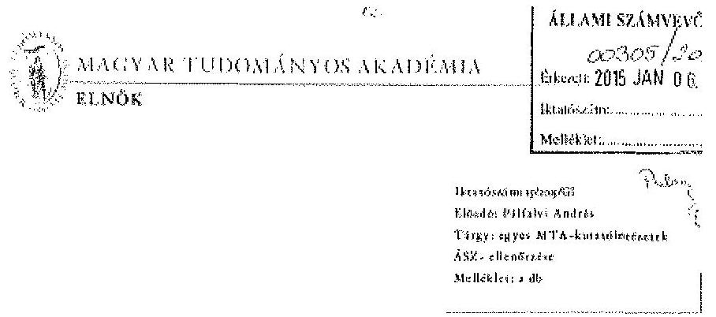

# Domokos László elnök úr részére 

## Állami Számvevőszék

Budapest
Apáczai Csere János u. 10
1052

## Tisztelt Elnök Úr:

Az Állami Számvevőszék (a továbbiakban: ÁSZ) által készített, az MTA egyes kutatóintézeteinek ellenőrzése - A Magyar Tudományos Akadémia kutatóintézeti hálózatának átalakítása, egyes kiemelt kutatóintézetek gazdálkodása és feladatellátása ellenőrzése című jelentés-tervezetet előző év végén megkaptam. A tervezetre a következő észrevételeket teszem.

Mindenekelőtt engedje meg, hogy Önnek és a vizsgálatban résztvevő valamennyi munkatársának megköszönjem a jelentés-tervezet tárgyához mérten alapos, szakmailag korrekt, konstruktív megállapítását. A tervezetben foglaltak számomra egyértelműen megerősítették az Akadémia 2012. évi intézményhálózat-átalakítási programjának indokoltságát.

A fentiek alapján a jelentés-tervezetet elfogadom, ahhoz csak apróbb, leginkább technikai jellegű észrevételeket teszek, illetve a megállapítások egy részéhez kapcsolódóan, különösen az MTA Természettudományi Kutató Központ (a továbbiakban MTA TTK) esetében, beszámolok a vizsgálati időszak lezárásán túl már megtett intézkedéseinkről.

---

# Részletes észrevételek 

## - 4. oldal 1. lábjegyzete:

A 2013. évi zárszámadás ellenőrzése során az ÁSZ a jelen vizsgálattal érintett akadémiai intézmények közül nemcsak az MTA TTK-t, hanem az MTA Ökológiai Kutatóközpontját (a továbbiakban: MTA ÖK) és az MTA Bölcsészettudományi Kutatóközpontját is ellenőrizte.

## - 8. oldal 5. bekezdése:

- Az MTA ÖK esetében a teljesítés-igazolásra jogosultak nevét a gazdálkodási szabályzat melléklete valóban nem tartalmazza, ott csak az utalványozó, ellenjegyző, érvényesítő, kötelezettségvállaló neve és aláírása szerepelt. A gazdálkodási szabályzat jelenlegi változatának 4. sz. melléklete jelenleg már tartalmazza, hogy kik a jogosultak teljesítés-igazolásra, és nekik milyen külön írásbeli kijelölés kell a jogosultsághoz.
- Az MTA ÖK 2012. június 26-tól hatályos SZMSZ-e nem írta elő mellékleteként a megjelölt két szabályzatot (szellemi tulajdon kezelésére, ill. a bevételek felhasználására vonatkozó), mivel azok önálló szabályzatként hatályosak.

Szellemi tulajdon kezelési szabályzattal az MTA ÖK 2013. január 1-je óta rendelkezik (addig a jogelőd, a BLKI azonos elnevezésű szabályzata volt hatályban). A vállalkozási eredmény felhasználásának szabályait az MTA ÖK esetében a 2013. évi számlatér tartalmazza.

Megjegyzem, hogy fentiek alapján a jelentés-tervezet 13. és 24. oldalán szereplő, az MTA ÖK e két szabályzata hiányára tett megállapítások is korrigálandók.

## - 39. oldal 1. rész bekezdése:

Szeretem megjegyezni, hogy az MTA ÖK a használatában lévő lakások és garázsok közül a vácrátóti ingatlanokra a szerződéseket - az Akadémiával 2012. évben kötött vagyonhasznosítási szerződés előírásai szerint - átdolgozta és 2013. januárjában újrakötötte.

## - 42. oldal 2. bekezdése:

A tervezet helytelenül jógci meg, hogy az MTA munkájáról és a magyar tudomány helyzetének 2011-2012. évi helyzetéről szóló országgyűlési beszámoló
mgr.Budapesti, Széchenyi István tér 9. (1051 Budapest, Pf. 2000)
Telefon: +36 1 352-7176, +36 1 351-9377 / Fax: +36 1 352-8943 / E-mail: alnakseg@tiskarszg.nta.hu / www.nta.hu

---

terjesztése 2013. december 31-éig nem történt meg. A levelemhez mellékelt elnöki levél, illetve elektronikus levél tanúsága szerint az Akadémia a beszámolót 2013. december 18-án küldte meg az Országgyűlés elnökének.

# - 1/b és 1/c melléklet: 

Mind az ábrás, mind a szöveges mellékletben az MTA TTK esetében az SZKI rövidítés jelentéseként a tervezetben helytelenül „Szintetikus Kémiai Intézetet" adták meg, a valós elnevezés „Szerves Kémiai Intézet".

## - Az MTA TTK-t érintő megállapítások:

A jelentés-tervezet nem vehette figyelembe azokat a változásokat, amelyek a 2013. december 31. óta eltelt időszakban, a 2014-es év folyamán az MTA TTK-ban történtek, bár több olyan is van ezek között, amelyet a jelentéstervezet javasolt intézkedésként fogalmaz meg az MTA TTK főigazgatója számára. Az alábbiakban röviden bemutatom, hogy a kifogásolt területeken milyen intézkedések történtek az elmúlt évben.

- Jogszabályoknak megfelelő kontrollrendszer kialakítása: 2/2014. (III.25.) számú kihirdetésre került és 2014. április 1. napján hatályba lépett a MTA TTK kutatóközponti szintű alapfolyamatairól szóló főigazgatói utasítás, amely részben lefedi az érintett szabályozási területet, a szükséges FEUVE szabályzat kiadása pedig 2015 I. félévében várható;
- Kockázatkezelési rendszer kialakítása: 1/2014. (III.10.) számú főigazgató utasításával elfogadásra és kihirdetésre került az MTA TTK kutatóközponti szintű kockázatkezelési rendszerének eljárásrendjéről szóló szabályzat, amely a hatályos jogszabályoknak megfelel;
- Szervezeti egységek engedélyezett létszámának feltüntetése az SZMSZ-ben: 2014. április 1. napjától kezdődően jelenleg is hatályos SZMSZ a hatályos jogszabályoknak megfelelően tartalmazza az engedélyezett létszámokat;
> Gazdálkodási jogkörök szabályszerű gyakorlása: szabályszerű, az Ávr. 57. § (4) bekezdése szerinti kijelölések megtörténtek, valamint jelenleg is folyamatosan van a gazdálkodással kapcsolatos szabályzatok, illetve a gazdasági szervezet ügyrendjének felülvizsgálata, mint 2015. június 31-éig teljesülő intézkedés.

---

9. SZÁMÚ MELLÉKLET

A V-0446-518/2015. SZÁMÚ JELENTÉSHEZ

Az ÁSZ munkatársainak munkáját megköszönve javaslom a végleges jelentés fenti észrevételek szerinti módosítását, és a már megtett intézkedések tényének rögzítését.

Budapest, 2015. január 10.

Üdvözlettel

Lovász László

1051. Budapest, Széchenyi István tér 9. (1051 Budapest, Pf. 1000)
Telefon: +36 1 332-7276, +36 1 331-9333 / Fax: +36 1 332-8943 / E-mail: ebudsug@tiskanag.una.hu / www.mta.hu

---

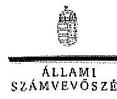

# Dr. Lovász László úr 

Elnök
Magyar Tudományos Akadémia

## Budapest

Tisztelt Elnök Úr!
„Az MTA egyes kutatóintézeteinek ellenőrzése - az Akadémia kutatóintézeti hálózatának átalakítása, egyes kiemelt kutatóintézetek gazdálkodása és feladatellátása ellenőrzése" című jelentéstervezetét az észrevételeimmel köszönettel megkaptam.

Az Állami Számvevőszék észrevételekre vonatkozó álláspontjáról a felügyeleti vezető által készített részletes tájékoztatót csatoltan megküldöm.

Tájékoztatom Elnök urat, hogy a számvevőszéki jelentés szövegezése az elfogadott észrevételek figyelembevételével készült.

Budapest, 2015.
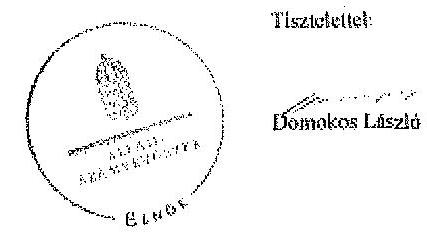

Melléklet: Tájékoztatás az elfogadott és el nem fogadott észrevételekről

---

# Tájékoztatás 

az elfogadott és el nem fogadott észrevételekről

Az MTA egyes kutatóintézeteinek ellenőrzése - az Akadémia kutatóintézeti hálózatának
átalakítása, egyes kiemelt kutatóintézetek gazdálkodása és feladatellátása ellenőrzése " című
jelentéstervezetre 2015. január 6-án érkezett észrevételeit áttekintettük és azok kezelésével
kapcsolatban a következő tájékoztatást adom:

## 4. oldal 1. lábjegyzet

A 2013. évi zárszámadás ellenőrzése során az ÁSZ ténylegesen több MTA kutatóközpontot is ellenőrzött, de a jelentéstervezet lábjegyzetében megfogalmazott eltérés csak az MTA TTK-nál jelentkezett, ezért csak ezt a kutatóközpontot nevesíthettük. Ennek alapján a jelentéstervezet módosítása nem indokolt.

## 8. oldal 5. bekezdés

Az MTA ÖK teljesítés-igazolásra jogosultak nevére vonatkozó intézkedéseket köszönjük, tudomásul vettük, de a 2013. december 31-e után meghozott intézkedések a jelentést nem érintik, azok a jelentésre készített intézkedési terv részét alkotják majd.

A szellemi tulajdon kezelési szabályzat és a bevételek felhasználására vonatkozó szabályzat elkészítését az Alapszabály 55. § (4)-(5) pontja írja elő, mely szerint ezeket a területeket az SZMSZ-ben, illetve annak mellékleteiben kell szabályozni. A teljességi nyilatkozat alapján átadott SZMSZ, illetve annak mellékletei ezeket a szabályzatokat nem tartalmazták és önálló szabályzatként sem került átadásra az ellenőrzés ideje alatt.

A 2015. január 8-án elektronikus úton beküldött MTA ÖK szellemi tulajdon kezelési szabályzatát köszönjük, de azt csak az intézkedési tervben részeként fogják tudni felhasználni.

A fenti indokok alapján a jelentéstervezet módosítása nem indokolt.

## 39. oldal 1. rész bekezdés

A jelentéstervezetben a lakások, garázsok bérleti díjével kapcsolatos megállapításunkat a már létező tételek alapján alakítottuk ki. Az ellenőrzött tételekben nem szerepeltek vácrátóti ingatlanok, ezeknek az ingatlanoknak a szerződéseit nem ellenőriztük, a jelentéstervezet megfogalmazásakor nem tudtuk figyelembe venni, így a megállapítás módosítása nem indokolt.

---

# 42. oldal 2. bekezdés 

A jelentéstervezetben a 2011-2012. évről szóló beszámoló benyújtására vonatkozó részhez az MTA elnöke által utólag beküldött elektronikus és a postai feladású dokumentumaink figyelembevételével a megfogalmazást módosítottuk a következők szerint:
„A 2011-2012. évekről szóló beszámolót az MTA elnöke 2013. december 18-án az Országgyűlés elnökének megküldte."

## 1/b és 1/c melléklet

Az átalakításról történő döntés céljára összehívott 2011. dec. 5-i rendkívüli közgyűlésre készült előterjesztésben (5. oldalon kezdődő táblázat 6. oldalon található részében) Szintetikus Kémiai Intézet névvel szerepel az intézet 2012. évi új megnevezése. A 2012. évben jóváhagyott alapító okiratban már Szerves Kémiai Intézet elnevezés szerepel.
Az észrevételt köszönjük, a jelentéstervezet két mellékletében ennek alapján kijavításra kerül az intézet neve Szerves Kémiai Intézetre.

## Az MTA TTK-t érintő megállapításokra tett észrevétel

Észrevételét köszönjük, de az ellenőrzés időszaka 2013. december 31-vel lezárult. Az azóta hozott intézkedések és a 2015 évre tervezett változtatások az intézkedési terv részét fogják képezni, így a jelentéstervezet módosítása nem indokolt.

Tájékoztatom Elnök urat, hogy a számvevőszéki jelentés mellékleteként szerepeltetjük a jelentéstervezethez tett észrevételeit, valamint az azokra adott válaszunkat.

Budapest, 2015. január 13.
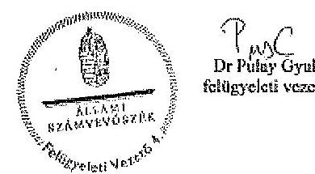

---

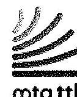

MAGYAR TUDOMÁNYOS AKADÉMIA
Természettudományi Kutatóközpont (MTA TTK, 1117 Budapest, Magyar Tudósok körútja 2.) köszönettel megkapta az Állami Számvevőszék (a továbbiakban: ÁSZ) által összeállított „Az MTA egyes kutatóintézeteinek ellenőrzése - A Magyar Tudományos Akadémia kutatóintézethálózatának átalakítása, egyes kiemelt kutatóintézetek gazdálkodása és feladatellátása" ellenőrzéséről szóló jelentéstervezetét (ikt. szám: V-0446-504/2014.).

A jelentéstervezetet áttekintettem, az abban foglalt megállapítások tartalma tekintetében az Állami Számvevőszékről szóló 2011. évi LXVI. törvény 29. § (2) bekezdése szerinti észrevételt nem kívánok tenni, a jelentés-tervezetet elfogadom, ahhoz csak apróbb, leginkább technikai jellegű észrevételeket teszek, illetve a megállapítások egy részéhez kapcsolódóan beszámolok a vizsgálati időszak lezárásán túl az MTA TTK-ban már megtett intézkedéseinkről.

---

Az MTA Titkársága gazdasági igazgatójával, Kotán Attila úrral előzetesen egyeztetett részletes észrevételeink az alábbiak:
o 1/b és 1/c mellékletek: Mind az ábrás, mind a szöveges mellékletben az MTA TTK esetében az SZKI rövidítés jelentéseként a tervezetben helytelenül „Szintetikus Kémiai Intézetet" adták meg, a valós elnevezés „Szerves Kémiai Intézet".

A jelentés-tervezet nem vehette figyelembe azokat a változásokat, amelyek a 2013. december 31. óta eltelt időszakban, a 2014-es év folyamán az MTA TTK-ban történtek, bár több olyan is van ezek között, amelyet a jelentéstervezet javasolt intézkedésként fogalmaz meg az MTA TTK főigazgatója számára. Az alábbiakban röviden bemutatom, hogy a kifogásolt területeken milyen intézkedések történtek az elmúlt évben.
o Jogszabályoknak megfelelő kontrollrendszer kialakítása: 2/2014. (III.25.) számon kihirdetésre került és 2014. április 1. napján hatályba lépett a MTA TTK kutatóközponti szintű alapfolyamatairól szóló főigazgatói utasítás, amely részben lefedi az érintett szabályozási területet, a szükséges FEUVE szabályzat kiadása pedig 2015 I. félévében várható;
o Kockázatkezelési rendszer kialakítása: 1/2014. (III.10.) számú főigazgató utasítással elfogadásra és kihirdetésre került az MTA TTK kutatóközponti szintű kockázatkezelési rendszerének eljárásrendjéről szóló szabályzat, amely a hatályos jogszabályoknak megfelel;
o Szervezeti egységek engedélyezett létszámának feltüntetése az SZMSZ-ben: 2014. április 1. napjától kezdődően jelenleg is hatályos SZMSZ a hatályos jogszabályoknak megfelelően tartalmazza az engedélyezett létszámokat;
o Gazdálkodási jogkörök szabályszerű gyakorlása: szabályszerű, az Ávr. 57. § (4) bekezdése szerinti kijelölések megtörténtek, valamint jelenleg is folyamatban van a

---

gazdálkodással kapcsolatos szabályzatok, illetve a gazdasági szervezet ügyrendjének felülvizsgálata, mint 2015. június 31-éig teljesülő intézkedés.
o Vagyongazdálkodással kapcsolatos szabályok betartása: a Tactologic Műszaki Kutatófejlesztő Kft. végelszámolását az MTA TTK az MTA Vagyongazdálkodási és Vagyonkezelési Szabályzata szerint 2014. május 31-i kezdőnappal kezdeményezte.

Az ÁSZ munkatársainak munkáját
 megköszönve javaslom a végleges jelentés fenti észrevételek szerinti módosítását, és a már megtett intézkedések tényének rögzítését.

Budapest, 2015. január 8.

Tiszteltettel:
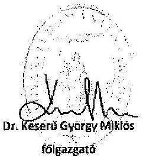
főgazgató

---

# 9. SZÁMÚ MELLÉKLET A V-0446-S18/2015. SZÁMÚ JELENTÉSHEZ 

## 8

## 81.1016

## 81.1016

## 81.1016: V-0446-511/2015

Dr. Keserü György Miklós
Főgazgató
Magyar Tudományos Akadémia
Természettudományi Kutatóközpont

Budapest

Tisztelt Főgazgató Úr!
„Az MTA egyes kutatóintézeteinek ellenőrzése - az Akadémia kutatóintézeti hálózatának átalakítása, egyes kiemelt kutatóintézetek gazdálkodása és feladatellátása ellenőrzése" című jelentéstervezetre tett észrevételeit köszönettel megkaptam.

Az Állami Számvevőszék észrevételekre vonatkozó álláspontjáról a felügyeleti vezető által készített részletes tájékoztatást csatoltan megküldöm.

Tájékoztatom Főgazgató urat, hogy a számvevőszéki jelentés szövegezése az elfogadott észrevételek figyelembe vételével készül.

Budapest, 2015.
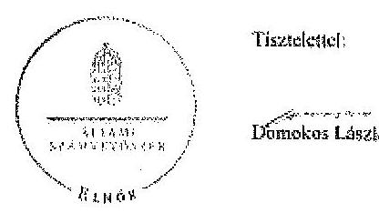

Melléklet: Tájékoztatás az elfogadott és el nem fogadott észrevételekről

---

# Tájékoztatás 

az elfogadott és el nem fogadott észrevételekről

## 1/6 és 1/c melléklet

Az átalakításról történő döntés céljára összehívott 2011. dec. 5-i rendkívüli közgyűlésre készült előterjesztésben (5. oldalon kezdődő táblázat 6. oldalon található részében) Szintetikus Kémiai Intézet névvel szerepel az intézet 2012. évi téli megnevezése. A 2012. évben jóváhagyott alapító okiratban már Szerves Kémiai Intézet elnevezés szerepel.
Az észrevételt köszönjük, a jelentéstervezet két mellékletében ennek alapján kijavításra kerül az intézet neve Szerves Kémiai Intézetre.

## Az ellenőrzési időszakot követő intézkedésekről adott tájékoztatás

Észrevételét köszönjük, de az ellenőrzés időszaka 2013. december 31-vel zárult. Az ezt követően hozott intézkedések és a 2015 évre tervezett változtatások az intézkedési terv részét fogják képezni, így a jelentéstervezet módosítása nem indokolt.

Tájékoztatom Főgazgató urat, hogy a számvevőszéki jelentés mellékleteként szerepeltetjük a jelentéstervezethez tett észrevételeit, valamint az azokra adott válaszunkat.

Budapest, 2015. január 8.
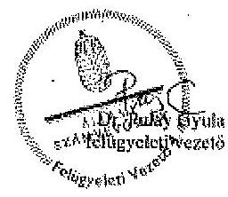

---

# 9. SZÁMÚ MELLÉKLET A V-0446-518/2015. SZÁMÚ JELENTÉSHEZ 

## MTA Ökológiai Kutatóközpont FŐIGAZGATÓ

Domokos László elnök úr részére
Állami Számvevőszék
Budapest
Apáczai Csere János u. 10, 1052

Tisztelt Elnök Úr!
Az Állami Számvevőszék (a továbbiakban: ÁSZ) által készített, „az MTA egyes kutatóintézeteinek ellenőrzése - A Magyar Tudományos Akadémia kutatóintézeti hálózatának átalakítása, egyes kiemelt kutatóintézetek gazdálkodása és feladatellátása ellenőrzése" című jelentés-tervezetet előző év végén megkaptam.

Mindenekelőtt engedje meg, hogy Önnek és munkatársainak megköszönjem a jelentéstervezet alapos, szakmailag korrekt, konstruktív elkészítését.

A jelentés tervezetét elfogadom, ahhoz csak apróbb, leginkább technikai jellegű észrevételeket teszek, melyek a következők:

## Részletes észrevételek

## 4. oldal 1. lábjegyzete:

A 2013. évi zárszámadás ellenőrzése során az ÁSZ a jelen vizsgálattal érintett akadémiai intézmények közül nemcsak az MTA TTK-t, hanem az MTA Ökológiai Kutatóközpontját (a továbbiakban: MTA ÖK) is ellenőrizte.

## 8. oldal 5. bekezdése:

- az MTA ÖK esetében a teljesítés-igazolásra jogosultak nevét a gazdálkodási szabályzat melléklete valóban nem tartalmazza, ott csak az utalványozó, elkötelező, érvényesítő, kötelezettségvállaló neve és aláírása szerepelt. A gazdálkodási szabályzat jelenlegi változatának 4. sz. melléklete jelenleg már tartalmazza, hogy kik a jogosultak teljesítés-igazolásra, és nekik milyen külön írásbeli kijelölés kell a jogosultsághoz.
- Az MTA ÖK 2012. június 26-tól hatályos SZMSZ-e nem írta elő mellékletként a megjelölt két szabályzatot (szellemi tulajdon kezelésre, ill. a bevételek felhasználására vonatkozik), mivel azok önálló szabályzatként hatályosak.
- Szellemi tulajdon kezelési szabályzattal az MTA ÖK 2013. január 1-je óta rendelkezik (addig a jogelőd, a BLKI azonos elnevezésű szabályzata volt hatályban). A vállalkozási eredmény felosztásának szabályait az MTA ÖK esetében a 2013. évi számkeret tartalmazza.

---

Megjegyzem, hogy a fentiek alapján a jelentés-tervezet 13. és 24. oldalán szereplő, az MTA ÖK e két szabályzata hiányára tett megállapítások is korrigálandók.
39. oldal 1. bekezdése:

Szeretném megjegyezni, hogy az MTA ÖK a használatában lévő lakások és garázsok közül a vácrátóti ingatlanokra a szerződéseket - az Akadémiával 2012. évben kötött vagyonhasznosítási szerződés előírása szerint - átdolgozta és 2013. januárjában újrakötötte.

Tisztelettel kérem a végleges jelentés fenti észrevételek szerinti módosítását.

Vácrátót, 2015. január 5.

Üdvözlettel,

---

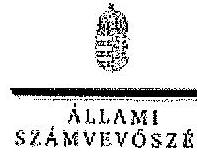

# Dr. Bálati András   Főgazgató 

Magyar Tudományos Akadémia
Ökológiai Kutatóközpont

Budapest

Tisztelt Főgazgató Úr!
„Az MTA egyes kutatóintézeteinek ellenőrzése - az Akadémia kutatóintézeti hálózatának átalakítása, egyes kiemelt kutatóintézetek gazdálkodása és feladatellátása ellenőrzése" című jelentéstervezetre tett észrevételeit köszönettel megkaptam.

Az Állami Számvevőszék észrevételekre vonatkozó álláspontjáról a felügyeleti vezető által készített részletes tájékoztatást csatoltan megküldöm.

Tájékoztatom Főgazgató urat, hogy a számvevőszéki jelentés szövegezése az elfogadott észrevételek figyelembe vételével készült.

Budapest, 2015.
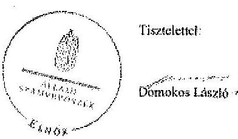

Melléklet: Tájékoztatás az elfogadott és el nem fogadott észrevételekről

JHUZ BUDAPESTI, MÓSZÓN CSÉKI JÁNOS SZÉK 09. 12010 Budapest 4- P1. 18 Istóna. 4840001 No. 4840001

---

# Tájékoztatás 

az elfogadott és el nem fogadott észrevételekről

Az MTA egyes kutatóintézeteinek ellenőrzése - az Akadémia kutatóintézeti hálózatának átalakítása, egyes kiemelt kutatóintézetek gazdálkodása és feladatellátása ellenőrzése " című jelentéstervezete 2015. január 6-án érkezett észrevételeit áttekintettük és azok kezelésével kapcsolatban a következő tájékoztatást adom:

## 4. oldal 1. lábjegyzet

A 2013. évi zárszámadás ellenőrzése során az ÁSZ ténylegesen több MTA kutatóközpontot is ellenőrzött, de a jelentéstervezet lábjegyzetében megfogalmazott eltérés csak az MTA TTK-nál jelentkezett, ezért csak ezt a kutatóközpontot nevesítettük. Ennek alapján a jelentéstervezet módosítása nem indokolt.

## 8. oldal 5. bekezdés

Az MTA ÖK teljesítés-igazolásra jogosultak nevére vonatkozó intézkedéseket köszönjük, tudomásul vettük, de a 2013. december 31-e után meghozott intézkedések a jelentést nem érintik, azok a jelentésre készített intézkedési terv részét alkotják majd.

A szellemi tulajdon kezelési szabályzat és a bevételek felhasználására vonatkozó szabályzat elkészítését az Alapszabály 55. § (4)-(5) pontja írja elő, mely szerint ezeket a területeket az SZMSZ-ben, illetve annak mellékletében kell szabályozni. A teljességi nyilatkozat alapján átadott SZMSZ, illetve annak melléklete ezeket a szabályzatokat nem tartalmazza (önálló szabályzatként sem került átadásra az ellenőrzés ideje alatt).

A 2015. január 8-án elektronikus úton beküldött MTA ÖK szellemi tulajdon kezelési szabályzatát köszönjük, de azt csak az intézkedési terv részeként fogják tudni felhasználni.

A fenti indokok alapján a jelentéstervezet módosítása nem indokolt.

## 39. oldal 1. részbekezdés

A jelentéstervezetben a lakások, garázsok bérleti díjával kapcsolatos megállapításunkat a mintatételek alapján alakítottuk ki. Az ellenőrzött tételekben nem szerepeltek vácrátóti ingatlanok, ezeknek az ingatlanoknak a szerződéseit nem ellenőriztük, a jelentéstervezet megfogalmazásakor nem tudtuk figyelembe venni, így a megállapítás módosítása nem indokolt.

---

Tájékoztatom Elnök urat, hogy a számvevőszéki jelentés mellékleteként szerepeltetjük a jelentéstervezethez tett észrevételeit, valamint az azokra adott válaszunkat.

Budapest, 2015. február 3.
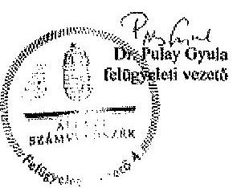

---

.

---

# RÖVIDÍTÉSEK JEGYZÉKE 

## Törvények

2010. évi Kvtv.
2011. évi Kvtv.
2012. évi Kvtv.
2013. évi Kvtv.

Art.
Áht. 1
Áht. 2
ÁSZ tv.
Gt. tv.
Info tv.

Kbt. 1
Kbt. 2
Kjt.
MTAtv.
Számv. tv.
Szja. tv.

## Korm. rendeletek

Áhsz.

Ámr.

Ávr.
2009. évi CXXX. törvény a Magyar Köztársaság 2010. évi költségvetéséről
2010. évi CLXIX. törvény a Magyar Köztársaság 2011. évi költségvetéséről
2011. évi CLXXXVIII. törvény Magyarország 2012. évi központi költségvetéséről
2012. évi CLXXXVIII. törvény Magyarország 2013. évi központi költségvetéséről
2003. évi XCII. törvény az adózás rendjéről 1992. évi XXXVIII. törvény az államháztartásról (hatályos 2011. december 31-ig)
2011. évi CXCV. törvény az államháztartásról (hatályos 2011. december 31-től)
2011. évi LXVI. törvény az Állami Számvevőszékről
2006. évi IV. törvény a gazdasági társaságokról
2011. évi CXII. törvény az információs önrendelkezési jogról és az információszabadságról (hatályos 2011. július 27-től)
2003. évi CXXIX. törvény a közbeszerzésekről (hatályos 2011. december 31-ig)
2011. évi CVIII. törvény a közbeszerzésekről (hatályos 2011. augusztus 21-től)
1992. évi XXXIII. törvény a közalkalmazottak jogállásáról
1994. évi XL. törvény a Magyar Tudományos Akadémiáról
2000. évi C. törvény a számvitelről
1995. évi CXVII. Törvény a személyi jövedelemadóról

249/2000. (XII. 24.) Korm. rendelet az államháztartás szervezetei beszámolási és könyvvezetési kötelezettségének sajátosságairól (hatálytalan 2014. január 1-jétől)
292/2009. (XII. 19.) Korm. rendelet az államháztartás működési rendjéről (hatályos 2011. december 31-ig)
368/2011. (XII. 31.) Korm. rendelet az államháztartásról szóló törvény végrehajtásáról (hatályos 2012. január 1-jétől)

---

Ber.

Bkr.

335/2005. (XII. 29.) Korm. rendelet

## Korm. határozat

1025/2011. (II. 11.) Korm. határozat

1428/2011. (XII. 7.) Korm. határozat

## Rendeletek

46/2009. (XII. 30.) PM rendelet

## Egyéb rövidítések

AÉT

AKT
Alapszabály₁

Alapszabály₂

Archeosztráda Kft.
ÁFA
ÁSZ
elnök
Elnökség
EU
Felügyelő Testület

193/2003. (XI. 26.) Korm. rendelet a költségvetési szervek belső ellenőrzéséről (hatályos 2011. december 31-ig)

370/2011. (XII. 31.) Korm. rendelet a költségvetési szervek belső kontrollrendszeréről és belső ellenőrzésről (hatályos 2012. január 1-től)
335/2005. (XII. 29.) Korm. rendelet a közfeladatot ellátó szervek iratkezelésének általános követelményeiről

1025/2011. (II. 11.) Korm. határozat az államháztartási egyensúly megőrzéséhez szükséges intézkedésekről (hatályos 2011. február 11-től)
1428/2011. (XII. 7) Korm. határozat a Magyar Tudományos Akadémia kutatóhálózatának és egyéb költségvetési szerveinek átalakításáról (hatályos 2011. december 7-től)
a kincstári számlavezetés és finanszírozás, a feladatfinanszírozási körbe tartozó előirányzatok felhasználása, valamint egyes államháztartási adatszolgáltatások rendjéről szóló 46/2009. (XII. 30.) PM rendelet (hatályos 2011. december 31-ig)

Magyar Tudományos Akadémia Érdekegyeztető Tanács
Akadémiai Kutatóintézetek Tanácsa
Magyar Tudományos Akadémia Közgyűlésének 6/2009. (V. 5.) számú határozata a Magyar Tudományos Akadémia Alapszabályáról és Akadémiai Ügyrendjéről egységes szerkezetben (hatálytalan 2011. december 7-től)
Magyar Tudományos Akadémia Közgyűlésének 10/2011. (XII. 5.) számú határozata a Magyar Tudományos Akadémia Alapszabályáról és Ügyrendjéről egységes szerkezetben (hatályos 2011. december 7-től)
Archeosztráda Kutató, Szolgáltató és Kereskedelmi Kft.
általános forgalmi adó
Állami Számvevőszék
Magyar Tudományos Akadémia elnöke
Magyar Tudományos Akadémia Elnöksége
Európai Unió
Magyar Tudományos Akadémia Felügyelő Testülete

---

FEUVE

Irányító szerv
ISSAI

Kormány
Közgyűlés
KTT
K+F
MÁK
MTA
MTA BLKI

MTA BLKI ellenőrzési nyomvonala

MTA BLKI Eszközök és források értékelési szabályzata

MTA BLKI Felesleges Vagyontárgyak Hasznosításának és Selejtezésének Szabályzata

MTA BLKI gazdálkodási szabályzata

MTA BLKI gazdasági szervezet ügyrendje₁

MTA BLKI gazdasági szervezet ügyrendje₂

MTA BLKI leltározási és leltárkészítési szabályzat

MTA BLKI Minősítési (Habilitációs) Szabályzata

MTA BLKI Önköltség-számítási szabályzata
folyamatba épített, előzetes, utólagos és vezetői ellenőrzés
Magyar Tudományos Akadémia
a legfőbb ellenőrző intézmények nemzetközi standardjai
Magyarország Kormánya
Magyar Tudományos Akadémia Közgyűlése
Külső Tanácsadó Testület
kutatás-fejlesztés
Magyar Államkincstár
Magyar Tudományos Akadémia
Magyar Tudományos Akadémia Balatoni Limnológiai Kutatóintézet
Magyar Tudományos Akadémia Balatoni Limnológiai Kutatóintézet Belső kontrollrendszer szabályozás 1.6. fejezete tartalmazza az ellenőrzési nyomvonalat (hatályos 2011. január 1-jétől)
Magyar Tudományos Akadémia Balatoni Limnológiai Kutatóintézete Eszközök és források értékelési szabályzata (hatályos 2011. január 1-jétől)
Magyar Tudományos Akadémia Balatoni Limnológiai Kutatóintézete Felesleges Vagyontárgyak Hasznosításának és Selejtezésének Szabályzata (hatályos 1998. szeptember 30-tól)
Magyar Tudományos Akadémia Balatoni Limnológiai Intézet Gazdálkodási Szabályzata (hatályos 2010. december 1-jétől)
Magyar Tudományos Akadémia Balatoni Limnológiai Intézet Gazdasági Szervezetének Ügyrendje (hatálytalan 2010. december 1-jétől)
Magyar Tudományos Akadémia Balatoni Limnológiai Intézet Gazdasági Szervezetének Ügyrendje (hatályos 2010. december 1-jétől)
Magyar Tudományos Akadémia Balatoni Limnológiai Kutatóintézete leltározási és leltárkészítési szabályzata (hatályos 2000. június 30-tól)
Magyar Tudományos Akadémia Balatoni Limnológiai Intézet Minősítési (Habilitációs) Szabályzata (hatálytalan 2011. április 1-jétől)
Magyar Tudományos Akadémia Balatoni Limnológiai Kutatóintézete Önköltség-számítási szabályzata (hatályos 2011. január 1-jétől

---

1. SZÁMÚ FÜGGELÉK

A V-0446-518/2015. SZÁMÚ JELENTÉSHEZ
MTA BLKI számviteli politika₁ Magyar Tudományos Akadémia Balatoni Limnológiai Kutatóintézete számviteli politikája (hatálytalan 2011. január 1-jétől)
MTA BLKI számviteli politika₂ Magyar Tudományos Akadémia Balatoni Limnológiai Kutatóintézete számviteli politikája (hatályos 2011. január 1-jétől)
MTA BLKI Szellemi tulajdon Magyar Tudományos Akadémia Balatoni kezelési szabályzata (hatályos 2005. október 24-től)
MTA BLKI Tudományos Minősítési Szabályzat

MTA BLKI Vagyongazdálkodási és Beruházási Szabályzata
MTA BTK
MTA BTK ellenőrzési nyomvonala

MTA BTK és jogelőd intézetek

MTA BTK Leltározási Szabályzata

MTA BTK Pénzkezelési Szabályzata₁

MTA BTK Pénzkezelési Szabályzata₂

MTA BTK SZMSZ

MTA elnökének 19/2009. (XII.15.) számú határozata

MTA GI

Magyar Tudományos Akadémia Balatoni Limnológiai Kutatóintézete tudományos Minősítési Szabályzat a tudományos kutatói munkakört betöltő közalkalmazottakkal szemben támasztott követelményekről (hatályos 2011. április 1-jétől)
Magyar Tudományos Akadémia Balatoni Limnológiai Kutatóintézete Vagyongazdálkodási és Beruházási Szabályzata (hatályos 2005. január 1-jétől)
Magyar Tudományos Akadémia Bölcsészettudományi Kutatóközpont
Magyar Tudományos Akadémia Bölcsészettudományi Kutatóközpont Belső

 kontrollrendszer szabályozás 1.6. pontja tartalmazza az Ellenőrzési nyomvonalat (hatályos 2012. november 5-től)
A 2012-2013. években az MTA BTK, a 2010–2011. években a 2012. január 1-jétől létrejött MTA BTK szervezeti egységét képező intézetek
Magyar Tudományos Akadémia Bölcsészettudományi Kutatóközpont Leltározási Szabályzata (hatályos 2012. november 5-től)
Magyar Tudományos Akadémia Bölcsészettudományi Kutatóközpont Pénzkezelési Szabályzata (hatálytalan 2013. augusztus 1-jétől)
Magyar Tudományos Akadémia Bölcsészettudományi Kutatóközpont Pénzkezelési Szabályzata (hatályos: 2013. augusztus 1-jétől)
Magyar Tudományos Akadémia Bölcsészettudományi Kutatóközpont Szervezeti és Működési Szabályzata (hatályos 2012. március 20-tól)
Az akadémiai költségvetési szervek megbízási hatáskörbe tartozó vezetői munkakörének átadásáról és átvételéről
Magyar Tudományos Akadémia Gazdasági Igazgatósága

---

| MTA KK | Magyar Tudományos Akadémia Kémiai Kutatóközpont |
| :--: | :--: |
| MTA KK FEUVE szabályzata | Magyar Tudományos Akadémia Kémiai Kutatóközpont FEUVE szabályzat (a folyamatba épített, előzetes és utólagos vezetői ellenőrzés szabályozása) (hatályos 2006. szeptember 1-jétől) |
| MTA LGK | Magyar Tudományos Akadémia Létesítménygazdálkodási Központ |
| MTA MFA | Magyar Tudományos Akadémia Műszaki Fizikai és Anyagtudományi Kutatóintézet |
| MTA MFA ellenőrzési nyomvonala | Magyar Tudományos Akadémia Műszaki Fizikai és Anyagtudományi Kutatóintézet Folyamatba épített előzetes és utólagos vezetői ellenőrzés rendszere szabályozás része az Ellenőrzési nyomvonal (hatályos 2011. január 2-ától) |
| MTA MFA gazdasági szervezet ügyrendje | Magyar Tudományos Akadémia Műszaki Fizikai és Anyagtudományi Kutatóintézet Gazdasági szervezetének ügyrendje (hatályos 2010. január 2-tól) |
| MTA MFA Közbeszerzési szabályzata | Magyar Tudományos Akadémia Műszaki Fizikai és Anyagtudományi Kutatóintézet Közbeszerzési szabályzata (hatályos 2007. január 2-tól) |
| MTA MFA leltározási szabályzata | Magyar Tudományos Akadémia Műszaki Fizikai és Anyagtudományi Kutatóintézet Számviteli Politika részeként szabályozott Leltározási szabályzat (hatályos 2009. január 2-től) |
| MTA MFA pénzkezelési szabályzata | Magyar Tudományos Akadémia Műszaki Fizikai és Anyagtudományi Kutatóintézet Pénzkezelési szabályzat (hatályos 2009. január 2-től) |
| MTA MFA számlarendje | Magyar Tudományos Akadémia Műszaki Fizikai és Anyagtudományi Kutatóintézet számlarendje (hatályos 2009. január 2-től) |
| MTA MFA számviteli politikája | Magyar Tudományos Akadémia Műszaki Fizikai és Anyagtudományi Kutatóintézet számviteli politikája (hatályos 2009. január 2-től) |
| MTA MFA SZMSZ | Magyar Tudományos Akadémia Műszaki Fizikai és Anyagtudományi Kutatóintézet Szervezeti és Működési Szabályzata (hatályos 2010. augusztus 9-től) |
| MTA ÖK | Magyar Tudományos Akadémia Ökológiai Kutatóközpont |
| MTA ÖK és jogelőd intézetek | A 2012-2013. években az MTA ÖK, a 2010–2011. években a 2012. január 1-jétől létrejött MTA ÖK szervezeti egységét képező intézetek |

---

1. SZÁMÚ FÜGGELÉK

A V-0446-S18/2015. SZÁMÚ JELENTÉSHEZ

MTA ÖK Felesleges Vagyontárgyak Hasznosításának és Selejtezésének Szabályzata

MTA ÖK gazdálkodási szabályzata

MTA ÖK Leltárkészítési és leltározási szabályzata

MTA ÖK Szabálytalanságkezelési eljárásrendje

MTA ÖK SZMSZ

MTA ÖK gazdasági szervezetének ügyrendje

MTA ÖK Vagyongazdálkodási és Beruházási Szabályzata

MTA RI
MTA RI ellenőrzési nyomvonala

MTA RI közbeszerzési szabályzata

MTA RI leltárkészítési és leltározási szabályzata

MTA RI pénzkezelési szabályzat

MTA RI számviteli politikája

MTA RI SZMSZ

MTA TTK

Magyar Tudományos Akadémia Ökológiai Kutatóközpont Felesleges Vagyontárgyak Hasznosításának és Selejtezésének Szabályzata
Magyar Tudományos Akadémia Ökológiai Kutatóközpont Gazdálkodási Szabályzata (hatályos 2012. május 1-jétől)
Magyar Tudományos Akadémia Ökológiai Kutatóközpont Leltárkészítési és leltározási szabályzata (hatályos 2013. augusztus 1-jétől)
Magyar Tudományos Akadémia Ökológiai Kutatóközpont Szabálytalanságok kezelésének eljárásrendje (hatályos 2012. augusztus 10-től)
Magyar Tudományos Akadémia Ökológiai Kutatóközpont szervezeti és működési szabályzat (hatályos 2012. június 26-tól)
Magyar Tudományos Akadémia Ökológiai Kutatóközpont gazdasági szervezetének ügyrendje (hatályos 2013. augusztus 1-jétől)
Magyar Tudományos Akadémia Ökológiai Kutatóközpont Vagyongazdálkodási és Beruházási Szabályzata (hatályos 2013. október 8-ától)
Magyar Tudományos Akadémia Régészeti Intézet
Magyar Tudományos Akadémia Régészeti Intézet Folyamatba épített előzetes és utólagos vezetői ellenőrzés rendszere szabályzat II. fejezete az Ellenőrzési nyomvonal (hatályos 2009. április 30-tól)
Magyar Tudományos Akadémia Régészeti Intézet közbeszerzési szabályzata (hatályos 2010. január 1-jétől)

Magyar Tudományos Akadémia Régészeti Intézet leltárkészítési és leltározási szabályzata (hatályos 2009. január 1-jétől)
Magyar Tudományos Akadémia Régészeti Intézet pénzkezelési szabályzata (hatályos 2010. május 1-jétől)
Magyar Tudományos Akadémia Régészeti Intézet számviteli politikája (hatályos 2010. május 1-jétől)
Magyar Tudományos Akadémia Régészeti Intézet Szervezeti és Működési Szabályzata (hatályos 2007. március 6-tól)
Magyar Tudományos Akadémia Természettudományi Kutatóközpont

---

MTA TTK értékelési szabály-
zata

MTA TTK és a jogelőd intézetek

MTA TTK Gazdálkodási szabályzata

MTA TTK gazdasági szervezetének ügyrendje

MTA TTK Leltározási Szabályzata

MTA TTK pénzkezelési szabályzata

MTA TTK számlarendje

MTA TTK számlatükör

MTA TTK számviteli politikája

MTA TTK Szellemi tulajdon kezelési szabályzata

MTA TTK SZMSZ

MTA Vagyongazdálkodási és Vagyonhasznosítási Szabályzata ${ }_{1}$

Magyar Tudományos Akadémia Természettudományi Kutatóközpont 18. sorszámú Eszközök és források értékelési szabályzata (hatályos 2012. január 1-jétől)
A 2012-2013. években az MTA TTK, a 2010–2011. években a 2012. január 1-jétől létrejött MTA TTK szervezeti egységét képező intézetek
Magyar Tudományos Akadémia Természettudományi Kutatóközpontjának Gazdálkodási szabályzata (hatályos 2012. január 1-jétől)
Magyar Tudományos Akadémia Természettudományi Kutatóközpont 14. sorszámú Gazdasági szervezet ügyrendje (hatályos 2012. január 1-jétől)
Magyar Tudományos Akadémia Természettudományi Kutatóközpont Leltárkészítési és leltározási szabályzat (hatályos 2012. január 1-jétől)
Magyar Tudományos Akadémia Természettudományi Kutatóközpont 21. sorszámú értékkezelési szabályzat (hatályos 2012. január 1-jétől)
Magyar Tudományos Akadémia Természettudományi Kutatóközpont 16. sorszámú Számlarend (hatályos 2012. január 1-jétől)
Magyar Tudományos Akadémia Természettudományi Kutatóközpont 16/1. sorszámú Számlarend Számlatükör (hatályos 2012. január 1-jétől)
Magyar Tudományos Akadémia Természettudományi Kutatóközpont 17. sorszámú Számviteli politika (hatályos 2012. január 1-jétől)
Magyar Tudományos Akadémia Természettudományi Kutatóközpont Szellemi tulajdon kezelési szabályzata (hatályos 2013. szeptember 1-jétől)
MTA TTK - Akadémiai Kutatóintézetek Tanácsa 3/1/2012. (02. 27.) számú állásfoglalásával jóváhagyott - Szervezeti és Működési Szabályzata (hatályos 2012. március 20-tól)
Magyar Tudományos Akadémia Elnökségének 19/2010. (III. 30.) számú határozata a Magyar Tudományos Akadémia Vagyongazdálkodási és Vagyonhasznosítási Szabályzatáról (hatályos 2012. december 31-ig)

---

| MTA Vagyongazdálkodási és Vagyonhasznosítási Szabályzata ${ }_{2}$ | Magyar Tudományos Akadémia Elnökségének 62/2012. (XII. 18.) számú határozata a Magyar Tudományos Akadémia Vagyongazdálkodási és Vagyonhasznosítási Szabályzatáról (hatályos 2013. január 1-jétől) |
| :--: | :--: |
| NAV | Nemzeti Adó- és Vámhivatal |
| NGM | Nemzetgazdasági Minisztérium |
| OGY | Országgyűlés |
| Q2 beruházás | A Magyar Tudományos Akadémia Természettudományi Kutatóközpont új épületének beruházása |
| Stratégiai Tanácsadó Testület | Magyar Tudományos Akadémia elnöke döntéshozó munkáját segítő testület |
| SZMSZ | Szervezeti és Működési Szabályzat |
| Ügyrend ${ }_{1}$ | Magyar Tudományos Akadémia Közgyűlésének 6/2009. (V. 5.) számú határozata a Magyar Tudományos Akadémia Alapszabályáról és Akadémiai Úgyrendjéről egységes szerkezetben (hatálytalan 2011. december 7-től) |
| Ügyrend $_{2}$ | Magyar Tudományos Akadémia Közgyűlésének 10/2011. (XII. 5.) számú határozata a Magyar Tudományos Akadémia Alapszabályáról és Úgyrendjéről egységes szerkezetben (hatályos 2011. december 7-től) |
| Vagyonkezelő Testület | Magyar Tudományos Akadémia vagyonával kapcsolatos véleményezési, döntés-előkészítő jogkört gyakorló testület |
| Vezetői Kollégium | Magyar Tudományos Akadémia operatív működését irányító választott testület |

---

# FOGALOMTÁR 

Akadémia Elnöksége

Akadémia kutatóhálózata
akadémiai kutatóintézet
akadémiai kutatóközpont

Akadémiai Kutatóintézetek Tanácsa (AKT)

Akadémia vagyona

A Magyar Tudományos Akadémia Elnöksége. Két Közgyűlés között az Elnökség az Akadémia döntéshozó testülete. Az Elnökség döntési jogkörét, működési rendjét és azt, hogy az Elnökség mely döntési jogköreit adhatja át a MTA tv. 12. §-ban meghatározott Vezetői Kollégiumnak, az Alapszabály tartalmazza. Az Elnökség a döntéseiért a Közgyűlésnek tartozik felelősséggel. (Forrás: MTAtv. 11. § (2) bekezdés)
Az Akadémia kutatóhálózata kutatóközpontokból, kutatóintézetekből és támogatott kutatócsoportokból (együttesen: kutatóhely) áll.
(Forrás: MTAtv. 17. § (1) bekezdés)
Az akadémiai kutatóintézet költségvetési szerv. Az akadémiai kutatóközpont keretein belül működő kutatóintézet a kutatóközpont szervezeti egysége. A kutatóintézet autonóm módon vesz részt az Akadémia közfeladatainak megoldásában, önállóan is vállal közfeladatokat, továbbá egyéb tevékenységet is végezhet. A kutatóintézet tevékenységét az igazgató irányítja a tudományos tanács vagy más intézeti testületi szerv közreműködésével.
(Forrás: MTAtv. 18. § (1)-(2) bekezdés)
Az akadémiai kutatóközpont költségvetési szerv. A kutatóközpont autonóm módon vesz részt az Akadémia közfeladatainak megoldásában, önállóan is vállal közfeladatokat, továbbá egyéb tevékenységet is végezhet. Tudományos tevékenységéről és gazdálkodásáról évente beszámolót készít, amelyet az Akadémia az e törvényben és az Alapszabályban leírtak szerint értékel. A kutatóközpont tevékenységét a főigazgató irányítja a tudományos tanács vagy más intézeti testületi szerv közreműködésével.
(Forrás: MTAtv. 18. § (1)-(2) bekezdés)
Az akadémiai kutatóhálózat testületi felügyeletét látja el. Az AKT 15 főből áll, elnöke a főtitkár.
(Forrás: MTAtv. 17. § (4)-(5) bekezdés)
Az Akadémia vagyonába tartozik az e törvény hatálybalépésével az Akadémiának átadott törzsvagyon és az állami vagyonról szóló 2007. évi CVI. törvény 69. § (1) bekezdése alapján az Akadémiának átadott vagyon (a továbbiakban: az Akadémia vagyona). Az Akadémia vagyonába tartoznak az ingatlanok, az immateriális javak (ideértve a szellemi tulajdont is), a tárgyi eszközök, a pénz, a befektetések és a részesedések is.
(Forrás: MTAtv. 23. § (2) bekezdés)

---

Akadémia vagyongazdálkodása
alapkutatás
alkalmazott kutatás
átalakítás
belső kontrollrendszer
érvényesítés

Az Akadémia a feladatai ellátása érdekében a vagyonával önállóan gazdálkodik, ennek részletes szabályait az Alapszabály határozza meg.
(Forrás: MTAtv. 23. § (1) bekezdés)
Kísérleti vagy elméleti munka, amelyet elsősorban a jelenségek vagy megfigyelhető tények hátterével kapcsolatos új ismeretek megszerzésének érdekében folytatnak anélkül, hogy kilátásba helyeznék azok gyakorlati alkalmazását vagy felhasználását.
(Forrás: 2004. évi CXXXIV. törvény 4. §)
Tervezett kutatás vagy kritikus vizsgálat, amelynek célja új ismeretek és szakértelem megszerzése új termékek, eljárások vagy szolgáltatások kifejlesztéséhez, vagy a létező termékek, eljárások vagy szolgáltatások jelentős mértékű fejlesztésének elősegítéséhez. Magában foglalja az alkalmazott kutatáshoz - különösen a generikus technológiák ellenőrzéséhez - szükséges komplex rendszerek összetevőinek létrehozását is a prototípusok kivételével.
(Forrás: 2004. évi CXXXIV. törvény 4. §)
Az általános jogutódlással történő megszüntetés átalakítással történhet. Az átalakítás lehet egyesítés vagy különválás. Az egyesítés lehet beolvadás vagy összeolvadás.
(Forrás: Áht. 95. §, Áht. 2 11. §)
A kockázatok kezelése és tárgyilagos bizonyosság megszerzése érdekében kialakított folyamatrendszer, ami azt a célt szolgálja, hogy megvalósuljanak a következő célok: a működés és a gazdálkodás során a tevékenységeket szabályszerűen, gazdaságosan, hatékonyan, eredményesen hajtsák végre, az elszámolási kötelezettségeket teljesítsék, és megvédjék az erőforrásokat a veszteségektől, károktól és nem rendeltetésszerű használattól.
(Forrás: Áht.: 121. § (1) bekezdés, Áht. 2 69. § (1) bekezdés)
A szakmai teljesítés igazolása alapján - az Ámr. 76. § (3) bekezdése szerinti esetben annak hiányában is - az érvényesítőnek ellenőriznie kell az összegszerűséget, a fedezet meglétét és azt, hogy a megelőző ügymenetben az Áht., az államháztartási számviteli kormányrendelet és e rendelet előírásait, továbbá a belső szabályzatokban foglaltakat megtartották-e. Az érvényesítésnek tartalmaznia kell az érvényesítésre utaló megjelölést, a megállapított összeget, az érvényesítés dátumát és az érvényesítő aláírását.
(Forrás: Ámr. 76. § (1) és (3) bekezdései)
Kifizetések esetén a teljesítés igazolása alapján - az Ávr. 57. § (3) bekezdése szerinti esetben annak hiányában is - az érvényesítőnek ellenőriznie kell az összeg-

---

használhatósági fok mutató
integritás
irányító szerv
kontrolltevékenységek
kötelezettségvállalás
közfeladat
köztestület
szegszerűséget, a fedezet meglétét és azt, hogy a megelőző ügymenetben az Áht., az államháztartási számviteli kormányrendelet és e rendelet előírásait, továbbá a belső szabályzatokban foglaltakat megtartották-e. Az érvényesítés az Ávr. 59. § (2) bekezdése szerinti okmány utalványozása előtt történik. Az érvényesítésnek tartalmaznia kell az érvényesítésre utaló megjelölést és az érvényesítő keltezéssel ellátott aláírását.
(Forrás: Ávr. 58. § (1) és (3) bekezdései)
tárgyi eszközök nettó értéke x 100 / tárgyi eszközök bruttó értéke
Az integritás az elvek, értékek, cselekvések, módszerek, intézkedések
 konzisztenciáját jelenti, vagyis olyan magatartásmódot, amely meghatározott értékeknek megfelel.
(Forrás: Magyarországi államháztartási belső kontroll standardok Útmutató 1.6.1. pontja, 2012. december)
A központi alrendszer egyes intézményével és annak gazdálkodásával kapcsolatos irányítási jogokkal felruházott szerv vagy személy.
(Forrás: (Áht. 2/A. § (3) bekezdés a) pontja, Ávr. 1. § (3) bekezdés a) pontja)

A kontrolltevékenységek azok a politikák és eljárások, amelyeket a kockázatok megoldására hoznak létre a szervezet céljainak teljesítése érdekében.
(Forrás: ÁSZ belső szakmai előírása)
A kiadási előirányzatok, és - ha jogszabály azt lehetővé teszi - a lebonyolító szerv számára a Kormány rendeletében meghatározottak szerinti rendelkezésre bocsátott összeg terhére fizetési kötelezettség - így különösen a foglalkoztatásra irányuló jogviszony létesítésére, szerződés megkötésére, költségvetési támogatás biztosítására irányuló - vállalásáról szóló, szabályszerűen megtett jognyilatkozat.
(Forrás: Áht. 72. § (1) bekezdése, Áht. 22. §(1) bekezdés o) pontja)

Jogszabályban meghatározott és az alapító okiratban rögzített állami, önkormányzati feladatokat.
(Forrás: Áht. 87. §)
A köztestület önkormányzattal és nyilvántartott tagsággal rendelkező szervezet, amelynek létrehozását törvény rendeli el. A köztestület a tagságához, illetőleg a tagsága által végzett tevékenységhez kapcsolódó közfeladatot lát el. A köztestület jogi személy.
A Magyar Tudományos Akadémia köztestület.
(Forrás: MTAtv. 1. § (1) bekezdése)

---

kutatás-fejlesztés
monitoring
monitoring-rendszer

MTA Közgyűlés

MTA Vagyonkezelő Testület
saját tőke aránya mutató szakmai teljesítésigazolás

Magában foglalja az alapkutatást, az alkalmazott kutatást és a kísérleti fejlesztést.
(Forrás: 2004. évi CXXXIV. törvény 4. §)
A monitoring a különböző szintű szervezeti célok megvalósításának folyamatát kíséri figyelemmel, melynek során a releváns eseményekről és tevékenységekről (együtt: folyamatokról) rendszeres jelleggel, strukturált, döntéstámogató információkhoz jutnak a szervezet vezetői.
(Forrás: NGM útmutató a költségvetési szervek monitoring rendszeréhez 3. oldal, 2011. november)
A költségvetési szerv vezetője köteles olyan monitoring rendszert működtetni, mely lehetővé teszi a szervezet tevékenységének, a célok megvalósításának nyomon követését. A költségvetési szerv monitoring rendszere az operatív tevékenységek keretében megvalósuló folyamatos és eseti nyomon követésből, valamint az operatív tevékenységektől függetlenül működő belső ellenőrzésből áll.
(Forrás: Ámr. 160. §, Bkr. 10. §)
A Közgyűlés az MTA, mint köztestület legfőbb döntéshozó testülete, az Akadémia Közgyűlését a hazai akadémikusok, valamint a nem akadémikus képviselők alkotják.
(Forrás: MTAtv. 9. § (1)-(2) bekezdése)
Az Akadémia vagyonával kapcsolatos végrehajtási jogkört és az elszámolási, valamint a nyilvántartási feladatokat az MTA Titkárságán belül működő Vagyonkezelő Szervezet látja el. Az Akadémia vagyonával kapcsolatos véleményezési, döntés-előkészítő jogkör a Vagyonkezelő Testület hatáskörébe tartozik.
(Forrás: MTAtv. 23. § (7) bekezdése)
saját tőke összesen / források összesen
A szakmai teljesítés igazolása során ellenőrizhető okmányok alapján ellenőrizni, szakmailag igazolni kell a kiadások teljesítésének jogosságát, összegszerűségét, ellenszolgáltatást is magában foglaló kötelezettségvállalás esetében - ha a kifizetés vagy annak egy része az ellenszolgáltatás teljesítését követően esedékes - annak teljesítését. A szakmai teljesítést az igazolás dátumának és a teljesítés tényére történő utalás megjelölésével, az arra jogosult személy aláírásával kell igazolni. (Forrás: Ámr. 76. § (1) bekezdése, Ávr. 57. § (1) bekezdése).

---

utalványozás ellenjegyzése
utóellenőrzés

Az utalvány ellenjegyzése során az Ámr. 74. §-ban foglaltak megfelelő alkalmazásával kell eljárni, továbbá meg kell győződni arról, hogy a szakmai teljesítés igazolása és az érvényesítés megtörtént-e.
(Forrás: Ámr. 79. § (2) bekezdése)
Az intézkedések nyomon követése érdekében elrendelt ellenőrzés, amelynek célja, hogy az ellenőrzés bizonyosságot szerezzen az elfogadott intézkedések végrehajtásáról vagy arról a tényről, hogy az ellenőrzött szerv, illetve az ellenőrzött szervezeti egység vezetője nem vagy nem az elfogadott intézkedésnek megfelelően hajtja végre az intézkedéseket, továbbá meggyőződni arról, hogy a végrehajtott intézkedésekkel a megállapított kockázat ténylegesen megszűnt, vagy a kockázati tűréshatár alá csökkent.
(Forrás: Bkr. 2. § s) pontja)
