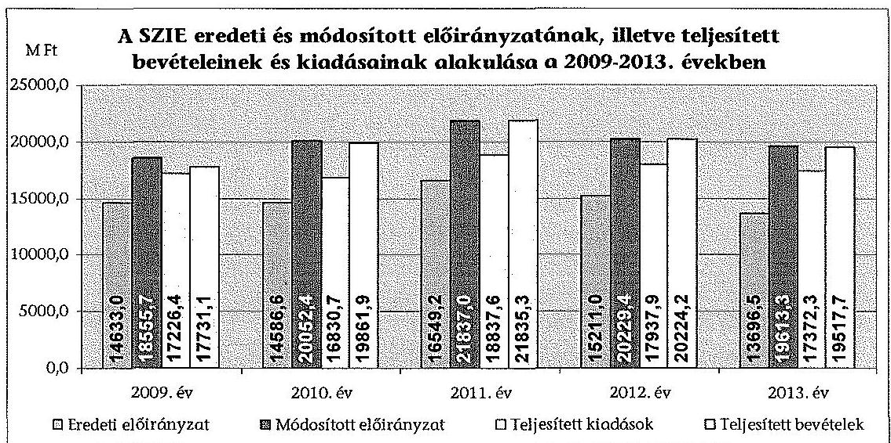
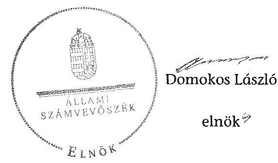
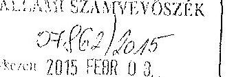
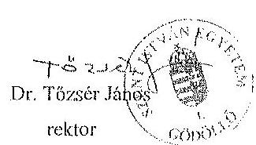
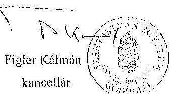
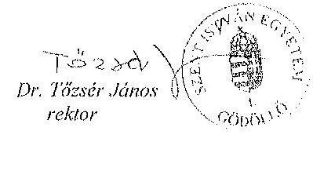
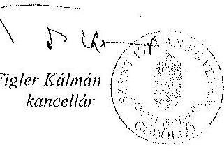
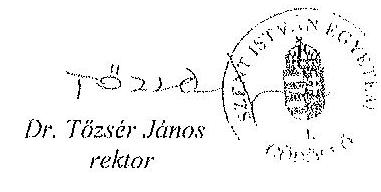
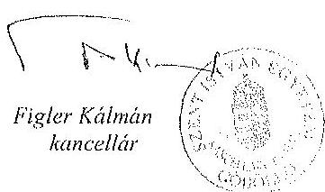
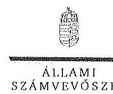

# ÁLLAMI   SZÁMVEVŐSZÉK 

## JELENTÉS

A Szent István Egyetem ellenőrzéséről - Az állami felsőoktatási intézmények gazdálkodásának, múködésének ellenőrzése

---

# Állami Számvevöszék 

Iktatószám: V-0579-194/2015.
Témaszám: 1613
Vizsgálat-azonosító szám: V068905

## Az ellenőrzést felügyelte:

## Kisgergely István

felügyeleti vezető

## Az ellenőrzés végrehajtásáért felelős:

Horváth József
ellenőrzésvezető

A számvevői munkaanyagok feldolgozását és a Jelentés összeállítását végezte:

## Horváth József

ellenőrzésvezető
Huszárné Borbás Melinda
számvevő

## Az ellenőrzést végezték:

| Fórián Erika | Huszárné | Kriston-Vizi János |
| :-- | :-- | :-- |
| számvevő tanácsos | Borbás Melinda   számvevő | számvevő tanácsos |

## Nagy László Imre

számvevő

## A témához kapcsolódó eddig készített számvevőszéki jelentések:

## címe

Jelentés az oktatási és kulturális ágazat irányítási rendszerének, 1106 működésének ellenőrzéséről
Jelentés a felsőoktatás oktatási infrastruktúra-fejlesztési program- 1171 jának ellenőrzéséről
Jelentés az állami felsőoktatási intézmények érdekeltségébe tartozó 1290 gazdasági társaságok támogatásának és nyereségük hasznosulásának ellenőrzéséről
Jelentés a Szolnoki Főiskola ellenőrzéséről - Az állami felsőoktatási 14196
intézmények gazdálkodásának, müködésének ellenőrzése
Jelentés a Pannon Egyetem ellenőrzéséről - Az állami felsőoktatási 14197
intézmények gazdálkodásának, müködésének ellenőrzése

---

Jelentés a Károly Róbert Főiskola ellenőrzéséről - Az állami felsőok- 14198
tatási intézmények gazdálkodásának, múködésének ellenőrzése
Jelentés a Magyar Képzőmúvészeti Egyetem ellenőrzéséről - Az ál- 14199
lami felsőoktatási intézmények gazdálkodásának, múködésének ellenőrzése
Jelentés a Miskolci Egyetem ellenőrzéséről - Az állami felsőoktatási 14200
intézmények gazdálkodásának, múködésének ellenőrzése
Jelentés a Széchenyi István Egyetem ellenőrzéséről - Az állami fel- 14201
sőoktatási intézmények gazdálkodásának, múködésének ellenőrzé- se
Jelentés az Eszterházy Károly Főiskola ellenőrzéséről - Az állami 14204
felsőoktatási intézmények gazdálkodásának, múködésének ellen-
őrzése
Jelentés a Magyar Táncmúvészeti Főiskola ellenőrzéséről - Az állami felsőoktatási intézmények gazdálkodásának, múködésének ellenőrzése
Jelentés a Budapesti Műszaki és Gazdaságtudományi Egyetem el- 14218
lenőrzéséről - Az állami felsőoktatási intézmények gazdálkodásá- nak, múködésének ellenőrzése
Jelentés a Budapesti Corvinus Egyetem ellenőrzéséről - Az állami 15032
felsőoktatási intézmények gazdálkodásának, múködésének ellenőrzése
Jelentés a Nyíregyházi Főiskola ellenőrzéséről - Az állami felsőok- 15028
tatási intézmények gazdálkodásának, múködésének ellenőrzése
Jelentés az Eötvös József Főiskola ellenőrzéséről - Az állami felsőok- 15025
tatási intézmények gazdálkodásának, múködésének ellenőrzése
Jelentés a Kecskeméti Főiskola ellenőrzéséről - Az állami felsőokta- 15026
tási intézmények gazdálkodásának, múködésének ellenőrzése
Jelentés a Kaposvári Egyetem ellenőrzéséről - Az állami felsőokta- 15030
tási intézmények gazdálkodásának, múködésének ellenőrzése
Jelentés a Liszt Ferenc Zeneművészeti Egyetem ellenőrzéséről - Az 15033
állami felsőoktatási intézmények gazdálkodásának, múködésének ellenőrzése

---

.

---

# TARTALOMJEGYZÉK 

BEVEZETÉS ..... 15
I. ÖSSZEGZŐ MEGÁLLAPÍTÁSOK, KÖVETKEZTETÉSEK, JAVASLATOK ..... 20
II. RÉSZLETES MEGÁLLAPÍTÁSOK ..... 28

1. A fenntartói és ágazati irányítási jogok gyakorlása ..... 28
2. Az intézmény belső kontrollrendszerének kialakítása és múködtetése ..... 30
3. Az intézmény döntéshozó szerveinek joggyakorlása, az oktatási és egyéb tevékenységei elkülönítése, pénzügyi gazdálkodása ..... 35
3.1. Az intézmény döntéshozó szerveinek gazdálkodással kapcsolatos joggyakorlása ..... 35
3.2. Az intézmény oktatási és egyéb tevékenységei elkülönítése, az ellátott feladat átláthatósága ..... 38
3.3. Az intézmény pénzügyi egyensúlya, fizetőképessége ..... 38
3.4. Az intézmény előirányzat kezelése ..... 41
3.5. Az egyes hazai forrásból finanszírozott projektekhez, feladatokhoz kapott - nem normatív - költségvetési forrással való elszámolás ..... 47
4. Az intézmény vagyongazdálkodása ..... 48
4.1. A vagyongazdálkodási tevékenységek keretei ..... 48
4.2. A vagyonváltozások és a vagyonhasznosítás szabályszerűsége ..... 49
4.3. Az intézmény tulajdonosi joggyakorlása ..... 52
5. A külső ellenőrzések által tett javaslatok hasznosulása ..... 55
5.1. ÁSZ ellenőrzések áltat tett javaslatok hasznosulása ..... 55
5.2. Az egyéb külső ellenőrzések javaslatainak hasznosulása ..... 57
6. Az integritás kontrollok kialakítása és múködtetése ..... 58

---

# MELLÉKLETEK 

1. számú A Szent István Egyetem kiadási és bevételi előirányzatai, azok teljesítése a 2009-2013. években
2. számú A Szent István Egyetem kiadásainak, bevételeinek változása a 2009-2013. években
3. számú Kimutatás a Szent István Egyetem bevételeiről és kiadásairól, valamint adósságszolgálatáról a 2009-2013. években
4. számú A Szent István Egyetem mérlegadatai a 2009-2013. években
5. számú A Szent István Egyetem gazdálkodása szabályszerűségének értékelése a mintatételek alapján
6. számú A Szent István Egyetem gazdasági társaságokban lévő tulajdonosi részesedései mértéke és a társaságok mérleg szerinti eredménye a 2009-2013. években
7. számú A Szent István Egyetem észrevétele
8. számú A Szent István Egyetem észrevételére adott válasz

## FÜGGELÉK

1. számú Az integritás érvényesítése érdekében kialakított és múködtetett intézményi kontrollrendszer

---

# RÖVIDÍTÉSEK JEGYZÉKE 

| Törvények |  |
| :--: | :--: |
| Avtv. | 1992. évi LXIII. törvény a személyes adatok védelméről és a közérdekú adatok nyilvánosságáról (hatálytalan 2012. január 1-jétől) |
| Áht. 1 | 1992. évi XXXVIII. törvény az államháztartásról (hatálytalan 2012. január 1-jétől) |
| Áht. 2 | 2011. évi CXCV. törvény az államháztartásról |
| ÁSZ tv. | 2011. évi LXVI. törvény az Állami Számvevőszékről |
| Eisztv. | 2005. évi XC. törvény az elektronikus információszabadságról (hatálytalan 2012. január 1-jétől) |
| Feot. | 2005. évi CXXXIX. törvény a felsőoktatásról (hatálytalan 2012. szeptember 1-jétől) |
| Gt. | 2006. évi IV. törvény a gazdasági társaságokról (hatálytalan 2014. március 15 -tól) |
| Info tv. | 2011. évi CXII. törvény az információs önrendelkezési jogról és az információszabadságról |
| Kbt. 1 | 2003. évi CXXIX. törvény a közbeszerzésekről (hatálytalan 2012. január 1-jétől) |
| Kbt. 2 | 2011. évi CVIII. törvény a közbeszerzésekről |
| Kjt. | 1992. évi XXXIII. törvény a közalkalmazottak jogállásáról |
| Mt. 1 | 1992. évi XXII. törvény a Munka Törvénykönyvéről (hatálytalan 2013. január 1-jétől) |
| Mt. 2 | 2012. évi I. törvény a munka törvénykönyvéről |
| Nftv. | 2011. évi CCIV. törvény a nemzeti felsőoktatásról |
| Nvtv. | 2011. évi CXCVI. törvény a nemzeti vagyonról |
| Szja tv. | 1995. évi CXVII. törvény a személyi jövedelemadóról |
| Sztv. | 2000. évi C. törvény a számvitelről |
| Tbj tv. | 1997. évi LXXX. törvény a társadalombiztosítás ellátásaira és a magánnyugdijra jogosultakról, valamint e szolgáltatások fedezetéról |
| Vtv. | 2007. évi CVI. törvény az állami vagyonról |
| Rendeletek |  |
| Áhsz. | 249/2000. (XII. 24.) Korm. rendelet az államháztartás szervezetei beszámolási és könyvvezetési kötelezettségének sajátosságairól |
| Ámr. 1 | 217/1998. (XII. 30.) Korm. rendelet az államháztartás múködési rendjéről (hatálytalan 2010. január 1-jétől) |
| Ámr. 2 | 292/2009. (XII. 19.) Korm. rendelet az államháztartás múködési rendjéről (hatálytalan 2012. január 1-jétől) |
| Ávr. | 368/2011. (XII. 31.) Korm. rendelet az államháztartásról szóló törvény végrehajtásáról |
| Ber. | 193/2003. (XI. 26.) Korm. rendelet a költségvetési szervek belső ellenőrzéséről (hatálytalan 2012. január 1-jétől) |

---

Bkr.
Vtvr.
51/2007. (III. 26.)
Korm. rendelet
50/2008. (III. 14.)
Korm. rendelet

## Határozatok

1132/2010. (VI. 18.)
Korm. határozat
1316/2011. (IX. 19.)
Korm. határozat
1365/2011. (XI. 8.)
Korm. határozat
1133/2012. (IV. 26.)
Korm. határozat
1657/2012. (XII. 20.)
Korm. határozat

## Egyéb rövidítések

alapító okirat ${ }_{1}$
alapító okirat ${ }_{2}$
alapító okirat ${ }_{3}$
alapító okirat ${ }_{4}$
alapító okirat ${ }_{5}$
alapító okirat ${ }_{6}$
ÁSZ
BEI
belső ellenőrzési kézikönyv ${ }_{1}$
belső ellenőrzési kézikönyv ${ }_{2}$
DPMTISZK Nonprofit Kiemelkedően Közhasznú Kft. „v. a." értékelési szabályzat ${ }_{1}$
értékelési szabályzat ${ }_{2}$ egyetem

370/2011. (XII. 31.) Korm. rendelet a költségvetési szervek belső kontrollrendszeréről és belső ellenőrzéséről 254/2007. (X. 4.) Korm. rendelet az állami vagyonnal való gazdálkodásról
A felsőoktatásban részt vevő hallgatók juttatásairól és az általuk fizetendő egyes térítésekről szóló 51/2007. (III. 26.) Korm. rendelet
A felsőoktatási intézmények képzési, tudományos célú és fenntartói normatíva alapján történő finanszírozásáról szóló 50/2008. (III. 14.) Korm. rendelet
a 2010. évi költségvetéssel összefüggő egyes feladatokról
1316/2011. (IX. 19.) Korm. határozat a 2011. évi költségvetési egyensúlyt megtartó intézkedésekről
a 2012. évi költségvetési hiánycél tartását biztosító további feladatokról
a központi költségvetési szerveknél foglalkoztatottak 2012. évi kompenzációjának finanszírozásáról

1657/2012. (XII. 20.) Korm. határozat a kormányzati stratégiai dokumentumok felülvizsgálatával kapcsolatos feladatokról

Szent István Egyetem Alapító Okirata (hatálytalan 2009. július 1-jétől)

Szent István Egyetem Alapító Okirata (hatálytalan 2010. november 2-től)

Szent István Egyetem Alapító Okirata (hatálytalan 2011. július 6 -tól)
Szent István Egyetem Alapító Okirata (hatálytalan 2013. március 21-től)

Szent István Egyetem Alapító Okirata (hatálytalan 2013. november 25 -től )

Szent István Egyetem Alapító Okirata
Állami Számvevőszék
Szent István Egyetem Belső Ellenőrzési Igazgatósága
Szent István Egyetem Belső Ellenőrzési Kézikönyv (hatálytalan 2010. december 1-jétől)
Szent István Egyetem Belső Ellenőrzési Kézikönyv
DPMTISZK Dél-Pest megyei Térségi Integrált Szakképző Központ Nonprofit Kiemelkedően Közhasznú Korlátolt Felelősségű Társaság „végelszámolás alatt"
Szent István Egyetem Értékelési Szabályzata (hatályos: 2009. december 18-tól 2012. október 7-ig)

Szent István Egyetem Értékelési Szabályzata
Szent István Egyetem

---

EMMI /minisztérium /fenntartó
EOS
FEUVE Szabályzat ${ }_{1}$

FEUVE Szabályzat ${ }_{2}$

FEUVE Szabályzat ${ }_{3}$

FIR
GAEK
GAK Nonprofit Közhasznú Kft.
"GATE" Nonprofit Kft.
gazdasági főigazgatóság ügyrendje
gazdálkodási szabály$\mathrm{zat}_{1}$
gazdálkodási szabály$\mathrm{zat}_{2}$
gazdálkodási szabály$\mathrm{zat}_{3}$
gazdálkodási szabály$\mathrm{zat}_{4}$
Gyakorló Intézmény
Hallgatói juttatások és térítések szabályzata ${ }_{1}$

Hallgatói juttatások és térítések szabályzata ${ }_{2}$

Hallgatói juttatások és térítések szabályzata ${ }_{3}$

HÖK
intézmény
$\mathrm{IFT}_{1}$

Ember Erőforrások Minisztériuma
EOS ügyviteli szoftver
Az egyetem gazdasági folyamataiba épített, előzetes, utólagos és vezetői ellenőrzési nyomvonalának, kockázatkezelési rendszerének és a szabálytalanságok kezelésének szabályzata (hatálytalan 2011. június 20-tól g)
Az egyetem gazdasági folyamataiba épített, előzetes, utólagos és vezetői ellenőrzési nyomvonalának, kockázatkezelési rendszerének és a szabálytalanságok kezelésének szabályzata (hatálytalan 2013. július 1-jétől)
Az egyetem folyamataiba épített, előzetes, utólagos és vezetői ellenőrzési nyomvonalának, kockázatkezelési rendszerének és a szabálytalanságok kezelésének szabályzata
Felsőoktatási Információs Rendszer
Szent István Egyetem Gazdasági Agrár és Egészségtudományi Kar
GAK Oktató, Kutató és Innovációs Nonprofit Közhasznú Korlátolt Felelősségű Társaság
GATE Tanácsadó Innovációs Oktató és Szolgáltató Közhasznú Nonprofit Korlátolt Felelősségű Társaság
9/2009. sz. Rektori Utasítás Gazdasági Főigazgatóság Ügyrendje
Szent István Egyetem Gazdálkodási Szabályzata (hatálytalan 2009. június 1-jétől)
Szent István Egyetem Gazdálkodási szabályzata (hatálytalan 2011. március 20-ától)
Szent István Egyetem Gazdálkodási szabályzata (hatálytalan 2012. április 19-től)
Szent István Egyetem Gazdálkodási szabályzata
Szent István Egyetem Szarvasi Gyakorló Általános Iskola és Gyakorló Óvoda, Bölcsőde
A Szent István Egyetem Szervezeti és Müködési Szabályzata 5/D melléklete A hallgatói juttatások és térítések szabályzata (hatálytalan 2009. június 19-től)
A Szent István Egyetem Szervezeti és Müködési Szabályzata 5/D melléklete A hallgatói juttatások és térítések szabályzata (hatálytalan 2013. szeptember 13-tól)
A Szent István Egyetem Szervezeti és Müködési Szabályzata 5/D melléklete A hallgatói juttatások és térítések szabályzata
Szent István Egyetem Hallgatói Önkormányzata
Szent István Egyetem
Szent István Egyetem Intézményfejlesztési terve 2009-2013. évekre

---

$\mathrm{IFT}_{2}$
KEHI
közbeszerzési szabály$\mathrm{zat}_{1}$
közbeszerzési szabály$\mathrm{zat}_{2}$
közbeszerzési szabály$\mathrm{zat}_{3}$
közbeszerzési szabály$\mathrm{zat}_{4}$
leltározási és leltárkészittési szabályzat ${ }_{1}$
leltározási és leltárkészítési szabályzat ${ }_{2}$
MNV Zrt.

MTMT
Naszály-Galga Nonprofit Kiemelkedően Közhasznú Kft.
"V. a."
NEFMI
NEPTUN
NFM
OKM
önköltségszámítási
szabályzat ${ }_{1}$
önköltségszámítási
szabályzat ${ }_{2}$
Pályázatkezelési Szabályzat
Pályázat- és K+F+I Szerződéskezelési Szabályzat
PlasmoProtect Kft.
PPP
Rektor / vezető
selejtezési szabályzat
Sárrét Metál Kft.
számviteli politika
Szent István Egyetem
Nonprofit Kft.

Szent István Egyetem Intézményfejlesztési terve 2012-2015. évekre
Kormányzati Ellenőrzési Hivatal
A Szent István Egyetem Közbeszerzési Szabályzata (hatálytalan 2009. április 1-jétől)
A Szent István Egyetem Közbeszerzési Szabályzata (hatálytalan 2012. január 1-jétől)
A Szent István Egyetem Beszerzési és Közbeszerzési Szabályzata (hatálytalan 2013. július 1-jétől)
A Szent István Egyetem Beszerzési és Közbeszerzési Szabályzata
Szent István Egyetem Leltározási Szabályzat (hatálytalan 2011. november 23 -tól)

Szent István Egyetem eszközök és források leltározási és leltárkészittési szabályzata
Magyar Nemzeti Vagyonkezelő Zártkörűen Működő Részvénytársaság
Magyar Tudományos Művek Tára
Naszály-Galga Szakképzés Szervezési Társaság Nonprofit Kiemelkedően Közhasznú Korlátolt Felelősségű Társaság „végelszámolás alatt"

Nemzeti Erőforrás Minisztérium
Tanulmányi hallgatói információs rendszer
Nemzeti Fejlesztési Minisztérium
Oktatási és Kulturális Minisztérium
Önköltségszámítási szabályzat (hatálytalan 2014. május 28-tól)
Önköltségszámítási szabályzat
A Szent István Egyetem Pályázatkezelési Szabályzata (hatályos 2009. június 19-től 2012. október 23-ig
A Szent István Egyetem Pályázat- és K+F+I Szerződéskezelési Szabályzata

PlasmoProtect Szolgáltató és Kutató-fejlesztő Korlátolt Felelősségű Társaság
Public-Private Partnership (magán és közszféra együttműködése)
A Szent István Egyetem rektora, vezetője
Szent István Egyetem Selejtezési szabályzata (hatályos 2002. március 1-jétől)

Sárrét Metál Kereskedelmi és Szolgáltató Korlátolt Felelősségű Társaság
9/2007. sz. Rektori utasítás Számviteli politika
Szent István Egyetem Víz-és Környezetvédelmi Innovációs és Szolgáltató Centrum Nonprofit Korlátolt Felelősségű

---

|  | Társaság |  |  |
| :--: | :--: | :--: | :--: |
| Szent István Egyetemi   Kiadó Nkft. | Szent István Egyetemi Kiadó Nonprofit Korlátolt Felelős-   ségú Társaság |  |  |
| SZIE | Szent István Egyetem |  |  |
| SZMSZ $_{1}$ | Szervezeti és Múködési Szabályzat (hatálytalan   2011. január 19-től) |  |  |
| SZMSZ $_{2}$ | Szervezeti és Múködési Szabályzat (hatálytalan   2011. június 15-étől) |  |  |
| SZMSZ $_{3}$ | Szervezeti és Múködési Szabályzat (hatálytalan   2011. november 23-tól) |  |  |
| SZMSZ $_{4}$ | Szervezeti és Múködési Szabályzat (hatálytalan   2011. december 14-től ) |  |  |
| SZMSZ $_{5}$ | Szervezeti és Múködési Szabályzat (hatálytalan   2012. január 18-tól ) |  |  |
| SZMSZ $_{6}$ | Szervezeti és Múködési Szabályzat (hatálytalan   2013. április 24-tól ) |  |  |
| SZMSZ $_{7}$ | Szervezeti és Múködési Szabályzat (hatálytalan   2013. szeptember 11-től ) |  |  |
| SZMSZ $_{8}$ | Szervezeti és Múködési Szabályzat |  |  |
| TISZK | Térségi Integrált Szakképző Központ |  |  |
| TÜSZ | Teljeskörü Ügyviteli Szolgáltató Rendszer |  |  |
| vagyongazdálkodási   szabályzat | Vagyongazdálkodási szabályzat (hatályos 2011. novem-   ber 23 -tól) |  |  |
| Veterinorg Kft. „v. a." | Veterinorg Gazdasági Szolgáltató Korlátolt Felelősségű   Társaság „végelszámolás alatt" |  |  |
| Zaniotech Kft. | Zaniotech Korlátolt Felelősségű Társaság |  |  |

---

.

---

# ÉRTELMEZŐ SZÓTÁR 

alapító

állami vagyon
állami vagyon kezelője /vagyonkezelő

A központi költségvetési szerv alapítója az Országgyúlés, a Kormány vagy a miniszter. A felsőoktatási intézmények vonatkozásában az alapítói jogokat a felsőoktatásért felelős minisztérium gyakorolja.
A Vtv. 1. § (2) bekezdése szerint állami vagyonnak minősül:
a) az állami tulajdonban lévő ingó dolog, valamint a dolog módjára hasznosítható természeti erő,
b) az állami tulajdonban lévő termőföldekből álló, külön törvényben szabályozott Nemzeti Földalap,
c) az állami tulajdonban lévő - a b) pont hatálya alá nem tartozó - ingatlan,
d) az állami tulajdonban lévő értékpapír,
e) az államot megillető társasági részesedés és más vagyoni értékű jog.
(hatályos 2010. június 16-ig)
a) az állam tulajdonában lévő dolog, valamint a dolog módjára hasznosítható természeti erő,
b) az a) pont hatálya alá nem tartozó mindazon vagyon, amely vonatkozásában törvény az állam kizárólagos tulajdonjogát nevesíti,
c) az állam tulajdonában lévő tagsági jogviszonyt megtestesítő értékpapír, illetve az államot megillető egyéb társasági részesedés,
d) az államot megillető olyan immateriális, vagyoni értékkel rendelkező jogosultság, amelyet jogszabály vagyoni értékű jogként nevesít.
(hatályos 2010. június 17-től)
A Vtv. 23. § (1) bekezdése szerint: Az állami vagyont az MNV Zrt. maga kezeli, vagy szerződés - így különösen bérlet, haszonbérlet, szerződésen alapuló haszonélvezet, vagyonkezelés, megbízás - alapján központi költségvetési szervnek, természetes vagy jogi személynek, illetőleg jogi személyiséggel nem rendelkező gazdasági társaságnak hasznosításra átengedi. (hatályos 2010. január 1 2010. december 31-ig)
Az állami vagyont az MNV Zrt. maga kezeli, vagy szerződés - így különösen bérlet, haszonbérlet, szerződésen alapuló haszonélvezet, vagyonkezelés, megbízás - alapján központi költségvetési szervnek, természetes vagy jogi személynek, illetőleg jogi személyiséggel nem rendelkező gazdálkodó szervezetnek hasznosításra átengedi. (hatályos 2011. január 1 - 2011. december 31-ig)
Az állami vagyont az MNV Zrt. maga kezeli, vagy szerződés - így különösen bérlet, haszonbérlet, megbízás alapján központi költségvetési szervnek, természetes

---

belső kontrollrendszer

CLF-módszer
előirányzat-maradvány
fenntartó

FEUVE
vagy jogi személynek, vagy jogi személyiséggel nem rendelkező gazdálkodó szervezetnek hasznosításra átengedi. Az állami vagyonra vonatkozóan az MNV Zrt. kizárólag az Nvtv.-ben meghatározott személyekkel köthet vagyonkezelési szerződést.
(hatályos 2012. január 1-jétől)
A belső kontrollrendszer a kockázatok kezelése és tárgyilagos bizonyosság megszerzése érdekében kialakított folyamatrendszer, amely azt a célt szolgálja, hogy megvalósuljanak a következő célok:
a) a múködés és gazdálkodás során a tevékenységeket szabályszerűen, gazdaságosan, hatékonyan, eredményesen hajtsák végre,
b) az elszámolási kötelezettségeket teljesítsék, és
c) megvédjék az erőforrásokat a veszteségektől, károktól és nem rendeltetésszerú használattól.
A módszer a múködési és a felhalmozási költségvetés bevételeinek és kiadásainak, ezek egyenlegeinek elkülönített, majd összevont kimutatását alkalmazza valamely költségvetési intézmény pénzügyi helyzetének megítéléséhez. Kiemelten mutatja be a finanszírozási múveletek egyenlege nélküli és az azt magába foglaló pénzügyi pozíciót, valamint a tőketörlesztéssel, értékpapír beváltással csökkentett múködési jövedelmet.
Az értékelés a pénzügyi kapacitás fogalmát helyezi a középpontba.
Az államháztartás központi alrendszerébe tartozó költségvetési szerveknél a módosított bevételi és kiadási előirányzatok és azok teljesítésének a Kormány rendeletében meghatározott tételekkel korrigált különbözete az előirányzat-maradvány. (Áht. 2 2. § (1) bekezdés m) pontja)
A Feot. 7. § (2) és az Nftv. 4. § (2) bekezdése szerint az, aki az alapítói jogot gyakorolja, ellátja a felsőoktatási intézmény fenntartásával kapcsolatos feladatokat.
A folyamatba épített előzetes, utólagos és vezetői ellenőrzés (FEUVE) mint a kontrolltevékenység része, magában foglalja: a pénzügyi döntések dokumentumainak elkészítését (ideértve a költségvetési tervezés, a kötelezettségvállalások, a szerződések, a kifizetések, a szabálytalanság miatti visszafizettetések dokumentumait is); az előzetes és utólagos pénzügyi ellenőrzést, a pénzügyi döntések szabályszerűségi és szabályozottsági szempontból történő jóváhagyását, illetve ellenjegyzését; a gazdasági események elszámolásának (a hatályos jogszabályoknak megfelelő könyvvezetés és beszámolás) kontrollját.

---

finanszírozási múveletek nélküli pozíció

Gazdasági Tanács
hároméves fenntartói megállapodás
információs és kommunikációs rendszer
integritás
intézményfejlesztési terv
irányító szerv

A CLF módszer szerint számított múködési és felhalmozási tevékenység pénzügyi egyenlegének összevont értéke. Megmutatja, hogy a költségvetési intézmény bevételei fedezetet biztosítottak-e a kiadásokra. A finanszírozási múveletek nélküli (GFS) pozíció alapján a pénzügyi helyzetet akkor tekintettük megfelelőnek, ha az adott év múködési és felhalmozási bevételei fedezetet nyújtottak az adott év müködési és felhalmozási kiadásaira.
A felsőoktatási intézmény javaslattevő, véleményező, a stratégiai döntések előkészítésében részt vevő, és a döntések végrehajtásának ellenőrzésében közremúködő szerve
Az állami felsőoktatási intézmények központi költségvetési támogatására három éves fenntartói megállapodást kell kötni az állami felsőoktatási intézmény és a fenntartó között. A fenntartói megállapodás tartalmazza a felsőoktatási intézmény által meghatározott hároméves időszakra vállalt teljesítménykövetelményeket, továbbá az állandó jellegű támogatási részeket, valamint a változó jellegű támogatások megállapításának jogcímeit. A változó elemú támogatás évenkénti elszámolási kötelezettséggel kerül meghatározásra.
A költségvetési szerv vezetője köteles olyan rendszereket kialakítani és múködtetni, melyek biztosítják, hogy a megfelelő információk a megfelelő időben eljutnak az illetékes szervezethez, szervezeti egységhez, illetve személyhez.
Az integritás olyasvalakit vagy valamit jelöl, aki vagy ami romlatlan, sértetlen, feddhetetlen. Az integritás elvek, értékek, cselekvések, módszerek, intézkedések konzisztenciáját jelenti: olyan magatartásmódot, amely meghatározott értékeknek megfelel.
A szenátus fogadja el az intézményfejlesztési tervet. Az intézményfejlesztési tervben kell meghatározni a fejlesztéssel, a fenntartó által a felsőoktatási intézmény rendelkezésére bocsátott vagyon hasznosításával, megóvásával, elidegenítésével kapcsolatos elképzeléseket, a várható bevételeket és kiadásokat. Az intézményfejlesztési tervet középtávra, legalább négyéves időszakra kell elkészíteni, évenkénti bontásban meghatározva a végrehajtás feladatait. Az intézményfejlesztési terv része a foglalkoztatási terv. A foglalkoztatási tervben kell meghatározni azt a létszámot, amelynek keretei között a felsőoktatási intézmény megoldhatja feladatait. (Feot. 27. § (3) bekezdés)

A felsőoktatás ágazati irányítását felsőoktatásszervezéssel, felsőoktatásfejlesztéssel, törvényességi ellenőrzéssel kapcsolatos feladatokat - ellátó miniszter által vezetett minisztérium. (Feot. 102. 105/A. §, Nftv. 64 - 66. §)

---

kincstári biztos
kincstári költségvetés
kockázatkezelési rendszer
kontrollkörnyezet
kontrolltevékenységek
költségvetési főfelügye-
lő, felügyelő

A kincstári biztos kijelölését az államháztartásért felelős miniszternél a Kincstár kezdeményezi. A kincstári biztos köteles figyelemmel kísérni megbízatásának időpontjától kezdve a költségvetési szerv tervezését, gazdálkodását, beszámolását, a jogszabályokban előírt feladatainak ellátását, feltárni azokat az okokat, amelyek a tartós fizetésképtelenséghez vezettek, a szükséges intézkedések azonnali végrehajtására irányuló intézkedési tervet készíteni, azonnali intézkedéseket kezdeményezni és írásbeli utasításokat kiadni a tartozásállomány felszámolására, a gazdálkodás egyensúlyának biztosítására, a követelések behajtására. (Ávr. 116-117. §)
A központi költségvetésről szóló törvény elfogadását követően a fejezetet irányító szerv az államháztartás központi alrendszerébe tartozó költségvetési szerv és a fejezeti kezelésű előirányzat kiemelt előirányzatait, valamint az elkülönített állami pénzalapok és a társadalombiztosítás pénzügyi alapjai jogszabályi előírás szerinti bevételeit és kiadásait kincstári költségvetés kiadásával állapítja meg. (Áht. 24. § (3) bekezdés, Áht. 2 28. § (2) bekezdés, Ávr. 31. § (2) bekezdés)
Irányítási eszközök és módszerek összessége, melynek elemei a szervezeti célok elérését veszélyeztető tényezők (kockázatok) azonosítása, elemzése, csoportosítása, nyomon követése, valamint szükség esetén a kockázati kitettség mérséklése.
A kontrollkörnyezet a költségvetési szerv vezetőinek a szervezeti célok elérését segítő kontrollok kialakításával és múködtetésével, korszerűsítésével kapcsolatos magatartását, a kontrollpontokról érkező információkra való reagálását jelenti.
Azok az elvek (politikák) és eljárások, amelyeket a kockázatok meghatározása és a szervezet céljainak elérése érdekében alakítanak ki.
Az államháztartásért felelős miniszter a Kormány irányítása alá tartozó fejezetet irányító szervhez, a Kormány irányítása vagy felügyelete alá tartozó költségvetési szervhez, valamint az elkülönített állami pénzalapok és a társadalombiztosítás pénzügyi alapjai kezelő szerveihez költségvetési főfelügyelőt, felügyelőt rendelhet ki. A költségvetési főfelügyelő, felügyelő a gazdálkodás költségvetés-politikával való összhangja és a takarékos, szabályszerű, eredményes működés érdekében a Kormány rendeletében meghatározott intézkedéseket tehet, így különösen előzetesen véleményezi a kötelezettségvállalásra irányuló eljárásokat és a nagy összegű kötelezettségvállalások tekintetében kifogással élhet. (Áht. 2 39. § (1)-(2) bekezdés)

---

maximális hallgatói létszám
minisztérium
monitoring
múködési jövedelem
normatív költségvetési támogatás felsőoktatási intézmények múködéséhez
normatív támogatások
saját bevétel

Az a felsőoktatási intézmény alapító okiratában, múködési engedélyében meghatározott hallgatói létszám, ameddig terjedően a felsőoktatási intézmény - figyelembe véve a hallgatók fogadásához és az oktatói tevékenység folytatásához rendelkezésre álló személyi feltételeket, helyiségeket és eszközöket - valamennyi évfolyamára számítva, teljes kihasználtsággal múködve hallgatói jogviszonyt létesíthet.
A felsőoktatásért felelős minisztérium, amely 2009-től 2010 májusáig az OKM, 2010 májusától 2012 májusáig a NEFMI, 2012 májusától az EMMI volt.
A különböző szintű szervezeti célok megvalósításához szükséges folyamatok figyelemmel kísérése, melynek során a releváns eseményekről és tevékenységekről (együtt: folyamatokról) rendszeres jelleggel, strukturált, döntéstámogató információkhoz jutnak a szervezet vezetői.
A folyó bevételek és folyó kiadások egyenlege. Azt mutatja, hogy a folyó bevételek fedezetet nyújtanak-e a folyó kiadásokra.
A felsőoktatási intézmények múködéséhez biztosított normatív költségvetési támogatás lehet
a) hallgatói juttatásokhoz nyújtott,
b) képzési,
c) tudományos célú,
d) fenntartói,
e) egyes feladatokhoz nyújtott
támogatás. A központi költségvetésből biztosított normatív költségvetési támogatásra - a d) pontban meghatározott normatív költségvetési támogatás kivételével - a felsőoktatási intézmények azonos feltételek alapján válnak jogosulttá. Az a)-e) pontokban meghatározott jogcímek - az a) és e) pontban meghatározott jogcímek kivételével - nem jelentenek felhasználási kötöttséget. (Feot. 127. § (3) bekezdés)
Az ellenőrzési időszakban hatályos költségvetési törvények 3. sz. mellékletében megjelölt közoktatási hozzájárulások, az 5. sz. mellékletében megjelölt központosított előirányzatok, továbbá a 8. sz. mellékletében megjelölt normatív, kötött felhasználású támogatások együttesen. Az államháztartáson kívüli források - beleértve minden olyan, az Európai Uniótól származó támogatást, amelyhez nem az állami költségvetésen keresztül jut a felsőoktatási intézmény, továbbá a szakképzési hozzájárulási fizetési kötelezettség teljesítéseként elszámolt forrásokat is, ide nem értve az állami vagyon értékesítésének ellenértékét - valamint a Kutatási és Technológiai Innovációs Alapból származó bevételek.

---

Szenátus
tárgyévi pénzügyi pozíció

A felsőoktatási intézmény, döntést hozó és a döntés végrehajtását ellenőrző testülete. (Feot. 20. § (1) bekezdés, Nftv. 12. § (1)-(3) bekezdés)
A múködési és felhalmozási bevételek, valamint kiadások egyenlege a finanszírozási múveletek egyenlegének figyelembe vételével.

---

# JELENTÉS 

## A Szent István Egyetem ellenőrzéséről Az állami felsőoktatási intézmények gazdálkodásának, múködésének ellenőrzése

## BEVEZETÉS

Az ÁSZ Stratégiája ${ }^{1}$ alapértékeinek egyike, hogy az államháztartás komplex folyamatainak átláthatósága érdekében rendszerszemléletű/holisztikus megközelítésű, egymásra épülő, a szinergiahatást kihasználó, összefoglaló értékelésre lehetőséget adó ellenőrzéseket végez. Az államháztartás központi alrendszerébe tartozó felsőoktatási intézmények ellenőrzése során az Állami Számvevőszék értékeli azok pénzügyi-gazdasági helyzetét, feltárja a működésükben rejlő kockázatokat, ezzel előmozdítja a közpénzügyek átláthatóságát, rendezettségét.

Az állami felsőoktatási intézmények gazdálkodását - az Áht. ${ }_{1}$ és az Áht. ${ }_{2}$ előírásai mellett -a felsőoktatásról szóló 2005. évi CXXXIX. törvény (Feot.), valamint a nemzeti felsőoktatásról szóló 2011. évi CCIV. törvény (Nftv.) előírásai határozták meg.

Magyarország Nemzeti Reform Programja keretében, a Széll Kálmán Terv 2020-ig a 30-34 évesek körében, a felsőfokú vagy annak megfelelő végzettséggel rendelkezők arányának $30,3 \%$-ra való növelését irányozta elő, amely a 2010. évhez képest $4,6 \%$ pontos növekedési célkitűzést jelent. A rendezett gazdasági környezet, az önállósággal élni tudó, felelős, elszámoltatható intézményi gazdálkodói magatartás elengedhetetlen feltétele a kitűzött szakmai célok elérésének.

Az ellenőrzés célja annak megállapítása, hogy szabályos volt-e az állami felsőoktatási intézmény pénzügyi és vagyongazdálkodása, biztosított volt-e a vagyonnal való felelős gazdálkodás követelményének érvényesülése, jogszabályi előírásoknak megfelelően múködött-e a belső kontrollrendszer az irányító szerv tevékenysége a jogszabályi előírásoknak megfelelt-e.

Ennek keretében értékeltük:

- a fenntartói és az ágazati irányítási jogok gyakorlását és előírásoknak való megfelelőségét;

[^0]
[^0]:    ${ }^{1}$ Állami Számvevőszék: Stratégia. Az Állami Számvevőszék hivatalos stratégiai dokumentum rendszere 2011-2015. 2012. december. http://www.asz.hu/strategia/asz-strategia/asz-strategia-2011.pdf

---

- az intézmény belső kontrollrendszere jogszabályoknak megfelelő kialakítását és múködtetését;
- az intézmény döntéshozó szerveinek joggyakorlása jogszabályoknak való megfelelőségét, az intézmény oktatási és egyéb (gyakorlati és kutatási) tevékenységei elkülönítését, átláthatóságát, illetve pénzügyi gazdálkodása szabályszerűségét;
- az intézmény vagyongazdálkodása előírásoknak való megfelelőségét;
- az ellenőrzött időszakban végzett külső (ÁSZ, fenntartói, KEHI, MNV Zrt.) ellenőrzések által tett javaslatok hasznosulását;
- az intézmény korrupcióval szembeni veszélyeztetettségének csökkentése érdekében az integritási szemlélet érvényesülését a gazdálkodási folyamatokban.

Az ellenőrzés várható hasznosulása: Az ellenőrzés eredményének hasznosulásaként képet kapunk a SZIE-en kialakult pénzügyi helyzetről; a kormány által kirendelt költségvetési (fő) felügyelői rendszer működésének tapasztalatairól; az oktatási és egyéb tevékenységek és költségelszámolások elhatárolásáról, átláthatóságáról és szabályosságáról. A felsőoktatási intézmények gazdálkodási szabadságának pénzügyi és vagyoni helyzetre gyakorolt hatásairól, a vagyonnal való felelős, értékmegőrző gazdálkodás érvényesüléséről, továbbá a belső kontrollrendszer múködéséről. Az ellenőrzés az ellenőrzött számára viszszajelzést ad a gazdálkodása kereteinek kialakításáról, a múködésében fellépő hiányosságokról, javaslataival hozzájárul azok kiküszöböléséhez és a jó kormányzáshoz. A törvényalkotás számára összegzett tapasztalatok állnak rendelkezésre a felsőoktatási intézmények döntéseinek, gazdálkodásának szabályszerűségéről, amelyek alapján - indokolt esetben - jogszabály-módosítás kezdeményezhető. Az integritás kultúra kialakítása hozzájárul az elszámoltathatóság és átláthatóság érvényesítéséhez, egyben támogatja a szervezet védettségét a korrupciós kitettséggel szemben, valamint annak megelőzése is irányítottabbá válik. A társadalom számára jelzi, hogy közpénz nem maradhat ellenőrizetlenül, az ÁSZ értékteremtő rend kialakításához és megőrzéséhez hozzájáruló tevékenysége pozitív hatással lesz a szervezetről kialakított összkép formálásában.

Az ellenőrzés típusa: szabályszerűségi ellenőrzés
Az ellenőrzött időszak: 2009. január 1. - 2013. december 31. (az eredményszemléletű számvitel bevezetésével kapcsolatban az ellenőrzött időszak vége: 2014. április 30.)

Az ellenőrzéssel érintett szervezetek: az Emberi Erőforrások Minisztériuma és a Szent István Egyetem

Az ellenőrzés jogszabályi alapját az Állami Számvevőszékről szóló 2011. évi LXVI. törvény 1. § (3) bekezdése, 5. § (3)-(6) bekezdései, 33. § (7) bekezdése, valamint az államháztartásról szóló 2011. évi CXCV. törvény 61. § (2) bekezdésének előírásai képezik.

---

Az ellenőrzés kiterjedt minden olyan körülményre és adatra, amely az ÁSZ jogszabályban meghatározott feladataiban, valamint a program végrehajtása folyamán felmerült újabb összefüggések feltárásához szükséges volt.

Az ellenőrzés az INTOSAI által kiadott nemzetközi standardok figyelembe vételével, az ellenőrzési programban foglalt értékelési szempontok szerint történt.

Az ÁSZ a 2011. évi LXVI. törvény 29. §-a szerint a jelentéstervezetet megküldte a Szent István Egyetem rektorának és az Emberi Erőforrások Minisztériuma miniszterének egyeztetésre. A Szent István Egyetem rektora észrevételét a 6. számú melléklet tartalmazza. Az Emberi Erőforrások Minisztériuma minisztere az ÁSZ tv. 29. § (2) bekezdésében foglalt észrevételezési jogával nem élt, a törvényes határidőn belül észrevételt nem tett.

A pénzügyi és vagyongazdálkodás terén az egyes területek szabályszerű működését mintavétellel ellenőriztük, ez alapján a sokaságokban előforduló hibás tételek arányát becsültük. A jogszabályoknak és a belső előírásoknak megfelelőnek, azaz szabályszerűnek tekintettük az adott kiadási előirányzat felhasználását, bevétel beszedését, mérlegtétel értékelését, amennyiben a minta ellenőrzésének eredménye alapján $95 \%$-os bizonyossággal a teljes sokaságban a hibás tételek aránya kisebb volt, mint $10 \%$, nem megfelelőnek értékeltük, ha a hibás tételek aránya a $10 \%$-ot meghaladta. Kockázatot, illetve magas kockázatot jeleztünk, amennyiben egy adott terület vonatkozásában a minta alapján a teljes sokaságban nem volt teljes körűen biztosított a jogszabályoknak és a belső szabályzatoknak megfelelő működés. A mintatételek kiértékelését az 5. számú melléklet tartalmazza.

A belső kontrollrendszer kialakításának és működtetésének értékelése során a jogszabályi előírások mellett az Ámr. ${ }_{1}$ 145/A. § (1) és (3) bekezdése, az Ámr. ${ }_{2}$ 155. § (1) és (3) bekezdése, valamint a Bkr. 5. § (1) bekezdése alapján figyelembe vettük az államháztartásért felelős miniszter által közzétett irányelvekben és módszertani útmutatókban ${ }^{2}$ foglaltakat is. A belső kontrollrendszert az értékelés során legalább $85 \%$-os megfelelőség esetén megfelelőnek, legalább $70 \%$-os megfelelőség esetén részben megfelelőnek, $70 \%$-os megfelelőség alatt pedig nem megfelelőnek minősítettük.

A SZIE 2000. január 1-jén jött létre a Gödöllői Agrártudományi Egyetem, az Állatorvos-tudományi Egyetem, a Kertészeti és Élelmiszeripari Egyetem, az Ybl Miklós Műszaki Főiskola, valamint a Jászberényi Tanítóképző Főiskola szervezeti integrációjával.

A karok száma a SZIE-n a 2009. évi tízről a 2013. évre hétre csökkent.

[^0]
[^0]:    ${ }^{2}$ 1/2009. (IX. 11.) PM irányelv, Pénzügyminisztérium Belső Kontroll Kézikönyv 2010.

---

Az intézmény struktúrája először 2003-ban módosult, amikor a budai Kampusz három kara (Kertészeti és Élelmiszeripari Egyetem) és a gyöngyösi Gazdálkodási és Mezőgazdasági Főiskolai Kar kivált, melynek eredményeként 2008 végéig a SZIE hat karral, négy Kampuszon múködött. 2009. január 1-jétől a Tessedik Sámuel Főiskola Tessedik Sámuel Egyetemi Központ néven három karral és egy intézettel beolvadt az intézménybe.

A 2011-es évben további szervezeti átalakítás történt. Az Alkalmazott Bölcsészeti Kar 2011. október 1-jével beolvadt a Pedagógiai Karba, Alkalmazott Bölcsészeti és Pedagógiai Kar néven szarvasi központtal múködött tovább. A Víz- és Környezetgazdálkodási Kar, valamint az Egészségtudományi és Környezetegészségügyi Intézet a Gazdasági Karba beolvadva Gazdasági, Agrár- és Egészségtudományi Kar néven békéscsabai központtal folytatta tevékenységét.

Az Alkalmazott Bölcsészeti és Pedagógiai Karon belül két Gyakorló Intézmény múködött, melyből a szarvasi telephelyű Gyakorló Intézmény egyházi fenntartásba került 2013. szeptember 1-jével.

A gödöllői székhellyel múködő SZIE a 2009-2013. évek között önállóan működő és gazdálkodó központi költségvetési szerv volt. Az Egyetem az ellenőrzött időszakban agrár, bölcsészettudományi, gazdaságtudományi, műszaki, pedagógusképzés, orvos-és egészségtudományi, társadalomtudományi és természettudományos területeken folytatott képzést. A SZIE alap-, valamint mester és doktori képzést folytatott. Az alapképzési szakok száma a 2009. évről a 2013. évre tízzel, 65-re, a mesterképzési szakok száma 20 -ról 45 -re nőtt. Az intézmény kapacitáskihasználtsága $56,8 \%$-ról $61,2 \%$-ra emelkedett.

A rektor megbízatása 2013. június 30 -án lejárt. Az egyetem élére 2013. július 1-jétől 2013. október 31-ig ideiglenesen a későbbi rektort nevezték ki. Az új rektor 2013. november 1-jétől látja el feladatait.

A gazdasági főigazgató megbízatása 2012. június 30 -án járt le. 2012. július 1-jétől 2012. november 30 -ig a rektor által kijelölt személyek látták el a gazdasági vezetői feladatokat. Az új gazdasági főigazgatót 2012. december 1-jével nevezték ki. A miniszterelnök az állami felsőoktatási intézmények kancellárjainak megbízásáról szóló 127/2014. (XI. 4.) ME határozatban 2014. november 15 -étől megbízta a kancellári teendők ellátására jogosult személyt.

A SZIE 2013. december 31-ei mérlegében 11 részesedést mutatott ki. Négy gazdasági társaságban $15 \%$ alatti, három gazdasági társaságban 30-50\% közötti, egy társaságban $70 \%$-os, háromban $100 \%$-os tulajdoni részesedéssel rendelkezett.

A SZIE főbb gazdálkodási, vagyoni és létszám adatait az alábbi táblázat mutatja be:

---

| Megnevezés | Föbb gazdálkodási és vagyoni adatok (M Ft) |  |  |  |  | $\begin{aligned} & \text { Index } \\ & \text { (2013. év/ } \\ & \text { 2009. év) } \end{aligned}$ |
| :--: | :--: | :--: | :--: | :--: | :--: | :--: |
|  | 2009. év | 2010. év | 2011. év | 2012. év | 2013. év |  |
| Kiadási főösszeg | 17226,4 | 16830,7 | 18837,6 | 17937,9 | 17372,3 | 100,8\% |
| Bevételi főösszeg | 17731,1 | 19861,9 | 21835,3 | 20224,2 | 19517,7 | 110,1\% |
| Költségvetési támogatások | 9602,3 | 9519,2 | 8730,9 | 7519,7 | 7347,7 | 76,5\% |
| Saját és átvett bevételek | 8128,9 | 10342,7 | 13104,5 | 12704,6 | 12169,9 | 149,7\% |
| Támogatások aránya | $54,2 \%$ | $47,9 \%$ | $40,0 \%$ | $37,2 \%$ | $37,6 \%$ |  |
| Mérlegfőösszeg | 13122,4 | 14228,8 | 15779,2 | 15970,4 | 16179,3 | 123,3\% |

| Jellemző létszámadatok |  |  |  |  |  |  |
| :-- | --: | --: | --: | --: | --: | --: |
| Oktatói létszám** | 781,0 | 812,0 | 823,0 | 789,0 | 832,0 | $106,5 \%$ |
| Hallgatói létszám** | 13698,0 | 16978,0 | 17376,0 | 16111,0 | 14772,0 | $107,8 \%$ |

*az oktatói és hallgatói létszám az október 15-i statisztikában szereplő adat
A felsőoktatási intézmény kiadásai az öt év alatt 17226,4 M Ft-ról 17 372,3 M Ft-ra, 0,8\%-kal, a bevételei (az előirányzat maradvány felhasználásával) összességében 17731,1 M Ft-ról 19 517,7 M Ft-ra, 10,1\%-kal nőttek.

A hallgatói létszám 13698 fơről 14772 főre, 7,8\%-kal, az oktatók létszáma pedig 781 fôről 832 fôre, 6,5\%-kal emelkedett.

---

# I. ÖSSZEGZŐ MEGÁLLAPÍTÁSOK, KÖVETKEZTETÉSEK, JAVASLATOK 

A felsőoktatásért felelős minisztérium (OKM, NEFMI, EMMI) az ellenőrzött időszakban a jogszabályi előírásoknak megfelelően gyakorolta a fenntartói feladatait. Alapítói jogosultságai keretében szabályszerűen adta ki az egyetem jogszabályi és szervezeti változásoknak megfelelően módosított alapító okiratát. A SZIE által megküldött SZMSZ módosításokat a fenntartó felülvizsgálta.

A fenntartó a jogszabályoknak megfelelően gyakorolta az egyetem rektorának, gazdasági és belső ellenőrzési vezetőinek kinevezésével, megbízásával kapcsolatos jogosultságait.

A minisztérium egyéb fenntartói feladatait is szabályosan látta el. A minisztérium közreműködött az egyetem éves költségvetésének tervezésében, meghatározta az intézmény költségvetési kereteit. Elvégezte az intézmény éves költségvetési, illetve gazdálkodási beszámolóinak ellenőrzését. A fenntartó megkötötte az intézménnyel a 2008-2010. évekre vonatkozóan a fenntartói megállapodást, amelyben meghatározták a teljesítménykövetelményeket. A fenntartó a megállapodásban foglaltak végrehajtását évente értékelte.

A minisztérium az ágazati irányítási feladatait a 2009-2013. években nem látta el teljes körűen. Elmaradt az oktatási ágazatra vonatkozóan a nemzetgazdasági miniszter irányításával és az oktatásért felelős miniszter részvételével, a kormányhatározatban előírt szervezeti és feladat ellátási felülvizsgálati program kidolgozása. A felsőoktatási törvény rendelkezései ellenére a miniszter nem készíttetett a felsőoktatás rendszere vonatkozásában a Kormány által elfogadott középtávú fejlesztési tervet.

A minisztérium az Oktatási Hivatallal a FIR biztonságos üzemeltetéséhez, az adatok védelméhez szükséges alapvető szervezeti, szabályozási kontrollokat a 2012. év végéig nem teljes körűen alakította ki. A FIR átfogó megújítását követően rögzített - a nyitott jogviszonnyal rendelkező hallgatók és az oktatók vonatkozásában - adatok teljesek voltak. A visszamenőleges adatok tisztítása és rögzítése a FIR átfogó megújítását követően folyamatos volt. A fenntartó a FIR biztonságos üzemeltetéséhez, az adatok védelméhez szükséges szabályozási kontrollokat a 2013. év végére kialakította.

A SZIE belső kontrollrendszerének kialakítása és múködtetése a 2009-2011. években részben felelt meg, a 2012-2013. években megfelelt a vonatkozó jogszabályi előírásoknak. Ezen belül a 2009-2010. években a kontrollkörnyezet kialakítása, a 2009. évben a kontrolltevékenységek és a monitoring rendszer, a 2009-2011. években az információs és kommunikációs rendszer részben megfelelő volt. A 2011-2013. években a kontrollkörnyezet, a 2009-2013. években a kockázatkezelési rendszer, a 2010-2013. években a kontrolltevékenységek és a monitoring rendszer, a 2012-2013. években az információs és kommunikációs rendszer megfelelt a jogszabályi előírásoknak.

---

A kontrollkörnyezet kialakítása a 2009-2010. években részben felelt meg, a 2011-2013. években megfelelt a jogszabályi követelményeknek. A SZIE a jog-szabály- és a szervezeti változások ellenére a gazdálkodás szempontjából meghatározó belső szabályzatokat több esetben nem aktualizálta. A belső szabályzatok egy része hiányos volt, nem minden tekintetben felelt meg a vonatkozó jogszabályi előírásoknak. A rektor az etikai elvárásokat nem határozta meg.

A kockázatkezelési rendszer kialakítása és múködtetése összességében megfelelő volt, azonban a SZIE rektora a SZIE tevékenységében, gazdálkodásában rejlő kockázatokat a 2009-2012. években a jogszabályi előírás ellenére nem mérte fel és nem állapította meg. Az egyetem 2013. évben az intézményre vonatkozóan teljes körűen felmérte és megállapította az intézményt érintő belső és külső kockázatokat.

A kontrolltevékenységek kialakítása és működtetése minősítése 2009. évben részben megfelelő, a 2010-2013. években megfelelő volt, azonban a gazdálkodási jogkörök gyakorlásának hiányosságai az ellenőrzött időszakban a pénzügyi és vagyongazdálkodás területét érintő szabálytalanságokat okoztak.

Az információs és kommunikációs rendszer kialakítása és múködtetése a jogszabályi előírásoknak a 2009-2011. években részben felelt meg, a 2012-2013. években megfelelő volt. A 2009-2011. években nem készítettek adatvédelmi és adatbiztonsági szabályzatot. A SZIE a kötelezően közzéteendő adatok nyilvánosságra hozatalának, valamint a közérdekű adatok megismerésére irányuló igények teljesítésének rendjét az ellenőrzött időszakban a 20122013. évek kivételével nem szabályozta. Az intézmény eleget tett a jogszabályokban előírt közzétételi kötelezettségének.

A SZIE által kialakított és múködtetett monitoring rendszer a 2009. évben részben megfelelő volt, a 2010-2013. években megfelelt a jogszabályi előírásoknak. A belső ellenőrzési rendszer kialakítása szabályszerű volt, működésének szervezeti keretei megfeleltek a jogszabályi előírásoknak. A monitoring rendszer minősítésének javulását az okozta, hogy a belső ellenőrzésekről vezetett nyilvántartás tartalma a 2010. évtől megfelelt a jogszabályi előírásoknak. A belső ellenőrzési rendszer kialakítása szabályszerűen valósult meg, múködésének szervezeti keretei megfeleltek a jogszabályi előírásoknak, biztosították a belső ellenőrzés függetlenségét.

A Szenátus gazdálkodással kapcsolatos joggyakorlása részben felelt meg a jogszabályi előírásoknak. Az ellenőrzött időszakban a Szenátus nem fogadta el a minőség és teljesítmény alapján differenciáló jövedelemelosztás elveit. A SZIE a 2009. évre vagyongazdálkodási tervet nem készített. A SZIE gazdasági főigazgatója nem készített előterjesztést, ezért a SZIE 2012-2013. évi vagyongazdálkodási tervét a Szenátus nem fogadta el.

A Szenátus joggyakorlása a felsőoktatási normatív finanszírozási keretrendszerben a különböző jogcímeken kapott támogatások felhasználására vonatkozóan megfelelt a jogszabályi előírásoknak.

---

A 2009-2013. években az intézményi térítési díjak, költségtérítések megállapítása - önköltségszámítás hiányában - nem felelt meg a jogszabályi előírásoknak.

Az egyetem az oktatási, kutatási és egyéb tevékenységeit a jogszabályban előírtak szerint a nyilvántartásában elkülönítette, az ellátott feladatok rendszere átlátható volt.

Az intézmény tárgyévi pénzügyi pozíciója - a 2009. év kivételével - az ellenőrzött időszakban pozitív volt. A SZIE a 2009-2013. években hitelt nem vett fel, a finanszírozási tervtől eltérő előrehozott támogatást nem igényelt. Likviditási mutatója a 2009-2013. években meghaladta az 1,0 értéket, pénzügyi egyensúlya biztosított volt. A szállítói kötelezettségek állománya a 2009. évi 389,2 M Ft-ról a 2013. évre 76,9 M Ft-ra csökkent. A 2011. november 30-ai hatállyal kirendelt költségvetési felügyelő az intézkedéseivel hozzájárult az egyetem fegyelmezettebb, költséghatékonyabb gazdálkodásához.

A SZIE a kiadási és bevételi elöirányzatok tervezése során a jogszabályokban és a fenntartó által kiadott tervezési irányelvekben foglaltak szerint járt el. A felügyeleti szerv által a költségvetés tervezéséhez kért adatszolgáltatásokat határidőben és az előírt tartalommal teljesítette.

A bevételi és kiadási előirányzatok módosítása, azok elszámolása megfelelt a jogszabályi előírásoknak.

Az intézmény pénzügyi gazdálkodása részben volt szabályszerű.
Az egyetem az ellenőrzött időszakban 42 719,8 M Ft költségvetési támogatásban részesült, $56450,6 \mathrm{M}$ Ft saját és átvett bevételt ért el. Az egyetem a jogszabályi előírás ellenére a bevételi elmaradás miatt a 2009-2010. és a 2012-2013. években nem csökkentette a bevételi és a kiadási előirányzatokat. Az éves elő-irányzat-maradvány megállapítása során nem tartották be teljes körűen a vonatkozó jogszabályi előírásokat, mivel a 2010-2011. években a beszámoló és az analitikus nyilvántartás jelentős összegű eltérést mutatott. Ez magas kockázatot jelez az ellenőrzött terület szabályszerű múködése szempontjából.

A rendszeres személyi juttatások előirányzatának felhasználásánál a pénzügyi elszámolások, valamint a gazdálkodási jogkörök gyakorlása tekintetében nem volt biztosított a jogszabályoknak és belső szabályoknak való megfelelés. A jogszabályi előírások ellenére a rendszeres személyi juttatások kifizetését munkaidő-nyilvántartással nem minden esetben támasztották alá. A teljesítés igazolásának elmaradása magában hordozza a teljesítés nélküli kifizetések kockázatát.

A nem rendszeres személyi juttatások felhasználása, pénzügyi elszámolása, dokumentumokkal való alátámasztása megfelelt a jogszabályoknak és a belső előírásoknak.

A külső személyi juttatások előirányzatai terhére megkötött megbízási szerződések tartalma, teljesítése, számfejtése nem felelt meg teljes körűen a jogszabályoknak és belső szabályoknak. Ez kockázatot jelez az ellenőrzött terület

---

szabályszerű működése szempontjából. Az intézmény egy esetben a bizonylatmegőrzési kötelezettségének nem tett eleget, mert a kötelezettségvállalás dokumentumát nem tudta az ellenőrzés részére átadni, ennek következtében a kifizetés szabályszerűsége nem volt megítélhető.

A dologi kiadások előirányzatának felhasználása a pénzügyi elszámolások, valamint a gazdálkodási jogkörök gyakorlása tekintetében megfelelt a jogszabályoknak és a belső szabályoknak.

A felájitások, beruházások előirányzatának felhasználása során a pénzügyi elszámolások, valamint a gazdálkodási jogkörök gyakorlása nem felelt meg teljes körűen a jogszabályoknak és belső szabályoknak, ez magas kockázatot jelez az ellenőrzött terület szabályszerű működése szempontjából. A SZIE a jogszabályi előírást megsértve közbeszerzési eljárás lefolytatása nélkül kötött szerződést rekonstrukciós munkára, továbbá a közbeszerzési felhívásban szereplő vállalkozási szerződést a jogszabályt megsértve módosították. A gazdálkodási jogkörök gyakorlása során a 2011. évben esetenként a jogszabályi előírás ellenére nem az arra jogosult személy vállalta a kötelezettséget, továbbá annak ellenjegyzése sem történt meg. A 2009-2010. években esetenként a jogszabályi előírás ellenére a teljesítést nem igazolták, az érvényesítés az utalványozás előtt nem történt meg. A SZIE a 2010-2011. években egy-egy informatikai eszköz beszerzésével megsértette a jogszabályokban elrendelt beszerzési tilalmat.

Az ellátotti juttatások megállapítása, kifizetése során betartották a belső szabályzatokban és a jogszabályokban foglaltakat.

A múködési bevételek beszedése a pénzügyi elszámolások, valamint a gazdálkodási jogkörök gyakorlása tekintetében nem felelt meg teljes körűen a jogszabályoknak és belső szabályoknak. Ez magas kockázatot jelez az ellenőrzött terület szabályszerű működése szempontjából. A 2009. évben esetenként nem végezték el a bevételek beszedésekor a teljesítés igazolását, érvényesítését.

Az immateriális javak és tárgyi eszközök bérbeadása, értékesítése a pénzügyi elszámolások, valamint a gazdálkodási jogkörök gyakorlása tekintetében nem felelt meg teljes körűen a jogszabályoknak és belső szabályoknak. Ez kockázatot jelez az ellenőrzött terület szabályszerű működése szempontjából. A SZIE a jogszabályban előírt számviteli bizonylat megőrzési kötelezettségének nem tett eleget. Ingatlan bérbeadásánál a 2009. évi bérleti díjat egy esetben a jogszabályi előírások ellenére önköltségszámítással nem támasztották alá. Az intézmény a jogszabályi előírás és a belső szabályozás ellenére értékbecslés és árajánlat nélkül értékesített tárgyi eszközt.

Az egyes, csak hazai forrásból finanszírozott projektekhez, feladatokhoz pályázati úton vagy egyéb módon nyújtott költségvetési forrással való elszámolás megfelelt az előírásoknak.

Az egyetem vagyona a 2009. január 1-jei 10 680,0 M Ft-ról a 2013. év végére 16 179,3 M Ft-ra, 51,5\%-kal nőtt, elsősorban az ingatlanok és kapcsolódó vagyoni értékű jogok értékének 6176,6 M Ft-os emelkedése miatt.

---

Az egyetem a beruházásokra, felújításokra és egyéb vagyonváltozásokra vonatkozó döntési és felelősségi hatásköröket belső szabályzatokban szabályozta. A SZIE a kezelésében levő vagyontárgyak értékesítését, azok térítésmentes átadását, bérbeadását szabályozta.

A SZIE a leltározást és a selejtezést az ellenőrzött időszakban a jogszabályi előírásoknak és a belső szabályoknak megfelelően végezte el. Az ellenőrzött időszakban az analitikus és a főkönyvi nyilvántartások, valamint a könyvviteli mérleg adatainak egyezősége biztosított volt.

Az intézmény vagyongazdálkodása részben szabályszerű volt.
A kötelezettségek, az aktív és a passzív pénzügyi elszámolások tartalma, besorolása, értékelése megfelel a jogszabályoknak és a belső szabályoknak. A követelések esetében a mérlegtételek tartalma, besorolása, értékelése nem felelt meg a jogszabályoknak és a belső szabályoknak. Az intézmény a jogszabályi előírások ellenére nem végezte el a követelések egyedi értékelését, a lejárt határidejú vevőkövetelések után minősítés hiányában értékvesztést nem számolt el. Az intézmény a követelések jogosságát - a vevő által adott elismerő nyilatkozat hiányában - nem minden esetben tudta igazolni.

A SZIE határidőre szabályosan elvégezte az eredményszemléletű számvitel bevezetésével kapcsolatos feladatait.

Az egyetem az ellenőrzött időszakban nem gazdálkodott felelősen a részesedéseivel. A SZIE a Feot. előírása ellenére nem hozott létre tartalék, illetve kockázati alapot a gazdasági társaságok esetleges veszteségeinek kezelésére. A tartós részesedések besorolása a 2009. év kivételével megfelel a jogszabályi előírásoknak. A tartós részesedések után a jogszabályi előírás ellenére két társaságnál nem számoltak el értékvesztést annak ellenére, hogy saját tőkéjük a 2011., illetve a 2012. évtől negatív volt. A SZIE tulajdonosi jogait és kötelezettségeit az ellenőrzött időszakban részben érvényesítette, mivel a Gazdasági Tanács a 2009-2011. években nem készített javaslatot a társaságok további múködtetésével kapcsolatos lépésekről.

Az ÁSZ a 2009-2013. években a SZIE-nél három ellenőrzést végzett, azonban intézkedés igénylő megállapítást nem fogalmazott meg. Az ÁSZ a korábbi ellenőrzései során a felsőoktatás témakörében kilenc javaslatot fogalmazott meg a felsőoktatásért felelős minisztériumnak (OKM, NEFMI, EMMI). A minisztérium a javaslatokra intézkedési terveket készített. A jelentésben megfogalmazott javaslatok közül kettő (késéssel) valósult meg, egy (késéssel) részben hasznosult, hat pedig az elkészített intézkedési tervek ellenére nem realizálódott.

A felsőoktatási intézmények érdekeltségébe tartozó gazdasági társaságok ellenőrzése során feltárt hiányosságok kiküszöbölésére a minisztérium felszólította az intézményeket, amelyek a megtett intézkedésekről tájékoztatták a minisztériumot. A minisztérium tájékoztatást kért az érintett felsőoktatási intézményektől az 50\% alatti intézményi részesedéssel múködő gazdasági társaságok tevékenységének felülvizsgálatáról, múködésük indokoltságáról és eredményességéről, valamint az intézményi részesedés megszüntetéséről és ütemezéséről.

---

Elvégezték a felsőoktatási intézményrendszer kapacitás kihasználtságának felmérését, azonban nem hasznosították a felmérés eredményeit, nem tettek intézkedést a felsőoktatási infrastruktúra közép- és hosszútávon történő hasznosítására.

Nem valósult meg a minisztérium felügyelete alá tartozó szervezetek feladatellátásának javítására számszerúsíthető mutatószámokon alapuló kritériumok és középtávú célrendszer kidolgozása. A felsőoktatási ágazat középtávú stratégiáját sem készítették el. Nem intézkedtek az oktatási infrastruktúra-fejlesztési programok előkészítési folyamatának hiányosságai miatti felelősség megállapításáról. Nem alakítottak ki a PPP projektek támogatásához kapcsolódó követelményrendszert. Nem került sor az oktatási infrastruktúra-fejlesztési programok lebonyolításával kapcsolatos hiányosságok (kedvezőtlen feltételű szerződéskötés és kockázatmegosztás) miatti felelősség megállapítására. Nem dolgoztatták ki az állami felsőoktatási intézményekkel azok gazdasági társaságai szakmai feladatellátásának és gazdaságossági eredményességének mérését biztosító mutatószámokat és értékelési rendszert.

Külső ellenőrzés keretében a fenntartó kettő, a KEHI és az MNV Zrt. egy-egy ellenőrzést végzett az egyetemen. Az ellenőrzések javaslatai hasznosultak.

Az egyetem szervezetében a 2013. évben változás történt. A SZIE Alkalmazott Bölcsészeti és Pedagógiai Kar Szarvasi telephelyű Pedagógiai Intézetének részeként működő Gyakorló Intézmény 2013. szeptember 1-jével a SZIE-ből kivált, egyházi fenntartásba került. A szenátusi döntésben jóváhagyták az átadásátvételről szóló megállapodás-tervezetet, rendelkeztek a SZIE alapító okirata módosításának kezdeményezéséről, az SZMSZ módosításáról. A Gyakorló Intézmény átadására-átvételére 2013. szeptember 1-jével úgy került sor, hogy erről kormányzati döntés nem született. A Kormány a SZIE Alkalmazott Bölcsészeti és Pedagógiai Kar Szarvasi telephelyű Pedagógiai Intézetének az egyházi fenntartásban működő Gál Ferenc Főiskola részére történő átadásáról 2014. július 3-án hozott határozatot.

Az egyetem az ellenőrzött időszakban erőfeszítéseket tett az integritási szemlélet fejlesztésére, valamint a korrupciós kockázatok csökkentésére, a 2013. évben önként részt vett az ÁSZ integritási felmérésében.

Az ÁSZ tv. 33. § (1) bekezdésében foglaltak értelmében a jelentésben foglalt megállapításokhoz kapcsolódó intézkedési tervet köteles az ellenőrzött szervezet vezetője összeállítani, és azt a jelentés kézhezvételétől számított 30 napon belül az ÁSZ részére megküldeni. Amennyiben az intézkedési tervet határidőben nem küldi meg a szervezet, vagy az nem elfogadható, az ÁSZ elnöke a hivatkozott törvény 33. § (3) bekezdés a)-b) pontjaiban foglaltakat érvényesítheti.

A helyszíni ellenőrzés megállapításainak hasznosítása mellett javasoljuk:

# az emberi erőforrások miniszterének: 

Egy 2009. évi eszközbeszerzés során a SZIE rektora megsértette a Kbt., 240. § (1) bekezdésének a közbeszerzési eljárás lefolytatására vonatkozó szabályait, mert egy rekonstrukciós munka során közbeszerzési kiírás nélkül kötöttek megállapodást

---

az elvégzendő munkára. A 2012. évben a közbeszerzési eljárás alapján kötött vállalkozási szerződés kivitelezési összegét a Kbt. 2 132. § (1) bekezdésének előírását megsértve módosította a pótmunka-igényt figyelembe véve.

Javaslat:
Intézkedjen - az Nftv. 73. § (3) bekezdés e) pontja által meghatározott munkáltatói jogkörében eljárva - a közbeszerzési szabálytalanságok tekintetében a munkajogi felelősséggel kapcsolatos körülmények kivizsgálására irányuló eljárás megindítása iránt, és a vizsgálat eredményének ismeretében tegye meg a szükséges intézkedéseket.

# a Szent István Egyetem rektora részére ${ }^{3}$ : 

1. A pénzügyi gazdálkodás területén nem volt szabályszerű a személyi juttatások előirányzatának felhasználása. A gazdálkodási jogkörök gyakorlása nem felelt meg az Ámr. 1 135. § (1) bekezdés, az Ámr. 276 § (1) bekezdés és az Ávr. 57. § (1) bekezdés előírásainak. Az éves előirányzat-maradvány megállapítása során nem tartották be teljes körűen a vonatkozó jogszabályi előírásokat. Az éves kötelezettségvállalással terhelt előirányzat-maradvány analitikus nyilvántartásának és a költségvetési beszámolóban kimutatott összegei 2010. illetve 2011. évben nem mutattak egyezőséget, ezzel megsértették a Sztv. 15. § (3) bekezdésében foglalt valódiság alapelvét. Az analitikus nyilvántartás szerinti összeg 580,7 M Ft-tal, illetve 819,2 M Ft-tal kevesebb volt, mint az éves költségvetési beszámolókban szereplő összegek. Az Mt. 1 140/A. § (1) és (3) bekezdése és a Mt. 2 134. § (1)-(3) bekezdése előírás ellenére a rendszeres személyi juttatások kifizetését a teljesítést igazoló munkaidő-nyilvántartással (jelenléti ívvel vagy egyéb, a teljesített munkaidő igazolására alkalmas dokumentummal) nem minden kifizetés esetében támasztották alá.

Az intézményi térítési díjak és költségtérítések megállapításához - az Áhsz. 9. sz. melléklet 12. pontjában előírtak ellenére - nem készítettek önköltségszámítást.

Javaslat:
a) Intézkedjen a gazdálkodási jogkörök szabályszerű gyakorlásának érvényesítéséről.
b) Intézkedjen az intézményi térítési díjak és költségtérítés önköltségszámítással való megalapozásáról.
c) Intézkedjen a költségvetési beszámolókban szereplő adatok analitikus nyilvántartásokkal való egyezőségéről.
d) Intézkedjen az egyetem dolgozóinak folyamatos munkaidő-nyilvántartásáról;
2. Egy 2009. évi eszközbeszerzés során az egyetem megsértette a Kbt. 2 240. § (1) bekezdésének a közbeszerzési eljárás lefolytatására vonatkozó szabályait;

[^0]
[^0]:    ${ }^{3}$ Az Nftv. 2014. július 24 -től hatályos módosítását követően a belső kontrollrendszer kialakításáért és múködtetéséért, továbbá a pénzügyi és vagyongazdálkodásért felelős személynek.

---

Javaslat:
Intézkedjen, hogy az egyetem gazdálkodása során a Kbt. előírásait tartsák be.
3. Az intézmény a 2010., illetve a 2011. évi előirányzat-maradványt nem az Ámr. 2 210.§ (1) bekezdésében foglalt előírásoknak megfelelően mutatta ki.

Javaslat:
Intézkedjen, hogy a gazdálkodási jogkörök gyakorlása és az előirányzat-maradvány kimutatás során feltárt szabálytalanságok kapcsán a munkajogi felelősség kivizsgálására irányuló eljárás megindítása iránt, és ennek lefolytatását követően tegye meg a szükséges intézkedéseket.
4. A vagyongazdálkodás szabályszerűségét érintő hiányosság volt, hogy a 20122013. években - a Feot. 27. § (6) bekezdés d) pontjában, valamint az Nftv. 12. § (3) bekezdés gb) pontjában foglaltak ellenére - a szenátus nem fogadta el a vagyongazdálkodási tervet.

A követelések értékelése nem felelt meg az Áhsz. 22. § (1) bekezdés a) pontjában és 37. § (2)-(3) bekezdéseiben előírtaknak, mert a főiskola a vevőkövetelések elismerésére nem minden esetben küldött ki egyenlegközlő levelet, valamint - az Sztv. 55. § (1) bekezdése ellenére - nem végezte el a vevőkövetelések egyedi értékelését, a lejárt határidejű vevőkövetelések után minősítés hiányában értékvesztést nem számolt el.

Javaslat:
a) Intézkedjen a jövőben a vagyongazdálkodási terv elkészítése érdekében, és kezdeményezze annak szenátus általi elfogadását.
b) Intézkedjen a követelések jogszabályoknak megfelelő értékeléséről.

---

# II. RÉSZLETES MEGÁLLAPÍTÁSOK 

## 1. A fenntartói és ágazati irányírási jogok GYAKORLÁsa

A SZIE alapítói és fenntartói feladatait az ellenőrzött időszakban az EMMI, illetve annak jogelődjei (OKM, NEFMI) látták el.

A SZIE fenntartója 2010 májusáig az OKM, majd tárcaösszevonással a NEFMI, illetve 2012 májusától az EMMI volt.

A miniszter a jogszabályokban meghatározott fenntartói feladatainak eleget tett.

Alapítói jogosultsága ${ }^{4}$ keretében kiadta az egyetem jogszabályi és szervezeti változásoknak megfelelően módosított alapító okiratát 2009-ben, 2010-ben, 2011-ben és 2013-ban. A fenntartó megvizsgálta ${ }^{5}$ az alapító okirat változásai miatt az egyetem által elkészített SZMSZ módosításokat.

A fenntartó a jogszabályoknak ${ }^{6}$ megfelelően gyakorolta az egyetem rektorának, gazdasági és belső ellenőrzési vezetőinek kinevezésével, illetve megbízásával kapcsolatos jogosultságait.

A minisztérium fenntartói hatáskörében ${ }^{7}$ megvizsgálta az $\mathrm{IFT}_{1}$-et. A fenntartó az egyetemmel nem közölt hivatalos véleményt az $\mathrm{IFT}_{2}$-vel kapcsolatban, így az Nftv. 74. § (4) bekezdése alapján elfogadottnak tekintendő a minisztérium részéről.

A fenntartói irányítás keretében ${ }^{8}$ a minisztérium az ellenőrzött 2009-2013. években közölte az egyetem költségvetésének kereteit, megvizsgálta az intézmény elemi költségvetését.

A fenntartó jogszabályi kötelezettségének ${ }^{9}$ eleget téve ellenőrizte a felsőoktatási intézmény gazdálkodását, működésének törvényességét, hatékonyságát és éves költségvetési beszámolóját.

A fenntartó ${ }^{10}$ OKM és az egyetem 2007. december 13-án megkötötte a 2008-2010. évekre vonatkozó fenntartói megállapodást. A megállapodás tar-

[^0]
[^0]:    ${ }^{4}$ Feot. 115. § (2) bekezdés b) pont, Nftv. 73. § (3) bekezdés a) pont
    ${ }^{5}$ Feot. 115. § (2) bekezdés da) pont, Nftv. 73. § (3) bekezdés ca) pont
    ${ }^{6}$ Feot. 7. § (4) bekezdés és 115. § (2) bekezdés f)-g) pont, Nftv. 73. § (3) bekezdés e)-f) pont
    ${ }^{7}$ Feot. 115. § (2) bekezdés db) pont, Nftv. 73. § cb) pont
    ${ }^{8}$ Feot. 115. § (2) bekezdés c) és dc) pont, Nftv. 73. § (3) bekezdés b) és cc) pont
    ${ }^{9}$ Feot. 115. § (2) bekezdés ea) és h) pont, Nftv. 73. § (3) bekezdés da) és g) pont
    ${ }^{10}$ Feot. 2010. december 31-éig hatályos 133/A. § (1) bekezdés

---

talma megfelelt a Feot. előírásainak ${ }^{11}$. Az OKM a jogszabályban ${ }^{12}$ foglaltaknak megfelelően értékelte az időarányos 2008. és 2009. évi teljesítést.

A minisztérium az ágazati irányítási feladatait az ellenőrzött időszakban nem látta el teljes körűen.

A miniszter - a vonatkozó jogszabályokban ${ }^{13}$ foglaltak ellenére - nem készítette el a felsőoktatás rendszere vonatkozásában a Kormány által elfogadott középtávú fejlesztési tervet.

A Kormány a FIR múködéséért felelős szervnek az Oktatási Hivatalt jelölte ki ${ }^{14}$. Az elektronikus nyilvántartás működtetéséhez szükséges informatikai hátteret és az adatok feldolgozását az Oktatási Hivatal az Educatio Társadalmi Szolgáltató Nonprofit Kft. bevonásával látta el. A felsőoktatási ágazati információs rendszer oktatásszakmai fejlesztési koncepcióját a fenntartó elkészítette.

A FIR Fejlesztési Stratégia címú dokumentumot 2011. november 15 -én írta alá a NEFMI Felsőoktatásért és tudománypolitikáért felelős helyettes államtitkára, az Oktatási Hivatal elnöke és az Educatio Társadalmi Szolgáltató Nonprofit Kft. ügyvezetője.

A miniszter, mint a FIR rendszer működtetéséért felelős személy ${ }^{15}$ a FIR biztonságos üzemeltetéséhez, az adatok védelméhez szükséges kontrollkörnyezetet a 2012. év végéig teljes körűen nem alakította ki. A FIR átfogó megújítását követően rögzített - a nyitott jogviszonnyal rendelkező hallgatók és az oktatók vonatkozásában - adatok teljesek voltak. A visszamenőleges adatok tisztítása és beküldése a FIR átfogó megújítását követően folyamatos volt. A fenntartó a FIR biztonságos üzemeltetéséhez, az adatok védelméhez szükséges szabályozási kontrollokat 2013. év végére kialakította.

Az OKM Ellenőrzési Főosztálya a FIR kialakításának és működésének jogszabályi megfelelőségét 2009. évben ellenőrizte az OKM-nél, az Oktatási Hivatalnál és az Educatio Társadalmi Szolgáltató Nonprofit Kft.-nél.

A jelentés megállapította, hogy a FIR kialakítása és múködése csak részben felelt meg a jogszabályi előírásoknak, hiányzott a szakmai célkitűzések egyértelmű és pontos meghatározása. Ezek hiányában a FIR megfelelősége nem volt mérhető. A fontosabb nyilvántartási funkciók részben voltak múködőképesek, az intézmények hiányos adatszolgáltatása veszélyeztette a FIR-től elvárt szolgáltatások teljesülését.

A fenntartó - jogszabályi előírás hiányában - a FIR 2012. évi megújítását követően annak jogszabályi megfelelőségét adatbiztonsági, illetve informatikai szempontból 2013. december 31-ig nem ellenőrizte.

[^0]
[^0]:    ${ }^{11}$ Feot. 2010. december 31-éig hatályos 133/A. § (2)-(4) bekezdés
    ${ }^{12}$ Feot. 2010. december 31-éig hatályos 133/A. § (5) bekezdés
    ${ }^{13}$ Feot. 104. § (1) bekezdés b) pontja és az Nftv. 64. § (3) bekezdés a) pont
    ${ }^{14}$ 307/2006. (XII. 23.) Korm. rendelet az Oktatási Hivatalról 4/A. § (1) bekezdés b) pont; 121/2013. (IV. 26.) Korm. rendelet az Oktatási Hivatalról 3. § d) pont
    ${ }^{15}$ Feot. 103. § (1) bekezdés aa) pont, Nftv. 64. § (2) bekezdés aa) pont

---

Elmaradt az oktatási ágazatra vonatkozóan az 1365/2011. (XI. 8.) Korm. határozatban - a nemzetgazdasági miniszter irányításával és az ágazatért felelős miniszter részvételével - előírt szervezeti és feladat ellátási felülvizsgálati program kidolgozása.

Az 1365/2011. (XI. 8.) Korm. határozat az NGM, a KIM és miniszter és a miniszterelnökséget vezető államtitkár számára a hatékony felsőoktatási feladatellátás érdekében közreműködési kötelezettséget írt elő a követelmények és feltételek (feladatmutatók, mennyiségi és minőségi teljesítménymutatók, létszám- és költségnormák) kialakításában, a felsőoktatási intézménystruktúra, illetve az intézményi belső múködés korszerűsítési javaslatainak megtételében. A minisztérium tájékoztatása szerint a 2012. február 20-ig határidős feladatot nem végezték el, mert nem rendelkeztek információval az 1365/2011. (XI. 8.) Korm. határozat 1. pontjában megjelölt miniszteri munkabizottság müködéséről, valamint az általa kidolgozott módszertani útmutatóról, amely a munkálatokhoz adott volna iránymutatást.

# 2. AZ INTÉZMÉNY BELSŐ KONTROLLRENDSZERÉNEK KIALAKÍTÁSA ÉS MÜKÖDTETÉSE 

A SZIE belső kontrollrendszerének kialakítása és múködtetése összességében a 2009-2011. években részben felelt meg, a 2012-2013. években megfelelt a vonatkozó jogszabályi előírásoknak. Ezen belül a 2009-2010. években a kontrollkörnyezet kialakítása, a 2009. évben a kontrolltevékenységek és a monitoring rendszer, a 2009-2011. években az információs és kommunikációs rendszer részben megfelelő volt. Az ellenőrzött időszakban a kockázatkezelési rendszer, a 2011-2013. években a kontrollkörnyezet, a 2010-2013. években a kontrolltevékenységek és a monitoring rendszer, a 2012-2013. években az információs és kommunikációs rendszer megfelelt a jogszabályi előírásoknak. Az ellenőrzött időszakban a kontrollrendszer kialakításában javulás következett be.

Az egyetem rektora a belső kontrollrendszerének minőségét értékelő nyilatkozatát ${ }^{16}$ minden ellenőrzött évben elkészítette és az éves költségvetési beszámolóval együtt megküldte a minisztérium részére. A nyilatkozatban a SZIE belső kontrollrendszerét a rektor megfelelőnek minősítette. A nyilatkozatban tett minősített a 2009-2011. években nem volt teljes körűen összhangban az ÁSZ ellenőrzés megállapításaival.

A SZIE kontrollkörnyezetének kialakítása a 2009-2010. években részben felelt meg, a 2011-2013. években megfelelt a jogszabályi követelményeknek ${ }^{17}$.

A SZIE az ellenőrzött időszakban rendelkezett alapító okirattal, melyet öt alkalommal módosítottak. Az alapító okirat módosítását a szervezeti keretek változásai, az irányító szervben bekövetkezett változások, a jogszabályi háttér módosulása, az alap tevékenységként ellátott szakfeladatok körében bekövetkezett változások tették szükségessé.

[^0]
[^0]:    ${ }^{16}$ Ámr. ${ }_{1}$ 149. § (2) bekezdés c) pont, Ámr. ${ }_{2}$ 217. § c) pont, Bkr. 11. § (1) bekezdés
    ${ }^{17}$ Ámr. ${ }_{1}$ 145/D. §, Ámr. ${ }_{2}$ 156. § (1)-(2) bekezdés, 2011. január 1-jétől Ámr. ${ }_{2}$ 156. § (1)(3) bekezdés, Bkr. 6. §

---

Az ellenőrzött időszakban a SZIE a jogszabályi előírásoknak ${ }^{18}$ megfelelően rendelkezett a Szenátus által jóváhagyott hatályos $\mathbf{S Z M S Z}_{1-8}$-cal.

A Szenátus által jóváhagyott $\mathrm{SZMSZ}_{2-6}$ és az annak mellékletét képező szervezeti ábra nem volt összhangban ${ }^{19}$.

Az SZMSZ $2_{2-6}$ 2. számú melléklete nem tartalmazta a Gazdasági, Agrár- és Egészségtudományi Kart, ugyanakkor három ${ }^{20}$ olyan kart is bemutatott, amely az SZMSZ $2_{2-6}$-ban már nem szerepelt.

A 2013. évben jóváhagyott SZMSZ $2_{7-8}$-hoz kapcsolódó szervezeti ábra hiányos volt, mert nem tartalmazta a BEI-t, valamint a főtitkári hivatal szervezeti felépítését.

Az SZMSZ $2_{1-8}$ a jogszabályi előírás ${ }^{21}$ ellenére a 2009-2013. években nem rögzítette a szervezeti egységek megnevezését, engedélyezett létszámát.

A jogszabályi előírások ellenére a rektor az etikai elvárásokat nem határozta $\mathrm{meg}^{22}$.

Az egyetem vezetője a SZIE belső szabályzatait több esetben nem aktualizálta, így azok összhangja a hatályos jogszabályokkal és az egyetem szervezeti felépítésével nem volt biztosított.

A Gazdasági Főigazgatóság ügyrendjét a 2010-2013. években az Ámr. 2 2010. január 1-jei és az Ávr. 2012. január 1-jei hatályba lépését követően nem aktualizálták, a gazdasági szervezet felépítésének változását az ügyrenden nem vezették át.

A számviteli politikában nem vezették át a 2010. évben a követelések tartalmára vonatkozó új előírásokat ${ }^{23}$. A bizonylati szabályzat, pénzkezelési szabályzat aktualizálása 2010-2011. és 2013. években elmaradt a SZIE szervezeti felépítésének változását követően.

A jogszabályi előírás ${ }^{24}$ ellenére a rektor a számlarenden és a számlatükrön az Áhsz. 9. számú melléklete 2010. január 1-jei és a 2011. január 1-jei változásainak átvezetése ügyében nem intézkedett.

A belső szabályzatok közül a Gazdasági Főigazgatóság ügyrendje, a leltározási és leltárkészítési szabályzat ${ }_{1}$, gazdálkodási szabályzat ${ }_{1-4}$, közbeszerzési szabály$z^{12}{ }_{1-3}$ nem felelt meg teljes körűen a jogszabályi előírásoknak.

[^0]
[^0]:    ${ }^{18}$ Ámr. ${ }_{1}$ 13/A. § (1) bekezdés, Áht. ${ }_{1} 91 . \S$ (2) bekezdés, Feot. 21. § (1) és (8) bekezdés, Áht. ${ }_{2} 10 . \S$ (5) bekezdés, Nftv. 12. § (3) bekezdés eb) pont
    ${ }^{19}$ Ámr. ${ }_{2}$ 20. § (2) bekezdés i) pont, Ávr. 13. § (1) bekezdés e) pont
    ${ }^{20}$ Víz- és Környezetgazdálkodási Kar, Gazdasági Kar, Pedagógiai Kar
    ${ }^{21}$ Ámr. ${ }_{1}$ 13/A. § (3) bekezdés e) pont, Ámr. ${ }_{2} 20$. § (2) bekezdés e) pont, Ávr. 13. § (1) bekezdés e) pont
    ${ }^{22}$ Ámr. ${ }_{1}$ 145/D. § c) pont, Ámr. ${ }_{2}$ 156. § (1) bekezdés c) pont, Bkr. 6. § (1) bekezdés c) pont
    ${ }^{23}$ Áhsz. 5. § 7. pont, 22. § (1) bekezdés
    ${ }^{24}$ 2010. január 1-jétől Áhsz. 49. § (6) bekezdés

---

A leltározási és leltárkészítési szabályzat ${ }_{1}$ a 2010. január 1-jétől 2012. november 22 -élg terjedő időszakban a jogszabályi előírás ellenére ${ }^{25}$ nem szabályozta az üzemeltetésre, kezelésre átadott eszközök leltározását. A leltározási és leltárkészítési, szabályzatban nem határozták meg továbbá a könyvviteli mérlegben értékkel nem szereplő, használt és használatban levő készletek, kis értékű immateriális javak, tárgyi eszközök, valamint a 0-ra leírt eszközök leltározási módját ${ }^{26}$.

A gazdálkodási szabályzat ${ }_{1-4}$-ben részben szabályozták a 2009-2011. években a szakmai teljesítésigazolásra, a 2012-2013. években a teljesítésigazolásra ${ }^{27}$, illetve a teljes ellenőrzött időszakban az érvényesítésre jogosultak feladatait ${ }^{28}$. A gazdálkodási szabályzat ${ }_{2-4}$ a 2010-2013. évben nem rögzítette a kötelezettségvállalásokhoz kapcsolódó analitikus nyilvántartás vezetésének módját ${ }^{29}$. A gazdálkodási szabályzat ${ }_{2-4}$ nem tartalmazta továbbá a kötelezettségvállalások 0 -s számlaosztályban történő nyilvántartásának eljárásrendjét, valamint a 2010. évben az 1,0 M Ft-os, a 2011. évtől az 5,0 M Ft-os egyedi értékhatárt elérő kötelezettségvállalások Kincstárhoz történő bejelentésével kapcsolatos feladatokat ${ }^{30}$.

A 2010. évben a SZIE nem szabályozta Kbt. ${ }_{1}$ hatálya alá nem tartozó beszerzések lebonyolításának rendjét ${ }^{31}$.

A közbeszerzési szabályzat ${ }_{3,2}$ a 2009-2011. években nem tartalmazta az írásbeli összegzéskészítés és az ajánlattevők részére történő megküldési kötelezettséget ${ }^{32}$, a közösségi értékhatárokat elérő közbeszerzések esetén az előzetes, összesített tájékoztató készítési kötelezettségét ${ }^{33}$, az eljárásban résztvevők összeférhetetlenségére vonatkozó nyilatkozattételi kötelezettség előírását ${ }^{34}$, az ajánlati biztosíték kezelésével, nyilvántartásával, illetőleg visszaadásával kapcsolatos feladatokat ${ }^{35}$, az eredményhirdetésről készített jegyzőkönyv elküldésének rendjét ${ }^{36}$. A közbeszerzési szabályzat ${ }_{3,4}$ a 2012-2013. években a jogszabályi ${ }^{37}$ előírás ellenére nem rögzítette az uniós értékhatárt elérő közbeszerzések esetén az ajánlatok elbírálásáról az írásbeli összegzés készítési kötelezettségét.

A SZIE az erőforrásokkal való szabályszerű és hatékony gazdálkodáshoz kialakított követelményeket a fenntartóval 2008-2010. évekre vonatkozó hároméves fenntartói megállapodásban rögzítette. A megállapodásban öt tevékenységi te-

[^0]
[^0]:    ${ }^{25}$ 2010. január 1-jétől Áhsz. 37. § (4)-(5) bekezdései
    ${ }^{26}$ Áhsz. 37. § (6) bekezdés, Áhsz. 9. számú melléklet
    ${ }^{27}$ Ámr. ${ }_{1}$ 135. § (1)-(3) bekezdés, Ámr. ${ }_{2}$ 76. §, Ávr. 57. §
    ${ }^{28}$ Ámr. ${ }_{1}$ 135. § (4)-(5) bekezdés, Ámr. ${ }_{2}$ 77. §, Ávr. 57. §, 60. § (3) bekezdés, Ávr. 58. §
    ${ }^{29}$ Ámr. ${ }_{2}$ 20. § (3) bekezdés a) pont és 75. § (1)-(3) bekezdés, Ávr. 13. § (2) bekezdés a) pont és 56 . § (1) bekezdés
    ${ }^{30}$ Ámr. ${ }_{2}$ 20. § (3) bekezdés a) pont és 235. § (3) bekezdés, Ávr. 13. § (2) bekezdés a) pont és 7. melléklet 16. pont, Áhsz. 9. számú melléklet 15. pont
    ${ }^{31}$ Ámr. ${ }_{2}$ 20. § (3) bekezdés b) pont
    ${ }^{32}$ Kbt. ${ }_{1}$ 6. § (3) bekezdés és 93. § (1)-(2) bekezdés, 7. §, 94.§
    ${ }^{33}$ Kbt. ${ }_{1}$ 6. § (3) bekezdés és 42. § hatályos 2009. április 1-jétől
    ${ }^{34}$ Kbt. ${ }_{1}$ 6. § (3) bekezdés és 10. §
    ${ }^{35}$ Kbt. ${ }_{1}$ 6. § (3) bekezdés és 59. §
    ${ }^{36}$ Kbt. ${ }_{1}$ 6. § (3) bekezdés és 93. § (2) bekezdés, 94. §
    ${ }^{37}$ Kbt. ${ }_{2}$ 22. § (1) bekezdés és 77-78. §

---

rületen (oktatás, kutatás, gazdálkodás, irányítás-szervezeti hatékonyság, nem-zetközi-regionális együttműködés) összesen 17 mutatót határoztak meg. Az öt tevékenységi területre 2010-ig évente meghatározták mutatónként a célértéket.

A SZIE által kialakított és működtetett kockázatkezelési rendszer az ellenőrzött időszakban megfelelt a jogszabályi előírásoknak. A FEUVE kockázatkezelési szabályzat tartalmazta a kockázat fogalmát, a kockázat kezelésének lehetséges módjait, a kockázati környezet rendszeres felülvizsgálatát, a tevékenységgel kapcsolatos kockázati tényezők meghatározását, valamint azok elemzését, értékelését és besorolását. A SZIE a 2009-2013. évekre rendelkezett kockázatkezelési eljárásrenddel.

A SZIE rektora a jogszabályi előírás ${ }^{38}$ ellenére a 2009-2012 években nem mérte fel és nem állapította meg a költségvetési szerv tevékenységében, gazdálkodásában rejlő kockázatokat. A SZIE a 2013. évben a kockázatkezelési szabályzatban foglaltaknak megfelelően az intézményre vonatkozóan teljes körűen felmérte és megállapította az intézményt érintő belső és külső kockázatokat.

A 2009. évben a kontrolltevékenységek minősítése részben megfelelő volt. A SZIE a kontrolltevékenységeket - a feltárt kisebb hiányosságoktól eltekintve - a 2010-2013. években megfelelően alakította ki és működtette.

A SZIE a jogszabályi előírásokat ${ }^{39}$ megsértve a gazdálkodási jogkört gyakorlók aláírás-mintájáról naprakész nyilvántartást nem vezetett.

A rendszeres és nem rendszeres személyi juttatások kifizetését a jogszabályi előírások ellenére ${ }^{40}$ esetenként munkaidő-nyilvántartással nem alapozták meg. A SZIE a jogszabályban előírt ${ }^{41}$ számviteli bizonylat megőrzési kötelezettségének egy esetben nem tett eleget, mivel a kötelezettségvállalás dokumentumát nem tudta az ellenőrzés rendelkezésére bocsátani.

A 2009-2011. években a felújítások, beruházások során a kifizetések előtt, a jogszabályi előírás ellenére a szakmai teljesítésigazolást nem minden esetben végezték el ${ }^{42}$, esetenként az érvényesítés az utalványozás előtt nem történt meg ${ }^{43}$. Viszszatérő hiba volt, hogy a 2012-2013. években a jogszabályi előírás ${ }^{44}$ ellenére nem az arra jogosult személy vállalta a kötelezettséget, továbbá a kötelezettségvállalást nem előzte meg ellenjegyzés.

Az információs és kommunikációs rendszer kialakítása és múködtetése a jogszabályi előírásoknak a 2009-2011. években részben felelt meg, a 2012-2013. években megfelelő volt.

[^0]
[^0]:    ${ }^{38}$ Ámr. ${ }_{1}$ 145/C. § (2) bekezdés, Ámr. ${ }_{2}$ 157. § (2) bekezdés, Bkr. 7. § (2) bekezdés
    ${ }^{39}$ Ámr. ${ }_{2}$ 80. § (3) bekezdés, Ávr. 60. § (3) bekezdés
    ${ }^{40}$ Mt. ${ }_{1}$ 140/A. § (1) és (3) bekezdése, Mt. ${ }_{2}$ 134. § (1)-(3) bekezdése, Ámr. ${ }_{1}$ 135. § (1) bekezdése, Ámr. ${ }_{2}$ 76. § (1) bekezdése, Ávr. 57. § (1) bekezdés
    ${ }^{41}$ Sziv. 169. § (2) bekezdés
    ${ }^{42}$ Ámr. ${ }_{1}$ 135. § (1) bekezdés, Ámr. ${ }_{2}$ 76. § (1) bekezdés
    ${ }^{43}$ Ámr. ${ }_{1}$ 136. § (3) bekezdés, Ámr. ${ }_{2}$ 78. § (2) bekezdés
    ${ }^{44}$ Ámr. ${ }_{2}$ 72. § (3) bekezdés és 74. § (1) bekezdés

---

A SZIE a jogszabályi előírás ellenére a 2009-2011. években adatvédelmi és adatbiztonsági szabályzatot nem készített ${ }^{45}$. A SZIE az ellenőrzött időszakban a 2012-2013. évek kivételével a jogszabályi ${ }^{46}$ előírások ellenére nem szabályozta a kötelezően közzéteendő adatok nyilvánosságra hozatalának, valamint a közérdekú adatok megismerésére irányuló igények teljesítésének rendjét.

Az intézménynél szabályzat formában a különböző szinteknek megfelelő információs rendszert nem alakítottak ki, ezzel nem tettek eleget a jogszabályi előírásokban ${ }^{47}$ foglaltaknak.

Az intézmény eleget tett a jogszabályokban ${ }^{48}$ előírt közzétételi kötelezettségének.

A SZIE teljesítette a FIR-rel kapcsolatos, jogszabályban előírt ${ }^{49}$ adatszolgáltatásokat.

A SZIE által kialakított és múködtetett monitoring rendszer a 2009. évben részben megfelelő volt, a 2010-2013. években megfelelt a jogszabályi előírásoknak.

Az egyetem az ellenőrzött időszakban rendelkezett a tevékenységével kapcsolatos monitoring rendszerrel. A gazdálkodási feladatok az egységes gazdálkodási rendszer (TÜSZ, EOS program), az oktatási feladatok a (NEPTUN) tanulmányi hallgatói információs rendszer segítségével voltak nyomon követhetők.

A belső ellenőrzési rendszer kialakítása szabályszerűen valósult meg, múködésének szervezeti keretei megfeleltek a jogszabályi előírásoknak, biztosították a belső ellenőrzés függetlenségét. A BEI feladatait a jogszabályi előírásnak megfelelően az SZMSZ ${ }_{1-8}$-ban, továbbá a belső ellenőrzési kézikönyv ${ }_{1,2}$-ben rögzítették. A rektor által jóváhagyott belső ellenőrzési kézikönyv ${ }_{1,2}$ tartalma a jogszabályi előírásoknak ${ }^{50}$ megfelelt.

A BEI a 2009-2013. között gazdálkodás területén 28 ellenőrzést végzett ${ }^{51}$. Ennek következében 22 ellenőrzés során összesen 120 javaslatot tettek a hiányosságok kiküszöbölésére. Hat ellenőrzés esetében az ellenőrzési jelentés intézkedést igénylő megállapítást nem tartalmazott.

Az ellenőrzött szervezeti egységek vezetői egy eset kivételével az intézkedési tervet határidők és felelősök megjelölésével elkészítették. A belső ellenőrzés előzetesen véleményezte az intézkedési terveket. A HÖK elnöke a jogszabályi elő-

[^0]
[^0]:    ${ }^{45}$ Avtv. 31/A. § (3) bekezdés
    ${ }^{46}$ Avtv. 20. § (8) bekezdés, Eisztv. 4. § (3) bekezdés
    ${ }^{47}$ Ámr. ${ }_{1}$ 145/F. §, Ámr. ${ }_{2}$ 159. § Bkr. 9. § (1) bekezdés
    ${ }^{48}$ Eisztv. 6. §, Info tv. 37. §, Ámr. ${ }_{2}$ 22. számú melléklet, Ávr. 8. melléklet
    ${ }^{49}$ Feot. 35. § (2) bekezdés és 2. sz. melléklet, Nftv. 19. § (3) bekezdés és 3. sz. melléklet
    ${ }^{50}$ Ber. 5. § (2) bekezdés, Bkr. 17. § (2) bekezdés
    ${ }^{51}$ Az ellenőrzések az SZIE kötelezettségvállalásait, a vagyongazdálkodást, egyes bevételek felhasználását, szolgáltatások igénybevételét érintették.

---

írás ${ }^{52}$ ellenére a HÖK gazdálkodásának és működésének 2011. évi ellenőrzéséről készült belső ellenőrzési jelentésben megfogalmazott hiányosságok megszüntetésére vonatkozóan intézkedési tervet nem készített.

Az intézkedési tervekben előírt feladatok közül 12 nem teljesült, mert a szervezeti változások miatt okafogyottá váltak.

A belső ellenőrzés a 2011. évben a Bölcsészeti és Pedagógiai Kar Jászberényi Kampusz által üzemeltetett jégpályával kapcsolatban lefolytatott ellenőrzése során jogszabály-ellenes múködtetést állapított meg.

A belső ellenőrzés megállapításai alapján a SZIE büntető feljelentés lett. A belső ellenőrzés eredményeként a Bölcsészeti és Pedagógiai Karon a korábbi dékán, a kari titkár, a gazdálkodási osztályvezető (mint gazdasági vezető), a műszaki vezető és a kollégiumi gondnok munkaviszonya megszüntetésre került. Az ügy ügyészségi vádemeléssel bírósági szakba került, ítélet még nem született.

A belső ellenőrzésekről vezetett nyilvántartás a 2009. évben nem tartalmazta teljes körűen a jogszabályban előírtakat ${ }^{53}$. A 2010-2013. évi nyilvántartás megfelelt a jogszabályi előírásoknak ${ }^{54}$.
3. Az intézmény DÖNTÉSHozó SZERVEINEK JOGGYAKORLÁSA, AZ OKTATÁSI ÉS EGYÉB TEVÉKENYSÉGEI ELKÜLÖNÍTÉSE, PÉNZÜGYI GAZDÁLKODÁSA

# 3.1. Az intézmény döntéshozó szerveinek gazdálkodással kapcsolatos joggyakorlása 

A Szenátus gazdálkodással kapcsolatos joggyakorlása részben felelt meg a Feot. és az Nftv. előírásainak.

A 2008. január 1-jétől 2011. szeptember 21-ig tartó időszakra a Szenátus a jogszabályi előírást megsértve nem fogadta el a minőség és teljesítmény alapján differenciáló jövedelemelosztás elveit.

A Szenátus 2011. szeptember 22-én elfogadott 16/2011/2012. SZT számú határozatával az egyetem foglalkoztatási és követelményrendszerét az 56. § (6)-(7) bekezdéseivel kiegészítette, az oktatók és a kutatók vonatkozásában alkalmazandó minőség és teljesítménydifferenciáló jövedelemelosztás elveit szabályozta.

[^0]
[^0]:    ${ }^{52}$ Ber. 29. § (1) bekezdés
    ${ }^{53}$ Ber. 32. § (2) bekezdés
    ${ }^{54}$ Ber. 32. § (2) bekezdés, Bkr. 50. §

---

A Szenátus ${ }^{55}$ a jogszabályi előírásoknak ${ }^{56}$ megfelelve - a Gazdasági Tanács véleményezését ${ }^{57}$ követően 2009. február 26-án az $\mathrm{IFT}_{1}$-t, annak részeként a kutatásifejlesztési innovációs stratégiát, az $\mathrm{IFT}_{2}$-t a kutatási-fejlesztési innovációs stratégiával 2012. június 28-án fogadta el ${ }^{58}$.

A Szenátus a vonatkozó jogszabályokkal ${ }^{59}$ összhangban elfogadta az egyetem képzési programját, az SZMSZ ${ }_{1-8}$-at, a 2009-2013. évekre szóló elemi költségvetését, a számviteli rendelkezések alapján elkészített éves beszámolóit.

A SZIE a 2009. évre vagyongazdálkodási tervet nem készített, így a Szenátus a jogszabályi előírás ${ }^{60}$ ellenére azt nem fogadta el. Az egyetem a 2010-2013 években, minden évre rendelkezett a jogszabályban ${ }^{61}$ előírt vagyongazdálkodási tervvel. A 2010-2011. évi vagyongazdálkodási tervet a Gazdasági Tanács véleményezte ${ }^{62}$, és az egyetem szenátusa jóváhagyta a vonatkozó jogszabályoknak ${ }^{63}$ megfelelően. A 2012-2013. években az elkészített vagyongazdálkodási terveket a SZIE gazdasági főigazgatója nem terjesztette a Szenátus elé, ezért a jogszabályi előírás ${ }^{64}$ ellenére - előterjesztés hiányában - a testület döntést nem hozott.

Az egyetem a 2009-2011. évekre dokumentált módon nem tudta igazolni, hogy a jogszabályi előírásnak ${ }^{65}$ megfelelően a Szenátus döntését követően 15 napon belül megküldte a fenntartó részére az SZMSZ ${ }_{1-5}$-ot és annak módosításait, a költségvetését és annak módosításait, valamint a kötelezettségvállalási tervét és végrehajtásának ütemtervét.

A SZIE által igénybe vett felhasználási kötöttség nélküli normatív támogatások felosztására és felhasználására vonatkozó intézményi döntések megfeleltek a jogszabályi előírásoknak ${ }^{66}$. A Szenátus a költségvetés jóváhagyása keretében döntött ${ }^{67}$ a decentralizált rész szervezeti egységek közötti felosztá-

[^0]
[^0]:    ${ }^{55}$ 50/2008/2009. számú, 285/2011/2012. számú szenátusi határozatok
    ${ }^{56}$ Feot. 27.§. (3) bekezdés
    ${ }^{57}$ Feot. 25. § (1) bekezdés aa) pont
    ${ }^{58}$ az Nftv. 2012. szeptember 1-jei hatályba lépését követően a fenntartó a felsőoktatási intézményeket az intézményfejlesztési tervek felülvizsgálatára, vagy új készítésére szólította fel levélben
    ${ }^{59}$ Feot. 27. § (6) bekezdés a)-b), d)-e) pontok, Nftv. 12. § (3) bekezdése ea)-eb), ed)-ee) pontok
    ${ }^{60}$ Feot. 27. § (6) bekezdés d) pont, Nftv. 12. § (3) bekezdés gb) pont
    ${ }^{61}$ Feot. 27.§. (6) bekezdésének d) pont, Nftv. 12. § (3) bekezdés gb) pont
    ${ }^{62}$ Feot. 25. § (1) bekezdés ac) pontja
    ${ }^{63}$ Feot. 27. § (6) bekezdés d) pontja, 230/2010/2011 számú szenátusi határozat
    ${ }^{64}$ Feot. 27. § (6) bekezdés d) pont, Nftv. 12. § (3) bekezdés gb) pont
    ${ }^{65}$ Feot. 115. § (7) bekezdés, Nftv. 74. § (3) bekezdés
    ${ }^{66}$ 50/2008. (III. 14.) Korm. rendelet 9. § (1) és (2) bekezdése
    67 69/2008/2009. számú, 159/2009/2010. számú, 195/2010/2011. számú, 234/2011/2012.számú, 105/2012/2013. számú szenátusi határozatok

---

sáról, valamint a támogatások szervezeti egységek részére történő eljuttatási rendjéről.

A kötött felhasználású, hallgatói és egyéb feladatokra nyújtott normatív támogatások felhasználására vonatkozó döntések megfeleltek a jogszabályi előírásoknak.

A SZIE a jogszabályi előírásoknak ${ }^{68}$ megfelelően döntött a folyó évi támogatási keretek felosztásáról a hallgatói juttatások fedezetének biztosítása érdekében. A 2009-2013. években a SZIE a hallgatók részére nyújtható támogatások jogcímeit és feltételeit egy tanév időtartamára előre megállapította és azt honlapján közzétette. A hallgatói támogatások terhére megállapított hallgatói juttatások előirányzatainak felhasználásáról a SZIE az éves költségvetési beszámoló keretében készített elszámolást.

A Szenátus a hallgatói térítési díj és a költségtérítés megállapításának rendjét a jogszabályi előírásoknak ${ }^{69}$ megfelelően a Hallgatói juttatások és térítések szabályzat ${ }_{1-3}$-ban határozta meg. A szabályzatok rögzítették a hallgatók által fizetendő díjak, térítések meghatározásának módját, illetve a hallgatóknak jogszabály ${ }^{70}$ szerint adható támogatások jogcímeit, összegeit.

A 2009-2013. években az intézményi térítési díjak, költségtérítések megállapítása nem felelt meg a jogszabályi és belső előírásoknak. A SZIE a jogszabályi előírások és az intézményi szabályozás ${ }^{71}$ ellenére a térítési díjak mértékét alátámasztó önköltségszámítást nem készített, a költségtérítések összegének meghatározásához a szakmai feladatra számított folyó kiadásokat nem mutatta ki. Ennek hiányában nem volt megállapítható, hogy a szenátus által elfogadott Hallgatói juttatások és térítések szabályzata ${ }_{1-3}$-ban rögzítetett térítési díjak mértéke megfelelt-e a jogszabályi előírásoknak ${ }^{72}$.

Önköltségszámítás hiányában nem volt megállapítható, hogy

- az államilag támogatott képzésben résztvevő hallgatók esetében a térítési díj 2012. augusztus 31 -ig nem volt-e magasabb, mint az önköltség,
- a magyar állami (rész)ösztöndíjjal támogatott képzésben résztvevő hallgatók esetében a térítési díj 2012. szeptember 1-jétől nem volt-e magasabb, mint az önköltség fele, illetve hogy
- az önköltséges képzésben résztvevő hallgatók költségtérítése 2012. augusztus 31-ig nem volt-e kevesebb, mint a szakmai feladatra számított folyó kiadások egy hallgatóra jutó hányadának ötven százaléka, továbbá hogy 2012. szeptember 1-jétől az Nítv. 81. § (1)-(2) bekezdésében meghatározottakért önköltséget fizettek-e.

[^0]
[^0]:    ${ }^{68}$ 51/2007. (III. 26.) Korm. rendelet 8-9. §
    69 Feot. 125. § (5) bekezdés és 126. § (1) bekezdés, Nítv. 82. § (3) bekezdés és 83. § (2) bekezdés
    ${ }^{70}$ 51/2007. (III. 26.) Korm. rendelet 6-21. §-ok
    71 önköltségszámítási szabályzat ${ }_{1}$ 6-8. §, önköltségszámítási szabályzat ${ }_{2}$ 6-9. §, 2012. január 1-jétől Áhsz. 9. számú melléklet 12. pont

    72 Feot. 125. § (5) bekezdés és 126. § (2) bekezdés, Nítv. 82. § (3) bekezdés és 83. § (1) bekezdés

---

# 3.2. Az intézmény oktatási és egyéb tevékenységei elkülönítése, az ellátott feladat átláthatósága 

A SZIE oktatási és egyéb tevékenységeit elkülönítették, az ellátott feladatok rendszere átlátható volt. A számviteli analitikus és fökönyvi nyilvántartásában a szakfeladatok, valamint a főkönyvi számlák alábontása mellett az egyes tevékenységek bevételeinek és kiadásainak elkülönítését témaszámok kialakításával biztosították. A SZIE vállalkozási tevékenységet az ellenőrzött időszakban nem végzett.

A SZIE könyvvitelének vezetése a TÜSZ, 2011 júliusától az EOS rendszerben történt. A gazdasági események rögzítése a főkönyvi számlákon kívül egyidejűleg témaszámokra is megtörtént. A témaszám egy-egy feladat bevételének és kiadásának, keretének megfigyelését szolgáló munkaszám.

### 3.3. Az intézmény pénzügyi egyensúlya, fizetőképessége

A SZIE pénzügyi helyzetét a CLF módszer segítségével elemeztük (3. számú melléklet). A SZIE pénzügyi pozícióját, működési jövedelmét, felhalmozási költségvetési egyenlegét, nettó múködési jövedelmét a következő táblázat szemlélteti (adatok M Ft-ban):
adatok M Ft-ban

| Megnevezés | 2009. év | 2010. év | 2011. év | 2012. év | 2013. év |
| :--: | :--: | :--: | :--: | :--: | :--: |
| Folyó bevételek | 16305,9 | 16847,3 | 16730,1 | 16236,8 | 16891,2 |
| Folyó kiadások | 16066,8 | 15757,8 | 16670,2 | 16031,5 | 16268,4 |
| Müködési jövedelem | 239,1 | 1089,4 | 59,9 | 205,3 | 622,8 |
| Müködési célú elöirányzat-maradvány igénybevétele | 241,4 | 1485,9 | 1282,4 | 2355,7 | 2286,4 |
| Az elöirányzat-maradvány igénybevételével korrigált folyó költségvetés egyenlege | 480,5 | 2575,4 | 1342,3 | 2761,0 | 2909,1 |
| Felhalmozási bevételek | 951,3 | 776,3 | 2074,1 | 989,7 | 340,1 |
| Felhalmozási kiadások | 1159,6 | 1072,9 | 2167,4 | 1906,3 | 1103,9 |
| Felhalmozási költségvetés egyenlege | $-208,3$ | $-296,6$ | $-93,3$ | $-916,6$ | $-763,8$ |
| Felhalmozási célú elöirányzat-maradvány igénybevétele | 232,5 | 752,4 | 1748,7 | 442 | 0,0 |
| Az elöirányzat-maradvány igénybevételével korrigált felhalmozási költségvetés egyenlege | 24,2 | 455,7 | 1655,4 | $-474,7$ | $-763,8$ |
| Folyó és felhalmozdal bevételek összesen | 17257,2 | 17623,6 | 18804,2 | 17226,5 | 17231,3 |
| Folyó és felhalmozdal kiadások összesen | 17226,4 | 16830,7 | 18837,6 | 17937,8 | 17372,3 |
| Finanszírozási müveletek nélkül pozíció | 30,7 | 792,9 | $-33,4$ | $-711,3$ | $-141,0$ |
| Finanszírozási müveletek egyenlege | $-351,5$ | $-193,8$ | 165,1 | 1575,2 | 485,2 |
| Tárgyévi pénzügyi pozíció | $-320,8$ | 599,0 | 131,7 | 863,9 | 344,2 |
| Előirányzat-maradvány igénybevétele összesen | 473,9 | 2238,3 | 3031,1 | 2997,7 | 2286,4 |
| Az elöirányzat-maradvány igénybevételével korrigált tárgyévi pénzügyi pozíció | 153,2 | 2837,3 | 3162,8 | 3861,6 | 2630,6 |
| Hitelfelvétel, - törlesztés, értékpapír kibocsátás, beváltás, értékesítés, vásárlás | 0,0 | 0,0 | 0,0 | 0,0 | 0,0 |
| Nettó müködési jövedelem | 239,1 | 1089,4 | 59,9 | 205,3 | 622,8 |

A SZIE múködési jövedelme és a nettó müködési jövedelme az ellenőrzött időszakban pozitív volt, a folyó bevételek fedezték a folyó kiadásokat. Az ellenőrzött időszak egészét tekintve 2216,5 M Ft müködési jövedelem többlet keletkezett, amelynek 49,1\%-a 2010-ben képződött. A 2010. évi kiemelkedően magas múködési jövedelmet alapvetően az okozta, hogy a személyi juttatások és járulékok együttes összege 310,4 M Ft-tal elmaradt a 2009. évi értéktől, a szolgáltatások ellenértékéből befolyt bevétel pedig 510,0 M Ft-tal haladta meg az előző évi értéket. A müködési jövedelem és a nettó müködési jövedelem öszszege megegyezett, mert a 2009-2013. évek között az egyetemnek nem volt tőketörlesztési és értékpapír beváltási kötelezettsége.

---

A folyó bevételek összegét a 2009-2013. években a költségvetési támogatás, az intézményi múködési bevételek, a támogatásértékű működési bevételek alakulása határozta meg. A SZIE költségvetési támogatása a 2013. évben 2254,5 M Ft-tal maradt el a 2009. évitől az államilag finanszírozott képzésben résztvevő hallgatói létszám csökkenése miatt. A támogatásértékű müködési bevételek alakulását a SZIE pályázati tevékenysége határozta meg.

A folyó kiadások a 2009. évhez viszonyítva a 2010. évre 309,0 M Ft-tal ( $1,9 \%$-kal) csökkentek, a 2011. évben az előző évhez viszonyítva 912,4 M Ft-tal ( $5,8 \%$-kal) növekedtek, a 2012. évre a 2011. év adataihoz viszonyítva 638,7 M Ft-tal ( $3,8 \%$-kal) csökkentek, a 2013. évre a 2012. évhez viszonyítva 236,9 M Ft-tal ( $1,5 \%$-kal) emelkedtek. A folyó kiadások változását alapvetően a személyi juttatások és járulékok, valamint a dologi kiadások évenkénti eltérő irányú ingadozásai okozták.

A felhalmozási költségvetés egyenlege az ellenőrzött időszak minden évében negatív volt, a 2009. és 2013. évek között összesen 2278,6 M Ft hiányt mutatott. A finanszírozási igényt a múködési jövedelem többletből, illetve az előirányzat-maradvány igénybevételéből biztosították.

A felhalmozási bevételek és kiadások alakulását a hazai és EU-s, valamint a K+F pályázati tevékenységek eredményessége befolyásolta. A támogatásértékű felhalmozási bevétel az előző évhez képest a 2010. évre 28,7 M Ft-tal, a 2011. évre 1265,3 M Ft-tal nőtt, majd a 2012. évre 550,7 M Ft-tal, a 2013. évre 568,7 M Ft-tal csökkent.

A finanszírozási múveletek egyenlege a teljes időszakra vonatkozóan 1680,3 M Ft volt, alakulása a 2009. és a 2010. évben negatív, ezt követően már pozitív volt. A finanszírozási műveletek egyenlege a 2009-2010. években alapvetően az értékpapír vásárlások miatt -351,5 M Ft, illetve -193,8 M Ft volt. A 2011-2013. években a finanszírozási műveletek 165,1 M Ft-os, 1575,2 M Ft-os, illetve 485,3 M Ft-os pozitív egyenlegét döntően az értékpapír értékesítések határozták meg.

A SZIE 2009. évi tárgyévi pénzügyi pozíciója (az idegen pénzeszközök nélküli pénzállomány változása) -320,8 M Ft értéket mutatott, melyet a finanszírozási műveletek negatív egyenlege határozott meg. A 2010-2013. években a tárgyévi pénzügyi pozíció pozitív volt, melyet a 2010. évben a múködési jövedelem nagyságrendje, a 2011-2013. években az értékpapírok értékesítése eredményezett.

Az eladósodási mutató ${ }^{73}$ kedvezően változott az ellenőrzött időszakban a 2009. évi 3,3\%-ról a 2013. évben 0,6\%-ra csökkent. A likviditási mutató ${ }^{74}$ értékei valamennyi évben meghaladták a szakmailag elvárt 1-es értéket ${ }^{75}$, a mutató a 2013. évben a 2009. évhez viszonyítva javult. A pénzeszköz likviditá-

[^0]
[^0]:    ${ }^{73}$ Az eladósodási mutató a hosszú és rövid lejáratú fizetési kötelezettségek összes forráson belüli arányát mutatja.
    ${ }^{74}$ A likviditási mutató mutatja, hogy a rövid lejáratú fizetési kötelezettségek kiegyenlítéséhez a forgóeszközök (a készletek kivételével) milyen arányban nyújtanak fedezetet.
    ${ }^{75}$ a 2009. évben 7,8, a 2010. évben 6,2, a 2011. évben 14,5, a 2012. évben 14,7, a 2013. évben 26,0

---

si mutató ${ }^{76}$ a 2013. évben jelentősen meghaladta a többi évekre vonatkozó értékeket, a 2010-2013. években a 2009. bázis évhez viszonyítva a mutató erősödött ${ }^{77}$. A pénzeszközök év végi állománya fedezetet nyújtott a rövid lejáratú kötelezettségek rendezésére.

A szállítói kötelezettség mérleg szerinti állománya a 2009. évben 389,2 M Ft, a 2010. évben 611,4 M Ft, a 2011. évben 274,8 M Ft, a 2012. évben 198,2 M Ft, a 2013. évben 76,9 M Ft volt. A 2010. év végi magas összegű szállítói állomány kialakulását a jogszabályban ${ }^{78}$ elrendelt kiadásteljesítési korlát eredményezte. A SZIE 60 napon túli tartozásállománya a 2009. évi 2,3 M Ft-ról a 2013. évre 20,7 M Ft-ra nőtt.

A követelések a 2009. évi 332,2 M Ft-ról a 2013. év végére 362,5 M Ft-ra, a határidőn túli követelések 203,7 M Ft-ról 287,6 M Ft-ra nőtt. Az éven túli követelések összege a 2009. évi 53,6 M Ft-ról 2013. évre 72,6 M Ft-ra emelkedett.

A SZIE-t 2009-ben 201,4 M Ft, 2010-ben 106,9 M Ft, 2011-ben 911,6 M Ft, 2012-ben 365,6 M Ft, 2013-ban 183,0 M Ft összegű előirányzat-zárolás érintette, melyet teljes egészében elvontak.

A SZIE maradványtartási kötelezettsége 2009-ben 2899,0 M Ft, 2011-ben 3031,1 M Ft volt. Az elrendelt maradványtartási kötelezettséget a 2009. évben nem oldották fel, a 2011. évi maradványtartási kötelezettség feloldására 2011. december 29-én került sor.

A 2011. évben az intézménynek 134,7 M Ft költségvetési befizetési kötelezettséget írtak elő, melyet teljesített.

A SZIE-t érintő zárolások, maradványtartási és befizetési kötelezettségek az intézménynek likviditási problémákat nem okoztak.

Az intézmény pénzügyi egyensúlya a 2009- 2013. évek között biztosított volt, keret előrehozás kérelmezésére, hitelfelvételre nem került sor.

Az ellenőrzött időszakban a Magyar Tudományos Akadémia kutatócsoportok által igénybe vehető Lendület programra nem pályáztak.

Az intézménynél kincstári biztos kijelölésére nem került sor.

[^0]
[^0]:    ${ }^{76}$ A pénzeszköz likviditási mutató kifejezi, hogy a pénzeszközök év végi állománya milyen arányban nyújt fedezetet a rövid lejáratú fizetési kötelezettségekre
    ${ }^{77}$ a 2009. évben 1,2, a 2010. évben 1,7, a 2011. évben 5,3, a 2012. évben 10,0, a 2013. évben 30,3 volt.
    ${ }^{78}$ a 2010. évi költségvetési egyenleg teljesítéséhez szükséges intézkedésekről szóló 1268/2010. (XII. 3.) Korm. határozat 1. pont

---

A nemzetgazdasági miniszter 2011. november 30-ai hatállyal költségvetési felügyelő́t bízott meg ${ }^{79}$ egyéves időtartamra az Áht.1. 46/A. §-ában meghatározott tevékenység ellátására. A költségvetési felügyelő megbízatását 2012. december 1-jétől egy évre, majd 2014. december 31-ig meghosszabbították.

A költségvetési felügyelő véleményezte a SZIE pénzügy-gazdasági (költségvetési, finanszírozási, likviditási) helyzetét, a $2,0 \mathrm{M}$ Ft értékhatár feletti kötelezettségvállalásait (a bérkifizetés kivételével).

A költségvetési felügyelő az intézkedéseivel hozzájárult az egyetem fegyelmezettebb, költséghatékonyabb gazdálkodásához.

# 3.4. Az intézmény elöirányzat kezelése 

A SZIE bevételi és kiadási előirányzatainak megállapítása megfelelt a jogszabályi előírásoknak. A SZIE a kiadási és bevételi előirányzatok tervezése során a jogszabályokban és a fenntartó által kiadott tervezési irányelvekben foglaltak szerint járt el. A felügyeleti szerv által a költségvetés tervezéséhez kért adatszolgáltatásokat határidőben és az előírt tartalommal teljesítette. A SZIE a 2009-2013. években a jogszabályi előírásoknak megfelelően elkészítette és a fejezetet irányító szervnek megküldte költségvetési javaslatát ${ }^{80}$, elemi költségvetését ${ }^{81}$. A kincstári költségvetés és az elemi költségvetés egyezősége kiemelt előirányzati szinten biztosított volt ${ }^{82}$.

A SZIE rektora az éves költségvetés tartalmával és tervezésével kapcsolatos általános feladatokat az ellenőrzött időszakban hatályos Gazdálkodási Szabály-zat ${ }_{1-4}$-ben, a költségvetési tervezés ellenőrzési nyomvonalát a FEUVE szabály-zat ${ }_{1-3}$-ban alakította ki. A költségvetési tervezéssel, pénzellátással, költségvetési gazdálkodással, számvitellel, beszámolással kapcsolatos központi feladatokat a Gazdasági Föigazgatóság látta el, a tervezés folyamatában részt vevők feladatait a munkaköri leírásaikban rögzítették.

A bevételi és kiadási előirányzatok módosítása, azok elszámolása megfelelt a jogszabályi előírásoknak ${ }^{83}$. A SZIE évenkénti előirányzat-módosításait az alábbi táblázat mutatja be:

[^0]
[^0]:    79 a költségvetési főfelügyelők és költségvetési felügyelők kirendeléséről szóló 1360/2011. (XI. 5.) Korm. határozat
    ${ }^{80}$ Ámr. ${ }_{1}$ 27. § (2) bekezdés, Ámr. ${ }_{2}$ 28-30. § és 32. § (1) bekezdés, Ávr. 17. § (1) bekezdés
    ${ }^{81}$ Ámr. ${ }_{1}$ 38. § (1) bekezdés, Ámr. ${ }_{2}$ 46. § (5) bekezdés, az Ávr. 32. § (1) bekezdés
    ${ }^{82}$ Ámr. ${ }_{1}$ 33. § (3) bekezdés, Ámr. ${ }_{2}$ 41. § (3) bekezdés, az Ávr. 31. § (2) bekezdés
    ${ }^{83}$ Áhsz. 9. számú melléklet

---

| Megnevezés | 2009. év | 2010. év | 2011. év | 2012. év | 2013. év |
| :-- | --: | --: | --: | --: | --: |
| Országgyűlési ha-   táskör | 0 | 0 | $-911,6$ | 0 | 11,4 |
| Kormányzati ha-   táskör | 45,1 | 132,6 | 88,0 | $-94,2$ | 483,3 |
| Fejezeti hatáskör | 755,7 | 851,8 | 784,1 | 1810,9 | 2114,6 |
| Intézményi hatás-   kör | 3121,8 | 4481,4 | 5327,3 | 3301,7 | 3307,5 |
| Összesen | $\mathbf{3 9 2 2 , 6}$ | $\mathbf{5 4 6 5 , 8}$ | $\mathbf{5 2 8 7 , 8}$ | $\mathbf{5 0 1 8 , 4}$ | $\mathbf{5 9 1 6 , 8}$ |

Az államháztartás egyensúlyának megőrzése érdekében 2011. évben országgyűlési hatáskörben az intézménytől 911,6 M Ft összeget vontak el. A magyar felsőoktatás megújításáról szóló 1668/2012. (XII. 21.) Korm. határozattal összefüggésben az intézmény 2013-ban 11,4 M Ft összegű működési támogatás emelésben részesült. A kormányzati hatáskörű előirányzat módosítások döntően a prémiumévek programhoz, a bér-kompenzációhoz, a kereset-kiegészítéshez biztosított pótelőirányzatokhoz, valamint a zárolásokhoz kapcsolódtak. Fejezeti hatáskörben a PPP konstrukcióhoz kapcsolódó bérleti díjak kifizetésével kapcsolatos előirányzat módosítások voltak meghatározóak. Intézményi hatáskörben az elő-irányzat-maradvány igénybevétellel, valamint a saját bevételek túlteljesítésével kapcsolatos előirányzat-módosítások végrehajtására került sor.

Az egyetem az ellenőrzött időszakban 42 719,8 M Ft költségvetési támogatásban részesült, $56450,6 \mathrm{M} \mathrm{Ft}$ saját és átvett bevételt ért el. Az egyetem a jogszabályi előírás ellenére a bevételi elmaradás miatt a 2009-2010. és a 2012-2013. években nem csökkentette a bevételi és a kiadási előirányzatokat. A SZIE költségvetési kiadásainak és bevételeinek részletes adatait kiemelt előirányzatonként az 1. számú melléklet tartalmazza. A SZIE eredeti és módosított előirányzatának, illetve teljesített bevételeinek és kiadásainak alakulását az alábbi diagram szemlélteti:

---

Az intézmény eredeti kiadási elöirányzata 2013-ban a 2009. évihez képest 936,5 M Ft-tal, 6,4\%-kal volt alacsonyabb. A saját bevétel eredeti előirányzata az ellenőrzött időszakban 5621,4 M Ft-ról 7708,0 M Ft-ra, 37,1\%-kal nőtt alapvetően a költségtérítéses képzésben részt vevő hallgatók számának növekedése miatt. A költségtérítéses hallgatók létszáma ${ }^{84}$ a 2009. évi 7599 fơről a 2013. évre 10741 főre emelkedett. A 2009. évről a 2013. évre a támogatások eredeti előirányzata - az államilag finanszírozott hallgatólétszám 2068 fős csökkenése miatt - 9011,7 M Ft-ról 5988,5 M Ft-ra, 33,5\%-kal csökkent. A hallgatói létszám és a kapacitáskihasználtság alakulását a 2009-2013. években az alábbi táblázat mutatja be:

| Megnevezés | 2009. év | 2010. év | 2011. év | 2012. év | 2013. év |
| :-- | --: | --: | --: | --: | --: |
| Hallgatók létszáma október 15-ei statisztika szerint (fő) | 13698 | 16978 | 17376 | 16111 | 14772 |
| Államilag finanszírozott hall-   gatók október 15-ei statisztika   szerint (fő) | 6099 | 8305 | 8142 | 7768 | 4031 |
| Felvehető maximális hallgatói   létszám (fő) | 24132 | 24132 | 24132 | 24132 | 24147 |
| Kapacitáskihasználtság | $56,8 \%$ | $70,4 \%$ | $72,0 \%$ | $66,8 \%$ | $61,2 \%$ |

A módosított kiadási és bevételi előirányzat 2009-ben 26,8\%-kal, 2010-ben 37,5\%-kal, 2011-ben 32\%-kal, 2012-ben 33\%-kal, míg 2013-ban 43,2\%-kal haladta meg az eredeti előirányzatot. Az előirányzat-módosítások több mint $80 \%$-át az előirányzat-maradvány igénybevétel és -átvétel, a költségvetési támogatás, az intézményi múködési bevételek és a múködési célú pénzeszközátvételek előirányzat növekedése eredményezte.

A SZIE tárgyévi bevétele a 2009. évről a 2013. évre 17731,1 M Ft-ról 19 517,6 M Ft-ra - 1786,5 M Ft-tal, 10,1\%-kal - emelkedett. Az összes bevételen belül meghatározó volt a költségvetési támogatás aránya, ami 2009-2013. évek között csökkent.

A költségvetési támogatás 2009-ben a tényleges kiadások 55,7\%-át, 2010-ben $56,5 \%$-át, 2011-ben $46,3 \%$-át, 2012-ben $41,9 \%$-át, míg 2013-ban $42,3 \%$-át fedezte.

A teljesített saját bevételek 2010-ben 27,2\%-kal (2214,0 M Ft-tal), 2011-ben 61,2\%-kal (4975,5 M Ft-tal), 2012-ben 56,3\%-kal (4575,5 M Ft-tal), 2013-ban 46,5\%-kal (3780,3 M Ft-tal) haladták meg a 2009. évi 8128,9 M Ft-os összeget.

A teljesített kiadások 2009. évi 17 226,4 M Ft-os összege 2013-ra 0,8\%-kal (145,9 M Ft-tal) nőtt. Az összes kiadáson belül meghatározó volt a személyi juttatások és a dologi kiadások aránya. Ezek aránya az ellenőrzött időszakban $81,7 \%$ és $86,7 \%$ között változott. A teljesített kiadások változása az előző évhez viszonyítva a 2011. évben volt jelentős. A kiadások tényleges értéke 2011. év-

[^0]
[^0]:    ${ }^{84}$ október 15-ei statisztika szerint

---

ben a 2010. évhez viszonyítva 2006,9 M Ft-tal 11,9\%-kal nőtt. Ennek oka, hogy az új beruházások indítása következtében az intézmény beruházási kiadásai 1167,7 M Ft-tal emelkedtek. A dologi kiadások a 2010. évről a 2011. évre 790,2 M Ft-tal nőttek alapvetően az energiadíjak, a PPP bérleti és lízingdíjak, a karbantartás, kisjavítási kiadások, illetve az előző évi maradvány visszafizetése miatt.

A PPP- vel kapcsolatos kifizetések a 2009-2013. években a dologi kiadások közel $20 \%$-át tették ki, ennek összege 1076,0 M Ft és 1343,2 M Ft között volt.

A bevételek és kiadások teljesítési adatainak részletezését a 2. számú melléklet tartalmazza.

A SZIE a jogszabályi előírásokat ${ }^{85}$ megsértve - az elmaradt előirányzat-rendezés miatt - a 2012. évben az ellátottak pénzbeli juttatásánál, az egyéb múködési célú kiadásoknál, az intézményi beruházási kiadásoknál, 2013-ban pedig az ellátottak pénzbeli juttatásánál nem tartotta be a módosított kiadási előirányzatokat. Az intézmény a 2009-2013. években a költségvetés módosított bevételikiadási fóösszegét nem lépte túl.

Az intézmény pénzügyi gazdálkodása részben szabályszerű volt.
A SZIE a 2009-2013. években a féléves és az éves elemi költségvetési beszámolót, valamint az alábbi eseteket kivéve a negyedéves mérlegjelentéseket a jogszabályi ${ }^{86}$ előírásoknak megfelelően határidőben nyújtotta be az irányító szervhez. A SZIE a számvevőszéki ellenőrzés részére dokumentáltan nem tudta igazolni, hogy a 2009. évi III-IV. negyedéves, illetve a 2010. évi I-II. negyedéves mérlegjelentések vonatkozásában az adatszolgáltatást a hatályos jogszabályok ${ }^{87}$ alapján az irányítószerv felé határidőben teljesítette.

A rendszeres személyi juttatások előirányzatának felhasználása a pénzügyi elszámolások, valamint a gazdálkodási jogkörök gyakorlása tekintetében nem volt biztosított a jogszabályoknak és belső szabályoknak való megfelelés. A jogszabályi előírások ${ }^{88}$ ellenére a rendszeres személyi juttatások kifizetését a teljesítést igazoló munkaidő-nyilvántartással (jelenléti ívvel vagy egyéb, a teljesített munkaidő igazolására alkalmas dokumentummal) nem minden kifizetés esetében támasztották alá. A teljesítés igazolásának elmaradása magában hordozza a teljesítés nélküli kifizetések kockázatát.

A kötelezettségvállalások (kinevezések és azok módosításai) a jogszabályi előírásoknak ${ }^{89}$ megfelelően, ellenjegyzés után, írásban történtek. A bruttó illet-

[^0]
[^0]:    ${ }^{85}$ Áht. 2 36. § (1) bekezdés
    ${ }^{86}$ Áhsz. 10. § (1) bekezdés, Ámr. 1 145. § (1) bekezdés, Ámr. 2 206. § (2) bekezdés, Ávr. 170. § (2) bekezdés
    ${ }^{87}$ Ámr. 1 145. § (1) bekezdés, Ámr. 2 206. § (2) bekezdés
    ${ }^{88} \mathrm{Mt} .1$ 140/A. § (1) és (3) bekezdése, Mt. 134. § (1)-(3) bekezdése, Ámr. 135. § (1) bekezdése, Ámr. 2 76. § (1) bekezdése, Ávr. 57. § (1) bekezdés
    ${ }^{89}$ Ámr. 1 134. § (8) bekezdés, Ámr. 2 74. § (1) bekezdés, Áht. 2 37. § (1) bekezdés, Ávr. 55. § (1) bekezdés

---

mény számfejtése megfelelt a kinevezési okiratban foglaltaknak. A munkavállalókat terhelő levonások megfeleltek az Szja tv. és a Tbj tv. vonatkozó előírásainak.

A nem rendszeres személyi juttatások kifizetését dokumentumokkal támasztották alá, a gazdálkodási jogkörök gyakorlása megfelelt a jogszabályi előírásoknak ${ }^{90}$. A béren kívüli jutatás jogcímnél (étkezési utalvány) és annak kifizetéseinél betartották a személyenkénti és évenkénti jogszabályban és belső szabályzatban meghatározott keretet. A jutalom kifizetésénél érvényesült a Kjt. 77. §-ában megfogalmazott előírás.

A külső személyi juttatások előirányzatának felhasználása nem felelt meg teljes körűen a jogszabályoknak, mivel a SZIE a jogszabályban előírt ${ }^{91}$ számviteli bizonylat megőrzési kötelezettségének egy esetben nem tett eleget. A SZIE a kötelezettségvállalás dokumentumát nem tudta az ellenőrzés rendelkezésére bocsátani, ennek következtében a kifizetés szabályszerűsége nem volt megítélhető. Ez kockázatot jelez az ellenőrzött terület szabályszerű működése szempontjából.

A dologi kiadások előirányzatának felhasználása a pénzügyi elszámolások, valamint a gazdálkodási jogkörök gyakorlása tekintetében megfelelt a jogszabályoknak ${ }^{92}$ és belső szabályoknak.

A felújítások, beruházások előirányzatának felhasználása során a pénzügyi elszámolások, valamint a gazdálkodási jogkörök gyakorlása nem felelt meg teljes körűen a jogszabályoknak és belső szabályoknak. Ez magas kockázatot jelez az ellenőrzött terület szabályszerű működése szempontjából.

A SZIE 2009. évben 13,1 M Ft-os összegben a jogszabályi előírást ${ }^{93}$ megsértve közbeszerzési eljárás lefolytatása nélkül kötött szerződést motorfékterem rekonstrukcióra.

Az intézmény 2012-ben épület rekonstrukciós munkálatok kivitelezésére meghívásos közbeszerzési eljárást hirdetett. A pályázati kiírás mellékletében közzétett szerződés-minta a később felmerülő pótmunkákra vonatkozóan nem tartalmazott eljárási szabályokat. A legalacsonyabb kivitelezési árat kínáló nyertes pályázóval kötött szerződésben 149,0 M Ft vállalkozói díj került rögzítésre. A jogszabályi előírást ${ }^{94}$ megsértve később a közbeszerzési felhívásban szereplő vállalkozási szerződést módosították, és a pótmunka-igényt figyelembe véve a kivitelezési összeget 166,5 M Ft-ra módosították.

A 2009-2011. években a felújítások, beruházások során a kifizetések előtt, a jogszabályi előírás ellenére a szakmai teljesítésigazolást nem minden esetben

[^0]
[^0]:    ${ }^{90}$ Ámr. ${ }_{1}$ 134. §-136. §, Ámr. ${ }_{2}$ 74. §-78. §, Ávr. 52. §-59. §
    ${ }^{91}$ Sztv. 169. § (2) bekezdés
    ${ }^{92}$ Ámr. ${ }_{1}$ 134. §-136. §, Ámr. ${ }_{2}$ 74. §-78. §, Ávr. 52. §-59. §
    ${ }^{93} \mathrm{Kbt}_{.1} 240 . \S$ (1) bekezdés
    ${ }^{94}$ Kbt. 2 132. § (1) bekezdés

---

végezték el ${ }^{95}$, esetenként az érvényesítés az utalványozás előtt nem történt meg $^{96}$. Visszatérő hiba volt, hogy a 2012-2013. években a jogszabályi előírás ${ }^{97}$ ellenére nem az arra jogosult személy vállalta a kötelezettséget, továbbá a kötelezettségvállalást nem előzte meg ellenjegyzés.

A SZIE a 2010-2011. években egy-egy informatikai eszköz beszerzésével megsértette a Kormány által elrendelt beszerzési tilalmat ${ }^{98}$.

A SZIE 2010. november 19-én 0,4 M Ft összegben megrendelt notebook és tartozékok, valamint a 2011. november 30-án 1,6 M Ft összegben beszerzett számítástechnikai eszközök esetében.

Az ellátotti juttatások megállapításai, kifizetése során betartották a belső szabályzatokban ${ }^{99}$ és a jogszabályokban ${ }^{100}$ foglaltakat.

A múködési bevételek beszedése a pénzügyi elszámolások, valamint a gazdálkodási jogkörök gyakorlása tekintetében nem felelt meg teljes körűen a jogszabályoknak és belső szabályoknak. Ez magas kockázatot jelez az ellenőrzött terület szabályszerű működése szempontjából. Az intézményi működési bevételek jelentős részét a hallgatók különböző jogcímen teljesült befizetései (költségtérítéses képzésben résztvevők térítései, kollégiumi díjak, külön eljárási díjak stb.) adták. A jogszabályi előírások és a belső szabályozás ${ }^{101}$ ellenére a 2009. évben esetenként nem végezték el a bevételek beszedésekor a teljesítés igazolását, érvényesítését. A SZIE a jogszabályban előírt ${ }^{102}$ számviteli bizonylat megőrzési kötelezettségének nem tett eleget, mivel a 2011. évben egy esetben, az elszámolást alátámasztó bizonylatot nem tudták az ellenőrzés rendelkezésére bocsátani.

Az immateriális javak és tárgyi eszközök bérbeadása, értékesítése a pénzügyi elszámolások, valamint a gazdálkodási jogkörök gyakorlása tekintetében nem felelt meg teljes körűen a jogszabályoknak és belső szabályoknak. Ez kockázatot jelez az ellenőrzött terület szabályszerű működése szempontjából.

A SZIE a jogszabályban előírt ${ }^{103}$ számviteli bizonylat megőrzési kötelezettségének nem tett eleget, mivel egy bérleti szerződés esetében nem állt rendelkezésre a kiszámlázott 2009. évi bérleti díjat alátámasztó szerződésmódosítás.

[^0]
[^0]:    ${ }^{95}$ Ámr. 135. § (1) bekezdés, Ámr. 2 76. § (1) bekezdés
    ${ }^{96}$ Ámr. 136. § (3) bekezdés, Ámr. 2 78. § (2) bekezdés
    ${ }^{97}$ Ámr. 2 72. § (3) bekezdés és 74. § (1) bekezdés
    ${ }^{98}$ 1132/2010. (VI. 18.) Korm. határozat 4. pont, 1316/2011. (IX.19.) Korm. határozat 4. pont
    ${ }^{99}$ gazdálkodási szabályzat ${ }_{1-4}$, Hallgatói juttatások és térítések szabályzata ${ }_{1-3}$
    ${ }^{100}$ Ámr. 1 134. §-136. §, Ámr. 2 74. §-78. §, Ávr. 52. §-59. §
    ${ }^{101}$ Ámr. 1 135. § (1)-(3) bekezdés, gazdálkodási szabályzat ${ }_{1-2}$
    ${ }^{102}$ Sztv. 169. § (2) bekezdés
    ${ }^{103}$ Sztv. 169. § (2) bekezdés

---

A 2009. évben a SZIE egy esetben ingatlan bérbeadásánál a bérleti díjat a jogszabályi előírások ${ }^{104}$ ellenére önköltségszámítással nem támasztotta alá.

A SZIE a belső szabályozás ${ }^{105}$ ellenére egy esetben értékbecslés és árajánlat nélkül 4,0 M Ft értékben értékesítette 1,4 M Ft nettó értékű tárgyi eszközét.

Az éves előirányzat-maradvány megállapítása során nem tartották be teljes körűen a vonatkozó jogszabályi előírásokat. Ez magas kockázatot jelez az ellenőrzött terület szabályszerű működése szempontjából. Az éves kötelezettségvállalással terhelt előirányzat-maradvány analitikus nyilvántartásának és a költségvetési beszámolóban kimutatott összegei 2010-ben, illetve a 2011. évben nem mutattak egyezőséget, ezzel megsértették a valódiság alapelvét ${ }^{106}$. Az analitikus nyilvántartás szerinti összeg $580,7 \mathrm{M}$ Ft-tal, illetve $819,2 \mathrm{M}$ Ft-tal kevesebb volt, mint az éves költségvetési beszámolók 42. úrlapján szereplő összegek.

# 3.5. Az egyes hazai forrásból finanszírozott projektekhez, feladatokhoz kapott - nem normatív - költségvetési forrás- 

sal való elszámolás

Az egyes, csak hazai forrásból finanszírozott projektekhez, feladatokhoz pályázati úton vagy egyéb módon nyújtott költségvetési forrással való elszámolás megfelelt az előírásoknak.

A hazai forrásokból finanszírozott projektekhez, feladatokhoz az intézmény a 2009-2013. években 8968,4 M Ft összegű támogatásban részesült. A megítélt támogatások teljes egészében felhasználásra kerültek. Az intézmény a támogatási szerződésekben vállalt kötelezettségeket teljesítette, támogatási szerződések felmondására, támogatás visszavonására, szankció érvényesítésére nem került sor.

A SZIE a pályázati tevékenységet, a pályázatok benyújtásának, elszámolásának eljárásrendjét a Pályázatkezelési Szabályzatban, továbbá a Pályázat- és K+F+I Szerződéskezelési Szabályzatban határozta meg, amit a Szenátus ${ }^{107}$ elfogadott.

A számviteli nyilvántartásokban való elkülönítés témaszámok alkalmazásával valósult meg. A projektek elszámolását a bevételek és kiadások elkülönített nyilvántartása elősegítette.

A finanszírozott projekteket a támogatási szerződésben meghatározott tartalommal, a rendelkezésre álló pénzügyi, finanszírozási feltételekkel, a meghatározott ütem szerint valósították meg. Az előírt pénzügyi és szakmai beszámolókat minden esetben elkészítették, határidőre megküldték a támogatást nyújtó szervezeteknek.

[^0]
[^0]:    ${ }^{104}$ Ámr. 157. § (12) bekezdés
    ${ }^{105}$ vagyongazdálkodási szabályzat 8. § (4) bekezdés
    ${ }^{106}$ Számv. tv. 15. § (3) bekezdés
    107 91/2008/2009. számú, 34/2012/2013. számú szenátusi határozatok

---

# 4. Az intÉZMÉNY VAGYONGAZDÁlKODÁSA 

### 4.1. A vagyongazdálkodási tevékenységek keretei

A Szenátus a jogszabályi előírásoknak ${ }^{108}$ megfelelve - a Gazdasági Tanács véleményezését ${ }^{109}$ követően - elfogadta 2009. február 26-án az $\mathrm{IFT}_{1}$-et, 2012. június 28-án az $\mathrm{IFT}_{2}-\mathrm{t}^{110}$.

Az $\mathrm{IFT}_{1,2}$ az intézmény oktatási egységeire lebontott részletességgel tartalmazta a fejlesztési területeket a képzési struktúrára, a személyi feltételekre és az infrastrukturális háttérre vonatkozóan. Meghatározta az intézményfejlesztés fő területeit és prioritásait, valamint a fejlesztéshez kapcsolódó monitoring folyamatokat.

A SZIE a 2009. évre vagyongazdálkodási tervet nem készített, így a Szenátus a jogszabályi előírás ${ }^{111}$ ellenére - előterjesztés hiányában - azt nem fogadta el. A SZIE a 2010-2013. években rendelkezett a jogszabályban ${ }^{112}$ és a belső szabályzatban ${ }^{113}$ előírt vagyongazdálkodási tervvel, mely a kapcsolódó források megjelölésével részletesen tartalmazta az intézmény vagyongazdálkodásához kapcsolódó évenkénti aktuális feladatokat, az állagmegóvó karbantartási és a szükséges fejlesztési, korszerűsítési feladatokat.

A SZIE az ellenőrzött időszakban belső szabályzataiban határozta meg a vagyongazdálkodással kapcsolatos döntési szinteket, valamint feladat és hatásköröket, a kincstári vagyonra kiterjedően pedig a vagyonkezelési szerződésben szabályozta.

A közbeszerzések és 2011. január 1-jétől az egyéb beszerzések eljárási rendjét belső szabályzatokban meghatározták.

A 2010. évben a SZIE nem szabályozta a Kbt. ${ }_{1}$ hatálya alá nem tartozó beszerzések lebonyolításának rendjét ${ }^{114}$.

A gazdálkodási szabályzat ${ }_{1.4}$ rögzítette az immateriális javak és a tárgyi eszközök bérbeadására, értékesítésére, valamint a térítésmentes átadásra vonatkozó előírásokat. Az egyetem üzemeltetésében lévő járművek, valamint mobiltelefonok magáncélú használatának szabályait rektori utasítások szabályozták.

[^0]
[^0]:    ${ }^{108}$ Feot. 27.§. (3) bekezdése alapján
    ${ }^{109}$ Feot. 25. § (1) bekezdés aa) pont
    ${ }^{110}$ az Nftv. 2012. szeptember 1-jei hatályba lépését követően a fenntartó a felsőoktatási intézményeket az intézményfejlesztési tervek felülvizsgálatára, vagy új készítésére szólította fel levélben
    ${ }^{111}$ Feot. 27. § (6) bekezdés d) pont, Nftv. 12. § (3) bekezdés gb) pont
    ${ }^{112}$ A Feot. 27.§ (6) bekezdésének d) pont, Nftv. 12. § (3) bekezdés gb) pont
    ${ }^{113}$ Vagyongazdálkodási szabályzat 16. §. (1) bekezdése
    ${ }^{114}$ Ámr. 2 20. § (3) bekezdés b) pont

---

Az ellenőrzési időszakban hatályos selejtezési szabályzat tartalmazta a feleslegesnek minősített eszközök feltárására és hasznosítására vonatkozó eljárásrendet. A szabályozás alapján a feleslegessé vált eszközöket bérbeadás, értékesítés, illetve térítésmentes átadás útján hasznosíthatták.

# 4.2. A vagyonváltozások és a vagyonhasznosítás szabályszerűsége 

A SZIE a Magyar Állam tulajdonát képező ingatlanok kezelésére a jogszabályi előírásoknak ${ }^{115}$ megfelelően 2009. november 25 -én kötött Vagyonkezelési Szerződést ${ }^{116}$ az MNV Zrt.-vel. A szerződést 2011. november 5 -én kiegészítették, majd 2012. augusztus 17-én módosították.

Az egyetem az ellenőrzött időszakban a vagyonkezelői szerződésekben előírtakat betartotta, a jogszabályban előírt adatszolgáltatási kötelezettségét ${ }^{117}$ az MNV Zrt. részére teljesítette.

A SZIE a kezelésében lévő ingatlanokról a jogszabályi előírásoknak megfelelően ${ }^{118}$ vagyonnyilvántartást vezetett. Az egyetem a saját, valamint a rendelkezésére bocsátott vagyon elkülönített nyilvántartásáról a jogszabályi előírásokkal ${ }^{119}$ összhangban gondoskodott.

Az ellenőrzött időszakban olyan vagyontárgyak értékesítésére került sor, melyek - természetes elhasználódás, vagy erkölcsi avultság miatt - eredeti rendeltetésüknek már nem feleltek meg. Az értékesítések minden esetben a nyilvántartási érték felett történtek. Az értékesítésből származó bevételek egy kivételtől eltekintve időben befolytak. Az ellenőrzött időszakban a SZIE a jogszabályban ${ }^{120}$ meghatározott $25,0 \mathrm{M}$ Ft értékhatár feletti - engedélyhez kötött eszközöket nem értékesített.

A SZIE a jogszabályi előírást ${ }^{121}$ megsértve a 2012-2013. években nem győződött meg a bérbeadási folyamatai során az átláthatóság követelményeinek érvényesüléséről, annak ellenére, hogy nemzeti vagyon hasznosítására vonatkozó szerződés csak természetes személlyel, vagy átlátható szervezettel köthető.

Az intézménynél az ellenőrzött időszakban hatályos leltározási és leltárkészítési szabályzat ${ }_{1,2}$ szerint a befektetett pénzügyi eszközöket, a készleteket, követelése-

[^0]
[^0]:    ${ }^{115}$ Vtv. 17.§. (1) bekezdés c) pont
    ${ }^{116}$ SZT 32246 sz. Vagyonkezelési szerződés. Ikt.sz: G-239/2009.
    ${ }^{117}$ Vtvr. 14. § (1) és (3) bekezdése
    ${ }^{118}$ Vtvr. 14. § (1) bekezdés
    ${ }^{119}$ Feot. 120. § (2) bekezdés, Vtvr. 17. § (1) bekezdés, az Áhsz. számlaosztályok tartalmára vonatkozó előírások 4. a) pont
    ${ }^{120}$ Vtv. 33. § (2) bekezdés
    ${ }^{121}$ Nvtv. 11. § (10) bekezdése

---

ket és forrásokat évente, az immateriális javakat és tárgyi eszközöket pedig élve a törvény adta lehetőséggel ${ }^{122}$ - kétévente leltározták.

A SZIE a december 31-ei fordulónappal készített mérlegeiben kimutatott eszközök és források állományának valódiságát ${ }^{123}$ a 2009-2013. években leltárral alátámasztotta.

A SZIE az ellenőrzött időszakban - a 2011. évet kivéve - minden évében selejtezett eszközöket. A selejtezések előkészítése, végrehajtása, dokumentálása megfelelt az intézményi szabályozásnak.

Az ellenőrzött időszakban az analitikus és a főkönyvi nyilvántartások, valamint a könyvviteli mérleg adatainak egyezősége biztosított volt.

Az éves költségvetési beszámolók mérlegadatai szerint a vagyonmérleg főösszege a 2009. január 1-jei 10680,0 M Ft-ról 2013. év végére - 51,5\%-kal 16 179,3 M Ft-ra nőtt elsősorban az ingatlanok és kapcsolódó vagyoni értékű jogok értékének 6176,6 M Ft-os emelkedése miatt. A befektetett eszközök használhatósági foka a 2009. évi $49,0 \%$-os nyitó értékről a 2013. év végére $56,0 \%$-ra nőtt.

A három éves fenntartói megállapodásban előírt - az ingatlanvagyon állagmegóvására, felújítására vonatkozó - 1,5\%-os pótlási kötelezettséget a SZIE teljesítette.

A pályázati forrásokból finanszírozott beruházások és felújítások eredményeként az ingatlanok aktivált állományában 2011-ben 519,7 M Ft-os, 2012-ben 2358,6 M Ft-os növekedés történt.

A forrásokon belül a saját tőke aránya az ellenőrzött időszakban kedvezően változott, a 2009. évi 77,1\%-ról a 2013. évre 84,4\%-ra nőtt. A SZIE mérlegadatait a 2009-2013. években a 4. számú melléklet mutatja be.

A forgóeszközökön belül a követelések állománya a 2009. évi 220,2 M Ft-ról a 2013. évben 64,6\%-kal 362,5 M Ft-ra nőtt. A követelések esetében a mérlegtételek tartalma, besorolása, értékelése nem felelt meg a jogszabályoknak és a belső szabályoknak. Az intézmény a jogszabályi és belső szabályokban előírtak ellenére nem végezte el a vevőkövetelések egyedi értékelését, a lejárt határidejű vevőkövetelések után minősítés hiányában értékvesztést nem számolt el ${ }^{124}$. Az intézmény a vevőkövetelések jogosságát egyenlegközlő levél hiányában esetenként nem tudta dokumentálni ${ }^{125}$.

[^0]
[^0]:    ${ }^{122}$ Áhsz. 37§ (7) bekezdés, Sztv. 69. § (3) bekezdés
    ${ }^{123}$ Áhsz. 37. § (1)-(2) bekezdés
    ${ }^{124}$ Áhsz. 31. § (1)-(5) bekezdései, eszközök és források értékelési szabályzata ${ }_{1,2}$ 29. § (8)(9) bekezdés
    ${ }^{125}$ Áhsz. 22. § (1) bekezdés a) pont

---

A kötelezettségek, az aktív és passzív pénzügyi elszámolások tartalma, besorolása, értékelése megfelel a jogszabályi előírásnak ${ }^{126}$.

Az intézmény a beruházások, felújítások során betartotta a Feot., az Nftv. jogszabályi előírásait és a belső szabályzatokban foglalt döntési, véleményezési hatásköröket, a Kbt. ${ }_{1,2}$ jogszabályi előírásait azonban esetenként megsértette.

A SZIE 2009. évben a jogszabályi előírást ${ }^{127}$ megsértve közbeszerzési eljárás lefolytatása nélkül kötött szerződést motorfékterem rekonstrukcióra. 2012. évben pedig a jogszabályi előírást ${ }^{128}$ megsértve később a közbeszerzési felhívásban szereplő vállalkozási szerződést módosították épület rekonstrukciós munkáknál.

Az éves működési költségvetésekben az újonnan beszerzett, létesített eszközök üzemeltetéséhez szükséges forrásokat biztosították. Az állományba vételezések, a bekerülési érték meghatározása megfelel az Sztv. és a belső szabályzatokban foglalt előírásoknak. Az értékcsökkenés elszámolása megfelel a jogszabályi előírásoknak ${ }^{129}$.

A SZIE Alkalmazott Bölcsészeti és Pedagógiai Kar Szarvasi telephelyű Pedagógiai Intézetének részeként működő Gyakorló Intézmény az Nftv. 21. § (2) bekezdése alapján 2013. szeptember 1-jével a SZIE-ből kivált, az egyházi fenntartású Gál Ferenc Főiskolához csatlakozott.

Az átadással kapcsolatban az EMMI felsőoktatásért felelős államtitkár 2013. augusztus 5-én levelet küldött a SZIE Alkalmazott Bölcsészettudományi és Pedagógiai Kar Szarvasi kampuszának intézetigazgatója részére. A levélben az államtitkár felhívta az intézetigazgató figyelmét, hogy a fenntartóváltáshoz kormányzati döntés szükséges. Tájékoztatta továbbá, hogy a fenntartói jogokat gyakorló miniszter a fenntartóváltáshoz szükséges kormányengedély előkészítéséhez hozzájárult, valamint hogy az átalakulási folyamat megindításához a jogszabályok figyelembe vételével elkészített megállapodásban kell meghatározni az átadás-átvétel feltételeit.

A SZIE szenátusa 2013. augusztus 28 -án döntött, hogy a Gyakorló Intézményt 2013. szeptember 1-jétől átadja a Gál Ferenc Főiskolának. A szenátusi döntésben jóváhagyták az átadás-átvételről szóló megállapodás-tervezetet, rendelkeztek a SZIE alapító okirat-módosításának kezdeményezéséről, az SZMSZ módosításáról.

A fenntartói jogok átadásáról szóló megállapodást a felek 2013. augusztus 29 -én és 2013. augusztus 30 -án írták alá. A múködéshez szükséges ingóságokat a SZIE a megállapodás IV/2. pontja szerint az MNV Zrt. részére adja át. A Gyakorló Intézmény átadásával kapcsolatban ingatlan átadására nem került sor.

[^0]
[^0]:    ${ }^{126}$ Áhsz. 26. § (1)-(7) bekezdései, 26. § (10)-(11) bekezdései, 33. §
    ${ }^{127} \mathrm{Kbt} .1240 . \S$ (1) bekezdés
    ${ }^{128} \mathrm{Kbt} .2$ 132. § (1) és (2) bekezdés
    ${ }^{129}$ Áhsz. 30. § (2) bekezdés

---

Az egyetem és a Gál Ferenc Főiskola 2013. augusztus 29-én és 30-án aláírta és eljuttatta az államtitkárságra a megállapodást a fenntartói jogok átadásáról. A Gyakorló Intézmény átadására-átvételére 2013. szeptember 1-jével kormányzati döntés nélkül került sor. A Kormány a SZIE Alkalmazott Bölcsészeti és Pedagógiai Kar Szarvasi telephelyű Pedagógiai Intézetének az egyházi fenntartásban működő Gál Ferenc Főiskola részére történő átadásáról 2014. július 3-án hozott határozatot ${ }^{130}$.

Az eredményszemléletú számvitel bevezetésével kapcsolatosan az átállást az intézmény a vonatkozó rendeleteknek ${ }^{131}$ megfelelően végrehajtotta. A rendező mérleg készítésekor az NGM rendeletben előírt feladatokat, a rendező technikai tételek elszámolását megfelelően végrehajtották.

# 4.3. Az intézmény tulajdonosi joggyakorlása 

A SZIE az ellenőrzött időszak minden évében rendelkezett gazdasági szervezetben tulajdonosi részesedéssel. A SZIE gazdasági társaságokban lévő tulajdonosi részesedései mértékét és a társaságok mérleg szerinti eredményét a 6. számú melléklet tartalmazza.

A 2009-2013. évek között a vonatkozó jogszabályi ${ }^{132}$ előírásoknak megfelelően a Szenátus nyolc gazdasági társaságban tulajdoni részesedés szerzéséről döntött, illetve egy gazdasági társaság esetében határozta el annak megszüntetését.

A Gazdasági Tanács a jogszabályban foglaltaknak ${ }^{133}$ megfelelően a 2011-2012. években közreműködött a Szenátus döntéseinek előkészítésében, véleményezte a gazdálkodó szervezet alapítását, a gazdálkodó szervezetben való részesedés szerzést.

A SZIE a jogszabályi előírásnak ${ }^{134}$ megfelelően az intézményi társaságok alapításához, illetve a részesedések szerzéséhez a vagyoni hozzájárulást a teljes egészében saját bevételből biztosította. 2009. január 1. és 2012. augusztus 31. közötti időszakban az intézmény a gazdasági társaságok alapításakor a jogszabályi előírás ${ }^{135}$ ellenére a gazdasági társaságok esetleges veszteségeinek fedezetére kötelező tartalék-, illetve kockázati alapot nem hozott létre saját bevételei terhére.

[^0]
[^0]:    ${ }^{130}$ 1368/2014. (VII. 3.) Korm. határozat a Szent István Egyetem Alkalmazott Bölcsészeti és Pedagógiai Kar szarvasi telephelyű Pedagógiai Intézetének az egyházi fenntartásban működő Gál Ferenc Főiskolához történő csatlakozásáról
    ${ }^{131}$ 4/2013.(I. 11.) Korm. rendelet az államháztartás számviteléről, 36/2013.(IX. 13.) NGM rendelet az államháztartás számvitelének 2014 évi megváltoztatásával kapcsolatos feladatokról, 38/2013.(IX. 19.) NGM rendelet az államháztartásban felmerülő egyes gyakoribb gazdasági események kötelező elszámolási módjáról.
    ${ }^{132}$ Feot 27. § (8) bekezdés b) pont és 121. § (2) bekezdés, Nftv. 12. § (3) bekezdés gc) pontja
    ${ }^{133}$ Feot. 121. § (1) bekezdés
    ${ }^{134}$ Feot. 121. § (1) bekezdés, Nftv. 115. § (10)-(12) bekezdései
    ${ }^{135}$ Feot. 121. § (5) bekezdés

---

Az egyetem 100\%-os tulajdonában álló gazdasági társaságai közül

- a Veterinorg Kft. „v. a." - az Állatorvos-tudományi Kar részére - állatorvosi, labor- és állategészségügyi vizsgálatokat végzett. A gazdasági társaság 2013. április 9-e óta végelszámolás alatt áll, amely a helyszíni ellenőrzés lezárásakor még nem fejeződött be,
- a Szent István Egyetem Nkft. 2011. évi alapításának célja a Gazdasági, Agrár- és Egészségtudományi Kar Tessedik Campusának közreműködésével létrejött klaszterek, valamint a PPP konstrukcióban kialakított létesítmények, valamint egyéb szolgáltató egységek (pl.: tangazdaságok) üzemeltetése.

A SZIE a Szent István Egyetem Nkft. feladatai ellátáshoz üzemeltetési és vagyonhasználati szerződés alapján biztosított állami vagyont.

2013 októberében üzemeltetési és vagyonhasználati szerződés jött létre a Gazda-sági,- Agrár és Egészségtudományi Kar tanüzemeire vonatkozóan. A SZIE által rendelkezésre bocsátott vagyonelemeket a társaság a tanüzemi rendszer üzemeltetése céljából használja.

Az üzemeltetési és vagyonhasználati szerződésben meghatározták az üzemeltetésre átadott állami vagyon körét, védelmének szabályait, a felelős gazdálkodáshoz szükséges követelményeket. A jogszabályi előírást megsértve ${ }^{136}$ nem határozták meg sem az üzemeltetési és vagyonhasználati szerződésben, sem egyéb megállapodásban az üzemeltetésre átadott vagyonról készített fordulónapi leltár megküldésének határidejét.

- a Szent István Egyetemi Kiadó Kft. a hallgatói tankönyv, jegyzet ellátást és könyvesbolti értékesítést, továbbá az oktatáshoz szükséges egyéb szolgáltatásokat végezte.

A SZIE 50\%, illetve afeletti tulajdonosi részesedéssel rendelkezett

- a GATE Nonprofit Kft.-ben, amely a közhasznúsági szerződésben rögzítettek alapján közhasznú tevékenysége keretében együttműködött a mérnökképzés gyakorlati oktatási feltételrendszerének korszerűsítésében, illetve olyan szolgáltatásokat nyújtott - pl.: rendezvényszervezés - melyek elvégzéséhez az intézmény átmenetileg nem rendelkezett megfelelő erőforrásokkal, továbbá
- a GAK Nonprofit Közhasznú Kft.-ben, melynek közhasznú tevékenysége - a tanüzemek működtetése, a gyakorlati képzés tárgyi feltételrendszerének biztosítása - révén nagymértékben hozzájárult az intézményben folyó gyakorlatorientált képzések megfelelő szintű megvalósításához.

[^0]
[^0]:    ${ }^{136}$ Áhsz. 2010. január 1-jétől hatályos 37. § (4) bekezdése

---

A Szenátus 2011. novemberi ülésén - a Gazdasági Tanács véleményét is figyelembe véve - jóváhagyta ${ }^{137}$ a GAK Kft.-ben további 3000 E Ft névértékú üzletrész megvásárlását a felszámolás alatt álló Bábolna Zrt.-től 1001 E Ft-os vételáron. Ezzel az Egyetem tulajdoni hányada $67 \%$-ra emelkedett a társaságban.

A SZIE apport bevitellel szerzet tulajdonosi részesedést a 2012. évben kettő társaságban. A SZIE a PlasmoProtect Kft.-ben fennálló $30 \%$-os tulajdoni hányadát 600 E Ft értékű, a Zaniotech Kft.-ben fennálló $30 \%$-os tulajdoni hányadát 300 E Ft értékű apport átadása ellenében szerezte.

A PlasmoProtect Kft. 2012. február 23-én került bejegyzésre. Elsődleges feladata a „Plasmopara halstedii" (napraforgó peronoszpóra) elleni rezisztencia vizsgálathoz kapcsolódó, az intézmény által létrehozott know-how üzleti hasznosítása. A gazdasági társaság feladata továbbá a Fenntartható Mezőgazdaság- és Vidékfejlesztés stratégiai céljainak megfelelő növényvédelmi kutatások folytatása, illetve a SZIE kutatás-fejlesztési kapacitásainak jobb kihasználása.

A 2012. december 20-án alapított Zaniotech Kft. fő tevékenysége az egyéb természettudományi, műszaki kutatás, fejlesztés, illetve ezen belül elsődleges célja a SZIE által nem pénzbeli hozzájárulásként átadott know-how hasznosítása.

A SZIE további négy gazdasági társaságban $15 \%$ alatti részesedéssel rendelkezik.

A társaságok a jogszabályi előírásnak ${ }^{138}$ megfelelően eleget tettek az átláthatóság követelményének.

A tartós részesedések besorolása, tartalma, értékelése a 2009. év kivételével megfelelt a jogszabályi előírásoknak ${ }^{139}$. A 2009. évben a Sárrét Metál Kft.-ben, a Naszály-Galga Nonprofit Kiemelkedően Közhasznú Kft. „v. a."-ban és a DPMTISZK Nonprofit Kiemelkedően Közhasznú Kft. „v. a."-ban szerzett összesen 700 E Ft értékű részesedés nem a részesedések között került kimutatásra, hanem az átadott pénzeszközök és a dologi kiadások között.

Értékvesztés elszámolására az ellenőrzött időszakban a jogszabályi előírást ${ }^{140}$ megsértve nem került sor annak ellenére, hogy a Naszály-Galga Nonprofit Kiemelkedően Közhasznú Kft. „v. a." esetében a 2011. évtől, a DPMTISZK Nonprofit Kiemelkedően Közhasznú Kft. „v. a." esetében a 2012. évtől a saját tőke az ellenőrzött időszak végéig negatív értéket mutatott. A társaságok a jogszabályi előírásnak ${ }^{141}$ megfelelően rendelkeztek jogutód nélküli megszűnésükről, a végelszámolási eljárás mindkét társaság esetében 2013. április 1-jén indult meg.

[^0]
[^0]:    ${ }^{137}$ 91/2011/2012. számú határozat
    ${ }^{138}$ Nvtv. 3. § (1) bekezdés b) pont
    ${ }^{139}$ Áhsz. 19. §, 29. § (1) bekezdése
    ${ }^{140}$ Sztv. 54. § (1) bekezdés
    ${ }^{141}$ Gt. 51. § (1) bekezdés

---

Az ellenőrzött időszakban a SZIE gazdasági társaságai részére működési, vagy felhalmozási célú pénzeszközátadást, hitelt, illetve tagi kölcsönt nem nyújtott, a tulajdonosi joggyakorlás keretében kifizetést nem teljesített. A SZIE gazdasági társaságai nyeresége után osztalékot nem vett fel.

Az egyetem az ellenőrzött időszakban nem gazdálkodott felelősen a részesedéseivel. A SZIE számára a tulajdonosi jogok és kötelezettségek érvényesülése az ellenőrzött időszakban részben volt biztosított.

Az ellenőrzött időszakban hatályos gazdálkodási szabályzat ${ }_{1-4}$ szerint az intézmény által alapított, illetve részvételével működő intézményi társasággal kapcsolatos tulajdonosi, tagsági jogokat a rektor gyakorolta.

Az ellenőrzött időszakban a többségi tulajdonú gazdasági társaságok alapító okirataiban, társasági szerződésekben rögzítették a tulajdonos számára fenntartott vagyongazdálkodási jogokat. Meghatározták a tulajdonosi joggyakorlás, az üzletrészhez és annak elidegenítéséhez, felosztásához kapcsolódó főbb szabályokat, a beszámolás, értékelés, ellenőrzés rendjét, a gazdasági társaságok részére beszámolási kötelezettséget és előírták az adatszolgáltatás tartalmát és határidejét.

A jogszabályi előírások szerint a rektor elkészítette a Gazdasági Tanács részére a gazdasági társaságok 2009-2011. évi müködéséről szóló jelentését ${ }^{142}$. A Gazdasági Tanács a jogszabályi előírás ${ }^{143}$ ellenére nem készített javaslatot a társaságok további müködtetésével kapcsolatos lépésekről. A társaságok 2012-2013. évi müködéséről a rektor a Szenátusnak beszámolt.

A SZIE jogszabályban előírt ${ }^{144}$ tulajdonosi ellenőrzési kötelezettségét teljesítette, intézményi társaságai müködésének tulajdonosi és közérdekvédelmi ellenőrzése érdekében felügyelőbizottságot hozott létre, illetve könyvvizsgálót bízott meg.

# 5. A KÜLSŐ ELLENŐRZÉSEK ÁltAl TETT JAVASLATOK HASZNOSULÁSA 

### 5.1. ÁSZ ellenőrzések áltat tett javaslatok hasznosulása

Az ÁSZ a 2009-2013. években a SZIE-nél három ellenőrzést végzett, azonban intézkedés igénylő megállapítást nem fogalmazott meg.

Az ÁSZ a korábbi ellenőrzései során a felsőoktatás témakörében kilenc javaslatot fogalmazott meg a felsőoktatásért felelős minisztériumnak (OKM, NEFMI, EMMI). A minisztérium a javaslatokra intézkedési terveket készített.

[^0]
[^0]:    ${ }^{142}$ Feot. 121. § (4) bekezdés
    ${ }^{143}$ Feot. 121. § (4) bekezdés
    ${ }^{144}$ Gt. 33. § és 41. §

---

A jelentésben megfogalmazott javaslatok közül kettő (késéssel) valósult meg, egy (késéssel) részben hasznosult, hat pedig az elkészített intézkedési tervek ellenére nem realizálódott.

Az oktatási és kulturális ágazat irányítási rendszerének, müködésének ellenőrzéséről szóló 1106 számú ÁSZ jelentés javaslatai közül jelen ellenőrzés keretében kettő javaslat utóellenőrzésére került sor. A kettő javaslat közül egyik sem hasznosult, mivel a minisztérium felügyelete alá tartozó szervezetek feladatellátásának javítására számszerűsíthető mutatószámokon alapuló kritériumok és középtávú célrendszer, illetve az oktatási ágazat középtávú stratégiájának kidolgozása nem valósult meg.

A tervezett intézkedés 2012. december 31-i határideje előtt tíz nappal hozott kormányhatározat ${ }^{145}$ értelmében a felsőoktatásról szóló stratégiát 2013. október 31-ig kellett volna a Kormány elé terjeszteni. A stratégia elkészítése helyett a 2013 januárjában megalakult Felsőoktatási Kerekasztal keretében fogalmaztak meg egyes felsőoktatási stratégiai irányokat tartalmazó dokumentu$\mathrm{mot}^{146}$.

Az ellenőrzött EMMI (illetve jogelődje a NEFMI) A felsőoktatás oktatási infrastruktúra-fejlesztési programjának ellenőrzéséről szóló 1171 számú ÁSZ jelentésben a nemzeti erőforrás miniszternek címzett kettő javaslat közül egy - öthónapos késéssel - részben hasznosult, egy nem teljesült.

Elvégezték a felsőoktatási intézményrendszer kapacitás kihasználtságának felmérését, azonban nem hasznosították a felmérés eredményeit, nem tettek intézkedést a felsőoktatási infrastruktúra közép- és hosszútávon történő hasznosítására. Nem intézkedtek az oktatási infrastruktúra-fejlesztési programok előkészítési folyamatának hiányosságai miatti felelősség megállapításáról.

Az ÁSZ jelentés további két javaslatot fogalmazott meg közösen a nemzeti erőforrás miniszter és a nemzeti fejlesztési miniszter számára, amelyek szintén nem valósultak meg.

A minisztérium tájékoztatása szerint a PPP projektek támogatásához kapcsolódó követelményrendszer kialakításában a nemzeti fejlesztési miniszterrel nem történt együttmúködés, mert kormányzati szinten nem terveztek indítani újabb projektet. A feladat határideje „folyamatos" volt. Az NFM-mel közös másik intézkedést sem hajtották végre. Így nem került sor az oktatási infrastruktúra-fejlesztési programok lebonyolításával kapcsolatos, ÁSZ által megállapított hiányosságok (kedvezőtlen szerződéskötés és kockázatmegosztás) miatti felelősség megállapítására. A tervezett intézkedés határideje 2013. december 31. volt.

[^0]
[^0]:    ${ }^{145}$ 1657/2012. (XII.20.) Korm. határozat 12. pont
    ${ }^{146}$ A felsőoktatás átalakításának stratégiai irányai és soron következő lépései, Készítette: Emberi Erőforrások Minisztériuma Felsőoktatásért Felelős Államtitkár és Kabinetje (Budapest, 2013. szeptember 26.).

---

Az ÁSZ Az állami felsőoktatási intézmények érdekeltségébe tartozó gazdasági társaságok támogatásának és nyereségük hasznosulásának ellenőrzése címú 1290 számú ÁSZ jelentésben három javaslatot fogalmazott meg az EMMI miniszternek. A minisztérium a javaslatokra készített intézkedési tervekben meghatározott feladatokból kettő késedelmesen valósított meg, egyet nem hajtott végre. Az állami felsőoktatási intézmények gazdasági társaságai szakmai feladatellátásának és gazdaságossági eredményességének mérését biztosító mutatószámokat és értékelési rendszert a felsőoktatási intézményekkel nem dolgoztatták ki.

Az intézkedési tervben vállalt megvalósítási határidő 2013. január 31. volt, amelyet követően a minisztérium Felsőoktatási Főosztálya, illetve Belső Ellenőrzési Főosztálya a mutatószám rendszer bevezetésére újabb felsőoktatási finanszírozási szabályozásig további halasztást javasolt a minisztériumi felső vezetésnek. A javaslattal kapcsolatos döntésről nincs információ, az intézkedési terv módosítására nem érkezett jelzés az EMMI-től az ÁSZ-hoz.

Az érintett felsőoktatási intézmények vezetőitől tájékoztató jelentést kért a minisztérium az $50 \%$ alatti intézményi részesedéssel működő gazdasági társaságok tevékenységének felülvizsgálatáról, működésük indokoltságáról és eredményességéről, valamint az intézményi részesedés megszüntetéséről és ütemezéséről. A 2013. március 31-ei határidőre tervezett intézkedést 2013 végére hajtották végre. Szintén késedelmesen, 2013. január 31. helyett 2013 decemberében hajtották végre azt az intézkedést, amely alapján az érintett felsőoktatási intézmények vezetőit felszólította a minisztérium az ÁSZ vizsgálat során feltárt szabálytalanságok és hiányosságok megszüntetésére és az intézkedésekről szóló tájékoztató megküldésére.

# 5.2. Az egyéb külső ellenőrzések javaslatainak hasznosulása 

A külső szervek az intézménynél az ellenőrzött időszakban összesen négy ellenőrzést végeztek. Az irányító szerven kívül a KEHI, és az MNV Zrt. végzett ellenőrzéseket az egyetemen. A külső szervek az ellenőrzések során 11 db szabályozást, és 17 db gazdálkodási gyakorlatot érintő javaslatot fogalmaztak meg.

A SZIE 2009-2013 években nyilvántartást vezetett a külső szervek által végzett ellenőrzésekről ${ }^{147}$, amellyel a jelentésekben szereplő megállapításokat, javaslatokat és azok hasznosulását, végrehajtását nyomon követte ${ }^{148}$.

A rektor, illetve javaslattal érintett szervezeti egység vezetője az intézkedési tervben foglaltakat végrehajtotta ${ }^{149}$, az ellenőrzések javaslatai hasznosultak.

[^0]
[^0]:    ${ }^{147}$ Ber. 29/A. § (1)-(2) bekezdés, Bkr. 22. § (2) bekezdés b) pont
    ${ }^{148}$ A beküldött beszámolókban 2009. és 2012. években nem jeleztek külső ellenőrzést a karok.
    ${ }^{149}$ Ber. 29. § (5) bekezdés, Bkr. 13. § (2) bekezdés

---

# 6. Az integritás kontrolLOK KialakítÁsA És MúkÖdtetése 

Az egyetem az ellenőrzött időszakban erőfeszítéseket tett az integritás szemlélet fejlesztésére, valamint a korrupciós kockázatok csökkentésére a 2013. évben önként kitöltötte az ÁSZ integritási kérdőívét. Az ellenőrzés keretében az egyetemen egy rövidített - a kontrollrendszerre összpontosító - kérdőív kitöltésére került sor. A kérdőívben előzetesen meghatározott öt szempont alapján értékelte az integritás kontrollok kiépítettségét és múködtetését. Ennek értékelését az 1. számú Függelék tartalmazza.

Budapest, 2015. 03. hónap 12. nap

Melléklet: $\quad 8 \mathrm{db}$
Függelék: $\quad 1 \mathrm{db}$

---

1. az. melléklet e V-ISTW-13-e/2016. az. pénzfehérs

A Szent István Egyetem kiadási és bevételi előirányoztat, azok teljesítése e 2009-2013. években

|  No. | Megnevezés | 2000. év | 2010. év | 2011. év | 2012. év | 2013. év | 2014. év | 2015. év | 2016. év | 2017. év | 2018. év | 2019. év | 2020. év | 2021. év | 2022. év | 2023. év  |
| --- | --- | --- | --- | --- | --- | --- | --- | --- | --- | --- | --- | --- | --- | --- | --- | --- |
|   |  | Eradott
előiránytart | Módosított
előiránytart | Feljessítés | Eradott
előiránytart | Módosított
előiránytart | Feljessítés | Eradott
előiránytart | Módosított
előiránytart | Feljessítés | Eradott
előiránytart | Módosított
előiránytart | Feljessítés | Eradott
előiránytart | Módosított
előiránytart | Feljessítés  |
|  1 | KILOSÁTOR |  |  |  |  |  |  |  |  |  |  |  |  |  |  |   |
|  2 | Immélés tartozások | 6962,7 | 7296,2 | 6947,4 | 7220,1 | 7020,2 | 6 890,2 | 7531,1 | 7066,0 | 6920,0 | 7661,1 | 7852,8 | 6609,2 | 7666,0 | 7600,7 | 6 720,8  |
|  3 | Iskozóosítási műkelő jövőökok | 2200,0 | 2391,9 | 2074,1 | 2120,0 | 2207,2 | 1 812,0 | 2213,0 | 2209,2 | 1787,4 | 2113,0 | 2193,6 | 1797,2 | 2110,8 | 1172,8 | 1 603,6  |
|  4 | Törnyi kiadások | 1571,6 | 1214,3 | 1020,6 | 1241,9 | 1081,3 | 1 983,4 | 1 738,2 | 7019,2 | 8074,0 | 1090,1 | 7168,6 | 6330,1 | 1 701,2 | 7408,8 | 6 293,6  |
|  5 | Egyéb folyó kiadások | 0,0 | 0,0 | 0,0 | 0,0 | 0,0 | 0,0 | 0,0 | 0,0 | 0,0 | 0,0 | 0,0 | 0,0 | 0,0 | 0,0 | 0,0  |
|  6 | Tánosgatósérvétel működési kiadások | 0,0 | 0,0 | 0,0 | 0,0 | 0,0 | 0,0 | 0,0 | 0,0 | 0,0 | 0,0 | 0,0 | 0,0 | 0,0 | 0,0 | 0,0  |
|  7 | Tánosgatósérvétel felbukozóai kiadások | 0,0 | 0,0 | 0,0 | 0,0 | 0,0 | 0,0 | 0,0 | 0,0 | 0,0 | 0,0 | 0,0 | 0,0 | 0,0 | 0,0 | 0,0  |
|  8 | Szűné évi előirányozó kiadás | 0,0 | 0,0 | 0,0 | 0,0 | 1,0 | 0,0 | 0,0 | 0,0 | 0,0 | 0,0 | 142,0 | 0,0 | 0,0 | 0,0 | 0,0  |
|  9 | Szűnévétel célú pénzmeléte kiadás | 21,1 | 21,8 | 13,0 | 0,0 | 0,0 | 21,3 | 21,3 | 0,0 | 0,0 | 0,0 | 0,0 | 13,0 | 13,0 | 0,0 | 0,0  |
|  10 | Szünévétel célú pénzmeléte kiadás | 8,6 | 8,6 | 0,0 | 8,6 | 0,0 | 8,6 | 8,6 | 0,0 | 8,6 | 153,8 | 0,0 | 8,0 | 0,0 | 0,0 | 0,0  |
|  11 | Alap- és vállalkozási tevékenység közötti elszámolások | 0,0 | 0,0 | 0,0 | 0,0 | 0,0 | 0,0 | 0,0 | 0,0 | 0,0 | 0,0 | 0,0 | 0,0 | 0,0 | 0,0 | 0,0  |
|  12 | Előértékű pénzfeél juttatások | 1319,6 | 1334,3 | 1202,9 | 1310,8 | 1248,4 | 1 136,1 | 1377,1 | 1312,0 | 1209,3 | 1309,8 | 1348,6 | 1243,0 | 1274,3 | 1250,3 | 1 201,9  |
|  13 | Egyéb bátutás | 0,0 | 0,0 | 0,0 | 0,0 | 0,0 | 0,0 | 0,0 | 0,0 | 0,0 | 0,0 | 0,0 | 0,0 | 0,0 | 0,0 | 0,0  |
|  14 | ÖRÖFÖR | 61,2 | 516,3 | 276,6 | 63,2 | 504,0 | 218,3 | 118,2 | 418,2 | 248,2 | 168,2 | 593,2 | 553,4 | 250,0 | 540,0 | 537,3  |
|  15 | Székesfehérs beruházási kiadások ÁFA-vel | 343,7 | 737,4 | 427,0 | 340,3 | 1114,3 | 744,0 | 1243,3 | 2022,4 | 1013,6 | 943,0 | 1081,7 | 1160,9 | 890,0 | 604,3 | 555,4  |
|  16 | Kínpótlő beruházási kiadások ÁFA-vel | 0,0 | 211,3 | 210,3 | 0,0 | 0,0 | 0,0 | 0,0 | 0,0 | 0,0 | 0,0 | 0,0 | 0,0 | 0,0 | 0,0 | 0,0  |
|  17 | Egyéb biztonsági felbukozódai kiadás | 0,0 | 0,0 | 0,0 | 0,0 | 0,0 | 0,0 | 0,0 | 1,0 | 0,0 | 0,0 | 0,0 | 0,0 | 0,0 | 0,0 | 0,0  |
|  18 | Külszészít | 0,0 | 14,9 | 15,2 | 14,2 | 14,3 | 9,8 | 6,2 | 10,2 | 0,1 | 0,0 | 0,0 | 8,2 | 0,0 | 0,0 | 0,0  |
|  19 | Kültségvetési kiadások | 16 625,6 | 18 334,7 | 17336,6 | 16 564,6 | 20 663,8 | 16 830,7 | 16 589,2 | 21 637,9 | 16 537,6 | 15 211,6 | 20 229,6 | 17 937,9 | 15 694,3 | 19 613,3 | 17 573,5  |
|  20 | DEVÉZELÉK | 0,0 | 0,0 | 0,0 | 0,0 | 0,0 | 0,0 | 0,0 | 0,0 | 0,0 | 0,0 | 0,0 | 0,0 | 0,0 | 0,0 | 0,0  |
|  21 | Elővetésési bevététel | 0,0 | 0,0 | 0,0 | 0,0 | 0,0 | 0,0 | 0,0 | 0,0 | 0,0 | 0,0 | 0,0 | 0,0 | 0,0 | 0,0 | 0,0  |
|  22 | Személyes felüződés bevételen | 4378,4 | 6386,6 | 6540,6 | 4743,1 | 6022,0 | 6 222,1 | 5699,7 | 7168,3 | 7013,1 | 5908,0 | 7008,0 | 6009,4 | 6350,3 | 7130,0 | 7 120,0  |
|  23 | Szűnévétel célú pénzmeléte kivételen | 180,0 | 349,0 | 605,0 | 693,0 | 691,7 | 602,1 | 0,0 | 0,0 | 0,0 | 630,0 | 630,0 | 634,3 | 240,0 | 290,0 | 627,1  |
|  24 | Alap- és vállalkozási tevékenység közötti elszámolások | 0,0 | 0,0 | 0,0 | 0,0 | 0,0 | 0,0 | 0,0 | 0,0 | 0,0 | 0,0 | 0,0 | 0,0 | 0,0 | 0,0 | 0,0  |
|  25 | Szűnévétel célú felbukozóai kiadás | 0,0 | 0,0 | 10,2 | 273,0 | 414,0 | 508,1 | 0,0 | 150,0 | 111,4 | 0,0 | 0,0 | 18,2 | 0,0 | 0,0 | 10,1  |
|  26 | Szűnévétel célú pénzmeléte kivételen | 173,0 | 173,0 | 230,2 | 0,0 | 0,0 | 0,0 | 630,0 | 820,4 | 681,1 | 200,0 | 334,0 | 11,3 | 18,0 | 23,0 | 8,0  |
|  27 | Tánosgatási felhulladó veszerkedéssel és igénybevételre | 0,0 | 0,0 | 0,0 | 0,0 | 0,0 | 0,0 | 0,0 | 0,0 | 0,0 | 0,0 | 0,0 | 0,0 | 0,0 | 0,0 | 0,0  |
|  28 | Intézői ésszerű ügyveti tánosgatás | 6011,7 | 9402,2 | 9402,2 | 8343,4 | 9219,2 | 9 719,2 | 6770,4 | 8730,8 | 6900,0 | 7210,7 | 7210,7 | 6386,3 | 7347,7 | 7 347,7 | 0,0  |
|  29 | Tánosgatás értékű mellékletei bevétel | 800,0 | 696,0 | 696,0 | 630,1 | 830,1 | 763,9 | 630,1 | 1130,1 | 881,9 | 600,0 | 530,0 | 1294,4 | 920,0 | 1533,3 | 2 022,6  |
|  30 | Tánosgatás értékű felbukozóai bevétel | 100,0 | 100,0 | 86,1 | 0,0 | 0,0 | 0,0 | 800,0 | 800,0 | 1381,0 | 100,0 | 1000,0 | 829,4 | 0,0 | 0,0 | 0,0  |
|  31 | Előző évi személyügy elevénk | 0,0 | 301,8 | 362,2 | 0,0 | 0,0 | 0,0 | 0,0 | 1734,7 | 1733,3 | 0,0 | 0,0 | 119,2 | 0,0 | 0,0 | 0,0  |
|  32 | Személyes felbukozóai felbukozódás | 0,0 | 482,0 | 674,0 | 0,0 | 2234,3 | 1 238,1 | 0,0 | 1083,2 | 1282,6 | 0,0 | 2007,1 | 2067,7 | 0,0 | 2283,6 | 1 386,4  |
|  33 | Kültségvetési bevételen | 16 652,0 | 18 334,7 | 17731,1 | 16 564,6 | 20 663,8 | 19 841,9 | 16 589,2 | 21 637,9 | 21 633,3 | 15 211,6 | 20 229,6 | 20 224,2 | 15 694,3 | 19 613,3 | 19 517,7  |

---

.

---

#### A Szent István Egyetem kiadásainak, bevételeinek változása a 2009-2013. években

|   |  |  |  |  |  |  |  | adatok M Ft-ban |   |
| --- | --- | --- | --- | --- | --- | --- | --- | --- | --- |
|   |  |  | 2009. év | 2010. év | 2011. év | 2012. év | 2013. év | Index |   |
|  Ssz. | Megnevezés |  | Teljesítés | Teljesítés | Teljesítés | Teljesítés | Teljesítés | 2013/2009 |   |
|  1 | KIADÁSOK |  |  |  |  |  |  |  |   |
|  2 | Személyi juttatások |  | 6 947,4 | 6 899,3 | 6 933,0 | 6 659,2 | 6 750,8 | 97,3% |   |
|  3 | Rendszere és nem rendszeres |  | 6 563,1 | 6 505,1 | 6 559,5 | 6 357,0 | 6 331,8 | 96,5% |   |
|  4 | Rendszeres személyi juttatás |  | 5 482,5 | 4 884,5 | 4 959,2 | 5 059,3 | 4 759,3 | 86,8% |   |
|  5 | Alapíllatáson |  | 4 519,3 | 4 553,0 | 4 592,9 | 4 660,2 | 4 397,0 | 97,3% |   |
|  6 | Hissz rendszeres |  | 1 080,5 | 1 620,6 | 1 600,5 | 1 317,7 | 1 372,4 | 145,5% |   |
|  7 | Működési időre kapcs juttatások |  | 623,6 | 1 220,5 | 1 135,0 | 882,0 | 1 222,9 | 196,3% |   |
|  8 | Normatív és teljesítéshez kötött jutalom |  | 153,1 | 42,6 | 35,1 | 52,1 | 17,2 | 11,3% |   |
|  9 | Kiűző személyi juttatások |  | 384,4 | 394,2 | 373,5 | 302,1 | 419,0 | 109,0% |   |
|  10 | Működési terhelő járulékok |  | 2 074,3 | 1 812,0 | 1 787,4 | 1 797,3 | 1 660,6 | 80,1% |   |
|  11 | Dologi és folyó kiadások |  | 5 820,6 | 5 883,8 | 6 674,0 | 6 312,9 | 6 595,6 | 113,3% |   |
|  12 | Dologi kiadások |  | 3 378,2 | 3 587,1 | 4 345,7 | 6 112,2 | 6 087,8 | 109,1% |   |
|  13 | Késületkészítés |  | 641,2 | 631,0 | 666,7 | 672,1 | 728,1 | 113,5% |   |
|  14 | Kommunikációs szolgáltatás |  | 170,7 | 163,3 | 178,0 | 135,9 | 133,3 | 78,1% |   |
|  15 | Szolgáltatási kiadások |  | 3 246,8 | 3 159,0 | 3 526,1 | 3 456,0 | 3 292,5 | 104,5% |   |
|  16 | Bérlet és líring |  | 1 262,9 | 1 223,9 | 1 314,5 | 1 456,4 | 1 334,1 | 102,6% |   |
|  17 | Előző PPP |  | 1 076,0 | 1 102,7 | 1 212,5 | 1 343,3 | 1 197,5 | 111,3% |   |
|  18 | Cég, vírusny, víz |  | 695,0 | 676,3 | 804,9 | 751,6 | 673,9 | 97,0% |   |
|  19 | Működési célú ÁFA |  | 1 013,6 | 1 136,1 | 1 361,2 | 1 369,8 | 1 355,9 | 131,9% |   |
|  20 | Kiküldetés, reprezentáció |  | 313,9 | 268,7 | 292,5 | 302,7 | 315,9 | 100,6% |   |
|  21 | Szellemi tevékenység |  | 150,9 | 159,6 | 166,1 | 123,0 | 55,9 | 35,7% |   |
|  22 | Egyéb fogyó kiadások |  | 242,4 | 296,7 | 328,4 | 200,8 | 207,8 | 209,5% |   |
|  23 | Előző évi maradvány visszafizetés |  | 149,4 | 95,3 | 134,7 | 7,9 | 315,1 | 210,9% |   |
|  24 | Adók, díjak, egyéb befizetések |  | 82,6 | 194,8 | 183,4 | 185,6 | 192,7 | 235,2% |   |
|  25 | Támogatásértékű működési kiadások |  | 9,2 | 23,3 | 17,0 | 2,4 | 9,5 | 102,5% |   |
|  26 | Támogatásértékű felhalmozási kiadások |  | 0,0 | 0,0 | 0,0 | 0,0 | 0,0 | nem értelmezhető |   |
|  27 | Előző évi előtránysot átadás |  | 0,0 | 1,0 | 0,5 | 1,4 | 0,0 | 0,0% |   |
|  28 | Működési célú pénzeszköz átadás |  | 12,0 | 0,0 | 0,0 | 18,2 | 0,1 | 1,0% |   |
|  29 | Felhalmozdási célú pénzeszköz átadás |  | 0,0 | 0,0 | 0,0 | 0,0 | 0,0 | nem értelmezhető |   |
|  30 | Előzőtudás pénzbeli juttatások |  | 1 202,9 | 1 138,1 | 1 256,3 | 1 240,0 | 1 251,9 | 104,1% |   |
|  31 | Egyéb juttatás |  | 0,3 | 0,4 | 2,1 | 0,1 | 0,0 | 0,0% |   |
|  32 | Felhalmozási kiadások |  | 1 144,1 | 1 063,2 | 2 162,3 | 1 898,2 | 1 103,9 | 96,5% |   |
|  33 | Intézményi beruházási kiadások |  | 540,0 | 605,8 | 1 548,3 | 921,1 | 439,9 | 81,5% |   |
|   | Előző ingatlan |  | 122,7 | 80,3 | 1 059,4 | 349,3 | 29,0 | 21,9% |   |
|  34 | Gépes, bevetékelések, felszerelések |  | 343,6 | 419,3 | 433,0 | 510,5 | 379,8 | 110,5% |   |
|  35 | Felújítás |  | 276,8 | 318,3 | 248,2 | 595,4 | 537,5 | 194,2% |   |
|   | Előző ingatlan (Átóval) |  | 277,5 | 320,4 | 248,1 | 595,4 | 537,5 | 193,7% |   |
|  36 | Felújítások és beruházások ÁFA-jü |  | 117,0 | 139,1 | 264,3 | 259,7 | 115,3 | 98,7% |   |
|  37 | Központi beruházási kiadások ÁFA-voi |  | 210,3 | 0,0 | 0,0 | 0,0 | 0,0 | 0,0% |   |
|  38 | Lakásépítés kiadásai ÁFA-voi |  | 0,0 | 0,0 | 0,0 | 0,0 | 0,0 | nem értelmezhető |   |
|  39 | Egyéb kedvesényi felhalmozási kiadás |  | 210,3 | 0,0 | 1,5 | 143,0 | 0,0 | 0,0% |   |
|  40 | Külcsősök |  | 15,5 | 9,8 | 5,1 | 8,2 | 0,0 | 0,0% |   |
|  41 | Kiadások összesen |  | 17 226,4 | 16 830,7 | 18 837,6 | 17 937,9 | 17 372,3 | 100,8% |   |
|  42 | BEVÉTELEK |  |  |  |  |  |  |  |   |
|  43 | Kétkiadási bevételek |  | 0,0 | 0,0 | 0,0 | 0,0 | 0,0 | nem értelmezhető |   |
|  44 | Működési bevételek |  | 6 927,6 | 7 736,5 | 8 280,4 | 8 720,2 | 9 599,8 | 138,6% |   |
|  45 | Intézményi működési bevételek |  | 6 035,1 | 6 312,6 | 7 008,0 | 6 991,3 | 7 150,0 | 118,7% |   |
|  46 | Szolgáltatások ellenértéke |  | 4 601,7 | 5 111,7 | 5 462,6 | 5 285,4 | 5 893,1 | 128,1% |   |
|  47 | Intézményi ellátási díjak |  | 458,9 | 488,3 | 523,9 | 543,1 | 558,8 | 121,8% |   |
|  48 | Hisszám és komorbovétai |  | 204,4 | 110,8 | 0,0 | 57,9 | 66,6 | 32,6% |   |
|  49 | Működési célú pénzeszköz bevételek |  | 503,5 | 460,1 | 385,6 | 434,3 | 427,1 | 84,9% |   |
|  50 | Előző uniós forrás |  | 240,6 | 326,1 | 275,6 | 325,5 | 161,5 | 67,1% |   |
|  51 | Támogatásértékű működési bevételek |  | 399,3 | 763,9 | 881,9 | 1 294,6 | 2 022,6 | 308,6% |   |
|  52 | Előző programokra működési bevételek |  | 33,2 | 375,6 | 377,0 | 946,7 | 1 432,7 | 4311,6% |   |
|  53 | Felhalmozási bevételek |  | 331,6 | 358,1 | 1 787,8 | 859,5 | 263,8 | 85,6% |   |
|  54 | Felhalmozási célú pénzeszköz bevételek |  | 250,2 | 255,0 | 293,4 | 11,3 | 8,0 | 3,0% |   |
|  55 | Előző uniós forrás |  | 0,0 | 0,0 | 0,0 | 0,0 | 0,0 | nem értelmezhető |   |
|  56 | Támogatásértékű felhalmozási bevételek |  | 86,1 | 114,8 | 1 381,0 | 829,4 | 260,7 | 302,7% |   |
|  57 | Előző programokra beruházási bevételek |  | 52,2 | 0,0 | 0,0 | 0,0 | 0,0 | 0,0% |   |
|  58 | Irányító szervtől kapott támogatás |  | 9 602,3 | 9 519,2 | 8 720,8 | 7 519,7 | 7 347,7 | 76,5% |   |
|  59 | Előtránysot maradvány felhasználás |  | 474,0 | 2 238,3 | 0,0 | 2 997,7 | 2 286,4 | 485,4% |   |
|  60 | Előző évi előtránysot maradvány, pászmaradvány bevételek |  | 380,2 | 0,0 | 3 031,1 | 119,2 | 0,0 | 0,0% |   |
|  61 | Támogatási kölcsönök visszatérülése |  | 15,5 | 9,8 | 5,1 | 8,2 | 0,0 | 0,0% |   |
|  62 | Bevételek összesen |  | 17 731,1 | 19 861,9 | 21 835,3 | 20 224,2 | 19 517,7 | 110,1% |   |

---

.

---

# **Elmutatás o Szent István Egyetem bevételeiről és kiadásairól, valamint adószágszolgálatáról a 2009-2013. évben**

|   |  |  |  |  |  | M F5  |
| --- | --- | --- | --- | --- | --- | --- |
|   |  |  |  |  |  | 2013. év  |
|  000. |  |  |  |  |  |   |
|   | 1. EGYET RÖLTSÉGYETÉS |  |  |  |  |   |
|  2. | 1.1.1. Hozószági jogbázhát kötelezői/határozatok |  |  |  |  |   |
|  3. | 1.1.2. Működési költségvetés támogatása |  |  |  |  |   |
|  4. | 1.1.3. Támogatásértékű működtető keretletek |  |  |  |  |   |
|  5. | 1.1.4. Előző és külföldi előző pénzeszközök |  |  |  |  |   |
|  6. | 1.1.5. Működési előző jogcél- pénzeszközöketől állandóhatatában kivételi |  |  |  |  |   |
|  7. | 1.1.6. Hozószági előző jogcél- pénzeszközöketől állandóhatatában kivételi |  |  |  |  |   |
|  8. | 1.1.7. Külvetési előző jogcél- pénzeszközöketől állandóhatatában kivételi |  |  |  |  |   |
|  9. | 1.1.8. Hozószági előző jogcél- pénzeszközöketől állandóhatatában kivételi |  |  |  |  |   |
|  10. | 1.1.9. Előző és külföldi előző jogcél- pénzeszközöketől állandóhatatában kivételi |  |  |  |  |   |
|  11. | 1.2.1. Előző és külföldi előző jogcél- pénzeszközöketől állandóhatatában kivételi |  |  |  |  |   |
|  12. | 1.2.2. Előző és külföldi előző jogcél- pénzeszközöketről állandóhatatában kivételi |  |  |  |  |   |
|  13. | 1.2.3. Előző és külföldi előző jogcél- pénzeszközöketről állandóhatatában kivételi |  |  |  |  |   |
|  14. | 1.2.4. Előző és külföldi előző jogcél- pénzeszközöketről állandóhatatában kivételi |  |  |  |  |   |
|  15. | 1.2.5. Előző és külföldi előző jogcél- pénzeszközöketről állandóhatatában kivételi |  |  |  |  |   |
|  16. | 1.2.6. Előző és külföldi előző jogcél- pénzeszközöketről állandóhatatában kivételi |  |  |  |  |   |
|  17. | 1.2.7. Előző és külföldi előző jogcél- pénzeszközöketről állandóhatatában kivételi |  |  |  |  |   |
|  18. | 1.2.8. Előző és külföldi előző jogcél- pénzeszközöketről állandóhatatában kivételi |  |  |  |  |   |
|  19. | 1.2.9. Előző és külföldi előző jogcél- pénzeszközöketről állandóhatatában kivételi |  |  |  |  |   |
|  20. | 1.2.10. Előző és külföldi előző jogcél- pénzeszközöketről állandóhatatában kivételi |  |  |  |  |   |
|  21. | 1.2.11. Előző és külföldi előző jogcél- pénzeszközöketről állandóhatatában kivételi |  |  |  |  |   |
|  22. | 1.2.12. Előző és külföldi előző jogcél- pénzeszközöketről állandóhatatában kivételi |  |  |  |  |   |
|  23. | 1.2.13. Előző és külföldi előző jogcél- pénzeszközöketről állandóhatatában kivételi |  |  |  |  |   |
|  24. | 1.2.14. Előző és külföldi előző jogcél- pénzeszközöketről állandóhatatában kivételi |  |  |  |  |   |
|  25. | 1.2.15. Előző és külföldi előző jogcél- pénzeszközöketről állandóhatatában kivételi |  |  |  |  |   |
|  26. | 1.2.16. Előző és külföldi előző jogcél- pénzeszközöketről állandóhatatában kivételi |  |  |  |  |   |
|  27. | 1.2.17. Előző és külföldi előző jogcél- pénzeszközöketről állandóhatatában kivételi |  |  |  |  |   |
|  28. | 1.2.18. Előző és külföldi előző jogcél- pénzeszközöketről állandóhatatában kivételi |  |  |  |  |   |
|  29. | 1.2.19. Előző és külföldi előző jogcél- pénzeszközöketről állandóhatatában kivételi |  |  |  |  |   |
|  30. | 1.2.20. Előző és külföldi előző jogcél- pénzeszközöketről állandóhatatában kivételi |  |  |  |  |   |
|  31. | 1.2.21. Előző és külföldi előző jogcél- pénzeszközöketről állandóhatatában kivételi |  |  |  |  |   |
|  32. | 1.2.22. Előző és külföldi előző jogcél- pénzeszközöketről állandóhatatában kivételi |  |  |  |  |   |
|  33. | 1.2.23. Előző és külföldi előző jogcél- pénzeszközöketről állandóhatatában kivételi |  |  |  |  |   |
|  34. | 1.2.24. Előző és külföldi előző jogcél- pénzeszközöketről állandóhatatában kivételi |  |  |  |  |   |
|  35. | 1.2.25. Előző és külföldi előző jogcél- pénzeszközöketről állandóhatatában kivételi |  |  |  |  |   |
|  36. | 1.2.26. Előző és külföldi előző jogcél- pénzeszközöketről állandóhatatában kivételi |  |  |  |  |   |
|  37. | 1.2.27. Előző és külföldi előző jogcél- pénzeszközöketről állandóhatatában kivételi |  |  |  |  |   |
|  38. | 1.2.28. Előző és külföldi előző jogcél- pénzeszközöketről állandóhatatában kivételi |  |  |  |  |   |
|  39. | 1.2.29. Előző és külföldi előző jogcél- pénzeszközöketről állandóhatatában kivételi |  |  |  |  |   |
|  40. | 1.2.30. Előző és külföldi előző jogcél- pénzeszközöketről állandóhatatában kivételi |  |  |  |  |   |
|  41. | 1.2.31. Előző és külföldi előző jogcél- pénzeszközöketről állandóhatatában kivételi |  |  |  |  |   |
|  42. | 1.2.32. Előző és külföldi előző jogcél- pénzeszközöketről állandóhatatában kivételi |  |  |  |  |   |
|  43. | 1.2.33. Előző és külföldi előző jogcél- pénzeszközöketről állandóhatatában kivételi |  |  |  |  |   |
|  44. | 1.2.34. Előző és külföldi előző jogcél- pénzeszközöketről állandóhatatában kivételi |  |  |  |  |   |
|  45. | 1.2.35. Előző és külföldi előző jogcél- pénzeszközöketről állandóhatatában kivételi |  |  |  |  |   |
|  46. | 1.2.36. Előző és külföldi előző jogcél- pénzeszközöketről állandóhatatában kivételi |  |  |  |  |   |
|  47. | 1.2.37. Előző és külföldi előző jogcél- pénzeszközöketről állandóhatatában kivételi |  |  |  |  |   |
|  48. | 1.2.38. Előző és külföldi előző jogcél- pénzeszközöketről állandóhatatában kivételi |  |  |  |  |   |
|  49. | 1.2.39. Előző és külföldi előző jogcél- pénzeszközöketről állandóhatatában kivételi |  |  |  |  |   |
|  50. | 1.2.40. Előző és külföldi előző jogcél- pénzeszközöketről állandóhatatában kivételi |  |  |  |  |   |
|  51. | 1.2.41. Előző és külföldi előző jogcél- pénzeszközöketről állandóhatatában kivételi |  |  |  |  |   |
|  52. | 1.2.42. Előző és külföldi előző jogcél- pénzeszközöketről állandóhatatában kivételi |  |  |  |  |   |
|  53. | 1.2.43. Előző és külföldi előző jogcél- pénzeszközöketről állandóhatatában kivételi |  |  |  |  |   |
|  54. | 1.2.44. Előző és külföldi előző jogcél- pénzeszközöketről állandóhatatában kivételi |  |  |  |  |   |
|  55. | 1.2.45. Előző és külföldi előző jogcél- pénzeszközöketről állandóhatatában kivételi |  |  |  |  |   |
|  56. | 1.2.46. Előző és külföldi előző jogcél- pénzeszközöketről állandóhatatában kivételi |  |  |  |  |   |
|  57. | 1.2.47. Előző és külföldi előző jogcél- pénzeszközöketről állandóhatatában kivételi |  |  |  |  |   |
|  58. | 1.2.48. Előző és külföldi előző jogcél- pénzeszközöketről állandóhatatában kivételi |  |  |  |  |   |
|  59. | 1.2.49. Előző és külföldi előző jogcél- pénzeszközöketről állandóhatatában kivételi |  |  |  |  |   |
|  60. | 1.2.50. Előző és külföldi előző jogcél- pénzeszközöketről állandóhatatában kivételi |  |  |  |  |   |
|  61. | 1.2.51. Előző és külföldi előző jogcél- pénzeszközöketről állandóhatatában kivételi |  |  |  |  |   |
|  62. | 1.2.52. Előző és külföldi előző jogcél- pénzeszközöketről állandóhatatában kivételi |  |  |  |  |   |
|  63. | 1.2.53. Előző és külföldi előző jogcél- pénzeszközöketről állandóhatatában kivételi |  |  |  |  |   |
|  64. | 1.2.54. Előző és külföldi előző jogcél- pénzeszközöketről állandóhatatában kivételi |  |  |  |  |   |
|  65. | 1.2.55. Előző és külföldi előző jogcél- pénzeszközöketről állandóhatatában kivételi |  |  |  |  |   |
|  66. | 1.2.56. Előző és külföldi előző jogcél- pénzeszközöketről állandóhatatában kivételi |  |  |  |  |   |
|  67. | 1.2.57. Előző és külföldi előző jogcél- pénzeszközöketről állandóhatatában kivételi |  |  |  |  |   |
|  68. | 1.2.58. Előző és külföldi előző jogcél- pénzeszközöketről állandóhatatában kivételi |  |  |  |  |   |
|  69. | 1.2.59. Előző és külföldi előző jogcél- pénzeszközöketről állandóhatatában kivételi |  |  |  |  |   |
|  70. | 1.2.60. Előző és külföldi előző jogcél- pénzeszközöketről állandóhatatában kivételi |  |  |  |  |   |
|  71. | 1.2.61. Előző és külföldi előző jogcél- pénzeszközöketről állandóhatatában kivételi |  |  |  |  |   |
|  72. | 1.2.62. Előző és külföldi előző jogcél- pénzeszközöketről állandóhatatában kivételi |  |  |  |  |   |
|  73. | 1.2.63. Előző és külföldi előző jogcél- pénzeszközöketről állandóhatatában kivételi |  |  |  |  |   |
|  74. | 1.2.64. Előző és külföldi előző jogcél- pénzeszközöketről állandóhatatában kivételi |  |  |  |  |   |
|  75. | 1.2.65. Előző és külföldi előző jogcél- pénzeszközöketről állandóhatatában kivételi |  |  |  |  |   |
|  76. | 1.2.66. Előző és külföldi előző jogcél- pénzeszközöketről állandóhatatában kivételi |  |  |  |  |   |
|  77. | 1.2.67. Előző és külföldi előző jogcél- pénzeszközöketről állandóhatatában kivételi |  |  |  |  |   |
|  78. | 1.2.68. Előző és külföldi előző jogcél- pénzeszközöketről állandóhatatában kivételi |  |  |  |  |   |
|  79. | 1.2.69. Előző és külföldi előző jogcél- pénzeszközöketről állandóhatatában kivételi |  |  |  |  |   |
|  80. | 1.2.70. Előző és külföldi előző jogcél- pénzeszközöketről állandóhatatában kivételi |  |  |  |  |   |
|  81. | 1.2.71. Előző és külföldi előző jogcél- pénzeszközöketről állandóhatatában kivételi |  |  |  |  |   |
|  82. | 1.2.72. Előző és külföldi előző jogcél- pénzeszközöketről állandóhatatában kivételi |  |  |  |  |   |
|  83. | 1.2.73. Előző és külföldi előző jogcél- pénzeszközöketről állandóhatatában kivételi |  |  |  |  |   |
|  84. | 1.2.74. Előző és külföldi előző jogcél- pénzeszközöketről állandóhatatában kivételi |  |  |  |  |   |
|  85. | 1.2.75. Előző és külföldi előző jogcél- pénzeszközöketről állandóhatatában kivételi |  |  |  |  |   |
|  86. | 1.2.76. Előző és külföldi előző jogcél- pénzeszközöketről állandóhatatában kivételi |  |  |  |  |   |
|  87. | 1.2.77. Előző és külföldi előző jogcél- pénzeszközöketről állandóhatatában kivételi |  |  |  |  |   |
|  88. | 1.2.78. Előző és külföldi előző jogcél- pénzeszközöketről állandóhatatában kivételi |  |  |  |  |   |
|  89. | 1.2.79. Előző és külföldi előző jogcél- pénzeszközöketről állandóhatatában kivételi |  |  |  |  |   |
|  90. | 1.2.80. Előző és külföldi előző jogcél- pénzeszközöketről állandóhatatában kivételi |  |  |  |  |   |
|  91. | 1.2.81. Előző és külföldi előző jogcél- pénzeszközöketről állandóhatatában kivételi |  |  |  |  |   |
|  92. | 1.2.82. Előző és külföldi előző jogcél- pénzeszközöketről állandóhatatában kivételi |  |  |  |  |   |
|  93. | 1.2.83. Előző és külföldi előző jogcél- pénzeszközöketről állandóhatatában kivételi |  |  |  |  |   |
|  94. | 1.2.84. Előző és külföldi előző jogcél- pénzeszközöketről állandóhatatában kivételi |  |  |  |  |   |
|  95. | 1.2.85. Előző és külföldi előző jogcél- pénzeszközöketről állandóhatatában kivételi |  |  |  |  |   |
|  96. | 1.2.86. Előző és külföldi előző jogcél- pénzeszközöketről állandóhatatában kivételi |  |  |  |  |   |
|  97. | 1.2.87. Előző és külföldi előző jogcél- pénzeszközöketről állandóhatatában kivételi |  |  |  |  |   |
|  98. | 1.2.88. Előző és külföldi előző jogcél- pénzeszközöketről állandóhatatában kivételi |  |  |  |  |   |
|  99. | 1.2.89. Előző és külföldi előző jogcél- pénzeszközöketről állandóhatatában kivételi |  |  |  |  |   |
|  100. | 1.2.90. Előző és külföldi előző jogcél- pénzeszközöketről állandóhatatában kivételi |  |  |  |  |   |
|  101. | 1.2.91. Előző és külföldi előző jogcél- pénzeszközöketről állandóhatatában kivételi |  |  |  |  |   |
|  102. | 1.2.92. Előző és külföldi előző jogcél- pénzeszközöketről állandóhatatában kivételi |  |  |  |  |   |
|  103. | 1.2.93. Előző és külföldi előző jogcél- pénzeszközöketről állandóhatatában kivételi |  |  |  |  |   |
|  104. | 1.2.94. Előző és külföldi előző jogcél- pénzeszközöketről állandóhatatában kivételi |  |  |  |  |   |
|  105. | 1.2.95. Előző és külföldi előző jogcél- pénzeszközöketről állandóhatatában kivételi |  |  |  |  |   |
|  106. | 1.2.96. Előző és külföldi előző jogcél- pénzeszközöketről állandóhatatában kivételi |  |  |  |  |   |
|  107. | 1.2.97. Előző és külföldi előző jogcél- pénzeszközöketről állandóhatatában kivételi |  |  |  |  |   |
|  108. | 1.2.98. Előző és külföldi előző jogcél- pénzeszközöketről állandóhatatában kivételi |  |  |  |  |   |
|  109. | 1.2.99. Előző és külföldi előző jogcél- pénzeszközöketről állandóhatatában kivételi |  |  |  |  |   |
|  110. | 1.2.10. Előző és külföldi előző jogcél- pénzeszközöketről állandóhatatában kivételi |  |  |  |  |   |
|  111. | 1.2.11. Előző és külföldi előző jogcél- pénzeszközöketről állandóhatatában kivételi |  |  |  |  |   |
|  112. | 1.2.12. Előző és külföldi előző jogcél- pénzeszközöketről állandóhatatában kivételi |  |  |  |  |   |
|  113. | 1.2.13. Előző és külföldi előző jogcél- pénzeszközöketről állandóhatatában kivételi |  |  |  |  |   |
|  114. | 1.2.14. Előző és külföldi előző jogcél- pénzeszközöketről állandóhatatában kivételi |  |  |  |  |   |
|  115. | 1.2.15. Előző és külföldi előző jogcél- pénzeszközöketről állandóhatatában kivételi |  |  |  |  |   |
|  116. | 1.2.16. Előző és külföldi előző jogcél- pénzeszközöketről állandóhatatában kivételi |  |  |  |  |   |
|  117. | 1.2.17. Előző és külföldi előző jogcél- pénzeszközöketről állandóhatatában kivételi |  |  |  |  |   |
|  118. | 1.2.18. Előző és külföldi előző jogcél- pénzeszközöketről állandóhatatában kivételi |  |  |  |  |   |
|  119. | 1.2.19. Előző és külföldi előző jogcél- pénzeszközöketről állandóhatatában kivételi |  |  |  |  |   |
|  120. | 1.2.20. Előző és külföldi előző jogcél- pénzeszközöketről állandóhatatában kivételi |  |  |  |  |   |
|  121. | 1.2.21. Előző és külföldi előző jogcél- pénzeszközöketről állandóhatatában kivételi |  |  |  |  |   |
|  122. | 1.2.22. Előző és külföldi előző jogcél- pénzeszközöketről állandóhatatában kivételi |  |  |  |  |   |
|  123. | 1.2.23. Előző és külföldi előző jogcél- pénzeszközöketről állandóhatatában kivételi |  |  |  |  |   |
|  124. | 1.2.24. Előző és külföldi előző jogcél- pénzeszközöketről állandóhatatában kivételi |  |  |  |  |   |
|  125. | 1.2.25. Előző és külföldi előző jogcél- pénzeszközöketről állandóhatatában kivételi |  |  |  |  |   |
|  126. | 1.2.26. Előző és külföldi előző jogcél- pénzeszközöketről állandóhatatában kivételi |  |  |  |  |   |
|  127. | 1.2.27. Előző és külföldi előző jogcél- pénzeszközöketről állandóhatatában kivételi |  |  |  |  |   |
|  128. | 1.2.28. Előző és külföldi előző jogcél- pénzeszközöketről állandóhatatában kivételi |  |  |  |  |   |
|  129. | 1.2.29. Előző és külföldi előző jogcél- pénzeszközöketről állandóhatatában kivételi |  |  |  |  |   |
|  130. | 1.2.30. Előző és külföldi előző jogcél- pénzeszközöketről állandóhatatában kivételi |  |  |  |  |   |
|  131. | 1.2.31. Előző és külföldi előző jogcél- pénzeszközöketről állandóhatatában kivételi |  |  |  |  |   |
|  132. | 1.2.32. Előző és külföldi előző jogcél- pénzeszközöketről állandóhatatában kivételi |  |  |  |  |   |
|  133. | 1.2.33. Előző és külföldi előző jogcél- pénzeszközöketről állandóhatatában kivételi |  |  |  |  |   |
|  134. | 1.2.34. Előző és külföldi előző jogcél- pénzeszközöketről állandóhatatában kivételi |  |  |  |  |   |
|  135. | 1.2.35. Előző és külföldi előző jogcél- pénzeszközöketről állandóhatatában kivételi |  |  |  |  |   |
|  136. | 1.2.36. Előző és külföldi előző jogcél- pénzeszközöketről állandóhatatában kivételi |  |  |  |  |   |
|  137. | 1.2.37. Előző és külföldi előző jogcél- pénzeszközöketről állandóhatatában kivételi |  |  |  |  |   |
|  138. | 1.2.38. Előző és külföldi előző jogcél- pénzeszközöketről állandóhatatában kivételi |  |  |  |  |   |
|  139. | 1.2.39. Előző és külföldi előző jogcél- pénzeszközöketről állandóhatatában kivételi |  |  |  |  |   |
|  140. | 1.2.40. Előző és külföldi előző jogcél- pénzeszközöketről állandóhatatában kivételi |  |  |  |  |   |
|  141. | 1.2.41. Előző és külföldi előző jogcél- pénzeszközöketről állandóhatatában kivételi |  |  |  |  |   |
|  142. | 1.2.42. Előző és külföldi előző jogcél- pénzeszközöketről állandóhatatában kivételi |  |  |  |  |   |
|  143. | 1.2.43. Előző és külföldi előző jogcél- pénzeszközöketről állandóhatatában kivételi |  |  |  |  |   |
|  144. | 1.2.44. Előző és külföldi előző jogcél- pénzeszközöketről állandóhatatában kivételi |  |  |  |  |   |
|  145. | 1.2.45. Előző és külföldi előző jogcél- pénzeszközöketről állandóhatatában kivételi |  |  |  |  |   |
|  146. | 1.2.46. Előző és külföldi előző jogcél- pénzeszközöketről állandóhatatában kivételi |  |  |  |  |   |
|  147. | 1.2.47. Előző és külföldi előző jogcél- pénzeszközöketről állandóhatatában kivételi |  |  |  |  |   |
|  148. | 1.2.48. Előző és külföldi előző jogcél- pénzeszközöketről állandóhatatában kivételi |  |  |  |  |   |
|  149. | 1.2.49. Előző és külföldi előző jogcél- pénzeszközöketről állandóhatatában kivételi |  |  |  |  |   |
|  150. | 1.2.50. Előző és külföldi előző jogcél- pénzeszközöketről állandóhatatában kivételi |  |  |  |  |   |
|  151. | 1.2.51. Előző és külföldi előző jogcél- pénzeszközöketről állandóhatatában kivételi |  |  |  |  |   |
|  152. | 1.2.52. Előző és külföldi előző jogcél- pénzeszközöketről állandóhatatában kivételi |  |  |  |  |   |
|  153. | 1.2.53. Előző és külföldi előző jogcél- pénzeszközöketről állandóhatatában kivételi |  |  |  |  |   |
|  154. | 1.2.53. Előző és külföldi előző jogcél- pénzeszközöketről állandóhatatában kivételi |  |  |  |  |   |
|  155. | 1.2.53. Előző és külföldi előző jogcél- pénzeszközöketről állandóhatatában kivételi |  |  |  |  |   |
|  156. | 1.2.53. Előző és külföldi előző jogcél- pénzeszközöketről állandóhatatában kivételi |  |  |  |  |   |
|  157. | 1.2.53. Előző és külföldi előző jogcél- pénzeszközöketről állandóhatatában kivételi |  |  |  |  |   |
|  158. | 1.2.53. Előző és külföldi előző jogcél- pénzeszközöketről állandóhatatában kivételi |  |  |  |  |   |
|  159. | 1.2.53. Előző és külföldi előző jogcél- pénzeszközöketről állandóhatatában kivételi |  |  |  |  |   |
|  160. | 1.2.53. Előző és külföldi előző jogcél- pénzeszközöketről állandóhatatában kivételi |  |  |  |  |   |
|  161. | 1.2.53. Előző és külföldi előző jogcél- pénzeszközöketről állandóhatatában kivételi |  |  |  |  |   |
|  162. | 1.2.53. Előző és külföldi előző jogcél- pénzeszközöketről állandóhatatában kivételi |  |  |  |  |   |
|  163. | 1.2.53. Előző és külföldi előző jogcél- pénzeszközöketről állandóhatatában kivételi |  |  |  |  |   |
|  164. | 1.2.53. Előző és külföldi előző jogcél- pénzeszközöketről állandóhatatában kivételi |  |  |  |  |   |
|  165. | 1.2.53. Előző és külföldi előző jogcél- pénzeszközöketről állandóhatatában kivételi |  |  |  |  |   |
|  166. | 1.2.53. Előző és külföldi előző jogcél- pénzeszközöketről állandóhatatában kivételi |  |  |  |  |   |
|  167. | 1.2.53. Előző és külföldi előző jogcél- pénzeszközöketről állandóhatatában kivételi |  |  |  |  |   |
|  168. | 1.2.53. Előző és külföldi előző jogcél- pénzeszközöketről állandóhatatában kivételi |  |  |  |  |   |
|  169. | 1.2.53. Előző és külföldi előző jogcél- pénzeszközöketről állandóhatatában kivételi |  |  |  |  |   |
|  170. | 1.2.53. Előző és külföldi előző jogcél- pénzeszközöketről állandóhatatában kivételi |  |  |  |  |   |
|  171. | 1.2.53. Előző és külföldi előző jogcél- pénzeszközöketről állandóhatatában kivételi |  |  |  |  |   |
|  172. | 1.2.53. Előző és külföldi előző jogcél- pénzeszközöketről állandóhatatában kivételi |  |  |  |  |   |
|  173. | 1.2.53. Előző és külföldi előző jogcél- pénzeszközöketről állandóhatatában kivételi |  |  |  |   |
|  174. | 1.2.53. Előző és külföldi előző jogcél- pénzeszközöketről állandóhatatában kivételi |  |  |  |   |
|  175. | 1.2.53. Előző és külföldi előző jogcél- pénzeszközöketről állandóhatatában kivételi |  |  |  |   |
|  176. | 1.2.53. Előző és külföldi előző jogcél- pénzeszközöketéről állandóhatatában kivételi |  |  |  |   |
|  177. | 1.2.53. Előző és külföldi előző jogcél- pénzeszközöketéről állandóhatatában kivételi |  |  |  |   |
|  178. | 1.2.53. Előző és külföldi előző jogcél- pénzeszközöketéről állandóhatatában kivételi |  |  |  |   |
|  179. | 1.2.53. Előző és külföldi előző jogcél- pénzeszközöketről állandóhatatában kivételi |  |  |  |   |
|  180. | 1.2.53. Előző és külföldi előző jogcél- pénzeszközöketről állandóhatatában kivételi |  |  |  |   |
|  181. | 1.2.53. Előző és külföldi előző jogcél- pénzeszközöketről állandóhatatában kivételi |  |  |  |   |
|  182. | 1.2.53. Előző és külföldi előző jogcél- pénzeszközöketről állandóhatatában kivételi |  |  |  |   |
|  183. | 1.2.53. Előző és külföldi előző jogcél- pénzeszközöketről állandóhatatában kivételi |  |  |  |   |
|  184. | 1.2.53. Előző és külföldi előző jogcél- pénzeszközöketről állandóhatatában kivételi |  |  |  |   |
|  185. | 1.2.53. Előző és külföldi előző jogcél- pénzeszközöketről állandóhatatában kivételi |  |  |  |   |
|  186. | 1.2.53. Előző és külföldi előző jogcél- pénzeszközöketről állandóhatatában kivételi |  |  |  |   |
|  187. | 1.2.53. Előző és külföldi előző jogcél- pénzeszközöketről állandóhatatában kivételi |  |  |  |   |
|  188. | 1.2.53. Előző és külföldi előző jogcél- pénzeszközöketről állandóhatatában kivételi |  |  |  |   |
|  189. | 1.2.53. Előző és külföldi előző jogcél- pénzeszközöketről állandóhatatában kivételi |  |  |  |   |
|  190. | 1.2.53. Előző és külföldi előző jogcél- pénzeszközöketről állandóhatatában kivételi |  |  |  |   |
|  191. | 1.2.53. Előző és külföldi előző jogcél- pénzeszközöketről állandóhatatában kivételi |  |  |  |   |
|  192. | 1.2.53. Előző és külföldi előző jogcél- pénzeszközöketről állandóhatatában kivételi |  |  |  |   |
|  192. | 1.2.53. Előző és külföldi előző jogcél- pénzeszközöketről állandóhatatában kivételi |  |  |  |   |
|  193. | 1.2.53. Előző és külföldi előző jogcél- pénzeszközöketről állandóhatatában kivételi |  |  |  |   |
|  193. | 1.2.53. Előző és külföldi előző jogcél- pénzeszközöketről állandóhatatában kivételi |  |  |  |   |
|  194. | 1.2.53. Előző és külföldi előző jogcél- pénzeszközöketről állandóhatatában kivételi |  |  |  |   |
|  194. | 1.2.53. Előző és külföldi előző jogcél- pénzeszközöketről állandóhatatában kivételi |  |  |  |   |
|  195. | 1.2.53. Előző és külföldi előző jogcél- pénzeszközöketről állandóhatatában kivételi |  |  |  |   |
|  195. | 1.2.53. Előéső |  |  |   |
|  196. | 1.2.53. Előéső |  |  |  |   |
| 196. | 1.2.53. Előéső |  |  |   |
| 197. | 1.2.53. Előéső |  |  |  |   |
| 198. | 1.2.53. Előéső |  |  |   |
| 198. | 1.2.53. Előéső |  |  |  |   |
| 199. | 1.2.53. Előéső |  |  |   |
| 199. | 1.2.53. Előéső |  |  |  |   |
| 199. | 1.2.53. Előéső |  |  |   |
| 199. | 1.2.53. Előéső |  |  |  |   |
| 199. | 1.2.53. Előéső |  |  |   |
| 199. | 1.2.53. Előtező |  |  |  |   |
| 199. | 1.2.53. Előéső |  |  |   |
| 199. | 1.2.53. Előéső |  |  |  |   |
| 199. | 1.2.53. Előéső |  |  |   |
| 199. | 1.2.53. Előéső |  |  |  |   |
| 199. | 1.2.53. Előéső |  |  |   |
| 199. | 1.2.53. Előéső |  |  |   |
| 199. | 1.2.53. Előéső |  |  |   |
| 199. | 1.2.53. Előtező |  |  |  |   |
| 199. | 1.2.53. Előtező |  |  |  |   |
| 199. | 1.2.53. Előéső |  |  |   |
| 199. | 1.2.53. Előéső |  |  |  |   |
| 199. | 1.2.53. Előéső |  |  |   |
| 199. | 1.2.53. Előéső |  |  |  |   |
| 199. | 1.2.53. Előéső |  |  |   |
| 199. | 1.2.53. Előéső |  |  |  |   |
| 199. | 1.2.53. Előéső |  |  |   |
| 199. | 1.2.53. Előéső |  |  |   |
| 199. | 1.2.53. Előtező |  |  |  |   |
| 199. | 1.2.53. Előéső |  |  |   |
| 199. | 1.2.53. Előéső |  |  |   |
| 199. | 1.2.53. Előéső |  |  |   |
| 199. | 1.2.53. Előéső |  |  |   |
| 199. | 1.2.53. Előéső |  |  |   |
| 199. | 1.2.53. Előéső |  |  |   |
| 199. | 1.2.53. Előéső |  |  |   |
| 199. | 1.2.53. Előéső |  |  |   |
| 199. | 1.2.53. Előéső |  |  |   |
| 199. | 1.2.53. Előéső |  |  |   |
| 199. | 1.2.53. Előtező |  |  |  |   |
| 199. | 1.2.53. Előéső |  |  |   |
| 199. | 1.2.53. Előéső |  |  |   |
| 199. | 1.2.53. Előéső |  |  |   |
| 199. | 1.2.53. Előéső |  |  |   |
| 199. | 1.2.53. Előtező |  |  |   |
| 199. | 1.2.53. Előéső |  |  |   |
| 199. | 1.2.53. Előtező |  |  |   |
| 199. | 1.2.53. Előéső |  |  |   |
| 199. | 1.2.53. Előtező |  |  |   |
| 199. | 1.2.53. Előtező |  |  |   |
| 199. | 1.2.53. Előtező |  |  |   |
| 199. | 1.2.53. Előéső |  |  |   |
| 199. | 1.2.53. Előéső |  |  |   |
| 199. | 1.2.53. Előéső |  |  |   |
| 199. | 1.2.53. Előtező |  |  |   |
| 199. | 1.2.53. Előtező |  |  |   |
| 199. | 1.2.53. Előtező |  |  |   |
| 199. | 1.2.53. Előtező |  |  |   |
| 199. | 1.2.53. Előtező |  |  |   |
| 199. | 1.2.53. Előtező |  |  |   |
| 199. | 1.2.53. Előéső |  |  |   |
| 199. | 1.2.53. Előtező |  |  |   |
| 19. | 1.2.53. Előtező |  |  |   |
| 19. | 1.2.53. Előtező |  |  |   |
| 19. | 1.2.53. Előtező |  |  |   |
| 19. | 1.2.53. Előéső |  |  |   |
| 19. | 1.2.53. Előtező |  |  |   |
| 19. | 1.2.53. Előtező |  |  |   |
| 19. | 1.2.53. Előtező |  |  |   |
| 19. | 1.2.53. Előéső |  |  |   |
| 19. | 1.2.53. Előtező |  |  |   |
| 19. | 1.2.53. Előéső |  |   |
| 19. | 1.2.53. Előéső |  |   |
| 19. | 1.2.53. Előéső |  |  |   |
| 19. | 1.2.53. Előéső |  |  |   |
| 19. | 1.2.53. Előtező |  |  |   |
| 19. | 1.2.53. Elő 대기 |  |   |
| 19. | 1.2.53. Előéső |  |   |
| 19. | 1.2.53. Előéső |  |  |   |
| 19. | 1.2.53. Előéső |  |   |
| 19. | 1.2.53. Előtező |  |  |   |
| 19. | 1.2.53. Előéső |  |   |
| 19. | 1.2.53. Elő 대기 |  |   |
| 19. | 1.2.53. Előéső |  |   |
| 19. | 1.2.53. Előéső |  |   |
| 19. | 1.2.53. Előéső |  |   |
| 19. | 1.2.53. Előéső |  |   |
| 19. | 1.2.53. Elő 대기 |  |   |
| 19. | 1.2.53. Előéső |  |   |
| 19. | 1.2.53. Előéső |  |   |
| 19. | 1.2.53. Előéső |  |   |
| 19. | 1.2.53. Elő erős |  |   |
| 19. | 1.2.53. Elő erős |  |   |
| 19. | 1.2.53. Elő erős |  |   |
| 19. | 1.2.53. Elő erős |  |   |
| 19. | 1.2.53. Elő erős |  |   |
| 19. | 1.2.53. Elő erős |  |   |
| 19. | 1.2.53. Elő erős |  |   |
| 19. | 1.2.

---

.

---

|  No. | Megnevezés | 2009. | 2009. | 2010. | 2011. | 2012. | 2013. | Index  |
| --- | --- | --- | --- | --- | --- | --- | --- | --- |
|   |  | január 1. | december 31. | december 31. | december 31. | december 31. | (2013/2009) | (2013/2009)  |
|  1 | IMMATERIALIS JAVAK | 60,7 | 92,9 | 138,0 | 128,0 | 66,5 | 42,9 | 70,7%  |
|  2 | Vagyoni értékű jogok | 42,5 | 72,4 | 110,5 | 73,0 | 30,5 | 25,5 | 55,6%  |
|  3 | Szellemi termékek | 18,4 | 20,5 | 27,5 | 33,0 | 36,2 | 19,2 | 104,3%  |
|  4 | Immateriális javakra adott előlegek | 0,0 | 0,0 | 0,0 | 0,0 | 0,0 | 0,2 | nem értelmezhető  |
|  5 | TÁRGYI ESZKÖZÖK | 7 529,8 | 9 656,7 | 9 908,0 | 11 289,4 | 12 535,1 | 12 876,8 | 171,0%  |
|  6 | Segedünk és kapcsolódó vagyonértékű jogok | 4 795,2 | 6 873,2 | 7 720,1 | 8 344,8 | 10 805,4 | 10 971,8 | 228,0%  |
|  7 | Gápek, berendezések, felüzenéések | 1 403,2 | 1 359,3 | 1 418,9 | 1 453,1 | 1 379,3 | 1 546,2 | 110,2%  |
|  8 | Járművek | 84,3 | 75,3 | 78,7 | 55,0 | 78,8 | 54,4 | 64,5%  |
|  9 | Terytisztítások | 9,9 | 5,5 | 12,2 | 12,0 | 8,5 | 7,6 | 76,8%  |
|  10 | Beruhásának, felújítások | 1 213,1 | 1 291,2 | 672,7 | 1 524,0 | 265,1 | 265,1 | 21,9%  |
|  11 | Beruhásdars adott előlegek | 24,1 | 15,0 | 0,4 | 0,5 | 0,0 | 31,7 | 131,5%  |
|  12 | REFERTETETT PÉNZÜGYI ESZKÖZÖK | 110,6 | 103,7 | 101,8 | 94,7 | 97,1 | 89,2 | 80,7%  |
|  13 | Tartás részesedés | 29,5 | 20,5 | 30,2 | 33,7 | 34,6 | 37,6 | 127,5%  |
|  14 | Tartásos adott kölcsön | 23,9 | 20,7 | 31,6 | 27,5 | 22,5 | 18,5 | 77,4%  |
|  15 | Egyéb hosszú lejáratú követelések | 37,2 | 43,5 | 40,0 | 33,5 | 40,0 | 33,1 | 57,9%  |
|  16 | ÜZEMELTEYÉSRE KEZELÉSRE ÁTADOTT VAGYONKÉZELÉSRE VÉTY ESZKÖZÖK | 237,5 | 238,6 | 285,8 | 271,8 | 303,7 | 278,2 | 117,1%  |
|  17 | REFERTETETT ESZKÖZÖK ÖSSZESEN | 7 938,6 | 10 091,9 | 10 433,6 | 11 783,9 | 13 002,4 | 13 287,1 | 167,4%  |
|  18 | KÉSZLETEK | 115,7 | 111,4 | 131,8 | 125,7 | 133,3 | 80,3 | 69,4%  |
|  19 | Anyugok | 37,8 | 30,6 | 34,0 | 30,3 | 36,5 | 23,0 | 60,8%  |
|  20 | Befújzatlan termelés és fülkész termékek | 24,2 | 23,1 | 25,3 | 25,6 | 29,3 | 14,1 | 58,3%  |
|  21 | Nővendék-, hízó és egyéb fülatok | 3,2 | 8,5 | 19,3 | 17,5 | 16,8 | 7,3 | 225,0%  |
|  22 | Általamokok | 42,5 | 33,8 | 41,1 | 41,0 | 37,7 | 26,2 | 51,6%  |
|  23 | Áruk, göngyélegek, közvetített szolgáltatások | 8,0 | 13,4 | 12,1 | 11,3 | 13,0 | 9,8 | 122,5%  |
|  24 | KÖVETELÉSEK | 220,2 | 332,2 | 273,7 | 210,7 | 212,3 | 362,5 | 164,6%  |
|  25 | Követelések árusakülöseből és szolgáltatásból | 202,7 | 316,0 | 208,3 | 196,3 | 195,3 | 339,8 | 167,6%  |
|  26 | Adóunk | 2,0 | 1,9 | 1,8 | 3,7 | 5,6 | 10,3 | 515,0%  |
|  27 | Rövid lejáratú adott kölcsönök | 0,0 | 0,0 | 0,0 | 0,0 | 8,7 | 9,7 | nem értelmezhető  |
|  28 | Egyéb követelések | 15,5 | 14,3 | 13,6 | 10,7 | 2,7 | 2,7 | 17,4%  |
|  29 | ÉRTÉSPEJFÜRÖK | 1 725,6 | 2 111,4 | 2 315,8 | 2 170,6 | 578,8 | 0,0 | 0,0%  |
|  30 | PÉNZESZKÖZÖK | 656,9 | 454,4 | 1 055,3 | 1 465,6 | 2 011,0 | 2 441,5 | 371,7%  |
|  31 | Ekszámolási számúak | 519,4 | 198,6 | 797,6 | 929,3 | 1 795,2 | 2 137,4 | 411,5%  |
|  32 | Idegen pénzesekrőlik | 137,5 | 255,8 | 257,7 | 536,3 | 217,8 | 304,1 | 221,2%  |
|  33 | EGYÉR AKTÍV PÉNZÜGYI ELSZÁMOLÁSOK | 33,0 | 21,1 | 18,6 | 22,7 | 32,6 | 7,9 | 34,3%  |
|  34 | FORGÓESZKÖZÖK ÖSSZESEN | 2 741,4 | 3 030,5 | 3 795,2 | 3 995,3 | 2 968,0 | 2 892,2 | 105,5%  |
|  35 | ESZKÖZÖK ÖSSZESEN | 10 680,0 | 13 122,4 | 14 228,8 | 15 779,2 | 15 970,4 | 16 179,3 | 151,5%  |
|  36 | SAJÁT TÖKE | 9 814,7 | 10 122,7 | 10 207,4 | 11 835,3 | 13 147,8 | 13 657,4 | 139,2%  |
|  37 | Tartás előre | 3 004,9 | 3 712,9 | 10 122,7 | 10 122,7 | 10 122,7 | 10 122,7 | 236,9%  |
|  38 | Tőkeváltozások | 6 809,8 | 6 409,8 | 84,7 | 1 712,5 | 3 025,1 | 3 524,7 | 51,9%  |
|  39 | TARTALÉKOK | 482,0 | 2 238,3 | 3 031,1 | 2 997,7 | 2 286,4 | 2 145,3 | 445,1%  |
|  40 | Kötelegyedési tartalékok | 482,0 | 2 238,3 | 3 031,1 | 2 997,7 | 2 286,4 | 2 145,3 | 445,1%  |
|  41 | BÖTELEZETTSÉGEK (passzív pügyi elsz. nélkül) | 201,0 | 431,6 | 650,2 | 310,2 | 230,0 | 105,3 | 52,4%  |
|  42 | Hosszú lejáratú kötelezettségek | 2,2 | 42,4 | 38,8 | 35,4 | 28,3 | 24,9 | 1131,8%  |
|  43 | Rövid lejáratú kötelezettségek | 198,8 | 389,2 | 611,4 | 274,8 | 201,7 | 80,4 | 40,4%  |
|  44 | Kötelezettségek árusakül.,szolg. (szállitás) | 198,8 | 389,1 | 611,4 | 274,8 | 198,2 | 76,9 | 28,7%  |
|  45 | Egyéb kötelezettségek | 0,0 | 0,1 | 0,0 | 0,0 | 3,5 | 2,2 | nem értelmezhető  |
|  46 | EGYÉR PASSZÍV PÉNZÜGYI ELSZÁMOLÁSOK | 182,3 | 329,8 | 540,1 | 636,1 | 306,2 | 271,3 | 148,8%  |
|  47 | FORRÁSOK ÖSSZESEN | 10 680,0 | 13 122,4 | 14 228,8 | 15 779,2 | 15 970,4 | 16 179,3 | 151,5%  |

---

.

---

|  értékelt terület |  |  |  |  |  |  |  |  |  |  |  |  |  |  |  |  |  |  |  |  |  |  |  |  |  |  |  |  |   |
| --- | --- | --- | --- | --- | --- | --- | --- | --- | --- | --- | --- | --- | --- | --- | --- | --- | --- | --- | --- | --- | --- | --- | --- | --- | --- | --- | --- | --- | --- |
|   |  |  |  |  |  |  |  |  |  |  |  |  |  |  |  |  |  |  |  |  |  |  |  |  |  |  |  |  |   |
|   |  |  |  |  |  |  |  |  |  |  |  |  |  |  |  |  |  |  |  |  |  |  |  |  |  |  |  |  |   |
|   |  |  |  |  |  |  |  |  |  |  |  |  |  |  |  |  |  |  |  |  |  |  |  |  |  |  |  |  |   |
|   |  |  |  |  |  |  |  |  |  |  |  |  |  |  |  |  |  |  |  |  |  |  |  |  |  |  |  |  |   |
|   |  |  |  |  |  |  |  |  |  |  |  |  |  |  |  |  |  |  |  |  |  |  |  |  |  |  |  |  |   |
|   |  |  |  |  |  |  |  |  |  |  |  |  |  |  |  |  |  |  |  |  |  |  |  |  |  |  |  |  |   |
|   |  |  |  |  |  |  |  |  |  |  |  |  |  |  |  |  |  |  |  |  |  |  |  |  |  |  |  |  |  |   |
|   |  |  |  |  |  |  |  |  |  |  |  |  |  |  |  |  |  |  |  |  |  |  |  |  |  |  |  |  |  |   |
|   |  |  |  |  |  |  |  |  |  |  |  |  |  |  |  |  |  |  |  |  |  |  |  |  |  |  |  |  |  |   |
|   |  |  |  |  |  |  |  |  |  |  |  |  |  |  |  |  |  |  |  |  |  |  |  |  |  |  |  |  |  |   |
|   |  |  |  |  |  |  |  |  |  |  |  |  |  |  |  |  |  |  |  |  |  |  |  |  |  |  |  |  |  |   |
|   |  |  |  |  |  |  |  |  |  |  |  |  |  |  |  |  |  |  |  |  |  |  |  |  |  |  |  |  |  |   |
|   |  |  |  |  |  |  |  |  |  |  |  |  |  |  |  |  |  |  |  |  |  |  |  |  |  |  |  |  |  |   |
|   |  |  |  |  |  |  |  |  |  |  |  |  |  |  |  |  |  |  |  |  |  |  |  |  |  |  |  |  |  |   |
|   |  |  |  |  |  |  |  |  |  |  |  |  |  |  |  |  |  |  |  |  |  |  |  |  |  |  |  |  |  |   |
|   |  |  |  |  |  |  |  |  |  |  |  |  |  |  |  |  |  |  |  |  |  |  |  |  |  |  |  |  |  |   |
|   |  |  |  |  |  |  |  |  |  |  |  |  |  |  |  |  |  |  |  |  |  |  |  |  |  |  |  |  |  |   |
|   |  |  |  |  |  |  |  |  |  |  |  |  |  |  |  |  |  |  |  |  |  |  |  |  |  |  |  |  |  |   |
|   |  |  |  |  |  |  |  |  |  |  |  |  |  |  |  |  |  |  |  |  |  |  |  |  |  |  |  |  |  |   |
|   |  |  |  |  |  |  |  |  |  |  |  |  |  |  |  |  |  |  |  |  |  |  |  |  |  |  |  |  |  |   |
|   |  |  |  |  |  |  |  |  |  |  |  |  |  |  |  |  |  |  |  |  |  |  |  |  |  |  |  |  |  |   |
|   |  |  |  |  |  |  |  |  |  |  |  |  |  |  |  |  |  |  |  |  |  |  |  |  |  |  |  |  |  |   |
|   |  |  |  |  |  |  |  |  |  |  |  |  |  |  |  |  |  |  |  |  |  |  |  |  |  |  |  |  |  |   |
|   |  |  |  |  |  |  |  |  |  |  |  |  |  |  |  |  |  |  |  |  |  |  |  |  |  |  |  |  |  |   |
|   |  |  |  |  |  |  |  |  |  |  |  |  |  |  |  |  |  |  |  |  |  |  |  |  |  |  |  |  |  |   |
|   |  |  |  |  |  |  |  |  |  |  |  |  |  |  |  |  |  |  |  |  |  |  |  |  |  |  |  |  |  |   |
|   |  |  |  |  |  |  |  |  |  |  |  |  |  |  |  |  |  |  |  |  |  |  |  |  |  |  |  |  |  |   |
|   |  |  |  |  |  |  |  |  |  |  |  |  |  |  |  |  |  |  |  |  |  |  |  |  |  |  |  |  |  |   |
|   |  |  |  |  |  |  |  |  |  |  |  |  |  |  |  |  |  |  |  |  |  |  |  |  |  |  |  |  |  |   |
|   |  |  |  |  |  |  |  |  |  |  |  |  |  |  |  |  |  |  |  |  |  |  |  |  |  |  |  |  |  |   |
|   |  |  |  |  |  |  |  |  |  |  |  |  |  |  |  |  |  |  |  |  |  |  |  |  |  |  |  |  |  |   |
|   |  |  |  |  |  |  |  |  |  |  |  |  |  |  |  |  |  |  |  |  |  |  |  |  |  |  |  |  |  |   |
|   |  |  |  |  |  |  |  |  |  |  |  |  |  |  |  |  |  |  |  |  |  |  |  |  |  |  |  |  |  |   |
|   |  |  |  |  |  |  |  |  |  |  |  |  |  |  |  |  |  |  |  |  |  |  |  |  |  |  |  |  |  |   |
|   |  |  |  |  |  |  |  |  |  |  |  |  |  |  |  |  |  |  |  |  |  |  |  |  |  |  |  |  |  |   |
|   |  |  |  |  |  |  |  |  |  |  |  |  |  |  |  |  |  |  |  |  |  |  |  |  |  |  |  |  |  |   |
|   |  |  |  |  |  |  |  |  |  |  |  |  |  |  |  |  |  |  |  |  |  |  |  |  |  |  |  |  |  |   |
|   |

---

.

---

# A Szent István Egyetem gazdasági társaságokban lévő tulajdonosi részesedései mértéke és a társaságok mérleg szerinti eredménye a 2009-2013. években

|  Társaság megnevezése | 2009. év | 2010. év | 2011. év | 2012. év | 2013. év | 2009. év | mérleg szerinti eredmény (M Ft) |  |  | 2013. év  |
| --- | --- | --- | --- | --- | --- | --- | --- | --- | --- | --- |
|   |  |  |  |  |  |  | 2010. év | 2011. év | 2012. év |   |
|  GAK Nonprofit Közhasznú Kft. | $59,8 \%$ | $59,8 \%$ | $67,0 \%$ | $67,0 \%$ | $67,0 \%$ | 49 | 7 | 21 | 27 | 69  |
|  Veterinorg Kft. "v. a." | $100,0 \%$ | $100,0 \%$ | $100,0 \%$ | $100,0 \%$ | $100,0 \%$ | 1 | 11 | $-7$ | $-24$ | $-1$  |
|  GATE Nonprofit Kft. | $50,0 \%$ | $50,0 \%$ | $50,0 \%$ | $50,0 \%$ | $50,0 \%$ | 1 | $-23$ | 4 | 24 | 19  |
|  Sárrét Metál Kft. | $14,3 \%$ | $14,3 \%$ | $14,3 \%$ | $14,3 \%$ | $14,3 \%$ | 0 | $-1$ | 4 | $-3$ | 0  |
|  Naszály-Galga Nonprofit
Kiemelkedően Közhasznú Kft. "v. a." | $6,7 \%$ | $6,7 \%$ | $6,7 \%$ | $6,7 \%$ | $6,7 \%$ | 0 | 0 | $-40$ | $-68$ | $-20$  |
|  DPMTISZK Nonprofit
Kiemelkedően Közhasznú Kft. "v. a." | $3,3 \%$ | $3,3 \%$ | $3,3 \%$ | $3,3 \%$ | $3,3 \%$ | 0 | 0 | 0 | $-23$ | 13  |
|  Szent István Egyetem Nonprofit Kft. | - | - | $100,0 \%$ | $100,0 \%$ | $100,0 \%$ | - | - | 0 | 4 | 8  |
|  "Fürge Diák" Piackutató Szolgáltató Iskolaszövetkezet | - | - | $0,0 \%$ | $0,0 \%$ | $0,0 \%$ | - | - | 35 | 12 | $-34$  |
|  PlasmoProtect Kft. | - | - | - | $30,0 \%$ | $30,0 \%$ | - | - | - | 0 | 2  |
|  Zaniotech Kft. | - | - | - | $30,0 \%$ | $30,0 \%$ | - | - | - | 0 | 0  |
|  Szent István Egyetemi Kiadó Kft. | - | - | - | - | $100,0 \%$ | - | - | - | - | 10  |

---

.

---

# SZENT ISTVÁN EGYETEM 

Cím: 2100 Gödöllő, Fátor Kímly utca 1.
Tel.: 06-28-522-000 Fax: 06-28-410-804
$0 .+12,114-412-453$

## Domakos László úr   elnök részére

## Állami Számvevőszék

Budapest
Apáczai Czere János utca 10.
1364

Tisztelt Elnök Úr!

ÁLLAZSI SZÁMVEVÖSZÉK

Melléklet:

Krszergery!

Hivatkozással a V-0579 - 171/2014. iktatószámú levelére tájékoztatom, hogy a Nemzeti felsőoktatásról szóló 2011. évi CCIV. törvény 13/A. § alapján az egyetem müködtetését a kancellár végzi. A törvény alapján a kancellár felel az egyetem gazdasági, pénzügyi, kontrolling, számviteli, munkaügyi, jogi, igazgatási, informatikai tevékenységéért, az intézmény vagyongazdálkodásáért, ideértve a műszaki, létesítményhasznosítási, üzemeltetési, logisztikai, szolgáltatási, beszerzési és közbeszerzési ügyeket is, valamint irányítja e területen a müködést is.

A fentiek alapján a kancellár elrendelte a belső ellenőrzés vezetőjének, hogy a folyamatos ellenőrzések során kiemelt figyelmet fordítsanak az egyetem pénzügyi és vagyongazdálkodásának szabályszerűségét érintő kockázatokra.

Gödöllő, 2015. január 30.

Tisztelettel

---

# 7. SZAMÚ MELLÉKLET A 

V-0579-194/2015. SZAMÚ JELENTÉSHEZ

## SZENT ISTVÁN EGYETEM

Cím: 2100 Gödöllő, Péter Károly utca 1.
Tel.: 06-28-522-000 Fax: 06-28-410-004

## Domokos László úr   elnök részére

Állami Számvevőszék

## Budapest

Apáczai Csere János utca 10.
1364

## Tisztelt Elnök Úr!

Az egyetem gazdálkodásának és müködésének ellenőrzéséről készült V-0579-170/2014, iktatószámú jelentéstervezetet köszönettel megkapluk.

Tájékoztatom Elnök urat, hogy a Nemzeti felsőoktatásról szóló 2011. évi CCIV. törvény 13/A §̉ alapján az egyetem müködtetését a kancellár végzi. A törvény alapján a kancellár felel az egyetem gazdasági, pénzügyi, kontrolling, számviteli, munkaügyi, jogi, igazgatási, informatikai tevékenységéért, az intézmény vagyongazdálkodásdért, ideértve a müszaki, létesítményhasznosítási, üzemeltetési, logisztikai, szolgáltatási, beszerzési és közbeszerzési ügyeket is, valamint irányítja e területen a müködést is.

A jelentéstervezetben rögzített hiányosságok és elmarasztaló jellegü megállapítások ellenére a több évet átfogó és a gazdálkodás minden területére kiterjedő vizsgálat egyetlen olyan konkrét esetet sem tért fel, amely az egyetem valamely szervezeti egységének, vagy az alkalmazottak esetleges gazdálkodásukkal történő visszaélésére utalt volna, vagy egyetemi vagyonvesztést eredményezett volna.

A rektor részére tett javaslatokra a fentiek alapján a kancellár intézkedik a hiányosságok megszüntetéséről, valamint a közbeszerzési szabálytalanság tekintetében elindítja a kivizsgálást.

---

A csatolt észrevételek mellett megköszänjük a megfogalmazott észrevételeiket és javaslataikat, melyek segitséget nyújtanak az egyetem hatékonyabb müködéséhez, az esetleges szabálytalanságok feltárásához és a szükséges intézkedések megtételéhez.

Kérem Elnök Urat, hogy a csatolt észrevételeket a jelentés véglegesitése során szíveskedjenek figyelembe venni.

Gödöllö, 2015. február 2.

Tisztelettel:

---

# 7. SZAMÚ MELLÉELET A 

V-0579-194/2015. SZAMÚ JELENTÉSHEZ

## SZENT ISTVÁN EGYETEM

Cím: 2100 Gödöllő, Pátcs Kárdy oca 1.
T-A: 06-28-522-000 Fax: 06-28-410-804

## ÉSZREVÉTELEK

## A Szent István Egyetem gazdálkodásának és müködésének ellenőrzéséről készített jelentéstervezethez

## 17. oldal 5. bekezdés

Kifogásolt szövegrész: ,,A SZIE 2000. január l-jén jött létre a Gödöllői Agrártudományi Egyetern, az Állatorvos-tudományi Egyetem, az Ybl Miklós Müszaki Föiskola, valamint a Jászberényi Tanitóképzö Föiskola szervezeti integrációjával."
Kifogásolt szövegrész módosítására vonatkozó javaslat: ,, A SZIE 2000. január l-jén jött létre a Gödöllöi Agrártudományi Egyetem, az Állatorvos-tudományi Egyetem, a Kertészeti és Élelmiszeripari Egyetem, a Jászberényi Tanitóképzö Föiskola, valamint az Ybl Miklós Müszaki Föiskola szervezeti integrációjával."

## 17. oldal 5. bekezdés

Kifogásolt szövegrész: ,,Az intézmény struktúrája elöször 2003-ban módosult, amikor a budai Kampusz három kara (Kertészeti és élelmiszeripari Egyetem) kivált, melynek eredményeként 2008 végéig a SZIE hat karral, négy Kampuszon müködött."
Kifogásolt szövegrész módosítására vonatkozó javaslat: ,,Az intézmény struktúrája elöször 2003-ban módosult, amikor a budai Kampusz három kara (Kertészeti és élelmiszeripari Egyetem) és a gyöngyösi Gazdálkodási és Mezögazdasági Föiskolai Kar kivált, melynek eredményeként 2008 végéig a SZIE hat karral, négy Kampuszon müködött."

## 18. oldal 1. bekezdés

Kifogásolt szövegrész: ,, A Gyakorló Intézmény 2013. szeptember l-jével a SZIE-böl kivált, egyházi fenntartásba került."
Kifogásolt szövegrész módosítására vonatkozó javaslat: ,,Az Alkalmazott Bölcsészeti és Pedagógiai Karon belül két Gyakorló Intézmény müködött és csak a szarvasi telephelyü Gyakorló Intézmény került egyházi fenntartásba 2013. szeptember l-jével."

## 21. 2. bekezdés

Kifogásolt szövegrészre megiegyzés: 2013. évben a jogszabályi elöirásoknak megfelelően az egyetem tevékenységében és gazdálkodásában rejlő kockázatok felmérte.

---

# 21. és a 31. oldalon leírt megállapítás 

Kifogásolt szövegrész „a jogszabályi elöírások ellenére a rektor az etikai elvárásokat nem határozta meg."

## Kifogásolt szövegrészre észrevétel:

A Szent István Egyetem szabályzatai az ellenőrzött időszakban számos etikai elvárást tartalmaztak és tartalmaznak. A hallgatói követelményrendszer a hallgatókra és az oktatókra, a foglalkoztatási követelményrendszer a közalkalmazottakra, a kutatási szabályzatok pedig a kutatókra vonatkozólag írtak elö magatartási normákat.
A Egyetem Szenátusa az Állami Számvevőszék ellenőrzése során felvetett javaslatoknak megfelelően 2014. október 29. napján a 33/2014/2015 SZT számú határozatával a különböző szabályzatok mellett - külön Etikai Kódeset fogadott el.

## 22. oldal 6. bekezdés

Kifogásolt szövegrész: „... Az éves elöirányzat-maradvány megállapítása során nem tartották be teljes körüen a vonatkozó jogszabályi elöírásokat, mivel a 2010-2011. években a beszámoló és az analitikus nyilvántartás jelentős összegü eltérést mutatott. Ez magas kockázatot jelez az ellenőrzött terület szabályszerű müködése szempontjából."
Kifogásolt szövegrészre észrevétel: A felsőoktatásról szóló 2005. évi CXXXIX. törvény, valamint a nemzeti felsőoktatásról szóló 2011. év CCIV. törvény értelmében költségvetési szervként müködő felsőoktatási intézmény a költségvetési év végén keletkezett elöirányzatmaradványt vagy a pénzmaradványt - jogosultsági elszámolást követően - a következő években ez intézményi feladatok teljesitésére felhasználhatja. A törvény nem írja elö, hogy ezeket a maradványokat dokumentummal alátámasztva az év végén le kell kötni. Az ellenőrzés megállapítása szerint a jelentős összegű eltérés abból adódott, hogy az analitikus nyilvántartásban csak azok a kötelezettségek szerepeltek, amelyek dokumentummal is alá voltak támasztva. A megjegyzés alapján kérem a megállapítás módosítását. ( csatolva a törvény kivonat).

## 22. oldal 7. bekezdés

Kifogásolt szövegrész: „, A rendszeres személyi juttatások elöirányzatának felhasználásánál a pénzügyi elszámolások, valamint a gazdálkodási jogkörök gyakorlása tekintetében nem volt biztosított a jogszabályoknak és belső szabályoknak való megfelelés. A jogszabályi elöírások ellenére a rendszeres személyi juttatások kifizetését munkaidő-nyilvántartással nem minden esetben támasztották alá. A teljesités igazolásának elmaradása magában hordozza a teljesités nélküli kifizetések kockázatát."
Kifogásolt szövegrészre észrevétel: Kétségtelen, hogy a vizsgált nagyszámú minta esetében egynél többször elöfordult, hogy a munkaidő elszámolás jelenléti ívvel nem volt alátámasztva. Véleményünk szerint a jelenlét nem csak jelenléti í vezetésével ellenőrizhető, hanem az alkalmazott közvetlen felettese a jelenlétet igazolhatta a feladatelvégzésével is. Ennek alapján nem merült fel e tekintetben kétség, hogy bárki kapott volna juttatást, hogy a feladatát el nem végezte volna.

## 24. oldal 3. bekezdés

---

Kifogásolt szövegrész : „Az intézmény a jogszabályi elöírások ellenére nem végezte el a követelések egyedi értékelését, a lejári határidejü vevökövetelések után minösités hiányában értékvesztést nem számolt el."
Kifogásolt szövegrészre észrevétel: 2014. évtöl a jogszabályi elöírásoknak megfelelöen jártunk el.

# 25., 45. és 50. oldalon leírt megállapítás 

Kifogásolt szövegrész „Egy 2009. évi eszköz beszerzés során a SZIE rektora megsértette a Kbt. 240. § (1) bekezdésének a közbeszerzési eljárás lefolytatására vonatkozó szabályait, mert egy rekonstrukciós munka során közbeszerzési kiírás nélkül kötöttek megállapodást az elvégezendő munkára
„A SZIE 2009. évben 13,1 M Ft-os összegben a jogszabályi elöirást megsértve közbeszerzési eljárás lefolytatása nélkül kötött szerzödést motorfékterem rekonstrukcióra".
„A SZIE 2009. évben a jogszabályi elöirást megsértve közbeszerzési eljárás lefolytatása nélkül kötött szerzödést motorfékterem rekonstrukcióra."
Kifogásolt szövegrészre észrevétel:
A jelzeti munka több ütemben készüli el. A vizsgált kifizetés a 2. ütemröl szólt. A megállapodás elötti közbeszerzés szempontjából történt feltïlvissgölat eredményét tartalmazó "Feljegyzés" az első kifizetés mellé volt lefüzve. A Feljegyzésben megállapítást nyert, hogy a beszerzéshez közbeszerzési eljárást a Kbt. 296.§ szerint nem kellett alkalmazni. Feljegyzés csatolva.

## 35. oldalon leírt megállapítás

Kifogásolt szövegrész „az ellenőrzött idöszakban a Szenátus a jogszabályi elöirást megsértve nem fogadta el a minőség és teljesitmény alapján differenciáló jövedelemelosztás elveit."
Kifogásolt szövegrészre észrevétel:
A minőség és teljesitmény alapján differenciáló jövedelemelosztás elveit a felsőoktatásról szóló 2005. évi CXXXIX. törvény 21.§ szerint a foglalkoztatási követelményrendszerben kell meghatározni. A Szenátus 2011. szeptember 22. napján 16/2011/2012 SZT számú határozatával már a korábbi foglalkoztatási követelményrendszer 56.§ szakaszában szabályozta a kérdést:
56.§(6) Az oktatók vonatkozásában minőség és teljesitmény alapján differenciáló jövedelemelosztás az alábbi elvek szerint történhet:

- tanításra forditott ideje (kissámításánál az 54/A § rendelkezéseit kell alkalmazni)
- tantárgyi programok és tematikák kidolgozásában és fejlesztésében való tevékenység mértéke,
- előadások, szemináriumok, gyakorlatok és speciálkollegiumok tartásával kapcsolatos tevékenység mértéke,
- idegen nyelvü előadásokkal kapcsolatos feladatok,
- vizsgáztatással kapcsolatos feladatok,
- tankönyvek, jegyzetek, oktatási segédanyagok elöállitásával kapcsolatos feladatok,

---

- tudományos diákkörösök, évfolyamdolgozatot, illetve diplomamunkát készitő hallgatók munkájával kapcsolatos feladatok,
- megbizás esetén vezetői feladatok,
- egyetemi (kari) közéletben részvétel mértéke,
- országos, illetve nemzetközi szakmai-közéleti tevékenység mértéke,
- tudományos munka, publikációs tevékenység mértéke
- szakterületéhez kapcsolódó termelési gyakorlattal való kapcsolattartás mértéke,
- hazai és külföldi szakmai tanácskozásokon, konferenciákon részvétel mértéke,
- az oktatói utánpótlás nevelésében és képzésében való részvétel mértéke.
(7) A kutatók vonatkozásában minőség és teljesítmény alapján differenciáló jövedelemelosztás az alábbi elvek szerint történhet:
- kutatómunka szinvonala, újszerü kutatási módszerek alkalmazása,
- új kutatási célok és témakörök megfogalmazása,
- idegen-nyelv ismeret,
- közremüködés mértéke a tudományos ismeretek terjesztésében, a fiatal kutatók képzésében, nevelésében, valamint más kutatóhelyekkel, egyetemekkel és gazdasági szervezetekkel a szakmai-tudományos kapcsolatok kiépitésében és ápolásában,
- tudományos fokozat,
- az egyetemi (föliskolat), alap, és MSc képzésben, a tudományos diákköri munka szakmai irányitásában való részvétel mértéke.
A minőség és teljesítmény alapján differenciáló jövedelemelosztás elvei azóta is részét képezik a mindenkor hatályos foglalkoztatási követelményrendszereknek.

# 36. oldalán írt megállapítás 

Kifogásolt szövegrész ,,Az egyetem a 2009-2011. évekre dokumentált módon nem tudta igazolni, hogy a jogszabályi elöírásoknak megfelelően a Szenátus döntését követően 15 napon belül megküldte a fenntartó részére az SZMSZ-t és annak módosításait..." Kifogásolt szövegrészre észrevétel:
A megállapítással nem értünk egyet, mert dokumentált módon részben tudtuk igazolni a szabályzatok beküldését, kísérőlevelek minisztérium által aláírt, lepecsételt példányaival.

## 44. oldal 4. bekezdés

Kifogásolt szövegrész ,, A rendszeres személyi juttatások ...... A teljesités igazolásának elmaradása magában hordozza a teljesités nélküli kifizetések kockázatát."
Kifogásolt szövegrészre észrevétel: A fenti témában a 22. oldal 7. bekezdéséhez leírt véleményünket fenntartjuk.

## 45. oldal 3. és 6. bekezdés, 46. oldal 3. és 4. bekezdés

Kifogásolt szövegrész ,, A felújitások, beruházások elöirányzatának felhasználása során a pénzügyi elszámolások, valamint a gazdálkodási jogkörök gyakorlása nem felelt meg teljes

---

körüen a jogszabályoknak és belső szabályoknak. Ez magas kockázatot jelez az ellenőrzött terület szabályszerű müködése szempontjából."
Kifogásolt szövegrészre észrevétel: Ahhoz, hogy ezekre a megállapításokra érdemben tudjon az egyetem reagálni, kérjük azon tételekre vonatkozó konkrét kimutatást, ahol a gazdálkodási jogkörök gyakorlása nem felelt meg.
46. oldal 7. bekezdés „, A SZIE a belső szabályozás ellenére egy esetben értékbecslés és árajánlat nélkül 4,0 M Ft értékben értékesítette 1,4 M Ft nettó értékú tárgyi eszközét".
Kifogásolt szövegrészre észrevétel: Azért nem készült értékbecslés, hogy az eszköz értékesitésénél a nettó értéknek közel háromszorosáért tudta értékesiteni az eszközt az egyetem.
46. oldal 8. bekezdés „, Az éves elöirányzat-maradvány megállapítása során nem tartották be teljes körüen a vonatkozó jogszabályi elöírásokat. Ez magas kockázatot jelez az ellenőrzött terület szabályszerű müködése szempontjából...."
Kifogásolt szövegrészre észrevétel: A fenti bekezdésre 22. oldal 6. bekezdésre leírt véleményünket fenntartjuk.

# 49. oldal 3. és 4. bekezdés 

Kifogásolt szövegrész „, ... Az értékesitésböl szúrmazó bevételek egy kivételtöl eltekintve idöben befolytak....
Az intézmény vagyongazdálkodása az elöírásoknak részben felelt meg"
Kifogásolt szövegrészre észrevétel:
A vizsgált időszakban nagyszámú minta esetében egy esetben fordult elő, hogy nem idöben folyt be a bevétel, ebböl nem lehet azt a következtetést levonni a sokaság egészére, hogy az „intézmény vagyongazdálkodása az elöírásoknak részben felelt meg „.

## 51. oldalán írt megállapítás

Kifogásolt szövegrész „A jogszabályi elöirással és az államtitkár levelében foglaltakkal ellentétben a Gyakorló Intézmény átadására-átvételére 2013. szeptember 1-jével kormányzati döntés nélkül került sor."
Kifogásolt szövegrész módosítására vonatkozó javaslat:
Dr. Klinghammer István államtitkár 2013. augusztus 5-én kelt, 25862-3/2013/FOFEJL ikt. számú levelében a következőket írta:
„A köznevelésről szóló 2011. évi CXC. törvényben foglalt eljárás szerint, a szervezeti egység kezdeményezésére történő szervezet átalakítás részeként a gyakorló közoktatási intézmény esetében a fenntartóváltásnak a tanév kezdetére meg kell történnie. Ezért javasoljuk, hogy a föiskolai szervezeti egység kiválása és beolvadása a költségvetési év fordulójával (2014.

---

január l-jével), a köznevelési intézmény átadása-átvétele a nemzeti köznevelésröl szóló törvénnyel összhangban történjen meg (2013. szeptember l-jével).

Ahhoz, hogy az átadás-átvételre sor kerïlhessen, a megállapodást, a mellékelt szempontok szerint, kérem, hogy 2013. szeptember l-ig szíveskedjenek elökésziteni és megküldeni, külön kitérve a köznevelési intézmény a 2011. évi CXC. törvény szerinti átadási feltételeire."

A levélben foglaltaknak megfelelöen a Szent István Egyetem és a Gál Ferenc Föiskola 2013. augusztus 29-én és 30-án aláirta és eljuttatta az államtitkárságra a megállapodást a fenntartói jogok átadásáról. Az idö sürgetése miatt (szeptember l-jei tanévkezdet) és egyéb instrukció hiányában, a gyakorló intézmény átkerült a Gál Ferenc Föiskolához.

Összességében megállapítható, hogy a folyamatosan változó jogszabályi követelményeknek igyekezetünk ellenére nem mindig tudtunk eleget tenni, de a jelentéstervezet is tükrözi, hogy a kontrollkörnyezet, a kontrolltevékenységek, az információs és kommunikációs rendszer, valamint a monitoring rendszer kialakítása és müküdtetése általában már 2010. évtöl megfelelt a jogszabályi elöírásoknak. Az egyetemi szabályzatok aktualizálása is egy-két szabályzat kivételével megtörtént.

A fentiekben leírt észrevételek és vélemények alapján a 26. és 27. oldalon a rektor részére tett javaslatokat módosítani szíveskedjenek.

Gödöllö. 2014. február 02.

---

.

---

ELBök

Ikt. szám: V-0579-175/2015.

Dr. Törsér János úr
Rektor

Szent István Egyetem

Gödöllő

Tisztelt Rektor Úr!

A Szent István Egyetem gazdálkodásának és működésének ellenőrzéséről készített jelentéstervezetre tett észrevételeit köszönettel megkaptam.

Az Állami Számvevőszék észrevételckre vonatkozó álláspontjáról a felügyeleti vezető által készített részletes tájékoztatást csatoltan megküldöm.

Tájékoztatom Rektor urat, hogy az Állami Számvevőszékről szóló 2011. évi LXVI. tv. 29. § (3) bekezdése alapján a számvevőszékij jelentés mellékleteként szerepeltetjük a jelentéstervezethez tett, figyelembe nem vett észrevételeket az elutasítás indokainak feltüntetésével.

Budapest, 2015. év / hó / nap

Tisztelettel:

Domokos László

Melléklet: Tájékoztatás az elfogadott és a figyelembe nem vett észrevételekről

1852 BUDAPEST, MERCZNI CSERE JÁNOS UIGA 10. 1354 Budapest 4. Pl. 54 Istolna. 484 2181 fax: 484 2201

---

# Tájékoztatás 

az elfogadott és a figyelembe nem vett észrevételekröl

A Szent István Egyetem gazdálkodásának és müködésének ellenőrzéséről készült szúrovevöszöki jelentéstervezethez az R/214-3/2015. iktatészámú levélben tett észrevételeit köszönettel megkaptuk. A jelentéstervezetre tett észrevételeket áttekintettük, azok kezeléséről a következő tájékoztatást adom:

## I. sz. észrevétel jelentéstervezet 17. oldal 5. bekezdés:

Észrevétele alapján a jelentéstervezet 17. oldal 5. bekezdésében az intézmény bemutatását az alábbiak szerint kiegészítettük:

A SZIE 2000. január 1-jén jött létre a Gödöllői Agrártudományi Egyetem, az Állatorvostudományi Egyetem, a Kertészeti és Élelmiszeripari Egyetem, az Ybl Miklós Müszaki Föliskola valamint a Jászberényi Tanítóképzö Föliskola szervezeti integrációjával.

## II. észrevétel jelentéstervezet 17. oldal 7. bekezdés:

Észrevétele alapján a jelentéstervezet 17. oldal 7. bekezdésében az intézmény bemutatását az alábbiak szerint módosítottuk:

Az intézmény struktúrája először 2003-ban módosult, amikor a budai Kampusz három kara (Kertészeti és Élelmiszeripari Egyetem) és a gyöngyösi Gazdálkodási és Mezögazdasági Föliskolai Kar kivált, melynek eredményeként 2008 végéig a SZIE hat karral, négy Kampuszon müködött.

## III. észrevétel jelentéstervezet 18. oldal 1. bekezdés:

Észrevétele alapján a jelentéstervezet 18. oldal 1. bekezdésében az intézmény bemutatását az alábbiak szerint módosítottuk:

A-Gyakorló-Intézmény-2013-szeptember-1-jével-a-SZIE-böl-kivált, egyházi-fenntartásba kerïlt:

Az Alkalmazott Bölcsészeti és Pedagógiai Karon belül két Gyakorló Intézmény müködött, melyböl a szarvasi telephelyü Gyakorló Intézmény egyházi fenntartásba került 2013. szeptember 1-jével.

---

# IV. észrevétel jelentéstervezet 21. oldal 2. bekezdés: 

Észrevétele alapján a jelentéstervezet 21. oldal 2. bekezdésében a kockázatkezelési rendszer kialakítására vonatkozó megállapításainkat az alábbiak szerint kiegészítettük:

Az egyetem 2013. évben az intézményre vonatkozóan teljes körüen felmérte és megállapította az intézményt érintö belsö és külsö kockázatokat.

## V. észrevétel jelentéstervezet 21. oldal 1. bekezdés és 31. oldal 6. bekezdés:

Az etikai elvárásokra vonatkozó észrevételét nem tudjuk figyelembe venni, mivel az egyetem főtitkára 2014. szeptember 23-án írásban arról nyilatkozott, hogy a vizsgált időszakban az egyetemen nem volt etikai kódex és ilyen jellegű szabályzat. Az Etikai Kódex 2014. október 29-én történt Szenátus általi elfogadását tudomásul vettük.

## VI. észrevétel jelentéstervezet 22. oldal 6. bekezdés:

Egyetértünk abban, hogy a 2010-2011. években a felsőoktatásról szóló 2005. évi CXXXIX. tv. (a továbbiakban Feot.) 120. § (3) bekezdése értelmében a költségvetési szervként működő felsőoktatási intézmény a költségvetési év végén keletkezett előirányzat-maradványát - a jogosultsági elszámolást követően - a következő években az intézményi feladatok teljesítésére felhasználhatta. A jelentéstervezet 22. oldal 6. bekezdésére adott észrevételét azonban nem tudjuk elfogadni, mivel az éves kötelezettségvállalással terhelt előirányzat-maradvány analitikus nyilvántartásainak összegei és a költségvetési beszámolóban kimutatott összegei 2010-ben, illetve a 2011. évben nem egyeztek meg, ezért a rektornak címzett 3. számú intézkedést igénylő megállapítást és javaslatot nem módosítjuk. Az államháztartás müködési rendjéről szóló 292/2009. (XII.19.) Korm. rendelet (a továbbiakban Ámrs) 210. § (1) bekezdése határozta meg, hogy mit kell kötelezettségvállalással terhelt előirányzatmaradványnák tekinteni.

## VII. észrevétel jelentéstervezet 22. oldal 7. bekezdés:

Nem vonjuk kétségbe, hogy az egyetem dolgozói közül bárki úgy kapott volna juttatást, hogy a feladatát el nem végezte volna, a jelentés-tervezet 22. oldal 7. bekezdésében a munkaidőnyilvántartáshoz kapcsolódó észrevételét azonban nem fogadjuk el, mivel a Munka Törvénykönyvéről szóló 1992. évi XXII. tv. (a továbbiakban Mt.1) 140/A. § (1) és (3) bekezdése és a munka törvénykönyvéről szóló 2012. évi I. tv. (a továbbiakban Mt.3) 134. § (1)(3) bekezdése előírásai ellenére a rendszeres személyi juttatások kifizetését a teljesítést igazoló munkaidő-nyilvántartással (jelenléti ívvel vagy egyéb, a teljesített munkaidő igazolására alkalmas dokumentummal) nem minden kifizetés esetében támasztották alá. Ezért a rektornak címzett 1. számú intézkedést igénylő megállapítást és a d) javaslatot nem módosítjuk.

---

# VIII. észrevétel jelentéstervezet 24. oldal 3. bekezdése: 

A jelentéstervezet 24. oldal 3. bekezdésében a követelések egyedi értékelésére vonatkozó tájékoztatását - mely szerint 2014. évtől a jogszabályi elöírásoknak megfelelően jártak el tudomásul vettük, azonban az egyetem gazdálkodásában az ellenőrzött időszak a 2009. január 1. - 2013. december 31. közötti időszak volt, így a rektornak címzett 4. sz. intézkedést igénylő megállapítást és javaslatot nem módosítjuk.
IX. észrevétel jelentéstervezet 25. oldal 7. bekezdése, 45. oldal 4. bekezdése és 50. oldal 8. bekezdése:

A 2009. évi közbeszerzési eljárás lefolytatására vonatkozó szabályok megsértésére vonatkozó észrevételét nem tudjuk figyelembe venni, mivel a „Szent István Egyetem Gödöllön lévő motorfékteremhez kapcsolódó kiszolgálórendszer rekonstrukció és fejlesztési munkálatok II. üteme" tárgyú beszerzésre 13,1 M Pt-os összegben 2009. szeptember 15-én kötött az egyetem és a vállalkozó szerződést közbeszerzési eljárás lefolytatása nélkül. Az észrevételében hivatkozott a közbeszerzésekről szóló 2003. évi CXXIX. tv. (a továbbiakban Kbtı) 296. § a szerződéskötés időpontjában nem volt hatályos, azt a Kbtı módosításáról szóló 2008. évi CVIII. tv. 109. § (1) bekezdése 2009. április 1-jétől hatályon kívül helyezte. Ezért az EMMI miniszternek címzett intézkedést igénylő megállapítást és javaslatot, valamint a rektornak címzett 2. számú intézkedést igénylő megállapítást és javaslatot nem módosítjuk.

## X. észrevétel jelentéstervezet 35. oldal 3.1 pont 2. bekezdése:

Észrevétele alapján a jelentéstervezet 35. oldal 3.1 pont 2. bekezdését az alábbiak szerint módosítottuk és kiegészítettük:

Az ellenőrzött időszakban-a-Szenátus-a-jogszabályi előírást megsértve nem fogadta el a minőség és teljesítmény alapján differenciáló jövedelemelosztás elveit.

A 2008. január 1-jétől 2011. szeptember 21-ig tartó időszakra a Szenátus a jogszabályi előírást megsértve nem fogadta el a minőség és teljesítmény alapján differenciáló jövedelemelosztás elveit.

A Szenátus 2011. szeptember 22-én elfogadott 16/2011/2012. SZT számú határozatával az egyetem foglalkoztatási és követelményrendszerét az 56. § (6)-(7) bekezdéseivel kiegészítette, az oktatók és a kutatók vonatkozásában alkalmazandó minőség és teljesítménydifferenciáló jövedelemelosztás elveit szabályozta.

## XI. észrevétel jelentéstervezet 36. oldal 4. bekezdése:

A szabályzatok fenntartó részére határidőben történő megküldésére vonatkozó észrevételét nem tudjuk figyelembe venni, mivel az egyetem főtitkára 2014. szeptember 24-én írásban nyilatkozott, hogy a 2009-2011. évekre vonatkozóan dokumentált módon nem tudják igazolni,

---

hogy az egyetem a Szenátus döntését követő 15 napon belül megküldte a fenntartónak az SZMSZ és módosításait, a költségvetést és módosításait, valamint a kötelezettségvállalási tervet és végrehajtásának ütemtervét.

# XII. észrevétel jelentéstervezet 44. oldal 4. bekezdése: 

A munkaidő-nyilvántartáshoz kapcsolódó észrevételét nem tudjuk figyelembe venni, mivel az ML. 140/A. § (1) és (3) bekezdése és a ML. 134. § (1)-(3) bekezdése elöírásai ellenére a rendszeres személyi juttatások kifizetését a teljesítést igazoló munkaidő-nyilvántartással (jelenléti tvvel vagy egyéb, a teljesített munkaidő igazolására alkalmas dokumentummal) nem minden kifizetés esetében támasztották alá. Ezért a rektornak címzett 1. számú intézkedést igénylő megállapítást és a d) javaslatot nem módosítjuk.
XIII. észrevétel jelentéstervezet 45. oldal 3. és 6. bekezdése, 46. oldal 3. és 4. bekezdése:

A XIII. észrevételére a gazdálkodási jogkörök gyakorlásával kapcsolatban tájékoztatom, hogy a felújítások, beruházások esetében az intézmény 2012-ben épület rekonstrukciós munkálatok kivitelezésére meghívásos közbeszerzési eljárást folytatott le. A szerződésben a közbeszerzési eljárásban kibirdetett $149,0 \mathrm{M}$ Ft-os ajánlati ár került rögzítésre. A szerződés a később felmerülő pótmunkára vonatkozóan nem tartalmazott eljárási szabályokat. A kivitelezés során szerződésmódosításra került sor, melynek következtében a kivitelezés összege $166,5 \mathrm{M}$ Ft-ra módosult. A vállalkozói szerződés módosításával megsértették a közbeszerzésekről szóló 2011. évi CVIII. törvény (a továbbiakban Kbt.) 132. § (1) és (2) bekezdésében foglaltakat. Az egyetem 2009. szeptember 15-én 13,1 M Ft-os összegben szerződést kötött motorfékterem rekonstrukcióra. A Kbt. 240. § (1) bekezdését megsértve közbeszerzési eljárást nem folytattak le.

A 2009. március 16-án leszállított 0,3 M Ft értékủ, illetve a 2010. november 18-án beszerzett 1,7 M Ft értékủ irodai bútorok esetében hiányzott a szakmai teljesítés igazolás és az érvényesítés. Ez nem felelt meg az államháztartás müködési rendjéről szóló 217/1998. (XII.30.) Korm. rendelet (a továbbiakban Ámr.) 135. § (1) bekezdésében, illetve az Ámr. 77. § (1) bekezdésében foglalt előírásnak. A 2011. május 17-én 1,9 M Ft összegben beszerzett „TS06 ultra-2" mérőállomás során arra nem jogosult személy vállalta a kötelezettséget, továbbá hiányzott a kötelezettségvállaláshoz a pénzügyi ellenjegyzés, mely az Ámr. 72. § (3) bekezdésének, illetve 74. § (1) bekezdésének előírásaiba ütközött.

A müködési bevételek beszedésére vonatkozóan az egyetem pénzügyi és költségvetési igazgatója 2014. szeptember 24-én írásban nyilatkozott, hogy az ellenőrzés során a díjmegállapítás és müködési bevételek mintatételei közül a $8,9,11$ és 15 tételeknél könyvelést alátámasztó utalványrendelet nem készült.

Az immateriális javak és tárgyi eszközök hérbeadásához, értékesítéséhez kapcsolódóan tájékoztatom, hogy az Ybi Miklós Építéstudományi Kar által kötött bérleti szerződés esetében nem állt rendelkezésre a kiszámlázott 2009. évi bérleti díjat alátámasztó szerződésmódosítás, mely ellentétes volt a számvitelről szóló 2000 . évi C. tv. (a továbbiakban Sztv.) 169. § (2)

---

bekezdésével. A békéscsabai Gazdasági Kar által a Békéscsabai Megyei Jogú Városi Önkormányzat részére bérbe adott ingatlan bérleti szerződését önköltségszámitással nem támasztották alá az Ámr. 1 57. § (12) bekezdésében foglaltak ellenére. Az Alkalmazott Bölcsészeti Kar Jászberény a kisbusz 2010. évi értékesitéséhez értékbecslésre, árajánlatra vonatkozó dokumentummal nem rendelkezett a vagyonkezelési szabályzat 8. § (4) bekezdésében elöírtak ellenére. Az ellenőrzés észrevételeit az egyetem gazdasági föigazgatója a 2014. október 9 -én tett írásbeli nyilatkozatával megerősítette.

# XIV. észrevétel jelentéstervezet 46. oldal 7. bekezdése: 

Egyetértünk abban, hogy a tárgyi eszközt a nettó érték közel háromszorosáért tudta értékesiteni az egyetem, de a 93/2011/2012 SZT számú vagyongazdálkodási szabályzat elöírásai ellenére az értékbecslést és az árajánlatkérést elmulasztották, így észrevételét elfogadni nem tudjuk.

## XV. észrevétel jelentéstervezet 46. oldal 8. bekezdése:

A VI. számú észrevételéhez kapcsolódóan is tájékoztattuk, hogy a 2010-2011. években a Feot. 120. § (3) bekezdése értelmében a költségvetési szervként müködő felsőoktatási intézmény a költségvetési év végén keletkezett elöirányzat-maradványát - a jogosultsági elszámolást követően - a következő években az intézményi feladatok teljesítésére felhasználhatta. Az Ámr 210. § (1) bekezdése határozza meg, hogy mit kell kötelezettségvállalással terhelt elöirányzatmaradványnak tekinteni. A jelentéstervezet 46. oldal 8. bekezdésére adott észrevételét azonban nem tudjuk elfogadni, mivel az éves kötelezettségvállalással terhelt elöirányzat-maradvány analitikus nyilvántartásainak összegei és a költségvetési beszámolóban kimutatott összegei 2010-ben, illetve a 2011. évben nem egyeztek meg. Mivel az egyetem a 2010. és a 2011. évi elöirányzat-maradványát nem az Ámr. 210.§ (1) bekezdésében foglalt elöírásoknak megfektében mutatta ki, ezért a 26. oldalon szerelő, rektornak elenzett 3. az. intézkedést igénylő megállapítást és a 27. oldalon szereplő javaslatot nem módosítjuk.

## XVI. észrevétel jelentéstervezet 49. oldal 3. és 4. bekezdése:

Észrevétele alapján a jelentéstervezet 49. oldal 4. bekezdését töröljük. Az-intézmény vagyongazdálkodása-az-elöírásoknak-részben-felelt-meg.

## XVII. észrevétel jelentéstervezet 51. oldal 6. bekezdése:

Észrevétele alapján a jelentéstervezet 51. oldal 6. bekezdését az alábbiak szerint módosítjuk: Az egyetem és a Gál Ferenc Föiskola 2013. augusztus 29-én és 30-án aláirta és eljuttatta az államtitkárzágra a megállapodást a fenntartói jogok átadásáról. A-jogszabályi elöirással és-az-államtitkár-levelében-foglaltakkal-ellentétben A Gyakorló Intézmény átadására-átvételére 2013. szeptember 1-jével kormányzati döntés nélkül került sor. A Kormány a SZIE Alkalmazott Bölcsészeti és Pedagógiai Kar Szarvasi telephelyủ Pedagógiai Intézetének az egyházi fenntartásban müködő Gál Ferenc Föiskola részére történő átadásáról 2014. július 3-án hozott határozatot.

---

A fentiek figyelembe vételével a javaslatokat megalapozó intézkedést igénylő megállapítások módosítására nem került sor, ezért a rektor részére a 26-27. oldalon tett javaslatokat nem áll módunkban módosítani, azokat továbbra is fenntartjuk.

Kérem a válaszlevelemben foglaltak szíves tudomásulvételét. Tájékoztatom Rektor urat, hogy a számvevőszéki jelentés mellékleteként szerepeltetjük a jelentéstervezethez tett észrevételeit, valamint az ÁSZ tv. 29. § (3) bekezdése alapján a figyelembe nem vett észrevételeket az elutasítás indokának feltüntetésével együtt.

Budapest, 2015. év 02. hó 47. nap

Kiagergely István
felügyeleti vezető

---

.

---

# Az integritás érvényesítése érdekében kialakított és múködtetett intézményi kontrollrendszer 

A SZIE-nél - az öt kockázati területet összességében tekintve - az integritás kontrollrendszere megfelelő ${ }^{1}$ volt.

A SZIE-nél - az intézmény adatszolgáltatása alapján, az öt kockázati területet összességében tekintve - az integritás kontrollrendszere megfelelő.

A humánerőforrás-gazdálkodás kontrollszintje kiváló volt. Szabályozták a humánpolitikai tevékenységet, a SZIE alkalmazottai rendelkeztek munkaköri leírással, alkalmaztak az új munkatársak kiválasztását szolgáló, az objektív megítélést segítő eljárásokat.

A szervezet vagyonának megvédésére tett intézkedések kontrollszintje kiváló volt, mert szabályozták az egyetem tulajdonában lévő eszközök használatát, valamint intézkedéseket tettek az eszközök és dokumentumok biztonságos tárolására.

Az összeférhetetlenség és etikai elvárások kontrollszintje megfelelő volt annak ellenére, hogy a SZIE nem szabályozta az etikai elvárásokat, a különféle ajándékok, meghívások, utaztatás elfogadásának rendjét.

A nemkívánatos magatartások kezelése megfelelő volt annak ellenére, hogy a nemkívánatos magatartások előfordulása esetén követendő eljárásrendet nem alkottak, nem szabályozták a kívülről érkező panaszok és közérdekű bejelentések rendjét.

Az integritás erősítése, annak tudatosítása, valamint a kockázatelemzések területei fejlesztést igényelnek, mert nem szabályozták, és nem hívták fel az alkalmazottak figyelmét a korrupció jellemző kockázataira, illetve azokat megelőző intézkedésekre, továbbá nem végeztek rendszeresen korrupciós kockázatelemzést.

[^0]
[^0]:    ${ }^{1}$ Az intézmény a 2013. évi Kockázatokat Mérsékió Kontrollok Tényezője index tekintetében $71,9 \%$-os eredményt ért el. Az index azt tükrözi, hogy az adott szervezetnél létez-nek-e intézményesült kontrollok, illetőleg, hogy ezek ténylegesen múködnek-e, betöltike rendeltetésüket. Ehhez az indexhez olyan faktorok tartoznak, mint a szervezet belső szabályozása, a belső ellenőrzés, valamint az egyéb integritás kontrollok: etikai követelmények meghatározása, összeférhetetlenségi helyzetek kezelése, a bejelentések, panaszok kezelése, rendszeres kockázatelemzés és tudatos stratégiai menedzsment.