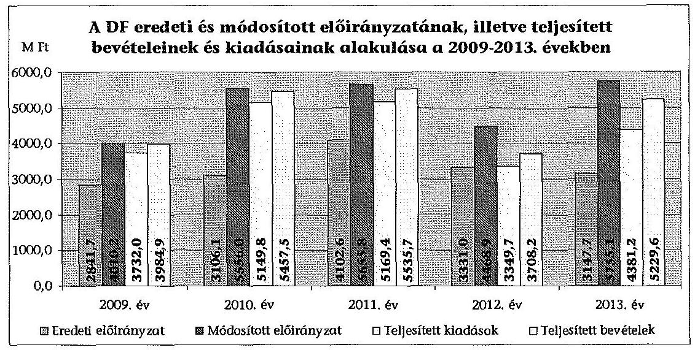
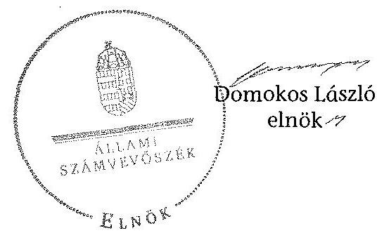
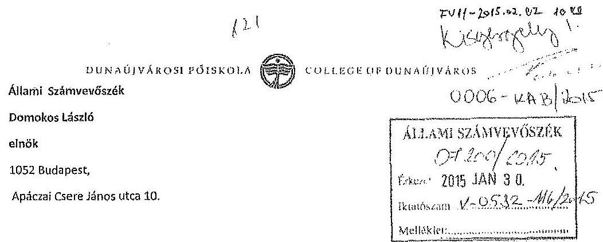
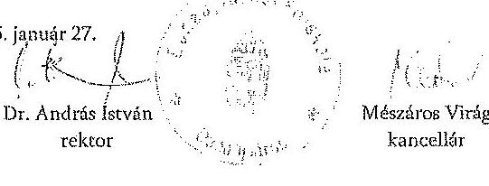
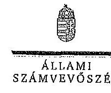
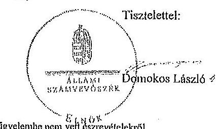

ÁLLAMI
SZÁMVEVŐSZÉK

# JELENTÉS 

a Dunaújvárosi Főiskola ellenőrzéséről - Az állami felsőoktatási intézmények gazdálkodásának, működésének ellenőrzése

---

# Állami Számvevőszék 

Iktatószám: V-0582-126/2014.
Témaszám: 1616
Vizsgálat-azonosító szám: V068908

## Az ellenőrzést felügyelte:

## Kisgergely István

felügyeleti vezető
Az ellenőrzést vezette és ellenőrzés végrehajtásáért felelős:
Horváth József
ellenőrzésvezető
A számvevőszéki jelentés összeállításában közreműködtek:
Béres László
számvevő
Komonszky Krisztina
számvevő

## Az ellenőrzést végezték:

| Béres László | Komonszky Krisztina | Kúnosné Talián Márta |
| :-- | :-- | :-- |
| számvevő | számvevő | számvevő |

## Nagyné Lakhézi Éva

számvevő tanácsos

## A témához kapcsolódó eddig készített számvevőszéki jelentések:

## címe

Jelentés az oktatási és kulturális ágazat irányítási rendszerének, működésének ellenőrzéséről
Jelentés a felsőoktatás oktatási infrastruktúra-fejlesztési programjának ellenőrzéséről
Jelentés az állami felsőoktatási intézmények érdekeltségébe tartozó gazdasági társaságok támogatásának és nyereségük hasznosulásának ellenőrzéséről
Jelentés a Szolnoki Főiskola ellenőrzéséről - Az állami felsőoktatási 14196
intézmények gazdálkodásának, működésének ellenőrzése
Jelentés a Pannon Egyetem ellenőrzéséről - Az állami felsőoktatási 14197
intézmények gazdálkodásának, működésének ellenőrzése
Jelentés a Károly Róbert Főiskola ellenőrzéséről - Az állami felsőok- 14198
tatási intézmények gazdálkodásának, működésének ellenőrzése
Jelentés a Magyar Képzőművészeti Egyetem ellenőrzéséről - Az állami felsőoktatási intézmények gazdálkodásának, működésének ellenőrzése

---

Jelentés a Miskolci Egyetem ellenőrzéséről - Az állami felsőoktatási 14200
intézmények gazdálkodásának, működésének ellenőrzése
Jelentés a Széchenyi István Egyetem ellenőrzéséről - Az állami fel- 14201
sőoktatási intézmények gazdálkodásának, működésének ellenőrzé- se
Jelentés az Eszterházy Károly Főiskola ellenőrzéséről - Az állami 14204
felsőoktatási intézmények gazdálkodásának, működésének ellen-
őrzése
Jelentés a Magyar Táncművészeti Főiskola ellenőrzéséről - Az ál- 14205
lami felsőoktatási intézmények gazdálkodásának, működésének ellenőrzése
Jelentés a Budapesti Műszaki és Gazdaságtudományi Egyetem el- 14218
lenőrzéséről - Az állami felsőoktatási intézmények gazdálkodásá- 15032
nak, működésének ellenőrzése
Jelentés a Budapesti Corvinus Egyetem ellenőrzéséről - Az állami 15032
felsőoktatási intézmények gazdálkodásának, működésének ellen-
őrzése
Jelentés a Nyíregyházi Főiskola ellenőrzéséről - Az állami felsőok- 15028
tatási intézmények gazdálkodásának, működésének ellenőrzése
Jelentés az Eötvös József Főiskola ellenőrzéséről - Az állami felsőok- 15025
tatási intézmények gazdálkodásának, működésének ellenőrzése
Jelentés a Kecskeméti Főiskola ellenőrzéséről - Az állami felsőokta- 15026
tási intézmények gazdálkodásának, működésének ellenőrzése
Jelentés a Kaposvári Egyetem ellenőrzéséről - Az állami felsőokta- 15030
tási intézmények gazdálkodásának, működésének ellenőrzése
Jelentés a Liszt Ferenc Zeneművészeti Egyetem ellenőrzéséről - Az 15033
állami felsőoktatási intézmények gazdálkodásának, működésének ellenőrzése

---

.

---

# TARTALOMJEGYZÉK 

BEVEZETÉS ..... 13
I. ÖSSZEGZŐ MEGÁLLAPÍTÁSOK, KÖVETKEZTETÉSEK, JAVASLATOK ..... 17
II. RÉSZLETES MEGÁLLAPÍTÁSOK ..... 29

1. A fenntartói és ágazati irányítási jogok gyakorlása ..... 29
2. Az intézmény belső kontrollrendszerének kialakítása és működtetése ..... 31
3. Az intézmény döntéshozó szerveinek joggyakorlása, az oktatási és egyéb tevékenységei elkülönítése, pénzügyi gazdálkodása ..... 36
3.1. Az intézmény döntéshozó szerveinek gazdálkodással kapcsolatos joggyakorlása ..... 36
3.2. Az intézmény oktatási és egyéb tevékenységei elkülönítése, az ellátott feladat átláthatósága ..... 38
3.3. Az intézmény pénzügyi egyensúlya, fizetőképessége ..... 39
3.4. Az intézmény előirányzat kezelése ..... 41
3.5. Az egyes hazai forrásból finanszírozott projektekhez, feladatokhoz kapott - nem normatív - költségvetési forrással való elszámolás ..... 48
4. Az intézmény vagyongazdálkodása ..... 49
4.1. A vagyongazdálkodási tevékenységek keretei ..... 49
4.2. A vagyonváltozások és a vagyonhasznosítás szabályszerűsége ..... 50
4.3. Az intézmény tulajdonosi joggyakorlása ..... 53
5. A külső ellenőrzések által tett javaslatok hasznosulása ..... 55
5.1. ÁSZ ellenőrzések által tett javaslatok hasznosulása ..... 55
5.2. Az egyéb külső ellenőrzések javaslatalnak hasznosulása ..... 57
6. Az integritás kontrollok kialakítása és működtetése ..... 57

---

# MELLÉKLETEK 

1. számú A Dunaújvárosi Főiskola kiadási és bevételi előirányzatai, azok teljesítése a 2009-2013. években
2. számú A Dunaújvárosi Főiskola kiadásainak, bevételeinek változása a 2009-2013. években
3. számú Kimutatás a Dunaújvárosi Főiskola bevételeiről és kiadásairól, valamint adósságszolgálatáról a 2009-2013. években
4. számú A Dunaújvárosi Főiskola mérlegadatai a 2009-2013. években
5. számú A Dunaújvárosi Főiskola gazdálkodása szabályszerűségének értékelése a mintatételek alapján
6. számú A Dunaújvárosi Főiskola észrevétele
7. számú A Dunaújvárosi Főiskola észrevételére adott válasz

## FÜGGELÉK

1. számú Az integritás érvényesítése érdekében kialakított és működtetett intézményi kontrollrendszer

---

# RÖVIDÍTÉSEK JEGYZÉKE 

| Törvények |  |
| :--: | :--: |
| Áht. 1 | 1992. évi XXXVIII. törvény az államháztartásról (hatálytalan 2012. január 1-jétől) |
| Áht. 2 | 2011. évi CXCV. törvény az államháztartásról |
| ÁSZ tv. | 2011. évi LXVI. törvény az Állami Számvevőszékről |
| Eisztv. | 2005. évi XC. törvény az elektronikus információszabadságról (hatálytalan 2012. január 1-jétől) |
| Feot. | 2005. évi CXXXIX. törvény a felsőoktatásról (hatálytalan 2012. szeptember 1-jétől) |
| Gt. | 2006. évi IV. törvény a gazdasági társaságokról |
| Info tv. | 2011. évi CXII. törvény az információs önrendelkezési jogról és az információszabadságról |
| Kbt. 1 | 2003. évi CXXIX. törvény a közbeszerzésekről (hatálytalan 2012. január 1-jétől) |
| Kbt. 2 | 2011. évi CVIII. törvény a közbeszerzésekről |
| Kjt. | 1992. évi XXXIII. törvény a közalkalmazottak jogállásáról |
| Mt. | 1992. évi XXII. törvény a Munka Törvénykönyvéről (hatálytalan 2013. január 1-jétől) |
| Nftv. | 2011. évi CCIV. törvény a nemzeti felsőoktatásról |
| Nvtv. | 2011. évi CXCVI. törvény a nemzeti vagyonról |
| Sztv. | 2000. évi C. törvény a számvitelről |
| Vtv. | 2007. évi CVI. törvény az állami vagyonról |
| Rendeletek |  |
| Áhsz. | 249/2000. (XII. 24.) Korm. rendelet az államháztartás szervezetei beszámolási és könyvvezetési kötelezettségének sajátosságairól (hatálytalan 2014. január 1-jétől) |
| Ámr. 1 | 217/1998. (XII. 30.) Korm. rendelet az államháztartás működési rendjéről (hatálytalan 2010. január 1-jétől) |
| Ámr. 2 | 292/2009. (XII. 19.) Korm. rendelet az államháztartás működési rendjéről (hatálytalan 2012. január 1-jétől) |
| Ávr. | 368/2011. (XII. 31.) Korm. rendelet az államháztartásról szóló törvény végrehajtásáról |
| Ber. | 193/2003. (XI. 26.) Korm. rendelet a költség-vetési szervek belső ellenőrzéséről (hatálytalan 2012. január 1-jétől) |
| Bkr. | 370/2011. (XII. 31.) Korm. rendelet a költségvetési szervek belső kontrollrendszeréről és belső ellenőrzésről |
| NGM rendelet | Az államháztartás számvitelének 2014. évi megváltozásával kapcsolatos feladatokról szóló 36/2013. (XI. 13.) NGM rendelet |
| Vtvr. | 254/2007. (X. 4.) Korm. rendelet az állami vagyonnal való gazdálkodásról |
| 51/2007. (III. 26.) Korm. rendelet | a felsőoktatásban részt vevő hallgatók juttatásairól és az általuk fizetendő egyes térítésekről |

---

50/2008. (III. 14.) Korm. rendelet

## Határozatok

1132/2010. (VI. 18.)
Korm. határozat
1316/2011. (IX. 19.)
Korm. határozat
1365/2011. (XI. 8.)
Korm. határozat
1036/2012. (II. 21.)
Korm. határozat
1290/2012. (VIII. 9.)
Korm. határozat
1657/2012. (XII. 20.)
Korm. határozat

## Egyéb rövidítések

ÁSZ
Belső Ellenőrzési Kézikönyv ${ }^{1}$
Belső Ellenőrzési Kézikönyv ${ }^{2}$
DF/főiskola/intézmény
DF gazdasági társaságai
tulajdonosi ellenőrzésének szabályzata
Ecotech Nkzrt.
ellenőrzési nyomvonal

EMMI
értékelési szabályzat
fenntartó/minisztérium

FIR
FSA
gazdasági szervezet ügyrendje
gazdálkodási szabályzat
IFT
KIM
Kincstár
a felsőoktatási intézmények képzési, tudományos célú és fenntartói normatíva alapján történő finanszírozásáról
a 2010. évi költségvetéssel összefüggő egyes feladatokról
a 2011. évi költségvetési egyensúlyt megtartó intézkedésekről
a 2012. évi hiánycél tartását biztosító további feladatokról
a 2012. és 2013. évi költségvetési hiánycél biztosításához szükséges további intézkedésekről
a költségvetési főfelügyelők és költségvetési felügyelők kirendeléséről
a kormányzati stratégiai dokumentumok felülvizsgálatával kapcsolatos feladatokról

Állami Számvevőszék
Dunaújvárosi Főiskola Belső Ellenőrzési Kézikönyve (hatálytalan 2012. december 19-től)
Dunaújvárosi Főiskola Belső Ellenőrzési Kézikönyv
Dunaújvárosi Főiskola
Dunaújvárosi Főiskola Gazdasági társaságai tulajdonosi ellenőrzésének szabályzata (hatályos 2012. december 19től)
Ecotech Közép-Európai Technológiai és Innovációs Nonprofit Közhasznú Zártkörűen Működő Részvénytársaság
Dunaújvárosi Főiskola Folyamatba épített előzetes és utólagos vezetői ellenőrzés (FEUVE) rendszer szabályzata I. Fejezet és 2-3. számú mellékletek
Emberi Erőforrások Minisztériuma
Dunaújvárosi Főiskola Eszközök és források értékelési szabályzata
2010 májusáig az Oktatási és Kulturális Minisztérium, majd a Nemzeti Erőforrás Minisztérium, illetve 2012 májusától az Emberi Erőforrások Minisztériuma
Felsőoktatási Információs Rendszer
Felsőoktatási Struktúraátalakítási Alap
Dunaújvárosi Főiskola A gazdasági szervezet ügyrendje
Dunaújvárosi Főiskola Gazdálkodási szabályzata
Intézményfejlesztési Terv
Közigazgatási és Igazságügyi Minisztérium
Magyar Államkincstár

---

| kötelezettségvállalási   szabályzat ${ }_{1}$ | Dunaújvárosi Főiskola Kötelezettségvállalási, utalványozási, ellenjegyzési, teljesítés igazolási és érvényesítési rendjének szabályzata (hatálytalan 2012. december 19 -től) |
| :--: | :--: |
| kötelezettségvállalási   szabályzat $_{2}$ | Dunaújvárosi Főiskola Kötelezettségvállalási, utalványozási, ellenjegyzési, teljesítés igazolási és érvényesítési rendjének szabályzata |
| közbeszerzési szabály-   zat $_{1}$ | Dunaújvárosi Főiskola Közbeszerzési szabályzat (hatálytalan 2012. december 19-től) |
| közbeszerzési szabály-   zat $_{2}$ | Dunaújvárosi Főiskola Közbeszerzési szabályzat |
| leltározási szabályzat ${ }_{1}$ | Dunaújvárosi Főiskola Leltározási szabályzat (hatálytalan 2012. december 19-től) |
| leltározási szabályzat ${ }_{2}$ | Dunaújvárosi Főiskola Leltározási szabályzat |
| MNV Zrt. | Magyar Nemzeti Vagyonkezelő Zrt. |
| NEFMI | Nemzeti Erőforrás Minisztérium |
| NEPTUN | Tanulmányi hallgatói információs rendszer |
| NGM | Nemzetgazdasági Minisztérium |
| OKM | Oktatási és Kulturális Minisztérium |
| önköltség-számítási sza-   bályzat | Dunaújvárosi Főiskola Önköltség-számítási szabályzat |
| PPP | Public-Private Partnership (magán- és közszféra együttműködése) |
| számlarend | Dunaújvárosi Főiskola Költségvetési számlarend |
| számlatükör | Dunaújvárosi Főiskola Számlatükör |
| szenátus | Dunaújvárosi Főiskola Szenátusa |
| SZMSZ | Szervezeti és Működési Szabályzat |
| TJSZ | Dunaújvárosi Főiskola Térítési és juttatási szabályzat |
| Universitas Service Nkft. | Universitas Service Közhasznú Nonprofit Korlátolt Felelősségű Társaság |

---

.

---

# ÉRTELMEZŐ SZÓTÁR 

alapító

állami felsőoktatási intézmény saját tulajdona
állami vagyon
állami vagyon hasznosítása

A központi költségvetési szerv alapítója az Országgyűlés, a Kormány vagy a miniszter. A felsőoktatási intézmények vonatkozásában az alapítói jogokat a felsőoktatásért felelős minisztérium gyakorolja.
A felsőoktatási intézmény saját bevételének a költségek teljes körű levonása, - az adományozás és öröklés kivételével - a rendelkezésre bocsátott vagyon állagának megóvásáról, pótlásáról való gondoskodás után fennmaradt része terhére szerzett vagyona.
A Vtv. 1. § (2) bekezdése szerint állami vagyonnak minősül:
a) az állami tulajdonban lévő ingó dolog, valamint a dolog módjára hasznosítható természeti erő,
b) az állami tulajdonban lévő termőföldekből álló, külön törvényben szabályozott Nemzeti Földalap,
c) az állami tulajdonban lévő - a b) pont hatálya alá nem tartozó - ingatlan,
d) az állami tulajdonban lévő értékpapír,
e) az államot megillető társasági részesedés és más vagyoni értékű jog.
(hatályos 2010. június 16-ig)
a) az állam tulajdonában lévő dolog, valamint a dolog módjára hasznosítható természeti erő,
b) az a) pont hatálya alá nem tartozó mindazon vagyon, amely vonatkozásában törvény az állam kizárólagos tulajdonjogát nevesíti,
c) az állam tulajdonában lévő tagsági jogviszonyt megtestesítő értékpapír, illetve az államot megillető egyéb társasági részesedés,
d) az államot megillető olyan immateriális, vagyoni értékkel rendelkező jogosultság, amelyet jogszabály vagyoni értékű jogként nevesít.
(hatályos 2010. június 17-től)
A Vtv. 23. § (1) bekezdése szerint: Az állami vagyont az MNV Zrt. maga kezeli, illetve szerződés - így különösen bérlet, haszonbérlet, szerződésen alapuló haszonélvezet, vagyonkezelés, megbízás - alapján központi költségvetési szervnek, természetes vagy jogi személynek, illetőleg jogi személyiséggel nem rendelkező gazdasági társaságnak hasznosításra átengedi.
(hatályos 2010. december 31-ig)
Az állami vagyont az MNV Zrt. maga kezeli, vagy szerződés - így különösen bérlet, haszonbérlet, szerződésen alapuló haszonélvezet, vagyonkezelés, megbízás - alapján központi költségvetési szervnek, természetes vagy jogi

---

állami vagyon hasznosítására kötött szerződés
állami vagyon használója
állami vagyon kezelője /vagyonkezelő
személynek, vagy jogi személyiséggel nem rendelkező gazdálkodó szervezetnek hasznosításra átengedi.
(hatályos 2011. december 31-ig)
Az állami vagyont az MNV Zrt. maga kezeli, vagy szerződés - így különösen bérlet, haszonbérlet, megbízás alapján központi költségvetési szervnek, természetes vagy jogi személynek, vagy jogi személyiséggel nem rendelkező gazdálkodó szervezetnek hasznosításra átengedi.
(hatályos 2012. január 1-jétől)
A Vtv. 23. § (2) bekezdése szerint: Az állami vagyon hasznosítására kötött szerződések elsődleges célja az állami vagyon hatékony működtetése, állagának védelme, értékének megőrzése, illetve gyarapítása, az állami és közfeladatok ellátásának elősegítése.
A Vtvr. 1. § (7) a) pontja szerint: Az a természetes személy, jogi személy, illetve jogi személyiséggel nem rendelkező gazdasági társaság, amely az MNV Zrt.-vel kötött szerződés alapján, bármely jogcímen (bérlet, haszonbérlet, vagyonkezelés, használat stb.) állami vagyont birtokol, használ, hasznosít.
(hatályos 2010. december 31-ig)
Az a természetes személy, jogi személy, illetve jogi személyiséggel nem rendelkező szervezet, amely, illetve aki törvény vagy szerződés alapján, bármely jogcímen (pl. bérlet, haszonbérlet, vagyonkezelési szerződés, használat stb.) állami vagyont birtokol, használ, szedi annak hasznait, hasznosít, ide nem értve a tulajdonosi jogok gyakorlóját.
(hatályos 2011. január 1 - 2011. december 31-ig)
Az a természetes vagy jogi személy, jogi személyiséggel nem rendelkező szervezet, aki, vagy amely törvény vagy szerződés alapján, bármely jogcímen (bérlet, haszonbérlet, használat stb.) állami vagyont birtokol, használ, szedi annak hasznait, hasznosít, ide nem értve a haszonélvezőt, a vagyonkezelőt és a tulajdonosi jogok gyakorlóját. (hatályos 2012. január 1-jétől)
A Vtv. 23. § (1) bekezdése szerint: Az állami vagyont az MNV Zrt. maga kezeli, vagy szerződés - így különösen bérlet, haszonbérlet, szerződésen alapuló haszonélvezet, vagyonkezelés, megbízás - alapján központi költségvetési szervnek, természetes vagy jogi személynek, illetőleg jogi személyiséggel nem rendelkező gazdasági társaságnak hasznosításra átengedi. (hatályos 2010. január 1 - 2010. december 31-ig)
Az állami vagyont az MNV Zrt. maga kezeli, vagy szerződés - így különösen bérlet, haszonbérlet, szerződésen alapuló haszonélvezet, vagyonkezelés, megbízás - alapján központi költségvetési szervnek, természetes vagy jogi személynek, illetőleg jogi személyiséggel nem rendelkező

---

belső kontrollrendszer

CLF-módszer
előirányzat-maradvány
fenntartó
finanszírozási műveletek nélküli pozíció
gazdálkodó szervezetnek hasznosításra átengedi. (hatályos 2011. január 1 - 2011. december 31-ig)
Az állami vagyont az MNV Zrt. maga kezeli, vagy szerződés - így különösen bérlet, haszonbérlet, megbízás alapján központi költségvetési szervnek, természetes vagy jogi személynek, vagy jogi személyiséggel nem rendelkező gazdálkodó szervezetnek hasznosításra átengedi. Az állami vagyonra vonatkozóan az MNV Zrt. kizárólag az Nvtv.-ben meghatározott személyekkel köthet vagyonkezelési szerződést.
(hatályos 2012. január 1-jétől)
A belső kontrollrendszer a kockázatok kezelése és tárgyilagos bizonyosság megszerzése érdekében kialakított folyamatrendszer, amely azt a célt szolgálja, hogy megvalósuljanak a következő célok:
a) a működés és gazdálkodás során a tevékenységeket szabályszerűen, gazdaságosan, hatékonyan, eredményesen hajtsák végre,
b) az elszámolási kötelezettségeket teljesítsék, és
c) megvédjék az erőforrásokat a veszteségektől, károktól és nem rendeltetésszerű használattól.
A módszer a működési és a felhalmozási költségvetés bevételeinek és kiadásainak, ezek egyenlegeinek elkülönített, majd összevont kimutatását alkalmazza valamely költségvetési intézmény pénzügyi helyzetének megítéléséhez. Kiemelten mutatja be a finanszírozási műveletek egyenlege nélküli és az azt magába foglaló pénzügyi pozíciót, valamint a tőketörlesztéssel, értékpapír beváltással csökkentett működési jövedelmet.
Az értékelés a pénzügyi kapacitás fogalmát helyezi a középpontba.
Az államháztartás központi alrendszerébe tartozó költségvetési szerveknél a módosított bevételi és kiadási előirányzatok és azok teljesítésének a Kormány rendeletében meghatározott tételekkel korrigált különbözete az előirányzat-maradvány. (Áht. 22. § (1) bekezdés m) pontja)
A Feot. 7. § (2) és az Nftv. 4. § (2) bekezdése szerint az, aki az alapítói jogot gyakorolja, ellátja a felsőoktatási intézmény fenntartásával kapcsolatos feladatokat.
A CLF módszer szerint számított működési és felhalmozási tevékenység pénzügyi egyenlegének összevont értéke. Megmutatja, hogy a költségvetési intézmény bevételei fedezetet biztosítottak-e a kiadásokra. A finanszírozási műveletek nélküli (GFS) pozíció alapján a pénzügyi helyzetet akkor tekintettük megfelelőnek, ha az adott év működési és felhalmozási bevételei fedezetet nyújtottak az adott év működési és felhalmozási kiadásaira.

---

- Gazdasági Tanács
hároméves fenntartói megállapodás
információs és kommunikációs rendszer
integritás
intézményfejlesztési terv
irányító szerv
kincstári biztos

A felsőoktatási intézmény javaslattevő, véleményező, a stratégiai döntések előkészítésében részt vevő, és a döntések végrehajtásának ellenőrzésében közreműködő szerve. Az állami felsőoktatási intézmények központi költségvetési támogatására három éves fenntartói megállapodást kell kötni az állami felsőoktatási intézmény és a fenntartó között. A fenntartói megállapodás tartalmazza a felsőoktatási intézmény által meghatározott hároméves időszakra vállalt teljesítménykövetelményeket, továbbá az állandó jellegű támogatási részeket, valamint a változó jellegű támogatások megállapításának jogcímeit. A változó elemű támogatás évenkénti elszámolási kötelezettséggel kerül meghatározásra.
A költségvetési szerv vezetője köteles olyan rendszereket kialakítani és működtetni, melyek biztosítják, hogy a megfelelő információk a megfelelő időben eljutnak az illetékes szervezethez, szervezeti egységhez, illetve személyhez.
Az integritás olyasvalakit vagy valamit jelöl, aki vagy ami romlatlan, sértetlen, feddhetetlen. Az integritás elvek, értékek, cselekvések, módszerek, intézkedések konzisztenciáját jelenti: olyan magatartásmódot, amely meghatározott értékeknek megfelel.
A szenátus fogadja el az intézményfejlesztési tervet. Az intézményfejlesztési tervben kell meghatározni a fejlesztéssel, a fenntartó által a felsőoktatási intézmény rendelkezésére bocsátott vagyon hasznosításával, megóvásával, elidegenítésével kapcsolatos elképzeléseket, a várható bevételeket és kiadásokat. Az intézményfejlesztési tervet középtávra, legalább négyéves időszakra kell elkészíteni, évenkénti bontásban meghatározva a végrehajtás feladatait. Az intézményfejlesztési terv része a foglalkoztatási terv. A foglalkoztatási tervben kell meghatározni azt a létszámot, amelynek keretei között a felsőoktatási intézmény megoldhatja feladatait. (Feot. 27. § (3) bekezdés) A felsőoktatás ágazati irányítását felsőoktatásszervezéssel, felsőoktatásfejlesztéssel, törvényességi ellenőrzéssel kapcsolatos feladatokat - ellátó miniszter által vezetett minisztérium. (Feot. 102. - 105/A. §, Nftv. 64 - 66. §)
A kincstári biztos kijelölését az államháztartásért felelős miniszternél a Kincstár kezdeményezi. A kincstári biztos köteles figyelemmel kísérni megbízatásának időpontjától kezdve a költségvetési szerv tervezését, gazdálkodását, beszámolását, a jogszabályokban előírt feladatainak ellátását, feltárni azokat az okokat, amelyek a tartós fizetésképtelenséghez vezettek, a szükséges intézkedések azonnali végrehajtására irányuló intézkedési tervet készíteni, azonnali intézkedéseket kezdeményezni és írásbeli utasításokat kiadni a tartozásállomány felszámolására, a

---

kincstári költségvetés
kockázatkezelési rendszer
kontrollkörnyezet
kontrolltevékenység
költségvetési főfelügyelő, felügyelő
maximális hallgatói létszám
gazdálkodás egyensúlyának biztosítására, a követelések behajtására. (Ávr. 116-117. §)
A központi költségvetésről szóló törvény elfogadását követően a fejezetet irányító szerv az államháztartás központi alrendszerébe tartozó költségvetési szerv és a fejezeti kezelésű előirányzat kiemelt előirányzatait, valamint az elkülönített állami pénzalapok és a társadalombiztosítás pénzügyi alapjai jogszabályi előírás szerinti bevételeit és kiadásait kincstári költségvetés kiadásával állapítja meg. (Áht.: 24. § (3) bekezdés, Áht. 28. § (2) bekezdés, Ávr. 31. § (2) bekezdés)
Irányítási eszközök és módszerek összessége, melynek elemei a szervezeti célok elérését veszélyeztető tényezők (kockázatok) azonosítása, elemzése, csoportosítása, nyomon követése, valamint szükség esetén a kockázati kitettség mérséklése.
A kontrollkörnyezet a költségvetési szerv vezetőinek a szervezeti célok elérését segítő kontrollok kialakításával és működtetésével, korszerűsítésével kapcsolatos magatartását, a kontrollpontokról érkező információkra való reagálását jelenti.
Azok az elvek, politikák és eljárások, amelyeket a kockázatok meghatározása és a szervezet céljainak elérése érdekében alakítanak ki.
A költségvetési szerv vezetője köteles a szervezeten belül kontrolltevékenységeket kialakítani, amelyek biztosítják a kockázatok kezelését, hozzájárulnak a szervezet céljainak eléréséhez.
Az államháztartásért felelős miniszter a Kormány irányítása alá tartozó fejezetet irányító szervhez, a Kormány irányítása vagy felügyelete alá tartozó költségvetési szervhez, valamint az elkülönített állami pénzalapok és a társadalombiztosítás pénzügyi alapjai kezelő szerveihez költségvetési főfelügyelőt, felügyelőt rendelhet ki. A költségvetési főfelügyelő, felügyelő a gazdálkodás költségvetés-politikával való összhangja és a takarékos, szabályszerű, eredményes működés érdekében a Kormány rendeletében meghatározott intézkedéseket tehet, így különösen előzetesen véleményezi a kötelezettségvállalásra irányuló eljárásokat és a nagy összegű kötelezettségvállalások tekintetében kifogással élhet. (Áht. 239. § (1)-(2) bekezdés)
Az a felsőoktatási intézmény alapító okiratában, működési engedélyében meghatározott hallgatói létszám, ameddig terjedően a felsőoktatási intézmény - figyelembe véve a hallgatók fogadásához és az oktatói tevékenység folytatásához rendelkezésre álló személyi feltételeket, helyiségeket és eszközöket - valamennyi évfolyamára számítva, teljes kihasználtsággal működve hallgatói jogviszonyt létesíthet.

---

minisztérium
monitoring
működési jövedelem
normatív költségvetési támogatás felsőoktatási intézmények működéséhez
normatív támogatások
saját bevétel
szenátus
tárgyévi pénzügyi pozíció

A felsőoktatásért felelős minisztérium, amely 2009-től 2010 májusáig az OKM, 2010 májusától 2012 májusáig a NEFMI, 2012 májusától az EMMI volt.
A különböző szintű szervezeti célok megvalósításához szükséges folyamatok figyelemmel kísérése, melynek során a releváns eseményekről és tevékenységekről (együtt: folyamatokról) rendszeres jelleggel, strukturált, döntéstámogató információkhoz jutnak a szervezet vezetői.
A folyó bevételek és folyó kiadások egyenlege. Azt mutatja, hogy a folyó bevételek fedezetet nyújtanak-e a folyó kiadásokra.
A felsőoktatási intézmények működéséhez biztosított normatív költségvetési támogatás lehet
a) hallgatói juttatásokhoz nyújtott,
b) képzési,
c) tudományos célú,
d) fenntartói,
e) egyes feladatokhoz nyújtott
támogatás. A központi költségvetésből biztosított normatív költségvetési támogatásra - a d) pontban meghatározott normatív költségvetési támogatás kivételével - a felsőoktatási intézmények azonos feltételek alapján válnak jogosulttá. Az a)-e) pontokban meghatározott jogcímek az a) és e) pontban meghatározott jogcímek kivételével nem jelentenek felhasználási kötöttséget. (Feot. 127. § (3) bekezdés)

Az ellenőrzési időszakban hatályos költségvetési törvények 3. sz. mellékletében megjelölt közoktatási hozzájárulások, az 5. sz. mellékletében megjelölt központosított előirányzatok, továbbá a 8. sz. mellékletében megjelölt normatív, kötött felhasználású támogatások együttesen.
Az államháztartáson kívüli források - beleértve minden olyan, az Európai Uniótól származó támogatást, amelyhez nem az állami költségvetésen keresztül jut a felsőoktatási intézmény, továbbá a szakképzési hozzájárulási fizetési kötelezettség teljesítéseként elszámolt forrásokat is, ide nem értve az állami vagyon értékesítésének ellenértékét - valamint a Kutatási és Technológiai Innovációs Alapból származó bevételek.
A felsőoktatási intézmény, döntést hozó és a döntés végrehajtását ellenőrző testülete. (Feot. 20. § (1) bekezdés, Nftv. 12. § (1)-(3) bekezdés)
A működési és felhalmozási bevételek, valamint kiadások egyenlege a finanszírozási műveletek egyenlegének figyelembe vételével.

---

# JELENTÉS 

## A Dunaújvárosi Főiskola ellenőrzéséről Az állami felsőoktatási intézmények gazdálkodásának, működésének ellenőrzése

## BEVEZETÉS

Az ÁSZ Stratégiája ${ }^{1}$ alapértékeinek egyike, hogy az államháztartás komplex folyamatainak átláthatósága érdekében rendszerszemléletű/holisztikus megközelítésű, egymásra épülő, a szinergiahatást kihasználó, összefoglaló értékelésre lehetőséget adó ellenőrzéseket végez. Az államháztartás központi alrendszerébe tartozó felsőoktatási intézmények ellenőrzése során az Állami Számvevőszék értékeli azok pénzügyi-gazdasági helyzetét, feltárja a működésükben rejlő kockázatokat, ezzel előmozdítja a közpénzügyek átláthatóságát, rendezettségét.

Az állami felsőoktatási intézmények gazdálkodását - az Áht. előírásai mellett - a felsőoktatásról szóló 2005. évi CXXXIX. törvény (Feot.), valamint a nemzeti felsőoktatásról szóló 2011. évi CCIV. törvény (Nftv.) előírásai határozták meg.

Magyarország Nemzeti Reform Programja keretében, a Széll Kálmán Terv 2020-ig a 30-34 évesek körében, a felsőfokú vagy annak megfelelő végzettséggel rendelkezők arányának 30,3%-ra való növelését irányozta elő, amely a 2010. évhez képest 4,6%-pontos növekedési célkitűzést jelent. A rendezett gazdasági környezet, az önállósággal élni tudó, felelős, elszámoltatható intézményi gazdálkodói magatartás elengedhetetlen feltétele a kitűzött szakmai célok elérésének.

Az ellenőrzés célja annak megállapítása, hogy szabályos volt-e az állami felsőoktatási intézmények pénzügyi és vagyongazdálkodása, biztosított volt-e a vagyonnal való felelős gazdálkodás követelményének érvényesülése, jogszabályi előírásoknak megfelelően működött-e a belső kontrollrendszer; az irányító szerv tevékenysége a jogszabályi előírásoknak megfelelt-e.

Ennek keretében értékeltük:

- a fenntartói és az ágazati irányítási jogok gyakorlását és előírásoknak való megfelelőségét;
- az intézmény belső kontrollrendszere jogszabályoknak megfelelő kialakítását és működtetését;

[^0]
[^0]:    ${ }^{1}$ Állami Számvevőszék: Stratégia. Az Állami Számvevőszék hivatalos stratégiai dokumentum rendszere 2011-2015. 2012. december. http://www.asz.hu/strategia/asz-strategia/asz-strategia-2011.pdf

---

- az intézmény döntéshozó szerveinek joggyakorlása jogszabályoknak való megfelelőségét; az intézmény oktatási és egyéb (gyakorlati és kutatási) tevékenységei elkülönítését, átláthatóságát, illetve pénzügyi gazdálkodása szabályszerűségét;
- az intézmény vagyongazdálkodása előírásoknak való megfelelőségét;
- az ellenőrzött időszakban végzett külső (ÁSZ, fenntartói) ellenőrzések által tett javaslatok hasznosulását;
- az intézmény korrupcióval szembeni veszélyeztetettségének csökkentése érdekében az integritási szemlélet érvényesülését a gazdálkodási folyamatokban.

Az ellenőrzés várható hasznosulása: Az ellenőrzés eredményének hasznosulásaként képet kapunk a felsőoktatási intézményekben kialakult pénzügyi helyzetről; a Kormány által kirendelt költségvetési (fő) felügyelői rendszer működésének tapasztalatairól; az oktatási és egyéb tevékenységek és költségelszámolások elhatárolásáról, átláthatóságáról és szabályosságáról. A felsőoktatási intézmények gazdálkodási szabadságának pénzügyi és vagyoni helyzetre gyakorolt hatásairól, a vagyonnal való felelős, értékmegőrző gazdálkodás érvényesüléséről, továbbá a belső kontrollrendszer működéséről. Az ellenőrzés az ellenőrzött számára visszajelzést ad a gazdálkodása kereteinek kialakításáról, a működésében fellépő hiányosságokról, javaslataival hozzájárul azok kiküszöböléséhez és a jó kormányzáshoz. A törvényalkotás számára összegzett tapasztalatok állnak rendelkezésre a felsőoktatási intézmények döntéseinek, gazdálkodásának szabályszerűségéről, amelyek alapján - indokolt esetben - jogszabály-módosítás kezdeményezhető. Az integritás kultúra kialakítása hozzájárul az elszámoltathatóság és átláthatóság érvényesítéséhez, egyben támogatja a szervezet védettségét a korrupciós kitettséggel szemben, valamint annak megelőzése is irányítottabbá válik. A társadalom számára jelzi, hogy közpénz nem maradhat ellenőrizetlenül, az ÁSZ értékteremtő rend kialakításához és megőrzéséhez hozzájáruló tevékenysége pozitív hatással lesz a szervezetről kialakított összkép formálásában.

Az ellenőrzés típusa szabályszerűségi ellenőrzés.
Az ellenőrzött időszak 2009. január 1. - 2013. december 31. (az eredményszemléletű számvitel bevezetésével kapcsolatban az ellenőrzött időszak vége: 2014. április 30.)

Az ellenőrzéssel érintett szervezetek: az Emberi Erőforrások Minisztériuma és a Dunaújvárosi Főiskola

Az ellenőrzés jogszabályi alapját az ÁSZ tv. 1. § (3) bekezdése, az 5. §. (3)-(6) bekezdései, 33. § (7) bekezdés, valamint az államháztartásról szóló 2011. évi CXCV. törvény 61. § (2) bekezdésének előírásai képezik.

Az ellenőrzés kiterjedt minden olyan körülményre és adatra, amely az ÁSZ jogszabályban meghatározott feladataiban, valamint a program végrehajtása folyamán felmerült újabb összefüggések feltárásához szükséges.

---

Az ellenőrzés az INTOSAI által kiadott nemzetközi standardok figyelembe vételével, az ellenőrzési programtervezetben foglalt értékelési szempontok szerint történt.

Az ÁSZ a 2011. évi LXVI. törvény 29. §-a szerint a jelentéstervezetet megküldte az emberi erőforrások miniszterének és a Dunaújvárosi Főiskola rektorának. Az Emberi Erőforrások Minisztérium minisztere az ÁSZ jelentéstervezetének észrevételezési jogával nem élt. A Dunaújvárosi Főiskola beérkezett észrevételét és az arra adott választ a jelentés 6-7. sz. mellékletei tartalmazzák.

A pénzügyi és vagyongazdálkodás terén az egyes területek szabályszerű működését mintavétellel ellenőriztük, ez alapján a sokaságban előforduló hibás tételek arányát becsültük. A jogszabályoknak és a belső előírásoknak megfelelőnek, azaz szabályszerűnek tekintettük az adott kiadási előirányzat felhasználását, bevétel beszedését, mérlegtétel értékelését, amennyiben a minta ellenőrzésének eredménye alapján $95 \%$-os bizonyossággal a teljes sokaságban a hibás tételek aránya kisebb volt, mint $10 \%$, nem megfelelőnek értékeltük, ha a hibás tételek aránya a $10 \%$-ot meghaladta. Kockázatot, illetve magas kockázatot jeleztünk, amennyiben egy adott terület vonatkozásában a minta alapján a teljes sokaságban nem volt teljes körűen biztosított a jogszabályoknak és a belső szabályzatoknak megfelelő működés. A mintatételek kiértékelését az 5. számú melléklet tartalmazza.

A belső kontrollrendszer kialakításának és működtetésének értékelése során a jogszabályi előírások mellett az Ámr. ${ }_{1}$ 145/A. § (1) és (3) bekezdése, az Ámr. ${ }_{2}$ 155. § (1) és (3) bekezdése, valamint a Bkr. 5. § (1) bekezdése alapján figyelembe vettük az államháztartásért felelős miniszter által közzétett irányelvekben és módszertani útmutatókban ${ }^{2}$ foglaltakat is. A belső kontrollrendszert az értékelés során legalább $85 \%$-os megfelelőség esetén megfelelőnek, legalább $70 \%$-os megfelelőség esetén részben megfelelőnek, $70 \%$-os megfelelőség alatt pedig nem megfelelőnek minősítettük.

A Dunaújvárosi Főiskola (DF) a 2009-2013. években önállóan működő és gazdálkodó központi költségvetési szerv volt. Gazdaságtudományok, bölcsészettudomány, informatika, műszaki, társadalomtudomány és pedagógusképzés területeken folytatott képzést. Az alapképzési szakok száma a 2009. évről a 2013. évre kilencről tízre, a mesterképzési szakok száma egyről háromra nőtt. Alapfeladata körében a műszaki és társadalomtudományok képzési területeken kutatási tevékenységet végzett. Az intézmény szerkezetében, szervezeti felépítésében változás történt, új szervezeti egységet alapítottak, szervezeti egységeket (intézeteket, tanszékeket) vontak össze, azonban intézményi átalakítás nem történt. A 2009-2013. években a DF az MTA Lendület programban nem vett részt. A főiskolához 2012. szeptember 1-jétől költségvetési felügyelőt rendeltek ki.

A rektor megbízatása 2012. június 30-án, a gazdasági főigazgató megbízatása 2010. június 30-án járt le. Az új rektor 2012. július 1-jén, az új gazdasági főigazgató 2010. július 1-jén kapott megbízatást feladat ellátására. A miniszter-

[^0]
[^0]:    ${ }^{2}$ 1/2009. (IX. 11.) PM irányelv, Pénzügyminisztérium Belső Kontroll Kézikönyv 2010.

---

elnök az állami felsőoktatási intézmények kancellárjainak megbízásáról szóló 127/2014. (XI. 4.) ME határozatban 2014. november 15-étől megbízta a kancellári teendők ellátására jogosult személyt.

A DF a 2009-2013. években kettő közhasznú nonprofit társaságban rendelkezett tulajdonrésszel. A DF a kizárólagos főiskolai tulajdonú Universitas Service Nkft.-t 2006. május 16-án, az Ecotech Nkzrt.-t 2009. október 20. napjával alapította.

Az ellenőrzéssel érintett intézmény jellemzőit, főbb gazdálkodási, vagyoni és létszám adatait az alábbi táblázat mutatja be:

| Megnevezés | Főbb gazdálkodási és vagyoni adatok (M Ft) |  |  |  |  |  |
| :--: | :--: | :--: | :--: | :--: | :--: | :--: |
|  | 2009. év | 2010. év | 2011. év | 2012. év | 2013. év | $\begin{gathered} 2009 . \text { év } \\ \text { (\%) } \end{gathered}$ |
| Kiadási főösszeg | 3732,0 | 5149,8 | 5169,4 | 3349,7 | 4381,2 | 117,4 |
| Bevételi főösszeg | 3984,9 | 5457,5 | 5535,7 | 3708,2 | 5229,6 | 131,2 |
| Költségvetési támogatások | 2162,7 | 2140,7 | 1887,5 | 1563,0 | 2543,3 | 117,6 |
| Saját és átvett bevételek | 1304,9 | 3063,9 | 3340,5 | 1778,8 | 2327,8 | 178,4 |
| Támogatások aránya (\%) | 54,3 | 39,2 | 34,1 | 42,1 | 48,6 | 89,5 |
| Mérlegfőösszeg | 3650,0 | 4904,2 | 6107,1 | 5864,3 | 6342,4 | 173,8 |
|  | Jellemző létszámadatok* (fő) |  |  |  |  |  |
| Oktatói létszám (fő) | 219 | 149 | 130 | 135 | 129 | 58,9 |
| Hallgatói létszám (fő) | 4312 | 4085 | 3759 | 3116 | 2714 | 62,9 |

*az oktatói és hallgatói létszám az október 15-i statisztikában szereplő adat
A felsőoktatási intézmény kiadásai az öt év alatt 3732,0 M Ft-ról 4381,2 M Ft-ra, $17,4 \%$-kal, a bevételei (az előirányzat-maradvány felhasználásával) összességében 3984,9 M Ft-ról 5229,6 M Ft-ra, 31,2\%-kal nőttek.

A DF pénzügyi helyzetét alapvetően meghatározta a PPP konstrukció keretében megvalósított fejlesztések miatti kötelezettség finanszírozása.

A hallgatói létszám 4312 főről 2714 főre, $37,1 \%$-kal, az oktatók létszáma pedig 219 főről 129 főre, $41,1 \%$-kal csökkent.

---

# I. ÖSSZEGZŐ MEGÁLLAPÍTÁSOK, KÖVETKEZTETÉSEK, JAVASLATOK 

A felsőoktatásért felelős minisztérium (OKM, NEFMI, EMMI) az ellenőrzött időszakban - a feltárt kisebb hiányosságoktól eltekintve - a jogszabályi előírásoknak megfelelően gyakorolta a fenntartói feladatait. Alapítói jogosultságai keretében szabályszerűen adta ki a főiskola jogszabályi és szervezeti változásoknak megfelelően módosított alapító okiratát. A DF által megküldött SZMSZ módosításokat a fenntartó felülvizsgálta.

A minisztérium egyéb fenntartói feladatait is szabályosan látta el. A minisztérium közreműködött a főiskola éves költségvetésének tervezésében, meghatározta az intézmény költségvetési kereteit. Elvégezte az intézmény éves költségvetési, illetve gazdálkodási beszámolóinak ellenőrzését. A fenntartó megkötötte az intézménnyel a 2008-2010. évekre vonatkozóan a fenntartói megállapodást, amelyben meghatározták a teljesítménykövetelményeket. A fenntartó a megállapodásban foglaltak 2008. és 2009. évi végrehajtását értékelte.

A fenntartó a jogszabályban előírt, a belső ellenőrzési vezető megbízására vonatkozó kötelezettségének nem tett eleget.

A minisztérium az ágazati irányítási feladatait a 2009-2013. években nem látta el teljes körűen. Elmaradt az oktatási ágazatra vonatkozóan a nemzetgazdasági miniszter irányításával és az oktatásért felelős miniszter részvételével, a kormányhatározatban előírt szervezeti és feladat ellátási felülvizsgálati program kidolgozása. A felsőoktatási törvény rendelkezései ellenére a miniszter nem készített a felsőoktatás rendszere vonatkozásában a Kormány által elfogadott középtávú fejlesztési tervet.

A minisztérium az Oktatási Hivatallal a FIR biztonságos üzemeltetéséhez, az adatok védelméhez szükséges kontrollkörnyezetet a 2012. év végéig teljes körűen nem alakította ki. A FIR átfogó megújítását követően rögzített - a nyitott jogviszonnyal rendelkező hallgatók és az oktatók vonatkozásában az - adatok teljesek. A visszamenőleges adatok tisztítása és beküldése a FIR átfogó megújítását követően folyamatos volt. A fenntartó a FIR biztonságos üzemeltetéséhez, az adatok védelméhez szükséges szabályozási kontrollokat 2013. év végére kialakította.

A DF belső kontrollrendszerének kialakítása és működtetése összességében részben megfelelő volt. Ezen belül a kontrollkörnyezetet, a 2009-2010. években az információs és kommunikációs rendszert, illetve a 2013. évben a monitoring rendszert részben megfelelőnek, a kontrolltevékenységet pedig az ellenőrzött időszak egészében nem megfelelőnek minősítettük. A rektor minden ellenőrzött évben vezetői nyilatkozatot tett arról, hogy gondoskodott az intézménynél a belső kontrollrendszerek szabályszerű, gazdaságos, hatékony és eredményes működéséről, amely nem volt teljes körűen összhangban a kontrollrendszer tényleges működésével. Az ÁSZ ellenőrzés megállapításai - a kockázatkezelés, a 2009-2012. években a monitoring rendszer, illetve a 2011-2013. években az in-

---

formációs és kommunikációs rendszer kivételével - nem támasztották alá a belső kontrollrendszer szabályszerű és eredményes működéséről szóló rektori nyilatkozatot.

Az intézmény kontrollkörnyezete az ellenőrzött időszak alatt részben megfelelő volt, a jogszabályi előírásoknak nem minden tekintetben felelt meg. A DF a gazdálkodás szempontjából meghatározó belső szabályzatait nem aktualizálta a jogszabályi és szervezeti változásoknak megfelelően. A belső szabályzatok egy része nem minden tekintetben felelt meg a hatályos jogszabályoknak. A rektor az etikai elvárásokat nem határozta meg, a DF 2010. november 30-ig a számlarendben foglaltakat alátámasztó bizonylati renddel nem rendelkezett.

A DF kockázatkezelési rendszerének kialakítása és működtetése összességében megfelelő volt, azonban a DF rektora a DF tevékenységében, gazdálkodásában rejlő kockázatokat a jogszabályi előírás ellenére nem mérte fel és nem állapította meg.

A kontrolltevékenységek kialakítása és működtetése az ellenőrzött időszakban nem volt megfelelő. A gazdálkodási jogkörök gyakorlásának hiányosságai az ellenőrzött időszakban a pénzügyi- és vagyongazdálkodás területét érintő szabálytalanságokat okoztak.

A DF információs és kommunikációs rendszere a 2009-2010. években részben megfelelő, a 2011-2013. években megfelelő volt. Az információs és kommunikációs rendszer minősítésének javulását a Vezetői Információs Rendszer bevezetése eredményezte. A DF a jogszabályi előírások ellenére nem szabályozta a kötelezően közzéteendő adatok nyilvánosságra hozatalának, valamint a közérdekű adatok megismerésére irányuló igények teljesítésének rendjét. A főiskola a FIR-rel kapcsolatos adatszolgáltatásokat teljesítette az ellenőrzött időszakban.

Az intézmény monitoring rendszerének kialakítása és működtetése a 2009-2012. években megfelelő, a 2013. évben részben megfelelő volt. Azonban az intézmény a jogszabályi előírásokat megsértve 2013. július 1-jétől nem alkalmazott belső ellenőrt foglalkoztatásra irányuló jogviszonyban, a belső ellenőrzési feladatokat gazdasági társasággal, szerződés alapján látta el. A belső ellenőrzés javaslatai - kettő kivételével - annak ellenére is hasznosultak, hogy intézkedési tervet nem készítettek.

A szenátus gazdálkodással kapcsolatos joggyakorlása részben felelt meg a jogszabályi előírásainak. A szenátus - előterjesztés hiányában - nem fogadta el a DF 2011-2012. évi intézményfejlesztési tervét, a 2009-2012. évi kutatás-fejlesztési innovációs stratégiáját, a rektor vezetői tevékenységét nem értékelte, a fejlesztések indításáról nem döntött. A DF 2009. évi vagyongazdálkodási tervét a Gazdasági Tanács nem véleményezte, a szenátus nem fogadta el. A DF a 2010-2013. évekre vagyongazdálkodási tervet nem készített.

A szenátus joggyakorlása a felsőoktatási normatív finanszírozási keretrendszerben a különböző jogcímeken kapott támogatások felhasználására vonatkozóan részben felelt meg jogszabályi előírásoknak. A szenátus nem döntött belső szabályozással a - felhasználási kötöttség nélküli - képzési, tudományos

---

célú és fenntartói normatív támogatás felosztását központosított és decentralizált részre osztásáról. A kötött felhasználású, hallgatói és egyéb feladatokra nyújtott normatív támogatások felhasználására vonatkozó belső szabályozás részben felelt meg a jogszabályi előírásoknak, mert a DF intézményi hatáskörben nem határozta meg a lakhatási támogatás normatívájának jogszabály szerinti felosztását.

Az intézmény oktatási és egyéb tevékenységeit a jogszabályban előírtak szerint a nyilvántartásában elkülönítette, az ellátott feladatok rendszere átlátható volt.

A DF az ellenőrzött időszak alatti pozitív pénzügyi pozícióját az előző években képződött maradvány igénybevételével úgy érte el, hogy jelentős összegű szállítókkal szembeni tartozást halmozott fel. A DF szállítókkal szembeni kötelezettségéből a lejárt szállítói tartozás a 2012. év végén 776,4 M Ft volt, amely a 2013. év végére 35,5 M Ft-ra csökkent egyszeri támogatás eredményeként.

A PPP projektek bérleti díjának fizetése likviditási zavarokat okozott a főiskolánál az ellenőrzött időszakban. A DF a 2009-2013. években likviditási hitelt nem vett igénybe, azonban a 2010. és a 2013. évben egy-egy alkalommal a likviditás biztosítása érdekében a finanszírozási tervtől eltérő előrehozott támogatást igényelt és kapott. A likviditási problémákat enyhítette, hogy a 2013. évben a DF a FSA-ból 1134,0 M Ft költségvetési támogatásban részesült.

A főiskola 60 napon túli tartozása 2012. január és 2013. május között minden hónapban meghaladta a kincstári biztos kijelölésének értékhatárát. Az intézményhez az államháztartásért felelős miniszter a jogszabályban foglaltak ellenére kincstári biztost nem jelölt ki. A 2012. szeptember 1-jétől kirendelt költségvetési felügyelő intézkedéseivel hozzájárult a DF fegyelmezettebb, költséghatékonyabb gazdálkodásához.

A DF a kiadási és bevételi előirányzatok tervezése során a jogszabályokban és a fenntartó által kiadott tervezési irányelvekben foglaltak szerint járt el. A felügyeleti szerv által a költségvetés tervezéséhez kért adatszolgáltatásokat határidőben és az előírt tartalommal teljesítette.

A főiskola az ellenőrzött időszakban az előirányzat-módosításokat nem minden esetben hajtotta végre szabályszerűen, mivel a zárolásokat előirányzatcsökkentésként rögzítette nyilvántartásaiban. Ez kockázatot jelentett az ellenőrzött terület egészének szabályszerű működése szempontjából.

A főiskola az ellenőrzött időszakban 10 297,2 M Ft költségvetési támogatásban részesült, 6001,8 M Ft támogatásértékű bevételt és 5793,7 M Ft egyéb saját bevételt ért el. A DF teljesített költségvetési bevételei a módosított előirányzathoz képest minden évben alulteljesültek, az ellenőrzött időszakban összesen 1530,1 M Ft bevételi lemaradása keletkezett. A DF gazdálkodása során a költségvetés módosított kiadási főösszegét a 2009-2013. években betartotta. Az elő-irányzat-maradvány minden évben kötelezettségvállalással terhelt volt. Az előirányzat-maradványok felhasználása a pénzügyi elszámolások és a gazdálkodási jogkörök gyakorlása tekintetében nem felelt meg a jogszabályi előírásoknak, mivel a 2009-2011. években kötelezettségvállalással terhelt ma-

---

radványként szerepeltettek olyan összegeket, amelyekre a kötelezettségvállalás a tárgyévet követő évben történt meg.

Az intézmény pénzügyi gazdálkodása részben szabályszerű volt.
A személyi juttatások, a dologi és felhalmozási kiadások előirányzatainak felhasználásánál a pénzügyi elszámolások, valamint a gazdálkodási jogkörök tekintetében nem volt teljes körűen biztosított a jogszabályoknak és belső szabályoknak való megfelelőség.

A rendszeres és nem rendszeres személyi juttatások esetében nem történt meg a kötelezettségvállalások ellenjegyzése. A hallgatói munkaszerződések alapján teljesített kifizetéseket a DF külső személyi juttatás helyett nem rendszeres személyi juttatásként számolta el. A DF az állományba nem tartozók juttatásai kifizetéséhez kapcsolódó előirányzat terhére vállalt kötelezettséggel esetenként - megsértette a jogszabályban előírt kötelezettségvállalási tilalmat. A külső személyi juttatások előirányzatai terhére megkötött megbízási szerződések teljesítése és számfejtése nem felelt meg a jogszabályoknak és a belső szabályoknak. Nem történt meg a kötelezettségvállalások ellenjegyzése, esetenként a teljesítést nem igazolták.

Rendszerhibaként tártuk fel a dologi és a felhalmozási kiadásoknál, hogy a teljesítés igazolása, az érvényesítés és az utalványozás nem a jogszabályi előírásoknak és az intézményi szabályozásnak megfelelően történt. A felújítások, beruházások megrendelését megelőzően néhány esetben nem szerezték be a belső szabályozásban előírt számú árajánlatot, a kötelezettségvállalás nem írásban történt, illetve a kötelezettségvállalást nem előzte meg ellenjegyzés.

Az ellátottak juttatásai előirányzatainak felhasználásánál a pénzügyi elszámolások, valamint a gazdálkodási jogkörök gyakorlása tekintetében összességében nem felelt meg a jogszabályoknak és belső szabályoknak. Rendszerhiba volt, hogy nem végezték el a kötelezettségvállalás ellenjegyzését, a teljesítést nem igazolták, az érvényesítés az utalványozás előtt nem történt meg, továbbá hogy a DF a könyvviteli számlák számát és megnevezését nem a jogszabályban előírtak szerint alkalmazta. A DF a jogszabályi előírások és az intézményi szabályozás ellenére rendszeresen nem intézkedett határidőben az ellátotti juttatások átutalásáról.

A működési bevételek beszedése a pénzügyi elszámolások, valamint a gazdálkodási jogkörök gyakorlása tekintetében összességében nem felelt meg a jogszabályoknak és belső szabályoknak. A főiskola a hallgatói költségtérítéseket az államháztartási törvényt megsértve nem kincstári számlán szedte be. Az intézmény a kereskedelmi banknál vezettet gyűjtőszámlájára érkezett bevételeket nem könyvelte le haladéktalanul. Az adott év végéig a gyűjtőszámlára befolyt hallgatói költségtérítéseket nem teljes körűen számolta el működési bevételként. A működési bevételek esetében a jogszabályi előírások és az intézményi szabályozás ellenére nem történt meg a szakmai teljesítés igazolása. A díjak és költségtérítések megállapítása nem volt szabályszerű, mert egyes díjbevételeket és költségtérítéseket nem alapozták meg önköltségszámítással.

---

Az immateriális javak, tárgyi eszközök bérbeadása, értékesítése a pénzügyi elszámolások és a gazdálkodási jogkörök gyakorlása tekintetében nem felelt meg a jogszabályoknak és a belső szabályoknak, mivel a bevételek beszedését megelőzően a teljesítést nem igazolták.

A főiskola a hazai forrásból finanszírozott projektekhez kapott költségvetési támogatásokkal nem szabályszerűen számolt el, mivel egy esetben az elszámolást a DF határidőn túl nyújtotta be. A DF támogatást a számviteli nyilvántartásokban nem különítette el. A támogatási szerződések felmondására, támogatás visszavonására, szankció érvényesítésére nem került sor.

A DF vagyona a 2009. évi nyitó 3617,1 M Ft-ról a 2013. év végére 6342,4 M Ft-ra, 75,3%-kal nőtt. A DF vagyonának változása a befektetett eszközökön belül az ingatlanok és a gépek, berendezések értékének emelkedése miatt következett be.

A DF a beruházásokat, felújításokat és egyéb vagyonváltozásokra vonatkozó döntési és felelősségi hatásköröket belső szabályzatokban, a kincstári vagyonra vonatkozóan vagyonkezelési szerződésben szabályozta.

Az intézmény vagyongazdálkodása részben szabályszerű volt.
A DF az intézmény kezelésében levő vagyontárgyak értékesítését, azok térítésmentes átadását, bérbeadását szabályozta. A DF az intézményi szabályozás ellenére az ingatlan bérbeadási szerződésekhez nem készített önköltségszámítást, a jogszabályi előírások ellenére az igénybe vevő számára a DF a térítés összegének megállapítása során nem vette figyelembe a felhasználás, illetve az igénybevétel alapján felmerült közvetlen és közvetett költségeket. A jogszabályi előírást megsértve a DF a bérbeadási folyamatok során a 2012-2013. években nem győződött meg az átláthatóság érvényesüléséről.

A DF a 2009. és a 2011-2013. évi leltározást a jogszabályi előírásoknak és a belső szabályoknak megfelelően végezte el, a könyvviteli mérleg leltárral történő alátámasztása biztosított volt. A DF a jogszabályi előírást megsértve a számviteli bizonylat megőrzési kötelezettségének nem tett eleget, mivel a 2010. évi leltározás végrehajtását igazoló bizonylatokat nem tudta teljes körűen az ellenőrzés részére átadni. Az ellenőrzött időszakban az analitikus és a főkönyvi nyilvántartások, valamint a könyvviteli mérleg adatainak egyezősége biztosított volt.

Az ellenőrzött időszakban egyes mérlegtételek tartalma, valamint értékelésének elmaradása miatt a mérlegvalódiság elve sérült. Ez kockázatot jelez az ellenőrzött terület egészének szabályos működése szempontjából. A DF a 2009-2013. években a kereskedelmi banknál vezetett gyűjtőszámla év végi egyenlegét a könyvviteli mérlegben nem mutatta be a pénzeszközök között.

A passzív pénzügyi elszámolások besorolása nem felelt meg teljes körűen a jogszabályi előírásoknak, mivel az idegenforgalmi adóbevételeket költségvetési átfutó bevétel helyett költségvetési kiegyenlítő bevételként szerepeltették a mérlegben. A passzív pénzügyi elszámolások között a devizában kimutatott tételek értékelése a jogszabályi előírás ellenére nem történt meg. A követelések, a

---

kötelezettségek és az aktív pénzügyi elszámolások értékelése megfelel a jogszabályoknak és a belső szabályoknak.

A főiskola az ellenőrzött időszakban nem gazdálkodott felelősen részesedéseivel, mivel nem hozott létre tartalék, illetve kockázati alapot az Ecotech Nk Zrt. esetleges veszteségeinek kezelésére. A főiskola tulajdonosi ellenőrzési jogát az ellenőrzött időszak alatt gyakorolta. Az intézmény alkalmazottjai két esetben a DF gazdasági társaságában betöltött vezetői tisztségük következtében megsértették az összeférhetetlenségre vonatkozó jogszabályi előírásokat. A főiskola 100%-os tulajdonában lévő Universitas Service Nkft. az ellenőrzött időszakban rendszeresen szerződés, megállapodás és elszámolási kötelezettség nélkül nyújtott vissza nem térítendő támogatást a DF részére. Ennek következtében a támogatások jogszerűsége nem állapítható meg.

A DF az eredmény-szemléletű számvitel bevezetésével kapcsolatos feladatokat részben hajtotta végre, mivel a kötelezettségvállalásokat a jogszabályi előírás ellenére nem leltározta.

Az ÁSZ három korábbi ellenőrzése során a felsőoktatás témakörében kilenc javaslatot fogalmazott meg a felsőoktatásért felelős minisztériumnak (OKM, NEFMI, EMMI). A minisztérium a javaslatokra intézkedési terveket készített, amelyek összesen 10 intézkedést tartalmaztak. Az intézkedések közül hármat (késéssel) megvalósítottak, hét nem valósult meg. A megvalósult intézkedések hozzájárultak a felsőoktatási intézményrendszer jobb működéséhez.

Elvégezték a felsőoktatási intézményrendszer kapacitás kihasználtságának felmérését. A felsőoktatási intézmények érdekeltségébe tartozó gazdasági társaságok ellenőrzése során feltárt hiányosságok kiküszöbölésére a minisztérium felszólította az intézményeket, amelyek a megtett intézkedésekről tájékoztatták a minisztériumot. A minisztérium tájékoztatást kért az érintett felsőoktatási intézményektől az 50% alatti intézményi részesedéssel működő gazdasági társaságok tevékenységének felülvizsgálatáról, működésük indokoltságáról és eredményességéről, valamint az intézményi részesedés megszüntetéséről és ütemezéséről.

Nem valósult meg a minisztérium felügyelete alá tartozó szervezetek feladatellátásának javítására számszerűsíthető mutatószámokon alapuló kritériumok és középtávú célrendszer kidolgozása. A felsőoktatási ágazat középtávú stratégiáját sem készítették el. Nem intézkedtek az oktatási infrastruktúra-fejlesztési programok előkészítési folyamatának hiányosságai miatti felelősség megállapításáról. Nem hasznosították az állami felsőoktatási intézmények kapacitáskihasználtságával kapcsolatos felmérés eredményeit, így nem tettek intézkedést a felsőoktatási infrastruktúra közép- és hosszútávon történő hasznosítására. Nem alakítottak ki a PPP projektek támogatásához kapcsolódó követelményrendszert. Nem került sor az oktatási infrastruktúra-fejlesztési programok lebonyolításával kapcsolatos hiányosságok (kedvezőtlen feltételű szerződéskötés és kockázatmegosztás) miatti felelősség megállapítására. Nem dolgoztatták ki az állami felsőoktatási intézményekkel azok gazdasági társaságai szakmai feladatellátásának és gazdaságossági eredményességének
 mérését biztosító mutatószámokat és értékelési rendszert.

---

Külső ellenőrzés keretében a fenntartó hat ellenőrzést végzett a főiskolán. A fenntartói ellenőrzések javaslatai részben hasznosultak. Nem valósult meg az intézmény középtávú informatikai stratégiájának, az információgazdálkodási, információ-biztonsági politika alkalmazására vonatkozó irányelvek, az informatikai rendszerek és a tárolt adatok biztonságát befolyásoló folyamatok, események kezelésére vonatkozó eljárások és a kapcsolódó dokumentáció kidolgozása. Nem történt meg munkaköri leírások hiányosságainak pótlása és a szabályzatok aktualizálása.

A főiskola az ellenőrzött időszakban erőfeszítéseket tett az integritási szemlélet fejlesztésére, valamint a korrupciós kockázatok csökkentésére, a 2013. évben önként részt vett az ÁSZ integritási felmérésében.

Az ÁSZ tv. 33. § (1) bekezdésében foglaltak értelmében a jelentésben foglalt megállapításokhoz kapcsolódó intézkedési tervet köteles az ellenőrzött szervezet vezetője összeállítani, és azt a jelentés kézhezvételétől számított 30 napon belül az ÁSZ részére megküldeni. Amennyiben az intézkedési tervet határidőben nem küldi meg a szervezet, vagy az nem elfogadható, az ÁSZ elnöke a hivatkozott törvény 33. § (3) bekezdés a)-b) pontjaiban foglaltakat érvényesítheti.

A helyszíni ellenőrzés megállapításainak hasznosítása mellett javasoljuk:

# az emberi erőforrások miniszterének: 

1. A DF belső kontrollrendszerének kialakítása és működtetése összességében részben felelt meg az Áht.1.2, az Ámr.1.2, a Ber. és a Bkr. előírásainak. Ezen belül a kontrollkörnyezetet hiányosságok jellemezték, a kontrolltevékenységek működtetése nem volt szabályszerű. A főiskola pénzügyi gazdálkodását érintően a rendszeres és a nem rendszeres személyi juttatások, a külső személyi juttatások, a dologi és a felhalmozási kiadások, az ellátottak juttatásai előirányzatainak felhasználása, valamint a működési bevételek beszedése nem felelt meg a jogszabályokban és a belső szabályzatokban előírtaknak. A belső kontrollrendszer hiányosságai a vagyongazdálkodás, vagyonkimutatás területén is szabálytalanságokhoz vezettek. A belső ellenőrzés megállapításai és javaslatai alapján intézkedési tervet nem készítettek.

Az Universitas Service Nkft. esetében - a Feot. 121. § (8) bekezdésben, az Nftv. 115. § (12) bekezdésében foglaltak ellenére - a főiskolán magasabb vezetői vagy vezetői megbízással rendelkező személyeket bíztak meg vezető tisztségviselői, illetve felügyelőbizottsági feladatokkal. A rektor a Kjt. 44. § (3) bekezdésében foglaltak ellenére nem szólította fel a munkavállalót az összeférhetetlenség megszüntetésére.

Javaslat:
a) Intézkedjen az Nftv. 73. § (3) bekezdés e) pontja által meghatározott munkáltatói jogkörében eljárva a belső kontrollrendszer kialakításával és működtetésével, a pénzügyi és vagyongazdálkodással, vagyonkimutatással összefüggésben feltárt szabálytalanságok, illetve az intézkedési tervkészítési kötelezettség elmulasztása tekintetében a munkajogi felelősséggel kapcsolatos körülmények kivizsgálására

---

irányuló eljárás megindítása iránt, és a vizsgálat eredményének ismeretében tegye meg a szükséges intézkedéseket.
b) Intézkedjen az Nftv. 73. § (3) bekezdés e) pontja által meghatározott munkáltatói jogkörében eljárva a főiskola és a közhasznú nonprofit társasága vezetői közötti összeférhetetlenséggel kapcsolatosan feltárt szabálytalanságok tekintetében a munkajogi felelősséggel kapcsolatos körülmények kivizsgálására irányuló eljárás megindítása iránt, és a vizsgálat eredményének ismeretében tegye meg a szükséges intézkedéseket.
2. A jelentős összegű PPP kiadások miatt többször merültek fel likviditási problémák.

Javaslat:
A főiskola pénzügyi, gazdasági helyzetét figyelembe véve tegyen intézkedéseket az intézmény fenntartható működése érdekében.
3. A hallgatói díjfizetéseket és költségtérítéseket nem a Kincstár által vezetett számlán kezelték, figyelmen kívül hagyva az Áht. 118/C. § (5) bekezdés és az Áht. 279. § (1) bekezdésének erre vonatkozó előírásait.

Javaslat:
Intézkedjen - az Nftv. 73. § (3) bekezdés e) pontjában foglalt jogkörében - a kincstári körön kívüli számlavezetés miatti szabálytalan pénzkezelés tekintetében a munkajogi felelősséggel kapcsolatos körülmények kivizsgálására irányuló eljárás megindítása iránt, és a vizsgálat eredményének ismeretében tegye meg a szükséges intézkedéseket.

# a Dunaújvárosi Főiskola rektora ${ }^{3}$ részére: 

1. A belső kontrollrendszer kialakítása és működtetése összességében részben felelt meg az irányadó jogszabályi előírásoknak:
a kontrollkörnyezet kialakítása részben megfelelő volt, mivel az ellenőrzött időszakban a főiskola belső szabályzatai hiányosak voltak, azokat nem minden esetben aktualizálta a jogszabályi és a szervezeti változásokkal összhangban. Ez nem felelt meg az Sztv. 161. § (5) bekezdésében, a Kbt. 22. § (1) bekezdésében, az Áhsz. 8. § (17) bekezdés d) pontjában és 37. § (6) bekezdésében, az Ámr. 13/A. § (3) bekezdés e) pontjában, az Ámr. 220. § (2) bekezdés e) pontjában, 156. § (2) bekezdésében, az Ávr. 13. § (1) bekezdés e) pontjában, valamint a Bkr. 6. § (3) bekezdésében foglalt előírásoknak;
[^0]
[^0]:    ${ }^{3}$ Az Nftv. 2014. július 24-től hatályos módosítását követően a belső kontrollrendszer kialakításáért és működtetéséért, továbbá a pénzügyi és vagyongazdálkodásért felelős személynek, valamint az összeférhetetlenséggel érintett magasabb vezetői és vezetői megbízással rendelkező munkavállalók feletti munkáltatói jogkört gyakorló személynek.

---

a kockázatkezelési rendszer működtetése keretében - az Ámr. 145/C. § (2) bekezdésében, az Ámr. 157. § (2) bekezdésében és a Bkr. 7. § (2) bekezdésében előírtak ellenére - a rektor nem mérte fel és nem állapította meg a főiskola tevékenységében, gazdálkodásában rejlő kockázatokat;
a kontrolltevékenységek működtetése nem felelt meg az Ámr. 134. § (8), 135. § (1)-(3) és a 136.§ (3) bekezdései, az Ámr. 274. § (1), 76. § (1), 77. § (1), 78. § (1)(2) bekezdései, az Ávr. 57. § (1), (3), 58. § (1), (3) és 59. § (1)-(2) bekezdései és az Áht. 237. § (1) bekezdésében foglaltaknak; a gazdálkodási jogkörök gyakorlásának hiányosságai a pénzügyi és vagyongazdálkodás területén szabályszerűségi hibák kialakulásához vezettek;
az információs és kommunikációs rendszer kialakítása keretében - az Eisztv. 4. § (3) bekezdése, Info tv. 35. § (3) bekezdése ellenére - nem szabályozták a kötelezően közzéteendő adatok nyilvánosságra hozatalának rendjét;
a monitoring rendszer működtetése a 2013. évben részben megfelelő volt, mivel 2013. július 1-jétől - a Bkr. 15. § (5) bekezdését megsértve - nem alkalmazott legalább egy fő belső ellenőrt foglalkoztatásra irányuló jogviszonyban, továbbá a 2009-2013. években - a Ber. 29. § (1), a Bkr. 45. § (1) bekezdése ellenére - az ellenőrzött szervezeti egységek vezetője nem készített intézkedési tervet a belső ellenőrzés megállapításai, javaslatai alapján.

Javaslat:
a) Intézkedjen - az ellenőrzött időszak óta bekövetkezett jogszabályi változásokra figyelemmel - a kontrollkömyezet, a kockázatkezelési rendszer, a kontrolltevékenységek működtetésének és az információs és kommunikációs rendszer feltárt hiányosságainak megszüntetéséről.
b) Intézkedjen legalább egy fő belső ellenőr foglalkoztatásra irányuló jogviszonyban való alkalmazásáról.
c) Intézkedjen a belső ellenőrzés megállapításai, javaslatai alapján az intézkedési terv elkészíttetéséről és végrehajtásáról.
2. A pénzügyi gazdálkodás területén nem volt szabályszerű a személyi juttatások, a dologi és a felhalmozási kiadások, illetve az ellátottak juttatásai előirányzatának felhasználása, valamint a bevételek beszedése, mert a gazdálkodási jogkörök gyakorlása nem felelt meg az Áht. 112/A. § (1) bekezdésének, az Áht. 1100/B. § (3) bekezdésének a 2009-2010. években, az Áht. 1100/C. § (3) bekezdésének a 2011. évben, a 2012-2013. években az Áht. 237. § (1) bekezdésének és 38. § (1) bekezdésének, az Ámr. 1134-136. §-ai, az Ámr. 274., 76., 78. §-ai és az Ávr. 55., 57-59. §-ai, illetve a kötelezettségvállalási szabályzat ${ }_{1.2}$ előírásainak.

A felújítások és a beruházások megrendelését megelőzően - a beszerzési szabályzat ${ }_{1.2}$ 5. pontja ellenére - nem szerezték be az előírt számú árajánlatot.

Az ellátottak juttatásait az 51/2007. (III. 26.) Korm. rendelet 10. § (2) bekezdésében előírt határidőn túl utalták át.

---

Egyes díjbevételek és költségtérítések megállapításához - a kollégiumi díjat kivéve az Áhsz. 9. számú mellékletének 12. pontjában előírtak ellenére - nem készítettek önköltségszámítást.

A hallgatói díjfizetéseket és költségtérítéseket nem a Kincstár által vezetett számlán kezelték, figyelmen kívül hagyva az Áht. 118/C. § (5) bekezdés és az Áht. 279. § (1) bekezdésének erre vonatkozó előírásait.

A passzív pénzügyi elszámolások között nyilvántartott, külföldi hallgatók által devizában befizetett kaució és regisztrációs díj év végi értékelése az Áhsz. 33. §-a ellenére nem történt meg.

Javaslat:
a) Intézkedjen a gazdálkodási jogkörök szabályszerű gyakorlásának érvényesítéséről, továbbá intézkedjen a feltárt hiányosságok és szabálytalanságok tekintetében a munkajogi felelősség kivizsgálására irányuló eljárás megindítása iránt, és a vizsgálat eredményének ismeretében tegye meg a szükséges intézkedéseket.
b) Intézkedjen a felújítások és beruházások megrendelését megelőzően az előírt számú árajánlat bekéréséről.
c) Intézkedjen az ellátotti juttatások határidőben történő átutalásáról.
d) Intézkedjen a térítési díjak és a költségtérítések önköltségszámításon alapuló meghatározásáról.
e) Intézkedjen a kincstári körön kívüli számlavezetés miatti szabálytalan pénzkezelés tekintetében a munkajogi felelősséggel kapcsolatos körülmények kivizsgálására irányuló eljárás megindítása iránt, és a vizsgálat eredményének ismeretében tegye meg a szükséges intézkedéseket.
f) Intézkedjen a devizában befizetett kaució és regisztrációs díj év végi értékeléséről a költségvetési beszámoló elkészítése során.
3. A vagyongazdálkodás szabályszerűségét érintő hiányosság volt, hogy a Feot. 27. § (6) bekezdés d) pontjában, valamint az Nftv. 12. § (3) bekezdés gb) pontjában foglaltak ellenére 2009-ben a szenátus a nem fogadta el a vagyongazdálkodási tervet, a 2010-2013. években pedig a főiskola nem készített vagyongazdálkodási tervet.

A vagyonhasznosítás során a térítési díj összegének megállapításakor - az Ámr. 57. § (12) bekezdés, az Ámr. 281. § (6) bekezdés és az Ávr. 63. § (1) bekezdés előírása ellenére - nem vették figyelembe a felhasználás, illetve az igénybevétel alapján felmerült közvetlen és közvetett költségeket.

Az ellenőrzött időszak könyvviteli mérlegeiben az Sztv. 15. § (2), illetve az Áhsz. 9. § (2) bekezdésében foglaltakkal ellentétben nem mutatták ki teljes körűen a mérleg fordulónapján meglévő pénzeszközöket.

---

Javaslat:
a) Intézkedjen a vagyongazdálkodási terv elkészítése érdekében, és kezdeményezze annak szenátus általi elfogadását.
b) Intézkedjen, hogy a bérleti díj összegének önköltségszámításon alapuló meghatározásáról.
c) Intézkedjen a mérlegtételekkel kapcsolatban feltárt hiányosságok megszüntetéséről.
4. A szenátus a gazdálkodási szabályzat 6. § (1) bekezdés ellenére nem döntött belső szabályozással a - felhasználási kötöttség nélküli - képzési, tudományos célú és fenntartói normatív támogatás felosztását központosított és decentralizált részre osztásáról.

Javaslat:
Intézkedjen a - felhasználási kötöttség nélküli - képzési, tudományos célú és fenntartói normatív támogatás központosított és decentralizált részre történő felosztása érdekében.
5. Az intézmény a vagyon bérbeadása során az Nvtv. 11. § (10) bekezdésében foglaltak ellenére a 2012-2013. években nem győződött meg az átláthatóság követelményének érvényesüléséről.

Javaslat:
Érvényesítse a vagyon bérbeadással történő hasznosítása során az átláthatóság követelményét, a szerződő felektől megkövetelve a jogszabályban előírt nyilatkozat megtételét.
6. A Universitas Service Nkft. esetében a Feot. 121. § (8) bekezdésben, az Nftv. 115. § (12) bekezdésében foglaltak ellenére a főiskola gazdasági főigazgatója volt az intézményi társaság ügyvezetője, valamint a Vezetés- és Vállalkozástudomány Tanszék vezetője volt az intézményi társaság felügyelő bizottságának tagja.

Javaslat:
a) Intézkedjen - figyelembe véve az ellenőrzött időszak óta bekövetkezett változásokat is - az érintett alkalmazottaknak az intézményben és a társaságban betöltött tisztségük között fennálló összeférhetetlenség megszüntetéséről.
b) Intézkedjen a munkáltatói jogkörében eljárva a feltárt összeférhetetlenség esetében a munkajogi felelősséggel kapcsolatos körülmények kivizsgálására irányuló eljárás megindítása iránt, és a vizsgálat eredményének ismeretében tegye meg a meg a szükséges intézkedéseket.
7.  Az intézmény a Sztv. 169. § (2) bekezdésében előírt számviteli bizonylat megőrzési kötelezettségének nem tett eleget, mivel a könyvviteli elszámolást közvetlenül és közvetetten alátámasztó számviteli bizonylatokat nem tudta teljes körűen az ellenőrzés rendelkezésére bocsátani.

---

Javaslat:
a) Intézkedjen a könyvviteli elszámolást közvetlenül és közvetetten alátámasztó számviteli bizonylatok megőrzéséről.
b) Intézkedjen az Nftv. 13/A. § (2) bekezdés e) pontjában meghatározott munkáltatói jogkörében eljárva a számviteli bizonylat megőrzési kötelezettség ügyében feltárt szabálytalanságok tekintetében a munkajogi felelősséggel kapcsolatos körülmények kivizsgálására irányuló eljárás megindítása iránt, és a vizsgálat eredményének ismeretében tegye meg a szükséges intézkedéseket.

---

# II. RÉSZLETES MEGÁLLAPÍTÁSOK

## 1. A fenntartói és ágazati irányítási jogok gyakorlása

Az ellenőrzött időszakban a DF fenntartói feladatait az EMMI, illetve annak jogelődjei (OKM, NEFMI) látták el.

A DF fenntartója 2010 májusáig az OKM, a NEFMI, illetve 2012 májusától az EMMI volt.

A miniszter a jogszabályokban meghatározott fenntartói feladatainak - a feltárt kisebb hiányosságoktól eltekintve - eleget tett.

Alapítói jogosultsága ${ }^{4}$ keretében kiadta a főiskola alapító okiratát és annak módosításait. A fenntartó a főiskola által megküldött öt SZMSZ módosítást egy kivételével - megvizsgálta ${ }^{5}$.

A fenntartó a jogszabályoknak ${ }^{6}$ megfelelően kezdeményezte a DF rektorának, gazdasági vezetőjének megbízását, továbbá gyakorolta felette a munkáltatói jogokat. A fenntartó a jogszabályi előírás ${ }^{7}$ ellenére nem bízta meg 2009. január 1-je és 2010. június 19. között, illetve 2013. január 1-jét követően a belső ellenőrzési vezetőt.

A DF által rendelkezésre bocsátott dokumentáció szerint a belső ellenőri feladatok ellátására szóló megbízást 2013. június 30-ig a rektor írta alá. Ezt követően az ellenőrzött időszak végéig a belső ellenőrzési feladatokat gazdasági társasággal, vállalkozási szerződés alapján látta el.

A fenntartói irányítás keretében ${ }^{8}$ a minisztérium közölte a főiskola költségvetésének kereteit, megvizsgálta az intézmény költségvetését.

A fenntartó jogszabályi kötelezettségének ${ }^{9}$ eleget téve ellenőrizte a felsőoktatási intézmény gazdálkodását, működésének törvényességét, hatékonyságát és éves költségvetési beszámolóját. A főiskola szakmai munkájának eredményességét a fenntartó az éves gazdálkodásról készült beszámoló elfogadása keretében tudomásul vette.

A fenntartó és a főiskola a 2008-2010. évekre vonatkozóan a Feot. rendelkezéseivel összhangban kötötte meg a három éves fenntartói megállapodást, melyben rögzítették a költségvetési támogatások nagyságát, az elérendő teljesít-

[^0]
[^0]:    ${ }^{4}$ Feot. 115. § (2) bekezdés b) pont, Nftv. 73. § (3) bekezdés a) pont
    ${ }^{5}$ Feot. 115. § (2) bekezdés da) pont, Nftv. 73. § (3) bekezdés ca) pont
    ${ }^{6}$ Feot. 115. § (2) bekezdés f)-g) pontok, Nftv. 73. § (3) bekezdés e)-f) pontok
    ${ }^{7}$ Feot. 115. § (2) bekezdés g) pont, Nftv. 73. § (3) bekezdés f) pont
    ${ }^{8}$ Feot. 115. § (2) bekezdés c) és dc) pont, Nftv. 73. § (3) bekezdés b) és cc) pont,
    ${ }^{9}$ Feot. 115. § (2) bekezdés e) és h) pont, Nftv. 73. § (3) bekezdés da) és g) pont

---

ménykövetelményeket. Az OKM a jogszabályban ${ }^{10}$ foglaltaknak megfelelően értékelte az időarányos 2008. és 2009. évi teljesítést.

A fenntartó a 2009. évi beszámoló értékelése során hiányolta a kapacitáskihasználás kötelezettség bemutatását. A teljesítménymutatók - egy mutató kivételével - teljesültek, intézkedések megtételét a fenntartó nem javasolta.

A fenntartó a főiskolával nem közölt hivatalos véleményt a 2013-2016. évi IFT-vel kapcsolatban.

A minisztérium ágazati irányítási feladatait az ellenőrzött időszakban nem látta el teljes körűen.

A felsőoktatási törvény rendelkezései ${ }^{11}$ ellenére a miniszter nem készített a felsőoktatás rendszere vonatkozásában a Kormány által elfogadott középtávú fejlesztési tervet.

Több javaslat is került a Kormány elé a felsőoktatási rendszer középtávú fejlesztési tervének vonatkozásába, azonban a Kormány egy javaslatot sem fogadott el.

A Kormány a FIR működéséért felelős szervnek az Oktatási Hivatalt jelölte ki ${ }^{12}$. Az elektronikus nyilvántartás működtetéséhez szükséges informatikai hátteret és az adatok feldolgozását az Oktatási Hivatal az Educatio Társadalmi Szolgáltató Nonprofit Kft. bevonásával látta el. A felsőoktatási ágazati információs rendszer oktatásszakmai fejlesztési koncepcióját a fenntartó elkészítette.

A FIR Fejlesztési Stratégia című dokumentumot 2011. november 15-én írta alá a NEFMI Felsőoktatásért és tudománypolitikáért felelős helyettes államtitkára, az Oktatási Hivatal elnöke és az Educatio Társadalmi Szolgáltató Nonprofit Kft. ügyvezetője.

A miniszter az Oktatási Hivatallal a FIR biztonságos üzemeltetéséhez, az adatok védelméhez szükséges kontrollkörnyezetet a 2012. év végéig teljes körűen nem alakította ki. A FIR átfogó megújítását követően rögzített - a nyitott jogviszonnyal rendelkező hallgatók és az oktatók vonatkozásában az - adatok teljesek voltak. A visszamenőleges adatok tisztítása és beküldése a FIR átfogó megújítását követően folyamatos volt. A fenntartó a FIR biztonságos üzemeltetéséhez, az adatok védelméhez szükséges szabályozási kontrollokat 2013. év végére kialakította.

Az OKM Ellenőrzési Főosztálya a FIR kialakításának és működésének jogszabályi megfelelőségét 2010. évben ellenőrizte az OKM-nél, az Oktatási Hivatalnál és az Educatio Társadalmi Szolgáltató Nonprofit Kft.-nél.

A jelentés megállapította, hogy a FIR kialakítása és működése csak részben felelt meg a jogszabályi előírásoknak, hiányzott a szakmai célkitűzések egyértelmű és

[^0]
[^0]:    ${ }^{10}$ Feot. 2010. december 31-éig hatályos 133/A. § (5) bekezdés
    ${ }^{11}$ Feot. 104. § (1) bekezdés b) pontja és az Nftv. 64. § (3) bekezdés a) pont
    ${ }^{12}$ 307/2006. (XII. 23.) Korm. rendelet az Oktatási Hivatalról 4/A. § (1) bekezdés b) pont; 121/2013. (IV. 26.) Korm. rendelet az Oktatási Hivatalról 3. § d) pont

---

pontos meghatározása. Ezek hiányában a FIR megfelelősége nem volt mérhető. A fontosabb nyilvántartási funkciók részben voltak működőképesek, az intézmények hiányos adatszolgáltatása veszélyeztette a FIR-től elvárt szolgáltatások teljesülését.

A fenntartó - jogszabályi előírás hiányában - a FIR 2012. évi megújítását követően annak jogszabályi megfelelőségét adatbiztonsági, illetve informatikai szempontból 2013. december 31-ig nem ellenőrizte.

Elmaradt az oktatási ágazatra vonatkozóan az 1365/2011. (XI. 8.) Korm. határozatban - a nemzetgazdasági miniszter irányításával és az ágazatért felelős miniszter részvételével - előírt szervezeti és feladat ellátási felülvizsgálati program kidolgozása.

Az 1365/2011. (XI. 8.) Korm. határozat a nemzetgazdasági miniszter, a Miniszterelnökséget vezető államtitkár és a közigazgatási és igazságügyi miniszter számára a hatékony felsőoktatási feladatellátás érdekében közreműködési kötelezettséget írt elő a követelmények és feltételek (feladatmutatók, mennyiségi és minőségi teljesítménymutatók, létszám- és költségnormák) kialakításában, a felsőoktatási intézménystruktúra, illetve az intézményi belső működés korszerűsítési javaslatainak megtételében. A minisztérium tájékoztatása szerint a 2012. február 20-ig határidős feladatot nem végezték el, mert nem rendelkeztek információval az 1365/2011. (XI. 8.) Korm. határozat 1. pontjában megjelölt miniszteri munkabizottság működéséről, valamint az általa kidolgozott módszertani útmutatóról, amely a munkálatokhoz adott volna iránymutatást.

# 2. AZ INTÉZMÉNY BELSŐ KONTROLLRENDSZERÉNEK KIALAKÍTÁSA ÉS MŰKÖDTETÉSE

A DF belső kontrollrendszerének kialakítása és működtetése összességében részben megfelelő volt. Ezen belül a kockázatkezelést és a 2009-2012. években a monitoring rendszert megfelelőnek, a kontrollkörnyezetet és a 2013. évben a monitoring rendszert részben megfelelőnek, a kontrolltevékenységet pedig az ellenőrzött időszak egészében nem megfelelőnek minősítettük. Az információs és kommunikációs rendszert a 2009-2010. években részben megfelelőre, a 2011-2013. években megfelelőre értékeltük.

A jogszabályi előírásoknak ${ }^{13}$ megfelelően a DF rektora minden évben értékelte a belső kontrollrendszer működését, 2010. január 1-jétől minőségét. Értékelése szerint gondoskodott az intézménynél a belső kontrollrendszerek szabályszerű, gazdaságos, hatékony és eredményes működéséről. A helyszíni ellenőrzés megállapításai - a kockázatkezelés, a 2009-2012. években a monitoring rendszer, illetve a 2011-2013. években az információs és kommunikációs rendszer kivételével - nem támasztották alá a belső kontrollrendszer szabályszerű és eredményes működését a DF-nél.

[^0]
[^0]:    ${ }^{13}$ Ámr. 149. § (2) bekezdés c) pont, 2010. január 1-jétől az Áht. 121. § (3) bekezdése, Bkr. 11. § (1) bekezdés

---

A kontrollkörnyezet a jogszabályi előírásoknak ${ }^{14}$ nem minden tekintetben felelt meg.

A DF az ellenőrzött időszakban rendelkezett alapító okirattal, melyet négy alkalommal módosítottak. Az alapító okirat módosítását a szervezeti keretek változásai, az irányító szervben bekövetkezett változások, a jogszabályi háttér módosulása, az alap tevékenységként ellátott szakfeladatok körében bekövetkezett változások tették szükségessé.

Az ellenőrzött időszakban a DF a jogszabályi előírásoknak ${ }^{15}$ megfelelően rendelkezett a szenátus által jóváhagyott hatályos SZMSZ-szel. A DF a jogszabályi előírások ${ }^{16}$ ellenére a szenátus döntését követő 15 napon belül az SZMSZ-t, illetve annak módosításait tíz esetben nem küldte meg a fenntartónak. Az SZMSZ tartalma a 2009-2013. években részben felelt meg a jogszabályi előírásoknak ${ }^{17}$, mivel nem tartalmazta a szervezeti egységek engedélyezett létszámát.

A jogszabályi előírások ellenére a rektor az etikai elvárásokat nem határozta meg ${ }^{18}$. A DF 2010. november 30-ig a számlarendben foglaltakat alátámasztó bizonylati renddel nem rendelkezett ${ }^{19}$. A DF 2010. december 1-jétől rendelkezik a jogszabályi előírásoknak ${ }^{20}$ megfelelő bizonylati szabályzattal, melynek része a bizonylati album.

A főiskola a gazdálkodás szempontjából meghatározó belső szabályzatait több esetben nem aktualizálta a szervezeti és a jogszabályi változásoknak megfelelően, egy részük nem felelt meg teljes körűen a vonatkozó jogszabályi előírásoknak.

A gazdasági szervezet ügyrendjét az Ámr. ${ }_{2}$ 2010. január 1-jei és az Ávr. 2012. január 1-jei hatályba lépését követően nem aktualizálták, a gazdasági szervezet felépítésének változását az ügyrenden nem vezették át. A jogszabályi előírás ${ }^{21}$ ellenére a rektor a DF számlarendjét az Ámr. ${ }_{2}$ 2010. január 1-jei hatályba lépését követően nem aktualizálta, a számlarenden és a számlatükrön az Áhsz. 9. számú melléklete 2010. január 1-jei, 2011. január 1-jei és 2012. január 1-jei változásainak átvezetése ügyében nem intézkedett. A DF rektora a DF ellenőrzési nyomvonalának aktualizálásáról a 2010-2013. években a jogszabályi előírások ${ }^{22}$ ellenére nem gondoskodott.

[^0]
[^0]:    ${ }^{14}$ Ámr. ${ }_{1}$ 145/D. §, Ámr. ${ }_{2}$ 156. §, Bkr. 6. §
    ${ }^{15}$ Ámr. ${ }_{1}$ 13/A. § (1) bekezdés, Áht. ${ }_{1}$ 91. § (2) bekezdés, Feot. 21. § (1) és (8) bekezdés, Áht. ${ }_{2}$ 10. § (5) bekezdés, Nftv. 11. § (1) bekezdés a) pont
    ${ }^{16}$ Feot. 115. § (7) bekezdés, Nftv. 74. § (3) bekezdés
    ${ }^{17}$ Ámr. ${ }_{1}$ 13/A. § (3) bekezdés e) pont, Ámr. ${ }_{2}$ 20. § (2) bekezdés e) pont, Ávr. 13. § (1) bekezdés e) pont
    ${ }^{18}$ Ámr. ${ }_{1}$ 145/D. § c) pont, Ámr. ${ }_{2}$ 156. § (1) bekezdés c) pont, Bkr. 6. § (1) bekezdés c) pont
    ${ }^{19}$ Sztv. 161. § (2) bekezdés d) pont
    ${ }^{20}$ Sztv. 167-168.
 §, Áhsz. 51-52. §
    ${ }^{21}$ Áhsz. 49. § (5) bekezdés, 2010. január 1-jétől Áhsz. 49. § (6) bekezdés
    ${ }^{22}$ Ámr. ${ }_{2}$ 156. § (2) bekezdés, Bkr. 6. § (3) bekezdés

---

A leltározási szabályzat ${ }_{1-2}$-ben nem határozták meg a könyvviteli mérlegben értékkel nem szereplő, használt és használatban levő készletek, kis értékű Immateriális javak leltározásának módját ${ }^{23}$.

Az értékelési szabályzatban nem határozták meg követeléstípusonként (adós, illetve vevőcsoportonként) a kis összegű követelések év végi meghatározásának elveit, dokumentálásának szabályait ${ }^{24}$.

A gazdálkodási szabályzat nem tartalmazta a kötelezettségvállalások 0-s számlaosztályban történő nyilvántartásának eljárásrendjét, valamint a 2009. évben a 10 M Ft-os, a 2010. évben az 1 M Ft-os, a 2011. évtől az 5 M Ft-os egyedi értékhatárt elérő kötelezettségvállalások Kincstárhoz történő bejelentésével kapcsolatos feladatokat ${ }^{25}$.

A DF a jogszabályi előírások ${ }^{26}$ ellenére nem szabályozta a közbeszerzési eljárásba bevont személyek, valamint szervezetek felelősségi körét és a közbeszerzési eljárásai dokumentálási rendjét. A DF 2010. január 1. és 2011. június 7. között nem szabályozta a Kbt. ${ }_{1}$ hatálya alá nem tartozó beszerzések lebonyolításának rendjét ${ }^{27}$.

A főiskola 2009-2010. évekre kialakította az erőforrásokkal való szabályszerű és hatékony gazdálkodáshoz szükséges teljesítménykövetelményeket. Ezeket a fenntartóval kötött, 2008-2010. évekre vonatkozó három éves fenntartói megállapodás tartalmazta. A követelmények teljesítéséről, a mutatók alakulásáról beszámoltak a fenntartónak. 2011-től jogszabály nem írta elő az erőforrásokkal való szabályszerű és hatékony gazdálkodáshoz szükséges követelmények meghatározását.

A kockázatkezelési rendszer kialakítása és működtetése összességében megfelelő volt, azonban a jogszabályi előírások ${ }^{28}$ ellenére a DF rektora a DF tevékenységében, gazdálkodásában rejlő kockázatokat a 2009-2013. években nem mérte fel és nem állapította meg.

A kontrolltevékenységek működtetése az ellenőrzött időszakban nem volt megfelelő. A pénzügyi és vagyongazdálkodási folyamatok és jogosultságok megfelelő szabályozása ellenére az ellenőrzés a kontrolltevékenységek hibás működését állapította meg.

A 2009-2013. években a személyi juttatások esetében az előírások ${ }^{29}$ ellenére a kötelezettségvállalást nem előzte meg ellenjegyzés.

[^0]
[^0]:    ${ }^{23}$ Áhsz. 37. § (6) bekezdés
    ${ }^{24}$ Áhsz. 8. § (17) bekezdés d) pont
    ${ }^{25}$ Ámr. ${ }_{1}$ 162/B. § (1) bekezdés, Ámr. 2 235. § (3) bekezdés, Ávr. 7. melléklet 16. pont, Áhsz. 9. számú melléklet 15. pont
    ${ }^{26}$ Kbt. 2 22. § (1) bekezdés
    ${ }^{27}$ Ámr. 2 20. § (3) bekezdés b) pont
    ${ }^{28}$ Ámr. ${ }_{1} 145/$ C. § (2) bekezdés, Ámr. 2 157. § (2) bekezdés, Bkr. 7. § (2) bekezdés
    ${ }^{29}$ Ámr. ${ }_{1}$ 134. § (8) bekezdés, Ámr. 2 74. § (1) bekezdés, Áht. 2 37. § (1) bekezdés, kötelezettségvállalási szabályzat ${ }_{1-2} 4 . \S$

---

A dologi és felhalmozási kiadások teljesítés igazolása során nem tüntették fel a belső szabályozásban ${ }^{30}$ kötelezően előírt „A beszerzés vagy szolgáltatás teljesítését igazolom" záradékot. A teljesítés igazolása és az utalványozás közös, „A szakmai teljesítést igazolom és utalványozom" szövegű bélyegzővel ugyanazon időpontban és egy aláírással történő igazolása nem feleltethető meg a jogszabályi ${ }^{31}$ előírásoknak, mivel a teljesítés igazolása és az utalványozás külön-külön minőségben és egymást követő időpontban, az érvényesítést megelőző és követő eljárás. Az érvényesítés esetenként az utalványozás előtt nem történt meg ${ }^{32}$. A jogszabályi előírásokkal ${ }^{33}$ ellentétben az utalványrendeleten az érvényesítés dátumának feltüntetésére a többi esetben nem került sor, ennek következtében nem volt megállapítható, hogy az érvényesítésre az utalványozást megelőzően került-e sor.

Az ellátotti juttatások vonatkozó jogszabályokban és belső szabályozásban előírtak ellenére a kötelezettségvállalás ellenjegyzése ${ }^{34}$, a teljesítés igazolás ${ }^{35}$ és az érvényesítés ${ }^{36}$ nem történt meg. A jogszabályban meghatározott tartalmi követelményeknek megfelelő külön írásbeli rendelkezést (utalványrendeletet) a DF nem készített ${ }^{37}$.

A bevételek esetében a szakmai teljesítést 2009. évben a jogszabályi, a 2010-2013. években az intézményi szabályozás ellenére nem igazolták ${ }^{38}$.

Az információs és kommunikációs rendszer kialakítása és működtetése a 2009-2010. években részben megfelelő, a 2011-2013. években megfelelő volt. Az információs és kommunikációs rendszer minősítésének javulását az okozta, hogy a DF 2011 augusztusától Vezetői Információs Rendszert működtetett.

A DF rendelkezett az adatok kezelésére és az adatok védelmére vonatkozó szabályzattal, mely meghatározta a főiskolán keletkezett, nyilvántartott és tárolt adatok kezelésének törvényes rendjét, valamint biztosította az adatvédelem alkotmányos elveinek, az információs önrendelkezési jognak és az adatbiztonság követelményeinek érvényesülését. Az intézmény az informatikai és informatikai biztonsági szabályzatát annak ellenére nem aktualizálta, hogy a szabályzat alapján évente egyszer felülvizsgálat lett volna szükséges.

[^0]
[^0]:    ${ }^{30}$ kötelezettségvállalási szabályzat ${ }_{1-2} 5 . \S$ (1) bekezdés
    ${ }^{31}$ Ámr. ${ }_{1} 135 . \S$ (2) és 136. § (3) bekezdés, Ámr. ${ }_{2} 76 . \§$ (3) bekezdés, 78. § (1)-(2) bekezdés, Ávr. 57. § (3) és 59. § (1)-(2) bekezdés
    ${ }^{32}$ Ámr. ${ }_{1} 136 . \S$ (3) bekezdés, Ámr. ${ }_{2} 78 . \S$ (2) bekezdés, Ávr. 58. § (3) bekezdés, kötelezettségvállalási szabályzat ${ }_{1-2} 6 . \S$ (2) bekezdés
    ${ }^{33}$ Ámr. ${ }_{1} 136 . \S$ (3) bekezdés, Ámr. ${ }_{2} 78 . \S$ (2) bekezdés, Ávr. 58. § (3) bekezdés, kötelezettségvállalási szabályzat ${ }_{1-2} 6 . \S$ (2) bekezdés
    ${ }^{34}$ Ámr. ${ }_{1} 134 . \S$ (8) bekezdés, Ámr. ${ }_{2} 74 . \S$ (1) bekezdés, Áht. ${ }_{2} 37 . \S$ (1) bekezdés, kötelezettségvállalási szabályzat ${ }_{1-2} 4 . \S$
    ${ }^{35}$ Ámr. ${ }_{1} 135 . \S$ (1) bekezdés, az Ámr. ${ }_{2} 76 . \S$ (1) bekezdés, az Ávr. 57. § (1) bekezdés, kötelezettségvállalási szabályzat ${ }_{1-2} 5 . \S$
    ${ }^{36}$ Ámr. ${ }_{1} 135 . \S$ (3) bekezdés, Ámr. ${ }_{2} 77 . \S$ (1) bekezdés, Ávr. 58. § (1) bekezdés, kötelezettségvállalási szabályzat ${ }_{1-2} 6 . \S$ (2) bekezdés
    ${ }^{37}$ Ámr. ${ }_{1} 136 . \S$ (3)-(4) bekezdés, Ámr. ${ }_{2} 78 . \S$ (2) bekezdés, Ávr. 59. § (2)-(3) bekezdés, kötelezettségvállalási szabályzat ${ }_{1-2} 7 . \S$ (5) bekezdés
    ${ }^{38}$ Ámr. ${ }_{1} 135 . \S$ (1) bekezdés, kötelezettségvállalási szabályzat ${ }_{1-2} 2 . \S$ (1) bekezdés c) pont

---

A DF a jogszabályi ${ }^{39}$ előírások ellenére nem szabályozta a kötelezően közzéteendő adatok nyilvánosságra hozatalának rendjét. Az intézmény eleget tett a jogszabályokban ${ }^{40}$ előírt közzétételi kötelezettségének.

A DF teljesítette a FIR-rel kapcsolatos, jogszabályban előírt ${ }^{41}$ adatszolgáltatásokat.

A 2009-2012. években a monitoring rendszer kialakítása és működtetése megfelelő, a 2013. évben részben megfelelő volt. A rektor az ellenőrzött időszakban biztosította, hogy az információk az intézmény minden szintjén az érintettek rendelkezésére álljanak, ennek keretében a 2011. évtől vezetői információs rendszert is működtetett ${ }^{42}$.

Az intézmény belső ellenőrzése 2013. június 30-ig a jogszabályi előírásoknak megfelelően működött, a belső ellenőrzés függetlenségét biztosították. A főiskola a belső ellenőrzést - az SZMSZ-ben előírtak alapján - a rektor közvetlen irányításával, 2009. január 1-jétől 2013. június 30-ig részmunkaidős belső ellenőr útján végezte el. A DF 2013. július 1-jétől a jogszabályi előírást ${ }^{43}$ megsértve nem alkalmazott belső ellenőrt foglalkoztatásra irányuló jogviszonyban, a belső ellenőrzési feladatokat gazdasági társaság látta el megbízási szerződés alapján. A belső ellenőrzés feladatait az SZMSZ-ben, illetve a Belső Ellenőrzési Kézikönyv ${ }_{1-2}$-ben rögzítették.

Az főiskola belső ellenőrzése az ellenőrzött időszakban 24 gazdálkodással kapcsolatos belső ellenőrzést végzett, melyből 16 ellenőrzésnél tett intézkedést igénylő javaslatokat. A DF rektora, illetve az ellenőrzött szervezeti egység vezetője a jogszabályi előírás ${ }^{44}$ ellenére a szükséges intézkedések végrehajtásáért felelős személyek és a vonatkozó határidők megjelölésével intézkedési tervet nem készített. A belső ellenőrzés javaslatai - kettő kivételével - intézkedési terv hiányában is hasznosultak.

A belső ellenőrzés által az adatok kezelésére és az adatok védelmére vonatkozó szabályzat, illetve az informatikai és informatikai biztonsági szabályzat aktualizálására tett javaslat nem hasznosult.

A belső ellenőrzés utóellenőrzést nem folytatott le, a javaslatok hasznosulását az éves ellenőrzési jelentésekben értékelte. A belső ellenőr az elvégzett ellenőrzésekről nyilvántartást vezetett.

[^0]
[^0]:    ${ }^{39}$ Eisztv. 4. § (3) bekezdés, Info tv. 35. § (3) bekezdés
    ${ }^{40}$ Eisztv. 6. §, Info tv. 37. §, Ámr. 2 22. számú melléklet, Ávr. 8. melléklet
    ${ }^{41}$ Feot. 35. § (2) bekezdés és 2. sz. melléklet, Nftv. 19. § (3) bekezdés és 3. sz. melléklet
    ${ }^{42}$ A 2009. évben Ámr. ${ }_{1}$ 145/G. §, a 2010. évben Ámr. ${ }_{2}$ 160. §, a 2011. évben Ámr. ${ }_{2}$ 160. § (1) bekezdés, a 2012-2013. években Bkr. 9. § (1) bekezdés
    ${ }^{43}$ Bkr. 15. § (5) bekezdés
    ${ }^{44}$ Ber. 29. § (1), Bkr. 45. § (1)

---

# 3. Az intézmény DÖNTÉSHOZÓ SZERVEINEK JOGGYAKORLÁSA, AZ OKTATÁSI ÉS EGYÉB TEVÉKENYSÉGEI ELKÜLÖNÍTÉSE, PÉNZÜGYI GAZDÁLKODÁSA 

### 3.1. Az intézmény döntéshozó szerveinek gazdálkodással kapcsolatos joggyakorlása

A szenátus gazdálkodással kapcsolatos joggyakorlása a 2009-2013. években nem felelt meg teljes körűen a jogszabályi előírásoknak.

A szenátus a jogszabályokban rögzített, gazdálkodással kapcsolatos feladatait részben látta el. A jogszabályi előírások ellenére a szenátus - előterjesztés hiányában - nem fogadta el a DF 2011-2012. évi intézményfejlesztési tervét ${ }^{45}$, 2009-2012. évi kutatás-fejlesztési innovációs stratégiáját ${ }^{46}$, mivel a rektor ezen ügyeket nem készítette elő ${ }^{47}$. A szenátus a rektor vezetői tevékenységét a 2009-2013. években nem értékelte ${ }^{48}$, a fejlesztések indításáról nem döntött, ehhez 2012. szeptember 1-jét követően előzetesen a fenntartó egyetértését sem kérte ${ }^{49}$. A DF a 2009. évi vagyongazdálkodási tervet elkészítette, azonban a jogszabályi előírások ${ }^{50}$ ellenére a Gazdasági Tanács nem véleményezte, a szenátus - előkészítés hiányában ${ }^{51}$ - nem fogadta el. A DF 2010-2013. évekre vagyongazdálkodási tervet nem készített, így arról a szenátus a jogszabályi előírás ${ }^{52}$ ellenére 2012. szeptember 1-jét követően a fenntartó egyetértésével nem dönthetett.

A szenátus a DF 2007-2010. évi és 2013-2016. évi IFT-jét, a 2013-2016. évi IFT részeként kutatás-fejlesztési innovációs stratégiáját, a DF képzési programját, az SZMSZ-t, a minőség és teljesítmény alapján differenciáló jövedelemelosztás elveit, a A DF költségvetését és a számviteli rendelkezések alapján készített 2009-2013. évi beszámolóját elfogadta, a 2012. évben a rektori pályázatokat elbírálta ${ }^{53}$. A 2009-2013. években a szenátus döntött a képzések indításának, megszüntetésének kezdeményezéséről ${ }^{54}$, illetve egy gazdasági társaság alapításáról ${ }^{55}$.

[^0]
[^0]:    ${ }^{45}$ Feot. 27. § (3) bekezdés
    ${ }^{46}$ Feot. 27. § (4) bekezdés
    ${ }^{47}$ Feot. 29. § (6) bekezdés
    ${ }^{48}$ Feot. 27. § (5) bekezdés, Nftv. 12. § (3) bekezdés d) pont
    ${ }^{49}$ Feot. 27. § (8) bekezdés a) pont, Nftv. 12. § (3) bekezdés ga) pont
    ${ }^{50}$ Feot. 25. (1) bekezdés ac) pont és 27. § (6) bekezdés d) pont
    ${ }^{51}$ Feot. 29. § (6) bekezdés, Nftv. 13. § (1) bekezdés
    ${ }^{52}$ Feot. 27. § (6) bekezdés d) pont, Nftv. 12. § (3) bekezdés gb) pont
    ${ }^{53}$ Feot. 27. § (3) bekezdés és az Nftv. 12. § (3) bekezdés c) pont, Feot. 27. § (6) bekezdés a)-e) pont, illetve az Nftv. 12. § (3) bekezdés ea)-ee) pont, Feot. 27. § (5) bekezdés
    ${ }^{54}$ Feot. 27. § (9) bekezdés a) pont, Nftv. 12. § (3) bekezdés hf) pont
    ${ }^{55}$ Feot. 27. § (8) bekezdés b) pont

---

A DF a jogszabályi előírások ${ }^{56}$ ellenére a szenátus döntését követő 15 napon belül a DF 2007-2010. évi IFT-jének módosítását, 2009-2013. évi költségvetését és annak módosításait, valamint kötelezettségvállalási tervét és végrehajtásának ütemtervét, továbbá az SZMSZ-t, illetve annak módosításait tíz esetben nem küldte meg a fenntartónak.

A szenátus joggyakorlása a felsőoktatási normatív finanszírozási keretrendszerben a különböző jogcímeken kapott támogatások felhasználása esetében részben felelt meg jogszabályi előírásoknak.

A szenátus a 2009-2013. években az elemi költségvetés elfogadása során az intézményi szabályozás ${ }^{57}$ ellenére nem döntött belső szabályozással a - felhasználási kötöttség nélküli - képzési, tudományos célú és fenntartói normatív támogatás felosztásáról központosított és decentralizált részre osztásáról.

A kötött felhasználású, hallgatói és egyéb feladatokra nyújtott normatív támogatások felhasználására vonatkozó belső szabályozás részben felelt meg a jogszabályi előírásoknak, mivel a DF intézményi hatáskörben nem határozta meg a lakhatási támogatás normatívájának jogszabály szerinti ${ }^{58}$ mértékét.

A DF - a lakhatási támogatás normatíva kivételével - a jogszabályi előírásoknak ${ }^{59}$ megfelelően szabályozta a folyó évi támogatási keretek felosztását. A 20092013. években a DF a hallgatók részére nyújtható támogatások jogcímeit és feltételeit egy tanév időtartamára előre megállapította és azt honlapján közzétette. A hallgatói támogatások terhére megállapított hallgatói juttatások előirányzatainak felhasználásáról a DF az éves költségvetési beszámoló keretében készített elszámolást.

A 2009-2013. években a gazdálkodás szabályszerűségének értékelése során a térítésköteles és egyéb kiegészítő jellegű és szabad kapacitást lekötő szolgáltatások díjtételeinek (intézményi térítési díjak, költségtérítések) meghatározása összességében nem volt megfelelő. A DF jogszabályban előírt ${ }^{60}$ számviteli bizonylat megőrzési kötelezettségének nem tett eleget, mivel esetenként a DF nem tudott az ellenőrzés rendelkezésére bocsátani olyan dokumentumot, amelyből megállapítható lett volna a befizetés jogcíme, ezért a díjtételek meghatározásának szabályszerűségét ezen tételek esetében nem lehetett értékelni.

A szenátus a hallgatói térítési díj és a költségtérítés megállapításának rendjét a jogszabályi előírásoknak ${ }^{61}$ megfelelően a TJSZ-ben meghatározta. A DF a jogszabályi előírások és az intézményi szabályozás ${ }^{62}$ ellenére - a kollégiumi díjak kivételével - a térítési díjak mértékét alátámasztó önköltségszámítást rendszer-

[^0]
[^0]:    ${ }^{56}$ Feot. 115. § (7) bekezdés, Nftv. 74. § (3) bekezdés
    ${ }^{57}$ gazdálkodási szabályzat 6. § (1) bekezdés
    ${ }^{58} 51 / 2007$. (III. 26.) Korm. rendelet 8. § (2) bekezdés b) pont, valamint 9 § (5) bekezdés
    ${ }^{59} 51 / 2007$. (III. 26.) Korm. rendelet 8-9. §
    ${ }^{60}$ Sztv. 169. § (2) bekezdés
    ${ }^{61}$ Feot. 125. § (5) bekezdés és 126. § (1) bekezdés, Nftv. 82. § (3) bekezdés és 83. § (2) bekezdés
    ${ }^{62}$ önköltség-számítási szabályzat 3. pont, Áhsz. 9. számú melléklet 12. pont

---

esen nem készített, a költségtérítések összegének meghatározásához a szakmai feladatra számított folyó kiadásokat nem mutatta ki.

Önköltségszámítás hiányában nem volt megállapítható, hogy

- az államilag támogatott képzésben résztvevő hallgatók esetében a térítési díj 2012. augusztus 31-ig nem volt-e magasabb, mint az önköltség,
- a magyar állami (rész)ösztöndíjjal támogatott képzésben résztvevő hallgatók esetében a térítési díj 2012. szeptember 1-jétől nem volt-e magasabb, mint az önköltség fele, illetve hogy
- az önköltséges képzésben résztvevő hallgatók költségtérítése 2012. augusztus 31-ig nem volt-e kevesebb, mint a szakmai feladatra számított folyó kiadások egy hallgatóra jutó hányadának ötven százaléka, továbbá hogy 2012. szeptember 1-jétől az Nftv. 81. § (1)-(2) bekezdésében meghatározottakért önköltséget fizettek-e.

A hallgatói térítési díjak és költségtérítések összegét - a 2009/2010. tanév és a 2010/2011. tanév második félévi kollégiumi díj és a külföldi hallgatók 2011/2012. tanévi kollégiumi díja kivételével - a szenátus jóváhagyta. A TJSZ 4. számú táblázat II. pontjában foglaltak ellenére a szenátus a 2009/2010. tanév és a 2010/2011. tanév második félévére a kollégiumi díjat nem hagyta jóvá, az első félévre jóváhagyott kollégiumi díjat alkalmazta. A Külföldi hallgatók tanulmányi és vizsgaszabályzatának 30. § (2) bekezdése ellenére a szenátus a külföldi hallgatók 2011/2012. tanévi kollégiumi díját nem határozta meg.

A felsőfokú szakképzéssel kapcsolatos együttműködési megállapodásokban szereplő díjtételek összegének meghatározása nem felelt meg a jogszabályi és az intézményi szabályozásnak ${ }^{63}$. A DF térítés előírása során nem vette figyelembe a felhasználás, illetve az igénybevétel alapján felmerült közvetlen és közvetett költségeket, a díj összegét önköltségszámítással nem alapozta meg.

A DF a levelező matematika előkészítő tanfolyam díjának megállapítását az előírásoknak ${ }^{64}$ megfelelően önköltségszámítással alapozta meg.

# 3.2. Az intézmény oktatási és egyéb tevékenységei elkülönítése, az ellátott feladat átláthatósága

A DF oktatási és egyéb tevékenységeit elkülönítették, az ellátott feladatok rendszere átlátható volt. A számviteli analitikus és főkönyvi nyilvántartásában a szakfeladatok, valamint a főkönyvi számlák alábontása mellett az egyes tevékenységek bevételeinek és kiadásainak elkülönítését témaszámok kialakításával biztosították.

[^0]
[^0]:    ${ }^{63}$ Áhsz. 8. § (15) bekezdés, önköltség-számítási szabályzat 3. pont, gazdálkodási szabályzat 16. § (3) bekezdés
    ${ }^{64}$ Áhsz. 8. § (15) bekezdés, önköltség-számítási szabályzat 3. pont, gazdálkodási szabályzat 16. § (3) bekezdés

---

# 3.3. Az intézmény pénzügyi egyensúlya, fizetőképessége

A DF pénzügyi helyzetét a CLF-módszer segítségével elemeztük (3. számú melléklet). A DF működési jövedelmét, a felhalmozási költségvetés egyenlegét, tárgyévi pénzügyi pozícióját, nettó működési jövedelmét az alábbi táblázat szemlélteti:

| Megnevezés | 2009. év 2010. év 2011. év 2012. év 2013. év |  |  |  |  |
| :--: | :--: | :--: | :--: | :--: | :--: |
| Folyó bevételek | 3293,9 | 3653,8 | 3622,2 | 2807,4 | 4234,5 |
| Folyó kiadások | 3537,8 | 3602,9 | 3588,4 | 2941,9 | 3739,8 |
| Működési jövedelem | $-243,9$ | 50,9 | 33,8 | $-134,5$ | 494,7 |
| Működési célú előirányzat-maradvány igénybevétele | 517,2 | 252,9 | 307,7 | 0 | 358,5 |
| Az előirányzat-maradvány igénybevételével korrigált |  |  |  |  |  |
| folyó költségvetés egyenlege | 273,3 | 303,8 | 341,5 | $-134,5$ | 853,2 |
| Felhalmozási bevételek | 173,7 | 1550,8 | 1605,9 | 534,5 | 636,6 |
| Felhalmozási kiadások | 194,2 | 1546,9 | 1581 | 407,9 | 641,4 |
| Felhalmozási költségvetés egyenlege | $-20,5$ | 3,9 | 24,9 | 126,6 | $-4,8$ |
| Felhalmozási célú előirányzat-maradvány igénybevétele | 0 | 0 | 0 | 366,4 | 0 |
| Az előirányzat-maradvány igénybevételével korrigált |  |  |  |  |  |
| felhalmozási költségvetés egyenlege | $-20,5$ | 3,9 | 24,9 | 493 | $-4,8$ |
| Folyó és felhalmozási bevételek összesen | 3467,6 | 5204,6 | 5228,1 | 3341,9 | 4871,1 |
| Folyó és felhalmozási kiadások összesen | 3732,0 | 5149,8 | 5169,4 | 3349,8 | 4381,2 |
| Finanszírozási műveletek nélküli pozíció | $-264,4$ | 54,8 | 58,7 | $-7,9$ | 489,9 |
| Finanszírozási műveletek egyenlege | $-44,5$ | $-48,5$ | $-64,4$ | 143,2 | 26,9 |
| Tárgyévi pénzügyi pozíció | $-308,9$ | 6,3 | $-5,7$ | 135,3 | 516,8 |
| Előirányzat-maradvány igénybevétele összesen | 517,2 | 252,9 | 307,7 | 366,4 | 358,5 |
| Az előirányzat-maradvány igénybevételével korrigált tárgyévi pénzügyi pozíció | 208,3 | 259,2 | 302 | 501,7 | 875,3 |
| Hittelfelvétel, - törlesztés, értékpapír kibocsátás, beváltás, értékesítés, vásárlás | 0 | 0 | 0 | 0 | 0 |
| Nettó működési jövedelem | $-243,9$ | 50,9 | 33,8 | $-134,5$ | 494,7 |

A DF 2009-2013. évi működési jövedelme összesen 201,0 M Ft volt. A 2009. és a 2012. évi működési hiányt az előirányzat-maradvány igénybevételéből fedezték. A működési jövedelem és a nettó működési jövedelem összege az ellenőrzött időszakban megegyezett, mivel a DF-nek tőketörlesztési kötelezettsége nem volt.

A folyó bevételek összegét a 2009-2013. években a költségvetési támogatás, a támogatásértékű működési bevételek, a működési célú pénzeszközátvételek alakulása határozta meg. A működési célú pénzeszközátvétel összegét a DF kizárólagos tulajdonában lévő Universitas Service Nkft.-től átvett pénzeszköz összege befolyásolta ${ }^{65}$. A támogatásértékű működési bevételek alakulását a DF pályázati tevékenysége határozta meg. A DF költségvetési támogatása a 2013. évben 842,2 M Ft-tal maradt el a 2009. évitől a hallgatói létszám csökkenése miatt. A DF a 2013. évben az FSA-ból származó egyszeri költségvetési támogatást kapott.

A költségvetési támogatás csökkenése nem járt együtt a DF saját bevételeinek növekedésével, ezért a 2012. december 31-ei mérlegében a kötelezettségek összege a források 17,3%-át tették ki. A kötelezettségek 76,7%-a szállítói tartozás volt, melynek 99,5%-a lejárt határidejű. A DF finanszírozási nehézségei következtében a DF szállítói tartozása a 2009. december 31-ei 223,7 M Ft-ról 2012. december 31-re 780,5 M Ft-ra emelkedett, a lejárt tartozás 115,1 M Ft-ról 776,4 M Ft-ra nőtt. A

[^0]
[^0]:    ${ }^{65}$ Az Universitas Service Nkft. a 2009. évben 75,0 M Ft, a 2010. évben 215,0 M Ft, a 2011. évben 204,0 M Ft, a 2012. évben 25,0
 M Ft támogatást nyújtott a DF-nek, a 2013. évben 293,9 M Ft értékű követelést engedményezett a DF-re.

---

2012. december 31-én fennálló tartozásból $93,8 \%$-ot, 732,4 M Ft-ot a PPP szolgáltatási díjhátralék tett ki. A 2013. évben az FSA-ból kapott támogatás hatására a DF szállítói tartozása 65,8 M Ft-ra csökkent, melyből a lejárt határidejű tartozás 35,5 M Ft-ot tett ki.

A folyó kiadások több mint 90,0\%-át a személyi juttatások és járulékok, illetve a dologi és egyéb folyó kiadások adták. A folyó kiadások összege a 2009-2011. és 2013. években hasonlóan alakult. A 2012. évben a folyó kiadások 646,5 M Ft-tal maradtak el a 2011. évi teljesítés összegétől. A folyó kiadások 2012. évi csökkenését az előző évhez képest az alkalmazotti létszám csökkenésének hatására a személyi juttatások és járulékok 204,2 M Ft-os, illetve a dologi és egyéb folyó kiadások 412,3 M Ft-os csökkenése volt meghatározó.

A DF felhalmozási költségvetés egyenlege a 2009-2013. években a 130,1 M Ft volt. A 2009. és a 2013. évi hiányt az előirányzat-maradvány igénybevételéből fedezték.

A felhalmozási bevételek és kiadások alakulását a pályázati lehetőségek és a pályázati tevékenység sikere befolyásolta. A támogatásértékű felhalmozási bevétel az előző évhez képest a 2010. évre 1400,5 M Ft-tal, a 2011. évre 33,8 M Ft-tal nőtt, majd a 2012. évre 1008,7 M Ft-tal csökkent, a 2013. évre 159,0 M Ft-tal nőtt.

A DF a 2009-2013. években hitelfelvételről nem döntött, tőketörlesztési kötelezettsége nem volt, így a finanszírozási műveletek egyenlegét kizárólag az egyéb aktív és passzív pénzügyi elszámolások határozták meg.

A DF tárgyévi pénzügyi pozíciója (az idegen pénzeszközök nélküli pénzállomány változása) az előző évhez képest - a 2011. évet kivéve - az ellenőrzött időszak minden évében javult, a 2009. évről a 2013. évre több mint négyszeresére, 859,6 M Ft-ra emelkedett.

A DF a pénzügyi egyensúly, a fizetőképesség biztosítása érdekében előirányzatfelhasználási és likviditási tervet készített. A PPP projektek bérleti díjának fizetése likviditási zavarokat okozott a főiskolánál az ellenőrzött időszakban.

A pénzügyi helyzet elemzésének mutatói alapján a DF fizetőképessége nem volt biztosított a 2010-2012. években. A likviditási mutató 1,0, a pénzeszköz likviditási mutató 0,7 alatti értéke a DF fizetésképtelenségének közvetlen veszélyét jelezte.

A DF likviditási problémáit az okozta, hogy amíg a hallgatói létszám csökkenése következtében a költségvetési támogatás összege folyamatosan csökkent, addig a DF üzemeltetési költségei - a teljesített dologi kiadások és az év végén fennálló szállítói tartozások adatai alapján - növekedtek. A 2013. év végére a FSA-ból kapott egyszeri támogatás hatására a DF pénzügyi helyzete jelentősen javult.

A követelések a 2009. évi 176,2 M Ft-ról 2013. év végére 93,3 M Ft-ra, a határidőn túli követelések aránya 96,0 M Ft-ról 67,6 M Ft-ra csökkent. A DF pénzügyi egyensúlyi helyzetének alakulására azonban kockázatot jelentett, hogy az év végi mérlegeiben 2009. évi 20,0 M Ft-ról 2013. évre 40,4 M Ft-ra emelkedett az éven túli lejárt követelések összege.

---

A 2009-2012. években a DF fizetőképességét az előirányzat-zárolások és elvonások tovább rontották. A 2009-2012. években összesen 249,4 M Ft-ot zároltak, melyből 249,3 M Ft elvonásra került, 0,1 M Ft esetében a zárolást feloldották. Az ellenőrzött időszakban a 2011. évben írtak elő a DF számára maradványtartási kötelezettséget 307,7 M Ft összegben. A DF-et 2013. évben sem zárolás, sem maradványtartási kötelezettség nem érintette. A DF két alkalommal keret-előrehozási kérelmet nyújtott be a Kincstárhoz, a 2010. évben 163,0 M Ft, 2013. évben 234,0 M Ft összegben. A 2010-2013. évi beszerzési tilalom ${ }^{66}$ a DF fizetőképességét nem befolyásolta. A DF a 2009-2013. években likviditási hitelt nem vett igénybe.

A DF 60 napon túli tartozásállománya 2012. január és 2013. május között minden hónap végén meghaladta az Áht. 271. § (1) bekezdésében meghatározott mértéket. A DF a 2010-2013. években teljesítette az előírt ${ }^{67}$ adatszolgáltatási kötelezettségét a Kincstár felé az előirányzatait terhelő tartozások állományáról. Az államháztartásért felelős miniszter nem jelölt ki kincstári biztost a főiskolához annak ellenére, hogy elismert tartozásállománya meghaladta a jogszabályokban meghatározott mértéket ${ }^{68}$.

A Kormány az 1290/2012. (VIII.9.) Korm. határozatban döntött a költségvetési felügyelő kirendeléséről. A 2012. szeptember 1-jétől kirendelt költségvetési felügyelő tevékenysége hozzájárult a DF fegyelmezettebb, költséghatékonyabb gazdálkodásához.

A költségvetési felügyelő a költségvetés célok megvalósítása érdekében, a szükségszerűségre, időszerűségre, forrásszükségletre, a fedezet meglétére, és a kifizetés ütemezésére tekintettel 2012. évben 245 esetben, 132,4 M Ft összegű, 2013. évben 107 alkalommal, 55,8 M Ft összegű kötelezettségvállalást utasított el.

A 2009-2013. években a DF az MTA Lendület programban nem vett részt, mert arra csak egyetemi kutató-csoportok pályázhattak.

# 3.4. Az intézmény előirányzat kezelése

A DF bevételi és kiadási előirányzatainak megállapítása - melyet mellékszámításokkal alapoztak meg - megfelelt a jogszabályi előírásoknak. A DF a 2009-2013. években a jogszabályi előírásoknak megfelelően elkészítette és a fejezetet irányító szervnek megküldte költségvetési javaslatát ${ }^{69}$, elemi költségveté-

[^0]
[^0]:    ${ }^{66}$ Az 1132/2010. (VI. 18.) Korm. határozat beszerzési tilalmat rendelt el bútorvásárlásra, informatikai eszközbeszerzésére, valamint személygépkocsi beszerzésre. Az 1316/2011. (IX. 19.) Korm. határozat beszerzési tilalmat rendelt el a tárgyi eszközök, felszerelési tárgyak, valamint immateriális javak beszerzése vonatkozásában. Az 1036/2012. (II. 21.) Korm. határozat 6. pontja beszerzési tilalmat rendelt el bútorvásárlásra, informatikai eszközök, valamint telefonok beszerzésére.
    67 Ámr. 2 234. §, illetve - figyelemmel az Ávr. 167/A. § (1) bekezdésére, 2013. augusztus 19-től az Ávr. 167/M. § (1) bekezdésére - az Ávr. 7. melléklet 3. pont
    ${ }^{68}$ Ámr. 2 164. § (1) bekezdés a) pont, illetve 2013. június 29-ig az Áht. 271. § (1) bekezdés
    ${ }^{69}$ Ámr. 1 27. § (2) bekezdés, Ávr. 17. § (1) bekezdés

---

sét ${ }^{70}$. A kincstári költségvetés és az elemi költségvetés egyezősége kiemelt előirányzati szinten biztosított volt ${ }^{71}$.

A DF rektora a gazdasági szervezet ügyrendjében és a gazdálkodási szabályzatban rendezte a költségvetési tervezéssel kapcsolatos belső előírásokat, feltételeket ${ }^{72}$. A DF rektora kialakította a költségvetési tervezés ellenőrzési nyomvonalát ${ }^{73}$, azonban annak aktualizálásáról a 2010-2013. években a jogszabályi előírások ${ }^{74}$ ellenére nem gondoskodott.

A bevételi és kiadási előirányzatok módosítása esetenként nem felelt meg a jogszabályi előírásoknak, ez kockázatot jelentett az ellenőrzött terület egészének szabályszerű működése szempontjából. A zárolt előirányzatokat a jogszabályi előírás ${ }^{75}$ ellenére a Különféle elszámolások számlacsoportban külön főkönyvi számlákon nem mutatták ki, a zárolt előirányzatokkal a DF kiemelt előirányzatait csökkentették.

A 2009-2013. évi előirányzat-módosításokat az alábbi táblázat mutatja be:
adatok M Ft-ban

| Megnevezés | 2009. év | 2010. év | 2011. év | 2012. év | 2013. év |
| :-- | --: | --: | --: | --: | --: |
| Országgyűlési hatáskör | 0 | 0 | $-134,2$ | 0 | 0 |
| Kormányzati hatáskör | $-0,4$ | 5,0 | 11,4 | $-39,6$ | 38,2 |
| Irányító szervi hatáskör | 520,6 | 551,5 | 519,6 | 539,6 | 1667,4 |
| Intézményi hatáskör | 648,4 | 1893,4 | 1156,3 | 637,9 | 901,8 |
| Összesen | $\mathbf{1168 , 6}$ | $\mathbf{2449 , 9}$ | $\mathbf{1 5 5 3 , 1}$ | $\mathbf{1 1 3 7 , 9}$ | $\mathbf{2 6 0 7 , 4}$ |

Az államháztartás egyensúlyának megőrzése érdekében 2011. évben országgyűlési hatáskörben az intézménytől 134,2 M Ft összeget vontak el. A kormányzati hatáskörű előirányzat módosítások döntően a prémiumévek programhoz, a bérkompenzációhoz, a kereset-kiegészítéshez biztosított pótelőirányzatokhoz, valamint a zárolásokhoz kapcsolódtak. Fejezeti hatáskörben a PPP konstrukcióhoz kapcsolódó bérleti díjak kifizetésével kapcsolatos előirányzat módosítások voltak meghatározóak. Intézményi hatáskörben az előirányzat-maradvány igénybevétellel, valamint a pályázatokból és a működési bevételből származó többletbevételekkel kapcsolatos előirányzat-módosítások végrehajtására került sor.

A DF költségvetési kiadásainak és bevételeinek részletes adatait kiemelt előirányzatonként az 1. számú melléklet tartalmazza. A DF eredeti és módosított

[^0]
[^0]:    ${ }^{70}$ Ámr. ${ }_{1}$ 38. § (1) bekezdés, Ámr. ${ }_{2}$ 46. § (5) bekezdés, az Ávr. 32. § (1) bekezdés
    ${ }^{71}$ Ámr. ${ }_{1}$ 33. § (3) bekezdés, Ámr. ${ }_{2}$ 41. § (3) bekezdés, az Ávr. 31. § (2) bekezdés
    72 Ámr. ${ }_{1}$ 17. § (2) bekezdés a) pont és (5) bekezdés, Ámr. ${ }_{2}$ 15. § (6) bekezdés, 20. § (3) bekezdés a) pont és (7) bekezdés, Ávr. 9. § (5) bekezdése és 13. § (2) bekezdés a) pont és (5) bekezdés
    ${ }^{73}$ Ámr. ${ }_{1}$ 145/B. § (1) bekezdés, Ámr. ${ }_{2}$ 156. § (2) bekezdés, Bkr. 6. § (3) bekezdés
    ${ }^{74}$ Ámr. ${ }_{2}$ 156. § (2) bekezdés, Bkr. 6. § (3) bekezdés
    ${ }^{75}$ Áhsz. 9. számú melléklet 9. f) pont

---

előirányzatának, illetve teljesített bevételeinek és kiadásainak alakulását az alábbi diagram szemlélteti:

A 2009-2013. években a DF eredeti előirányzatának változását a támogatásértékű felhalmozási bevételek és a költségvetési támogatás alakulása határozta meg. A pályázati forrásból származó támogatásértékű felhalmozási bevételek eredeti előirányzata a 2010. évről a 2011. évre 960,0 M Ft-tal nőtt, majd a 2012. évre 800,0 M Ft-ra, a 2013. évre 180,0 M Ft-ra csökkent. A működési költségvetési támogatás összege a 2009-2013. években - a hallgatói létszám csökkenésének hatására - folyamatosan csökkent. A 2013. évi költségvetési támogatás 837,7 M Ft-os eredeti előirányzata a 2009. évi 1652,3 M Ft 50,7\%-át tette ki. A hallgatói létszám és a kapacitáskihasználtság alakulását a 2009-2013. években az alábbi táblázat mutatja be:

| Megnevezés | 2009. év | 2010. év | 2011. év | 2012. év | 2013. év |
| :-- | :--: | :--: | :--: | :--: | :--: |
| Hallgatók létszáma októ-   ber 15-ei statisztika szerint (fő) | 4312 | 4085 | 3759 | 3116 | 2714 |
| Államilag finanszírozott hall-   gatók október 15-ei statisztika   szerint (fő) | 2470 | 2230 | 2045 | 1743 | 1444 |
| Felvehető maximális hallgatói   létszám (fő) | 7002 | 5231 | 5231 | 5231 | 5231 |
| Kapacitáskihasználtság | $61,6 \%$ | $78,1 \%$ | $71,9 \%$ | $59,6 \%$ | $51,9 \%$ |

A módosított előirányzat összege 2009. évben 41,1\%-kal, 2010. évben 78,9\%-kal, 2011. évben 37,9\%-kal, 2012. évben 34,2\%-kal, 2013. évben 82,8\%-kal haladta meg az eredeti előirányzat összegét. Az előirányzatmódosítások több mint $95,0 \%$-át az előirányzat maradvány igénybevétele, a tárgyévi költségvetési támogatás és a támogatásértékű bevételek előirányzat növekedése eredményezte.

A teljesített költségvetési bevételek a pályázati forrásból származó támogatásértékű felhalmozási bevételek 1400,6 M Ft-os emelkedésének hatására

---

2009. évről 2010. évre 1472,6 M Ft-tal, 37,0\%-kal nőttek. A bevételek 2012. évi csökkenését a költségvetési támogatás 324,5 M Ft-os, illetve a támogatásértékű bevételek 1147,1 M Ft-os csökkenése okozta. A bevételek 2013. évi növekedését az FSA-ból származó 1134,0 M Ft-os támogatás eredményezte.

A bevételek módosított előirányzata 2009-2011. években több mint 97,0\%-ában teljesültek. A 2012. évi teljesítés 760,7 M Ft-tal, 17,0\%-kal, a 2013. évi teljesítés 525,5 M Ft-tal, 9,1\%-kal maradt el a módosított előirányzattól. A bevételek elmaradását az intézményi működési bevételek és a támogatásértékű bevételek tervértéktől eltérő alakulása okozta. Az intézményi működési bevételek teljesítése 2012. évben 258,3 M Ft-tal, 2013. évben 157,1 M Ft-tal maradt el a módosított előirányzattól. A támogatásértékű bevételek teljesítése a 2012. évben 311,8 M Ft-tal, a 2013. évben 369,6 M Ft-tal volt kevesebb a módosított előirányzatnál.

A teljesített költségvetési kiadások alakulását a 2009-2011. években a beruházások összege jelentős mértékben befolyásolták. A beruházási kiadások az előző évhez képest a 2010. évben 1373,1 M Ft-tal, a 2011. évben 33,6 M Ft-tal nőttek. 2012. évben a költségvetési támogatás, illetve a támogatásértékű bevételek csökkenésének hatására a dologi és egyéb folyó kiadások összege 412,3 M Ft-tal, a beruházások összege 1172,9 M Ft-tal maradtak el a 2011. évitől. 2013. évben a dologi és egyéb folyó kiadások 852,9 M Ft-tal haladták meg a 2012. évi összeget, amelyre az FSA-ból származó támogatás biztosított fedezetet.

A teljesített kiadások összességében az ellenőrzött időszak minden évében elmaradtak a módosított előirányzattól ${ }^{76}$. A 2012-2013. évi $20 \%$-ot meghaladó előirányzat-maradvány a személyi juttatások és járulékok, illetve a dologi kiadások kiemelt előirányzatain keletkezett. A személyi juttatások és járulékok estében a kiadási megtakarítást az okozta, hogy az átlagos statisztikai állományi létszám folyamatosan 2009. évi 272 főről 2013. évre 213 főre csökkent, ezzel szemben a DF engedélyezett létszámkerete a 2009-2013. években 282 fő volt. A dologi kiadások 2012. évi tervezett értéktől történő elmaradását a DF likviditási problémája okozta.

A bevételek és kiadások teljesítési adatainak részletezését a 2. számú melléklet tartalmazza.

A DF az előirányzat-felhasználás során a jogszabályi előírás ${ }^{77}$ ellenére a 2009. évben az egyéb felhalmozási kiadásokkal, 2011. évben a beruházásokkal kapcsolatos teljesített kifizetések összege meghaladta a módosított előirányzatok összegét. Az intézmény 2009-2013. években a költségvetés módosított bevételi-kiadási főösszegeit betartotta.

A DF 2009. évben az egyéb felhalmozási kiadások esetében előirányzattal nem rendelkezett, az Ecotech Nkzrt. 9,5 M Ft-os alapítói tőkéjének átutalására 2009. december 16-án került sor, a kifizetés forrása saját bevétel volt. A 2011. év-

[^0]
[^0]:    ${ }^{76}$ a 2009. évben 6,9\%-kal, a 2010. évben 7,3\%-kal, a 2011. évben 8,6\%-kal, a 2012. évben $25,0 \%$-kal, a 2013. évben $23,9 \%$-kal
    ${ }^{77}$ Áht.; 12/A. § (1) bekezdés

---

ben az - elmaradt előirányzat-rendezés miatt - az intézményi beruházási kiadások teljesítése 7,9 M Ft-tal 0,5\%-kal haladta meg a jóváhagyott előirányzatot.

A DF 2009-2013. években az éves és évközi kincstári adatszolgáltatásokat nem a jogszabályi előírásoknak megfelelően teljesítette, mivel a 2009-2013. években az éves, a 2013. évben a féléves elemi költségvetési beszámolót a jogszabályban előírt ${ }^{78}$ határidőn túl nyújtotta be az irányító szervhez. A DF 2009-2013. években az időközi mérlegjelentéseket - a 2009-2010. IV. negyedévi, a 2010-2011. III. negyedévi, illetve a 2012. II. negyedévi kivételével - a jogszabályban előírt ${ }^{79}$ határidőn túl készítette el.

Az intézmény pénzügyi gazdálkodása részben szabályszerű volt.
A rendszeres és nem rendszeres személyi juttatások előirányzatának felhasználása során a pénzügyi elszámolások, valamint a gazdálkodási jogkörök gyakorlása tekintetében nem volt biztosított a jogszabályoknak és belső szabályoknak való megfelelés, mivel a 2009-2013. években az előírások ${ }^{80}$ ellenére a kötelezettségvállalást - egy kivétellel - nem előzte meg ellenjegyzés, 2012. január 1-jétől pénzügyi ellenjegyzés.

A DF jogszabályban előírt ${ }^{81}$ számviteli bizonylat megőrzési kötelezettségének nem tett eleget, mivel egy határozott idejű béremelést alátámasztó dokumentumot, illetve egy esetben az illetménykiegészítés mértékét megalapozó dokumentumot, illetve több esetben a jelenléti ívet nem tudták az ellenőrzés rendelkezésére bocsátani.

A hallgatói munkaszerződések alapján teljesített kifizetéseket a DF a jogszabályi előírás ${ }^{82}$ ellenére külső személyi juttatás helyett nem rendszeres személyi juttatásként számolta el. A 2010-2011. években a hallgatói munkaszerződések tartalmuk szerint megbízási szerződésnek minősültek. A hallgatói munkaszerződések nem tartalmazták a munkaidő meghatározását, a kereset nyilvántartó lapok alapján szabadságot nem kaptak a foglalkoztatottak, a munkabért nem havi rendszerességgel fizették ki az érintetteknek ${ }^{83}$.

A DF az állományba nem tartozók juttatásai kifizetéséhez kapcsolódó előirányzat terhére vállalt kötelezettséggel - a 2010. október 27-én kelt hallgatói munkaszerződés esetében - megsértette az 1132/2010. (VI. 18.) Korm. határozat 3. pontjában elrendelt kötelezettségvállalási tilalmat.

A külső személyi juttatások előirányzatai terhére megkötött megbízási szerződések tartalma, teljesítése, számfejtése a 2009-2013. években nem felelt meg

[^0]
[^0]:    ${ }^{78}$ Áhsz. 10. § (1) bekezdés
    ${ }^{79}$ Ámr. ${ }_{1}$ 145. § (1) bekezdés, Ámr. ${ }_{2}$ 206. § (2) bekezdés, Ávr. 170. § (2) bekezdés
    ${ }^{80}$ Ámr. ${ }_{1}$ 134. § (8) bekezdés, Ámr. ${ }_{2}$ 74. § (1) bekezdés, Áht. ${ }_{2}$ 37. § (1) bekezdés, Ávr. 55. § (1) bekezdés, Kötelezettségvállalási szabályzat ${ }_{1-2} 4 . \S$
    ${ }^{81}$ Sztv. 169. § (2) bekezdés
    ${ }^{82}$ Áhsz. 9. számú melléklet 9. a) pont
    ${ }^{83}$ Feot. 46. § (10) bekezdés, Mt. 75/A. § (2) bekezdés, 76. § (1) és (5) bekezdés, 130. § (1) bekezdés, 155. § (1)-(2) bekezdés

---

a jogszabályoknak és belső szabályoknak. A kötelezettségvállalást a jogszabályi előírások és az intézményi szabályozás ${ }^{84}$ ellenére rendszeresen nem előzte meg ellenjegyzés. Az előírások ${ }^{85}$ ellenére teljesítés igazolására rendszeresen nem került sor.

A dologi kiadások és a felújítások, beruházások előirányzatának felhasználása során a pénzügyi elszámolások, valamint a gazdálkodási jogkörök gyakorlása nem felelt meg a jogszabályoknak és belső szabályoknak.

A dologi kiadások, felújítások, beruházások esetében az ellenőrzés teljes időszakában rendszerhibaként állapítottuk meg, hogy a teljesítés igazolása során nem tüntették fel a kötelezően előírt ${ }^{86}$ „A beszerzés vagy szolgáltatás teljesítését igazolom" záradékot. A teljesítés igazolása és az utalványozás közös, „A szakmai teljesítést igazolom és utalványozom" szövegű bélyegzővel egy aláírással történő igazolása nem felelt meg a jogszabályi előírásoknak ${ }^{87}$. Az érvényesítés esetenként az utalványozás előtt nem történt meg ${ }^{88}$. A jogszabályi előírásokkal ${ }^{88}$ ellentétben az utalványrendeleten az érvényesítés dátumának feltüntetésére rendszeresen nem került sor, ennek következtében nem volt megállapítható, hogy az érvényesítésre az utalványozást megelőzően került-e sor.

Az intézményi szabályozás ${ }^{89}$ ellenére a közbeszerzési értékhatárt el nem érő felújítások és a beruházások megrendelését megelőzően rendszeresen nem szerezték be az előírt számú árajánlatot. A kötelezettségvállalásra esetenként nem írásban került sor, illetve nem előzte meg ellenjegyzés ${ }^{90}$.

A DF jogszabályban előírt ${ }^{91}$ számviteli bizonylat megőrzési kötelezettségének nem tett eleget, mivel a dologi kiadásokkal kapcsolatban több esetben a kötelezettségvállalás dokumentumát nem tudták az ellenőrzés rendelkezésére bocsátani.

[^0]
[^0]:    ${ }^{84}$ Ámr. ${ }_{1}$ 134. § (8) bekezdés, Ámr. ${ }_{2}$ 74. § (1) bekezdés, Áht. ${ }_{2}$ 37. § (1) bekezdés, kötelezettségvállalási szabályzat ${ }_{1.2} 4 . \S$
    ${ }^{85}$ Ámr. ${ }_{1}$ 135. § (1) bekezdés, az Ámr. ${ }_{2}$ 76. § (1) bekezdés, Ávr. 55. § (1) bekezdés, kötelezettségvállalási szabályzat ${ }_{1.2} 5 . \S$
    ${ }^{86}$ kötelezettségvállalási szabályzat ${ }_{1.2} 5$. § (1) bekezdés
    ${ }^{87}$ Ámr. ${ }_{1}$ 135. § (2) és 136. § (3) bekezdés, Ámr. ${ }_{2}$ 76. § (3) bekezdés, 78. § (1)-(2) bekezdés, Ávr. 57. § (3) és 59. § (1)-(2) bekezdés
    ${ }^{88}$ Ámr. ${ }_{1}$ 136. § (3) bekezdés, Ámr. ${ }_{2}$ 78. § (2) bekezdés, Ávr. 58. § (3) bekezdés, kötelezettségvállalási szabályzat ${ }_{1.2} 6 . \S$ (2) bekezdés
    ${ }^{89}$ beszerzési szabályzat ${ }_{1.2} 5$. pont
    ${ }^{90}$ Ámr. ${ }_{1}$ 134. § (8) bekezdés, Ámr. ${ }_{2}$ 74. § (1) bekezdés, Áht. ${ }_{2}$ 37. § (1) bekezdés, kötelezettségvállalási szabályzat ${ }_{1} 3 . \S$ (6) bekezdés
    ${ }^{91}$ Sztv. 169. § (2) bekezdés

---

Az ellátottak juttatásai előirányzatainak felhasználása során a 2009-2013. években nem tartották be a belső szabályzatokban és a jogszabályokban foglaltakat. Rendszerhibaként állapítottuk meg a kontrolltevékenységek működésével kapcsolatban, hogy a jogszabályi előírások és az intézményi szabályozás ellenére:

- a kötelezettségvállalást nem előzte meg ellenjegyzés ${ }^{90}$;
- a teljesítést az igazolás dátumának és a teljesítés tényére történő utalás megjelölésével, az arra jogosult személy aláírásával nem igazolták ${ }^{92}$;
- az érvényesítés az utalványozás előtt nem történt meg ${ }^{93}$;
- a jogszabályban meghatározott tartalmi követelményeknek megfelelő, külön írásbeli rendelkezést (utalványrendeletet) a DF nem készített ${ }^{94}$.

A 2009-2012. évekre vonatkozóan rendszerhibaként megállapítottuk, hogy a DF a könyvviteli számlák számát és megnevezését nem az Áhsz. 9. számú melléklete szerint alkalmazta ${ }^{95}$.

Az 58823. Felsőfokú oktatásban részt vevők pénzbeli juttatásai előirányzatának teljesítése könyvviteli számla helyett az 5832. Önkormányzatok által folyósított ellátások előirányzatának teljesítése és a kizárólag a társadalombiztosítási pénzügyi alapok által használható 5852. Társadalombiztosítási ellátások előirányzatának teljesítése könyvviteli számlákon tartotta nyilván a kifizetéseket.

A DF a jogszabályi előírások ${ }^{96}$ ellenére rendszeresen nem intézkedett határidőben az ellátotti juttatások átutalásáról. A DF a jogszabályban előírt ${ }^{97}$ számviteli bizonylat megőrzési kötelezettségének nem tett eleget, mivel a kötelezettségvállalásra a TJSZ szerint jogosult által aláírt 2010. évi dokumentumot nem tudták az ellenőrzés rendelkezésére bocsátani.

Az intézményi működési bevételek beszedése a pénzügyi elszámolások, valamint a gazdálkodási jogkörök gyakorlása tekintetében nem feleltek meg a jogszabálynak és belső szabályozásnak, mivel az intézményi működési bevételek beszedése előtt a teljesítést az előírások ${ }^{98}$ ellenére nem igazolták.

A működési bevételek jelentős részét a hallgatók különböző jogcímen teljesült befizetései (költségtérítéses képzésben résztvevők térítései, kollégiumi díjak, kü-

[^0]
[^0]:    ${ }^{92}$ Ámr. ${ }_{1}$ 135. § (2) bekezdés, Ámr. ${ }_{2}$ 76. § (3) bekezdés, Ávr. 57. § (3) bekezdés, kötelezettségvállalási szabályzat ${ }_{1-2} 5 . \S$
    ${ }^{93}$ Ámr. ${ }_{1}$ 136. § (3) bekezdés, Ámr. ${ }_{2}$ 78. § (2) bekezdés, Ávr. 58. § (3) bekezdés, kötelezettségvállalási szabályzat ${ }_{1-2} 6 . \S$ (2) bekezdés
    ${ }^{94}$ Ámr. ${ }_{1}$ 136. § (4) bekezdés, Ámr. ${ }_{2}$ 78. § (2) bekezdés, Ávr. 59. § (3) bekezdés, kötelezettségvállalási szabályzat ${ }_{1-2} 7 . \S$ (5) bekezdés
    ${ }^{95}$ Áhsz. 48. § (2) bekezdés
    ${ }^{96}$ 51/2007. (III. 26.) Korm. rendelet 10. § (2) bekezdés
    ${ }^{97}$ Sztv. 169. § (2) bekezdés
    ${ }^{98}$ a 2009. évben az Ámr. ${ }_{1}$ 135. § (1) bekezdés, a 2010-2013. években a kötelezettségvállalási szabályzat ${ }_{1-2} 2 . \S$ (1) bekezdés c) pont

---

lön eljárási díjak stb.) adták. A hallgatók a befizetéseket egy a DF által az Erste Bank Hungary Zrt.-nél vezetett gyűjtőszámlára teljesítették. A hallgatói költségtérítések kereskedelmi banknál történő kezelésével a főiskola megsértette az Áht. ${ }_{1-2}$ rendelkezéseit ${ }^{99}$, mivel a kincstári kör fizetési számlái a Kincstárnál vezethetők.

A 2009-2013. években a gyűjtőszámla december 31-ei záró egyenlege 21,2 M Ft, 31,0 M Ft, 32,0 M Ft, 30,8 M Ft és 30,9 M Ft volt.

A DF a jogszabályi előírások ${ }^{100}$ ellenére a gyűjtőszámlán szereplő pénzeszközöket a 2009-2013. évek könyvviteli mérlegében nem mutatta ki, a gyűjtőszámlára befizetett bevételeket nem azonnal a pénzintézeti értesítést követően rögzítette a könyvekben, hanem csak a kincstári számlára történő átvezetéskor. Ezzel a DF megsértette a teljesség számviteli alapelvét ${ }^{101}$.

Az immateriális javak és tárgyi eszközök bérbeadása, értékesítése a pénzügyi elszámolások, valamint a gazdálkodási jogkörök gyakorlása tekintetében nem felelt meg a jogszabályoknak és belső szabályoknak, mivel a bevételek beszedése előtt a teljesítést az előírások ${ }^{102}$ ellenére nem igazolták.

A DF-nél a vagyonhasznosítási bevételek ingatlan bérbeadásból, felesleges férőhely hasznosításából, eszközök bérbeadásából és felesleges készletértékesítésből származtak.

Az éves előirányzat-maradvány megállapítása során nem tartották be a vonatkozó jogszabályi előírásokat. A DF az ellenőrzött időszakban a felhasználható előirányzat-maradvány összegét teljes egészében kötelezettségvállalással terhelt maradványként mutatta ki. A 2009-2011. években a kötelezettségvállalások és az azt alátámasztó dokumentumok több esetben nem feleltek meg a jogszabályi előírásoknak ${ }^{103}$, mivel kötelezettségvállalással terhelt maradványként szerepeltettek olyan összegeket, amelyekre a kötelezettségvállalás a tárgyévet követő évben történt meg. Az éves előirányzat-maradványok összegét a - 2013. évi kivételével - a fenntartó jóváhagyta.

# 3.5. Az egyes hazai forrásból finanszírozott projektekhez, feladatokhoz kapott - nem normatív - költségvetési forrás-

sal való elszámolás

A DF a 2009-2013. években két alkalommal részesült kizárólag hazai forrásból finanszírozott projektekhez, feladatokhoz kapott (nem normatív) költségvetési támogatásban. Az ellenőrzött időszakban a támogatási szerződés felmondására, támogatás visszavonására, szankció alkalmazására nem került sor. A megítélt támogatásokat a DF 100%-ban felhasználta.

A DF „A család és a gyermek érték" című pályázat keretében 1,0 M Ft összegű támogatásban részesült.

Az intézményi struktúraátalakításhoz a DF a 2013. évben összesen 1134,0 M Ft költségvetési támogatást kapott az FSA-ból. Az EMMI a 2013. évben a felsőoktatási intézményektől gazdálkodásukra vonatkozó információkat kért, majd ezen adatkérésre alapozva összehasonlító elemzést végzett. Az összesítés alapján került sor feltételekhez kötötten az egyes intézményeket megillető összeg megállapítására. Ezen feltételek a DF esetében: tartozásállomány csökkentése, valamint három szak felmenő rendszerben való szüneteltetése volt. 2013. június 3-án került sor a támogató EMMI és a DF között a támogatási szerződés megkötésére. A támogatási összeg 234,0 M Ft volt. A támogatási szerződés és összeg 1134 M Ft-ra történő módosítása 2013. december 3-án történt meg.

A kizárólag hazai forrásból finanszírozott projektekhez, feladatokhoz kapcsolódó elszámolások nem feleltek meg teljes körűen az előírásoknak. A pályázatok pénzügyi elszámolását, az előírt szakmai beszámolót a támogatási szerződésben előírt tartalommal - egy esetben az előírt határidőn túl - nyújtották be. A támogató a záró szakmai beszámolókat és pénzügyi elszámolásokat elfogadta. A támogatást és annak felhasználását az FSA-ból származó támogatás esetében a támogatási szerződés előírása ellenére a számviteli nyilvántartásokban nem különítették el.

A 900,0 M Ft-os támogatásrész esetében a támogatási döntés meghozatalára 2013. október 29-én került sor, ezért a DF a kiadásait azon témaszámai terhére számolta el, ahonnan egyébként is biztosítani kellett a fedezetet. A 900,0 M Ft támogatást 2013. december 5-én írták jóvá a DF bankszámláján, a témaszámok közötti átkönyvelésre az év zárása, a 2014. évi nyitási feladatok, az új államháztartási számvitelre történő átállás, a 2013. évi éves elemi költségvetési beszámoló, valamint a 2014. évi elemi költségvetés készítése miatt nem került sor.

A 234,0 M Ft-os támogatásrészből az I. ütem számviteli nyilvántartása külön témaszámon történt 102,2 M Ft összegben. A DF a fennmaradó 131,8 M Ft kiadásait azon témaszámai terhére számolta el, ahonnan egyébként is biztosítani kellett a fedezetet, lehetővé téve így az egyes tevékenységekkel kapcsolatban felmerült költségek áttekinthetőségét és a későbbi kiadások, a költségvetés reális tervezését.

# 4. AZ INTÉZMÉNY VAGYONGAZDÁLKODÁSA

### 4.1. A vagyongazdálkodási tevékenységek keretei

A DF a 2009. évi vagyongazdálkodási tervet elkészítette, azonban a jogszabályi előírások ${ }^{104}$ ellenére a Gazdasági Tanács nem véleményezte, a szenátus - előterjesztés hiányában - nem fogadta el. A DF 2010-2013. évekre vagyongazdálkodási tervet nem készített, így arról a szenátus a jogszabályi előírás ${ }^{105}$ ellenére, 2012. szeptember 1-jét követően a fenntartó egyetértésével nem dönthetett.

A vagyongazdálkodást érintő belső szabályzatok egy része nem felelt meg teljes körűen a vonatkozó jogszabályi előírásoknak.

A leltározási szabályzatban nem határozták meg a könyvviteli mérlegben értékkel nem szereplő, használt és használatban levő készletek, kis értékű immateriális javak leltározásának módját ${ }^{106}$.

Az értékelési szabályzatban nem határozták meg követeléstípusonként (adós, illetve vevőcsoportonként) a kis összegű követelések év végi meghatározásának elveit, dokumentálásának szabályait ${ }^{107}$.

A DF a jogszabályi előírások ${ }^{108}$ ellenére nem szabályozta a közbeszerzési eljárásba bevont személyek, valamint szervezetek felelősségi körét és a közbeszerzési eljárásai dokumentálási rendjét. A DF 2010. január 1. és 2011. június 7. között nem szabályozta Kbt. hatálya alá nem tartozó beszerzések lebonyolításának rendjét ${ }^{109}$.

A DF a kezelésében lévő feleslegessé vált vagyontárgyak bérbeadási, értékesítési folyamatát, térítésmentes átadásának szabályait a vagyonkezelési szabályzatban, továbbá a gazdálkodási szabályzatban rögzítette. A kincstári vagyon tekintetében a bérbeadási, értékesítési folyamatokat a vagyonkezelési szerződésben is szabályozta. A DF önköltség-számítási szabályzatában rendelkezett a bérbeadás önköltségszámításának szabályairól. Az intézményi vagyontárgyak magáncélú használatát a vagyonkezelési szabályzatban rögzítették.

A DF a vagyongazdálkodására vonatkozó felelősségi és döntési hatásköröket, eljárásokat a belső szabályzatokban, a kincstári vagyonra kiterjedően pedig a vagyonkezelési szerződésben szabályozta.

Az SZMSZ szerint a fejlesztések indításáról, a DF rendelkezésére bocsátott, illetve tulajdonában levő ingatlanvagyon hasznosításáról és - a GT előzetes véleményét követően - az értékesítéséről a szenátus döntött. A vagyonkezelési szabályzat szerint a DF vagyonkezelésébe, használatába adott, illetve saját tulajdonában lévő vagyon rendeltetésszerű igénybevételéért a rektor volt felelős. A kincstári vagyon feletti vagyonkezelői jogokat a DF nevében a rektor gyakorolta.

# 4.2. A vagyonváltozások és a vagyonhasznosítás szabályszerűsége

A DF a 2010. november 1-jéig kettő saját tulajdonú ingatlannal rendelkezett, melyek 2010. november 2-ától állami tulajdonba kerültek. A DF az állami vagyon állományáról szóló adatszolgáltatási kötelezettségének az MNV Zrt. részére 2010-2011. években eleget tett. Az intézmény 2012-2013. években a jogszabályi előírások ${ }^{110}$ ellenére az adatszolgáltatási kötelezettségét nem teljesítette. A DF a kezelésében lévő ingatlanokról a jogszabályi előírásoknak megfelelően ${ }^{111}$ vagyonnyilvántartást vezetett. Az intézmény a rendelkezésére bocsátott és a saját vagyont elkülönítetten tartotta nyilván ${ }^{112}$.

A DF 2009. és 2011-2013. években a könyvviteli mérlegében kimutatott eszközök és források állományát leltárral alátámasztotta. A leltárak kiértékelése, a leltáreltérések megállapítása, rendezése, azok könyvviteli elszámolása megfelelte a jogszabályi előírásoknak és a belső szabályoknak.

A DF a jogszabályi előírást megsértve a számviteli bizonylat megőrzési kötelezettségének nem tett eleget, mivel a 2010. évi leltározás végrehajtását igazoló bizonylatokat nem tudta teljes körűen az ellenőrzés részére átadni ${ }^{113}$.

A 2010. évi leltározás előkészítésének dokumentációja, illetve a raktári készletek mennyiségi leltárfelvételi bizonylatai rendelkezésre álltak, azonban az egyeztetéses leltárakat, a leltárak kiértékelését, a záró jegyzőkönyvet nem tudták az ellenőrzés rendelkezésére bocsátani.

A DF az ellenőrzött időszakban - a 2011. évet kivéve - minden évében selejtezett eszközöket. A selejtezések előkészítése, végrehajtása, dokumentálása megfelelt az intézményi szabályozásnak.

Az ellenőrzött időszakban az analitikus és a főkönyvi nyilvántartások, valamint a könyvviteli mérleg adatainak egyezősége biztosított volt.

A DF vagyona a 2009. évi nyitó 3617,1 M Ft-ról a 2013. év végére 6342,4 M Ft-ra, 75,3%-kal nőtt. A DF vagyonának változása a befektetett eszközökön belül az ingatlanok és a gépek, berendezések értékének emelkedése miatt következett be. A főiskola mérlegadatainak 2009-2013. évi alakulását a 4. számú melléklet mutatja be.

A kötelezettségek ellenőrzése során esetenként a bizonylatokat nem tudták az ellenőrzés részére bemutatni ${ }^{114}$. A további kötelezettségek, illetve a követelések és az aktív pénzügyi elszámolások tartalma, besorolása, értékelése megfelelt a jogszabályi előírásnak ${ }^{115}$.

A passzív pénzügyi elszámolások mérlegtételek tartalma, besorolása, értékelése nem felelt meg teljes körűen a jogszabályi követelményeknek ${ }^{116}$. Az idegenforgalmi adóbevételt költségvetési átfutó bevétel helyett költségvetési ki-
 bekezdései
    ${ }^{111}$ Vtv. 14. § (1) bekezdés
    ${ }^{112}$ Feot. 120. § (2) bekezdés, Nftv. 90. § (5) bekezdés
    ${ }^{113}$ Sztv. 169. § (1) bekezdése
    ${ }^{114}$ Sztv. 169. § (2) bekezdése
    ${ }^{115}$ Áhsz. 22. § (1)-(2) és (7)-(11) bekezdései, 26. § (1)-(7) bekezdései, 33. §
    ${ }^{116}$ Áhsz. 26. § (10)-(11) bekezdései

---

egyenlítő bevételként szerepeltették a mérlegben. A passzív pénzügyi elszámolások között nyilvántartott, külföldi hallgatók által devizában befizetett kaució és regisztrációs díj év végi értékelése a jogszabályi előírás ${ }^{117}$ ellenére nem történt meg.

Az intézmény a beruházások, felújítások során betartotta a Feot., az Nftv. és a Kbt. előírásait és a belső szabályzatokban foglalt döntési, véleményezési hatásköröket. A közbeszerzési eljárásokat a Kbt. előírásainak megfelelően szabályszerűen lefolytatták. Az éves működési költségvetésekben az újonnan beszerzett, létesített eszközök üzemeltetéséhez szükséges forrásokat biztosították. Az állományba vételezések, a bekerülési érték meghatározása megfelelt az Sztv. és a belső szabályzatokban foglalt előírásoknak. Az értékcsökkenést az Áhsz.-ben foglaltaknak megfelelően számolták el. A DF azon beruházásokhoz, amelyek európai uniós pályázati forrásokból valósultak meg, a pályázati kiírásoknak megfelelően elkészítette a hatástanulmányokat. Vagyonelemek térítésmentes átadás-átvételére az intézménynél az ellenőrzött időszakban nem került sor.

A DF az eredmény-szemléletű számvitel bevezetésével kapcsolatos feladatokat részben hajtotta végre, mivel a kötelezettségvállalásokat az NGM rendelet 2. §-a ellenére nem leltározták. A DF a jogszabályi előírás ${ }^{118}$ ellenére a rendező mérleget az előírt 2014. március 31-ei határidőn túl, 2014. április 29-én készítette el.

A három éves fenntartói megállapodásban előírt - az ingatlanvagyon állagmegóvására, felújítására vonatkozó - 1,5%-os pótlási kötelezettséget a DF teljesítette.

Az intézmény vagyongazdálkodása részben szabályszerű volt.
A jogszabályi előírást ${ }^{119}$ megsértve a DF a bérbeadási folyamatok során a 2012-2013. években - saját kizárólagos tulajdonú gazdasági társaságai kivételével - nem győződött meg az átláthatóság érvényesüléséről.

A DF az intézményi szabályozás ${ }^{120}$ ellenére az ingatlan bérbeadási szerződésekhez rendszeresen nem készített önköltségszámítást. A jogszabályi előírások ${ }^{121}$ ellenére az igénybe vevő számára a DF a térítés összegének megállapítása során nem vette figyelembe a felhasználás, illetve az igénybevétel alapján felmerült közvetlen és közvetett költségeket.

A DF a saját 100%-os tulajdonú Ecotech Nkzrt.-vel a 2010-2013. években helyiség- és eszközhasználati szerződést kötött. A szerződés nem tartalmazta a használatba adott ingatlanok és eszközök felsorolását, bruttó és nettó értékét. A bérleti díjat az Ecotech Nkzrt. nettó árbevételének arányában határozták meg. A DF az

[^0]
[^0]:    ${ }^{117}$ Áhsz. 33. §
    ${ }^{118}$ NGM rendelet 8. § (2) bekezdés a) pontja
    ${ }^{119}$ Nvtv. 3. § (2) bekezdés és 11. § (10) bekezdés
    ${ }^{120}$ önköltség-számítási szabályzat 5.2. pont
    ${ }^{121}$ Ámr. 57. § (12) bekezdés, Ámr. 81. § (6) bekezdés, Ávr. 63. § (1) bekezdés

---

ármeghatározásával megsértette a jogszabályi előírásokat ${ }^{122}$, mert az ellenértéket önköltségszámítással nem alapozta meg.

# 4.3. Az intézmény tulajdonosi joggyakorlása 

A DF tulajdonosi joggyakorlása a 2009-2013. években nem volt szabályszerű.
A DF a 2009-2013. években kettő közhasznú nonprofit társaságban rendelkezett 100%-os tulajdonrésszel, illetve egyik gazdasági társasága rendelkezett 100%-os részesedéssel egy harmadik gazdasági társaságban. A társaságok a jogszabályi előírásnak ${ }^{123}$ megfelelően eleget tettek az átláthatóság követelményének.

Az Universitas Service Kht.-t 2006. május 16-án 3,0 M Ft pénzbeli hozzájárulással alapították, a DF működésével kapcsolatos oktatási feladatok elősegítéséhez szükséges oktatási, kutatási infrastruktúra biztosításával, fejlesztésével és működésével kapcsolatos feladatok ellátására. A társaság - a cégbírósági bejegyzés elhúzódása miatt - 2009. július 30-ával alakult át nonprofit kft-vé ${ }^{124}$. Az Universitas Service Nkft. 2013. december 4-ig kizárólagos tulajdonosa volt a rádióműsor szolgáltatást nyújtó a PENTAFON Kft.-nek.

A 2009. évben a szenátus a jogszabályi előírásoknak megfelelően - a DF saját bevételének meghatározott részével és saját vagyonával - egy intézményi társaság 2009. október 20. napjával történő alapításáról (Ecotech Nkzrt.) döntött ${ }^{125}$. Az alaptőke átutalására 2009. december 16-án került sor. A Gazdasági Tanács közreműködött a szenátus döntésének előkészítésében ${ }^{126}$.

A DF jogszabályi előírás ${ }^{127}$ ellenére az Ecotech Nkzrt. esetleges veszteségeinek fedezésére kötelező tartalék-, illetve kockázati alapot nem hozott létre saját bevételei terhére.

A DF az Ecotech Nkzrt. esetében betartotta a jogszabályokban ${ }^{128}$ meghatározott összeférhetetlenségi követelményeket. Az Universitas Service Nkft. esetében a jogszabályi előírásokat ${ }^{129}$ megsértve az ügyvezetői tisztséget 2010. július 1-jétől 2010. augusztus 30-ig a DF gazdasági főigazgatója töltötte be. A jogszabályi előírás ${ }^{130}$ ellenére 2013. január 1-jétől az ellenőrzött időszak végéig a Vezetés- és Vállalkozástudomány tanszék vezetője tagja volt a társaság felügyelőbizottságának.

[^0]
[^0]:    ${ }^{122}$ Áhsz. 8- § (15) bekezdés
    ${ }^{123}$ Nvtv. 3. § (1) bekezdés b) pont
    ${ }^{124}$ Gt. 365. §
    ${ }^{125}$ Feot. 27. § (8) bekezdés b) pont és 121. § (1) bekezdés
    ${ }^{126}$ Feot. 25. § (1) bekezdés ag) pont
    ${ }^{127}$ Feot. 121. § (5) bekezdés
    ${ }^{128}$ Feot. 121. § (8) bekezdés, Nftv. 115. § (12) bekezdés
    ${ }^{129}$ Feot. 121. § (8) bekezdés, Kjt. 41. § (1) bekezdés
    ${ }^{130}$ Nftv. 115. § (12) bekezdés, Kjt. 41. § (1) bekezdés

---

Az érintett alkalmazottak összeférhetetlenségüket nem jelentették be. A szenátus által jóváhagyott, illetve a rektor, mint az alapító képviselője által aláírt alapító okiratban határozták meg az ügyvezető és a felügyelőbizottsági tagok személyét, így a munkáltató tudomással bírt az összeférhetetlenségről, azonban a jogszabályban ${ }^{131}$ foglalt előírás ellenére nem szólította fel írásban a közalkalmazottakat az összeférhetetlenség megszüntetésére.

A tartós részesedések kimutatása, nyilvántartása és értékelése megfelel a jogszabályi ${ }^{132}$ előírásoknak.

A társaságok működése a 2009-2013. években nyereséges volt, értékvesztés elszámolására nem volt szükség. A saját tőke, jegyzett tőke aránya a 2009-2013. évi adatok alapján folyamatos növekedést mutatott. Az Ecotech Nkzrt. saját tőke növekedési mutatója a 2009. évben 1,0 a 2013. évben 3,8 volt. Az Universitas Service Nkft. saját tőke, jegyzett tőke aránya a 2009. évi 43,2-ről a 2013. év végére 60,4-re emelkedett.

Az ellenőrzött időszakban a DF gazdasági társaságai részére működési, vagy felhalmozási célú pénzeszközt nem adott át, hitelt, illetve tagi kölcsönt nem nyújtott, a tulajdonosi joggyakorlás keretében kifizetést nem teljesített. A DF gazdasági társaságaiba állami, illetve saját vagyont nem apportált. A DF gazdasági társaságai nyeresége után osztalékot nem vett fel. A DF társaságai alapító okirataik szerint a gazdálkodás során elért eredményt nem osztották fel, azt az alapító okiratokban meghatározott közhasznú tevékenységére fordították.

Az Universitas Service Nkft. az ellenőrzési időszakban rendszeresen támogatást nyújtott a DF-nek. A 2009-2012. évekre vonatkozóan - a 2009. évben egy nettó 8,6 M Ft értékű támogatás kivételével - a támogatásokra vonatkozóan a DF támogatási szerződést nem kötöttek, elszámolást nem készítettek. Ennek következtében a pénzeszközátvétel tényleges jogcíme, jogszerűsége nem állapítható meg. A DF a kapott összegeket működési célú pénzeszközátvételként számolta el.

Az Universitas Service Nkft. a 2009. évben 75,0 M Ft, a 2010. évben 215,0 M Ft, a 2011. évben 204,0 M Ft, a 2012. évben 25,0 M Ft támogatást nyújtott a DF-nek, a 2013. évben 293,9 M Ft értékű követelést engedményezett a DF-re. Az Universitas Service Nkft. alapító okirata szerint a társaság célja a dunaújvárosi kistérség tudásbázis központtá történő fejlesztésének elősegítése, a DF tudományos, oktatási, kulturális és sporttevékenységének támogatása és ezen tevékenységekhez szükséges infrastruktúra üzemeltetése. A 2006. szeptember 11-én aláírt Együttműködési Keretmegállapodás 2.3. pontja szerint a felek megállapodtak abban, hogy az együttműködés során az egyes intézmények vonatkozásában az Universitas Service Nkft. tárgyi és emberi erőforrás biztosításával, valamint költségfinanszírozással kívánja elősegíteni a DF oktatási és infrastrukturális fejlesztéseit.

Az alapító okiratokban meghatározták az alapító hatásköreit, az ügyvezető/vezérigazgató jogait, a beszámolás szabályait. A 2013. február 27-től - az alapító okiratokban meghatározottakon túl - a DF gazdasági társaságai tulaj-

[^0]
[^0]:    ${ }^{131}$ Kjt. 44. § (3) bekezdés
    ${ }^{132}$ Áhsz. 32. § (1) bekezdés 9. számú melléklet 1. h) pont

---

donosi ellenőrzésének szabályzatában is rendelkezett a beszámoltatás, az adatszolgáltatás és ellenőrzés módjáról, feladatairól.

A jogszabályi előírások szerint a rektor elkészítette a Gazdasági Tanács részére az Ecotech Nkzrt. és az Universitas Service Nkft. 2009-2011. évi működéséről szóló jelentését ${ }^{133}$, mely alapján a Gazdasági Tanács javaslatot készített a gazdasági társaságok további működtetésével kapcsolatos lépésekről ${ }^{134}$. Az intézményi szabályozásnak ${ }^{135}$ megfelelően az Ecotech Nkzrt. és az Universitas Service Nkft. 2012-2013. évi működéséről a szenátusnak beszámolt, melyek tartalmazták a felügyelő bizottságok írásbeli jelentését. A DF jogszabályban előírt ${ }^{136}$ tulajdonosi ellenőrzési kötelezettségét teljesítette, intézményi társaságai működésének tulajdonosi és közérdekvédelmi ellenőrzése érdekében a társaságok alapító okiratai szerint felügyelőbizottságot hozott létre, illetve könyvvizsgálót bízott meg.

# 5. A KÜLSŐ ELLENŐRZÉSEK ÁLTAL TETT JAVASLATOK HASZNOSULÁSA 

### 5.1. ÁSZ ellenőrzések által tett javaslatok hasznosulása

Az ÁSZ a 2009-2012. években a DF-nél három ellenőrzést végzett, azonban intézkedés igénylő megállapítást nem fogalmazott meg.

Az ÁSZ a korábbi ellenőrzései során a felsőoktatás témakörében kilenc javaslatot fogalmazott meg a felsőoktatásért felelős minisztériumnak (OKM, NEFMI, EMMI). A minisztérium a javaslatokra intézkedési terveket készített, amelyek összesen tíz intézkedést tartalmaztak. Az intézkedések közül hármat (késéssel) megvalósítottak, hét nem valósult meg.

Az oktatási és kulturális ágazat irányítási rendszerének, működésének ellenőrzéséről szóló 1106 sz. ÁSZ jelentés javaslataira a NEFMI készített intézkedési tervet. A megfogalmazott öt javaslat közül jelen ellenőrzés keretében kifejezetten a felsőoktatás vonatkozásában releváns két javaslat - a 2. és a 3. sz. - utóellenőrzésére került sor.

Az ÁSZ jelentés 2. sz. javaslatára tervezett intézkedés, a minisztérium felügyelete alá tartozó szervezetek feladatellátásának javítására számszerűsíthető mutatószámokon alapuló kritériumok és középtávú célrendszer kidolgozása nem valósult meg. Az ÁSZ ellenőrzés 3. sz. javaslata, az oktatási ágazat középtávú stratégiájának kidolgozása sem történt meg.

A tervezett intézkedés 2012. december 31-i határideje előtt tíz nappal hozott kormányhatározat ${ }^{137}$ értelmében a felsőoktatásról szóló stratégiát 2013. október 31-ig kellett volna a Kormány elé terjeszteni. A stratégia elkészítése

[^0]
[^0]:    ${ }^{133}$ Feot. 121. § (4) bekezdés
    ${ }^{134}$ Feot. 121. § (4) bekezdés
    ${ }^{135}$ DF gazdasági társaságai tulajdonosi ellenőrzésének szabályzata 6. § (1) bekezdés
    ${ }^{136}$ Gt. 33. § és 41. §
    ${ }^{137}$ 1657/2012. (XII.20.) Korm. határozat 12. pont

---

helyett a 2013 januárjában megalakult Felsőoktatási Kerekasztal keretében fogalmaztak meg egyes felsőoktatási stratégiai irányokat tartalmazó dokumentumot$^{138}$.

Az ellenőrzött EMMI (illetve jogelődje a NEFMI) A felsőoktatás oktatási infrastruktúra-fejlesztési programjának ellenőrzéséről szóló 1171 sz. ÁSZ jelentésben tett javaslatokra intézkedési tervet készített, illetve tájékoztatást adott az intézkedéseiről. Az ÁSZ elnökének válaszlevelére egy kiegészített, ötpontos intézkedési tervet készített az EMMI 2012. május 30-án. A nemzeti erőforrás miniszternek címezett javaslatokra tervezett három intézkedés közül egy - öt hónapos késéssel - megvalósult, kettő nem teljesült.

Az ÁSZ jelentés két javaslatot közösen a nemzeti erőforrás miniszter és a nemzeti fejlesztési miniszter számára fogalmazott meg, amelyek szintén nem valósultak meg.

A minisztérium tájékoztatása szerint a PPP projektek támogatásához kapcsolódó követelményrendszer kialakításában a nemzeti fejlesztési miniszterrel nem történt együttműködés, mert kormányzati szinten nem terveztek indítani újabb projektet. A feladat határideje „folyamatos" volt. Az NFM-mel közös másik intézkedést sem hajtották végre. Így nem került sor az oktatási infrastruktúra-fejlesztési programok lebonyolításával kapcsolatos, ÁSZ által megállapított hiányosságok (kedvezőtlen szerződéskötés és kockázatmegosztás) miatti felelősség megállapítására. A tervezett intézkedés határideje 2013. december 31. volt.

Az EMMI készített intézkedési tervet Az állami felsőoktatási intézmények érdekeltségébe tartozó gazdasági társaságok támogatásának és nyereségük hasznosulásának ellenőrzése című 1290 sz. ÁSZ jelentésében tett javaslatokra. A három tervezett intézkedésből kettő késedelmesen valósult meg, egyet nem hajtottak végre. Az ÁSZ 2. sz. javaslatára tervezett 1. sz. intézkedés nem hasznosult. Így az állami felsőoktatási intézmények gazdasági társaságai szakmai feladatellátásának és gazdaságossági eredményességének mérését biztosító mutatószámokat és értékelési rendszert a felsőoktatási intézményekkel nem dolgoztatták ki.

Az intézkedési tervben vállalt megvalósítási határidő 2013. január 31. volt, amelyet követően a minisztérium Felsőoktatási Főosztálya, illetve Belső Ellenőrzési Főosztálya a mutatószám rendszer bevezetésére újabb felsőoktatási finanszírozási szabályozásig további halasztást javasolt a minisztériumi felső vezetésnek. A javaslattal kapcsolatos döntésről nincs információ, az intézkedési terv módosítására nem érkezett jelzés az EMMI-től az ÁSZ-hoz.

A 2013. március 31-ei határidőre tervezett 2. sz. intézkedést 2013 végére hajtották végre. Az érintett felsőoktatási intézmények vezetőitől tájékoztató jelentést kért a minisztérium az 50\% alatti intézményi részesedéssel működő gazdasági társaságok tevékenységének felülvizsgálatáról, működésük indokoltságáról és eredményességéről, valamint az intézményi részesedés megszüntetéséről és ütemezéséről. Szintén késedelmesen, 2013. január 31. helyett 2013 decemberé-

[^0]
[^0]:    ${ }^{138}$ A felsőoktatás átalakításának stratégiai irányai és soron következő lépései, Készítette: Emberi Erőforrások Minisztériuma Felsőoktatásért Felelős Államtitkár és Kabinetje (Budapest, 2013. szeptember 26.).

---

ben hajtották végre a 3. sz. intézkedést, amely alapján az érintett felsőoktatási intézmények vezetőit felszólította a minisztérium az ÁSZ vizsgálat során feltárt szabálytalanságok és hiányosságok megszüntetésére és az intézkedésekről szóló tájékoztató megküldésére.

# 5.2. Az egyéb külső ellenőrzések javaslatainak hasznosulása 

A DF-nél az ellenőrzött időszakban a fenntartó hat alkalommal végzett ellenőrzést.

A fenntartó ellenőrizte a szellemi tevékenységek végzésére kötött szerződések szabályszerűségét a 2009. és a 2010. évben, a feladatellátás szervezeti és humánerőforrás rendszerét, a 2009. évi beszámoló megbízhatóságát, illetve elvégezte a DF működésének rendszervizsgálatát. Az NFM által elrendelt külső szakértői vizsgálat keretében a PPP projektek ellenőrzése történt meg.

A megfogalmazott javaslataira, a feltárt hiányosságokra a DF intézkedési tervet készített. A fenntartó részéről az ellenőrzött időszakban utóellenőrzés lefolytatására nem került sor.

A jogszabályi előírások${ }^{139}$ ellenére a rektor, illetve javaslattal érintett szervezeti egység vezetője az intézkedési tervben foglaltakat teljes körűen nem hajtotta végre, ezért az ellenőrzések javaslatai részben hasznosultak.

Nem valósult meg az intézmény középtávú informatikai stratégiájának, az információgazdálkodási, információ-biztonsági politika alkalmazására vonatkozó irányelvek, az informatikai rendszerek és a tárolt adatok biztonságát befolyásoló folyamatok, események kezelésére vonatkozó eljárások és a kapcsolódó dokumentáció kidolgozása. Nem történt meg munkaköri leírások hiányosságainak pótlása és a szabályzatok aktualizálása.

## 6. AZ INTEGRITÁS KONTROLLOK KIALAKÍTÁSA ÉS MŰKÖDTETÉSE

A főiskola az ellenőrzött időszakban erőfeszítéseket tett az integritás szemlélet fejlesztésére, valamint a korrupciós kockázatok csökkentésére a 2013. évben önként kitöltötte az ÁSZ integritási kérdőívét. Az ellenőrzés keretében a főiskolán egy rövidített - a kontrollrendszerre összpontosító - kérdőív kitöltésére került sor. A kérdőívben előzetesen meghatározott öt szempont alapján értékelte az integritás kontrollok kiépítettségét és működtetését. Ennek értékelését az 1. számú Függelék tartalmazza.

Budapest, 2015. n1. 111.1

${ }^{139}$ Ber. 29. § (5) bekezdés, Bkr. 13. § (2) bekezdés

---

.

---

1.  2021. 2022. 2023. 2024. 2025. 2026. 2027. 2028. 2029. 2030. 2031. 2032. 2033. 2034. 2035. 2036. 2037. 2038. 2039. 2040. 2041. 2042. 2043. 2044. 2045. 2046. 2047. 2048. 2049. 2050. 2051. 2052. 2053. 2054. 2055. 2056. 2057. 2058. 2059. 2060. 2061. 2062. 2063. 2064. 2065. 2066. 2067. 2068. 2069. 2070. 2071. 2072. 2073. 2074. 2075. 2076. 2077. 2078. 2079. 2080. 2081. 2082. 2083. 2084. 2085. 2086. 2087. 2088. 2089. 2090. 2091. 2092. 2093. 2094. 2095. 2096. 2097. 2098. 2099. 2010. 2011. 2012. 2013. 2014. 2015. 2016. 2017. 2018. 2019. 2020. 2021. 2022. 2023. 2024. 2025. 2026. 2027. 2028. 2029. 2030. 2031. 2032. 2033. 2034. 2035. 2036. 2037. 2038. 2039. 2040. 2041. 2042. 2043. 2044. 2045. 2046. 2047. 2048. 2049. 2050. 2051. 2052. 2053. 2054. 2055. 2056. 2057. 2058. 2059. 2060. 2061. 2062. 2063. 2064. 2065. 2066. 2067. 2068. 2069. 2070. 2071. 2072. 2073. 2074. 2075. 2076. 2077. 2078. 2079. 2080. 2081. 2082. 2083. 2084. 2085. 2086. 2087. 2088. 2089. 2090. 2091. 2092. 2093. 2094. 2095. 2096. 2097. 2098. 2099. 2010. 2011. 2012. 2013. 2014. 2015. 2016. 2017. 2018. 2019. 2020. 2021. 2022. 2023. 2024. 2025. 2026. 2027. 2028. 2029. 2030. 2031. 2032. 2033. 2034. 2035. 2036. 2037. 2038. 2039. 2040. 2041. 2042. 2043. 2044. 2045. 2046. 2047. 2048. 2049. 2050. 2051. 2052. 2053. 2054. 2055. 2056. 2057. 2058. 2059. 2060. 2061. 2062. 2063. 2064. 2065. 2066. 2067. 2068. 2069. 2070. 2071. 2072. 2073. 2074. 2075. 2076. 2077. 2078. 2079. 2080. 2081. 2082. 2083. 2084. 2085. 2086. 2087. 2088. 2089. 2090. 2091. 2092. 2093. 2094. 2095. 2096. 2097. 2098. 2099. 2010. 2011. 2012. 2013. 2014. 2015. 2016. 2017. 2018. 2019. 2020. 2021. 2022. 2023. 2024. 2025. 2026. 2027. 2028. 2029. 2030. 2031. 2032. 2033. 2034. 2035. 2036. 2037. 2038. 2039. 2040. 2041. 2042. 2043. 2044. 2045. 2046. 2047. 2048. 2049. 2050. 2051. 2052. 2053. 2054. 2055. 2056. 2057. 2058. 2059. 2060. 2061. 2062. 2063. 2064. 2065. 2066. 2067. 2068. 2069. 2070. 2071. 2072. 2073. 2074. 2075. 2076. 2077. 2078. 2079. 2080. 2081. 2082. 2083. 2084. 2085. 2086. 2087. 2088. 2089. 2090. 2091. 2092. 2093. 2094. 2095. 2096. 2097. 2098. 2099. 2010. 2011. 2012. 2013. 2014. 2015. 2016. 2017. 2018. 2019. 2020. 2021. 2022. 2023. 2024. 2025. 2026. 2027. 2028. 2029. 2030. 2031. 2032. 2033. 2034. 2035. 2036. 2037. 2038. 2039. 2040. 2041. 2042. 2043. 2044. 2045. 2046. 2047. 2048. 2049. 2050. 2051. 2052. 2053. 2054. 2055. 2056. 2057. 2058. 2059. 2060. 2061. 2062. 2063. 2064. 2065. 2066. 2067. 2068. 2069. 2070. 2071. 2072. 2073. 2074. 2075. 2076. 2077. 2078. 2079. 2080. 2081. 2082. 2083. 2084. 2085. 2086. 2087. 2088. 2089. 2090. 2091. 2092. 2093. 2094. 2095. 2096. 2097. 2098. 2099. 2010. 2011. 2012. 2013. 2014. 2015. 2016. 2017. 2018. 2019. 2020. 2021. 2022. 2023. 2024. 2025. 2026. 2027. 2028. 2029. 2030. 2031. 2032. 2033. 2034. 2035. 2036. 2037. 2038. 2039. 2040. 2041. 2042. 2043. 2044. 2045. 2046. 2047. 2048. 2049. 2050. 2051. 2052. 2053. 2054. 2055. 2056. 2057. 2058. 2059. 2060. 2061. 2062. 2063. 2064. 2065. 2066. 2067. 2068. 2069. 2070. 2071. 2072. 2073. 2074. 2075. 2076. 2077. 2078. 2079. 2080. 2081. 2082. 2083. 2084. 2085. 2086. 2087. 2088. 2089. 2090. 2091. 2092. 2093. 2094. 2095. 2096. 2097. 2098. 2099. 2010. 2011. 2012. 2013. 2014. 2015. 2016. 2017. 2018. 2019. 2020. 2021. 2022. 2023. 2024. 2025. 2026. 2027. 2028. 2029. 2030. 2031. 2032. 2033. 2034. 2035. 2036. 2037. 2038. 2039. 2040. 2041. 2042. 2043. 2044. 2045. 2046. 2047. 2048. 2049. 2050. 2051. 2052. 2053. 2054. 2055. 2056. 2057. 2058. 2059. 2060. 2061. 2062. 2063. 2064. 2065. 2066. 2067. 2068. 2069. 2070. 2071. 2072. 2073. 2074. 2075. 2076. 2077. 2078. 2079. 2080. 2081. 2082. 2083. 2084. 2085. 2086. 2087. 2088. 2089. 2090. 2091. 2092. 2093. 2094. 2095. 2096. 2097. 2098. 2099. 2010. 2011. 2012. 2013. 2014. 2015. 2016. 2017. 2018. 2019. 2020. 2021. 2022. 2023. 2024. 2025. 2026. 2027. 2028. 2029. 2030. 2031. 2032. 2033. 2034. 2035. 2036. 2037. 2038. 2039. 2040. 2041. 2042. 2043. 2044. 2045. 2046. 2047. 2048. 2049. 2050. 2051. 2052. 2053. 2054. 2055. 2056. 2057. 2058. 2059. 2060. 2061. 2062. 2063. 2064. 2065. 2066. 2067. 2068. 2069. 2070. 2071. 2072. 2073. 2074. 2075. 2076. 2077. 2078. 2079. 2080. 2081. 2082. 2083. 2084. 2085. 2086. 2087. 2088. 2089. 2090. 2091. 2092. 2093. 2094. 2095. 2096. 2097. 2098. 2099. 2010. 2011. 2012. 2013. 2014. 2015. 2016. 2017. 2018. 2019. 2020. 2021. 2022. 2023. 2024. 2025. 2026. 2027. 2028. 2029. 2030. 2031. 2032. 2033. 2034. 2035. 2036. 2037. 2038. 2039. 2040. 2041. 2042. 2043. 2044. 2045. 2046. 2047. 2048. 2049. 2050. 2051. 2052. 2053. 2054. 2055. 2056. 2057. 2058. 2059. 2060.
 2061. 2062. 2063. 2064. 2065. 2066. 2067. 2068. 2069. 2070. 2071. 2072. 2073. 2074. 2075. 2076. 2077. 2078. 2079. 2080. 2081. 2082. 2083. 2084. 2085. 2086. 2087. 2088. 2089. 2090. 2091. 2092. 2093. 2094. 2095. 2096. 2097. 2098. 2099. 2010. 2011. 2012. 2013. 2014. 2015. 2016. 2017. 2018. 2019. 2020. 2021. 2022. 2023. 2024. 2025. 2026. 2027. 2028. 2029. 2030. 2031. 2032. 2033. 2034. 2035. 2036. 2037. 2038. 2039. 2040. 2041. 2042. 2043. 2044. 2045. 2046. 2047. 2048. 2049. 2050. 2051. 2052. 2053. 2054. 2055. 2056. 2057. 2058. 2059. 2060. 2061. 2062. 2063. 2064. 2065. 2066. 2067. 2068. 2069. 2070. 2071. 2072. 2073. 2074. 2075. 2076. 2077. 2078. 2079. 2080. 2081. 2082. 2083. 2084. 2085. 2086. 2087. 2088. 2089. 2090. 2091. 2092. 2093. 2094. 2095. 2096. 2097. 2098. 2099. 2010. 2011. 2012. 2013. 2014. 2015. 2016. 2017. 2018. 2019. 2020. 2021. 2022. 2023. 2024. 2025. 2026. 2027. 2028. 2029. 2030. 2031. 2032. 2033. 2034. 2035. 2036. 2037. 2038. 2039. 2040. 2041. 2042. 2043. 2044. 2045. 2046. 2047. 2048. 2049. 2050. 2051. 2052. 2053. 2054. 2055. 2056. 2057. 2058. 2059. 2060. 2061. 2062. 2063. 2064. 2065. 2066. 2067. 2068. 2069. 2070. 2071. 2072. 2073. 2074. 2075. 2076. 2077. 2078. 2079. 2080. 2081. 2082. 2083. 2084. 2085. 2086. 2087. 2088. 2089. 2090. 2091. 2092. 2093. 2094. 2095. 2096. 2097. 2098. 2099. 2010. 2011. 2012. 2013. 2014. 2015. 2016. 2017. 2018. 2019. 2020. 2021. 2022. 2023. 2024. 2025. 2026. 2027. 2028. 2029. 2030. 2031. 2032. 2033. 2034. 2035. 2036. 2037. 2038. 2039. 2040. 2041. 2042. 2043. 2044. 2045. 2046. 2047. 2048. 2049. 2050. 2051. 2052. 2053. 2054. 2055. 2056. 2057. 2058. 2059. 2060. 2061. 2062. 2063. 2064. 2065. 2066. 2067. 2068. 2069. 2070. 2071. 2072. 2073. 2074. 2075. 2076. 2077. 2078. 2079. 20710. 20711. 2072. 2073. 2074. 2075. 2076. 2077. 2078. 2079. 20710. 20711. 2072. 2073. 2074. 2075. 2076. 2077. 2078. 2079. 20710. 20711. 2072. 2073. 2074. 2075. 2076. 2077. 2078. 2079. 20710. 20711. 2072. 2073. 2074. 2075. 2076. 2077. 2078. 2079. 20710. 20711. 2072. 2073. 2074. 2075. 2076. 2077. 2078. 2079. 20710. 20711. 2072. 2073. 2074. 2075. 2076. 2077. 2078. 2079. 20710. 20711. 2072. 2073. 2074. 2075. 2076. 2077. 2078. 2079. 20710. 20711. 2072. 2073. 2074. 2075. 2076. 2077. 2078. 2079. 20710. 20711. 2072. 2073. 2074. 2075. 2076. 2077. 2078. 2079. 20710. 20711. 2072. 2073. 2074. 2075. 2076. 2077. 2078. 2079. 20710. 20711. 2072. 2073. 2074. 2075. 2076. 2077. 2078. 2079. 20710. 20711. 2072. 2073. 2074. 2075. 2076. 2077. 2078. 2079. 20710. 20711. 2072. 2073. 2074. 2075. 2076. 2077. 2078. 2079. 20710. 20711. 2072. 2073. 2074. 2075. 2076. 2077. 2078. 2079. 20710. 20711. 2072. 2073. 2074. 2075. 2076. 2077. 2078. 2079. 20710. 20711. 2072. 2073. 2074. 2075. 2076. 2077. 2078. 2079. 20710. 20711. 2072. 2073. 2073. 2074. 2075. 2076. 2077. 2078. 2079. 20710. 20711. 2072. 2073. 2073. 2074. 2075. 2076. 2077. 2078. 2079. 20710. 20711. 2072. 2073. 2073. 2074. 2075. 2076. 2077. 2078. 2079. 2079. 20710. 2072. 2073. 2073. 2074. 2075. 2076. 2077. 2078. 2079. 2079. 2079. 2079. 2079. 2079. 2079. 2079. 2079. 2079. 2079. 2079. 2079. 2079. 2079. 2079. 2079. 2079. 2079. 2079. 2079. 2079. 2079. 2079. 2079. 2079. 2079. 2079. 2079. 2079. 2079. 2079. 2079. 2079. 2079. 2079. 2079. 2079. 2079. 2079. 2079. 2079. 2079. 2079. 2079. 2079. 2079. 2079. 2079. 2079. 2079. 2079. 2079. 2079. 2079. 2079. 2079. 2079. 2079. 2079. 2079. 2079. 2079. 2079. 2079. 2079. 2079. 2079. 2079. 2079. 2079. 2079. 2079. 2079. 2079. 2079. 2079. 2079. 2079. 2079. 2079. 2079. 2079. 2079. 2079. 2079. 2079. 2079. 2079. 2079. 2079. 2079. 2079. 2079. 2079. 2079. 2079. 2079. 2079. 2079. 2079. 2079. 2079. 2079. 2079. 2079. 2079. 2079. 2079. 2079. 2079. 2079. 2079. 2079. 2079. 2079. 2079. 2079. 2079. 2079. 2079. 2079. 2079. 2079. 2079. 2079. 2079. 2079. 2079. 2079. 2079. 2079. 2079. 2079. 2079. 2079. 2079. 2079.
 2079. 2079. 2079. 2079. 2079. 2079. 2079. 2079. 2079. 2079. 2079. 2079. 2079. 2079. 2079. 2079. 2079. 2079. 2079. 2079. 2079. 2079. 2079. 2079. 2079. 2079. 2079. 2079. 2079. 2079. 2079. 2079. 2079. 2079. 2079. 2079. 2079. 2079. 2079. 2079. 2079. 2079. 2079. 2079. 2079. 2079. 2079. 2079. 2079. 2079. 2079. 2079. 2079. 2079. 2079. 2079. 2079. 2079. 2079. 2079. 2079. 2079. 2079. 2079. 2079. 2079. 2079. 2079. 2079. 2079. 2079. 2079. 2079. 2079. 2079. 2079. 2079. 2079. 2079. 2079. 2079. 2079. 2079. 2079. 2079. 2079. 2079. 2079. 2079. 2079. 2079. 2079. 2079. 2079. 2079. 2079. 2079. 2079. 2079. 2079. 2079. 2079. 2079. 2079. 2079. 2079. 2079. 2079. 2079. 2079. 2079. 2079. 2079. 2079. 2079. 2079. 2079. 2079. 2079. 2079. 2079. 2079. 2079. 2079. 2079. 2079. 2079. 2079. 2079. 2079. 2079. 2079. 2079. 2079. 2079. 2079. 2079. 2079. 2079. 2079. 2079. 2079. 2079. 2079. 2079. 2079. 2079. 2079. 2079. 2079. 2079. 2079. 2079. 2079. 2079. 2079. 2079. 2079. 2079. 2079. 2079. 2079. 2079. 2079. 2079. 2079. 2079. 2079. 2079. 2079. 2079. 2079. 2079. 2079. 2079. 2079. 2079. 2079. 2079. 2079. 2079. 2079. 2079. 2079. 2079. 2079. 2079. 2079. 2079. 2079. 2079. 2079. 2079. 2079. 2079. 2079. 2079. 2079. 2079. 2079. 2079. 2079. 2079. 2079. 2079. 2079. 2079. 2079. 2079. 2079. 2079. 2079. 2079. 2079. 2079. 2079. 2079. 2079. 2079. 2079. 2079. 2079. 2079. 2079. 2079. 2079. 2079. 2079. 2079. 2079. 2079. 2079. 2079. 2079. 2079. 2079. 2079. 2079. 2079. 2079. 2079. 2079. 2079. 2079. 2079. 2079. 2079. 2079. 2079. 2079. 2079. 2079. 2079. 2079. 2079. 2079. 2079. 2079. 2079. 2079. 2079. 2079. 2079. 2079. 2079. 2079. 2079. 2079. 2079. 2079. 2079. 2079. 2079. 2079. 2079. 2079. 2079. 2079. 2079. 2079. 2079. 2079. 2079. 2079. 2079. 2079. 2079. 2079. 2079. 2079. 2079. 2079. 2079. 2079. 2079. 2079. 2079. 2079. 2079. 2079. 2079. 2079. 2079. 2079. 2079. 2079. 2079. 2079. 2079. 207. 2079. 2079. 2079. 2079. 2079. 2079. 2079. 2079. 2079. 2079. 2079. 2079. 2079. 2079. 2079. 2079. 2079. 2079. 2079. 2079. 2079. 2079. 2079. 2079. 2079. 2079. 2079. 2079. 2079. 2079. 2079. 2079. 2079. 2079. 2079. 2079. 2079. 2079. 2079. 2079. 2079. 2079. 2079. 2079. 2079. 2079. 2079. 2079. 2079. 2079. 2079. 2079. 2079. 2079. 2079. 2079. 2079. 2079. 2079. 2079. 2079. 2079. 2079. 2079. 2079. 2079. 2079. 2079. 2079. 2079. 2079. 2079. 2079. 2079. 2079. 2079. 2079. 2079. 2079. 2079. 2079. 2079. 2079. 2079. 2079. 2079. 2079. 2079. 2079. 2079. 2079. 2079. 2079. 2079. 2079. 2079. 2079. 2079. 2079. 2079. 2079. 2079. 2079. 2079. 2079. 2079. 2079. 2079. 2079. 2079. 2079. 2079. 2079. 2079. 2079. 2079. 2079. 2079. 2079. 2079. 2079. 2079. 2079. 2079. 2079. 2079. 2079. 2079. 2079. 2079. 2079. 2079. 2079. 2079. 2079. 2079. 2079. 2079. 2079. 2079. 2079. 2079. 2079. 2079. 2079. 2079. 2079. 2079. 2079. 2079. 2079. 2079. 2079. 2079. 2079. 2079. 2079. 2079. 2079. 2079. 2079. 2079. 2079. 2079. 2079. 207

---

$\cdot$
$\cdot$
$\cdot$
$\cdot$
$\cdot$
$\cdot$
$\cdot$
$\cdot$
$\cdot$
$\cdot$
$\cdot$
$\cdot$
$\cdot$
$\cdot$
$\cdot$
$\cdot$
$\cdot$
$\cdot$
$\cdot$
$\cdot$
$\cdot$
$\cdot$
$\cdot$
$\cdot$
$\cdot$
$\cdot$
$\cdot$
$\cdot$
$\cdot$
$\cdot$
$\cdot$
$\cdot$
$\cdot$
$\cdot$
$\cdot$
$\cdot$
$\cdot$
$\cdot$
$\cdot$
$\cdot$
$\cdot$
$\cdot$
$\cdot$
$\cdot$
$\cdot$
$\cdot$
$\cdot$
$\cdot$
$\cdot$
$\cdot$
$\cdot$
$\cdot$
$\cdot$
$\cdot$
$\cdot$
$\cdot$
$\cdot$
$\cdot$
$\cdot$
$\cdot$
$\cdot$
$\cdot$
$\cdot$
$\cdot$
$\cdot$
$\cdot$
$\cdot$
$\cdot$
$\cdot$
$\

---

#### A Dumaújvárosi Főiskola kiadásainak, bevételeinek változása 2009-2013. években

|   |  |  |  |  |  |  | adatok M Ft-ban  |
| --- | --- | --- | --- | --- | --- | --- | --- |
|   |  | 2009. év | 2010. év | 2011. év | 2012. év | 2013. év | Index  |
| Ssz. | Megnevezés | Teljesítés | Teljesítés | Teljesítés | Teljesítés | Teljesítés | 2013/2009  |
| 1 | KIADÁSOK |  |  |  |  |  |   |
| 2 | Személyi juttatások | 1 066,4 | 1 033,7 | 965,3 | 800,8 | 779,2 | 73,1%  |
| 3 | Rendszeres és nem rendszeres személyi juttatások | 981,9 | 890,6 | 826,7 | 710,3 | 707,2 | 72,0%  |
| 4 | Rendszeres személyi juttatások | 824,8 | 796,4 | 726,2 | 651,4 | 579,0 | 67,7%  |
| 5 | Teljes munkalábban, foglalkoztatottak | 698,8 | 617,8 | 580,6 | 548,9 | 505,8 | 73,1%  |
| 6 | Nem rendszeres személyi juttatások | 127,1 | 94,2 | 70,5 | 58,9 | 128,2 | 100,9%  |
| 7 | Munkavégzésre kapcsolódó juttatások | 58,4 | 40,5 | 14,8 | 18,5 | 88,5 | 151,5%  |
| 8 | Teljes munkalábban, foglalkoztatottak, normatív és teljesítményhez kötött jutalma | 38,6 | 12,3 | 2,1 | 1,1 | 0,0 | 0,0%  |
| 9 | Egyéb személyi juttatások | 94,5 | 743,1 | 126,6 | 90,5 | 72,0 | 82,2%  |
| 10 | Munkavégzésre kapcsolódó juttatások | 323,6 | 271,7 | 245,3 | 203,7 | 196,6 | 60,8%  |
| 11 | Üzemi és folyó kiadások | 1 045,5 | 2 063,0 | 2 173,9 | 1 763,6 | 2 016,5 | 141,8%  |
| 12 | Üzemi kiadások | 1 814,6 | 2 044,2 | 1 926,9 | 1 587,2 | 2 414,6 | 132,1%  |
| 13 | Készletbeszerzés | 54,3 | 56,4 | 45,0 | 43,6 | 57,1 | 105,2%  |
| 14 | Kommunikációs szolgáltatások | 44,9 | 53,9 | 39,5 | 61,8 | 55,6 | 57,0%  |
| 15 | Szolgáltatási kiadások | 1 115,1 | 1 224,5 | 1 086,0 | 945,5 | 1 659,9 | 149,1%  |
| 16 | Bérleti és iialeg díjak | 866,4 | 997,1 | 843,9 | 615,3 | 1 219,4 | 140,7%  |
| 17 | ebből PPP | 786,0 | 916,7 | 779,1 | 580,0 | 1 199,5 | 152,6%  |
| 18 | Takarékosság, vírusirtás, távhő- és melegvízszolgáltatás díja, víz- és csatornadíjak | 108,8 | 111,5 | 115,2 | 107,4 | 102,9 | 99,2%  |
| 19 | Működési célú ÁFA | 380,9 | 452,5 | 415,2 | 330,1 | 490,6 | 143,9%  |
| 20 | Kiküldetés, reprezentáció | 28,6 | 18,6 | 25,7 | 16,3 | 10,1 | 35,3%  |
| 21 | Szellemi tevékenység teljesítéséhez kapcsolódó kiadás | 60,2 | 55,3 | 19,2 | 14,6 | 22,8 | 45,4%  |
| 22 | Egyéb folyó kiadások | 30,6 | 18,5 | 249,0 | 176,4 | 201,9 | 659,8%  |
| 23 | Tárgyi évi maradvány visszafizetés | 19,1 | 0,4 | 222,8 | 133,8 | 70,0 | 366,6%  |
| 24 | Adók, díjak, egyéb befizetések | 11,5 | 18,1 | 25,3 | 21,8 | 18,6 | 161,7%  |
| 25 | Ellátottak pénzbeli juttatásával | 294,5 | 229,4 | 198,4 | 166,0 | 137,5 | 46,7%  |
| 26 | Egyéb juttatás | 0,1 | 0,1 | 0,1 | 0,1 | 0,0 | 0,0%  |
| 27 | Előző évi költségvetésr-maradvány átadás | 0,9 | 0,6 | 0,5 | 0,4 | 0,0 | 0,0%  |
| 28 | Támogatásértékű működési kiadások | 0,0 | 0,0 | 0,0 | 0,1 | 0,0 | 0,0%  |
| 29 | Működési célú pénzeszköz átadás | 7,1 | 6,4 | 3,2 | 5,3 | 10,0 | 140,8%  |
| 30 | Felhalmozási kiadások | 194,5 | 1 546,9 | 1 581,0 | 407,8 | 641,4 | 230,5%  |
| 31 | Intézményi beruházási kiadások (ÁFA-val) | 173,8 | 1 546,9 | 1 580,5 | 407,6 | 637,7 | 366,9%  |
| 32 | ebből immateriális javak | 0,1 | 145,5 | 48,6 | 35,8 | 40,5 | 40000,0%  |
| 33 | Ingatlanok | 113,1 | 53,9 | 835,2 | 119,5 | 53,1 | 46,9%  |
| 34 | gépek, berendezések, felszerelések | 24,0 | 1 055,5 | 346,1 | 161,9 | 599,7 | 1665,4%  |
| 35 | Járművek | 4,8 | 0,0 | 0,0 | 0,0 | 8,8 | 183,3%  |
| 36 | beruházások Átlán | 31,8 | 292,0 | 330,6 | 90,4 | 135,6 | 426,4%  |
| 37 | Felújítás (ÁFA-val) | 1,3 | 0,0 | 0,5 | 0,3 | 3,7 | 308,3%  |
| 38 | ebből ingatlanok | 1,2 | 0,0 | 0,5 | 0,2 | 3,7 | 308,3%  |
| 39 | Elágazati beruházási kiadások (ÁFA-val) | 9,7 | 0,0 | 0,0 | 0,0 | 0,0 | 0,0%  |
| 40 | Egyéb intézményi felhalmozási kiadás | 9,5 | 0,0 | 0,0 | 0,0 | 0,0 | 0,0%  |
| 41 | Összesen | 2 722,0 | 3 149,6 | 3 169,4 | 3 349,7 | 4 381,2 | 117,4%  |
| 42 | BEVÉTELEK |  |  |  |  |  |   |
| 43 | Működési bevételek | 1 202,2 | 1 584,1 | 1 806,5 | 1 311,8 | 1 711,6 | 145,4%  |
| 44 | Intézményi működési bevétel | 924,9 | 1 079,2 | 1 005,5 | 829,7 | 847,9 | 91,7%  |
| 45 | Szolgáltatások ellenértéke | 540,7 | 664,3 | 634,8 | 549,4 | 490,5 | 90,7%  |
| 46 | Intézményi ellátási díjak | 162,2 | 155,4 | 137,4 | 128,7 | 118,6 | 73,5%  |
| 47 | Hozam és kamatbevétei | 0,0 | 0,1 | 3,6 | 3,3 | 4,0 | 0,0%  |
| 48 | Működési célú pénzeszköz átvételek | 86,5 | 250,7 | 228,3 | 48,5 | 310,0 | 558,4%  |
| 49 | Támogatásértékű működési bevétel | 190,8 | 254,3 | 573,2 | 433,8 | 553,7 | 290,2%  |
| 50 | Felhalmozási bevételek | 92,0 | 1 479,8 | 1 534,5 | 436,3 | 616,2 | 662,6%  |
| 51 | Tárgyi eszközök, immateriális javak értékesítése | 0,0 | 0,3 | 1,3 | 0,2 | 1,3 | 0,0%  |
| 52 | Felhalmozási célú pénzeszköz átvételek | 63,6 | 48,5 | 68,5 | 0,1 | 0,0 | 0,0%  |
| 53 | Támogatásértékű felhalmozási bevétel | 30,4 | 1 451,0 | 1 464,7 | 436,0 | 615,0 | 2025,0%  |
| 54 | Költségvetés vízcsatáldálása, fejénybevétele | 0,0 | 0,0 | 0,0 | 0,0 | 0,0 | 0,0%  |
| 55 | Irányító szervtől kapott támogatás | 2 162,7 | 2 140,7 | 1 887,5 | 1 563,0 | 2 543,3 | 117,6%  |
| 56 | Előző évi maradvány átvétele | 9,7 | 0,0 | 0,0 | 10,7 | 0,0 | 0,0%  |
| 57 | Fülönknyaut maradvány felhasználás | 517,2 | 252,9 | 307,7 | 366,4 | 338,3 | 69,3%  |
| 58 | Összesen | 3 984,9 | 5 457,5 | 5 535,7 | 3 708,2 | 5 229,6 | 121,2%  |

---

.

---

|   |  |  |  |  |  |  |  |  |  |  |  | |  |  |  |  |  |  |  |  |  |  |  |  |  |  |  |  |  |  |   |
| --- | --- | --- | --- | --- | --- | --- | --- | --- | --- | --- | --- | --- | --- | --- | --- | --- | --- | --- | --- | --- | --- | --- | --- | --- | --- | --- | --- | --- | --- | --- | --- | --- |
|   |  |  |  |  |  |  |  |  |  |  |  |  |  |  |  |  |  |  |  |  |  |  |  |  |  |  |  |  |  |  |   |
|   |  |  |  |  |  |  |  |  |  |  |  |  |  |  |  |  |  |  |  |  |  |  |  |  |  |  |  |  |  |  |   |
|   |  |  |  |  |  |  |  |  |  |  |  |  |  |  |  |  |  |  |  |  |  |  |  |  |  |  |  |  |  |  |   |
|   |  |  |  |  |  |  |  |  |  |  |  |  |  |  |  |  |  |  |  |  |  |  |  |  |  |  |  |  |  |  |   |
|   |  |  |  |  |  |  |  |  |  |  |  |  |  |  |  |  |  |  |  |  |  |  |  |  |  |  |  |  |  |  |   |
|   |  |  |  |  |  |  |  |  |  |  |  |  |  |  |  |  |  |  |  |  |  |  |  |  |  |  |  |  |  |  |   |
|   |  |  |  |  |  |  |  |  |  |  |  |  |  |  |  |  |  |  |  |  |  |  |  |  |  |  |  |  |  |  |   |
|   |  |  |  |  |  |  |  |  |  |  |  |  |  |  |  |  |  |  |  |  |  |  |  |  |  |  |  |  |  |  |   |
|   |  |  |  |  |  |  |  |  |  |  |  |  |  |  |  |  |  |  |  |  |  |  |  |  |  |  |  |  |  |  |   |
|   |  |  |  |  |  |  |  |  |  |  |  |  |  |  |  |  |  |  |  |  |  |  |  |  |  |  |  |  |  |  |   |
|   |  |  |  |  |  |  |  |  |  |  |  |  |  |  |  |  |  |  |  |  |  |  |  |  |  |  |  |  |  |  |   |
|   |  |  |  |  |  |  |  |  |  |  |  |  |  |  |  |  |  |  |  |  |  |  |  |  |  |  |  |  |  |  |   |
|   |  |  |  |  |  |  |  |  |  |  |  |  |  |  |  |  |  |  |  |  |  |  |  |  |  |  |  |  |  |  |   |
|   |  |  |  |  |  |  |  |  |  |  |  |  |  |  |  |  |  |  |  |  |  |  |  |  |  |  |  |  |  |  |   |
|   |  |  |  |  |  |  |  |  |  |  |  |  |  |  |  |  |  |  |  |  |  |  |  |  |  |  |  |  |  |  |   |
|   |  |  |  |  |  |  |  |  |  |  |  |  |  |  |  |  |  |  |  |  |  |  |  |  |  |  |  |  |  |  |   |
|   |  |  |  |  |  |  |  |  |  |  |  |  |  |  |  |  |  |  |  |  |  |  |  |  |  |  |  |  |  |  |   |
|   |  |  |  |  |  |  |  |  |  |  |  |  |  |  |  |  |  |  |  |  |  |  |  |  |  |  |  |  |  |  |   |
|   |  |  |  |  |  |  |  |  |  |  |  |  |  |  |  |  |  |  |  |  |  |  |  |  |  |  |  |  |  |  |   |
|   |  |  |  |  |  |  |  |  |  |  |  |  |  |  |  |  |  |  |  |  |  |  |  |  |  |  |  |  |  |  |   |
|   |  |  |  |  |  |  |  |  |  |  |  |  |  |  |  |  |  |  |  |  |  |  |  |  |  |  |  |  |  |  |   |
|   |  |  |  |  |  |  |  |  |  |  |  |  |  |  |  |  |  |  |  | |  |  |  |  |  |  |  |  |  |  |   |
|   |  |  |  |  |  |  |  |  |  |  |  |  |  |  |  |  |  |  |  |  |  |  |  |  |  |  |  |  |  |  |   |
|   |  |  |  |  |  |  |  |  |  |  |  |  |  |  |  |  |  |  |  |  |  |  |  |  |  |  |  |  |  |  |   |
|   |  |  |  |  |  |  |  |  |  |  |  |  |  |  |  |  |  |  |  |  |  |  |  |  |  |  |  |  |  |  |   |
|   |  |  |  |  |  |  |  |  |  |  |  |  |  |  |  |  |  |  |  |  |  |  |  |  |  |  |  |  |  |  |   |
|   |  |  |  |  |  |  |  |  |  |  |  |  |  |  |  |  |  |  |  |  |  |  |  |  |  |  |  |  |  |  |   |
|   |  |  |  |  |  |  |  |  |  |  |  |  |  |  |  |  |  |  |  |  |  |  |  |  |  |  |  |  |  |  |   |
|   |  |  |  |  |  |  |  |  |  |  |  |  |  |  |  |  |  |  |  |  |  |  |  |  |  |  |  |  |  |  |   |
|   |  |  |  |  |  |  |  |  |  |  |  |  |  |  |  |  |  |  |  |  |  |  |  |  |  |  |  |  |  |  |   |
|  

---

.

---

|  4. sz. melléklet a V-0582-126/2015. számú jelentéshez |   |
| --- | --- |
|  |   |

|  Sz. | Megnevezés | 2009. | 2009. | 2010. | 2011. | 2012. | 2013. | Index  |
| --- | --- | --- | --- | --- | --- | --- | --- | --- |
|   |  |  | december 31. | december 31. | December 31. | December 31. | December 31. | (2013/2009)  |
|  1 | IMMATERIÁLIS JAVAK | 10.9 | 34.3 | 182.1 | 176.0 | 172.4 | 174.0 | 1596.5%  |
|  2 | Vagyoni értékű jogok | 7.6 | 32.7 | 153.1 | 130.5 | 169.2 | 172.1 | 2264.5%  |
|  3 | Szellemi termékek | 3.3 | 1.6 | 29.0 | 45.5 | 3.2 | 1.9 | 57.6%  |
|  4 | TÁRGYI ESZKÖZÖK | 2 968.7 | 3 134.3 | 4 223.3 | 5 336.2 | 5 087.6 | 5 175.1 | 174.3%  |
|  5 | Ingatlanok és kapcsolódó vagyonértékű jogok | 2 402.1 | 2 764.1 | 2 744.9 | 3 753.0 | 3 847.0 | 3 831.2 | 159.5%  |
|  6 | Gépek, berendezések, felszerelések | 300.6 | 319.8 | 1 321.7 | 1 524.4 | 1 194.9 | 1 332.4 | 443.2%  |
|  7 | Járművek | 35.2 | 30.6 | 21.9 | 14.4 | 7.5 | 0.3 | 0.9%  |
|  8 | Beruházások, felújítások | 6.1 | 19.8 | 134.8 | 44.4 | 58.4 | 11.2 | 183.6%  |
|  9 | Beruházásra adott előlegek | 226.7 | 0.0 | 0.0 | 0.0 | 0.0 | 0.0 | 0.0%  |
|  10 | BEFEKTETETT PÉNZÜGYI ESZKÖZÖK | 3.2 | 12.6 | 12.5 | 12.5 | 12.5 | 12.5 | 390.6%  |
|  11 | Tartós részesedés | 3.0 | 12.5 | 12.5 | 12.5 | 12.5 | 12.5 | 416.7%  |
|  12 | Tartósan adott kölcsön | 0.2 | 0.1 | 0.0 | 0.0 | 0.0 | 0.0 | 0.0%  |
|  13 | ÜZEMELTETÉSRE KEZELÉSRE ÁTADOTT VAGYONKEZELÉSRE VETT ESZKÖZÖK | 0.0 | 0.0 | 0.0 | 0.0 | 0.0 | 0.0 | 0.0%  |
|  14 | BEFEKTETETT ESZKÖZÖK ÖSSZESEN | 2 982.8 | 3 181.2 | 4 417.9 | 5 524.7 | 5 272.5 | 5 361.6 | 179.8%  |
|  15 | KÉSZLETEK | 35.5 | 36.6 | 36.7 | 33.3 | 31.5 | 21.1 | 59.4%  |
|  16 | Anyagok | 8.4 | 7.8 | 6.7 | 5.6 | 5.2 | 5.1 | 60.7%  |
|  17 | Áruk, göngyölegek, közvetített szolgáltatások | 27.1 | 28.8 | 30.0 | 27.7 | 26.3 | 16.0 | 59.0%  |
|  18 | KÖVETELÉSEK | 80.8 | 176.2 | 137.3 | 168.6 | 176.0 | 93.3 | 115.5%  |
|  19 | Követelések áruszállításból és szolgáltatásból | 80.6 | 176.0 | 137.1 | 168.6 | 176.0 | 93.3 | 115.8%  |
|  20 | Egyéb követelések | 0.2 | 0.2 | 0.2 | 0.0 | 0.0 | 0.0 | 0.0%  |
|  21 | ÉRTÉKPAPÍROK | 0.0 | 0.0 | 0.0 | 0.0 | 0.0 | 0.0 | 0.0%  |
|  22 | PÉNZESZKÖZÖK | 516.3 | 207.5 | 213.9 | 208.3 | 342.8 | 860.4 | 166.6%  |
|  23 | Költségvetési pénzforgalmi számlák | 5.4 | 6.5 | 7.0 | 9.4 | 21.7 | 118.3 | 2190.7%  |
|  24 | Elszámolási számlák | 510.4 | 200.3 | 206.1 | 198.1 | 321.1 | 741.3 | 145.2%  |
|  25 | Idegen pénzeszközök | 0.5 | 0.7 | 0.8 | 0.8 | 0.0 | 0.8 | 160.0%  |
|  26 | EGYÉB AKTÍV PÉNZÜGYI ELSZÁMOLÁSOK | 1.7 | 48.5 | 98.4 | 172.2 | 41.5 | 6.0 | 352.9%  |
|  27 | FORGÓESZKÖZÖK ÖSSZESEN | 634.3 | 468.8 | 486.3 | 582.4 | 591.8 | 980.8 | 154.6%  |
|  28 | ESZKÖZÖK ÖSSZESEN | 3 617.1 | 3 650.0 | 4 904.2 | 6 107.1 | 5 864.3 | 6 342.4 | 175.3%  |
|  29 | SAJÁT TŐKE | 3 061.3 | 3 078.8 | 3 945.8 | 4 952.8 | 4 462.7 | 5 076.6 | 165.8%  |
|  30 | Induló/Tartós tőke | 167.5 | 167.5 | 167.5 | 167.5 | 167.5 | 167.5 | 100.0%  |
|  31 | Tőkeváltozások | 2 893.8 | 2 911.3 | 3 778.3 | 4 785.3 | 4 295.2 | 4 909.1 | 169.6%  |
|  32 | TARTALÉKOK | 517.2 | 252.9 | 307.7 | 366.4 | 358.5 | 848.4 | 164.0%  |
|  33 | Költségvetési tartalékok | 517.2 | 252.9 | 307.7 | 366.4 | 358.5 | 848.4 | 164.0%  |
|  34 | KÖTELEZETTSÉGEK (passzív pénzügyi elsz. nélkül) | 38.4 | 315.9 | 646.9 | 774.6 | 1 017.3 | 400.1 | 1041.9%  |
|  35 | Rövid lejáratú kötelezettségek | 38.4 | 315.9 | 646.9 | 774.6 | 1 017.3 | 400.1 | 1041.9%  |
|  36 | Kötelezettségek áruszáll., szolg. (szállítás) | 17.0 | 223.7 | 373.8 | 501.3 | 780.5 | 65.8 | 387.1%  |
|  37 | Egyéb kötelezettségek | 21.4 | 92.2 | 273.1 | 273.3 | 236.8 | 334.3 | 1562.1%  |
|  38 | EGYÉB PASSZÍV PÉNZÜGYI ELSZÁMOLÁSOK | 0.2 | 2.4 | 3.8 | 13.3 | 25.8 | 17.3 | 8650.0%  |
|  39 | FORRÁSOK ÖSSZESEN | 3 617.1 | 3 650.0 | 4 904.2 | 6 107.1 | 5 864.3 | 6 342.4 | 175.3%  |

---

.

---

5. sz. melléklet a V-0582-126/2015. számú jelentéshez

A Dunaújvárosi Főiskola gazdálkodása szabályszerűségének értékelése a mintaütőtelek alapján

|  értékelt terület | 0% | 0% | 0% | 0% | 0% | 0% | 0% | 0% | 0% | 0% | 0% | 0% | 0% | 0% | 0% | 0% | 0% | 0% | 0% | 0% | 0% | 0% | 0% | 0% | 0% | 0% | 0% | 0% | 0%  |
| --- | --- | --- | --- | --- | --- | --- | --- | --- | --- | --- | --- | --- | --- | --- | --- | --- | --- | --- | --- | --- | --- | --- | --- | --- | --- | --- | --- | --- |
|  aktív elszámolások |  |  |  |  |  |  |  |  |  |  |  |  |  |  |  |  |  |  |  |  |  |  |  |  |  |  |  |   |
|  követelés |  |  |  |  |  |  |  |  |  |  |  |  |  |  |  |  |  |  |  |  |  |  |  |  |  |  |  |   |
|  kötelezettség |  |  |  |  |  |  |  |  |  |  |  |  |  |  |  |  |  |  |  |  |  |  |  |  |  |  |  |   |
|  előíránnyal módosítások |  |  |  |  |  |  |  |  |  |  |  |  |  |  |  |  |  |  |  |  |  |  |  |  |  |  |  |   |
|  nincs ilyen |  |  |  |  |  |  |  |  |  |  |  |  |  |  |  |  |  |  |  |  |  |  |  |  |  |  |  |   |
|  megbízási díjak |  |  |  |  |  |  |  |  |  |  |  |  |  |  |  |  |  |  |  |  |  |  |  |  |  |  |  |   |
|  előíránnyal maradvány |  |  |  |  |  |  |  |  |  |  |  |  |  |  |  |  |  |  |  |  |  |  |  |  |  |  |  |   |
|  vagyonhasznosítási bevétel |  |  |  |  |  |  |  |  |  |  |  |  |  |  |  |  |  |  |  |  |  |  |  |  |  |  |  |   |
|  intézményi melléklet bevétel |  |  |  |  |  |  |  |  |  |  |  |  |  |  |  |  |  |  |  |  |  |  |  |  |  |  |  |   |
|  díjazatúa |  |  |  |  |  |  |  |  |  |  |  |  |  |  |  |  |  |  |  |  |  |  |  |  |  |  |  |   |
|  ellátottak jutottával |  |  |  |  |  |  |  |  |  |  |  |  |  |  |  |  |  |  |  |  |  |  |  |  |  |  |  |   |
|  pontjév elszámolások |  |  |  |  |  |  |  |  |  |  |  |  |  |  |  |  |  |  |  |  |  |  |  |  |  |  |  |   |
|  személyi jutottások |  |  |  |  |  |  |  |  |  |  |  |  |  |  |  |  |  |  |  |  |  |  |  |  |  |  |  |   |
|  felhőmoztat kötelezik |  |  |  |  |  |  |  |  |  |  |  |  |  |  |  |  |  |  |  |  |  |  |  |  |  |  |  |   |
|  dzingi kötelezik |  |  |  |  |  |  |  |  |  |  |  |  |  |  |  |  |  |  |  |  |  |  |  |  |  |  |  |   |

---

.

---

Tárgy: Észrevételek „A Dunaújvárosi Főiskola ellenőrzéséről – Az állami felsőoktatási intézmények gazdálkodásának, működésének ellenőrzése” címmel készített számvevőszéki jelentéstervezetre (Hivatkozás: V-0582-112/2014.)

Tisztelt Elnök Úr!

Mellékelen megküldjük a tárgyban meghatározott számvevőszéki jelentéstervezetre reagálva a Dunaújvárosi Főiskola vezetősége nevében tett észrevételeinket szíves tájékoztatás és felhasználás céljából.

Amennyiben Önök úgy ítélik meg, - a nyitóértekezleten elhangzottakhoz hasonlóan - most is készséggel állunk rendelkezésükre az együttműködési készségünket megerősítő ön jelentés véglegesítése előtti záró megbeszélésen az Állami Számvevőszék képviselőinek.

Eddigi fáradozásukat, visszajelzésüket ezúton is megköszönjük.

Tisztelettel:

Dr András István
rektor

Mészáros Virág
kancellár

---

Észrevételek az
Állami Számvevőszék
JELENTÉSTERVEZET-ére
a Dunaújvárosi Főiskola ellenőrzéséről - Az állami felsőoktatási intézmények gazdálkodásának, működésének ellenőrzése tárgyában 2015

# Összegzés 

A Dunaújvárosi Főiskola ellenőrzéséről - Az állami felsőoktatási intézmények gazdálkodásának, működésének ellenőrzése - keretében készített Állami Számvevőszéki „Jelentéstervezet"-re tett észrevételekről:
Az Állami Számvevőszék által vizsgált időszak (2009-2013) a Főiskola működése szempontjából kritikus, sok változással terhelt időszakot ölelt fel. Az ellenőrzés által feltárt hibák, hiányosságok tapasztalata számunkra fontos, hasznosítjuk.

## Nehezítő körülmények:

- Hallgatói létszám csökkenése,
- Szervezet-átalakítások (HATÁSFOK 2010 program, Struktúraátalakítási Alap átalakítás) alkalmazkodás a megváltozott körülményekhez,
- PPP adósságállomány növekedés, ebből kialakuló elhúzódó törvényszéki per, PPP üzemeltetési feladatok átvétele,
- Kényszerintegráció felmerülése,
- Rektor (2012. 07. 01-től) - és gazdasági főigazgató (2010. 07. 01-től) váltás,
- Ügyviteli szoftverváltás, KIR központosított illetményszámfejtésre való átállás,
- Zárolás, elvonások, visszafizetési kötelezettségek,
- A nyugdíjas foglalkoztatás tilalmára vonatkozó jogszabályi kényszer miatt (a Gazdasági osztálytól 6 tapasztalt szakmai munkaerő nyugállományba vonulása) az ügyviteli tevékenységben jelentkező hatalmas kockázat.

## Pozitív hatások:

- Struktúraátalakítási Alap biztosításával a pénzügyi egyensúly helyreállt, a PPP peres úgy lezárult (2014),
- 2012. 09. 01-vel költségvetési főfelügyelő támogatia az Intézmény működését.
- A PPP adósságállományból kialakult törvényszéki pert a Főiskola rendkívüli erőfeszítései eredményeképpen sikerült veszteség nélkül lezárni.

A fenti nehézségek ellenére a Főiskola többletzáfordításokkal ugyan, de kezelte a felmerült nehézségeket, problémákat, működőképességét mindvégig megőrizte. Továbbá szakmai iránymutatásokat fogalmazott meg, programokat/projekteket dolgozott ki a hallgatók felzárkóztatása, lemorzsolódásának csökkentése érdekében (HASIT; Duális képzési koncepció). E prioritások mellett, különösen a Költségvetési Felügyelő belépésével szabályozott kötelezettségvállalás és kifizetések mellett a szabályzat aktualizálási folyamat megerősödött. A szabályozás és megvalósítás terén további tennivalók még szükségesek, tekintettel arra, hogy az Intézmény még nem jutott a folyamat végére, valamint a kancellária rendszer bevezetése is hoz új feladatokat.

---

Eddig elsőleges cél a Főiskola működőképességének megőrzése és a főfolyamatok szükséges szabályozása volt.
A továbbiakban tervezi az Intézmény a még jogszabályilag előírt szabályzatok áttekintését, aktualizálását, ill. egyes szabályzatok, mint pl. Etikai,- Szerződéskötési Szabályzat kidolgozását.

# Eredmények: 

1. Az Intézmény észlelte és folyamatosan „kezelte" a hallgatói létszám csökkenésből adódó nehézségeket, a „HATÁSFOK 2010" projekt eredményeképpen létrejött szervezeti átalakulást követően csökkent a vezetők száma, és a munkavállalók létszáma is. A több fázisban végrehajtott szervezeti átalakítások organogramjai $1 / 1,1 / 2,1 / 3,1 / 4$, számú mellékletként csatolva.
2. Az Intézmény - a gazdasági problémák elhárításán túl, a létszám kezelés mellett - arra is figyelmet fordított, hogy szakmai prioritásként kezelt „önerős" programokat indítson és valósítson meg. Ezek közül a HASIT (Hallgatói Sikeresség Támogatása) program (Szenátusi előterjesztése 2. sz. melléklet szerint: „Szakmentor zenászer kiépítése...") kiemelten kezeli a hallgatói lemorzsolódás csökkentését, ezáltal növeli az állami pénzek hasznosulását (a diplomát nem szerzett, lemorzsolódott hallgatóra költött állami források problémáját az országban elsőként, főiskolai szintű stratégiai projektként igyekszünk megoldani).
a. A program eredményeként főiskolai szinten $15 \%$-kal csökkent a lemorzsolódás (1 év alatt), amely a hallgató megtartásából adódó megtakarításként jelentkezik az Intézménynél, de egyben a diplomák hasznosulásaként is mérhető.
b. Bizonyos kritikus kurzusoknál 35-40\%-kal nőtt a hallgatók teljesítménye a minőség szigorú megtartása mellett.
c. A belső innovációs program folytatásaként - a hallgatók bevonásával külön interaktív szoftvert fejlesztünk, mely a tehetség gondozásával szintén az állami pénzek hasznosulását eredményezi.
3. A kooperatív-duális képzési koncepció (3. sz. melléklet) „Előterjesztés duális képzés forma indítására") a hallgatók munkaerőpiscon hasznosítható tudását és kompetenciáit növeli, ezért például mérnökeink a vállalatoknál végzettségüknek megfelelően tudnak elhelyezkedni. A Dunaújvárosi Főiskolán végzették körében a diplomájuknak megfelelően elhelyezkedők aránya az országos átlaghoz képest kiemelkedően magas (Diplomás Pályakövető Rendszer adatai), melyet a kooperatív-duális képzési programunkkal tovább szeretnénk növelni. Együttmüködő partnereink (MVM Paksi Atomerőmü Zrt., Hankook Tire Magyarország Kft., Dorsum Informatikai, Fejlesztői Szolgáltató Zrt., stb.) magyarországi székhellyel, illetve telephelylyel rendelkező cégek, így a megszerzett tudás, az állami adóforintok Magyarországon hasznosulnak.
4. A vizsgált ellenőrzési időszak 2012. 07. 01-jétől kezdődő szakaszától erősödött a szabályzási folyamat. A rektorváltás ( $4 / 1$., $4 / 2$. sz. melléklet: rektori munkaköri leírások) és a Költségvetési Főfelügyelő belépése jelentősen felgyorsította a Szabályzat alkotási/aktualizálási folyamatot. A Szenátus által ez idő alatt tárgyalt Szabályzatok száma (2012. 2. félév: 9 db, 2013. év: 19 db, 2014 év: 28 db ) és tárgyköre (lásd 5. számú melléklet) csatolva. E számok jól jelzik a szabályzatalkotási folyamat intenzitását (6. sz. melléklet: Szenátusi emlékeztetők).

---

5. A Költségvetési Főfelügyelő 2012. 09. 01-től történő Főiskolához 1290/2012. (VIII. 9.) sz. Kormány határozatban kirendelése, mely - időszakát tekintve - szinte egybe esik a rektorváltással, jelentős segítséget jelentett és hozott az ügyviteli folyamatok szabályozottsága terén. Elmondható, hogy indokolatlan, szükségtelen és engedély nélküli kifizetés nem történhetett, így jelentős kiadás megtakarítások történtek.

Lényeges, kiemelendő észrevételek:

1. Összeférhetetlenségi kérdések (Hivatkozás: Összegző megállapítások, következtetések, javaslatok 29. o. 6. javaslati pont, II. Részletes megállapítások 4. 3. 55. o. utolsó bek.):

A Jelentéstervezetben az összeférhetetlenségre tett megállapítások az alábbiak szerint megszüntetésre kerültek, az első esetben még a vizsgált időszak alatt, a második esetben a vizsgálat időszaka alatt azonnal, ezért tisztelettel kérjük a megállapítások és a két javaslati pont vonatkozó részének szükség szerint javítását.
a. Az ellenőrzés a Főiskola és Intézményi társasága (Universitas Service Kht. Np. Kft.) vonatkozásában két esetben említ összeférhetetlenséget:
A megbízott gazdasági főigazgató esetében a kényszer* összeférhetetlenség mindössze két hónapig (2010.07.01 - 2010.08.30) állt fenn és az ügyvezető asszony lemondásával szűnt meg kifejezetten az összeférhetetlenség megszüntetése érdekében (8./1. sz. melléklet: Lemondó Nyilatkozat).
*Az előző gazdasági főigazgató halála miatt megüresedett vezetői munkakör soron kívüli betöltése miatt vált szükségessé a pozíció betöltése megbízotti státuszban.
b. Az összeférhetetlenség a Vezetés- és Vállalkozástudományi Tanszék vezetője esetében Költségvetési Felügyelői észrevételezés és a HJO Igazgató kezdeményezésére, a Rektor utasítására (8./2. sz. melléklet: 0290-HJO/2014. sz. levél) 2014.09.29. napján felügyelő bizottsági tagi tisztségről való lemondással szűnt meg (8./3. sz. melléklet: Lemondó Nyilatkozat, 8./4. sz. melléklet: Végzés).

Tehát a rövid ideig fennálló összeférhetetlenség helyzetek belső feltárással és intézkedésre szűntek meg, kérjük a megállapítás módosítását.
2. Vagyongazdálkodás kérdésköre (Hivatkozás: Összegző megállapítások, következtetések, javaslatok 20. o.7. bek., II. Részletes Megállapítások: 3.1, 38. o. és 4.1., 51.o.):
A vizsgálat megállapította a 2010-2013 évek vonatkozásában a Vagyongazdálkodási terv hiányát. Az Intézmény végzett folyamatos vagyongazdálkodást, ami részben szabályszerű volt, a vizsgálat megállapítási alapján is.
Az ellenőrzött időszakra jellemző a nagymértékű vagyongyarapodás a TIOP I. és TIOP II. pályázatok révén, azonban ezek a nagy volumenű pályázatok jelentős mértékben behatárolták/leszűkítették az Intézmény egyéb vagyongazdálkodási lehetőségeit tekintettel a forráshiányra és a pályázati önrészek biztosítási kötelezettségére.
Tényleges és említésre méltó beruházási és felújítási tevékenység a fentieken kívül a vizsgált időszakban nem történt.
Az ellenőrzött időszakban a folyamatos vagyongazdálkodási tevékenység a valóságban megtörtént. A Szenátus által 2012. 06. 27-én egyhangúan elfogadott Intézményfejlesztési

---

Terv 8. számú fejezete tartalmazza az Intézmény Vagyongazdálkodási Stratégiáját. (14/1., 14/2., 14/3. sz. melléklet)
Kérjük a megállapítás módosítását.
3. Gyűjtőszámla, - ami pénzforgalminak nem minősülő számla, - használata hallgatói előzetes díjfizetések gyűjtésére (Hivatkozás: Összegző megállapítások, következtetések, javaslatok: 22. o. 6. bek.,23. o.7. bek. Részletes megállapítások: 3.4. pont 49.o.):

A Dunaújvárosi Főiskola 2004-ben az akkor drasztikusan emelkedő hallgatói létszáma NEPTUN rendszerben való kezelhetősége érdekében Kincstári gyűjtőszámla hiányában a nagy hallgatói létszámmal bíró egyetemek gyakorlatára hivatkozva és átvéve a gyakorlatot, gyűjtőszámlát nyitott Kereskedelmi Banknál (A Bankkal kötött Együttműködési Megállapodás 9. sz. mellékletként csatolva.)
A bankkal kötött Együttműködési Megállapodás szerint „a gyűjtőszámla lényege, hogy azon a hallgatók által befizetett, és a hallgatók rendelkezése alatt álló pénzeszközök kerülnek elhelyezésre, a hallgatók által a DF felé fizetendő díjak és egyéb költségek NEPTUN rendszeren történő fizetése érdekében."
A gyűjtőszámla egyenlege nem kivetés alapján megállapított aktuális hallgatói fizetési kötelezettséget tartalmazza, hanem a hallgató által éppen az előre feltöltött keretösszeget a majdani díjfizetéshez.
Ebből adódóan nem azonos az intézményt ténylegesen megillető, NEPTUN rendszerben kivetett bevétellel, így annak hallgatókénti egyenlege NEM volt VAGYONELEM, ezért nem is szerepelhetett a könyvelt pénzeszközök között. Ebből adódóan a gyűjtőszámla egyenlege a könyvviteli mérlegben sem mutatható ki.
Tudomásszerzést követően, miszerint lehetővé vált hallgatói befizetések vezetésére gyűjtőszámla nyitása a Magyar Államkincstárnál, az Intézmény azonnal kezdeményezte annak megnyitását. Érvénybe lépés időpontja: 2014. 10.11. Az erre vonatkozó Értesítő Levelet és a kapcsolódó dokumentumokat 10./1.-10./5. szám alatt mellékeljük.
A Magyar Államkincstár a vizsgált időszakban nem kezelt a hallgatói befizetések kezelésére alkalmas gyűjtőszámlát. Erre lehetőség csak 2014 év végén nyílt. A szükséges intézkedést ebben a Főiskola soron kívül már megtette.
Fenti észrevételek alapján tisztelettel kérjük az Állami Számvevőszéket megállapításainak felülvizsgálatára, majd annak alapján úgy az emberi erőforrások minisztere, mint a Dunaújvárosi Főiskola rektora felé e tárgykörben tett javaslatok módosítására, ill. törlésére.
4. Belső ellenőrzés (Hivatkozás: II. Részletes megállapítások: 2. pont Az intézmény belső kontroll rendszerének kialakítása és működtetése fejezet 37. oldal)
4.1. A vizsgálat 2013. június 30 -ig terjedő időszakra a jogszabályi előírásnak megfelelőnek minősítette a DF belső ellenőrzését részmunkaidős belső ellenőr foglalkoztatására irányuló jogviszonyára való tekintettel.
2013. július 1-jétől jogszabályi változások alapján az addig részmunkaidős belső ellenőr közalkalmazotti jogviszonya megszüntetésre került nyugdíjasként foglalkoztatás tilalma miatt. Ezt követő nappal, - a 2013. június 30 -ig alkalmazott belső ellenőrrel - a belső ellenőrzési tevékenység folytonosságának biztosítása érdekében, mint a gazdasági társaság ügyvezetőjével, a belső ellenőrzési feladatok ellátására megbízási szerződést kötött, (ellentétben a Jelentéstervezetben szereplő „vállalkozási" szerződéssel szemben) az Intézmény az EMMI Belső Ellenőrzési Főosztályának tájékoztatása (0139-RH/2013. sz. levél) mellett.

---

Az EMMI válaszai: „Pályázat eredményes elbírálásáig a külső szolgáltatóval történő feladat ellátását a belső ellenőrzés folyamatos működtetése érdekében az EMMI Belső Ellenőrzési Főosztálya tudomásul veszi".
2014. februárban az EMMI Ellenőrzési Főosztály vizsgálta a 2012-2013. évi belső ellenőrzési tevékenységet és megállapította, hogy a „Bkz. 18. §-ában rögzített szervezeti függetlenség a belső ellenőrzési tevékenység ellátása során biztosított volt, a belső ellenőrzés a Rektor közvetlen irányítása alatt állt."
E Jelentés kötelezése alapján a pályázat kiírásra került az alábbiak szerint.
Az EMMI Belső Ellenőrzési Főosztály fenti tájékoztatásával párhuzamosan a Főiskola belső ellenőrzési vezető - jogszerű foglalkoztatására irányuló jogviszonyban történő alkalmazására pályázatot hirdetett meg a Nemzeti Közigazgatási Intézet honlapján 2014. 03. 28-i beküldési dátummal, és 2014. 04. 21-i jelentkezési határidővel. Intézményi iktatószám: 0064-HJO2014. A felhívásra öten nyújtottak be pályázatot (11./4. sz. melléklet).
A munkakör betöltése a 2000-615/2014/ELL számú válaszlevél alapján meghiúsult, tekintettel arra, hogy „fenntartói jogkörében eljárva a pályázati kiírást az emberi erőforrások minisztere, mint gyakorló írja ki."

Ezt követően, immár másodszor került sor a belső ellenőrzési vezető beosztás, vezetői megbízás pályázati kiírásának kezdeményezésére, ez esetben a fenntartó felé (0072-RH/2014 számú levél és melléklete, és egyéb vonatkozó dokumentumok a belső ellenőri tevékenységgel kapcsolatban 11. sz. melléklet és alpontjai).
A pályázat elbírálása jelenleg folyamatban van, ezért kérjük a Főiskola rektora felé megfogalmazott javaslatok közül a pályázat kiírására vonatkozó javaslat törlését, a leírt megállapítások kiegészítését.

A fentiekre és a 370/2011. Korm. rendeletre * hivatkozással kérem a megállapítás törlését. 16. § 2. bek. „Ha a költségvetési szerv nem foglalkoztatott belső ellenőrt, a költségvetési szerv vezetője köteles gondoskodni a költségvetési szerv belső ellenőrzési tevékenységének külső szolgáltatóval történő megszervezéséről és ellátásáról."
4.2. A vizsgálat hiányolta a belső ellenőr javaslatai megvalósításának érdekében Intézkedési Terv készítését, a feladat, a végrehajtásért felelős személyek és a vonatkozó határidők megjelölésével. A Főiskola gyakorlatában, noha formátumában klasszikus Intézkedési Terv nem minden esetben* készült, az Intézmény rektora prioritást tulajdonított a belső ellenőr által felvetett hiányosságok megszüntetésének. Az ügyekben az érintett szervezeti egység/téma vonatkozásában azonnal projekt team-et állított fel és együttesen tették meg a szükséges intézkedéseket a hibák kijavítására egyedi utasítások alapján határidőzve és felelőssel.
Mindez a Jelentéstervezet is alátámasztja, hiszen a 16 ellenőrzésnél felvetett belső ellenőrzési javaslatok kettő kivételével ténylegesen hasznosultak.
Fentiek alapján kérjük a megállapítás módosítását.
*Melléklet 11./14. sz.: Nemzetközi Kapcsolatok Iroda ellenőrzési megállapításairól készült Intézkedési Terv.
5. Struktúráátalakítás (Hivatkozás: Összegző megállapítások, következtetések, javaslatok: 21. o. 4. bek., II. Részletes megállapítások: 42. o. 7.)

---

Úgy az összegző, mint a részletes megállapítások között tényként állapítja meg a Jelentéstervezet, hogy „a hallgatói létszámcsökkenést nem követte az intézményi struktúra átalakítása", ami a PPP projektek bérleti díjának fizetésével likviditási zavarokat okozott a Főiskolánál az ellenőrzött időszakban.

A megállapítást kérjük, szíveskedjenek átértékelni, hiszen a Főiskola - észlelve a problémát - már 2010-ben megtette a szükséges intézkedéseket az alábbiak szerint: Az Intézmény „kezelte" a hallgatói létszám fogyásából adódó nehézségeket, a „HATÁSFOK 2010" projekt eredményeképpen létrejött szervezeti átalakulást követően csökkent a vezetők száma, és a munkavállalók létszáma is. A több fázisban végrehajtott szervezeti átalakítások organogramjai és hatása a munkavállalók létszámára $1 / 1$., $1 / 2$., $1 / 3$., $1 / 4$., és $1 / 5$. számú mellékletként csatolva.
6. Ügyviteli tevékenységek: a hibák előfordulása nem tekinthető általánosnak (Hivatkozás: 47. és 53. oldal 4.2.)
6.1. A bizonylat megőrzési kötelezettség nem teljesülés kapcsán tapasztaltak nem általános hibák. Több helyen, több típusú hiba, hiányosság megállapítása egy-egy esetre vonatkozó megállapítás.
Megtörténtükben jelentős szerepe volt a vizsgált időszakban a Gazdasági Hivatal kétszeres költözködésének. Egyebekben a Főiskola több tízezres nagyságrendet képviselő pénzügyi-számviteli bizonylatának kezelésére, archiválására nagy gondot fordít az Intézmény, a bizonylatok archiváltak, előtalálhatók.
6.2. A rendszerhibaként (keltezés-elmaradás, utalványrendelet lemaradás, bevétel igazolásának elmaradása, állami vagyonról adatszolgáltatás elmulasztása) minősített megállapítások a jogszabályváltozás alapján a nyugdíjas foglalkoztatás tilalma miatt a gazdasági terület mintegy hat tapasztalt szakmai munkaerő nyugállományba vonulása következtében állománycserére, feladattorlódásra, a munkakörátadás nehézségeire vezethető vissza (Hivatkozás: 48. és 49. oldal).
A feltárt hibák jövőbeni előfordulás elkerülése végett csoport értekezleteken a szabályos eljárásrend már ismertetésre került. Visszatérő probléma kezelés további soros értekezletek témája is lesz.
6.3. Előirányzat kezelés, előirányzat módosítás, támogatások elkülönített nyilvántartása, külföldi hallgatók kauciójának év végi értékelése, hibák előfordulása: téves szakmai értelmezések miatt álltak elő. Az Áht., a költségvetési szféra nyelvezetének és szabályainak tudatosítása azóta már rendszeres egyeztetési gyakorlattá vált (csoportmegbeszélések).

Kérjük, tett észrevételeink alapján a megállapítások módosítását.
7. Az intézmény centralizált gazdálkodásában előfordult hibák (elemi költségvetés felosztás, képzési, tudományos, normatív támogatás elkülönítése, egyes szolgáltatások díjtételének meghatározása):
Az előzőekben rögzített feladat változásokból, szervezeti átalakulásokból adódó folyamatszabályozás részlegessége és a kontroll rendszer témakörben feltárt hibákból állt elő.
A soros költségvetésnél az elkülönítés megtörténik.

---

8. Intézményi tulajdonosi joggyakorlás (Hivatkozás: Összegző megállapítások, következtetések, javaslatok: 24. o. 1. bek., II. Részletes Megállapítások 4. 3. pont 55. o.) : Az ellenőrzési megállapítás tartalék,- ill. kockázati alap létrehozása kapcsán kialakult tényhelyzet:
Az ECOTECH NkZRt. előtársaságként lett alapítva, és így 2009.11.27-től 2010. 01. 06-ig termelői tevékenységet nem végzett 12./1. és 12./2. sz. melléklet: az ECOTECH NkZRt. Alapító Okirata, Cégbírósági Végzése és Éves Beszámoló Mérlege 2009 11.27- 2010. 01. 06.) Ezen időszakról szóló beszámolója: Nullás, azaz sem költséget, sem bevételt nem számolt el. Kezdeti és eddigi működése kockázatmentes és eredményes.
Tartalék,- ill. kockázati alap létrehozásához az Intézmény drasztikus tartozásállománya miatt kezdetben és később fedezet nem állt rendelkezésre. Jövőre nézve döntésre Szenátus elé vihető a cégkockázat és tartalékképzés tца.
9. A Dunaújvárosi Főiskola információs és kommunikációs rendszere (Hivatkozás: Összegző Megállapítások, következtetések, javaslatok: 20. o. 4.(bek.) és II. Részletező megállapítások; 36. o.) egy új elemmel, a „Rektori Fogadóóra"- val bővült (13. sz. melléklet). E fórumon bárki (hallgatók, oktatók, állampolgárok, stb.) innovációs ötleteivel, panaszaival, egyéni problémáival felkeresheti a Rektort, aki az érintett ügyekben tájékozódik, segít és eljár.
10. Az Intézmény által a fenti észrevételek között nem érintettekre a jövőben kiemelt figyelmet fordítunk, biztosítva a törvényi előírásoknak, belső szabályzatoknak megfelelő megvalósulást.

Az Állami Számvevőszék 2014. évben a Dunaújvárosi Főiskolán végzett vizsgálata alapján készült Jelentéstervezet hasznos szakmai megállapításai révén jelentős segítséget nyújt az Intézmény működésének folyamatban lévő, ill. jövőbeni szabályozásánál. Némely megállapítás különösen azért hasznos, mert éppen a belső szabályzatok kialakításának közbenső stádiumában jutott el az Intézményhez, így az Intézmény azokat jól hasznosíthatja.

A vizsgálat lehetőséget biztosított arra, hogy az ellenőrzés során felmerült problémák némelyikének megoldására azonnali hibajavító intézkedést kezdeményezzen, és hajtson végre az Intézmény vezetése és Költségvetési Főfelügyelője a fentebb írtak szerint.
Az Állami Számvevőszék megállapításai, erős szakmai kontrollja rávilágított a javítandó területekre, folyamatokra, a vizsgálat komoly szakmai iránymutatásával lendületet is adott a főiskolai vezetés számára a további feladatok megoldásához.
Az Állami Számvevőszék jobbító szándékát a vezetés értékesnek tartja és a vizsgálat során tapasztalt magas színvonalú szakmai iránymutatását ezúton is megköszöni.

Dunaújváros, 2015. január 27.

---

Ikt.szám: V-0582-121/2015.

Dr. András István
rektor
Dunaújvárosi Főiskola

Dunaújváros

# Tisztelt Rektor Úr! 

A Dunaújvárosi Főiskola gazdálkodásának és működésének ellenőrzéséről készített jelentéstervezetre tett észrevételeit köszönettel megkaptam.

Az Állami Számvevőszék észrevételekre vonatkozó álláspontjáról a felügyeleti vezető által készített részletes tájékoztatást csatoltan megküldöm.

Tájékoztatom Rektor urat, hogy az ÁSZ tv. 29. § (3) bekezdése alapján a számvevőszéki jelentés mellékleteként szerepeltetjük a jelentéstervezethez tett figyelembe nem vett észrevételeket az elutasítás indokainak feltüntetésével.

Budapest, 2015. év 02. hó /c nap

Melléklet: Tájékoztatás az elfogadott és figyelembe nem vett észrevételekről

---

# Tájékoztatás 

az elfogadott és a figyelembe nem vett észrevételekről

A Dunaújvárosi Főiskola gazdálkodásának és működésének ellenőrzéséről készült számvevőszéki jelentéstervezethez a 2015. január 27-i keltezésű levélben tett észrevételeit köszönettel megkaptuk.

A jelentéstervezetre tett észrevételeket áttekintettük, azok kezeléséről a következő tájékoztatást adom:

1. sz. észrevétel, összeférhetetlenségi kérdések (Összegző megállapítások, következtetések, javaslatok 29. oldal 6. pont, II. Részletes megállapítások 4. 3. 55. oldal utolsó bekezdés.):
„A Főiskola és Intézményi társasága (Universitas Service Kht. Np. Kft.) vonatkozásában, valamint a Vezetés- és Vállalkozástudományi Tanszék vezetője esetében a felügyelő bizottsági tagi tisztség miatti összeférhetetlenségek megszüntetésre kerültek, az első esetben még a vizsgált időszak alatt, a második esetben a vizsgálat időszaka alatt azonnal."
Az ÁSZ az ellenőrzött időszakra - 2009-2013. - tesz megállapításokat. A kifogásolt összeférhetetlenségi helyzetek a jelzett időszakban fennálltak, valamint a tanszékvezető esetén az összeférhetetlenség az ellenőrzött időszakot követően is fennállt. Az észrevételben jelzettek alapján a megállapítás módosítása nem indokolt, mert az összeférhetetlenség a gazdasági főigazgatója - aki a felsőoktatási intézmény magasabb vezetői megbízású közalkalmazottjának minősül - esetében a Fent. 121. § (8) bekezdésében szabályozott összeférhetetlenségi feltétel, a társaságban FB tagságot betöltő tanszékvezető esetében a Nftv. 115. § (12) bekezdése alapján fennállt.
2. sz. észrevétel, vagyongazdálkodás kérdésköre (Összegző megállapítások, következtetések, javaslatok 20. oldal 7. bekezdés, II. Részletes Megállapítások: 3.1, 38. oldal és 4.1. 51. oldal):
„A Szenátus által 2012. 06. 27-én egyhangúan elfogadott Intézményfejlesztési Terv 8. számú fejezete tartalmazza az intézmény Vagyongazdálkodási Stratégiáját." Az észrevétel alapján az A Fent 27. § (6) bekezdés d) pontja alapján a szenátus fogadja el a felsőoktatási intézmény vagyongazdálkodási tervét, a Nftv. 12. § (3) bekezdés gb) pontjában foglalt előírás szerint a szenátus a fenntartó egyetértésével dönt az intézmény vagyongazdálkodási tervéről. ÁSZ megállapítás törlése nem indokolt, mert a DF 2009. évi vagyongazdálkodási tervét a Gazdasági Tanács nem véleményezte, a szenátus nem fogadta el, a 2010-2013. évekre vagyongazdálkodási tervet nem készített. A 2013-2016. időszakra vonatkozó Intézményfejlesztési Terv részét képező Vagyongazdálkodási Stratégia nem azonosítható a vagyongazdálkodási tervvel.

---

3. sz. észrevétel, gyűjtőszámla használata hallgatói előzetes díjfizetések gyűjtésére (Összegző megállapítások, következtetések, javaslatok 22. oldal, 6. bekezdés, 23. oldal 7. bekezdés, II. Részletes megállapítások 3.4. pont 49. oldal.):
„A gyűjtőszámla egyenlege nem kivetés alapján megállapított aktuális hallgatói fizetési kötelezettséget tartalmazza, hanem a hallgató által éppen az előre feltöltött keretösszeget a majdani díjfizetéshez. Ebből adódóan nem azonos az intézményt ténylegesen megillető, NEPTUN rendszerben kivetett bevétellel, így annak hallgatóinkénti egyenlege nem volt vagyonelem, ezért nem is szerepelhetett a könyvelt pénzeszközök között. Ebből adódóan a gyűjtőszámla egyenlege a könyvviteli mérlegben sem mutatható ki. Tudomásszerzést követően, miszerint lehetővé vált hallgatói befizetések vezetésére gyűjtőszámla nyitása a Magyar Államkincstárnál, az Intézmény azonnal kezdeményezte annak megnyitását. Érvénybe lépés időpontja: 2014. 10.11. A Magyar Államkincstár a vizsgált időszakban nem kezeli a hallgatói befizetések kezelésére alkalmas gyűjtőszámlát. Erre lehetőség csak 2014 év végén nyílt. A szükséges intézkedést ebben a Főiskola soron kívül már megtette."

A 2009-2011. évek tekintetében az Áht.1 és 2012. január 1-től az Áht.s előírásai alapján megállapítható, hogy a kincstári körbe tartozó Dunaújvárosi Főiskolának, mint központi költségvetési szervnek fizetési számláit - az egyes kivételektől eltekintve - a Magyar Államkincstárnál kötelező vezetnie, továbbá a hallgatóknak a térítési díjfizetési kötelezettségeiket e fizetési számlára kellett volna befizetniük. Az előzőekben ismertettekre tekintettel a hallgatói költségtérítések beszedését érintő észrevétel alapján a jelentéstervezet módosítását nem tartjuk indokoltnak. A kincstári gyűjtőszámla megnyitására vonatkozó tájékoztatást köszönjük.
A gyűjtőszámlán kezelt pénzeszközök kimutatására vonatkozó megállapításainak fenntartjuk. Az Áhsz. 26. § (8) és (12) bekezdéseiben előírtak alapján a passzív elszámolások között kellett volna kimutatni a kereskedelmi banknál (szabálytalanul) vezetett gyűjtőszámlára befolyt idegen pénzeszközök év végi egyenlegét is, mivel a számla tulajdonosa a DF.
4.1. sz. észrevétel, Belső ellenőrzés (II. Részletes megállapítások 37. oldal):

Az intézmény belső ellenőrzésével kapcsolatban tájékoztatom, hogy észrevétele alapján - „a belső ellenőrzési feladatok ellátására megbízási szerződést kötött, ellentétben a jelentéstervezetben szereplő vállalkozási szerződéssel szemben." - a: „A-DF-2013-július-1-jétől-a-jogszabályi-előírást ${ }^{10}$-megsértve-nem-alkalmazott-belső-ellenőrt-foglalkoztatásra irányuló jogviszonyban, a-belső-ellenőrzési feladatokat gazdasági társaság-látta el vállalkozási szerződés alapján." megállapításunkat az alábbiak szerint módosítjuk:
„A DF 2013. július 1-jétől a jogszabályi előírást ${ }^{11}$ megsértve nem alkalmazott belső ellenőrt foglalkoztatásra irányuló jogviszonyban, a belső ellenőrzési feladatokat gazdasági társaság látta el megbízási szerződés alapján."

A belső ellenőr foglalkoztatására vonatkozó észrevétele alapján a jelentéstervezet további módosítását nem tartjuk indokoltnak. A Bkr. 15. § (5) bekezdése alapján a gazdasági

---

szervezettel és 50 főnél nagyobb engedélyezett létszámmal rendelkező központi költségvetési szervek esetén legalább 1 fő belső ellenőrt kell foglalkoztatásra irányuló jogviszonyban alkalmazni. Ettől eltérni csak a fejezetet irányító szerv vezetőjének írásos jóváhagyásával lehet. Az Ön által hivatkozott, EMMI Belső Ellenőrzési Főosztályának levelében az irányító szervezet arról adott tájékoztatást, hogy „a hatályos jogszabályok szerint a megbízásos jogviszonyban történő feladatellátás átmeneti fenntartót engedélyezésére nincs mód." A hivatkozott levélben szereplő „A pályázat eredményes elbírálásáig a külső szolgáltatóval történő feladat ellátását a belső ellenőrzés folyamatos működtetése érdekében az EMMI Belső Ellenőrzési Főosztálya tudomásul veszi" megfogalmazás véleményünk szerint nem jelenti a jogszabályban előírt, a fejezetet irányító szerv vezetőjének írásos jóváhagyását. A jelentéstervezet 1/b. pontjában megfogalmazott javaslatot továbbra is fenntartjuk, mivel az abban megfogalmazott, intézkedésre vonatkozó javaslat - legalább egy fő belső ellenőr foglalkoztatást jogviszonyban való alkalmazására - továbbra is aktuális, azzal együtt is, hogy a belső ellenőri pályázat elbírálása folyamatban van.
4.2. az észrevétel, a belső ellenőr javaslatai megvalósításának érdekében intézkedési terv készítés (II. Részletes megállapítások 37. oldal):

Az ÁSZ ellenőrzése 2009. január 1 - 2013. december 31. időszakra vonatkozott, ebben az időszakban nem készültek intézkedési tervek, ezért a kapcsolódó észrevételét nem tudjuk figyelembe venni. Az észrevételében Rektor úr is rögzíti, hogy csak egy esetben készült intézkedési terv, amely 2014. évben kiadott belső ellenőrzési jelentésre vonatkozott.
5. az észrevétel, struktúraátalakítás (Összegző megállapítások, következtetések, javaslatok: 21. oldal 4. bekezdés. II. Részletes megállapítások: 42. oldal 7. bekezdés)
„A Főiskola - észlelve a problémát - már 2010-ben megtette a szükséges intézkedéseket az alábbiak szerint: Az intézmény kezelte a hallgatói létszám fogyásából adódó nehézségeket, a „HATÁSPOK 2010" projekt eredményeképpen létrejött szervezeti átalakulást követően csökkent a vezetők száma, és a munkavállalók létszáma is."

Az észrevételt elfogadjuk, azonban megjegyezzük, hogy a főiskola gazdasági társaság szakmai feladatellátása és gazdaságossági eredményessége tekintetében struktúra átalakítási intézkedéseket nem tettek.

A jelentéstervezet 21. oldalán a likviditási zavarokkal kapcsolatos megállapítást - „A-hallgatói létszámcsökkentést-nem-követő-intézményi-strukturális-átalakítások,-továbbá-a-PPP-projektek bérleti-díjának-fizetése-likviditási-zavarokat-okozott-a-főiskolánál-az-ellenőrzött-időszakban," a következők szerint módosíttattuk:
A PPP projektek bérleti díjának fizetése likviditási zavarokat okozott a főiskolánál az ellenőrzött időszakban.
A jelentéstervezet 26. oldalán a 2. számú megállapítást - „A-hallgatói-létszám-csökkentést-nem-követte-intézményi-struktúra-átalakítása,-továbbá-a-jelentős-összegű-PPP-kiadások-miatt

---

# 7. SZÁMÚ MELLÉKLET A 

V-0582-126/2015. SZÁMÚ JELENTÉSHEZ
többször-merültek-fel-likviditási-problémák, ${ }^{75}$ - a következők szerint módosítottuk, a javaslat fenntartása mellett:
A jelentős összegű PPP kiadások miatt többször merültek fel likviditási problémák.
A jelentéstervezet II. Részletes megállapítások 42. oldalán a likviditási zavarokkal kapcsolatos megállapítást - „A-hallgatói-létszámcsökkentést-nem-követő-intézményi-strukturális átalaklások, továbbá-a-PPP-projektek-bérleti-díjának-fizetése-likviditási-zavarokat-okozott-a főiskolánál az ellenőrzött időszakban, ${ }^{76}$ - a következők szerint módosítottuk:
A PPP projektek bérleti díjának fizetése likviditási zavarokat okozott a főiskolánál az ellenőrzött időszakban.
6.1. sz. észrevétel, bizonylat megőrzési kötelezettség (II. Részletes megállapítások 47. oldal):

Észrevételét elfogadni nem tudjuk, a jelentéstervezetben leírtakat továbbra is fenntartjuk, mivel a Sztv. 169. § (2) bekezdésében előírt bizonylat megőrzési kötelezettség teljes körűen nem valósult meg. Az észrevételében Rektor úr is elismeri a bizonylat megőrzési kötelezettség nem teljesülését.
6.2. sz. észrevétel, keltezés elmaradás, utalványrendelet lemaradás, bevétel igazolásának elmaradása, állami vagyonról adatszolgáltatás elmulasztása (II. Részletes megállapítások 48., 49. oldal)

A gazdálkodási jogkörök gyakorlásának hiányosságaira adott indoklását megértjük, amely alátámasztja és nem cáfolja a jelentés-tervezetben konkrétan nevesített hiányosságokat:

- a kötelezettségvállalást nem előzte meg ellenjegyzés;
- a teljesítést az igazolás dátumának és a teljesítés tényére történő utalás megjelölésével, az arra jogosult személy aláírásával nem igazolták;
- az érvényesítés az utalványozás előtt nem történt meg;
- a jogszabályban meghatározott tartalmi követelményeknek megfelelő, külön írásbeli rendelkezést (utalványrendeletet) a DF nem készített.
A fentiekre tekintettel nem tartjuk indokoltnak a jelentéstervezet módosítását, a felsorolt esetek konkrét, a pénzügyi kontrollok területén jelentkező hibákat sorolnak fel, amelyek alkalmasak a kancellár jövőbeni működésének elősegítésére.
6.3. sz. észrevétel, előirányzat kezelés, előirányzat módosítás, támogatások elkülönített nyilvántartása, külföldi hallgatók kauciójának
 év végi értékelése (II. Részletes megállapítások 44., 53-54. oldal)

A számvevőszéki jelentésben a jelzett hiányosságok megállapítása megalapozottan történt. A szakmai hiányosságok indokait megértjük, azonban ezek alapján a jelentéstervezet módosítását nem tartjuk indokoltnak. Köszönjük Rektor úr tájékoztatását azon intézkedésekről, amelyeket az előirányzat kezelés, előirányzat módosítás, támogatások elkülönített nyilvántartása, külföldi

---

hallgatók kanciójának év végi értékelése tekintetében megállapított hiányosságok megszüntetése érdekében tettek.
7. sz. észrevétel, az intézmény centralizált gazdálkodásában előfordult hibák: elemi költségvetés felosztás, képzési, tudományos, normatív támogatás elkülönítése, egyes szolgáltatások díjtételének meghatározása (II. Részletes megállapítások 39. oldal)
A számvevőszéki jelentésben - Rektor úr levelében leírt észrevételnek nem minősülő tájékoztatására is figyelemmel - a 39. oldal 3. bekezdésében - „A-szendten-a-2009-2013. évekkben-az-elemi-költségvetés-elfogadása-során-a-jogszabályi-előírások-és-az-intézményi szabályozás ellenére-nem-döntött-belső-szabályozással-a-felhasználási-kötéttség-nélköli-képzési,-tudomátryos-célú-és-fenntartói-normatív-támogatás-felosztásáról-központosított-és decentralizált-részze osztásáról." - a következő pontosítást tesszük:

A szenátus a 2009-2013. években az elemi költségvetés elfogadása során az intézményi szabályozás ${ }^{27}$ ellenére nem döntött belső szabályozással a - felhasználási kötöttség nélküli képzési, tudományos célú és fenntartói normatív támogatás felosztásáról központosított és decentralizált részre osztásáról.
8. sz. észrevétel, intézményi tulajdonosi joggyakorlás: az ellenőrzési megállapítás tartalék, illetve kockázati alap létrehozása (Összegző megállapítások, következtetések, javaslatok: 24. oldal 1. bekezdés, II. Részletes Megállapítások 4. 3. pont 55. oldal)

Rektor úr az észrevételeit tartalmazó levelében bemutatta az Ecotech Nkzrt. esetleges veszteségeinek fedezésére kötelező tartalék-, illetve kockázati alap létrehozása kapcsán kialakult tényhelyzet, valamint jövőbeni szenátusi döntés lehetőségét. A tájékoztatásának tudomásulvétele mellett fenntartjuk a jelentéstervezetben a Feot. 121. § (5) bekezdésében előírtak alapján a kötelező tartalék-, illetve kockázati alap létrehozásának elmaradása miatt tett megállapításunkat.
9. sz. észrevétel, a Főiskola információs és kommunikációs rendszere (Összegző megállapítások, következtetések, javaslatok: 20. oldal 4. bekezdés, II. Részletes Megállapítások 2. pont 36. oldal)

Az ellenőrzés során több tényező alapján minősítettük a főiskola információs és kommunikációs rendszerét. Az észrevételben jelzett, az információs és kommunikációs rendszer bővülését eredményező „Rektori fogadóóra" intézmény csak egy eleme volt a kommunikációs rendszernek, ezért nem tartjuk indokoltnak a 2009-2010. évekre tett ÁSZ megállapítás - „Az információs és kommunikációs rendszer kialakítása és működtetése a 2009-2010. években részben megfelelő" - módosítását. Jelezzük továbbá, hogy a jelentéstervezetben a DF információs és kommunikációs rendszerét a 2011-2013. évek tekintetében megfelelőnek minősítettük.

---

Kérem a válaszlevelemben foglaltak szíves tudomásulvételét. Tájékoztatom Rektor urat, hogy a számvevőszéki jelentés mellékleteként szerepeltetjük a jelentéstervezethez tett észrevételeit, valamint az ÁSZ tv. 29. § (3) bekezdése alapján a figyelembe nem vett észrevételeket az elutasítás indokának feltüntetésével együtt.

Budapest, 2015. év 02. hó 26 nap

Kisgergely István
felügyeleti vezető

---

.

---

# Az integritás érvényesítése érdekében kialakított és működtetett intézményi kontrollrendszer 

A DF-nél - az öt kockázati területet összességében tekintve - az integritás kontrollrendszere fejlesztendő ${ }^{1}$ volt.

A humánerőforrás-gazdálkodás kontrollszintje megfelelő volt. A DF alkalmazottai rendelkeztek munkaköri leírással, alkalmaztak az új munkatársak kiválasztását szolgáló, az objektív megítélést segítő eljárást. Nem szabályozták összefoglalóan a humánpolitikai tevékenységet. A szervezet vagyonának megvédésére tett intézkedések megfelelőek voltak, mert szabályozták a főiskola tulajdonában lévő eszközök használatát, valamint intézkedéseket tettek az eszközök és dokumentumok biztonságos tárolására.

Az összeférhetetlenség és etikai elvárások kontrollszintje fejlesztendő volt, mert nem szabályozták a munkavégzésre vonatkozó etikai elvárásokat. A nemkívánatos magatartások kezelése fejlesztendő terület volt. A nemkívánatos magatartások előfordulása esetén követendő eljárásrendet nem alkottak. A szervezeten belülről érkező közérdekű bejelentések kezelését, a bejelentést tevők megfelelő védelmének biztosítását nem szabályozták. A DF-nél nem működtettek a szervezeten kívülről érkező panaszokat és közérdekű bejelentéseket kezelő rendszert. A DF tevékenysége az integritás erősítése, annak tudatosítása, valamint a kockázatelemzések területei fejlesztést igényeltek, mert nem szabályozták, és nem hívták fel az alkalmazottak figyelmét a korrupció jellemző kockázataira, illetve azokat megelőző intézkedésekre, továbbá nem végeztek rendszeresen korrupciós kockázatelemzést.

[^0]
[^0]:    ${ }^{1}$ Az intézmény a 2013. évi Kockázatokat Mérséklő Kontrollok Tényezője index tekintetében 70,4\%-os eredményt ért el. Az index azt tükrözi, hogy az adott szervezetnél léteznek-e intézményesült kontrollok, illetőleg, hogy ezek ténylegesen működnek-e, betöltik-e rendeltetésüket. Ehhez az indexhez olyan faktorok tartoznak, mint a szervezet belső szabályozása, a belső ellenőrzés, valamint az egyéb integritás kontrollok: etikai követelmények meghatározása, összeférhetetlenségi helyzetek kezelése, a bejelentések, panaszok kezelése, rendszeres kockázatelemzés és tudatos stratégiai menedzsment.