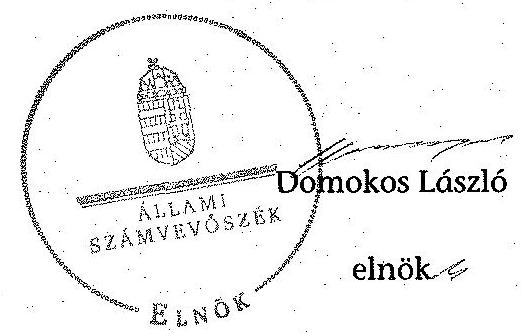
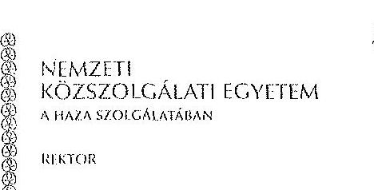
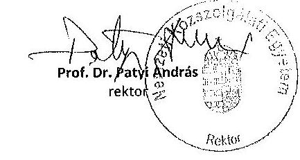
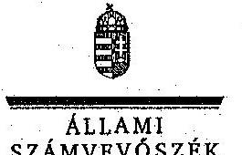
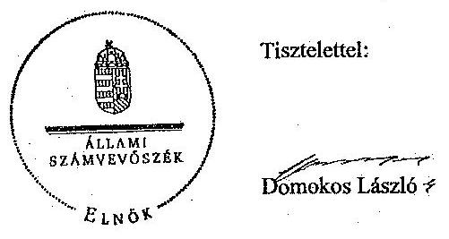

# ÁLLAMI   SZÁMVEVŐSZÉK 

## JELENTÉS

a Nemzeti Közszolgálati Egyetem ellenőrzéséről - Az állami felsőoktatási intézmények gazdálkodásának, múködésének ellenőrzése

---

# Állami Számvevőszék 

Iktatószám: V-0593-095/2015.
Témaszám: 1627
Vizsgálat-azonosító szám: V-068919

## Az ellenőrzést felügyelte:

Makkai Mária
felügyeleti vezető
Az ellenőrzés végrehajtásáért felelős:
Keresztes Tamás
ellenőrzésvezető
A számvevői munkaanyagok feldolgozását és a Jelentés összeállítását végezte:

Keresztes Tamás ellenőrzésvezető
Hegyesiné Péter-Szabó Éva számvevő
Kulcsár Lászlóné számvevő
Sipos Attila számvevő
Az ellenőrzést végezték:
Belovai Sándorné
számvevő főtanácsos

Fekete Gábor
számvevő tanácsos

Molcsánné Márta Tünde számvevő tanácsos

## Szabó Balázsné Zsíros Andrea

számvevő

Bertalan Rudolf
számvevő

Hegyesiné PéterSzabó Éva
számvevő
Robák Ferencné számvevő tanácsos

Erdélyi László Tamás számvevő

Kulcsár Lászlóné számvevő

Sipos Attila
számvevő

## A témához kapcsolódó eddig készített számvevőszéki jelentések:

## címe

sorszáma
Jelentés az oktatási és kulturális ágazat irányítási rendszerének, 1106 működésének ellenőrzéséről
Jelentés a felsőoktatás oktatási infrastruktúra-fejlesztési program- 1171 jának ellenőrzéséről

---

Jelentés az állami felsőoktatási intézmények érdekeltségébe tartozó gazdasági társaságok támogatásának és nyereségük hasznosulásának ellenőrzéséről
Jelentés a Szolnoki Főiskola ellenőrzéséről - Az állami felsőoktatási 14196
intézmények gazdálkodásának, múködésének ellenőrzése
Jelentés a Pannon Egyetem ellenőrzéséről - Az állami felsőoktatási 14197
intézmények gazdálkodásának, múködésének ellenőrzése
Jelentés a Károly Róbert Főiskola ellenőrzéséről - Az állami felsőok- 14198
tatási intézmények gazdálkodásának, múködésének ellenőrzése
Jelentés a Magyar Képzőművészeti Egyetem ellenőrzéséről - Az ál- 14199
lami felsőoktatási intézmények gazdálkodásának, múködésének ellenőrzése
Jelentés a Miskolci Egyetem ellenőrzéséről - Az állami felsőoktatási 14200
intézmények gazdálkodásának, múködésének ellenőrzése
Jelentés a Széchenyi István Egyetem ellenőrzéséről - Az állami fel- 14201
sőoktatási intézmények gazdálkodásának, múködésének ellenőrzé-
se
Jelentés az Eszterházy Károly Főiskola ellenőrzéséről - Az állami 14204
felsőoktatási intézmények gazdálkodásának, múködésének ellen-
őrzése
Jelentés a Magyar Táncművészeti Főiskola ellenőrzéséről - Az ál- 14205
lami felsőoktatási intézmények gazdálkodásának, múködésének ellenőrzése
Jelentés a Budapesti Műszaki és Gazdaságtudományi Egyetem el- 14218
lenőrzéséről - Az állami felsőoktatási intézmények gazdálkodásá-
nak, múködésének ellenőrzése

---

.

---

# TARTALOMJEGYZÉK 

BEVEZETÉS ..... 13
I. ÖSSZEGZŐ MEGÁLLAPÍTÁSOK, KÖVETKEZTETÉSEK, JAVASLATOK ..... 17
II. RÉSZLETES MEGÁLLAPÍTÁSOK ..... 23

1. A Fenntartói Testület fenntartói és a felsőoktatásért felelős minisztérium ágazati irányítói tevékenysége ..... 23
2. Az intézmény belső kontrollrendszerének kiépítése és múködtetése ..... 25
3. Az intézmény pénzügyi gazdálkodása ..... 28
3.1. A kiadási és bevételi előirányzatok alakulása és a pénzügyi egyensúlyt befolyásoló tényezők ..... 28
3.2. A döntéshozó szervek gazdálkodással kapcsolatos joggyakorlásának szabályszerűsége ..... 32
3.3. A bevételi és kiadási előirányzatok megállapítása, módosítása, elkülönítése, az előirányzat-maradványok kezelése, adatszolgáltatási kötelezettség teljesítése ..... 34
3.4. A kiadási előirányzatok felhasználása ..... 36
3.5. A bevételi előirányzatok beszedése ..... 39
4. Az intézmény vagyongazdálkodása ..... 39
4.1. A vagyon változása ..... 39
4.2. A vagyongazdálkodás szabályozottsága ..... 40
4.3. A vagyonelemek kimutatása ..... 41
4.4. A vagyonelemekkel történő gazdálkodás ..... 44
5. A külső ellenőrzések által tett javaslatok hasznosulása ..... 47
5.1. ÁSZ ellenőrzések által tett javaslatok hasznosulása ..... 47
5.2. Az egyéb külső ellenőrzések javaslatainak hasznosulása ..... 49
6. Az intézmény átalakulásának szabályszerűsége ..... 49
MELLÉKLETEK
7. számú A Nemzeti Közszolgálati Egyetem kiadási és bevételi előirányzatai, azok teljesítése a 2012-2013. években
8. számú A Nemzeti Közszolgálati Egyetem kiadásainak, bevételeinek változása a 2012-2013. években
9. számú Kimutatás a Nemzeti Közszolgálati Egyetem teljesített bevételeiről és kiadásairól, valamint adósságszolgálatáról a 2012-2013. években

---

4. számú A Nemzeti Közszolgálati Egyetem záró mérlegadatai a 2012-2013. években
5. számú A Nemzeti Közszolgálati Egyetem gazdálkodása szabályszerűségének értékelése a mintatételek alapján
6. számú A Nemzeti Közszolgálati Egyetem rektorának észrevétele
7. számú A Nemzeti Közszolgálati Egyetem rektorának észrevételére adott válasz

# FÜGGELÉK 

1. számú Az integritás érvényesítése érdekében kialakított és múködtetett intézményi kontrollrendszer

---

# RÖVIDÍTÉSEK JEGYZÉKE 

## Törvények

Áfatv.
Áht. 1
Áht. 2
Art.
ÁSZ tv.
Feot.
Gt.
Kbt.
Kjt.
Létesítési tv.
Mtv. 1
Mtv. 2
Nftv.
Nketv.

Nvtv.
Ptk.
Szja tv.
Sztv.
Tbj.

Vtv.
Korm. rendeletek
Áhsz.

Új Áhsz.
Ámr.
Ávr.
Bkr.

2007. évi CXXVII. törvény az általános forgalmi adóról 1992. évi XXXVIII. törvény az államháztartásról (hatálytalan 2012. január 1-jétől)
2011. évi CXCV. törvény az államháztartásról
2003. évi XCII. törvény az adózás rendjéről
2011. évi LXVI. törvény az Állami Számvevőszékről
2005. évi CXXXIX. törvény a felsőoktatásról (hatálytalan 2012. szeptember 1-jétől)
2006. évi IV. törvény a gazdasági társaságokról (hatálytalan 2014. március 15-étől)
2011. évi CVIII. törvény a közbeszerzésekről
1992. évi XXXIII. törvény a közalkalmazottak jogállásáról
2011. évi XXXVI. törvény a Nemzeti Közszolgálati Egyetem létesítéséről (hatálytalan: 2013. január 2-ától)
1992. évi XXII. törvény a Munka Törvénykönyvéről (hatálytalan: 2013. január 1-jétől)
2012. évi I. törvény a munka törvénykönyvéről
2011. évi CCIV. törvény a nemzeti felsőoktatásról
2011. évi CXXXII. törvény a Nemzeti Közszolgálati Egyetemről, valamint a közigazgatási, rendészeti és katonai felsőoktatásról
2011. évi CXCVI. törvény a nemzeti vagyonról
1959. évi IV. törvény a Polgári Törvénykönyvről
1995. évi CXVII. törvény a személyi jövedelemadóról
2000. évi C. törvény a számvitelről
1997. évi LXXX. törvény a társadalombiztosítás ellátásaira és a magánnyugdíjra jogosultakról, valamint e szolgáltatások fedezetéről
2007. évi CVI. törvény az állami vagyonról
249/2000. (XII. 24.) Korm. rendelet az államháztartás szervezetei beszámolási és könyvvezetési kötelezettségének sajátosságairól (hatálytalan 2014. január 1jétől)
4/2013. (I.11.) Korm. rendelet az államháztartás számviteléről
292/2009. (XII. 19.) Korm. rendelet az államháztartás múködési rendjéről (hatálytalan 2012. január 1-jétől)
368/2011. (XII. 31.) Korm. rendelet az államháztartásról szóló törvény végrehajtásáról
370/2011. (XII. 31.) Korm. rendelet a költségvetési szer-

---

Vtvr.
53/2006. (III.14.)
Korm. rendelet

363/2011. (XII. 30.)
Korm. rendelet

## Határozatok

1365/2011. (XI. 8.)
Korm. határozat
1004/2012.(I.11.) Korm. határozat
1122/2012. (IV. 25.)
Korm. határozat
1428/2012. (X.8.) Korm. határozat
1635/2012. (XII. 18.)
Korm. határozat
1657/2012. (XII. 20.)
Korm. határozat
1259/2013. (V.13.)
Korm. határozat
1968/2013. (XII.13.)
Korm. határozat

## Egyéb rövidítések

áfa
ÁROP
ÁSZ
BCE
BM
Educatio Kft.
EMMI
FT
FIR
HHK
HM
HÖOK
IFT
INTOSAI
vek belső kontrollrendszeréről és belső ellenőrzéséről 254/2007. (X. 4.) Korm. rendelet az állami vagyonnal való gazdálkodásról
a közalkalmazottak jogállásáról szóló 1992. évi XXXIII. törvény felsőoktatásban való végrehajtásról és a felsőoktatási intézményekben történő foglalkoztatás egyes kérdéseiről
a Nemzeti Közszolgálati Egyetem, valamint a közigazgatási, rendészeti és katonai felsőoktatásról szóló 2011. évi CXXXII. törvény egyes rendelkezéseinek végrehajtásáról
a 2012. évi költségvetési hiánycél tartását biztosító további feladatokról
a kormányzati létszámcsökkentésről
a Széll Kálmán terv kiterjesztése keretében megvalósítandó egyes intézkedésekről
a 2012. évi költségvetési egyenleg tartását biztosító intézkedésekről
egyes kormányhatározatok módosításáról
a kormányzati stratégiai dokumentumok felülvizsgálatával kapcsolatos feladatokról
a túlzott hiány eljárás megszüntetése érdekében szükséges intézkedésekről
a rendkívüli kormányzati szolgáló tartalékból történő előirányzat-átcsoportosításról és egyes kormányhatározatok módosításáról
általános forgalmi adó
Államreform Operatív program
Állami Számvevőszék
Budapesti Corvinus Egyetem
Belügyminisztérium
Educatio Társadalmi Szolgáltató Nonprofit Kft.
Emberi Erőforrások Minisztériuma
Fenntartói Testület
Felsőoktatási Információs Rendszer
Hadtudományi és Honvédtisztképző Kar
Honvédelmi Minisztérium
Hallgatói Önkormányzatok Országos Konferenciája
Intézményfejlesztési Terv
Legfőbb Ellenőrzési Intézmények Nemzetközi Szakmai Szervezete (International Organization of Supreme Audit Institutions)

---

| KEHI | Kormányzati Ellenőrzési Hivatal |
| :-- | :-- |
| KIM | Közigazgatási és Igazságügyi Minisztérium |
| Kincstár | Magyar Államkincstár |
| MNV Zrt. | Magyar Nemzeti Vagyonkezelő Zrt. |
| MTA | Magyar Tudományos Akadémia |
| NAV | Nemzeti Adó- és Vámhivatal |
| NEFMI | Nemzeti Erőforrás Minisztérium |
| NEPTUN | Tanulmányi hallgatói információs rendszer |
| NFM | Nemzeti Fejlesztési Minisztérium |
| NGM | Nemzetgazdasági Minisztérium |
| NKE, egyetem, intéz- | Nemzeti Közszolgálati Egyetem |
| mény |  |
| OH | Oktatási Hivatal |
| OKM | Oktatási és Kulturális Minisztérium |
| OTKA | Országos Tudományos Kutatási Alapprogramok |
| PM | Pénzügyminisztérium |
| PPP | Public-Private Partnership (magán és közszféra |
|  | együttmúködése) |
| RTF | Rendőrtiszti Főiskola |
| SZMSZ | Szervezeti és Múködési Szabályzat |
| TÁMOP | Társadalmi Megújulás Operatív program |
| VIR | Vezetői Információs Rendszer |
| ZMNE | Zrínyi Miklós Nemzetvédelmi Egyetem |

---

.

---

# FOGALOMTÁR 

alapító
állami felsőoktatási intézmény saját tulajdona
állami vagyon
állami vagyon hasznosítása

A központi költségvetési szerv alapítója az Országgyűlés, a Kormány vagy a miniszter. Az NKE esetében az alapítói jogokat a Fenntartói Testület gyakorolja.
A felsőoktatási intézmény saját bevételének a költségek teljes körű levonása - az adományozás és öröklés kivételével -, a rendelkezésre bocsátott vagyon állagának megóvásáról, pótlásáról való gondoskodás után fennmaradt része terhére szerzett vagyona.
A Vtv. 1. § (2) bekezdése szerint állami vagyonnak minősül:
a) az állam tulajdonában lévő dolog, valamint a dolog módjára hasznosítható természeti erő,
b) az a) pont hatálya alá nem tartozó mindazon vagyon, amely vonatkozásában törvény az állam kizárólagos tulajdonjogát nevesíti,
c) az állam tulajdonában lévő tagsági jogviszonyt megtestesítő értékpapír, illetve az államot megillető egyéb társasági részesedés,
d) az államot megillető olyan immateriális, vagyoni értékkel rendelkező jogosultság, amelyet jogszabály vagyoni értékű jogként nevesít.
(hatályos 2010. június 17-től 2012. szeptember 9-ig)
a) az állam tulajdonában lévő dolog, valamint a dolog módjára hasznosítható természeti erő,
b) az a) pont hatálya alá nem tartozó mindazon vagyon, amely vonatkozásában törvény az állam kizárólagos tulajdonjogát nevesíti,
c) az állam tulajdonában lévő tagsági jogviszonyt megtestesítő értékpapír, illetve az államot megillető egyéb társasági részesedés,
d) az államot megillető olyan immateriális, vagyoni értékkel rendelkező jogosultság, amelyet jogszabály vagyoni értékű jogként nevesít,
e) az állam tulajdonában lévő pénzügyi eszközök.
(hatályos: 2012. szeptember 10-től)
A Vtv. 23. § (1) bekezdése szerint: Az állami vagyont az MNV Zrt. maga kezeli, vagy szerződés - így különösen bérlet, haszonbérlet, megbízás - alapján központi költségvetési szervnek, természetes vagy jogi személynek, vagy jogi személyiséggel nem rendelkező gazdálkodó szervezetnek hasznosításra átengedi.
(hatályos 2012. január 1-jétől 2013. június 27-ig)
Az állami vagyonnal a tulajdonosi joggyakorló maga gazdálkodik, vagy szerződés - így különösen bérlet, haszonbérlet, megbízás - alapján hasznosításra átengedi,

---

állami vagyon hasznosítására kötött szerződés
állami vagyon használója
állami vagyon értékesítése
állami vagyon kezelője /vagyonkezelő
autonómia
belső kontrollrendszer

CLF-módszer
illetőleg vagyonkezelésbe, haszonélvezetbe adja. (hatályos: 2013. június 28-tól)
A Vtv. 23. § (2) bekezdése szerint: Az állami vagyon hasznosítására kötött szerződések elsődleges célja az állami vagyon hatékony múködtetése, állagának védelme, értékének megőrzése, illetve gyarapítása, az állami és közfeladatok ellátásának elősegítése.
A Vtvr. 1. § (7) a. pontja szerint: Az a természetes vagy jogi személy, jogi személyiséggel nem rendelkező szervezet, aki vagy amely törvény vagy szerződés alapján, bármely jogcímen (bérlet, haszonbérlet, használat stb.) állami vagyont birtokol, használ, szedi annak hasznait, hasznosít, ide nem értve a haszonélvezőt, a vagyonkezelőt és a tulajdonosi jogok gyakorlóját.
(hatályos 2012. január 1-jétől)
Állami vagyon tulajdonjogának bármely jogcímen történő, visszterhes átruházása. (Vtvr. 1. § (7) d) pont)
A Vtv. 23. § (1) bekezdése szerint: Az állami vagyont az MNV Zrt. maga kezeli, vagy szerződés - így különösen bérlet, haszonbérlet, megbízás - alapján központi költségvetési szervnek, természetes vagy jogi személynek, vagy jogi személyiséggel nem rendelkező gazdálkodó szervezetnek hasznosításra átengedi. Az állami vagyonra vonatkozóan az MNV Zrt. kizárólag az Nvtv.-ben meghatározott személyekkel köthet vagyonkezelési szerződést.
(hatályos 2012. január 1-jétől)
A felsőoktatási intézmény Feot.-ban, illetve Nftv.-ben szabályozott önrendelkezése, amely biztosítja az intézmény önálló oktatási, kutatási, szervezeti és múködési, valamint gazdálkodási tevékenységét.
A belső kontrollrendszer a kockázatok kezelése és tárgyilagos bizonyosság megszerzése érdekében kialakított folyamatrendszer, amely azt a célt szolgálja, hogy megvalósuljanak a következő célok:
a) a múködés és gazdálkodás során a tevékenységeket szabályszerűen, gazdaságosan, hatékonyan, eredményesen hajtsák végre,
b) az elszámolási kötelezettségeket teljesítsék, és
c) megvédjék az erőforrásokat a veszteségektől, károktól és nem rendeltetésszerú használattól.
A módszer a múködési és a felhalmozási költségvetés bevételeinek és kiadásainak, ezek egyenlegeinek elkülönített, majd összevont kimutatását alkalmazza valamely költségvetési intézmény pénzügyi helyzetének megítéléséhez. Kiemelten mutatja be a finanszírozási műveletek egyenlege nélküli és az azt magába foglaló pénzügyi pozíciót, valamint a tőketörlesztéssel, értékpapírbeváltással csökkentett múködési jövedelmet.

---

előirányzat-maradvány

fenntartó
finanszírozási múveletek nélküli pozíció

Gazdasági Tanács
hároméves fenntartói megállapodás
információs és kommunikációs rendszer
intézményfejlesztési terv

Az értékelés a pénzügyi kapacitás fogalmát helyezi a középpontba.
Az államháztartás központi alrendszerébe tartozó költségvetési szerveknél a módosított bevételi és kiadási előirányzatok és azok teljesítésének a Kormány rendeletében meghatározott tételekkel korrigált különbözete az előirányzat-maradvány. (Áht. 2 2. § (1) bekezdés m) pontja)
A Feot. 7. § (2) és az Nftv. 4. § (2) bekezdése szerint az, aki az alapítói jogot gyakorolja, ellátja a felsőoktatási intézmény fenntartásával kapcsolatos feladatokat.
A CLF módszer szerint számított múködési és felhalmozási tevékenység pénzügyi egyenlegének összevont értéke. Megmutatja, hogy a költségvetési intézmény bevételei fedezetet biztosítottak-e a kiadásokra. A finanszírozási műveletek nélküli (GFS) pozíció alapján a pénzügyi helyzetet akkor tekintettük megfelelőnek, ha az adott év múködési és felhalmozási bevételei fedezetet nyújtottak az adott év múködési és felhalmozási kiadásaira.
A felsőoktatási intézmény javaslattevő, véleményező, a stratégiai döntések előkészítésében részt vevő és a döntések végrehajtásának ellenőrzésében közremúködő szerve. Az állami felsőoktatási intézmények központi költségvetési támogatására hároméves fenntartói megállapodást kell kötni az állami felsőoktatási intézmény és a fenntartó között. A fenntartói megállapodás tartalmazza a felsőoktatási intézmény által meghatározott hároméves időszakra vállalt teljesítménykövetelményeket, továbbá az állandó jellegű támogatási részeket, valamint a változó jellegű támogatások megállapításának jogcímeit. A változó elemú támogatás évenkénti elszámolási kötelezettséggel kerül meghatározásra.
A költségvetési szerv vezetője köteles olyan rendszereket kialakítani és múködtetni, melyek biztosítják, hogy a megfelelő információk a megfelelő időben eljussanak az illetékes szervezethez, szervezeti egységhez, illetve személyhez.
A szenátus fogadja el az intézményfejlesztési tervet. Az intézményfejlesztési tervben kell meghatározni a fejlesztéssel, a fenntartó által a felsőoktatási intézmény rendelkezésére bocsátott vagyon hasznosításával, megóvásával, elidegenítésével kapcsolatos elképzeléseket, a várható bevételeket és kiadásokat. Az intézményfejlesztési tervet középtávra, legalább négyéves időszakra kell elkészíteni, évenkénti bontásban meghatározva a végrehajtás feladatait. Az intézményfejlesztési terv része a foglalkoztatási terv. A foglalkoztatási tervben kell meghatározni azt a létszámot, amelynek keretei között a felsőoktatási intézmény megoldhatja feladatait. (Feot. 27. § (3) bekezdés)

---

integritás
kincstári biztos
kincstári költségvetés
kockázatkezelési rendszer
kontrollkörnyezet
kontrolltevékenység
költségvetési főfelügye-
lő, felügyelő

Az integritás olyasvalakit vagy valamit jelöl, aki vagy ami romlatlan, sértetlen, feddhetetlen. Az integritás elvek, értékek, cselekvések, módszerek, intézkedések konzisztenciáját jelenti: olyan magatartásmódot, amely meghatározott értékeknek megfelel.
A kincstári biztos kijelölését az államháztartásért felelős miniszternél a Kincstár kezdeményezi. A kincstári biztos köteles figyelemmel kísérni megbízatásának időpontjától kezdve a költségvetési szerv tervezését, gazdálkodását, beszámolását, a jogszabályokban előírt feladatainak ellátását, feltárni azokat az okokat, amelyek a tartós fizetésképtelenséghez vezettek, a szükséges intézkedések azonnali végrehajtására irányuló intézkedési tervet készíteni, azonnali intézkedéseket kezdeményezni, és írásbeli utasításokat kiadni a tartozásállomány felszámolására, a gazdálkodás egyensúlyának biztosítására, a követelések behajtására. (Ávr. 116-117. §)
A központi költségvetésről szóló törvény elfogadását követően a fejezetet irányító szerv az államháztartás központi alrendszerébe tartozó költségvetési szerv és a fejezeti kezelésű előirányzat kiemelt előirányzatait, valamint az elkülönített állami pénzalapok és a társadalombiztosítás pénzügyi alapjai jogszabályi előirás szerinti bevételeit és kiadásait kincstári költségvetés kiadásával állapítja meg. (Áht. 2 28. § (2) bekezdés, Ávr. 31. § (2) bekezdés)
Irányítási eszközök és módszerek összessége, melynek elemei a szervezeti célok elérését veszélyeztető tényezők (kockázatok) azonosítása, elemzése, csoportosítása, nyomon követése, valamint szükség esetén a kockázati kitettség mérséklése.
A kontrollkörnyezet a költségvetési szerv vezetőinek a szervezeti célok elérését segítő kontrollok kialakításával és múködtetésével, korszerűsítésével kapcsolatos magatartását, a kontrollpontokról érkező információkra való reagálását jelenti.
Azok az elvek, politikák és eljárások, amelyeket a kockázatok meghatározása és a szervezet céljainak elérése érdekében alakítanak ki.
A költségvetési szerv vezetője köteles a szervezeten belül kontrolltevékenységeket kialakítani, amelyek biztosítják a kockázatok kezelését, hozzájárulnak a szervezet céljainak eléréséhez.
Az államháztartásért felelős miniszter a Kormány irányítása alá tartozó fejezetet irányító szervhez, a Kormány irányítása vagy felügyelete alá tartozó költségvetési szervhez, valamint az elkülönített állami pénzalapok és a társadalombiztosítás pénzügyi alapjai kezelő szerveihez költségvetési főfelügyelő́t, felügyelő́t rendelhet ki. A költségvetési főfelügyelő, felügyelő a gazdálkodás költ-

---

kisebbségi jogokat biztosító részesedés maximális hallgatói létszám
mértékadó befolyást biztosító részesedés minisztérium
minősített többséget biztosító részesedés
monitoring

MTA Lendület program
múködési jövedelem
normatív költségvetési támogatás felsőoktatási intézmények múködéséhez
ségvetés-politikával való összhangja és a takarékos, szabályszerű, eredményes múködés érdekében a Kormány rendeletében meghatározott intézkedéseket tehet, így különösen előzetesen véleményezi a kötelezettségvállalásra irányuló eljárásokat, és a nagy összegű kötelezettségvállalások tekintetében kifogással élhet. (Áht. 39. § (1)-(2) bekezdés)

A részesedés mértéke legalább 5\%. (Gt. 49. §)
Az a felsőoktatási intézmény alapító okiratában, múködési engedélyében meghatározott hallgatói létszám, ameddig terjedően a felsőoktatási intézmény - figyelembe véve a hallgatók fogadásához és az oktatói tevékenység folytatásához rendelkezésre álló személyi feltételeket, helyiségeket és eszközöket - valamennyi évfolyamára számítva, teljes kihasználtsággal múködve hallgatói jogviszonyt létesíthet.
A részesedés mértéke legalább 20\%, de 50\%-nál kisebb. (Sztv. 3. § (2) bekezdés 4. pont)
A felsőoktatásért felelős minisztérium, amely 2009-től 2010 májusáig az OKM, 2010 májusától 2012 májusáig a NEFMI, 2012 májusától az EMMI volt.
A minősített befolyásszerző az ellenőrzött társaságban a szavazatok legalább hetvenöt százalékával rendelkezik. (Gt. 52. § (2) bekezdés)
A különböző szintű szervezeti célok megvalósításához szükséges folyamatok figyelemmel kísérése, melynek során a releváns eseményekről és tevékenységekről (együtt: folyamatokról) rendszeres jelleggel, strukturált, döntéstámogató információkhoz jutnak a szervezet vezetői.
A Lendület program célja az akadémiai intézmények és egyetemi kutatások dinamikus megújítása nemzetközileg kimagasló teljesítményú kutatók és kiemelkedő fiatal tehetségek külföldről történő hazahívásával, illetve itthon tartásával. A Lendület program a kiválóság és a mobilitás együttes támogatására irányul, ennek megfelelően célja, hogy a befogadó kutatóhelyeken új téma kutatására alakuló kutatócsoportok számára biztosítson forrást.
A folyó bevételek és folyó kiadások egyenlege. Azt mutatja, hogy a folyó bevételek fedezetet nyújtanak-e a folyó kiadásokra.
A felsőoktatási intézmények múködéséhez biztosított normatív költségvetési támogatás lehet
a) hallgatói juttatásokhoz nyújtott,
b) képzési,
c) tudományos célú,
d) fenntartói,

---

e) egyes feladatokhoz nyújtott
támogatás. A központi költségvetésből biztosított normatív költségvetési támogatásra - a d) pontban meghatározott normatív költségvetési támogatás kivételével - a felsőoktatási intézmények azonos feltételek alapján válnak jogosulttá. Az a)-e) pontokban meghatározott jogcímek - az a) és e) pontban meghatározott jogcímek kivételével - nem jelentenek felhasználási kötöttséget. (Feot. 127. § (3) bekezdés)
normatív támogatások Az ellenőrzési időszakban hatályos költségvetési törvények 3. számú mellékletében megjelölt közoktatási hozzájárulások, az 5. mellékletében megjelölt központosított előirányzatok, továbbá a 8. mellékletében megjelölt normatív, kötött felhasználású támogatások együttesen.
saját bevétel Az államháztartáson kívüli források - beleértve minden olyan, az Európai Uniótól származó támogatást, amelyhez nem az állami költségvetésen keresztül jut a felsőoktatási intézmény, továbbá a szakképzési hozzájárulási fizetési kötelezettség teljesítéseként elszámolt forrásokat is, ide nem értve az állami vagyon értékesítésének ellenértékét -, valamint a Kutatási és Technológiai Innovációs Alapból származó bevételek.
szenátus
tárgyévi pénzügyi pozíció
többségi befolyást biztosító részesedés

A felsőoktatási intézmény döntést hozó és a döntés végrehajtását ellenőrző testülete. (Feot. 20. § (1) bekezdés)
A múködési és felhalmozási bevételek, valamint kiadások egyenlege a finanszírozási múveletek egyenlegének figyelembe vételével.
A Ptk. 685/B. § (1) bekezdése szerint többségi befolyás: az olyan kapcsolat, amelynek révén természetes személy, jogi személy vagy jogi személyiség nélküli gazdasági társaság (a továbbiakban együtt: befolyással rendelkező) egy jogi személyben a szavazatok több mint ötven százalékával vagy meghatározó befolyással rendelkezik.

---

# JELENTÉS 

## a Nemzeti Közszolgálati Egyetem ellenőrzéséről - Az állami felsőoktatási intézmények gazdálkodásának, múködésének ellenőrzése

## BEVEZETÉS

Az ÁSZ Stratégiája ${ }^{1}$ alapértékeinek egyike, hogy az államháztartás komplex folyamatainak átláthatósága érdekében rendszerszemléletű/holisztikus megközelítésű, egymásra épülő, a szinergiahatást kihasználó, összefoglaló értékelésre lehetőséget adó ellenőrzéseket végez. Az államháztartás központi alrendszerébe tartozó felsőoktatási intézmények ellenőrzése során az Állami Számvevőszék értékeli azok pénzügyi-gazdasági helyzetét, feltárja a működésükben rejlő kockázatokat, ezzel előmozdítja a közpénzügyek átláthatóságát, rendezettségét.

Az állami felsőoktatási intézmények gazdálkodását - az Áht. ${ }_{1}$ és az Áht. ${ }_{2}$ előírásai mellett - a felsőoktatásról szóló 2005. évi CXXXIX. törvény (Feot.), valamint a nemzeti felsőoktatásról szóló 2011. évi CCIV. törvény (Nítv.) előírásai határozták meg.

Magyarország Nemzeti Reform Programja keretében, a Széll Kálmán Terv 2020-ig a 30-34 évesek körében, a felsőfokú vagy annak megfelelő végzettséggel rendelkezők arányának 30,3\%-ra való növelését irányozta elő, amely a 2010. évhez képest $4,6 \%$ pontos növekedési célkitűzést jelent. A rendezett gazdasági környezet, az önállósággal élni tudó, felelős, elszámoltatható intézményi gazdálkodói magatartás elengedhetetlen feltétele a kitűzött szakmai célok elérésének.

Az ellenőrzés célja annak megállapítása, hogy szabályos volt-e az állami felsőoktatási intézmény pénzügyi és vagyongazdálkodása, biztosított volt-e a vagyonnal való felelős gazdálkodás követelményének érvényesülése, jogszabályi előírásoknak megfelelően múködött-e a belső kontrollrendszer, a fenntartó szerv tevékenysége a jogszabályi előírásoknak megfelelt-e.

Ennek keretében értékeltük a Nemzeti Közszolgálati Egyetemnél:

- a fenntartói és az ágazati irányítási jogok gyakorlása előírásoknak való megfelelőségét;

[^0]
[^0]:    ${ }^{1}$ Állami Számvevőszék: Stratégia. Az Állami Számvevőszék hivatalos stratégiai dokumentum rendszere 2011-2015. 2012. december. http://www.asz.hu/strategia/asz-strategia/asz-strategia-2011.pdf

---

- az intézmény belső kontrollrendszere jogszabályoknak megfelelő kialakítását és múködtetését;
- az intézmény döntéshozó szerveinek joggyakorlása jogszabályoknak való megfelelőségét; az intézmény oktatási és egyéb (gyakorlati és kutatási) tevékenységei elkülönítését, átláthatóságát, illetve pénzügyi gazdálkodása szabályszerűségét;
- az intézmény vagyongazdálkodása előírásoknak való megfelelőségét;
- az ellenőrzött időszakban végzett külső (ÁSZ, fenntartói, KEHI, kincstári) ellenőrzések által tett javaslatok hasznosulását;
- az intézmény átalakulása során a vonatkozó jogszabályok betartását;
- az intézmény korrupcióval szembeni veszélyeztetettségének csökkentése érdekében az integritási szemlélet érvényesülését a gazdálkodási folyamatokban.

Az ellenőrzés várható hasznosulása: Az ellenőrzés eredményének hasznosulásaként képet kapunk a Nemzeti Közszolgálati Egyetemnél kialakult pénzügyi helyzetről; az oktatási és egyéb tevékenységek és költségelszámolások elhatárolásáról, átláthatóságáról és szabályosságáról. A felsőoktatási intézmények gazdálkodási szabadságának pénzügyi és vagyoni helyzetre gyakorolt hatásairól, a vagyonnal való felelős, értékmegőrző gazdálkodás érvényesüléséről, továbbá a belső kontrollrendszer múködéséről. Az ellenőrzés az ellenőrzött számára visszajelzést ad a gazdálkodása kereteinek kialakításáról, a múködésében fellépő hiányosságokról, javaslataival hozzájárul azok kiküszöböléséhez és a jó kormányzáshoz. A törvényalkotás számára összegzett tapasztalatok állnak rendelkezésre a felsőoktatási intézmények döntéseinek, gazdálkodásának szabályszerűségéről, amelyek alapján - indokolt esetben - jogszabálymódosítás kezdeményezhető. Az integritás kultúra kialakítása hozzájárul az elszámoltathatóság és átláthatóság érvényesítéséhez, egyben támogatja a szervezet védettségét a korrupciós kitettséggel szemben, valamint annak megelőzése is irányítottabbá válik. A társadalom számára jelzi, hogy közpénz nem maradhat ellenőrizetlenül, az ÁSZ értékteremtő rend kialakításához és megőrzéséhez hozzájáruló tevékenysége pozitív hatással lesz a szervezetről kialakított összkép formálásában.

Az ellenőrzés típusa: szabályszerűségi ellenőrzés
Az ellenőrzött időszak: 2012. január 1. - 2013. december 31. (az eredményszemléletű számvitel bevezetésével kapcsolatban az ellenőrzött időszak vége: 2014. április 30.)

Az ellenőrzéssel érintett szervezetek: az ágazati irányítási feladatok tekintetében az EMMI, a Fenntartói Testület, mint fenntartói joggyakorló, amely a KIM, a HM és a BM miniszterek nevében jár el, valamint a Nemzeti Közszolgálati Egyetem.

Az ellenőrzés jogszabályi alapját az Állami Számvevőszékről szóló 2011. évi LXVI. törvény 1. § (3) bekezdése, az 5. § (3)-(6) bekezdései, 33. § (7) bekezdé-

---

se, valamint az államháztartásról szóló 2011. évi CXCV. törvény 61. § (2) bekezdésének előírásai képezik.

Az ellenőrzés az INTOSAI által kiadott nemzetközi standardok figyelembe vételével, az ellenőrzési programban foglalt értékelési szempontok szerint történt.

A pénzügyi és vagyongazdálkodás terén az egyes területek szabályszerű múködését mintavétellel ellenőriztük, ez alapján a sokaságokban előforduló hibás tételek arányát becsültük. A jogszabályoknak és a belső előírásoknak megfelelőnek, azaz szabályszerűnek tekintettük az adott kiadási előirányzat felhasználását, bevétel beszedését, mérlegtétel értékelését, amennyiben a minta ellenőrzésének eredménye alapján $95 \%$-os bizonyossággal a teljes sokaságban a hibás tételek aránya kisebb volt, mint $10 \%$, nem megfelelőnek értékeltük, ha a hibás tételek aránya a $10 \%$-ot meghaladta. Kockázatot, illetve magas kockázatot jeleztünk, amennyiben egy adott terület vonatkozásában a minta alapján a teljes sokaságban nem volt teljes körűen biztosított a jogszabályoknak és a belső szabályzatoknak megfelelő működés. Egyes területeken (térítési díjak, költségtérítések megállapítása, múködési bevétel, ellátottak juttatásai, vagyonhasznosítási bevétel, dologi kiadások, előirányzat módosítások) a mintatételek ellenőrzésének tapasztalatait nem vetítettük ki a teljes sokaságra, az adott terület minősítését a mintatételek alapján végeztük el. A mintatételek kiértékelését az 5. számú melléklet tartalmazza.

A belső kontrollrendszer kialakításának és működtetésének értékelése során a jogszabályi előírások mellett a Bkr. 5. § (1) bekezdése alapján figyelembe vettük az államháztartásért felelős miniszter által közzétett irányelvekben és módszertani útmutatókban ${ }^{2}$ foglaltakat is. A belső kontrollrendszert az értékelés során legalább $85 \%$-os megfelelőség esetén megfelelőnek, legalább a $70 \%$-os megfelelőség esetén részben megfelelőnek, $70 \%$-os megfelelőség alatt pedig nem megfelelőnek minősítettük.

A Kormány a Nemzeti Közszolgálati Egyetem létrehozásáról szóló 1278/2010. (XII. 15.) Korm. határozatban elrendelte a honvédelmi és katonai felsőoktatást végző Zrínyi Miklós Nemzetvédelmi Egyetem, a rendvédelmi és rendészeti felsőoktatást képviselő Rendőrtiszti Főiskola - mint jogelődök - és a Budapesti Corvinus Egyetemtől különváló, a közigazgatási felsőoktatást alaptevékenységként folytató Közigazgatás-tudományi Kar egyesülésével az NKE létrehozását 2012. január 1-jei hatállyal. Az NKE a 2012-2013. évek között önállóan működő és gazdálkodó központi költségvetési szervként, a jogelődöktől átvett területeken folytatott képzést és alapfeladata körében a képzési területeken kutatási tevékenységet is végzett. Az intézmény feladatai tekintetében 2012 augusztusában történt változás, mert a közigazgatási személyzet képzésével, a közigazgatási vezetőképzéssel és a kormánytisztviselői vizsgarendszer működtetésével bővültek az NKE közfeladatai.

Az NKE jellemzőit, főbb gazdálkodási, vagyoni és létszám adatait a következő táblázat mutatja be.

[^0]
[^0]:    ${ }^{2}$ Pénzügyminisztérium Belső Kontroll Kézikönyv 2010.

---

| Megnevezés | Főbb gazdálkodási és vagyoni adatok (ezer Ft) |  |  |
| :--: | :--: | :--: | :--: |
|  | 2012. | 2013. | 2013/2012. (\%) |
| KIADÁSI FŐÖSSZEG | 5078867 | 11264871 | 221,8 |
| BEVÉTELI FŐÖSSZEG | 7618231 | 14221111 | 186,7 |
| Költségvetési támogatások | 5223639 | 9456152 | 181,0 |
| Saját és átvett bevételek | 2394592 | 4764957 | 199,0 |
| Támogatások aránya (\%) | 68,6 | 66,5 | 97,0 |
| Mérlegfőösszeg | 6320307 | 23317302 | 368,9 |
|  | Jellemző létszámadatok ${ }^{3}$ (fő) |  |  |
| Oktatói létszám (fő) | 203 | 241 | 118,7 |
| Hallgatói létszám (fő) | 6334 | 10371 | 163,7 |

Az NKE kiadási és bevételi összegeinek, valamint mérlegfőösszegének alakulását elsősorban a bővülő feladatatok, valamint a Ludovika Campus létrehozásának eszközátvételi és beruházási feladatai határozták meg.

Az NKE kiadásai a két év alatt 121,8\%-kal, a bevételei összességében 86,7\%-kal nőttek. A bevételeken belül a költségvetési támogatás aránya évente közel azonos szinten alakult, $68,6 \%$ és $66,5 \%$ volt, saját és átvett bevételek $99,0 \%$-kal nőttek. A hallgatói létszám 4037 fővel, ( $63,7 \%$-kal) emelkedett, az oktatók létszáma pedig 203 fơről 241 főre, $18,7 \%$-kal nőtt.

Az ÁSZ a 2011. évi LXVI. törvény 29. §-a szerint a jelentéstervezetet megküldte a Nemzeti Közszolgálati Egyetem rektorának és az Emberi Erőforrások Minisztériuma miniszterének egyeztetésre. A Nemzeti Közszolgálati Egyetem rektorának észrevételét és az arra adott választ a 6-7. számú melléklet tartalmazza. Az Emberi Erőforrások Minisztériuma minisztere az ÁSZ tv. 29. § (2) bekezdésében foglalt észrevételezési jogával nem élt, a törvényes határidőn belül észrevételt nem tett.

[^0]
[^0]:    ${ }^{3}$ Az oktatói és hallgatói létszám az október 15-i statisztikában szereplők szerinti.

---

# I. ÖSSZEGZŐ MEGÁLLAPÍTÁSOK, KÖVETKEZTETÉSEK, JAVASLATOK 

Az FT az ellenőrzött időszakban a jogszabályi előírásoknak megfelelően gyakorolta fenntartói feladatait.

A felsőoktatásért felelős miniszter az ágazati irányítási feladatait nem látta el teljes körűen. Elmaradt az oktatási ágazatra vonatkozóan a nemzetgazdasági miniszter irányításával és az oktatásért felelős miniszter részvételével előírt szervezeti és feladat ellátási felülvizsgálati program kidolgozása. A felsőoktatási törvények rendelkezései ellenére a felsőoktatásért felelős miniszter nem készíttetett a felsőoktatás rendszere vonatkozásában elfogadott középtávú fejlesztési tervet.

A minisztérium az Oktatási Hivatallal a Felsőoktatási Információs Rendszer (FIR) biztonságos üzemeltetéséhez, az adatok védelméhez szükséges alapvető kontrollokat 2012. év végéig nem teljes körűen alakította ki. A FIR átfogó megújítása után 2012 szeptemberétől - a nyitott jogviszonnyal rendelkező hallgatók és az oktatók vonatkozásában - az ellenőrzött időszakban rögzített adatok már teljes körűek. A fenntartó a FIR biztonságos üzemeltetéséhez, az adatok védelméhez szükséges kontrollokat 2012. év végén kialakította, ugyanakkor a 2012. szeptembertől múködő FIR-t jogszabályi megfelelőségi, adatbiztonsági, illetve informatikai szempontból nem ellenőrizte.

Az NKE belső kontrollrendszerének kialakítása és múködtetése - a 2012. évre vonatkozóan feltárt hiányosságok miatt - részben felelt meg a vonatkozó jogszabályi előírásoknak. Ezen belül a monitoring rendszer megfelelő, a kontrollkörnyezet kialakítása, a kockázatkezelés, továbbá az információs és kommunikációs rendszer részben megfelelő, a kontrolltevékenység alkalmazása nem megfelelő volt. A kontrollrendszer kialakításában és múködtetésében a 2013. évben jelentős javulás volt tapasztalható a 2012. évhez képest. Így a kontrollrendszer kialakítása és múködtetése a 2013. évben már megfelelő volt.

Az intézmény kontrollkörnyezetének kialakítása részben felelt meg a jogszabályi előírásoknak. Az NKE vezetője a pénz- és vagyongazdálkodással kapcsolatos folyamatokra, feladat- és hatáskörökre, felelősségi viszonyokra vonatkozó belső szabályzatokat nem teljes körűen készítette el. Egyes belső szabályzatokkal az NKE a 2012. évben nem rendelkezett.

A kockázatkezelési rendszer kialakítása és múködtetése részben felelt meg a jogszabályi követelményeknek. Az egyetem a 2012. évben kockázatkezelési szabályzattal nem rendelkezett, mert azt 2013. április 30-án fogadták el, így a kockázatok felmérését és elemzését sem végezték el a 2012. évben.

A kontrolltevékenység szabályozási keretének kialakítása és annak múködtetetése nem volt megfelelő. A belső kontrollrendszer szabályozásával kapcsolatos rektori utasítás 2013. április 22-én lépett hatályba. A kontrolltevékenységek múködtetésében a személyi juttatások és a vagyonelemek kimutatása területén

---

voltak hibák, hiányosságok, amelyek a folyamatba épített, illetve a vezetői ellenőrzés nem megfelelő működésére voltak visszavezethetőek.

Az intézmény információs és kommunikációs rendszere részben megfelelő volt, azt a 2012. évben több hiányosság is jellemezte. Az egységes vezetői információs rendszert 2012. évben nem alakították ki. Az informatikai rendszerekkel és az információáramlással kapcsolatos belső szabályzatok, valamint az iratkezelési szabályzat sem lépett 2012. évben hatályba.

Az ellenőrzött szervezet nem vett részt az ÁSZ 2013. évi integritás felmérésében.
Az NKE pénzügyi gazdálkodása nem minden tekintetben volt szabályszerű.
Az intézmény pénzügyi egyensúlya az ellenőrzött időszakban biztosított volt. Az NKE likviditási hitelt és támogatási kölcsönt nem vett fel. Kincstári biztost és költségvetési felügyelő́t az intézményhez nem rendeltek ki. A likviditási mutató és a pénzeszköz likviditási mutató értékei is stabil pénzügyi pozíciót mutatnak, mert a forgóeszközök, illetve a pénzeszközök az ellenőrzött évek mindegyikében fedezetet nyújtottak a rövid lejáratú kötelezettségek teljesítésére.

Az intézmény szenátusa alapvetően ellátta a jogszabályokban rögzített, gazdálkodást érintő feladatait. Két kisebb súlyú hiányosság volt, hogy nem döntött a minőség és teljesítmény alapján differenciáló jövedelemelosztás elveiről, illetve nem fogadott el önálló vagyongazdálkodási tervet.

A különböző jogcímeken kapott támogatások felhasználására vonatkozó intézményi döntések összhangban voltak a jogszabályokkal, belső szabályzatokkal.

Az intézményi térítési díjak, költségtérítések megállapítása megfelelt a jogszabályi és belső előírásoknak.

Az NKE bevételi és kiadási előirányzatainak megállapítása - a szabályozási hiányosságok miatt - részben felelt meg a jogszabályi előírásoknak. A belső szabályzatokban 2012 augusztusától, míg a munkaköri leírásokban 2013 februárjától rögzítették a költségvetési tervezéssel kapcsolatos feladatokat.

A bevételi és kiadási előirányzatok módosítása szabályszerű volt. Az intézmény oktatási és egyéb tevékenységeit az előírásoknak megfelelően elkülönítették.

Az éves előirányzat-maradvány megállapítása szabályszerűen történt, azonban a maradvány felhasználása során nem tartották be teljes körűen a vonatkozó jogszabályi előírásokat. Ez magas kockázatot jelez az ellenőrzött terület egészének szabályos múködése szempontjából. Több esetben előfordult, hogy a szakmai teljesítésigazolást olyan személy végezte, aki arra írásbeli felhatalmazást nem kapott.

---

Az egyetem teljesítette az évközi és éves beszámoláshoz kapcsolódó adatszolgáltatási kötelezettségét, több esetben azonban a jogszabályokban előírt határidőt követően készítette el a vonatkozó dokumentumokat.

A rendszeres és nem rendszeres személyi juttatások előirányzatainak felhasználása a pénzügyi elszámolások, valamint a gazdálkodási jogkörök gyakorlása tekintetében nem volt szabályszerű. Rendszerhiba volt, hogy a rendszeres személyi juttatások számfejtését munkaidő nyilvántartással nem támasztották alá, vagy a nyilvántartás nem felelt meg a jogszabályi előírásoknak. Több esetben előfordult, hogy a közalkalmazottak kinevezése és a kinevezések módosítása nem felelt meg a jogszabályi előírásoknak, továbbá azok pénzügyi ellenjegyzése nem történt meg. A többletfeladatokhoz kapcsolódó kereset kiegészítéseknél a kötelezettségvállalások pénzügyi ellenjegyzése a jogszabályi előírásokkal ellentétben a kötelezettségvállalást követően történt meg.

A külső személyi juttatások előirányzatai terhére kötött megbízási szerződésekhez kapcsolódó díjak elszámolása során a gazdálkodási jogkörök gyakorlása nem felelt meg a jogszabályoknak és belső szabályoknak. Több esetben előfordult, hogy a kötelezettségvállalások pénzügyi ellenjegyzése nem szabályszerűen történt meg és a teljesítésigazolás során nem tartották be az összeférhetetlenségi szabályokat. Az NKE a saját közalkalmazottaival kötött megbízási szerződések esetében nem kötötte ki, hogy a közalkalmazottat a megbízási díj kizárólag abban az esetben illeti meg, ha a munkakörébe tartozó feladatainak is maradéktalanul eleget tett.

A dologi, a felhalmozási kiadások előirányzatának felhasználása a pénzügyi elszámolások, valamint a gazdálkodási jogkörök gyakorlása tekintetében megfelelt a jogszabályoknak és belső szabályoknak. Az ellátotti juttatások megállapítása, kifizetése során betartották az előírásokat.

Az intézményi múködési és vagyonhasznosítási bevételek beszedése szabályosan történt.

Az egyes, csak hazai forrásból finanszírozott projektekhez, feladatokhoz pályázati úton vagy egyéb módon nyújtott költségvetési forrással való elszámolás megfelelt a jogszabályoknak.

Az egyetem vagyona a 2012. évi 6320,3 M Ft-ról a 2013. év végére 23 317,3 M Ft-ra, 3,7-szeresére nőtt. Ez elsősorban az ingatlanok vagyonkezelésbe vétele és a végrehajtott beruházások és felújítások miatt következett be. Az összes eszközértéken belül a befektetett eszközök részaránya 2012. évről 2013. évre $44,7 \%$-ról $80,1 \%$-ra növekedett, amíg a forgóeszközök részaránya $55,3 \%$-ról $19,9 \%$-ra csökkent.

A vagyongazdálkodás szabályozottsága - néhány hiányosság ellenére megfelelő volt. Az NKE a jogszabályi előírások ellenére nem készített vagyongazdálkodási tervet.

Az egyetem a vagyonelemek kimutatása során nem minden tekintetben járt el szabályszerűen. Az egyetem 2012. évre vonatkozó mérlegében az ellenőrzés során feltárt hibák összege meghaladja az új Áhsz. 1. § (1) bekezdésének

---

3. pontjában meghatározott jelentős összeget. A hibák egy része a jogelődök szabálytalan gyakorlatából adódott.

Az NKE egy ingatlanrészt nem a vagyonkezelési szerződésben meghatározott értéken vett nyilvántartásba. Nem mutatott ki a mérlegében a tartós részesedések között egy tulajdonában álló Kft.-nél apporttal végrehajtott 3,8 M Ft összegű tőkeemelést.

A követelések esetében a mérlegtételek tartalma, besorolása, értékelése nem felelt meg a jogszabályoknak, belső szabályoknak. A lejárt követelés behajtása érdekében nem minden esetben tettek intézkedéseket, továbbá nem történt meg ezen követelések egyedi értékelése, így értékvesztés elszámolása sem. Több esetben előfordult, hogy informatikai hiba miatt a hallgatói bankkártyás befizetés kétszer került könyvelésre, ezért az analitikus nyilvántartásban és így a mérlegben is „negatív elöjelü" követelést szerepeltettek. Több esetben nem küldték meg a vevőnek a követelés elismertetése érdekében az év végi egyenlegközlőt.

A kötelezettségek esetében a mérlegtételek tartalma, besorolása és értékelése nem felelt meg a jogszabályoknak és belső szabályoknak. A 2013. évi beszámolóban a hosszú lejáratú kötelezettségekből a mérleg fordulónapját követő egy üzleti éven belül esedékes törlesztéseket nem mutatták ki a rövid lejáratú kötelezettségek között. Több esetben előfordult, hogy szabálytalanul, tárgyévben még nem teljesített, vagy el nem ismert kötelezettséget mutattak ki szállítói kötelezettségként. Az utólagos elszámolásra kiadott előleget több esetben egyéb különféle rövid lejáratú kötelezettségként negatív előjellel könyvelték. Rendszerhiba volt, hogy elmaradt a kötelezettségek értékelése.

Az aktív pénzügyi elszámolások esetében a mérlegtételek tartalma, besorolása és értékelése nem felelt meg a jogszabályi követelményeknek. A 2012. évben az aktív pénzügyi elszámolások tartalmaztak olyan, egy évnél régebbi tételeket, amelyeket a megfelelő jogcímen kiadásként nem számoltak el. A nemzetközi támogatási programokhoz kapcsolódóan szabálytalanul mutatták ki az aktív pénzügyi elszámolások között az előlegből, illetve saját részből finanszírozott kiadásokat.

A passzív pénzügyi elszámolások esetében a mérlegtételek tartalma, besorolása és értékelése nem felelt meg teljes körűen a jogszabályi követelményeknek. A 2012. évben a passzív pénzügyi elszámolások tartalmaztak olyan, egy évnél régebbi tételeket, amelyeket a megfelelő jogcímen bevételként nem számoltak el. A 2012. évben több esetben előfordult, hogy a NEPTUN rendszeren keresztül megvalósult befizetéseket függő bevételként könyvelték annak ellenére, hogy azok jogcíme ismert volt, az azonosításhoz szükséges információk rendelkezésre álltak.

Az NKE a jogszabályi előírásoknak megfelelően végrehajtotta az eredményszemléletű számvitel bevezetésével kapcsolatos feladatokat.

Az NKE a vagyonelemekkel történő gazdálkodása során a jogszabályokban és a belső szabályozásokban előírtakat részben tartotta be.

Az NKE az eszközök beszerzése, létesítése, állományba vétele, az üzembe helyezése, felújítása során betartotta a belső szabályzatokban foglalt döntési, véle-

---

ményezési hatásköröket. Az előírt esetekben lefolytatta a közbeszerzési eljárásokat. A beszerzett, létesített immateriális javak és tárgyi eszközök besorolásának megállapítása, év végi értékelése, az értékcsökkenés elszámolása szabályos volt. A felesleges, selejtezendő vagyontárgyak feltárása, hasznosítása, mindezek dokumentálása megfelelt a belső szabályzatban foglaltaknak.

Az NKE a bérleti szerződéseket több esetben nem versenyeztetés útján kötötte meg. Az egyetem a bérbeadási folyamat során dokumentált módon nem győződött meg az átláthatóság előírt követelményének érvényesüléséről sem.

Az egyetem az ellenőrzött időszakban alapvetően felelősen gazdálkodott részesedéseivel.

A 2012. évben az ÁSZ az NKE jogelődjének (ZMNE) ellenőrzését végezte el. A jelentés egy szabályozást érintő és két gazdálkodást érintő javaslatot fogalmazott meg. Az NKE a javaslatok alapján intézkedési tervet készített. Az abban vállalt feladatokat határidőben végrehajtották.

Az intézmény egy főiskola, egy egyetem és egy egyetemi kar átalakulásával jött létre.

Az Állami Számvevőszékről szóló 2011. évi LXVI. törvény 33. § (1) bekezdésében foglaltak értelmében a jelentésben foglalt megállapításokhoz kapcsolódó intézkedési tervet köteles az ellenőrzött szervezet vezetője összeállítani, és azt a jelentés kézhezvételétől számított 30 napon belül az ÁSZ részére megküldeni. Amennyiben az intézkedési tervet határidőben nem küldi meg a szervezet, vagy az nem elfogadható, az ÁSZ elnöke a hivatkozott törvény 33. § (3) bekezdés a)-b) pontjaiban foglaltakat érvényesítheti.

Az ellenőrzés intézkedést igénylő megállapításai és javaslatai:

# a Nemzeti Közszolgálati Egyetem rektorának: 

1. A belső kontrollrendszeren belül a kontrollkörnyezet kialakítása részben volt megfelelő, mivel az egyetem az ellenőrzött időszakban nem teljes körűen rendelkezett az előírt belső szabályzatokkal, a gazdálkodási szabályzatot nem minden esetben aktualizálta a jogszabályi változásokkal összhangban. Mindez nem biztosította a Bkr. 6. §ában foglalt előírások érvényesülését. A kontrolltevékenységek működtetése nem felelt meg a Bkr. 8. §-a előírásainak, amely a gazdálkodási jogkörök gyakorlásánál szabálytalanságokat eredményezett.

Javaslat:
Intézkedjen a jogszabályoknak megfelelő belső kontrollrendszer kialakítása és működtetése érdekében - az ellenőrzött időszak óta bekövetkezett jogszabályi változásokra figyelemmel - a kontrollkörnyezet és a kontrolltevékenységek hiányosságainak megszüntetéséről.
2. A pénzügyi gazdálkodás területén a gazdálkodási jogkörök gyakorlása nem felelt meg az Áht. 2 37. § (1) bekezdése, az Ávr. 55. § (1) bekezdése, az 57. § (1) és (3) bekezdése és 59. § (1) és (3) bekezdése, 60. § (2) bekezdése előírásainak.

---

Egy esetben megsértették a Kbt. 18. § (1) és (2) bekezdéseiben előírt, a közbeszerzési eljárás lefolytatására vonatkozó szabályait.

Javaslat:
a) Intézkedjen a gazdálkodási jogkörök szabályszerű gyakorlásának érvényesítéséről.
b) Intézkedjen a közbeszerzési szabálytalanság tekintetében a munkajogi felelősség kivizsgálására irányuló eljárás megindítása iránt és a vizsgálat eredményének ismeretében tegye meg a szükséges intézkedéseket.
3. A vagyongazdálkodás szabályszerűségét érintő hiányosság volt, hogy az egyetem a 2012-2013 évek között - az Nketv. 7. § (1) bekezdés d) pontjában előírtak ellenére nem rendelkezett a szenátus által elfogadott vagyongazdálkodási tervvel.

A bérleti szerződéseket - annak ellenére, hogy nem álltak fenn a versenyeztetés mellőzésének feltételei - az Nvtv. 11. § (16) bekezdésében foglaltak ellenére több esetben nem versenyeztetés útján kötötték meg. Az egyetem a bérbeadási folyamat során dokumentált módon nem győződött meg az átláthatóság előírt követelményének érvényesüléséről sem.

Javaslat:
a) Intézkedjen a vagyongazdálkodási terv jogszabályi előírásoknak megfelelő elkészítéséről, kezdeményezze annak elfogadását és jóváhagyását.
b) Intézkedjen a bérleti szerződések versenyeztetés útján történő megkötéséről, valamint az átláthatóság előírt követelményeinek érvényesüléséről.

---

# II. RÉSZLETES MEGÁLLAPÍTÁSOK 

## 1. A Fenntartói Testület fenntartói és a felsőoktatásért FELELŐS MINISZTÉRIUM ÁGAZATI IRÁNYÍTÓI TEVÉKENYSÉGE

Az NKE fenntartói jogait az ellenőrzött időszakban az FT útján a közigazgatásifejlesztésért, a rendészetért és a honvédelemért felelős miniszterek közösen gyakorolták. Az FT feladatait az Nketv. határozta meg.

Az FT az ellenőrzött időszakban a jogszabályi előírásoknak megfelelően gyakorolta fenntartói feladatait.

A 2012-2013. években az FT havonkénti gyakorisággal ülésezett. Gondoskodott az alapítás szabályosságáról, a személyi és tárgyi feltételek biztosításáról. Figyelemmel kísérte a szervezet változásait, a gazdálkodás körülményeit.

Az FT szabályszerűen adta ki az NKE eredeti és a jogszabályi és szervezeti változásoknak megfelelően módosított alapító okiratát. A 2011. december 15-én kiadott alapító okirat módosítására 2012 augusztusában azért került sor, mert bővültek az NKE közfeladatai. Az alapító okirattal összhangban álló SZMSZ-t és annak módosításait az FT jóváhagyta.

Az FT 2012 júliusában fogadta el az NKE 2012-2015. évi időszakra szóló Intézményfejlesztési Tervét.

Az FT meghatározta a költségvetési tervezéshez az irányadó létszámadatokat, a költségvetési sarokszámokat. Megtárgyalta, esetenként módosítási javaslatai alapján átdolgoztatta a költségvetést, jóváhagyta a költségvetésről szóló szenátusi javaslatot. Az FT határozatot hozott az NKE mindkét ellenőrzött évre vonatkozó költségvetésének végrehajtásáról szóló beszámoló jóváhagyásáról.

Az FT szabályszerűen gyakorolta az NKE vezetői feletti munkáltatói jogokat.
A Köztársasági Elnök 2012. január 1-jétől kinevezte az NKE rektorát.
Az FT 2012. július 1-jétől 2015. június 12-ig kinevezte az NKE gazdasági főigazgatóját, 2013. december 6-án közalkalmazotti jogviszonyát megszüntette.

Az FT 2012 augusztusában határozatot hozott az NKE belső ellenőrzési osztályvezetőjének pályázatával kapcsolatban. Az osztályvezetőt 2012. november 15-től bízta meg a nemzeti fejlesztési miniszter.

Az FT 2012 márciusában meghatározta a vezetői béreket és a rektor számára célfeladatokat írt elő.

Az FT ellátta az Nketv.-ben rögzített ellenőrzési feladatait. A költségvetés és a költségvetés teljesítéséről szóló beszámoló elfogadása kapcsán ellenőrizte a gazdálkodást. Félévenként vizsgálta az NKE rektora célfeladatainak teljesülését.

---

Félévenként beszámoltatta a rektort. Gondoskodott az NKE belső ellenőrzési szervezetének kialakításáról. 2013 júliusában koncepciót dolgozott ki az FT ellenőrzési feladatainak ellátásához. Ennek nyomán a 2014. évre elkészítette az ellenőrzési tervét.

A felsőoktatásért felelős miniszter az ágazati irányítási feladatait az ellenőrzött időszakban nem látta el teljes körűen.

A felsőoktatásért felelős miniszter - a vonatkozó jogszabályokban ${ }^{4}$ foglaltak ellenére - nem készített a felsőoktatás rendszere vonatkozásában elfogadott középtávú fejlesztési tervet.

A Kormány a FIR múködtetéséért felelős szervnek az OH-t jelölte ki. Az elektronikus nyilvántartás múködtetéséhez szükséges informatikai hátteret és az adatok feldolgozását az OH az Educatio Kft. bevonásával látta el. A felsőoktatási ágazati információs rendszer oktatásszakmai fejlesztési koncepcióját a fenntartó elkészítette.

A FIR Fejlesztési Stratégia címú dokumentumot 2011. november 15 -én írta alá az EMMI Felsőoktatásért és tudománypolitikáért felelős helyettes államtitkára, az OH elnöke és az Educatio Kft. ügyvezetője.

A felsőoktatásért felelős minisztérium az OH-val a FIR biztonságos üzemeltetéséhez, az adatok védelméhez szükséges alapvető kontrollokat a 2012. év végéig nem teljes körűen alakította ki. A FIR átfogó megújítása után a 2012 szeptemberétől - a nyitott jogviszonnyal rendelkező hallgatók és az oktatók vonatkozásában - az ellenőrzött időszakban rögzített adatok teljesek. A visszamenőleges adatok tisztítása és beküldése folyamatban volt. A fenntartó a FIR biztonságos üzemeltetéséhez, az adatok védelméhez szükséges kontrollokat 2012. év végén kialakította.

Az OKM Ellenőrzési Főosztálya a FIR kialakításának és múködésének jogszabályi megfelelőségét 2010-ben ellenőrizte az OKM-nél, az OH-nál és az Educatio Kft.-nél.

A jelentés megállapította, hogy a FIR kialakítása és működése részben felelt meg a jogszabályi előírásoknak, hiányzott a szakmai célkitűzések egyértelmű és pontos meghatározása. Ezek hiányában a FIR megfelelősége nem volt mérhető. A fontosabb nyilvántartási funkciók részben voltak múködőképesek, az intézmények hiányos adatszolgáltatása veszélyeztette a FIR-től elvárt szolgáltatások teljesülését.

A fenntartó a 2012. szeptembertől múködő FIR-t jogszabályi megfelelőségi, adatbiztonsági, illetve informatikai szempontból 2013. december 31-ig nem ellenőrizte.

Elmaradt az oktatási ágazatra vonatkozóan az 1365/2011. (XI. 8.) Korm. határozatban - a nemzetgazdasági miniszter irányításával és az ágazatért felelős

[^0]
[^0]:    ${ }^{4}$ Feot. 104. § (1) bekezdés b) pont és az Nftv. 64. § (3) bekezdés a) pont

---

miniszter részvételével - előírt szervezeti és feladat ellátási felülvizsgálati program kidolgozása.

A kormányhatározat a felsőoktatásért felelős minisztérium számára a hatékony felsőoktatási feladatellátás érdekében közreműködési kötelezettséget írt elő követelmények és feltételek (feladatmutatók, mennyiségi és minőségi teljesítménymutatók, létszám- és költségnormák) kialakításában, a felsőoktatási intézménystruktúra, illetve az intézményi belső múködés korszerűsítési javaslatainak megtételében. A minisztérium tájékoztatása szerint a 2012. február 20-ig határidős feladatot nem végezték el, mert nem rendelkeztek információval a kormányhatározat 1. pontjában megjelölt miniszteri munkabizottság múködéséről, valamint az általa kidolgozott módszertani útmutatóról, amely a munkálatokhoz adott volna iránymutatást ${ }^{5}$.

# 2. AZ INTÉZMÉNY BELSŐ KONTROLLRENDSZERÉNEK KIÉPÍTÉSE ÉS MÜKÖDTETÉSE 

Az NKE belső kontrollrendszerének kialakítása és múködtetése - a 2012. évre vonatkozóan feltárt hiányosságok miatt - részben felelt meg a vonatkozó jogszabályi előírásoknak. Ezen belül a kontrollkörnyezet kialakítása, a kockázatkezelés, továbbá az információs és kommunikációs rendszer részben megfelelő, a monitoring rendszer megfelelő, a kontrolltevékenység alkalmazása nem megfelelő volt. A kontrollrendszer kialakításában és múködtetésében a 2013. évben jelentős javulás volt tapasztalható a 2012. évhez képest. Így a kontrollrendszer kialakítása és múködtetése a 2013. évben már megfelelő volt. A rektor a 2012-2013. években évente értékelte a belső kontrollok kialakítását és múködését, valamint erről nyilatkozatot tett a fenntartó felé, amely 2012. évben nem volt teljes körűen összhangban a kontrollrendszer tényleges múködésével.

## Az intézmény kontrollkörnyezetének kialakítása részben felelt meg a jogszabályi előírásoknak.

Az NKE elkészítette az oktatási, kutatási, szervezeti, múködési és gazdálkodási autonómiáját biztosító intézményi SZMSZ-t. Az SZMSZ-ek tartalmazták a szervezet múködési rendjét, a szervezeti egységek feladatait, a szervezet felépítését, szervezeti ábráját. Kisebb hiányosság volt, hogy a szervezeti egységek engedélyezett létszámadatai ${ }^{6}$ az SZMSZ-ből hiányoztak.

Az NKE vezetője a pénz- és vagyongazdálkodással kapcsolatos folyamatokra, feladat- és hatáskörökre, felelősségi viszonyokra vonatkozó belső szabályzatokat nem teljes körűen készítette el. Az egyetem az ellenőrzött időszakban nem rendelkezett a rektor által jóváhagyott eszközök és források értékelési szabályzatával és ellenőrzési nyomvonallal ${ }^{7}$. Az egyetem a szabályzatokat elkészítette, de azokat a rektor nem hagyta jóvá, így hatályba sem léptek.

[^0]
[^0]:    ${ }^{5}$ Az 1365/2011. (XI. 8.) Korm. határozat 1. pontjának felelősei az NGM miniszter, a Miniszterelnökséget vezető államtitkár, valamint a KIM miniszter voltak.
    ${ }^{6}$ Ávr. 13. § (1) bekezdés e) pont.
    ${ }^{7}$ Áhsz. 8. § (4) bekezdés b) pont, Bkr. 6. § (3) bekezdés.

---

Egyes belső szabályzatokkal az NKE az ellenőrzött időszak egy részében nem rendelkezett, ezzel megsértve a vonatkozó jogszabályi rendelkezéseket ${ }^{8}$.

Az önköltség-számítási szabályzat 2012. október 27-én, a pénzkezelési szabályzat 2013. október 21-én, a számlarend 2013. január 1-jén, a számviteli politika 2012. november 30-án, a gazdasági szervezet ügyrendje 2012. november 16-án lépett hatályba.

Az NKE a gazdálkodási szabályzat kivételével valamennyi belső szabályzatát aktualizálta. Az aktualizálás elmaradása miatt a gazdálkodási szabályzat nem minden tekintetben volt összhangban a hatályos jogszabályokkal ${ }^{9}$, mert hatályon kívül helyezett jogszabályi helyekre is hivatkozott.

A kockázatkezelési rendszer kialakítása és múködtetése részben felelt meg a jogszabályi követelményeknek ${ }^{10}$.

Az egyetem a jogszabályi előírásokkal ellentétesen ${ }^{11}$ 2013. április 30 -áig nem rendelkezett kockázatkezelési szabályzattal. A kockázatkezelési szabályzatban a jogszabályi előírásokkal összhangban meghatározták a kockázat fogalmát, azonosítását, értékelését és kezelését, nyilvántartását és felülvizsgálatát, valamint a kapcsolódó eljárásrendet.

A kockázatok meghatározása, felmérése és elemzése a 2013. évben történt meg. A kockázatelemzést a belső ellenőrzés keretében is alkalmazták a gyakorlatban, ahol a 2013. évi belső ellenőrzési terv összeállítását kockázat-elemzéssel alapozták meg.

A kontrolltevékenységek szabályozási keretének kialakítása és annak múködtetetése nem volt megfelelö ${ }^{12}$.

Az egyetem 2013. április 22-éig nem rendelkezett a belső kontrollrendszer szabályozásával kapcsolatos rektori utasítással. A kontrolltevékenységek múködtetésében a személyi juttatások területén és a vagyonelemek kimutatása során voltak hibák, hiányosságok, amelyek a folyamatba épített, illetve a vezetői ellenőrzés nem megfelelő múködésére voltak visszavezethetőek.

Az intézmény információs és kommunikációs rendszere részben megfelelő volt ${ }^{13}$.

Az NKE-nél az információs és kommunikációs rendszert a 2012. évben több hiányosság is jellemezte. Az egyetem egységes vezetői információs rendszerrel 2012. évben nem rendelkezett, mert azt 2013. év közepén hozták létre. Az informatikai és kommunikációs hálózat használatának és múködtetésének sza-

[^0]
[^0]:    ${ }^{8}$ Áhsz. 8. § (3) bekezdés és (4) bekezdés c)-d), 49. § (1) bekezdés, Ávr. 13. § (5) bekezdés.
    ${ }^{9}$ Áht. ${ }_{2}$, Sztv., Áhsz., Ávr.
    ${ }^{10}$ Bkr. 7. §.
    ${ }^{11}$ Bkr. 5. § (1) bekezdés és 7. §.
    ${ }^{12}$ Bkr. 8. § (1)-(2) bekezdés.
    ${ }^{13}$ Bkr. 9. §.

---

bályzatát, a szervezeten belüli és kívüli beszámoltatási szinteket szabályozó rektori utasítást, valamint iratkezelési szabályzatot 2012. évben nem adták ki, azok 2013. évben léptek hatályba. Az iratkezelési feladatokat főtitkári körlevélben foglaltak alapján végezték.

A jogszabályi előírások alapján az egyetem a honlapján gondoskodott az előírt adatok közzétételéről.

A közérdekű és személyes adatok védelméről, biztonságáról szóló, az ellenőrzött időszakban módosított szabályzat tartalmazta a kötelezően közzéteendő adatok körét, a közzététel módját.

Az egyetem szabályszerűen teljesítette a FIR-rel kapcsolatban a számára előírt adatszolgáltatást.

Az intézmény nyomon követési (monitoring) rendszere összességében megfelelő volt. Az egyetem 2013-ra a nyomon követési rendszerét az oktatási és a gazdálkodási tevékenységre vonatkozóan egyaránt kialakította.

A belső ellenőrzés az ellenőrzött időszakban szabályszerűen múködött. Az NKE belső ellenőrzését közvetlenül a rektor irányította, így biztosították annak függetlenségét. A belső ellenőrzés feladatait a jogszabályi előírásnak megfelelően az SZMSZ-ben, továbbá a belső ellenőrzési kézikönyvben is szabályozták. A belső ellenőrzésre vonatkozóan elfogadott belső ellenőrzési kézikönyvek tartalmazták a vonatkozó jogszabályokban előírtakat.

Az ellenőrzött időszakban a belső ellenőrzés a gazdálkodást érintően 5 db ellenőrzést végzett, amelyek közül az egyik utóellenőrzés volt. Az elkészült jelentésekben a szabályozást érintően 12 db , a gazdálkodási gyakorlatot érintően 16 db javaslatot tettek.

A belső ellenőrzéssel érintett területek vezetői teljes körűen eleget tettek az intézkedési tervkészítési kötelezettségüknek. Az ellenőrzések megállapításai azonban részben hasznosultak. A nem hasznosult javaslatokhoz kapcsolódó intézkedések egy részének határideje az ellenőrzött időszakon túli volt.

A belső ellenőrzés mind a belső, mind a külső ellenőrzésekről megfelelő nyilvántartást vezetett.

Az egyetem nem vett részt az ÁSZ 2013. évi integritás felmérésében. Ezért a helyszíni ellenőrzés keretében került sor a kérdőív kitöltésére. Ennek kiértékelését az 1. számú Függelék tartalmazza.

---

# 3. Az intÉZMÉNY PÉNZÜGYI GAZDÁlKODÁSA 

Az NKE pénzügyi gazdálkodása nem minden tekintetben volt szabályszerű.

### 3.1. A kiadási és bevételi előirányzatok alakulása és a pénzügyi egyensúlyt befolyásoló tényezők

Az egyetem költségvetési kiadásainak és bevételeinek részletes adatait az 1. számú melléklet tartalmazza.

A 2012. és a 2013. évi előirányzat adatokat összehasonlítva az eredeti előirányzatok tekintetében a kiadási és a támogatási egyaránt 248,4 M Ft-tal (5,2, illetve $8,4 \%$-kal) növekedett, a bevételi szinten maradt. A módosított előirányzatok vonatkozásában mindhárom előirányzat csoport növekedett, a kiadási 6484,3 M Ft-tal ( 1,8 szorosára), a bevételi 5211,7 M Ft-tal (2,9szeresére), míg a támogatási $1277,6 \mathrm{M}$ Ft-tal ( $25,1 \%$-kal). A teljesítés a kiadások tekintetében 6185,9 M Ft-tal (2,2-szeresére), a bevételek vonatkozásában 5325,2 M Ft-tal (3,1-szeresére), míg a támogatások esetében 1277,6 M Ft-tal ( $25,1 \%$-kal) növekedett. A változások az egyetem alapításával, tevékenységének megkezdésével, illetve a múködés feltételeinek biztosítása érdekében elkezdett központi campus beruházásával álltak kapcsolatban.

Az NKE betartotta a módosított kiemelt előirányzatokat, és a költségvetési kiadásokat az év közben módosított kiadási előirányzatok mértékéig teljesítette.

Az egyetem elöirányzatait Kormány, irányító szervi és saját hatáskörben is módosították.

A 2012. évben kormányzati hatáskörben a Ludovika Campus előkészítési, tervezési, bontási és építési munkáira, továbbá személyi jellegű kifizetések forrásainak biztosítására történt előirányzat-módosítás. Az NKE esetében a Kormány megtérítette a prémiumévekkel kapcsolatos munkáltatói költségeket, finanszírozta a foglalkoztatottak 2012. évi kompenzációját, forrást biztosított a Ludovika Campus projektszervezetének személyi költségeire. Ezen felül a Széll Kálmán Terv kiterjesztése keretében megvalósítandó intézkedések és a 2012. évi költségvetési egyenleg tartását biztosító intézkedések kapcsán 96,2 M Ft zárolását rendelte el. Fejezeti hatáskörben a Ludovika Campus előkészítési kiadásaira és a Campusban való egységes elhelyezés kiadásaira történt előirányzat-módosítás. Saját hatáskörben egyebek közt az elődintézmények kötelezettségvállalással terhelt maradványainak beemelése, a létszámcsökkentés, ösztöndíj-kifizetések, kiemelt előirányzatok közötti átcsoportosítások miatt történt előirányzat-módosítás.

A 2013. évben kormányzati hatáskörben az NKE Ludovika Campus állami beruházás megvalósításához, továbbá személyi jellegű kifizetésekhez történt források biztosítása. Ugyanakkor kormányzati hatáskörben fejezetek közötti átcsoportosítások miatt történt forráselvonás. A 2013. évben elsősorban fejezeti hatáskörben elrendelt előirányzat-módosítások biztosították a Ludovika Campus beruházásainak forrását. Emellett fejezeti hatáskörben OTKA kutatások finanszírozása és Kincstárjegy előirányzatának beemelése miatt történt előirányzat-módosítás. Saját hatáskörben egyebek közt a 2012. évi kötelezettségvállalással terhelt marad-

---

vány, illetve a TÁMOP projektek elszámolása alapján történt előirányzatmódosítás.

Az intézmény éves előirányzat-módosításait hatáskörönként a következő táblázat mutatja (M Ft).

| Megnevezés | 2012. év | 2013. év |
| :-- | --: | --: |
| Kormányzati hatáskörben | 2117,4 | $-211,7$ |
| Fejezeti hatáskörben | 34,1 | 4013,3 |
| Saját hatáskörben | 812,8 | 5403,5 |
| Összesen: | $\mathbf{2 9 6 4 , 3}$ | $\mathbf{9 2 0 5 , 1}$ |

A bevételek és kiadások teljesítési adatainak részletezését a 2. számú melléklet tartalmazza.

A felhasználható előirányzat-maradvány összege 2012. évben 2536,3 M Ft, a 2013. évben 2956,2 M Ft volt. A maradványok összegét kötelezettségvállalással terhelt maradványként mutatták ki a beszámolóban.

A bevételi lemaradás a 2012. évben 115,6 M Ft, a 2013. évben 2,0 M Ft, a kiadási megtakarítás a 2012. évben 2654,9 M Ft, a 2013. évben 2958,2 M Ft volt. A költségvetési szervet meg nem illető összegként a 2012. évben 3,0 M Ft-ot mutatott ki az egyetem.

Az intézmény oktatóinak létszáma 2012-ben 203 fő volt, amely 2013-ban 241 fôre ( $15,8 \%$-kal) emelkedett. A hallgatói létszám 2012-ben 6334 fó volt, amely 2013-ban 10371 fôre ( $63,7 \%$-kal) nőtt. A felvehető maximális hallgatói létszám 15000 fó volt az alapító okirat szerint, az egyetem a rendelkezésre álló férőhely-kapacitás $69,1 \%$-át tudta kihasználni 2013-ban. Az államilag finanszírozott hallgatók létszáma az ellenőrzött időszakban 3244 fơről 3919 fôre $(20,8 \%-\mathrm{kal})$ változott.

Az intézmény pénzügyi egyensúlya az ellenőrzött időszakban biztosított volt. Az NKE likviditási hitelt és támogatási kölcsönt nem vett fel. Kincstári biztost és költségvetési felügyelő́t az intézményhez nem rendeltek ki.

Az NKE a VIR keretében 2013. évtől egy likviditás nyomon követésére alkalmas programot múködtetett, amely egyszerre alkalmas a számlaegyenlegek elmúlt időszakban bekövetkezett változásainak áttekintésére és várható jövőbeli alakulásuk bemutatására. Így a 2013. évben likviditási tervvel is rendelkezett. A 2012. évben azonban nem készítettek likviditási tervet, megsértve ezzel a vonatkozó jogszabályi rendelkezést ${ }^{14}$.

[^0]
[^0]:    ${ }^{14}$ Áht. 2 78. § (2) bekezdés.

---

A likviditási mutató ${ }^{15}$ és a pénzeszköz likviditási mutató ${ }^{16}$ értékei ${ }^{17}$ stabil pénzügyi pozíciót mutatnak, mert a forgóeszközök, illetve a pénzeszközök az ellenőrzött évek mindegyikében fedezetet nyújtottak a rövid lejáratú kötelezettségek teljesítésére.

Az egyetem pénzügyi helyzetét a CLF módszer segítségével is elemeztük (3. számú melléklet). Az NKE pénzügyi pozícióját, múködési jövedelmét, felhalmozási költségvetési egyenlegét, nettó múködési jövedelmét az alábbi táblázat szemlélteti M Ft-ban:

| Megnevezés | 2012. év | 2013. év |
| :-- | --: | --: |
| Folyó bevételek | 5548,4 | 7444,0 |
| Folyó kiadások | 4828,9 | 7294,9 |
| Müködési jövedelem | $\mathbf{7 1 9 , 5}$ | $\mathbf{1 4 9 , 2}$ |
| Felhalmozási bevételek | 2069,8 | 4237,7 |
| Felhalmozási kiadások | 250,0 | 3970,0 |
| Felhalmozási költségvetés egyenlege | $\mathbf{1 8 1 9 , 8}$ | $\mathbf{2 6 7 , 7}$ |
| Folyó és felhalmozási bevételek összesen | 7618,2 | 11681,7 |
| Folyó és felhalmozási kiadások összesen | 5078,9 | 11264,9 |
| Finanszírozási múveletek nélküli pozíció | $\mathbf{2 5 3 9 , 3}$ | $\mathbf{4 1 6 , 9}$ |
| Finanszírozási múveletek egyenlege | 171,0 | -170,5 |
| Tárgyévi pénzügyi pozíció (pénzeszköz   változás) | $\mathbf{2 7 1 0 , 3}$ | $\mathbf{2 4 6 , 4}$ |
| Hiteltörlesztés, értékpapír beváltás | 5,3 | 0 |
| Nettó müködési jövedelem | $\mathbf{7 1 4 , 2}$ | $\mathbf{1 4 9 , 2}$ |

Az ellenőrzött időszakban az intézmény pénzügyi pozíciója javult, mert az NKE 2012. évi nulla Ft összegű nyitó idegen pénzeszközök nélküli pénzállománya a 2013. év végére 2956,7 M Ft-ra emelkedett. A 2012. és 2013. évek között az év végi pénzállomány 246,4 M Ft-tal emelkedett.

A múködési jövedelem 2012-ben és 2013-ban is pozitív volt, így összesen 868,7 M Ft többlet jövedelem keletkezett. Hiteltörlesztési kötelezettség nem merült fel az ellenőrzés időszakában. A múködési jövedelem és a nettó múködési jövedelem összege 2012-ben 5,3 M Ft-tal - értékpapírral kapcsolatos kiadási

[^0]
[^0]:    ${ }^{15}$ A likviditási mutató kifejezi, hogy a rövid lejáratú fizetési kötelezettségek kiegyenlítéséhez a forgóeszközök milyen arányban nyújtanak fedezetet.
    ${ }^{16}$ A pénzeszköz likviditási mutató kifejezi, hogy a pénzeszközök év végi állománya milyen arányban nyújt fedezetet a rövid lejáratú fizetési kötelezettségekre.
    ${ }^{17}$ A likviditási mutató értéke 2012-ben 29,19, 2013-ban 20,51, a pénzeszköz likviditási mutató értéke 2012-ben 25,15 2013-ban 13,15 volt.

---

múvelet miatt - eltért egymástól. A 2013. évben a folyó költségvetés egyenlege és a nettó múködési jövedelem megegyezett egymással.

A folyó bevételek 2012-ről 2013-ra 34,2\%-kal (1895,6 M Ft-tal) növekedtek. A jelentős emelkedés a 2012. évben a folyó bevételek között elszámolandó előző évi előirányzat-maradvány átvétel 689,5 M Ft-os tételének elszámolásával, továbbá a támogatásértékú múködési bevételek 2470,1 M Ft-os emelkedésével állt kapcsolatban.

A folyó kiadások a 2012. évhez viszonyítva a 2013. évre 2466,0 M Ft-tal ( $51,1 \%$-kal) növekedtek. A folyó kiadások növekedésében a személyi juttatások és a járulékok, valamint a dologi kiadások változásai voltak a meghatározóak. A személyi jellegű kifizetések 1120,8 M Ft-tal ( $41,7 \%$-kal), a járulékok 271,9 M Ft-tal ( $38,9 \%$-kal) és a dologi kiadások 1282,5 M Ft-tal (101,8\%-kal) emelkedtek a 2012. és a 2013. évek között.

A felhalmozási költségvetés egyenlege a 2012. és a 2013. években is pozitív volt, a felhalmozási bevételek összesen 2087,6 M Ft összegben haladták meg a felhalmozási kiadásokat.

A felhalmozási bevételek 2012-ről 2013-ra 104,7\%-kal (2167,9 M Ft-tal), növekedtek. A felhalmozási bevételek között meghatározó volt, hogy az NKE az ellenőrzött két évben a felhalmozási kiadások költségvetési támogatása keretében összesen 5204,7 M Ft támogatást kapott beruházási céllal az egyetem központi épületének kialakítására.

A felhalmozási kiadások a 2012. évhez viszonyítva a 2013. évre 3720,0 M Ft-tal (15,9-szeresére) emelkedtek. Ennek oka a 2012-ben megkezdett, majd a 2013. évben folytatott - az egyetem központi épületét érintő - beruházás volt.

A finanszírozási műveletek egyenlege a teljes ellenőrzött időszakban nem volt érdemi hatással a pénzügyi pozíció változására.

Az ellenőrzött időszakban az egyetemet 125,0 M Ft összegű zárolás érintette, amely a feladatellátást nem veszélyeztette. A zárolások előírása - néhány esetben - a tárgyévi fizetési kötelezettségek vállalásának átütemezését, illetve új kötelezettségvállalás esetében a pénzügyi teljesítések halasztását okozta. A fenntartói előírások teljesítése érdekében az NKE szigorú takarékossági intézkedések mellett gazdálkodott.
2012. június 7 -én az 1122/2012. (IV. 25.) Korm. határozat 1. pontja alapján 24,1 M Ft, valamint 2012. október 24-én az 1428/2012. (X. 8.) Korm. határozat 1. pontja alapján 72,2 M Ft dologi kiadás került zárolásra. 2012. december 28-án az 1635/2012. (XII. 18.) Korm. határozat 1. és 3. pontja alapján a zárolt előirányzatokat véglegesen elvonták az intézménytől.
2013. augusztus 23-án az 1259/2013. (V. 13.) Korm. határozat 1. pontja alapján 28,7 M Ft dologi kiadás került zárolásra. 2012. december 19-én az 1968/2013. (XII. 17.) Korm. határozat 22. pontja alapján a zárolt előirányzatot végelegesen elvonták az intézménytől.

Az NKE szállítói tartozás állományának nagysága az ellenőrzött időszakban nem volt jelentős.

---

A beszámoló adatai szerint az NKE szállítói tartozása 2012-ben 115,7 M Ft, 2013-ban 121,4 M Ft volt. Ebből a 30 napon túli lejárt tartozás 2012-ben 3,4 M Ft, illetve 2013-ban $22,1 \mathrm{M}$ Ft volt, amely a teljes szállítói állomány 2,9 , illetve $18,2 \%$-a volt.

A lejárt szállítói állományon belül a 180 napon túli tartozás 2012-ben 0,2 M Ft, 2013-ban 4,9 M Ft volt, amely a teljes szállítói állomány 0,2 , illetve $4,0 \%$-a volt.

A lejárt szállítói állomány a támogató által utófinanszírozott EU-s ÁROP és TÁMOP pályázatokhoz kapcsolódó támogatói kifizetések elhúzódásából, ezáltal a projektek tovább finanszírozásához szükséges források hiányából adódott.

A követelések állománya nem gyakorolt érdemi hatást az egyetem likviditására.

A határidőn túli követelés állomány 2012-ben 82,3 M Ft, 2013-ban 73,9 M Ft volt, amely összegek a 2012. és 2013. év összes vevőállomány ( 88,5 M Ft és $124,3 \mathrm{MFt}$ ) $92,9$, illetve $59,5 \%$-a, továbbá a realizált bevételek ( $2528,3 \mathrm{M}$ Ft és 7853,6 M Ft) 3,3\%-a, illetve 0,9\%-a voltak. A határidőn túli követelés állomány felhalmozódása elsősorban az egyetemi hallgatók be nem fizetett tandíjhátralékából adódott.

Feladatátvétel keretében 2012. október 2-án került sor az RTF vagyonkezelői jogának átruházására az NKE részére, illetve 2012. december 12-én a közigazgatási vizsgáztatás vizsgaszervezési feladatának átvételére. Az átvett feladatok nem jártak együtt előirányzat átvétellel, így az intézkedéseknek az NKE 2012. évi bevételi és kiadási előirányzataira nem volt hatásuk. Az ellenőrzött időszakban az NKE előirányzatainak nagyságát befolyásoló átadott, megszűnt, illetve újonnan létrehozott feladatok nem fordultak elő.

Az NKE az MTA Lendület programjában az ellenőrzött időszakban nem vett részt, így azzal kapcsolatban kiadások nem merültek fel.

# 3.2. A döntéshozó szervek gazdálkodással kapcsolatos joggyakorlásának szabályszerűsége 

Az intézmény szenátusa alapvetően ellátta a jogszabályokban rögzített, gazdálkodást érintő feladatait.

A szenátus feladatait az Nketv., illetve az ezen törvényben nem szabályozott kérdésekben Nftv. határozza meg.

Két kisebb súlyú hiányosságot állapítottunk meg. A szenátus nem döntött a minőség és teljesítmény alapján differenciáló jövedelemelosztás elveiről ${ }^{18}$, illetve nem fogadott el önálló vagyongazdálkodási tervet ${ }^{19}$.

[^0]
[^0]:    ${ }^{18}$ Nketv. 7. § (1) bekezdés c) pont.
    ${ }^{19}$ Nketv. 7. § (1) bekezdés d) pont.

---

A vagyongazdálkodás kérdéseit az intézmény Ideiglenes szenátusa által 2012. június 27 -én elfogadott 2012-2015. évre vonatkozó IFT, valamint az elfogadott éves költségvetések tárgyalták, azonban azok nem tekinthetők vagyongazdálkodási tervnek.

A különböző jogcímeken kapott támogatások felhasználására vonatkozó intézményi döntések összhangban voltak a jogszabályokkal, belső szabályzatokkal.

Az Nketv. 36. § (6) bekezdése értelmében az NKE-re nem alkalmazandók az oktatásért felelős miniszter által biztosított támogatások szabályai.

A gazdálkodással kapcsolatos joggyakorlás keretében az ellenőrzött időszakban a szenátus elfogadta a költségvetés felosztását központi és decentralizált részre, illetve az intézmény karaira vonatkozóan. Az egyes szervezeti egységek költségvetési kereteinek meghatározását a belső szabályzatok előírásainak megfelelően a rektor végezte el.

Az NKE intézményi költségvetése költségvetési keretszámainak belső felosztásáról rektori határozat, a keretek feletti rendelkezési és aláírási jogról pedig a kötelezettségvállalás belső szabályai rendelkeztek.

Az egyetem a hallgatói térítési és juttatási szabályzatban határozta meg a hallgatói juttatások jogcímeit és feltételeit, valamint a juttatások különös szabályait (honvéd tisztjelöltek képzése, rendészeti képzés).

Az intézményi térítési díjak, költségtérítések megállapítása megfelelt a jogszabályi és belső előírásoknak.

Az ellenőrzött időszakban az NKE rendelkezett hallgatói térítési és juttatási szabályzattal, melyben meghatározta a hallgatói költségtérítésekkel kapcsolatos szabályokat. A díjak, költségtérítések megállapítása - egy egyedi hiba kivételével - összhangban volt a belső szabályozásban foglaltakkal. Egyedi hiba volt 2013. évben, hogy könyvek értékesítésénél a nyilvántartási érték nem volt dokumentáltan alátámasztva. ${ }^{20}$

Jogszabályi előírásból ${ }^{21}$ adódóan az egyetemen oktatási tevékenységet végzők, illetve egyéb, például a gazdasági területen dolgozó személyek egy része nem az egyetemmel állt közszolgálati jogviszonyban, hanem vezényléssel dolgoztak az NKE-nél. Ez a teljes állományi létszám mintegy egynegyedét jelentette. A vezényléssel biztosított fegyveres, illetve személyi állomány illetményét a honvédelemért és a rendészetért felelős miniszter útján az illetékes tárcák biztosították. Az egyetemen a katonai és a rendvédelmi vezetői, oktatói és egyéb állást betöltő személyek személyi juttatásai, járulékai, adói a fenntartó minisztériumok költségvetését terhelték. Az egyetemi oktatáshoz a HM más, „ingyenes" szolgáltatást is nyújtott a jogszabályi rendelkezésekkel összhangban.

[^0]
[^0]:    ${ }^{20}$ Sztv. 47. § (1)-(4) bekezdés.
    ${ }^{21}$ Nketv. 35. § (2), 36. § (2) bekezdés.

---

Az Nketv., valamint a 363/2011. (XII. 30.) Korm. rendelet 6. § (3) bekezdése alapján az NKE-vel költségvetési támogatásról szóló Megállapodást kell kötni. A HM továbbá a végleges (teljes időtartamú), vagy kiképzés idejére történő ideiglenes (csökkentett időtartamú) használatra térítésmentesen biztosította az NKE HHK oktatási, kiképzési és kutatási tevékenységéhez szükséges haditechnikai eszközöket és hadinormás anyagokat, egyes szaktechnikai eszközöket, valamint az azokhoz kapcsolódó karbantartó, tisztító anyagokat és kapcsolódó szolgáltatásokat. A HM az előzőeken túl térítésmentesen biztosította az NKE részére a honvédtiszti alapképzésen (Ludovika Zászlóalj), a HM által igényelt mesterképzésen, egyéb speciális képzésen (biztonság- és védelempolitika, katonai nemzetbiztonsági), továbbá a szakmai át- és továbbképzésen tanulmányokat folytató, vagy oktató személyi állomány, valamint az oktatáshoz szükséges eszközök és készletek képzés helyszínére történő oda- és visszaszállítását.

# 3.3. A bevételi és kiadási előirányzatok megállapítása, módosítása, elkülönítése, az előirányzat-maradványok kezelése, adatszolgáltatási kötelezettség teljesítése 

Az NKE bevételi és kiadási előirányzatainak megállapítása - a szabályozási hiányosságok miatt - részben felelt meg a jogszabályi előírásoknak.

Az NKE mindkét ellenőrzött évben a jogszabályi előírásnak megfelelően elkészítette, mellékszámításokkal megalapozta költségvetési javaslatát. A költségvetési javaslat elfogadásáról a szenátus döntését az FT elfogadta. A kincstári költségvetés alapján elkészült az elemi költségvetés, melyet az FT jóváhagyott. Kiemelt előirányzati szinten a fenntartó által véglegezett kincstári költségvetés és az intézmény elemi költségvetései közötti egyezőség biztosított volt.

A belső szabályzatokban, munkaköri leírásokban rögzítették a költségvetési tervezéssel kapcsolatos feladatokat, de ezek nem fedték le a teljes ellenőrzött időszakot.

A gazdasági hivatal ügyrendje 2012. augusztus 2-ától rögzítette a költségvetési tervezéssel kapcsolatos feladatokat. A költségvetési tervezéssel kapcsolatos feladatokat 2012. január 1-jétől ellátó alkalmazott munkaköri leírását 2013. februárban készítették el. Az NKE a költségvetés tervezésével kapcsolatos ellenőrzési nyomvonallal 2012. augusztus 2-ától rendelkezett. A nyomvonalat az ellenőrzött időszakban nem aktualizálták. Mindezek nem voltak összhangban a vonatkozó jogszabályokkal ${ }^{22}$.

## A bevételi és kiadási előirányzatok módosítása szabályszerű volt.

Az előirányzat-változtatásokat megfelelően dokumentálták, minden esetben megtörtént az előirányzat-módosítások Kincstárnak való bejelentése. Kisebb súlyú hiányosság volt, hogy az NKE elmulasztotta a saját hatáskörben végrehajtott költségvetési előirányzat-módosításokról az illetékes minisztérium tájékoz-

[^0]
[^0]:    ${ }^{22}$ Ávr. 13. § (5) bekezdés, Bkr. 6. § (3) bekezdés, Mtv. ${ }_{1}$ 76. § (5) bekezdés.

---

tatását ${ }^{23}$, illetve hogy az előirányzat módosításokról több esetben késedelmesen történt meg a Kincstár értesítése ${ }^{24}$.

Az intézmény oktatási és egyéb tevékenységeit az elöírásoknak megfelelően elkülönítették, átlátható volt az ellátott feladatok rendszere.

Az intézmény, oktatási és egyéb (gyakorlati és kutatási) tevékenységeinek bevételeit és kiadásait a kialakított témaszámok szerint különítették el, amely biztosította a bevételek és kiadások szakfeladatoknak megfelelő megbontását. A fökönyvi könyvelési rendszerben a kiadások és bevételek elszámolására alkalmazott főkönyvi számlákat, és azok alábontásait a számlatükör tartalmazta. Az éves költségvetési beszámolók 21-22. űrlapjai tartalmazták a kiadásokat és bevételeket tevékenységenként.

Az éves előirányzat-maradvány megállapítása szabályszerűen történt, azonban a maradvány felhasználása során nem tartották be teljes körűen a vonatkozó jogszabályi előírásokat. Ez magas kockázatot jelez az ellenőrzött terület egészének szabályos múködése szempontjából.

Az előirányzat-maradvány megállapítása a 2012-2013. években megfelelt a jogszabályi előírásoknak. A 01-es űrlapon a mérlegben kimutatott kiadási megtakarítások, továbbá bevételi lemaradások és előirányzat-maradványok értékei megegyeztek a 42. űrlapon és a kapcsolódó főkönyvi számlákon bemutatott adatokkal. A 2012. év vonatkozásában az NKE az előirányzat-maradvány levezetésében kimutatott központi költségvetést megillető összeg befizetését ( $3,0 \mathrm{M} \mathrm{Ft}$ ) az előírt határidőn belül teljesítette.

Az előirányzat-maradványok felhasználása során a hatályos belső utasítások ${ }^{25}$, valamint a jogszabályi rendelkezések ${ }^{26}$ ellenére több esetben a teljesítésigazolást olyan személy végezte, aki arra írásbeli felhatalmazást nem kapott. Egyedi hiba volt 2013. évben, hogy hibásan történt meg a maradvány felhasználásához kapcsolódóan a könyvelés, azonban ezt utólag javították.

Az egyetem teljesítette az évközi és éves beszámoláshoz kapcsolódó adatszolgáltatási kötelezettségét, azonban több esetben a jogszabályokban előírt határidőt követően készítette el azokat.

Az Áhsz. 10. § (1) bekezdésében meghatározott határidőt a 2013. féléves és a 2013. éves beszámolók vonatkozásában nem tartották be. Nem az Ávr. 170. § (2) bekezdésében meghatározott határidőre készült el a 2013. II. negyedéves mérlegjelentés.

[^0]
[^0]:    ${ }^{23}$ Ávr. 167. § (4) bekezdés.
    ${ }^{24}$ Ávr. 167. § (4) bekezdés.
    ${ }^{25}$ Kötelezettségvállalási, ellenjegyzési, utalványozási, érvényesítési és teljesítésigazolási rendről szóló szabályzat.
    ${ }^{26}$ Ávr. 57. § (3) bekezdés.

---

# 3.4. A kiadási előirányzatok felhasználása 

A rendszeres és nem rendszeres személyi juttatások előirányzatainak felhasználása során a pénzügyi elszámolások, valamint a gazdálkodási jogkörök gyakorlása tekintetében nem volt biztosított a jogszabályoknak és belső szabályoknak való megfelelés.

Rendszerhiba volt, hogy a rendszeres személyi juttatások számfejtését munkaidő nyilvántartással (jelenléti ívvel vagy egyéb, a teljesített munkaidőre vonatkozó nyilvántartással) nem támasztották alá, vagy a nyilvántartás nem felelt meg a jogszabályi előírásoknak ${ }^{27}$.

A közalkalmazottak kinevezése és a kinevezések módosítása több esetben nem felelt meg a vonatkozó jogszabályoknak.

Tanári munkakörben foglalkoztatott közalkalmazott kinevezési okiratában veszélyességi pótlékot állapítottak meg illetménypótlék helyett ${ }^{28}$. A közalkalmazott veszélyességi pótlékra nem volt jogosult.

Egyedi hiba volt 2012-ben, hogy a közalkalmazott kinevezés módosításában illetménykiegészítést állapítottak meg, melyet a Kjt. 67. § (3) bekezdésével ellentétben külön megállapodással nem támasztottak alá.

Több esetben előfordult, hogy a közalkalmazott munkáltatói döntésen alapuló illetményben részesült, azonban a kinevezési okiratában nem vezették át az illetmény módosítását ${ }^{29}$.

Egyedi hiba volt a 2013. évben, hogy nem szabályszerűen történt az illetmény számfejtése.

Az illetmény számfejtése során nem vették figyelembe, hogy a közalkalmazott a reá irányadó öregségi nyugdíjkorhatárt betöltötte. Emiatt a vonatkozó jogszabályt ${ }^{30}$ megsértve a közalkalmazottól levonták a munkaerő-piaci járulékot, holott annak fizetésére már nem volt kötelezett. Előfordult, hogy a közalkalmazottnak nyugdíjat folyósítottak, ennek ellenére pénzbeli egészségbiztosítási járulékot vontak le tőle, amely a vonatkozó jogszabályba ${ }^{31}$ ütközött.

Rendszerhiba volt, hogy a kinevezési okiraton, illetve annak módosításán a pénzügyi ellenjegyzés nem történt meg ${ }^{32}$. A többletfeladatokhoz kapcsolódó kereset kiegészítéseknél a kötelezettségvállalások pénzügyi ellenjegyzése a jogszabályi előírásokkal ellentétben ${ }^{33}$ a kötelezettségvállalást követően történt meg.

[^0]
[^0]:    ${ }^{27}$ Mtv. ${ }_{1}$ 140/A. § (1) és (3) bekezdés, Mtv. 2 134. § (1)-(3) bekezdés, Ávr. 57. § (1) bekezdés.
    ${ }^{28}$ 53/2006. (III. 14.) Korm. rendelet 12. §.
    ${ }^{29}$ Kjt. 21. § (3) bekezdés.
    ${ }^{30}$ Tbj. 25/A. §.
    ${ }^{31}$ Tbj. 25. §.
    ${ }^{32}$ Áht. 2 37. § (1) bekezdés, Ávr. 55. § (1) bekezdés.
    ${ }^{33}$ Áht. 2 37. § (1) bekezdés.

---

A cafetéria juttatásokat több esetben nem a belső szabályoknak megfelelően fizették ki.

Több esetben nem történt cafetéria juttatás kifizetése a cafetéria nyilatkozattal nem rendelkező, év közben jogviszonyt létesítő közalkalmazottaknak. Ez ellentétes volt a Cafetéria szabályzattal, amely előírta, hogy a cafetéria nyilatkozatot önhibájából elmulasztó közalkalmazottnak is biztosítani kell cafetéria juttatást Erzsébet-utalvány és SZÉP kártya formájában.

Egyedi hiba volt 2013-ban, hogy nem módosították a közalkalmazott éves cafetéria keretét annak ellenére, hogy az év közben részmunkaidősként belépő közalkalmazott év közben teljes munkaidőssé vált. Emiatt bruttó 16 E Ft-tal kevesebb juttatásban részesült, amely nem felelt meg a Cafetéria szabályzat előírásainak.

Egy közalkalmazott 2012. év közben megszűnő jogviszonya esetében az időarányos keretet nem a Cafetéria szabályzatnak megfelelően számították ki, 7 E Ft-tal kevesebb keretet állapítottak meg.

A külső személyi juttatások előirányzatai terhére kötött megbízási szerződésekhez kapcsolódó díjak elszámolása során a gazdálkodási jogkörök gyakorlása nem felelt meg a jogszabályoknak és belső szabályoknak.

Több esetben előfordult, hogy a kötelezettségvállalások pénzügyi ellenjegyzése a jogszabályi előírásokkal ellentétben ${ }^{34}$ a kötelezettségvállalást követően történt meg. Rendszerhiba volt, hogy a kötelezettségvállalás dokumentumán a pénzügyi ellenjegyzés dátuma hiányzott ${ }^{35}$. A teljesítésigazolás során több esetben nem tartották be az összeférhetetlenségi szabályokat ${ }^{36}$.

Az NKE a saját közalkalmazottaival kötött megbízási szerződések esetében nem kötötte ki, hogy a közalkalmazottat a megbízási díj kizárólag abban az esetben illeti meg, ha a munkakörébe tartozó feladatainak is maradéktalanul eleget tett. Ez nem felelt meg a jogszabályi előírásnak ${ }^{37}$.

Előfordult, hogy a megbízási díj számfejtése nem szabályszerűen történt.
A tárgyidőszakban nyugdíj folyósításával egyidejűleg pénzbeli egészségbiztosítási járulékot vontak le. Továbbá a nyugdíj folyósításáról szóló nyilatkozat hiányában nem történt meg a pénzbeli egészségbiztosítási járulék levonása. Mindezekkel megsértették a Tbj. 25. §-át.

A dologi kiadások előirányzatának felhasználása során a pénzügyi elszámolások, valamint a gazdálkodási jogkörök gyakorlása megfelelt a jogszabályoknak és belső szabályoknak, ugyanakkor egyedi hibák előfordultak.

[^0]
[^0]:    ${ }^{34}$ Áht. 2 37. § (1) bekezdés.
    ${ }^{35}$ Ávr. 55. § (1) bekezdés.
    ${ }^{36}$ Ávr. 60. § (2) bekezdés.
    ${ }^{37}$ Ávr. 51. § (2) bekezdés.

---

Egyedi hiba volt 2013. évben, hogy a dologi kiadást nem a megfelelő jogcímen számolták el, megsértve ezzel a vonatkozó jogszabályi előírásokat ${ }^{38}$.

A szállító az általa áfa nélkül kiállított számlát módosította és a számlán 27\%-os áfa mértéket tüntetett fel. Annak ellenére, hogy ez a 2013. évi beszámoló elkészítése előtt megtörtént, az egyetem a vásárolt közszolgáltatásként elszámolt kiadást nem módosította.

Egy esetben, 2013-ban az egyetem nem alkalmazta a jogszabályban előírt egybeszámítási kötelezettséget a közbeszerzési értékhatár megállapítása során, így elmaradt a közbeszerzési eljárás lefolytatása ${ }^{39}$. A jogsértés miatt az ÁSZ a közbeszerzési Döntőbizottsághoz fordult.

Egyedi esetben a teljesítés igazolását írásbeli kijelölés nélkül végezték ${ }^{40}$.
A felhalmozási kiadások előirányzatainak felhasználása a pénzügyi elszámolások, valamint a gazdálkodási jogkörök gyakorlása tekintetében megfelelt a jogszabályoknak és belsö szabályoknak.

A felhalmozási kiadásokhoz kapcsolódóan az előírásoknak megfelelően történtek a kötelezettségvállalások, illetve a kifizetések. A közbeszerzéseket valamenynyi, a Kbt. hatálya alá tartozó beszerzések esetében lefolytatták, a szerződéseket a nyertes szervezetekkel kötötték meg. Az aláírási joggal rendelkező személyekről és aláírás mintájukról a jogszabályi előírásokkal összhangban naprakész nyilvántartást vezettek.

Egyedi hiba volt 2012. évben, hogy a belső szabályozásban foglaltak ellenére ${ }^{41}$ nem kértek be a beszerzéskor három db árajánlatot.

Az ellátotti juttatások megállapítása, kifizetése során betartották a jogszabályokban és belső szabályokban foglaltakat.

A 100 E Ft feletti kifizetések esetében a kötelezettségvállalás dokumentumai minden esetben rendelkezésre álltak, valamint a kötelezettségvállalás ellenjegyzése szabályszerűen megtörtént. A teljesítés-igazolást minden esetben a vonatkozó jogszabályoknak és a belső szabályozásnak megfelelően végezték. A hallgatói juttatások megfeleltek a jogszabályi előírásoknak és az intézmény hallgatói térítési és juttatási szabályzatában foglaltaknak.

Egyedi hibaként 2012. évben előfordult, hogy az érvényesítés és az utalványozás ${ }^{42}$ elmaradt.

[^0]
[^0]:    ${ }^{38}$ Sztv. 15. § (3) bekezdés, Áhsz. 9. számú melléklet számlaosztályok tartalmára vonatkozó előírásának 9. pont c) alpont.
    ${ }^{39}$ Kbt. 18. § (1)-(2) bekezdés.
    ${ }^{40}$ Ávr. 57. § (3) bekezdés.
    ${ }^{41}$ A beszerzések eljárásrendjét szabályozó rektori utasítás szerint a nettó $0,8 \mathrm{M}$ Ft-ot meghaladó, nem közbeszerzés köteles beszerzésekre három ajánlat bekérése szükséges.
    ${ }^{42}$ Ávr. 58. § (1) és (3) bekezdés és 59. § (1)-(3) bekezdés.

---

# 3.5. A bevételi előirányzatok beszedése 

Az intézményi múködési bevételek beszedése a pénzügyi elszámolások, valamint a gazdálkodási jogkörök gyakorlása tekintetében megfelelt a jogszabályoknak és belsö szabályoknak.

Egyedi hibaként előfordult 2012. évben, hogy a bevételhez kapcsolódóan nem állt rendelkezésre az ügylet teljesítését tanúsító számviteli okmány, illetve a kibocsátott számla vagy számlát helyettesítő bizonylat ${ }^{43}$. Továbbá a bevétel nem az előírt összegben realizálódott és a beszedésre vonatkozóan nem tettek intézkedést, emiatt a bevétel nem vagy késedelmesen folyt be.

Az immateriális javak és tárgyi eszközök bérbeadása, értékesítése a pénzügyi elszámolások, valamint a gazdálkodási jogkörök gyakorlása tekintetében megfelelt a jogszabályoknak és belső szabályoknak, ugyanakkor egyedi hibák előfordultak.

Egyedi hiba volt, hogy nem megfelelő jogcímen számolták el a bevételt, amely nem felelt meg az Áhsz. előírásainak ${ }^{44}$.

Az asszisztensképzéshez nyújtott közreműködés díját és a záróvizsgadíjat bérleti díj bevételként könyvelték egyéb üzemeltetési bevétel helyett.

Az egyes, csak hazai forrásból finanszírozott projektekhez, feladatokhoz pályázati úton vagy egyéb módon nyújtott költségvetési forrással való elszámolás megfelelt a jogszabályoknak.

A támogatásokkal kapcsolatos elszámolási kötelezettségeit az NKE minden esetben teljesítette. A támogatási szerződés felmondására, illetve a támogatást nyújtó részéről szankció alkalmazására nem került sor. Az érintett beszerzésekkel kapcsolatban, ahol szükséges volt, az NKE központosított közbeszerzés alapján kiválasztott szállítóktól vette igénybe a megrendelt szolgáltatásokat. Az egyetem a támogatásokkal kapcsolatos közzétételi kötelezettségének a szükséges esetekben eleget tett.

## 4. Az intézmény VAGYONGAZDÁlKODÁSA

### 4.1. A vagyon változása

Az NKE könyvviteli mérleg szerinti vagyona a 2012. évi 6320,3 M Ft-ról a 2013. év végére $23317,3 \mathrm{M}$ Ft-ra, 3,7-szeresére nőtt. Ez elsősorban az ingatlanok vagyonkezelésbe vétele és a végrehajtott beruházások és felújítások miatt következett be. Az összes eszközértéken belül a befektetett eszközök részaránya 2012. évről 2013. évre $44,7 \%$-ról $80,1 \%$-ra növekedett, amíg a forgóeszközök részaránya $55,3 \%$-ról $19,9 \%$-ra csökkent (a mérlegadatokat a 4 . számú melléklet részletezi).

[^0]
[^0]:    ${ }^{43}$ Áfatv. 159. § (1) bekezdés és 165. § (1) bekezdés.
    ${ }^{44}$ Áhsz. 9. számú melléklet számlaosztályok tartalmára vonatkozó előírásának 14. pontja.

---

A „Nemzeti Közszolgálati Egyetem elhelyezése a Ludovika Campusban" elnevezésű állami beruházás keretében 2013-ban került sor több ingatlan, valamint folyamatban lévő beruházás vagyonkezelésbe vételére.

A forgóeszközök állományának aránya 35,4 százalékponttal csökkent, de a 2012. évi 3495,2 M Ft állományi érték a harmadával, 4649,0 M Ft-ra nőtt. E mögött a készletek 149,1 M Ft-os, a követelések 42,0 M Ft-os, valamint az egyéb aktív pénzügyi elszámolások 999,1 M Ft-os növekedése áll, az értékpapírok 5,3 M Ft-os csökkenése és a pénzeszközök állományának változatlansága mellett.

Az egyéb aktív pénzügyi elszámolások állománya 2012-ben 122,6 M Ft-ot tett ki, amely 2013-ra 9,1-szeresére 1121,7 M Ft-ra nőtt. Mindkét évben a költségvetési aktív átfutó kiadások tették ki a teljes állományt, amelynek 2013-ban legnagyobb részét, $82,6 \%$-át ( $927,0 \mathrm{MFt}$ ) az utólag finanszírozott nemzetközi támogatási programok átfutó kiadásai jelentették.

Az ellenőrzött időszakban megvalósított beruházások, felújítások hatására az immateriális javak és a tárgyi eszközök használhatósági foka a 2012. évi 34,5\%-ról 2013. évre 70,4\%-ra nőtt. Az immateriális javak és tárgyi eszközök elhasználódási szintje összességében kedvezően változott, 65,5\%-ról 29,6\%-ra csökkent. Az épületek átlagos életkora 13,4 évről 4,2 évre, az építményeké 16,6 évről 11,2 évre, az ügyviteli és számítástechnikai eszközök átlagos életkora 2,9 évről 2,7 évre csökkent, míg a gépek, berendezések, felszereléseké 6,0 évről 6,1 évre nőtt.

A saját tőke aránya mutató ${ }^{45}$, valamint a kötelezettségek és saját tőke aránya mutató ${ }^{46}$ az ellenőrzött időszakban kedvező irányban változott. A saját tőke aránya a 2012. évi $48 \%$-ról a 2013. évre $81 \%$-ra nőtt, míg a kötelezettségek és saját tőke aránya $4 \%$-ról $1 \%$-ra csökkent.

# 4.2. A vagyongazdálkodás szabályozottsága 

A vagyongazdálkodás szabályozottsága - néhány hiányosság ellenére megfelelő volt.

Az NKE rendelkezett a 2012-2015. évre vonatkozó IFT-vel.
Az IFT a társadalmi-gazdasági környezet értékelésén túl tartalmazta többek között a képzési tevékenység, a kutatás-fejlesztési és innovációs tevékenység, az intézményirányítás, valamint a társadalmi-gazdasági hatások értékelését. Az intézményfejlesztés területein belül kitért a szervezetre és a tevékenységre vonatkozó jövőkép, valamint a stratégiai kontrolling és kommunikáció meghatározására is. Az IFT részét képezte a kutatás-fejlesztési és innovációs stratégia is. Emellett külön dokumentum tartalmazta az NKE kutatási-fejlesztési innovációs stratégia végrehajtásának elveit.

[^0]
[^0]:    ${ }^{45}$ A saját tőke az összes forráshoz viszonyítva.
    ${ }^{46}$ Kötelezettségek összesen/saját tőke összesen.

---

Az NKE nem készített külön vagyongazdálkodási tervet megsértve az Nketv. rendelkezéseit ${ }^{47}$.

Az NKE a jogszabályi előírások ellenére ${ }^{48}$ 2012. évben teljes körűen nem szabályozta a Kbt. hatálya alá nem tartozó beszerzések eljárásrendjét.

Az ellenőrzött időszakban az NKE az SZMSZ-ben, a gazdálkodási szabályzatban, a gazdasági hivatal ügyrendjében határozta meg a vagyongazdálkodással kapcsolatos döntési szinteket, valamint feladat- és hatásköröket. Az NKE a belső szabályzatokban ${ }^{49}$ meghatározta a vagyonnal történő gazdálkodás eljárási szabályait.

Az NKE 2012. augusztus 8 -áig nem rendelkezett az Áhsz. 8. § (3) bekezdésében foglalt számviteli politikával, és az annak részeként elkészítendő, az Áhsz. 8. § (4) bekezdésében előírt eszközök és források leltározási és leltárkészítési, valamint értékelésének szabályzatával. A felesleges vagyontárgyak feltárásának, hasznosításának és selejtezésének rendjéről szóló utasítás 2013. február 8 -án lépett hatályba.

# 4.3. A vagyonelemek kimutatása 

## A NKE a vagyonelemek kimutatása során nem minden tekintetben járt el szabályszerűen.

Az egyetem 2012. évre vonatkozó mérlegében az ellenőrzés során feltárt hibák összege meghaladja az új Áhsz. 1. § (1) bekezdésének 3. pontjában meghatározott jelentős összeget. A hibák egy része a jogelődök szabálytalan gyakorlatából adódott.

Az intézmény 2012-2013. évi könyvviteli mérlegeinek hibáit a következő táblázat mutatja be M Ft-ban:

Megnevezés 2012 2013

Ingatlanok kimutatásával kapcsolatos hibák

- 19,2

Részesedések kimutatásával kapcsolatos hibák

- 3,8

Követelések kimutatásával kapcsolatos hibák összege
0,4
0,5
Kötelezettségek kimutatásával kapcsolatos hibák
összege
10,6
12,4

[^0]
[^0]:    ${ }^{47}$ Nketv. 7. § (1) bekezdés d) pont.
    ${ }^{48}$ Ávr. 13. § (2) bekezdés b) pont.
    ${ }^{49}$ A számviteli politika, a gazdálkodási szabályzat, a selejtezésének rendjéről szóló utasítás, leltározási és leltárkészítési szabályzat, NKE szolgálati járműveinek használatáról és üzemeltetéséről szóló rektori utasítás.

---

| Aktív pénzügyi elszámolások kimutatásával kapcsolatos hibák összege | 0,02 | 1,8 |
| :--: | :--: | :--: |
| Egy éven túl fennálló aktív pénzügyi elszámolások | 15,2 | 0 |
| Passzív pénzügyi elszámolások kimutatásával kapcsolatos hibák összege | 0,1 | 0 |
| Egy éven túl fennálló passzív pénzügyi elszámolások | 263,5 | 0 |
| Összesen | 289,82 | 37,7 |

Az intézmény az elöírásoknak megfelelően alakította ki és vezette a vagyon analitikus nyilvántartásait.

Az NKE 2012-2013. években a könyvviteli mérlegében kimutatott eszközök és források állományának valódiságát mennyiségben és értékben kimutatott leltárral támasztotta alá. A leltározást - kisebb hiányosságoktól eltekintve - a vonatkozó jogszabályok és belső szabályok szerint végezték el.

A leltározás végrehajtásának részleteit Leltározási Utasításokban határozták meg. Az utasítások tartalmazták a tételes mennyiségi felvétellel és az egyeztetéssel leltározandó vagyonelemek körét, a leltározásért felelős egységeket, határidőket, a leltározási körzetek meghatározását, a leltározás vezetőjének és a leltározási körzetbizottságok elnökeinek, a leltárellenőröknek a kijelölését.

A leltározás üteme 2012. és 2013. években a személyi, a tárgyi, valamint a leltározással összefüggő egyéb feltételekben jelentkező hiányosságok miatt nem követte az utasításokban leírt határidőket. A leltározási felelős zárójelentései az előzetesen meghatározott januári határidő helyett mindkét év márciusában készültek el.

A leltárak kiértékelése, az eltérések kimutatása megtörtént, a leltáreltéréseket jegyzőkönyvekben indokoltták. A leltáreltérésekkel kapcsolatban személyi felelősséget nem állapítottak meg. Az NKE 2012. és 2013. években a leltárhiány tételeit kivezette a nyilvántartásaiból.

Az NKE egy ingatlanrészt az Áhsz. rendelkezéseivel ${ }^{50}$ ellentétesen nem a vagyonkezelési szerződésben meghatározott értéken vett nyilvántartásba. Az egyetem az átadónál időarányosan elszámolt értékcsökkenést nettó értékként, a nettó értéket pedig értékcsökkenésként könyvelte le. Így a ténylegesnél 19,2 M Ft-tal kevesebb könyvszerinti értéket mutatott ki a 2013. évi beszámolójában.

A részesedések állományának tartalma, besorolása, értékelése a 2013. évben nem volt szabályszerú. Az egyetem a mérlegében nem mutatott ki a tartós részesedések között egy tulajdonában álló kft.-nél apporttal végrehajtott 3,8 M Ft

[^0]
[^0]:    ${ }^{50}$ Áhsz. 29/A. § (1) bekezdés.

---

összegű tőkeemelést. Az apport értékét egyéb követelésként mutatta ki, amelylyel megsértette a valódiság számviteli alapelvét ${ }^{51}$.

Az értékpapírok mérlegsor tartalma, besorolása, értékelése az előírásoknak megfelelő volt. Az értékpapír-állományról a jogszabályi előírásoknak megfelelő nyilvántartást vezettek.

A követelések esetében a mérlegtételek tartalma, besorolása, értékelése nem felelt meg a jogszabályoknak, belső szabályoknak.

A lejárt követelés behajtása érdekében nem minden esetben tettek intézkedéseket, továbbá nem történt meg ezen követelések egyedi értékelése, így értékvesztés elszámolása sem. Ez ellentétes volt a vonatkozó jogszabályokkal és belső szabályozásokkal ${ }^{52}$.

Több esetben előfordult, hogy informatikai hiba miatt a hallgatói bankkártyás befizetés kétszer került könyvelésre, ezért az analitikus nyilvántartásban és így a mérlegben is „negatív elöjelü" követelést szerepeltettek. Nem minden esetben küldték meg a vevőnek a követelés elismertetése érdekében az év végi egyenlegközlőt. Előfordult, hogy a mérlegkészítés időpontjában már sztornózásra került a számla, ennek ellenére a követelést megjelenítették a mérlegben. Mindezekkel megsértették a valódiság számviteli alapelvét ${ }^{53}$.

Egyedi hiba volt 2012. évben, hogy államháztartáson kívüli követelésként mutattak ki államháztartáson belüli követelést ${ }^{54}$.

A kötelezettségek esetében a mérlegtételek tartalma, besorolása és értékelése nem felelt meg a jogszabályoknak és belső szabályoknak.

A 2013. évi beszámolóban a hosszú lejáratú kötelezettségekből a mérleg fordulónapját követő egy üzleti éven belül esedékes törlesztéseket nem mutatták ki a rövid lejáratú kötelezettségek között 1,0 M Ft értékben, amely nem felelt meg a vonatkozó jogszabályi előírásnak ${ }^{55}$. Több esetben előfordult, hogy szabálytalanul, tárgyévben még nem teljesített, vagy el nem ismert kötelezettséget mutattak ki szállítói kötelezettségként ${ }^{56}$. Az utólagos elszámolásra kiadott előleget több esetben egyéb különféle rövid lejáratú kötelezettségként negatív előjellel könyvelték ${ }^{57}$. Rendszerhiba volt, hogy elmaradt a kötelezettségek értékelése ${ }^{58}$.

[^0]
[^0]:    ${ }^{51}$ Sztv. 15. § (3) bekezdés.
    ${ }^{52}$ Áhsz. 31. § (2) bekezdés, Eszközök és Források Értékelési Szabályzata.
    ${ }^{53}$ Sztv. 15. § (3) bekezdés.
    ${ }^{54}$ Áhsz. 9. számú melléklet számlaosztályok tartalmára vonatkozó előírásának 2. pont c) alpontja.
    ${ }^{55}$ Sztv. 42. § (3) bekezdés.
    ${ }^{56}$ Áhsz. 26. § (1) bekezdés.
    ${ }^{57}$ Áhsz. 26.§ (5) bekezdés.
    ${ }^{58}$ Sztv. 46. § (3) bekezdés.

---

Az aktív pénzügyi elszámolások esetében a mérlegtételek tartalma, besorolása és értékelése nem felelt meg a jogszabályi követelményeknek.

A 2012. évben az aktív pénzügyi elszámolások tartalmaztak olyan, egy évnél régebbi tételeket, amelyeket a megfelelő jogcímen kiadásként nem számoltak el, ezáltal nem biztosították a teljesség számviteli alapelvének érvényesülését ${ }^{59}$.

A nemzetközi támogatási programokhoz kapcsolódóan szabálytalanul mutatták ki az aktív pénzügyi elszámolások között az előlegből, illetve saját részből finanszírozott kiadásokat ${ }^{60}$.

A passzív pénzügyi elszámolások esetében a mérlegtételek tartalma, besorolása és értékelése nem felelt meg teljes körűen a jogszabályi követelményeknek. Ez kockázatot jelez az ellenőrzött terület egészének szabályos működése szempontjából.

A 2012. évben a passzív pénzügyi elszámolások tartalmaztak olyan, egy évnél régebbi tételeket, amelyeket a megfelelő jogcímen bevételként nem számoltak el, ezáltal nem biztosították a teljesség számviteli alapelvének érvényesülését ${ }^{61}$.

A 2012. évben több esetben előfordult, hogy a NEPTUN rendszeren keresztül megvalósult befizetéseket függő bevételként könyvelték annak ellenére, hogy azok jogcíme ismert volt, az azonosításhoz szükséges információk rendelkezésre álltak. Ezzel megsértették az Áhsz.-ben foglaltakat ${ }^{62}$.

Az NKE a jogszabályi előírásoknak megfelelően végrehajtotta az eredményszemléletú számvitel bevezetésével kapcsolatos feladatokat.

Az előírásoknak megfelelően leltározták a kötelezettségvállalásokat, a kötelezettségvállalások leltárában a kötelezettségvállalásokat az előírt bontásban szerepeltették, megvizsgálták a selejtezés lehetőségét. Feltárták a raktáron lévő elfekvő készleteket és értékesítésükről, vagy más egyéb módon történő hasznosításukról gondoskodtak. Azonosították a függő, átfutó kiadásokat és bevételeket, pénzügylleg rendezték azokat a függő, átfutó kiadásokat/bevételeket, amelyek a keletkezésük pillanatában végleges jogcímen nem kerülhettek elszámolásra, illetve az azonosításhoz szükséges feltételek nem álltak fenn, vagy jogcímük ismeretlen volt. Szabályszerúen vezették át a 41. és 42. számlacsoport könyvviteli számláinak egyenlegét a 4922. Egyéb mérlegrendezési számlára.

# 4.4. A vagyonelemekkel történő gazdálkodás 

Az NKE a vagyonelemekkel történő gazdálkodása során a jogszabályokban és a belső szabályozásokban előírtakat részben tartotta be.

[^0]
[^0]:    ${ }^{59}$ Sztv. 15. § (2) bekezdés.
    ${ }^{60}$ Áhsz. 9. számú melléklet számlaosztályok tartalmára vonatkozó előírásának 3. pont g) alpont.
    ${ }^{61}$ Sztv. 15. § (2) bekezdés.
    ${ }^{62}$ Áhsz. 22. § (9) bekezdés.

---

A felesleges, selejtezendő vagyontárgyak feltárása, hasznosítása, mindezek dokumentálása megfelelt a belsö szabályzatban foglaltaknak.

#### Abstract

A szervezeti egységek javaslatot tettek a saját szervezeti egységüknél felesleges vagyontárgyakra vonatkozóan. A javaslatban foglalt vagyontárgyakat felkínálták más szervezeti egységek számára további hasznosítás céljából. A véglegesen felesleges vagyontárgyak közül 952 db-ot (nettó $8,0 \mathrm{M}$ Ft) értékesítésre szántak, 1240 db-ot (nettó $1,5 \mathrm{M}$ Ft) selejtezendőnek minősítettek. A belső szabályoknak megfelelően az NKE rektora engedélyezte 2013 decemberében a felesleges vagyonelemek értékesítését, megsemmisítését. Jelentős, 1,0 M Ft nettó egyedi értéket meghaladó összegű selejtezés 1 db eszközt érintett.

Az NKE az eszközök beszerzése, létesítése, állományba vétele, az üzembe helyezése, felújítása során betartotta a belső szabályzatokban foglalt döntési, véleményezési hatásköröket. Az előírt esetekben lefolytatta a közbeszerzési eljárásokat. A beszerzett, létesített immateriális javak és tárgyi eszközök bekerülési értékének, besorolásának megállapítása, év végi értékelése, az értékcsökkenés elszámolása szabályos volt.

Az NKE ellenőrzött időszak alatti beruházásai és felújításai hosszú távú finanszírozhatóságára vonatkozó hatástanulmányok készültek. Az NKE beruházásai alapvetően a Ludovika Campus beruházás megvalósításához kapcsolódtak.

Az éves működési költségvetések, valamint annak évközi módosításai tartalmazták azokat a többletráfordításokat, amelyek a beszerzett és létesített eszközök folyamatos üzemeltetéséhez szükségesek.

# A vagyon értékesítésével és bérbeadásával kapcsolatos döntések a jogszabályoknak és a belső szabályozásnak nem minden tekintetben feleltek meg. 

A bérleti díjak fedezetet nyújtottak a bérbe adott eszközök fenntartására fordított költségekre. Az ellenőrzött időszakban a szerződések megkötésekor azonban nem történt versenyezetés és a versenyeztetés mellőzésének feltételei sem álltak fenn, amely nem volt összhangban a jogszabályi előírásokkal ${ }^{63}$.

Az egyetem a bérbeadási folyamat során dokumentált módon nem győződött meg az átláthatóság előírt követelményének érvényesüléséröl ${ }^{64}$.

Az intézménynél az ellenőrzött időszakban nem történt állami vagyonba tartozó ingatlan értékesítés.

Az NKE-nél az ellenőrzött időszak térítésmentes vagyonelem átadás-átvételei alapvetően az NKE létrehozásához kapcsolódó ingatlanok és ingóságok átvételével függtek össze. A feladatváltozásokkal összhangban nettó értéken 2012ben 2851,2 M Ft befektetett eszközt és 293,1 M Ft forgóeszközt, 2013-ban 12 206,3 M Ft összegű befektetett eszközt vett át az NKE. Az átadott feladatok-

[^0]
[^0]:    ${ }^{63}$ Nvtv. 11. § (16) bekezdés.
    ${ }^{64}$ Nvtv. 11. § (10) bekezdés.

---

hoz kapcsolódóan 2012-ben 0,3 M Ft, 2013-ban 9,7 M Ft nettó értékű befektetett eszköz átadására került sor. Az átadás-átvételek a közfeladat változásának megfelelően történtek. A vagyonelem átvétele-átadása egy tétel kivételével megfelelt a jogszabályi előírásoknak. Az NKE egy ingatlanrészt az Áhsz. rendelkezéseivel ${ }^{65}$ ellentétesen nem a vagyonkezelési szerződésben meghatározott értéken vett nyilvántartásba.

# Az egyetem az ellenőrzött időszakban alapvetően felelősen gazdálkodott részesedéseivel. 

Az NKE 2012. évben kettő, 2013. évben három gazdálkodó szervezetben rendelkezett részesedéssel. A gazdasági társaságok alapítását, illetve a részesedés szerzést közfeladat más szervezeti keretek között történő hatékonyabb ellátása, humán és anyagi források rendelkezésre állása indokolta.

Az NKE 2013-ban döntött gazdasági társaság alapításáról, ezen belül a törzstőke három alkalommal történő megemeléséről, valamint gazdasági társaságban történő újabb részesedés megszerzéséről. Ennek forrása az intézmény saját bevétele volt. Az alapítás és a részesedés megszerzése szabályszerűen történt.

A gazdasági társaságok a tulajdonosi szerkezetük alapján átlátható szervezetnek minősültek. Az állami tulajdonú gazdálkodó szervezetben történő tulajdonosi jogok meghatalmazottként történő gyakorlásához megkapta az egyetem a fenntartó jóváhagyását, a tulajdonosi joggyakorláshoz az MNV Zrt.-vel megbízási szerződést kötött.

Az intézmény a tartós részesedéseket - egy kivétellel - a jogszabályi előírásoknak megfelelően mutatta ki a számviteli nyilvántartásokban Az egyetem a 2013. évi mérlegében nem mutatott ki a tartós részesedések között egy tulajdonában álló kft.-nél apporttal végrehajtott 3,8 M Ft összegű tőkeemelést. Az apport értékét egyéb követelésként mutatta ki, amellyel megsértette a valódiság számviteli alapelvét ${ }^{66}$. Az egyetem a jogszabályi előírásokkal ${ }^{67}$ ellentétesen a tartós részesedéseit a mérleg készítésekor nem értékelte, így nem győződött meg az értékvesztés elszámolásának szükségességéről.

Az NKE 2012-ben nem, 2013-ban a két intézményi gazdasági társasága részére teljesített kifizetést összesen 402,6 M Ft értékben. A kifizetések alapját a társaságokkal kötött szerződések, (keretszerződések, a kiszervezett tevékenységekre vonatkozó szerződések), megrendelések képezték. A kifizetéseket szabályszerűen kiállított számlákkal, dokumentumokkal támasztották alá. Az NKE hitelt, tagi kölcsönt nem nyújtott a társaságok számára.

A tulajdonosi jogok gyakorlója és a gazdálkodó szervezetek között létrejött szer-ződések megbízási-, vállalkozási-, és keretszerződések voltak, amelyek tartalmazták az elvégzendő feladatokat, azok pénzügyi vonzatát, a felek jogait és kötelezettségeit.

[^0]
[^0]:    ${ }^{65}$ Áhsz. 29/A. § (1) bekezdés.
    ${ }^{66}$ Sztv. 15. § (3) bekezdés.
    ${ }^{67}$ Sztv. 54. § (1) bekezdés.

---

Az NKE az érdekeltségébe tartozó gazdasági társaságoknál az ellenőrzött időszakban a tulajdonosi jogok és kötelezettségek érvényesülését biztosította.

A gazdasági társaságoknál felügyelő bizottságot múködtettek, amelyet a gazdasági társaságok alapító okiratában, illetve alapszabályában is rögzítettek. Az ellenőrzött időszakban a felügyelő bizottságok elsősorban a gazdasági társaságok gazdálkodásával kapcsolatos feladatokat, beszámolókat és üzleti terveket tárgyalták.

Az NKE rektora a jogszabályi előírásokkal összhangban a 2013. évben beszámolt az FT-nek a társaságok múködéséről. Az MNV Zrt.-vel kötött megbízási szerződésben foglaltak szerint eleget tett adatszolgáltatási kötelezettségének és megküldte az MNV Zrt.-nek az érintett kft. 2013. évi beszámolóját, az azt elfogadó alapítói határozatot és a 2013. évi fenntartói tevékenységről szóló jelentését.

Az egyetem a gazdasági társaságok nyeresége után osztalékban nem részesült. A társaságok múködése összességében eredményes volt, így nem befolyásolta negatívan az NKE feladatellátását.

# 5. A KÜLSŐ ELLENŐRZÉSEK ÁltAL TETT JAVASLATOK HASZNOSULÁSA 

### 5.1. ÁSZ ellenőrzések által tett javaslatok hasznosulása

Az ÁSZ három korábbi ellenőrzése során a felsőoktatás témakörében kilenc javaslatot fogalmazott meg a felsőoktatásért felelős minisztériumnak (OKM, NEFMI, EMMI). A minisztérium a javaslatokra intézkedési terveket készített, amelyek összesen 10 intézkedést tartalmaztak. Az intézkedések közül hármat (késéssel) megvalósítottak, hét nem valósult meg.

Az oktatási és kulturális ágazat irányítási rendszerének, múködésének ellenőrzéséről szóló 1106 sz . ÁSZ jelentés javaslataira a NEFMI készített intézkedési tervet. A megfogalmazott öt javaslat közül jelen ellenőrzés keretében kifejezetten a felsőoktatás vonatkozásában releváns két javaslat - a 2. és a 3. sz. - utóellenőrzésére került sor.

Az ÁSZ jelentés 2. sz. javaslatára tervezett intézkedés, a minisztérium felügyelete alá tartozó szervezetek feladatellátásának javítására számszerúsíthető mutatószámokon alapuló kritériumok és középtávú célrendszer kidolgozása nem valósult meg. Az ÁSZ ellenőrzés 3. sz. javaslata, az oktatási ágazat középtávú stratégiájának kidolgozása sem történt meg.

A tervezett intézkedés 2012. december 31-i határideje előtt tíz nappal hozott kormányhatározat ${ }^{68}$ értelmében a felsőoktatásról szóló stratégiát 2013. október 31-ig kellett volna a Kormány elé terjeszteni. A stratégia elkészítése helyett a 2013 ja-

[^0]
[^0]:    ${ }^{68}$ 1657/2012. (XII. 20.) Korm. határozat 12. pont.

---

nuárjában megalakult Felsőoktatási Kerekasztal keretében fogalmaztak meg egyes felsőoktatási stratégiai irányokat tartalmazó dokumentumot ${ }^{69}$.

Az ellenőrzött EMMI (illetve jogelődje a NEFMI) A felsőoktatás oktatási infrastruktúra-fejlesztési programjának ellenőrzéséről szóló 1171 sz. ÁSZ jelentésben tett javaslatokra intézkedési tervet készített, illetve tájékoztatást adott az intézkedéseiről. Az ÁSZ elnökének válaszlevelére egy kiegészített, ötpontos intézkedési tervet készített az EMMI 2012. május 30 -án. A nemzeti erőforrás miniszternek címezett javaslatokra tervezett három intézkedés közül egy - öt hónapos késéssel - megvalósult, kettő nem teljesült.

Nem történt intézkedés az oktatási infrastruktúra-fejlesztési programok előkészítési folyamatának ÁSZ által megállapított hiányosságai miatti felelősség megállapítására. A tervezett 2013. június 30. helyett 2013. november végére felmérték az állami felsőoktatási intézmények kapacitás-kihasználtságát, azonban még nem történtek meg az intézkedések a felmérés eredményeinek és a felsőoktatást érintő ágazati célok figyelembe vételével a felsőoktatási infrastruktúra közép- és hosszútávon történő hasznosítására.

Az ÁSZ jelentés két javaslatot közösen a nemzeti erőforrás miniszter és a nemzeti fejlesztési miniszter számára fogalmazott meg, amelyek szintén nem valósultak meg.

A minisztérium tájékoztatása szerint a PPP projektek támogatásához kapcsolódó követelményrendszer kialakításában a nemzeti fejlesztési miniszterrel nem történt együttmúködés, mert kormányzati szinten nem terveztek indítani újabb projektet. A feladat határideje „folyamatos" volt. Az NFM-mel közös másik intézkedést sem hajtották végre. Így nem került sor az oktatási infrastruktúra-fejlesztési programok lebonyolításával kapcsolatos, ÁSZ által megállapított hiányosságok (kedvezőtlen szerződéskötés és kockázatmegosztás) miatti felelősség megállapítására. A tervezett intézkedés határideje 2013. december 31. volt.

Az EMMI készített intézkedési tervet Az állami felsőoktatási intézmények érdekeltségébe tartozó gazdasági társaságok támogatásának és nyereségük hasznosulásának ellenőrzése címú 1290 sz. ÁSZ jelentésben tett javaslatokra. A három tervezett intézkedésből kettő késedelmesen valósult meg, egyet nem hajtottak végre. Az ÁSZ 2. sz. javaslatára tervezett 1. sz. intézkedés nem hasznosult. Így az állami felsőoktatási intézmények gazdasági társaságai szakmai feladatellátásának és gazdaságossági eredményességének mérését biztosító mutatószámokat és értékelési rendszert a felsőoktatási intézményekkel nem dolgoztatták ki.

Az intézkedési tervben vállalt megvalósítási határidő 2013. január 31. volt, amelyet követően a minisztérium Felsőoktatási Főosztálya, illetve Belső Ellenőrzési Főosztálya a mutatószám rendszer bevezetésére újabb felsőoktatási finanszírozási szabályozásig további halasztást javasolt a minisztériumi felső vezetésnek. A javaslattal kapcsolatos döntésről nincs információ, az intézkedési terv módosítására nem érkezett jelzés az EMMI-től az ÁSZ-hoz.

[^0]
[^0]:    ${ }^{69}$ A felsőoktatás átalakításának stratégiai irányai és soron következő lépései, Készítette: Emberi Erőforrások Minisztériuma Felsőoktatásért Felelős Államtitkár és Kabinetje (Budapest, 2013. szeptember 26.).

---

A 2013. március 31-ei határidőre tervezett 2. sz. intézkedést 2013 végére hajtották végre. Az érintett felsőoktatási intézmények vezetőitől tájékoztató jelentést kért a minisztérium az 50\% alatti intézményi részesedéssel működő gazdasági társaságok tevékenységének felülvizsgálatáról, működésük indokoltságáról és eredményességéről, valamint az intézményi részesedés megszüntetéséről és ütemezéséről. Szintén késedelmesen, 2013. január 31. helyett 2013 decemberében hajtották végre a 3. sz. intézkedést, amely alapján az érintett felsőoktatási intézmények vezetőit felszólította a minisztérium az ÁSZ vizsgálat során feltárt szabálytalanságok és hiányosságok megszüntetésére és az intézkedésekről szóló tájékoztató megküldésére.

A 2012. évben az ÁSZ az NKE jogelődjének ellenőrzését végezte el. A jelentés egy szabályozást és két gazdálkodást érintő javaslatot fogalmazott meg.

A ZMNE három szervezeti egységénél 2011. év végén nem készült leltár, ezért az ÁSZ javasolta a leltározás soron kívüli elvégzését, a leltár kiértékelését és a leltár, az analitikus nyilvántartás és a fókönyvi könyvelés egyeztetését.

Az utófinanszírozású, EU-s pályázatoknál az intézményi forrásból megelőlegezett pályázati kifizetéseket az aktív pénzügyi elszámolások helyett költségvetési kiadásként számolták el, analitikus nyilvántartással nem különítették el. Az ÁSZ olyan analitikus nyilvántartás vezetését javasolta, amelyből megállapítható az EU-s támogatásokhoz kapcsolódó és az intézmény által megelőlegezett források összege, továbbá az aktív pénzügyi elszámolásokkal való egyeztetést javasolta.

Az ÁSZ a belső kontrollrendszer kialakításának és múködtetésének, továbbá a belső és külső ellenőrzések javaslatai hasznosításának hiányát állapította meg, ezért javasolta, hogy a ZMNE tekintse át a 2011. évi belső, valamint a 2007-2011. évi külső ellenőrzései során tett javaslatokat, vizsgálja meg azok időszerűségét az átalakulásra figyelemmel és intézkedjen a releváns javaslatok hasznosítására.

Az NKE a javaslatok alapján intézkedési tervet készített. Az abban vállalt feladatokat határidőben végrehajtották. Ezzel kapcsolatban az NKE Belső ellenőrzési osztálya több témában végzett ellenőrzés kapcsán utóellenőrzést végzett.

# 5.2. Az egyéb külső ellenőrzések javaslatainak hasznosulása 

A 2012. évben a KEHI a kormányzati létszámcsökkentésről szóló 1004/2012. (I. 11.) Korm. határozat 4. pontja szerint biztosított többletköltségek igénylése megalapozottságának és elszámolása szabályszerűségét ellenőrizte. Az ellenőrzés az NKE számára nem fogalmazott meg javaslatokat.

A 2013. évben nem volt ellenőrzés a fenntartó, a KEHI vagy a Kincstár részéről.

## 6. AZ INTÉZMÉNY ÁTALAKULÁSÁNAK SZABÁLYSZERŰSÉGE

Az intézmény átalakulásával kapcsolatos feladatok végrehajtása részben felelt meg a jogszabályi rendelkezéseknek.

A Létesítési törvény alapján az NKE 2012. január 1-jén jött létre a ZMNE, az RTF és a BCE-ből kiváló Közigazgatás-tudományi Kar jogutódjaként.

---

A jogelőd alkalmazottainak foglalkoztatásra irányuló jogviszonya és hallgatóinak hallgatói jogviszonya az NKE-n folyamatos.

Az átalakuláshoz kapcsolódó alapítói, irányítói, felügyeleti szervi döntések szabályszerűen történtek.

A fenntartó az átalakulással összefüggésben végrehajtotta az irányított szerv szakfeladatainak felmérését, az átalakulásnak megfelelő felosztását, valamint eleget tett a megszüntetésekhez kapcsolódó jogszabályi kötelezettségeinek ${ }^{70}$.

Az FT 2011. április 14-én megtartotta alakuló ülését, majd általában heti rendszerességgel ülésezett és hozta meg döntéseit. Megalkotta és elfogadta ügyrendjét, ügyvivőt választott. Az FT aktív szerepet vállalt az elődintézmények hallgatóinak és oktatóinak, valamint a felvételizőknek a tájékoztatásában.

Az FT a Kormány részére elkészítette és előterjesztette az NKE szervezetéről, múködéséről szóló törvényjavaslatot. Az NKE létesítéséről szóló törvény megalkotása és elfogadása előtt Megvalósíthatósági tanulmány készült.

Az ZNME és az RTF a megszűntetéshez kapcsolódó bejelentési, valamint szakmai és számviteli, továbbá vagyonátadási feladatait nem minden tekintetben hajtotta végre a jogszabályi előírásoknak megfelelően.

Az ZMNE és az RTF az áfa tekintetében a záró bevallási, valamint a megszűnéssel kapcsolatban a NAV felé bejelentési kötelezettségének dokumentáltan nem tett eleget. Ezzel megsértette a vonatkozó adójogszabály rendelkezéseit ${ }^{71}$.

A ZMNE és az RTF a megszűnés napjára vonatkozóan elkészítette az éves költségvetési beszámolóját, azonban nem tartották be a jogszabályban előírt határidőt ${ }^{72}$. A mérleg alátámasztására szolgáló leltárak sem készültek el teljes körűen ${ }^{73}$. A követelések értékelése a ZMNE esetében elmaradt, az RTF számolt el értékvesztést behajthatatlannak minősített követelésre, de az RTF által behajthatatlannak minősített követelés a jogutód könyveiben ismét felvezetésre került a követelések közé. Ez nem volt összhangban az Áhsz. vonatkozó rendelkezéseivel $^{74}$.

A befektetett eszközöket érintő terv szerinti értékcsökkenést mindhárom jogelőd elszámolta. A ZMNE annak ellenére, hogy 2011. december 31-én megszűnt, 2012. január 1-jén újra megnyitotta könyveit a 2012. évre vonatkozóan, és január 1-jére a vagyonelemekre elszámolt egy napi értékcsökkenést. A vagyonelemek 2012. január 2-án kerültek át az NKE-hez, már egy napos értékcsökkenéssel csökkentett értékben. Az értékcsökkenés összege az NKE számviteli nyilvántartásaiban nem jelent meg, ezzel sérült a teljesség számviteli alapelve ${ }^{75}$.

[^0]
[^0]:    ${ }^{70}$ Ámr. 11. §.
    ${ }^{71}$ Art. 17/A. § (1) bekezdés, 33. § (3) bekezdés c) pont.
    ${ }^{72}$ Áhsz. 13/A. § (1) bekezdés.
    ${ }^{73}$ Áhsz. 37. § (1)-(3) bekezdés.
    ${ }^{74}$ Áhsz. 31. § (2) bekezdés, 34. § (10) bekezdés.
    ${ }^{75}$ Sztv. 15. § (2) bekezdés.

---

A vagyonátadási jelentést az érintett jogelődök elkészítették.
Az NKE az átalakulás utáni bejelentési, szakmai és számviteli, továbbá vagyonátvételi feladatait nem minden tekintetben hajtotta végre szabályszerűen. Az NKE az átalakuláshoz kapcsolódó bejelentési kötelezettségeit a Kincstár felé teljesítette, a Kincstár a törzskönyvbe a jogutódot bejegyezte. A NAV felé a bejelentési kötelezettség teljesítését az egyetem igazolni nem tudta, ezzel megsértette a vonatkozó jogszabály rendelkezéseit ${ }^{76}$.

Az átvett munkavállalókkal kapcsolatos munkajogi feladatokat az NKE megfelelően ellátta. A munkavállalók közalkalmazotti státuszba való besorolása és a tájékoztatás megtörtént.

A vagyonelemeket az NKE a vagyonátadási jelentésnek megfelelően vette nyilvántartásba, a nyitómérlegben azonban nem szerepeltették a jogelődök vagyonelemeit. Azokat év közbeni vagyongyarapodásként vették nyilvántartásba, ezzel megsértették a folytonosság számviteli alapelvét ${ }^{77}$.

A BCE a Közigazgatás-tudományi Kar követelés és kötelezettség állományát, pénzeszközeit sem az átalakulás napján, sem azt követően nem adta át NKE részére. Ezzel nem felelt meg a vonatkozó jogszabályi előírásoknak ${ }^{78}$. A jogutód kimutatásai szerint a BCE Közigazgatás-tudományi Kara 2011. december 31-én 13,2 M Ft követelés és $29,5 \mathrm{M}$ Ft kötelezettség állománnyal, és $11,6 \mathrm{M}$ Ft pénzügyileg nem teljesített kötelezettségvállalással rendelkezett.

A BCE Rektora és a Közigazgatás-tudományi Kar dékánja a BCE gazdasági főigazgató ellenjegyzésével 2011. november 24 -én megállapodást kötött a Közigaz-gatás-tudományi Karral kapcsolatos eljárás szabályozására. Erre a megállapodásra való hivatkozással nem történt meg 2012. január 1-én az NKE-t illető követelések és kötelezettségek tételes és teljes körű átadása.

Budapest, 2015. 04. hónap 02. nap

Melléklet: $\quad 7 \mathrm{db}$
Függelék $\quad 1 \mathrm{db}$

[^0]
[^0]:    ${ }^{76}$ Art. 17/A. § (1) bekezdés.
    ${ }^{77}$ Sztv. 15. § (6) bekezdés.
    ${ }^{78}$ Létesítési tv. 2. § (2) bekezdés.

---

.

---

A Nemzeti Közszolgálati Egyetem kiadási és bevételi előirányzatai, azok teljesítése a 2012-2013. években adatok ezer Fi-bun

|  Ssz. | Megnevezés | 2012. év |  |  | 2013. év |  |   |
| --- | --- | --- | --- | --- | --- | --- | --- |
|   |  | Eredeti előirányzat | Módosított előirányzat | Teljesítés | Eredeti előirányzat | Módosított előirányzat | Teljesítés  |
|  1 | KIADÁSOK |  |  |  |  |  |   |
|  2 | Személyi juttatások | 2496100 | 2933887 | 2689525 | 2612000 | 4290688 | 3810353  |
|  3 | Munkaadótt terhelő járulékok | 621200 | 768527 | 699084 | 652700 | 1056857 | 970975  |
|  4 | Dologi kiadások | 1450700 | 1701935 | 1259964 | 1551700 | 2897137 | 2542460  |
|  5 | Egyéb folyó kiadások | 0 | 0 | 0 | 0 | 0 | 0  |
|  6 | Támogatásértékű müködési kiadások | 2900 | 1700 | 420 | 10000 | 7099 | 7099  |
|  7 | Támogatásértékủ felhalmozásí kiadások | 0 | 0 | 0 | 0 | 0 | 0  |
|  8 | Előző évi előirányzat átadás | 0 | 0 | 0 | 0 | 0 | 0  |
|  9 | Müködési célú pénzeszköz átadás | 7100 | 0 | 0 | 0 | 0 | 0  |
|  10 | Felhalmozási célú pénzeszköz átadás | 0 | 0 | 0 | 0 | 0 | 0  |
|  11 | Alap- és vállalkozási tevékenység közötti elszámolások | 0 | 0 | 0 | 0 | 0 | 0  |
|  12 | Elíátottak pénzbeli juttatásai | 146600 | 179991 | 179916 | 146600 | 245327 | 245111  |
|  13 | Egyéb juttatás | 0 | 0 | 0 | 0 | 0 | 0  |
|  14 | Felújítás | 0 | 22150 | 12714 | 0 | 11473 | 11410  |
|  15 | Intézményt beruházási kiadások ÁFA-val | 45000 | 2113561 | 225149 | 45000 | 5672970 | 3635899  |
|  16 | Központi beruházási kiadások ÁFA-val | 0 | 0 | 0 | 0 | 0 | 0  |
|  17 | Lakásépítés kiadásai ÁFA-val | 0 | 0 | 0 | 0 | 0 | 0  |
|  18 | Beruházáshoz kapcs. ÁFA befizetés | 0 | 0 | 0 | 0 | 0 | 0  |
|  19 | Egyéb intézményt felhalmozási kiadás | 0 | 10000 | 10000 | 0 | 41564 | 41564  |
|  20 | Kölcsönök | 0 | 2095 | 2095 |  |  |   |
|  21 | Összesen | 4769600 | 7733846 | 5078867 | 5018000 | 14223115 | 11264871  |
|  22 | BEVÉTELEK |  |  |  |  |  |   |
|  23 | Közhatalmi bevételek | 0 | 0 | 0 | 0 | 0 | 0  |
|  24 | Intézményt müködési bevételek | 1831200 | 1831200 | 1600858 | 1831200 | 2170913 | 2171441  |
|  25 | Müködési célú támogatások állámháztartásból | 0 | 0 | 0 | 0 | 0 | 0  |
|  26 | Müködési célú pénzeszköz átvételek | 0 | 2166 | 39260 | 0 | 67021 | 33707  |
|  27 | Alap- és vállalkozási tevékenység közötti elszámolások | 0 | 0 | 0 | 0 | 0 | 0  |
|  28 | Felhalmozási bevételek | 0 | 0 | 104 | 0 | 0 | 106  |
|  29 | Felhalmozási célú támogatások állámháztartásbi | 0 | 0 | 0 | 0 | 0 | 0  |
|  30 | Felhalmozási célú pénzeszköz átvételek | 0 | 0 | 0 | 0 | 20341 | 20341  |
|  31 | Támogatási kölcsönök visszatérülése és igénybevétele | 0 | 0 | 0 | 0 | 0 | 0  |
|  32 | Központi, irányító szervtől kapott támogatás | 2938400 | 5089878 | 5089878 | 3392389 | 6367479 | 6367479  |
|  33 | Támogatás értékủ müködési bevétel | 0 | 54796 | 129320 | 0 | 2568820 | 2599389  |
|  34 | Támogatás értékủ felhalmozási bevétel | 0 | 4441 | 4441 | 0 | 489177 | 489284  |
|  35 | Előző évi maradvány átvétele | 0 | 751365 | 754370 | 0 | 2539364 | 2539364  |
|  36 | Előirányzat maradvány felhasználás | 0 | 0 | 0 | 0 | 0 | 0  |
|  37 | Összesen | 4769600 | 7733846 | 7618231 | 5223589 | 14223115 | 14221111  |

---

A Nemzeti Közszolgálati Egyetem kiadásainak, bevételeinek változása 2012-2013. években

|   |  |  | adatok ezer Ft-ban |   |
| --- | --- | --- | --- | --- |
|   |  | 2012. év | 2013. év |   |
|  Ssz. | Megnevezés | Teljesítés | Teljesítés | 2013/2012  |
|  1 | KIADÁSOK |  |  |   |
|  2 | Személyi juttatások | 2689525 | 3810353 | 141,7\%  |
|  3 | Rendszeres és nem rendszeres | 2296918 | 2963939 | 129,0\%  |
|  4 | Rendszeres személyi juttatás | 1888494 | 2261821 | 119,8\%  |
|  5 | Alapilletmény | 1710703 | 2022755 | 118,2\%  |
|  6 | Nem rendszeres | 408424 | 702118 | 171,9\%  |
|  7 | Munkarégzéshez kupcs juttatások | 196420 | 440090 | 224,1\%  |
|  8 | Normatív és teljesítéshez kötött jutalom | 4374 | 0 | 0,0\%  |
|  9 | Külső személyi juttatások | 392607 | 846414 | 215,6\%  |
|  10 | Munkaadót terhelő járulékok | 699084 | 970975 | 138,9\%  |
|  11 | Dologi és folyó kiadások | 1259964 | 2542460 | 201,8\%  |
|  12 | Dologi kiadások | 1208736 | 2344870 | 194,0\%  |
|  13 | Készletbeszerzés | 154694 | 391105 | 252,8\%  |
|  14 | Kommunikációs szolgáltatás | 68970 | 76364 | 110,7\%  |
|  15 | Szolgáltatási kiadások | 643832 | 884365 | 137,4\%  |
|  16 | Bérlet és lízing | 97685 | 264931 | 271,2\%  |
|  17 | ebből PPP | 0 | 0 |   |
|  18 | Gáz, villany, víz | 120510 | 230933 | 191,6\%  |
|  19 | Működési célú ÁFA | 203547 | 691391 | 339,7\%  |
|  20 | Kiküldetés, reprezentáció | 32334 | 93383 | 288,8\%  |
|  21 | Szellemi tevékenység | 23938 | 143507 | 599,5\%  |
|  22 | Egyéb folyó kiadások | 51228 | 197590 | 385,7\%  |
|  23 | Előző évi maradvány visszafizetés | 0 | 0 |   |
|  24 | Adók, díjak, egyéb befizetések | 51032 | 80352 | 157,5\%  |
|  27 | Előző évi elöbrányzat átadás | 0 | 0 |   |
|  28 | Támogatásértékű múködési kiadás | 420 | 7099 | 1690,2\%  |
|  30 | Ellátottak pénzbeli juttatásai | 179916 | 245111 | 136,2\%  |
|  31 | Egyéb juttatás | 6406 | 15731 | 245,6\%  |
|  32 | Felhalmozási kiadások | 247863 | 3688873 | 1488,3\%  |
|  33 | Intézményi beruházási kiadások | 225149 | 3635899 | 1614,9\%  |
|  34 | ebből ingatlan | 84937 | 2725127 | 3208,4\%  |
|  35 | Gépek, berendezések, felszerelések | 82218 | 67482 | 82,1\%  |
|  36 | Beruházások Áfája | 47613 | 771241 | 1619,8\%  |
|  37 | Felújítás | 12714 | 11410 | 89,7\%  |
|  38 | Felújítások Áfája | 2703 | 2425 | 89,7\%  |
|  39 | Központi beruházási kiadások ÁFÁ-val | 0 | 0 |   |
|  40 | Kölcsönök | 2095 |  | 0,0\%  |
|  41 | Összesen | 5078867 | 11264871 | 221,8\%  |
|  42 | BEVÉTELEK |  |  |   |
|  43 | Közhatalmi bevételek | 0 | 0 |   |
|  44 | Múködési bevételek | 1769438 | 4804537 | 271,5\%  |
|  45 | Intézményi múködési bevétel | 1551424 | 1594162 | 102,8\%  |
|  46 | Szolgáltatások ellenértéke | 1302994 | 1182579 | 90,8\%  |
|  47 | Intézményi ellátási díjak | 132241 | 164292 | 124,2\%  |
|  48 | Hozom és komutbevétel | 348 | 19514 | 5607,5\%  |
|  49 | Múködési célú pénzeszköz átvételek | 39260 | 33707 | 85,9\%  |
|  50 | ebből uniós forrás | 3457 | 0 | 0,0\%  |
|  51 | Támogatásértékủ múködési bevétel | 129320 | 2599389 | 2010,0\%  |
|  52 | Múködési célú ÁFA visszatérülési bevétel | 49086 | 557765 | 1136,3\%  |
|  53 | Felhalmozási bevételek | 4545 | 509731 | 11215,2\%  |
|  54 | Felhalmozási célú pénzeszköz átvételek | 0 | 20341 |   |
|  55 | ebből uniós forrás | 0 | 0 |   |
|  56 | Támogatásértékủ felhalmozási bevétel | 4441 | 489284 | 11017,4\%  |
|  57 | Támogatási kölcsönök visszatérülése és igénybevétele | 0 | 0 |   |
|  58 | Irányító szervtől kapott támogatás | 5089878 | 6367479 | 125,1\%  |
|  59 | EU programokra múködési bevétei | 87966 | 0 | 0,0\%  |
|  60 | EU programokra felhalmozási bevétei | 4441 | 0 | 0,0\%  |
|  61 | Előirányzat maradvány felhasználás | 754370 | 2539364 | 336,6\%  |
|  62 | Összesen | 7618231 | 14221111 | 186,7\%  |

---

|  2012. év | 2013. év  |
| --- | --- |
|  1. | 2.  |
|  2. | 3.  |
|  3. | 1.1. Hatósági jogkörhöz köthető / közhatalmi/, egyéb saját, illetve AFA bevételén | 1 600 129  |
|  4. | 1.1.2. Működési költségvetés támogatása | 3 089 878  |
|  5. | 1.1.3. Támogatásértékek működési bevételen | 129 320  |
|  6. | 1.1.4. Elvidi és különböző átveti pénzesekköök | 3 637  |
|  7. | 1.1.5. Hozom- és kamathovételén | 388  |
|  8. | 1.1.6. Köh-elnök visszatérülése, igénybevétele | 0  |
|  9. | 1.1.7. Köh-elnök kiszatérülése, igénybevétele | 0  |
|  10. | 1.1.1. Folyó bevételen (1.1.1.+1.1.2.+1.1.3.+1.1.4.+1.1.5.+1.1.6.+1.1.7.+1.1.8.) | 5 348 400  |
|  11. | 1.2.1. Működési kiadások komatkiadások nélkül | 4 648 271  |
|  12. | 1.2.2. Támogatásértékek működési kiadások | 420  |
|  13. | 1.2.3.1. vállalkozásoknak | 0  |
|  14. | 1.2.3.2. Elvidi, illetve különbsz | 0  |
|  15. | 1.2.3.3. magáncserelvéknek | 0  |
|  16. | 1.2.3.4. non-avált norveczéktnek | 0  |
|  17. | 1.2.3.5. garantió- és készségyelhalásból származó költség | 0  |
|  18. | 1.2.4. Működési célú pénzesekköök (1.2.4.1.+1.2.4.2+1.2.4.3.+1.2.4.4.+1.2.5.5.) | 0  |
|  19. | 1.2.5. Támodalom-, szociálpoltitlasi és egyéb juttatás, támogatás | 0  |
|  20. | 1.2.6. Elővételi pénzbeli juttatásai | 179 916  |
|  21. | 1.2.7. Külcsönök nyújtása, tíziszeréke | 0  |
|  22. | 1.2.8. Elővételi véltárányrat-maradvány átadás | 0  |
|  23. | 1.2.9. Folyó kiadások (1.2.1.+1.2.2.+1.2.3.+1.2.4.+1.2.5.+1.2.6.+1.2.7.+1.2.8.) | 4 828 909  |
|  24. | 1.3. Folyó költségvetés egymóoss, működési jövedelem (1.1.1.2.) | 719 401  |
|  25. | 2. FELHALMOZÁSI KÖLTÉZÜVETÉE | 0  |
|  26. | 2.1.1. Felhalmozási saját bevételen | 474  |
|  27. | 2.1.2. Felhalmozási kiadások költségvetési támogatása | 2 000 000  |
|  28. | 2.1.3. Támogatásértékek felhalmozási bevételen | 4 441  |
|  29. | 2.1.4. Elvidi és különböző átveti pénzesekköök | 0  |
|  30. | 2.1.5. Felhalmozási célú egyéb pénzesekköövetel állambázhatáson kiváltó | 0  |
|  31. | 2.1.6. Hozom- és kamathovételén | 0  |
|  32. | 2.1.7. Külcsönök visszatérülése, igénybevétele | 0  |
|  33. | 2.1.8. Elővételi véltárányrat-maradvány, pénzmaradvány átvétel | 64 915  |
|  34. | 2.1.1. Felhalmozási bevételen (2.1.1.+2.1.2.+2.1.3.+2.1.4.+2.1.5.+2.1.6.+2.1.7.+2.1.8.) | 2 069 831  |
|  35. | 2.2.1. Saját felújítási kiadás (2011-től áfú-val) | 12 714  |
|  36. | 2.2.2. Saját beruházási kiadás (2011-től áfú-val) | 225 149  |
|  37. | 2.2.3. Saját beruházási és felújítási kiadás áfú-ja (2010-ja) | 0  |
|  38. | 2.2.4. Befektetési célú pénzesekköök vásárlása | 10 000  |
|  39. | 2.2.5. Támogatásértékek felhalmozási kiadások | 0  |
|  40. | 2.2.6. Elvidi és különböző átadott pénzesekköök | 0  |
|  41. | 2.2.7. Felhalmozási célú egyéb pénzesekköök állambázhatáson kiváltó | 0  |
|  42. | 2.2.8. Kamathiadások | 0  |
|  43. | 2.2.9. Külcsönök nyújtása, tíziszeréke | 2 000  |
|  44. | 2.2.10. Elővételi előláranyrat-maradvány átadás | 0  |
|  45. | 2.2.11. AFA befizetések | 0  |
|  46. | 2.2. Felhalmozási kiadások (2.2.1.+2.2.2.+2.2.3.+2.2.4.+2.2.5.+2.2.6.+2.2.7.+2.2.8.+2.2.9.+2.2.10.+2.2.11.) | 249 958  |
|  47. | 2.3. Felhalmozási költségvetés egymóoss (2.1.2.2.) | 1 819 873  |
|  48. | 3. TÍMÁNIZÍRÓZÁSI MŰVELETÉK NELKÖLÍ (GZS) POZÍCIO (1.2.3.2.3.) | 2 539 361  |
|  49. | 4. FINANZÍRÓZÁSI MŰVELETÉK | 0  |
|  50. | 4.1. Hissékfizetés | 0  |
|  51. | 4.2. Hissékfizetés | 0  |
|  52. | 4.3. Forgatási és befektetési célú értékpapírok kibocsátása | 0  |
|  53. | 4.4. Forgatási és befektetési célú értékpapírok beváltása | 3 300  |
|  54. | 4.5. Forgatási és befektetési célú értékpapírok beváltása | 0  |
|  55. | 4.6. Forgatási és befektetési célú értékpapírok vásárlása | 0  |
|  56. | 4.7. Egyéb finanszírozási bevételen (függő, átfutó, kiegyenlítő) | 208 894  |
|  57. | 4.8. Egyéb finanszírozási kiadások (függő, átfutó, kiegyenlítő) | 122 641  |
|  58. | 4.9. Finanszírozási műveletek egymóoss (4.1.4.2.+4.3.4.4.+4.5.4.6.+4.7.4.8.) | 170 491  |
|  59. | 5. TÁNGYÉVI PÉNZÜGYI POZÍCIO (1.3.2.3.4.9.) | 2 710 315  |
|  60. | 6. NETTÓ MŰKÖDÉSI JÖVÉDELEM (működési jövedelem (1.3.) - tőketérlesztés (4.3.4.4)) | 714 191  |
|  61. | 6.1. TÁTÁKOZLATÓ ADATOK | 0  |
|  62. | Működési célú elővételi előláranyrat-maradvány igénybevétele | 0  |
|  63. | Felhalmozási célú elővételi előláranyrat-maradvány igénybevétele | 0  |
|  64. | Felhasználható távgyővi előláranyrat-maradvány | 2 556 348  |
|  65. | Összsa kötelezettség | 122 797  |
|  66. | Elővételi feljártá | 119 732  |
|  67. | Összsa szállítás kötelezettség | 115 709  |
|  68. | Elővételi feljártá (konsultosztó) | 28 453  |
|  69. | Pénz és tőkepánz kötelezettség (műösség) | 0  |
|  70. | Elővételi feljártá | 0  |
|  71. | Egyéb hosszú feljártá kötelezettség | 0  |
|  72. | Elővételi feljártá | 0  |
|  73. | Elővételi feljártá és előláranyrat-maradvány igénybevétele | 1 564  |
|  74. | Finanszírozásba bevonható eszközök | 2 715 615  |
|  75. | Tartós kötvérésemvét magiszételtő értékpapírok | 0  |
|  76. | Hosszú feljártá bűnkövetés | 0  |
|  77. | Értékpapírok | 2 200  |
|  78. | Pénzesekköök (idegen pénzesekköök nélkül) | 2 710 315  |

---

A Nemzeti Közszolgálati Egyetem záró mérlegadatai a 2012-2013. években adatok size 5+ bon

|  No. | Megnevezés | 2012. év | 2013. év | Index
(2013/2012)  |
| --- | --- | --- | --- | --- |
|  1 | **IMMATEBIÁLIS JÁVÁK** | **23 867** | **293 691** | **1230,5%**  |
|  2 | Árpádás átszereszés adóvált értéke | 0 | 0 | 0  |
|  3 | Évetető hiányoló adóvált értéke | 0 | 0 | 0  |
|  4 | Vagyoni értékű jogok | 21 368 | 227 492 | 1054,9%  |
|  5 | Jazítomi termékek | 3 299 | 48 199 | 2879,5%  |
|  6 | Immateriális javakos adott előlegek | 0 | 0 | 0,0%  |
|  7 | Immateriális javak értékűsűszobálása | 0 | 0 | 0,0%  |
|  8 | **TÁBÚJI ESZKÖZÖK** | **2 786 962** | **18 309 266** | **657,0%**  |
|  9 | Ingetítenek és kapcsolódó vagyonértékű jogok | 2 196 548 | 14 198 214 | 646,4%  |
|  10 | Lépek, beavatnítnek, házasvállunk | 441 691 | 453 702 | 162,7%  |
|  11 | Jóvetővek | 9 028 | 4 204 | 49,9%  |
|  12 | Tempúsulásunk | 0 | 0 | 0,0%  |
|  13 | Beruházások, felújítások | 159 657 | 2 652 845 | 3614,8%  |
|  14 | Beruházásra adott előlegek | 0 | 0 | 0,0%  |
|  15 | Állami köszönik, tartalékok | 0 | 0 | 0,0%  |
|  16 | Újogó eszközök értékhelyesbölés | 0 | 0 | 0,0%  |
|  17 | **BEJEKTEJTET PÉNZÜGYI ESZKÖZÖK** | **14 250** | **62 274** | **458,8%**  |
|  18 | Tartás részesülés | 14 250 | 62 274 | 458,8%  |
|  19 | Tartásan adott kókusán | 0 | 0 | 0,0%  |
|  20 | **ÜZEMÉLTETÉSRE KEZELÉSRE ÁTADOTT VAGTONKEZELÉSRE VETT ESZKÖZÖK** | **0** | **0** | **0,0%**  |
|  21 | **BEJEKTEJETT ESZKÖZÖK ÖSSZESEN** | **2 825 079** | **18 668 331** | **660,8%**  |
|  22 | **KÉSZLÉTER** | **267 623** | **416 745** | **125,7%**  |
|  23 | Árnyegok | 240 788 | 243 475 | 100,7%  |
|  24 | Brétjeszítes termelés és fiókász termék | 0 | 0 | 0,0%  |
|  25 | Eltartamolunk | 22 233 | 16 208 | 72,6%  |
|  26 | Áruk, göngyölégek, közvetített szolgáltatások | 4 500 | 138 062 | 3512,5%  |
|  27 | Egyéb köszönik** | 0 | 0 | 0,0%  |
|  28 | **KÖVÉTILÉSZK** | **88 948** | **130 950** | **147,2%**  |
|  29 | Követelések úruselőthizától és szolgáltatásból | 88 486 | 124 322 | 140,5%  |
|  30 | Adások | 0 | 0 | 0,0%  |
|  31 | Bóval lejüzetű adott kőszobolik | 0 | 0 | 0,0%  |
|  32 | Egyéb követelések | 462 | 6 636 | 1436,4%  |
|  33 | Dédfi támogatási program előlegek előfinanszírozás | 0 | 0 | 0,0%  |
|  34 | Istenogattal programok szabálytalan kifizetése | 0 | 0 | 0,0%  |
|  35 | Immateriális igazogattal programok | 0 | 0 | 0,0%  |
|  36 | Javaszítás és kezmérgellőskizétti számogó köv. | 0 | 0 | 0,0%  |
|  37 | Egyéb követelés | 0 | 0 | 0,0%  |
|  38 | **ÉRTÉKPAPÉROK** | **5 300** | **0** | **0,0%**  |
|  39 | Forgalási célú részesülés | 0 | 0 | 0,0%  |
|  40 | Forgalási célú részesülés bekerülési (könyv szerint) értéke | 0 | 0 | 0,0%  |
|  41 | Forgalási célú részesülés elszámolt értékvesítése, részesítése | 0 | 0 | 0,0%  |
|  42 | Forgalási célú feltételemejt megtestesítő értékpaját | 5 300 | 0 | 0,0%  |
|  43 | Forgalási célú feltételemejt megtestesítő értékpaját bekerülési (könyv szerint) | 5 300 | 0 | 0,0%  |
|  44 | Forgalási célú feltételemejt megtestesítő értékpaját elszámolt értékvesítése | 0 | 0 | 0,0%  |
|  45 | **PÉNZESZKÖZÖK** | **2 010 718** | **2 979 553** | **39,0%**  |
|  46 | Fészfészű, csokkuk, beidiklinyvek | 2 | 316 | 15800,0%  |
|  47 | Költségvetési pénzforgalmi számíték | 22 868 | 15 678 | 68,6%  |
|  48 | Dédfi költségvetési pénzforgalmi számíték bekerülési (könyv szerint) | 22 868 | 15 678 | 68,6%  |
|  49 | Eltalanulási számíték | 2 687 443 | 2 940 722 | 106,4%  |
|  50 | Idegen pénzeszközök | 300 399 | 22 858 | 7,6%  |
|  51 | Idegen pénzeszközök bekerülési (könyv szerint) értéke | 300 399 | 22 858 | 7,6%  |
|  52 | **EGYÉR AKTÍV PÉNZÜGYI ELSZÁMOLÁSOK** | **122 643** | **1 121 712** | **914,6%**  |
|  53 | **FORGÓESZKÖZÖK ÖSSZESEN** | **3 495 220** | **4 648 971** | **133,0%**  |
|  54 | **ESZKÖZÖK ÖSSZESEN** | **6 320 307** | **23 317 302** | **260,9%**  |
|  55 | **SAJÁT TŐK** | **3 059 833** | **18 967 525** | **620,5%**  |
|  56 | Tartás tőke | 3 118 954 | 18 346 240 | 692,0%  |
|  57 | Dédfi kizárítás volt eszközök | 3 118 954 | 18 346 240 | 692,0%  |
|  58 | Tőkeváltozások | -59 101 | 2 641 079 | -6180,8%  |
|  59 | Dédfi kizárítás volt eszközök tőkevaltozása | -59 101 | 2 641 079 | -6180,8%  |
|  60 | Erőfezési tartalék | 0 | 0 | 0,0%  |
|  61 | **TARTALÉSOK** | **2 539 368** | **2 956 240** | **116,8%**  |
|  62 | Költségvetési tartalékok | 2 539 368 | 2 536 240 | 116,4%  |
|  63 | Vállalásodat tartalékok | 0 | 0 | 0,0%  |
|  64 | **BÖTELEZETTÉSZK** | **721 090** | **1 373 757** | **599,9%**  |
|  65 | Pestezi lejüzetű költszabítégek | 2 064 | 2 064 | 100,0%  |
|  66 | Bóval lejüzetű költszabítégek | 119 732 | 226 643 | 189,3%  |
|  67 | Költszabítégek tavaszifi.,amíg. (szüljünk) | 119 709 | 121 382 | 104,9%  |
|  68 | Egyéb költszabítégek | 2 460 | 103 262 | 4278,9%  |
|  69 | **EGYÉR PASSZÍV PÉNZÜGYI ELSZÁMOLÁSOK** | **599 293** | **1 145 028** | **191,1%**  |
|  70 | **FORRÁSOK ÖSSZESEN** | **6 320 307** | **23 317 302** | **260,9%**  |

---

5. SZÁMÚ MELÉKLET A V-0593-095/2015, SZÁMÚ ELEKTÉSHÉZ

A Nemzeti Közszolgálati Egyetem gazdálkodása szabályozorúségének értékelése a mintatételek alapján

|  értékelt terület |  |  |  |  |  |  |  |  |  |  |  |  |  |  |  |  |  |  |  |  |  |  |  |  |  |  |  |  |  |  |  |  |  |   |
| --- | --- | --- | --- | --- | --- | --- | --- | --- | --- | --- | --- | --- | --- | --- | --- | --- | --- | --- | --- | --- | --- | --- | --- | --- | --- | --- | --- | --- | --- | --- | --- | --- | --- | --- | --- |
|   |  |  |  |  |  |  |  |  |  |  |  |  |  |  |  |  |  |  |  |  |  |  |  |  |  |  |  |  |  |  |  |  |  |   |
|   |  |  |  |  |  |  |  |  |  |  |  |  |  |  |  |  |  |  |  |  |  |  |  |  |  |  |  |  |  |  |  |  |  |   |
|   |  |  |  |  |  |  |  |  |  |  |  |  |  |  |  |  |  |  |  |  |  |  |  |  |  |  |  |  |  |  |  |  |  |   |
|   |  |  |  |  |  |  |  |  |  |  |  |  |  |  |  |  |  |  |  |  |  |  |  |  |  |  |  |  |  |  |  |  |  |   |
|   |  |  |  |  |  |  |  |  |  |  |  |  |  |  |  |  |  |  |  |  |  |  |  |  |  |  |  |  |  |  |  |  |  |   |
|   |  |  |  |  |  |  |  |  |  |  |  |  |  |  |  |  |  |  |  |  |  |  |  |  |  |  |  |  |  |  |  |  |  |   |
|   |  |  |  |  |  |  |  |  |  |  |  |  |  |  |  |  |  |  |  |  |  |  |  |  |  |  |  |  |  |  |  |  |  |   |
|   |  |  |  |  |  |  |  |  |  |  |  |  |  |  |  |  |  |  |  |  |  |  |  |  |  |  |  |  |  |  |  |  |  |   |
|   |  |  |  |  |  |  |  |  |  |  |  |  |  |  |  |  |  |  |  |  |  |  |  |  |  |  |  |  |  |  |  |  |  |   |
|   |  |  |  |  |  |  |  |  |  |  |  |  |  |  |  |  |  |  |  |  |  |  |  |  |  |  |  |  |  |  |  |  |  |   |
|   |  |  |  |  |  |  |  |  |  |  |  |  |  |  |  |  |  |  |  |  |  |  |  |  |  |  |  |  |  |  |  |  |  |   |
|   |  |  |  |  |  |  |  |  |  |  |  |  |  |  |  |  |  |  |  |  |  |  |  |  |  |  |  |  |  |  |  |  |  |   |
|   |  |  |  |  |  |  |  |  |  |  |  |  |  |  |  |  |  |  |  |  |  |  |  |  |  |  |  |  |  |  |  |  |  |   |
|   |  |  |  |  |  |  |  |  |  |  |  |  |  |  |  |  |  |  |  |  |  |  |  |  |  |  |  |  |  |  |  |  |  |   |
|   |  |  |  |  |  |  |  |  |  |  |  |  |  |  |  |  |  |  |  |  |  |  |  |  |  |  |  |  |  |  |  |  |  |   |
|   |  |  |  |  |  |  |  |  |  |  |  |  |  |  |  |  |  |  |  |  |  |  |  |  |  |  |  |  |  |  |  |  |  |   |
|   |  |  |  |  |  |  |  |  |  |  |  |  |  |  |  |  |  |  |  |  |  |  |  |  |  |  |  |  |  |  |  |  |  |   |
|   |  |  |  |  |  |  |  |  |  |  |  |  |  |  |  |  |  |  |  |  |  |  |  |  |  |  |  |  |  |  |  |  |  |   |
|   |  |  |  |  |  |  |  |  |  |  |  |  |  |  |  |  |  |  |  |  |  |  |  |  |  |  |  |  |  |  |  |  |  |   |
|   |  |  |  |  |  |  |  |  |  |  |  |  |  |  |  |  |  |  |  |  |  |  |  |  |  |  |  |  |  |  |  |  |  |   |
|   |  |  |  |  |  |  |  |  |  |  |  |  |  |  |  |  |  |  |  |  |  |  |  |  |  |  |  |  |  |  |  |  |  |   |
|   |  |  |  |  |  |  |  |  |  |  |  |  |  |  |  |  |  |  |  |  |  |  |  |  |  |  |  |  |  |  |  |  |  |   |
|   |  |  |  |  |  |  |  |  |  |  |  |  |  |  |  |  |  |  |  |  |  |  |  |  |  |  |  |  |  |  |  |  |  |   |
|   |  |  |  |  |  |  |  |  |  |  |  |  |  |  |  |  |  |  |  |  |  |  |  |  |  |  |  |  |  |  |  |  |  |   |
|   |  |  |  |  |  |  |  |  |  |  |  |  |  |  |  |  |  |  |  |  |  |  |  |  |  |  |  |  |  |  |  |  |  |   |
|   |  |  |  |  |  |  |  |  |  |  |  |  |  |  |  |  |  |  |  |  |  |  |  |  |  |  |  |  |  |  |  |  |  |   |
|   |  |  |  |  |  |  |  |  |  |  |  |  |  |  |  |  |  |  |  |  |  |  |  |  |  |  |  |  |  |  |  |  |  |   |
|   |  |  |  |  |  |  |  |  |  |  |  |  |  |  |  |  |  |  |  |  |  |  |  |  |  |  |  |  |  |  |  |  |  |   |
|   |  |  |  |  |  |  |  |  |  |  |  |  |  |  |  |  |  |  |  |  |  |  |  |  |  |  |  |  |  |  |  |  |  |   |
|   |  |  |  |  |  |  |  |  |  |  |  |  |  |  |  |  |  |  |  |  |  |  |  |  |  |  |  |  |  |  |  |  |  |   |
|   |  |  |  |  |  |  |  |  |  |  |  |  |  |  |  |  |  |  |  |  |  |  |  |  |  |  |  |  |  |  |  |  |  |   |
|   |

---

.

---

Ügyintérő: Fülöp Lajos
E-mail: fulop.lajos@uni-nke.hu
Telefon: 432-9000/29-770
Ikt. szám: NKE/371-1/2015
Hiv. szám: V-0693-085/2014
Tárgy: Észrevétel megküldése

# Domokos László Úr 

elnök
Állami Számvevőszék

## Tisztelt Elnök Úr!

Köszönettel megkaptuk az Állami Számvevőszék V-0593-085/2014. számú számvevőszéki jelentéstervezetet. A tervezetben foglalt megállapításokat, javaslatokat megfogadva kivánjuk a Nemzeti Közszolgálati Egyetem jelenlegi müködési kereteit a szükséges mértékben átalakítani.

Ezúton is köszönöm kollégáinak az ellenőrzés során elvégzett munkáját.
A jelentéstervezetre a 2011. évi LXVI törvény 29. § (2) bekezdése alapján az alábbi pontositó észrevételeket teszem:
1.) A jelentéstervezetben több alkalommal és helyen megjelennek arra vonatkozó megállapítások, melyek egyes szabályozók késői kiadására vonatkoznak. Természetesen nem kivánjuk azt vitatni, hogy ezek a megállapítások helytállóak, fontosnak tartjuk azonban ismételten kiemelni az alábbiakat:

A Nemzeti Közszolgálati Egyetem (a továbbiakban: Egyetem) 2012. január 1. napjával kezdte meg tevékenységét, két önálló felsőfokú oktatási intézmény és egy egyetemi kar összeolvadásának eredményeként, a három jogelőd általános jogutódjaként, de teljesen új jogi személyként. Erre tekintettel minden intézményi szabályozót újra kellett alkotni.

A 2011-2012. év során nagy mennyiségú, több ezer oldalt kitevő - az Egyetem felépítését, müködési rendjét szabályozó - belső utasítást, szabályzatot, körlevelet, határozatot alkottunk meg a feladataink ellátáshoz szükséges feltételek megteremtése érdekében.

A fentiek tükrében érthető módon nem lehetett minden szabályzatot egyszerre, az első pillanatban megalkotni, hiszen a meglévő alkalmazotti állományra minden tekintetben rendkívüli feladat hárult. Ezért fordulhat elő, hogy a jelentés tervezetben megnevezett szabályzatok nem születtek meg 2012. január 01. napjával, csak a későbbiek során, fokozatosan. Mindezek mellett azonban álláspontunk szerint elmondható, hogy két év alatt az Egyetem müködése stabilizálódott, az elmaradásokat sikerült folyamatosan megszüntetni.

---

Ezek a körülmények azonban a jelentéstervezetben szinte egyáltalán nem jelennek meg, a 21. oldalon csupán egy mondatban szerepel az, hogy az Egyetem egy föiskola, egy egyetem, és egy egyetemi kar átalakulásával jött létre. Fontosnak tartanánk, ha a jelentésben ezek a jellemzők valamivel konkrétabban jelennének meg, ezáltal árnyaltabb és talán reálisabb képet mutatva az első évekről.
2.) A jelentéstervezet 20. és 43. oldalán is megjelenik, hogy a lejárt követelések tekintetében az Egyetem nem tett intézkedéseket. Álláspontunk szerint ez a megállapítás nem teljesen felel meg a valóságnak, hiszen a lejárt követelések tekintetében az Egyetem tett intézkedéseket, csaknem teljes körűen, nem minden esetben. Kérjük ezért a megállapítások átfogalmazását.
3.) A jelentéstervezet 27. oldalán az első bekezdésben megjelenik, hogy iratkezelési szabályzattal nem rendelkezett az egyetem 2012. évben. Ezzel kapcsolatban megjegyeznénk, hogy bár rektori utasítás valóban nem született, de főtitkári körlevél formájában az Egyetem rendelkezett erre vonatkozó előírásokkal, melyet az Egyetem szervezeti egységei használtak és betartottak, az iratkezelés ezáltal rendezetten müködött. Ezt a körlevelet az ellenőrzés során átadtuk, ezért kérjük a megfogalmazás pontositását akként, hogy az iratkezelési szabályzat rektori utasítás formájában nem került elfogadásra, azonban a területre vonatkozó előírások főtitkári körlevél formájában elérhetőek voltak.
4.) A jelentéstervezet 32. oldalán a „Feladatátvétel keretében 2012. október 10-én került sor az RTF vagyonkezelői jogok átruházására..." megfogalmazást nem tudjuk értelmezni, mivel az RTF vagyonkezelői joga, mint feladatátvétel a bekezdésben taglalt előirányzatokkal nincs kapcsolatban. Az RTF 2011. december 31 -el való megszűnése következtében az Egyetem vagyonkezelői szerződése módosításra került, de nem ezen időpontban. Kérjük ezért ennek a megállapításnak átgondolását, pontositását.
5.) A jelentéstervezet 35. oldalának második bekezdésében megállapításra kerül, hogy „Az éves előirányzat-maradvány megállapítása szabályszerűen történt, azonban a maradvány felhasználása során nem tartották be teljes körűen a vonatkozó jogszabályi előírásokat. Ez magas kockázatot jelez az ellenőrzött terület egészének szabályos müködése szempontjából. Több esetben előfordult, hogy a szakmai teljesítésigazolást olyan személy végezte, aki arra írásbeli felhatalmazást nem kapott."

Ezzel szemben a jelentéstervezetben más jellegű elemzéseknél kiemelésre került, hogy a teljesítésigazolások megfeleltek a vonatkozó előírásoknak (pl. 38. oldal), így a 35. oldalon tett megállapítást túlzónak érezzük, ezért javasoljuk annak átfogalmazását.
6.) A Jelentéstervezet 35. oldal utolsó bekezdése szerint „Rendszerhiba volt, hogy a rendszeres személyi juttatások számfejtését munkaidő nyilvántartással (jelenléti ív vagy egyéb, a teljesített munkaidőre vonatkozó nyilvántartással) nem támasztották alá, vagy a nyilvántartás nem felelt meg a jogszabályi előírásoknak."

Ez a megállapítás álláspontunk szerint legfeljebb a megalakulást követő hónapokra lehet érvényes, mivel később a nyilvántartási rendszer kialakításra és alkalmazásra került. Megjegyeznénk továbbá, hogy a jogszabályi hivatkozás vélhetően elírás lehet, mivel 2012. január 1-től a Mt.-nek nincs 104/A. §-a.
7.) A jelentéstervezet 36. oldalának harmadik bekezdése szerint rendszerhiba volt, hogy a kinevezési okiraton illetve annak módosításán a pénzügyi ellenjegyzés nem történt meg, továbbá a kereset kiegészítések pénzügyi ellenjegyzése rendszerszinten a jogszabályi előírásokkal ellentétben utólag történt meg.

Ezzel kapcsolatban fontosnak tartjuk kiemelni, hogy csupán az ellenőrzési időszak elejére volt jellemző az, hogy a kinevezések és kinevezés módosítások ellenjegyzése nem történt meg, azonban ez a hibás gyakorlat

1083 Budapest, VIII. Ludovika tér 2. | Tel: (1) 432-9150
Postal cím: 1441 Budapest, Pf.: 60. | Email: rektor@uni-nke.hu

---

az időszak végére rendszerszinten javításra került. A kereset kiegészítéseknél - nem vitatva, hogy a jelenség elöfordult - álláspontunk szerint rendszerszintű hibáról nem beszélhetünk. Mindkét esetre vonatkozóan javasoljuk ezért a megállapítások pontosítását.
8.) A jelentéstervezet 40. oldalának utolsó bekezdésében a közbeszerzési szabályzattal kapcsolatban megjelenik, hogy az csak részben felelt meg a Kbt. 67. § (7) bekezdés szabályainak, mivel csak tájékoztatási kötelezettséget írt elő az ajánlattevők felé, míg a Kbt. jegyzőkönyv felvételét és megküldését írja elő.

Ezzel szemben azonban a közbeszerzési szabályzat mindkét, ellenőrzési időszakot érintő időállapotában úgy fogalmaz, hogy a bizottság a Kbt. szerint tesz eleget az Egyetem nevében a tájékoztatási kötelezettségének ( 71. § g) pont). Ezen pedig értelemszerüen a hivatkozott jogszabályhelynek megfelelő tájékoztatást kell érteni. Kérjük ezért ennek a megállapításnak a mellőzését.
8.) A jelentéstervezet 41. oldal első bekezdése szerint az NKÉ nem szabályozta a Kbt. hatálya alá nem tartozó beszerzéseket.

Ez a kijelentés nem felel meg a valóságnak, mivel az Egyetem kötelezettségvállalási, ellenjegyzési, utalványozási, érvényesitési és teljesitésigazolási rendjéről szóló 2/2012. majd 39/2012. rektori utasitása, valamint a beszerzések és a központosított közbeszerzések lebonyolításával kapcsolatos eljárásrendről szóló 14/2013. rektori utasítása is szabályozza e kérdést. Erre vonatkozó rendelkezéseket tartalmaz továbbá a kötelezettségvállalás, az ellenjegyzés, az utalványozás, az érvényesités és a teljesités igazolás rendjéről szó1ó 39/2012. számú rektori utasítás alkalmazásáról szóló 4/2012. GF utasítás, illetve a beszerzési és a közbeszerzési folyamatok részletes szabályozásáról szóló 5/2013. GF utasítás is. Kérjük ezért ennek a megállapításnak a törlését.
9.) A jelentéstervezet 5. fejezetében (külső ellenőrzések javaslatalnak hasznosulása) megemlített 1106 számú és 1171 számú jelentések az Egyetem létrejöttét megelöző időszakot érintenek (2006-2010), így álláspontunk szerint nem relevánsak az Egyetem szempontjából, kérjük ezért az ezzel kapcsolatos megállapítások mellőzését. Úgyszintén csak a jogelődöket érintette az az ellenőrzés, amelynek megállapításait a 1290 számú jelentés tartalmazza, bár annak elkészülte már az Egyetem létrejöttét követő időszakra esik, így részünkre is megküldésre került maga a jelentés. Erre tekintettel ennek szerepeltetését kérjük megfontolni.

A fenti pontosításoktól eltekintve a számvevőszéki jelentéstervezetre további észrevételt a Nemzeti Közszolgálati Egyetem képviseletében nem kívánok tenni.

Budapest, 2015. január „ $0^{2} / 0^{\prime \prime}$ napján

Tisztelettel:

1083 Budapest, VIII. Ludovika tér 2. | Tel: (1) 432-9150
Postal cím: 1441 Budapest, Pf.: 60. |Email: rektor@uni-nke.hu

---

.

---

#  

Ikt.szám: V-0593-091/2015.

Prof. dr. Patyi András úr
rektor
Nemzeti Közszolgálati Egyetem

## Budapest

## Tisztelt Rektor Úr!

A „Jelentéstervezet a Nemzeti Közszolgálati Egyetem ellenőrzéséről - Az állami felsőoktatási intézmények gazdálkodásának, müködésének ellenőrzése" címmel készített számvevőszéki jelentéstervezetre tett észrevételeit köszönettel megkaptam.

Az Állami Számvevőszék észrevételekre vonatkozó álláspontjáról a felügyeleti vezető által készített részletes tájékoztatást csatoltan megküldöm.

Tájékoztatom Rektor urat, hogy a számvevőszéki jelentés szövegezése az elfogadott észrevételek figyelembevételével készül.

Budapest, 2015. 02 hó $2 F$ nap

Melléklet: Tájékoztatás az elfogadott és az el nem fogadott észrevételekről

---

# Tájékoztatás   az elfogadott és az el nem fogadott észrevételekről 

A „Jelentéstervezet a Nemzeti Köszzolgálati Egyetem ellenőrzéséről - Az állami felső-oktatási intézmények gazdálkodásának, müködésének ellenőrzése" címü jelentéstervezetre 2015. február 03-án érkezett észrevételeit áttekintettük, azok kezelésével kapcsolatban a következő tájékoztatást adom.

## 1.)

A szabályzatok kiadásával kapcsolatos észrevételt köszönjük, amely a megállapításokra vonatkozóan ad magyarázatot. A jelentéstervezet bevezető része (15. oldal ötödik bekezdés) és annak 6. pontja (49. oldal) tartalmazza az intézmény létrehozásával, átalakulásával kapcsolatos adatokat évszám megjelölésével, valamint a megállapított hiányosságoknál azok bekövetkezésének idejét is. Továbbá a jelentéstervezet 17. oldal 4. bekezdésében a következő szerepel: „A kontrollrendszer kialakításában és müködtetésében a 2013. évben jelentős javulás volt tapasztalható a 2012. évhez képest. Így a kontrollrendszer kialakítása és müködtetése a 2013. évben már megfelelő volt." Mindezekre tekintettel a jelentéstervezet kiegészítése nem indokolt.

## 2.)

A lejárt követelésekkel kapcsolatos megállapítás helytálló. A jelentéstervezet nem tartalmaz olyan megállapítást, hogy a lejárt követelések behajtása érdekében az egyetem egy esetben sem intézkedett. A dokumentumok ismételt áttekintését követően a 20. oldal harmadik bekezdés második mondatát és a 43. oldal harmadik bekezdés első mondatát az egyértelműség érdekében a következők szerint pontosítjuk:
„A lejárt követelés behajtása érdekében nem minden esetben tettek intézkedéseket,..."

## 3.)

Az észrevétel nem vitatja azt a megállapítást, hogy az egyetem iratkezelési szabályzattal 2012ben nem rendelkezett. A dokumentumok ismételt áttekintését követően a 27. oldal első bekezdését a következő mondattal egészítjük ki:
„Az iratkezelési feladatokat fötitkári körlevélben foglaltak alapján végezték."

---

# 4.) 

Az észrevétel szerint a jelentéstervezet 32. oldal 6. bekezdés első mondatban szereplő „az RTF vagyonkezelői jogának átroházására az NKE részére" kapcsolatos megállapítás nem értelmezhető. Az 1/B. számú (a feladatátvételek és -átadások intézményi költségvetésre és vagyonra gyakorolt hatásairól a 2012. évben) tanúsítvány 6 . sorában, az egyetem által kitöltött adatok szerint az RTF vagyonkezelői jogának átvétele 2012. évben történt meg. A jelentéstervezet - a tanúsítványi adatszolgáltatással és az észrevételben leírtakkal összhangban - tartalmazza, hogy az átvett feladat nem járt együtt előirányzat átvétellel, így az intézkedések az NKE 2012. évi bevételi és kiadási előirányzatára nem voltak hatással. A dokumentumok ismételt áttekintése alapján a jelentéstervezet 32 . oldal 6 . bekezdés első mondatát a tanúsítványban foglaltaknak megfelelően az alábbiak szerint pontosítjuk:
„Feladatátvétel keretében 2012. október 2-án került sor ...."
5.)

Az észrevétel a jelentéstervezetben foglalt megállapítást nem vitatja, a megállapítás átfogalmazását javasolja a felhalmozási kiadások (38. oldal) esetében tett megállapításokra hivatkozva. Az előirányzat maradvány vonatkozásában tett megállapítások nincsenek ellentmondásban a felhalmozási kiadások esetében tett megállapításokkal (38. oldal), tekintettel arra, hogy az előirányzat-maradvány felhasználása - a felhalmozási kiadások mintatételeit nem érintő - külön mintatétel alapján került ellenőrzésre. Az értékelést a jelentéstervezet 5. számú melléklete tartalmazza, amelynek magyarázata a jelentéstervezet 15 . oldal 3. bekezdésében szerepel.
6.)

Az észrevétel alapján a rendszeres személyi juttatásokra vonatkozó dokumentumokat ismételten áttekintettük. A jelentéstervezet Mt. 104/A. § hivatkozást nem tartalmaz, a 36. oldal 27. számú lábjegyzetében szereplő Mtv. 1 140/A. § (1) és (2) bekezdésre való hivatkozás helytálló, mivel a jogszabály 2012. június 30 -áig volt hatályos. A jelentéstervezetben a mintatételek ellenőrzése során feltárt hiányosságok, hibák kivetítése az ellenőrzött időszakra történt, ezért a megállapítás módosítása nem indokolt.
7.)

Az észrevétel a megállapítást nem vitatja, hanem azt jelzi, hogy a kinevezések és kinevezés módosítások ellenjegyzésének hiánya az ellenőrzési időszak elejére volt a jellemző, a hibás gyakorlatot javították. A jelentéstervezetben foglalt megállapítás helytálló. A mintatételek ellenőrzése során feltárt hiányosságok, hibák kivetítése az ellenőrzött időszakra történt, ezért a megállapítás módosítása nem indokolt.

---

# 8.) 

Az észrevétel alapján a közbeszerzési szabályzatot ismételten áttekintettük és ez alapján a 40 . oldal 8-9 bekezdését töröljük.

## 8.)

Az észrevétel alapján ismételten áttekintettük az értékhatár alatti beszerzések szabályozásával kapcsolatban hivatkozott dokumentumokat, azok alapján a jelentéstervezet 41. oldal első bekezdését az alábbiak szerint pontosítjuk.
„Az NKE a jogszabályi elöírások ellenére ${ }^{45}$ 2012. évben teljes körüen nem szabályozta a Kbt. hatálya alá nem tartozó beszerzések eljárásrendjét."

## 9.)

Az észrevétel szerint a jelentéstervezet 5. fejezetében megemlített 1106, 1171 és 1290 számú számú ÁSZ jelentések a külső ellenőrzések javaslatainak hasznosulása szempontjából az egyetem átalakulása miatt nem releváns. A jelentéstervezetben foglalt megállapítások helytállóak, azok a felsőoktatás témakörében megfogalmazott javaslatok hasznosulásával kapcsolatosak. Egy része az EMMI-re, illetve jogelődjére a NEFMI-re, másik része az egyetem jogelődjére vonatkozik. Ez utóbbi vonatkozásában a jelentés tervezetben a következő megállapítás szerepel: „Az NKE a javaslatok alapján intézkedési tervet készitett. Az abban vállalt feladatokat határidőben végrehajtották." Az előzőek alapján a jelentéstervezet módosítása nem indokolt.

Tájékoztatom Rektor urat, hogy a számvevőszéki jelentés mellékleteként szerepeltetjük a jelentéstervezethez tett észrevételeit, valamint az azokra adott válaszunkat.

Budapest, 2015. év 02. hó 24. nap

Makkai Mária
felügyeleti vezető

---

# Az integritás érvényesítése érdekében kialakított és múködtetett intézményi kontrollrendszer 

Az NKE integritása fejlesztendő volt. Az NKE vonatkozásában az integritás szemlélet eredendő veszélyeztetettségi szintje és a kockázatokat növelő tényező szintje is magas volt.

AZ NKE jelentős mértékben részesült uniós támogatásban. A mindennapi múködés tételein felül nagyban növelték a közbeszerzések számát és értékét a Ludovika Campus beruházásához kapcsolódó tételek. Az NKE gyakorol a jogalkotáshoz kapcsolódó tevékenységet, vannak mérlegelésen alapuló hatósági jogkörei, végez olyan közszolgáltatást, amelynek diját maga állapítja meg, illetve olyat, amely esetében az igénybevevők részéről megnyilvánuló kereslet tipikusan tartósan és lényegesen meghaladja a szolgáltatásból rendelkezésre álló szintet.

A szervezeten belül magas volt a fluktuáció. A 2013. évben a foglalkoztatottak több mint $20 \%$-a cserélődött ki.

A szervezetnél a kiépült, a kockázatok kezelésére hivatott kontrollok szintje közepes volt.

Az NKE nem szabályozta a különféle ajándékok, meghívások, utaztatás elfogadásának feltételeit, nem készített szabályzatot a szervezeten belüli közérdekú bejelentők védelmére. Az NKE nem múködtet egyéni teljesítményértékelési rendszert, nem szervezte meg a foglalkoztatottak korrupcióellenes képzését, nem végez rendszeres korrupciós kockázatelemzést.

A kockázatok és a kontrollok szintje alapján megállapítható, hogy a szervezetnél jelenlévő eredendő korrupciós kockázatok és a kockázatokat növelő tényezők szintje egyaránt meghaladta az azok kezelésére kiépült kontrollok szintjét. Így a kontrollok nem voltak képesek megfelelően kezelni a kockázatokat, illetve nem tudtak kellő mértékben hozzájárulni a szervezet feladatellátásához.