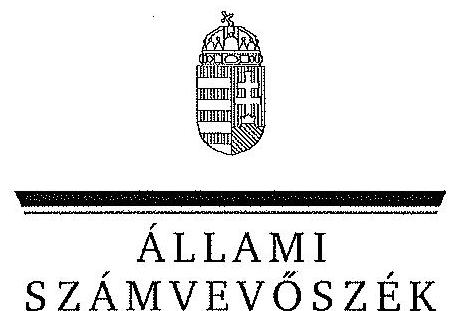
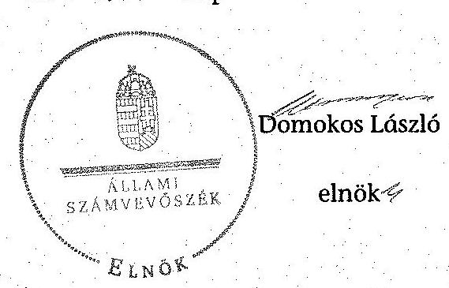
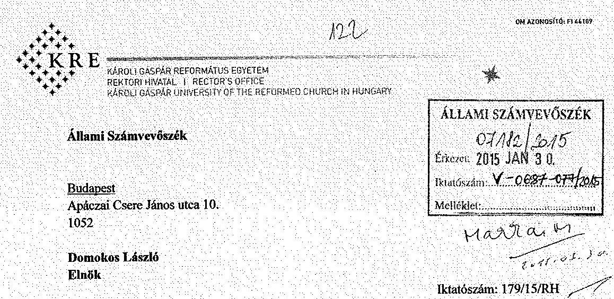
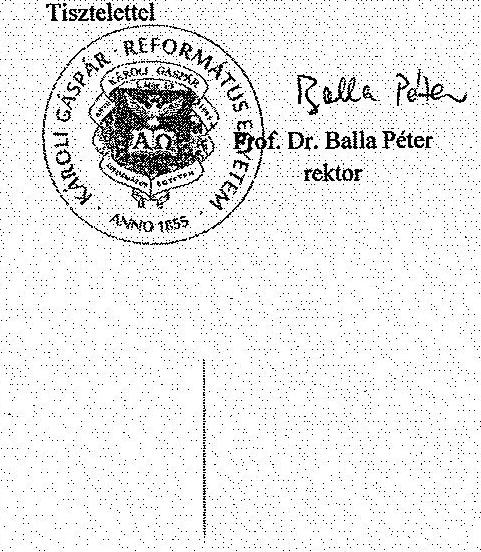
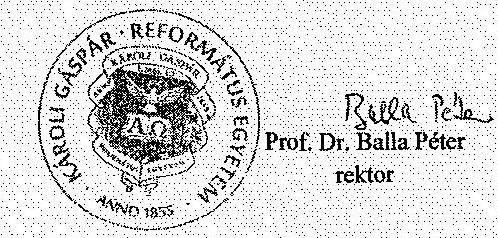
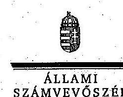
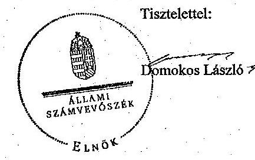

ÁLLAMI
SZÁMVEVŐSZÉK

# JELENTÉS 

a Károli Gáspár Református Egyetem ellenőrzéséről - Az egyházi fenntartású felsőoktatási intézményben az államháztartásból juttatott, nem hitéleti célra biztosított támogatás felhasználásának ellenőrzése

---

# Állami Számvevőszék 

Iktatószám: V-0687-084/2015.
Témaszám: 1721
Vizsgálat-azonosító szám: V068921

## Az ellenőrzést felügyelte:

## Makkai Mária

felügyeleti vezető

## Az ellenőrzés végrehajtásáért felelős:

Zakar László
ellenőrzésvezető

## A számvevői munkaanyagok feldolgozását és a jelentés összeállítását

végezte:

## Zakar László

ellenőrzésvezető

## Fekete Gábor

számvevő tanácsos

## Az ellenőrzést végezték:

## Czékus Balázs Imre, Fekete Gábor   számvevő, számvevő tanácsos

A témához kapcsolódó eddig készített számvevőszéki jelentések:
címe
sorszáma
Jelentés az oktatási és kulturális ágazat irányítási rendszerének, 1106
működésének ellenőrzéséről

---

# TARTALOMJEGYZÉK 

BEVEZETÉS ..... 7
I. ÖSSZEGZŐ MEGÁLLAPÍTÁSOK, KÖVETKEZTETÉSEK, JAVASLATOK ..... 10
II. RÉSZLETES MEGÁLLAPÍTÁSOK ..... 13

1. Az államháztartásból juttatott támogatások szabályszerű elszámolását és felhasználását alátámasztó döntési jogkörök, gazdálkodási folyamatok és nyilvántartási rend kialakítása ..... 13
2. Az államháztartásból juttatott, nem hitéleti célra biztosított támogatások felhasználása ..... 15
2.1. A normatív és egyéb támogatásokra kötött minisztériumi megállapodások ..... 15
2.2. A támogatás-felhasználásra vonatkozó egyetemi döntések ..... 16
2.3. A támogatások nyilvántartásának kialakítása ..... 16
2.4. A normatív felsőoktatási támogatások felhasználása ..... 17
2.5. A pályázati úton, egyedi döntéssel kapott költségvetési források felhasználása és elszámolása ..... 18
2.6. A normatív felsőoktatási költségvetési támogatások elszámolása ..... 18
MELLÉKLETEK
3. számú A Károli Gáspár Református Egyetem jogosultság alapján járó államháztartási támogatása a 2009-2013. években az éves elszámolások alapján
4. számú A Károli Gáspár Református Egyetem rektorának észrevétele
5. számú A Károli Gáspár Református Egyetem rektorának észrevételére adott válasz

---

.

---

# RÖVIDÍTÉSEK JEGYZÉKE 

| Törvények |  |
| :--: | :--: |
| Áht. 1 | 1992. évi XXXVIII. törvény az államháztartásról |
| Áht. 2 | 2011. évi CXCV. törvény az államháztartásról |
| ÁSZ tv. | 2011. évi LXVI. törvény az Állami Számvevőszékről |
| Eaf. | 1997. évi CXXIV. törvény az egyházak hitéleti és közcélú tevékenységének anyagi feltételeiről |
| Ehtv. | 2011. évi CCVI. törvény a lelkiismereti és vallásszabadság jogáról, valamint az egyházak, vallásfelekezetek és vallási közösségek jogállásáról |
| Feot. | 2005. évi CXXXIX. törvény a felsőoktatásról |
| Kjt. | 1992. évi XXXIII. törvény a közalkalmazottak jogállásáról |
| Mt. 1 | 1992. évi XXII. törvény a Munka Törvénykönyvéről (hatálytalan 2013. január 1-jétől) |
| Mt. 2 | 2012. évi I. törvény a munka törvénykönyvéről |
| Nftv. | 2011. évi CCIV. törvény a nemzeti felsőoktatásról |
| Sztv. | 2000. évi C. törvény a számvitelről |
| Korm. rendeletek |  |
| Ámr. 1 | 217/1998. (XII. 30.) Korm. rendelet az államháztartás működési rendjéről (hatálytalan 2010. január 1-jétől) |
| Ámr. 2 | 292/2009. (XII. 19.) Korm. rendelet az államháztartás működési rendjéről |
| Ávr. | 368/2011. (XII. 31.) Korm. rendelet az államháztartásról szóló törvény végrehajtásáról |
| Bkr. | 370/2011. (XII. 31.) Korm. rendelet a költségvetési szervek belső kontrollrendszeréről és belső ellenőrzésről |
| 218/2000. (XII. 11.) | 218/2000. (XII. 11.) Korm. rendelet az egyházi jogi személyek beszámoló készítési és könyvvezetési kötelezettségének sajátosságairól |
| Korm. rendelet | 51/2007. (III. 26.) Korm. rendelet |
| 50/2008. (III. 14.) Korm. rendelet | 50/2008. (III. 14.) Korm. rendelet a felsőoktatási intézmények képzési, tudományos célú és fenntartói normatíva alapján történő finanszírozásáról |
| További rövidítések |  |
| ÁSZ | Állami Számvevőszék |
| E Ft | Ezer forint |
| fenntartó | Magyarországi Református Egyház |
| FEUVE | folyamatba épített, előzetes, utólagos és vezetői ellenőrzés |
| finanszírozási megállapodás | finanszírozási megállapodás/ támogatási szerződés |
| FIR | Felsőoktatási Információs Rendszer |
| gazdálkodási szabályzat | KRE Gazdálkodási szabályzata |

---

INTOSAI
költségvetési törvény

KRE/egyetem/intézmény
minisztérium

MRE
OSAP
szenátus
számlarend
SzMSz
Zsinat

International Organisation of Supreme Audit Institutions (Legfőbb Ellenőrző Intézmények Nemzetközi Szervezete) a 2008. évi CII. törvény a Magyar Köztársaság 2009. évi költségvetéséről, a 2009. évi CXXX. törvény a Magyar Köztársaság 2010. évi költségvetéséről, a 2010. évi CLXIX. törvény a Magyar Köztársaság 2011. évi költségvetéséről, a 2011. évi CLXXXVIII. törvény Magyarország 2012. évi központi költségvetéséről, a 2012. évi CCIV. törvény Magyarország 2013. évi központi költségvetéséről
Károli Gáspár Református Egyetem
A felsőoktatásért felelős minisztérium, amely 2009-től 2010 májusáig az Oktatási és Kulturális Minisztérium, 2010 májusától 2012 májusáig a Nemzeti Erőforrás Minisztérium, 2012 májusától az Emberi Erőforrások Minisztériuma volt
Magyarországi Református Egyház
Országos Statisztikai Adatgyűjtési Program
A KRE döntést hozó és a döntés végrehajtását ellenőrző testülete
A KRE 2006. 06. 13-án, illetve 2010. 01. 13-án kiadott Számlarendje
A KRE Szervezeti és Működési Szabályzata
Magyarországi Református Egyház legfőbb döntéshozó szerve

---

# ÉRTELMEZŐ SZÓTÁR 

egyházi felsőoktatási intézmény
hitéleti célú bevétel
hitéleti képzés
normatív költségvetési támogatás felsőoktatási intézmények működéséhez

Egyéb szervezeti formában működő, államilag elismert felsőoktatási intézmény, amelynek fenntartója az egyház.
Hitéleti célú bevételnek minősül különösen a személyi jövedelemadó meghatározott részének bevett egyház számára történő felajánlása, annak költségvetési kiegészítése, az ennek helyébe lépő juttatás, valamint az ingatlanjáradék és annak kiegészítése.
Hitélettel és a hitélettel együtt oktatott hittudománnyal összefüggő képzés. A hitélettel összefüggő oktatási feladatok összessége.
A felsőoktatási intézmények működéséhez biztosított normatív költségvetési támogatás lehet
a) hallgatói juttatásokhoz nyújtott,
b) képzési,
c) tudományos célú,
d) fenntartói (2013. január 1-től fenntartási feladatok),
e) egyes feladatokhoz (2013. január 1-től f) pont egyes speciális felsőoktatási feladatok ellátásához) nyújtott és 2013. január 1-től e) pont a hallgatói sport
támogatás. A b)-d) és 2013. január 1-től az e) pontokban meghatározott jogcímek nem jelentenek felhasználási kötöttséget. (Feot. 127. § (3) bekezdés, Nftv. 2013. január 1-től beépített 85/A. § (1) és (8) bekezdés, 92. § (1) bekezdés, 114/C. § (1) bekezdés)

---

.

---

# JELENTÉS 

## a Károli Gáspár Református Egyetem ellenőrzéséről - Az egyházi fenntartású felsőoktatási intézményben az államháztartásból juttatott, nem hitéleti célra biztosított támogatás felhasználásának ellenőrzése

## BEVEZETÉS

Az ÁSZ Stratégiája ${ }^{1}$ alapértékeinek egyike, hogy az államháztartás komplex folyamatainak átláthatósága érdekében rendszerszemléletű/holisztikus megközelítésű, egymásra épülő, a szinergiahatást kihasználó, összefoglaló értékelésre lehetőséget adó ellenőrzéseket végez.
Az állami felsőoktatási intézmények gazdálkodását - az Áht. előírásai mellett a felsőoktatásról szóló 2005. évi CXXXIX. törvény (Feot.), valamint a nemzeti felsőoktatásról szóló 2011. évi CCIV. törvény (Nftv.) előírásai határozták meg. A lelkiismereti és vallásszabadság jogáról, valamint az egyházak, vallásfelekezetek és vallási közösségek jogállásáról szóló 2011. évi CCVI. törvény (Ehtv.) valamint az Állami Számvevőszékről szóló 2011. évi LXVI. törvény (ÁSZ tv.) előírásai szerint az egyházak részére nem hitéleti célra nyújtott költségvetési támogatás felhasználásának törvényességi szempontú ellenőrzése az ÁSZ feladata. Az egyházi fenntartásban működő felsőoktatási intézmények részére a Feot.-ban és az Nftv.-ben rögzített felsőoktatási feladatok ellátására az államháztartásból juttatott normatív és egyéb támogatás nem minősül hitéleti támogatásnak.
Magyarország Nemzeti Reform Programja keretében, a Széll Kálmán Terv 2020-ig a 30-34 évesek körében, a felsőfokú vagy annak megfelelő végzettséggel rendelkezők arányának 30,3%-ra való növelését irányozta elő, amely a 2010. évhez képest 4,6%-pontos növekedési célkitűzést jelent. A rendezett gazdasági környezet, az önállósággal élni tudó, felelős, elszámoltatható intézményi gazdálkodói magatartás elengedhetetlen feltétele a kitűzött szakmai célok elérésének.
Az ellenőrzés célja annak megállapítása, hogy az egyházak által fenntartott, illetve működtetett felsőoktatási intézmények részére az államháztartásból juttatott, nem hitéleti célra biztosított támogatás felhasználása szabályszerű volt-e.
Ennek keretében ellenőriztük a Károli Gáspár Református Egyetemnél az államháztartásból juttatott, nem hitéleti célra biztosított támogatás felhasználása jogszabályoknak való megfelelőségét.

[^0]
[^0]:    ${ }^{1}$ Állami Számvevőszék: Stratégia. Az Állami Számvevőszék hivatalos stratégiai dokumentum rendszere 2011-2015. 2012. december. http://www.asz.hu/strategia/asz-strategia/asz-strategia-2011.pdf

---

Az ellenőrzés várható hasznosulása: Az egyházi felsőoktatási intézmények esetében bemutatja az államháztartásból számukra juttatott források felhasználásának szabályszerűségét. Az ellenőrzés az ellenőrzött számára visszajelzést ad a gazdálkodása kereteinek kialakításáról, a működésében fellépő hiányosságokról, javaslataival hozzájárul azok kiküszöböléséhez és a jó kormányzáshoz. A törvényalkotás számára összegzett tapasztalatok állnak rendelkezésre a felsőoktatási intézmények döntéseinek, gazdálkodásának szabályszerűségéről, amelyek alapján - indokolt esetben - jogszabály-módosítás kezdeményezhető. A társadalom számára jelzi, hogy közpénz nem maradhat ellenőrizetlenül, az ÁSZ értékteremtő rend kialakításához és megőrzéséhez hozzájáruló tevékenysége pozitív hatással lesz a szervezetről kialakított összkép formálásában.
Az ellenőrzés típusa: szabályszerűségi ellenőrzés
Az ellenőrzött időszak: 2009. január 1. - 2013. december 31.
Az ellenőrzéssel érintett szervezetek: Károli Gáspár Református Egyetem és az Emberi Erőforrások Minisztériuma
Az ellenőrzés jogszabályi alapját az ÁSZ tv. 5. § (11) bekezdés c) pontja és az Ehtv. 21. § (3) bekezdése, 2013. augusztus 1-jétől 23. § (3) bekezdése képezik.
Az ellenőrzés kiterjed minden olyan körülményre és adatra, amely az ÁSZ jogszabályban meghatározott feladataiban, valamint a program végrehajtása folyamán felmerült újabb összefüggések feltárásához szükséges.
Az ellenőrzés az INTOSAI által kiadott nemzetközi standardok figyelembe vételével, az ellenőrzési programtervezetben foglalt értékelési szempontok szerint történt.
A KRE alapítója és fenntartója a Magyarországi Református Egyház. A 2009. január elsején hatályos KRE Alapító Okiratát az MRE Zsinata, mint a Magyar Köztársaságban nyilvántartásba vett egyházi jogi személy a felsőoktatásról szóló 2005. évi CXXXIX. törvény 7. § (1) bekezdés b) pontja és a 115. § (2) bekezdés b) pontjában kapott felhatalmazás alapján módosította és adta ki. Az alapító okirat alapján a KRE egyházi fenntartású, a Zsinatának 1993. február 24-i határozatával létrehozott, és az Országgyűlés által törvényben elismert, szakmailag önálló, és önkormányzattal rendelkező jogi személy. Az egyetemnek Budapesten, Nagykőrösön és Kecskeméten vannak telephelyei. Az egyetem karokra tagozódik. A karok egy vagy több szakmailag összetartozó tudományterületen, képzési területen, képzési szinteken folyó képzés feladatainak ellátását szervezik. Az intézmény működtetési feladatainak ellátásához gazdasági, műszaki, valamint belső ellenőrzési és igazgatási, szervezési feladatokat ellátó funkcionális szervezeti egységeket tart fenn.
A KRE az állami feladatként ellátott alaptevékenységében bölcsészettudományi, jogi és igazgatási, társadalomtudományi, természettudományi, informatikai, művészeti, művészetközvetítés, gazdaságtudományok és pedagógusképzési területen folytat, illetve folytathat felsőfokú szakképzést, alap- és mesterképzést, tanárképzést, illetve egységes, osztatlan képzést, általános és szakirányú továbbképzést, továbbá a bölcsészettudományok, a természettudományok és a társadalomtudományok területén doktori képzést. A KRE egyházi feladatként ellátott alaptevékenységében a hittudományi képzési területen folytat alap-, mesterképzést, illetve egységes, osztatlan képzést, valamint továbbképzést, továbbá a hittudomány tudományterületen doktori képzést.

---

Az egyetem vezetője és képviselője a rektor. Az ellenőrzött időszak elejétől rektori teendőkkel megbízott rektor-helyettesek látták el a rektori feladatokat a rektor 2011. évben történt kinevezéséig, akinek személye az ellenőrzött időszak végéig nem változott. A gazdasági igazgató személye az ellenőrzött időszakban nem változott.

A KRE jogosultság alapján járó költségvetési támogatását, oktatói és kutató karának létszámát és a hallgatói létszámot az alábbi táblázat mutatja be.

| Megnevezés | A jogosultság alapján járó költségvetési támogatás összege és a létszám adatok |  |  |  |  |  |
| :--: | :--: | :--: | :--: | :--: | :--: | :--: |
|  | 2009. | 2010. | 2011. | 2012. | 2013. | $\begin{gathered} 2013 / 2009 \\ (\%) \end{gathered}$ |
| Jogosultság alapján járó költségvetési támogatás (E Ft-ban) | 1664317 | 1622519 | 1530916 | 1543426 | 1497303 | 90,0 |
| Jellemző létszámadatok* (fő)

 |  |  |  |  |  |  |
| Munkaviszonyban lévő állandó oktatói, kutatói kar létszám (fő) | 407 | 262 | 520 | 271 | 361 | 88,7 |
| Hallgatói létszám (fő) | 4396 | 4301 | 4441 | 4890 | 5571 | 126,7 |

* A létszámok az október 15-i statisztikai adatok.

Az ellenőrzött időszak alatt az egyetem államháztartásból juttatott támogatása 10%-kal csökkent. A 2009. évről 2013. évre az egyetemen a munkaviszonyban lévő oktatói, kutatói létszám 11,3%-kal csökkent, a hallgatói létszám 26,7%-kal emelkedett.

Az ÁSZ a 2011. évi LXVI. törvény 29. §-a szerint a jelentéstervezetet megküldte a Károli Gáspár Református Egyetem rektorának és az Emberi Erőforrások Minisztériumának miniszterének egyeztetésre. A Károli Gáspár Református Egyetem rektorának észrevételét és az arra adott választ a 2-3. számú melléklet tartalmazza. Az Emberi Erőforrások Minisztériumának minisztere az ÁSZ tv. 29. § (2) bekezdésében foglalt észrevételezési jogával nem élt, a törvényes határidőn belül észrevételt nem tett.

---

# I. ÖSSZEGZŐ MEGÁLLAPÍTÁSOK, KÖVETKEZTETÉSEK, JAVASLATOK 

A KRE belső szabályozottsága az államháztartásból juttatott nem hitéleti célra nyújtott költségvetési támogatások felhasználására vonatkozóan az ellenőrzött időszak alatt évente és összességében megfelelő volt.
Az ellenőrzési időszakban a KRE rendelkezett SzMSz-szel. Az SzMSz, a Feot. és az Nftv. előírásainak megfelelően szabályozta a szervezet felépítését és tagolását, a szervezeti egységek feladatait és működését, az intézményen belüli kapcsolattartás rendjét.
Az ellenőrzött időszak alatt a KRE rendelkezett gazdálkodási szabályzattal, amelyben rögzítették a gazdálkodás alapelveit, a felelősségi-, jog- és hatásköröket, a költségvetés elkészítésének, elfogadásának és végrehajtásának szabályait, a belső ellenőrzés szabályait, a számviteli és nyilvántartási rendszer feladatait. A szabályzat meghatározta a kötelezettségvállalással, utalványozással és ellenjegyzéssel kapcsolatos előírásokat. A gazdálkodási szabályzat meghatározta az egyetem költségvetési szerkezetét és ezen belül a források között az állami támogatást.
A KRE Gazdasági Hivatala az ellenőrzött időszakban rendelkezett ügyrenddel, amely meghatározta a hivatal működését, felépítését, más szervezeti egységekkel való kapcsolatát, főbb tevékenységei ügyintézését.
A KRE hallgatói részére nyújtható támogatásokról és az általuk fizetendő díjakról és térítésekről szóló szabályzata a jogszabályi előírásainak megfelelően tartalmazta a hallgatói juttatások elosztási rendjét.
A KRE az ellenőrzött időszakban rendelkezett a szenátus által jóváhagyott, a törvényben rögzített alapelvek, értékelési előírások alapján a gazdálkodó adottságaira, körülményeire készített számviteli politikával.
A minisztérium és a KRE az egyházi fenntartású felsőoktatási intézmény jogszabályi előírásával összhangban az ellenőrzés alá vont évek mindegyikében kötött finanszírozási megállapodást az államháztartásból juttatott normatív és egyéb támogatásokra vonatkozóan.
Az egyetemnek elkülönített számviteli nyilvántartás vezetési kötelezettséget jogszabály az alaptevékenység és a vállalkozási tevékenység tekintetében írt elő, a KRE az ellenőrzési időszak alatt vállalkozási tevékenységet nem végzett. A minisztériummal megkötött finanszírozási megállapodások a 2011-2013. években tartalmazták, hogy az egyetem köteles a támogatási összeget elkülönítetten kezelni és a támogatási összeg felhasználására nézve elkülönített számviteli nyilvántartást vezetni. Az egyetem 2009-2010. években az államháztartásból származó támogatásokról és azok felhasználásáról elkülönített főkönyvi és analitikus nyilvántartást - az adott évi finanszírozási megállapodás erre vonatkozó előírásának hiányában - nem vezetett. A KRE a 2011-2013. években a támogatási bevételt elkülönítette, de a támogatási összeg felhasználására vonatkozó elkülönített számviteli nyilvántartást nem vezetett a finanszírozási megállapodásban foglaltak ellenére.

---

Az ellenőrzött időszak alatt a fenntartói hatáskörrel rendelkező Zsinat az egyetem költségvetéseit az állami támogatás tervezett összegével és tervezett felhasználásával fogadta el, mivel a minisztériummal a finanszírozási megállapodások az egyetem költségvetésének elfogadását követő időpontban történtek meg. Az intézmény által igénybevett képzési, tudományos célú és fenntartói normatív támogatások felosztására vonatkozó intézményi döntések megfeleltek a jogszabályi előírásoknak és a gazdálkodási szabályzatnak. A szenátus döntött a normatív támogatás központi és decentralizált részre történő felosztásáról a 2009-2013. évi költségvetésekben, amelyeket a Zsinat jóváhagyott. A felhasználására vonatkozóan a Feot és az Nftv. felhasználási kötöttséget nem írt elő. Az intézmény által igénybevett hallgatói juttatásokhoz nyújtott normatív támogatások felhasználására vonatkozó intézményi döntések megfeleltek a jogszabályi előírásoknak. A KRE elfogadott költségvetése egyetemi karonként tartalmazta a tervezett hallgatói juttatások kiadási összegét.
A 2009-2013. években a KRE személyi jellegű kifizetései, a hallgatói juttatások kifizetése és az anyagjellegű kiadások felhasználása megfelelt a jogszabályoknak és a belső szabályzatoknak.
A KRE megbízási díjak kifizetésénél a gazdálkodási jogkörök gyakorlása tekintetében nem volt teljes körűen biztosított a belső szabályoknak való megfelelés, mivel a 2009. évben a gazdálkodási szabályzatban foglaltak ellenére az utalványozás ellenjegyzését nem végezték el. A 2013. évi kisösszegű felújítások, beruházások felhasználása során a gazdálkodási jogkörök gyakorlása nem felelt meg a belső szabályzatnak, mert a kötelezettségvállalás szakmai ellenjegyzését nem végezték el.
A nagy összegű anyagjellegű kiadások közül a 2009. évi szakkollégium támogatás esetében az egyetem belső szabályzata ellenére nem végezték el a kötelezettségvállalást és az utalványozást. A 2013. évben a nagy összegű felújítások és beruházási kiadások pénzügyi elszámolásai, valamint a gazdálkodási jogkörök gyakorlása a jogszabálynak és a belső szabályzatoknak megfeleltek.
Az államháztartásból pályázati úton vagy egyedi döntéssel a felsőoktatási feladatellátáshoz elnyert költségvetési források felhasználása és elszámolása a jogszabályokban és a minisztériummal kötött megállapodásokban foglaltaknak megfelelt. A kapott pályázatok felhasználásáról a KRE minden esetben elkészítette a szakmai beszámolót és a pénzügyi elszámolást. Az egyetem az egyes projektek bevételeit és kiadásait a támogatási szerződéseknek megfelelően elkülönítetten tartotta nyilván.
A KRE az államháztartásból juttatott normatív költségvetési támogatások éves elszámolását a 2009-2013. években a minisztérium által megküldött adatstruktúrának megfelelően elkészítette. Az elszámolásokban a KRE a jogszabályi előírás alapján megillető támogatási bevételeket mutatta ki jogcímenkénti bontásban, normatív összegek és hallgatói létszám, valamint egyéb mutatók alapján. A KRE az éves normatív képzési, tudományos és fenntartói, valamint hallgatói támogatások elszámolásához a 2009-2012. években OSAP alapú statisztikai programja által vezetett nyilvántartási adatokat használta fel. Az OSAP alapú statisztikai program által vezetett nyilvántartást nem feleltették meg a FIR-nek, mert a FIR nem volt alkalmas az elszámoláshoz szükséges adatok egyértelmű, pontos meghatározására. Ez nem felelt meg jogszabályban foglalt követelménynek. A FIR átfogó megújítását követően a 2013. évben rögzített - a

---

nyitott jogviszonnyal rendelkező hallgatók és az oktatók vonatkozásában az adatok teljesek voltak és alkalmas volt, hogy az egyetem a FIR-ből származó adatok alapján készítse el az éves támogatás elszámolását.
A KRE a normatív támogatások éves elszámolásait a finanszírozási megállapodásoknak megfelelő tartalommal és határidőkben a 2009-2012. években benyújtotta a minisztérium felé. A 2013. évről szóló elszámolást az egyetem a finanszírozási megállapodásban foglalt határidőt követően küldte be, de a határidő módosítást a minisztériumtól megkérte.
A minisztérium a 2009-2013. évekre vonatkozó KRE által beküldött éves elszámolásokat minden esetben felülvizsgálta. A felülvizsgálatról készült minisztériumi elszámolási értesítők minden évben kimutattak különbözetet a jogszabályokban foglalt jogosultság alapján az egyetemnek járó és az egyetem részére utalt támogatási összegek között. Az egyetemnek visszafizetési kötelezettsége a 2010. és a 2011. években volt a képzési, tudományos célú és fenntartói támogatás mérték csökkenés miatt.
A minisztérium az egyetemen helyszíni ellenőrzést a finanszírozási szerződésben foglaltak betartására vonatkozóan az ellenőrzött időszak alatt nem végzett. A minisztérium a 2011-2013. években az egyetemet érintően megállapítást a támogatási összeg felhasználására előírt elkülönített számviteli nyilvántartás vezetésének a hiányára vonatkozóan nem tett.
Az Állami Számvevőszékről szóló 2011. évi LXVI. törvény 33. § (1) bekezdésében foglaltak értelmében a jelentésben foglalt megállapításokhoz kapcsolódó intézkedési tervet köteles az ellenőrzött szervezet vezetője összeállítani, és azt a jelentés kézhezvételétől számított 30 napon belül az ÁSZ részére megküldeni. Amennyiben az intézkedési tervet határidőben nem küldi meg a szervezet, vagy az nem elfogadható, az ÁSZ elnöke a hivatkozott törvény 33. § (3) bekezdés a)-b) pontjaiban foglaltakat érvényesítheti.
Az ellenőrzés intézkedést igénylő megállapításai és javaslatai:

# A Károli Gáspár Református Egyetem rektorának 

A minisztériummal megkötött finanszírozási megállapodások a 2011-2013. években tartalmazták, hogy az egyetem köteles a támogatási összeget elkülönítetten kezelni és a támogatási összeg felhasználására nézve elkülönített számviteli nyilvántartást vezetni. A KRE a 2011-2013. években a támogatási bevételt elkülönítette, de a támogatási összeg felhasználására vonatkozó elkülönített számviteli nyilvántartást nem vezetett a finanszírozási megállapodásban foglaltak ellenére.
Javaslat:
Intézkedjen a finanszírozási megállapodásban szereplő elkülönített nyilvántartások vezetéséről.

---

# II. RÉSZLETES MEGÁLLAPÍTÁSOK 

## 1. Az államháztartásból juttatott támogatások szabályszerű elszámolását és felhasználását alátámasztó döntési jogkörök, gazdálkodási folyamatok és nyilvántartási rend kialakítása

A KRE belső szabályozottsága az államháztartásból juttatott nem hitéleti célra nyújtott költségvetési támogatások felhasználására vonatkozóan az ellenőrzött időszak alatt évente és összességében megfelelő volt.
Az ellenőrzési időszakban a KRE rendelkezett SzMSz-szel, amelyet 29 alkalommal módosítottak legfőképpen a szervezeti egységek és azok feladatainak változásai miatt. Az SzMSz módosítások nagy száma nem jelentett kockázatot a belső kontrollok működésére. A 2009-2012. augusztus 31-ig hatályos SzMSz a Feot. 21. § (2) bekezdésének megfelelően szabályozta a szervezet felépítését és tagolását, a szervezeti egységek feladatait és működését, az intézményen belüli kapcsolattartás rendjét. A rektor az Nftv 2012. január 1-jei hatályba lépését követően az SzMSz-t nem aktualizálta, szeptembertől az ellenőrzött időszak végéig hatályos SzMSz a hatályát vesztett Feot-ra vonatkozó hivatkozást tartalmazott. A 2012-2013. évben hatályos SzMSz tartalmilag megfelelt az Nftv. 11. § b) pontjának és a 2. sz. mellékletében foglaltaknak, mivel tartalmazták a szervezeti felépítést, a szervezet tagolását, vezetés szerkezetét, a vezetői és magasabb vezetői választások rendjét, az egyes szervezeti egységek feladatait és a kapcsolattartás rendjét.
Az ellenőrzött időszak alatt a KRE rendelkezett gazdálkodási szabályzattal, amelyben rögzítették a gazdálkodás alapelveit, a felelősségi-, jog- és hatásköröket, a költségvetés elkészítésének, elfogadásának és végrehajtásának szabályait, a belső ellenőrzés szabályait, a számviteli és nyilvántartási rendszer feladatait. A szabályzat meghatározta a kötelezettségvállalással, utalványozással és ellenjegyzéssel kapcsolatos előírásokat. A jogkörök gyakorlásának illetékességi köreit és az aláírás-mintákat az Aláírási Jogosítványok Nyilvántartása tartalmazta.

A Feot. 7. § (1) b) pontja és (3) bekezdése, valamint az Nftv. 4. (1) § b) pontja és (3) bekezdése alapján az egyházi felsőoktatási intézmény nem költségvetési szerv, ezért az Ámr. $_{1,2}$, illetve Ávr. előírásai nem vonatkoznak rá.
A gazdálkodási szabályzat meghatározta az egyetem költségvetési szerkezetét. A költségvetésének forrásai között az állami támogatást megjelenítette és meghatározta, hogy az állami támogatás gazdasági egységenkénti elosztásánál a jogszabályi rendelkezéseket maradéktalanul figyelembe kell venni.
A KRE Gazdasági Hivatala az ellenőrzött időszakban rendelkezett ügyrenddel, amely meghatározta a hivatal működését, felépítését, más szervezeti egységekkel való kapcsolatát, főbb tevékenységei ügyintézését. A KRE Gazdasági Igazgatóját a jogszabályi előírásnak$^2$ megfelelően a fenntartó nevezte ki először egy

[^1]
[^1]: $^2$ 2009. évben hatályos Feot. 115. (2) bek. g) pontja

---

évre (2009. január 01-től december 31-ig), amelyet további 5 évre meghosszabbítottak. Az egyetem SzMSz-e alapján a gazdasági igazgató felelős az egyetem költségvetésének az elkészítéséért és a jóváhagyott költségvetés végrehajtásáért.
Az SzMSz,
 a számviteli politika, a gazdálkodási szabályzat és a Gazdasági Hivatal ügyrendje együttesen szabályozta az egyetem vagyonkezelésébe, használatába adott, tulajdonában lévő vagyon rendeltetésszerű igénybevételét, az alapító okiratban foglalt tevékenységek ellátását, a gazdálkodás szabályait, a beszámolási kötelezettség teljesítését és a FEUVE, valamint a belső ellenőrzés megszervezéséért és hatékony működtetéséért való felelősséget, amellyel megfelelt a Feot. 29. § (3) és az Nftv. 13. § (2) bekezdéseiben foglaltaknak.
A KRE hallgatói részére nyújtható támogatásokról és az általuk fizetendő díjakról és térítésekről szabályzata a Feot. 21. § (4) d) pontjának és az Nftv. 2. sz. melléklet II. 3. d) pontjában megfelelően tartalmazta a hallgatói juttatások elosztásának rendjét. A szabályzat az ellenőrzött időszakban 15 esetben változott, legfőképpen a különféle hallgatói ösztöndíjak feltételrendszerének változásai miatt. A Feot. 21. § (1) bekezdés és az Nftv. 11. § (1) bekezdés b) pontjában, illetve az Nftv. 2. melléklet II. 3. pontjában foglaltaknak megfelelően a szabályzat az SzMSz részét képezte.
A KRE-nél az ellenőrzött időszakban a gazdálkodási szabályzat rögzítette a függetlenített belső ellenőr működését, amely megszervezéséért és működtetéséért a Rektor - mint legfőbb vezető - volt a felelős. ${ }^{3}$ A belső ellenőrzés feladatait, hatáskörét és eljárási szabályait a Belső Ellenőrzési Szabályzat tartalmazta.
A KRE az ellenőrzött időszakban rendelkezett a szenátus által jóváhagyott, a törvényben rögzített alapelvek, értékelési előírások alapján a gazdálkodó adottságaira, körülményeire készített számviteli politikával, amely megfelelt a Sztv. 14. § (3) bekezdésében foglaltaknak. A számviteli politika számlatükrét nem aktualizálta, az állami támogatási bevételekre meghatározott számlaszámoktól eltérő számlaszámokat alkalmazott a 2009-2013. évek könyvelésében.
A számviteli politika részeként a Sztv 14. § (5) bekezdés a) és d) pontjainak megfelelően elkészítették a leltárkészítési és leltározási szabályzatot és a pénzkezelési szabályzatot. A pénzkezelési szabályzat tartalmazta a pénzforgalom lebonyolítási rendjét, a pénzkezelés személyi és tárgyi feltételeit, felelősségi szabályait, a bankszámla és a készpénz közötti forgalom szabályait, a pénzkezeléssel kapcsolatos bizonylati rendet és a nyilvántartás szabályait, a napi záró készpénzállomány mértékét, az ellenőrzés és a pénzkezelés szabályait, amellyel megfelelt a Sztv. 14. § (8) bekezdésben foglaltaknak.
A KRE számlarendje nem felelt meg a Sztv 161. § (2) bekezdés d) pontjában foglaltaknak, mert nem tartalmazta a számlarendben foglaltakat alátámasztó bizonylati rendet.
A fenntartó a KRE számviteli szabályozása elkészítéséhez közvetlenül nem adott útmutatást, de az egyetem a szabályzatai elkészítésénél a hatályos egyházi jogszabályokat figyelembe vette.

[^0]
[^0]:    ${ }^{3}$ SzMSz 31. § (4) bekezdés, Nftv. 13. § (2) bekezdés

---

Az egyetem gazdálkodására az állami és egyházi törvények ${ }^{4}$ vonatkoznak.
Az egyetemnek elkülönített számviteli nyilvántartás vezetési kötelezettséget jogszabály ${ }^{5}$ az alaptevékenység és a vállalkozási tevékenység elkülönítése céljából írt elő az ellenőrzött időszak alatt. A KRE az ellenőrzési időszak alatt vállalkozási tevékenységet nem végzett. Az egyetem 2009-2010. években az államháztartásból származó támogatásokról és azok felhasználásáról elkülönített főkönyvi és analitikus nyilvántartást - az adott évi finanszírozási megállapodás erre vonatkozó előírásának hiányában - nem vezetett.
A minisztérium és a KRE által a költségvetési támogatásokra megkötött finanszírozási megállapodások 2011-2013. években rögzítették, hogy az egyetem köteles a támogatási összegeket elkülönítetten kezelni és a támogatási összeg felhasználására nézve elkülönített számviteli nyilvántartást vezetni. A KRE a számviteli politikában kialakította a támogatási összeg elkülönített bevételi kezelését, elkülönített számlaszám vezetésével. A támogatási összeg felhasználására vonatkozó számviteli nyilvántartások elkülönítését a Rektor belső szabályzatban nem alakította ki.

A fenntartó az elkülönített számviteli nyilvántartás elkészítéséhez közvetlenül nem adott útmutatást. A fenntartó részéről a KRE gazdálkodását évente számvizsgálók vizsgálták. Az ellenőrzött időszakra vonatkozóan független könyvvizsgálók az egyetem egyszerűsített éves beszámolóját minden évben ellenőrizték és megállapították, hogy a beszámolók megbízható valós képet adtak.

# 2. Az Államháztartásból juttatott, nem hitéleti célra biztosított támogatások felhasználása 

### 2.1. A normatív és egyéb támogatásokra kötött minisztériumi megállapodások

A minisztérium és a KRE az egyházi fenntartású felsőoktatási intézmény jogszabályi ${ }^{6}$ előírásával összhangban az ellenőrzés alá vont évek mindegyikében kötött finanszírozási megállapodást az államháztartásból juttatott (normatív és egyéb) támogatásokra vonatkozóan. A finanszírozási megállapodások tartalmazták a támogatás jogszabályi alapját, célját, összegeit, költségvetési forrását, a folyósítás módját, a felhasználás szabályait, a beszámolás kötelezettséget, a támogató ellenőrzési jogait, felmondási és visszafizetési kötelezettség eseteit és egyéb rendelkezéseket.
A 2010. évben a minisztérium az Ámr 110. § (5) bekezdésben foglaltak ellenére a finanszírozási megállapodásban nem írta elő a költségvetésből nyújtott támogatások felhasználására az elkülönített számviteli nyilvántartás vezetését.

[^0]
[^0]:    ${ }^{4}$ A Magyarországi Református Egyház gazdálkodásáról szóló 2007. évi I. törvény módosításaival egységes szerkezetben szóló 2002. évi I. törvény, valamint a Magyarországi Református Egyház gazdálkodásáról szóló 2013. évi IV. törvény
    ${ }^{5}$ 218/2000. (XII.11.) Kormányrendelet 5. § (8) bekezdés.
    ${ }^{6}$ Feot. 127. § (4) és 139. § (5)-(6) bekezdések, Nftv. 92. § (1)-(2) bekezdések

---

# 2.2. A támogatás-felhasználásra vonatkozó egyetemi döntések 

A KRE 2009-2013. évi költségvetéseiben tervezett költségvetési támogatási összegek jelentek meg. A szenátus az éves költségvetések összeállításában a tervezett támogatási összegek figyelembe vételével hozta meg a támogatás-felhasználáshoz ${ }^{7}$, felosztásához szükséges intézményi döntéseket.

A szenátus a költségvetési előterjesztéseket határozataival elfogadta és jóváhagyásra a fenntartó felé terjesztette.
Az ellenőrzött időszak alatt a fenntartói hatáskörrel rendelkező Zsinat az egyetem költségvetéseit az állami támogatás tervezett összegével és tervezett felhasználásával fogadta el, mivel a minisztériummal a finanszírozási megállapodások az egyetem költségvetésének elfogadását követő időpontban kerültek aláírásra.

A KRE 2009-2013. évi költségvetései nem kerültek módosításra a megkötött finanszírozási megállapodásokat követően. Jogszabály, belső szabályozás, valamint a finanszírozási megállapodások az egyetem költségvetésének módosítására kötelezettséget nem írtak elő.
Az intézmény által igénybevett képzési, tudományos célú és fenntartói normatív támogatások felhasználására és központi, valamint decentralizált részre történő felosztására vonatkozó intézményi döntések megfeleltek a jogszabályi előírásoknak ${ }^{8}$ és a gazdálkodási szabályzatnak ${ }^{9}$. A képzési, tudományos célú és fenntartói támogatások felhasználása jogszabály ${ }^{10}$ alapján felhasználási kötöttség nélküli. A szenátus döntött a normatív támogatás jogszabályi előírások ${ }^{11}$ szerinti központi és decentralizált részre történő felosztásáról a 2009-2013. évi költségvetésekben, amelyeket a Zsinat jóváhagyott.
Az intézmény által igénybevett hallgatói juttatásokhoz nyújtott normatív támogatások felhasználására vonatkozó intézményi döntések megfeleltek jogszabályi előírásoknak. ${ }^{12}$ A KRE elfogadott költségvetése egyetemi karonként tartalmazta a hallgatói juttatások tervezett kiadási összegét.

### 2.3. A támogatások nyilvántartásának kialakítása

A KRE a 2011-2013. években a finanszírozási megállapodásnak megfelelően a támogatási bevételeit elkülönítette, a könyvelésében külön főkönyvi számlákon vezette. A finanszírozási megállapodásban előírt támogatási összeg felhasználására vonatkozó elkülönített számviteli nyilvántartás vezetését a rektor az egyetemen a 2011-2013. években nem alakította ki.

[^0]
[^0]:    ${ }^{7}$ Ehtv. 21. § (2) bekezdés, 2013. augusztus 1-jétől 23. § (2) bekezdés, finanszírozási megállapodások
    ${ }^{8}$ Feot 127. § (3) e) pontja, Nftv. 84. § (8) bekezdés, 50/2008. (III. 14.) Korm. rendelet 9. § (1)-(2) bekezdések
    ${ }^{9}$ Gazdálkodási szabályzatának 4. § (3)-(5) bekezdések
    ${ }^{10}$ Feot 127. § (3) e) pontja, Nftv. 84. § (8) bekezdés, 50/2008. (III. 14.) Korm. rendelet 9. § (1)-(2) bekezdések
    ${ }^{11}$ 50/2008. (III. 14.) Korm. rendelet 9. § (1)-(2) bekezdés
    ${ }^{12}$ Feot. 127. § (3) bekezdés. a) és e) pontjai, 129. § (1) és (3)-(8) bekezdése, Nftv. 84. § (1)(2) bekezdés a) és f) pontjai és (8) bekezdés, 51/2007. (III. 26) Korm. rendelet 6-11.§-ai,

---

# 2.4. A normatív felsőoktatási támogatások felhasználása 

A KRE személyi jellegű kifizetése megfelelt a jogszabályoknak és a belső szabályzatoknak. A gazdálkodási jogkör gyakorlása során az egyetem betartotta a gazdálkodási szabályzatát. A munkaszerződések a Kjt.-re vonatkozóan tartalmaztak hivatkozást és a munkaidő, valamint a szabadidő megállapítása igazodott a törvény előírásához. A KRE-nél az alkalmazottak bérét a Mt. alapján állapították meg.

Az Ehtv. ${ }^{13}$ szerint a foglalkoztatottak jogviszonya munkabér, munkaidő és pihenőidő vonatkozásában a közalkalmazotti jogviszonyhoz igazodik.
A KRE megbízási díjak kifizetésénél a gazdálkodási jogkörök gyakorlása tekintetében nem volt teljes körűen biztosított a belső szabályoknak való megfelelés, mivel a 2009. évben a gazdálkodási szabályzat 4. § (8) bekezdésében foglaltak ellenére az utalványozás ellenjegyzését nem végezték el.
Az anyagjellegű kiadások felhasználása a pénzügyi elszámolások, valamint a gazdálkodási jogkörök gyakorlása tekintetében a 2009-2013. években megfelelt a jogszabályoknak ${ }^{14}$ és belső szabályoknak ${ }^{15}$. A kiválasztott anyagbeszerzés, igénybevett szolgáltatás, egyéb szolgáltatás kifizetéshez rendelkezésre álltak a kötelezettségvállalás dokumentumai, megtörtént az arra jogosult személy kötelezettségvállalása, teljesítés igazolása, utalványozása. Volt fedezet a kötelezettségvállalásra a költségvetésben. Az összeférhetetlenségi szabályokat betartották az egyetemen. A beszerzés a normatív támogatási szerződésben, alapító okiratban meghatározott feladatok ellátását szolgálta. Közbeszerzési eljárás lefolytatására nem volt szükség.
A 2013. évi kisösszegű felújítások, beruházások felhasználása során a gazdálkodási jogkörök gyakorlása nem felelt meg az egyetem belső szabályzatának ${ }^{16}$, mert a kötelezettségvállalás szakmai ellenjegyzését nem végezték el.
A hallgatói juttatások kifizetése az ellenőrzött időszakban a jogszabálynak ${ }^{17}$ és a belső szabályzatoknak megfelelő volt. A hallgatói juttatások kifizetése során a hatályos „A KRE hallgatói részére nyújtható támogatásokról és az általuk fizetendő díjakról és térítésekról” elnevezésű szabályzat 38. § (1)-(4) bekezdéseit és a gazdálkodási szabályzat 4. § (6)-(8) bekezdéseit betartották.
A nagy összegű anyagjellegű kiadások közül a 2009. évi szakkollégium támogatás (összesen 4,1 M Ft) esetében a belső szabályzatuk ellenére nem végezték el a kötelezettségvállalást és utalványozást ${ }^{18}$. A 2013. évben az Sztv. 26. § (2)

[^0]
[^0]:    ${ }^{13}$ 2013. 07. 31-ig Ehtv. 19. § (4) bekezdés és 2013. 08. 01-től Ehtv. 20. § (2) bekezdés
    ${ }^{14}$ Sztv. 78. § (1)-(6) bekezdések
    ${ }^{15}$ Gazdálkodási Szabályzat 4. § (6)-(9) bekezdései, 2009.01.28. KGH/0902004 sz. Gazdasági Igazgatói Körlevél a KRE egységesített bélyegző használatáról, Szerződéskötés eljárási rendjéről szóló 2/2011. (VII.08.)/R számú rektori utasítás
    ${ }^{16}$ Szerződéskötés eljárási rendjéről szóló 2/2011. (VII.08.)/R számú rektori utasítás 4. § (1)-(5) bekezdések, 5. § (1) bekezdés
    ${ }^{17}$ 51/2007. (III.26.) Kormányrendelet 6-11. §-ai
    ${ }^{18}$ Gazdálkodási Szabályzat 4. § (6)-(9) bekezdései, 2009.01.28. KGH/0902004 sz. Gazdasági Igazgatói Körlevél a KRE egységesített bélyegző használatáról, Szerződéskötés eljárási rendjéről szóló 2/2011. (VII.08.)/R számú rektori utasítás

---

bekezdése ellenére beruházás helyett az anyagjellegű kiadások között számolták el a bérelt ingatlanon végzett nyílászárók cseréjére fordított összeget. A 2013. évben a nagy összegű felújítások és beruházási kiadások pénzügyi elszámolásai, valamint a gazdálkodási jogkörök gyakorlása a jogszabálynak ${ }^{19}$ és a belső szabályzatoknak ${ }^{20}$
 megfelelő volt.

# 2.5. A pályázati úton, egyedi döntéssel kapott költségvetési források felhasználása és elszámolása 

Az államháztartásból pályázati úton vagy egyedi döntéssel a felsőoktatási feladatellátáshoz elnyert költségvetési források felhasználása és elszámolása a jogszabályokban ${ }^{21}$ és megállapodásokban foglaltaknak megfelelt.

A kapott pályázati támogatás felhasználásának szabályait a minisztérium és a KRE közötti külön megállapodások szabályozták.
A támogatások célja és formája megfelelt az egyetem feladatkörének és a pályázatok követelményeinek. A kapott pályázatok felhasználásáról a KRE minden esetben elkészítette a szakmai beszámolót és a pénzügyi elszámolást a támogatási szerződésekben foglaltaknak megfelelően. Az egyetem az egyes projektek bevételeit és kiadásait a támogatási szerződéseknek megfelelően elkülönítetten tartotta nyilván. A KRE szabályszerűen visszafizette a támogatónak a fel nem használt összegeket.

Közbeszerzési eljárás lefolytatását pályázati úton vagy egyedi döntéssel kapott támogatás felhasználására vonatkozóan nem kellett kezdeményezni.
Az ellenőrzött időszak alatt szerződések felmondására, támogatás visszavonására, szankciók érvényesítésére nem került sor. A minisztérium nem ellenőrizte helyszínen a pályázati támogatás felhasználását.

### 2.6. A normatív felsőoktatási költségvetési támogatások elszámolása

A KRE-nél az államháztartásból juttatott normatív költségvetési támogatások éves elszámolása az ellenőrzött 2009-2013. években a finanszírozási megállapodásban foglaltaknak megfelelően megtörtént.
Az KRE 2009-2013. évekre vonatkozó éves finanszírozási megállapodásainak az elszámolásait a minisztérium által megküldött adatstruktúra alkalmazásával elvégezte. Az elszámolások a KRE-t jogosultság alapján megillető támogatási bevételeket tartalmazták jogcímenkénti bontásban, normatív összegek és hallgatói létszám, valamint egyéb mutatók alapján. Az éves elszámolások alapján az egyetemnek jogosultság alapján járó államháztartási támogatások összegeit a 2009-2013. években az 1. számú melléklet mutatja be.

[^0]
[^0]:    ${ }^{19}$ Sztv. 25. § (6), 26. § (1), (4), (5), (7) bekezdések, 47. § (1) - (2) bekezdések 52. § (1) - (2) bekezdések
    ${ }^{20}$ Szerződéskötés eljárási rendjéről szóló 2/2011. (VII.08.)/R számú rektori utasítás 2. § (2), (3), (5) bekezdések és 4. § (1) bekezdés
    ${ }^{21}$ Ehtv. 21. § (2) bekezdés, 2013. augusztus 1-jétől 23. § (2) bekezdés, Áht. 13/A. § (2) bekezdés, Áht. 2 53. §

---

A képzési, tudományos és fenntartói támogatás normatíváit az 50/2008. (III. 14.) Korm. rendelet, a hallgatói támogatások normatíváit a 2009-2012. évi költségvetési törvények, illetve 2013. év vonatkozásában az Nftv. 114/D. § (1) bekezdés tartalmazta.
A KRE a 2009-2012. években nem felelt meg az 50/2008. (III. 14.) Kormányrendelet 9. § (3) bekezdésben foglaltaknak, mert nem a FIR-ből, hanem OSAP alapú statisztikai programja által vezetett nyilvántartás adatait használta fel az éves normatív (képzési, tudományos és fenntartói, valamint hallgatói) támogatások elszámolásához. A FIR ekkor még nem volt alkalmas az elszámoláshoz szükséges adatok egyértelmű, pontos meghatározására, ezért a FIR-rel való megfeleltetést az egyetem nem vizsgálta. A FIR átfogó megújítását követően a 2013. évben rögzített - a nyitott jogviszonnyal rendelkező hallgatók és az oktatók vonatkozásában az - adatok teljesek voltak és alkalmas volt, hogy az egyetem a FIR-ből származó adatok alapján készítse el az éves támogatás elszámolását. ${ }^{22}$
A KRE a normatív támogatások éves elszámolásait a finanszírozási megállapodásoknak megfelelő tartalommal és határidőkben a 2009-2012. években benyújtotta a minisztérium felé. A 2013. évtől szóló elszámolást az egyetem a finanszírozási megállapodásban foglalt határidőt követően küldte be, de a határidő módosítását a minisztériumtól megkérte.
A minisztérium a 2009-2013. évekre vonatkozó KRE által beküldött éves elszámolásokat minden esetben felülvizsgálta. A felülvizsgálatról készült minisztériumi elszámolási értesítők minden évben kimutattak különbözetet a jogszabályokban foglalt jogosultság alapján az egyetemnek járó és az egyetem részére utalt támogatási összegek között. Az egyetemnek visszafizetési kötelezettsége a 2010. évben és a 2011. évben volt. A visszafizetési kötelezettséget nem elszámolási hiányosság okozta, hanem az, hogy a minisztérium az elszámolás során alkalmazta az 50/2008. (III. 14.) Kormányrendelet 3. § (1) bekezdésében foglalt képzési, tudományos és fenntartói támogatásra vonatkozó 15%-os támogatási mérték csökkentési lehetőséget.
A minisztérium az egyetemen helyszíni ellenőrzést a finanszírozási megállapodásban foglaltak betartására vonatkozóan az ellenőrzött időszak alatt nem végzett. A minisztérium az egyetemet érintően megállapítást a 2011-2013. években a támogatási összeg felhasználására előírt elkülönített számviteli nyilvántartás vezetésének a hiányára nem tett.
Budapest, 2015. 04 . hó 10 . nap

Melléklet: $\quad 3 \mathrm{db}$

Domokos László

[^0]
[^0]:    ${ }^{22}$ FIR 2013. októberi statisztikában közölt 2036 fő államilag támogatott hallgatói létszám megegyezik a 2013. évi elszámolásban szereplő létszámadattal

---

# **Chemistry**

## **Chemical Reactions**

### **Balancing Chemical Equations**

1. **Write the unbalanced equation:**
   - Example: $$C_3H_8 + O_2 \rightarrow CO_2 + H_2O$$

2. **Balance the equation:**
   - Balance carbon atoms first.
   - Then balance hydrogen atoms.
   - Finally, balance oxygen atoms.
   - Balanced equation: $$C_3H_8 + 7O_2 \rightarrow 3CO_2 + 4H_2O$$

3. **Balance the equation:**
   - Balance oxygen atoms.
   - Finally, balance oxygen atoms.
   - Balanced equation: $$C_3H_8 + 7O_2 \rightarrow 3CO_2 + 4H_2O$$

### **Types of Reactions**

1. **Combination Reaction:**
   - Example: $$2H_2 + O_2 \rightarrow 2H_2O$$

2. **Decomposition Reaction:**
   - Example: $$2H_2O_2 \rightarrow 2H_2O + O_2$$

3. **Single Displacement Reaction:**
   - Example: $$Zn + 2HCl \rightarrow ZnCl_2 + H_2$$

4. **Double Displacement Reaction:**
   - Example: $$AgNO_3 + NaCl \rightarrow AgCl + NaNO_3$$

5. **Combustion Reaction:**
   - Example: $$CH_4 + 2O_2 \rightarrow CO_2 + 2H_2O$$

## **Stoichiometry**

### **Mole Concept**

- **Mole (mol):** The amount of substance containing as many particles (atoms, molecules, ions) as there are atoms in exactly 12 grams of carbon-12.
- **Avogadro's Number:** $$6.022 \times 10^{23}$$ particles per mole.

### **Molar Mass**

- **Molar Mass:** The mass of one mole of a substance.
- Example: The molar mass of water ($$H_2O$$) is 18.015 g/mol.

### **Calculations**

1. **Moles to Mass:**
   - Formula: $$n = \frac{m}{M}$$
   - Example: Calculate the number of moles of $$H_2O$$ in 18 grams of water.
     - $$n = \frac{18.015 \, \text{g}}{18.015 \, \text{g/mol}} = 1 \, \text{mol}$$

2. **Mass to Moles:**
   - Formula: $$m = n \times M$$
   - Example: Calculate the mass of 1 mole of water.
     - $$m = 1 \, \text{mol} \times 18.015 \, \text{g/mol} = 18.015 \, \text{g}$$

## **Gas Laws**

### **Ideal Gas Law**

- **Equation:** $$PV = nRT$$
- **Variables:**
  - $$P$$: Pressure (atm)
  - $$V$$: Volume (L)
  - $$n$$: Number of moles (mol)
  - $$R$$: Ideal gas constant (0.0821 L·atm/mol·K)
  - $$T$$: Temperature (K)

### **Boyle's Law**

- **Equation:** $$P_1V_1 = P_2V_2$$

## **Thermochemistry**

### **Enthalpy Change (ΔH)**

- **Definition:** The heat content of a system at constant pressure.
- **Equation:** $$\Delta H = q_p$$

### **Hess's Law**

- **Statement:** The enthalpy change for a reaction is the same whether it occurs in one step or multiple steps.
- **Example:**
  - $$C(s) + O_2(g) \rightarrow CO_2(g)$$
  - $$C(s) + \frac{1}{2}O_2(g) \rightarrow CO(g)$$
  - $$CO(g) + \frac{1}{2}O_2(g) \rightarrow CO_2(g)$$

---

# A Károli Gáspár Református Egyetem jogosultság alapján járó államháztartási támogatása a 2009-2013. években az éves elszámolások alapján

|  Megnevezés | 2009. év | 2010. év | 2011. év | 2012. év | 2013. év  |
| --- | --- | --- | --- | --- | --- |
|  Hallgatói normatív támogatás | 205216 | 192244 | 193316 | 193018 | 213010  |
|  Kollégiumi támogatás | 33493 | 32387 | 27203 | 32504 | 25339  |
|  Lakhatási támogatás | 42840 | 41700 | 45510 | 43590 | 54600  |
|  Tankönyv- jegyzettámogatás | 20861 | 19504 | 19540 | 19480 | 21420  |
|  Doktorandusz ösztöndíj | 6052 | 27156 | 20460 | 16368 | 19400  |
|  Köztársasági ösztöndíj | 1464 | 5304 | 5100 | 4896 | 4964  |
|  Miniszteri ösztöndíj | 28272 | 1696 | 1880 | 2969 | 3039  |
|  Bursa Hungarica ösztöndíj | 10621 | 10658 | 9314 | 9588 | 10891  |
|  Hallgatói juttatásokkal kapcs. normatív támogatás összesen | 348819 | 330649 | 322323 | 322413 | 352663  |
|  Egyházi intézmények hitéleti képzési támogatása* |  |  |  |  | 130000  |
|  Képzési támogatás (nem hitéleti) |  |  |  |  | 608580  |
|  Tudományos, fenntartói és kulturális támogatások |  |  |  |  | 259297  |
|  Egyházi intézmények hitéleti képzési, tud. és fenntartói támogatás* | 130130 | 130586 | 120848 | 120486 |   |
|  Egyházi intézmények világí képzési, tud. és fenntartói támogatás | 1171170 | 1149350 | 1074137 | 1084371 |   |
|  Képzési, tudományos, fenntartói és kulturális támogatás összesen | 1301300 | 1279936 | 1194985 | 1204857 | 997877  |
|  Speciális program (működési feltételek javítása) |  |  |  |  | 130000  |
|  Anyanyelvi lektorok támogatása | 7430 | 9283 | 10014 | 7064 | 6784  |
|  Pedagógus díszoklevél |  |  |  | 379 | 379  |
|  Fogyatékkal élők támogatása | 1840 | 400 | 2380 | 6760 | 7800  |
|  Kis létszámú szakok támogatása |  |  |  |  | 1800  |
|  Gyes-Gyed támogatás | 4928 | 2251 | 1214 | 453 |   |
|  Kazinczy Verseny támogatása |  |  |

 | 1500 |   |
|  Egyéb és speciális támogatások összesen | 14198 | 11934 | 13608 | 16156 | 146763  |
|  Jogosultság alapján járó összes támogatás | 1664317 | 1622519 | 1530916 | 1543426 | 1497303  |

- Ellenőrzésre nem került az ÁSZ tv. 5. § (11) bekezdés c) pontja és az Ehtv. 21. § (3) bekezdése, 2013. augusztus 1-jétől 23. § (3) bekezdése alapján

---

.

---

Tisztelt Elnök Úr!
Hivatkozással 2015. január 12-én érkezett V-0687-072/2014 iktatószámú levelére mellékelten megküldöm a Károli Gáspár Református Egyetem gazdálkodásának ellenőrzéséről készült számvevőszéki jelentéstervezetre tett észrevételeinket.
Ezúton köszönöm meg az Egyetem nevében, hogy munkájukkal hozzájárultak a Károli Gáspár Református Egyetem működésének jobbításához.

Budapest, 2015. január 27.

---

# A 

Károli Gáspár Református Egyetem
észrevételei
az Állami Számvevőszék által
a Károli Gáspár Református Egyetem
ellenőrzéséről készített jelentéshez

ÁSZ iktatószám: V-0687-072/2014.
KRE iktatószám: 179/15/RH

---

# Bevezetés 

Köszönettel vettük kézhez az Állami Számvevőszék jelentéstervezetét. Mindenekelőtt szeretnénk kiemelni, hogy álláspontunk szerint a jelentéstervezet nagyobb részben pozitív megállapításokat tartalmaz az Egyetem működésére vonatkozóan, a feltárt hiányosságok kijavítása érdekében megtesszük a szükséges intézkedéseket.
Ezúton szeretnénk röviden élni az észrevételezés lehetőségével, és az alábbiakban néhány ponton reflektálni a jelentéstervezetben foglaltakra. Az észrevételeket két csoportba soroltuk, részben formális, pontosító, részben pedig érdemi javaslatokat szeretnénk megfogalmazni.

## I. Formális észrevételek:

| Jelenéstervezet érintett része | Észrevétel |
| :--: | :--: |
| 3. oldal | Az Egyetem fenntartójának megnevezése: Magyarország Református Egyház.   Javaslat:   fenntartó: Magyarországi Református Egyház Zsinata   MRE: Magyarország Református Egyház   Zsinat   Magyarország Református Egyház legfőbb döntéshozó szerve |
| 7. oldal   2. bekezdés | A jelentés az alábbiakat tartalmazza: „A KRE az állami feladatként ellátott alaptevékenységében bölcsészettudományi, jogi és igazgatási, társadalomtudományi, természettudományi, informatikai, művészeti, művészetközvetítés, gazdaságtudományok és pedagógusképzési területen folytat, illetve folytathat felsőfokú szakképzést, alap- és mesterképzést, tanárképzést, illetve egységes, osztatlan képzést, általános és szakirányú továbbképzést, továbbá a bölcsészettudományok, a természettudományok és a társadalomtudományok területén doktori képzést."   A hittudományi képzést nem említi a jelentés. Az Alapító Okiratunkban és az Oktatási Hivatal nyilvántartásában a hittudományi területen folyik képzés mind az alap- és mesterképzés, egységes osztatlan képzés, mind a doktori képzés szintjén.   Javaslat:   Megfontolásra javasoljuk a hittudományi képzés megjelenítését a szövegben, az alapító okirat szerint: „A KRE egyházi feladatként ellátott alaptevékenységében a hittudományi képzési területen folytat alap-, mesterképzést, illetve egységes, osztatlan képzést, valamint továbbképzést, továbbá a hittudomány tudományterületen doktori képzést". |

---

| 8. oldal   6. bekezdés   és   12. oldal   5. bekezdés | A jelentés az I. Összegző megállapítások, következtetések, javaslatok cím alatt a 8. oldal 6. bekezdésében az alábbiakat tartalmazza: „A KRE az ellenőrzött időszakban rendelkezett a rektor által jóváhagyott, a törvényben rögzített alapelvek, értékelési előírások alapján a gazdálkodó adottságaira, körülményeire készített számviteli politikával."   A jelentés a II. Részletes megállapítások cím alatt a 12. oldal 5. bekezdésében ugyanezt tartalmazza.   A KRE SzMSz szerint az Egyetem Gazdálkodási Szabályzatának mellékletét képező számviteli politikát a szenátus hagyta jóvá.   Javaslat:   Megfontolásra javasoljuk a „rektor által jóváhagyott" szövegrész módosítását „szenátus által jóváhagyott" szövegre. |
| :--: | :--: |
| 1. sz. melléklet | Szeretnénk az Egyetem elnevezésének pontosítását kérni, amely helyesen: Károli Gáspár Református Egyetem.   Ugyanebben a mellékletben az értékelt terület oszlopban megjelentett „nincs ilyen" sor, nem világos, mire vonatkozik, ha lehetséges, kérjük ennek pontosítását. |

# II. Tartalmi észrevételek 

| Jelentéstervezet   érintett része | Észrevétel |
| :--: | :--: |
| 8. oldal   utolsó bekezdés;   13. oldal   2. bekezdés   és   15. oldal   2.3 pont | A jelentés a 8. oldal utolsó bekezdésében az alábbiakat tartalmazza: „A KRE a 2011-2012. években a támogatási bevételt elkülönítette, de a támogatási összeg felhasználására vonatkozó elkülönített számviteli nyilvántartást nem vezetett a finanszírozási megállapodásban foglaltak ellenére."   A jelentés a 13. oldal 2. bekezdésében a következőket tartalmazza: „[a] finanszírozási megállapodások 2011-2013. években rögzítették, hogy az egyetem köteles a támogatási összegeket elkülöníttetten kezelni és a támogatási összeg felhasználására nézve elkülönített számviteli nyilvántartást vezetni. A KRE a számviteli politikában kialakította a támogatási összeg elkülönített bevételi kezelését, elkülönített számlaszám vezetésével. A támogatási összeg felhasználására vonatkozó számviteli nyilvántartások elkülönítését a rektor belső szabályzatban nem alakította ki."   A jelentés a 15. oldal 2.3 pontjában a következőket tartalmazza: „A finanszírozási megállapodásban előírt támogatási összeg felhasználására vonatkozó elkülönített számviteli nyilvántartás vezetését a rektor az egyetemen a 2011-2013. években nem alakította ki."   Válasz a megállapításokra:   Az Egyetem számviteli nyilvántartásaiban rögzítésre kerültek a támogatási bevételek. A rendelkezésre álló források felhasználására - az |

---

| Jelentéstervezet érintett része | Észrevétel |
| :--: | :--: |
|  | 51/2007. (III. 26.) Korm. rendeletben, és a Támogatóval kötött finanszírozási megállapodásban rögzítetteknek megfelelően - az előírt jogcímek alapján került sor.   A támogatási bevételekről és azok felhasználásáról analitikus nyilvántartás készült, amely álláspontunk szerint a könyvviteli elszámolásokat közvetetten alátámasztó számviteli bizonylat. Mindezek alapján meglátásunk szerint a számviteli elszámolások zárt rendszere biztosított volt, amely alapjául szolgált a támogatás felhasználásáról évente elkészített és a Támogató részére megküldött szakmai és pénzügyi beszámolónak. Ugyanakkor köszönettel vettük azon észrevételt, hogy az analitikus nyilvántartások mellett, a főkönyvi nyilvántartásokban is elkülöníttetten jelenjenek meg a támogatások, ennek érdekében megtesszük a szükséges lépéseket. |
| 9. oldal   4. bekezdés (1) | A jelentés az alábbiakat tartalmazza: „[...]a megbizási díjak kifizetésénél [...] a szabályzatban foglaltak ellenére az utalványozás ellenjegyzését nem végezték el."   Megjegyzés: Az Egyetem új vezetése lépésről lépésre alakította át az Egyetem belső folyamatait. 2009-ben valóban fennálltak ezek a hiányosságok, de következő évben a megbízási díjak kezelésére is új folyamatokat dolgoztunk ki. 2010-ben sikerült a megbízási díjak problematikáját megoldani. A belső ellenőrzési folyamatok során a feltárt hiányosságok egyik megállapítása volt a megbízási díjakra vonatkozó folyamatok áttekintése, az utalványozási rend felülvizsgálata. Ezen belső ellenőrzés és felülvizsgálat eredményeként 2011-től megfelelően szabályozásra került az utalványozás rendje. Értelmezésünk szerint az Egyetem vezetése részéről megtett intézkedések helyességét erősíti meg az ÁSZ jelentése is.   Javaslat:   Kérjük, hogy jelentésükben a fent leírtakat rögzíteni, és - amennyiben ennek más akadálya nincs - a fentiek alapján a „nem megfelelő" minősítést korrigálni szíveskedjenek, tekintettel arra, hogy a hiányosság nem két teljes év viszonylatában állt fenn, így a hiba mértéke meglátásunk szerint nem éri el a 20%-os nagyságrendet. |
| 9. oldal   4. bekezdés (2) és   16. oldal   1. bekezdés | A jelentés a 9. oldal 4. bekezdésében az alábbiakat tartalmazza: „A 2013. évi kis összegű felújítások, beruházások felhasználása során a gazdálkodási jogkörök gyakorlása nem felelt meg a belső szabályzatnak, mert a kötelezettségvállalás szakmai ellenjegyzését nem végezték el." A jelentés a 16. oldal 1. bekezdésében az alábbiakat tartalmazza: „A 2013. évi kisösszegű felújítások, beruházások felhasználása során a gazdálkodási jogkörök gyakorlása nem felelt meg az egyetem belső szabályzatának, mert a kötelezettségvállalás szakmai ellenjegyzését nem végezték el." |

---

| Jelentéstervezet érintett része | Észrevétel |
| :--: | :--: |
| 9. oldal   5. bekezdés és   16. oldal   3. bekezdés | Köszönjük, hogy erre a vizsgálat ráirányította a figyelmet, a jövőben fokozottan figyelni fogunk a szakmai ellenjegyzésekre.   A jelentés 9. oldal 5. bekezdése az alábbiakat tartalmazza: „A nagy összegű anyagjellegű kiadások közül a 2009 évi szakkollégium támogatás esetében az egyetem belső szabályzata ellenére nem végezték el a kötelezettségvállalást és az utalványozást."   A jelentés 16. oldal 5. bekezdése az alábbiakat tartalmazza: „A nagy összegű anyagjellegű kiadások közül a 2009. évi szakkollégium támogatás (összesen 4,1 M Ft) esetében a belső szabályzatuk ellenére nem végezték el a kötelezettségvállalást és utalványozást."   Megjegyzés: A Magyarország Református Egyház Dunamelléki Egyházkerület által alapított Protestáns Diskóniai Szakkollégium a Károlyi Gáspár Református Egyetem Egyetemi Tanácsának 31/2003. számú határozata és az Egyházkerület jóváhagyása alapján az Egyetem Tanítóképző Főiskolai Karának szakmai irányításával működött. A korábban leírtakra hivatkozva ismételten jelezzük, hogy az Egyetem új vezetésének első lépései között szerepelt ebben a tekintetben is a belső folyamatok áttekintése, a feltárt hiányosságok megszüntetése. Miután a szakkollégium időközben megszűnt, így erre vonatkozóan külön intézkedés nem történt. A 2009. évi szakkollégiumi támogatásra vonatkozó megállapítást tudomásul vesszük. |
| 10. oldal   1. bekezdés és   17. oldal   2.6. pont 3. bekezdés | A jelentés a 10. oldal 1. bekezdésében az alábbiakat tartalmazza: „[...] 2009-2012. években [...] Az OSAP alapú statisztikai program által vezetett nyilvántartást nem feleltették meg a FIR-nek, mert a FIR nem volt alkalmas az elszámoláshoz szükséges adatok egyértelmű, pontos meghatározására. Ez nem felelt meg jogszabályban foglalt követelménynek."   A jelentés a 17. oldal 2.6 pont 3. bekezdésében a következőket tartalmazza: „A KRE a 2009-2012. években nem felelt meg a 50/2008. (III. 14.) Kormányrendelet 9.§ (3) bekezdésben foglaltaknak, mert nem a FIR-ből, hanem OSAP alapú statisztikai programja által vezetett nyilvántartás adatait használta fel az éves normatív (képzési, tudományos és fenntartói, valamint hallgatói) támogatások elszámolásához."   Megjegyzés:   A 2009-2012. közötti időszakban a hatályos jogszabályi előírások [Ftv. 20.§ (5) bekezdés] a következőket tartalmazták: [a felsőoktatási intézmény] „jogszabályban előírt nyilvántartásokat köteles vezetni, és az országos statisztikai adatgyűjtési programban, illetőleg a felsőoktatási információs rendszerben meghatározott adatokat köteles szolgáltatni." |

---

| Jelentéstervezet érintett része | Észrevétel |
| :--: | :--: |
|  | Az Egyetemnek a 2009-2012. közötti időszakban az oktatásért felelős minisztérium által biztosított OSAP alapú statisztikai programban kellett jelentenie - a felsőoktatási intézmények képzési, tudományos célú és fenntartói normatíva alapján történő finanszírozásáról szóló 50/2008. (III. 14.) Korm. rendeletben előírt - hallgatói, oktatói, kutatói létszámadatait és az egyéb mutatókra vonatkozó adatokat. Emellett a hallgatók, oktatók, kutatók tekintetében az akkor hatályos Ftv. 2. számú mellékletében előírt adatköröket jelentenie kellett a felsőoktatási információs rendszer (a továbbiakban: FIR) felé. A KRE által az OSAP alapú adatszolgáltatás során megadott adatoknak - a jogszabályi szóhasználat szerint - „megfeleltethetőnek" kellett lenniük a FIR-be szolgáltatott adatokkal. Az Egyetem a FIR-be szolgáltatott adatok terén csak olyan minőségű és hitelességű adatok szolgáltatására volt képes, amit a FIR akkori működése lehetővé tett. ¹ A 2009-2012. közötti időszakban a megfeleltethetőség biztosítását az Egyetem minden jogszabályi előírás betartása mellett - önhibáján kívül - nem tudta teljes körűen garantálni, az összes többi magyarországi felsőoktatási intézményhez hasonlóan.   Javaslat:   Kérjük, hogy a fentiek
 elfogadása esetén a végleges jelentésben az alábbiakat szíveskedjenek megjeleníteni: „A FIR átfogó megújítását követően a 2013. évben rögzített - a nyitott jogviszonnyal rendelkező hallgatók és az oktatók vonatkozásában az - adatok teljeskörűek és alkalmasak voltak arra, hogy az Egyetem a FIR-ból származó adatok alapján készítse el az éves támogatás elszámolását." |
| 11. oldal   2. bekezdés | A jelentés az alábbiakat tartalmazza: „A rektor az Nftv. 2012. január 1-jei hatályba lépését követően az SzMSz-t nem aktualizálta, szeptembertől az ellenőrzött időszak végéig hatályos SzMSz a hatályát vesztett Feot-ra vonatkozó hivatkozást tartalmazott."   Köszönjük, hogy erre felhívták a figyelmünket. Tavaly nyáron kezdődött el Egyetemünkön egy átfogó projekt a szabályzataink aktualizálására. A munka a végéhez közeledik, a megjegyzésüket természetesen figyelembe fogjuk venni és pontos, hatályos jogszabályi hivatkozásokat emelünk a szabályzatokba. |
| 12. oldal   5. bekezdés | A jelentés az alábbiakat tartalmazza: „[...] számlatükrét nem aktualizálta, az állami támogatási bevételekre meghatározott számla számoktól eltérő számlaszámokat alkalmazott a 2009-2013. évek könyvelésében." |

[^0]
[^0]:    ${ }^{1}$ Az Oktatási Hivatal, mint a FIR működtetéséért felelős szerv 2012. szeptember 4-én kelt, FF-1429-2/2012. számú levelében tájékoztatta a felsőoktatási intézmények vezetőit arról, hogy új felsőoktatási információs rendszer, az ön, FIR2 2012. szeptember 3-án kezdte meg működését.

---

| Jelentéstervezet érintett része | Eszrevetel |
| :--: | :--: |
|  | Megjegyzés: Köszönjük, hogy felhívták a figyelmünket. Az Egyetem a könyvelésében a támogatási bevételekre vonatkozóan számlaszámait aktualizálta, azonban a számviteli politikában történő átvezetése elmaradt, így a jelentésben tett megállapítások alapján a szükséges átvezetéseket megtesszük. |
| 12. oldal   7. bekezdés | A jelentés az alábbiakat tartalmazza: „A KRE számlarendje nem felelt meg a Sziv. 161. § (2) bekezdés d) pontjában foglaltaknak, mert nem tartalmazta a számlarendben foglaltakat alátámasztó bizonylati rendet."   Megjegyzés: Köszönjük a megjegyzésüket. Az Egyetem által vezetett analitikus nyilvántartások szoros kapcsolatban vannak a főkönyvi könyveléssel, így az értékadatok számszerű egyeztetése biztosított. A számlarendben foglaltakat alátámasztó bizonylati rend átgondolására, kidolgozására tett megállapítást figyelembe vesszük. Az ÁSZ ellenőrzését követően a szükséges lépéseket azonnal megtettük, a javításokra a lehető legrövidebb időn belül sor fog kerülni. |
| 16. oldal   3. bekezdés | A jelentés az alábbiakat tartalmazza: „A 2013. évben az Sziv. 26. § (2) bekezdése ellenére beruházás helyett az anyagjellegű kiadások között számolták el a bérelt ingatlanon végzett nyílászárók cseréjére fordított összeget."   Megjegyzés: A vizsgált esetben az önkormányzattól használatra kapott - korábban használaton kívüli - műemlék épület nyílászáróinak cseréjét végeztük el. A számviteli politikában rögzítetteknek megfelelően - a számviteli törvény előírásaival összhangban -, a mérlegben a tárgyi eszközök között azokat a rendeltetésszerűen használatba vett, üzembe helyezett anyagi eszközöket mutatjuk ki, amelyek tartósan - közvetlenül vagy közvetett módon - szolgálják az Egyetem tevékenységét. Ennek értelmében a bérelt ingatlanon végzett és aktivált beruházást, felújítást is a tárgyi eszközök (azon belül is az ingatlanok) között kell kimutatni. A megállapítással egyetértünk, ugyanis sajnálatos módon ebben az egyedi esetben tévesen az anyagjellegű ráfordítások között került elszámolásra a bérelt ingatlanon végzett nyílászárók cseréjére fordított összeg. A jövőben kiemelt figyelmet fordítunk arra, hogy ilyen jellegű hibát ne ejtsünk. |
| 1. sz. melléklet | A jelentés összefoglalójának tekintethető 1. sz. melléklet szerintünk nem súlyozza ${ }^{3}$ a vizsgált területeket, így költségvetési főösszeg cca. $60 \%$-át tartalmazó személyi kiadások sor az anyag jellegű kifizetésekkel és hallgatói juttatásokkal „egy rubrikában" szerepel. Minősítése |

[^0]
[^0]:    ${ }^{3}$ 2013-ban az összes ráfordítás $62 \%$-át a személyi jellegű, $22 \%$-át az anyagjellegű, $11 \%$-át a hallgatói juttatások tették ki. (Összesen 95%.) A személyi jellegű tételekből $12 \%$, az anyagi jellegű tételekből $6 \%$-volt a megbízási szerződéses kifizetések aránya. A kettő együtt az összes kiadáshoz viszonyítva $6 \%$.

---

| Jelentéstervezet érintett része | Észrevetet |
| :--: | :--: |
|  | mindegyiknek megfelelő. A táblázathól nem tűnik ki, hogy ez a kiadások $95 \%$-át jelenti.   A megbízási díjak valamint a beruházások és felújítások tartalmazza a másik két „rubrikát". A megbízási díjak értékelése magas kockázatú, míg az utóbbié nem megfelelő. A súlyozás és időbeli eloszlás nélküli táblázat a valósnál nagyobb kockázatot sugall, amikor egy megfelelő és két nem megfelelő területet látunk, és nem tudjuk, hogy a megfelelő minősítést a kiadások $95 \%$-át kitevő rész adja. Természetesen a célunk a $100 \%$-os megfelelőség. |

Tisztelettel kérjük, hogy szíveskedjenek a fenti észrevételeket, javaslatokat áttekinteni, és egyetértésük esetén a végleges jelentés elkészítésekor mindezekre figyelemmel lenni.

Budapest, 2015. január 27.

---

.

---

# Elkök 

Ikt.szám: V-0687-078/2015.

Prof. Dr. Balla Péter úr
rektor
Károli Gáspár Református Egyetem

## Budapest

## Tisztelt Rektor Úr!

A „Jelentéstervezet a Károli Gáspár Református Egyetem ellenőrzéséről - Az egyházi fenntartású felsőoktatási intézményben az államháztartásból juttatott, nem hitéleti célra biztosított támogatás ellenőrzése" címû jelentéstervezetre tett észrevételeit köszönettel megkaptam.

Az Állami Számvevőszék észrevételekre vonatkozó álláspontjáról a felügyeleti vezető által készített részletes tájékoztatást csatoltan megküldöm.

Tájékoztatom Rektor urat, hogy a számvevőszéki jelentés szövegezése az elfogadott észrevételei figyelembevételével készül.

Budapest, 2015. 02. hó 26. nap

Melléklet: Tájékoztatás az elfogadott és az el nem fogadott észrevételekről

---

# Tájékoztatás   az elfogadott és az el nem fogadott észrevételekről 

A „Jelentéstervezet a Károli Gáspár Református Egyetem ellenőrzéséről - Az egyházi fenntartású felsőoktatási intézményben az államháztartásból juttatott, nem hitéleti célra biztosított támogatás ellenőrzése" címû jelentéstervezetre 2015. január 27-én érkezett észrevételeit áttekintettük, azok kezelésével kapcsolatban a következő tájékoztatást adom.

## Formális észrevételek

## Jelentéstervezet 3. oldal

Az észrevétel alapján a jelentéstervezet 3. oldalán a rövidítésjegyzékben a fenntartó és MRE szó rövidítése esetében „Magyarországi Református Egyház", a Zsinat vonatkozásában „Magyarországi Református Egyház legfőbb döntéshozó szerve" szövegrészre pontosítjuk.

## Jelentéstervezet 7. oldal 2. bekezdés

Az észrevétel alapján a jelentéstervezet 7. oldal 2. bekezdését az alábbiakkal egészítjük ki:
„A KRE egyházi feladatként ellátott alaptevékenységében a hittudományi képzési területen folytat alap-, mesterképzést, illetve egységes, osztatlan képzést, valamint továbbképzést, továbbá a hittudomány tudományterületen doktori képzést."

## Jelentéstervezet 8. oldal 6. bekezdés és 12. oldal 5. bekezdés

Az észrevétel alapján a jelentéstervezet 8. oldal 6. bekezdés és a 12. oldal 5. bekezdésében a „....rektor által jóváhagyott,....." szövegrészt „......szenátus által jóváhagyott,..." szövegre pontosítjuk.

## 1. számú melléklet

A tartalmi észrevétel alapján az 1. számú mellékletet töröltük.

## Tartalmi észrevételek

## 8. oldal utolsó bekezdés, 13. oldal 2. bekezdés, 15. oldal 2.3 pont

A támogatási összegek elkülönített kezelésével kapcsolatos tájékoztatást köszönjük. Abban az is szerepel, hogy a szükséges lépéseket megteszik a támogatásoknak a főkönyvi nyilvántartásban történő elkülönített megjelenítése érdekében, így a jelentéstervezet módosítása nem indokolt.

## 9. oldal 4. bekezdés

Az észrevétel alapján a 9. oldal 4. bekezdés második mondatot, valamint 15. oldal 5. bekezdését a következőre pontosítjuk: „........a belső szabályoknak való megfelelés, mivel a 2009. évben a gazdálkodási szabályzatban foglaltak ellenére az utalványozás ellenjegyzését nem végezték el."

---

A megbízási díjak esetében a „nem megfelelő" minősítés nem áll fenn, ezért a módosítás nem indokolt.

# 9. oldal 4. bekezdés és 16. oldal 1. bekezdés 

Az észrevétel a jelentéstervezetben szereplő megállapítást nem vitatja, ezért a jelentéstervezet módosítása nem indokolt.

## 9. oldal 5. bekezdés és 16. oldal 3. bekezdés

Az észrevétel a jelentéstervezetben szereplő megállapítást nem vitatja, ezért a jelentéstervezet módosítása nem indokolt.

## 10. oldal 1. bekezdés és 17. oldal 2.6. pont 3. bekezdés

A felsőoktatási információs rendszerrel kapcsolatos észrevételt köszönjük, amely megerősíti a jelentéstervezetben leírtakat, ezért a megállapítás módosítása nem indokolt.

## 11. oldal 2. bekezdés

Az észrevétel a jelentéstervezetben foglalt megállapítást nem vitatja, ezért a jelentéstervezet módosítása nem indokolt.

## 12. oldal 5. bekezdés

Az észrevétel megerősíti a jelentéstervezetben foglalt megállapítást, ezért annak módosítása nem indokolt.

## 12. oldal 7. bekezdés

Az észrevétel megerősíti a jelentéstervezetben foglalt megállapítást, ezért annak módosítása nem indokolt.

## 16. oldal 3. bekezdés

Az észrevétel megerősíti a jelentéstervezetben foglalt megállapítást, ezért annak módosítása nem indokolt.

## 1. számú melléklet

Az ellenőrzési programmal összhangban az ellenőrzés során az Egyetem esetében nem a teljes vagyongazdálkodást, hanem az államháztartásból juttatott nem hitéleti célra biztosított támogatás felhasználását ellenőriztük. Erre tekintettel a jelentéstervezet 6. oldal 10. bekezdését és az 1. számú mellékletet töröljük.

Tájékoztatom Rektor urat, hogy a számvevőszéki jelentés mellékleteként szerepeltetjük a jelentéstervezethez tett észrevételeit, valamint az azokra adott válaszunkat.

Budapest, 2015. év 02. hó 26. nap

Makkal Mária
felügyeleti vezető

