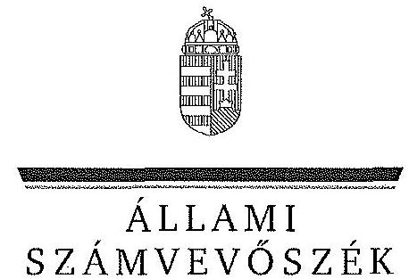
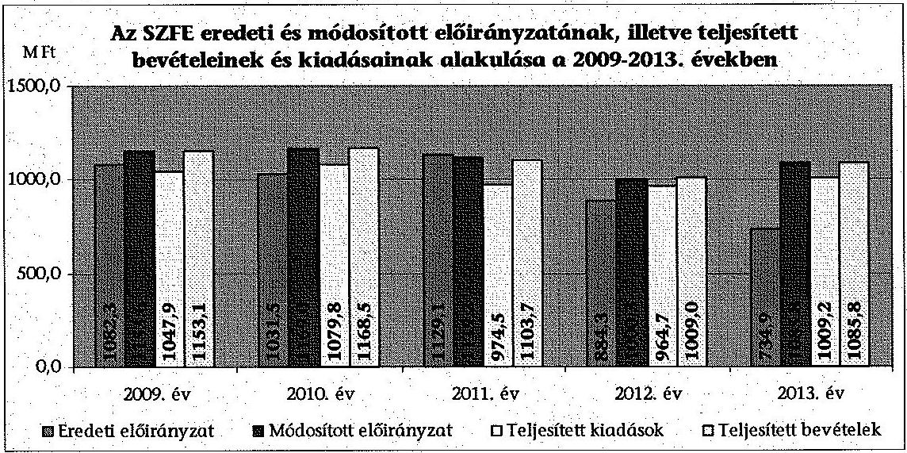
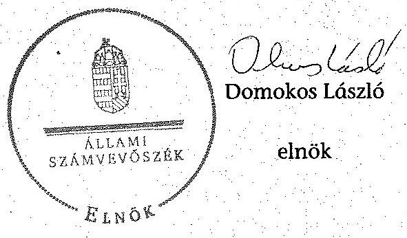
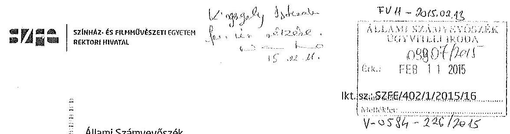
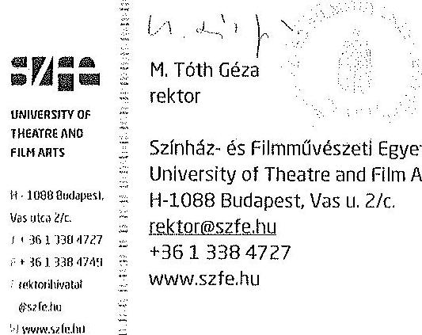

ÁLLAMI
SZÁMVEVŐSZÉK

# JELENTÉS 

A Színház- és Filmművészeti Egyetem ellenőrzéséről - Az állami felsőoktatási intézmények gazdálkodásának, működésének ellenőrzése

---

# Állami Számvevőszék 

Iktatószám: V-0584-227/2015.
Témaszám: 1618
Vizsgálat-azonosító szám: V068910

## Az ellenőrzést felügyelte:

## Kisgergely István

felügyeleti vezető

## Az ellenőrzés végrehajtásáért felelős:

Horváth József
ellenőrzésvezető

A számvevői munkaanyagok feldolgozását és a Jelentés összeállítását végezte:

## Horváth József

ellenőrzésvezető
Gergely Tilda
számvevő
Pappné dr. Szamosi Éva
számvevő főtanácsos

## Az ellenőrzést végezték:

## Bretus Zoltán

számvevő

## Dr. Csapó Anna

számvevő tanácsos

## Gergely Tilda

számvevő

## Pappné dr. Szamosi Éva

számvevő főtanácsos

## A témához kapcsolódó eddig készített számvevőszéki jelentések:

## címe

Jelentés az oktatási és kulturális ágazat irányítási rendszerének, működésének ellenőrzéséről
Jelentés a felsőoktatás oktatási infrastruktúra-fejlesztési programjának ellenőrzéséről
Jelentés az állami felsőoktatási intézmények érdekeltségébe tartozó gazdasági társaságok támogatásának és nyereségük hasznosulásának ellenőrzéséről

---

Jelentés a Szolnoki Főiskola ellenőrzéséről - Az állami felsőoktatási intézmények gazdálkodásának, működésének ellenőrzése
Jelentés a Pannon Egyetem ellenőrzéséről - Az állami felsőoktatási intézmények gazdálkodásának, működésének ellenőrzése
Jelentés a Károly Róbert Főiskola ellenőrzéséről - Az állami felsőoktatási intézmények gazdálkodásának, működésének ellenőrzése
Jelentés a Magyar Képzőművészeti Egyetem ellenőrzéséről - Az állami felsőoktatási intézmények gazdálkodásának, működésének ellenőrzése
Jelentés a Miskolci Egyetem ellenőrzéséről - Az állami felsőoktatási intézmények gazdálkodásának, működésének ellenőrzése
Jelentés a Széchenyi István Egyetem ellenőrzéséről - Az állami felsőoktatási intézmények gazdálkodásának, működésének ellenőrzése
Jelentés az Eszterházy Károly Főiskola ellenőrzéséről - Az állami felsőoktatási intézmények gazdálkodásának, működésének ellenőrzése
Jelentés a Budapesti Táncművészeti Főiskola ellenőrzéséről - Az állami felsőoktatási intézmények gazdálkodásának, működésének ellenőrzése
Jelentés a Budapesti Műszaki és Gazdaságtudományi Egyetem ellenőrzéséről - Az állami felsőoktatási intézmények gazdálkodásának, működésének ellenőrzése
Jelentés a Budapesti Corvinus Egyetem ellenőrzéséről - Az állami felsőoktatási intézmények gazdálkodásának, működésének ellenőrzése
Jelentés a Nyíregyházi Főiskola ellenőrzéséről - Az állami felsőoktatási intézmények gazdálkodásának, működésének ellenőrzése
Jelentés az Eötvös József Főiskola ellenőrzéséről - Az állami felsőoktatási intézmények gazdálkodásának, működésének ellenőrzése
Jelentés a Kecskeméti Főiskola ellenőrzéséről - Az állami felsőoktatási intézmények gazdálkodásának, működésének ellenőrzése
Jelentés a Kaposvári Egyetem ellenőrzéséről - Az állami felsőoktatási intézmények gazdálkodásának, működésének ellenőrzése
Jelentés a Liszt Ferenc Zeneművészeti Egyetem ellenőrzéséről - Az állami felsőoktatási intézmények gazdálkodásának, működésének ellenőrzése

---

.

---

# TARTALOMJEGYZÉK 

BEVEZETÉS ..... 13
I. ÖSSZEGZŐ MEGÁLLAPÍTÁSOK, KÖVETKEZTETÉSEK, JAVASLATOK ..... 17
II. RÉSZLETES MEGÁLLAPÍTÁSOK ..... 31

1. A fenntartói és ágazati irányítási jogok gyakorlása ..... 31
2. Az intézmény belső kontrollrendszerének kialakítása és működtetése ..... 33
3. Az intézmény döntéshozó szerveinek joggyakorlása, az oktatási és egyéb tevékenységei elkülönítése, pénzügyi gazdálkodása ..... 38
3.1. Az intézmény döntéshozó szerveinek gazdálkodással kapcsolatos joggyakorlása ..... 38
3.2. Az intézmény oktatási és egyéb tevékenységei elkülönítése, az ellátott feladat átláthatósága ..... 40
3.3. Az intézmény pénzügyi egyensúlya, fizetőképessége ..... 41
3.4. Az intézmény előirányzat kezelése ..... 43
3.5. Az egyes hazai forrásból finanszírozott projektekhez, feladatokhoz kapott - nem normatív - költségvetési forrással való elszámolás ..... 51
4. Az intézmény vagyongazdálkodása ..... 51
4.1. A vagyongazdálkodási tevékenységek keretei ..... 51
4.2. A vagyonváltozások és a vagyonhasznosítás szabályszerűsége ..... 53
4.3. Az intézmény tulajdonosi jog gyakorlása ..... 57
5. A külső ellenőrzések által tett javaslatok hasznosulása ..... 57
5.1. ÁSZ ellenőrzések által tett javaslatok hasznosulása ..... 57
5.2. Az egyéb külső ellenőrzések javaslatainak hasznosulása ..... 59
6. Az integritás kontrollok kialakítása és működtetése ..... 59

---

# MELLÉKLETEK 

1. számú A Színház- és Filmművészeti Egyetem kiadási és bevételi előirányzatai, azok teljesítése a 2009-2013. években
2. számú A Színház- és Filmművészeti Egyetem kiadásainak, bevételeinek változása a 2009-2013. években
3. számú Kimutatás a Színház- és Filmművészeti Egyetem bevételeiről és kiadásairól, valamint adósságszolgálatáról a 2009-2013. években
4. számú A Színház- és Filmművészeti Egyetem mérlegadatai a 2009-2013. években
5. számú A Színház- és Filmművészeti Egyetem gazdálkodása szabályszerűségének értékelése a mintatételek alapján
6. számú A Színház- és Filmművészeti Egyetem rektorának nemleges észrevétele

## FÜGGELÉK

1. számú Az integritás érvényesítése érdekében kialakított és működtetett intézményi kontrollrendszer

---

# RÖVIDÍTÉSEK JEGYZÉKE 

## Törvények

Áfa tv.
Áht. 1
Áht. 2
ÁSZ tv.
Avtv.

Eisztv.

Feot.

Info tv.

Kbt. 1
$\mathrm{Kbt}_{.2}$
Mt. 1
Mt. 2
Nftv.
Nvtv.
Szja tv.
Sztv.
Rendeletek
Áhsz.

Ámr. 1
Ámr. 2
Ávr.
Ber.
Bkr.
NGM rendelet

Vtvr.

2007. évi CXXVII. törvény az általános forgalmi adóról
1992. évi XXXVIII. törvény az államháztartásról (hatálytalan 2012. január 1-jétől)
2011. évi CXCV. törvény az államháztartásról
2011. évi LXVI. törvény az Állami Számvevőszékről
1992. évi LXIII. tv. a személyes adatok védelméről és a közérdekű adatok nyilvánosságáról (hatálytalan 2012. január 1-jétől)
2005. évi XC. törvény az elektronikus információszabadságról (hatálytalan 2012. január 1-jétől)
2005. évi CXXXIX. törvény a felsőoktatásról (hatálytalan 2012. szeptember 1-jétől)
2011. évi CXII. törvény az információs önrendelkezési jogról és az információszabadságról
2003. évi CXXIX. törvény a közbeszerzésekről (hatálytalan 2012. január 1-jétől)
2011. évi CVIII. törvény közbeszerzésekről
1992. évi XXII. törvény a Munka Törvénykönyvéről (hatálytalan 2013. január 1-jétől)
2012. évi I. törvény a munka törvénykönyvéről
2011. évi CCIV. törvény a nemzeti felsőoktatásról
2011. évi CXCVI. törvény a nemzeti vagyonról
1995. évi CXVII. törvény a személyi jövedelemadóról
2000. évi C. törvény a számvitelről

249/2000. (XII. 24.) Korm. rendelet az államháztartás szervezetei beszámolási és könyvvezetési kötelezettségének sajátosságairól (hatálytalan 2014. január 1-jétől)
217/1998. (XII. 30.) Korm. rendelet az államháztartás működési rendjéről (hatálytalan 2010. január 1-jétől)
292/2009. (XII. 19.) Korm. rendelet az államháztartás működési rendjéről (hatálytalan 2012. január 1-jétől)
368/2011. (XII. 31.) Korm. rendelet az államháztartásról szóló törvény végrehajtásáról
193/2003. (XI. 26.) Korm. rendelet a költségvetési szervek belső ellenőrzéséről (hatálytalan 2012. január 1-jétől)
370/2011. (XII. 31.) Korm. rendelet a költségvetési szervek belső kontrollrendszeréről és belső ellenőrzéséről
36/2013. (XI. 13.) NGM rendelet az államháztartás számvitelének 2014. évi megváltozásával kapcsolatos feladatokról
254/2007. (X. 4.) Korm. rendelet az állami vagyonnal való gazdálkodásról

---

51/2007. (III. 26.) Korm. rendelet

## Határozatok

1365/2011. (XI. 8.)
Korm. határozat
1657/2012. (XII. 20.)
Korm. határozat

## Egyéb rövidítések

alapító okirat $_{1}$
alapító okirat $_{2}$
alapító okirat $_{3}$
alapító okirat $_{4}$
ÁSZ
belső ellenőrzési kézikönyv $_{1}$
belső ellenőrzési kézikönyv $_{2}$
belső ellenőrzési kézikönyv $_{3}$
ellenőrzési nyomvonal
egyetem/
intézmény/SZFE
EMMI
eszközök és források
értékelési szabályzata
fenntartó/
minisztérium/
irányító szerv
FIR
FSA
Gazdasági Hivatal
gazdálkodási szabályzat $_{1}$
gazdálkodási szabályzat $_{2}$
gazdálkodási szabályzat $_{3}$
gépjárművek használatának szabályzata

51/2007. (III. 26.) Korm. rendelet a felsőoktatásban részt vevő hallgatók juttatásairól és az általuk fizetendő egyes térítésekről

1365/2011. (XI. 8.) Korm. határozat a 2012. évi hiánycél tartását biztosító további feladatokról
1657/2012. (XII. 20.) Korm. határozat a kormányzati stratégiai dokumentumok felülvizsgálatával kapcsolatos feladatokról

Színház- és Filmművészeti Egyetem Alapító okirata (hatálytalan 2009. július 1-jétől)
Színház- és Filmművészeti Egyetem Alapító okirata (hatálytalan 2010. november 2-ától)
Színház- és Filmművészeti Egyetem Alapító okirata (hatálytalan 2013. március 21-étől)
Színház- és Filmművészeti Egyetem Alapító okirata
Állami Számvevőszék
Színház- és Filmművészeti Egyetem Belső ellenőrzési kézikönyv (hatályos 2007. június 1-jétől)
Színház- és Filmművészeti Egyetem Belső ellenőrzési kézikönyv (hatályos 2009. március 1-jétől)
Színház- és Filmművészeti Egyetem Belső ellenőrzési kézikönyv (hatályos 2012. április 1-jétől)
Színház-és Filmművészeti Egyetem Ellenőrzési Nyomvonala
Színház- és Filmművészeti Egyetem
Emberi Erőforrások Minisztériuma
Színház- és Filmművészeti Egyetem Eszközök és források értékelési szabályzata (hatályos 2009. július 1-jétől)
az SZFE mindenkori fenntartója az ellenőrzött időszakban (OKM, NEFMI, EMMI)

Felsőoktatási Információs Rendszer
Felsőoktatási Strukturális Alap
Színház- és Filmművészeti Egyetem Gazdasági Hivatala
Színház- és Filmművészeti Egyetem Gazdálkodási Szabályzata (hatályos 2007. január 1-jétől 2011. december 31-éig)
Színház- és Filmművészeti Egyetem Gazdálkodási Szabályzata (hatályos 2009. július 1-jétől 2011. december 31-éig)
Színház- és Filmművészeti Egyetem Gazdálkodási Szabályzata (hatályos 2012. január 1-jétől)
Színház- és Filmművészeti Egyetem Gépjárművek használatának szabályzata (hatályos 2013. május 2-ától)

---

HÖK
Intézményfejlesztési
terv $_{1}$
Intézményfejlesztési
terv $_{2}$
Kincstár
közbeszerzési szabály-
zat $_{1}$
közbeszerzési szabály-
zat $_{2}$
leltározási és leltárkészítési szabályzat $_{1}$
leltározási és leltárkészítési szabályzat $_{2}$
MNB
MNV Zrt.
NEFMI
NGM
OKM
önköltség-számítási szabályzat $_{1}$
önköltség-számítási szabályzat $_{2}$
önköltség-számítási szabályzat $_{3}$
pénzkezelési szabályzat $_{1}$
pénzkezelési szabályzat $_{2}$
rektor
selejtezési szabályzat $_{1}$
selejtezési szabályzat $_{2}$
számviteli politika $_{1}$
számviteli politika $_{2}$
számviteli politika $_{3}$
számlarend

Hallgatói Önkormányzat
Színház- és Filmművészeti Egyetem Intézményfejlesztési terve 2007-2011. évekre
Színház- és Filmművészeti Egyetem Intézményfejlesztési terve 2012-2015. évekre
Magyar Államkincstár
Színház-és Filmművészeti Egyetem Közbeszerzési szabályzata (hatályos 2007. február 23-ától)
Színház-és Filmművészeti Egyetem Közbeszerzési szabályzata (hatályos 2009. július 1-jétől)
Színház-és Filmművészeti Egyetem Leltározási és leltárkészítési szabályzata (hatályos 2009. július 1-jétől)
Színház-és Filmművészeti Egyetem Leltározási és leltárkészítési szabályzata (hatályos 2012. január 1-jétől)
Magyar Nemzeti Bank
Magyar Nemzeti Vagyonkezelő Zrt.
Nemzeti Erőforrás Minisztérium
Nemzetgazdasági Minisztérium
Oktatási és Kulturális Minisztérium
Színház- és Filmművészeti Egyetem Önköltség-számítási Szabályzata (hatályos 2009. december 1-jétől)
Színház- és Filmművészeti Egyetem Önköltség-számítási Szabályzata (hatályos 2010. június 7-étől)
Színház- és Filmművészeti Egyetem Önköltség-számítási Szabályzat (hatályos 2012. január 1-jétől)
Színház- és Filmművészeti Egyetem Pénzkezelési szabályzata (hatályos 2009. július 1-jétől 2012. január 1-jéig)
Színház- és Filmművészeti Egyetem pénzkezelési szabályzata (hatályos 2012. január 1-jétől)
Színház- és Filmművészeti Egyetem Pénzkezelési szabályzata (hatályos 2013. december 16-ától)
Színház- és Filmművészeti Egyetem rektora 2006. szeptember 1-jétől 2014. március 31-éig
Színház- és Filmművészeti Egyetem Felesleges vagyontárgyak hasznosításának és selejtezésének szabályzata (hatályos 2007. január 1-jétől)
Színház- és Filmművészeti Egyetem Felesleges vagyontárgyak hasznosításának és selejtezésének szabályzata (hatályos 2012. január 1-jétől)
Színház- és Filmművészeti Egyetem Számviteli politikája (hatályos 2009. november 8-ától 2011. december 1-jéig)
Színház- és Filmművészeti Egyetem Számviteli politikája (hatályos 2011. december 1-jétől 2012. január 1-jéig)
Színház- és Filmművészeti Egyetem Számviteli politikája (2012. január 1-jétől)
Színház- és Filmművészeti Egyetem számlarendje (hatályos 2009. január 1-jétől)

---

| szenátus | Színház- és Filmművészeti Egyetem Szenátusa |
| :-- | :-- |
| SZMSZ | Szervezeti és Működési Szabályzat |
| támogatási és térítési | A Színház-és Filmművészeti Egyetem hallgatói részére |
| szabályzat | nyújtható támogatások és az általuk fizetendő térítési |
|  | díjak és térítések szabályzata (hatályos 2008. március 28- |
|  | ától) |
| ügyrend $_{1}$ | Színház-és Filmművészeti Egyetem Gazdasági Hivatala- |
|  | nak Ügyrendje (hatályos 2004. október 15-étől) |
| ügyrend $_{2}$ | Színház-és Filmművészeti Egyetem Gazdasági Hivatala- |
|  | nak Ügyrendje (hatályos 2009. december 1-jétől) |
| ügyrend $_{3}$ | Színház-és Filmművészeti Egyetem Gazdasági Hivatala- |
|  | nak Ügyrendje (hatályos 2012. január 1-jétől) |

---

# ÉRTELMEZŐ SZÓTÁR 

állami felsőoktatási intézmény saját tulajdona
állami vagyon
állami vagyon kezelője /vagyonkezelő

A felsőoktatási intézmény saját bevételének a költségek teljes körű levonása, - az adományozás és öröklés kivételével - a rendelkezésre bocsátott vagyon állagának megóvásáról, pótlásáról való gondoskodás után fennmaradt része terhére szerzett vagyona.
A Vtv. 1. § (2) bekezdése szerint állami vagyonnak minősül:
a) az állami tulajdonban lévő ingó dolog, valamint a dolog módjára hasznosítható természeti erő,
b) az állami tulajdonban lévő termőföldekből álló, külön törvényben szabályozott Nemzeti Földalap,
c) az állami tulajdonban lévő - a b) pont hatálya alá nem tartozó - ingatlan,
d) az állami tulajdonban lévő értékpapír,
e) az államot megillető társasági részesedés és más vagyoni értékű jog.
(hatályos 2010. június 16-ig)
a) az állam tulajdonában lévő dolog, valamint a dolog módjára hasznosítható természeti erő,
b) az a) pont hatálya alá nem tartozó mindazon vagyon, amely vonatkozásában törvény az állam kizárólagos tulajdonjogát nevesíti,
c) az állam tulajdonában lévő tagsági jogviszonyt megtestesítő értékpapír, illetve az államot megillető egyéb társasági részesedés,
d) az államot megillető olyan immateriális, vagyoni értékkel rendelkező jogosultság, amelyet jogszabály vagyoni értékű jogként nevesít.
(hatályos 2010. június 17-től)
A Vtv. 23. § (1) bekezdése szerint: Az állami vagyont az MNV Zrt. maga kezeli, vagy szerződés - így különösen bérlet, haszonbérlet, szerződésen alapuló haszonélvezet, vagyonkezelés, megbízás - alapján központi költségvetési szervnek, természetes vagy jogi személynek, illetőleg jogi személyiséggel nem rendelkező gazdasági társaságnak hasznosításra átengedi. (hatályos 2010. január 1-2010. december 31-ig)
Az állami vagyont az MNV Zrt. maga kezeli, vagy szerződés -

 így különösen bérlet, haszonbérlet, szerződésen alapuló haszonélvezet, vagyonkezelés, megbízás alapján központi költségvetési szervnek, természetes vagy jogi személynek, illetőleg jogi személyiséggel nem rendelkező gazdálkodó szervezetnek hasznosításra átengedi. (hatályos 2011. január 1. - 2011. december 31-ig)
Az állami vagyont az MNV Zrt. maga kezeli, vagy szerződés – így különösen bérlet, haszonbérlet, megbízás –

---

alapján központi költségvetési szervnek, természetes vagy jogi személynek, vagy jogi személyiséggel nem rendelkező gazdálkodó szervezetnek hasznosításra átengedi. Az állami vagyonra vonatkozóan az MNV Zrt. kizárólag az Nvtv.-ben meghatározott személyekkel köthet vagyonkezelési szerződést.
(hatályos 2012. január 1-jétől)
belső kontrollrendszer
A belső kontrollrendszer a kockázatok kezelése és tárgyilagos bizonyosság megszerzése érdekében kialakított folyamatrendszer, amely azt a célt szolgálja, hogy megvalósuljanak a következő célok:
a) a működés és gazdálkodás során a tevékenységeket szabályszerűen, gazdaságosan, hatékonyan, eredményesen hajtsák végre,
b) az elszámolási kötelezettségeket teljesítsék, és
c) megvédjék az erőforrásokat a veszteségektől, károktól és nem rendeltetésszerű használattól.
CLF-módszer
A módszer a működési és a felhalmozási költségvetés bevételeinek és kiadásainak, ezek egyenlegeinek elkülönített, majd összevont kimutatását alkalmazza valamely költségvetési intézmény pénzügyi helyzetének megítéléséhez. Kiemelten mutatja be a finanszírozási műveletek egyenlege nélküli és az azt magába foglaló pénzügyi pozíciót, valamint a tőketörlesztéssel, értékpapír beváltással csökkentett működési jövedelmet.
Az értékelés a pénzügyi kapacitás fogalmát helyezi a középpontba.
előirányzat-maradvány Az államháztartás központi alrendszerébe tartozó költségvetési szerveknél a módosított bevételi és kiadási előirányzatok és azok teljesítésének a Kormány rendeletében meghatározott tételekkel korrigált különbözete az előirányzat-maradvány. (Áht. 2. § (1) bekezdés m) pontja)
fenntartó
A Feot. 7. § (2) és az Nftv. 4. § (2) bekezdése szerint az, aki az alapítói jogot gyakorolja, ellátja a felsőoktatási intézmény fenntartásával kapcsolatos feladatokat.
hároméves fenntartói megállapodás

Az állami felsőoktatási intézmények központi költségvetési támogatására három éves fenntartói megállapodást kell kötni az állami felsőoktatási intézmény és a fenntartó között. A fenntartói megállapodás tartalmazza a felsőoktatási intézmény által meghatározott hároméves időszakra vállalt teljesítménykövetelményeket, továbbá az állandó jellegű támogatási részeket, valamint a változó jellegű támogatások megállapításának jogcímeit. A változó elemű támogatás évenkénti elszámolási kötelezettséggel kerül meghatározásra.

---

információs és kommunikációs rendszer

Integritás
intézményfejlesztési terv
irányító szerv
kincstári biztos
kincstári költségvetés
kockázatkezelési rendszer

A költségvetési szerv vezetője köteles olyan rendszereket kialakítani és működtetni, melyek biztosítják, hogy a megfelelő információk a megfelelő időben eljutnak az illetékes szervezethez, szervezeti egységhez, illetve személyhez.
Az integritás olyasvalakit vagy valamit jelöl, aki vagy ami romlatlan, sértetlen, feddhetetlen. Az integritás elvek, értékek, cselekvések, módszerek, intézkedések konzisztenciáját jelenti: olyan magatartásmódot, amely meghatározott értékeknek megfelel.
A szenátus fogadja el az intézményfejlesztési tervet. Az intézményfejlesztési tervben kell meghatározni a fejlesztéssel, a fenntartó által a felsőoktatási intézmény rendelkezésére bocsátott vagyon hasznosításával, megóvásával, elidegenítésével kapcsolatos elképzeléseket, a várható bevételeket és kiadásokat. Az intézményfejlesztési tervet középtávra, legalább négyéves időszakra kell elkészíteni, évenkénti bontásban meghatározva a végrehajtás feladatait. Az intézményfejlesztési terv része a foglalkoztatási terv. A foglalkoztatási tervben kell meghatározni azt a létszámot, amelynek keretei között a felsőoktatási intézmény megoldhatja feladatait. (Feot. 27. § (3) bekezdés)
A felsőoktatás ágazati irányítását felsőoktatásszervezéssel, felsőoktatásfejlesztéssel, törvényességi ellenőrzéssel kapcsolatos feladatokat ellátó miniszter által vezetett minisztérium. (Feot. 102-105/A. §, Nftv. 64-66. §)
A kincstári biztos kijelölését az államháztartásért felelős miniszternél a Kincstár kezdeményezi. A kincstári biztos köteles figyelemmel kísérni megbízatásának időpontjától kezdve a költségvetési szerv tervezését, gazdálkodását, beszámolását, a jogszabályokban előírt feladatainak ellátását, feltárni azokat az okokat, amelyek a tartós fizetésképtelenséghez vezettek, a szükséges intézkedések azonnali végrehajtására irányuló intézkedési tervet készíteni, azonnali intézkedéseket kezdeményezni és írásbeli utasításokat kiadni a tartozásállomány felszámolására, a gazdálkodás egyensúlyának biztosítására, a követelések behajtására. (Ávr. 116-117. §)
A központi költségvetésről szóló törvény elfogadását követően a fejezetet irányító szerv az államháztartás központi alrendszerébe tartozó költségvetési szerv és a fejezeti kezelésű előirányzat kiemelt előirányzatait, valamint az elkülönített állami pénzalapok és a társadalombiztosítás pénzügyi alapjai jogszabályi előírás szerinti bevételeit és kiadásait kincstári költségvetés kiadásával állapítja meg. (Áht. 24. § (3) bekezdés, Áht. 28. § (2) bekezdés, Ávr. 31. § (2) bekezdés)
Irányítási eszközök és módszerek összessége, melynek elemei a szervezeti célok elérését veszélyeztető tényezők

---

(kockázatok) azonosítása, elemzése, csoportosítása, nyomon követése, valamint szükség esetén a kockázati kitettség mérséklése.
kontrollkörnyezet
kontrolltevékenység
költségvetési főfelügyelő, felügyelő
maximális hallgatói létszám
minisztérium
monitoring
működési jövedelem
A kontrollkörnyezet a költségvetési szerv vezetőinek a szervezeti célok elérését segítő kontrollok kialakításával és működtetésével, korszerűsítésével kapcsolatos magatartását, a kontrollpontokról érkező információkra való reagálását jelenti.
Azok az elvek, politikák és eljárások, amelyeket a kockázatok meghatározása és a szervezet céljainak elérése érdekében alakítanak ki.
A költségvetési szerv vezetője köteles a szervezeten belül kontrolltevékenységeket kialakítani, amelyek biztosítják a kockázatok kezelését, hozzájárulnak a szervezet céljainak eléréséhez.
Az államháztartásért felelős miniszter a Kormány irányítása alá tartozó fejezetet irányító szervhez, a Kormány irányítása vagy felügyelete alá tartozó költségvetési szervhez, valamint az elkülönített állami pénzalapok és a társadalombiztosítás pénzügyi alapjai kezelő szerveihez költségvetési főfelügyelőt, felügyelőt rendelhet ki. A költségvetési főfelügyelő, felügyelő a gazdálkodás költségvetés-politikával való összhangja és a takarékos, szabályszerű, eredményes működés érdekében a Kormány rendeletében meghatározott intézkedéseket tehet, így különösen előzetesen véleményezi a kötelezettségvállalásra irányuló eljárásokat és a nagy összegű kötelezettségvállalások tekintetében kifogással élhet. (Áht. 39. § (1)-(2) bekezdés)
Az a felsőoktatási intézmény alapító okiratában, működési engedélyében meghatározott hallgatói létszám, ameddig terjedően a felsőoktatási intézmény – figyelembe véve a hallgatók fogadásához és az oktatói tevékenység folytatásához rendelkezésre álló személyi feltételeket, helyiségeket és eszközöket – valamennyi évfolyamára számítva, teljes kihasználtsággal működve hallgatói jogviszonyt létesíthet.
A felsőoktatásért felelős minisztérium, amely 2009-től 2010. májusáig az OKM, 2010. májusától 2012. májusáig a NEFMI, 2012. májusától az EMMI volt.
A különböző szintű szervezeti célok megvalósításához szükséges folyamatok figyelemmel kísérése, melynek során a releváns eseményekről és tevékenységekről (együtt: folyamatokról) rendszeres jelleggel, strukturált, döntéstámogató információkhoz jutnak a szervezet vezetői.
A folyó bevételek és folyó kiadások egyenlege. Azt mutatja, hogy a folyó bevételek fedezetet nyújtanak-e a folyó kiadásokra.

---

normatív költségvetési támogatás felsőoktatási intézmények működéséhez
normatív támogatások
saját bevétel
szenátus
tárgyévi pénzügyi pozíció

A felsőoktatási intézmények működéséhez biztosított normatív költségvetési támogatás lehet
a) hallgatói juttatásokhoz nyújtott,
b) képzési,
c) tudományos célú,
d) fenntartói,
e) egyes feladatokhoz nyújtott
támogatás. A központi költségvetésből biztosított normatív költségvetési támogatásra – a d) pontban meghatározott normatív költségvetési támogatás kivételével – a felsőoktatási intézmények azonos feltételek alapján válnak jogosulttá. Az a)-e) pontokban meghatározott jogcímek az a) és e) pontban meghatározott jogcímek kivételével nem jelentenek felhasználási kötöttséget. (Feot. 127. § (3) bekezdés)

Az ellenőrzési időszakban hatályos költségvetési törvények 3. sz. mellékletében megjelölt közoktatási hozzájárulások, az 5. sz. mellékletében megjelölt központosított előirányzatok, továbbá a 8. sz. mellékletében megjelölt normatív, kötött felhasználású támogatások együttesen.
Az államháztartáson kívüli források – beleértve minden olyan, az Európai Uniótól származó támogatást, amelyhez nem az állami költségvetésen keresztül jut a felsőoktatási intézmény, továbbá a szakképzési hozzájárulási fizetési kötelezettség teljesítéseként elszámolt forrásokat is, ide nem értve az állami vagyon értékesítésének ellenértékét – valamint a Kutatási és Technológiai Innovációs Alapból származó bevételek.
A felsőoktatási intézmény döntést hozó és a döntés végrehajtását ellenőrző testülete. (Feot. 20. § (1) bekezdés, Nftv. 12. § (1)-(3) bekezdés)

A működési és felhalmozási bevételek, valamint kiadások egyenlege a finanszírozási műveletek egyenlegének figyelembe vételével.

---

.

---

# JELENTÉS 

## A Színház- és Filmművészeti Egyetem ellenőrzéséről - Az állami felsőoktatási intézmények gazdálkodásának, működésének ellenőrzése

## BEVEZETÉS

Az ÁSZ Stratégiája ${ }^{1}$ alapértékeinek egyike, hogy az államháztartás komplex folyamatainak átláthatósága érdekében rendszerszemléletű/holisztikus megközelítésű, egymásra épülő, a szinergiahatást kihasználó, összefoglaló értékelésre lehetőséget adó ellenőrzéseket végez. Az államháztartás központi alrendszerébe tartozó felsőoktatási intézmények ellenőrzése során az Állami Számvevőszék értékeli azok pénzügyi-gazdasági helyzetét, feltárja a működésükben rejlő kockázatokat, ezzel előmozdítja a közpénzügyek átláthatóságát, rendezettségét.

Az állami felsőoktatási intézmények gazdálkodását – az Áht. ${ }_{1-2}$ előírásai mellett – a felsőoktatásról szóló 2005. évi CXXXIX. törvény (Feot.), valamint a nemzeti felsőoktatásról szóló 2011. évi CCIV. törvény (Nftv.) előírásai határozták meg.

Magyarország Nemzeti Reform Programja keretében, a Széll Kálmán Terv 2020-ig a 30-34 évesek körében, a felsőfokú vagy annak megfelelő végzettséggel rendelkezők arányának 30,3%-ra való növelését irányozta elő, amely a 2010. évhez képest 4,6%-pontos növekedési célkitűzést jelent. A rendezett gazdasági környezet, az önállósággal élni tudó, felelős, elszámoltatható intézményi gazdálkodói magatartás elengedhetetlen feltétele a kitűzött szakmai célok elérésének.

Az ellenőrzés célja annak megállapítása, hogy szabályos volt-e az állami felsőoktatási intézmények pénzügyi és vagyongazdálkodása, biztosított volt-e a vagyonnal való felelős gazdálkodás követelményének érvényesülése, jogszabályi előírásoknak megfelelően működött-e a belső kontrollrendszer; az irányító szerv tevékenysége a jogszabályi előírásoknak megfelelt-e.

Ennek keretében értékeltük:

1) a fenntartói és az ágazati irányítási jogok gyakorlását és előírásoknak való megfelelőségét;
[^0]
[^0]:    ${ }^{1}$ Állami Számvevőszék: Stratégia. Az Állami Számvevőszék hivatalos stratégiai dokumentum rendszere 2011-2015. 2012. december. http://www.asz.hu/strategia/asz-strategia/asz-strategia-2011.pdf

---

2) az intézmény belső kontrollrendszere jogszabályoknak megfelelő kialakítását és működtetését;
3) az intézmény döntéshozó szerveinek joggyakorlása jogszabályoknak való megfelelőségét; az intézmény oktatási és egyéb (gyakorlati és kutatási) tevékenységei elkülönítését, átláthatóságát, illetve pénzügyi gazdálkodása szabályszerűségét;
4) az intézmény vagyongazdálkodása előírásoknak való megfelelőségét;
5) az ellenőrzött időszakban végzett külső (ÁSZ, fenntartói) ellenőrzések által tett javaslatok hasznosulását;
6) az intézmény korrupcióval szembeni veszélyeztetettségének csökkentése érdekében az integritási szemlélet érvényesülését a gazdálkodási folyamatokban.

Az ellenőrzés várható hasznosulása: Az ellenőrzés eredményének hasznosulásaként képet kapunk a Színház- és Filmművészeti Egyetemen kialakult pénzügyi helyzetről; az oktatási és egyéb tevékenységek és költségelszámolások elhatárolásáról, átláthatóságáról és szabályosságáról. A felsőoktatási intézmények gazdálkodási szabadságának pénzügyi és vagyoni helyzetre gyakorolt hatásairól, a vagyonnal való felelős, értékmegőrző gazdálkodás érvényesüléséről, továbbá a belső kontrollrendszer működéséről. Az ellenőrzés az ellenőrzött számára visszajelzést ad a gazdálkodása kereteinek kialakításáról, a működésében fellépő hiányosságokról, javaslataival hozzájárul azok kiküszöböléséhez és a jó kormányzáshoz. A törvényalkotás számára összegzett tapasztalatok állnak rendelkezésre a felsőoktatási intézmények döntéseinek, gazdálkodásának szabályszerűségéről, amelyek alapján – indokolt esetben – jogszabálymódosítás kezdeményezhető. Az integritás kultúra kialakítása hozzájárul az elszámoltathatóság és átláthatóság érvényesítéséhez, egyben támogatja a szervezet védettségét a korrupciós kitettséggel szemben, valamint annak megelőzése is irányítottabbá válik. A társadalom számára jelzi, hogy közpénz nem maradhat ellenőrizetlenül, az ÁSZ értékteremtő rend kialakításához és megőrzéséhez hozzájáruló tevékenysége pozitív hatással lesz a szervezetről kialakított összkép formálásában.

Az ellenőrzés típusa szabályszerűségi ellenőrzés.
Az ellenőrzött időszak 2009. január 1. - 2013. december 31. (az eredményszemléletű számvitel bevezetésével kapcsolatban az ellenőrzött időszak vége: 2014. április 30.)

Az ellenőrzéssel érintett szervezetek: az Emberi Erőforrások Minisztériuma és a Színház- és Filmművészeti Egyetem.

Az ellenőrzés jogszabályi alapját az ÁSZ tv. 1. § (3) bekezdése, az 5. § (3)-(6) bekezdései, 33. § (7) bekezdése, valamint az államháztartásról szóló 2011. évi CXCV. törvény (Áht. ${ }_{2}$ ) 61. § (2) bekezdésének előírásai képezik.

Az ellenőrzés kiterjedt minden olyan körülményre és adatra, amely az ÁSZ jogszabályban meghatározott feladataiban, valamint a program végrehajtása folyamán felmerült újabb összefüggések feltárásához szükséges volt.

---

Az ellenőrzés az INTOSAI által kiadott nemzetközi standardok
 figyelembe vételével, az ellenőrzési programban foglalt értékelési szempontok szerint történt.

A pénzügyi és vagyongazdálkodás terén az egyes területek szabályszerű működését mintavétellel ellenőriztük, ez alapján a sokaságban előforduló hibás tételek arányát becsültük. A jogszabályoknak és a belső előírásoknak megfelelőnek, azaz szabályszerűnek tekintettük az adott kiadási előirányzat felhasználását, bevétel beszedését, mérlegtétel értékelését, amennyiben a minta ellenőrzésének eredménye alapján 95%-os bizonyossággal a teljes sokaságban a hibás tételek aránya kisebb volt, mint 10%, nem megfelelőnek értékeltük, ha a hibás tételek aránya a 10%-ot meghaladta. A mintatételek kiértékelését az 5. számú melléklet tartalmazza.

A belső kontrollrendszer kialakításának és működtetésének értékelése során a jogszabályi előírások mellett az Ámr. 145/A. § (1) és (3) bekezdése, az Ámr. 155. § (1) és (3) bekezdése, valamint a Bkr. 5. § (1) bekezdése alapján figyelembe vettük az államháztartásért felelős miniszter által közzétett irányelvekben és módszertani útmutatókban foglaltakat is. A belső kontrollrendszert az értékelés során legalább 85%-os megfelelőség esetén megfelelőnek, legalább 70%-os megfelelőség esetén részben megfelelőnek, 70%-os megfelelőség alatt pedig nem megfelelőnek minősítettük.

A Színház- és Filmművészeti Egyetem a 2009-2013. évek között önállóan működő és gazdálkodó központi költségvetési szerv volt. A művészet, művészetközvetítés területeken folytatott képzést és alapfeladata körében a művészetek képzési területeken kutatási tevékenységet végzett. Az oktatott szakok száma a 2009. évi 16-ról 2013-ra 19-re nőtt. Az intézmény szerkezetében, szervezeti felépítésében változás történt, a tanszékek száma változott, intézményi átalakítás nem történt.

A 2009-2013. években az SZFE az MTA Lendület programban nem vett részt. Az ellenőrzött időszakban Kincstári biztost, költségvetési felügyelőt az intézményhez nem rendeltek ki.

A rektor és a gazdasági főigazgató személyében az ellenőrzött időszakban nem történt változás.

[^0]
[^0]:    2 1/2009. (IX. 11.) PM irányelv, Pénzügyminisztérium Belső Kontroll Kézikönyv 2010.

---

Az ellenőrzéssel érintett intézmény jellemzőit, főbb gazdálkodási, vagyoni és létszám adatait az alábbi táblázat mutatja be:

| Megnevezés | Főbb gazdálkodási és vagyoni adatok (M Ft) |  |  |  |  |  |
| :--: | :--: | :--: | :--: | :--: | :--: | :--: |
|  | 2009. év | 2010. év | 2011. év | 2012.év | 2013. év | $\begin{gathered} 2013 \text { év/ } \\ 2009 \text { év } \\ (\%) \end{gathered}$ |
| Kiadási főösszeg | 1047,9 | 1079,8 | 974,5 | 964,7 | 1009,2 | 96,3 |
| Bevételi főösszeg | 1153,1 | 1168,5 | 1103,7 | 1009,0 | 1085,8 | 94,2 |
| Költségvetési támogatások | 883,3 | 857,5 | 802,0 | 636,6 | 620,6 | 70,3 |
| Saját és átvett bevételek | 269,8 | 311,0 | 301,7 | 372,4 | 465,2 | 172,4 |
| Támogatások aránya (%) | 76,6 | 73,4 | 72,7 | 63,1 | 57,2 | 68,2 |
| Mérlegfőösszeg | 895,8 | 873,7 | 907,2 | 904,8 | 997,6 | 111,4 |
|  | Jellemző létszámadatok* (fő) |  |  |  |  |  |
| Oktatói létszám (fő) | 71 | 64 | 61 | 51 | 42 | 59,2 |
| Hallgatói létszám (fő) | 268 | 276 | 308 | 318 | 409 | 152,6 |

*Az oktatói és hallgatói létszám az október 15-i statisztikában szereplő adat.
A felsőoktatási intézmény kiadásai az öt év alatt 3,7%-kal, a bevételek összességében 5,8%-kal csökkentek. A bevételeken belül a költségvetési támogatás aránya 82,2% volt átlagosan és összege 29,7%-kal csökkent, a saját és átvett bevételek 72,4%-kal nőttek. A hallgatói létszám 268 főről 409 főre (52,6%-kal) emelkedett, az oktatók létszáma pedig 71 főről 42 főre, 40,8%-kal csökkent.

Az ÁSZ a 2011. évi LXVI. törvény 29. §-a szerint a jelentéstervezetet megküldte a Színház és Filmművészeti Egyetem rektorának és az Emberi Erőforrások Minisztériuma miniszterének egyeztetésre. A Színház és Filmművészeti Egyetem rektora nemleges észrevételét a 6. számú melléklet tartalmazza. Az Emberi Erőforrások Minisztériuma minisztere az ÁSZ tv. 29. § (2) bekezdésében foglalt észrevételezési jogával nem élt, a törvényes határidőn belül észrevételt nem tett.

---

# 1. ÖSSZEGZŐ MEGÁLLAPÍTÁSOK, KÖVETKEZTETÉSEK, JAVASLATOK 

A felsőoktatásért felelős minisztérium (OKM, NEFMI, EMMI) az ellenőrzött időszakban a jogszabályi előírásoknak megfelelően gyakorolta a fenntartói feladatait. Alapítói jogosultságai keretében szabályszerűen adta ki az egyetem jogszabályi és szervezeti változásoknak megfelelően módosított alapító okiratot. Az SZFE által megküldött SZMSZ-t a fenntartó felülvizsgálta.

A minisztérium közreműködött az egyetem éves költségvetésének tervezésében, meghatározta az intézmény költségvetési kereteit. Elvégezte az intézmény éves költségvetési, illetve gazdálkodási beszámolóinak ellenőrzését. A fenntartó megkötötte az intézménnyel a 2008-2010. évekre vonatkozóan a fenntartói megállapodást, amelyben meghatározták a teljesítménykövetelményeket. A fenntartó a megállapodásban foglaltak végrehajtását évente értékelte.

A fenntartó az SZFE rektorának, gazdasági főigazgatójának, valamint a belső ellenőrzési vezetőnek a megbízásával kapcsolatos feladatokat a jogszabályban előírtaknak megfelelve elvégezte.

A minisztérium az ágazati irányítási feladatait a 2009-2013. években nem látta el teljes körűen. Elmaradt az oktatási ágazatra vonatkozóan a nemzetgazdasági miniszter irányításával és az oktatásért felelős miniszter részvételével, az 1365/2011. (XI. 8.) Korm. határozatban előírt szervezeti és feladatellátási felülvizsgálati program kidolgozása. A Feot. és az Nftv. rendelkezései ellenére a miniszter nem készíttetett a felsőoktatás rendszere vonatkozásában a Kormány által elfogadott középtávú fejlesztési tervet.

A minisztérium az Oktatási Hivatallal a FIR biztonságos üzemeltetéséhez, az adatok védelméhez szükséges alapvető szervezeti, szabályozási kontrollokat a 2012. év végéig nem teljes körűen alakította ki. A FIR átfogó megújítását követően rögzített - a nyitott jogviszonnyal rendelkező hallgatók és az oktatók vonatkozásában az - adatok teljesek. A visszamenőleges adatok tisztítása és beküldése a FIR átfogó megújítását követően folyamatos volt. A fenntartó a FIR biztonságos üzemeltetéséhez, az adatok védelméhez szükséges szabályozási kontrollokat 2013. év végére kialakította.

Az SZFE belső kontrollrendszerének kialakítása és működtetése a 2009-2013. években nem volt megfelelő. Ezen belül a kockázatkezelést, illetve a 2009. évben a kontrollkörnyezetet részben megfelelőnek, a kontrolltevékenységet, az információs és kommunikációs rendszert, a monitoring rendszert, valamint a 2010-2013. években a kontrollkörnyezetet nem megfelelőnek minősítettük. A rektor a jogszabályi előírást megsértve a Bkr. 1. mellékletében foglalt nyilatkozatban a 2012. évre vonatkozóan az SZFE belső kontrollrendszerének minőségét nem értékelte. A 2009-2011. és 2013. évekre vonatkozó, a belső kontrollrendszer kialakításáról, működtetéséről, valamint annak szabályszerű, hatékony, gazdaságos és eredményes működését értékelő rektori nyilatkozatokban foglaltakat az ÁSZ ellenőrzés megállapításai nem támasztották alá.

---

Az intézmény kontrollkörnyezete a jogszabályi előírásoknak a 2009. évben részben, a 2010-2013. években nem felelt meg. Az SZFE a gazdálkodás szempontjából meghatározó belső szabályzatait a szervezeti és jogszabályi változásoknak megfelelően nem aktualizálta rendszeresen. A belső szabályzatok egy része nem minden tekintetben felelt meg a hatályos jogszabályoknak. Az SZFE SZMSZ-e a jogszabályi előírások ellenére nem tartalmazta a szervezet engedélyezett létszámát, továbbá az Nftv. hatályba lépését követően, annak rendelkezéseivel összhangban nem aktualizálták. A rektor az ellenőrzött időszakban a jogszabályi előírások ellenére nem határozta meg az etikai elvárásokat. Az SZFE a jogszabályi előírások ellenére a 2010-2013. években nem szabályozta a Kbt. hatálya alá nem tartozó beszerzések lebonyolítását.

Az SZFE kockázatkezelési rendszerének kialakítása és működtetése részben felelt meg a jogszabályi előírásoknak. A rektor egyetem a jogszabályi előírások ellenére nem mérte fel és nem állapította meg a tevékenységével és gazdálkodásával kapcsolatos kockázatokat, valamint nem határozta meg az egyes kockázatokkal kapcsolatos intézkedéseket és azok teljesítése folyamatos nyomon követésének módját.

A kontrolltevékenységek kialakítása és működtetése az ellenőrzött időszakban nem volt megfelelő. A rektor a jogszabályi előírások ellenére nem biztosította a 2009-2013. években a pénzügyi kihatású döntések célszerűségi, gazdaságossági, hatékonysági és eredményességi szempontú megalapozottságával kapcsolatban a folyamatba épített, előzetes, utólagos és vezetői ellenőrzést, valamint belső szabályzatban nem határozta meg az információkhoz való hozzáférésre, valamint a beszámolási eljárásokra vonatkozóan a felelősségi köröket.

Az SZFE a jogszabályi előírás ellenére belső szabályzatban nem szabályozta a teljesítésigazolás módját, eljárási és dokumentációs részletszabályait, az ezeket végző személyek kijelölésének rendjét, valamint nem rögzítette az előzetes írásbeli kötelezettségvállalást nem igénylő kifizetések rendjét. A jogszabályi előírások ellenére a gazdálkodási jogköröket rendszeresen felhatalmazással nem rendelkező személyek gyakorolták. Az SZFE a 2010-2013. években a kötelezettségvállalók, az utalványozók, az ellenjegyzők, és az érvényesítők aláírásmintájáról a jogszabályi előírások ellenére nyilvántartást nem vezetett. A gazdálkodási jogkörök gyakorlásának hiányosságai az ellenőrzött időszakban az ellenőrzés során feltárt szabályszerűségi hibákhoz vezettek.

Az információs és kommunikációs rendszer kialakítása és működtetése az SZFE-nél az ellenőrzött időszakban nem felelt meg a jogszabályi előírásoknak. Az SZFE rektora a jogszabályi előírás ellenére nem alakított ki és nem működtetett olyan rendszereket, amely biztosítják, hogy a megfelelő információk a megfelelő időben eljutnak az illetékes szervezethez, szervezeti egységhez, illetve személyhez. Az SZFE nem határozta meg a beszámolási szinteket, határidőket és módokat. Az SZFE a jogszabályi előírást megsértve a kötelezően közzéteendő adatok nyilvánosságra hozatalának rendjét nem alakította ki, valamint a jogszabályokban meghatározott adatokat nem teljes körűen tette közzé.

A monitoring rendszer kialakítása és működése a 2009-2013. években nem volt megfelelő, mert a rektor a jogszabályi előírás ellenére nem alakított ki a szervezet tevékenységének, a célok megvalósításának nyomon követését biztosító rendszert. Az SZFE a belső ellenőrzés feladatait az SZMSZ-ben, valamint a belső ellenőrzési kézikönyvben rögzítette, a belső ellenőrzés függetlenségét biztosította. A belső ellenőrzési feladatokat 2013. február 1-jétől október 31-ig a jogszabályt megsértve megbízási jogviszonyban látták el. Az SZFE a belső ellenőrzés megállapításaira készült intézkedési terveket az ellenőrzött időszak egyik évére vonatkozóan sem tudta az ÁSZ ellenőrzés részére átadni. A belső ellenőrzés által tett javaslatokat az egyetem részben hasznosította. A belső ellenőr a jogszabályban foglaltak ellenére a 2012-2013. években a belső ellenőrzési jelentések alapján megtett intézkedések nyomon követését elmulasztotta.

A szenátus gazdálkodással kapcsolatos joggyakorlása nem felelt meg teljes körűen a jogszabályi előírásoknak. A szenátus előkészítés hiányában nem tárgyalta, nem fogadta el az SZFE 2012. és 2013. évekre szóló költségvetését és a 2011-2013. évek éves beszámolóját, valamint nem értékelte a 2009-2013. évek között a rektor vezetői tevékenységét. Az SZFE a 2009-2013. évekre szóló vagyongazdálkodási tervet nem készített. Az SZFE az SZMSZ 2011. és 2012. évi módosításait, valamint a 2009-2013. évi költségvetését és annak módosításait a fenntartónak nem küldte meg.

A szenátus joggyakorlása a felsőoktatási normatív finanszírozási keretrendszerben az eltérő jogcímeken kapott támogatások felhasználása esetében részben felelt meg jogszabályi előírásoknak. A szenátus - előterjesztés hiányában - az SZMSZ-t nem aktualizálta, ezért a 2009/2010-es tanév I. félévére a szociális alapú ösztöndíj forrásain belül
 a hallgatói normatíva felosztása a régi szabályozás alapján történt. Az SZFE a jogszabályi előírások ellenére a térítési díjak mértékét alátámasztó önköltségszámítást rendszeresen nem készített, a költségtérítések összegének meghatározásához a szakmai feladatra számított folyó kiadásokat nem mutatta ki. A 2011. október 6-tól hatályos SZMSZ-ek a jogszabályi előírás ellenére nem tartalmazták a költségtérítéses képzésben részt vevő hallgatók tekintetében a térítési díj és a költségtérítés megállapításának és módosításának rendjét. A kollégiumi férőhelyek komfortfokozatba történő besorolásáról a rektor és a HÖK - az ellenőrzött időszak egyetlen tanévére - sem kötött megállapodást, mellyel a jogszabályban előírtakat nem tartották be.

Az SZFE oktatási és egyéb tevékenységeit elkülönítették, az ellátott feladatok rendszere átlátható volt.

Az ellenőrzött időszak alatt az SZFE tárgyévi pénzügyi pozíciójának értéke a 2009. évi 79,3 M Ft-hoz képest folyamatosan csökkent. A 2010. évben - a felhalmozási deficit következményeként - és 2012-ben - a működési és felhalmozási hiány együttes hatásaként - negatív értéket mutatott. Az egyetem a korrigált pozitív pénzügyi pozícióját a 2010. és a 2012. évben az előző években képződött maradvány igénybevételével érte el. A 2009-2013. évek között a likviditási mutató és a pénzeszköz likviditási mutató minden évben meghaladta az 1-et, az SZFE fizetőképessége biztosított volt. Kincstári biztost, költségvetési felügyelőt az intézményhez nem rendeltek ki.

Az SZFE kiadási és bevételi előirányzatainak megállapítása a 2009-2013. években nem felelt meg teljes körűen a jogszabályi előírásoknak. Az SZFE belső szabályzatban a költségvetési tervezéssel kapcsolatos feladatokat, azok ellátásának belső rendjét, módját, munkafolyamatának leírását nem határozta meg. Az egyetem a 2013. évben a jogszabályi előírás ellenére nem tervezte meg a dologi kiadások tekintetében mindazokat a kiadásokat, melyek az ellátott közfeladattal kapcsolatosak. A kincstári költségvetés és elemi költségvetés egyezőségét kiemelt előirányzati szinten a 2009. évre bemutatni nem tudta. A bevételi és kiadási előirányzatok módosítása, azok elszámolása nem felelt meg a jogszabályoknak és a belső szabályoknak. Az SZFE a saját hatáskörben történt előirányzat-módosítás okát, indokát dokumentumokkal nem támasztotta alá, az előirányzat módosításokról az intézkedés meghozatalát követő öt munkanapon belül a Kincstárt és az irányító szervet nem tájékoztatta. Az SZFE a 2009. évben a jogszabályi előírást megsértve a személyi juttatások és a munkaadót terhelő járulékok előirányzatát az irányító szerv engedélye nélkül a dologi kiadások előirányzatának csökkentésével megegyező összegben növelte.

Az egyetem az ellenőrzött időszakban 3800,0 M Ft költségvetési támogatásban részesült, 205,2 M Ft támogatásértékű bevételt és 1084,9 M Ft saját bevételt, valamint 430,0 M Ft egyéb bevételt ért el. A teljesített bevételek az ellenőrzött időszakban a 2009-2011. években a módosított bevételi előirányzatok alatt, a 2013. évben a módosított előirányzattal megegyezően teljesültek. A 2012. évben a teljesített bevétel 0,9%-kal haladta meg a módosított előirányzatot. Az SZFE-nek az ellenőrzött időszakban összesen 7,8 M Ft bevételi lemaradása keletkezett. Az SZFE gazdálkodása során a költségvetés módosított kiadási főösszégét a 2009-2013. években betartotta.

A személyi juttatások, a dologi és felhalmozási kiadások előirányzatainak felhasználásánál a pénzügyi elszámolások, valamint a gazdálkodási jogkörök tekintetében nem volt teljes körűen biztosított a jogszabályoknak és belső szabályoknak való megfelelőség.

A rendszeres és nem rendszeres személyi juttatások esetében rendszerhiba volt, hogy a jogszabályi előírás ellenére a kötelezettségvállalások ellenjegyzését, 2012. január 1-jétől pénzügyi ellenjegyzését kijelöléssel nem rendelkező személyek végezték. A foglalkoztatott oktatók esetében nem minden esetben álltak rendelkezésre a besorolásukat alátámasztó iskolai végzettségeket, szakképzettségeket tanúsító dokumentumok, valamint az illetményváltozásról szóló kötelezettségvállalási dokumentumok. A személyi juttatások kifizetésének jogosságát munkaidő-nyilvántartással és teljesítésigazolással nem minden esetben támasztották alá. A külső személyi juttatások előirányzatai terhére megkötött megbízási szerződések tartalma, teljesítése, számfejtése nem felelt meg a jogszabályi előírásoknak. A megbízási szerződések kötelezettségvállalásainak ellenjegyzését kijelöléssel nem rendelkező személyek végezték, valamint az érvényesítési és az utalványozási feladatokat rendszeresen nem végezték el. Esetenként saját dolgozóval, munkakörébe tartozó feladat ellátására kötöttek megbízási szerződést, továbbá hiányoztak a kifizetés számfejtéséhez szükséges adóelőleg-nyilatkozatok. Az SZFE a jogszabályban előírt számviteli bizonylat megőrzési kötelezettségének nem tett eleget, mivel három kifizetés jogosságát teljes körűen dokumentumokkal alátámasztani nem tudta.

Rendszerhibaként tártuk fel a dologi és a felhalmozási kiadásoknál, hogy a teljesítés igazolása és az érvényesítés nem a jogszabályi előírásoknak és az intézményi szabályozásnak megfelelően történt. Az SZFE jogszabályi előírást megsértve a könyvviteli elszámolást alátámasztó bizonylatot a dologi kifizetések esetében 20,4 M Ft, a kötelezettségvállalásokkal kapcsolatban 30,8 M Ft összegben, valamint a felhalmozási kifizetések során 7,4 M Ft összegben visszakereshető módon nem őrzött meg.

Az ellátotti juttatások megállapítása, kifizetése során nem tartották be a belső szabályzatokban és a jogszabályokban foglaltakat. Rendszerhibát jelentett, hogy az ellátotti juttatások kifizetései előtt a teljesítésigazolást nem végezték el, az érvényesítést kijelöléssel nem rendelkező személyek végezték, továbbá a kifizetéseket teljes körűen nem utalványozták. A kötelezettségvállalást nem minden esetben foglalták írásba. A valutában történt pénztárkifizetések forintban történő könyvelését rendszeresen nem a jogszabályban és az intézményi szabályozásban előírt módon végezték.

Az intézményi működési bevételek beszedése a pénzügyi elszámolások, valamint a gazdálkodási jogkörök gyakorlása tekintetében nem felelt meg a jogszabályoknak és belső szabályoknak. Rendszerhibát okozott, hogy az intézményi szabályozás ellenére a bevételek beszedése előtt a teljesítésigazolást nem végezték el.

Az immateriális javak és tárgyi eszközök bérbeadása, értékesítése a pénzügyi elszámolások, valamint a gazdálkodási jogkörök gyakorlása tekintetében nem felelt meg a jogszabályoknak és belső szabályoknak. Az intézményi szabályozás ellenére a bevételek beszedése előtt a teljesítésigazolást rendszeresen nem végezték el. Eseti hiba volt, hogy a 2010. évben egy személygépjármű értékesítésénél számlát nem állítottak ki.

Az egyetem az ellenőrzött időszakban a felhasználható előirányzat-maradvány összegét teljes egészében kötelezettségvállalással terhelt maradványként mutatta ki. Az előirányzat-maradvány megállapítása és felhasználása nem felelt meg a jogszabályi előírásoknak. Az SZFE a jogszabályi előírást megsértve a 2011. évben kötelezettségvállalással terhelt maradványként mutatott ki olyan összegeket, melyekre a kötelezettségvállalás a tárgyévet követő évben történt meg. Az egyetem a 2009-2010. években a kötelezettségvállalással terhelt maradványok nyilvántartásának elmulasztásával a jogszabályi előírás követelményét nem biztosította.

A hazai pályázati forrásokból finanszírozott projektek elszámolása során az SZFE esetenként nem járt el szabályszerűen. Az ellenőrzött időszakban a pályáztatás eljárásrendjét nem szabályozták, mely hozzájárult ahhoz, hogy a pályázatok pénzügyi elszámolását és a szakmai beszámolót esetenként nem az előírt tartalommal készítették el. A támogató szervezetek a hiánypótlással érintett beszámolók elfogadásáról az SZFE-t értesítették.

Az SZFE könyvviteli mérleg szerinti vagyona 2009. január 1-én 847,9 M Ft volt, amely 2013. december 31-re 997,6 M Ft-ra, 17,6%-kal növekedett. A növekedést a pénzeszközök állományának növekedése eredményezte.

Az SZFE a közbeszerzési szabályzatot a Kbt. hatályba lépését követően nem aktualizálta. Az SZFE a kezelésében lévő feleslegessé vált vagyontárgyak értékesítési folyamatát, térítésmentes átadásának szabályait rögzítette, azonban a 2012-2013. években a vagyon térítésmentes átadását nem a jogszabályi előírásnak megfelelően határozta meg.

Az SZFE a vagyongazdálkodására vonatkozó felelősségi és döntési hatásköröket a belső szabályzatokban határozta meg. A kincstári vagyonra vonatkozó vagyonkezelési szabályokat, jogokat és kötelezettségeket a vagyonkezelési szerződés tartalmazta. Az SZFE az intézményi szabályozás ellenére a helyiségek bérbeadásánál alkalmazott bérleti díjat önköltségszámítással nem támasztotta alá. A 2012. és 2013. évi bérbeadásoknál nem biztosították az átláthatósági követelményét, mivel nem követelték meg a szerződő féltől az előírt nyilatkozat kiállítását. Az SZFE az ingatlanokat a szenátus döntése nélkül adta bérbe, mellyel az SZMSZ-ben előírtakat nem tartotta be.

Az SZFE a jogszabályi előírás ellenére az ellenőrzött időszakban a december 31-ei fordulónappal készített könyvviteli mérlegeiben kimutatott eszközöket és forrásokat a 2009. és 2011. évben leltárral nem, a 2010., 2012-2013. években nem teljes körű leltárral támasztotta alá. A 2010. és a 2012. években a gazdasági főigazgató a leltárhiányért való felelősség megállapítására a leltározási és leltárkészítési szabályzatban előírtak ellenére eljárást nem kezdeményezett. A könyvviteli nyilvántartásból a leltárhiányként kimutatott eszközök a rektor engedélyével kivezetésre kerültek.

Az SZFE a leltározás ideje alatt végrehajtott selejtezésekkel megsértette a selejtezési szabályzatban előírtakat. A selejtezések végrehajtását a rektor minden esetben engedélyezte. A selejtezések előkészítése, végrehajtása, dokumentálása nem felelt meg az intézményi szabályozásnak.

A követelések esetében a mérlegtételek tartalma, besorolása, értékelése nem felelt meg a jogszabályi előírásokban és belső szabályokban foglaltaknak. Az SZFE a követelések mérlegtételeit a 2009-2010. években és a 2013. évben dokumentumokkal teljes körűen nem tudta alátámasztani, mellyel a jogszabályi előírást megsértve számviteli bizonylat megőrzési kötelezettségének nem tett eleget. Az egyetem a 2009-2013. években a jogszabályi előírás ellenére a követeléseket egyedileg nem értékelte, értékvesztést nem számolt el, valamint mérlegértékét leltárral nem támasztotta alá.

A kötelezettségek esetében a mérlegtételek tartalma, besorolása, értékelése nem felelt a jogszabályoknak és belső szabályoknak. Az SZFE a 2009-2013. években kötelezettségei között kizárólag rövidlejáratú szállítói kötelezettségeket mutatott ki. Az SZFE a jogszabályi előírást megsértve, a mérlegben kimutatott kötelezettségállományt leltárral egyik évben sem támasztotta alá. Az egyetem a jogszabályi előírást megsértve a 2009. évi mérlegben kimutatott kötelezettség 9,7 M Ft-os összegéből 1,6 M Ft-ot analitikus nyilvántartással nem támasztott alá.

Az aktív pénzügyi elszámolások esetében a mérlegtételek tartalma, besorolása, értékelése nem felelt meg a jogszabályi előírásoknak. Az SZFE a jogszabályi előírást megsértve számviteli bizonylat megőrzési kötelezettségének nem tett eleget, mert az aktív pénzügyi elszámolások mérlegtételeit az ellenőrzött időszak egyik évében sem tudta dokumentumokkal teljes körűen alátámasztani. Az SZFE az ellenőrzött időszakban a jogszabályi előírás ellenére a mérlegben kimutatott aktív pénzügyi elszámolások állományát leltárral nem támasztotta alá. Az aktív függő elszámolások között 2011. évben helytelenül szerepeltetett 0,3 M Ft összeget. A rektor 2011. december 19-én megállapodást kötött a gazdasági főigazgatóval, 0,3 M Ft összegű vissza nem térítendő munkáltatói támogatás nyújtására vonatkozóan. A támogatást a szenátus nem hagyta jóvá, így a döntése nélkül kötött megállapodás érvénytelen. Az SZFE a jogszabályi előírás ellenére a támogatást a 2011. évi mérlegben aktív pénzügyi elszámolásként mutatta ki, a kifizetést a 2012. évben felhalmozási célú pénzeszköz átadásként számolta el nem rendszeres személyi juttatások helyett.

A passzív pénzügyi elszámolások esetében a mérlegtételek tartalma, besorolása, értékelése nem felelt meg a jogszabályi előírásoknak. Az SZFE a jogszabályi előírást megsértve számviteli bizonylat megőrzési kötelezettségének nem tett eleget, mert a passzív pénzügyi elszámolások mérlegtételeit az ellenőrzött időszak egyik évében sem tudta dokumentumokkal teljes körűen alátámasztani. Az SZFE a 2009-2013. évi mérlegekben kimutatott passzív pénzügyi elszámolásokat leltárral nem támasztotta alá.

Az SZFE az eredmény-szemléletű számvitelre való áttéréssel kapcsolatos feladatokat a jogszabályi előírást megsértve, teljes körűen nem hajtotta végre, mert a 2013. december 31-ei mérlegfordulónappal az eszközöket és a forrásokat, valamint a kötelezettségvállalásokat teljes körűen nem leltárazta fel.

Az SZFE az ellenőrzött időszakban gazdálkodó szervezetben tulajdonosi joggal nem rendelkezett, gazdasági társaságban részesedése nem
 volt.

A 2009-2013. években az ÁSZ nem végzett ellenőrzést az SZFE-nél. Az ÁSZ a korábbi ellenőrzései során a felsőoktatás témakörében kilenc javaslatot fogalmazott meg a felsőoktatásért felelős minisztériumnak (OKM, NEFMI, EMMI). A minisztérium a javaslatokra intézkedési terveket készített. A jelentésben megfogalmazott javaslatok közül kettő (késéssel) valósult meg, egy (késéssel) részben hasznosult, hat pedig az elkészített intézkedési tervek ellenére nem realizálódott. A megvalósult intézkedések hozzájárultak a felsőoktatási intézményrendszer jobb működéséhez.

A felsőoktatási intézmények érdekeltségébe tartozó gazdasági társaságok ellenőrzése során feltárt hiányosságok kiküszöbölésére a minisztérium felszólította az intézményeket, amelyek a megtett intézkedésekről tájékoztatták a minisztériumot. A minisztérium tájékoztatást kért az érintett felsőoktatási intézményektől az 50% alatti intézményi részesedéssel működő gazdasági társaságok tevékenységének felülvizsgálatáról, működésük indokoltságáról és eredményességéről, valamint az intézményi részesedés megszüntetéséről és ütemezéséről.

Elvégezték a felsőoktatási intézményrendszer kapacitás kihasználtságának felmérését, azonban nem hasznosították a felmérés eredményeit, nem tettek intézkedést a felsőoktatási infrastruktúra közép- és hosszútávon történő hasznosítására.

Nem valósult meg a minisztérium felügyelete alá tartozó szervezetek feladatellátásának javítására számszerűsíthető mutatószámokon alapuló kritériumok és középtávú célrendszer kidolgozása. A felsőoktatási ágazat középtávú stratégiá-

---

ját sem készítették el. Nem intézkedtek az oktatási infrastruktúra-fejlesztési programok előkészítési folyamatának hiányosságai miatti felelősség megállapításáról. Nem alakítottak ki a PPP projektek támogatásához kapcsolódó követelményrendszert. Nem került sor az oktatási infrastruktúra-fejlesztési programok lebonyolításával kapcsolatos hiányosságok (kedvezőtlen feltételű szerződéskötés és kockázatmegosztás) miatti felelősség megállapítására. Nem dolgoztatták ki az állami felsőoktatási intézményekkel azok gazdasági társaságai szakmai feladatellátásának és gazdaságossági eredményességének mérését biztosító mutatószámokat és értékelési rendszert.

Külső ellenőrzés keretében a fenntartó egy ellenőrzést végzett az SZFE-nél. A fenntartói ellenőrzések javaslatai részben hasznosultak, mert az egyetem a számlarendet nem aktualizálta, a teljesítésigazolókat nem jelölte ki, a kiadások teljesítésigazolását nem végezték el.

Az ellenőrzött szervezet nem vett részt az ÁSZ 2013. évi integritás felmérésében.
Az ÁSZ tv. 33. § (1) bekezdésében foglaltak értelmében a jelentésben foglalt megállapításokhoz kapcsolódó intézkedési tervet köteles az ellenőrzött szervezet vezetője összeállítani, és azt a jelentés kézhezvételétől számított 30 napon belül az ÁSZ részére megküldeni. Amennyiben az intézkedési tervet határidőben nem küldi meg a szervezet, vagy az nem elfogadható, az ÁSZ elnöke a hivatkozott törvény 33. § (3) bekezdés a)-b) pontjaiban foglaltakat érvényesítheti.

A helyszíni ellenőrzés megállapításainak hasznosítása mellett javasoljuk:

# az emberi erőforrások miniszterének: 

1. Az SZFE belső kontrollrendszerének kialakítása és működtetése összességében nem felelt meg az Áht.1-2, az Ámr.1-2 és a Bkr. előírásainak. Ezen belül a kockázatkezelési rendszert és a monitoring rendszert hiányosságok jellemezték, a kontrollkörnyezet, a kontrolltevékenység és az információs és kommunikációs rendszer működtetése nem volt megfelelő. A belső kontrollrendszer hiányosságai a pénzügyi és vagyongazdálkodás területén is szabálytalanságokhoz vezettek.

A gazdálkodási jogkörök gyakorlását meghatározó szabályzatok hiányosak voltak, ami megakadályozta a jogkörök gyakorlása szabályszerűségének ellenőrizhetőségét. Az egyetem pénzügyi gazdálkodását érintően a rendszeres és a nem rendszeres személyi juttatások, a külső személyi juttatások, a dologi kiadások, az ellátottak juttatásai, a felhalmozási kiadások előirányzatainak felhasználása, intézményi működési bevételek beszedése, az immateriális javak és tárgyi eszközök bérbeadása, értékesítése nem felelt meg a jogszabályokban és a belső szabályzatokban előírtaknak. Az egyetem könyvviteli mérlegeiben kimutatott eszközöket és forrásokat nem támasztották alá teljes körű leltárral.

Javaslat:
a) Intézkedjen az Nftv. 73. § (3) bekezdés e) pontja által meghatározott munkáltatói jogkörében eljárva a belső kontrollrendszer kialakításával és működtetésével, valamint a pénzügyi és vagyongazdálkodással összefüggésben feltárt szabálytalanságok, illetve a leltározás elmulasztása tekintetében a munkajogi felelősséggel

---

kapcsolatos körülmények kivizsgálására irányuló eljárás megindítása iránt, és a vizsgálat eredményének ismeretében tegye meg a szükséges intézkedéseket.
b) Az Nftv. 73. § (3) bekezdés da) alpontja által meghatározott ellenőrzési jogkörében eljárva ellenőrizze a SZFE gazdálkodását, működésének törvényességét, hatékonyságát.

# A Színház- és Filmművészeti Egyetem rektora ${ }^{3}$ részére: 

1. A belső kontrollrendszerének kialakítása és működtetése nem felelt meg az irányadó jogszabályi előírásoknak:
a kontrollkörnyezet kialakítása nem volt megfelelő, mivel az egyetem az ellenőrzött időszakban a belső szabályzatokat nem készítette el teljes körűen, a meglévő szabályzatokat nem aktualizálta a jogszabályi változásokkal összhangban. Ez nem felelt meg Áhsz. 49. § (6) bekezdésében, az Ámr. ${ }_{1}$ 145/D. §-ában, az Ámr. ${ }_{2}$ 156. § (1) bekezdésében és a Bkr. 6. § (1)-(2) bekezdéseiben foglalt előírásoknak;
a kockázatkezelési rendszer kialakítása és működtetése részben volt megfelelő, mert - az Ámr. ${ }_{1}$ 145/C. §-ában, az Ámr. ${ }_{2}$ 157. §-ában, és a Bkr. 7. §-ában előírtak ellenére - az egyetem az ellenőrzött időszakban nem mérte fel és nem állapította meg a tevékenységével és gazdálkodásával kapcsolatos kockázatokat, valamint nem határozta meg az egyes kockázatokkal kapcsolatos intézkedéseket és azok teljesítése folyamatos nyomon követésének módját;
a kontrolltevékenységek kialakítása és működtetése nem felelt meg az Ámr. ${ }_{1}$ 145/A. (2) bekezdés, 145/E. (2) bekezdés b), d) pontjában, az Ámr. ${ }_{2}$ 156. § (2) bekezdés 158. § (2) bekezdés (a), b), d) pontjaiban, az Áht. ${ }_{1}$ 121/A. (4) bekezdés a)-b) pontjaiban és a Bkr. 8. § (2) bekezdés a)-b), (4) bekezdés b)-c) pontjaiban foglaltaknak; a gazdálkodási jogkörök gyakorlásának hiányosságai a pénzügyi és vagyongazdálkodás területén szabálytalanságokat okoztak;
az információs és kommunikációs rendszer működtetése nem felelt meg az Ámr. ${ }_{1}$ 145/F., Ámr. ${ }_{2}$ 159. §-ában, és a Bkr. 9. §-ában foglaltaknak, mivel az SZFE rektora nem alakított ki és nem működtetett olyan rendszereket, amelyek biztosították volna, hogy a megfelelő információk a megfelelő időben eljutnak az illetékes szervezethez, szervezeti egységhez, illetve személyhez, valamint nem határozta meg a beszámolási szinteket, határidőket és módokat, az Eisztv. 4. § (3) bekezdésével és az Info tv. 35. § (3) bekezdésével ellentétesen nem alakították ki a kötelezően közzéteendő adatok nyilvánosságra hozatalának rendjét, valamint - az Eisztv. 6. § (1) bekezdésével és az Info tv. 37. § (1) bekezdésével ellentétben - nem tették közzé teljes körűen a jogszabályban előírt adatokat;
a monitoring rendszer kialakítása és működtetése nem volt megfelelő, mivel az egyetem - az Ámr. ${ }_{1}$ 145/G. §-a, az Ámr. ${ }_{2}$ 160. §-a, az Bkr. 3. § e) pontja, 10. §-a be-
[^0]
[^0]:    ${ }^{3}$ Az Nftv. 2014. július 24-től hatályos módosítását követően a belső kontrollrendszer kialakításáért és működtetéséért, továbbá a pénzügyi és vagyongazdálkodásért felelős személynek.

---

kezdés előírásai ellenére - nem alakított ki a szervezet tevékenységének, a célok megvalósításának nyomon követését biztosító rendszert.

Javaslat:
a) Intézkedjen a jogszabályoknak megfelelő belső kontrollrendszer kialakítása és működtetése érdekében - az ellenőrzött időszak óta bekövetkezett esetleges jogszabályi változásokra figyelemmel - a kontrollkörnyezet, a kockázatkezelési rendszer, a kontrolltevékenységek, az információs és kommunikációs rendszer, valamint a monitoring rendszer ellenőrzés által feltárt hiányosságainak megszüntetéséről.
b) Intézkedjen a gazdálkodási jogkörök gyakorlása szabályozottságában feltárt hiányosságok miatt a munkajogi felelősséggel kapcsolatos körülmények kivizsgálására irányuló eljárás megindítása iránt, és a vizsgálat eredményének ismeretében tegye meg a szükséges intézkedéseket.
2. A pénzügyi gazdálkodás területén nem volt szabályszerű a személyi juttatások, a dologi és a felhalmozási kiadások, külső személyi juttatások, illetve az ellátottak juttatásai előirányzatának felhasználása, valamint a bevételek beszedése, mert a gazdálkodási jogkörök gyakorlása nem felelt meg a az Áht. 1 100/C. § (3) bekezdésének 2010. augusztus 15-től, az Áht. ${ }_{2}$ 37. § (1) bekezdésének, az Ámr. 1 135-136. §-ai, az Ámr. ${ }_{2}$ 74., 76., 78., 80. §-ai és az Ávr. 57-60. §-ainak.

Saját dolgozóval a munkakörébe tartozó feladat ellátására kötöttek megbízási szerződést, amivel nem tartották be az Ámr. 59. § (9), az Ámr. 2 90. § (6), valamint az Ávr. 50. § (2) bekezdésében foglaltakat.

Az oktatók besorolását alátámasztó iskolai végzettségeket, szakképzettségeket tanúsító dokumentumok nem minden esetben álltak rendelkezésre, amivel nem tartották be a Feot. 81. § (2) bekezdésében és az Nftv. 24. § (5) bekezdésében előírtakat. Az Mt. 140/A. §, illetve az Mt. 2 134. § előírásai ellenére nem vezettek teljes körű munkaidő-nyilvántartást, ezért nem volt megállapítható, hogy az oktatók teljesítették-e a Feot. 84. § (2) bekezdésében előírt követelményeket.

A külső személyi juttatások kifizetése előtt esetenként az Szja tv. 48. § (1) bekezdésében előírtak ellenére hiányoztak a kifizetés számfejtéséhez szükséges adóelőlegnyilatkozatok.

A valutában történt pénztárkifizetések forintban történő könyvelése során rendszeresen megsértették a Sztv. 60. § (1) bekezdésében előírtakat.

Eseti hibát jelentett, hogy egy személygépjármű értékesítésénél az Áfa tv. 159. § (1) bekezdésében előírtak ellenére számlát nem állítottak ki.

Egyes térítési díjak és költségtérítések megállapításához a Feot. 126. § (2) bekezdésében, az Nftv. 82. § (3) bekezdésében, az önköltség-számítási szabályzat ${ }_{1-3}$-ban, valamint 2012. január 1-jétől az Áhsz. 9. számú melléklet 12. pontjában foglaltak ellenére nem készítettek önköltségszámítást.

---

Az egyetem a kollégiumi férőhelyek komfortfokozatba történő besorolásáról - az 51/2007. (III. 26.) Korm. rendelet 22. § (3) bekezdésében előírtak ellenére - a rektor és a HÖK az ellenőrzött időszak egyetlen tanévére sem kötött megállapodást.

Javaslat:
a) Intézkedjen a gazdálkodási jogkörök szabályszerű gyakorlásának érvényesítéséről.
b) Intézkedjen, hogy saját dolgozóval kötött megbízási szerződéseknél tartsák be a jogszabályban foglaltakat, valamint a jogszabálysértő megbízási szerződés megszüntetéséről.
c) Intézkedjen arról, hogy a foglalkoztatott oktatók besorolását támaszszák alá az iskolai végzettségüket, szakképzettségüket tanúsító dokumentumokkal, valamint az egyetem dolgozói munkaidő-nyilvántartásának kialakításáról.
d) Intézkedjen a külső személyi juttatások esetében a kifizetések számfejtéséhez szükséges dokumentumok meglétéről.
e) Intézkedjen a valutában történt pénztárkifizetések szabályszerű könyveléséről.
f) Intézkedjen a jövőben a számlaadási kötelezettség teljesítéséről.
g) Intézkedjen a díjak és költségtérítések önköltségszámítással való megalapozásáról.
h) Intézkedjen arról, hogy a jövőben a rektor és a HÖK minden tanévben kössön megállapodást a kollégiumi férőhelyek komfortfokozatba történő besorolásáról.
3. A szenátus gazdálkodással kapcsolatos joggyakorlása nem felelt meg teljes körűen a jogszabályi előírásoknak:

A szenátus a Feot 27. § (5) bekezdésében, valamint az Nftv. 12. § (3) bekezdés d) pontjában előírtakat figyelmen kívül hagyva a 2009-2013. évek között a rektor vezetői tevékenységét nem értékelte.

A szenátus nem tartotta be a Feot 27. § (6) bekezdés d), e) pontjaiban, valamint az Nftv. 12. § (3) bekezdés ed), ee) pontjaiban előírtakat, mert az SZFE a 2012. és a 2013. évre szóló költségvetését és a 2011-2013. évek éves beszámolóját nem fogadta el.

Javaslat:
Intézkedjen arról, hogy a szenátus gazdálkodással kapcsolatos joggyakorlása feleljen meg a jogszabályi előírásoknak.
4. Az intézmény bevételi és kiadási előirányzatainak módosítása, a kiemelt előirányzatok betartása nem felelt meg a jogszabályi előírásoknak:

Az SZFE a saját hatáskörben történt előirányzat-módosítás okát, indokát dokumentumokkal nem támasztotta alá, azokat az Ámr. 55. § (6), az Ámr. 2 71. § (6), vala-

---

mint az Ávr. 167. § (4) bekezdésében foglaltak ellenére a Kincstárnak és az irányító szervnek öt munkanapon belül nem jelentette be.

A 2013. évben a dologi kiadások és az ellátottak juttatásai
 kiadási előirányzatok túllépésével az SZFE nem vette figyelembe az Áht. 2. 36. § (1) bekezdésében előírtakat, amely szerint kötelezettségvállalásra a módosított előirányzatok mértékéig kerülhet sor.

Javaslat:
a) Intézkedjen a saját hatáskörben történt előirányzat-módosítás során tartsa be a jogszabályban foglaltakat.
b) Intézkedjen arról, hogy a SZFE a kiadások teljesítésénél ne lépje túl a módosított előirányzatokat.
c) Intézkedjen az előirányzat-módosításokkal kapcsolatosan feltárt szabálytalanságok esetében a munkajogi felelősséggel kapcsolatos körülmények kivizsgálására irányuló eljárás megindítása iránt, és vizsgálat ismeretében tegye meg a szükséges intézkedéseket.
5. Az SZFE a 2009-2013. években - 2011. év kivételével - az éves és évközi kincstári adatszolgáltatási kötelezettségének nem a jogszabályi előírásoknak megfelelően tett eleget. Az időközi mérlegjelentéseket az Ámr. 2. 206. § (2) bekezdésében, valamint az Ávr. 170. § (2) bekezdésében előírt határidőt túllépve küldte meg. Az I. féléves beszámolók és az éves beszámolók megküldésekor az Áhsz. 10. § (1) bekezdésében előírt határidőt nem tartotta be.

Az egyetem a Feot. 115. § (7) bekezdésében, valamint az Nftv. 74. § (3) bekezdésében előírtakat nem tartotta be, mert a 2009-2013. évi költségvetéseit és azok módosításait nem küldte meg a fenntartónak.

Javaslat:
a) Intézkedjen az éves és évközi kincstári adatszolgáltatási kötelezettség teljesítésénél az előírt határidők betartásáról.
b) Intézkedjen, hogy az Nftv.-ben meghatározott dokumentumokat a szenátus döntését követően, az előírt határidőn belül küldjék meg a fenntartónak.
6. A vagyongazdálkodás szabályszerűségét érintő hiányosság volt, hogy a Feot. 27. § (6) bekezdés d) pontjában, valamint az Nftv. 12. § (3) bekezdés gb) pontjában foglaltak ellenére nem készítettek vagyongazdálkodási tervet.

Az eszközöket és forrásokat a 2009. és 2011. évben nem leltározták az Áhsz. 37. (1) bekezdésének előírása ellenére, a 2010., 2012-2013. években az eszközöket és forrásokat nem teljes körű leltárral támasztották alá Áhsz. 37. (2) bekezdésének előírása ellenére, valamint a 2010. és a 2012. években az Áhsz. 37. (1) bekezdésében meghatározottakkal ellentétesen a leltározást nem december 31-ei fordulónappal hajtották végre.

---

Az eszközök és források értékelési szabályzata nem tartalmazta a jogszabályon alapuló jogerős követelések (adósok) értékelésének elveit, az áruszállításból és szolgáltatásnyújtásból származó követelések vevő általi elismerése igazolásának, a követelés értéke meghatározásának módját, a kis összegű követelések év végi meghatározásának elveit, dokumentálásának szabályait, mellyel az Áhsz. 8. § (17) bekezdés a), b), d) pontjaiban foglaltaknak nem tett eleget. A selejtezési szabályzat₂-ben a vagyon térítésmentes átadását 2011. december 31-étől nem az Nvtv. 13. § (3)-(8) bekezdéseiben foglaltaknak megfelelően határozták meg.

A belső szabályzatokban nem határozták meg az Ámr. 134. § (13) bekezdésében, az Ámr. 2. 75. § (1)-(3) bekezdéseiben, az Ávr. 56. § (2)-(6) bekezdéseiben előírtak ellenére a kötelezettségvállalásokhoz kapcsolódó analitikus nyilvántartás vezetésének módját, a kötelezettségvállalások nyilvántartásának egyeztetésével kapcsolatos feladatokat, az Áhsz. 9. számú melléklet 15. pontjában előírtak ellenére a kötelezettségvállalások 0-s számlaosztályban történő nyilvántartásának eljárásrendjét, valamint a 2009. évben a 10,0 M Ft-os, a 2010. évben az 1 M Ft-os, a 2011. évtől az 5,0 M Ft-os egyedi értékhatárt elérő kötelezettségvállalások Kincstárhoz történő bejelentésével kapcsolatos feladatokat, ami nem felelt meg az Ámr. 162/B. § (1) bekezdésében, az Ámr. 2. 235. § (3) bekezdésében, az Ávr. 7. számú melléklet 16. pontjában foglaltaknak.

A helyiségek bérbeadásánál az SZFE a bérleti díjat az Ámr. 57. § (12) bekezdésében, az Ámr. 2. 81. § (6) bekezdésében, valamint az Ávr. 63. § (1) bekezdésében és az ön-költség-számítási szabályzat₁₋₃-ban foglaltak ellenére önköltségszámítással nem támasztotta alá, a felhasználás, illetve az igénybevétel alapján felmerült közvetlen és közvetett költségeket nem mutatta ki.

Javaslat:
a) Intézkedjen a vagyongazdálkodási terv elkészítése érdekében, és kezdeményezze annak szenátus általi elfogadását.
b) Intézkedjen a mérleg tételeinek alátámasztásához olyan leltár összeállításáról, amely tételesen, ellenőrizhető módon tartalmazza a mérlegben szereplő eszközöket és forrásokat.
c) Intézkedjen a belső szabályzatoknak a vonatkozó jogszabályi előírásoknak megfelelő kiegészítéséről.
d) Intézkedjen, hogy a helyiségek bérleti díjának megállapítása során vegyék figyelembe a felhasználás, illetve az igénybevétel alapján felmerült közvetlen és közvetett költségeket.
7. A gazdasági főigazgató nem kezdeményezett eljárást a leltárhiányért való felelősség megállapítására a leltározási és leltárkészítési szabályzat₁₋₂-ben előírtak ellenére.

Javaslat:
Intézkedjen a leltárhiány megállapításakor a leltározási és leltárkészítési szabályzat₂-ben előírtaknak megfelelve a leltárhiányért való felelősség megállapítására.

---

8. A selejtezések előkészítése, végrehajtása, dokumentálása nem felelt meg az intézményi szabályozásnak.

Javaslat:
Intézkedjen arról, hogy a selejtezések előkészítése, végrehajtása, dokumentálása feleljen meg az intézményi szabályozásnak.
9. Az SZFE - az Sztv. 169. § (2) bekezdésében foglaltak ellenére - a követelések 2009-2010. és 2013. évi, a kötelezettségek, az aktív és passzív pénzügyi elszámolások ellenőrzött időszakra vonatkozó, valamint a személyi juttatásoknál három, a dologi kiadások esetében 30,8 M Ft értékű kötelezettségvállalás, 20,4 M Ft értékű kifizetés, a felhalmozási kiadások esetében pedig 7,4 M Ft értékű kifizetés számviteli bizonylatait nem tudta teljes körűen az ÁSZ ellenőrzés rendelkezésére bocsátani.

Javaslat:
Intézkedjen a számviteli bizonylatok hiánytalan megőrzéséről.
10. Az intézmény 2011. december 19-én megállapodást kötött a gazdasági főigazgatóval 0,3 M Ft összegű vissza nem térítendő munkáltatói támogatás nyújtására vonatkozóan, melyet a Feot. 20. § (1) bekezdésében foglaltak ellenére a szenátus nem hagyott jóvá.

Javaslat:
Intézkedjen a szenátusi döntéshozatal mellőzésével kifizetett támogatás összegének kedvezményezett általi visszafizettetéséről.
11. Az intézmény a 2012-2013. években a vagyon bérbeadása során nem biztosította az Nvtv. 11. § (10)-(11) bekezdésében rögzített átláthatóság követelményét, mivel nem követelte meg a szerződő féltől az Nvtv. 3. § (2) bekezdésben előírt nyilatkozat kiállítását.

Javaslat:
Érvényesítse a vagyon bérbeadással történő hasznosítása során az átláthatóság követelményét, a szerződő felektől megkövetelve a jogszabályban előírt nyilatkozat megtételét.

---

# II. RÉSZLETES MEGÁLLAPÍTÁSOK 

## 1. A fenntartói és ágazati irányítási jogok gyakorlása

Az SZFE fenntartói és ágazati irányítási feladatait az ellenőrzött időszakban az EMMI, illetve annak jogelődjei (OKM, NEFMI) látták el.

Az SZFE fenntartója 2010. májusáig az OKM, majd a NEFMI, illetve 2012. májusától az EMMI volt.

A minisztérium a jogszabályokban meghatározott fenntartói feladatainak eleget tett.

Alapítói jogosultsága⁴ keretében kiadta az SZFE alapító okirat₁₋₄-et és annak módosításait, megvizsgálta⁵ a 2009. évben elfogadott SZMSZ-ét. A fenntartó az SZMSZ 2011. és 2012. évi módosítását nem vizsgálta meg, mert az SZFE a dokumentumokat nem küldte meg véleményezésre⁶.

A fenntartó az SZFE rektorának, gazdasági főigazgatójának, valamint a belső ellenőrzési vezetőjének megbízásával kapcsolatos feladatokat elvégezte⁷.

A fenntartói irányítás keretében a minisztérium közölte az egyetem költségvetésének kereteit, megvizsgálta az intézmény költségvetését⁸.

A fenntartó jogszabályi kötelezettségének⁹ eleget téve ellenőrizte a felsőoktatási intézmény gazdálkodását, működésének törvényességét, hatékonyságát és éves költségvetési beszámolóját. Az egyetem szakmai munkájának eredményességét a fenntartó az éves gazdálkodásról készült beszámoló elfogadása keretében tudomásul vette.

A fenntartó és az SZFE a jogszabályi rendelkezésekkel¹⁰ összhangban kötötte meg a hároméves fenntartói megállapodást a 2008-2010. évekre vonatkozóan, melyben rögzítették a költségvetési támogatások nagyságát, az elérendő teljesítménykövetelményeket. A támogatási jogcímek megfeleltek a Feot. rendelkezéseinek¹¹, azok összegeit évente aktualizálták. A teljesítménycélok alakulására, a támogatások felhasználására vonatkozó - megállapodásban előírt - éves

[^0]
[^0]:    ⁴ Feot. 115. § (2) bekezdés b) pont, Nftv. 73. § (3) bekezdés a) pont
    ⁵ Feot. 115. § (2) bekezdés da) pont
    ⁶ Feot. 115. § (7) bekezdés, Nftv. 73. § (3) bekezdés f) pontja, 74. § (3) bekezdés
    ⁷ Feot. 115. § (2) bekezdés f) pont, Feot. 115. § (2) bekezdés 2010. június 17-e előtt hatályos g) pont, Nftv. 73. § (3) bekezdés e) pont
    ⁸ Feot. 115. § (2) bekezdés c) és dc) pont, Nftv. 73. § (3) bekezdés b) és cc) pont
    ⁹ Feot. 115. § (2) bekezdés e) és h) pont, Nftv. 73. § (3) bekezdés da) és g) pont
    ¹⁰ Feot. 2010. december 31-éig hatályos 133/A. § (1)-(4) bekezdés
    ¹¹ Feot. 2010. december 31-éig hatályos 133/A. § (2)-(3) bekezdései

---

beszámolási kötelezettségét az SZFE teljesítette, melyet a fenntartó évente véleményezett¹³.

A fenntartó a 2009. évi beszámoló értékelése során hiányolta a kapacitáskihasználás kötelezettség bemutatását. A teljesítménymutatók - kettő mutató kivételével - teljesültek, intézkedések megtételét a fenntartó nem javasolta.

A fenntartó a 2012-2016. évi Intézményfejlesztési terv₂ elfogadásáról az SZFE-t nem értesítette. Az SZFE a Nftv. vonatkozó rendelkezése¹³ alapján az Intézményfejlesztési terv₂-t elfogadottnak tekintette.

A 2012. júliusában elkészült Intézményfejlesztési terv₂-ben három stratégiai célt határoztak meg a képzési kínálat fejlesztését és az SZFE jelenlétét a nemzetközi felsőoktatásban, az eredmények publikálását, valamint a gazdálkodási egyensúly fenntartását, amelyek szerepeltek a korábbi Intézményfejlesztési terv₁-ben is.

A minisztérium ágazati irányítási feladatait az ellenőrzött időszakban nem látta el teljes körűen.

A felsőoktatási törvény rendelkezései¹⁴ ellenére a miniszter nem készített a felsőoktatás rendszere vonatkozásában a Kormány által elfogadott középtávú fejlesztési tervet.

Több javaslat is került a Kormány elé a felsőoktatási rendszer középtávú fejlesztési tervének vonatkozásába, azonban a Kormány egy javaslatot sem fogadott el.

A Kormány a FIR működtetéséért felelős szervnek az Oktatási Hivatalt jelölte ki. Az elektronikus nyilvántartás működtetéséhez szükséges informatikai hátteret és az adatok feldolgozását az Oktatási Hivatal az Educatio Társadalmi Szolgáltató Nonprofit Kft. bevonásával látta el. A felsőoktatási ágazati információs rendszer oktatásszakmai fejlesztési koncepcióját a fenntartó elkészítette.

A FIR Fejlesztési Stratégia címú dokumentumot 2011. november 15-én írta alá az NEFMI Felsőoktatásért és tudománypolitikáért felelős helyettes államtitkára, az Oktatási Hivatal elnöke és az Educatio Társadalmi Szolgáltató Nonprofit Kft. ügyvezetője.

A minisztérium az Oktatási Hivatallal a FIR biztonságos üzemeltetéséhez, az adatok védelméhez szükséges alapvető szervezeti, szabályozási kontrollokat a 2012. év végéig nem teljes körűen alakította ki. A FIR átfogó megújítását követően rögzített - a nyitott jogviszonnyal rendelkező hallgatók és az oktatók vonatkozásában az - adatok teljesek. A visszamenőleges adatok tisztítása és beküldése a FIR átfogó megújítását követően folyamatos volt. A fenntartó a FIR biztonságos üzemeltetéséhez, az adatok védelméhez szükséges szabályozási kontrollokat 2013. év végére kialakította.

[^0]
[^0]:    ¹³ Feot. 2010. december 31-éig hatályos 133/A. § (5) bekezdése
    ¹³ Nftv. 74. § (4) bekezdés
    ¹⁴ Feot. 104. § (1) bekezdés b) pontja és az Nftv. 64. § (3) bekezdés a) pont

---

Az OKM Ellenőrzési Főosztálya a FIR kialakításának és működésének jogszabályi megfelelőségét 2010-ben ellenőrizte az OKM-nél, az Oktatási Hivatalnál és az Educatio Társadalmi Szolgáltató Nonprofit Kft.-nél.

A jelentés megállapította, hogy a FIR kialakítása és működése csak részben felelt meg

 a jogszabályi előírásoknak, hiányzott a szakmai célkitűzések egyértelmű és pontos meghatározása. Ezek hiányában a FIR megfelelősége nem volt mérhető. A fontosabb nyilvántartási funkciók részben voltak működőképesek, az intézmények hiányos adatszolgáltatása veszélyeztette a FIR-től elvárt szolgáltatások teljesülését.

A fenntartó - jogszabályi előírás hiányában - a FIR 2012. évi megújítását követően annak jogszabályi megfelelőségét adatbiztonsági, illetve informatikai szempontból 2013. december 31-ig nem ellenőrizte.

Elmaradt az oktatási ágazatra vonatkozóan az 1365/2011. (XI. 8.) Korm. határozatban - a nemzetgazdasági miniszter irányításával és az ágazatért felelős miniszter részvételével - előírt szervezeti és feladatellátási felülvizsgálati program kidolgozása.

Az 1365/2011. (XI. 8.) Korm. határozat az NGM, a KIM miniszter és a miniszterelnökséget vezető államtitkár számára a hatékony felsőoktatási feladatellátás érdekében közreműködési kötelezettséget írt elő a követelmények és feltételek (feladatmutatók, mennyiségi és minőségi teljesítménymutatók, létszám- és költségnormák) kialakításában, a felsőoktatási intézménystruktúra, illetve az intézményi belső működés korszerűsítési javaslatainak megtételében. A minisztérium tájékoztatása szerint a 2012. február 20-ig határidős feladatot nem végezték el, mert nem rendelkeztek információval az 1365/2011. (XI. 8.) Korm. határozat 1. pontjában megjelölt miniszteri munkabizottság működéséről, valamint az általa kidolgozott módszertani útmutatóról, amely a munkálatokhoz adott volna iránymutatást.

# 2. AZ INTÉZMÉNY BELSŐ KONTROLLRENDSZERÉNEK KIALAKÍTÁSA ÉS MŰKÖDTETÉSE 

Az SZFE belső kontrollrendszerének kialakítása és működtetése összességében nem volt megfelelő. Ezen belül a kockázatkezelést, illetve a 2009. évben a kontrollkörnyezetet részben megfelelőnek, a kontrolltevékenységet, az információs és kommunikációs rendszert, a monitoring rendszert, valamint a 2010-2013. években a kontrollkörnyezetet nem megfelelőnek minősítettük.

A rektor a jogszabályi előírást ${ }^{15}$ megsértve a Bkr. 1. melléklete szerinti nyilatkozatban a 2012. évre vonatkozóan az SZFE belső kontrollrendszerének minőségét nem értékelte. A 2009-2011. és 2013. évekre vonatkozó, a belső kontrollrendszer kialakításáról, működtetéséről, valamint annak szabályszerű, hatékony, gazdaságos és eredményes működését értékelő rektori nyilatkozatokban ${ }^{16}$ foglaltakat az ÁSZ ellenőrzési megállapításai nem támasztották alá.

[^0]
[^0]:    ${ }^{15}$ Bkr. 11. § (1) bekezdés
    ${ }^{16}$ Ámr. ${ }_{1}$ 149. § (2) bekezdés c) pont, 2010. január 1-jétől az Áht.; 121. § (3) bekezdése, Bkr. 11. § (1) bekezdés

---

Az intézmény kontrollkörnyezete a jogszabályi előírásoknak ${ }^{17}$ a 2009. évben részben felelt meg, a 2010-2013. években nem felelt meg.

Az SZFE az ellenőrzött időszakban rendelkezett alapító okirat${ }_{1-4}$-gyel. Az alapító okirat${ }_{1-3}$ módosítását a szervezeti felépítésben, az irányító szervben, a jogszabályi háttérben és az alaptevékenységként ellátott szakfeladatok körében bekövetkezett változások tették szükségessé. Az SZFE rendelkezett a szenátus által jóváhagyott hatályos SZMSZ-szel, amely részben felelt meg a jogszabályi előírásoknak ${ }^{18}$, mert nem tartalmazta a szervezeti egységek engedélyezett létszámát, továbbá az Nftv. hatályba lépését követően, annak rendelkezéseivel összhangban nem aktualizálták. A 2011. október 6-ától és 2012. február 20-ától hatályos SZMSZ-ek nem feleltek meg teljes körűen a jogszabályban foglaltaknak ${ }^{19}$, mert nem tartalmazták a költségtérítéses képzésben részt vevő hallgatók tekintetében a térítési díj és a költségtérítés megállapításának és módosításának rendjét.

Az SZFE rektora az ellenőrzött időszakban a jogszabályi előírások ellenére ${ }^{20}$ nem határozta meg az etikai elvárásokat. Az SZFE a jogszabályi előírást ${ }^{21}$ megsértve 2009. november 30-áig nem rendelkezett az önköltségszámítás rendjére vonatkozó szabályzattal, valamint a jogszabályi előírások ${ }^{22}$ ellenére a 2010-2013. években nem szabályozta a Kbt.${ }_{1-2}$ hatálya alá nem tartozó beszerzések lebonyolítását. Az SZFE a gazdálkodás szempontjából meghatározó belső szabályzatait nem aktualizálta a szervezeti és jogszabályi változásoknak megfelelően.

Az SZFE a 2010-2011. években az ellenőrzési nyomvonalat ${ }^{23}$ nem aktualizálta. A jogszabályi előírás ${ }^{24}$ ellenére a rektor az SZFE számlarendjét az Ámr.${ }_{2}$ 2010. január 1-jei hatályba lépését követően nem aktualizálta, a számlarenden az Áhsz. 9. számú melléklete 2010. január 1-jei, 2011. január 1-jei és 2012. január 1-jei változásának átvezetése ügyében nem intézkedett. A közbeszerzési szabályzat${ }_{3}$ aktualizálásáról a Kbt.${ }_{2}$ 2012. január 1-jei hatályba lépését követően nem gondoskodott.

Az SZFE a számviteli politika${ }_{1-3}$ keretében elkészített szabályzatok (pénzkezelési, leltározási és leltárkészítési, önköltség-számítási szabályzat), továbbá a gazdálkodási és a közbeszerzési szabályzat hatályba lépésekor rendszeresen nem helyezte hatályon kívül az azt megelőző szabályzatokat. Ez elsősorban a gazdálkodási jogkörök gyakorlása során okozott problémát.

[^0]
[^0]:    ${ }^{17}$ Ámr. ${ }_{1}$ 145/D. §, Ámr. ${ }_{2}$ 156. §, Bkr. 6. §
    ${ }^{18}$ Ámr. ${ }_{1}$ 13/A. § (3) bekezdés e) pont, Ámr. ${ }_{2}$ 20. § (2) bekezdés e) pont, Ávr. 13. § (1) bekezdés e) pont
    ${ }^{19}$ Feot. 126. § (1) bekezdés, Nftv. 83. § (2) bekezdés
    ${ }^{20}$ Ámr. ${ }_{1}$ 145/D. § c) pont, Ámr. ${ }_{2}$ 156. § (1) bekezdés c) pont, Bkr. 6. § (1) bekezdés c) pont
    ${ }^{21}$ Áhsz. 8. § (4) bekezdés c) pont
    ${ }^{22}$ Ámr. ${ }_{2}$ 20. § (3) bekezdés b) pont, Ávr. 13. § (2) bekezdés b) pont
    ${ }^{23}$ Ámr. ${ }_{2}$ 156. § (2) bekezdés
    ${ }^{24}$ Áhsz. 49. § (6) bekezdés

---

Az ügyrend${ }_{1-3}$, a leltározási és leltárkészítési szabályzata${ }_{1-2}$, az eszközök és források értékelési szabályzata és a közbeszerzési szabályzat${ }_{2}$ tartalma nem felelt meg teljes körűen a jogszabályi előírásoknak.

Az ügyrend${ }_{1-3}$ nem tartalmazta a gazdasági szervezet belső és külső kapcsolattartásának szabályait, nem határozta meg a helyettesítés rendjét ${ }^{25}$. A Gazdasági Hivatal ügyrendje${ }_{1}$ - 2009. december 1-jéig - nem tartalmazta részletesen a tervezési feladatokat ${ }^{26}$.

A rektor nem rendezte belső szabályzatban a kötelezettségvállalásokhoz kapcsolódó analitikus nyilvántartás vezetésének módjával, a kötelezettségvállalások nyilvántartásának egyeztetésével ${ }^{27}$, a kötelezettségvállalások 0-s számlaosztályban történő nyilvántartásának eljárásrendjével ${ }^{28}$, valamint a 2009. évben a 10 M Ft-os, a 2010. évben az 1 M Ft-os, a 2011. évtől az 5 M Ft-os egyedi értékhatárt elérő kötelezettségvállalásoknak a Kincstárhoz történő bejelentésével kapcsolatos feladatokat ${ }^{29}$.

A leltározási és leltárkészítési szabályzat${ }_{1}$ nem tartalmazta a könyvviteli mérlegben értékkel nem szereplő, használt és használatban levő készletek, kis értékű immateriális javak, valamint a 0-ra leírt eszközök leltározási módját ${ }^{30}$. A leltározási és leltárkészítési szabályzat${ }_{2}$-ben foglaltak nem feleltek meg a jogszabályi előírásoknak ${ }^{31}$, mert az ingatlanok mennyiségben és értékben történő leltározását öt évenként írta elő.

Az eszközök és források értékelési szabályzata nem tartalmazta a jogszabályon alapuló jogerős követelések (adósok) értékelésének elveit, az áruszállításból és szolgáltatásnyújtásból származó követelések vevő általi elismerése igazolásának, a követelés értéke meghatározásának módját, a kis összegű követelések év végi meghatározásának elveit, dokumentálásának szabályait ${ }^{32}$.

A közbeszerzési szabályzat${ }_{2}$ nem írta elő, hogy a bírálóbizottság tagjainak - a közbeszerzés tárgya szerinti, közbeszerzési, jogi és pénzügyi - szakértelemmel kell rendelkezniük ${ }^{33}$.

Az SZFE kockázatkezelési rendszerének kialakítása és működtetése részben megfelelt a jogszabályi előírásoknak ${ }^{34}$. A rektor a jogszabályi előírások ellenére ${ }^{35}$ nem mérte fel és nem állapította meg a tevékenységével és gazdálkodásá-

[^0]
[^0]:    ${ }^{25}$ Ámr. ${ }_{1}$ 17. § (5) bekezdés, Ámr. ${ }_{2}$ 20. § (7) bekezdés, Ávr. 9. § (5) bekezdés, Ávr. 13. § (5) bekezdés
    ${ }^{26}$ Ámr. ${ }_{1}$ 17. § (5) bekezdés, Ámr. ${ }_{2}$ 15. § (6) bekezdés
    ${ }^{27}$ Ámr. ${ }_{1}$ 134. § (13) bekezdés, Ámr. ${ }_{2}$ 75. § (1)-(3) bekezdései, Ávr. 56. § (2)-(6) bekezdései
    ${ }^{28}$ Áhsz. 9. számú melléklet 15. pont
    ${ }^{29}$ Ámr. ${ }_{1}$ 162/B. § (1) bekezdés, Ámr. ${ }_{2}$ 235. § (3) bekezdés, Ávr. 7. melléklet 16. pont, Áhsz. 9. számú melléklet 15. pont
    ${ }^{30}$ Áhsz. 37. § (6) bekezdés
    ${ }^{31}$ Áhsz. 37. (1) bekezdés
    ${ }^{32}$ Áhsz. 8. § (17) bekezdés a), b), d) pontjai
    ${ }^{33}$ Kbt.${ }_{1}$ 6. § (1) bekezdés, Kbt.${ }_{2}$ 22. § (1) bekezdés
    ${ }^{34}$ Ámr. ${ }_{1}$ 145/C. § (1) bekezdés, Ámr. ${ }_{2}$ 157. § (1) bekezdés, Bkr. 7. § (1) bekezdés
    ${ }^{35}$ Ámr. ${ }_{1}$ 145/C. § (2)-(3) bekezdés, Ámr. ${ }_{2}$ 157. § (2)-(3) bekezdés, Bkr. 7. § (2) bekezdés

---

val kapcsolatos kockázatokat, valamint nem határozta meg az egyes kockázatokkal kapcsolatos intézkedéseket, és azok teljesítése folyamatos nyomon követésének módját.

A kontrolltevékenységek kialakítása és működtetése az ellenőrzött időszakban nem volt megfelelő, mert a rektor a jogszabályi előírások ellenére ${ }^{36}$ a 2009-2011. években nem biztosította a pénzügyi döntések - köztük a költségvetés tervezése és a szabálytalanság miatti visszafizetések - dokumentumainak elkészítésével, valamint a 2009-2013. években a pénzügyi kihatású döntések célszerűségi, gazdaságossági, hatékonysági és eredményességi szempontú megalapozottságával kapcsolatban a folyamatba épített, előzetes, utólagos és vezetői ellenőrzést. A rektor a jogszabályokban foglaltak ellenére ${ }^{37}$ a 2009-2013. években belső szabályzatban nem határozta meg az információkhoz való hozzáférésre, valamint a beszámolási eljárásokra vonatkozóan a felelősségi köröket.

Az SZFE belső szabályzatban a jogszabályi előírást ${ }^{38}$ megsértve nem szabályozta a teljesítésigazolás módját, eljárási és dokumentációs részletszabályait, valamint az ezeket végző személyek kijelölésének rendjét. Az SZFE az előzetes írásbeli kötelezettségvállalást nem igénylő kifizetések összeghatárát meghatározta, azonban a jogszabályi előírás ${ }^{39}$ ellenére annak rendjét belső szabályzatban nem rögzítette.

A gazdálkodási jogkörök gyakorlásának hiányosságai az ellenőrzött időszakban az ellenőrzés során feltárt szabályszerűségi hibákhoz vezettek. Az ellenőrzött időszakban a kiadási előirányzatok felhasználásánál a jogszabályi előírások ${ }^{40}$ ellenére a gazdálkodási jogkörök gyakorlását rendszeresen felhatalmazással nem rendelkező személyek végezték el. Az SZFE a 2010-2013. években a kötelezettségvállalók, az utalványozók, az ellenjegyzők, és az érvényesítők aláírásmintájáról a jogszabályi előírások ${ }^{41}$ ellenére nyilvántartást nem vezetett. A bevételek esetében a szakmai teljesítést 2009. évben a jogszabályi, a 2010-2013. években az intézményi szabályozás ellenére nem igazolták ${ }^{42}$.

[^0]
[^0]:    ${ }^{36}$ Ámr. ${ }_{1}$ 145/A. § (2) bekezdés, Ámr. ${ }_{2}$ 156. § (2) bekezdés, 158. § (2) bekezdés a) pont, Áht. ${ }_{1}$ 121/A. (4) bekezdés a)-b) pontok, Bkr. 8. § (2) bekezdés a)-b) pontok
    ${ }^{37}$ Ámr. ${ }_{1}$ 145/E. § (2) bekezdés b), d) pont, Ámr. ${ }_{2}$ 158. § (2) bekezdés

 b), d) pont, Bkr. 8. § (4) bekezdés b)-c) pontok
    ${ }^{38}$ Ámr. ${ }_{1}$ 135. § (2) bekezdés, Ámr. ${ }_{2}$ 20. § (3) bekezdés, a) pont, Ávr. 13. § (2) bekezdés a) pont
    ${ }^{39}$ Ámr. ${ }_{1}$ 134. § (3) bekezdés, 2010. január 1-jétől Ámr. ${ }_{2}$ 73. § (11) bekezdés, 2010. augusztus 15-től Ámr. ${ }_{2}$ 73. § (14) bekezdés, Ávr. 53. § (2) bekezdés
    ${ }^{40}$ Ámr. ${ }_{1}$ 134. § (1) és (8) bekezdés, 135. § (2) és (4) bekezdés, 136. § (1) bekezdés, Ámr. ${ }_{2}$ 72. § (3) bekezdés, 74. § (2) bekezdés a) pont, 76. § (4) bekezdés, valamint az (5) bekezdés hatályos 2010. augusztus 15-étől, 77. § (4) bekezdés, 78. § (1) bekezdés, Ávr. 52. § (1) bekezdés, 55. § (2) bekezdés a) pont, 57. § (4) bekezdés, 58. § (4) bekezdés, 59. § (1) bekezdés
    ${ }^{41}$ Ámr. ${ }_{2}$ 80. § (3) bekezdés, Ávr. 60. § (3) bekezdés
    ${ }^{42}$ Ámr. ${ }_{1}$ 135. § (1) bekezdés, gazdálkodási szabályzat ${ }_{1-3}$

---

Az információs és kommunikációs rendszer kialakítása és működtetése az SZFE-nél az ellenőrzött időszakban nem felelt meg a jogszabályi előírásoknak. Az SZFE rektora a jogszabályi előírás ${ }^{43}$ ellenére nem alakított ki és nem működtetett olyan rendszereket, melyek biztosítják, hogy a megfelelő információk a megfelelő időben eljutnak az illetékes szervezethez, szervezeti egységhez, illetve személyhez. Az SZFE nem határozta meg a beszámolási szinteket, határidőket és módokat, mellyel a jogszabályban foglaltakat ${ }^{44}$ nem tartotta be.

Az SZFE a jogszabályi előírás ${ }^{45}$ ellenére 2012. január 1-je előtt a közérdekű adatok megismerésére irányuló kérelmek intézkedésének rendjét nem szabályozta, valamint a jogszabályi előírást ${ }^{46}$ megsértve a kötelezően közzéteendő adatok nyilvánosságra hozatalának rendjét a 2009-2013. években nem alakította ki.

Az SZFE nem tette közzé teljes körűen a jogszabályokban ${ }^{47}$ meghatározott adatokat.

Az intézmény honlapján a foglalkoztatottak létszámára és személyi juttatásaira vonatkozó összesített adatokat, illetve összesítve a vezetők és vezető tisztségviselők illetményeinek, munkabéreinek és rendszeres juttatásainak, valamint költségtérítéseinek az adatait, az egyéb alkalmazottaknak nyújtott juttatások fajtájának és mértékének összesített adatait nem tette közzé.

Az SZFE az ellenőrzött időszakban a FIR-rel kapcsolatos, jogszabályban előírt ${ }^{48}$ adatszolgáltatásokat teljesítette.

A monitoring rendszer kialakítása és működése a 2009-2013. években nem volt megfelelő, mert a rektor a jogszabályi előírás ${ }^{49}$ ellenére nem alakított ki a szervezet tevékenységének, a célok megvalósításának nyomon követését biztosító rendszert. Az SZFE a belső ellenőrzés megállapításaira készült intézkedési terveket az ellenőrzött időszak egyik évére vonatkozóan sem tudta az ÁSZ ellenőrzés részére átadni.

A belső ellenőrzés az éves ellenőrzési jelentéseiben beszámolt arról, hogy az SZFE a belső ellenőrzés javaslataira a felelősök és határidők megjelölésével az intézkedési terveket elkészítette.

Az SZFE a belső ellenőrzés feladatait az SZMSZ-ben, illetve a belső ellenőrzési kézikönyv ${ }_{1-2}$-ban rögzítette, a belső ellenőrzés függetlenségét biztosította. Az egyetem a belső ellenőrzést - az SZMSZ-ben előírtak alapján - a rektor közvetlen irányításával, 2009. január 1-jétől 2013. január 31-ig, illetve 2013. november 1-jétől közalkalmazotti jogviszonyban foglalkoztatott belső ellenőr útján végezte el. 2013. február 1-jétől október 31-ig a jogszabályt ${ }^{50}$ megsértve a belső ellenőrzési feladatokat megbízási jogviszonyban látták el.

Az SZFE belső ellenőrzési vezető munkakör betöltésére vonatkozó pályázati felhívására beérkezett pályázati anyagokat a szenátus véleményezte, melyet az egyetem 2013. február 4-én küldött meg az államháztartásért felelős miniszternek. Az államháztartásért felelős miniszter közel tíz hónapos késéssel, csak 2013. november 19-ei levelében közölte, hogy elkészítette a megbízáshoz szükséges dokumentumokat, amelyeket továbbított az oktatásért felelős miniszternek.

Az egyetem belső ellenőre a 2009-2013. években 29 ellenőrzést végzett, a feltárt hiányosságok megszüntetésére 17 ellenőrzésnél összesen 34 intézkedést igénylő javaslatot tett. A javaslatok közül nem valósult meg a monitoring rendszer kialakítása és működtetése, a pályázatok pénzügyi elszámolásának a támogatási szerződésekben előírtak szerinti elkészítése, a selejtezéseknél a szakértői vélemények megkérése az eszközök javíthatatlanságára vonatkozóan, a leltárhiány kivizsgálásának kezdeményezése. A belső ellenőr az elvégzett ellenőrzésekről nyilvántartást vezetett, azonban a jogszabályban foglaltak ellenére ${ }^{51}$ a 2012-2013. években a belső ellenőrzési jelentések alapján megtett intézkedések nyomon követését elmulasztotta.

# 3. Az intézmény Döntéshozó Szerveinek Joggyakorlása, az Oktatási és Egyéb Tevékenységei Elkülönítése, Pénzügyi Gazdálkodása

### 3.1. Az intézmény döntéshozó szerveinek gazdálkodással kapcsolatos joggyakorlása

A szenátus gazdálkodással kapcsolatos joggyakorlása a 2009-2013. években nem felelt meg teljes körűen a jogszabályi előírásoknak.

A szenátus a jogszabályokban rögzített, gazdálkodással kapcsolatos feladatait teljes körűen nem látta el. A szenátus a jogszabályi előírások ${ }^{52}$ ellenére az SZFE 2012. és 2013. évekre szóló költségvetését és a 2011-2013. évek éves beszámolóját - előkészítés hiányában ${ }^{53}$ - nem tárgyalta, nem fogadta el. A szenátus előkészítés hiányában ${ }^{54}$ - a rektor vezetői tevékenységét a 2009-2013. években nem értékelte ${ }^{55}$. Az SZFE a 2009-2013. évekre szóló vagyongazdálkodási tervet nem készített.

[^0]
[^0]:    ${ }^{43}$ Ámr. ${ }_{1}$ 145/F. § (1) bekezdés, Ámr. ${ }_{2}$ 159. § (1) bekezdés, Bkr. 3. § d) pont, 9. § (1) bekezdés
    ${ }^{44}$ Ámr. ${ }_{1}$ 145/F. § (2) bekezdés, Ámr. ${ }_{2}$ 159. § (2) bekezdés, Bkr. 9. § (2) bekezdés
    ${ }^{45}$ Avtv. tv. 20. § (8) bekezdés
    ${ }^{46}$ Eisztv. 4. § (3) bekezdés és 6. § (8) bekezdés, Info tv. 35. § (3) bekezdés, Ávr. 13. § (2) bekezdés h) pont
    ${ }^{47}$ Eisztv. 6. § (1) bekezdés, Info tv. 37. § (1) bekezdés
    ${ }^{48}$ Feot. 35. § (2) bekezdés és 2. sz. melléklet, Nítv. 19. § (3) bekezdés és 3. sz. melléklet
    ${ }^{49}$ Ámr. ${ }_{1}$ 145/G. §, Ámr. ${ }_{2}$ 160. §, Bkr. 3. § e) pont, 10. §

---

A szenátus az Intézményfejlesztési terv ${ }_{1-2}$-t $^{56}$, az SZFE képzési programját ${ }^{57}$, SZMSZ-ét ${ }^{58}$, a minőség és teljesítmény alapján differenciáló jövedelemelosztás elveit ${ }^{59}$, 2009-2011. évi költségvetését ${ }^{60}$, 2009-2010. évi beszámolóját elfogadta ${ }^{61}$. A rektori pályázatokat - az OKM miniszter 2009. évi és az EMMI miniszter 2013. évi rektori feladatok ellátására kiírt pályázataival összefüggésben - a 2009. évben elbírálta ${ }^{62}$, a 2013. évben véleményezte ${ }^{63}$.

Az SZFE a jogszabályi előírások ${ }^{64}$ ellenére az SZMSZ 2011. és 2012. évi módosításait, valamint a 2009-2013. évi költségvetést és annak módosításait a fenntartónak nem küldte meg.

A szenátus joggyakorlása a felsőoktatási normatív finanszírozási keretrendszerben a különböző jogcímeken kapott támogatások felhasználása esetében részben felelt meg jogszabályi előírásoknak.

Az SZFE által igénybe vett - kötött felhasználású - hallgatói juttatásokra, egyéb feladatokra nyújtott normatív támogatások felhasználására vonatkozó döntések részben feleltek meg a jogszabály előírásainak ${ }^{65}$. Ennek oka, hogy a szenátus - előkészítés hiányában - az SZMSZ-t nem aktualizálta, ezért a 2009/2010-es tanév I. félévére a szociális alapú ösztöndíj forrásain belül a hallgatói normatíva felosztása a régi szabályozás alapján történt.

A szenátus - a 2009/2010-es tanév I. félévére megállapított szociális alapú ösztöndíj kivételével - a jogszabályi előírásoknak megfelelően döntött a folyó évi támogatási keretek felosztásáról a hallgatói juttatások fedezetére. A 2009-2013. években az SZFE a hallgatók részére nyújtható támogatások jogcímeit és feltételeit egy tanév időtartamára előre megállapította és azt az intézmény honlapján közzétette. A hallgatói támogatások terhére megállapított hallgatói juttatási előirányzatok felhasználásáról az éves költségvetési beszámoló keretében elszámolást készített.

A 2009-2013. években az SZFE centralizált gazdálkodást folytatott. Ennek következtében a felhasználási kötöttség nélküli, képzési, tudományos célú és fenntartói normatív támogatást nem osztotta fel.

Az intézményi térítési díjak, költségtérítések megállapítása nem felelt meg a jogszabályi és belső előírásoknak. Az SZFE a jogszabályban előírt ${ }^{66}$

[^0]
[^0]:    ${ }^{50}$ Bkr. 15. § (5) bekezdés
    ${ }^{51}$ Ber. 8. § f) pont, Bkr. 21. § (2) bekezdés d) pont
    ${ }^{52}$ Feot. 27. § (6) bekezdés d), e) pontjai, Nftv. 12. § (3) bekezdés ed), ee) pontjai
    ${ }^{53}$ Feot. 29. § (6) bekezdés
    ${ }^{54}$ Az SZFE az SZMSZ-ben és más belső szabályzatban sem szabályozta az előkészítések rendjét.
    ${ }^{55}$ Feot. 27. § (5) bekezdés, Nftv. 12. § (3) bekezdés d) pont

---

számviteli bizonylat megőrzési kötelezettségének nem tett eleget, mivel egy esetben nem tudta az ellenőrzés rendelkezésére bocsátani az elszámolást alátámasztó dokumentumot.

A szenátus a hallgatói térítési díj és a költségtérítés megállapításának rendjét a jogszabályi előírásoknak ${ }^{67}$ megfelelően a 2009. június 1-jéig a támogatási és térítési szabályzatban, majd ezt követően a 2011. október 6-áig hatályos SZMSZ-ben határozta meg. Az SZFE 2011. október 6-ától a jogszabályi előírások ${ }^{68}$ ellenére nem határozta meg a költségtérítéses képzésben részt vevő hallgatók tekintetében a térítési díj és a költségtérítés megállapításának és módosításának rendjét.

Az SZFE a jogszabályi előírások ${ }^{69}$ ellenére - a kollégiumi díj és a különböző tanfolyamok díja kivételével - a térítési díjak mértékét alátámasztó önköltségszámítást nem készített, a költségtérítések összegének meghatározásához a szakmai feladatra számított folyó kiadásokat nem mutatta ki.

Önköltségszámítás hiányában nem volt megállapítható, hogy

- az államilag támogatott képzésben résztvevő hallgatók esetében a térítési díj 2012. augusztus 31-ig

[^0]
[^0]:    ${ }^{56}$ Feot. 27.§ (3) bekezdése
    ${ }^{57}$ Feot. 27. § (6) bekezdés a) pont, Nftv. 12. § (3) bekezdés ea) pont
    ${ }^{58}$ Feot. 27. § (6) bekezdés b) pont, Nftv. 12. § (3) bekezdés eb) pont
    ${ }^{59}$ Feot. 27. § (6) bekezdés c) pont, Nftv. 12. § (3) bekezdés ec) pont
    ${ }^{60}$ Feot. 27. § (6) bekezdés d) pont
    ${ }^{61}$ Feot. 27. § (6) bekezdés e) pont
    ${ }^{62}$ Feot. 27. § (5) bekezdés
    ${ }^{63}$ Nftv. 12. § (3) bekezdés d) pont
    ${ }^{64}$ Feot. 115. § (7) bekezdés, Nftv. 74. § (3) bekezdés
    ${ }^{65}$ 51/2007. (III. 26.) Korm. rendelet 8. § (2) bekezdés a) pontja hatályos 2009. augusztus 1-jétől 2010. január 31-éig
    ${ }^{66}$ Sztv. 169. § (2) bekezdés

---

 nem volt-e magasabb, mint az önköltség,
- a magyar állami (rész)ösztöndíjjal támogatott képzésben résztvevő hallgatók esetében a térítési díj 2012. szeptember 1-jétől nem volt-e magasabb, mint az önköltség fele, illetve hogy
- az önköltséges képzésben résztvevő hallgatók költségtérítése 2012. augusztus 31-ig nem volt-e kevesebb, mint a szakmai feladatra számított folyó kiadások egy hallgatóra jutó hányadának ötven százaléka, továbbá hogy 2012. szeptember 1-jétől az Nftv. 81. § (1)-(2) bekezdésében meghatározottakért önköltséget fizettek-e.

A kollégiumi férőhelyek komfortfokozatba történő besorolásáról a jogszabályi előírás ${ }^{70}$ ellenére a rektor és a HÖK az ellenőrzött időszak egyetlen tanévére sem kötött megállapodást.

# 3.2. Az intézmény oktatási és egyéb tevékenységei elkülönítése, az ellátott feladat átláthatósága 

Az SZFE oktatási és egyéb tevékenységeit elkülönítették, az ellátott feladatok rendszere átlátható volt. A számviteli nyilvántartásokban a szakfeladatok, valamint a főkönyvi számlák alábontása mellett az egyes tevékenységek bevételeinek és kiadásainak elkülönítésére kódszámok alkalmazását írták elő.

[^0]
[^0]:    ${ }^{67}$ Feot. 125. § (5) bekezdés és 126. § (1) bekezdés
    ${ }^{68}$ Feot. 126. § (1) bekezdés, Nftv. 83. § (2) bekezdés
    ${ }^{69}$ Feot. 126. § (2) bekezdés, Nftv. 82. § (3) bekezdés és 2012. január 1-jétől Áhsz. 9. számú melléklet 12. pont
    ${ }^{70}$ 51/2007. (III. 26.) Korm. rendelet 22. § (3) bekezdés

---

# 3.3. Az intézmény pénzügyi egyensúlya, fizetőképessége 

Az SZFE pénzügyi helyzetét a CLF módszer segítségével elemeztük (3. számú melléklet). Az SZFE pénzügyi pozícióját, működési jövedelmét, felhalmozási költségvetési egyenlegét, illetve azok előirányzat-maradvány igénybevétellel korrigált összegét, valamint nettó működési jövedelmét az alábbi táblázat szemlélteti:

|  |  |  |  | adatok M Ft-ban |  |
| :--: | :--: | :--: | :--: | :--: | :--: |
| Megnevezés | 2009. év | 2010. év | 2011. év | 2012. év | 2013. év |
| Folyó bevételek | 1086,2 | 1040,7 | 991,1 | 872,2 | 1017,3 |
| Folyó kiadások | 1015,6 | 1022,3 | 949,7 | 928,7 | 988,2 |
| Működési jövedelem | 70,6 | 18,4 | 41,4 | $-56,5$ | 29,1 |
| Működési célú előirányzat-maradvány igénybevétele   Működési célú előirányzat-maradvány igénybevételével korrigált működési jövedelem | 40,3 | 61,3 | 70,8 | 112,1 | 44,2 |
| Felhalmozási bevételek | 26,4 | 22,7 | 23,9 | 7,6 | 24,3 |
| Felhalmozási kiadások | 32,3 | 57,5 | 24,8 | 36,0 | 21,0 |
| Felhalmozási költségvetés egyenlege | $-5,9$ | $-34,8$ | $-0,9$ | $-28,4$ | 3,3 |
| Felhalmozási célú előirányzat-maradvány igénybevétele   Felhalmozási célú előirányzat-maradvány igénybevételével korrigált felhalmozási költségvetés egyenlege | 0,2 | 43,8 | 17,9 | 17,1 | 0,0 |
|  | $-5,7$ | 9,0 | 17,0 | $-11,3$ | 3,3 |
| Folyó és felhalmozási bevételek összesen | 1112,6 | 1063,4 | 1015,0 | 879,8 | 1041,6 |
| Folyó és felhalmozási kiadások összesen | 1047,9 | 1079,8 | 974,5 | 964,7 | 1009,2 |
| Finanszírozási műveletek nélküli pozíció | 64,7 | $-16,4$ | 40,5 | $-84,9$ | 32,4 |
| Finanszírozási műveletek egyenlege | 14,6 | 3,7 | $-12,6$ | 8,7 | 4,4 |
| Tárgyévi pénzügyi pozíció (pénzeszköz változás) | 79,3 | $-12,7$ | 27,9 | $-76,2$ | 36,8 |
| Előirányzat-maradvány igénybevétel összesen   Előirányzat-maradvány igénybevételével korrigált tárgyévi pénzügyi pozíció | 40,5 | 105,1 | 88,7 | 129,2 | 44,2 |
| Hiteltörlesztés, értékpapír beváltás | 0,0 | 0,0 | 0,0 | 0,0 | 0,0 |
| Nettó működési jövedelem | 70,6 | 18,4 | 41,4 | $-56,5$ | 29,1 |

Az SZFE működési jövedelme az ellenőrzött időszakban a 2012. év kivételével pozitív volt. A 2012. évben a működési hiány nagysága 56,5 M Ft-ot tett ki, melyet az előirányzat-maradvány igénybevételből fedeztek. A működési jövedelem és a nettó működési jövedelem összege az ellenőrzött időszakban megegyezett, mivel a SZFE-nek tőketörlesztési kötelezettsége nem volt.

Az SZFE 2009-2013 között összesen 5007,5 M Ft folyó bevételt realizált. A folyó bevételek a 2009. évi 1086,2 M Ft-ról a 2013. évre 1017,3 M Ft-ra mérséklődtek, $6,3 \%$-kal, 68,9 M Ft-tal csökkentek. A 2009-2013. években a folyó bevételek évenkénti alakulását elsősorban a működési költségvetési támogatás mértéke határozta meg. A felhasználási kötöttség nélküli képzési, tudományos célú és fenntartói normatív támogatás a 2009. évi 429,4 M Ft-ról a 2013. évre 175,2 M Ft-ra csökkent. A folyó bevételek 2013. évi jelentős növekedését az FSA-ból származó 100 M Ft összegű egyszeri költségvetési támogatás, valamint a közalapítványoktól szakmai gyakorlathoz kapcsolódóan átvett pénzeszközök eredményezték.

A folyó kiadások 2009-ről 2013-ra 2,7\%-kal, 27,4 M Ft-tal csökkentek. A folyó kiadások alakulásában a személyi juttatások és munkaadót terhelő járulékok, illetve az ellátottak pénzbeli juttatásainak alakulása volt a meghatározó. A személyi juttatások és járulékok együttes összege a 2009. évi 654,3 M Ft-ról, 2013-ra az alkalmazotti létszám csökkenése miatt 446,0 M Ft-ra változott. Az ellátottak pénzbeli juttatásai a különböző juttatások hatására a 2009. évi 50,0 M Ft-ról a

---

2013. évre 167,3 M Ft emelkedtek. A növekedést eredményezte, hogy az államilag finanszírozott hallgatói létszám a 2009. évi 184 főről a 2013. évre 259 főre emelkedett, továbbá a 2012-2013. években három európai uniós forrásból támogatott pályázat keretében az adott programban résztvevő hallgatók - a támogatásból ösztöndíjban részesültek.

Az SZFE felhalmozási egyenlege - a 2013. évi kivételével - negatív értéket mutatott. A felhalmozási hiány fedezetét az előirányzat-maradvány igénybevételével biztosította.

A felhalmozási bevételek a 2009-2013. években összesen 104,9 M Ft-ot tettek ki. A felhalmozási bevételek alakulását a pályázatok megvalósításával összefüggő támogatásértékű felhalmozási bevételek, valamint az államháztartáson kívülről átvett pénzeszközök nagyságrendje határozta meg.

Az egyetem a 2009-2013. években fejlesztési célú támogatásban részesült a Nemzeti Szakképzési és Fejlesztési Intézet támogatásával „Gyakorlati képzés tárgyi feltételeinek fejlesztése" pályázat, az európai uniós TÁMOP 4.2.2. B. pályázat, valamint Erasmus Doc Nomads pályázat keretében összesen 16,0 M Ft összegben, továbbá az államháztartáson kívülről átvett pénzeszközök keretében - vállalkozásoktól 57,7 M Ft szakképzési hozzájárulást és fejlesztési célú támogatást realizált.

A finanszírozási műveletek egyenlegét 2009-2013 között az egyéb finanszírozási bevételek és kiadások egyenlege határozta meg. A finanszírozási műveletek egyenlege - a 2011. év kivételével - pozitív értéket mutatott. A 2011. évi negatív értéket az nemzetközi európai uniós programok átfutó kiadásai okozták.

Az egyetem a 2012. évben indult Erasmus Doc Nomads program keretében 2012. évben 36960 EUR, a 2013. évben 6994 EUR támogatásban részesült. Az Erasmus Mobilitás programok támogatására a tanévenként kötött megállapodások alapján került sor. (Például az egyetem a 2010/2011. tanévre 61261 EUR, a 2013/2014. tanévre 31570 EUR támogatást kapott.

Az egyetem tárgyévi pénzügyi pozíciójának mértéke a 2009. évi 79,3 M Ft-hoz képest folyamatosan csökkent. A 2010. évben - a felhalmozási deficit következményeként - és 2012-ben - a működési és felhalmozási hiány együttes hatásaként - negatív értéket mutatott. Az előző évi előirányzat maradvány igénybevételével korrigált pénzügyi pozíció 2009-2013 között pozitív volt.

A 2009-2013. évek között a likviditási mutató ${ }^{71}$ és a pénzeszköz likviditási mutató ${ }^{72}$ minden évben meghaladta az 1-et, az SZFE fizetőképessége biztosított volt.

[^0]
[^0]:    ${ }^{71}$ A likviditási mutató mutatja, hogy a rövidlejáratú fizetési kötelezettségek kiegyenlítéséhez a forgóeszközök milyen arányban nyújtanak fedezetet. A likviditási mutató értéke 2009-2013. években 15,5; 2,9; 8,4; 13,5; 15,3 volt.
    ${ }^{72}$ A pénzeszköz likviditási mutató kifejezi, hogy a pénzeszközök év végi állománya milyen arányban nyújt fedezetet a rövid lejáratú fizetési kötelezettségekre. A pénzeszköz likviditási mutató értéke 2009-2013. években 15,5; 2,7; 7,1; 12,7; 15,1-re alakult.

---

Az intézmény a jogszabályi előírások ellenére a 2009-2011. években előirányzat-felhasználási ${ }^{73}$, a 2012-2013. években likviditási tervet ${ }^{74}$ nem készített.

Az SZFE gazdálkodását kedvezőtlenül befolyásolták az előirányzatok felhasználásához kapcsolódó évközi korlátozó intézkedések (előirányzat-zárolások és maradványtartási kötelezettségek). A 2009-2012. években összesen 171,9 M Ft-ot zároltak, melyből 100,4 M Ft a 2011. évet érintette. A zárolt összegek teljes egészében elvonásra kerültek. Az SZFE a zárolások ellentételezésére a 2011. évben kiadáscsökkentő intézkedési tervet készített. 2009-ben 16,7 M Ft összegű maradványtartási kötelezettséget rendeltek el, amely nem került feloldásra. Az SZFE-t a 2010-2012. években maradványtartási kötelezettség, a 2013. évben maradványtartási kötelezettség és zárolás nem érintette. Az SZFE a finanszírozási tervtől eltérő, előrehozott támogatást nem igényelt.

Az SZFE a 2009-2013. év végi mérlegében a kötelezettségek között kizárólag szállítói kötelezettséget mutatott ki. Ennek összege a 2009. évi 9,7 M Ft-ról 2013-ra 8,6 M Ft-tal nőtt. Az SZFE-nek a 2009-2012. évek végén 60 napon túl lejárt szállítói tartozása nem volt, a 2013. december 31-ei lejárt tartozásállománya 21,0 E Ft-ot tett ki. A lejárt szállítói állomány alakulása, annak nagyságrendjére tekintettel rövidtávon nem jelentett kockázatot a pénzügyi egyensúlyi helyzet alakulására.

Az SZFE mérlegében a követelések állománya a 2009. évi 5,1 M Ft-ról 2013 év végére 1,5 M Ft-tal csökkent. Az SZFE-nek a 2009. és a 2011. években éven túli követelése nem volt. A mérlegben kimutatott követelésekből 2010. december 31-én 0,1 M Ft, 2012. december 31-én 0,1 M Ft, 2013. december 31-én 1,8 M Ft összegű volt éven túl lejárt. Az éven túli követelések állományának nagyságrendje rövidtávon nem jelentett kockázatot a pénzügyi egyensúlyi helyzet alakulására.

Az SZFE hallgatói létszáma a 2009. évi 268 főről a 2013 évre 409 főre nőtt. Az SZFE alapító okirat ${ }_{1-4}$-ban meghatározott maximális hallgatói létszám az ellenőrzött időszak egészében 455 fő volt, így kapacitás kihasználtsága 58,9\%-ról 89,9\%-ra emelkedett. Az államilag finanszírozott hallgatók létszáma 184 főről 259 főre nőtt.

Az SZFE az ellenőrzött időszakban likviditási hitelt, kölcsönt nem vett fel. Kincstári biztos, költségvetési felügyelőt az intézményhez nem rendeltek ki. Az SZFE az MTA Lendület programjában nem vett részt.

# 3.4. Az intézmény előirányzat kezelése 

Az intézmény kiadási és bevételi előirányzatainak megállapítása nem felelt meg teljes körűen a jogszabályi előírásoknak ${ }^{75}$. Az SZFE belső szabályzatban a költségvetési tervezéssel kapcsolatos feladatokat, azok ellátásának belső

[^0]
[^0]:    ${ }^{73}$ Ámr. ${ }_{1}$ 138/B. § (1) bekezdés, Ámr. ${ }_{2}$ 200. § (2) bekezdés
    ${ }^{74}$ Ávr. 122. § (1) bekezdés
    ${ }^{75}$ Ámr. ${ }_{1}$ 17. § (5) bekezdés, az Ámr. ${ }_{2}$ 20. § (7) bekezdés, valamint az Ávr. 13. § (5) bekezdés

---

rendjét, módját, munkafolyamatának leírását nem határozta meg. A költségvetés tervezése során az előirányzatok megállapítását az egyetem a 2009-2012. években számításokkal megalapozta. Az SZFE a
 2013. évben a jogszabályi előírás ellenére nem tervezte meg a dologi kiadások tekintetében mindazokat a kiadásokat, melyek az ellátott közfeladattal kapcsolatosak ${ }^{76}$.

A 2013. évi elemi költségvetésében az egyetem a dologi kiadások között a gáz-energia-, valamint a villamosenergia-szolgáltatásokra eredeti előirányzatot nem tervezett. (A 2013. évben az egyetem kifizetett gázenergia szolgáltatásra 22,9 M Ft-ot, villamosenergia-szolgáltatásra 13,4 M Ft-ot.)

Az SZFE a 2010-2013. években a jogszabályi előírásoknak megfelelően elkészítette és a fejezetet irányító szervnek megküldte költségvetési javaslatát ${ }^{77}$ és elemi költségvetését ${ }^{78}$. A kincstári költségvetés és elemi költségvetés a 2010-2013. években kiemelt előirányzati szinten megegyezett ${ }^{79}$.

Az SZFE a jogszabályban előírt ${ }^{80}$ számviteli bizonylat megőrzési kötelezettségének nem tett eleget, mert a 2009. évi kincstári költségvetést nem tudta az ellenőrzés részére átadni.

A bevételi és kiadási előirányzatok módosítása, azok elszámolása nem felelt meg a jogszabályoknak és a belső szabályoknak. Az SZFE a saját hatáskörben történt előirányzat-módosítás okát, indokát dokumentumokkal nem támasztotta alá, az Ámr. ${ }_{1}$ 55. § (6) bekezdésében, Ámr. ${ }_{2}$ 71. § (6) bekezdésében, Ávr. 167. § (4) bekezdésében foglaltak ellenére az előirányzat módosításokról az intézkedés meghozatalát követő öt munkanapon belül a Kincstárt és az irányító szervet nem tájékoztatta.

Az SZFE a 2009. évben a jogszabályi előírás ${ }^{81}$ ellenére a személyi juttatások és a munkaadót terhelő járulékok előirányzatát az irányító szerv engedélye nélkül a dologi kiadások előirányzatának csökkentésével megegyező összegben, 22,1 M Ft-tal növelte.

[^0]
[^0]:    ${ }^{76}$ Ávr. 16. § (2) bekezdés) a)-b) pont
    ${ }^{77}$ Ámr. ${ }_{1}$ 27. § (2) bekezdés, Ámr. ${ }_{2}$ 32. § (1) bekezdés, Ávr. 17. § (1) bekezdés
    ${ }^{78}$ Ámr. ${ }_{1}$ 38. § (1) bekezdés, Ámr. ${ }_{2}$ 46. § (5) bekezdés, az Ávr. 32. § (1) bekezdés
    ${ }^{79}$ Ámr. ${ }_{2}$ 41. § (3) bekezdés, az Ávr. 31. § (2) bekezdés
    ${ }^{80}$ Sztv. 169. § (2) bekezdés
    ${ }^{81}$ Áht. ${ }_{1}$ 98. § (2) bekezdés a) pont, hatályos 2010. augusztus 14-éig

---

A 2009-2013. évi előirányzat-módosításokat az alábbi táblázat mutatja be (M Ft-ban):

| Megnevezés | $\mathbf{2 0 0 9}$ | $\mathbf{2 0 1 0}$ | $\mathbf{2 0 1 1}$ | $\mathbf{2 0 1 2}$ | $\mathbf{2 0 1 3}$ |
| :-- | --: | --: | --: | --: | --: |
| Országgyúlési hatáskör | 0 | 0 | $-105,4$ | 0 | 0 |
| Kormányzati hatáskör | $-4,9$ | 8,9 | 6,0 | $-19,2$ | 13,3 |
| Irányító szervi hatáskör | 0,6 | 0 | 0,8 | 0 | 100,9 |
| Intézményi hatáskör | 75,6 | 128,5 | 88,7 | 135,2 | 236,7 |
| Összesen | 71,3 | 137,4 | $-9,9$ | 116,0 | 350,9 |

Az Országgyűlés 2011-ben az államháztartás egyensúlyának megőrzése érdekében 105,4 M Ft-ot vont el az egyetemtől. A kormányzati hatáskörben végrehajtott előirányzat módosítások döntően a prémiumévek programhoz, a bérkompenzációhoz, illetve a zárolásokhoz kapcsolódtak. Intézményi hatáskörben az előző évi előirányzat-maradvány igénybevételhez, valamint a pályázatokból és a működési bevételből származó többletbevételekhez kapcsolódó előirányzatmódosításokat hajtottak végre. A 2013. évi előirányzat módosítások közül nagymértékű növekedését az FSA-ból a szervezet átalakítására kapott többletbevétel előirányzatosítása eredményezte.

Az SZFE költségvetési kiadásainak és bevételeinek részletes adatait kiemelt előirányzatonként az 1. számú melléklet tartalmazza. Az egyetem eredeti és módosított előirányzatának ${ }^{82}$, illetve teljesített bevételeinek ${ }^{83}$ és kiadásainak alakulását az alábbi diagram szemlélteti:

Az SZFE eredeti előirányzata a 2009. évi 1082,3 M Ft-ról 2013-ra 32,1%-kal, 734,9 M Ft-ra csökkent, amit alapvetően a költségvetési támogatás változása okozott. A költségvetési támogatások eredeti előirányzata a 2009. évi 887,6 M Ft-ról 2013-ra 43,0%-kal 506,4 M Ft-ra csökkent.

[^0]
[^0]:    ${ }^{82}$ az előző évi előirányzat maradvány igénybevételével együtt
    ${ }^{83}$ az előző évi előirányzat maradvány igénybevételével együtt

---

A módosított előirányzatok - a 2011. év kivételével - meghaladták az éves eredeti előirányzatokat. 2009-ben 6,6%-kal, 2010-ben 13,3%-kal, 2012-ben 13,1%-kal, valamint 2013-ban 47,7%-kal nőttek. Az előirányzat módosítások több mint 60,0%-át az előirányzat maradvány igénybevétele és a működési célra átvett pénzeszközök előirányzat növekedése eredményezte. 2011-ben az előirányzat-csökkentés 0,1%-ot, 9,9 M Ft-ot képviselt, melyet a tárgyévi költségvetési támogatás előirányzat csökkenése és az előirányzat maradvány igénybevételének együttes hatása okozott.

A teljesített költségvetési bevételek ${ }^{84}$ 2009-2013 között a 2009 évi 1153,1 M Ft-ról 2013-ra 5,8%-kal 1085,8 M Ft-ra csökkentek. A teljesített bevételek évenkénti változását a működési célra átvett pénzeszközök, a tárgyévi költségvetési támogatás, valamint az előirányzat maradvány igénybevételének együttes hatása alakította.

A felhasználási kötöttség nélküli képzési, tudományos célú és fenntartói normatív támogatás a 2009. évben 429,4 M Ft-ban, a 2010. évben 394,2 M Ft-ban, a 2011. évben 371,8 M Ft-ban, a 2012. évben 315,2 M Ft-ban, valamint a 2013. évben 175,2 M Ft-ban realizálódott. A működési célú átvett pénzeszközök - az SZFE pályázati tevékenységéhez kapcsolódóan - a megelőző évhez képest, 2010-ben 12,2 M Ft-tal, 2011-ben 14,3 M Ft-tal csökkentek, a 2012. évben 47,2 M Ft-tal, valamint a 2013. évben 129,1 M Ft-tal emelkedtek. Az előirányzat maradvány igénybevétele a 2009. évben 40,5 M Ft-ra, a 2010. évben 105,1 M Ft-ra, a 2011. évben 88,7 M Ft-ra, a 2012. évben 129,2 M Ft-ban, valamint a 2013. évben 44,2 M Ft-ra alakult.

A teljesített bevételek az ellenőrzött időszakban a 2009-2011. években a módosított bevételi előirányzatok alatt, a 2013. évben a módosított előirányzattal megegyezően teljesültek. A 2012. évben a teljesített bevétel a támogatásértékű működési bevételek, valamint működési célú átvett pénzeszközök alakulásának együttes hatásaként 0,9%-kal haladta meg a módosított előirányzatot.

A teljesített költségvetési kiadások ${ }^{84}$ alakulását a személyi juttatások és a munkaadókat terhelő járulékok összegei jelentős mértékben befolyásolták. A személyi juttatások és a munkaadókat terhelő járulékok együttes összege a 2009. évi 654,3 M Ft-ról a 2013. évre 208,3 M Ft-tal, 31,8%-kal csökkent az átlagos statisztikai állományi létszám folyamatos csökkenése miatt. Az átlagos statisztikai állományi létszám a 2009. évi 180 főről a 2013. évre 145 főre csökkent, az SZFE engedélyezett létszámkerete a 2009-2013. években 190 fő volt.

A teljesített költségvetési kiadások a 2009. évi 1047,9 M Ft-ról 2013. évre 3,7%-kal, 1009,2 M Ft-ra mérséklődtek. A teljesített kiadások a 2009-2013. években a módosított kiadási előirányzatok alatt teljesültek, a 2009-2012. években a személyi juttatások, a munkaadókat terhelő járulékok, valamint a dologi kiadások, a 2013. évben a működési célú pénzeszközátadások teljesítése miatt.

[^0]
[^0]:    ${ }^{84}$ a passzív pénzügyi műveletek bevételei nélkül
    ${ }^{85}$ az aktív pénzügyi műveletek kiadásai nélkül

---

A bevételek és kiadások teljesítési adatainak részletezését a 2. számú melléklet tartalmazza.

Az SZFE a 2009-2013. években a költségvetés módosított kiadási főösszegét betartotta, azonban a jogszabályi előírás ${ }^{86}$ ellenére a 2013. évben a dologi kiadásokra és az ellátottak juttatásaira teljesített kifizetések összege meghaladta a módosított előirányzatot.

A dologi kiadások teljesítése a 2013. évben 19,2 M Ft-tal haladta meg a módosított előirányzatot. A túllépést a szolgáltatási kiadásokon belül elsősorban a karbantartásra és egyéb üzemeltetésre, valamint a díjakra és az egyéb befizetésekre (biztosítási, műszaki vizsgáztatási, eljárási díjakra, tagdíjakra, kezelési költségekre) fordított kiadások módosított előirányzatainak túllépése okozta. Az ellátottak pénzbeli juttatásai teljesített kiadása - a különböző ösztöndíjak kifizetésének együttes hatásaként - 5,0 M Ft-tal lépte túl a módosított előirányzatot. Ennek oka, hogy erre vonatkozóan az előirányzat-módosításokat nem hajtották végre.

Az SZFE a 2009-2013. években - 2011. év kivételével - az éves és évközi kincstári adatszolgáltatási kötelezettségének nem a jogszabályi előírásoknak megfelelően tett eleget.

Az SZFE a 2009. és 2010. évi beszámolók határidőben történő elkészítését, megküldését, átadását dokumentumokkal nem tudta igazolni. Az intézmény a 2010. és 2012-2013. évi II. negyedéves, illetve a 2013. évi III. negyedéves mérlegjelentést, a 2013. évi féléves és éves beszámolót a jogszabályokban ${ }^{87}$ előírt határidőn túl készítette el.

A rendszeres és nem rendszeres személyi juttatások előirányzatának felhasználásánál a pénzügyi elszámolások, valamint a gazdálkodási jogkörök gyakorlása tekintetében nem volt biztosított a jogszabályoknak való megfelelés. Rendszerhiba volt, hogy a kötelezettségvállalások ellenjegyzését, 2012. január 1-jétől pénzügyi ellenjegyzését - a vonatkozó jogszabályokban foglaltak ellenére ${ }^{88}$ - a gazdasági főigazgató által kijelöléssel nem rendelkező személyek végezték.

A foglalkoztatott oktatók besorolását alátámasztó iskolai végzettségeket, szakképzettségeket a jogszabályi előírás ellenére ${ }^{89}$ az SZFE nem minden esetben tudta igazolni. Esetenként a bruttó illetmény számfejtéskori összege nem felelt meg a kinevezési okiratban foglaltaknak, mivel nem álltak rendelkezésre az illetményváltozásról szóló kötelezettségvállalási dokumentumok ${ }^{90}$. A személyi juttatások kifizetését megelőzően az előírások ellenére ${ }^{91}$ esetenként nem végezték el a teljesítésigazolást, valamint a kifizetést nem támasztották alá munkaidőnyilvántartással ${ }^{92}$. A 2009-2012. években a heti teljes munkaidőből a hallgatók felkészítésére fordítandó heti tíz óra jogszabályi követelmény ${ }^{93}$ teljesülését az SZFE teljes körűen nem tudta igazolni.

A külső személyi juttatások előirányzatai terhére megkötött megbízási szerződések tartalma, teljesítése, számfejtése nem felelt meg a jogszabályi előírásoknak. Rendszerhiba volt, hogy a jogszabályi előírás ellenére ${ }^{94}$ a kötelezettségvállalások ellenjegyzését kijelöléssel nem rendelkező személyek végezték. A külső személyi juttatások kifizetése előtt a jogszabályi előírások ellenére az érvényesítési ${ }^{95}$ és az utalványozási ${ }^{96}$ feladatokat rendszeresen nem végezték el. Esetenként az előírások ellenére ${ }^{97}$ felhatalmazással nem rendelkező személyek vállaltak kötelezettséget, illetve saját dolgozóval, munkakörébe tartozó feladat ellátására kötöttek megbízási szerződést ${ }^{98}$. Esetenként kijelöléssel ${ }^{99}$ nem rendelkező személy utalványozott, továbbá hiányoztak a kifizetés számfejtéséhez szükséges adóelőleg-nyilatkozatok ${ }^{100}$. A személyi juttatások kifizetését megelőzően a
 jogszabályi előírás ellenére ${ }^{101}$ esetenként nem végezték el a teljesítésigazolást, vagy kijelöléssel nem rendelkező személy végezte.

Az SZFE a jogszabályban előírt ${ }^{102}$ számviteli bizonylat megőrzési kötelezettségének nem tett eleget, mivel egy foglalkoztatott személyi juttatásához kapcsolódó teljes dokumentáció (kinevezés, munkaköri leírás, munkabérjegyzék), valamint két esetben a juttatást megalapozó, a megbízási szerződésben a kifizetés feltételeként előírt szakmai értékelés, pénzügyi és tartalmi beszámoló hiányzott.

[^0]
[^0]:    ${ }^{92}$ Mt. ${ }_{1}$ 140/A. §, Mt. ${ }_{2}$ 134. §
    ${ }^{93}$ Feot. 84. § (2) bekezdés
    ${ }^{94}$ Ámr. ${ }_{1}$ 134. (8) bekezdés, Ámr. ${ }_{2}$ 74. § (2) bekezdés a) pont, Ávr. 55. § (1) bekezdés a) pont
    ${ }^{95}$ Ámr. ${ }_{1}$ 135. (3) bekezdés, Ámr. ${ }_{2}$ 77. § (1) bekezdés, Ávr. 58. § (1) bekezdés, gazdálkodási szabályzat ${ }_{1-3}$
    ${ }^{96}$ Ámr. ${ }_{1}$ 136. (3) bekezdés, az Ámr. ${ }_{2}$ 78. § (2) bekezdés, Ávr. 59. § (2) bekezdés, gazdálkodási szabályzat ${ }_{1-3}$
    ${ }^{97}$ Ámr. ${ }_{1}$ 134. (1) bekezdés, Ámr. ${ }_{2}$ 72. § (3) bekezdés, Ávr. 52. § (1) bekezdés, gazdálkodási szabályzat ${ }_{1-3}$
    ${ }^{98}$ Ámr. ${ }_{1}$ 59. § (9) bekezdés, Ámr. ${ }_{2}$ 90. § (6) bekezdés, Ávr. 50. § (2) bekezdés
    ${ }^{99}$ Ámr. ${ }_{1}$ 137. § (1) bekezdés, Ámr. ${ }_{2}$ 78. § (1) bekezdés, Ávr. 59. § (1) bekezdés
    ${ }^{100}$ Szja tv. 48. § (1)
    ${ }^{101}$ Ámr. ${ }_{1}$ 135. § (1)-(2) bekezdései, Ámr. ${ }_{2}$ 76. § (1), (4) bekezdés, 2010. augusztus 15-étől Ámr. ${ }_{2}$ 76. § (1), (5) bekezdés, Ávr. 57. § (1),és (4) bekezdés, gazdálkodási szabályzat ${ }_{1-3}$
    ${ }^{102}$ Sztv. 169. § (2) bekezdés

---

A dologi kiadások előirányzatának felhasználása a pénzügyi elszámolások, valamint a gazdálkodási jogkörök gyakorlása tekintetében nem felelt meg a jogszabályoknak és a belső szabályoknak. Rendszerhiba volt, hogy a jogszabályi előírás ellenére ${ }^{102}$ nem végezték el a teljesítésigazolást, vagy kijelöléssel nem rendelkező személy végezte. Az érvényesítő személyt a gazdasági szervezet vezetője előzetesen írásban nem jelölte ki ${ }^{104}$. A jogszabályi előírást ${ }^{105}$ megsértve a könyvviteli elszámolást alátámasztó bizonylatot (megrendelés, szerződés, pénzügyi teljesítés) a kifizetések esetében 20,4 M Ft, a kötelezettségvállalásokkal kapcsolatban 30,8 M Ft összegben visszakereshető módon nem őrizték meg.

A felújítások, beruházások előirányzatának felhasználása során a pénzügyi elszámolások, valamint a gazdálkodási jogkörök gyakorlása nem felelt meg a jogszabályoknak. A kifizetések előtt a jogszabályi előírás ellenére ${ }^{106}$ a teljesítést nem igazolták, vagy a teljesítést igazolását kijelöléssel nem rendelkező személy végezte. Esetenként az előírás ellenére ${ }^{107}$ a kifizetéseket nem utalványozták vagy kötelezettségvállalás ${ }^{108}$ nélkül teljesítették. A 2010-2013. években az előírás ellenére ${ }^{109}$ a kifizetések előtt az érvényesítést nem végezték el, illetve az érvényesítő szabálytalanul, kijelölés nélkül végezte ezt a tevékenységet. A könyvviteli elszámolást alátámasztó bizonylatot (megrendelés, szerződés, pénzügyi teljesítés) 7,4 M Ft összegben a jogszabályi előírás ${ }^{110}$ ellenére visszakereshető módon nem őrizték meg.

Az ellátotti juttatások megállapítása, kifizetése során nem tartották be a belső szabályzatokban és a jogszabályokban foglaltakat. Rendszerhiba volt, hogy a teljesítésigazolást ${ }^{111}$ nem végezték el, az érvényesítést ${ }^{112}$ kijelöléssel nem rendelkező személyek végezték, továbbá a kifizetéseket nem utalványozták ${ }^{113}$. Rendszerhibaként jelentkezett továbbá, hogy a jogszabályi előírást ${ }^{114}$ megsértve kötelezettségvállalásokat nem foglalták írásba. Az SZFE a 2009-2013. években

[^0]
[^0]:    ${ }^{102}$ Ámr. 135. § (1)-(2) bekezdései, Ámr. 76. § (1), (4) bekezdés, és 2010. augusztus 15-étől Ámr. 76. § (1), (5) bekezdés, Ávr. 57. § (1), (4) bekezdés, gazdálkodási szabályzat ${ }_{1-3}$
    ${ }^{104}$ Ámr. 2 77. § (4) bekezdés, Ávr. 58. § (4) bekezdés
    ${ }^{105}$ Sztv. 169. § (2) bekezdés
    ${ }^{106}$ Ámr. 135. § (1)-(2) bekezdései, Ámr. 2 76. § (1), (4) bekezdés, 2010. augusztus 15-étől Ámr. 2 76. § (1), (5) bekezdés, Ávr. 57. § (1), és (4) bekezdés, gazdálkodási szabályzat ${ }_{1-3}$
    ${ }^{107}$ Ámr. 136. (3) bekezdés, Ámr. 2 78. § (2) bekezdés, Ávr. 59. § (2) bekezdés, gazdálkodási szabályzat ${ }_{1-3}$
    ${ }^{108}$ 2010. augusztus 15-től Áht. 1 100/C. § (3) bekezdés, Áht. 2 37. § (1) bekezdés, gazdálkodási szabályzat ${ }_{1-3}$
    ${ }^{109}$ Ámr. 2 77. § (1), (4) bekezdés, Ávr. 58. § (1), (4) bekezdés, gazdálkodási szabályzat ${ }_{1-3}$
    ${ }^{110}$ Sztv. 169. § (2) bekezdés
    ${ }^{111}$ Ámr. 135. § (1) bekezdés, Ámr. 2 76. § (1) bekezdés, Ávr. 57. § (1) bekezdés
    ${ }^{112}$ Ámr. 2 77. § (4) bekezdés, Ávr. 58. § (4) bekezdés
    ${ }^{113}$ Ámr. 136. (3) bekezdés, Ámr. 2 78. § (2) bekezdés, Ávr. 59. § (2) bekezdés, gazdálkodási szabályzat ${ }_{1-3}$
    ${ }^{114}$ Ámr. 134. (8) bekezdés, Ámr. 2 74. § (1) bekezdés, Áht. 2 37. § (1) bekezdés

---

az ellátottak juttatásainál nem vette figyelembe a gazdálkodási szabályzat ${ }_{1-3}$ -ban foglaltakat, mely kizárólag a dologi kiadások tekintetében tette lehetővé az 50, illetve 100 E Ft alatti kifizetés esetében az előzetes írásbeli kötelezettségvállalás mellőzését.

Két esetben - a 2010 és a 2011. évben -, az ösztöndíjakkal kapcsolatos kifizetéseknél azt elszámolást dokumentummal nem támasztották alá, ezért e juttatások szabályszerűségét nem lehetett megítélni.

A 2010-2011. években a jogszabályi előírás ellenére ${ }^{115}$ az utalványozást kijelöléssel nem rendelkező személy végezte. Esetenként előfordult, hogy a könyvelés alapját képező bizonylatokon a könyvelés módjára, a könyvviteli számlákra történő hivatkozás nem történt meg, mellyel a jogszabályi rendelkezést ${ }^{116}$ nem tartották be.

Az ösztöndíjak és a rendszeres szociális támogatás utalásakor a 2010. évben megsértették az SZMSZ-ben előírtakat, mivel a hallgatók részére a kollégiumi díjjal csökkentett összeg került átutalásra, annak ellenére, hogy az SZFE nem kérte a hallgatók írásbeli hozzájárulását ahhoz, hogy juttatásaikból a kollégiumi díj levonásra kerüljön. A valutában történt pénztárkifizetések forintban történő könyvelése során rendszeresen megsértették a jogszabályi előírásokat ${ }^{117}$. Az intézmény nem az intézményi szabályozásban ${ }^{118}$ előírt módon - az MNB által közzétett hivatalos devizaárfolyamon - végezte a valuták forintértéken történő könyvelését.

Az intézményi működési bevételek beszedése a pénzügyi elszámolások, valamint a gazdálkodási jogkörök gyakorlása tekintetében nem felelt meg a jogszabályoknak és belső szabályoknak. A jogszabályi előírás és az intézményi szabályozás ellenére a bevételeknél a teljesítésigazolás nem történt meg ${ }^{119}$.

Az immateriális javak és tárgyi eszközök bérbeadása, értékesítése a pénzügyi elszámolások, valamint a gazdálkodási jogkörök gyakorlása tekintetében nem felelt meg a jogszabályoknak és a belső szabályoknak. A jogszabályi előírások és az intézményi szabályozás ellenére a bevételeknél a teljesítést nem igazolták ${ }^{120}$. Eseti hibát jelentett, hogy egy személygépjármű értékesítésénél számlát ${ }^{121}$ nem állítottak ki.

Az SZFE előirányzat-maradvány megállapítása és felhasználása nem felelt meg a jogszabályi előírásoknak. Az SZFE az ellenőrzött időszakban a felhasználható előirányzat-maradvány összegét teljes egészében kötelezettségvállalással terhelt maradványként mutatta ki. A 2009-2010. években a kötelezett-

[^0]
[^0]:    ${ }^{115}$ Ámr. 278. § (1) bekezdés
    ${ }^{116}$ Sztv. 167. § (1) bekezdés h) pont
    ${ }^{117}$ Sztv. 60. § (1) bekezdés
    ${ }^{118}$ eszközök és források értékelési szabályzata
    ${ }^{119}$ Ámr. ${ }_{1}$ 135. § (1) bekezdés, gazdálkodási szabályzat ${ }_{1-3}$
    ${ }^{120}$ Ámr. ${ }_{1}$ 135. § (1) bekezdés, gazdálkodási szabályzat ${ }_{1-3}$
    ${ }^{121}$ Áfa tv. 159. § (1) bekezdés

---

ségvállalással terhelt maradványok nyilvántartásának elmulasztásával a jogszabályi előírás ${ }^{122}$ követelményét nem biztosította.

A kötelezettségvállalással terheltként kimutatott előirányzat-maradvány 2009-ben 91,3 M Ft, 2010-ben 88,7 M Ft, 2011-ben 126,7 M Ft, 2012-ben 44,2 M Ft és 2013-ban 76,6 M Ft volt.

A jogszabályi előírás ${ }^{123}$ ellenére a 2011. évi nyilvántartásban kötelezettségvállalással terhelt maradványként mutattak ki 7,0 M Ft-ot, melyre a kötelezettségvállalás a tárgyévet követően történt meg. Az SZFE részére a minisztérium az előirányzat-maradvány jóváhagyásáról szóló értesítését a 2009-2012. évekre vonatkozóan megküldte ${ }^{124}$. Az SZFE előirányzat-maradvány levezetésében a 2009. és 2011. években mutatott ki befizetési kötelezettséget, melyet a központi költségvetés javára ${ }^{125}$ teljesített.

# 3.5. Az egyes hazai forrásból finanszírozott projektekhez, feladatokhoz kapott - nem normatív - költségvetési forrással való elszámolás 

A hazai pályázati forrásokból finanszírozott projektek elszámolása során az SZFE esetenként nem járt el szabályszerűen. A pályázatkezelési - eljárási, pénzügyi, szakmai monitoring - tevékenység szabályozásának hiányában a pályázatok pénzügyi elszámolását, az előírt szakmai beszámolót esetenként nem a támogatási szerződésben, vagy annak jóváhagyott módosításában előírt tartalommal nyújtották be ${ }^{126}$. A támogató szervezetnek beküldött kiegészítő dokumentumok értékelését követően a hiánypótlással érintett beszámolók elfogadásáról az SZFE-t értesítették.

## 4. Az intézmény vagyongazdálkodása

### 4.1. A vagyongazdálkodási tevékenységek keretei

Az SZFE a szenátus által elfogadott Intézményfejlesztési terv ${ }_{1.2}$-ben rögzítette a fejlesztéssel, a fenntartó által az egyetem rendelkezésére bocsátott vagyon hasznosításával, megóvásával, valamint elidegenítésével kapcsolatos célokat, feladatokat.

Az SZFE az Intézményfejlesztési terv ${ }_{1.2}$-ben kiemelt célként szerepeltette az oktatótermek, diákotthoni férőhelyek korszerűsítését, bővítését, az üzemeltetési infrastruktúra teljes felújítását, valamint az informatikai rendszerek, eszközök fejlesztését.

[^0]
[^0]:    ${ }^{122}$ Áhsz. 9. számú melléklet 4. b) pont
    ${ }^{123}$ Ámr. ${ }_{2}$ 210. § (1) bekezdés b) pont
    ${ }^{124}$ Az előirányzat-maradvány jóváhagyásáról szóló levelet a minisztérium 2009. évre 2010. december 22-én, 2010. évre 2012. január 12-én, 2011. évre 2012. október 29-én, 2012. évre 2013. december 14-én küldte meg.
    ${ }^{125} 13,8$ M Ft-ot 2010. május 31-én, 2,4 M Ft-ot 2012. április 6-án átutaltak
    ${ }^{126}$ Ámr. ${ }_{2}$ 156. § (1) bekezdés b) pont, Bkr. 6. § (1) bekezdés b) pont

---

Az SZFE az ellenőrzött időszakban éves vagyongazdálkodási terveket nem készített. Az éves költségvetésekben mutatta be az adott évben tervezett felújítási, beruházási feladatokat, a várható kiadásokat és a figyelembe vehető forrásokat.

Az SZFE a közbeszerzések eljárásrendjét a közbeszerzési
 szabályzat ${ }_{1-2}$-ben határozta meg. A közbeszerzések szabályozása nem felelt meg a jogszabályi előírásoknak ${ }^{127}$, mert az egyetem a közbeszerzési szabályzat ${ }_{2}$-ben nem írta elő, hogy a bírálóbizottság tagjainak – a közbeszerzés tárgy szerinti, közbeszerzési, jogi és pénzügyi – szakértelemmel kell rendelkezniük ${ }^{128}$, valamint 2012. január 1-jétől a közbeszerzési szabályzat ${ }_{2}$-t a Kbt. ${ }_{2}$ hatályba lépését követően nem aktualizálta. Az SZFE az egyéb beszerzések eljárásrendjét nem szabályozta ${ }^{129}$.

Az SZFE a kezelésében lévő, feleslegessé vált vagyontárgyak értékesítési folyamatát, térítésmentes átadásának szabályait a selejtezési szabályzat ${ }_{1-2}$-ben rögzítette. A selejtezési szabályzat ${ }_{2}$-ben a vagyon térítésmentes átadását 2011. december 31-étől nem a jogszabályi előírásnak ${ }^{130}$ megfelelően határozta meg.

A selejtezési szabályzat ${ }_{2}$ alapján, ha az eszköz értékesítése nem jár sikerrel, akkor térítésmentesen átadható. További követelményként rögzítette, hogy „Feleslegessé vált vagyont térítésmentesen átruházni csak az államháztartásról szóló törvény alapján a fenntartó rendeletében meghatározottak szerint lehet. Térítésmentes átadás esetén tájékoztatni kell az átvevőt az átadott vagyontárgy nyilvántartás szerinti bruttó értékéről, az elszámolt értékcsökkenési leírás összegéről.” A hivatkozással szemben a fenntartó rendeletben nem szabályozta a vagyon térítésmentes átruházását.

Az SZFE az önköltség-számítási szabályzat ${ }_{1-3}$-ban rendelkezett a bérbeadás önköltségszámításának díjkalkulációjáról. A hivatali gépjárművek magáncélú használatát a gépjárművek használatának szabályzatában rögzítette. Az SZFE a tulajdonában lévő mobiltelefonok használatát rektori utasításokban szabályozta.

Az SZFE a vagyongazdálkodására vonatkozó felelősségi és döntési hatásköröket a belső szabályzatokban határozta meg. A kincstári vagyonra vonatkozó vagyonkezelési szabályokat, jogokat és kötelezettségeket a vagyonkezelési szerződés ${ }^{131}$ tartalmazta.

Az SZMSZ a fejlesztések indításáról, az egyetem rendelkezésére bocsátott, illetve tulajdonában levő ingatlanvagyon hasznosításáról és értékesítéséről szóló döntést a szenátus hatáskörébe ${ }^{132}$ utalta. A felesleges vagyontárgyak hasznosításának módjáról és feltételeiről a selejtezési szabályzat ${ }_{1}$ alapján a gazdasági főigazgató, az értékesítés módjáról, az árajánlatok elfogadásáról a selejtezési szabály-

[^0]
[^0]:    ${ }^{127}$ Kbt. ${ }_{1}$ 6. § (1) bekezdés, Kbt. ${ }_{2}$ 22. § (1) bekezdés
    ${ }^{128}$ Kbt. ${ }_{2}$ 22. § (4) bekezdés
    ${ }^{129}$ Ámr. ${ }_{2}$ 20. § (3) bekezdés b) pont, Ávr. 13. § (2) bekezdés b) pont
    ${ }^{130}$ Nvtv. 13. § (3)-(8) bekezdései
    ${ }^{131}$ 2009. november 25-én kötött vagyonkezelési szerződés
    ${ }^{132}$ Feot. 27. § (8) bekezdés c) pont

---

zat ${ }_{2}$ alapján a rektor volt jogosult dönteni. Az SZFE vagyonkezelésébe, használatába adott, illetve saját tulajdonában lévő vagyon rendeltetésszerű igénybevételéért a rektor volt a felelős.

# 4.2. A vagyonváltozások és a vagyonhasznosítás szabályszerűsége 

Az SZFE az ellenőrzött időszakban saját tulajdonú ingatlannal nem rendelkezett. A kezelésében lévő ingatlanokról a jogszabályi előírásoknak megfelelően ${ }^{133}$ vagyonnyilvántartást vezetett. Az állami vagyon állományáról szóló adatszolgáltatási kötelezettségének az MNV Zrt. részére a 2009-2013. években eleget tett ${ }^{134}$.

Az SZFE a jogszabályi előírás ${ }^{135}$ ellenére az ellenőrzött időszakban a december 31-i fordulónappal készített könyvviteli mérlegben kimutatott eszközöket és forrásokat a 2009. és 2011. évben leltárral nem, a 2010., 2012-2013. években nem teljes körű leltárral támasztotta alá. A 2010. és a 2012. években a belső szabályzatban és a jogszabályban ${ }^{136}$ meghatározottakkal ellentétesen a leltározást nem december 31-ei fordulónappal hajtotta végre.

A 2010., 2012-2013. években a leltározás nem volt teljes körű, mivel az intézmény csak az 5-100 ezer Ft értékhatár közötti és a 100 ezer Ft feletti tárgyi eszközöket leltározta mennyiségi felvétellel. Az egyetem 2010-ben április 30-ai, május 31-ei, június 30-ai, és július 31-ei fordulónapokkal, a 2012. évben pedig augusztus 31-i fordulónappal leltározott.

Az SZFE a 2010. és a 2012. években a leltárzáró jegyzőkönyvében leltárhiányt állapított meg. A gazdasági főigazgató a leltárhiányért való felelősség megállapítására a leltározási és leltárkészítési szabályzat ${ }_{1-2}$-ben előírtak ${ }^{137}$ ellenére eljárást nem kezdeményezett. A könyvviteli nyilvántartásból a leltárhiányként kimutatott eszközök a rektor engedélyével kivezetésre kerültek.

A leltárhiányként kimutatott eszközök bruttó értéke 2010. évben 5,3 M Ft, a 2012. évben 0,7 M Ft, nettó értéke 2010. évben 0,2 M Ft, 2012. évben 0,09 M Ft volt.

Az SZFE a 2010. és a 2013. években a leltározás ideje alatt több esetben hajtott végre selejtezést. Ezzel megsértette a selejtezési szabályzat ${ }_{2}$ 7. oldal 2. pontjában előírtakat, mely szerint a selejtezést a leltározás megkezdése előtt 5 nappal korábban be kell fejezni. A 2010. évben a leltározás időszaka alatt – a 2010. április 16-án – végrehajtott selejtezés során 2,2 M Ft nettó értékű stúdió berendezés került leselejtezésre. A 2013. évben a leltárazással egy időben vég-

[^0]
[^0]:    ${ }^{133}$ Vtvr. 14. § (1) bekezdés
    ${ }^{134}$ Vtvr. 14. § (1) és (3) bekezdés
    ${ }^{135}$ Áhsz. 37.§ (1)-(2) bekezdés
    ${ }^{136}$ Áhsz. 37. § (1) bekezdés
    ${ }^{137}$ leltározási és leltárkészítési szabályzat ${ }_{1}$ 12. oldal 10.1. pont, leltározási és leltárkészítési szabályzat ${ }_{2}$ 13. oldal 7. pont

---

rehajtott selejtezések alkalmával a leltárkiértékelési jegyzőkönyv szerint az SZFE 3,5 M Ft nettó értékű eszközt selejtezett le, melyek bruttó értéke 72,0 M Ft volt. Az SZFE a 2009-2013. időszak minden évében selejtezett eszközöket. A selejtezések végrehajtását a rektor minden esetben engedélyezte.

A selejtezések előkészítése, végrehajtása, dokumentálása nem felelt meg az intézményi szabályozásnak ${ }^{138}$. Az SZFE a végrehajtott selejtezések során a leselejtezett eszközök, műszaki berendezések, gépek selejtté válásának okát – egykét esetet kivéve – független szakértői véleménnyel nem támasztotta alá. A megsemmisítési jegyzőkönyvek, illetve a selejt elszállítására vonatkozó dokumentumok hiányosak voltak. A leselejtezett készletek és eszközök elszállításával kapcsolatban nem készültek szállítólevelek, melyek egyértelműen tartalmaznák – a selejtezés következtében – az elszállított készletek, tárgyi eszközök darabszámát és egyértelmű azonosíthatóságát.

Az SZFE könyvviteli mérleg szerinti vagyona 2009. január 1-jén 847,9 M Ft volt, amely 2013. december 31-re 997,6 M Ft-ra, 17,6%-kal növekedett. A növekedést a pénzeszközök állományának növekedése eredményezte. A forrásokon belül a saját tőke aránya az ellenőrzött időszakban kedvezőtlenül változott. A 2009. évi 92,2%-ról a 2013. évben 70,7%-ra csökkent. Az SZFE mérlegadatait a 2009-2013. években a 4. számú melléklet mutatja be.

A befektetett eszközök mérleg szerinti nettó értéke a 2009. január 1-jei 771,4 M Ft-ról 2013. december 31-re 52,5 M Ft-tal (6,8%-kal), 718,9 M Ft-ra csökkent. Az SZFE vagyonának jelentősebb vagyonelemeit az ingatlanok és kapcsolódó vagyoni értékű jogok jelentették. Az ingatlanok és kapcsolódó vagyoni értékű jogok mérleg szerinti értéke a 2009. év elejei 687,3 M Ft-ról a 2013. év végére 3,7%-kal (25,7 M Ft-tal), 661,6 M Ft-ra csökkent. Az SZFE a 2009-2013. években összesen 52,6 M Ft összegű értékcsökkenést számolt el. A kezelésében lévő ingatlanok állagmegóvására 2009-ben 14,5 M Ft-ot (az ingatlanok 2008. évi bruttó értékének 1,7%-át), 2010-ben 21,1 M Ft-ot (az ingatlanok 2008. évi bruttó értékének 2,5%-át) fordította, mellyel a három éves fenntartói megállapodásban előírt – az ingatlanvagyon állagmegóvására, felújítására vonatkozó – 1,5%-os pótlási kötelezettséget teljesítette.

A beruházások, felújítások során az állományba vételezések, a bekerülési érték meghatározása megfelelt az Sztv. és a belső szabályzatokban foglalt előírásoknak ${ }^{139}$. Az értékcsökkenést az Áhsz.-ben ${ }^{140}$ foglaltaknak megfelelően számolták el. Az SZFE-nél az ellenőrzött időszakban közbeszerzési eljárás lebonyolítására és vagyonelemek térítésmentes átadás-átvételére nem került sor. Az éves költségvetések készítésénél az újonnan beszerzett, létesített eszközök üzemeltetéséhez szükséges forrásokat figyelembe vették.

A forgóeszközökön belül a követelések állománya a 2009. január 1-jei 19,7 M Ft-ról a 2013. évre 3,6 M Ft-ra csökkent a behajtási tevékenység ered-

[^0]
[^0]:    ${ }^{138}$ selejtezési szabályzat ${ }_{1}$ 5. és 6. pontok, selejtezési szabályzat ${ }_{2}$ „Feleslegessé vált vagyontárgyak feltárása” fejezet 2. pont, „Selejtezés, megsemmisítés” fejezet 2-6. pontok
    ${ }^{139}$ számviteli politika $_{1-3}$ V. fejezet
    ${ }^{140}$ Áhsz. 30. §

---

ményeként. A pénzeszközök mérlegben kimutatott értéke a 2009. év elejei 37,7 M Ft-ról, 2013. év végére 274,9 M Ft-ra emelkedett, amely elsősorban az uniós finanszírozású projektekkel összefüggő – idegen pénzeszközök összege 182,3 M Ft-tal történő növekedésének következménye.

A követelések esetében a mérlegtételek tartalma, besorolása, értékelése nem felelt meg a jogszabályi előírásokban és belső szabályokban foglaltaknak. Az SZFE a mérlegben követelésként kimutatott 2009. évi teljes állományt, 5,1 M Ft-ot, a 2010. évi követelés 4,2 M Ft-os állományából 0,2 M Ft-ot, a 2013. évi 3,6 M Ft állományból 1,1 M Ft-ot dokumentumokkal – a gazdasági események bizonylataival – alátámasztani nem tudta. Az SZFE a jogszabályi előírást megsértve ${ }^{141}$ számviteli bizonylat megőrzési kötelezettségének nem tett eleget. Az SZFE a 2009-2013. években a jogszabályi előírás ellenére ${ }^{142}$ a követeléseket egyedileg nem értékelte, értékvesztést nem számolt el, valamint mérlegértékét leltárral nem támasztotta alá. A mérlegében követelései között 2010-ben és 2012-ben 0,1 M Ft, a 2013. évben 1,8 M Ft éven túli követelést mutatott ki.

Az éven túli követelések bérleti díj, hallgatói képzési és egyéb díj, valamint munkáltatói kölcsön tartozásból tevődtek össze.

A kötelezettségek esetében a mérlegtételek tartalma, besorolása, értékelése nem felelt a jogszabályoknak és belső szabályoknak. Az SZFE a 2009-2013. években kötelezettségei között kizárólag rövidlejáratú szállítói kötelezettségeket mutatott ki. A mérleg szerinti, rövidlejáratú kötelezettség összege a 2009. év elejei 9,8 M Ft-ról 2013. december 31-ére közel kétszeresére emelkedett, 18,3 M Ft-ra nőtt. Az SZFE a jogszabályi előírást ${ }^{143}$ megsértve, a mérlegben kimutatott kötelezettségállományt leltárral egyik évben sem támasztotta alá. A jogszabályi előírás ellenére ${ }^{144}$ a 2009. évi december 31-ei fordulónappal készített mérlegben szereplő kötelezettség 9,7 M Ft összege az analitikus nyilvántartásban szereplő összeggel nem egyezett meg, mert az 8,1 M Ft összeget tartalmazott.

Az aktív pénzügyi elszámolások esetében a mérlegtételek tartalma, besorolása, értékelése nem felelt meg a jogszabályi előírásoknak. Az SZFE az aktív pénzügyi elszámolások mérlegtételeit az ellenőrzött időszak egyik évére sem tudta dokumentumokkal – a gazdasági események bizonylataival – teljes körűen alátámasztani, ezzel a jogszabályi előírást ${ }^{145}$ megsértve számviteli bizonylat megőrzési kötelezettségének nem tett eleget.

Az SZFE a 2009. évi mérlegében kimutatott 4,6 M Ft-ot, a 2012. évi mérlegében kimutatott 4,8 M Ft-ot, a 2013. évi mérlegében kimutatott 0,2 M Ft-ot, valamint a 2010. évi 1,6 M Ft-os állományából 0,3 M Ft-ot, a 2011. évi 13,4 M Ft-os állományából 4,0 M Ft-ot nem tudott dokumentumokkal alátámasztani.

[^0]
[^0]:    ${ }^{141}$ Sztv. 169. § (1) és (2)

 bekezdés
    ${ }^{142}$ Áhsz. 31. § (1)-(3) bekezdései, eszközök és források értékelési szabályzata, Áhsz. 37. § (2) bekezdés
    ${ }^{143}$ Áhsz. 37. § (2) bekezdése
    ${ }^{144}$ Sztv. 15. § (3) bekezdés, 69. § (2) bekezdés
    ${ }^{145}$ Sztv. 169. § (1) és (2) bekezdése

---

Az SZFE az ellenőrzött időszakban a jogszabályi előírás ${ }^{146}$ ellenére a mérlegben kimutatott aktív pénzügyi elszámolások állományát leltárral nem támasztotta alá. Az aktív függő elszámolások között 2011. évben helytelenül szerepeltetett 0,3 M Ft összeget. A rektor 2011. december 19-én megállapodást kötött a gazdasági főigazgatóval, 0,3 M Ft összegű vissza nem térítendő munkáltatói támogatás nyújtására vonatkozóan. A támogatást a szenátus nem hagyta jóvá ${ }^{147}$. A támogatást az egyetem 2011. december 23-án a megnevezett pénzintézet letéti számlájára átutalta, a 2011. évi mérlegben a jogszabályi előírás ${ }^{148}$ ellenére aktív pénzügyi elszámolásként mutatta ki. Az intézmény a kifizetést 2012-ben a jogszabályi előírásokat megsértve, felhalmozási célú pénzeszköz átadásként számolta el nem rendszeres személyi juttatások helyett ${ }^{149}$. Az egyetem a szociális juttatásokról belső szabályzatban nem rendelkezett.

A passzív pénzügyi elszámolások esetében a mérlegtételek tartalma, besorolása, értékelése nem felelt meg a jogszabályi előírásoknak. Az SZFE a jogszabályi előírást megsértve ${ }^{150}$ számviteli bizonylat megőrzési kötelezettségének nem tett eleget.

A passzív pénzügyi elszámolások körében az SZFE a 2009. évi mérlegében kimutatott 38,7 M Ft-ot, a 2010. évi mérlegében kimutatott 16,2 M Ft-os állományból 16,0 M Ft-ot, a 2011. évi mérlegében kimutatott passzív pénzügyi elszámolások 17,9 M Ft-os összegéből 17,7 M Ft-ot, valamint a 2012. évi mérlegében kimutatott 111,5 M Ft-ot, a 2013. évi mérlegében kimutatott 197,0 M Ft-ot dokumentumokkal - a gazdasági események bizonylataival - nem tudta alátámasztani.

Az SZFE a 2009-2013. évi mérlegekben kimutatott passzív pénzügyi elszámolásokat leltárral nem támasztotta alá ${ }^{151}$.

Az SZFE az eredmény-szemléletű számvitelre való áttéréssel kapcsolatos feladatokat nem hajtotta végre. A 2013. december 31-ei mérlegfordulónappal a jogszabályi előírás ${ }^{152}$ ellenére az eszközöket és a forrásokat, valamint a kötelezettségvállalásokat teljes körűen nem leltározta fel. A szabálytalanul elkészített rendező mérleget a 2014. március 31-ei határidőn túl készítette el ${ }^{153}$.

Az immateriális javak és tárgyi eszközök bérbeadásával és értékesítésével kapcsolatos döntések részben feleltek meg a Feot. ${ }^{154}$ és a belső szabályozás előírásainak, mert a 2009-2013. években az SZFE az SZMSZ-ben ${ }^{155}$ foglaltak ellenére az ingatlanokat a szenátus döntése nélkül adta bérbe. A helyiségek

[^0]
[^0]:    ${ }^{146}$ Áhsz. 37. § (2) bekezdése
    ${ }^{147}$ Feot. 20. § (1) bekezdése
    ${ }^{148}$ Áhsz. 22. § (8) bekezdés
    ${ }^{149}$ Áhsz. 9. számú melléklet 9. a) pont
    ${ }^{150}$ Sztv. 169. § (2) bekezdés
    ${ }^{151}$ Áhsz. 37. § (2) bekezdése
    ${ }^{152}$ NGM rendelet 2. §
    ${ }^{153}$ NGM rendelet 8. § (2) bekezdés a) pontja
    ${ }^{154}$ Feot. 27. § (8) bekezdés c), ca) pont
    ${ }^{155}$ SZMSZ 27. oldal 27. § (8) bekezdés ca) pont

---

bérbeadásánál alkalmazott bérleti díjat az SZFE a jogszabályok és belső szabályzat előírásainak ${ }^{156}$ ellenére - a 2009-2013. években - önköltségszámítással nem támasztotta alá, a felhasználás, illetve az igénybevétel alapján felmerült közvetlen és közvetett költségeket nem mutatta ki. Az SZFE a 2012-2013. évi bérleti szerződések megkötésekor nem biztosította az átláthatóság követelményét, mivel a jogszabályi előírásnak ${ }^{157}$ ellenére nem követelte meg a szerződő féltől az Nvtv. 3. § (2) bekezdésben előírt nyilatkozat kiállítását.

# 4.3. Az intézmény tulajdonosi jog gyakorlása 

Az SZFE az ellenőrzött időszakban gazdálkodó szervezetben tulajdonosi joggal nem rendelkezett, gazdasági társaságban részesedése nem volt.

## 5. A KÜLSŐ ELLENŐRZÉSEK ÁLTAL TETT JAVASLATOK HASZNOSULÁSA

### 5.1. ÁSZ ellenőrzések által tett javaslatok hasznosulása

A 2009-2013. években az ÁSZ nem végzett ellenőrzést az SZFE-nél.
Az ÁSZ a korábbi ellenőrzései során a felsőoktatás témakörében kilenc javaslatot fogalmazott meg a felsőoktatásért felelős minisztériumnak (OKM, NEFMI, EMMI). A minisztérium a javaslatokra intézkedési terveket készített.

A jelentésben megfogalmazott javaslatok közül kettő (késéssel) valósult meg, egy (késéssel) részben hasznosult, hat pedig az elkészített intézkedési tervek ellenére nem realizálódott. A megvalósult intézkedések hozzájárultak a felsőoktatási intézményrendszer jobb működéséhez.

Az oktatási és kulturális ágazat irányítási rendszerének, működésének ellenőrzéséről szóló 1106 sorszámú ÁSZ jelentés javaslatai közül jelen ellenőrzés keretében kettő javaslat utóellenőrzésére került sor. A kettő javaslat közül egyik sem hasznosult, mivel a minisztérium felügyelete alá tartozó szervezetek feladatellátásának javítására számszerűsíthető mutatószámokon alapuló kritériumok és középtávú célrendszer, illetve az oktatási ágazat középtávú stratégiájának kidolgozása nem valósult meg.

A tervezett intézkedés 2012. december 31-i határideje előtt tíz nappal hozott kormányhatározat ${ }^{158}$ értelmében a felsőoktatásról szóló stratégiát 2013. október 31-ig kellett volna a Kormány elé terjeszteni. A stratégia elkészítése helyett a 2013 januárjában megalakult Felsőoktatási Kerekasztal keretében fogalmaztak meg egyes felsőoktatási stratégiai irányokat tartalmazó dokumentumot ${ }^{159}$.

[^0]
[^0]:    ${ }^{156}$ Ámr. ${ }_{1}$ 57. § (12) bekezdés, Ámr. ${ }_{2}$ 81. § (6) bekezdés, Ávr. 63. § (1) bekezdés, önköltség-számítási szabályzat ${ }_{1-3}$
    ${ }^{157}$ Nvtv. 11. § (10)-(11) bekezdés
    158 1657/2012. (XII. 20.) Korm. határozat 12. pont
    ${ }^{159}$ A felsőoktatás átalakításának stratégiai irányai és soron következő lépései, Készítette: Emberi Erőforrások Minisztériuma Felsőoktatásért Felelős Államtitkár és Kabinetje (Budapest, 2013. szeptember 26.).

---

Az ellenőrzött EMMI (illetve jogelődje a NEFMI) A felsőoktatás oktatási infrastruktúra-fejlesztési programjának ellenőrzéséről szóló 1171 sorszámú ÁSZ jelentésben a nemzeti erőforrás miniszternek címzett kettő javaslat közül egy - öt hónapos késéssel - részben hasznosult, egy nem teljesült.

Elvégezték a felsőoktatási intézményrendszer kapacitás kihasználtságának felmérését, azonban nem hasznosították a felmérés eredményeit, nem tettek intézkedést a felsőoktatási infrastruktúra közép- és hosszútávon történő hasznosítására. Nem intézkedtek az oktatási infrastruktúra-fejlesztési programok előkészítési folyamatának hiányosságai miatti felelősség megállapításáról.

Az ÁSZ jelentés további két javaslatot fogalmazott meg közösen a nemzeti erőforrás miniszter és a nemzeti fejlesztési miniszter számára, amelyek szintén nem valósultak meg.

A minisztérium tájékoztatása szerint a PPP projektek támogatásához kapcsolódó követelményrendszer kialakításában a nemzeti fejlesztési miniszterrel nem történt együttműködés, mert kormányzati szinten nem terveztek indítani újabb projektet. A feladat határideje „folyamatos" volt. Az NFM-mel közös másik intézkedést sem hajtották végre. Így nem került sor az oktatási infrastruktúra-fejlesztési programok lebonyolításával kapcsolatos, ÁSZ által megállapított hiányosságok (kedvezőtlen szerződéskötés és kockázatmegosztás) miatti felelősség megállapítására. A tervezett intézkedés határideje 2013. december 31. volt.

Az ÁSZ Az állami felsőoktatási intézmények érdekeltségébe tartozó gazdasági társaságok támogatásának és nyereségük hasznosulásának ellenőrzése címû 1290 sorszámú ÁSZ jelentésben három javaslatot fogalmazott meg az EMMI miniszternek. A minisztérium a javaslatokra készített intézkedési tervekben meghatározott feladatokból kettő késedelmesen valósított meg, egyet nem hajtott végre. Az állami felsőoktatási intézmények gazdasági társaságai szakmai feladatellátásának és gazdaságossági eredményességének mérését biztosító mutatószámokat és értékelési rendszert a felsőoktatási intézményekkel nem dolgoztatták ki.

Az intézkedési tervben vállalt megvalósítási határideje 2013. január 31. volt, amelyet követően a minisztérium Felsőoktatási Főosztálya, illetve Belső Ellenőrzési Főosztálya a mutatószám rendszer bevezetésére újabb felsőoktatási finanszírozási szabályozásig további halasztást javasolt a minisztériumi felső vezetésnek. A javaslattal kapcsolatos döntésről nincs információ, az intézkedési terv módosítására nem érkezett jelzés az EMMI-től az ÁSZ-hoz.

Az érintett felsőoktatási intézmények vezetőitől tájékoztató jelentést kért a minisztérium az 50\% alatti intézményi részesedéssel működő gazdasági társaságok tevékenységének felülvizsgálatáról, működésük indokoltságáról és eredményességéről, valamint az intézményi részesedés megszüntetéséről és ütemezéséről. A 2013. március 31-ei határidőre tervezett intézkedést 2013 végére hajtották végre. Szintén késedelmesen, 2013. január 31. helyett 2013 decemberében hajtották végre azt az intézkedést, amely alapján az érintett felsőoktatási intézmények vezetőit felszólította a minisztérium az ÁSZ vizsgálat során feltárt szabálytalanságok és hiányosságok megszüntetésére és az intézkedésekről szóló tájékoztató megküldésére.

---

# 5.2. Az egyéb külső ellenőrzések javaslatainak hasznosulása 

Az SZFE-nél a 2009-2013. években öt külső ellenőrzésre került sor, melyből egy ellenőrzés írta elő intézkedési terv készítését.

Az OKM 2010-ben ellenőrizte a 2009. évi költségvetési beszámoló megbízhatóságát. Az ellenőrzés megállapította, hogy az SZFE a 2009. évi beszámolóját az Sztv.-ben és az Áhsz.-ben foglaltaknak megfelelően készítette el. Az ellenőrzése során feltárt - a belső szabályzatokkal, szerződésekkel, nyilvántartásokkal, gazdálkodási jogkör gyakorlásával, ellenőrzési jelentésekkel kapcsolatos - hibák, hiányosságok megszüntetése, a gazdálkodás hatékonyságának és eredményességének a javítása érdekében az SZFE rektorának javaslatokat tett és intézkedési terv készítését írta elő. Az elkészített intézkedési tervet a fenntartó jóváhagyta. Utóellenőrzést a fenntartó nem végzett.

A javaslatok részben teljesültek, mert az egyetem a számlarendet nem aktualizálta, a teljesítésigazolókat nem jelölte ki, a kiadásokat megalapozó teljesítésigazolásokat nem végezték el.

A 2009-2011. években két támogató szervezet ellenőrizte az általuk nyújtott három támogatás - támogatási szerződésben foglaltak szerinti - felhasználását, a 2012. évben pedig az Országos Egészségbiztosítási Pénztár ellenőrizte az egészségbiztosítás pénzbeli, illetve baleseti ellátásaival kapcsolatos nyilvántartási, adatszolgáltatási feladatok ellátását. A támogató szervezetek, illetve az Egészségbiztosítási Pénztár intézkedést igénylő megállapítást nem tettek.

## 6. Az integritás kontrollok kialakítása és működtetése

Az egyetem nem vett részt az ÁSZ a 2013. évi integritási szemlélet fejlesztésében. Ezért a helyszíni ellenőrzés keretében került sor egy kérdőív kitöltésére. Ennek kiértékelését az 1. számú Függelék tartalmazza.
Budapest, 2015. 03. hónap 19. nap

Melléklet: $\quad 6 \mathrm{db}$
Függelék: $\quad 1 \mathrm{db}$

---

.

---

1. as, melléklet a V-0284-227/2013. as, jelentősítve

|  No. | Megnevezés | Eredeti előirányozó | 2005. év kódosított előirányozó | 2006. év kódosított előirányozó | 2010. év kódosított előirányozó | 2011. év kódosított előirányozó | 2012. év kódosított előirányozó | 2013. év kódosított előirányozó | 2014. év kódosított előirányozó | 2015. év kódosított előirányozó | 2016. év kódosított előirányozó | 2017. év kódosított előirányozó | 2018. év kódosított előirányozó | 2019. év kódosított előirányozó | 2020. év kódosított előirányozó  |
| --- | --- | --- | --- | --- | --- | --- | --- | --- | --- | --- | --- | --- | --- | --- |
|  1 | KISZSÁSOK |  |  |  |  |  |  |  |  |  |  |  |  |   |
|  2 | Személyi juttatások | 429.2 | 511.2 | 508.1 | 459.2 | 492.0 | 473.6 | 494.3 | 442.3 | 431.1 | 434.1 | 412.3 |

 | 412.5 | 452.8  |
|  3 | Mendelezési terhek józatának | 131.7 | 150.1 | 148.3 | 139.7 | 124.2 | 118.4 | 139.3 | 111.3 | 107.9 | 139.3 | 108.7 | 108.3 | 139.1  |
|  4 | Üzönyi kiszítások | 379.9 | 333.8 | 300.9 | 358.3 | 387.3 | 344.5 | 402.6 | 431.8 | 341.3 | 163.1 | 227.0 | 299.9 | 27.9  |
|  5 | Egyéb helyi kiszítások | 13.1 | 15.3 | 8.0 | 7.2 | 33.0 | 31.3 | 9.7 | 13.0 | 13.0 | 7.6 | 13.1 | 12.8 | 0.0  |
|  6 | Támogatásérítési működési kiszítások | 0.0 | 0.0 | 0.0 | 0.0 | 0.0 | 0.0 | 0.0 | 0.0 | 0.0 | 0.0 | 0.0 | 0.0 | 0.0  |
|  7 | Támogatásérítési felhúzósztási kiszítások | 0.0 | 0.0 | 0.0 | 0.0 | 0.0 | 0.0 | 0.0 | 0.0 | 0.0 | 0.0 | 0.0 | 0.0 | 0.0  |
|  8 | Első évi előirányozott kiszítás | 0.0 | 0.0 | 0.0 | 0.0 | 0.0 | 0.0 | 0.0 | 0.0 | 0.0 | 0.0 | 0.0 | 0.0 | 0.0  |
|  9 | Működési célú pénzmezőre átszámlálás | 0.0 | 1.4 | 1.4 | 0.0 | 4.4 | 4.4 | 5.0 | 4.4 | 4.4 | 5.0 | 43.9 | 43.9 | 0.0  |
|  10 | Felhúzósztási célú pénzmezőre átszámlálás | 0.0 | 0.0 | 0.0 | 0.0 | 0.0 | 0.0 | 0.0 | 0.0 | 0.0 | 0.0 | 0.0 | 0.0 | 0.0  |
|  11 | Alap- és valósíthatósági tevékenység közötti elszámolások | 0.0 | 0.0 | 0.0 | 0.0 | 0.0 | 0.0 | 0.0 | 0.0 | 0.0 | 0.0 | 0.0 | 0.0 | 0.0  |
|  12 | Elődegezett pénzhelyi juttatások | 47.7 | 46.8 | 50.0 | 46.4 | 52.6 | 50.1 | 56.3 | 56.3 | 51.4 | 56.1 | 56.1 | 54.7 | 55.0  |
|  13 | Egyéb juttatás | 0.0 | 0.0 | 0.0 | 0.0 | 0.0 | 0.0 | 0.0 | 0.0 | 0.0 | 0.0 | 0.0 | 0.0 | 0.0  |
|  14 | Felújítás | 0.0 | 0.7 | 3.7 | 0.0 | 6.7 | 6.7 | 0.0 | 13.6 | 13.6 | 0.0 | 6.6 | 6.6 | 0.0  |
|  15 | Székesfehérvári beruházási kiszítások ÁFA-val | 30.7 | 49.0 | 26.6 | 30.7 | 68.5 | 50.8 | 22.1 | 26.3 | 11.2 | 19.1 | 26.2 | 29.1 | 16.1  |
|  16 | Előspont beruházási kiszítások ÁFA-val | 0.0 | 0.0 | 0.0 | 0.0 | 0.0 | 0.0 | 0.0 | 0.0 | 0.0 | 0.0 | 0.0 | 0.0 | 0.0  |
|  17 | Egyéb támogatási felhúzósztási kiszítás | 0.0 | 0.0 | 0.0 | 0.0 | 0.0 | 0.0 | 0.0 | 0.0 | 0.0 | 0.0 | 0.0 | 0.0 | 0.0  |
|  18 | Külszolgálat | 0.0 | 0.0 | 0.0 | 0.0 | 0.0 | 0.0 | 0.0 | 0.0 | 0.0 | 0.0 | 0.0 | 0.0 | 0.0  |
|  19 | Összesen | 1 082.3 | 1 153.6 | 1 047.9 | 1 031.5 | 1 169.0 | 1 079.8 | 1 129.1 | 1 119.2 | 974.5 | 884.5 | 1 000.3 | 904.7 | 734.9  |
|  20 | BEVÉTELEK |  |  |  |  |  |  |  |  |  |  |  |  |   |
|  21 | Kötöttségi bevételek | 0.0 | 0.0 | 0.0 | 0.0 | 0.0 | 0.0 | 0.0 | 0.0 | 0.0 | 0.0 | 0.0 | 0.0 | 0.0  |
|  22 | Székesfehérvári működési bevételek | 79.9 | 79.9 | 102.7 | 100.8 | 100.8 | 92.3 | 95.5 | 92.5 | 105.6 | 140.5 | 140.5 | 89.3 | 140.5  |
|  23 | Működési célú pénzmezőre átvételük | 34.2 | 62.0 | 73.0 | 35.0 | 58.4 | 61.0 | 20.0 | 20.0 | 46.7 | 46.7 | 32.0 | 93.9 | 58.0  |
|  24 | Alap- és valósíthatósági tevékenység közötti elszámolások | 0.0 | 0.0 | 0.0 | 0.0 | 0.0 | 0.0 | 0.0 | 0.0 | 0.0 | 0.0 | 0.0 | 0.0 | 0.0  |
|  25 | Felhúzósztási egyéb bevételek | 0.0 | 0.0 | 0.6 | 0.0 | 0.0 | 2.4 | 0.0 | 0.0 | 0.0 | 0.0 | 0.0 | 0.0 | 0.0  |
|  26 | Felhúzósztási célú pénzmezőre átvételük | 6.6 | 6.6 | 15.8 | 6.6 | 6.6 | 13.2 | 15.0 | 15.0 | 14.8 | 15.0 | 12.0 | 0.5 | 0.0  |
|  27 | Támogatási kölcsönök visszafizetése és igénybevétel | 0.0 | 0.0 | 0.0 | 0.0 | 0.0 | 0.0 | 0.0 | 0.0 | 0.0 | 0.0 | 0.0 | 0.0 | 0.0  |
|  28 | Külső szervezőktől támogatók | 857.6 | 860.3 | 861.3 | 846.5 | 857.3 | 837.3 | 850.0 | 852.0 | 802.0 | 631.8 | 530.5 | 636.0 | 590.4  |
|  29 | Támogatási értékű működési bevétel | 57.0 | 57.0 | 27.0 | 25.6 | 23.6 | 37.0 | 98.0 | 98.0 | 54.4 | 30.0 | 30.0 | 53.9 | 30.0  |
|  30 | Támogatási értékű felhúzósztási bevétel | 17.0 | 17.0 | 2.7 | 17.0 | 17.0 | 0.0 | 0.0 | 0.0 | 2.1 | 0.0 | 0.0 | 0.0 | 0.0  |
|  31 | Első évi munkaerő átvétel | 0.0 | 7.3 | 7.3 | 0.0 | 0.0 | 0.0 | 0.0 | 0.0 | 9.4 | 0.0 | 0.0 | 5.6 | 0.0  |
|  32 | Előirányzott munkaerő felhasználás | 0.0 | 40.0 | 40.0 | 0.0 | 100.1 | 100.1 | 0.0 | 98.7 | 98.7 | 0.0 | 129.2 | 129.2 | 0.0  |
|  33 | Összesen | 1 082.3 | 1 153.6 | 1 153.1 | 1 031.5 | 1 169.0 | 1 166.5 | 1 129.1 | 1 119.2 | 1 103.7 | 884.5 | 1 000.3 | 1 009.9 | 734.9  |

---

.

---

#### A Színház- és Filmművészeti Egyetem kiadásainak, bevételeinek változása 2009-2013. években

|   |  |  |  |  |  |  | nth. M Ft  |
| --- | --- | --- | --- | --- | --- | --- | --- |
|   |  | 2009. év | 2010. év | 2011. év | 2012. év | 2013. év | Index  |
|  Sz. | Megnevezés | Teljesítés | Teljesítés | Teljesítés | Teljesítés | Teljesítés | 2013/2009  |
|  1 | KIADÁSOK |  |  |  |  |  |   |
|  2 | Személyi juttatások | 506,1 | 473,6 | 451,5 | 415,5 | 352,6 | 69,7%  |
|  3 | Bérköltség és nem rendszeres | 478,5 | 449,2 | 406,7 | 339,7 | 322,2 | 67,6%  |
|  4 | Bérköltség személyi juttatás | 308,8 | 287,3 | 298,9 | 277,4 | 295,3 | 95,6%  |
|  5 | Alapdíj | 262,1 | 248,8 | 271,6 | 242,8 | 270,5 | 103,3%  |
|  6 | Nem rendszeres | 169,3 | 161,7 | 107,8 | 122,3 | 28,3 | 16,7%  |
|  7 | Munkavégzéshez kapcsolódó juttatások | 124,1 | 110,3 | 76,0 | 107,3 | 20,2 | 16,3%  |
|  8 | Neresedés és teljesítéshez kötött juttatások | 13,2 | 0,0 | 0,0 | 0,0 | 0,0 | 0,0%  |
|  9 | Kiadott személyi juttatások | 27,8 | 24,4 | 24,6 | 12,8 | 29,1 | 104,7%  |
|  10 | Munkavégzés terhére járulékok | 146,2 | 118,4 | 107,9 | 106,2 | 93,4 | 63,9%  |
|  11 | Dologi és folyó kiadások | 309,7 | 375,6 | 294,5 | 312,7 | 213,0 | 68,8%  |
|  12 | Dologi kiadások | 200,9 | 244,5 | 241,2 | 299,5 | 211,9 | 105,5%  |
|  13 | Készletfelhasználás | 26,4 | 29,1 | 24,1 | 21,3 | 17,4 | 65,9%  |
|  14 | Kommunikációs szolgáltatás | 13,0 | 14,0 | 16,3 | 14,2 | 15,7 | 120,8%  |
|  15 | Szolgáltatási kiadások | 98,3 | 93,7 | 107,0 | 96,0 | 89,3 | 90,8%  |
|  16 | Bérlés és lízing | 34,6 | 28,3 | 32,2 | 27,2 | 26,3 | 76,0%  |
|  17 | Abból FFP | 0,0 | 0,0 | 0,0 | 0,0 | 0,0 | -  |
|  18 | Gáz, villany, víz | 39,0 | 32,8 | 44,1 | 28,7 | 38,3 | 98,2%  |
|  19 | Működési célú ÁFA | 40,7 | 46,7 | 48,8 | 44,9 | 43,7 | 107,4%  |
|  20 | Kiadványok, reprezentáció | 6,9 | 8,1 | 7,1 | 6,4 | 13,4 | 194,2%  |
|  21 | Szellemi tevékenység | 67,6 | 88,3 | 78,9 | 49,8 | 50,6 | 74,9%  |
|  22 | Egyéb közvetlen kiadások | 9,0 | 21,2 | 13,0 | 12,8 |

 1,1 | 12,2%  |
|  23 | Kiadó évi maradvány visszafizetés | 0,0 | 1,7 | 0,3 | 2,4 | 0,0 | -  |
|  24 | Adók, díjak, egyéb befizetések | 6,6 | 15,6 | 13,3 | 2,1 | 15,2 | 230,3%  |
|  25 | Előintézkedések pénzhelyi juttatások | 50,0 | 50,1 | 51,6 | 54,7 | 167,3 | 224,6%  |
|  26 | Egyéb juttatás | 0,0 | 0,0 | 0,0 | 0,0 | 0,0 | -  |
|  27 | Működési célú pénzeszközök felhasználás | 1,4 | 4,4 | 4,4 | 40,6 | 61,9 | 4421,4%  |
|  28 | Felhalmozás

---

.

---

|  3. |  |  |  |  |  |   |
| --- | --- | --- | --- | --- | --- | --- |
|  3. |  |  |  |  |  |   |
|  1. |  |  |  |  |  |   |
|  2. |  |  |  |  |  |   |
|  3. |  |  |  |  |  |   |
|  4. |  |  |  |  |  |   |
|  5. |  |  |  |  |  |   |
|  6. |  |  |  |  |  |   |
|  7. |  |  |  |  |  |   |
|  8. |  |  |  |  |  |   |
|  9. |  |  |  |  |  |   |
|  10. |  |  |  |  |  |   |
|  11. |  |  |  |  |  |   |
|  12. |  |  |  |  |  |   |
|  13. |  |  |  |  |  |   |
|  14. |  |  |  |  |  |   |
|  15. |  |  |  |  |  |   |
|  16. |  |  |  |  |  |   |
|  17. |  |  |  |  |  |   |
|  18. |  |  |  |  |  |   |
|  19. |  |  |  |  |  |   |
|  20. |  |  |  |  |  |   |
|  21. |  |  |  |  |  |   |
|  22. |  |  |  |  |  |   |
|  23. |  |  |  |  |  |   |
|  24. |  |  |  |  |  |   |
|  25. |  |  |  |  |  |   |
|  26. |  |  |  |  |  |   |
|  27. |  |  |  |  |  |   |
|  28. |  |  |  |  |  |   |
|  29. |  |  |  |  |  |   |
|  30. |  |  |  |  |  |   |
|  31. |  |  |  |  |  |   |
|  32. |  |  |  |  |  |   |
|  33. |  |  |  |  |  |   |
|  34. |  |  |  |  |  |   |
|  35. |  |  |  |  |  |   |
|  36. |  |  |  |  |  |   |
|  37. |  |  |  |  |  |   |
|  38. |  |  |  |  |  |   |
|  39. |  |  |  |  |  |   |
|  40. |  |  |  |  |  |   |
|  41. |  |  |  |  |  |   |
|  42. |  |  |  |  |  |   |
|  43. |  |  |  |  |  |   |
|  44. |  |  |  |  |  |   |
|  45. |  |  |  |  |  |   |
|  46. |  |  |  |  |  |   |
|  47. |  |  |  |  |  |   |
|  48. |  |  |  |  |  |   |
|  49. |  |  |  |  |  |   |
|  50. |  |  |  |  |  |   |
|  51. |  |  |  |  |  |   |
|  52. |  |  |  |  |  |   |
|  53. |  |  |  |  |  |   |
|  54. |  |  |  |  |  |   |
|  55. |  |  |  |  |  |   |
|  56. |  |  |  |  |  |   |
|  57. |  |  |  |  |  |   |
|  58. |  |  |  |  |  |   |
|  59. |  |  |  |  |  |   |
|  60. |  |  |  |  |  |   |
|  61. |  |  |  |  |  |   |
|  62. |  |  |  |  |  |   |
|  63. |  |  |  |  |  |   |
|  64. |  |  |  |  |  |   |
|  65. |  |  |  |  |  |   |
|  66. |  |  |  |  |  |   |
|  67. |  |  |  |  |  |   |
|  68. |  |  |  |  |  |   |
|  69. |  |  |  |  |  |   |
|  70. |  |  |  |  |  |   |
|  71. |  |  |  |  |  |   |
|  72. |  |  |  |  |  |   |
|  73. |  |  |  |  |  |   |
|  74. |  |  |  |  |  |   |
|  75. |  |  |  |  |  |   |
|  76. |  |  |  |  |  |   |
|  77. |  |  |  |  |  |   |
|  78. |  |  |  |  |  |   |
|  79. |  |  |  |  |  |   |
|  80. |  |  |  |  |  |   |
|  81. |  |  |  |  |  |   |
|  82. |  |  |  |  |  |   |
|  83. |  |  |  |  |  |   |
|  84. |  |  |  |  |  |   |
|  85. |  |  |  |  |  |   |
|  86. |  |  |  |  |  |   |
|  87. |  |  |  |  |  |   |
|  88. |  |  |  |  |  |   |
|  89. |  |  |  |  |  |   |
|  90. |  |  |  |  |  |   |
|  91. | 

 |  |  |  |  |   |
|  92. |  |  |  |  |  |   |
|  93. |  |  |  |  |  |   |
|  94. |  |  |  |  |  |   |
|  95. |  |  |  |  |  |   |
|  96. |  |  |  |  |  |   |
|  97. |  |  |  |  |  |   |
|  98. |  |  |  |  |  |   |
|  99. |  |  |  |  |  |   |
|  100. |  |  |  |  |  |   |
|  101. |  |  |  |  |  |   |
|  102. |  |  |  |  |  |   |
|  103. |  |  |  |  |  |   |
|  104. |  |  |  |  |  |   |
|  105. |  |  |  |  |  |   |
|  106. |  |  |  |  |  |   |
|  107. |  |  |  |  |  |   |
|  108. |  |  |  |  |  |   |
|  109. |  |  |  |  |  |   |
|  110. |  |  |  |  |  |   |
|  111. |  |  |  |  |  |   |
|  112. |  |  |  |  |  |   |
|  113. |  |  |  |  |  |   |
|  114. |  |  |  |  |  |   |
|  115. |  |  |  |  |  |   |
|  116. |  |  |  |  |  |   |
|  117. |  |  |  |  |  |   |
|  118. |  |  |  |  |  |   |
|  119. |  |  |  |  |  |   |
|  120. |  |  |  |  |  |   |
|  111. |  |  |  |  |  |   |
|  112. |  |  |  |  |  |   |
|  113. |  |  |  |  |  |   |
|  114. |  |  |  |  |  |   |
|  115. |  |  |  |  |  |   |
|  116. |  |  |  |  |  |   |
|  117. |  |  |  |  |  |   |
|  118. |  |  |  |  |  |   |
|  119. |  |  |  |  |  |   |
|  121. |  |  |  |  |  |   |
|  112. |  |  |  |  |  |   |
|  113. |  |  |  |  |  |   |
|  114. |  |  |  |  |  |   |
|  115. |  |  |  |  |  |   |
|  116. |  |  |  |  |  |   |
|  117. |  |  |  |  |  |   |
|  118. |  |  |  |  |  |   |
|  119. |  |  |  |  |  |   |
|  122. |  |  |  |  |  |   |
|  113. |  |  |  |  |  |   |
|  114. |  |  |  |  |  |   |
|  115. |  |  |  |  |  |   |
|  116. |  |  |  |  |  |   |
|  117. |  |  |  |  |  |   |
|  118. |  |  |  |  |  |   |
|  119. |  |  |  |  |  |   |
|  120. |  |  |  |  |  |   |
|  111. |  |  |  |  |  |   |
|  112. |  |  |  |  |  |   |
|  113. |  |  |  |  |  |   |
|  114. |  |  |  |  |  |   |
|  115. |  |  |  |  |  |   |
|  116. |  |  |  |  |  |   |
|  117. |  |  |  |  |  |   |
|  118. |  |  |  |  |  |   |
|  119. |  |  |  |  |  |   |
|  120. |  |  |  |  |  |   |
|  111. |  |  |  |  |  |   |
|  112. |  |  |  |  |  |   |
|  113. |  |  |  |  |  |   |
|  114. |  |  |  |  |  |   |
|  115. |  |  |  |  |  |   |
|  116. |  |  |  |  |  |   |
|  117. |  |  |  |  |  |   |
|  118. |  |  |  |  |  |   |
|  119. |  |  |  |  |  |   |
|  121. |  |  |  |  |  |   |
|  111. |  |  |  |  |  |   |
|  112. |  |  |  |  |  |   |
|  113. |  |  |  |  |  |   |
|  114. |  |  |  |  |  |   |
|  115. |  |  |  |  |  |   |
|  116. |  |  |  |  |  |   |
|  117. |  |  |  |  |  |   |
|  118. |  |  |  |  |  |   |
|  119. |  |  |  |  |  |   |
|  122. |  |  |  |  |  |   |
|  111. |  |  |  |  |  |   |
|  112. |  |  |  |  |  |   |
|  113. |  |  |  |  |  |   |
|  114. |  |  |  |  |  |   |
|  115. |  |  |  |  |  |   |
|  116. |  |  |  |  |  |   |
|  117. |  |  |  |  |  |   |
|  118. |  |  |  |  |  |   |
|  119. |  |  |  |  |  |   |
|  120. |  |  |  |  |  |   |
|  111. |  |  |  |  |  |   |
|  112. |  |  |  |  |  |   |
|  113. |  |  |  |  |  |   |
|  114. |
 |  |  |  |  |   |
|  115. |  |  |  |  |  |   |
|  116. |  |  |  |  |  |   |
|  117. |  |  |  |  |  |   |
|  118. |  |  |  |  |  |   |
|  119. |  |  |  |  |  |   |
|  121. |  |  |  |  |  |   |
|  111. |  |  |  |  |  |   |
|  112. |  |  |  |  |  |   |
|  113. |  |  |  |  |  |   |
|  114. |  |  |  |  |  |   |
|  115. |  |  |  |  |  |   |
|  116. |  |  |  |  |  |   |
|  117. |  |  |  |  |  |   |
|  118. |  |  |  |  |  |   |
|  119. |  |  |  |  |  |   |
|  111. |  |  |  |  |  |   |
|  112. |  |  |  |  |  |   |
|  113. |  |  |  |  |  |   |
|  114. |  |  |  |  |  |   |
|  115. |  |  |  |  |  |   |
|  116. |  |  |  |  |  |   |
|  117. |  |  |  |  |  |   |
|  118. |  |  |  |  |  |   |
|  119. |  |  |  |  |  |   |
|  111. |  |  |  |  |  |   |
|  112. |  |  |  |  |  |   |
|  113. |  |  |  |  |  |   |
|  114. |  |  |  |  |  |   |
|  115. |  |  |  |  |  |   |
|  116. |  |  |  |  |  |   |
|  117. |  |  |  |  |  |   |
|  118. |  |  |  |  |  |   |
|  119. |  |  |  |  |  |   |
|  111. |  |  |  |  |  |   |
|  112. |  |  |  |  |  |   |
|  113. |  |  |  |  |  |   |
|  114. |  |  |  |  |  |   |
|  115. |  |  |  |  |  |   |
|  116. |  |  |  |  |  |   |
|  117. |  |  |  |  |  |   |
|  118. |  |  |  |  |  |   |
|  119. |  |  |  |  |  |   |
|  111. |  |  |  |  |  |   |
|  112. |  |  |  |  |  |   |
|  113. |  |  |  |  |  |   |
|  114. |  |  |  |  |  |   |
|  115. |  |  |  |  |  |   |
|  116. |  |  |  |  |  |   |
|  117. |  |  |  |  |  |   |
|  118. |  |  |  |  |  |   |
|  119. |  |  |  |  |  |   |
|  111. |  |  |  |  |  |   |
|  112. |  |  |  |  |  |   |
|  113. |  |  |  |  |  |   |
|  114. |  |  |  |  |  |   |
|  115. |  |  |  |  |  |   |
|  116. |  |  |  |  |  |   |
|  117. |  |  |  |  |  |   |
|  118. |  |  |  |  |  |   |
|  119. |  |  |  |  |  |   |
|  111. |  |  |  |  |  |   |
|  112. |  |  |  |  |  |   |
|  113. |  |  |  |  |  |   |
|  114. |  |  |  |  |  |   |
|  115. |  |  |  |  |  |   |
|  116. |  |  |  |  |  |   |
|  117. |  |  |  |  |  |   |
|  118. |  |  |  |  |  |   |
|  119. |  |  |  |  |  |   |
|  111. |  |  |  |  |  |   |
|  112. |  |  |  |  |  |   |
|  113. |  |  |  |  |  |   |
|  114. |  |  |  |  |  |   |
|  115. |  |  |  |  |  |   |
|  116. |  |  |  |  |  |   |
|  117. |  |  |  |  |  |   |
|  118. |  |  |  |  |  |   |
|  119. |  |  |  |  |  |   |
|  111. |  |  |  |  |  |   |
|  112. |  |  |  |  |  |   |
|  113. |  |  |  |  |  |   |
|  114. |  |  |  |  |  |   |
|  115. |  |  |  |  |  |   |
|  116. |  |  |  |  |  |   |
|  117. |  |  |  |  |  |   |
|  118. |  |  |  |  |  |   |
|  119. |  |  |  |  |  |   |
|  111. |  |  |  |  |  |   |
|  112. |  |  |  |  |  |   |
|  113. |  |  |  |  |  |   |
|  114. |
 |  |  |  |  |   |
|  115. |  |  |  |  |  |   |
|  116. |  |  |  |  |  |   |
|  117. |  |  |  |  |  |   |
|  118. |  |  |  |  |  |   |
|  119. |  |  |  |  |  |   |
|  111. |  |  |  |  |  |   |
|  112. |  |  |  |  |  |   |
|  113. |  |  |  |  |  |   |
|  114. |  |  |  |  |  |   |
|  115. |  |  |  |  |  |   |
|  116. |  |  |  |  |  |   |
|  117. |  |  |  |  |  |   |
|  118. |  |  |  |  |  |   |
|  119. |  |  |  |  |  |   |
|  111. |  |  |  |  |  |   |
|  112. |  |  |  |  |  |   |
|  113. |  |  |  |  |  |   |
|  114. |  |  |  |  |  |   |
|  115. |  |  |  |  |  |   |
|  116. |  |  |  |  |  |   |
|  117. |  |  |  |  |  |   |
|  118. |  |  |  |  |  |   |
|  119. |  |  |  |  |  |   |
|  111. |  |  |  |  |  |   |
|  112. |  |  |  |  |  |   |
|  113. |  |  |  |  |  |   |
|  114. |  |  |  |  |  |   |
|  115. |  |  |  |  |  |   |
|  116. |  |  |  |  |  |   |
|  117. |  |  |  |  |  |   |
|  118. |  |  |  |  |  |   |
|  119. |  |  |  |  |  |   |
|  111. |  |  |  |  |  |   |
|  112. |  |  |  |  |  |   |
|  113. |  |  |  |  |  |   |
|  114. |  |  |  |  |  |   |
|  115. |  |  |  |  |  |   |
|  116. |  |  |  |  |  |   |
|  117. |  |  |  |  |  |   |
|  118. |  |  |  |  |  |   |
|  119. |  |  |  |  |  |   |
|  111. |  |  |  |  |  |   |
|  112. |  |  |  |  |  |   |
|  113. |  |  |  |  |  |   |
|  114. |  |  |  |  |  |   |
|  115. |  |  |  |  |  |   |
|  116. |  |  |  |  |  |   |
|  117. |  |  |  |  |  |   |
|  118. |  |  |  |  |  |   |
|  119. |  |  |  |  |  |   |
|  111. |  |  |  |  |  |   |
|  112. |  |  |  |  |  |   |
|  113. |  |  |  |  |  |   |
|  114. |  |  |  |  |  |   |
|  115. |  |  |  |  |  |   |
|  116. |  |  |  |  |  |   |
|  117. |  |  |  |  |  |   |
|  118. |  |  |  |  |  |   |
|  119. |  |  |  |  |  |   |
|  111. |  |  |  |  |  |   |
|  112. |  |  |  |  |  |   |
|  113. |  |  |  |  |  |   |
|  114. |  |  |  |  |  |   |
|  115. |  |  |  |  |  |   |
|  116. |  |  |  |  |  |   |
|  117. |  |  |  |  |  |   |
|  118. |  |  |  |  |  |   |
|  119. |  |  |  |  |  |   |
|  112. |  |  |  |  |  |   |
|  113. |  |  |  |  |  |   |
|  114. |  |  |  |  |  |   |
|  115. |  |  |  |  |  |   |
|  116. |  |  |  |  |  |   |
|  117. |  |  |  |  |  |   |
|  118. |  |  |  |  |  |   |
|  119. |  |  |  |  |  |   |
|  111. |  |  |  |  |  |   |
|  112. |  |  |  |  |  |   |
|  113. |  |  |  |  |  |   |
|  114. |  |  |  |  |  |   |
|  115. |  |  |  |  |  |   |
|  116. |  |  |  |  |  |   |
|  117. |  |  |  |  |  |   |
|  118. |  |  |  |  |  |   |
|  119. |  |  |  |  |  |   |
|  112. |  |  |  |  |  |   |
|  113. |  |  |  |  |  |   |
|  114. |  |  |  |  |  |   |
|  115. |  |  |  |  |  |   |
|  116. |  |  |  |  |  |   |
|  117. |  |  |  |  |  |   |
|  118. |  |  |  |  |  |   |
|  119. |  |  |  |  |  |   |
|  112. |  |  |  |  |  |   |
|  113. |  |  |  |  |  |   |
|  114. |  |  |  |  |  |   |
|  115. |  |  |  |  |  |   |
|  116. |  |  |  |  |  |   |
|  117. |  |  |  |  |  |   |
|  118. |

 |  |  |  |  |   |
|  119. |  |  |  |  |  |   |
|  112. |  |  |  |  |  |   |
|  113. |  |  |  |  |  |   |
|  114. |  |  |  |  |  |   |
|  115. |  |  |  |  |  |   |
|  116. |  |  |  |  |  |   |
|  117. |  |  |  |  |  |   |
|  118. |  |  |  |  |  |   |
|  119. |  |  |  |  |  |   |
|  112. |  |  |  |  |  |   |
|  113. |  |  |  |  |  |   |
|  114. |  |  |  |  |  |   |
|  115. |  |  |  |  |  |   |
|  116. |  |  |  |  |  |   |
|  117. |  |  |  |  |  |   |
|  118. |  |  |  |  |  |   |
|  119. |  |  |  |  |  |   |
|  112. |  |  |  |  |  |   |
|  113. |  |  |  |  |  |   |
|  114. |  |  |  |  |  |   |
|  115. |  |  |  |  |  |   |
|  116. |  |  |  |  |  |   |
|  117. |  |  |  |  |  |   |
|  118. |  |  |  |  |  |   |
|  119. |  |  |  |  |  |   |
|  112. |  |  |  |  |  |   |
|  113. |  |  |  |  |  |   |
|  114. |  |  |  |  |  |   |
|  115. |  |  |  |  |  |   |
|  116. |  |  |  |  |  |   |
|  117. |  |  |  |  |  |   |
|  118. |  |  |  |  |  |   |
|  119. |  |  |  |  |  |   |
|  112. |  |  |  |  |  |   |
|  113. |  |  |  |  |  |   |
|  114. |  |  |  |  |  |   |
|  115. |  |  |  |  |  |   |
|  116. |  |  |  |  |  |   |
|  117. |  |  |  |  |  |   |
|  118. |  |  |  |  |  |   |
|  119. |  |  |  |  |  |   |
|  112. |  |  |  |  |  |   |
|  113. |  |  |  |  |  |   |
|  114. |  |  |  |  |  |   |
|  115. |  |  |  |  |  |   |
|  116. |  |  |  |  |  |   |
|  117. |  |  |  |  |  |   |
|  118. |  |  |  |  |  |   |
|  119. |  |  |  |  |  |   |
|  118. |  |  |  |  |  |   |
|  119. |  |  |  |  |  |   |
|  116. |  |  |  |  |  |   |
|  117. |  |  |  |  |  |   |
|  118. |  |  |  |  |  |   |
|  119. |  |  |  |  |  |   |
|  117. |  |  |  |  |  |   |
|  118. |  |  |  |  |  |   |
|  119. |  |  |  |  |  |   |
|  118. |  |  |  |  |  |   |
|  119. |  |  |  |  |  |   |
|  119. |  |  |  |  |  |   |
|  119. |  |  |  |  |  |   |
|  118. |  |  |  |  |  |   |
|  119. |  |  |  |  |  |   |
|  119. |  |  |  |  |  |   |
|  119. |  |  |  |  |  |   |
|  119. |  |  |  |  |  |   |
|  119. |  |  |  |  |  |   |
|  119. |  |  |  |  |  |   |
|  119. |  |  |  |  |  |   |
|  119. |  |  |  |  |  |   |
|  119. |  |  |  |  |  |   |
|  119. |  |  |  |  |  |   |
|  119. |  |  |  |  |  |   |
|  119. |  |  |  |  |  |   |
|  119. |  |  |  |  |  |   |
|  119. |  |  |  |  |  |   |
|  119. |  |  |  |  |  |   |
|  119. |  |  |  |  |  |   |
|  119. |  |  |  |  |  |   |
|  119. |  |  |  |  |  |   |
|  119. |  |  |  |  |  |   |
|  119. |  |  |  |  |  |   |
|  119. |  |  |  |  |  |   |
|  119. |  |  |  |  |  |   |
|  119. |  |  |  |  |  |   |
|  119. |  |  |  |  |  |   |
|  119. |  |  |  |  |  |   |
|  119. |  |  |  |  |  |   |
|  119. |  |  |  |  |  |   |
|  119. |  |  |  |  |  |   |

---

.

---

4. sz. melléklet a V-0384-227/2015. sz. jelentéshez

A Színház- és Filmművészeti Egyetem mérlegadatai a 2009-2013. években

|  Sz. | Megnevezés | 2009. január 1. | 2009. december 31. | 2010. december 31. | 2011. december 31. | 2012. december 31. | 2013. december 31. | Index (2013/2009)  |
| --- | --- | --- | --- | --- | --- | --- | --- | --- |
|  1 | Immateriális javak | 3,5 | 2,1 | 3,2 | 3,4 | 4,7 | 2,7 | 77,1% |

 |
|  2 | Vagyoni értékű jogok | 0,0 | 0,0 | 0,0 | 0,0 | 2,4 | 1,3 |   |
|  3 | Széltű termékek | 3,3 | 2,1 | 3,2 | 3,4 | 2,8 | 1,2 | 38,3%  |
|  4 | TÁRGYI ESZKÖZÖK | 766,4 | 745,6 | 757,5 | 743,5 | 737,1 | 716,0 | 93,4%  |
|  5 | Ingatlanok és kapcsolódó vagyonértékű jogok | 687,3 | 679,4 | 674,3 | 673,8 | 673,8 | 661,6 | 96,3%  |
|  6 | Gépek, berendezések, félszerelékek | 62,1 | 62,0 | 77,3 | 65,3 | 58,3 | 52,7 | 84,9%  |
|  7 | Járművek | 1,4 | 0,6 | 5,7 | 4,4 | 3,0 | 1,7 | 121,4%  |
|  8 | Beruházások, beruházásra adott előlegek | 13,6 | 0,6 | 0,0 | 0,0 | 0,0 | 0,0 | 0,0%  |
|  9 | BEFEKTETETT PÉNZÜGYI ESZKÖZÖK | 1,5 | 1,3 | 1,0 | 0,7 | 0,5 | 0,2 | 13,3%  |
|  10 | Tartós részesedés | 0,0 | 0,0 | 0,0 | 0,0 | 0,0 | 0,0 |   |
|  11 | Tartósan adott kölcsön | 1,2 | 1,2 | 1,0 | 0,7 | 0,5 | 0,2 | 13,3%  |
|  12 | ÜZEMELTETÉSRE, KEZELÉSRE ÁTADOTT VAGYONKEZELÉSRE VETT ESZKÖZÖK | 0,0 | 0,0 | 0,0 | 0,0 | 0,0 | 0,0 |   |
|  13 | BEFEKTETETT ESZKÖZÖK ÖSSZESEN | 771,4 | 746,0 | 763,7 | 747,6 | 742,3 | 718,9 | 93,3%  |
|  14 | KÉSZLETEK | 0,0 | 0,0 | 0,0 | 0,0 | 0,0 | 0,0 |   |
|  15 | Anyagok | 0,0 | 0,0 | 0,0 | 0,0 | 0,0 | 0,0 |   |
|  16 | Áruk, göngyölegek, közvetített szolgáltatások | 0,0 | 0,0 | 0,0 | 0,0 | 0,0 | 0,0 |   |
|  17 | KÖVETELÉSEK | 19,7 | 5,1 | 4,2 | 11,5 | 5,5 | 3,6 | 18,3%  |
|  18 | Követelések árusításból és szolgáltatásból | 11,7 | 1,8 | 4,1 | 4,2 | 3,3 | 3,4 | 29,1%  |
|  19 | Adók | 8,0 | 3,2 | 0,0 | 0,0 | 0,0 | 0,0 | 0,0%  |
|  20 | Egyéb követelések | 0,0 | 0,1 | 0,1 | 7,2 | 0,2 | 0,2 |   |
|  21 | ÉRTÉKPAPÍROK | 0,0 | 0,0 | 0,0 | 0,0 | 0,0 | 0,0 |   |
|  22 | PÉNZESZKÖZÖK | 37,7 | 140,1 | 104,2 | 134,7 | 153,2 | 274,9 | 729,3%  |
|  23 | Pénztárak, csekk, bérfektetés | 0,0 | 0,0 | 0,0 | 0,0 | 0,0 | 0,0 |   |
|  24 | Elszámolási számlák | 21,2 | 100,8 | 88,0 | 113,9 | 39,7 | 76,3 | 335,8%  |
|  25 | Üzleti pénzeszközök | 16,2 | 39,5 | 16,2 | 18,8 | 112,2 | 198,4 | 1224,7%  |
|  26 | EGYÉB PÉNZÜGYI ELSZÁMOLÁSOK | 19,1 | 4,4 | 1,6 | 13,4 | 4,8 | 0,3 | 1,0%  |
|  27 | FORGÓESZKÖZÖK ÖSSZESEN | 76,5 | 149,8 | 110,0 | 159,6 | 162,5 | 278,7 | 364,3%  |
|  28 | ESZKÖZÖK ÖSSZESEN | 847,9 | 895,8 | 873,7 | 907,2 | 904,8 | 997,6 | 117,7%  |
|  29 | SAJÁT TŐKE | 781,9 | 743,3 | 721,1 | 741,0 | 727,0 | 705,7 | 90,3%  |
|  30 | Tartós tőke | 742,2 | 742,3 | 742,2 | 742,2 | 742,2 | 742,2 | 100,0%  |
|  31 | Tőkebefizetések | 39,7 | 0,0 | -11,1 | -1,2 | -5,2 | -36,5 | -91,9%  |
|  32 | Értékelési tartalék | 0,0 | 0,0 | 0,0 | 0,0 | 0,0 | 0,0 |   |
|  33 | TARTALÉKOK | 40,5 | 103,1 | 88,7 | 129,2 | 94,3 | 76,6 | 169,1%  |
|  34 | Erőforrásvédelmi tartalékok | 40,5 | 103,1 | 88,7 | 129,2 | 44,3 | 76,6 | 189,1%  |
|  35 | Vállalkozási tartalékok | 0,0 | 0,0 | 0,0 | 0,0 | 0,0 | 0,0 |   |
|  36 | KÖTELEZETTSÉGEK (postán pótlék) tész, nélküli | 9,8 | 9,7 | 37,7 | 19,1 | 12,0 | 18,3 | 186,7%  |
|  37 | Hosszú lejáratú kötelezettségek | 0,0 | 0,0 | 0,0 | 0,0 | 0,0 | 0,0 |   |
|  38 | Rövid lejáratú kötelezettségek | 9,8 | 9,7 | 37,7 | 19,1 | 12,0 | 18,3 | 186,7%  |
|  39 | Kötelezettségek árusításból, szolgáltatásból (szállítók) | 9,8 | 9,7 | 37,7 | 19,1 | 12,0 | 18,3 | 186,7%  |
|  40 | Egyéb kötelezettségek | 0,0 | 0,0 | 0,0 | 0,0 | 0,0 | 0,0 |   |
|  41 | EGYÉB PASSZÍV PÉNZÜGYI ELSZÁMOLÁSOK | 15,7 | 38,7 | 16,2 | 17,9 | 111,5 | 197,0 | 1254,8%  |
|  42 | FORRÁSOK ÖSSZESEN | 847,9 | 895,8 | 873,7 | 907,2 | 904,8 | 997,6 | 117,7%  |

---

.

---

|  A Színház- és Filmművészeti Egyetem gazdálkodása szabályozófejlesztő értékelési a mintatételek alapján |  |  |  |  |  |  |  |  |  |  |  |  |  |  |  |  |  |  |  |  |  |  |  |  |  |  |  |  |  |  |  |  |  |  |  |  |  |  |  |  |  |  |  |  |  |  |  |  |  |  |  |  |  |  |  |  |  |  |  |  |  |  |  |  |  |  |  |  |  |  |  |  |  |  |  |  |  |  |  |  |  |  |  |  |  |  |  |  |  |  |  |  |  |  |  |  |  |  |  | 

---

.

---

Állami Számvevőszék
1364 Budapest, 4. Pf.:10

Tisztelt Állami Számvevőszék!

Elfogadva az ellenőrzés megállapításait, sajnálattal vettük tudomásul, hogy egy ilyen jellegű vizsgálat nem tér ki arra, hogy a szabályszerű működéshez rendelkezésre álltak-e a megfelelő források, értve ez alatt a financiális és személyi hátteret is, vagy éppen a finanszírozás jelentős csökkenése és a jogi szabályozás rugalmatlansága vagy éppen dinamikus változása okozta azt, hogy a szervezet nem tudta követni az eseményeket, és a hangsúlyozottan nem gazdasági szakember rektorral szemben – akinek kinevezésénél nem volt szempont, hogy a megfelelő gazdasági és jogi ismeretek birtokában van-e – reális elvárás-e a jogszabályok teljes körű, naprakész és alapos ismerete.

Úgy véljük, hogy a reális kép alkotásához hozzátartozik az is, hogy az elvárások megfelelnek-e a lehetőségeknek.

A kancellári rendszer megjelenése pont azt jelzi, hogy a fenntartó is felismerte, hogy csak professzionális menedzsmenttel szemben támaszthatók megalapozottan a finanszírozó szempontjából egyébként jogos elvárások.

Az elmúlt időszakban – már a vizsgálat ideje alatt, sőt az azt megelőző év során – a volt, majd a jelenlegi vezetés a szervezeti és működési keretein belül mindent megtett annak érdekében, hogy az esetleges szabálytalanságokat feltárja és korrigálja, és hogy a következő ÁSZ jelentés már az intézményen belül zajló működési folyamatok szabályosságát állapítsa meg.

Budapest, 2015. február 9.

---

.

---

# Az integritás érvényesítése érdekében kialakított és működtetett intézményi kontrollrendszer 

Az SZFE-nél – az öt kockázati területet összességében tekintve – az integritás kontrollrendszere fejlesztendő${ }^{1}$ volt.

Az összeférhetetlenség és az etikai elvárások kontrollszintje fejlesztendő volt, mert nem szabályozták az összeférhetetlenség kérdését, továbbá a munkavégzésre vonatkozó etikai elvárásokat. Az egyetem munkatársai nem nyilatkoztak gazdasági érdekeltségeikről, vagy egyéb, a szervezet tevékenysége szempontjából releváns összeférhetetlenségről. Nem szabályozták a különféle ajándékok, meghívások, utaztatás elfogadásának feltételeit. A nemkívánatos magatartások kezelése fejlesztendő terület volt. A nemkívánatos magatartások előfordulása esetén követendő eljárásrendet nem alkottak. A szervezeten belülről érkező közérdekű bejelentések kezelését, a bejelentést tevők megfelelő védelmének biztosítását nem szabályozták. Az SZFE-nél nem működtettek a szervezeten kívülről érkező panaszokat és közérdekű bejelentéseket kezelő rendszert.

A humánerőforrás-gazdálkodás kontrollszintje kiváló volt. Az SZFE alkalmazottai rendelkeztek munkaköri leírással, és alkalmaztak az új munkatársak kiválasztását szolgáló, az objektív megítélést segítő eljárást. A szervezet vagyonának megvédésére tett intézkedések megfelelőek voltak, mert szabályozták az SZFE tulajdonában lévő eszközök használatát, valamint intézkedéseket tettek az eszközök és dokumentumok biztonságos tárolására. Az integritás erősítése, annak tudatosítása valamint a kockázatelemzések területei megfeleltek, mert tettek integritással kapcsolatos intézkedéseket az elmúlt egy évben. Szervezetük következetesen hangsúlyozta, illetve tudatosította az alkalmazottakban az integritás fontosságát a mindennapi tevékenység során, ugyanakkor nem szabályozta, és nem hívta fel az alkalmazottak figyelmét a korrupció jellemző kockázataira, illetve azokat megelőző intézkedésekre, továbbá nem végeztek rendszeresen korrupciós kockázatelemzést.

[^0]
[^0]:    ${ }^{1}$ Az Intézmény a 2013. évi Kockázatokat Mérséklő Kontrollok Tényezője Index tekintetében 62,6\%-os eredményt ért el. Az index azt tükrözi, hogy az adott szervezetnél léteznek-e intézményesült kontrollok, illetőleg, hogy ezek ténylegesen működnek-e, betöltik-e rendeltetésüket. Ehhez az indexhez olyan faktorok tartoznak, mint a szervezet belső szabályozása, a belső ellenőrzés, valamint az egyéb integritás kontrollok: etikai követelmények meghatározása, összeférhetetlenségi helyzetek kezelése, a bejelentések, panaszok kezelése, rendszeres kockázatelemzés és tudatos stratégiai menedzsment.

