# ÁLLAMI   SZÁMVEVŐSZÉK 

## JELENTÉS

a NAV ellenőrzéséről - A Nemzeti Adó- és Vámhivatal hátralékkezelési és végrehajtási eljárási, valamint a kiemelt adózói körben gyakorolt tevékenysége szabályszerűségének, az EUROFISC rendszer működésének ellenőrzéséről
15044
2015. március

---

# Állami Számvevőszék 

Iktatószám: V-0462-940/2015.
Témaszám: 1496
Vizsgálat-azonosító szám: V0669

## Az ellenőrzést felügyelte:

## Makkai Mária

felügyeleti vezető

## Az ellenőrzést vezette és az ellenőrzés végrehajtásáért felelős:   Salamon Ildikó   ellenőrzésvezető

## A jelentéstervezet összeállításában közreműködtek:

| Csepreginé Tancsik | Kovács Richárd | Nagy Csilla Erzsébet |
| :--: | :--: | :--: |
| Erzsébet   számvevő tanácsos | számvevő | számvevő |
| Oláh Róbert   számvevő vezető   főtanácsos | Szudi Ferencné   számvevő főtanácsos | Vértényi Gábor Jenő   számvevő |
| Villányi Antal   számvevő főtanácsos | Jánvári Eszter   számvevő asszisztens |  |
| Az ellenőrzést végezték: |  |  |
| Bodonyi Miklós   számvevő főtanácsos | Castro Hurtadoné   Juhász Erika   számvevő tanácsos | Csepreginé Tancsik   Erzsébet   számvevő tanácsos |
| Balogné Dakó Eszter   számvevő főtanácsos | Balogné Lehoczki   Eszter   számvevő tanácsos | dr. Ernst László   számvevő tanácsos |
| Kalmár István   számvevő tanácsos | Kovács Richárd   számvevő | dr. Marosi Gyöngyi   számvevő főtanácsos |
| Nagy Csilla Erzsébet   számvevő | Nagy László Imre   számvevő | dr. Nagymányai Péter   számvevő |
| Oláh Róbert   számvevő vezető   főtanácsos | Pálfiné Pusztai Mag-  dolna   számvevő tanácsos | dr. Podonyi László   számvevő főtanácsos |
| Sipos Attila   számvevő | Szudi Ferencné   számvevő főtanácsos | Tóth Béla   számvevő |
| Vértényi Gábor Jenő   számvevő | Villányi Antal   számvevő főtanácsos | Zaroba Szilvia   számvevő tanácsos |
| Jánvári Eszter   számvevő asszisztens |  |  |

---

# A témához kapcsolódó eddig készített számvevőszéki jelentések: 

címe
sorszáma
Jelentés a 2013. évi zárszámadásról - a Magyarország 2013. évi
14207
költségvetése végrehajtásának ellenőrzéséről
Jelentés Magyarország 2012. évi központi költségvetése végrehajtásának ellenőrzéséről
13080
Jelentés a Magyar Köztársaság 2011. évi költségvetése végrehajtásának ellenőrzéséről
1297
Jelentés a Magyar Köztársaság 2010. évi költségvetése végrehajtásának ellenőrzéséről
1117
Jelentés a Magyar Köztársaság 2009. évi költségvetése végrehajtásának ellenőrzéséről
1016
Jelentés az APEH által kialakított ellenőrzési portfólió és kockázatkezelési rendszer célszerűségének és eredményességének ellenőrzéséről
Jelentés a Magyar Köztársaság 2008. évi költségvetése végrehajtásának ellenőrzéséről
Jelentés az Adó- és Pénzügyi Ellenőrzési Hivatal működésének ellenőrzéséről

---

.

---

# TARTALOMJEGYZÉK 

BEVEZETÉS ..... 5
I. ÖSSZEGZŐ MEGÁLLAPÍTÁSOK, KÖVETKEZTETÉSEK, JAVASLATOK ..... 11
II. RÉSZLETES MEGÁLLAPÍTÁSOK ..... 24

1. Irányítószervi feladatellátás és az APEH/NAV szervezeti működésének szabályozottsága ..... 24
1.1. A minisztérium irányítószervi feladatellátása ..... 24
1.2. Az alapító okiratban és az SzMSz-ben rögzített feladatok ..... 25
1.3. Szervezeti felépítés, szervezeten belüli feladatmegosztás ..... 26
1.4. Szervezeten belüli irányítási eszközök ..... 28
1.5. A szervezeti teljesítménymérési és teljesítményértékelési rendszer ..... 29
2. Az APEH/NAV szakmai feladatellátásához kapcsolódó belső kontrollrendszer ..... 31
2.1. A hátralékkezelési és végrehajtási eljárási, valamint a kiemelt adózói körben végzett adóztatási és ellenőrzési feladatok kontrollkörnyezetének kialakítása ..... 31
2.1.1. A hátralékkezelési és végrehajtási eljárási tevékenység kontrollkörnyezete ..... 32
2.1.1.1. A letéti számla és a folyószámla-vezetés ..... 34
2.1.1.2. Megkeresésre történő végrehajtás ..... 37
2.1.1.3. Követelések engedményezése ..... 39
2.1.2. A kiemelt adózói körben végzett adóztatási és ellenőrzési feladatok kontrollkörnyezete ..... 41
2.1.2.1. A belső szabályozó eszközökben késedelemmel átvezetett módosítások ..... 41
2.1.2.2. A belső szabályozó eszközök jogszabályokkal való összhangjának hiányosságai ..... 43
2.1.2.3. Elmaradt szabályozások ..... 43
2.2. A kockázatkezelés, a kontrolltevékenységek, az információ és kommunikáció, valamint a monitoring rendszer ..... 45
3. A hátralékkezelési és végrehajtási eljárási feladatok ellátásának szabályszerűsége ..... 48
3.1. A hátralékállomány összetételének alakulása és a csökkentésére tett intézkedések ..... 48
3.1.1. A tartozás mérséklésére, fizetési könnyítésére irányuló kérelmek elbírálása ..... 53

---

3.1.2. A fizetési felszólítások alkalmazása, végrehajtási eljárások indítása ..... 55
3.1.3. A végrehajtási cselekmények szabályszerűsége ..... 56
3.2. Az APEH/NAV külső megkereső szervek részére végzett végrehajtási tevékenysége ..... 60
3.3. Az APEH/NAV által nyilvántartott hátralékok engedményezése ..... 63
4. A kiemelt adózói körben végzett feladatok ellátásának szabályszerűsége ..... 65
4.1. A kiemelt adóalanyok körének meghatározása, nyilvántartása ..... 65
4.2. A kiemelt adózók adóhatósági ellenőrzésre történő kiválasztása ..... 68
4.2.1. Kötelezően lefolytatandó ellenőrzések elrendelése ..... 68
4.2.2. A kockázatkezelés és kiválasztás folyamata ..... 69
4.2.3. A kiutalás előtt végzett ellenőrzésre történő kiválasztás ..... 71
4.2.4. Külső megkeresések, közérdekű bejelentések, áfa információcsere alapján indított ellenőrzések ..... 74
4.2.5. Az adózók ellenőrzésre történő kijelölésével, ellenőrzésével, a megbízólevél törlésével kapcsolatos nyilvántartások ..... 76
4.3. A kiemelt adózói körben végzett adóhatósági ellenőrzések ..... 77
4.3.1. Az ellenőrzések megindítása, meghiúsult ellenőrzések és a megbízólevelek törlése ..... 77
4.3.2. Az ellenőrzések lefolytatása és befejezése ..... 78
5. Az EUROFISC nemzetközi adatcsere rendszer működése ..... 80
5.1. Az EUROFISC magyarországi működési feltételeinek kialakítása ..... 80
5.2. Az EUROFISC adatcsere NAV általi működtetése ..... 85
5.2.1. Az EUROFISC hálózat keretében más országokból érkezett megkeresések ..... 86
5.2.2. Magyarország által más országok felé kezdeményezett megkeresések ..... 89
5.2.3. Az EUROFISC magyarországi működésének eredményei ..... 91
6. Hátralékkezelési és végrehajtási, valamint a kiemelt adózói körben végzett adóellenőrzési feladatok informatikai támogatottsága ..... 92
6.1. Az informatikai feladatellátás szabályozottsága és irányítása ..... 92
6.1.1. Informatikai rendszerek fejlesztésének szabályozottsága, változásainak nyomon követhetősége ..... 93
6.1.2. Informatikai rendszerek adatainak rendelkezésre állása ..... 94
6.1.2.1. Elektronikus Árverési Felület működtetése ..... 96
6.2. Informatikai rendszerekben tárolt adatok bizalmasságát, sértetlenségét és hitelességét biztosító kontrollok ..... 98
6.2.1. Informatikai biztonság irányítási rendszere ..... 98
6.2.2. Adatokhoz való hozzáférések kontrolljai ..... 100
6.2.3. Adatmódosítások nyomon követhetősége ..... 101
7. Az APEH/NAV adóztatást érintő kezdeményezési tevékenysége, elemzései, beszámolói, intézkedési tervei, adatszolgáltatási kötelezettségének teljesítése ..... 102

---

# MELLÉKLETEK 

1/a. számú Kimutatás a hátralékállományról és a hátralékok időbeli megoszlásáról
1/b. számú Kimutatás az adóalanyok és a hátralékos adózók számáról, valamint a hátralék nagysága szerinti eloszlásról
1/c. számú Kimutatás a működő és nem működő adóalanyok hátralékáról
1/d. számú Kimutatás a szankcionálásból eredő hátralékokról
1/e. számú Kimutatás az adószakmai terület működő adózói tartozásának hátralékkezelésbe vonásáról
1/f. számú Kimutatás a benyújtott fizetési kedvezmény (fizetési könnyítés, mérséklés) iránti kérelmekről és azok elbírálásáról
1/g. számú Kimutatás a hátralékok törlésének okairól és mértékéről
1/h. számú Kimutatás az intézkedés alá vont és beszedett hátralékok összegéről végrehajtási cselekményenként
2. számú Kimutatás a külső megkeresések alakulásáról a 2009-2013. években
3. számú Kimutatás az MKK Zrt. részére engedményezéssel átadott hátralék állományok alakulásáról a 2009-2013. években
4/a. számú Kimutatás a kiemelt adózók számáról a területileg illetékes regionális adó főigazgatóságok és a megyei adóigazgatóságok szerint, 2013. január 1-jén
4/b. számú Kimutatás az előzetes szűrés után megmaradt, visszaigénylést (átvezetést) tartalmazó bevallások ellenőrzöttségének alakulásáról
4/c. számú Kimutatás a kiemelt adózók 2013. évi kiutalás előtti ÁFA bevallása ellenőrzések számáról és arányáról
4/d. számú Kimutatás a külföldi megkeresések számának alakulásáról a 2009-2013. években
4/e. számú Kimutatás a VIES eltérés és ellenőrzöttségének alakulásáról a 2009-2013. években
5/1. számú Az EUROFISC keretében beérkezett megkeresések, és azok alapján végzett ellenőrzések
5/2. számú Az EUROFISC keretében kezdeményezett megkeresések
5/3. számú Az EUROFISC keretében beérkezett megkeresésekhez kapcsolódóan küldött visszajelzések
5/4. számú Az EUROFISC keretében kezdeményezett megkeresésekhez kapcsolódóan kapott visszajelzések
6. számú Kimutatás az ÁSZ jelentésekben foglalt, az ellenőrzés tárgyköréhez kapcsolódó javaslatok hasznosulásáról
7. számú Tájékoztatás a Nemzeti Adó- és Vámhivatal el nem fogadott észrevételeiről, azok indokairól

---

# FÜGGELÉKEK 

1. számú Rövidítések jegyzéke
2. számú Az APEH/NAV belső szabályozó eszközei
3. számú Fogalomtár
4. számú Az adó-főigazgatóságok kiemelt adózók ellenőrzésre történő kiválasztásának gyakorlata a 2013. évben
5/A. számú EUROFISC kereskedői osztályozási kategóriák 2012. december 31-ig
5/B. számú EUROFISC kereskedői osztályozási kategóriák 2013. január 1-jétől
5/C. számú Az EUROFISC nemzetközi párhuzamos ellenőrzés fókuszterületei a közös dokumentumban
6/A. számú Az APEH/NAV által a hátralékok keletkezésének csökkentése és a hátralékállomány minél nagyobb arányú beszedhetősége érdekében kezdeményezett jogszabály módosítási javaslatok az ellenőrzött időszakban
6/B. számú A NAV által az Art. koncepcionális módosítására kezdeményezett javaslatok az ellenőrzött időszakban
6/C. számú Az adóelkerülés és a fekete gazdaság elleni küzdelem érdekében tett kormányzati intézkedések az ellenőrzött időszakban

---

# JELENTÉS 

## a NAV ellenőrzéséről -

a Nemzeti Adó- és Vámhivatal hátralékkezelési és végrehajtási eljárási, valamint a kiemelt adózói körben gyakorolt tevékenysége szabályszerűségének, az EUROFISC rendszer működésének ellenőrzéséről

## BEVEZETÉS

A központi költségvetés bevételeinek túlnyomó többségét kitevő adóbevételek szakszerű és pontos, rövid-, közép- és hosszú távú megtervezése fontos eleme a stabil és kiszámítható költségvetési politikának. A Nemzeti Adó- és Vámhivatallal ${ }^{1}$ (NAV) szemben társadalmi, nemzeti, jogszabályi és európai uniós elvárás az állami kiadások fedezetére szolgáló legfőbb költségvetési bevételek (adók, illetékek, járulékok és vámok) jogszerű és eredményes biztosítása². Mindezek érdekében, a gazdaság kifehérítését célzó, megtett kormányzati intézkedéseket a 6/C. számú függelék mutatja be.

Mind az adóbeszedés, mind az adó- és egyéb köztartozások csökkentése érdekében elengedhetetlen a törvényes és következetes fellépés mindazokkal szemben, akik önként nem teljesítik fizetési kötelezettségeiket és hátralékot halmoznak fel. Ennek érdekében szükséges a hatósági jogosítványok szabályozott, informatikailag támogatott, egységes alkalmazása, az intézkedések felgyorsítása és a beszedés hatékonyságának javítása.

A lezajlott szervezeti integráció egyik alapvető célkitűzése az adó- és vámtartozások behajtási eredményességének növelése volt. Ehhez az adószakmai szerveknek a vám- és pénzügyőri szervekkel történő együttműködése, továbbá a végrehajtási eljárás szünetelésére vagy folytatására vonatkozó, illetve a felszámolásokkal, a lefoglalható vagyonnal kapcsolatos információk gyors átadása szükséges.

[^0]
[^0]:    ${ }^{1}$ Az Adó- és Pénzügyi Ellenőrzési Hivatal (APEH) és a Vám- és Pénzügyőrség (VP) integrációjával létesített szervezet 2011. január 1-jétől kezdte meg működését.
    ${ }^{2}$ A NAV a költségvetés bevételeinek 71 százalékáért felelős. A 2012. évben a NAV számlálta - valamennyi adó- és adójellegű bevételt figyelembe véve - összességében 10218 milliárd forint nettó bevétel realizálódott. (Forrás: NAV Évkönyv 2012, Budapest, 2013)

---

A NAV hátralékkezelési és végrehajtási tevékenységének fő célja a hátralékállomány folyamatos felülvizsgálata és csökkentése, a törvényben előírt határidőben meg nem fizetett adóhátralékok beszedése. Magába foglalja a hátralékkezelést, a végrehajtást, a fizetési könnyítés iránti kérelmek elbírálását, továbbá a csőd-, a felszámolási és végelszámolási eljárásokhoz kapcsolódóan a jogszabályban meghatározott esetekben a végrehajtási eljárásokban a követelés tekintetében a végrehajtás foganatosítójaként jár el. A beszedhető költségvetési bevételek tervezése szempontjából alapvető jelentőségű, hogy a NAV által kezelt hátralékállomány pontos képet mutasson.

Az adó- és vámszakmai terület által nyilvántartott hátralékok 2013. évi záró állománya 2260,9 Mrd Ft, ebből az adószakmai terület hátralékállománya 2174,7 Mrd Ft, a vámszakmai területé 86,2 Mrd Ft volt. Az összes hátralékállomány 30,2 %-a volt a működő adózók hátraléka ${ }^{3}$. A 2013. év végi hátralékállomány 35,3 %-át a szankcionálási tevékenységgel összefüggő bírság, mulasztási bírság, késedelmi pótlék tette ki. A végrehajtásból származó beszedett hátralékok 2013. évi összege 361,5 Mrd Ft volt. Az adóhatóság a 2013. évben 204,0 Mrd Ft működő adózói hátralékot nem vont hátralékkezelésbe. A 2013. évben összesen 865,8 Mrd Ft került törlésre, ebből 643,9 Mrd Ft felszámolási eljárásokhoz kötődően,

 120,7 Mrd Ft behajthatatlanság, 61,4 Mrd Ft elévülés és 39,8 Mrd Ft egyéb ok (követelés mérséklés, cég- és kényszertörlés) miatt.

A hátralékok az adózók folyószámláin jelennek meg, amelyek az adózók által benyújtott bevallások és jogerős hatósági határozatok által előírt fizetési kötelezettségek, valamint a kötelezettségekre befizetett összegek egyenlegét mutatják. Az adózói folyószámla tartalmazza még az adóvisszaigényléseket, és a visszatérítés, kiutalás összegét is. A hátralékállomány teljes körű számbavételének alapfeltétele a pontos és megbízható folyószámla-vezetés. Az ÁSZ korábbi ellenőrzése ${ }^{4}$ során javaslatot fogalmazott meg a NAV elnöke részére az adó-, illetve a vámszakmai terület folyószámlarendszereinek teljes körű egységesítését biztosító feladat- és ütemterv elkészítésére, a már integrált adónemek kezelése tapasztalatainak hasznosítására.

A költségvetési bevételek alakulása szempontjából nem csak a NAV hátralékkezelési tevékenysége bír kiemelt jelentőséggel, hanem a kiemelt adózói körben végzett adóztatási és ellenőrzési feladatellátása is. Az átláthatóbb feladatellátás és a korszerűbb információáramlás érdekében 2013. január 1-jétől létrejött a NAV középfokú adó- és vámszerve, a Kiemelt Adó és Vám Főigazgatóság (KAVFIG), amely felügyeli, értékeli és koordinálja a Kiemelt Adózók Adóigazgatósága (KAIG) és a Kiemelt Ügyek és Adózók Vám- és Pénzügyőri Igazgatósága (KAVIG) szakmai munkáját.

A kiemelt adózók elsőfokú adóhatósági ügyelt 2012. december 31-ig országos hatáskörrel a KAIG végezte. A 2013. január 1-jétől módosult illetékességi szabályok szerint Budapest és Pest megye közigazgatási területén székhellyel rendel-

[^0]
[^0]:    ${ }^{3}$ A működő adóalanyi körhöz köthető hátralékállomány az adószakmai területen $28,6 \%$, a vámszakmai területen $71,2 \%$.
    ${ }^{4}$ Magyarország 2012. évi központi költségvetése végrehajtásának ellenőrzéséről szóló 13080 számú jelentés

---

kező kiemelt adózók a KAIG-hoz, a vidéken székhellyel rendelkező kiemelt adózók a székhely szerint illetékes megyei adóigazgatósághoz tartoznak. Ennek következtében 2013. január 1-jétől 292 működő adózó adóügye a KAIG-tól átkerült a területileg illetékes adóigazgatóságokhoz. Ugyanakkor a kiemelt adózói értékhatár csökkenése következtében a kiemelt adózók száma csaknem megduplázódott (643-ról 1185-re).

Kiemelt adózónak minősültek az adóévet megelőző év utolsó napján csődeljárás, felszámolás, végelszámolás alatt nem álló részvénytársasági formában működő hitelintézetek és biztosítók, valamint azon adózók, amelyek adóteljesítménye a tárgyévre meghatározott éves adóteljesítmény értékhatárát - 2013-ban 1,8 Mrd Ft-ot - elérte, illetve meghaladta. Az előírt feltételeknek megfelelő, 2013. január 1-jén nyilvántartott 1185 kiemelt adózó közül 712 tartozott a KAIG illetékességi körébe. A költségvetési bevételek alakulásában betöltött szerepüket mutatja, hogy a 2013. évben a kiemelt adóalanyok biztosították a NAV által kezelt költségvetési bevételek 44,9 %-át ${ }^{5}$.

Az Európai Unióhoz történt 2004. májusi csatlakozással hirtelen ugrásszerűen megnőtt az áruk Európai Unión belüli, de országhatárokon át történő utaztatása és az így elkövetett áfa-csalás. Az elkövetők az áfa-szabályok egyes országok közti különbségeit használják ki, tekintettel arra, hogy a belső határok megszűnésével az országhatárokon nincs ellenőrzés.

Az adócsalás, különösen az áfa-csalások és az adókikerülés jelensége súlyos problémát jelent mind tagállami szinten és az Európai Unió egészében is. Az adóhatóság ellenőrzési irányelvei már korábban is kiemelt ellenőrzési feladatként fogalmazták meg az áfa minimalizáló adózók ellenőrzését, az országhatáron belül és az országhatáron túl nyúló körbeszámlázásos ügyletek, értékesítési láncolatok vizsgálatát. A belső kontrollrendszer bővítésében szerepet kaptak az adóelkerülés visszaszorítását, a gazdaság „kifehéritését" célzó elemek. Az offshore cégek tulajdonosi hátterének átláthatatlansága, a nemzetközi áfa-csalások bonyolult hálózata olyan kockázati tényezők, amelyek hatását a hatóságok közötti és regionális együttműködés, valamint az információk gyors és célzott nemzetközi megosztása mérsékelheti az áfa-csalások elleni küzdelemben. A kiemelt adózók tevékenységének, beszerzéseinek ellenőrzése, az értékesítési láncolatok nyomon követése, az illegális gazdasági tevékenység felgöngyölítése alapvető gazdasági és társadalmi érdek.

A 2011-től létrehozott EUROFISC rendszer egy nemzetközi adatcsere mechanizmus, amely arra szolgál, hogy fokozza az Európai Unió tagállamainak közigazgatási együttműködését az áfa csalások elleni küzdelemben, lehetővé téve a kapcsolódó információk gyors és célzott megosztását. Az EUROFISC jogi személyiség nélkül működő decentralizált hálózat. Magyarországon a NAV a Központi Hivatal (KH) Központi Kapcsolattartó Irodán (KKI) keresztül foglalkozik az EUROFISC rendszer működtetésével.

Az ÁSZ stratégiai céljaival összhangban az időszerű és a közvélemény érdeklődésére számot tartó ellenőrzéseivel járul hozzá a közvagyonnal való gazdálko-

[^0]
[^0]:    ${ }^{5}$ Forrás: NAV adatszolgáltatás

---

dás átláthatóságához, figyelembe veszi a téma pénzügyi súlyát, hosszú távú jelentőségét az Országgyűlés döntéshozatali folyamatában és a Kormány stratégia alkotási elképzeléseiben. Az ÁSZ jogszabályi felhatalmazás alapján ellenőrzi az állami adóhatóság adóztatási és egyéb bevételszerző tevékenységét, valamint a vámhatóság tevékenységét.

Az ÁSZ minden évben a költségvetés végrehajtásának ellenőrzése keretében ellenőrzi a NAV feladatkörébe tartozó bevételek és kiadások elszámolásának megbízhatóságát és az adóhatósági tevékenység során a belső kontrollok működését. A 2011-2012. évi zárszámadási ellenőrzések az adóbevételek elszámolása, és az adóellenőrzési tevékenységek ellátásában kisebb hiányosságokat tártak fel. A 2006-2009. évi ellenőrzések több kockázatos pontra is rámutattak az adóhivatal feladatellátásával, a költségvetést megillető áfa bevételek teljesítésével, az ellenőrzési és kockázatkezelési rendszer célszerűségével, eredményességével kapcsolatban, és javaslatokat tettek ezek kezelésére illetve megszüntetésére. A NAV, illetve jogelődjei hátralékkezelési és végrehajtási, valamint a kiemelt adózói körben végzett tevékenységét az ÁSZ korábban önállóan és átfogóan nem ellenőrizte.

Az ellenőrzés a hozzáadott érték, a végrehajtás átláthatóságának növelése érdekében - Magyarország 2013. évi költségvetése végrehajtásának ellenőrzésével - egyablakos ellenőrzési módszerrel történt.

Az ellenőrzés célja annak megítélése volt, hogy

- a NAV végrehajtási és hátralékkezelési tevékenysége, valamint a kiemelt adózói körben végzett adóztatási és ellenőrzési feladatainak ellátása megfelel-e a hatályos jogszabályoknak, a belső szabályzatoknak és a célkitűzéseknek;
- a hátralékkezelési és végrehajtási, valamint kiemelt adózói körben végzett feladatok szabályszerű ellátását biztosító belső kontrollrendszer kiépítése és működése, a folyószámla-vezetés és a hátralékok engedményezése szabályszerűen történtek-e és elősegítették-e a tervszerű feladatellátást;
- szabályszerűen kerültek-e kialakításra a külső megkereső szervek részére végzett végrehajtási tevékenység feltételei;
- hasznosultak-e a felügyeletet ellátó szerv és az ÁSZ ellenőrzési megállapításai, javaslatai;
- szabályszerű volt-e az EUROFISC rendszer működése, feladatai ellátása kapcsán a NAV-nál kialakított belső szabályok összhangban álltak-e a hazai és uniós jogszabályokkal.

Az ellenőrzésünk alapvető hozadéka a döntéseket előkészítők, valamint a döntéshozók, kiemelten az Országgyűlés törvényhozó munkájának támogatása, az ellenőrzött szervezet és a szélesebb közvélemény tájékoztatása a közpénzeket felhasználó és a költségvetési bevételek biztosításáért felelős intézmény feladatellátásának szabályosságáról. Az ellenőrzés az APEH/NAV végrehajtási és hátralékkezelési, valamint a kiemelt adózói körben gyakorolt tevékenységének értékelésével, a törvényi és a belső szabályozás hiányosságainak, valamint az alkalmazott hibás és a jó gyakorlatok bemutatásával, a fejlesztendő területek

---

megjelölésével kíván hozzájárulni a szabályszerűbb, tervszerűbb és átláthatóbb feladatellátás elősegítéséhez, ezáltal a jó kormányzáshoz. Az ÁSZ jelentés megállapításaival, javaslataival hozzájárulhat a NAV hátralékkezelési és végrehajtási eljárási, valamint a kiemelt adózói körben gyakorolt tevékenysége szabályozottságának jobbításához. A költségvetést megillető bevételek behajtásának eredményessége rövid távon hatással van az államháztartás pozíciójára, hosszabb távon az adómorált és a társadalom igazságérzetét javítja.

Az EUROFISC rendszer szabályszerűségi ellenőrzés módszerével történő ellenőrzése az áfa információcsere révén a magyar adóhatósághoz érkező információk felhasználási gyakorlatának javítását segítheti, továbbá nemzetközi szinten a döntéshozók számára fontos visszacsatolás lehet az EUROFISC rendszer működésének gyakorlati tapasztalatairól is.

Az EUROFISC rendszer ellenőrzése az osztrák és a német számvevőszékkel párhuzamos ellenőrzés keretében történt. Mindhárom számvevőszék - mandátumának megfelelően - önálló ellenőrzési program alapján, saját tagállamában, de a közösen kialakított kérdéseket is figyelembe véve folytatta le az ellenőrzést. A párhuzamos ellenőrzés révén rátekintésünk nyílt a terület nemzetközi helyzetére is, amelynek eredményéről külön dokumentumban adunk tájékoztatást. A párhuzamos ellenőrzés fókuszterületeit az 5/C. számú függelék mutatja be.

Az ellenőrzött időszak az APEH/NAV hátralékkezelési és végrehajtási, valamint a kiemelt adózói körben gyakorolt tevékenysége vonatkozásában a 2009. január 1-jétől a 2013. december 31-éig terjedő időszak, az EUROFISC tekintetében a 2011. február 8-tól a 2014. április 30-ig terjedő időszak volt.

Az ellenőrzés típusa: szabályszerűségi ellenőrzés
A helyszíni ellenőrzésre a NAV központi és regionális igazgatóságainál, valamint a NAV tevékenységének törvényességi felügyelete tekintetében a Nemzetgazdasági Minisztériumnál (NGM) került sor.

A helyszíni ellenőrzés mellett adatszolgáltatásra kértük fel a Magyar Követeléskezelő Zrt.-t (MKK Zrt.), tekintettel arra, hogy az állami adóhatóság a felszámolás alatt álló szervezetekkel szemben fennálló, a központi költségvetést, az elkülönített állami pénzalapokat, a Nyugdíjbiztosítási és az Egészségbiztosítási Alapot megillető követeléseit az ellenőrzött időszakban az MKK Zrt.-re engedményezhette.

Az ellenőrzés nem terjedt ki az APEH/NAV valamennyi tevékenységi területére. A hátralékkezelési és végrehajtási eljárási feladatok ellátását az áfa, a TB járulékok, a jövedéki adó és a társasági adó ellenőrzésén keresztül értékeltük. A négy kiválasztott adónem hátralékállománya az ellenőrzött időszak átlagában az összes hátralékállomány felét tette ki (50,6%). A vám szakterületet a jövedéki adó vonatkozásában ellenőriztük. A kiemelt adózói körben végzett feladatok ellenőrzése kiterjedt a kiemelt adóalanyok körének meghatározására, az adóhatósági ellenőrzésre történő kiválasztásra, valamint az ellenőrzések lefolytatása szabályszerűségének megítélésére, nem terjedt ki azonban a kiemelt adóalanynak nem minősülő, legnagyobb adóteljesítménnyel rendelkező adózókra.

---

Az informatikai feladatok ellátását az ellenőrzött szakterületekhez kapcsolódóan értékeltük.

Az APEH/NAV hátralékkezelési és végrehajtási eljárási - beleértve a külső megkereső szervek részére végzett végrehajtási tevékenységet, valamint a hátralékok engedményezését -, illetve a kiemelt adózói körben gyakorolt feladatellátásának megítéléséhez véletlen mintavételi eljárást alkalmaztunk. Ennek során a négy kiválasztott adónem (áfa, TB járulékok, jövedéki adó, társasági adó) 2009-2013. évi hátralékállományából választottunk tételeket. A véletlen mintavétellel kiválasztott tételek ellenőrzése alapján az ellenőrzési kérdésekre adott válaszokat kiértékeltük, és a minta eredményéből statisztikai becslést is végeztünk a teljes sokaságra vonatkozóan. A hibaarányok becslése során 95%-os megbízhatósági szint mellett határoztuk meg a teljes sokaságra jellemző hibaarány minimális értékét. A hátralékállomány kezelésére vonatkozó véletlen mintavételt kockázati alapú kiválasztással egészítettük ki, amelynek során adónemenként a legnagyobb összegű tételeket választottuk ki. A kockázati alapon kiválasztott tételeket külön is értékeltük.

A jelentéstervezet adó- és vámtitkot ${ }^{6}$, illetve minősített adatot nem tartalmaz.
Az ellenőrzés jogszabályi alapját az ÁSZ törvény 1. § (3) bekezdés, 5. § (2), (3), (6), (8) bekezdései, valamint Áht. 2 61. § (2) bekezdésének előírásai képezték.

Az ÁSZ az ellenőrzés megállapításait az ellenőrzött időszakban hatályos, az intézkedést igénylő megállapításokra tett javaslatokat a jelenleg hatályos jogszabályok alapján fogalmazta meg.

Az ellenőrzés szakmai módszertana az ÁSZ hivatalos honlapján (www.asz.hu) közzétett szakmai szabályokon alapult, amely a Legfőbb Ellenőrző Intézmények Nemzetközi Szervezete (INTOSAI) által kiadott nemzetközi standardok (ISSAI) figyelembevételével készült.

A jelentéstervezetben használt jogszabályokat, egyéb szervezetszabályozó eszközöket és rövidítéseket az 1. számú, az ellenőrzés hatókörébe tartozó APEH/NAV belső szervezetszabályozó eszközöket a 2. számú, egyes alkalmazott fogalmak magyarázatát a 3. számú függelék tartalmazza.

Az ÁSZ a 2011. évi LXVI. törvény 29. §-a szerint a jelentéstervezetet megküldte a Nemzeti Adó- és Vámhivatal elnökének és a Nemzetgazdasági Minisztérium miniszterének egyeztetésre. A Nemzeti Adó- és Vámhivatal elnöke észrevételt tett, az el nem fogadott
 észrevételeket és azok indokait a 7. számú melléklet tartalmazza. A Nemzetgazdasági Minisztérium minisztere az ÁSZ tv. 29. § (2) bekezdésében foglalt észrevételezési jogával nem élt, a törvényes határidőn belül észrevételt nem tett.

[^0]
[^0]:    ${ }^{6}$ Az adózás rendjéről szóló 2003. évi XCII. törvény (Art.), a közösségi vámjog végrehajtásáról szóló 2003. évi CXXVI. törvény (Vám. tv.)

---

# I. ÖSSZEGZŐ MEGÁLLAPÍTÁSOK, KÖVETKEZTETÉSEK, JAVASLATOK 

Az APEH 2010. december 31-i megszűnéséig jogállását tekintve központi hivatal és a miniszter irányítása alatt álló költségvetési szerv volt. Az APEH és a VP integrációját követően, 2011. január 1-jétől létrehozott NAV jogállását tekintve kormányhivatal, amely a központi költségvetésben önálló fejezetet képez. A NAV feladatait az ellenőrzött időszakban - az APEH-hoz hasonlóan - háromszintú rendszerben, központi, középfokú és alsó fokú szervei útján látta el. Az APEH irányítását, 2011-től a NAV felügyeletét az adópolitikáért felelős miniszter - a pénzügyminiszter, 2010. július 1-jétől a nemzetgazdasági miniszter látta el. Az ellenőrzött időszakban az APEH alapító okiratát négyszer, a NAV alapító okiratát háromszor módosították. Az alapító okirat módosításokat tartalmilag azokkal összhangban - időben követték a szervezeti és működési szabályzatok módosításai, amellyel a miniszter eleget tett az Áht ${ }_{1,2}$-ben, illetve a 2010. évi XLIII. törvényben előírt feladatának.

A NAV háromszintú szervezeti rendszerében 2012-től alapvetően megváltoztak az államháztartási belső kontrollrendszer megszervezésének és hatékony működtetésének a vezetői feladatai, mivel azokat a Bkr. az elnök mellett a NAV központi és középfokú szervei vezetőinek a felelősségi körébe utalta. A 2009-2013. években a hátralékkezelési és a végrehajtási, valamint a kiemelt adózói körben végzett adóztatási és ellenőrzési feladatellátásához kapcsolódó belső kontrollkörnyezetet kialakították. A belső szabályozásokban azonban nem, vagy késedelmesen történtek meg a jogszabályi változásokat követő módosítások. A hibás vagy hiányos belső szabályozások következtében fennállt a kockázata annak, hogy a különböző szervezeti egységekben dolgozók egymástól eltérő módon, vagy nem vették figyelembe a megváltozott jogszabályi előírásokat.

Az APEH/NAV elnöke, 2012. évtől emellett az adó főigazgatóságok, valamint a KAFIG (2013-tól a KAVFIG) vezetői - az Ámr. ${ }_{1,2}$-ben és a Bkr.-ben előírtak ellenére - az ellenőrzött szakmai területekre vonatkozóan nem adták ki az irányítási és ellenőrzési folyamatokban a felelősségi és információs szinteket és kapcsolatokat bemutató ellenőrzési nyomvonalat. Nem alakították ki továbbá teljes körűen a kockázatkezelési rendszert, mert a hátralékkezelési, a végrehajtási, valamint a kiemelt adózói körben végzett adóztatási és ellenőrzési folyamatokban rejlő kockázatokat nem határozták meg, nem mérték fel, nem elemezték és nem értékelték.

Az ellenőrzött időszak végéig nem történt meg az adó- és vámszakmai területeken külön-külön alkalmazott folyószámlarendszerek egységesítése (integrációja), a NAV egységes folyószámla rendszerének kialakítása. A 2012-ben született elnöki döntést követően az integráció első fázisát 2013. január 1-jétől a környezetvédelmi termékdíj, a népegészségügyi termékadó és az energiaadó tekintetében ugyan megvalósították, ez azonban a NAV adó- és járulékjellegű bevételeinek mindössze az 1%-át jelentette.

---

A 2012. évtől a hátralékkezeléssel, a végrehajtási eljárások kezdeményezésével és lefolytatásával kapcsolatosan NAV szintű eljárásrendet nem adtak ki. Az egységes szabályozással nem rendelkező eljárások - a jogszabályi előírásokon belül - döntési szabadságot, ezáltal egymástól eltérő feladat-ellátási lehetőséget tettek lehetővé a különböző szervezeti egységekben.

Az APEH elnöke a hátralékos adózók számának és a hátralékok növekedésének megakadályozása érdekében 2009-2010-ben intézkedési terveket adott ki. Ezekben az években az adózói hátralékok állománya és a hátralékos adózók száma egyaránt nőtt, és a tendencia az ellenőrzött időszakban - a 2011. évben kimutatott hátralékállomány kivételével - tovább folytatódott.

Az ellenőrzött időszakban a hátralékbeszedési helyzet romlott, mivel - a jelentős mértékben, évről-évre végrehajtott törlések ellenére - a hátralékállomány nagysága, valamint ezen belül a beszedés szempontjából kedvezőtlenebb, nem működő adózói hátralékok aránya egyaránt növekedett.
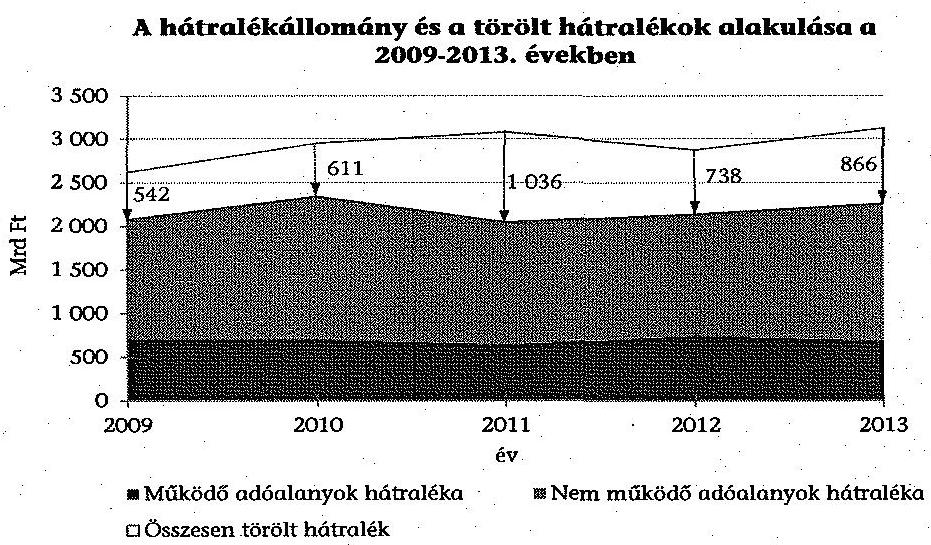

A 2009. évről a 2013. évre az adó- és vámszakmai terület által nyilvántartott hátralékállomány 2078,5 Mrd Ft-ról 2260,9 Mrd Ft-ra nőtt (8,8%), amelynek döntő része - átlagosan a 97,1%-a - adószakmai volt. Ugyanezen időszakban a hátralékállománynak a teljesített adó- és járulékbevételekhez mért aránya 26,1%-ról 23,8%-ra csökkent. A hátralékállomány emelkedésének ütemét mérsékelte, hogy az ellenőrzött időszakban közel 3800 Mrd Ft hátralékot töröltek elévülés, behajthatatlanság, tartozás mérséklés, illetve a felszámolási eljárásokhoz kapcsolódóan. Ezen időszakban a várható megtérülés szempontjából kedvezőtlen tendencia volt, hogy a nem működő adózói hátralékok aránya az összes hátralékállományon belül 66,5%-ról (1382,8 Mrd Ft) 69,8%-ra (1578,1 Mrd Ft) emelkedett.

A hátralékállomány az adószakmai területen - a cégbírósági törlés miatti behajthatatlanság megállapítása, az elévülés, illetve az évülést követően a hátralék összegének a nyilvántartásból való kivezetése késedelmes végrehajtása miatt - nem tartalmazott pontos adatokat. A jövedéki adó esetében a hátralékállomány azért nem volt pontos, mivel az ellenőrzött időszakban a végrehajtási jog tekintetében elévült, illetve behajthatatlan hátralékokat is tartalmazott.

---

Mindemellett a 2011-2013. években az adózók által visszaigényelt, határidő előtt visszautalt összegeket is hátralékként mutatták ki év végén. Az éves átlagos hátralékállományhoz viszonyítva 17024 M Ft-ra, jövedéki adó területén 138,6 M Ft-ra becsülhető a hátralékállományt indokolatlanul növelő tartozásállomány nagysága.

Az adószakmai terület által törölt hátralékok éves összege a 2009. évi 542,4 Mrd Ft-ról 2013. évre 857,7 Mrd Ft-ra nőtt (58,1%). A hátralékok törlésének jogcímei között meghatározó a felszámolási eljárás miatti törlés volt, amely a törölt hátralékoknak 2009-ben a 66,0%-át, 2013-ban 74,4%-át tette ki. A vámszakmai terület - a nyilvántartó rendszer hiányosságai miatt - nem tudott adatot szolgáltatni a 2009-2010. években törölt hátralékokról annak ellenére, hogy belső szabályzataiban előírta a törlés okainak kód szerinti beazonosítását. Az integrációt követően a vámszakmai terület által törölt hátralékok értéke a 2011. évi 2,2 Mrd Ft-ról 2013. évre 8,1 Mrd Ft-ra nőtt.

Az adóhatóságnak - az Art.-ban és belső szabályzataiban foglaltak szerint - az adózói tartozásokat meghatározott feltételek bekövetkezése esetén törölnie kellett. A véletlen mintavétellel kiválasztott és ellenőrzött évültetéssel törölt hátralékok 86,6%-ánál nem tartották be a 30 napos általános ügyintézési határidőt. Nem volt megoldott a hátralékok elévülésének olyan módon történő nyomon követése, amely az Art.-ban előírt határidőben biztosította volna az elévült hátralékok törlését. Az ellenőrzött, behajthatatlanság miatt törölt hátralékok 28,6%-ában az adózó jogerős törlése és hátralékának végleges törlése közötti időtartam meghaladta a 180 napot. Ezek hozzájárultak ahhoz, hogy a hátralékállományban behajthatatlan, illetve elévült tartozások is szerepeltek.

A végrehajtási eljárás az Art.-ban előírtak ellenére az adószakmai területen nem indult meg haladéktalanul, de legkésőbb 8 napon belül az összes lejárt esedékességű tartozás legalább 18,9%-a esetében. Az eljárás megindítása a helyszínen ellenőrzött, befejeződött végrehajtási eljárások esetében a hátralék keletkezését követően átlagosan 207 napot vett igénybe. A Ctv.-ben előírtak ellenére, az érintett cégek legalább 51,2%-ánál nem értesítették a Cégbíróságot a cégbírósági bejegyzésre kötelezett vállalkozás elleni végrehajtási eljárás megindításáról. A végrehajtási eljárások megindítása az Art.-nak megfelelő végrehajtható okiratok alapján történt. A helyszíni eljárások legalább 32,4%-ánál azonban az alkalmazott jegyzőkönyvek a Vht. előírásai ellenére nem tartalmazták a végrehajtható okirat megnevezését, a követelés jogcímét, összegét.

Az APEH/NAV a 2009-2013. években évente 232,8-204,0 Mrd Ft - csökkenő összegű és arányú - olyan működői adózói hátralékállományt mutatott ki, amelynek hátralékkezelése érdekében nem tett intézkedéseket. A hátralékkezelésbe nem vont hátralékok behajthatóság és elévültség szerinti rendszeres felülvizsgálatát sem jogszabály sem belső szabályzat nem követelte meg. Rendszeres felülvizsgálat hiányában fennállt a kockázata annak, hogy jelentősebb összegű hátralék évült el, illetve követelés vált behajthatatlanná úgy, hogy közben végrehajtási cselekményt nem foganatosítottak.

A tartozás mérséklési kérelmek legalább 64,1%-ánál, a fizetési könnyítési kérelmek legalább 41,7%-ánál előfordult, hogy az eljárási illetéket az adózók nem fizették meg az eljárások lefolytatását megelőzően. Az Art. előírásai sze-

---

rint az eljárást az illeték megfizetésének hiányában is le kellett folytatni. Az APEH/NAV az eljárási illeték megfizetésére vonatkozó kötelezettséget - saját szabályzataiban foglaltak ellenére -, a kérelem beérkezését követő 5-10 munkanapon belül nem írta elő a mérséklési kérelmek legalább 41,8%-ánál, a fizetési könnyítési kérelmek legalább 13,3%-ánál. A kérelmek elbírálásakor nem minden esetben tartották be az Art. és Ket. által előírt eljárási határidőket. Amennyiben az adózó a fizetési könnyítésben meghatározott határidőben nem teljesítette kötelezettségét, jelentős időbeli különbséggel (4-13 hó elteltével) intézkedtek a tartozásnak az adózó folyószámlájára való visszarendezéséről.

A végrehajtói letéti számla vezetésére vonatkozó szabályozás és gyakorlat a 2009-2011. években eltért egymástól. A gyakorlatban a végrehajtói letéti számlavezetés ügyviteli munkafolyamatait a VHR informatikai rendszerben végezték, de ezt a vonatkozó belső szabályzat nem tartalmazta. A letéti számlákra beérkezett befizetések rendezésére, felosztására, továbbutalására - ezek hiányában zárolására - a belső szabályzatokban előírt három, 2012-től öt munkanapos határidők betartásának figyeléséről az informatikai rendszerben (VHR) nem készíthetők kimutatások. A feladat értékeléséhez kapcsolódó központi mutató (összes rendezetlen tétel/öt banki napra eső átlag befizetési tételek darabszáma) nem biztosította az előírt határidő ellenőrzését. A vámszakmai területen szintén nem volt megoldott a vámigazgatóságok által kezdeményezett végrehajtói letéti elszámolások - belső szabályzatban előírt - határidőben történő megvalósításának figyelése. A határidők betartásáról utólag csak a dokumentumok egyedi (tételes) ellenőrzésével lehetett meggyőződni.

A felszámolás alatt álló szervezetekkel szemben fennálló követeléseit az APEH/NAV az Art. felhatalmazása alapján megkötött engedményezési megállapodások és a vonatkozó belső szabályzatok szerint az MKK Zrt.-re engedményezte. A 2008-2009. években kötött engedményezési megállapodásokhoz kapcsolódó keretszerződést a miniszter jóváhagyta, az Art. előírásai ellenére a részletszabályok miniszteri jóváhagyása nem történt meg. A 2009-2010. években 158,7 Mrd Ft követelésállományt engedményeztek. Az APEH az Art. 2010-ben módosult előírásai ellenére nem írt ki pályázatot és - az előző évben kötött megállapodás alapján - követeléseket engedményezett az állami tulajdonú MKK Zrt. részére. Az MKK Zrt. részére 2010-ben engedményezett követelésállomány összege 43,9 Mrd Ft volt. Az engedményezési megállapodásokban foglalt határidőket nem minden esetben tartották be, mivel késedelemmel adtak át legalább 156,2 Mrd Ft követelést, a felszámolót késedelemmel értesítették az átadott követelés állomány legalább 85,1%-ánál. Az ellenőrzött években az APEH/NAV összességében 1006 Mrd Ft hátralékállományt, ezen belül 616,7 Mrd Ft tőkekövetelést engedményezett. A követelésekért az MKK Zrt. 4,1 Mrd Ft - a megállapodásoknak megfelelő - vételárat fizetett. Az átadott hátralékállomány 0,4%-a, (a tőkekövetelés 0,7%-a) térült meg. A különbséget hitelezői veszteségként kivezették a nyilvántartásból, csökkentve ezzel a hátralékállományt. Az MKK Zrt. tájékoztatása szerint az átvett hátralékokból befolyt bevétele a 2011-2013. években elmaradt a tervezettől, a NAV részére kifizetett ellenértéket sem érte el.

A külső szervek részéről érkezett megkeresések alapján az adóhatóságnak behajtásra átadott követelések összege és tételszáma az ellenőrzött időszakban több mint a kétszeresére emelkedett (32,2 Mrd Ft-ról 76,4 Mrd Ft-ra, illetve

---
 végzett behajtási feladatok évről évre terhelték a hátralék-behajtási tevékenység ellátását, erre külön munkaköröket nem alakítottak ki. A megkeresések alapján a követelések nyilvántartásba vétele az összes megkeresés legalább 14,0%-ában a saját szabályzatban előírtakhoz képest késedelmesen történt. A véletlen mintavétellel kiválasztott és ellenőrzött megkeresések 46,7%-ában a végrehajtás eredményes volt, felosztása és továbbutalása szabályszerűen megtörtént.

Az adózásban betöltött meghatározó súlyuk ellenére, a kiemelt adózói körben - a többi ellenőrzött területhez hasonlóan - az adóztatásra és ellenőrzésre vonatkozó belső szabályozók kialakítása, a KAIG ügyrend ${ }_{1,2,3}$ és az egyéb belső szabályozó eszközök hatályba léptetése, aktualizálása a jogszabályokban előírtakkal nem volt minden esetben összhangban, illetve kiadásuk a jogszabályi változásokat követően késedelemmel, vagy nem történt meg. A közvetlen adók területén az információcsere szabályairól szóló 1030/2011. NAV eljárási rendet a megváltozott jogszabályi előírások ellenére nem aktualizálták. Hiányos volt az ellenőrzéseket támogató informatikai rendszerek szabályozottsága, mivel a KAT, valamint a RADAR rendszer eljárási rendjét a 2013. december 31-ig nem készítették el. A belső szabályozókban nem írtak elő egységes kódszámrendszer használatát a megbízólevél törlése okának rögzítéséhez, amelynek következtében az informatikai rendszer (REV) bármilyen karakter rögzítését elfogadta. A törölt megbízólevelek 5,1%-ában a megbízólevél törlésének oka kizárólag a REV rendszerből nem volt megállapítható.

A nagy adóteljesítményű adózók kiemelt adózóvá minősítése, illetve az adóalanyok nyilvántartása során alkalmazott eljárás - az illetékességi szabályok 2013-tól hatályos változása következtében - három esetben (az ellenőrzöttek 6,0%-ánál) nem felelt meg a NAV Korm. rendeletben, ebből egy esetben a vonatkozó belső eljárási rendben foglaltaknak sem. Az ún. „hároméves szabály" hibás, az APEH/NAV Korm. rendelet előírásainak nem megfelelő alkalmazása következtében az ellenőrzött időszakban a megelőző években kiemelt adózónak minősülő, de a tárgyévre a jogszabályban meghatározott értékhatárt el nem érő 55 adózó - nagy adóteljesítményű adózóként - helytelenül, a KAIG-tól a területileg illetékes adóigazgatósághoz került.

Az APEH/NAV az ellenőrzött időszakban nem vezetett nyilvántartást az Art.-ban előírt, egyes törvényi ellenőrzési kötelezettségeiről (végelszámolás esetén, ÁSZ elnöke felhívására, adópolitikáért felelős miniszter utasítása, magánnyugdíj pénztári megkeresésre történő ellenőrzés). Nem vezettek nyilvántartást továbbá a NAV eljárásrend szerint kötelezően ellenőrizendő kiemelt adózókról.

Az Art. 2011 végéig hatályban volt előírásai szerint a legnagyobb adóteljesítménnyel rendelkező 3000 adózót - köztük a kiemelt adózókat - az állami adóhatóság köteles volt rendszeresen ellenőrizni (legalább háromévente) valamennyi adónem és költségvetési támogatás vonatkozásában. Az APEH/NAV a 2009-2011. években nem tartotta be teljes körűen a törvényi előírásokat, mivel hat (az érintett kiemelt adózók 1%-ának megfelelő) adózót nem ellenőriztek.

Az APEH/NAV nem tartotta be teljes körűen saját belső szabályzatait. A helyszínen ellenőrzött kiemelt adózók 8%-a (négy adózó) esetében - annak ellenére,

---

hogy a belső szabályzat szerint az átfogó ellenőrzés terjedelmének legalább két teljes adóévnek kellett lennie, és rendelkeztek két ellenőrzéssel le nem zárt adóévvel -, csak egy-egy évet ellenőriztek. 33 működő adózó - az érintettek 6,7%-a - ellenőrzése elmaradt annak ellenére, hogy a megelőző két évben nem kezdődött, nem fejeződött be náluk átfogó ellenőrzés ${ }^{7}$.

A kiutalás előtti ellenőrzésre történő kiválasztás alapján a 2009-2013. években a kiemelt adózók által benyújtott, visszaigénylést tartalmazó, előzetes informatikai szűrést követően fennmaradt áfa bevallásoknak a 7,0-21,6%-át ellenőrizték. Ez azt jelentette, hogy az ellenőrzött időszakban a visszaigénylést tartalmazó áfa bevallást benyújtó 1037 adózóból 405 adózó (39,1%) bevallását legalább egyszer ellenőrizték.

A NAV belső szabályzatai nem írták elő egyértelműen, hogy az ellenőrzésekről vezetett nyilvántartás mely része kell tartalmazza az ellenőrzésre kiválasztás módszerét és az ellenőrzés közvetlen okát, így a REV lapokon rögzített vizsgálatelrendelési ok-kód és informatikai alkód alapján a kiválasztás módszere nem minden esetben volt beazonosítható. Az ellenőrzések megindítása megfelelt az Art. előírásainak, a kiállított megbízólevelek az ellenőrzött esetek 31,2%-ánál azonban nem tartalmazták a kötelező adattartalmat. Az egyes adókötelezettségek teljesítésére irányuló ellenőrzéseknél alkalmazott megbízólevelek nem tartalmazták, hogy azok mely adókötelezettségre irányultak. A feltárt hibák a kontrollrendszer - benne az ellenőrzési nyomvonal és a kockázatkezelési rendszer - kiépítésének a hiányosságait jelzik.

A 2011-től működő EUROFISC nemzetközi adatcsere mechanizmus az EU tagállamok által működtetett korai riasztó rendszer az áfa csalás elleni küzdelem területén. Az együttműködésben való részvétel jogi alapját a Tanács 904/2010/EU rendelete teremtette meg, amely kötelező erővel bír és közvetlenül alkalmazandó Magyarországon. A rendelet szerint az egyes tevékenységi területeken a részvétel önkéntes, amelyről az egyes tagállamok jogosultak dönteni.

Magyarország az ellenőrzött időszakban a kialakított négy tevékenységi terület (WF1-WF4) mindegyikének munkájában részt vett. A részvételről az illetékes hatóságként kijelölt Központi Kapcsolattartó Iroda (KKI) vezetője döntött, annak ellenére, hogy az információk cseréjére igen, de a tagállam nevében történő döntéshozatalra nem kapott felhatalmazást.

Az egyes tevékenységi területek EUROFISC kapcsolattartói (ELO-k), valamint közülük a nemzeti kapcsolattartó kijelölésre került. A kapcsolattartó tisztviselőknek az illetékes hatóság (KKI) általi kijelöléséről hozott konkrét vezetői döntés(ek) alapdokumentumai, valamint felhatalmazásaik a rendelet alapján megvalósuló közvetlen információcsere lefolytatására azonban nem álltak rendelkezésre. A kapcsolattartók ellátták a Tanács 904/2010/EU rendeletében meghatározott feladatokat. A feladatellátásban érintett személyek munkaköri leírásaiban az ellenőrzött időszakban az EUROFISC-hez kapcsolódó feladatok nem szerepeltek, a közszolgálati tisztviselőkről szóló 2011. évi CXCIX. törvény előírásai ellenére.

[^0]
[^0]:    ${ }^{7}$ Az előírás vonatkozott a 3000 legnagyobb adóteljesítményű adózóra is.

---

A NAV ügyrendekben és belső eljárási rendekben szabályozta az EUROFISC hálózat működtetésével kapcsolatos feladatokat. A szabályozások összhangban voltak a Tanács 904/2010/EU rendeletében foglaltakkal. Az EUROFISC feladatok ellátását szabályozó KH Ügyrend ${ }_{1,2,3}$ azonban nem tartalmazta - az Ámr. ${ }_{2}$ ben és az Ávr.-ben előírt általános szabályok szerinti - az érintett feladat- és hatásköröket annak ellenére, hogy azok más szabályzatokban sem szerepeltek.

A NAV adatbázisaiban az EUROFISC adatcsere teljesítéséhez szükséges információk rendelkezésre álltak. Az ellenőrzött időszakban az érkezett megkeresésekre a NAV visszajelzett mindhárom, az adatcserével érintett területen. Más országok felé a WF1 és a WF3 tevékenységi területeken kezdeményezett megkereséseket. Magyarország aktív részvételét mutatja, hogy az érkezett megkeresések 55,0%-ához kapcsolódóan visszajelzés történt. A kiküldött megkeresésekre azonban 62,9%-ban nem érkezett visszajelzés. Az EUROFISC működésének eredményeként a NAV áfa csalásokban részt vevő vállalkozásokat azonosított, továbbá a kapcsolódó, megállapítással zárult 281 adóellenőrzés 19,6 Mrd Ft adó megállapítást tett.

Az ellenőrzött időszakban az APEH - az IBSZ ${ }_{2}$.ben előírt Üzemeltetési Szabályzat kivételével - szabályozta az informatikai rendszerek fejlesztéséhez, módosításához kapcsolódó feladatok ellátását. A korábban kiadott szabályzatok 2012. január 1-jétől történt hatályon kívül helyezését követően a NAV a 2012-2013. években javította, de nem tette teljes körűvé az informatikai feladatellátás szabályozottságát. Az ellenőrzött időszak végéig nem történt meg a NAV IBSZ ${ }_{1,2}$ -ben előírtak közül az Alkalmazásfejlesztési Szabályzat, az adószakmai rendszerek üzletmenet folytonossági terveinek, az ellenőrzött rendszerek vonatkozásában az üzemeltetési szabályzatoknak, valamint a mentési szabályzatban előírt mentési stratégiáknak a kiadása. Az informatikai rendszerek fizikai védelmére vonatkozó szabályozási környezetet kialakították.

Az elektronikus árverések lebonyolítását támogató Elektronikus Árverési Felületet (EÁF) külső vállalkozó üzemeltette, amelyhez a 2010. évi CLVII. törvényben előírt miniszteri felmentéssel rendelkeztek. Az EÁF rendszerre vonatkozóan megkötött szerződések és szerződésmódosítások a 223/2009. (X. 14.) Korm. rendelet előírásai ellenére nem tartalmazták az előírt informatikai biztonsági követelményeket. Az EÁF rendszer külső auditálása a 223/2009. (X. 14.), illetve a 83/2012. (IV. 21) Korm. rendelet előírásai ellenére nem történt meg.

Az APEH/NAV rendelkezett informatikai biztonsági szabályzattal, valamint adatvédelmi és adatbiztonsági szabályzattal, továbbá kialakította az informatikai biztonsági követelmények belső ellenőrzésének szervezeti feltételeit. A 223/2009. (X. 14.) Korm. rendelet, valamint az APEH/NAV SzMSz ${ }_{1,2,3,4}$ előírásai ellenére, az APEH/NAV nem gondoskodott az informatikai biztonsági felelős kijelöléséről.

Az APEH szabályozta a felhasználói hozzáférések menedzsmentjét, amely lehetővé tette a feladatkörhöz rendelt jogosultsági csoportok meghatározását. NAV által kiadott Felhasználói Jogosultságkezelési Szabályzat egységes keretbe foglalta a felhasználói jogosultságok igényléséhez, kiadásához és felügyeletéhez kapcsolódó feladatokat, a dokumentációs követelményeket. Az ellenőrzött

---

időszakban azonban az Informatikus Jogosultságkezelési Szabályzat nem került kiadásra.

Az APEH IBSZ ${ }_{2}$ meghatározta a naplózásra vonatkozó szabályokat és kapcsolódó feladatokat. A NAV informatikai rendszereinek naplózása, a kapcsolódó feladatok és követelmények a 2012. január 1-től 2013. április 3-ig tartó időszakban szabályozatlanok voltak.

Az ellenőrzött időszakban az APEH/NAV kezdeményezett jogszabályváltozásokat a hátralékok keletkezésének csökkentése és a minél nagyobb arányú beszedhetősége érdekében. Az ellenőrzött évek mindegyikére készített intézkedési terveket, feladatterveket a hátralékállomány csökkentése érdekében. A miniszter adóztatási feladataihoz a szükséges és kért adatokat biztosította.

Az ellenőrzött időszakban a PM, illetve az NGM a hátralékkezelési és végrehajtási eljárási, valamint a kiemelt adózói kört érintően ellenőrzést nem végzett.

A jelen ellenőrzést megelőző hat ÁSZ ellenőrzésből ${ }^{8}$ négy utóellenőrzését az egyes évek zárszámadási ellenőrzései során az ÁSZ elvégezte, jelentéseiben szerepeltette. A további két ÁSZ ellenőrzés javaslatai körül a jelen ellenőrzés során érintett témákhoz kapcsolódó három javaslatot az érintettek hasznosították.

Az Állami Számvevőszékről szóló 2011. évi LXVI. törvény 33. § (1) bekezdésében foglaltak értelmében a jelentésben foglalt megállapításokhoz kapcsolódó intézkedési tervet köteles az ellenőrzött szervezet vezetője összeállítani, és azt a jelentés kézhezvételétől számított 30 napon belül az ÁSZ részére megküldeni. Amennyiben az intézkedési tervet határidőben nem küldi meg a szervezet, vagy az nem elfogadható, az ÁSZ elnöke a hivatkozott törvény 33. § (3) bekezdés a)-b) pontjaiban foglaltakat érvényesítheti.

Az ellenőrzés intézkedést igénylő megállapításai és javaslatai:

# a Nemzeti Adó- és Vámhivatal elnökének, a NAV Kiemelt Adó- és Vám Főigazgatóság főigazgatójának, valamint a Regionális adó főigazgatóságok főigazgatóinak 

Az APEH/NAV elnöke - továbbá 2012-től a hátralékkezelés, a végrehajtás területére a regionális adó főigazgatóságok, valamint a kiemelt adózói körben végzett adóztatás és ellenőrzés munkafolyamataira a KAFIG (2013-tól KAVFIG és a regionális adó főigazgatóságok) vezetői az Ámr. 145/B. § (1) bekezdésben, 2010-től az Ámr. ${ }_{2}$ 156. § (2) bekezdésben, 2012-től Bkr. 6. § (3) bekezdésében előírt ellenőrzési nyomvonalat - 2013. február 1-jétől a Dél-alföldi Regionális Adó Főigazgatóság, 2013. szeptember 30-tól a Közép-dunántúli Regionális Adó Főigazgatóság kivételével - nem készítettek.

[^0]
[^0]:    ${ }^{8}$ a 0616, a 0928, a 0947, az 1117, az 1297 és az 13080 számon közzétett ÁSZ jelentések

---

Javaslat:
Intézkedjen a jogszabályi előírásoknak megfelelően a felelősségi és információs szinteket és kapcsolatokat, irányítási és ellenőrzési folyamatokat tartalmazó, azok nyomon követését és utólagos ellenőrzését biztosító ellenőrzési nyomvonal elkészítéséről, és rendszeres aktualizálásáról.

# a Nemzeti Adó- és Vámhivatal elnökének 

1. Az elnök a közvetlen adók területén történő információcsere szabályairól szóló 1071/B/2008. APEH utasításban és az 1030/2011. NAV eljárási rendben határozta meg a másik államba irányuló, illetve onnan érkező információkérés feladatait, az automatikus és spontán információcsere, valamint az egyidejű ellenőrzések és kézbesítés iránti megkeresések eljárásrendjét. Az 1030/2011. NAV eljárási rend aktualizálása a jogszabályi
 változásoknak megfelelően 2013. december 31-ig nem történt meg annak ellenére, hogy az abban hivatkozott Art. 57. § (6)-(9) bekezdései és 58-59. §-ai hatálytalanok voltak, az Art. 92. § (10) bekezdése pedig 92. § (12) bekezdésre változott 2012. január 1-től.

Javaslat:
Intézkedjen az 1030/2011. NAV eljárási rendnek a megváltozott jogszabályi előírásokkal összhangban történő aktualizálásáról.
2. Az eljárási illeték megfizetésére vonatkozó kötelezettség előírása az adózók folyószámláján a mérséklési kérelmek legalább 41,8%-a, a fizetési könnyítési kérelmek legalább 13,3%-a esetében a kérelem beérkezését követő 5-10 munkanapon belül nem történt meg. Ez ellentétben áll az 1036/B/2009. APEH utasítással módosított 1095/B/2008. APEH utasítás 4. § (1) bekezdésében, az 1021/B/2010. APEH utasítás 4. § (1) bekezdésében, az 1080/2011. NAV eljárási rend 8. pontjában, az 1073/2012. NAV eljárási rend 8. pontjában, az 1060/2013. NAV eljárási rend 10. pontjában foglaltakkal.

A tartozás mérséklési és fizetési könnyítési kérelmek elbírálásakor az APEH/NAV nem minden esetben tartotta be az Art. 5/A. § (1) bekezdésében és a (3) bekezdés g) pontjában előírt, valamint a Ket. 33. § (7) bekezdése által meghatározott eljárási határidőket. Az adózóknak küldött hiánypótlási felszólításokat 8 napos határidőn túl kézbesítették a véletlen mintavétellel kiválasztott, hiányos mérséklési kérelmek 50,0%-a, a fizetési könnyítési kérelmek 28,6%-a esetében. Továbbá az ügyintézési határidő meghosszabbításáról nem a 30 napos határidő lejárta előtt, vagy egyáltalán nem értesítették az ügyfelet a véletlen mintavétellel kiválasztott, hosszabbítással érintett mérséklési kérelmek 38,8%-a, a fizetési könnyítési kérelmek 30,8%-a esetében.

Javaslat:
a) Intézkedjen, hogy az eljárási illeték megfizetésére vonatkozó kötelezettség előírása az adózók folyószámláján minden esetben megtörténjen a vonatkozó belső eljárásrendben foglalt határidőn belül.

---

b) Intézkedjen, hogy a mérséklési és fizetési könnyítési kérelmek elbírálásakor az APEH/NAV minden esetben tartsa be a jogszabályokban meghatározott eljárási határidőket.
3. Adószakmai területen az Art. 5/A. § (2) bekezdésében előírtak ellenére nem indult meg minden esetben haladéktalanul, de legkésőbb 8 napon belül az Art. 150. § (3) bekezdés szerinti végrehajtási eljárás. A véletlen mintavétellel kiválasztott tételek ellenőrzése alapján, az összes lejárt esedékességű tartozás legalább 18,9%-a esetében nem indult haladéktalanul, de legkésőbb 8 napon belül végrehajtási eljárás. Az ellenőrzött 121 befejeződött végrehajtási eljárás esetében a hátralék keletkezését követően átlagosan 207 nap múlva indult meg a végrehajtási eljárás.

Javaslat:
Intézkedjen, hogy a jogszabályban előírtaknak megfelelően, a hátralék keletkezését követően minden esetben haladéktalanul, de legkésőbb 8 napon belül indítsák meg a végrehajtási eljárást.
4. A végrehajtási eljárások egy részében helyszíni eljárásra került sor. A helyszíni eljárások során alkalmazott jegyzőkönyvek nem feleltek meg teljes körűen a Vht. 35. § (2) bekezdés c)-d) pontok előírásainak, mivel hiányzott a végrehajtható okirat megnevezése, illetve a követelés jogcíme, összege.

Javaslat:
Intézkedjen, hogy a helyszíni eljárások során alkalmazott jegyzőkönyvek minden esetben feleljenek meg a jogszabály előírásainak.
5. Az adóhatóságnak - az Art. 162. és 164.-164/A. §-ai, valamint az 1051/B/2009. APEH utasítás és az 1006/2012. NAV eljárási rend szerint - törölnie kellett az adózói tartozást, ha az adózó által benyújtott tartozás mérséklési kérelmet megalapozottnak találta, azt elévülés vagy végrehajtatlanság miatt véglegesen behajthatatlanná nyilvánította, az adózót a cégbíróság törölte, valamint meghatározott esetekben a felszámolási eljárás során. A felszámolás alatt levő adózók követeléseit az adóhatóságnak törölnie kellett a felszámolást lezáró végzés és a követelésről való lemondás alapján, valamint az MKK Zrt.-re engedményezés miatt. Az Art. 162. § (1) bekezdése szerint a végrehajtási eljárást lefolytató adóhatóság az adózó tartozását a végrehajtási jog elévüléséig tartja nyilván. Az Art. nem rendelkezett külön arról, hogy az adóhatóság mennyi időn belül köteles elvégezni az Art. 164-164/A. §-okban meghatározott elévülési idő leteltét (a végrehajtási jog elévülését) követően a törlést, azért arra az Art. 5/A. § (1) bekezdés szerinti általános ügyintézési határidőt (30 napot) kellett alkalmazni. Az 1067/2011. NAV eljárási rend 62-64. pontjai rendelkeztek arról, hogy az adótartozás végrehajtásához való jog elévülése után a tartozást az eljárást lefolytató adóhatóságnak kell törölnie. A gyakorlatban az elévülés tényének, időpontjának megállapítását, az elévült tételek visszamenőleges hatályú törlését azon adóügyi munkatárs végezte, aki tevékenysége során észlelte az elévülés beálltának tényét. A véletlen mintavétellel kiválasztott és ellenőrzött évültetéssel törölt hátralékok 86,6%-ánál nem tartották be az Art. 5/A. § (1) bekezdés szerinti 30 napos határidőt. Az elévülés és a törlés közötti időtartam 33,3%-ban 30-180 nap, 20%-ban 180-360 nap közötti volt, míg 33,3%-ban meghaladta az egy évet.

---

Javaslat:
Intézkedjen a hátralékok elévülésének olyan módon történő nyomon követéséről, amely a jogszabályi határidőben biztosítja az elévült hátralékok törlését. Végeztesse el az adózói hátralékállományban az indokolt törléseket a jogszabályban foglalt határidőn belül, valamint a NAV eljárási rendekben foglalt előírásoknak megfelelően.
6. A nagy adóteljesítményű adózók kiemelt adózóvá minősítése, illetve az adóalanyok nyilvántartása során - az illetékességi szabályok 2013. évtől hatályos változása következtében - a NAV Központi Hivatal Ellenőrzési Főosztály eljárása három esetben (az ellenőrzöttek 6,0%-ánál) nem felelt meg a NAV Korm. rendelet 19. § (1) bekezdés b) pontja szerinti illetékességi szabályoknak, egy esetben az 1042/2011. NAV eljárási rend VIII. fejezet 63. b) pontjának sem, mivel az adózókat a NAV kiemelt adózóként mutatta ki a Közép-magyarországi Regionális Adó Főigazgatóságon.

Az APEH Korm. rendelet 16. § (1) bekezdése, valamint a NAV Korm. rendelet 19. § (2) bekezdése szerint, amennyiben „az adózó az adóév első napján megfelel a jogszabályban meghatározott feltételeknek, amelyek alapján kiemelt adózónak minősül és a KAIG hatáskörébe tartozik, a KAIG hatáskörébe utalt adóügyekben 3 adóéven át akkor is a KAIG jár el, ha ezen időtartam alatt bármely adóévben az adózó bevallása szerint nem felel meg az előírt értékhatárnak" (hároméves szabály). A NAV a hároméves szabályt az értékhatár elérésének utolsó éve helyett, a kiemelt adózói körbe kerüléstől számította. Az APEH/NAV KH Ellenőrzési Főosztálya NAV Korm. rendelet 19. § (2) bekezdésével ellentétes gyakorlata következtében az ellenőrzött időszakban a megelőző években kiemelt adózónak minősülő, de a tárgyévre meghatározott értékhatárt el nem érő adózók közül 55 adózó - nagy adóteljesítményű adózóként - a területileg illetékes adóigazgatósághoz került.

Javaslat:
a) Intézkedjen, hogy a nagy adóteljesítményű adózók kiemelt adózóvá minősítése, illetve az adóalanyok nyilvántartása során a NAV tartsa be a vonatkozó kormányrendelet és NAV eljárási rend előírásait.
b) Intézkedjen, hogy a megelőző években kiemelt adózónak minősülő, de a tárgyévre meghatározott értékhatárt el nem érő adózók esetében minden esetben tartsák be a vonatkozó kormányrendeletben előírt illetékességi szabályokat.
7. Az 1010/2012. és az 1058/2013. NAV eljárási rendek 8.5. pontjának előírása ellenére a törölt megbízólevelek 5,1%-ában (60 db) a törlés oka kizárólag a REV rendszerből nem volt megállapítható.

Javaslat:
Intézkedjen, hogy a NAV eljárási rend előírásának megfelelően a törölt megbízólevelek esetében a törlés oka a nyilvántartási rendszerből is minden esetben megállapítható legyen.
8. Az APEH/NAV ellenőrzési osztályai által kiállított megbízólevelek adattartalma az ellenőrzött esetek 31,2%-ánál nem felelt meg az Art. 93. § (6) bekezdés előírásainak, mivel az Art. 87. § (1) bekezdés c) pontja szerinti, az egyes adókötelezettségek teljesítésére irányuló ellenőrzéseknél alkalmazott megbízólevelek nem tartalmazták, hogy az ellenőrzések mely adókötelezettségre irányultak. Ez a tervezett ellenőrzések közel egyharmadát jelentette.

Javaslat:
Intézkedjen, hogy az egyes adókötelezettségek teljesítésére irányuló ellenőrzéseknél kiállított megbízólevelek adattartalma a vonatkozó jogszabály előírásainak megfelelően tartalmazza, hogy az ellenőrzések mely adókötelezettségre irányulnak.
9. Az Art. 90. § (2) bekezdésében előírt, rendszeres ellenőrzési kötelezettség hatályon kívül helyezésével 2012. január 1-től előtérbe került a kockázatelemzésen alapuló ellenőrzésre kiválasztás. A kiemelt adózók átfogó ellenőrzésre történő kiválasztása során nem tartották be teljes körűen az 1047/B/2004. és az 1114/B/2010. APEH utasításban, valamint az 1070/2011. NAV eljárási rendben előírtakat. Az ÁSZ által a helyszínen ellenőrzöttek közül négy adózó esetében - az 1114/B/2010. APEH utasítás 10. § (3) bekezdését, valamint az 1070/2011. NAV eljárási rend 10.3 pontját figyelmen kívül hagyva -, egy-egy adóévet ellenőriztek annak ellenére, hogy az ellenőrzéssel le nem zárt adóévek száma alapján lehetőség volt legalább két teljes adóév vizsgálatára. Az 1047/B/2004. és az 1114/B/2010. APEH utasítás 10. § (6) bekezdésében, valamint az 1070/2011. NAV eljárási rend 10.6 pontjában foglaltakkal ellentétben, 33 működő adózó - az érintettek 6,7%-a - ellenőrzése elmaradt annak ellenére, hogy a megelőző két évben nem kezdődött, illetve nem fejeződött be náluk átfogó ellenőrzés.

Javaslat:
Intézkedjen a kiemelt adózók - költségvetési bevételek alakulásában betöltött arányukra figyelemmel - belső szabályzatoknak megfelelő rendszeres, átfogó (valamennyi adónemre és költségvetési támogatásra kiterjedő) ellenőrzéséről.
10. A NAV ellenőrzött időszakban hatályos informatikai biztonsági szabályzatai a rendszerek üzemeltetési feladatainak és eljárásrendjének szabályzatként történő kiadását írták elő. Az ellenőrzött rendszerek vonatkozásában a NAV IBSZ$_{1}$ 54. pontjában és a NAV IBSZ$_{2}$ 2. számú mellékletében meghatározott üzemeltetési szabályzatok kiadása nem történt meg. A rendszerek alkalmazási szintű üzemeltetési feladatait az üzemeltetési dokumentációk tartalmazták, amelyek tartalmilag megfeleltek az üzemeltetési szabályzatnak, a dokumentációk szabályzatként történő kiadására azonban nem került sor.

A NAV 2012. január 16-ától hatályos, 2007/2012. számú Mentési és Archiválási Szabályzatának 23. pontja a mentések konkrét, számon kérhető jellemzőit meghatározó un. „mentési stratégiák" kidolgozását írta elő (pl. mentés tárgya, tartalma, gyakorisága). Az ellenőrzött rendszerek vonatkozásában a Mentési és Archiválási Szabályzatban előírt mentési stratégiák kiadása az ellenőrzött időszakban nem valósult meg.

Az adószakmai informatikai rendszerek kiesésének esetére vonatkozóan a NAV IBSZ$_{1}$ 55. pont előírása ellenére az üzletmenet folytonossági tervek, a NAV IBSZ$_{2}$ 155. pont és 2. számú melléklet előírása ellenére a működésfolytonosság biztosításáról szóló szabályzat kiadása az ellenőrzött időszakban nem valósult meg.

---

Javaslat:
a) Intézkedjen a NAV IBSZ 2. számú mellékletében meghatározott üzemeltetési szabályzatok teljes körű kiadásáról.
b) Intézkedjen a vonatkozó szabályzatban előírt mentési stratégiák kiadásáról.
c) Intézkedjen a vonatkozó belső szabályzatban előírt informatikai rendszerek kiesésének esetén működésfolytonosság biztosításáról szóló szabályzat kiadásáról az adószakmai területen.
11. Az EÁF rendszer külső auditálása a 223/2009. (X.14.) Korm. rendelet 30. § (1) bekezdés előírásai ellenére nem történt meg. A Biztonsági Főosztály az árverési felület létrehozását követően 2008 márciusában belső biztonsági audit keretében ellenőrizte a rendszer megfelelőségét. Az audit informatikai biztonsági kockázatokat tárt fel, és javaslatot tett a rendszer külső szervezet általi auditálására, valamint az APEH által biztonsági felülvizsgálati eljárásrend kialakítására. A jelentést követően nem valósult meg sem a rendszer külső auditja, sem a feltárt informatikai biztonsági hiányosságok utóellenőrzése. A rendszer auditálásának elmaradásával a NAV 2012. április 22-től nem felelt meg a 83/2012. (IV. 21) Korm. rendelet 11. § (2) bekezdés f) pont előírásainak.

Javaslat:
Intézkedjen a vonatkozó kormányrendelet előírásainak megfelelően az EÁF rendszer külső auditálásának elvégzéséről.
12. Az elektronikus közszolgáltatás biztonságáról szóló 223/2009. (X. 14.) Korm. rendelet 14. § (3) bekezdése informatikai
 biztonsági felelős kijelölését írta elő, aki felelős az előírt informatikai biztonsági követelmények betartásáért. Az APEH és a NAV ellenőrzött időszakban hatályos SzMSz-ei – a 223/2009. (X. 14.) Korm. rendelet előírásaival összhangban – meghatározták az informatikai biztonsági felelős feladatait, azonban nem gondoskodtak az informatikai biztonsági felelős kijelöléséről. A NAV SzMSz 72. § a Korm. rendelet hatályon kívül helyezését követően is meghatározta az informatikai biztonsági felelős feladatait a Korm. rendeletben meghatározott feladatkörrel. A pozíció az ellenőrzött időszak végéig nem került betöltésre.

Javaslat:
Intézkedjen az informatikai biztonsági felelős kijelöléséről.

---

# II. RÉSZLETES MEGÁLLAPÍTÁSOK 

## 1. IrányítóSZERVI feladATELLÁTÁs És az APEH/NAV SZERVEZE-

TI MŰKÖDÉSÉNEK SZABÁLYOZOTTSÁGA

### 1.1. A minisztérium irányítószervi feladatellátása

Az APEH irányítását, 2011-től a NAV felügyeletét az adópolitikáért felelős miniszter a PM SzMSz 2. számú függelékében foglaltak szerint a költségvetési bevételekért és a számvitelért felelős szakállamtitkár, az NGM SzMSz 1. számú melléklet 3.5. pont 23. §-a szerint az adó- és pénzügyekért felelős államtitkár útján látta el. A miniszter adóztatási feladatai ellátásához felhasználta a szervezettől rendszeresen és eseti jelleggel bekért információkat, adatokat.

Az ellenőrzött időszakban az APEH alapító okiratát négyszer, a NAV alapító okiratát háromszor módosították. Az alapító okiratok módosításait időben követték a szervezeti és működési szabályzatok módosításai, amely módosításokkal a miniszter eleget tett az Áht 49. § (5) bekezdés c) pontjában, az Áht 9. § (1) bekezdés e) pontjában⁹, illetve a 2010. évi XLIII. törvény 71. § (1) bekezdésében előírt feladatának.

A NAV tv. 87. § (1) bekezdése alapján a Nemzeti Adó- és Vámhivatal (NAV) 2011. január 1-jével az Adó- és Pénzügyi Ellenőrzési Hivatal és a Vám- és Pénzügyőrség összeolvadásával jött létre. A NAV SzMSz⁴-et a nemzetgazdasági miniszter a NAV tv. 89. §-ában előírt 2011. május 2-i határidőt követően, 2011. július 1-jével adta ki, rendelkezéseinek visszamenőleges, 2011. január 1-jétől történő alkalmazásával.

Az APEH/NAV 2009., 2010., 2011., 2012. és 2013. évi tevékenységéről szóló, szöveges értékelést magukban foglaló szakmai beszámolókat az azokhoz mellékelt táblázatok adatai alapozták meg. E beszámolók hozzájárultak az adópolitikáért felelős miniszter – a 169/2006. (VII. 28.) Korm. rendelet 5. § (2) bekezdés a) pontja, illetve a 212/2010. (VII. 1.) Korm. rendelet 75. § (3) bekezdés h) pontja szerinti – adópolitikáért való felelőssége körében, az APEH irányításának, illetve a NAV felügyeletének ellátásához.

A pénzügyminiszter/nemzetgazdasági miniszter, mint az irányító, felügyeletet ellátó szerv vezetője a gazdálkodás és a közfeladat-ellátás szakmai irányítása, szervezése, szabályozása, ellenőrzése keretében határozott meg követelményeket az APEH/NAV feladatai ellátásához, a közpénzekkel és az erőforrásokkal való szabályszerű és hatékony gazdálkodáshoz. Ennek keretében a 2009-2013. években az APEH/NAV feletti irányítási, felügyeleti jogkör gyakorlásának fontos eszköze volt, hogy az éves költségvetési törvényekben meghatározott bevételi előirányzatok, illetve a 2009-2010. években a pénzügyminiszter

[^0]
[^0]:    ⁹ Figyelemmel az Áht 9. § (7) bekezdés b) pontjára a 2012. évben.

---

által előírt egyéb feltételek teljesülése¹⁰ esetén a miniszter negyedévente előirányzat módosítást engedélyezhetett a személyi juttatások és a munkaadókat terhelő járulék előirányzata terhére, amelyet az érdekeltségi jutalom fizetésére használhattak fel.

A pénzügyminiszter/nemzetgazdasági miniszter az APEH/NAV számára meghatározta a negyedévente fizethető érdekeltségi jutalomnak (prémium előlegek)¹¹ a költségvetési törvényekben évente meghatározott bevételek együttes éves előirányzata teljesítésétől függő negyedéves bevételi terveit (negyedéves premizálási küszöbértékeket) az éves költségvetési törvényekben foglaltak szerint¹².

A pénzügyminiszter a 2009. és a 2010. évre az APEH számára szakmai – köztük a hátralékkezelési végrehajtási tevékenység eredményességével összefüggő – feltételeket is meghatározott¹³. A 2011-2013. évi költségvetési törvények a negyedéves bevételi tervek meghatározásán kívül nem nyújtottak lehetőséget az adópolitikáért felelős miniszter számára egyéb feltételek előírására.

# 1.2. Az alapító okiratban és az SzMSz-ben rögzített feladatok 

Az APEH Korm. rendelet 10. § (1) bekezdése és a NAV tv. 13. § (1) bekezdése rögzítette az APEH/NAV feladatait és felsorolta mindazon tevékenységeket, amelyeket még ellátott. Mindkét jogszabályhely a) és b) pontjában azonosan rögzítettek szerint az APEH/NAV feladata az adó megállapítása, beszedése, nyilvántartása, végrehajtása, visszatérítése, kiutalása és ellenőrzése, feltéve, ha törvény vagy kormányrendelet eltérően nem rendelkezik. A NAV tv. 13. § (1) bekezdés c) pontja rögzítette a szervezet feladataként a közösségi vámjog végrehajtásáról szóló 2003. évi CXXVI. törvény hatálya alá tartozó kötelező befizetésekhez kapcsolódóan az előzőekben felsorolt tevékenységeket.

Az alapító okiratok az APEH/NAV feladatait a jogszabályokkal egyezően, az alapító okiratok tartalmi követelményei szerint rögzítették. Jelentős alapító okiratban rögzített feladatváltozás – az állami adóhatósági és vámhatósági feladatok integrációja miatti változás kivételével – az ellenőrzés hatókörét érintően az ellenőrzött időszakban nem volt.

Az APEH SzMSz¹,²,³ az APEH Korm. rendelet 1-2. §-aiban és 10. §-ában foglaltaknak megfelelően, és az alapító okiratokkal összhangban tartalmazta az APEH jogállását, központi és területi szerveit, feladatait.

Az APEH SzMSz² kiadása a 2009. december 31-én kelt egységes szerkezetű alapító okiraton alapult és az APEH Korm. rendelet 2010. január 1-jétől hatályos módosí-

[^0]
[^0]:    ¹⁰ A 2009. évi költségvetési törvény 45. § (2) bekezdése és a 2010. évi költségvetési törvény 32. § (2) bekezdése alapján a pénzügyminiszter NAV elnökének írt levelei tartalmazták az egyéb feltételeket.
    ¹¹ A PM/NGM által a témával összefüggő levelekben használt terminológiák.
    ¹² 2009. évi költségvetési törvény 45. § (2) bekezdés, 2010. évi költségvetési törvény 32. § (2) bekezdés, 2011. évi költségvetési törvény 31. § (2) bekezdés, 2012. évi költségvetési törvény 28. § (2) bekezdés, 2013. évi költségvetési törvény 26. § (2) bekezdés
    ¹³ A pénzügyminiszter 1294/9/2009. és 697/12/2010. iktatószámú leveleiben.

---

tása¹⁴ szerinti jogállást érintő változások – köztük az önállóan működő és gazdálkodó közhatalmi szervként történő besorolás – átvezetésére irányult.

Az APEH SzMSz³ kiadását az irányító szerv változása (PM helyett NGM), valamint az APEH Korm. rendelet 2010. október 1-jétől hatályos módosítása¹⁵ alapján a területi szerveket érintő változások – regionális igazgatóságok helyett regionális főigazgatóságok és megyei (fővárosi) igazgatóságok önálló szervezeti egységként történő létrehozása – indokolták.

A NAV SzMSz a NAV 2010. december 22-i alapító okiratával, annak változásával, a NAV tv. 1-12. §-aival, valamint a NAV Korm. rendelet 1-2., 5-8/A. §-aiban foglaltakkal összhangban tartalmazta a szervezet jogállását, a szervezeti egységeket, a NAV szerveinek felügyeletét, irányítását.

# 1.3. Szervezeti felépítés, szervezeten belüli feladatmegosztás 

Az APEH Korm. rendelet 1. §-ában foglaltak szerint az APEH jogállását tekintve központi hivatal és a pénzügyminiszter/adópolitikáért felelős miniszter irányítása alatt álló önállóan működő és gazdálkodó költségvetési szerv volt. Az APEH az ellenőrzött időszakban az éves költségvetési törvények fejezetrendszerében a Pénzügyminisztérium fejezetén belül volt megtalálható.

Az APEH Korm. rendelet 2. § (1)-(3) bekezdései alapján az APEH szervezetét 2009. január 1-jén a központi szervek (Központi Hivatal (KH), a Számítástechnikai és Adóelszámolási Intézet (APEH-SZTADI), az Oktatási Intézet), a Kiemelt Adózók Igazgatósága (KAIG) és a területi szervek (regionális igazgatóságok¹⁶) alkották. Az APEH Korm. rendelet 3. § (2) bekezdése alapján – a KH kivételével – mindegyik szerv jogi személyiséggel rendelkező, részben önállóan gazdálkodó, részjogkörrel rendelkező költségvetési szerv volt. A regionális igazgatóságok megyénként és a fővárosban szervezeti egységeket működtettek az APEH Korm. rendelet 2. § (5) bekezdésében és az alapító okiratban foglaltak szerint.
2010. január 1-jétől megszűnt az igazgatóságok, a KAIG és a két intézet¹⁷ költségvetési szervi önállósága, és az APEH Korm. rendelet módosított 3. §-a¹⁸ alapján jogi személyiségű szervezeti egységeknek minősültek. A változás az ellenőrzés hatókörébe tartozó Központi Hivatal Felszámolási és Végrehajtási Főosztálya (FVF) szervezeten belüli elhelyezkedésére és osztályszerkezetére nem volt hatással, nem változott az APEH SzMSz¹ 110-113. §-aiban foglaltak szerinti főosztályon belüli három osztály, a Felszámolási, a Hátralékkezelési és a Végrehajtási Osztály. A KAIG az APEH SzMSz¹ 87. § (4) bekezdésében meghatározottak szerint ellenőrzési, adóügyi és végrehajtási, központosított ellenőrzési, különös

[^0]
[^0]:    ¹⁴ a 318/2009. (XII. 29.) Korm. rendelet
    ¹⁵ a 241/2010. (IX. 24.) Korm. rendelet
    ¹⁶ Közép-Magyarországi, Észak-Magyarországi, Észak-Alföldi, Dél-Alföldi, Nyugat-Dunántúli, Közép-Dunántúli, Dél-Dunántúli regionális igazgatóságok
    ¹⁷ APEH-SZTADI és az Oktatási Intézet
    ¹⁸ módosította a 318/2009. (XII. 29.) Korm. rendelet 1. § (4) bekezdés

---

hatásköri, valamint működtetési szakterületekre tagozódott, amelyek főosztályokból és osztályokból épültek fel. A KAIG az APEH SzMSz² 1/h. számú melléklete szerint 2010. augusztus 23-tól 11 főosztályból és 39 osztályból (önálló, vagy főosztályhoz tartozó) állt.

Az APEH szervezeti rendszerében 2010. október 1-jétől következett be jelentős változás az APEH Korm. rendelet módosításával¹⁹. A területi szervek rendszere kétszintűvé – ezáltal az APEH három szintű szervezetté – vált. A hét regionális igazgatóságból hét regionális főigazgatóság alakult, valamint területi szervekként létrejöttek a megyei igazgatóságok és a három fővárosi igazgatóság. Az APEH központi szervei közül az APEH-SZTADI helyett Informatikai Intézet jött létre. Új főigazgatóságként hozták létre a Kiemelt Ügyek és Adózók Főigazgatóságát (KÜAF), valamint létrehozták a Kiemelt Ügyek Igazgatóságát (KÜIG) a Kiemelt Adózók Igazgatósága mellett. A területi szervek, a KÜAF, a KÜIG, és a KAIG közigazgatási hatásköri önállósággal rendelkeztek a hozzájuk telepített hatáskörök tekintetében. A KAIG szervezeti felépítése változott, az APEH SzMSz³ 8. számú melléklete szerint négy főosztály és 16 osztály (önálló, vagy főosztályhoz tartozó) lett. A KÜAF az APEH SzMSz³ 6. számú melléklete szerint két főosztályból és nyolc osztályból (ebből öt önálló osztály) állt. A változás miatt a Központi Hivatal FVF szervezeti felépítése nem változott, feladatai változtak az APEH SzMSz 1. számú melléklet 54-57. pontjai szerint. Az APEH feladatait 2010. december 31-i megszűnésekor központi szervei, területi szervei, a KÜAF, a KÜIG és a KAIG útján látta el.

A NAV tv. 87. § (1) bekezdése alapján kiadott megszüntető okirat szerint az APEH és a VP 2010. december 31-én szűnt meg és a 2011. január 1-jével hatályba lépett alapító okirattal jött létre a NAV²⁰. A NAV tv. 1-12. §-ai, illetve a NAV Korm. rendelet 1-2., 5-8/A. §-ai szerint a NAV jogállását tekintve kormányhivatal²¹, önállóan működő és gazdálkodó központi költségvetési szerv, amely a központi költségvetésben önálló fejezetet képez. Irányítását a Kormány, felügyeletét a nemzetgazdasági miniszter látja el. Feladatait a központi szervei (a Központi Hivatal, a bűnügyi főigazgatóság, az informatikai feladatokat ellátó intézet, valamint a humánerőforrás-fejlesztési feladatokat ellátó intézet)
 és területi szervei útján látja el.

A NAV feladatait a NAV tv. 3. §-ban meghatározottaknak megfelelően - az APEH-hoz hasonlóan - háromszintű rendszerben, központi, középfokú és alsó fokú szervei útján látta el. A NAV Korm. rendelet 1. §-a rögzítette a NAV szervezetét, és 1-4. számú mellékletei tartalmazták a központi szervek, az adóztatási szervek (középfokú és alsó fokú), a vámszervek (középfokú és alsó fokú), és a Bűnügyi Főigazgatóság (középfokú és alsó fokú) szerveinek a székhelyét és illetékességét.

A NAV Korm. rendelet 1. § (2) bekezdése szerint a NAV központi szervei a Központi Hivatal, az Informatikai Intézet, és a NAV tv. 3. § (3) bekezdése értelmében önállóan működő és gazdálkodó költségvetési szervek a NAV Bűnügyi Főigazgatóság, és a humánerőforrás-fejlesztési feladatokat ellátó intézet (NAV Képzési, Egészségügyi és Kulturális Intézet). A NAV Korm. rendelet 1. § (2) bekezdésében 2011. évben központi szervként felsorolt Integrált Informatikai és Telekommunikációs Intézet a NAV SzMSz4 8. § szerint nem jött létre, a NAV Korm. rendelet 1. § (2) bekezdés d) pontja - amely nevesítette a szervezetet - 2012. január 1-től törlésre ${ }^{22}$ került.

A NAV megalakulásával a Központi Hivatal FVF szervezeti egységeit és azok feladatait az NAV KH ügyrendje tartalmazta. A NAV KH ügyrend ${ }_{5}$ 1. számú melléklete szerint a Központi Hivatal FVF továbbra is három osztályból állt, a Felszámolási és Monitoring Osztályból, a Végrehajtási Fejlesztéseket Támogató Osztályból, és a Végrehajtási és Fizetési Kedvezmények Osztályból. A nevükben változó osztályoknál a feladatok tekintetében a korábbi feladatok közül egy feladat másik osztályhoz került, egy osztály feladata bővült, egy osztály feladatköre csökkent ${ }^{23}$.

A NAV főigazgatóságai, igazgatóságai (köztük a középfokú és alsó fokú szervek) szervezeti felépítésére, egységeire vonatkozóan az NAV SzMSz 4 7. § (3) bekezdése alapján a 3. számú függelék ajánlásokat tartalmazott, az ügyrendekben határozták meg azok szervezeti felépítését, a szervezeti egységeket.

A NAV elnöke 2012. december 4-én a beszedési, valamint egyes szervek és szervezeti egységek szervezeti hatékonyságának növelését és szakmai irányának korszerűsítését célzó átszervezést rendelt el ${ }^{24}$. A döntés következtében 2013. január 1-jétől a Kiemelt Ügyek és Adózók Adó Főigazgatósága (KAFIG) átalakulásával új egységes középfokú adó- és vámszervként jött létre a Kiemelt Adó és Vám Főigazgatóság (KAVFIG), megszüntetésre került a KÜIG. Az átszervezés miatti szervezeti, valamint a feladat- és hatáskört is érintő változások a NAV Korm. rendelet módosításával ${ }^{25}$ 2013. január 1-jétől hatályossá váltak. Az NAV SzMSz4-ben a változást a nemzetgazdasági miniszter 2013. április 25-én hatályba lépett módosítással ${ }^{26}$ hagyta jóvá. A KAVFIGnak, mint új középfokú szervnek az ügyrendje 2013. április 4-én lépett hatályba.

# 1.4. Szervezeten belüli irányítási eszközök 

Az APEH/NAV tevékenységének, működésének irányítása/vezetése keretében kiadható belső szabályozási eszközöket a szervezeti és működési szabályzatok állapították meg. Az APEH tevékenységére vonatkozón az elnök jogosult volt elnöki intézkedéseket (utasítást, irányelvet, tájékoztatót), utasítás mellékleteként szabályzatot kibocsátani, illetve az elnök, az elnökhelyettes, az igazgató, a szakigazgató és a főosztályvezető körlevelet kiadni, továbbá az igazgató utasítást kibocsátani ${ }^{27}$. Az APEH SzMSz 33. § (6) bekezdése alapján - a létrehozott háromszintű szervezet és főigazgatói feladatkör miatt átkerültek a főigazgatóhoz a korábbi igazgatói jogosultságok (utasítás és körlevél kiadása), a 46. § (2) bekezdése alapján az igazgató jogosultsága körlevél kiadására korlátozódott. Az APEH elnöke az irányítási/vezetési eszközök kiadási rendjét a 1137/B/2007., majd a 2010. október 8-tól az 1067/B/2010. számú APEH Elnöki utasításban szabályozta.

A NAV SzMSz 4 3. §-ában 2011. július 1-től rögzítették a NAV tevékenységének, működésének szabályozására alkalmazható irányító eszközöket, 2012. július 31-től hatályos módosításával ${ }^{28}$ pedig módosították az alkalmazható irányító eszközök megnevezését (NAV rendelkezések) és körét.

A NAV elnöke a NAV tevékenységének, működésének szabályozására alkalmazható irányító eszközök, illetve rendelkezések kiadásának rendjét az 1/2011., 1/2012. NAV utasításban, az 1001/2011. NAV eljárásrendben, majd a 2021/2012., illetve a 2150/2012. NAV szabályzatban szabályozta. A jogszabályi változásokkal való összhang megteremtése és az aktuális feladatok átvezetése érdekében szabályozta a NAV tevékenységének, működésének szabályozására alkalmazható irányító eszközök hatályát, és elrendelte felülvizsgálatukat.

Az 1/2011. NAV utasítás 24. § (3) bekezdése szerint a 2010. december 31-ig kiadott utasítások és irányelvek 2012. január 1-jén hatályukat vesztették, és a 2010. december 31-ig kiadott tájékoztatókat 2011. december 31-ig lehetett alkalmazni. Az 1/2011. NAV utasítás 24. § (1)-(2) bekezdése elrendelte, hogy 2011. december 31-ig a hatályban lévő valamennyi intézkedést (utasítás, irányelv, tájékoztató) felül kell vizsgálni és döntést kell hozni, hogy szükséges-e normatív utasítás kiadása, és az új utasítás kiadását elő kell készíteni.

# 1.5. A szervezeti teljesítménymérési és teljesítményértékelési rendszer 

Az elnök az ellenőrzött időszak minden évére szabályozta az APEH/NAV szervezeti teljesítményértékelési, illetve teljesítménymérési rendszerét. Az APEH elnöke 2009-ben és 2010-ben utasítást adott ki ${ }^{29}$ az APEH szervezeti teljesítményértékelési rendszeréről. A NAV elnöke a 2011. évben a szervezeti teljesítményértékelés rendszeréről, a 2012. és a 2013. évben pedig a szervezeti teljesítménymérés rendszeréről szabályzatokat alkotott ${ }^{30}$. A 2009-2010-ben kiadott utasítások, valamint a 2011-ben kiadott szabályzat célja az APEH/NAV kiemelt feladatainak és az adott évre vonatkozó költségvetési törvényben foglaltak teljesítésének elősegítése volt a szervezeti teljesítményértékelés eszközével. A 2012-2013-ban kiadott szabályzat célja pedig a NAV kiemelt feladatainak

elősegítése volt a szervezeti teljesítménymérés eszközével. A követelményeket a vonatkozó utasítások és szabályzatok 1. §-ában határozták meg.

A kiemelt feladatokat 2009-ben és 2010-ben intézkedési tervben ${ }^{31}$, 2011-ben intézkedési tervben és stratégiai tervben ${ }^{32}$, 2012-ben a felszámolási és végrehajtási szakterület 2012. évi kiemelt feladatai címú dokumentumban, 2013-ban a NAV elnöke által kiadmányozott iránymutatásban ${ }^{33}$ határozták meg.

A szervezeti teljesítményértékelési rendszer, illetve a szervezeti teljesítménymérési rendszer keretében kialakították a hátralékkezelési és végrehajtási tevékenység, valamint a kiemelt adózókhoz kapcsolódó feladatellátás teljesítményének értékelésre vonatkozó mérőszámokat. A teljesítmények mérését egységes mutatószámok és elvek alapján végezték, az esetleges eltérő elvárások az eltérő feladatokból, funkcionális különbségekből adódtak. Az ellenőrzött területek teljesítményének mérését és értékelését 2009-ben 46, 2010-ben 45, 2011-ben 39, 2012-ben 52, 2013-ban pedig 53 db mutató alapján végezték.

A teljesítmény értékelésre és mérésére vonatkozó mérőszámokhoz kapcsolódó adatok gyűjtését - a szervezeti teljesítményértékelési és szervezeti teljesítménymérési rendszer keretében - biztosították. Az alapadatok különböző informatikai rendszerekből (VHR, ATAR) származtak. A mutatókat 2009-ben és 2010-ben a PRO-VIR, 2011-ben MI-SZTER, 2012-től a NAVIR elnevezésű informatikai rendszerben jelenítették meg, amelyek szakmai felügyeletét a Tervezési és Elemzési Főosztály, informatikai felügyeletét az APEH-SZTADI, illetve a NAV Informatikai Intézet látta el.

Az informatikai rendszerek az alapadatokból a mutatókat kiszámították és egységes felületen a szabályzás szerinti tartalommal és formában megjelenítették. A számszaki mutatók teljesítményadatát az aktuális informatikai rendszerek igazgatóságonként jelenítették meg.

A 2009. és 2010. évekre a teljesítményértékelési mutatók - köztük a felszámolási, végrehajtási, valamint a kiemelt adózói szakterületre vonatkozók - igazgatóságok szerinti teljesítéséről az elnöki utasításokban meghatározott öt időpontra vonatkozóan ${ }^{34}$ értékeléseket készítettek, amelyeket az elnöki értekezletek fogadtak el, illetve az APEH/NAV elnöke hagyta jóvá ${ }^{35}$.

A 2009-2011. évekre vonatkozó 1020/B/2009. és 1018/B/2010. számú utasítás, valamint az 5/2011. számú szabályzat tartalmazta a mutatók meghatározását, számításának módját, az elvárt követelményt, a mutatóért felelős szervezeti egységet, informatikai forráshelyét, a teljesítmények pontozásos értékeléséhez tartozó pontszámokat, a teljesítmények pontozással történő értékelésének időpontjait.

2012-től teljesítménymérési rendszer működött, amelyben a NAV szervezeti teljesítményének mérése négy nézőpontból - bevételek, szolgáltató tevékenység, hatósági tevékenység, szervezeti irányítás és működtetés - történt. A 2013/2012. NAV szabályzat az egyes számított mutatók esetében határkövetelményeket fogalmazott meg.

A megfigyelt és gyűjtött adatok, az azokból képzett mutatók biztosították a hátralékkezelési és végrehajtási tevékenység, valamint a kiemelt adózókhoz kapcsolódó feladatellátás elemzését, értékelését. Az APEH/NAV éves beszámolói szerint a kialakított mérőszámokat, mutatókat és azok kiértékelése alapján készített beszámolókat felhasználták a feladatellátás során.

# 2. Az APEH/NAV szakmai feladatellátásához kapcsolódó belső kontrollrendszer 

Az APEH/NAV tekintetében 2011. december 31-éig az elnök felelősségi körébe tartozott a jogszabályok ${ }^{36}$ által a költségvetési szerv vezetője részére előírt, az államháztartási belső kontrollrendszer megszervezésének és hatékony működtetésének a feladata. E feladatot 2012. január 1-jétől a Bkr. 3-4. §-ai tartalmazták, továbbá a 2. § nc) és na)
 pontjai külön rendelkeztek arról, hogy a költségvetési szerv vezetőjének a NAV központi szervei, középfokú adóztatási és vámszervei vezetői tekintendők. A KH vonatkozásában továbbra is az elnököt illette a felelősség a belső kontrollrendszer kialakításáért és működtetéséért.

### 2.1. A hátralékkezelési és végrehajtási eljárási, valamint a kiemelt adózói körben végzett adóztatási és ellenőrzési feladatok kontrollkörnyezetének kialakítása

A hátralékkezelési és a végrehajtási, valamint a kiemelt adózói körben végzett adóztatási és ellenőrzési feladatokra vonatkozó irányítási eszközök kiadása megfelelt az 1137/B/2007., majd a 2010. október 8-tól hatályos 1067/B/2010. APEH, illetve az 1/2011. és az 1/2012. NAV utasításokban foglaltaknak.

A hátralékkezelési és a végrehajtási, valamint a kiemelt adózói körben végzett adóztatási és ellenőrzési feladatokra vonatkozó kontrollkörnyezetet az APEH/NAV elnöke - továbbá a regionális adó főigazgatóságok és a KAFIG (2013-tól KAVFIG) vezetői - kialakították, a belső szabályozásban azonban nem, vagy késedelmesen történtek meg a jogszabályi változásokat követő módosítások.

[^0]
[^0]:    ${ }^{36}$ Áht; 88. § (1) bekezdés e) pont, 2010. augusztus 15-től a 94. § (1) bekezdés e) pont.

---

Az APEH/NAV elnöke - továbbá 2012-től a hátralékkezelés, a végrehajtás területére a regionális adó főigazgatóságok, valamint a kiemelt adózói körben végzett adóztatás és ellenőrzés munkafolyamataira a KAFIG (2013-tól KAVFIG és a regionális adó főigazgatóságok) vezetői - az Ámr.; 145/B. § (1) bekezdésben, 2010-től az Ámr. 2 156. § (2) bekezdésben, 2012-től Bkr. 6. § (3) bekezdésében előírt ellenőrzési nyomvonalat - kettő régió ${ }^{37}$ kivételével - nem készítettek. A jogszabályok szerint az ellenőrzési nyomvonalak bemutatják a felelősségi és információs szinteket és kapcsolatokat az irányítási és ellenőrzési folyamatokban, továbbá biztosítják azok nyomon követését és utólagos ellenőrzését.

# 2.1.1. A hátralékkezelési és végrehajtási eljárási tevékenység kontrollkörnyezete 

Az adótartozás behajtásával kapcsolatos feladatok szabályait 2011. december 31-ig a 2006/B/2005. APEH irányelv ${ }^{38}$ tartalmazta, amelyet azonban az időközben bekövetkezett jogszabályváltozások ellenére nem módosítottak.

A 2006/B/2005. APEH irányelvben a Ctv. 26. § (5)-(6) bekezdéseivel ellentétesen 2008. december 27-től nem írták elő az elektronikus utat a Cégbíróság értesítésére, az Art. 149. §-ával ellentétesen 2009. július 9. után is lehetővé tették a biztosítási intézkedésként meghatározott dolog zárlatát, valamint 2009. november 1-jétől az Art. 152. §-a változása ellenére a „hatósági átutalási megbízás" helyett továbbra is az „azonnali beszedési megbízás" kifejezést használták.

A 2006/B/2005. APEH irányelv 2012. január 1-jei hatályon kívül ${ }^{39}$ helyezését követően az adótartozások behajtásával, ezen belül a hátralékkezeléssel, a végrehajtási eljárások kezdeményezésével és lefolytatásával kapcsolatos NAV szintű eljárásrendet nem adtak ki. Az egységes, átfogó részletszabályozás kiadását az adóigazgatóságok sajátos helyzetére (adózói kör összetétele, pénzügyi-vagyoni jellemzői, az adóigazgatóságok eltérő szervezeti felépítése) tekintettel nem tartották indokoltnak ${ }^{40}$. Az egységes szabályozással nem rendelkező eljárások döntési szabadságot, ezáltal - a jogszabályok keretei között - egymástól eltérő eljárási lehetőséget biztosítottak a feladatellátás során.

A fentiektől eltérően az ÉMRAFI évente aktualizált körlevelet adott ki a végrehajtási eljárások kezdeményezésének és lefolytatásának ügyviteli szabályozására.

Az ellenőrzött időszakban az Art. előírásai szerint szabályozták a késedelmi pótlék számításának, közlésének, kezelésének ${ }^{41}$, a közbeszerzéshez kapcsolódó kifizetés céljából igényelt együttes adóigazolás kiállításával egyidejűleg érvényesítendő adóhatósági követelés foglalásának ${ }^{42}$, az elévült adótartozás törlésének ${ }^{43}$, adótartozás behajthatatlanná minősítésének, a behajthatatlan adótartozás nyilvántartásának, kezelésének, valamint törlésének ${ }^{44}$ eljárásrendjét. Az ellenőrzött időszak alatt alakították ki 2009. október 12-től - a jogintézmény 2009. január 1-jei létrehozását követően több mint kilenc hónappal - a végrehajtási átvezetés ${ }^{45}$, 2010. március 16-tól a végrehajtás felfüggesztésének ${ }^{46}$, 2010. szeptember 9-től a visszatartási jog gyakorlásának ${ }^{47}$, 2013. április 11-től az adó-végrehajtási eljárás során felmerült költségek megállapításának és megfizetésének ${ }^{48}$, 2013. szeptember 6-tól a mögöttes, illetve a quasi mögöttes felelősség érvényesítésének ${ }^{49}$ eljárási szabályait.

A Ctv. 26. § (4) bekezdésében foglaltaktól szűkebb körben határozták meg a végrehajtási átvezetés esetében a Cégbíróság értesítését az 1024/2013. NAV eljárásrendben ${ }^{50}$.

Az 1024/2013. NAV eljárási rend 4. pontja szerint a „végrehajtási átvezetés esetén csak abban az esetben kell a cégbíróságot a végrehajtás megindításáról értesíteni, ha az adózó tartozása az intézkedést követően sem szünik meg teljes mértékben, annak beszedésére tehát további végrehajtási cselekményeket kell foganatosítani". Ezzel szemben a Ctv. 26. § (4) bekezdése mérlegelési lehetőség nélkül előírta, hogy a végrehajtást elrendelő hatóság elektronikus értesítést küld a Cégbíróságnak a végrehajtás elrendeléséről. A végrehajtási átvezetés az Art. 150/A. §-a alapján végrehajtási cselekmény.

Az adótartozások beszedésével, végrehajtásával, a fizetési kedvezmények (tartozás mérséklés, fizetési könnyítés) elbírálásával kapcsolatos tevékenységek egységes szervezeti és eljárási rendjének kialakítása a KH Felszámolási és Végrehajtási Főosztály - azon belül a Végrehajtási Osztály, 2013. február 11-től Végrehajtási és Fizetési Kedvezmények Osztály - feladatkörébe ${ }^{51}$ tartozott. A Felszámolási és Végrehajtási Főosztály felett az irányítási és felügyeleti jogkört az ellenőrzött időszakban az Elnökhelyettes I., 2010. augusztus 23-tól az Adóügyi, 2011. július 1-től az Adószakmai elnökhelyettes látta el.

[^0]
[^0]:    ${ }^{37}$ 2013. február 1-jétől a Dél-alföldi Regionális Adó Főigazgatóság, 2013. szeptember 30-tól a Közép-dunántúli Regionális Adó Főigazgatóság rendelkezett ellenőrzési nyomvonallal.
    ${ }^{38}$ Az irányelv irányító és felügyeletet biztosító intézkedés volt, amely ajánlást adott a jogszabály végrehajtásának fő irányára és módszerére, továbbá eligazítást nyújtott az ügyintézéssel összefüggő elvi és gyakorlati kérdésekben.
    ${ }^{39}$ Hatályon kívül helyezte az 1/2011. NAV utasítás 24. § (3) bekezdése.
    ${ }^{40}$ NAV 2014. augusztus 8-i tájékoztatása szerint
    ${ }^{41}$ 4/2007., 1/2009., 3/2010. APEH utasítások, 1015/2011. NAV eljárási rend

---

nyesítendő adóhatósági követelés foglalásának ${ }^{42}$, az elévült adótartozás törlésének ${ }^{43}$, adótartozás behajthatatlanná minősítésének, a behajthatatlan adótartozás nyilvántartásának, kezelésének, valamint törlésének ${ }^{44}$ eljárásrendjét. Az ellenőrzött időszak alatt alakították ki 2009. október 12-től - a jogintézmény 2009. január 1-jei létrehozását követően több mint kilenc hónappal - a végrehajtási átvezetés ${ }^{45}$, 2010. március 16-tól a végrehajtás felfüggesztésének ${ }^{46}$, 2010. szeptember 9-től a visszatartási jog gyakorlásának ${ }^{47}$, 2013. április 11-től az adó-végrehajtási eljárás során felmerült költségek megállapításának és megfizetésének ${ }^{48}$, 2013. szeptember 6-tól a mögöttes, illetve a quasi mögöttes felelősség érvényesítésének ${ }^{49}$ eljárási szabályait.

A Ctv. 26. § (4) bekezdésében foglaltaktól szűkebb körben határozták meg a végrehajtási átvezetés esetében a Cégbíróság értesítését az 1024/2013. NAV eljárásrendben ${ }^{50}$.

Az 1024/2013. NAV eljárási rend 4. pontja szerint a „végrehajtási átvezetés esetén csak abban az esetben kell a cégbíróságot a végrehajtás megindításáról értesíteni, ha az adózó tartozása az intézkedést követően sem szünik meg teljes mértékben, annak beszedésére tehát további végrehajtási cselekményeket kell foganatosítani". Ezzel szemben a Ctv. 26. § (4) bekezdése mérlegelési lehetőség nélkül előírta, hogy a végrehajtást elrendelő hatóság elektronikus értesítést küld a Cégbíróságnak a végrehajtás elrendeléséről. A végrehajtási átvezetés az Art. 150/A. §-a alapján végrehajtási cselekmény.

Az adótartozások beszedésével, végrehajtásával, a fizetési kedvezmények (tartozás mérséklés, fizetési könnyítés) elbírálásával kapcsolatos tevékenységek egységes szervezeti és eljárási rendjének kialakítása a KH Felszámolási és Végrehajtási Főosztály - azon belül a Végrehajtási Osztály, 2013. február 11-től Végrehajtási és Fizetési Kedvezmények Osztály - feladatkörébe ${ }^{51}$ tartozott. A Felszámolási és Végrehajtási Főosztály felett az irányítási és felügyeleti jogkört az ellenőrzött időszakban az Elnökhelyettes I., 2010. augusztus 23-tól az Adóügyi, 2011. július 1-től az Adószakmai elnökhelyettes látta el.

[^0]
[^0]:    ${ }^{42}$ 1095/B/2009. APEH utasítás, 1150/2011. NAV eljárási rend
    ${ }^{43}$ 1056/B/2008. APEH utasítás, 1067/2011. NAV eljárási rend
    ${ }^{44}$ 2007/B/2005., 2006/B/2005. APEH irányelvek, 1051/B/2009 APEH utasítás, 1006/2012. NAV eljárási rend
    ${ }^{45}$ 1103/2011. NAV eljárási rend
    ${ }^{46}$ 24/2010/FVF körlevél, 2011. május 26-tól az 1049/2011. NAV eljárási rend
    ${ }^{47}$ 1065/B/2010. APEH utasítás, 2011. október 10-től az 1100/2011. NAV eljárási rend
    ${ }^{48}$ 1034/2013. NAV eljárási rend
    ${ }^{49}$ 1084/2013. NAV eljárási rend
    ${ }^{50}$ Az adatszolgáltatás határidejét is szabályozó eljárásrendet - korábbi ÁSZ ellenőrzés javaslatára - adta ki a NAV elnöke.
    ${ }^{51}$ Az APEH SzMSz ${ }_{1}$ 113. § (1) bekezdés a-b) pontjai, APEH SzMSz ${ }_{2}$ 72. § a-c) pontjai, APEH SzMSz 1. számú mellékletének 57. a-c) pontjai, NAV KH ügyrend ${ }_{1}$ 54. a-c) pontjai, NAV KH ügyrend ${ }_{2}$ 55. a-c) pontjai és a NAV KH ügyrend ${ }_{3}$ 55. a-c) pontjai alapján.

---

Az 1/2011. NAV utasítás 24. § (3) bekezdése 2012. január 1-jétől hatályon kívül helyezte a korábbi években kiadott utasításokat és irányelveket. Az 1095/2012. NAV eljárási rend 2012. július 16-i hatályba lépéséig az adótartozások mérsékléséhez és a fizetési könnyítésekhez kapcsolódó tevékenységek szabályozatlanok maradtak, mert a KH Felszámolási és Végrehajtási Főosztály az eljárási szabályok előkészítését - az 1/2011. NAV utasítás 24. § (2) bekezdésében előírt feladatokat - késedelemmel végezte el ${ }^{52}$.

Az előkészítő munka során a tervezetet 2011. június 28-tól véleményezésre köröztették, az utolsó észrevétel szeptember 5-én érkezett. A vélemények átvezetése elhúzódott, és 2012. április 2-án, illetve 2012. június 25-én kezdeményezték a Jogi és koordinációs Főosztály főosztályvezetője felé az eljárásrend tervezet szignálását és a NAV elnöke felé a felterjesztését.

A NAV Korm. rendelet 10. § (1) bekezdés 2012. január 1-jei módosítása következtében az értékesíthető dolgok árverését és elektronikus árverését az adóigazgatóságok végezhették. Az 1067/2012. NAV eljárási rend 2012. május 8-i hatályba lépéséig a vám- és pénzügyőri, valamint bűnügyi szakterület eljárásai során lefoglalt dolgok elektronikus árverésen történő értékesítésének szabályairól szóló eljárás szabályozatlan maradt, a szignálási feladatok elhúzódása miatt.

A KH Felszámolási és Végrehajtási Főosztályának vezetője, a szakterület feladatához tartozó eljárási szabályok tervezetét véleményezésre 2012. január 30-án küldte meg az érintett főosztályoknak. A vélemények átvezetése után 2012. március 29-én, illetve 2012. április 10-én kezdeményezte a Jogi és koordinációs Főosztály főosztályvezetője felé az eljárásrend tervezet szignálását és a NAV elnöke felé a felterjesztését.

# 2.1.1.1. A letéti számla és a folyószámla-vezetés 

Adószakmai területen a végrehajtói letéti számla vezetéséhez kapcsolódó nyilvántartási és számlakezelési szabályokat 2011. december 31-ig az 1047/B/2001. APEH utasítás, 2012. február 13-tól az 1034/2012. NAV eljárási rend, illetve annak 2013. május 3-tól hatályos 1042/2013. számú módosítása tartalmazta. A Központi Hivatal Felszámolási és Végrehajtási Főosztálya a szakterület feladatához tartozó 1047/B/2001. APEH utasítás módosítására vonatkozó javaslatot véleményezésre a 2009-2011. években nem készített elő, amely miatt a végrehajtói letéti számla vezetésére vonatkozó szabályozás és a gyakorlat a 2009-2011. években eltért egymástól. A gyakorlatban a végrehajtói letéti számlavezetés ügyviteli munkafolyamatait (kötelezettség rögzítése, befizetések elszámolása, utalás, letéti karton-vezetés, statisztikai adatszolgáltatások) a VHR-ben ${ }^{53}$ végezték, azonban ezt az 1047/B/2001. APEH utasítás nem tartalmazta.

[^0]
[^0]:    ${ }^{52}$ A NAV tájékoztatása szerint, az új szabályozás kiadásáig az addigi joggyakorlatot folytatták.
    ${ }^{53}$ A hátralékkezelési és végrehajtási feladatok informatikai támogatására alkalmazott program, amelynek egyik modulja a „Letéti számlák" menüpont.

---

Az ellenőrzött időszakban a letéti számlakezeléssel kapcsolatos feladatok irányítása, felügyelete a KH Felszámolási és Végrehajtási Főosztálya - azon belül a Hátralékkezelési Osztály, 2013. február 11-től Végrehajtási Fejlesztéseket Támogató Osztály - feladatkörébe ${ }^{54}$ tartozott.

A letéti számlákra ${ }^{55}$ érkező befizetések rendezése, „haladéktalan felosztása" és a központi költségvetési számlákra, illetve egyéb számlákra „a lehető legrövidebb időn belül történő továbbutalása" a szabályozás szerint a letéti számlakezelők feladata volt. Az 1047/B/2001. APEH utasítás 3. § (7) bekezdése szerint „a banknapló alapján 3 munkanapon belül", az 1034/2012. NAV eljárási rend 29. pontja szerint „a tisztázást követően lehetőség szerint azonnal, de legkésőbb a bankkivonat kézhezvételét követő 5 munkanapon belül" kellett a letéti számlára befolyt összegekről rendelkezni, vagy intézkedni. Amennyiben a végrehajtói letéti számlára érkezett összeget 5 munkanapon belül nem lehetett felosztani (pl. felosztási tervre vár), zárolni kellett az 1034/2012. NAV eljárási rend 34. pontja szerint.

Az 1034/2012. NAV eljárási rend 29. pontja szerinti 5 munkanapon belüli rendezés követelményének betartásáról utólag a dokumentumok egyedi (tételes) ellenőrzésével lehetett meggyőződni. A letéti számla rendezésének értékelésére központi mutatót (a letéti számlára teljesített befizetések kezelése) képeztek, amelyet a szervezeti teljesítménymérési rendszerbe beépítettek és havonta értékelték alakulását. A mutatót (összes rendezetlen
 tétel/5 banki napra eső átlag befizetés tételek darabszáma) optimálisnak tekintették, ha az arány kevesebb volt 30%-nál. A mutató azonban nem biztosította az 5 munkanapon belüli rendezés követelményének ellenőrzését. A hátralékkezelési-, letéti számla kezelési osztályok vezetői a VHR-ben kontroll listák lekérdezésével győződhettek meg a rendezések megtörténtéről, amelyek eltérő módon történtek az egyes régiókban.

Az NYDRAFI az egy héten túli rendezetlen tételek állományáról kimutatást készített. Az ÉMRAFI-nál havonta jegyzőkönyvezésre került a letéti nyilvántartási rendszer pénzforgalmi oldalára vonatkozó egyezőség vizsgálat, amelyet a hátralékkezelési osztályvezető végzett.

A VHR informatikai rendszerben - a központi mutató számításán és kimutatásán kívül - nem készíthetők kimutatások a feladat határidőben történő elvégzésének figyelésére. Az adószakmai területen ${ }^{56}$ 2013. december 31-én a 250,0 Mrd Ft tárgyévi befizetésből - 0,01% - 28,4 M Ft (329 tétel), a tárgyévet megelőző évek 161,9 Mrd Ft befizetéseiből - 0,002% - 3,1 M Ft (151 tétel) tisztázatlan maradt.

Vámszakmai területen - az integrációt követően - a végrehajtói letéti számlán lévő befizetések folyamatos figyelemmel kísérése és az azonosítást követő

[^0]
[^0]:    ${ }^{54}$ Az APEH SzMSz ${ }_{1}$ 112. § (1) bekezdés a) pontja, APEH SzMSz ${ }_{2}$ 71. § a), c) pontjai, APEH $\mathrm{SzMSz}_{3}$ 1. számú mellékletének 56. a), c) pontjai, NAV KH ügyrend; 53. a), c) pontjai, NAV KH ügyrend; 54. a), c) pontjai és a NAV KH ügyrend; 54. a), c) pontjai alapján.
    ${ }^{55}$ Az 1034/2012. NAV eljárási rend 1. számú melléklete szerint 26 db végrehajtói letéti számla volt az adószakmai területen.
    ${ }^{56}$ A NAV 2014. május 19-én adott tájékoztatása szerint

---

elszámolása - az 5001/2012. FFF körlevél I. 2 pontja szerint ${ }^{57}$ - a végrehajtási cselekményt kezdeményező vámszerv ügyintézőjének feladata volt. A befizetések felülvizsgálatához a NAV Informatikai Intézete a belső intranetes portálon hetente közzétett kimutatást készített. Az ügyintézőnek kellett elkészíteni az adószakmai terület értesítésének kézhezvételétől, vagy a vámhatósági végrehajtói letét bevételi számlán lévő befizetés azonosításától számított 8 munkanapon belül az elszámolásról a tájékoztató levelet, és megküldeni az adózó részére. Az elszámolás-kezdeményezéseket, a beérkezett összegek helyességét a kiadmányozás előtt a felülvizsgálatra és jóváhagyásra kijelölt személyeknek kellett ellenőrizni. A tájékoztató levél kiadmányozását követő 3 munkanapon belül kellett a NAV Informatikai Intézetének intézkednie a végrehajtói letéti számlára végrehajtásból befolyt befizetések államháztartási számlákra történő átvezetéséről. Az 5001/2012. FFF körlevél I. 2 pontjában meghatározott határidőben történő rendezés követelményének betartásáról utólag a dokumentumok egyedi (tételes) ellenőrzésével lehetett meggyőződni. A végrehajtói letéti számla pénzforgalmi egyenlege a 2011. év végén 158,9 M Ft volt, majd a 2012. év végi 171,7 M Ft összeghez képest a 2013. év végére 74,3 M Ft-ra csökkent ${ }^{58}$.

Az elszámolatlan végrehajtói letéti számla tételeivel kapcsolatban 2012. évben valamennyi regionális parancsnokságtól intézkedést kért a KH Folyószámlafelügyeleti Főosztály vezetője. Ezen kívül az ellenőrzött években a Közép-magyarországi, a Dél-dunántúli, az Észak-alföldi Regionális Vám- és Pénzügyőri Főigazgatóság végzett célvizsgálatot a végrehajtói letéti számlára érkezett összegek elszámolásával kapcsolatban.

Az adófolyószámlára könyvelés és rendezés szabályait 2011. március 16-ig három APEH utasítás ${ }^{59}$, 2011. március 17-től az 1023/2011. NAV eljárási rend és annak 2012. május 3-tól hatályos 1064/2012. számú módosítása tartalmazta. A vámszakmai területen alkalmazott Egységes Folyószámla Kezelő és Vezérlő Rendszer (EFO) eljárási szabályait 2011. december 31-ig a I. 3983/2009. VPOP intézkedés, 2012. január 1-jétől az 5001/2012/FFF körlevél szabályozta. 2012. március 28-án elnöki döntés született a NAV egységes folyószámla rendszere, valamint az adó- és vámszakterület szakrendszereinek integrációja tárgyában. A folyószámlák integrációjának eredményeként a NAV-nak egyetlen folyószámlavezető rendszere lenne. A szakrendszeri integráció első fázisát a környezetvédelmi termékdíj, a népegészségügyi termékadó és az energiaadó ${ }^{60}$ tekintetében 2013. január 1-jétől megvalósították. Az ÁSZ a Magyarország 2012. évi központi költségvetése végrehajtásának ellenőrzéséről szóló T/12002/1. számú jelentésében javaslatot tett a NAV elnökének az adó-, illetve vámszakmai terület folyószámla rendszereinek teljes körű egységesítése érdekében. A 2013. évi zárszámadásról - Magyarország 2013. évi költségvetése végre-

[^0]
[^0]:    ${ }^{57}$ A 2011. évben a 18/2011 FFF körlevél alapján.
    ${ }^{58}$ Az 5012/2014/ELN. körlevél szerint az adóigazgatóságok részéről 2014. február 1-jét követően indított utalások nem érkezhettek a vámhatósági végrehajtói letéti számlára, mert a folyószámla-rendszeri integráció tervezett határnapjáig (2015. január 1-jéig) a vámhatósági végrehajtói letét bevételi számlát meg kell szüntetni.
    ${ }^{59}$ az 1050/B/2006., az 1064/B/2009. és az 1046/B/2010. APEH utasítás
    ${ }^{60}$ A 2012. évben a három adóból befolyt bevétel (92,4 Mrd Ft) a NAV valamennyi adóés adó jellegű bevételének (9433,4 Mrd Ft) 1%-át jelentette.

---

hajtásának ellenőrzéséről szóló 14207 számú jelentés szerint ${ }^{61}$ „a NAV elkészítette az ütemtervekkel, felelősökkel és határidővel alátámasztott intézkedési terveket a NAV Folyószámla és Szakrendszert Integráció projekt megvalósításához szükséges feladatokról. A feladatok megvalósítása várhatóan 2016. október 31-én fejeződik be."

# 2.1.1.2. Megkeresésre történő végrehajtás 

A megkeresésekkel ${ }^{62}$ kapcsolatos feladatokat 2010. december 31-ig az APEH Központi Hivatala, területi szervei és a KAIG, 2011. január 1-jétől a NAV Központi Hivatala, a KAIG, valamint az adószakmai terület közép- és alsó fokú területi szervei útján látta el. Az ellenőrzött időszakban a feladatok irányítása, felügyelete, az adók módjára behajtandó köztartozások beszedésével kapcsolatos egységes eljárási rend kialakítása a KH Felszámolási és Végrehajtási Főosztálya - azon belül a Végrehajtási Osztály, 2013. február 11-től Végrehajtási Fejlesztéseket Támogató Osztály - feladatkörébe ${ }^{63}$ tartozott.

A külső megkeresésre történő végrehajtással kapcsolatos szabályokat az ellenőrzött időszakban az 1002/B/2008., illetve 2009. május 20-tól 2011. december 31-ig az 1043/B/2009. APEH utasításban, továbbá 2012. június 21-től az 1083/2012. NAV eljárási rendben határozták meg. A megkeresésre történő végrehajtás egységes jogértelmezése és gyakorlata érdekében - az eljárási szabályok mellett - az elnök, illetve a KH Felszámolási és Végrehajtási Főosztálya körlevelei ${ }^{64}$ adtak útmutatást. Az APEH/NAV a megkeresésre történő végrehajtással kapcsolatban egyes szervezetekkel ${ }^{65}$ együttműködési megállapodásokat kötött, amelyek figyelembe vételét az 1002/B/2008. APEH utasítás 1. § (5) bekezdése, az 1043/B/2009. APEH utasítás 1. § (6) bekezdése és az 1083/2012. NAV eljárási rend I. fejezet 7. pontja előírta.

A vám, illetve jövedéki adótartozások behajtására vonatkozó megkeresések kezelését 2010. december 31-ig a megkeresésre történő végrehajtás szabályairól szóló 1002/B/2008. és az 1043/B/2009. APEH utasítás, továbbá az APEH és a VP közötti megállapodás tartalmazta.

A 2009. október 9-én megkötött együttműködési megállapodás 3. számú melléklet 3. pontjában szabályozták az ingó- és ingatlan végrehajtás eljárási szabályait. A vámszervek a megkereséseket a megállapodás 1. számú függelékében meghatározott adatlap megküldésével indíthatták az APEH felé.

[^0]
[^0]:    ${ }^{61}$ A 2013. évi zárszámadásról - Magyarország 2013. évi költségvetése végrehajtásának ellenőrzéséről szóló 14207 számú jelentés 15. számú melléklet.
    ${ }^{62}$ Az Art. 161. §-a alapján az adók módjára behajtandó köztartozásnak minősülő kötelezettséget nyilvántartó szerv megkeresi az adóhatóságot a behajtás végett.
    ${ }^{63}$ Az APEH SzMSz ${ }_{1}$ 113. § (1) bekezdés a) pontja, APEH SzMSz ${ }_{2}$ 72. § a) pontja, APEH $\mathrm{SzMSz}_{3}$ 1. számú mellékletének 57. a) pontja, NAV KH ügyrend ${ }_{1}$ 54. a) pontja, NAV KH ügyrend ${ }_{2}$ 55. a) pontja és a NAV KH ügyrend ${ }_{3}$ 54. g-h) pontjai alapján.
    ${ }^{64}$ Az ellenőrzött időszakban a tárgykörben összesen 17 körlevelet adtak ki.
    ${ }^{65}$ VP, DK Zrt., Országos Nyugdíjbiztosítási Főigazgatóság, Gazdasági Versenyhivatal, Oktatási Hivatal, Magánnyugdíj-pénztárak, Nemzeti Közlekedési Hatóság, SIGMA Zrt., Magyar Kereskedelmi és Iparkamara

---

Az APEH és a VP 2011. január 1-jei integrációját követően, a vámszakmai területen az Art. 79. § (1) és a Vámtv. 56. § (1) bekezdésének módosítása alapján a vámszervek hatásköre nem terjedt ki a végrehajtási eljárások lefolytatására.

Korábban a vámszervek a fizetési felszólítás hatására sem teljesített tartozások beszedésére, a vámigazgatási eljárásokhoz nyújtott biztosíték elszámolása mellett hatósági átutalást nyújthattak be, illetve intézkedhettek a munkabérből vagy egyéb járandóságból történő letiltás iránt.

A NAV elnöke 2011. január 24-én átmeneti eljárási útmutatást adott ki ${ }^{66}$, amely a 2010. december 31-ig alkalmazott eljárást annyiban módosította, hogy a hátralékos kötelezettségeket az azokat nyilvántartó vámszervek közvetlenül, a végrehajtható hátralék megállapítását követően adták át a kötelezettséggel terhelt adózó ügyében illetékességgel és hatáskörrel rendelkező adóigazgatóságnak végrehajtási eljárás lefolytatása végett.

# A KH Felszámolási és Végrehajtási Főosztálya a megkereséssel kapcsolatos végrehajtás feladataihoz tartozó szabályozások előkészítését - az 1137/B/2007. APEH utasítás 5. § (1)-(5), az 1067/B/2010. APEH utasítás 5. § (1)-(7) bekezdéseiben, illetve az 1001/2011. NAV eljárási rend 19-21. pontjaiban foglalt feladatok ellátását - nem, vagy késedelemmel végezte el: 

- Az 1043/B/2009. APEH utasítást - az 1002/B/2008. APEH utasítás hatálytalanításával - az Art. 161. § (10) bekezdésének 2009. január 1-jei életbe lépését ${ }^{67}$ követően, 2009. május 20-tól adta ki az APEH elnök.

Az eljárási rend tervezetét a KH Felszámolási és Végrehajtási Főosztálya vezetője 2009. március 23-án adta ki véleményezésre. A vélemények átvezetését követően szignálásra április 29-én küldte meg a Jogi és Koordinációs Főosztály vezetőjének, aki a szignált példányt május 11-én küldte meg a főosztályvezető részére.

- Az 1043/B/2009. APEH utasítás aktualizálására az Art. módosítása ${ }^{68}$ ellenére a 2010-2011. években nem intézkedett.
- Az 1083/2012. NAV eljárási rend 2012. június 21-én lépett hatályba, melynek következtében szabályozatlan maradt 2012. január 1-je és június 20-a között a külső megkeresésre történő végrehajtás.

A KH Felszámolási és Végrehajtási Főosztályának vezetője az 1083/2012. NAV eljárási rend tervezetét véleményezésre 2012. április 24-én küldte meg, az utolsó észrevétel május 3-án érkezett. A vélemények átvezetését követően 2012. június 6-

[^0]
[^0]:    ${ }^{66}$ 6/2011/FVF számon, érvényességét 2011. december 31-ig határozták meg.
    ${ }^{67}$ Az Art. 161. § (10) bekezdése 2009. január 1-jétől az állami kezességvállalás beváltása következtében keletkezett tartozásokra vonatkozó szabályokat tartalmazta. Mindemellett a végrehajtási eljárásban ki nem egyenlített költségek megfizetésére eltérő szabályok vonatkoztak, annak megfelelően, hogy a költség alapját képező végrehajtási eljárás 2009. január 1-jét követően, vagy azt megelőzően indult.
    ${ }^{68}$ Az Art. 161/A. §-a 2010. június 29-től vezette be az önkormányzati adóhatóság által nyilvántartott helyi adóval és gépjárműadóval összefüggő tartozásokra vonatkozó adóhatósági megkeresést, továbbá 2011. január 1-jétől változott az Art. 161. § (5) bekezdése, amely a behajtást kérő tájékoztatására vonatkozó szabályokat egészítette ki.

---

i dátummal kezdeményezte a Jogi és koordinációs Főosztály
 főosztályvezetője felé az eljárásrend tervezet szignálását és a NAV elnöke felé a felterjesztését.

- Az 1083/2012. NAV eljárási rend módosítását 2013. december 31-ig nem végezte el annak ellenére, hogy az Art. 161. § (8) bekezdésének 2013. január 1-jén hatályba lépett módosítása lehetővé tette a jelzálogjog bejegyzését az adók módjára behajtandó köztartozások tekintetében. Az 5026/2013/ELN körlevél 2013. április 16-tól tartalmazta az adók módjára behajtandó köztartozások tekintetében a lényeges eljárási szabályokat, és intézkedést írt elő a KH Felszámolási és Végrehajtási Főosztálya számára az 1083/2012. NAV eljárási rend módosításának előkészítésére. Az eljárási rend módosításának tervezetét nem készítették elő 2013. december 31-ig.
- Az 5052/2012/ELN számú ügyviteli eljárási útmutatás 2012. szeptember 10-től lépett hatályba, amelynek következtében 2012. január 1. és szeptember 9. között szabályozatlan maradt az adó- és a vámigazgatóságok közötti együttműködési rend. Az ügyviteli eljárási útmutatás-tervezet első véleményeztetésére 2012. június 7-én került sor és az integrációval kapcsolatos szakmai egyeztetések, és informatikai fejlesztések elhúzódása miatt szeptember 4-én került kiadmányozásra.

A külső megkeresésekre vonatkozó 1002/B/2008., az 1043/B/2009. APEH utasításokban és az 1083/2012. NAV eljárási rendben, továbbá a végrehajtói letéti számla vezetésével kapcsolatos 1034/2012. NAV eljárási rendben és annak 1042/2013. számú módosításában a továbbutalásra meghatározott határidők nem voltak összhangban az Art. 161. § (7) bekezdésében foglaltakkal. Az Art. szerint haladéktalanul kellett átutalni a köztartozás jogosultjának a behajtott összeget. Az 1002/B/2008. és 1043/2009. APEH utasításokban a befolyt összegek átutalására előírt „a befolyt összegeket 8 napon belül", az 1083/2012. NAV eljárási rendben használt „a befolyt összegeket haladéktalanul, de legkésőbb 8 napon belül", továbbá az 1034/2012. NAV eljárási rend szerint „a felosztást követően azonnal, de legkésőbb 5 munkanapon belül intézkedik... az adók módjára beszedett összegek kiutalásáról" határidő-tüzés a jogszabállyal nem volt összhangban.

# 2.1.1.3. Követelések engedményezése 

Az ellenőrzött években a felszámolás alatt álló szervezetekkel szemben fennálló követelések engedményezésével ${ }^{69}$ kapcsolatos feladatok koordinálását a KH Felszámolási és Végrehajtási Főosztály végezte az APEH SzMSz ${ }_{1}$ 111. § (3) bekezdés b) pontja, az APEH SzMSz ${ }_{2}$ 70. § e) pontja, az APEH SzMSz ${ }_{3}$ 1. számú mellékletének 55. d) pontja, a NAV KH ügyrend ${ }_{1}$ 52. d) pontja, és a NAV KH ügyrend ${ }_{2,3}$ 53. d) pontja alapján.

Az APEH és az MKK Zrt. 2008. július 24-én kötötte meg az ellenőrzött években is érvényben lévő, a követelések engedményezésének részletes szabályait tartalmazó Engedményezési Keretszerződést, amelyet a pénzügyminiszter jóváhagyott. A 2009. április 27-én - a közpénzügyek védelme érdekében - kötött együttműködési megállapodásban rögzítették, hogy nem engedményezhető olyan követelés, amely mögött a Magyar Állammal szemben követelés lenne érvényesíthető.

Az ellenőrzött időszakban engedményezett követelések esetében az Engedményezési Keretszerződés alapján a 2007. évben közzétett felszámolások engedményezésének részletes feltételeit 2008-ban az Engedményezési megállapodás ${ }_{1}$-ben, míg a 2008. évben közzétett felszámolások engedményezésének részletes feltételeit 2009. évben az Engedményezési megállapodás ${ }_{2}$-ben határozták meg. A részletszabályokat rögzítő Engedményezési megállapodás ${ }_{1,2}$ miniszteri jóváhagyása - az Art. 177/A. §-a ellenére ${ }^{70}$ - nem történt meg. Az MKK Zrt. részére 2009-2010. években az Engedményezési megállapodás ${ }_{1,2}$ alapján engedményezett követelésállomány összege 158,7 Mrd Ft volt.

A NAV és az MKK Zrt. a 2011-2013. években a követelések engedményezésének részletes feltételeit az Engedményezési megállapodás ${ }_{2,4}$-ben határozta meg. Az Engedményezési megállapodás ${ }_{3}$ a 2009-2011. években, míg az Engedményezési megállapodás ${ }_{4}$ a 2012. évben közzétett felszámolásokkal érintett kötelezettek követeléseinek engedményezésére vonatkozott.

Az Engedményezési megállapodás ${ }_{1,2,3,4}$-ok a követelések engedményezésének feltételeit, a mögöttes felelős személyekkel szembeni igényérvényesítés lehetőségét a jogszabályi előírásokkal ${ }^{71}$ összhangban tartalmazták. Az Engedményezési megállapodás ${ }_{3,4}$ - az Engedményezési megállapodás ${ }_{1,2}$-n túl - a megállapodást lezáró elszámolások határnapját is tartalmazta.

Az APEH elnöke a 7008/2006. (AEÉ 1/2007.) számú, majd a 2006/B/2010. számú irányelvben, ezt követően a NAV elnöke eljárási rendekben ${ }^{72}$ határozta meg az adóhatóságnak a csőd- és felszámolási eljárásokban követendő hitelezői és hatósági feladatait, benne az engedményezésre vonatkozó előírást. Az eljárásrendek kitértek a megszűnt gazdálkodó szervezetek helytállni köteles (mögöttes felelős) tagjaival szembeni felelősség érvényesítésének módjára, az engedményezés lehetőségére is tekintettel, míg a mögöttes felelősség érvényesítése részletes szabályainak meghatározásáról önálló eljárásrendben 2013. szeptember 6-tól az 1084/2013. NAV eljárási rendben gondoskodtak.

A követelések engedményezést követő törlésének rendjét az ellenőrzött időszakban a 2007/B/2005. APEH irányelv 9. pontja, az 1051/B/2009. APEH utasítás 7. §-a, továbbá az 1006/2012. NAV eljárási rend tartalmazta. A szabályozások szerint a mögöttes felelősök hiányában az adóhatóságnak a felszámolás alatt álló gazdálkodó szervezet fennmaradó tartozását az engedményezéskor (illetve a felszámolás befejezését követően) hitelezői veszteségként törölnie kellett. A

[^0]
[^0]:    ${ }^{70}$ Az engedményezési megállapodások adópolitikáért felelős miniszter által történő jóváhagyására vonatkozó előírás 2010. január 1-jétől megszűnt.
    ${ }^{71}$ Az Art. 35. § (2)-(3) bekezdései, 177/A. §-a, a Csődtv. 80. § (1) bekezdése, a Ptk. 328-330. §-ai.
    ${ }^{72}$ 1043/2011., 1084/2012., 1094/2013. NAV eljárási rendek

---

követelések engedményezésével kapcsolatos feladatok ellátására további útmutatást a KH Felszámolási és Végrehajtási Főosztálya által kiadott körlevelek ${ }^{73}$ adtak.

# 2.1.2. A kiemelt adózói körben végzett adóztatási és ellenőrzési feladatok kontrollkörnyezete 

A kiemelt adózói körben az adóztatásra és ellenőrzésre vonatkozó belső szabályozók kialakítása - a KAIG ügyrend ${ }_{1,2,3}$, és az egyéb belső szabályozó eszközök hatályba léptetése, illetve aktualizálása - a jogszabályokban előírtakkal nem volt minden esetben összhangban, illetve kiadásuk a jogszabályi változásokat követően késedelemmel, vagy nem történt meg.

### 2.1.2.1. A belső szabályozó eszközökben késedelemmel átvezetett módosítások

A KAIG ügyrend ${ }_{1}$ 2011. szeptember 12-i hatályba lépése nem felelt meg a NAV tv. 89. § előírásának, amely szerint a NAV alsó fokú adóztatási szervei, így a KAIG ügyrendjét is úgy kellett kiadni, hogy 2011. június 1-jéig hatályba léphessen. A késedelemhez hozzájárult a NAV SzMSz ${ }_{4}$-nek a NAV tv. 89. §-ában foglaltakat követően történt kiadása is (lásd az 1.1. pontban). A NAV Korm. rendelet 10/A. §-ának 2012. január 1-jétől hatályos változásait követően 2012. július 2-i hatállyal adták ki a KAIG ügyrend ${ }_{2}$-t, míg a NAV Korm. rendelet 10. § (5), a 18. § (1)-(2), (4)-(7) bekezdései és a 19/A. § 2013. január 1-től hatályos változásait követően, 2013. április 3-i hatállyal adták ki a KAIG ügyrend ${ }_{3}$-at.

A 23/2011. (VI. 30.) NGM utasítás 2. § (1) bekezdése szerint a szabályzatot, valamint a NAV belső szabályzatait szükség szerint, de legalább évente felül kellett vizsgálni. Az utasítás mellékleteként kiadott NAV SzMSz 11. §-a előírta, hogy a NAV szerveinek szervezeti felépítését, működési szabályait a NAV elnöke ügyrendben állapítja meg. A szükség szerinti felülvizsgálatot a jogszabályi változások indokolták, a belső szabályozók aktualizálásának elmaradása a szervezeti feladatellátás teljes körű teljesítésében kockázatot jelentett.

Az Art. 87. § (1) bekezdés d) pontjának kiegészítése és 119/A. §-a 2012. január 1-jétől új ellenőrzési típusként írta elő az egyes gazdasági események valódiságának vizsgálatára irányuló ellenőrzést. Az egységes gyakorlat kialakítása érdekében kiadandó eljárási rend állami adóhatóságon belüli előkészítése a NAV KH Ellenőrzési Főosztályának feladata volt. Az előkészített eljárásrend tervezet egyeztetését 2012. június 20-ával kezdték meg és 2012. október 5-i hatállyal - a jogszabályi hatálybalépést követően kilenc hónappal - adták ki az erre vonatkozó 1126/2012. NAV eljárási rendet.

A kiutalás előtti ellenőrzés szabályairól szóló 1102/2011. NAV eljárási rend 10. és 11. pontjában előírt, a kiutalás előtti számítógépes rendszer használóinak körét és jogosultságait, valamint a kötelező paramétereken kívüli paraméterek beállítási rendjét a főigazgatóságok vezetői kötelesek voltak szabályozni. Az eljárási rend előkészítése a KAFIG Szakmai Koordinációs és Kockázatelemzési Fő-

[^0]
[^0]:    ${ }^{73}$ Az ellenőrzött időszakban 19 körlevelet adtak ki.

---

osztályának volt a feladata. Az előkészített eljárási rend tervezetet 2012. június 21-én küldték meg egyeztetésre a NAV KH Szervezetszabályozási és Titkársági Főosztálynak. A KAFIG főigazgatója 2012. július 25-i hatállyal adta ki az erre vonatkozó 1003/2012/78. számú szabályzatot, miközben a korábbi szabályozás (5/2004/44. Igazgatói utasítás) 2012. január 1-jével hatályát vesztette és a KAFIG félévig nem rendelkezett hatályos belső szabályozással.

A KAFIG főigazgatója a 2012. évben, illetve a KAVFIG főigazgatója 2013. augusztus 27-ig nem tett eleget az 1127/2011. NAV eljárási rend 76. pontjában előírtaknak, amely szerint 2011. november 18-tól számított 40 napon belül ki kellett adni a közérdekű bejelentések - regionális és helyi sajátosságokra kitérő, illetve az esetleges további részletszabályokat tartalmazó, a középfokú adóztatási vagy vámszervekre, valamint az irányításuk alatt álló alsó fokú adóztatási vagy vámszervekre vonatkozó - eljárási rendjét. A szabályzat előkészítése a Szakmai Koordinációs és Kockázatelemzési Főosztály, valamint a Jogi és Törvényességi Önálló Osztály feladata volt. Az elkészült tervezetet a főigazgató az előírt határidőt követően másfél évvel, 2013. július 15-én küldte meg egyeztetésre a NAV KH Szervezetszabályozási és Titkársági Főosztály részére, és 2013. szeptember 3-i hatállyal adta ki az erre vonatkozó 2006/2013/78. NAV főigazgatói szabályzatot. A késve kiadott szabályozás miatt a KAFIG-nak a 2012. évben, a KAVFIG-nak a 2013. év első nyolc hónapjában nem volt hatályos eljárási rendje.

Az 1/2011. NAV utasítás 24. §-ában foglaltak ellenére, nem történt meg a VIES rendszeren keresztül érkező információk felhasználásával kapcsolatos feladatokra vonatkozó 1027/B/2007. APEH utasítás felülvizsgálata, valamint az EU-s jogszabályi változások ${ }^{74}$ figyelembevételével annak aktualizálása. Az utasítás hatályon kívül helyezését követően, a területre vonatkozóan 2012. január 1. és 2012. október 11. között az 1128/2012. NAV eljárási rend kiadásáig nem volt hatályos szabályozás. Az eljárásrend véleményezésre, kiadmányozásra való előkészítése a NAV KH Ellenőrzési Főosztály feladata volt, amelynek vezetője 2012. szeptember 26-án terjesztette fel a tervezetet a Jogi és Koordinációs Főosztály felé kiadmányozásra.

Az EU tagállamokba irányuló és a tagállamokból érkező, az általános forgalmi adó területén történő információcserével kapcsolatos feladatokat az 1010/B/2006. APEH utasításban, valamint az 1024/2011. és az 1103/2013. NAV eljárási rendben határozta meg az elnök. A jogszabályi változások ${ }^{75}$ ellenére az 1024/2011. NAV eljárási rend aktualizálását a NAV KH Ellenőrzési Főosztálya nem kezdeményezte, azokat csak a 2013. november 6-ától hatályos 1103/2013. NAV eljárási rendben vezették át.

[^0]
[^0]:    ${ }^{74}$ a Tanács 904/2010/EU rendelete
    ${ }^{75}$ A
 Bizottság 79/2012/EU rendelete 13. cikk hatályon kívül helyezte a Bizottság 1925/2004/EK rendeletét 2012. február 21-től, az Art. 92. § (10) bekezdés (12) bekezdésre változott 2012. január 1-től, az Art. 57. § (1) bekezdés és az 59. § hatálytalan volt 2013. április 21-től.

---

# 2.1.2.2. A belső szabályozó eszközök jogszabályokkal való összhangjának hiányosságai 

Nem volt összhangban a NAV Korm. rendelet 71/C. § előírásával az 1058/2013. NAV eljárási rend 8.3 pontja. Az eljárási rend szerint az illetékességet váltó adózónál a folyamatban lévő eljárásban az ellenőrzést megkezdő igazgatóságnak kellett eljárni. A NAV Korm. rendelet 71/C §-a szerint a 2013. január 1-jén folyamatban lévő, azon kiemelt adózókkal kapcsolatos eljárásokat - amelynek a székhelye nem Budapest, illetve Pest megye közigazgatási területén található - a székhely szerint illetékes adóigazgatóságnak kellett lefolytatni. Ebből adódóan a folyamatban lévő ügyeket át kellett tenni a KAIG-tól a területileg illetékes adóigazgatóságokhoz. Az eljárási rend előkészítése a NAV KH Ellenőrzési Főosztályának volt a feladata.

Az Eutv. 142. § (1)-(2) bekezdéseiben ${ }^{76}$ előírtakat figyelmen kívül hagyva, a belső szabályozó eszközökben ${ }^{77}$ a közérdekű kérelmek, panaszok és bejelentések elbírálására, valamint a bejelentő értesítésére rendelkezésre álló határidő számítását a szervezethez történt beérkezés helyett, a bejelentés minősítésére jogosult szervezeti egységhez (a KAVFIG-hoz, vagy a KAIG-hoz) történt beérkezés időpontjától határozták meg.

Az 1015/B/2009. és az 1069/B/2010. APEH utasítás előkészítése a KH Jogi és Koordinációs Főosztály, az 5/2009/78. APEH igazgatói utasítás előkészítése a KAIG Jogi és Koordinációs Önálló Osztály, a 7/2010/78. APEH főigazgatói utasítás előkészítése a KAFIG Jogi és Törvényességi Önálló Osztály, az 1127/2011. NAV eljárási rend szakmai előkészítése a NAV KH Panaszirodája, a 2006/2013/78. NAV főigazgatói szabályzat előkészítése a KAVFIG Szakmai Koordinációs és Kockázatelemzési Főosztály, valamint a Jogi és Törvényességi Önálló Osztály feladata volt.

### 2.1.2.3. Elmaradt szabályozások

Az Art. 60-70. §-ai behajtási jogsegéllyel kapcsolatos szabályait a 2013. évi XXXVII. törvény 2013. április 21-től hatálytalanította. A változást nem követte az Európai Unió tagállamai közötti behajtási jogsegély részletes szabályairól szóló 1161/2011. NAV eljárási rend módosítása, amelynek előkészítése a NAV KH Kockázatkezelési és Kockázatelemzési Főosztályának a feladata volt. A jogszabályi változást követően egy évvel később új eljárásrendet adtak ki ${ }^{78}$.

Az elnök a közvetlen adók területén történő információcsere szabályairól szóló 1071/B/2008. APEH utasításban és az 1030/2011. NAV eljárási rendben meghatározta a másik államba irányuló, illetve onnan érkező információkérés fel-

[^0]
[^0]:    ${ }^{76}$ Az Eutv. 142. § (1)-(2) bekezdése szerint a közérdekű bejelentések elbírálásának határideje a szervezethez történt beérkezéstől számított 30 nap, és a beérkezéstől számított 15 napon belül kellett a bejelentőt értesíteni a 30 napot meghaladó ügyintézésről.
    ${ }^{77}$ az 1015/B/2009. APEH utasítás 12. § (1) és (3) bekezdésében, az 1069/B/2010. APEH utasítás 15. § (1) és (3) bekezdésében, az 1127/2011. NAV eljárási rend 41. pontjában, az 5/2009/78. APEH igazgatói utasítás 10. § (1) és (4) bekezdésében, a 7/2010/78. APEH főigazgatói utasítás 12. §-ában, 13. § (2) bekezdésében, a 2006/2013/78. NAV főigazgatói szabályzat 35. és 37. pontjában
    ${ }^{78}$ 1023/2014. NAV eljárásrend, hatályos 2014. április 10-től

---

adatait, az automatikus és spontán információcsere, valamint az egyidejű ellenőrzések és kézbesítés iránti megkeresések eljárásrendjét. Az 1030/2011. NAV eljárási rend aktualizálásának előkészítése a NAV KH Ellenőrzési Főosztályának volt a feladata, amely 2013. december 31-ig nem történt meg annak ellenére, hogy az abban hivatkozott Art. 57. § (6)-(9) bekezdései és 58-59. §-ai hatálytalanok voltak ${ }^{79}$, az Art. 92. § (10) bekezdése pedig 92. § (12) bekezdésre változott 2012. január 1-től.

A 2012. január 31-től hatályos 4003/2012. számú NAV tájékoztatás III. fejezete - az Art. 90. § (4) bekezdés c) pontja ellenére - a 2012. évi ellenőrzési irányok, ellenőrzési feladatok végrehajtásához nem írt elő tervezett arányszámot az egyes gazdasági események valódiságának vizsgálatára irányuló, az Art. 119/A. § szerinti ellenőrzésekre. A NAV tájékoztatás III. fejezet előkészítése a NAV KH Ellenőrzési Főosztályának volt feladata.

Nem aktualizálták az 1070/2011. NAV eljárási rendet az Art. 72. § (2) bekezdésének és 90. § (2) bekezdésének 2012. január 1-jétől történt hatályon kívül helyezését követően. Ennek következtében nem volt összhangban a jogszabályi előírásokkal és nem kezelte a 2013. január 1-től bekövetkezett, a kiemelt adózók illetékességére vonatkozó jogszabályi változásokat. Az eljárási rend aktualizálásának előkészítése a NAV KH Ellenőrzési Főosztályának volt a feladata.

A kiutalás előtt végzett ellenőrzésre kiválasztást támogató számítógépes rendszer (KEK) működését és használatát szabályozó 1065/B/2003. APEH utasítás és az 1102/2011. NAV eljárási rend nem tartalmazott előírást a paraméterbeállítás dokumentálási módjára abban az esetben, amikor informatikai úton fordították át a szűrési feltételeket. A szabályozási hiányosság következtében a helyszínen ellenőrzött, kiutalási előtti ellenőrzésre kijelölt bevallások szűrési paraméterei ${ }^{80}$ közül két esetben nem történt meg a szűrőfeltételek beállítását végző személyének dokumentálása. Az eljárási rend előkészítése a NAV KH Ellenőrzési Főosztályának volt a feladata.

Az 1047/B/2004. APEH utasítás és az 1114/B/2010. APEH utasítás 16. § (2) bekezdésében, valamint az 1070/2011. NAV eljárási rend 19.2 pontjában előírtak ellenére az ellenőrzésre történő kiválasztást, az ellenőrzést, a nyilvántartást segítő, támogató rendszerekre vonatkozó szabályozási kötelezettségnek nem tettek eleget, mivel a KAT, valamint a RADAR rendszer eljárási rendjét 2013. december 31-ig ${ }^{81}$ nem készítették el. A szabályozó eszközök előkészítése a NAV KH Ellenőrzési Főosztályának volt a feladata.

A KAIG igazgatója a belső ellenőr 2009. évi javaslata ellenére - az intézkedésre előírt határidőt figyelmen kívül hagyva - nem végezte el az APEH Pest Megyei és Fővárosi Kiemelt Adózóinak Igazgatósága igazgatója által kiadott, a kiutalás

[^0]
[^0]:    ${ }^{79}$ Hatályon kívül helyezte a 2013. évi XXXVII. törvény 65. § a) pont 2013. április 21-től.
    ${ }^{80}$ A KEK programban a helyi sajátosságoknak megfelelően be lehetett állítani az igazgatóságok által meghatározott további szűrési paramétereket, feltételeket.
    ${ }^{81}$ Ellenőrzött időszakot követően, 2014-től a KAT és a RADAR eljárási rendjének elkészítésére nem volt előírás az 1019/2014. NAV eljárási rend szerint.

---

előtt végzett ellenőrzésre kiválasztást támogató számítógépes rendszer működéséről és használatáról szóló 5/2004/44. APEH igazgatói utasítás aktualizálását.

Az 1073/B/2007. APEH utasításban, valamint az 1010/2012. és az 1058/2013. NAV eljárási rendekben meghatározták a megbízólevél törlés eseteit, a törlés okának rögzítésére egységes kódszámrendszer használatát azonban a NAV KH Ellenőrzési Főosztálya nem írta elő, az informatikai rendszer bármilyen karakter rögzítését elfogadta a törlés okának REV rendszerben való rögzítéseként.

# 2.2. A kockázatkezelés, a kontrolltevékenységek, az információ és kommunikáció, valamint a monitoring rendszer 

Az APEH/NAV elnöke - továbbá 2012-től a hátralékkezelés, a végrehajtás területére a regionális adó főigazgatóságok, valamint a kiemelt adózói körben végzett adóztatás és ellenőrzés munkafolyamataira a KAFIG (2013-tól KAVFIG és a regionális adó főigazgatóságok) vezetői - az Ámr. ${ }_{1}$ 145/C. §-ban, 2010-től az Ámr. ${ }_{2}$ 157. § (1)-(4) bekezdéseiben, 2012-től a Bkr. 3. § b) pontjában és 7. § (1) bekezdésében foglaltak ellenére nem alakították ki teljes körűen a kockázatkezelési rendszert, mert a hátralékkezelési, a végrehajtási, valamint a kiemelt adózói körben végzett adóztatási és ellenőrzési folyamatokban rejlő kockázatokat - egy-egy régió kivételével a 2013. évben - nem határozták meg, nem mérték fel, nem elemezték és nem értékelték ${ }^{82}$.

A hátralékkezelési és végrehajtási területen a Dél-alföldi Regionális Adó Főigazgatóságon 2013. február 1-jétől, a Közép-dunántúli Regionális Adó Főigazgatóságon 2013. szeptember 30-tól volt kockázatkezelési nyilvántartás. Az Északmagyarországi Regionális Adó Főigazgatóság által kiadott 5011/2013/72. számú, a végrehajtási eljárást szabályozó körlevél előírt kockázatelemzést is, így többek között a végrehajtási eljárás indításához beszedhetőségi kockázatértékelést.

A hátralékkezelés és a végrehajtás területén a FEUVE-re a VHR-be épített kontrollpontok biztosítottak lehetőséget. A VHR-ben meghatározták az adatok hozzáféréséhez tartozó jogosultsági szinteket, amely az adatvédelem mellett biztosította a beosztottak és a vezetők munkaköréhez igazodó tevékenységek ellátását (pl. előzetes szűrés alapján a hátralékosok leválogatását és az ügyintézőre szignálását). A kiemelt adózói körben végzett adóztatási és ellenőrzési feladatoknál a FEUVE működését az informatikai rendszerek (REV, KEK) részben támogatták. A REV rendszer a revíziós lapok törlése során a törlés okának, valamint a kiválasztás módszerének rögzítését nem tette kötelezővé. A KEK rendszerben a kiutalás előtti ellenőrzéseknél a jogosultságokat meghatározták.

A lekérdező felhasználók csak a feladataik ellátásához szükséges funkciókat használhatták. Az engedélyezők vezetői jogosultsághoz kötött feladatokat láthattak el, illetve ellenőrizhették a felügyeletük alatt állók tevékenységét.

Az APEH/NAV a hátralékkezelési és végrehajtási, valamint a kiemelt adózói körben végzett adóztatási és ellenőrzési feladatokra az információs és

[^0]
[^0]:    ${ }^{82}$ Mindössze a fizetési kedvezmények kiemelt kockázatait értékelő bizottságot hoztak létre, amely a fizetési kedvezmények elbírálásának meghatározott esetében járt el, a KAVFIG kivételével minden főigazgatóságon.

---

kommunikációs rendszerét kialakította, a külső és belső információáramlás biztosítása érdekében belső levelezőrendszert, intranet portált működtetett.

A hátralékkezeléssel, a végrehajtással, az adóztatással, az ellenőrzéssel kapcsolatos irányító és a jogalkalmazást segítő szervezetirányító eszközöket az intranetes portálon a felhasználók számára hozzáférhető módon közzétették.

Az információáramlásban szerepet játszó informatikai rendszerek használatát általános jelleggel az APEH IBSZ ${ }_{1,2}$ és a NAV IBSZ ${ }_{1,2}$, részletesen az 51/1997., az 1106/8/2009. és az 1032/B/2010. APEH utasítások, továbbá az 1068/2011. NAV eljárási rend határozták meg.

Az ellenőrzött területek adatainak az általános, a különös és az egyedi közzétételi listába sorolását, közzétételének rendjét az 1070/B/2008. APEH utasításban, valamint a 2018/2012. és a 2009/2013. NAV szabályzatban a törvényekben előírtaknak ${ }^{83}$ megfelelően szabályozták.

Az egyedi közzétételi lista szerinti adatok: a végrehajtási eljárás alatt álló adózók listája, az elektronikus árverés technikai feltételei és működtetésének részletszabályai, a pályázati és árverési hirdetmény, elektronikus árverési hirdetmény közzététele; a 180 napon keresztül fennálló, 10 M forintot meghaladó adótartozással rendelkező magánszemély adózók vagy 100 M forintot meghaladó adótartozással rendelkező nem magánszemély adózók listái, valamint a jelentős összegű adótartozással rendelkező adózók listája.

Az APEH/NAV kialakított és működtetett monitoring rendszereket a hátralékkezelési és végrehajtási, valamint a kiemelt adózói körben végzett adóztatási és ellenőrzési feladatokra. Az előírt időszakos, illetve eseti beszámolókhoz az adatokat az informatikai rendszerek biztosították. A végrehajtási bevételek és az adózói tartozások alakulásáról a VHR és az adattárház (ATAR), az ellenőrzési eredmények alakulásáról a REV rendszer és az ATAR biztosított adatokat, amelyeket heti gyors jelentésekben, illetve havi jelentésekben dolgoztak fel. Negyedévente az APEH/NAV beszámolókhoz elemzés készült az eredmények alakulásáról, eseti jelleggel többéves tendenciákat is elemeztek.

A folyamatos nyomon követés értékeléséhez a teljesítménymérési rendszerben az egyes szervezeti egységek tevékenységének mérését biztosító mutatószámokat képeztek.

Mérték többek között a behajtási
 tevékenység eredményességét, a fizetési kedvezményi szakterületet illetően a kérelmek elbírálásának arányát, a végrehajtási eljárás alá vont hátralékok alakulását, a hátralék megtérülési mutatót, a letéti számlára teljesített befizetések kezelését, a végrehajtási ügykezelés hatékonyságát, a közzétett felszámolási és kényszertörlési eljárások ellenőrzöttségi szintjét, a magas és közepes kockázati besorolású adózók ellenőrzöttségének alakulását.

Az APEH/NAV belső ellenőrzésének szervezeti és funkcionális függetlensége megvalósult, a KH Belső Ellenőrzési Főosztály önálló szervezeti egységként működött az elnök felügyelete alatt. Az APEH/NAV középfokú területi szerveinél a belső ellenőrzési feladatokat ellátók szakmai irányítását a KH Belső Ellenőrzési Főosztálya látta el. A kiemelt adózók vonatkozásában a belső ellenőrzési feladatokat 2010. szeptember 30-ig az APEH KAIG, október 1-jétől az APEH KÜAF, 2011. január 1-jétől NAV KAFIG, 2013. január 1-jétől a KAVFIG szerveknél foglalkoztatott 1 fő belső ellenőr (akinek személye az ellenőrzött években többször változott) látta el a KH Belső Ellenőrzési Főosztálya szakmai felügyelete mellett.

Az APEH/NAV belső ellenőrzése 21 ellenőrzést folytatott le az ellenőrzött időszakban az ellenőrzött területeken, a regionális adó főigazgatóságokra és a KAIG/KÜAF/KAVFIG-ra vonatkozóan.

Ellenőrzést folytattak az elektronikus árverések, a végrehajtási cselekmények befejezésének időszerűsége és szakszerűsége, a végrehajtói nyugtakönyvek használata, a felszámolási eljárás indításának gyakorlata, a végrehajtási eljárás során lefoglalt vagyontárgyak beszállítása, a vámtartozások végrehajtása, a behajthatatlanság miatti törlések tárgyában. A KAIG/KÜAF/KAVFIG belső ellenőrzéseinek témái a TAKARNET és JAR rendszerek működésének és alkalmazásának vizsgálatára, illetve a belső kontrollrendszer keretében az információs és kommunikációs rendszer ellenőrzésére vonatkoztak.

Az ellenőrzésekről készült belső ellenőrzési jelentésekben feltárt hiányosságokra, javaslatokra a regionális igazgatóságok/adó főigazgatóságok készítettek intézkedési terveket, az azokban meghatározott feladatokat a feladatok végrehajtásáról szóló beszámolók szerint az igazgatóságok érintett szakfőosztályai végrehajtották ${ }^{84}$. A végrehajtás ellenőrzése utóellenőrzés keretében az esetek 10\%-ában megtörtént.

A javaslatok alapján megtörtént többek között az elektronikus árveréseknél az informatikai háttér (eszközök, széles sávú internet) biztosítása érdekében a szolgáltatási szerződés módosítás kezdeményezése és bárkód-olvasók beszerzése, a külső telephelyen tárolt egyéb vagyontárgyak (gépjárművek) nyilvántartási rendjének szabályozása. A vámtartozások végrehajtásával kapcsolatos ügyeknél a végrehajtás befejezéséről és a befolyt összeg átutalásáról a megkeresőt tájékoztatták.

A Belső Ellenőrzési Főosztály 2013-ban végezte „A belső kontrollrendszer felmérése és értékelése, a hiányosságok feltárása" tárgyú országos ellenőrzést, amely hiányosságokat tárt fel a kontrollok működésében. A belső ellenőrzés központi intézkedést igénylő javaslata ${ }^{85}$ tartalmazta a NAV szakmai tevékenységére vonatkozó belső kontrollrendszer, elsősorban az ellenőrzési nyomvonal és a kapcsolódó kontrolltevékenységek, valamint a kockázat- és szabálytalanságkezelési rendszer egységes elveit, előírásait tartalmazó szabályzat kiadását.

A KAVFIG-nál „A belső kontrollrendszer felmérése és értékelése, a hiányosságok feltárása" tárgyú ellenőrzés javasolta többek között, hogy a vezetők írásban rögzítsék

[^0]
[^0]:    ${ }^{84}$ A belső ellenőr javaslata ellenére egy szabályzat aktualizálása nem történt meg (lásd a 2.1.2. pontban).
    ${ }^{85}$ A 2014. március 19-én készült intézkedési terv szerint a helyszíni ellenőrzés idején folyamatban volt a NAV egységes belső kontrollrendszeréről szóló szabályzat és a Központi Hivatal szakmai területeire vonatkozó ellenőrzési nyomvonalak elkészítése.

---

a szervezeti egységük tevékenységére vonatkozó kockázatokat és készítsék el a kockázatkezelési stratégiájukat, továbbá a szervezeti egységek vezetői írásban számoljanak be az általuk működtetett kontroll tevékenységről.

Az ellenőrzött időszakban törvényességi vizsgálatot végeztek a végrehajtási eljárás lefolytatása, a fizetési kedvezmény engedélyezésére irányuló kérelmek elbírálása, az ellenőrzési határidő betartása, a bevallások utólagos ellenőrzését realizáló határozatok témakörökben. A törvényességi ellenőrzések során összesen 135 intézkedést igénylő megállapítást tettek. A feltárt hiányosságok megszüntetésére készített intézkedési terveket - a 2006/B/2005. APEH irányelv módosítása kivételével - végrehajtották. Az intézkedésekről a regionális igazgatóságok/adó főigazgatóságok és a Központi Hivatal szakterületei tájékoztatták a Törvényességi és Felügyeleti Főosztályt ${ }^{86}$.

A javaslatok alapján intézkedtek többek között az iratminták aktualizálásáról, különféle programfejlesztésekről, jogszabály-módosítások kezdeményezéséről, valamint a fizetési kedvezményeknél az elsőfokú eljárási illeték megfizettetése eljárásrendjének egyszerűsítéséről.

Az APEH/NAV elnöke - továbbá a regionális adó főigazgatóságok és a KAFIG (2013-tól KAVFIG) vezetői - az ellenőrzött években évente értékelték a belső kontrollok kialakítását és működését, valamint erről nyilatkozatot tettek az irányító szerv felé. A nyilatkozatok általános megfogalmazásaiból nem lehetett következtetéseket levonni az ellenőrzött szakmai területeken kialakított belső kontrollokról, azok működéséről.

Az elnök a Központi Hivatalnál a 2012. évről szóló nyilatkozatában a kontrollkörnyezet hiányosságaként értékelte a szakmai tevékenységet ellátó területek tekintetében a kockázatok és a szabálytalanságok kezelésének szabályozottságát, az ellenőrzési nyomvonalak, a kockázatok nyilvántartása elkészítésének az elmaradását. A 2013. évben sem készítették el azonban a hátralékkezelési és végrehajtási tevékenység ellenőrzési nyomvonalát, nem történt meg e tevékenység kockázatainak felmérése. A KAVFIG vezetője 5012/2013/78K. körlevélben a szervezeti egységek vezetői részére a kontrollrendszer 2013. évi működéséről történő beszámolási kötelezettséget írt elő.

# 3. A HÁTRALÉKKEZELÉSI ÉS VÉGREHAJTÁSI ELJÁRÁSI FELADATOK ELLÁTÁSÁNAK SZABÁLYSZERŰSÉGE 

### 3.1. A hátralékállomány összetételének alakulása és a csökkentésére tett intézkedések

Az adó- és vámszakmai terület által nyilvántartott hátralékállomány a 2009. évi 2078,5 Mrd Ft-ról 2013. évre 2 260,9 Mrd Ft-ra nőtt (8,8%). A hátralékállomány emelkedésének ütemét mérsékelte, hogy az ellenőrzött időszakban közel 3800 Mrd Ft hátralékot töröltek elévülés, behajthatatlanság, tartozás mérséklés, illetve a felszámolási eljárásokhoz kapcsolódóan. A

[^0]
[^0]:    ${ }^{86}$ 2010. október 22-ig a Jogi és Koordinációs Főosztály

---

hátralékállománynak a teljesített adó és járulékbevételekhez ${ }^{87}$ mért aránya 26,1%-ról 23,8%-ra csökkent 2009-ről 2013-ra. A hátralékállomány az ellenőrzött évek átlagát tekintve 97,1%-ban adószakmai volt. A hátralékok állományát és a hátralékok időbeli megoszlását a 1/a. számú melléklet tartalmazza.

A hátralékos adózók száma a 2009. évi 1939600 db-ról 2013-ra 2341946 db-ra, összesen 20,7%-kal nőtt. Az ellenőrzött évek átlagát tekintve az összes adóalany 52,8%-a hátralékkal rendelkező adózó volt ${ }^{88}$. Az adóalanyok és a hátralékos adózók számát, valamint a hátralék nagysága szerinti eloszlását a 1/b. számú melléklet tartalmazza.

# A hátralékos adózók számának és a hátralékállomány értékének alakulása 

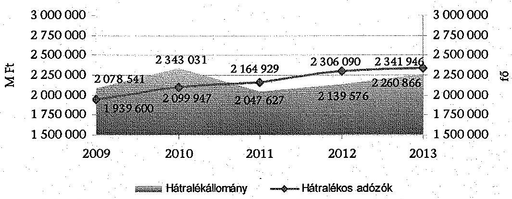

Forrás: NAV adatszolgáltatás
A hátralékos adózók számának 92,9-93,8%-át (2009. évben 1802 ezer db, 2013. évben 2196 ezer db) az egymillió Ft alatti tartozással rendelkezők tették ki, míg az 50 M Ft feletti tartozással rendelkezők a 0,2-0,3%-át (2009. évben 5 ezer db, 2013. évben 5,6 ezer db).

A nem működő adózói hátralékok aránya az összes hátralékállományon belül a 2009. évi 66,5%-ról (1 382,8 Mrd Ft) 2013. évre 69,8%-ra (1 578,1 Mrd Ft) emelkedett. Ezen időszak alatt a működő adózói hátralék mind az összes hátralékállományon belüli arányában (33,5%-ról 30,2%-ra), mind összegében (98,1%-ra) csökkent. A működő és a nem működő adóalanyok hátralékát a 1/c. számú melléklet tartalmazza, és a következő ábra mutatja be.

[^0]
[^0]:    ${ }^{87}$ AZ APEH/NAV tevékenységéről szóló beszámolók szerint 2009. évben 7 969,0 Mrd Ft, 2013. évben 9 511,7 Mrd Ft volt.
    ${ }^{88}$ Az adó és a vám szakterület között 1,7-3,3%-os duplázódást tartalmazhat.

---

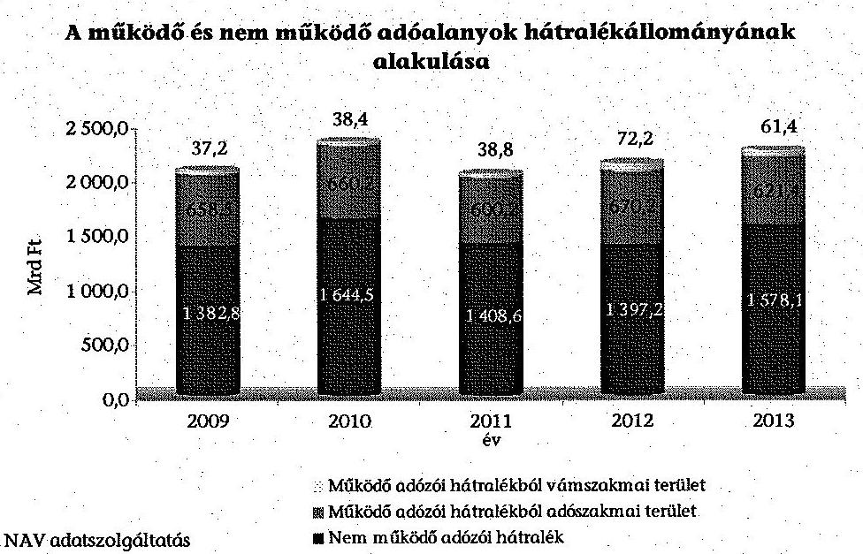

Az öt év átlagát tekintve a hátralékállomány 35,2%-át a szankcionálási tevékenységgel összefüggő bírság, mulasztási bírság, késedelmi pótlék tette ki. Ez az ellenőrzött időszakban évente 708,7-865,0 Mrd Ft-ot jelentett. A szankcionálásból eredő hátralékok évenkénti összegét a 1/d. számú melléklet tartalmazza.

Az összes adózói hátralék időbeli fennállása szerinti megoszlása nem változott érdemben az ellenőrzött években. Az éven túl fennálló tartozások összege tette ki évente átlagosan a teljes hátralékállomány 56,6%-át, a 91 és 360 nap között fennálló hátralékok a 25,8%-át, míg a 90 napot el nem érő hátralékok a 17,6%-át.

Az adóhatóság az ellenőrzött évek átlagában 212,5 Mrd Ft működő adózói hátralék esetében nem tett intézkedést az adóvégrehajtás megindítására, mivel nem vonta hátralékkezelésbe. A hátralékkezelésbe nem vont hátralékok behajthatóság és elévültség szerinti rendszeres felülvizsgálatát sem jogszabály, sem belső szabályzat nem követelte meg. Rendszeres felülvizsgálat hiányában fennállt a kockázata annak, hogy jelentősebb összegű hátralék évült el, illetve követelés vált behajthatatlanná úgy, hogy közben végrehajtási cselekményt nem foganatosítottak. Az adószakmai terület működő adózói tartozásának hátralékkezelésbe vonását a 1/e. számú melléklet mutatja be.

Az adószakmai terület által hátralékkezelésbe nem vont működő adózói hátralékok összege a 2009. évi 232,8 Mrd Ft-ról 2013. évre 204,0 Mrd Ft-ra (12,4%-kal) csökkent, arányuk 35,4%-ról 32,8%-ra mérséklődött.

A hátralékos adózók számának és a hátralékok növekedésének megakadályozása érdekében elvégzendő feladatokat az APEH elnöke a 2009. és a 2010. évben intézkedési tervekben ${ }^{89}$ határozta meg. A 2009. és 2010. év között az adózói hátralékok állománya és a hátralékos adózók száma nőtt, ezt az intézkedési tervek végrehajtásáról készített beszámolók azonban nem mutatták be.

[^0]
[^0]:    ${ }^{89} 4007523296$ számú 2009. évi és 5227739052. számú 2010. évi intézkedési tervek

---

A tendencia az ellenőrzött időszakban folytatódott, a hátralékos adózók száma és a hátralékok értéke - a 2011. évben kimutatott hátralékállomány kivételével - a további években is növekedett.

A 2011. évben a hátralékállomány csökkenése az adóbevételek növelésével kapcsolatos - 2011 III. negyedévében meghirdetett - kormányzati célok elérése érdekében történt behajtási intenzitást növelő intézkedések mellett, a hátralékok törlésének a következménye.

A felszámolási és végrehajtási szakterület kiemelt feladatait az elnöki iránymutatások ${ }^{90}$ minden évben a NAV stratégiájával ${ }^{91}$ összhangban tartalmazták. A szakterület teljesítményének értékelésére és mérésére az APEH/NAV szabályzataiban ${ }^{92}$ meghatározott bevételi előirányzati, hatékonysági, eredményességi mutatókat alkalmazták.

Az egyes hátralékkezelési technikák eredményeiről, illetve a hátralékosok számának és a hátralékállomány nagyságának alakulásáról a NAV KH Felszámolási és Végrehajtási Főosztálya - az APEH SzMSz$_{1,2,3}$ és a NAV SzMSz előírásainak ${ }^{93}$ megfelelően - éves beszámolóiban részletesen, évenként összehasonlítható módon adott tájékoztatást. Több évet átfogó, rövid értékelést készítettek továbbá 2010 júliusában az APEH által kezelt adónemek és illetékek 2008-2009. évi alakulásáról, valamint 2014 januárjában a NAV hátralékok 2011-2013. évi alakulásáról.

Az elnök 2012 szeptemberében körlevelet adott ki ${ }^{94}$ a Közép-magyarországi Régió adóigazgatóságai által kezelt hátralékállomány csökkentése és a behajtott összegek növelése érdekében.

A körlevélben előírt konkrét cél az volt, hogy a végrehajtásba még nem vont, teljes - egyéni vállalkozók nélküli - magánszemélyi kör e régiót terhelő hátralékállománya érzékelhetően csökkenjen, de a feladat ellátása ne veszélyeztesse a feladatban részt vállaló (együttműködő) többi igazgatóság tervszerű működését. Az együttműködés önkéntes alapon, határozatlan időszakra szólt.

A NAV KH Felszámolási és Végrehajtási Főosztályának az együttműködés 2012. november 30-ától 2013. április 30-áig tartó időszakáról készített értékelése szerint a kitűzött célt csak részben érték el, a Közép-magyarországi Régióban 1927 M Ft-tal (2,2%-kal) 83815 M Ft-ra csökkent a magánszemélyek
 hátraléka, a többi adóigazgatóságnál azonban - ugyan kis mértékben - 373 M Ft-

[^0]
[^0]:    ${ }^{90}$ 2010/B/2008. és 2003/B/2010. APEH irányelv II/1. bekezdései, NAV elnökének 5228153082. ikt. sz. iránymutatása II/1. pont, 5013/2012/FVF és 5007/2013/ELN körlevél I/A/1. pontjai
    ${ }^{91}$ Az APEH középtávú stratégiai terve a 2008-2012. évekre, a NAV stratégiája 2011-2015., forrás: http://nav.gov.hu
    ${ }^{92}$ az 1020/B/2009. és az 1018/B/2010. APEH utasítások, az 5/2011., a 2013/2012. és a 2003/2013. NAV szabályzat
    ${ }^{93}$ APEH SzMSz ${ }_{1}$ 25. §, APEH SzMSz ${ }_{2}$ 69. §, APEH SzMSz ${ }_{3}$ 52. §, NAV SzMSz ${ }_{4}$ 58. §
    ${ }^{94}$ 5055/2012/ELN körlevél

---

tal nőtt. A beszámolóban javasolták az együttműködés folytatását, az ügyben az ellenőrzött időszak végéig írásbeli intézkedés nem történt.

Az ellenőrzött időszakban hatályos szabályozások ${ }^{95}$ adószakmai területen a hátralékkezeléssel kapcsolatos feladatok szakmai irányítását, szervezését, felügyeletét, a hátralékállomány alakulásának és a regionális igazgatóságok tevékenységének folyamatos figyelemmel kísérését, illetve ellenőrzését a Felszámolási és Végrehajtási Főosztályon belül 2013. február 10-ig a Hátralékkezelési Osztály, 2013. február 11-től a Végrehajtási Fejlesztéseket Támogató Osztály feladat- és felelősségi körében határozták meg.

Adószakmai területen - az adótartozás végrehajtásához való jog elévülése, a cégbírósági törlés miatti behajthatatlanság megállapítása, valamint a hátralék összegének a nyilvántartásból kivezetése késedelmes végrehajtása miatt - nem tartalmazott pontos adatokat a hátralékállomány. A véletlen minta ellenőrzése és értékelése alapján, az éves átlagos hátralékállományhoz viszonyítva 17024 M Ft-ra becsülhető a hátralékállományt indokolatlanul növelő tartozásállomány nagysága.

A véletlen mintavétellel kiválasztott tételek összértéke $1002,4 \mathrm{M}$ Ft volt, amelyből 15,5 M Ft összegű tartozás, azaz az ellenőrzött összeg 1,5%-a indokolatlanul növelte a hátralékállományt, mivel elévülés, cégbírósági törlés és technikai megszűnés esetében nem törölték a tartozást.

A kockázati alapon kiválasztott legnagyobb összegű tételek összértéke 162 911,3 M Ft volt, melyből 1496,4 M Ft összegű tartozás, azaz az ellenőrzött összeg 0,9%-a indokolatlanul növelte a hátralékállományt.

Az ellenőrzött időszakban hatályos szabályozások ${ }^{96}$ jövedéki adó tekintetében a hátralékkezeléssel kapcsolatos feladatok szakmai irányítását, felügyeletét, a végrehajtási eljárás lefolytatásának kezdeményezését, a fizetési könnyítés, mérséklés alkalmazását 2011. július 21-től a Jövedéki Engedélyezési és Utólagos Adóvizsgálati Osztály feladat- és felelősségi körében határozták meg. A vámszervekhez tartozó adószámlák folyószámla kezelési tevékenységének irányítási és szakmai felügyelete, ellenőrzése a Jövedéki- és Egyéb Adószámla Osztály feladata volt. A Jövedéki Adóztatási és Bevételi Osztály irányította, felügyelte és ellenőrizte a jövedéki adóhatóságok adóztatással kapcsolatos tevékenységét, felügyelte a jövedéki adó visszatérítéseket.

A jövedéki adó szakterület esetében a hátralékállomány nem volt pontos, mivel az ellenőrzött időszakban a végrehajtási jog tekintetében elévült, illetve behajthatatlannak nyilvánított hátralékokat is tartalmazott, továbbá a 2011-2013. évben az adózók által visszaigényelt, határidő előtt visszautalt összegeket is hátralékként mutatták ki év végén. A vámszakmai terület tájékoztatása szerint a behajthatatlanná nyilvánított tartozások a folyószám-

[^0]
[^0]:    ${ }^{95}$ APEH SzMSz1 112. §, APEH SzMSz2 71. §, APEH SzMSz ${ }_{3}$ 1. számú melléklet 56. pont, NAV KH Ügyrend ${ }_{1}$ 53. pont, NAV KH Ügyrend ${ }_{2}$ 54. pont, NAV KH Ügyrend ${ }_{3}$ 54. pont
    ${ }^{96}$ NAV KH Ügyrend ${ }_{1}$ 63., 66., 72. pont, NAV KH Ügyrend ${ }_{2}$ 64., 67., 73. pont, NAV KH Ügyrend ${ }_{3}$ 64., 67., 72. pont

---

lán hátralékként szerepeltek az ellenőrzött időszak valamennyi évének december 31-én ${ }^{97}$. 

#### Abstract

A véletlen mintavétellel kiválasztott tételek összértéke 175,0 M Ft volt, melyből 4,2 M Ft összegű tartozás, azaz az ellenőrzött összeg 2,4%-a indokolatlanul növelte a hátralékállományt, mivel elévülése ellenére nem törölték a tartozást. Az éves átlagos hátralékállományhoz viszonyítva 138,6 M Ft-ra becsülhető a hátralékállományt indokolatlanul növelő tartozásállomány nagysága.

A kockázati alapon kiválasztott legnagyobb összegű tételek összértéke 10 093,9 M Ft volt, melyből 602,9 M Ft összegű tartozás, azaz az ellenőrzött összeg 5,9%-a indokolatlanul növelte a hátralékállományt.

A 2011. évben 37,7 M Ft (99 tétel), a 2012. évben 383,4 M Ft (374 tétel), a 2013. évben 212,1 M Ft (354 tétel) értékben az adózók által visszaigényelt és a NAV által kiutalt összeget is hátralékként mutatták ki ${ }^{98}$. E tételek esetében a kiutalások banki időpontja a tárgyév év végi, míg a kiutalások fizetési határideje a következő év eleji volt, ez a nyilvántartási rendszerben hátralékként jelent meg.

### 3.1.1. A tartozás mérséklésére, fizetési könnyítésére irányuló kérelmek elbírálása

Az ellenőrzött időszakban hatályos szabályozások ${ }^{99}$ a tartozás mérséklési és fizetési könnyítési eljárások szakmai irányítását, szervezését, felügyeletét, a kiemelt adózók és a regionális igazgatóságok ezirányú tevékenységének folyamatos figyelemmel kísérését, illetve ellenőrzését a KH Felszámolási és Végrehajtási Főosztályon belül 2013. február 10-ig a Végrehajtási Osztály, 2013. február 11-től a Végrehajtási és Fizetési Kedvezmények Osztály feladat- és felelősségi körében határozta meg.

Az adózók által benyújtott tartozás mérséklési és fizetési könnyítési kérelmek száma - az előző évről áthúzódó kérelmek számának csökkenése és az SZJA bevallásban biztosított automatikus részletfizetési kedvezmény miatt - az ellenőrzött időszakban 49,2%-kal, összege 46,3%-kal csökkent (282411 db-ról 143411 db-ra, illetve 346,3 Mrd Ft-ról 185,9 Mrd Ft-ra). Az ellenőrzött években az adózók összesen 1269,3 Mrd Ft (éves átlagban 253,8 Mrd Ft) tartozás mérséklésére és fizetési könnyítésére adtak be kérelmet. A csökkenő mennyiségű kérelmek alapján I. fokon hozott jogerős határozatok száma is csökkent, a 2009. évi 179740 db-ról 2013-ra 100590 db-ra (56%), amely évente átlagosan 138466 db határozatot jelentett.

[^0]
[^0]:    ${ }^{97}$ A KH Folyószámla-felügyeleti Főosztály vezetőjének 2014. május 15-i nyilatkozata szerint a hátralékállományban 2011. évben 1334 M Ft, a 2012. évben 771 M Ft, a 2013. évben 1901 M Ft behajthatatlanná nyilvánított összeget mutattak ki, amelyek törléséről a vám szakterületi folyószámlán nem történt intézkedés.
    ${ }^{98}$ NAV KH Folyószámla-felügyeleti Főosztályának 2014. szeptember 3-án kelt, 2947403555 iktatószámú adatszolgáltatása szerint.
    ${ }^{99}$ APEH SzMSz ${ }_{1}$ 112. §, APEH SzMSz ${ }_{2}$ 71. §, APEH SzMSz ${ }_{3}$ 1. számú melléklet 56. pont, NAV KH Ügyrend; 53. pont, NAV KH Ügyrend; 54. pont, NAV KH Ügyrend; 54. pont

---

A tartozás mérséklési és fizetési könnyítési kérelmek alapján hozott jogerős elsőfokú határozatokban a döntési eredmények megoszlása nem változott érdemben az ellenőrzött időszakban. Az ellenőrzött évek átlagát tekintve a kérelmek 28,4%-át részben, 37,5%-át egészében engedélyezték, 27,6%-át utasították el, és 5,6% került megszüntetésre, míg 0,9% esetében a fellebbezést saját hatáskörben ítélték megalapozottnak. A kérelemnek helyt adó határozatokban az ellenőrzött öt év alatt az APEH/NAV 572,2 Mrd Ft (éves átlagban 114,4 Mrd Ft) mérséklést és/vagy fizetési könnyítést engedélyezett és 473,7 Mrd Ft (éves átlagban 94,7 Mrd Ft) összegű kérelmet utasított el ${ }^{100}$.

A benyújtott fizetési kedvezmény (tartozás mérséklés, fizetési könnyítés) iránti kérelmek számát és azok elbírálási arányát a 1/f. számú melléklet tartalmazza.

A véletlen mintavétellel kiválasztott tételek ellenőrzése alapján, a tartozás mérséklési kérelmek legalább 64,1%-a, a fizetési könnyítési kérelmek legalább 41,7%-a esetében előfordult, hogy az eljárási illetéket az adózók nem fizették meg az eljárások lefolytatását megelőzően. Az eljárásokat lefolytatták, mivel az Art. 120. § (6) bekezdése szerint az eljárási illeték megfizetésének elmulasztása a hatósági eljárás lefolytatásának nem akadálya.

Az eljárási illeték megfizetésére vonatkozó kötelezettség előírása az adózók folyószámláján a tartozás mérséklési kérelmek legalább 41,8%-a, a fizetési könnyítési kérelmek legalább 13,3%-a esetében a szabályzatokban ${ }^{101}$ meghatározottaktól eltérően, a kérelem beérkezését követő 5-10 munkanapon belül nem történt meg.

Az érdemi döntésről szóló határozatok megfeleltek a Ket. 72. §-ában és a szabályzatokban ${ }^{102}$ meghatározott alaki és tartalmi követelményeknek.

# A tartozás mérséklési és fizetési könnyítési kérelmek elbírálásakor az APEH/NAV nem minden esetben tartotta be az Art. és Ket. által meghatározott eljárási határidőket. 

Az adózóknak küldött hiánypótlási felszólításokat az Art. 5/A. § (3) bekezdés g) pontja szerinti 8 napos határidőn túl kézbesítették a véletlen mintavétellel kiválasztott, hiányos tartozás mérséklési kérelmek 50,0%-a, illetve fizetési könnyítési kérelmek 28,6%-a esetében. Az ügyintézési határidő meghosszabbításáról nem az Art. 5/A. § (1) bekezdésében meghatározott 30 napos határidő lejárta előtt ${ }^{103}$, vagy egyáltalán nem értesítették az ügyfelet a véletlen mintavétellel kiválasztott, hosszabbítással érintett mérséklési kérelmek 38,8%-a, illetve fizetési könnyítési kérelmek 30,8%-a esetében.

[^0]
[^0]:    ${ }^{100}$ A részben helyt adó, kérelmet megszüntető jogerős elsőfokú határozatok összegéről a NAV nem szolgáltatott adatot.
    ${ }^{101}$ 1036/B/2009. APEH utasítással módosított 1095/B/2008. APEH utasítás 4. § (1) bekezdés, 1021/B/2010. APEH utasítás 4. § (1) bekezdés, 1080/2011. NAV eljárási rend 8. pont, 1073/2012. NAV eljárási rend 8. pont, 1060/2013. NAV eljárási rend 10. pont
    ${ }^{102}$ 7003/2007. (AEÉ 6.) APEH irányelv 15. pont, 7004/2010. (AEÉ 10.) APEH irányelv 15. pont, 1095/2012. NAV eljárási rend 61. pont, 1019/2013. NAV eljárási rend 66. pont
    ${ }^{103}$ Ket. 33. § (7) bekezdése szerint a határidőt annak letelte előtt lehet meghosszabbítani.

---

Az APEH/NAV az adó-, bírság- vagy pótléktartozás mérséklésére irányuló kérelmek elbírálásakor érvényesítette az Art. 134. §-ában rögzített követelményeket. Adótartozást kizárólag magánszemélynek engedtek el, és a kérelem helyt adásához a megélhetés súlyos veszélyeztetésének lehetőségét vették alapul. Vállalkozások esetében kizárólag bírság- és pótléktartozást engedtek el, a gazdálkodás ellehetetlenülésének valószínűsítése esetén.

A fizetési könnyítési kérelmek elbírálásakor érvényesítették az Art. 133. §-ában előírt követelményeket. A fizetési könnyítést csak abban az esetben engedélyezték, ha a fizetési nehézség átmeneti jellegű volt és a kérelmezőnek fel nem róható. Az érdemi döntésről szóló határozatok a jogerőre emelkedés időpontját a fellebbezések, illetve az arról történő lemondó nyilatkozatok figyelembevételével - a Ket. 65. §-ának és 73/A. §-ának megfelelően - határozták meg.

Amennyiben az adózó a fizetési könnyítésben meghatározott határidőben nem teljesítette kötelezettségét, akkor az Art. 133. § (9) bekezdése alapján a kedvezmény érvényét vesztette és a tartozás járulékaival együtt egy összegben esedékessé vált. Az adóhatóságnál az esedékessé vált tartozásnak az adózó folyószámlájára való visszarendezéséről - amely során az adott tételt ismét végrehajthatóvá tették - azonban jelentős időbeli különbséggel (4-13 hónap elteltével) végezték el.

# 3.1.2. A fizetési felszólítások alkalmazása, végrehajtási eljárások indítása 

A felszámolási és végrehajtási szakterület éves feladatainak ellátására kiadott elnöki iránymutatások ${ }^{104}$ kiemelten fontos tevékenységként jelölték meg a fizetési felszólítások alkalmazását a kisebb összegű tartozások esetében. A kisebb összegű tartozások összeghatárát azonban nem szabályozták.

Adószakmai területen az ellenőrzött időszakban az APEH/NAV élt a fizetési felszólítás kibocsátásával. Az évente
 kibocsátott fizetési felszólítások száma évi 191-230 ezer darab között változott, amelyek 119,0-214,2 Mrd Ft adó-, járulék- és illetéktartozás megfizetésére irányultak.

A véletlen mintavétellel kiválasztott tételek összértéke 1002,4 M Ft volt, melyből 91,1 M Ft összegű tartozás, az ellenőrzött összeg 9,1%-a esetében élt az APEH/NAV fizetési felszólítással.

A kockázati alapon kiválasztott legnagyobb összegű tételek összértéke 162 911,3 M Ft volt, melyből 43 662,6 M Ft tartozás, az ellenőrzött összeg 26,8%-a esetében történt fizetési felszólítás.

A jövedéki adó tekintetében a 2011. évi integrációt megelőző időszakban az APEH részére végrehajtásra átadott esetek többségében, az átadást megelőzően a vámhatóság felszólította az adóst tartozása rendezésére. A véletlen mintavétellel kiválasztott tételek ellenőrzése alapján, a 2011 előtti jövedéki adó

[^0]
[^0]:    104 2006/B/2005. APEH irányelv III. fejezet, 2010/B/2008. APEH irányelv II. fejezet, 2003/B/2010. APEH irányelv II. fejezet, 5013/2012/FVF Elnöki körlevél I. fejezet, 5007/2013/ELN körlevél I. fejezet

---

hátralékállomány legalább 80,4%-a esetében került sor fizetési felszólítás kiküldésére.

Adószakmai területen az Art. 5/A. § (2) bekezdésében ${ }^{105}$ előírtak ellenére nem indult meg minden esetben haladéktalanul, de legkésőbb 8 napon belül az Art. 150. § (3) bekezdése szerinti végrehajtási eljárás. A véletlen mintavétellel kiválasztott tételek ellenőrzése alapján, az összes lejárt esedékességű tartozás legalább 18,9%-a esetében nem indult haladéktalanul, de legkésőbb 8 napon belül a végrehajtási eljárás.

Az Art. 150. § (3) bekezdése előírta, hogy az adótartozás behajtása érdekében az adóhatóság a végrehajtható okirat alapján a végrehajtás iránt (2010. december 31-éig haladéktalanul) intézkedik, azaz a végrehajtási eljárással késlekedni nem lehet, azt a helyben szokásos munkarendben, az utasítást adó vezető döntése szerint azonnal meg kell kezdeni. 2009. október 1-jétől az Art. 5/A. § (2) bekezdése előírta, hogy külön rendelkezés hiányában az adóhatóság haladéktalanul, de legkésőbb 8 napon belül gondoskodik az eljárási cselekmény teljesítéséről.

Az ellenőrzött 121 befejeződött végrehajtási eljárás esetében a hátralék keletkezését követően átlagosan 207 nap múlva indult meg a végrehajtási eljárás.

A Ctv. 26. § (4) bekezdésében foglaltak ellenére, a végrehajtási eljárással érintett cégek legalább 51,2%-a esetében nem értesítették a Cégbíróságot a cégbírósági bejegyzésre kötelezett vállalkozás elleni végrehajtási eljárás megindításáról.

A véletlen mintavétellel kiválasztott tételek közül 102 végrehajtási eljárással érintett cég volt, amelyből 73 esetben, az ellenőrzöttek 71,6%-ában nem történt meg a cégbírósági értesítés.

# 3.1.3. A végrehajtási cselekmények szabályszerűsége 

Az intézkedés alá vont hátralék - amely az adó- és vámszakmai terület hátralékán felül - a külső szervek megkereséseit is tartalmazta, a 2009. évi 2 284,6 Mrd Ft-ról 2013. évre 3 379,8 Mrd Ft-ra nőtt (47,9%). Ezen időszakban a beszedett hátralékok összege mindössze 27,7%-kal nőtt, így a beszedett hátralékok intézkedés alá vont hátralékokhoz viszonyított aránya az ellenőrzött időszakban 13,7%-kal csökkent. Az intézkedési típusok közül kiemelkedő arányú volt a hatósági átutalási megbízások (azonnali beszedési megbízások) kibocsátása, amely évente átlagosan az intézkedés alá vont hátralékok összegének 93,5%-ára irányult. Az intézkedési típusok közül leggyakrabban a végrehajtási átvezetéssel - az ellenőrzött évek átlagát tekintve 39,5%-ban - voltak rendezhetők a hátralékok. Az intézkedés alá vont és beszedett hátralékok összegét végrehajtási cselekményenként a 1/h. számú melléklet tartalmazza.

Az ellenőrzött esetekben a végrehajtási eljárás megindítása az Art. 145. § (1) bekezdésének megfelelő végrehajtható okirat alapján történt. A végrehajtás kezdeményezését, újabb tartozások miatti kiterjesztését

[^0]
[^0]:    ${ }^{105}$ illetve 2010. december 31-ig az Art. 150. § (3) bekezdésében

---

folyószámla-egyeztetés előzte meg, amely a terhelések számszaki helyességére is kiterjedt. Ez után állították ki az „Adatlap és végrehajtási kérelem" címú dokumentumot, amely alapján a végrehajtási cselekményeket foganatosították.

Az ellenőrzött időszakban a végrehajtási cselekmények - az Art. 150/A. § szerinti végrehajtási átvezetés, a pénzforgalmi- és adminisztratív végrehajtás cselekményei, valamint a Vht. 35. §-a szerinti helyszíni eljárás - sorrendjére nem volt jogszabályi előírás.

Az Art. 152-153. §-a szerint az adóhatóság a pénzforgalmi végrehajtás keretében nyújthatja be a számlavezető pénzintézetek felé az adózó ismert bankszámlái elleni azonnali beszedési megbízást (hatósági átutalási megbízást), és magánszemélyek esetén intézkedhet a jövedelem ellenőrzése és letiltása érdekében. Az Art. § 154-158. §-ai szerint az adminisztratív végrehajtási eljárás során a tartozást az adós ingatlan-, gépjármű- vagy üzletrész tulajdona terhére hajthatja be az adóhatóság.

Az adós fellelhető vagyonát az adóhatóság a vagyonfeltárás során az ingatlan- és gépjármű-nyilvántartásban (TAKARNET, GIR), valamint az ún. hierarchia térképen tárta fel ${ }^{106}$, nem minden esetben történt meg azonban a hierarchia térkép lekérdezésének a dokumentálása.

Az ellenőrzött esetek 65,2%-ában nem történt meg a hierarchia térkép lekérdezésének a dokumentálása.

A végrehajtási eljárások egy részében helyszíni eljárásra került sor. A helyszíni eljárások során alkalmazott jegyzőkönyvek nem feleltek meg teljes körüen a Vht. 35. § (2) bekezdés c)-d) pontok előírásainak, mivel hiányzott a végrehajtható okirat megnevezése, illetve a követelés jogcíme, összege. Az APEH/NAV nem adott ki szabályozást és nem alakított ki egységes formanyomtatványt a helyszíni eljárások jegyzőkönyveihez, az egyes igazgatósági nyomtatványok egymástól szerkezetükben és tartalmukban is eltértek. A véletlen mintavétellel kiválasztott tételek ellenőrzése alapján, az adószakmai területen a végrehajtási eljárások legalább 40,3%-a esetében került sor helyszíni eljárásra. Az ellenőrzött mintatételek alapján, a helyszíni eljárások legalább 32,4%-a esetében a jegyzőkönyvek nem feleltek meg Vht. 35. § (2) bekezdésében előírtaknak.

Az adószakmai területen ellenőrzött, a 2009-2013. években befejeződött végrehajtási eljárások átlagos időtartamát a következő táblázat mutatja.

| Adószakmai terület | Átlag |
| :-- | :--: |
| A hátralék keletkezésétől a végrehajtás megindításáig | 207 nap |
| A végrehajtás megindításától az eljárás befejezéséig | 636 nap |
| A hátralék keletkezésétől a végrehajtás befejezéséig | 843 nap |

[^0]
[^0]:    ${ }^{106}$ TAKARNET: az elektronikus szolgáltatásokat nyújtó országos földhivatali rendszer; GIR/JÁR: gépjármű-nyilvántartási információs rendszer, amellyel a gépjárműnyilvántartás adataihoz lehet hozzáférni; hierarchia térkép: NAV nyilvántartás valamennyi vállalkozásról, amelyben az adózó tag, tulajdonos vagy üzletvezető lehet.

---

Az ellenőrzött jövedéki adó tételek közül előfordult, hogy az adózó folyószámláján 2001. évben előírt összeg befizetése pontatlanul történt és a keletkezett egy Ft hátralék még 12 év után, 2013. december 31-én is szerepelt a hátralékállományban annak ellenére, hogy az Art. 2. számú melléklet IV. fejezet Általános rendelkezése szerint az ezer Ft-ot el nem érő adókötelezettséget a vámhatóság nem tartja nyilván.

Az adóhatóságnak - az Art. 162. és 164. §-a, valamint az 1051/B/2009 APEH utasítás és az 1006/2012. NAV eljárási rend szerint - törölnie kellett az adózói tartozást, ha az adózó által benyújtott tartozás mérséklési kérelmet megalapozottnak találta, azt elévülés vagy végrehajthatatlanság miatt véglegesen behajthatatlanná nyilvánította, az adózót a Cégbíróság törölte, valamint meghatározott esetekben a felszámolási eljárás során. A felszámolás alatt levő adózók követeléseit az adóhatóságnak törölnie kellett a felszámolást lezáró végzés és a követelésről való lemondás alapján, valamint az MKK Zrt.-re engedményezés miatt.

Az adószakmai terület által törölt ${ }^{107}$ hátralékok összege a 2009. évi 542,4 Mrd Ft-ról 2013. évre 857,7 Mrd Ft-ra nőtt (58,1%). A törölt hátralékok aránya az összes hátralékállományhoz képest növekedett, a 2009. évi 26,1%-ról a 2013. évre 37,9%-ra. A hátralékok törlésének jogcímei között meghatározó a felszámolási eljárás miatti törlés volt, amely a törölt hátralékoknak 2009-ben a 66,0%-át, 2013-ban 74,4%-át tette ki (követelés engedményezés, záró végzés, követelés lemondás jogcímeken). Az ellenőrzött időszakban az engedményezés miatt törölt hátralékok értéke a háromszorosára, aránya az összes törölt hátralékban pedig a 2009. évi 19,4%-ról 2013. évre 39,4%-ra nőtt. A tartozás mérséklése miatt törölt hátralékok értéke 58,1%-kal csökkent. A hátralékok törlésének okait és mértékét a 1/g. számú melléklet tartalmazza.

A vámszakmai terület nem tudott adatot szolgáltatni a 2009-2010. években törölt hátralékokról, mivel a Vám- és Pénzügyőrség 2009. és 2010. évi folyószámla rendszere - a törlés jogcíme beazonosíthatóságának hiánya miatt - nem volt teljes körüen alkalmas a leválogatásra ${ }^{108}$. Ugyanakkor a 2009-2010. években hatályos VPOP szabályozók ${ }^{109}$ egyértelműen meghatározták a jövedéki végrehajtási eljárások során nyilvántartandó adatokat, melyben többek között a törlés, illetve a törlés okainak kód szerinti beazonosítása is szerepelt. Az integráció után a vámszakmai terület által törölt hátralékok értéke a 2011. évi 2,2 Mrd Ft-ról 2013. évre 8,1 Mrd Ft-ra nőtt.

Az ideiglenesen behajthatatlannak minősített tartozások legalább évenkénti felülvizsgálatát szabályzatokban ${ }^{110}$ előírták. A véletlen mintavétellel kiválasztott

[^0]
[^0]:    ${ }^{107}$ Tartozás mérséklésből, behajthatatlanság, elévülés, cégtörlés miatt, illetve felszámolási- és kényszertörlési eljárás okán törölt hátralékok a NAV adatszolgáltatása alapján.
    ${ }^{108}$ A KH Folyószámla-felügyeleti Főosztály vezetőjének 2014. augusztus 8-i és szeptember 10-i nyilatkozatai szerint. Folyószámlára könyvelt kötelezettségek csökkenései leválogathatók, de az összes törlésből nem különíthetők el az ellenőrzött hátralék törlések.
    ${ }^{109}$ 9/2006. VPOP utasítás I. fejezet 2. pont, 59/2009. VPOP utasítás I. fejezet 1.2. pont
    ${ }^{110}$ 1051/B/2009. APEH utasítás 17. § (2) bekezdés, 1006/2012. NAV eljárási rend 13.5. pont

---

és ellenőrzött tételek 36,7%-a volt ideiglenesen behajthatatlannak minősítve és később behajthatatlanság miatt törölve, ezek 54,5%-ánál azonban a szabályzatban előírt évenkénti felülvizsgálatot nem végezték el.

Az ideiglenesen behajthatatlannak minősített tartozások felülvizsgálatának célja, hogy a végrehajtáshoz való jog elévülési idején belül az adóhatóság rendszeresen ellenőrizze a minősítés indokoltságát és szükség esetén intézkedjen a tartozás behajtása iránt. Ha az adózó (mögöttes felelős, quasi mögöttes felelős) körülményeinek megváltozása következtében a tartozás az elévülési időn belül részben vagy egészben behajthatóvá válik, a végrehajtás foganatosítása iránt intézkedni kell ${ }^{111}$.

A véletlen mintavétellel kiválasztott és ellenőrzött, behajthatatlanság miatt törölt hátralékok 28,6%-ában az adózó jogerős cégbírósági törlése és hátralékának végleges törlése közt eltelt időtartam meghaladta a 180 napot, egy esetben a három évet.

A VHR rendszerben a behajthatatlanság rögzítése alapján a kötelezettség csökkentése a letéti kartonon és a folyószámlán automatikusan megtörtént. Amennyiben egy kötelezettséget ismét behajthatóvá minősítettek, annak folyószámlára és letéti kartonra történő visszavezetéséről külön intézkedni kellett.

Az Art. 162. § (1) bekezdése szerint a végrehajtási eljárást lefolytató adóhatóság az adózó tartozását a végrehajtási jog elévüléséig tartja nyilván. Az Art. nem rendelkezett külön arról, hogy az adóhatóság mennyi időn belül köteles elvégezni az Art. 164-164/A. §-okban meghatározott elévülési idő leteltét (a végrehajtási jog elévülését) követően a törlést, azért arra az Art. 5/A. § (1) bekezdése szerinti általános ügyintézési határidőt (30 napot) kellett alkalmazni. Az 1067/2011. NAV eljárási rend 62-64. pontjai rendelkeztek arról, hogy az adótartozás végrehajtásához való jog elévülése után a tartozást az eljárást lefolytató adóhatóságnak kell törölnie. A gyakorlatban az elévülés tényének, időpontjának megállapítását, az elévült tételek visszamenőleges hatályú törlését azon adóügyi munkatárs végezte, aki tevékenysége során észlelte az
 elévülés beálltának tényét. A véletlen mintavétellel kiválasztott és ellenőrzött évültetéssel törölt hátralékok 86,6%-ánál nem tartották be az Art. 5/A. § (1) bekezdése szerinti 30 napos határidőt. Az elévülés és a törlés közötti időtartam 33,3%-ban 30-180 nap, 20%-ban 180-360 nap közötti volt, míg 33,3%-ban meghaladta az egy évet.

A véletlen mintavétellel kiválasztott és ellenőrzött, évültetéssel törölt hátralékok 30,0%-a a törlést megelőzően nem állt végrehajtás alatt (közülük egy esetben a hátralék összege 26,8 MFt volt). Előfordult az is, hogy az évülés határnapját nem az Art. 164. § előírásai szerint határozták meg, mivel az elévülés idejét annak ellenére 6 hónappal meghosszabbították, hogy nem merültek fel az Art. 164. §-ában biztosított lehetőségek, továbbá az elévülés idejének számításánál az Art. 164. § (7) bekezdésével ellentétben nem vették figyelembe a fizetési könnyítési kérelem elbírálásának időtartamát.

[^0]
[^0]:    ${ }^{111}$ 1066/2012. NAV eljárási rend 13.1 pont

---

Nem volt megoldott a hátralékok elévülésének olyan módon történő nyomon követése, amely az Art.-ban előírt határidőben biztosította volna az elévült hátralékok törlését. Ez hozzájárult ahhoz, hogy a hátralékállományban behajthatatlan, illetve elévült tartozások is szerepeltek.

# 3.2. Az APEH/NAV külső megkereső szervek részére végzett végrehajtási tevékenysége 

Az Art. 161. § (1) bekezdése szerint 2011. december 31-ig a köztartozás jogosultja akkor kereste meg az adóhatóságot behajtás miatt, ha a köztartozás összege meghaladta az 5000 Ft-ot, szabálysértési pénzbírság, illetve helyszíni bírság végrehajtásával kapcsolatban akkor, ha a köztartozás összege elérte vagy meghaladta a 3000 Ft-ot.

A megkeresés értékhatárainak 2012. január 1-jét követő változását követően a köztartozás jogosultja megkereste az adóhatóságot, ha a köztartozás összege elérte vagy meghaladta a 10000 Ft-ot, a szabálysértési pénzbírság, illetve helyszíni bírság az 5000 Ft-ot. Az Art. 161. § (1) bekezdésében 2012. április 15-től a szabálysértési pénzbírság, illetve helyszíni bírság végrehajtásával kapcsolatos 5000 forintos értékhatárt hatályon kívül helyezték. 2013. január 1-jétől az ingatlan nyilvántartási eljárás igazgatási szolgáltatási díja, 2013. szeptember 1-jétől a szabálysértési költség, valamint az elővezetési költség esetén bevezették az 5000 forintos értékhatárt.

A fentiektől eltérően a gazdasági kamaráknak 2012. november 30-tól - a gazdasági kamarákról szóló 1999. évi CXXI. törvény 34/A. § (5) bekezdése alapján - akkor is lehetőségük volt megkeresni az adóhatóságot, ha a tartozás a 10000 Ft-ot nem haladta meg, de elérte az 5000 Ft-ot. A jogszabályváltozás hatására a 2013. évre e jogcímen 5611 tételszámú, 49 M Ft nagyságrendű megkeresés érkezett az adóhatósághoz.

Az ellenőrzött időszakban az adóhatóságnak behajtásra átadott megkeresések összege több mint kétszeresére, a 2009. évi 32227 M Ft-ról a 2013. évre 76361 M Ft-ra emelkedett.

---

# Behajtásra irányuló megkeresések alakulása a 2009-2013. 

években (megoszlás és M Ft)
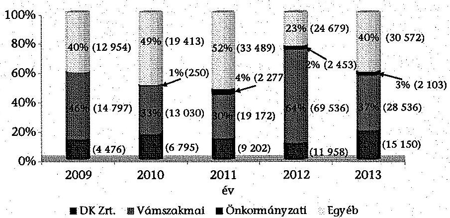

Forrás: NAV adatszolgáltatás
Az ellenőrzött évek átlagában az összes megkeresésből a vámszakmai terület 42%-ot, a DK Zrt. 15%-ot, az önkormányzati adóhatóság 2%-ot tett ki, az egyéb szervektől átvett állomány aránya 41% körül alakult.

Az egyéb szervektől érkezett megkeresések közül az államháztartás központi alrendszerébe tartozó költségvetési szervektől érkező megkeresések összege 2009-ben 6476 M Ft (20,1%), 2013-ban 7860 M Ft (10,3%) volt.

A meg nem fizetett hulladékszállítási díj behajtása a 2013. évtől került át az önkormányzati adóhatóságoktól az állami adóhatóságok illetékességi körébe, amelynek hatására e jogcímen 131229 db, 2,3 milliárd Ft nagyságrendű (átlagosan 17,5 ezer Ft összegű) megkeresés érkezett.

A külső megkereső szervek megkeresései alapján indított végrehajtási eljárásokat - az 1002/B/2008. és az 1043/B/2009. APEH utasítás 7. § (2) bekezdésének, valamint az 1083/2012. NAV eljárási rend III. fejezet 28. pontjában foglaltaknak megfelelően - a végrehajtási szakterület végezte. Önálló munkaköröket nem alakítottak ki, mert az adóhatóság a külső megkeresések alapján és saját hatáskörben indult végrehajtási eljárásokat egy eljárásban érvényesítette.

A külső megkeresések megnövekedett feladatai évről évre terhelték az összes hátralék-behajtási tevékenység ellátását. Az adók módjára behajtandó köztartozások 2009-2013. évek közötti feladatnövekedésére való hivatkozással nem volt létszámbővítés a szervezetnél ${ }^{112}$.

Az adó főigazgatóságok külső megkeresésre folytatott végrehajtásaiban érintett tartozások tételszámát, valamint az összes hátralékkezelési, végrehajtási ügyintézőre vetített úgyszámát a következő táblázat mutatja.

[^0]
[^0]:    ${ }^{112}$ A Felszámolási és Végrehajtási Főosztály 2014. június 25-i tájékoztatása szerint.

---

| Év | Külső megkeresések   tételszáma (db) | Hátralékkezelési   és végrehajtási   szakterület   létszáma (fő) | Egy ügyintézőre jutó   külső megkeresés   (db/év) |
| :-- | :--: | :--: | :--: |
| 2009 | 109740 | 1673 | 65,6 |
| 2010 | 109899 | 1581 | 69,5 |
| 2011 | 128907 | 1550 | 83,2 |
| 2012 | 132944 | 1490 | 89,2 |
| 2013 | 247591 | 1555 | 159,2 |

Forrás: NAV adatszolgáltatás
Az ellenőrzött időszakban fokozatosan bővült a különböző jogszabályokban előírt, a külső megkeresések alapján kötelezően elvégzendő feladatok köre. A külső megkeresések jogcímei a 2009. évi 89 db-ról 2013-ra 117 db-ra ${ }^{113}$ emelkedtek.

A behajtásra került összeg összességében 2009-ről 2013-ra 46,7%-kal, 3159 M Ft-ról 4635 M Ft-ra növekedett, a behajtásra került összeg %-a azonban folyamatosan csökkent, a 2009. évi 9,8%-ról a 2013. évben 6,1%-ra változott. A külső megkeresések alapján 2009-2013 között behajtásra átadott és ebből behajtásra került összegek alakulását a 2. számú melléklet tartalmazza.

A megkeresések nyilvántartásba vétele az összes megkeresés legalább 14,0%-ában nem felelt meg a 1043/B/2009. APEH utasítás 7. § (3) bekezdésében és az 1083/2012. NAV eljárási rend III. fejezet 29. pontjában foglaltaknak, mivel a megkeresés iktatása után az illetékességi szabályok vizsgálatát követő harmadik munkanap helyett a 16. munkanap és 4 hónap között került sor a kötelezettség VHR-ben történő rögzítésére, így késedelmesen történt.

A véletlen mintavétellel kiválasztott és ellenőrzött megkeresések 26,7%-ában késedelmes volt a nyilvántartásba vétel.

A tőkekövetelésen kívül a bírság és késedelmi pótlék elkülönített nyilvántartásáról - az 1043/B/2009. APEH utasítás 7. § (6) bekezdésének, és az 1083/2012. NAV eljárási rend III. fejezet 32. pontjában foglaltaknak megfelelően - gondoskodtak.

A kötelezettségek nyilvántartásba vételét követően a végrehajtási eljárásokat megindították, amely megfelelt az Art. 150. § (1) bekezdésében foglaltaknak. Előfordult azonban, hogy az eljárások elhúzódtak, illetve nem egységesen jártak el a tájékoztatási kötelezettség vonatkozásában.

A véletlen mintavétellel kiválasztott és ellenőrzött megkeresések közül három esetben előfordult, hogy a végrehajtási eljárások megindítása követően, ha a behajtás nem vezetett eredményre, egy évnél hosszabb idő múlva indították az újabb végrehajtási cselekményeket.

Önálló bírósági végrehajtónak átadott vámhatósági megkereséseknél a tájékoztatási kötelezettség tekintetében nem egységesen jártak el, egy esetben igen, egy

[^0]
[^0]:    ${ }^{113}$ 2013. december 31-ig a külső szervek kérelmére folytatott végrehajtási eljárásoknál a megkereső jogcíme szerint 117 db behajtási adónemkódot alkalmaztak.

---

esetben nem tájékoztatták a vámszervet. A tájékoztatási kötelezettség elmaradásához hozzájárult, hogy 2012. január 1. és szeptember 9. között nem volt hatályos szabályozás az adó- és a vámigazgatóságok közötti együttműködési rendre.

Az adók módjára behajtandó összegek elszámolásával kapcsolatosan írásban tájékoztatták a megkereső szervezetet.

A véletlen mintavétellel kiválasztott és ellenőrzött megkeresések 46,7%-ában a végrehajtás eredményes volt. Amennyiben a behajtás összege nem fedezte teljes körűen a köz- és adótartozást, azt a belső szabályozás szerint ${ }^{114}$ felosztották. Az ellenőrzött esetekben a behajtásra került összegek továbbutalása - a megkereső szerv által közölt bankszámlaszámra - megtörtént. Előfordult, hogy a továbbutalás során egy kamarai tagdíj esetében nem tartották be az 1083/2012. NAV eljárási rend X. fejezet 78. pontjában előírt haladéktalanul, de legkésőbb 8 napon belüli határidőt, mert az utalást a 24. napon végezték el.

A külső megkereső szervek részére végzett tevékenységek ellátásához az informatikai erőforrások kijelölése megtörtént, az ellenőrzött időszakban - az 1002/B/2008. és az 1043/B/2009. APEH utasítások 7. § (3) bekezdésében, továbbá az 1083/2012. NAV eljárási rend III. fejezet 29. pontjában előírtak szerint a külső megkeresések feldolgozását a VHR rendszer biztosította.

# 3.3. Az APEH/NAV által nyilvántartott hátralékok engedményezése 

A felszámolás alatt álló szervezetekkel szemben fennálló követelések engedményezését az Engedményezési megállapodás 1,2,3,4-ok, és a vonatkozó belső szabályzatok alapján végezték el. Az Engedményezési megállapodás 2-ban rögzített 2011. november 24-i határnapon a 362,9 Mrd Ft ${ }^{115}$ átadandó követelésből 206,7 Mrd Ft követelést adtak át, a fennmaradó követelésállomány átadására az ezt követő átadási ütemekkor került sor.

A pénzügyi elszámolásokban a 2012. január 26-i átadási ütemhez kapcsolódóan szerepeltettek 102,2 Mrd Ft, a 2012. március 22-i átadási ütemhez kapcsolódóan 28,8 Mrd Ft 2011. november 24-i átadási naphoz kapcsolódó követelésállomány átadást. A 2012. június 21-i átadási napon 20,4 Mrd Ft, a szeptember 20-i átadási napon 13,0 Mrd Ft, a 2013. január 24-i átadási napon 36,7 Mrd Ft 2009-2010. évi közzétételű felszámolási eljárásokhoz kapcsolódó követelések átadására került sor annak ellenére, hogy az Engedményezési megállapodás 2-ban ezeken az átadási napokon csak a 2011. évi közzétételű felszámolási eljárásokhoz kapcsolódó követelések engedményezése szerepelt. A véletlen mintavétellel kiválasztott és ellenőrzött, 2011. november 24-én átadásra került 10 tétel közül 7 esetben 2-4 hónap, egy esetben 10 hónap késedelem történt.

Engedményezési megállapodás 1,2,3,4-okban meghatározott egyidejűség helyett a felszámoló értesítését teljes követelés állomány legalább 85,1%-ában a követelések fizikai átadását követően késedelemmel végezték el.

[^0]
[^0]:    ${ }^{114}$ 1083/2012. NAV eljárási rend 67. pont
    ${ }^{115}$ A NAV adatszolgáltatásában 2011. évre az átadási listákban és tanúsítványában 362 930,3 M Ft követelés átadást jelzett.

---

A véletlen mintavétellel kiválasztott és ellenőrzött követelés átadások 96,7%-ánál a felszámoló értesítése késedelmesen történt. A 30 mintatétel közül 25 esetben 2-4 hetes késéssel, három esetben 1-2 hónapos, egy esetben 4 hónapos késedelemmel értesítették a felszámolót.

Az Art. 177/A. §-ának 2010-ben hatályos előírásai szerint az APEH a jogszabályban meghatározott követeléseit kizárólag pályáztatás útján engedményezhette ${ }^{116}$. Az APEH az Art. 2010-ben módosult előírásai ellenére nem írt ki pályázatot és - az előző évben kötött megállapodás alapján - követeléseket engedményezett az állami tulajdonú MKK Zrt. részére. Az MKK Zrt. részére 2010-ben engedményezett követelésállomány 1238 db tételből állt, összege 43,9 Mrd Ft volt.

Az ellenőrzött időszakban az engedményezések ellenértékét az APEH/NAV és az MKK Zrt. az Engedményezési megállapodás 1,2,3,4-okban rögzítette. A fizetendő összeget a felszámolás kezdő időpontjától függően az engedményezett követelés tőkeösszegének 0,6-1,5 százalékában állapították meg. Az Engedményezési megállapodás 3,4-ben emellett maximálták az egy követelésre fizethető összeget. Az ellenőrzött években felszámolás alatt álló szervezetekkel szemben fennálló, összességében 1006 Mrd Ft követelést engedményezett az APEH/NAV az MKK Zrt.-re. Az engedményezett összegből a tőkekövetelés 616,7 Mrd Ft volt, amelyre az MKK Zrt. 4,1 Mrd Ft vételárat fizetett, így a tőkekövetelés 0,7%-a térült meg. A tőkekövetelésen felüli követelések (a Csődtv. 57. § (1) bekezdése szerinti egyéb követelések, késedelmi
 kamat, bírságok, pótlékok) átadása a szerződéseknek megfelelően, ellenérték nélkül történt. Az engedményezett hátralék és a megtérült összeg közötti különbséget hitelezői veszteségként kivezették a nyilvántartásból, csökkentve ezzel a hátralékállományt.

A követelések átruházásának ellenértékét az MKK Zrt.-nek a véglegesített átadási listák alapján elkészített elszámolások megküldését követően kellett megfizetnie a megállapodásokban foglaltak szerint. Az ellenőrzött esetekben az átadott követelések tekintetében az adóhatóság részére az engedményezések során befolyt bevétel összege megfelelt az Engedményezési megállapodások ${ }_{1,2,3,4}{ }^{-}$ban foglaltaknak.

Az MKK Zrt. tájékoztatása szerint bevétele a 2011-2013. években elmaradt a tervezettől, a 2011. és 2013. években még a NAV részére kifizetett ellenértéket sem érte el. Az engedményezéssel átadott követelésállomány, valamint a kifizetett vételár éves állományának alakulását a 3. számú melléklet mutatja be.

[^0]
[^0]:    ${ }^{116}$ Megállapította a 2009. évi LXXVII. törvény 108. § 2010. január 1-jétől. A 2010. évi CXXII. törvény 151. § alapján 2011. január 1-jétől történt módosítással a NAV követeléseit ismét az MKK Zrt.-re ruházhatta át.

---

# 4. A KIEMELT ADÓZÓI KÖRBEN VÉGZETT FELADATOK ELLÁTÁSÁNAK SZABÁLYSZERÜSÉGE 

### 4.1. A kiemelt adóalanyok körének meghatározása, nyilvántartása

Az adópolitikáért felelős miniszter az Art. 175. § (12) bekezdésében kapott felhatalmazás alapján évente rendeletben meghatározta azokat a feltételeket és értékhatárokat, amelyek alapján az adózók kiemelt adózóvá minősülnek.

A 37/2006. (XII. 25.) PM rendelet 1. §-a és a 4/2012. (II. 14.) NGM rendelet 1. §-a szerint kiemelt adózónak minősültek az adóévet megelőző év utolsó napján csődeljárás, felszámolás, végelszámolás alatt nem álló részvénytársasági formában működő hitelintézetek és biztosítók, valamint azon adózók, amelyek adóteljesítménye a tárgyévre meghatározott éves adóteljesítmény értékhatárát elérte, illetve meghaladta. 2013. január 1-től az adóteljesítmény értékhatárának elérése mellett további feltétel volt, a tevékenység adóévet megelőző második évben, vagy azt megelőzően történt megkezdése. A költségvetési szervek, valamint a személyi jövedelemadóról szóló törvény szerinti egyéni vállalkozók és magánszemélyek nem tartoztak a kiemelt adózói körbe.

Az ellenőrzött időszakban a kiemelt adózóvá minősítés alapját képező éves adóteljesítmény értékhatárát, valamint a NAV által nyilvántartott kiemelt adózók január 1-jei, illetve 2012. február 15-i számát a következő ábra szemlélteti ${ }^{117}$.

A kiemelt adózók számának és a kiemelt adózóvá minősítés értékhatárának alakulása a 2009-2013. években
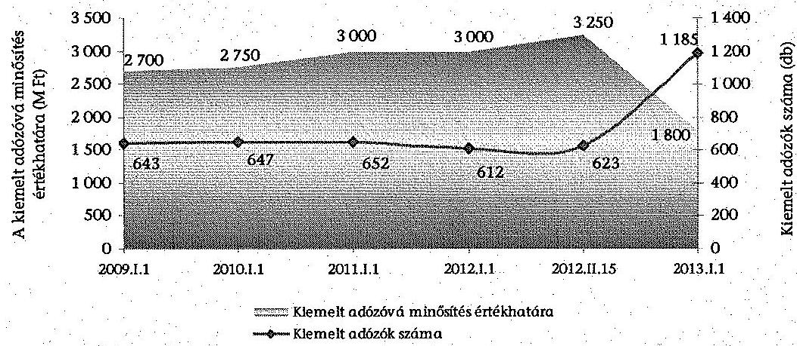

A 2012. évre vonatkozóan a kiemelt adózóvá minősítés feltételeit, az adóteljesítmény értékhatárát és számításának módját meghatározó rendeletet a nemzetgazdasági miniszter 2012. február 15-i hatállyal adta ki, így 2012-ben február 14-ig 3000 M Ft, azt követően 3250 M Ft értékhatár volt érvényben.

[^0]
[^0]:    ${ }^{117}$ NAV augusztus 12-i és szeptember 10-i adatszolgáltatása alapján

---

Az ellenőrzött időszakban a kiemelt adózók elsőfokú adóhatósági ügyeit 2012. december 31-ig országos hatáskörrel a KAIG végezte. A NAV Korm. rendelet 2013. január 1-jétől hatályos 19. § (1) bekezdés b) pontja szerint Budapest és Pest megye közigazgatási területén székhellyel rendelkező kiemelt adózók a KAIG-hoz, a vidéken székhellyel rendelkező kiemelt adózók a székhely szerint illetékes megyei adóigazgatósághoz tartoztak. A hatásköri és illetékességi változások következtében 292 működő adózó adóügye - a folyamatban lévő ellenőrzések is, a NAV Korm. rendelet 71/C. § (1) bekezdésére tekintettel - a KAIG-tól átkerült a területileg illetékes adóigazgatóságokhoz.

A kiemelt adózóvá minősítést meghatározó 2013. évi adóteljesítmény értékhatárának 1800 M Ft-ra csökkentése következtében 320 nagy adóteljesítményű adózó a Közép-magyarországi Regionális Adó Főigazgatóságtól a KAIG illetékességi körébe került, továbbá a területileg illetékes adóigazgatóságok adóteljesítmény értékhatárt elérő adózói kiemelt adózóvá minősítése következtében a kiemelt adózók száma a 2013. évben csaknem megduplázódott, 1185-re emelkedett, amelyeknek illetékes adóigazgatóságonkénti megoszlását az 4/a. számú melléklet tartalmazza.

A nagy adóteljesítményű adózók kiemelt adózóvá minősítése, illetve az adóalanyok nyilvántartása ${ }^{118}$ során - az illetékességi szabályok 2013. évtől hatályos változása következtében - a NAV Központi Hivatal Ellenőrzési Főosztály eljárása a következő három esetben (az ellenőrzöttek 6,0\%-ánál) nem felelt meg a NAV Korm. rendelet 19. § (1) bekezdés b) pontja szerinti illetékességi szabályoknak, egy esetben az 1042/2011. NAV eljárási rend VIII. fejezet 63. b) pontjának sem, mivel

- Két budapesti székhelyű, 2012. évben nagy adóteljesítményű adózó adóteljesítménye elérte a 2013. évre meghatározott, 4/2012. (II. 14.) NGM rendelet 1. § bb) pontja szerinti 1800 M Ft-os adóteljesítmény értékhatárt, melynek következtében 2013. évtől kiemelt adózóvá minősültek. A NAV Korm. rendelet 19. § (1) bekezdésében előírt - 2013. január 1-jétől hatályos - illetékességi szabályok szerint a két adózó a KAIG illetékességi körébe tartozott volna, azonban mindkét adózóval szemben 2012. évben felszámolási eljárás indult, melynek következtében nem feleltek meg a kiemelt adózóvá minősítés feltételének ${ }^{119}$. A NAV ${ }^{120}$ a két adózót a 4/2012. (II. 14.) NGM rendelet 1. § előírása ellenére kiemelt adózóként mutatta ki a Közép-magyarországi Regionális Adó Főigazgatóságon.
- A NAV Korm. rendelet 19. § (1) bekezdésében előírt illetékességi szabályoknak megfelelően egy - 2005. év óta - kiemelt adózónak minősülő adózó 2013. január 1-jével átkerült a területileg illetékes Veszprém megyei adóigazgatósághoz. Az adózó 2013-ban székhelyét Budapestre helyezte át. A NAV Korm.

[^0]
[^0]:    ${ }^{118}$ az ellenőrzött időszakban kiemelt adózók körét, azok évenkénti adóteljesítményét, ellenőrzöttségét bemutató 2014. május 9-i NAV adatszolgáltatás
    ${ }^{119}$ A 4/2012. (II. 14.) NGM rendelet 1. §-a kettős feltételhez kötötte a kiemelt adózóvá minősítést egyrészt el kellett érni az adott évre meghatározott adóteljesítmény értékhatárát, másrészt a tárgyévet megelőző év utolsó napján az adózó nem állhatott csődeljárás, felszámolási eljárás, végelszámolás alatt.
    ${ }^{120}$ A kiemelt adózókat megyekódonként bemutató 2014. augusztus 12-i NAV adatszolgáltatás

---

rendelet 19. § (1) bekezdésében előírt illetékességi szabály, valamint az 1042/2011. NAV eljárási rend VIII. fejezet 63. b) pontjában foglaltak ellenére a budapesti székhelyű kiemelt adózót a KAIG helyett a Közép-magyarországi Regionális Adó Főigazgatóságon tartották nyilván a 2013. évben ${ }^{121}$.

Az APEH Korm. rendelet 16. § (1) bekezdése, valamint a NAV Korm. rendelet 19. § (2) bekezdése szerint, amennyiben „az adózó az adóév első napján megfelel a jogszabályban meghatározott feltételeknek, amelyek alapján kiemelt adózónak minősül és a KAIG hatáskörébe tartozik, a KAIG hatáskörébe utalt adóügyekben 3 adóéven át akkor is a KAIG jár el, ha ezen időtartam alatt bármely adóévben az adózó bevallása szerint nem felel meg az előírt értékhatárnak" (hároméves szabály). A NAV a hároméves szabályt az értékhatár elérésének utolsó éve helyett, a kiemelt adózói körbe kerüléstől számította ${ }^{122}$. Az APEH/NAV KH Ellenőrzési Főosztálya NAV Korm. rendelet 19. § (2) bekezdésével ellentétes gyakorlata következtében az ellenőrzött időszakban a megelőző években kiemelt adózónak minősülő, de a tárgyévre meghatározott értékhatárt el nem érő adózók közül 55 adózó - nagy adóteljesítményű adózóként - a területileg illetékes adóigazgatósághoz került.

A 37/2006. (XII. 25.) PM rendelet 1. §-a, valamint a 4/2012. (II. 14.) NGM rendelet 1. §-a szerint azon adózókat lehetett kiemelt adózóvá minősíteni, amelyek az adóévet megelőző év utolsó napján nem álltak csődeljárás, felszámolási eljárás, végelszámolás alatt. A már KAIG hatáskörébe tartozó adózók felszámolása, végelszámolása esetén az eljárás teljes ideje alatt az APEH Korm. rendelet 16. § (3) bekezdése, valamint a NAV Korm. rendelet 19. § (4) bekezdése (2013. január 1-jétől 19/A. §-a) következtében a KAIG-nak kellett ellátnia ezen adózókkal kapcsolatos feladatokat. A felszámolási, végelszámolási eljárás alatt álló adózók száma ${ }^{123}$ január 1-jén az ellenőrzött időszak éveinek sorrendjében 7, 14, 16, 21 és 3 volt.

Előfordult, hogy egy - 2006. év óta folyamatosan - kiemelt adózónak minősülő adózó nem érte el a 2012. évre meghatározott 3250 M Ft-os adóteljesítmény értékhatárt, ezért - a fenti hároméves szabály téves alkalmazása következtében kikerült a kiemelt adózói körből és így a KAIG-ról is. Az adózóval szemben 2012. december 1-én végelszámolás indult. A NAV Korm. rendelet 19. § (2) bekezdése szerint az adózó - a hároméves szabály következtében - a 2012. évben a KAIG illetékességi körébe tartozott, továbbá a NAV Korm. rendelet 19/A. § (1) bekezdése szerint a végelszámolási eljárással kapcsolatos feladatokat a KAIG-nak kellett volna ellátnia.

[^0]
[^0]:    ${ }^{121}$ az ellenőrzött időszakban kiemelt adózók körét, azok évenkénti adóteljesítményét, ellenőrzöttségét bemutató 2014. május 9-i NAV adatszolgáltatás
    ${ }^{122}$ NAV 2014. július 16-án átadott feljegyzése szerint: „Az ún. hároméves szabály - a fenti értelmezések szerint a 2007. és a 2013. évi jelentős hatásköri változások miatti esetektől eltekintve - a gyakorlatban úgy került figyelembe vételre, hogy az adózó, ha egyszer bekerült a KAIG körbe, folyamatosan legalább 3 évig a KAIG körben kellett maradnia, függetlenül attól, hogy ebből hány és melyik év volt értékhatár feletti vagy alatti."
    ${ }^{123}$ A kiemelt adózókat élő és nem élő minősítő kód bontásban bemutató 2014. augusztus 12-i NAV adatszolgáltatás szerint

---

# 4.2. A kiemelt adózók adóhatósági ellenőrzésre történő kiválasztása 

### 4.2.1. Kötelezően lefolytatandó ellenőrzések elrendelése

Az Art. 89. § (1) bekezdése szerint az adózónál ellenőrzést kellett lefolytatni, ha végelszámolását ${ }^{124}$ rendelték el, az ÁSZ elnökének felhívására, az adópolitikáért felelős miniszter utasítására. Az Art. 72. § (2) bekezdésében foglaltak szerint a magán-nyugdíjpénztárak megkeresésére 2011. december 31-ig ellenőrizni kellett a magánnyugdíj-pénztári tagdíjfizetési kötelezettség teljesítését. Az Art. 72. § (5) bekezdése ${ }^{125}$ szerint a hitelintézet megkeresésére ellenőrizni kellett a lakáscélú állami támogatások igénybevételének jogszerűségét, a támogatások igénylésével összefüggésben a számlák valódiságát.

Az APEH/NAV Központi Hivatala, valamint adóztatási szervei - erre vonatkozó konkrét előírás, valamint nyilvántartást támogató informatikai rendszer hiányában - a 2009-2013 közötti időszakban nem vezettek nyilvántartást az Art. 89. § (1) bekezdése és az Art. 72. § (2) és (5) bekezdései szerint kötelezően lefolytatandó ellenőrzésekről.

A 2009-2013. években ${ }^{126}$ a csőd-, felszámolási-, és végelszámolási eljárás alá került kiemelt adózóknál 17 ellenőrzést folytattak, az ÁSZ elnöke felhívására egy esetben, az adópolitikáért felelős miniszter utasítására 20 esetben, a magán-nyugdíjpénztárak megkeresésére 376 esetben végeztek ellenőrzést, hitelintézeti megkeresésre nem indítottak ellenőrzést.

Art. 90. § (2) bekezdése ${ }^{127}$ szerint 2011. december 31-ig a 3000 legnagyobb adóteljesítményű adózót, így a kiemelt adózókat is rendszeresen (legalább háromévente) ellenőrizni kellett valamennyi adónem és költségvetési támogatás vonatkozásában. A 2009-2011. évi ellenőrzési tervek összeállítását megelőzően az informatikai rendszerek (ATAR, a RADAR és a REV rendszer) adatai, valamint a KAIG-on, illetve a KAFIG-on vezetett nyilvántartások szerint felmérték az adózók ellenőrzéssel le nem zárt éveit (ellenőrzöttségi szintjét), kockázati besorolását. A 2009-2010. év I. és II. félévi ellenőrzési terveit a KAIG ellenőrzési osztályainak vezetői készítették el. A féléves terveket a főosztályvezetői ellenőrzést követően a KAIG
 igazgatója hagyta jóvá. A 2011. év I. és II. félévi ellenőrzési tervek összeállítását a KAFIG Szakmai Koordinációs és Kockázatelemzési Főosztálya végezte és a főigazgató hagyta jóvá.

[^0]
[^0]:    ${ }^{124}$ 2011. december 31-ig az Art. 89. § (1) bekezdés a) pontja szerint, ha felszámolását és végelszámolását rendelték el
    ${ }^{125}$ 2009. december 31-ig Art. 72. § (4) bekezdése
    ${ }^{126}$ a kiemelt adózókkal kapcsolatos, az Art. 89. § (1) bekezdés a)-c) pontok, illetve 72. § (2) és (5) bekezdés szerinti ellenőrzési kötelezettség teljesítését bemutató 2014. május 10-i NAV adatszolgáltatás
    ${ }^{127}$ Hatályon kívül helyezte a 2011. évi CLVI. törvény 361. § (2) bekezdés 5. pontja, hatálytalan 2012. január 1-jétől.

---

Az állami adóhatóság a 2009-2011. években nem tartotta be az Art. 90. § (2) bekezdésének előírását. Hat adózót a 2009-2011. években egyáltalán nem ellenőriztek. Ezen adózók esetében nem történt meg az Art. 90. (2) bekezdése szerinti rendszeres (legalább háromévenkénti) valamennyi adónemre és költségvetési támogatásra vonatkozó ellenőrzés. Négy adózót tervezési hiányosság következtében a KAIG Ellenőrzési Főosztályai nem választották ki ellenőrzésre, további két adózó esetében a KAIG Ellenőrzési Főosztály II. annak ellenére nem indította meg az Art. 90. § (2) bekezdése szerinti ellenőrzést, hogy ezen adózókat a 2011. év II. félévi ellenőrzési tervben ellenőrzésre kiválasztották.

# 4.2.2. A kockázatkezelés és kiválasztás folyamata 

Az Art. 90. § (1) és (4) bekezdésében foglaltaknak megfelelően az elnök közzétette ${ }^{128}$ a kötelező ellenőrzéseken túli, évente elvégzendő vizsgálati célokat, az ellenőrizendő főbb tevékenységi köröket, a jellemző jövedelmezőségi mutatókat, az ellenőrzési típusok tervezett arányszámait. Az ellenőrzési irányelvekben, tájékoztatókban az éves ellenőrzéseken belül a legnagyobb adóteljesítményű adózók bevallásai utólagos vizsgálatára irányuló ellenőrzésének aránya 2009 és 2013. között 8,5% és 12,0% közötti volt.

Az Art. 90. § (2) bekezdésében előírt, rendszeres (legalább háromévenkénti) ellenőrzési kötelezettség hatályon kívül helyezésével 2012. január 1-jétől előtérbe került a kockázatelemzésen alapuló ellenőrzésre kiválasztás. Az ellenőrzésre történő kiválasztást megalapozó kockázatkezeléssel, kockázatelemzéssel kapcsolatos feladat- és hatásköröket a NAV SzMSz4, a regionális és megyei igazgatóságok, valamint a Központi Hivatal és a KAIG ügyrendje tartalmazta.

Az 1070/2011. NAV eljárási rend 3.1 pontja szerint a tervezési folyamat és a kiválasztás kiinduló pontja az adó(fő)igazgatóságon a rendelkezésre álló munkaerő kapacitás, valamint a KAT rendszer és a RADAR rendszer adattáblái alapján az adózók ellenőrzési szempontú kategorizálása és kockázati besorolása volt.

Egységes szabályozás hiányában a KAVFIG, ezen belül a KAIG és a területileg illetékes regionális adó főigazgatóságok és megyei adóigazgatóságok önállóan határozhatták meg a kiemelt adózók ellenőrzésre történő kiválasztásának helyi szabályait, módszereit. Az adó főigazgatóságok a kiemelt adózók ellenőrzésre történő kiválasztását megalapozó kockázat elemzésére, ellenőrzésre történő kijelölésére belső szabályozó eszközt nem készítettek. A kiemelt adózók ellenőrzésre történő kiválasztásának gyakorlatát a 4. számú függelék tartalmazza.

A kiemelt adózók átfogó ellenőrzésre történő kiválasztása során a KAFIG Szakmai Koordinációs és Kockázatelemzési Főosztálya, a KAIG Ellenőrzési Főosztályai, valamint a területileg illetékes megyei adóigazgatóságok nem tartották be teljes körűen az 1047/B/2004. és az 1114/B/2010. APEH

[^0]
[^0]:    ${ }^{128}$ 7003/2009. (AEÉ 2.) APEH irányelv, 7002/2010. (AEÉ 3-4.) APEH irányelv, NAV tájékoztató (2011. évi), 4003/2012. NAV tájékoztató, 4001/2013. NAV tájékoztató

---

# utasításban, valamint az 1070/2011. NAV eljárási rendben előírtakat. 

- Az 1047/B/2004. és az 1114/B/2010. APEH utasítások 10. § (3) bekezdése, valamint az 1070/2011. NAV eljárási rend 10.3 pontja szerint az átfogó ellenőrzés terjedelmének legalább két ${ }^{129}$ teljes adóévnek kellett lennie. Amennyiben az adózó nem rendelkezett ennyi ellenőrzéssel le nem zárt adóévvel, akkor az ellenőrzött időszak rövidebb is lehetett. A helyszínen ellenőrzött kiemelt adózók 8%-a (négy adózó) esetében az 1114/B/2010. APEH utasítás 10. § (3) bekezdését, valamint az 1070/2011. NAV eljárási rend 10.3 pontját figyelmen kívül hagyva, a KAIG Ellenőrzési Főosztálya, a Csongrád, a Ko-márom-Esztergom és a Somogy megyei adóigazgatóságok egy-egy adóévet ellenőriztek annak ellenére, hogy az ellenőrzéssel le nem zárt adóévek száma alapján lehetőség volt legalább két teljes adóév vizsgálatára.
- Az 1047/B/2004. és az 1114/B/2010. APEH utasítás 10. § (6) bekezdése, valamint az 1070/2011. NAV eljárási rend 10.6 pontja szerint a tárgyévben kötelező volt az átfogó ellenőrzést elvégezni azoknál a működő adózóknál, illetve jogutódjuknál, amelyek a tárgyévet megelőző évben és a tárgyévben folyamatosan kiemelt adózói körbe tartoztak, és a megelőző két évben nem kezdődött, illetve nem fejeződött be náluk átfogó ellenőrzés. A belső szabályozással ellentétesen 33 működő adózó - az érintettek 6,7%-a - ellenőrzése elmaradt ${ }^{130}$ annak ellenére, hogy a megelőző két évben nem kezdődött, nem fejeződött be náluk átfogó ellenőrzés ${ }^{131}$.

Az 1070/2011. NAV eljárási rend 10.12. pontjának 2011. augusztus 4-től hatályos szabályozása szerint kötelező volt az ellenőrzést lefolytatni azoknál a kiemelt adózóknál, amelyek a tárgyévben kerültek a kiemelt adózói körbe és a kockázati besorolásuk magas volt, illetve a tárgyévet megelőző évben jogelőd nélkül alakultak. A NAV Központi Hivatala, a KAFIG és a KAIG nem teremtette meg az 1070/2011. NAV eljárási rend 10.12 pontjában előírt ellenőrzési kötelezettség teljesítése ellenőrizhetőségének feltételeit, mert nem vezetett nyilvántartást az eljárási rend szerint kötelezően ellenőrizendő kiemelt adózókról. Nyilvántartás hiányában nem volt információ a tárgyévben kiemelt adózói körbe került magas kockázati besorolású ${ }^{132}$, illetve a jogelőd nélkül alakult kiemelt adózókról.

[^0]
[^0]:    ${ }^{129}$ Az 1070/2011. NAV eljárási rendet hatályon kívül helyező 1019/2014. NAV eljárási rend 25. pontja a vizsgálat terjedelmét egy évben határozta meg.
    ${ }^{130}$ KAFIG Szakmai Koordinációs és Kockázatelemzési Főosztály, KAIG Ellenőrzési Főosztály, Bács-Kiskun, Komárom-Esztergom, és Somogy megyei adóigazgatóságok
    ${ }^{131}$ Az előírás vonatkozott a 3000 legnagyobb adóteljesítményű adózóra is.
    ${ }^{132}$ A NAV tájékoztatása szerint a kockázati besorolások heti gyakoriságú frissítése következtében visszamenőlegesen nem állapítható meg az adózók évenkénti (az éves tervek, valamint az éves teljesítménykövetelmények alapjául is szolgáló) kockázati besorolása. 2012. évtől a REV rendszerben rögzítették a megbízólevél kiállításakor érvényes kockázati besorolást, azonban ez csak az ellenőrzésre kijelöltek kockázati besorolásáról adott információt.

---

2011-ben hat, 2012-ben kettő, 2013-ban 221 tárgyévben kiemelt adózói körbe került, magas kockázati besorolású kiemelt adózót jelöltek ki ellenőrzésre ${ }^{153}$. A tárgyévben kiemelt adózói körbe kerülő, megelőző évben jogelőd nélkül alakult, ellenőrzésre kijelölt adózók számáról - információ hiányában - a NAV nem tudott adatot szolgáltatni.

# 4.2.3. A kiutalás előtt végzett ellenőrzésre történő kiválasztás 

A kiutalás előtt végzett ellenőrzésre kiválasztást támogató számítógépes rendszer működésének és használatának szabályait az Art. 87. § (1) bekezdés a) pontja, a 90. § (6) bekezdése és a 106. § (2) bekezdése szerinti előírásoknak megfelelően az 1065/B/2003. APEH utasítás és az 1102/2011. NAV eljárási rend tartalmazta. Ezekben rögzítették a kiválasztási paraméterek meghatározásával és beállításával kapcsolatos általános feladatokat, a dokumentálásának módját, a kiválasztási, szűkítési folyamat fázisait, az ellenőrzésre átadott bevallások kezelésével kapcsolatos feladatokat, a statisztikák, elemzések, lekérdezések lehetőségeit. Az utasításban és eljárási rendben az adó főigazgatóságok részére határidő kitűzésével - előírták a belső szabályozás készítésének kötelezettségét.

A kiutalás előtti ellenőrzésre történő kiválasztás során a KAIG Kiutalás Előtti Ellenőrzési Osztály 1-3, valamint a területileg illetékes megyei adóigazgatóságok áfa ellenőrzési osztályának arra felhatalmazott dolgozói - a rendelkezésre álló revizori kapacitás függvényében - dönthettek az adózók által benyújtott, előzetes informatikai szűrés után megmaradt bevallások ${ }^{154}$ további szűkítéséről, ellenőrzés alá vonásáról, illetve pénzforgalmi ágra engedéséről.

Az 1065/B/2003. APEH utasítás 2. számú melléklet II. fejezet 1. b) és 2. pontjai, és az 1102/2011. NAV eljárási rend 1. számú melléklet II. fejezet 1. b) és 2. pontjai szerint az előzetes szűrés során megmaradt, ellenőrzésre kijelölt bevallások számát a rendelkezésre álló revizori kapacitás függvényében, további szűkítéssel a kívánt mennyiségűre csökkenteni lehetett. Az előzetes szűrés után megmaradt, ellenőrzésre átadott bevallások esetében az 5/2004/44. Igazgatói utasítás 3. § (2) bekezdésében, továbbá az 1003/2012/78. NAV eljárási rend 7. pontjában feljogosított személyek feladata volt az ellenőrizendő bevallások kijelölése, a bevallások elengedése. Az ellenőrzési szakterületnek átadott, de nem ellenőrzött bevallások esetében az ellenőrzés elmaradásának okát indokolni kellett. Az ellenőrzés alá nem vont bevallások „elengedésre” kerültek és pénzügyileg teljesíthetők voltak.

A kiemelt adózók bevallásaival kapcsolatos, 2011. december 31-ig hatályos 5/2004/44. Igazgatói utasítás szerint a IV. Ellenőrzési Osztály vezetője, a 2012. július 25-től hatályos 1003/2012/78. NAV eljárási rend szerint a KAIG ellenőrzési ügyintézője dönthetett a bevallások további szűkítéséről, ellenőrzésre kiválasztásáról. Az 1003/2012/78. NAV eljárási rendben összeghatárok megjelölésével meghatározták a bevallások elengedésére jogosultak körét.

[^0]
[^0]:    153 a kiemelt adózókkal kapcsolatos ellenőrzési kötelezettség teljesítését bemutató 2014. május 10-i NAV adatszolgáltatás
    ${ }^{154}$ a visszaigénylést, átvezetési igényt tartalmazó bevallások központilag meghatározott paraméterek alapján végzett szűrése során kiválasztott, pénzforgalmi oldalra nem engedett bevallások

---

A kiemelt adózók a 2009-2013. években összesen 19965 db visszaigénylést/átvezetést/kötelezettség csökkentést (továbbiakban együtt: visszaigénylést) tartalmazó bevallást nyújtottak be ${ }^{135}$, melynek 96,9%-a (19347 db) áfa adónemre, 3,1%-a (618 db) társasági adóra vonatkozott. Az előzetes szűrést követően a visszaigénylést tartalmazó bevallások 43,7%-ában (8501 áfa, 225 társasági adó bevallás) kellett a további szűkítéseket, az ellenőrzést, illetve a kiutalási/átvezetési igény teljesítését elvégezni. A kiemelt adózók által benyújtott áfa bevallások, valamint az előzetes szűrés után megmaradt (tovább szűkítendő, illetve ellenőrizendő) bevallások évenkénti számát és összegét a 4/b. számú melléklet részletezi.

A kiemelt adózók számának közel kétszeresére történt növekedésével a visszaigénylést tartalmazó áfa bevallások száma a 2009. évről 2013-ra 73,0%-kal (5765 db-ra), a társasági adó bevallások száma 9,8%-kal (135 db-ra) emelkedett. Az ellenőrzött áfa bevallások száma - a területileg illetékes adóigazgatóságok 2013. évi belépésével - ezen időszak alatt több mint 3,5 szeresére (129-ről 461-re) emelkedett, miközben a KAIG-nál végzett ellenőrzések száma a 2009. évi 129 ellenőrzésről 86-ra 33,3%-kal csökkent, a visszaigénylést tartalmazó bevallások számának 10,0%-os csökkenése mellett. A kiemelt adózók által a 2013. évben benyújtott, visszaigénylést tartalmazó áfa bevallások és az ellenőrzött bevallások számát, arányát a 4/c. számú melléklet tartalmazza.

A 2009-2013. években a kiemelt adózók által benyújtott, visszaigénylést tartalmazó áfa bevallásoknak ${ }^{136}$ a 3,3-8,0%-át, az előzetes szűrést követően fennmaradt áfa bevallásoknak a 7,0-21,6%-át ellenőrizték. Ez azt jelentette, hogy az ellenőrzött időszakban a visszaigénylést tartalmazó áfa bevallást benyújtó 1037 adózóból 405 adózó (39,1%) bevallását legalább egyszer ellenőrizték. Az ellenőrzésre kijelölés a NAV KH Ellenőrzési Főosztálya által meghatározott előzetes szűrési paraméterek, a KAIG Kiutalás Előtti Ellenőrzési
 Osztály 1-3, valamint 2013-évtől a területileg illetékes megyei adóigazgatóságok áfa ellenőrzési osztályának döntése alapján történt.

[^0]
[^0]:    ${ }^{135}$ a NAV adatszolgáltatása szerint
    ${ }^{136}$ 2009-ben 3333, 2010-ben 3217, 2011-ben 3671, 2012-ben 3361 és 2013-ban 5765 áfa bevallás

---

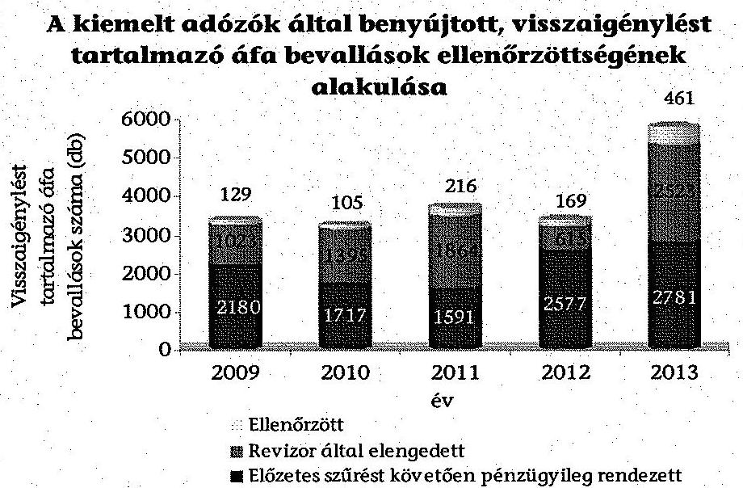

Forrás: NAV adatszolgáltatás
Az elnök által évente meghatározott teljesítménykövetelmények között a KAFIG részére a 2012. év kivételével nem határoztak meg mutatószámot a kiutalás előtti áfa ellenőrzésekre. A 2012. évben a KAFIG a főigazgatóság részére előírányzott 210 db kiutalás előtti áfa ellenőrzéssel szemben 234 ellenőrzést folytatott le.

Az ellenőrzési szakterületnek átadott, de valamilyen okból nem ellenőrzött bevallások esetében az ellenőrzés elmaradását - az 1065/B/2003. APEH utasítás, valamint az 1102/2011. NAV eljárási rendben meghatározottak szerint - indokolni kellett.

Az 1065/B/2003. APEH utasítás 2. számú melléklet 2. pontjában rögzítették az ellenőrzés elmaradása során alkalmazandó bevallás elengedési ok-kódokat. A 2011. október 20-tól hatályos 1102/2011. NAV eljárási rend 1. számú melléklet II.2. pontja szerint a NAV Központi Hivatal Ellenőrzési Főosztálya feladata volt az ok-kódok meghatározása, azonban a közzétételének, nyilvántartásának módjáról az eljárási rend nem tartalmazott előírást. A 2013. december 31-ig alkalmazott elengedési ok-kódokat a 2/2010/ELL Körlevélben határozták meg.

Az ÁSZ által ellenőrzött négy esetben a kiutalás előtti ellenőrzésre kiválasztással kapcsolatosan elvégzett feladatok dokumentálása a bevallás történet elnevezésű nyomtatványon dátum, idő, program, illetve ügyintéző, elvégzett feladat feltüntetésével megtörtént.

A Nyugat-dunántúli Regionális Adó Főigazgatóság 15/2011/75. eljárási rendjében a főigazgató nem határozta meg az egyes feladatok elvégzésére jogosultak kijelölésének módját, ennek következtében a szűrőfeltételeket beállító ügyintéző kijelölése szóbeli utasítással történt. A beállításra jogosult adatait - a 15/2011/75. NAV eljárási rend 3.2 pontjában előírtaknak megfelelően - a hozzáférési jogosultság kiadásának nyilvántartására szolgáló melléklet tartalmazta.

Az ÁSZ által ellenőrzött, kiutalási előtti ellenőrzésre kijelölt bevallások szűrési paraméterei közül két esetben nem történt meg a szűrőfeltételek beállítását végző személyének dokumentálása, amely az 1065/B/2003. APEH utasítás és az 1102/2011. NAV eljárási rend hiányosságaira vezethető vissza (lásd 2.1.2.3 pontban).

# 4.2.4. Külső megkeresések, közérdekű bejelentések, áfa információcsere alapján indított ellenőrzések 

Az EU tagállami megkeresések teljesítésével, a tagállamokba irányuló megkeresések továbbításával és az együttműködéssel kapcsolatos feladatokat a KAIG SzMSz 1 87. § k) pont, a KAIG SzMSz ${ }_{2}$ 74. § b) pont, továbbá a területileg illetékes főigazgatóságok ügyrendjei tartalmazták. A tagállami megkeresések fogadása, az adóigazgatóságok kérésének továbbítása - az 1055/B/2008. APEH utasítás, és az 1161/2011. NAV eljárási rend szerint - az APEH/NAV KH Központi Kapcsolattartó Iroda feladata volt.

Az együttműködés eredményeként a külföldi adóhatóságoktól érkezett megkeresések, az azokra indított ellenőrzések száma - 2011. év kivételével - folyamatosan emelkedett. Az ellenőrzött időszakban a külföldi adóhatóságoktól 615 megkeresés érkezett, melynek $84,7 \%$-a (521) esetében megtörtént az ellenőrzések lefolytatása, a megkeresések 91,2\%-a (561) az áfa adónemmel kapcsolatos volt. Az ellenőrzött időszakban a külföldi adóhatóságoktól a kiemelt adózókra vonatkozó megkeresések számát a 4/d. számú melléklet tartalmazza.

A másik államba irányuló, illetve onnan érkező információkérés feladatait, az automatikus és spontán információcsere, valamint az egyidejű ellenőrzések és kézbesítés iránti megkeresések eljárásrendjét az elnök a közvetlen adók területén történő információcsere szabályairól szóló 1071/B/2008. APEH utasításban és az 1030/2011. NAV eljárási rendben határozta meg. A VIES rendszeren keresztül érkező információk felhasználásával kapcsolatos feladatokat az 1027/B/2007. APEH utasítás, valamint az 1128/2012. és az 1068/2013. NAV eljárási rendek szabályozták.

Az információcsere eredményeként a kimutatott VIES eltérés összege, az érintett kiemelt adózók száma, ezáltal az ellenőrzés alá vont kiemelt adózók aránya, valamint az ellenőrzéssel feltárt adókülönbözet összege 2009-2013. években folyamatosan emelkedett, amelyet a 4/e. számú melléklet tartalmaz. Az APEH/NAV a 2009-2013. években a VIES eltéréssel érintett kiemelt adózók 56,9-69,1\%-át ellenőrizte, amelynek során összesen 70,2 Mrd Ft adókülönbözetet állapított meg.

Az ellenőrzött időszakban a közérdekű bejelentések, valamint a belföldi társhatóságok és az APEH/NAV területi szerveitől érkezett megkeresések alapján indított ellenőrzések számát évenkénti bontásban ${ }^{137}$ a következő ábra mutatja.

[^0]
[^0]:    ${ }^{137}$ NAV 2014. március 6-i adatszolgáltatása alapján

---

# Nemzeti társhatóságok, APEH/NAV területi szervei megkeresésére, illetve közérdekű bejelentésre indított ellenőrzések száma a 2009-2013. években 

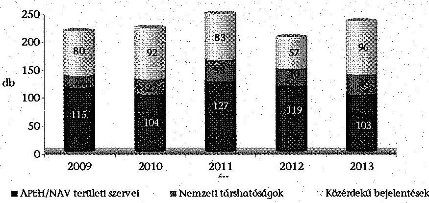

Forrás: NAV adatszolgáltatás
Az ÁSZ ellenőrzéssel érintett közérdekű bejelentések, valamint a belföldi társhatóságoktól és az APEH/NAV területi szervezeteitől érkezett megkeresések (belföldi jogsegély kérések) kezelése során nem minden esetben tartották be az Eutv.ben, a Ket-ben, valamint az APEH/NAV és az illetékes főigazgatóságok utasításaiban és eljárási rendjeiben az eljárási határidőkre, előzetes vizsgálatra, nyilvántartásra vonatkozó előírásokat.

Három közérdekű bejelentésnél nem tartották be az Eutv. 141. § (2) és (5), a 142. § (1)-(2) bekezdéseiben, valamint az 1015/B/2009. APEH utasítás 9. §-ában, 13. §-ában, az 1127/2011. NAV eljárási rend 25. és 29. pontjában, az 5/2009/78. igazgatói utasítás 4. § (5) és 10. § (1) bekezdésében, valamint a 18/2011/71. NAV eljárási rend 6.1 pontjában az illetékességi áttételre előírt nyolc napos, valamint a bejelentés kivizsgálására irányuló 30 napos, továbbá az ügyintézés elhúzódásáról a bejelentő tájékoztatására előírt 15 napos határidőt.

Az 1015/B/2009. APEH utasítás 3. § (5) bekezdésében és az 5/2009/78. igazgatói utasítás 4. § (1)-(2) bekezdéseiben, valamint az 1127/2011. NAV eljárási rend 8. e) pontjában, továbbá a 18/2011/71. NAV eljárási rend 5.1 pontjában foglaltak ellenére egy-egy esetben nem végezték el a közérdekű bejelentések előzetes vizsgálatát.

Az 1015/B/2009. APEH utasítás 6. § (2) bekezdésében és az 5/2009/78. igazgatói utasítás 10. § (2) bekezdésében foglaltak ellenére egy esetben nem készítettek javaslatot az ellenőrzés lefolytatására. A közérdekű bejelentésekről vezetett nyilvántartásban az 1015/B/2009. APEH utasítás 28. § (5) bekezdésében és az 5/2009/78. igazgatói utasítás 17. § (1) bekezdésében foglaltak ellenére egy esetben nem rögzítették a beérkezés, valamint a kivizsgálás megtörténtének időpontját, ezáltal nem lehetett ellenőrizni az Eutv. 142. § (1)-(2) bekezdéseiben előírt határidők teljesítését.

A belföldi jogsegélykéréssel kapcsolatosan egy-egy megkeresés esetében a 2009. évben - a Ket. 22. § (2) bekezdésében előírtak ellenére - nem tartották be az illetékességi áttételre előírt 5 napos határidőt. A 2009. évben egy esetben - a Ket. 26. § (5) bekezdésében előírtak ellenére - túllépték a megkeresés teljesítésére előírt 15 napos határidőt. Egy esetben az 1104/2012. NAV eljárási rend 5.6. pontjában a továbbításra előírt, három munkanapos határidőt figyelmen kívül hagyva a kapcsolódó vizsgálat befejezését követően az iratanyagokat az ellenőrzés befejezését követően közel két hónap után továbbították a KAIG-hoz.

# 4.2.5. Az adózók ellenőrzésre történő kijelölésével, ellenőrzésével, a megbízólevél törlésével kapcsolatos nyilvántartások 

Az állami adóhatóságnak az ellenőrzésekről vezetett nyilvántartásában az adózó azonosítására szolgáló adatok mellett meg kellett jelölni az ellenőrzésre kiválasztás módszerét és az ellenőrzés közvetlen okát az Art. 90. § (8) bekezdése, valamint az 1047/B/2004. és az 1114/B/2010. APEH utasítás 15. §-a, továbbá az 1070/2011. NAV eljárási rend 17. pontja szerint. Az ellenőrzés elrendelésének közvetlen okát és a kiválasztás módszerét a vizsgálat elrendelési ok-kód rendszer tartalmazta az 1074/B/2007. APEH utasítás 2. § (1) bekezdése, valamint az 1004/2012. NAV eljárási rend 2.1 pontja és az 1092/2013. NAV eljárási rend 2. pontja szerint. Az alkalmazott elrendelési ok-kódok és az informatikai alkódok alapján azonban a kiválasztás módszere nem minden esetben volt beazonosítható. A NAV belső szabályzatai nem írták elő egyértelműen, hogy az ellenőrzésekről vezetett nyilvántartás mely része kell tartalmazza az ellenőrzésre kiválasztás módszerét és az ellenőrzés közvetlen okát. A helyszínen ellenőrzött REV lapokon rögzített vizsgálatelrendelési ok-kód és informatikai alkód alapján a kiválasztás módszere nem minden esetben volt megállapítható.

Az állami adóhatóság által végzett ellenőrzések feldolgozásának és nyilvántartásának szabályait az 1073/B/2007. APEH utasítás, az 1010/2012. és az 1058/2013. NAV eljárási rend (REV rendszer) tartalmazta. A REV rendszer célja a lefolytatott ellenőrzések, a hatósági és jogorvoslati eljárások szakaszainak egységes elvek alapján történő feldolgozása és nyilvántartása. Az utasításban és eljárási rendekben meghatározták a megbízólevél kiállítása, módosítása, törlése, az elsőfokú eljárás és a jogorvoslati eljárás eredményének feldolgozása során ellátandó feladatokat, a jogosultságokat, a feladat- és hatásköröket.

A megbízólevél törlésének eseteit, a törléssel kapcsolatos feladatokat az 1073/B/2007. APEH utasításban, valamint az 1010/2012. és az 1058/2013. NAV eljárási rendekben határozta meg az elnök.

A kiemelt adózókat érintően 2009-2013. években törölt megbízólevelek számát, kiállított megbízóleveleken belüli arányát a következő ábra szemlélteti.

Törölt megbízólevelek száma, éven belüli aránya a 2009-2013. években
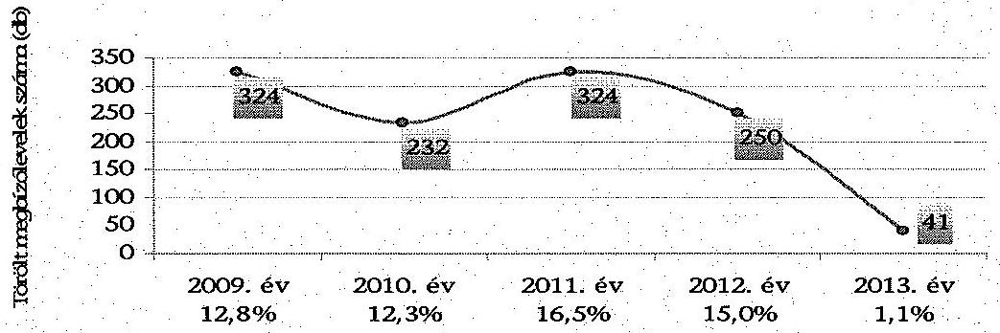

Forrás: NAV adatszolgáltatás

---

A 2013-ban törölt 41 db megbízólevél közel fele, $41,5 \%$-a (17 db) a 20-as ellenőrzési típuskódú, átfogó ellenőrzések közé tartozott. A kiállított megbízóleveleket a 2009-2012. években jellemzően általános megbízólevéllel ${ }^{138}$ végzett ellenőrzés esetében törölték, melynek aránya 2009-ben $87,3 \%$ (283 db), 2010-ben $91,4 \%$ (212 db), 2011-ben 83,0\% (269 db) és 2012-ben 81,2\% (203 db) volt.

Az 1073/B/2007. APEH utasítás 8. § (5) bekezdésének, valamint az 1010/2012. és az 1058/2013. NAV eljárási rendek 8.5 pontjának előírása ellenére a törölt megbízólevelek 5,1\%-ában (60 db) a törlés oka kizárólag a REV rendszerből nem volt megállapítható.

A REV rendszerben a törlés okaként a KAIG Ellenőrzési Osztály 1-7 ügyintézői nyolc esetben „*" jelet tettek. A törlés okát 52 esetben nem rögzítették (50 esetben a KAIG Ellenőrzési Osztály 1-7 ügyintézői, egy-egy esetben a Borsod-Abaúj-Zemplén és a Győr-Moson-Sopron megyei adóigazgatók ügyintézői). A törölt megbízólevelek közül 37 esetben a 2012. év végén folyamatban lévő adóügyek átadása történt a 2013. évtől területileg illetékes megyei adóigazgatóságok részére. Egy esetben a megbízólevél kétszer szerepelt, míg 19 esetben másik megbízólevélszámon lefolytatták az ellenőrzést. A törölt megbízólevelek közül 3 ellenőrzést nem végeztek el.

A fentiek visszavezethetők arra, hogy a NAV Központi Hivatala által előkészített 1073/B/2007. APEH utasításban, valamint az 1010/2012. és az 1058/2013. NAV eljárási rendekben a törlés okának rögzítésére egységes kódszámrendszer használatát nem írta elő az elnök.

# 4.3. A kiemelt adózói körben végzett adóhatósági ellenőrzések 

### 4.3.1. Az ellenőrzések megindítása, meghiúsult ellenőrzések és a megbízólevelek törlése

Az ellenőrzött esetekben az adózók kiértesítése az adóhatósági ellenőrzésekről az Art. 93. § (1) bekezdés előírásainak megfelelően, a megbízólevél kézbesítésével, a megbízólevél átadásával, vagy az általános megbízólevél bemutatásával kezdődött. Az 1073/B/2007. és az 1113/B/2010. APEH utasítások 6. § (3) bekezdésében, az 1010/2012. és a 1058/2013. NAV eljárási rendek 6.3. pontjaiban foglaltaknak megfelelően, a megbízólevél bemutatásának tényét az adózó a megbízólevélen vagy az azonosító adatlapon aláírásával igazolta, amelynek egy példánya az ellenőrzési dokumentáció részét képezte.

Az APEH/NAV ellenőrzési osztályai által kiállított megbízólevelek ${ }^{139}$ adattartalma az ellenőrzött esetek 31,2\%-ánál nem felelt meg az Art. 93.

[^0]
[^0]:    ${ }^{138}$ Az Art. 93. § (7)-(8) bekezdései szerint: „Az adóhatóság általános megbízólevelet is kiállíthat, amellyel az adóellenőr
 ilyen megbízólevéllel nem rendelkező másik adóhatósági alkalmazottal együtt az egyes adókötelezettségek teljesítésére, illetőleg adatgyűjtésre irányuló ellenőrzésre jogosult. ... Az általános megbízólevéllel az állami adó- és vámhatóság adóellenőre területi megkötés nélkül jogosult ellenőrzés lefolytatására."
    ${ }^{139}$ Az Art. 93. § (3) bekezdése szerint az ellenőrzést adóhatósági igazolvánnyal és megbízólevéllel lehet lefolytatni.

---

§ (6) bekezdés előírásainak, mivel az Art. 87. § (1) bekezdés c) pontja szerinti, az egyes adókötelezettségek teljesítésére irányuló ellenőrzéseknél alkalmazott megbízólevelek nem tartalmazták, hogy az ellenőrzések mely adókötelezettségre irányultak. Ez tervezett ellenőrzések közel egyharmadát jelentette.

Az egyes adókötelezettségek teljesítésére irányuló ellenőrzések tervezett éves arányszámát az Art. 90. § (1) bekezdésében előírt irányelvek ${ }^{140}$ és ellenőrzési tájékoztatók ${ }^{141}$ 28,2-32,4%-ban határozták meg (2009. év 32,4%, 2010. év 31,6%, 2011. év 30,4%, 2012. év 28,3%, 2013. év 28,2%).

Az ÁSZ által ellenőrzött esetekben az APEH/NAV által végzett ellenőrzések megkezdése nem ütközött akadályba, emiatt az adózó hibájából nem hiúsult meg. Így az adózót érintő szankció alkalmazására, az Art. 24/A. § alapján az adózó adószámának felfüggesztésére, cégbírósági intézkedés megtételére nem került sor.

Az ÁSZ által ellenőrzött esetek között előfordult, hogy a NAV késve állította ki a megbízólevelet, és emiatt a kiutalás előtti áfa ellenőrzéshez nem állt elegendő idő rendelkezésre.

Az APEH/NAV az 1073/B/2007. és az 1113/B/2010. APEH utasítások 8. § (1)-(5) bekezdései, az 1010/2012. és az 1058/2013. NAV eljárási rendek 8.1-8.5 pontjai szerint a megbízólevelet törölte, amennyiben a megbízólevelet kiállító igazgatóság nem volt jogosult az ellenőrzés lefolytatására, vagy olyan változás következett be, amely módosítással nem orvosolható. A törölt megbízólevél visszaállítására nem volt lehetőség, annak sorszáma újra nem volt felhasználható. A megbízólevél törlésének tényét és okát a REV rendszerben tárolták.

# 4.3.2. Az ellenőrzések lefolytatása és befejezése 

Az ellenőrzött esetekben - az 1073/B/2007. és az 1113/B/2010. APEH utasítások 4. § b) pontjai, az 1010/2012. és az 1058/2013. NAV eljárási rendek 4. b pontjai előírásainak megfelelően - megtörtént a REV rendszerben az ellenőrzési cselekményekhez kapcsolódóan az adatok rögzítése. Az iratanyagokban szereplő adatok megegyeztek a REV informatikai rendszerben rögzített adatokkal (az ellenőrzés alá vont adózók, az ellenőrzés típusai, az egyes eljárási cselekményekhez kapcsolódó határidők, dátumok, az alkalmazott szankciók, az ellenőrzés alá vont vizsgálati időszak, az ellenőrzést végző adóellenőrök).

Az Art. 87. § (1) bekezdés a) pontja és 106. §-a szerinti, a bevallások utólagos vizsgálatára ellenőrzést az APEH/NAV az Art. 94. § (1) bekezdés előírásainak megfelelően, az adózó helyszínén folytatta le. Az utólagos ellenőrzés során az Art. 104. § (1) bekezdés előírásainak megfelelően, az ellenőrzésekről jegyzőkönyv készült, amelyek az Art. 105. § előírásainak megfelelően adóhatósági

[^0]
[^0]:    ${ }^{140}$ 7003/2009. (AEÉ 2.) APEH irányelv IV. pont, 7002/2010. (AEÉ 3-4.) APEH irányelv III. pont
    ${ }^{141}$ Ellenőrzési irányok 2011. NAV III. pont, 4003/2012. NAV tájékoztató III. pont, 4001/2013. NAV tájékoztató III. pont

---

határozattal zárultak. A feltárt adókülönbözetről az adóhatóság az Art. 128. § előírásainak megfelelően határozatában rendelkezett.

Az Art. 87. § (1) bekezdés c) pontja és a 118. § (1)-(2) bekezdései szerinti, egyes adókötelezettségek teljesítésére irányuló ellenőrzésnél előfordult, hogy az adózó nem tett eleget az Art. 44. § (1) bekezdése előírásainak, amely szerint a nyilvántartásokat úgy kellett vezetni, hogy az adó alapjának, az adó összegének ellenőrzésére alkalmas legyen. Az adózó bizonylatai nem voltak ellenőrzésre alkalmas állapotban, a KAIG az Art. 95. § (4) bekezdése ellenére határidő kitűzésével nem kötelezte az adózót a hiányosságok megszüntetésére, mulasztási bírság kiszabásáról nem rendelkezett.

A KAIG Speciális Ügyek Ellenőrzési Osztálya közérdekű bejelentés alapján - az Art. 87. § (1) bekezdése c) pontja és 118. § (1)-(2) bekezdése szerint - az adózónál fellelhető iratok vizsgálatára vonatkozóan indított ellenőrzést 2010. november 5-én. A bejelentésre elrendelt, az Art. 118. § (1)-(2) bekezdés szerinti ellenőrzési módszer nem felelt meg az 5/2009/78. igazgatói utasítás 10. § (6)-(7) pontja előírásainak, mert nem az „ügyhöz” igazodó volt és a közérdekű bejelentésben foglaltak megalapozottságáról a jegyzőkönyv alapján megnyugtatóan nem lehetett állást foglalni.

Az ÁSZ által ellenőrzött esetekben - kettő kivételével ${ }^{142}$ - az adóhatóság az ellenőrzéseket az Art. 92. § előírásai szerint határidőre bejezte. Az Art. 105. § előírásainak megfelelően az utólagos, az ismételt, illetve az állami garancia beváltásához kapcsolódó ellenőrzéseknél a megállapításokról határozatot hozott. A határozatokat az állami garancia beváltásához kapcsolódó ellenőrzés és az ismételt ellenőrzés esetén az Art. 5/A. § (1) bekezdése szerinti 30, míg - egy határidő hosszabbítás kivételével - az utólagos ellenőrzéseknél az Art. 128. § (1) bekezdésében előírt 60 napos határidőn belül meghozta. A határidő meghosszabbítása - a megalapozott döntéshozatal érdekében - összhangban volt az Art. 5/A. § előírásaival, amely szerint az adóügyekben az ügyintézési határidő legfeljebb 30 nappal meghosszabbítható.

Az adóhatóság fizetési kötelezettséggel együtt járó másodfokú határozatot egy alkalommal hozott az ellenőrzött esetek közül. A jegyzőkönyvre az adózó észrevételt tett. A benyújtott észrevételt az adóhatóság az elsőfokú adóhatározatnál figyelembe vette, a megállapított adókülönbözetet csökkentette. Az adózó élve a fellebbezési jogával - az elsőfokú határozat egyes előírásait a nyitva álló határidőn belül továbbra is kifogásolta. Az adóhatóság a másodfokú határozatában az adózó fellebbezésének helyt adva az elsőfokú határozatban előírt adókülönbözetet, valamint az adókülönbözet jogkövetkezményeit mérsékelte.

[^0]
[^0]:    ${ }^{142}$ A 2011. októberi áfa utólagos ellenőrzésére 2011. december 20-án, valamint a közérdekű bejelentést érintő 2012. augusztus 3-án a 2009-2011. évek vonatkozásában indított ellenőrzések.

---

# 5. Az EUROFISC NEMZETKÖZI ADATCSERE RENDSZER MŰKÖDÉSE 

### 5.1. Az EUROFISC magyarországi működési feltételeinek kialakítása

Az EUROFISC együttműködés célja az áfa csalás elleni küzdelem területén egy multilaterális, korai riasztó rendszer (EWS), a küldő tagállam által előzetes kockázatelemzésen átesett célzott adatállomány gyors információcseréjét biztosító hálózat kialakítása és hatékony működtetése az EUROFISC négy tevékenységi területén (WF1-WF4) ${ }^{143}$.

Az EUROFISC nemzetközi áfa adatcsere együttműködésben való részvétel jogi alapját a Tanács 904/2010/EU rendeletének X. fejezete (33-37. cikkek) teremtette meg. A hálózat keretében kialakított egyes tevékenységi területeken a Tanács 904/2010/EU rendelet 34. cikk (1) bekezdése szerint a részvétel önkéntes, a 34. cikk (2) bekezdése szerint azonban „Az Eurofisc valamely tevékenységi területén való részvétel mellett döntő tagállamok aktívan részt vesznek a célzott információknak a valamennyi részt vevő tagállam közötti többoldalú cseréjében.”

A Tanács 904/2010/EU rendelete 33. cikk (1) bekezdése szerint az EUROFISC hálózat „a célzott információk tagállamok közötti gyors cseréjére szolgál”, de a gyors információcsere fogalmát a rendeletben nem határozták meg, határidőket nem írtak elő. Az egyes tevékenységi területek munkacsoportjainak ülésein célként tűzték ki az adatok feltöltésének, visszajelzésének havi rendszerességét.

A Tanács 2010/C 275/06 számú nyilatkozata szerint a tagállamok kormányainak a Tanács keretében 2010. október 7-én ülésező képviselői „üdvözlik az Eurofisc hálózatnak a 2008. október 7-i tanácsi következtetésekkel összhangban történő létrehozását”, és megállapodtak a hálózat működését illetően egyes szervezeti és működési részletekről ${ }^{144}$.

Az EUROFISC csoport alakuló ülésén ${ }^{145}$ a tagállamok képviselői a hálózat működésére vonatkozó általános eljárási szabályokat - a Tanács 2010/C 275/06 számú nyilatkozata 5. pontjában foglalt felhatalmazás alapján - az EUROFISC eljárásrendben rögzítették (Rules of Procedure for EUROFISC). Az EUROFISC eljárásrend - az éves jelentés készítésének eljárásrendje kivételével - a Tanács 904/2010/EU rendeletének X. fejezetében foglaltaknak megfelelően szabályozta a kapcsolattartók, a tevékenységi területek koordinátorainak az EUROFISC csoporton belüli működését és feladatait, az egyes tevékenységi területek üléseit, az ülésekkel kapcsolatos általános előírásokat, az EU Bizottságnak a hálózat működésében betöltött szerepét.

[^0]
[^0]:    ${ }^{143}$ A WF1, a WF2 és a WF3 esetében konkrét adózókra vonatkozó információk cseréje, a WF4 esetében a csalás ellenes, általános információk megosztása történik.
    ${ }^{144}$ Öt területet érintően állapodtak meg: 1. EUROFISC kapcsolattartók; 2. EUROFISC tevékenységi területi koordinátorok; 3. Az EUROFISC csoport; 4. Az EUROFISC tevékenységi körökhöz kapcsolódó ülések; 5. Az EUROFISC csoport első ülése.
    ${ }^{145}$ Brüsszel, 2010. november 10.

---

A Tanács 904/2010/EU rendelete 37. cikkében foglaltak szerint az EUROFISC tevékenységi területi koordinátorok éves jelentést nyújtanak be valamennyi tevékenységi területen végzett tevékenységükről a Közigazgatási Együttműködési Állandó Bizottságnak (SCAC). Az EUROFISC eljárásrend 3. cikk 2. pontja és 5. cikk 2. pontja szerint az éves jelentést az EUROFISC csoport részére kell benyújtani, majd annak jóváhagyását követően a csoport elnöke nyújtja be a Bizottságnak.

Az EUROFISC eljárásrend biztosította a keretet a hálózat működéséhez. További útmutatókra, szabályozásokra vonatkozóan előírás nem volt, és azok a gyakorlatban nem kerültek kiadásra.

A Tanács 904/2010/EU rendelete 35. cikke szerint az EU Bizottság technikai és logisztikai segítséget nyújt az EUROFISC számára. Az EUROFISC eljárásrend 16. cikk az informatikai technikai támogatás háttereként a Tanács 904/2010/EU rendelete 53. cikkében foglaltakat jelölte meg, amely a CCN/CSI hálózat alapján történő információcserét tartalmazta ${ }^{146}$. Az ellenőrzött időszakban ezzel szemben az adatcsere az EU Bizottság által üzemeltetett CIRCABC informatikai rendszeren történt ${ }^{147}$. Az EUROFISC csoport alakuló ülésének jegyzőkönyve szerint az EU Bizottság két informatikai eszközt (CCN/MAIL2 és a CIRCABC) is a tagállamok rendelkezésére bocsátott. A tevékenységi területek ülésein már csak a CIRCABC informatikai rendszert mutatták be az adatcsere eszközeként ${ }^{148}$. A CIRCABC informatikai rendszer funkciói közül tárhely funkciót biztosított az EUROFISC esetén, a gyakorlatban az adatcsere Excel adatállományok feltöltésével történt.

Az EUROFISC eljárásrend 7. cikk felhatalmazása alapján, a tevékenységi területek ülésein az EUROFISC kapcsolattartók határozták meg a részletes feladatokat és munkafeltételeket. A tevékenységi területek első üléseit ${ }^{149}$ követően kezdődött meg a tényleges információcsere.

A Tanács 904/2010/EU rendelete kötelező erővel bír és közvetlenül alkalmazandó Magyarországon. Ezen túl, további szabályozást a hazai jogrend az EUROFISC hálózat működésére vonatkozóan nem tartalmazott. A Tanács 904/2010/EU rendelete 3. cikke alapján az EU Bizottság által közzétett jegyzék ${ }^{150}$ szerint Magyarországon illetékes hatóságként a Nemzeti Adó- és Vámhivatal Központi Kapcsolattartó Iroda (KKI) került kijelölésre. A kijelölésről az NGM 2010. december 10-én értesítette az EU Bizottságot.

[^0]
[^0]:    ${ }^{146}$ Az EUROFISC eljárásrend 16. cikk szintén a Tanács 904/2010/EU rendelete 53. cikkére utalt vissza az informatikai támogatást illetően.
    ${ }^{147}$ A CIRCABC rendszer alkalmazásának lehetősége már az EUROFISC csoport 2010. november 10-i alakuló ülésén is felmerült, az EUROFISC kapcsolattartók regisztrációja és a konkrét adatcsere pedig már ezen a rendszeren indult el.
    ${ }^{148}$ Az informatikai rendszer változásának okáról a NAV-nál nem volt információ.
    ${ }^{149}$ Az egyes tevékenységi területek
 nyitó ülésére 2011. február 7-én Párizs-Pantinban (WF1); 2011. április 7-én Luxembourgban (WF2); 2011. március 29-én Bécsben (WF3); 2011. március 15-én Amszterdam-Schipholban (WF4) került sor.
    ${ }^{150}$ A Bizottság (2011/C 131/03) információja hozzáadottérték-adóról (HÉA), Megjelent az Európai Unió Hivatalos Lapjának 2011. május 3-i, C 131. számában; A Bizottság (2013/C 191/03) információja hozzáadottérték-adóról (HÉA), Megjelent az Európai Unió Hivatalos Lapjának 2013. július 2-i, C 191. számában.

---

Az Art. 2013. április 20-ig hatályos 56. § (1) bekezdésében ${ }^{151}$ illetékes hatóságként az állami adóhatóság Kormány által kijelölt szervére hivatkozott. A NAV Korm. rendelet 36. § (1) bekezdésében a Kormány 2013. augusztus 30-ig az Art. 56. § (1) bekezdésére hivatkozva jelölte ki kapcsolattartó közigazgatási szervként a NAV szervezetén belül a Központi Hivatalt (ezen belül a KKI-t), 2013. augusztus 31-től kezdődően pedig a Tanács 904/2010/EU rendelete 2. cikk (1) bekezdés a) pontjában megjelölt központi kapcsolattartó irodaként jelölte ki a NAV szervezetén belül a Központi Hivatalt.

A KKI a NAV KH Ellenőrzési Főosztályán, 2014. március 22-től a Kockázatkezelési és Kapcsolattartó Főosztályon belül, osztályszinten helyezkedett el. A 2011. június 30-ig hatályban volt APEH SzMSz 1. számú melléklet 27. pontjában a KKI feladataként az Európai Unió országaiban működő központi kapcsolattartó irodákkal történő kapcsolattartás, a KKI-rendszer szakmai szempontból történő felügyelete és koordinálása, valamint az Európai Unió tagállamaiból érkező, illetve azokba irányuló tájékoztatáscserére vonatkozó megkeresések intézése szerepelt. A 2011. július 1-jétől hatályos NAV SzMSz ${ }_{4}$ melléklete 3.3. pontjában az Ellenőrzési Főosztály ${ }^{152}$ feladataként határozták meg, hogy - 2013. december 17-től a KKI útján - felelős az Unió tagállamaival és harmadik országokkal bonyolított információcseréért a közvetett és közvetlen adók területén. A NAV KH ügyrend ${ }_{1,3}$ 51. h) pontjában, illetve a NAV KH ügyrend ${ }_{2}$ 52. h) pontjában nevesítették a KKI feladataként a Tanács 904/2010/EU rendelete X. fejezetében (EUROFISC) foglaltakkal kapcsolatos feladatokat.

A Tanács 904/2010/EU rendelet 34. cikk (1) bekezdése szerint a hálózat keretében kialakított egyes tevékenységi területeken a részvétel önkéntes, amelyről az egyes tagállamok jogosultak dönteni: „A tagállamok az Eurofisc általuk kiválasztott tevékenységi területein vesznek részt, és dönthetnek arról is, hogy valamely területen beszüntetik a részvételüket." Magyarország az ellenőrzött időszakban mind a négy tevékenységi terület munkájában részt vett, amely részvételről a KKI vezetője döntött ${ }^{153}$. A KKI vezetője nem volt jogosult dönteni az EUROFISC egyes tevékenységi területein történő tagállami részvételről, mivel az illetékes hatóságként történt kijelöléssel a Tanács 904/2010/EU rendeletében foglalt információk cseréjére, és nem a tagállam nevében történő döntéshozatalra kapott felhatalmazást.

A tevékenységi területeken történő részvételi szándékról - a WF3 tevékenységi terület kivételével - az EUROFISC csoport első ülésén való részvételre történt ki-

[^0]
[^0]:    ${ }^{151}$ Az Európai Közösség adóügyi együttműködési szabályainak alkalmazása tekintetében illetékes hatóság - a vám és a jövedéki adó kivételével - az állami adóhatóság Kormány által kijelölt szerve (a továbbiakban: kapcsolattartó közigazgatási szerv). Az Art. 56. §-t 2013. április 21-től hatályon kívül helyezték.
    ${ }^{152}$ A feladat 2014. március 22-től a Kockázatkezelési és Kapcsolattartó Főosztályhoz került a NAV SzMSz4-et módosító 10/2014. (III. 21.) NGM utasítás 1. §, 1. melléklet 27. § alapján.
    ${ }^{153}$ A NAV erre vonatkozó nyilatkozata szerint „a KKI vezetője, mint az adóügyi információcserére felhatalmazott illetékes hatóság vezetője döntött az EUROFISC tevékenységi területeken történő részvételről, amelyet amennyiben a téma újszerű, több szakterületet érintő jellege megkívánta, a felügyelő főosztályvezető útján felterjesztett a felügyelő elnökhelyettes(ek) elé jóváhagyásra."

---

jelöléssel egyidejűleg értesítette az APEH Központi Hivatal az EU Bizottságot, az annak kérdőívére adott válaszlevelében ${ }^{154}$. A WF3 területi munkacsoportban való részvételi szándékot - tekintettel arra, hogy a 2011. évi integrációt követően elhárult az adatszolgáltatás korábban fennállt akadálya - a 2011. március 17-én tartott NAV értekezleten fejezték ki${ }^{155}$, amelyet követően a kapcsolattartók már részt vettek a március 29-i első ülésen ${ }^{156}$.

A Tanács 904/2010/EU rendelete 36. cikk (1) bekezdése alapján, az illetékes hatóságnak ki kellett jelölnie legalább egy-egy EUROFISC kapcsolattartót, akiknek a 2. cikk (1) bekezdés c) pontja értelmében illetékes tisztviselőknek kell lenniük és nekik kell végezniük a 33. cikk (2) bekezdésében foglalt tevékenységeket.

A négy tevékenységi terület EUROFISC kapcsolattartói (ELO-k) az EU Bizottság részére küldött email-ekben, a kapcsolattartó tisztviselők közül az EUROFISC csoport plenáris ülésein szavazati joggal bíró nemzeti kapcsolattartó az EU Bizottság erre vonatkozó kérdőívére ${ }^{157}$ adott válaszlevélben került kijelölésre. Az EUROFISC kapcsolattartók - a Tanács 904/2010/EU rendelete 4. cikk (3) bekezdésében foglaltak szerinti - tisztviselők jegyzékében szerepeltek, amely a CIRCABC informatikai rendszerben rendelkezésre állt, és a többi érintett tagállam számára hozzáférhető volt. A nyilvántartási jegyzék mindig az aktuális állapot szerint tartalmazta az EUROFISC kapcsolattartó tisztviselőket (ELO), valamint a nemzeti kapcsolattartó tisztviselőt (ENLO).

A CIRCABC informatikai rendszer szerint Magyarországon tevékenységi területenként egy-egy fő kapcsolattartó, továbbá három tevékenységi területen egy-egy, a WF2 területén kettő további kapcsolattartó került megjelölésre. Nemzeti kapcsolattartó tisztviselőként egy fő és egy további kapcsolattartó került megjelölésre. A kijelölések - az ismétlődések következtében - összesen négy személyt érintettek, akik közül három a KKI-n, egy a Vám Főosztályon dolgozott.

Az EUROFISC kapcsolattartó tisztviselőknek az illetékes hatóság (KKI) általi kijelöléséről hozott vezetői döntés(ek) alapdokumentumai ${ }^{158}$, valamint felhatalmazásaik a rendelet alapján megvalósuló közvetlen információcsere lefolytatására - a Tanács 904/2010/EU rendelete 2. cikk (1) bekezdés c) pontjában ${ }^{159}$ és 4.

[^0]
[^0]:    ${ }^{154}$ Az APEH KH Ellenőrzési Főosztályának a Nemzetközi Főosztálya részére 2010. október 20-án küldött levele szerint.
    ${ }^{155}$ Emlékeztető a 2011. március 17-i, a NAV-nak az EUROFISC WF3-ban való részvételi lehetőségéről tartott értekezletről.
    ${ }^{156}$ Az EU Bizottság értesítéséről Magyarország WF3 területi munkacsoportban történő részvételi szándékára vonatkozóan dokumentum nem volt.
    ${ }^{157}$ Az EUROFISC csoport alakuló ülésén a résztvevőket kijelölő levél mellékletét képező, az EU Bizottság kérdőívére adott válaszok.
    ${ }^{158}$ Dokumentált kijelölés mindössze az EUROFISC csoport 2010. november 10-i alakuló ülésén történő részvételre, két fő esetében történt.
    ${ }^{159}$ A Tanács 904/2010/EU rendelete 2. cikk (1) bekezdés c) pont szerint illetékes tisztviselő: minden olyan tisztviselő, akit az illetékes hatóság a 4. cikk (3) bekezdése szerint felhatalmazott az e rendelet alapján megvalósuló közvetlen információcsere lefolytatására.

---

cikk (3) bekezdésében foglaltak ellenére - nem álltak rendelkezésre. A feladatellátásban érintett személyek munkaköri leírásaiban az ellenőrzött időszakban az EUROFISC-hez kapcsolódó feladatok nem szerepeltek, a közszolgálati tisztviselőkről szóló 2011. évi CXCIX. törvény 75. § (1) bekezdés d) pontjának előírása ellenére.

A Tanács 904/2010/EU rendelete X. fejezetében foglalt, EUROFISC feladatok ellátása a KH Ügyrend ${ }_{1,2,3}$-ban ${ }^{160}$ a KKI feladatkörében szerepelt, de azok sem tartalmazták „a szervezeti egység vezetőinek és alkalmazottainak feladat- és hatáskörét (munkakörét)" az Ámr. ${ }_{2}$ 20. § (7) bekezdésében és az Ávr. 13. § (5) bekezdésében foglalt, a költségvetési szervek szabályzataira vonatkozó előírások ellenére.

Az Ámr. ${ }_{2}$ 20. § (7) bekezdése szerint „A költségvetési szerv szervezeti egységei által ellátott feladatok munkafolyamatainak leírását, a szervezeti egység vezetőinek és alkalmazottainak feladat- és hatáskörét (munkakörét), a helyettesítés rendjét, továbbá a szervezeti egység költségvetési szerven belüli belső és azon kívüli külső kapcsolattartásának módját, szabályait - ha azokról a szervezeti és működési szabályzat vagy a költségvetési szerv más szabályzata nem rendelkezik - a szervezeti egységek ügyrendje tartalmazza." Az Ávr. 13. § (5) bekezdése 2012. január 1-jétől a „munkakörét" kifejezést nem tartalmazta.

Az EUROFISC kapcsolattartók a Tanács 904/2010/EU rendelete 33. cikk (2) bekezdésében, valamint az EUROFISC eljárásrend 7. cikkében felsorolt feladatokat ellátták. A létrehozott EUROFISC hálózaton belül koordinálták a célzott információk cseréjét, a kapott figyelmeztetésekre való reagálásával összefüggő munkát, valamint részt vettek az EUROFISC csoport ülésein.

A NAV kimutatása szerint az ellenőrzött időszakban az EUROFISC csoport három plenáris ülést, a négy munkacsoport összesen 19 ülést tartott. Az ülésekről az úti beszámolók - a WF4 első két ülése kivételével, az 1042/B/2010. APEH utasítás 13. § (10) bekezdésében előírtak ellenére -, rendelkezésre álltak.

Az EUROFISC alapján történő információcsere szervezeten belüli szabályait 2011. március 23-tól ${ }^{161}$ az 1024/2011. NAV eljárási rend 22-24. pontjai, majd 2013. november 6-tól az 1103/2013. NAV eljárási rend 65-72. pontjai tartalmazták. Az információk cseréjére vonatkozó alapvető szabályok megfeleltek a Tanács 904/2010/EU rendelete 33. cikk (2) bekezdésében foglaltaknak. Az eljárási rendekben az érintett szervezeti egységek ${ }^{162}$ információk gyűjtésére vonatkozó feladatai lehetőségként szerepeltek.

Az 1024/2011. NAV eljárási rend 22.4. pontja, valamint az 1103/2013. NAV eljárási rend 68. pontja szerint az ellenőrzést lefolytató szervezeti egységnek akkor kell a bizonylatokat vagy a bizonylatok adatait az Áfainfo könyvtár erre a célra létrehozott alkönyvtárába lementeni, ha az együttműködésben meghatározott feltételeknek megfelel és megítélése szerint más, az együttműködésben résztvevő

[^0]
[^0]:    ${ }^{160}$ KH Ügyrend ${ }_{1}$ 51.h) pont, KH Ügyrend ${ }_{2}$ 52.h) pont, KH Ügyrend ${ }_{3}$ 51.h) pont
    ${ }^{161}$ Az ezt megelőző időszakban a megelőző Eurocanet, Autocanet szabályozása volt érvényben (1028/B/2009. APEH utasítás).
    ${ }^{162}$ Érintett szervezeti egységek: a hivatkozott eljárásrendek szerint illetékes szervezeti egységek, a NAV Központi Hivatal Különös Hatásköri Ügyek Főosztálya, Felülellenőrzési Főosztálya, a főigazgatóságok és az igazgatóságok.

---

tagállam számára hasznos lehet. A lementés határidejét a tárgynegyedévet követő hó 25-ig határozták meg.

Az ellenőrzött időszakban a KKI, mint illetékes hatóság az EUROFISC működtetésére vonatkozó tevékenységét magában foglaló, a kockázatok azonosítását, kezelését és értékelését biztosító, szabályozásba foglalt kockázatkezelési rendszert nem alakított ki az Ámr. ${ }_{2}$ 157. §, 2012. január 1-jétől a Bkr. 7. § előírásai ellenére. Az EUROFISC adatok kockázatkezelésének módszerére vonatkozóan az igazgatóságok/főigazgatóságok nem adtak ki eljárási rendet. Az Ámr. 156. § (2) bekezdésében és a Bkr. 6. § (3) bekezdésében előírtak ellenére a KKI tevékenységére, így az EUROFISC hálózat működtetése tekintetében ellenőrzési nyomvonalat nem alakítottak ki.

Az Ellenőrzési Főosztály az adó főigazgatóságok részére kiadott 2011. augusztus 10-i 38/2011/Ell. számú körlevelében soron kívüli, illetve ennek megfelelő kötelező ellenőrzést rendelt el a WF3 területén terítésre kerülő (beérkező adatokban jelzett) tételek vonatkozásában. A kötelező ellenőrzést a 2013. január 17-i 5003/2013/ELL körlevélben visszavonták, mivel „a témában elrendelt vizsgálatok tapasztalatai és a külföldről kapott állományok magyar érintettségű sorainak bővülése nem indokolja a kötelező ellenőrzést... A jövőben terítésre kerülő állományokban szereplő
 tételekkel hasonlóan szükséges eljárni, mint az EUROFISC egyes és kettes munkaterületének munkája során kapott állományokkal, azaz minden régió kockázatelemzést követően maga dönti el, hogy indít-e ellenőrzést.

A NAV az EUROFISC hálózat működéséről rendszeres (úti jelentések), illetve eseti jelleggel (egyedi adat- és információkérések alapján) tájékoztatta az NGMet. A NAV elnöke 2013. szeptember 15-től - az NGM tájékoztatási igényére hivatkozva - az 5077/2013/ELN körlevélben szabályozta az EU Bizottság által szervezett, azon adózással kapcsolatos munka- és projektcsoportok tevékenységéről való rendszeres tájékoztatást, amelyekben kizárólag a NAV munkatársai vesznek részt. A körlevélben foglaltak alapján az EUROFISC ülések úti jelentéseit megküldték az NGM illetékes főosztályára, a 10 napos határidőt azonban nem tartották be, mert csak 2014. március 21-én történt meg a 2013-as úti beszámolók továbbítása. A NAV eseti tájékoztatást nyújtott az NGM adóügyekért felelős helyettes államtitkára részére 2011 és 2013 márciusaiban az EUROFISC hálózat működéséről.

# 5.2. Az EUROFISC adatcsere NAV általi működtetése 

A hálózatban résztvevő tagországok között a konkrét adózókra vonatkozó adatok cseréje a WF1, a WF2 és a WF3 tevékenységi területeken történt. A Tanács 904/2010/EU rendelete 34. cikk (2) bekezdése szerinti célzott információkat tartalmazó adatállományokba - előzetes kockázatelemzés alapján - az ún. szoros megfigyelés alá vont adózók adatai kerültek. Sem nemzetközi, sem hazai szinten nem volt szabályozott, hogy az EUROFISC adatállományokba - összesítő nyilatkozat, számla, vagy közösségi adószám lekérdezés alapján - bekerült, szoros megfigyelés alá vont adózók mikor és milyen feltételek alapján kerülhetnek ki az információcseréből.

---

Az információcserék adattartalmát az EUROFISC eljárásrend 7. cikk 3. bekezdésében foglaltak alapján, a tevékenységi területek kapcsolattartóinak első ülésén határozták meg, amelyek módosultak az ellenőrzött időszakban.

A WF1 és a WF2 esetében a célzott információkat tartalmazó adatállomány tartalmazta a számlát kibocsátó és befogadó adózók nevét, közösségi adószámát, valamint a rendelkezésre álló alábbi információk közül legalább egyet:

- összesítő nyilatkozatok (IC list);
- közösségi adószám érvényességére vonatkozó lekérdezések (VRN clearance);
- ellenőrzésekhez kapcsolódóan rendelkezésre álló számlák adatai (invoices).

A WF3 esetén a célzott információkat tartalmazó adatállomány az Egységes Vámokmány adatait tartalmazta.

A WF3 második ülésén az eredetileg meghatározott 40 adat küldését 15-re csökkentették (Vilamoura, 2011. október 6-7.). A WF2 harmadik ülésén döntöttek a VRN clearance küldött adatokban történő törléséről (Bukarest, 2012. október 24-25.). A WF3 harmadik ülésén döntöttek a vámtarifa-szűkítés eltörléséről (Bécs, 2012. június 26-27.).

# A NAV különböző adatbázisaiban az EUROFISC adatcsere információigényének teljesítéséhez szükséges adatok rendelkezésre álltak (a 

VIES rendszerrel megegyező összesítő nyilatkozatok, a közösségi adószám lekérdezések a KKI adatbázisában ${ }^{163}$, a csalás gyanús adózókról az ellenőrök által összegyűjtött bizonylatok).

### 5.2.1. Az EUROFISC hálózat keretében más országokból érkezett megkeresések

Az 1024/2011. NAV eljárási rend 23. pontjának és az 1103/2013. NAV eljárási rend 69. pontjának megfelelően, az EUROFISC kapcsolattartó tisztviselők a más országokból érkezett megkereséseket tartalmazó adatokat a CIRCABC informatikai rendszerről letöltötték és elérhetővé tették a NAV kapcsolattartó személyek ${ }^{164}$ számára, továbbá értesítették őket az elhelyezésről. A NAV belső szabályozásában a 2013. november 6-tól hatályba lépett eljárási rendben nem határoztak meg határidőt, gyakoriságot a CIRCABC rendszerről történő letöltésre, a NAV kapcsolattartó személyek számára történő elérhetővé tételre vonatkozóan${ }^{165}$.

[^0]
[^0]:    ${ }^{163}$ A közösségi adószám lekérdezésénél vagy közvetlenül a magyar hatóságot keresték meg (ekkor a lekérdezés adatai rögtön megjelentek a KKI adatbázisában), vagy az EU Bizottságnál kérelmezték a lekérdezést (ez esetben az EU Bizottság küldött technikai üzenetet a lekérdezés adattartalmáról, ez is a KKI adatbázisában került rögzítésre).
    ${ }^{164}$ Az adó főigazgatóságokon, illetve a NAV Központi Hivatal Különös Hatásköri Ügyek Főosztályán és a Felülellenőrzési Főosztályon kijelölt tisztségviselő(k), aki(k)nek a feladata valamely tagállam illetékes hatóságához intézendő információ KKI felé történő továbbítása, illetve a KKI-tól, vagy a KKI közvetítésével a tagállami illetékes hatóságoktól érkező különböző típusú információ fogadása.
    ${ }^{165}$ Ezt megelőzően a beérkezett adatokat 10 napon belül kellett rögzíteni és elérhetővé tenni.

---

A beérkezett adatok elemzéséről, valamint a lefolytatott ellenőrzések eredményeiről az érintett szervezeti egységek - az 1024/2011. NAV eljárási rend 24.1. pontjának és az 1103/2013. NAV eljárási rend 70. pontjának megfelelően - negyedévente küldött jelentést a KKI részére. A jelentések az EUROFISC állományokban szereplő, az illetékességi körükbe tartozó adózók ellenőrzéséről nyújtottak szöveges tájékoztatást. Az 1103/2013. NAV eljárási rend 2013. november 6-i hatályba lépésétől havonta (a tárgyhónapot követő hónap végéig) táblázatos formában minősítették a beérkező adatokban szereplő magyar adózókat. Az EUROFISC rendszerben alkalmazott kereskedői osztályozási kategóriákat az 5/A-B. számú függelék tartalmazza.

A beérkezett megkeresések alapján az elvégzett elemzések és ellenőrzések eredményéről a visszajelzést az EUROFISC kapcsolattartók feltöltötték a CIRCABC rendszerbe. A WF1 esetén az ellenőrzött időszakban összesen nyolc visszajelzés került feltöltésre (jellemzően háromhavonta). A WF2 esetén 2011-2013 évek tekintetében évente egyszer, 2014 első három hónapjában három, míg a WF3 esetén a 2011-2012. években nem történt visszajelzés, 2013-ban négy alkalommal (februárban, szeptemberben, novemberben és decemberben), 2014-ben két alkalommal. Az alkalmazott gyakorlat megfelelt az 1024/2011. NAV eljárási rend 24.2. pontjának és az 1103/2013. NAV eljárási rend 71. pontjának, mivel azok sem gyakoriságot, sem határidőt nem írtak elő a visszajelzések tekintetében. A küldött visszajelzések gyakorisága alapján, nem teljesült a munkacsoportok ülésein célként kitűzött havi gyakoriság ${ }^{166}$.

Az ellenőrzött időszakban 3723 adózóhoz kapcsolódóan 16700 megkeresés érkezett. Magyarország aktív részvételét mutatja, hogy összességében az adózók 47,7%-ához, az érkezett megkeresések 55,0%-ához kapcsolódóan visszajelzés történt. Az adózók 10,3%-ához, a megkeresések 11,4%-ához kapcsolódóan az ellenőrzés megkezdődött. A beérkezett megkereséseket az 5/1. számú, a visszajelzéseket az 5/3. számú melléklet tartalmazza.

[^0]
[^0]:    ${ }^{166}$ A NAV tájékoztatása szerint sem a beérkezett, sem a küldött visszajelzések időigényéről nem vezetnek nyilvántartást. A tagállamoktól kapott állományokra adott visszajelzések gyakorlatilag minden esetben 2 hónapon túliak, amelynek oka az EUROFISC adatok hazai feldolgozásának folyamata.

---

# Az EUROFISC hálózat keretében más országokból érkezett megkeresésekre adott válaszok 

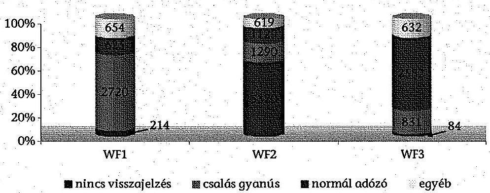

Forrás: NAV adatszolgáltatás
A WF1 területén összesen 754 adózóhoz kapcsolódóan 4213 megkeresés (tételsor) érkezett. Az EUROFISC hálózatba újonnan bekerült magyar adózók száma éves szinten stabilan 170-181 között alakult, amely azt jelzi, hogy a kezdeti jelzések alapján megfigyelt kör folyamatosan növekedett. A beérkezett 4213 tételsorhoz kapcsolódóan 2014. április 30-ig 5,1%-ban nem történt visszajelzés, 64,6%-ban csalásgyanús minősítésű visszajelzésre került sor.

A WF2 területén összesen 2076 adózóhoz kapcsolódóan 8358 megkeresés (tételsor) érkezett. A beérkezett tételsorok 2013-ban 84,6%-kal csökkentek, az adatcsere információtartalmának módosítása következtében ${ }^{167}$. A beérkezett 8358 tételsorhoz kapcsolódóan 2014. április 30-ig 63,7%-ban nem történt visszajelzés, 15,4%-ban csalásgyanús minősítésű visszajelzésre került sor. A nem küldött visszajelzések magas számát a kezdetben érkező nagy tételszámú közösségi adószám lekérdezésekhez kapcsolódó hibás tételek okozták. A 2013-ban érkezett 778 tételsorhoz kapcsolódóan 4,5%-ban nem történt visszajelzés.

A WF3 területén összesen 893 adózóhoz kapcsolódóan 4129 megkeresés (tételsor) érkezett. A beérkezett tételsorok 2013-ban 92,1%-kal növekedtek, mivel a munkacsoport 3. ülésén ${ }^{168}$ a korábban alkalmazott vámtarifaszámra történő szűkítő paraméter törléséről döntöttek. A WF3 területén érkezett 4129 tételsorhoz kapcsolódóan 2014. április 30-ig 2,0%-ban nem történt visszajelzés, 20,1%-ban csalásgyanús minősítésű visszajelzésre került sor.

Az ellenőrzött időszakban beérkezett összes megkeresés 50,5%-a a párhuzamos ellenőrzésben részvevő országokból - 44,0% Ausztriából, 6,5% Németországból - érkezett. Az Ausztriából beérkezett megkeresések 39,6%-ához kapcsolódóan, a Németországból érkezett megkeresések 62,7%-ához kapcsolódóan visszajelzés történt.

[^0]
[^0]:    ${ }^{167}$ WF2 3. ülésén (Bukarest, 2012. október 24-25.) keretében döntöttek az EUROFISC kapcsolattartó tisztviselők a közösségi adószám lekérdezések (VRN clearance) adatszolgáltatásának törléséről.
    ${ }^{168}$ Bécs, 2012. június 26-27.

---

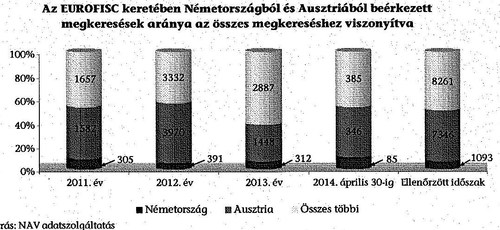

Forrás: NAV adatszolgáltatás

# 5.2.2. Magyarország által más országok felé kezdeményezett megkeresések 

A vonatkozó eljárásrendek alapján ${ }^{169}$, az érintett szervezeti egységek saját hatáskörben dönthettek, és a NAV kapcsolattartókon keresztül javaslatot tehettek az ún. szoros megfigyelés alá vont adózói állományba történő felvételre. Magyarország részéről más országok irányába kezdeményezett megkeresések (kiküldendő adatok) alapjául szolgáló, az illetékes szervezeti egységektől érkezett adatokat az EUROFISC kapcsolattartók feltöltötték a CIRCABC rendszerbe.

A feltöltésre a WF1 esetén havonta került sor. A WF3 esetén 2012. július 26. és 2013. július 16. között nem került sor feltöltésre, ezt követően 2013. II. félévben négy, 2014 első négy hónapjában kettő feltöltés volt. A WF2 esetén adatfeltöltés nem történt ${ }^{170}$.

Magyarország részéről kiküldött adatokra érkezett visszajelzések a többi részvevő tagállam alacsony aktivitását jelzik. Az ellenőrzött időszakban kiküldött összesen 6229 megkeresésre 62,9%-ban nem érkezett visszajelzés (WF1 esetén 64,5%-ban, WF3 esetén 56,1%-ban). Csalásgyanús visszajelzés 11,8%-ban, „normál adózó" minősítésű visszajelzés 16,0%-ban érkezett.

Az ellenőrzött időszakban az EUROFISC keretében kezdeményezett megkereséseket a 5/2. számú, a kezdeményezett megkeresésekre történt visszajelzéseket a 5/4. számú melléklet tartalmazza.

[^0]
[^0]:    ${ }^{169}$ 1024/2011. NAV eljárási rend 2.2.1. és 22.4. pont, 1103/2013. NAV eljárási rend 65. és 68. pont
    ${ }^{170}$ Ennek magyarázata volt, hogy Magyarország nem autóexportőr ország.

---

# Az EUROFISC hálózat keretében Magyarország által kezdeményezett megkeresésekre adott válaszok 

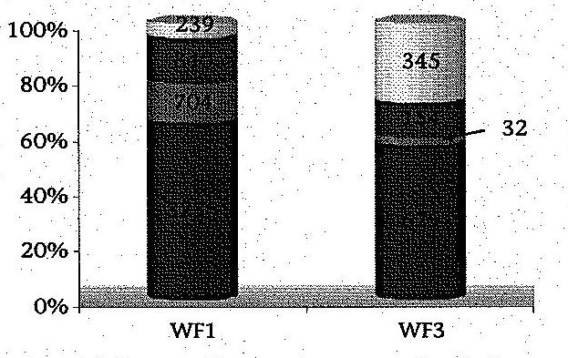

Forrás: NAV adatszolgáltatás

A WF1 területén Magyarország - az ellenőrzött időszakban évente csökkenő számú - összesen 5019 megkeresést (tételsort) indított. A megkeresések évente változó számú, összesen 131 magyar adózót, valamint hozzájuk kapcsolódóan 1112 külföldi adózót érintettek. Az EUROFISC hálózat adataiba csökkenő számban, de valamennyi évben bekerültek új adózók (az ellenőrzött időszakban összesen 69 magyar, és hozzá kapcsolódóan 748 külföldi adózó).

A WF3 területén Magyarország összesen 1210 megkeresést (tételsort) indított. A megkeresések száma 2013-ban több mint a hatszorosára növekedett, a korábban alkalmazott, vámtarifaszámra történt szűkítő paraméter eltörlése következtében. A megkeresések évente változó számú, összesen 30 magyar adózót, valamint hozzájuk kapcsolódóan 65 külföldi adózót érintettek. Az adatokba jellemzően a vámtarifaszámra történt szűkítő paraméter eltörlése kapcsán kerültek új magyar és külföldi adózók.

Magyarország részéről az ellenőrzött időszakban kezdeményezett összes megkeresés 15,5%-a a párhuzamos ellenőrzésben részvevő országokba - 3,9% Ausztriába, 11,6% Németországba - irányult. Az Ausztria felé kezdeményezett megkeresések 92,3%-ához, a Németország felé kezdeményezett megkeresések 87,1%-ához ${ }^{171}$ kapcsolódóan visszajelzés nem történt.

[^0]
[^0]:    ${ }^{171}$ A WF1 területén. A WF3 területén Németország nem vett részt.

---

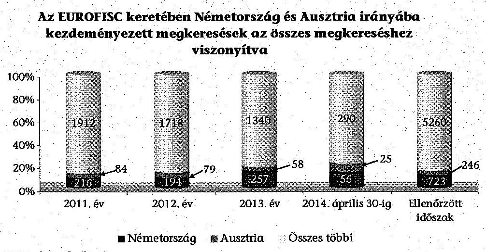

Forrás: NAV adatszolgáltatás

# 5.2.3. Az EUROFISC magyarországi működésének eredményei 

Az EUROFISC éves beszámolójának elkészítéséhez ${ }^{172}$ az EUROFISC kapcsolattartó tisztviselők 2012-ben és 2013-ban kérdőív ${ }^{173}$ kitöltésével szolgáltattak adatokat az egyes tevékenységi területek koordinátorai részére.

Az EUROFISC hálózat működésének éves beszámolóihoz készített kérdőívek szerint 2012-2013-ban a NAV összesen 78 hiányzó kereskedőt, 26 ún. csatornatársaságot azonosított, 45 esetben történt a vállalkozás adószámának törlése.

A 2012. évben a NAV 43 hiányzó kereskedőt (WF1: 23, WF2: 14, WF3:
 6); 11 csatornatársaságot (WF1: 7, WF2: 2, WF3: 2) azonosított, 22 esetben történt a vállalkozás adószámának törlése (WF1: 9, WF2: 9, WF3: 4). A 2013. évben az EUROFISC rendszerben érkezett adatok alapján a NAV 35 hiányzó kereskedőt (WF1: 14, WF2: 14, WF3: 7); 15 csatornatársaságot (WF1: 5, WF2: 7, WF3: 3) talált, 23 esetben törölte a vállalkozás adószámát (WF1: 8, WF2: 11, WF3: 4).

Az ellenőrzött időszakban a más tagállamoktól beérkezett jelzésekhez (16 700 tételsor, 3723 adózó) 1704 ellenőrzés, ebből 663 adóellenőrzés kapcsolódott. Az EUROFISC cél-, témakóddal (CT 621, 622, 623) ${ }^{174}$ is ellátott, befejezett, megállapítással zárult 281 adóellenőrzés összesen 19 632 M Ft adó megállapítást tett ${ }^{175}$.

[^0]
[^0]:    ${ }^{172}$ Az éves beszámoló készítési kötelezettséget a Tanács 904/2010/EU rendelete 37. cikke, valamint Az EUROFISC eljárásrend 3. cikk 2. pontja és 5. cikk 2. pontja szabályozta, a tagországok kapcsolattartói számára nevesítve nem írt elő feladatokat.
    ${ }^{173}$ A 2011. évre vonatkozóan nem kellett kérdőívet kitölteni.
    ${ }^{174}$ A vezetői információs rendszerhez kapcsolódóan, a NAV szabályozásában meghatározott cél-, témakóddal jelölt minden ellenőrzést, amely biztosította, hogy mérhetőek és nyomon követhetőek legyenek az ellenőrzések.
    ${ }^{175}$ Tartalmazza a nem jogerős megállapításokat, nem tartalmazza a szankciók (adóbírság, mulasztási bírság és késedelmi pótlék) összegét.

---

Az EUROFISC hálózat magyarországi működtetésére vonatkozóan a NAV-nál kialakított fenti mérőszámokat teljesítmény-értékelésre nem alkalmazták ${ }^{176}$.

# 6. HÁTRALÉKKEZELÉSI ÉS VÉGREHAJTÁSI, VALAMINT A KIEMELT ADÓZÓI KÖRBEN VÉGZETT ADÓELLENŐRZÉSI FELADATOK INFORMATIKAI TÁMOGATOTTSÁGA 

### 6.1. Az informatikai feladatellátás szabályozottsága és irányítása

Az ellenőrzött időszakban az APEH/NAV szabályozta az informatikai támogatáshoz kapcsolódó szervezeti szintű feladatokat. Az informatikai feladatok ellátásának felügyeletét és irányítását az APEH/NAV SzMSz-ei az informatikai elnökhelyettes felelősségi körébe utalták ${ }^{177}$, biztosítva az informatikai szervezet közvetlen képviseletét a felső vezetésben. Az informatikai feladatellátás kialakítása során - így az ellenőrzött rendszerek ${ }^{178}$ esetében is - érvényesült a fejlesztési és üzemeltetési feladatok szervezeti szintű szétválasztásának elve.

Az APEH-SZTADI SzMSz ${ }_{1}$ 97. §-a az APEH végrehajtási és az ellenőrzési területet támogató rendszereinek fejlesztési és alkalmazástámogatási feladatait a Végrehajtási, Ellenőrzési és Dokumentumkezelési Rendszerek Támogatási Főosztály feladatkörébe utalta. A rendszerek üzemeltetési és rendszerfelügyeleti feladatait a 64. § (4) bekezdés alapján az informatikai üzemeltetési szakterület szervezeti egységei látták el. Az APEH-SZTADI SzMSz ${ }_{2}$ 102. § alapján az ellenőrzési és végrehajtási rendszerek fejlesztése az Eljárási, Végrehajtási és Ellenőrzési Rendszerek Fejlesztési Főosztály feladata volt. A rendszerek üzemeltetését a 63. § (5) bekezdése alapján az üzemeltetési szakterület szervezeti egységei végezték.

Az ellenőrzött területhez kapcsolódó informatikai fejlesztési és támogatási feladatokat az INIT Ügyrend 94. pontja alapján az Eljárási, Végrehajtási és Ellenőrzési Rendszerek Fejlesztési Főosztály végezte. Az ellenőrzött rendszereket működtető informatikai infrastruktúra üzemeltetését és felügyeletét az INIT Ügyrend 38-57. pontjai alapján az Üzemeltetési Főigazgató-helyettes alá tartozó szervezeti egységek látták el.

Az ellenőrzött időszakban az APEH szabályozta az informatikai rendszerek fejlesztéséhez, módosításához kapcsolódó feladatok ellátását, az Üzemeltetési Szabályzat kiadása kivételével. Ennek következtében az APEH üzemeltetési feladatainak szabályozottsága nem felelt meg a 2010. június 15-től hatályos APEH IBSZ ${ }_{2}$ 6.6.2.2. pontjának, amely az Üzemeltetési Szabályzat kidolgozását írta elő az Informatikai Stratégiai Főosztály vezetőjének felelőssége mellett.

[^0]
[^0]:    ${ }^{176}$ A teljesítmény-értékelés hiányánál elsősorban a nemzetközi kapcsolódási pontokra hivatkoztak.
    ${ }^{177}$ Az APEH SzMSz ${ }_{1}$ 1-2. számú mellékletei alapján az APEH-SZTADI és az Informatikai Stratégiai Főosztály az Elnökhelyettes III. irányításával működtek, az INIT és a Központi Hivatal informatikai szervezeti egységeinek irányítását az APEH SzMSz ${ }_{2}$ 34. § (1) bekezdés, az APEH SzMSz ${ }_{3}$ 29.§ (1) bekezdés és a NAV SzMSz ${ }_{4}$ 31. § alapján az informatikai elnökhelyettes látta el.
    ${ }^{178}$ Az ellenőrzésre kiválasztott rendszerek: VHR, REV, REVP, EÁF, SJA KEK, ELLVITA VSZ.

---

A NAV létrehozását követően az 1/2011. NAV utasítás az APEH szabályzatait 2012. január 1-jétől hatályon kívül helyezte, ezzel az informatikai fejlesztési és üzemeltetési feladatok szabályozottsága megszünt. A 2011. április 13-tól hatályos NAV IBSZ ${ }_{1}$ és a 2013. május 6-tól hatályos NAV IBSZ ${ }_{2}$ meghatározta ${ }^{179}$ azokat a szabályzatokat és eljárásrendeket, amelyek kiadása a NAV IBSZ ${ }_{1,2}$-ben meghatározott informatikai biztonsági követelmények teljesítéséhez szükséges. A NAV a 2012-2013. években kiadott szabályzatokkal nem oldotta meg az informatikai feladatellátás szabályozottságát, mert a NAV IBSZ ${ }_{1,2}$-ben előírt szabályzatok kiadása teljes körűen nem valósult meg. Az informatikai fejlesztési és üzemeltetési területen fennálló szabályozási hiányosságokat részletesen a 6.1.1. és 6.1.2. pont tartalmazza.

# 6.1.1. Informatikai rendszerek fejlesztésének szabályozottsága, változásainak nyomon követhetősége 

Az APEH szabályozta az informatikai rendszerek változáskezelését, a fejlesztési igények meghatározását és kezelését ${ }^{180}$, és az informatikai alkalmazásfejlesztések követelményeit és eljárásrendjét ${ }^{181}$. A szabályzatok 2012. január 1-jétől történt hatályon kívül helyezését követően, az informatikai rendszerek fejlesztésére és változáskezelésére vonatkozó szabályzatok kiadása csak 2013 májusában kezdődött meg. A NAV 2013-ban szabályozta az informatikai fejlesztések megrendelésének és teljesítésének folyamatát, minőségbiztosítását, az informatikai termékek minőségellenőrzését, az informatikai projektek végrehajtását.

A 2013. május 28-tól hatályos 2090/2013. számú NAV Informatikai Igénykezelési Szabályzata meghatározta az informatikai megrendelések benyújtásához, kezeléséhez és teljesítéséhez kapcsolódó feladatokat és adminisztrációs követelményeket. A 2013. szeptember 2-tól hatályos 2131/2013. számú NAV informatikai minőségbiztosításáról szóló szabályzat meghatározta az informatikai termékek minőségbiztosításának alapelveit és keretszabályait (pl. minőségbiztosítási tevékenységek fajtái, általános jellemzői).

A NAV informatikai termékeinek minőségellenőrzéséről szóló, 2013. október 29-től hatályos 2010/2013/50. NAV főigazgatói szabályzat meghatározta az informatikai termékek minőségellenőrzésének részletes szabályait, a minőségellenőrzéshez kapcsolódó feladatokat, felelősségeket, határidőket, és ismertette a minőségellenőrzést támogató informatikai alkalmazásokat.

A NAV IBSZ ${ }_{1}$ 105-112. pontjai meghatározták az informatikai rendszerek fejlesztéséhez kapcsolódó általános biztonsági követelményeket. A NAV IBSZ ${ }_{1}$ 110. pontjában és a NAV IBSZ ${ }_{2}$ 2. számú mellékletében előírtak ellenére, a fejlesztésekre vonatkozó funkcionális és informatikai biztonsági követelményeket meghatározó Alkalmazásfejlesztési Szabályzat kiadására

[^0]
[^0]:    ${ }^{179}$ NAV IBSZ 1 14., 31., 32., 45., 46., 48., 49., 53-56., 61., 90., 97., 104., 110., 114., 115. pontjai, továbbá a NAV IBSZ 2 . számú melléklet.
    ${ }^{180}$ 1061/B/2004. APEH utasítás a központosított verziókezelési eljárás kialakításáról
    ${ }^{181}$ 15/2008/50. APEH igazgatói utasítás az Alkalmazásfejlesztési Szabályzat kiadásáról

---

az ellenőrzött időszakban nem került sor ${ }^{182}$. Ennek hiányában nem volt szabályozott, hogy az informatikai fejlesztéseknek milyen funkcionális és biztonsági követelményeket kell teljesíteniük, továbbá nem volt meghatározott a fejlesztés során előállítandó termékek és dokumentumok köre, valamint a fejlesztésekhez kapcsolódó minőségi követelmények.

A NAV IBSZ ${ }_{1}$ 110. pontja szerint az Alkalmazásfejlesztési Szabályzatot az INIT dolgozza ki az Informatikai Tervezési és Módszertani Főosztály közreműködésével, és a NAV elnöke kiadmányozza. A NAV SzMSz 44. § (1) bekezdés a) pont alapján az INIT főigazgatója felelős az intézet hatáskörébe tartozó, vagy esetenként oda utalt feladatok végrehajtásáért, valamint a feladatkörébe tartozó tevékenység megvalósításáért.

Az ellenőrzött fejlesztések esetében a fejlesztési feladatok specifikációja, valamint a tesztelések végrehajtása a fejlesztések dokumentációja alapján teljes körűen nem volt nyomon követhető ${ }^{183}$ és így nem volt biztosított a fejlesztéshez kapcsolódó feladatok számon kérhetősége.

A 19 kiválasztott és értékelt fejlesztés, és a hozzá kapcsolódó rendszermódosítások esetében az informatikai fejlesztések megrendelése iktatott formanyomtatvány kitöltésével történt, amelyek tartalmazták a fejlesztési feladat leírását. A fejlesztések üzembe helyezése és az üzembe helyezést megelőző minőségellenőrzése dokumentáltan valósult meg. A 19 megrendelésből a megrendelés írásos visszaigazolására 8 esetben nem került sor. A dokumentáció a fejlesztői és felhasználói tesztelés elvégzéséről és eredményéről nem tartalmazott dokumentumot.

A megrendelések visszaigazolásának hiányában nem volt nyomon követhető, hogy a megrendelő szakterület által meghatározott fejlesztési feladat mennyiben változott meg a megrendelő és az informatikai terület közötti egyeztetések során. A tesztelési dokumentációk hiányában nem volt megállapítható továbbá, hogy az elkészült fejlesztéseket ki és milyen eljárásokkal tesztelte. A program esetleges hibája esetén a teszteléshez kapcsolódó felelősségek így nem kérhetőek számon.

A NAV IBSZ ${ }_{1}$ 106. pont és a NAV IBSZ ${ }_{2}$ 128. pont szerint a fejlesztési és tesztelési tevékenység csak a NAV e feladatra elkülönített informatikai rendszerein végezhető. Az ellenőrzött fejlesztések ezen előírásnak megfeleltek, az APEH/NAV az ellenőrzött rendszerek esetében az éles rendszertől fizikailag is elkülönített környezettel rendelkezett a fejlesztési feladatok végrehajtására és tesztelésére.

# 6.1.2. Informatikai rendszerek adatainak rendelkezésre állása 

Az APEH/NAV az informatikai rendszerek fizikai védelmére vonatkozó szabályozási környezetet kialakította. Meghatározta és dokumentálta a működés szempontjából kritikus fontosságú informatikai eszközök befogadására szolgáló épületeket, helyiségeket, valamint ezen objektumok őrzésbiz-

[^0]
[^0]:    ${ }^{182}$ A NAV Alkalmazásfejlesztési Szabályzatának kiadására az ellenőrzött időszakot követően került sor, amely hatályba lépett 2014. március 28-án.
    ${ }^{183}$ Az informatikai fejlesztések - ellenőrzött időszakban fennálló - szabályozatlansága miatt a tervezési dokumentumok és tesztelési dokumentáció hiánya nem jelentett belső szabályzatba ütköző szabálytalanságot.

---

tonsági szabályait ${ }^{184}$. A szervezet az ellenőrzött időszakban rendelkezett tűzvédelmi szabályzatokkal ${ }^{185}$, amelyeket évente aktualizált.

Az APEH IBSZ 2 6.6.2.2. pontja Üzemeltetési Szabályzat kidolgozását írta elő az Informatikai Stratégiai Főosztály vezetőjének felelőssége mellett, ennek ellenére az Üzemeltetési Szabályzat kiadására nem került sor.

A NAV ellenőrzött időszakban hatályos informatikai biztonsági szabályzatai a rendszerek üzemeltetési feladatainak és eljárásrendjének szabályzatként történő kiadását írták elő ${ }^{186}$. Az ellenőrzött rendszerek vonatkozásában a NAV IBSZ 1 54. pontjában és a NAV IBSZ 2 . számú mellékletében meghatározott üzemeltetési szabályzatok kiadása nem történt meg. A rendszerek alkalmazási szintű üzemeltetési feladatait az üzemeltetési dokumentációk tartalmazták, amelyek tartalmilag megfeleltek az üzemeltetési szabályzatnak, a dokumentációk szabályzatként történő kiadására azonban nem került sor.

Az üzemeltetési dokumentációk szabályzatként történő kiadmányozását a NAV IBSZ 1 54. pontja az INIT főigazgató feladataként határozta meg. A NAV IBSZ 2 2. számú melléklete a NAV üzemeltetési rendelkezések INIT általi kiadmányozását írta elő. Az INIT számára meghatározott feladat végrehajtásáért a NAV SzMSz 44. § (1) bekezdés a) pontja alapján az INIT főigazgatója felelős.

Az APEH informatikai rendszerek mentésének egységes szabályait az ellenőrzött időszakban a 8/2008/50. APEH igazgatói utasítás határozta meg. A NAV 2012. január 16-ától hatályos, 2007/2012. számú Mentési és Archiválási Szabályzatának 23. pontja a mentések konkrét, számon kérhető jellemzőit meghatározó un. „mentési stratégiák" kidolgozását írta elő (pl. mentés tárgya, tartalma, gyakorisága). Az ellenőrzött rendszerek vonatkozásában a Mentési és Archiválási Szabályzatban előírt mentési stratégiák kiadása az ellenőrzött időszakban nem valósult meg ${ }^{187}$.

A 2007/2012. számú Mentési és Archiválási Szabályzat 23. pontja
 szerint „a mentési stratégia elkészítése kötelező, kidolgozásért, kiadmányozásáért és kiadmányozás előtt az IFAF általi véleményeztetéséért az INIT főigazgatója felelős".

[^0]
[^0]:    184 1134/B/2007. APEH utasítás az APEH Központi Hivatalának Örzésbiztonsági Szabályzatáról, 105/2011. NAV szabályzat a NAV Örzésbiztonságáról.
    ${ }^{185}$ Az 1107/B/2009. és az 1023/B/2010. APEH utasítások az APEH Tűzvédelmi Szabályzatáról, az 1104/B/2008. és az 1030/B/2010. APEH utasítások a Központi Hivatal Tűzvédelmi Szabályzatáról; valamint a 2063/2012. és a 8/2011. NAV szabályzatok a NAV Központi Hivatalának Tűzvédelmi Szabályzatáról, a 2/2011/50. NAV főigazgatói szabályzat a NAV INIT Tűzvédelmi Szabályzatáról.
    ${ }^{186}$ A NAV IBSZ ${ }_{1}$ 54. pontja a rendszert üzemeltető szervezeti egység által kidolgozott, az informatikai intézetek vezetői által feladatkörükben eljárva kiadmányozott Üzemeltetési eljárási rend kiadását, a NAV IBSZ 2. számú melléklete az INIT által kiadmányozott Üzemeltetési NAV rendelkezések kiadását írta elő.
    ${ }^{187}$ A NAV a helyszíni ellenőrzés időszakában intézkedett a hiányosság megszüntetése érdekében, 2014. április 28-án adott tájékoztatása szerint „Az Informatikai Intézet haladéktalanul megkezdte a mentési stratégiák összehangolását és kiadmányozásra való előkészítését."

---

Az APEH a katasztrófahelyzetek kezelésének szabályait 2007. augusztus 31-től az 1111/B/2007. APEH utasításban szabályozta.

A NAV IBSZ 156. pontja Katasztrófa-elhárítási terv kidolgozását írta elő, amelynek tartalmaznia kellett „az informatikai rendszerek működése helyreállításának biztosítására vonatkozó előírásokat". A NAV Informatikai Katasztrófaelhárítási feladatairól szóló, 2008/2013. számú szabályzat azonban csak 2013. március 1-jén lépett hatályba. A 2012. január 1-jétől 2013. március 1-jéig tartó időszakban a katasztrófahelyzetek szabályozottsága az NAV IBSZ ${ }_{1}$ 56. pont előírásának nem felelt meg. A katasztrófahelyzetek kezelésére vonatkozó szabályzat által előírt, az egyes rendszerekre vonatkozó Informatikai Katasztrófa-elhárítási Tervek kiadása 2013. december 31-én valósult meg, ezzel a katasztrófahelyzetek kezelésére vonatkozó szabályzatok az informatikai üzemeltetés oldaláról teljes körűvé váltak.

Az adószakmai informatikai rendszerek kiesésének esetére vonatkozóan a NAV IBSZ ${ }_{1}$ 55. pont előírása ellenére az üzletmenet folytonossági tervek, a NAV IBSZ ${ }_{2}$ 155. pont és 2. számú melléklet előírása ellenére a működésfolytonosság biztosításáról szóló szabályzat kiadása az ellenőrzött időszakban nem valósult meg. A rendszerek folyamatos rendelkezésre állásának biztosítása érdekében előírt üzletmenet folytonossági tervek kiadása csak a vámszakmai rendszerek esetében valósult meg ${ }^{188}$.

A NAV IBSZ ${ }_{1}$ 55. pontja szerint az Üzletmenet folytonossági tervek kidolgozása az informatikai alkalmazásokat üzemeltető szervezeti egység és az adott szakmai folyamatokért felelős szervezeti egység feladata. A szabályzat az ellenőrzött rendszerek vonatkozásában közös felelősséget határozott meg az INIT főigazgatója, továbbá (a végrehajtást támogató informatikai rendszerek vonatkozásában) a Felszámolási és Végrehajtási Főosztály, (az ellenőrzéseket támogató informatikai rendszerek esetében) az Ellenőrzési Főosztály vezetői számára. A NAV IBSZ ${ }_{2}$ 2. számú melléklete a NAV működésfolytonosságának biztosításáról szóló szabályzat kidolgozásához nem rendelt szervezeti szintű felelősséget, a melléklet szerint a szabályzat felterjesztője az Informatikai Tervezési és Módszertani Főosztály.

# 6.1.2.1. Elektronikus Árverési Felület működtetése 

Az elektronikus árverések lebonyolítását támogató Elektronikus Árverési Felületet (EÁF) - az ellenőrzött rendszerek közül egyedüliként - külső vállalkozó üzemeltette, amely a kapcsolódó adatkezelési és adatfeldolgozási feladatokat is ellátta. A nemzeti adatvagyon körébe tartozó állami nyilvántartások fokozottabb védelméről szóló 2010. évi CLVII. törvény 2. § (5) bekezdése és az Art. 52. § (1a) bekezdése alapján az EÁF rendszerhez kapcsolódó üzemeltetési és adatfeldolgozási feladatok ellátásával a NAV akkor bízhat meg nem állami tulajdonú külső vállalkozót, ha erre vonatkozóan a NAV-ot felügyelő miniszter javaslatára a közigazgatásért felelős miniszter felmentést ad. A miniszteri felmentést a NAV 2012. január 18-án megkapta, majd 2013-ban a felmentés 2015. december 30-ig meghosszabbításra került, ezzel a NAV a fenti jogszabályi előírásoknak megfelelt.

[^0]
[^0]:    ${ }^{188}$ 2007/2013. NAV szabályzat a Nemzeti Adó- és Vámhivatal vám- és pénzügyőri és bűnügyi informatikai alkalmazásainak üzemszünetéről

---

A 223/2009. (X. 14.) Korm. rendelet 1. számú melléklet 3.2. pontja a külső szolgáltatóval megkötött szerződés tartalmára előírta ${ }^{189}$ az informatikai biztonsági követelmények rögzítését. A 223/2009. (X. 14.) Korm. rendelet hatálya ${ }^{190}$ idején az EÁF rendszerre vonatkozóan megkötött szerződések és szerződésmódosítások ${ }^{191}$ nem tartalmazták az előírt informatikai biztonsági követelményeket, vagy a Korm. rendelet előírásaira való hivatkozást.

Az EÁF rendszer külső auditálása a 223/2009. (X. 14.) Korm. rendelet 30. § (1) bekezdés előírásai ellenére nem történt meg. A Biztonsági Főosztály az árverési felület létrehozását követően 2008 márciusában belső biztonsági audit keretében ellenőrizte a rendszer megfelelőségét. Az audit informatikai biztonsági kockázatokat tárt fel, és javaslatot tett a rendszer külső szervezet általi auditálására, valamint az APEH által biztonsági felülvizsgálati eljárásrend kialakítására. A jelentést követően nem valósult meg sem a rendszer külső auditja, sem a feltárt informatikai biztonsági hiányosságok utóellenőrzése. A rendszer auditálásának elmaradásával a NAV 2012. április 22-től nem felelt meg a 83/2012. (IV. 21.) Korm. rendelet 11. § (2) bekezdés f) pont előírásainak.

A NAV SzMSz4 72. § a 223/2009. (X. 14.) Korm. rendelet, valamint a 83/2012. (IV. 21.) Korm. rendelet informatikai biztonságra vonatkozó előírásainak betartását az elnök közvetlen alárendeltségébe tartozó informatikai biztonsági felelős felelősségi körébe utalta. Az informatikai biztonsági felelős kijelölésének hiánya (lásd 6.2.1. pontban) a Korm. rendeletek előírásaihoz kapcsolódó felelősségek rendezetlenségét eredményezte.

A NAV 2014. április 28-i írásbeli válaszában jelezte, hogy „Tudomásunk szerint maga a felület azóta nem szenvedett olyan mértékű funkcionális és/vagy informatikai megoldásbeli változást, ami - az erőforrások hatékony felhasználását is szem előtt tartva - újbóli audit lefolytatását feltétlenül indokolttá tette volna. Ugyanakkor az IFÚF által, 2014. évre vonatkozóan tett audit javaslatok között az érintett rendszer auditja szerepel, így az idei évben annak lefolytatását mindenképpen indokoltnak tartjuk."

A 2009. január 7-től 2010. március 29-ig tartó időszakban a szolgáltató az üzemeltetési szolgáltatást szerződés nélkül, az APEH megrendelése alapján nyújtotta.

Az APEH az EÁF rendszer fejlesztését és üzemeltetését a szállító ajánlatára hivatkozva rendelte meg a 2009. január 7-től 2010. január 6-ig terjedő időszakra. Az üzemeltetési szerződés megkötésére a megrendelés időszakában nem került sor, annak ellenére, hogy a megrendelő rögzítette, hogy a felek 2009. február 28-ig szerződést kötnek. Az APEH 2009. december 30-án az üzemeltetési szolgáltatást az előző megrendelés lejártát követő - újabb két hónapra megrendelte. Az első

[^0]
[^0]:    ${ }^{189}$ A 223/2009. (X.14.) Korm. rendelet 1. számú melléklet 3.2. pontja szerint „külső szolgáltatók igénybevétele esetén a szolgáltatási megállapodásokban (szerződésben) kell kikötni a szolgáltatásra érvényes biztonsági követelményeket és szabályozást. Biztosítani kell a feladatért felelős szervezet számára a mérés és ellenőrzés feltételeit."
    ${ }^{190}$ Hatályon kívül helyezte a 85/2012. (IV. 21) Korm. rendelet 53. § b.
    ${ }^{191}$ A 223/2009. (X.14.) Korm. rendelet 2009. október 22. és 2012. április 21. között volt hatályban, ez időszakban az APEH/NAV négy üzemeltetési szerződést és két szerződésmódosítást írt alá.

---

üzemeltetési szerződés megkötésére 2010. március 30-án került sor, ezt követő időszakban a szállító az üzemeltetési szolgáltatást szerződés alapján nyújtotta.

# 6.2. Informatikai rendszerekben tárolt adatok bizalmasságát, sértetlenségét és hitelességét biztosító kontrollok 

### 6.2.1. Informatikai biztonság irányítási rendszere

Az APEH/NAV rendelkezett informatikai biztonsági szabályzattal, amely meghatározta az informatikai biztonsággal összefüggő feladatokat és a rendszerek működtetéséhez és használatához kapcsolódó informatikai biztonsági követelményeket. Az APEH IBSZ ${ }_{1,2}$ 3.2. pontja rögzítette az informatikai rendszerek biztonsági osztályba sorolásának alapelveit és szabályait, továbbá az adott biztonsági osztályhoz előírt biztonsági követelményeket. A NAV IBSZ$\mathrm{ei}^{192}$ az informatikai biztonság egyes részterületeire vonatkozóan további részletszabályok és eljárásrendek kidolgozását írták elő (pl. jogosultságkezelés, naplózás, mentések stb.).

Az APEH/NAV az ellenőrzött időszakban rendelkezett adatvédelmi és adatbiztonsági szabályzattal ${ }^{193}$.

Az APEH/NAV az informatikai biztonsági követelmények belső ellenőrzésének szervezeti feltételeit kialakította, az alkalmazott megoldás biztosította a belső ellenőrzés informatikai területtől való szervezeti szintű függetlenségét.

Az APEH SzMSz-ei ${ }^{194}$ a biztonsági és célellenőrzések lefolytatását az elnök közvetlen alárendeltségében működő Biztonsági Főosztály (BFO) feladatkörébe utalták. Az informatikai biztonsággal összefüggő követelmények és feladatok meghatározását, a kapcsolódó szabályzatok kidolgozását, korszerűsítését, érvényesülésük felügyeletét és ellenőrzését 2010. augusztus 23-tól az APEH informatikai elnökhelyettes közvetlen irányítása alá tartozó Információvédelmi, Folyamatszabályozási és Adatvagyon-gazdálkodási Főosztály (IFAF) látta el. A NAV létrehozását követően az informatikai biztonsággal összefüggő szabályok kidolgozása, felügyelete és ellenőrzése továbbra is az informatikai elnökhelyettes irányítása alá rendelt IFAF feladatkörébe tartozott a NAV SzMSz 2. függelék 2.3 pont alapján.

Az IFAF a 2011-2013. időszakban évente egy-egy kiválasztott régió főigazgatóságánál ellenőrizte az informatikai feladatok végrehajtásának szabályszerűségét és az informatikai biztonsági előírások teljesülését. A NAV a belső hálózatainak és határvédelmi megoldásainak sérülékenység vizsgálatát és informatikai biztonsági auditját 2013-ban, külső vállalkozó bevonásával végezte el. Az el-

[^0]
[^0]:    ${ }^{192}$ NAV IBSZ ${ }_{1}$ 31., 32., 45., 46., 48., 53., 87., 90., 97., 104., 121., 122., 133. pontjai, valamint a NAV IBSZ ${ }_{2}$ 2. számú melléklet.
    ${ }^{193}$ 1109/ B/2007. APEH utasítás az APEH Adatvédelmi és Adatbiztonsági Szabályzatáról, illetve a 21/2011., majd a 111/2011. NAV szabályzat a NAV Adatvédelmi és Adatbiztonsági Szabályzatáról.
    ${ }^{194}$ APEH SzMSZ ${ }_{1}$ 100-101. §, APEH SzMSZ ${ }_{2}$ 16. §, APEH SZMSZ ${ }_{3}$ 2. számú melléklet 2. pont

---

lenőrzések az informatikai biztonsági szabályok megsértését vagy az ellenőrzött rendszereket közvetlenül érintő sérülékenységet nem tártak fel.

Az elektronikus közszolgáltatás biztonságáról szóló 223/2009. (X. 14.) Korm. rendelet 14. § (3) bekezdése informatikai biztonsági felelős kijelölését írta elő, aki felelős az informatikai biztonsági követelmények betartásáért. Az APEH/NAV ellenőrzött időszakban hatályos SzMSz-ei ${ }^{195}$ - a 223/2009. (X. 14.) Korm. rendelet előírásaival összhangban - meghatározták az informatikai biztonsági felelős feladatait ${ }^{196}$. A 223/2009. (X. 14.) Korm. rendelet 14. § (3) bekezdés ellenére az APEH/NAV nem gondoskodott az informatikai biztonsági felelős kijelöléséről. A NAV SzMSz4 72. § a Korm. rendelet hatályon kívül helyezését követően is meghatározta az informatikai biztonsági felelős feladatait a Korm. rendeletben meghatározott feladatkörrel. A pozíció az ellenőrzött időszak végéig nem került betöltésre.

A NAV SzMSz4 72. § (1) bekezdés szerint „az informatikai biztonsági felelőst határozatlan időtartamra az elnök nevezi ki", a 72. § (2) bekezdés szerint az informatikai biztonsági felelős e feladatkörében nem utasítható.

Az APEH /NAV az informatikai biztonság felügyeleti és ellenőrzési rendszerét kialakította, és az informatikai biztonság felügyeletét az IFAF feladatkörébe utalta. A 223/2009. (X. 14.) Korm. rendelet előírásainak teljesítése azonban nem jelent meg sem az informatikai biztonságot felügyelő szervezeti egységek (IFAF, BFO) feladatkörében, sem a szervezeti egységek vezetőinek munkaköri leírásaiban, így a feladatok teljesítéséhez kapcsolódó felelősség nem
 volt rendezett.

Az APEH IBSZ ${ }_{1,2}$ 3.2. pontja előírta az információ-vagyonelemek védelmi igényeinek meghatározását és a rendszerek biztonsági osztályba sorolását, egyben meghatározták a besorolás szabályait, valamint a kapcsolódó felelősségeket. A NAV IBSZ ${ }_{1}$ 9-14. pontjai meghatározták az informatikai rendszerek és adathordozók osztályozásának elvi kereteit, nem rögzítették azonban a biztonsági osztályba sorolás szabályait.

A NAV IBSZ ${ }_{1}$ 14. pont előírásai ellenére az egyes informatikai rendszerekben kezelt adatok besorolásának szabályait az Adatvédelmi és Adatbiztonsági Szabályzat nem határozta meg.

Az IFAF 2012. októberében kezdeményezte az informatikai rendszerek biztonsági osztályba sorolásának teljes körű felülvizsgálatát ${ }^{197}$. A biztonsági osztályba sorolás szempontjait az IFAF kockázati alapon, a rendszerekben kezelt adatok bizalmasságának, sértetlenségének és rendelkezésre állásának sérüléséből eredő károk alapján határozta meg. A NAV IBSZ ${ }_{1}$ a védelmi igényeket a felülvizsgálat előtti kategóriák szerint határozta meg, így a szabályzatban meghatározott

[^0]
[^0]:    ${ }^{195}$ APEH SzMSz1 34. §/A. §, APEH SzMSz ${ }_{2}$ 136. §, APEH SzMSz ${ }_{3}$ 63. §, NAV SzMSz4 72. §
    ${ }^{196}$ Az informatikai biztonsági felelős kijelölésére vonatkozó előírás 2009. október 22. és 2012. április 21. között volt hatályban. Az ezt követően hatályos 83/2012. (IV. 21.) Korm. rendelet nem írta elő a szolgáltatást működtető szervezeti egységétől független, a közszolgáltatást nyújtó szervezet vezetőjének közvetlen irányítása alá tartozó informatikai biztonsági felelős pozíció létrehozását.
    197 5029/2012/IFAF számú körlevél

---

védelmi igények és a felülvizsgálat során kialakított új kategóriák nem voltak összhangban. A védelmi igények és védelmi intézkedések összhangja csak NAV IBSZ 2013. május 6-i hatályba lépését követően valósult meg.

A NAV IBSZ ${ }_{2}$ már meghatározta az informatikai rendszerek információbiztonsági osztályozásának alapelveit és az osztályozáshoz kapcsolódó szervezeti szintű felelősségeket.

# 6.2.2. Adatokhoz való hozzáférések kontrolljai 

Az APEH szabályozta a felhasználói hozzáférések menedzsmentjét ${ }^{198}$. A kialakított jogosultsági rendszer lehetővé tette a feladatkörhöz rendelt jogosultsági csoportok meghatározását mind a szervezeti egységek szintjén, mind a szervezeti egységeken belül a felhasználók feladatkörének egyedi jellemzői alapján.

A NAV létrehozását követően kiadott, 2012. január 16-tól hatályos 2006/2012. számú Felhasználói Jogosultságkezelési Szabályzat egységes keretbe foglalta a felhasználói jogosultságok igényléséhez, kiadásához és felügyeletéhez kapcsolódó feladatokat, valamint az egyes folyamatokhoz kapcsolódó dokumentációs követelményeket.

Az IFAF a 2011-2013. években végrehajtott információbiztonsági ellenőrzései a felhasználói jogosultságok kezelésének szabályszerűségére is kiterjedtek, a felhasználói jogosultságkezeléssel kapcsolatban szabálytalanságot nem állapítottak meg. Az ellenőrzött, nem informatikus munkakörben dolgozók felhasználói jogosultságai ${ }^{199}$ esetében - egy kivételtől eltekintve - a jogosultságok igénylése, jóváhagyása és beállítása a Felhasználói Jogosultságkezelési Szabályzat előírásainak megfelelően dokumentáltan, utólag nyomon követhető módon történt.

Egy felhasználói jogosultság esetében a jogosultság igénylése nem volt dokumentált, amellyel a Felhasználói Jogosultságkezelési Szabályzat 18. pontjában előírtaknak nem tettek eleget.

A Felhasználói Jogosultságkezelési Szabályzat a jogosultságkezelés felügyeletét és ellenőrzését az IFAF feladatkörébe utalta. A szabályzat 35. pontja a felhasználók közvetlen vezetői számára a felhasználói jogosultságok rendszeres (legalább évi egyszeri) felülvizsgálatát írta elő, annak érdekében, hogy minden felhasználó kizárólag a feladatellátásához szükséges jogosultságokkal rendelkezzen. Az IFAF a szabályzatnak megfelelően, 2013. januárjában kezdeményezte a felhasználói jogosultságok felülvizsgálatát, amelynek keretében az ellenőrzéssel érintett informatikai rendszerek JOGOS rendszerben kezelt felhasználói jogosultságainak felülvizsgálata 90%-ban megtörtént.

[^0]
[^0]:    ${ }^{198}$ 1066/B/1999. APEH utasítás az APEH informatikai rendszereinek hozzáférési rendjéről
    ${ }^{199}$ Az ellenőrzés összesen 30 felhasználói jogosultságra vonatkozóan értékelte a jogosultságok igénylésének, jóváhagyásának és beállításának, belső szabályoknak való megfelelőségét és nyomon követhetőségét.

---

A felülvizsgálat során 22045 felhasználó jogosultságait vizsgálták felül és 44621 egyedi felhasználói jogosultság került visszavonásra ${ }^{200}$.

Az ellenőrzött informatikai rendszerek felhasználói jogosultságainak menedzsmentjét központi jogosultságkezelő rendszer (JOGOS rendszer) támogatta, amely automatizált adatkapcsolatai révén biztosította a humán nyilvántartásokkal való összhangot, és a beállított jogosultságok érvényre jutását a rendszerek használata során. A jogosultságkezelő rendszer utólag visszakereshető módon naplózta a felhasználók jogosultságaiban végrehajtott változásokat.

A Felhasználói Jogosultságkezelési Szabályzat 13. pontja szerint az informatikai munkakörrel vagy feladattal rendelkezők számára kialakított jogosultságok kezelésének szabályait az INIT által, a NAV Bűnügyi Főigazgatósága Informatikai Főosztálya bevonásával előkészített, a NAV elnöke által kiadmányozott Informatikus Jogosultságkezelési Szabályzatnak kell tartalmaznia. Az ellenőrzött időszakban az Informatikus Jogosultságkezelési Szabályzat nem került kiadásra.

Az Informatikus Jogosultságkezelési Szabályzat hiányában szabályozatlan volt az adatbázis és operációs rendszer szintű hozzáférések kiosztása és kezelése is. Az ellenőrzés részére átadott jogosultsági listában több száz olyan informatikus jogosultság szerepelt, amelyek adminisztrációja nem a JOGOS rendszerben történt. E jogosultságok esetében nem voltak meghatározva a jogosultságok felügyeletéhez és felülvizsgálatához kapcsolódó feladatok és eljárások.

# 6.2.3. Adatmódosítások nyomon követhetősége 

Az APEH IBSZ ${ }_{2}$ 8.6. fejezete meghatározta a naplózásra vonatkozó szabályokat, a naplózással kapcsolatos feladatokat. A NAV IBSZ ${ }_{1}$ 120. pontja és a NAV IBSZ ${ }_{2}$ 140. pontja az informatikai rendszer használatával összefüggő események naplózását írta elő. A szabályzat előírta továbbá a naplóállományok tartalmára, kezelésére és elemzésre vonatkozó szabályok kidolgozását.

A NAV informatikai rendszereinek naplózása, a kapcsolódó feladatok és követelmények a 2012. január 1-től 2013. április 3-ig tartó időszakban szabályozatlanok voltak, mivel a biztonsági naplóállományok kezeléséről szóló szabályzat ${ }^{201}$ 2013. április 4-én lépett hatályba. Ezzel a lekérdezések célhoz kötöttségének vizsgálatára szolgáló ún. biztonsági naplózás szabályozási oldalról rendezetté vált. A biztonsági naplóállományok gyűjtése, feldolgozása informatikai támogatottsága az ellenőrzött időszakban megvalósult.

[^0]
[^0]:    ${ }^{200}$ Egy felhasználó több jogosultsággal is rendelkezett, ezért a JOGOS rendszerben kezelt jogosultságok száma a felhasználók számának többszöröse volt.
    ${ }^{201}$ 2044/2013. NAV szabályzat a NAV-ban az informatikai rendszerek használata során keletkező biztonsági naplóállományok kezeléséről

---

A NAV IBSZ ${ }_{1}$ 122. pontja elrendelte az IFAF és a BFO számára a lekérdezések célhoz kötöttségének vizsgálatára szolgáló ún. biztonsági naplók ${ }^{202}$ tartalmának, a rögzítés, tárolás és az ellenőrzés módjának meghatározását. A biztonsági naplózásra vonatkozó szabályok kialakítását a NAV IBSZ ${ }_{2}$ 142. pontja is előírta.

A kiemelt adózók ellenőrzését és a hátralékkezelést támogató informatikai rendszerek ${ }^{203}$ naplózása biztosította a felhasználói műveletek és adatmódosítások nyomon követhetőségét.

# 7. Az APEH/NAV adóztatást érintő kezdeményezési tevékenysége, elemzései, beszámolói, intézkedési tervei, adatszolgáltatási kötelezettségének teljesítése 

Az APEH/NAV az ellenőrzött időszakban az adó- és vámpolitika gyakorlati megvalósítása során szükséges intézkedésként a meglévő jogintézmények pontosítására tett javaslatokat. Az adó- és vámpolitikával összefüggésben további intézkedéseket nem kezdeményezett a minisztériumnál.

Az APEH/NAV elnöke élt az APEH SzMSz ${ }_{1}$ 11. § (10) bekezdésében, APEH SzMSz ${ }_{3}$ 24. § (9) bekezdésében, illetve a NAV SzMSz ${ }_{4}$ 24. § i) pontjában meghatározott javaslattételi jogkörével és - a 2009. év kivételével ${ }^{204}$ - minden évben kezdeményezett jogszabályváltozásokat a hátralékok keletkezésének csökkentése és a hátralékállomány minél nagyobb arányú beszedhetősége érdekében. Az Art. koncepcionális módosítására a 2011. évben kezdeményezett jogszabályváltozásokat ${ }^{205}$, amelynek során a legfontosabb célkitűzései között szerepeltek az adóeljárás egyszerűsítése, az adminisztrációs terhek további csökkentése, valamint a feketegazdasággal szembeni hatékonyabb hatósági fellépés jogszabályi feltételeinek megteremtése. A hátralékok keletkezésének csökkentése és a hátralékállomány minél nagyobb arányú beszedhetősége érdekében a kezdeményezett jogszabály módosítási javaslatokat a 6/A. számú, az Art. koncepcionális módosítására kezdeményezett javaslatokat a 6/B. számú függelék tartalmazza.

[^0]
[^0]:    ${ }^{202}$ A 2044/2013. NAV szabályzat szerint a biztonsági naplóállomány: „az informatikai rendszerben bekövetkező események felhasználói tevékenységek közül a lekérdezési, nyomtatási, fájlexportálási tevékenységeket és ezek idöpontját rögzítő, a rendszer által automatikusan kezelt adatállomány". A biztonsági naplóállomány tehát a felhasználói tevékenységeknek csak egy részhalmazáról adott információt, és a célja elsősorban a lekérdezések és adathozzáférések célhoz kötöttségének ellenőrzése volt.
    ${ }^{203}$ REV, REVP, SJA KEK és ELLVITA VSZ
    ${ }^{204}$ Az APEH 2009. évi jogszabály-módosítási javaslatai között nem szerepelt a hátralékállománnyal kapcsolatos jogszabály-módosítási javaslat.
    ${ }^{205}$ A NAV elnöke által az NGM helyettes államtitkára részére 2011. július 21-én megküldött 2011. évi koncepcionális jogszabály módosítási javaslatok.

---

A PM/NGM számára biztosították a rendelkezésükre álló információkat, adatokat, háttéranyagokat, beszámolókat ${ }^{206}$. Hatástanulmányokat a hátralékállomány alakulására vonatkozóan nem ${ }^{207}$, viszont önálló elemzéseket készítettek.

Elemzést készítettek 2011. május 17-én 2005-2010. évekre a hátralékállomány és a hátralékos adózók számának alakulásáról, 2010. júliusában az APEH kezelésébe tartozó adónemek (illetékek) hátralékának 2008-2009. évi alakulásáról és a változások okairól ${ }^{208}$.

A KH Felszámolási és Végrehajtási Osztálya által készített beszámolók és - az APEH SzMSz ${ }_{1,2}$ 75. § (2) bekezdésében, az APEH SzMSz ${ }_{3}$ 111. § (2) bekezdésében, a NAV SzMSz ${ }_{4}$ 106. § (5) bekezdésében előírt - APEH/NAV éves beszámolói ${ }^{209}$ is tartalmaztak az adók, járulékok, illetve a hátralékállomány alakulására vonatkozó elemzéseket. Az APEH/NAV által az ellenőrzött időszakban a PM-nek/NGM-nek is megküldött szöveges beszámolókban a hátralékkezelési és végrehajtási tevékenység jellemző adatait a belső szabályozások előírásai szerint a bázis alapján, az előző év(ek) adataival való összehasonlítás szerint értékelték.

Az APEH/NAV a 2009-2013. közötti évek mindegyikére készített és az elnök kiadott ${ }^{210}$ intézkedési terveket, feladatterveket ${ }^{211}$ a hátralékállomány csökkentése érdekében.

Az APEH a 2009. és a 2010. évben intézkedési tervet készített a hátralékos adózók számának és a hátralékok növekedésének megakadályozását célzó és eredményező feladatok végrehajtása érdekében, amelyek végrehajtását külön beszámolókban értékelte. A NAV a 2011. évben bevételi intézkedési tervet készített a kiemelt adók 2011. évi előirányzatai teljesítésére, amely tartalmazta a hátralékállomány csökkentése érdekében teendő feladatokat ${ }^{212}$. A 2012. és a 2013. évre a NAV meghatározta a felszámolási és végrehajtási szakterület kiemelt feladatait, amelyek mindkét évben magukban foglalták a folyamatosan ellátandó feladatokat, a prioritást élvező feladatokat, a fizetési kedvezményi szakterület és a fel-

[^0]
[^0]:    ${ }^{206}$ Az 1059/B/2009., az 1051/B/2010. és az 1087/B/2010. APEH utasítás, az 1034/2011. NAV eljárási rend, a 2027/2012. és a 2149/2012. NAV szabályzat szerint biztosították a rendszeres jellegű adatszolgáltatásokat és jelentéseket, valamint megküldték az APEH/NAV éves tevékenységéről szóló beszámolókat.
    ${ }^{207}$ A NAV KH jogi és Koordinációs Főosztálya 2014. február 28-án kelt tájékoztató levele, és a 2014. március 26-i helyszíni ellenőrzés emlékeztetője szerint.
    ${ }^{208}$ Figyelemmel a Magyar Köztársaság 2008. évi költségvetése végrehajtásának ellenőrzése kapcsán tett ÁSZ javaslatok alapján kiadott intézkedési terv 1. pontjára.
    ${ }^{209}$ Beszámolók az APEH 2009. és 2010. évi tevékenységéről; Beszámolók a NAV 2011., 2012. és 2013. évi tevékenységéről.
    ${ }^{210}$ az APEH SzMSz ${ }_{1}$ 54. § d) bekezdésében, az APEH SzMSz ${ }_{2}$ 15. § d) bekezdésében, az APEH SzMSz ${ }_{3}$ 92.
 § d) bekezdésében, a NAV KH ügyrend ¹ 134. § j), p) pontjaiban, a NAV KH ügyrend 45.1. pontja 166. alpontjában, a NAV KH ügyrend ³ 48. pontja 168. alpontjában biztosított jogkörében
    ²¹¹ 4007523296 számú Intézkedési Terv, 5227739052 számú Intézkedési Terv, 6/2011. ÁJTF. számú körlevéllel, 5013/2012/FVF. körlevél, 5007/2013/ELN. körlevél
    ²¹² 6/2011. ÁJTF. számú körlevél mellékletében nevesített bevételi intézkedési terv 32-42. számú feladatai

---

számolási és végrehajtási szakterület feladatait, továbbá a végrehajtási blokkon belül az egyes szakterületek közötti és a külső szervekkel történő együttműködési feladatait. A KH Felszámolási és Végrehajtási Osztálya az intézkedési tervekben foglaltakra és a meghatározott kiemelt feladatokra is tekintettel minden évben beszámolt a szervezet tevékenységéről ²¹³.

Az APEH/NAV a miniszter adóztatási feladatai ellátásához szükséges és kért információkat, adatokat az APEH Korm. rendelet 10. § (13) bekezdésében, a NAV tv. 13. § (2) bekezdés c) pontjában, valamint megkeresésre az adótitokról az Art. 54. § (7) bekezdés e) - 2012. január 1-jétől az f) - pontjában előírtak ²¹⁴ szerint biztosította, a belső szabályozásokban ²¹⁵ előírt adatszolgáltatási kötelezettségét teljesítette.

Az APEH/NAV adatállományának egységes központi kezelését az APEH/NAV SzMSz₁,₂,₃,₄-ben foglaltak ²¹⁶ alapján végezték. A NAV SzMSz₄-ben ²¹⁷ előírtak szerint a KH Tervezési és Elemzési Főosztály Adatszolgáltatási Osztálya ellátta a NAV rendszeres és eseti adatszolgáltatásának központi koordinációját, szakmailag felügyelte a NAV egységes adatszolgáltatási nyilvántartási rendszerét.

Az adatszolgáltatásra vonatkozó belső szabályozások ²¹⁸ 1. számú mellékletét a rendszeres jellegű adatszolgáltatások és jelentések az APEH-től/NAV-tól a PM/NGM illetékes szervezeti címzettjei felé - évenkénti gyakorisággal - felülvizsgálták és aktualizálták.

A külső szervek felé teljesített adatszolgáltatásokat a NAV Tervezési Elemzési Főosztálya - az NAV SzMSz₄-ben előírt feladataként ²¹⁹ - nyilvántartotta.

A 2013. évben a NAV összesen 808 adatszolgáltatást teljesített az NGM számára, amelyből 765 volt a rendszeres, 43 pedig az eseti adatszolgáltatás.

[^0]
[^0]:    ²¹³ Beszámolók a behajtási szervezet 2009., 2010., 2011., 2012. és 2013. évi tevékenységéről, valamint tájékoztatás a NAV 2011. évi kontrolling jelentéséhez.
    ²¹⁴ „Az adóhatóság megkeresésre tájékoztatja az adótitokról az adópolitikáért felelős minisztert, ha a tájékoztatás törvényben meghatározott feladata ellátásához szükséges."
    ²¹⁵ 1059/B/2009., 1051/B/2010. és 1087/2010. APEH utasítások, 1034/2011. NAV eljárási rend, 2027/2012. NAV szabályzat, 2149/2012. NAV szabályzat 1. számú mellékletei.
    ²¹⁶ APEH SzMSz₁,₂ 91. § (11) bekezdése, 91/A. §, 91/B. §, APEH SzMSz₃, 29. § (1) bekezdés f) pontja, 65. § (1) bekezdése, 117. § (13) bekezdése, az 1. számú melléklet Adatszolgáltatási Osztály feladatai 79. pontja, a NAV SzMSz₄ 19. § i) pontja, 44. § (1) bekezdés c) pontja és 2. számú függelék KH főosztályainak általános feladatai 11-13. pontjai és a 4.5. Tervezési Elemzési Főosztály 8. pontja.
    ²¹⁷ 2. számú függeléke 6.2. pontja 4. alpontja
    ²¹⁸ 1059/B/2009., 1051/B/2010. és 1087/2010. APEH utasítás, 1034/2011. NAV eljárási rend, 2027/2012. és 2149/2012. NAV szabályzat
    ²¹⁹ A függelék 6.2. pontjának 5. pontja szerint a Tervezési Elemzési Főosztály ellátta a NAV rendszeres és eseti adatszolgáltatási tevékenységének központi koordinációját, amely érdekében nyilvántartotta a külső szervek felé teljesített adatszolgáltatásokat.

---

# 8. A FELÜGVELETI SZERVI ÉS AZ ÁSZ ELLENŐRZÉSEK HASZNOSULÁSA 

Az ellenőrzött időszakban a PM, illetve az NGM a hátralékkezelési és végrehajtási eljárási, valamint a kiemelt adózói kört érintően ellenőrzést nem végzett, ezért intézkedést igénylő javaslatot nem tett ²²⁰.

A jelen ellenőrzést megelőző hat ÁSZ ellenőrzés ²²¹ során tett - a témával összefüggő - 12 javaslat közül 9 utóellenőrzését az ÁSZ a tárgyéveket követően a zárszámadási ellenőrzések ²²² keretében elvégezte. A javaslatokra készített intézkedési tervekre, a javaslatok hasznosulására vonatkozó megállapításokat az ÁSZ az egyes évek zárszámadási ellenőrzéseiről készített jelentéseiben szerepeltette. A zárszámadási ellenőrzések során tett 9 javaslatból egy nem hasznosult, kettő részben teljesült.

A Magyar Köztársaság 2008. évi költségvetése végrehajtásának ellenőrzéséről szóló 0928 számú ÁSZ jelentésben pénzügyminiszter részére megfogalmazott javaslathoz kapcsolódóan, a VP által kezelt és APEH részére behajtásra átadott hátralékok esetében a megtérülési arány növelését az APEH és a VP közötti elektronikus kapcsolat bővítésével, az IKR projekt keretében tervezték, amely azonban forráshiány miatt nem valósult meg. Az APEH elnökének tett javaslat végrehajtásaként kiadott 2003/8/2010. számú irányelv a felszámolási és végrehajtási feladatok 2010. évi ellátásához kiemelt feladatként a fizetési könnyítések teljesülésének folyamatos figyelemmel kísérését előírta, a teljesítés elmaradása esetén azonban a hátralék egy összegben történő előírását és behajtását az irányelv nem tartalmazta.

A Magyar Köztársaság 2011. évi költségvetése végrehajtásának ellenőrzéséről készített 1297 számú ÁSZ jelentés NAV elnökének a behajthatatlanná nyilvánításhoz kapcsolódóan tett javaslatra az intézkedési tervben három feladat szerepelt, amelyek közül kettő feladatot elvégeztek, egy megvalósítása - a behajthatatlanná nyilvánítás folyamatát támogató informatikai program módosítása - még folyamatban volt.

Magyarország 2012. évi központi költségvetése végrehajtásának ellenőrzéséről készült 13080 számú ÁSZ jelentés javaslatot tett az adó-, illetve a vámszakmai terület folyószámlarendszereinek teljes körű egységesítését biztosító feladat- és ütemterv elkészítésére. A 2013. évi zárszámadás ellenőrzése megállapításai szerint ²²³ „a NAV elkészítette az ütemtervekkel, felelősökkel és határidővel alátámasztott intézkedési terveket a NAV Folyószámla és Szakrendszert Integráció projekt megvalósításához szükséges feladatokról. A feladatok megvalósítása várhatóan 2016. október 31-én fejeződik be." A NAV elnökének ezt követő tájékoztatása ²²⁴ szerint a folyószámla és szakrendszeri integráció megvalósítása

[^0]
[^0]:    ²²⁰ A NAV adatszolgáltatása szerint.
    ²²¹ a 0616, a 0928, a 0947, az 1117, az 1297 és az 13080 számon közzétett ÁSZ jelentések
    ²²² 2008-2013. évek zárszámadási jelentései
    ²²³ A 2013. évi zárszámadásról - Magyarország 2013. évi költségvetése végrehajtásának ellenőrzéséről szóló 14207 számú jelentés 17. és 98. oldal, 15. számú melléklet
    ²²⁴ 3157612975 iktatószámú, 2014. október 22-én kelt levél, és annak 2215950510 iktatószámú melléklete

---

2016. január 1-jei időpontra kerül elhalasztásra, mivel az egyéb informatikai feladatok nem teszik lehetővé az integráció indukálta fejlesztések megvalósítását 2015. január 1-jére. Részletes ütemterv hiányában ugyanakkor nem állapítható meg, hogy a módosulás okoz-e és milyen késedelmet a NAV Folyószámla és Szakrendszeri Integráció projekt befejezési határidejében.

A zárszámadási ellenőrzéseken kívül az ÁSZ a jelen ellenőrzés során érintett témákhoz kapcsolódóan három javaslatot tett, amelyek hasznosultak. Az ÁSZ javaslatait, az ezekre készített intézkedési terveket és az azokban foglaltak végrehajtását a 6. számú melléklet tartalmazza.

Az APEH működésének ellenőrzéséről készített 0616 számú jelentésben az ÁSZ a pénzügyminiszter részére három javaslatot tett, amelyből kettő az APEH tevékenységére vonatkozott. A javaslatok közvetlenül hasznosultak, mivel a pénzügyminiszter a javasolt intézkedéseket megtette egyrészt az Art. módosításának kezdeményezésével, továbbá az APEH elnöke számára előírta a két javaslat vonatkozásában a feladatokat a határidő megjelölésével ²²⁵. Utóbbi feladatok tényleges végrehajtása a javaslattal célzott APEH-nél azonban egyik javaslat vonatkozásában késedelmesen, a másik esetében nem történt meg.

Az ÁSZ a 2009. évben az APEH ellenőrzési portfólió és kockázatkezelési rendszer ellenőrzése keretében ellenőrizte a 2006. évben az egyes szakterületek feladatainak ellátásához szükséges humánerőforrás-kapacitás rendszeres és azonos mutatószámokon alapuló tervezésének és elemzésének módszerére tett javaslathoz kapcsolódóan az APEH elnöke által tett intézkedéseket, és azok végrehajtására ismételten javaslatot tett. A 2009-ben tett megismételt javaslat hasznosult. Nem történt meg azon javaslat APEH általi végrehajtása, amely szerint az informatikai rendszer alkalmas legyen az azonnali és automatikus visszarendezésre, ha a fizetési könnyítésben részesített adóalany a részletfizetési kötelezettségének időben nem tesz eleget.

Az APEH által kialakított ellenőrzési portfólió és kockázatkezelési rendszer ellenőrzéséről készített 0947 számú ÁSZ jelentésben a pénzügyminiszter részére tett egy javaslat hasznosult. A pénzügyminiszter az APEH elnökével felülvizsgáltatta a hátralékkezelés eljárásrendjét, és az APEH elnöke által jóváhagyott intézkedési tervben három feladatot is meghatároztak a hátralékkezelési feladatok intézkedési tervben történő meghatározására, továbbá a kapcsolódó informatikai projekt előkészítésére és végrehajtására. Az előkészített informatikai programot azonban forráshiány miatt a gyakorlatban nem tudták alkalmazni.

Budapest, 2015.
C3.

Melléklet:  21 db
Függelék:  10 db
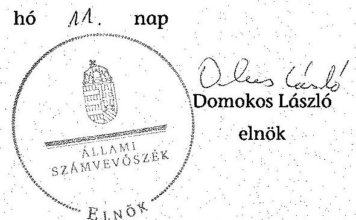
²²⁵ 2006. június 19-én kelt 10001/3/2006. számú levélben.

---

# Kimutatás

## a hátralékállományról és a hátralékok időbeli megoszlásáról

|   | 2009. év | 2010. év | 2011. év | 2012. év | 2013. év | $\begin{gathered} \text { millió Ft } \ \text { Változás } \ 2009-2013 . \text { év } \end{gathered}$  |
| --- | --- | --- | --- | --- | --- | --- |
|  Adó szakterület | 2029973 | 2295517 | 1998129 | 2054573 | 2174643 | 107,1\%  |
|  ebből: | 734092 | 827858 | 698708 | 708754 | 764251 | 104,1\%  |
|   | 61930 | 67630 | 64470 | 64959 | 61342 | 99,1\%  |
|   | 242872 | 271523 | 275669 | 312875 | 317552 | 130,7\%  |
|  Vám szakterület | 48568 | 47514 | 49498 | 85003 | 86223 | 177,5\%  |
|  ebből: | 5347 | 4727 | 5242 | 6774 | 6428 | 120,2\%  |
|  Összesen | 2078541 | 2343031 | 2047627 | 2139576 | 2260866 | 108,8\%  |
|  ebből: | 60 napon belül fennálló | 290876 | 309393 | 257908 | 303209 | 325112  |
|   | 60 és 90 nap között fennálló | 79697 | 79792 | 80753 | 90926 | 95420  |
|   | 91 és 180 nap között fennálló | 218902 | 218888 | 192578 | 197815 | 236455  |
|   | 181 és 360 nap között fennálló | 375421 | 400284 | 297965 | 325121 | 346821  |
|   | 360 napon túl fennálló | 1113646 | 1334673 | 1218424 | 1222504 | 1257059  |
|  Adószakmai hátralék aránya a teljes hátralékállományból |  | 97,7\% | 98,0\% | 97,6\% | 96,0\% | 96,2\%  |
|  Éven túl fennálló tartozások aránya a teljes hátralékállományból |  | 53,6\% | 57,0\% | 59,5\% | 57,1\% | 55,6\%  |
|  91-360 nap között fennálló hátralékok aránya a teljes hátralékállományból |  | 28,6\% | 26,4\% | 24,0\% | 24,4\% | 25,8\%  |
|  90 napot még nem haladó hátralékok aránya a teljes

 hátralékállományból |  | 17,8\% | 16,6\% | 16,5\% | 18,4\% | 18,6\%  |

Forrás: NAV adatszolgáltatás

---

# Kimutatás

az adóalanyok és a hátralékos adózók számáról, valamint a hátralék nagysága szerinti eloszlásról

|   |  |  |  |  |  |  | db  |
| --- | --- | --- | --- | --- | --- | --- | --- |
|   |  | 2009. év | 2010. év | 2011. év | 2012. év | 2013. év | Változás 2009-2013. év  |
|  Adóalanyok száma |  | 3828471 | 3981321 | 4115300 | 4252160 | 4370661 | 114,2\%  |
|  ebből: Működő adóalany |  | 1600407 | 1673518 | 1715515 | 1749747 | 1783650 | 111,4\%  |
|   | Nem működő adóalany | 2228064 | 2307803 | 2399785 | 2502413 | 2587011 | 116,1\%  |
|  Hátralékos | Adó szakterület | 1895203 | 2063278 | 2125236 | 2257262 | 2301953 | 121,5\%  |
|  adózók | Vám szakterület | 44397 | 36669 | 39693 | 48828 | 39993 | 90,1\%  |
|  száma | Összesen* | 1939600 | 2099947 | 2164929 | 2306090 | 2341946 | 120,7\%  |
|  ebből: 1 millió Ft alatt |  | 1802004 | 1955400 | 2023337 | 2158034 | 2195651 | 121,8\%  |
|   | 1-10 millió Ft között | 118612 | 123741 | 121801 | 127998 | 126360 | 106,5\%  |
|   | 10-50 millió Ft között | 13969 | 15074 | 14735 | 14789 | 14318 | 102,5\%  |
|   | 50 millió Ft felett | 5015 | 5732 | 5056 | 5269 | 5617 | 112,0\%  |
|   |  |  |  |  |  |  | Évek átlaga  |
|  Hátralékos adózók aránya az összes adóalanyból |  | 50,7\% | 52,7\% | 52,6\% | 54,2\% | 53,6\% | 52,8\%  |
|  1 millió Ft alatti tartozás aránya az összes hátralékból |  | 92,9\% | 93,1\% | 93,5\% | 93,6\% | 93,8\% | 93,4\%  |

- Az adó és a vám szakterület között 1,7-3,3\%-os duplázódást tartalmazhat.

Forrás: NAV adatszolgáltatás

---

# Kimutatás

## a működő és nem működő adóalanyok hátralékáról

|   | 2009. év | 2010. év | 2011. év | 2012. év | 2013. év | $\begin{gathered} \text { millió Ft } \ \text { Változás } \ 2009-2013 . \text { év } \end{gathered}$  |
| --- | --- | --- | --- | --- | --- | --- |
|  Működő adóalanyok hátraléka | 695725 | 698562 | 638984 | 742386 | 682798 | 98,1\%  |
|  ebből: Gazdálkodó szervezetek* | 413353 | 404434 | 345196 | 439680 | 369632 | 89,4\%  |
|  Magánszemélyek, egyéni vállalkozások | 282372 | 294128 | 293788 | 302706 | 313166 | 110,9\%  |
|  Nem működő adóalanyok hátraléka | 1382816 | 1644469 | 1408643 | 1397190 | 1578068 | 114,1\%  |
|  ebből: Felszámolási eljárás | 870287 | 1065158 | 978269 | 915083 | 916586 | 105,3\%  |
|  Csődeljárás | 2180 | 2396 | 2136 | 1857 | 3284 | 150,6\%  |
|  Technikai megszűnt | 246544 | 396505 | 199528 | 169529 | 156147 | 63,3\%  |
|  Végelszámolás | 57173 | 61802 | 84517 | 114474 | 112541 | 196,8\%  |
|  Összes adózói hátralék | 2078541 | 2343031 | 2047627 | 2139576 | 2260866 | 108,8\%  |
|  Nem működő adóalanyok hátralékának aránya az összes adózói hátralékból | 66,5\% | 70,2\% | 68,8\% | 65,3\% | 69,8\% | 68,1\%  |

- Jogi személyiségű gazdasági társaságok, egyéb gazdálkodó szervezetek, költségvetési szervezetek, egyéb szervezetek

Forrás: NAV adatszolgáltatás

---

# Kimutatás

## a szankcionálásból eredő hátralékokról

|   |  |  |  |  |  | millió Ft  |
| --- | --- | --- | --- | --- | --- | --- |
|   | 2009. év | 2010. év | 2011. év | 2012. év | 2013. év | $\begin{gathered} \text { Változás } \ 2009-2013 . \text { év } \end{gathered}$  |
|  Bírság, mulasztási bírság, önellenőrzési pótlék | 367540 | 420531 | 356635 | 373417 | 452388 | 123,1\%  |
|  Késedelmi pótlék | 366587 | 444480 | 363798 | 335250 | 346412 | 94,5\%  |
|  Összes szankcionálásból eredő hátralék | 734127 | 865011 | 720433 | 708667 | 798800 | 108,8\%  |
|  Összes adózói hátralék | 2078541 | 2343031 | 2047627 | 2139576 | 2260866 | 108,8\%  |
|   |  |  |  |  |  | Évek átlaga  |
|  Szankcionálásból eredő hátralék aránya az összes hátralékban | 35,3\% | 36,9\% | 35,2\% | 33,1\% | 35,3\% | 35,2\%  |

Forrás: NAV adatszolgáltatás

---

# Kimutatás

## az adószakmai terület működő adózói tartozásának hátralékkezelésbe vonásáról*

|   |  |  |  |  |  | millió Ft  |
| --- | --- | --- | --- | --- | --- | --- |
|   | 2009. év | 2010. év | 2011. év | 2012. év | 2013. év | $\begin{gathered} \text { Változás } \ 2009-2013 . \text { év } \end{gathered}$  |
|  Összes adózói hátralék | 2029973 | 2295517 | 1998129 | 2054573 | 2174643 | 107,1\%  |
|  ebből: hátralékkezelésbe vont | 901866 | 819160 | 853847 | 958193 | 1189023 | 131,8\%  |
|  Összes működő adózói hátralék | 658528 | 660192 | 600177 | 670202 | 621438 | 94,4\%  |
|  ebből: hátralékkezelésbe vont | 425688 | 432691 | 418970 | 453458 | 417442 | 98,1\%  |
|  hátralékkezelésbe nem vont | 232840 | 227501 | 181207 | 216744 | 203996 | 87,6\%  |
|   |  |  |  |  |  | Évek átlaga  |
|  Hátralékkezelésbe vont adózói hátralék aránya |  |  |  |  |  |   |
|  az összes adózói hátralékból | 44,4\% | 35,7\% | 42,7\% | 46,6\% | 54,7\% | 44,8\%  |
|  Hátralékkezelésbe vont működő adózói |  |  |  |  |  |   |
|  hátralék aránya az összes működő adózói |  |  |  |  |  |   |
|  hátralékból | 64,6\% | 65,5\% | 69,8\% | 67,7\% | 67,2\% | 67,0\%  |
|  Hátralékkezelésbe nem vont működő adózói |  |  |  |  |  |   |
|  hátralék aránya az összes működő adózói |  |  |  |  |  |   |
|  hátralékból | 35,4\% | 34,5\% | 30,2\% | 32,3\% | 32,8\% | 33,0\%  |

- A vám szakterületnél nem állt rendelkezésre adat az összes hátralékkezelésbe bevont, valamint a hátralékkezelésbe nem vont működő adózói hátralékról.

Forrás: NAV adatszolgáltatás

---

# Kimutatás

## a benyújtott fizetési kedvezmény (fizetési könnyítés, mérséklés) iránti kérelmekről és azok elbírálásáról

|   |  |  |  |  |  | db  |
| --- | --- | --- | --- | --- | --- | --- |
|   | 2009. év | 2010. év | 2011. év | 2012. év | 2013. év | $\begin{gathered} \text { Változás } \ 2009-2013 . \text { év } \end{gathered}$  |
|  Adó szakterület | 280784 | 227145 | 173588 | 150157 | 142438 | 50,7\%  |
|  ebből: hiányos kérelem | 43214 | 43067 | 33610 | 41390 | 40598 | 93,9\%  |
|  hiányos kérelem aránya | 15,4\% | 19,0\% | 19,4\% | 27,6\% | 28,5\% | 185,2\%  |
|  Vám szakterület | 1627 | 1199 | 963 | 1001 | 973 | 59,8\%  |
|  Összesen | 282411 | 228344 | 174551 | 151158 | 143411 | 50,8\%  |
|  Összesen értékben (millió Ft) | 346254 | 294673 | 243396 | 199119 | 185868 | 53,7\%  |
|  A beadott kérelmek ügyében hozott jogerős elsőfokú határozatok száma | 179740 | 154911 | 146797 | 110290 | 100590 | 56,0\%  |
|   |  |  |  |  |  | Évek átlaga  |
|  ebből: Kérelemnek helyt adó | 73050 | 57872 | 55428 | 39495 | 36491 |   |
|  határozatokon belüli aránya | 40,7\% | 37,4\% | 37,7\% | 35,7\% | 36,3\% | 37,5\%  |
|  értékben (millió Ft) | 133123 | 123004 | 130834 | 97476 | 87787 | 114445  |
|  Kérelemnek részben helyt adó | 50888 | 45677 | 44621 | 31380 | 25751 |   |
|  határozatokon belüli aránya | 28,3\% | 29,5\% | 30,4\% | 28,5\% | 25,6\% | 28,4\%  |
|  Kérelmet elutasító | 47156 | 44969 | 35804 | 30304 | 31733 |   |
|  határozatokon belüli aránya | 26,2\% | 29,0\% | 24,4\% | 27,5\% | 31,5\% | 27,6\%  |
|  értékben (millió Ft) | 108539 |  |  |  |  |  |

 | 114169 | 101729 | 73720 | 75555 | 94742  |
|  Döntés saját hatáskörben | - | - | 1433 | 1208 | 817 |   |
|  határozatokon belüli aránya | - | - | 1,0 % | 1,1 % | 0,8 % | 0,9 %  |
|  Kérelmet megszüntető | 8646 | 6393 | 9511 | 7903 | 5798 |   |
|  határozatokon belüli aránya | 4,8 % | 4,1 % | 6,5 % | 7,2 % | 5,8 % | 5,6 %  |

Forrás: NAV adatszolgáltatás

---

# Kimutatás a hátralékok törlésének okairól és mértékéről*

|   |  |  |  |  |  |  | millió Ft  |
| --- | --- | --- | --- | --- | --- | --- | --- |
|   |  | 2009. év | 2010. év | 2011. év | 2012. év | 2013. év | $\begin{gathered} \text { Változás } \ 2009-2013 . \text { év } \end{gathered}$  |
|  Méltányossági okból törölt hátralék |  | 11628 | 8660 | 6649 | 4683 | 4873 | 41,9 %  |
|  Behajthatatlanná nyilvánított hátralék** |  | 107013 | 69982 | 65666 | 36150 | 120722 | 112,8 %  |
|  Elévülés miatt törölt hátralék*** |  | 45120 | 54133 | 51230 | 50011 | 61382 | 136,0 %  |
|  Cégtörlés miatt törölt hátralék*** |  | 20597 | 30536 | 43105 | 28433 | 23596 | 114,6 %  |
|  Felszámolásban: | Követelés engedményezés | 105037 | 36932 | 205951 | 288227 | 337617 | 321,4 %  |
|   | Záró végzés | 233246 | 363331 | 585174 | 216156 | 211505 | 90,7 %  |
|   | Követelés lemondás | 19774 | 47337 | 78528 | 113934 | 94819 | 479,5 %  |
|  Kényszertörlési eljárás |  | - | - | - | - | 11280 | -  |
|  Összesen törölt hátralék |  | 542415 | 610911 | 1036303 | 737594 | 865794 | 159,6 %  |
|  Teljes hátralékállomány |  | 2078541 | 2343031 | 2047627 | 2139576 | 2260866 | 108,8 %  |
|  Törölt hátralék aránya a hátralékállományból |  | 26,1 % | 26,1 % | 50,6 % | 34,5 % | 38,3 % | 146,7 % |
|   |  |  |  |  |  |  | Évek átlaga  |
|  Törölt hátralékokból: | AFA*** | 203900 | 252985 | 459174 | 305103 | 353120 |   |
|   | aránya törlésekből | 37,6 % | 41,4 % | 44,3 % | 41,4 % | 40,8 % | 41,1 %  |
|   | Késedelmi pótlék*** | 121574 | 132537 | 218351 | 148578 | 212010 |   |
|   | aránya törlésekből | 22,4 % | 21,7 % | 21,1 % | 20,1 % | 24,5 % | 22,0 %  |
|   | Bírság, önellenőrzési pótlék*** | 124280 | 143116 | 245182 | 176211 | 6895 |   |
|   | aránya törlésekből | 22,9 % | 23,4 % | 23,7 % | 23,9 % | 0,8 % | 18,9 %  |

- A vám szakterület a 2009-2010. években a törölt hátralékokról nem szolgáltatott adatot, az informatikai rendszerben a törlés jogcíme beazonosíthatóságának hiánya miatt. A KH Folyószámla-felügyeleti Főosztály vezetőjének 2014. augusztus 8-i és szeptember 10-i nyilatkozatai szerint, a folyószámlára könyvelt kötelezettségek csökkenései leválogathatók, de az összes törlésből nem különíthetők el az ellenőrzött hátralék törlések. ** A behajthatatlanná nyilvánított hátralékok törléséről a vám szakterületi folyószámlán nem történt intézkedés, ezért itt nem szerepel. (2011-ben 1334 M Ft; 2012ben 771 M Ft; 2013-ban 1901 M Ft volt.) *** A 2011-2013. években az adó és vám szakterület adatait közösen tartalmazza. Forrás: NAV adatszolgáltatás

---

# 1/H. SZÁMÚ MELLÉKLET A V-0462-940/2015. SZÁMÚ JELENTÉSHEZ

## Kimutatás

## az intézkedés alá vont és beszedett hátralékok összegéről végrehajtási cselekményenként

|   |  |  |  |  |  |  | millió Ft  |
| --- | --- | --- | --- | --- | --- | --- | --- |
|   |  | 2009. év | 2010. év | 2011. év | 2012. év | 2013. év | $\begin{gathered} \text { Változás } \ 2009-2013 . \text { év } \end{gathered}$  |
|  Intézkedés alá vont hátralék összesen |  | 2284642 | 2105896 | 2439143 | 2805838 | 3379827 | 147,9%  |
|  ebből: beszedett hátralék |  | 283156 | 303868 | 331299 | 340717 | 361482 | 127,7%  |
|   | Beszedett hátralék aránya | 12,4 % | 14,4 % | 13,6 % | 12,1 % | 10,7 % | 86,3%  |
|  Kibocsátott azonnali |  |  |  |  |  |  |   |
|  $\begin{aligned} & \text { ㅇ } \ & \text { ㅇ } \ & \text { ㅇ } \end{aligned}$ | beszedési megbizás | 2136336 | 1961887 | 2267251 | 2614262 | 3198016 | 149,7%  |
|   | ebből beszedett hátralék | 159256 | 163285 | 174720 | 178731 | 187188 | 117,5%  |
|   | beszedett hátralék aránya | 7,5 % | 8,3 % | 7,7 % | 6,8 % | 5,9 % |   |
|   | Foglalt ingóság | 28950 | 27191 | 29490 | 37340 | 27574 | 95,2%  |
|   | ebből beszedett hátralék | 1409 | 1857 | 2210 | 1860 | 1796 | 127,5%  |
|   | beszedett hátralék aránya | 4,9 % | 6,8 % | 7,5 % | 5,0 % | 6,5 % |   |
|   | Foglalt ingatlan | 20012 | 12570 | 9029 | 4580 | 5369 | 26,8%  |
|   | ebből beszedett hátralék | 625 | 507 | 581 | 558 | 438 | 70,1%  |
|   | beszedett hátralék aránya | 3,1 % | 4,0 % | 6,4 % | 12,2 % | 8,2 % |   |
|   | Egyéb cselekmény |  |  |  |  |  |   |
|   | (végrehajtási átvezetéssel) | 99344 | 104248 | 133373 | 149656 | 148868 | 149,9%  |
|   | ebből beszedett hátralék | 38430 | 38271 | 51072 | 65892 | 59263 | 154,2%  |
|   | beszedett hátralék aránya | 38,7 % | 36,7 % | 38,3 % | 44,0 % | 39,8 % |   |

Forrás: NAV adatszolgáltatás

---

# Kímutatás 

a külső megkeresések alakulásáról a 2009-2013. években

| év | Külső megkeresések alapján kezelt állományok összesen |  |  | Ebből: önkormányzati adóhatóságtól |  |  | Diákhitel Központ Zrt. ${ }^{-}$ től |  |  | Egyéb szervektől |  |  | Vámszakmai területről |  |  |
| :--: | :--: | :--: | :--: | :--: | :--: | :--: | :--: | :--: | :--: | :--: | :--: | :--: | :--: | :--: | :--: |
|  | átadott megkeresések összesege | $\begin{gathered} \text { behaj- } \\ \text { tott ösz- } \\ \text { szeg } \end{gathered}$ | A behajtás %-a | átadott megkeresések összesege | behajtott öszszeg | A behajtás %-a | átadott megkeresések összese | behaj-   tott ösz-   szeg | A behajtás %-a | átadott megkeresések összese | behaj-   tott   összeg | A behajtás %-a | átadott megkeresések összese | behaj-   tott   összeg | A behajtás %-a |
| 2009 | 32227 | 3159 | 9,8% | 0 | 0 | 0% | 4476 | 522 | 11,7% | 12954 | 2490 | 19,2% | 14797 | 147 | 1% |
| 2010 | 39488 | 3505 | 8,9% | 250 | 13 | 5,2% | 6795 | 702 | 10,3% | 19413 | 2689 | 13,9% | 13030 | 101 | 0,8% |
| 2011 | 64140 | 3807 | 5,9% | 2277 | 267 | 11,7% | 9202 | 937 | 10,2% | 33489 | 2124 | 6,3% | 19172 | 479 | 2,5% |
| 2012 | 108626 | 4090 | 3,8% | 2453 | 330 | 13,5% | 11958 | 951 | 8% | 24679 | 1883 | 7,6% | 69536 | 926 | 1,3% |
| 2013 | 76361 | 4635 | 6,1% | 2103 | 377 | 17,9% | 15150 | 1000 | 6,6% | 30572 | 2932 | 9,6% | 28536 | 326 | 1,1% |
| összesen | 320842 | 19196 | 6% | 7083 | 987 | 13,9% | 47581 | 4112 | 8,6% | 121107 | 12118 | 10% | 145071 | 1979 | 1,4% |

Forrás: NAV adatszolgáltatás

---

# Kimutatás 

## az MKK Zrt. részére engedményezéssel átadott hátralék állományok alakulásáról a 2009-2013. években

adatok millió Ft-ban

|  | 2009. év | 2010. év | 2011. év | 2012. év | 2013. év | Összesen |
| :--: | :--: | :--: | :--: | :--: | :--: | :--: |
| Engedményezéssel átadott állomány összeg | 114136 | 43936 | 362930 | 182854 | 302579 | 1006435 |
| ebből tőke (az ellenérték alapja) | 71783 | 26999 | 213763 | 114088 | 189550 | 616183 |
| Engedményezésre fizetendő vételár (NAV szerint várható megtérülés) | 718 | 270 | 1155 | 663 | 1279 | 4085 |
| Az MKK Zrt. kimutatása szerint várható megtérülés | 836 |

 | 276 | 1295 | 2953 | 3199 | 8559 |
| Engedményezés során az MKK Zrt. által a még várható összeggel növelt beszedett összeg | 844 | 285 | 505 | 849 | 447 | 2930 |
| Megtérülés az engedményezés során (követelésállomány %-ában) | $0,63 \%$ | $0,61 \%$ | $0,32 \%$ | $0,36 \%$ | $0,42 \%$ | $0,41 \%$ |
| Az engedményezés során ténylegesen beszedett összeg (követelésállomány %-ában) | $0,74 \%$ | $0,65 \%$ | $0,14 \%$ | $0,46 \%$ | $0,15 \%$ | $0,29 \%$ |

Megjegyzés: Az egyes évek oszlopaiban az adott évben átadott követelések adatai szerepelnek, függetlenül a felszámolás megkezdésének évétől, így a vételár és a tőkekövetelés aránya az egyes megállapodásokban rögzített %-os ellenértékektől eltérő lehet.
Forrás: NAV és az MKK Zrt. adatszolgáltatása

---

# Kimutatás 

a kiemelt adózók számáról a területileg illetékes regionális adó főigazgatóságok és a megyei adóigazgatóságok szerint, 2013. január 1-jén

| Regionális adó főigazgatóság |  |
| :--: | :--: |
| ezen belül | Kiemelt adózók száma |
| megyei adóigazgatóság |  |
| 71 KMRAFI | 2 |
| Kelet-Budapest | 1 |
| Dél-Budapest | 1 |
| 74 DARAFI | 71 |
| Bács-Kiskun | 37 |
| Békés | 10 |
| Csongrád | 24 |
| 77 DDRAFI | 44 |
| Baranya | 17 |
| Somogy | 13 |
| Tolna | 14 |
| 72 ÉMRAFI | 63 |
| Borsod-Abaúj-Zemplén | 39 |
| Heves | 18 |
| Nógrád | 6 |
| 75 NVDRAFI | 79 |
| Győr-Moson-Sopron | 43 |
| Zala | 13 |
| Vas | 23 |
| 78 KAVFIG | 712 |
| KAIG | 712 |
| 73 ÉARAFI | 84 |
| Hajdú-Bihar | 35 |
| Jász-Nagykun-Szolnok | 21 |
| Szabolcs-Szatmár-Bereg | 28 |
| 76 KDRAFI | 130 |
| Fejér | 52 |
| Komárom-Esztergom | 50 |
| Veszprém | 28 |
| Kiemelt adózók száma 2013. január 1-jén | 1185 |

Forrás: NAV adatszolgáltatás

---

# Kimutatás 

## az előzetes szürés után megmaradt, visszaigénylést (átvezetést) tartalmazó bevallások ellenőrzöttségének alakulásáról

|  | Bevallások | általános forgalmi adó |  |  |  |  |  |
| :--: | :--: | :--: | :--: | :--: | :--: | :--: | :--: |
|  |  | 2009. év | 2010. év | 2011. év | 2012. év | 2013. év |  |
| 1. | Feldolgozott Ebből: | db | 15314 | 15493 | 17137 | 14866 | 23210 |
| 2. | Visszaigénylő Ebből | db | 3333 | 3217 | 3671 | 3361 | 5765 |
|  |  | m Ft | 482713 | 605014 | 805904 | 751271 | 822877 |
| 3. | előzetes szürést követően pénzügyileg rendezett | db | 2180 | 1717 | 1591 | 2577 | 2781 |
|  |  | m Ft | 116594 | 54968 | 28108 | 487026 | 267408 |
| 4. | Ellenőrizendő (visszaigénylő - előzetes szürést követően pénzügyileg rendezett) Ebből: | db | 1153 | 1500 | 2080 | 784 | 2984 |
|  |  | m Ft | 366119 | 550046 | 777796 | 264245 | 555469 |
| 5. | Revizor által ellenőrzés nélkül pénzforgalmi ágra engedett | db | 1023 | 1395 | 1864 | 615 | 2523 |
|  |  | m Ft | 334400 | 510579 | 647790 | 214752 | 413831 |
| 6. | Ellenőrzött Ebből | db | 129 | 105 | 216 | 169 | 461 |
|  |  | m Ft | 31595 | 39467 | 130005 | 49493 | 141638 |
| 7. | Megállapítással zárult | db | 7 | 3 | 7 | 18 | 19 |
| 8. | Folyamatban lévő revízió | db |  |  | 1 | 5 | 1 |
|  |  | m Ft |  |  | 4486 | 10894 | 3 |
| Az ellenőrzés alá vonandó és az ellenőrzött |  |  |  |  |  |  |  |
| 9. | bevallások aránya (6. sor/4. sor) | \% | 11,2 | 7,0 | 10,4 | 21,6 | 15,4 |
|  | adó összegének aránya (6. sor/4. sor) | \% | 8,6 | 7,2 | 16,7 | 18,7 | 25,5 |

|  | Bevallások | társasági adó |  |  |  |  |  |
| :--: | :--: | :--: | :--: | :--: | :--: | :--: | :--: |
|  |  | 2009. év | 2010. év | 2011. év | 2012. év | 2013. év |  |
| 1. | Feldolgozott | db | 994 | 1114 | 1092 | 969 | 1730 |
| 2. | Visszaigénylő | db | 123 | 152 | 119 | 89 | 135 |
| 3. | Szürésből kiesett | db | 85 | 103 | 86 | 52 | 67 |
| 4. | Ellenőrizendő (2. sor-3. sor) | db | 38 | 49 | 33 | 37 | 68 |
| 5. | Revizor által elengedett | db | 19 | 31 | 26 | 27 | 51 |
| 6. | Ellenőrzött | db | 19 | 18 | 7 | 10 | 17 |
| 7. | Aránya (6. sor/4. sor) | \% | 50,0 | 36,7 | 21,2 | 27,0 | 25,0 |

Forrás: NAV adatszolgáltatás

---

# Kimutatás

a kiemelt adózók 2013. évi kiutalás előtti ÁFA bevallása ellenőrzések számáról és arányáról

|  2013. évi illetékesség szerinti régió | Kiemelt adózók száma (db) | Kiemelt adózók aránya (\%) | Szűrés után megmaradt, ellenőrizendő ÁFA bevallások száma (db) | Ellenőrizendő ÁFA bevallások aránya (\%) | Kiutalás előtt ellenőrzött ÁFA bevallások száma (db) | Elvégzett ellenőrzések aránya (\%) | Ellenőrzött bevallások aránya (\%)  |
| --- | --- | --- | --- | --- | --- | --- | --- |
|  78 KAVFIG | 712 | 60,1\% | 590 | 19,8\% | 86 | 18,7\% | 14,6\%  |
|  77 DDRAFI | 44 | 3,7\% | 199 | 6,7\% | 51 | 11,1\% | 25,6\%  |
|  76 KDRAFI | 130 | 11,0\% | 558 | 18,7\% | 44 | 9,5\% | 7,9\%  |
|  75 NYDRAFI | 79 | 6,7\% | 450 | 15,1\% | 51 | 11,1\% | 11,3\%  |
|  74 DARAFI | 71 | 6,0\% | 439 | 14,7\% | 55 | 11,9\% | 12,5\%  |
|  73 ÉARAFI | 84 | 7,1\% | 453 | 15,2\% | 108 | 23,4\% | 23,8\%  |
|  72 ÉMRAFI | 63 | 5,3\% | 279 | 9,3\% | 62 | 13,4\% | 22,2\%  |
|  71 KMRAFI | 2 | 0,2\% | 16 | 0,5\% | 4 | 0,9\% | 25,0\%  |
|  Összesen | 1185 | 100,0\% | 2984 | 100,0\% | 461 | 100,0\% | 15,4\%  |

Forrás: NAV adatszolgáltatás

---

# Kimutatás

a külföldi megkeresések számának alakulásáról a 2009-2013. években

|   | 2009. év | 2010. év | Változás az előző évhez | 2011. év | Változás az előző évhez | 2012. év | Változás az előző évhez | 2013. év | Változás az előző évhez  |
| --- | --- | --- | --- | --- | --- | --- | --- | --- | --- |
|  Külföldi adóhatóságok megkereséseinek száma | 75 | 124 | 165,3\% | 92 | 74,2\% | 125 | 135,9\% | 199 | 159,2\%  |
|  Ebből: Áfa adónemre vonatkozó megkeresések száma | 67 | 114 | 170,1\% | 87 | 76,3\% | 104 | 119,5\% | 189 | 181,7\%  |
|  aránya | 89,3\% | 91,9\% |  | 94,6\% |  | 83,2\% |  | 95,0\% |   |
|  Ellenőrzésre kiválasztott megkeresések száma | 73 | 86 | 117,8\% | 97 | 112,8\% | 101 | 104,1\% | 164 | 162,4\%  |
|  aránya | 97,3\% | 69,4\% |  | 105,4\% |  | 80,8\% |  | 82,4\% |   |

Forrás: NAV adatszolgáltatás

---

# Kimutatás

## a VIES eltérés és ellenőrzöttségének alakulásáról a 2009-2013. években

|   | 2009. év | 2010. év | 2011. év | 2012. év | 2013. év  |
| --- | --- | --- | --- | --- | --- |
|  VIES eltéréssel érintett adózók száma (db) | 385 | 391 | 434 | 389 | 631  |
|  Ebből: Ellenőrzött adózók száma (db) | 219 | 270 | 291 | 241 | 435  |
|  Ellenőrzött adózók aránya (\%) | 56,9 | 69,1 | 67,1 | 62,0 | 68,9  |
|  VIES eltérés összege (m Ft) | $-2214413$ | $-2407682$ | $-2814695$ | $-2547804$ | $-3334978$  |
|  Ebből: Ellenőrzéssel érintett VIES eltérés összege (m Ft) | $-1611986$ | $-2048419$ | $-2492144$ | $-2075507$ | $-2798580$  |
|  Ellenőrzött VIES eltérés aránya (\%) | 72,8 | 85,1 | 88,5 | 81,5 | 83,9  |
|  Ellenőrzéssel feltárt nettó adókülönbözet összege (m Ft) | 826 | 17537 | 12885 | 14715 | 24210  |

Forrás: NAV adatszolgáltatás

---

.

---

# Az EUROFISC keretében beérkezett megkeresések, és azok alapján végzett ellenőrzések 

| Tevékenységi terület | Adat | 2011 | 2012 | 2013 | 2014. április 30-ig | Összesen |
| :--: | :--: | :--: | :--: | :--: | :--: | :--: |
| WF1 | tételsor | 679 | 1534 | 1764 | 236 | 4213 |
|  | adózó | 173 | 254 | 241 | 86 | 754 |
|  | ebből új adózó | 173 | 181 | 170 | 28 | 552 |
| WF2 | tételsor | 2283 | 5063 | 778 | 234 | 8358 |
|  | adózó | 772 | 886 | 272 | 146 | 2076 |
|  | ebből új adózó |

 772 | 657 | 193 | 82 | 1704 |
| WF3 | tételsor | 582 | 1096 | 2105 | 346 | 4129 |
|  | adózó | 131 | 263 | 380 | 119 | 893 |
|  | ebből új adózó | 131 | 204 | 286 | 43 | 664 |
| Összesen | tételsor | 3544 | 7693 | 4647 | 816 | 16700 |
|  | adózó | 1076 | 1403 | 893 | 351 | 3723 |
|  | ebből új adózó | 1076 | 1042 | 649 | 153 | 2920 |
| A összes beérkezett adatállomány alapján végzett ellenőrzések száma (db) |  | 489 | 580 | 483 | 152 | 1704 |
| ebből adóellenőrzés (db) |  | 192 | 191 | 230 | 50 | 663 |
| ebből, a befejezett ellenőrzések adómegállapításai (db)* |  | 97 | 101 | 78 | 5 | 281 |
| A befejezett ellenőrzésekhez kapcsolódó adómegállapítások összege (M Ft)** |  | 7850 | 8945 | 2454 | 383 | 19632 |

* A megállapítással zárult adóellenőrzések száma
** Az összeg NEM tartalmazza a szankciók (adóbírság, mulasztási bírság és késedelmi pótlékok) összegét. A megállapítások összege tartalmazza a nem jogerős megállapításokat is.

Forrás: NAV adatszolgáltatás

---

# Az EUROFISC keretében kezdeményezett megkeresések 

| Tevékenységi terület | Adat | 2011. év | 2012. év | 2013. év | 2014.   április   30-ig | Összesen |
| :--: | :--: | :--: | :--: | :--: | :--: | :--: |
|  | tételsor | 2001 | 1865 | 869 | 284 | 5019 |
|  | magyar adózó | 27 | 42 | 36 | 26 | 131 |
|  | ebből új magyar adózó | 27 | 25 | 13 | 4 | 69 |
| WFI | magyarokhoz kapcsolódó külföldi adózó | 344 | 442 | 229 | 97 | 1112 |
|  | ebből új, magyarokhoz kapcsolódó külföldi adózó | 344 | 278 | 100 | 26 | 748 |
|  | tételsor | 211 | 126 | 786 | 87 | 1210 |
|  | magyar adózó | 7 | 3 | 12 | 8 | 30 |
|  | ebből új magyar adózó | 7 | 1 | 8 | 1 | 17 |
| WF3 | magyarokhoz kapcsolódó külföldi adózó | 9 | 4 | 35 | 17 | 65 |
|  | ebből új, magyarokhoz kapcsolódó külföldi adózó | 9 | 0 | 31 | 2 | 42 |
|  | tételsor | 2212 | 1991 | 1655 | 371 | 6229 |
|  | magyar adózó | 34 | 45 | 48 | 34 | 161 |
|  | ebből új magyar adózó | 34 | 26 | 21 | 5 | 86 |
| Összesen | magyarokhoz kapcsolódó külföldi adózó | 353 | 446 | 264 | 114 | 1177 |
|  | ebből új, magyarokhoz kapcsolódó külföldi adózó | 353 | 278 | 131 | 28 | 790 |

Forrás: NAV adatszolgáltatás

---

# Az EUROFISC keretében beérkezett megkeresésekhez kapcsolódóan küldött visszajelzések

|  visszajelzés típusa tevékenységi terület szerint | 2011. év |  |  | 2012. év |  |  | 2013. év |  |  | 2014. április 30-ig |  |  | Ellenőrzött időszak összesen |  |   |
| --- | --- | --- | --- | --- | --- | --- | --- | --- | --- | --- | --- | --- | --- | --- | --- | --- |
|   | tételsor | adózó | ebből új adózó | tételsor | adózó | ebből új adózó | tételsor | adózó | ebből új adózó | tételsor | adózó | ebből új adózó | tételsor | adózó | ebből új adózó  |
|  WF1 |  |  |  |  |  |  |  |  |  |  |  |  |  |  |   |
|  csalás gyanús* | 277 | 62 | 62 | 1059 | 67 | 42 | 1307 | 87 | 49 | 77 | 23 | 1 | 2720 | 239 | 154  |
|  nincs visszajelzés | 0 | 0 | 0 | 87 | 48 | 48 | 60 | 26 | 21 | 67 | 33 | 27 | 214 | 107 | 96  |
|  normál adózó | 110 | 24 | 24 | 161 | 56 | 40 | 284 | 107 | 87 | 70 | 20 | 0 | 625 | 207 | 151  |
|  egyéb** | 292 | 87 | 87 | 227 | 83 | 51 | 113 | 21 | 13 | 22 | 10 | 0 | 654 | 201 | 151  |
|  Összesen | 679 | 173 | 173 | 1534 | 254 | 181 | 1764 | 241 | 170 | 236 | 86 | 28 | 4213 | 754 | 552  |
|  WF2 |  |  |  |  |  |  |  |  |  |  |  |  |  |  |   |
|  csalás gyanús* | 218 | 47 | 47 | 570 | 50 | 33 | 436 | 85 | 54 | 66 | 23 | 0 | 1290 | 205 | 134  |
|  nincs visszajelzés | 1636 | 606 | 606 | 3532 | 678 | 538 | 35 | 19 | 17 | 117 | 95 | 82 | 5320 | 1398 | 1243  |
|  normál adózó | 280 | 97 | 97 | 599 | 130 | 67 | 224 | 136 | 104 | 26 | 21 | 0 | 1129 | 384 | 268  |
|  egyéb** | 149 | 22 | 22 | 362 | 28 | 19 | 83 | 32 | 18 | 25 | 7 | 0 | 619 | 89 | 59  |
|  Összesen | 2283 | 772 | 772 | 5063 | 886 | 657 | 778 | 272 | 193 | 234 | 146 | 82 | 8358 | 2076 | 1704  |
|  WF3 |  |  |  |  |  |  |  |  |  |  |  |  |  |  |   |
|  csalás gyanús* | 122 | 12 | 12 | 217 | 30 | 23 | 433 | 75 | 64 | 59 | 23 | 7 | 831 | 140 | 106  |
|  nincs visszajelzés | 62 | 16 | 16 | 0 | 0 | 0 | 0 | 0 | 0 | 22 | 13 | 13 | 84 | 29 | 29  |
|  normál adózó | 366 | 95 | 95 | 779 | 202 | 153 | 1281 | 243 | 173 | 156 | 62 | 15 | 2582 | 602 | 436  |
|  egyéb** | 32 | 8 | 8 | 100 | 31 | 28 | 391 | 62 | 49 | 109 | 21 | 8 | 632 | 122 | 93  |
|  Összesen | 582 | 131 | 131 | 1096 | 263 | 204 | 2105 | 380 | 286 | 346 | 119 | 43 | 4129 | 893 | 664  |
|  Mindösszesen | 3544 | 1076 | 1076 | 7693 | 1403 | 1042 | 4647 | 893 | 649 | 816 | 351 | 153 | 16700 | 3723 | 2920  |

Forrás: NAV adatszolgáltatás *csalás gyanús: hiányzó kereskedő, mulasztó kereskedő, keresztbeszámlázó kereskedő, csatornatársaság, bróker, visszaélés adószámmal, belföldi csalás, gyanús (módszertani változás miatt csak 2013-tól) **egyéb: ellenőrzés alatti, és a többi kategóriában nem szereplő minősítés

---

# Az EUROFISC keretében kezdeményezett megkeresésekhez kapcsolódóan kapott visszajelzések

|  |   |   |   |   |   |   |   |   |   |   |
| --- | --- | --- | --- | --- | --- | --- | --- | --- | --- | --- |
|  visszajelzés típusa tevékenységi terület szerint | tételsor | magyar adózó*** | ebből új magyar adózó*** | magyar adózóhoz kapcsolódó külföldi adózó | ebből magyar adózóhoz kapcsolódó új külföldi adózó | tételsor | magyar adózó*** | ebből új magyar adózó*** | magyar adózóhoz kapcsolódó külföldi adózó | ebből magyar adózóhoz kapcsolódó új külföldi adózó  |
|  WFI |  |  |  |  |  |  |  |  |  |   |
|  csalás gyanús* | 202 | 19 | 19 | 48 | 48 | 263 | 28 | 15 | 65 | 42  |
|  nincs visszajelzés | 1467 | 25 | 25 | 236 | 236 | 1098 | 37 | 21 | 276 | 166  |
|  normál adózó | 256 | 14 | 14 | 46 | 46 | 434 | 22 | 10 | 84 | 58  |
|  egyéb** | 76 | 12 | 12 | 14 | 14 | 70 | 14 | 7 | 17 | 12  |
|  Összesen | 2001 | 70 | 70 | 344 | 344 | 1865 | 101 | 53 | 442 | 278  |
|  WFI |  |  |  |  |  |  |  |  |  |  |

 |
|  csalás gyanús* | 0 | 0 | 0 | 0 | 0 | 0 | 0 | 0 | 0 | 0  |
|  nincs visszajelzés | 93 | 6 | 6 | 7 | 7 | 78 | 2 | 0 | 2 | 0  |
|  normál adózó | 0 | 0 | 0 | 0 | 0 | 0 | 0 | 0 | 0 | 0  |
|  egyéb** | 118 | 3 | 3 | 2 | 2 | 48 | 2 | 1 | 2 | 0  |
|  Összesen | 211 | 9 | 9 | 9 | 9 | 126 | 4 | 1 | 4 | 0  |

---

|  visszajelzés típusa tevékenységi terület szerint | 2013. év |  |  |  |  | 2014. április 30-ig |  |  |  |   |
| --- | --- | --- | --- | --- | --- | --- | --- | --- | --- | --- |
|   |  |  | ebből új | magyar adózóhoz | ebből magyar adózóhoz |  |  | ebből új | magyar adózóhoz | ebből magyar adózóhoz  |
|   | tételsor | magyar adózó*** | adózó*** | kapcsolódó külföldi adózó | kapcsolódó külföldi adózó | tételsor | magyar adózó*** | kapcsolódó külföldi adózó | kapcsolódó külföldi adózó | kapcsolódó új külföldi adózó  |
|  WF1 |  |  |  |  |  |  |  |  |  |   |
|  csalás gyanús* | 195 | 24 | 6 | 49 | 28 | 44 | 10 | 0 | 14 | 2  |
|  nincs visszajelzés | 498 | 36 | 13 | 118 | 49 | 173 | 22 | 4 | 62 | 20  |
|  normál adózó | 117 | 13 | 2 | 52 | 18 | 33 | 6 | 0 | 14 | 3  |
|  egyéb** | 59 | 10 | 1 | 10 | 5 | 34 | 7 | 0 | 7 | 1  |
|  Összesen | 869 | 83 | 22 | 229 | 100 | 284 | 45 | 4 | 97 | 26  |
|  WF3 |  |  |  |  |  |  |  |  |  |   |
|  csalás gyanús* | 32 | 4 | 3 | 4 | 4 | 0 | 0 | 0 | 0 | 0  |
|  nincs visszajelzés | 448 | 6 | 3 | 14 | 12 | 60 | 6 | 1 | 9 | 2  |
|  normál adózó | 135 | 3 | 2 | 7 | 7 | 19 | 2 | 0 | 5 | 0  |
|  egyéb** | 171 | 5 | 2 | 10 | 8 | 8 | 2 | 0 | 3 | 0  |
|  Összesen | 786 | 18 | 10 | 35 | 31 | 87 | 10 | 1 | 17 | 2  |

---

|  | Ellenőrzött időszak összesen |  |  |  |  |
| :--: | :--: | :--: | :--: | :--: | :--: |
| visszajelzés típusa tevékenységi terület szerint | tételsor | $\begin{aligned} & \text { magyar } \\ & \text { adózó*** } \end{aligned}$ | $\begin{aligned} & \text { ebből új } \\ & \text { magyar } \\ & \text { adózó*** } \end{aligned}$ | $\begin{gathered} \text { magyar } \\ \text { adózóhoz } \\ \text { kapcsolódó } \\ \text { külföldi adózó } \end{gathered}$ | ebből magyar adózóhoz kapcsolódó új külföldi adózó |
| WF1 |  |  |  |  |  |
| csalás gyanús* | 704 | 81 | 40 | 176 | 120 |
| nincs visszajelzés | 3236 | 120 | 63 | 692 | 471 |
| normál adózó | 840 | 55 | 26 | 196 | 125 |
| egyéb** | 239 | 43 | 20 | 48 | 32 |
| Összesen | 5019 | 299 | 149 | 1112 | 748 |
| WF3 |  |  |  |  |  |
| csalás gyanús* | 32 | 4 | 3 | 4 | 4 |
| nincs visszajelzés | 679 | 20 | 10 | 32 | 21 |
| normál adózó | 154 | 5 | 2 | 12 | 7 |
| egyéb** | 345 | 12 | 6 | 17 | 10 |
| Összesen | 1210 | 41 | 21 | 65 | 42 |

Forrás: NAV adatszolgáltatás
*csalás gyanús: hiányzó kereskedő, mulasztó kereskedő, keresztbeszámlázó kereskedő, csatornatársaság, bróker, visszaélés adószámmal, belföldi csalás, gyanús (módszertani változás miatt csak 2013-tól)
**egyéb: ellenőrzés alatti, és a többi kategóriában nem szereplő minősítés
***Duplázódásokat tartalmazhat a kiküldött magyar adózóhoz kapcsolódóan kapott visszajelzések számától függően

---

.

---

# KIMUTATÁS 

## az ÁSZ jelentésekben foglalt, az ellenőrzés tárgyköréhez kapcsolódó javaslatok hasznosulásáról

| ÁSZ javaslat |  | Intézkedési terv (határidő, felelős) | ÁSZ javaslatainak hasznosulása, az Intézkedési terv teljesítése |
| :--: | :--: | :--: | :--: |
| Az Adó- és Pénzügyi Ellenőrzési Hivatal működésének ellenőrzéséről készült ÁSZ jelentés (0616) |  |  |  |
| a pénzügyminiszternek |  |  |  |
| 1. | Kezdeményezze a 2005. évi LVI. tv. módosítását annak érdekében, hogy az APEH a végelszámolás alatt álló szervezetekkel szemben fennálló követeléseinek engedményezését a jogszabály ne tegye lehetővé tekintettel arra, hogy a követelések kielégítésére szolgáló vagyon rendelkezésre áll, a megtérülés teljes összegben biztosított. | Intézkedési terv nem készült.   Az Állami Számvevőszékről szóló, 2011. június 30-ig hatályban volt 1989. évi XXXVIII. törvény nem tette kötelezővé az ellenőrzötteknek intézkedési terv készítését, és a nem megfelelő intézkedések esetére sem rendelt el szankciókat.   A törvény 25. § (1) bekezdés szerint: „Az Állami Számvevőszék ellenőrzési megállapításait megküldi az ellenőrzött szerv vezetőjének, aki arra 8 napon belül írásban észrevételeket tehet, illetve intézkedéseket rendelhet el. Az intézkedésékről 30 napon belül tájékoztatni kell az Állami Számvevőszéket." | A javaslat hasznosult.   Az Art. 2007. január 1-től új 177/A. §-sal kiegészült ki ${ }^{1}$ |
| 4. | Írja elő az Adó- és Pénzügyi Ellenőrzési Hivatal elnöke számára, hogy |  | A javaslatok közvetlenül hasznosultak, mivel a pénzügyminiszter az APEH elnöke számára előírta a két javaslat vonatkozásában a feladatokat, a határidő megjelölésével². A javaslattal célzott szervezetnél (APEH) a feladatok tényleges végrehajtása azonban egyik javaslat vonatkozásában késedelmesen, a másik esetében nem történt meg. |
| 4. a) | dolgoztassa ki az egyes szakterületek - ezen belül a külső megkeresések alapján befolyotandó behajtások/végrehajtások - feladatainak ellátásához szükséges humánerőforrás-kapacitás rendszeres és azonos mutatószámokon alapuló tervezésének és elemzésének módszerét, valamint készíttessen ilyen elemzéseket a humánerőforrás optimális elosztása érdekében | Az APEH elnöke belső - ÁSZ részére meg nem küldött - intézkedési tervet adott ki.   1.1., az adóügyi szakterület, 1.2. az ellenőrzési szakterület, 1.3. a felszámolás és végrehajtási szakterület, ezen belül 1.3.1. a külső megkeresések alapján lefolyotandó behajtások/végrehajtások, 1.4. a működtetési szakterület egyes feladatainak ellátásához szükséges humánerőforrás kapacitás mutatószámokon alapuló tervezési és elemzési módszerének kidolgozása.   Határidő: 2006. szeptember 20. (mind az öt pont esetében azonos)   Felelős: megnevezett főosztályvezetők   2. Az elfogadott módszertan alapján elemzések készítése a humánerőforrás optimális elosztása érdekében   Határidő: 2006. október 25., majd évente, illetve feladat- és szervezeti változás esetén   Felelős: megnevezett két főosztályvezető | A pénzügyminiszternek tett javaslat hasznosult, de a javaslattal célzott szervezet (APEH) azt csak a 2009. évi 0947. számú jelentésben tett ismételt javaslatot követően hajtotta végre.   Az APEH által kialakított ellenőrzési portfólió és kockázatkezelési rendszer célszerűségének és eredményességének ellenőrzéséről készített 0947. számú jelentés 2. c) pontjában javaslatként szerepelt a pénzügyminiszternek, hogy írja elő az APEH elnöke számára, tegyen eleget az APEH működésének ellenőrzéséről készült (0616) ÁSZ jelentésre kidolgozott intézkedési tervnek: véglegeztesse a humánerőforrás-kapacitás rendszeres és azonos mutatószámokon alapuló tervezésének módszerét, továbbá készíttessen ilyen elemzéseket.   A 2009. évben megállapította az ÁSZ, hogy a „Hivatal megkezdte az egyes szakterületeken a feladatellátáshoz szükséges humánerőforrás-kapacitás rendszeres és azonos mutatószámokon alapuló tervezése, elemzése módszerének kidolgozását, amelyet azonban a helyszíni ellenőrzés lezárásáig nem fejezett be. ... A 2007. évi létszámfejlesztések közül az 1717 fős létszámbővítését megelőzően készített hatástanulmányokat, elemzéseket (becslésen alapuló számvetéseket), azonban nem ezen mutatószámok alkalmazásával" ${ }^{3}$   A 0947. számú jelentés javaslatához készített 227941496 számú, 2010. évi intézkedési terv alapján véglegezték a tervezés módszerét, az APEH igazgatók az erőforrásallokációs módszer alkalmazása mellett döntve megállapodtak abban, hogy a számítások során milyen teljesítménymutatók és eredményhordozók kerülnek alkalmazásra ${ }^{4}$.   Az erőforrás-allokációs módszerrel végeztek számításokat 2010 augusztusában az APEH, illetve 2012. októberben a NAV átszervezését megelőzően. |

[^0]
[^0]:    ${ }^{1}$ Az Art. a felszámolási eljárás alatt álló szervezetekkel szemben fennálló követelések engedményezését tette lehetővé az állami adóhatóság számára, ezáltal a végelszámolás alatt álló szervezetekkel szembeni követelés már nem volt engedményezhető.
    ${ }^{2}$ 2006. június 19-én kelt 10001/3/2006. számú levélben.
    ${ }^{3}$ Jelentés az APEH által kialakított ellenőrzési portfólió és kockázatkezelési rendszer célszerűségének és eredményességének ellenőrzéséről (0947) 20. oldal
    ${ }^{4}$ NAV 3157606903 számú, 2014. május 14-én kelt nyilatkozata

---

|  ÁSZ javaslat |  | Intézkedési terv
(határidő, felelős) | ÁSZ javaslatainak hasznosulása, az Intézkedési terv teljesítése  |
| --- | --- | --- | --- |
|  4. c) | Írja elő az Adó- és Pénzügyi Ellenőrzési Hivatal elnöke számára, hogy tegyen intézkedést, hogy az informatikai rendszer alkalmas legyen az azonnali és automatikus visszajelzésekre, ha a fizetési könnyítésben részesített adóalany a részletfizetési kötelezettségének időben nem tesz eleget. | Az Állami Számvevőszékről szóló, 2011. június 30-ig hatályban volt 1989.

 évi XXXVIII. törvény nem tette kötelezővé az ellenőrzötteknek intézkedési terv készítését, és a nem megfelelő intézkedések esetére sem rendelt el szankciókat.
A törvény 25. § (1) bekezdés szerint: „Az Állami Számvevőszék ellenőrzési megállapításait megküldi az ellenőrzött szerv vezetőjének, aki arra 8 napon belül írásban észrevételeket tehet, illetve intézkedéseket rendelhet el. Az intézkedésekről 30 napon belül tájékoztatni kell az Állami Számvevőszéket."
Az APEH elnöke intézkedési tervet adott ki, amelyet az ÁSZ részére nem küldött meg.
Olyan informatikai rendszer létrehozása és működtetése, mely alkalmas az azonnali és automatikus visszaszedésekre, ha a fizetési könnyítésben részesített adóalany a részletfizetési kötelezettségének időben sem tesz eleget."
Határidő: 2006. október 15.
Felelős: megnevezett két főosztályvezető | A pénzügyminiszternek tett javaslat hasznosult, de a javaslattal célzott szervezetet érintően a javaslat nem hasznosult.
2009. évben két ÁSZ ellenőrzés is érintette a javaslatot:
Az APEH által kialakított ellenőrzési portfólió és kockázatkezelési rendszer célszerűségének és eredményességének ellenőrzéséről készített 0947. számú jelentés;
A Magyar Köztársaság 2008. évi költségvetése végrehajtásának ellenőrzéséről szóló 0928 számú jelentés.
Ez utóbbi 62. b) számon javaslatként tartalmazta a nem teljesítés esetén a hátralék egy összegben történő előírását.
A 0928. számú jelentés szerint „Az előző évek számvevőszéki ellenőrzéseinek megállapítása ellenére, 2008-ban sem történt meg az APEH-nál a fizetési könnyítések teljesítésének figyelése automatikusan és emiatt - az előírt fizetési határidők elmulasztása esetén - a részletfizetések visszaszedése, valamint a végrehajtási eljárás megindítása sem történt meg minden esetben - a fizetési könnyítést megállapító adóhatósági határozat rendelkezéséről eltérően - még több hónappal a fizetési határidő lejárta után sem."1  |
|  Az APEH által kialakított ellenőrzési portfólió és kockázatkezelési rendszer célszerűségének és eredményességének ellenőrzéséről készült ÁSZ jelentés (0947) |  |  |   |
|  a pénzügyminiszternek |  |  |   |
|  2.d) | Vizsgáltassa felül az APEH elnökével a hátralékkezelés eljárásrendjét, továbbá alakítasson ki olyan informatikai rendszert, amely támogatja a hátralékok teljes körének hátralékkezelésbe vonását. | A pénzügyminiszter intézkedési tervet nem készített.
Az Állami Számvevőszékről szóló, 2011. június 30-ig hatályban volt 1989. évi XXXVIII. törvény nem tette kötelezővé az ellenőrzötteknek intézkedési terv készítését, és a nem megfelelő intézkedések esetére sem rendelt el szankciókat.
A törvény 25. § (1) bekezdés szerint: „Az Állami Számvevőszék ellenőrzési megállapításait megküldi az ellenőrzött szerv vezetőjének, aki arra 8 napon belül írásban észrevételeket tehet, illetve intézkedéseket rendelhet el. Az intézkedésekről 30 napon belül tájékoztatni kell az Állami Számvevőszéket."
Az APEH elnöke készített intézkedési tervet.
6.1. feladat: A 2010. évi hátralékkezelési feladatok Intézkedési Tervben történő meghatározása
Felelős: Felszámolási és Végrehajtási Főosztály
Határidő: 2010. február 15.
6.2. feladat: Az Integrált Követeléskezelési Rendszer (IKR) projekt előkészítése
Felelős: Felszámolási és Végrehajtási Főosztály
Határidő: 2010. február 15.
6.3. feladat: AVHK Projektben meghatározott feladatok elvégzése
Felelős: Felszámolási és Végrehajtási Főosztály
Határidő: 2010. március 31. | A javaslat hasznosult, de nem volt eredménye, mivel az előkészített informatikai program nem valósult meg.
A pénzügyminiszter intézkedett az APEH elnöke felé a szükséges intézkedések megtétele érdekében. A pénzügyminiszter a levelében negyedéves beszámolási kötelezettséget írt elő az APEH számára, amely előírásnak az APEH eleget tett.
Kiadásra került a hátralékkezelési feladatok 2010. évi intézkedési terve.
Az IKR előkészítése lezárult, de nemzetgazdasági miniszternek küldött beszámolókban azt is jelezték, hogy forráshiány miatt az IKR projekt indítására nincs lehetőség, amelyet a nemzetgazdasági miniszter jóváhagyólag tudomásul vett ${ }^{2}$.
A VHK Projektben meghatározott feladatokat elvégezték. ${ }^{3}$  |

[^0] [^0]: ${ }^{1}$ A Magyar Köztársaság 2008. évi költségvetése végrehajtásának ellenőrzéséről szóló 0928 számú jelentés ${ }^{2}$ 738/54/2009. számú levelében ${ }^{3} 2010$. január 28-án, 5227739052 számon ${ }^{4}$ NGM/2267/3/2010. számú APEH elnökének szóló levelében ${ }^{5}$ NGM-nek küldött 2010. I. félévre, 2010. harmadik negyedévre, és 2010. negyedik negyedévre vonatkozó - 5228487741, 522848998, 5228494095 számú - előrehaladási jelentések.

---

# Tájékoztatás   a Nemzeti Adó- és Vámhivatal el nem fogadott észrevételeiről, azok indokairól 

| Ssz. | Észrevétel: | Válasz: |
| :--: | :--: | :--: |
| 1. | A jelentés tervezet 8. oldal 2. bekezdés 3. mondata szerint a 2006-2009. évi ÁSZ ellenőrzések több kockázatos pontra is rámutattak az adóhivatal feladatellátásával, a költségvetést megillető áfa bevételek teljesítésével, az ellenőrzési és kockázatkezelési rendszer célszerűségével, eredményességével kapcsolatban, és javaslatokat tettek ezek kezelésére illetve megszüntetésére. Ezen megállapításokat nem támasztják alá az ÁSZ jelentésekben foglalt, az ÁSZ ellenőrzés tárgyköréhez kapcsolódó javaslatok hasznosulásáról szóló 8 . számú fejezetében foglaltak, amelyben nem szerepel sem a kiemelt adózók, sem az adóhatósági ellenőrzési tevékenységre vonatkozóan semmilyen javaslat, így nem derül ki a jelentés tervezetből, hogy milyen kockázatos pontokra gondol a jelentés tervezet írója. Tekintettel arra, hogy a megállapítás nem pontos, így nem a teljes és valós képet mutatja, ezért kérem az érintett mondat törlését. | Nem fogadtuk el az észrevételt. Az ellenőrzés egyik szempontja az volt, hogy értékelje a felügyeleti szervi és az ÁSZ ellenőrzések hasznosulását, amit a jelentéstervezet 8. fejezete tartalmaz. Ebből következően az itt szereplő megállapításoknak - az észrevételben megfogalmazottakkal ellentétben - nem az a funkciója, hogy alátámassza a jelentéstervezetnek az ellenőrzés indokoltságát bemutató és a közvélemény általános tájékoztatását szolgáló bevezetőjét. Mindemellett az ellenőrzésnek nem volt feladata a 2006-2009. évi ÁSZ ellenőrzések javaslatainak teljes körű utóellenőrzése (lásd az Ellenőrzési program 5. számú mellékletét), továbbá az ellenőrzött javaslatok és intézkedések közül - az ismétlődések elkerülése érdekében - csak azok kerültek részletesen bemutatásra, amelyeket a zárszámadási ellenőrzések nem, vagy nem jelen ellenőrzés szerinti mélységében érintettek (8. fejezet 2. bekezdés). |
| 2. | A jelentés tervezet 11. oldal 2. bekezdés 3-4. mondata, 15. oldal 1. bekezdése, jelentés tervezet 2.1.2. alfejezete szerint a belső szabályozásokban nem, vagy késedelmesen történtek meg a jogszabályi változásokat követő módosítások, és így a hibás illetve hiányos belső szabályozások következtében fennállt a kockázata annak, hogy a különböző szervezeti egységekben dolgozók egymástól eltérő módon, vagy nem vették figyelembe a megváltozott jogszabályi előírásokat. Az ÁSZ ellenőrzés megállapítása szerint csak a kockázata állt fenn annak, hogy eltérően módon, illetve nem veszik figyelembe a jogszabály módosításokat a munkatársak, azonban ilyet az ÁSZ által lefolytatott ellenőrzés nem tapasztalt. Ennek oka az, hogy minden év első hónapjában országos vezetői értekezletet tart a NAV, ahol több napon keresztül minden szakterület részletesen ismerteti az új feladatokat, illetve a változásokat, ezzel felhívva a figyelmet az országosan egységes gyakorlatra.   Annak, hogy késedelmesen kerülnek módosításra a belső szabályozók több oka van. Az elmúlt időszakban rendkívüli mennyiségű jogszabály változás érintette a NAV munkáját. Az adójogszabály csomagok elfogadását követően az egész Hivatal megkezdi az érvényben lévő belső sza- | Nem fogadtuk el az észrevételt. A jelentéstervezet 2.1.1. és 2.1.2. számú alfejezetiben részletesen, a 11. oldal 2. bekezdésének 3. és a 15. oldal 1. bekezdésének 1. mondatában összegző jelleggel állapítottuk meg, hogy a belső szabályozásokban nem, vagy késedelmesen történtek meg a jogszabályi változásokat követő módosítások. Ezt a tényt az észrevétel nem vitatja, hanem a késedelmes módosítások okáról ad tájékoztatást. A leírt tényhelyzet alapján kockázatként jeleztük a megváltozott jogszabályok nem egységes figyelembe vételét, amit az ellenőrzési tapasztalatok is alátámasztottak, többek között az ellenőrzési nyomvonal kialakítása (2.1. pont 3. bekezdés), a kiemelt adózók ellenőrzésre történt kiválasztása (4. számú függelék) tekintetében. |

---

|  | bályozók felülvizsgálatát, módosítását, új belső szabályozók készítését. A jogszabály módosítások elfogadását követően, folyamatosan minden szakterület elvégzi ezt a feladatot, és ezzel a gyakorlattal kapcsolatban nem tapasztalt az ÁSZ ellenőrzés sem semmilyen mulasztást, vagyis a napi munkavégzésben nem okoz problémát, hogy a jogszabály hatályba lépésekor nem naprakész az összes NAV szabályozó.
Továbbra is fontos hangsúlyozni, ahogy a NAV az ÁSZ ellenőrzések során folyamatosan jelezte, hogy nincs és nem is lehet külön belső szabályozó a kiemelt adózókkal kapcsolatos adóztatási illetve adóhatósági ellenőrzési tevékenység tekintetében, mivel az adózás rendjéről szóló 2003. évi XCII. törvény alapelve - 1. § (3) bekezdése szerint-, hogy az adóhatóság minden ügyben megkülönböztetés nélkül, a törvényeknek megfelelően köteles eljárni és intézkedni. | Álláspontunk szerint az észrevételben jelzett, éves gyakorisággal megtartott vezetői értekezlet figyelemfelhívása nem elegendő az országosan egységes gyakorlat kialakítására.
A fentieket erősíti az egyes adótörvények és azokkal összefüggő más törvények, valamint a Nemzeti Adó- és Vámhivatalról szóló 2010. évi CXXII. törvény módosításáról szóló 2014. évi LXXIV. törvény 2015. január 1-jétől hatályos 194. §-a, amely az adózás rendjéről szóló 2003. évi XCII. törvény (a továbbiakban: Art.) 1. §-át a következő (3a) bekezdéssel egészíti ki „Az adókötelezettséget érintő jogviszony (szerződés, ügylet) alanyainak ellenőrzése során ugyanazt a vizsgálattal érintett és már minősített jogviszonyt az adóhatóság nem minősítheti adózónként eltérően, a jogviszony egyik alanyánál tett megállapításait hivatalból köteles figyelembe venni a jogviszony másik alanyának ellenőrzése során." |
| :--: | :--: | :--: |
| 3. | A jelentés tervezet 11. oldal 3. bekezdés, 34. oldal 1. bekezdése szerint nem készült el a Bkr-ben és az Ámr-ben előírtak szerinti ellenőrzési nyomvonal. Az ÁSZ ellenőrzés 2009-2013. évekre vonatkozott, a Bkr. 2012. január 1-jétől volt hatályos, ezen dátum szerepeltetése a jelentés tervezetben indokolt tekintettel arra, hogy ezen nappal született meg a jogszabályi kötelezettség a belső nyomvonal elkészítésére, vagyis ezt követően kezdődhetett meg a munka. Valamint nem került szerepeltetésre a jelentés tervezetben, hogy a NAV tájékoztatta a számvevő kollégákat, hogy folyamatban van az ellenőrzési nyomvonal készítése, amely 2014. november 20-án kiadmányozásra is került. Az Ámr. kizárólag kontroll környezet kialakítását írta elő, amely a NAV-nál a belső szabályozóknak köszönhetően - ahogy az a 11. oldal 2. bekezdés 2. mondatában is szerepel - működött az ÁSZ által lefolytatott vizsgálat ellenőrzött időszakában.   Fentiek alapján kérem a 11. oldal 3. bekezdés, valamint a 34. oldal 1. bekezdés kiegészítését. | Nem fogadtuk el az észrevételt, mivel a költségvetési szervek belső kontrollrendszeréről és belső ellenőrzéséről szóló 370/2011. (XII. 31.) Korm. rendelet (Bkr.) 6. § (3) bekezdésének 2012-től hatályos előírásait megelőzően, az államháztartás működési rendjéről szóló 217/1998. (XII. 30.) Korm. rendelet (Ámr.,) 145/B. § (1) bekezdése, 2010-től az államháztartás működési rendjéről szóló 292/2009. (XII. 19.) Korm. rendelet (Ámr.,) 156. § (2) bekezdése is előírta a költségvetési szerv vezetője részére az ellenőrzési nyomvonal elkészítési kötelezettséget. |
| 4. | A jelentés tervezet 15. oldal 1. bekezdés 3. mondata, 47. oldal 2. bekezdése szerint a KAT és RADAR rendszer eljárási rendje 2013. december 31-éig nem készült el. Az eljárási rendek elkészítésének feladatát a NAV saját belső szabályozójában határozta meg. Ezen szabályozó kiadása után,

 a rendszer belső szabályozóinak előkészítő munkálata során a Hivatal megállapította, hogy mivel a KAT és a RADAR rendszer egy kiválasztó rendszer, amelyben adatrögzítésre nem kerül sor - tekintettel arra, hogy nem úgynevezett tranzakciós rendszer, kizárólag más tranzakciós rendszerek adatai kerülnek benne összegyűjtésre lekérdezés céljából - eljárási rend kiadása | Az észrevétel alapján a jelentéstervezet módosítása nem indokolt, mivel az 1047/B/2004. APEH utasítás és az 1114/B/2010. APEH utasítás 16. § (2) bekezdése, valamint az 1070/2011. NAV eljárási rend 19.2 pontja az ellenőrzött időszakban végig előírta a KAT, valamint a RADAR rendszer eljárási rendjének elkészíté- |

---

|  | nem szükséges, mivel az adatrögzítések szabályozása ezen rendszerek esetében nem értelmezhető, redundáns szabályozást okozott volna. Ennek megfelelően a 1019/2014. eljárási rendből kivételre került ezen szabályozó elkészítésének feladata. Fontos azonban, hogy a rendszer felhasználói leírása elérhető a felhasználók számára, vagyis a rendszer használata, a lekérdezés lehetőségei a felhasználók előtt ismertek. Ennek megfelelően kérem az érintett mondatok törlését. | tését. A megállapításhoz füzött lábjegyzet (47. oldalon) tartalmazza, hogy az eljárási rend elkészítésére 2014-től nem volt előírás. |
| :--: | :--: | :--: |
| 5. | A jelentés tervezet 16. oldal 4. bekezdés 4. mondata szerint a feltárt hibák a kontrollrendszerben az ellenőrzési nyomvonal és a kockázatkezelési rendszer kiépítésének hiányosságait jelzik. A jelentés tervezetben a kiemelt adózók ellenőrzésével kapcsolatban jelzett hiányosságok (pl.: megbízólevél szövegezése, kiválasztás módszer rögzítés hiányossága, ellenőrzéssel le nem zárt adóévek stb.) nem eredményeztek törvénytelenséget, visszaélést, eredményesség csökkenést, és az ellenőrzési nyomvonal megléte esetében sem lett volna feltárható a mulasztás, mivel egyetlen törvény sem írt elő ilyen kötelezettségeket. Ezért kérem az érintett mondat törlését. | Nem fogadtuk el az észrevételt, mivel nem megalapozott. A szabályszerűségi ellenőrzés alapján a jelentéstervezetben a törvények és egyéb jogszabályok, valamint a belső szabályozók betartásának hiányát állapítottuk meg, többek között a kiemelt adózók ellenőrzésével kapcsolatban. Az ellenőrzési nyomvonalban rögzített ellenőrzési pontoknak éppen az a célja, hogy a tevékenységben, működésben rejlő hibákat, hiányosságokat időben feltárja. |
| 6 | A jelentés tervezet 32. oldala 2. bekezdése megemlíti a felszámolási és végrehajtási feladatok 2013. évi ellátásáról szóló dokumentumot, azonban nem említi meg, hogy az ellenőrzési tevékenységről minden évben kiadásra kerülnek az ellenőrzési irányok, amely az adott évi kiemelt ellenőrzési feladatokat tartalmazza, ezért kérem a valós összkép bemutatása érdekében a hivatkozott bekezdés kiegészítését. | Nem fogadtuk el az észrevételt, mivel a hivatkozott bekezdés nem az adóhatóság, illetve ezen belül az ellenőrzési szakterület éves feladatainak a meghatározására, hanem a teljesítménymérési és teljesítményértékelési rendszer kialakítására vonatkozott. A jelentéstervezetben felsorolt dokumentumok a teljesítménymérésre és teljesítményértékelésre vonatkozó követelményeket tartalmazzák. |
| 7. | A jelentés tervezet 45. oldala 3. bekezdése szerint a 1058/2013. NAV eljárási rend 8.3 pontja nincs összhangban a NAV Korm. rendelet 71/C. §-val.   A hivatkozott eljárási rend szerint: 8.3. Ha a vizsgálattal érintett adózó az ellenőrzés megkezdését követően vált illetékességet, akkor a Kormányrendelet 45. § (5) bekezdése alapján valamennyi eljárási cselekményt a vizsgálatot megkezdő (fő)igazgatóság folytat le.   Vagyis a Kormányrendelet általános szabályát tartalmazza.   A Kormányrendelet 2013. január 1-jével hatályba lépő 71/C pontja szerint:   71/C. § (1) A KAIG-nál a Mód. r. hatályba lépésekor folyamatban lévő, azon kiemelt adózókkal kapcsolatos eljárásokat, amelyeknek a székhelye nem Budapest, illetve Pest megye közigazgatási területén található - a Mód. r. 13. §-ával megállapított 19. § (4) bekezdésétől eltérően -, az adózó székhelye szerint illetékes adóigazgatóság folytatja le. | Nem fogadtuk el az észrevételt, mivel az nem megalapozott, nem cáfolta a jelentéstervezet megállapításait. A jogbiztonság érvényesítése érdekében a NAV által kialakított szabályozóknak a jogszabályokkal, valamint egymással is összhangban kell lenniük. Amennyiben speciális szabályok is érvényesek, arra a helyi szabályozásban is ki kell térni, s nem elégséges azt külön körlevélben rendezni, amely a jogszabállyal és egyéb helyi szabályozással szintén nem lehet ellentétes.   A jogalkotásról szóló 2010. évi CXXX. törvény 24. §-ában foglaltak szerint „(1) A közjogi szervezet-szabályozó eszköz jogszabály- |

---

|  | (2) Amennyiben a Mód. r. hatályba lépését követően azon kiemelt adózók tekintetében lefolytatott eljárás vonatkozásában, amelyeknek a székhelye nem Budapest, illetve Pest megye közigazgatási területén található, a felettes szerv vagy a bíróság új eljárásra utasítja az elsőfokú adóhatóságot, az új eljárást az adózó székhelye szerint illetékes adóigazgatóság folytatja le.
(3) A KAIG-nál a Mód. r. hatályba lépésekor a csoportos adóalanyisággal kapcsolatos folyamatban lévő eljárásokat az az adóigazgatóság folytatja le, amely a csoportos adóalanyiságban részt vevő tagok által kijelölt képviselő adóügyeiben hatáskörrel és illetékességgel rendelkezik.
A fentiek szerinti speciális szabályokat a 2013. január 1-jei KAIG kör átszervezés indokolta, amellyel kapcsolatos részletes eljárási szabályokat az 5033/2012/AEH körlevél tartalmazta, ezért kérem az érintett bekezdés törlését. | iyal nem lehet ellentétes. ... (3) Állami szerv vagy köztestület tevékenységét és működését szabályozó - törvény alapján kiadható - más jogi eszköz jogszabállyal és közjogi szervezetszabályozó eszközzel nem lehet ellentétes." |
| :--: | :--: | :--: |
| 8. | A jelentés tervezet 46. oldal 4. bekezdése szerint a 4003/2012. számú NAV tájékoztatás az Art. 90. § (4) bekezdés c) pontja ellenére nem tartalmazott tervezett arányszámot az egyes gazdasági események valódiságának vizsgálatára irányulóan. Az Art. 90. § (4) bekezdés c) pontja szerint:   c) az ellenőrzési típusok tervezett arányszámait, különös tekintettel a vagyongyarapodások vizsgálatára, a bevallás kiegészítése alapján elrendelt, és a kiutalás előtti ellenőrzésre, valamint az átalakuló, a tevékenységüket kezdő, az adókötelezettségüket megszüntető, vagy más jogutód nélkül megszűnő vállalkozások ellenőrzésére.   Az Art. 87. § (1) bekezdése sem nevesíti önálló ellenőrzés fajtaként az egyes gazdasági események valódiságának vizsgálatára irányuló vizsgálatot, hanem az adatgyűjtésre irányuló vizsgálatokkal együtt szerepeltette felsorolás jelleggel az alábbiak szerint.   d) az adatok gyűjtését célzó, illetőleg egyes gazdasági események valódiságának vizsgálatára irányuló,   Ennek megfelelően a hivatkozott NAV tájékoztatásban is az adatok gyűjtését célzó ellenőrzés sorban került szerepeltetésre az egyes gazdasági események valódiságának vizsgálatára irányuló ellenőrzések terv arányszámai is, ezért kérem az érintett bekezdés törlését. | Nem fogadtuk el az észrevételt, mivel az nem megalapozott. Az Art. 90. § (4) bekezdés c) pontja szerint ellenőrzési tájékoztatás tartalmazza az ellenőrzési típusok tervezett arányszámait. A c) pont felsorolása taxatíve nem emeli ki sem a gazdasági események valódiságának vizsgálatára irányuló ellenőrzéseket, sem az adatok gyűjtését célzó ellenőrzéseket az ellenőrzési típusok közül.   Az Art. 87. § (1) bekezdés d) pontja 2012-től egészült ki új típusként az adatok gyűjtését célzó ellenőrzés mellett az egyes gazdasági események valódiságának vizsgálatára irányuló ellenőrzéssel.   A 4003/2012. számú NAV tájékoztató III. d sarában az adatok gyűjtését célzó ellenőrzések tervezett arányszámát rögzíti, amely nem tartalmaz arra vonatkozó utalást, hogy magában foglalná a gazdasági események valódiságának vizsgálatára irányuló ellenőrzéseket. Ezzel szemben a 4001/2013. évi tájékoztatóban már mindkét ellenőrzési típusra vonatkozóan rögzítették a tervezett arányszámot. |
| 9. | A jelentés tervezet 46. oldal 5. bekezdése szerint a 1070/2011. NAV eljárási rend az Art. 72. § (2) bekezdés és a 90. § (2) bekezdésének 2012. január 1-jétől történt hatályon kívül helyezését követően nem került aktualizálásra, ennek következtében nem volt összhangban a jogszabályi előírásokkal, és nem kezelte a 2013. január 1-jei illetékességbe bekövetkezett változásokat. Az eljárási rend nem tartalmazott illetékességi szabályokat, így nem kellett e tekintetben módosítást végezni. A kiemelt adózók ellenőrzésével kapcsolatos eljárási rendben szereplő szabályok nem | Az észrevétel alapján a jelentéstervezet kiegészítése nem indokolt, mivel az eljárásrendet az ellenőrzött időszakot követően adták ki. |

---

|  | voltak ellentétesek a jogszabályváltozásokkal, mivel fenntartotta a korábbi ellenőrzési kötelezettséget, amely az adózók adóteljesítménye indokolt is. Továbbá indokolt a jelentés tervezet ezen részénél is megemlíteni, hogy az eljárási rend aktualizálása bár nem az ÁSZ ellenőrzéssel érintett időszakban, de még az ÁSZ ellenőrzés megkezdése előtt megtörtént 1019/2014. számon. |  |
| :--: | :--: | :--: |
| 10. | A jelentés tervezet 46. oldala 6. bekezdése, 75. oldal utolsó bekezdése, 76. oldal 1. bekezdés szerint a kiutalás előtt végzett ellenőrzésre kiválasztást támogató számítógépes rendszer (KEK) működését és használatát szabályozó 1065/B/2003. APEH utasítás és az 1102/2011. NAV eljárási rend nem tartalmazott előírást a paraméter beállítás dokumentálási módjára abban az esetben, amikor informatikai úton fordították át a szűrési feltételeket, ennek következtében az ellenőrzött bevallás tételek közül két esetben nem történt meg a szűrő feltételek beállítását végző személyének dokumentálása.   Mind a 2011. október 19-éig alkalmazható 1065/B/2003. APEH utasítás, mind a 2011. október 20-ától érvényes 1102/2011. számú elnöki eljárási rend tartalmaz rendelkezést a kiválasztási feltételek (paraméterek) meghatározására, dokumentálására vonatkozóan. Az 1065/B/2003. APEH utasítás 1. számú mellékletének I. 3. pontja úgy rendelkezett, hogy az ellenőrzési igazgatóhelyettes határozza meg a kijelölési feltételeket és az adóalanyi körönként összeghatárokat is. Az előzetes kiválasztó paraméterek beállításának dokumentálására bevallás típusonként a számítógépes rendszerben - dátummal, bárkóddal ellátott - paraméter listát kellett készíteni, melyet az ellenőrzési igazgatóhelyettes aláírásával hitelesített és a továbbiakban titkosan kellett kezelni. Ezt csak azok a munkatársak ismerhették, akik erre vonatkozóan jogosultsággal rendelkeztek és az igazgatóság által készítendő belső utasításban nevesítésre kerültek. Minden egyes módosítást a fent leírtak szerint kellett dokumentálni, amelynek megőrzési ideje 7 év volt.   Az irányító eszközök továbbá meghatározták, hogy milyen statisztikák, listák készíthetők a rendszerből, amely alapján az informatikai rendszernek naplóznia kellett - egyebek mellett - minden releváns adatot a feltételek beállításáról, így a beállítást végző ügyintéző személyét is. Amennyiben két esetben erre nem került sor, az nem szabályozási hiányosságra vezethető vissza. Azonban a NAV tudomása szerint a Nyugat-dunántúli Regionális Adó Főigazgatóságon nem került sor helyszíni, vagyis interjú módszerével ellenőrzésre, így nem ismert, hogy mire alapozza az ellenőrzés azon megállapítást, hogy szóbeli utasítás alapján kerültek a személyek kijelölésre.   Fentiek alapján kérem az érintett bekezdések törlését. | Nem fogadtuk el az észrevételt, mivel az nem megalapozott. Az ÁSZ ellenőrzés kizárólag a paraméterek informatikai úton történő átfordítása esetében állapította meg a szabályozási hiányosságot, melynek következtében a paraméterek technikai átfordítása esetén a Napló 2. fájl user oszlopában nem szerepel az ügyintéző neve, ezáltal az informatikai úton átfordított szűrési feltételek esetében a beállítást végző személye (informatikus, technikai, stb.) nem volt dokumentált. Erre vonatkozóan az észrevétel sem tartalmazott többlet információt.   Az észrevétel nem megalapozott a 75. oldal utolsó bekezdésével kapcsolatosan,
 mivel a megállapítás a NAV Zala Megyei Adóigazgatósága Kockázatelemzési és Kiválasztási Osztály osztályvezetője 2014. május 26-án kelt és a helyszíni ellenőrzés során megküldött feljegyzésén alapult: „A paraméterek „fizikai" beállítását az osztályvezető szóbeli utasítása alapján állandó jelleggel az osztály alábbi két ügyintézője végzi el abban az esetben, ha a paraméter nem egyezik meg a bevallás előző évi beállított paraméter értékével". |
| 11. | A jelentés tervezet 71. oldal 3. bekezdés 1. mondata szerint 2012. január 1-jétől került előtérbe a kockázatelemzésen alapuló ellenőrzésre kiválasztás. Kérem ezen mondat törlését, tekintettel | Nem fogadtuk el az észrevételt, mivel a jelentéstervezetben nem szerepelt olyan állítás, amely szerint korábban nem volt kockázatelemzésen alapuló ellenőrzésre kiválasztás. A megállapítás |

---

|  | arra, hogy a törvény által előírt 3 évenkénti ellenőrzések esetében is kockázatelemzés alapján került sor a vizsgált időszak meghatározására. | szerint a kockázatelemzésen alapuló ellenőrzésre kiválasztás előtérbe került, vagyis elsődleges szempont a kockázati besorolás és nem az Art. 90. § (2) bekezdése szerinti rendszeres ellenőrzés lett. |
| :--: | :--: | :--: |
| 12. | A jelentés tervezet 75. oldal 3. bekezdése szerint a 1065/B/2003. APEH utasítás és az 1102/2011. NAV eljárási rend nem tartalmazott előírást az elengedési okkód közzétételével, nyilvántartási módjáról. Álláspontom szerint nincs jelentősége, hogy az 1102/2011. számú eljárási rend nem tartalmaz az elengedési ok kódok közzétételére vonatkozóan előírást, ugyanis ettől függetlenül az alkalmazható elengedési ok kódok teljes listája a megfelelő jogosultsággal rendelkező felhasználók számára mind a Klutalás előtti Kiválasztó Rendszer (KEK) rendszerben, mind az ELLVITA Vizsgálatszervezés moduljában lekérdezhető, a felhasználók számára elérhető. Ez az adóhatósági nyilvántartó rendszerek esetében általános gyakorlat, hogy a kódérték készlet listák a rendszerben kérdezhetők le, vagyis a rendszerben kerülnek közzétételre. Nem is lenne célszerű más módon közzétenni pl.: belső szabályozóban, mert folyamatosan kerülnek aktualizálásra, és ha ez belső szabályozóban kerülne közzétételre, akkor valamennyi kódérték készletet érintő változás esetében újabb és újabb belső szabályozót kellene kiadni, ami hosszadalmas folyamat. Így azonban mindig az aktuális, érvényes kódérték listából tud csak választani a felhasználó.   Szabályozási szempontból annak van jelentősége, hogy a KEK rendszerben kiválasztott, de ellenőrzés nélkül elengedett bevallások kódolása milyen módon kerül dokumentálásra, amelyre vonatkozóan mind az 1065/B/2003. utasítás, mind az 1102/2011. számú elnöki eljárási rend tartalmaz rendelkezést.   Fentiek alapján kérem az érintett mondatrész törlését. | Nem fogadtuk el az észrevételt, mivel a jelentéstervezetben nem az érintett ok-kódok, hanem azok közzétételének, nyilvántartásának módjára vonatkozó, eljárási rendben történő szabályozási hiányosságot kifogásoltuk. Az érintett ok-kódokat - a változások gyakoriságára tekintettel - valóban nem célszerű az eljárási rendekben szabályozni, azt azonban rögzíteni szükséges, hogy ezeket az ok-kódokat hol teszik közzé, hogyan tartják nyilván, erre nem elégséges az észrevételben hivatkozott „kialakult gyakorlat". |
| 13. | A jelentés tervezet 77. oldal 2-5. bekezdéseiben található megállapítások olyan általánosak, hogy beazonosíthatatlanok, álláspontom szerint jelen formájukban nem tekinthetőek megalapozottnak. Megjegyzendő azonban, hogy vannak notorikus bejelentők, akiknek hiába kerül kivizsgálásra a bejelentése - amely ellenőrzések megállapítás nélkül záródnak - újra és újra benyújtják a bejelentéseket. Azonban mivel nem ismert a megállapítás alapjául szolgáló eset, így nem lehet a vizsgálat elmaradásának okot feltárni. Ennek hiányában azonban a megállapítás nem mutat teljes és valós képet, ezért kérem az érintett bekezdések törlését. | Nem fogadtuk el az észrevételt, mivel a jelentéstervezetben szereplő megállapítások kizárólag a NAV által átadott mintatételeken alapultak (ún. 10-es minta). A mintatételek nyilvános beazonosíthatóságát az adatvédelmi előírások (adótitok) nem teszik lehetővé. |
| 14. | A jelentés tervezet 16. oldal 2. bekezdése, 74. oldal utolsó bekezdése szerint a visszalégzéslést tartalmazó áfa bevallást benyújtó 1.037 adózóból 405 adózó bevallása legalább egyszer ellenőrzés alá került. Azonban nem ismert ennek a megállapításnak alapjául szolgáló kimutatás, mivel az ÁSZ részére átadott 20. számú tanúsítvány kizárólag visszaigénylést tartalmazó illetve ebből ellenőrzés alá vont bevallás számokat tartalmaz, vagyis bevallással érintett adózók száma illetve | Nem fogadtuk el az észrevételt, mivel az abban hivatkozott megállapítások a 20. számú tanúsítványon túl, a NAV által 2014. augusztus 19-én átadott „Kimutatás a kiemelt adózók ál- |

---

|  | ebből ellenőrzéssel érintett adózók számára vonatkozó adatokat nem tartalmazott, ennek hiányában a fenti következtetés a tanúsítvány adatai alapján nem volt levonható. Valamint a 4/B. és $4 / \mathrm{C}$. számú melléklet is a 20 . számú tanúsítvány adatai alapján készült, azonban visszaigényelt összeg adatokat is tartalmaz, amelyek a 20 . számú tanúsítványban nem szerepelt, valamint a szürésből kiesett bevallás adatok sem egyeznek meg a 20. számú tanúsítvány adataival. Kérem az érintett megállapítások törlését. | tal benyújtott, az előzetes szürésen fennmaradt ÁFA bevallásokról, adózónként" elnevezésű kimutatásban szereplő adatokon alapulnak. |
| :--: | :--: | :--: |
| 15. | A jelentés tervezet 17. oldal 4. bekezdés utolsó mondata, 95. oldal utolsó bekezdése szerint 1.704 ellenőrzés, amelyből 281 adóellenőrzés zárult az EUROFISC eredményeként, és 19,6 milliárd Ft adó megállapítás született. Az Ellenőrzési Főosztályon rendelkezésre álló 18. számú tanúsítvány adatai szerint 1469 ellenőrzés, amelyből 247 adóellenőrzés zárult megállapítással és 20 milliárd Ft megállapítás született. Kérem a NAV adatszolgálásán alapuló kimutatások illetve számszaki adatok szerepeltetését a jelentésben. | Nem fogadtuk el az észrevételt, mivel az abban kifogásolt adatok a NAV által kitöltött utolsó (2014. május 27-én beérkezett, és a 2011-2014. április 30. közötti ellenőrzött időszakra vonatkozó) 18. számú tanúsítványon alapultak. Az Önök által hivatkozott adatokat a korábbi, 2014. március 5-ei keltezésű 18. számú tanúsítvány tartalmazta. |
| 16. | A jelentés tervezet 75. oldalán szereplő ábra a revizor által elengedett, valamint az előzetes szürést követően pénzügyileg rendezett bevallások adatai nem egyeznek meg a 20. számú tanúsítványban szereplő adatokkal. Kérem a NAV adatszolgálásán alapuló kimutatások illetve számszaki adatok szerepeltetését a jelentésben. | Nem fogadtuk el az észrevételt, mivel az abban kifogásolt, a jelentéstervezet 75. oldalán szereplő ábra adatai megegyeznek a NAV által 2014. május 28-án aláírt, módosított 20. számú tanúsítványban szereplő adatokkal. |
| 17. | Az Összegző megállapítások fejezet 15. oldalán a 3. bekezdés, valamint a II. Részletes megállapítások fejezetének 4.1 pontja 68. oldal 2. bekezdése: A NAV nem ért egyet azzal a megállapítással, hogy három esetben nem megfelelően alkalmazta a NAV Kormányrendelet 19. § (1) bekezdés b) pontja szerinti illetékességi szabályt, ill. ezek közül egy esetben a 1042/2011. NAV eljárási rend VIII. fejezet 63. b) pontjának sem felelt meg.   Két adózó esetében az illetékesség kezelése egyértelműen jól történt, mert a felszámolás alá került adózók nem kerültek be a KAIG illetékességi körébe, az ügyintézők helyesen jártak el, az adózók maradtak a székhelyük szerint illetékes fővárosi igazgatóságon. A harmadik adózó esetében jelzettek egy technikai problémára vezethetők vissza, hogy az adózó nem került át a KAIG-ra, azonban ez semmiféle hátrányt, ill. előnyt nem jelentett sem az adózó, sem a NAV számára. A harmadik adózó 1-es kategóriás nagy adóteljesítményű adózó, akikre az Art 90. § (2) ugyanúgy vonatkozik, mintha kiemelt lenne, csupán az illetékessége nem a KAIG-on volt. | Nem fogadtuk el az észrevételt, mivel az nem megalapozott. A jelentéstervezetben tényként rögzítettük, hogy az adózók besorolása nem a NAV kormányrendelet 19. § (1) bekezdés b) pontjában foglaltak szerint történt. Az észrevétel ezt nem cáfolta, csupán „technikai probléma"-nak minősítette a helytelen jogszabály alkalmazást.   Az ÁSZ nem ellenőrizte, hogy a hibás jogszabály alkalmazással az adózók hátrányhoz vagy előnyhöz jutottak-e, ezért ezt nem is minősítette. Ugyanakkor fontosnak tartja felhívni a figyelmet a problémára, mivel az adózók székhelyváltoztatása a jövőben is hasonló „technikai problémát" eredményezhet. |
| 18. | Az Összegző megállapítások fejezet 15. oldalán a 3. bekezdés, valamint a II. Részletes megállapítások fejezetének 4.1 pontja 68. oldal 3. bekezdése: Kifogásolják, hogy 55 adózó, aki nem érte el az adóteljesítmény értékhatárát a NAV Kormányrendelet 19. § (2) a „3 éves szabály" téves értelmezése miatt, kikerült a KAIG illetékességéből. | Nem fogadtuk el az észrevételt, mivel az nem megalapozott. A szabályszerűségi ellenőrzés során az ÁSZ a jogszabályokban és egyéb szervezetszabályozó eszközökben foglaltak maradéktalan betartását ellenőrizte. Az ÁSZ nem ellenőrizte - előzőek miatt nem is ellenőrizhette -, hogy az adózókat e miatt milyen hátrány vagy előny érhette. A kifogásolt esetben az adóhatóság |

---

|  | A 273/2010. (XII.9.) Kormányrendelet 19. § (2) bekezdésének - a NAV értelmezése szerint - a NAV által alkalmazott gyakorlat megfelelt. Az adózók KAIG-ról kikerülésével nem történt költségvetési károkozás, nem eredményezett törvénytelenséget, vagy visszásságot, hiszen ezek az adózók 1-es kategóriás nagy adóteljesítményű adózók, akikre az Art 90. § (2) ugyanúgy vonatkozik, mintha kiemeltek lennének, csupán az illetékességük nem a KAIG-on van.
Fentiek miatt kérem a hivatkozott két megállapítás törlését. Amennyiben a törléssel nem értenek egyet, úgy a fentiekkel való kiegészítését. | nem tartotta be maradéktalanul a 273/2006. (XII. 23.) Korm. rendelet (APEH Korm. rendelet) 16. § (1) bekezdése, valamint a 273/2010. (XII. 9.) Korm. rendelet (NAV Korm. rendelet) 19. § (2) bekezdése előírásait, mivel az ún. „hároméves szabály"-t az értékhatár elérésének utolsó éve helyett, a kiemelt adózói körbe kerüléstől számította. A hivatkozott kormányrendeletekben szereplő ún. „hároméves szabály" alkalmazásának első éve az az év, amikor az adózó utoljára elérte a kiemelt adózóvá minősítés értékhatárát. |
| :--: | :--: | :--: |
| 19. | Kérem a 4.2.3. pont 72. oldal alján kezdődő mondatot elhagyni, mert az jelen formájában félrevezető. A kiemelt adózói körbe került adózókról a NAV rendelkezik információval, és a kockázati besorolás aktuális állapota is elérhető a megfelelő rendszerben. | Nem fogadtuk el az észrevételt, mivel az nem megalapozott. A kiemelt adózói körbe került adózókról a NAV valóban rendelkezik információval, és a kockázati besorolás mindenkor aktuális állapota is elérhető a megfelelő rendszerben. Nem tudott azonban a NAV adatot szolgáltatni visszamenőlegesen, a tárgyévben kiemelt adózói körbe került magas kockázati besorolású, illetve a jogelőd nélkül alakult kiemelt adózókról.   A 2014. május 10-én kitöltött és aláírt kimutatásban (kimutatás a kiemelt adózókkal kapcsolatos, egyes ellenőrzési kötelezettségek alakulásáról) a tárgyévben jogelőd nélkül alakult, illetve magas kockázatú adózók számára vonatkozóan a NAV szürke hátteret tett a következő megjegyzéssel: „*** A szürke háttérszinű sorok tekintetében a NAV nem tud adatot szolgáltatni, tekintettel arra, hogy nem vezet ilyen bontású nyilvántartást". |
| 20. | A jelentéstervezet 5.1 pontjának 3. és 7.
 bekezdéséhez észrevételként az alábbiakat kívánom jelezni. A cél a gyorsaság, ugyanakkor a minőségi, célzott, csalásra irányuló információk biztosítása, ahol az előbbi nem mehet az utóbbi rovására, mert az felesleges kapacitásokat köt le mind a küldő, mind a fogadó oldalán. Mivel a csalás módja, formája időben és térben folyamatosan változik, ezt a kockázatosság meghatározása során is rugalmasan kell tudnia kezelnie a tagállamoknak, így nem célszerű előre meghatározott kritériumokat, paramétereket szabályozó eszközökben rögzíteni (ahogyan azt a EUROFISC hálózat egyes munkaterületei sem tettek meg a vizsgált időszakban). | Nem fogadtuk el az észrevételt, mivel az nem cáfolta a jelentéstervezet megállapításait, mindössze ahhoz füzött megjegyzést. |
| 21. | A munkaanyag 5.1 pontjának 8. bekezdéséhez; álláspontom szerint a hozzáadottérték-adó területén történő közigazgatási együttműködésről és csalás elleni küzdelemről szóló 2010. október 7- | Nem fogadtuk el az észrevételt, mivel a jelentéstervezetben nem közvetlenül a Tanács 904/2010/EU rendeletére, hanem a tagál- |

---

|  | i 904/2010/EU tanácsi rendelet (továbbiakban Rendelet) nem azt mondja ki, hogy az információcserének a CCN/CSI hálózaton kell történnie, csupán azt, hogy a CCN/CSI hálózat fejlesztéséért a Bizottság felel. Az ÁSZ részére 2014.05.26-án átadott, EFG1_Plenary_Meeting_20101110.doc megnevezésű dokumentum 4. pontja tartalmazza a Bizottság álláspontját arról, hogy hogyan értelmezi a Bizottság technikai segítségét, amelynek keretében két eszközt (egyszerre) bocsát a tagállamok rendelkezésére (CIRCABC és CCN/MAIL2), amelyek mindegyikét használhatják a tagállamok. A CIRCABC mint eszköz jóval több lehetőséget biztosít a tagállamok részére, mint a CCN mail, amely csak egy biztonságos levelező csatorna, de az adatok tárolása a CIRCABC alkalmas. | lamok által elfogadott EUROFISC eljárási rend 16. pontjára tekintettel kifogásoltuk a CCN/CSI hálózat alkalmazásának hiányát, mivel abban hivatkoztak vissza a rendelet 53. pontjára a technikai támogatás háttereként. A Tanács 904/2010/EU rendelete egyedüli technikai támogatási eszközként jelölte meg a CCN/CSI hálózatot (2. cikk (1) bekezdés q) pontjában a fogalmi meghatározások között, a 24. és az 53. cikkben a fejlesztésért való felelősségi viszonyok, az 55. cikkben a hozzáférések tekintetében). A szabályszerűségi ellenőrzés során a jogszabályokban és az egyéb szabályozó eszközökben foglalt rendelkezések betartását ellenőriztük, nem volt feladat az alkalmazott rendszer adatcserére való alkalmasságának minősítése. |
| :--: | :--: | :--: |
| 22. | A munkaanyag 5.1 pontjának 12. bekezdéséhez: A bekezdés első mondatában kérem a 2014. március 22-i dátum módosítását 2014. január 1-jére, hiszen ettől az időponttól a KKI a Kockázatkezelési és Kapcsolattartó Főosztály keretein belül működik. | Nem fogadtuk el az észrevételt, mivel a Nemzeti Adó- és Vámhivatal Szervezeti és Működési Szabályzatáról szóló 23/2011. (VI. 30.) NGM utasítás mellékletének 3.3. pontja 5. alpontja szerint a KKI 2014. március 21-ig működött a NAV KH Ellenőrzési Főosztályán belül, és - amint ez a jelentéstervezet 86. oldalán a 154. számú lábjegyzetben is szerepel - a 10/2014. (III. 21.) NGM utasítás alapján, 2014. március 22-től került a Kockázatkezelési és Kapcsolattartó Főosztályhoz. |
| 23. | A munkaanyag 5.1 pontjának 13. bekezdéséhez: Kérem törölni a 13. bekezdés utolsó mondatát, amely szerint a KKI vezetője nem volt jogosult dönteni az EUROFISC egyes tevékenységi területeiben történő részvételről, mivel nem kapott felhatalmazást a tagállam nevében történő döntéshozatalra. Ahogyan azt már több feljegyzésben is eljuttatta a NAV az ÁSZ felé, a magyar jogszabályok és a Hivatal SZMSZ-e, Ügyrendjei tartalmazták a tartalmazták a KKI kijelölését, mint az európai közösség adóügyi együttműködési szabályainak alkalmazására kijelölt szervezet. (A jogszabályi felhatalmazásokat részletesen kifejtettük a V-0462-716/2014. sz. ÁSZ bekérő levélre adott válaszunkban.)   Hangsúlyozom, hogy sem a 904/2010/EU Rendelet, sem az EUROFISC Rules of Procedure (Eljárási Rend) nem tartalmaz bármilyen előírást (például kötelező formátum) a döntés módjára vonatkozóan.   A Rendelet 4. cikke szerint minden tagállam kijelöl egyetlen központi kapcsolattartó irodát, amelyre a közigazgatási együttműködés terén a többi tagállammal fenntartott kapcsolat tekin- | Nem fogadtuk el az észrevételt, mivel az nem megalapozott. A Tanács 904/2010/EU rendelet 34. cikk (1) bekezdése szerint a hálózat keretében kialakított egyes tevékenységi területeken a részvétel önkéntes, amelyről az egyes tagállamok jogosultak dönteni: „A tagállamok az Eurofisc általuk kiválasztott tevékenységi területein vesznek részt, és dönthetnek arról is, hogy valamely területen beszüntetik a részvételüket." Az észrevételben hivatkozott jogszabályi előírás nem a tagállam nevében, az EUROFISC adatcserében való részvételről szóló - induló - döntésre, hanem magára - a részvételi döntést követően - az adatcserére adtak felhatalmazást, amikor arra kijelölték a NAV-ot, és azon belül a Központi Kapcsolattartó Irodát. A döntés módjára a jogszabályok valóban nem tartalmaznak előírást, mint ahogyan arra |

---

|  | tetében főfelelősséget ruháznak. A EUROFISC együttműködés az ÁFA területén történő információcsere egyik (de nem egyetlen) módja, így az általános jogszabályi kijelölések vonatkoztak az EUROFISC-re is. | sem, hogy a tagállam nevében ezt a döntést a NAV vagy a KKI vezetője jogosult lett volna meghozni. |
| :--: | :--: | :--: |
| 24. | A munkaanyag 5.1 pontjának 18-20. bekezdéséhez: Kérem törölni a 18. bekezdés első mondatának első részét, amely szerint a csatlakozásról nincs dokumentált vezetői döntés. Az ÁSZ részére átadott (és a munkaanyagban is hivatkozott) levél, amely a Bizottság által megküldött kérdőívre vonatkozó választ tartalmazta, és amelyet a KKI felügyeletét ellátó főosztályvezető aláírt, vezetői döntésnek minősül. Megjegyezzük,hogy az Egyes és Kettes munkaterületek a korábbi EUROCANET és AUTOCANET együttműködés folytatását jelentették, amelyben Magyarország már a EUFOFISC létrejöttét megelőzően is részt vett, az ezzel kapcsolatos dokumentumokat az ÁSZ részére már átadtuk. A Hármas munkaterülethez történő csatlakozás dokumentumai is átadásra kerültek már az ÁSZ részére. | Nem fogadtuk el az észrevételt, mivel az abban hivatkozott 18. bekezdés 1. mondatának első része nem az EUROFISC csatlakozásról szóló döntést, hanem az EUROFISC kapcsolattartó tisztviselőknek az illetékes hatóság (KKI) általi kijelöléséről hozott vezetői döntés(eke)t hiányolta. |
| 25. | Kérem törölni továbbá a 18. bekezdés első mondatának második részét, amely szerint nincs felhatalmazása a EUROFISC kapcsolattartóknak a közvetlen információcserére. Ahogyan azt a korábbiakban már kifejtettük, a szakterületen felhalmozott tapasztalat és tudás mellett azért is lett a KKI feladatkörébe tartozó feladat az EUROFISC-kel kapcsolatos tevékenységek ellátása, került így kialakításra az EUROFISC hazai szervezeti, működési kerete, hogy a KKI munkatársai vegyenek részt az együttműködésben, mert ők egyébként is információcserére kijelölt illetékes hatóság, illetékes tisztviselők, így nincs szükség külön Rendelet 2. cikk (1) bekezdés c) pontja, illetve 4. cikk (3) bekezdése szerinti kijelölésre, az általános kijelölés szűkítésére. Hangsúlyozzuk, hogy az idézett cikkek alkalmazásának csak akkor van jelentősége, ha egyébként a kijelölt kapcsolattartó egyébiránt nem folytathat információcserét a Rendelet alapján. | Nem fogadtuk el az észrevételt, mivel álláspontunk szerint - tekintettel arra, hogy az EUROFISC adatcsere a tagállamok önkéntes döntésén, és nem jogszabályi kötelezettségen alapul - az adatcserét végző kapcsolattartó tisztviselőknek nem elegendő az általános áfa adatcserére vonatkozó felhatalmazás, azt az önkéntes EUROFISC adatcserében való részvételre konkretizálni kellett volna, amit nem is végezhet mindenki, csak az arra kijelölt kapcsolattartók. Ezt az álláspontunkat erősítik a hivatkozott jogszabályi előírások, valamint az a tény, hogy az érintett tisztviselők munkaköri leírásaiban sem szerepelt a feladat az ellenőrzött időszakban. |
| 26. | A 18. bekezdés második mondatát, illetve a 19-20. bekezdést is kérem törölni. Ennek indoka az, hogy az említett bekezdésekkel ellentétben úgy véljük, hogy a NAV Ügyrendje (beleértve a EUROFISC-re vonatkozó részeket is) megfelel - többek között - az Ámr 20.§ (7) és Ávr. 13. § (5) bekezdéseinek. Az EUROFISC kapcsolattartók 36. cikk (1) bekezdése szerinti személyes felelősségére történő hivatkozás nem illeszkedik a NAV ügyrendjébe, mert az a NAV szervezeti egységeire, azok feladataira illetve a NAV szervezetében értelmezhető vezetői beosztásokra, felelősségi körökre vonatkozóan tartalmaz rendelkezéseket. Emellett fontosnak tartjuk kiemelni, hogy a EUROFISC kapcsolattartók vezetője (a változó vámszakterületi kolléga kivételével) a KKI vezetője, illetve munkatársai és munkaköri kötelességük bármely információcserével kapcsolatosan rájuk ruházott feladat ellátása, amelybe beletartozik adott esetben a EUROFISC kapcsolattartói feladat ellátása. A munkaköri leírásukban (ugyan nem külön nevesítve, de) szerepel az EUROFISC, mint | Nem fogadtuk el az észrevételt, mivel a közszolgálati tisztviselőkről szóló 2011. évi CXCIX. törvény 75. § (1) bekezdés d) pontjának előírása ellenére a feladatellátásban érintett személyek munkaköri leírásaiban az ellenőrzött időszakban az EUROFISChez kapcsolódó feladatok nem szerepeltek. Továbbá az Ámr. 2 20. § (7) bekezdésében és az államháztartásról szóló törvény végrehajtásáról szóló 368/2011. (XII. 31.) Korm. rendelet (Ávr.) 13. § (5) bekezdésében foglaltak ellenére, a KH ellenőrzött időszakban hatályos ügyrendjei nem tartalmazták „a szervezeti |

---

|  | az információcsere egyik eszköze, így az azzal kapcsolatos feladatok ellátásával megbízott (és a CIRCABC-n közzétett EUROFISC kapcsolattartói listán szereplő) munkatársak ismerik feladataikat és számonkérhetőek, felelősségre vonhatók. Nem tartjuk indokoltnak az EUROFISC feladatok munkaköri leírásban külön nevesítve történő szerepeltetését. | egység vezetőinek és alkalmazottainak feladat- és hatáskörét (munkakörét)", és azokról a NAV más szabályzata sem rendelkezett. Tekintettel az EUROFISC adatcsere - korábbiakban kifejtett önkéntes voltára, a feladatok konkrét szabályozása, és ezáltal a jogszabályi előírások betartása indokolt. |
| :--: | :--: | :--: |
| 27. | A munkaanyag 5.1 pontjának 23. bekezdéséhez: A bekezdés utolsó mondatával kapcsolatosan megjegyzem, hogy nem tartom indokoltnak az áfa területén történő közigazgatási együttműködésről szóló (és EUROFISC együttműködést is szabályozó) mindenkori eljárási rendben a régiós, illetve megyei szintű szervezeti egységeknek az információk gyűjtésére vonatkozó feladatok elvégzésének kötelezővé tételét. Ennek oka az, hogy az EUROFISC együttműködés (ahogyan azt a munkaanyag is több helyen tartalmazza) egy korai riasztó rendszer (early warning system), amely azt jelenti, hogy a tagállamok jeleznek egymásnak olyan esetben, amelyek esetében gyanítják, hogy csalással érintett közösségi értékesítésekről és szolgáltatásnyújtásokról lehet szó. A „gyanús" jelzések, tehát kockázati információkat jelentenek. Annak meghatározása és előírása, hogy egy revizor számára mi legyen „gyanús" amellett, hogy rendkívül nehéz és esetleges, akár kontraproduktív is lehet. | Nem fogadtuk el az észrevételt, mivel a jelentéstervezet nem tartalmazta az információk gyűjtésére vonatkozó feladatok elvégzésének kötelezővé tételét. A teljes körű tájékoztatás érdekében tényként jelenik meg, hogy ezek a feladatok lehetőségként szerepeltek. |
| 28. | A munkaanyag 5.1 pontjának 27. bekezdéséhez: A munkaanyagban is hivatkozott 5077/2013/ELN körlevél alapján a körlevél mellékletét képező táblázatban megjelölt, az Európai Bizottság által szervezett, adózással kapcsolatos munka- és projektcsoportok résztvevőinek továbbítaniuk kell az általuk készített útijelentést a táblázatban megjelölt NGM vezető/munkatárs felé.   Tekintettel arra, hogy a Nemzeti Adó- és Vámhivatal elnöke által kiadott,

 a három hónapnál rövidebb időtartamú külföldi kiküldetéssel összefüggő eljárás szabályairól szóló 2139/2012. számú szabályzat 93. pontja értelmében az útijelentést az Nemzetközi Főosztály (NFO) tájékoztatás és jóváhagyás érdekében felterjeszti az adott szakterületet felügyelő szakmai elnökhelyettesnek, a jóváhagyott (aláírást látható módon tartalmazó) útijelentéssel az NFO rendelkezik. Az NGM felé bármely tájékoztatás csak a felügyelő elnökhelyettes jóváhagyásával történhet, így nem lehetséges a körlevélben említett 10 napos határidő betartása. Ezzel kapcsolatban a körlevél módosítása folyamatban van (egyébiránt az NGM-ben megadott kontaktszemélyek is változtak). Mindazonáltal a KKI azonnal továbbította az elnökhelyettes által jóváhagyott útijelentéseket az NGM felé azok kézhezvételét követően. | Nem fogadtuk el az észrevételt, mivel az nem cáfolta, hanem megerősítette az ellenőrzés megállapításait. Köszönettel vettük az érintett körlevél módosítására irányuló tájékoztatást, az ellenőrzött időszakban azonban - a jelentéstervezetben foglaltaknak megfelelően - még fennállt a hiányosság. |
| 29. | A munkaanyag 5.2 pontjának 1. bekezdéséhez: Nincs sem hazai, sem nemzetközi szabályozás arra vonatkozóan, hogy a szoros megfigyelés alá került adózók mikor és milyen feltételek alapján kerülhetnek ki az információcseréből. Ennek oka az, hogy ahogyan az már korábbi pontokban kifejtésre került, az adatcsere korai jelzést, gyanút, kockázati információt jelent és ennek | Nem fogadtuk el az észrevételt, mivel az nem cáfolta, hanem megerősítette az ellenőrzés megállapításait. |

---

|  | megfelelően a rendszernek rugalmasnak kell lennie és maradnia. Minden résztvevő tagállami EUROFISC tisztviselő maga dönti el, hogy a visszajelzések alapján indokoltnak tartja-e a szoros megfigyelés alá vont adózóra vonatkozó információk további küldését vagy sem. |
| :--: | :--: |
| 30. | A munkaanyag 5.2.1 pontjának 3. bekezdéséhez: Kérem az utolsó mondat törlését vagy jelentős módosítását, mert az információk gyors cseréje a visszajelzés rendszerének (a 904/2010/EU Rendelet X. fejezetének és a EUROFISC Eljárási Rendnek rendelkezéseit jóval meghaladó) megteremtése miatt megvalósul. Ahogyan az a munkaanyagban is hivatkozott és az ÁSZ részére átadott EUROFISC éves jelentésekből látható, hazánk élen jár mind az adatok, mind a visszajelzések biztosításában. A rendszer úgy került kialakításra, hogy minőségi adatot és visszajelzést küldhessünk a lehető legrövidebb idő alatt, véleményünk szerint a gyorsaság nem mehet a minőség rovására, mert akkor az egész együttműködés elveszti az értelmét és a tagállamok felesleges kapacitásokat kötnek le a jelzések és visszajelzésekre történő reagálás (kockázatelemzés, ellenőrzés) során. |
|  |  |
| 31. | A munkaanyag 5.2.3 pontjának 4. bekezdéséhez: Kérem törölni a megállapítást, amely szerint a EUROFISC működésére vonatkozóan kialakított mérőszámokat nem alkalmazták teljesítmény értékelésre, hiszen az nem értelmezhető a következőek miatt.   Mérőszámokat alkalmaz a NAV (pl.: tételsorok, adózók száma, a visszacsatolások alakulása, az adózók besorolása, az ellenőrzések nyomon követése, a törölt adózók száma), amelyeket a EUROFISC éves jelentés elkészítéséhez a EUROFISC elnökének rendre eljuttatott és amely adatokat az ÁSZ is megkapott.   A mérőszámokhoz kapcsolódóan nem történt elvárt teljesítmény meghatározása, hiszen az EUROFISC rendszer tekintetében nem értelmezhető a teljesítménymutató létrehozása, mivel ez egy olyan rendszer, ahol az adatokat külföldről kapja a magyar adóhatóság (tehát a külföldi adóhatóság kockázatkezelése alapján történik az adatküldés, nem saját kiválasztású adatokról van szó). Az ehhez kapcsolódó ellenőrzések mérésére dedikált teljesítménymutató kialakítása |

Nem fogadtuk el az észrevételt, nem töröljük az 5.2.1. pont utolsó mondatát, mivel az a NAV 2014. május 25-el keltezésű Feljegyzésén alapult. Ebben az szerepel, hogy „Tájékoztatom, hogy sem a beérkezett sem a küldött visszajelzések (feedback) esetében nem vezet a NAV nyilvántartást arról, hogy a vonatkozási állomány a munkaterületi koordinátor által a circabc-re történő feltöltését követően mennyi időn belül történik meg a visszajelzés feltöltése a circabc-re (szintén a munkaterületi koordinátor által). Azonban a tagállamoktól kapott állományokra adott visszajelzések időbeliségéről elmondható, hogy gyakorlatilag minden esetben 2 hónapon túl kerülnek feltöltésre, amelynek oka az EUROFISC adatok hazai feldolgozásának folyamata (amely megtalálható az ÁSZ részére 2014. február 11-én átadott eljárási rendekben és a 2014. április 8-án átadott működési folyamat leírásban)."
Annak tényét, hogy „az információk gyors cseréje a visszajelzés rendszerének ... megteremtése miatt megvalósul"-e, nem lehetett megállapítani, mivel nem került meghatározásra a gyors információcsere fogalma (lásd a 39. számú észrevételt).
Nem fogadtuk el az észrevételt, mivel a jelentéstervezet nem tartalmazta, hogy az érintett mérőszámokat kötelezően teljesítmény-értékelésre kellett volna alkalmazni. A teljes körű tájékoztatás érdekében tényként szerepel a jelentéstervezetben, hogy a kialakított mérőszámokat teljesítmény-értékelésre nem alkalmazták.

---

|  | nem célszerű, mert az nem a magyar revizorok hatékonyságát mérné, hanem a külföldi adóhatóság kockázatkezelésének hatékonyságát. |  |
| :--: | :--: | :--: |
| 32. | A tervezet 12. oldal 3. bekezdésének szövegét (valamint az 52. oldal 2. bekezdését) javaslom a következőkkel folytatni: „Ez a tény ugyanakkor azt is mutatja, hogy a NAV egyre több működő adózói hátralékot kezelt, hiszen ennek eredménye - a behajtott összegeken kívül - nagyrészt a nem működő adózói hátralékok növekedésében nyilvánult meg. A behajtás összege folyamatosan nőtt a vizsgált időszakban és a beszedett hátralék aránya is a (leginkább beszedhető) működő adózói hátralékokhoz viszonyítva (a 2012. évet kivéve) folyamatosan növekedett.   A tapasztalatok szerint a nem működő adózók hátralékának kivezetése/ törlése lassabban zajlik, mint ahogy a hátralékkezelés „feldolgozza" (behajtja, illetve nem működő állományba „teszi") a működő adózói hátralékokat. Mindezért a nem működő adózói hátralékok növekedése (emlétt az összes hátralék növekedése is) azt is mutatja, hogy folyamatosan növekedett - a vizsgált időszakban - a NAV hátralékkezelési tevékenységének intenzitása.   Ugyanakkor a jelentés-tervezet szövegéből - véleményem szerint - szakmailag nem indokolt kihagyni a behajtott összegek bemutatását (csak az 1/H számú melléklet tartalmazza). A végrehajtási bevételek alakulása az egyik legfontosabb mutatója a behajtási tevékenység eredményességének, ezen tényező nem hagyható figyelmen kívül a hátralékkezelési és végrehajtási tevékenység elemezésénél. | Nem fogadtuk el az észrevételt, mivel az nem cáfolta a jelentéstervezet megállapításait, ezért a javasolt, további kiegészítés nem indokolt. Az 1/H. számú melléklet adatainak elemzését, a beszedett és az intézkedés alá vont hátralékállomány alakulását a 3.1.3. pont tartalmazza. |
| 33. | A 12. oldal 4. és 5. bekezdése közé (valamint a részletes megállapításoknál is, 52. oldalon) a következő szöveget javaslom beilleszteni: „A vizsgált időszakban a végrehajtási eljárás alá vonható működő adózói hátralékállomány 695,7 Mrd Ft-ról 682,7 Mrd Ft-ra közel 2\%-kal csökkent. Ezen belül a gazdálkodó szervezeteknél 11,6\%-os állománycsökkentést ért el a NAV. A magánszemélyek és egyéni vállalkozások kevésbé behajtható tartozásai viszont 10,9\%-kal növekedtek.   A beszedett hátralék a 2009. évről a 2013. évre folyamatos növekedés mellett 27,7\%-kal, 283,2 Mrd Ft-ról 361,5 Mrd Ft-ra nőtt. A beszedett összeg - a behajtás forrását döntően jelentő - működő adózói hátralékokhoz viszonyított aránya is jelentősen növekedett a vizsgált öt év alatt 40,7\%-ról 52,9\%-ra."   Korábban előadott indoklás okán, itt számszerűen mutatható be a behajtási bevételek és a működő adózói hátralékok összefüggését. | Nem fogadtuk el az észrevételt, mivel az nem cáfolta a jelentéstervezet megállapításait, ezért annak kiegészítése nem indokolt. |
| 34. | A 13. oldal első bekezdés utolsó mondatát kérem a következő szöveggel kiegészíteni:,Az éves átlagos hátralékállományhoz viszonyítva 17.024 M Ft-ra (kevesebb, mint 1\%), jövedéki adó területen 138,6 M Ft-ra becsülhető..." | Nem fogadtuk el az észrevételt, mivel az nem cáfolta a jelentéstervezet megállapításait, annak kiegészítése nem indokolt. |

---

|  | Az elévülés késedelmes kivezetésénél jellemzően kis összegű tételekről van szó, amelyekre az ismert kapacitás-korlátok miatt indokolt módon „későn ér oda" a szervezet. Az 1\% alatti eltérés véleményem szerint - lényegesen nem befolyásolja az állományról alkotott megbízható, valós képet. |
| :--: | :--: |
| 35. | A 13. oldal 4. bekezdés első két mondatában az adatok értelmezésével kapcsolatban probléma merült fel.   A leírtakat úgy értettük, hogy az összes lejárt esedékességű tartozás 81,1\%-ában (100-18,9\%) megindult haladéktalanul, legkésőbb 8 napon belül a végrehajtási eljárás. Akkor viszont nem tűnik valószínűnek, hogy a hátralék keletkezését követő végrehajtás indítás (a helyszínen ellenőrzött tételeknél) 207 napot vett igénybe. (Matematikailag is kizártnak tűnik, lévén a vizsgált tételek esedékessége 2009. január 1. és 2013. december 31. napja közé estek.)   Ugyanez az adat (és ehhez kapcsolódó egyéb adat is) szerepel a „részletes megállapítások" 58. oldalán a 4. és a 6. bekezdésben, továbbá a 60. oldalon a 2. bekezdésben megadott szövegben/ táblázatban.   Kérem mindkét helyen (az összegző és a részletező megállapításoknál is, 13. és 60. oldal) ezeknek az adatoknak az elhagyását, tekintettel arra is, hogy itt a helyszíni ellenőrzésen felvett - álláspontom szerint egyébként sem reprezentatív - igen kis mintáról van szó, amelyből téves lehet messzemenő következtetést levonni. Amennyiben ilyen jellegű adatok bemutatását továbbra is szükségesnek ítélik meg, a megjelenés előtt kérem annak részletes (tételes) bemutatását, hogy mi alapján számították ezeket az adatokat. |

Nem fogadtuk el az észrevételt, mivel az abban hivatkozott két megállapítás nem azonos sokaságra vonatkozik, és nem azonos módszertanon alapuló megállapítást tartalmaz, így azok nem hasonlíthatók össze.
Az első megállapításnál (nem indult meg haladéktalanul, de legkésőbb 8 napon belül az összes lejárt esedékességű tartozás legalább 18,9\%-a esetében) a mintavétellel kiválasztott tételek ellenőrzése alapján, 95\%-os megbízhatósági szint mellett határoztuk meg a teljes sokaságra jellemző hibaarány minimális értékét, azaz az alsó egyoldali konfidenca-intervallum határát (lásd 10. oldal 2. bekezdés módszertani leírását). Ennek megfelelően nem helyes az az értelmezés, miszerint az összes lejárt esedékességű tartozás 81,1\%-ában (100-18,9\%) indult meg haladéktalanul a végrehajtási eljárás. A mintavételi hibát figyelembe véve, mindössze az jelenthető ki, hogy 95\%-os megbízhatósággal, az összes lejárt esedékességű tartozás legfeljebb 81,1\%-ában.
A második megállapítást (eljárás megindítása a helyszínen ellenőrzött, befejeződött végrehajtási eljárások esetében a hátralék keletkezését követően átlagosan 207 napot vett igénybe) a helyszínen ellenőrzött, adószakmai terület 300 elemű mintájának azon tételeire vonatkozó konkrét számítás alapozta meg, amelyeknél a végrehajtási eljárás befejeződött. A helyszíni ellenőrzés során az adószakmai területen a kiválasztott három adónem (áfa, TB járulékok, társasági adó) hátralékállományából 300 elemű mintát vettünk, amelyek közül 121 esetében volt befejezett a végrehajtási eljárás. Ez statisztikailag nem tekinthető az Önök által jelzett „igen kis minta"-nak. Megjegyzendő

---

|  |  | továbbá, hogy az ellenőrzött, 2009-2013. évek hátralékállományában olyan tételek is szerepeltek, amelyek korábban keletkeztek, ezek az eltelt napok számát megnövelték. |
| :--: | :--: | :--: |
| 36. | A 13. oldal utolsó bekezdésével, illetve a 14. oldalon első bekezdésével kapcsolatban, továbbá a

 19. oldal alján lévő 2.-es megállapítás a) pontjára, valamint az 56. oldal 5. bekezdésére a következő megjegyzést teszem: A fizetési kedvezményi szakterületen a munkaanyagban jelzett eljárási illeték előírásokkal kapcsolatos problémákat már a korábbi ÁSZ vizsgálati jegyzőkönyvek is rögzítették. A határidők betartására több esetben felhívtuk a szakterület figyelmét, azonban a jelentős munkateher miatt néhány esetben valóban nem tudták teljesíteni az előírásokat. Jelentős változás következett be a tekintetben, hogy 2013. január 1. napjától kizárólag a gazdálkodó szervezetek kötelesek eljárási illeték megfizetésére a fizetési kedvezményi eljárás során, ezáltal lényegesen kevesebb esetben kell az illetéket előírni. Továbbá az 5001/2014/AEH körlevélben a szakfőosztály ismét felhívta a figyelmet az eljárási illeték előírások szabályszerű kezelésére. | Az észrevételben foglalt megjegyzések alátámasztják az ÁSZ ellenőrzés megállapításait. Köszönettel vettük az időközben megtett intézkedésről szóló tájékoztatást, amely azonban nem indokolja az erre vonatkozó intézkedést igénylő megállapítás és javaslat módosítását. |
| 37. | A 20. oldal 3. bekezdésére (2. megállapítás b) pontja) valamint az 56. oldal utolsó bekezdésére az alábbi választ adom: A határidő-túllépések kapcsán jelzem, hogy az ÁSZ által végzett a korábbi vizsgálati jelentések alapján a fizetési kedvezményi szakterület számára kifejlesztésre került egy új határidő-figyelő rendszer, mely a 2014.04.24. napjától indult ügyekben folyamatosan monitorozza az eljárási határidőt, valamint erről statisztikai kimutatás is készül. A határidőfigyelő rendszer használatával kapcsolatos feladatokról az 5019/2014/FVF körlevél rendelkezik. Az új rendszer hatására jelentősen csökkent a határidő túllépéssel érintett ügyek száma. | Az észrevételben foglalt tájékoztatás alátámasztja az ellenőrzésünk megállapításait. Köszönjük az időközben megtett intézkedésekről szóló tájékoztatást, amely azonban nem módosítja az erre vonatkozó intézkedést igénylő megállapítást és javaslatot. A tájékoztatásban foglaltak szerint a 2014-ben bevezetett új határidő-figyelő rendszer alkalmazásával csökkent, de nem szűnt meg a határidő túllépéssel érintett ügyek száma. |
| 38. | Az 57. oldal 4. bekezdésére a következő észrevételt teszem: A szakterület leterheltsége miatt a visszarendezések valóban nem működtek ütemezetten. Ennek megoldására 2014. évben eljárási rend készült, melynek kiadása folyamatban van. | Köszönettel vettük az észrevételben foglalt tájékoztatást, amely alátámasztja ellenőrzésünk megállapításait és előremutat a megoldás irányába. |
| 49. | A 36. oldal 3. bekezdésében tett megállapításhoz a következő kiegészítést teszem: [A jelentéstervezet szerint „Az 1067/2012 NAV eljárási rend 2012. május 8-i hatályba lépéséig a vám- és pénzügyőri, valamint bűnügyi szakterület eljárásai során lefoglalt dolgok elektronikus árverésen történő értékesítésének szabályairól szóló eljárás szabályozatlan maradt, a szignálási feladatok elhúzódása miatt."]   Ez azonban nem okozott problémát az érintett eljárások tekintetében, a következők miatt. A NAV Korm. rendelet 10. § (1) bekezdése valóban 2012. január 1. napjával módosult, tehát ekkor vált lehetővé jogilag az érintett vagyontárgyak elektronikus árverésen történő értékesítése. Az ehhez szükséges informatikai fejlesztés időigényességére tekintettel azonban az értékesítésre sem ekkortól, sem pedig az eljárási rend érvénybe lépésétől még nem volt technikai lehetőség. Az első ilyen árverésre 2012 októberében került sor. Az eljárási rend kiadása tehát csak látszólag szenvedett késedelmet, hiszen több hónappal megelőzte az informatikai rendszer módosításának befejezését. | Az észrevételben tett kiegészítések a jelentéstervezet megállapításait nem vitatják, azt kiegészítik, így a módosítás nem indokolt. |

---

| 40. | Az I. Összegző megállapítások, következtetések, javaslatok fejezet 12. pontjának második bekezdése, a 12. d) pontban foglalt javaslat és a II. Részletes megállapítások fejezet 6.1.2. pontjának harmadik bekezdése   Valóban nem kerültek minden esetben kiadásra NAV rendelkezésként az üzemeltetési szabályzatok. Azonban - amint azt helyesen a jelentés is rögzíti - az üzemeltetési dokumentációk minden esetben rendelkezésre állnak, amelyek tartalmukban megfelelnek az üzemeltetési szabályzatban rögzítendő rendelkezéseknek. Ezen túlmenően 2014. 09. 22. napján kiadmányozásra került az alkalmazásfelügyeleti, alkalmazástámogatási és adatszolgáltatási feladatok ellátásáról szóló 2132/2014. szabályzat, ami az alkalmazások támogatásával összefüggő kérdéseket általános jelleggel rendezi.   A 12. d) pontban foglalt javaslat tekintetében jelzem, hogy az üzemeltetési dokumentációk alapján az üzemeltetési szabályzatok kiadása előkészítés alatt van, arra várhatóan két hónapon belül sor kerül. | Köszönettel vettük az észrevételben foglalt tájékoztatást az alkalmazások támogatásával összefüggő kérdéseket általános jelleggel rendező, az alkalmazásfelügyeleti, alkalmazástámogatási és adatszolgáltatási feladatok ellátásáról szóló 2132/2014. szabályzat kiadásáról, valamint az üzemeltetési szabályzatok kiadásának előkészítéséről. A tájékoztatásban foglaltak a megállapítások módosítását nem indokolják. |
| :--: | :--: | :--: |
| 41. | Az I. Összegző megállapítások, következtetések, javaslatok fejezet 12. pontjának harmadik bekezdése, a 12. e) pontban foglalt javaslat és a II. Részletes megállapítások fejezet 6.1.2. pontjának ötödik bekezdése   A vizsgált időszakban valóban nem került kiadásra a NAV mentési stratégiája. A vizsgálati időszak után, 2014. 08. 12. napján az INIT főigazgatója kiadmányozta az Informatikai Intézet Mentési stratégiájáról szóló 5005/2014/50I körlevelet, illetve az Informatikai Intézet Mentési eljárásáról szóló 5004/2014/50I körlevelet. A körlevelek tartalma - figyelemmel azok érzékeny jellegére nem került feltöltésre a NAVrendbe, azokat azonban az érintettek közvetlenül megkapták. Erre figyelemmel a megállapítást javaslom mellőzni. A 12. e) pontban szereplő javaslat fenti időponttal teljesült. | Köszönettel vettük az INIT főigazgatójának intézkedéséről szóló tájékoztatást az Informatikai Intézet Mentési stratégiájáról szóló 5005/2014/50I körlevél, illetve az Informatikai Intézet Mentési eljárásáról szóló 5004/2014/50I körlevél kiadására vonatkozóan. A 6.1.2. pont 5. bekezdésének 3. mondatában szereplő megállapítást fenntartjuk, mivel a hiányosság az ellenőrzött időszakban fennállt. |
| 42. | Az I. Összegző megállapítások, következtetések, javaslatok fejezet 12. pontjának negyedik bekezdése, a 12. f) pontban foglalt javaslat és a II. Részletes megállapítások fejezet 6.1.2. pontjának utolsó előtti bekezdése   Jelenleg kizárólag a Nemzeti Adó- és Vámhivatal vám- és pénzügyőri és bűnügyi informatikai alkalmazásainak üzemszünetéről szóló 2007/2013. szabályzat áll rendelkezésre, így az adószakmai rendszerek vonatkozásában valóban nem került sor a működésfolytonossági szabályzat kiadására. A tervezet is megjegyzi, a Nemzeti Adó- és Vámhivatal katasztrófavédelmi és polgári védelmi feladatairól szóló 2147/2013. szabályzat rendelkezései az informatikai tevékenységre is kiterjednek. | Nem fogadtuk el az észrevételben foglaltakat, mivel a szabályozás előkészítéséről szóló tájékoztatás nem módosítja az ellenőrzött időszakban fennállt hiányosságra vonatkozó megállapítást, a hiányosság pedig - a tájékoztatásban foglaltak szerint - még nem szűnt meg. |

---

|  | Jelenleg a szabályozás előkészítése zajlik a vonatkozó szabványok és egyéb előírások figyelembe vételével. Erre tekintettel a megállapításokat javaslom kiegészíteni azzal, hogy a szabályozás teljes körűvé tétele folyamatban van. |  |
| :--: | :--: | :--: |
| 43. | Az I. Összegző megállapítások, következtetések, javaslatok fejezet 14. pontja és a II. Részletes megállapítások fejezet 6.1.2.1. pontjának negyedik bekezdése, valamint 6.2.1. pontjának hatodik bekezdése   Kiemelem, hogy az elektronikus közszolgáltatás biztonságáról szóló 223/2009. (X. 14.) Korm. rendeletben meghatározott informatikai biztonsági felelős személyének kinevezéséről a hivatkozott jogszabály időbeli hatálya, azaz 2009. október 22. és 2012. április 22. közötti időszak vonatkozásában nincs tudomásunk. Mindemellett a 223/2009. Korm. rendelet felváltására hivatott új jogszabályok (a szabályozott elektronikus ügyintézési szolgáltatásokról és az állam által kötelezően nyújtandó szolgáltatásokról szóló 83/2012. (IV. 21.) Korm. rendelet, valamint az elektronikus ügyintézés részletes szabályairól szóló 85/2012. (IV. 21.) Korm. rendelet - SZEÚSZ rendeletek) 2011 végén elkezdett, 2012-ben történt előkészítése befolyásolta a NAV érintett szervezeti struktúrájának újragondolását. E körben kiemelendő, hogy a 2012. április 22-én hatályba lépett SZEÚSZ rendeletek már nem rendelkeznek informatikai biztonsági felelős személy kinevezéséről.   Ahogyan a korábbi ÁSZ ellenőrzések kapcsán adott válaszainkban is jelezte a NAV, az Ibtv. hatályba lépéséig - az informatikai rendszerek nagyságából és összetettségéből kifolyólag - mind a jogelőd APEH, mind a NAV az informatikai biztonsági követelmények megfelelő érvényesítésével kapcsolatos feladatokat külön szervezeti egység útján (korábban IFAF, jelenleg IFÜF) látta/látja el, amelynek feladatai között szerepelnek az informatikai biztonsággal összefüggő szakmai irányítási, felügyeleti és ellenőrzési teendők. | Nem fogadtuk el az észrevételben foglaltakat, mivel a Nemzeti Adó- és Vámhivatal Szervezeti és Működési Szabályzatáról szóló, jelenleg hatályos 23/2011. (VI. 30.) NGM utasítás 72. §-a is előírja az informatikai biztonsági felelős kijelölését. Az abban foglaltak szerint „(1) Az informatikai biztonsági felelőst határozatlan időtartamra az elnök nevezi ki. (2) Az informatikai biztonsági felelős személyesen felel az elektronikus közszolgáltatás biztonsági követelményeknek megfelelő betartásáért és e feladatának ellátása körében nem utasítható. (3) Az informatikai biztonsági felelős további feladataira, jogosultságára és felelősségére a 75-77. §-ban foglalt rendelkezések az irányadók." Utóbbiak az ügyintézőkre vonatkozó előírásokat rögzítik. A hivatkozott előírásoknak az észrevételben foglaltak nem felelnek meg. |
| 44. | A II. Részletes megállapítások fejezet 6.1.2.1. pontjának második bekezdése:   Megjegyezem ismételten, hogy a 223/2009. (X. 14.) Korm. rendelet már nem hatályos. Az eltelt időszakban hatályba lépett informatikai biztonságról szóló jogszabályi rendelkezéseknek (pl. Ibtv., az Ibtv. végrehajtási és egyéb technikai rendeletei) a NAV teljes mértékben eleget tesz. Figyelemmel a fentiekre, a 223/2009. (X. 14.) Korm. rendelet által előírt rendelkezések kérdéskörére vonatkozó megállapításokat - figyelemmel a jogszabályi környezet változására - javaslom mellőzni. | Nem fogadtuk el az észrevételben foglaltakat, mivel a hivatkozott bekezdés a 223/2009. (X. 14.) Korm. rendelet hatálya idejére - 2009. október 22. és 2012. április 21. közötti -, vagyis az ellenőrzött időszakra vonatkozóan tartalmaz megállapítást. A hiányosságok azon időszakban történt fennállásának tényét az észrevétel nem vitatta. |

---

.

---

# RÖVIDÍTÉSEK JEGYZÉKE 

## Jogszabályok és közjogi szervezetszabályozó eszközök

## Európai Uniós jogszabályok

Tanács 904/2010/EU Rendelete

Tanács 2010/C 275/06 számú nyilatkozata

Bizottság 1925/2004/EK rendelete

A TANÁCS 2010. október 7-i 904/2010/EU RENDELETE a hozzáadottérték-adó területén történő közigazgatási együttműködésről és csalás elleni küzdelemről (hatályos 2010. november 1-től)
A TANÁCS ÉS A TAGÁLLAMOK KORMÁNYAINAK A TANÁCS KERETÉBEN ÜLÉSEZŐ KÉPVISELŐI ÁLTAL ELFOGADOTT NYILATKOZAT a hozzáadottérték-adó területén történő közigazgatási együttműködésről és csalás elleni küzdelemről szóló ...-i tanácsi rendelet X. fejezetével létrehozott Eurofisc-ről (2010/C 275/06) forrás: Az Európai Unió Hivatalos Lapja 2010. október 12.

BIZOTTSÁG 2004. október 29-i 1925/2004/EK RENDELETE a hozzáadottérték-adó területén való közigazgatási együttműködésről szóló 1798/2003/EK tanácsi rendelet végrehajtására vonatkozó rendelkezések megállapításáról (hatálytalan 2012. február 21-től)
A BIZOTTSÁG 2012. január 31-i 79/2012/EU VÉGREHAJTÁSI RENDELETE a hozzáadottérték-adó területén történő közigazgatási együttműködésről és csalás elleni küzdelemről szóló 904/2010/EU tanácsi rendelet végrehajtására vonatkozó rendelkezések megállapításáról (átdolgozás) (hatályos 2012. II. 21-től)

2006/112/EK irányelv
A TANÁCS 2006. november 28-i 2006/112/EK IRÁNYELVE a közös hozzáadottértékadó-rendszerről

## Törvények

Áfa tv.
2007. évi CXXVII. törvény
Áht. 1
1992. évi XXXVIII. törvény az államháztartásról (hatálytalan 2012. január 1-től)
Áht. 2
2011. évi CXCV. törvény az államháztartásról (hatályos 2012. január 1-től)
Art.
2003. évi XCII. Törvény az adózás rendjéről
ÁSZ törvény
2011. évi LXVI. törvény az Állami Számvevőszékről (hatályos 2011. július 1-től)

---

| Ctv. | 2006. évi V. törvény a cégnyilvánosságról, a bírósági eljárásról és a végelszámolásról |
| :--: | :--: |
| Csődtv. | 1991. évi

 XLIX. törvény a csődeljárásról és a felszámolási eljárásról szóló |
| Eutv. | 2004. évi XXIX. törvény az európai uniós csatlakozással összefüggő egyes törvénymódosításokról, törvényi rendelkezések hatályon kívül helyezéséről, valamint egyes törvényi rendelkezések megállapításáról |
| Gt. | 2006. évi IV. törvény a gazdasági társaságokról (hatálytalan 2014. március 5-től) |
| Info tv. | 2011. évi CXII. törvény az információs önrendelkezési jogról és az információszabadságról (hatályos 2011. július 27-től) |
| Ket. | 2004. évi CXL. törvény a közigazgatási hatósági eljárás és szolgáltatás általános szabályairól |
| NAV tv. | 2010. évi CXXII. törvény a Nemzeti Adó- és Vámhivatalról (hatályos 2010. november 20-tól, egyes rendelkezései 2010. november 27-től, illetve 2011. január 1-től) |
| Ptk. | 1959. évi IV. törvény a Polgári Törvénykönyvről (hatálytalan 2014. március 15-től) |
| Vht. | 1994. évi LIII. törvény a bírósági végrehajtásról |
| Vám tv. | 2003. évi CXXVI. törvény a közösségi vámjog végrehajtásáról |
| 2003. évi CXXVI. törvény | A közösségi vámjog végrehajtásáról |
| 2005. évi XC. törvény | Az elektronikus információszabadságról (hatálytalan 2012. január 1-től) |
| 2009. évi költségvetési törvény | 2008. évi CII. törvény a Magyar Köztársaság 2009. évi költségvetéséről (hatályos 2009. január 1-től) |
| 2010. évi költségvetési törvény | 2009. évi CXXX. törvény a Magyar Köztársaság 2010. évi költségvetéséről (hatályban volt 2010. január 1-től 2013. december 30-ig) |
| 2010. évi XLIII. törvény | A központi államigazgatási szervekről, valamint a Kormány tagjai és az államtitkárok jogállásáról (hatályos 2010. május 29-től) |
| 2010. évi CXXX. törvény | A jogalkotásról (hatályos 2011. január 1-től) |
| 2010. évi CLVII. törvény | A nemzeti adatvagyon körébe tartozó állami nyilvántartások fokozottabb védelméről (hatályos 2010. december 23-tól) |

---

2011. évi költségvetési törvény
2011. évi CLVI. törvény
2012. évi költségvetési törvény
2011. évi CXCVII. törvény
2012. évi XLIX. törvény
2012. évi CXLVII. törvény
2012. évi CLXXVIII. törvény
2013. évi XXXVII. törvény
2013. évi L. törvény
2013. évi CC. törvény
2013. évi költségvetési törvény

## Kormányrendeletek

Ámr. 1
2010. évi CLXIX. törvény a Magyar Köztársaság 2011. évi költségvetéséről (hatályos 2011. január 1-től)
Egyes adótörvények és azzal összefüggő egyéb törvények módosításáról (hatályos 2011. november 30-tól)
2011. évi CLXXXVIII. törvény Magyarország 2012. évi központi költségvetéséről (hatályos 2012. január 1-től)
A csődeljárásról és a felszámolási eljárásról szóló 1991. évi XLIX. törvény, a gazdasági társaságokról szóló 2006. évi IV. törvény, a cégnyilvánosságról, a bírósági cégeljárásról és a végelszámolásról szóló 2006. évi V. törvény, továbbá az ezekkel összefüggő egyes törvények módosításáról (hatálytalan 2013. február 2-től)
A fordított adózás mezőgazdasági szektorra történő kiterjesztésével kapcsolatban egyes törvények módosításáról (hatályos 2012. július 1-től)
A kisadózó vállalkozások tételes adójáról és a kisvállalati adóról (hatályos 2012. november 1-től)
Egyes adótörvények és azzal összefüggő egyéb törvények módosításáról (hatályos 2012. november 30-tól)
Az adó- és egyéb közterhekkel kapcsolatos nemzetközi közigazgatási együttműködés egyes szabályairól (hatályos 2013. április 21-től)
Az állami és önkormányzati szervek elektronikus információbiztonságáról (hatályos 2013. július 1-től)
Az egyes adótörvények és azokkal összefüggő más törvények, valamint a Nemzeti Adó- és Vámhivatalról szóló 2010. évi CXXII. törvény módosításáról (hatályos 2013. november 30-tól)
2012. évi CCIV. törvény Magyarország 2013. évi központi költségvetéséről (hatályos 2013. január 1-től)

217/1998. (XII. 30.) Korm. rendelet az államháztartás működési rendjéről (hatálytalan 2010. január 1-től)

---

Ámr. 2

APEH Korm. rendelet

Ávr.

Bkr.

NAV Korm. rendelet

169/2006. (VII. 28.) Korm. rendelet

223/2009. (X. 14.) Korm. rendelet

212/2010. (VII. 1.) Korm. rendelet

83/2012. (IV. 21.) Korm. rendelet

85/2012. (IV. 21.) Korm. rendelet

## Miniszteri rendeletek

37/2006. (XII. 25.) PM rendelet

4/2012. (II. 14.) NGM rendelet

## VPOP utasítások

9/2006. VPOP utasítás

292/2009. (XII. 19.) Korm. rendelet az államháztartás működési rendjéről (hatályban volt 2009. december 20-tól 2011. december 31-ig)
273/2006. (XII. 23.) Korm. rendelet az Adó- és Pénzügyi Ellenőrzési Hivatalról (hatálytalan 2011. január 1-től)
368/2011. (XII. 31.) Korm. rendelet az államháztartásról szóló törvény végrehajtásáról (hatályos 2012. január 1-től)

370/2011. (XII. 31.) Korm. rendelet a költségvetési szervek belső kontrollrendszeréről és belső ellenőrzésről (hatályos 2012. január 1-től)
273/2010. (XII. 9.) Korm. rendelet a Nemzeti Adó- és Vámhivatal szervezetéről és egyes szervek kijelöléséről (hatályos 2011. január 1-től)
A pénzügyminiszter feladat- és hatásköréről (hatálytalan 2010. július 1-től)
Az elektronikus közszolgáltatás biztonságáról (hatálytalan 2012. április 22-től)
Az egyes miniszterek, valamint a Miniszterelnökséget vezető államtitkár feladat- és hatásköréről (hatályban volt 2010. július 1-től 2014. május 6-ig)
A szabályozott elektronikus ügyintézési szolgáltatásokról és az állam által kötelezően nyújtandó szolgáltatásokról (hatályos 2012. április 22-től)
Az elektronikus ügyintézés részletes szabályairól (hatályos 2012. április 22-től)

A kiemelt adózók kijelöléséről, valamint az adóteljesítmény számítási módjáról és az alkalmazásával megállapított értékhatárokról (hatálytalan 2012. február 15-től)

A kiemelt adózók kijelöléséről, valamint a legnagyobb adóteljesítménnyel rendelkező adózók körének megállapításáról (hatályos 2012. február 15-től)

A csőd-, felszámolási-, végelszámolási, valamint a végrehajtási eljárások hatékony érvényesítésének szabályairól (hatályban volt 2006. február 20-tól 2009. május 25-ig)

---

59/2009. VPOP utasítás

## Egyéb szervezetszabályozó eszközök

| PM SzMSz | 5/2008. (MK 48.) PM utasítás a Pénzügyminisztérium Szervezeti és Működési Szabályzatáról (hatálytalan 2012. december 22-től) |
| :--: | :--: |
| NGM SzMSz | 4/2010. (X. 5.) NGM utasítás a Nemzetgazdasági Minisztérium Szervezeti és Működési Szabályzatáról (hatályban volt 2010. október 5-től 2013. május 3-ig) |
| NGM SzMSz | 11/2013. (VI. 3.) NGM utasítás a Nemzetgazdasági Minisztérium Szervezeti és Működési Szabályzatáról (hatályban volt 2013. június 4-től 2014. augusztus 29-ig) |
| APEH SzMSz | 1/2007. PM utasítás az Adó- és Pénzügyi Ellenőrzési Hivatal Szervezeti és Működési Szabályzatáról (hatálytalan 2010. augusztus 23-tól) |
| APEH SzMSz | NGM utasítás 2010. szám nélküli az Adó- és Pénzügyi Ellenőrzési Hivatal Szervezeti és Működési Szabályzatáról (hatályban volt 2010. augusztus 23-tól 2010. október 22-ig) |
| APEH SzMSz | 6/2010. (X. 25.) NGM utasítás az Adó- és Pénzügyi Ellenőrzési Hivatal Szervezeti és Működési Szabályzatáról (hatályban volt 2010. október 22-től 2011. június 30-ig) |
| NAV SzMSz | 23/2011. (VI. 30.) NGM utasítás a Nemzeti Adó- és Vámhivatal Szervezeti és Működési Szabályzatáról, melléklet (hatályos 2011. július 1-től) |
| APEH-SZTADI SzMSz | Az Adó- és Pénzügyi Ellenőrzési Hivatal elnökének 1068/B/2008. APEH utasítása az Adó- és Pénzügyi Ellenőrzési Hivatal Számítástechnikai és Adóelszámolási Intézet Szervezeti és Működési Szabályzatáról (hatályos 2009. október 6-ig) |
| APEH-SZTADI SzMSz | Az Adó- és Pénzügyi Ellenőrzési Hivatal elnökének 1091/B/2009. APEH utasítása az Adó- és Pénzügyi Ellenőrzési Hivatal Számítástechnikai és Adóelszámolási Intézet Szervezeti és Működési Szabályzatáról (hatályos 2009. október 7-től 2011. december 31-ig) |

---

| KAIG SzMSz | Az Adó- és Pénzügyi Ellenőrzési Hivatal elnökének 1033/B/2007. számú APEH utasítása a KAIG Szervezeti és Működési Szabályzatáról (hatálytalan 2009. április 1-től) |
| :--: | :--: |
| KAIG SzMSz | Az Adó- és Pénzügyi Ellenőrzési Hivatal elnökének 1032/B/2009. számú APEH utasítása a KAIG Szervezeti és Működési Szabályzatáról (hatályban volt 2009. április 1-től 2010. október 1-ig) |
| INIT Ügyrend | A Nemzeti Adó- és Vámhivatal elnöke által kiadott 2008/2012. számú szabályzat a Nemzeti Adó- és Vámhivatal Informatikai Intézete Ügyrendjéről (hatályban volt 2012. január 16-tól 2014. január 2-ig) |
| KAIG ügyrend ${ }_{1}$ | A Nemzeti Adó- és Vámhivatal elnöke által kiadott 79/2011. számú szabályzat a Kiemelt Adózók Adóigazgatóságának Ügyrendjéről (hatályos 2011. szeptember 12-től 2012. július 1-ig) |
| KAIG ügyrend ${ }_{2}$ | A Nemzeti Adó- és Vámhivatal elnöke által kiadott 2076/2012. számú szabályzat a Kiemelt Adózók Adóigazgatóságának Ügyrendjéről (hatályos 2012. július 2-tól 2013. április 2-ig) |
| KAIG ügyrend ${ }_{3}$ | A Nemzeti Adó- és Vámhivatal elnöke által kiadott 2033/2013. szabályzat a Kiemelt Adózók Adóigazgatóságának ügyrendjéről (hatályos 2013. április 3-tól) |
| NAV KH ügyrend ${ }_{1}$ | A Nemzeti Adó- és Vámhivatal elnöke által kiadott 24/2011. számú szabályzat a Nemzeti Adó- és Vámhivatal Központi Hivatala Ügyrendjéről (hatályban volt 2011. július 21-től 2012. július 25-ig) |
| NAV KH ügyrend ${ }_{2}$ | A Nemzeti Adó- és Vámhivatal elnöke által kiadott 2113/2012. számú szabályzat a Nemzeti Adó- és Vámhivatal Központi Hivatala Ügyrendjéről (hatályban volt 2012. július 25-től 2013. február 10-ig) |
| NAV KH ügyrend ${ }_{3}$ | A Nemzeti Adó- és Vámhivatal elnöke által kiadott 2005/2013. szabályzat a Nemzeti Adó- és Vámhivatal Központi Hivatala Ügyrendjéről (hatályos 2013. február 11-től) |
| APEH IBSZ $_{1}$ | Az Adó- és Pénzügyi Ellenőrzési Hivatal elnökének 1110/B/2007. APEH utasítása az Adó- és Pénzügyi Ellenőrzési Hivatal Informatikai Biztonsági Szabályzatáról (hatálytalan 2010. május 15-től) |

---

APEH IBSZ $_{2}$

NAV IBSZ $_{1}$

NAV IBSZ $_{2}$

EUROFISC eljárásrend

Felhasználói Jogosultságkezelési Szabályzat

## Szórövidítések

2008. évi zárszámadási jelentés
2009. évi zárszámadási jelentés
2010. évi zárszámadási jelentés
2011. évi zárszámadási jelentés
2012. évi zárszámadási jelentés
2013. évi zárszámadási jelentés
áfa
állami adóhatóság

ANYIL
APEH

Az Adó- és Pénzügyi Ellenőrzési Hivatal elnökének 1047/B/2010. APEH utasítása az Adó- és Pénzügyi Ellenőrzési Hivatal Informatikai Biztonsági Szabályzatáról (hatályban volt 2010. június 15-től 2011. január 1-ig)

A Nemzeti Adó- és Vámhivatal elnöke által kiadott 9/2011. számú szabályzat a Nemzeti Adó- és Vámhivatal Informatikai Biztonsági Szabályzatáról (hatályban volt 2011. április 13-tól 2013. május 5-ig)
A Nemzeti Adó- és Vámhivatal elnöke által kiadott 2087/2013. számú szabályzat a Nemzeti Adó- és Vámhivatal Informatikai Biztonsági Szabályzatáról (hatályos 2013. május 6-tól)
Rules of Procedure for EUROFISC, az EUROFISC csoport alakuló ülésén 2010. november 10-én Brüsszelben a tagállamok képviselői által a hálózat működésére vonatkozóan elfogadott általános eljárási szabályokat rögzítő dokumentum
A Nemzeti Adó- és Vámhivatal elnöke által kiadott 2006/2012. számú szabályzat a Nemzeti Adó- és Vámhivatal Felhasználói Jogosultságkezelési Szabályzatáról (hatályos 2012. január 15-től)

Jelentés a Magyar Köztársaság 2008. évi költségvetése végrehajtásának ellenőrzéséről (0928)
Jelentés a Magyar Köztársaság 2009. évi költségvetése végrehajtásának ellenőrzéséről (1016)
Jelentés a Magyar Köztársaság 2010. évi költségvetése végrehajtásának ellenőrzéséről (1117)
Jelentés a Magyar Köztársaság 2011. évi költségvetése végrehajtásának ellenőrzéséről (1297)
Jelentés Magyarország 2012. évi központi költségvetése végrehajtásának ellenőrzéséről (13080)
Jelentés a 2013. évi zárszámadásról - a Magyarország 2013. évi költségvetése végrehajtásának ellenőrzéséről (14207)
Általános forgalmi adó
APEH (2010. december 31-ig) NAV (2011. január 1-től)
Adatszolgáltatásokat Nyilvántartó Rendszer
Adó- és Pénzügyi Ellenőrzési Hivatal

---

| ÁSZ | Állami Számvevőszék |
| :--: | :--: |
| ATAR | Adattárház |
| BFO | Központi Hivatal Biztonsági Főosztály |
| CAJF | Centralizált Adó- és Járulék Folyószámla Rendszer |
| CCN/CSI | Közös kommunikációs hálózat/közös rendszerinterfész (Common Communication Network/Common Systems Interface) |
| CIRCABC | Közigazgatási rendszerek, gazdasági szervezetek és állampolgárok részére kifejlesztett kommunikációs és információs forrásközpont (Communication and Information Resource Centre of Administration, Businesses and Citizens) |
| DK Zrt. | Diákhitel Központ Zrt. |
| EÁF | Elektronikus Árverési Felület |
| EFO | Elektronikus folyószámla rendszer - vámszakmai terület |
| EK | Európai Közösség |
| ELLVITA | Ellenőrzési vizsgálatok támogatása |
| elnök | APEH/NAV elnöke |
| ELLVITA VSZ modul | ELLVITA vizsgálatszervezési modul |
| ELO | EUROFISC kapcsolattartó tisztviselő |

 (EUROFISC Liaison Official) |
| ÉMRAFI | Észak-magyarországi Regionális Adó Főigazgatóság |
| ENLO | EUROFISC nemzeti kapcsolattartó tisztviselő (EUROFISC National Liaison Official) |
| Engedményezési keretszerződés | Az APEH és az MKK Zrt. között 2008. július 24-én kelt Engedményezési keretszerződés (hatályos 2008. július 31-től) |
| Engedményezési megállapodás ${ }_{1}$ | Megállapodás a 2007. évben közzétett felszámolások engedményezésének részletes feltételeiről (APEH - MKK Zrt. között 2008. július 24-én kelt megállapodás, hatályos 2008. július 25-től) |
| Engedményezési megállapodás ${ }_{2}$ | Megállapodás a 2008. évben közzétett felszámolások engedményezésének részletes feltételeiről (APEH - MKK Zrt. között 2009. április 21-én kelt megállapodás, hatályos 2009. április 21-től) |

---

Engedményezési megállapodás ${ }_{3}$

Engedményezési megállapodás $_{4}$

EU
EU Bizottság
EVA
EWS
FEUVE

FVF
GIR
HÉA
IBSZ
IFAF

IFÜF

IKR projekt
INIT

JÁR
JOGOS
KAFIG

KAIG
KAVIG

KAT

KAVFIG

KDRAFI

Megállapodás engedményezés részletes feltételeiről (NAV - MKK Zrt. között 2011. október 17-én kelt megállapodás, hatályos 2011. október 18-tól)

Megállapodás engedményezés részletes feltételeiről (NAV - MKK Zrt. között 2013. április 4-én kelt megállapodás, hatályos 2013. április 5-től)
Európai Unió
Európai Bizottság
Egyszerűsített vállalkozói adó
Korai riasztó rendszer (Early Warning System)
Folyamatba épített előzetes, utólagos és vezetői ellenőrzés

Felszámolási és Végrehajtási Főosztály
Gépkocsi információs rendszer
Hozzáadott érték adó
Informatikai Biztonsági Szabályzat
Központi Hivatal Információvédelmi, Folyamatszabályozási és Adatvagyon-gazdálkodási Főosztály

Információvédelmi, Folyamatszabályozási és Ügyvitelszervezési Főosztály
Integrált Követeléskezelési Rendszer projekt
APEH/NAV Informatikai Intézet (2010. október 1-jétől)

Jármű-nyilvántartási Rendszer
Központi jogosultságkezelő rendszer
NAV Kiemelt Ügyek és Adózók Adó Főigazgatósága (2012. december 31-ig)

Kiemelt Adózók Adóigazgatósága
Kiemelt Ügyek és Adózók Vám- és Pénzügyőri Igazgatósága
Az adózók ellenőrzési szempontú kategorizálását szolgáló rendszer

NAV Kiemelt Adó- és Vám Főigazgatóság (2013. január 1-től)

Közép-dunántúli Regionális Adó Főigazgatóság

---

| KEK | A kiutalás előtt végzett ellenőrzésre kiválasztást támogató számítógépes rendszer |
| :--: | :--: |
| KH | NAV Központi Hivatal |
| KH KKF | NAV Központi Hivatal Kockázatkezelési és Kockázatelemzési Főosztály |
| KKI | Központi Kapcsolattartó Iroda |
| KKI rendszer | A KKI tevékenységét támogató informatikai rendszer |
| KMR | Közép-magyarországi Régió |
| KÜAF | APEH Kiemelt Ügyek és Adózók Főigazgatósága (2010. október 1-2010. december 31.) |
| KÜIG | Kiemelt Ügyek Igazgatósága |
| MI-SZTER | Szervezeti szintű teljesítményértékelési- és ösztönzési rendszer |
| MKK Zrt. | Magyar Követeléskezelő Zrt. |
| NAV | Nemzeti Adó- és Vámhivatal |
| NAV INIT | NAV Informatikai Intézet |
| NAV KH | A Nemzeti Adó- és Vámhivatal Központi Hivatala |
| NAVIR | NAV Vezetői Információs Rendszer |
| NGM | Nemzetgazdasági Minisztérium |
| NYDRAFI | Nyugat-dunántúli Regionális Adó Főigazgatóság |
| PANORÁMA | Integrált kockázatelemző és kapcsolatvizualizáló alkalmazás |
| PM | Pénzügyminisztérium |
| PRO-VIR | Szervezeti Teljesítményértékelő Rendszer |
| RADAR | Rugalmas Adóellenőrzési Döntéstámogató és Adatbányászati Rendszer |
| REV | Az állami adóhatóság hatáskörébe tartozó ellenőrzések feldolgozásának és nyilvántartásának rendszere (Revíziós adatok) |
| REVP | REV plusz - Az ellenőrzések során feltárt szakmai információk, revizori javaslatokat feldolgozó informatikai rendszer |
| SCAC | Közigazgatási Együttműködési Állandó Bizottság (Standing Committee on Administrative Cooperation) |

---

| SCAC nyomtatvány | Közigazgatási Együttműködési Állandó Bizottság által elfogadott Áfa információcsere formanyomtatványa |
| :--: | :--: |
| SJA KEK | Kiutalás előtti kiválasztó informatikai rendszer |
| SZJA | Személyi jövedelemadó |
| SZTADI | APEH Számítástechnikai és Adóelszámolási Intézet (2010. szeptember 30-ig) |
| TAKARNET | Térképen alapuló kataszteri rendszer |
| Tanács | Európai Unió Tanácsa |
| TAO | Társasági adó |
| VHR | Hátralékkezelési és Végrehajtási Rendszer |
| VIES rendszer | Hozzáadott érték-adó (áfa) információ csere rendszer (Value Added Tax Information Exchange System) |
| VIR | Vezetői Információs Rendszer |
| VP | Vám- és Pénzügyőrség |
| VPOP | Vám- és Pénzügyőrség Országos Parancsnoksága |
| VRN | Közösségi adószám (VAT registration number) |
| VRN clearance | Közösségi adószám megerősítés |
| VSZ | Vizsgálatszervezési modul - informatikai rendszer |
| WF | Tevékenységi terület (Working Field) |

---

.

---

# AZ APEH/NAV BELSŐ SZABÁLYOZÓ ESZKÖZEI 

| 51/1997. (AEÉ 14.) APEH utasítás | Az Adó- és Pénzügyi Ellenőrzési Hivatal elnökének 51/1997. (AEÉ 14.) APEH utasítása az Internet APEH-en belüli használatáról, és a közérdekű információk Internetre helyezéséről (hatályban volt 1997. december 19-től 2010. április 20-ig) |
| :--: | :--: |
| 1066/B/1999. APEH utasítás | Az Adó- és Pénzügyi Ellenőrzési Hivatal elnökének 1066/B/1999. APEH utasítása az APEH informatikai rendszereinek hozzáférési rendjéről (hatályban volt 1999. december 30-tól 2009. március 17-ig) |
| 1047/B/2001. APEH utasítás | Az Adó- és Pénzügyi Ellenőrzési Hivatal elnökének 1047/B/2001. APEH utasítása a végrehajtói letéti számla vezetéséről (hatályban volt 2001. november 21-től 2012. február 13-ig) |
| 1065/B/2003. APEH utasítás | Az Adó- és Pénzügyi Ellenőrzési Hivatal elnökének 1065/B/2003. APEH utasítása a kiutalás előtt végzett ellenőrzésre kiválasztást támogató számítógépes rendszer működéséről és használatáról (hatályban volt 2004. január 1-től 2011. október 20-ig) |
| 5/2004/44. APEH igazgatói utasítás | Az Adó- és Pénzügyi Ellenőrzési Hivatal Pest Megyei és Fővárosi Kiemelt Adózóinak Igazgatósága igazgatójának 5/2004/44. igazgatói utasítása a kiutalás előtt végzett ellenőrzésre kiválasztást támogató számítógépes rendszer működéséről és használatáról (hatályban volt 2004. február 4-től 2011. december 31-ig) |
| 1047/B/2004. APEH utasítás | Az Adó- és Pénzügyi Ellenőrzési Hivatal elnökének 1047/B/2004. APEH utasítása az ellenőrzések tervezésének és az ellenőrzésre történő kijelölésnek, kiválasztásnak általános alapelveiről, módszereiről (hatályban volt 2004. július 5-től 2010. január 4-ig) |
| 1061/B/2004. APEH utasítás | Az Adó- és Pénzügyi Ellenőrzési Hivatal elnökének 1061/B/2004. APEH utasítása a központosított verziókezelési eljárás kialakításáról (hatályban volt 2004. szeptember 21-től 2011. december 31-ig) |
| 1010/B/2006. APEH utasítás | Az Adó- és Pénzügyi Ellenőrzési Hivatal elnökének 1010/B/2006. APEH utasítása a Központi Kapcsolattartó Iroda által az általános forgalmi adó területén végzett információcsere szabályairól (hatályban volt 2006. március 19-től 2007. március 24-ig) |
| 1027/B/2006. APEH utasítás | Az Adó-és Pénzügyi Ellenőrzési Hivatal elnökének 1027/B/2006. APEH utasítása az ellenőrzések tervezésének és az ellenőrzésre történő kijelölésnek, kiválasztásnak általános alapelveiről, módszereiről szóló 1047/B/2004. APEH utasítás módosításáról (hatályban volt 2006. március 21-től 2011. január 4-ig) |

---

1050/B/2006. APEH utasítás

4/2007. APEH utasítás

1027/B/2007. APEH utasítás

1073/B/2007. APEH utasítás

1074/B/2007. APEH utasítás

1078/B/2007. APEH utasítás

Az Adó- és Pénzügyi Ellenőrzési Hivatal elnökének 1050/B/2006. APEH utasítása a folyószámlára történő könyvelés és rendezés elveiről, szabályairól szóló 1081/B/2005. APEH utasítás módosításáról (hatályban volt 2006. július 4-től 2009. július 14-ig)

Az Adó- és Pénzügyi Ellenőrzési Hivatal elnökének 4/2007. APEH utasítása az adótartozások után fizetendő késedelmi pótlék számításáról, valamint a késedelmi pótlék közlésének, kezelésének eljárási szabályairól (hatályban volt 2007. május 2-től 2009. január 29-ig)
Az Adó- és Pénzügyi Ellenőrzési Hivatal elnökének 1027/B/2007. APEH utasítása a VIES rendszeren keresztül érkező információk felhasználásáról (hatályban volt 2007. március 2-től 2011. december 31-ig)
Az Adó- és Pénzügyi Ellenőrzési Hivatal elnökének 1073/B/2007. APEH utasítása az állami adóhatóság által végzett ellenőrzések feldolgozásáról és nyilvántartásáról (hatályban volt 2007. május 15-től 2012. január 20-ig)
Az Adó- és Pénzügyi Ellenőrzési Hivatal elnökének 1074/B/2007. APEH utasítása az adóhatósági ellenőrzések elrendelésének közvetlen okáról vezetett nyilvántartásról és a kódok alkalmazásáról (hatályban volt 2007. május 5-től 2012. január 10-ig)

Az Adó- és Pénzügyi Ellenőrzési Hivatal elnökének 1078/B/2007. APEH utasítása a közérdekű bejelentések és panaszok kezelésének és kivizsgálásának rendjéről, továbbá az Országgyűlési Biztosok Hivatalától érkező megkeresések intézésének egyes kérdéseiről, valamint az egyéb, be nem sorolható beadványok kezeléséről (hatálytalan 2009. március 3-tól)
Az Adó- és Pénzügyi Ellenőrzési Hivatal elnökének 1098/B/2007. APEH utasítása az ellenőrzések során feltárt szakmai információk, revizori javaslatok feldolgozásáról szóló 1035/B/2002. APEH utasítás módosításáról (hatályban volt 2007. augusztus 2-től 2010. november 30-ig)
Az Adó- és Pénzügyi Ellenőrzési Hivatal elnökének 1109/B/2007. APEH utasítása az Adó- és Pénzügyi Ellenőrzési Hivatal Adatvédelmi és Adatbiztonsági Szabályzatáról (hatályban volt 2007. augusztus 31-től 2011. június 24-ig)
Az Adó- és Pénzügyi Ellenőrzési Hivatal elnökének 1111/B/2007. APEH utasítása az Adó- és Pénzügyi Ellenőrzési Hivatal Informatikai Hivatal Katasztrófa Elhárítási Szabályzatáról (hatályban volt 2007. augusztus 31-től 2011. december 31-ig)
Az Adó- és Pénzügyi Ellenőrzési Hivatal elnökének 1134/B/2007. APEH utasítása az APEH Központi Hivatalának Örzésbiztonsági Szabályzatáról (hatályban volt 2007. december 11-től 2011. december 31-ig)

---

1137/B/2007. APEH utasítás

1002/B/2008. APEH utasítás

1055/B/2008. APEH utasítás

1056/B/2008. APEH utasítás

1070/B/2008. APEH utasítás

1071/B/2008. APEH utasítás

Az Adó- és Pénzügyi Ellenőrzési Hivatal elnökének 1137/B/2007. APEH utasítása az irányító tevékenység eszközeiről és az „Adó és Ellenőrzési Értesítő”-ről (hatályban volt 2010. október 8-ig)
Az Adó- és Pénzügyi Ellenőrzési Hivatal elnökének 1002/B/2008. APEH utasítása a megkeresésre történő végrehajtás szabályairól (hatályban volt 2008. január 16-tól 2009. május 19-ig)

Az Adó- és Pénzügyi Ellenőrzési Hivatal elnökének 1055/B/2008. APEH utasítása az EK tagállamainak illetékes hatóságaival folytatott, a behajtási jogsegély területére vonatkozó adóigazgatási együttműködés részletes szabályairól (hatályban volt 2008. június 12-től 2012. január 1-ig)
Az Adó- és Pénzügyi Ellenőrzési Hivatal elnökének 1056/B/2008. APEH utasítása az elévült adótartozás és költségvetési támogatás nyilvántartásból történő törléséről, illetve a túlfizetés visszaigényléséhez való jog elévülése utáni kezeléséről (hatályban volt 2008. június 5-től 2011. augusztus 7-ig)
Az Adó- és Pénzügyi Ellenőrzési Hivatal elnökének 1070/B/2008. APEH utasítása az Adó- és Pénzügyi Ellenőrzési Hivatal Közérdekű Adatok Közzétételi Szabályzatáról (hatályban volt 2008. július 14-től 2012. február 14-ig)
Az Adó- és Pénzügyi Ellenőrzési Hivatal elnökének 1071/B/2008. APEH utasítása a közvetlen adók területén történő információcsere szabályairól (hatályban volt 2008. július 1-től 2011. április 13-ig)
Az Adó- és Pénzügyi Ellenőrzési Hivatal elnökének 1095/B/2008. APEH utasítása az állami adóhatóság által előírt eljárási illetékek kezeléséről (hatályban volt 2008. október 14-től 2010. március 4-ig)
Az Adó- és Pénzügyi Ellenőrzési Hivatal elnökének 1104/B/2008. APEH utasítása a Központi Hivatal Tűzvédelmi Szabályzatáról (hatályban volt 2008. december 5-től 2010. április 21-ig)

Az Adó- és Pénzügyi Ellenőrzési Hivatal elnökének 1/2009. APEH utasítása az adótartozások után fizetendő késedelmi pótlék számításáról, valamint a késedelmi pótlék közlésének, kezelésének eljárási szabályairól (hatályban volt 2009. január 30-tól 2010. július 9-ig)
Az Adó- és Pénzügyi Ellenőrzési Hivatal elnökének 1015/B/2009. APEH utasítása a közérdekű bejelentések és panaszok kezelésének és kivizsgálásának rendjéről, továbbá az Országgyűlési Biztosok Hivatalától érkező megkeresések intézésének egyes kérdéseiről, valamint az egyéb, be nem sorolható beadványok kezeléséről (hatályban volt 2009. március 2-től 2010. október 17-ig)

---

1020/B/2009. APEH utasítás

1028/B/2009. APEH utasítás

1036/B/2009. APEH utasítás

1043/B/2009. APEH utasítás

1051/B/2009. APEH utasítás

1059/B/2009. APEH utasítás

1064/B/2009. APEH utasítás

Az Adó- és Pénzügyi Ellenőrzési Hivatal elnökének 1020/B/2009. APEH utasítása az Adó- és Pénzügyi Ellenőrzési Hivatal 2009. évi szervezeti teljesítményértékelési rendszeréről (hatályban volt 2009. március 19-től 2010. február 24-ig)
Az Adó- és Pénzügyi Ellenőrzési Hivatal elnökének 1028/B/2009. APEH utasítása a Központi Kapcsolattartó Iroda által az általános forgalmi adó területén történő információcsere szabályairól (hatályban volt 2009. március 24-től 2011. március 22-ig)
Az Adó- és Pénzügyi Ellenőrzési Hivatal elnökének 1036/B/2009. APEH utasítása az állami adóhatóság által előírt eljárási illetékek kezeléséről szóló 1095/B/2008. APEH utasítás módosításáról (hatályban volt 2009.
 április 27-től 2010. március 2-ig)
Az Adó- és Pénzügyi Ellenőrzési Hivatal elnökének 1043/B/2009. APEH utasítása a megkeresésre történő végrehajtás szabályairól (hatályban volt 2009. május 20-tól 2011. december 31-ig)

Az Adó- és Pénzügyi Ellenőrzési Hivatal elnökének 1051/B/2009. APEH utasítása a behajthatatlan adótartozás nyilvántartásáról (hatályban volt 2009. június 1-től 2011. december 31-ig)
Az Adó- és Pénzügyi Ellenőrzési Hivatal elnökének 1059/B/2009. APEH utasítása az adóhatóság által teljesített adatszolgáltatások egyes eljárási kérdéseiről, az APEH Központi Hivatala által teljesített rendszeres adatszolgáltatásokról, valamint a költségtérítés ellenében kiadható adatok köréről (hatályban volt 2009. június 26-tól 2010. június 20-ig)
Az Adó- és Pénzügyi Ellenőrzési Hivatal elnökének 1064/B/2009. APEH utasítása a folyószámlára történő könyvelés és rendezés elveiről, szabályairól (hatályban volt 2009. július 15-től 2010. június 13-ig)

Az Adó- és Pénzügyi Ellenőrzési Hivatal elnökének 1095/B/2009. APEH utasítása az Art. 36/A. §-ban meghatározott követelésfoglalás foganatosításáról (hatályban volt 2009. október 22-től 2012. január 4-ig)

Az Adó- és Pénzügyi Ellenőrzési Hivatal elnökének 1106/B/2009. APEH utasítása az APEH internetes (külső) és intranetes (belső) portál működtetéséről (hatályban volt 2009. december 21-től 2011. december 31-ig)

Az Adó- és Pénzügyi Ellenőrzési Hivatal elnökének 1107/B/2009. APEH utasítása az Adó- és Pénzügyi Ellenőrzési Hivatal Tűzvédelmi Szabályzatáról (hatályban volt 2009. december 22-től 2010. március 12-ig)

---

3/2010. APEH utasítás

1018/B/2010. APEH utasítás

1021/B/2010. APEH utasítás

1022/B/2010. APEH utasítás

1023/B/2010. APEH utasítás

1030/B/2010. APEH utasítás

1032/B/2010. APEH utasítás

Az Adó- és Pénzügyi Ellenőrzési Hivatal elnökének 3/2010. APEH utasítása az adótartozások után fizetendő késedelmi pótlék számításáról, valamint a késedelmi pótlék közlésének, kezelésének eljárási szabályairól (hatályban volt 2010. július 10-től 2011. február 22-ig)
Az Adó- és Pénzügyi Ellenőrzési Hivatal elnökének 1018/B/2010. APEH utasítása az Adó-és Pénzügyi Ellenőrzési Hivatal 2010. évi szervezeti teljesítményértékelési rendszeréről (hatályban volt 2010. február 25-től 2011. március 2-ig)
Az Adó- és Pénzügyi Ellenőrzési Hivatal elnökének 1021/B/2010. APEH utasítása az állami adóhatóság által előírt eljárási illetékek kezeléséről (hatályban volt 2010. március 3-tól 2011. augusztus 11-ig)
Az Adó- és Pénzügyi Ellenőrzési Hivatal elnökének 1022/B/2010. APEH utasítása a bevallások, adatszolgáltatások fogadásának, feldolgozásának általános és speciális ügyviteli szabályozásáról (hatályban volt 2010. március 5-től 2011. február 28-ig)
Az Adó- és Pénzügyi Ellenőrzési Hivatal elnökének 1023/B/2010. APEH utasítása az Adó- és Pénzügyi Ellenőrzési Hivatal Tűzvédelmi Szabályzatáról (hatályban volt 2010. március 12-től 2011. április 7-ig)

Az Adó- és Pénzügyi Ellenőrzési Hivatal elnökének 1030/B/2010. APEH utasítása a Központi Hivatal Tűzvédelmi Szabályzatáról (hatályban volt 2010. április 21-től 2011. április 7-ig)

Az Adó- és Pénzügyi Ellenőrzési Hivatal elnökének 1032/B/2010. APEH utasítása az Internet végpontok és munkaállomások kialakításának és használatának szabályozásáról (hatályban volt 2010. április 21-től 2012. január 1-ig)
Az Adó- és Pénzügyi Ellenőrzési Hivatal elnökének 1042/B/2010. APEH utasítása az APEH nemzetközi kapcsolataival összefüggő feladatokról (hatályos 2010. június 4-től)
Az Adó- és Pénzügyi Ellenőrzési Hivatal elnökének 1046/B/2010. APEH utasítása az adófolyószámlára való könyvelés és rendezés szabályairól, elveiről (hatályban volt 2010. június 14-től 2011. március 16-ig)

Az Adó- és Pénzügyi Ellenőrzési Hivatal elnökének 1051/B/2010. APEH utasítása az adóhatóság által teljesített adatszolgáltatások egyes eljárási kérdéseiről, az APEH Központi Hivatala által teljesített rendszeres adatszolgáltatásokról, valamint a költségtérítés ellenében kiadható adatok köréről (hatályban volt 2010. június 21-től 2010. november 16-ig)

---

1065/B/2010. APEH utasítás

1067/B/2010. APEH utasítás

1069/B/2010. APEH utasítás

1083/B/2010. APEH utasítás

1087/B/2010. APEH utasítás

Az Adó- és Pénzügyi Ellenőrzési Hivatal elnökének 1065/B/2010. APEH utasítása az adóhatóság által nyilvántartott és az adók módjára behajtandó köztartozás kezelésével kapcsolatos adóhatósági feladatokról (hatályban volt 2010. szeptember 9-től 2011. október 10-ig)

Az Adó- és Pénzügyi Ellenőrzési Hivatal elnökének 1067/B/2010. APEH utasítása az irányító tevékenység eszközeiről és az „Adó és Ellenőrzési Értesítő"-ről (hatályban volt 2010. október 8-tól 2011. január 30-ig.)
Az Adó- és Pénzügyi Ellenőrzési Hivatal elnökének 1069/B/2010. APEH utasítása a közérdekű bejelentések és panaszok kezelésének és kivizsgálásának rendjéről, továbbá az Országgyűlési Biztosok Hivatalától érkező megkeresések intézésének egyes kérdéseiről, valamint az egyéb, be nem sorolható beadványok kezeléséről (hatályban volt 2010. október 18-tól 2011. november 18-ig)

Az Adó- és Pénzügyi Ellenőrzési Hivatal Elnökének 1083/B/2010. számú utasítása az ellenőrzések során feltárt szakmai-információk, revizori javaslatok feldolgozásáról (hatályban volt 2010. november 30-tól 2012. január 6-ig)
Az Adó- és Pénzügyi Ellenőrzési Hivatal elnökének 1087/B/2010. APEH utasítása az adóhatóság által teljesített adatszolgáltatások egyes eljárási kérdéseiről, az APEH Központi Hivatala által teljesített rendszeres adatszolgáltatásokról, valamint a költségtérítés ellenében kiadható adatok köréről (hatályban volt 2010. november 17-től 2011. április 20-ig)
Az Adó- és Pénzügyi Ellenőrzési Hivatal elnökének 1113/B/2010. APEH utasítása az állami adóhatóság által végzett ellenőrzések feldolgozásáról és nyilvántartásáról szóló 1073/B/2007. APEH utasítás módosításáról (hatályban volt 2011. január 4-től 2012. január 20-ig)
Az Adó- és Pénzügyi Ellenőrzési Hivatal elnökének 1114/B/2010. APEH utasítása az ellenőrzések tervezésének és az ellenőrzésre történő kijelölésnek, kiválasztásnak általános alapelveiről, módszereiről (hatályban volt 2011. január 4-től 2011. augusztus 4-ig)
A Nemzeti Adó- és Vámhivatal elnökének 1/2011. NAV utasítása az irányító tevékenység eszközeiről és az Adó és Vám Értesítőről (hatályban volt 2011. január 31-től 2012. február 2-ig)
A Nemzeti Adó- és Vámhivatal elnökének 1/2012. NAV utasítása a közjogi szervezetszabályozó eszközként kiadásra kerülő utasításról, valamint az Adó- és Vámértesítőről (hatályos 2012. február 3-tól)

---

15/2011/75. NAV főigazgatói eljárási rend

18/2011/71. NAV főigazgatói eljárási rend

1001/2011. NAV eljárási rend

1015/2011. NAV eljárási rend

1023/2011. NAV eljárási rend

1024/2011. NAV eljárási rend

A Nemzeti Adó- és Vámhivatal Nyugat-dunántúli Regionális Adó Főigazgatósága főigazgatójának 15/2011/75. számú eljárási rendje a kiutalás előtt végzett ellenőrzésre kiválasztást támogató számítógépes rendszer működtetéséről és használatáról (hatályos 2011. november 21-től)
A Nemzeti Adó- és Vámhivatal Közép-magyarországi Regionális Adó Főigazgatósága főigazgatója által kiadott 18/2011/71. számú eljárásrend a közérdekű bejelentések, valamint az egyéb, be nem sorolható beadványok kezeléséről (hatályos 2012. január 1-től)
A Nemzeti Adó- és Vámhivatal elnöke által kiadott 1001/2011. számú eljárási rend a közjogi szervezetszabályozó eszköznek és parancsnak nem minősülő egyéb irányítási eszközökről (hatályban volt 2011. január 14-től 2012. február 16-ig)
A Nemzeti Adó- és Vámhivatal elnöke által kiadott 1015/2011. számú eljárási rend az adótartozások után fizetendő késedelmi pótlék számításáról, valamint a késedelmi pótlék közlésének, kezelésének eljárási szabályairól (hatályos 2011. február 23-tól)
A Nemzeti Adó- és Vámhivatal elnöke által kiadott 1023/2011. számú eljárási rend az adóztatási tevékenységhez kapcsolódó bevallások és az adófolyószámlára történő könyvelés, rendezés szabályairól (hatályos 2011. március 17-től)
A Nemzeti Adó- és Vámhivatal elnöke által kiadott 1024/2011. számú eljárási rend a Központi Kapcsolattartó Iroda által az általános forgalmi adó területén történő információcsere szabályairól (hatályban volt 2011. március 23-tól 2013. november 5-ig)
A Nemzeti Adó- és Vámhivatal elnöke által kiadott 1030/2011. számú eljárási rend a közvetlen adók területén történő információcsere szabályairól (hatályos 2011. április 13-tól)
A Nemzeti Adó- és Vámhivatal elnöke által kiadott 1034/2011. számú eljárási rend a Nemzeti Adó- és Vámhivatal által teljesített adatszolgáltatások egyes szakmai eljárási kérdéseiről, valamint a NAV Központi Hivatala által teljesített rendszeres adatszolgáltatásokról (hatályban volt 2011. április 20-tól 2012. április 11-ig)
A Nemzeti Adó- és Vámhivatal elnöke által kiadott 1042/2011. számú eljárási rend az adózók illetékességváltása, illetve a különös hatásköri szabályok alkalmazása során követendő eljárásról (hatályban volt 2011. május 9-től 2013. április 30-ig)

---

1043/2011. NAV eljárási A Nemzeti Adó- és Vámhivatal elnöke által kiadott rend 1043/2011. számú eljárási rend az adóhatóságnak a csődés felszámolási eljárásokban teljesítendő hitelezői és hatósági feladatairól (hatályban volt 2011. május 19-től 2012. június 19-ig)
1049/2011. NAV eljárási A Nemzeti Adó- és Vámhivatal elnöke által kiadott rend 1049/2011. számú eljárási rend a fizetési kötelezettséget megállapító jogerős adóhatósági határozatok végrehajtásának, továbbá az adó-végrehajtás felfüggesztésére irányadó eljárásról (hatályos 2011. május 26-tól)
1067/2011. NAV eljárási A Nemzeti Adó- és Vámhivatal elnöke által kiadott rend 1067/2011. számú eljárási rend az elévült adótartozás és költségvetési támogatás nyilvántartásból történő törléséről, illetve a túlfizetés visszaigényléséhez való jog elévülése utáni kezeléséről (hatályos 2011. augusztus 8-tól)
1070/2011. NAV eljárási A Nemzeti Adó- és Vámhivatal elnöke által kiadott rend 1070/2011. számú eljárási rend az ellenőrzések tervezésének és az ellenőrzésre történő kijelölésnek, kiválasztásnak általános alapelveiről, módszereiről (hatályban volt 2011. augusztus 4-től 2014. március 25-ig)
1080/2011. NAV eljárási A Nemzeti Adó- és Vámhivatal Elnöke által kiadott rend 1080/2011. számú eljárási rend a Nemzeti Adó-és Vámhivatal, mint állami adóhatóság által előírt eljárási illetékek kezeléséről, valamint az eljárási illeték megfizetésének ellenőrzéséről (hatályban volt 2011. augusztus 12-től 2012. május 14-ig)
1100/2011. NAV eljárási A Nemzeti Adó- és Vámhivatal elnöke által kiadott rend 1100/2011. számú eljárási rend a NAV adóztatási szervei által nyilvántartott és az adók módjára behajtandó köztartozások kezelésével kapcsolatos állami adóhatósági feladatokról (hatályban volt 2011. október 10-től 2012. augusztus 16-ig)
1102/2011. NAV eljárási A Nemzeti Adó- és Vámhivatal elnöke által kiadott rend 1102/2011. számú eljárási rend a kiutalás előtt végzett ellenőrzésre kiválasztást támogató számítógépes rendszer működéséről és használatáról (hatályos 2011. október 20-tól)
1103/2011. NAV eljárási A Nemzeti Adó- és Vámhivatal elnöke által kiadott rend 1103/2011. számú eljárási rend a végrehajtási átvezetés szabályairól (hatályban volt 2011. október 12-től 2013. január 29-ig)
1068/2011. NAV eljárási A Nemzeti Adó- és Vámhivatal elnöke által kiadott rend 1068/2011. számú eljárási rend a Nemzeti Adó- és Vámhivatal elektronikus levelező rendszereinek használatáról (hatályos 2011. augusztus 17-től)

---

1127/2011. NAV eljárási rend

1150/2011. NAV eljárási rend

1161/2011. NAV eljárási rend

1004/2012. NAV eljárási rend

1003/2012/78. NAV főigazgatói eljárási rend

1006/2012/72. NAV főigazgatói eljárási rend

1010/2012. NAV eljárási rend

1034/2012. NAV eljárási rend

1064/2012. NAV eljárási rend

A Nemzeti Adó- és Vámhivatal elnöke által kiadott 1127/2011. számú eljárási rend a közérdekű bejelentések, valamint az egyéb, be nem sorolható beadványok kezeléséről (hatályban volt 2011. november 18-tól 2014. március 7-ig)
A Nemzeti Adó- és Vámhivatal elnöke által kiadott 1150/2011. számú eljárási rend az Art. 36/A. §-ban meghatározott követelésfoglalás foganatosításának szabályairól (hatályos 2012. január 5-től)
A Nemzeti Adó- és Vámhivatal elnöke által kiadott 1161/2011. számú eljárási rend az Európai Unió tagállamai közötti behajtási jogsegély részletes szabályairól (hatályos 2012. január 1-től)

A Nemzeti Adó- és Vámhivatal elnöke által kiadott 1004/2012. számú eljárási rend az állami adóhatóság hatáskörébe tartozó ellenőrzések elrendelésének közvetlen okáról vezetett nyilvántartásról és a kódok alkalmazásáról (hatályban volt 2011. január 11-től 2013. október 9-ig)
A Nemzeti Adó- és Vámhivatal elnöke által kiadott 1006/2012. számú eljárási rend az adótartozás behajthatatlanná minősítéséről és a behajthatatlan adótartozás nyilvántartásáról (hatályos 2012. január 10-től)
A Nemzeti Adó- és Vámhivatal Kiemelt Ügyek és Adózók Adó Főigazgatósága főigazgatója által kiadott 1003/2012/78. számú eljárási rend a kiutalás előtt végzett ellenőrzésre kiválasztást támogató számítógépes rendszer működéséről és használatáról (hatályban volt 2012. február 24-től 2014. január 22-ig)
A Nemzeti Adó- és Vámhivatal Észak-magyarországi Regionális Adó Főigazgatósága főigazgatója által kiadott 1006/2012/72. számú eljárási rend az
 ellenőrzésre történő utólagos kiválasztás és az adózók kockázatelemzése során követendő eljárásról (hatályos 2012. február 21-től)
A Nemzeti Adó- és Vámhivatal elnöke által kiadott 1010/2012. számú eljárási rend az állami adóhatóság hatáskörébe tartozó ellenőrzések feldolgozásáról és nyilvántartásáról (hatályban volt 2012. január 20-tól 2013. június 13-ig)
A Nemzeti Adó- és Vámhivatal elnöke által kiadott 1034/2012. számú eljárási rend a végrehajtói letéti számla vezetéséről (hatályos 2012. február 13-tól)
A Nemzeti Adó- és Vámhivatal elnöke által kiadott 1064/2012. számú eljárási rend az adóztatási tevékenységhez kapcsolódó bevallások és az adófolyószámlára történő könyvelés, rendezés szabályairól szóló 1023/2011. számú eljárási rend módosításáról (hatályos 2012. május 1-től)

---

1067/2012. NAV eljárási rend

1073/2012. NAV eljárási rend

1083/2012. NAV eljárási rend

1084/2012. NAV eljárási rend

1095/2012. NAV eljárási rend

A Nemzeti Adó- és Vámhivatal elnöke által kiadott 1067/2012. számú eljárási rend a NAV vám- és pénzügyőri, valamint bűnügyi szakterülete eljárásai során a NAV rendelkezése alá került dolgok elektronikus árverésen történő értékesítéséről (hatályos 2012. május 8-tól)
A Nemzeti Adó- és Vámhivatal elnöke által kiadott 1073/2012. számú eljárási rend a Nemzeti Adó- és Vámhivatal, mint állami adóhatóság által előírt eljárási illetékek kezeléséről, valamint az eljárási illeték megfizetésének ellenőrzéséről (hatályban volt 2012. május 15-től 2013. június 20-ig)
A Nemzeti Adó- és Vámhivatal elnöke által kiadott 1083/2012. számú eljárási rend a megkeresésre történő végrehajtásról (hatályos 2012. június 20-tól)
A Nemzeti Adó- és Vámhivatal elnöke által kiadott 1084/2012. számú eljárási rend az adóhatóságnak a csődés felszámolási eljárásokban teljesítendő hitelezői és egyes hatósági feladatairól (hatályban volt 2012. június 20-tól 2013. október 10-ig)

A Nemzeti Adó- és Vámhivatal elnöke által kiadott 1095/2012. számú eljárási rend a méltányossági jogkör gyakorlásáról, az adómérséklésre és a fizetési könnyítés engedélyezésére irányuló kérelmek elbírálása során követendő eljárásról (hatályban volt 2012. július 16-tól 2013. február 21-ig)
A Nemzeti Adó- és Vámhivatal elnöke által kiadott 1104/2012. számú eljárási rend a Nemzeti Adó- és Vámhivatal adóztatási szerve által végzett ellenőrzések határidejének meghosszabbításáról és nyilvántartásának vezetéséről (hatályos 2012. július 6-tól)
A Nemzeti Adó- és Vámhivatal elnöke által kiadott 1126/2012. számú eljárási rend az egyes gazdasági események valódiságának vizsgálatára irányuló ellenőrzések szabályairól (hatályban volt 2012. október 5-től 2013. március 19-ig)
1128/2012. NAV eljárási rend

1137/2012. NAV eljárási rend

A Nemzeti Adó- és Vámhivatal elnöke által kiadott 1137/2012. számú eljárási rend az adótartozás behajthatatlanná minősítéséről és a behajthatatlan adótartozás nyilvántartásáról szóló 1006/2012. NAV eljárási rend módosításáról (hatályos 2012. december 5-től)

---

1001/2012/78. NAV főigazgatói eljárási rend

1015/2013. NAV eljárási rend

1019/2013. NAV eljárási rend

1024/2013. NAV eljárási rend

1034/2013. NAV eljárási rend

A Nemzeti Adó- és Vámhivatal Kiemelt Ügyek és Adózók Adó Főigazgatósága főigazgatójának 1001/2012/78. számú főigazgatói eljárási rendje a büntetőügyekben eljáró hatóságokkal való együttműködés rendjéről (hatályban volt 2012. január 12-től 2013. július 16-ig)

A Nemzeti Adó- és Vámhivatal elnöke által kiadott 1015/2013. eljárási rend a Nemzeti Adó- és Vámhivatal adóztatási szerve által végzett ellenőrzések határidejének meghosszabbításáról és nyilvántartásának vezetéséről szóló 1104/2012. számú eljárási rend módosításáról (hatályos 2013. február 14-től)

A Nemzeti Adó- és Vámhivatal elnöke által kiadott 1019/2013. számú eljárási rend a méltányossági jogkör gyakorlásáról, az adómérséklésre és a fizetési könnyítés engedélyezésére irányuló kérelmek elbírálása során követendő eljárásról (hatályos 2013. február 22-től)
A Nemzeti Adó- és Vámhivatal elnöke által kiadott 1024/2013. számú eljárási rend a cégbíróság értesítéséről biztosítási intézkedés, illetve adóvégrehajtás elrendelése, valamint megszüntetése esetén (hatályos 2013. március 7-től)
A Nemzeti Adó- és Vámhivatal elnöke által kiadott 1034/2013. számú eljárási rend az adóvégrehajtás során felmerülő költségek megállapításáról és megfizetéséről (hatályos 2013. április 11-től)
A Nemzeti Adó- és Vámhivatal elnöke által kiadott 1042/2013. számú eljárási rend a végrehajtói letéti számla vezetéséről szóló 1034/2012. számú eljárási rend módosításáról (hatályos 2013. május 3-tól)
A Nemzeti Adó- és Vámhivatal elnöke által kiadott 1058/2013. számú eljárási rend az állami adóhatóság hatáskörébe tartozó ellenőrzések feldolgozásáról és nyilvántartásáról (hatályos 2013. június 14-től)
A Nemzeti Adó- és Vámhivatal elnöke által kiadott 1060/2013. eljárási rend a Nemzeti Adó- és Vámhivatal, mint állami adóhatóság által előírt eljárási illetékek kezeléséről, valamint az eljárási illeték megfizetésének ellenőrzéséről (hatályos 2013. június 21-től)
A Nemzeti Adó- és Vámhivatal elnöke által kiadott 1068/2013. számú eljárási rend a VIES rendszeren keresztül érkező információk felhasználásáról szóló 1128/2012. számú eljárási rend módosításáról (hatályos 2013. július 23-tól)
1084/2013. NAV eljárásrend. A Nemzeti Adó- és Vámhivatal elnöke által kiadott 1084/2013. számú eljárásrend a mögöttes felelősség érvényesítéséről (hatályos 2013. szeptember 6-tól)

---

1092/2013. NAV eljárási rend

1094/2013. NAV eljárási rend

1103/2013. NAV eljárási rend

1002/2013/78. NAV főigazgatói eljárási rend

5/2011. NAV szabályzat

8/2011. NAV szabályzat

21/2011. NAV szabályzat

105/2011. NAV szabályzat

111/2011. NAV szabályzat

2006/2012. NAV szabályzat

2007/2012. NAV szabályzat

A Nemzeti Adó- és Vámhivatal elnöke által kiadott 1092/2013. számú eljárási rend az állami adóhatóság hatáskörébe tartozó ellenőrzések elrendelésének közvetlen okáról vezetett nyilvántartásról és a kódok alkalmazásáról (hatályos 2013. október 9-től)
A Nemzeti Adó- és Vámhivatal elnöke által kiadott 1094/2013. számú eljárási rend az adóhatóságnak a csődés felszámolási eljárásokban teljesítendő hitelezői és egyes hatósági feladatairól (hatályos 2013. október 11-től)
A Nemzeti Adó- és Vámhivatal elnöke által kiadott 1103/2013. számú eljárási rend a Központi Kapcsolattartó Iroda által az általános forgalmi adó területén történő információcsere szabályairól (hatályos 2013. november 6-tól)
A Nemzeti Adó- és Vámhivatal Kiemelt Adó és Vám Főigazgatósága főigazgatója által kiadott 1002/2013/78. számú eljárási rend a büntetőügyben eljáró hatóságokkal való együttműködés rendjéről (hatályban volt 2013. július 16-tól)
A Nemzeti Adó- és Vámhivatal elnöke által kiadott 5/2011. számú szabályzat a Nemzeti Adó- és Vámhivatal 2011. évi szervezeti teljesítménymérési rendszeréről (hatályban volt 2011. március 3-tól 2012. január 30-ig)

A Nemzeti Adó- és Vámhivatal elnöke által kiadott 8/2011. számú szabályzat a Nemzeti Adó- és Vámhivatal Központi Hivatalának Tűzvédelmi Szabályzatáról (hatályos 2011. április 7-től)

A Nemzeti Adó- és Vámhivatal elnöke által kiadott 21/2011. számú szabályzat a Nemzeti Adó- és Vámhivatal Adatvédelmi és Adatbiztonsági Szabályzatáról (hatályos 2011. június 24-től)

A Nemzeti Adó- és Vámhivatal elnöke által kiadott 105/2011. számú szabályzat a Nemzeti Adó- és Vámhivatal őrzésbiztonságáról (hatályos 2011. november 12-től)
A Nemzeti Adó- és Vámhivatal elnöke által kiadott 111/2011. számú szabályzat a Nemzeti Adó- és Vámhivatal Adatvédelmi és Adatbiztonsági Szabályzatáról (hatályos 2012. január 1-től)
A Nemzeti Adó- és Vámhivatal elnöke által kiadott 2006/2012. számú szabályzat a Nemzeti Adó- és Vámhivatal Felhasználói Jogosultságkezelési Szabályzatáról (hatályos 2012. január 15-től)
A Nemzeti Adó- és Vámhivatal elnöke által kiadott 2007/2012. számú szabályzat a Nemzeti Adó- és Vámhivatal Mentési és Archiválási Szabályzatáról (hatályos 2012. január 16-tól)

---

2013/2012. NAV szabályzat

2018/2012. NAV szabályzat

2021/2012. NAV szabályzat

2027/2012. NAV szabályzat

2063/2012. NAV szabályzat

2149/2012. NAV szabályzat

2150/2012. NAV szabályzat

2003/2013. NAV szabályzat

2007/2013. NAV szabályzat

2008/2013. NAV szabályzat

2009/2013. NAV szabályzat

A Nemzeti Adó- és Vámhivatal elnöke által kiadott 2013/2012. számú szabályzat a Nemzeti Adó- és Vámhivatal 2012. évi szervezeti teljesítményértékelési rendszeréről (hatályban volt 2012. január 31-től 2013. január 20-ig)
A Nemzeti Adó- és Vámhivatal elnöke által kiadott 2018/2012. számú szabályzat a Nemzeti Adó- és Vámhivatal Közérdekű Adatok Közzétételi Szabályzatáról (hatályban volt 2012. február 13-tól 2013. február 28-ig)
A Nemzeti Adó- és Vámhivatal elnöke által kiadott 2021/2012. számú szabályzat a közjogi szervezetszabályozó, más irányító, továbbá a jogalkalmazást segítő eszközök kiadásának rendjéről, valamint a Hírlevélről (hatályban volt 2012. február 16-tól 2013. január 1-ig)
A Nemzeti Adó- és Vámhivatal elnöke által kiadott 2027/2012. számú szabályzat a Nemzeti Adó- és Vámhivatal által teljesített adatszolgáltatások egyes szakmai eljárási kérdéseiről, valamint a NAV Központi Hivatala által teljesített rendszeres adatszolgáltatásokról (hatályban volt 2012. április 12-től 2013. január 1-ig)
A Nemzeti Adó- és Vámhivatal elnöke által kiadott 2063/2012. számú szabályzat a Nemzeti Adó- és Vámhivatal Központi Hivatalának Tűzvédelmi Szabályzatáról (hatályos 2012. június 16-tól)
A Nemzeti Adó- és Vámhivatal elnöke által kiadott 2149/2012. számú szabályzat a Nemzeti Adó- és Vámhivatal által teljesítendő külső adatszolgáltatások egyes szakmai eljárási kérdéseiről (hatályos 2013. január 2-től)
A Nemzeti Adó- és Vámhivatal elnöke által kiadott 2150/2012. számú szabályzat az irányító és a jogalkalmazást segítő eszközök kiadásának rendjéről (hatályos 2013. január 1-től)
A Nemzeti Adó- és Vámhivatal elnöke által kiadott 2003/2013. szabályzat a Nemzeti Adó- és Vámhivatal 2013. évi szervezeti teljesítménymérési rendszeréről (hatályban volt 2013. január 21-től 2014. január 31-ig)
A Nemzeti Adó- és Vámhivatal elnöke által kiadott 2007/2013. szabályzat a Nemzeti Adó- és Vámhivatal vám- és pénzügyőri és bűnügyi informatikai alkalmazásainak üzemszünetéről (hatályos 2013. február 3-tól)
A Nemzeti Adó- és Vámhivatal elnöke által kiadott 2008/2013. számú szabályzat a Nemzeti Adó- és Vámhivatal Informatikai Katasztrófa-elhárítási feladatairól (hatályos 2013. március 1-től)
A Nemzeti Adó- és Vámhivatal elnöke által kiadott 2009/2013. számú szabályzat a Nemzeti Adó- és Vámhivatal Közérdekű Adatok Közzétételi Szabályzatáról (hatályos 2013. március 1-től)

---

2010/2013/50. NAV főigazgatói szabályzat

2044/2013. NAV szabályzat

2090/2013. NAV szabályzat

2131/2013. NAV szabályzat

2134/2013. NAV szabályzat

1002/2013/78. NAV főigazgatói szabályzat

2006/2013/78. NAV főigazgatói szabályzat

2006/8/2005. APEH irányelv

2007/8/2005. APEH irányelv

7008/2006. (AEÉ 1/2007.) APEH irányelv

A Nemzeti Adó- és Vámhivatal Informatikai Intézete főigazgatója által kiadott 2010/2013/50. számú szabályzat a Nemzeti Adó- és Vámhivatal informatikai termékeinek minőségellenőrzéséről (hatályos 2013. október 29-től)
A Nemzeti Adó- és Vámhivatal elnöke által kiadott 2044/2013. számú szabályzat a Nemzeti Adó- és Vámhivatalban az informatikai rendszerek használata során keletkező biztonsági naplóállományok kezeléséről (hatályos 2013. április 4-től)

A Nemzeti Adó- és Vámhivatal elnöke által kiadott 2090/2013. számú szabályzat a Nemzeti Adó- és Vámhivatal informatikai alkalmazásaival kapcsolatos fejlesztési igények kezelésének eljárási szabályairól (hatályos 2013. május 28-tól)
A Nemzeti Adó- és Vámhivatal elnöke által kiadott 2131/2013. számú szabályzat a Nemzeti Adó- és Vámhivatal informatikai minőségbiztosításáról (hatályos 2013. szeptember 2-től)
A Nemzeti Adó- és Vámhivatal elnöke által kiadott 2134/2013. számú szabályzat az informatikai fejlesztéssel megvalósuló projektek irányításáról (hatályos 2013. szeptember 19-től)
A Nemzeti Adó- és Vámhivatal Kiemelt Adó és Vám Főigazgatósága főigazgatója által kiadott 1002/2013/78. szabályzat a közérdekű bejelentések, valamint az egyéb, be nem sorolható beadványok kezeléséről (hatályos 2013. szeptember 3-tól)
A Nemzeti Adó- és Vámhivatal Kiemelt Adó és Vám Főigazgatósága főigazgatója által kiadott 2006/2013/78. szabályzat a közérdekű bejelentések, valamint az egyéb, be nem sorolható beadványok kezeléséről (hatályos 2013. szeptember 3-tól)
Az Adó- és Pénzügyi Ellenőrzési Hivatal elnökének 2006/8/2005. APEH irányelve az adótartozás behajtásával kapcsolatos feladatok ellátásáról (hatályban volt 2006. január 1-től 2011. december 31-ig)
Az Adó- és Pénzügyi Ellenőrzési Hivatal elnökének 2007/8/2005. APEH irányelve a végrehajthatatlan adótartozások törlése során követendő eljárásról (hatályban volt 2005. december 16-tól 2009. május 31-ig)
Az Adó- és Pénzügyi Ellenőrzési Hivatal elnökének 7008/2006. (AEÉ 1/2007.) irányelve az adóhatóságnak a csőd- és felszámolási eljárásokban követendő hitelezői és hatósági feladatairól (hatályos 2007. január 22-től)

---

7003/2007. (AEÉ 10.) APEH irányelv

7003/2007. (AEÉ 6.) APEH irányelv

7006/2008. (AEÉ 12.) APEH irányelv

7004/2010. (AEÉ 10.) APEH irányelv

7003/2009. (AEÉ 2.) APEH irányelv

7002/2010. (AEÉ 3-4.) APEH irányelv

7004/2010. (AEÉ 10.) APEH irányelv

2010/B/2008. APEH irányelv

2003/B/2010.
 APEH irányelv

2006/B/2010. APEH irányelv

Az Adó- és Pénzügyi Ellenőrzési Hivatal elnökének 7003/2007. (AEÉ 10.) APEH irányelve a méltányossági jog gyakorlásáról, az adómérséklésre és a fizetési könnyítés engedélyezésére irányuló kérelmek elbírálása során követendő eljárásról (hatályban volt 2007. augusztus 27-től 2008. május 20-ig)
Az Adó- és Pénzügyi Ellenőrzési Hivatal elnökének 7003/2007. (AEÉ 6.) APEH irányelve a méltányossági jogkör gyakorlásáról, az adómérséklésre és a fizetési könnyítés engedélyezésére irányuló kérelmek elbírálása során követendő eljárásról (hatályban volt 2007. augusztus 27-től 2010. augusztus 25-ig)
Az Adó- és Pénzügyi Ellenőrzési Hivatal elnökének 7006/2008. (AEÉ 12.) APEH irányelve a kiutalás előtti áfa ellenőrzések elvégzésének elősegítésére (hatályos 2008. november 21-től)
Az Adó- és Pénzügyi Ellenőrzési Hivatal elnökének 7004/2010. (AEÉ 10.) APEH irányelve a méltányossági jogkör gyakorlásáról, az adómérséklésre és a fizetési könnyítés engedélyezésére irányuló kérelmek elbírálása során követendő eljárásról (hatályban volt 2010. augusztus 25-től 2011. december 31-ig)

Az Adó- és Pénzügyi Ellenőrzési Hivatal elnökének 7003/2009. (AEÉ 2.) APEH irányelve az ellenőrzési feladatok 2009. évi ellátásához (hatályban volt 2009. január 1-től 2010. január 1-ig)
Az Adó- és Pénzügyi Ellenőrzési Hivatal elnökének 7002/2010. (AEÉ 3-4.) APEH irányelve az ellenőrzési feladatok 2010. évi ellátásához (hatályos 2010. január 1-től)
Az Adó- és Pénzügyi Ellenőrzési Hivatal elnökének 7004/2010. (AEÉ 10.) APEH irányelve a méltányossági jog gyakorlásáról, az adómérséklésre és a fizetési könnyítés engedélyezésére irányuló kérelmek elbírálása során követendő eljárásról (hatályban volt 2010. augusztus 25-től 2012. január 1-ig)
Az Adó- és Pénzügyi Ellenőrzési Hivatal elnökének 2010/B/2008. APEH irányelve a felszámolási és végrehajtási feladatok 2009. évi ellátásához (hatályban volt 2009. január 5-től 2010. február 21-ig)
Az Adó- és Pénzügyi Ellenőrzési Hivatal elnökének 2003/B/2010. APEH irányelve a felszámolási és végrehajtási feladatok 2010. évi ellátásához (hatályban volt 2010. február 22-től 2010. december 31-ig)
Az Adó- és Pénzügyi Ellenőrzési Hivatal elnökének 2006/B/2010. APEH irányelve az adóhatóságnak a csőd- és felszámolási eljárásokban követendő hitelezői és hatósági feladatairól (hatályban volt 2010. július 14-től 2011. május 16-ig)

---

8/2008/50. APEH igazgatói utasítása

15/2008/50. APEH igazgatói utasítása

5/2009/78. APEH igazgatói utasítása

7/2010/78. APEH igazgatói utasítása

2/2011/50. NAV főigazgatói szabályzat

4003/2012. NAV tájékoztató

4001/2013. NAV tájékoztató

5/2011/78K. körlevél

5011/2013/72K. körlevél

Az APEH Számítástechnikai és Adóelszámolási Intézet igazgatójának 8/2008/50. számú utasítása a mentési szabályzatról (hatályban volt 2008. május 7-től 2011. december 31-ig)
Az APEH Számítástechnikai és Adóelszámolási Intézet igazgatójának 15/2008/50. számú utasítása az Alkalmazásfejlesztési Szabályzat kiadásáról (hatályban volt 2008. augusztus 11-től 2012. január 1-ig)
Az Adó- és Pénzügyi Ellenőrzési Hivatal Kiemelt Adózók Igazgatósága igazgatójának 5/2009/78. számú utasítása a közérdekű bejelentések és panaszok kezelésének és kivizsgálásának rendjéről, továbbá az Országgyűlési Biztosok Hivatalától érkező megkeresések intézésének egyes kérdéseiről, valamint az egyéb, be nem sorolható beadványok kezeléséről (hatályban volt 2009. április 15-től 2010. november 24-ig)
Az Adó- és Pénzügyi Ellenőrzési Hivatal Kiemelt Ügyek és Adózók Főigazgatósága főigazgatójának 7/2010/78. számú utasítása a közérdekű bejelentések, panaszok kezelésének és kivizsgálásának rendjéről, továbbá az Országgyűlési Biztosok Hivatalától érkező megkeresések intézésének egyes kérdéseiről, valamint az egyéb, be nem sorolható beadványok kezeléséről (hatályban volt 2010. november 24-től 2012. január 1-ig)
A Nemzeti Adó- és Vámhivatal Informatikai Intézete főigazgatója által kiadott 2/2011/50. számú szabályzat a Nemzeti Adó- és Vámhivatal Informatikai Intézete Tűzvédelmi Szabályzatáról (hatályos 2011. július 20-tól)
4003/2012. számú NAV tájékoztatás ellenőrzési irányok a Nemzeti Adó és Vámhivatal adóztatási- és vámszervei 2012. évi ellenőrzési feladatainak végrehajtásához
A Nemzeti Adó- és Vámhivatal által kiadott 4001/2013. tájékoztatás a Nemzeti Adó- és Vámhivatal 2013. évi ellenőrzési feladatainak végrehajtásához kapcsolódó ellenőrzési irányokról
Körlevél a Nemzeti Adó- és Vámhivatal Központi Hivatala, a NAV Kiemelt Ügyek és Adózók Adó Főigazgatósága Szakmai Koordinációs és Kockázatelemzési Főosztálya (SZKKF), valamint a NAV Kiemelt Adózók Adóigazgatósága, és a NAV Kiemelt Ügyek Adóigazgatósága közötti információáramlás rendjéről (hatályos 2011. szeptember 14-től)
Körlevél a végrehajtási eljárások kezdeményezésének és lefolytatásának ügyviteli szabályozásáról (hatályos 2013. május 7-től)
Körlevél a 8/2011/73. számú főigazgatói eljárási rendben foglalt feladatok ellátását végző személyek meghatározásáról (hatályban volt 2013. május 9-től 2013. december 31-ig)

---

18/2011/FFF. körlevél Adóigazgatóság által a NAV vámhatósági végrehajtói letét bevételi számla javára, a végrehajtási eljárás során átutalt összegek technikai rendezése (hatályban volt 2011. december 7-től 2012. január 9-ig)
5001/2012/FFF. körlevél Az Egységes Folyószámla Kezelő és Vezérlő Rendszer (E-FO) egységes használata érdekében kiadott ügyviteli eljárási útmutatás (hatályos 2012. január 10-től)
24/2010/FVF. körlevél Az adókötelezettséget megállapító jogerős adóhatósági határozatok végrehajtásának felfüggesztésére irányuló kérelmekkel kapcsolatban irányadó eljárásról (hatályban volt 2010. március 16-tól 2011. május 25-ig)

5013/2012/FVF. körlevél Iránymutatás a felszámolási és végrehajtási feladatok 2012. évi ellátásához (hatályban volt 2012. február 21-től 2012. december 31-ig)
21/2011/ELL. körlevél Megtakarításokból származó kamatjövedelmekre vonatkozó automatikus információcsere során kapott információk alapján történő kiválasztás és ellenőrzési tapasztalatok (hatályos 2011. április 22-től)
2/2010/ELL. körlevél Körlevél az új elengedési ok-kódokról (hatályos 2010. január 7-től)
5003/2013/ELL. körlevél Körlevél a 38/2011/ELL körlevél visszavonásáról (hatályos 2013. január 17-től)

5055/2012/ELN. körlevél A végrehajtási szakterület meglévő kapacitásának országos szinten történő hatékonyabb hasznosításával a KMR adóigazgatóságai által kezelt hátralékállomány csökkentése és a behajtott összegek növelése (hatályos 2012. szeptember 28-tól)
5007/2013/ELN. körlevél Iránymutatás a felszámolási és végrehajtási feladatok 2013. évi ellátásához (hatályban volt 2013. január 28-től 2013. december 31-ig)
5026/2013/ELN. körlevél A társadalombiztosítási szervek által jogerősen elrendelt megtérítési és visszafizetési kötelezettségek minősítéséről (hatályos 2013. április 16-tól)
5012/2014/ELN. körlevél Az adó-végrehajtási eljárásban, vámigazgatási adónemekre befolyt összegek utalása a vámszámlákra (hatályos 2014. február 6-tól)

5029/2012/IFAF. körlevél Körlevél az alkalmazás-kataszter felülvizsgálata, illetve informatikai rendszerek biztonsági besorolásáról
5052/2012/ELN. eljárási 15/2009. (XII. 28.) szakmai országos parancsnok-helyettesi útmutatás
I. 3983/2009. VPOP intézkedés
4007523296 iktató- A hátralékos adózók számának és a hátralékok növekedésének megakadályozását célzó és eredményező 2009. évi feladatok határidőben történő elvégzése érdekében

---

5227739052 iktató- A hátralékos adózók számának és a hátralékok növekedésének megakadályozását célzó és eredményező 2010. évi feladatok határidőben történő elvégzése érdekében
6/2011. ÁJTF. számú körlevél A kiemelt adók 2011. évi előirányzata teljesítésére bevételi intézkedési terv
6/2011/FVF eljárási útmutató az adóvégrehajtásban 2011. január 1. napjától alkalmazandó átmeneti eljárási rendről (hatályban volt 2011. január 24-től 2011. december 31-ig)

---

# FOGALOMTÁR 

adópolitikáért felelős miniszter

A 169/2006. (VII. 28.) Korm. rendelet 1. § b) pontja szerint a pénzügyminiszter a Kormány adópolitikáért felelős tagja (hatályos 2010. június 30-ig). A 212/2010. (VII. 1.) Korm. rendelet 73. § c) pontja szerint a nemzetgazdasági miniszter a Kormány adópolitikáért felelős tagja (hatályos 2010. július 1-től).
adóteljesítmény
Az adózó bruttó módon számított (költségvetési támogatással, adókedvezménnyel, adómentességgel növelt) összes, elévülési időn belüli adókötelezettségének egy évre vetített átlaga, amelyben az általános forgalmi adó esetében a fizetendő, továbbá az előzetesen felszámított és levonható általános forgalmi adó értékei közül a nagyobb abszolút értéket kell figyelembe venni.
behajtási szervezet
Az APEH/NAV felszámolási és végrehajtási szakterülethez kapcsolódó tevékenységeket (felszámolás, végrehajtás, fizetési kedvezmények, hátralék-kezelés) ellátó szervezeti egységeinek összessége.
CIRCABC rendszer
Az EU Bizottság által működtetett informatikai eszköz, amely tárhely és egyéb funkciókkal rendelkezik (pl. értesítés küldés).
csatornatársaság
Olyan kereskedő, amely részt vesz a másik tagországban fizetendő áfa tényleges teljesítésének megkerülésében.
egyablakos ellenőrzés
Egy ellenőrzött szervezetnél különböző ellenőrzési projektek (programok) alapján egyidejűleg, azonos számvevővel/számvevőkkel végrehajtott, magas fokú szervezettséget, összehangoltságot és garanciákat megkövetelő ellenőrzés végrehajtási és szervezési módszer.
ellenőrzési portfólió
Az ellenőrzések ellenőrzési típusonkénti összetétele. A portfólióban az állami adóhatóság meghatározza, hogy a revizori kapacitásának hány százalékát rendeli az egyes ellenőrzési típusokhoz.
ellenőrzésre történő kiválasztás
Az ellenőrzési munkafolyamat azon része, mely során az előzetesen kialakított feltételek mellett az adóhatóság meghatározza azon adóalanyokat, akik ellenőrzése indokolt a rendelkezésre álló kapacitás figyelembevételével (1070/2011. NAV eljárási rend 6.2 pont)
ELLVITA Vizsgálatszervezési modul az állami adóhatóságnál ellenőrzésre javasolt adózók, ügyek nyilvántartásba vételének, vizsgálat elrendelésének, illetve vizsgálat mellőzés okainak regisztrálására szolgál. A kijelölési lista készítésétől az ellenőrzés elrendeléséig, vagy elutasításáig támogatja az ellenőrzés előkészítésének vizsgálatszervezési folyamatát.
A 212/2010. (VII. 1.) Korm. rendelet 75. § (3) bekezdés h) pontja szerint a nemzetgazdasági miniszter az adópolitikáért való felelőssége körében felügyeli a Nemzeti Adó- és Vámhivatalt (hatályos 2011. január 1-től) Ezzel összefüggésben 2011. december 31-ig az Áht₁ 93. §¹ (1) bekezdés a)-e) pontjában, és f) pontjában, 2012. év január 1-jétől az Áht₂ 9. § (7) bekezdés a)-c) pontjaiban meghatározott hatáskörök együttesét gyakorolja a felügyeleti szerv.
Az adózó az adóév első napján megfelel a jogszabályban meghatározott feltételeknek, amelyek alapján kiemelt adózónak minősül és a KAIG hatáskörébe tartozik, a KAIG hatáskörébe utalt adóügyekben 3 adóéven át akkor is a KAIG jár el, ha ezen időtartam alatt bármely adóévben az adózó bevallása szerint nem felel meg az előírt értékhatároknak (273/2010. (XII. 9.) Korm. rendelet 19. § (2) bekezdés)

Az a vállalkozás, amit abból a célból hoztak létre, hogy egy közösségen belüli tranzakcióban valós kereskedőként jelenjen meg, miközben a cél, hogy az azt követő tranzakcióban az áfa csalásból származó nyereséghez hozzájussanak.
Az Áht₁ 2/A. § (3) a) pontja² alapján a költségvetési szerv irányító szerve: a költségvetési szervvel és annak gazdálkodásával kapcsolatos, a 93. §³ (1) bekezdésében, valamint külön jogszabályban meghatározott irányítási jogokkal felruházott szerv vagy személy. Az Áht₁ 49. §⁴ (1) bekezdés szerint fejezetet irányító szerv: a költségvetési törvényben meghatározott fejezetbe besorolt költségvetési szerv (szervek) vonatkozásában külön törvényben és e törvényben foglalt irányítási jogokkal felruházott irányító szerv, valamint a fejezetbe tartozó előirányzatokkal kapcsolatos gazdálkodási irányítási jogokkal felruházott szerv vagy személy. A 2012. év január 1-jétől a költségvetési szerv irányítása az Áht₂ 9. § (1) bekezdés a)-j) pontjaiban foglalt jogkörök gyakorlásának jogát jelenti. Az Ámr 2 13. § (1) bekezdése alapján a fejezetet irányító szerv az irányítása alá tartozó költségvetési szerv vonatkozásában a közfeladat ellátás

[^0]
[^0]:    ¹ Megállapította: 2010. évi XC. törvény 52. §. Hatályos: 2010. VIII. 15-től.
    ² Megállapította: 2010. évi XC. törvény 40. §. Hatályos: 2010. VIII. 15-től.
    ³ Megállapította: 2010. évi XC. törvény 52. §. Hatályos: 2010. VIII. 15-től.
    ⁴ Megállapította: 2008. évi CV. törvény 24. §. Hatályos: 2009. I. 1-től.

---

kiemelt adózó
legnagyobb adóteljesítményű adózó
mögöttes felelős, quasi mögöttes felelős

Áht₁ szerinti szakmai irányítása, szervezése, szabályozása, ellenőrzése mellett az e rendeletben foglaltak szerint ellátja a gazdálkodáshoz fűződő irányító szervi feladatokat is.
A 2010. június 30-ig hatályos 169/2006. (VII. 28.) Korm. rendelet 5. § (2) bekezdés a) pontja szerint a pénzügyminiszter, a 2010. július 1-től 2010. december 31-ig a nemzetgazdasági miniszter az adópolitikáért való felelőssége körében irányítja az Adó- és Pénzügyi Ellenőrzési Hivatalt.
Az Ámr 2. § 6. pontjának 1) alpontja szerint a fejezetet irányító szerv és annak vezetője a XVI. fejezetnél a Nemzeti Adó- és

 Vámhivatal és annak elnöke (hatályos 2011. január 1-től 2011. december 31-ig). Az Ávr. 1. § (1) bekezdés a) pontja szerint a fejezetet irányító szerv és annak vezetője az 1. számú mellékletben megjelölt szerv és személy. A melléklet 12. pontjában foglaltak alapján a központi költségvetésről szóló törvény XVI. fejezeténél a Nemzeti Adó- és Vámhivatal és annak elnöke (hatályos 2012. január 1-től).
Az adóévet megelőző év utolsó napján csődeljárás, felszámolás, végelszámolás alatt nem álló - részvénytársasági formában működő hitelintézetek és biztosítók, és azon adózók, amelyek adóteljesítménye - a miniszter által kiadott 37/2006. (XII. 23.) PM rendeletben és a 4/2012. (II. 14.) NGM rendeletben - a tárgyévre meghatározott éves adóteljesítményt elérte, illetve meghaladta. 2013. évtől további feltétel, hogy az adózó az adóévet megelőző második évben, vagy azt megelőzően kezdte meg a tevékenységét.
Az adópolitikáért felelős miniszter által kiadott 37/2006. (XII. 23.) PM rendelet és a 4/2012. (II. 14.) NGM rendelet szerint meghatározott adóteljesítményt elérő, vagy meghaladó 3000 adózó.
Azon adózónak nem minősülő magánszemély, jogi személy vagy egyéb szervezet, aki (amely) felelősségének alapja nem az Art., hanem más anyagi jogi norma, azonban az Art. 35. § (2) bekezdésének a)-k) pontjai alapján határozattal az adó megfizetésére kötelezhető. A mögöttes felelős is gyakorolhatja az adózót megillető jogokat. Quasi mögöttes felelős: azon adózónak nem minősülő magánszemély, jogi személy vagy egyéb szervezet, akit (amelyet) a végrehajtási eljárás során valamely őt terhelő kötelezettség elmulasztása miatt felelősség terhel, és az ebből eredő kötelezettséget az Art. 153. § rendelkezései alapján megfizetni köteles.

---

premizálási küszöbérték

REV rendszer

REV lap
szoros megfigyelés alá vont adózók
végrehajtási átvezetés
végrehajtói letéti számla
végrehajtói letéti nyilvántartó karton

VIES eltérés

VIES rendszer

Meghatározott bevételek (adók és járulékok) együttes éves előirányzatainak teljesítésére előírt, százalékban meghatározott követelményszint, az éves költségvetési törvény alapján a pénzügyminiszter/nemzetgazdasági miniszter által meghatározott, negyedévente az APEH/NAV munkatársai részére fizethető érdekeltségi jutalom (érdekeltségi személyi juttatás) előlegek kifizetése feltételeként.
Revíziót követő információs rendszer, melynek célja az állami adóhatóság hatáskörébe tartozó adók, költségvetési támogatások tekintetében lefolytatott ellenőrzések, valamint a hatósági és jogorvoslati eljárások egyéb szakaszainak egységes elvek alapján történő feldolgozása és nyilvántartása.
A revíziós lap szolgál az elsőfokú eljárás, valamint a jogorvoslati eljárás egyes fázisainak nyilvántartására, a megállapítások és egyéb adatok REV rendszerben való rögzítésére.
A szoros megfigyelés alá vont adózók tevékenységét fokozottan figyeli az adóhatóság. Az összesítő nyilatkozatból származó és - rendelkezésre állás esetén számlákra is vonatkozó, 25 ezer Eurót meghaladó (indokoltság esetén ennél kisebb összegű) tranzakciók, valamint ezen adózók közösségi adószám megerősítésére irányuló lekérdezései az EUROFISC rendszerbe megküldésre kerülnek.
A 2009. január 1-jétől hatályba lépett Art. 150/A.§-a. A rendelkezés alapján amennyiben az adóhatóság az adózó adószámláján az adózót terhelő adótartozás mellett az egyes adónemeken túlfizetést is nyilvántart, végrehajtási cselekményként a túlfizetés összegét az általa nyilvántartott tartozás erejéig elszámolja, és ezzel egyidejűleg az adózót értesíti.
Adóhatósági végrehajtási eljárás alá vont, az adózó végrehajtói letéti kartonján nyilvántartásba vett kötelezettségekhez kapcsolódó pénzforgalom lebonyolítására szolgáló számla.
Az adózónként megnyitott és vezetett, végrehajtási eljárás alá vont kötelezettségeket és az ezekhez kapcsolódó pénzügyi teljesítéseket tartalmazó a végrehajtói letéti számlához kapcsolódó elektronikus nyilvántartás.
Az áfa bevallás és a kontroll adat közti negatív eltérés halmozott összege.
Az EK tagállamaiban bejegyzett, közösségi adószámmal rendelkező adóalanyok Közösségen belüli termékértékesítéseinek és szolgáltatásnyújtásának általános forgalmi adó nélkül számított nettó értékére vonatkozó adatok, valamint a közösségi adószámok, és

---

az azokhoz tartozó azonosító adatok (cím, szervezeti forma, tevékenység) továbbítására létrehozott elektronikus információcsererendszer.
WF1

WF2

WF3

WF4
42.00 vámeljárás
63.00 vámeljárás
1. tevékenységi terület: Határokon átívelő, hiányzó kereskedő beiktatásával elkövetett csalás elleni küzdelem területén történő információcsere, amelynek tárgya minden típusú áru, kivéve a gépjármű-, vízi és légi járművek kereskedelme (Working Field 1).
2. tevékenységi terület: Határokon átívelő, hiányzó kereskedő beiktatásával elkövetett csalás elleni küzdelem területén történő információcsere, amelynek tárgya a gépjármű-kereskedelem (kiegészítve légi és vízi járművekkel) (Working Field 2).
3. tevékenységi terület: A 42/63 vámeljárással (adómentes termékimporthoz kapcsolódó szabad forgalomba bocsátás, illetve ehhez kapcsolódó ismételt behozatal) kapcsolatos csalás elleni küzdelem területén történő információcsere (Working Field 3).
4. tevékenységi terület: Az áfa csalási trendek megfigyelése, a csalás elleni küzdelem új módszereinek megismerése és terjesztése (Working Field 4).
A 42-es eljáráskóddal végzett vámeljárást a kereskedő abból a célból alkalmazza, hogy hozzáadott érték adó mentességet kapjon, ha az importáló tagállamba egy nem uniós országból importált árukat egy másik tagállamba szállítja tovább. A hozzáadott érték adót ez utóbbiban, a rendeltetési tagállamban kell megfizetni.
A 42-es eljáráskóddal végzett vámeljárást követően, az áru ismételt behozatalához kapcsolódó vámeljárási típus.

---

.

---

# Az adó-FŐIGAZGATÓSÁGOK KIEMELT ADÓZÓK ELLENŐRZÉSRE TÖRTÉNŐ KIVÁLASZTÁSÁNAK GYAKORLATA A 2013. ÉVBEN 

NAV Kiemelt Ügyek és Adózók Adó Főigazgatósága (KAFIG_78) az ellenőrzésre történő kiválasztást az Art. 87. § (1) bekezdés a) pontjában, az Art. 106. § (1) bekezdésében, az ellenőrzési irányelvekben, valamint a NAV Elnöke által kiadott, az ellenőrzések tervezésének és az ellenőrzésre történő kijelölésnek, kiválasztásnak általános alapelveiről, módszereiről szóló 1070/2011. számú eljárási rendben foglaltakra tekintettel, az általa kidolgozott kockázati szempontrendszerben - figyelemmel a RADAR, valamint a PANORÁMA rendszer által nyújtott adózói információkra - egyedi kockázatelemzéssel végezte. A kiemelt adózók kockázat elemzésére, kiválasztására belső szabályozó eszköz nem készült.
Dél-dunántúli Regionális Adó Főigazgatóság (DDRAFI_77) az Art. 89-90. §-ai, valamint az 1070/2011. NAV eljárási rend részletes szabályozása következtében - a főigazgatóság tájékoztatása szerint - nem tartotta szükségesnek a kiemelt adózói körre vonatkozóan a 2013. évi ellenőrzési terv készítését. A Baranya és a Tolna megyei Adóigazgatóság saját döntés alapján elkészítette a kiemelt adózók utólagos ellenőrzésére vonatkozóan a 2013. évi ellenőrzési tervét. A kiemelt adózók ellenőrzésre történő kiválasztását megelőzően elsősorban az adózók ellenőrzöttségét vizsgálták. Kiválasztást, kockázatkezelést szabályozó belső irányítási eszköz nem készült.
Közép-dunántúli Regionális Adó Főigazgatóság (KDRAFI_76) főigazgatója az 5019/2012/76K körlevélben ügyviteli eljárási útmutatást adott az utólagos kiválasztás alapján az adóigazgatóságok részére átadandó adózói állományok kezeléséről, a kockázatelemzés és a kiválasztás, valamint a régióban a kockázatok azonos lefedése biztosítása érdekében. 2013-ban a kiemelt adózókra vonatkozó ellenőrzési terv összeállítása során fő szempont volt, hogy „a KAIG-ról visszakerült adózói kör minél szélesebb körben kerüljön levizsgálásra, amit az esetükben tapasztalt alacsony ellenőrzöttségi szint is indokolt," továbbá, hogy „ne évüljön el adóév ellenőrzés nélkül". A kiemelt adózók ellenőrzésre történő kiválasztását segítő kockázatelemzési tevékenységre fenti körlevélen kívül, egyéb belső irányítási eszköz nem készült.
Nyugat-dunántúli Regionális Adó Főigazgatóság (NYDRAFI_75) a 2013. évben visszakerült kiemelt adózók esetében kockázatelemzést nem készített „tekintettel arra, hogy a visszakerült adózók jelentős hányadánál hosszú, ellenőrizetlen időszakkal találkoztunk", célul tűzték ki, hogy legalább kétévente átfogó vizsgálatot tartsanak. Belső irányítási eszköz nem készült.
Dél-alföldi Regionális Adó Főigazgatóság (DARAFI_74) az 1070/2011. NAV eljárási rend 10.1-10.12 pontja alapján ütemtervet készített. A 2013. évben visszakerült kiemelt adózók ellenőrzésre történő kiválasztása - kockázati besorolásukra, az utolsó ellenőrzéstől eltelt időszak hosszára a RADAR, valamint a PANORÁMA rendszer által nyújtott adózói információkra tekintettel - egyedi kockázatelemzéssel történt. Belső irányítási eszköz nem készült.

---

Észak-alföldi Regionális Adó Főigazgatóság (ÉAFRAFI_73) főigazgatója az 5020/2012/73K számú körlevélben meghatározta az ellenőrzésre történő kiválasztás folyamatának szabályait. 2013. évben az ellenőrzésre történő kiválasztás az 1070/2011. NAV eljárási rend, valamint a fenti körlevél alapján történt. A nagy adóteljesítményű adózók, ezen belül a kiemelt adózók ellenőrzésre történő kiválasztása a Szabolcs-Szatmár-Bereg Megyei és a Jász-Nagykun-Szolnok Megyei Adóigazgatóságokon az általuk készített kockázatelemzési tábla alapján történt. A kiemelt adózók ellenőrzésre történő kiválasztását segítő kockázatelemzési tevékenységre fenti körlevélen kívül, egyéb belső irányítási eszköz nem készült.
Észak-magyarországi Regionális Adó Főigazgatóság (ÉMRAFI_72) főigazgatója az 1006/2012/72 eljárási rendben meghatározta a főigazgatósághoz tartozó megyei (Borsod, Heves, Nógrád) adóigazgatóságok ellenőrzésre történő utólagos kiválasztási és kockázatelemzési tevékenysége során követendő eljárási szabályokat.
A NAV Központi Hivatal Ellenőrzési Főosztálya az Art. 90. § (4) bekezdése alapján kiadott éves irányelvekben, tájékoztatókban meghatározott éves ellenőrzési irányok szerint kiemelt kockázati szempontoknak megfelelő adózói kör kigyűjtésének, valamint az ellenőrzés tervezésének támogatására a 2011-2013. években módszertani segédletben rögzítette a kiválasztási és kockázatkezelési eljárásokat.

---

# EUROFISC kereskedői osztályozási kategóriák 2012. december 31-ig 

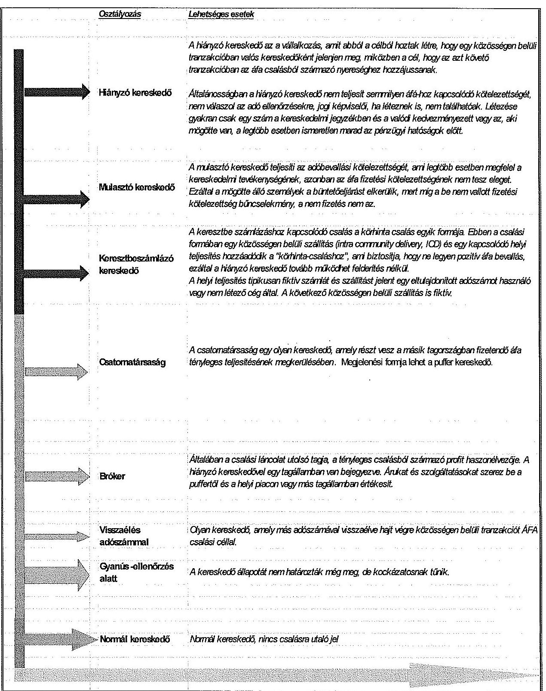

---

# EUROFISC kereskedői osztályozási kategóriák 2013. január 1-jétől 

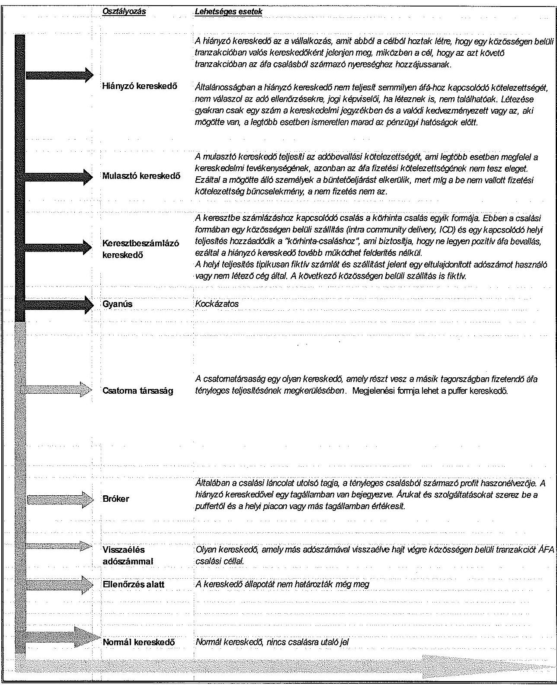

---

# Az EUROFISC nemzetközi párhuzamos ellenőrzés fókuszterületei a közös dokumentumban 

## 1. Bevezetés

1.1. A párhuzamos ellenőrzés háttere
1.2. A dokumentum (elemzés) felépítése
1.3. A jelenlegi helyzet EU szinten
1.4. Az ellenőrzés célja
2. Az EUROFISC hálózat
2.1. Általános információk
2.2. Jogi keretek
2.3. A legfontosabb (kulcs) adatok
3. Nemzeti végrehajtás (a tevékenységi területekben való részvétel, szervezeti és személyi struktúra, eljárásrendek)
3.1. Ausztria
3.2. Németország
3.3. Magyarország
4. Ellenőrzési megállapítások, ajánlások
4.1. Az adatok nagysága
4.2. Visszajelzések (visszajelzések mennyisége, visszajelzési kategóriák, a visszajelzések bázisa)
4.3. IT támogatás
4.4. Dokumentáció
4.5. Kézikönyvek és egyéb előírások
4.6. Értékelés
5. Jövőbeni kilátások

---

.

---

# AZ APEH/NAV által a hátralékok keletkezésének csökkentése és a hátralékállomány minél nagyobb arányú beszedhetősége érdekében kezdeményezett jogszabály módosítási javaslatok az ellenőrzött időszakban 

A 2010. évben az APEH jogszabály módosító javaslatai ${ }^{1}$ közül az Art. 159. § (3) bekezdésére tett módosító javaslata azt célozta, hogy a végrehajtási kifogás árverésre gyakorolt halasztó hatályának körét tovább szűkítsék, amely azonban nem épült be a törvénybe.
A 2011. évben hátralékok keletkezésének csökkentése, és a hátralékállomány minél nagyobb arányú beszedhetősége érdekében a NAV több jogszabály változást kezdeményezett ${ }^{2}$.

- Az Art. 16. § (3) bekezdés c) pontjára vonatkozó módosítási kezdeményezés az adózó részére könyvviteli szolgáltatást nyújtó személyek adatainak ismeretére vonatkozott, amely nem épült be a törvénybe.
- Az Art. 16. § (3) bekezdésének n) ponttal való kiegészítésére vonatkozó javaslat, az adózó jegyzett tőkéje összegének állami adóhatósághoz történő bejelentése, a 16. § (3) bekezdésének o) ponttal való kiegészítési javaslat, a külföldi vállalkozás magyarországi fióktelepe esetén a bejelentendő adatok körének kiegészítése a külföldi anyavállalat, valamint a külföldi vállalkozás elérhetőségével 2012. január 1-jétől épültek be az Art.-ba.
- Az Art. 20. § (1) bekezdésének módosítására vonatkozó javaslat tartalma az Art. 22/C. § és 24/G. §-ainak beépítésével 2012. január 1-jétől került a törvénybe.
- A Csődtv. 2012. március 1-től hatályos 33/A. §-ára - az ún. wrongful trading felelősség szabályrendszerének átalakítására - vonatkozó módosító javaslattal azt célozták, hogy a hitelezőnek ne kelljen két peres eljárást kezdeményezni az ügyvezetők felelősségének érvényesítése érdekében. A NAV javaslat szerint indokolt lett volna valamennyi esetben egy per keretében érvényesíteni ezt a felelősségi formát, amely azonban nem épült be a Csődtv.-be.
A 2012. évben az Art. módosítására vonatkozó javaslatok ${ }^{3}$ közül 2013. január 1-jétől beépült az Art.-ba a 144. § módosítására tett javaslat, amely szerint az adóhatóság a végrehajtási eljárás során szükséges esetben rendőri intézkedés megtételét kezdeményezheti, vagy a NAV hivatalos állományú tagja útján az eljárás zavartalan lefolytatását biztosíthatja.

[^0]
[^0]:    ${ }^{1}$ Az APEH elnöke által az NGM helyettes államtitkára részére 2010. szeptember
 8-án megküldött jogszabály-módosítási javaslatok
    ${ }^{2}$ A NAV elnöke által az NGM helyettes államtitkára részére 2011. július 21-én megküldött, Art.-t érintő javaslatok.
    ${ }^{3}$ A NAV elnöke által az NGM helyettes államtitkára részére 2012. augusztus 23-án megküldött 2012. évi jogszabály-módosítási javaslatok.

---

A 2013. évben hátralékok keletkezésének csökkentése, és a hátralékállomány minél nagyobb arányú beszedhetősége érdekében a NAV több jogszabály-változást kezdeményezett ${ }^{4}$.

- Javasolták az Art. 98/A. §-sal történő kiegészítését, az ideiglenes biztosítási intézkedés jogintézményének bevezetését, a hátralékos adózók vagyonkimentési esélyeinek csökkentése érdekében. Ezt a javaslatot már a 2012. évben is megfogalmazták, de a megismételt javaslat a felügyeleti szerv támogatásának hiányában nem épült be a törvénybe.
- A végrehajtható okiratra vonatkozó javaslat alapján az Art. 145. § (1) bekezdés e) pontjának 2014. január 1-jétől hatályba lépett módosításával, a bírósági eljárási illeték tárgyában küldött megkeresés és értesítés is végrehajtható okiratnak minősül.
- Az Art. 154. § kiegészítésére vonatkozó javaslat célja a gépjárműre vezetett végrehajtás hatékonyságának növelése volt, de a „tárgykörözés" lehetőségének bővítése nem épült be a törvénybe.
- Az Art. következő, 154/A. §-sal való kiegészítésére vonatkozó javaslat szerint „a végrehajtható okirat alapján foganatosított ingó-, illetve követelés-foglalás hatályát az adóhatóság kiterjesztheti a foglalást követően végrehajthatóvá vált tartozásokra, költségekre is (kiterjesztés), amely tényről az adóhatóság az adózót értesíti. Ezzel olyan új jogintézmény kerülne bevezetésre, ami a rugalmasságával és egyszerűségével lehetőséget biztosítana az adóhatóság számára a korszerű, gyors és hatékony munkavégzésre". Az Art. 154/A. §-sal való kiegészítésére vonatkozó javaslat az Art. 150. § (2) bekezdéseként 2014. január 1-jétől épült be az Art.-ba.
- Az Art. 156/A. § (13) bekezdésének módosítására vonatkozó javaslat csak a hat hónap elteltével várható árverés esetében az idő múlása miatti jelentős értékvesztést és magas tárolási költségeket kívánta csökkenteni a lefoglalt vagyontárgyak tekintetében, amely 2014. január 1-jétől épült be a törvénybe.

[^0]
[^0]:    ${ }^{4}$ A NAV elnöke által az NGM helyettes államtitkára részére 2013. július 31-én megküldött 2013. évi jogszabály-módosítási javaslatok.

---

# A NAV által az Art. koncepcionális módosítására kezdeményezett javaslatok az ellenőrzött időszakban 

A javaslatok között volt az ún. preregisztrációs eljárás jogintézményének meghonosítása. Ezen a koncepción alapult 2012. január 1-jétől bevezetett adóregisztrációs eljárás (Art. 24/C. §-a) és fokozott adóhatósági felügyelet (Art. 24/F. §-a). A javaslat alapján adószám-felfüggesztés nélküli adószám-törlést rendelhet el az adóhatóság 2012. január 1-jétől a törvényben meghatározott feltételek fennállása esetén (Art. 24/B. §-a).
Új ellenőrzési formaként, az egyes gazdasági események valódiságának vizsgálatára irányuló ellenőrzés - amellyel 2012. január 1-től módosították az Art. 87. § (1) bekezdés d) pontját - célja annak megállapítása, hogy a gazdasági esemény ténylegesen megtörtént-e, illetve ha igen, mely felek között.
Az e-kereskedelem ellenőrzésének bevezetését az e-kereskedelem elterjedése, annak növekvő forgalma, a jelentős adózási kockázat indokolta. Ennek érdekében 2012. január 1-jétől módosították az Art. 93. § (4)-(5) bekezdéseit, illetve az ellenőrzés befejezésére vonatkozó 104. § (3) bekezdését.
Meglévő ellenőrzési típus megújítására irányultak a fel nem fedett próbavásárlás 2012. január 1-től hatályos új jogszabályi rendelkezései. Az Art 93. § (4) és (5a) bekezdései, 97. § (5) bekezdése, 98. § (1) bekezdés f) pontja értelmében a fel nem fedett próbavásárlás esetén az ellenőrzés befejezésekor a jogosultságot csak abban az esetben kell igazolni, ha az adóellenőr jogszabálysértést állapít meg.
Az ellenőrzés eszközrendszerének szélesítése keretében az ellenőrzéshez szükséges információk biztosítása érdekében a NAV javaslata szerint az adóhatóságok részére jogot kell biztosítani arra, hogy kockázatelemzés, ellenőrzésre történő kiválasztás érdekében adatokat kezeljenek, illetve gazdasági szereplőket adatszolgáltatásra kötelezzenek, amely a NAV 2011. évi javaslata alapján épül be a törvénybe a „Felhívás önellenőrzésre" cím alatt, 91/B. § 2013. január 1-jétől.
Az adatvédelmi előírások felülvizsgálatát követően 2012. január 1-jétől lehetőség nyílott az adóellenőrzések során felhasználható, becslési eljárásokat megalapozó adatbázis kiépítéséhez szükséges adatgyűjtésre, az Art. 90. § (5) bekezdés alapján.
Az ellenőrzés rendszerének teljes megreformálására irányuló NAV javaslatok között volt az információtechnológia szerepének növelése, amely alapján az Art. iratforgalom meghatározása pontosításra került és az elektronikus formában létező iratokra is kiterjedt. Ennek érdekében 2012. január 1-jétől módosult az Art.

---

44. § (1) bekezdése és 97. § (5) bekezdése, kiegészült az Art. 175. § két új felhatalmazó rendelkezéssel a (26) ${ }^{1}$ és a (28) ${ }^{2}$ bekezdésben, továbbá 2012. január 1-jétől, majd 2013. január 1-jétől módosult az Art. 96. § (1) bekezdése. A módosítások a vállalkozásoknál egyre nagyobb számban elektronikus úton keletkezett iratok miatt vált szükségessé.
A belföldi összesítő nyilatkozatra vonatkozó javaslatot Art. 31/B. §-ként 2013. január 1-jétől az adóbevallás szabályok között beépítették, amely szerint az áfa-alanyai a bevallásban nyilatkozni kötelesek azokról a számlákról, amelyekben az áthárított áfa összege a 2 millió Ft-ot eléri vagy meghaladja. A nyilatkozat a fizetendő és a levonható áfá-val összefüggésben részletes adatokat biztosít az adóhatóság részére.
Egyéb, a gazdasági élet megtisztítását elősegítő megvalósított javaslatok közé tartozott a székhely-szolgáltatás megszüntetésére és a képviseleti szabályok módosítására vonatkozó javaslat, amely alapján 2012. január 1-jétől módosították az Art. 9. § (2) bekezdését, és az Art. 7.§ (5) bekezdésére vonatkozó javaslatuk is ettől az időponttól épült be a törvénybe.
A NAV „önszabályozó szervezetté" válásával kapcsolatos javaslatok alapján nem történt jogszabály-módosítás és a témakör lekerült a jogalkotás napirendjéről.
Az adó- és vámszakmai ügyfélnyilvántartások összevonásával kapcsolatos javaslatot 2012. január 1-jétől beépítették az Art. 24/G. §-ba.
[^0]
[^0]:    ${ }^{1}$ Felhatalmazást kap az adópolitikáért felelős miniszter arra, hogy rendeletben állapítsa meg az adó-végrehajtási eljárás során felmerült végrehajtási költségek megállapításának és megfizetésének részletes szabályait.
    ${ }^{2}$ Felhatalmazást kap az adópolitikáért felelős miniszter arra, hogy rendeletben szabályozza az adózással összefüggő elektronikus adatok, információk, nyilvántartások a) adóhatóság részére történő rendelkezésre bocsátásának, b) másolásának, c) elektronikus úton történő ellenőrzésének módjára és az adóhatóság rendelkezésére bocsátandó fájlok adatszerkezetére vonatkozó részletes eljárási és technikai szabályokat.

---

# Az adóelkerülés és a fekete gazdaság elleni küzdelem érdekében tett kormányzati intézkedések az ellenőrzött időszakban 

1. A Nemzeti Adó- és Vámhivatal (NAV) létrejötte, az Adó- és Pénzügyi Ellenőrzési Hivatal és a Vám- és Pénzügyőrség integrációja 2011. január 1-jétől (NAV tv. 87. § (1) bekezdése alapján) ${ }^{1}$. Az adó- és a vámigazgatás szervezeti integrációjának célja a feladatok minőségileg új, hatékonyabb, átláthatóbb és költségtakarékosabb ellátása, és az azokhoz szükséges információáramlás korszerű biztosítása, egységes elvek alapján felépülő, egységes irányítású szervezet kialakítása, továbbá a pénzügyi és egyes más bűncselekményeket hatékonyan és eredményesen felderítő bűnügyi szervezetrendszer létrehozása volt.
2. Az adószám-felfüggesztés rendszerének átdolgozása a 2011. évi CLVI. törvény alapján, az adóhatósági ellenőrzések hatékonyabbá tétele érdekében. A nem valós cím, képviselő vagy a képviselő bejelentésének elmulasztása esetén az adózó adószámát törlik. Ezzel párhuzamosan az adószám-felfüggesztés lehetősége szűkült, és a jogerőssé váló adószám-felfüggesztő határozatot követő adószám-törlő határozat kiadásának időtartama csökkent.
3. Az adóregisztrációs eljárás a feketegazdaság elleni küzdelem egyik új eszköze volt 2012-től (a 2011. évi CLVI. törvény alapján). Az adóregisztrációs eljárás célja, hogy meghatározott kritériumoknak megfelelő személyek, akik jelentős adótartozást halmoztak fel vagy elérhetetlenné váltak az adóhatóság számára új adózó alapításában, vagy működésében meghatározott körülmények fennállásáig, vagy meghatározott ideig ne vehessenek részt.
4. A fokozott adóhatósági felügyelet a feketegazdaság elleni küzdelem másik új eszköze volt 2012-től (2011. évi CLVI. törvény alapján). A fokozott adóhatósági felügyelet célja, hogy a kockázatelemzést követően kiválasztott, adózási szempontból kockázatosnak ítélt adózók működésük első időszakában folyamatosan adóhatósági felügyelet mellett végzik tevékenységüket.
5. Az ömlesztve szállított ásványolaj beszerzésének és szállításának a bejelentési kötelezettsége a 2011. évi CLVI. törvény alapján. Célja a kenőolajokkal tapasztalt visszaélések visszaszorítása, az érintett ásványolaj-termékek beszerzésének, szállításának könnyebb, átláthatóbb ellenőrzése. Ennek érdekében a jogszabály bejelentési kötelezettséget ír elő a termékek beszerzése, szállítása esetén.
[^0]
[^0]:    ${ }^{1}$ Az Országgyűlés a 2010. november 16-i ülésnapján fogadta el.

---

6. Jövedéki biztosítékra vonatkozó szabályozás módosítása 2012-től (2011. évi CLVI. törvény alapján). A bejegyzett kereskedő, illetve az alkoholtároló adóraktár-engedélyes nem teljesített adófizetési kötelezettségének összege 50 százalékkal, de legfeljebb 50 millió forinttal haladhatja meg a jövedéki biztosíték összegét, egyébként a jövedéki biztosítékot a teljes összegre ki kell egészíteni. Az elmúlt években tapasztalt visszaélésekre tekintettel a törvény szűkítette annak a lehetőségét, hogy a bejegyzett kereskedők az adó megfizetése nélkül hozhassanak be a jövedéki biztosíték összegét többszörösen meghaladó mennyiségben jövedéki termékeket. A törvény a bejegyzett kereskedők esetében a módosításhoz hasonlóan szintén az elmúlt években tapasztalt visszaélésekre tekintettel - az alkoholtároló adóraktár esetében is módosítja a jövedéki biztosítékra vonatkozó szabályozást.
7. Az egyes gazdasági események valódiságának vizsgálatára irányuló ellenőrzést 2012-től új ellenőrzési típusként vezették be (2011. évi CLVI. törvény alapján). Az adóhatóság az egyes gazdasági esemény valódiságának vizsgálatára irányuló eljárással új eszközt kapott az ellenőrzések hatékonyságának növelésére, a jogsértések esetén megállapítható szankciók mértéke pedig a visszaélésszerű magatartások vonatkozásában megnőtt.
8. A fel nem fedett próbavásárlás intézménye a 2011. évi CLVI. törvény alapján az ellenőrzések hatékonyságának javítását szolgálta, lehetővé téve, hogy a számla-, illetve nyugta-kibocsátási kötelezettség teljesítésének ellenőrzése során az adóellenőrök adóellenőri minősége az adózók előtt csak akkor váljon ismertté, ha jogsértés megállapítására kerül sor.
9. Az ingatlanügyleteken elért kirívó jövedelmek fokozott mértékű adó alá vonása a 2011. évi CLVI. törvény alapján. Annak érdekében, hogy Magyarországon a gazdagodás forrása valóban az értékteremtő munka és a tisztességes gazdálkodás legyen, az ingatlanértékesítésből származó jövedelmekre vonatkozó adózási szabályokat olyan módon módosították, hogy a szokásos hasznot meghaladó mértékű jövedelmeket magasabb adóteher sújtsa.
10. A kényszer-törlési eljárás bevezetése annak érdekében, hogy a vagyontalan, kiüresített, munkavállalókkal sem rendelkező vállalkozások piacról történő kivezetése gyorsabban, és kevesebb állami kiadással történjen meg a 2011. évi CXCVII. törvény alapján. A rendelkezés feleslegessé teszi, hogy ezen vállalkozások megszüntetésére egy újabb bírósági eljárás (egyszerűsített felszámolás) lefolytatásával kerüljön sor.
11. A fordított adózás mezőgazdasági szektorra történő kiterjesztése a 2012. évi XLIX. törvény alapján. A mezőgazdaságban előforduló csalások az évek során olyan nagyságrendet értek el, mely már befolyásolta az ágazat normális működését, rontotta a gazdálkodók versenyképességét és rombolta az adómorált. A fordított adózás - mely azt jelenti, hogy az eladó az adókötelesen értékesített termék után nem számít fel áfát, az áfa megfizetésére a vevő kötelezett - olyan adózási mechanizmus,

---

mely eredményesen hozzájárulhat a mezőgazdaság meghatározott területein jellemző áfa-csalási módszerek visszaszorításához. A törvény ezért a gabona, olajosmag és fehérjenövény szektorban fordított adózást vezetett be, továbbá intézkedést tartalmazott az adóhatóság ellenőrzési tevékenységének hatékonysága növelésére.
12. Két
 új adónem, a kisadózó vállalkozások tételes adója (KATA) és a kisvállalati adó (KIVA) bevezetése a 2012. évi CXLVII. törvény alapján. A kisvállalati adózói kör adózásának egyszerűsítése érdekében a törvény meghatározta két gyökeresen új és egyszerű, az érintettek számára választható adónem anyagi jogi szabályait, valamint az adó választására, megfizetésére, bevallására vonatkozó eljárási rendelkezéseket. A kisvállalati adó a kisvállalatok adminisztrációs terheinek és adóterheinek csökkentését, valamint a foglalkoztatottság növelését szolgálta.
13. A belföldi áfa összesítő jelentés-tételi kötelezettség (számlaszintű jelentés és összevont jelentés) bevezetése, az áfa bevallás részeként 2013. január 1-jétől, a 2012. évi CLXXVIII. törvény és a 2011. évi CLVI. törvény alapján. Célja a „feketegazdaság kifehérítése”, az államháztartás bevételeinek növelése, a kétmillió Ft áfa összeg feletti számlák nyomon követése (partner bevallásának és összesítő jelentésének megtekintése, számlák adatainak összevetése), valamint a célzott adóhatósági kiválasztás (adózók vizsgálatra történő kiválasztása) segítése.
14. Az on-line pénztárgép felügyelet bevezetése 2013. január 1-től a 2012. évi CLXXVIII. törvény alapján. A pénztárgépek adóhatóság általi on-line felügyeletének megteremtésével cél az adózók jogkövető magatartásának kikényszerítése (a várakozások szerint az adózók nagyobb arányban tanúsítanak jogkövető magatartást, a korábbiakhoz képest több számlát és nyugtát bocsátanak ki, és adótartalmukat a bevallásaikban szerepeltetik), amely végső soron a költségvetési bevételek növelése irányába hat. Elősegíti emellett az adóhatósági ellenőrzések előkészítését, lebonyolítását, kockázatelemzését.
15. A fejlesztési adókedvezmény rendszerében két új jogcímet vezettek be 2013. január 1-jétől a 2012. évi CLXXVIII. törvény alapján, az energiahatékonyságot szolgáló beruházások és a szabad vállalkozási zónák területén megvalósítandó beruházások ösztönzése érdekében. A törvény a statisztikai adatszolgáltatás minőségének fejlesztése érdekében a fejlesztési adókedvezmény érvényesíthetőségének feltételéül szabta, hogy az adózó a beruházás befejezését is bejelentse az adópolitikáért felelős miniszternek (korábban az adókedvezmény igénybevételét megelőzően volt bejelentési, illetve kérelem benyújtási kötelezettség).
16. Az állami adóhatóság által teljesítendő adatszolgáltatási struktúra rendeleti szintű szabályozása a 2012. évi CLXXVIII. törvény alapján. A törvényi szabályozás felülvizsgálata eredményeképpen továbbra is az Art. rendelkezik az adatszolgáltatás céljának, jogosultjainak és adatkörének általános meghatározásáról, azonban az adatátadás részletes szabályait kormányrendelet szabályozza. A módosítás célja, hogy a hatóságok között pontosabb adatszolgáltatás valósuljon meg, illetve a hatóságok jogszabályban rögzített feladataihoz igazodó adatstruktúra kerüljön kialakításra. Az állami adóhatóság ellenőrzéseinek hatékonysága növelése érdekében a törvény biztosítja azt, hogy az élelmiszerlánc-felügyeleti hatóság az állami adóhatóság egyedi megkeresésére adatot szolgáltasson.
17. A kötelező gépjármű-felelősségbiztosítás kártérítési szabályainak szigorítása a 2012. évi CLXXVIII. törvény alapján. A módosítás elsődleges célja, hogy az állam hatékonyabban léphessen fel a feketegazdasággal, közelebbről annak egy speciális „ágazatával”, az illegális javítóműhelyek rendszerével szemben. Ennek fő eszköze a feketegazdaság elleni küzdelmet motiváló azon elv, hogy a gépjárművek megjavíttatása kizárólag számla ellenében történhet.
18. A jövedéki termékek biztosíték nyújtási szabályainak szigorítása a 2013. évi CC. törvény alapján. A törvény szerint a jövedéki termékekkel való visszaélések csökkentése érdekében az adóraktári engedélyt, a bejegyzett kereskedői engedélyt a vámhatóság felfüggesztheti, amennyiben az érintett engedélyes nem tesz eleget a jövedéki biztosíték nyújtási kötelezettségnek. Ennek közvetlen következményeként az adófelfüggesztés alatt álló nem fog tudni jövedéki termékeket fogadni.
19. Az ingó-, illetve követelés foglalás hatályának kiterjesztése a foglalást követően végrehajthatóvá vált tartozásokra, költségekre is (végrehajtható okirat alapján) a 2013. évi CC. törvény alapján. A törvény által bevezetett új jogintézmény rugalmasságával és egyszerűségével lehetőséget biztosít az adóhatóság számára a korszerű, gyors és hatékony munkavégzésre, többlet teher nélkül.
20. A vámhatósági eljárásokban feltárt ingó vagyon fennálló tartozás fejében történő lefoglalási lehetősége a NAV hivatásos állományú tagjai által a 2013. évi CC. törvény alapján. A törvény a hatályos szabályozás kiegészítésével megteremtette a lefoglalás lehetőségét, amikor a pénzügyőrök a vámeljárás során olyan ingó vagyont tártak fel, amely a fennálló, akár adótartozás, akár vámtartozás, akár az állami adóhatóság által nyilvántartott adók módjára behajtható egyéb köztartozás fedezetéül szolgálhat, és amely vagyon azonnali lefoglalása szükséges a végrehajtás eredményessége érdekében. A korábbi szabályozás szerint a pénzügyőrök ilyen esetben a NAV adóztatási szervét értesítették a lefoglalás foganatosítása érdekében. A módosítással az adóhatóságon belüli munkamegosztás költséghatékonyabban megoldható, továbbá az eljárások gyorsítását és a költségvetési bevételek biztosítását hatékonyabban szolgálja.
21. Az üzletlezárás intézményének kiterjesztése a pénztárgép üzemeltetésével kapcsolatos visszaélésekre, illetve üzlethelység nélkül végzett tevékenység esetén üzletlezárást helyettesítő bírság megállapítása, a pénztárgépek üzemeltetésével kapcsolatos mulasztások nagy száma miatt, a 2013. évi CC. törvény alapján.
22. Az adóhatósági ellenőrzések kiterjesztése a bizonylatok feldolgozásának logikai láncolatára a gazdaság kifehérítése érdekében a 2013. évi CC. törvény alapján. Az adóellenőrzés jövője, hogy nem az egyes bizonylatokat vizsgálja, hanem a bizonylatok feldolgozásának logikai láncolatát, és a feltárt logikai hibához rendelje hozzá az egyes bizonylatokat, így tárja fel azok helytelen könyvelését, az adózó számviteli szabályoktól eltérő nyilvántartás vezetési rendszerét, és az ebből adódó helytelen adózást. Mindehhez pedig az alkalmazott szoftvereket, azok tartalmát is meg kell ismernie a reviziónak.
23. A könyvviteli szolgáltatást végzők éves kötelező továbbképzésének szervezésében részt vevő szervezetek körének korlátozása az adóelkerülést és a gazdaság kifehérítését célzó kormányzati politika részeként a 2013. évi CC. törvény alapján. A könyvviteli tevékenységet folytató személyek munkája az adóbevételek védelmében kiemelt jelentőségű. Az éves kötelező továbbképzésen való részvételük jogszabályi kötelezettségből fakad. Az állami feladat érintettsége miatt szabályozásra került, hogy a továbbképzést lebonyolító szervezetek tulajdonosi szerkezete átlátható legyen, valamint, hogy ezen szervezetek ne folytassanak olyan gazdasági tevékenységet, amely nem egyeztethető össze a könyvelőkkel szembeni elvárásokkal.
24. A termékdíj raktár jogintézményének bevezetése a 2013. évi CC. törvény alapján jelentős könnyítést jelentett, mivel ez a hazai kereskedelmi szokásoknak megfelelt, továbbá az exportra termelők adminisztrációs terheit csökkentette. Termékdíj-köteles termék tárolható vagy előállítható a termékdíj megfizetése nélkül és csak a végfelhasználáskor vagy a belföldi forgalomba hozatalkor kell kifizetnie a termékdíjat a kötelezettnek. A termékdíj raktár jogintézménye a gyártási, értékesítési folyamatban résztvevők számára mindaddig biztosítja a termékdíj meg nem fizetésének a lehetőségét, amíg a gyártás, továbbértékesítés tart. A szabályozás jelentős likviditási problémákat old meg és csökkenti a kötelezettek és az adóhatóság adminisztrációs terheit is az indokolatlan megfizetés-viszszaigénylés elmaradásával, ugyanakkor az engedélyezés során szigorú feltételrendszert határoz meg az esetleges visszaélések megelőzése érdekében.
