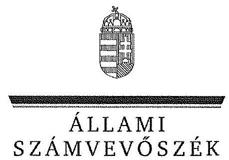
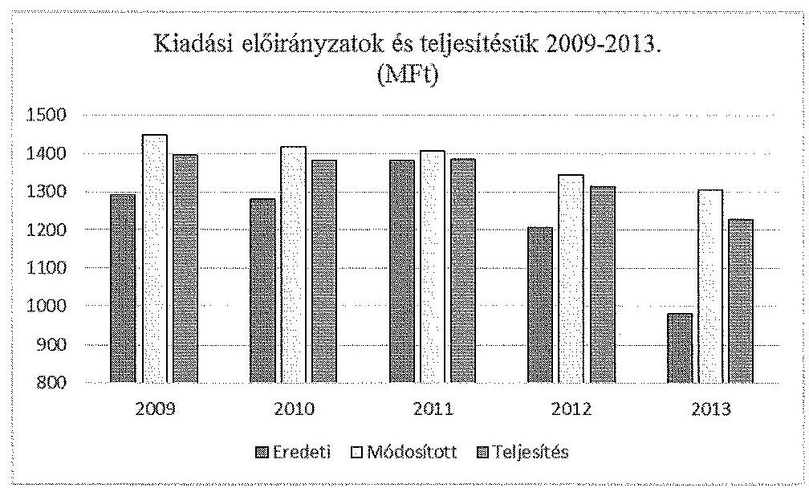
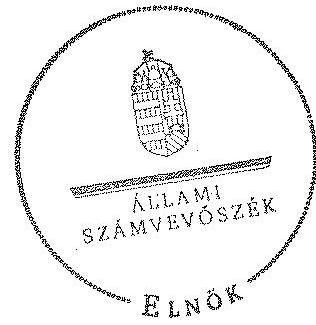
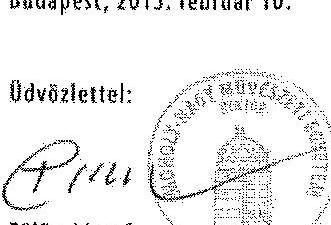
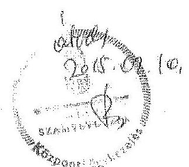
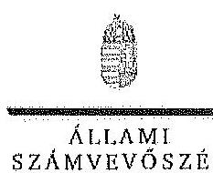
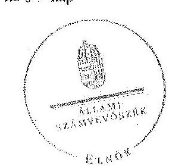

ÁLLAMI
SZÁMVEVŐSZÉK

# JELENTÉS 

A Moholy-Nagy Művészeti Egyetem ellenőrzéséről - Az állami felsőoktatási intézmények gazdálkodásának, működésének ellenőrzése

---

# Állami Számvevőszék 

Iktatószám: V-0581-392/2015.
Témaszám: 1615
Vizsgálat-azonosító szám: V068907

## Az ellenőrzést felügyelte:

## Kisgergely István

felügyeleti vezető

## Az ellenőrzés végrehajtásáért felelős:

## Horváth József

ellenőrzésvezető

## A számvevői munkaanyagok feldolgozását és a Jelentés összeállítását végezte:

## Horváth József

ellenőrzésvezető
Bodonyi Miklós
számvevő főtanácsos

## Az ellenőrzést végezték:

Albert Enikő
számvevő

## Székus Balázs Imre

számvevő

## Bodonyi Miklós

számvevő főtanácsos

## Laczi Hedvig Anna

számvevő

## A témához kapcsolódó eddig készített számvevőszéki jelentések:

## címe

Jelentés az oktatási és kulturális ágazat irányítási rendszerének, működésének ellenőrzéséről
Jelentés a felsőoktatás oktatási infrastruktúra-fejlesztési programjának ellenőrzéséről
Jelentés az állami felsőoktatási intézmények érdekeltségébe tartozó gazdasági társaságok támogatásának és nyereségük hasznosulásának ellenőrzéséről
Jelentés a Szolnoki Főiskola ellenőrzéséről - Az állami felsőoktatási intézmények gazdálkodásának, működésének ellenőrzése

---

Jelentés a Pannon Egyetem ellenőrzéséről - Az állami felsőoktatási intézmények gazdálkodásának, működésének ellenőrzése
Jelentés a Károly Róbert Főiskola ellenőrzéséről - Az állami felsőoktatási intézmények gazdálkodásának, működésének ellenőrzése
Jelentés a Magyar Képzőművészeti Egyetem ellenőrzéséről - Az állami felsőoktatási intézmények gazdálkodásának, működésének ellenőrzése
Jelentés a Miskolci Egyetem ellenőrzéséről - Az állami felsőoktatási intézmények gazdálkodásának, működésének ellenőrzése
Jelentés a Széchenyi István Egyetem ellenőrzéséről - Az állami felsőoktatási intézmények gazdálkodásának, működésének ellenőrzése
Jelentés az Eszterházy Károly Főiskola ellenőrzéséről - Az állami felsőoktatási intézmények gazdálkodásának, működésének ellenőrzése
Jelentés a Magyar Táncművészeti Főiskola ellenőrzéséről - Az állami felsőoktatási intézmények gazdálkodásának, működésének ellenőrzése
Jelentés a Budapesti Műszaki és Gazdaságtudományi Egyetem ellenőrzéséről - Az állami felsőoktatási intézmények gazdálkodásának, működésének ellenőrzése
Jelentés a Nyíregyházi Főiskola ellenőrzéséről - Az állami felsőoktatási intézmények gazdálkodásának, működésének ellenőrzése
Jelentés az Eötvös József Főiskola ellenőrzéséről - Az állami felsőoktatási intézmények gazdálkodásának, működésének ellenőrzése
Jelentés a Kecskeméti Főiskola ellenőrzéséről - Az állami felsőoktatási intézmények gazdálkodásának, működésének ellenőrzése
Jelentés a Kaposvári Egyetem ellenőrzéséről - Az állami felsőoktatási intézmények gazdálkodásának, működésének ellenőrzése
Jelentés a Budapesti Corvinus Egyetem ellenőrzéséről - Az állami felsőoktatási intézmények gazdálkodásának, működésének ellenőrzése
Jelentés a Liszt Ferenc Zeneművészeti Egyetem ellenőrzéséről - Az állami felsőoktatási intézmények gazdálkodásának, működésének ellenőrzése
Jelentés a Szent István Egyetem ellenőrzéséről - Az állami felsőoktatási intézmények gazdálkodásának, működésének ellenőrzése
Jelentés a Dunaújvárosi Főiskola ellenőrzéséről - Az állami felsőoktatási intézmények gazdálkodásának, működésének ellenőrzése

---

.

---

# TARTALOMJEGYZÉK 

BEVEZETÉS ..... 15
I. ÖSSZEGZŐ MEGÁLLAPÍTÁSOK, KÖVETKEZTETÉSEK, JAVASLATOK ..... 19
II. RÉSZLETES MEGÁLLAPÍTÁSOK ..... 30

1. A fenntartói és ágazati irányítási jogok gyakorlása ..... 30
2. Az intézmény belső kontrollrendszerének kialakítása és működtetése ..... 32
3. Az intézmény döntéshozó szerveinek joggyakorlása, az oktatási és egyéb tevékenységei elkülönítése, pénzügyi gazdálkodása ..... 38
3.1. Az intézmény döntéshozó szerveinek gazdálkodással kapcsolatos joggyakorlása ..... 38
3.2. Az intézmény oktatási és egyéb tevékenységei elkülönítése, az ellátott feladat átláthatósága ..... 40
3.3. Az intézmény pénzügyi egyensúlya, fizetőképessége ..... 41
3.4. Az intézmény előirányzat kezelése ..... 44
3.5. Az egyes hazai forrásból finanszírozott projektekhez, feladatokhoz kapott - nem normatív - költségvetési forrással való elszámolás ..... 51
4. Az intézmény vagyongazdálkodása ..... 52
4.1. A vagyongazdálkodási tevékenységek keretei ..... 52
4.2. A vagyonváltozások és a vagyonhasznosítás szabályszerűsége ..... 53
4.3. Az intézmény tulajdonosi jog gyakorlása ..... 56
5. A külső ellenőrzések által tett javaslatok hasznosulása ..... 57
5.1. ÁSZ ellenőrzések által tett javaslatok hasznosulása ..... 57
5.2. Az egyéb külső ellenőrzések javaslatainak hasznosulása ..... 58
6. Az integritás kontrollok kialakítása és működtetése ..... 59

---

# MELLÉKLETEK 

1. számú A Moholy-Nagy Művészeti Egyetem kiadási és bevételi előirányzatai, azok teljesítése a 2009-2013. években
2. számú A Moholy-Nagy Művészeti Egyetem kiadásainak, bevételeinek változása a 2009-2013. években
3. számú Kimutatás a Moholy-Nagy Művészeti Egyetem bevételeiről és kiadásairól, valamint adósságszolgálatáról a 2009-2013. években
4. számú A Moholy-Nagy Művészeti Egyetem mérlegadatai a 2009-2013. években
5. számú A Moholy-Nagy Művészeti Egyetem gazdálkodása szabályszerűségének értékelése a mintatételek alapján
6. számú A Moholy-Nagy Művészeti Egyetem észrevétele
7. számú A Moholy-Nagy Művészeti Egyetem észrevételére adott válasz

## FÜGGELÉK

1. számú Az integritás érvényesítése érdekében kialakított és működtetett intézményi kontrollrendszer

---

# RÖVIDÍTÉSEK JEGYZÉKE 

## Törvények

Áfa tv.
Az általános forgalmi adóról szóló 2007. évi CXXVII. törvény (hatályos: 2008. január 1-jétől)
Áht. 1
1992. évi XXXVIII. törvény az államháztartásról (hatálytalan 2012. január 1-jétől)
Áht. 2
2011. évi CXCV. törvény az államháztartásról
ÁSZ tv.
2011. évi LXVI. törvény az Állami Számvevőszékről (hatályos: 2011. július 1-jétől)
Eisztv.
2005. évi XC. törvény az elektronikus információszabadságról (hatálytalan 2012. január 1-jétől)
Feot.
2005. évi CXXXIX. törvény a felsőoktatásról (hatálytalan 2012. szeptember 1-jétől)

Info tv.
2011. évi CXII. törvény az információs önrendelkezési jogról és az információszabadságról
Kbt. 1
2003. évi CXXIX. törvény a közbeszerzésekről (hatálytalan 2012. január 1-jétől)
Kbt. 2
2011. évi CVIII. törvény a közbeszerzésekről
Mt. 1
1992. évi XXII. törvény a Munka Törvénykönyvéről (hatálytalan 2013. január 1-jétől)
Mt. 2
2012. évi I. törvény a munka törvénykönyvéről
Nftv.
2011. évi CCIV. törvény a nemzeti felsőoktatásról
Nvtv.
2011. évi CXCVI. törvény a nemzeti vagyonról
Szja tv.
1995. évi CXVII. törvény a személyi jövedelemadóról
Sztv.
2000. évi C. törvény a számvitelről
Vtv.
2007. évi CVI. törvény az állami vagyonról

## Rendeletek

Áhsz.
249/2000. (XII. 24.) Korm. rendelet az államháztartás szervezetei beszámolási és könyvvezetési kötelezettségének sajátosságairól (hatálytalan 2014. január 1-jétől)
Ámr. 1
217/1998. (XII. 30.) Korm. rendelet az államháztartás működési rendjéről (hatálytalan 2010. január 1-jétől)
Ámr. 2
292/2009. (XII. 19.) Korm. rendelet az államháztartás működési rendjéről (hatálytalan 2012. január 1-jétől)
Ávr.
368/2011. (XII. 31.) Korm. rendelet az államháztartásról szóló törvény végrehajtásáról
Ber.
193/2003. (XI. 26.) Korm. rendelet a költségvetési szervek belső ellenőrzéséről (hatálytalan 2012. január 1-jétől)
Bkr.
370/2011. (XII. 31.) Korm. rendelet a költségvetési szervek belső kontrollrendszeréről és belső ellenőrzéséről
Vtvr.
254/2007. (X. 4.) Korm. rendelet az állami vagyonnal való gazdálkodásról
51/2007. (III. 26.) Korm. rendelet
51/2007. (III. 26.) Korm. rendelet a felsőoktatásban részt vevő hallgatók juttatásairól és az általuk fizetendő egyes térítésekről

---

50/2008. (III. 14.) Korm. rendelet

## Miniszteri rendeletek

46/2009. (XII.30.) PM rendelet

36/2013. (IX. 13.) NGM rendelet

## Határozatok

1001/2009. (I. 13.)
Korm. határozat
1033/2009. (III. 17.)
Korm. határozat
1132/2010. (VI. 18.)
Korm. határozat
1025/2011. (II. 11.)
Korm. határozat
1316/2011. (IX. 19.)
Korm. határozat
1365/2011. (XI. 8.)
Korm. határozat
1122/2012. (IV. 25.)
Korm. határozat
1635/2012. (XII. 18.)
Korm. határozat

## Egyéb rövidítések

Alapító okirat ${ }_{1}$
Alapító okirat ${ }_{2}$
Alapító okirat ${ }_{3}$
Alapító okirat ${ }_{4}$
ÁsZ
Belső Ellenőrzési Kézikönyv ${ }_{1}$

Belső Ellenőrzési Kézikönyv ${ }_{2}$
egyetem, intézmény, MOME
EMMI
Eszközök és források

50/2008. (III. 14.) Korm. rendelet a felsőoktatási intézmények képzési, tudományos célú és fenntartói normatíva alapján történő finanszírozásáról

46/2009. (XII. 30.) PM rendelet a kincstári számlavezetés és finanszírozás, a feladatfinanszírozási körbe tartozó előirányzatok felhasználása, valamint egyes államháztartási adatszolgáltatások rendjéről (hatálytalan 2011. december 31-től)
az államháztartás számvitelének 2014. évi megváltozásával kapcsolatos feladatokról
a 2009. évi havi kereset-kiegészítés forrásigényének biztosításához szükséges intézkedésekről
a 2009. évi államháztartási egyensúly megőrzéséhez szükséges intézkedésekről
a 2010. évi költségvetéssel összefüggő egyes feladatokról
az államháztartási egyensúly megőrzéséhez szükséges intézkedésekről
a 2011. évi költségvetési egyensúlyt megtartó intézkedésekről
a 2012. évi hiánycél tartását biztosító további feladatokról
a Széll Kálmán Terv kiterjesztése keretében megvalósítandó egyes intézkedésekről
egyes kormányhatározatok módosításáról

A Moholy-Nagy Művészeti Egyetem alapító okirata (hatályos: 2008. február 29-től 2009. június 30-ig)
A Moholy-Nagy Művészeti Egyetem alapító okirata (hatályos: 2009. július 1-jétől 2010. november 1-ig)
A Moholy-Nagy Művészeti Egyetem alapító okirata (hatályos: 2010. november 2-től 2013. május 13-ig)
A Moholy-Nagy Művészeti Egyetem alapító okirata (hatályos: 2013. május 13-tól)
Állami Számvevőszék
A Moholy-Nagy Művészeti Egyetem Belső Ellenőrzési Kézikönyve (hatályos: 2007. szeptember 14-től 2013. május 31-ig)
A Moholy-Nagy Művészeti Egyetem Belső Ellenőrzési Kézikönyve (hatályos: 2013. június 1-jétől)
Moholy-Nagy Művészeti Egyetem
Emberi Erőforrások Minisztériuma
A Moholy-Nagy Művészeti Egyetem Eszközök és források

---

értékelési szabályzata
ETR
FEUVE
FIR
FSA
Gazdálkodási szabályzat
Gazdasági Hivatal Ügyrendje
GT
$\mathrm{IFT}_{1}$
$\mathrm{IFT}_{2}$
Informatikai és adatvédelmi szabályzat
Iratkezelési és levéltári szabályzat
Kincstár
Kockázatkezelési szabályzat
Kollégium működési rend

Költségtérítések rendje ${ }_{1}$
Költségtérítések rendje ${ }_{2}$
Költségtérítések rendje ${ }_{3}$

Költségtérítések rendje ${ }_{4}$
Kötelezettségvállalási szabályzat ${ }_{1}$

Kötelezettségvállalási szabályzat ${ }_{2}$
Közbeszerzési szabály$\mathrm{zat}_{1}$
értékelési szabályzata (hatályos: 2007. december 17-től)
Egységes Tanulmányi Rendszer
folyamatba épített, előzetes, utólagos és vezetői ellenőrzés Felsőoktatási Információs Rendszer
Felsőoktatási Struktúraátalakítási Alap
A Moholy-Nagy Művészeti Egyetem Gazdálkodási szabályzata (hatályos: 2007. március 12-től)
Iparművészeti Egyetem Gazdasági Szervezetének Ügyrendje (hatályos: 2005. szeptember 1-jétől)
Gazdasági Tanács
Moholy-Nagy Művészeti Egyetem 2. Intézményfejlesztési terve 2007-2011
Moholy-Nagy Művészeti Egyetem (MOME) Intézményfejlesztési Terv (IFT) operatív stratégiai fejezetek (2012-2016)
Az Iparművészeti Egyetem Informatikai és adatvédelmi szabályzata (hatályos: 2004. október 29-től)
Az Iparművészeti Egyetem Iratkezelési és levéltári szabályzata (hatályos: 1999. december 1-jétől)
Magyar Államkincstár
Iparművészeti Egyetem Kockázatkezelési Szabályzata (hatályos: 2005. szeptember 1-jétől)
A Szervezeti és Működési Szabályzat 14. számú mellékletét képező Kollégium működési rend (hatályos: 2007. december 17 -től)
A Szervezeti és Működési Szabályzat 13. számú mellékletét képező Költségtérítések rendje (hatályos: 2008. szeptember 30-tól 2011. szeptember 27-ig)
A Szervezeti és Működési Szabályzat 13. számú mellékletét képező Költségtérítések rendje (hatályos: 2011. szeptember 27-től 2012. november 1-ig)
A Szervezeti és Működési Szabályzat 13. számú mellékletét képező Költségtérítések rendje (hatályos: 2012. november 1-jétől 2013. február 25-ig)
A Szervezeti és Működési Szabályzat 13. számú mellékletét képező Költségtérítések rendje (hatályos: 2013. február 25-től)
A Moholy-Nagy Művészeti Egyetem Kötelezettségvállalás, utalványozás, pénzügyi ellenjegyzés szabályzata (hatályos: 2007. március 12-től 2012. február 27-ig)
A Moholy-Nagy Művészeti Egyetem Kötelezettségvállalás, utalványozás, pénzügyi ellenjegyzés szabályzata (hatályos: 2012. február 28-tól)
A Moholy-Nagy Művészeti Egyetem Közbeszerzési szabályzata (hatályos: 2007. június 25 -től 2009. december 31 -ig)

---

Közbeszerzési szabály$\mathrm{zat}_{2}$

Közbeszerzési szabály$\mathrm{zat}_{3}$
Leltározási szabályzat

MNV Zrt.
NEFMI
NGM
NKA
OKM
Önköltségszámítási szabályzat
Pénzkezelési szabályzat
Selejtezési szabályzat

Számviteli politika és számlarend $_{1}$

Számviteli politika és számlarend $_{2}$
SZMR $_{1}$

SZMR $_{2}$

SZMR $_{3}$

SZMR $_{4}$

SZMR $_{5}$

SZMSZ
TÁMOP
Térítési és juttatási szabályzat $_{1}$

Térítési és juttatási sza-

A Moholy-Nagy Művészeti Egyetem Közbeszerzési szabályzata (hatályos: 2010. január 1-jétől 2013. február 24-ig)
A Moholy-Nagy Művészeti Egyetem Közbeszerzési szabályzata (hatályos: 2013. február 25-től)
A Moholy-Nagy Művészeti Egyetem Leltározási szabályzata (hatályos: 2007. december 17-től)
Magyar Nemzeti Vagyonkezelő Zrt.
Nemzeti Erőforrás Minisztérium
Nemzetgazdasági Minisztérium
Nemzeti Kulturális Alap
Oktatási és Kulturális Minisztérium
A Moholy-Nagy Művészeti Egyetem Önköltségszámítási szabályzata (hatályos: 2007. december 17-től)
A Moholy-Nagy Művészeti Egyetem Pénzkezelési szabályzata (hatályos: 2007. december 17-től)
A Moholy-Nagy Művészeti Egyetem Feleslegessé vált vagyontárgyak selejtezésének és hasznosításának szabályzata (hatályos: 2007. december 17-től)
A Moholy-Nagy Művészeti Egyetem Számviteli politikája és számlarendje (hatályos: 2009. január 1-jétől 2009. december 31-ig)
A Moholy-Nagy Művészeti Egyetem Számviteli politikája és számlarendje (hatályos: 2010. január 1-jétől)
A Szervezeti és Működési Szabályzat 1. számú mellékletét képező Szervezeti és Működési Rend (hatályos: 2008. szeptember 1-jétől 2009. július 13-ig)
A Szervezeti és Működési Szabályzat 1. számú mellékletét képező Szervezeti és Működési Rend (hatályos: 2009. július 13 -tól 2010 . november 22 -ig)
A Szervezeti és Működési Szabályzat 1. számú mellékletét képező Szervezeti és Működési Rend (hatályos: 2010. november 22 -től 2011. június 1-ig)
A Szervezeti és Működési Szabályzat 1. számú mellékletét képező Szervezeti és Működési Rend (hatályos: 2011. június 1-jétől 2012. november 26 -ig)
A Szervezeti és Működési Szabályzat 1. számú mellékletét képező Szervezeti és Működési Rend (hatályos: 2012. november 26 -tól)
Szervezeti és Működési Szabályzat
Társadalmi Megújulás Operatív Program
A Szervezeti és Működési Szabályzat 12. számú mellékletét képező, a Moholy-Nagy Művészeti Egyetem hallgatóit megillető támogatások, valamint az egyetemen fizetendő díjak és térítések szabályzata (hatályos: 2008. július 8-tól 2011. március 1-ig)

A Szervezeti és Működési Szabályzat 12. számú mellékletét képező, a Moholy-Nagy Művészeti Egyetem hallgatóit

---

bályzat $_{2}$

Térítési és juttatási szabályzat $_{3}$

VIR
megillető támogatások, valamint az egyetemen fizetendő díjak és térítések szabályzata (hatályos: 2011. március 1-jétől 2013. február 1-ig)
A Szervezeti és Működési Szabályzat 12. számú mellékletét képező Térítési és juttatási szabályzat (hatályos: 2013. február 1-jétől)

Vezetői Információs Rendszer

---

.

---

# ÉRTELMEZŐ SZÓTÁR

 alapító
állami felsőoktatási intézmény saját tulajdona
állami vagyon
állami vagyon hasznosítása

A központi költségvetési szerv alapítója az Országgyűlés, a Kormány vagy a miniszter. A felsőoktatási intézmények vonatkozásában az alapítói jogokat a felsőoktatásért felelős minisztérium gyakorolja.
A felsőoktatási intézmény saját bevételének a költségek teljes körű levonása, - az adományozás és öröklés kivételével - a rendelkezésre bocsátott vagyon állagának megóvásáról, pótlásáról való gondoskodás után fennmaradt része terhére szerzett vagyona.
A Vtv. 1. § (2) bekezdése szerint állami vagyonnak minősül:
a) az állami tulajdonban lévő ingó dolog, valamint a dolog módjára hasznosítható természeti erő,
b) az állami tulajdonban lévő termőföldekből álló, külön törvényben szabályozott Nemzeti Földalap,
c) az állami tulajdonban lévő - a b) pont hatálya alá nem tartozó - ingatlan,
d) az állami tulajdonban lévő értékpapír,
e) az államot megillető társasági részesedés és más vagyoni értékű jog.
(hatályos 2010. június 16-ig)
a) az állam tulajdonában lévő dolog, valamint a dolog módjára hasznosítható természeti erő,
b) az a) pont hatálya alá nem tartozó mindazon vagyon, amely vonatkozásában törvény az állam kizárólagos tulajdonjogát nevesíti,
c) az állam tulajdonában lévő tagsági jogviszonyt megtestesítő értékpapír, illetve az államot megillető egyéb társasági részesedés,
d) az államot megillető olyan immateriális, vagyoni értékkel rendelkező jogosultság, amelyet jogszabály vagyoni értékű jogként nevesít.
(hatályos 2010. június 17-től)
A Vtv. 23. § (1) bekezdése szerint: Az állami vagyont az MNV Zrt. maga kezeli, illetve szerződés - így különösen bérlet, haszonbérlet, szerződésen alapuló haszonélvezet, vagyonkezelés, megbízás - alapján központi költségvetési szervnek, természetes vagy jogi személynek, illetőleg jogi személyiséggel nem rendelkező gazdasági társaságnak hasznosításra átengedi.
(hatályos 2010. december 31-ig)
Az állami vagyont az MNV Zrt. maga kezeli, vagy szerződés - így különösen bérlet, haszonbérlet, szerződésen alapuló haszonélvezet, vagyonkezelés, megbízás - alapján központi költségvetési szervnek, természetes vagy jogi

---

állami vagyon hasznosítása kötött szerződés
állami vagyon használója
állami vagyon értékesítése
állami vagyon kezelője /vagyonkezelő
személynek, vagy jogi személyiséggel nem rendelkező gazdálkodó szervezetnek hasznosításra átengedi.
(hatályos 2011. december 31-ig)
Az állami vagyont az MNV Zrt. maga kezeli, vagy szerződés - így különösen bérlet, haszonbérlet, megbízás alapján központi költségvetési szervnek, természetes vagy jogi személynek, vagy jogi személyiséggel nem rendelkező gazdálkodó szervezetnek hasznosításra átengedi.
(hatályos 2012. január 1-jétől)
A Vtv. 23. § (2) bekezdése szerint: Az állami vagyon hasznosítására kötött szerződések elsődleges célja az állami vagyon hatékony működtetése, állagának védelme, értékének megőrzése, illetve gyarapítása, az állami és közfeladatok ellátásának elősegítése.
A Vtvr. 1. § (7) a) pontja szerint: Az a természetes személy, jogi személy, illetve jogi személyiséggel nem rendelkező gazdasági társaság, amely az MNV Zrt.-vel kötött szerződés alapján, bármely jogcímen (bérlet, haszonbérlet, vagyonkezelés, használat stb.) állami vagyont birtokol, használ, hasznosít.
(hatályos 2010. december 31-ig)
Az a természetes személy, jogi személy, illetve jogi személyiséggel nem rendelkező szervezet, amely, illetve aki törvény vagy szerződés alapján, bármely jogcímen (pl. bérlet, haszonbérlet, vagyonkezelési szerződés, használat stb.) állami vagyont birtokol, használ, szedi annak hasznát, hasznosít, ide nem értve a tulajdonosi jogok gyakorlóját.
(hatályos 2011. január 1 - 2011. december 31-ig)
Az a természetes vagy jogi személy, jogi személyiséggel nem rendelkező szervezet, aki, vagy amely törvény vagy szerződés alapján, bármely jogcímen (bérlet, haszonbérlet, használat stb.) állami vagyont birtokol, használ, szedi annak hasznát, hasznosít, ide nem értve a haszonélvezőt, a vagyonkezelőt és a tulajdonosi jogok gyakorlóját. (hatályos 2012. január 1-jétől)
Állami vagyon tulajdonjogának bármely jogcímen történő, visszterhes átruházása. (Vtvr. 1. § (7) d) pont)
A Vtv. 23. § (1) bekezdése szerint: Az állami vagyont az MNV Zrt. maga kezeli, vagy szerződés - így különösen bérlet, haszonbérlet, szerződésen alapuló haszonélvezet, vagyonkezelés, megbízás - alapján központi költségvetési szervnek, természetes vagy jogi személynek, illetőleg jogi személyiséggel nem rendelkező gazdasági társaságnak hasznosításra átengedi. (hatályos 2010. január 1 - 2010. december 31-ig)
Az állami vagyont az MNV Zrt. maga kezeli, vagy szerződés - így különösen bérlet, haszonbérlet, szerződésen alapuló haszonélvezet, vagyonkezelés, megbízás - alap-

---

ján központi költségvetési szervnek, természetes vagy jogi személynek, illetőleg jogi személyiséggel nem rendelkező gazdálkodó szervezetnek hasznosításra átengedi. (hatályos 2011. január 1 - 2011. december 31-ig)
Az állami vagyont az MNV Zrt. maga kezeli, vagy szerződés - így különösen bérlet, haszonbérlet, megbízás alapján központi költségvetési szervnek, természetes vagy jogi személynek, vagy jogi személyiséggel nem rendelkező gazdálkodó szervezetnek hasznosításra átengedi. Az állami vagyonra vonatkozóan az MNV Zrt. kizárólag az Nvtv.-ben meghatározott személyekkel köthet vagyonkezelési szerződést.
(hatályos 2012. január 1-jétől)
belső kontrollrendszer
CLF-módszer
fenntartó
finanszírozási műveletek nélküli pozíció
A belső kontrollrendszer a kockázatok kezelése és tárgyilagos bizonyosság megszerzése érdekében kialakított folyamatrendszer, amely azt a célt szolgálja, hogy megvalósuljanak a következő célok:
a) a működés és gazdálkodás során a tevékenységeket szabályszerűen, gazdaságosan, hatékonyan, eredményesen hajtsák végre,
b) az elszámolási kötelezettségeket teljesítsék, és
c) megvédjék az erőforrásokat a veszteségektől, károktól és nem rendeltetésszerű használattól.
A módszer a működési és a felhalmozási költségvetés bevételeinek és kiadásainak, ezek egyenlegeinek elkülönített, majd összevont kimutatását alkalmazza valamely költségvetési intézmény pénzügyi helyzetének megítéléséhez. Kiemelten mutatja be a finanszírozási műveletek egyenlege nélküli és az azt magába foglaló pénzügyi pozíciót, valamint a tőketörlesztéssel, értékpapír beváltással csökkentett működési jövedelmet.
Az értékelés a pénzügyi kapacitás fogalmát helyezi a középpontba.
Az államháztartás központi alrendszerébe tartozó költségvetési szerveknél a módosított bevételi és kiadási előirányzatok és azok teljesítésének a Kormány rendeletében meghatározott tételekkel korrigált különbözete az előirányzat-maradvány. (Áht. 2. § (1) bekezdés m) pontja)
A Feot. 7. § (2) és az Nftv. 4. § (2) bekezdése szerint az, aki az alapítói jogot gyakorolja, ellátja a felsőoktatási intézmény fenntartásával kapcsolatos feladatokat.
A CLF módszer szerint számított működési és felhalmozási tevékenység pénzügyi egyenlegének összevont értéke. Megmutatja, hogy a költségvetési intézmény bevételei fedezetet biztosítottak-e a kiadásokra. A finanszírozási műveletek nélküli (GFS) pozíció alapján a pénzügyi helyzetet akkor tekintettük megfelelőnek, ha az adott év működési és felhalmozási bevételei fedezetet nyújtottak az adott év működési és felhalmozási kiadásaira.

---

gazdasági tanács
hároméves fenntartói megállapodás
információs és kommunikációs rendszer
integritás
intézményfejlesztési terv
irányító szerv
kincstári biztos

A felsőoktatási intézmény javaslattevő, véleményező, a stratégiai döntések előkészítésében részt vevő, és a döntések végrehajtásának ellenőrzésében közreműködő szerve.
Az állami felsőoktatási intézmények központi költségvetési támogatására három éves fenntartói megállapodást kell kötni az állami felsőoktatási intézmény és a fenntartó között. A fenntartói megállapodás tartalmazza a felsőoktatási intézmény által meghatározott hároméves időszakra vállalt teljesítménykövetelményeket, továbbá az állandó jellegű támogatási részeket, valamint a változó jellegű támogatások megállapításának jogcímeit. A változó elemű támogatás évenkénti elszámolási kötelezettséggel kerül meghatározásra.
A költségvetési szerv vezetője köteles olyan rendszereket kialakítani és működtetni, melyek biztosítják, hogy a megfelelő információk a megfelelő időben eljutnak az illetékes szervezethez, szervezeti egységhez, illetve személyhez.
Az integritás olyasvalakit vagy valamit jelöl, aki vagy ami romlatlan, sértetlen, feddhetetlen. Az integritás elvek, értékek, cselekvések, módszerek, intézkedések konzisztenciáját jelenti: olyan magatartásmódot, amely meghatározott értékeknek megfelel.
A szenátus fogadja el az intézményfejlesztési tervet. Az intézményfejlesztési tervben kell meghatározni a fejlesztéssel, a fenntartó által a felsőoktatási intézmény rendelkezésére bocsátott vagyon hasznosításával, megóvásával, elidegenítésével kapcsolatos elképzeléseket, a várható bevételeket és kiadásokat. Az intézményfejlesztési tervet középtávra, legalább négyéves időszakra kell elkészíteni, évenkénti bontásban meghatározva a végrehajtás feladatait. Az intézményfejlesztési terv része a foglalkoztatási terv. A foglalkoztatási tervben kell meghatározni azt a létszámot, amelynek keretei között a felsőoktatási intézmény megoldhatja feladatait. (Feot. 27. § (3) bekezdés) A felsőoktatás ágazati irányítását felsőoktatásszervezéssel, felsőoktatásfejlesztéssel, törvényességi ellenőrzéssel kapcsolatos feladatokat - ellátó minisztérium által vezetett minisztérium. (Feot. 102-105/A. §, Nftv. 64-66. §)
A kincstári biztos kijelölését az államháztartásért felelős miniszternél a Kincstár kezdeményezi. A kincstári biztos köteles figyelemmel kísérni megbízatásának időpontjától kezdve a költségvetési szerv tervezését, gazdálkodását, beszámolását, a jogszabályokban előírt feladatainak ellátását, feltárni azokat az okokat, amelyek a tartós fizetésképtelenséghez vezettek, a szükséges intézkedések azonnali végrehajtására irányuló intézkedési tervet készíteni, azonnali intézkedéseket kezdeményezni és írásbeli utasításokat kiadni a tartozásállomány felszámolására, a

---

kincstári költségvetés
kockázatkezelési rendszer
kontrollkörnyezet
kontrolltevékenység
költségvetési főfelügyelő, felügyelő
maximális hallgatói létszám
gazdálkodás egyensúlyának biztosítására, a követelések behajtására. (Ávr. 116-117. §)
A központi költségvetésről szóló törvény elfogadását követően a fejezetet irányító szerv az államháztartás központi alrendszerébe tartozó költségvetési szerv és a fejezeti kezelésű előirányzat kiemelt előirányzatait, valamint az elkülönített állami pénzalapok és a társadalombiztosítás pénzügyi alapjai jogszabályi előírás szerinti bevételeit és kiadásait kincstári költségvetés kiadásával állapítja meg. (Áht.; 24. § (3) bekezdés, Áht. 2 28. § (2) bekezdés, Ávr. 31. § (2) bekezdés)
Irányítási eszközök és módszerek összessége, melynek elemei a szervezeti célok elérését veszélyeztető tényezők (kockázatok) azonosítása, elemzése, csoportosítása, nyomon követése, valamint szükség esetén a kockázati kitettség mérséklése.
A kontrollkörnyezet a költségvetési szerv vezetőinek a szervezeti célok elérését segítő kontrollok kialakításával és működtetésével, korszerűsítésével kapcsolatos magatartását, a kontrollpontokról érkező információkra való reagálását jelenti.
Azok az elvek, politikák és eljárások, amelyeket a kockázatok meghatározása és a szervezet céljainak elérése érdekében alakítanak ki.
A költségvetési szerv vezetője köteles a szervezeten belül kontrolltevékenységeket kialakítani, amelyek biztosítják a kockázatok kezelését, hozzájárulnak a szervezet céljainak eléréséhez.
Az államháztartásért felelős miniszter a Kormány irányítása alá tartozó fejezetet irányító szervhez, a Kormány irányítása vagy felügyelete alá tartozó költségvetési szervhez, valamint az elkülönített állami pénzalapok és a társadalombiztosítás pénzügyi alapjai kezelő szerveihez költségvetési főfelügyelőt, felügyelőt rendelhet ki. A költségvetési főfelügyelő, felügyelő a gazdálkodás költségvetés-politikával való összhangja és a takarékos, szabályszerű, eredményes működés érdekében a Kormány rendeletében meghatározott intézkedéseket tehet, így különösen előzetesen véleményezi a kötelezettségvállalásra irányuló eljárásokat és a nagy összegű kötelezettségvállalások tekintetében kifogással élhet. (Áht. 2 39. § (1)-(2) bekezdés)
Az a felsőoktatási intézmény alapító okiratában, működési engedélyében meghatározott hallgatói létszám, ameddig terjedően a felsőoktatási intézmény - figyelembe véve a hallgatók fogadásához és az oktatói tevékenység folytatásához rendelkezésre álló személyi feltételeket, helyiségeket és eszközöket - valamennyi évfolyamára számítva, teljes kihasználtsággal működve hallgatói jogviszonyt létesíthet.

---

minisztérium
monitoring
működési jövedelem
normatív költségvetési támogatás felsőoktatási intézmények működéséhez
normatív támogatások
saját bevétel
szenátus
tárgyévi pénzügyi pozíció

A felsőoktatásért felelős minisztérium, amely 2009-től 2010 májusáig az OKM, 2010 májusától 2012 májusáig a NEFMI, 2012 májusától az EMMI volt.
A különböző szintű szervezeti célok megvalósításához szükséges folyamatok figyelemmel kísérése, melynek során a releváns eseményekről és tevékenységekről (együtt: folyamatokról) rendszeres jelleggel, strukturált, döntéstámogató információkhoz jutnak a szervezet vezetői.
A folyó bevételek és folyó kiadások egyenlege. Azt mutatja, hogy a folyó bevételek fedezetet nyújtanak-e a folyó kiadásokra.
A felsőoktatási intézmények működéséhez biztosított normatív költségvetési támogatás lehet
a) hallgatói juttatásokhoz nyújtott,
b) képzési,
c) tudományos célú,
d) fenntartói,
e) egyes feladatokhoz nyújtott
támogatás. A központi költségvetésből biztosított normatív költségvetési támogatásra - a d) pontban meghatározott normatív költségvetési támogatás kivételével - a felsőoktatási intézmények azonos feltételek alapján válnak jogosulttá. Az a)-e) pontokban meghatározott jogcímek az a) és e) pontban meghatározott jogcímek kivételével nem jelentenek felhasználási kötöttséget. (Feot. 127. § (3) bekezdés)

Az ellenőrzési időszakban hatályos költségvetési törvények 3. sz. mellékletében megjelölt közoktatási hozzájárulások, az 5. sz. mellékletében megjelölt központosított előirányzatok, továbbá a 8. sz.
 mellékletében megjelölt normatív, kötött felhasználású támogatások együttesen.
Az államháztartáson kívüli források - beleértve minden olyan, az Európai Uniótól származó támogatást, amelyhez nem az állami költségvetésen keresztül jut a felsőoktatási intézmény, továbbá a szakképzési hozzájárulási fizetési kötelezettség teljesítéseként elszámolt forrásokat is, ide nem értve az állami vagyon értékesítésének ellenértékét - valamint a Kutatási és Technológiai Innovációs Alapból származó bevételek.
A felsőoktatási intézmény, döntést hozó és a döntés végrehajtását ellenőrző testülete. (Feot. 20. § (1) bekezdés, Nftv. 12. § (1)-(3) bekezdés)
A működési és felhalmozási bevételek, valamint kiadások egyenlege a finanszírozási műveletek egyenlegének figyelembe vételével.

---

# JELENTÉS   a Moholy-Nagy Művészeti Egyetem ellenőrzéséről Az állami felsőoktatási intézmények gazdálkodásának, működésének ellenőrzése 

## BEVEZETÉS

Az ÁSZ Stratégiája ${ }^{1}$ alapértékeinek egyike, hogy az államháztartás komplex folyamatainak átláthatósága érdekében rendszerszemléletű/holisztikus megközelítésű, egymásra épülő, a szinergiahatást kihasználó, összefoglaló értékelésre lehetőséget adó ellenőrzéseket végez. Az államháztartás központi alrendszerébe tartozó felsőoktatási intézmények ellenőrzése során az Állami Számvevőszék értékeli azok pénzügyi-gazdasági helyzetét, feltárja a működésükben rejlő kockázatokat, ezzel előmozdítja a közpénzügyek átláthatóságát, rendezettségét.

Az állami felsőoktatási intézmények gazdálkodását - az Áht. ${ }_{1}$ és az Áht. ${ }_{2}$ előírásai mellett - a felsőoktatásról szóló 2005. évi CXXXIX. törvény (Feot.), valamint a nemzeti felsőoktatásról szóló 2011. évi CCIV. törvény (Nftv.) előírásai határozták meg.

Magyarország Nemzeti Reform Programja keretében, a Széll Kálmán Terv 2020-ig a 30-34 évesek körében, a felsőfokú vagy annak megfelelő végzettséggel rendelkezők arányának 30,3%-ra való növelését irányozta elő, amely a 2010. évhez képest 4,6%-pontos növekedési célkitűzést jelent. A rendezett gazdasági környezet, az önállósággal élni tudó, felelős, elszámoltatható intézményi gazdálkodói magatartás elengedhetetlen feltétele a kitűzött szakmai célok elérésének.

Az ellenőrzés célja annak megállapítása, hogy szabályos volt-e az állami felsőoktatási intézmény pénzügyi és vagyongazdálkodása, biztosított volt-e a vagyonnal való felelős gazdálkodás követelményének érvényesülése, jogszabályi előírásoknak megfelelően működött-e a belső kontrollrendszer, az irányító szerv tevékenysége a jogszabályi előírásoknak megfelelt-e.

Ennek keretében értékeltük a Moholy-Nagy Művészeti Egyetemnél:

1) a fenntartói és az ágazati irányítási jogok gyakorlását és előírásoknak való megfelelőségét;
[^0]
[^0]:    ${ }^{1}$ Állami Számvevőszék: Stratégia. Az Állami Számvevőszék hivatalos stratégiai dokumentum rendszere 2011-2015. 2012. december. http://www.asz.hu/strategia/asz-strategia/asz-strategia-2011.pdf

---

2) az intézmény belső kontrollrendszere jogszabályoknak megfelelő kialakítását és működtetését;
3) az intézmény döntéshozó szerveinek joggyakorlása jogszabályoknak való megfelelőségét; az intézmény oktatási és egyéb (gyakorlati és kutatási) tevékenységei elkülönítését, átláthatóságát, illetve pénzügyi gazdálkodása szabályszerűségét;
4) az intézmény vagyongazdálkodása előírásoknak való megfelelőségét;
5) az ellenőrzött időszakban végzett külső (ÁSZ, fenntartói) ellenőrzések által tett javaslatok hasznosulását;
6) az intézmény korrupcióval szembeni veszélyeztetettségének csökkentése érdekében az integritási szemlélet érvényesülését a gazdálkodási folyamatokban.

Az ellenőrzés várható hasznosulása: Az ellenőrzés eredményének hasznosulásaként képet kapunk a Moholy-Nagy Művészeti Egyetemen kialakult pénzügyi helyzetről; az oktatási és egyéb tevékenységek és költségelszámolások elhatárolásáról, átláthatóságáról és szabályosságáról. A felsőoktatási intézmények gazdálkodási szabadságának pénzügyi és vagyoni helyzetre gyakorolt hatásairól, a vagyonnal való felelős, értékmegőrző gazdálkodás érvényesüléséről, továbbá a belső kontrollrendszer működéséről. Az ellenőrzés az ellenőrzött számára visszajelzést ad a gazdálkodása kereteinek kialakításáról, a működésében fellépő hiányosságokról, javaslataival hozzájárul azok kiküszöböléséhez és a jó kormányzáshoz. A törvényalkotás számára összegzett tapasztalatok állnak rendelkezésre a felsőoktatási intézmények döntéseinek, gazdálkodásának szabályszerűségéről, amelyek alapján - indokolt esetben - jogszabálymódosítás kezdeményezhető. Az integritás kultúra kialakítása hozzájárul az elszámoltathatóság és átláthatóság érvényesítéséhez, egyben támogatja a szervezet védettségét a korrupciós kitettséggel szemben, valamint annak megelőzése is irányítottabbá válik. A társadalom számára jelzi, hogy közpénz nem maradhat ellenőrizetlenül, az ÁSZ értékteremtő rend kialakításához és megőrzéséhez hozzájáruló tevékenysége pozitív hatással lesz a szervezetről kialakított összkép formálásában.

Az ellenőrzés típusa: szabályszerűségi ellenőrzés
Az ellenőrzött időszak: 2009. január 1. - 2013. december 31. (az eredményszemléletű számvitel bevezetésével kapcsolatban az ellenőrzött időszak vége: 2014. április 30.)

Az ellenőrzéssel érintett szervezetek: az Emberi Erőforrások Minisztériuma és a Moholy-Nagy Művészeti Egyetem

Az ellenőrzés jogszabályi alapját az ÁSZ tv. 1. § (3) bekezdése, az 5. §. (3)-(6) bekezdései, 33. § (7) bekezdés, valamint az államháztartásról szóló 2011. évi CXCV. törvény 61. § (2) bekezdésének előírásai képezik.

Az ellenőrzés kiterjedt minden olyan körülményre és adatra, amely az ÁSZ jogszabályban meghatározott feladataiban, valamint a program végrehajtása folyamán felmerült újabb összefüggések feltárásához szükséges volt.

---

Az ellenőrzés az INTOSAI által kiadott nemzetközi standardok figyelembevételével, az ellenőrzési programban foglalt értékelési szempontok szerint történt.

Az ÁSZ a 2011. évi LXVI. törvény 29. §-a szerint a jelentéstervezetet megküldte az emberi erőforrások miniszterének és a Moholy-Nagy Művészeti Egyetem rektorának. Az Emberi Erőforrások Minisztérium minisztere az ÁSZ jelentéstervezetének észrevételezési jogával nem élt. A Moholy-Nagy Művészeti Egyetem rektorának észrevételét és az arra adott választ a jelentés 6-7. sz. mellékletei tartalmazzák.

A pénzügyi és vagyongazdálkodás terén az egyes területek szabályszerű működését mintavétellel ellenőriztük, ez alapján a sokaságokban előforduló hibás tételek arányát becsültük. A jogszabályoknak és a belső előírásoknak megfelelőnek, azaz szabályszerűnek tekintettük az adott kiadási előirányzat felhasználását, bevétel beszedését, mérlegtétel értékelését, amennyiben a minta ellenőrzésének eredménye alapján 95%-os bizonyossággal a teljes sokaságban a hibás tételek aránya kisebb volt, mint 10%, nem megfelelőnek értékeltük, ha a hibás tételek aránya a 10%-ot meghaladta. Kockázatot, illetve magas kockázatot jeleztünk, amennyiben egy adott terület vonatkozásában a minta alapján a teljes sokaságban nem volt teljes körűen biztosított a jogszabályoknak és a belső szabályzatoknak megfelelő működés. A mintatételek kiértékelését az 5. számú melléklet tartalmazza.

A belső kontrollrendszer kialakításának és működtetésének értékelése során a jogszabályi előírások mellett az Ámr. ${ }_{1}$ 145/A. § (1) és (3) bekezdése, az Ámr. ${ }_{2}$ 155. § (1) és (3) bekezdése, valamint a Bkr. 5. § (1) bekezdése alapján figyelembe vettük az államháztartásért felelős miniszter által közzétett irányelvekben és módszertani útmutatókban ${ }^{2}$ foglaltakat is. A belső kontrollrendszert az értékelés során legalább 85%-os megfelelőség esetén megfelelőnek, legalább a 70%-os megfelelőség esetén részben megfelelőnek, 70%-os megfelelőség alatt pedig nem megfelelőnek minősítettük.

A budapesti székhelyű, 1880-ban alapított MOME a 2009-2013. évek között önállóan működő és gazdálkodó központi költségvetési szerv volt. Az egyetem 2013-ban alapképzésben 11 szakon művészeti képzést, mesterképzés keretében 12 szakon művészeti és pedagógusképzést, doktori képzésben pedig iparművészeti, építőművészeti és multimédia szakos képzést folytatott. A szakok száma a 2009. évihez képest csak a doktori képzésben nőtt eggyel, ahol a képzés szakiránya is megváltozott. Az intézmény szervezeti felépítésében a 2010. évben hajtottak végre jelentős változtatást. Az oktatási tevékenység korábban tanszéki rendszerű felépítése helyett - a szakmacsoportonként összevont tanszékekből - intézeteket hoztak létre. A 2010-ben is már működő Elméleti Intézet mellett Média, Építészeti és Design Intézetet alakítottak ki. Az egyetemet a 2009-2013. években átalakítás nem érintette. A MOME-t az ellenőrzött időszakban egy rektor vezette, akinek a 2010. július 31-én lejárt megbízását a következő 4 éves ciklusra megújították. A 2006. december 18-án 5 évre megbízott gazdasági főigazgató 2010. június 6-i áthelyezése miatt betöltetlenné vált, munkakörét az új főigazgató 2011. szeptember 1-jétől látta el. A miniszterelnök

[^0]
[^0]:    ${ }^{2}$ 1/2009. (IX. 11.) PM irányelv, Pénzügyminisztérium Belső Kontroll Kézikönyv 2010.

---

az állami felsőoktatási intézmények kancellárjainak megbízásáról szóló 127/2014. (XI. 4.) ME határozatban 2014. november 15-étől megbízta a kancellári teendők ellátására jogosult személyt.

A MOME főbb gazdálkodási, vagyoni és létszámadatait az alábbi táblázat mutatja be:

| Megnevezés | Főbb gazdálkodási és vagyoni adatok (ezer Ft) |  |  |  |  |  |
| :--: | :--: | :--: | :--: | :--: | :--: | :--: |
|  | 2009 | 2010 | 2011 | 2012 | 2013 | $\begin{gathered} 2013 / \\ 2009 \% \end{gathered}$ |
| KIADÁSI   ÖSSZEG | 1395,4 | 1382,3 | 1384,9 | 1313,2 | 1228,2 | 88,0 |
| BEVÉTELI   ÖSSZEG | 1400,7 | 1399,9 | 1414,1 | 1337,1 | 1301,9 | 93,0 |
| Költségvetési támogatások | 1102,9 | 1090,9 | 1066,2 | 974,2 | 1000,8 | 90,7 |
| Saját és átvett bevételek | 297,8 | 309,0 | 347,9 | 362,9 | 301,1 | 101,1 |
| Támogatások aránya | $78,7 \%$ | $77,9 \%$ | $75,4 \%$ | $72,9 \%$ | $76,9 \%$ | - |
| MÉRLEGÖSSZEG | 1508,5 | 1571,3 | 1554,8 | 1512,1 | 1540,8 | 102,1 |
|  | Jellemző létszámadatok* (fő) |  |  |  |  |  |
| Oktatói létszám | 133 | 136 | 122 | 121 | 122 | 91,7 |
| Hallgatói létszám | 875 | 869 | 835 | 783 | 894 | 102,2 |

* Az oktatói és hallgatói létszám az október 15-i statisztikában szereplő adat.

A MOME kiadásai az öt év alatt 12,0%-kal, bevételei összességében 7,0%-kal csökkentek. A bevételeken belül a költségvetési támogatás aránya 76,4% volt átlagosan, és az ellenőrzött időszakban 9,3%-kal csökkentek, míg a saját és átvett bevételek 1,1%-kal nőttek.

Az ellenőrzött időszakban a hallgatói létszám 875 főről 894 főre (2,2%-kal) nőtt, az oktatók létszáma viszont 133 főről 122 főre (8,3%-kal) csökkent.

---

# I. ÖSSZEGZŐ MEGÁLLAPÍTÁSOK, KÖVETKEZTETÉSEK, JAVASLATOK 

A felsőoktatásért felelős minisztérium (OKM, NEFMI, EMMI) az ellenőrzött időszakban - a feltárt kisebb hiányosságoktól eltekintve - a jogszabályi előírásoknak megfelelően gyakorolta a fenntartói feladatait. Alapítói jogosultságai keretében szabályszerűen adta ki az egyetem jogszabályi és szervezeti változásoknak megfelelően módosított alapító okiratát. A MOME nem küldte meg az SZMSZ-e módosításait a fenntartónak, így azokat a fenntartó a jogszabályi előírás ellenére nem vizsgálta meg, nem véleményezte.

A minisztérium az egyéb fenntartói feladatait szabályosan látta el. Közreműködött az egyetem éves költségvetésének tervezésében, meghatározta az intézmény költségvetési kereteit. Elvégezte az egyetem éves költségvetési, illetve gazdálkodási beszámolóinak ellenőrzését. A fenntartó megkötötte az intézménnyel a 2008-2010. évekre vonatkozóan a fenntartói megállapodást, amelyben meghatározták a teljesítménykövetelményeket. A fenntartó a megállapodás időarányos teljesítését a MOME éves gazdálkodási beszámolója alapján értékelte.

A fenntartó a jogszabályban előírt, a belső ellenőrzési vezető megbízására vonatkozó kötelezettségének nem tett eleget. A belső ellenőrzési vezető megbízását a fenntartó helyett a rektor végezte.

A miniszter az ágazati irányítási feladatait a 2009-2013. években nem látta el teljes körűen. Elmaradt az oktatási ágazatra vonatkozóan a nemzetgazdasági miniszter irányításával és az oktatásért felelős miniszter részvételével, az 1365/2011. (XI. 8.) Korm. határozatban előírt szervezeti és feladatellátási felülvizsgálati program kidolgozása. A Feot. és az Nftv. rendelkezései ellenére a miniszter nem készíttetett a felsőoktatás rendszere vonatkozásában a Kormány által elfogadott középtávú fejlesztési tervet.

A minisztérium az Oktatási Hivatallal a FIR biztonságos üzemeltetéséhez, az adatok védelméhez szükséges alapvető szervezeti, szabályozási kontrollokat
 a 2012. év végéig nem teljes körűen alakította ki. A FIR átfogó megújítása után a 2012. szeptembertől rögzített adatok - a nyitott jogviszonnyal rendelkező hallgatók és az oktatók vonatkozásában - teljesek. A visszamenőleges adatok tisztítása és beküldése folyamatos volt. A fenntartó a FIR biztonságos üzemeltetéséhez, az adatok védelméhez szükséges szabályozási kontrollokat a 2013. év végére kialakította.

A MOME belső kontrollrendszerének kialakítása és működtetése a 2009-2013. években nem volt megfelelő. A rektor minden ellenőrzött évben vezetői nyilatkozatot tett arról, hogy gondoskodott az intézménynél a belső kontrollrendszerek szabályszerű, gazdaságos, hatékony és eredményes működéséről. Az ÁSZ ellenőrzés megállapításai nem támasztották alá a belső kontrollrendszer szabályszerű és eredményes működéséről szóló rektori nyilatkozatot.

---

Az egyetem kontrollkörnyezete az ellenőrzött időszak alatt nem volt megfelelő. A MOME a 2009-2013. években a jogszabályi előírások ellenére nem határozta meg az etikai elvárásokat. A rektor nem készítette el az ellenőrzési nyomvonalat, nem alakította ki a FEUVE rendszert. Az egyetem nem rendelkezett a számlarendben foglaltakat alátámasztó bizonylati renddel, valamint informatikai biztonsági szabályzattal. A gazdálkodás szempontjából meghatározó belső szabályzatait nem aktualizálta a jogszabályi és a szervezeti változásoknak megfelelően. A belső szabályzatok nem feleltek teljes körűen meg a hatályos jogszabályoknak.

Az egyetem kockázatkezelési rendszerének kialakítása és működtetése nem volt megfelelő. A MOME az ellenőrzött időszakban a jogszabályi előírások ellenére nem mérte fel és nem elemezte a tevékenységével és gazdálkodásával kapcsolatos kockázatokat.

A kontrolltevékenységek kialakítása és működtetése az ellenőrzött időszakban nem volt megfelelő. A gazdálkodási jogkörök gyakorlásának hiányosságai az ellenőrzött időszakban az ellenőrzés során feltárt szabályszerűségi hibákhoz vezettek.

A MOME információs és kommunikációs rendszere a 2009-2013. években nem volt megfelelő. A 2004-től hatályos informatikai és adatvédelmi szabályzatot nem aktualizálták, amely nem teljes körűen tartalmazta a kötelezően közzéteendő adatok nyilvánosságra hozatalának, valamint megismerésére irányuló kérelmek teljesítésének rendjét. Belső szabályzatban nem szabályozták az információs rendszerekhez való hozzáférés módját. Az intézmény a jogszabályok előírásai ellenére a honlapján nem tette közzé az alapító okiratát, részben tette közzé a gazdálkodási és vagyonadatait, a tevékenységre, működésre vonatkozó adatait, a hatályos működési szabályzatait, valamint a szervezeti és személyzeti adatait. Az egyetem a FIR-rel kapcsolatos adatszolgáltatásokat teljesítette az ellenőrzött időszakban.

Az egyetem monitoring rendszerének kialakítása és működtetése az ellenőrzött években nem volt megfelelő, mivel a belső ellenőrzési jelentések megállapításaiban megfogalmazott hiányosságok megszüntetésére több esetben nem készítettek intézkedési tervet. A külső és belső ellenőrzésekhez kapcsolódó intézkedésekről nem vezettek nyilvántartást.

A szenátus gazdálkodással kapcsolatos joggyakorlása részben felelt meg a jogszabályok előírásainak. A szenátus az ellenőrzött időszakban nem értékelte a rektor vezetői tevékenységét. A rektor, illetve a gazdasági főigazgató nem készítette elő, ezért a szenátus - a Műhelyház beruházás kivételével - nem döntött a fejlesztések indításáról és a vagyongazdálkodási tervről, valamint a minőség és teljesítmény alapján differenciáló jövedelemelosztás elveiről. Az éves elemi költségvetést és költségvetési beszámolót nem a fenntartónak történt megküldést megelőzően terjesztették a szenátus elé, ezért az érdemben nem dönthetett elfogadásukról. A gazdasági tanács a 2009-2011. évi elemi költségvetésre és beszámolóra vonatkozó véleményezési feladatkörét szintén utólag gyakorolta, és csak a 2009. évi költségvetés véleményezéséről hozott határozatot. A szenátus helyett a rektor döntött a felhasználási kötöttség nélküli normatív támogatás központosított és decentralizált részre történő felosztásáról, illet-

---

ve ez utóbbi szervezeti egységekhez való eljuttatásának rendjéről. A MOME a jogszabályi előírások és az intézményi szabályozás ellenére a térítési díjak mértékét alátámasztó önköltségszámítást rendszeresen nem készített, a költségtérítések összegének meghatározásához a szakmai feladatra számított folyó kiadásokat nem mutatta ki. A MOME a jogszabályi előírásokat megsértve az SZMSZ mellékleteit, a kötelezettségvállalási tervét és végrehajtásának ütemtervét, valamint ezek módosítását a szenátus döntésétől számított tizenöt napon belül nem küldte meg a fenntartónak.

Az intézmény oktatási és egyéb tevékenységeit a jogszabályban előírtak szerint a nyilvántartásában elkülönítette, az ellátott feladatok rendszere átlátható volt.

Az intézmény pénzügyi egyensúlya a 2009-2013. években biztosított volt. A MOME likviditási hitelt és támogatási kölcsönt nem vett fel. A likviditás biztosítása érdekében 2013. évben a finanszírozási tervtől eltérő, előrehozott támogatást igényelt.

A stabil pénzügyi helyzetet mutatja, hogy az egyetem eladósodási, likviditási és pénzeszköz likviditási mutatója az ellenőrzött időszakban összességében pozitívan változott. A likviditási mutató a 2009. évi 0,8-ról a 2013. év végére 3,4-re nőtt. A követelések állománya a 2009. december 31-ei 7,8 M Ft-ról a 2013. év végére $20,3 \mathrm{M}$ Ft-ra nőtt, amelyből a határidőn túli követelések állománya $8,0 \mathrm{MFt}$ volt. A kötelezettségek összege a 2009. évi $46,1 \mathrm{M}$ Ft-ról a 2013. évre 37,6 M Ft-ra csökkent. A 60 napon túl lejárt szállítói tartozás 2013. december 31-én $0,1 \mathrm{M}$ Ft volt.

A MOME a kiadási és bevételi előirányzatok tervezése során a jogszabályokban és a fenntartó által kiadott tervezési irányelvekben foglaltak szerint járt el. A felügyeleti szerv által a költségvetés tervezéséhez kért adatszolgáltatásokat határidőben és az előírt tartalommal teljesítette.

A kiadási és bevételi előirányzatok módosítása, azok elszámolása nem felelt meg a jogszabályoknak és belső szabályoknak. Esetenként az 5 M Ft feletti saját hatáskörű előirányzat-módosítás előírás szerinti 5 napos bejelentési határidejét túllépték. A jogszabályi előírásokat megsértve a dologi kiadási előirányzat terhére 2009-ben és 2010-ben is személyi kiadási előirányzat javára történt átcsoportosítás. Az intézményi hatáskörű előirányzat-módosítások engedélyezési gyakorlata a 2011-2013. években nem felelt meg a jogszabályi előírásoknak, mivel azokat a jogkör gyakorlására felhatalmazással nem rendelkező személyek rendelték el.

A jogszabályi előírás ellenére a 2009. évben 0,3 M Ft működési pénzeszköz átadást teljesítettek előirányzat nélkül. Az intézmény a 2009-2013. években a költségvetés módosított kiadási főösszegét betartotta.

Az előirányzat-maradvány megállapítása és felhasználása során nem tartották be a jogszabályi előírásokat. Az egyetem a 2009-2011. évi költségvetési beszámolójában kötelezettségvállalással terheltként kimutatott előirányzatmaradványának jelentős hányadát nem tudta dokumentumokkal alátámasztani.

---

Az egyetem pénzügyi gazdálkodása összességében nem volt szabályszerű, mert a gazdálkodásra vonatkozó belső szabályozás hiányosságait, a gazdálkodás folyamán a jogszabályokban előírtak megsértését állapította meg az ellenőrzés.

A költségvetési kiadások teljesítése során rendszerhibaként jelentkezett a 2009-2010. években és a 2013. második félévében, hogy az érvényesítés, az utalványozás, és a 2009-2010. években az utalvány ellenjegyzés jogszabályban előírt sorrendjének betartása nem volt megállapítható. További rendszerbeli hibát jelentett, hogy az intézmény a bizonylatok visszakereshető módon történő megőrzési kötelezettségének nem tett eleget, az egyes gazdálkodási területek szabályszerűségének ellenőrzéséhez kiválasztott gazdasági események, műveletek dokumentációját a MOME nem tudta teljes körűen az ellenőrzés rendelkezésére bocsátani.

A rendszeres és nem rendszeres személyi juttatások előirányzatainak felhasználásánál a pénzügyi elszámolások, valamint a gazdálkodási jogkörök tekintetében nem volt biztosított a jogszabályoknak és a belső szabályoknak való megfelelés. Nem teljes körűen, esetenként jogosulatlanul történt meg az állományba tartozók munkakörén kívül elrendelt többletfeladat teljesítésének igazolása. A személyi juttatásokat a jelenlét igazolásának rendszeres hiányában is számfejtették és kifizették annak ellenére, hogy a belső szabályok a bérszámfejtés alapjaként és feltételeként a jelenléti ívek vezetését írták elő.

A külső személyi juttatások előirányzatai terhére megkötött megbízási szerződések tartalma, teljesítése, számfejtése nem felelt meg a jogszabályoknak és belső szabályoknak. A teljesítésigazolás során nem a vonatkozó szabályok szerint jártak el. Esetenként a megbízásra vonatkozó kötelezettségvállalásokat és teljesítésigazolásokat arra felhatalmazással, illetve kijelöléssel nem rendelkező személyek írták alá.

A dologi kiadások és a felújítások, beruházások előirányzatának felhasználása a pénzügyi elszámolások, valamint a gazdálkodási jogkörök gyakorlása tekintetében nem felelt meg a jogszabályoknak és a belső szabályoknak. Rendszerhibaként fordult elő, hogy előzetes írásbeli kötelezettségvállalás nélkül teljesítettek kifizetéseket, amelynek rendjét belső szabályzatban nem szabályozták. Ismétlődő szabálytalanságot jelentett, hogy kötelezettséget arra felhatalmazással nem rendelkező személyek vállaltak, a kötelezettségvállalást nem előzte meg ellenjegyzés, a teljesítésigazolást, az utalványozást és az utalvány ellenjegyzését jogosulatlan végezték. A 2009., illetve a 2011-2012. években megsértve egyes számviteli alapelveket, több esetben dologi kiadásként számoltak el beruházási és felújítási célú kifizetést.

Az ellátottak juttatásai előirányzat felhasználása a pénzügyi elszámolások, valamint a gazdálkodási jogkörök gyakorlása tekintetében összességében nem felelt meg a jogszabályoknak és belső szabályoknak. A hallgatói ösztöndíjak és szociális támogatások kifizetéseinél - a jogszabályi előírás ellenére - nem készítettek külön írásbeli rendelkezést és a kifizetéshez használt bizonylaton elmaradt a „teljesítés tényére történő utalás”. A jogszabályi előírást megsértve tankönyv- és jegyzettámogatási normatíva terhére a kereskedelmi forgalomban beszerzett nyomtatott szakkönyvek kiadásait is rendszeresen elszámolták. A

---

szakkönyvekhez kapcsolódó egyes kifizetések elszámolását olyan bizonylatokkal támasztották alá, amelyek nem feleltek meg a jogszabályi előírásoknak.

Az intézményi működési bevételek beszedése a pénzügyi elszámolások, valamint a gazdálkodási jogkörök gyakorlása tekintetében megfelelt a jogszabályoknak és belső szabályoknak.

Az immateriális javak és tárgyi eszközök bérbeadása, értékesítése a pénzügyi elszámolások, valamint a gazdálkodási jogkörök gyakorlása tekintetében nem felelt meg a jogszabályoknak és belső szabályoknak. Rendszerhibaként jelentkezett, hogy a bérbeadásra vonatkozó térítési díjak esetében önköltségszámítás hiányában nem volt megállapítható, hogy a bérleti díjak a jogszabályi előírásoknak megfelelően fedezték-e a felhasználás, igénybevétel alapján felmerült közvetlen és közvetett költségeket.

Az egyes, csak hazai forrásból finanszírozott projektekhez, feladatokhoz pályázati úton vagy egyéb módon nyújtott költségvetési forrással való elszámolás nem felelt meg az előírásoknak, mivel a MOME egy esetben a támogatási szerződésben előírt elszámolási kötelezettségének nem tett eleget, valamint a pályázati támogatások többsége esetében a pénzügyi elszámolások - támogatást nyújtó részéről történt - elfogadásáról nem adott át dokumentumot az ellenőrzés számára.

Az egyetem vagyona a 2009. január 1-jei 1518,6 M Ft-ról a 2013. év végére 1540,8 M Ft-ra, 1,5%-kal nőtt. A változást a befektetett eszközök 53,4 M Ft-os csökkenése és a forgóeszközök állományának 75,3 M Ft-os növekedése idézte elő. A befektetett eszközök értékcsökkenését a végrehajtott beruházások és felújítások nem ellensúlyozták.

Az egyetem belső szabályzatokban meghatározta az alapfeladat ellátásához rendelkezésére bocsátott vagyon értékelésének, nyilvántartásának szabályait. A MOME a kezelésében levő vagyontárgyak értékesítését és térítésmentes átadását nem szabályozta. A vagyontárgyak bérbeadása körében csak az auditórium és a kisebb tárgyalótermek bérleti díjáról és a bérlet feltételeiről rendelkezett.

Az egyetem vagyongazdálkodása és vagyonkimutatása az ellenőrzött időszakban nem volt szabályszerű, több területen is megsértette a jogszabályokban és a belső szabályzatokban előírtakat.

Az egyetem a könyvviteli mérlegében szereplő adatokat leltárral részben támasztotta alá. A 2009-2013. években a leltározás során a Leltározási szabályzatban előírtakat teljes körűen nem tartották be. A leltáreltéréseket - egy eset kivételével - a szervezeti egység vezetője nem indokolta. Az eltérések okainak kivizsgálása rendszeresen nem történt meg. Leltárhiányért való kártérítési felelősséget egy esetben érvényesítettek. A 2010. és 2011. évi leltárösszesítő aláírások hiányában - nem tekinthető hitelesnek. A 2012. évi leltárösszesítő dokumentumokat és a leltáreltérések jegyzékét az egyetem nem tudta bemutatni. A 2013. évi leltározást követően nem készült leltárösszesítő. A leltárzáró jegyzőkönyvet egyik évben sem készítették el. A
 2013. évben a hiányként kimutatott eszközöket a jogszabályi előírást megsértve leselejtezték. A leselejtezett eszközök megsemmisítésének vagy elszállításának dokumentáltsága hiányos volt.

A követelések értékelése nem felelt meg a jogszabályoknak és a belső szabályoknak, mert a követelések egyedi értékelése nem történt meg, a követelések jogosságát az egyetem nem tudta dokumentálni. A kötelezettségek esetében a mérlegtételek tartalma, besorolása, értékelése nem felelt meg teljes körűen a jogszabályoknak és belső szabályoknak, mert a jogszabályi előírás ellenére az egyetem a bizonylat-megőrzési kötelezettségének nem tett eleget, mivel esetenként a mérlegben kimutatott kötelezettségeket alátámasztó dokumentumokat nem tudta az ellenőrzés rendelkezésére bocsátani.

Az aktív pénzügyi elszámolások mérlegtétel tartalma nem felelt meg a jogszabályi előírásoknak, mert végleges kiadásként elszámolható összegeket is kimutattak a mérlegsoron. Az egyetemnél a passzív pénzügyi elszámolások esetében a mérlegtételek tartalma, besorolása, értékelése megfelelt a jogszabályi követelményeknek.

Az egyetemen az eredményszemléletű számvitelre történő áttérés nem volt megfelelő. A rendező mérleg elkészítését megelőző leltározás nem volt szabályszerű, a kötelezettségvállalások egyeztetését nem dokumentálták, az elfekvő készletek hasznosításáról nem gondoskodtak, továbbá nem hajtották végre az idegen pénzeszközök év végi egyenlegeinek rendezését.

A 2009-2013. években az ÁSZ nem végzett ellenőrzést a MOME-nél. Az ÁSZ a korábbi ellenőrzései során a felsőoktatás témakörében kilenc javaslatot fogalmazott meg a felsőoktatásért felelős minisztériumnak (OKM, NEFMI, EMMI). A minisztérium a javaslatokra intézkedési terveket készített. A jelentésben megfogalmazott javaslatok közül kettő (késéssel) valósult meg, egy (késéssel) részben hasznosult, hat pedig az elkészített intézkedési tervek ellenére nem realizálódott. A megvalósult intézkedések hozzájárultak a felsőoktatási intézményrendszer jobb működéséhez.

A felsőoktatási intézmények érdekeltségébe tartozó gazdasági társaságok ellenőrzése során feltárt hiányosságok kiküszöbölésére a minisztérium felszólította az intézményeket, amelyek a megtett intézkedésekről tájékoztatták a minisztériumot. A minisztérium tájékoztatást kért az érintett felsőoktatási intézményektől az 50% alatti intézményi részesedéssel működő gazdasági társaságok tevékenységének felülvizsgálatáról, működésük indokoltságáról és eredményességéről, valamint az intézményi részesedés megszüntetéséről és ütemezéséről.

Elvégezték a felsőoktatási intézményrendszer kapacitás kihasználtságának felmérését, azonban nem hasznosították a felmérés eredményeit, nem tettek intézkedést a felsőoktatási infrastruktúra közép- és hosszútávon történő hasznosítására.

Nem valósult meg a minisztérium felügyelete alá tartozó szervezetek feladatellátásának javítására számszerűsíthető mutatószámokon alapuló kritériumok és középtávú célrendszer kidolgozása. A felsőoktatási ágazat középtávú stratégiáját sem készítették el. Nem intézkedtek az oktatási infrastruktúra-fejlesztési programok előkészítési folyamatának hiányosságai miatti felelősség megállapításáról. Nem alakítottak ki a PPP projektek támogatásához kapcsolódó követelményrendszert. Nem került sor az oktatási infrastruktúra-fejlesztési programok lebonyolításával kapcsolatos hiányosságok (kedvezőtlen feltételű szerződéskötés és kockázatmegosztás) miatti felelősség megállapítására. Nem dolgoztatták ki az állami felsőoktatási intézményekkel azok gazdasági társaságai szakmai feladatellátásának és gazdaságossági eredményességének mérését biztosító mutatószámokat és értékelési rendszert.

Külső ellenőrzés keretében a fenntartó a 2009-2013. években nem végzett ellenőrzést. Az OKM 2008-ban három alkalommal ellenőrizte a MOME gazdálkodását, az ellenőrzésekről készült végleges jelentéseket mindhárom esetben a 2009. évben kapta meg a MOME. A fenntartói ellenőrzések javaslatai részben hasznosultak, mert nem készült el az informatikai rendszer belső szabályozásának korszerűsítése, dokumentációs rendszerének kidolgozása.

A MOME az ellenőrzött időszakban erőfeszítéseket tett az integritási szemlélet fejlesztésére, valamint a korrupciós kockázatok csökkentésére, a 2013. évben önként részt vett az ÁSZ integritási felmérésében.

Az ÁSZ tv. 33. § (1) bekezdésében foglaltak értelmében a jelentésben foglalt megállapításokhoz kapcsolódó intézkedési tervet köteles az ellenőrzött szervezet vezetője összeállítani, és azt a jelentés kézhezvételétől számított 30 napon belül az ÁSZ részére megküldeni. Amennyiben az intézkedési tervet határidőben nem küldi meg a szervezet, vagy az nem elfogadható, az ÁSZ elnöke a hivatkozott törvény 33. § (3) bekezdés a)-b) pontjaiban foglaltakat érvényesítheti.

A helyszíni ellenőrzés megállapításainak hasznosítása mellett javasoljuk:

# az emberi erőforrások miniszterének: 

1. A MOME belső kontrollrendszerének kialakítása és működtetése összességében nem felelt meg az Áht.1,2, az Ámr.1,2, az Ávr., a Ber. és a Bkr. előírásainak. Ezen belül a kontrollkörnyezetet, az információs és kommunikációs rendszert hiányosságok jellemezték, a kockázatkezelési rendszer, a kontrolltevékenységek és a monitoring rendszer működtetése nem volt megfelelő. Az egyetem pénzügyi gazdálkodását érintően a rendszeres és a nem rendszeres személyi juttatások, a külső személyi juttatások, a dologi kiadások, a beruházások és a felújítások, illetve az ellátottak juttatásai előirányzatának felhasználása, a díjak és költségtérítések megállapítása, továbbá az immateriális javak és tárgyi eszközök bérbeadása, értékesítése nem felelt meg a jogszabályokban és a belső szabályzatokban előírtaknak.

A MOME belső kontrollrendszerének hiányosságai a vagyongazdálkodás, vagyonkimutatás területén is szabálytalanságokhoz vezettek. Az Sztv. 69. § (1) és az Áhsz. 37. § (2) bekezdésében foglaltak ellenére a könyvviteli mérlegekben kimutatott eszközök és források állományának valódiságát nem támasztották alá teljes körű leltárral. A Leltározási szabályzat előírásaival szemben egyes tárgyi eszközök egyeztetéssel történő leltározásának feltételeiről nem gondoskodtak. A leltáreltérések okait nem vizsgálták ki, valamint előfordult, hogy hiányként kimutatott jelentős mennyiségű tárgyi eszközt selejtként jegyzőkönyveztek és vezettek ki a nyilvántartásból. A leselejtezett eszközök megsemmisítésének vagy elszállításának dokumentáltsága nem volt teljes körű. A 2010. és 2011. évi leltár- és leltárösszesítő - aláírások hiányában - nem volt hitelesnek tekinthető. A 2012. évi leltárösszesítő dokumentumokat és a leltáreltérések jegyzékét az egyetem nem tudta bemutatni. A 2013. évi leltározást követően nem készült leltárösszesítő. A leltárzáró jegyzőkönyvet egyik évben sem készítették el.

Javaslat:
a) Intézkedjen az Nftv. 73. § (3) bekezdés e) pontja által meghatározott munkáltatói jogkörében eljárva a belső kontrollrendszer kialakításával és működtetésével, valamint a pénzügyi és vagyongazdálkodással, vagyonkimutatással összefüggésben feltárt szabálytalanságok tekintetében a munkajogi felelősséggel kapcsolatos körülmények kivizsgálására irányuló eljárás megindítása iránt, és a vizsgálat eredményének ismeretében tegye meg a szükséges intézkedéseket.
b) Az Nftv. 73. § (3) bekezdés da) alpontja által meghatározott ellenőrzési jogkörében eljárva ellenőrizze a MOME gazdálkodását, működésének törvényességét, hatékonyságát.

# a Moholy-Nagy Müvészeti Egyetem rektora ${ }^{3}$ részére 

1. A belső kontrollrendszer kialakítása és működtetése nem felelt meg az irányadó jogszabályi előírásoknak:
a kontrollkörnyezet kialakítása nem volt megfelelő, az egyetem az ellenőrzött időszakban az Ámr. 1 145/D. § c) pont, az Ámr. 2 156. § (1) bekezdés c) pont és a Bkr. 6. § (1) bekezdés c) pont előírása ellenére nem határozta meg az etikai elvárásokat, az Ámr. 1 145/B. § (1) bekezdésében, az Ámr. 2 156. § (2) bekezdésében és a Bkr. 6. § (3) bekezdésben foglaltakat figyelmen kívül hagyva nem készítette el az ellenőrzési nyomvonalat, az Ámr. 1 145/A. § (1) bekezdés, az Ámr. 2 155. § (1) bekezdés és a Bkr. 8. § (2) bekezdés előírása ellenére nem alakította ki a folyamatba épített, előzetes, utólagos és vezetői ellenőrzés rendszerét. Az SZMSZ nem felelt meg az Ámr. 1 13/A. § (3) bekezdés e) és h) pontjának, az Ámr. 2 20. § (2) és (7) bekezdésének, az Ávr. 13. § (1) és (5) bekezdésének. Az SZMSZ módosításait - a Feot. 115. § (7) bekezdése és az Nftv. 74. § (3) bekezdése előírását figyelmen kívül hagyva - nem küldték meg a fenntartónak. Az intézmény a belső szabályzatokat nem minden esetben aktualizálta a jogszabályi változásokkal összhangban, ami nem felelt meg az Sztv. 14. § (11) bekezdésében és 161. § (5) bekezdésében foglalt előírásoknak;
a kockázatkezelési rendszer kialakítása és működtetése nem volt megfelelő, mivel az Ámr. 1 145/C. § (2)-(3) bekezdésében, az Ámr. 2 157. § (2)-(3) bekezdésében és a Bkr. 7. § (2) bekezdésében előírtak ellenére - az egyetem nem határozta meg, nem mérte fel és nem elemezte a tevékenységével kapcsolatos kockázatokat, valamint nem határozta meg az egyes kockázatokkal kapcsolatos intézkedéseket és azok teljesítése nyomon követésének módját;
[^0]
[^0]:    ${ }^{3}$ Az Nftv. 2014. július 24-től hatályos módosítását követően a belső kontrollrendszer kialakításáért és működtetéséért, továbbá a pénzügyi és vagyongazdálkodásért felelős személynek.

a kontrolltevékenységek kialakítása és működtetése nem felelt meg az Ámr. 1 145/E. § (2) bekezdésében, az Ámr. 2 158. § (2) bekezdésében és a Bkr. 8. § (4) bekezdésében foglaltaknak; a gazdálkodási jogkörök gyakorlásának hiányosságai a pénzügyi és vagyongazdálkodás területén szabályszerűségi hibák kialakulásához vezettek;
az információs és kommunikációs rendszer működtetése nem felelt meg az Ámr. 1 145/F. §-a, az Ámr. 2 159. §-a és a Bkr. 9. §-a előírásainak. A belső szabályozásban - a Bkr. 8. § (4) bekezdés b) pontjában foglaltakat figyelmen kívül hagyva - nem szabályozták az információs rendszerekhez való hozzáférés módját, valamint - az Eisztv. 6. § (1) és (8) bekezdésével, az Info tv. 37. § (1) bekezdésével ellentétben - nem tették közzé teljes körűen a jogszabályban előírt adatokat;
a monitoring rendszer működtetése nem volt megfelelő, mert a Ber. 29. § (1) bekezdésének és a Bkr. 45. § (1) bekezdésének előírásai ellenére nem mindig készítettek intézkedési tervet a belső ellenőrzési jelentések megállapításaiban megfogalmazott hiányosságok megszüntetésére. Nem vezettek nyilvántartást a külső és belső ellenőrzésekhez kapcsolódó intézkedésekről a Ber. 29/A. § (1) bekezdésének és a Bkr. 47. § (1) bekezdésének előírása ellenére.

Javaslat:
a) Intézkedjen a jogszabályoknak megfelelő belső kontrollrendszer kialakítása és működtetése érdekében - az ellenőrzött időszak óta bekövetkezett esetleges jogszabályi változásokra figyelemmel - a kontrollkörnyezet, a kockázatkezelési rendszer, a kontrolltevékenységek, az információs és kommunikációs rendszer, valamint a monitoring rendszer ellenőrzés által feltárt hiányosságainak megszüntetéséről.
b) Intézkedjen a jogszabálynak megfelelő SZMSZ megalkotásáról, annak szenátus általi elfogadásáról, valamint a fenntartónak való megküldéséről.
c) Intézkedjen az Nftv. 13/A. § (2) bekezdés e) pontjában meghatározott munkáltatói jogkörében eljárva az intézkedési terv készítési kötelezettség elmulasztásával összefüggésben feltárt szabálytalanságok tekintetében a munkajogi felelősséggel kapcsolatos körülmények kivizsgálására irányuló eljárás megindítása iránt, és a vizsgálat eredményének ismeretében tegye meg a szükséges intézkedéseket.
2. A pénzügyi gazdálkodás területén nem volt szabályszerű a rendszeres és nem rendszeres, valamint a külső személyi juttatások, a dologi kiadások, a beruházások és a felújítások, illetve az ellátottak juttatásai előirányzatának felhasználása, a díjak és költségtérítések megállapítása, továbbá az immateriális javak és tárgyi eszközök bérbeadása, értékesítése, mert a gazdálkodási jogkörök gyakorlása nem felelt meg a 2009-2010. években az Áht. 1 100/8. § (3) bekezdésének, a 2011. évben az Áht. 1 100/C. § (3) bekezdésének, az Ámr. 1 134-137. §-ai, az Ámr. 2 72., 74., 76-78. §-ai és az Ávr. 52., 57-59. §-ai előírásainak.

A dologi kiadások előirányzatának felhasználásakor rendszeresen arra írásbeli felhatalmazással nem rendelkező személyek vállaltak kötelezettséget, végezték a teljesítésigazolást, az utalványozást és az utalvány ellenjegyzését, valamint a kötelezettségvállalást nem előzte meg ellenjegyzés, megsértve az Áht. 2 37. § (1) bekezdés, az Ámr. 1 134. § (1) és (8) bekezdés, 135. § (1)-(2) bekezdés, 136. § (1) bekezdés, 137. § (1) bekezdés, az Ámr. 2 72. § (3) bekezdés c) pont, Ámr. 2 74.
 § (1) bekezdés, 76. § (1) és (3) bekezdés, 78. § (1) bekezdés, 79. § (1) bekezdés, valamint az Ávr. 52. § (1) bekezdés c) pont, 57. § (1) és (3) bekezdés, 59. § (1) bekezdés előírásait.

A felújítások és a beruházások előirányzatának felhasználásakor rendszeresen írásbeli kötelezettségvállalás nélkül szereztek be eszközöket, megsértve az Áht. 1 100/8. § (3) bekezdés (2010. augusztus 15-től 100/C. § (3) bekezdés), illetve az Áht. 2 37. § (1) bekezdés előírásait.

A munkaidő-nyilvántartás hiányos vezetése miatt az Mt. 1 140/A. §, illetve az Mt. 2 134. § előírásai ellenére az oktatók és más közalkalmazottak teljesített rendes és rendkívüli munkaideje nem volt megállapítható, valamint - az Ámr. 1 135. § (1) bekezdése, az Ámr. 2 76. § (1) bekezdése és az Ávr. 57. (1) bekezdése ellenére - a megbízási szerződéssel tanító oktatók esetében az órák megtartásának tényét nem dokumentálták.

Az intézmény eszközeinek magáncélú használata térítési dijának, illetve az intézményi térítési dijak és költségtérítések megállapításához - az Ámr. 1 57. § (12) bekezdésében, az Ámr. 2 81. § (6) bekezdésében, az Ávr. 63. § (1) bekezdésében, illetve az Áhsz. 9. sz. melléklet 12. pontjában előírtak ellenére - nem készítettek önköltségszámítást.

A könyvviteli elszámolást alátámasztó számviteli bizonylatokat az intézmény az Sztv. 169. § (2) bekezdésében foglaltak ellenére nem tudta teljes körűen az ÁSZ ellenőrzés rendelkezésére bocsátani.

Javaslat:
a) Intézkedjen a gazdálkodási jogkörök szabályszerű gyakorlásának érvényesítéséről.
b) Intézkedjen az egyetem dolgozói munkaidő-nyilvántartásának teljes körű vezetéséről, valamint az egyéb jogviszonyban foglalkoztatott oktatók esetében az órák megtartásának dokumentálásáról.
c) Intézkedjen a térítési díjak és költségtérítések önköltségszámítással való megalapozásáról.
d) Intézkedjen a számviteli bizonylatok hiánytalan megőrzéséről.
3. A vagyongazdálkodás szabályszerűségét érintő hiba volt, hogy a Feot. 27. § (6) bekezdés d) pontjában, valamint az Nftv. 12. § (3) bekezdés gb) pontjában foglaltak ellenére nem készítettek vagyongazdálkodási tervet.

Az Sztv. 69. § (1) és az Áhsz. 37. § (2) bekezdésében foglaltak ellenére a könyvviteli mérlegekben kimutatott eszközök és források állományának valódiságát nem támasztották alá teljes körű leltárral. A leltározási szabályzat előírásaival szemben egyes tárgyi eszközök egyeztetéssel történő leltározásának feltételeiről nem gondoskodtak. A leltáreltérések okait nem vizsgálták ki, valamint előfordult, hogy hiányként kimutatott jelentős mennyiségű tárgyi eszközt selejtként jegyzőkönyveztek és vezették ki a nyilvántartásból. A leselejtezett eszközök megsemmisítésének vagy elszállításának dokumentáltsága nem volt teljes körű. A 2010. és 2011. évi leltárösszesítő - aláírások hiányában - nem volt hitelesnek tekinthető. A 2012. évi leltárösszesítő dokumentumokat és a leltáreltérések jegyzékét az egyetem nem tudta bemutatni. A 2013. évi leltározást követően nem készült leltárösszesítő. A leltárzáró jegyzőkönyvet egyik évben sem készítették el.

A követeléseket nem az Sztv. 16. § (1) bekezdés szerinti egyedi értékelés elvének megfelelően értékelték, valamint az Áhsz. 9. § (10) bekezdésének és 31. § (1)(5) bekezdéseinek ellenére a lejárt határidejű vevőkövetelések után, minősítés hiányában értékvesztést nem számoltak el. Az aktív pénzügyi elszámolások tartalma nem felelt meg az Áhsz. 22. § (7), (8) és (11) bekezdései előírásainak.

Javaslat:
a) Intézkedjen a vagyongazdálkodási terv elkészítése érdekében, és kezdeményezze annak - a fenntartó egyetértésével való - szenátus általi elfogadását.
b) Intézkedjen a mérlegtételek leltárral történő alátámasztásáról, továbbá az ellenőrzés által a mérlegtételekkel kapcsolatban feltárt hiányosságok, besorolási és értékelési szabálytalanságok megszüntetéséről.
c) Intézkedjen a leltározási és a selejtezési szabályzat előírásai be nem tartása miatt feltárt szabálytalanságok tekintetében a munkajogi felelősséggel kapcsolatos körülmények kivizsgálására irányuló eljárás megindítása iránt, és a vizsgálat eredményének ismeretében tegye meg a szükséges intézkedéseket.
4. Az egyetem az SZMSZ módosításait - a Feot. 115. § (7) bekezdése és az Nftv. 74. § (3) bekezdése előírását figyelmen kívül hagyva - nem küldte meg a fenntartónak.

Az intézményi költségvetést és éves beszámolót - a Feot. 115. § (7) bekezdésében, valamint az Nftv. 74. § (3) bekezdésében foglaltak ellenére - nem a szenátus általi elfogadása után küldték meg a fenntartónak.

Javaslat:
Intézkedjen a feltárt mulasztások miatti szabálytalanságok tekintetében a munkajogi felelősséggel kapcsolatos körülmények kivizsgálására irányuló eljárás megindítása iránt, és a vizsgálat eredményének ismeretében tegye meg a szükséges intézkedéseket.

---

# II. RÉSZLETES MEGÁLLAPÍTÁSOK 

## 1. A fenntartói és ágazati irányítási jogok gyakorlása

Az ellenőrzött időszakban a MOME fenntartói feladatait az EMMI, illetve annak jogelődjei (OKM, NEFMI) látták el.

A MOME fenntartója 2010 májusáig az OKM, majd tárcaösszevonással a NEFMI, illetve 2012 májusától az EMMI volt.

A miniszter a jogszabályokban meghatározott fenntartói feladatainak - a feltárt kisebb hiányosságoktól eltekintve - eleget tett.

Az alapítói jog gyakorlása keretében az alapító okiratokat és azok módosításait a miniszter a jogszabályi előírásoknak ${ }^{4}$ megfelelően kibocsátotta. A MOME nem küldte meg az SZMSZ-e módosításait a fenntartónak, így azokat a fenntartó a jogszabályi előírás ${ }^{5}$ ellenére nem vizsgálta meg, nem véleményezte.

A fenntartó a MOME-val közölte a költségvetési keretszámokat és közreműködött a költségvetés tervezésében ${ }^{6}$. Meghatározta az intézmény költségvetési előirányzatait, és megállapította kincstári költségvetését. A fenntartó jogszabályi kötelezettségének ${ }^{7}$ eleget téve ellenőrizte a felsőoktatási intézmény gazdálkodását, működését, törvényességét, hatékonyságát és éves költségvetési beszámolóját. Az egyetem szakmai munkájának eredményességét a fenntartó az éves gazdálkodásról készült beszámoló elfogadása keretében tudomásul vette.

A fenntartó a jogszabályoknak ${ }^{8}$ megfelelően kezdeményezte az egyetem rektorának, gazdasági vezetőjének megbízását, továbbá gyakorolta felettük a munkáltatói jogokat. A fenntartó a belső ellenőrzési vezető megbízására vonatkozó, jogszabályban ${ }^{9}$ előírt kötelezettségének nem tett eleget, a belső ellenőrzési vezetőt a rektor bízta meg.

A fenntartó az egyetem 2012-2016. évi intézményfejlesztési tervét értékelte, majd az egyetem által elvégzett kiegészítést követően jóváhagyta.

Az egyetem és az OKM 2007. december 13-án megkötötte a jogszabályban előírt ${ }^{10}$ három éves fenntartói megállapodást a 2008-2010. évekre vonatkozóan. A

[^0]
[^0]:    ${ }^{4}$ Ámr. ${ }_{1}$ 10. § (11) bekezdés, Ámr. ${ }_{2}$ 10. § (10) bekezdés
    ${ }^{5}$ Feot. 115. § (2) bekezdés da) pontja és (8) bekezdés, Nftv. 73. § (3) bekezdés ca) pontja és 74. § (4) bekezdés
    ${ }^{6}$ Feot. 115. § (2) bekezdés c) és dc) pont, Nftv. 73. § (3) bekezdés b) és cc) pont
    ${ }^{7}$ Feot. 115. § (2) bekezdés ea) és h) pont, Nftv. 73. § (3) bekezdés da) és g) pont
    ${ }^{8}$ Feot. 115. § (2) bekezdés f)-g) pontok, Nftv. 73. § (3) bekezdés e)-f) pontok
    ${ }^{9}$ Feot. 115. § (2) bekezdés g) pont, Nftv. 73. § (3) bekezdés f) pont
    ${ }^{10}$ Feot. 133/A. § (1) bekezdés

---

költségvetési támogatások jogcímek szerint részletezettek voltak, azok megfeleltek a jogszabályban előírtaknak ${ }^{11}$. A fenntartó a megállapodásban szereplő költségvetési támogatás jogcímenkénti összegeit évente aktualizálta, melyben a költségvetési támogatások jogcímeit és az egyetem működését reprezentáló teljesítménymutatókat rögzítették.

A megállapodásban a fenntartó által összeállított kritériumcsomagból választott teljesítménymutatókat rögzítettek az intézményfejlesztési tervben foglaltak figyelembevételével. Ezek az oktatás, a kutatás, a gazdálkodás, a vezetés, a nemzetközi regionális együttműködés, továbbá az energiafelhasználás, a környezetvédelem és a közbeszerzés területeire vonatkoztak. A fenntartó a megállapodás időarányos teljesítését a MOME éves gazdálkodási beszámolója alapján értékelte. A hároméves fenntartói megállapodást előíró törvényi szabályozás 2011. január 1-jei hatályon kívül helyezése következtében 2010 után újabb három éves fenntartói megállapodások aláírására nem került sor.

A fenntartó a jogszabályi előírás ${ }^{12}$ ellenére a 2011-2013. évekre egyéb módon sem határozott meg követelményeket a MOME számára az erőforrásokkal való szabályszerű és hatékony gazdálkodáshoz.

A miniszter az ágazati irányítási feladatait az ellenőrzött időszakban nem látta el teljes körűen.

A felsőoktatási törvény rendelkezései ${ }^{13}$ ellenére a miniszter nem készíttetett a felsőoktatás rendszere vonatkozásában a Kormány által elfogadott középtávú fejlesztési tervet.

Több javaslat is került a Kormány elé a felsőoktatási rendszer középtávú fejlesztési tervének vonatkozásába, azonban a Kormány egy javaslatot sem fogadott el.

A Kormány a FIR működéséért felelős szervnek az Oktatási Hivatalt jelölte ki. Az elektronikus nyilvántartás működtetéséhez szükséges informatikai hátteret és az adatok feldolgozását az Oktatási Hivatal az Educatio Társadalmi Szolgáltató Nonprofit Kft. bevonásával látta el. A felsőoktatási ágazati információs rendszer oktatásszakmai fejlesztési koncepcióját a fenntartó elkészítette.

A FIR Fejlesztési Stratégia című dokumentumot 2011. november 15-én írta alá az NEFMI felsőoktatásért és tudománypolitikáért felelős helyettes államtitkára, az Oktatási Hivatal elnöke és az Educatio Társadalmi Szolgáltató Nonprofit Kft. ügyvezetője.

A minisztérium az Oktatási Hivatallal a FIR biztonságos üzemeltetéséhez, az adatok védelméhez szükséges alapvető szervezeti, szabályozási kontrollokat a 2012. év végéig nem teljes körűen alakította ki. A FIR átfogó megújítása után a 2012. szeptembertől rögzített adatok - a nyitott jogviszonnyal rendelkező hallgatók és az oktatók vonatkozásában - teljesek. A visszamenőleges adatok tisztítása és beküldése folyamatos volt. A fenntartó a FIR biztonságos üzemeltetésé-

[^0]
[^0]:    ${ }^{11}$ Feot. 133/A. § (2)-(3) bekezdés
    ${ }^{12}$ Áht. ${ }_{1}$ 49. § (5) bekezdés f) pont, Áht. ${ }_{2}$ 9. § (1) bekezdés f) pont
    ${ }^{13}$ Feot. 104. § (1) bekezdés b) pontja, Nftv. 64. § (3) bekezdés a) pont

---

hez, az adatok védelméhez szükséges szabályozási kontrollokat a 2013. év végére kialakította.

Az OKM Ellenőrzési Főosztálya a FIR kialakításának és működésének jogszabályi megfelelőségét 2010-ben ellenőrizte az OKM-nél, az Oktatási Hivatalnál és az Educatio Társadalmi Szolgáltató Nonprofit Kft.-nél.

A jelentés megállapította, hogy a FIR kialakítása és működése csak részben felelt meg a jogszabályi előírásoknak, hiányzott a szakmai célkitűzések egyértelmű és pontos meghatározása. Ezek hiányában a FIR megfelelősége nem volt mérhető. A fontosabb nyilvántartási funkciók részben voltak működőképesek, az intézmények hiányos adatszolgáltatása veszélyeztette a FIR-től elvárt szolgáltatások teljesülését.

A fenntartó - jogszabályi előírás hiányában - a 2012. szeptembertől működő FIR-t jogszabályi megfelelőségi, adatbiztonsági, illetve informatikai szempontból 2013. december 31-ig nem ellenőrizte.

Elmaradt az oktatási ágazatra vonatkozóan az 1365/2011. (XI. 8.) Korm. határozatban - a nemzetgazdasági miniszter irányításával és az ágazatért felelős miniszter részvételével - előírt szervezeti és feladat-ellátási felülvizsgálati program kidolgozása.

Az 1365/2011. (XI. 8.) Korm. határozat a minisztérium számára a hatékony felsőoktatási feladatellátás érdekében közreműködési kötelezettséget írt elő a követelmények és feltételek (feladatmutatók, mennyiségi és minőségi teljesítménymutatók, létszám- és költségnormák) kialakításában, a felsőoktatási intézménystruktúra, illetve az intézményi belső működés korszerűsítési javaslatainak megtételében. A minisztérium tájékoztatása szerint a 2012. február 20-ig határidős feladatot nem végezték el, mert nem rendelkeztek információval a kormányhatározat 1. pontjában megjelölt miniszteri munkabizottság működéséről, valamint az általa kidolgozott módszertani útmutatóról, amely a munkálatokhoz adott volna iránymutatást ${ }^{14}$.

# 2. AZ INTÉZMÉNY BELSŐ KONTROLLRENDSZERÉNEK
 KIALAKÍTÁSA ÉS MŰKÖDTETÉSE 

A MOME belső kontrollrendszerének kialakítása és működtetése a 2009-2013. években nem volt megfelelő. Az ellenőrzött utolsó két évben kis mértékű javulás volt tapasztalható.

A MOME rektora a 2009-2013. években évente értékelte a belső kontrollok kialakítását és működését, erről a jogszabályi előírások ${ }^{15}$ szerint nyilatkozatot tett. A MOME-nél a helyszíni ellenőrzés megállapításai nem támasztották alá a belső kontrollrendszer szabályszerű és eredményes működését.

[^0]
[^0]:    ${ }^{14}$ Az 1365/2011. (XI. 8.) Korm. határozat 1. pontjának felelősei a nemzetgazdasági miniszter, a Miniszterelnökséget vezető államtitkár, valamint a közigazgatási és igazságügyi miniszter voltak.
    ${ }^{15}$ Ámr. ${ }_{1}$ 149. § (2) bekezdés c) pont, 2010. január 1-jétől az Áht.; 121. § (3) bekezdése, Bkr. 11. § (1) bekezdés

---

Az egyetem kontrollkörnyezetének kialakítása nem felelt meg a jogszabályi előírásoknak ${ }^{16}$.

Az ellenőrzött időszakban a MOME a jogszabályi előírásoknak ${ }^{17}$ megfelelően rendelkezett a szenátus által jóváhagyott hatályos SZMSZ-szel. A 2008. december 15-től hatályos SZMSZ részét alkotó belső szabályzatok tartalmazták a szervezeti és működési rendet (SZMR), a foglalkoztatási és a hallgatói követelményrendszer részletes szabályait, a minőségfejlesztési programot és a minőségbiztosítási szabályokat. Az Nftv. hatályba lépését követően nem került sor az SZMSZ felülvizsgálatára és a megváltozott jogszabályi környezettel történő összhangba hozására sem.

Az egyetem élt a jogszabályban ${ }^{18}$ biztosított lehetőséggel, és a szervezeti és működési szabályzat kérdésköreit nem magában az SZMSZ-ben (amely 2 oldalból állt), hanem annak számozott mellékleteiben (belső szabályzatokban) szabályozta. Az Nftv. ${ }^{19}$ ezt a szabályozási megoldást már nem tette lehetővé, így szükség lett volna az SZMSZ felülvizsgálatára és átszerkesztésére.

A MOME az SZMR ${ }_{1-5}$-ben meghatározta a szervezeti egységek feladatait, szervezeti felépítését, a szervezeti ábrát azonban a jogszabályi előírás ${ }^{20}$ ellenére csak az SZMR ${ }_{1}$ tartalmazta. Az SZMR ${ }_{1-5}$-ből a jogszabályi előírások ellenére hiányoztak a szervezeti egységek engedélyezett létszám adatai ${ }^{21}$, valamint nem szabályozták a helyettesítés rendjét ${ }^{22}$.

A rektor az ellenőrzött időszakban a jogszabályi előírások ellenére nem határozta meg az etikai elvárásokat ${ }^{23}$, nem készítette el az ellenőrzési nyomvonalat ${ }^{24}$, nem alakította ki a FEUVE rendszert ${ }^{25}$. Az egyetem a jogszabályi előírás ${ }^{26}$ ellenére nem rendelkezett a számlarendben foglaltakat alátámasztó bizonylati renddel.

A MOME a gazdálkodás szempontjából meghatározó belső szabályzataiban nem rendelkezett teljes körűen a jogszabályi változások átvezetéséről ${ }^{27}$.

[^0]
[^0]:    ${ }^{16}$ Ámr. ${ }_{1}$ 145/D. §, Ámr. ${ }_{2}$ 156. §, Bkr. 6. §
    ${ }^{17}$ Feot. 21. § (1) bekezdés, Nftv. 11. § (1) bekezdés a) pont
    ${ }^{18}$ Feot. 21. § (5) bekezdés
    ${ }^{19}$ Nftv. 11. § (1) bekezdés b) pontja és 2. számú melléklete
    ${ }^{20}$ Ámr. ${ }_{2}$ 20. § (2) bekezdés i) pont, Ávr. 13. § (1) bekezdés e) pont
    ${ }^{21}$ Ámr. ${ }_{1}$ 13/A. § (3) bekezdés e) pont, Ámr. ${ }_{2}$ 20. § (2) bekezdés e) pont, Ávr. 13. § (1) bekezdés e) pont
    ${ }^{22}$ Ámr. ${ }_{1}$ 13/A. § (3) bekezdés h) pont, Ámr. ${ }_{2}$ 20. § (7) bekezdés, Ávr. 13. § (5) bekezdés
    ${ }^{23}$ Ámr. ${ }_{1}$ 145/D. § c) pont, Ámr. ${ }_{2}$ 156. § (1) bekezdés c) pont, Bkr. 6. § (1) bekezdés c) pont
    ${ }^{24}$ Ámr. ${ }_{1}$ 145/B. § (1) bekezdés, Ámr. ${ }_{2}$ 156. § (2) bekezdés, Bkr. 6. § (3) bekezdés
    ${ }^{25}$ Ámr. ${ }_{1}$ 145/A. § (1) bekezdés, Ámr. ${ }_{2}$ 155. § (1) bekezdés, Bkr. 8. § (2) bekezdés
    ${ }^{26}$ Sziv. 161. § (2) bekezdés d) pont
    ${ }^{27}$ Sztv. 14. § (11) bekezdés, 161. § (5) bekezdés

---

A 2007. évtől hatályos Gazdálkodási szabályzatot, a 2010. január 1-jétől hatályos Számviteli politika és számlarendet, a 2007. évben elfogadott Leltározási szabályzatot, a 2007. évtől hatályos Eszközök és források értékelési szabályzatát, Pénzkezelési, Önköltségszámítási és Selejtezési szabályzatát, a Szabálytalanságok kezelésének 2006. évtől hatályos eljárásrendjét, valamint a Gazdasági Hivatal 2005. évtől hatályos ügyrendjét a hatályba lépése óta nem módosították.

A belső szabályzatok közül a Gazdasági Hivatal ügyrendje, a Leltározási, az Eszközök és források értékelési, a Pénzkezelési szabályzat, illetve a Közbeszerzési szabályzat ${ }_{1-2}$ nem felelt meg teljes körűen a vonatkozó jogszabályi előírásoknak.

A Gazdasági Hivatal ügyrendje nem tartalmazta a helyettesítés rendjét, valamint a szervezeti egységek intézményen belüli belső és azon kívüli külső kapcsolattartásának szabályait ${ }^{28}$. A Leltározási szabályzat nem írta elő a könyvviteli mérlegben értékkel nem szereplő, használt és használatban levő készletek, kis értékű immateriális javak, a 0-ra leírt eszközök leltározási módját ${ }^{29}$. Az Eszközök és források értékelési szabályzatában nem határozták meg a devizás követelések és kötelezettségek esetében alkalmazandó árfolyamot ${ }^{30}$. A Pénzkezelési szabályzat nem rendelkezett az intézmény által igénybe vehető kincstári kártya típusairól, a felhasználás eljárásrendjéről ${ }^{31}$, a 30 napon túli előlegek adó- és járulék vonzatának szabályozásáról ${ }^{32}$, továbbá a készpénzben és a bankszámlán tartott pénzeszközök közötti forgalom szabályairól ${ }^{33}$. A MOME a jogszabályi előírás ellenére nem szabályozta a vonatkozó jogszabályok ${ }^{34}$ ellenére a gazdasági eseményenként az 50 E Ft-ot, illetve 2010-től a 100 E Ft-ot el nem érő kifizetések rendjét, a kötelezettségvállalások nyilvántartásának egyeztetésével kapcsolatos feladatokat, a kötelezettségvállalások 0-s számlaosztályban történő nyilvántartásának eljárásrendjét. A Közbeszerzési szabályzat ${ }_{1-2}$ a jogszabályi előírás ${ }^{35}$ ellenére nem tartalmazta az egyszerű közbeszerzési eljárás esetén az írásbeli összegzéskészítés és az ajánlattevők részére történő megküldési kötelezettség felelősét, valamint az ajánlati biztosíték kezelésével, nyilvántartásával, illetőleg visszaadásával kapcsolatos feladatokat. A 2013. évben hatályos Közbeszerzési szabályzat ${ }_{3}$ már a Kbt. ${ }_{2}$ szabályainak megfelelően készült.

Az egyetem a 2009-2010. évekre kialakította az erőforrásokkal való szabályszerű és hatékony gazdálkodáshoz szükséges teljesítménykövetelményeket. Ezeket a fenntartóval kötött, a 2008-2010. évekre vonatkozó három éves fenntartói megállapodás tartalmazta. A követelmények teljesítéséről, a mutatók alakulásáról beszámoltak a fenntartónak.

[^0]
[^0]:    ${ }^{28}$ Ámr. ${ }_{1}$ 17. § (5) bekezdés, Ámr. ${ }_{2}$ 20. § (7) bekezdés, Ávr. 13. § (5) bekezdés
    ${ }^{29}$ Áhsz. 37. § (6) bekezdés
    ${ }^{30}$ Sztv. 60. § (4)-(5), (10) bekezdés
    ${ }^{31}$ Sztv. 14. § (8) bekezdés, 46/2009. (XII. 30.) PM rendelet 23. § (9) bekezdés, 29. §
    ${ }^{32}$ Szja tv. 72. § (4) bekezdés c) és n) pontja
    ${ }^{33}$ Sztv. 14. § (8) bekezdés
    ${ }^{34}$ Ámr. ${ }_{1}$ 134. § (3) bekezdés, Ámr. ${ }_{2}$ 72. § (13)-(14) bekezdés, 75. § (4) bekezdés, Ávr. 53. § (1)-(2) bekezdés, Áhsz. 9. számú melléklet 15. pont
    ${ }^{35}$ Kbt. ${ }_{1}$ 93. § (2) bekezdés, 7. §, 94. §, Kbt. 259. §

---

A MOME kockázatkezelési rendszerének kialakítása és működtetése nem volt megfelelő. A kockázatkezelés kereteit a 2005. évtől hatályos Kockázatkezelési szabályzatban határozták meg. A szabályzat nem tartalmazta a kockázatkezelő bizottság működtetésének szabályait, a kockázatok értékelését és kategóriákba sorolását, az elfogadható kockázati keret meghatározását, a válaszintézkedés beépítését a folyamatba, a kockázati környezet („profil") rendszeres felülvizsgálatát. A rektor nem tett eleget jogszabályi kötelezettségének ${ }^{36}$, mivel nem működtetett kockázatkezelési rendszert, így nem volt biztosítva a kockázatok időben történő azonosítása, értékelése, elemzése, besorolása. Az egyetem rektora az ellenőrzött időszakban a jogszabályi előírások ellenére nem mérte fel és nem elemezte az intézmény tevékenységével és gazdálkodásával kapcsolatos kockázatokat, valamint nem határozta meg az egyes kockázatokkal kapcsolatos intézkedéseket és azok teljesítése nyomon követésének módját ${ }^{37}$.

A kontrolltevékenységek kialakítása és működtetése az ellenőrzött időszakban nem volt megfelelő. Az egyetem rektora a kontrolltevékenységekkel kapcsolatos szabályozási keretet - a gazdálkodási jogkörök aktualizálásának esetenkénti elmaradása miatt - nem megfelelően alakította ki ${ }^{38}$.

A kötelezettségvállalásra és teljesítésigazolásra felhatalmazott MOME közalkalmazottak 2007. évi nyilvántartását csak 2012. március 5-én aktualizálták, azt követően nem.

A gazdálkodási jogkörök gyakorlásának - a kötelezettségvállalásra és a teljesítésigazolásra történt kijelölések és a kontrolltevékenységek ellátásának - hiányosságai az ellenőrzött időszakban az ellenőrzés során feltárt szabályszerűségi hibákhoz vezettek.

A kiadási előirányzatok felhasználásánál a kötelezettségvállalás és a teljesítésigazolás kontrolltevékenységek nem működtek megfelelően, mert a 2009-2013. években előzetes írásbeli kötelezettségvállalás nélkül rendszeresen teljesítettek 50, illetve 100 E Ft-ot el nem érő kifizetéseket ${ }^{39}$. Rendszerhibaként jelentkezett, hogy a kötelezettségvállalást arra írásbeli megbízással vagy felhatalmazással nem rendelkező személyek is végeztek, továbbá a teljesítésigazolást nem végezték el, vagy nem az arra kijelölt személy igazolta a teljesítést ${ }^{40}$. Az érvényesítő a jogszabályi előírásokat ${ }^{41}$ megsértve végezte el feladatát, mert nem észrevételezte a kötelezettségvállalás vagy a teljesítésigazolás hiányát az utalványozás előtt.

[^0]
[^0]:    ${ }^{36}$ Ámr. ${ }_{1}$ 145/C. § (1) bekezdés, Ámr. ${ }_{2}$ 157. § (1) bekezdés, Bkr. 7. § (1) bekezdés
    ${ }^{37}$ Ámr. ${ }_{1}$ 145/C. § (2)-(3) bekezdés, Ámr. ${ }_{2}$ 157. § (2)-(3) bekezdés, Bkr. 7. § (2) bekezdés
    ${ }^{38}$ Ámr. ${ }_{1}$ 145/E. § (2) bekezdés, Ámr. ${ }_{2}$ 158. § (2) bekezdés, Bkr. 8. § (4) bekezdés
    ${ }^{39}$ Ámr. ${ }_{1}$ 134. § (8) bekezdés, Ámr. ${ }_{2}$ 74. § (1) bekezdés, Ávr. 52. § (1) bekezdés
    ${ }^{40}$ Ámr. ${ }_{1}$ 134. § (1) bekezdés, 135. § (1)-(2) bekezdés, Ámr. ${ }_{2}$ 76. § (1) bekezdés, 77. § (4) bekezdés (2010. augusztus 14-ig), 76. § (5) bekezdés (2010. augusztus 15-től), Ávr. 57. § (4) bekezdés
    ${ }^{41}$ Ámr. ${ }_{1}$ 135. § (3) bekezdés, Ámr. ${ }_{2}$ 77. § (1) bekezdés, Ávr. 58. § (1) bekezdés

---

A MOME belső információs és kommunikációs rendszerének kialakítása a 2009-2013. években nem felelt meg a jogszabályi előírásoknak ${ }^{42}$.

Az egyetem 2004-től hatályos Informatikai és adatvédelmi szabályzatát nem aktualizálták, amely ennek következében nem teljes körűen tartalmazta az adatbiztonságra vonatkozó követelményeket, a kötelezően közzéteendő adatok nyilvánosságra hozatalának, valamint megismerésének rendjét ${ }^{43}$. Belső szabályzatban - a
 jogszabályi előírás ${ }^{44}$ ellenére – nem szabályozták az információs rendszerekhez való hozzáférés módját.

A MOME közalkalmazottak számára az elektronikus levelező rendszeren, az intraneten és a honlapon keresztül voltak elérhetők az információk. Az egyetemi hallgatók tanulmányi és pénzügyi információkhoz jutását az ETR és a honlap biztosította.

Az egyetem az Oktatási Hivatal által rendelkezésre bocsátott specifikációk alapján felkészítette az általa üzemeltetett rendszereket a FIR adatszolgáltatás teljesítésére. A MOME a vonatkozó jogszabályoknak ${ }^{45}$ megfelelően teljesítette a FIR adatszolgáltatást.

Az egyetem, mint adatközlő, a jogszabályi előírásoknak ${ }^{46}$ megfelelően gondoskodott a honlapja adatok közlésére alkalmas kialakításáról, folyamatos üzemeltetéséről, az esetleges üzemzavar elhárításáról. Az intézmény a jogszabályok előírásai ${ }^{47}$ ellenére a honlapján nem tette közzé az alapító okiratát, részben tette közzé a gazdálkodási és vagyonadatait, a tevékenységre, működésre vonatkozó adatait, a hatályos működési szabályzatait, valamint a szervezeti, személyzeti adatait.

A MOME monitoring rendszerének kialakítása az ellenőrzött időszakban nem felelt meg a jogszabályi előírásoknak ${ }^{48}$.

Az intézmény az oktatási, illetve a gazdálkodási tevékenységek támogatására informatikai rendszereket működtetett. A beszámolók, jelentések, az ezekhez kapcsolódó adatszolgáltatások ezeken a rendszereken keresztül történtek. A MOME uniós támogatás ${ }^{49}$ igénybevételével 2012 májusában vezette be a VIR rendszert, azonban az üzembe állításhoz szükséges feltételek nem voltak biztosítottak. A VIR működésében 2012 őszén üzemzavarok keletkeztek, a rendszer teljes körű leállítása 2013. január 1-jétől történt meg. A monitoring tevékeny-

[^0]
[^0]:    ${ }^{42}$ Ámr. ${ }_{1}$ 145/F. §, Ámr. ${ }_{2}$ 159. §, Bkr. 9. §
    ${ }^{43}$ Info tv. 7. §, 35. § (1)-(3) bekezdés
    ${ }^{44}$ Bkr. 8. § (4) bekezdés b) pont
    ${ }^{45}$ Feot. 35. § (2) bekezdés, 2. sz. melléklet, Nftv. 19. § (3) és (4) bekezdés a) pontja, 3. sz. melléklet
    ${ }^{46}$ Eisztv. 3. § (5) bekezdés, Info tv. 34. § (2) bekezdés
    ${ }^{47}$ Eisztv. 6. § (1) és (8) bekezdés, Info tv. 37. § (1) bekezdés és 1. sz. melléklet, Ámr.1,2 22. sz. melléklet, Ávr. 8. sz. melléklet
    ${ }^{48}$ Ámr. ${ }_{1}$ 145/G. §, Ámr. ${ }_{2}$ 160. §, Bkr. 10. §
    ${ }^{49}$ TÁMOP-4.1.1-08/2/KMR-2009-0006 projekt

---

ség alapvetően az éves – a gazdasági területen féléves – illetve eseti beszámolások rendszerével és a belső ellenőrzés működtetésével valósult meg.

A belső ellenőrzési rendszer kialakítása és működtetése az ellenőrzött időszakban nem volt megfelelő. A 2010. IV. negyedévben a MOME-nál a belső ellenőrzési feladatokat nem látták el, mert a fenntartó a jogszabályi előírás ${ }^{50}$ ellenére nem gondoskodott ebben az időszakban belső ellenőrzési vezető megbízásáról.

A belső ellenőrzés közvetlenül a rektornak alárendelve működött, függetlensége biztosított volt. A belső ellenőr feladatait, működésének szervezeti és szakmai kereteit a jogszabályi előírásnak ${ }^{51}$ megfelelően az SZMR ${ }_{1-2}$-ben, továbbá a Belső Ellenőrzési Kézikönyvben rögzítették. A 2007-től hatályos Belső Ellenőrzési Kézikönyv, jogszabályban előírt ${ }^{52}$ legalább egy, illetve kétévenkénti felülvizsgálatát dokumentáltan a 2013. évig a belső ellenőrzési vezető nem végezte el. A szabályzatot – a felülvizsgálatot követően – 2013. június 1-jei hatállyal módosították.

A lefolytatott ellenőrzések a belső ellenőrzési tervnek megfelelően valósultak meg a 2009. és a 2012-2013. években. A tervhez képest a 2010. évben két, a 2011. évben egy ellenőrzési feladat nem került végrehajtásra kapacitáshiány miatt. A 2009-2013. években 20, a MOME gazdálkodását érintő belső ellenőrzést végeztek. A belső ellenőrzési jelentések megállapításaiban megfogalmazott hiányosságok megszüntetésére a 2009-2013. években a jogszabályi előírások ${ }^{53}$ ellenére az indokolt 17 helyett csak négy esetben, kizárólag a 2013. évben készült intézkedési terv. Az intézkedési terveket – a jogszabályi előírást ${ }^{54}$ megsértve – a belső ellenőrzési vezető nem véleményezte, valamint nem vezetett olyan nyilvántartást, amellyel a belső ellenőrzési jelentésekben tett megállapításokat, javaslatokat, a vonatkozó intézkedési terveket és azok végrehajtását nyomon követi. A belső ellenőrzések 2009-2010. évi nyilvántartásában szerepeltetett adatok köre nem felelt meg a vonatkozó jogszabályi előírásoknak ${ }^{55}$, mivel nem tartalmazta az ellenőrzések kezdetének és lezárásának időpontját, valamint a jelentősebb megállapításokat, javaslatokat.

[^0]
[^0]:    ${ }^{50}$ Feot. 115. § (2) bekezdés g) pont
    ${ }^{51}$ Áht. 1 121/B. §, Áht. 2 70. § (1) bekezdés, Ber. 4-5. §, 6. § (2)-(3) bekezdés, 13-15. §, 17. §, Bkr. 3. §, 10. §, 15. § (1)-(2) bekezdés
    ${ }^{52}$ Ber. 5. § (3) bekezdés, Bkr. 17. § (4) bekezdés
    ${ }^{53}$ Ber. 29. § (1) bekezdés, Bkr. 45. § (1) bekezdés
    ${ }^{54}$ Bkr. 45. § (4) bekezdés, 47. § (1) bekezdés
    ${ }^{55}$ Ber. 32. § (2) bekezdés c) és e) pontja

---

# 3. Az intézmény döntéshozó szerveinek joggyakorlása, az oktatási és egyéb tevékenységei elkülönítése, pénzügyi gazdálkodása

### 3.1. Az intézmény döntéshozó szerveinek gazdálkodással kapcsolatos joggyakorlása

A szenátus gazdálkodással kapcsolatos joggyakorlása részben felelt meg a Feot. és az Nftv. előírásainak ${ }^{56}$.

A szenátus a jogszabályi előírások ellenére – a Műhelyház beruházás kivételével – előterjesztés hiányában nem döntött a fejlesztések indításáról ${ }^{57}$. Nem született szenátusi döntés a 2009-2013. években a minőség és teljesítmény alapján differenciáló jövedelemelosztás elveiről ${ }^{58}$, valamint az intézmény vagyongazdálkodási tervéről ${ }^{59}$.

A szenátus feladat- és hatáskörének korlátozott gyakorlásában az ülések előkészítésének hiányosságai, és a szenátusi feladatok ellátása szempontjából szükséges előterjesztések elmaradásai játszottak meghatározó szerepet. A szenátusi döntések előkészítése az SZMR${ }_{1,2,3}$ 27. §-a és az SZMR${ }_{4,5}$ 20. §-a szerint a rektor, a gazdasági témájú előterjesztések elkészítése az SZMR${ }_{1,2,3}$ 31. §-a és az SZMR${ }_{4,5}$ 23. §-a szerint a gazdasági főigazgató feladatkörébe tartozott.

A szenátus elfogadta – a négyéves időszakra szóló, évenkénti bontásban meghatározva a végrehajtás feladatait – az intézményfejlesztési tervet ${ }^{60}$, és annak részeként a kutatási-fejlesztési innovációs stratégiát ${ }^{61}$. A 2010. évben elbírálta a rektori pályázatokat, a jogszabályi előírás ellenére azonban a 2009-2013. években nem értékelte a rektor vezetői tevékenységét ${ }^{62}$. A szenátus elfogadta a MOME képzési programját ${ }^{63}$, valamint döntött a képzések indításának, illetve megszüntetésének kezdeményezéséről ${ }^{64}$.

[^0]
[^0]:    ${ }^{56}$ Feot. 27. §, Nftv. 12. §
    ${ }^{57}$ Feot. 27. § (8) bekezdés a) pont, Nftv. 12. § (3) bekezdés ga) pont
    ${ }^{58}$ Feot. 27. § (6) bekezdés c) pont, Nftv. 12. § (3) bekezdés ec) pont
    ${ }^{59}$ Feot. 27. § (6) bekezdés d) pont, Nftv. 12. § (3) bekezdés gb) pont
    ${ }^{60}$ Feot. 27. § (3) bekezdés, Nftv. 12. § (3) bekezdés c) pont
    ${ }^{61}$ Feot. 27. § (4) bekezdés, Nftv. 12. § (3) bekezdés c) pont
    ${ }^{62}$ Feot. 27. § (5) bekezdés, Nftv. 12. § (3) bekezdés d) pont
    ${ }^{63}$ Feot. 27. § (6) bekezdés a) pont, Nftv. 12. § (3) bekezdés ea) pont
    ${ }^{64}$ Feot. 27. § (9) bekezdés a) pont, Nftv. 12. § (3) bekezdés hf) pont

---

A szenátus jogszabályi előírás ${ }^{65}$ ellenére a MOME 2009-2012. évi elemi költségvetését, 2013. évi költségvetését, illetve 2009-2013. évi éves beszámolóját a fenntartó részéről történt elfogadást követően tárgyalta, így az elfogadó szenátusi döntés – a dokumentumok tartalmára nézve – nem bírt gyakorlati jelentőséggel. A gazdasági tanács a 2009-2011. évi elemi költségvetésre és beszámolóra vonatkozó véleményezési feladatkörét az előírások ${ }^{66}$ ellenére szintén utólag gyakorolta, és – az ülésekről készített jegyzőkönyvek tanúsága szerint – csak a 2009. évi költségvetési előterjesztés véleményezéséről hozott formálisan határozatot.

A MOME a jogszabályi előírásokat ${ }^{67}$ megsértve az SZMSZ mellékleteit, a kötelezettségvállalási tervét és végrehajtásának ütemtervét, valamint ezek módosítását a szenátus döntésétől számított tizenöt napon belül nem küldte meg a fenntartónak.

A kötött felhasználású, normatív költségvetési támogatások felhasználására vonatkozó belső szabályozás megfelelt a jogszabályi előírásoknak ${ }^{68}$. A hallgatói juttatások feltételeit és mértékét a szenátus a Térítési és juttatási szabályzat${ }_{1-3}$-ban határozta meg.

A jogszabályi előírásokat ${ }^{69}$ megsértve a szenátus helyett a rektor döntött a felhasználási kötöttség nélküli normatív támogatás központosított és decentralizált részre történő felosztásáról, illetve ez utóbbi szervezeti egységekhez, gazdálkodási egységekhez való eljuttatásának rendjéről.

Az éves keretek felosztásáról – a gazdasági főigazgató ellenjegyzésével – a rektor rendelkezett, tanulmányi félévenként meghatározva az egyes intézetek és tanszékek óraadói és dologi kiadási kereteit.

Az intézményi térítési díjak, költségtérítések megállapítása nem felelt meg a jogszabályi és a belső előírásoknak. A MOME a jogszabályi előírások és az intézményi szabályozás ${ }^{70}$ ellenére a térítési díjak mértékét alátámasztó önköltségszámítást nem készített, a költségtérítések összegének meghatározásához a szakmai feladatra számított folyó kiadásokat nem mutatta ki.

[^0]
[^0]:    ${ }^{65}$ Feot. 27. § (6) bekezdés d) és e) pont, 115. § (7) bekezdés, Nftv. 12. § (3) bekezdés ed) és ee) pont, 74. § (3) bekezdés
    ${ }^{66}$ Feot. 25. § (1) bekezdés ac) és ad) pont
    ${ }^{67}$ Feot. 115. § (7) bekezdés, Nftv. 74. § (3) bekezdés
    ${ }^{68}$ 51/2007. (III. 26.) Korm. rendelet 6-11. §
    ${ }^{69}$ 50/2008. (III. 14.) Korm. rendelet 9. § (2) bekezdés
    ${ }^{70}$ Önköltségszámítási szabályzat, 2012. január 1-jétől Áhsz. 9. számú melléklet 12. pont

---

Önköltségszámítás hiányában nem volt megállapítható, hogy

- az államilag támogatott képzésben résztvevő hallgatók esetében a térítési díj 2012. augusztus 31-ig nem volt-e magasabb, mint az önköltség,
- a magyar állami (rész)ösztöndíjjal támogatott képzésben résztvevő hallgatók esetében a térítési díj 2012. szeptember 1-jétől nem volt-e magasabb, mint az önköltség fele, illetve hogy
- az önköltséges képzésben résztvevő hallgatók költségtérítése 2012. augusztus 31-ig nem volt-e kevesebb, mint a szakmai feladatra számított folyó kiadások egy hallgatóra jutó hányadának ötven százaléka, továbbá hogy 2012. szeptember 1-jétől az Nftv. 81. § (1)-(2) bekezdésében meghatározottakért önköltséget fizettek-e.

Az államilag támogatott képzés, a költségtérítéses képzés, illetve az egyéb tevékenységek költségeinek az Áhsz. szerinti ${ }^{71}$ elkülönítéséről, az oktatási alaptevékenység, a kollégiumi és szálláshely szolgáltatás, valamint az eszköz- és területbérlés mindenkori önköltségének kalkulációjáról, így az alkalmazott díjtételek és költségtérítések megalapozásáról nem gondoskodtak. Ennek következtében az egyes tevékenységek valós fajlagos költségszintje
 és a realizált bevételekből történő fedezettsége - a tanfolyami képzés és a szerződéses munkák kivételével - a jogszabályi előírások ${ }^{72}$ ellenére önköltség kimutatása nélkül nem összemérhető.

A 2010. évben a hatályos Térítési és juttatási szabályzat; 31. pontjának előírása ellenére a múzeumi menedzser levelező képzés 160 ezer Ft-os térítési díját szenátusi jóváhagyás nélkül, intézetvezetői szinten állapították meg. A 2009-2012. években a nyári szünetben és az esetileg alkalmazott szállásdíjak mértékét belső szabályzatban nem határozták meg. 2012. szeptember 1-jétől a gazdasági főigazgató és a kollégium vezetője közös rendelkezésben, jogkör nélkül állapította meg a fizetendő díjakat.

A költségtérítéses képzésen részt vevő hallgatók által fizetendő térítési díjat és a kollégiumi díjat a MOME a hallgatókkal kötött szerződésbe foglalta, az egyéb díj- és költségtérítési tételek mértékét az egyetem honlapján közzétette.

# 3.2. Az intézmény oktatási és egyéb tevékenységei elkülönítése, az ellátott feladat átláthatósága 

A MOME az oktatási, kutatási és egyéb tevékenységeit a számviteli nyilvántartásában a költségvetési beszámoló által megkívánt szerkezetben elkülönítette, a szakfeladati és belső szervezeti struktúra figyelembe vételével. Az egyes szervezeti egységeknél szakfeladatokra elszámolt bevételek és kiadások, kötelezettségvállalások átláthatósága biztosított volt.

[^0]
[^0]:    ${ }^{71}$ Áhsz. 8. § (19) bekezdés
    ${ }^{72}$ Feot. 120. § (7) bekezdés, Áhsz. 8. § (15) bekezdés és 9. számú melléklet 12. pont, Ávr. 63. § (1) bekezdés

---

# 3.3. Az intézmény pénzügyi egyensúlya, fizetőképessége 

A MOME pénzügyi helyzetét az ún. CLF-módszer segítségével elemeztük (3. számú melléklet). A MOME pénzügyi pozícióját, működési jövedelmét, felhalmozási költségvetési egyenlegét, nettó működési jövedelmét a következő táblázat szemlélteti (adatok M Ft-ban):

| Megnevezés | 2009. év | 2010. év | 2011. év | 2012. év | 2013. év |
| :--: | :--: | :--: | :--: | :--: | :--: |
| Folyó bevételek | 1313,4 | 1366,2 | 1374,3 | 1298,4 | 1270,2 |
| Folyó kiadások | 1348,2 | 1309,4 | 1369,2 | 1297,9 | 1223,1 |
| Működési jövedelem | $-34,8$ | 56,8 | 5,1 | 0,5 | 47,1 |
| Működési célú előirányzat-maradvány igénybevétele | 40,5 | 5,3 | 17,6 | 29,2 | 23,8 |
| Az előirányzat-maradvány igénybevételével korrigált folyó költségvetés egyenlege | 5,7 | 62,1 | 22,7 | 29,7 | 70,9 |
| Felhalmozási bevételek | 46,8 | 28,4 | 22,2 | 9,5 | 7,9 |
| Felhalmozási kiadások | 47,2 | 72,9 | 15,7 | 39,8 | 5,1 |
| Felhalmozási költségvetés egyenlege | $-0,4$ | $-44,5$ | 6,5 | $-30,3$ | 2,8 |
| Felhalmozási célú előirányzat-maradvány igénybevétele | 0,0 | 0,0 | 0,0 | 0,0 | 0,0 |
| Az előirányzat-maradvány igénybevételével korrigált felhalmozási költségvetés | $-0,4$ | $-44,5$ | 6,5 | $-30,3$ | 2,8 |
| Folyó és felhalmozási bevételek összesen | 1360,2 | 1394,6 | 1396,5 | 1307,9 | 1278,1 |
| Folyó és felhalmozási kiadások összesen | 1395,4 | 1382,3 | 1384,9 | 1337,7 | 1228,2 |
| Finanszírozási műveletek nélküli pozíció | $-35,2$ | 12,3 | 11,6 | $-29,8$ | 49,9 |
| Finanszírozási műveletek egyenlege | 0,0 | $-3,3$ | $-4,8$ | 3,8 | 1,4 |
| Tárgyévi pénzügyi pozíció | $-35,2$ | 9,0 | 6,8 | $-26,0$ | 51,3 |
| Előirányzat-maradvány igénybevétele összesen | 40,5 | 5,3 | 17,6 | 29,2 | 23,8 |
| Az előirányzat-maradvány igénybevételével korrigált tárgyévi pénzügyi pozíció | 5,3 | 14,3 | 24,4 | 3,2 | 75,1 |
| Hitel törlesztés, értékpapír beváltás | 0,0 | 0,0 | 0,0 | 0,0 | 0,0 |
| Nettó működési jövedelem | $-34,8$ | 56,8 | 5,1 | 0,5 | 47,1 |

A MOME működési jövedelme az ellenőrzött időszakra összesítve 74,7 M Ft volt. Az intézmény folyó bevételei a 2010-2013. években fedezetet nyújtottak a folyó kiadásokra, egyedül a 2009. évben keletkezett 34,8 M Ft működési hiány. A működési többlet nagysága a 2011. és a 2012. évben minimálisra csökkent, majd 2013-ban megközelítette a 2010. évit. A működési jövedelem és a nettó működési jövedelem megegyezett, mivel a MOME-nak tőketörlesztési kötelezettsége nem volt.

A folyó bevételek 2010-2011. évben az előző évekhez képest kis mértékben, megközelítőleg azonos összegben növekedtek. A 2012. évben a folyó bevételek előző évhez viszonyított csökkenését alapvetően a költségvetési támogatás $92,0 \mathrm{M}$ Ft-os csökkenése, valamint a 10,2 M Ft-os előirányzat-maradvány átvételének együttes hatása eredményezte. A 2013. évben a támogatásértékű működési bevételek jelentős mértékű csökkenése következtében a folyó bevételek $28,2 \mathrm{M}$ Ft-tal maradtak el az előző évi összegtől.

A folyó kiadások a 2009-2013. években - a 2011. év kivételével - folyamatosan csökkentek. A dologi és egyéb folyó kiadások 2010. évről 2011. évre történő $71,8 \mathrm{M}$ Ft-os emelkedését döntően a kiküldetés, reklám, propaganda, valamint a szolgáltatási kiadások, illetve az egyéb dologi kiadások közel 50%-os növekedése okozta. A folyó kiadások alakulásában jelentős szerepet játszott a személyi juttatások és járulékok a 2009. évtől a 2013. évig tartó folyamatos, 83,6 M Ft-tal történt csökkenése.

---

A felhalmozási költségvetés egyenlege az ellenőrzött években összesen 65,9 M Ft hiányt mutatott. A felhalmozási kiadások 2009-ben 0,4 M Ft-tal, 2010-ben 44,5 M Ft-tal, 2012-ben 30,3 M Ft-tal haladták meg a felhalmozási bevételeket. A felhalmozási többlet a 2011. évben 6,5 M Ft, a 2013. évben $2,8 \mathrm{M}$ Ft volt.

A felhalmozási bevételek és kiadások alakulását a pályázati lehetőségek és a pályázati tevékenység sikere, illetve a 2012. évtől a szakképzési hozzájárulásból származó bevétel megszűnése okozta. Ez utóbbi forrásból az intézménynek 2009-ben 14,0 M Ft, 2010-ben 13,6 M Ft, 2011-ben 11,0 M Ft bevétele származott.

A MOME tárgyévi pénzügyi pozíciója a 2009. évben a működési, a 2012. évben a felhalmozási költségvetés hiánya miatt alakult kedvezőtlenül. A folyó és a felhalmozási költségvetés együttes finanszírozási igényét az előirányzat-maradvány igénybevételével biztosították.

A MOME pénzügyi pozíciója az előirányzat-zárolások és -csökkentések, valamint maradványtartási kötelezettségek miatt változó volt az ellenőrzött időszakban.

A MOME-nél a 2009-2013. években összesen 236,1 M Ft támogatást zároltak, amelyből 219,3 M Ft elvonásra került ${ }^{73}$. A 2013. évben 10,0 M Ft bevétel befizetési kötelezettséget írtak elő a MOME számára. A maradványtartási kötelezettség a 2009. évben 16,0 M Ft felhasználhatóságát akadályozta meg.

A költségvetési támogatás csökkentése, a maradványtartási kötelezettség és az átmeneti beszerzési korlátozások miatt az egyetem vezetése takarékossági intézkedéseket és beszerzési tilalmat rendelt el.

Az intézkedések közé tartozott a belső óraadói terhelés növelése, a külső óraadók alkalmazásának csökkentése, nyugdíjazások elindítása, a kiadással járó szerződések felülvizsgálata, a beszerzések racionalizálása, olcsóbb lehetőségek felkutatása, tervezett beszerzések leállítása, a fizetési határidők meghosszabbítása. Az egyetem fokozta a pályázati források elnyeréséért folytatott tevékenységek intenzitását és célul tűzte ki a saját bevételek növelési lehetőségeinek feltárását, realizálását.

A MOME 2013 októberében az FSA-ból - a 2014. május 30-i felhasználási határidővel - 200 M Ft támogatásban részesült. A 200 M Ft támogatást a fenntartó 2013 októberében átutalta az intézmény részére. A MOME a 2013. évben a felsőoktatási intézmények részére kiírt pályázat nyerteseként „a kiválósági cím" elnyerésével 84,3 M Ft támogatást nyert el, melynek felhasználási határideje 2014. június 30. volt.

A MOME költségvetési támogatása a 2009. évről a 2013. évre 1102,9 M Ft-ról, 1008,0 M Ft-ra csökkent. A kieső támogatásokat az intézmény a saját bevételek növelésével, illetve pályázati forrásokból biztosította. A saját bevételek bővítését indokolta az is, hogy 2012-től megszűnt a korábbi évek fejlesztési forrásainak jelentős részét képező szakképzési hozzájárulás felsőoktatási intézményeknek történő átadási lehetősége.

[^0]
[^0]:    ${ }^{73}$ 1001/2009. (I. 13.), 1033/2009. (III. 17.), 1132/2010. (VI. 18.), 1025/2011. (II. 11.), 1316/2011. (IX. 19.), 1122/2012. (IV. 25.), 1635/2012. (XII. 18.) Korm. határozatok

---

A MOME alaptevékenységébe tartozó oktatási és kutatási feladatainak, egyéb kötelezettségeinek az alapító okiratban és a megkötött szerződéseiben foglaltak szerint eleget tett. A hallgatói létszám és a kapacitáskihasználtság alakulását a 2009-2013. években az alábbi táblázat mutatja be:

| Megnevezés | 2009 | 2010 | 2011 | 2012 | 2013 |
| :-- | :--: | :--: | :--: | :--: | :--: |
| Hallgatók létszáma   október 15-ei statisztika szerint (fő) | 875 | 869 | 835 | 783 | 894 |
| Államilag finanszírozott hallgatók   október 15-ei statisztika szerint (fő) | 706 | 717 | 709 | 681 | 802 |
| Felvehető maximális hallgatói   létszám (fő) | 875 | 875 | 875 | 875 | 1059 |
| Kapacitáskihasználtság | $100,0 \%$ | $99,3 \%$ | 95,4% | 89,5% | $84,4 \%$ |

Az egyetemi hallgatók száma a 2009. októberi 875 főhöz viszonyítva a 2012. évre - az országos tendenciához hasonlóan - fokozatosan 783 főre csökkent, a 2013. évre 894 főre nőtt. Az utolsó évben tapasztalható jelentős (14,2%-os) növekedés az államilag finanszírozott hallgatói létszám 121 fős (17,8%-os) bővülésének eredménye.

A MOME-hoz az ellenőrzött időszakban kincstári biztost, illetve költségvetési felügyelőt nem jelöltek ki.

A MOME eladósodási mutatója ${ }^{74}$ az ellenőrzött időszakban javult, a 2009. évi 3,1%-ról és a 2010. évi 3,5%-ról a 2013. év végére 2,5%-ra csökkent. A pénzeszköz-likviditási mutató ${ }^{75}$ mértéke 2009-2013 között folyamatosan és jelentős mértékben javult. A 2009. évben a pénzeszközök év végi állománya mindössze 41,4%-át fedezte a rövid lejáratú kötelezettségeknek. A 2013. évben a pénzeszközök az év végi kötelezettségek 2,7-szeresét tették ki. A pénzeszköz-likviditási mutató 2013. évi javulását a MOME-nak juttatott 200 M Ft támogatás eredményezte. A likviditási mutató ${ }^{76}$ mértéke az előző két mutatóhoz hasonlóan és hasonló okokból javult, a 2009. évi 0,8-hoz képest 2013 végére 3,4-re nőtt. Így a pénzeszközök, a követelések és a készletek együttes összege az ellenőrzött időszak utolsó évének végén többszörös fedezetet nyújtott a rövid lejáratú kötelezettségek teljesítésére.

Az intézmény pénzügyi egyensúlya a 2009-2013. években biztosított volt. A MOME az ellenőrzött időszakban - a 2013. márciusi keret-előrehozás igénybe-

[^0]
[^0]:    ${ }^{74}$ Az eladósodási mutató a hosszú és rövid lejáratú fizetési kötelezettségek összes forráson belüli arányát mutatja.
    ${ }^{75}$ A pénzeszköz-likviditási mutató kifejezi, hogy a pénzeszközök év végi állománya milyen arányban nyújt fedezetet a rövid lejáratú fizetési kötelezettségekre.
    ${ }^{76}$ A likviditási mutató azt mutatja, hogy a rövid lejáratú fizetési kötelezettségek kiegyenlítéséhez a forgóeszközök milyen arányban nyújtanak fedezetet.

---

vételével - megőrizte fizetőképességét. A MOME likviditási hitelt és támogatási kölcsönt nem vett fel.

A követelések a 2009. december 31-ei 7,8 M Ft-ról 2013. év végére 20,3 M Ft-ra, a határidőn túli követelések összege 7,1 M Ft-ról 18,0 M Ft-ra
 emelkedett. A MOME pénzügyi egyensúlyi helyzetének alakulására kockázatot jelentett, hogy az éven túl lejárt követelések összege több mint hatszorosára, a 2009. évi 1,3 M Ft-ról 2013. évre 8,0 M Ft-ra emelkedett.

A MOME a 2009-2013. év végi mérlegében a kötelezettségek között kizárólag szállítói kötelezettséget mutatott ki. Ennek összege a 2009. évi 46,1 M Ft-ról 2013-ra 37,6 M Ft-ra csökkent. A MOME-nek a 60 napon túl lejárt szállítói tartozása 2009. december 31-én 8,0 M Ft volt, mely 2013. december 31-ére $0,1 \mathrm{M}$ Ft-ra változott. A lejárt szállítói állomány alakulása, annak nagyságrendjére tekintettel rövidtávon nem jelentett kockázatot a pénzügyi egyensúlyi helyzet alakulására.

A 2009-2013. években a MOME az MTA Lendület programban nem vett részt.

# 3.4. Az intézmény előirányzat kezelése 

A MOME a kiadási és bevételi előirányzatok tervezése során a jogszabályokban, valamint a fenntartó által évente kiadott tervezési irányelvekben foglaltak szerint járt el.

Az Egyetem költségvetés tervezéséhez kapcsolódó, a fenntartó által meghatározott adatszolgáltatásokat (foglalkoztatott létszám, előmenetelek, tárgyévi hallgatói létszám, saját bevételek tervezett összege) az egyetem határidőben és az előírt tartalommal teljesítette. A MOME a 2009-2013. években a jogszabályi előírásoknak megfelelően elkészítette és a fejezetet irányító szervnek megküldte elemi költségvetését ${ }^{77}$. A fenntartó által véglegezett kincstári költségvetés és az intézményi elemi költségvetés egyezőségét biztosították ${ }^{78}$.

A MOME az SZMSZ-ben, vagy a Gazdasági Hivatal Ügyrendjében a gazdasági szervezet részletes feladatait, köztük a költségvetési tervezését a vonatkozó előírásokat ${ }^{79}$ figyelmen kívül hagyva sem folyamatában, sem részleteiben nem szabályozta. A gazdasági főigazgató munkaköri leírásán kívül csupán két alkalmazott munkaköri leírása tartalmaz tervezéssel összefüggő feladatokat.

Az SZMR csak a gazdasági főigazgató feladataként írta elő a költségvetési tervezés határidőre történő, jogszerű teljesítését. Egy gazdasági ügyintéző 2010. szeptember 30-i kiadott munkaköri leírása az éves költségvetés elkészítésében való közreműködést írta elő feladatként. A munkaügyi és társadalombiztosítási ügyintéző 2007. május 7-i keltezésű munkaköri leírása tartalmazta a költségvetés két táblájának elkészítésével kapcsolatos bér- és munkaügyi feladatokat.

[^0]
[^0]:    ${ }^{77}$ Ámr. ${ }_{1}$ 38. § (1) bekezdés, Ámr. ${ }_{2}$ 46. § (5) bekezdés, Ávr. 32. § (1) bekezdés
    ${ }^{78}$ Ámr. ${ }_{1}$ 33. § (3) bekezdés, Ámr. ${ }_{2}$ 41. § (3) bekezdés, Ávr. 31. § (2) bekezdés
    ${ }^{79}$ Ámr. ${ }_{1}$ 17. § (4)-(5) bekezdés, Ámr. ${ }_{2}$ 20. § (7) bekezdés, Ávr. 13. § (5) bekezdés

---

A MOME a 2009-2013. évekre összesen 6144,9 M Ft eredeti kiadási előirányzatot, 5180,1 M Ft költségvetési támogatást és 964,8 M Ft saját bevételt tervezett. Az előirányzat-módosítások következtében az előirányzatok összege 6927,3 M Ft-ra nőtt.

A 782,4 M Ft-os, 12,7%-os növekményt a saját bevételek, az évközi zárolások és pótelöirányzatok egyenlegeként a költségvetési támogatások többlete, illetve az előző évi előirányzat-maradvány igénybevételének együttes összege biztosította.

A MOME költségvetési kiadásainak és bevételeinek részletes adatait az 1. számú melléklet tartalmazza.

A 2009-2013. évi előirányzat-módosításokat hatáskörönként az alábbi táblázat mutatja be (M Ft-ban):

| Megnevezés | 2009. év | 2010. év | 2011. év | 2012. év | 2013. év |
| :-- | --: | --: | --: | --: | --: |
| Országgyúlési hatáskör | 0,0 | 0,0 | $-129,7$ | 0,0 | 0,0 |
| Kormányzati hatáskör | $-6,7$ | 2,3 | 6,6 | $-39,5$ | 12,2 |
| Fejezeti hatáskör | 9,6 | 0,0 | 0,0 | 38,9 | 208,1 |
| Intézményi hatáskör | 153,7 | 135,7 | 149,4 | 139,1 | 102,7 |
| Összesen | $\mathbf{1 5 6 , 6}$ | $\mathbf{1 3 8 , 0}$ | $\mathbf{2 6 , 3}$ | $\mathbf{1 3 8 , 5}$ | $\mathbf{3 2 3 , 0}$ |

Az egyetemtől országgyűlési hatáskörben a 2011. évben az államháztartás egyensúlyának megőrzése érdekében 129,7 M Ft-ot vontak el. A kormányzati hatáskörű előirányzat-módosítások alapvetően a kereset-kiegészítés és a bérkompenzáció céljára biztosított pótelöirányzatokhoz, illetve a zárolásokhoz kapcsolódtak. A fejezeti hatáskörben végrehajtott módosítások között a 2009. évben az egyes nemzetközi programokhoz és intézményi feladatokhoz nyújtott támogatás, a 2012. évben a saját bevételek többletéből végrehajtott előirányzat-módosítások engedélyezése, a 2013. évben az FSA támogatás volt a meghatározó. Intézményi hatáskörben elsősorban az előző évi előirányzat-maradvány igénybevételhez, valamint a pályázatokból és a működési bevételből származó többletbevételekhez kapcsolódó előirányzat-módosítások végrehajtására került sor.

A bevételi és kiadási előirányzatok módosítása, azok elszámolása nem felelt meg a jogszabályoknak és belső szabályoknak. Esetenként az 5 M Ft feletti saját hatáskörű előirányzat-módosítás jogszabályban előírt ${ }^{80}$ ötnapos bejelentési határidejét túllépték. A jogszabályban előírtak ${ }^{81}$ ellenére a dologi kiadások előirányzat terhére 2009-ben és 2010-ben is személyi kiadási előirányzat javára hajtottak végre átcsoportosítást.

Rendszerhiba volt, hogy a jogszabályi előírásokat ${ }^{82}$ megsértve az előirányzatmódosítási jogát a 2011-2013. években a gazdasági főigazgató és a pénzügyiszámviteli osztályvezető rektori felhatalmazás hiányában gyakorolta.

[^0]
[^0]:    ${ }^{80}$ Ámr. ${ }_{1}$ 55. § (6) bekezdés, Ámr. ${ }_{2}$ 71. § (6) bekezdés, Ávr. 167. § (4) bekezdés
    ${ }^{81}$ Áht. ${ }_{1}$ 98. § (2) bekezdés a) pont, 2010. augusztus 15-től 100/A. § (2) bekezdés
    ${ }^{82}$ 2011. január 1-jétől Ámr. ${ }_{2}$ 60. § (6) bekezdés, Ávr. 44. § (2) bekezdés

---

Az előirányzat-módosításokról az egyetem naprakész nyilvántartást vezetett, és szabályszerűen mutatta ki a könyvviteli nyilvántartásaiban.

A teljesített kiadások összege az ellenőrzött időszakban összesen 6704,0 M Ft volt. Ezt 5235,0 M Ft költségvetési támogatás és 1502,2 M Ft saját bevétel, továbbá 116,4 M Ft előirányzat-maradvány igénybevétel biztosította.

A kiadások eredeti és módosított előirányzatát, valamint teljesítését a következő diagram szemlélteti (adatok M Ft-ban):

Az intézmény teljesített költségvetési bevétele a 2009-2011. években megközelítőleg azonos szinten valósult meg. A 2012. évben az előző évhez képest 77,0 M Ft-tal csökkent. A 2013. évben további 35,2 M Ft csökkenés következett be. A 2012-2013. évi csökkenést több tényező együttes hatása eredményezte. Az irányító szervtől kapott támogatás a 2012. évben 92,0 M Ft-tal, az intézményi működési bevételek 52,8 M Ft-tal csökkentek az előző évhez képest. Ezt a csökkenést nem ellensúlyozta a működési célú pénzeszközátvételek 32,9 M Ft-os, illetve a támogatás értékű működési bevételek 25,8 M Ft-os, valamint az előirányzat-maradvány átvétel és igénybevétel $21,6 \mathrm{M}$ Ft-os növekedése. A 2013. évben a bevételek csökkenését alapvetően a támogatásértékű működési bevételek 43,2 M Ft-os változása okozta.

A bevételek realizálása csak a 2011. évben haladta meg a módosított előirányzatokat, a többi évben rendre elmaradt azoktól. 2009-ben a jogszabályi előírás ${ }^{83}$ ellenére a működési bevételek és az átvett pénzeszközök előirányzatát nem a tényleges többletnek megfelelő összeggel módosította, ennek következtében a módosított előirányzat 47,8 M Ft-tal volt az év végéig ténylegesen befolyt bevételnél.

A teljesített költségvetési kiadások alakulását a beruházások változó összege, illetve a személyi juttatások és járulékok folyamatos csökkenése jelentős

[^0]
[^0]:    ${ }^{83}$ Áht. 1 99. § (1) bekezdés

---

mértékben befolyásolta. A beruházási kiadások az előző évhez képest a 2010. évben $26,8 \mathrm{M}$ Ft-tal nőttek. A 2011. évben $9,5 \mathrm{M}$ Ft-ra estek vissza, 2012-ben 15,4 M Ft-ra emelkedtek. A beruházási kiadások nagyságát a kapott támogatások, továbbá a vállalatok által az intézmény részére folyósított szakképzési hozzájárulások nagysága befolyásolta. A személyi juttatások és járulékok összege a 2009. évi 776,4 M Ft-ról az ellenőrzött időszak végére, 692,8 M Ft-ra csökkent.

A bevételek és kiadások teljesítési adatainak részletezését a 2. számú melléklet tartalmazza.

Az egyetem a jogszabályi előírásokat ${ }^{84}$ megsértve a 2009. évben az egyéb működési célú támogatások kiemelt előirányzatnál előirányzat hiányában teljesített $0,3 \mathrm{M}$ Ft működési célú pénzeszköz átadást. Az intézmény a 2009-2013. években a költségvetés módosított bevételi-kiadási főösszegét betartotta.

A MOME az ellenőrzött időszakban határidőben teljesítette a fenntartó felé az évközi és az éves beszámoláshoz (időközi mérlegjelentések, éves és féléves költségvetési beszámolók) kapcsolódó adatszolgáltatási kötelezettségeit ${ }^{85}$.

A költségvetési kiadások teljesítésénél rendszerhibaként jelentkezett, hogy a 2009-2010. évi és a 2013. második félévi tételeknél az utalványrendelet csak egy elektronikusan előállított dátumot tartalmazott, így az érvényesítés, az utalványozás, és a 2009-2010. években az utalvány ellenjegyzés sorrendjének betartása nem volt megállapítható ${ }^{86}$. A 2011-2012. években és 2013. első félévben az utalványrendelet még az elektronikusan előállított dátumot sem tartalmazta.

Rendszerhibát jelentett továbbá, hogy a jogszabályi előírás ${ }^{87}$ ellenére a kifizetések szabályszerűségének megállapításához szükséges dokumentációkat a MOME nem tudta teljes körűen átadni az ellenőrzés részére. Különösen a megbízási díjak és a felhalmozási kiadások kifizetésének alapjául szolgáló egyes dokumentumok hiányoztak.

A rendszeres és nem rendszeres személyi juttatások előirányzatának 2009-2013. évi felhasználása során a pénzügyi elszámolások, valamint a gazdálkodási jogkörök gyakorlása tekintetében nem volt biztosított a jogszabályoknak és belső szabályoknak való megfelelés. Az ellenőrzött időszakban a személyi juttatásokat a jogszabályi előírások és a belső szabályok ${ }^{88}$ ellenére a jelenlét igazolásának hiányában is rendszeresen számfejtették és kifizették.

[^0]
[^0]:    ${ }^{84}$ Áht. ${ }_{1}$ 12/A. § (1) és 93. § (1) bekezdés
    ${ }^{85}$ Áhsz. 10. § (1) bekezdés
    ${ }^{86}$ Ámr. ${ }_{1}$ 135. § (1)-(3) és 136. § (3) bekezdés, Ámr. ${ }_{2}$ 77. § (1), (3), 78. § (2) és 79. § (2) bekezdés, Ávr. 58. § (1) és (3) bekezdés, 59. § (1) bekezdés
    ${ }^{87}$ Sztv. 169. § (2) bekezdés, Iratkezelési és levéltári szabályzata VI. fejezete
    ${ }^{88}$ Mt. ${ }_{1}$ 140/A. §, Mt. ${ }_{2}$ 134. §, Humánpolitikai szabályzat ${ }_{1,2}$ 6. §, 4/2011. számú gazdasági főigazgatói utasítás

---

A nem rendszeres személyi juttatások kifizetését alátámasztó dokumentumok esetenként hiányoztak, vagy nem voltak szabályszerűek. A jogszabályi előírást ${ }^{89}$ megsértve esetenként a többletfeladat ellátására kifizetett összeg teljesítésigazolását nem az arra jogosult személy írta alá. Rendszerhiba volt továbbá, hogy a többletmunka és a munkaköri feladatok ellátása hitelt érdemlően - jelenléti ívvel vagy az ETR-ből származó adatokkal - nem volt igazolható.

Az oktatói tevékenységre, óraszámokra vonatkozó dokumentumok és azok tartalma teljes körűen nem felelt meg a jogszabály előírásainak ${ }^{90}$, mert esetenként a kötelező minimum óraszámot nem, vagy a jogszabályi előírásnál alacsonyabb mértékben tartalmazták.

A külső személyi juttatások előirányzatai terhére az ellenőrzött időszakban megkötött megbízási szerződések tartalma, teljesítése, számfejtése nem felelt meg a jogszabályoknak és belső szabályoknak.

A teljesítésigazolás során nem a vonatkozó szabályok ${ }^{91}$ szerint jártak el, mert a megbízási szerződéssel tanító oktatók esetében az órák megtartásának tényét nem dokumentálták sem az ETR-ben, sem más
 rendszerben, így a kiadás elrendelése előtt okmányok alapján nem ellenőrizték a kiadás jogosságát. Esetenként a megbízásra vonatkozó kötelezettségvállalásokat és teljesítésigazolásokat - a jogszabályi előírásokkal ${ }^{92}$ szemben - nem az arra felhatalmazással rendelkező, illetve kijelölt személyek írták alá.

A MOME az ellenőrzött időszakban esetenként megbízási szerződést kötött munkaköri leírással nem rendelkező saját munkavállalóival is. A belső szabályzatban előírt ${ }^{93}$ munkaköri leírás hiányában nem volt megállapítható, hogy a megbízási szerződésben foglalt feladatok - jogsértő ${ }^{94}$ módon - nem tartoztak-e az alkalmazott munkakörébe.

A dologi kiadások előirányzatának felhasználása a 2009-2013. években a pénzügyi elszámolások, valamint a gazdálkodási jogkörök gyakorlása tekintetében nem felelt meg a jogszabályoknak és belső szabályoknak. Rendszerhibaként fordult elő, hogy előzetes írásbeli kötelezettségvállalás nélkül teljesítettek értékhatár alatti kifizetéseket, amelynek rendjét - a jogszabályi előírásokat ${ }^{95}$ megsértve - belső szabályzatban nem határozták meg. A jogszabályi előírásokat rendszeresen megsértve kötelezettséget arra írásbeli felhatalmazással nem rendelkező személyek vállaltak ${ }^{96}$, a kötelezettségvállalást nem előzte meg

[^0]
[^0]:    ${ }^{89}$ Ámr. 276. § (3) bekezdés
    ${ }^{90}$ Feot. 84. § (2) bekezdés és az Nftv. 26. § (1) bekezdés
    ${ }^{91}$ Ámr. 1135. § (1) bekezdés, Ámr. 176. § (1) bekezdés, Ávr. 57. (1) bekezdés
    ${ }^{92}$ Ámr. 1135. § (2) bekezdés, Ámr. 276. § (3) bekezdés, Ávr. 57. § (3) bekezdés
    ${ }^{93}$ Humánpolitikai szabályzat ${ }_{1,2}$ 2. § (9) bekezdés, Humánpolitikai szabályzat ${ }_{3}$ 2. § (8) bekezdés
    ${ }^{94}$ Ámr. 159. § (9) bekezdés, Ámr. 290. § (6) bekezdés, Ávr. 51. § (2) bekezdés
    ${ }^{95}$ Ámr. 1134. § (3) bekezdés, Ámr. 272. § (11) bekezdés, 2010. augusztus 15-től Ámr. 272. § (14) bekezdés, Ávr. 53. § (1) bekezdés
    ${ }^{96}$ Ámr. 1134. § (1) bekezdés, Ámr. 272. § (3) bekezdés, Ávr. 52. § (1) bekezdés

---

ellenjegyzés ${ }^{97}$, a teljesítésigazolást, az utalványozást és az utalvány ellenjegyzését jogosulatlan személyek végezték ${ }^{98}$. 2011-ben előfordult, hogy a teljesítésigazoló - a jogszabályi előírás ${ }^{99}$ ellenére - a maga javára igazolta az üzemanyag felhasználást.

A 2009. és a 2011-2012. években egyes számviteli alapelveket ${ }^{100}$ megsértve a dologi kiadások között rendszeresen számoltak el beruházási és felújítási célú kifizetést. Az aktiválás elmaradása miatt az érintett eszközök mérlegértéke nem a valós értéket tartalmazta.

A 2009. évben a C épület vizesblokk felújítására 3,6 M Ft-ot, a 2011. évben felújítás, átalakítás címén 8,0 és 3,8 M Ft-ot számoltak el dologi kiadásként. A 2012-ben egy 1,1 M Ft értékű eszköz megvételét az egyéb készletbeszerzés kiadásai között számolták el és az eszköz nyilvántartásba vétele sem történt meg.

A felújítások, beruházások előirányzatának felhasználása során a pénzügyi elszámolások, valamint a gazdálkodási jogkörök gyakorlása nem felelt meg a jogszabályoknak és belső szabályoknak.

A 2009-2013. években a jogszabályi előírások ${ }^{101}$ ellenére rendszeresen írásbeli kötelezettségvállalás nélkül vásároltak 50, illetve 100 E Ft-ot meghaladó értékű eszközöket. Az intézmény a jogszabályi előírásokat ${ }^{102}$ megsértve belső szabályzatban nem határozta meg a kincstári kártya használatának rendjét, illetve a készpénzes fizetés felső határát. Szabályozás hiányában is rendszeresen teljesítettek kifizetéseket készpénzben és kincstári kártyával. A MOME a jogszabályi előírás ${ }^{103}$ ellenére az előzetes írásbeli kötelezettségvállalást nem igénylő kifizetések rendjének szabályozatlansága következtében rendszerhibaként jelentkezett az értékhatárt el nem érő beszerzéseknél az írásbeli kötelezettségvállalás elmaradása. A jogszabályi előírások ${ }^{104}$ ellenére esetenként a teljesítést nem igazolták, illetve rendszeresen nem az arra jogosult személy igazolta.

Az ellátottak juttatásai előirányzat felhasználása a pénzügyi elszámolások, valamint a gazdálkodási jogkörök gyakorlása tekintetében összességében nem felelt meg a jogszabályoknak és a belső szabályoknak. A hallgatói ösztöndíjak és szociális támogatások kifizetéseinél a jogszabályi előírások ${ }^{105}$ ellenére nem készítettek külön írásbeli rendelkezést (utalványrendeletet). A kifizetéshez

[^0]
[^0]:    ${ }^{97}$ Ámr. ${ }_{1}$ 134. § (8) bekezdés, Ámr. ${ }_{2}$ 74. § (1) bekezdés, Áht. ${ }_{2}$ 37. § (1) bekezdés
    ${ }^{98}$ Ámr. ${ }_{1}$ 135. § (2) bekezdés, 136. § (1) bekezdés, 137. § (1) bekezdés, Ámr. ${ }_{2}$ 76. § (3) bekezdés, 78. § (1) bekezdés, 79. § (1) bekezdés, Ávr. 57. § (3) bekezdés, 59. § (1) bekezdés
    ${ }^{99}$ Ámr. ${ }_{2}$ 80. § (2) bekezdés
    ${ }^{100}$ Sztv. 15. § (3) bekezdés, 16. § (3) bekezdés
    ${ }^{101}$ Áht. ${ }_{1}$ 100/B. § (3) bekezdés, 2010. augusztus 15-től 100/C. § (3) bekezdés, Áht. ${ }_{2}$ 37. § (1) bekezdés
    ${ }^{102}$ Sztv. 14. §. (8) bekezdés, 46/2009. (XII. 30.) PM rendelet 23. § (9) bekezdés, 26-29. §
    ${ }^{103}$ Ámr. ${ }_{1}$ 134. § (3) bekezdés, 2010. január 1-jétől Ámr. ${ }_{2}$ 72. § (11) bekezdés, 2010. augusztus 15-től Ámr. ${ }_{2}$ 72. § (14) bekezdés, Ávr. 53. § (1-)(2) bekezdés
    ${ }^{104}$ Ámr. ${ }_{1}$ 135. § (1) bekezdés, Ámr. ${ }_{2}$ 76. § (1), (3) bekezdés, Ávr. 57. § (1), (3) bekezdés
    ${ }^{105}$ Ámr. ${ }_{1}$ 136. § (3) bekezdés, az Ámr. ${ }_{2}$ 78. § (2) bekezdés, Ávr. 59. § (2) bekezdés

---

használt bizonylaton elmaradt a „teljesítés tényére történő utalás”, ezért a teljesítésigazolás nem felelt meg a jogszabályi előírásoknak ${ }^{106}$.

Esetileg a külföldi egyetemen tartott előadás után fizetett ösztöndíjnál a teljesítésigazolás mellett hiányzott a fogadó egyetem igazolása is, ami az ERASMUS ösztöndíj folyósításának feltétele volt.

A 2010. évben a jogszabályi előírást ${ }^{107}$ megsértve az ERASMUS ösztöndíj kifizetése az utalványozás és az ellenjegyzés hiányában történt.

A MOME a 2010-2011. években a jogszabályi előírást és a belső szabályozást ${ }^{108}$ figyelmen kívül hagyva az elektronikus formában előállított tankönyvek, tananyagok és a felkészüléshez szükséges elektronikus eszközök beszerzésére fordítható tankönyv- és jegyzettámogatási normatíva terhére a kereskedelmi forgalomban beszerzett nyomtatott szakkönyvek kiadásait is rendszeresen elszámolta. A kereskedelmi forgalomban beszerzett szakkönyvek elszámolása során esetenként a kifizetés olyan nyomtatvány és pénztárblokk alapján történt, amelyek egyike sem felelt meg a számviteli bizonylat alaki és tartalmi kellékeire és a számla kötelező adattartalmára vonatkozó jogszabályi előírásoknak ${ }^{109}$.

Az intézményi működési bevételek beszedése a pénzügyi elszámolások, valamint a gazdálkodási jogkörök gyakorlása tekintetében megfelelt a jogszabályoknak és a belső szabályoknak ${ }^{110}$. A működési bevételek jelentős részét a hallgatókkal szembeni követelések különböző jogcímeken teljesülő tételei (költségtérítéses képzésben részt vevők térítési díja, kollégiumi díjak, külön-eljárási díjak stb.) képezték.

A MOME a költségtérítéses hallgatók térítési díjainak mértékét a hallgatókkal kötött képzési szerződésbe, a kollégisták esetében az évente megújított kollégiumi szerződésbe belefoglalta. A tanfolyamokon résztvevők az intézmény honlapján közzétett hirdetményből értesültek a díj mértékéről. A befizetéseket az egyetem személyre szólóan az ETR-ben regisztrálta, amely e-mailben küldött értesítést az esedékes kötelezettségekről, illetve figyelmeztetést a kötelezettség teljesítésének elmaradásáról. Az egyetem lehetőséget teremtett hallgatói számára részletfizetésre, amelyet a gazdasági főigazgató kérelem alapján engedélyezett.

Az immateriális javak és tárgyi eszközök bérbeadása, értékesítése a pénzügyi elszámolások, valamint a gazdálkodási jogkörök gyakorlása tekintetében nem felelt meg a jogszabályoknak és a belső szabályoknak. Rendszerhibaként jelentkezett, hogy a bérbeadásra vonatkozó térítési díjak esetében önköltségszámítás hiányában nem volt megállapítható, hogy a bérleti díjak a

[^0]
[^0]:    ${ }^{106}$ Ámr. ${ }_{1}$ 135. § (2) bekezdés, Ámr. ${ }_{2}$ 76. § (3) bekezdés, Ávr. 57. § (3) bekezdés
    ${ }^{107}$ Ámr. ${ }_{1}$ 136. § (4) bekezdés g) pont
    ${ }^{108}$ Térítési és juttatási szabályzat ${ }_{1}$ 19.1. pont, Térítési és juttatási szabályzat ${ }_{2}$ 17.1. pont, Feot. 129. § (4) és az 51/2007. (III. 26.) Korm. rendelet 10. § (5) bekezdés
    ${ }^{109}$ Sztv. 167. § (1) bekezdés, Áfa tv. 169. §
    ${ }^{110}$ Ámr. ${ }_{1}$ 134. §-136. §, Ámr. ${ }_{2}$ 74. §-78. §, Ávr. 52. §-59. §

---

jogszabályi előírásoknak ${ }^{111}$ megfelelően fedezték-e a felhasználás, igénybevétel alapján felmerült közvetlen és közvetett költségeket.

Az éves előirányzat-maradvány megállapítása során nem tartották be a vonatkozó jogszabályi előírásokat. A jogszabályi előírás ${ }^{112}$ ellenére az egyetem a számviteli bizonylatok visszakereshető módon történő megőrzési kötelezettségének nem tett eleget, mivel a 2009-2011. évi költségvetési beszámolójában kimutatott, kötelezettségvállalással terhelt előirányzat-maradványt alátámasztó dokumentumok jelentős hányadát nem tudta az ellenőrzés rendelkezésére bocsátani.

Az éves előirányzat-maradványok összegét az egyetem fenntartója a jogszabályi előírásnak ${ }^{113}$ megfelelően a 2009. évben jóváhagyta, a 2010-2013. években megállapította.

# 3.5. Az egyes hazai forrásból finanszírozott projektekhez, feladatokhoz kapott - nem normatív - költségvetési forrással való elszámolás 

A MOME hazai forrásból a 2009-2013. években összesen 126,1 M Ft támogatást nyert el pályázati úton. A realizált összeg egy projekt elmaradása miatti visszafizetés és a támogatásokkal történt elszámolás felülvizsgálatát követő visszafizetések következtében 3,0 M Ft-tal csökkent.

A támogatások közül 118,4 M Ft a Nemzeti Kulturális Alapból, 2,6 M Ft a Balassi Intézettől, 2,1 M Ft a fenntartótól származott.

A MOME a projekteket a támogatási szerződésekben meghatározottak szerint valósította meg. A szerződések felmondására, támogatás visszavonására, szankciók érvényesítésére nem került sor. A pénzügyi elszámolásokat elősegítette, hogy az egyetem az egyes projektek bevételeit és kiadásait a támogatási szerződéseknek megfelelően elkülönítette a számviteli nyilvántartásában.

Az egyes, csak hazai forrásból finanszírozott projektekhez, feladatokhoz pályázati úton vagy egyéb módon nyújtott költségvetési forrással való elszámolás nem felelt meg az előírásoknak, mivel a MOME egy esetben a támogatási szerződésben előírt elszámolási kötelezettségének nem tett eleget, valamint a pályázati támogatások többsége esetében a pénzügyi elszámolások - támogatást nyújtó részéről történt - elfogadásáról nem adott át dokumentumot az ellenőrzésünk számára.

[^0]
[^0]:    ${ }^{111}$ Ámr. ${ }_{1}$ 57. § (12) bekezdés, Ámr. ${ }_{2}$ 81. § (6) bekezdés, Ávr. 63. § (1) bekezdés
    ${ }^{112}$ Sztv. 169. § (2) bekezdés
    ${ }^{113}$ Ámr. ${ }_{1}$ 66. § (4) bekezdés, Ámr. ${ }_{2}$ 212. § (9) bekezdés, Ávr. 153. § (4) bekezdés

---

# 4. Az intézmény vagyongazdálkodása 

### 4.1. A vagyongazdálkodási tevékenységek keretei

A MOME elkészítette az Intézményfejlesztési Terv ${ }_{1-2}$-t és azok módosítását, melyeket a szenátus elfogadott ${ }^{114}$. A jogszabályi előírásban ${ }^{115}$
 foglaltak ellenére az $\mathrm{IFT}_{1}$-et a GT utólagosan, a szenátusi döntést követően véleményezte.

Az egyetem a 2009-2013. években a jogszabály előírásai ${ }^{116}$ ellenére vagyongazdálkodási tervet nem készített. A 2009-2013. évekre vonatkozó költségvetések tartalmazták az adott költségvetési évben szükséges felújítási, beruházási, karbantartási feladatokat, a várható kiadásokat és a figyelembe vehető forrásokat.

Az egyetem a közbeszerzési törvény hatálya alá tartozó beszerzések eljárási szabályait a Közbeszerzési szabályzat ${ }_{1-2}$-ban meghatározta. A jogszabályi előírást ${ }^{117}$ megsértve a 2010-2013. években a Kbt. ${ }_{1,2}$ hatályán kívül eső eszközök beszerzésére vonatkozó beszerzési szabályzatot az egyetem nem készített.

A MOME az intézmény kezelésében lévő vagyontárgyak értékesítését, azok térítésmentes átadását, bérbeadását (a tárgyalótermek kivételével) a jogszabályi előírások ${ }^{118}$ ellenére nem szabályozta.

Az auditórium és a kisebb tárgyalótermek bérleti díját és a bérlet feltételeit gazdasági főigazgatói utasításban szabályozták.

Az egyetem belső szabályzatokban ${ }^{119}$ meghatározta az alapfeladat ellátásához rendelkezésére bocsátott vagyon értékelésének, nyilvántartásának eljárások szabályait. Az intézményi vagyontárgyak magáncélú használatát a gépjárművekkel és a telefonokkal kapcsolatosan szabályozták. A vagyongazdálkodással kapcsolatos egyes belső szabályzatok hiányosságai és aktualizálásuk elmaradása kockázatot jelentett a vagyongazdálkodási feladatok szabályszerű végrehajtására.

A Leltározási szabályzat a jogszabályban foglaltak ${ }^{120}$ ellenére nem tartalmazta teljes körűen a használt és használatban levő készletek, kis értékű immateriális javak, tárgyi eszközök, valamint a 0-ra leírt eszközök leltározásának módját, valamint a záró jegyzőkönyvek készítésére vonatkozó rendelkezést. Az Eszközök és források értékelési szabályzatán nem kerültek átvezetésre a deviza alapú követelések és kötelezettségek árfolyamának meghatározására vonatkozó, időközben hatályba helyezett újabb értékelési rendelkezések. Az Önköltsegszámítási szabályzat nem terjedt ki a vagyonhasznosítás keretében bérbe adott eszközökre és helyiségekre, a fenntartásukra fordított kiadások és az állagmegóvás érdekében szükséges amortizációs költségek kalkulációjának módjára.

# 4.2. A vagyonváltozások és a vagyonhasznosítás szabályszerűsége 

Az egyetem vagyongazdálkodása és vagyonkimutatása nem volt szabályszerű, több területen is megsértette a jogszabályokban és a belső szabályzatokban előírtakat. A jogszabályi előírások ${ }^{121}$ ellenére az egyetem a könyvviteli mérlegében szereplő értékadatokat - a rendelkezésre álló dokumentumok alapján - leltárral nem támasztotta alá teljes körűen. A jogszabályi előírásnak ${ }^{122}$ megfelelően a leltározást minden évben végrehajtották. A leltározási szabályzatban előírtak betartása azonban teljes körűen nem valósult meg. Nem rendelkeztek a leltározás időszakában az eszközmozgatás rendjéről, a leltározás befejezésének végső időpontjáról és a leltár összesített kiértékelését is tartalmazó záró jegyzőkönyv elkészítéséről. Nem gondoskodtak egyes tárgyi eszközök egyeztetéssel történő leltározásának feltételeiről.

Az idegen helyen tárolt, kölcsönbe és javításba adott eszközök leltárfelvétele során a leltáríveken nem jelölték az eszközök átvételéről szóló dokumentumok hivatkozását.

A személyi használatra kiadott, otthoni használatban lévő eszközök leltárfelvétele az alkalmazottak által kitöltött nyilatkozatok alapján történt. A nyilatkozatok hiányossága és naprakész vezetésének hiányában teljes körűen nem volt megállapítható az eszközök tényleges megléte.

A Leltározási szabályzat előírása ellenére a leltárfelvétel befejezését követő 15 napon túl történt meg a leltározási körzetenkénti kiértékelés, valamint annak eredményéről a szervezeti egység vezetőjének értesítése. A leltáreltérést egy eset kivételével - a Leltározási szabályzatban foglaltak ellenére - a szervezeti egység vezetője írásban nem indokolta a gazdasági főigazgató felé. A leltáreltérések okait nem vizsgálták ki, a rektor ennek ellenére engedélyezte az eltérések számviteli rendezését. Leltárhiányért való kártérítési felelősség érvényesítése egy esetben történt. A 2010. és 2011. évi leltárösszesítők aláírások hiányában nem voltak hitelesnek tekinthetők. A 2012. évi leltárösszesítő dokumentumokat és a leltáreltérések jegyzékét az egyetem nem tudta bemutatni. A 2013. évi leltározást követően nem készült leltárösszesítő. A leltárzáró jegyzőkönyvet egyik évben sem készítették el.

A MOME vagyongazdálkodására vonatkozó döntési hatásköreit az SZMR ${ }_{1-5}$ előírása alapján a szenátus gyakorolta. A vagyon értékesítésével és hasznosításával kapcsolatos döntések megfeleltek a Feot., az Nftv. és a Vtv. előírásainak és a vagyonkezelői szerződésben foglalt előírásoknak.

A bérbe adott eszközök és helyiségek bérleténél előfordult, hogy hiányzott a szerződés melléklete, a hivatkozott ajánlat, a jóváírási értesítő. A jogszabályi előírás ${ }^{123}$ ellenére átláthatósági nyilatkozatok bekérésére a bérleti szerződések megkötésekor rendszeresen nem került sor.

Az ellenőrzött időszakban nem történt az egyetem részéről az MNV Zrt. engedélyéhez kötött értékesítés. A Vtv. 35. § (2) bekezdés i) pontja alapján meghatározott értékhatárt elérő, illetve meghaladó vagyon nem került értékesítésre.

Az egyetem az ellenőrzött időszakban befejezetlen beruházást és egy személygépkocsit, valamint gépeket, berendezéseket vett át térítésmentesen.

Az intézmény egy alapítványtól bútorokat és befejezetlen beruházást vett át 18,7 M Ft értékben. Egy gazdasági társaság 3,2 M Ft értékű gépkocsit adott át az egyetem részére, melyet 2012-ben eltulajdonítottak. A biztosító $1,8 \mathrm{M}$ Ft kártérítési összeget utalt át az intézmény részére. Az analitikus nyilvántartásból a gépjármű bruttó értéke és értékcsökkenési leírása kivezetésre került. Gépek, berendezések térítésmentes átvétele következtében 3,4 M Ft értékben növekedett az intézmény vagyona.

Adományozási szerződés keretében 2013-ban az egyetem a Nyomdamúzeum Egyesület részére térítésmentesen adott át egy nullára leírt, 1972-ben beszerzett próbanyomógépet, amelyet a számviteli nyilvántartásból kivezettek.

Az egyetem az ellenőrzött időszak minden évében folytatott selejtezést. A selejtezési bizottság tagjai és vezetője selejtezési tevékenységük elvégzésére külön írásbeli megbízással nem rendelkeztek. A selejtezési jegyzőkönyvek dokumentációi rendszeresen nem tartalmaztak műszaki gépekre vonatkozóan szakszerviz, vagy javítást végző vállalkozó részéről véleményt az eszközök gazdaságtalan javításáról. A selejtezési jegyzőkönyveket esetenként nem írták alá, és a megsemmisítési jegyzőkönyvek kiállítása sem volt teljes körű. Néhány esetben előfordult, hogy nem a selejtezési jegyzőkönyvben szereplő eszközöket vezették ki a nyilvántartásból. A jogszabályi előírást ${ }^{124}$ megsértve a 2013. évben leltárhiányként kimutatott 333 db tárgyi eszközt selejtként vezették ki a nyilvántartásból.

A selejtezési jegyzőkönyv mellékleteként rendelkezésre álló szállítólevelek, illetve számlamásolatok alapján nem volt megállapítható, hogy a leselejtezett eszközök elszállítása, illetve megsemmisítése teljes körűen megtörtént-e. Az informatikai, irodatechnikai és egyéb háztartási eszközök elszállítását több selejtezést érintően, összevontan végezték. Az egyéb selejtezett eszközök elszállítása köbméterben, összevontan történt meg.

Az eszközök selejtezési folyamatának nem megfelelő eljárását igazolja, hogy 2013-ban egy munkavállaló, a részére biztosított - meghibásodás miatt javíthatatlan - mobiltelefont beszámítási lehetőséggel élve értékesítette egy szolgáltatónak, és a hozzátartozója nevére kiállított számlával igazolva saját tulajdonú telefont vásárolt. Majd kérte a korábban rendelkezésére bocsátott telefon leselejtezését, melyet az intézmény végrehajtott.

Az egyetem vagyona a 2009. január 1-jei 1518,6 M Ft-ról a 2013. év végére 22,2 M Ft-tal, 1,5%-kal, 1540,8 M Ft-ra nőtt. A növekedést a befektetett eszközök nettó értékének 53,4 M Ft-os csökkenése és a forgóeszközök állományának 75,3 M Ft-os növekedése okozta. Az egyetem mérlegadatainak 2009-2013. évi alakulását a 4. számú melléklet mutatja be.

A befektetett eszközök állományának összes eszközhöz viszonyított aránya a 2009. január 1-jei 96,6%-ról (1466,4 M Ft-ról) a 2013. év végére 91,7%-ra (1413,3 M Ft-ra) csökkent.

A MOME a 2009-2013. években összesen 140,9 M Ft összegű beruházást és 15,4 M Ft összegű felújítást hajtott végre, amelyek 76,9%-a a 2009-2011. években valósult meg. A 2009-2013. évi beruházások és felújítások együttes összege a befektetett eszközök bruttó értékének 7,8%-át, éves átlagban az 1,6%-át tette ki.

A befektetett eszközök értékcsökkenését a végrehajtott beruházások és felújítások nem ellensúlyozták. A befektetett eszközök használhatósági foka ${ }^{125}$ a 2009. év eleji 56,6%-ról a 2013. év végére 48,7%-ra csökkent.

Az OKM-mel 2008. január 1. és 2010. december 31. közötti időszakra szóló fenntartói megállapodás 2007. december 13-án került megkötésre. Ez a hároméves fenntartói megállapodás az ingatlanok állagmegóvási minimum értékéről nem rendelkezett.

A forgóeszközök mérlegben kimutatott értéke a 2009. január 1-jei 52,2 M Ft-ról a 2013. év végére 75,3 M Ft-tal 127,5 M Ft-ra nőtt, az összes eszközértékhez viszonyított aránya 3,4%-ról 8,3%-ra emelkedett. A változást a követelések és a pénzeszközök növekedése okozta.

A követelések esetében a mérlegtételek tartalma, besorolása, értékelése nem felelt meg a jogszabályoknak és a belső szabályoknak. Az intézmény a jogszabályi előírások ellenére nem végezte el a vevőkövetelések egyedi értékelését, a lejárt határidejű vevőkövetelések után minősítés hiányában értékvesztést nem számolt el ${ }^{126}$. Az intézmény a vevőkövetelések jogosságát egyenlegközlő levél hiányában rendszeresen nem dokumentálta ${ }^{127}$. A lejárt követelések behajtására vonatkozó dokumentumok nem álltak rendelkezésre.

A kötelezettségek esetében a mérlegtételek tartalma, besorolása, értékelése nem felelt meg teljes körűen a jogszabályoknak és belső szabályoknak. A jogszabályi előírás ${ }^{128}$ ellenére az egyetem a bizonylat-megőrzési kötelezettségének nem tett eleget, mivel esetenként a mérlegben kimutatott kötelezettségeket alátámasztó dokumentumokat nem tudta az ellenőrzés rendelkezésére bocsátani.

Az intézménynél az aktív pénzügyi elszámolások esetében a mérlegtételek tartalma, besorolása, értékelése nem felelt meg a jogszabályi követelményeknek ${ }^{129}$.

Esetenként a jogszabályi előírás ${ }^{130}$ ellenére az aktív elszámolások között mutattak ki olyan tételeket, melyeknél a kifizetéskor a kiadási jogcím ismert volt, ezért az aktív elszámolások közötti kimutatása nem volt indokolt.

A 2011. évi aktív elszámolások között 1,2 M Ft értékben kimutatott étkezési utalványok besorolása nem volt megfelelő. Az értékesítő cég megszűnése következtében a vásárolt utalványok értéküket elvesztették, ennek indokolt számviteli rendezését 2013 végéig nem végezték el.

Az egyetemnél a
 passzív pénzügyi elszámolások esetében a mérlegtételek tartalma, besorolása, értékelése megfelelt a jogszabályi követelményeknek ${ }^{131}$.

A MOME a 36/2013. (IX. 13.) NGM rendelet előírásait részben hajtotta végre, így az eredményszemléletű számvitelre történő áttérés nem volt megfelelő. A rendező mérleg elkészítését megelőző, a jogszabályban előírt ${ }^{132}$ feladatok közül az eszközök és források teljes körű mennyiségi és egyeztetéssel történő 2013. évi leltározási kötelezettségének teljesítése - az előzőekben megállapított hiányosságok miatt - nem volt szabályszerű. A kötelezettségvállalások leltározásáról, a leltározás eredményéről nem állt rendelkezésre dokumentum.

A leltározást megelőzően a jogszabály előírása ${ }^{133}$ ellenére az elfekvő készleteket nem mérték fel, és nem gondoskodtak hasznosításukról.

Nem hajtották végre az idegen pénzeszközök és a nemzetközi támogatási programok idegen pénzeszközei év végi egyenlegeinek rendezését.

A MOME a jogszabály előírása ${ }^{134}$ ellenére az ERASMUS és a TERENCE támogatási számlák, valamint a lakásépítési és -vásárlási számlák egyenlegét (együttesen $29,0 \mathrm{M} \mathrm{Ft}$ ) nem szüntette meg.

# 4.3. Az intézmény tulajdonosi jog gyakorlása 

A MOME az ellenőrzött időszakban nem alapított gazdasági társaságot, és nem rendelkezett gazdasági társaságban való részesedéssel. A 28/2013. számú szenátusi határozat elfogadta ugyan a gazdálkodó szervezet alapításának és gaz-

[^0]
[^0]:    ${ }^{129}$ Áhsz. 22. § (7) és (11) bekezdés
    ${ }^{130}$ Áhsz. 22. § (8) bekezdés
    ${ }^{131}$ Áhsz. 26. §
    ${ }^{132}$ 36/2013. (IX. 13.) NGM rendelet 2. § (1) bekezdés
    ${ }^{133}$ 36/2013. (IX. 13.) NGM rendelet 2. § (2) bekezdés b) pont
    ${ }^{134}$ 36/2013. (IX. 13.) NGM rendelet 2. § (3) bekezdés c) pont

---

dálkodó szervezetekben való részesedés szerzésének szabályzatát, de alapításra vagy részesedés szerzésére nem került sor.

# 5. A KÜLSŐ ELLENŐRZÉSEK ÁLTAL TETT JAVASLATOK HASZNOSULÁSA 

### 5.1. ÁSZ ellenőrzések által tett javaslatok hasznosulása

Az ÁSZ a korábbi ellenőrzései során a felsőoktatás témakörében kilenc javaslatot fogalmazott meg a felsőoktatásért felelős minisztériumnak (OKM, NEFMI, EMMI). A minisztérium a javaslatokra intézkedési terveket készített.

A jelentésben megfogalmazott javaslatok közül kettő (késéssel) valósult meg, egy (késéssel) részben hasznosult, hat pedig az elkészített intézkedési tervek ellenére nem realizálódott. A megvalósult intézkedések hozzájárultak a felsőoktatási intézményrendszer jobb működéséhez.

Az oktatási és kulturális ágazat irányítási rendszerének, működésének ellenőrzéséről szóló 1106 sorszámú ÁSZ jelentés javaslatai közül jelen ellenőrzés keretében kettő javaslat utóellenőrzésére került sor. A kettő javaslat közül egyik sem hasznosult, mivel a minisztérium felügyelete alá tartozó szervezetek feladatellátásának javítására számszerűsíthető mutatószámokon alapuló kritériumok és középtávú célrendszer, illetve az oktatási ágazat középtávú stratégiájának kidolgozása nem valósult meg.

A tervezett intézkedés 2012. december 31-i határideje előtt tíz nappal hozott kormányhatározat ${ }^{135}$ értelmében a felsőoktatásról szóló stratégiát 2013. október 31-ig kellett volna a Kormány elé terjeszteni. A stratégia elkészítése helyett a 2013 januárjában megalakult Felsőoktatási Kerekasztal keretében fogalmaztak meg egyes felsőoktatási stratégiai irányokat tartalmazó dokumentumot ${ }^{136}$.

Az ellenőrzött EMMI (illetve jogelődje a NEFMI) A felsőoktatás oktatási infrastruktúra-fejlesztési programjának ellenőrzéséről szóló 1171 sorszámú ÁSZ jelentésben a nemzeti erőforrás miniszternek címzett kettő javaslat közül egy - öt hónapos késéssel - részben hasznosult, egy nem teljesült.

Elvégezték a felsőoktatási intézményrendszer kapacitás kihasználtságának felmérését, azonban nem hasznosították a felmérés eredményeit, nem tettek intézkedést a felsőoktatási infrastruktúra közép- és hosszútávon történő hasznosítására. Nem intézkedtek az oktatási infrastruktúra-fejlesztési programok előkészítési folyamatának hiányosságai miatti felelősség megállapításáról.

Az ÁSZ jelentés további két javaslatot fogalmazott meg közösen a nemzeti erőforrás miniszter és a nemzeti fejlesztési miniszter számára, amelyek szintén nem valósultak meg.

[^0]
[^0]:    ${ }^{135}$ 1657/2012. (XII. 20.) Korm. határozat 12. pont
    ${ }^{136}$ A felsőoktatás átalakításának stratégiai irányai és soron következő lépései, Készítette: Emberi Erőforrások Minisztériuma Felsőoktatásért Felelős Államtitkár és Kabinetje (Budapest, 2013. szeptember 26.).

---

A minisztérium tájékoztatása szerint a PPP projektek támogatásához kapcsolódó követelményrendszer kialakításában a nemzeti fejlesztési miniszterrel nem történt együttműködés, mert kormányzati szinten nem terveztek indítani újabb projektet. A feladat határideje „folyamatos" volt. Az NFM-mel közös másik intézkedést sem hajtották végre. Így nem került sor az oktatási infrastruktúra-fejlesztési programok lebonyolításával kapcsolatos, ÁSZ által megállapított hiányosságok (kedvezőtlen szerződéskötés és kockázatmegosztás) miatti felelősség megállapítására. A tervezett intézkedés határideje 2013. december 31. volt.

Az ÁSZ Az állami felsőoktatási intézmények érdekeltségébe tartozó gazdasági társaságok támogatásának és nyereségük hasznosulásának ellenőrzése címú 1290 sorszámú ÁSZ jelentésben három javaslatot fogalmazott meg az EMMI miniszternek. A minisztérium a javaslatokra készített intézkedési tervekben meghatározott feladatokból kettő késedelmesen valósított meg, egyet nem hajtott végre. Az állami felsőoktatási intézmények gazdasági társaságai szakmai feladatellátásának és gazdaságossági eredményességének mérését biztosító mutatószámokat és értékelési rendszert a felsőoktatási intézményekkel nem dolgoztatták ki.

Az intézkedési tervben vállalt megvalósítási határidő 2013. január 31. volt, amelyet követően a minisztérium Felsőoktatási Főosztálya, illetve Belső Ellenőrzési Főosztálya a mutatószám rendszer bevezetésére újabb felsőoktatási finanszírozási szabályozásig további halasztást javasolt a minisztériumi felső vezetésnek. A javaslattal kapcsolatos döntésről nincs információ, az intézkedési terv módosítására nem érkezett jelzés az EMMI-től az ÁSZ-hoz.

Az érintett felsőoktatási intézmények vezetőitől tájékoztató jelentést kért a minisztérium az 50\% alatti intézményi részesedéssel működő gazdasági társaságok tevékenységének felülvizsgálatáról, működésük indokoltságáról és eredményességéről, valamint az intézményi részesedés megszüntetéséről és ütemezéséről. A 2013. március 31-ei határidőre tervezett intézkedést 2013 végére hajtották végre. Szintén késedelmesen, 2013. január 31. helyett 2013 decemberében hajtották végre azt az intézkedést, amely alapján az érintett felsőoktatási intézmények vezetőit felszólította a minisztérium az ÁSZ vizsgálat során feltárt szabálytalanságok és hiányosságok megszüntetésére és az intézkedésekről szóló tájékoztató megküldésére.

# 5.2. Az egyéb külső ellenőrzések javaslatainak hasznosulása 

Az ellenőrzött 2009-2013. évekre vonatkozóan nem volt olyan külső ellenőrzés, amely a MOME pénzügyi és vagyoni helyzetére vonatkozott volna. Az OKM 2008-ban három alkalommal ellenőrizte a MOME gazdálkodását. Az ellenőrzésekről készült végleges jelentéseket mindhárom esetben 2009. évben kapta meg a MOME.

Az OKM ellenőrzés megállapításai részben hasznosultak. Az OKM az ellenőrzések során tett javaslatok, illetve az azok végrehajtására készült intézkedési tervek megvalósulására vonatkozó utóellenőrzést nem végzett.

2008-ban az OKM ellenőrzés tárgya az egyetem informatikai rendszere, az ellenőrzés időszaka pedig a 2007. év volt. A jelentés javaslatai alapján a MOME rektora határidőre elkészítette és a minisztériumnak megküldte az intézkedési tervet ${ }^{137}$. Az intézkedési terv tartalmazta a pénzügyi, bér- és tanulmányi rendszerek integrált működésének megvalósítását, a hardver állomány és az intézményi szabályozó rendszer korszerűsítését. Az ÁSZ ellenőrzés megállapította, hogy az intézkedési tervben meghatározott feladatok részben teljesültek, mert nem készült el a szabályozó rendszer korszerűsítése.

Az OKM 2008-ban ellenőrizte „Az Intézmény kötelezettségvállalási és kötelezettség nyilvántartási rendszerét". Az ellenőrzési jelentés javaslatai ellenére csak 2012-ben készült új kötelezettségvállalási szabályzat, amely már egységes szerkezetbe foglaltan tartalmazza a kötelezettségvállalás, a teljesítésigazolás, az utalványozás és az érvényesítés szabályait.

A 2008. évi harmadik OKM ellenőrzés tárgya a „Hallgatói tanulmányi nyilvántartási rendszer és a hozzá kapcsolódó követelés nyilvántartási rendszer" volt. Az ellenőrzés javaslatokat fogalmazott meg a MOME részére, az állami támogatás kifizetése és a hallgatói tájékoztatás témakörében. A 2011. évi Téritési és juttatási szabályzat részben magába foglalja az ellenőrzés által javasolt változtatásokat.

A MOME a jogszabályi előírás ${ }^{138}$ ellenére nem vezetett évenkénti nyilvántartást a külső ellenőrzésekről, azok intézkedési terveiről és az intézkedések megvalósulásáról.

# 6. AZ INTEGRITÁS KONTROLLOK KIALAKÍTÁSA ÉS MŰKÖDTETÉSE 

Az egyetem az ellenőrzött időszakban erőfeszítéseket tett az integritás szemlélet fejlesztésére, valamint a korrupciós kockázatok csökkentésére a 2013. évben önként kitöltötte az ÁSZ integritási kérdőívét. Az ellenőrzés keretében az egyetemen egy rövidített - a kontrollrendszerre összpontosító - kérdőív kitöltésére került sor. A kérdőívben előzetesen meghatározott öt szempont alapján értékelte az integritás kontrollok kiépítettségét és működtetését. Ennek értékelését az 1. számú Függelék tartalmazza.

Budapest, 2015. 03. hónap 19. nap

Melléklet: $\quad 7 \mathrm{db}$
Függelék: $\quad 1 \mathrm{db}$

Domokos László
elnök

[^0]
[^0]:    ${ }^{137}$ Ber. 29. § (1) bekezdés
    ${ }^{138}$ Ber. 29/A. § (1)

---

.

---

1. számú melléklet a V-0581-932/2015. számú jelentéshez

|  Ssz. | Kismelt előirányzatok | 2009. év |  | 2010. év |  | 2011. év |  | 2012. év |  | 2013. év |  | 2015. év |   |
| --- | --- | --- | --- | --- | --- | --- | --- | --- | --- | --- | --- | --- | --- |
|   |  | Eredeti előirányzat | Módosított előirányzat | Teljesítés | Eredeti előirányzat | Módosított előirányzat | Teljesítés | Eredeti előirányzat | Módosított előirányzat | Teljesítés | Eredeti előirányzat | Módosított előirányzat | Teljesítés  |
|  1. | ELKÖZÖSZK |  |  |  |  |  |  |  |  |  |  |  |   |
|  2. | Személyi juttatások | 514,0 | 599,2 | 594,0 | 522,1 | 598,3 | 593,3 | 532,1 | 594,6 | 580,5 | 532,1 | 575,7 | 508,8  |
|  3. | Mendenzött tartató járulékok | 175,9 | 186,3 | 182,4 | 150,4 | 158,9 | 156,4 | 153,1 | 157,6 | 154,2 | 145,1 | 155,5 | 151,3  |
|  4. | Üzlogi kiadások | 458,6 | 426,8 | 411,5 | 442,2 | 426,9 | 399,4 | 316,8 | 471,0 | 467,7 | 323,1 | 422,1 | 409,2  |
|  5. | Egyéb folyó kiadások | 3,0 | 6,0 | 5,7 | 8,7 | 9,9 | 14,5 | 16,1 | 15,1 | 18,0 | 14,3 | 23,0 | 22,5  |
|  6. | Támogatásérítési működési kiadások | 0,0 | 0,0 | 0,0 | 0,0 | 0,0 | 0,0 | 0,0 | 0,0 | 0,0 | 0,0 | 0,0 | 0,0  |
|  7. | Támogatásérítési felhormonási kiadások | 0,0 | 0,0 | 0,0 | 0,0 | 0,0 | 0,0 | 0,0 | 0,0 | 0,0 | 0,0 | 0,0 | 0,0  |
|  8. | Eillel és előírásokkal | 0,0 | 0,0 | 0,0 | 0,0 | 0,0 | 0,0 | 0,0 | 0,0 | 0,0 | 0,0 | 0,0 | 0,0  |
|  9. | Működési célú pénzeszköz kiadása | 0,0 | 0,0 | 0,0 | 0,0 | 0,0 | 0,0 | 0,0 | 0,0 | 0,0 | 0,0 | 0,0 | 0,0  |
|  10. | Felhormonási elég pénzeszköz kiadása |

 0,0 | 0,0 | 0,0 | 0,0 | 0,0 | 0,0 | 0,0 | 0,0 | 0,0 | 0,0 | 0,0 | 0,0  |
|  11. | Alap- és vállalkozási tevékenység kiadási elégtételének | 0,0 | 0,0 | 0,0 | 0,0 | 0,0 | 0,0 | 0,0 | 0,0 | 0,0 | 0,0 | 0,0 | 0,0  |
|  12. | Előbírósági, páncélszekrény juttatásával | 158,8 | 168,9 | 154,4 | 155,7 | 151,4 | 145,9 | 141,7 | 147,9 | 142,8 | 144,6 | 145,8 | 145,4  |
|  13. | Egyéb juttatás | 0,0 | 0,0 | 0,0 | 0,0 | 0,0 | 0,0 | 0,0 | 0,0 | 0,0 | 0,0 | 0,0 | 0,0  |
|  14. | Felújítás | 0,0 | 7,0 | 4,5 | 0,0 | 4,7 | 4,7 | 0,0 | 6,2 | 6,2 | 25,0 | 0,0 | 0,0  |
|  15. | Induló beruházási kiadások, ÁFA-val | 23,5 | 55,5 | 42,7 | 22,5 | 69,5 | 68,2 | 22,5 | 16,3 | 9,5 | 22,5 | 22,5 | 15,4  |
|  16. | Kimenő beruházási kiadások, ÁFA-val | 0,0 | 0,0 | 0,0 | 0,0 | 0,0 | 0,0 | 0,0 | 0,0 | 0,0 | 0,0 | 0,0 | 0,0  |
|  17. | Lekötöttési kiadások, ÁFA-val | 0,0 | 0,0 | 0,0 | 0,0 | 0,0 | 0,0 | 0,0 | 0,0 | 0,0 | 0,0 | 0,0 | 0,0  |
|  18. | Beruházáshoz kapcsolódó, ÁFA-val terhelt kiadások | 0,0 | 0,0 | 0,0 | 0,0 | 0,0 | 0,0 | 0,0 | 0,0 | 0,0 | 0,0 | 0,0 | 0,0  |
|  19. | Egyéb intézményi felhalmozási kiadások | 0,0 | 0,0 | 0,0 | 0,0 | 0,0 | 0,0 | 0,0 | 0,0 | 0,0 | 0,0 | 0,0 | 0,0  |
|  20. | Kifizetések | 0,0 | 0,0 | 0,0 | 0,0 | 0,0 | 0,0 | 0,0 | 0,0 | 0,0 | 0,0 | 0,0 | 0,0  |
|  21. | Összesen | 1 292,8 | 1 449,5 | 1 395,4 | 1 281,6 | 1 419,6 | 1 382,3 | 1 382,3 | 1 408,6 | 1 384,9 | 1 306,7 | 1 345,2 | 1 313,2  |
|  22. | BEVÉTELEK |  |  |  |  |  |  |  |  |  |  |  |   |
|  23. | Kizárólagos bevételek | 0,0 | 0,0 | 0,0 | 0,0 | 0,0 | 0,0 | 0,0 | 0,0 | 0,0 | 0,0 | 0,0 | 0,0  |
|  24. | Induló működési bevételek | 124,8 | 179,8 | 155,8 | 125,0 | 158,1 | 157,0 | 125,0 | 206,0 | 211,7 | 125,0 | 163,9 | 158,9  |
|  25. | Működési célú pénzeszköz bevételek | 23,0 | 47,3 | 23,3 | 23,0 | 47,9 | 42,1 | 23,0 | 55,3 | 55,3 | 23,0 | 88,5 | 86,2  |
|  26. | Alap- és vállalkozási tevékenység kiadási elégtételének | 0,0 | 0,0 | 0,0 | 0,0 | 0,0 | 0,0 | 0,0 | 0,0 | 0,0 | 0,0 | 0,0 | 0,0  |
|  27. | Felhalmozási elég bevételek | 0,0 | 0,0 | 0,0 | 0,0 | 0,0 | 0,0 | 0,0 | 0,0 | 0,0 | 0,0 | 0,1 | 0,0  |
|  28. | Felhalmozási elég pénzeszköz bevételek | 15,0 | 15,0 | 14,0 | 15,0 | 19,0 | 12,7 | 15,0 | 15,0 | 12,7 | 15,0 | 15,0 | 1,5  |
|  29. | Támogatási kiadások és hiányfedezet | 0,0 | 0,0 | 0,0 | 0,0 | 0,0 | 0,0 | 0,0 | 0,0 | 0,0 | 0,0 | 0,0 | 0,0  |
|  30. | Intézmény részére kapott támogatás | 1 100,0 | 1 102,9 | 1 102,9 | 1 088,6 | 1 090,9 | 1 090,9 | 1 189,3 | 1 066,2 | 1 066,2 | 1 013,7 | 974,2 | 974,2  |
|  31. | Támogatásértékű működési bevételek | 30,0 | 59,8 | 29,7 | 30,0 | 54,8 | 71,0 | 30,0 | 48,5 | 48,6 | 30,0 | 74,4 | 74,4  |
|  32. | Támogatásértékű felhalmozási bevételek | 0,0 | 20,0 | 20,0 | 0,0 | 31,0 | 7,5 | 0,0 | 0,0 | 2,0 | 0,0 | 0,0 | 0,0  |
|  33. | Emelt és elnevezési felhalmozási bevételek | 0,0 | 4,3 | 4,3 | 0,0 | 12,6 | 12,6 | 0,0 | 0,0 | 0,0 | 0,0 | 10,2 | 0,0  |
|  34. | Előbírósági, páncélszekrény juttatás | 0,0 | 40,5 | 40,5 | 0,0 | 5,3 | 5,3 | 0,0 | 17,6 | 17,6 | 0,0 | 29,2 | 29,2  |
|  35. | Összesen | 1 292,8 | 1 449,5 | 1 400,7 | 1 281,6 | 1 419,6 | 1 399,9 | 1 382,3 | 1 408,6 | 1 414,1 | 1 306,7 | 1 345,2 | 1 337,1  |

---

.

---

2. számú melléklet a V-0581-392/2015. számú jelentéshez

A Moholy-Nagy Művészeti Egyetem kiadásainak, bevételeinek változása a 2009-2013. években

|   |  |  |  |  |  |  | adatok M Ft-ban  |
| --- | --- | --- | --- | --- | --- | --- | --- |
|   |  | 2009. év | 2010. év | 2011. év | 2012. év | 2013. év | Index  |
|  Ssz. | Megnevezés | Teljesítés | Teljesítés | Teljesítés | Teljesítés | Teljesítés | 2013/2009  |
|  1 | KIADÁSOK |  |  |  |  |  |   |
|  2 | Személyi juttatások | 594,0 | 593,2 | 586,5 | 568,8 | 546,0 | 91,9%  |
|  3 | Rendszeres és nem rendszeres személyi juttatások | 528,1 | 544,3 | 557,8 | 526,4 | 506,5 | 94,1%  |
|  4 | Rendszeres személyi juttatások | 501,6 | 522,0 | 517,5 | 498,5 | 435,5 | 86,8%  |
|  5 | Teljes munkaidő foglalkoztatottak alapbér | 425,6 | 469,3 | 473,1 | 448,8 | 382,0 | 89,8%  |
|  6 | Nem rendszeres személyi juttatások | 36,5 | 22,3 | 20,3 | 27,9 | 71,0 | 194,5%  |
|  7 | Művészeti jogszabályi juttatások | 9,7 | 3,0 | 0,2 | 12,9 | 56,7 | 584,5%  |
|  8 | Teljes munkaidő foglalkoztatottak normatív és teljesítménybér jutalma | 7,5 | 3,0 | 0,0 | 0,0 | 0,0 | 0,0%  |
|  9 | Kötött személyi juttatások | 55,9 | 48,9 | 48,7 | 42,4 | 39,5 | 70,7%  |
|  10 | Munkaadó terhelő járulékok | 182,4 | 156 | 154 | 151 | 147 | 80,5%  |
|  11 | Dologi és folyó kiadások | 417,2 | 413,9 | 485,7 | 431,7 | 372,8 | 89,6%  |
|  12 | Dologi kiadások | 411,5 | 399,4 | 467,7 | 409,2 | 345,1 | 83,9%  |
|  13 | Készletbeszerzés | 27,9 | 28,0 | 26,5 | 19,5 | 12,5 | 48,4%  |
|  14 | Kommunikációs szolgáltatások | 14,4 | 20,3 | 25,7 | 18,8 | 22,2 | 154,2%  |
|  15 | Szolgáltatási kiadások | 152,0 | 135,5 | 145,0 | 140,7 | 130,6 | 85,9%  |
|  16 | Bérleti és használati díjak | 31,8 | 27,4 | 27,4 | 26,9 | 24,1 | 73,8%  |
|  17 | Előzetes PPP | 0,0 | 0,0 | 0,0 | 0,0 | 0,0 | 0,0%  |
|  18 | Gázszolgáltatás-, víruscsészszolgáltatás-, bérleti- és melegvízszolgáltatás díja, víz- és csatornaszolgáltatás | 42,4 | 43,6 | 47,9 | 54,5 | 52,0 | 122,6%  |
|  19 | Működési célú ÁFA | 55,6 | 60,6 | 75,2 | 69,8 | 58,5 | 105,2%  |
|  20 | Előzetes értékcsökkenés, reprezentáció | 20,2 | 12,4 | 19,1 | 16,1 | 10,9 | 54,0%  |
|  21 | Szakmai tevékenység teljesítéséhez kapcsolódó kiadások | 44,9 | 58,3 | 52,8 | 50,5 | 41,6 | 92,7%  |
|  22 | Egyéb folyó kiadások | 5,7 | 14,5 | 18,0 | 22,5 | 28,7 | 503,5%  |
|  23 | Előzetes év immobilváltozás vízszolgáltatás | 0,0 | 0,0 | 0,0 | 0,0 | 0,0 | 0,0%  |
|  24 | Adók, díjak, egyéb befizetések | 5,7 | 12,7 | 15,0 | 15,1 | 15,9 | 243,9%  |
|  25 | Előzetes tervpótlódás | 154,4 | 145,9 | 142,8 | 145,4 | 156,3 | 101,4%  |
|  26 | Egyéb juttatás | 0,0 | 0,0 | 0,0 | 0,0 | 0,0 | 0,0%  |
|  27 | Előzetes év előirányzat-módosítás átadás | 0,0 | 0,0 | 0,0 | 0,0 | 0,0 | 0,0%  |
|  28 | Támogatásértékű működési kiadások | 0,0 | 0,0 | 0,0 | 0,0 | 0,0 | 0,0%  |
|  29 | Működési célú pénzeszköz átadás | 0,2 | 0,0 | 0,0 | 0,6 | 0,0 | 0,0%  |
|  30 | Felhalmozási kiadások | 47,3 | 72,9 | 15,7 | 15,4 | 5,1 | 10,8%  |
|  31 | Intézményi beruházási kiadások (ÁFA-val) | 42,7 | 68,2 | 9,5 | 15,4 | 5,1 | 11,9%  |
|  32 | Előzetes immobilváltozás javak

 | 2,5 | 4,6 | 0,0 | 1,8 | 0,8 | 22,0%  |
|  33 | Ingatlanok | 0,0 | 2,8 | 0,0 | 0,7 | 1,2 | 5,9%  |
|  34 | Gépek, berendezések, felszerelések | 34,2 | 44,7 | 7,3 | 9,3 | 1,8 | 5,3%  |
|  35 | Járművek | 0,3 | 3,3 | 0,5 | 0,5 | 0,5 | 166,7%  |
|  36 | Beruházások Állása | 5,7 | 12,8 | 1,7 | 3,1 | 0,8 | 14,0%  |
|  37 | Felújítás (ÁFA-val) | 4,5 | 4,7 | 6,2 | 0,0 | 0,0 | 0,0%  |
|  38 | Előző ingatlanok | 4,5 | 4,7 | 6,2 | 0,0 | 0,0 | 0,0%  |
|  39 | Köszönhető beruházási kiadások (ÁFA-val) | 0,0 | 0,0 | 0,0 | 0,0 | 0,0 | 0,0%  |
|  40 | Egyéb intézményi felhalmozási kiadás | 0,0 | 0,0 | 0,0 | 0,0 | 0,0 | 0,0%  |
|  41 | Összesen | 1 395,4 | 1 382,3 | 1 384,9 | 1 313,2 | 1 228,2 | 88,0%  |
|  42 | BEVÉTELEK |  |  |  |  |  |   |
|  43 | Működési bevételek | 218,9 | 270,1 | 313,5 | 321,5 | 276,9 | 126,5%  |
|  44 | Intézményi működési bevétel | 155,8 | 157,0 | 211,7 | 158,9 | 144,2 | 92,6%  |
|  45 | Szolgáltatások elintézési díjai | 96,0 | 94,8 | 128,5 | 111,5 | 102,9 | 101,2%  |
|  46 | Intézményi eljárási díjak | 26,2 | 30,3 | 30,9 | 30,5 | 28,8 | 109,9%  |
|  47 | Hozam és kamatbevétel | 0,0 | 0,2 | 0,0 | 0,0 | 0,2 | 0,2%  |
|  48 | Működési célú pénzeszköz átvételek | 33,5 | 42,1 | 55,3 | 88,2 | 101,5 | 303,0%  |
|  49 | Támogatásértékű működési bevétel | 29,7 | 71,0 | 48,6 | 74,4 | 31,2 | 105,1%  |
|  50 | Felhalmozási bevételek | 34,0 | 21,0 | 14,8 | 2,0 | 0,6 | 1,3%  |
|  51 | Tárgyi eszközök, immateriális javak értékesítése | 0,0 | 0,0 | 0,0 | 0,1 | 0,2 | 0,2%  |
|  52 | Felhalmozási célú pénzeszköz átvételek | 14,0 | 15,7 | 12,7 | 1,5 | 0,2 | 1,4%  |
|  53 | Támogatásértékű felhalmozási bevétel | 20,0 | 7,3 | 2,0 | 0,4 | 0,0 | 0,0%  |
|  54 | Kölcsönök visszafizetése, igénybevétele | 0,0 | 0,0 | 0,0 | 0,0 | 0,0 | 0,0%  |
|  55 | Irányító szervtől kapott támogatás | 1 102,9 | 1 090,9 | 1 066,2 | 974,2 | 1 000,8 | 90,7%  |
|  56 | Előző évi maradvány átvétele | 4,3 | 12,6 | 0,0 | 10,2 | 0,0 | 0,0%  |
|  57 | Előirányzat-maradvány felhasználás | 40,6 | 5,3 | 17,6 | 29,2 | 23,8 | 58,6%  |
|  58 | Összesen | 1 400,7 | 1 399,9 | 1 414,1 | 1 337,1 | 1 301,9 | 92,9%  |

---

.

---

#### A Moholy-Nagy Művészeti Egyetem bevételei és kiadásai, valamint adósságvisszafizetése a 2009-2013. években

|   |  |  |  |  |  |  |  |  |  |  |  |  |  |  |  |  |  |  |  |  |  |  |  |  |  |  |  |   |
| --- | --- | --- | --- | --- | --- | --- | --- | --- | --- | --- | --- | --- | --- | --- | --- | --- | --- | --- | --- | --- | --- | --- | --- | --- | --- | --- | --- | --- |
|   |  |  |  |  |  |  |  |  |  |  |  |  |  |  |  |  |  |  |  |  |  |  |  |  |  |  |   |
|   |  |  |  |  |  |  |  |  |  |  |  |  |  |  |  |  |  |  |  |  |  |  |  |  |  |  |   |
|   |  |  |  |  |  |  |  |  |  |  |  |  |  |  |  |  |  |  |  |  |  |  |  |  |  |  |   |
|   |  |  |  |  |  |  |  |  |  |  |  |  |  |  |  |  |  |  |  |  |  |  |  |  |  |  |   |
|   |  |  |  |  |  |  |  |  |  |  |  |  |  |  |  |  |  |  |  |  |  |  |  |  |  |  |   |
|   |  |  |  |  |  |  |  |  |  |  |  |  |  |  |  |  |  |  |  |  |  |  |  |  |  |  |  |   |
|   |  |  |  |  |  |  |  |  |  |  |  |  |  |  |  |  |  |  |  |  |  |  |  |  |  |  |  |   |
|   |  |  |  |  |  |  |  |  |  |  |  |  |  |  |  |  |  |  |  |  |  |  |  |  |  |  |  |   |
|   |  |  |  |  |  |  |  |  |  |  |  |  |  |  |  |  |  |  |  |  |  |  |  |  |  |  |  |   |
|   |  |  |  |  |  |  |  |  |  |  |  |  |  |  |  |  |  |  |  |  |  |  |  |  |  |  |  |   |
|   |  |  |  |  |  |  |  |  |  |  |  |  |  |  |  |  |  |  |  |  |  |  |  |  |  |  |  |   |
|   |  |  |  |  |  |  |  |  |  |  |  |  |  |  |  |  |  |  |  |  |  |  |  |  |  |  |  |   |
|   |  |  |  |  |  |  |  |  |  |  |  |  |  |  |  |  |  |  |  |  |  |  |  |  |  |  |  |   |
|   |  |  |  |  |  |  |  |  |  |  |  |  |  |  |  |  |  |  |  |  |  |  |  |  |  |  |  |   |
|   |  |  |  |  |  |  |  |  |  |  |  |  |  |  |  |  |  |  |  |  |  |  |  |  |  |  |  |   |
|   |  |  |  |  |  |  |  |  |  |  |  |  |  |  |  |  |  |  |  |  |  |  |  |  |  |  |  |   |

 |  |  |  |  |  |  |  |   |
|   |  |  |  |  |  |  |  |  |  |  |  |  |  |  |  |  |  |  |  |  |  |  |  |  |  |  |  |   |
|   |  |  |  |  |  |  |  |  |  |  |  |  |  |  |  |  |  |  |  |  |  |  |  |  |  |  |  |   |
|   |  |  |  |  |  |  |  |  |  |  |  |  |  |  |  |  |  |  |  |  |  |  |  |  |  |  |  |   |
|   |  |  |  |  |  |  |  |  |  |  |  |  |  |  |  |  |  |  |  |  |  |  |  |  |  |  |  |   |
|   |  |  |  |  |  |  |  |  |  |  |  |  |  |  |  |  |  |  |  |  |  |  |  |  |  |  |  |   |
|   |  |  |  |  |  |  |  |  |  |  |  |  |  |  |  |  |  |  |  |  |  |  |  |  |  |  |  |   |
|   |  |  |  |  |  |  |  |  |  |  |  |  |  |  |  |  |  |  |  |  |  |  |  |  |  |  |  |   |
|   |  |  |  |  |  |  |  |  |  |  |  |  |  |  |  |  |  |  |  |  |  |  |  |  |  |  |  |   |
|   |  |  |  |  |  |  |  |  |  |  |  |  |  |  |  |  |  |  |  |  |  |  |  |  |  |  |  |   |
|   |  |  |  |  |  |  |  |  |  |  |  |  |  |  |  |  |  |  |  |  |  |  |  |  |  |  |  |   |
|   |  |  |  |  |  |  |  |  |  |  |  |  |  |  |  |  |  |  |  |  |  |  |  |  |  |  |  |   |
|   |  |  |  |  |  |  |  |  |  |  |  |  |  |  |  |  |  |  |  |  |  |  |  |  |  |  |  |   |
|   |  |  |  |  |  |  |  |  |  |  |  |  |  |  |  |  |  |  |  |  |  |  |  |  |  |  |  |   |
|   |  |  |  |  |  |  |  |  |  |  |  |  |  |  |  |  |  |  |  |  |  |  |  |  |  |  |  |   |
|   |  |  |  |  |  |  |  |  |  |  |  |  |  |  |  |  |  |  |  |  |  |  |  |  |  |  |  |   |
|   |  |  |  |  |  |  |  |  |  |  |  |  |  |  |  |  |  |  |  |  |  |  |  |  |  |  |  |   |
|   |  |  |  |  |  |  |  |  |  |  |  |  |  |  |  |  |  |  |  |  |  |  |  |  |  |  |  |   |
|   |  |  |  |  |  |  |  |  |  |  |  |  |  |  |  |  |  |  |  |  |  |  |  |  |  |  |  |   |
|   |  |  |  |  |  |  |  |  |  |  |  |  |  |  |  |  |  |  |  |  |  |  |  |  |  |  |  |   |
|   |  |  |  |  |  |  |  |  |  |  |  |  |  |  |  |  |  |  |  |  |  |  |  |  |  |  |  |   |
|   |

---

.

---

4. számú melléklet a V-0581-392/2015. számú jelentéshez

A Moholy-Nagy Művészeti Egyetem mérlegadatai a 2009-2013. években adatok M Ft-ban

|  Sz. | Megnevezés | 2009. január 1. | 2009. december 31. | 2010. december 31. | 2011. december 31. | 2012. december 31. | 2013. december 31. | Index (2013/2009)  |
| --- | --- | --- | --- | --- | --- | --- | --- | --- |
|  1. | Immateriális javak | 1,1 | 2,4 | 5,9 | 3,1 | 2,8 | 1,7 | 154,5%  |
|  4. | Vagyoni értékű jogok | 0,0 | 0,0 | 0,0 | 0,0 | 0,0 | 0,0 |   |
|  5. | Szellemi termékek | 1,1 | 2,4 | 5,9 | 3,1 | 2,8 | 1,7 | 154,5%  |
|  8. | Tárgyi eszközök | 1 465,0 | 1 471,4 | 1 486,6 | 1 454,2 | 1 436,6 | 1 411,6 | 96,4%  |
|  9. | Ingatlanok és kapcsolódó vagyonértékű jogok | 1 404,2 | 1 395,8 | 1 391,0 | 1 384,0 | 1 389,5 | 1 377,4 | 98,1%  |
|  10. | Gépek, berendezések, felszerelések | 55,8 | 72,0 | 95,5 | 66,4 | 47,1 | 34,3 | 61,3%  |
|  11. | Járművek | 5,0 | 3,6 | 2,1 | 3,8 | 0,0 | 0,0 | 0,0%  |
|  13. | Beruházások, felújítások | 0,0 | 0,0 | 0,0 | 0,0 | 0,0 | 0,0 |   |
|  14. | Beruházásra adott előlegek | 0,0 | 0,0 | 0,0 | 0,0 | 0,0 | 0,0 |   |
|  17. | Befektetett pénzügyi eszközök | 0,3 | 0,1 | 0,1 | 0,1 | 0,0 | 0,0 | 0,0%  |
|  18. | Tartós részesedés | 0,0 | 0,0 | 0,0 | 0,0 | 0,0 | 0,0 |   |
|  19. | Tartósan adott kölcsön | 0,3 | 0,1 | 0,1 | 0,1 | 0,0 | 0,0 | 0,0%  |
|  20. | Üzemeltetésre, kezelésre átadott, vagyonkezelésre vett eszközök | 0,0 | 0,0 | 0,0 | 0,0 | 0,0 | 0,0 |   |
|  21. | Befektetett eszközök összesen | 1 466,4 | 1 473,9 | 1 492,6 | 1 457,4 | 1 439,4 | 1 413,3 | 96,4%  |
|  22. | Készletek | 2,8 | 2,7 | 2,7 | 2,7 | 2,7 | 2,7 | 96,4%  |
|  23. | Anyagok | 0,0 | 0,0 | 0,0 | 0,0 | 0,0 | 0,0 |   |
|  26. | Áruk, göngyölegek, közvetített szolgáltatások

 | 2,8 | 2,7 | 2,7 | 2,7 | 2,7 | 2,7 | 96,4%  |
|  28. | KÖVETELÉSEK | 6,7 | 7,8 | 20,2 | 31,3 | 18,9 | 20,3 | 303,0%  |
|  29. | Követelések áruszállításától és szolgáltatásból | 2,6 | 2,6 | 10,5 | 5,2 | 9,3 | 7,0 | 269,2%  |
|  30. | Adások | 4,1 | 5,2 | 9,7 | 10,1 | 9,7 | 13,3 | 324,4%  |
|  32. | Egyéb követelések | 0,0 | 0,0 | 0,0 | 18,0 | 0,0 | 0,0 |   |
|  36. | ÉRTÉKPAPÍROK | 0,0 | 0,0 | 0,0 | 0,0 | 0,0 | 0,0 |   |
|  45. | PÉNZESZKÖZÖK | 38,0 | 19,1 | 46,1 | 57,4 | 49,2 | 104,0 | 273,7%  |
|  48. | Elszámolási számlák | 37,5 | 2,1 | 11,2 | 25,3 | 23,7 | 75,0 | 200,0%  |
|  49. | Idegen pénzeszközök | 0,5 | 17,0 | 34,9 | 32,1 | 25,5 | 29,0 | 5800,0%  |
|  50. | EGYÉB AKTÍV PÉNZÜGYI ELSZÁMOLÁSOK | 4,7 | 5,0 | 9,7 | 6,0 | 1,9 | 0,5 | 10,6%  |
|  51. | FORGÓESZKÖZÖK ÖSSZESEN | 52,2 | 34,6 | 78,7 | 97,4 | 72,7 | 127,5 | 244,3%  |
|  52. | ESZKÖZÖK ÖSSZESEN | 1 518,6 | 1 508,5 | 1 571,3 | 1 554,8 | 1 512,1 | 1 540,8 | 101,5%  |
|  53. | SAJÁT TÖKE | 1 455,9 | 1 439,1 | 1 460,8 | 1 448,0 | 1 426,3 | 1 399,2 | 96,1%  |
|  54. | Induló/Tartós tőke | 208,4 | 208,4 | 208,4 | 208,4 | 208,4 | 208,4 | 100,0%  |
|  56. | Tőkeváltozások | 1 247,5 | 1 230,7 | 1 252,4 | 1 239,6 | 1 217,9 | 1 190,8 | 95,5%  |
|  58. | Értékelési tartalék | 0,0 | 0,0 | 0,0 | 0,0 | 0,0 | 0,0 |   |
|  59. | TARTALÉKOK | 40,5 | 5,2 | 17,6 | 29,2 | 23,8 | 73,7 | 182,0%  |
|  60. | Költségvetési tartalékok | 40,5 | 5,2 | 17,6 | 29,2 | 23,8 | 73,7 | 182,0%  |
|  61. | Vállalkozási tartalékok | 0,0 | 0,0 | 0,0 | 0,0 | 0,0 | 0,0 |   |
|  62. | KÖTELEZETTSÉGEK (EC)TŐ PASSZÍV PÉNÜGYI ELSZÁMOLÁSOK | 20,6 | 46,1 | 55,5 | 44,1 | 35,5 | 38,0 | 184,5%  |
|  63. | Hitel lejáratú kötelezettségek | 0,0 | 0,0 | 0,0 | 0,0 | 0,0 | 0,0 |   |
|  64. | Rövid lejáratú kötelezettségek | 20,6 | 46,1 | 55,5 | 44,1 | 35,5 | 38,0 | 184,5%  |
|  65. | Kötelezettségek áruszáll.,szolg. (szállítók) | 20,6 | 46,1 | 55,5 | 44,1 | 35,5 | 37,6 | 182,5%  |
|  66. | Egyéb kötelezettségek | 0,0 | 0,0 | 0,0 | 0,0 | 0,0 | 0,4 |   |
|  67. | EGYÉB PASSZÍV PÉNZÜGYI ELSZÁMOLÁSOK | 1,6 | 18,1 | 37,4 | 33,5 | 26,5 | 29,9 | 1868,8%  |
|  68. | FORRÁSOK ÖSSZESEN | 1 518,6 | 1 508,5 | 1 571,3 | 1 554,8 | 1 512,1 | 1 540,8 | 101,5%  |

---

.

---

Domokos László elnök úrnak
Állami Számvevőszék
1052 Budapest
Apáczai Csere János utca 10.

Iktatószám: K-194-1/2015

# Tisztelt Elnök Úr! 

Mellékelten küldöm a 2015. január 20-án kelt, számunkra 2015. január 26-án kézbesített, V-0581-373/2014 állami számvevőszéki iktatószámú, a Moholy-Nagy Művészeti Egyetem gazdálkodásának és működésének ellenőrzéséről készült számvevőszéki jelentéstervezet megállapításaira tett észrevételeinket.

Egyúttal jelezzük, hogy a gazdasági igazgatás átalakítása megkezdődött.

Budapest, 2015. február 10.
Üdvözlettel:

rektor

---

Észrevételek a Magyar Állami Számvevőszék által a Moholy-Nagy Művészeti Egyetem 2009. január 1. - 2013. december 31-ig terjedő időszak gazdálkodásának, működésének ellenőrzése során készített jelentés tervezethez:
19. oldal: A negyedik bekezdésben egy elírás van, mely szerint a gazdasági főigazgatói posztot „2011. szeptember 1-jétől megbízott új főigazgató látta el". Helyesen 2010. szeptember 1-jétől élt ez a megbízott főigazgatói státusz.
39. oldal: Az intézmény belső kontrollrendszerének kialakítása és működtetése között a belső ellenőrzés kialakításának és működtetésének értékelése kapcsán szerepel, hogy a 2013. évi belső ellenőrzési jelentésekre készült négy intézkedési terv nyomon követését a belső ellenőrzési vezető nem végezte el.

A fenti megállapításra észrevétellel élünk, ugyanis a 2013. évről szóló belső ellenőrzési jelentés (Iktatószáma: 24/2013 BE, mely az ÁSZ részére átadásra került) III. számú, az intézkedési tervek megvalósítása címú pontjában szerepel az elkészült intézkedési tervek nyomon követéséről szóló beszámoló az alábbiak szerint:
„A 2013. évben átadott ellenőrzési jelentésekben megfogalmazott javaslatokhoz kapcsolódóan az Egyetem minden lezárt jelentés esetében készített intézkedési tervet, amennyiben az releváns volt, figyelembe véve, hogy az általános forgalmi adó bevallása és befizetése, valamint a reprezentáció és az iskola rendszerű képzés adójogi kezelése vizsgálata kapcsán intézkedésre nem volt szükség. Ennek megfelelően a 2012. évről áthúzódó, illetve 2012. évben elvégzett, de 2013. évben lezárt alábbi két jelentés kapcsán készült intézkedési terv 2013-ban:

Szerződés nyilvántartás vizsgálata: az intézkedési terv egy intézkedést tartalmazott 2013. évi határidővel, mely 2013-ban megvalósult.

Kiadások mintavételes vizsgálata: az intézkedési terv 2 db intézkedést tartalmazott, mindkettőt 2013. évi határidővel, melyek 2013-ban megvalósultak.

A 2013. évi tervben szereplő ellenőrzésekből az alábbi jelentésekben megfogalmazott javaslatok kapcsán volt szükség intézkedési terv elkészítésére:

---

2012. évi költségvetési beszámoló vizsgálata, mely kapcsán az intézkedési tervben 2 db intézkedés szerepelt, melyből egy 2013. évi határidővel, egy pedig 2014. február 28-i határidővel (ez utóbbi a 2013. évi költségvetési beszámoló készítés keretében valósítható meg), a 2013. évi határidejú intézkedés 2013-ban megvalósult. A szigorú számadású nyomtatványok nyilvántartásának vizsgálata, mely kapcsán 4 db intézkedés szerepelt az intézkedési tervben, ebből 3 db volt 2013. évi határidejú, melyek 2013-ban megvalósultak, egy intézkedés határideje 2014. március 31. volt.

Ugyanakkor a két lefolytatott utóellenőrzés, azaz a belső kontrollrendszer utóellenőrzése, valamint a gazdálkodásra vonatkozó szabályzatok utóellenőrzése 2014. évben került lezárásra, tehát az ellenőrzési jelentések véglegesítése áthúzódott 2014-re, így az azokhoz tartozó intézkedési tervek nem tartalmaznak 2013. évi határidőket.

Tehát az intézkedési tervekben a 2013. évi határidővel vállalt intézkedések maradéktalanul megvalósultak, sőt az ellenőrzés több megállapítására már az ellenőrzések során haladéktalanul megtörtént az intézkedés, pl. a szigorú számadású nyomtatványok nyilvántartásának naprakésszé tétele kapcsán.

Az intézkedési tervek megvalósításáról a belső ellenőrzés az erre vonatkozó beszámolóból értesült, mely az Egyetem rektora részére készült, az ő jóváhagyását követően pedig a belső ellenőrzés felé is továbbításra került."

Az Állami Számvevőszék a belső ellenőrzési rendszer kialakítása és működtetése ellenőrzése során megállapította továbbá, hogy a 2012-2013. évi belső ellenőrzési nyilvántartásokban szerepeltetett adatok köre nem felelt meg a vonatkozó jogszabályi előírásoknak, mivel az intézkedési tervekről és azok végrehajtásáról nem tartalmazott adatot.

A fenti megállapítással kapcsolatosan észrevételt teszünk, ugyanis a 2012-tól hatályos, a költségvetési szervek belső kontrollrendszeréről és belső ellenőrzéséről szóló 370/2011. (XII.31.) Korm. rendelet (Bkr.) az ellenőrzések nyilvántartásáról az alábbiak szerint rendelkezik.

---

„24. Az ellenőrzések nyilvántartása
50. §(1) A belső ellenőrzési vezető köteles nyilvántartást vezetni az elvégzett belső ellenőrzésekről és gondoskodni az ellenőrzési dokumentumok megőrzéséről.
(2) A nyilvántartás tartalmazza:
a) az ellenőrzés azonosítóját;
b) az ellenőrzött szerv, illetve szervezeti egységek megnevezését;
c) az ellenőrzés tárgyát;
d) az ellenőrzés kezdetének és lezárásának időpontját;
e) az ellenőrzés lefolytatásában részt vett vizsgálatvezető, a belső ellenőr és a szakértő nevét;
f) a vizsgált időszakot;
g) az intézkedési terv készítésének szükségességét."

Az ellenőrzési nyilvántartás a 2012-2013. évekre a jogszabálynak megfelelő adattartalommal rendelkezésre áll (mellékelten csatoljuk), mely az ÁSZ részére átadásra került.
51. oldal: „2011-ben 2,2 M Ft-ért beszerzett székeket kis értékű szellemi termékként vették nyilvántartásba" A fenti értékben székeket és asztalokat vásárolt a MOME, azokat az 54722 nyilvántartási számú, kis értékű tárgyi eszközök, szellemi termékek számlára könyvelték. Ez nem alátámasztott számla, minden kis értékű eszközt ide lett könyvelve. Kérjük a megállapítás korrekcióját.
51. oldal: „A 2012-ben egy 1,1 M Ft összegű képzőművészeti alkotás megvételét az egyéb készletbeszerzés kiadásai között számolták el és a műtárgy nyilvántartásba vétele sem történt meg." 2012-ben 1090000 Ft-ért NKA pályázat keretében MOME Laboratory c. csoportos kiállításhoz sátorballont készítettünk. (Ennek könyvelése az 5492304 sz. egyéb készletbeszerzés számlára történt.) A tárgy műszaki installáció, nem fedi a műalkotás fogalmát. Az Egyetem ezt NKA felé elszámolta, az elszámolást elfogadták.

---

|  Ellenőrzött szerv, | Elvégzett ellenőrzés | Ellenőrzés kezdetének és | Ellenőr neve | Jelentősebb megállapítások | Javaslatok  |
| --- | --- | --- | --- | --- | --- |
|  szervezeti egységek | témája | lezárásának időpontja |  |  |   |
|  megnevezése |  |  |  | Az Egyetem a KVI-től vagyonkezelésbe vett ingatlanait az Alapító | 1. A számviteli nyilvántartások és az  |
|  

 |  |  |  | Okirat tartalmazza, mely a számviteli nyilvántartásokkal nincs teljes | Egyetem Alapító Okirata összhangjának  |
|   |  |  |  | mértékben összhangban. Az Egyetem és az MNV Zrt. között az | megerősítése.  |
|   |  |  |  | ingatlanvagyon használatára vonatkozóan nincs érvényes szerződés, | 2. Vagyongazdálkodási szabályzat |
|   |  |  |  | a szerződés hiányzik. Az Egyetem a vagyongazdálkodásra vonatkozóan | készítése.  |
|   |  |  |  | önálló szabályzattal nem rendelkezik, a Gazdálkodási | 3. Az épület felújítás egyedi tárgyi  |
|   |  |  |  | Kötelezettségvállalási-, Közbeszerzési szabályzat rendelkezései | eszköz nyilvántartásban kiegészítő eszköz |
|   |  |  |  | érvényesek a vagyonnal való gazdálkodás során. Az Egyetem | történő feltüntetése (épület tartozékként).  |
|   |  |  |  | vagyonának számviteli nyilvántartása a Számlázó rendszerben | 4. A számvitelileg építésként  |
|   |  |  |  | történik. A Számlázó rendszerben a részletező (analitikus) nyilvántartások | besorolt apitkai gerinchélezet építményként |
|   |  |  |  | a főkönyvvel egyezőek, azzal a megjegyzéssel, hogy az analitikus | való átsorolása.  |
|   |  |  |  | nyilvántartásban a levélszekrény felújítása épület tartozékként került | 5. Vagyongazdálkodási  |
|   |  |  |  | szerepeltetésre. A további épület tartozékok, és az építésként | terv  |
|   |  |  |  | nyilvántartásba vett apitkai gerinchélezet számviteli besorolása nem | készítése.  |
|  Moholy-Nagy | MOME |  |  | megfelelő. Vagyongazdálkodási tervvel az Egyetem nem rendelkezik. | 6. A kötelezettségvállalás  |
|  Művészeti Egyetem | vagyongazdálkodása | 2011.11.21./2012.03.10. |  |  | dokumentumainak rendszerezése.  |
|  gazdasági szervezet |  |  |  |  | 7. Az Iparművészeti Múzeum  |
|   |  |  |  |  | részére fizetett bérleti díj összegéhez  |
|   |  |  |  |  | kapcsolódóan a vonatkozó szerződés  |
|   |  |  |  |  | bemutatása.  |
|  Moholy-Nagy | MOME |  |  |  |   |
|  Művészeti Egyetem | vagyongazdálkodása | 2011.11.21./2012.03.10. |  |  |   |
|  gazdasági szervezet |  |  |  |  | 8. A bérleti díjak összege  |
|   |  |  |  |  | kalkulációjának önköltségszámítási  |
|   |  |  |  |  | szabályzatban történő rögzítése.  |

---

| Ellenőrzési | Ellenőrzött szerv, szervezeti egység | Ellenőrzés tárgya | Ellenőrzés kezdete és
lezárása | Belső ellenőr | Vizsgált időszak | Intézkedési
terv
készítésének
szükségessége |
| --- | --- | --- | --- | --- | --- | --- |
|  29/2012/EE | Moholy-Nagy Művészeti Egyetem, teljes szervezet | Belső kontrollrendszer | 2012.01.03./2012.12.31. | Juhász Ildikó | 2012. | igen  |
|  7/2012/EE | Moholy-Nagy Művészeti Egyetem, gazdasági szervezet | Bérenövényezés | 2012.06.13/2012.08.01. | Juhász Ildikó | 2012. | igen  |
|  11/2012/EE | Moholy-Nagy Művészeti Egyetem, gazdasági szervezet | Gazdálkodásra vonatkozó szabályzatok | 2012.08.18/2012.09.30. | Juhász Ildikó | 2012. | igen  |
|  15/2012/EE | Moholy-Nagy Művészeti Egyetem, gazdasági szervezet | Előirányzatok nyilvántartása | 2012.09.20./2012.10.30. | Juhász Ildikó | 2012. | igen  |
|  19/2012/EE | Moholy-Nagy Művészeti Egyetem, gazdasági szervezet | 2012. I. félévi beszámoló analitikus nyilvántartása | 2012.09.20./2012.10.31. | Juhász Ildikó | 2012.06.30 | igen  |
|  28/2012/EE | Moholy-Nagy Művészeti Egyetem, gazdasági szervezet | Gazdasági Hivatal szerződés nyilvántartási rendszere | 2012.11.03/2013.01.30. | Juhász Ildikó | 2012. | igen  |
|  27/2012/EE | Moholy-Nagy Művészeti Egyetem, gazdasági szervezet | Kiemelt előrevelekre vizsgálata | 2012.11.23./2013.06.30. | Juhász Ildikó | 2012.12.31 | igen  |
|  4/2012/EE | Moholy-Nagy Művészeti Egyetem, gazdasági szervezet | 2012.12.31-i beszámoló főkönyvi és analitikus nyilvántartása | 2013.04.22./2013.06.15. | Juhász Ildikó | 2012.12.31 | igen  |
|  10/2013/EE | Moholy-Nagy Művészeti Egyetem, gazdasági szervezet | Szigorú számadású nyomtatványok nyilvántartása | 2013.06.26./2013.11.30. | Juhász Ildikó | 2013. | igen  |
|  12/2013/EE | Moholy-Nagy Művészeti Egyetem, gazdasági szervezet | ÁFA bevallás és befizetés rendszere | 2013.08.26./2013.11.15. | Juhász Ildikó | 2013. | Irányosan  |
|  15/2013/EE | Moholy-Nagy Művészeti Egyetem, gazdasági szervezet | Ruhaprozentáció, iskola rendszerű képzői költségek adójogi kezelése | 2013.09.23./2013.11.15. | Juhász Ildikó | 2013. | Irányosan  |
|  19/2013/EE | Moholy-Nagy Művészeti Egyetem, gazdasági szervezet | Gazdálkodási szabályzatok utóellenőrzése | 2013.11.04./2014.01.10. | Juhász Ildikó | 2013. | igen  |
|  23/2013./EE | Moholy-Nagy Művészeti Egyetem teljes szervezete | Belső kontrollrendszer utóellenőrzése | 2013.12.01./2014.01.15. | Juhász Ildikó | 2013. | igen  |
|  1-4/2014/EE | Moholy-Nagy Művészeti Egyetem teljes szervezete | 2013. év végi leltározás, selejtezés vizsgálata | 2014.01.20./2014.03.07. | Juhász Ildikó | 2013.12.31 | igen  |

---

ELHők

Ikt. szám: V-0581-380/2015.

Fülöp József úr
rektor
Moholy-Nagy Művészeti Egyetem

Budapest

# Tisztelt Rektor Úr! 

A Moholy-Nagy Művészeti Egyetem gazdálkodásának és működésének ellenőrzéséről készített jelentéstervezetre tett észrevételeit köszönettel megkaptam.

Az Állami Számvevőszék észrevételekre vonatkozó álláspontjáról a felügyeleti vezető által készített részletes tájékoztatást csatoltan megküldöm.

Tájékoztatom Rektor urat, hogy az Állami Számvevőszékről szóló 2011. évi LXVI. törvény 29. § (3) bekezdése alapján a számvevőszéki jelentés mellékleteként szerepeltetjük a jelentéstervezethez tett, figyelembe nem vett észrevételeket az elutasítás indokainak feltüntetésével.

Budapest, 2015. év

Tisztelettel:

Domokos László

Melléklet: Tájékoztatás az elfogadott és a figyelembe nem vett észrevételekről

---

# Tájékoztatás 

az elfogadott és a figyelembe nem vett észrevételekről

A Moholy-Nagy Művészeti Egyetem gazdálkodásának és működésének ellenőrzéséről készült számvevőszéki jelentéstervezethez a K-194-1/2015. iktatószámú levélben tett észrevételeit köszönettel megkaptuk. A jelentéstervezetre tett észrevételeket áttekintettük, azok kezeléséről a következő tájékoztatást adom:

1. sz. észrevétel jelentéstervezet 19. oldal:

A jelentéstervezet 19. oldalán a vezetőváltásokkal kapcsolatos észrevételét elfogadtuk, az alapján a szövegrészt a következők szerint módosítottuk (aláhúzottan az új szövegrészek):
„A 2006. december 18-án 5 évre megbízott gazdasági főigazgató 2010. június 6-i áthelyezése miatt betöltetlené vált munkakörét -az átmeneti időszakban- az új főigazgató, a 2011. szeptember 1-jétől megbízott új főigazgató látta el."
2. sz. észrevétel jelentéstervezet 39. oldal:

A jelentéstervezet 39. oldalán a belső ellenőrzéssel kapcsolatos megállapítást az észrevétele alapján pontosítottuk, mert nem az intézkedési tervek végrehajtásának nyomon követése maradt el, hanem a nyomon követést elősegítő, annak zárt rendszerben való kezelését biztosító nyilvántartás vezetése. Továbbá pontosítottuk a belső ellenőrzések nyilvántartásának hiányosságával kapcsolatos megállapítást is. A jelentéstervezetben az észrevételezett szövegrészt a következők szerint módosítottuk:
„A belső ellenőrzési jelentések megállapításaiban megfogalmazott hiányosságok megszüntetésére a 2009-2013. években a jogszabályi előírások ${ }^{1}$ ellenére az indokolt 17 helyett csak négy esetben, kizárólag a 2013. évben készült intézkedési terv. Az intézkedési terveket - a jogszabályi előírást ${ }^{2}$ megsértve - a belső ellenőrzési vezető nem véleményezte, valamint nem vezetett olyan nyilvántartást, amellyel a belső ellenőrzési jelentésekben tett megállapításokat, javaslatokat, a vonatkozó intézkedési terveket és azok végrehajtását nyomon követi, és végrehajtásukat sem kísérte nyomon. A belső ellenőrzések 2009-2010. és a 2012-2013. évi belső ellenőrzési nyilvántartásában szerepeltetett adatok köre nem felelt meg a

[^0]
[^0]:    ${ }^{1}$ Ber. 29. § (1) bekezdés, Bkr. 45. § (1) bekezdés
    ${ }^{2}$ Bkr. 45. § (4) bekezdés, 47. § (1) bekezdés

---

vonatkozó jogszabályi előírásoknak ${ }^{2}$, mivel az intézkedési tervekről és azok végrehajtásáról nem tartalmazott adatot, nem tartalmazta az ellenőrzések kezdetének és lezárásának időpontját, valamint a jelentősebb megállapításokat, javaslatokat."

Pontosítottuk a 61. oldalon a 138. számú lábjegyzetet: „Ber. 29/A. § (1)"
Enek megfelelően módosítottuk az összefoglaló megállapításokat a 22. oldalon:
„Az egyetem monitoring rendszerének kialakítása és működtetése az ellenőrzött években nem volt megfelelő, mivel a belső ellenőrzési jelentések megállapításaiban megfogalmazott hiányosságok megszüntetésére több esetben nem készítettek intézkedési tervet. A tervezett intézkedések végrehajtását a belső ellenőrzés nem kísérte nyomon. A külső és belső ellenőrzésekhez kapcsolódó intézkedésekről nem vezettek nyilvántartást."

Továbbá módosítottuk az intézkedést igénylő megállapításokat a 29. oldalon:
„a monitoring rendszer működtetése nem volt megfelelő, mert a Ber. 29. § (1) bekezdésének és a Bkr. 45. § (1) bekezdésének előírásai ellenére nem mindig készítettek intézkedési tervet a belső ellenőrzési jelentések megállapításaiban megfogalmazott hiányosságok megszüntetésére. Az intézkedési tervek végrehajtását a Bkr. 47. § (1) bekezdésének előírásai ellenére nem követték nyomon. Nem vezettek nyilvántartást a külső és belső ellenőrzésekhez kapcsolódó intézkedésekről a Ber. 29/A. § (1) bekezdésének és a Bkr. 47. § (1) bekezdésének előírása ellenére."

3-4. sz. észrevétel jelentéstervezet 51. oldal:
A jelentéstervezet 51. oldalán a 3. számú, a kísérleti tárgyi eszközök értékelésével kapcsolatos észrevétele alapján a megállapítást töröltük. A 4. számú észrevételét nem tudtuk figyelembe venni, mert - a beszerzési dokumentáció alapján - az eszköz beszerzésekor annak javíthatóságát is figyelembe vették, ami az eszköz hosszabb távú, egy évet meghaladó használatára utal. Ugyanakkor az eszköz elnevezésével kapcsolatos pontosítását elfogadtuk.

A fentiek alapján az 51. oldalon az észrevételeivel érintett bekezdést az alábbiak szerint módosítottuk:
„A 2009. évben a C épület vizesblokk felújítására 3,6 M Ft-ot, a 2011. évben felújítás, átalakítás címén 8,0 és 3,8 M Ft-ot számoltak el dologi kiadásként. 2011-ben 3,2 M Ft-ért beszerzett székeket kis értékű szellemi termékekként vették nyilvántartásba. A 2012-ben egy 1,1 M Ft összegű képzőművészeti alkotás értékű eszköz megvételét az egyéb készletbeszerzés kiadásai között számolták el és az eszköz műtárgy nyilvántartásba vétele sem történt meg."

Kérem a válaszlevelemben foglaltak szíves tudomásulvételét. Tájékoztatom Rektor urat, hogy a számvevőszéki jelentés mellékleteként szerepeltetjük a jelentéstervezethez tett észrevételeit,

[^0]
[^0]:    ${ }^{1}$ Ber. 32. § (1)-(2) bekezdés c) és e) pontja, Bkr. 47. §

---

7. SZAMÚ MELLÉKLET A

V-0581-392/2015. SZAMÚ JELENTÉSHEZ

valamint az ÁSZ. 29. § (3) bekezdése alapján a figyelembe nem vett észrevételeket az elutasítás indokának feltüntetésével együtt.

Budapest, 2015. év 29. hó 5. nap

Kisgergely István

felügyeleti vezető

---

# Az integritás érvényesítése érdekében kialakított és működtetett intézményi kontrollrendszer 

A MOME-nél - az öt kockázati területet összességében tekintve - az integritás kontrollrendszere fejlesztendő ${ }^{1}$ volt.

A humánerőforrás-gazdálkodás kontrollszintje kiváló volt. Szabályozták a humánpolitikai tevékenységet, a MOME alkalmazottai rendelkeztek munkaköri leírással, alkalmaztak az új munkatársak kiválasztását szolgáló, az objektív megítélést segítő eljárásokat.

A szervezet vagyonának megvédésére tett intézkedések kontrollszintje kiváló volt, mert szabályozták

 az egyetem tulajdonában lévő eszközök használatát, valamint intézkedéseket tettek az eszközök és dokumentumok biztonságos tárolására.

Az összeférhetetlenség és etikai elvárások kontrollszintje fejlesztendő. A MOME nem szabályozta az etikai elvárásokat, a különféle ajándékok, meghívások, utaztatás elfogadásának rendjét, az összeférhetetlenség kérdését és az összeférhetetlenség esetén követendő eljárásrendet.

A nemkívánatos magatartások kezelése fejlesztendő terület. A nemkívánatos magatartások előfordulása esetén követendő eljárásrendet nem alkottak, nem szabályozták a kívülről érkező panaszok és közérdekű bejelentések rendjét és nem rendelkeztek a bejelentést tevők megfelelő védelmének biztosításáról.

Az integritás erősítése, annak tudatosítása, valamint a kockázatelemzések területei fejlesztést igényeltek, mert nem szabályozták, és nem hívták fel az alkalmazottak figyelmét a korrupció jellemző kockázataira, illetve azokat megelőző intézkedésekre, továbbá nem végeztek rendszeresen korrupciós kockázatelemzést.

[^0]
[^0]:    ${ }^{1}$ Az intézmény a 2013. évi Kockázatokat Mérséklő Kontrollok Tényezője index tekintetében 57,1 %-os eredményt ért el. Az index azt tükrözi, hogy az adott szervezetnél léteznek-e intézményesült kontrollok, illetőleg, hogy ezek ténylegesen működnek-e, betöltik-e rendeltetésüket. Ehhez az indexhez olyan faktorok tartoznak, mint a szervezet belső szabályozása, a belső ellenőrzés, valamint az egyéb integritás kontrollok: etikai követelmények meghatározása, összeférhetetlenségi helyzetek kezelése, a bejelentések, panaszok kezelése, rendszeres kockázatelemzés és tudatos stratégiai menedzsment.
