# ÁLLAMI   SZÁMVEVŐSZÉK 

## JELENTÉS

az MNB ellenőrzéséről - a Magyar Nemzeti Bank működésének, valamint a Pénzügyi Szervezetek Állami Felügyelete működésének, és tevékenysége MNB-be integrálása szabályszerűségének ellenőrzéséről

---

# Állami Számvevőszék 

Iktatószám: V-0455-481/2015.
Témaszám: 1489
Vizsgálat-azonosító szám: V0687

## Az ellenőrzést felügyelte:

Makkai Mária
felügyeleti vezető
Az ellenőrzést vezette:
Balkay Attila
ellenőrzésvezető
A számvevői jelentések feldolgozásában és a jelentés összeállításában közreműködtek:
Berki László
számvevő
Csordás Péterné
számvevő
Győriné Franyó Éva
számvevő
Az ellenőrzést végezték:

| Berki László | Burenzsargal | Csordás Péterné |
| :-- | :-- | :-- |
| számvevő | Narantuja | számvevő |
|  | számvevő tanácsos |  |
| Eichler Tamás | Győriné Franyó Éva | Dr. Jártas Ágnes |
| számvevő | számvevő | számvevő tanácsos |
| Kakas Sándor | Dr. Lajos Béla | Papp Sándor |
| számvevő | számvevő főtanácsos | számvevő főtanácsos |
| Péntek László | Dr. Vincze Ibolya |  |
| számvevő főtanácsos | számvevő |  |

A témához kapcsolódó eddig készített számvevőszéki jelentések:
címe
sorszáma
Jelentés a Magyar Nemzeti Bank működésének és a központi
13011
költségvetéssel történő elszámolások szabályszerűségének ellenőrzéséről

---

# TARTALOMJEGYZÉK 

BEVEZETÉS ..... 3
I. ÖSSZEGZŐ MEGÁLLAPÍTÁSOK, KÖVETKEZTETÉSEK, JAVASLATOK ..... 7
II. RÉSZLETES MEGÁLLAPÍTÁSOK ..... 13

1. Az MNB működése, banküzemi gazdálkodása, gazdasági társaságokban meglévő befektetései ..... 13
1.1. Irányítási, döntéshozatali és ellenőrzési rendszer ..... 13
1.2. Az MNB banküzemi gazdálkodása ..... 17
1.2.1. Éves tervezés és összehasonlító elemzés ..... 17
1.2.2. Működési költségek, ráfordítások ..... 19
1.2.2.1. Az emberi erőforrásokkal és a személyi jellegű ráfordításokkal való gazdálkodás ..... 19
1.2.2.2. Az IT rendszerek működtetési költségei ..... 21
1.2.2.3. Az üzemeltetési és az egyéb költségek ..... 23
1.2.2.4. Az immateriális javak és a tárgyi eszközök értékcsökkenése ..... 25
1.2.3. A beruházások tervezése és megvalósítása ..... 25
1.3. A gazdasági társaságokban meglévő befektetések ..... 27
2. Az MNB központi költségvetéssel összefüggő 2012-2013. évek közötti elszámolásai ..... 30
2.1. A kiegyenlítési tartalékok elszámolásai ..... 30
2.2. A Kincstári Egységes Számla és az Államadósság Kezelő Központ Zrt. pénzforgalmi számlájának kamatelszámolása ..... 31
3. A PSZÁF tevékenysége ..... 32
3.1. A feladatellátás kialakítása, irányítása és kontrollja ..... 32
3.2. A beszámolási és jelentéstételi kötelezettség ..... 35
3.3. A feladatellátás tervezése, a tervek felülvizsgálata ..... 35
3.4. A pénzügyi közvetítőrendszert felügyelő, ellenőrző és szabályozó tevékenység szabályszerűsége ..... 37
3.4.1. A pénzügyi közvetítőrendszer prudenciális felügyeletével összefüggő feladatok ..... 37
3.4.1.1. Engedélyezési eljárások ..... 37
3.4.1.2. Felügyeleti ellenőrzés és ellenőrzési eljárások ..... 38
3.4.1.3. Fogyasztóvédelmi eljárások ..... 39
3.4.1.4. Piacfelügyeleti eljárások ..... 39
3.4.2. Szabályozó tevékenység ..... 40

---

3.4.3. A felügyeleti szankciók ..... 41
3.4.4. A bírságbevételek felhasználásának szabályozása ..... 41
3.5. A Hitelintézeti Felszámoló Nkft. feletti vagyonkezelés ..... 42
4. A PSZÁF MNB-be történő integrálása ..... 44
4.1. A PSZÁF feladat- és hatáskörébe tartozó ügyek átadás-átvétele ..... 44
4.2. A PSZÁF vagyonának átadás-átvétele ..... 47
4.3. Az integrált szervezet szabályozási keretei ..... 49
5. Az ÁSZ 2013-ban közzétett jelentésében megfogalmazott javaslatok hasznosulása ..... 51
5.1. A nemzetgazdasági miniszternek szóló javaslatok ..... 51
5.2. Az MNB elnökének tett javaslatok ..... 52
MELLÉKLETEK

1. számú Az MNB működési költségeinek, ráfordításainak alakulásáról 2012-ben
2. számú Az MNB működési költségeinek, ráfordításainak alakulásáról 2013-ban
3. számú Az MNB vagyonának alakulásáról 2013-ban
4. számú A befektetések és a befektetésekből származó osztalékok alakulásáról
5. számú Az MNB elszámolásairól a központi költségvetéssel a 2012-2013. években
6. számú A PSZÁF által ellátandó feladatok módosulása az ellenőrzött időszakban
7. számú Az MNB elnökének észrevétele
8. számú Az MNB elnökének észrevételére adott válasz
9. számú Az NGM miniszter észrevétele
10. számú Az NGM miniszter észrevételére adott válasz
11. számú A Magyar Államkincstár elnökének nemleges észrevétele

# FÜGGELÉKEK 

1. számú Rövidítések jegyzéke
2. számú Értelmező szótár

---

# JELENTÉS 

## Az MNB ellenőrzése - A Magyar Nemzeti Bank működésének, valamint a Pénzügyi Szervezetek Állami Felügyelete működésének, és tevékenysége MNB-be integrálása szabályszerűségének ellenőrzéséről

## BEVEZETÉS

A Magyar Nemzeti Bank (MNB) részvénytársasági formában működő jogi személy, részvényei a magyar állam tulajdonában vannak. Az Alaptörvény 38. cikke az állam és a helyi önkormányzatok tulajdonát nemzeti vagyonként határozta meg. A nemzeti vagyonról szóló 2011. évi CXCVI. törvény (Nvtv.) 7. § (1) és (2) bekezdése a vagyongazdálkodás alapelveként előírta a nemzeti vagyon rendeltetésének megfelelő, átlátható, hatékony és költségtakarékos működtetését, értékének megőrzését, állagának védelmét, értéknövelő használatát, hasznosítását, gyarapítását. Az Nvtv. 16. § (1) bekezdés f) pontja értelmében a törvényben meghatározott elvek mentén az MNB feletti tulajdonosi joggyakorlás módját az MNB-ről szóló törvény állapítja meg. Ugyancsak az MNB tv. ${ }^{1}$ rögzíti az MNB elsődleges célját, az árstabilitás elérését és fenntartását.

Az MNB szervezetének és működésének részletes szabályai tekintetében az Alaptörvény 41. cikke rögzítette, hogy azokat sarkalatos törvényben kell szabályozni, amelyet az MNB tv. 2012. január 1-jei hatállyal biztosított. Az MNB irányítási és döntéshozatali rendszere 2012. március 29-étől átalakult, az MNB elnökétől az Igazgatóság felelősségi körébe került a Monetáris Tanács döntéseinek végrehajtásáért és az MNB működésének irányításáért való felelősség. 2013. március 4.-től az MNB-t új elnök irányítja. Az Alaptörvény 41. cikke alapján 2013. október 1-jétől az MNB látja el a pénzügyi közvetítőrendszer felügyeletét. Ennek megfelelően 2013. október 1-jei hatállyal megtörtént a Pénzügyi Szervezetek Állami Felügyelete (PSZÁF) és az MNB összevonása. A 2013. október 1-jétől hatályos MNB tv. ${ }_{2}$. meghatározta a PSZÁF feladatai MNB-be integrálásának, feladata, hatásköre és jogállása átvételének, valamint a pénzügyi közvetítőrendszer felügyeletének ellátásának szabályait. Az összevonást követően az MNB látja el a PSZÁF pénz-, tőke- és biztosítási piac felügyeletével kapcsolatos feladatait, valamint a fogyasztóvédelmi és piacfelügyeleti feladatait.

A PSZÁF 2013. év szeptember 30-ig a magyarországi pénzügyi közvetítő rendszert felügyelő, ellenőrző és szabályozó, fejezeti jogosítványokkal felhatalmazott önállóan működő és gazdálkodó költségvetési szervként működött. Szervezetét, feladatait a PSZÁF-ról szóló törvény ${ }^{2}$ határozta meg. Feladata többek között a pénzügyi közvetítőrendszer szilárd, átlátható és hatékony működésének biztosítása, a pénzügyi piacok stabilitásának, zavartalan működési kereteinek megteremtése, a pénzügyi szolgáltatásokat igénybe vevő fogyasztók jogainak és érdekeinek védelme, valamint a pénzügyi közvetítőrendszerrel szembeni közbizalom erősítése volt. Saját bevételből gazdálkodott, amelyek között a legnagyobb részarányt a pénzügyi szervezetek által fizetett felügyeleti díj, illetve bírságbevételek képezték.

Az ellenőrzés célja annak értékelése, hogy az MNB működése, gazdálkodása megfelelt-e a hatályos jogszabályi előírásoknak, a részvényesi jogokat gyakorló határozatainak és az alapító okiratának, a központi költségvetéssel történő elszámolásai szabályozottak és szabályszerűek voltak-e; a PSZÁF pénzügyi közvetítőrendszert felügyelő, ellenőrző és szabályozó, valamint vagyonkezelő tevékenysége szabályozott, feladatellátása szabályszerű volt-e; az MNB és a PSZÁF integrációja szabályszerűen valósult-e meg, a pénzügyi közvetítőrendszer felügyeletével összefüggő felügyeleti feladatellátás működtetését biztosították-e; az előző évi ÁSZ ellenőrzés ${ }^{3}$ javaslatai hasznosultak-e.

Az ellenőrzés alapvető hozadéka az ÁSZ törvényi kötelezettségének teljesítésével az Országgyűlés munkájának segítése, az érdekelt intézmények és a szélesebb közvélemény tájékoztatása az ellenőrzött intézmények működésének és feladatellátásának szabályszerűségéről. Az ellenőrzés rámutathat a jogszabályok, a belső szabályozás, a feladatellátás és a szabályszerű működés hiányosságaira, ami segítheti a döntéshozókat az indokolt jogszabály módosításokra, kiegészítésekre vonatkozó javaslatok kidolgozásában. Az ellenőrzésben érintett szervezetek vonatkozásában az ellenőrzés megállapításai és javaslatai hozzájárulhatnak a működés szabályozottságában, a feladatellátás kontrolljai kialakításában esetlegesen fellépő hiányosságok kiküszöböléséhez, a belső szabályzatok és a gyakorlat felülvizsgálatához. A megszűnt PSZÁF vonatkozásában feltárt hiányosságok az MNB számára információt biztosítanak a pénzügyi közvetítőrendszer felügyeletével összefüggő feladatai szabályszerű ellátásához. A közvélemény számára hiteles információt nyújt az MNB működéséről és gazdálkodásáról, a PSZÁF feladatellátásáról, a közpénzekkel való felelős gazdálkodásról, ezzel segítheti az általános szakmai tájékozottság növelését. Az ellenőrzés az ÁSZ szervezetén belül az ellenőrzési tapasztalatok gyarapításában, a programok és kommunikációs tervek összeállításában hasznosul, illetve lehetőség nyílik arra, hogy a megállapítások szintetizálásával az ÁSZ a hozzáadott értéket teremtő elemző tevékenységét és tanácsadó szerepét erősítse.

Az ellenőrzés típusa szabályszerűségi ellenőrzés volt. Az államháztartásból származó források felhasználásának és a nemzeti vagyon kezelésének ellenőrzése az Alaptörvény 43. cikke alapján az ÁSZ feladata. Az Állami Számvevő-

[^0]
[^0]:    ${ }^{1}$ A Magyar Nemzeti Bankról szóló 2011. évi CCVIII. törvény (MNB tv. 1 , hatályos 2013. szeptember 30-áig), valamint a Magyar Nemzeti Bankról szóló 2013. évi CXXXIX. törvény (MNB tv. 2 , hatályos 2013. október 1-jétől)

---

székről szóló 2011. évi LXVI. törvény (ÁSZ tv.) 5. § (4) bekezdése értelmében az ÁSZ ellenőrzi a PSZÁF tevékenységét, feladatellátása megfelelését a vonatkozó jogszabályoknak. Az ÁSZ tv. 5. § (10) bekezdése szerint az ÁSZ ellenőrzi az MNB gazdálkodását és az MNB tv-ben foglaltak alapján folytatott, az alapvető feladatok körébe nem tartozó tevékenységét. Jelen ellenőrzés annak értékelésére terjed ki, hogy az MNB a jogszabályoknak, az alapító okiratának és a részvényesi jogokat gyakorló (az államháztartásért felelős) nemzetgazdasági miniszter határozatainak megfelelően működik-e. Az ÁSZ ellenőrzési jogköre kiterjed az MNB egyéb feladatai közé sorolt - 2013. szeptember 30-ig a PSZÁF által végzett - feladatok, tevékenységek ellenőrzésére.

Az ÁSZ ellenőrzési jogköre nem terjedt ki - az MNB tv. ${ }_{1}$ 4. §-ában, az MNB tv. ${ }_{2}$ 4. § (1)-(7) bekezdéseiben megfogalmazott alapvető feladatokra, így - a monetáris politika meghatározására és megvalósítására; a pénzkibocsátási tevékenységre; a hivatalos deviza- és aranytartalék képzésére és kezelésére; a devizatartalék kezelésével és az árfolyam-politika végrehajtásával kapcsolatban végzett devizaműveletekre; a belföldi elszámolási rendszerek kialakítására és szabályozására, azok biztonságos és hatékony működésének támogatására; a feladatai ellátásához szükséges statisztikai információk gyűjtésére és közzétételére; a pénzügyi közvetítőrendszer stabilitásának, valamint a hitelintézetek prudenciális felügyeletére vonatkozó politika hatékony kialakításának és vitelének támogatására, továbbá az alapvető feladatokkal összefüggő tevékenységek banki eredményre gyakorolt hatásának vizsgálatára.

Az ellenőrzés nem érintette az MNB éves beszámolója valódiságának ellenőrzését, azt az MNB tv. ${ }_{12}$-ben szabályozott módon - az Európai Központi Bank alapokmányában foglaltakkal összhangban - független könyvvizsgáló végezte.

Az ellenőrzést a számvevőszéki ellenőrzés szakmai szabályai szerint, szabályszerűségi ellenőrzés módszerével, a vonatkozó nemzetközi standardok figyelembevételével végeztük a 2009. január 1-2013. december 31. közötti időszakra kiterjedően. Az MNB működését, gazdálkodását és a központi költségvetéssel történő elszámolásait a 2012. és 2013. évekre, ezen belül az MNB irányítási, döntéshozatali és ellenőrzési rendszerét 2012. július 1-től a 2013. év végéig értékeltük; a PSZÁF pénzügyi közvetítőrendszert felügyelő, ellenőrző és szabályozó tevékenysége vonatkozásában a 2009. január 1-jétől 2013. szeptember 30-ig terjedő időszakra ellenőriztük.

Az MNB-nél a munkaerő felvételeket, kiléptetéseket, az IT rendszerek működtetési költségeihez, valamint az üzemeltetési- és egyéb költségekhez kapcsolódó beszerzési eljárások és elszámolások, továbbá a PSZÁF-nál az engedélyezési, a (felügyeleti) ellenőrzési, a

[^0]
[^0]:    ${ }^{2}$ A Pénzügyi Szervezetek Állami Felügyeletéről szóló 2007. évi CXXXV. törvény (hatályos 2010. december 31-éig) és a Pénzügyi Szervezetek Állami Felügyeletéről szóló 2010. évi CLVIII. törvény (hatályos 2011. január 1-jétől 2013. szeptember 30-ig)
    ${ }^{3}$ A Magyar Nemzeti Bank működésének és a központi költségvetéssel történő elszámolások szabályszerűségének ellenőrzéséről készült 13011. számon közzétett ÁSZ jelentés

 fogyasztóvédelmi és a piacfelügyeleti eljárások, valamint a szabályozási tevékenység szabályszerűségét mintavétellel ellenőriztük.

Az ellenőrzött területek esetében minden egyes tétel vonatkozásában a szabályszerűségre vonatkozó kérdéseket tettünk fel, amelyek eredménye összesítésre került. A jogszabályoknak és a belső előírásoknak megfelelőnek, azaz szabályszerűnek tekintettük az adott területet, amennyiben a minta ellenőrzésének eredménye alapján 95%-os bizonyossággal a teljes sokaságban a hibaarány kisebb volt, mint 10%, nem megfelelőnek értékeltük, ha a hibaarány a 10%-ot meghaladta. Részben megfelelő értékelést adtunk, amennyiben egy adott terü-

---

let vonatkozásában a minta alapján a teljes sokaságban nem volt teljes körűen biztosított a jogszabályoknak és a belső szabályzatoknak megfelelő működés.

A helyszíni ellenőrzést az MNB működésére, valamint a PSZÁF működésére, feladatellátására vonatkozóan az MNB-nél, a központi költségvetéssel összefüggő elszámolásokra vonatkozóan az MNB-nél, a Nemzetgazdasági Minisztériumnál (NGM) és a Magyar Államkincstárnál (Kincstár) folytattuk le.

Az ellenőrzés végrehajtásának jogszabályi alapját az Állami Számvevőszékről szóló 2011. évi LXVI. törvény 5. § (4) és (10) bekezdése képezte.

Az ÁSZ a 2011. évi LXVI. törvény 29. §-a szerint a jelentéstervezetet egyeztetésre megküldte az MNB elnökének, a NGM miniszterének és a Kincstár elnökének. Az MNB elnökének észrevételét és az arra adott választ a 7-8. számú melléklet, az NGM miniszterének észrevételét és az arra adott választ a 9-10. számú melléklet tartalmazza. A Magyar Államkincstár elnökének nemleges észrevételét a 11. számú melléklet tartalmazza.

---

# I. ÖSSZEGZŐ MEGÁLLAPÍTÁSOK, KÖVETKEZTETÉSEK, JAVASLATOK 

Az MNB szervezeti felépítése, irányítási, döntéshozatali és ellenőrzési rendszere és működése - az alapító okirat hiányosságainak kivételével - megfelelt a hatályos jogszabályi előírásoknak, a részvényesi jogokat gyakorló határozatainak és a belső szabályzatoknak. Az MNB alapító okirata csak részben felelt meg a hatályos törvényeknek, mivel nem határozta meg az MNB tevékenységi körét, illetve a 2013. október 1-jén hatályba lépett MNB tv. ²-vel sem volt összhangban, ugyanis a tevékenységi kör további hiánya mellett nem tartalmazta a PST-t sem. Emellett az alapító okirat jogszabályi hivatkozásai nem az MNB tv. ², hanem a már 2013. október 1-jétől hatálytalan MNB tv. ¹ rendelkezéseire vonatkoztak. Az Igazgatóság a hatásköri feladatait az MNB tv. ¹,² és az Igazgatóság ügyrendjében előírtak szerint látta el. Az FB tevékenysége megfelelt a hatályos jogszabályok és az ügyrend előírásainak. A belső ellenőrzési szervezet irányítására vonatkozó előírásokat és a feladatellátás szabályait az MNB tv. ¹,² előírásaival összhangban készített szabályozások megfelelően tartalmazták. A belső ellenőrzési szervezet szabályszerűen működött.

Az MNB banküzemi gazdálkodása szabályozott és szabályszerű volt. Az MNB tv. ¹-ben előírtakkal összhangban az MNB belső szabályozó eszközében rögzítette a működési költségekre, valamint a beruházásokra vonatkozó pénzügyi terv készítésének kötelezettségét és meghatározta a pénzügyi tervezés fő irányelveit, valamint a komplex, szöveges indoklással ellátott számszaki terv kidolgozását. A 2012. és a 2013. években az MNB éves költségeinek tervezésére és elszámolására vonatkozó belső szabályok összhangban voltak a jogszabályi előírásokkal. Az MNB tv. ¹,² -ben előírtak alapján az MNB a pénzügyi év lezárását követően elkészítette a 2012-2013. évekre vonatkozó összehasonlító elemzéseket.

A 2012. és 2013. években az emberi erőforrásokkal és a személyi jellegű ráfordításokkal való gazdálkodás belső szabályai összhangban voltak a jogszabályi előírásokkal. Az ellenőrzött években a személyi jellegű ráfordítások tervét szabályszerűen elkészítették. Az emberi erőforrásokkal való gazdálkodás a munkajogi szabályoknak megfelelően történt. A személyi jellegű ráfordításokkal való gazdálkodás szabályszerű volt. A munkaerő felvételek és kiléptetések megfelelőek voltak. Az MNB a PSZÁF integrációját követően betartotta a munkavállalók átvétele során az MNB tv. ²-ben előírtakat. A személyi jellegű ráfordítások 2012. és 2013. évi elszámolása szabályszerűen történt. Az MNB a belső szabályzatában előírtak ellenére teljesítményértékelés nélkül fizette ki a munkavállalók részére a 2013. I. félévre vonatkozó bónuszokat, összesen 158,3 M Ft-ot.

Az IT rendszerek működtetési költségeire vonatkozó 2012. és 2013. évi terveket szabályszerűen állították össze. Az ellenőrzött években az MNB beszerzési eljárásainak szabályozása megfelelt a Kbt. előírásainak, az IT rendszerekhez kapcsolódó közbeszerzési eljárások szabályszerűek voltak. Az IT rendszerek

---

működtetési költségeivel összefüggő beszerzési eljárások és elszámolások szabályszerűsége megfelelő volt.

Az üzemeltetési és az egyéb költségek tervezésének és elszámolásának belső szabályai összhangban voltak a jogszabályi előírásokkal. A 2012. és 2013. évi üzemeltetési és egyéb költségek tervét szabályszerűen állították össze. Az üzemeltetési és egyéb költségekhez kapcsolódó beszerzési eljárások és elszámolások szabályszerűek voltak. Két esetben az MNB a főépület felújítására vonatkozó tervezési és előkészítési munkákhoz kapcsolódó számlákat a Számv. tv.-ben előírtak ellenére költségként számolták el beruházási kiadás helyett.

Az immateriális javak és a tárgyi eszközök értékcsökkenésének elszámolására kialakított belső szabályok megfeleltek a Számv. tv.-ben előírtaknak, az elszámolások szabályszerűek voltak.

A 2012. és 2013. évi beruházási kiadások tervét szabályszerűen állították össze. Figyelembe vették a beruházások tervezésére vonatkozó irányelveket, az MNB elfogadott középtávú stratégiáját, valamint a pénzügyi tervezésről szóló belső szabályzatban előírtakat. Az ellenőrzött beruházások megvalósítása szabályszerűen történt. A beszerzési eljárások megfeleltek a Kbt. előírásainak. Egy szerződésmódosítás esetében azonban felmerült, hogy a közbeszerzési szabályok nem teljes körűen érvényesültek.

Az MNB befektetéseivel kapcsolatos tulajdonosi joggyakorlása, döntéshozatali és ellenőrzési rendszere szabályozott és szabályszerű volt. A befektetések állományváltozásával összefüggő elszámolások szabályszerűek voltak.

A kiegyenlítési tartalékok elszámolása 2012-2013-ban szabályozott és a jogszabályi előírásoknak, valamint a belső szabályozásnak megfelelő volt. Az MNB a kiegyenlítési tartalékok elszámolásával kapcsolatos szabályokat az MNB tv. ¹,² és a Magyar Nemzeti Bank éves beszámoló készítési és könyvvezetési kötelezettségének sajátosságairól szóló 221/2000. (XII. 19.) Korm. rendelet alapján határozta meg. A kiegyenlítési tartalékok elszámolása tekintetében folyamatba épített és vezetői ellenőrzést végeztek. A központi költségvetésnek az ellenőrzött időszakban nem keletkezett az MNB tv. ¹,² szerinti térítési kötelezettsége, mivel a deviza-értékpapír kiegyenlítési tartalékának és a forintárfolyam kiegyenlítési tartalékának összevont egyenlege pozitív volt.

A PSZÁF az egyes feladatok ellátásának eljárásrendjeit, kontrollpontjait, a feladatellátáshoz kapcsolódó hatás-, és felelősségi köröket alapvetően kialakította, szabályozta. A belső kontrollok kialakítása és működtetése vonatkozásában azonban ellenőrzésünk a FEUVE, a felügyeleti tevékenység ellenőrzése, a PBT működése, a felügyeleti tevékenységek ellátása területén hiányosságokat talált. A PSZÁF tevékenységi körének bővülése növekedést eredményezett a létszámban is, a létszámgazdálkodás során a PSZÁF betartotta az előírt létszámkereteket. A PSZÁF tv. ¹,² előírásának megfelelően a PSZÁF elnöke minden évben határidőben beszámolt az Országgyűlésnek. A PSZÁF a 2010. évben a negyedik negyedéves kockázati jelentését nem adta ki, ettől eltekintve a törvényi kötelezettségének eleget téve elkészítette a jelentéseket.

---

A PSZÁF tevékenységének tervezésére több szintű szabályozási rendszer vonatkozott. A tevékenység tervezése során nem teljes körűen tartották be a PSZÁF tv. ¹,² és az SZMSZ rendelkezéseit. A PSZÁF a 2009. és a 2010. évben nem készített éves munkatervet. A PSZÁF felügyeleti ellenőrzési tevékenységének megtervezésére vonatkozó eljárásrendet csak 2012. október 11-ei hatállyal adott ki a PSZÁF elnöke. Az eljárásrend kiadását követően a PSZÁF felügyeleti ellenőrzési tevékenységének megtervezése megfelelt a tervezési eljárásrendben foglaltaknak. A felügyeleti ellenőrzési tevékenységet - függetlenül az eljárásrend kiadásától - a teljes ellenőrzési időszakban tervezték és arról beszámoltak.

A PSZÁF folytatta le a PSZÁF tv. ¹,² -ben rögzített törvények hatálya alá tartozó szervezetek ágazati jogszabályokban nevesített tevékenységeire vonatkozó engedélyezési eljárásait. A PSZÁF 2009. április 13-ig az eljárásrendeket az engedélyezéssel kapcsolatos jogszabályi környezet változásakor az ügyintézésre és az ügyintézési határidőkre vonatkozóan nem hozta összhangba a jogszabályi rendelkezésekkel. A PSZÁF engedélyezési eljárásainak szabályszerűsége az engedélykérelmek benyújtása, a kötelező nyilatkozattétel és a hiánypótlás során tapasztalt hiányosságok miatt nem volt megfelelő.

Az engedélyezési eljárások során az igazgatási szolgáltatási díjakra vonatkozó PM rendelet igazgatási szolgáltatási díj megfizetését írta elő az engedélyt kérő szervezetek számára. A rendelet 2010. évi hatályon kívül helyezését követően a PSZÁF tv. ² módosításáig az igazgatási szolgáltatási díjakra vonatkozóan nem volt jogi szabályzó. A PSZÁF elnöke nem élt a PSZÁF tv. ² felhatalmazásával és nem alkotta meg az igazgatási szolgáltatási díj mértékére, kezelésére, nyilvántartására vonatkozó szabályokat. E két ok miatt a PSZÁF-nak 2010. május 1-től az engedélyezési eljárásokkal kapcsolatban nem volt bevétele. Az MNB tv. ² rendelkezése alapján az engedélyezési eljárások vonatkozásában az MNB elnöke rendeletben állapíthatta meg a fizetendő igazgatási szolgáltatási díj mértékét valamint a díj beszedésére, kezelésére, nyilvántartására, visszatérítésére vonatkozó részletes szabályokat. Az ellenőrzött időszakban ilyen tárgyú rendeletet az MNB elnöke nem adott ki.

A PSZÁF ellenőrzés és az ellenőrzési eljárások szabályossága részben megfelelő volt, mivel nem volt teljes körűen biztosított a jogszabályoknak és a belső szabályzatoknak megfelelő működés. A PSZÁF ellenőrzés végrehajtását megelőzően a vizsgálatvezetőnek az ellenőrzött intézményre specifikált vizsgálati programot kellett készítenie, ezen előírásnak nem minden vizsgálati program felelt meg. A fogyasztóvédelmi eljárások szabályossága részben megfelelő volt, mivel nem volt teljes körűen biztosított a jogszabályoknak és a belső szabályzatoknak megfelelő működés. A piacfelügyeleti eljárások szabályszerűsége részben megfelelő volt. A minősítés döntő oka, hogy az eljárások lefolytatásához bekért adatok kezelésére, megsemmisítésére vonatkozó előírásokat nem tartották be. 2011. január 1. - 2013. szeptember 30. között a PSZÁF a rendeletalkotás során betartotta a PSZÁF tv. ²-ben foglalt rendelkezéseket, ugyanakkor a rendeletek megalkotása nem felelt meg a vonatkozó elnöki utasításban foglaltaknak.

A PSZÁF az ellenőrzött időszakban az állami tulajdonú Hitelintézeti Felszámoló Nkft. feletti vagyonkezelést a jogszabályokban és az MNV-vel kötött megállapodásban foglaltaknak megfelelően látta el. Ugyanakkor a PSZÁF és az MNV

---

csak 2013. augusztus 23-án írt alá megbízási szerződést a tulajdonosi jogok gyakorlására. 2012. június 30-tól a megbízási szerződés megkötéséig a PSZÁF Nkft. feletti joggyakorlása nem felelt meg az Nvtv. 8. § (7) bekezdésében foglaltaknak.

A PSZÁF megszűnéséről és feladatainak az MNB-be történő integrálásról rendelkező MNB tv. ² meghatározta az átadás-átvétel lebonyolításának szabályait. Az átadás-átvétel az MNB tv. ²-ben foglaltaktól eltérően nem egy átadás-átvétel keretében történt meg, hanem egy főjegyzőkönyv és 44 szakterületi jegyzőkönyv aláírásával. A törvényi előírás ellenére a szakterületi jegyzőkönyvek esetében sem az átadók, sem az átvevők nem rendelkeztek elnöki meghatalmazással. Az integráció átadás-átvételi eljárása alapvetően jól dokumentált volt, ugyanakkor a személyzeti nyilvántartás anyagainak, a nemzetbiztonsági ellenőrzések alapján készített szakvélemények, a PBT nyilvántartásainak át-adás-átvétele tekintetében dokumentálási, az IT licencek tekintetében pedig formai hiányosságok történtek. Az integrációval kapcsolatban az MNB tv. ² a jogok és kötelezettségek átszállása időpontjának meghatározása mellett, a vagyonátadással kapcsolatos feladatok végrehajtására nem szabott határidőt. A PSZÁF megszűnéséhez kapcsolódó záró beszámolót az MNB elkészítette. A PSZÁF megszűnésekor a vagyonkezelésében lévő vagyon az MNB tv. ² rendelkezésének megfelelően került az MNB vagyonkezelésébe, illetve tulajdonába. Az MNB a 2013. évi jelentésében beszámolt az integráció során bekövetkezett vagyoni hatásokról. A
 vagyonátadás mérlegre gyakorolt teljes hatása 1340,6 M Ft volt. A vagyonelemek értéke az MNB eredménytartalékát növelte. Az integrációhoz kapcsolódóan az MNB eredménytartalékában bekövetkezett változásként az MNB 2549,1 M Ft-ot mutatott ki. Ezen kívül hatást gyakorolt még a mérlegre a vagyonkezelt ingatlanokhoz kapcsolódó kötelezettség (70 M Ft) és az Nkft., mint átvett befektetés értéke (50 M Ft).

Az MNB működésének és a központi költségvetéssel történő elszámolások szabályszerűségének ellenőrzéséről 2013-ban készített, 13011. számú ÁSZ jelentés javaslatait az NGM megvizsgálta. A hatályos törvényi előírásokon alapuló egyeztetéseken, adatszolgáltatásokon és az MNB könyvvizsgálatán túlmenően az NGM nem tartotta szükségesnek a kiegyenlítési tartalék elszámolására irányuló ellenőrzést. Az NGM álláspontja szerint az általuk végzett ellenőrzés felvetheti a jegybanki függetlenség elvének a megsértését. A központi költségvetésnek az ellenőrzött időszakban nem keletkezett a kiegyenlítési tartalékkal összefüggő térítési kötelezettsége. Az ÁSZ javaslata alapján a Pénzjegynyomda Zrt. és a Pénzverő Zrt. jogszabályi környezetének felülvizsgálatát az NGM a hatályos szabályozások alapján nem látta szükségesnek, így azt nem kezdeményezte. A Magyar Nemzeti Bank éves beszámoló készítési és könyvvezetési kötelezettségének sajátosságairól szóló 221/2000. (XII. 19.) Korm. rendeletet kiegészítették az ÁSZ javaslata alapján. Az MNB banküzem működési költségei és ráfordításai tekintetében jelentős összegű hibának minősül az is, ha a Számv. tv.-ben meghatározott hibák és hibahatások meghaladják a banküzem működési költségei és ráfordításai 2%-át.

Az ÁSZ javaslatára az MNB elnöke a felelősség megállapítására irányuló intézkedést kezdeményezett a vonatkozó jogszabálynak nem megfelelő iratkezelési rendszerrel kapcsolatban. A javaslat hasznosult, az MNB az iratkezelő rendszer törvényben előírt határidőre történő tanúsítása elmaradásának felelő-

---

sét megállapította. Az MNB 2012. december 1-jétől rendelkezik auditált iratkezelési rendszerrel. Az MNB elnöke az ÁSZ javaslatai alapján intézkedett a megalapozott, megvalósítható beruházási tervek készítésére, az informatikai fejlesztésekhez kapcsolódó belső erőforrás felhasználás teljes körű mérésére, és a pénzügyi tervezési és gazdálkodási folyamatok során a számviteli szabályok teljes körű betartására. Az ÁSZ javaslatával összhangban az MNB elnöke felülvizsgálta a Pénzjegynyomda Zrt.-vel kapcsolatos stratégiát és osztalékpolitikát. Az MNB Igazgatósága jóváhagyta a PJNY 2014-2018 közötti időszakra vonatkozó tulajdonosi stratégiai célrendszerét. A 2012-2014. években az előző évi eredmények után az MNB nem vont el osztalékot a társaságtól, hanem azt meghagyta a fejlesztések forrásául. Az MNB elnöke az ÁSZ javaslatának megfelelően intézkedett a felhatalmazás nélküli adatszolgáltatással kapcsolatos felelősség megállapítása-, a felelősség okainak feltárása- és az eljárási hiba megszüntetése érdekében. A javaslat hasznosult az MNB a felhatalmazás nélküli adatszolgáltatás felelősét megállapította, a kapcsolódó belső szabályozást és gyakorlatot felülvizsgálta.

Az Állami Számvevőszékről szóló 2011. évi LXVI. törvény 33. § (1) bekezdésében foglaltak értelmében a jelentésben foglalt megállapításokhoz kapcsolódó intézkedési tervet köteles az ellenőrzött szervezet vezetője összeállítani, és azt a jelentés kézhezvételétől számított 30 napon belül az ÁSZ részére megküldeni. Amennyiben az intézkedési tervet határidőben nem küldi meg a szervezet, vagy az nem elfogadható, az ÁSZ elnöke a hivatkozott törvény 33. § (3) bekezdés a)-b) pontjaiban foglaltakat érvényesítheti.

Az ellenőrzés intézkedést igénylő megállapításai és javaslatai:

# A nemzetgazdasági miniszternek 

Az MNB alapító okirata 2012. március 28-tól nem állt összhangban az MNB tv. 44. §-ában, valamint a Gt. 12.§ (1) bekezdésében foglaltakkal, mivel nem határozta meg az MNB tevékenységi körét. 2013. október 1-től - az MNB tv. ² hatálybalépésétől az alapító okirat a tevékenységi kör továbbra is fennálló hiánya mellett, nem volt összhangban az MNB tv. ²-ben foglaltakkal sem, mivel nem tartalmazta a PST-t (MNB tv. ² 8. § b) pont), valamint az alapító okirat jogszabályi hivatkozásai nem az MNB tv. ², hanem a hatálytalan MNB tv. ¹ rendelkezéseire vonatkoztak.

Javaslat
Intézkedjen az MNB alapító okiratának - a vonatkozó jogszabályi előírásoknak megfelelő - kiadásáról.

## Az MNB elnökének

1. Két esetben az MNB a főépület felújítására vonatkozó tervezési és előkészítési munkákhoz kapcsolódó számlákat költségként számolta el beruházási kiadás helyett. A kifejezetten a főépület felújítására vonatkozó tervezési, előkészítési munkákhoz kapcsolódó számlák költségként történt elszámolásakor az MNB nem a Számv. tv. 26. § (7) és a 47. § (4) bekezdéseiben, valamint az MNB Számviteli Kézikönyvének 163. és a 333. pontjaiban meghatározott szabályok alkalmazásával járt el.

---

Javaslat
Intézkedjen a felújításra vonatkozó - költségként elszámolt - tételeknek a vonatkozó jogszabálynak és belső szabályzatnak megfelelő helyesbítéséről.
2. Az MNB és egy Kft. között közbeszerzési eljárás eredményeként 2012. június 26-án megkötött szerződést a felek módosították, melynek következtében a teljesítési véghatáridő 1,5 hónappal későbbi időpontra változott. Tekintettel arra, hogy az MNB a Kbt. 6. §-a (1) bekezdésének c) pontja alapján a Kbt. személyi hatálya alá tartozik, a szerződésmódosítás során nem érvényesült a Kbt. 30. §-a (1) bekezdésének h) pontja szerinti hirdetmény közzétételének kötelezettségére vonatkozó előírás.

Javaslat
Intézkedjen a szerződésmódosítással kapcsolatos szabálytalanság tekintetében a munkajogi felelősség kivizsgálására irányuló eljárás megindítása iránt, és a vizsgálat eredményének ismeretében tegye meg a szükséges intézkedéseket.
3. A PSZÁF nem tartotta be piacfelügyeleti eljárások lefolytatásához bekért adatok kezelésére, megsemmisítésére vonatkozó - a PSZÁF tv. 49. § (6) bekezdésében, valamint a PSZÁF tv. 75. § (5) bekezdésében foglalt - előírásokat. A PSZÁF adatkezelési szabályzata nem rendelkezett a megsemmisítendő adatok köréről és felelőséről. A PSZÁF iratkezelési szabályzata a jogszabályi előírásokkal összhangban előírta a piacfelügyeleti eljárások dokumentumaira vonatkozó iratselejtezési, illetve megsemmisítési szabályokat. Az adatok megsemmisítését igazoló dokumentumokat nem adtak át az ellenőrzés részére.

Javaslat
Intézkedjen a piacfelügyeleti eljárások lefolytatásához bekért adatok kezelésére és megsemmisítésére vonatkozóan a munkajogi felelősség kivizsgálására irányuló eljárás megindítása iránt, és a vizsgálat eredményének ismeretében tegye meg a szükséges intézkedéseket.
4. A PSZÁF tv. 117.§ (1) bekezdés e) pontja a PSZÁF elnökének 2012. október 28. hatállyal adott felhatalmazást arra, hogy az igazgatási szolgáltatási díj mértékére, valamint a díj beszedésére, kezelésére, nyilvántartására, visszatérítésére vonatkozó szabályokat saját hatáskörben megalkossa. A PSZÁF elnöke nem adott ki rendeletet az igazgatási szolgáltatási díj mértékére. Az MNB tv. ² 59. § (1) rendelkezése alapján az engedélyezési eljárások vonatkozásában az MNB elnöke rendeletben állapítja meg a fizetendő igazgatási szolgáltatási díj mértékét valamint a díj beszedésére, kezelésére, nyilvántartására, visszatérítésére vonatkozó részletes szabályokat. Az MNB elnöke ilyen tárgyú rendeletet nem adott ki.

Javaslat
Intézkedjen a vonatkozó jogszabályi előírásnak megfelelően az igazgatási szolgáltatási díj mértékét, valamint a díj beszedésére, kezelésére, nyilvántartására, visszatérítésére vonatkozó részletes szabályokat tartalmazó rendelet kiadásáról.

---

# II. RÉSZLETES MEGÁLLAPÍTÁSOK 

## 1. Az MNB MÜKÖDÉSE, BANKÜZEMI GAZDÁLKODÁSA, GAZDASÁGI TÁRSASÁGOKBAN MEGLÉVŐ BEFEKTETÉSEI

### 1.1. Irányítási, döntéshozatali és ellenőrzési rendszer

2012. II. félévében és a 2013. évben az MNB szervezeti felépítése, irányítási és döntéshozatali, valamint ellenőrzési rendszere összességében megfelelt a hatályos jogszabályoknak, a részvényesi jogokat gyakorló határozatainak és a belső szabályzatoknak. Az MNB alapító okirata azonban csak részben felelt meg a hatályos törvényeknek.

Az MNB szervezetének és működésének részletes szabályai tekintetében az Alaptörvény 41. cikke rögzítette, hogy azokat sarkalatos törvényben kell szabályozni, amelyet az MNB tv., 2012. január 1-jei hatállyal biztosított. Az MNB irányítási és döntéshozatali rendszere 2012. március 29-étől átalakult, az MNB elnökétől az igazgatóság felelősségi körébe került a Monetáris Tanács döntéseinek végrehajtásáért és az MNB működésének irányításáért való felelősség. A megváltoztatott szervezeti és a döntéshozatali folyamatnak megfelelő működés kialakítására a jogalkotó a 2012. március 31-ei határidőt jelölte meg. Az Alaptörvény 41. cikke alapján 2013. október 1-jétől az MNB látja el a pénzügyi közvetítőrendszer felügyeletét. Ennek megfelelően 2013. október 1-jei hatállyal a Pénzügyi Szervezetek Állami Felügyeletét (PSZÁF) összevonták az MNB-vel. A 2013. október 1-jétől hatályos MNB tv. ² alapján az MNB alapvető feladatai közé tartoznak a makroprudenciális feladatok és felelősségek, a hatékony makroprudenciális beavatkozás lehetőségeinek megteremtése, a nemzetközi makroprudenciális együttműködés erősítése érdekében a pénzügyi közvetítőrendszer felügyelete, ellenőrzésének megerősítése.

Az MNB tv. ² az MNB tv. ¹ és PSZÁF tv. ² új elemekkel kiegészített újrakodifikált változata, ami meghatározta az MNB jogállását, elsődleges célját és alapvető feladatait, függetlenségét biztosító előírásokat, továbbá az MNB szervezeti felépítését, kapcsolatát más szervekkel, jogalkotási jogosultságait. Az MNB jogállása szerint zártkörűen, részvénytársasági formában működő jogi személy, amelyre a gazdasági társaságokra vonatkozó törvény rendelkezéseit az MNB törvényben meghatározott eltérésekkel kell alkalmazni.

Lényeges változás volt, hogy az MNB tv. ² értelmében az MNB döntéshozatali hatáskört gyakorló szerveinek köre kibővült a PST-vel, így a döntéshozatali és végrehajtási hatáskörök megoszlanak a Monetáris Tanács, a PST és az Igazgatóság között. A testületeknek az MNB elnöke tagja, szavazategyenlőség esetén döntő szavazattal rendelkezik.

Az egyes miniszterek, valamint a Miniszterelnökséget vezető államtitkár feladat- és hatásköréről szóló 212/2010. (VII. 1.) Korm. rendelet 73. §-a alapján a nemzetgazdasági miniszter többek között a Kormány államháztartásért, a

---

gazdaságpolitika makrogazdasági szabályozásáért felelős tagja. Az MNB tv. ¹ 42. § (4) bekezdése és az MNB tv. ² 5. § (4) bekezdése szerint a Magyar Államot, mint MNB részvénytulajdonost az államháztartásért felelős miniszter képviseli. Az NGM SzMSZ ⁴ 4. sz. függelék II/7. pontja értelmében a miniszter által átruházott hatáskörben a pénzügypolitikáért felelős helyettes államtitkár látja el az MNB-ben a részvényes képviseletét. Az MNB tv. ¹,² -nek megfelelően a részvényes kizárólagos hatáskörébe tartozott az alapító okirat megállapítása és módosítása, a könyvvizsgáló megválasztása és visszahívása, díjazásának megállapítása. A részvényes kizárólagos hatásköre továbbá - a Gt. 34. § (4) bekezdése alapján - az FB ügyrendjének jóváhagyása.

Az ellenőrzött időszakban az MNB alapító okirata 2012. március 28-tól ⁵ nem állt összhangban az MNB tv. ¹ 44. §-ában, valamint a Gt. 12.§ (1) bekezdés c) pontjában foglaltakkal, mivel nem határozta meg az MNB tevékenységi körét. Az alapító okirat ⁶ a 2013. október 1-jén hatályba lépett MNB tv. ²-vel sem volt összhangban, ugyanis a tevékenységi kör további hiánya mellett nem tartalmazta a PST-t (MNB tv. ² 8. § b) pont) sem. Emellett az alapító okirat jogszabályi hivatkozásai nem az MNB tv. ², hanem a már 2013. október 1-jétől hatálytalan MNB tv. ¹ rendelkezéseire vonatkoztak.

Az MNB nem az alapító okirat, hanem törvény által létrejött szerv, cégnevét a cégjegyzékbe sem kell bejegyezni (MNB tv. ¹ 42. § (2) bekezdés; MNB tv. ² 5. § (2) bekezdés). Az MNB tv. ² 2013. szeptember 27-én lépett hatályba. Az MNB tv. ² - eltérően az MNB tv. ¹-től - az alapító okirat módosítására, az új törvénnyel való összhangba hozatalára határidőt nem szabott meg. Az SZMSZ összhangban állt az MNB tv. ²-ben rögzített módosításokkal (5-16. §) és a Gt.-nek a részvénytársaság szervezetére vonatkozó rendelkezéseivel (231-247. §).

Az ellenőrzött
 időszakban a részvényesi jogok gyakorlója három, a jogszabályokkal összhangban lévő határozatot hozott. 2012. március 28-tól az alapító okiratból – az 1/2012. (01.31.) számú részvényesi határozattal, az MNB tv. ${ }_{1}$-el való összhang megteremtése érdekében – kikerült a részvényes hatásköréből a mérleg és az eredménykimutatás megállapítása, továbbá a tárgyévi eredményből vagy az eredménytartalékból történő osztalékfizetésről szóló döntés, amelyek a törvény szerint már az Igazgatóság hatáskörébe tartoztak. A 2/2012. (04. 26.) számú részvényesi határozat – a Gt. 19. § (5), 34. § (4) bekezdéseinek és az alapító okirat 6.3.3 pontjának megfelelően – jóváhagyta az MNB FB 2012. április 6-ai ügyrendmódosítását. Az MNB 2013. március 4-étől a helyszíni ellenőrzés alatt hatályos alapító okiratát az 1/2013. (02.28.) számú részvényesi határozat állapította meg.

Az Igazgatóság az MNB tv. ${ }_{1,2}$ előírásának megfelelően az MNB szervezetével és belső irányításával összefüggő kérdéseket jóváhagyta (SZMSZ, ügyrend, szabályzatok). Az Igazgatóság hatásköri feladatait az MNB tv. ${ }_{1,2}$ és az Igazgatóság ügyrendjében előírtak szerint végezte.

Az Igazgatóság működési feltételeit, még az MNB tv. 67. § (5) bekezdésének megfelelően az 1/2012. (03.29.) számú Igazgatósági határozattal az előírt határidő előtt 2012. március 29-ei hatállyal kialakították. Az Igazgatóság az ügyrendjét az alapító okirat 6. pontjának és a Gt. 243. § (2) bekezdésének megfelelően 2012. november 19-én saját hatáskörében megállapította, amelyben szabályozták tagjainak feladat- és hatáskörmegosztását, amelyet többször módosítottak ${ }^{7}$.

Az MNB tv. 1 49. § (4) bekezdés b) pontja előírásainak megfelelően az Igazgatóság a 2012. évi számviteli beszámolót elfogadta, az osztalékfizetésről (2013-ban az MNB nem fizetett osztalékot) szóló döntést meghozta, továbbá az üzletvezetésről és az MNB vagyoni helyzetéről szóló, a részvényesnek küldendő jelentés tervezetét jóváhagyta (17/2013. (02. 25.) sz. Ig. hat.). Az Igazgatóság az MNB tv. 1 43. § (2) bekezdésének megfelelően, az elfogadott 2012. évi számviteli beszámolóról tájékoztatta a részvényest. Az Igazgatóság a Gt. 244. § (2) bekezdésének megfelelően az FB-t háromhavonta tájékoztatta az MNB negyedéves gazdálkodásáról.

Az alapító okirat hiányosságainak kivételével az MNB irányítási, döntéshozatali és ellenőrzési rendszerének 2012. II. félévi és 2013. évi működése megfelelt a hatályos jogszabályi előírásoknak, a részvényesi jogokat gyakorló határozatainak, az alapító okiratnak és a belső szabályzatoknak.

Az FB az MNB folyamatos tulajdonosi ellenőrzésének szerve. Az FB tevékenysége megfelelt a hatályos jogszabályok és az ügyrend előírásainak. Az FB ellenőrzési hatásköre nem terjedt ki az MNB tv. 1 4. § (1)-(7) bekezdéseiben és az MNB tv. 2 4. § (1)-(9) bekezdéseiben meghatározott alapvető feladataira, illetve azoknak az MNB eredményre gyakorolt hatására. Az FB hatáskörét és feladatait az MNB tv. ${ }_{1,2}$ a Gt., az MNB alapító okirata, valamint az MNB SZMSZ 3. sz. függeléke (mint az FB ügyrendje) tartalmazta. Az FB működésének részleteit az általa megállapított és a részvénytulajdonos által jóváhagyott FB ügyrend a jogszabályokkal összhangban szabályozta. Az ügyrendet az MNB tv. ${ }_{2}$-vel, és az SZMSZszel való összhang megteremtése érdekében az FB 2013. október 4-i ülésén módosította. Az FB ügyrendmódosítás részvényesi jóváhagyása az ellenőrzött időszak végéig nem történt meg (Gt. 34. § (3) bek.).

Az MNB tv. 1 50. § (10) bekezdése, és az MNB tv. 2 14. §. (10) bekezdése egyaránt úgy rendelkezik, hogy a felügyelőbizottsági tag az őt megválasztó Országgyűlésnek, illetve az őt megbízó miniszternek tájékoztatási kötelezettséggel tartozik. Az FB ügyrend 2. § (8) bekezdése szerint az FB évente saját tevékenységéről közös beszámolót készít, és azt megküldi az Országgyűlésnek, illetőleg a miniszternek. Az FB a 2011. június – 2013. június, illetve a 2013. június – 2014. június időszakokra vonatkozó éves jelentéseit egyhangúan fogadta el. Az FB az éves jelentéseit megküldte az Országgyűlésnek, az ÁSZ elnökének és a miniszternek.

[^0]
[^0]:    ${ }^{7}$ 2013.03.09; 2013.04.09; 2013.07.01; 2013.12.09.

---

Az FB a belső ellenőrzés 2012. évi, illetve 2013. évi tevékenységéről szóló beszámolóit megtárgyalta, és jóváhagyta. A belső ellenőrzés vezetőjének személyében 2013. évben történt változással, az FB az MNB tv. ${ }_{2} 14 . \S$ (2) bekezdése és az ügyrend 2. § (9) bekezdése alapján egyetértett. Az FB az ügyrend 5. § (4) bekezdésnek megfelelően elkészítette a 2012-2013. évekre vonatkozó munkatervét. Azt tájékoztatásul megküldte a nemzetgazdasági miniszternek, az Országgyűlés elnökének, és az Állami Számvevőszék elnökének. Az FB tagjai eleget tettek az MNB tv. ${ }_{1} 56 . \S$ (1) és az MNB tv. ${ }_{2} 157 . \S$ (1) bekezdéseiben meghatározott, 2012-2013 évekre vonatkozó vagyonnyilatkozat-tételi kötelezettségüknek.

A belső ellenőrzési szervezet az MNB tv. ${ }_{1,2}$ alapján az FB, annak hatáskörébe nem tartozó feladatok ${ }^{8}$ tekintetében pedig az Igazgatóság irányítása alá tartozott. Az SZMSZ, valamint az FB és az Igazgatóság ellenőrzött időszakban hatályos ügyrendjei az MNB tv. ${ }_{1,2}$-ben foglaltakkal összhangban tartalmazták a belső ellenőrzési szervezet irányítására vonatkozó előírásokat. E szabályozások alapján a szervezet az FB és az MNB elnökének ${ }^{9}$ kettős irányítása alatt állt, szervezeti függetlensége az irányítási struktúrában biztosított volt. Az FB hatáskörébe nem tartozó feladatok tekintetében az Igazgatóság hatáskörébe tartozott – az MNB tv. ${ }_{1} 49 . \S$ (4) bekezdés e) pontja, illetve az MNB tv. ${ }_{2} 12 . \S$ (4) bekezdés e) pontja alapján – a belső ellenőrzés irányítása mellett a belső ellenőrzés tapasztalatainak és tervének megtárgyalása.

A függetlenített belső ellenőrzés célját, a szervezet jog- és hatáskörét, valamint eljárási rendjét az FB egyetértésével és az Igazgatóság jóváhagyásával kiadott belső ellenőrzési utasítás szabályozta. Ebben meghatározták a szervezet éves munkatervének elkészítésére, jóváhagyására, módosítására, végrehajtására, valamint az azzal kapcsolatos tájékoztatási, beszámolási kötelezettségekre vonatkozó főbb szabályokat. A belső ellenőrzésnek az ellenőrzési feladatai végrehajtása és azok dokumentálása során (a tervezéstől az utóvizsgálatok lebonyolításáig) a nemzetközileg elfogadott és alkalmazott sztenderdekkel, szakmai és etikai elvárásokkal összhangban elkészített, és évente aktualizált Belső Ellenőrzési Kézikönyv előírásai szerint kellett eljárnia. A belső ellenőrzési szervezet az ellenőrzött időszakban a 2013. évi munkatervét a belső ellenőrzési utasításban és Belső Ellenőrzési Kézikönyvben előírtaknak megfelelően készítette el.

A belső ellenőrzési szervezet a jóváhagyott éves munkatervekben meghatározott ellenőrzési feladatait a belső ellenőrzési utasításban, valamint a 2012., illetve a 2013. évben hatályos kézikönyvben előírtak betartásával folytatta le és dokumentálta. A belső ellenőrzések megállapításai, ajánlásai alapján készített intézkedési tervek végrehajtását a belső ellenőrzési szervezet nyomon követte, utóvizsgálatra azt követően került sor, amikor az ellenőrzött szervezet, illetve

[^0]
[^0]:    ${ }^{8}$ Az FB ellenőrzési hatáskörére vonatkozó korlátozást az MNB tv. ${ }_{1} 50 . \S$ (3) és az MNB tv. ${ }_{2} 14 . \S$ (3) bekezdései határozták meg.
    ${ }^{9}$ Az Igazgatóság az 1/2012. (03.29.) számú határozatával jóváhagyott, 2012. március 29-től hatályos ügyrendjében (3. § (3) bekezdés a) pont) – az Igazgatósági tagok közötti feladat- és hatáskörmegosztás körében – a belső ellenőrzéssel összefüggő hatásköreinek gyakorlását az MNB elnöke, mint Igazgatósági tag hatáskörébe utalta.

---

szervezeti egység az intézkedési tervben foglaltak maradéktalan teljesítését rögzítette a számítógépes nyilvántartásban.

A belső ellenőrzési szervezet vezetője a belső ellenőrzési utasításban foglaltaknak megfelelően az FB-t ülésenként, az MNB elnökét negyedévente, míg a Monetáris Tanácsot félévente írásban tájékoztatta a 2012. és a 2013. évi munkatervekben foglaltak végrehajtásáról. A szervezet vezetője valamennyi vizsgálati jelentést megküldte az MNB elnökének. A szervezet 2012. és 2013. évi beszámolóit – az FB és az Igazgatóság ügyrendjének megfelelően – az FB és az MNB elnöke, illetve az Igazgatóság jóváhagyta.

# 1.2. Az MNB banküzemi gazdálkodása 

### 1.2.1. Éves tervezés és összehasonlító elemzés

Az MNB tv. 1 31. § (4) bekezdésben előírtakkal összhangban az MNB belső szabályozó eszközeiben ${ }^{10}$ meghatározta a működési költségekre, valamint a beruházásokra vonatkozó pénzügyi terv készítésének szabályait. Ez magába foglalta a pénzügyi tervezés fő irányelveinek meghatározását, valamint a komplex, szöveges indoklással ellátott számszaki terv kidolgozását. A működési költségterv és a beruházási terv együttesen képezték a pénzügyi tervet. Az MNB tv. 2 131. § (5) bekezdése szerint az MNB-nek a működési költségeire, valamint beruházásaira vonatkozóan – az alapvető és egyéb feladatai vonatkozásában elkülönítetten – kell a részletes éves tervet elkészítenie. Ugyanakkor ez a pénzügyi terv belső szerkezetét érintő jogszabályváltozás a 2012. és a 2013. évi tervek összeállítását még nem érintette.

Az MNB a 2012. és 2013. évekre vonatkozó éves működési költségek terveinek összeállítására vonatkozó szabályozását meghatározta. A belső szabályzatok biztosították, hogy a pénzügyi tervezés folyamata átlátható és az évközi gazdálkodás nyomon követhető legyen. A szervezeti szabályozók meghatározták a pénzügyi tervezés módszertana karbantartásának, valamint az éves pénzügyi tervek elkészítésének szervezésének, szakirányításának és minőségbiztosításának, továbbá a teljesítési adatok tervértékekkel történő összehasonlításának felelőseit. Az ellenőrzött időszakban az MNB éves költségeinek tervezésére és elszámolására vonatkozó belső szabályok összhangban voltak a jogszabályi előírásokkal ${ }^{11}$.

Az MNB tv. ${ }_{1,2}$-ben előírtak alapján az MNB elkészítette – a 2012-2013. évekre vonatkozó – a pénzügyi év lezárását követően az összehasonlító elemzést, amelyben a tervezett és tényleges működési költségek, valamint a beruházási kiadások alakulását mutatta be. Az összehasonlító elemzést a jogszabályi előírásnak megfelelően megküldte az Országgyűlés gazdasági ügyekért felelős állandó bizottsága és az ÁSZ részére. Az MNB 2012. évi működési költségeit és

[^0]
[^0]:    ${ }^{10}$ Az MNB pénzügyi tervezéséről és az évközi gazdálkodás szabályairól szóló 2011-511., valamint a 2012-523. szervezetiegység-vezetői utasítások.
    ${ }^{11}$ MNB tv. 131. § (4) bek., MNB tv. 2 131. § (5) bek., Számv. tv. 14. § (4)-(5) bek.

---

ráfordításait az 1. számú melléklet, a 2013. évi adatokat a 2. számú melléklet mutatja be.

A 2012. évi összehasonlító elemzés szerint az MNB 2012. évre tervezett működési költsége 11957,4 M Ft volt. Ezen felül 179,3 M Ft a központi tartalékot – a költségterv 1,5%-át – tervezték, amely a tervezés időszakában nem ismert költségek fedezetére szolgált. A teljesítés 11648,4 M Ft-ot (97,4%) tett ki, a tartalékkal szemben teljesítést nem mutattak ki, a költségeket az átvezetések ${ }^{13}$ összegével 119,3 M Ft-tal csökkentették, mindezek figyelembevételével 309,0 M Ft megtakarítás keletkezett. Az összehasonlító elemzésben a bevételek, mint átvezetések egyösszegű
 költségcsökkentő tételként történt bemutatása nem teljes körűen átlátható. Az összehasonlító elemzés ugyanis nem nyújtott arra vonatkozóan egyértelmű információt, hogy a 2012. évben elszámolt 119,3 M Ft bevétel pontosan mely költségnem(ek)hez kapcsolódott.

Az MNB kiegészítő tájékoztatása szerint a 2012. évi átvezetések összegéből - a teljesség igénye nélkül - 7,3 M Ft az MNB-s munkavállaló személyi jellegű költségeihez, a nem lakás céljára szolgáló helyiségek $94,0 \mathrm{M}$ Ft bevétele a közüzemi költségekhez, a nem hitelintézeti résztvevők által fizetett térítések 14,1 M Ft a személyi jellegű ráfordításokhoz, az épület- és informatikai eszközök költségeihez kapcsolódott.

A 2013. évi összehasonlító elemzés szerint az MNB a 2013. évi működési költségekre 11 932,8 M Ft-ot és 179,0 M Ft központi tartalékot tervezett. A tényleges teljesítés $14352,4 \mathrm{M}$ Ft volt. A működési költségek túllépése ellenére a tartalékkal szemben teljesítést nem mutattak be. A tervtől való 2 240,6 M Ft összegű túllépés döntő részben ( $97,4 \%$-ban) a személyi jellegű ráfordításoknál ( $2181,9 \mathrm{M} \mathrm{Ft}$ ), valamint az üzemeltetési költségeknél a felügyeleti integráció miatt következett be. A 2012. évi elemzéshez hasonlóan az összes költséget egy összegben 119,0 M Ft-tal csökkentették. Ami miatt a 2013. évi elemzés sem volt átlátható, mivel az elemzés nem mutatta be, hogy az átvezetések pontosan mely költségnem(ek)hez kapcsolódtak.

Az MNB kiegészítő tájékoztatása szerint a 2013. évi átvezetések összegéből - a teljesség igénye nélkül - 7,2 M Ft az MNB-s munkavállaló személyi jellegű költségeihez, a nem lakás céljára szolgáló helyiségek 92,2 M Ft bevétele a közüzemi költségekhez, a nem hitelintézeti résztvevők által fizetett térítések 15,6 M Ft a személyi jellegű ráfordításokhoz, az épület- és informatikai eszközök költségeihez kapcsolódott.

Az MNB pénzügyi tervével kapcsolatban - a terv elkészítésének időpontján kívül ${ }^{13}$ - jogszabályi előírás nem rendelkezett a tervkészítésre és módosításra

[^0]
[^0]:    ${ }^{13}$ A 2012. évi összehasonlító elemzés 1.7. pontja szerint „az átvezetések mutatják az egyéb bevételek és a jóléti tevékenységgel kapcsolatos szolgáltatások miatti bevételek nagyságát, amelyek azonos összeggel a költségek közül kivezetésre kerülnek. A 2012. évi terv nagyrészt a Magyar Pénzverő Zrt. által a Logisztikai központ részleges használatáért fizetett bérleti díjnak megfelelő összegű költség átvezetését tartalmazza. Emellett a tervben kisebb előirányzat kapcsolódik azon szolgáltatások önköltségéhez, amelyek továbbszámlázása az igénybevevő részére történik."
    ${ }^{13}$ Az MNB tv. ${ }_{1}$ 31. § (4) bekezdése, valamint az MNB tv. ${ }_{2}$ 131. § (5) bekezdése szerint az MNB a pénzügyi év kezdete előtt részletes tervet készít.

---

vonatkozóan. Az MNB a pénzügyi terveit a 2012. és 2013. években is egy-egy alkalommal módosította a személyi jellegű ráfordítások tekintetében. A pénzügyi terv egyszeri módosítására a belső szabályozás lehetőséget adott. Az összehasonlító elemzés elkészítésével kapcsolatban előírás, vagy módszertan nem szabályozta, hogy a tényleges adatokat a módosított tervhez, vagy az eredeti tervhez viszonyítva kell bemutatni és az eltéréseket indokolni. Az éves összehasonlító elemzésekben az MNB módosított tervadatai szerepeltek.

Az MNB vezetése 2012. február 13-án a 13/2012. (02. 13. VB) számú Elnöki határozatában jóváhagyta a 2012. évi bérfejlesztés mértékét, és a 2012. évi pénzügyi terv csökkentését 64,2 M Ft összegben. Az MNB Igazgatósága 2013. január 28-án a 4/2013. (01.28.) számú Igazgatósági határozatával hagyta jóvá a 2013. évi bérfejlesztés mértékét, és ennek következtében a 2013. évi pénzügyi terv csökkentését 37,0 M Ft összegben.

Az MNB a 2013. január 28-án módosított pénzügyi tervét a felügyeleti integráció hatásaival már nem módosította, mert a vonatkozó belső szabályzat évente egyszeri, legkésőbb július 31-ig történő tervmódosítási lehetőséget írt elő. Az évközi rendkívüli események kezelésére a szabályozás nem határozott meg rendelkezéseket. Az MNB 2013. évi összehasonlító elemzésének tervadatai nem tartalmazták a PSZÁF integráció miatti növekményeket, ezért az egyes költségnemek alakulásánál az terv-tény elemzés nagymértékű és a tervadatokkal lényegében nem összevethető eltéréseket mutatott be. Az MNB Igazgatósága a belső szabályzatban foglaltaknak megfelelően a 135/2013. (10. 28.) számú határozattal jóváhagyta a 2013. évi pénzügyi terv felügyeleti integráció miatt várható túllépését 2041,9 M Ft összegben.

# 1.2.2. Működési költségek, ráfordítások 

### 1.2.2.1. Az emberi erőforrásokkal és a személyi jellegű ráfordításokkal való gazdálkodás

A 2012. és 2013. években az emberi erőforrásokkal és a személyi jellegű ráfordításokkal való gazdálkodás belső szabályai összhangban voltak a jogszabályi előírásokkal. ${ }^{14}$ Az ellenőrzött években a személyi jellegű ráfordítások tervét a vonatkozó rendelkezéseknek megfelelően ${ }^{15}$ készítették el. A 2012. évi személyi jellegű költségek éves tervszámának alapját képező létszámtervet a VB 2011. december 21-én jóváhagyta. A 2013. évi létszámtervet az Igazgatóság 2012. november 19-én elfogadta.

Az MNB vezetése a Kollektív Szerződésben ${ }^{16}$ előírtak szerint a szakszervezettel a bértárgyalásokon a bérpolitikáról és a bérfejlesztés mértékéről az ellenőrzött időszak éveiben megállapodott, melynek tényét jegyzőkönyvben rögzítették.

[^0]
[^0]:    ${ }^{14}$ Munka tv. ${ }_{1}$ 30. § - 41. §-ai; Munka tv. ${ }_{2}$ 276. § - 279. §-ai
    ${ }^{15}$ MNB tv. ${ }_{1}$ 31. § (4) bekezdése, MNB tv. ${ }_{2}$ 131. § (5) bekezdése
    ${ }^{16}$ Az MNB a 2010. február 10-től hatályos Kollektív Szerződés 6 §-a, majd a 2012. július 17-től hatályos 2012. 2. számú módosítása, 5. pontja

---

Az MNB 2012. évi személyi jellegű ráfordításainak tervezett összege 6 931,6 M Ft volt, amely az évközi módosítás következtében 6 868,4 M Ft-ra változott. A 2012. évi tervszámok kialakításánál az MNB figyelembe vette a VB által elfogadott fő irányelveket, valamint a költséggazdák által leadott igényeket. A 2012. évi személyi jellegű ráfordítások teljesítése 6 790,6 M Ft volt, 77,8 M Ft-tal alacsonyabb összegben realizálódott. A megtakarítást döntően az okozta, hogy az MNB 2012. évi átlaglétszáma a tervezettnél 1,7%-kal, 10 fővel alacsonyabb volt, ami az éves alapbér és bónusz költségeknél megtakarítást eredményezett.

Az MNB Igazgatósága a 2013. évi a személyi jellegű ráfordítások tervezésének fő irányelveit alapvetően két tényező - a létszámmal kapcsolatos korábbi Igazgatósági döntés, valamint a jóváhagyott bérstratégia - határozta meg. E szerint az MNB létszáma kizárólag - az Igazgatóság 2012. április 23-i ülésén jóváhagyott - gyakornoki program létszám emelkedésével növekedhetett, így a 2013. évi átlaglétszámnak 590 fő alatt kellett maradnia. A 2012-2014. évekre elfogadott bérstratégia alapján az MNB a 2013. évben 2,2%-os általános bérfejlesztést tervezhetett, ami tartalmazta az előléptetésekhez kapcsolódó béremeléseket is. A 2013. évi terv kialakításánál figyelembe kellett venni a bérfejlesztésből származó egyéb hatásokat is. A személyi jellegű ráfordítások 2013. évi előirányzata a 7,0 Mrd Ft-ot nem haladhatta meg. Az MNB a tervezés során betartotta a főirányelvekben meghatározott paramétereket.

Az MNB a 2013. évre személyi jellegű ráfordításra 6 930,3 M Ft összeget tervezett, amely az évközi módosítás ${ }^{17}$ következtében 6 893,8 M Ft-ra változott. A 2013. évi személyi jellegű ráfordítások összességében 9 075,7 M Ft-ra teljesültek, amely a módosított tervhez viszonyítva 2 181,9 M Ft (131,8 %) túllépést jelentett, ebből a PSZÁF integráció miatti költségemelkedés 1 753,5 M Ft-ot tett ki.

Az emberi erőforrásokkal való gazdálkodás (a munkaerő felvételek és kiléptetések) a munkajogi szabályoknak megfelelően történt. A munkaszerződéseket minden esetben írásba foglalták, azok tartalma megfelelt a jogszabályban ${ }^{18}$ és a belső szabályzatban előírtaknak. Az MNB a PSZÁF 2013. október 1-jei integrációját követően betartotta a munkavállalók átvétele során az MNB tv. 2183 § (1)-(16) bekezdésében foglaltakat. A munkaviszony megszüntetésekor, a munkáltató felmondása esetén a felmondást a jogszabályoknak megfelelően indokolta ${ }^{19}$. A kilépő dolgozókra vonatkozóan a jogszabályban meghatározott felmondási időt, illetve a munkavégzés alóli felmentés szabályait ${ }^{20}$ az MNB betartotta.

[^0]
[^0]:    ${ }^{17}$ Az MNB Igazgatósága 2013. január 28-án a 4/2013. (01.28.) számú Igazgatósági határozatával hagyta jóvá a 2013. évi bérfejlesztés mértékét, és ennek következtében a pénzügyi terv módosítását.
    ${ }^{18}$ Munka tv. ${ }_{1}$ 75/A §-79 §; Munka tv. ${ }_{2}$ 42 §, 44 §-45 §, illetve 48-49 §-aiban foglaltak.
    ${ }^{19}$ Munka tv. ${ }_{1}$ 89. §, Munka tv. ${ }_{2}$ 66. §
    ${ }^{20}$ Munka tv. ${ }_{1}$ 92-94. §, Munka tv. ${ }_{2}$ 68.-70. §-ok

---

A személyi jellegű ráfordításokkal való gazdálkodás szabályszerű volt, mert betartották a belső szabályzatban foglaltakat. A személyi jellegű ráfordítások 2012. és 2013. évi elszámolása során az ellenőrzött mintatételek esetében - egy kivétellel - betartották a jogszabályban előírtakat ${ }^{21}$, mert a tárgyévben felmerült költséget a működési költségek között elszámolták és a könyvekben kimutatták. Nem számolták el a tárgyévi költségek között a 2014. januárban számfejtett, de a 2013. december hónapra vonatkozó összesen 1750 E Ft összegű vezetői pótlékokat. Ezzel megsértették a Számv. tv. 15 § (7) bekezdésében előírt összemérés elvét, valamint a Számv. tv. 44. § (1) bekezdés b) pontjában foglaltakat, amely az adott időszakot terhelő költség passzív időbeli elhatárolására vonatkozik.

Az MNB Igazgatósága 2013. július 1-jén tartott ülésén a bérezési rendszer átalakításáról döntött, amelynek két legfontosabb eleme a prémium (bónusz) rendszer 2013. június 30-ai kivezetése, és egy új bérezési struktúra bevezetése volt. Az Igazgatóság a bónuszrendszer év közben történt kivezetése miatt - járulékok nélkül - 166,3 M Ft összegű bónusz kifizetését engedélyezte, azzal a feltétellel, hogy a kifizetés 2013. július 5. napjáig megtörténjen.

Az MNB illetékes szakterületének tájékoztatása szerint az új vezetés - szervezeti és szakmai oldalról egyaránt - a korábbitól lényegesen eltérő struktúrában és intézményi célok szerint képzelte el a bank működését, ami aggályokat vetett fel a munkavállalók teljesítményértékelése, a korábbi teljesítménycéloknak való megfelelése kapcsán. Az MNB szerint a 2013. évi egyéni teljesítménycélok a korábbi vezetés intézményi prioritásai alapján kerültek meghatározásra, a munkavállalók pedig már megkezdték a teljesítménycélok teljesítését. Az ügyvezető igazgatók, a szervezeti egység vezetők, valamint a szervezeti egységekhez tartozó munkavállalók között is jelentős számban történtek személyi változások a 2013. év első felében, ami - az MNB tájékoztatása szerint - mind munkatársi, mind vezetői oldalról megkérdőjelezte az egyéni teljesítmények reális értékelését.

A munkavállalói bónuszok kifizetése a bónusz kifizetéséről és az MNB munkavállalóinak erkölcsi elismeréséről szóló 2012-512. sz. szervezetiegység-vezetői utasítás alapján történt. A munkavállalóknak az MNB a 2013. júniusi munkabérrel együtt (2013. július 4-én és 5-én) átutalta az első félévre vonatkozó időarányos bónusz középértékének 75%-át, összesen 158,3 M Ft-ot. A bónuszkifizetéseket a hatályban lévő 2012-512. szervezetiegység-vezetői utasításban előírt teljesítményértékelés nem előzte meg. A szervezetiegység-vezetői utasítást 2013. július 1-én hatálytalanította
 az MNB elnöke a 2013-1001. számú elnöki utasítással.

# 1.2.2.2. Az IT rendszerek működtetési költségei 

Az IT rendszerek működtetési költségeire vonatkozó 2012. és 2013. évi terveket szabályszerűen, a belső szabályzatokban előírtaknak megfelelően állították össze. A költséggazda az IT költségek tervének számszaki részét a tervezőrendszerben ${ }^{22}$ készítette el, valamint szöveges indoklással és szükség szerint üzleti esettanulmányokkal egészítette ki.

A 2012. évi IT költségek tervezésénél a meghatározott fő irányelveket betartották. A terv szöveges indoklásában részletesen bemutatták a 2012. évi növekmény 97,7 M Ft összegét, ebből a jelentősebbek az árfolyam emelkedés hatása 43,5 M Ft, az infláció hatása 22,9 M Ft, az Áfa emelés hatása 14,9 M Ft, az új beruházások hatása 7,9 M Ft. A 2012. évben a tervezett megtakarítások összege 47,6 M Ft-ot tett ki, amely a takarékossági intézkedésekhez kapcsolódott. A költséggazda részletes, költségnemenkénti bontásban bemutatta az IT költségterv devizaárfolyam függőségét. A tervezett IT költségek 80%-át a már megkötött szerződések határozták meg.

Az IT költségek 2012. évi 1311,4 M Ft összegű terve 1247,1 M Ft-ra, összességében 95,1%-on teljesült. A tervtől való elmaradás 64,2 M Ft volt. Ezen belül a hardver- és telekommunikációs eszközök pénzügyi előirányzata 88,5 M Ft (89,1%-os), a szoftvereké 738,3 M Ft (94,3%-os), az adatátviteli díjaké 67,7 M Ft (95,0%-os), a hírszolgálati díjaké 318,2 M Ft (98,8%-os) és a tanácsadói díjaké 34,4 M Ft (97%-os) teljesítést mutatott.

A 2013. évi IT költségek tervezése során elsődleges cél volt, hogy az informatikai rendszerek folyamatos és biztonságos működésének, a kialakított szolgáltatási szintek fenntartásának pénzügyi feltételeit biztosítsa. Az Igazgatóság az IT költségekre 1,34 Mrd Ft felső korlátot határozott meg. A költséggazda a 2013. évi tervet a főirányelvek célkitűzéseinek megfelelően és a felső korlát betartásával állította össze. Az Igazgatóság 2012. december 17-ei ülésén elfogadta az IT költségek tervét 1,31 Mrd összegben, amely a díjcsökkenés miatt 30,0 M Ft-tal kevesebb volt a felső korlátnál.

Az IT költségek 2013. évi 1308,7 M Ft összegű terve 1284,5 M Ft-ra, összességében 98,2%-on teljesült. Ezen belül a hardver- és telekommunikációs eszközök pénzügyi előirányzata 85,3 M Ft (91,4%-os), a szoftvereké 787,8 M Ft (99,2%-os), a tanácsadói díjaké 18,6 M Ft (47,3%-os) teljesítést mutatott. Az adatátviteli díjak pénzügyi előirányzata 74,1 M Ft-ra (107,3%-on), a hírszolgálati díjaké 318,7 M Ft-ra (101,8%-on) teljesült.

A 2012. és 2013. években az MNB beszerzési eljárásainak szabályozása megfelelt a Kbt. szerinti előírásoknak. ${ }^{23}$ A közbeszerzési eljárások az ellenőrzött IT tételek esetében szabályszerűek voltak. Azoknál betartották a közbeszerzés értékének meghatározására, az ajánlatok és a részvételi jelentkezések elbírálására vonatkozó jogszabályi előírásokat. A beszerzési eljárások szabályosak voltak, mert az ajánlatkérő MNB az eljárást megindító felhívásban a döntésnek megfelelően meghatározta és betartotta az ajánlatok értékelésének szempontjait, amely a legalacsonyabb összegű ajánlat elfogadását, illetve több ajánlattevő esetén a versenyeztetést - az árlejtés alkalmazását - jelentette. A beszerzési eljárások megfeleltek a Kbt. 124. §-ában előírtaknak, mert az MNB az eredményes közbeszerzési eljárás alapján a szerződéseket a nyertes ajánlattevőkkel kötötte meg.

Az MNB a központosított közbeszerzési eljárás rendjére vonatkozó jogszabályi előírásnak és a belső szabályzatban foglaltaknak ${ }^{24}$ - az ellenőrzött tételek vonatkozásában - megfelelően eleget tett. A verseny újraindítása során valamennyi keretmegállapodásban részes szállító írásbeli ajánlattételre történő felkérése megtörtént, a szerződést a legkedvezőbb ajánlatot tevővel kötötték meg.

A nettó 2 M Ft-ot elérő, vagy meghaladó értékű egyéb beszerzés eljárási szabályait ${ }^{25}$ az ellenőrzött tételek esetében betartották. A nettó 2 M Ft érték alatti egyéb beszerzés eljárási szabályait ${ }^{26}$ az ellenőrzött tételek esetében betartották. A belső szabályzatnak megfeleltek a megrendeléssel és annak visszaigazolásával létrejött szerződések. A döntéshozatalra a költséggazda szervezeti egység vezetője egy személyben volt jogosult.

Az IT rendszerek működtetési költségeivel összefüggő beszerzési eljárások és elszámolások szabályszerűsége megfelelő volt.

# 1.2.2.3. Az üzemeltetési és az egyéb költségek 

Az üzemeltetési és az egyéb költségek tervezésének és elszámolásának belső szabályai összhangban voltak a jogszabályi előírásokkal. A 2012. és 2013. évi üzemeltetési és egyéb költségek tervét szabályszerűen állították össze.

A 2012. évi tervszámok kialakításánál az MNB a VB által elfogadott fő irányelveket betartotta, valamint figyelembe vette a költséggazdák által leadott igényeket. Az MNB 2012. évben üzemeltetési költségekre 1355,2 M Ft összeget, egyéb költségekre 811,7 M Ft összeget tervezett, amelyek év közben nem módosultak. A tervezett összeg az üzemeltetési költségek vonatkozásában 5,6 M Ft-tal, 0,4%-kal, az egyéb költségek 5,1 M Ft-tal, 0,6%-kal voltak alacsonyabbak a 2011. évi tényleges üzemeltetési és egyéb költségeknél.

A 2012. évi tényleges üzemeltetési költségek értéke 1313,5 M Ft, amely a tervezett értéknél 41,7 M Ft-tal (3,1%-kal) alacsonyabb. A megtakarítást döntően az okozta, hogy a műszaki ellátással kapcsolatos szakértői díjak, a beszerzési eljárások, és a szerződéskötések elhúzódása miatt kisebb összegben merültek fel a tervezetthez képest. További csökkenést eredményezett, hogy az egyes üzemeltetési területekhez kiválasztott vállalkozók pályáztatása következtében a költségek alacsonyabb összegben teljesültek a tervezett értékhez képest.

A 2012. évi tényleges egyéb költségek értéke 711,2 M Ft, amely a tervezett értéknél 100,5 M Ft-tal (12,4%-kal) alacsonyabb összegben realizálódott. A megtakarítást döntően az okozta, hogy kommunikációra 62,9 M Ft-tal (25,7%-kal), jogi költségekre és oktatásra 32,3 M Ft-tal (24,5%-kal) kevesebb, a tagsági díjakra, újságokra és szakkönyvekre magasabb összeget fizettek ki a tervezett összegnél.

Az MNB a 2013. évi üzemeltetési költségekre 1374,9 M Ft összeget, egyéb költségekre 758,5 M Ft-ot tervezett, amelyek év közben nem módosultak. A tervezett összeg az üzemeltetési költségeknél 61,4 M Ft-tal (4,7%-kal), az egyéb költségek tervezett összege 47,3 M Ft-tal (6,6%-kal) volt magasabb a 2012. évi tényleges üzemeltetési és egyéb költségeknél. Az MNB üzemeltetési költségei a 2013. október 1-jei PSZÁF integráció következtében 274,4 M Ft-tal, ${ }^{27}$ az egyéb költségek összege 175,6 M Ft-tal nőttek.

A 2013. évi üzemeltetési költségek a tervhez viszonyítva 250,4 M Ft-tal, (18,2%-kal) magasabb összegben teljesültek. Az ingatlanokkal kapcsolatos költségek 186,1 M Ft, 19,9%-kal magasabbak a tervezett értéknél, amely elsődlegesen a PSZÁF integrációja miatt - a nem tervezett ingatlan fenntartási költségeknél - keletkezett.

A 2013. évi egyéb költségek a tervhez viszonyítva 2,6 M Ft-tal, (0,3%-kal) alacsonyabb összegben teljesültek, amely a megtakarítások és túllépések együttes hatásaként következett be. Megtakarítás keletkezett pl. a kommunikációs költségeknél 32,8 M Ft; az oktatásra elszámolt költségeknél 56,6 M Ft, valamint az egyéb vegyes költségeknél 30,8 M Ft összegben. Ugyanakkor 43,3 M Ft túllépés keletkezett a kiküldetési költségek esetében.

Az üzemeltetési és egyéb költségekhez kapcsolódó beszerzési eljárások szabályszerűek voltak. Betartották a közbeszerzési érték meghatározására vonatkozó előírásokat ${ }^{28}$. Az ajánlatok és részvételi jelentkezések elbírálása a Kbt. 63-66. §-aiban foglaltak betartásával történt. Az MNB ajánlati felhívásában a Kbt. 71. §-ának megfelelően meghatározta az ajánlatok értékelési szempontjait, melyeket a Kbt. 72-73. §-aiban meghatározottak szerint értékelt. A nyertes vállalkozásokkal a szerződéseket a Kbt. 124. §-ában előírt szempontok figyelembevételével kötötte meg.

Az üzemeltetési és egyéb költségek kifizetései és elszámolásai szabályszerűek voltak. A kifizetések megfeleltek a Számv. tv. 15. § (3) bekezdésében előírt valódiság elvének, mert a kifizetéseket a szükséges dokumentumokkal (megrendelések, szerződések, teljesítésigazolások, a számlák utalványozása) alátámasztották. A számviteli elszámolás - két ellenőrzött tétel kivételével - szabályszerűen történt.

Két esetben az MNB a főépület felújítására vonatkozó tervezési és előkészítési munkákhoz kapcsolódó számlákat költségként számolták el beruházási kiadás helyett. A kifejezetten a főépület felújítására vonatkozó tervezési, előkészítési munkákhoz kapcsolódó számlák költségként történt elszámolásakor az MNB nem a Számv. tv. 26. § (7) és a 47. § (4) bekezdéseiben, valamint az MNB Számviteli Kézikönyvének 163. és a 333. pontjaiban meghatározott szabályok alkalmazásával járt el.
2013. május 17-én az „MNB főépületének felújításához kapcsolódó elemzés és kutatás (nemzetközi példák, új innovatív megoldások) elkészítése, továbbá funkcionális javaslattétel hazai és nemzetközi példák alapján" munkák elvégzése tárgyában szerződést kötöttek egy Kft.-vel 7,8 M Ft + Áfa összegben. A Kft. az elvégzett munkákról 2013. 06. 28-án állította ki a számlát 7,8 M Ft + Áfa összegben. A kifizetett összeget az MNB költségként számolta el.

Az MNB 2013. július 29-én szerződést kötött egy Kft.-vel „Az MNB főépületének felújítása (koncepció) javasolt építészeti megoldások rendszerezése, építészeti program előkészítése KBE/85/2013" munkák elvégzése tárgyában. A szerződés összege 7,6 M Ft + Áfa volt. A kivitelező 2013. 08. 30-án kiállította számláját az első részteljesítésre, melynek összege 2,6 M Ft + Áfa volt. A számla összegét az MNB költségként számolta el.

# 1.2.2.4. Az immateriális javak és a tárgyi eszközök értékcsökkenése 

Az immateriális javak és a tárgyi eszközök értékcsökkenésének elszámolására kialakított belső szabályok ${ }^{29}$ megfeleltek a Számv. tv. 52. § (1)-(3) bekezdésben előírtaknak. Az ellenőrzött mintatételek esetében az elszámolások szabályszerűek voltak és megfeleltek a Számv. tv. 52.§ (1) bekezdésben foglaltaknak. Az MNB a 2012-2013. évi beszámolója a kiegészítő mellékletében - a Számv. tv. 92. § (1) bekezdésében foglaltaknak megfelelően - bemutatta az immateriális javak, a tárgyi eszközök, valamint a beruházások nyitó bruttó értéke növekedését, csökkenését, továbbá a tárgyévben leírt értékcsökkenés összegét, mérlegtételek szerinti bontásban.

### 1.2.3. A beruházások tervezése és megvalósítása

A 2012. és 2013. évi beruházási kiadások tervét szabályszerűen állították össze, mert figyelembe vették a beruházások
 tervezésére vonatkozó - vezetői döntéssel előzetesen jóváhagyott ${ }^{30}$ - fő irányelveket, az MNB elfogadott középtávú stratégiáját, valamint a pénzügyi tervezésről szóló belső szabályzatban előírtakat. A Vezetői Bizottság a 2012. évi beruházási kiadások esetében - a felülről lefelé történő tervezés módszerével - 1,43 Mrd Ft felső korlátot határozott meg. A 2012. évi beruházási tervet a 105/2011. (12. 21. VB) számú Elnöki határozattal 1,45 Mrd Ft-tal - a 2012. évi irányszámtól való 19,5 M Ft összegű eltéréssel együtt - fogadták el. A 2012. évi beruházási terv összegének közel háromnegyede az informatikai beszerzésekre és az ingatlanokhoz kapcsolódó fejlesztésekre irányult.

[^0]
[^0]:    ${ }^{29}$ Az MNB Számviteli Kézikönyv A Fejezet G. rész, amely az eszközök értékcsökkenése számításának és elszámolásának szabályait részletezi.
    ${ }^{30}$ A 2012. évi pénzügyi terv előzetes fő irányelveiről szóló tájékoztatót a Vezetői Bizottság elnöke 2011. szeptember 27-én hagyta jóvá. A 2013. évi pénzügyi tervezés fő irányelveiről szóló előterjesztést az Ügyvezető igazgatói értekezlet 2012. szeptember 25-i ülésén jóváhagyta.

---

A 2012. évre jóváhagyott 1449,7 M Ft összegű beruházási terv 1068,9 M Ft-ban teljesült, amely 73,7 %-nak felelt meg. A beruházási kiadások nagy része (61,3 %-a) az informatikai fejlesztésekhez kapcsolódott. Az MNB kiemelt stratégiai céljaihoz közvetlenül kapcsolódó beruházások 1095,9 M Ft tervezett összege 716,8 M Ft-ban realizálódott, amely 65,4 %-os teljesítésnek felelt meg. A kimutatott maradvány összege 379,1 M Ft, amelyből a következő évre áthúzódó kiadások 236,4 M Ft-ot tettek ki. A stratégiai célokhoz közvetlenül nem kapcsolódó, a mindennapi működéshez szükséges beruházások 353,8 M Ft tervezett összege közel 100 %-ban teljesült.

A 2013. évi tervezés előkészítése során az Igazgatóság a 31/2012. (06. 19.) számú határozatával elfogadta a 2012. évi tervezés alapelveinek fenntartását, továbbá jóváhagyta a 2013. évi tervezés ütemezését. Az Igazgatóság 2012. október 1-jei ülésén döntött arról, hogy a 2013. évi beruházási kiadások 1,11 Mrd Ft összegű felső korlátot nem haladhatták meg. A 2013. évi beruházási tervet az Igazgatóság a 97/2012. (12. 17.) számú határozatával 1156 M Ft-tal jóváhagyta. A 2013. évre tervezett beruházások nagyrészt informatikai eszközök beszerzésére irányultak, közel 584 M Ft értékben, a legnagyobb tételek az Integrált statisztikai rendszerhez, továbbá az Adattárház fejlesztésekhez kötődtek. Ezen kívül meghatározó volt a Működési szolgáltatások ingatlan-fenntartási munkálatai között a Szabadság téri épületben néhány irodaterület felújításával, a légtechnikai rendszerek felülvizsgálatával és átalakításával, továbbá az elektromos hálózat korszerűsítésével, az ablakcserékkel és az árnyékolással összefüggő munkálatainak előirányzata is, együttesen 353 M Ft összegben. A 2013. évi előirányzat értékét befolyásolta továbbá a 2012-ről áthúzódó, illetve átütemezett beruházások mintegy 240 M Ft-os értéke is. A 2013. évi beruházási terv 87,8 %-át a három költséggazda által tervezett az informatikai, a biztonságtechnikai és az ingatlanokkal kapcsolatos beruházások tették ki.

A 2013. évre jóváhagyott 1156 M Ft összegű beruházási terv 565,1 M Ft-ra teljesült, amely 48,9 %-nak felelt meg. Emellett összesen 430 M Ft beruházási célú előleg-kifizetés történt, így az összes beruházási kiadás 995,1 M Ft volt.

A beruházásokra adott előlegekről az MNB Igazgatósága 2013. november 14-i és december 18-i ülésén - oktatási, irodai és egyéb intézményi célokra két ingatlan beszerzéséről döntött - figyelembe véve az épületek adottságait, elhelyezkedését és megközelíthetőségét. A két ingatlan teljes vételára együttesen 2.367,5 M Ft, melyből összesen 430 M Ft beruházási előleget fizettek ki.

Az Informatikai beruházások a 2013. évi terve 381,4 M Ft-ban 65,3 %-on teljesültek. A biztonságtechnikai környezet beruházásai 7,2 M Ft-ban, mindössze 5,5 %-on teljesültek, mert az Igazgatóság 2013. októberében új bankbiztonsági stratégiát fogadott el. Az ingatlanokkal kapcsolatos beruházások előirányzata 81,7 M Ft-ban 28 %-on teljesült, amely az évközben a központi épület felújítása kapcsán leállított beruházások elmaradása miatt következett be.

---

Az ellenőrzött 2012. és 2013. évi beruházások megvalósítása szabályszerűen történt. A beszerzési eljárások megfeleltek a Kbt. vonatkozó ${ }^{31}$ előírásainak, mert a nyertes ajánlat és a megkötött szerződés feltételei egyezőséget mutattak, az MNB a legkedvezőbb ajánlattevővel kötötte meg a szerződéseket, a megkötött szerződések megfelelő garanciát tartalmaztak a szerződés tárgyának és határidejének teljesítésére.

Egy szerződésmódosítás esetében azonban felmerült, hogy a közbeszerzési szabályok nem teljes körűen érvényesültek. Az MNB és egy gazdasági társaság között közbeszerzési eljárás eredményeként 2012. június 26-án megkötött 20,9 M Ft + Áfa összegű szerződést a felek módosították, melynek következtében a teljesítési véghatáridő 1,5 hónappal későbbi időpontra változott. Tekintettel arra, hogy az MNB a Kbt. 6. §-a (1) bekezdésének c) pontja alapján a Kbt. személyi hatálya alá tartozik, a szerződésmódosítás során nem érvényesült a Kbt. 30. §-a (1) bekezdés h) pontjának előírása.

Az ellenőrzött mintatételek esetében a beruházási kiadások elszámolása a rendelkezésre bocsátott dokumentumok alapján szabályszerűen történt. Az elvégzett beruházások aktiválását (üzembe helyezését) műszaki átadás-átvételi jegyzőkönyv, állományba vételi bizonylat alapján végezték el. Az értékcsökkenést a belső szabályzatban előírtaknak megfelelően számolták el.

Pénzügyi teljesítésre - egy eset kivételével - szabályszerűen kiállított teljesítésigazolások alapján került sor. Egy esetben a teljesítésigazolási jogkör gyakorlása nem volt megfelelő. Az MNB által 2012. június 26-án nyílászárók cseréjére megkötött vállalkozási szerződéséhez kapcsolódó 2012. szeptember 19-i és október 2-i teljesítésigazolásokat nem a vállalkozási szerződés szerinti teljesítésigazolásra jogosult személy írta alá. A teljesítés igazoló személy jogosultságát hiteles dokumentummal nem támasztották alá.

# 1.3. A gazdasági társaságokban meglévő befektetések 

Az MNB befektetéseivel kapcsolatos tulajdonosi joggyakorlása, döntéshozatali és ellenőrzési rendszere szabályozott és szabályszerű volt. A befektetések állományváltozásával összefüggő elszámolások szabályszerűek voltak. A befektetések és a befektetésekből származó osztalékok 2011-2013. évi alakulását a 4. sz. melléklet mutatja be.

Az MNB részesedésszerzését az MNB törvények ${ }^{32}$ szabályozták. Főszabály szerint az MNB-nek nem lehetett részesedése sem belföldi, sem külföldi szervezetben (részesedésszerzési tilalom), csak olyan társaságban, amelyben a törvény ezt engedte. Ennek alapján az MNB tevékenységével összefüggően létrehozott, a fizetési rendszer működtetését vagy tőzsdei, elszámolóházi, központi értéktári és központi szerződő fél tevékenységet végző szervezetben szerezhetett és tarthatott fenn részesedést.

[^0]
[^0]:    ${ }^{31}$ A Kbt. 124. § és a 126. §-al.
    ${ }^{32}$ MNB tv. ${ }_{1}$ 63. §-a és az MNB tv. ${ }_{2}$ 165. §-a.

---

Az ellenőrzött időszakban a részesedésszerzés szabályai az MNB tv. ${ }_{1,2}$-ben alapvetően nem változtak. A törvényi rendelkezésekkel összhangban az MNB részesedései a jegybanki feladatokhoz igazodtak. A belföldi részesedései a tőzsdei, fizetési és elszámolási rendszerekhez (Budapesti Értéktőzsde, GIRO Zrt., KELER Zrt. és KELER KSZF Kft.), valamint a készpénzkibocsátáshoz (Magyar Pénzverő Zrt., Pénzjegynyomda Zrt.) kapcsolódó cégekben voltak.

A belföldi befektetések közül a GIRO Zrt-ben nőtt az MNB tulajdoni hányada, a KELER KSZF Kft-ben a társaságban végrehajtott tőkeemelés miatt csökkent. A befektetések 2012. év végi állománya 18 870,6 M Ft, 2013 végére kis mértékben (1 %-kal), 19 043,7 M Ft-ra emelkedett, részben a külföldi befektetések állományának forintban kifejezett értékének változása, részben a belföldi részesedések állományváltozása miatt. A külföldi befektetésekben fennálló tulajdoni hányad nem változott, csak a befektetések Ft-ban kifejezett értéke (BIS, SWIFT, Európai Központi Bank).

A társaságoktól kapott osztalékbevételek 2012-ben 1395,5 M Ft-ot, 2013-ban 1186,5 M Ft-ot tettek ki. A külföldi befektetések közül csak a BIS fizetett osztalékot, 2012-2013 évekre összesen 1833,5 M Ft-ot. A belföldi befektetések után kapott osztalékok jelentősen lecsökkentek. Amíg 2011. évben 1522,4 M Ft osztalékbevétele volt az MNB-nek, addig ez 2012-ben 482,1 M Ft, 2013-ban 266,3 M Ft volt. 2011-ben a belföldi osztalék túlnyomó részét (86 %) a két, 100 %-os tulajdonában álló, készpénzgyártást végző társaságától vonta el az MNB. Az MNB 2012-2013-ban a Pénzjegynyomda Zrt-től nem vont el osztalékot, és a Pénzverő Zrt-től is jelentősen kevesebb osztalék folyt be, 2012-ben 285 M Ft, 2013-ban 104 M Ft.

Az MNB tv. ${ }_{1}$ 49. §-a és az MNB tv. ${ }_{2}$ 12. §-a alapján az Igazgatóság volt felelős a működés irányításáért, ezen belül a banküzemi működéshez tartozó, az MNB részesedéseivel kapcsolatos tulajdonosi döntések meghozataláért. Az Igazgatóság jogkörét a belső szabályozásban az SZMSZ és az Igazgatóság ügyrendje részletezte, a tulajdonosi részesedés feletti joggyakorlás rendjéről szóló elnöki utasítás további szabályokat tartalmazott. Az MNB tv. ${ }_{1}$ által bevezetett testületi (igazgatósági) döntéshozatal alapján a befektetésekkel kapcsolatos döntések megoszlottak az igazgatóság, mint testület (100 % MNB tulajdonú társaságok) valamint az elnök, mint az Igazgatóság tagja között (kisebbségi részesedések). Az MNB tv. ${ }_{2}$ hatályba lépését követően kialakított szervezetirányítási rendben 2013. július 1-től megszűnt az elnök részesedésekkel kapcsolatos döntési jogköre ${ }^{33}$. Igazgatósági hatáskörbe tartoztak például a gazdasági társaságok működésirányítási feladatai (éves terv és beszámoló elfogadása, tisztségviselők delegálása, a közgyűlésekre jegybanki álláspont kialakítása stb.) stratégiai és üzletpolitikai döntések (vállalati stratégiák, döntés részesedés vásárlásáról vagy értékesítéséről stb.).

A tulajdonosi joggyakorlás folyamata szabályozott volt, a szabályozás az MNB irányítási és személyi változásai miatt többször is változott. Az MNB

[^0]
[^0]:    ${ }^{33}$ Az Igazgatóság tevékenységét és befektetéseit érintő egyes döntések meghozatalát a 2012. március 29-től hatályba lépett SZMSZ szerint a Tulajdonosi Bizottság támogatta, ami a 2013. december 9-től hatályos SZMSZ-el megszűnt az MNB-ben.

---

tulajdonában álló gazdasági társaságokban a tulajdonosi képviselet szabályozott. Az egyes gazdasági társaságok tulajdonosi képviselőjét és a szakmai felügyeletet ellátó személyeket a tulajdonosi képviseletre vonatkozó elnöki utasítás meghatározta. A tulajdonosi képviselőre vonatkozó szabályozás 2013. július 1-től az SZMSZ-be is beépült.

A tulajdonosi képviselő feladata a társaságok működésének, irányításának és beszámolóinak figyelemmel kísérése, a befektetés(ek)re vonatkozó alapdokumentumok kezelésével, nyilvántartásával kapcsolatos egyéb információk Bankon belüli koordinálása, a Bank érdekeinek, céljainak képviselete és érvényesítése a Bank kizárólagos, többségi vagy kisebbségi tulajdonában lévő vállalkozások felett. Ennek keretében az Igazgatóság, mint döntéshozó részére előterjesztéseket készít, illetve egyes döntésekről szóló határozatot az MNB, mint részvényes képviseletében aláír.
2013. második felében az MNB tulajdonában álló belföldi részesedésekkel kapcsolatban megváltoztak a koncepciók a cégek irányításában és személyi kérdésekben, a tulajdonosi részesedés változásában, illetve a vállalati stratégiában. Az Igazgatóság 2013-ban határozatokat hozott a tulajdonában álló leányvállalatokhoz delegált választott tisztségviselők megbízatásával kapcsolatban.

A 146/2013 (11. 7.) IG határozattal tulajdonosi részesedésszerzésre vonatkozó döntés született az MNB által tulajdonolt pénzügyi infrastruktúrákra vonatkozó tulajdonosi koncepció alapján a GIRO Zrt. megvásárlásáról. A GIRO Zrt-ben az MNB az ellenőrzött években kisebbségi tulajdonos volt, 2012. végén 7,3 %, 2013. végén 8,1 % volt a tulajdoni hányada.

A KELER-csoport a KELER Zrt-ből és annak többségi tulajdonában álló KELER KSZF Kft-ből állt, és működtette a hazai értékpapír-elszámolási és kiegyenlítési rendszert. A KELER Zrt. és a KELER KSZF Kft. elszámoló rendszerei
 együttesen jelenti a magyar értékpapírpiac kereskedési ügyletek utáni feladatok infrastruktúráját. Az MNB a Keler Zrt-ben MNB 53,3%-os, többségi tulajdonú részesedéssel rendelkezett. 2013-ban a Keler KFSZ Kft.-ben kétszer került sor tőkeemelésre a Keler Zrt. részéről, amelynek következtében az MNB részesedési aránya 13,6%-ról 1,2%-ra csökkent.

Az ellenőrzött időszakban a Pénzjegynyomda Zrt. (PJNY) társasági és tulajdonosi stratégiájában gyökeres változás történt. A Monetáris Tanács 2013. június 11-én a 90/2013. MT határozatával a továbbfejlesztett forint bankjegysorozat forgalomba történő kibocsátásáról döntött. A döntéssel alapvetően meghatározta a társaság középtávú üzleti kilátásait, kapacitásait és beruházásait. A továbbfejlesztett bankjegyek kibocsátására vonatkozó döntéssel, és az ÁSZ javaslatával összefüggésben 2013-ban az Igazgatóság többször is tárgyalta a PJNY stratégiájának kérdését.

A Magyar Pénzverő Zrt. elsődleges feladata az MNB megrendelései alapján a készpénzforgalomhoz szükséges forgalmi pénzérmék és az MNB által kibocsátott emlékpénzérmék előállítása volt. A társaság emlék- és exportérméket is gyártott, kereskedelmi tevékenysége keretében forgalmazta az MNB által kibocsátott pénzérméket, bankjegyeket, a saját kibocsátású érmeket és befektetési arany-termékeket. Az MNB Igazgatósága 2013 szeptemberében felülvizsgálta a

---

társaság stratégiáját, és a jövedelemtermelési képesség megőrzése és javítása érdekében több tulajdonosi döntést hozott.

Az ellenőrzött időszakban a felügyelő bizottság tevékenysége többször is érintette a leányvállalatokkal gazdálkodását, tapasztalatait éves jelentésben is rögzítette (pl. több alkalommal tárgyalta a PJNY stratégiáját és az esetleges új telephelyre történő átköltöztetését).
2013. október 1-jétől az MNB az állami tulajdonú Hitelintézeti Felszámoló Nkft. tulajdonosi joggyakorlója lett, az MNB tv. 2 177. § (3) bekezdése alapján. Az MNB-nél 2013 végéig az Nkft. tekintetében a tulajdonosi joggyakorlás miatt bekövetkezett társasági működéshez kapcsolódó intézkedések megtétele (pl. alapító okirat módosítása, tisztségviselők választása), valamint a társaság tevékenységének és finanszírozásának áttekintése történt meg. 2013 novemberében az MNB módosította az Nkft. alapító okiratát és átvezette a tulajdonosi joggyakorló személyében történt változásokat, valamint a jogszabályi változásokat.

# 2. AZ MNB KÖZPONTI KÖLTSÉGVETÉSSEL ÖSSZEFÜGGŐ 2012-2013. ÉVEK KÖZÖTTI ELSZÁMOLÁSAI 

### 2.1. A kiegyenlítési tartalékok elszámolásai

Az MNB mérlegének legjelentősebb tétele a mérlegfőösszeg mintegy 90%-át kitevő devizatartalék volt, melynek szintjét és összetételét a monetáris politika határozta meg. A devizatartalék egy része különböző devizákban (többségében euróban), másik része deviza értékpapírokban (külföldi kötvényekben) van. Az MNB valamennyi devizaeszközét és devizaforrását a beszerzés napján érvényes, az MNB által jegyzett hivatalos árfolyamon veszi nyilvántartásba és az árfolyam változásainak megfelelően rendszeresen átértékeli. A napi átértékelés során képződő devizaárfolyam-nyereségből, illetve veszteségből a realizált árfolyameredményt az eredményben, a nem realizált eredményt a saját tőkében kellett elszámolni, és a forintárfolyam kiegyenlítési tartaléka soron kellett kimutatni. A kiegyenlítési tartalék a devizaeszközöknek és forrásoknak a forintárfolyam változásából adódó nem realizált árfolyamnyeresége, illetve árfolyamvesztesége.

A forintárfolyam kiegyenlítési tartaléka az átlagos bekerülési árfolyam hivatalos árfolyamtól való eltérésétől, valamint a nettó devizapozíció nagyságától függ, nagysága ingadozhat. Alapvetően meghatározza a saját tőke alakulását és az állam térítési kötelezettsége miatt befolyásolhatja a központi költségvetés és az MNB tárgyévi elszámolását.

A deviza-értékpapír kiegyenlítési tartaléka az értékpapírok aktuális piaci értékének és a bekerülési értékének a különbözete. Mértéke függ az értékpapír portfóliótól, a piaci folyamatoktól, kisebb részben a kamatok és a devizaárfolyam alakulásától.

A kiegyenlítési tartalékok elszámolási szabályait az MNB tv. 1 16. §-a, az MNB tv. 2 147. §-a és a Magyar Nemzeti Bank éves beszámoló készítési és könyvvezetési kötelezettségének sajátosságairól szóló 221/2000. (XII. 19.) Korm. rendelet

---

határozta meg. Ennek figyelembevételével a Számviteli kézikönyv fejezetei szabályozták a kiegyenlítési tartalékok elszámolását. A kiegyenlítési tartalékok elszámolása tekintetében kialakították a folyamatba épített és vezetői ellenőrzést. A kiegyenlítési tartalékok elszámolása 2012-2013-ban szabályozott és jogszabályi előírásoknak, valamint a belső szabályozásnak megfelelő volt.

Az MNB FB ellenőrzési hatásköre - az MNB tv. ${ }_{1} 50 . \S$ (3) és MNB tv. 2 14. § (3) bekezdései alapján - nem terjedt ki a kiegyenlítési tartalékok elszámolási feladatainak, illetve azoknak az MNB eredményére gyakorolt hatásának ellenőrzésére. Az MNB belső ellenőrzése nem végzett az ellenőrzött időszakban kifejezetten a kiegyenlítési tartalékok elszámolására irányuló ellenőrzést, ugyanakkor végzett olyan ellenőrzéseket, amelyek érintették a kiegyenlítési tartalékot is befolyásoló tevékenységeket.

A központi költségvetésnek az ellenőrzött időszakban nem keletkezett az MNB tv. ${ }_{1} 16 . \S$ (4), valamint az MNB tv. 2 147. § (4) bekezdése szerinti térítési kötelezettsége, mivel a deviza-értékpapír kiegyenlítési tartalékának és a forintárfolyam kiegyenlítési tartalékának összevont egyenlege pozitív volt. Tekintettel arra, hogy 2012-2013. években a kiegyenlítési tartalékok vonatkozásában az NGM-nél sem utalványozás, sem térítés nem történt, a minisztérium részéről nem kellett ellenőrzést lefolytatni annak szabályszerűsége tárgyában.

# 2.2. A Kincstári Egységes Számla és az Államadósság Kezelő Központ Zrt. pénzforgalmi számlájának kamatelszámolása 

Az MNB jogszabályi kötelezettség alapján történő bankszámla-vezetési tevékenységéről az MNB tv. ${ }_{1} 14$. §-a és az MNB tv. 2 145. §-a rendelkezett. Ennek megfelelően az MNB vezette a KESZ-t és az ÁKK Zrt. pénzforgalmi számláját. Az MNB a számlavezetési tevékenységét a számlavezetési és pénzforgalmi szolgáltatások nyújtására vonatkozó politikájának keretei között, az Üzleti Feltételek és a mindenkor hatályos Hirdetmény díjtételei (díjak, jutalékok és költségek) alapján és a számlavezetési szerződések feltételeinek megfelelően végezte.

Az MNB a KESZ forintegyenlege után a törvény alapján a jegybanki alapkamatnak megfelelő összeget fizet a központi költségvetés javára. Az MNB és a Kincstár pénzforgalmi bankszámlaszerződést kötött a KESZ forint és devizaforgalmi szolgáltatására. Az MNB számlavezető rendszerében beállításra kerültek a szerződésnek megfelelő paraméterek (pl. az alkalmazandó kamatséma). A helyszíni ellenőrzés során bemutatták az elszámolások és a hozzá kapcsolódó könyvelés folyamatait, kontrolljait és dokumentumait. A kiválasztott alapkamat beállítások megegyeztek az aktuálisan érvényes jegybanki alapkamattal.

A pénzforgalmi bankszámlaszerződés szerint a nap végi „követel” záró egyenleg után az MNB a jegybanki alapkamatot volt köteles téríteni a havi zárlati elszámolásokkal egyidejűleg. A zárlati elszámolások részletezték a Kincstárnak fizetett kamatot, valamint a számlavezetés költségeit. Az MNB és a Kincstár is saját tevékenysége keretében ellenőrizte a kamatelszámolásokat. Az MNB naponta tájékoztatást küldött a Kincstár részére, melyben banki munkanapok-

---

ra lebontva szerepeltek az egyenlegek, a kamat és a napi kamat összege. A Kincstár ezt minden hónapban tételesen ellenőrizte és egyeztette a saját nyilvántartásaiban szereplő KESZ adatokkal. A Kincstár által rendelkezésünkre bocsátott egyenleg nyilvántartási adatok megegyeztek az MNB által szolgáltatott adatokkal. A Kincstár 2/2011. (1. 14.) NGM utasítással kiadott SZMSZ-e rögzítette az illetékes főosztályoknál a KESZ egyenlegével kapcsolatos feladatokat (56. § g) és i) pontjai valamint a 69/C. § f) pontja).

Az MNB és az ÁKK Zrt. 2010. június 1-jén kötött pénzforgalmi szerződést. A szerződés alapján az MNB a KESZ egyenlege után jegybanki alapkamatot fizetett az ÁKK Zrt. részére a zárlati elszámolásokkal egyidejűleg.

A KESZ éves átlagos havi forintállománya 2012-ben ( $678,3 \mathrm{Mrd}$ Ft) magasabb volt, mint 2013-ban ( $567,2 \mathrm{Mrd}$ Ft), továbbá a jegybanki alapkamat is csökkent az ellenőrzött időszakban (2012. január 1-jén 7%-ról 2013. decemberre 3%-ra). Ezen körülmények miatt a költségvetés részére fizetett 2012. évi kamat ( $46,8 \mathrm{Mrd}$ Ft) 2013-ban mintegy a felére ( $24,9 \mathrm{Mrd}$ Ft) esett vissza.

Az MNB a költségvetés részére az ellenőrzött időszakban a KESZ forintállománya után 71,7 Mrd Ft, devizaállománya után 1,5 Mrd Ft kamatot fizetett. Az MNB az ÁKK Zrt. részére a forintállomány után 2012-ben 25 M Ft, 2013-ban $15,4 \mathrm{MFt}$, (az ellenőrzött időszakban összesen $40,4 \mathrm{M}$ Ft) a devizaállomány után összesen 1,3 M Ft kamatot fizetett.

Az MNB és a központi költségvetés 2012-2013. közötti elszámolásait az 5. számú melléklet mutatja be. A KESZ-szel és az ÁKK Zrt. számlájával összefüggő kamatelszámolások szabályozottak voltak és szabályszerűen történtek, azok alakulása megfelelt a felek között létrejött szerződésekben foglaltaknak. A Magyar Nemzeti Bank éves beszámoló készítési és könyvvezetési kötelezettségének sajátosságairól 221/2000. (XII. 19.) Korm. rend. 9. § (1) bek. a) pontja alapján az MNB a kamatráfordítások között mutatta ki a KESZ után fizetett kamatok összegét.

# 3. A PSZÁF TEVÉKENYSÉGE 

### 3.1. A feladatellátás kialakítása, irányítása és kontrollja

A PSZÁF 2004. január 1. és 2009. december 31. között testületi irányítás ${ }^{34}$ alatt állt. A PSZÁF irányítását ${ }^{35}$ 2007. december 1-jétől 2009. december 31-ig 3-5 tagú Felügyeleti Tanács látta el, a Tanács mellett a PSZÁF másik szervezeti egysége a hivatal volt, amelyet a miniszterelnök által kinevezett főigazgató a Felügyeleti Tanács elnökének irányítása alatt vezetett. A Felügyeleti Tanács megszűntét követően 2010. január 1-jétől visszaállt az elnöki egyszemélyi vezetés, amely a PSZÁF integrációjáig tartott.

[^0]
[^0]:    ${ }^{34}$ PSZÁF tv. ${ }_{1} 11 . \S$ (1) bekezdés
    ${ }^{35}$ PSZÁF tv. ${ }_{1} 1 . \S$ (3) bekezdés

---

A PSZÁF gazdálkodási besorolása 2009-ig önállóan gazdálkodó, majd 2010-től megszűnéséig önállóan működő és gazdálkodó (központi) költségvetési szerv volt. Jogállása 2009. december 31-ig kormányhivatal, majd 2010. január 1-jétől 2010. december 31-éig autonóm államigazgatási szerv, majd 2011. január 1-jétől 2011. december 31-éig országos hatáskörű közigazgatási szerv, majd 2012. január 1-jétől megszűnéséig önálló szabályozó szerv volt.

A PSZÁF költségvetési rendben elfoglalt helyét a 2010. évben a PSZÁF tv. ${ }_{1}$ és a költségvetési törvény eltérően szabályozta. A PSZÁF tv. ${ }_{1}$-et módosító 2009. évi CXLVIII. törvény 50. § (3) bekezdése értelmében a PSZÁF a XXII. Pénzügyminisztérium fejezetből 2010. január 1-i hatállyal átkerült az I. Országgyűlés fejezetbe. A 2010. évre szóló költségvetési törvény ${ }^{36}$ I. sz. melléklete szerint azonban a PSZÁF a XXII. Pénzügyminisztérium fejezet 13. címe volt. Az ellentmondást csak a 2011. évi költségvetési törvény ${ }^{37}$ elfogadásával oldották fel, a törvényben már az I. Országgyűlés fejezet 20. címeként szerepelt a PSZÁF.

A PSZÁF-nak az ellenőrzött időszak alatt öt alapító okirata volt hatályban, amelyek megfeleltek a jogszabályi előírásoknak ${ }^{38}$. A módosításokat a törvényi szabályozás változása és a PSZÁF feladatbővülése indokolta. A PSZÁF 2011. február 10-én kelt alapító okirata visszaható hatállyal 2011. január 1-jével léptett hatályba. Emellett a PBT 2011. január 1-jei létrehozása, és működése július 1-jei megkezdésének ellenére csak a 2012. március 28-tól hatályos alapító okiratban szerepelt.

Az ellenőrzött időszakban a PSZÁF-nak öt SZMSZ-e volt hatályban, amelyeket összesen nyolc alkalommal módosítottak. Az elnöki irányító jogkör szabályozását kivéve a PSZÁF SZMSZ-ei, az azokban foglalt szervezeti felépítés megfelelt a jogszabályi előírásoknak, és az alapító okiratban foglaltaknak. Az elnöki irányító jogkör SZMSZ-beli szabályozása azonban eltért a PSZÁF tv. 2 2011. január 1-től hatályos és az alapító okirat vonatkozó rendelkezésétől, mert az elnök egyszemélyi irányító hatásköre helyett az alelnökökkel megosztott irányításról rendelkezett. A 2011-2013. években hatályos SZMSZ-ek szerint az elnök csupán az SZMSZ-ben meghatározott szervezeti egységeket irányította, a többi szervezeti egység irányításában
 osztozott az alelnökökkel. A PSZÁF tv${}_{2}$ azonban az alelnököket önálló hatáskörrel, irányítási jogkörrel nem ruházta fel, feladatuk az elnök helyettesítésére korlátozódott.

A 2010. évtől hatályos SZMSZ-ek előírták, hogy a tárgyévet követő január 31-ig, illetve jogszabályváltozást követő 30 napon belül az SZMSZ-t felül kell vizsgálni. A PSZÁF a felülvizsgálatokat elvégezte.

Az ellenőrzött időszakban a vonatkozó jogszabályok, de főként a PSZÁF tv${}_{1,2}$ változásai jelentős mértékben módosították a PSZÁF által ellátandó feladatokat, amelyek részletes felsorolását a 6. sz. melléklet mutatja be. A PSZÁF feladatellátását érintő jogszabályváltozásokat, azok hatásait a szabályzókban átvezették. Az ellenőrzött időszakban a PSZÁF tevékenységi körének bővülése

[^0]
[^0]:    ${ }^{36}$ 2009. évi CXXX. tv. a Magyar Köztársaság 2010. évi költségvetéséről
    ${ }^{37}$ 2010. évi CLXIX. tv. a Magyar Köztársaság 2011. évi költségvetéséről
    ${ }^{38}$ Áht${}_{1}$ 8. § (4) bekezdés, Áht${}_{2}$ 8. § (6) bekezdés és 9. § (1) bekezdés, Ávr. 5. §.

---

növekedést eredményezett a létszámban is, a közérdekű igényérvényesítés${ }^{39}$ lehetőségének megjelenése 16 fővel-, majd PBT felállítása további 30 fővel (benne 5 műszaki státusszal) növelte a PSZÁF állományát. A PSZÁF az ellenőrzött időszakban a létszámgazdálkodása során betartotta az előírt létszámkereteket.

A PSZÁF hatályos SZMSZ-e 2010. szeptember 1. – 2011. május 19. között nem tartalmazta az Ámr. 2. 161. §-ban kötelezően az SZMSZ mellékleteként előírt szabálytalanságok kezelésének eljárásrendjét, az eljárásrendet 2011. május 20-ai hatállyal adták ki.

A PSZÁF az egyes feladatok ellátásának eljárásrendjeit, kontrollpontjait, a feladatellátáshoz kapcsolódó hatás-, és felelősségi köröket alapvetően kialakította, szabályozta. A PSZÁF az alaptevékenységét (felügyeleti ellenőrzés, engedélyezés, fogyasztóvédelem) utasításként kiadott eljárásrendekkel szabályozta, amelyekbe a kontrollpontokat beépítették és az SZMSZ-el együtt határozták meg a vonatkozó hatás- és felelősségi köröket. A PSZÁF elnöke a PSZÁF egységes feladatellátását rendeletek, utasítások, irányelvek, körlevelek és ajánlások kiadásával is segítette. A belső kontrollok kialakítása és működtetése vonatkozásában azonban ellenőrzésünk a FEUVE, a felügyeleti tevékenység ellenőrzése és a PBT működése területén hiányosságokat talált.

A kontrollok kialakításában és működtetésében kulcsszerepet játszó FEUVE rendszer szabályozását nem aktualizálták${ }^{40}$. A FEUVE az Ámr.-en alapult, azt az ellenőrzött időszakban nem módosították sem az Ámr., sem az Bkr. előírásainak megfelelően. A FEUVE szabályozása csak a gazdálkodási tevékenység ellenőrzését írta elő a belső ellenőrzés feladatának. A belső ellenőrzés tevékenysége a gazdálkodás ellenőrzésére terjedt ki.

A PSZÁF szakmai tevékenységének ellenőrzését a Felügyeleti Tanács elnöke alá tartozó Szakmai ellenőrzési főosztály végezte kockázatértékelés alapján. A főosztály megszűnését követően - a 2011. január 1-jén hatályba lépett SZMSZ alapján - azon esetek kivizsgálása, amelyekben „a Felügyelet eljárását adott ügyben ismételten kifogásolták" az elnöknek közvetlenül alárendelt információbiztonsági és minőségbiztosítási vezető feladata volt, aki a vizsgálatokat egyéb feladatai mellett látta el. Az ellenőrzött időszakban a PSZÁF átfogóan, rendszer, vagy alrendszer szinten nem ellenőrizte a felügyeleti tevékenység ellátását. Az ellenőrzések nem irányultak a felügyeleti tevékenység egészének, vagy az egyes felügyeleti eljárástípusok szakmai szempontú, vagy szabályszerűségi értékelésére.

A PSZÁF által működtetett PBT a PSZÁF szervezeti szabályzóiban a jogi szabályozásnak megfelelően szerepelt. A Testület eljárási rend szerint működött, amelyet a PBT elnökének hatáskörében készítettek elő kiadásra 2011. július 1-jén. A tényleges kiadást és hatálybaléptetést igazoló dokumentumot viszont az MNB nem adott át az ellenőrzés részére. A PBT működési rendje nem

[^0]
[^0]:    ${ }^{39}$ 2011. január 1-jétől a feladat az SZMSZ szerint a Fogyasztóvédelmi Igazgatósághoz tartozott.
    ${ }^{40}$ A FEUVE-t a 11/2008. sz. főigazgatói utasítással adták ki 2008. június 6-ai hatállyal.

---

számon kérhetően és nem a megfelelő részletességgel rendelkezett a PBT-nek az alávetési nyilatkozatok kezelésével és a belső statisztikai célú adatgyűjtéssel kapcsolatos feladatairól, felelősségi köreiről és a keletkező adatvagyon felhasználásáról, nyilvántartásáról. A PBT a nála megtett alávetési nyilatkozatokról a PSZÁF tv. 84. § (2) bekezdése alapján köteles volt nyilvántartást vezetni. A PBT működési rendje - az alávetési nyilatkozat iratmintáján kívül - nem tartalmazott rendelkezést az alávetési nyilatkozatok kezelésével, nyilvántartásával kapcsolatos feladatok tekintetében. A PBT a lezárt ügyekre vonatkozóan összesített, pénzügyi szolgáltatói típus szerinti, belső statisztikai célú adatgyűjtést végzett. Az adatgyűjtés során keletkezett adatvagyon kezelésének belső szabályozási környezete nem volt megfelelő, mert a PBT működési rendje - az adattartalomra vonatkozó mintákon kívül - nem rendelkezett a statisztikai célú adatgyűjtéssel kapcsolatos feladatairól, felelősségi köreiről és a keletkező adatvagyon felhasználásáról, nyilvántartásáról. A PSZÁF-PBT kontrollkörnyezete e tekintetben nem felelt meg a Bkr. 6. § (1) bekezdésében foglaltaknak, mert nem voltak egyértelműek a felelősségi, hatásköri viszonyok és feladatok.

# 3.2. A beszámolási és jelentéstételi kötelezettség 

A PSZÁF tv${}_{1,2}$ 2. § (2) bekezdése a PSZÁF elnökének előírta, hogy a PSZÁF tevékenységéről a tárgyévet követő május 31. napjáig számoljon be az Országgyűlésnek. Ezen kötelezettségének a PSZÁF elnöke minden évben határidőre eleget tett. Az Éves jelentések bemutatták, hogy a tárgyévben a PSZÁF miként látta el a törvényben meghatározott feladatait, hogyan gazdálkodott a részére biztosított forrásokkal, továbbá összegezték az adott év során szerzett felügyeleti tapasztalatokat.

A PSZÁF tv. 1 a 2010. évre negyedéves rendszerességgel, a PSZÁF tv. 2 a 2011-2013 évek közötti időszakra féléves rendszerességgel írta elő${ }^{41}$ a kockázati jelentés elkészítését a felügyelt intézmények, a pénzügyi piacok és a pénzügyi közvetítőrendszer működéséről. Ezek célja a pénzügyi szektor aktuális kockázatainak azonosításával, azok intenzitásának bemutatásával a felügyeleti tevékenység megalapozása és támogatása, valamint a hazai pénzügyi piacok résztvevői, illetve a szakmai közvélemény tájékoztatása és orientációja volt. A PSZÁF a 2010. évben a negyedik negyedéves jelentését nem adta ki, ettől eltekintve a törvényi kötelezettségének eleget téve, a többi évben az előírt rendszerességgel elkészítette a kockázati jelentéseket.

### 3.3. A feladatellátás tervezése, a tervek felülvizsgálata

A PSZÁF felügyeleti ellenőrzési tevékenységére vonatkozó szabályozási környezet jelentősen változott 2009. május 3-tól, ugyanis a PSZÁF tv. 1 41. § (4), (6)-(9) bekezdéseiben foglaltak alapján a PSZÁF-nak intézmény-típusonként rendszeresen átfogó ellenőrzést, és ezen belül helyszíni ellenőrzést is végeznie kellett, ezért kiemelt fontosságúvá vált a vizsgálatok előkészítése, megtervezése. A

[^0]
[^0]:    ${ }^{41}$ PSZÁF tv. 1 2. § (3) bekezdése (2010. január 1-jén lépett hatályba) és a PSZÁF tv. 2 2. § (3) bekezdése.

---

PSZÁF tv.${}_{1,2}$${ }^{42}$ a PSZÁF elnökének 2010. január 1-jétől az ellenőrzési tevékenység kiemelt célterületeinek félévenkénti meghatározását írta elő. A PSZÁF elnöke a kötelezettségének 2011., 2012., 2013. évekre vonatkozóan eleget tett, viszont a 2010. évre csak éves szinten határozta meg azokat. A tervezési módszertan fejlődéseként értékelhető, hogy míg a 2009. és a 2010. évre négy-négy prioritást neveztek meg évente, addig 2011-től félévenként ellenőrzési célokat határoztak meg, 2012-től a PSZÁF integrációjáig pedig a célok felülvizsgálata is megtörtént, amelynek alapján rögzítették, hogy az adott cél kiemelt ellenőrzési célterületként történő további kezelése indokolt-e.

A PSZÁF tevékenységének tervezése a szabályozás tükrében

| Szabályozás | 2009 | 2010 | 2011 | 2012 | 2013 |
| :--: | :--: | :--: | :--: | :--: | :--: |
| PSZÁF tv.   ellenőrzési célterületek   (prioritások) félévenkénti   meghatározása | nem volt   előírás | $\begin{gathered} \mathrm{X} \\ \text { (csak éves } \\ \text { szinten } \\ \text { határozták } \\ \text { meg) } \end{gathered}$ | $\checkmark$ | $\checkmark$ | $\checkmark$ |
| PSZÁF SZMSZ   éves munkaterv | X | X | $\checkmark$ | $\checkmark$ | $\checkmark$ |
| munkaterv felülvizsgá-   lata 2009-ben félévente-,   2010-2013 közötti idõ-   szakban negyedévente | $\checkmark$ | $\begin{gathered} \mathrm{X} \\ \text { (csak II. } \\ \text { féléves fv.) } \end{gathered}$ | $\begin{gathered} \mathrm{X} \\ \text { (csak I-II. } \\ \text { féléves fv.) } \end{gathered}$ | $\begin{gathered} \mathrm{X} \\ \text { (csak } \\ \text { éves fv.) } \end{gathered}$ | $\begin{gathered} \mathrm{X} \\ \text { (csak I-II. } \\ \text { féléves } \\ \text { fv.) } \end{gathered}$ |
| Felügyeleti ellenőrzés tervezési eljárásrendje | X | X | $\checkmark$ | $\checkmark$ | $\checkmark$ |
| felügyeleti ellenőrzés terve | $\checkmark$ | $\checkmark$ | $\checkmark$ | $\checkmark$ | $\checkmark$ |

A tervezésre vonatkozó szabályozási hierarchia következő szintjén a PSZÁF SZMSZ-ében rögzítették, hogy a PSZÁF céljait, feladatainak megvalósítási módját a munkatervben kell meghatározni. Az SZMSZ előírása szerint a munkatervet egy naptári évre kellett ütemezni, és azt 2009-ben félévente, 2010-2013 közötti időszakban pedig negyedévente felül kellett vizsgálni. A PSZÁF a 2009. és a 2010. évben nem készített éves munkatervet, emiatt ellenőrzésünk nem tudta az elvégzett feladatokat a munkatervnek megfeleltetni és az alapján értékelni. 2011-2013 közötti időszakban a PSZÁF elkészítette az éves munkaterveit. A PSZÁF a feladatait a munkatervben meghatározottak szerint látta el 2011-13 közötti években. A munkatervek teljesüléséről a főosztályok azonban nem az SZMSZ által előírt időszakokban számoltak be a Vezetői Értekezletnek.

A PSZÁF felügyeleti ellenőrzési tevékenységének megtervezésére vonatkozó eljárásrendet csak 2012. október 11-ei hatállyal adott ki. Ezt megelőzően a kontrollkörnyezete nem felelt meg a Bkr. 6. § (1) bekezdésében foglaltaknak, mert nem voltak egyértelműek a felelősségi, hatásköri viszonyok és feladatok. Az eljárásrend kiadását követően a felügyeleti ellenőrzés tevékenységének megterve-

[^0]
[^0]:    ${ }^{42}$ PSZÁF tv.${}_{1}$ 11. § (2) bekezdés c) pont (2010. január 1-jén lépett hatályba) és a PSZÁF tv. 2 21. § e) pont.

---

zése megfelelt a tervezési eljárásrendben foglaltaknak. A felügyeleti ellenőrzési tevékenységet - függetlenül az eljárásrend kiadásától - a teljes ellenőrzési időszakban tervezték és nyomon követték. A PSZÁF a felügyeleti ellenőrzési tevékenységét az egyes években eltérő rendszerességgel és struktúrában kiadott vizsgálati terveiben rögzítettek szerint végezte, amelyet szintén eltérő rendszerességgel felülvizsgált.

# 3.4. A pénzügyi közvetítőrendszert felügyelő, ellenőrző és szabályozó tevékenység szabályszerűsége 

Az ellenőrzés során - az eljárások szakmai megalapozottságának kivételével - értékeltük az egyes eljárásokra a vonatkozó jogszabályok és a PSZÁF belső szabályzatai által előírt rendelkezések érvényesülését.

### 3.4.1. A pénzügyi közvetítőrendszer prudenciális felügyeletével összefüggő feladatok

### 3.4.1.1. Engedélyezési eljárások

A PSZÁF folytatta le a PSZÁF tv.${}_{1,2}$ 4. §-ában rögzített, törvények hatálya alá tartozó szervezetek ágazati jogszabályokban nevesített tevékenységeire vonatkozó engedélyezési eljárásait. Az engedélyezési eljárások az ügyfél által benyújtott kérelem alapján kerültek megindításra, amelyekre a Ket. szabályai vonatkoztak, a PSZÁF törvényekben rögzített eltérésekkel. Az engedélyek megadására vonatkozóan az ágazati törvények (Pl.: Hpt.; Bit.; Bszt.) további részletszabályokat határoztak meg.

Az ellenőrzött időszakban az engedélyezéssel kapcsolatos hivatali feladatokat elnöki, illetve főigazgatói utasításként kiadott eljárásrendek szabályozták. A PSZÁF 2009.
 április 13-ig az eljárásrendeket az engedélyezéssel kapcsolatos jogszabályi környezet változásakor az ügyintézésre és az ügyintézési határidőkre vonatkozóan nem hozta összhangba a jogszabályi rendelkezésekkel. A Ket. 2005. november 1-jei hatálybalépése ellenére az eljárásrendet nem aktualizálták, az engedélyezési ügyintézésre és annak határidejére vonatkozó elnöki utasítás hatálytalanított törvényre hivatkozott ${ }^{43}$. A PSZÁF tv. ${ }_{1}$ engedélyezésre vonatkozó előírásait 2009. április 13-ig a PSZÁF nem vezette át a belső szabályzataiban, így azok nem rendelkeztek a PSZÁF tv. ${ }_{1} 38$. § (2) bekezdésben előírt a kérelmező teljességi nyilatkozattételi kötelezettségéről, a PSZÁF tv. ${ }_{1} 40 . § (2) bekezdésben foglaltak ellenére az ügyintézési idő meghosszabbíthatóságáról, valamint a PSZÁF tv. ${ }_{1} 40 . § (6) bekezdésben előírtak szerint a kiegészítési/módosítási kérelmekkel kapcsolatos ügyintézésről. A PSZÁF engedélyezési eljárásainak szabályszerűsége az engedélykérelmek benyújtása, a kötelező nyilatkozattétel és a hiánypótlás során tapasztalt hiányosságok miatt nem volt megfelelő. A 2012. október 28. után kezdeményezett kérelmeknél több esetben nem nyilatkozott a kérelmező arról, hogy minden lényeges tényt és adatot közölt a PSZÁF-fal, ami nem felelt meg a PSZÁF tv. ${ }_{1} 38$ § (3) bekezdésében és

[^0]
[^0]:    ${ }^{43}$ Az államigazgatási eljárás általános szabályairól szóló 1957. évi IV. törvény (2005. november 01 -től hatálytalan)

---

PSZÁF tv. 2 50. § (1) bekezdésében foglaltaknak. Előfordult, hogy a PSZÁF nem tartotta be a hiánypótlásra vonatkozó jogszabályi előírásokat ${ }^{44}$ (nem tartotta be a hiánypótlási felhívás kiküldésére vonatkozó határidőt, több esetben kétszer küldött ki hiánypótlási felhívást, annak ellenére, hogy a jogszabály ezt csak eljárásonként egyszer teszi lehetővé). Az eljárások egyéb elemeire vonatkozó előírásokat betartották, ezek voltak az ügyintézési határidők, valamint hiánypótlás esetén felhívták az ügyfelek figyelmét a mulasztás következményeire.

Az engedélyezési eljárások során a Pénzügyi Szervezetek Állami Felügyelete által lefolytatott államigazgatási eljárásokért fizetendő szolgáltatási díjakról szóló 12/2002. PM rendelet 1-10. §-aiban rögzített engedélyt kérő szervezetek számára 10 E - 500 E Ft közötti igazgatási szolgáltatási díj megfizetését írta elő. A díj mértékét a kérelmező intézmények körétől és az engedélyezés tárgyától tették függővé. A 12/2002. PM rendeletet 2010. május 1-től hatályon kívül helyezték. A PSZÁF tv. 2 117.§ (1) bekezdés e) pontja a PSZÁF elnökének 2012. október 28. hatállyal adott felhatalmazást arra, hogy az igazgatási szolgáltatási díj mértékére, valamint a díj beszedésére, kezelésére, nyilvántartására, visszatérítésére vonatkozó szabályokat saját hatáskörben megalkossa. A PSZÁF tv. 2 módosításáig a szolgáltatási díjakra vonatkozóan nem volt jogalap. Azonban azt követően a PSZÁF elnöke nem élt a törvényi felhatalmazással és nem adott ki rendeletet az igazgatási szolgáltatási díjjal kapcsolatban. E két ok miatt a PSZÁF-nak 2010. május 1-től az engedélyezési eljárásokkal kapcsolatban nem volt bevétele. A PSZÁF-nak a 2009. évben 63465 E Ft, a 2010. évben 22450 E Ft igazgatási szolgáltatási díj bevétele volt.

# 3.4.1.2. Felügyeleti ellenőrzés és ellenőrzési eljárások 

A PSZÁF tv. ${ }_{1-2}$ előírásai ${ }^{45}$ alapján a PSZÁF az ellenőrzött időszakban felügyeleti ellenőrzéseket, majd ellenőrzési eljárásokat folytatott le, amelyekbe a jogszabályban meghatározottak szerinti rendszeres adatszolgáltatásból származó adatok ellenőrzése, illetve a PSZÁF által lefolytatott ellenőrzési eljárás tartoztak. A felügyeleti ellenőrzés és az ellenőrzési eljárások keretében a PSZÁF átfogó ellenőrzést, célvizsgálatot vagy több szervezetnél és személynél témavizsgálatot végzett, határozatainak teljesülését utóvizsgálat keretében vagy adatszolgáltatás alapján ellenőrizte. Az ellenőrzött időszakban a PSZÁF összesen 666 db felügyeleti ellenőrzés és ellenőrzési eljárás helyszíni vizsgálatát indította el. A felügyeleti ellenőrzés és az ellenőrzési eljárások szabályszerűsége részben megfelelő volt, mivel nem volt teljes körűen biztosított a jogszabályoknak és a belső szabályzatoknak megfelelő működés. A PSZÁF által lefolytatott ellenőrzések közül több vizsgálati jelentés nem felelt meg a jogszabályban foglalt tartalmi előírásnak ${ }^{46}$ és három esetben előfordult, hogy az ellenőrzési eljá-

[^0]
[^0]:    ${ }^{44}$ PSZÁF tv. 1 39. § (1); 40. §. (5)-(6) bekezdései és a PSZÁF tv. 2 52. § (5) bekezdése
    ${ }^{45}$ PSZÁF tv. 1 41. § (1) bekezdés és PSZÁF tv. 2 53. § (1) bekezdés
    ${ }^{46}$ A PSZÁF tv. 2 57. § (4) bekezdés a) pontja (hatályos 2011.01.01-2012.10.27) illetve 57/A. § 2. bekezdés a) pontja (hatályos 2012.10.28-2013.09.30) az ellenőrzések lezárásaként készített vizsgálati jelentések vonatkozásában előírta, hogy azoknak tartalmazniuk kell a vizsgálat tárgyának megjelölését.

---

rás lefolytatásáról az eljárás megkezdése előtt nem határidőben ${ }^{47}$ értesítették az ügyfelet. Az ellenőrzött időszakban az eljárásrendben rögzítettek szerint az ellenőrzés végrehajtását megelőzően a vizsgálatvezetőnek az ellenőrzött intézményre specifikált vizsgálati programot kellett készítenie, melynek elkészítésének határidejét a PSZÁF az eljárásrendben szabályozta. A PSZÁF ellenőrzések vizsgálati programjai az ellenőrzött 22 eljárásból 15 esetben nem a belső eljárásrendben rögzített határidőben készültek el.

# 3.4.1.3. Fogyasztóvédelmi eljárások 

A fogyasztóvédelmi eljárások főbb szabályai, valamint a feladatot ellátó szervezetek köre az ellenőrzött időszakban többször változott. 2010. január 1-től alapvető változás volt, hogy fogyasztónak csak természetes személyt lehetett tekinteni. Az ügyintézési határidő 45 napról három hónapra növekedett. Hatályban maradt az elévülés szabálya, ami szerint vizsgálat három évnél korábbi jogsértés esetében nem indítható. A jogszabályi előírásokban foglalt keretelőírások végrehajtására vonatkozó részletes szabályokat, vagyis a fogyasztóvédelmi ellenőrzés lefolytatásának eljárásrendjét a PSZÁF elnöke által kiadott utasítások tartalmazták. Az ellenőrzött időszakban több mint 46 ezer fogyasztóvédelmi bejelentés ${ }^{48}$ érkezett a PSZÁF-hoz.

A fogyasztóvédelmi eljárások szabályszerűsége részben megfelelő volt, mivel nem volt teljes körűen biztosított a jogszabályoknak és a belső szabályzatoknak megfelelő működés. Több eljárás esetében az eljárás lefolytatására előírt ügyintézési időtartamot túllépték ${ }^{49}$. A határidő túllépések okaként az ellenőrzés számára átadott nyilatkozat a nagy mennyiségben beérkező beadványok következtében fellépő irattorlódást és a kapacitáselégtelenséget jelölte meg. A késedelmek jellemzően a 2010. és 2011. években jelentkeztek, annak ellenére, hogy az ügyintézési határidő 2010-től 45 napról három hónapra növekedett.

### 3.4.1.4. Piacfelügyeleti eljárások

A piacfelügyeleti eljárás többek között felügyeleti engedély nélkül, vagy bejelentés hiányában végzett pénzügyi szolgáltatási, tőzsdei, önkéntes kölcsönös biztosító pénztári, magán-nyugdíjpénztári, biztosítási, illetve bennfentes kereskedelem vagy piacbefolyásolás észlelése esetén, ezek ellenőrzése céljából indítható eljárás volt. A főbb keretszabályokat a PSZÁF tv. ${ }_{1,2}$ meghatározta. Az ellenőrzött időszakban változás volt, hogy az ügyintézési határidő három hónapról egységesen hat hónapra nőtt, továbbá a bennfentes kereskedelem esetében a bírság felső határa a korábbi 5 M Ft-ról 500 M Ft-ra növekedett. A jogszabályi keretelőírások végrehajtására vonatkozó részletes szabályokat, vagyis a piac-

[^0]
[^0]:    ${ }^{47}$ A 2009.01.01-2009.09.30 időszakban hatályos PSZÁF tv. 44. § (1) bekezdése szerint az értesítésnek az ellenőrzés megkezdését megelőzően legalább tizenöt nappal, a 2009.10.01-2010.12.31 időszakban hatályos PSZÁF tv. 44. § (1) bekezdése szerint legalább tíz munkanappal kellett megtörténnie.
    ${ }^{48}$ Forrás: Fogyasztóvédelmi Statisztikai Rendszer
    ${ }^{49}$ A PSZÁF tv. 48/C. § (2) bekezdése (hatályos 2010. január 1-től), valamint a PSZÁF tv. 2 6. § (2) bekezdése rögzítette a határidőkre vonatkozó előírásokat.

---

felügyeleti ellenőrzés lefolytatásának eljárásrendjét a PSZÁF elnöke által kiadott utasítások tartalmazták.

A piacfelügyeleti eljárások szabályszerűsége részben megfelelő volt. A minősítés döntő oka, hogy az eljárások lefolytatásához bekért adatok kezelésére, megsemmisítésére vonatkozó előírásokat nem tartották be. A PSZÁF iratkezelési szabályzata a jogszabályi előírásokkal összhangban előírta a piacfelügyeleti eljárások dokumentumaira vonatkozó iratselejtezési, illetve megsemmisítési szabályokat. Az adatok megsemmisítését igazoló dokumentumot az ellenőrzés részére nem tudtak átadni. A PSZÁF adatkezelési szabályzata nem rendelkezett a megsemmisítendő adatok köréről és felelőséről. Az eljárás lefolytatásához bekért adatok kezelésére, megsemmisítésére vonatkozó előírásokat a PSZÁF tv. 1 49. § (6) bekezdése (hatályos: 2010. I. 1-től), valamint a PSZÁF tv. 2 75. § (5) bekezdései tartalmazták. Eszerint ha az eljárás során határozat nem születik, illetve büntetőeljárást nem kezdeményeznek akkor legfeljebb az ellenőrzés lezárásáig, határozat esetén annak jogerőre emelkedéséig, intézkedést elrendelő határozat végrehajtásáig, illetőleg a végrehajthatóság elévüléséig, bírósági felülvizsgálat kérése esetén vagy büntetőeljárás kezdeményezése esetén a bírósági eljárás jogerős befejezéséig kezelheti, és ezt követően legfeljebb két munkanapon belül meg kell semmisíteni.

Az eljárások során bekért adatok megsemmisítése kapcsán az ellenőrzés részére átadott nyilatkozat szerint „A PEF a piacfelügyeleti eljárások lefolytatását követően a lezárt ügyiratokat az irattárba helyezte. A lezárt ügyiratok adatainak megsemmisítését az illetékes szervezeti egység tudomásunk szerint a mindenkor hatályos iratkezelési szabályzat selejtezésről és megsemmisítésről szóló rendelkezései alapján végezte." A nyilatkozat által hivatkozott iratkezelési szabályzat viszont egyértelműen iratselejtezésre, illetve megsemmisítésre vonatkozó előírásokat tartalmaz.

A felügyelet egyebekben az ellenőrzött időszakban hatályos PSZÁF törvények előírásait betartotta, az előírt esetekben indította meg az eljárásokat, a bírságok kiszabásánál figyelembe vette a jogszabályokban előírtakat és honlapján a PSZÁF tv. 2 10/A. § (1) bekezdésének ${ }^{50}$ megfelelően a közérdek védelme érdekében részben vagy teljes egészében közzétette a határozatokat, azonban az ügyintézési időtartamot több eljárás esetében túllépték.

# 3.4.2. Szabályozó tevékenység 

A PSZÁF elnökét rendeletalkotási joggal a PSZÁF tv. 2 117. §-a ruházta fel. Ezen jogszabályi felhatalmazás hatálybalépését követően - 2011. január 1-jétől - a PSZÁF elnöke összesen 68 rendeletet adott ki, amelyeket 25 kivétellel az MNB elnöke is hatályban tartott ${ }^{51}$. A rendeletalkotási tevékenységet a PSZÁF elnökének utasítása ${ }^{52}$ szabályozta.
2011. január 1 - 2013. szeptember 30. között a PSZÁF a rendeletalkotás során betartotta a PSZÁF tv. 2 117.§ (1)-(2) bekezdéseiben foglalt rendelkezéseket,

[^0]
[^0]:    ${ }^{50}$ Hatályos 2012.10.28-tól.
    ${ }^{51}$ 19/2013. (IX.27.) MNB rendelet
    ${ }^{52}$ 5/2011. számú PSZÁF elnöki utasítás a PSZÁF rendeletalkotási rendjéről

---

azonban a rendeletek megalkotása nem felelt meg a vonatkozó elnöki utasításban foglaltaknak. A belső egyeztetések meghaladták az előírt 5 napot, illetve a rendelet-szövegtervezetek belső és külső egyeztetésének megkezdését, a határidők elrendelését, betartását igazoló dokumentumokat nem minden esetben tudták az ellenőrzés részére átadni. A PSZÁF szakfőosztályai az elnöki utasításban foglaltak szerint jártak el a rendeletek szövegtervezeteinek kidolgozása során, továbbá az előírások szerint intézkedtek a rendeletek kihirdetéséről.

# 3.4.3. A felügyeleti szankciók 

A PSZÁF a felügyeleti szankciók alkalmazásának szabályozására szabályzattal nem rendelkezett. Az ellenőrzött időszakban a tárgyban irányadó rendelkezéseket a PSZÁF tv. ${ }_{1,2}$ és az Általános Intézkedési Politika adta, amelynek általános rendelkezésein túl, a szankciók alkalmazására egyéb szabályozás nem vonatkozott. A politika tartalmazott a felügyeleti-, piacfelügyeleti-, fogyasztóvédelmi ellenőrzést követő szankcionálással kapcsolatos iránymutatást, de ezek alapelvi szintű megfogalmazásaik miatt nem támogatták az eljárásokat. A politika jóváhagyásának dátumára (2011. január 13.) csak iratkezelési feljegyzésből lehet következtetni, a PSZÁF elnöki utasításainak nyilvántartásában sem szerepelt a dokumentum kiadása. A politika kiadását megelőző időszakban kizárólag a PSZÁF tv.
 ${ }_{1}$ adott keretet a szankcionálási gyakorlathoz bírságintervallumok meghatározásával. A PSZÁF az ellenőrzött eljárásokban a bírságok kiszabásánál betartotta az ügyfélre kiszabható bírság mértékének jogszabályban előírt rendelkezéseit.

## Az ellenőrzés típusa szerint kiszabható bírságok terjedelme a PSZÁF tv. ${ }_{1,2}$ alapján

Ellenőrzés típusa
Kiszabható bírság terjedelme
Felügyeleti ellenőrzés
(PSZÁF tv. ${ }_{1}$ 47/A.§; PSZÁF tv. 2 62.§)
Fogyasztóvédelmi ellenőrzés
(PSZÁF tv. ${ }_{1}$ 48/I.§; PSZÁF tv. 2 72.§)
Piacfelügyeleti ellenőrzés
(PSZÁF tv. ${ }_{1}$ 51.§; PSZÁF tv. 2 77.§)

100 E Ft-tól 2 Mrd Ft-ig
15 E Ft-tól 2 Mrd Ft-ig
100 E Ft-tól 500 M Ft-ig

### 3.4.4. A bírságbevételek felhasználásának szabályozása

A bírságokból származó bevétel az egyes években az összes bevételhez viszonyítottan 3,2-4,5% között mozgott. A PSZÁF a kiszabott bírságból származó bevételét a PSZÁF tv. ${ }_{1}$ 26.§ (2)-(5) bekezdéseiben és a PSZÁF tv. 2 31.§ (2)-(5) bekezdéseiben foglaltak szerint használhatta fel. A PSZÁF az ellenőrzött időszakban mindvégig rendelkezett eljárásrenddel a bírságbevételek felhasználásáról. Az eljárásrendben azonban a bírságbevételek felhasználási céljai csak a 2009. évben voltak teljes körűen megfeleltethetőek a PSZÁF tv. előírásainak. A további években nem megfelelő volt a szabályozás, mivel a hatályos PSZÁF tv.-ben meghatározott bírságbevétel felhasználhatósági célok az eljárásrendben nem jelentek meg teljes körűen.

---

Az eljárásrend 2010. évre vonatkozóan nem tartalmazta pl. a Pénzügyi Szervezetek Állami Felügyelete által kiszabott bírságból származó bevétel felhasználásáról szóló 7/2010. (I. 22.) Korm. rendelet alapján történő, a krízishelyzetbe került személyek támogatására fordított 500 M Ft befizetését. Az eljárásrendben nem szabályozták a Hpt.-ben meghatározott Országos Betétbiztosítási Alapba, illetőleg önkéntes alapba, és a Tpt.-ben meghatározott Befektető-védelmi Alapba történő befizetéseket, a bírák, ügyészek - speciális pénzpiaci ismeretekre vonatkozó - továbbképzésére, a békéltető testületek tevékenységének támogatására és tagjainak képzésére fordítható pénzeszközök felhasználását.

A bírságbevételek felhasználásának az éves törvényi felhasználási célok szerint megbontását az átadott analitikus nyilvántartásból nem lehetett megállapítani. Így az ellenőrzés nem tudott arról meggyőződni, hogy a szabályozásba indokoltan, vagy indokolatlanul nem került be a törvény által meghatározott összes cél. Kivételt képez ez alól a Pénzügyi Szervezetek Állami Felügyelete által kiszabott bírságból származó bevétel felhasználásáról szóló 7/2010. (I. 22.) Korm. rendelet alapján a krízishelyzetbe került személyek támogatására átutalt 500 M Ft, amely a kifizetés ellenére a szabályzatban nem szerepelt.

# 3.5. A Hitelintézeti Felszámoló Nkft. feletti vagyonkezelés 

Az Nkft. szakmai feladata a PSZÁF tv. ${ }_{1,2}$ 4.§-ában meghatározott pénzügyi szervezetek felszámolása, végelszámolása, illetve ezen szervezeteket érintő felügyeleti biztosi tevékenység ellátása volt. Tevékenysége 2012-ben kormánydöntés alapján jelentősen kibővült, mivel az Nkft.-t a stratégiailag kiemelt jelentőségű gazdálkodó szervezetek (MALÉV Zrt., Gyulai Húskombinát Zrt., Kapuvári Hús Húsipari Zrt., Székesfehérvári Fűtőerőmű Kft) csődeljárásában és felszámolási eljárásában közreműködő állami felszámoló kijelöléséről szóló 358/2011. (XII.30.) Korm. rendelet állami felszámolóként jelölte ki. Az Nkft. állami felszámolói kijelölését a 341/2012. (XII. 5.) Korm. rendelet megszüntette, a feladatok átadása az új állami felszámoló, a Nemzeti Reorganizációs Nonprofit Korlátolt Felelősségű Társaság számára 2013. év elején lezárult. 2013-tól az Nkft. újra csak a PSZÁF felügyeleti tevékenységéhez kapcsolódó feladatokat látott el.

Az Nkft. jogelődjét, a Hitelintézeti Felszámoló Közhasznú Társaságot 1997. február 28. napján a PSZÁF egyik jogelődje az Állami Pénz- és Tőkepiaci Felügyelet alapította. A társaság 2009. június 16-tól nonprofit kft-ként működött. Az Nkft. az ellenőrzött időszakban 100%-os állami tulajdonban volt. Az MNV a 2008. május 20-án kelt megállapodásban a PSZÁF vagyonkezelésébe adta az Nkft. részesedését. Az Nvtv. 2012. június 30-tól hatályos 8.§ (7) bekezdése alapján gazdasági társaságban fennálló állami tulajdonban lévő társasági részesedés nem lehetett vagyonkezelés tárgya. A tulajdonosi joggyakorló nevében és helyett más személy megbízáson alapuló meghatalmazással járhat ott el a tulajdonosi jogok gyakorlása során. Az Nvtv. 18.§ (7) bek. szerint a 2012. július 1. napját megelőzően állami tulajdonban lévő társasági részesedések tekintetében a tulajdonosi joggyakorlás tárgyában létrejött szerződéseket 2012. december 31-ig a 8.§ (7) bekezdésében foglaltaknak megfelelően kellett módosítani. Az Nvtv-ben meghatározott 2012. december 31. határidőig az MNV és a PSZÁF megállapodás módosítására nem került sor. 2012. második felében az MNV részére a PSZÁF megküldte a megbízási megállapodáshoz szükséges átláthatósági nyilatkozatot (Nvtv. 3.§ (1) bekezdés 19. pontja).

---

A vagyonkezelési szerződést a felek csak a 2013. augusztus 23-án aláírt megállapodással szüntették meg, ami alapján a PSZÁF a részesedést kivezette számviteli nyilvántartásaiból. A vagyonkezelés megszüntetésével egyidejűleg az MNV a PSZÁF-al megbízási szerződést kötött a tulajdonosi jogok megbízással történő gyakorlására. 2012. június 30-tól a megbízási szerződés megkötéséig a PSZÁF Nkft. feletti joggyakorlása nem felelt meg az Nvtv. 8.§ (7) bekezdésében foglaltaknak.

A PSZÁF megszűnésére tekintettel a megbízási szerződést közös megegyezéssel megszüntették 2013. szeptember 30-án. Az MNB tv. 2 177.§ (3) bekezdése alapján 2013. október 1-jétől az Nkft. üzletrésze feletti tulajdonosi jogokat az állam nevében az MNB gyakorolta.

Az ellenőrzött időszakban a PSZÁF eleget tett az állami vagyon nyilvántartásáról szóló jogszabályoknak. Az állami vagyonnal való gazdálkodásról szóló 254/2007. (X. 4.) Korm. rendelettel és a Magyar Állam nevében tulajdonosi jogokat gyakorló szervezetek rábízott állami vagyonnal kapcsolatos éves beszámoló készítési és könyvvezetési kötelezettségéről szóló a 347/2010. (XII. 28.) Korm. rendelettel összhangban a PSZÁF Számviteli Politikájában kialakította a társaságra vonatkozó szabályozást. A vagyonkezelt részesedést a szabályozásnak megfelelően tartós részesedésként mutatta ki a 2012. évi mérlegében, a jegyzett tőke értékén (50 M Ft). A PSZÁF záró mérlegében az MNV-vel kötött megállapodás miatt a részesedés már nem szerepelt. A PSZÁF a jogszabályokban előírt, az MNV éves beszámoló készítéséhez szükséges leltári adatokat és adatszolgáltatást, továbbá az MNV által igényelt kontrolling adatszolgáltatást teljesítette az MNV felé.

Az Nkft. alapító okirata az ellenőrzött időszakban többször is módosult, melyről az alapító határozatot hozott. Az FB 2010-től rendelkezett ügyrenddel, melyet az alapító határozatával szintén jóváhagyott. Az alapító döntött a hatáskörébe tartozó ügyekben (pl. az éves üzleti terv és beszámoló elfogadása, a tisztségviselők megbízása és visszahívása, javadalmazási ügyek). A PSZÁF által delegált FB tag 2013. szeptember 30-i hatállyal lemondott tisztségéről PSZÁF megszűnése miatt.

A PSZÁF az Nkft. részére működési költségeihez támogatást nyújtott, amelynek jogi hátterét a PSZÁF tv. 2 31.§ (2) bekezdés c) pontja képezte. A finanszírozás részleteit a támogatási keretszerződés és módosításai tartalmazták. A 2011. március 25-én megkötött keretszerződést - az Nkft. tevékenységének változása, illetve a jogszabályi változások miatt - 2012-ben és 2013-ban is módosították. Az Nkft. állami felszámolási tevékenységének finanszírozását kormányhatározatok alapján költségvetési támogatások biztosították, mivel a PSZÁF-nak nem volt jogalapja a közvetlen finanszírozásra.

---

# 4. A PSZÁF MNB-BE TÖRTÉNŐ INTEGRÁLÁSA 

### 4.1. A PSZÁF feladat- és hatáskörébe tartozó ügyek átadásátvétele

A PSZÁF megszűnéséről és feladatainak az MNB-be történő integrálásáról rendelkező MNB tv. ${ }_{2}$-t 2013. szeptember 26-án hirdették ki, majd szeptember 27-én lépett hatályba. A törvény az átmeneti rendelkezések (176.§-183.§) között szólt az átadás-átvétel lebonyolításának szabályairól. A törvény kihirdetését megelőzően az MNB és a PSZÁF már megkezdte a felkészülést az integráció végrehajtására. Az MNB Igazgatósága már a 2013. július 1-jei ülésén tárgyalta a „felügyeleti integráció" projekttervét. A felmerülő feladatokra 9 munkacsoportot hoztak létre, amelyek kidolgozták és rendszerezett formában meghatározták azon dokumentumok és információk körét, amelyeket az MNB igényelt a PSZÁF-tól.

Az MNB tv. ${ }_{2}$ 181.§ (1) bekezdése egy a PSZÁF és az MNB elnöke, vagy meghatalmazottjuk közötti személyes átadást-átvételt írt elő. Az elnökök 2013. október 1-jén ún. főjegyzőkönyvben rögzítették, hogy a PSZÁF az MNB által kért, a „főjegyzökönyvön túli dokumentumokat is átadott". A főjegyzőkönyv tehát nem volt teljes körű. A főjegyzőkönyv melletti, az MNB tv. ${ }_{2}$ által nem elrendelt szakterületi átadásokra - egy kivételével - 2013. szeptember 30-án került sor. Az át-adás-átvétel keretében a szervezeti egységek összesen 44 lényegében egységes alapformátumú szakterületi jegyzőkönyvet írtak alá, amelyhez csatolt mellékletekben rögzítették az átadott ügyek és dokumentumok listáját. Az átadásátvételre tehát az MNB${ }_{2}$ tv. 181.§ (1) bekezdésében foglaltaktól eltérően nem egy átadás-átvétel keretében került sor. A törvényi előírás ellenére a szakterületi jegyzőkönyvek esetében sem az átadók, sem az átvevők nem rendelkeztek az MNB tv. ${ }_{2}$ 181.§ (1) bekezdésében előírt elnöki meghatalmazással. Az átadásátvételi eljárás a főjegyzőkönyv és a szakterületi jegyzőkönyvek teljes körét figyelembe véve alapvetően jól dokumentált volt és törekedett a teljességre és a lényegességre. A személyzeti nyilvántartás anyagai, az IT licencek, a nemzetbiztonsági ellenőrzések alapján készített szakvélemények, a PBT nyilvántartásai tekintetében hiányosságokat tárt fel az ellenőrzés.

A főjegyzőkönyv szerint a PSZÁF elnöke átadta mindazon okiratokat, amelyek az MNB-t 2013. október 1-jén megillető jogok és az MNB-t terhelő kötelezettségek gyakorlásához szükségesek voltak egyidejűleg a szükséges tájékoztatást is megadta. A PSZÁF megszűnésének napján közbeszerzési eljárások és uniós finanszírozású projektek nem voltak folyamatban. A hatósági engedélyek átadására csak a PSZÁF kezelésében álló 30 db gépkocsi forgalmi engedélyei tekintetében volt szükség, ami megtörtént. Az egyéb hatósági engedélyek a PSZÁF által bérelt székház üzemeltetéshez kötődtek, amelynek jogosultja nem a PSZÁF volt, hanem a társasház üzemeltetését ellátó vállalkozás. A PSZÁF által végzett szakmai tevékenységek folytatásához hatósági engedélyre nem volt szükség.

A főjegyzőkönyv (II/1. pont) szerint a szakterületek a folyamatban lévő közigazgatási hatósági eljárásainak ügyeit elektronikusan és papíralapon is átadták. A folyamatban lévő peres és nem peres eljárások dokumentációja a

---

főjegyzőkönyv 8. pontja (8. sz. mellékletcsomag) és a szakterületi jegyzőkönyvek szerint átadásra került, külön a PSZÁF (129 db ügy) és a PBT (23 db ügy), valamint a Jogi képviselői státuszriport és a Tárgyalásjegyzék vonatkozásában. Az Áht. 11.§ (5) bekezdése szerinti kijelölt szervként 2013. október 1-jétől az MNB gyakorolta és teljesítette a PSZÁF magánjogi jogait és kötelezettségeit. A törvény erejénél fogva a 2013. október 1-je előtt indult, folyamatban lévő peres és nem peres eljárásokban a PSZÁF helyébe az MNB lépett. A PSZÁF által 2013. október 1-jét megelőzően hozott hatósági döntéssel szemben bírósági felülvizsgálati eljárás megindítására irányuló 17 db keresetet 2013. szeptember 30-át követően már az MNB ellen nyújtották be.

A PSZÁF által üzemeltetett információ-technológiai rendszerek és a kezelt adatvagyon átadás-átvételének dokumentálása formailag nem teljes körűen felelt meg a törvényi előírásnak. Az MNB tv. ${ }_{2}$ 181.§ (5) bekezdése írta elő az átruházható információtechnológiai rendszer működtetéséhez szükséges licencek két elnök közötti átadását. Azonban sem a főjegyzőkönyv sem az IT szakterületi jegyzőkönyv nem hivatkozott a licencek átadására, csak a szakterületi jegyzőkönyv egyik elektronikus mellékletének mappája - minden egyéb hivatkozás nélkül - tartalmazta a licencek nyilvántartását. Az MNB nyilatkozata
 szerint a licencek átadás-átvétele a mappa tartalmával egyezően történt.

Az MNB tv. ${ }_{2}$ 181. § (6) bekezdése szerint az átadás-átvételt el kellett végezni a PBT által kezelt információrendszerek (nyilvántartások, jogosultságok) és a PBT eljárásai során keletkezett adatvagyon esetében is. Ennek ellenére sem a főjegyzőkönyv, sem a PBT tekintetében készített jegyzőkönyv azokat nem tartalmazta. A testület nem rendelkezett informatikai eszközökkel, mert azok a PSZÁF eszközállományába és kezelésébe tartoztak. A PBT rendszerei és adatvagyon az ellenőrzés részére adott MNB nyilatkozat alapján a PSZÁF IT eszközeinek általános átadás-átvételéről szóló szakterületi jegyzőkönyvben, illetve annak mellékleteiben kerültek átadásra. A jegyzőkönyvben azonban a PBT, annak rendszerei, adatai nem azonosíthatóak.

Az MNB tv. ${ }_{2}$ 181. § (4) bekezdésében foglaltak ellenére a PSZÁF által 2013. október 1-jét megelőzően foglalkoztatott személyekre vonatkozó személyi anyagok átadása nem dokumentáltan történt meg. Az átadás-átvételi dokumentumok nem tartalmazták tételesen az átadott személyi anyagok tartalmát, az átadó és az átvevő személyek nevét és beosztását, valamint az átadás-átvétel időpontját. A szakterületi jegyzőkönyv dokumentumaiból nem állapítható meg, hogy az a személyi anyagok átadását igazolja, mivel csupán egy névsort tartalmaz a személyi anyagokra történő utalás nélkül. Az MNB tv. ${ }_{2}$ 181. § (4) bekezdésében foglaltak szerint a PSZÁF által 2013. október 1-jét megelőzően foglalkoztatott személyekre vonatkozó vagyonnyilatkozatok átadása megfelelő volt.

Az MNB tv. ${ }_{2}$ 181. § (4) bekezdésében foglaltak szerint a PSZÁF által 2013. október 1-jét megelőzően foglalkoztatott személyekre vonatkozó nemzetbiztonsági ellenőrzés alapján készített szakvélemények átadásának lebonyolítása a főjegyzőkönyv aláírását követően történt. Ez nem felelt meg az MNB ${ }_{2}$ tv. 181. § (1) bekezdésének, ami szerint az elnökök, vagy meghatalmazottaik jegyzőkönyv felvétele mellett személyesen adják át 2013. október 1-jén a szakvéleményeket. A 2013. szeptember 30-ai átadást jogosultsági hiányosságok miatt fel-

---

függesztették, így az átadás-átvételt a főjegyzőkönyv 2013. október 1-jén, 8 órakor történt aláirását követően hajtották csak végre. Emellett az átadás-átvétel időpontját a szakterületi jegyzőkönyv ellentmondásosan tartalmazta, mivel azon az átadás időpontja „2013. október 01-02", az aláírásoknál dátum pedig nem szerepelt.

Az MNB nyilatkozata alapján nem volt olyan személy, akivel az MNB tv. 2183. § (2) bekezdésében foglaltak szerint az MNB nem létesíthetett munkaviszonyt.

Az MNB tv. ${ }_{2}$ 181. § (6) bekezdése alapján a PBT esetében is alkalmazni kellett a 181. § (1)-(2) és (5) bekezdésében foglaltakat, azzal, hogy az átadó a PBT 2013. szeptember 30-án hivatalban lévő elnöke, illetve az általa adott meghatalmazás alapján a PSZÁF 2013. szeptember 30-án hivatalban lévő más vezetője. A PBT elnöke 2013. június 19-én kelt levelében a PSZÁF tv ${ }_{2}$ 16. § (3) bekezdésében foglaltak szerint írásban közölte lemondását a PSZÁF elnökével, melyet 2013. június 21-jei hatállyal a PSZÁF elnöke elfogadott. Ezen időponttól kezdődően a PSZÁF PBT-nek nem volt a PSZÁF tv ${ }_{2}$ 13. § (2) bekezdése szerint kinevezett elnöke.

A PSZÁF elnöke 2013. június 19-én kelt 22/2013. sz. eseti utasítása nem biztosította teljes körűen a helyettesítést, mert nem határozta meg egyértelműen a helyettesítők által ellátandó feladatokat. A PSZÁF elnökének 2013. június 26-án kelt 24/2013. sz. eseti utasítása alapján a PBT elnökének kinevezéséig a PBT elnökének szakmai feladatait már csak a kijelölt tanácselnök látta el. A PSZÁF elnökének 24/2013. sz. eseti utasítása nem teljes körűen biztosította a PBT elnöke tekintetében a PSZÁF tv ${ }_{2}$ 23. § (5) bekezdésében, valamint a PBT tekintetében a PSZÁF tv ${ }_{2}$ 78. § (2) bekezdésében foglaltakat, mert korlátozta a PBT elnöki feladatok ellátására kijelölt tanácselnök vonatkozásában a Kiadmányozási szabályzatban a PBT elnöke tekintetében rögzített kiadmányozási hatáskört. A PSZÁF PBT átadás-átvétel során az átadó a PBT elnöki feladatainak ellátására kijelölt tanácselnök volt. A PBT elnöki pozíciójának betöltetlensége miatt nem érvényesült az MNB tv. ${ }_{2}$ 181. § (6) bekezdésének rendelkezése, amely szerint az átadó a PSZÁF PBT 2013. szeptember 30-án hivatalban lévő elnöke, illetve az általa adott meghatalmazás alapján a PSZÁF 2013. szeptember 30-án hivatalban lévő más vezetője.

Az MNB tv. ${ }_{2}$ 181. § (6) bekezdésében foglaltak ellenére nem történt meg dokumentáltan a PBT, PSZÁF által 2013. szeptember 30-án kezelt nyilvántartásainak átadása. Emellett az MNB tv. ${ }_{2}$ 178. § (5) bekezdésében foglaltak ellenére a PSZÁF PBT átadás-átvételi jegyzőkönyvében nem került dokumentáltan átadásra az alávetési nyilatkozatokról vezetett nyilvántartás. A PBT működési rendjének 3/a-3/p mellékletei alapján a PSZÁF PBT a lezárt ügyekre vonatkozóan összesített, pénzügyi szolgáltatói típus szerinti, belső statisztikai célú adatgyűjtést végzett. Az adatgyűjtés során keletkezett adatok átadás-átvétele nem történt meg dokumentáltan. A nyilvántartások átadása kapcsán feltárt hiányosság bekövetkezéséhez hozzájárult az elégtelen belső szabályozási környezet, mert a PBT működési rendje - az iratmintákon kívül - nem tartalmazott rendelkezést az alávetési nyilatkozatok, illetve az adatgyűjtés során keletkezett adatok kezelésével, nyilvántartásával kapcsolatos feladatok tekintetében.

---

# 4.2. A PSZÁF vagyonának átadás-átvétele 

A PSZÁF, mint központi költségvetési szerv az alaptevékenységébe tartozó állami feladatait a vagyonkezelésében lévő állami vagyonnal látta el. A PSZÁFKVI között, 2001. július 9-én kötött vagyonkezelési szerződést a jogszabályi változások és a kezelt vagyoni kör változása 2013. július 30-án megkötött vagyonkezelési szerződés kiterjedt a PSZÁF által vagyonkezelt ingatlanokra, valamint azon ingó vagyonelemekre, amelyeket a PSZÁF 2012. december 31-i mérlege tartalmazott. Az MNV 2013. augusztus 23-án megszüntette a PSZÁF-al kötött megállapodását, amelyben az Nkft. állami tulajdonú társasági részesedésének hasznosítását engedte át, és helyette megbízási szerződést kötött a tulajdonosi joggyakorlásra a PSZÁF-al. Ez utóbbi megbízást a PSZÁF megszűnésére tekintettel 2013. szeptember 30-án közös megegyezéssel megszüntették.

A költségvetési szerv megszűnésével kapcsolatos szabályokat az államháztartási jogszabályok (Áht., Áhsz. stb.), valamint az állami vagyonra vonatkozó jogszabályok (Vtv. és rendeletei) határozták meg. Az MNB tv. ${ }_{2}$ a PSZÁF megszüntetésével kapcsolatban speciális rendelkezéseket tartalmazott, mivel a költségvetési szerv jogutód nélkül szűnt meg, és az általa kezelt ingó vagyont kivonta az állami vagyonból és az MNB tulajdonába adta. Az MNB tv. ${ }_{2}$ akként rendelkezett a PSZÁF vagyonáról, hogy a megszűnéskor a PSZÁF vagyonkezelésében lévő állami vagyon ingyenesen az MNB tulajdonába kerüljön (177. § (1) bek.), az ingatlanok kivételével. A vagyonkezelt ingatlanokra a törvény (177. § (2) bek.) az MNB, mint egyéb vagyonkezelő számára ingyenes vagyonkezelői jogot biztosított. A törvény kimondta azt is, hogy a PSZÁF fizetési számláin lévő pénzeszközök és a PSZÁF készpénzállománya az MNB-t illeti meg (180. § (1) bek.).

Az MNB tv. ${ }_{2}$ a tulajdonjog/vagyonkezelői jog átszállásának időpontját határozta meg, de a vagyonátadással kapcsolatos feladatok végrehajtására nem szabott határidőt. A PSZÁF vagyonának átadása is részét képezte a 2013. október 1-jei átadás-átvételi eljárásnak, azonban a tényleges zárási, beszámolási, majd nyilvántartásba vételi munkafolyamatok, továbbá az MNB rendszereiben történő rögzítési feladatok az év végéig, az ingatlanokra vonatkozó vagyonkezelési szerződés megkötése és a PSZÁF utódszámláinak megszüntetése 2014. első félévére áthúzódó folyamatok voltak. A PSZÁF megszűnéséhez kapcsolódó záró beszámolót az MNB elkészítette.

A vagyonátadás mérlegre gyakorolt teljes hatása 1 340,6 M Ft volt. Az MNB tv. ${ }_{2}$ 180. § (1) bek. alapján a PSZÁF számláit 2013. szeptember 30-án meg kellett szüntetni, a számlákon található pénzeszközök az MNB-t illették meg. A PSZÁF intézkedett a Kincstárnál vezetett számlák megszüntetéséről és a számlák egyenlegének átutalásáról az MNB részére. Ennek alapján a PSZÁF felügyeleti bírság célelszámolási számlájáról 1 353,7 M Ft, az előirányzat-felhasználási keretszámlájáról 116,9 M Ft, összesen 1 470,6 M Ft került átutalásra az MNB részére. A megszűnés napján átvett pénzeszközök az MNB eredménytartalékát növelték.

A PSZÁF számlái megszüntetésével kapcsolatos intézkedéseket a MÁK határidőben végrehajtotta, egyúttal a függő tételek fogadása érdekében megnyitott egy ún. lebonyolítási számlát, melynek egyenlegét minden hónap utolsó munkanapján átutalta az MNB számlájára. A PSZÁF „utódszámláját" az MNB kéré-

---

se alapján a Kincstár 2014. április 17-én megszüntette, egyenlegét az MNB számlájára átvezette.
2013. szeptember 30-án a PSZÁF nyilvántartásában szereplő követelések és kötelezettségek az eredménytartalék-kal szemben kerültek átvételre az MNB mérlegébe. Az MNB tv. ${ }_{2}$ 177. § (6) bekezdése kimondta, hogy amennyiben az MNB mérlegébe kerülő kötelezettségek teljesítésére a PSZÁF-tól átvett pénzeszközök és a felügyeleti tevékenységből származó bevétele nem nyújtanak megfelelő fedezetet, az állam köteles helytállni. Az államnak 2013 végéig nem keletkezett fizetési kötelezettsége az MNB mérlegébe kerülő, PSZÁF-tól átvett kötelezettségek teljesítésével összefüggésben.

A vagyonkezelt vagyonra az MNV és a PSZÁF 2013. július 23-án megkötött, majd a PSZÁF megszűnésével 2013. szeptember 30-án megszűnt vagyonkezelési szerződés volt irányadó. A vagyonkezelői szerződés három ingatlant (2 telek és az azon álló ingatlanban található 3 üzlethelyiség) és a 2012. december 31-i intézményi költségvetési beszámoló mérlegében szereplő eszközöket, műalkotásokat, szoftvereket tartalmazta.

Az MNB az MNB tv. ${ }_{2}$ 177. § (2) bekezdése alapján egyéb vagyonkezelőként, ingyenesen szerezte meg a PSZÁF vagyonkezelésében lévő ingatlanok vagyonkezelői jogát. Az Nvtv. 11. § (7) bekezdés értelmében a törvényi kijelölés esetén a vagyonkezelői jog a törvény által meghatározott időpontban jön létre, azonban a vagyonkezelői szerződés megkötésének időpontjáig és a vagyonkezelői jog az ingatlan-nyilvántartásba nem jegyezhető be és a vagyonkezelői jog nem gyakorolható.

Az MNB ténylegesen 2013. szeptember 30-tól használta a három ingatlant, változatlan irattári funkcióval. Az MNV 2013 őszén megkezdte az MNB vagyonkezelési szerződésének előkészítését, de a szerződés megkötésére csak 2014 áprilisában került sor. A szerződés alapján az MNB vagyonkezelői jogát az ingatlannyilvántartásban 2014 májusában bejegyezték. A vagyonkezelési szerződés 3.1. pontja rögzíti, hogy a vagyonkezelői jog 2013. szeptember 30-án keletkezett, tekintettel az MNB tv. 177. § (2) bekezdésére és az Nvtv. 11. § (5) bekezdésére. Az ingatlanokat az MNB 2013. október 1-től az állami vagyonra vonatkozó rendelkezéseknek megfelelően vette nyilvántartásba. A Számviteli Politikában a vagyonkezelési szerződéssel összhangban szabályozták a vagyonkezelt eszközök nyilvántartását.

A PSZÁF megszűnésekor a vagyonkezelésében lévő vagyon az MNB tv. ${ }_{2}$ rendelkezésének megfelelően került az MNB vagyonkezelésébe, illetve tulajdonába. Az MNB a 2013. évi jelentésében beszámolt az integráció során bekövetkezett vagyoni hatásokról (pl. befektetett eszközök változása, a saját tőke változása, az eredménytartalék változása).

A PSZÁF korábbi vagyonkezelésében lévő Nkft. állami tulajdonú üzletrészéről az MNB tv. ${ }_{2}$ két lépcsőben rendelkezett. A 177. § (3) bek. alapján az állam nevében a tulajdonosi jogokat az MNB gyakorolta 2013. október 1-jétől. Az MNV és a PSZÁF között az Nkft. tulajdonosi joggyakorlása tárgyában kötött megbízási szerződést 2013. szeptember 30-án a felek közös megegyezéssel megszüntették, ezzel összhangban a PSZÁF a könyveiből a tartós részesedést a jog-

---

szabályoknak megfelelően kivezette, az a zárómérlegében már nem szerepelt. Az MNB tv. 177. § (3) bekezdése alapján az Nkft. üzletrésze kikerült
 az MNV joggyakorlásából is, ezért az MNV levélben arról tájékoztatta az MNB elnökét, hogy az Nkft. üzletrészét 50 M Ft nyilvántartási értéken 2013. október 1-jétől a könyveiből kivezette. Ennek alapján az MNB a részesedést a jegyzett tőkének megfelelő értéken elszámolta.

Az integráció hatást gyakorolt a banküzemi bevételekre és ráfordításokra is. A PSZÁF integrációját követően a 2013. évi negyedik negyedéves teljes banküzemi bevétel 0,89%-át (365 E Ft) tette ki a felügyeleti integrációval összefüggésben keletkezett bevétel. A banküzem 2013. évi utolsó negyedéves működési költségei tekintetében viszont az integráció következtében az MNB negyedik negyedéves működési költségének 42,83%-át, 2,29 Mrd Ft-ot tették ki az integrációval összefüggésben keletkezett működési költségek. A növekedés döntően a személyi, az anyagi jellegű ráfordításoknál jelentkezett.

A személyi jellegű ráfordításoknál jelentkezett költségnövekmény oka a PSZÁF integrációját követően megemelkedett statisztikai létszám, ${ }^{53}$ illetve a munkaviszony-megszűnéssel kapcsolatos költségek és azok járulékvonzatai voltak. Az integrációból adódó személyi jellegű ráfordítások növekménye összesen több mint 1,753 Mrd Ft-ot tett ki. A banküzemi működési költségek emelkedéséhez hozzájárultak az integráció következtében megnövekedett anyagjellegű ráfordítások is. A PSZÁF integrációja mintegy 483,6 M Ft-tal növelte meg az anyagjellegű ráfordítások összegét, amely növekmény döntően a volt PSZÁF épület bérlemény negyedik negyedévi kiadásaiból származott. A banküzemi működési költségek növekedését eredményezte az értékcsökkenési leírás növekedése is, amelynek összege mintegy 25 M Ft-tal (1,4%-kal) haladta meg az előző évit, főként az MNB által a PSZÁF-tól átvett eszközök negyedik negyedévi amortizációs költsége (56,6 MFt) miatt.

Az MNB 2013. évi eredménye 26,3 Mrd Ft nyereség volt, ami az előző évhez képest 66,1 Mrd Ft-os növekedést jelentett, ebből a felügyeleti tevékenységből származó bevétel 2013. negyedik negyedévében összesen 2,87 Mrd Ft-ot tett ki. Az eredmény alakulására 2013. negyedik negyedévében az integráció következtében megnövekedett banküzemi költségek és ráfordítások negatív hatást gyakoroltak. A banküzem 2013. évi nettó eredménye 14,4 Mrd Ft veszteség volt, ami a 2012. évihez képest 2,7 Mrd Ft-tal (23,1%-kal) emelkedett, döntően az integráció következtében.

# 4.3. Az integrált szervezet szabályozási keretei 

Az integrációt követő ellenőrzéssel érintett 2013. október 1- 2013. december 31. közötti időszakban az átvett feladatok ellátásához szükséges szervezeti keretek kialakítása, a feladatellátás szabályozása még nem fejeződött be. Az ellenőrzött három hónapos időszakban az SZMSZ-t módosította, valamint a PST ügyrendjét kiadta, azonban a PBT elnökét nem nevezte ki az MNB elnöke, így a testület működési rendjét sem módosították.

[^0]
[^0]:    ${ }^{53}$ AZ MNB 2013. évi beszámolója szerint a bank statisztikai létszáma 502 fővel emelkedett az integráció következtében.

---

Az MNB elnöke 2013. október 1. - 2013. december 31. közötti időszakra vonatkozóan 19/2013. (IX. 27.) MNB rendeletben szabályozta a pénzügyi közvetítőrendszer felügyelete alá tartozó személyek és szervezetek által teljesítendő egyes kötelezettségeket, valamint a jegybanki információs rendszerhez szolgáltatandó információk és az információt szolgáltatók körét, a szolgáltatás módját és határidejét. A PSZÁF elnöke által a pénzügyi közvetítőrendszer felügyeletével kapcsolatban kiadott 2013. szeptember 30-án hatályos rendeletek hatályát az MNB rendelet kiterjesztette a PSZÁF megszűnése utáni időszakra is. A rendelet kimondta, hogy a PSZÁF elnöke által kiadott, 2013. szeptember 30-án hatályos rendeletekben foglalt kötelezettségeket az érintett szervezeteknek és személyeknek 2013. december 31-ig a rendeletben rögzített eltérésekkel az MNB felé kellett teljesíteniük. Az ellenőrzött időszakban a pénzügyi közvetítőrendszer felügyeletével kapcsolatosan az MNB 17 rendeletet adott ki, amelyek mindegyike 2014. január 1-jével lépett hatályba.

Az MNB tv. ${ }_{2}$ alapján az Igazgatóság felelőssége kibővült a PST döntéseinek végrehajtásával. Az integráció előtt a PST szervezetközi ${ }^{54}$ szerv volt, amelynek a titkársági feladatait látta el a PSZÁF. Az integráció után a PST beépült az MNB szervezetébe. Az MNB tv. ${ }_{2}$-vel összhangban álló SZMSZ-t 2013. október 1-jétől, a Monetáris Tanács ügyrendjét 2013. október 18-ától, a PST ügyrendjét 2013. október 23-ától léptették hatályba. Az Igazgatóság új ügyrendje 2013. december 9-étől lépett hatályba. Az integrációval összefüggésben módosított, a pénzügyi közvetítői rendszer felügyeletével kapcsolatos feladatok ellátására létrehozott új szervezeti egységeket tartalmazó 2013. október 1-től volt hatályos SZMSZ-t 2013. november 1-jei hatállyal módosították. Az MNB tv. ${ }_{2}$ hatálybalépésével és az MNB új SZMSZ-ének elfogadásával az MNB irányítási és döntéshozatali rendszere átalakult.

Az MNB tv. ${ }_{2}$ 59. § (1) rendelkezése alapján az engedélyezési eljárások vonatkozásában az MNB elnöke rendeletben állapítja meg a fizetendő igazgatási szolgáltatási díj mértékét valamint a díj beszedésére, kezelésére, nyilvántartására, visszatérítésére vonatkozó részletes szabályokat. Az ellenőrzött időszakban ilyen tárgyú rendelet nem került kiadásra.

Az MNB alapító okiratában a PST, mint az MNB szerve nem szerepelt. A MNB tv. ${ }_{2}$ 8. § b) pontjában rögzítetteknek megfelelően a PST működéséhez szükséges szervezeti keretek kialakításra kerültek. A PST a törvény alapján létrehozott döntéshozatali testület, mely hatáskörébe tartozik a Monetáris Tanács által meghatározott stratégiai keretek között a törvény 4. § (5) és (7)-(9) bekezdésében meghatározott feladatokkal kapcsolatos döntéshozatal. A PST alakuló ülése 2013. október 1-jén volt, ahol ügyrendje a törvényben foglaltaknak megfelelően elfogadásra került. A törvényi feladatokat és jogköröket az ügyrend rögzítette. Az ügyrend rendelkezett arról, hogy a PST milyen gyakorisággal tartotta üléseit. A PST munkáját titkárság támogatta.

[^0]
[^0]:    ${ }^{54}$ PSZÁF tv. ${ }_{2}$ 34. § (1) bekezdése szerint: "A Tanács elnöki tisztségét évenként felváltva a pénz-, tőke- és biztosítási piac szabályozásáért felelős miniszter, a PSZÁF elnöke, valamint az MNB elnöke tölti be."

---

Az integrációt követően az MNB tv. 26 § (2) bekezdése értelmében a PSZÁF által működtetett PBT helyébe jogutódként az MNB által működtetett független szakmai testület lépett, változatlan névvel, feladat és hatáskörrel. Az MNB tv. 2 96. § (3) bekezdésének megfelelően az MNB SZMSZ-ében a PBT közvetlenül az elnökhöz került besorolásra. Az MNB tv. 2 100. § (2) bekezdése szerint a PBT elnökét az MNB elnöke nevezi ki. Az ellenőrzött időszak végéig a PBT-nek nem volt kinevezett elnöke. Az SZMSZ rögzítette, hogy a Testület működési rendjét tartalmazó szabályzat jóváhagyása az elnök operatív döntési hatáskörébe tartozik. Az MNB tv. 2 101. § (1) bekezdése szerint a PBT elnöke szabályzatban alakítja ki - az MNB elnökének jóváhagyásával - a PBT működési rendjét. A PBT elnök lemondását követően új működési rend nem került kiadásra. Az integrációt követő ellenőrzött időszakban a Testület működési rendjét egyéb hiányában a PBT elnökének 1/2011. számú - a PSZÁF elnöke által jóváhagyott - utasítása szabályozta. A működési rend szerint PBT az elnökből, valamint hét, egyenként háromtagú tanácsból áll. Az ellenőrzött időszakban a PBT egy fő tanácstag kilépését követően összesen csak 20 fővel működött. A hiányzó tanácstagot az eljárásokban a többi tanácstag közreműködésével rotációs rendszerben helyettesítették.

# 5. Az ÁSZ 2013-BAN KÖZZÉTETT JELENTÉSÉBEN MEGFOGALMAZOTT JAVASLATOK HASZNOSULÁSA 

Az MNB működésének és a központi költségvetéssel történő elszámolások szabályszerűségének ellenőrzéséről 2013-ban készített, 13011. számú ÁSZ jelentés a nemzetgazdasági miniszternek három, az MNB elnökének négy javaslatot fogalmazott meg.

### 5.1. A nemzetgazdasági miniszternek szóló javaslatok

Az ÁSZ javaslata tartalmazta az MNB által kimutatott kiegyenlítési tartalékoknál a Magyar Állam és az MNB közötti elszámolások ellenőrzésének elrendelését, a Pénzjegynyomda Zrt. és a Pénzverő Zrt. jogszabályi környezete felülvizsgálatának-, valamint a Magyar Nemzeti Bank éves beszámoló készítési és könyvvezetési kötelezettségének sajátosságairól szóló 221/2000. (XII. 19.) Korm. rendelet módosításának ${ }^{55}$ kezdeményezését. Az ÁSZ javaslatai alapján az NGM megvizsgálta a kérdésköröket és ennek eredményeként egy javaslat tekintetében tett intézkedést.

Az NGM álláspontja szerint a hatályos törvényi előírásokon alapuló egyeztetéseken, adatszolgáltatásokon túlmenően nem szükséges a kiegyenlítési tartalék elszámolására irányuló ellenőrzés az MNB működéséből fakadó költségvetési kockázatok felméréséhez. A szabályos könyvvezetés az MNB könyvvizsgálójának hatáskörébe tartozik, az NGM ilyen típusú ellenőrzési jogkörrel való felruházása felvetheti a jegybanki függetlenség elvének megsértését. A ki-

[^0]
[^0]:    ${ }^{55}$ A javasolt jogszabály módosítás azt célozta, hogy a Számv. tv. jelentős összegű hibára vonatkozó mértéke az MNB banküzemi költségeire és ráfordításaira a jegybanki alaptevékenységtől elkülönítve érvényesüljön, a közpénzekkel való felelős gazdálkodás biztosítása érdekében.

---

egyenlítési tartalék vonatkozásában a 2012-2013. években sem térítés, sem utalványozás nem történt.

A Pénzjegynyomda Zrt. és a Pénzverő Zrt. a hatályos törvényi szabályozás alapján nem tartozik a nemzetgazdasági szempontból kiemelt jelentőségű nemzeti vagyon körébe. A két gazdasági társaság, mint köztulajdonban álló gazdasági társaság működésével kapcsolatban az NGM álláspontja szerint a köztulajdonban álló gazdasági társaságok takarékosabb működéséről szóló 2009. évi CXXII. törvény számos garanciális rendelkezést tartalmaz. Az MNB 100%-os tulajdonában lévő és irányítása alatt álló Pénzjegynyomda Zrt. és a Pénzverő Zrt. jogszabályi környezetének felülvizsgálatát - a hatályos szabályozások alapján az NGM nem látta szükségesnek, így nem kezdeményezte.

Az ÁSZ javaslatára a Magyar Nemzeti Bank éves beszámoló készítési és könyvvezetési kötelezettségének sajátosságairól szóló 221/2000. (XII. 19.) Korm. rendelet 3. §-át - 2014. január 1-jei hatállyal - kiegészítették az (5a) bekezdéssel, mely szerint az MNB-nél jelentős összegű hibának minősül az is, ha a banküzem működési költségei és ráfordításai tekintetében a Számv. tv. 3. § (3) bekezdés 3. pontjában meghatározott hibák és hibahatások meghaladják a banküzem működési költségei és ráfordításai 2%-át. A jogszabály módosítással hasznosult az ÁSZ jelentés javaslata, amely az MNB banküzemi költségeit és ráfordításait érintően a jelentős összegű hiba szabályozására irányult.

# 5.2. Az MNB elnökének tett javaslatok 

Az ÁSZ javaslatában a felelősség megállapítására irányuló intézkedést kezdeményezett az MNB elnökénél a vonatkozó jogszabálynak nem megfelelő iratkezelési rendszer működésével kapcsolatban. A belső ellenőrzési szervezet az MNB intézkedési tervében szereplő rendkívüli vizsgálatot elvégezte, megállapította, hogy a MonDoc iratkezelő rendszer törvényben előírt határidőre (2008. december 31.) történő tanúsításának elmaradásáért a Működési szolgáltatások szervezeti egység akkori vezetőjét terheli felelősség. Munkaviszonya még 2010. augusztus 1-jével megszüntetésre került. A szervezeti egység 2010. augusztus 1-jével kinevezett új vezetője a VB 2010. augusztus 31-i ülésén előterjesztésben jelezte az iratkezelési rendszerrel kapcsolatos hiányosságot. A VB elnöke 2010. augusztus 31-én hagyta jóvá a MonDoc rendszer auditálásával és az újabb verzió bevezetésével kapcsolatos beruházás indítását. Az MNB 2012. december 1-jétől rendelkezik auditált iratkezelési rendszerrel. Mindezek alapján az ÁSZ javaslata hasznosult, a kapcsolódó intézkedéseket az MNB végrehajtotta.

Az ÁSZ a megalapozott, megvalósítható beruházási tervek készítését javasolta. Az MNB elnöke a javaslat megvalósítása érdekében intézkedési tervet készített, az abban foglaltak végrehajtásáról intézkedtek. A Számviteli Igazgatóság az MNB Igazgatóságának 2013. június 18-ai ülésére előterjesztést készített a 2014. évi pénzügyi tervezés módszere és ütemezése tárgyában, amelybe új elemekként beépültek a beruházások belső erőforrásigényének tervezésére, a
 beruházási beszerzések időigényének elemzésére, felülvizsgálatára vonatkozó javaslatok. A pénzügyi tervezés folyamatait, a felelősök és határidők megjelölésével a 2014. évi pénzügyi tervezés módosított ütemterve tartalmazta. Az intézkedések gyakorlatban történő megvalósítása és hatása a helyszíni ellenőrzés során még nem volt értékelhető.

---

Az informatikai fejlesztésekhez kapcsolódó belső erőforrás felhasználás teljes körű mérésére irányuló ÁSZ javaslatra az intézkedési terv elrendelte a beruházások kapcsán felhasznált belső erőforrásokról történő nyilvántartás vezetését. A kontrollig szakterület feladataként határozta meg a 10 M Ft feletti beruházások terv és tényleges belső erőforrások tervezett és tényleges igényének összegzését és azt, hogy jelentős eltérésük esetén ezek okairól jelentést készítsen. Az intézkedési tervben foglaltak a Gazdálkodási Kézikönyv 2013-ban történt kiegészítésével, illetve módosításával teljesültek. Emellett a Központi Beszerzési Igazgatóság a beruházásokhoz kapcsolódó beszerzések esetében a 2010., 2011. és 2012. évet érintő visszamenőleges elemzését a beszerzés tervezett és tényleges időigényére vonatkozóan elvégezte.

Az ÁSZ javasolta, hogy a Bank intézkedjen a pénzügyi tervezési és gazdálkodási folyamatok során a számviteli szabályok teljes körű betartásáról. Az ÁSZ javaslata hasznosult, mivel az értékcsökkenés elszámolásával kapcsolatban feltárt hiba (kis értékű eszközökre elszámolt értékcsökkenési leírás) a Gazdálkodási Kézikönyv mellékletében kiigazításra került, így a kis értékű eszközöket anyagként kell elszámolni, ezekre értékcsökkenés nem vehető figyelembe. Az intézkedési tervnek megfelelően az aktivált vagyontárgyak tekintetében a Gazdálkodási Kézikönyv 2013. szeptember 30-ai módosításával megszüntetésre került a könyveléssel lezárni kívánt évet követő időszakra történő aktiválás.

Az ÁSZ javasolta, hogy az MNB elnöke vizsgálja felül a Pénzjegynyomda Zrt.-vel kapcsolatos stratégiát és osztalékpolitikát a szükséges hazai bankjegy mennyiség biztonságos előállítása és a kockázatok csökkentése érdekében. Az MNB intézkedési tervében meghatározta, hogy 2013. október 31-ig a Pénzjegynyomda Zrt.-vel kapcsolatos tulajdonosi stratégiáját felülvizsgálja, illetve kiegészíti azt a társaságra vonatkozó osztalékpolitikával. Az MNB belső ellenőrzése az intézkedés végrehajtásával kapcsolatban megállapította, hogy az MNB Pénzjegynyomdával kapcsolatos elképzelései a gazdasági társaság 2013. november 30-áig elkészülő stratégiájában meg fognak jelenni. Ugyanakkor a belső ellenőrzés szükségesnek tartotta a Bank Pénzjegynyomdával kapcsolatos - osztalékpolitikával kiegészített - átfogó tulajdonosi stratégiájának elkészítését. Az MNB Igazgatósága határozatban jóváhagyta, hogy a megnövekedett, 2019-ig fennálló bankjegy-igénye miatt a Pénzjegynyomda Zrt. ügyvezetése felülvizsgálja a nyomda stratégiáját, majd elfogadta a Pénzjegynyomda Zrt. 2014. évi üzleti tervéről és módosított középtávú stratégiai koncepciójáról szóló előterjesztést. A 2014-2018. évi stratégia premisszáival egyetértve elfogadta azokat a részletes középtávú stratégia alapjaként és kezdeményezte, hogy a PJNY ügyvezetése 2014. március 31-ig készítse részletes középtávú stratégiát. A Pénzjegynyomda Zrt. jóváhagyott tulajdonosi stratégiája rögzíti, hogy az MNB a 2014-2018 közötti időszakban a társaság feletti kizárólagos jegybanki tulajdont változatlanul hagyja. Az osztalékpolitikával kapcsolatban úgy határozott, hogy a stratégiai időszakban 2018-ig az eredményt a társaságnál hagyja a megrendelések teljesítéséhez szükséges beruházások fedezeteként. Az MNB - az intézkedési tervben jelzett határidőn túl - jóváhagyta a PJNY 2014-2018 közötti időszakra vonatkozó tulajdonosi stratégiai célrendszerét, így az intézkedésekkel az ÁSZ javaslata hasznosult. Az MNB 2012-2014. években nem vont el osztalékot a társaságtól, hanem a társaságnál hagyta a fejlesztések forrásául, ezzel segítve a társasági stratégia megvalósítását.

---

Az ÁSZ az MNB elnökének intézkedését javasolta a felhatalmazás nélküli adatszolgáltatással kapcsolatos felelősség megállapítása-, a felelősség okainak feltárása- és az eljárási hiba megszüntetése érdekében. A kapcsolódó intézkedéseket az MNB végrehajtotta, a korábbi hiányosságok megszüntetésre kerültek. A 2012. december 3-án elrendelt - az IMF és az EU felé szolgáltatott adatok kezelésére irányuló - rendkívüli vizsgálatot a belső ellenőrzés lefolytatta, a kapcsolódó 2013. február 13-ai vizsgálati jelentését az MNB elnöke és az FB elnöke is megkapta.

A jelentés szerint az MNB-nél a belső utasítások és a kialakított eljárásrendek a vonatkozó törvényi előírásoknak megfeleltek, maradéktalan betartásuk esetén az adatszolgáltatások kiküldésének megfelelősége biztosított lett volna. A jelentés az IMF-nek történt felhatalmazás nélküli adatküldésért, valamint az EU-nak történt adatküldés titkosításának elmaradásáért felelősként a Pénzügyi stabilitás szervezeti egység volt vezetőjét nevesítette. Munkaviszonya még 2010. október 17-én megszüntetésre került.

A belső ellenőrzés vizsgálata alapján a hivatalban lévő szervezeti vezetője részére előírták az általa felügyelt rendszeres adatszolgáltatások áttekintését, tartalmuk értékelését, külső félnek történő továbbításuk szabályszerű végrehajtását, és ehhez kapcsolódóan a banktitok és az üzleti titok kezeléséről rendelkező belső utasítás mellékletének kiegészítését 2013. június 30-i, majd a szervezeti változások miatt 2013. december 31-re módosított határidővel. A felelős Igazgatóság áttekintette az adatszolgáltatásait, az adatok kezelését, és azokról 2014. július 25-én feljegyzést készített. A feljegyzésben foglaltak szerint a bank-, a fizetési, az értékpapír- és az üzleti titok kezelésére, valamint az ezen adatok kiadására irányuló hatósági megkeresések teljesítésének és nyilvántartásának rendjére vonatkozó szabályaira vonatkozó főigazgatói utasítás megfelelően szabályozza a bankoktól beérkező adatok harmadik félnek történő átadását, így annak módosítása nem volt indokolt. Az utasítás jegyzéke a vonatkozó törvényi előírások alapján a bankoktól beérkező adatokat időkorlát nélkül bank-, illetve üzleti titoknak minősíti.

Budapest, 2015. 04. hónap 14. nap

Melléklet: $\quad 11 \mathrm{db}$
Függelék: $\quad 2 \mathrm{db}$
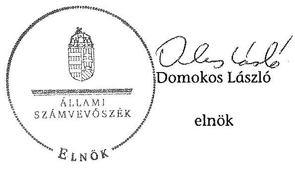

---

MAGYAR NEMZETI BANK

AZ MNB MŰKÖDÉSI KÖLTSÉGEINEK, RÁFORDÍTÁSAINAK ALAKULÁSA 2012-BEN

|   | Megnevezés | 2011. évi tény | 2012. évi tény | 2012. évi módosított tény | 2012. évi tény  |
| --- | --- | --- | --- | --- | --- |
|  5. Az személyi jellegű választások |  | 6 653 655,5 | 6 531 639,8 | 6 665 292,1 | 6 750 614,5  |
|  Állandóan biztosító kártyolás, egyéb kártyolás |  | 4 555 279,5 | 4 557 159,1 | 4 620 553,3 | 4 818 571,2  |
|  Előző: Bővítmények |  | 3 901 024,5 | 3 985 906,5 | 3 941 708,4 | 3 939 713,4  |
|  Adalék |  | 670 692,5 | 654 610,8 | 655 015,5 | 659 625,1  |
|  Fennmaradó pénzek |  | 80 709,0 | 27 371,3 | 26 741,8 | 45 382,5  |
|  Az személyi jellegű egyéb költségek |  | 759 695,5 | 750 781,8 | 752 591,5 | 757 395,5  |
|  Előző: Választási szivesség külső stratégia |  | 301 087,7 | 333 472,5 | 333 472,5 | 303 058,7  |
|  Alagútásás és jóvátétel |  | 310 121,5 | 334 326,7 | 332 566,7 | 339 719,4  |
|  Egyéb nem rendszeres bónuszok |  | 61 296,7 | 65 139,6 | 64 137,3 | 53 167,8  |
|  Előző: Kivételes nyújtások miatti bónuszok |  | 12 233,1 | 0,0 | 0,0 | 1 226,2  |
|  Végkielégítés |  | 8 667,4 | 34 425,5 | 23 846,3 | 0,0  |
|  Résztvevők |  | 35 440,5 | 39 717,5 | 39 717,5 | 39 145,3  |
|  Rétőző bónuszok költségei |  | 472,5 | 566,5 | 566,5 | 506,5  |
|  Rétőző bónuszok költségei |  | 29 846,5 | 27 122,3 | 27 122,3 | 29 011,6  |
|  Egyik épület felújítás miatti bónuszok |  | 1 217,7 | 1 219,3 | 1 219,3 | 1 781,3  |
|  Látogatások |  | 1 430 600,5 | 1 579 197,5 | 1 459 977,7 | 1 498 282,5  |
|  6. IV költségvetési bónuszok |  | 1 148 462,5 | 1 311 322,8 | 1 311 322,8 | 1 247 194,8  |
|  Döntés- és útiköltségtérítés |  | 55 030,2 | 55 031,6 | 55 031,6 | 55 033,4  |
|  Érzékelők |  | 591 316,5 | 791 264,5 | 793 264,5 | 738 305,3  |
|  Árboltásított díjak |  | 63 990,7 | 71 267,0 | 71 267,0 | 47 739,2  |
|  Hőtermelő díjak |  | 200 262,3 | 323 046,9 | 323 046,9 | 335 105,7  |
|  Távközlési díjak |  | 34 672,4 | 30 402,0 | 30 402,0 | 34 481,3  |
|  8. Gazdálkodási bónuszok |  | 1 305 779,2 | 1 304 240,6 | 1 303 840,6 | 1 311 828,9  |
|  Imprégnáló költségek |  | 617 304,6 | 677 807,7 | 677 807,7 | 659 513,4  |
|  Képzési költségek, betartások |  | 164 406,0 | 186 734,8 | 186 734,8 | 186 747,3  |
|  Egyéb költségek, távközlésből |  | 49 907,2 | 60 107,8 | 60 107,8 | 59 834,3  |
|  Látogatások |  | 50 266,5 | 56 064,6 | 56 064,6 | 58 342,8  |
|  Részletek, javak |  | 48 650,3 | 46 380,8 | 46 380,8 | 45 773,8  |
|  Pécszetés |  | 4 283,7 | 3 823,9 | 3 823,9 | 4 302,8  |
|  Hírtartási eszközök, bútorzat és egyéb adó, anyagok |  | 12 859,3 | 15 759,6 | 15 759,6 | 11 224,3  |
|  Végelszámolás |  | 4 465,7 | 4 407,7 | 4 407,7 | 3 589,7  |
|  Távközlési díjak |  | 30 522,3 | 31 505,3 | 31 505,3 | 11 172,0  |
|  Egyéb költségek |  | 52 724,1 | 73 086,8 | 73 086,8 | 55 100,0  |
|  9. Érzékeléstechnikai eszközök |  | 1 750 345,6 | 1 732 539,4 | 1 732 539,4 | 1 750 353,6  |
|  Távközlési eszközök |  | 1 009 892,2 | 1 001 520,2 | 1 001 520,2 | 1 017 219,5  |
|  Gazdálkodási eszközök |  | 459 895,1 | 470 898,3 | 470 898,3 | 458 083,5  |
|  9. Egyéb költségek |  | 516 843,3 | 511 635,4 | 511 635,4 | 711 217,8  |
|  Hozzájárulási díjak |  | 590,1 | 505,0 | 505,0 | 445,4  |
|  Tehergépjármű díjak |  | 35 107,5 | 34 511,1 | 34 511,1 | 43 078,2  |
|  Legelő költségek |  | 142 523,0 | 55 508,0 | 55 508,0 | 42 744,1  |
|  Hozó |  | 37 727,4 |  |  |  |

 | 39 148,0 | 39 148,0 | 39 032,4  |
|  Közepesítő hordozó, adatok |  | 46 304,0 | 53 378,0 | 53 378,0 | 57 437,0  |
|  Bizonyításbőv |  | 165 420,9 | 244 322,6 | 244 322,6 | 181 503,6  |
|  Üzleti eszköznyilvántartás |  | 55 421,0 | 55 305,2 | 55 305,2 | 64 568,4  |
|  Kordorosítás |  | 15 559,7 | 13 000,0 | 13 000,0 | 12 668,5  |
|  Belsőzőni költségek |  | 151 896,5 | 147 325,1 | 147 325,1 | 161 104,6  |
|  Csizsész |  | 114 447,8 | 132 244,5 | 132 244,5 | 99 852,5  |
|  Egyéb vagyoni költségek |  | 46 160,0 | 42 331,9 | 42 331,9 | 33 919,0  |
|  10. Köszönetbizet |  | -127 030,0 | -111 338,7 | -111 338,7 | -119 386,7  |
|  11. Költségvetési költségek összesen |  | 11 882 165,1 | 12 639 518,8 | 11 837 371,3 | 11 545 441,3  |
|  12. Tartalék |  |  | 150 300,3 | 179 300,3 |   |
|  13. Költségvetési költségek |  | 11 882 165,1 | 12 709 928,0 | 12 738 731,8 | 11 545 441,3  |

A fenti adatok az MNB számítási nyilvántartásával megegyeznek.

---

2. SZÁMÚ MELLÉKLET A V-0455-481/2015. SZÁMÚ JELENTÉSHEZ

MAGYAR NEMZETI BANK

AZ MNB MŰKÖDÉSI KÖLTSÉGEINEK, RÁFORDÍTÁSAINAK ALAKULÁSA 2013-BAN

|  |   |   |   |   |   |
| --- | --- | --- | --- | --- | --- |
|   |  |  |  |  | Adatát: szerviz |
|  1. | Megnevezés | 2013. évi terv. | 2013. módosított terv | 2012. 16. 30. tény | 2012. 8. 1.- 20. 31. PSZÁF átvételének hatása*  |
|  1. | Személyi jellegű ráfordítások | 8 839 279,0 | 8 891 843,8 | 8 812 320,6 | 1 753 479,1  |
|   | Átlagos bérköltség (amortizáció bérköltségárvagyon, bérköltség) | 8 878 357,7 | 8 842 725,6 | 8 722 417,7 | 1 319 705,9  |
|   | Elődő: Béné | 5 869 625,3 | 5 905 688,0 | 5 901 176,3 | 696 998,8  |
|   | - Adat | 600 425,8 | 644 904,7 | 526 740,0 | 1 000,0  |
|   | Feltesztelési pénz | 31 309,0 | 31 160,2 | 322 201,8 | 218 086,5  |
|   | Személyi jellegű egyéb időszak | 788 871,8 | 708 145,4 | 668 903,8 | 176 091,6  |
|   | Elődő: Választott béren kívül jutottázók | 316 969,2 | 316 889,2 | 326 232,9 | 50 212,3  |
|   | Anyagköltségek és értékcsökkenési költségek | 314 410,3 | 313 864,5 | 320 097,6 | 41 117,2  |
|   | Egyéb rész rendszeres időzetek | 38 945,2 | 38 482,4 | 44 988,0 | 4 873,3  |
|   | - elződő: Kizárólagosan anyagcélú elződő időzetek | 0,0 | 0,0 | 0,0 | 0,0  |
|   | Végkielégítés | 26 263,7 | 26 250,0 | 19 571,2 | 0,0  |
|   | Fejlesztések | 42 510,8 | 42 510,8 | 27 509,5 | 1 455,0  |
|   | Igenfőni készletezés költsége | 528,6 | 528,6 | 166,6 | 8 200,0  |
|   | Kizáróki készletezés költségei | 23 422,1 | 23 402,1 | 18 340,4 | 31 244,0  |
|   | Inalat göbérnél hezmeleg egyéb költségeinket | 1 484,0 | 1 484,0 | 758,9 |   |
|   | Látáslások | 1 801 566,7 | 1 801 566,7 | 1 798 308,0 | 403 369,0  |
|  2. | Ügyviteli költségek | 1 306 658,0 | 1 306 658,0 | 941 838,7 | 23 728,7  |
|   | Hozóter- és bizalmintosztásba eső költségek | 83 377,0 | 83 377,0 | 62 253,2 | 1 031,0  |
|   | Igénybevételek | 740 696,0 | 740 696,0 | 566 734,3 | 10 652,3  |
|   | Adásvételi díjak | 69 042,0 | 68 042,0 | 25 873,8 | 5 261,3  |
|   | Hisszapcsolási díjak | 310 148,0 | 310 148,0 | 249 789,1 | 8 125,1  |
|   | Tanácsadói díjak | 39 200,0 | 39 200,0 | 6 205,0 | 0,0  |
|  3. | Üzemeltetési költségek | 1 374 912,0 | 1 374 912,0 | 954 800,6 | 274 364,7  |
|   | Egyéb költségek | 692 000,0 | 692 000,0 | 627 360,0 | 234 430,7  |
|   | Készülékfejlesztési projektek, beruházások | 128 832,0 | 128 832,0 | 133 505,8 | 0,0  |
|   | Egyéb projektek, ténye eszközök | 49 205,8 | 49 205,8 | 32 963,8 | 508,0  |
|   | Járulékok | 60 058,6 | 60 058,6 | 44 762,6 | 8 594,0  |
|   | Tépés, jóváhagyás | 44 995,0 | 44 995,0 | 30 458,6 | 10 593,8  |
|   | Hisszabályozás | 5 406,0 | 5 406,0 | 2 229,3 | 0,0  |
|   | Nyomtatványok, bürocikk és egyéb irodai anyagok | 8 553,4 | 8 553,4 | 8 396,9 | 2 226,2  |
|   | Megveresítés | 2 608,0 | 2 608,0 | 1 983,9 | 51,0  |
|   | Tanácsadói díjak | 21 971,8 | 21 971,8 | 21 940,1 | 0,0  |
|   | Egyéb költségek | 49 275,1 | 49 275,1 | 40 132,1 | 5 274,7  |
|  4. | Záróképzési tépés | 1 747 434,6 | 1 747 434,6 | 1 280 346,6 | 26 925,4  |
|   | Tárgyi eszközök | 1 290 555,2 | 1 290 555,2 | 943 369,7 | 20 203,4  |
|   | Immateriális javak | 495 778,8 | 495 778,8 | 341 977,1 | 0,0  |
|  5. | Egyéb költségvetési tételek | 756 469,3 | 756 469,3 | 364 789,2 | 176 867,8  |
|   | Térítésdíjak | 600,0 | 600,0 | 241,2 | 7 800,0  |
|   | Tegyégi díjak | 38 448,8 | 38 448,8 | 37 731,2 | 38 050,0  |
|   | Jogi költségek | 50 000,0 | 50 000,0 | 31 696,0 | 30 699,1  |
|   | Kivét | 24 120,0 | 24 120,0 | 0,0 | 0,0  |
|   | Ráfordítási tanácsadás, adatkérések | 57 521,0 | 57 521,0 | 42 085,3 | 0,0  |
|   | Biztonsági őrzés | 210 033,5 | 210 033,5 | 96 181,1 | 48 838,0  |
|   | Üjely, szamány | 65 232,0 | 65 232,0 | 43 914,0 | 2 720,0  |
|   | Igazgatási | 12 752,0 | 12 752,0 | 8 559,1 | 0,0  |
|   | Készletezési költségek | 132 826,2 | 132 826,2 | 93 477,3 | 27 170,0  |
|   | Tézsek | 86 470,2 | 86 470,2 | 30 816,7 | 0,0  |
|   | Egyéb vegyes költségek | 57 277,4 | 57 277,4 | 21 673,6 | 0,0  |
|  6. | Átkifizetések | -120 233,8 | -120 233,8 | -50 739,9 | 0,0  |
|  7. | Működési költségek összesen | 11 565 243,7 | 11 565 243,7 | 8 866 187,5 | 2 293 819,6  |
|  8. | Tartalék | 178 838,7 | 178 838,7 |  |   |
|  9. | Költségek összesen | 12 146 783,3 | 12 146 783,3 | 2 596 157,2 | 2 293 819,6  |

A fenti adatok az MNB számviteli nyilvántartásával megegyeznek, de eltérnek a kontrolling beszámolóban lévő táblázatok telepítésétől. * Kizárólag az integrációból adódó többletköltség becsült értékét tartalmazza, nem az MNB teljes 2013.10-12. havi költségét.

---

### 3. SZÁMÚ MELLÉKLET A V-0455-481/2015. SZÁMÚ JELENTÉSHEZ

|   |  |  |  |  |  | eMóD: már T/des  |
| --- | --- | --- | --- | --- | --- | --- |
|   |  |  |  |  |  | 2012. XII. 31.  |
|  Megnevezés |  | 2012. XII. 31. | 2013. IX. 30. 3/4. | 2013. X. 1. PSZÁF | 2013. X. 1. |   |
|   |  |  | éves jelentés | integráció adatai | integráció adatai | 2013. XII. 31.  |
|   |  |  |  | változás* |  |   |
|  1. |  |  |  |  |  | 847 333 489  |
|  2. |  |  | 330 866 000 | 340 602 074 |  | 811 407  |
|  3. |  |  |  |  |  | 142 211 700  |
|  4. |  |  | 142 211 700 | 142 211 700 |  | 142 211 700  |
|  5. |  |  |  |  |  | 142 211 700  |
|  6. |  |  | 160 652 094 | 654 303 315 |  | 604 303 315  |

 |
|  7. |  |  |  |  |  | 603 867 025  |
|  8. |  |  | 160 | 0 | 011 407 | 027 268  |
|  9. |  |  |  |  |  | 9 469 437 420  |
|  10. |  |  | 10 192 282 491 | 9 489 437 420 |  | 9 469 437 420  |
|  11. |  |  |  |  |  | 10 208 538 216  |
|  12. |  |  | 9 750 592 115 | 9 122 404 210 |  | 9 122 404 210  |
|  13. |  |  |  |  |  | 9 933 036 531  |
|  14. |  |  | 9 750 592 115 | 9 122 404 210 |  | 9 933 036 531  |
|  15. |  |  |  |  |  | 10 278 176  |
|  16. |  |  | 9 750 592 115 | 9 122 404 210 |  | 9 933 036 531  |
|  17. |  |  |  |  |  | 10 278 176  |
|  18. |  |  | 2 194 030 | 439 640 |  | 439 640  |
|  19. |  |  |  |  |  | 13 380  |
|  20. |  |  | 426 406 006 | 362 530 601 |  | 362 236 601  |
|  21. |  |  |  |  |  | 385 306 125  |
|  22. |  |  | 33 436 747 | 35 342 603 | 725 704 | 33 111 766  |
|  23. |  |  |  |  |  | 33 431 544  |
|  24. |  |  | 12 216 046 | 32 241 638 | 672 338 | 32 016 942  |
|  25. |  |  |  |  |  | 33 262 783  |
|  26. |  |  | 136 212 612 | 29 644 421 |  | 86 044 421  |
|  27. |  |  |  |  |  | 136 111 543  |
|  28. |  |  | 10 601 890 501 | 10 568 306 528 | 1 340 601 | 10 568 507 125  |
|  29. |  |  |  |  |  | 11 437 573 892  |

|   |  |  |  |  |  | 2012. XII. 31.  |
| --- | --- | --- | --- | --- | --- | --- |
|   |  |  |  |  |  | 2012. XII. 31.  |
|  Megnevezés |  | 2012. XII. 31. | 2013. IX. 30. | 2013. X. 1. PSZÁF | 2013. X. 1. |   |
|   |  |  | éves jelentés | integráció adatai | integráció adatai | 2013. XII. 31.  |
|   |  |  |  | változás* |  |   |
|  1. |  |  |  |  |  | 847 534 537  |
|  2. |  |  | 7 737 160 078 | 5 720 662 500 |  | 8 470 534 537  |
|  3. |  |  |  |  |  | 8 470 534 537  |
|  4. |  |  | 442 820 400 | 369 610 670 |  | 4 470 531  |
|  5. |  |  |  |  |  | 2 423 186 20  |
|  6. |  |  | 1 009 184 100 | 784 129 930 |  | 784 129 930  |
|  7. |  |  |  |  |  | 684 402 049  |
|  8. |  |  | 2 731 873 500 | 3 565 014 011 |  | 3 565 014 011  |
|  9. |  |  |  |  |  | 2 180 034 287  |
|  10. |  |  | 3 575 452 907 | 2 380 128 053 |  | 4 303 128 053  |
|  11. |  |  |  |  |  | 2 175 332 277  |
|  12. |  |  | 2 342 600 067 | 1 241 317 280 |  | 1 241 317 280  |
|  13. |  |  |  |  |  | 1 488 889 505  |
|  14. |  |  | 2 342 600 067 | 1 241 317 280 |  | 1 241 317 280  |
|  15. |  |  |  |  |  | 1 488 889 505  |
|  16. |  |  | 2 342 600 067 | 1 241 317 280 |  | 1 241 317 280  |
|  17. |  |  |  |  |  | 608 456 574  |
|  18. |  |  | 2 280 034 | 4 133 754 |  | 4 179 300  |
|  19. |  |  |  |  |  | 4 279 300  |
|  20. |  |  | 12 785 011 | 10 061 381 | 312 091 | 10 785 381  |
|  21. |  |  |  |  |  | 10 884 505  |
|  22. |  |  | 16 947 020 | 26 622 460 |  | 26 622 460  |
|  23. |  |  |  |  |  | 27 289 753  |
|  24. |  |  | 331 964 561 | 331 058 815 |  | 331 964 561  |
|  25. |  |  |  |  |  | 668 400 785  |
|  26. |  |  | 10 000 000 | 10 000 000 |  | 10 000 000  |
|  27. |  |  | 47 933 202 | 7 212 200 |  | 10 000 000  |
|  28. |  |  |  |  |  | 9 761 426  |
|  29. |  |  | 47 933 202 | 7 212 200 |  | 9 761 426  |
|  30. |  |  |  |  |  | 9 761 426  |
|  31. |  |  |  |  |  | 17 347 573 892  |
|  32. |  |  | 47 933 202 | 7 212 200 |  | 9 761 426  |
|  33. |  |  |  |  |  | 1 437 573 892  |
|  34. |  |  |  |  |  | 1 437 573 892  |
|  35. |  |  |  |  |  | 1 437 573 892  |
|  36. |  |  |  |  |  | 1 437 573 892  |
|  37. |  |  |  |  |  | 1 342 601  |
|  38. |  |  |  |  |  | 10 569 807 138  |
|  39. |  |  |  |  |  | 11 437 573 892  |
|  40. |  |  |  |  |  | 1 437 573 892  |
|  41. |  |  |  |  |  | 1 437 573 892  |
|  42. |  |  |  |  |  | 1 437 573 892  |
|  43. |  |  |  |  |  | 1 437 573 892  |
|  44. |  |  |  |  |  | 1 437 573 892  |
|  45. |  |  |  |  |  | 1 437 573 892  |
|  46. |  |  |  |  |  | 1 437 573 892  |
|  47. |  |  |  |  |  | 1 437 573 892  |
|  48. |  |  |  |  |  | 1 437 573 892  |
|  49. |  |  |  |  |  | 1 437 573 892  |
|  50. |  |  |  |  |  | 1 437 573 892  |
|  51. | 

 |  |  |  |  | 1 437 573 892  |
|  52. |  |  |  |  |  | 1 437 573 892  |
|  53. |  |  |  |  |  | 1 437 573 892  |
|  54. |  |  |  |  |  | 1 437 573 892  |
|  55. |  |  |  |  |  | 1 437 573 892  |
|  56. |  |  |  |  |  | 1 437 573 892  |
|  57. |  |  |  |  |  | 1 437 573 892  |
|  58. |  |  |  |  |  | 1 437 573 892  |
|  59. |  |  |  |  |  | 1 437 573 892  |
|  60. |  |  |  |  |  | 1 437 573 892  |
|  61. |  |  |  |  |  | 1 437 573 892  |
|  62. |  |  |  |  |  | 1 437 573 892  |
|  63. |  |  |  |  |  | 1 437 573 892  |
|  64. |  |  |  |  |  | 1 437 573 892  |
|  65. |  |  |  |  |  | 1 437 573 892  |
|  66. |  |  |  |  |  | 1 437 573 892  |
|  67. |  |  |  |  |  | 1 437 573 892  |
|  68. |  |  |  |  |  | 1 437 573 892  |
|  69. |  |  |  |  |  | 1 437 573 892  |
|  70. |  |  |  |  |  | 1 437 573 892  |
|  71. |  |  |  |  |  | 1 437 573 892  |
|  72. |  |  |  |  |  | 1 437 573 892  |
|  73. |  |  |  |  |  | 1 437 573 892  |
|  74. |  |  |  |  |  | 1 437 573 892  |
|  75. |  |  |  |  |  | 1 437 573 892  |
|  76. |  |  |  |  |  | 1 437 573 892  |
|  77. |  |  |  |  |  | 1 437 573 892  |
|  78. |  |  |  |  |  | 1 437 573 892  |
|  79. |  |  |  |  |  | 1 437 573 892  |
|  80. |  |  |  |  |  | 1 437 573 892  |
|  81. |  |  |  |  |  | 1 437 573 892  |
|  82. |  |  |  |  |  | 1 437 573 892  |
|  83. |  |  |  |  |  | 1 437 573 892  |
|  84. |  |  |  |  |  | 1 437 573 892  |
|  85. |  |  |  |  |  | 1 437 573 892  |
|  86. |  |  |  |  |  | 1 437 573 892  |
|  87. |  |  |  |  |  | 1 437 573 892  |
|  88. |  |  |  |  |  | 1 437 573 892  |
|  89. |  |  |  |  |  | 1 437 573 892  |
|  90. |  |  |  |  |  | 1 437 573 892  |
|  91. |  |  |  |  |  | 1 437 573 892  |
|  92. |  |  |  |  |  | 1 437 573 892  |
|  93. |  |  |  |  |  | 1 437 573 892  |
|  94. |  |  |  |  |  | 1 437 573 892  |
|  95. |  |  |  |  |  | 1 437 573 892  |
|  96. |  |  |  |  |  | 1 437 573 892  |
|  97. |  |  |  |  |  | 1 437 573 892  |
|  98. |  |  |  |  |  | 1 437 573 892  |
|  99. |  |  |  |  |  | 1 437 573 892  |
|  100. |  |  |  |  |  | 1 437 573 892  |
|  101. |  |  |  |  |  | 1 437 573 892  |
|  102. |  |  |  |  |  | 1 437 573 892  |
|  103. |  |  |  |  |  | 1 437 573 892  |
|  104. |  |  |  |  |  | 1 437 573 892  |
|  105. |  |  |  |  |  | 1 437 573 892  |
|  106. |  |  |  |  |  | 1 437 573 892  |
|  107. |  |  |  |  |  | 1 437 573 892  |
|  108. |  |  |  |  |  | 1 437 573 892  |
|  109. |  |  |  |  |  | 1 437 573 892  |
|  110. |  |  |  |  |  | 1 437 573 892  |
|  111. |  |  |  |  |  | 1 437 573 892  |
|  112. |  |  |  |  |  | 1 437 573 892  |
|  113. |  |  |  |  |  | 1 437 573 892  |
|  114. |  |  |  |  |  | 1 437 573 892  |
|  115. |  |  |  |  |  | 1 437 573 892  |
|  116. |  |  |  |  |  | 1 437 573 892  |
|  117. |  |  |  |  |  | 1 437 573 892  |
|  118. |  |  |  |  |  | 1 437 573 892  |
|  119. |  |  |  |  |  | 1 437 573 892  |
|  120. |  |  |  |  |  | 1 437 573 892  |
|  121. |  |  |  |  |  | 1 437 573 892  |
|  122. |  |  |  |  |  | 1 437 573 892  |
|  123. |  |  |  |  |  | 1 437 573 892  |
|  124. |  |  |  |  |  | 1 437 573 892  |
|  125. |  |  |  |  |  | 1 437 573 892  |
|  126. |  |  |  |  |  | 1 437 573 892  |
|  127. |  |  |  |  |  | 1 437 573 892  |
|  128. |  |  |  |  |  | 1 437 573 892  |
|  129. |  |  |  |  |  | 1 437 573 892  |
|  130. |  |  |  |  |  | 1 437 573 892  |
|  131. |  |  |  |  |  | 1 437 573 892  |
|  132. |  |  |  |  |  | 1 437 573 892  |
|  133. |  |  |  |  |  | 1 437 573 892  |
|  134. |  |  |  |  |  | 1 437 573 892  |
|  135. |  |  |

 |  |  | 1 437 573 892  |
|  136. |  |  |  |  |  | 1 437 573 892  |
|  137. |  |  |  |  |  | 1 437 573 892  |
|  138. |  |  |  |  |  | 1 437 573 892  |
|  139. |  |  |  |  |  | 1 437 573 892  |
|  140. |  |  |  |  |  | 1 437 573 892  |
|  141. |  |  |  |  |  | 1 437 573 892  |
|  142. |  |  |  |  |  | 1 437 573 892  |
|  143. |  |  |  |  |  | 1 437 573 892  |
|  144. |  |  |  |  |  | 1 437 573 892  |
|  145. |  |  |  |  |  | 1 437 573 892  |
|  146. |  |  |  |  |  | 1 437 573 892  |
|  147. |  |  |  |  |  | 1 437 573 892  |
|  148. |  |  |  |  |  | 1 437 573 892  |
|  149. |  |  |  |  |  | 1 437 573 892  |
|  150. |  |  |  |  |  | 1 437 573 892  |
|  151. |  |  |  |  |  | 1 437 573 892  |
|  152. |  |  |  |  |  | 1 437 573 892  |
|  153. |  |  |  |  |  | 1 437 573 892  |
|  154. |  |  |  |  |  | 1 437 573 892  |
|  155. |  |  |  |  |  | 1 437 573 892  |
|  156. |  |  |  |  |  | 1 437 573 892  |
|  157. |  |  |  |  |  | 1 437 573 892  |
|  158. |  |  |  |  |  | 1 437 573 892  |
|  159. |  |  |  |  |  | 1 437 573 892  |
|  160. |  |  |  |  |  | 1 437 573 892  |
|  161. |  |  |  |  |  | 1 437 573 892  |
|  162. |  |  |  |  |  | 1 437 573 892  |
|  163. |  |  |  |  |  | 1 437 573 892  |
|  164. |  |  |  |  |  | 1 437 573 892  |
|  165. |  |  |  |  |  | 1 437 573 892  |
|  166. |  |  |  |  |  | 1 437 573 892  |
|  167. |  |  |  |  |  | 1 437 573 892  |
|  168. |  |  |  |  |  | 1 437 573 892  |
|  169. |  |  |  |  |  | 1 437 573 892  |
|  170. |  |  |  |  |  | 1 437 573 892  |
|  171. |  |  |  |  |  | 1 437 573 892  |
|  172. |  |  |  |  |  | 1 437 573 892  |
|  173. |  |  |  |  |  | 1 437 573 892  |
|  174. |  |  |  |  |  | 1 437 573 892  |
|  175. |  |  |  |  |  | 1 437 573 892  |
|  176. |  |  |  |  |  | 1 437 573 892  |
|  177. |  |  |  |  |  | 1 437 573 892  |
|  178. |  |  |  |  |  | 1 437 573 892  |
|  179. |  |  |  |  |  | 1 437 573 892  |
|  180. |  |  |  |  |  | 1 437 573 892  |
|  181. |  |  |  |  |  | 1 437 573 892  |
|  182. |  |  |  |  |  | 1 437 573 892  |
|  183. |  |  |  |  |  | 1 437 573 892  |
|  184. |  |  |  |  |  | 1 437 573 892  |
|  185. |  |  |  |  |  | 1 437 573 892  |
|  186. |  |  |  |  |  | 1 437 573 892  |
|  187. |  |  |  |  |  | 1 437 573 892  |
|  188. |  |  |  |  |  | 1 437 573 892  |
|  189. |  |  |  |  |  | 1 437 573 892  |
|  190. |  |  |  |  |  | 1 437 573 892  |
|  191. |  |  |  |  |  | 1 437 573 892  |
|  192. |  |  |  |  |  | 1 437 573 892  |
|  193. |  |  |  |  |  | 1 437 573 892  |
|  194. |  |  |  |  |  | 1 437 573 892  |
|  195. |  |  |  |  |  | 1 437 573 892  |
|  196. |  |  |  |  |  | 1 437 573 892  |
|  197. |  |  |  |  |  | 1 437 573 892  |
|  198. |  |  |  |  |  | 1 437 573 892  |
|  199. |  |  |  |  |  | 1 437 573 892  |
|  200. |  |  |  |  |  | 1 437 573 892  |
|  201. |  |  |  |  |  | 1 437 573 892  |
|  202. |  |  |  |  |  | 1 437 573 892  |
|  203. |  |  |  |  |  | 1 437 573 892  |
|  204. |  |  |  |  |  | 1 437 573 892  |
|  205. |  |  |  |  |  | 1 437 573 892  |
|  206. |  |  |  |  |  | 1 437 573 892  |
|  207. |  |  |  |  |  | 1 437 573 892  |
|  208. |  |  |  |  |  | 1 437 573 892  |
|  209. |  |  |  |  |  | 1 437 573 892  |
|  210. |  |  |  |  |  | 1 437 573 892  |
|  211. |  |  |  |  |  | 1 437 573 892  |
|  212. |  |  |  |  |  | 1 437 573 892  |
|  213. |  |  |  |  |  | 1 437 573 892  |
|  214. |  |  |  |  |  | 1 437 573 892  |
|  215. |  |  |  |  |  | 1 437 573 892  |
|  216. |  |  |  |  |  | 1 437 573 892  |
|  216. |  |  |  |  |  | 1 437 573 892  |
|  217. |  |  |  |  |  | 1 437 573 892  |
|  218. |  |  |  |  |

 | 1 437 573 892  |
|  219. |  |  |  |  |  | 1 437 573 892  |
|  220. |  |  |  |  |  | 1 437 573 892  |
|  221. |  |  |  |  |  | 1 437 573 892  |
|  222. |  |  |  |  |  | 1 437 573 892  |
|  222. |  |  |  |  |  | 1 437 573 892  |
|  223. |  |  |  |  |  | 1 437 573 892  |
|  223. |  |  |  |  |  | 1 437 573 892  |
|  224. |  |  |  |  |  | 1 437 573 892  |
|  224. |  |  |  |  |  | 1 437 573 892  |
|  225. |  |  |  |  |  | 1 437 573 892  |
|  225. |  |  |  |  |  | 1 437 573 892  |
|  226. |  |  |  |  |  | 1 437 573 892  |
|  227. |  |  |  |  |  | 1 437 573 892  |
|  228. |  |  |  |  |  | 1 437 573 892  |
|  229. |  |  |  |  |  | 1 437 573 892  |
|  230. |  |  |  |  |  | 1 437 573 892  |
|  231. |  |  |  |  |  | 1 437 573 892  |
|  232. |  |  |  |  |  | 1 437 573 892  |
|  232. |  |  |  |  |  | 1 437 573 892  |
|  233. |  |  |  |  |  | 1 437 573 892  |
|  233. |  |  |  |  |  | 1 437 573 892  |
|  233. |  |  |  |  |  | 1 437 573 892  |
|  234. |  |  |  |  |  | 1 437 573 892  |
|  234. |  |  |  |  |  | 1 437 573 892  |
|  235. |  |  |  |  |  | 1 437 573 892  |
|  235. |  |  |  |  |  | 1 437 573 892  |
|  236. |  |  |  |  |  | 1 437 573 892  |
|  236. |  |  |  |  |  | 1 437 573 892  |
|  237. |  |  |  |  |  | 1 437 573 892  |
|  237. |  |  |  |  |  | 1 437 573 892  |
|  238. |  |  |  |  |  | 1 437 573 892  |
|  238. |  |  |  |  |  | 1 437 573 892  |
|  239. |  |  |  |  |  | 1 437 573 892  |
|  240. |  |  |  |  |  | 1 437 573 892  |
|  241. |  |  |  |  |  | 1 437 573 892  |
|  242. |  |  |  |  |  | 1 437 573 892  |
|  242. |  |  |  |  |  | 1 437 573 892  |
|  243. |  |  |  |  |  | 1 437 573 892  |
|  243. |  |  |  |  |  | 1 437 573 892  |
|  243. |  |  |  |  |  | 1 437 573 892  |
|  244. |  |  |  |  |  | 1 437 573 892  |
|  245. |  |  |  |  |  | 1 437 573 892  |
|  245. |  |  |  |  |  | 1 437 573 892  |
|  246. |  |  |  |  |  | 1 437 573 892  |
|  247. |  |  |  |  |  | 1 437 573 892  |
|  247. |  |  |  |  |  | 1 437 573 892  |
|  247. |  |  |  |  |  | 1 437 573 892  |
|  248. |  |  |  |  |  | 1 437 573 892  |
|  248. |  |  |  |  |  | 1 437 573 892  |
|  249. |  |  |  |  |  | 1 437 573 892  |
|  250. |  |  |  |  |  | 1 437 573 892  |
|  251. |  |  |  |  |  | 1 437 573 892  |
|  252. |  |  |  |  |  | 1 437 573 892  |
|  252. |  |  |  |  |  | 1 437 573 892  |
|  253. |  |  |  |  |  | 1 437 573 892  |
|  253. |  |  |  |  |  | 1 437 573 892  |
|  253. |  |  |  |  |  | 1 437 573 892  |
|  254. |  |  |  |  |  | 1 437 573 892  |
|  254. |  |  |  |  |  | 1 437 573 892  |
|  255. |  |  |  |  |  | 1 437 573 892  |
|  257. |  |  |  |  |  | 1 437 573 892  |
|  258. |  |  |  |  |  | 1 437 573 892  |
|  259. |  |  |  |  |  | 1 437 573 892  |
|  260. |  |  |  |  |  | 1 437 573 892  |
|  261.  |  |  |  |  |  | 1 437 573 892  |
|  270. |  |  |  |  |  | 1 437 573 892  |
|  272. |  |  |  |  |  | 1 437 573 892  |
|  272. |  |  |  |  |  | 1 437 573 892  |
|  273. |  |  |  |  |  | 1 437 573 892  |
|  273. |  |  |  |  |  | 1 437 573 892  |
|  273. |  |  |  |  |  | 1 437 573 892  |
|  274.  |  |  |  |  |  | 1 437 573 892  |
|  274. |  |  |  |  |  | 1 437 573 892  |
|  274. |  |  |  |  |  | 1 437 573 892  |
|  275. |  |  |  |  |  | 1 437 573 892  |
|  275. |  |  |  |  |  | 1 437 573 892  |
|  276. |  |  |  |  |  | 1 437 573 892  |
|  277. |  |  |  |  |  | 1 437 573 892  |
|  278. |  |  |  |  |  | 1 437 573 892  |
|  279. |  |  |  |  |  | 1 437 573 892  |
|  280.  |  |  |  |  |  | 1 437 573 892  |
|  280.  |  |  |  |  |  | 1 437 573 892  |
|  279. |  |  |  |  |  | 1 437 573 892  |
|  280.  |  |  |  |  |  | 1 437 573 892  |
|  280.  |  |  |  |  |  | 1 437 573 892  |
|  280.  |  |  |  |  |  | 1 437 573 892  |
|  280.  |  |  |  |  |  | 1 437 573 892  |
|  280.  |  |  |  |  |  | 1 437 573 892  |
|  280.  |  |  |  |  |  | 1 437 573 892  |
|  280.  |  |  |  |  |  | 1 437 573 892  |

 |  Sorsz. | Megnevezés | Tulajdoní hányad (\%) |  |  | Könyv szerinti érték |  |  | Kapott osztalék * |  |   |
| --- | --- | --- | --- | --- | --- | --- | --- | --- | --- | --- |
|   |  | 2011.12.31. | 2012.12.31. | 2013.12.31. | 2011.12.31. | 2012.12.31. | 2013.12.31. | 2011. | 2012. | 2013.  |
|  1 | Belföldi befektetések: |  |  |  |  |  |  |  |  |   |
|   | Budapesti Értéktőzsde | 6,9 | 6,9 | 6,9 | 321104 | 321104 | 321104 | 90289 | 77122 | 39501  |
|  2 | GIRO Elszámotásforgalmi Zrt. | 7,3 | 7,3 | 8,1 | 45710 | 45710 | 268710 | 121030 | 120120 | 122666  |
|  3 | KELER Zrt. | 53,3 | 53,3 | 53,3 | 642667 | 642667 | 642667 | 0 | 0 | 0  |
|  4 | KELER KSZF Kft. | 13,6 | 13,6 | 0,2 | 52419 | 52419 | 7731 | 0 | 0 | 0  |
|  5 | Magyar Pénzverő Zrt. | 100,0 | 100,0 | 100,0 | 575000 | 575000 | 575000 | 414566 | 284884 | 104178  |
|  6 | Pénzjegynyomda Zrt. | 100,0 | 100,0 | 100,0 | 8927000 | 8927000 | 8927000 | 896566 | 0 | 0  |
|  7 | Hillelintézeti Felszámoló Nkft.*** | n.a. | n.a. | 100,0 | n.a. | n.a. | 50000 | n.a. | n.a. | n.a.  |
|   | Belföldi befektetések összesen: |  |  |  | 10673900 | 10673900 | 10789212 | 1522451 | 482126 | 266347  |
|  1 | Külföldi befektetések: |  |  |  |  |  |  |  |  |   |
|   | BIS BASEL | Ft-ban | 1,43 | 1,43 | 1,43 | 7144159 | 6666537 | 6586842 | 740213 | 913358  |
|   |  | (millió SDR) |  |  |  | 10,0 | 10,0 | 10,0 |  |   |
|   |  | (millió CHF) |  |  |  | 13,5 | 13,5 | 13,5 |  |   |
|  2 | Európai Központi Bank | Ft-ban | 1,39 | 1,39 | 1,37 | 1739601 | 1626671 | 1656041 | 0 | 0  |
|   |  | (ezer EUR) |  |  |  | 5591,2 | 5591,2 | 5577,6 |  |   |
|  3 | SWIFT | Ft-ban | 0,02 | 0,02 | 0,02 | 2682 | 2511 | 2588 | 0 | 0  |
|   |  | (ezer EUR) |  |  |  | 6,6 | 6,6 | 6,6 |  |   |
|   | Külföldi befektetések összesen forintban: |  |  |  |  | 8886442 | 8296719 | 8294443 | 740213 | 913358  |
|   | Befektetések mindösszesen: |  |  |  |  | 19460342 | 18870619 | 19043655 | 2262694 | 1395484  |

- Az előző évi eredmény után a tárgyévben elszámolt osztalék. A befektetés pénzmennyisége. *** A tulajdonosi jogok gyakorlójaként az MNB mutatja ki a könyvelésben az állam tulajdonában álló üzletrészt. n.a.: Nem értelmezhető a kalagórla. A forint adatok az MNB számvételi nyilvántartásával megegyeznek.

---

# AZ MNB ELSZÁMOLÁSAI A KÖZPONTI KÖLTSÉGVETÉSSEL A 2012-2013. ÉVEKBEN

|   |  | adatok: ezer Ft-ban  |
| --- | --- | --- |
|  Megnevezés | 2012 | 2013  |
|  Istitút mérleg szerinti eredmény | -39 810 926 | 26 286 496  |
|  Eredménytartalék | 47 623 202 | 9 781 438  |
|  Veszteség fedezése az eredmény/tartalék terhére | 39 810 926 | 0  |
|  Központi költségvetés térítési kötelezettsége | 0 | 0  |
|  Kiegyenlítési tartalékok |  |   |
|  Főkönyvi folyószámla kiegyenlítési tartalékba | 564 040 772 | 509 603 400  |
|  Központi költségvetés térítési kötelezettsége | 0 | 0  |
|  Deviza-értékpapírok kiegyenlítési tartalékba | -20 188 167 | -91 100 145  |
|  Központi költségvetés térítési kötelezettsége | 0 | 0  |
|  Követelések Egységes Számla kamatozás |  |   |
|  Főkönyvi állomány | 442 480 044 | 241 678 262  |
|  Főkönyvi állomány (állagállomány) | 678 256 517 | 567 168 203  |
|  Főkönyvi állomány után fizetett kamatok | 46 844 402 | 24 879 976  |
|  Devizakészlet | 350
 596 027 | 506 836 433  |
|  Devizsállomány (állagállomány AKK Zrt.-vel együtt) | 867 916 821 | 834 677 201  |
|  Devizsállomány után fizetett kamatok | 1 311 850 | 210 635  |
|  AKK Zrt. számla kamatolása |  |   |
|  Fenttállomány | 286 151 | 279 234  |
|  Fenttállomány (állagállomány) | 301 975 | 347 030  |
|  Fenttállomány után fizetett kamatok | 24 098 | 16 404  |
|  Devizsállomány | 582 758 989 | 941 981  |
|  Devizsállomány után fizetett kamatok | 338 | 944  |
|  APV Zrt., MNV Zrt. számlaik kamatolása |  |   |
|  Fenttállomány | 0 | 0  |
|  Fenttállomány után fizetett kamatok | 0 | 0  |
|  Devizsállomány | 0 | 0  |
|  Devizsállomány után fizetett kamatok | 0 | 0  |

A fent adatok az MNB számviteli nyilvántartásaival megegyeznek.

---

# A PSZÁF ÁLTAL ELLÁTANDÓ FELADATOK MÓDOSULÁSA AZ ELLENŐRZÖTT IDŐSZAKBAN 

1. 2009. július 30-tól a PSZÁF tagja lett az Európai Értékpapír-piaci Szabályozók, az Európai Bankfelügyelők, és az Európai Biztosítás és a Foglalkoztatói nyugdíj Felügyeletek Bizottságainak;
2. 2009. november 1-jétől a PSZÁF feladatai kibővültek a pénzforgalmi szolgáltatás nyújtásáról szóló 2009. évi LXXXV. törvény hatálya alá tartozó szervezetek, személyek és tevékenységek felügyeletével;
3. 2010. január 1-jétől a Közösségben történő határon átnyúló fizetésekről, 2010. augusztus 16-ától a hitelminősítő intézetekről szóló európai tanácsi és parlamenti rendeletek végrehajtása is a PSZÁF feladatát képezték;
4. 2009. szeptember 1-jétől fogyasztóvédelmi hatáskört kapott a PSZÁF, az érkezett panaszokat fogyasztóvédelmi eljárás keretében vizsgálták;
5. 2010. január 15-étől létrejött a Pénzügyi Stabilitási Tanács, amelynek titkársági feladatait a PSZÁF látta el;
6. 2010. június 11-étől a PSZÁF látta el a kereskedelmi kölcsönt nyújtó hitelezők felügyeletét a fogyasztónak nyújtott hitelről szóló 2009. évi CLXII. törvény hatálya alá tartozó tevékenysége tekintetében;
7. 2011. január 1-jétől a PSZÁF elnöke rendeletalkotási jogot kapott;
8. 2011. január 1-jétől a PSZÁF közérdekű igényérvényesítési hatáskört kapott;
9. 2011. január 1-jétől létrejött a Pénzügyi Békéltető Testület;
10. 2011. március 12-étől a PSZÁF kötelezettségévé vált a kormányzati ellenőrzési szerv Áht.-val összefüggő feladatai ellátásához szükséges adatok rendelkezésre bocsátása;
11. 2011. október 11-étől a PSZÁF látta el a központi hitelinformációs rendszerről szóló törvény hatálya alá tartozó szervezetek, személyek és tevékenységek felügyeletét;
12. 2012. január 1-jétől kibővült a PSZÁF feladata a befektetési alapkezelőkről és a kollektív befektetési formákról szóló törvény hatálya alá tartozó szervezetek, személyek és tevékenységek felügyeletével;
13. 2012. január 1-jétől tovább bővült a PSZÁF elnökének rendeletalkotási jogköre;
14. 2012. november 1-jétől a PSZÁF feladata lett a bennfentes kereskedelem, piacbefolyásolás, engedély vagy bejelentés nélküli tevékenység végzésének gyanúja esetén a 236/2012/EU európai parlamenti és tanácsi rendelet 5-8. cikkében előírtakkal összefüggésben piacfelügyeleti eljárás indítása;
15. 2012. november 1-jétől a PSZÁF feladatává vált a short ügyletekről és a hitel-nemteljesítési csereügyletekkel kapcsolatos európai parlamenti és tanácsi rendeletek végrehajtása;
16. 2013. január 15-ével megszűnt a Pénztárak Központi Nyilvántartása vezetésére vonatkozó PSZÁF hatáskör. A feladatot az Országos Nyugdíjbiztosítási Főigazgatóság vette át a 2012. évi CCVIII. tv. 15. §-a alapján.
17. 2013. június 22-étől a PSZÁF feladata lett a pénzügyi konglomerátumok kiegészítő felügyeletéről szóló törvényben foglaltaknak megfelelő kiegészítő felügyelet ellátása.

---

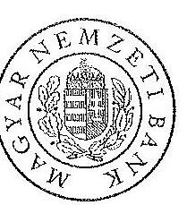

# MAGYAR NEMZETI BANK 

## Matrica 11.

## 205

Állami Számvevőszék
Domokos László elnök úr részére
Budapest
Apáczai Csere János u. 10.
1052

Tárgy: Észrevételek küldése az MNB ellenőrzéséről szóló jelentéstervezethez

Tisztelt Elnök Úr!

Iktatószám: 12137-3/2015
Budapest, 2015. január 28.
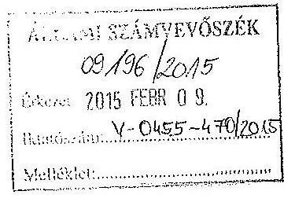

Melléklet: $\qquad$

Mellékelten küldöm az MNB észrevételeit az Állami Számvevőszék V-0455-464/2014. számú jelentéstervezetére.

Üdvözlettel:
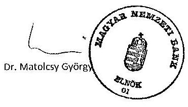

Melléklet: 1 db

---

# Észrevételek 

az Állami Számvevőszék V-0455-464/2014. Iktatószámú, a Magyar Nemzeti Bank működésének, valamint a Pénzügyi Szervezetek Állami Felügyelete működésének, és tevékenysége MNB-be integrálása szabályszerűségének ellenőrzéséről szóló számvevőszéki jelentés tervezetéhez

## Az MNB működését érintő megállapítások

1. Összegző megállapítások 8. oldal 1. bekezdés; 11. oldal javaslatok az MNB elnökének 1. pont; Részletes megállapítások 24. oldal 7. bekezdés

Kérjük, hogy a 24. oldal utolsó és a 25. oldal első bekezdésben foglalt észrevételt valamint az ezekhez kapcsolódó javaslatot a 11. oldalon a jelentés tervezetből szíveskedjenek törölni az alábbi indokok miatt:

Az MNB belső szabályai (Gazdálkodási Kézikönyv R fejezet - A Magyar Nemzeti Bank pénzügyi tervezése és az évközi gazdálkodás szabályai, B fejezet A Magyar Nemzeti Bank beszerzéseinek és az ezekhez kapcsolódó szerződések előkészítésének és utókövetésének rendje, F fejezet A vagyontárgyak kezelésének szabályzata C rész Az immateriális javak, a beruházások és az általánosító eltérően nyilvántartott készletek számviteli elszámolása; Számviteli kézikönyv A fejezet F rész Beruházás, felújítás, karbantartás, és készletnövekedés (360.)) szerint egy beruházási megrendelés létrehozásának feltételei a következők: az MNB igazgatósága által jóváhagyott beruházási tervnek tartalmaznia kell az igényt, beruházási tervsor azonosítóval kell rendelkeznie, beruházási esettanulmánnyal kell rendelkezni, befejezetlen beruházás azonosítóval kell rendelkezni. A jelentés tervezetben említett két megrendelés elkészítésekor, azaz 2013-ban, az MNB igazgatósága által a 2013-as pénzügyi évre elfogadott beruházási tervben nem szerepelt a Szabadság téri épület felújítása. Ennek köszönhetően beruházási esettanulmány, beruházási tervsor azonosító, befejezetlen beruházás azonosító nem állt a költséggazda rendelkezésére. Az MNB belső gazdálkodási szabályai lehetővé teszik terven felüli beruházás elszámolását, azonban a 2013. évi mérleg elkészítéséig nem hozott az Igazgatóság a beruházásról döntést. Az MNB-ről szóló 2013. évi CXXXIX. törvény értelmében a Bank az Éves jelentéssel egyidejűleg a tervezett és tényleges működési költségek valamint beruházási kiadások bemutatására összehasonlító elemzést készít, amelyet könyvvizsgáló auditál. A könyvvizsgáló az ellenőrzés során a kifogásolt tételekkel kapcsolatban megállapítást nem tett, azok elszámolását megfelelőnek találta.
2. Összegző megállapítások 8. oldal 3. bekezdés; 12. oldal javaslatok az MNB elnökének 2. pont; Részletes megállapítások 27. oldal 2. bekezdés

Az ÁSZ „Jelentéstervezet az MNB ellenőrzéséről - a Magyar Nemzeti Bank működésének, valamint a Pénzügyi Szervezetek Állami Felügyelete működése, és tevékenysége MNB-be integrálása szabályszerűségének ellenőrzéséről" tárgyú anyaga I. pontja (12. old. 2. pont) és II.1.2.3. pontja (27. old. második bekezdés) tartalmaznak az MNB beszerzési szakterületét érintő megállapításokat, amelyeket az alábbiak szerint kérünk módosítani:

Az ÁSZ vizsgálata során a beszerzési folyamatokat szabályszerűnek találta, azonban „egy szerződésmódosítás esetében felmerült, hogy a közbeszerzés szabályai nem teljes körűen érvényesültek”. Ezt követően leírja a kifogásolt szerződésmódosítást (szerződő felek a 2012. június 26-án megkötött szerződést módosították, melynek következtében a teljesítési véghatáridő 1,5 hónappal későbbi időpontra változott) és tényként állítja, hogy „a szerződésmódosítás során nem érvényesültek a Kbt. 132. § (1) bekezdés a) pontjának, valamint a Kbt. 30. §-a (1) bekezdés h) pontjának előírásai”.

Közbeszerzési eljárás során elkövetett jogsértés megállapítására a hatályos jogszabályok értelmében hatóságként a Közbeszerzési Hatóság, nevében pedig a Közbeszerzési Döntőbizottság (KDB), illetve másodfokú hatósági szerv hiányában a hatáskörrel és illetékességgel rendelkező törvényszék jogosult.

---

A Jelentéstervezet nem tér ki arra, hogy a kérdéses szerződés kapcsán az ÁSZ - élve a törvény adta lehetőségével - hivatalból jogorvoslati eljárást kezdeményezett az MNB eljárásával kapcsolatban.
A jogorvoslati kérelem alapján a KDB 2014. november 10-én kelt végzésében hívta fel az MNB-t adatszolgáltatásra és észrevételei megtételére.
Az MNB észrevételeit november 24-én küldte meg a KDB részére, melyben kifejtette, hogy a szerződés módosítására azért került sor, mert a közbeszerzési eljárás értékelési szakasza az ajánlatok nagy száma miatt elhúzódott, így az eredetileg 2012. május 15-re tervezett szerződéskötési dátum 2012. június 26-ra tolódott. Annak érdekében, hogy a teljesítésre az ajánlattételi felhívásban eredetileg rögzítetteknek megfelelő időtartam rendelkezésre álljon, így a nyertes ajánlattevő ne kerüljön hátrányos helyzetbe a teljesítés során, indokolt és szükséges volt a szerződés módosítása és az nem ütközött a Kbt. 132.§ (1) bekezdés a) pontjának rendelkezéseibe.
Ajánlatkérő (MNB) ugyanakkor valóban nem tette közzé a szerződés módosításáról az erre vonatkozó hirdetményt, amit az észrevétel alapján azonnal pótolt, reparálandó az esetleges jogsértést.
A KDB 2015. január 8-án kelt és az MNB által 2015. január 14-én kézhez vett határozatában az ÁSZ hivatalból kezdeményezésének első eleme tekintetében a kérelmet elutasította és megállapította a jogsértés hiányát, azaz a szerződés módosítását - ellentétben az ÁSZ álláspontjával - jogszerűnek minősítette.
Az ÁSZ kérelem második elemének, a szerződés módosításáról szóló tájékoztató közzétételének elmaradása tekintetében ugyanakkor a KDB jogsértést állapított meg és határozatában 100 000 Ft pénzbírság megfizetésére kötelezte az MNB-t.

# Fentiekre tekintettel kérjük, hogy: 

- a Jelentéstervezet I. pontjában az MNB elnökének címzett 2. számú megállapítást és javaslatot, illetve a 8. oldal 3. bekezdést is - figyelemmel a KDB által megállapított jogsértés mértékére, az MNB által tanúsított és az ÁSZ által is vizsgált beszerzési eljárásokban tanúsított jogkövető magatartására (melyet az ÁSZ Jelentéstervezetében több helyütt [22. oldal utolsó bekezdés, 23. old. második bekezdés és 27. old. első bekezdés] maga is elismer) és a jogsértés reparálására tett haladéktalan intézkedésére - törölje;
- a Jelentéstervezet II.1.2.3. pontjának szövegét az alábbi szövegre módosítsa (27. old. második bekezdés): Egy szerződésmódosítás esetében azonban felmerült, hogy a közbeszerzési szabályok nem teljes körűen érvényesültek. Az MNB és egy gazdasági társaság között közbeszerzési eljárás eredményeként 2012. június 26-án megkötött 20,9 M Ft + Áfa összegű szerződést a felek módosították, melynek következtében a teljesítési véghatáridő 1,5 hónappal későbbi időpontra változott. Az ellenőrzést követően az ÁSZ által hivatalból indított kezdeményezett eljárás során a Közbeszerzési Döntőbizottság határozatában a szerződés teljesítési határidejének meghosszabbítását jogszerűnek minősítette. Figyelemmel arra, hogy az MNB a Kbt. 6. § (1) bekezdésének b) pontja alapján a Kbt. szensélyi hatálya alá tartozik, a szerződésmódosítás során nem érvényesültek a Kbt. 132. § (1) bekezdés a) pontjának, valamint a Kbt. 30. § (1) bekezdés b) pontjának előírásai.

Megjegyezzük, hogy az MNB a Kbt. 6. § (1) bekezdés c) pontja szerint minősül ajánlatkérőnek, ellentétben a Jelentéstervezetben szereplő hivatkozással (Kbt. 6. § (1) bekezdés b) pont).

## 3. Részletes megállapítások 18. oldal 2., 3., 4. és 5. bekezdés: 1.2.1. Éves tervezés és összehasonlító elemzés:

„Az összehasonlító elemzésben a bevételek, mint átvezetések egyösszegű költségcsökkentő tételként történt bemutatása nem teljes körűen átlátható.” Ennek indokaként az szerepel a megállapítások között, hogy az elemzés nem nyújtott arra vonatkozó egyértelmű információt, hogy az elszámolt bevétel (2012-ben: 119,3 M Ft, 2013-ban: 119,0 M Ft) pontosan mely költség(ek)hez kapcsolódott. Ugyanakkor szűkebb bekezdésben mindkét év vonatkozásában a jelentés megjegyzi, hogy a hiányolt adatokat az MNB kiegészítő tájékoztatásként megadta az ÁSZ részére.

A fentek kapcsán észrevételeink a következők:

1. Az összehasonlító elemzés 1.7. Az átvezetések alakulása című fejezetében szereplő indoklás tartalmazza többek között azt, hogy az átvezetések túlnyomó részét a Magyar Pénzverő Zrt. által a Logisztikai központ részleges használatáért fizetett bérleti díjnak megfelelő
 összegű költségátvezetés teszi ki. Ezt az ÁSZ részére az MNB által kiegészítő tájékoztatás adatai alátámasztják.

---

2. Az összehasonlító elemzés készítésének módszertana („főbb elvei”) nem tartalmaz olyan előírást, hogy az átvezetések bemutatásának részeként mutassuk be az egyes bevételekhez kapcsolódó költségnemeket.
3. Az előzőekhez kötődően jelezzük, hogy az MNB Számviteli kézikönyve szerint: „A gazdálkodók és magánszemélyek által - jellemzően bérleti szerződésben rögzítettek szerint - megtérített szolgáltatás közvetlen önköltségének megállapítására a költség-haszon összevetésének elvét is figyelembe véve, önköltség-számítási szabályt a Bank nem készít. Ezért itt is a bevétellel azonos összegű ráfordítást kell a $B$ as számlaosztályba átvezetni. Ilyen szolgáltatás például az eszközök és helyiségek bérbeadása és egyéb, kiszámított szolgáltatás jellegű tevékenységek.”
4. Az összehasonlító elemzést a jegybanktörvény értelmében az MNB könyvvizsgálója auditálta, s az átvezetések bemutatása kapcsán megállapítást nem tett, azt megfelelőnek találta.

Mindezeket figyelembe véve véleményünk szerint az átvezetések kapcsán az összehasonlító elemzés hiányosságot nem tartalmaz, ezért kérjük a megállapítás törlését.

# A PSZÁF tevékenységét érintő megállapítások 

## 1. Összegző megállapítások 9. oldal 2. bekezdés

„A PSZÁF az eljárásrendeket az engedélyezéssel kapcsolatos jogszabályi környezet változásakor nem hozta összhangba a jogszabályi rendelkezésekkel. A PSZÁF engedélyezési eljárásainak szabályszerűsége az engedélykérelmek benyújtása, a kötelező nyilatkozattétel és a hiánypótlás során tapasztalt hiányosságok miatt nem volt megfelelő.”
Mint MNB nem kívánunk részletes véleményt formálni a jogutód nélkül megszűnt PSZÁF belső szabályozásáról. Általánosságban azonban elmondható, hogy a belső szabályzatoknak nem kell megismételnie minden jogszabályi előírást, funkciója a kiegészítő jellegű szabályozás (részletesebben lásd a 37. oldal 3.4.1.1. pont 2. bekezdéséhez tett észrevételnél). Az engedélykérelmek benyújtása és a hiánypótlási felhívások darabszáma jogszabályszerű volt (részletesen lásd a 37. oldal 3.4.1.1. pont 2. bekezdéséhez és a 38. oldal 1. bekezdéséhez tett észrevételnél). A hiánypótlási felhívás kiadására rendelkezésre álló határidőt a vizsgált 45 esetben egyszer lépte túl a PSZÁF.

## 2. Részletes megállapítás 37. oldal, 3.4.1.1. pont 2. bekezdés

„A PSZÁF tv1 engedélyezésre vonatkozó előírásait 2009. április 13-ig a PSZÁF nem vezette át a belső szabályzataiban, így azok nem rendelkeztek a… kérelmező teljességi nyilatkozattételi kötelezettségeiről, …az ügyintézési határidő meghosszabbíthatóságáról, valamint … a kiegészítési-módosítási kérelmekkel kapcsolatos ügyintézésről.”

Mint MNB nem kívánunk részletes véleményt formálni a jogutód nélkül megszűnt PSZÁF belső szabályozásáról. Általánosságban azonban elmondható, hogy a belső szabályzatnak nem feladata, hogy megismételjen minden törvényi előírást. A vizsgált időszak (2009. január 1-2013. december 31.) vonatkozásában a 2009. január 1. és 2009. április 13. között hatályos 48/2000. számú utasításban egyetlen helyen történik az államigazgatási eljárási törvényre utalás. Az utasítás azt tartalmazza, hogy a Felügyelet minden kérelmező esetében, mindenkor a hatályos jogszabályokat alkalmazza, jár el. Ez a szabályzat általános elveket fogalmaz meg, valamint az engedélyezési eljárás folyamatát (kérelem befogadása/értékelése/elbírálása) írja le, konkrét ágazati, illetve egyéb jogszabályra való hivatkozást szándékosan nem tartalmazott.

A 2009. április 14-től 2010. február 24-ig hatályban volt 10/2009-es számú utasítás tartalmazta az ügyintézési határidő meghosszabbíthatóságára (4.5. (4) bekezdés) illetve a kiegészítési-módosítási kérelmekkel kapcsolatos ügyintézésre (helyesen a kérelem kiegészítési felhívás kibocsátására) vonatkozó rendelkezést (4.5. (2) bekezdés) is. A 2010. február 25-től hatályban volt 16/2010-es számú utasítás szintén tartalmazta az ügyintézési határidő meghosszabbíthatóságára (4.5. (4) bekezdés) illetve a kérelem-kiegészítési felhívás kibocsátására vonatkozó rendelkezést (4.5. (2) bekezdés).

---

Az engedélyezési eljárásokban a hatályos jogszabályok (így a PSZÁF tv1-nek is) megtartásra kerültek az ügyintézési határidő meghosszabbításánál, a kérelem kiegészítési felhívásoknál minden esetben és az esetek döntő többségében a teljességi nyilatkozat bekérésénél is.

# 3. Részletes megállapítás 37. oldal, 3.4.1.1. pont 2. bekezdés 

„A 2012. október 28. után kezdeményezett kérelmeket több esetben nem az e célra rendszeresített formanyomtatványon, vagy elektronikus űrlapon nyújtotta be az ügyfél.”

A - kibocsátási engedélyezési eljárások kivételével - az engedélyezési eljárásokban nem voltak kötelezően alkalmazandó formanyomtatványok és űrlapok sem a megjelölt időpontban, sem a vizsgált időszakban. Ez utóbbi esetkörben kötelezően csak 2015. jan. 1-től alkalmazandók ilyen formanyomtatványok. A PSZÁF tv. 2 csak a felhatalmazást tartalmazta 2012. október 28-tól formanyomtatványok, elektronikus űrlapok kiadására, ilyen formanyomtatványok hiányában az ügyfeleknek értelemszerűen nem volt kötelező a kérelmeket ily módon benyújtani. A jogszabály a formanyomtatványok/űrlapok elkészítésére határidőt nem írt elő. 2015. január 1-től már hatályba lépett a 40/2014. MNB rendelet az egyes engedélyezési és bejelentési eljárásokban alkalmazandó formanyomtatványokról.
Elektronikus űrlapok csak a kibocsátói engedélyezési eljárásokban voltak kötelezően alkalmazandók (bl. 2/2013. (II. 12.) PSZÁF rendelet és 4-9/2013. (V. 2.) PSZÁF rendeletek), de csak 2013. július 1-től, az Engedélyezési főosztály határkörébe tartozó ügyekben nem.
Az Engedélyezési főosztály továbbá készített 6 db, nem kötelezően alkalmazandó formanyomtatványt, kizárólag a közvetítők vonatkozásában 2012 szeptemberében.

## 4. Részletes megállapítás 38. oldal 1. bekezdés

„Előfordult, hogy a Felügyelet nem tartotta be a hiánypótlásra vonatkozó jogszabályi előírásokat (nem tartotta be a hiánypótlási felhívás kiküldésére vonatkozó határidőt, több esetben kétszer küldött ki hiánypótlási felhívást, annak ellenére, hogy a jogszabály ezt csak eljárásonként egyszer teszi lehetővé).”

A vizsgálathoz összesen 45 db ügy átadását kérte az ÁSZ. Ebből egyetlen egy esetben fordult elő, hogy a hiánypótlási felhívás kiadására rendelkezésre álló határidőből kicsúsztunk.
A legtöbb engedélyezési eljárásban nincs előírás arra, hogy hányszor lehet hiánypótlási eljárást kibocsátani, így arra többször is lehetőség van. A 2, illetve 3 hónapos ügyintézési határidejű ügyekben volt (PSZÁF tv1 40. § (5)(6) bek és PSZÁF tv2 52.§ (5) és (6) bek) és jelenleg is van olyan szabály, miszerint egyszer lehet hiánypótlási felhívást kiadni. Ezt követően viszont kérelem kiegészítési felhívások - amelyek többször is - kibocsáthatóak, ezt a jogszabály nem tiltotta és ma sem tiltja. (A hiánypótlási felhívás ezekben az eljárásokban a kérelemhez nem csatolt iratok felsorolását jelenti, érdemi vizsgálat nélkül; a kérelem kiegészítési felhívás pedig az érdemi vizsgálat alapján jelzett tartalmi hiányosságokat takarja.) Ezekben az ügyekben kétszer hiánypótlási felhívásnak minősülő dokumentumot sosem került kibocsátásra, a kérelem kiegészítési felhívások kiadására pedig többször is lehetőség van, mint ahogy arra is, hogy a kérelem kiegészítési felhívásban ismételten jelezzük azoknak az iratoknak a hiányát, amiket az ügyfél első felhívásra nem küldött be.
Szövegmódosítási javaslat (3.4.1.1. pont: 37. oldal 2. és 38. oldal 1. bekezdés):
Az ellenőrzött időszakban az engedélyezéssel kapcsolatos hivatali feladatokat elnöki, illetve főigazgatói utasításként kiadott eljárásrendek szabályozták. A PSZÁF az eljárásrendeket az engedélyezéssel kapcsolatos jogszabályi környezet változásakor az ügyintézésre és az ügyintézési határidőkre vonatkozóan nem hozta összhangba a jogszabályi rendelkezésekkel. A Ket. 2005. november 1-jei hatálybalépése ellenére az eljárásrendet nem aktualizálták, az engedélyezési ügyintézésre és annak határidejére vonatkozó elnöki utasítás hatálytalanított törvényre hivatkozott. A PSZÁF törvény engedélyezésre vonatkozó előírásait 2009. április 13-ig a PSZÁF nem vezette át a belső szabályzataiban, így azok nem rendelkeztek a PSZÁF törvény 58.§ (2) bekezdésben előírt a kérelmező teljességi nyilatkozattételi kötelezettségéről, a PSZÁF törvény 40.§ (2) bekezdésben foglaltak ellenére az ügyintézési idő meghosszabbíthatóságáról, valamint a PSZÁF törvény 40.§ (6) bekezdésben előírtak szerint a kiegészítési, módosítási kérelmekkel kapcsolatos ügyintézésről. A PSZÁF engedélyezési eljárásainak szabályszerűsége az engedélykérelmek benyújtása, a kötelező nyilatkozattétel és a hiánypótlás során tapasztalt hiányosságok miatt nem volt megfelelő. A 2012. október 28. után

---

kezdeményezett kérelmeket több esetben nem az e célra rendszeresített formanyomtatványon, vagy elektronikus űrlapon nyújtotta be az ügyfél (PSZÁF tv. 50.§ (3) bekezdés). Illetve egyes esetekben nem nyilatkozott a kérelmező arról, hogy minden lényeges tényt, és adatot közölt a Felügyelettel, ami nem felel meg a PSZÁFtv. 1 38.§ (3) bekezdésében és PSZÁF tv. 2 50.§ (1) bekezdésében foglaltaknak. Egy ízben előfordult, hogy a Felügyelet nem tartotta be a hiánypótlásra vonatkozó jogszabályi előírásokat (nem tartotta be a hiánypótlási felhívás kiküldésére vonatkozó határidőt, több esetben kétszer küldött ki hiánypótlási felhívást, annak ellenére, hogy a jogszabály ezt csak eljárásonként egyszer teszi lehetővé). Az eljárások egyéb elemeire vonatkozó előírásokat betartották, ezek voltak az ügyintézési határidők, valamint hiánypótlás esetén felhívták az ügyfelek figyelmét a mulasztás következményeire.

# 5. Részletes megállapítás 38. oldal 3.4.1.2. pont 1. bekezdés 

„A PSZÁF által lefolytatott ellenőrzések közül több vizsgálati jelentés nem felelt meg a jogszabályban foglalt tartalmi előírásoknak….” Kapcsolódó 48. sorszámú lábjegyzet: „A PSZÁF tv.2…az ellenőrzések lezárásaként készített vizsgálati jelentések vonatkozásában előírta, hogy azoknak tartalmazniuk kell a vizsgálat tárgyának megjelölését.”

Megítélésünk szerint a vizsgálati jelentések - a megállapításban foglaltaktól eltérően - tartalmazzák a vizsgálat tárgyának megjelölését, amely a vizsgálat céljával együttesen, abba beépítve került megfogalmazásra. Kérjük az ÁSZ ezen megállapításának törlését.
Álláspontunkat az alábbi végleges vizsgálati jelentések kivonatai támasztják alá:

- 49746/2011. iktatószámú Végleges vizsgálati jelentés a Magyarország Volksbank Zrt.-nél lefolytatott átfogó vizsgálatról (1-2. oldal), 2011. szeptember,
- 33773/2012. ügyiratszámú Végleges vizsgálati jelentés az Alsónémedi és Vidéke Takarékszövetkezetnél lefolytatott átfogó vizsgálatról (1-2. oldal), 2012. október,
- 4097/2013. iktatószámú Végleges vizsgálati jelentés az FHB jelzálogbank Nyrt.-nél lefolytatott csoportszintű átfogó és vizsgálatról (1-2. oldal), 2013. július,
- 7591/2013. iktatószámú Végleges vizsgálati jelentés a Rónasági Takarékszövetkezetnél lefolytatott átfogó vizsgálatról (1-2. oldal), 2013. szeptember,
- 3258/2013. iktatószámú Végleges vizsgálati jelentés az UniCredit lefolytatott átfogó vizsgálatról (1-2. oldal), 2013. szeptember.

Megjegyezzük, hogy az ÁSZ jelentés egyetlen esetben sem nevesíti azt, hogy a hiányosságok pontosan mely ellenőrzések kapcsán merültek fel, amely megnehezíti az észrevételeink dokumentumokkal való alátámasztását.

## Integrációval kapcsolatos megállapítások

1./ A jelentéstervezet 10. oldalának első bekezdésében azt a következtetést tartalmazza, miszerint „az átadás-átvétel az MNB törvényben foglaltaktól eltérően nem egy átadás-átvétel keretében történt meg, hanem egy főjegyzőkönyv és 44 szakterületi jegyzőkönyv aláírásával. A törvényi előírás ellenére a szakterületi jegyzőkönyvek esetében sem az átadók, sem az átvevők nem rendelkeztek elnöki meghatalmazással”.

A fenti megállapítás álláspontunk szerint a jogszabályi rendelkezésekből nem következő jogértelmezést tükröz a következő indokok alapján:

A Magyar Nemzeti Bankról szóló 2013. évi CXXXIX. törvény (a továbbiakban: MNB törvény) 181. § (1) bekezdése szerinti átadás-átvételre az MNB elnöke, valamint a PSZÁF elnöke között személyesen került sor, akik a törvényben kerültek átadóként és átvevőként nevesítésre.

A 2013. szeptember 30-án lezajlott horizontális (szakterületi) átadás-átvétel során az MNB munkavállalói nem az MNB törvény 181. § (1) bekezdése szerinti átadás-átvételi eljárást folytatták le, hanem az MNB törvény szerinti elnöki átadás-átvételt előkészítő szakterületi átadás-átvételt. Értelmezésünk szerint ezért az MNB törvény szerinti elnöki átadás-átvételt előkészítő 2013. szeptember 30-i szakterületi átadás-átvétel során az MNB törvény 181. § (1) bekezdése szerinti átadásra

---

vonatkozóan előírtak nem alkalmazandók. Ebből következik, hogy az MNB elnökét és más vezetőit az MNB törvény szerinti átadás-átvételt megelőző, 2013. szeptember 30-i szakterületi átadás-átvételre vonatkozóan törvényi előírás nem kötötte, mindazonáltal a szakterületi átadásban az MNB részéről eljáró munkavállalók az MNB elnöke helyett törvényben meghatározott helyettese, a Monetáris Tanács elnökhelyettese és a főigazgató által együttesen aláírt kijelölés alapján jártak el.

Értelemszerűen ugyanezt tartjuk irányadónak a PBT átadás-átvétele tekintetében is, mivel egyrészt a PBT-nek nem volt 2013. szeptember 30-án hivatalban lévő elnöke, másrészt erre is figyelemmel a Pénzügyi Békéltető Testület, mint a Pénzügyi Szervezetek Állami Felügyeletének (PSZÁF) részét képező önálló szervezet átvétele is az MNB törvény 181. § (1) bekezdése szerinti átadás-átvétel részeként az MNB elnöke, valamint a PSZÁF elnöke között személyesen került sor.

A fentiek ismeretében az átadás-átvétel az MNB törvényben foglaltaknak megfelelően, egy eljárás keretében történt meg, a 2013. október 1-jei elnöki átadás-átvételt megelőzően kizárólag a törvény szerinti átadás-átvételt előkészítő szakterületi átadás-átvételre került sor.

2./ A jelentéstervezet 44. oldalának második bekezdése nem teljeskörűen idézi, ezáltal félreérthető módon tesz utalást a 2013. október 1-jei átadás-átvételi jegyzőkönyv azon mondatrészére, miszerint „a felügyelet az MNB által kért, a főjegyzőkönyvön túli dokumentumokat is átadott”.

Ezzel szemben a jegyzőkönyv vonatkozó része szerint „az átadás-átvételi eljárás során az MNB
 által kért dokumentumok és adatok átadása és átvétele történt meg. Az átadás-átvétel keretében a Felügyelet az MNB által kérték szerint a jelen jegyzőkönyvön túli dokumentumokat és információkat is átadott (információ_igény_20130923.xlsx, valamint korábbi adatátadások). Az átadással az MNB birtokába kerül a Felügyelet valamennyi rendszere és adatára, adathordozója, valamint az irattár.

Attól az egyébként lényeges körülményen túlmenően, hogy az MNB törvény az átadás-átvételi eljárás során felveendő jegyzőkönyv tartalmára vonatkozóan semmilyen tartalmi elemet nem határozott meg, a jegyzőkönyv egyértelműen kiterjed az MNB törvény 181. §-ában meghatározott valamennyi adat, információ, nyilvántartás átadására, illetőleg a jogok gyakorlásához és a kötelezettségek teljesítéséhez szükséges tények közlésére és okiratok átadására. Ezt a tényt támasztja alá a jegyzőkönyv azon megállapítása, miszerint az átadással az MNB birtokába kerül a Felügyelet valamennyi rendszere és adatára, adathordozója, valamint az irattár. A jegyzőkönyv mellékletét képező PSZÁF elnöki teljességi nyilatkozat ugyancsak azt tartalmazza, hogy „a jegyzőkönyvben átadottakon túlmenően nem áll rendelkezésemre a PSZÁF működése körébe eső adat, információ, tény, okirat, dokumentum, valamint kijelentem, hogy az általam tett nyilatkozatok és az átadott, ismertetett adatok, információk, tények, okiratok, dokumentumok valóságtartalmáért, teljeskörűségéért és az érdemi vizsgálatra alkalmas voltáért teljes felelősséget vállalok" [...] „a Felügyeletre vonatkozó információk teljeskörűen rendelkezésre állnak a Felügyelet rendszereiből és irattárából".

Úgy véljük tehát, hogy a jegyzőkönyv az MNB törvényben meghatározott körben teljeskörű volt, ezen túlmenően is kiterjedt a Felügyelet valamennyi rendszerére és adatára, adathordozójára, valamint az irattárára, a teljességi nyilatkozat szerint a jegyzőkönyvben átadottakon túlmenően nem állt rendelkezésre a PSZÁF működése körébe eső adat, információ, tény, okirat, dokumentum.

3./ A jelentéstervezet 44. oldalának második bekezdése ugyancsak azt tartalmazza, hogy „az átadás-átvétel az MNB törvényben foglaltaktól eltérően nem egy átadás-átvétel keretében történt meg, hanem egy főjegyzőkönyv és 44 szakterületi jegyzőkönyv oldalával. A törvényi előírás ellenére a szakterületi jegyzőkönyvek esetében sem az átadók, sem az átvevők nem rendelkeztek elnöki meghatalmazással". E megállapítás tekintetében az 1./ pontban leírt észrevételeket teljeskörűen irányadónak tartjuk.

4./ A jelentéstervezet 44. oldalának második bekezdése utal arra, hogy az IT licencek és a PBT nyilvántartásai tekintetében hiányosságokat tárt fel az ellenőrzés. Ezzel összefüggésben

a) a jelentéstervezet 45. oldalának első bekezdésében foglalt megállapítás szerint „sem a főjegyzőkönyv, sem az IT szakterületi jegyzőkönyv nem hivatkozott a licencek átadására",

b) a jelentéstervezet 45. oldalának második bekezdésében foglalt megállapítás szerint sem a főjegyzőkönyv, sem a PBT tekintetében készített jegyzőkönyv nem tartalmazza a PBT által kezelt információrendszerek

---

(nyilvántartások, jogosultságok) tekintetében kifejezett utalást, a PBT, annak rendszerei, adatai nem azonosíthatók.

E megállapításokkal kapcsolatosan a következő észrevételek megfogalmazását javasoljuk:
ad a) Az Informatikai licencek átadása az MNB/23376/2013 számon, 2013. szeptember 30-án iktatott „jegyzőkönyv a Pénzügyi Szervezetek Állami Felügyelete információtechnológiai rendszereinek átadás-átvételeiről" 2. számú melléklete alapján történt meg. A melléklet 1. oldalának 4. tétele tartalmazza a szoftvernyilvántartás átvételét, ennek átadása a főjegyzőkönyv 1. számú melléklete szerinti 3 db DVD „ISZI_2_Licensznyilvántartás" mappában lett átadva. A mappa egy excel file-t tartalmaz „ISZI_2_Licencieltár részletes és kivonatolt xlsx" néven. Az Informatikai licenceket tartalmazó szerződések a 2013. szeptember 30-án hatályos szerződések átadás-átvétele során kerültek átadásra (PSZÁF átadás-átvételi főjegyzőkönyv 4. számú mellékletcsomag).
ad b) A Pénzügyi Békéltető Testület (PBT) a Pénzügyi Szervezetek Állami Felügyelete (PSZÁF) szervezeti részeként a PSZÁF információtechnológiai rendszereit (mind szoftver, mind hardver tekintetében) használta, külön rendszerekkel nem rendelkezett, ezért a Magyar Nemzeti Bank (MNB) és a PSZÁF között megtörtént információtechnológiai rendszerek átadásáról szóló jegyzőkönyv a PBT külön nevesítése nélkül, a PBT által használt információtechnológiai rendszerek átadását is tartalmazza.
5./ A jelentéstervezet 46. oldalának utolsó bekezdése szerint nem történt meg dokumentáltan a PBT, PSZÁF által 2013. szeptember 30-án kezelt nyilvántartásainak átadása, az alávetési nyilatkozatokról vezetett nyilvántartás és a belső statisztikai célú adatgyűjtés során keletkezett adatok átadás-átvétele.

E megállapításokkal kapcsolatosan a következő észrevételek megfogalmazását javasoljuk:
Az MNB törvény 181. § (6) bekezdés szerinti átadás-átvételi eljárásra 2013. október 1-jén jegyzőkönyv felvétele mellett személyesen került sor az MNB elnöke, valamint a PSZÁF elnöke között, tekintettel arra is, hogy a PSZÁF által működtetett Pénzügyi Békéltető Testületnek (PBT) 2013. szeptember 30-án nem volt hivatalban lévő elnöke, továbbá a PBT, mint a PSZÁF részét képező szervezet átvétele is az MNB törvény 181. § (1) bekezdése szerinti átadás-átvétel részeként történt meg.

A Magyar Nemzeti Bank a pénzügyi szolgáltatók által a Pénzügyi Békéltető Testület részére megküldött alávetési nyilatkozatokat az egyes ügyek átadás-átvétele kapcsán az ügyek aktáinak írattári átvételével egyidejűleg vette át, az alávetési nyilatkozatokról vezetett nyilvántartást pedig a Pénzügyi Békéltető Testület elektronikus adatbázisának, illetve honlapjának átvételével egyidejűleg.

A Pénzügyi Békéltető Testület Működési Rendjének 3. számú melléklete szerinti belső statisztikai célú adatgyűjtés során keletkezett információk a PBT által használt ügynyilvántartó rendszerben foglaltan, az ügynyilvántartó elektronikus formában történő átvételével egyidejűleg kerültek átadás-átvételre. Ezek az adatok az ügynyilvántartó rendszerben jelenleg is rendelkezésre állnak, és a Pénzügyi Békéltető Testület által évente kiadott éves jelentésben foglalt adatok alapjául szolgálnak.
6./ A jelentéstervezetnek azon megállapítására - amely a személyzeti nyilvántartás anyagának dokumentálási és formai hiányosságaira utal (pl. a 10. oldalon), amelyet részletesen a 45. oldalon fejt ki, „... személyi anyagok átadása nem dokumentáltan történt meg. Az átadás-átvételi dokumentumok nem tartalmazták tételesen az átadott személyi anyagok tartalmát, az átadó és az átvevő személyek nevét és beosztását, valamint az átadás-átvétel időpontját" - nem volt előírás. Megjegyezzük, hogy az átvevő körültekintően járt el az átvétel során, hiszen valamennyi dosszié tartalmát ellenőrizte abból a szempontból, hogy az adott személyre vonatkozó adatokat, dokumentumokat tartalmazza, így meggyőződött a dossziék tartalmáról. A listára, amely az átadás napján készült a dossziéban szereplő munkatársak nevén kívül szerepel, az átadó és az átvevő személy aláírása is. Az átadó listát mindkét szervezet részéről a személyügyi területének vezetője írta alá. Tekintettel arra, hogy a személyi anyagok átadás-átvételének jelentés szerinti dokumentálására nem volt előírás, erre vonatkozóan jogszabályi előírást sem tudunk, kérjük a jelentéstervezetből törölni az erre vonatkozó megállapításokat.

---

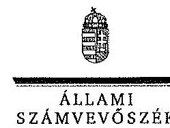

# Dr. Matolesy György úr 

elnök
Magyar Nemzeti Bank

## Budapest

## Tisztelt Elnök Úr!

A ,,Jelentéstervezet a Magyar Nemzeti Bank működésének, valamint a Pénzügyi Szervezetek Állami Felügyelete működésének, és tevékenysége MNB-be integrálása szabályszerűségének ellenőrzése" címmel készített számvevőszéki jelentéstervezetre tett észrevételeit köszönettel megkaptam.

Az Állami Számvevőszék észrevételekre vonatkozó álláspontjáról a felügyeleti vezető által készített részletes tájékoztatást csatoltan megküldöm.

Tájékoztatom Elnök urat, hogy a számvevőszéki jelentés szövegezése az elfogadott észrevételek figyelembevételével készül.

Budapest, 2015. o.) hó o'nap
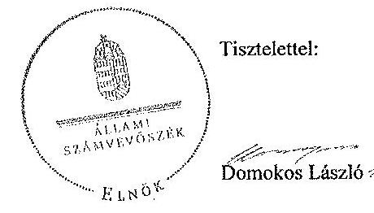

Melléklet: Tájékoztatás az elfogadott és az el nem fogadott észrevételekről

---

# Tájékoztatás   az elfogadott és az el nem fogadott észrevételekről 

A „Jelentéstervezet a Magyar Nemzeti Bank működésének, valamint a Pénzügyi Szervezetek Állami Felügyelete működésének, és tevékenysége MNB-be integrálása szabályszerűségének ellenőrzése" című jelentéstervezetre 2015. február 09-én érkezett észrevételeket áttekintettük, azok kezelésével kapcsolatban a következő tájékoztatást adom.

## I. Az MNB működését érintő észrevételek

1. A Jelentéstervezet összegző megállapítások 8. oldal 1. bekezdésére, a 11. oldal javaslatok az MNB elnökének 1. pontjára, a részletes megállapítások 24. oldal 7. bekezdésére tett észrevételek - amely az MNB Szabadság téri épület tervezési és előkészítési munkáihoz kapcsoló két pénzügyi kifizetés számviteli elszámolására vonatkozott - alátámasztják az ÁSZ által tett megállapítást, miszerint a székházhoz kapcsolódó kifizetések beruházásnak minősülnek. Ezért a megállapítás és a javaslat módosítása nem indokolt. Az észrevételekben magyarázatot adnak arra vonatkozóan, hogy a jelentéstervezetben említett két megrendelés terven felüli beruházás elszámolását az MNB belső gazdálkodási szabályai lehetővé tették, azonban a 2013. évi mérleg elkészítéséig nem hozott az Igazgatóság a beruházásról döntést.
2. A Jelentéstervezet összegző megállapítások 8. oldal 3. bekezdésére, a 12. oldal javaslatok az MNB elnökének 2. pontjára, a részletes megállapítások 27. oldal 2. bekezdésére tett észrevételek alapján - egy szerződésmódosítás esetében felmerült, hogy a Kbt. szabályait nem teljes körűen tartották be - az összegző megállapítás és a javaslat módosítása nem indokolt. Mindezt az észrevételben leírtak is alátámasztják, mivel az abban foglaltak szerint a Közbeszerzési Döntőbizottság (a továbbiakban KDB) határozatában a szerződés módosításáról szóló tájékoztató közzétételének elmaradása miatt jogsértést állapított meg és 100000 Ft pénzbírság megfizetésére kötelezte az MNB-t. Ugyanakkor a KDB a határozat első eleme tekintetében a jogsértés hiányát állapította meg, ezért az MNB elnökének tett intézkedést igénylő megállapítást és a részletes megállapítások 27. oldal 2. bekezdését az alábbiak szerint módosítjuk:

- az MNB elnökének tett 2. számú intézkedést igénylő megállapítás szövegszerű módosítása a következő: „Tekintettel arra, hogy az MNB a Kbt. 6. §-a (1) bekezdésének c) pontja alapján a Kbt. személyi hatálya alá tartozik, a szerződésmódosítás során nem érvényesültek a Kbt. 132. § (1) bekezdés a) pontjának előírásai, valamint a Kbt. 30. §-a (1) bekezdésének h) pontja szerinti hirdetmény közzétételének előírásai";

---

- a részletes megállapítások 27. oldal 2. bekezdés 2. mondatának szövegszerű módosítása a következő: „Tekintettel arra, hogy az MNB a Kbt. 6. §-a (1) bekezdésének c) pontja alapján a Kbt. személyi hatálya alá tartozik, a szerződésmódosítás során nem érvényesültek a Kbt. 132. § (1) bekezdés a) pontjának, valamint a Kbt. 30. §-a (1) bekezdés h) pontjának előírásai."

3. A Jelentéstervezet részletes megállapítások 18. oldal 2., 3., 4. és 5. bekezdésekre, az 1.2.1. Éves tervezés és összehasonlító elemzés részhez tett észrevételeket nem fogadjuk el, mert az MNB tv. 131. §-ban előírtak szerint „az összehasonlító elemzést a tervezett és a tényleges működési és beruházási költségek alakulásáról kell elkészíteni." Tekintettel arra, hogy az összehasonlító elemzésben a bevételekkel egy összegben „átvezetések" megjelöléssel csökkentették a költségeket, ezáltal nem érvényesültek az MNB tv. 131. § (4) bekezdésben, valamint az MNB tv. 131. § (5) bekezdésben - a tényleges működési költségekre - előírtak. Ezért a megállapításainkat fenntartjuk.

# II. A PSZÁF tevékenységét érintő észrevételek 

1. A Jelentéstervezet összegzö megállapítások 9. oldal 2. bekezdésére tett észrevétel nem indokolja a megállapítás módosítását. Az egyértelműség érdekében azonban a megállapításunkat a dátummal kiegészítjük a következők szerint: „a PSZÁF 2009. április 13-ig az eljárásrendeket az engedélyezéssel kapcsolatos jogszabályi környezet változásakor az ügyintézésre és az ügyintézési határidőre vonatkozóan nem hozta összhangba a jogszabályi rendelkezésekkel."
2. A Jelentéstervezet részletes megállapítások 37. oldal, 3.4.1.1. pont 2. bekezdésére tett észrevételre a válasz megegyezik az előző pontban leírtakkal, az érintett bekezdést az ott jelzettek szerint pontosítjuk.
3. A Jelentéstervezet részletes megállapítások 37. oldal, 3.4.1.1. pont 2. bekezdésére tett észrevétel - amely az engedélyezési eljárás során a kötelezően alkalmazandó formanyomtatványok, vagy az elektronikus űrlapok alkalmazására vonatkozott - alapján a megállapítást a következőre pontosítjuk: „A 2012. október 28. után kezdeményezett kérelmeknél több esetben nem nyilatkozott a kérelmező arról, hogy minden lényeges
 tényt és adatot közölt a Felügyelettel ..."
4. A Jelentéstervezet részletes megállapítás 38. oldal 1. bekezdésére tett észrevétel alapján a módosítás nem indokolt, mivel az abban leírtak megerősítik, hogy egyszer lehet hiánypótlási felhívást kiadni, kérelem kiegészítési felhívások - akár többször is kibocsáthatók. Ugyanezen pontban a 37. oldal, 3.4.1.1. pont 2. és a 38. oldal 1. bekezdéseire tett szövegmódosítási javaslatot az előzőekben leírtak miatt nem fogadjuk el.
5. A Jelentéstervezet részletes megállapítás 38. oldal 3.4.1.2. pont 1. bekezdésére tett észrevételeit nem fogadjuk el, mert a mintában ellenőrzött 12 jelentésből 11 jelentés nem tartalmazta a vizsgálat tárgyának megjelölését. Az észrevételükben az álláspontjukat a felsorolt végleges vizsgálati jelentések kivonataival támasztották alá, azonban a hivatkozott ellenőrzések nem tartoztak a kiválasztott mintába.

---

# III. Az integrációt érintő észrevételek 

1. A PSZÁF megszűnéséről és feladatainak az MNB-be történő integrálásáról rendelkező MNB tv. ${ }_{2}$ meghatározta az átadás-átvétel lebonyolításának szabályait. A törvény egy átadás-átvételi eljárásról rendelkezett. Az MNB észrevételében nem vitatta, hogy az átadás-átvételt a 2013. október 1-jén aláirt főjegyzőkönyv és - egy kivételtől eltekintve - az egy nappal korábban aláirt 44 szakterületi jegyzőkönyv dokumentálta. A főjegyzőkönyv az MNB észrevételében is idézett módon korábbi adatátadásokra hivatkozik, amelyek nem képezték részét a főjegyzőkönyvnek, ezek pedig a szakterületi jegyzőkönyvek. Ezen szakterületi jegyzőkönyvek esetében sem az átadók, sem az átvevők nem rendelkeztek az MNB tv.; 181. § (1) bekezdésében előírt elnöki meghatalmazással. Mindezek alapján a Jelentéstervezet összegző megállapítások 10. oldal első bekezdésének módosítása nem indokolt.
2. A Jelentéstervezet részletes megállapítások 44. oldal második bekezdésére tett észrevételükben idézett szövegrészek tartalmi ellentmondásai miatt az átadás-átvétel teljessége a főjegyzőkönyv alapján nem állapítható meg. A főjegyzőkönyv rögzíti, hogy a főjegyzőkönyvön túli dokumentumok és információk is átadásra kerültek, ezáltal az nem lehet teljes. A PSZÁF elnökének Teljességi Nyilatkozata a főjegyzőkönyvön túl átadott dokumentumokra és információkra nem utal, így a főjegyzőkönyvi ellentmondásokat nem oldja fel. A rendszerek, adattárak, adathordozók, valamint az irattár átadása pedig önmagában nem igazolta az intézmény összes dokumentumának és információ átadásának teljességét. Mindezekre tekintettel az észrevételt nem fogadjuk el.
3. A Jelentéstervezet részletes megállapítások 44. oldal második bekezdésre tett észrevételre a válaszunk megegyezik az 1. számú észrevételre adott válasszal.
4. A Jelentéstervezet 45. oldal első bekezdésére és a Jelentéstervezet 45. oldal második bekezdésére tett észrevételük alapján a jelentéstervezetet nem indokolt módosítani, mivel azok összhangban vannak a kapcsolódó megállapításainkkal és magyarázatot nyújtanak az átadás-átvétel körülményeire.
5. A Jelentéstervezet 46. oldal utolsó bekezdésére tett észrevétel alapján a módosítás nem indokolt, mert sem a szakterületi jegyzőkönyvben, sem a főjegyzőkönyvben nem szerepel a PBT, PSZÁF által 2013. szeptember 30-án kezelt nyilvántartások átadása, az alávetési nyilatkozatokról vezetett nyilvántartás és a belső statisztikai célú adatgyűjtés során keletkezett adatok átadás-átvétele.
6. A Jelentéstervezetnek azon megállapítása - amely a személyzeti nyilvántartás anyagának dokumentálási és formai hiányosságaira utal (pl. a 10. oldalon), amelyet részletesen a 45. oldalon fejt ki - a dokumentumok ismételt áttekintése alapján helytálló. Az átadás-átvétel tételes jogszabályi előírás nélkül is akkor megfelelő, ha utólag is ellenőrizhető módon „az átadás-átvételi dokumentum tartalmazza tételesen az átadott személyi anyagok tartalmát, az átadó és az átvevő személyek nevét és beosztását, valamint az átadás-átvétel időpontját." Az ellenőrzés rendelkezésére bocsátott dokumentum a személyi anyagok átadás-átvételéhez kapcsolódóan csupán egy „névsor" volt, amelyre vonatkozóan az előzőekben leírt hiányosságok fennálltak.

---

Tájékoztatom Elnök urat, hogy a számvevőszéki jelentés mellékleteként szerepeltetjük a jelentéstervezethez tett észrevételeit, valamint az azokra adott válaszunkat.

Budapest, 2015. 05. hó 05. nap

Makkai Mária
felügyeleti vezető

---

.

---

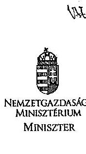

NEMZETGAZDASÁGI MINISZTÉRIUM MINISZTER

## ÁLLAMI SZÁMVEVŐSZÉK

107421025
Érkezési idő: 2015. FEBRUÁR 13.
Iktatószám: V-0455-481/2015
Melléklet: $\qquad$
Magyarország.
28

Domokos László úr részére elnök

Állami Számvevőszék
Budapest
Apáczai Csere János u. 10.
1052

Iktatószám: NGM/2441/3/2015.
Hivatkozási szám: V-0455-466/2014
Ügyintéző: Erdélyi Balázs
Telefonszám: 0617954425
Tárgy: Az Állami Számvevőszék jelentéstervezetének véleményezése a Magyar Nemzeti Bank működésének, valamint a Pénzügyi Szervezetek Állami Felügyelete működése, és tevékenysége MNB-be integrálása szabályszerűségének ellenőrzéséről

# Tisztelt Elnök Úr! 

Köszönettel megkaptam az Állami Számvevőszék a Magyar Nemzeti Bank (a továbbiakban: az MNB) működésének, valamint a Pénzügyi Szervezetek Állami Felügyelete működése, és tevékenysége MNB-be integrálása szabályszerűségének ellenőrzéséről szóló jelentéstervezetét. A jelentéstervezetben az Állami Számvevőszék javasolja az MNB alapító okiratának a hatályos jogszabályoknak megfelelő módosítását.

A jelentéstervezet megállapításával egyetértek, az MNB alapító okiratának a hatályos jogszabályoknak, a Pénzügyi törvénynek és a Polgári Törvénykönyvnek megfelelő módosítását támogatom és kezdeményezni fogom. A jelentés PSZÁF igazgatási szolgáltatási díj kiszabásával kapcsolatos részéhez az alábbi észrevételt teszem.

A PSZÁF igazgatási szolgáltatási díj kiadásával kapcsolatban meg kívánom jegyezni, hogy a PSZÁF az erre irányuló rendelet elkészítését megkezdte, folyamatos egyeztetést folytatott mind az igazságügyért felelős tárcával, mind pedig tárcánkkal. Tekintettel arra, hogy az igazgatási szolgáltatási díj illeték jellegű díj, mértékének meghatározásakor időigényes hatástanulmányokat, háttérszámításokat kell végezni a rendelet kiadása előtt. Ezek a folyamatok a PSZÁF-nál megkezdődtek, azonban az integráció bekövetkeztéig az egyeztetési folyamatokat nem sikerült lezárni.

Kérem Elnök urat, hogy a javaslataimat figyelembe venni szíveskedjen.

Budapest, 2015. február 12.
Üdvözlettel:
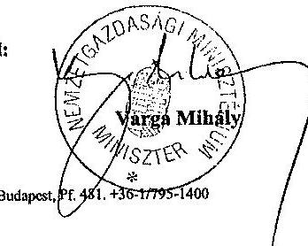

---

.

---

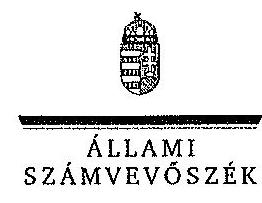

ELHOK

Ikt.szám: V-0455-472/2015.

# Varga Mihály úr 

miniszter
Nemzetgazdasági Minisztérium

## Budapest

## Tisztelt Miniszter Úr!

A „Jelentéstervezet az MNB ellenőrzéséről - a Magyar Nemzeti Bank működésének, valamint a Pénzügyi Szervezetek Állami Felügyelete működése, és tevékenysége MNB-be integrálása szabályszerűségének ellenőrzéséről" című jelentéstervezetre tett észrevételeit köszönettel megkaptam.

Az Állami Számvevőszék észrevételekre vonatkozó álláspontjáról a felügyeleti vezető által készített részletes tájékoztatást csatoltan megküldöm.

Tájékoztatom Miniszter urat, hogy a számvevőszéki jelentés mellékleteként szerepeltetjük a jelentéstervezethez tett észrevételeit, valamint az azokra adott válaszunkat.

Budapest, 2015. 02. hó 01. nap
Tisztelettel:
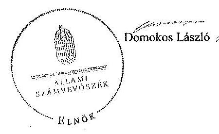

Melléklet: Tájékoztatás az észrevételek kezeléséről

---

# Tájékoztatás   az észrevételek kezeléséről 

A ,,Jelentéstervezet az MNB ellenőrzéséről - a Magyar Nemzeti Bank működésének, valamint a Pénzügyi Szervezetek Állami Felügyelete működése, és tevékenysége MNB-be integrálása szabályszerűségének ellenőrzéséről" című jelentéstervezetre 2015. február 13-án érkezett észrevételeit áttekintettük, azok kezelésével kapcsolatban a következő tájékoztatást adom.

1) Az MNB alapító okirata vonatkozásában a tervezett intézkedésekről adott tájékoztatását köszönjük, az alapján a jelentéstervezet módosítása nem szükséges.
2) A PSZÁF igazgatási szolgáltatási díj kiszabásával kapcsolatban adott tájékoztatását köszönjük, az nem cáfolja a jelentéstervezet megállapítását, ezért módosítása nem indokolt.

Budapest, 2015. év 05. hó 05. nap
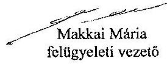

---

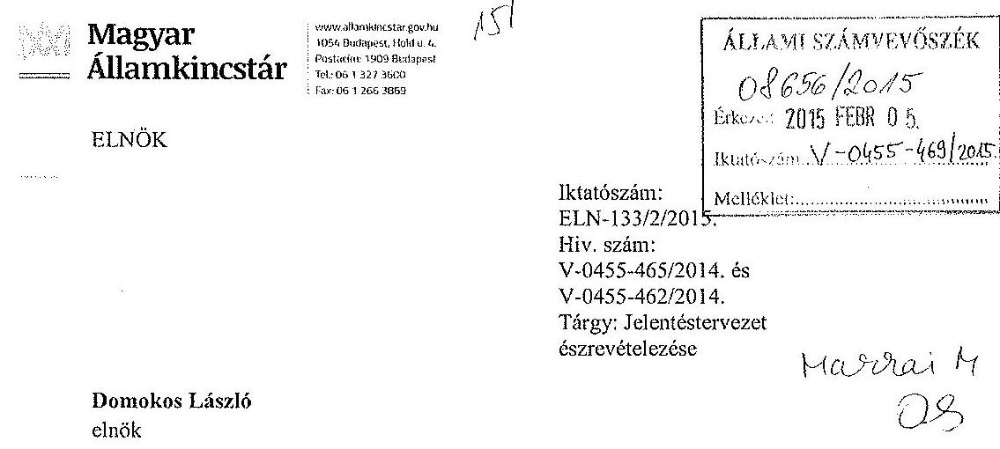

Domokos László
elnök

Állami Számvevőszék
Budapest

Tisztelt Elnök Úr!
„Az MNB ellenőrzéséről - A Magyar Nemzeti Bank működésének, valamint a Pénzügyi Szervezetek Állami Felügyelete működése, és tevékenysége MNB-be integrálása szabályszerűségének ellenőrzéséről" című jelentéstervezetet köszönettel megkaptuk.

A jelentéstervezetben foglaltakat az érintett szakterület bevonásával áttekintettük, észrevételt nem kívánunk tenni.

Kérem tájékoztatásom szíves elfogadását.

Budapest, 2015. február 4.

Tisztelettel:
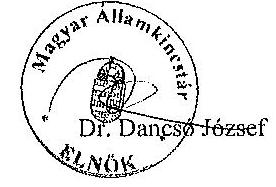

---

.

---

# RÖVIDÍTÉSEK JEGYZÉKE 

## Törvények

Áht.
Alaptörvény
ÁSZ tv.
Bit.

Bszt.

Gt.
Hpt.

Kbt.

Ket.

MNB tv. 1
MNB tv. 2
Munka tv. 1
Munka tv. 2
Nvtv.
PSZÁF tv. 1
PSZÁF tv. 2
Számv. tv.
Tpt.
Vtv.
az államháztartásról szóló 2011. évi CXCV. törvény, hatályos 2011. december 31-től
Magyarország Alaptörvénye (2011. április 25.)
2011. évi LXVI. törvény az Állami Számvevőszékről
a biztosítókról és a biztosítási tevékenységről szóló 2003. évi LX. törvény
a befektetési vállalkozásokról és az árutőzsdei szolgáltatókról, valamint az általuk végezhető tevékenységek szabályairól szóló 2007. évi CXXXVIII. törvény
a gazdasági társaságokról szóló 2006. évi IV. törvény
a hitelintézetekről és a pénzügyi vállalkozásokról szóló 1996. évi CXII. törvény
2011. évi CVIII. törvény a közbeszerzésekről, hatályos 2011. augusztus 21-étől. (A törvény 1-179. §-a; 180. § (3)-(6) bekezdései; a 181. § (1) bekezdése; a 182-183. §-a, valamint 1-4. mellékletei 2012. január 1-jén léptek hatályba, rendelkezéseiket a hatálybalépés után megkezdett beszerzésekre, közbeszerzési eljárások alapján megkötött szerződésekre, tervpályázati eljárásokra és az azokkal kapcsolatban kérelmezett, kezdeményezett vagy hivatalból indított jogorvoslati eljárásokra és előzetes vitarendezési eljárásokra kell alkalmazni.)
a közigazgatási hatósági eljárás és szolgáltatás általános szabályairól szóló 2004. évi CXL. törvény
a Magyar Nemzeti Bankról szóló 2011. évi CCVIII. törvény
a Magyar Nemzeti Bankról szóló 2013. évi CXXXIX. törvény
1992. évi XXII. törvény a Munka Törvénykönyvéről
2012. évi I. törvény a Munka Törvénykönyvéről
nemzeti vagyonról szóló 2011. évi CXCVI. törvény
a Pénzügyi Szervezetek Állami Felügyeletéről szóló 2007. évi CXXXV. törvény
a Pénzügyi Szervezetek Állami Felügyeletéről szóló 2010. évi CLVIII. törvény
a számvitelről szóló 2000. évi C. törvény
a tőkepiacról szóló 2001. évi CXX. törvény
az állami vagyonról szóló 2007. évi CVI. törvény

---

# Kormányrendeletek 

| Áhsz. | az államháztartás szervezeti beszámolási és könyvvezetési kötelezettségének sajátosságairól szóló 249/2000. (XII. 24.) Korm. rendelet |
| :--: | :--: |
| Ámr. 1 | az államháztartás működési rendjéről szóló 217/1998. (XII. 30.) Korm. rendelet |
| Ámr. 2 | az államháztartás működési rendjéről szóló 292/2009. (XII. 19.) Korm. rendelet |
| Ávr. | az államháztartásról szóló törvény végrehajtásáról szóló 368/2011. (XII. 31.) Korm. rendelet |
| Bkr. | a költségvetési szervek belső kontrollrendszeréről és belső ellenőrzéséről szóló 370/2011. (XII. 31.) Korm. rendelet |
| Egyéb rövidítések |  |
| ÁKK Zrt. | Államadósság Kezelő Központ Zrt. |
| ÁSZ | Állami Számvevőszék |
| bek. | bekezdés |
| BÉT | Budapesti Értéktőzsde Zrt. |
| FB | Felügyelőbizottság |
| FEUVE | folyamatba épített előzetes, utólagos és vezetői ellenőrzés |
| FIG | PSZÁF Felügyeleti Igazgatósága |
| Ft | Forint |
| GIRO Zrt. | GIRO Elszámolásforgalmi Zrt. |
| Igazgatóság | az MNB igazgatósága |
| INTOSAI | „International Organization of Supreme Audit Institutions", Legfőbb Ellenőrző Intézmények Nemzetközi Szervezete |
| ISSAI | „International Standards of Supreme Audit Institutions", a Legfőbb Ellenőrző Intézmények Nemzetközi Szervezete által kiadott ellenőrzési standardok |
| IT | Információ-technológia |
| KELER KSZF Kft. | KELER Központi Szerződő Fél Kft. |
| KELER Zrt. | Központi Elszámolóház és Értéktár Zrt. |
| KESZ | Kincstári Egységes Számla |
| Kincstár | Magyar Államkincstár |
| MNB | Magyar Nemzeti Bank |
| MNV | Magyar Nemzeti Vagyonkezelő Zrt. |
| NGM | Nemzetgazdasági Minisztérium |
| Nkft. | Hitelintézeti Felszámoló Nonprofit Kft. |
| OGY | Országgyűlés |
| PBT | Pénzügyi Békéltető Testület |

---

| Pénzverő Zrt. | Magyar Pénzverő Zrt. |
| :-- | :-- |
| PJNY | Pénzjegynyomda Zrt. |
| PM | Pénzügyminisztérium |
| PST | Pénzügyi Stabilitási Tanács |
| PSZÁF | Pénzügyi Szervezetek Állami Felügyelete |
| SZMSZ | Szervezeti és Működési Szabályzat |
| VB | Vezetői Bizottság |
| Zrt. | Zártkörű részvénytársaság |

---

.

---

# ÉRTELMEZŐ SZÓTÁR 

beruházás
egyéb beszerzés
elektronikus árverés
immateriális javak
intézkedési terv

A tárgyi eszköz beszerzése, létesítése, saját vállalkozásban történő előállítása, a beszerzett tárgyi eszköz üzembe helyezése, rendeltetésszerű használatbavétele érdekében az üzembe helyezésig, a rendeltetésszerű használatbavételig végzett tevékenység (szállítás, vámkezelés, közvetítés, alapozás, üzembe helyezés, továbbá mindaz a tevékenység, amely a tárgyi eszköz beszerzéséhez hozzákapcsolható, ideértve a tervezést, az előkészítést, a lebonyolítást, a hitel igénybevételt, a biztosítást is); beruházás a meglévő tárgyi eszköz bővítését, rendeltetésének megváltoztatását, átalakítását, élettartamának, teljesítőképességének közvetlen növelését eredményező tevékenység is, az előbbiekben felsorolt, e tevékenységhez hozzákapcsolható egyéb tevékenységekkel együtt. (Számv. tv. 3.§ (4) 7. pontja)
A megadott tárgyú, a Kbt. hatálya alá nem tartozó, a mindenkori nemzeti értékhatárokat el nem érő értékű, illetve a Kbt.-ben meghatározott kivételi körbe tartozó azon eljárás,

 amelyet a Bank, mint ajánlatkérő, visszterhes szerződés megkötése céljából kötelezően folytat le.
A közbeszerzési eljárás esetén az ajánlattevők által adott ajánlatok alapján e-aukcióztatón rendszer segítségével lebonyolított elektronikus ártárgyalás. A közbeszerzési törvény az elektronikus árlejtés alkalmazását teszi lehetővé az ajánlatkérő által választott értékelési szempont vonatkozásában. (257/2007. (X. 4.) Korm. rendelet 17. § (1) bekezdése)

Az immateriális javak között a mérlegben a nem anyagi eszközöket (a vagyoni értékű jogokat az ingatlanhoz kapcsolódó vagyoni értékű jogok kivételével, a szellemi terméket, az üzleti vagy cégértéket), továbbá az immateriális javakra adott előlegeket, valamint az immateriális javak értékhelyesbítését kell kimutatni. (Számv. tv. 25.§ (1) bekezdése)
Az ellenőrzött szervezet vezetője köteles a jelentésben foglalt megállapításokhoz kapcsolódó intézkedési tervet összeállítani, és azt a jelentés kézhezvételétől számított harminc napon belül az Állami Számvevőszék részére megküldeni. (ÁSZ tv. 33.§ (1) bekezdés) Az ellenőrzési javaslatok alapján az ellenőrzött szervezet, szervezeti egység által készített intézkedések végrehajtásának ütemezése a végrehajtásáért felelős személyek és a vonatkozó határidők megjelölésével; (370/2011. (XII. 31.) Korm. rendelet 2. § (k) pontja, hatályos 2012. január 1-jétől)

---

kiegyenlítési tartalék

Kincstári Egységes Számla
költséggazda
közbeszerzés
makroprudenciális felügyelet
mikroprudenciális felügyelet
tárgyi eszközök
teljesítésigazolás

Az MNB a forintárfolyam kiegyenlítési tartalékába helyezi a külföldi pénznemben fennálló követeléseinek és kötelezettségeinek a tárgyév utolsó napján érvényes hivatalos árfolyamon történő értékeléséből származó árfolyamnyereséget, illetve árfolyamveszteséget. Az MNB a devizában fennálló, értékpapíron alapuló követelések piaci értékelése alapján megállapított különbözetet - a nyitóállomány visszavezetése után - a deviza-értékpapírok kiegyenlítési tartalékába helyezi. (MNB $\mathrm{tv}_{2} 147 . \S(1-5)$ bekezdés)
A kincstár a Magyar Nemzeti Banknál Kincstári Egységes Számla elnevezésű számlával rendelkezik. A Kincstári Egységes Számla a fizetési-számlavezetési tevékenységgel összefüggő pénzforgalom lebonyolítását szolgálja; (az államháztartásról szóló 2011. évi CXCV. törvény 77. §. (1) és (2) bekezdése.)
Költséggazdai feladatokkal ellátott szervezeti egység, vagy alegység. (MNB Gazdálkodási Kézikönyve)
A megadott tárgyú, az általános egyszerű közbeszerzési eljáráshoz meghatározott mindenkori értékhatárokat elérő, vagy meghaladó értékű beszerzés megvalósítása érdekében a Bank, mint ajánlatkérő, által visszterhes szerződés megkötése céljából kötelezően - a Kbt. vonatkozó fejezeteiben foglaltak szerint - lefolytatott eljárás.
A pénzügyi közvetítő rendszer egészét/egészének stabilitását veszélyeztető rendszerkockázatok nyomon/figyelemmel követése, kontrollja (PSZÁF tv. 3 32. § (1) bekezdése, MNB tv 2 4. § (7) bekezdés)

A pénzügyi közvetítő rendszerben működő intézmények stabilitását veszélyeztető egyedi kockázatai nyomon követése, kontrollja (PSZÁF tv. 2 32. § (1) bekezdése)
A tárgyi eszközök között a mérlegben azokat a rendeltetésszerűen használatba vett, üzembe helyezett anyagi eszközöket (földterület, telek, telkesítés, erdő, ültetvény, épület, egyéb építmény, műszaki berendezés, gép, jármű, üzemi és üzleti felszerelés, egyéb berendezés, ingatlanokhoz kapcsolódó vagyoni értékű jogok) kell kimutatni, amelyek tartósan - közvetlenül vagy közvetett módon - szolgálják a vállalkozó tevékenységét, továbbá az ezen eszközök beszerzésére (a beruházásokra) adott előlegeket és a beruházásokat, valamint a tárgyi eszközök értékhelyesbítését. (Számv. tv. 26.§ (1) bekezdés)
Írásos formában vagy elektronikus úton tett nyilatkozat, amely által a kötelezettségvállalás keretében megrendelt, a Bank részére történt építési beruházás, szolgáltatásnyújtás vagy termékértékesítés előírt színvonalon történő teljesítése elismertté válik, s ez által a kapcsolódó - a szállító által benyújtott - számla utalványozása végrehajtható lesz. (a 2012302. ügyvezető igazgatói utasítás az MNB Gazdálkodási Kézikönyvéről B fejezet 24. pont)

---

.
