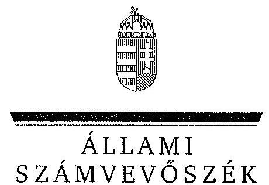
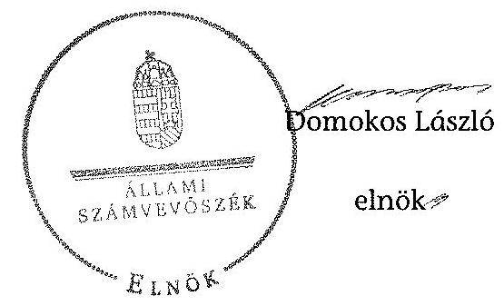
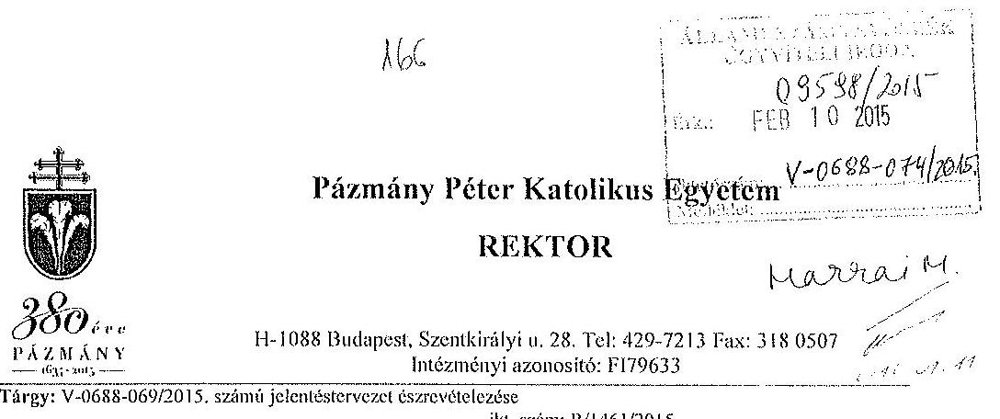
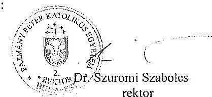
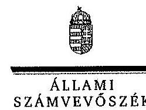
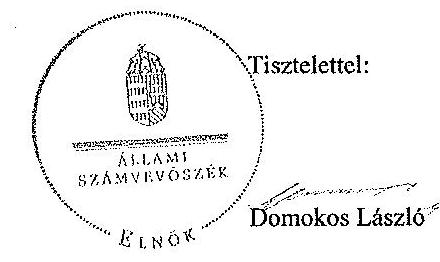

ÁLLAMI
SZÁMVEVŐSZÉK

# JELENTÉS 

a Pázmány Péter Katolikus Egyetem ellenőrzéséről - Az egyházi fenntartású felsőoktatási intézményben az államháztartásból juttatott, nem hitéleti célra biztosított támogatás felhasználásának ellenőrzése

---

# Állami Számvevőszék 

Iktatószám: V-0688-079/2015.
Témaszám: 1722
Vizsgálat-azonosító szám: V068920

## Az ellenőrzést felügyelte:

## Makkai Mária

felügyeleti vezető

## Az ellenőrzés végrehajtásáért felelős:

Zakar László
ellenőrzésvezető

A számvevői munkaanyagok feldolgozását és a Jelentés összeállítását végezte:

Zakar László
ellenőrzésvezető
dr. Marosi Gyöngyi
számvevő főtanácsos
Nagy Erika
számvevő tanácsos

Az ellenőrzést végezték:
dr. Marosi Gyöngyi dr. Nagy Ágnes Nagy Erika
számvevő főtanácsos számvevő tanácsos számvevő tanácsos

A témához kapcsolódó eddig készített számvevőszéki jelentések:
címe
sorszáma
Jelentés az oktatási és kulturális ágazat irányítási rendszerének, működésének ellenőrzéséről 1106

---

# TARTALOMJEGYZÉK 

BEVEZETÉS ..... 7
I. ÖSSZEGZŐ MEGÁLLAPÍTÁSOK, KÖVETKEZTETÉSEK, JAVASLATOK ..... 10
II. RÉSZLETES MEGÁLLAPÍTÁSOK ..... 14

1. Az államháztartásból juttatott támogatások szabályszerű elszámolását és felhasználását alátámasztó döntési jogkörök, gazdálkodási folyamatok és nyilvántartási rend kialakítása ..... 14
2. Az államháztartásból juttatott, nem hitéleti célra biztosított támogatások felhasználása ..... 16
2.1. A normatív és egyéb támogatásokra kötött minisztériumi megállapodások ..... 16
2.2. A támogatás-felhasználásra vonatkozó egyetemi döntések ..... 17
2.3. A támogatások nyilvántartásának kialakítása ..... 18
2.4. A normatív felsőoktatási támogatások felhasználása ..... 19
2.5. A pályázati úton, egyedi döntéssel kapott költségvetési források felhasználása és elszámolása ..... 20
2.6. A normatív felsőoktatási költségvetési támogatások elszámolása ..... 21
MELLÉKLETEK
3. számú A Pázmány Péter Katolikus Egyetem jogosultság alapján járó államháztartási támogatása a 2009-2013. években az éves elszámolások alapján
4. számú A Pázmány Péter Katolikus Egyetem rektorának észrevétele
5. számú A Pázmány Péter Katolikus Egyetem rektorának észrevételére adott válasz

---

!
!
!
!
!
!
!
!
!
!
!
!
!
!
!
!
!
!
!
!
!
!
!
!
!
!
!
!
!
!
!
!
!
!
!
!
!
!
!
!
!
!
!
!
!
!
!
!
!
!
!
!
!
!
!
!
!
!
!
!
!
!
!
!
!
!
!
!
!
!
!
!
!
!
!
!
!
!
!
!
!
!
!
!
!
!
!
!
!
!
!
!
!
!
!
!
!
!
!
!
!
!
!
!
!
!
!
!
!
!
!
!
!
!
!
!
!
!
!
!
!
!
!
!
!
!
!
!
!
!
!
!
!
!
!
!
!
!
!
!
!
!
!
!
!
!
!
!
!
!
!
!
!
!
!
!
!
!
!
!
!
!
!
!
!
!
!
!
!
!
!
!
!
!
!
!
!
!
!
!

---

# RÖVIDÍTÉSEK JEGYZÉKE 

| Törvények |  |
| :--: | :--: |
| Áht. 1 | 1992. évi XXXVIII. törvény az államháztartásról |
| Áht. 2 | 2011. évi CXCV. törvény az államháztartásról |
| ÁSZ tv. | 2011. évi LXVI. törvény az Állami Számvevőszékről |
| Eaf. | 1997. évi CXXIV. törvény az egyházak hitéleti és közcélú tevékenységének anyagi feltételeiről |
| Ehtv. | 2011. évi CCVI. törvény a lelkiismereti és vallásszabadság jogáról, valamint az egyházak, vallásfelekezetek és vallási közösségek jogállásáról |
| Feot. | 2005. évi CXXXIX. törvény a felsőoktatásról |
| Kjt. | 1992. évi XXXIII. törvény a közalkalmazottak jogállásáról |
| Mt. 1 | 1992. évi XXII. törvény a Munka Törvénykönyvéről (hatálytalan 2013. január 1-jétől) |
| Mt. 2 | 2012. évi I. törvény a munka törvénykönyvéről |
| Nftv. | 2011. évi CCIV. törvény a nemzeti felsőoktatásról |
| Sztv. | 2000. évi C. törvény a számvitelről |
| 2009. évi Kvtv. | 2008. évi CII. törvény a Magyar Köztársaság 2009. évi költségvetéséről |
| 2010. évi Kvtv. | 2009. évi CXXX. törvény a Magyar Köztársaság 2010. évi költségvetéséről |
| 2011. évi Kvtv. | 2010. évi CLXIX. törvény a Magyar Köztársaság 2011. évi költségvetéséről |
| 2012. évi Kvtv. | 2011. évi CLXXXVIII. törvény Magyarország 2012. évi központi költségvetéséről |
| 2013. évi Kvtv. | 2012. évi CCIV. törvény Magyarország 2013. évi központi költségvetéséről |
| Korm. rendeletek |  |
| Ámr. 2 | 292/2009. (XII. 19.) Korm. rendelet az államháztartás működési rendjéről |
| 218/2000. (XII. 11.)   Korm. rendelet | 218/2000. (XII. 11.) Korm. rendelet az egyházi jogi személyek beszámoló készítési és könyvvezetési kötelezettségének sajátosságairól |
| 51/2007. (III. 26.) Korm. rendelet | 51/2007. (III. 26.) Korm. rendelet a felsőoktatásban részt vevő hallgatók juttatásairól és az általuk fizetendő egyes térítésekről |
| 50/2008. (III. 14.) Korm. rendelet | 50/2008. (III. 14.) Korm. rendelet a felsőoktatási intézmények képzési, tudományos célú és fenntartói normatíva alapján történő finanszírozásáról |
| További rövidítések |  |
| ÁSZ | Állami Számvevőszék |
| Egyetemi Tanács | A PKKE döntést hozó és a döntés végrehajtását ellenőrző testülete |
| fenntartó | Magyar Katolikus Püspöki Konferencia és a Magyar Katolikus Egyház Esztergom-Budapesti Főegyházmegye |

---

finanszírozási megállapodás
FIR
gazdálkodási szabályzat
INTOSAI
költségvetési törvény
minisztérium

MKPK
PPKE/egyetem/ intézmény
számlarend
SzMSz
finanszírozási megállapodás/ támogatási szerződés a minisztérium és az intézmény között
Felsőoktatási Információs Rendszer
PPKE Gazdálkodási szabályzata, 2008. január 1-től 2011. december 31-ig, illetve 2012. január 1-től hatályosak
International Organisation of Supreme Audit Institutions (Legfőbb Ellenőrző Intézmények Nemzetközi Szervezete)
2009. évig a Magyar Köztársaság évi költségvetéséről szóló törvények és 2010-2013. évek között Magyarország központi költségvetéséről szóló törvények
A felsőoktatásért felelős minisztérium, amely 2009-től 2010 májusáig az Oktatási és Kulturális Minisztérium, 2010 májusától 2012 májusáig a Nemzeti Erőforrás Minisztérium, 2012 májusától az Emberi Erőforrások Minisztériuma volt
Magyar Katolikus Püspöki Konferencia
Pázmány Péter Katolikus Egyetem
A PPKE évenkénti kiadott Számlarendje
A PPKE Szervezeti Működési Szabályzata

---

# ÉRTELMEZŐ SZÓTÁR 

egyházi felsőoktatási intézmény
hitéleti célú bevétel
hitéleti képzés
normatív költségvetési támogatás felsőoktatási intézmények működéséhez

Egyéb szervezeti formában működő, államilag elismert felsőoktatási intézmény, amelynek fenntartója az egyház. Hitéleti célú bevételnek minősül különösen a személyi jövedelemadó meghatározott részének bevett egyház számára történő felajánlása, annak költségvetési kiegészítése, az ennek helyébe lépő juttatás, valamint az ingatlanjáradék és annak kiegészítése.
Hitélettel és a hitélettel együtt oktatott hittudománnyal összefüggő képzés. A hitélettel összefüggő oktatási feladatok összessége.
A felsőoktatási intézmények működéséhez biztosított normatív költségvetési támogatás lehet
a) hallgatói juttatásokhoz nyújtott,
b) képzési,
c) tudományos célú,
d) fenntartói (2013. január 1-től fenntartási feladatok),
e) egyes feladatokhoz (2013. január 1-től f) pont egyes speciális felsőoktatási feladatok ellátásához) nyújtott és 2013. január 1-től e) pont a hallgatói sport támogatás.
A b)-d) és 2013. január 1-től az e) pontokban meghatározott jogcímek nem jelentenek felhasználási kötöttséget. (Feot. 127. § (3) bekezdés, Nftv. 2013. január 1-től beépített 85/A. § (1) és (8) bekezdés, 92. § (1) bekezdés, 114/C. § (1) bekezdés)

---

.

---

# JELENTÉS 

## a Pázmány Péter Katolikus Egyetem ellenőrzéséről - Az egyházi fenntartású felsőoktatási intézményben az államháztartásból juttatott, nem hitéleti célra biztosított támogatás felhasználásának ellenőrzése

## BEVEZETÉS

Az ÁSZ Stratégiája ${ }^{1}$ alapértékeinek egyike, hogy az államháztartás komplex folyamatainak átláthatósága érdekében rendszerszemléletű/holisztikus megközelítésű, egymásra épülő, a szinergiahatást kihasználó, összefoglaló értékelésre lehetőséget adó ellenőrzéseket végez.
Az állami felsőoktatási intézmények gazdálkodását - az Áht. előírásai mellett a felsőoktatásról szóló 2005. évi CXXXIX. törvény (Feot.), valamint a nemzeti felsőoktatásról szóló 2011. évi CCIV. törvény (Nftv.) előírásai határozták meg. A lelkiismereti és vallásszabadság jogáról, valamint az egyházak, vallásfelekezetek és vallási közösségek jogállásáról szóló 2011. évi CCVI. törvény (Ehtv.) valamint az Állami Számvevőszékről szóló 2011. évi LXVI. törvény (ÁSZ tv.) előírásai szerint az egyházak részére nem hitéleti célra nyújtott költségvetési támogatás felhasználásának törvényességi szempontú ellenőrzése az ÁSZ feladata. Az egyházi fenntartásban működő felsőoktatási intézmények részére a Feot.-ban és az Nftv.ben rögzített felsőoktatási feladatok ellátására az államháztartásból juttatott normatív és egyéb támogatás nem minősül hitéleti támogatásnak.
Magyarország Nemzeti Reform Programja keretében, a Széll Kálmán Terv 2020-ig a 30-34 évesek körében, a felsőfokú vagy annak megfelelő végzettséggel rendelkezők arányának 30,3 %-ra való növelését irányozta elő, amely a 2010. évhez képest 4,6 % pontos növekedési célkitűzést jelent. A rendezett gazdasági környezet, az önállósággal élni tudó, felelős, elszámoltatható intézményi gazdálkodói magatartás elengedhetetlen feltétele a kitűzött szakmai célok elérésének.
Az ellenőrzés célja annak megállapítása, hogy az egyházak által fenntartott, illetve működtetett felsőoktatási intézmények részére az államháztartásból juttatott, nem hitéleti célra biztosított támogatás felhasználása szabályszerű volt-e.
Ennek keretében ellenőriztük a Pázmány Péter Katolikus Egyetemnél az államháztartásból juttatott, nem hitéleti célra biztosított támogatás felhasználása jogszabályoknak való megfelelőségét.

[^0]
[^0]:    ${ }^{1}$ Állami Számvevőszék: Stratégia. Az Állami Számvevőszék hivatalos stratégiai dokumentum rendszere 2011-2015. 2012. december. http://www.asz.hu/strategia/asz-strategia/asz-strategia-2011.pdf

---

Az ellenőrzés várható hasznosulása: Az egyházi felsőoktatási intézmények esetében bemutatja az államháztartásból számukra juttatott források felhasználásának szabályszerűségét. Az ellenőrzés az ellenőrzött számára visszajelzést ad a gazdálkodása kereteinek kialakításáról, a működésében fellépő hiányosságokról, javaslataival hozzájárul azok kiküszöböléséhez és a jó kormányzáshoz. A törvényhozás számára összegzett tapasztalatok állnak rendelkezésre a felsőoktatási intézmények döntéseinek, gazdálkodásának szabályszerűségéről, amelyek alapján - indokolt esetben - jogszabály-módosítás kezdeményezhető. A társadalom számára jelzi, hogy közpénz nem maradhat ellenőrizetlenül, az ÁSZ értékteremtő rend kialakításához és megőrzéséhez hozzájáruló tevékenysége pozitív hatással lesz a szervezetről kialakított összkép formálásában.
Az ellenőrzés típusa: szabályszerűségi ellenőrzés.
Az ellenőrzött időszak 2009. január 1. - 2013. december 31.
Az ellenőrzéssel érintett szervezetek: Pázmány Péter Katolikus Egyetem és az Emberi Erőforrások Minisztériuma
Az ellenőrzés jogszabályi alapját az ÁSZ tv. 5. § (11) bekezdés c) pontja és az Ehtv. 21. § (3) bekezdése, 2013. augusztus 1-jétől 23. § (3) bekezdése képezik.
Az ellenőrzés kiterjed minden olyan körülményre és adatra, amely az ÁSZ jogszabályban meghatározott feladataiban, valamint a program végrehajtása folyamán felmerült újabb összefüggések feltárásához szükséges.
Az ellenőrzés az INTOSAI által kiadott nemzetközi standardok figyelembe vételével, az ellenőrzési programtervezetben foglalt értékelési szempontok szerint történt.

A PPKE alapítója az Apostoli Szentszék, Katolikus Nevelés Kongregációja. Az intézmény fenntartója a Magyar Katolikus Püspöki Konferencia és a Magyar Katolikus Egyház Esztergom-Budapesti Főegyházmegye. A PPKE az Egyházi Törvénykönyv szabályai alapján, a Katolikus Egyházon belül működő, szentszéki alapítású, belső egyházi jogi személyiséggel rendelkező szervezet. Az egyetemnek Budapesten, Esztergomban és Piliscsabán vannak telephelyei.
Az egyetem karokból, mint önálló alapegységekből és Rektori Hivatalból, mint központi alapegységből áll. A karokon belül a képzés jellegének megfelelően szerveződnek intézetek, tanszékek, tanszékcsoportok, illetve tantárgycsoportok, valamint az oktatást segítő funkcionális és szolgáltató szervezeti egységek. A PPKE az állami feladatként ellátott alaptevékenységében bölcsészettudományok, hittudományok, műszaki tudományok, társadalomtudományok és természettudományok területén folytat képzést. Az intézmény felsőfokú végzettséget biztosító képzései alap-, mester- és doktori képzési szinten folynak.
Az egyetem vezetője és képviselője a rektor. Az ellenőrzött időszakban a rektor személye egy alkalommal változott, a jelenlegi rektor 2011-től látja el megbízatását. A gazdasági főigazgató személye az ellenőrzött években nem változott.
A kettős könyvvitelt vezető PPKE az éves gazdálkodási tevékenységéről egyszerűsített éves beszámolót készített.
A PPKE jogosultság alapján járó költségvetési támogatását, oktatói és kutató karának létszámát és a hallgatói létszámot a következő táblázat mutatja be.

---

| Megnevezés | A jogosultság alapján járó költségvetési támogatás összege és a létszám adatok |  |  |  |  |  |
| :--: | :--: | :--: | :--: | :--: | :--: | :--: |
|  | 2009. | 2010. | 2011. | 2012. | 2013. | $\begin{gathered} 2013 / 2009 \\ (\%) \end{gathered}$ |
| Jogosultság alapján járó költségvetési támogatás (E.Ft) | 4327655 | 3941600 | 3594800 | 3403858 | 3081772 | 71,2 |
| Jellemző adatok* |  |  |  |  |  |  |
| Munkaviszonyban lévő állandó oktatói, kutatói kar létszám (fő) | 396 | 405 | 394 | 383 | 363 | 91,7 |
| Hallgatói létszám (fő) | 8938 | 8270 | 8094 | 8205 | 7910 | 88,5 |

* A létszámok az október 15-i statisztikai adatok.

Az ellenőrzött időszak alatt az egyetem államháztartásból juttatott támogatása 28,8%-kal csökkent. A 2009. évről 2013. évre az egyetemen a munkaviszonyban lévő oktatói, kutatói létszám 8,3%-kal, a hallgatói létszáma 11,5%-kal csökkent.
Az
 ÁSZ a 2011. évi LXVI. törvény 29. §-a szerint a jelentéstervezetet megküldte a Pázmány Péter Katolikus Egyetem rektorának és az Emberi Erőforrások Minisztériuma miniszterének egyeztetésre. A Pázmány Péter Katolikus Egyetem rektorának észrevételét és az arra adott választ a 2-3. számú melléklet tartalmazza. Az Emberi Erőforrások Minisztériuma minisztere az ÁSZ tv. 29. § (2) bekezdésében foglalt észrevételezési jogával nem élt, a törvényes határidőn belül észrevételt nem tett.

---

# I. ÖSSZEGZŐ MEGÁLLAPÍTÁSOK, KÖVETKEZTETÉSEK, JAVASLATOK 

A PPKE belső szabályozottsága az államháztartásból juttatott nem hitéleti célra nyújtott költségvetési támogatások felhasználására vonatkozóan az ellenőrzött időszak alatt évente és összességében megfelelő volt.
Az egyetem az ellenőrzési időszak alatt rendelkezett SzMSz-szel. Az SzMSz a jogszabályi előírásoknak megfelelően tartalmazta a szervezeti felépítést, a szervezet tagolását, vezetés szerkezetét, az egyes szervezeti egységek feladatait és kapcsolattartás rendjét és a vezetői és a magasabb vezetői választások eljárási rendjét.
Az ellenőrzött időszak alatt hatályos gazdálkodási szabályzat tartalmazta a költségvetési támogatások felhasználásához kapcsolódó gazdálkodási jogkörök szabályozását és a gazdálkodás során érvényesítendő eljárásrendet. A szabályzat előírta a kötelezettségvállalás, a kötelezettségvállalás ellenjegyzése, illetve az utalványozás és az utalványok ellenjegyzésének szabályait, valamint a gazdálkodási jogkörök gyakorlására vonatkozó összeférhetetlenség eseteit.
A PPKE a hallgatók részére nyújtható támogatásokról és az általuk fizetendő díjakról és térítésekről a jogszabályi előírásoknak megfelelően belső szabályzatban rendelkezett, amely tartalmazta a hallgatói juttatások jogosultsági és igénybevételi szabályait és elosztásának rendjét.
A PPKE az ellenőrzött időszakban rendelkezett a rektor által jóváhagyott, a törvényben rögzített alapelvek, értékelési előírások alapján az egyetem adottságaira, körülményeire készített számviteli politikával.
Az egyetemnek elkülönített számviteli nyilvántartás vezetési kötelezettséget jogszabály az alaptevékenység és a vállalkozási tevékenység tekintetében írt elő, a PPKE az ellenőrzési időszak alatt vállalkozási tevékenységet nem végzett. A minisztériummal megkötött finanszírozási megállapodások a 2011-2013. években tartalmazták, hogy az egyetem köteles a támogatási összeget elkülönítetten kezelni és a támogatási összeg felhasználására nézve elkülönített számviteli nyilvántartást vezetni. A PPKE a támogatási összegek elkülönített kezelését a belső szabályozással összhangban külön főkönyvi számlaszámokon biztosította. A támogatási összeg felhasználásának elkülönített főkönyvi nyilvántartását a PPKE a hallgatóknak juttatott támogatások esetében írta elő a számlarendjében. A hallgatóknak nyújtott támogatásokat az egyetem belső szabályzatának megfelelően a kötelezettségek között mutatta ki. A képzési, tudományos célú és fenntartói támogatások normatív, nem kötött felhasználási célú költségvetési támogatásoknak a felhasználásához az egyetem számviteli főkönyvi vagy analitikus nyilvántartást nem alakított ki, az elszámolás biztosítása érdekében kimutatásokat vezettek. Ezen támogatások felhasználását a kimutatások adatai alapján számolta el, biztosítva ezzel a finanszírozási megállapodásban előírt ellenőrizhetőséget.
A minisztérium és a PPKE jogszabályi előírással összhangban az ellenőrzés alá vont évek mindegyikében finanszírozási megállapodást kötött az államháztartásból juttatott (normatív és egyéb) támogatásokra vonatkozóan.

---

A PPKE-nek költségvetés készítési kötelezettséget az MKPK iránymutatása és a gazdálkodási szabályzat rendelkezései írták elő. Az egyetem a költségvetéseit az MKPK Titkársága által bevezetett, a kettős könyvvitelt vezető intézmények számára készült táblázatok szerint, valamint a gazdálkodási szabályzatban rögzített szerkezetben és formában készítette el. Az ellenőrzött évek alatt az MKPK az egyetem költségvetéseit az egyetem alaptevékenységét finanszírozó állami támogatás tervezett összegével és tervezett felhasználásával hagyta jóvá, mivel a minisztériummal a finanszírozási megállapodásokat az egyetem költségvetésének elkészítésének, illetve elfogadásának időpontját követően kötötte meg. Az egyetem a belső szabályozása szerint költségvetésében az állami támogatások közül az alaptevékenységéhez kapcsolódó képzési, tudományos célú, fenntartói normatív támogatásokat, valamint meghatározott speciális feladatokra, programokra tervezett támogatásokat szerepeltette.
Az egyetem által igénybevett képzési, tudományos célú és fenntartói normatív támogatások felhasználására vonatkozó intézményi döntések megfeleltek a jogszabályi előírásoknak és a belső szabályzatnak az ellenőrzött időszakban. Az Egyetemi Tanács a 2009-2013. évek költségvetésének elfogadása során döntött a képzési, tudományos célú fenntartói normatív támogatási összeg központosított és decentralizált részre való felosztásáról. A támogatási összeg decentralizált részének szervezeti egységekhez való eljuttatásának rendjét belső szabályzat tartalmazta.
Az intézmény által igénybevett hallgatók juttatásaira biztosított normatív és egyéb feladatokra nyújtott támogatások felhasználására vonatkozó intézményi döntések az ellenőrzött években megfeleltek a jogszabályi előírásoknak és a belső szabályzatnak.
Az egyetemen a normatív költségvetési támogatások terhére teljesített személyi jellegű és megbízási díj kifizetések nem feleltek meg a 2009-2012. években a belső szabályzatnak, mert elmaradt a teljesítésigazoló aláírása, és az utalványozás, illetve az utalványozás ellenjegyzése nem történt meg. A személyi jellegű és megbízási díj kifizetések a 2013. évben szabályszerűek voltak.
A felsőoktatási normatív (képzési, tudományos célú, fenntartói) költségvetési támogatások terhére teljesített anyagjellegű ráfordítások és beruházási, felújítási kifizetések nem feleltek meg a gazdálkodási szabályzatban előírtaknak. A kötelezettségvállalás ellenjegyzése nem történt meg az anyagjellegű ráfordításoknál 2009-2013. években és a beruházási, felújítási kiadásoknál 2010. és 2013. években, valamint az utalványozás, illetve az utalványozás ellenjegyzése elmaradt az anyagjellegű ráfordításoknál a 2009-2012. években, a beruházási, felújítási kiadásoknál 2009., 2010. és 2012. években.
A költségvetési támogatásból teljesített 2009. évi hallgatói juttatások kifizetéséhez az egyetem két esetben - szociális ösztöndíjak - nem tudta rendelkezésre bocsátani az illetékes kar dékánjának döntését, valamint a rektori jóváhagyást igazoló dokumentumokat, amely nem felelt meg a belső szabályzatban foglaltaknak, és a jogszabályban előírt megőrzési kötelezettségnek. A hallgatói juttatások kifizetése a 2010-2013. években szabályszerűen történt.
Az államháztartásból pályázati úton vagy egyedi döntéssel a felsőoktatási feladatellátáshoz elnyert költségvetési források felhasználása és elszámolása a jogszabályokban és a minisztériummal, illetve más támogatókkal kötött megállapodásokban foglaltaknak megfelelt. Az egyes projektek, feladatok bevételeit és

---

költségeit, ráfordításait (kiadásait) a támogatási szerződéseknek megfelelően elkülönítetten tartotta nyilván.
A PPKE az államháztartásból juttatott normatív költségvetési támogatások éves elszámolását a 2009-2013. években a minisztérium által megküldött adatstruktúrának megfelelően elkészítette. Az elszámolásokban a PPKE a jogszabályi előírás alapján megillető támogatási bevételeket mutatta ki jogcímenkénti bontásban, normatív összegek és hallgatói létszám valamint egyéb mutatók, adatok alapján. A PPKE 2009. és 2012. évek közötti képzési, tudományos célú normatív támogatás jogosultsági elszámolásában szereplő adatok a jogszabályi előírás ellenére FIR számára szolgáltatott hallgatói létszámra és a mutatókra vonatkozó adatoknak nem volt megfeleltethető, mert a FIR nem volt alkalmas az elszámoláshoz szükséges adatok egyértelmű, pontos meghatározására. A FIR átfogó megújítását követően a 2013. évben rögzített - a nyitott jogviszonnyal rendelkező hallgatók és az oktatók vonatkozásában az - adatok teljesek voltak és alkalmas arra, hogy az egyetem a FIR-ből származó adatok alapján készítse el az éves támogatás elszámolását.
A PPKE a normatív és egyéb támogatások éves elszámolásait a finanszírozási megállapodásoknak megfelelő tartalommal és határidőkben a 2009-2013. években benyújtotta a minisztérium felé.
A minisztérium a 2009-2013. évekre vonatkozó PPKE által beküldött éves elszámolásokat minden esetben felülvizsgálta. A felülvizsgálatról készült minisztériumi elszámolási értesítők minden évben kimutattak különbözetet a jogszabályokban foglalt jogosultság alapján az egyetemnek járó és az egyetem részére utalt támogatási összegek között. Az egyetemnek visszafizetési kötelezettsége a 2009-2012. években volt. A PPKE visszafizetési kötelezettségének határidőben eleget tett.
A minisztérium az egyetemen helyszíni ellenőrzést a finanszírozási megállapodásban foglaltak betartására vonatkozóan az ellenőrzött időszak alatt nem végzett. A minisztérium a 2011-2013. években az egyetemet érintően megállapítást a támogatási összeg felhasználására előírt elkülönített számviteli nyilvántartás vezetésének a hiányára vonatkozóan nem tett.
Az Állami Számvevőszékről szóló 2011. évi LXVI. törvény 33. § (1) bekezdésében foglaltak értelmében a jelentésben foglalt megállapításokhoz kapcsolódó intézkedési tervet köteles az ellenőrzött szervezet vezetője összeállítani, és azt a jelentés kézhezvételétől számított 30 napon belül az ÁSZ részére megküldeni. Amennyiben az intézkedési tervet határidőben nem küldi meg a szervezet, vagy az nem elfogadható, az ÁSZ elnöke a hivatkozott törvény 33. § (3) bekezdés a)-b) pontjaiban foglaltakat érvényesítheti.
Az ellenőrzés intézkedést igénylő megállapításai és javaslatai:

# a Pázmány Péter Katolikus Egyetem rektorának 

A minisztériummal megkötött finanszírozási megállapodások a 2011-2013. években tartalmazták, hogy az egyetem köteles a támogatási összeget elkülönítetten kezelni és a támogatási összeg felhasználására nézve elkülönített számviteli nyilvántartást vezetni. A PPKE a támogatási összegek (bevételek) elkülönített kezelését biztosította. A támogatási összegek felhasználásának elkülönített főkönyvi nyilvántartását a hallgatóknak nyújtott támogatások esetében biztosította. A képzési, tudományos célú és

---

fenntartói támogatások normatív, nem kötött felhasználási célú költségvetési támogatásoknak a felhasználásához az egyetem elkülönített számviteli főkönyvi vagy analitikus nyilvántartást nem alakított ki.

Javaslat:
Intézkedjen a finanszírozási megállapodásban szereplő elkülönített nyilvántartások teljes körű vezetéséről.

---

# II. RÉSZLETES MEGÁLLAPÍTÁSOK 

## 1. Az Államháztartásból juttatott támogatások szabályszerű elszámolását és felhasználását alátámasztó döntési jogkörök, gazdálkodási folyamatok és nyilvántartási rend kialakítása

A PPKE belső szabályozottsága az államháztartásból juttatott nem hitéleti célra nyújtott költségvetési támogatások felhasználására vonatkozóan az ellenőrzött időszak alatt évente és összességében megfelelő volt.
Az egyetem az ellenőrzési időszak alatt rendelkezett a jogszabályi előírásoknak ${ }^{2}$ megfelelően SzMSz-szel. Az SzMSz a Feot. 21. § (2) bekezdésének megfelelően tartalmazta a szervezeti felépítést, a szervezet tagolását, vezetés szerkezetét, az egyes szervezeti egységek feladatait és kapcsolattartás rendjét. Továbbá tartalmazta az Nftv. 11. § (1) bekezdés b) pontjának és 2. melléklet II. fejezet 1. pontjának megfelelően a vezetői és a magasabb vezetői választások eljárási rendjét.
Az SZMSZ részét képező belső szabályzat közül elsősorban a gazdálkodási szabályzat tartalmazta a költségvetési támogatások felhasználásához kapcsolódó gazdálkodási jogkörök szabályozását és a gazdálkodás során érvényesítendő eljárásrendet. Az ellenőrzött időszak alatt hatályos gazdálkodási szabályzat előírta a kötelezettségvállalás, a kötelezettségvállalás ellenjegyzése, illetve az utalványozás és az utalványok ellenjegyzésének szabályait, valamint a gazdálkodási jogkörök gyakorlására vonatkozó összeférhetetlenség eseteit.

Az egyetem rendelkezett a gazdálkodási jogkörök gyakorlására felhatalmazott személyek aláírás-mintájával.
A teljesítésigazolásokról a dékánok által kialakított eljárásrendek, - a munkaszerződésekre és a megbízási szerződésekre vonatkozóan - rektori utasítások rendelkeztek.
A gazdálkodási szabályzat előírta ${ }^{3}$, hogy „utalványozni csak az érvényesített okmányt lehet", a belső szabályozatok, utasítások nem tartalmaztak előírásokat az érvényesítésre vonatkozóan.
A PPKE költségvetés készítési kötelezettségét az MKPK iránymutatása és a gazdálkodási szabályzat rendelkezései írták elő. Az egyetem a költségvetéseit az MKPK Titkársága által bevezetett, a kettős könyvvitelt vezető intézmények számára készült táblázatok szerint, valamint a gazdálkodási szabályzatban rögzített ${ }^{4}$ szerkezetben és formában kellett elkészítenie. A költségvetésben a gazdálkodási szabályzat 8. § (11) bekezdése szerint az alaptevékenységéhez kapcsolódó állami támogatásokat (a képzési, tudományos célú, fenntartói normatív támogatások, valamint meghatározott speciális feladatokra, programokra biztosított

[^0]
[^0]:    ${ }^{2}$ Feot. 21. § (1) bekezdés, Nftv. 11. § (1) bekezdés a) pont
    ${ }^{3}$ gazdálkodási szabályzat 11. § (1) bekezdés c) pont
    ${ }^{4}$ gazdálkodási szabályzat 8. § (2) és (11) bekezdés

---

támogatásokat) kellett szerepeltetnie. A PPKE költségvetésében az államháztartásból származó támogatások tervezett felhasználásának (költségeket, ráfordításokat) bemutatását jogszabály, az MKPK és az egyetem belső szabályzata nem írta elő.

Az éves költségvetések tartalmazták gazdálkodási szabályzat 8. § (2) bekezdése szerint a kiadásokat és bevételeket költségnemenként, illetve bevételi típusonként, a
 költségvetési mérleg és eredménykimutatás tervet és a költségvetés szöveges magyarázatát.
A költségvetési javaslat elkészítésének, elfogadásának és jóváhagyásának felelőseit a gazdálkodási szabályzat SzMSz-szel összhangban tartalmazta.

A gazdálkodási főigazgató által elkészített 2009-2013. évi költségvetési javaslatokat az Egyetemi Tanács elfogadta, amelyet az MKPK jóváhagyott.
Az ellenőrzött időszak minden évében az MKPK által jóváhagyott egyetemi költségvetés a gazdálkodási szabályzat előírásainak ${ }^{5}$ megfelelően az egyes karok legfőbb döntéshozó testülete által elfogadott költségvetések és a központi egység költségvetése összesítéséből állt össze.
A PPKE-nél az ellenőrzött időszakban a gazdálkodási szabályzat rögzítette a független belső ellenőr működését, amely megszervezéséért és működtetéséért a Rektor volt a felelős. ${ }^{6}$

A PPKE a hallgatók részére nyújtható támogatásokról és az általuk fizetendő díjakról és térítésekről a jogszabályi előírásoknak ${ }^{7}$ megfelelően az ellenőrzött időszakban a hallgatói térítési és juttatási szabályzatban rendelkezett. A hallgatói térítési és juttatási szabályzat a Feot. 21. § (4) bekezdés d) pontjának és az Nftv. 2. melléklet II. fejezet 3. d) pontjának megfelelően tartalmazta a hallgatói juttatások jogosultsági és igénybevételi szabályait és elosztásának rendjét.
A PPKE az ellenőrzött időszakban rendelkezett a törvényben rögzített alapelvek, értékelési előírások alapján az egyetem adottságaira, körülményeire készített számviteli politikával. A számviteli politika tartalmazta a megbízható és valós összkép kialakítását befolyásoló lényeges információkat, a jelentős összeg meghatározását és a mérlegkészítés időpontját.
Az évente elfogadott számlarendek a jogszabályi követelményeknek ${ }^{8}$ megfelelően tartalmazták az alkalmazásra kijelölt számlákat, a számlák tartalmát, a számla értéke növekedésének, csökkenésének jogcímeit, a számlát érintő gazdasági eseményeket, azok más számlákkal való kapcsolatát, valamint a főkönyvi számlaosztályok, illetve egyes főkönyvi számlák és az analitikus nyilvántartás kapcsolatát. Ugyanakkor a számlarendek nem tartalmazták a számlarendben foglaltakat alátámasztó bizonylati rendet, amely nem felelt meg a Sztv. 161. § (2) bekezdés d) pontjában és számviteli politika 27. § (2) bekezdésében foglaltaknak.

[^0]
[^0]:    ${ }^{5}$ gazdálkodási szabályzat 8. § (2) bekezdése
    ${ }^{6}$ gazdálkodási szabályzat 37. §, Nftv. 13. § (2) bekezdés
    ${ }^{7}$ Feot. 21. § (4) bekezdés d) pont, Nftv. 11. § (1) bekezdés b) pont, 2. melléklet II. fejezet 3 d) pont
    ${ }^{8}$ Sztv. 161. § (2) bekezdés a)-c) pont

---

Az egyetem rendelkezett az ellenőrzési években leltározási és leltárkészítési szabályzattal az Sztv. 14. § (5) bekezdés a) pontban foglalt előírásoknak megfelelően. A leltározási és leltárkészítési szabályzat tartalmazta a mérlegben kimutatott eszközök mennyiségben és értékben, a mérlegben kimutatott források értékben történő leltározását, a leltározás és a könyvviteli nyilvántartások egyeztetésének módját és a leltárak kiértékelésének feladatait, szabályait. A pénzkezelési szabályzat az Sztv. előírásainak ${ }^{9}$ megfelelően tartalmazta a pénzforgalom lebonyolítási rendjét, a pénzkezelés személyi és tárgyi feltételeit, felelősségi szabályait, a bankszámla és készpénz közötti forgalom szabályait, a pénzkezeléssel kapcsolatos bizonylati rendet és a nyilvántartás szabályait. A PPKE az Sztv. 14. § (8) bekezdésben előírtak ellenére nem a pénzkezelési szabályzatban rendelkezett a napi készpénz záró állomány maximális mértékéről. A házipénztárak napi készpénz záró állomány maximális mértékét kari szabályzatokban, utasításokban rögzítették.
Az egyetemnek elkülönített számviteli nyilvántartási kötelezettséget jogszabály az alaptevékenység és a vállalkozási tevékenység elkülönítése céljából írt elő az ellenőrzési időszak alatt. A PPKE vállalkozási tevékenységet nem folytatott az ellenőrzött években. A minisztérium és a PPKE által a jogosultság alapján járó költségvetési támogatásokra megkötött finanszírozási megállapodások 2011-2013. években rögzítették, hogy az egyetem köteles a támogatási összegeket elkülönítetten kezelni és a támogatási összeg felhasználására nézve elkülönített számviteli nyilvántartást vezetni. A PPKE a támogatási összegek elkülönített kezelését számlarendben meghatározottakkal összhangban külön főkönyvi számlaszámon biztosította. A támogatási összeg felhasználásának elkülönített főkönyvi nyilvántartását csak a hallgatónak juttatott támogatások esetében írta elő a számlarendjében. A képzési, tudományos célú, fenntartói normatív támogatások, valamint finanszírozási megállapodásban meghatározott speciális feladatokra, programokra biztosított támogatások felhasználásának számviteli elkülönítésére vonatkozó szabályokat a számlarendje nem tartalmazott.

# 2. AZ ÁLLAMHÁZTARTÁSBÓL JUTTATOTT, NEM HITÉLETI CÉLRA BIZTOSÍTOTT TÁMOGATÁSOK FELHASZNÁLÁSA 

### 2.1. A normatív és egyéb támogatásokra kötött minisztériumi megállapodások

A minisztérium és a PPKE az egyházi fenntartású felsőoktatási intézmény jogszabályi ${ }^{10}$ előírásával összhangban az ellenőrzés alá vont évek mindegyikében kötött finanszírozási megállapodást az államháztartásból juttatott (normatív és egyéb) támogatásokra ${ }^{11}$ vonatkozóan. A finanszírozási megállapodások tartalmazták a támogatás jogszabályi alapját, célját, összegeit, költségvetési for-

[^0]
[^0]:    ${ }^{9}$ Sztv. 14. § (8) bekezdés
    ${ }^{10}$ Feot. 127. § (4) és 139. § (5)-(6) bekezdések, Nftv. 84. § (3) bekezdés, 92. § (1)-(2) bekezdések
    ${ }^{11}$ 2009-2013. évi Kvtv. XX. fejezetében a minisztérium fejezeti kezelési előirányzatai

---

rását, a folyósítás módját, a felhasználás szabályait, a beszámolás kötelezettségét, a támogató ellenőrzési jogait, felmondási és visszafizetési kötelezettség eseteit és egyéb rendelkezéseket.
A minisztérium a 2010. évi finanszírozási megállapodásban az Ámr. ${ }^{110}$ § (5) bekezdésben előírtak és a 112. § (6) bekezdés m) pontja ellenére nem írt elő a költségvetésből nyújtott támogatások felhasználására nézve elkülönített számviteli nyilvántartás vezetésének kötelezettségét.

# 2.2. A támogatás-felhasználásra vonatkozó egyetemi döntések 

Az ellenőrzött évek alatt az MKPK az egyetem költségvetéseit az egyetem alaptevékenységét finanszírozó állami támogatás tervezett összegével és tervezett felhasználásával hagyta jóvá, mivel a minisztériummal a finanszírozási megállapodásokat az egyetem költségvetésének elkészítésének, illetve elfogadásának időpontját követően kötötte meg. A költségvetésben a gazdálkodási szabályzat 8. § (11) bekezdése szerint az alaptevékenységéhez kapcsolódó támogatásokat kellett szerepeltetni. Az állami támogatások közül a képzési, tudományos célú, fenntartói normatív támogatások, valamint meghatározott speciális feladatokra, programokra tervezett támogatásokat szerepeltették az éves költségvetésekben a költségvetések szöveges indoklása szerint.
A PPKE 2009-2012. évi költségvetései nem kerültek módosításra a megkötött finanszírozási megállapodásokat követően, mivel azok nem tértek el jelentősen a tervezett összegtől.

A gazdálkodási szabályzat a költségvetés módosítását fenntartói hatáskörben a jóváhagyott bevételi, vagy kiadási főösszeg 10,0%-ot meghaladó mértékű eltérése esetén írta elő ${ }^{12}$.

A 2013. évi költségvetés módosítását 2013. november 19-én kezdeményezték egyrészt a finanszírozási szerződés módosításával növekvő költségvetési támogatás, másrészt egy kar másik karba történt beolvadása ${ }^{13}$ miatt. A módosított 2013. évi költségvetést az MKPK jóváhagyta a 2013. december 10-én kelt jóváhagyási záradék alapján.
Az egyetem által igénybevett képzési, tudományos célú és fenntartói normatív támogatások felhasználására vonatkozó intézményi döntések megfeleltek a jogszabályi előírásoknak ${ }^{14}$ és belső szabályzatnak ${ }^{15}$ az ellenőrzött időszakban.
Az Egyetemi Tanács a gazdasági főigazgató javaslata alapján a 2009-2013. évek költségvetésének elfogadása során döntött a képzési, tudományos célú és fenntartói normatív támogatási összeg központosított és decentralizált részre való fel-

[^0]
[^0]:    ${ }^{12}$ gazdálkodási szabályzat 8. § (12) bekezdés
    ${ }^{13}$ A Vitéz János Kar 2013. július 1-jei hatállyal beolvadt a Bölcsészet és Társadalomtudományi Karba.
    ${ }^{14}$ Feot. 127. § (3) bekezdés b-d) pont, Nftv. 84. § (2) bekezdés b-d) pont, (8) bekezdés, 50/2008. (III. 14.) Korm. rendelet 9. § (1)-(2) bekezdés
    ${ }^{15}$ gazdálkodási szabályzat 15. § (4)-(5) és (7)-(8) bekezdés

---

osztásáról, amelyet az MKPK jóváhagyott. A támogatási összeg decentralizált részének szervezeti egységekhez való eljuttatásának rendjét az egyetem gazdálkodási szabályzatában határozta meg.

Az egyetemi karok a normatív költségvetési támogatásokat havonta, a havi gazdálkodási keretösszeg keretében kapták meg.
Az intézmény által igénybevett hallgatók juttatásaira biztosított normatív- és egyéb feladatokra nyújtott támogatások felhasználására vonatkozó intézményi döntések megfeleltek az ellenőrzött években a jogszabályi előírásoknak ${ }^{16}$ és a belső szabályzatnak ${ }^{17}$. Az egyetem a hallgatói juttatásokra nyújtott normatív támogatásokat a hallgatói juttatási és térítési szabályzatában meghatározattak alapján teljesítmény- és szociális alapú ösztöndíjakra és kari működési költségek finanszírozására (jegyzet előállításra, kulturális és sport tevékenységek támogatására, kollégiumi fenntartási működtetésére és hallgatói önkormányzat működésének támogatására) fordította.

# 2.3. A támogatások nyilvántartásának kialakítása 

Az egyetem az évenkénti számlarendekben meghatározottak szerint, összhangban a 218/2000. (XII. 11.) Korm. rendelettel ${ }^{18}$ a főkönyvi könyvelésében elkülönítetten mutatta be az egyéb bevételek között az államháztartásból származó támogatásokat, azon belül a finanszírozási megállapodásban meghatározott képzési, tudományos célú és fenntartói normatív- valamint speciális feladatokra biztosított támogatásokat.
Az egyetem a számlarendekben előírtak alapján a hallgatókkal kapcsolatos juttatásokra biztosított támogatásokat a követelések között szerepeltette.
Az egyetem alkalmazott gyakorlat megfelelt a finanszírozási megállapodásokban előírt támogatási összeg (bevétel) elkülönített kezelésének.
A képzési, tudományos célú és fenntartói normatív, nem kötött felhasználási célú támogatásoknak a felhasználásához az egyetem számviteli főkönyvi vagy analitikus nyilvántartást nem alakított ki.
A képzési, tudományos célú és fenntartói normatív támogatások, valamint a finanszírozási megállapodásban meghatározott speciális feladatokra, programokra adott támogatás felhasználásának nyilvántartására excel programmal készített kimutatásokat vezettek. A támogatások felhasználását a kimutatások adatai alapján számolta el, biztosítva ezzel a finanszírozási megállapodásban előírt ellenőrizhetőséget.
A hallgatóknak nyújtott támogatásokat az egyetem a számlarendekben foglaltaknak megfelelően a kötelezettségek között mutatta ki. A hallgatóknak juttatott támogatások jogcímenkénti összegét és a kifizetett összegeket részletesen a NEPTUN rendszer keretében tartották nyilván elkülönítetten.

[^0]
[^0]:    ${ }^{16}$ Feot. 127. § (3) bekezdés a) és e) pont, 129. § (1) és (3)-(8) bekezdés, Nftv. 84. § (1)-(2) bekezdés a) és f) pont, 51/2007. (III.26.) Korm. rendelet 6-11. §, 50/2008. (III. 14.) Korm. rendelet 7. § (2) bekezdés
    ${ }^{17}$ hallgatói térítési és juttatási szabályzat 6-7. §
    ${ }^{18}$ 218/2000. (XII. 11.) Korm. rendelet 7. § (8) bekezdés

---

# 2.4. A normatív felsőoktatási támogatások felhasználása 

Az egyetemen a normatív költségvetési támogatások terhére teljesített személyi jellegű és megbízási díj kifizetések nem feleltek meg a jogszabályoknak és a gazdálkodási szabályzatnak a 2009-2012. években. A személyi juttatások kifizetéseknél 2009-2010. években, a megbízási díj kifizetéseknél a 2012. évben elmaradt a teljesítésigazoló - a rendelkezés végrehajtását igazoló személy - aláírása, amely nem felelt meg az Sztv. 167. § (1) bekezdés c) pontjában és a gazdálkodási szabályzatban foglaltaknak ${ }^{19}$. A 2009-2012. években a gazdálkodási szabályzatban ${ }^{20}$ foglaltak ellenére a személyi juttatások és megbízási díjak kifizetéseknél az utalványozás, illetve az utalványozás ellenjegyzés nem történt meg. A személyi jellegű és megbízási díj kifizetések a 2013. évben szabályszerűek voltak.

A munkaszerződések a Kjt.-re vonatkozóan nem tartalmaztak hivatkozást, a munkaidő, és a pihenőidő megállapítása igazodott a törvény előírásához.
A személyi jellegű kifizetéseket alátámasztó munkaszerződések, a megbízási díj kifizetéseket alátámasztó megbízási szerződések az ellenőrzött években rendelkezésre álltak. A kifizetések főkönyvi elszámolása megfelelő volt.
A felsőoktatási normatív (képzési, tudományos célú, fenntartói) költségvetési támogatások terhére teljesített anyagjellegű kifizetések nem feleltek meg a gazdálkodási szabályzatban foglaltaknak ${ }^{21}$, mert a 2009., 2010., 2011. és 2013. években a kötelezettségvállalások

 ellenjegyzése nem történt. Továbbá a gazdálkodási szabályzatban ${ }^{22}$ előírtak ellenére a 2009-2012. években az utalványozás, illetve az utalványozás ellenjegyzése elmaradt.
A felsőoktatási normatív (képzési, tudományos célú, fenntartói) költségvetési támogatások terhére teljesített beruházási, felújítási kifizetések nem feleltek meg a gazdálkodási szabályzatban foglaltaknak, ${ }^{23}$ mert a beruházási, felújítási kiadásoknál 2010. és 2013. években a kötelezettségvállalások ellenjegyzése nem történt meg. Továbbá a gazdálkodási szabályzatban ${ }^{24}$ előírtak ellenére a 2009., 2010. és 2012. években az utalványozás, illetve az utalványozás ellenjegyzése hiányzott.
Az anyagjellegű ráfordítások és a beruházási, felújítási kiadások teljesítéséhez a fedezet biztosított volt. A kifizetések céljai összhangban voltak a kapott támogatással, az intézményi feladatokkal, azok főkönyvi elszámolása megfelelő volt.

[^0]
[^0]:    ${ }^{19}$ gazdálkodási szabályzat 11. § (1) bekezdés f) pont
    ${ }^{20}$ gazdálkodási szabályzat 11. § (1) bekezdés d) pont
    ${ }^{21}$ gazdálkodási szabályzat 11. § (1) bekezdés b) pont
    ${ }^{22}$ gazdálkodási szabályzat 11. § (1) bekezdés d) pontjában
    ${ }^{23}$ gazdálkodási szabályzat 11. § (1) bekezdés b) pont
    ${ }^{24}$ 11. § (1) bekezdés d) pontjában

---

A beruházási, felújítási kiadásoknál a bekerülési érték meghatározása szabályos volt, az üzembe helyezés és az állományba vétel megtörtént, továbbá az értékcsökkenés elszámolása szabályszerűen történt. A beruházási, felújítási kiadásokhoz kapcsolódóan közbeszerzési eljárásokat folytattak el a közbeszerzési értékhatárt ${ }^{25}$ elérő, meghaladó beszerzések esetében.
A nagy összegű anyagjellegű ráfordításokhoz kapcsolódó kötelezettségvállalási dokumentumok az ellenőrzött években rendelkezésre álltak. A kötelezettségvállalás nem felelt meg a gazdálkodási szabályzatban előírtaknak ${ }^{26}$ a 2010-2012. években, mivel a kötelezettségvállalás ellenjegyzése nem történt meg. A nagy összegű beruházási, felújítási kiadásokhoz kapcsolódó kötelezettségvállalásokról a jogosult személyek döntöttek a gazdálkodási szabályzat előírásainak ${ }^{27}$ megfelelően. A kötelezettségvállalások és kifizetések során a gazdálkodási szabályzatban előírt ${ }^{28}$ összeférhetetlenségi szabályokat betartották. A nagy összegű anyagjellegű ráfordításoknál 2009-2012. években, a nagy összegű beruházási, felújítási kiadásoknál 2009., 2010. és 2012. években az utalványozás, illetve az utalványozás ellenjegyzése elmaradt, amely nem felelt meg a gazdálkodási szabályzat 11. § (1) bekezdés d) pontjában foglaltaknak.
A költségvetési támogatásból teljesített 2009. évi hallgatói juttatások kifizetéséhez az egyetem két esetben - szociális ösztöndíjak - nem tudta rendelkezésre bocsátani az illetékes kar dékánjának döntését, valamint a rektori jóváhagyást igazoló dokumentumokat, amely nem felelt meg a hallgatói térítési és juttatási szabályzat 13. § (2) bekezdésében foglaltaknak és az Sztv. 169. § alapján a számviteli bizonylatok 8 évig történő megőrzésének. A hallgatói juttatások kifizetése a 2010-2013. években szabályszerűen történt.

# 2.5. A pályázati úton, egyedi döntéssel kapott költségvetési források felhasználása és elszámolása 

Az államháztartásból pályázati úton vagy egyedi döntéssel a felsőoktatási feladatellátáshoz elnyert költségvetési források felhasználása és elszámolása a jogszabályokban ${ }^{29}$ és megállapodásokban foglaltaknak megfelelt az ellenőrzött időszakban.
A támogatások célja és formája megfelelt az egyetem feladatkörének és a pályázatok követelményeinek. A kapott támogatások felhasználásáról a PPKE minden esetben elkészítette az előírt időszaki beszámolókat, illetve a projekt, vagy feladat befejezésekor az előírt szakmai beszámolót és pénzügyi elszámolást a támogatási szerződésekben foglaltaknak megfelelően. A PPKE az egyes projektek, feladatok bevételeit és kiadásait a támogatási szerződéseknek megfelelően elkülönítetten témaszámok kialakításával tartotta nyilván. A PPKE szabályszerűen visszafizette a támogatónak a fel nem használt összegeket.

[^0]
[^0]:    ${ }^{25}$ 2009. évi Kvtv. 91. § (1) bekezdés, 2010. évi Kvtv. 87. § (1) bekezdés, 2012. évi Kvtv. 70. § (1) bekezdés, 2013. évi Kvtv. 67. § (1) bekezdés
    ${ }^{26}$ gazdálkodási szabályzat 11. § (1) bekezdés b) pont
    ${ }^{27}$ gazdálkodási szabályzat 11. §
    ${ }^{28}$ gazdálkodási szabályzat 12. §
    ${ }^{29}$ Ehtv. 21. § (2) bekezdés, 2013. augusztus 1-jétől 23. § (2) bekezdés, Áht.: 13/A. § (2) bekezdés, Áht.: 53. § (3) bekezdés

---

Az ellenőrzött időszak alatt szerződések felmondására, támogatás visszavonására, szankciók érvényesítésére nem került sor. A minisztérium, illetve más támogató helyszínen nem ellenőrizte az adott támogatás felhasználását.

# 2.6. A normatív felsőoktatási költségvetési támogatások elszámolása 

A PPKE-nél az államháztartásból juttatott normatív költségvetési támogatások éves elszámolása az ellenőrzött 2009-2013. években a finanszírozási megállapodásban foglaltaknak megfelelően megtörtént.
A PPKE 2009-2013. évekre vonatkozó éves finanszírozási megállapodásainak az elszámolásait a minisztérium által megküldött adatstruktúra alkalmazásával elvégezte. Az elszámolások a PPKE-t a jogszabályi előírások alapján megillető támogatási bevételeket tartalmazták jogcímenkénti bontásban, normatív összegek és hallgatói létszám, valamint egyéb mutatók, adatok alapján. Az éves elszámolások alapján ${ }^{30}$ az egyetemnek jogosultság alapján járó államháztartási támogatások összegeit a 2009-2013. években az 1. számú melléklet mutatja be.

A képzési, tudományos célú és fenntartói normatív támogatás normatíváit az 50/2008. Korm. rendelet, a hallgatói támogatások normatíváit a 2009-2012. évi költségvetési törvények, illetve 2013. év vonatkozásában az Nftv. tartalmazta.
A PPKE 2009. és 2012. évek közötti képzési, tudományos célú normatív támogatás jogosultsági elszámolásában szereplő adatok az 50/2008. (III. 14.) Korm. rendelet 9. § (3) bekezdésében foglalt előírás ellenére a FIR számára szolgáltatott hallgatói létszámra és a mutatókra vonatkozó adatoknak nem volt megfeleltethető. A FIR ekkor még nem volt alkalmas az elszámoláshoz szükséges adatok egyértelmű, pontos meghatározására. A FIR átfogó megújítását követően a 2013. évben rögzített - a nyitott jogviszonnyal rendelkező hallgatók és az oktatók vonatkozásában az - adatok teljesek voltak és alkalmas volt, hogy az egyetem a FIR-ből származó adatok alapján készítse el az éves támogatás elszámolását.

A PPKE a normatív költségvetési támogatások éves elszámolásait a finanszírozási megállapodásokban előírt határidőkben és az előírt tartalommal benyújtotta a minisztérium felé.
A minisztérium a 2009-2013. évekre vonatkozó PPKE által beküldött éves elszámolásokat minden esetben felülvizsgálta. A felülvizsgálatról készült minisztériumi elszámolási értesítők minden évben kimutattak különbözetet a jogszabályokban foglalt jogosultság alapján az egyetemnek járó és az egyetem részére utalt támogatási összegek között. Az egyetemnek visszafizetési kötelezettsége a 2009-2012. években volt. Az egyetem az előírt határidőben és összegben a többlettámogatást visszafizette. A 2011. évi és a 2013. évi elszámolás során a minisztérium alkalmazta az 50/2008. (III. 14.) Kormányrendelet 3. § (1) bekezdésében foglalt képzési, tudományos célú és fenntartói normatív támogatásra vonatkozó legfeljebb $15 \%$-os támogatási mérték csökkentési lehetőséget.

[^0]
[^0]:    ${ }^{30}$ beleértve a kis létszámú szakokra adott eltérő elszámolási határidejű támogatás elszámolását is

---

A 2011-ben a visszafizetendő összeg nagysága ( $540,3 \mathrm{M} \mathrm{Ft}$ ) miatt részletfizetési kedvezményt kért az egyetem, és a minisztérium hozzájárult az összeg 12 havi részletben történő visszafizetéséhez.
A minisztérium a 2012. évi finanszírozási megállapodásban - az 50/2008. (III. 14.) Kormányrendelet 3. § (1) bekezdésében alapján - a képzési, tudományos célú és fenntartói normatív támogatást $15 \%$-kal csökkentett összegben határozta meg.
A minisztérium az egyetemen helyszíni ellenőrzést a finanszírozási megállapodásban foglaltak betartására vonatkozóan az ellenőrzött időszak alatt nem végzett. A minisztérium az egyetemet érintően megállapítást a 2011-2013. években a támogatási összeg felhasználására előírt elkülönített számviteli nyilvántartás vezetésének hiányára vonatkozóan nem tett.
Budapest, 2015. 04. hó 10. nap

Melléklet: $\quad 3 \mathrm{db}$

---

# A Pázmány Péter Katolikus Egyetem jogosultság alapján járó államháztartási támogatása a 2009-2013. években az éves elszámolások alapján

|  Megnevezés | 2009 | 2010 | 2011 | 2012 | 2013  |
| --- | --- | --- | --- | --- | --- |
|  Hallgatói juttatások | 500228 | 444007 | 415367 | 396663 | 394009  |
|  Kollégiumi támogatás | 17184 | 11475 | 10776 | 11359 | 12640  |
|  Lakhatási támogatás | 230850 | 207060 | 186630 | 168900 | 163530  |
|  Tankönyv-jegyzet, sport-kulturális támogatás | 50694 | 45089 | 42322 | 40537 | 40436  |
|  Doktorandusz hallgatók ösztöndíja | 64542 | 65658 | 67611 | 66123 | 84700  |
|  Köztársasági ösztöndíj | 14280 | 13634 | 13056 | 11560 | 10268  |
|  Miniszteri ösztöndíjak | 3897 | 6296 | 8629 | 13396 | 19280  |
|  Bursa ösztöndíj támogatási része | 25627 | 23623 | 21377 | 18604 | 17848  |
|  Hallgatókkal kapcsolatos juttatások összesen | 907302 | 816842 | 765768 | 727142 | 742711  |
|  Egyházi intézmények hitéleti képzési, tud. és fenntartói támogatás* | 269603 | 339861 | 139132 | 131226 | 206710  |
|  Egyházi intézmények világi képzési, tud. és fenntartói támogatás | 3100436 | 2749783 | 2643508 | 2493294 | 1450554  |
|  Képzési, tudományos, fenntartói és kulturális támogatás összesen | 3370039 | 3089644 | 2782640 | 2624520 | 1657264  |
|  Speciális program (működési feltételek javítása) |  |  |  |  | 649989  |
|  Anyanyelvi lektorok támogatása | 10194 | 10068 | 10164 | 10464 | 6739  |
|  Pedagógus diszoklevél |  |  |  | 2389 | 2389  |
|  Fogyatékosággal élők kiegészítő támogatása | 5040 | 4720 | 6040 | 7360 | 5880  |
|  Fogyatékosággal élő hallgatók után járó támogatása* (hitéleti képzés) |  | 2800 | 2000 | 2000 | 2000  |
|  Gyes-Gyed támogatás | 18546 | 2726 | 788 | 83 | 0  |
|  Nemzetiségi képzés kiegészítő támogatása | 14800 | 14800 | 14800 | 14800 | 14800  |
|  Második közismereti képzés támogatása | 1611 |  |  |  |   |
|  Egészségügyi hozzájárulás | 123 |  |  |  |   |
|  Kétoldalú nemzetközi megállapodás |  |  |  | 2500 |   |
|  Kis létszámú szakok támogatása |  |  | 12600 | 12600 |  |
|  Egyéb támogatás (speciális feladatok és programok támogatása) összesen | 50314 | 35114 | 46392 | 52196 | 681797  |
|  Jogosultság alapján járó összes támogatás | 4327655 | 3941600 | 3594800 | 3403858 | 3081772  |

[^0] [^0]: * Ellenőrzésre nem került az ASZ tv. 5. § (11) bekezdés c) pontja és az Ehtv. 21. § (3) bekezdése, 2013. augusztus 1-jétől 23. § (3) bekezdése alapján ** A 2013. évi támogatást az ellenőrzött időszakot követő 2014. június 30-ig lehetett felhasználni.

---

.

---

Tárgy: V-0688-069/2015. számú jelentés szervezet észrevételezése
ikt. szám: R/1461/2015

Domokos László
Értelem
elnök

Állami Számvevőszék

Budapest

Budapest, 2015. február 6.

#
 Tisztelt Elnök Úr!

A Pázmány Péter Katolikus Egyetem ellenőrzéséről – Az egyházi fenntartású felsőoktatási intézményben az államháztartásból juttatott nem hitéleti célra biztosított támogatás felhasználásának ellenőrzése című V-0688-069/2015 iktatószámú jelentészervezetet köszönettel megkaptuk.

A jelentészervezethez kapcsolódó észrevételeink ismertetését megelőzően szeretném megköszönni azt a munkát, amelyet az Állami Számvevőszék munkatársai az ellenőrzés időtartama alatt végeztek. Ez a munka megítélésem szerint jelentős mértékben hozzájárul és segítséget nyújt a – két évvel ezelőtt elkezdett – szervezeti és működési változásaink folytatásához. Az intézmény vezetése számára fontos visszajelzést ad a jelentés az eddig elvégzett munka eredményességéről és a szervezeti és működési változások irányának helyességéről az alábbiak szerint.

A tervezetben is megállapítást nyert, hogy a Pázmány Péter Katolikus Egyetem belső szabályozottsága az államháztartásból juttatott nem hitéleti célra nyújtott költségvetési támogatások felhasználására vonatkozóan az ellenőrzött időszak alatt megfelelő volt. A képzési, tudományos célú és fenntartói normatív támogatások, valamint a hallgatói juttatások felhasználására vonatkozó intézményi döntések megfeleltek a jogszabályi előírásoknak és a belső szabályzatoknak. A pályázati úton vagy egyedi döntéssel a felsőoktatási feladatellátáshoz elnyert költségvetési források felhasználása és elszámolása a jogszabályokban és a minisztériummal, illetve más támogatókkal kötött megállapodásokban foglaltaknak megfelelt. A költségvetési támogatások elszámolása szintén a jogszabályi előírásoknak megfelelően történt.

Megállapították, hogy intézményünk az ellenőrzési időszak alatt – 2009-2013. évek – rendelkezett az előírt szabályzatokkal, illetve azok tartalma a jogszabályi és egyéb előírásoknak megfelelő volt.

---

Az ellenőrzés a költségvetési készítési kötelezettség teljesítését a fenntartói iránymutatással és a gazdálkodási szabályzat előírásaival ugyancsak összhangban lévőnek találta.

Az ellenőrzési jelentéstervezet ugyanakkor intézményünk működéséről és gazdálkodásáról nem csupán pozitív megállapításokat tartalmaz, amit – tekintettel arra, hogy jelen ellenőrzés szemléletét és módszertanát tekintve egy új típusú ellenőrzési gyakorlatot vezetett be intézményünk korábbi ÁSZ ellenőrzéseihez képest – természetesnek tartunk. Ezen feltárt kisebb hiányosságok kiküszöbölése a 2013. évben megkezdett és azóta is folyamatban lévő szervezeti és működési változások eredményeként – jórészt az ellenőrzés megkezdését megelőzően – megtörtént.

Ugyanakkor megállapíthatjuk, hogy az intézményi működés és gazdálkodás szabályozottsága összességében megfelel a jogszabályi előírásoknak, intézményünk rendelkezésére bocsátott állami támogatások felhasználása a kisebb hiányosságok ellenére összességében megfelel a jogszabályi, fenntartói, valamint az intézményi szabályzatok előírásainak.

Az ellenőrzési jelentéstervezetben szereplő megállapításokkal kapcsolatban az alábbi észrevételeket és kiegészítéseket tesszük.

# II. Részletes megállapítások 

1. megállapítás (12. oldal 9. bekezdés): „Ugyanakkor a számlarendek nem tartalmazták a számlarendben foglaltakat alátámasztó bizonylati rendet, amely nem felelt meg a Sziv.161.§(2) d., pontjában és számviteli politika 27.§(2) bekezdésében foglaltaknak.”

Észrevétel: A jelentés fenti tényszerű megállapítását nem vitatva meg kívánjuk jegyezni ugyanakkor, hogy a bizonylati rendet az Egyetem egyéb szabályzatai, rektori és dékáni utasítások tartalmazták a vizsgálati időszakban.
2. megállapítás (13. oldal 2. bekezdés): "A képzési, tudományos célú, fenntartói normatív támogatások, valamint a finanszírozási megállapodásban meghatározott speciális feladatokra, programokra biztosított támogatások felhasználásának számviteli elkülönítésére vonatkozó szabályokat a számlarendje nem tartalmazott."

Észrevétel: Az ellenőrzési jelentéstervezet fenti megállapításaihoz az alábbi kiegészítést kívánjuk tenni. A Pázmány Péter Katolikus Egyetem a számvitelről szóló 2000. évi C. törvény 160.§.(3) a., pontjában rögzítetteknek megfelelően, a Számviteli Politikájában szabályozott módon a költségeket kizárólag az 5. számlaosztály számláin – költségnemek szerinti bontásban – tartja nyilván. Az alkalmazott nyilvántartási rend mellett a költségek forrásonkénti főkönyvi nyilvántartása nem lehetséges. A finanszírozási megállapodásban rögzített előírások teljesítése érdekében intézményünk a támogatások felhasználásáról – a jelentésben is megállapítottak szerinti módon – álláspontunk szerint megfelelő analitikus nyilvántartást vezetett.

---

3. megállapítás (15-16. oldal 2.4. pont 1. bekezdés) " Az egyetemen a normatív költségvetési támogatások terhére teljesített személyi jellegű és megbízási díj kifizetések nem feleltek meg a jogszabályi előírásoknak és a gazdálkodási szabályzatnak a 2009-2012. években. A személyi juttatások kifizetéseknél 2009-2010. években, a megbízási díj kifizetéseknél a 2012. években elmaradt a teljesítésigazoló a rendelkezés végrehajtását igazoló személy – aláírása, amely nem felelt meg az Sziv. 167. §(1) bekezdés c., pontjában és a gazdálkodási szabályzatban foglaltaknak. A 2009-2012. években az utalványozás, illetve az utalványozás ellenjegyzés nem történt meg. A személyi jellegű és megbízási díj kifizetések a 2013. évben szabályszerűek voltak."

A megállapításban szereplő szövegszerű javaslat alábbiak szerinti módosítását kezdeményezzük:
" Az egyetemen a normatív költségvetési támogatások terhére teljesített személyi jellegű és megbízási díj kifizetések – egyes esetekben – nem feleltek meg a jogszabályi előírásoknak és a gazdálkodási szabályzatnak a 2009-2012. években. A személyi juttatások kifizetéseknél 2009-2010. években, a megbízási díj kifizetéseknél a 2012. években – egyes esetekben – elmaradt a teljesítésigazoló – a rendelkezés végrehajtását igazoló személy – aláírása, amely nem felelt meg az Sziv. 167. §(1) bekezdés c., pontjában és a gazdálkodási szabályzatban foglaltaknak. A 2009-2012. években egyes esetekben – az utalványozás, illetve az utalványozás ellenjegyzés nem történt meg. A személyi jellegű és megbízási díj kifizetések a 2013. évben szabályszerűek voltak."

Indoklás: A megállapításban szereplő hiba a vizsgáltba bevont minták egy részénél jelentkezett, ezért kérjük a fenti szövegszerű módosítási javaslatunk átvezetését a jelentéstervezet megjelölt részein.

Észrevétel: A tervezetben szereplő megállapításokkal kapcsolatban észrevételezzük továbbá, hogy a 2012. évi megbízási szerződések esetében az órateljesítések megtörténtét az adott havi óra és tantárgyfelosztásokra került felvezetésre, amelyet az illetékes dékán-helyettes ellenőrzött és igazolt, teljesítve ezáltal a Sziv. 167.§ (1) bekezdés c., pontjában előírtakat. A megállapítással abban a tekintetben egyetértünk, hogy önálló teljesítésigazolási bizonylat kiállítására nem került sor. Észrevételezzük továbbá, hogy a kiválasztott mintatételek mindegyike egyetlen szervezeti egységhez – Karhoz – kapcsolódik, így a mintatételek alapján levont következtetések kiterjesztése a teljes sokaságra nem feltétlenül reprezentatív, különösen annak a ténynek ismeretében, hogy a többi Kar esetében alkalmazott gyakorlat és bizonylatolási rend azonos volt a 2013. évben alkalmazott – az ellenőrzés által megfelelőnek minősített – gyakorlattal és bizonylatolási renddel.
A 2009-2010. évek személyi jellegű kifizetéseivel kapcsolatos megállapításokra vonatkozóan észrevételezzük, hogy a munkában töltött idő és az elvégzett feladat teljesítésének igazolása a jogszabályi előírásoknak megfelelően vezetett munkaidő nyilvántartásokon a munkáltatói jogkör gyakorlójának és – a munkafeladat elvégzéséért felelős – szervezeti egység vezetőjének aláírásával történt.
A 2009-2012. években az utalványozási feladatok ellátása a NexonBér programban előállított fizetési jegyzékek aláírásával történt meg.
A jelentéstervezetben örömmel olvastuk ugyanakkor azon elvégzett munka eredményének visszaigazolását, amely a 2013. évben végrehajtott szervezeti, működési és nyilvántartási rendben végrehajtott változások révén következtek be.

---

4. megállapítás (16. oldal 2.4. pont 2. bekezdés): A munkaszerződések a Kjt-re vonatkozóan nem tartalmaztak hivatkozást, a munkaidő, és a pihenőidő megállapítása igazodott a törvény előírásaihoz.”

Észrevétel: Az ellenőrzés által érintett időszakban a Kjt-re vonatkozó utalásokat a Szervezeti és Működési Szabályzat II. rész Foglalkoztatási követelményrendszere és mellékletei tartalmazták.
5. megállapítás (16. oldal 2.4. pont 4. bekezdés): " A felsőoktatási normatív (képzési, tudományos célú, fenntartói) költségvetési támogatások terhére teljesített anyagjellegű kifizetések nem feleltek meg a gazdálkodási szabályzatban foglaltaknak, mert a 2009, 2010, 2011, 2013. években a kötelezettségvállalások ellenjegyzése nem történt. Továbbá a gazdálkodási szabályzatban előírtak ellenére a 2009-2012. években az utalványozás, illetve az utalványozás ellenjegyzése elmaradt.

A megállapításban szereplő szövegszerű javaslat alábbiak szerinti módosítását kezdeményezzük:
"A felsőoktatási normatív (képzési, tudományos célú, fenntartói) költségvetési támogatások terhére teljesített anyagjellegű kifizetések – egyes esetekben – nem feleltek meg a gazdálkodási szabályzatban foglaltaknak, mert a 2009, 2010, 2011, 2013. években a kötelezettségvállalások ellenjegyzése nem történt. Továbbá a gazdálkodási szabályzatban előírtak ellenére a 2009-2012. években – egyes esetekben – az utalványozás, illetve az utalványozás ellenjegyzése elmaradt.

Indoklás: A megállapításban szereplő hiba a vizsgáltba bevont minták egy részénél jelentkezett, ezért kérjük a fenti szövegszerű módosítási javaslatunk átvezetését a jelentéstervezet megjelölt részein.

Észrevétel: Az ellenőrzési jelentéstervezet megállapításaihoz kapcsolódóan észrevételezzük továbbá, hogy az utalványozás, illetve a 2013. évben az utalványozás és az utalványozás ellenjegyzése valamennyi vizsgálatba vont tétel vonatkozásában a számlához kapcsolódó számláigazoló lapon az utalványozásra jogosult által a benyújtott dokumentumok alapján megtörtént. Kérjük a jelentés megállapításainak ennek megfelelő felülvizsgálatát és korrekcióját.
A kötelezettségvállalások ellenjegyzésének elmaradására vonatkozó megállapítással kapcsolatban megjegyezzük, hogy a jelentéstervezet nem tesz különbséget az egyes évek között a hibás tételek száma alapján, így a változásokra/eredményekre a szövegszerű részben nem történik utalás, holott az intézményi intézkedéseknek köszönhetően a hibás tételek száma a 2013. évben jelentősen csökkent az előző évekhez képest és – álláspontunk szerint – közel megfelelőnek minősíthető.
6. megállapítás (16. oldal 2.4. pont 5. bekezdés) „A felsőoktatási normatív (képzési, tudományos célú, fenntartói) költségvetési támogatások terhére teljesített beruházási, felújítási kifizetések nem feleltek meg a gazdálkodási szabályzatban foglaltaknak, mert a beruházási, felújítási kiadásoknál 2010. és 2013. években a kötelezettségvállalások ellenjegyzése nem történt meg. Továbbá a gazdálkodási szabályzatban előírtak ellenére a 2009., 2010. és 2012. években az utalványozás, illetve az utalványozás ellenjegyzése hiányzott.

---

„A felsőoktatási normatív (képzési, tudományos célú, fenntartói) költségvetési támogatások terhére teljesített beruházási, felújítási kifizetések – egyes esetekben – nem feleltek meg a gazdálkodási szabályzatban foglaltaknak, mert a beruházási, felújítási kiadásoknál 2010. és 2013. években a kötelezettségvállalások ellenjegyzése nem történt meg. Továbbá a gazdálkodási szabályzatban előírtak ellenére a 2009., 2010. és 2012. években – egyes esetekben – az utalványozás, illetve az utalványozás ellenjegyzése hiányzott.

Indoklás: A megállapításban szereplő hiba a vizsgáltba bevont minták egy részénél – kis összegű ráfordítások – jelentkezett, mint az a jelentés 17. oldal 1. bekezdésében megállapítást is nyer. Ezért kérjük a fenti szövegszerű módosítási javaslatunk átvezetését a jelentéstervezet megjelölt részein.

Észrevétel: Az ellenőrzési jelentéstervezet megállapításaihoz kapcsolódóan észrevételezzük, hogy az utalványozás, illetve a 2013. évben az utalványozás és az utalványozás ellenjegyzése valamennyi vizsgálatba vont tétel vonatkozásában a számlához kapcsolódó számlaigazoló lapon az utalványozásra jogosult által a benyújtott dokumentumok alapján megtörtént. Kérjük a jelentés megállapításainak ennek megfelelő felülvizsgálatát és korrekcióját.
7. megállapítás (18. oldal 2.6. pont 4. bekezdés) " A PPKE 2009. és 2012. évek közötti képzési, tudományos célú normatív támogatás jogosultsági elszámolásában szereplő adatok az 50/2008.(III.14.) Korm. rendelet 9.§(3) bekezdésében foglalt előírás ellenére a FIR számára szolgáltatott hallgatói létszámra és a mutatókra vonatkozó adatoknak nem volt megfeleltethető. A FIR ekkor még nem volt alkalmas az elszámoláshoz szükséges adatok egyértelmű, pontos meghatározására. A FIR átfogó megújítását követően a 2013. évben rögzített – a nyitott jogviszonnyal rendelkező hallgatók és az oktatók vonatkozásában az – adatok teljesek voltak és alkalmas volt, hogy az egyetem a FIR-ből származó adatok alapján készítse el az éves támogatás elszámolását."

Észrevétel: A fentiekben leírtakkal egyetértünk, azonban hangsúlyozni szeretnénk, hogy a hiányosság nem az intézmény adatszolgáltatási pontatlanságára, hanem a fogadó oldal Oktatási Hivatal – vélhetően informatikai természetű – problémáira vezethető vissza. Kérjük a végleges anyagban ennek megfelelő módon történő rögzítését.

Kérem, hogy az ellenőrzési jelentéstervezetre tett észrevételeinkben szereplő javaslatokat a végleges jelentés kialakítása során figyelembe venni szíveskedjenek.

Tisztelettel:

---

.

---

ELNÖK

Ikt.szám: V-0688-075/2015.

Ft.
 Dr. Szuromi Szabolcs Anzelm O.Praem úr
rektor

Pázmány Péter Katolikus Egyetem

Budapest

Tisztelt Rektor Úr!

A „Jelentéstervezet a Pázmány Péter Katolikus Egyetem ellenőrzéséről - Az egyházi
fenntartású felsőoktatási intézményben az államháztartásból juttatott, nem hitéleti célra
biztosított támogatás ellenőrzése" címmel készített számvevőszéki jelentéstervezetre tett
észrevételeit köszönettel megkaptam.

Az Állami Számvevőszék észrevételekre vonatkozó álláspontjáról a felügyeleti, vezető által
készített részletes tájékoztatást csatoltan megküldöm.

Tájékoztatom Rektor urat, hogy a számvevőszéki jelentés szövegezése az elfogadott
észrevételek figyelembevételével készült.

Budapest, 2015. 2. hó 27. nap

Melléklet: Tájékoztatás az elfogadott és az el nem fogadott észrevételekről

1052 BUDAPEST, APÁCZAI CSERE JÁNOS UTCA 10. 1364 Budapest 4. Pf. 54 telefon: 484 8101 fax: 484 8101

---

# Tájékoztatás   az elfogadott és az el nem fogadott észrevételekről 

A „Jelentéstervezet a Pázmány Péter Katolikus Egyetem ellenőrzéséről - Az egyházi fenntartású felsőoktatási intézményben az államháztartásból juttatott, nem hitéleti célra biztosított támogatás ellenőrzése" címü jelentéstervezetre 2015. február 10-én érkezett észrevételeit áttekintettük, azok kezelésével kapcsolatban a következő tájékoztatást adom.

## 1. megállapítás (12. oldal 9. bekezdés)

Az észrevétel a megállapítást nem vitatja, hanem azt magyarázza. Az egyetem számviteli politikájában (27. § (2) bekezdés) előírta, hogy a számlarendnek tartalmaznia kell a bizonylati rendet. Megállapításunk helytálló, módosítása nem indokolt.

## 2. megállapítás (13. oldal 2. bekezdés)

A jelentéstervezetben foglalt megállapításunk helytálló, melyet az észrevétel is megerősít. Az egyetem a támogatási összeg felhasználásának elkülönített főkönyvi nyilvántartását csak a hallgatóknak juttatott támogatások esetében írta elő a számlarendjében, amely a támogatások felhasználásának egy részét jelenti. Az egyetem számlarendje nem tartalmazta a képzési, tudományos célú, fenntartói normatív támogatások, valamint finanszírozási megállapodásban meghatározott speciális feladatokra, programokra biztosított támogatások felhasználásának számviteli elkülönítésére vonatkozó szabályokat.

## 3. megállapítás (15-16. oldal 2.4. pont 1. bekezdés)

Az indoklás nem vitatja a megállapítást. Jelzi, hogy a hiba a minták egy részénél jelentkezett és a hivatkozott szövegrész módosítását javasolja. Az indoklást követő észrevétel a feltárt hiányosságokat magyarázza. Megerősíti, hogy teljesítésigazolási bizonylat kiállítására nem került sor, továbbá tájékoztat az egyéb esetekben alkalmazott teljesítésigazolás és az utalványozás módjáról.
Az ellenőrzés részére átadott dokumentumokat ismételten áttekintettük, a jelentéstervezetben foglalt megállapítás helytálló. Az ellenőrzési programmal összhangban az ellenőrzés során az Egyetem esetében nem a teljes vagyongazdálkodást, hanem az államháztartásból juttatott nem hitéleti célra biztosított támogatás felhasználását ellenőriztük. Erre tekintettel a jelentéstervezet 6. oldal 8. bekezdését és az 1. számú mellékletet töröljük.

## 4. megállapítás (16. oldal 2.4. pont 2. bekezdés)

Az észrevétel a jelentéstervezetben foglalt megállapítást nem vitatja, arról tájékoztat, hogy Kjt-re vonatkozó utalásokat a Szervezeti és Működési Szabályzat tartalmazza, ezért a megállapítás módosítása nem indokolt.

---

# 5. megállapítás (16. oldal 2.4. pont 4. bekezdés) 

Az indoklás - a 3. sz. megállapításhoz tett indoklásával egyezően - nem vitatja a megállapítást. Jelzi, hogy a hiba a minták egy részénél jelentkezett. Az indoklást követő észrevétel azt tartalmazza, hogy az utalványozás valamennyi vizsgálatba vont tétel vonatkozásában megtörtént.
A jelentéstervezet 16. oldal 4. bekezdés utolsó mondata nem mond ellent annak az észrevételnek, miszerint a felsőoktatási normatív költségvetési támogatások terhére teljesített anyagjellegű kifizetések esetében 2013. évben az utalványozás és az utalványozás ellenjegyzése valamennyi tétel vonatkozásában megtörtént. A megállapítás e hiányosságot 2009-2012. évre vonatkozóan rögzíti, ami helytálló.
Az indoklásban foglaltakra és a kötelezettségvállalások ellenjegyzésére tett észrevételére a 3. számú megállapításra adott válaszban szereplő módosítást tesszük.

## 6. megállapítás (16. oldal 2.4 pont 5. bekezdés)

Az indoklás - a 3. és 5. számú megállapításhoz tett indoklásával egyezően - nem vitatja a megállapítást. Jelzi, hogy a hiba a minták egy részénél jelentkezett. Az indoklást követő észrevétel azt tartalmazza, hogy az utalványozás, illetve 2013. évben az utalványozás és az utalványozás ellenjegyzése valamennyi vizsgálatba vont tétel vonatkozásában megtörtént.
A jelentéstervezet 16. oldal 5. bekezdés utolsó mondata nem mond ellent annak az észrevételnek, miszerint a felsőoktatási normatív költségvetési támogatások terhére teljesített beruházási felújítási kifizetések esetében 2011. és 2013. évben az utalványozás és az utalványozás ellenjegyzése valamennyi tétel vonatkozásában megtörtént. A megállapítás a hiányosságot 2009., 2010. és 2012. évre vonatkozóan rögzíti, ami helytálló.
Az indoklásban foglaltakra a 3. számú megállapításra adott válaszban szereplő módosítást tesszük.

## 7. megállapítás (18. oldal 2.6. pont 4. bekezdés)

Az adatszolgáltatással kapcsolatos észrevételt köszönjük, amely összhangban van a megállapítással, ezért annak módosítása nem indokolt.
Tájékoztatom Rektor urat, hogy a számvevőszéki jelentés mellékleteként szerepeltetjük a jelentéstervezethez tett észrevételeit, valamint az azokra adott válaszunkat.

Budapest, 2015. év 02. hó 05. nap

Makkai Mária
felügyeleti vezető
