# ÁLLAMI   SZÁMVEVŐSZÉK 

## JELENTÉS

Kampánypénzek ellenőrzése - A 2014. évi országgyűlési
képviselő-választási kampányokra fordított pénzeszközök
elszámolásának ellenőrzése
a kérelemre ellenőrzött jelölő szervezeteknél

---

# Állami Számvevőszék 

Iktatószám: V-0640-133/2015.
Témaszám: 1493
Vizsgálat-azonosító szám: V067501-V067514
Az ellenőrzést felügyelte:
Brebán Andrea
felügyeleti vezető
Az ellenőrzést vezette és az ellenőrzés végrehajtásáért felelős:
Dr. Pomázi Orsolya
ellenőrzésvezető
Dr. Veress Tiborné
ellenőrzésvezető
A számvevőszéki jelentés összeállításában közreműködtek:
Dr. Sinka Zoltán Lajos
számvevő tanácsos
Varsányiné Dudás Eleonóra
számvevő tanácsos
Az ellenőrzést végezték:

| Dr. Faragóné Tóth   Mária   számvevő | Karsai Lászlóné   számvevő | Kéri Péter   számvevő |
| :-- | :-- | :-- |
| Knoppné Szabó Ildikó   számvevő | Dr. Lengyel Attila   számvevő | Puskás Balázs   számvevő |
| Dr. Sinka Zoltán Lajos   számvevő tanácsos | Dr. Sipos Dóra   számvevő | Szilágyi Zsuzsanna   számvevő |
| Tóth Richárd   számvevő | Varsányiné Dudás   Eleonóra   számvevő tanácsos |  |
| Bakóné Bene Gabriella   külső szakértő | Czigányné Tóth Katalin   külső szakértő | Dobos László   külső szakértő |
| Hámori Gábor   külső szakértő | Jeszenkovits Tamás   külső szakértő | Kiss Péter   külső szakértő |
| Dr. Lits József   külső szakértő | Molnár Gábor   külső szakértő | Nagy Györgyi   külső szakértő |
| Nyirati Ferenc   külső szakértő | Dr. Pálffy Imre Péter   külső szakértő | Pretzl Péter   külső szakértő |
| Semerédy Andrea   külső szakértő | Szaszkó Zoltánné   külső szakértő | Tatár Zsuzsanna   külső szakértő |
| Váradiné Jassó Mariann   külső szakértő | Vassné Sebők Anna   külső szakértő |  |

---

# A témához kapcsolódó eddig készített számvevőszéki jelentés címe 

sorszáma
Jelentés a 2010. évi országgyűlési választásra fordított pénzeszközök elszámolásának ellenőrzéséről a jelölő 1105 szervezeteknél és a független jelöltnél

---

.

---

# TARTALOMJEGYZÉK 

BEVEZETÉS ..... 9
I. ÖSSZEGZŐ MEGÁLLAPÍTÁSOK, KÖVETKEZTETÉSEK ..... 12
II. RÉSZLETES MEGÁLLAPÍTÁSOK ..... 15

1. Együtt 2014 Párt ..... 15
1.1. Az egyéni jelöltek lemondásából származó költségvetési támogatás felhasználásának szabályszerűsége ..... 15
1.2. A pártlista alapján biztosított költségvetési támogatás felhasználásának szabályszerűsége ..... 16
1.3. A választási kampány kiadásaira vonatkozó korlátozás betartásának szabályszerűsége ..... 18
1.4. A Párt tv.-ben meghatározott korlátozások betartása a kampánytevékenységek forrásai tekintetében ..... 18
2. Független Kisgazda-, Földmunkás és Polgári Párt ..... 18
2.1. Az egyéni jelöltek lemondásából származó költségvetési támogatás felhasználásának szabályszerűsége ..... 18
2.2. A pártlista alapján biztosított költségvetési támogatás felhasználásának szabályszerűsége ..... 19
2.3. A választási kampány kiadásaira vonatkozó korlátozás betartásának szabályszerűsége ..... 20
2.4. A Párt tv.-ben meghatározott korlátozások betartása a kampánytevékenységek forrásai tekintetében ..... 21
3. A Haza Nem Eladó Mozgalom Párt ..... 21
3.1. Az egyéni jelöltek lemondásából származó költségvetési támogatás felhasználásának szabályszerűsége ..... 21
3.2. A pártlista alapján biztosított költségvetési támogatás felhasználásának szabályszerűsége ..... 22
3.3. A választási kampány kiadásaira vonatkozó korlátozás betartásának szabályszerűsége ..... 23
3.4. A Párt tv.-ben meghatározott korlátozások betartása a kampánytevékenységek forrásai tekintetében ..... 23
4. Jólét és Szabadság Demokrata Közösség ..... 24
4.1. Az egyéni jelöltek lemondásából származó költségvetési támogatás felhasználásának szabályszerűsége ..... 24
4.2. A pártlista alapján biztosított költségvetési támogatás felhasználásának szabályszerűsége ..... 25
4.3. A választási kampány kiadásaira vonatkozó korlátozás betartásának szabályszerűsége ..... 26
4.4. A Párt tv.-ben meghatározott korlátozások betartása a kampánytevékenységek forrásai tekintetében ..... 26
5. Közösség a Társadalmi Igazságosságért Néppárt ..... 27
5.1. Az egyéni jelöltek lemondásából származó költségvetési támogatás felhasználásának szabályszerűsége ..... 27
5.2. A pártlista alapján biztosított költségvetési támogatás felhasználásának szabályszerűsége ..... 27
5.3. A választási kampány kiadásaira vonatkozó korlátozás betartásának szabályszerűsége ..... 28
5.4. A Párt tv.-ben meghatározott korlátozások betartása a kampánytevékenységek forrásai tekintetében ..... 28
6. Magyar Munkáspárt ..... 29
6.1. Az egyéni jelöltek lemondásából származó költségvetési támogatás felhasználásának szabályszerűsége ..... 29
6.2. A pártlista alapján biztosított költségvetési támogatás felhasználásának szabályszerűsége ..... 29
6.3. A választási kampány kiadásaira vonatkozó korlátozás betartásának szabályszerűsége ..... 30
6.4. A Párt tv.-ben meghatározott korlátozások betartása a kampánytevékenységek forrásai tekintetében ..... 31
7. Magyarországi Cigánypárt ..... 31
7.1. Az egyéni jelöltek lemondásából származó költségvetési támogatás felhasználásának szabályszerűsége ..... 31
7.2. A pártlista alapján biztosított költségvetési támogatás felhasználásának szabályszerűsége ..... 31
7.3. A választási kampány kiadásaira vonatkozó korlátozás betartásának szabályszerűsége ..... 32
7.4. A Párt tv.-ben meghatározott korlátozások betartása a kampánytevékenységek forrásai tekintetében ..... 33
8. Összefogás Párt ..... 33
8.1. Az egyéni jelöltek lemondásából származó költségvetési támogatás felhasználásának szabályszerűsége ..... 33
8.2. A pártlista alapján biztosított költségvetési támogatás felhasználásának szabályszerűsége ..... 34
8.3. A választási kampány kiadásaira vonatkozó korlátozás betartásának szabályszerűsége ..... 36
8.4. A Párt tv.-ben meghatározott korlátozások betartása a kampánytevékenységek forrásai tekintetében ..... 36
9. Seres Mária Szövetségesei ..... 36
9.1. Az egyéni jelöltek lemondásából származó költségvetési támogatás felhasználásának szabályszerűsége ..... 36
9.2. A pártlista alapján biztosított költségvetési támogatás felhasználásának szabályszerűsége ..... 37
9.3. A választási kampány kiadásaira vonatkozó korlátozás betartásának szabályszerűsége ..... 39
9.4. A Párt tv.-ben meghatározott korlátozások betartása a kampánytevékenységek forrásai tekintetében ..... 39
10.Sportos és Egészséges Magyarországért Párt ..... 39
10.1. Az egyéni jelöltek lemondásából származó költségvetési támogatás felhasználásának szabályszerűsége ..... 39
10.2. A pártlista alapján biztosított költségvetési támogatás felhasználásának szabályszerűsége ..... 40
10.3. A választási kampány kiadásaira vonatkozó korlátozás betartásának szabályszerűsége ..... 41
10.4. A Párt tv.-ben meghatározott korlátozások betartása a kampánytevékenységek forrásai tekintetében ..... 41
11.Szociáldemokraták Magyar Polgári Pártja ..... 42
11.1. Az egyéni jelöltek lemondásából származó költségvetési támogatás felhasználásának szabályszerűsége ..... 42
11.2. A pártlista alapján biztosított költségvetési támogatás felhasználásának szabályszerűsége ..... 42
11.3. A választási kampány kiadásaira vonatkozó korlátozás betartásának szabályszerűsége ..... 43
11.4. A Párt tv.-ben meghatározott korlátozások betartása a kampánytevékenységek forrásai tekintetében ..... 43
12. Új Dimenzió Párt ..... 44
12.1. Az egyéni jelöltek lemondásából származó költségvetési támogatás felhasználásának szabályszerűsége ..... 44
12.2. A pártlista alapján biztosított költségvetési támogatás felhasználásának szabályszerűsége ..... 45
12.3. A választási kampány kiadásaira vonatkozó korlátozás betartásának szabályszerűsége ..... 46
12.4. A Párt tv.-ben meghatározott korlátozások betartása a kampánytevékenységek forrásai tekintetében ..... 47
13. Új Magyarország Párt ..... 47
13.1. Az egyéni jelöltek lemondásából származó költségvetési támogatás felhasználásának szabályszerűsége ..... 47
13.2. A pártlista alapján biztosított költségvetési támogatás felhasználásának szabályszerűsége ..... 48
13.3. A választási kampány kiadásaira vonatkozó korlátozás betartásának szabályszerűsége ..... 49
13.4. A Párt tv.-ben meghatározott korlátozások betartása a kampánytevékenységek forrásai tekintetében ..... 50
14.Zöldek Pártja ..... 50
14.1. Az egyéni jelöltek lemondásából származó költségvetési támogatás felhasználásának szabályszerűsége ..... 50
14.2. A pártlista alapján biztosított költségvetési támogatás felhasználásának szabályszerűsége ..... 52
14.3. A választási kampány kiadásaira vonatkozó korlátozás betartásának szabályszerűsége ..... 54
14.4. A Párt tv.-ben meghatározott korlátozások betartása a kampánytevékenységek forrásai tekintetében ..... 54
MELLÉKLETEK

1. számú KTIN észrevétel
2. számú KTIN észrevételre adott válasz
3. számú SEM észrevétel
4. számú SEM észrevételére adott válasz
5. számú SMS észrevétel
6. számú SMS észrevételére adott válasz
7. számú SZMPP észrevétel
8. számú SZMPP észrevételére adott válasz
9. számú HNEMP észrevétel
10. számú HNEMP észrevételére adott válasz
11. számú JESZ észrevétel
12. számú JESZ észrevételére adott válasz
13. számú ÚMP észrevétel
14. számú ÚMP észrevételére adott válasz
15. számú Elnöki feladat- és hatáskör átruházása

---

# RÖVIDÍTÉSEK JEGYZÉKE 

## TÖRVÉNYEK

Áfa tv.
ÁSZ tv.
Kftv.

Mttv.

Okv.

Párt tv.

Számv. tv.
Szja tv.
Ve.
RENDELETEK
Áhsz.
KIM rendelet

NGM rendelet

SZÓRÖVÍDITÉSEK
ÁSZ
E2014
FKgP
HNEMP
JESZ
Kincstár
Kft.
KTIN
MCP
MMP
ÖP
SEM

2007. évi CXXVII. törvény az általános forgalmi adóról
2011. évi LXVI. törvény az Állami Számvevőszékről
2013. évi LXXXVII. törvény az országgyűlési képviselők választása kampányköltségeinek átláthatóvá tételéről
2010. évi CLXXXV. törvény a médiaszolgáltatásokról és a tömegkommunikációról
2011. évi CCIII. törvény az országgyűlési képviselők választásáról
1989. évi XXXIII. törvény a pártok működéséről és gazdálkodásáról
2000. évi C. törvény a számvitelről
1995. évi CXVII. törvény a személyi jövedelemadóról
2013. évi XXXVI. törvény a választási eljárásról

4/2013. (I. 11.) Korm. rendelet az államháztartás számviteléről
3/2014. (I. 20.) KIM rendelet a 2014. április 6. napjára kitűzött országgyűlési képviselő-választás eljárási határidőinek és határnapjainak megállapításáról
69/2013. (XII. 29.) NGM rendelet az országgyűlési képviselők választása kampányköltségeinek támogatásáról

Állami Számvevőszék
Együtt 2014 Párt
Független Kisgazda-, Földmunkás és Polgári Párt
A Haza Nem Eladó Mozgalom Párt
Jólét és Szabadság Demokrata Közösség
Magyar Államkincstár
korlátolt felelősségű társaság
Közösség a Társadalmi Igazságosságért Néppárt
Magyarországi Cigánypárt
Magyar Munkáspárt
Összefogás Párt
Sportos és Egészséges Magyarországért Párt

---

| SMS | Seres Mária Szövetségesei |
| :-- | :-- |
| SZMPP | Szociáldemokraták Magyar Polgári Pártja |
| ÚDP | Új Dimenzió Párt |
| ÚMP | Új Magyarország Párt |

---

# ÉRTELMEZŐ SZÓTÁR 

dologi kiadás
egyéni jelölt
jelölő szervezet
kampányeszköz
kampányidőszak
kampánytevékenység
politikai hirdetés
politikai reklám

Az Áhsz. 15. melléklet (I. Egységes rovatrend a költségvetési és finanszírozási bevételekhez, kiadásokhoz) K3. pontja szerinti kiadások (forrás: Áhsz. 15. melléklet K3. Dologi kiadások rovat).
Az országgyűlési választásokon az egyéni választókerületben független jelöltként vagy párt jelöltjeként illetve két vagy több párt közös jelöltjeként induló személy (forrás: Okv. 5. §-a).
Az országgyűlési képviselők választásán a választás kitűzésekor a civil szervezetek bírósági nyilvántartásában jogerősen szereplő párt, továbbá az országos nemzetiségi önkormányzat, ha a választási bizottság a jelölő szervezetek nyilvántartásába felvette (forrás: Ve. 3. § 3. pontja).
Kampányeszköznek minősül minden olyan eszköz, amely alkalmas a választói akarat befolyásolására vagy annak megkísérlésére, így különösen a
a) plakát,
b) jelölő szervezet vagy jelölt által történő közvetlen megkeresés,
c) politikai reklám és politikai hirdetés,
d) választási gyűlés (forrás: Ve. 140. §-a).

A szavazás napját megelőző 50. naptól a szavazás napján a szavazás befejezéséig tart, azaz 2014. február 15-től 2014. április 6-áig tartó időszak (forrás: Ve. 139. §-a, KIM rendelet 28. §-a).
Kampánytevékenység a kampányeszközök kampányidőszakban történő felhasználása és minden egyéb kampányidőszakban folytatott tevékenység a választói akarat befolyásolása vagy ennek megkísérlése céljából (forrás: Ve. 141. §-a).
Az ellenérték fejében közzétett, valamely jelölő szervezet vagy független jelölt népszerűsítését szolgáló, vagy támogatásra ösztönző, illetve azok nevét, célját, tevékenységét, emblémáját népszerűsítő sajtótermékben közzétett médiatartalom vagy filmszínházban közzétett audiovizuális tartalom (forrás: Ve. 146. § b) pont).
Valamely párt, politikai mozgalom vagy a kormány népszerűsítését szolgáló vagy támogatására ösztönző, illetve azok nevét, célját, tevékenységét, jelszavát, emblémáját népszerűsítő, a reklámhoz hasonló módon megjelenő, illetve közzétett műsorszám, a Ve. 146. § a) pontjában foglalt azon eltéréssel, hogy a párt, politikai mozgalom és a kormány alatt jelölő szervezetet és független jelöltet kell érteni (forrás: Mttv. 203. § 55. pontja).

---

sajtótermék

A napilap és más időszaki lap egyes számai, valamint az internetes újság vagy hírportál, amelyet gazdasági szolgáltatásként nyújtanak, amelynek tartalmáért valamely természetes vagy jogi személy, illetve jogi személyiséggel nem rendelkező gazdasági társaság szerkesztői felelősséget visel, és amelynek elsődleges célja szövegből, illetve képekből álló tartalmaknak a nyilvánossághoz való eljuttatása tájékoztatás, szórakoztatás vagy oktatás céljából, nyomtatott formátumban vagy valamely elektronikus hírközlő hálózaton keresztül. Az „illetve jogi személyiséggel nem rendelkező gazdasági társaság" szövegrész 2014. március 15-étől hatályát vesztette (forrás: Mttv. 203. §60. pontja).

---

# JELENTÉS 

## Kampánypénzek ellenőrzése - A 2014. évi országgyűlési képviselő-választási kampányokra fordított pénzeszközök elszámolásának ellenőrzése a kérelemre ellenőrzött jelölő szervezeteknél

## BEVEZETÉS

A 2014. évi országgyűlési választás a korábbiakhoz képest új lebonyolítási és finanszírozási rendszerben került megtartásra. Az Országgyűlés a 2013. évben új törvényt alkotott a választási eljárásról (Ve.) valamint az országgyűlési képviselők választása kampányköltségeinek átláthatóvá tételéről (Kftv.).

A Kftv. 9. §
 (2) bekezdése szerint a választásra fordított állami és a Párt tv.-ben meghatározott más pénzeszközök felhasználását az ÁSZ a választást követő egy éven belül az országgyűlési képviselethez jutott jelöltek és jelölő szervezetek tekintetében hivatalból, egyéb jelöltek és jelölő szervezetek tekintetében más jelölt vagy jelölő szervezet kérelmére ellenőrzi. A korábbiakhoz képest fontos változás, hogy az új törvényi szabályozás (Kftv.) szerint az egyéni jelölteknek, illetve az egyéni jelöltek lemondásai alapján a jelölő szervezeteknek folyósított támogatással való elszámolás ellenőrzését a Kincstár végzi azt megelőzően, hogy az ÁSZ kérelemre ellenőrzi a kampányköltségekre fordított pénzeszközök felhasználását.

Jelen számvevőszéki jelentés a 2014. évi országgyűlési választáson pártlistát állított és a Kftv. alapján költségvetésből juttatott támogatásban részesült, kérelem alapján lefolytatott 14, képviselethez nem jutott jelölő szervezet ellenőrzéséről készült.

Az ellenőrzés iránti kérelmet a Kftv. alapján a választást követő három hónapon belül egyéni jelölt vagy jelölő szervezet nyújthatott be bizonyítási indítvány csatolásával.

Az ellenőrzés célja annak megállapítása volt, hogy az országgyűlési választásokon képviselethez nem jutott, kérelemre ellenőrzött jelölő szervezetek betartották-e a Kftv. előírásait. Ennek keretében ellenőrizte az ÁSZ, hogy:

- a jelölő szervezetek a Kftv. 2/A. § (1) bekezdése szerinti, az egyéni jelöltek lemondásaiból származó egymillió Ft összegű, központi költségvetésből juttatott támogatásokat a választási kampányidőszakban, a választási kampánytevékenységgel összefüggő dologi kiadások finanszírozására fordították-e;

---

- a jelölő szervezetek a Kftv. 3. § (1) bekezdése szerinti, központi költségvetésből juttatott támogatást a választási kampányidőszak alatt, a választási kampánytevékenységgel összefüggő kiadások finanszírozására fordították-e;
- a jelölő szervezetek az egyéni jelöltjeikkel együttesen betartották-e a Kftv. 7. § (1) bekezdés b) pontjában meghatározott, jelöltenkénti ötmillió forint összeghatárt;
- a jelölő szervezetek a Párt tv. 4. §-ában meghatározott forrásokat vették-e igénybe a választási kampányidőszak alatt, a választási kampánytevékenységgel összefüggő kiadások finanszírozására.

# Az ellenőrzés várható hasznosulása 

Az ÁSZ az ellenőrzéssel választ ad arra, hogy a 2014. évi országgyűlési képviselet-választási kampányra fordított központi költségvetési támogatásokat az országgyűlési választásokon képviselethez nem jutott, de más jelölt vagy jelölő szervezet kérelmére ellenőrzött jelölő szervezetek a vonatkozó jogszabályokban foglalt előírások szerint a törvényben meghatározott kampányidőszak alatt és kampánytevékenységre használták-e fel. Így ezen a területen is érvényesülni tud, hogy az ellenőrzés által feltárt szabálytalan közpénzfelhasználás nem marad következmény nélkül.

Az ellenőrzés típusa: szabályszerűségi ellenőrzés.
A szabályszerűségi ellenőrzés előírásait az ÁSZ hivatalos honlapján (www.asz.hu) közzétett „Ellenőrzési elvek, standardok" módszertani dokumentum I. fejezet 3.1. és az „Útmutató a standardok alkalmazásához" módszertani dokumentum I. fejezet 1. pontjai tartalmazzák.

A jelölő szervezetek által kampánycélra fordított összegek felhasználása szabályszerűségének ellenőrzését egyszerű véletlen mintavétellel kiválasztott gazdasági események és azokat alátámasztó dokumentumok alapján végezte az ÁSZ. Továbbá a mintavétellel ellenőrizte az ÁSZ a jelölő szervezetek által kampányfinanszírozásra felhasznált források szabályszerűségét. A minta kiválasztása elemszámmal arányos rétegzett mintavétellel történt, a rétegeket a jelölő szervezet számára a központi költségvetésből juttatott támogatások és az egyéb források jelentették. A politikai hirdetéseket teljes körűen ellenőrizte az ÁSZ.

Az ellenőrzött időszak: a Ve. 139. §-ában rögzített - a szavazás napját megelőző 50. naptól a szavazás befejezésének időpontjáig tartó - választási kampányidőszak és az azt követő elszámolási időszak.

Az ellenőrzöttek köre: pártlistát állított és a Kftv. alapján költségvetésből juttatott támogatásban részesült, az országgyűlési választásokon képviselethez nem jutott, kérelemre ellenőrzött jelölő szervezetek.

Az ellenőrzés jogszabályi alapja: a Kftv. 9. § (2) bekezdése.
Az ÁSZ tv. 29. § (1) bekezdése szerint az ellenőrzési megállapításokat szabályszerűen megküldtük a jelölő szervezetek vezetői részére. Az ÁSZ tv. 29. § (2) bekezdésében foglalt észrevételezési joggal a KTIN, az SMS, a SEM, az SZMPP, a

---

HNEMP, a JESZ, az ÚMP elnöke élt. Az ÁSZ tv. 29. § (3) bekezdésében előírtaknak megfelelően a figyelembe nem vett észrevételeket és annak indokairól szóló tájékoztatásokat a jelentés tartalmazza (1-14. számú melléklet).

---

# I. ÖSSZEGZŐ MEGÁLLAPÍTÁSOK, KÖVETKEZTETÉSEK 

A 14 kérelemre ellenőrzött jelölő szervezetnek összesen 774 egyéni jelöltje volt, akik közül - a kincstári adatszolgáltatás szerint - 12 jelölő szervezet 181 egyéni jelöltje kötött megállapodást a Kincstárral összesen 181000,0 ezer Ft összegű támogatás folyósítása céljából, amelyből a tényleges felhasználás 126628,8 ezer Ft volt. A Kftv. által biztosított lehetőség alapján nyolc jelölő szervezet 354 egyéni jelöltje mondott le a támogatás igénybevételéről jelölő szervezete javára, 354000,0 ezer Ft összegben, amelyből a felhasználás 350998,8 ezer Ft volt. A kérelemre ellenőrzött jelölő szervezetek, mint pártlistát állító jelölő szervezetek a Kftv. előírásának megfelelően 3432500,0 ezer Ft központi költségvetési támogatásban részesültek, amelyből a felhasználás 3429664,2 ezer Ft volt.

A jelölő szervezetek központi költségvetési forrásokból juttatott támogatásfelhasználását az alábbi ábra szemlélteti:
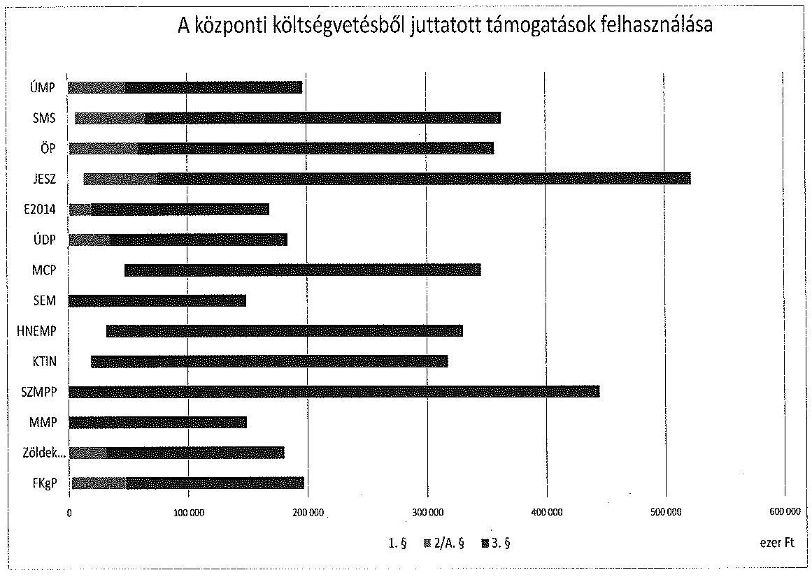

A HNEMP, az MCP, az MMP, az SZMPP, a KTIN és a SEM nem rendelkeztek az egyéni jelöltek támogatásukról való lemondásából adódó forrással. Az E2014, a JESZ, az FKgP, az ÖP, az SMS, az ÚDP és az ÚMP az egyéni jelöltek lemondásaiból származó egymillió Ft összegű támogatásokat a Kftv.-ben foglaltakkal összhangban, a választási kampányidőszak alatt, a Ve. szerinti kampánytevékenységgel összefüggő dologi kiadások finanszírozására fordította. A Zöldek Pártja az egyéni jelöltek lemondásaiból származó egymillió Ft összegű

---

támogatásokból a Kftv. előírása ellenére 5,8 ezer Ft-ot választási kampányidőszakon túl, 6350,0 ezer Ft-ot nem a választási kampánytevékenységgel összefüggő dologi kiadások finanszírozására fordított. A kincstári kártyafedezeti számla és a kincstári kártya használata mind a 14 jelölő szervezetnél megfelelt a Kftv. előírásainak.

Az egyéni jelöltek lemondásaiból származó támogatásban részesült nyolc jelölő szervezet egyéni jelöltjei - kettő kivétellel ${ }^{1}$ - nem érték el a választáson a leadott érvényes szavazatok legalább $2 \%$-át, amelyre tekintettel a Kftv. alapján a támogatást vissza kellett fizetniük. Négy jelölő szervezet a visszafizetési kötelezettségének a helyszíni ellenőrzés lezárásáig nem tett eleget, illetve négy jelölő szervezet azt nem kezdte meg, mert a határozat ellen kettő jelölő szervezet bírósági felülvizsgálat iránti kérelemmel, kettő jelölő szervezet pedig részletfizetési kérelemmel élt.

A 14 jelölő szervezet pártlistát állított, és az egyéni választó kerületben történt jelölt állítása számától függő összegben, a központi költségvetésből támogatásban részesült. A KTIN, a HNEMP, az MCP, az MMP, az ÚDP és az ÚMP a költségvetési támogatást a Kftv. előírásának megfelelően választási kampányidőszak alatt, a választási kampánytevékenységgel összefüggő kiadások finanszírozására fordította. Az FKgP hét, az ÖP, a SEM és az SZMPP egy-egy, az E2014 és a Zöldek Pártja kettő-kettő, az SMS három, a JESZ 15 esetben a támogatást a választási kampányidőszakon kívüli tevékenységre használta fel.

Az FKgP, a HNEMP, az MMP, a SEM, az ÚDP, az ÚMP és az egyéni jelöltjei együttesen betartották a Kftv.-ben meghatározott, jelöltenkénti ötmillió forintos összeghatárt. A jelölő szervezetekre és annak jelöltjeire együttesen vonatkozó, a Kftv. szerinti jelöltenkénti ötmillió forintos értékhatár betartása nyolc jelölő szervezetnél nem volt megállapítható. Az értékhatár betartásának ellenőrzése nem volt biztosított, mert az E2014 34 egyéni jelöltjéből hét fő, a JESZ 81 egyéni jelöltjéből három fő, a KTIN 57 egyéni jelöltjéből hét fő, az MCP 61 egyéni jelöltjéből 23 fő, az ÖP 59 egyéni jelöltjéből öt fő, az SMS 67 egyéni jelöltjéből nyolc fő, az SZMPP 82 egyéni jelöltjéből három fő és a Zöldek Pártja 33 egyéni jelöltjéből hat fő kampányfinanszírozásra fordított forrásairól és kiadásairól nem állt rendelkezésre adat.

A 14 jelölő szervezet a Párt tv.-ben meghatározott forrásokat vette igénybe a választási kampányidőszak alatt, a választási kampánytevékenységgel összefüggő kiadások finanszírozására. A 14 jelölő szervezet a Párt tv. szerinti, jogi személytől, jogi személyiséggel nem rendelkező szervezettől, más államtól, külföldi szervezettől, nem magyar állampolgár természetes személytől származó vagyoni hozzájárulást és névtelen adományt nem vett igénybe.

A politikai hirdetésekre vonatkozó számlák és az ÁSZ részére a Ve. alapján megküldött árjegyzékek és tájékoztatók körében az ellenőrzés a következőket tapasztalta. 32 politikai hirdetés esetében a számla és az árjegyzék adatai, 16 esetben pedig a számla és a tájékoztató adatai nem voltak beazonosíthatóak.

[^0]
[^0]:    ${ }^{1}$ Az SMS egyéni jelöltjei közül kettő fő elérte a választáson a leadott érvényes szavazatok legalább $2 \%$-át.

---

További kettő esetben a politikai hirdetés nem szerepelt a közzétett tájékoztatóban. Az ellenőrzés tapasztalatai szerint öt esetben az árjegyzék, három esetben a tájékoztató nem került megküldésre az ÁSZ-nak. A Zöldek Pártja esetében a politikai hirdetések megjelentetésének lebonyolításával megbízott külső szolgáltató a Zöldek Pártja felé számlát nem bocsátott ki, ezért hét sajtótermék esetében az árjegyzék és a tájékoztató adataival való összevetés nem volt biztosított. Ezen eltérésekért a számlakibocsátók (sajtótermékek kiadói) a felelősek. Az eltérések nem befolyásolták a választási kampányra fordított pénzeszközök felhasználásának minősítését.

---

# II. RÉSZLETES MEGÁLLAPÍTÁSOK 

## 1. EgVÜTt 2014 PÁrt

### 1.1. Az egyéni jelöltek lemondásából származó költségvetési támogatás felhasználásának szabályszerűsége

Az E2014 a rendelkezésre bocsátott dokumentumok alapján a Kftv. 2/A. § (1) bekezdése szerinti, az egyéni jelöltek lemondásaiból származó egymillió forint összegű támogatásokat a Kftv. 1. § (3) bekezdésének megfelelően a választási kampányidőszakban, a választási kampánytevékenységgel összefüggő dologi kiadások finanszírozására fordította.

Az E2014 a 34-ből 21 fő egyéni jelölt támogatásról való lemondása alapján a Kincstárral megállapodást kötött. A Kincstár a megállapodás alapján 2014. március 17-én a Kftv. 2/A. § (4) bekezdésének megfelelően a központi költségvetésből 21000,0 ezer Ft támogatási összeget folyósított az E2014 kincstári kártyafedezeti számlájára, valamint kincstári kártya kibocsátásáról intézkedett.

A támogatásból a tényleges felhasználás 18055,1 ezer Ft volt. A Kincstár az elszámolást nem fogadta el, továbbá az egyéni jelöltek nem szerezték meg a választáson a leadott érvényes szavazatok legalább 2%-át, ezért a Kftv. 8/A. § (4) bekezdése alapján a támogatás visszafizetéséről hozott határozatot.

A kincstári határozat szerint az elszámolás - az NGM rendelet 7. § (3) bekezdése ellenére - a benyújtott számlák egyikére vonatkozóan sem tartalmazta a kiadási tételhez a részletes szöveges indoklást és a felhasználás célját. A benyújtott számlamásolatok hitelesítése továbbá nem az NGM rendelet 7. § (2) bekezdése szerinti szöveggel történt. A Kincstár az elszámolást nem fogadta el, és az E2014-et a Kftv. 8/A. § (3) bekezdés b) pontja alapján az igénybevett támogatás kétszeresének visszafizetésére kötelezte.

Az E2014 a Kincstár határozatával szemben 2014. augusztus 29-én a Fővárosi Közigazgatási és Munkaügyi Bíróságnál felülvizsgálati kérelemmel élt, a benyújtott kérelem elbírálása - a helyszíni ellenőrzés lezárásának időpontjában - folyamatban volt.

A támogatás elszámolása, a Kftv. 8/A. § (1) és az NGM rendelet 7. § (3) bekezdésében foglaltaknak megfelelően, számlaösszesítő adatlapon történt, és az E2014 nyilatkozott a támogatás szabályszerű felhasználásáról.

A kincstári kártyafedezeti számla és a kincstári kártya használata az E2014-nél szabályszerű volt, megfelelt a Kftv. 2/A. § (4) bekezdésében meghatározott előírásoknak. A kifizetések a kincstári kártyafedezeti számláról minden esetben

---

kincstári kártyával vagy átutalással
 történtek, arról készpénzfelvétel nem történt.

Az elszámolást alátámasztó dokumentumok a Kftv. 2/A. § (5) bekezdésének megfelelően az E2014 nevére szóltak. Az elszámoláshoz benyújtott és az eredeti bizonylatok mindenben megegyeztek. A számlák, bizonylatok alaki és tartalmi kellékei, a Számv. tv. 167. §-át és az Áfa tv. 169. §-át figyelembe véve, megfelelőek voltak.

# 1.2. A pártlista alapján biztosított költségvetési támogatás felhasználásának szabályszerűsége 

Az E2014 a rendelkezésre bocsátott dokumentumok alapján a Kftv. 3. § (1) bekezdése szerinti, központi költségvetésből juttatott támogatást a Kftv. 6. § (1) bekezdésének megfelelően választási kampánytevékenységgel összefüggő kiadások finanszírozására fordította. Két esetben a támogatás felhasználása - a Kftv. 6. § (1) bekezdése ellenére - nem kizárólag választási kampányidőszak alatti kiadások finanszírozására irányult.

A Kincstár a Kftv. 3. § (1) bekezdése alapján 149 250,0 ezer Ft támogatást egy összegben 2014. március 12-én folyósította az E2014 pénzforgalmi számlájára, amelynek az E2014 a teljes összegét felhasználta.

Az alábbi esetekben a kifizetés (összesen 1218,7 ezer Ft) - a Kftv. 6. § (1) bekezdése ellenére - nem kizárólag a Ve. 139. §-a szerinti választási kampányidőszak alatti kiadások finanszírozására irányult:

A TM1SA1154556 számú számlához rendelkezésre bocsátott szerződés hatálya 2014. január 21-március 1. volt. A 2014. január 21-február 14. közötti időszak a Ve. 139. §-a szerinti kampányidőszakon kívülre esett (összesen 681,5 ezer Ft). Az YK25A5035961 számú számlához rendelkezésre bocsátott szerződés hatálya 2014. január 3-április 30. volt, amelyre tekintettel a 2014. január 3-február 14., és a 2014. április 7-30. közötti időszak a Ve. 139. §-a szerinti kampányidőszakon kívülre esett (összesen 537,2 ezer Ft).

A felhasználást alátámasztó számlák, bizonylatok 76%-ának (összesen 107 805,3 ezer Ft) alaki és tartalmi kellékei az alábbiakban részletezettek szerint nem feleltek meg a Számv. tv. 167. §-ában és az Áfa tv. 169. §-ában előírtaknak, továbbá sérültek a Számv. tv. egyéb előírásai. Ezekben az esetekben a számlák, bizonylatok adatai a Számv. tv. 165. § (2) bekezdése ellenére kerültek rögzítésre a számviteli nyilvántartásban.

A 7064428 számú nyugtához (24,5 ezer Ft) nem állt rendelkezésre az Áfa tv. és a Számv. tv. előírásainak megfelelő számviteli bizonylat.

A TM1SA5370589 számú számlát kibocsátó Kft.-t az illetékes cégbíróság 2013. augusztus 21. napjával a cgt. 01-13-010228/2. ssz. végzésével törvényességi felügyeleti jogkörében kényszertörlési eljárás keretében megszűntnek nyilvánította, amelyre tekintettel a Kft. - a cégnyilvánosságról, a bírósági cégeljárásról és a végelszámolásról szóló 2006. évi V. törvény 116. § (3) bekezdése szerint - gazdasági tevékenységet nem végezhetett. Ennek ellenére a Kft. az E2014-gyel reklámszervezési megállapodást kötött, és 3429,0 ezer Ft összegben számlát bocsátott ki.

Egy osztrák egyéni vállalkozó által nyújtott szolgáltatásról kiállított kilenc számla - a Számv. tv. 167. § (1) bekezdés j) pontja ellenére - nem tartalmazta az Európai Unió Tanácsának a közös hozzáadottértékadó-rendszerről szóló 2006/112/EK Irányelve (Héa-irányelv) 226. cikkének megfelelően a HÉA-azonosítószámot (közösségi adószámot). A számlák - az Áfa tv. 169. § d) pont db) alpontja ellenére - nem tartalmazták az E2014 adószámát (összesen 12600,0 ezer Ft).

19 db útvonal-nyilvántartás és a 0698313 számú kiadási pénztárbizonylat szerinti további nyolc útvonal-nyilvántartás (összesen 62676,8 ezer Ft) - a Számv. tv. 167. § (1) bekezdés j) pontjában foglaltak ellenére - nem tartalmazta az Szja tv. 5. melléklet II. 7. pontjának megfelelően a gépjármű-használati nyilvántartásra (útnyilvántartás) vonatkozó valamennyi kötelező tartalmi elemet (pl. felkeresett üzleti partner, honnan-hova történt az utazás).

43 db kiküldetési rendelvény (összesen 13075,0 ezer Ft) - a Számv. tv. 167. § (1) bekezdés j) pontja ellenére - nem tartalmazta az Szja tv. 3. § 83. pontja által a kiküldetési rendelvényekre meghatározott valamennyi kötelező tartalmi elemet (pl. név, adóazonosító jel).

Az XX2SA2814956 számú számla eredeti, illetve hitelesített másolati példánya a Számv. tv. 169. § (2) bekezdése ellenére - nem állt rendelkezésre. Az E2014 - a Számv. tv. 166. § (2) bekezdése ellenére - a számla egyszerű másolati példányával rendelkezett (összesen 16000,0 ezer Ft).

Az E2014 a választásra fordított állami és más pénzeszközök, anyagi támogatások összegét, forrását és felhasználásának módját a Magyar Közlöny 2014. június 5-én megjelent Hivatalos Értesítője 29. számában 2014. május 30-ai dátummal hozta nyilvánosságra.

Az E2014 kampánycélú kiadásainak megoszlását az alábbi ábra szemlélteti:
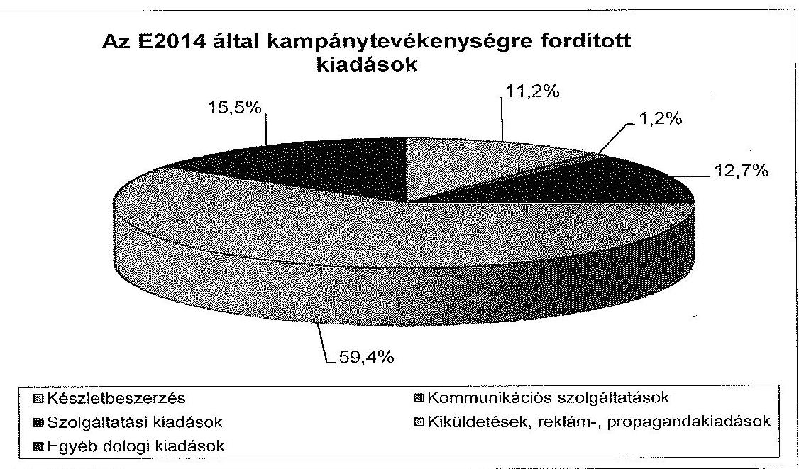

---

1.3. A választási kampány kiadásaira vonatkozó korlátozás betartásának szabályszerűsége

Az E2014-re és annak jelöltjeire együttesen vonatkozó, a Kftv. 7. § (1) bekezdés b) pontja szerinti jelöltenkénti ötmillió forintos értékhatár betartása nem volt megállapítható. Az értékhatár betartásának ellenőrzése nem volt biztosított, mert az E2014 34 egyéni jelöltjéből hét fő kampányfinanszírozásra fordított forrásairól és kiadásairól nem állt rendelkezésre adat.
1.4. A Párt tv.-ben meghatározott korlátozások betartása a kampánytevékenységek forrásai tekintetében

Az E2014 a Párt tv. 4. § (1) bekezdésében meghatározott forrásokat vette igénybe a választási kampányidőszak alatt, a választási kampánytevékenységgel összefüggő kiadások finanszírozására.

Az E2014 a Párt tv. 4. § (2)-(3) bekezdései szerinti, jogi személytől, jogi személyiséggel nem rendelkező szervezettől, más államtól, külföldi szervezettől, nem magyar állampolgár természetes személytől származó vagyoni hozzájárulást, névtelen adományt és 2013. évről áthozott forrást kampánycélra nem vett igénybe.

Az E2014 a Kftv. 2/A. §-a alapján folyósított 1. § szerinti, valamint a Kftv. 3. § (1) bekezdése alapján folyósított támogatás terhére - az ÁSZ honlapján közzétett tájékoztatók szerint - a Ve. 146. § b) pontja szerinti politikai hirdetést nem tett közzé, amelyet az ellenőrzés során rendelkezésre bocsátott dokumentumok is alátámasztottak.

# 2. FÜGGETLEN KISGAZDA-, FÖLDMUNKÁS ÉS POLGÁRI PÁRT 

### 2.1. Az egyéni jelöltek lemondásából származó költségvetési támogatás felhasználásának szabályszerűsége

A Kftv. 1. § (1) bekezdése szerinti jelöltenkénti „egymillió forint összegű", a központi költségvetésből juttatott támogatás igénybevételére az 50 fő egyéni jelöltből, három fő kötött megállapodást a Kincstárral összesen 3000,0 ezer Ft összegben.

Az FKgP a rendelkezésre bocsátott dokumentumok alapján a Kftv. 2/A. § (1) bekezdése szerinti, az egyéni jelöltek lemondásaiból származó egymillió forint összegű támogatásokat a Kftv. 1. § (3) bekezdésben foglaltakkal összhangban, a választási kampányidőszak alatt, a választási eljárásról szóló törvény szerinti kampánytevékenységgel összefüggő dologi kiadások finanszírozására fordította.

Az FKgP 45 fő egyéni jelölt támogatásról való lemondása alapján a Kincstárral megállapodást kötött. A Kincstár 2014. március 17-én a Kftv. 2/A. § (4) bekezdésének megfelelően a központi költségvetésből 45000,0 ezer Ft támogatási összeget folyósított az FKgP kincstári kártyafedezeti számlájára, valamint a kincstári kártya kibocsátásáról intézkedett.

A támogatásból a tényleges felhasználás 45000,0 ezer Ft volt. A Kincstár az elszámolást elfogadta, azonban mivel az egyéni jelöltek nem szerezték meg a leadott érvényes szavazatok legalább 2%-át, a Kftv. 8/A. § (4) bekezdése alapján az igénybe vett támogatás visszafizetéséről hozott határozatot. Az FKgP fizetési halasztási kérelmére a Kincstár hat hónapos részletfizetésre adott lehetőséget.

A támogatás elszámolása a Kftv. 8/A. § (1) és az NGM rendelet 7. § (1)(3) bekezdéseiben foglaltaknak megfelelően, számlaösszesítő adatlapon, a támogatás felhasználását igazoló bizonylatok hiteles másolatának benyújtásával történt. Az FKgP - hiánypótlást követően - a kiadási tételekhez szöveges indokolást adott a felhasználás céljáról, valamint nyilatkozott a támogatás szabályszerű felhasználásáról. Az elszámolást alátámasztó dokumentumok teljes körűen rendelkezésre álltak, azok a Kftv. 2/A. § (5) bekezdésének megfelelően az FKgP nevére szóltak.

A kincstári kártyafedezeti számla és a kincstári kártya használata az FKgP-nél szabályszerű volt, megfelelt a Kftv. 2/A. § (4) bekezdésében meghatározott előírásoknak. A kifizetések a kincstári kártyafedezeti számláról minden esetben kincstári kártyával vagy átutalással történtek, arról készpénzfelvétel nem történt.

A felhasználást alátámasztó számlák, bizonylatok alaki és tartalmi kellékei, a Számv. tv. 167. §-át és az Áfa tv. 169. §-át figyelembe véve, megfelelőek voltak.

# 2.2. A pártlista alapján biztosított költségvetési támogatás felhasználásának szabályszerűsége 

Az FKgP a rendelkezésre bocsátott dokumentumok alapján a Kftv. 3. § (1) bekezdése szerinti, központi költségvetésből juttatott támogatást a Kftv. 6. § (1) bekezdésének megfelelően a választási kampánytevékenységgel összefüggő kiadások finanszírozására fordította. Hét esetben a támogatást választási kampányidőszakon kívüli tevékenységre használták fel.

A Kincstár a Kftv. 3. § (1) bekezdése alapján 149 250,0 ezer Ft támogatást egy összegben, 2014. március 11-én folyósította az FKgP pénzforgalmi számlájára.

Az ellenőrzés hét esetben, 1872,4 ezer Ft összegben állapította meg, hogy azok a Ve. 140. §-nak megfelelő kampányeszközök, azonban a Ve. 139. §-ban előírt kampányidőszakon kívüli felhasználások voltak.

Alumínium promóciós pultok készítéséről kiállított 416,8 ezer Ft összegű számlák (2 db) kelte 2013. november 28-a, teljesítési időpontja 2014. január 8-a volt. A Facebook hirdetési szolgáltatást tartalmazó, 171,5 ezer Ft összegű számla kelte és a teljesítés időpontja 2014. április 7-e, a fizetési határidő 2014. április 15-e volt. Plakátkészítésről, 1089,7 ezer Ft összegben kiállított számla kelte és a teljesítési időpontja 2014. január 6-a volt. Telefonszolgáltatásról 2013. december 1-december 31. közötti forgalmat tartalmazó 53,6 ezer Ft összegű számla, valamint a 2014. február 1-február 28. időszakra kibocsátott 11,3 ezer Ft-os számla időarányos része. Mobil internet szolgáltatásról 2014. január 1-január 31. elszámolási időszakra kibocsátott 4,3 ezer Ft összegű számla. A 2013. november 9-ei teljesítéssel, 2013. november 12-ei keltezéssel kibocsátott 127,0 ezer Ft összegű hirdetési szolgáltatást tartalmazó számla.

A kampányidőszaki felhasználást alátámasztó, az FKgP nevére szóló dokumentumok rendelkezésre álltak (szerződések, megrendelések, teljesítésigazolások, számlák, bankkivonatok). A bizonylatok alaki és tartalmi kellékei a Számv. tv. 167. §-ában és az Áfa tv. 169. §-ában előírtaknak megfeleltek.

Az FKgP a választásra fordított állami és más pénzeszközök, anyagi támogatások összegét, forrását és felhasználásának módját a Magyar Közlöny 2014. október 10-én megjelent Hivatalos Értesítő 51. számában, 2014. szeptember 30-i dátummal hozta nyilvánosságra.

Az FKgP kampánycélú kiadásainak megoszlását az alábbi ábra szemlélteti:
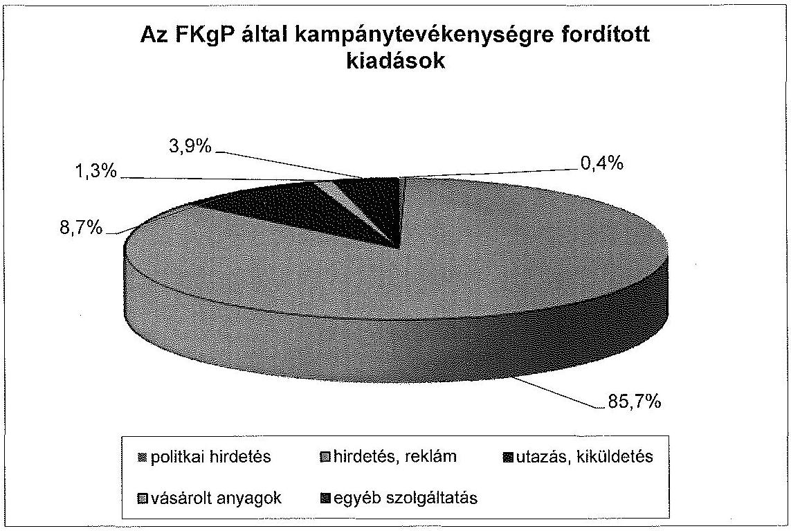
2.3. A választási kampány kiadásaira vonatkozó korlátozás betartásának szabályszerűsége

Az FKgP és az egyéni jelöltjei együttesen betartották a Kftv. 7. § (1) bekezdés b) pontjában meghatározott, jelöltenkénti ötmillió forintos összeghatárt.

Az FKgP által rendelkezésre bocsátott, a választási kampányidőszak alatt a választási kampánytevékenységgel összefüggő kiadások finanszírozását alátámasztó dokumentumok biztosították a Kftv. 7. § (1) bekezdés b) pontjában meghatározott összeghatár betartásának ellenőrzését.

Az ellenőrzés rendelkezésre bocsátott dokumentumok alapján az FKgP a Kftv. 2/A. § (1) bekezdése alapján folyósított 45000,0 ezer Ft-ot, és a Kftv. 3. § (1) bekezdése szerinti 149 250,0 ezer Ft költségvetési támogatást teljes mértékben igénybe vette. Az egyéni jelöltek 2470,0 ezer Ft költségvetési támogatást és 393,3 ezer Ft saját forrást fordítottak kampányfinanszírozásra. Az egyéni jelöltek és az FKgP együttesen 197 113,3 ezer Ft-ot költött kampánycélokra. Az FKgP egyéni jelöltjeinek száma 50 fő, a listás jelölteké 32 fő, összesen 82 fő volt. A rendelkezésre bocsátott dokumentumok alapján a Kftv. 7. § (4)(5) bekezdéseinek figyelembevételével az FKgP és annak jelöltjei együttesen jelöltenként 2403,8
 ezer Ft-ot fordítottak a választási kampányidőszak alatt, a választási kampánytevékenységgel összefüggő kiadások finanszírozására.

# 2.4. A Párt tv.-ben meghatározott korlátozások betartása a kampánytevékenységek forrásai tekintetében 

Az FKgP a Párt tv. 4. § (1) bekezdésében meghatározott forrásokat vette igénybe a választási kampányidőszak alatt, a választási kampánytevékenységgel összefüggő kiadások finanszírozására.

Az FKgP a Párt tv. 4. § (2)-(3) bekezdései szerinti, jogi személytől, jogi személyiséggel nem rendelkező szervezettől, más államtól, külföldi szervezettől, nem magyar állampolgár természetes személytől származó vagyoni hozzájárulást, névtelen adományt és 2013. évről áthozott forrást kampánycélra nem vett igénybe.

Az FKgP politikai hirdetésekre vonatkozó számlái és az ÁSZ részére a Ve. 148. § (2) és (4) bekezdései alapján megküldött árjegyzékek és tájékoztatók körében az ellenőrzés az alábbiakat tapasztalta.

A politikai hirdetések megjelentetéséhez kapcsolódó árjegyzéket négy, a politikai hirdetésekről szóló tájékoztatót kettő sajtótermék az ÁSZ részére nem küldte meg. A bizonylatokon szereplő szolgáltatási díjak négy esetben eltértek az ÁSZ honlapján közzétett árjegyzék adataitól, három esetben a tájékoztatóban közölt ellenérték és a számla összege nem egyezett meg. Ezen eltérésekért a számlakibocsátók (sajtótermékek kiadói) a felelősek. Az eltérések nem befolyásolták a választási kampányra fordított pénzeszközök felhasználásának minősítését.

## 3. A Haza Nem Eladó Mozgalom PÁrt

### 3.1. Az egyéni jelöltek lemondásából származó költségvetési támogatás felhasználásának szabályszerűsége

A Kftv. 1. § (1) bekezdés szerinti jelöltenkénti „egymillió forint összegű”, a központi költségvetésből juttatott támogatás igénybevételére a 66 egyéni jelöltből 44 fő kötött megállapodást a Kincstárral összesen 44000,0 ezer Ft összegben. A

---

HNEMP a Kftv. 2/A. § (1) bekezdése alapján nem részesült támogatásban.

# 3.2. A pártlista alapján biztosított költségvetési támogatás felhasználásának szabályszerűsége 

A HNEMP a rendelkezésre bocsátott dokumentumok alapján a Kftv. 3. § (1) bekezdése szerinti, központi költségvetésből juttatott támogatást a Kftv. 6. § (1) bekezdésének megfelelően a választási kampányidőszak alatt, a választási kampánytevékenységgel összefüggő kiadások finanszírozására fordította.

A Kincstár a Kftv. 3. § (1) bekezdése alapján 298 500,0 ezer Ft támogatást egy összegben, 2014. március 11-én folyósította a HNEMP pénzforgalmi számlájára.

A felhasználást alátámasztó számlák, bizonylatok alaki és tartalmi kellékei az Áfa tv. 169. §-ában előírtaknak megfeleltek, a Számv. tv. 167. §-ában előírtaknak az alábbiak tekintetében nem tettek eleget, így azok adatai a Számv. tv. 165. § (2) bekezdése ellenére kerültek rögzítésre a számviteli nyilvántartásban.

8 db, összesen 57,8 ezer Ft összegű készpénzes bizonylat esetében az átvevő aláírása hiányzott. A Számv. tv. 167. § (1) bekezdés c) pontjában, valamint a HNEMP pénzkezelési szabályzatában szereplő bizonylatolási rendben előírtak ellenére a kiadásokról nem készítettek kiadási pénztárbizonylatot.

A HNEMP a választásra fordított állami és más pénzeszközök, anyagi támogatások összegét és felhasználásának módját a Magyar Közlöny 2014. június 5-én megjelent Hivatalos Értesítő 29. számában 2014. május 29-ei dátummal hozta nyilvánosságra.

A HNEMP kampánycélú kiadásainak megoszlását az alábbi ábra szemlélteti:

A HNEMP által kampánytevékenységre fordított kiadások
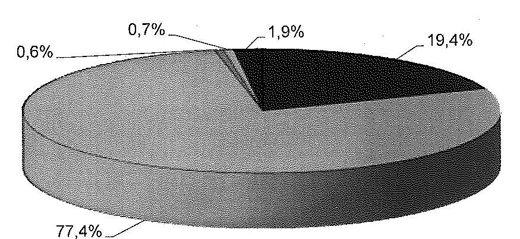

---

# 3.3. A választási kampány kiadásaira vonatkozó korlátozás betartásának szabályszerűsége 

A HNEMP és az egyéni jelöltjei együttesen betartották a Kftv. 7. § (1) bekezdés b) pontjában meghatározott, jelöltenkénti ötmillió forintos összeghatárt.

A HNEMP által rendelkezésre bocsátott a választási kampányidőszak alatt, a választási kampánytevékenységgel összefüggő kiadások finanszírozását alátámasztó dokumentumok biztosították a Kftv. 7. § (1) bekezdés b) pontjában meghatározott összeghatár betartásának ellenőrzését.

A Kftv. 1. § (1) bekezdése alapján 44 fő egyéni jelölt részesült jelöltenkénti 1000,0 ezer Ft összegű támogatásban, amelyet 31813,8 ezer Ft összeg erejéig vettek igénybe, továbbá 110,4 ezer Ft saját forrást fordítottak kampányfinanszírozásra. A 22 fő egyéni jelölt nem vette igénybe a Kftv. 1. § (1) bekezdés szerinti támogatást, arról a HNEMP javára nem mondott le, és egyéb forrást nem használt fel kampánycélokra. A Kftv. 2/A. §-a szerinti lemondásra nem került sor. A Kftv. 3. § (1) bekezdése alapján a HNEMP-et 298 500,0 ezer Ft támogatás illette meg, amelyet teljes egészében igénybe vett, valamint 116,2 ezer Ft adományt használt fel. Az ellenőrzés rendelkezésre bocsátott dokumentumok alapján az egyéni jelöltek és a HNEMP összesen 330540,4 ezer Ft-ot fordított kampányfinanszírozásra.

A HNEMP egyéni jelöltjeinek száma 66 fő, a listás jelölteké 107 fő, összesen 173 fő volt. A rendelkezésre bocsátott dokumentumok alapján a Kftv. 7. § (4)(5) bekezdéseinek figyelembevételével a HNEMP és annak jelöltjei – 159 fő együttesen – jelöltenként 2078,9 ezer Ft-ot fordítottak a választási kampányidőszak alatt, a választási kampánytevékenységgel összefüggő kiadások finanszírozására.

### 3.4. A Párt tv.-ben meghatározott korlátozások betartása a kampánytevékenységek forrásai tekintetében

A HNEMP a Párt tv. 4. § (1) bekezdésében meghatározott forrásokat vette igénybe a választási kampányidőszak alatt, a választási kampánytevékenységgel összefüggő kiadások finanszírozására.

A HNEMP a Párt tv. 4. § (2)-(3) bekezdései szerinti jogi személytől, jogi személyiséggel nem rendelkező szervezettől, más államtól, külföldi szervezettől, nem magyar állampolgár természetes személytől származó vagyoni hozzájárulást, névtelen adományt és 2013. évről áthozott forrást kampánycélra nem vett igénybe.

A HNEMP politikai hirdetésekre vonatkozó számlái és az ÁSZ részére a Ve. 148. § (2) és (4) bekezdése alapján megküldött árjegyzékek és tájékoztatók körében az ellenőrzés az alábbiakat tapasztalta.

A Ve. 148. § (2) és (4) bekezdésének megfelelően a politikai hirdetések megjelentetéséhez kapcsolódó árjegyzéket és a politikai hirdetésekről szóló tájékoztatót – egy kivétellel – az

---

ÁSZ részére megküldték. A bizonylatokon szereplő szolgáltatási díj egy esetben eltért az ÁSZ honlapján közzétett árjegyzék adatától, egy esetben a tájékoztatóban közölt ellenérték és a számla összege nem egyezett meg. Ezen eltérésekért a számlakibocsátók (sajtótermékek kiadói) a felelősek. Az eltérések nem befolyásolták a választási kampányra fordított pénzeszközök felhasználásának minősítését.

# 4. JÓLÉT ÉS SZABADSÁG DEMOKRATA KÖZÖSSÉG 

### 4.1. Az egyéni jelöltek lemondásából származó költségvetési támogatás felhasználásának szabályszerűsége

A JESZ a rendelkezésre bocsátott dokumentumok alapján a Kftv. 2/A. § (1) bekezdése szerinti, az egyéni jelöltek lemondásaiból származó egymillió forint összegű támogatásokat a Kftv. 1. § (3) bekezdésének megfelelően a választási kampányidőszakban, a választási kampánytevékenységgel összefüggő dologi kiadások finanszírozására fordította.

A JESZ 81-ből 61 fő egyéni jelölt támogatásról való lemondása alapján a Kincstárral megállapodást kötött. A Kincstár a megállapodás alapján 2014. március 13-án a Kftv. 2/A. § (4) bekezdésének megfelelően a központi költségvetésből 61000,0 ezer Ft támogatási összeget folyósított a JESZ kincstári kártyafedezeti számlájára, valamint kincstári kártya kibocsátásáról intézkedett.

A támogatás teljes összege felhasználásra került. A Kincstár az elszámolást elfogadta, azonban az egyéni jelöltek nem szerezték meg a választáson a leadott érvényes szavazatok legalább 2%-át, ezért a Kftv. 8/A. § (4) bekezdése alapján a támogatás visszafizetéséről hozott határozatot. A JESZ a Kincstár határozatával kapcsolatban 2014. július 28-án 12 havi részletfizetés iránti kérelemmel élt. A JESZ 2014. november 18-án kelt nyilatkozata szerint a visszafizetési kötelezettségét nem teljesítette, mert a részletfizetési kérelmére nem érkezett válasz.

A támogatás elszámolása a Kftv. 8/A. § (1) és az NGM rendelet 7. § (1)(3) bekezdéseiben foglaltaknak megfelelően, számlaösszesítő adatlapon, a támogatás felhasználását igazoló bizonylatok hitelesített másolatának benyújtásával történt. A JESZ – hiánypótlás során – minden kiadási tételhez adott szöveges indokolást az adott tétel felhasználási céljáról, valamint nyilatkozott a támogatás szabályszerű felhasználásáról.

A kincstári kártyafedezeti számla és a kincstári kártya használata a JESZ-nél szabályszerű volt, megfelelt a Kftv. 2/A. § (4) bekezdésében meghatározott előírásoknak. A kifizetések a kincstári kártyafedezeti számláról minden esetben kincstári kártyával vagy átutalással történtek, arról készpénzfelvétel nem történt.

Az elszámolást alátámasztó számlák, bizonylatok a Kftv. 2/A. § (5) bekezdésének megfelelően a JESZ nevére szóltak. Az elszámoláshoz benyújtott és az eredeti bizonylatok mindenben megegyeztek. A számlák, bizonylatok alaki és tartalmi kellékei, a Számv. tv. 167. §-át és az Áfa tv. 169. §-át figyelembe véve, megfelelőek voltak.

---

# 4.2. A pártlista alapján biztosított költségvetési támogatás felhasználásának szabályszerűsége 

A JESZ a rendelkezésre bocsátott dokumentumok alapján a Kftv. 3. § (1) bekezdése szerinti, központi költségvetésből juttatott támogatást a Kftv. 6. § (1) bekezdésének megfelelően választási kampánytevékenységgel összefüggő kiadások finanszírozására fordította. 15 esetben a támogatás felhasználása – a Kftv. 6. § (1) bekezdése ellenére – nem vagy nem kizárólag választási kampányidőszak alatti kiadások finanszírozására irányult.

A Kincstár a Kftv. 3. § (1) bekezdése alapján a 447 750,0 ezer Ft támogatást egy összegben 2014. március 11-én folyósította a JESZ pénzforgalmi számlájára, amelynek a JESZ a teljes összegét felhasználta.

Az alábbi esetekben a kifizetés (összesen 4951,4 ezer Ft) – a Kftv. 6. § (1) bekezdése ellenére – nem vagy nem kizárólag a Ve. 139. §-a szerinti választási kampányidőszak alatti kiadások finanszírozására irányult:

A D-ITS-1 számú számlán (354,3 ezer Ft) feltüntetett rendszerfelügyeleti szolgáltatás (2014. január 30.), az S222 számú számlán (148,5 ezer Ft) szereplő közjegyzői díj kiegyenlítése (2014. január 20.), az N0003/14 számú bizonylat (208,4 ezer Ft) szerinti bankköltség (2014. január 31.) és a CL3EA0000212 számú számlán (61,2 ezer Ft) szereplő kamatfizetés (2014. április 9.), a 91200001 (10,6 ezer Ft) és a 128000001 (42,3 ezer Ft) számú készpénzfizetési számla szerinti matrica és postaköltségek kifizetése (2014. április 8. és 12.), a 0043/2014 számú számla (2 950,0 ezer Ft) szerinti óriásplakát beszerzése (2014. február 6.) és a NQ9SB4319139 számú számla (582,9 ezer Ft) szerinti rendezvényszervezés (2013. november 10.) a Ve. 139. §-a szerinti kampányidőszakon kívül valósult meg.

A 110/2014 számú bizonylat (25,3 ezer Ft) szerinti fűtésköltség (2014. január hó), a 70/2014 számú bizonylat szerinti üzemeltetési, felújítási és fűtési költség 2014. január 23-február 14. közötti időszakra eső része (8,0 ezer Ft), a 290/2014 számú bizonylat szerinti nem lakás bérlemény díja 2014. február 1-14. közötti időszakra eső része (72,0 ezer Ft), a KB/2014/200 számú bizonylat szerinti fűtésköltség 2014. február 1-14. közötti időszakra eső része (6,6 ezer Ft), a 2014048985 számú bizonylat szerinti távhőszolgáltatás 2014. február 1-14. közötti időszakra eső része (13,9 ezer Ft) és a JESZ munkavállalójának 2014. január havi, február 1-14. közötti, április 7-30. közötti időszakra eső munkabére (összesen 467,4 ezer Ft) nem a Ve. 139. § szerinti kampányidőszak alatti kiadás finanszírozására irányult.

A felhasználást alátámasztó számlák, bizonylatok alaki és tartalmi kellékei az alábbi esetekben nem feleltek meg a Számv. tv. 167. §-ában és az Áfa tv. 169. §-ában előírtaknak. Ezekben az esetekben a bizonylatok adatai a Számv. tv. 165. § (2) bekezdése ellenére kerültek rögzítésre a számviteli nyilvántartásban.

A 44000026 (3,0 ezer Ft), a 147300009 (5,0 ezer Ft), a XG1EA2463286 (6,0 ezer Ft) és a 191300029 (5,0 ezer Ft) számú számlán – az Áfa tv. 169. § e) pontja ellenére – nem megfelelően szerepelt a JESZ-nek mint a termék beszerzőjének neve vagy címe. A 191300029
 számú üzemanyagszámlához mellékelt kiküldetési rendelvény - a Számv. tv. 167. (1) bekezdés j) pontja ellenére - nem tartalmazta az

---

Szja tv. 3. § 83. pontjában a kiküldetési rendelvényre meghatározott tartalmi elemek közül az utazás célját.

A JESZ a választásra fordított állami és más pénzeszközök, anyagi támogatások összegét, forrását és felhasználásának módját a Magyar Közlöny 2014. október 10-én megjelent Hivatalos Értesítője 51. számában 2014. augusztus 29-ei dátummal hozta nyilvánosságra, amelyet a Magyar Közlöny 2014. november 17-én megjelent Hivatalos Értesítője 58. számában 2014. november 6-ai dátummal megismételt.

A JESZ kampánycélú kiadásainak megoszlását az alábbi ábra szemlélteti:
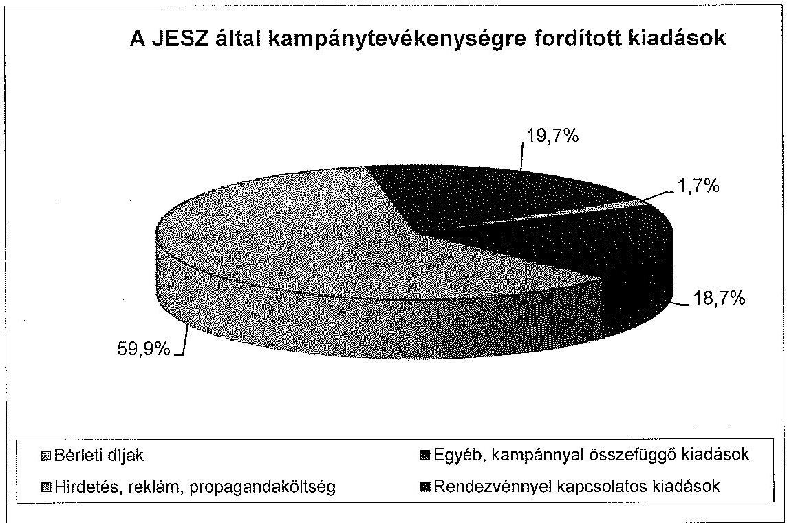
4.3. A választási kampány kiadásaira vonatkozó korlátozás betartásának szabályszerűsége

A JESZ-re és annak jelöltjeire együttesen vonatkozó, a Kftv. 7. § (1) bekezdés b) pontja szerinti jelöltenkénti ötmillió forintos értékhatár betartása nem volt megállapítható. Az értékhatár betartásának ellenőrzése nem volt biztosított, mert a JESZ 81 egyéni jelöltjéből három fő kampányfinanszírozásra fordított forrásairól és kiadásairól nem állt rendelkezésre adat.
4.4. A Párt tv.-ben meghatározott korlátozások betartása a kampánytevékenységek forrásai tekintetében

A JESZ a Párt tv. 4. § (1) bekezdésében meghatározott forrásokat vette igénybe a választási kampányidőszak alatt, a választási kampánytevékenységgel összefüggő kiadások finanszírozására.

---

A JESZ a Párt tv. 4. § (2)-(3) bekezdései szerinti, jogi személytől, jogi személyiséggel nem rendelkező szervezettől, más államtól, külföldi szervezettől, nem magyar állampolgár természetes személytől származó vagyoni hozzájárulást, névtelen adományt és 2013. évről áthozott forrást kampánycélra nem vett igénybe.

A politikai hirdetésekre vonatkozó számlák és az ÁSZ részére a Ve. 148. § (2) és (4) bekezdése alapján megküldött árjegyzékek és tájékoztatók körében az ellenőrzés az alábbiakat tapasztalta.

Egy esetben csak a nyomtatott sajtó árjegyzéke szerepelt az ÁSZ honlapján, az elektronikus sajtótermékre vonatkozó árjegyzék nem. Hat esetben a politikai hirdetésről szóló számlában rögzítetett ár nem volt beazonosítható az árjegyzék adataival. Egy esetben a tájékoztatóban közölt ellenérték és a számlán feltüntetett adatok nem egyeztek meg, további egy esetben a számlán szereplő hirdetés és annak összege a sajtótermékre vonatkozó tájékoztatóban nem szerepelt. Ezen eltérésekért a számlakibocsátók (sajtótermékek kiadói) a felelősek. Az eltérések nem befolyásolták a választási kampányra fordított pénzeszközök felhasználásának minősítését.

# 5. KÖZÖSSÉG A TÁRSADALMI IGAZSÁGOSSÁGÉRT NÉPPÁRT 

### 5.1. Az egyéni jelöltek lemondásából származó költségvetési támogatás felhasználásának szabályszerűsége

A Kftv. 1. § (1) bekezdése szerinti jelöltenkénti „egymillió forint összegű”, a központi költségvetésből juttatott támogatás igénybevételére az 57 egyéni jelöltből 47 kötött megállapodást a Kincstárral összesen 47000,0 ezer Ft összegben, amelyből a tényleges igénybevétel 19098,2 ezer Ft volt. A KTIN a Kftv. 2/A. § (1) bekezdése alapján nem részesült támogatásban.

### 5.2. A pártlista alapján biztosított költségvetési támogatás felhasználásának szabályszerűsége

A KTIN a rendelkezésre bocsátott dokumentumok alapján a Kftv. 3. § (1) bekezdése szerinti, központi költségvetésből juttatott támogatást a Kftv. 6. § (1) bekezdésének megfelelően a választási kampányidőszak alatt, a választási kampánytevékenységgel összefüggő kiadások finanszírozására fordította.

A Kincstár a Kftv. 3. § (1) bekezdése alapján 298 500,0 ezer Ft támogatást egy összegben 2014. március 12-én folyósította a KTIN pénzforgalmi számlájára, amelyet teljes egészében felhasználtak.

A kampányidőszaki felhasználást alátámasztó, a KTIN nevére szóló eredeti dokumentumok teljes körűen rendelkezésre álltak (szerződések, megrendelések, teljesítésigazolások, számlák, bankkivonatok). A bizonylatok alaki és tartalmi kellékei a Számv. tv. 167. §-ában és az Áfa tv. 169. §-ában előírtaknak megfeleltek.

---

A KTIN a választásra fordított állami és más pénzeszközök, anyagi támogatások összegét, forrását és felhasználásának módját a Magyar Közlöny 2014. június 6-án megjelent Hivatalos Értesítő 30. számában 2014. június 3-i dátummal hozta nyilvánosságra.

A KTIN kampánycélú kiadásainak megoszlását az alábbi ábra szemlélteti:
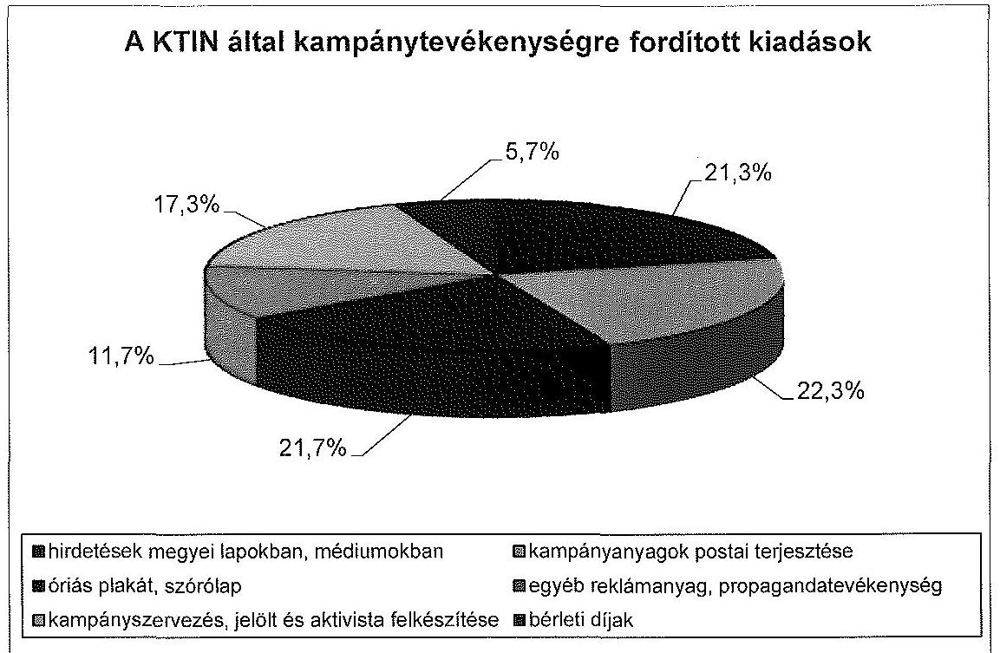
5.3. A választási kampány kiadásaira vonatkozó korlátozás betartásának szabályszerűsége

A KTIN-re és annak jelöltjeire együttesen vonatkozó, a Kftv. 7. § (1) bekezdés b) pontja szerinti jelöltenkénti ötmillió forintos értékhatár betartása nem volt megállapítható. Az értékhatár betartásának ellenőrzése nem volt biztosított, mert a KTIN 57 egyéni jelöltjéből hét fő kampányfinanszírozásra fordított forrásairól és kiadásairól nem állt rendelkezésre adat.
5.4. A Párt tv.-ben meghatározott korlátozások betartása a kampánytevékenységek forrásai tekintetében

A KTIN a Párt tv. 4. § (1) bekezdésben meghatározott forrásokat vette igénybe a választási kampányidőszak alatt, a választási kampánytevékenységgel összefüggő kiadások finanszírozására. A támogatáson kívül magyar állampolgárságú természetes személyek által nyújtott vagyoni hozzájárulásból 548,0 ezer Ft-ot használtak fel kampánycélú kiadásokra.

A KTIN a Párt tv. 4. § (2)-(3) bekezdései szerinti, jogi személytől, jogi személyiséggel nem rendelkező szervezettől, más államtól, külföldi szervezettől, nem

---

magyar állampolgár természetes személytől származó vagyoni hozzájárulást, névtelen adományt és 2013. évről áthozott forrást kampánycélra nem vett igénybe.

A KTIN politikai hirdetésekre vonatkozó számlái és az ÁSZ részére a Ve. 148. § (2) és (4) bekezdései alapján megküldött árjegyzékek és tájékoztatók körében az ellenőrzés az alábbiakat tapasztalta.

A bizonylatokon szereplő szolgáltatási díj egy esetben eltért az ÁSZ honlapján közzétett árjegyzék adatától, kettő esetben a tájékoztatóban közölt ellenérték és a számla összege nem egyezett meg. Ezen eltérésekért a számlakibocsátók (sajtótermékek kiadói) a felelősek. Az eltérések nem befolyásolták a választási kampányra fordított pénzeszközök felhasználásának minősítését.

# 6. MAGYAR MUNKÁSPÁRT 

### 6.1. Az egyéni jelöltek lemondásából származó költségvetési támogatás felhasználásának szabályszerűsége

A Kftv. 1. § (1) bekezdése szerinti jelöltenkénti „egymillió forint összegű”, a központi költségvetésből juttatott támogatást a 33 egyéni jelölt nem vette igénybe. Az MMP a Kftv. 2/A. § (1) bekezdése alapján nem részesült támogatásban.

### 6.2. A pártlista alapján biztosított költségvetési támogatás felhasználásának szabályszerűsége

Az MMP a rendelkezésre bocsátott dokumentumok alapján a Kftv. 3. § (1) bekezdése szerinti, központi költségvetésből juttatott támogatást a Kftv. 6. § (1) bekezdésének megfelelően a választási kampányidőszak alatt, a választási kampánytevékenységgel összefüggő kiadások finanszírozására fordította.

A Kincstár a Kftv. 3. § (1) bekezdése alapján 149 250,0 ezer Ft támogatást egy összegben 2014. március 11-én folyósította az MMP pénzforgalmi számlájára.

Az MMP a kampányfinanszírozásra rendelkezésre álló források felhasználásának szabályait határozatba foglalta ${ }^{2}$.

A kampányidőszaki felhasználást alátámasztó, az MMP nevére szóló eredeti dokumentumok rendelkezésre álltak (szerződések, megrendelések, teljesítésigazolások, számlák, bankkivonatok). A bizonylatok alaki és tartalmi kellékei a Számv. tv. 167. §-ában és az Áfa tv. 169. §-ában előírtaknak megfeleltek.

Az MMP a választásra fordított állami és más pénzeszközök, anyagi támogatások összegét, forrását és felhasználásának módját a Magyar Közlöny 2014. má-

[^0]
[^0]:    ${ }^{2}$ Központi Bizottság 3/2014. számú határozata

---

jus 30-án megjelent Hivatalos Értesítő 28. számában 2014. május 28-i dátummal hozta nyilvánosságra.

Az MMP kampánycélú kiadásainak megoszlását az alábbi ábra szemlélteti:
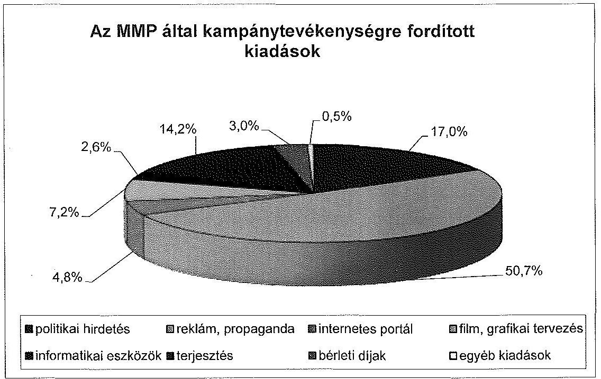

# 6.3. A választási kampány kiadásaira vonatkozó korlátozás betartásának szabályszerűsége 

Az MMP és az egyéni jelöltjei együttesen betartották a Kftv. 7. § (1) bekezdés b) pontjában meghatározott, jelöltenkénti ötmillió forintos összeghatárt.

Az MMP által rendelkezésre bocsátott a választási kampányidőszak alatt a választási kampánytevékenységgel összefüggő kiadások finanszírozását alátámasztó dokumentumok biztosították a Kftv. 7. § (1) bekezdés b) pontjában meghatározott összeghatár betartásának ellenőrzését.

A Kftv. 1. § (1) bekezdés szerinti támogatást a 33 fő egyéni jelölt nem vette igénybe, arról az MMP javára nem mondott le, és egyéb forrást nem fordított kampányfinanszírozásra. A Kftv. 2/A. § (1) bekezdése szerinti lemondásra nem került sor. A Kftv. 3. § (1) bekezdése alapján 149 249,8 ezer Ft támogatáson kívül az MMP 486,6 ezer Ft adományt használt fel. Az ellenőrzés rendelkezésre bocsátott dokumentumok alapján összesen az MMP 149 736,4 ezer Ft-ot fordított kampánytevékenységgel kapcsolatos kiadásokra.

Az MMP egyéni jelöltjeinek száma 33 fő, a listás jelölteké 56 fő, összesen 89 fő volt. A rendelkezésre bocsátott dokumentumok alapján a Kftv. 7. § (4)(5) bekezdéseinek figyelembevételével az MMP és annak jelöltjei együttesen jelöltenként 1682,4 ezer Ft-ot fordítottak a választási kampányidőszak alatt, a választási kampánytevékenységgel összefüggő kiadások finanszírozására.

---

# 6.4. A Párt tv.-ben meghatározott korlátozások betartása a kampánytevékenységek forrásai tekintetében 

Az MMP a Párt tv. 4. § (1) bekezdésében meghatározott forrásokat vette igénybe a választási kampányidőszak alatt, a választási kampánytevékenységgel összefüggő kiadások finanszírozására.

Az MMP a Párt tv. 4. § (2)-(3) bekezdései szerinti, jogi személytől, jogi személyiséggel nem rendelkező szervezettől, más államtól, külföldi szervezettől, nem magyar állampolgár természetes személytől származó vagyoni hozzájárulást, névtelen adományt és a 2013. évről áthozott 5355,0 ezer Ft forrást kampánycélra nem vett igénybe.

Az MMP politikai hirdetésekre vonatkozó számlái és az ÁSZ részére a Ve. 148. § (2) és (4) bekezdései alapján megküldött árjegyzékek és tájékoztatók körében az ellenőrzés az alábbiakat tapasztalta.

A bizonylatokon szereplő szolgáltatási díjak három esetben eltértek az ÁSZ honlapján közzétett árjegyzék adataitól, három esetben pedig a tájékoztatóban közölt ellenérték és a számla összege nem egyezett meg. Ezen eltérésekért a számlakibocsátók (sajtótermékek kiadói) a felelősek. Az eltérések nem befolyásolták a választási kampányra fordított pénzeszközök felhasználásának minősítését.

## 7. MAGYARORSZÁGI CIGÁNYPÁRT

### 7.1. Az egyéni jelöltek lemondásából származó költségvetési támogatás felhasználásának szabályszerűsége

Az MCP 61 fő egyéni jelöltjéből egyetlen jelölt sem mondott le az MCP javára a jelöltenkénti 1000,0 ezer Ft összegű támogatásról, amelyre tekintettel az MCP a Kftv. 2/A. § (1) bekezdése alapján nem részesült támogatásban. 50 fő egyéni jelölt igénybe vette a Kftv. 1. §-a szerinti, jelöltenkénti 1000,0 ezer Ft összegű támogatást. 11 fő egyéni jelölt nem vette igénybe, és nem mondott le a támogatásról az MCP javára.

### 7.2. A pártlista alapján biztosított költségvetési támogatás felhasználásának szabályszerűsége

Az MCP a rendelkezésre bocsátott dokumentumok alapján a Kftv. 3. § (1) bekezdése szerinti, központi költségvetésből juttatott támogatást a Kftv. 6. § (1) bekezdésének megfelelően választási kampányidőszak alatt, a választási kampánytevékenységgel összefüggő kiadások finanszírozására fordította.

A Kincstár a Kftv. 3. § (1) bekezdése alapján 298 500,0 ezer Ft támogatást egy összegben 2014. március 12-én folyósította az MCP pénzforgalmi számlájára, amelynek az MCP a teljes összegét felhasználta.

---

A felhasználást alátámasztó számlák, bizonylatok alaki és tartalmi kellékei a Számv. tv. 167. §-ában és az Áfa tv. 169. §-ában előírtaknak az alábbi kivételekkel megfeleltek. Az alábbi esetekben a bizonylatok adatai a Számv. tv. 165. § (2) bekezdése ellenére kerültek rögzítésre a számviteli nyilvántartásban.

Az YK2EB3630940 számú számlán - az Áfa tv. 169. § e) pontja - az MCP neve és címe nem pontosan került feltüntetésre. Az LJ9SA2495464 számú számlán - az Áfa tv. 169. d) pont dc) alpontja ellenére - nem szerepel az MCP adószáma. A 314000133 számú számla (0,7 ezer Ft) nem az MCP nevére szólt, továbbá a 41953 és az 140569/005 számú nyugtához (összesen 5,4 ezer Ft) nem állt rendelkezésre az Áfa tv. és a Számv. tv. előírásainak megfelelő számviteli bizonylat. A 44. és a 22. számú kiküldetési rendelvényen és a kapcsolódó dokumentumokon a Számv. tv. 167. § (1) bekezdés j) pontja alapján
 az Szja tv. 3. § 83. pontjában foglaltak ellenére – nem volt feltüntetve a magánszemély adóazonosító jele.

Az MCP a választásra fordított állami és más pénzeszközök, anyagi támogatások összegét, forrását és felhasználásának módját a Magyar Közlöny 2014. július 18-án megjelent Hivatalos Értesítője 36. számában, 2014. május 19-ei dátummal hozta nyilvánosságra.

Az MCP kampánycélú kiadásainak megoszlását az alábbi ábra szemlélteti:
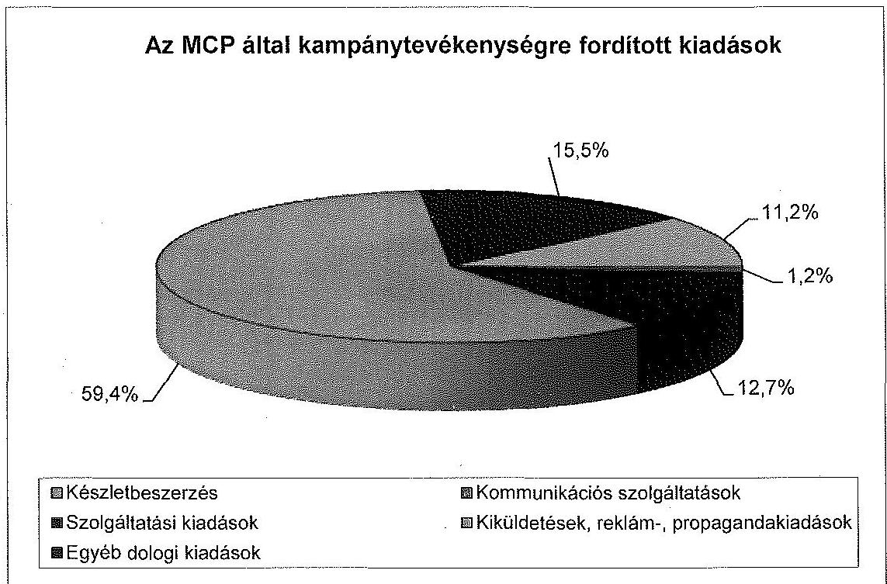
7.3. A választási kampány kiadásaira vonatkozó korlátozás betartásának szabályszerűsége

Az MCP-re és annak jelöltjeire együttesen vonatkozó, a Kftv. 7. § (1) bekezdés b) pontja szerinti jelöltenkénti ötmillió forintos értékhatár betartása nem volt megállapítható. Az értékhatár betartásának ellenőrzése nem volt biztosított, mert az MCP 61 egyéni jelöltjéből 23 fő kampányfinanszírozásra fordított forrásairól és kiadásairól nem állt rendelkezésre adat.

# 7.4. A Párt tv.-ben meghatározott korlátozások betartása a kampánytevékenységek forrásai tekintetében 

Az MCP a Párt tv. 4. § (1) bekezdésében meghatározott forrásokat vette igénybe a választási kampányidőszak alatt, a választási kampánytevékenységgel összefüggő kiadások finanszírozására. A központi költségvetésből jutatott támogatáson kívül magyar állampolgár természetes személy vagyoni hozzájárulásából 0,6 ezer Ft összeget használtak fel kampánycélú kiadásokra.

Az MCP a Párt tv. 4. § (2)–(3) bekezdései szerinti, jogi személytől, jogi személyiséggel nem rendelkező szervezettől, más államtól, külföldi szervezettől, nem magyar állampolgár természetes személytől származó vagyoni hozzájárulást, névtelen adományt és 2013. évről áthozott forrást kampánycélra nem vett igénybe.

A politikai hirdetésre vonatkozó egy számla és az ÁSZ részére a Ve. 148. § (2) és (4) bekezdése alapján megküldött árjegyzék és tájékoztató körében az ellenőrzés azt tapasztalta, hogy a politikai hirdetésről szóló számla adatai nem voltak beazonosíthatóak az árjegyzék adataival, és a tájékoztatóban a politikai hirdetés nem szerepelt. Ezen eltérésekért a számlakibocsátók (sajtótermékek kiadói) a felelősek. Az eltérések nem befolyásolták a választási kampányra fordított pénzeszközök felhasználásának minősítését.

## 8. ÖSSZEFOGÁS PÁRT

### 8.1. Az egyéni jelöltek lemondásából származó költségvetési támogatás felhasználásának szabályszerűsége

Az ÖP a rendelkezésre bocsátott dokumentumok alapján a Kftv. 2/A. § (1) bekezdése szerinti, az egyéni jelöltek lemondásaiból származó egymillió forint összegű támogatásokat a Kftv. 1. § (3) bekezdésének megfelelően a választási kampányidőszakban, a választási kampánytevékenységgel összefüggő dologi kiadások finanszírozására fordította.

Az ÖP 59-ből 57 fő egyéni jelölt támogatásról való lemondása alapján a Kincstárral megállapodást kötött. A Kincstár a megállapodás alapján 2014. március 17-én a Kftv. 2/A. § (4) bekezdésének megfelelően a központi költségvetésből 57000,0 ezer Ft támogatási összeget folyósított az ÖP kincstári kártyafedezeti számlájára, valamint a kincstári kártya kibocsátásáról intézkedett.

A támogatás teljes összege felhasználásra került. A Kincstár az elszámolást elfogadta, azonban az egyéni jelöltek nem szerezték meg a választáson a leadott érvényes szavazatok legalább 2%-át, ezért a Kftv. 8/A. § (4) bekezdése alapján a támogatás visszafizetéséről hozott határozatot. Az ÖP a Kincstár határozatával szemben bírósági felülvizsgálat iránti kérelemmel nem élt, részletfizetés/visszafizetés halasztásának engedélyezése iránti kérelmet nem nyújtott be, azonban befizetési kötelezettségét a helyszíni ellenőrzés befejezéséig nem teljesítette.

A támogatás elszámolása a Kftv. 8/A. § (1) bekezdésében és az NGM rendelet 7. § (1)–(3) bekezdéseiben foglaltaknak megfelelően, számlaösszesítő adatlapon, a támogatás felhasználását igazoló bizonylatok hitelesített másolatának benyújtásával történt. Az ÖP – hiánypótlás során – minden kiadási tételhez adott szöveges indokolást az adott tétel felhasználási céljáról, valamint nyilatkozott a támogatás szabályszerű felhasználásáról.

A kincstári kártyafedezeti számla és a kincstári kártya használata az ÖP-nél szabályszerű volt, megfelelt a Kftv. 2/A. § (4) bekezdésében meghatározott előírásoknak. A kifizetések a kincstári kártyafedezeti számláról minden esetben kincstári kártyával vagy átutalással történtek, arról készpénzfelvétel nem történt.

Az elszámolást alátámasztó dokumentumok a Kftv. 2/A. § (5) bekezdésének megfelelően az ÖP nevére szóltak. Az elszámoláshoz benyújtott és az eredeti bizonylatok mindenben megegyeztek. A számlák, bizonylatok alaki és tartalmi kellékei, a Számv. tv. 167. §-át és az Áfa tv. 169. §-át figyelembe véve, megfelelőek voltak.

# 8.2. A pártlista alapján biztosított költségvetési támogatás felhasználásának szabályszerűsége 

Az ÖP a rendelkezésre bocsátott dokumentumok alapján a Kftv. 3. § (1) bekezdése szerinti, központi költségvetésből juttatott támogatást a Kftv. 6. § (1) bekezdésének megfelelően választási kampánytevékenységgel összefüggő kiadások finanszírozására fordította. Egy esetben a támogatás felhasználása – a Kftv. 6. § (1) bekezdése ellenére – nem választási kampányidőszak alatti kiadás finanszírozására irányult.

A Kincstár a Kftv. 3. § (1) bekezdése alapján 298 500,0 ezer Ft támogatást egy összegben 2014. március 12-én folyósította az ÖP pénzforgalmi számlájára, amelynek az ÖP a teljes összegét felhasználta.

Az alábbi esetben a kifizetés – a Kftv. 6. § (1) bekezdése ellenére – nem a Ve. 139. §-a szerinti választási kampányidőszak alatti kiadás finanszírozására irányult:

A 2000/000025 számú egyszerűsített üzemanyag-számla (18,0 ezer Ft) szerinti gazdasági esemény (2014. április 9.) a Ve. 139 §-a szerinti kampányidőszakon kívül valósult meg.

A felhasználást alátámasztó számlák, bizonylatok alaki és tartalmi kellékei az alábbi esetekben nem feleltek meg a Számv. tv. 167. §-ában és az Áfa tv. 169. §-ában előírtaknak, így azok adatai a Számv. tv. 165. § (2) bekezdése ellenére kerültek rögzítésre a számviteli nyilvántartásban, továbbá sérültek a Számv. tv. egyéb előírásai.

Az ÖP a gazdasági események folyamatos nyilvántartásának vezetéséről – a Számv. tv. 12. § (1) bekezdése ellenére – nem gondoskodott.

Az Áfa tv. 169. § e) pontja ellenére a 0780/00051 számú (5,0 ezer Ft) és a 0/0(018)0005/021614 számú (140,1 ezer Ft) számlák nem az ÖP nevére és címére szóltak, a 0854/00016 számú (20,0 ezer Ft), az 1663/00013 számú (16,9 ezer Ft) és az YK2EA7485455 számú (13,7 ezer Ft) számlán az ÖP címe nem pontosan szerepelt, az YK2EA5467233 számú (3,7 ezer Ft) számlán nem az ÖP neve szerepelt, a cím feltüntetése megfelelő volt.

Tíz db üzemanyagszámlához (összesen 147,8 ezer Ft) mellékelt útnyilvántartás a Számv. tv. 167. § (1) bekezdés j) pontja ellenére – nem tartalmazta az Szja tv. 5. melléklet II. 7. pontja szerinti valamennyi kötelező tartalmi elemet.

A 0623/0009 számú számla (30,0 ezer Ft) – a Számv. tv. 169. § (2) bekezdése ellenére – nem állt rendelkezésre.

Az ÖP a választásra fordított állami és más pénzeszközök, anyagi támogatások összegét, forrását és felhasználásának módját a Magyar Közlöny 2014. június 20-án megjelent Hivatalos Értesítője 32. számában 2014. június 12-ei dátummal hozta nyilvánosságra.

Az ÖP kampánycélú kiadásainak megoszlását az alábbi ábra szemlélteti:
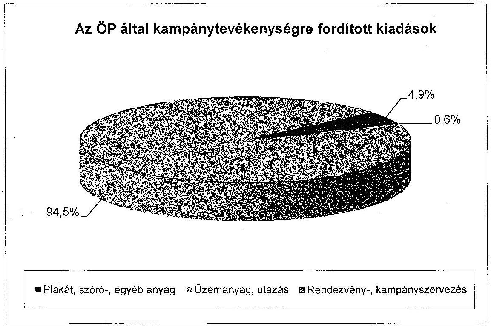

# 8.3. A választási kampány kiadásaira vonatkozó korlátozás betartásának szabályszerűsége 

Az ÖP-re és annak jelöltjeire együttesen vonatkozó, a Kftv. 7. § (1) bekezdés b) pontja szerinti jelöltenkénti ötmillió forintos értékhatár betartása nem volt megállapítható. Az értékhatár betartásának ellenőrzése nem volt biztosított, mert az ÖP 59 egyéni jelöltjéből öt fő kampányfinanszírozásra fordított forrásairól és kiadásairól nem állt rendelkezésre adat.

### 8.4. A Párt tv.-ben meghatározott korlátozások betartása a kampánytevékenységek forrásai tekintetében

Az ÖP a Párt tv. 4. § (1) bekezdésében meghatározott forrásokat vette igénybe a választási kampányidőszak alatt, a választási kampánytevékenységgel összefüggő kiadások finanszírozására. A központi költségvetésből juttatott támogatáson kívül 1091,8 ezer Ft-ot fordított kampányfinanszírozásra, amely 2013. évről áthozott forrásból és természetes személy vagyoni hozzájárulásából származott. A 2013. évről áthozott forrás szintén természetes személy vagyoni hozzájárulásából származott.

Az ÖP a Párt tv. 4. § (2)–(3) bekezdései szerinti, jogi személytől, jogi személyiséggel nem rendelkező szervezettől, más államtól, külföldi szervezettől, nem magyar állampolgár természetes személytől származó vagyoni hozzájárulást, névtelen adományt kampánycélra nem vett igénybe.

A politikai hirdetésekre vonatkozó számlák és az ÁSZ részére a Ve. 148. § (2) és (4) bekezdése alapján megküldött árjegyzékek és tájékoztatók körében az ellenőrzés azt tapasztalta, hogy egy esetben a politikai hirdetésről szóló számla adatai nem egyeztek meg a tájékoztató adataival. Ezen eltérésekért a számlakibocsátók (sajtótermékek kiadói) a felelősek. Az eltérések nem befolyásolták a választási kampányra fordított pénzeszközök felhasználásának minősítését.

## 9. SERES MÁRIA SZÖVETSÉGESEI

### 9.1. Az egyéni jelöltek lemondásából származó költségvetési támogatás felhasználásának szabályszerűsége

Az SMS a rendelkezésre bocsátott dokumentumok alapján a Kftv. 2/A. § (1) bekezdése szerinti, az egyéni jelöltek lemondásaiból származó egymillió forint összegű támogatásokat a Kftv. 1. § (3) bekezdésének megfelelően a választási kampányidőszakban, a választási kampánytevékenységgel összefüggő dologi kiadások finanszírozására fordította.

Az SMS 67-ből 58 fő egyéni jelölt támogatásról való lemondása alapján a Kincstárral megállapodást kötött. A Kincstár a megállapodás alapján 2014. március 12-én a Kftv. 2/A. § (4) bekezdésének megfelelően a központi költség-

vetésből 58000,0 ezer Ft támogatási összeget folyósított az SMS kincstári kártyafedezeti számlájára, valamint kincstári kártya kibocsátásáról intézkedett.

A támogatás teljes összege felhasználásra került. A Kincstár az elszámolást részben fogadta el, továbbá az 58 főből 56 egyéni jelölt nem szerezte meg a választáson a leadott érvényes szavazatok legalább 2%-át, ezért a Kftv. 8/A. § (4) bekezdése alapján a támogatás visszafizetéséről hozott határozatot.

A Kincstár a 140800001 számú számla szerinti 36000,0 ezer Ft összegű tételt nem elfogadható költségnek minősítette, így ezen összeg kétszeres mértékű visszafizetéséről rendelkezett.

Az SMS a Kincstár határozatával szemben 2014. június 27-én a Nyíregyházi Közigazgatási és Munkaügyi Bíróságnál felülvizsgálati kérelemmel élt, a benyújtott kérelem elbírálása – a helyszíni ellenőrzés lezárásának időpontjában – folyamatban volt.

A támogatás elszámolása, a Kftv. 8/A. § (1) és az NGM rendelet 7. § (1)–(3) bekezdéseiben foglaltaknak megfelelően, számlaösszesítő adatlapon, a támogatás felhasználását igazoló bizonylatok hitelesített másolatának benyújtásával történt. Az SMS minden kiadási tételhez adott szöveges indokolást az adott tétel felhasználási céljáról, valamint nyilatkozott a támogatás szabályszerű felhasználásáról.

A kincstári kártyafedezeti számla és a kincstári kártya használata az SMS-nél szabályszerű volt, megfelelt a Kftv. 2/A. § (4) bekezdésében meghatározott előírásoknak. A kifizetések a kincstári kártyafedezeti számláról minden esetben kincstári kártyával vagy átutalással történtek, arról készpénzfelvétel nem történt.

Az elszámolást alátámasztó dokumentumok a Kftv. 2/A. § (5) bekezdésének megfelelően az SMS nevére szóltak. Az elszámoláshoz benyújtott és az eredeti bizonylatok mindenben megegyeztek. A számlák, bizonylatok alaki és tartalmi kellékei, az Áfa tv. 169. §-át és – egy kivétellel – a Számv. tv. 167. §-át figyelembe véve megfelelőek voltak.

A 140800001 számú, külföldi szolgáltató által kiállított számla (36000,0 ezer Ft) – a Számv. tv. 167. § (1) bekezdés j) pontja ellenére – nem tartalmazta az Európai Unió Tanácsának a közös hozzáadottértékadó-rendszerről szóló 2006/112/EK irányelve (Héa-irányelv) 226. cikkének megfelelően sem a Héa-irányelv vonatkozó rendelkezésére vagy a megfelelő nemzeti rendelkezésre történő hivatkozást, sem bármilyen más utalást arra, hogy a termékértékesítés vagy szolgáltatás adómentes volt.

# 9.2. A pártlista alapján biztosított költségvetési támogatás felhasználásának szabályszerűsége 

Az SMS a rendelkezésre bocsátott dokumentumok alapján a Kftv. 3. § (1) bekezdése szerinti, központi költségvetésből juttatott támogatást a Kftv. 6. § (1) bekezdésének megfelelően a
 választási

---

# kampánytevékenységgel összefüggő kiadások finanszírozására fordította. Három esetben a támogatás felhasználása - a Kftv. 6. § (1) bekezdése ellenére - nem választási kampányidőszak alatti kiadások finanszírozására irányult. 

A Kincstár a Kftv. 3. § (1) bekezdése alapján a 298 500,0 ezer Ft támogatást egy összegben 2014. március 12-én folyósította az SMS pénzforgalmi számlájára, amelynek az SMS a teljes összegét felhasználta.

Az alábbi esetekben a kifizetések (összesen 166,7 ezer Ft) - a Kftv. 6. § (1) bekezdése ellenére - nem a Ve. 139. §-a szerinti választási kampányidőszak alatti kiadások finanszírozására irányultak:

A 4448237 (11,6 ezer Ft) és a 140160 (150,1 ezer Ft) számú készpénzfizetési számlán a teljesítés dátuma 2014. április 7-e, illetve 2014. április 8-a volt. A 2148 (5,0 ezer Ft) számú üzemanyagszámlán a gazdasági esemény 2014. április 10-én valósult meg.

A felhasználást alátámasztó számlák, bizonylatok alaki és tartalmi kellékei megfeleltek a Számv. tv. 167. §-ában előírtaknak, azonban két esetben a tartalmi kellékek nem feleltek meg az Áfa tv. 169. §-ának. Ezekben az esetekben a bizonylatok adatai a Számv. tv. 165. § (2) bekezdése ellenére kerültek rögzítésre a számviteli nyilvántartásban.

A 1734504 (12,7 ezer Ft) és a 1734505 (25,4 ezer Ft) számú számlán - az Áfa tv. 169. § c) pontja ellenére - nem szerepelt a szolgáltatás nyújtójának adószáma.

Az SMS a választásra fordított állami és más pénzeszközök, anyagi támogatások összegét, forrását és felhasználásának módját a Magyar Közlöny 2014. június 5-én megjelent Hivatalos Értesítője 29. számában 2014. június 2-ai dátummal hozta nyilvánosságra.

Az SMS kampánycélú kiadásainak megoszlását az alábbi ábra szemlélteti:
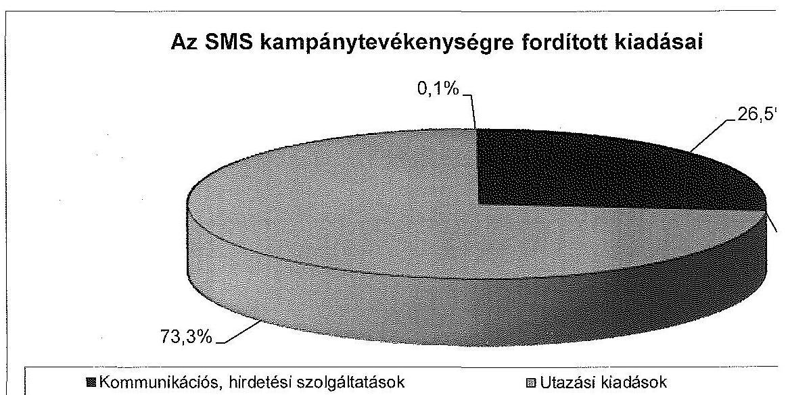

---

# 9.3. A választási kampány kiadásaira vonatkozó korlátozás betartásának szabályszerűsége 

Az SMS-re és annak jelöltjeire együttesen vonatkozó, a Kftv. 7. § (1) bekezdés b) pontja szerinti jelöltenkénti ötmillió forintos értékhatár betartása nem volt megállapítható. Az értékhatár betartásának ellenőrzése nem volt biztosított, mert az SMS 67 egyéni jelöltjéből nyolc fő kampányfinanszírozásra fordított forrásairól és kiadásairól nem állt rendelkezésre adat.

### 9.4. A Párt tv.-ben meghatározott korlátozások betartása a kampánytevékenységek forrásai tekintetében

Az SMS a Párt tv. 4. § (1) bekezdésében meghatározott forrásokat vette igénybe a választási kampányidőszak alatt, a választási kampánytevékenységgel összefüggő kiadások finanszírozására. A központi költségvetésből juttatott támogatáson kívül a tagok által fizetett díjból (3,6 ezer Ft) és magyar állampolgár természetes személyek vagyoni hozzájárulásaiból (90,0 ezer Ft) költött kampányfinanszírozásra.

Az SMS a Párt tv. 4. § (2)-(3) bekezdései szerinti, jogi személytől, jogi személyiséggel nem rendelkező szervezettől, más államtól, külföldi szervezettől, nem magyar állampolgár természetes személytől származó vagyoni hozzájárulást, névtelen adományt és 2013. évről áthozott forrást kampánycélra nem vett igénybe.

A politikai hirdetésekre vonatkozó számlák és az ÁSZ részére a Ve. 148. § (2) és (4) bekezdése alapján megküldött árjegyzékek és tájékoztatók körében az ellenőrzés az alábbiakat tapasztalta. Nyolc esetben a politikai hirdetésről szóló számlában rögzítetett ár nem volt beazonosítható az árjegyzék adataival. Három esetben továbbá a tájékoztatóban közölt ellenérték és a számlán feltüntetett adatok nem egyeztek meg. Ezen eltérésekért a számlakibocsátók (sajtótermékek kiadói) a felelősek. Az eltérések nem befolyásolták a választási kampányra fordított pénzeszközök felhasználásának minősítését.

## 10. SPORTOS ÉS EGÉSZSÉGES MAGYARORSZÁGÉRT PÁRT

### 10.1. Az egyéni jelöltek lemondásából származó költségvetési támogatás felhasználásának szabályszerűsége

A Kftv. 1. § (1) bekezdése szerinti jelöltenkénti „egymillió forint összegű”, a központi költségvetésből juttatott támogatást az 52 egyéni jelölt nem vette igénybe. A SEM a Kftv. 2/A. § (1) bekezdése alapján nem részesült támogatásban.

---

# 10.2. A pártlista alapján biztosított költségvetési támogatás felhasználásának szabályszerűsége 

A SEM a rendelkezésre bocsátott dokumentumok alapján a Kftv. 3. § (1) bekezdése szerinti, központi költségvetésből juttatott támogatást a Kftv. 6. § (1) bekezdésének megfelelően a választási kampánytevékenységgel összefüggő kiadások finanszírozására fordította. Egy esetben választási kampányidőszakon túli szolgáltatásra történt finanszírozás.

A Kincstár a Kftv. 3. § (1) bekezdése alapján 149 250,0 ezer Ft támogatást egy összegben, 2014. március 12-én folyósította a SEM pénzforgalmi számlájára.

Az ellenőrzés egy dokumentum esetében állapította meg, hogy a szolgáltatás tényleges igénybevétele a Ve. 139. §-ban előírt kampányidőszakon túli időszakra vonatkozott.

Fitnessszolgáltatásról kiállított 53,0 ezer Ft összegű, 2014. április 2-ai teljesítésű és keltezésű számla szerint háromhavi egész napos bérlet vásárlása történt.

A felhasználást alátámasztó számlák, bizonylatok alaki és tartalmi kellékei a Számv. tv. 167. §-ában és az Áfa tv. 169. §-ában előírtaknak megfeleltek.

A SEM a választásra fordított állami és más pénzeszközök, anyagi támogatások összegét, forrását és felhasználásának módját a Magyar Közlöny 2014. június 5-én megjelent Hivatalos Értesítő 29. számában 2014. május 26-i dátummal hozta nyilvánosságra.

A SEM kampánycélú kiadásainak megoszlását az alábbi ábra szemlélteti:
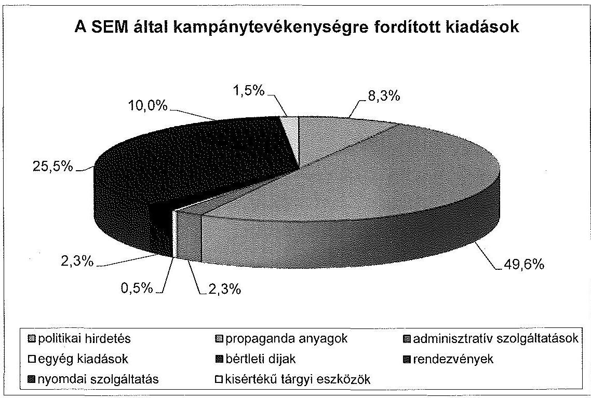

---

# 10.3. A választási kampány kiadásaira vonatkozó korlátozás betartásának szabályszerűsége 

A SEM és az egyéni jelöltjei együttesen betartották a Kftv. 7. § (1) bekezdés b) pontjában meghatározott, jelöltenkénti ötmillió forintos összeghatárt.

A SEM által rendelkezésre bocsátott, a választási kampányidőszak alatt a választási kampánytevékenységgel összefüggő kiadások finanszírozását alátámasztó dokumentumok biztosították a Kftv. 7. § (1) bekezdés b) pontjában meghatározott összeghatár betartásának ellenőrzését.

A Kftv. 1. § (1) bekezdés szerinti támogatást az 52 fő egyéni jelölt nem vette igénybe. A Kftv. 2/A. § (1) bekezdése alapján lemondásra nem került sor. A Kftv. 3. § (1) bekezdése szerinti, 149 250,0 ezer Ft központi költségvetési támogatáson kívül a SEM 465,6 ezer Ft adományt használt fel. Az ellenőrzés rendelkezésre bocsátott dokumentumok alapján a SEM összesen 149 715,6 ezer Ft-ot fordított kampánytevékenységgel kapcsolatos kiadásokra.

A SEM egyéni jelöltjeinek száma 52 fő, a listás jelölteké 18 fő, összesen 70 fő volt. A rendelkezésre bocsátott dokumentumok alapján a Kftv. 7. § (4)(5) bekezdéseinek figyelembevételével a SEM és annak jelöltjei együttesen jelöltenként 2138,8 ezer Ft-ot fordítottak a választási kampányidőszak alatt, a választási kampánytevékenységgel összefüggő kiadások finanszírozására.

### 10.4. A Párt tv.-ben meghatározott korlátozások betartása a kampánytevékenységek forrásai tekintetében

A SEM a Párt tv. 4. § (1) bekezdésben meghatározott forrásokat vette igénybe a választási kampányidőszak alatt, a választási kampánytevékenységgel összefüggő kiadások finanszírozására. A támogatáson kívül magyar állampolgárságú természetes személyek által nyújtott vagyoni hozzájárulásból 465,6 ezer Ft-ot használtak fel kampánycélú kiadásokra.

A SEM a Párt tv. 4. § (2)-(3) bekezdései szerinti, jogi személytől, jogi személyiséggel nem rendelkező szervezettől, más államtól, külföldi szervezettől, nem magyar állampolgár természetes személytől származó vagyoni hozzájárulást, névtelen adományt és a 2013. évről áthozott 88,0 ezer Ft forrást kampánycélra nem vett igénybe.

A SEM politikai hirdetésekre vonatkozó számlái és az ÁSZ részére a Ve. 148. § (2) és (4) bekezdése alapján megküldött árjegyzékek és tájékoztatók körében az ellenőrzés az alábbiakat tapasztalta.

A bizonylatokon szereplő szolgáltatási díjak kettő esetben eltértek az ÁSZ honlapján közzétett árjegyzék adataitól, egy esetben a tájékoztatóban közölt ellenérték és a számla összege nem egyezett meg. Ezen eltérésekért a számlakibocsátók (sajtótermékek kiadói) a felelősek. Az eltérések nem befolyásolták a választási kampányra fordított pénzeszközök felhasználásának minősítését.

---

# 11. SzoCiÁldemokraták MaGyar Polgári PÁrtía 

### 11.1. Az egyéni jelöltek lemondásából származó költségvetési támogatás felhasználásának szabályszerűsége

A Kftv. 1. § (1) bekezdése szerinti jelöltenkénti „egymillió forint összegű” támogatás igénybevételére a 82 egyéni jelöltből kettő fő kötött megállapodást a Kincstárral, amelyből felhasználás nem volt. Az SZMPP a Kftv. 2/A. § (1) bekezdése alapján nem részesült támogatásban.

### 11.2. A pártlista alapján biztosított költségvetési támogatás felhasználásának szabályszerűsége

Az SZMPP a rendelkezésre bocsátott dokumentumok alapján a Kftv. 3. § (1) bekezdése szerinti, központi költségvetésből juttatott támogatást a Kftv. 6. § (1) bekezdésének megfelelően a választási kampánytevékenységgel összefüggő kiadások finanszírozására fordította. Egy esetben választási kampányidőszakon kívüli felhasználás történt.

A Kincstár a Kftv. 3. § (1) bekezdése alapján 447 500,0 ezer Ft támogatást egy összegben, 2014. március 12-én folyósította az SZMPP pénzforgalmi számlájára, amelyből 444 709,4 ezer Ft-ot használtak fel. A 2014. évi országgyűlési képviselők általános választásához kapcsolódóan az SZMPP a kapott támogatásból a választási kampányidőszak alatt, a választási kampánytevékenységgel kapcsolatos kiadások finanszírozására a rendelkezésre álló dokumentumok alapján 2790,6 ezer Ft-ot nem használt fel.

Az ellenőrzés egy esetben állapította meg, hogy a Ve. 140. §-nak megfelelő kampányeszköz, azonban a Ve. 139. §-ban előírt kampányidőszakon kívüli felhasználás volt.

Egy internetes hirdetési szolgáltatásra megkötött szerződés 2014. március 20-ától október 20-áig tartó időszakra szólt, a 215 szerződéses napból 18 nap volt kampányidőszaki. A számla teljes összegét, 635,0 ezer Ft-ot a költségvetési támogatás terhére számolták el, amelyből időarányosan 53,2 ezer Ft vehető figyelembe.

A felhasználást alátámasztó számlák, bizonylatok, számlák alaki és tartalmi kellékei a Számv. tv. 167. §-ában és az Áfa tv. 169. §-ában előírtaknak megfeleltek.

Az SZMPP a választásra fordított állami és más pénzeszközök, anyagi támogatások összegét, forrását és felhasználásának módját a Magyar Közlöny 2014. június 30-án megjelent Hivatalos Értesítő 33. számában 2014. május 20-ai dátummal hozta nyilvánosságra.

---

Az SZMPP kampánycélú kiadásainak megoszlását az alábbi ábra szemlélteti:
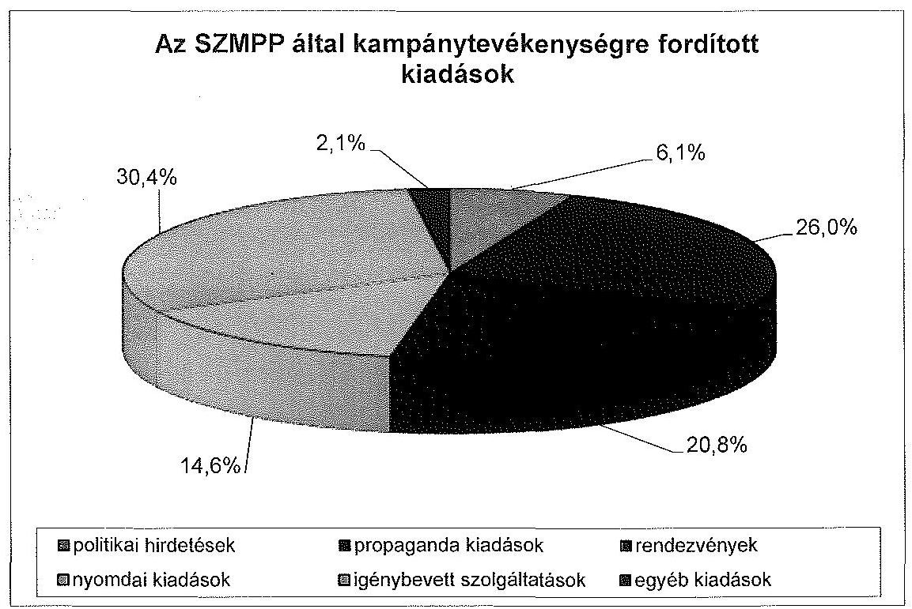
11.3. A választási kampány kiadásaira vonatkozó korlátozás betartásának szabályszerűsége

Az SZMPP-re és annak jelöltjeire együttesen vonatkozó, a Kftv. 7. § (1) bekezdés b) pontja szerinti jelöltenkénti ötmillió forintos értékhatár betartása nem volt megállapítható. Az értékhatár betartásának ellenőrzése nem volt biztosított, mert az SZMPP 82 egyéni jelöltjéből három fő kampányfinanszírozásra fordított forrásairól és kiadásairól nem állt rendelkezésre adat.
11.4. A Párt tv.-ben meghatározott korlátozások betartása a kampánytevékenységek forrásai tekintetében

Az SZMPP a Párt tv. 4. § (1) bekezdésben meghatározott forrásokat vette igénybe a választási kampányidőszak alatt, a választási kampánytevékenységgel összefüggő kiadások finanszírozására.

Az SZMPP a Párt tv. 4. § (2)-(3) bekezdései szerinti jogi személytől, jogi személyiséggel nem rendelkező szervezettől, más államtól, külföldi szervezettől, nem magyar állampolgár természetes személytől származó vagyoni hozzájárulást, névtelen adományt és 2013. évről áthozott forrást kampánycélra nem vett igénybe.

---

Az SZMPP politikai hirdetésekre vonatkozó számlái és az ÁSZ részére a Ve. 148. § (2) és (4) bekezdése alapján megküldött árjegyzékek és tájékoztatók körében az ellenőrzés az alábbiakat tapasztalta.

A bizonylatokon szereplő szolgáltatási díjak öt esetben eltértek az ÁSZ honlapján közzétett árjegyzék adataitól, egy esetben a tájékoztatóban közölt ellenérték és a számla összege nem egyezett meg. Ezen eltérésekért a számlakibocsátók (sajtótermékek kiadói) a felelősek. Az eltérések nem befolyásolták a választási kampányra fordított pénzeszközök felhasználásának minősítését.

# 12. ÚJ DIMENZIÓ PÁRT 

### 12.1. Az egyéni jelöltek lemondásából származó költségvetési támogatás felhasználásának szabályszerűsége

Az ÚDP a rendelkezésre bocsátott dokumentumok alapján a Kftv. 2/A. § (1) bekezdése szerinti, az egyéni jelöltek lemondásaiból származó egymillió forint összegű támogatásokat a Kftv. 1. § (3) bekezdésének megfelelően a választási kampányidőszakban, a választási kampánytevékenységgel összefüggő dologi kiadások finanszírozására fordította.

Az ÚDP 49-ből 35 fő egyéni jelölt támogatásról való lemondása alapján
 a Kincstár megállapodást kötött. A Kincstár a megállapodás alapján 2014. március 17-én a Kftv. 2/A. § (4) bekezdésének megfelelően a központi költségvetésből 35000,0 ezer Ft támogatási összeget folyósított az ÚDP kincstári kártyafedezeti számlájára, valamint a kincstári kártya kibocsátásáról intézkedett. A Kincstár tájékoztatása szerint a megállapodás megkötését követően azonban az egyik lemondó nyilatkozat érvénytelensége miatt 1000,0 ezer Ft a kincstári kártya mögötti kártyafedezeti számláról visszavezetésre került.

A támogatásból a tényleges felhasználás 33 956,6 ezer Ft volt. A Kincstár az elszámolást elfogadta, azonban az egyéni jelöltek nem szerezték meg a választáson a leadott érvényes szavazatok legalább 2%-át, ezért a Kftv. 8/A. § (4) bekezdése alapján a támogatás visszafizetéséről hozott határozatot. Az ÚDP a Kincstár határozatával szemben bírósági felülvizsgálat iránti kérelemmel nem élt, részletfizetés/visszafizetés halasztásának engedélyezése iránti kérelmet nem nyújtott be, azonban befizetési kötelezettségét a helyszíni ellenőrzés befejezéséig nem teljesítette.

A támogatás elszámolása, a Kftv. 8/A. § (1) és az NGM rendelet 7. § (1)(3) bekezdéseiben foglaltaknak megfelelően, számlaösszesítő adatlapon, a támogatás felhasználását igazoló bizonylatok hitelesített másolatának benyújtásával történt. Az ÚDP – hiánypótlás során – minden kiadási tételhez adott szöveges indokolást az adott tétel felhasználási céljáról, valamint nyilatkozott a támogatás szabályszerű felhasználásáról.

A kincstári kártyafedezeti számla és a kincstári kártya használata az ÚDP-nél szabályszerű volt, megfelelt a Kftv. 2/A. § (4) bekezdésében meghatározott elő-

írásoknak. A kifizetések a kincstári kártyafedezeti számláról minden esetben kincstári kártyával vagy átutalással történtek, arról készpénzfelvétel nem történt.

Az elszámolást alátámasztó dokumentumok a Kftv. 2/A. § (5) bekezdésének megfelelően az ÚDP nevére szóltak. Az elszámoláshoz benyújtott és az eredeti bizonylatok mindenben megegyeztek. A számlák, bizonylatok alaki és tartalmi kellékei, a Számv. tv. 167. §-át és az Áfa tv. 169. §-át figyelembe véve, megfelelőek voltak.

# 12.2. A pártlista alapján biztosított költségvetési támogatás felhasználásának szabályszerűsége 

Az ÚDP a rendelkezésre bocsátott dokumentumok alapján a Kftv. 3. § (1) bekezdése szerinti, központi költségvetésből juttatott támogatást a Kftv. 6. § (1) bekezdésének megfelelően választási kampányidőszak alatt, a választási kampánytevékenységgel összefüggő kiadások finanszírozására fordította.

A Kincstár a Kftv. 3. § (1) bekezdése alapján 149 250,0 ezer Ft támogatást egy összegben 2014. március 12-én folyósította az ÚDP pénzforgalmi számlájára, amelynek az ÚDP a teljes összegét felhasználta.

A felhasználást alátámasztó számlák, bizonylatok 86%-a, összesen 65972,9 ezer Ft összeg esetében az alaki és tartalmi kellékek a Számv. tv. 167. §-ában és az Áfa tv. 169. §-ában előírtaknak az alábbiakban részletezettek szerint nem feleltek meg, így azok adatai a Számv. tv. 165. § (2) bekezdése ellenére kerültek rögzítésre a számviteli nyilvántartásban.

A 003/2014/HU, a 004/2014/HU és a 006/2014/HU számú számlákon – az Áfa tv. 169. § c) pontjában foglaltak ellenére – nem szerepelt adószám (helyette a cégjegyzék szám került feltüntetésre), továbbá – az Áfa tv. 169. § j) pontja ellenére – nem az Áfa tv. 82. § (1) bekezdésének megfelelő adómérték került megállapításra. A három tétel összesen 19872,0 ezer Ft összeget tett ki. 83 útnyilvántartás továbbá – a Számv. tv. 167. § (1) bekezdés j) pontjában foglaltak ellenére – nem tartalmazta az Szja tv. 5. melléklet II. 7. pontjában a gépjármű-használati nyilvántartásra (útnyilvántartás) vonatkozó valamennyi kötelező tartalmi elemet (pl. az utazás célja, felkeresett üzleti partnerek). A 83 tétel összesen 46 100,9 ezer Ft összeget tett ki.

Az ÚDP a választásra fordított állami és más pénzeszközök, anyagi támogatások összegét, forrását és felhasználásának módját a Magyar Közlöny 2014. június 5-én megjelent Hivatalos Értesítője 29. számában, 2014. május 30-ai dátummal hozta nyilvánosságra.

Az ÚDP kampánycélú kiadásainak megoszlását az alábbi ábra szemlélteti:
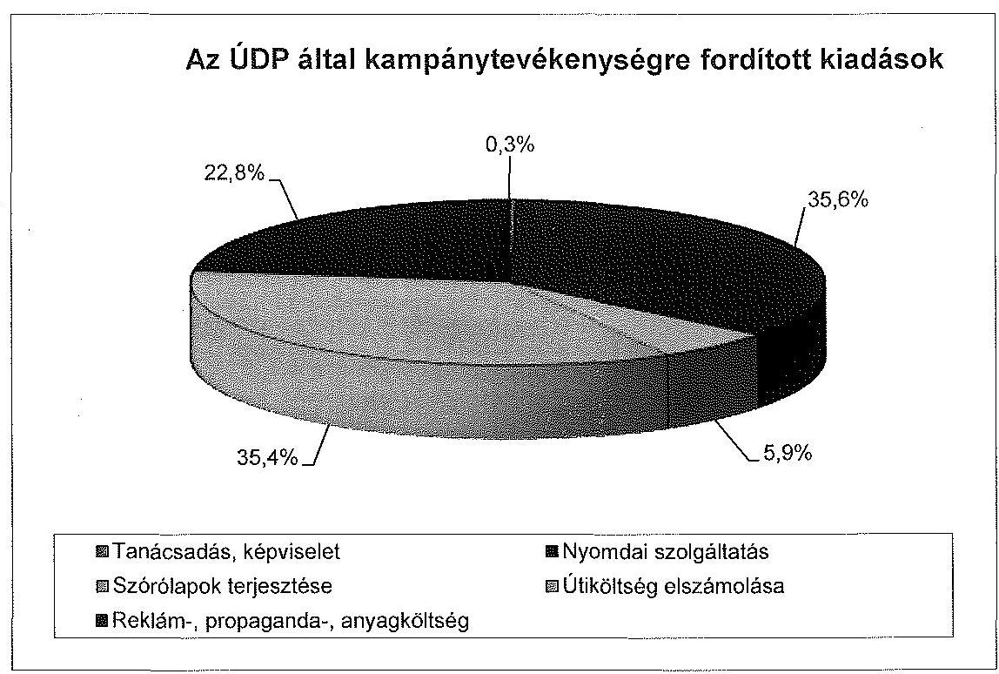

# 12.3. A választási kampány kiadásaira vonatkozó korlátozás betartásának szabályszerűsége 

Az ÚDP és az egyéni jelöltjei együttesen betartották a Kftv. 7. § (1) bekezdés b) pontjában meghatározott, jelöltenkénti ötmillió forintos összeghatárt.

Az ÚDP által a választási kampányidőszak alatt a választási kampánytevékenységgel összefüggő kiadásokról rendelkezésre bocsátott dokumentumok biztosították a Kftv. 7. § (1) bekezdés b) pontjában meghatározott ötmillió forintos értékhatár betartásának ellenőrzését.

A Kftv. 1. § (1) bekezdése alapján egy fő egyéni jelölt részesült 1000,0 ezer Ft összegű támogatásban, amelyet az egyéni jelölt ugyanezen összeg erejéig igénybe vett. 14 fő egyéni jelölt nem vette igénybe a Kftv. 1. §-a szerinti támogatást, arról az ÚDP javára nem mondott le, és egyéb forrást nem vett igénybe kampányfinanszírozásra. A Kftv. 2/A. § (1) bekezdése alapján az ÚDP-t megillető 34000,0 ezer Ft támogatásból összesen 33 956,6 ezer Ft összegű felhasználás történt. A Kftv. 3. § (1) bekezdése alapján az ÚDP-t 149 250,0 ezer Ft támogatás illette meg, amelyet ugyanezen összeg erejéig igénybe vett. Az ÚDP és egyéni jelöltjei a rendelkezésre bocsátott dokumentumok alapján összesen 184 206,6 ezer Ft-ot fordítottak kampányfinanszírozásra.

Az ÚDP esetében az egyéni jelöltek száma 49 fő, a listás jelöltek száma 46 fő, összesen 95 fő volt. A rendelkezésre bocsátott dokumentumok alapján – a Kftv. 7. § (4)-(5) bekezdéseinek figyelembevételével – az ÚDP és annak jelöltjei együttesen jelöltenként 1939,0 ezer Ft-ot fordítottak a választási kampányidőszak alatt, a választási kampánytevékenységgel összefüggő kiadások finanszírozására.

# 12.4. A Párt tv.-ben meghatározott korlátozások betartása a kampánytevékenységek forrásai tekintetében 

Az ÚDP a Párt tv. 4. § (1) bekezdésében meghatározott forrásokat vette igénybe a választási kampányidőszak alatt, a választási kampánytevékenységgel összefüggő kiadások finanszírozására.

Az ÚDP a Párt tv. 4. § (2)-(3) bekezdései szerinti, jogi személytől, jogi személyiséggel nem rendelkező szervezettől, más államtól, külföldi szervezettől, nem magyar állampolgár természetes személytől származó vagyoni hozzájárulást, névtelen adományt és 2013. évről áthozott forrást kampánycélra nem vett igénybe.

Az ÚDP a Kftv. 2/A. §-a alapján folyósított 1. § szerinti, valamint a Kftv. 3. § (1) bekezdése alapján folyósított támogatás terhére – az ÁSZ honlapján közzétett tájékoztatók szerint – a Ve. 146. § b) pontja szerinti politikai hirdetést nem tett közzé, amelyet az ellenőrzés során rendelkezésre bocsátott dokumentumok is alátámasztottak.

## 13. Új MAGYARORSZÁG PÁRT

### 13.1. Az egyéni jelöltek lemondásából származó költségvetési támogatás felhasználásának szabályszerűsége

Az ÚMP a rendelkezésre bocsátott dokumentumok alapján a Kftv. 2/A. § (1) bekezdése szerinti, az egyéni jelöltek lemondásaiból származó egymillió forint összegű támogatásokat a Kftv. 1. § (3) bekezdésének megfelelően a választási kampányidőszakban, a választási kampánytevékenységgel összefüggő dologi kiadások finanszírozására fordította.

Az ÚMP 50-ből 47 fő egyéni jelölt támogatásról való lemondása alapján a Kincstár megállapodást kötött. A Kincstár a megállapodás alapján 2014. március 17-én a Kftv. 2/A. § (4) bekezdésének megfelelően a központi költségvetésből 47000,0 ezer Ft támogatási összeget folyósított az ÚMP kincstári kártyafedezeti számlájára, valamint a kincstári kártya kibocsátásáról intézkedett.

A támogatásból a tényleges felhasználás 46 996,3 ezer Ft volt. A Kincstár az elszámolást részben fogadta el, továbbá az egyéni jelöltek nem szerezték meg a választáson a leadott érvényes szavazatok legalább 2%-át, ezért a Kftv. 8/A. § (4) bekezdése alapján a támogatás visszafizetéséről hozott határozatot.

A határozatban a Kincstár az ÚMP-t a kincstári kártyáról kifizetett, hiánypótlási felhívás ellenére el nem számolt 29,5 ezer Ft összeg esetében a Kftv. 8/A. § (3) bekezdés b) pontja alapján kétszeres mértékű visszafizetésre kötelezte.

Az ÚMP a Kincstár határozatával szemben bírósági felülvizsgálat iránti kérelemmel nem élt, részletfizetés/visszafizetés halasztásának engedélyezése iránti kérelmet nem nyújtott be, azonban befizetési kötelezettségét a helyszíni ellenőrzés befejezéséig nem teljesítette.

A támogatás elszámolása a Kftv. 8/A. § (1) és az NGM rendelet 7. § (1)(3) bekezdéseiben foglaltaknak megfelelően, számlaösszesítő adatlapon, és 29,5 ezer Ft kivételével – a támogatás felhasználását igazoló bizonylatok hitelesített másolatának benyújtásával történt. Az ÚMP – hiánypótlás során a fenti összeg kivételével – minden kiadási tételhez adott szöveges indokolást az adott tétel felhasználási céljáról, valamint nyilatkozott a támogatás szabályszerű felhasználásáról.

A kincstári kártyafedezeti számla és a kincstári kártya használata az ÚMP-nél szabályszerű volt, megfelelt a Kftv. 2/A. § (4) bekezdésében meghatározott előírásoknak. A kifizetések a kincstári kártyafedezeti számláról minden esetben kincstári kártyával vagy átutalással történtek, arról készpénzfelvétel nem történt.

Az elszámolást alátámasztó dokumentumok a Kftv. 2/A. § (5) bekezdésének megfelelően az ÚMP nevére szóltak. Az elszámoláshoz benyújtott és az eredeti bizonylatok mindenben megegyeztek. A számlák, bizonylatok alaki és tartalmi kellékei, a Számv. tv. 167. §-át és az Áfa tv. 169. §-át figyelembe véve, megfelelőek voltak.

Az ÚMP a kincstári kártyával 2014. április 2-án, 3-án és 4-én a FBADS-325100036173, FBADS-325-100036370 és FBADS-325-100036497 számú számlák alapján 7,5 ezer Ft-ot, 11,6 ezer Ft-ot és 10,4 ezer Ft-ot, összesen 29,5 ezer Ft-ot fizetett ki. A három számla nem az ÚMP nevére szólt, ezért az ÚMP ezen számlákat a Kincstár felé nem nyújtotta be az elszámoláshoz.

# 13.2. A pártlista alapján biztosított költségvetési támogatás felhasználásának szabályszerűsége 

Az ÚMP a rendelkezésre bocsátott dokumentumok alapján a Kftv. 3. § (1) bekezdése szerinti, központi költségvetésből juttatott támogatást a Kftv. 6. § (1) bekezdésének megfelelően választási kampányidőszak alatt, a választási kampánytevékenységgel összefüggő kiadások finanszírozására fordította.

A Kincstár a Kftv. 3. § (1) bekezdése alapján 149 250,0 ezer Ft támogatást egy összegben 2014. március 12-én folyósította az ÚMP pénzforgalmi számlájára, amelyből az ÚMP 149 212,1 ezer Ft-ot használt fel. A 2014. évi országgyűlési képviselők általános választásához kapcsolódóan az ÚMP a kapott támogatásból a választási kampányidőszak alatt, a választási kampánytevékenységgel kapcsolatos kiadások finanszírozására a rendelkezésre álló dokumentumok alapján 37,9 ezer Ft-ot nem használt fel.

A felhasználást alátámasztó számlák, bizonylatok 63%-a, összesen 65813,0 ezer Ft összeg esetében az alaki és tartalmi kellékek a Számv. tv. 167. §-ában és az Áfa tv. 169. §-ában előírtaknak az alábbiakban részletezettek szerint nem feleltek meg, így azok adatai a Számv. tv. 165. § (2) bekezdése ellenére kerültek rögzítésre a számviteli nyilvántartásban.

A BI2EA 3115845, a BI2EA 3118544 és az UK1SA9014778 számú számlán (összesen 363,3 ezer Ft) az ÚMP címe az Áfa tv. 169. § e) pontja ellenére nem pontosan került feltüntetésre. 60 db útnyilvántartási tétel bizonylata (65449,7 ezer Ft) – a Számv. tv. 167. § (1) bekezdés j) pontjában foglaltak ellenére – nem tartalmazta az Szja tv. 5. melléklet II. 7. pontja szerinti valamennyi kötelező tartalmi elemet [pl. az utazás célja (honnan-hova történt az utazás), felkeresett üzleti partnerek].

Az ÚMP a választásra fordított állami és más pénzeszközök, anyagi támogatások összegét, forrását és felhasználásának módját a Magyar Közlöny 2014. június 5-én megjelent Hivatalos Értesítője 29. számában 2014. május 30-ai dátummal hozta nyilvánosságra.

Az ÚMP kampánycélú kiadásainak megoszlását az alábbi ábra szemlélteti:
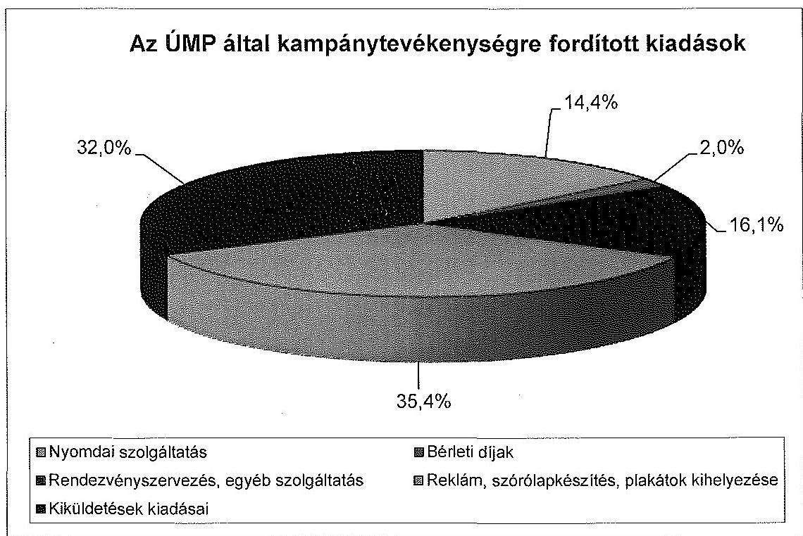

# 13.3. A választási kampány kiadásaira vonatkozó korlátozás betartásának szabályszerűsége 

Az ÚMP
 és az egyéni jelöltjei együttesen betartották a Kftv. 7. § (1) bekezdés b) pontjában meghatározott, jelöltenkénti ötmillió forintos összeghatárt.

Az ÚMP által a választási kampányidőszak alatt a választási kampánytevékenységgel összefüggő kiadásokról rendelkezésre bocsátott dokumentumok biztosították a Kftv. 7. § (1) bekezdés b) pontjában meghatározott ötmillió forintos értékhatár betartásának ellenőrzését.

---

A Kftv. 1. § (1) bekezdése alapján egy fő egyéni jelölt részesült 1000,0 ezer Ft összegű támogatásban, amelyet az egyéni jelölt 990,0 ezer Ft összeg erejéig igénybe vett. Két fő egyéni jelölt nem vette igénybe a Kftv. 1. §-a szerinti támogatást, arról az ÚMP javára nem mondott le, és egyéb forrást nem vett igénybe kampányfinanszírozásra. A Kftv. 2/A. § (1) bekezdése alapján az ÚMP-t megillető 47000,0 ezer Ft támogatásból összesen 46996,3 ezer Ft összegű felhasználás történt. A Kftv. 3. § (1) bekezdése alapján az ÚMP-t 149 250,0 ezer Ft támogatás illette meg, amelyet 149212,1 ezer Ft összeg erejéig igénybe vett. Az ÚMP és egyéni jelöltjei a rendelkezésre bocsátott dokumentumok alapján összesen 197 198,3 ezer Ft-ot fordítottak kampányfinanszírozásra.

Az ÚMP esetében az egyéni jelöltek száma 50 fő, a listás jelöltek száma 19 fő, összesen 69 fő volt. A rendelkezésre bocsátott dokumentumok alapján - a Kftv. 7. § (4)-(5) bekezdéseinek figyelembevételével - az ÚMP és annak jelöltjei együttesen jelöltenként 2857,9 ezer Ft-ot fordítottak a választási kampányidőszak alatt, a választási kampánytevékenységgel összefüggő kiadások finanszírozására.

# 13.4. A Párt tv.-ben meghatározott korlátozások betartása a kampánytevékenységek forrásai tekintetében 

Az ÚMP a Párt tv. 4. § (1) bekezdésében meghatározott forrásokat vette igénybe a választási kampányidőszak alatt, a választási kampánytevékenységgel összefüggő kiadások finanszírozására.

Az ÚMP a Párt tv. 4. § (2)-(3) bekezdései szerinti, jogi személytől, jogi személyiséggel nem rendelkező szervezettől, más államtól, külföldi szervezettől, nem magyar állampolgár természetes személytől származó vagyoni hozzájárulást, névtelen adományt és 2013. évről áthozott forrást kampánycélra nem vett igénybe.

A politikai hirdetésre vonatkozó egy számla és az ÁSZ részére a Ve. 148. § (2) és (4) bekezdése alapján megküldött árjegyzék és tájékoztató körében az ellenőrzés azt tapasztalta, hogy a politikai hirdetésről szóló számla adatai eltértek az árjegyzék adataitól. Ezen eltérésekért a számlakibocsátók (sajtótermékek kiadói) a felelősek. Az eltérések nem befolyásolták a választási kampányra fordított pénzeszközök felhasználásának minősítését.

## 14. ZÖLDEK PÁRTJA

### 14.1. Az egyéni jelöltek lemondásából származó költségvetési támogatás felhasználásának szabályszerűsége

A Kftv. 1. § (1) bekezdés szerinti jelöltenkénti „egymillió forint összegű”, a központi költségvetésből juttatott támogatás igénybevételére a 33 egyéni jelöltből kettő fő kötött megállapodást a Kincstárral, azonban a támogatásból felhasználás nem történt.

---

A Zöldek Pártja a rendelkezésre bocsátott dokumentumok alapján a Kftv. 2/A. § (1) bekezdése szerinti, az egyéni jelöltek lemondásaiból származó egymillió Ft összegű támogatásokból a Kftv. 1. § (3) bekezdésének előírása ellenére 5,8 ezer Ft-ot választási kampányidőszakon túl, 6350 ezer Ft-ot nem a választási kampánytevékenységgel összefüggő dologi kiadások finanszírozására fordította.

A Zöldek Pártja 31 fő egyéni jelölt támogatásról való lemondása alapján a Kincstárral megállapodást kötött. A Kincstár 2014. március 17-én a Kftv. 2/A. § (4) bekezdésének megfelelően a központi költségvetésből 31000,0 ezer Ft támogatási összeget folyósított a Zöldek Pártja kincstári kártyafedezeti számlájára, valamint a kincstári kártya kibocsátásáról intézkedett.

A támogatásból a tényleges felhasználás 30990,8 ezer Ft volt. A Kincstár az elszámolást részben fogadta el, továbbá az egyéni jelöltek nem szerezték meg a választáson a leadott érvényes szavazatok legalább 2%-át, ezért a Kftv. 8/A. § (4) bekezdése alapján a támogatás visszafizetéséről hozott határozatot. A Zöldek Pártja a visszafizetési kötelezettségét nem teljesítette, fizetési könnyítésre, részletfizetésre irányuló kérelmet nem adott be.

A támogatás elszámolása, a Kftv. 8/A. § (1) és az NGM rendelet 7. § (1)(3) bekezdéseiben foglaltaknak megfelelően, számlaösszesítő adatlapon történt, amelyen a Zöldek Pártja - hiánypótlás során - minden kiadási tételhez szöveges indokolást adott a tétel felhasználási céljáról, valamint nyilatkozott a támogatás szabályszerű felhasználásáról. A Zöldek Pártja elszámolását a Kincstár 24635,0 ezer Ft összegben fogadta el, 6355,8 ezer Ft felhasználását nem tekintette igazoltnak, ezért az összeg kétszeresének visszafizetését írta elő a határozatában, a következő okok miatt, amelyeket ellenőrzésünk is megállapított:

- a 2014. március 28-án kincstári kártyafedezeti számláról átutalt 6350,0 ezer Ft-hoz bizonylat (számla) nem állt rendelkezésre;
- a 2014. március 23-án vásárolt 10,5 ezer Ft-os havi bérlet árából (érvényessége: 2014. március 24-étől április 23-áig) a kampányidőszakon túli rész, 17 napra eső 5,8 ezer Ft nem elszámolható.

A kincstári kártyafedezeti számla és a kincstári kártya használata a Zöldek Pártjánál szabályszerű volt, megfelelt a Kftv. 2/A. § (4) bekezdésében meghatározott előírásoknak. A kifizetések a kincstári kártyafedezeti számláról minden esetben kincstári kártyával vagy átutalással történtek, arról készpénzfelvétel nem történt.

A felhasználást alátámasztó számlák, bizonylatok alaki, tartalmi kellékei megfeleltek a Számv. tv. 167. §-ában és az Áfa tv. 169. §-ában előírtaknak.

Az ellenőrzött 27 db tétel közül 17 db, összesen 18290,8 ezer Ft értékben az Áhsz. 15. számú melléklet K3. Dologi kiadások rovatba tartozott. A 10 db, összesen 12700,0 ezer Ft összegű kiadásként elszámolt tétel bizonylata nem állt a Zöldek Pártja rendelkezésére. Kilenc db 6350,0 ezer Ft összegű bizonylatot - a Kincstár megállapításával egyezően - az ÁSZ ellenőrzés részére sem tudta a Zöldek Pártja átadni.

---

Egy bizonylat vonatkozásában az ÁSZ ellenőrzés az alábbiakat állapította meg:

A 6350,0 ezer Ft összegű „szolgáltatás”-ról kibocsátott számla esetében az ügylet alapjául szolgáló adás-vételi szerződés szerint valójában domain név használati jogának eladása volt. A kiadás nem tartozik az Áhsz. 15. melléklete szerinti dologi kiadások körébe, azt a Számv. tv. 25. § (1) bekezdése szerint az immateriális javak között kell kimutatni. A Zöldek Pártja a Kincstárnak 2014. június 15-én a 3. számlaösszesítő laphoz benyújtott hiánypótlásában a számlához kapcsolódóan a szolgáltatás megnevezéseként „online stratégia, közvetlen megkereséshez”, a felhasználás célja, indokaként „online stratégia felépítése, a választók közvetlen elérését célzó képviselők internetes jelenlétének biztosítása, aktivisták koordinálása, hírlevelek küldése”-t jelölte meg.

# 14.2. A pártlista alapján biztosított költségvetési támogatás felhasználásának szabályszerűsége 

A Zöldek Pártja a rendelkezésre bocsátott dokumentumok alapján a Kftv. 3. § (1) bekezdése szerinti, központi költségvetésből juttatott támogatást a Kftv. 6. § (1) bekezdésének megfelelően a választási kampánytevékenységgel összefüggő kiadások finanszírozására fordította. Kettő esetben a támogatást választási kampányidőszakon kívüli tevékenységre használták fel.

A Kincstár a Kftv. 3. § (1) bekezdése alapján 149 250,0 ezer Ft támogatást egy összegben, 2014. március 12-én folyósította a Zöldek Pártja pénzforgalmi számlájára, amelyből a Zöldek Pártja nyilvántartása szerint 149 242,9 ezer Ft-ot használtak fel. A 2014. évi országgyűlési képviselők általános választásához kapcsolódóan a Zöldek Pártja a kapott támogatásból a választási kampányidőszak alatt, a választási kampánytevékenységgel kapcsolatos kiadások finanszírozására a rendelkezésre álló dokumentumok alapján 7,1 ezer Ft-ot nem használt fel.

A Zöldek Pártja a Kincstár által folyósított költségvetési támogatásból 148000,0 ezer Ft-ot 2014. március 12-én átutalt a Párt tv. 6. § (3) bekezdésében foglaltakkal összhangban alapított egyszemélyes Kft. bankszámlájára, a köztük létrejött 2014. március 10-én kötött megállapodás alapján.

Az ellenőrzés kettő esetben állapította meg, hogy azok a Ve. 140. §-nak megfelelő kampányeszközök, azonban a Ve. 139. §-ban előírt kampányidőszakon kívüli felhasználások voltak:

- informatikai szolgáltatásra 2014. február 12-én aláírt 38 100,0 ezer Ft-os szerződésben - amelynek teljes összege kampánytevékenységként elszámolásra került - egy év időtartamra vállalt üzemeltetési feladatokat a szolgáltató, amely túlnyúlt a kampányidőszakon, ezért a teljesítés csak részben, a kampányidőszakra fogadható el;
- a 2014. április 10-ei, 2,8 ezer Ft-os taxi szolgáltatás készpénzes számla.

Az ellenőrzött bizonylatok, számlák alaki és tartalmi kellékei a Számv. tv. 167. §-ában és az Áfa tv. 169. §-ában előírtaknak megfeleltek. Az el-

---

lenőrzés a Számv. tv. 3. § (4) bekezdés 1) pontjában előírtak figyelmen kívül hagyását és a 165. § (1)-(2) bekezdéseinek megsértését tárta fel.

- A Kft. 50182,0 ezer Ft összegű, szolgáltatások elvégzésére kötött szerződést (kettő vállalkozóval), azonban a Zöldek Pártja és a Kft. között létrejött megállapodás nem tartalmazta a Számv. tv. 3. § (4) bekezdés 1) pontjában előírtaknak megfelelően a közvetített szolgáltatás igénybevételének lehetőségét.
- A Zöldek Pártja 2014. március 20-án vállalkozó által kibocsátott számla nélkül átutalt 12700,0 ezer Ft-ot, megsértve a Számv. tv. 165. § (1)(2) bekezdéseinek - a bizonylati elvre és fegyelemre vonatkozó - előírásait, mivel a pénzügyi átutalást számviteli bizonylattal nem támasztották alá.

A Zöldek Pártja a választásra fordított állami és más pénzeszközök, anyagi támogatások összegét, forrását és felhasználásának módját a Magyar Közlöny 2014. december 5-én megjelent Hivatalos Értesítője 61. számában, 2014. június 1-jei dátummal hozta nyilvánosságra.

A Zöldek Pártja kampánycélú kiadásainak megoszlását az alábbi ábra szemlélteti:
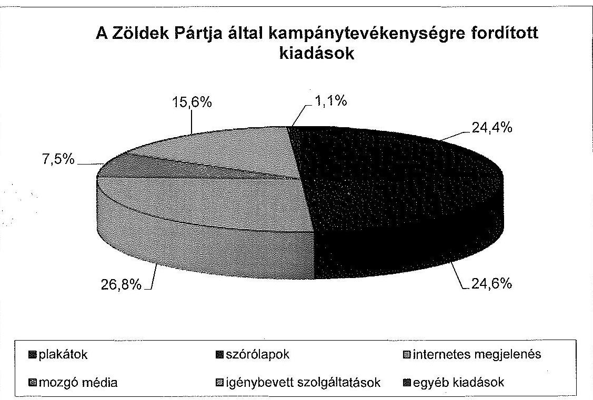

---

# 14.3. A választási kampány kiadásaira vonatkozó korlátozás betartásának szabályszerűsége 

A Zöldek Pártjára és annak jelöltjeire együttesen vonatkozó, a Kftv. 7. § (1) bekezdés b) pontja szerinti jelöltenkénti ötmillió forintos értékhatár betartása nem volt megállapítható. Az értékhatár betartásának ellenőrzése nem volt biztosított, mert a Zöldek Pártja 33 egyéni jelöltjéből hat fő esetében nem állt rendelkezésre adat a kampányfinanszírozásra fordított forrásairól és kiadásairól.

### 14.4. A Párt tv.-ben meghatározott korlátozások betartása a kampánytevékenységek forrásai tekintetében

A Zöldek Pártja a Párt tv. 4. § (1) bekezdésében meghatározott forrásokat vette igénybe a választási kampányidőszak alatt, a választási kampánytevékenységgel összefüggő kiadások finanszírozására.

A Zöldek Pártja a Párt tv. 4. § (2)-(3) bekezdései szerinti, jogi személytől, jogi személyiséggel nem rendelkező szervezettől, más államtól, külföldi szervezettől, nem magyar állampolgár természetes személytől származó vagyoni hozzájárulást, névtelen adományt és 2013. évről áthozott forrást kampánycélra nem vett igénybe.

A Zöldek Pártja politikai hirdetésekre vonatkozó számlái és az ÁSZ részére a Ve. 148. § (2) és (4) bekezdései alapján megküldött árjegyzékek és tájékoztatók körében az ellenőrzés az alábbiakat tapasztalta. Hét sajtótermék 1188,6 ezer Ft összegről adott tájékoztatást az ÁSZ felé a Zöldek Pártjához kapcsolódóan közzétett politikai hirdetésekről. A politikai hirdetések megjelentetésének lebonyolításával megbízott külső szolgáltató a Zöldek Pártja felé számlát nem bocsátott ki, ezért az ÁSZ honlapján közzétett árjegyzék és tájékoztató adataival való összevetés nem volt biztosított.

Budapest, 2015. 09. hó 90. nap

Az elnök nevében eljárva:
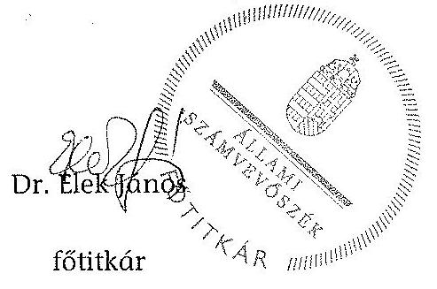

Melléklet: 15 db

---

# Állami Számvevőszék 

Tisztelt Drebán Andrea felügyeleti vezetőasszony részére
Ikt.sz.: V-0630-117/2015.

## Tisztelt Állami Számvevőszék!

Köszönettel vettük észrevételezésre küldött ellenőrzési megállapításaikat a Közösség a Társadalmi Igazságosságért Néppárt jelölő szervezetre vonatkozó a 2014. évi országgyűlési képviselő-választási kampányokra fordított pénzeszközök elszámolásának ellenőrzéséről szóló ügyben.
Egyrészt köszönjük munkatársaik együttműködését az ellenőrzési folyamatban, amely jelentősen hozzájárult ahhoz, hogy minél teljesebb körű képet tudjunk nyújtani a hiteles ellenőrzés számára, mely számunkra is alapvető érdek volt.

Mindössze két helyen kívánunk egyértelműsítő
 és kiegészítő megjegyzéseket tenni.
A 3. pontnál közös felhívásaink ellenére, sajnos egyértelmű, egyéni mulasztásokról van szó, amely úgy gondoljuk, hogy a változatlan szöveg mellett alkalmas arra, hogy a KTI Néppárt számára a külső olvasatban kedvezőtlen és téves következtetésekre ad lehetőséget, melyet szeretnénk elkerülni. Ebben nem volt felénk jogi kötelezettség előírva (pl. hogy másolatot kérjünk jelöltjeink egyéni MÁK elszámolásaikról), hiszen ez az egyéni jelöltek kötelezettsége volt a MÁK felé, ahonnan ezek az adatok Önök által bekérhetőek lettek volna. Egyebekben adtunk az értékhatár betartására vonatkozó, egyértelmű nyilatkozatot, sőt, egyéb források hiányában nem is tudtuk volna ezen összeghatárt túllépni.

A 4. pontnál részben hasonló a helyzet, hiszen semmilyen módon nem tudtuk a rendelkezésre álló rövid rendelési és megjelentetési időszakban magunk ellenőrizni - az szolgáltató szervezetek jogérvényes nyilatkozatainak elfogadásán túl -, hogy valóban a törvényi előírások szerint számolják-e ki számláik végösszegét? Ha ezt esetlegesen pl. vitattuk volna, akkor az elszámolási időszakból kicsúszva sokkal hátrányosabb jogkövetkezményekkel kellett volna számolnunk, rajtunk kívül álló okok miatt.

Konkrét, szövegszerű kéréseink:
3. pont:

Kérjük a minősítést tartalmában, szövegszerűen „megfordítani", mely szerint: „Az 57 jelölthől (ebből 47 fő vett fel egyéni állami támogatást) mindösszesen 7 főnél nem állapítható meg többszöri felhívás ellenére be nem adott személyes adatszolgáltatásuk hiányában - a jelöltenkénti 5 millió forintos felhasználás, kétséget kizáró és dokumentált értékhatár betartása."
4. pont:

A politikai hirdetésekre vonatkozó rész utolsó mondatát kérjük kiegészíteni egy újabbal: „Ezen tételeket illetően a Jelölő szervezetnek nem volt módja a számlakibocsájtó, illetve szolgáltató szervezetek árképzését ellenőrizni és befolyásolni azok törvényességet igazoló előzetes nyilatkozatain túl."

Budapest, 2015.02.26.
Tisztelettel és köszönettel:
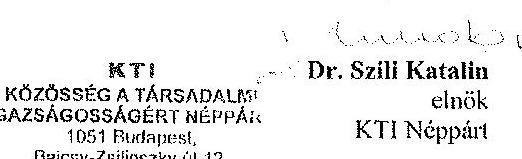

---

.

---

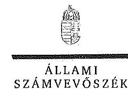

Ikt.szám: V-0630-121/2015.

Dr. Szili Katalin úrhölgy
elnök
Közösség a Társadalmi Igazságosságért Néppárt

# Budapest 

## Tisztelt Elnök Úrhölgy!

A „Kampánypénzek ellenőrzése - A 2014. évi országgyűlési képviselő-választási kampányokra fordított pénzeszközök elszámolásának ellenőrzése" című, a kérelemre ellenőrzött jelölő szervezetek között a Közösség a Társadalmi Igazságosságért Néppárttal kapcsolatos ellenőrzési megállapításokra tett, 2015. február 26-án kelt észrevételét köszönettel megkaptam.

Az Állami Számvevőszék észrevételekre vonatkozó álláspontjáról a felügyeleti vezető által készített részletes tájékoztatást csatoltan megküldöm.

Tájékoztatom Elnök úrhölgyet, hogy a számvevőszéki jelentés mellékletében - az Állami Számvevőszékről szóló 2011. évi LXVI. törvény 29. § (3) bekezdése alapján - a figyelembe nem vett észrevételeket szerepeltetjük az elutasítás indokának feltüntetésével együtt.

Budapest, 2015. 05. hó $1^{6}$. nap
Tisztelettel:
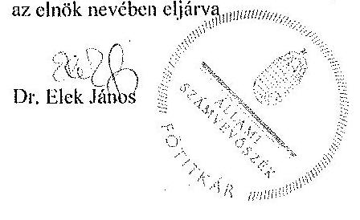

Melléklet: Tájékoztatás az el nem fogadott észrevételekről

---

# Tájékoztatás   az el nem fogadott észrevételekről 

A „Kampánypénzek ellenőrzése - A 2014. évi országgyűlési képviselő-választási kampányokra fordított pénzeszközök elszámolásának ellenőrzése" című, a kérelemre ellenőrzött jelölő szervezetek között a Közösség a Társadalmi Igazságosságért Néppárttal kapcsolatos ellenőrzési megállapításokra 2015. február 26-án kelt levelében tett észrevételeit áttekintettük, azok kezelésével kapcsolatban a következőket válaszolom.
Az ellenőrzési megállapítások 3. pontjára tett észrevételét nem fogadom el. Az országgyűlési képviselők választása kampányköltségeinek átláthatóvá tételéről 2013. évi LXXXVII. törvény 7. § (1) bekezdés b) pontja szerint a választási kampányidőszak alatt, a választási kampánytevékenységgel összefüggő kiadások finanszírozására a jelöltet vagy pártlistát állító párt és annak jelöltje együttesen jelöltenként legfeljebb ötmillió forintot fordíthat. Az Állami Számvevőszék az ötmillió forint értékhatár betartásának ellenőrzéséhez kérte az adatokat, amelyek az észrevételező levélben foglaltak szerint sem álltak rendelkezésre. Az adatok hiányában a választási kampányidőszak alatt, a választási kampánytevékenységgel összefüggő kiadások finanszírozására fordított kiadások értéke a jelöltet vagy pártlistát állító pártra és annak jelöltjére együttesen nem volt megállapítható, az ötmillió forint értékhatár betartása szintén nem volt megállapítható.

## Az ellenőrzési megállapítások 4. pontjára tett észrevételéhez kapcsolódó tájékoztatás:

A politikai hirdetésekkel kapcsolatos észrevételét köszönöm. A számvevőszéki jelentésben egységesen szerepeltetjük, hogy a politikai hirdetésekre vonatkozó számlák esetében tapasztaltak nem befolyásolták a kampánycélra fordított pénzeszközök szabályszerű felhasználásának minősítését és a tapasztaltakért a kiadók a felelősek.

Budapest, 2015. 09. hó 9. nap
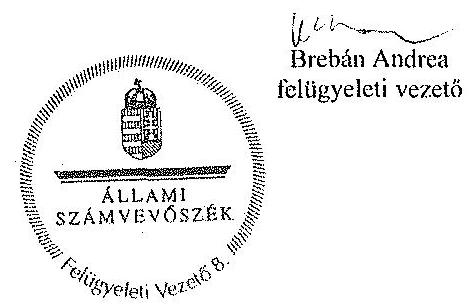

---

# ÁLLAMI SZÁMVEVŐSZÉK 

1052 Budapest, Apáczai Csere János utca 10.

Dr. Elek János
részére

## Tisztelt Elek Úr!

Köszönettel megkaptuk az Állami Számvevőszék „Kampánypénzek ellenőrzése - 2014." megállapításait. A Sportos és Egészséges Magyarországért Párt jelölő szervezet vezetőjeként, az alábbi megállapításokat kívánom megtenni:

1. Köszönjük az ellenőrzést lefolytató munkatársak munkáját és a megállapításokat.
2. Jelölő szervezetünk 2014-ben először indult választásokon, így minden újdonság volt számunkra, de éppen emiatt is igyekeztünk a legnagyobb gondossággal, körültekintéssel, szabályszerűen eljárni. A következő országgyűlési képviselő-választási kampányban, már fel tudjuk használni a mostani tapasztalatokat.
3. A Fitneszszolgáltatásról kiállított számla részben a kampányidőszakon kívüli időszakra vonatkozott, ezt elismerjük. A kampánycélra felhasznált, népszerűsítő vásárlásnál nem voltunk kellően körültekintőek. Amennyiben van rá lehetőség, szeretnénk arányosan és a magyar állampolgárságú természetes személyek általi 456,6 ezer Ft hozzájárulás terhére elszámolni.
4. A hirdetésekre vonatkozó megállapításukra a következő kiegészítést szeretnénk megtenni: megkeresésünkre a GMedia Kft. vezetője elismerte, hogy számszaki tévedés volt az ÁSZ-nak elküldött adatszolgáltatásukban. A tévedésüket javították és a bevallást pótlólag elküldték az ÁSZ részére. Jelölő szervezetünk a számlákat kiegyenlítette, a teljesítés megtörténte után. Véleményünk szerint az adatszolgáltatás nem a SEM feladata volt, így ráhatásunk sem volt, arra, hogy a GMédia Kft. az ÁSZ felé, milyen adatszolgáltatást nyújtott. Csatoltan megküldjük a GMédia részünkre megküldött adatait. A GMédia vezetője készséggel áll a további kérdések elé, szerintük most már nincs hiba az elszámolásban és az árazásban sem.

Bízunk benne, hogy megállapításainkat fel tudják használni az ellenőrzési megállapítások véglegesítésénél.

Budapest, 2015. február 24.
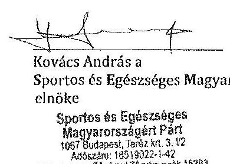

---

.

---

# FŐTITKÁRSÁG 

## ÁLLAMI

SZÁMVEVŐSZÉK

Ikt.szám: V-0634-056/2015.

## Kovács András úr

elnök
Sportos és Egészséges Magyarországért Párt

## Budapest

## Tisztelt Elnök Úr!

A „Kampánypénzek ellenőrzése - A 2014. évi országgyűlési képviselő-választási kampányokra fordított pénzeszközök elszámolásának ellenőrzése" című, a kérelemre ellenőrzött jelölő szervezetek között a Sportos és Egészséges Magyarországért Párttal kapcsolatos ellenőrzési megállapításokra tett, 2015. február 24-én kelt észrevételét köszönettel megkaptam.

Az Állami Számvevőszék észrevételekre vonatkozó álláspontjáról a felügyeleti vezető által készített részletes tájékoztatást csatoltan megküldöm.

Tájékoztatom Elnök urat, hogy a számvevőszéki jelentés mellékletében - az Állami Számvevőszékről szóló 2011. évi LXVI. törvény 29. § (3) bekezdése alapján - a figyelembe nem vett észrevételeket szerepeltetjük az elutasítás indokának feltüntetésével együtt.

Budapest, 2015. 03. hó 19. nap
Tisztelettel:
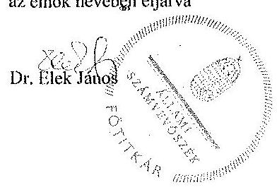

Melléklet: Tájékoztatás az el nem fogadott észrevételekről

---

# Tájékoztatás   az el nem fogadott észrevételekról 

A „Kampánypénzek ellenőrzése - A 2014. évi országgyűlési képviselő-választási kampányokra fordított pénzeszközök elszámolásának ellenőrzése" című, a kérelemre ellenőrzött jelölő szervezetek között a Sportos és Egészséges Magyarországért Párttal kapcsolatos ellenőrzési megállapításokra 2015. február 24-én kelt, az Állami Számvevőszékhez 2015. február 27-én beérkezett levelében tett észrevételeit áttekintettük, azok kezelésével kapcsolatban a következőket válaszolom.
Köszönettel vettem, hogy levelének 1. és 2. pontjában megfogalmazott - az ellenőrzési megállapításokat nem érintő - tapasztalatairól tájékoztatta az Állami Számvevőszéket.
A levele 3. pontjában tett észrevételét nem fogadom el. Az országgyűlési képviselők választása kampányköltségeinek átláthatóvá tételéről szóló 2013. évi LXXXVII. törvény 9. § (2) bekezdése alapján „A választásra fordított állami és a pártok működéséről és gazdálkodásáról szóló törvényben meghatározott más pénzeszközök felhasználását" ellenőrizte az Állami Számvevőszék. Az ellenőrzést, mint azt a jelentéstervezet 2. pontjában foglalt megállapítás is tartalmazza a „rendelkezésre bocsátott dokumentumok alapján" folytatta le az Állami Számvevőszék.

## A levele 4. pontjában tett észrevételéhez kapcsolódó tájékoztatás:

A politikai hirdetésekkel kapcsolatos észrevételét köszönöm. A számvevőszéki jelentésben egységesen szerepeltetjük, hogy a politikai hirdetésekre vonatkozó számlák esetében tapasztaltak nem befolyásolták a kampánycélra fordított pénzeszközök szabályszerű felhasználásának minősítését és a tapasztaltakért a kiadók a felelősek.

Budapest, 2015. 05. hó 13. nap
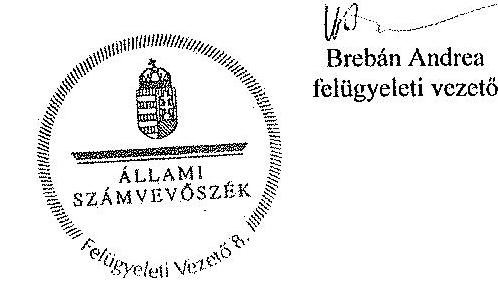

---

# CÍMZETT: ÁLLAMI SZÁMVEVŐSZÉK 

1364 BUDAPEST 4, PF: 54.

Seres Mária Szövetségesei
1426 Budapest, Pf: 122.

Tárgy: Észrevétel az Állami Számvevőszék megállapításaival kapcsolatosan.
Ikt. szám: V-0633-124/2015.

## Tisztelt Állami Számvevőszék!

A Seres Mária Szövetségesei szervezet ellenőrzésével kapcsolatosan az Állami Számvevőszéktől a fenti iktatószámon kapott 2014. évi választási kampánytámogatás ellenőrzésére tett megállapításokra a következő észrevételeket kívánjuk közölni:

## Az 1. pontban foglaltakkal kapcsolatosan:

- Seres Mária Szövetségesei 2015. február 3-án az itt említett 140800001 számú számlával kapcsolatos 36 millió forintos visszafizetés eltörlésének ügyében pert nyert a Nyíregyházi Közigazgatási és Munkaügyi Bíróságon (ügyszám: 15.K.27.309/2014.), így a Munkaügyi Bíróság hatályon kívül helyezte a Magyar Államkincstár Szabolcs-Szatmár-Bereg megyei Igazgatóságának 7415-1628/2014. számú határozatát, amelyben a szervezetet az Államkincstártól kapott 36 millió forint választási kampánytámogatás visszafizetésre kötelezték.
Tehát a „36 millió forint összegű nem elfogadható költség" megállapításnak már ki kell kerülnie a megállapítások közül.
- Véleményünk szerint az utolsó bekezdésben hibás az a megállapítás, hogy a 140800001 számú számla nem volt megfelelően kiállítva, hiszen az szabályosan volt kiállítva, és ebből következően, a külföldi beszerzés miatt nem tartalmazott előírt adót, vagyis szabályszerűen nulla százalékos adómértékű volt. Befizetési vagy visszaigénylési jogosultság nem keletkezett.

## A 2. pontban foglaltakkal kapcsolatosan:

- A második bekezdésben hibás az a megállapítás, hogy a 4448237 (11,6 ezer Ft) Rendezvény költségről szóló április 7-i számla nem a választási kampányidőszak alatti kiadások finanszírozására irányult, ugyanis a LUFI-BULI Kft-től a kampányunk utolsó hétvégi záróeseményén felhasznált léggömbök felfújásához igénybevett gázpalackokat béreltük, aminek a vége és így az elszámolása is a választási eredmény követően, vasárnapról hétfőre virradólag volt, és onnantól lett a felhasznált gázpalackok mennyiségének megfelelően kiszámlázva a költség hétfőn 11.555 Ft értékben.
- Ugyanitt hibás az a megállapítás is, hogy a 140160 (150,1 ezer Ft) Propaganda költségről szóló április 8-án kelt számla nem a választási kampányidőszak alatti kiadások finanszírozására irányult, hiszen a Mini Nyomda Kft-től kapott számlán jól látható, hogy annak a teljesítése április 4-e volt, és csak a kiállítása és a kifizetése április 8-a, ezért a felhasznált nyomdai szolgáltatás megfelelően, és a választási kampányidőszak alatti kiadások finanszírozására lett helyesen kiállítva 150.057 Ft értékben.
- Végül pedig a 2148 (5 ezer Ft) Utazási költségről szóló április 10-i számla is a választási kampányidőszak alatti kiadások finanszírozásához kapcsolódik, hiszen az üzemanyag számla kiállítására a vidékről visszahozott kampányeszközök szállítása érdekében került sor, ennek ezért április 10-i a teljesítése.

---

- A harmadik bekezdésben véleményünk szerint elhibázott az a megállapítás, hogy a 1734504 (12,7 ezer Ft) és a 1734505 (25,4 ezer Ft) Hirdetés illetve Propaganda költségről szóló számlák esetében nem megfelelőek a tartalmi kellékek (nevezetesen az adószám hiánya a probléma), ugyanis a vizsgálatkor jeleznünk kellett volna, hogy azokról valóban lemaradt, de egy ezt követő, a 734507 számon fel van tüntetve az adószám (mellékeltük újra), és így az egyértelműen pótolható, illetve kiegészíthetőek a korábbi számlák az elszámolás korrektsége érdekében.

# A 3. pontban foglaltakkal kapcsolatosan: 

Azt gondoljuk, itt nagyon fontos lenne megjegyezni, hogy az 5 millió forintos értékhatár ellenőrzésének a lehetősége azért nem volt biztosított, mert nem a szervezet, hanem a jelzett, önálló kincstári kampányszámlát vezető 8 képviselőjelölt a kampányfinanszírozási adatairól nem közölt adatokat.

Végül a politikai hirdetésekre vonatkozó megállapításhoz szerencsésnek tartanánk, ha jeleznék, illetve egyértelműsítenék, hogy azok a megállapítások a hirdetést megjelentető kiadók hanyagságából és hibájából születtek, ami nekik, nem
 pedig a szervezetnek róható fel!

## Tisztelt Állami Számvevőszék!

Az eddigi korrekt hozzáállásukat és példás munkájukat, valamint a határidőben megküldött, szerintünk jogos észrevételeink elfogadását illetve azok tudomásulvételét köszönjük, és további jó munkát kívánunk!

Kelt: 2015. február 27.

---

# 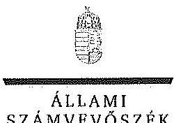 

Ikt.szám: V-0633-126/2015.

## Imre Istvánné asszony

elnök
Seres Mária Szövetségesei

## Budapest

## Tisztelt Elnök Asszony!

A „Kampánypénzek ellenőrzése - A 2014. évi országgyűlési képviselő-választási kampányokra fordított pénzeszközök elszámolásának ellenőrzése" című, a kérelemre ellenőrzött jelölő szervezetek között a Seres Mária Szövetségeseivel kapcsolatos ellenőrzési megállapításokra tett, 2015. február 27-én kelt észrevételét köszönettel megkaptam.

Az Állami Számvevőszék észrevételekre vonatkozó álláspontjáról a felügyeleti vezető által készített részletes tájékoztatást csatoltan megküldöm.

Tájékoztatom Elnök asszonyt, hogy a számvevőszéki jelentés mellékletében - az Állami Számvevőszékről szóló 2011. évi LXVI. törvény 29. § (3) bekezdése alapján - a figyelembe nem vett észrevételeket szerepeltetjük az elutasítás indokának feltüntetésével együtt.

Budapest, 2015. 03. hó 19. nap
Tisztelettel:
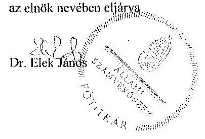

Melléklet: Tájékoztatás az el nem fogadott észrevételekről

---

# Tájékoztatás   az el nem fogadott észrevételekről 

A „Kampánypénzek ellenőrzése - A 2014. évi országgyűlési képviselő-választási kampányokra fordított pénzeszközök elszámolásának ellenőrzése" című, a kérelemre ellenőrzött jelölő szervezetek között a Seres Mária Szövetségeseivel kapcsolatos ellenőrzési megállapításokra 2015. február 27-én kelt levelében tett észrevételeit áttekintettük, azok kezelésével kapcsolatban a következőket válaszolom.

## Az ellenőrzési megállapítások 1. pontjára tett észrevételét nem fogadom el.

A 140800001 számú számlával kapcsolatos 36 millió forintos visszafizetési kötelezettséget a Magyar Államkincstár állapította meg, mivel azt nem elfogadható költségnek minősítette. Ezt a tényt rögzítette az Állami Számvevőszék ellenőrzési megállapításai között. Az észrevételben foglaltakat bitelten érdemlően alátámasztó dokumentum (bírósági határozat) nem került megküldésre, ezért az észrevétel megalapozottságáról nem lehet meggyőződni.
Az 1. pont utolsó bekezdése: Az Európai Unió Tanácsának a közös hozzáadottértékadórendszerről szóló 2006/112/EK irányelve (HÉA-irányelv) 226. cikke szerint a kiállított számlán kötelező feltüntetni az alkalmazott HÉA-adómértéket, illetve adómentesség esetén a HÉA-irányelvben felsorolt hivatkozást, utalást. A 140800001 számú számlán sem a 0%-os adómérték, sem a HÉA-irányelv alapján arra való hivatkozás, utalás nem volt arra, hogy a termékértékesítés vagy szolgáltatás adómentes.

## Az ellenőrzési megállapítások 2. pontjára tett észrevételeit nem fogadom el.

- A felsorolás első három francia bekezdésében leírtakra tájékoztatom, hogy az ellenérték készpénzzel történő megtérítése esetén a számlát az általános forgalmi adóról szóló 2007. évi CXXVII. törvény (Áfa tv.) 163. § (2) bekezdés b) pontja alapján haladéktalanul ki kell bocsátani. Mivel a 4448237 (11,6 ezer Ft), a 140160 (150,1 ezer Ft) és a 2148 (5,0 ezer Ft) számú készpénzfizetési számlák, így a gazdasági esemény és annak pénzügyi teljesítése kampányidőszakon kívül, 2014. április 6-át követően valósult meg.
- A felsorolás negyedik francia bekezdésében foglalt észrevételéhez beküldött három számlát áttekintettem. Az Áfa tv. 169. § c) pontja szerint a számla kötelező adattartalma a termék értékesítőjének, szolgáltatás nyújtójának adószáma, amely alatt a termék értékesítését, szolgáltatás nyújtását teljesítette. Az észrevételben szerepeltetett 734507 számú bizonylat nem volt ellenőrzött dokumentum, az azon feltüntetett adószám nem pótolja a 1734504 (12,7 ezer Ft) és a 1734505 (25,4 ezer Ft) számú bizonylatok adószámmal kapcsolatos hiányosságát.
Az ellenőrzési megállapítások 3. pontjára tett észrevételét nem fogadom el. Az országgyűlési képviselők választása kampányköltségeinek átláthatóvá tételéről 2013. évi LXXXVII. törvény 7. § (1) bekezdés b) pontja szerint a választási kampányidőszak alatt, a választási kampánytevékenységgel összefüggő kiadások finanszírozására a jelöltet vagy pártlistát állító párt és annak jelöltje együttesen jelöltenként legfeljebb ötmillió forintot fordíthat. Az Állami Számvevőszék az ötmillió forint értékhatár betartásának ellenőrzéséhez kérte az adatokat, amelyek az

---

észrevételező levélben foglaltak szerint nem álltak rendelkezésre. Az adatok hiányában a választási kampányidőszak alatt, a választási kampánytevékenységgel összefüggő kiadások finanszírozására fordított kiadások értéke a jelöltet vagy pártlistát állító pártra és annak jelöltjére együttesen nem volt megállapítható, az ötmillió forint értékhatár betartása szintén nem volt megállapítható.

Az ellenőrzési megállapítások politikai hirdetésekre vonatkozó szövegrészeire tett észrevételéhez kapcsolódó tájékoztatás:

A politikai hirdetésekkel kapcsolatos észrevételét köszönöm. A számvevőszéki jelentésben egységesen szerepeltetjük, hogy a politikai hirdetésekre vonatkozó számlák esetében tapasztaltak nem befolyásolták a kampánycélra fordított pénzeszközök szabályszerű felhasználásának minősítését és a tapasztaltakért a kiadók a felelősek.

Budapest, 2015. 05. hó 15. nap
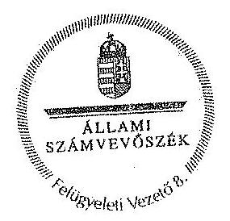

Brebán Andrea felügyeleti vezető

---

.

---

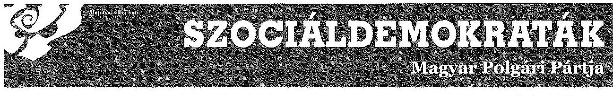

Budapest, 2015. február 20.

Tisztelt Elek Úr!

Az Állami Számvevőszék 2015. február 12-én kelt, V-0635-127/2015. számú levelét köszönettel megkaptuk.

A vonatkozó ellenőrzés előzetes megállapításaival kapcsolatban a 3. pontban jelzett, a választási kampány kiadásaira vonatkozó korlátozás betartásának szabályszerűségére vonatkozóan az alábbi észrevételt tesszük:

A megállapítás összegző megfogalmazása, miszerint "... a jelölő szervezetre ... vonatkozó ... értékhatár betartása nem volt megállapítható. Az értékhatár betartásának ellenőrzése nem volt biztosított." álláspontjuk félreérthető, hiszen azt sugallja, hogy a jelölő szervezet nem tett meg mindent az értékhatár betartásának ellenőrzésére.

Ezzel ellentétben az ellenőrzés során egyértelművé tettük és igazoltuk, hogy a jelöltek vonatkozásában a párt központi adminisztrációja minden lehetséges eszközzel (szóban, írásban, ajánlott és tértivevényes felszólításokban, személyes megkeresések során) kísérletet tett a jelöltek vonatkozó jognyilatkozatainak beszerzésére, azonban a hatályos magyar jogi szabályozás ennél szélesebb mozgásteret a párt részére nem tesz lehetővé.

Hatóságok felé történő szignalizációval nem élhetünk, feljelentést pedig az alapos gyanú hiányában nem tehetünk, így a jogi szabályozás hiányosságaiból adódóan az értékhatár betartatására, illetve ennek megnyugtató igazolására a jelölő szervezetnek nincs jogi eszköze vagy egyéb lehetősége.

Miután a szabályszerűségi vizsgálat a jelölő szervezetre és annak jelöltjeire vonatkozik, azonban az Állami Számvevőszék munkatársai az ellenőrzést a Szociáldemokraták Magyar Polgári Pártjánál, mint jelölő szervezetnél végezték el,

---

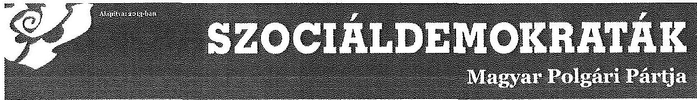
így az ellenőrzéssel nem együttműködő egyéni jelöltek vonatkozásában kizárólag a hatóságok rendelkeznek megfelelő jogkörrel.

A fentiek alapján tisztelettel kérjük, hogy a vonatkozó megállapítás kiegészítésével kerüljön feltüntetésre az a tény, hogy az egyéni, öt millió forintos értékhatárnak a jelölő szervezet által történő (belső) ellenőrzésére, illetve a jelölti együttműködés kikényszerítésére joghézag és felhatalmazás hiányában nincs mód.

Az ellenőrzés egyéb megállapításai vonatkozásában nem teszünk észrevételt, munkatársaik felelősségteljes és alapos munkáját tisztelettel köszönjük.

Tisztelettel,
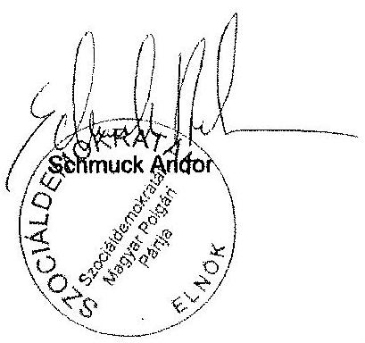

---

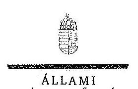

Tájékoztató

Ikt.szám: V-0635-131/2015.

# Schmuck Andor úr 

elnök
Szociáldemokraták Magyar Polgári Pártja

## Budapest

## Tisztelt Elnök Úr!

A „Kampánypénzek ellenőrzése - A 2014. évi országgyűlési képviselő-választási kampányokra fordított pénzeszközök elszámolásának ellenőrzése" című, a kérelemre ellenőrzött jelölő szervezetek között a Szociáldemokraták Magyar Polgári Párttal kapcsolatos ellenőrzési megállapításokra tett, 2015. február 20-án kelt észrevételét köszönettel megkaptam.

Az Állami Számvevőszék észrevételre vonatkozó álláspontjáról a felügyeleti vezető által készített részletes tájékoztatást csatoltan megküldöm.

Tájékoztatom Elnök urat, hogy a számvevőszéki jelentés mellékletében - az Állami Számvevőszékről szóló 2011. évi LXVI. törvény 29. § (3) bekezdése alapján - a figyelembe nem vett észrevételeket szerepeltetjük az elutasítás indokának feltüntetésével együtt.

Budapest, 2015. 03. hó 19. nap
Tisztelettel:
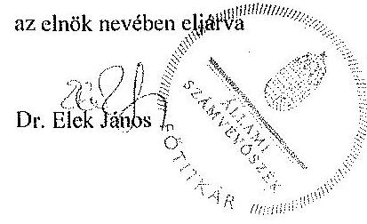

Melléklet: Tájékoztatás az el nem fogadott észrevételről

---

# Tájékoztatás   az el nem fogadott észrevételről 

A „Kampánypénzek ellenőrzése - A 2014. évi országgyűlési képviselő-választási kampányokra fordított pénzeszközök elszámolásának ellenőrzése" című, a kérelemre ellenőrzött jelölő szervezetek között a Szociáldemokraták Magyar Polgári Párttal kapcsolatos ellenőrzési megállapításokra 2015. február 20-án kelt levelében tett észrevételét áttekintettük, annak kezelésével kapcsolatban a következőket válaszolom.

Az ellenőrzési megállapítások 3. pontjára tett észrevételét nem fogadom el. Az országgyűlési képviselők választása kampányköltségeinek átláthatóvá tételéről 2013. évi LXXXVII. törvény 7. § (1) bekezdés b) pontja szerint a választási kampányidőszak alatt, a választási kampánytevékenységgel összefüggő kiadások finanszírozására a jelöltet vagy pártlistát állító párt és annak jelöltje együttesen jelöltenként legfeljebb ötmillió forintot fordíthat. Az Állami Számvevőszék az ötmillió forint értékhatár betartásához kérte az adatokat, amelyek az észrevételező levélben foglaltak szerint sem álltak rendelkezésre. Az adatok hiányában a választási kampányidőszak alatt, a választási kampánytevékenységgel összefüggő kiadások finanszírozására fordított kiadások értéke a jelöltet vagy pártlistát állító pártra és annak jelöltjére együttesen nem volt megállapítható, az ötmillió forint értékhatár betartása szintén nem volt megállapítható.

Budapest, 2015. 05. hó 13. nap
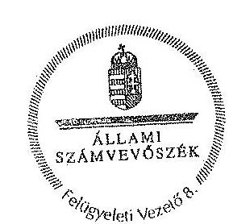

Brebán Andrea
felügyeleti vezető

---

Tisztelt Állami Számvevőszék!

A 2015. február 12. napján kelt, V-0626-152/2015. iktatószámú, a 2014. évi országgyűlési képviselő-választási kampányokra fordított pénzeszközök elszámolásának ellenőrzéséről megküldött „Ellenőrzési Megállapításokra" a következőket nyilatkozom.

A második oldal 5.-ik bekezdésében leírtak szerinti „8 db, összesen 57,8 ezer Ft. összegű készpénzes bizonylat esetében az átvevő aláírása hiányzott." észrevétel számomra beazonosíthatatlan, ugyanis az Állami Számvevőszék ellenőrei itt tartózkodásuk alatt erre nem hívták fel a figyelmemet és az észrevétel nem jelöli meg, mely számlákról van szó. Továbbá a helyszíni ellenőrzés során Önök által is aláírt, de dátummal el nem látott JEGYZŐKÖNYV erre utalást nem tesz.

Ugyanebben a bekezdésben megjelölt „a jelölő szervezet pénzkezelési szabályzatában szereplő bizonylatolási rendben előírtak ellenére a kiadásokról nem készítettek kiadási pénztárbizonylatot." megállapításhoz annyi hozzáfűzni valóm van, hogy azóta A Haza Nem Eladó Mozgalom Párt Országos Választmánya a 38/2015.02.22. számú Országos Választmányi határozattal 77 igen szavazattal, 0 ellenszavazattal, 2 tartózkodás mellett az Országos Választmány megszavazta, hogy a Párt pénzkezelési szabályzatából kerüljön törlésre a kiadási pénztárbizonylatok kiállításának szükségessége. Tehát a jövőben, mivel sem a törvény, sem a párt belső pénzkezelési szabályzata nem írja elő ennek a vezetését, nem készülnek kiadási pénztárbizonylatok.

Az ellenőrzési megállapítások utolsó bekezdésében megemlített hirdetési díj eltérése az ÁSZ honlapján feltüntetettől semmiképp sem lehet a párt hibája, hiszen a párt nem szabhatta meg az írott sajtóban felszámított tarifát, azt az illetékesek szabták meg és a hirdetési árak nem képezték alku tárgyát a kampány hajrában, a díjszabás eltéréséért az adott sajtóorgánumot terheli a felelősség.

Az ellenőrzés lefolytatásakor tapasztalt hozzáállást a tisztelt ÁSZ munkatársainak megköszönöm.

Gyula, 2015.02.26.

Kásler Árpád elnök

---

.

---

# FŐTITKÁR 

## Kásler Árpád úr

elnök
A Haza Nem Eladó Mozgalom Párt

Gyula

## Tisztelt Elnök Úr!

A „Kampánypénzek ellenőrzése - A 2014. évi országgyűlési képviselő-választási kampányokra fordított pénzeszközök elszámolásának ellenőrzése" című, a kérelemre ellenőrzött jelölő szervezetek között a Haza Nem Eladó Mozgalom Párttal kapcsolatos ellenőrzési megállapításokra tett, 2015. február 26-án kelt észrevételét köszönettel megkaptam.

Az Állami Számvevőszék észrevételre vonatkozó álláspontjáról a felügyeleti vezető által készített részletes tájékoztatást csatoltan megküldöm.

Tájékoztatom Elnök urat, hogy a számvevőszéki jelentés mellékletében - az Állami Számvevőszékről szóló 2011. évi LXVI. törvény 29. § (3) bekezdése alapján - az el nem fogadott észrevételt szerepeltetjük az elutasítás indokának feltüntetésével együtt.

Budapest, 2015. 03. hó 19. nap

Tisztelettel:
az elnök nevében eljárva
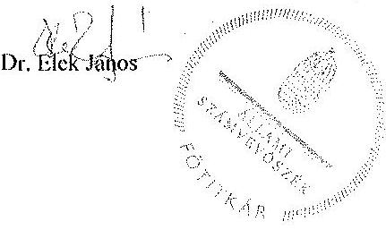

---

# Tájékoztatás   az el nem fogadott észrevételről 

A „Kampánypénzek ellenőrzése - A 2014. évi országgyűlési képviselő-választási kampányokra fordított pénzeszközök elszámolásának ellenőrzése" című, a kérelemre ellenőrzött jelölő szervezetek között a Haza Nem Eladó Mozgalom Párttal kapcsolatos ellenőrzési megállapításokra 2015. február 26-án kelt levelében tett észrevételét áttekintettük, annak kezelésével kapcsolatban a következő tájékoztatást adom.

Az ellenőrzési megállapítások 2. oldal 4. bekezdés első mondatára tett észrevételével kapcsolatban tájékoztatom, hogy a 2014. november 7-én Ön által is aláírt jegyzőkönyv alapján az alábbi bizonylatok vonatkozásában szerepeltettük a megállapításokat:

| számlát kibocsátó | összeg eFt-ban | azonosító |
| :--: |

 :--: | :--: |
| MOL NYRT (üzemag.ktg.szla) MMH-932 | 4,0 | 601000036/3902/00003 |
| LUKOIL Magyarország Kft. (üzemag.ktg.szla) JWB-934 | 3,0 | 760000040/1487/00021 |
| MOL NYRT. (üzemag.ktg.szla) MMH-932 | 4,5 | 601000403/3724/00016 |
| Lukoil Mo. Kft. (üzemag.ktg.szla) JWB-934 | 6,0 | 760000040/1496/00019 |
| MOL Nyrt. / Üzemanyag GWU134 frsz-ü gépkocsi 140. | 8,0 | 601000558/4223/00012 |
| OMV Hungária Kft. / Üzemanyag JHT-925 frsz-ü gépkocsi | 10,0 | A/733000558/0918/00021 |
| OMV Hungária Kft. / Üzemanyag LXD-101 frsz-ü gépkocsi | 10,1 | A/733000094/2662/00005 |
| EDO-HUNGARY Kft. / Üzemanyag EJW-098 | 12,2 | 731000147/0603/00038 |

---

Az ellenőrzési megállapítások 2. oldal 4. bekezdés második mondatával kapcsolatos tájékoztatását a pénzkezelési szabályzatuk módosítására vonatkozóan köszönjük. A megállapítást fenntartjuk, mivel az észrevétel azt nem cáfolja.

Az ellenőrzési megállapítások 4. oldal 1-3. bekezdésére tett észrevételéhez kapcsolatos tájékoztatás

A politikai hirdetésekkel kapcsolatos észrevételét köszönjük. A számvevőszéki jelentésben egységesen szerepeltetjük, hogy a politikai hirdetésekre vonatkozó számlák esetében tapasztaltak nem befolyásolták a kampánycélra fordított pénzeszközök szabályszerű felhasználásának minősítését és a tapasztaltakért a kiadók a felelősek.
Budapest, 2015. 03. hó 15. nap
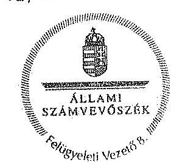

Brebán Andrea
felügyeleti vezető

---

.

---

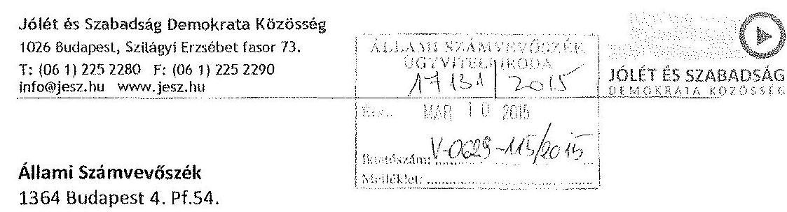

Hivatkozási szám: V-0629-113/2015.

# Tisztelt Címzett! 

A V-0629-113/2015. iktatószámú levelükben tájékoztatták szervezetünket a 2014. évi országgyűlési képviselő-választási kampányokra fordított pénzeszközök elszámolásának ellenőrzési eredményéről.

A pártlista alapján biztosított költségvetési támogatás felhasználásának szabályszerűségére tett megállapításaikra az alábbi észrevételeket tesszük:

A D-ITS-1 számú számla (ITSecure Informatikai Tanácsadó Kft. -354.254 Ft) a JESZ internetes rendszerének szolgáltatási díját tartalmazza. A számlázás mindig előre történik és két havi időszakot vesz igénybe. A számlán látható is ez: 2014. 04.01.-2014. 06.30.

Az 5222/2014. számú közjegyzői díj 148.520 Ft a 2014. 01. 20-án megtartott Országos Gyűlésünk időpontja volt, ekkor került megtartásra a kampánynyitó is. Itt történt az elfogadása a képviselő-jelölteknek és a kampánystratégiának is. Mivel ez a rendezvény szervesen a kampányhoz tartozott azért tettük bele az elszámolásba a közjegyzői díjat.

A Magyar Posta Zrt. által kiállított számla (912/00001) egy készpénzes befizetést és annak díját tartalmazza. Ez a költség a párt úgynevezett matricakampányának része volt. Autós hirdetéseket tartalmazott. Korábban mellékeltük a szerződéseket, mely ebben az esetben: 2014. március 13-ára szólt. A kampány alatt történt a reklámfelület igénybevétele, de lejárta az Európai Parlamenti választásokig tartott. Azért került csak részteljesítés alapján kifizetésre 2014. 04. 12-én.

A Magyar Posta Zrt. által kiállított számla (1280/00001) egy készpénzes befizetést és annak díját tartalmazza. Ez a költség a párt úgynevezett matricakampányának része volt. Autós hirdetéseket tartalmazott. Korábban mellékeltük a szerződéseket, mely ebben az esetben: 2014. március 01-jére szólt. A kampány alatt történt a reklámfelület igénybevétele, de lejárta az Európai Parlamenti választásokig tartott. A szükséges km-t megtette a szerződő fél a gépjárművel ezért került kifizetésre 40.000 Ft. A 2260 Ft a postaköltséget tartalmazta.

---

# Jólét és Szabadság Demokrata Közösség 

1026 Budapest, Szilágyi Erzsébet fasor 73.
T: (06 1) 2252280 F: (06 1) 2252290
info@jesz.hu www.jesz.hu

JÓLÉT ÉS SZABADSÁG
A 0043/2014. számú számla (2.950.000 Ft) óriásplakát hirdetési költsége. A számla egy előlegszámla volt, mivel az óriásplakátokat előre kellett kifizetni, de megjelenése teljes mértékben a kampányidőszakra esett. (2014.02.16-28-ig) Mellékeljük a szerződést és a nullás végszámlát, mely ezt igazolja.

Tisztelettel kérjük, hogy ezen számlák tekintetében észrevételeinket elfogadni szíveskedjenek.

Köszönettel:
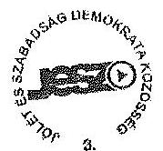

Makay Zsolt elnök megbízásából Horváth István elnökhelyettes

Budapest, 2015. március 5.

---

# FŐTITKÁR 

## ÁLLAMI

SZÁMVEVŐSZÉK

Ikt.szám: V-0629-116/2015.

## Makay Zsolt úr

elnök
Jólét és Szabadság Demokrata Közösség

## Budapest

## Tisztelt Elnök Úr!

A „Kampánypénzek ellenőrzése - A 2014. évi országgyűlési képviselő-választási kampányokra fordított pénzeszközök elszámolásának ellenőrzése" című, a kérelemre ellenőrzött Jólét és Szabadság Demokrata Közösséggel kapcsolatos ellenőrzési megállapításokra tett, 2015. március 5-én kelt észrevételét köszönettel megkaptam.

Az Állami Számvevőszék észrevételekre vonatkozó álláspontjáról a felügyeleti vezető által készített részletes tájékoztatást csatoltan megküldöm.

Tájékoztatom Elnök urat, hogy a számvevőszéki jelentés mellékletében - az Állami Számvevőszékről szóló 2011. évi LXVI. törvény 29. § (3) bekezdése alapján - az el nem fogadott észrevételeket szerepeltetjük az elutasítás indokának feltüntetésével együtt. Az elfogadott észrevételt a jelentés szövegezésénél figyelembe vesszük.

Budapest, 2015. 03. hó 15. nap
Tisztelettel:
az elnök nevében eljárva
Dr. Elek János

Melléklet: Tájékoztatás az elfogadott és az el nem fogadott észrevételekről

---

# Tájékoztatás   az elfogadott és az el nem fogadott észrevételekről 

A „Kampánypénzek ellenőrzése - A 2014. évi országgyűlési képviselő-választási kampányokra fordított pénzeszközök elszámolásának ellenőrzése" című, a kérelemre ellenőrzött Jólét és Szabadság Demokrata Közösséggel kapcsolatos ellenőrzési megállapításokra 2015. március 5-én kelt levelében tett észrevételeit áttekintettük, azok kezelésével kapcsolatban a következőket válaszolom.
A D-ITS-1 számú számlával kapcsolatos észrevétele alapján a részletes megállapítások szövegét a következők szerint pontosítom: „A D-ITS-1 számú számlán feltüntetett rendszerfelügyeleti szolgáltatás 2014. január 1-február 14. közötti időszakra eső része (177,5 ezer Ft), ..........nem a Ve. szerinti kampányidőszak alatti kiadás finanszírozására irányult".
Az 5222/2014., a 912/00001 és a 1280/00001 számú számlákkal kapcsolatos észrevételeit nem fogadom el. A Kftv. 6. § (1) bekezdése szerint a folyósított támogatás kizárólag a választási kampányidőszak alatti kiadások finanszírozására volt fordítható. Az 5222/2014 számú számla szerinti gazdasági esemény választási kampányidőszakon kívül valósult meg (2014. január). A 912/00001 és a 1280/00001 számú készpénzfizetési számlák - az általános forgalmi adóról szóló 2007. évi CXXVII. törvény (Áfa tv.) 163. § (2) bekezdés b) pontja alapján - a gazdasági esemény megvalósulásakor haladéktalanul kibocsátásra kerültek, így mind a gazdasági események, mind pedig azok pénzügyi teljesítése kampányidőszakon kívül, 2014. április 6-át követően (2014. április 8. és 12.) valósult meg.
A 0043/2014. számú számlával kapcsolatos észrevétele alapján a jelentéstervezetből a megállapítást töröltem.

Budapest, 2015. 03. hó 15. nap
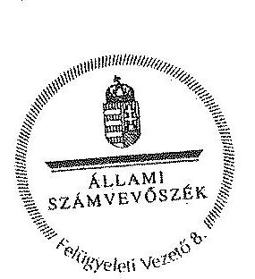

Brehán Andrea
felügyeleti vezető

---

Új Magyarország Párt
Táncsics Péter
Liszt Ferenc utca 5. I/7.
9730 Kőszeg
Állami Számvevőszék
Apáczai Csere János utca 10.
1364 Budapest 4. Pf. 54.
Dr. Elek János
Tárgy: V-0639-080/2015.
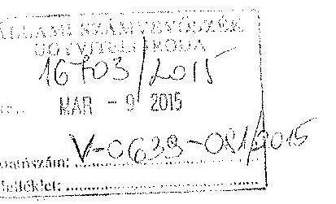

Tisztelt Számvevőszék!
Alulírott Táncsics Péter, az Új Magyarország Párt nevében ezúton teszek írásbeli észrevételt az Állami Számvevőszék V-0639-080/2015. iktatószámon jegyzett ellenőrzési megállapításokkal kapcsolatosan.

Az Új Magyarország Párt az ellenőrzés megállapításait megismerte, a törvényi értelmezés után azokat megértette, azokkal egyetért.

Belső szabályzatunkat - különös tekintettel az útvonal nyilvántartásokra - a megállapításoknak megfelelően szigorítottuk.

A helyszíni vizsgálat során vállalt valamennyi kötelességünket teljesítettük. Javasoljuk a jövőben egységes, útvonal nyilvántartás bizonyolására alkalmas formanyomtatvány elkészítését.

Jelen esetben a szigorú törvényekben foglalt megfogalmazásokat - „üzleti partner felkeresése" - nem minden esetben tartjuk szerencsésnek, hisz politikai pártok esetében a legritkább esetben keresünk fel üzleti partnereket, sokkal inkább választópolgárokat, szervezeteket. Indokoltabb talán az utazás céljának a megnevezése (pl. aláírásgyűjtés, plakátolás, szórólapozás, kampánytevékenység, személyes megkeresés stb.)

Az Új Magyarország Párt ezúton mond köszönetet az Állami Számvevőszék munkatársainak elvégzett munkájukért, türelmükért.

Üdvözlettel és tisztelettel:
Táncsics Péter

---

.

---

# FŐTITKÁR 

## ÁLLAMI

SZÁMVEVŐSZÉK

Ikt.szám: V-0639-082/2015.

## Táncsics Péter úr

elnök
Új Magyarország Párt

## Zalaegerszeg

## Tisztelt Elnök Úr!

A „Kampánypénzek ellenőrzése - A 2014. évi országgyűlési képviselő-választási kampányokra fordított pénzeszközök elszámolásának ellenőrzése" című, a kérelemre ellenőrzött jelölő szervezetek között az Új Magyarország Párttal kapcsolatos ellenőrzési megállapításokra tett, 2015. február 27-én kelt észrevételét köszönettel megkaptam.

Az Állami Számvevőszék észrevételekre vonatkozó álláspontjáról a felügyeleti vezető által készített részletes tájékoztatást csatoltan megküldöm.

Tájékoztatom Elnök urat, hogy a számvevőszéki jelentés mellékletében - az Állami Számvevőszékről szóló 2011. évi LXVI. törvény 29. § (3) bekezdése alapján - az el nem fogadott észrevételeket szerepeltetjük az elutasítás indokának feltüntetésével együtt.

Budapest, 2015. 03. hó 19. nap
Tisztelettel:
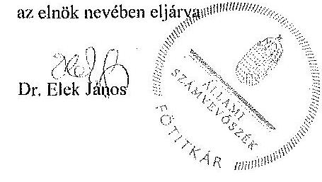

Melléklet: Tájékoztatás az el nem fogadott észrevételekről

---

# Tájékoztatás   az el nem fogadott észrevételekről 

A „Kampánypénzek ellenőrzése - A 2014. évi országgyűlési képviselő-választási kampányokra fordított pénzeszközök elszámolásának ellenőrzése" című, a kérelemre ellenőrzött jelölő szervezetek között az Új Magyarország Párttal kapcsolatos ellenőrzési megállapításokra 2015. február 27-én kelt, az Állami Számvevőszékhez 2015. március 9-én beérkezett levelében tett észrevételeit áttekintettük, azok kezelésével kapcsolatban a következőket válaszolom.
Köszönettel vettem, hogy levelének 2. bekezdésében az ellenőrzési megállapításokkal egyetért. A levele további részében a megfogalmazott - az ellenőrzési megállapításokat nem érintő tapasztalatairól és javaslatairól tájékoztatta az Állami Számvevőszéket.

A levelében tett tájékoztatását áttekintettük az abban foglaltak nem igénylik a jelentéstervezetben tett megállapítások módosítását.

Budapest, 2015. 03. hó 15. nap
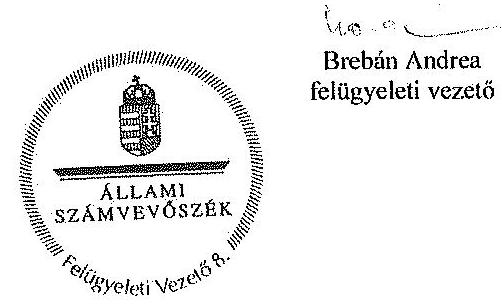

---

# ÁLLAMI SZÁMVEVŐSZÉK 

Iktatószám: ETIO-0147-001/2014.

## MEGHATALMAZÁS

Az Állami Számvevőszékről szóló 2011. évi LXVI. törvény 32. § (2) bekezdése, valamint az Állami Számvevőszék Szervezeti és Működési Szabályzatáról szóló 1/2013. (XII. 31.) ÁSZ utasítás 33. § (7) bekezdésében és (8) bekezdés a) pontjában foglaltak alapján visszavonásig a

- 35. témasorszámú (Kampánypénzek ellenőrzése - A 2014. évi országgyűlési képviselőválasztási kampányokra fordított pénzeszközök elszámolásának ellenőrzése a Magyar Államkincstárnál, a jelölő szervezeteknél és az egyéni jelölteknél) ellenőrzés és
- a választással kapcsolatos nyilvántartási feladatok ellátása tekintetében

Dr. Elek János, főtitkárt az Elnököt megillető feladat- és hatáskörök teljes jogkörű gyakorlására feljogosítom.

Budapest, 2014. év  02. hó 11. nap
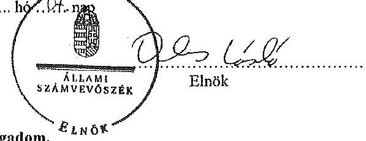

A teljes jogkörű feljogosítást elfogadom.
Budapest, 2014. év  hó  . nap
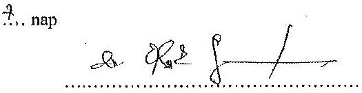

Főtitkár

