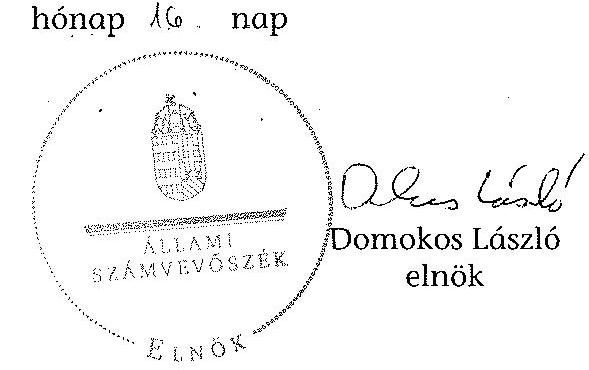

ÁLLAMI
SZÁMVEVŐSZÉK

# JELENTÉS 

az önkormányzatok belső kontrollrendszere kialakításának, egyes
kontrolltevékenységek és a belső ellenőrzés
működésének ellenőrzése
Dorog
15049
2015. március

---

# Állami Számvevőszék 

Iktatószám: V-0661-051/2015.
Témaszám: 1695
Vizsgálat-azonosító szám: V067703

## Az ellenőrzést felügyelte:

Dr. Benedek Mária
felügyeleti vezető
Az ellenőrzést vezette és az ellenőrzés végrehajtásáért felelős:
Bíró Zsolt
ellenőrzésvezető
A számvevőszéki jelentés összeállításában közreműködött:
Vojcsekné Szabó Ágnes
számvevő tanácsos
Az ellenőrzést végezték:
Massányi Tibor
számvevő tanácsos

Vojcsekné Szabó Ágnes
számvevő tanácsos

---

# TARTALOMJEGYZÉK 

BEVEZETÉS ..... 5
I. ÖSSZEGZŐ MEGÁLLAPÍTÁSOK, KÖVETKEZTETÉSEK, JAVASLATOK ..... 9
II. RÉSZLETES MEGÁLLAPÍTÁSOK ..... 12

1. Az önkormányzat belső kontrollrendszere kialakításának és működtetésének megfelelősége ..... 12
1.1. A kontrollkörnyezet kialakítása és működtetése ..... 12
1.2. A kockázatkezelési rendszer kialakítása és működtetése ..... 14
1.3. A kontrolltevékenységek kialakítása és működtetése ..... 14
1.4. Az információs és kommunikációs rendszer kialakítása és működtetése ..... 16
1.5. A monitoring rendszer kialakítása és működtetése ..... 17
2. A monitoring rendszer részeként a belső ellenőrzés kialakítása és működtetése ..... 17
3. A pénzügyi folyamatokban kulcsszerepet betöltő belső kontrollok (teljesítésigazolás és érvényesítés) működése ..... 19
4. Az integritás szemlélet érvényesülése ..... 21

## FÜGGELÉKEK

1. számú Értelmező szótár
2. számú Az integritás érvényesítése érdekében kialakított és működtetett kontrollrendszer

---

.

---

# RÖVIDÍTÉSEK JEGYZÉKE 

## Törvények

Áht.
ÁSZ tv.
Info tv.

Kttv.

Mötv.

Ötv.
Számv. tv.
Vnytv.

## Rendeletek, határozatok

Áhsz $_{1}$

Áhsz $_{2}$
Ávr.

Bkr.
képviselő-testületi
SZMSZ

## Szórövidítések

adatvédelmi és adatbiztonsági szabályzat alapító okirat

ÁSZ
belső ellenőrzési kézikönyv
bizonylati szabályzat
ellenőrzési nyomvonal
2011. évi CXCV. törvény az államháztartásról (hatályos 2012. január 1-jétől)
2011. évi LXVI. törvény az Állami Számvevőszékről
2011. évi CXII. törvény az információs önrendelkezési jogról és az információszabadságról (hatályos 2012. január 1-jétől)
2011. évi CXCIX. tv. a közszolgálati tisztviselőkről (hatályos 2012. március 1-jétől)
2011. évi CLXXXIX. törvény Magyarország helyi önkormányzatairól
1990. évi LXV. törvény a helyi önkormányzatokról
2000. évi C. törvény a számvitelről
2007. évi CLII. törvény az egyes vagyonnyilatkozat-tételi kötelezettségekről

249/2000. (XII. 24.) Korm. rendelet az államháztartás szervezetei beszámolási és könyvvezetési kötelezettségének sajátosságairól (hatályos 2013. december 31-ig)
4/2013. (I. 11.) Korm. rendelet az államháztartás számviteléről (hatályos 2014. január 1-jétől)
368/2011. (XII. 31.) Korm. rendelet az államháztartásról szóló törvény végrehajtásáról (hatályos 2012. január 1-jétől)
370/2011. (XII. 31.) Korm. rendelet a költségvetési szervek belső kontrollrendszeréről és belső ellenőrzéséről (hatályos 2012. január 1-jétől)
Dorog Város Önkormányzata Képviselő-testületének 17/2013 (II. 22.) számú rendelete a Képviselő-testület és szervei Szervezeti és Működési Szabályzatáról

Dorog Város Polgármesteri Hivatalának Adatvédelmi és adatbiztonsági szabályzata (hatályos 2013. október 1-től)
Dorog Város Polgármesteri Hivatal alapító okirata (hatályos 2013. május 1-től)
Állami Számvevőszék
Dorog Város Polgármesteri Hivatal Belső ellenőrzési kézikönyve (hatályos 2012. május 15-től)
Dorog Város Önkormányzatának és Polgármesteri Hivatalának bizonylati szabályzata (hatályos 2013. november 15-től)
Dorog Város Önkormányzatának és Polgármesteri Hivatalának ellenőrzési nyomvonala (hatályos 2012. április 1-től)

---

együttes gazdálkodási jogkörök szabályzata
értékelési szabályzat
gazdasági program
gazdálkodási jogkörök szabályzata ${ }_{1}$
gazdálkodási jogkörök szabályzata ${ }_{2}$

Hivatal
hivatali SZMSZ

INTOSAI
iratkezelési szabályzat
ISSAI
jegyző
Képviselő-testület
leltározási szabályzat

Önkormányzat
pénzkezelési szabályzat
polgármester
számlarend
számviteli politika
tűzvédelmi szabályzat

Dorog Város Önkormányzatának, Dorog Város Polgármesteri Hivatalának szabályzata a pénzgazdálkodással kapcsolatos kötelezettségvállalás, utalványozás, érvényesítés és ellenjegyzés hatásköri rendjéről (hatályos 2013. november 14-ig)
Dorog Város Önkormányzatának és Polgármesteri Hivatalának értékelési szabályzata (hatályos 2013. november 15-től)
Dorog Város Önkormányzatának 2011-től 2014-ig terjedő időszakra szóló gazdasági programja
Dorog Város Önkormányzatának a pénzgazdálkodással kapcsolatos kötelezettségvállalás, utalványozás, érvényesítés és ellenjegyzés hatásköri rendjéről (hatályos 2013. november 15-től)
Dorog Város Polgármesteri Hivatalának szabályzata a pénzgazdálkodással kapcsolatos kötelezettségvállalás, utalványozás, érvényesítés és ellenjegyzés hatásköri rendjéről (hatályos 2013. november 15-től)
Dorog Város Polgármesteri Hivatala
A Polgármesteri Hivatal Szervezeti és Működési Szabályzata (hatályos 2013. február 22-től)
International Organization of Supreme Audit Institutions (Legfőbb Ellenőrző Intézmények Nemzetközi Szervezete)
Dorog Polgármesteri Hivatal iratkezelési szabályzata (hatályos 2013. január 1-től)
International Standards of Supreme Audit Institutions (Legfőbb Ellenőrző Intézmények Nemzetközi Standardjai)
Dorog Város jegyzője
Dorog Város Önkormányzatának Képviselő-testülete
Dorog Város Önkormányzatának és Polgármesteri Hivatalának leltározási szabályzata (hatályos 2013. november 15-től)
Dorog Város Önkormányzata
Dorog Város Önkormányzatának és Polgármesteri Hivatalának bankszámlapénz-kezelési szabályzata (hatályos 2013. november 15-től)
Dorog Város polgármestere
Dorog Város Polgármesteri Hivatalának számlarendje (hatályos 2013. szeptember 1-től)
Dorog Város Polgármesteri Hivatalának számviteli politikája (hatályos 2013. szeptember 1-től)
Dorog Polgármesteri Hivatal tűzvédelmi szabályzata (hatályos 2012. január 2-től)

---

# JELENTÉSTERVEZET 

## az önkormányzatok belső kontrollrendszere kialakításának, egyes kontrolltevékenységek és a belső ellenőrzés működésének ellenőrzése Dorog

## BEVEZETÉS

Dorog város állandó lakosainak száma 2013. január 1-jén 12416 fő volt. Az Önkormányzat 12 tagú Képviselő-testületének munkáját kettő állandó bizottság segítette. Az Önkormányzat az önállóan működő és gazdálkodó Hivatalon kívül egy önállóan működő és gazdálkodó, öt önállóan működő intézményt működtetett, kettő többségi tulajdoni hányadú gazdasági társasággal rendelkezett. A polgármester a 2010. évi önkormányzati választások óta tölti be tisztségét. A jegyző 2011. július 2-ától látja el feladatait. A Hivatal öt szervezeti egységre tagolódott, elkülönített gazdasági szervezettel nem rendelkezett, a foglalkoztatott köztisztviselők száma 2013. január 1-jén 36 fő volt. A Hivatalnál 2013. január 1-jétől szervezeti változás nem volt. Az Önkormányzat a 2013. évi költségvetési beszámolója szerint 2517187 ezer Ft tárgyévi bevételt ért el, valamint 1950058 ezer Ft tárgyévi kiadást teljesített. A 2013. december 31-i könyvviteli mérleg szerint 11620454 ezer Ft értékű eszközvagyonnal rendelkezett, a rövid lejáratú kötelezettségállománya 291220 ezer Ft, hosszú lejáratú kötelezettségállománya 781207 ezer Ft volt.

A demokratikus társadalmakban alapvető igény, hogy a közpénzeket, a közvagyont használók valamennyi tevékenységükhöz kapcsolódó pénzfelhasználásról elszámoljanak, ahhoz egyértelmű és érvényesíthető felelősségi szabályok társuljanak. Ennek a jogos igénynek az érvényesítéséhez meg kell teremteni azokat a folyamatokat, rendszereket, amelyek nélkülözhetetlenek az elszámoltatáshoz. Az elszámoltatás eredményes működtetéséhez szükség van a megfelelő információs, kontroll, értékelési és beszámolási rendszerek kialakítására.

Magyarországon az uniós csatlakozási tárgyalások idejére nyúlnak vissza a belső kontrollrendszer szabályozásának gyökerei. Az uniós elvárásoknak megfelelő új terminológia szerinti államháztartási belső pénzügyi ellenőrzési (ÁBPE) rendszer területén a jogharmonizáció 2003-ban teljes körűen megvalósult, míg az önkormányzati alrendszerre vonatkozó, Ötv.-ben megjelenített speciális szabályozás 2005-ben lépett hatályba. Az államháztartási belső kontrollrendszer koncepciója 2009-ben továbbfejlődött. A változások irányát mutatja, hogy a költségvetési szervek belső kontrollrendszere már magában foglalja a korszerű felelős szervezetirányítás elemeit (kontrollkörnyezet, kockázatkezelés, kontrolltevékenység, információ és kommunikáció, monitoring) is. E kont-

---

rollrendszer szabályozása háromszintű, a törvényi előírásokat az Áht. és a Mötv, a rendeleti szintű szabályozást az Ávr. és a Bkr. tartalmazza, amelyeket útmutatói szinten az NGM által kiadott standardok és kézikönyvek támogatnak.

A belső kontrollrendszer azt a célt szolgálja, hogy a költségvetési szervek működésük és gazdálkodásuk során a tevékenységeket szabályszerűen, gazdaságosan, hatékonyan, eredményesen hajtsák végre, teljesítsék elszámolási kötelezettségeiket és megvédjék az erőforrásokat a veszteségektől, a károktól és a nem rendeltetésszerű használattól. A belső kontrollrendszer magában foglalja mindazon szabályokat, eljárásokat, gyakorlati módszereket és szervezeti struktúrákat, kockázatkezelési technikákat, kontrolltevékenységeket, amelyek segítséget nyújtanak a szervezetnek céljai eléréséhez.

Az ÁSZ a középtávú stratégiájában hangsúlyos szerepet szánt annak, hogy szilárd szakmai alapon álló, értékteremtő ellenőrzéseivel előmozdítsa a közpénzügyek átláthatóságát, rendezettségét. A számvevőszéki ellenőrzés nemzetközi alapelvei is rögzítik, hogy a megfelelő belső kontrollrendszer minimálisra csökkenti a hibák és szabálytalanságok kockázatát.

# Az ellenőrzés célja annak értékelése, hogy 

- a jogszabályi előírásoknak megfelelően alakították-e ki és működtették-e a belső kontrollrendszert;
- a gazdálkodás folyamatában kulcsszerepet betöltő teljesítésigazolás és érvényesítés kontrolltevékenységeit megfelelően működtették-e;
- biztosították-e a belső ellenőrzés szabályos működését;
- kialakították-e az erőforrásokkal való szabályszerű és hatékony gazdálkodáshoz szükséges követelményeket, megvalósították-e azok számonkérését, ellenőrzését;
- hasznosították-e a 2009-2013. években végzett ÁSZ ellenőrzések során megfogalmazott javaslatokat.

A közintézmények integritás alapú kultúrájának kialakítása, megerősítése és működése szorosan összefügg a belső kontrollrendszer működésével, ezért az ellenőrzés kitért a gazdálkodáshoz kapcsolódó integritás kontrollok meglétének és működésének ellenőrzésére is. Az integritási kultúra kialakítása hozzájárul az elszámoltathatóság és átláthatóság érvényesítéséhez, egyben támogatja a szervezet védettségét a korrupciós kitettséggel szemben, valamint annak megelőzése is irányítottabbá válik.

Az ellenőrzés várható hasznosulását négy szinten tervezzük. A törvényalkotás számára összegzett tapasztalatok állnak rendelkezésre a belső kontrollrendszer önkormányzati területen való kialakításáról, működéséről és hatásairól, a belső ellenőrzés működéséről. Az ellenőrzés az ellenőrzött számára visszajelzést ad a belső kontrollrendszer kialakításában és működésében fellépő hiányosságokról, javaslataival hozzájárul azok kiküszöböléséhez, amely csökkentheti a későbbi ellenőrzések gyakoriságát. Az ellenőrzés megállapításai és javaslatait más szervezetek is hasznosíthatják a rendezett gazdálkodási keretek ki-

---

alakításához. A társadalom számára jelzi, hogy közpénz nem maradhat ellenőrizetlenül, az ÁSZ értékteremtő rend kialakításához és megőrzéséhez hozzájáruló tevékenysége pozitív hatással lesz a szervezetről kialakított összkép formálásában. A szervezeten belül lehetőség nyílik arra, hogy a megállapítások szintetizálásával az ÁSZ a hozzáadott értéket teremtő elemző tevékenységét és tanácsadó szerepét is erősítse.

Az önkormányzatok belső kontrollrendszere kialakításának, az egyes kontrolltevékenységek és a belső ellenőrzés működésének ellenőrzéséről szóló jelentés I. fejezetének összegző része az ellenőrzés céljára ad rövid, szintetizáló összefoglalót, és tartalmazza a következtetéseket a II. fejezet részletes megállapításain alapulóan. A jelentés intézkedést igénylő megállapításait és javaslatait az ellenőrzés során feltárt, a jelentés II. fejezetében rögzített részletes megállapítások alapozzák meg.

Az ellenőrzés típusa: szabályszerűségi ellenőrzés
Az ellenőrzött időszak: a belső kontrollrendszer kialakítása és működtetése megfelelőségét a 2013. évre vonatkozóan (2013. december 31-i állapotnak megfelelően), a pénzügyi folyamatokban kulcsszerepet betöltő teljesítésigazolás és érvényesítés belső kontrollok működésének megfelelőségét, és a belső ellenőrzés szabályszerű működését a 2013. január 1-december 31-e közötti időszakot figyelembe véve értékeltük, míg az ÁSZ javaslatainak utóellenőrzése a 2009-2013. években végzett ellenőrzések nyilvánosságra hozott jelentéseiben tett javaslatok áttekintésére terjedt ki.

# Az ellenőrzött szervezet: az Önkormányzat 

Az ellenőrzés jogszabályi alapját az ÁSZ tv. 1. § (3) bekezdése, az 5. § (2) és (6) bekezdései, valamint az Áht. 61. § (2) bekezdése képezik.

Az ellenőrzés szakmai módszertana az ÁSZ hivatalos honlapján (www.asz.hu) közzétett szakmai szabályokon alapult, amely az INTOSAI által kiadott ISSAI figyelembevételével készült.

Az ellenőrzés lefolytatásához az Önkormányzat a kimutatások és a tanúsítvány elektronikus kitöltésével, valamint az ÁSZ által kért dokumentumok elektronikus megküldésével szolgáltatott adatokat. Az így rendelkezésre bocsátott adatok, információk kontrollja és a munkalapok kitöltése a helyszíni ellenőrzés keretében történt. A jelentésben használt fogalmak magyarázatát az 1. számú függelék, az integritás érvényesítése érdekében kialakított és működtetett intézményi kontrollrendszer értékelését a 2. számú függelék tartalmazza.

A belső kontrollrendszer, valamint a belső ellenőrzés jogszabályi előírások szerinti kialakításának és működtetésének szabályszerűségét az erre irányuló ellenőrzési kérdésekre adott válaszok összesítése alapján értékeltük. A belső kontrollrendszert kontrollterületenként (kontrollkörnyezet, kockázatkezelési rendszer, kontrolltevékenységek, információs és kommunikációs rendszer, monitoring rendszer) és összesítetten is értékeltük.

A belső kontrollrendszer egyes kontrollterületei és a belső ellenőrzés kialakítása és működtetése „szabályszerű volt", amennyiben az értékelt területen az elért és

---

elérhető pontok százalékban kifejezett hányadosa elérte a 81%-ot, „részben szabályszerű volt", ha 61-80% közé esett, és „nem volt szabályszerű", ha nem haladta meg a 60%-ot. A belső kontrollrendszer összesített értékelése megegyezett a kontrollterületenként alkalmazott %-os értékelésekkel, a következő eltérésekkel. A kontrollrendszer egésze esetében a „szabályszerű" értékelésnek a %-os értéken felül további feltétele volt, hogy egyik kontrollterület sem kaphatott „nem volt szabályszerű" értékelést, a „részben szabályszerű" értékelés további feltétele volt, hogy legfeljebb egy ellenőrzött kontrollterület lehetett „nem volt szabályszerű" értékelésű. Az összesített értékelés a
 %-os értéktől függetlenül „nem volt szabályszerű", ha az ellenőrzött kontrollterületek közül több mint egynek „nem volt szabályszerű" az értékelése.

A gazdálkodás folyamatában kulcsszerepet betöltő két kulcskontroll - teljesítésigazolás, érvényesítés - működésének megfelelőségét a személyi juttatásokkal, a dologi és felhalmozási kiadásokkal, működési és felhalmozási célú pénzeszköz átadásokkal, ellátottak pénzbeli juttatásaival kapcsolatos kifizetések esetében mintavétellel ellenőriztük. „Megfelelőnek" értékeltük a gazdálkodási jogkörök gyakorlását, amennyiben 95%-os bizonyossággal a teljes sokaságban a hibaarány legfeljebb 10%, „részben megfelelőnek" értékeltük, ha a hibaarány felső határa 10-30% között volt, „nem megfelelőnek" pedig akkor, ha a mintavételi eredmények alapján a sokaságbeli hibaarány felső határa meghaladta a 30%-ot.

Az integritás szemlélet érvényesülésének értékelése az Önkormányzat önbevallás által kitöltött tanúsítványa alapján történt.

Utóellenőrzésre nem került sor, mivel az ÁSZ az Önkormányzatnál a 2009-2013. évek között nem végzett ellenőrzést.

Az ÁSZ tv. 29. § (1) bekezdése szerint a jelentéstervezetet megküldtük a polgármester részére, aki az ÁSZ tv. 29. § (2) bekezdésében foglalt észrevételezési jogával nem élt, a jelentéstervezetre észrevételt nem tett.

---

# I. ÖSSZEGZŐ MEGÁLLAPÍTÁSOK, KÖVETKEZTETÉSEK, JAVASLATOK 

A belső kontrollrendszeren belül 2013-ban a kontrollkörnyezet, a kockázatkezelési rendszer, a kontrolltevékenységek, az információs és kommunikációs rendszer, valamint a monitoring rendszer kialakítását és működtetését külön-külön és együttesen is értékeltük. A belső kontrollrendszer kialakítása és működtetése az összesített értékelés alapján nem volt szabályszerű.

A belső kontrollrendszer egyes területei kialakításának és működtetésének minősítése a következő:

| Kontrollterület | Minősítés |
| :-- | :--: |
| Kontrollkörnyezet | részben   szabályszerű |
| Kockázatkezelési rendszer | nem   szabályszerű |
| Kontrolltevékenységek | részben   szabályszerű |
| Információs és kommunikációs rendszer |  |
| Monitoring rendszer | nem   szabályszerű |

Szabályszerű volt az információs és kommunikációs rendszer kialakítása és működtetése, mivel a jegyző a jogszabályi előírásokban foglaltakat figyelembe véve kisebb hiányosságok mellett is megteremtette a kontrollterületen a szabályszerű működés lehetőségét.

Részben szabályszerű volt a kontrollkörnyezet és a kontrolltevékenységek kialakítása és működtetése, mivel a megállapított szabályozásbeli hiányosságok nem veszélyeztették e kontrollterületeken a szabályszerű működést.

Nem volt szabályszerű a kockázatkezelési rendszer, valamint a monitoring rendszer kialakítása és működtetése, mivel az ellenőrzésünk során megállapított szabályozásbeli hiányosságok magukban hordozzák a szabálytalan működést, valamint a korrupció kockázatát.

A 2013. évben a személyi juttatásokkal, a dologi kiadásokkal, a felhalmozási kiadásokkal, a működési és felhalmozási célú pénzeszköz átadásokkal, illetve az ellátottak pénzbeli juttatásaival kapcsolatos kifizetések során a kulcsszerepet betöltő teljesítésigazolás és érvényesítés belső kontrollok működése nem volt megfelelő, mivel azok nem biztosították a hibák megelőzését, feltárását.

A számvevőszéki ellenőrzés az ellenőrzött kifizetésekkel összefüggésben a rendelkezésre bocsátott dokumentumok alapján kár bekövetkeztére utaló adatot,

---

tényt nem állapított meg, azonban a gazdálkodásban kulcsszerepet betöltő kontrollok működésében feltárt hiányosságok miatt fennáll a hibák, szabálytalanságok bekövetkezésének kockázata. A nem megfelelően működtetett belső kontrollok korrupciós kockázatot hordoznak.

Az Önkormányzat a belső ellenőrzési feladatokat 2013. április 18-tól külső szolgáltató útján látta el. A 2013. évben a belső ellenőrzés kialakítása és működtetése részben szabályszerű volt, azonban a belső ellenőrzés nem tárta fel a belső kontrollrendszer kialakításának, valamint a pénzügyi folyamatokban kulcsszerepet betöltő teljesítésigazolás és érvényesítés belső kontrollok működésének hiányosságait.

A Képviselő-testület a 2013. évben nem alakította ki az erőforrásokkal való szabályszerű és hatékony gazdálkodáshoz szükséges követelményeket.

Az Önkormányzat intézkedéseket tett az integritás szemlélet fejlesztésére, valamint a korrupciós kockázatok csökkentésére, a 2012-2013. években önként részt vett az ÁSZ integritási felmérésében.

Az ÁSZ tv. 33. § (1) bekezdésében foglaltak értelmében az ellenőrzött szervezet vezetője köteles a jelentésben foglalt megállapításokhoz kapcsolódó intézkedési tervet összeállítani, és azt a jelentés kézhezvételétől számított 30 napon belül az ÁSZ részére megküldeni. Amennyiben az intézkedési tervet határidőre nem küldi meg a szervezet, vagy az ÁSZ tv. 33. § (2) bekezdésében foglalt póthatáridő elteltével megküldött intézkedési terv továbbra sem elfogadható, az ÁSZ elnöke a hivatkozott törvény 33. § (3) bekezdés a)-b) pontjaiban foglaltakat érvényesítheti.

# a polgármesternek 

1. Az Önkormányzat kiadási előirányzata terhére történt kötelezettségvállalásra - az Áht. 37. § (1) és az Ávr. 55. § (1) bekezdésében foglaltak ellenére - pénzügyi ellenjegyzés nélkül került sor, valamint a kötelezettségvállalás dokumentumán nem tüntették fel a pénzügyi ellenjegyzés dátumát.

Javaslat:
Intézkedjen annak érdekében, hogy az Önkormányzat nevében történő kötelezettségvállalásra az Áht. 37. § (1) bekezdésében és az Ávr. 55. § (1) bekezdésében foglaltaknak megfelelően - az Ávr. 53. §-ában meghatározott kivételekkel - kizárólag pénzügyi ellenjegyzés után kerüljön sor, továbbá a kötelezettségvállalás dokumentumán tüntessék fel a pénzügyi ellenjegyzés dátumát.
2. A számvevőszéki jelentés ellenőrzési megállapításai alapján az Önkormányzatnál a belső kontrollrendszer kialakítása és működtetése összesített értékelés alapján nem volt szabályszerű, a kulcskontrollok működése nem volt megfelelő.

Javaslat:
Kísérje figyelemmel a Mötv. 115. § (1) bekezdésében foglaltak alapján az Önkormányzat gazdálkodásának szabályszerűségét. A Mötv. 67. § f) pontja alapján gon-

---

doskodjon a belső kontrollrendszer működtetésére vonatkozó jogszabályi rendelkezések be nem tartása, valamint a teljesítésigazolás, illetve az érvényesítés kontrollokkal összefüggésben feltárt hibák, hiányosságok, szabálytalanságok tekintetében az esetleges munkajogi felelősséggel kapcsolatos körülmények kivizsgálásáról, majd a vizsgálat eredményének függvényében tegye meg a szükséges intézkedéseket.

# a jegyzőnek 

1. A számvevőszéki jelentés ellenőrzési megállapításai alapján az Önkormányzatnál a belső kontrollrendszer kialakítása és működtetése összesített értékelés alapján nem volt szabályszerű, a kulcskontrollok működtetése nem volt megfelelő, valamint a belső ellenőrzés kialakítása és működtetése részben volt szabályszerű. A számvevőszéki ellenőrzés során feltárt hibákat, hiányosságokat és szabálytalanságokat a számvevőszéki jelentés II. Részletes megállapítások fejezetcím tartalmazza.

Javaslat:
A jogszabályoknak megfelelő belső kontrollrendszer kialakítása és működtetése érdekében - az ellenőrzött időszak óta bekövetkezett esetleges jogszabályi változásokra figyelemmel - intézkedjen a belső kontrollrendszer kialakításában és működtetésében, a kulcskontrollok, illetve a belső ellenőrzés működtetésében az ellenőrzés által feltárt hibák, hiányosságok, szabálytalanságok kijavítására.

Kezdeményezze, hogy az éves ellenőrzési terv kiterjedjen a kifizetések szabályszerűségi ellenőrzésére, különös tekintettel a személyi juttatásokkal, a dologi kiadásokkal, a felhalmozási kiadásokkal, a működési és felhalmozási célú pénzeszköz átadásokkal, az ellátottak pénzbeli juttatásaival kapcsolatos kiadási jogcímekből teljesített kifizetésekre.

---

# II. RÉSZLETES MEGÁLLAPÍTÁSOK 

## 1. Az önkormányzat belső kontrollrendszerének kialakításának és működtetésének megfelelősége

A belső kontrollrendszeren belül 2013-ban a kontrollkörnyezet, a kockázatkezelési rendszer, a kontrolltevékenységek, az információs és kommunikációs rendszer, valamint a monitoring rendszer kialakítását és működtetését külön-külön és együttesen is értékeltük. A belső kontrollrendszer kialakítása és működtetése az összesített értékelés alapján nem volt szabályszerű.

### 1.1. A kontrollkörnyezet kialakítása és működtetése

A kontrollkörnyezet kialakítása és működtetése részben szabályszerű volt.

A Hivatal rendelkezett a Képviselő-testület által elfogadott alapító okirattal és a 2011-2014. évekre vonatkozó gazdasági programmal. A képviselő-testületi SZMSZ tartalmazta a Képviselő-testület működésének rendjét. A Képviselőtestület önkormányzati rendeletben előírta a vagyongazdálkodás szabályait.

A Hivatal rendelkezett hivatali SZMSZ-szel, számviteli politikával, valamint annak keretében elkészítette a pénzkezelési-, leltározási- és értékelési szabályzatokat. Továbbá rendelkezett számlarenddel, bizonylati szabályzattal, a szabálytalanságkezelés eljárásrendjével, valamint tűzvédelmi szabályzattal. A jegyző a számviteli politikát, valamint az annak keretében elkészített szabályzatokat kiterjesztette a szlovák és a roma nemzetiségi önkormányzatokra.

A Hivatalban dolgozó köztisztviselők rendelkeztek munkaköri leírással. A jegyző elkészítette szöveges és táblázatos formában az ellenőrzési nyomvonalat és gondoskodott a 2012. évben annak aktualizálásáról a jogszabályi változásokhoz igazodva. Továbbá meghatározta az egészséget nem veszélyeztető és biztonságos munkavégzés követelményei megvalósításának módját.

A kontrollkörnyezet kialakítása és működtetése részben szabályszerű volt, mert:

| Sorszám | Megállapítás | Megjegyzés |
| :--: | :--: | :--: |
| 7. | A jegyző - az Ávr. 13. § (1) bekezdés f) pontjában foglaltak ellenére - nem rögzítette a hivatali SZMSZ-ben azon ügyköröket, amelyek során a szervezeti egységek vezetői a költségvetési szerv képviselőjeként járhatnak el. |  |

A jegyző - az Ávr. 13. § (1) bekezdés g) pontjában foglaltak ellenére - nem rögzítette a hivatali SZMSZ-ben a munkakörhöz tartozó feladat- és hatásköröket, a hatáskörök gyakorlásának módját, a helyettesítés rendjét és az ezekhez kapcsolódó felelősségi szabályokat.

A jegyző - az Áht 3. § (3) bekezdés b) pontjában, az Áhsz 8 § (3) és (4) bekezdés a) és b) pontjában, valamint a Számv. tv. 14. § (5) bekezdés a) és b) pontjában foglaltak ellenére - nem készítette el a német és az örmény nemzetiségi önkormányzatok számviteli politikáját és annak részeként az eszközök és források leltárkészítési és leltározási szabályzatát, továbbá az eszközök és források értékelési szabályzatát.

A jegyző - a Számv. tv. 161. § (1) és (4) bekezdésében, az Áhsz 49. § (1) bekezdésében, valamint az Áht. 3. § (3) bekezdés b) pontjában foglaltak ellenére - nem készítette el a német és az örmény nemzetiségi önkormányzat számlarendjét.

A jegyző - a Kttv. 75. § (1) bekezdés d) pontjában foglaltak ellenére - nem írta elő a Hivatalban dolgozó köztisztviselők munkaköri leírásaiban a munkakör betöltésével kapcsolatos követelmények közül a tapasztalattal és a képességekkel kapcsolatos elvárásokat.

A Képviselő-testület - az Áht. 9. § (1) bekezdés f) pontjában foglaltak ellenére - nem alakította ki az erőforrásokkal való szabályszerű és hatékony gazdálkodáshoz szükséges követelményeket.

A jegyző - a 10/2013. (I. 21.) Korm. rendelet 5. §-ában és a 25. § (2) bekezdésében foglaltak ellenére - nem határozta meg 2013. július 31-ig a köztisztviselők teljesítményértékelésének második félévre vonatkozó kötelező elemeit.

A jegyző - az Mötv. 81. § (3) bekezdés c) pontjában előírt feladata ellenére - nem dolgozta ki a Kttv. 83. §-ában előírt, a köztisztviselőkre vonatkozó hivatásetikai alapelvek részletes tartalmát, valamint az etikai eljárás szabályait.

A munkakörökhöz tartozó feladat- és hatásköröket, a hatáskörök gyakorlásának módját, a helyettesítés rendjét és az ezekhez kapcsolódó felelősségi szabályokat a munkaköri leírások tartalmazták.

2014. január 1-jétől az Áhsz 50. § (1) bekezdése szabályozza a számviteli politikát.

2014. január 1-jétől a Számv. tv. 161. § (1) bekezdése és az Áhsz 51. § (2) bekezdése írja elő a számlarend készítésének kötelezettségét.

---

# 1.2. A kockázatkezelési rendszer kialakítása és működtetése 

A kockázatkezelési rendszer kialakítása és működtetése nem volt szabályszerű, mert:

| Sorszám | Megállapítás | Megjegyzés |
| :--: | :--: | :--: |
| 2-4. | A jegyző - a Bkr. 7. § (2) bekezdésében foglaltak ellenére - nem mérte fel és nem állapította meg a Hivatal tevékenységében, gazdálkodásában rejlő kockázatokat, nem határozta meg az egyes kockázatokkal kapcsolatban szükséges intézkedéseket és azok teljesítésének folyamatos nyomon követési módját. |  |
| 5. | Az Vnytv. 4. § a) és d) pontjaiban foglaltak ellenére a vagyonnyilatkozat-tételre kötelezett köztisztviselők, továbbá a Képviselőtestület bizottságai nem helyi önkormányzati képviselő tagjai vagyonnyilatkozat-tételi kötelezettségét a hivatali SZMSZ-ben, illetve a képviselő-testületi SZMSZ-ben nem tüntették fel. | A Képviselő-testület a 159/2001. (IX. 28.) számú határozatában meghatározta a köztisztviselők vagyonnyilatkozat-tételi kötelezettségét. |

 6. | A bizottságok nem helyi önkormányzati képviselő tagjai - a Vnytv. 5. § (1) bekezdésében foglaltak ellenére - vagyonnyilatkozat-tételi kötelezettségüknek nem tettek eleget. A vagyonnyilatkozatok őrzéséért felelős - a Vnytv. 8. § (4) bekezdésében foglaltak ellenére - nem tájékoztatta a bizottságok nem helyi önkormányzati képviselő tagjait a vagyonnyilatkozat-tételi kötelezettség fennállásáról és esedékességének időpontjáról az esedékességet legalább 30 nappal megelőzően. Továbbá - a Vnytv. 10. § (1) bekezdésében foglaltak ellenére - írásban nem szólította fel a bizottságok nem helyi önkormányzati képviselő tagjait arra, hogy kötelezettségüket a felszólítás kézhezvételétől számított nyolc napon belül teljesítsék. |  |

### 1.3. A kontrolltevékenységek kialakítása és működtetése

## A kontrolltevékenységek kialakítása és működtetése részben szabályszerű volt.

Az ellenőrzési nyomvonalban előírták a folyamatba épített, előzetes, utólagos és vezetői ellenőrzést a költségvetés tervezése, a beszerzések lebonyolítása, a vagyonhasznosítási tevékenység, valamint a támogatások elszámolása vonatkozásában.

A jegyző és a polgármester meghatározta az együttes gazdálkodási jogkörök szabályzatában, valamint a gazdálkodási jogkörök szabályzata ${ }_{1,2}$-ben a kötele-

---

zettségvállalás pénzügyi ellenjegyzése, az érvényesítés, az utalványozás gyakorlásának módjával, eljárási és dokumentációs részletszabályaival, valamint az ezeket végző személyek kijelölésének rendjével kapcsolatos belső előírásokat.

A polgármester az Önkormányzat, a jegyző pedig a Hivatal vonatkozásában kijelölte a teljesítés igazolására jogosultakat; mivel a Hivatal nem rendelkezett gazdasági szervezettel, a jegyző jelölte ki a pénzügyi ellenjegyzés feladatának ellátására a Hivatal állományába tartozó köztisztviselőket. A pénzügyi ellenjegyzők és az érvényesítők rendelkeztek az előírt végzettséggel.

Az iratkezelési szabályzatban meghatározták az üzemeltetés és az adatbiztonság feladatait, az elektronikus iratkezelés speciális szabályait, az üzemeltetésért és az adatok biztonságos kezelésért felelősöket.

Az informatikai rendszer szabályozása során a jegyző meghatározta az adatok biztonságának érvényre juttatásához szükséges eljárási szabályokat. A könyvelési és pénzügyi rendszer használatát jelszóhoz kötötték, amelyet a rendszergazda a felhasználók részére dokumentáltan átadott.

A polgármester a költségvetési koncepció Képviselő-testület elé terjesztésével egyidejűleg tájékoztatást adott az Önkormányzat harmadik negyedéves gazdálkodási helyzetéről. A költségvetési beszámoló elkészítésével megbízott személy rendelkezett az előírt képesítéssel.

Szabályozták a Hivatalban a közszolgálati jogviszony megszűnése, a munkakör változása esetén a munkakör átadásának rendjét, az előírásokat az átadás-átvétel során betartották.

A kontrolltevékenységek kialakítása és működtetése részben szabályszerű volt, mert:

| Sorszám | Megállapítás | Megjegyzés |
| :--: | :--: | :--: |
| 6. | Az Ávr. 57. § (1) bekezdésében és az Ávr. 58. § (1) bekezdésében előírtak ellenére az előzetes írásbeli kötelezettségvállalást nem igénylő kifizetések esetén lehetővé tették az együttes gazdálkodási jogkörök szabályzatában, valamint a gazdálkodási jogkörök szabály-zata ${ }_{1,2}$-ben a teljesítésigazolás és a fedezet meglétének ellenőrzése nélküli kifizetéseket. |  |
| 7. | Az Ávr. 57. § (4) bekezdésében előírtak ellenére az együttes gazdálkodási jogkörök szabályzatában 2013. január 1-je és 2013. november 14-dike között az Önkormányzat kiadási előirányzataira vonatkozóan a polgármester helyett a jegyző volt jogosult a teljesítés igazolók kijelölésére. | 2013. november 15-től a gazdálkodási jogkörök szabályzata ${ }_{1}$-ben az Önkormányzat kiadási előirányzataira vonatkozóan a polgármester feladat- és hatáskörébe tartozott a teljesítés igazolók kijelölése. |

---

| 9. | Az Ávr. 58. § (4) bekezdésében foglaltak ellenére az Önkormányzat kiadási előirányzataira vonatkozóan a gazdálkodási jogkörök szabályzatban 2013. november 15-től a jegyző helyett a polgármester feladat- és hatáskörébe tartozik az érvényesítésre jogosult személyek kijelölése. |  |
| :--: | :--: | :--: |
| 15. | A jegyző - a Bkr. 8. § (4) bekezdés b) pontjában foglaltak ellenére - belső szabályzatban nem határozta meg a dokumentumokhoz és információkhoz való hozzáférésre vonatkozóan a felelősségi köröket. |  |
| 18. | A jegyző - az Ávr. 13. § (5) bekezdésében foglaltak ellenére - nem határozta meg a gazdasági feladatot ellátó vezető és a gazdasági feladatot ellátó alkalmazottak helyettesítésének rendjét. | A helyettesítés rendjét a munkaköri leírások tartalmazták a gazdasági feladatokat ellátó alkalmazottak esetében. |
| 21. | A polgármester - az Áht. 87. § (1) bekezdésében előírtak ellenére - a Képviselőtestületet írásban az előírt határidőt túllépve, szeptember 20-án tájékoztatta az Önkormányzat gazdálkodásának első fél éves helyzetéről. | A Képviselő-testület az Önkormányzat 2013. évi költségvetésének első félévi teljesítéséről szóló beszámolót a 2013. szeptember 27-ei ülésén megtárgyalta és a 116/2013. (IX. 27.) számú határozatával elfogadta. A 2014. év szeptember 30-ától hatályát vesztette az Áht. 87. § (1) bekezdésének előírása. |
| 28. | A jegyző az Önkormányzat kiadási előirányzataira vonatkozóan - az Ávr. 58. § (4) bekezdés foglalt előírás ellenére - az érvényesítési feladatok ellátására 2013. november 15-étől írásban nem jelölt ki a Hivatal állományába tartozó köztisztviselőt. | Az Önkormányzat kiadási előirányzataira vonatkozóan 2013. november 15-éről a jegyző helyett a polgármester jelölte ki az érvényesítési feladatok ellátására a Hivatal állományába tartozó köztisztviselőt. |

# 1.4. Az információs és kommunikációs rendszer kialakítása és működtetése 

Az információs és kommunikációs rendszer kialakítása és működtetése szabályszerű volt.

A Hivatal rendelkezett adatvédelmi és adatbiztonsági szabályzattal. A jegyző kialakította a kötelezően közzéteendő közérdekű adatok nyilvánosságra hozatalának-, és a közérdekű adatok megismerésére irányuló igények teljesítésének rendjét. Az Önkormányzat közzétételi kötelezettségének eleget tett.

---

A Hivatal rendelkezett iratkezelési szabályzattal, amelyben szabályozták az ügyintézés folyamatát.

Az információs és kommunikációs rendszer kialakítása és működtetése az alábbi kisebb súlyú hiányosságok mellett szabályszerű volt:

| Sorszám | Megállapítás | Megjegyzés |
| :--: | :--: | :--: |
| 1-2. | A jegyző - a Bkr. 3. § d) pontjában és a 9. § (1) bekezdésében foglaltak ellenére - nem alakított ki olyan rendszert, amely biztosítja, hogy szervezeten belül és kívül a megfelelő információk a megfelelő időben eljutnak az illetékes szervezethez, szervezeti egységhez, illetve személyhez. |  |
| 3. | A jegyző - a Bkr. 9. § (2) bekezdésében foglaltak ellenére - nem határozta meg a beszámolási szinteket, határidőket, módokat. |  |

# 1.5. A monitoring rendszer kialakítása és működtetése 

Az Önkormányzat monitoring rendszerének kialakítása és működtetése nem volt szabályszerű, mert:

| Sorszám | Megállapítás | Megjegyzés |
| :--: | :--: | :--: |
| 1. | A jegyző - a Bkr. 3. § e) pontjában és a 10. §-ában foglaltak ellenére - nem alakította ki a Hivatal tevékenységének, a célok megvalósításának nyomon követését biztosító rendszert. |  |
| 5-6. | A külső ellenőrzés esetén az ellenőrzött, valamint a javaslattal érintett szerv, illetve szervezeti egység vezetője - a Bkr. 13. § (2) bekezdésében foglaltak ellenére - intézkedési tervet nem készített. A jegyző - a Bkr. 14. § (1) bekezdésében foglaltak ellenére - nem gondoskodott a 2013. évi külső ellenőrzések nyilvántartásáról. | A 2013. évben az Önkormányzatnál a külső szervezetek 28 ellenőrzést végeztek. A jegyző gondoskodott a 2013. évi külső szervezetek által végzett ellenőrzések megállapításainak végrehajtásáról. |

A helyi önkormányzatok törvényességi felügyeletét ellátó Komárom-Esztergom Megyei Kormányhivatal törvényességi felhívással, vagy más törvényességi felügyeleti eszközzel 2013-ban nem élt.

## 2. A MONITORING RENDSZER RÉSZEKÉNT A BELSŐ ELLENŐRZÉS KIALAKÍTÁSA ÉS MŰKÖDTETÉSE

A 2013. évben a belső ellenőrzés kialakítása és működtetése részben szabályszerű volt, azonban a belső ellenőrzés nem tárta fel a belső kontrollrendszer kialakításának, valamint a pénzügyi folyamatokban kulcsszerepet betöltő teljesítésigazolás és érvényesítés belső kontrollok működésének hiányosságait.

A belső ellenőrzési tevékenység ellátása érdekében az Önkormányzat 2013. április 18-án megbízási szerződést kötött külső szolgáltatóval. A megbízási szerződésben rögzítették a belső ellenőr feladatait, aki rendelkezett az előírt szakirányú szakképzettséggel és szakmai gyakorlattal.

Az Önkormányzat rendelkezett a jegyző által jóváhagyott, aktualizált belső ellenőrzési kézikönyvvel, valamint a 2011-2015. évekre vonatkozó stratégiai ellenőrzési tervvel.

A 2014. évi ellenőrzési terv, illetve a tervben meghatározott feladatok a stratégiai terv célkitűzésein, valamint a tervezés során elkészített kockázatelemzés alapján felállított prioritásokon alapultak.

A belső ellenőrzés a 2013. évben az ellenőrzési tevékenységét ellenőrzési programok alapján végezte, az elvégzett ellenőrzésekről jelentések készültek.

Az éves összefoglaló belső ellenőrzési jelentést a belső ellenőrzési vezető az előírt határidőre elkészítette, amely - az ellenőrzési tapasztalatok alapján - tartalmazta a belső kontrollrendszer működésének értékelését.

A belső ellenőrzési rendszer kialakítása és működtetése részben szabályszerű volt, mert:

| Sorszám | Megállapítás | Megjegyzés |
| :--: | :--: | :--: |
| 1. | A jegyző a belső ellenőrzés kialakításáról az Áht. 70. § (1) bekezdésében, valamint a Bkr. 15. § (1) és (7) bekezdéseiben előírtak ellenére - 2013. január 1. és április 17. közötti időszakban nem gondoskodott, mivel nem biztosította a belső ellenőrzési tevékenység ellátásának személyi feltételeit. Továbbá Bkr. 15. § (2) bekezdésében előírtak ellenére nem gondoskodott a belső ellenőrzés jogállásának, feladatainak a hivatali SZMSZ-ben való előírásáról. | A jegyző 2013. április 18-án kötött megbízási szerződést a belső ellenőrzési tevékenység ellátására. |
| 3. a) | A belső ellenőrzési kézikönyv - a Bkr. 17. § (2) bekezdés a) pontjában foglaltak ellenére - nem tartalmazta a bizonyosságot adó tevékenységre vonatkozó eljárási szabályokat. |  |
| 7. b)-f) | A stratégiai ellenőrzési terv - a Bkr. 30. § (1) bekezdés b), c), d), e), f) pontjaiban foglaltak ellenére - nem tartalmazta a belső kontrollrendszer általános értékelését, a kockázati tényezőket és értékelésüket, a belső ellenőrzésre vonatkozó fejlesztési és képzési tervet, a szükséges erőforrások felmérését a létszám, a képzettség és a tárgyi |  |

---

|  | feltételek tekintetében, valamint ellenőrzési prioritásokat és az ellenőrzési gyakoriságot. |  |
| :--: | :--: | :--: |
| 18. | Az ellenőrzési programot - a Bkr. 33. § (2) bekezdésében foglaltak ellenére - a belső ellenőrzési vezető helyett a Képviselőtestület hagyta jóvá. |  |
| 22. | Az ellenőrzött szervezeti egységek vezetői a Bkr. 45. § (3) bekezdésében előírt határidő ellenére - három intézkedési tervből kettőt a jelentés kézhezvételétől számított nyolc napon túl készítettek el. | A 2013. évben a belső ellenőr három ellenőrzést végzett. |
| 24. | A belső ellenőrzési vezető - a Bkr. 21. § (2) bekezdés d) pontjában és a Bkr. 47. § (1) bekezdésében foglaltak ellenére - nem vezetett nyilvántartást a belső ellenőrzési jelentésekben tett megállapításokról, javaslatokról, a vonatkozó intézkedési tervekről és azok végrehajtásának nyomon követéséről. |  |

# 3. A PÉNZÜGYI FOLYAMATOKBAN KULCSSZEREPET BETÖLTŐ BELSŐ KONTROLLOK (TELJESÍTÉSIGAZOLÁS ÉS ÉRVÉNYESÍTÉS) MŰKÖDÉSE 

A 2013. évben a személyi juttatásokkal, a dologi kiadásokkal, a felhalmozási kiadásokkal, a működési és felhalmozási célú pénzeszköz átadásokkal, illetve az ellátottak pénzbeli juttatásaival kapcsolatos kifizetések során - összefoglalóan értékelve - a pénzügyi folyamatokban kulcsszerepet betöltő teljesítésigazolás és érvényesítés belső kontrollok működése nem volt megfelelő, mert:

| Kulcskontrollok | Megállapítás |

 megelőzően - az Áht. 38. § (1) bekezdésében, az Ávr. 57. § (1), (3) és (4) bekezdésében foglaltak ellenére - nem, vagy kijelölés hiányában nem az arra jogosult, vagy nem szabályszerűen végezték. |
| Érvényesítés | Az érvényesítést a kifizetést megelőzően - az Ávr. 58. § (1) és (4) bekezdésében foglaltak ellenére - nem, vagy nem szabályszerűen, vagy kijelölés hiányában nem az arra jogosult személyek végezték.   Az érvényesítő - az Ávr. 58. § (2) bekezdés előírása ellenére - nem jelezte az utalványozónak, hogy a megelőző ügymenetben az Áht. az államháztartási számviteli kormányrendelet, az Ávr. és a belső szabályzatokban foglaltakat nem tartották be. |

A 2013. évben az ellenőrzött kifizetési jogcímek mintatételei alapján a teljesítésigazolás kulcskontroll működése során az alábbi hiányosságok, szabálytalanságok fordultak elő:

- a működési és felhalmozási célú pénzeszközátadásokkal, illetve az ellátottak pénzügyi juttatásaival kapcsolatos kifizetéseket megelőzően a teljesítésigazolá-

---

st - az Áht. 38. § (1) bekezdésében és az Ávr. 57. § (1) bekezdésében foglaltak ellenére - nem végezték el;

- a személyi juttatásokkal kapcsolatos kifizetéseket megelőzően a teljesítésigazolás - az Ávr. 57. § (1) bekezdésében foglaltak ellenére - nem szabályszerűen történt, mivel ellenőrizhető okmány (a kifizetést alátámasztó névsor) hiányában nem ellenőrizték a kiadások teljesítésének jogosságát, összegszerűségét, valamint az ellenszolgáltatás teljesítését;
- a személyi juttatásokkal és a dologi kiadásokkal kapcsolatos kifizetéseket megelőzően a teljesítésigazolás - az Ávr. 57. § (3) bekezdésében foglalt előírás ellenére - nem tartalmazta a teljesítésigazolás dátumát;
- a dologi kiadásokkal kapcsolatos kifizetéseket megelőzően a teljesítésigazolás nem volt szabályszerű, mert - az Ávr. 57. § (3) és (4) bekezdésében foglaltak ellenére - a teljesítésigazolást kijelölés hiányában nem az arra jogosult személy végezte.

A 2013. évben az ellenőrzött kifizetési jogcímek mintatételei alapján az érvényesítés kulcskontroll működése során az alábbi hiányosságok, szabálytalanságok fordultak elő:

- A dologi kiadásokkal kapcsolatos kifizetéseket megelőzően az érvényesítést az Áht. 38. § (1) bekezdésében és az Ávr. 58. § (1) bekezdésében foglaltak ellenére - nem végezték el, vagy az érvényesítés nem volt szabályszerű, mivel az Ávr. 60. § (1) bekezdésében előírtak ellenére a teljesítés igazolását és az érvényesítést ugyan az a személy végezte, valamint az érvényesítő nem vette figyelembe az együttes gazdálkodási jogkörök szabályzata, valamint gazdálkodási jogkörök szabályzata ${ }_{1,2} 2.4$ pontjában foglalt előírást ${ }^{1}$, mivel egyszerre több gazdasági eseményhez kapcsolódóan végezte el az érvényesítést;
- a személyi juttatásokkal kapcsolatos kifizetéseket megelőzően - az Ávr. 58. § (1) bekezdésében foglaltak ellenére - az érvényesítés nem szabályszerűen történt, mivel ellenőrizhető okmány (a kifizetést alátámasztó névsor) hiányában az összegszerűséget és a fedezet meglétét nem ellenőrizték;
- a dologi kiadásokkal, a működési és felhalmozási célú pénzeszközátadásokkal, illetve az ellátottak pénzügyi juttatásaival kapcsolatos kifizetéseket megelőzően az érvényesítés nem volt szabályszerű, mert - az Ávr. 58. § (4) bekezdésében foglaltak ellenére - kijelölés hiányában nem az arra jogosult személy végezte;
- a személyi juttatásokkal, a dologi kiadásokkal, valamint a működési és felhalmozási célú pénzeszközátadásokkal, illetve az ellátottak pénzügyi juttatásaival kapcsolatos kifizetéseket megelőzően az érvényesítő - az Ávr. 58. § (2) bekezdésében foglaltak ellenére - nem jelezte az utalványozónak, hogy a megelőző ügymenetben a teljesítésigazolást nem, vagy kijelölés hiányában nem az arra jogosult személy, vagy nem szabályszerűen végezték el;

[^0]
[^0]:    ${ }^{1}$ Az együttes gazdálkodási jogkörök szabályzata, valamint gazdálkodási jogkörök szabályzata ${ }_{1,2} 2.4$ pontjában foglalt előírás szerint „szabálytalan az érvényesítés, amely egyszerre több alapbizonylat, számla alapján történik".

---

- a személyi juttatásokkal, a dologi kiadásokkal és a felhalmozási kiadásokkal kapcsolatos kifizetéseket megelőzően az érvényesítő - az Ávr. 58. § (2) bekezdésében foglaltak ellenére - nem jelezte az utalványozónak, hogy a megelőző ügymenetben nem tartották be az Áht. 37. § (1) bekezdésében és az Ávr. 55 § (1) bekezdésében foglaltakat, mivel kötelezettségvállalásra pénzügyi ellenjegyzés nélkül került sor, vagy a kötelezettségvállalás dokumentumán nem tüntették fel a pénzügyi ellenjegyzés dátumát.

A számvevőszéki ellenőrzés az ellenőrzött kifizetésekkel összefüggésben a rendelkezésre bocsátott dokumentumok alapján kár bekövetkeztére utaló adatot, tényt nem állapított meg, azonban a gazdálkodásban kulcsszerepet betöltő kontrollok működésében feltárt hiányosságok miatt fennáll a hibák, szabálytalanságok bekövetkezésének kockázata. A nem megfelelően működtetett belső kontrollok korrupciós kockázatot hordoznak.

# 4. AZ INTEGRITÁS SZEMLÉLET ÉRVÉNYESÜLÉSE 

Az Önkormányzat intézkedéseket tett az integritás szemlélet fejlesztésére, valamint a korrupciós kockázatok csökkentésére a 2012-2013. években önként kitöltötte az ÁSZ integritási kérdőívét. Az ellenőrzés keretében az Önkormányzat egy rövidített- a kontrollrendszerre összpontosító - kérdőív kitöltésére került sor. Az Önkormányzat a kérdőívben előzetesen meghatározott öt szempont alapján értékelte az integritás kontrollok kiépítettségét és működtetését. Ennek értékelését az 2. számú Függelék tartalmazza.

Budapest, 2015.

Függelék: $\quad 2 \mathrm{db}$

---

.

---

# ÉRTELMEZŐ SZÓTÁR 

belső ellenőrzés
belső kontrollrendszer
területei
egyszerű véletlen mintavétel

Hivatal
integritás
kockázat
kockázatkezelési rendszer

Független, tárgyilagos bizonyosságot adó és tanácsadó tevékenység, amelynek célja, hogy az ellenőrzött szervezet működését fejlessze és eredményességét növelje, az ellenőrzött szervezet céljai elérése érdekében rendszerszemléletű megközelítéssel és módszeresen értékeli, illetve fejleszti az ellenőrzött szervezet irányítási és belső kontrollrendszerének hatékonyságát. (Forrás: Bkr. 2. § b) pontja)
A belső kontrollrendszer a kockázatok kezelése és tárgyilagos bizonyosság megszerzése érdekében kialakított folyamatrendszer, amely azt a célt szolgálja, hogy a működés és gazdálkodás során a tevékenységeket szabályszerűen, gazdaságosan, hatékonyan, eredményesen hajtsák végre, az elszámolási kötelezettségeket teljesítsék, megvédjék az erőforrásokat a veszteségektől, károktól és nem rendeltetésszerű használattól. (Forrás: Áht. 69. § (1) bekezdése)
A kontrollkörnyezet, a kockázatkezelési rendszer, a kontrolltevékenységek, az információs és kommunikációs rendszer, valamint a nyomon követési (monitoring) rendszer. (Forrás: Bkr. 3. §-a)
Az alapsokaságból egyszerű véletlen kiválasztással képzett részsokaság. (Forrás: Az ÁSZ ellenőrzési mintavételezés támogatásához készült segédletének 4.1.1. pontja)
A programban (beleértve a mellékleteket is) a Hivatal megnevezés alatt értjük a polgármesteri hivatalt, a főpolgármesteri hivatalt, a megyei önkormányzati hivatalt (illetve 2013. január 1-jét követően a közös önkormányzati hivatalt).
Az integritás elvek, értékek, cselekvések, módszerek, intézkedések konzisztenciáját jelenti: olyan magatartásmódot, amely meghatározott értékeknek felel meg. Az integritás a közszféra esetében a társadalom által elvárt nyilvánossági, átláthatósági, illetve jogi/etikai normáknak történő megfelelést jelenti.
(Forrás: a http://integritas.asz.hu honlapon közzétett „A 2012. évi integritás felmérés eredményeinek összefoglalója dokumentum 3. oldal 1. bekezdése)
A kockázat annak a valószínűségét jelenti, hogy egy vagy több esemény vagy intézkedés nem kívánt módon befolyásolja a rendszer működését, céljainak megvalósulását. (Forrás: Javaslatok a korrupciós kockázatok kezelésére - Kockázatkezelési és ellenőrzési módszertan 35. oldal, ÁSZ)
Olyan irányítási eszközök és módszerek összessége, melynek elemei a szervezeti célok elérését veszélyeztető tényezők (kockázatok) azonosítása, elemzése, csoportosítása, nyomon követése, valamint szükség esetén a kockázati kitettség mérséklése. (Forrás: Bkr. 2. § m) pontja)

---

kontrollkörnyezet rendszer
kontrolltevékenységek
kommunikáció
korrupció
kulcskontrollok
lényegesség
monitoring

A kontrollkörnyezet alakítja ki a szervezet belső kontrollrendszerhez való viszonyát, hozzáállását, befolyásolja az alkalmazottak belső kontrollal kapcsolatos tudatosságát, magatartását. Elemei a személyes és szakmai elkötelezettség és a vezetés, valamint az alkalmazottak által vallott erkölcsi értékek; a szakmai hozzáértés iránti elkötelezettség; a felső vezetés hozzáállása - a vezetés filozófiája és tevékenységének stílusa; a szervezeti struktúra; a humánerőforrás-politika és gazdálkodási gyakorlat
A kontrolltevékenységek azok a politikák és eljárások, amelyeket a kockázatok megoldására hoznak létre a szervezet céljainak teljesítése érdekében.
Az a tevékenység, melynek során információ továbbítása valósul meg. A kommunikációs folyamat résztvevői között tájékoztatás történik, mely során tényeket, ezek magyarázatát közlik. „A szervezetben eredményes kommunikációnak kell áramlania lefelé, horizontálisan és felfelé, a szervezet egészében és annak valamennyi elemében."
Azok a cselekmények, amelyek során a köz érdekében való eljárással megbízott és döntéshozatali felelősséggel felruházott személy a köz érdeke helyett önös vagy részérdekeket követve, mástól jogtalan vagy etikátlan előnyt elfogadva és őt jogtalan vagy etikátlan előnyhöz juttatva jár el, illetve amikor valaki a köz érdekében való eljárással megbízott és döntéshozatali felelősséggel felruházott személynek jogtalan vagy etikátlan előnyt nyújtva vagy felajánlva jogtalan vagy etikátlan előnyt kér. (Forrás: A Kormány korrupció megelőzési programja 2012-2014.)
Az azonosított kockázatok mérséklése érdekében kialakított kontrollok közül azok, amelyek elégtelen működése esetén a szervezetet jelentős veszteség érheti, vagy a működésükben bekövetkező hiba/hiányosság más kontrollok eredményességét csökkenti. Ezek ellenőrzése, értékelése elegendő bizonyítékot szolgáltat adott területen a kontrollrendszer értékeléséhez. Az önkormányzatok kontrollrendszere kialakításának ellenőrzése során a pénzügyi folyamatokban kulcsszerepet betöltő belső kontrollok a teljesítésigazolás és az érvényesítés.
Egy információ akkor lényeges, ha hiánya vagy téves állítása befolyásolhatja ezen információkat felhasználók döntéseit, véleményét. Az ellenőrzés során a lényegesség három szempontból értelmezhető: érték, jelleg és összefüggés szerint.
A monitoring a különböző szintű szervezeti célok megvalósításának folyamatát kíséri figyelemmel, melynek során a releváns eseményekről és tevékenységekről (együtt: folyamatokról) rendszeres jelleggel, strukturált, döntéstámogató információkhoz jutnak a szervezet vezetői. (NGM útmutató a költségvetési szervek monitoring rendszeréhez 3. oldal, 2011. november)

---

utóellenőrzés

Az intézkedések nyomon követése érdekében elrendelt ellenőrzés, amelynek célja, hogy a belső ellenőrzés bizonyosságot szerezzen az elfogadott intézkedések végrehajtásáról vagy arról a tényről, hogy ha az ellenőrzött szerv, illetve az ellenőrzött szervezeti egység vezetője nem, vagy nem az elfogadott intézkedésnek megfelelően hajtja végre az intézkedéseket, továbbá meggyőződni arról, hogy a végrehajtott intézkedésekkel a megállapított kockázat ténylegesen megszűnt, vagy a kockázati tűréshatár alá csökkent.)

---

.

---

# Az integritás érvényesítése érdekében kialakított és működtetett kontrollrendszer 

Dorog Város Önkormányzatánál - az öt kockázati területet összességében tekintve - az Önkormányzat által kitöltött kérdőív értékelése alapján az integritás kontrollrendszere megfelelő volt.

Az összeférhetetlenség és az etikai elvárások kontrollszintje kiváló volt, mivel a dolgozók nyilatkoztak az Önkormányzat szempontjából releváns összeférhetetlenségekről, szabályozták az összeférhetetlenség fennállása esetén követendő eljárásrendet, az elmúlt három évben a munkatársakkal szemben nem indult etikai vizsgálat. A humánerőforrás-gazdálkodás kontrollszintje kiváló volt. Dorog Város Önkormányzatának alkalmazottai rendelkeztek munkaköri leírással, továbbá az új munkatársak kiválasztásakor minden esetben pályázatot írtak ki. Az Önkormányzat vagyonának megvédésére tett intézkedések kiválóak voltak, mert intézkedéseket tettek az információ, a dokumentumok, az Önkormányzat tulajdonában lévő eszközök védelmére, biztonságos tárolására.

Dorog Város Önkormányzatának tevékenysége az integritás erősítése, annak tudatosítása, valamint a kockázatelemzések alkalmazása területén megfelelő volt, mivel következetesen felhívták az alkalmazottak figyelmét az integritás fontosságára mindennapi tevékenységük során, továbbá kockázatelemzéssel alapozták meg a 2014. évi ellenőrzési tervet és rendszeres korrupciós kockázatelemzést végeztek. Az elmúlt egy évben azonban nem tettek konkrét intézkedéseket az integritással kapcsolatban.

A nemkívánatos magatartások kezelése fejlesztendő terület volt. A nemkívánatos magatartások előfordulása esetén követendő eljárásrendet nem alkottak. A szervezeten belülről érkező közérdekű bejelentések kezelését, a bejelentést tevők megfelelő védelmének biztosítását nem szabályozták.
