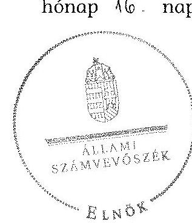
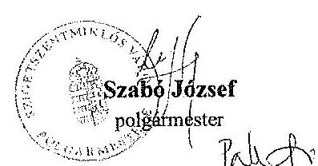
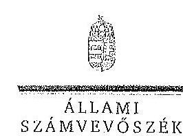
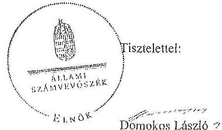
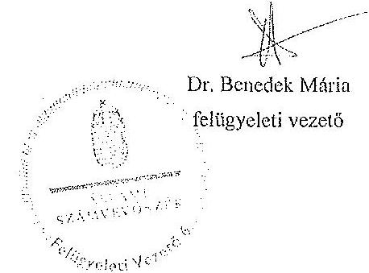

ÁLLAMI
SZÁMVEVŐSZÉK

# JELENTÉS 

az önkormányzatok belső kontrollrendszere kialakításának, egyes
kontrolltevékenységek és a belső ellenőrzés
működésének ellenőrzése
Szigetszentmiklós
15050
2015. március

---

# Állami Számvevőszék 

Iktatószám: V-0660-050/2015.
Témaszám: 1694
Vizsgálat-azonosító szám: V067702

## Az ellenőrzést felügyelte:

Dr. Benedek Mária
felügyeleti vezető
Az ellenőrzést vezette és az ellenőrzés végrehajtásáért felelős:
Bíró Zsolt
ellenőrzésvezető
A számvevőszéki jelentés összeállításában közreműködött:
Hajdu Károlyné
számvevő tanácsos
Az ellenőrzést végezték:
Kupcsik Éva Hajdu Károlyné
számvevő számvevő tanácsos

---

# TARTALOMJEGYZÉK 

BEVEZETÉS ..... 7
I. ÖSSZEGZŐ MEGÁLLAPÍTÁSOK, KÖVETKEZTETÉSEK, JAVASLATOK ..... 11
II. RÉSZLETES MEGÁLLAPÍTÁSOK ..... 14

1. Az önkormányzat belső kontrollrendszere kialakításának és működtetésének megfelelősége ..... 14
1.1. A kontrollkörnyezet kialakítása és működtetése ..... 14
1.2. A kockázatkezelési rendszer kialakítása és működtetése ..... 16
1.3. A kontrolltevékenységek kialakítása és működtetése ..... 16
1.4. Az információs és kommunikációs rendszer kialakítása és működtetése ..... 18
1.5. A monitoring rendszer kialakítása és működtetése ..... 19
2. A monitoring rendszer részeként a belső ellenőrzés kialakítása és működtetése ..... 20
3. A pénzügyi folyamatokban kulcsszerepet betöltő belső kontrollok (teljesítésigazolás és érvényesítés) működése ..... 21
4. Az integritás szemlélet érvényesülése ..... 22

## MELLÉKLETEK

1. számú Az észrevételt tartalmazó polgármesteri levél
2. számú Az észrevételre vonatkozó elnöki válaszlevél

## FÜGGELÉKEK

1. számú Értelmező szótár
2. számú Az integritás érvényesítése érdekében kialakított és működtetett kontrollrendszer

---

.

---

# RÖVIDÍTÉSEK JEGYZÉKE 

## Törvények

Áht.
ÁSZ tv.
Htv.

Kttv.

Mötv.

Mvtv.
Ötv.
Vnytv.

## Rendeletek

Ávr.

Bkr.

Ikr.
költségvetési rendelet

Képviselő-testületi SZMSZ
vagyonrendelet ${ }_{1}$
vagyonrendelet ${ }_{2}$

2011. évi CXCV. törvény az államháztartásról (hatályos 2012. január 1-jétől)

2011. évi LXVI. törvény az Állami Számvevőszékről
1991. évi XX. törvény a helyi önkormányzatok és szerveik, a köztársasági megbízottak, valamint egyes centrális alárendeltségű szervek feladat- és hatásköreiről
2011. évi CXCIX. törvény a közszolgálati tisztviselőkről (hatályos 2012. március 1-jétől)
2011. évi CLXXXIX. törvény Magyarország helyi önkormányzatairól
1993. évi XCIII. törvény a munkavédelemről
1990. évi LXV. törvény a helyi önkormányzatokról
2007. évi CLII. törvény az egyes vagyonnyilatkozat-tételi kötelezettségekről

368/2011. (XII. 31.) Korm. rendelet az államháztartásról szóló törvény végrehajtásáról (hatályos 2012. január 1-jétől)
370/2011. (XII. 31.) Korm. rendelet a költségvetési szervek belső kontrollrendszeréről és belső ellenőrzéséről (hatályos 2012. január 1-jétől)
335/2005. (XII. 29.) Korm. rendelet a közfeladatot ellátó szervek iratkezelésének általános követelményeiről
Szigetszentmiklós Város Önkormányzata 2013. évi költségvetéséről és végrehajtásának szabályairól szóló 2/2013. (II. 28.) számú Képviselő-testületi rendelet
Szigetszentmiklós Város Önkormányzata Képviselőtestületének 12/2011. (IV. 28.) számú rendelete a szervezeti és működési szabályzatról (hatályos 2011. április 28-tól 2013.)
Szigetszentmiklós Város Önkormányzata Képviselőtestületének 17/2003. (IX. 3.) számú rendelete az önkormányzat vagyonáról és a vagyongazdálkodás szabályairól (hatályos 2003. szeptember 3-tól 2013. március 28-ig) Szigetszentmiklós Város Önkormányzata Képviselőtestületének 8/2013. (III. 28.) önkormányzati rendelete az Önkormányzat vagyonáról (hatályos 2013. március 28-tól)

---

## Szórövidítések

alapító okirat

## Adatvédelmi szabályzat

ÁSZ
belső ellenőrzési kézikönyv
bizonylati rend
ellenőrzési nyomvonal
értékelési szabályzat

FEUVE
gazdasági szervezet
gazdasági szervezet ügyrendje
gazdálkodási jogkörök szabályzata

Hivatal
Hivatal SZMSZ ${ }_{1}$

Hivatal SZMSZ ${ }_{2}$

INTOSAI
iratkezelési szabályzat

ISSAI
jegyző

Szigetszentmiklós Város Önkormányzata Képviselőtestületének a 495/2013. (XI. 27.) számú határozata a Polgármesteri Hivatal egységes szerkezetű alapító okiratáról (hatályos 2013. november 27-től)
Szigetszentmiklós Város Polgármesteri Hivatalának adatvédelmi és informatikai biztonsági szabályzata (hatályos 2013. szeptember 30-tól)
Állami Számvevőszék
Szigetszentmiklós Város Polgármesteri Hivatalának belső ellenőrzési kézikönyve (hatályos 2010. március 1-től)
Szigetszentmiklós Város Polgármesteri Hivatalának bizonylati rendje (hatályos 2006. január 1-jétől)
Szigetszentmiklós Város Polgármesteri Hivatalának ellenőrzési nyomvonala (hatályos 2008. április 15-től)
Szigetszentmiklós Város Polgármesteri Hivatalának eszközök és források értékelési szabályzata (hatályos 2006. január 1-jétől)
folyamatba épített, előzetes, utólagos és vezetői ellenőrzés
Szigetszentmiklós Város Polgármesteri Hivatalának Pénzügyi osztálya
Szigetszentmiklós Város Polgármesteri Hivatalának gazdasági-pénzügyi ügyrendje (hatályos 2006. január 1-jétől)
4/2012. (III. 28.) számú polgármesteri és a jegyző együttes utasítása, a Szigetszentmiklós Város Polgármesteri Hivatalának gazdálkodási szabályzata a kötelezettségvállalás, pénzügyi ellenjegyzés, teljesítés igazolása, érvényesítés, utalványozás és adatszolgáltatás rendjéről (hatályos 2012. január 1-jétől)
Szigetszentmiklós Város Polgármesteri Hivatala
Szigetszentmiklós Város Önkormányzatának Polgármesteri Hivatala szervezeti és működési szabályzata (hatályos 2012. szeptember 5-től - 2013. január 31-ig)
Szigetszentmiklós Város Önkormányzatának Polgármesteri Hivatala szervezeti és működési szabályzata (hatályos 2013. február 1-jétől)
International Organization of Supreme Audit Institutions (Legfőbb Ellenőrző Intézmények Nemzetközi Szervezete)
Szigetszentmiklós Város Önkormányzata Polgármesteri Hivatalának iratkezelési szabályzata (hatályos 2000. május 2-től)
International Standards of Supreme Audit Institutions (Legfőbb Ellenőrző Intézmények Nemzetközi Standardjai)
Szigetszentmiklós Város Önkormányzata Polgármesteri Hivatalának jegyzője

---

| Képviselő-testület | Szigetszentmiklós Város Önkormányzatának Képviselőtestülete |
| :--: | :--: |
| kockázatkezelési szabályzat | Szigetszentmiklós Város Önkormányzata Polgármesteri Hivatalának kockázatkezelési szabályzata (hatályos 2008. április 15-től) |
| Kormányhivatal | Pest Megyei Kormányhivatal |
| leltározási szabályzat | Szigetszentmiklós Város Önkormányzata Polgármesteri Hivatalának leltárkészítési és leltározási szabályzata (hatályos 2004. január 1-jétől) |
| Önkormányzat | Szigetszentmiklós Város Önkormányzata |
| pénzkezelési szabályzat | Szigetszentmiklós Város Polgármesteri Hivatalának pénzkezelési szabályzata (hatályos 2012. március 1-től, egységes szerkezetben) |
| polgármester | Szigetszentmiklós Város Önkormányzatának polgármestere |
| selejtezési szabályzat | Szigetszentmiklós Város Polgármesteri Hivatalának felesleges vagyontárgyak hasznosításának és selejtezésének szabályzata (hatályos 2006. január 1-jétől) |
| szabálytalanságok kezelésének eljárásrendje | Szigetszentmiklós Város Önkormányzata Polgármesteri Hivatalának szabályzata a szabálytalanságok kezelésének rendjére (hatályos 2008. április 15-től) |
| számlarend | Szigetszentmiklós Város Polgármesteri Hivatalának számlarendje (hatályos 2007. január 1-jétől) |
| számviteli politika | Szigetszentmiklós Város Önkormányzata Polgármesteri Hivatalának 8/2011. (IX. 15.) jegyzői utasítása a Hivatal „számviteli politika” című szabályzatról (hatályos 2011. január 1-jétől) |
| tűzvédelmi szabályzat | Szigetszentmiklós Város Önkormányzata Polgármesteri Hivatalának tűzvédelmi szabályzata (hatályos 2004. november 3-tól) |

---

.

---

# JELENTÉS 

## az önkormányzatok belső kontrollrendszere kialakításának, egyes kontrolltevékenységek és a belső ellenőrzés működésének ellenőrzése   Szigetszentmiklós

## BEVEZETÉS

Szigetszentmiklós város állandó lakosainak száma 2013. január 1-jén 35853 fő volt. Az Önkormányzat 14 tagú Képviselő-testületének munkáját kilenc állandó bizottság segítette. Az Önkormányzat az önállóan működő és gazdálkodó Hivatalon kívül kettő önállóan működő és gazdálkodó, nyolc önállóan működő intézményt működtetett, három többségi tulajdoni hányadú gazdasági társasággal rendelkezett. A polgármester a 2010. október 2-ától tölti be tisztségét. A jegyző 2009. december 18-ától látja el feladatait. A Hivatal nyolc szervezeti egységre tagolódott, elkülönített gazdasági szervezettel rendelkezett, a foglalkoztatott köztisztviselők száma 2013. január 1-jén 94 fő volt. A Hivatalnál 2013. január 1-jétől szervezeti változás történt, a Járási Hivatal megalakulása feladat- és létszámcsökkenéssel érintette a Hivatalt. Az Önkormányzat a 2013. évi költségvetési beszámolója szerint 8061653 ezer Ft tárgyévi bevételt ért el, valamint 7208854 ezer Ft tárgyévi kiadást teljesített. A 2013. december 31-i könyvviteli mérleg szerint 32339698 ezer Ft értékű eszközvagyonnal rendelkezett, a rövid lejáratú kötelezettségállománya 408976 ezer Ft, hosszú lejáratú kötelezettségállománya 1037055 ezer Ft volt.

A demokratikus társadalmakban alapvető igény, hogy a közpénzeket, a közvagyont használók valamennyi tevékenységükhöz kapcsolódó pénzfelhasználásról elszámoljanak, ahhoz egyértelmű és érvényesíthető felelősségi szabályok társuljanak. Ennek a jogos igénynek az érvényesítéséhez meg kell teremteni azokat a folyamatokat, rendszereket, amelyek nélkülözhetetlenek az elszámoltatáshoz. Az elszámoltatás eredményes működtetéséhez szükség van a megfelelő információs, kontroll, értékelési és beszámolási rendszerek kialakítására.

Magyarországon az uniós csatlakozási tárgyalások idejére nyúlnak vissza a belső kontrollrendszer szabályozásának gyökerei. Az uniós elvárásoknak megfelelő új terminológia szerinti államháztartási belső pénzügyi ellenőrzési (ÁBPE) rendszer területén a jogharmonizáció 2003-ban teljes körűen megvalósult, míg az önkormányzati alrendszerre vonatkozó, Ötv.-ben megjelenített speciális szabályozás 2005-ben lépett hatályba. Az államháztartási belső kontrollrendszer koncepciója 2009-ben továbbfejlődött. A változások irányát mutatja, hogy a költségvetési szervek belső kontrollrendszere már magában foglalja a korszerű felelős szervezetirányítás elemeit (kontrollkörnyezet, kockázatkezelés, kontrolltevékenység, információ és kommunikáció, monitoring) is. E kontrollrendszer szabályozása háromszintű, a törvényi előírásokat az Áht., és a Mötv., a rendeleti szintű szabályozást az Ávr. és a Bkr. tartalmazza, amelyeket útmutatói szinten az NGM által kiadott standardok és kézikönyvek támogatnak.

A belső kontrollrendszer azt a célt szolgálja, hogy a költségvetési szervek működésük és gazdálkodásuk során a tevékenységeket szabályszerűen, gazdaságosan, hatékonyan, eredményesen hajtsák végre, teljesítsék elszámolási kötelezettségeiket és megvédjék az erőforrásokat a veszteségektől, a károktól és a nem rendeltetésszerű használattól. A belső kontrollrendszer magában foglalja mindazon szabályokat, eljárásokat, gyakorlati módszereket és szervezeti struktúrákat, kockázatkezelési technikákat, kontrolltevékenységeket, amelyek segítséget nyújtanak a szervezetnek céljai eléréséhez.

Az ÁSZ középtávú stratégiájában hangsúlyos szerepet szánt annak, hogy szilárd szakmai alapon álló, értékteremtő ellenőrzéseivel előmozdítsa a közpénzügyek átláthatóságát, rendezettségét. A számvevőszéki ellenőrzés nemzetközi alapelvei is rögzítik, hogy a megfelelő belső kontrollrendszer minimálisra csökkenti a hibák és szabálytalanságok kockázatát.

# Az ellenőrzés célja annak értékelése, hogy 

- a jogszabályi előírásoknak megfelelően alakították-e ki és működtették-e a belső kontrollrendszert;
- a gazdálkodás folyamatában kulcsszerepet betöltő teljesítésigazolás és érvényesítés kontrolltevékenységeit megfelelően működtették-e;
- biztosították-e a belső ellenőrzés szabályos működését;
- kialakították-e az erőforrásokkal való szabályszerű és hatékony gazdálkodáshoz szükséges követelményeket, megvalósították-e azok számonkérését, ellenőrzését;
- hasznosították-e a 2009-2013. években végzett ÁSZ ellenőrzések során megfogalmazott javaslatokat.

A közintézmények integritás alapú kultúrájának kialakítása, megerősítése és működése szorosan összefügg a belső kontrollrendszer működésével, ezért az ellenőrzés kitért a gazdálkodáshoz kapcsolódó integritás kontrollok meglétének és működésének ellenőrzésére is. Az integritási kultúra kialakítása hozzájárul az elszámoltathatóság és átláthatóság érvényesítéséhez, egyben támogatja a szervezet védettségét a korrupciós kitettséggel szemben, valamint annak megelőzése is irányítottabbá válik.

Az ellenőrzés várható hasznosulását négy szinten tervezzük. A törvényalkotás számára összegzett tapasztalatok állnak rendelkezésre a belső kontrollrendszer önkormányzati területen való kialakításáról, működéséről és hatásairól, a belső ellenőrzés működéséről. Az ellenőrzés az ellenőrzött számára visszajelzést ad a belső kontrollrendszer kialakításában és működésében fellépő hiányosságokról, javaslataival hozzájárul azok kiküszöböléséhez, amely csökkentheti a későbbi ellenőrzések gyakoriságát. Az ellenőrzés megállapításai és javas-

---

latait más szervezetek is hasznosíthatják a rendezett gazdálkodási keretek kialakításához. A társadalom számára jelzi, hogy közpénz nem maradhat ellenőrizetlenül, az ÁSZ értékteremtő rend kialakításához és megőrzéséhez hozzájáruló tevékenysége pozitív hatással lesz a szervezetről kialakított összkép formálásában. A szervezeten belül lehetőség nyílik arra, hogy a megállapítások szintetizálásával az ÁSZ a hozzáadott értéket teremtő elemző tevékenységét és tanácsadó szerepét is erősítse.

Az önkormányzatok belső kontrollrendszere kialakításának, az egyes kontrolltevékenységek és a belső ellenőrzés működésének ellenőrzéséről szóló jelentés I. fejezetének összegző része az ellenőrzés céljára ad rövid, szintetizáló összefoglalót, és tartalmazza a következtetéseket a II. fejezet részletes megállapításain alapulóan. A jelentés intézkedést igénylő megállapításait és javaslatait az ellenőrzés során feltárt, a jelentés II. fejezetében rögzített részletes megállapítások alapozzák meg.

Az ellenőrzés típusa: szabályszerűségi ellenőrzés
Az ellenőrzött időszak: a belső kontrollrendszer kialakítása és működtetésének megfelelőségét a 2013. évre vonatkozóan (2013. december 31-i állapotnak megfelelően), a pénzügyi folyamatokban kulcsszerepet betöltő teljesítésigazolás és érvényesítés belső kontrollok működésének megfelelőségét, és a belső ellenőrzés szabályszerű működését a 2013. január 1. - december 31-e közötti időszakot figyelembe véve értékeltük, míg az ÁSZ javaslatainak utóellenőrzése a 2009-2013. években végzett ellenőrzések nyilvánosságra hozott jelentéseiben tett javaslatok áttekintésére terjedt ki.

# Az ellenőrzött szervezet: az Önkormányzat 

Az ellenőrzés jogszabályi alapját az ÁSZ tv. 1. § (3) bekezdése, az 5. § (2) és (6) bekezdései, valamint az Áht. 61. § (2) bekezdése képezik.

Az ellenőrzés szakmai módszertana az ÁSZ hivatalos honlapján (www.asz.hu) közzétett szakmai szabályokon alapult, amely az INTOSAI által kiadott ISSAI figyelembevételével készült.

Az ellenőrzés lefolytatásához az Önkormányzat a kimutatások és a tanúsítvány elektronikus kitöltésével, valamint az ÁSZ által kért dokumentumok elektronikus megküldésével szolgáltatott adatokat. Az így
 rendelkezésre bocsátott adatok, információk kontrollja és a munkalapok kitöltése a helyszíni ellenőrzés keretében történt. A jelentésben használt fogalmak magyarázatát az 1. számú függelék, az integritás érvényesítése érdekében kialakított és működtetett intézményi kontrollrendszer értékelését a 2. számú függelék tartalmazza.

A belső kontrollrendszer, valamint a belső ellenőrzés jogszabályi előírások szerinti kialakításának és működtetésének szabályszerűségét az erre irányuló ellenőrzési kérdésekre adott válaszok összesítése alapján értékeltük. A belső kontrollrendszert kontrollterületenként (kontrollkörnyezet, kockázatkezelési rendszer, kontrolltevékenységek, információs és kommunikációs rendszer, monitoring rendszer) és összesítetten is értékeltük.

---

A belső kontrollrendszer egyes kontrollterületei és a belső ellenőrzés kialakítása és működtetése „szabályszerű volt", amennyiben az értékelt területen az elért és elérhető pontok százalékban kifejezett hányadosa elérte a $81 \%$-ot, „részben szabályszerű volt", ha $61-80 \%$ közé esett „nem volt szabályszerű", ha nem haladta meg a $60 \%$-ot. A belső kontrollrendszer összesített értékelése megegyezett a kontrollterületenként alkalmazott %-os értékelésekkel, a következő eltérésekkel. A kontrollrendszer egésze esetében a „szabályszerű" értékelésnek a %-os értéken felül további feltétele volt, hogy egyik kontrollterület sem kaphatott „nem volt szabályszerű" értékelést, a „részben szabályszerű" értékelés további feltétele volt, hogy legfeljebb egy ellenőrzött kontrollterület lehetett „nem volt szabályszerű" értékelésű. Az összesített értékelés a %-os értéktől függetlenül „nem volt szabályszerű", ha az ellenőrzött kontrollterületek közül több mint egynek „nem volt szabályszerű" az értékelése.

A gazdálkodás folyamatában kulcsszerepet betöltő két kulcskontroll - teljesítésigazolás, érvényesítés - működésének megfelelőségét a személyi juttatásokkal, a dologi és felhalmozási kiadásokkal, működési és felhalmozási célú pénzeszköz átadásokkal, ellátottak pénzbeli juttatásaival kapcsolatos kifizetések esetében mintavétellel ellenőriztük. „Megfelelőnek" értékeltük a gazdálkodási jogkörök gyakorlását, amennyiben $95 \%$-os bizonyossággal a teljes sokaságban a hibaarány legfeljebb $10 \%$, „részben megfelelőnek" értékeltük, ha a hibaarány felső határa 10-30% között volt, „nem megfelelőnek" pedig akkor, ha a mintavételi eredmények alapján a sokaságbeli hibaarány felső határa meghaladta a 30%-ot.

Az integritás szemlélet érvényesülésének értékelése az Önkormányzat önbevallás által kitöltött tanúsítványa alapján történt.

Utóellenőrzésre nem került sor, mivel az ÁSZ az Önkormányzatnál a 2009-2013. évek között nem végzett ellenőrzést.

Az Ász tv. 29. § (1) bekezdése szerint a jelentéstervezetet megküldtük a polgármester részére, aki az ÁSZ tv. 29. § (2) bekezdésében foglalt észrevételezési jogával élt, a jelentéstervezetre észrevételt tett (1. számú melléklet). Az ÁSZ tv. 29. § (3) bekezdésében előírtaknak megfelelően a figyelembe nem vett észrevételeket és annak indokairól szóló tájékoztatást a jelentés tartalmazza (2. számú melléklet).

---

# I. ÖSSZEGZŐ MEGÁLLAPÍTÁSOK, KÖVETKEZTETÉSEK, JAVASLATOK 

A belső kontrollrendszeren belül 2013-ban a kontrollkörnyezet, a kockázatkezelési rendszer, a kontrolltevékenységek, az információs és kommunikációs rendszer, valamint a monitoring rendszer kialakítását és működtetését külön-külön és együttesen is értékeltük. A belső kontrollrendszer kialakítása és működtetése az összesített értékelés alapján nem volt szabályszerű.

A belső kontrollrendszer egyes területei kialakításának és működtetésének minősítése a következő:

| Kontrollterület | Minősítés |  |
| :--: | :--: | :--: |
| Kontrollkörnyezet | szabályszerű |  |
| Kockázatkezelési rendszer |  | nem   szabályszerű |
| Kontrolltevékenységek |  | részben   szabályszerű |
| Információs és kommunikációs rendszer | szabályszerű |  |
| Monitoring rendszer |  | nem   szabályszerű |

Szabályszerű volt a kontrollkörnyezet, és az információs és kommunikációs rendszer kialakítása és működtetése, mivel az a jogszabályi előírásokban foglaltakat figyelembe véve kisebb hiányosságok mellett is megteremtette e kontrollterületeken a szabályszerű működés lehetőségét.

Részben szabályszerű volt a kontrolltevékenységek kialakítása és működtetése, mivel a megállapított szabályozásbeli hiányosságok nem veszélyeztették ezen a kontrollterületen a szabályszerű működést.

Nem volt szabályszerű a kockázatkezelési rendszer és a monitoring rendszer kialakítása és működtetése, mivel az ellenőrzésünk során megállapított szabályozásbeli hiányosságok magukban hordozzák a szabálytalan működés, valamint a korrupció kockázatát.

Az Önkormányzat a belső ellenőrzési feladatokat 2013. szeptember 1-jétől külső szolgáltatóval látta el. A 2013. évben a belső ellenőrzés kialakítása és működtetése nem volt szabályszerű, mivel a számvevőszéki ellenőrzés által megállapított szabályozási és működési hiányosságok számossága magában hordozza a szabálytalan önkormányzati gazdálkodás és feladatellátás kockázatát.

A 2013. évben a személyi juttatások, dologi kiadások, felhalmozási kiadások, működési és felhalmozási célú pénzeszköz átadások, ellátottak pénzbeli juttatásai-

---

A belső kontrollrendszer egyes kontrollterületei és a belső ellenőrzés kialakítása és működtetése „szabályszerű volt", amennyiben az értékelt területen az elért és elérhető pontok százalékban kifejezett hányadosa elérte a $81 \%$-ot, „részben szabályszerű volt", ha $61-80 \%$ közé esett „nem volt szabályszerű", ha nem haladta meg a $60 \%$-ot. A belső kontrollrendszer összesített értékelése megegyezett a kontrollterületenként alkalmazott %-os értékelésekkel, a következő eltérésekkel. A kontrollrendszer egésze esetében a „szabályszerű" értékelésnek a %-os értéken felül további feltétele volt, hogy egyik kontrollterület sem kaphatott „nem volt szabályszerű" értékelést, a „részben szabályszerű" értékelés további feltétele volt, hogy legfeljebb egy ellenőrzött kontrollterület lehetett „nem volt szabályszerű" értékelésű. Az összesített értékelés a %-os értéktől függetlenül „nem volt szabályszerű", ha az ellenőrzött kontrollterületek közül több mint egynek „nem volt szabályszerű" az értékelése.

A gazdálkodás folyamatában kulcsszerepet betöltő két kulcskontroll - teljesítésigazolás, érvényesítés - működésének megfelelőségét a személyi juttatásokkal, a dologi és felhalmozási kiadásokkal, működési és felhalmozási célú pénzeszköz átadásokkal, ellátottak pénzbeli juttatásaival kapcsolatos kifizetések esetében mintavétellel ellenőriztük. „Megfelelőnek" értékeltük a gazdálkodási jogkörök gyakorlását, amennyiben $95 \%$-os bizonyossággal a teljes sokaságban a hibaarány legfeljebb $10 \%$, „részben megfelelőnek" értékeltük, ha a hibaarány felső határa 10-30% között volt, „nem megfelelőnek" pedig akkor, ha a mintavételi eredmények alapján a sokaságbeli hibaarány felső határa meghaladta a 30%-ot.

Az integritás szemlélet érvényesülésének értékelése az Önkormányzat önbevallás által kitöltött tanúsítványa alapján történt.

Utóellenőrzésre nem került sor, mivel az ÁSZ az Önkormányzatnál a 2009-2013. évek között nem végzett ellenőrzést.

Az Ász tv. 29. § (1) bekezdése szerint a jelentéstervezetet megküldtük a polgármester részére, aki az ÁSZ tv. 29. § (2) bekezdésében foglalt észrevételezési jogával élt, a jelentéstervezetre észrevételt tett (1. számú melléklet). Az ÁSZ tv. 29. § (3) bekezdésében előírtaknak megfelelően a figyelembe nem vett észrevételeket és annak indokairól szóló tájékoztatást a jelentés tartalmazza (2. számú melléklet).

---

# I. ÖSSZEGZŐ MEGÁLLAPÍTÁSOK, KÖVETKEZTETÉSEK, JAVASLATOK 

A belső kontrollrendszeren belül 2013-ban a kontrollkörnyezet, a kockázatkezelési rendszer, a kontrolltevékenységek, az információs és kommunikációs rendszer, valamint a monitoring rendszer kialakítását és működtetését külön-külön és együttesen is értékeltük. A belső kontrollrendszer kialakítása és működtetése az összesített értékelés alapján nem volt szabályszerű.

A belső kontrollrendszer egyes területei kialakításának és működtetésének minősítése a következő:

| Kontrollterület | Minősítés |  |
| :--: | :--: | :--: |
| Kontrollkörnyezet | szabályszerű |  |
| Kockázatkezelési rendszer |  | nem   szabályszerű |
| Kontrolltevékenységek |  | részben   szabályszerű |
| Információs és kommunikációs rendszer | szabályszerű |  |
| Monitoring rendszer |  | nem   szabályszerű |

Szabályszerű volt a kontrollkörnyezet, és az információs és kommunikációs rendszer kialakítása és működtetése, mivel az a jogszabályi előírásokban foglaltakat figyelembe véve kisebb hiányosságok mellett is megteremtette e kontrollterületeken a szabályszerű működés lehetőségét.

Részben szabályszerű volt a kontrolltevékenységek kialakítása és működtetése, mivel a megállapított szabályozásbeli hiányosságok
 nem veszélyeztették ezen a kontrollterületen a szabályszerű működést.

Nem volt szabályszerű a kockázatkezelési rendszer és a monitoring rendszer kialakítása és működtetése, mivel az ellenőrzésünk során megállapított szabályozásbeli hiányosságok magukban hordozzák a szabálytalan működés, valamint a korrupció kockázatát.

Az Önkormányzat a belső ellenőrzési feladatokat 2013. szeptember 1-jétől külső szolgáltatóval látta el. A 2013. évben a belső ellenőrzés kialakítása és működtetése nem volt szabályszerű, mivel a számvevőszéki ellenőrzés által megállapított szabályozási és működési hiányosságok számossága magában hordozza a szabálytalan önkormányzati gazdálkodás és feladatellátás kockázatát.

A 2013. évben a személyi juttatások, dologi kiadások, felhalmozási kiadások, működési és felhalmozási célú pénzeszköz átadások, ellátottak pénzbeli juttatásaival kapcsolatos kifizetései során - összefoglalóan értékelve - a pénzügyi folyamatokban kulcsszerepet betöltő teljesítésigazolás és érvényesítés belső kontrollok működése részben felelt meg, mivel azok nem biztosították a hibák megelőzését, feltárását.

A számvevőszéki ellenőrzés az ellenőrzött kifizetésekkel összefüggésben a rendelkezésre bocsátott dokumentumok alapján kár bekövetkeztére utaló adatot, tényt nem állapított meg, azonban a gazdálkodásban kulcsszerepet betöltő kontrollok működésében feltárt hiányosságok miatt fennáll a hibák, szabálytalanságok bekövetkezésének kockázata. A nem megfelelően működtetett belső kontrollok korrupciós kockázatot hordoznak.

A Képviselő-testület kialakította az erőforrásokkal való, szabályszerű és hatékony gazdálkodáshoz szükséges követelményeket és betartását számon kérte, ellenőrizte.

Az Önkormányzat intézkedéseket tett az integritási szemlélet fejlesztésére, valamint a korrupciós kockázatok csökkentésére, a Hivatal 2011. évben önként részt vett az ÁSZ integritási felmérésében.

Az ÁSZ tv. 33. § (1) bekezdésében foglaltak értelmében az ellenőrzött szervezet vezetője köteles a jelentésben foglalt megállapításokhoz kapcsolódó intézkedési tervet összeállítani, és azt a jelentés kézhezvételétől számított 30 napon belül az ÁSZ részére megküldeni. Amennyiben az intézkedési tervet határidőre nem küldi meg a szervezet, vagy az ÁSZ tv. 33. § (2) bekezdésében foglalt póthatáridő elteltével megküldött intézkedési terv továbbra sem elfogadható, az ÁSZ elnöke a hivatkozott törvény 33. § (3) bekezdés a)-b) pontjaiban foglaltakat érvényesítheti.

# a polgármesternek 

1. Az Önkormányzat kiadási előirányzata terhére történt kötelezettségvállalásra - az Áht. 37. § (1) és az Ávr. 55. § (1) bekezdésében foglaltak ellenére - pénzügyi ellenjegyzés nélkül került sor.

Javaslat:
Intézkedjen annak érdekében, hogy az Önkormányzat nevében történő kötelezettségvállalásra az Áht. 37. § (1) bekezdésében és az Ávr. 55. § (1) bekezdésében foglaltaknak megfelelően - az Ávr. 53. §-ában meghatározott kivételekkel - kizárólag pénzügyi ellenjegyzés után kerüljön sor.
2. A számvevőszéki jelentés ellenőrzési megállapításai alapján az Önkormányzatnál a belső kontrollrendszer kialakítása és működtetése összesített értékelése nem volt szabályszerű, a kulcskontrollok működése részben volt megfelelő.

Javaslat:
Kísérje figyelemmel a Mötv. 115. § (1) bekezdésében foglaltak alapján az Önkormányzat gazdálkodásának szabályszerűségét. A Mötv. 67. § f) pontja alapján gondoskodjon a belső kontrollrendszer működtetésére vonatkozó jogszabályi rendelkezések be nem tartása, valamint a teljesítésigazolás, illetve az érvényesítés kontrollokkal összefüggésben feltárt hibák, hiányosságok, szabálytalanságok tekintetében az esetleges munkajogi felelősséggel kapcsolatos körülmények kivizsgálásáról, majd a vizsgálat eredményének függvényében tegye meg a szükséges intézkedéseket.

# a jegyzőnek 

1. A számvevőszéki jelentés ellenőrzési megállapításai alapján az Önkormányzatnál a belső kontrollrendszer kialakítása és működtetése összesített értékelés nem volt szabályszerű, a kulcskontrollok működtetése részben volt megfelelő, valamint a belső ellenőrzés kialakítása és működtetése nem volt szabályszerű. A számvevőszéki ellenőrzés során feltárt hibákat, hiányosságokat és szabálytalanságokat a számvevőszéki jelentés II. Részletes megállapítások fejezetcím tartalmazza.

Javaslat:
A jogszabályoknak megfelelő belső kontrollrendszer kialakítása és működtetése érdekében - az ellenőrzött időszak óta bekövetkezett esetleges jogszabályi változásokra figyelemmel - intézkedjen a belső kontrollrendszer kialakításában és működtetésében, a kulcskontrollok, illetve a belső ellenőrzés működtetésében az ellenőrzés által feltárt hibák, hiányosságok, szabálytalanságok kijavítására.

Kezdeményezze, hogy az éves ellenőrzési terv kiterjedjen a kifizetések szabályszerűségi ellenőrzésére, különös tekintettel a személyi juttatásokkal, a dologi kiadásokkal, a felhalmozási kiadásokkal, a működési és felhalmozási célú pénzeszköz átadásokkal, az ellátottak pénzbeli juttatásaival kapcsolatos kiadási jogcímekből teljesített kifizetésekre.

# II. RÉSZLETES MEGÁLLAPÍTÁSOK 

## 1. Az önkormányzat belső kontrollrendszere kialakításának és működtetésének megfelelősége

A belső kontrollrendszeren belül 2013-ban a kontrollkörnyezet, a kockázatkezelési rendszer, a kontrolltevékenységek, az információs és kommunikációs rendszer, valamint a monitoring rendszer kialakítását és működtetését külön-külön és együttesen is értékeltük. A belső kontrollrendszer kialakítása és működtetése az összesített értékelés alapján nem volt szabályszerű.

### 1.1. A kontrollkörnyezet kialakítása és működtetése

## A kontrollkörnyezet kialakítása és működtetése szabályszerű volt.

A Hivatal rendelkezett a Képviselő-testület által elfogadott alapító okirattal, amely tartalmazta az alaptevékenységeket.

A Hivatal SZMSZ-ét a Képviselő-testület határozattal hagyta jóvá, amely tartalmazta a szervezeti felépítést, a működési rendet, a szervezeti ábrát, az engedélyezett létszámot, a költségvetési szervhez rendelt más költségvetési szervek felsorolását. Az Önkormányzat rendelkezett Képviselő-testület által elfogadott SZMSZ-el.

A jegyző előkészítette a helyi nemzetiségi önkormányzattal (bolgár, német, roma) történő együttműködési megállapodás tervezetét és annak felülvizsgálatát.

A jegyző kialakította a Hivatal számviteli politikáját, a pénzkezelési szabályzatát, és kiterjesztette azokat a nemzetiségi önkormányzatokra is. A Hivatal rendelkezett a jegyző által kiadott az előírásoknak megfelelő leltározási szabályzattal, az eszközök és források értékelési szabályzatával, számlarenddel, amelyeket a nemzetiségi önkormányzatokra is kiterjesztettek, illetve rendelkezett bizonylati renddel.

A Képviselő-testület elfogadta a vagyongazdálkodás szabályait. A Hivatal a jogszabályi előírásoknak megfelelően rendelkezett tűzvédelmi szabályzattal.

A jegyző elkészítette a szabálytalanságok kezelésének eljárásrendjét, illetve a Hivatal gazdasági szervezetének ügyrendjét. A Hivatal gazdasági vezetője rendelkezett a feladat ellátásához szükséges végzettséggel, előírt szakképesítéssel és a könyvviteli szolgáltatás körébe tartozó tevékenység ellátására jogosító engedéllyel.

A jegyző elkészítette a Hivatalban dolgozó köztisztviselők munkaköri leírását, amelyekben a köztisztviselők feladatait és a munkakör betöltésével kapcsolatos követelményeket (végzettség, szakképzettség, szakképesítés, tapasztalat, képességek) rögzítették.

A jegyző előkészítette a helyi nemzetiségi önkormányzat 2013. évi költségvetési határozat tervezetét és a 2012. évi zárszámadási határozat tervezetét.

A Képviselő-testület kialakította az erőforrásokkal való, szabályszerű és hatékony gazdálkodáshoz szükséges követelményeket és betartását számon kérte, ellenőrizte, a 2013. évi költségvetési rendeletében meghatározta a Hivatal engedélyezett létszámát. A jegyző elkészítette a Hivatalban dolgozó köztisztviselők 2013. évi teljesítményértékelését.

A kontrollkörnyezet kialakítása és működtetése az alábbi kisebb hiányosságok mellett szabályszerű volt:

| Sorszám ${ }^{1}$ | Megállapítás | Megjegyzés |
| :--: | :--: | :--: |
| 3. | A jegyző a - Htv. 140. § (1) bekezdés a) pontjában foglalt előírást figyelmen kívül hagyva - nem készítette elő az Mötv. 116. § (1)(4) bekezdései szerinti gazdasági programtervezetet. |  |
| 8. | A jegyző a hivatali SZMSZ-ben - az Ávr. 13. § (1) bekezdés g) pontjában foglaltak ellenére - nem rögzítette a szervezeti és működési szabályzatban nevesített valamennyi munkakörhöz a helyettesítés rendjét. | A helyettesítés rendjét a Gazdasági Szervezet és a Projekt Iroda ügyrendjén kívül nem határozták meg. |
| 29. | A jegyző - az Mvtv. 2. § (3) bekezdésében foglaltak ellenére - nem határozta meg a Hivatalban az egészséget nem veszélyeztető és biztonságos munkavégzés követelményei megvalósításának módját. |  |
| 39. | A jegyző - a Bkr. 6. § (3) bekezdésében foglaltak ellenére - az ellenőrzési nyomvonal rendszeres aktualizálásáról nem gondoskodott. | Az ellenőrzési nyomvonal 2008. április 15 -tól hatályos. Módosítása a jogszabályi környezet változása ellenére nem történt meg. |
| 46. | A jegyző elkészítette a köztisztviselőkkel szembeni hivatásetikai alapelvek részletes tartalmát, valamint az etikai eljárás szabályait tartalmazó dokumentumot, azonban - a Kttv. 231. § (1) bekezdésében előírtak ellenére - nem kezdeményezte annak Képviselőtestület elé terjesztését. | A jegyző által kiadmányozott Etika Kódex VIII. fejezetében foglalt rendelkezés - „A Kódex tartalmát érintő jogszabályi vagy egyéb változások esetén a Jegyzöi Kabinet köteles 90 napon belül a módosítást előkészíteni." - ellenére Kttv. 2012. március 1. napjával történő hatályba lépését követően a Kódex módosítása nem történt meg. |

[^0]
[^0]:    ${ }^{1}$ A megállapítás számozása az önkormányzat által kitöltött kimutatások - adatszolgáltatások - kérdéseinek sorszámával azonos.

# 1.2. A kockázatkezelési rendszer kialakítása és működtetése 

A kockázatkezelési rendszer kialakítása és működtetése nem volt szabályszerű, mert:

| Sor-   szám | Megállapítás | Megjegyzés |
| :--: | :--: | :--: |
| 2-4. | A jegyző - a Bkr. 7. § (2) bekezdésében foglalt előírás ellenére - nem mérte fel és nem állapította meg a Hivatal tevékenységében, gazdálkodásában rejlő kockázatokat, nem határozta meg az egyes kockázatokkal kapcsolatban a szükséges intézkedéseket, valamint azok teljesítésének folyamatos nyomon követési módját. |  |
| 5. | A jegyző - a Vnytv. 4. § d) pontjaiban foglaltak ellenére - a vagyonnyilatkozat-tételre kötelezett nem helyi önkormányzati képviselő bizottsági tagok körét az önkormányzati SZMSZ-ben nem rögzítette. | A szabályozás hiánya ellenére a Képviselő-testület bizottságainak nem helyi önkormányzati képviselő tagjai tettek vagyonnyilatkozatot. |

### 1.3. A kontrolltevékenységek kialakítása és működtetése

## A kontrolltevékenységek kialakítása és működtetése részben szabályszerű volt.

A jegyző a kontrolltevékenység részeként az ellenőrzési nyomvonal, a hivatali SZMSZ ${ }_{1,2}$-ben, a gazdasági szervezet ügyrendje, valamint más szabályozások ${ }^{2}$ előírásai alapján biztosította a pénzügyi döntések - köztük a költségvetés tervezése, a beszerzések lebonyolítása, a vagyonhasznosítási tevékenység, valamint a támogatások elszámolása tekintetében - dokumentumainak elkészítésével kapcsolatban a folyamatba épített, előzetes, utólagos és vezetői ellenőrzést.

A jegyző gazdálkodási jogkörök szabályzatában szabályozta a kötelezettségvállalás pénzügyi ellenjegyzése, az érvényesítés és az utalványozás gyakorlásának módjával, eljárási és dokumentációs részletszabályaival, valamint az ezeket végző személyek kijelölésének rendjével kapcsolatos belső előírásokat, feltételeket. A pénzügyi ellenjegyzésre a gazdasági szervezet vezetője - akadályoztatása esetére, az összeférhetetlenségi szabályok figyelembe vételével, értékhatártól függetlenül - kijelölte helyettesét, a szabályzatban foglalt tartalmi és formai követelmények betartásával.

A gazdálkodási jogkörök szabályzatában az Önkormányzat kiadási előirányzataira vonatkozón kötelezettségvállalóként a polgármester, a Hivatal kiadási előirányzataira vonatkozón a jegyző meghatározta a teljesítésigazolásra jogosultakat.

[^0]
[^0]:    ${ }^{2}$ selejtezési szabályzat, vagyonrendelet ${ }_{1,2}$ költségvetési rendelet

Az érvényesítők részére a kijelölést a gazdasági szervezet (pénzügyi osztály) vezetője adta ki. A szabályozás keretében meghatározták az utalványozásra jogosultakat.

A gazdálkodási jogkörök szabályzatában meghatározták az előzetes írásbeli kötelezettségvállalást nem igénylő kifizetések körét, azonban nem éltek a százezer forintot el nem érő kifizetések teljesítéséhez az előzetes írásbeli kötelezettségvállalás nélküli lehetőség alkalmazásával.

A jegyző a Hivatalban a felelősségi körök meghatározásával - a hivatali SZMSZ-ben, aljegyző hatáskörébe tartozó kiadmányozás szabályozásában ${ }^{3}$ belső szabályzatban szabályozta a dokumentumokhoz és információkhoz való hozzáférést.

A Hivatal SZMSZ 2 1. sz. függelékeként kiadott gazdasági szervezet ügyrendje szabályzatban meghatározta a beszámolási feladatok (időközi és éves beszámolók) teljesítésével kapcsolatos belső feltételeket, valamint a beszámolási eljárásokhoz kapcsolódó felelősségi köröket, a gazdasági feladatokat ellátó vezetők és alkalmazottak helyettesítési rendjét ${ }^{4}$.

A költségvetési beszámoló készítésével megbízott személy rendelkezett az előírt képesítéssel, a tevékenység ellátására jogosító engedéllyel.

A polgármester a jogszabályi előírásoknak megfelelően az Önkormányzat gazdálkodásának első félévi, valamint a három negyedéves helyzetéről a Képviselő-testületet írásban a jogszabályban megadott határidőig tájékoztatta.

A pénzügyi ellenjegyzésre kijelölt
 személy rendelkezett a jogszabályban előírt végzettséggel, illetve pénzügyi-számviteli képesítéssel. Az érvényesítési feladatra a gazdasági vezető a Hivatal állományába tartozó köztisztviselőket jelölt ki, akik rendelkeztek az érvényesítési feladatokra előírt végzettséggel, illetve képesítéssel.

A jegyző szabályozta a feladatvégzés folytonosságának biztosítása érdekében a közszolgálati jogviszony megszűnése, illetve a munkakör változása esetén a munkakör átadásának rendjét.

Az ellenőrzött időszakban a jegyző, a polgármester, valamint a pénzügyi-számviteli területen foglalkoztatott köztisztviselők személyében változás nem történt.

[^0]
[^0]:    ${ }^{3}$ 11/2010. (XII. 01.) jegyzői utasítás a jegyző hatáskörébe tartozó kiadmányozás rendjéről
    ${ }^{4}$ gazdasági szervezet ügyrendje 12. pont alpontjai, munkaköri szintig.

---

A kontrolltevékenységek kialakítása és működtetése az alábbi kisebb hiányosságok mellett részben szabályszerű volt, mert:

| Sor-   szám | Megállapítás | Megjegyzés |
| :--: | :--: | :--: |
| 7. | Az - Ávr. 57. § (4) bekezdésében foglaltak ellenére - a gazdálkodási jogkörök szabályzatában az Önkormányzat kiadási előirányzataira a teljesítésigazoló kijelölése a jegyző hatáskörébe tartozott. |  |
| 11 -13. | A jegyző - az lkr. 8. § (1) bekezdésében foglaltak ellenére - nem gondoskodott az iratkezelési szoftver által kezelt adatok biztonságáról, nem alakította ki az ellenőrzött időszakra számon kérhető módon - az lkr. 8. § (2) bekezdésében foglaltak ellenére - az üzemeltetés és adatbiztonság feladatait, és a hatásköröket. | Az adatvédelmi szabályzat 2013. szeptember 30-ai adatmentési és archiválási renddel (3. melléklet) történő kiegészítése ellenére nem tartalmazta végrehajtható módon az üzemeltetés és adatbiztonság szabályozásában a hatásköröket, nem határozta meg az eljárásrendet. |
| 14. | A jegyző - az Info.tv. 7. § (2)(3) bekezdéseiben foglaltak ellenére - az informatikai rendszer szabályozása során nem tette meg azokat a technikai és szervezési intézkedéseket, amelyek biztosítják az adatok biztonságát és védelmét. | Nem készült el az adatok biztonságának, védelmének érvényre juttatásához szükséges eljárásrend. |

# 1.4. Az információs és kommunikációs rendszer kialakítása és működtetése 

## Az információs és kommunikációs rendszer kialakítása és működtetése szabályszerű volt.

Szabályozták a szervezeten belüli és külső feleknek történő információ átadásának rendszerét. A Hivatal rendelkezett adatvédelmi és adatbiztonsági szabályzattal. Szabályozták a kötelezően közzéteendő közérdekű adatok nyilvánosságra hozatalának, valamint megismerésére irányuló igények teljesítésének rendjét. Az Önkormányzat eleget tett elektronikus közzétételi kötelezettségének. A Hivatal rendelkezett iratkezelési szabályzattal, amelyben szabályozták az ügyintézés folyamatát.

---

Az információs és kommunikációs rendszer kialakítása és működtetése az alábbi kisebb hiányosságok mellett szabályszerű volt, mert:

| Sorszám | Megállapítás | Megjegyzés |
| :--: | :--: | :--: |
| 8-9. | A jegyző - az lkr. 69 § (2) bekezdésében foglaltak ellenére - a 2000. május 2-án hatályba lépett iratkezelési szabályzatot 2013. év végéig nem módosította. | 2013. június 21-től az lkr 7. § a) pontjában foglaltak alapján az iratkezelési szabályzatot évenként szükséges felülvizsgálni. |

# 1.5. A monitoring rendszer kialakítása és működtetése 

A monitoring rendszer kialakítása és működtetése nem volt szabályszerű, mert:

| Sorszám | Megállapítás | Megjegyzés |
| :--: | :--: | :--: |
| 2. | A jegyző - a Bkr. 11. § (1) bekezdésében foglalt kötelezettsége ellenére - a Bkr. 1. mellékletében foglalt nyilatkozatban a 2013. évre vonatkozóan nem értékelte a Hivatal belső kontrollrendszerének minőségét. |  |
| 5-6. | A Bkr. 13. § (2) bekezdésében foglalt előírás ellenére a külső ellenőrzések megállapításainak hasznosítására a javaslattal érintett szervezeti egység vezetője intézkedési tervet nem készített. Továbbá a Bkr. 14. §-ában foglalt előírás ellenére nem tette meg a szükséges intézkedéseket annak érdekében, hogy a 2013. évben végzett hatósági ellenőrzések által feltárt hiányosságok a jövőben ne merüljenek fel. |  |

A Kormányhivatal 2013-ban kétszer élt törvényességi felhívással, (rendeletmódosítás, szerződéskötés miatt) amelyet a 2014. évi határidőre teljesítettek.

A Kormányhivatal egyik törvényességi felhívását a 17/2013. (III. 28.) önkormányzati rendelet (illetmények) és a 6/2012. (II. 01.) önkormányzati rendelet jogszabályoknak való megfelelése miatt adta ki.

A Kormányhivatal a másik törvényességi felhívásában jelezte, hogy a hulladékgazdálkodási közszolgáltatási szerződés lejár, indokolt új szerződést kötni a közszolgáltatás zavartalan működésének biztosítása érdekében.

---

# 2. A MONITORING RENDSZER RÉSZEKÉNT A BELSŐ ELLENŐRZÉS KIALAKÍTÁSA ÉS MŰKÖDTETÉSE 

Az Önkormányzat 2013-ban a belső ellenőrzési feladatokat külső szolgáltatóval látta el, 2013. szeptember 1-től kötötte meg a megbízási szerződést.

Az Önkormányzatnál a belső ellenőrzés kialakítása és működtetése nem volt szabályszerű, mert:

| Sorszám | Megállapítás | Megjegyzés |
| :--: | :--: | :--: |
| 1. | A jegyző a belső ellenőrzés működtetéséről az Áht. 70. (1) bekezdésében, valamint a Bkr. 15. § (1) és (7) bekezdésben előírtak ellenére - 2013. január 1-től augusztus 31-ig nem gondoskodott. | A belső ellenőrzési tevékenység ellátása az Önkormányzatnál 2013. szeptember 1-től megbízási szerződés alapján történt, egy fő létszámmal. |
| 8. d),   e) | A 2014. évi ellenőrzési terv a - Bkr. 31. § (4) bekezdése d) és e) pontjában foglaltak ellenére - nem tartalmazta az ellenőrzendő időszakot, valamint a rendelkezésre álló és a szükséges ellenőrzési kapacitás meghatározását. |  |
| 11. | A 2014. évre vonatkozóan elkészített éves ellenőrzési tervet - a Bkr. 29. § (1) bekezdésében és a 31. § (2) bekezdésében foglaltak ellenére - kockázatelemzés nem alapozta meg. |  |
| 12. | A 2014. évi éves ellenőrzési terv - a Bkr. 31. § (2) bekezdésének előírása ellenére - nem a stratégiai tervben felállított prioritásokon alapult. |  |
| 13-14. | A 2013. évi éves ellenőrzési tervben foglalt ellenőrzéseket nem hajtották végre, azonban - az Mótv. 119. § (5) és a Bkr. 31. § (5) bekezdések ellenére - az éves tervet nem módosították. | A belső ellenőrzési feladatokat ellátó külső szolgáltató szeptember 1-jétől négy ellenőrzést hajtott végre. |
| 17. | A végrehajtott ellenőrzésekhez - a Bkr. 33. § (2) bekezdés ellenére - nem készült ellenőrzési program. |  |
| 25. | Az Önkormányzatnál - a Bkr. 49. § (1) bekezdésében foglaltak ellenére - a 2012. évre vonatkozó éves (összefoglaló) ellenőrzési jelentés nem készült. | Az éves összefoglaló ellenőrzési jelentés elkészítésének időszakában a jegyző a belső ellenőrzési feladatok ellátásáról nem gondoskodott. |

---

# 3. A PÉNZÜGYI FOLYAMATOKBAN KULCSSZEREPET BETÖLTŐ BELSŐ KONTROLLOK (TELJESÍTÉSIGAZOLÁS ÉS ÉRVÉNYESÍTÉS) MŰKÖDÉSE 

A 2013. évben a személyi juttatások, dologi kiadások, felhalmozási kiadások, működési és felhalmozási célú pénzeszköz átadások, ellátottak pénzbeli juttatásaival kapcsolatos kifizetései során - összefoglalóan értékelve - a pénzügyi folyamatokban kulcsszerepet betöltő teljesítésigazolás és érvényesítés belső kontrollok működése részben felelt meg, mert:

| Kulcskontrollok | Megállapítás |
| :--: | :--: |
| Teljesítésigazolás | A teljesítésigazolást a kifizetéseket megelőzően - az Áht. 38. § (1) bekezdés, az Ávr. 57. § (1), (3) és (4) bekezdésben foglaltak ellenére - nem, vagy kijelölés hiányában nem az arra jogosult, vagy nem szabályszerűen végezték. |
| Érvényesítés | A kifizetést megelőzően az érvényesítés - az Ávr. 58. § (1) bekezdésében foglaltak ellenére - nem szabályszerűen történt. |
|  | Az érvényesítő - az Ávr. 58. § (2) bekezdés előírása ellenére - nem jelezte az utalványozónak, hogy a megelőző ügymenetben az Áht, az államháztartási számviteli kormányrendelet, az Ávr. és a belső szabályzatokban foglaltakat nem tartották be. |

A 2013. évben az ellenőrzött kifizetési jogcímek mintatételei alapján a teljesítésigazolás kulcskontroll működése során az alábbi hiányosságok, szabálytalanságok fordultak elő:

- a dologi kiadásokkal kapcsolatos kifizetéseket megelőzően a teljesítésigazolást - az Ávr. 57. § (4) bekezdésében előírtak ellenére - kijelölés hiányában nem az arra jogosult személy végezte;
- a dologi kiadásokkal kapcsolatos kifizetéseket megelőzően a teljesítés igazoló - az Ávr. 57. § (1) bekezdésében foglaltak ellenére - nem a kötelezettségvállalás (kiküldetési elrendelés, szerződés), továbbá a belső dokumentum alapján igazolta a teljesítést, aláírása ellenére nem ellenőrizte a kiadás teljesítésének jogosságát, az összegszerűséget és a feladat elvégzését;
- a működési célú pénzeszközátadásokkal, illetve az ellátottak pénzbeli juttatásaival kapcsolatos kifizetéseket megelőzően a teljesítésigazolást - az Áht. 38. § (1) bekezdésében és az Ávr. 57. § (1) bekezdésében foglaltak ellenére nem végezték el.

A 2013. évben az ellenőrzött kifizetési jogcímek mintatételei alapján az érvényesítés kulcskontroll működése során az alábbi hiányosságok, szabálytalanságok fordultak elő:

- a dologi kiadásokkal kapcsolatos kifizetéseket megelőzően - az Ávr. 58. § (1) bekezdésében foglaltak ellenére - az érvényesítő nem ellenőrizte ellenőrizhető okmányok hiányában az összegszerűséget és annak fedezetét;

---

- a dologi kiadásokkal, a működési célú pénzeszközátadásokkal, illetve az ellátottak pénzügyi juttatásaival kapcsolatos kifizetéseket megelőzően az érvényesítő - az Ávr. 58. § (2) bekezdésében foglaltak ellenére - nem jelezte az utalványozónak, hogy a megelőző ügymenetben a teljesítésigazolást nem, vagy nem szabályszerűen, vagy nem az arra jogosult személy végezte;
- a működési célú pénzeszközátadásokkal, illetve az ellátottak pénzügyi juttatásaival kapcsolatos kifizetéseket megelőzően az érvényesítő - az Ávr. 58. § (2) bekezdésében foglaltak ellenére - nem jelezte az utalványozónak hogy az Áht. 37. § (1) bekezdésében és az Ávr. 55 § (1) bekezdésében foglaltak ellenére a kötelezettségvállalásra pénzügyi ellenjegyzés nélkül került sor.

A számvevőszéki ellenőrzés az ellenőrzött kifizetésekkel összefüggésben a rendelkezésre bocsátott dokumentumok alapján kár bekövetkeztére utaló adatot, tényt nem állapított meg, azonban a gazdálkodásban kulcsszerepet betöltő kontrollok működésében feltárt hiányosságok miatt fennáll a hibák, szabálytalanságok bekövetkezésének kockázata. A nem megfelelően működtetett belső kontrollok korrupciós kockázatot hordoznak.

# 4. AZ INTEGRITÁS SZEMLÉLET ÉRVÉNYESÜLÉSE 

Az Önkormányzat az intézkedéseket tette az integritási szemlélet fejlesztésére, valamint a korrupciós kockázatok csökkentésére, a Hivatal 2011. évben önként kitöltötte az ÁSZ integritási kérdőívét. Az ellenőrzés keretében egy rövidített - a kontrollrendszerre összpontosító - kérdőív kitöltésére került sor. Az Önkormányzat a kérdőívben előzetesen meghatározott öt szempont alapján értékelte az integritás kontrollok kiépítettségét és működtetését. Ennek értékelését a 2. számú függelék tartalmazza.

Budapest, 2015.

Domokos László
elnök

Melléklet $\quad 2 \mathrm{db}$
Függelék: $\quad 2 \mathrm{db}$

---

# Szigetszentmiklós Város   Polgármestere   2310 Szigetszentmiklós,   Kossuth Lajos utca 2. 

Száma: 02/7
/2015
Tárgy:
Észrevétel
Ügyintéző: dr. Dániel Dóra

## Domokos László

elnök

Budapest
Apáczai Csere János utca 10.
1052
Tisztelt Elnök Úr!
A 2015. február 04-én Hivatalunkhoz érkezett, V-0660-044/2015.sz. alatt iktatott jelentéstervezetükre vonatkozóan az alábbi észrevételeket tesszük:
1./ A jelentéstervezet 7. oldalán az szerepel, hogy a jegyző 2007. június 1-jétől látja el feladatait. Tájékoztatjuk Elnök Urat, hogy dr. Matus-Borók Dóra jegyző kinevezése az alábbiak szerint alakult: 2008. szeptember 08-tól aljegyző, 2009. október 07-től megbízott jegyző, és 2009. december 18-tól látja el jegyzői feladatait.
2./ A 15. oldal 29. ponttal kapcsolatban tájékoztatjuk, hogy „Munkavállalók biztonságát és egészségét veszélyeztető kockázatok értékelése 2010." címmel készült kockázatértékelés a munkavédelmi, tűzvédelmi szakember és foglalkoztatás-egészségügyi szakorvossal közösen, akik valamennyi munkavégzési helyszínt megtekintettek, és megfogalmazták a biztonságos
 munkavégzésre vonatkozó követelményeket, és kockázatokat is. 2014. évben elkészült az új kockázatértékelés is. Fenti dokumentumok a helyszíni ellenőrzés során a Számvevőszék munkatársai részére bemutatásra, és másolatban átadásra kerültek.
3./ A 15. oldal 46. pontban foglaltakkal kapcsolatban tájékoztatjuk, hogy Hivatalunk Etikai Kódexe 2012. február 1-jétől hatályos, mely a Kttv. 83.§-ában előírt hivatásetikai alapelveket, valamint az etikai eljárás szabályait tartalmazzák. Az Etikai Kódex a helyszíni ellenőrzés során a Számvevőszék munkatársai részére szintén bemutatásra, és másolatban átadásra került.
4./ A 20. oldal 8.d. pontjával kapcsolatban megjegyezzük, hogy a 2014. évi ellenőrzési tervben az ellenőrizendő időszakot azoknál a témáknál nem tartalmazta a terv, ahol az értelemszerűen az aktuális időszakra vonatkozott. Egyéb esetekben a belső ellenőr feltüntette az ellenőrizendő időszakot.

Szigetszentmiklós, 2015. február 13.

---

.

---

ELNÖK

# SZÁMVEVŐSZÉK 

Ikt. száma: V-0660-048/2015

## Szabó József úr

polgármester
Szigetszentmiklós Város Önkormányzata

## Szigetszentmiklós

## Tisztelt Polgármester Úr!

Köszönettel megkaptam a 2015. február 25. napján az Állami Számvevőszékhez érkezett, a Szigetszentmiklós Város Önkormányzata belső kontrollrendszere kialakításának, egyes kontrolltevékenységek és a belső ellenőrzés működésének ellenőrzéséről készült jelentéstervezetben foglalt megállapításokra tett észrevételeit.

Tájékoztatom Polgármester urat, hogy a jelentésben - az Állami Számvevőszékről szóló 2011. évi LXVI. törvény 29. § (3) bekezdése alapján - a részben elfogadott és az el nem fogadott észrevételeket szerepeltetjük az elutasítás indokának feltüntetésével együtt.

Az Állami Számvevőszék észrevételekre vonatkozó álláspontjáról a felügyeleti vezető által készített részletes tájékoztatást csatoltán megküldöm.

Budapest, 2015. 03. hó 5. nap

Melléklet: Tájékoztatás a részben elfogadott és az el nem fogadott észrevételekről, azok indokairól

---

# Tájékoztatás 

a részben elfogadott és az el nem fogadott észrevételekről, azok indokairól

|  | „2/A 15. oldal 29. ponttal kapcsolatban tájékoztatjuk, hogy „Munkavállalók biztonságát és egészségét veszélyeztető kockázatok értékelése 2010." címmel készült kockázatértékelés a munkavédelmi, tűzvédelmi szakember és foglalkoztatás-egészségügyi szakorvossal közösen, akik valamennyi munkavégzési helyszínt megtekintettek, és megfogalmazták a biztonságos munkavégzésre vonatkozó követelményeket és kockázatokat is. 2014. évben elkészült az új kockázatértékelés is. Fenti dokumentumok a helyszíni ellenőrzés során a Számvevőszék munkatársai részére bemutatásra, és másolatban átadásra kerültek." |  |
| :--: | :--: | :--: |
| 1. | Válasz: | Az Állami Számvevőszék az észrevételt nem fogadja el. |
|  | Indoklás: | Az észrevétel nem megalapozott. A helyszíni ellenőrzéshez teljességi nyilatkozat keretében az Állami Számvevőszék rendelkezésére bocsátott dokumentumokkal az ellenőrzött részéről nem adtak át és az észrevételhez sem csatoltak olyan dokumentumot, amely a munkáltató által meghatározott, az egészséget nem veszélyeztető és biztonságos munkavégzés követelményei megvalósításának módját támasztaná alá. A polgármester az észrevételben arra hivatkozott, hogy készült kockázatértékelés a munkavédelmi, tűzvédelmi szakember és foglalkoztatás-egészségügyi szakorvossal közösen, amelyben megfogalmazásra kerültek a biztonságos munkavégzésre vonatkozó követelmények és kockázatok. Az Mvtv. 2. § (3) bekezdésében foglaltak alapján az egészséget nem veszélyeztető és biztonságos munkavégzés követelményei megvalósításának módját - a jogszabályok és a szabványok keretein belül - a munkáltató határozza meg. A munkáltatónak - az 54. § (2) bekezdésben foglaltak alapján - rendelkeznie kell kockázatértékeléssel, amelyben köteles minőségileg, illetve szükség esetén mennyiségileg értékelni a munkavállalók egészségét és biztonságát veszélyeztető kockázatokat, különös tekintettel az alkalmazott munkaeszközökre, veszélyes anyagokra és keverékekre, a munkavállalókat érő terhelésekre, valamint a munkahelyek kialakítására. A munkáltatónak jogszabályi kötelezettsége, hogy a kockázatértékelést, a kockázatkezelést és a megelőző intézkedések |

---

|  |  | meghatározását legalább 3 évente elvégezze. A munkáltató a kockázatértékelést követően, annak megállapításait figyelembe véve, - az 54. § (9) bekezdésben foglaltak alapján - a feltárt kockázatok kezelése során határozza meg a védekezés leghatékonyabb módját, a kollektív, műszaki egyéni védelem módozatait, illetve az alkalmazandó szervezési és egészségügyi megelőzési intézkedéseket. Az észrevételben hivatkozott dokumentumokban a munkavédelmi szakember és a foglalkoztatás-egészségügyi szakorvos elkészítette a munkavállalók egészségét és biztonságát veszélyeztető kockázatok értékelését, azonban a munkáltató ez alapján nem határozta meg a Szigetszentmiklós Város Polgármesteri Hivatalában az egészséget nem veszélyeztető és biztonságos munkavégzés követelményei megvalósításának módját. A fent leírtak alapján az Állami Számvevőszék fenntartja a jelentéstervezetben tett erre vonatkozó ellenőrzési megállapítását. |
| :--: | :--: | :--: |
|  | Észrevétel: | 3/ A 15. oldal 46. pontban foglaltakkal kapcsolatban tájékoztatjuk, hogy Hivatalunk Etikai Kódexe 2012. február 1-jétől hatályos, mely a Kttv. 83. §-ában előírt hivatásetikai alapelveket, valamint az etikai eljárás szabályait tartalmazzák. Az Etikai Kódex a helyszíni ellenőrzés során a Számvevőszék munkatársai részére szintén bemutatásra és másolatban átadásra került. " |
| 2. | Válasz: | Az Állami Számvevőszék az észrevételt részben elfogadja. |
|  | Indoklás: | Az észrevétel részben megalapozott. Az észrevételben említett Etika Kódex VIII. fejezetében foglalt rendelkezés -.. A Kódex tartalmát érintő jogszabályi vagy egyéb változások esetén a Jegyzői Kabinet köteles 90 napon belül a módosítást előkészíteni." - ellenére Kttv. 2012. március 1. napjával történő hatályba lépését követően a Kódex módosítása nem történt meg. A Kttv. 231. § (1) bekezdésében foglaltak alapján a hivatásetikai alapelvek részletes tartalmát, valamint az etikai eljárás szabályait a képviselő-testület állapítja meg. A polgármesteri észrevételben hivatkozott 2012. február 1-jétől hatályos Etikai Kódexet a jegyző írta alá és léptette hatályba, ami nem felel meg a Kttv. 231. § (1) bekezdésében foglaltaknak. A fent leírtak figyelembe vételével az Állami Számvevőszék a jelentéstervezetben a hivatásetikai alapelvek részletes tartalmára, valamint az etikai eljárás szabályaira vonatkozóan tett megállapítását módosítja és megjegyzéssel kiegészíti. |

---

|  | Észrevétel: | 4/A 20. oldal 8.d. pontjával kapcsolatban megjegyezzük, hogy a 2014. évi ellenőrzési tervben az ellenőrizendő időszakot azoknál a témáknál nem tartalmazta a terv, ahol az értelemszerűen az aktuális időszakra vonatkozott. Egyéb esetekben a belső ellenőr feltüntette az ellenőrizendő időszakot." |
| :--: | :--: | :--: |
| 3. | Válasz: | Az Állami Számvevőszék az észrevételt nem fogadja el. |
|  | Indoklás: | Az észrevétel nem megalapozott. Az Önkormányzat által az Állami Számvevőszék részére teljességi nyilatkozattal átadott a Képviselő-testület 494/2013. (XI. 27.) számú határozatával jóváhagyott 2014. évi belső ellenőrzési terv nem tartalmazta a rendelkezésre álló és a szükséges ellenőrzési kapacitás meghatározását, valamint a 11 ellenőrzés közül hét ellenőrzés esetében az ellenőrizendő időszakot. A polgármester észrevétele - „...a 2014. évi ellenőrzési tervben az ellenőrizendő időszakot azoknál a témáknál nem tartalmazta a terv, ahol az értelemszerűen az aktuális időszakra vonatkozott... "-nem fogadható el, mivel a Bkr. 31. § (4) bekezdése taxatívan felsorolja az éves ellenőrzési terv tartalmi követelményeit, így többek között a d) pontban az ellenőrizendő időszakot és az e) pontban a rendelkezésre álló és a szükséges ellenőrzési kapacitás meghatározását. A fent leírtak alapján az Állami Számvevőszék fenntartja jelentéstervezetben tett, az éves ellenőrzési terv hiányosságaira vonatkozó megállapítását. |

Budapest, 2015. 05. hó 03. nap

---

# ÉRTELMEZŐ SZÓTÁR 

belső ellenőrzés
belső kontrollrendszer
belső kontrollrendszer területei
egyszerű véletlen mintavétel

Hivatal
integritás
kockázat
kockázatkezelési rendszer

Független, tárgyilagos bizonyosságot adó és tanácsadó tevékenység, amelynek célja, hogy az ellenőrzött szervezet működését fejlessze és eredményességét növelje, az ellenőrzött szervezet céljai elérése érdekében rendszerszemléletű megközelítéssel és módszeresen értékeli, illetve fejleszti az ellenőrzött szervezet irányítási és belső kontrollrendszerének hatékonyságát. (Forrás: Bkr. 2. § b) pontja)
A belső kontrollrendszer a kockázatok kezelése és tárgyilagos bizonyosság megszerzése érdekében kialakított folyamatrendszer, amely azt a célt szolgálja, hogy a működés és gazdálkodás során a tevékenységeket szabályszerűen, gazdaságosan, hatékonyan, eredményesen hajtsák végre, az elszámolási kötelezettségeket teljesítsék, megvédjék az erőforrásokat a veszteségektől, károktól és nem rendeltetésszerű használattól. (Forrás: Áht. 69. § (1) bekezdése)
A kontrollkörnyezet, a kockázatkezelési rendszer, a kontrolltevékenységek, az információs és kommunikációs rendszer, valamint a nyomon követési (monitoring) rendszer. (Forrás: Bkr. 3. §-a)
Az alapsokaságból egyszerű véletlen kiválasztással képzett részsokaság. (Forrás: Az ÁSZ ellenőrzési mintavételezés támogatásához készült segédletének 4.1.1. pontja)
A programban (beleértve a mellékleteket is) a Hivatal megnevezés alatt értjük a polgármesteri hivatalt, a főpolgármesteri hivatalt, a megyei önkormányzati hivatalt (illetve 2013. január 1-jét követően a közös önkormányzati hivatalt).
Az integritás elvek, értékek, cselekvések, módszerek, intézkedések konzisztenciáját jelenti: olyan magatartásmódot, amely meghatározott értékeknek felel meg. Az integritás a közszféra esetében a társadalom által elvárt nyilvánossági, átláthatósági, illetve jogi/etikai normáknak történő megfelelést jelenti.
(Forrás: a http://integritas.asz.hu honlapon közzétett „A 2012. évi integritás felmérés eredményeinek összefoglalója dokumentum 3. oldal 1. bekezdése)
A kockázat annak a valószínűségét jelenti, hogy egy vagy több esemény vagy intézkedés nem kívánt módon befolyásolja a rendszer működését, céljainak megvalósulását. (Forrás: Javaslatok a korrupciós kockázatok kezelésére - Kockázatkezelési és ellenőrzési módszertan 35. oldal, ÁSZ)
Olyan irányítási eszközök és módszerek összessége, melynek elemei a szervezeti célok elérését veszélyeztető tényezők (kockázatok) azonosítása, elemzése, csoportosítása, nyomon követése, valamint szükség esetén a kockázati kitettség mérséklése. (Forrás: Bkr. 2. § m) pontja)

---

kontrollkörnyezet

A kontrollkörnyezet alakítja ki a szervezet belső kontrollrendszerhez való viszonyát, hozzáállását, befolyásolja az alkalmazottak belső kontrollal kapcsolatos tudatosságát, magatartását. Elemei a személyes és szakmai elkötelezettség és a vezetés, valamint az alkalmazottak által vallott erkölcsi értékek; a szakmai hozzáértés iránti elkötelezettség; a felső vezetés hozzáállása - a vezetés filozófiája és tevékenységének stílusa; a szervezeti struktúra; a humánerőforrás-politika és gazdálkodási gyakorlat.
kontrolltevékenységek A kontrolltevékenységek azok a politikák és eljárások, amelyeket a kockázatok megoldására hoznak létre a szervezet céljainak teljesítése érdekében.
kommunikáció Az a tevékenység, melynek során információ továbbítása valósul meg. A kommunikációs folyamat résztvevői között tájékoztatás történik, mely során tényeket, ezek magyarázatát közlik. „A szervezetben eredményes kommunikációnak kell áramlania lefelé, horizontálisan és felfelé, a szervezet egészében és annak valamennyi elemében."
korrupció Azok a cselekmények, amelyek során a köz érdekében való eljárással megbízott és döntéshozatali felelősséggel felruházott személy a köz érdeke helyett önös vagy részérdekeket követve, mástól jogtalan vagy etikátlan előnyt elfogadva és őt jogtalan vagy etikátlan előnyhöz juttatva jár el, illetve amikor valaki a köz érdekében való eljárással megbízott és döntéshozatali felelősséggel felruházott személynek jogtalan vagy etikátlan előnyt nyújtva vagy felajánlva jogtalan vagy etikátlan előnyt kér. (Forrás: A Kormány korrupció megelőzési programja 2012-2014.)
kulcskontrollok Az azonosított kockázatok mérséklése érdekében kialakított kontrollok közül azok, amelyek elégtelen működése esetén a szervezetet jelentős veszteség érheti, vagy a működésükben bekövetkező hiba/hiányosság más kontrollok eredményességét csökkenti. Ezek ellenőrzése, értékelése elegendő bizonyítékot szolgáltat adott területen a kontrollrendszer értékeléséhez. Az önkormányzatok kontrollrendszere kialakításának ellenőrzése során a pénzügyi folyamatokban kulcsszerepet betöltő belső kontrollok a teljesítésigazolás és az érvényesítés.
lényegesség Egy információ akkor lényeges, ha hiánya vagy téves állítása befolyásolhatja ezen információkat felhasználók döntéseit, véleményét. Az ellenőrzés során a lényegesség három szempontból értelmezhető: érték, jelleg és összefüggés szerint.
monitoring A monitoring a különböző szintű szervezeti célok megvalósításának folyamatát kíséri figyelemmel, melynek során a releváns eseményekről és tevékenységekről (együtt: folyamatokról) rendszeres jelleggel, strukturált, döntéstámogató információkhoz jutnak

 a szervezet vezetői. (NGM útmutató a költségvetési szervek monitoring rendszeréhez 3. oldal, 2011. november)

---

utóellenőrzés

Az intézkedések nyomon követése érdekében elrendelt ellenőrzés, amelynek célja, hogy a belső ellenőrzés bizonyosságot szerezzen az elfogadott intézkedések végrehajtásáról vagy arról a tényről, hogy ha az ellenőrzött szerv, illetve az ellenőrzött szervezeti egység vezetője nem, vagy nem az elfogadott intézkedésnek megfelelően hajtja végre az intézkedéseket, továbbá meggyőződni arról, hogy a végrehajtott intézkedésekkel a megállapított kockázat ténylegesen megszűnt, vagy a kockázati tűréshatár alá csökkent.

---

.

---

# Az integritás érvényesítése érdekében kialakított és működtetett kontrollrendszer 

A Szigetszentmiklós Város Önkormányzatánál - az öt kockázati területet összeségében tekintve - az integritás érvényesítése érdekében kialakított és működtetett kontrollrendszer összesítő értékelése megfelelő volt.

Az összeférhetetlenség és az etikai elvárások kontrollszintje kiváló értékelést kapott, mert a dolgozók nyilatkoztak a Polgármesteri Hivatal szempontjából releváns összeférhetetlenségről, meghatározták az összeférhetetlenség fennállása esetén követendő eljárásrendet, szabályozták a munkavégzésre vonatkozó etikai elvárásokat, illetve a különféle ajándékok, meghívások, utaztatás elfogadásának feltételeit, az elmúlt három évben a munkatársakkal szemben etikai eljárás nem indult.

A humán erőforrás gazdálkodás kontrollszintje kiváló volt, szabályozták a humánpolitikai tevékenységet, az alkalmazottak rendelkeztek munkaköri leírással, az új munkatársak kiválasztásakor pályázatot írtak ki.

A szervezet vagyonának megvédésére tett intézkedések kiválóak voltak, mivel intézkedtek az információ, a dokumentumok, a Polgármesteri Hivatal tulajdonában lévő eszközök védelméről, azok biztonságos tárolásáról.

A nemkívánatos dolgozói magatartással szembeni intézkedések és azok érvényesülése megfelelő értékelést kapott, mert rendelkeztek a nemkívánatos magatartás kezelésére vonatkozó eljárásrenddel, meghatározták a szervezeten belülről, illetve a szervezeten kívülről érkező közérdekű bejelentések eljárásrendjét, szabályozták a bejelentést tevők védelmének biztosítását.

Fejlesztendő lett az integritás erősítésének, annak tudatosításának, valamint a kockázatelemzések alkalmazásának értékelése kontrollszint, mert nem hívták fel az alkalmazottak figyelmét az integritás fontosságára, kockázatelemzéssel nem alapozták meg a belső ellenőrzési tervet, nem végeztek rendszeres korrupciós kockázatelemzést, az elmúlt évben azonban nem tettek intézkedést az integritással kapcsolatban.
