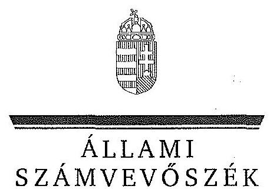
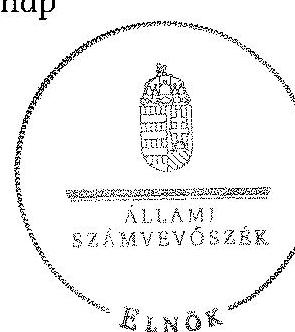
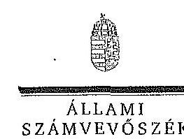
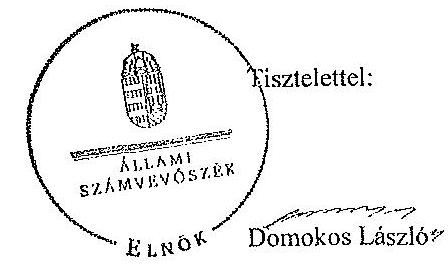
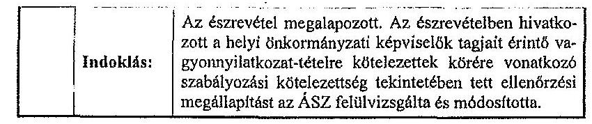
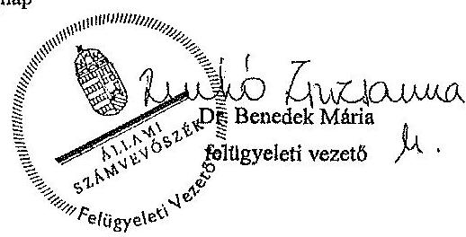

ÁLLAMI
SZÁMVEVŐSZÉK

# JELENTÉS 

az önkormányzatok belső kontrollrendszere kialakításának, egyes
kontrolltevékenységek és a belső ellenőrzés
működésének ellenőrzése
Hajdúszoboszló
15051
2015. május

---

# Állami Számvevőszék 

Iktatószám: V-0662-059/2015.
Témaszám: 1696
Vizsgálat-azonosító szám: V067704

## Az ellenőrzést felügyelte:

Dr. Benedek Mária
felügyeleti vezető
Az ellenőrzést vezette és az ellenőrzés végrehajtásáért felelős:
Bíró Zsolt
ellenőrzésvezető
A számvevőszéki jelentés összeállításában közremüködött:
Villányi Antal
számvevő tanácsos
Az ellenőrzést végezték:
Vas Lajos
Dr. Németh Ildikó
számvevő
vezető főtanácsos
Villányi Antal
számvevő tanácsos

---

# TARTALOMJEGYZÉK 

BEVEZETÉS ..... 5
I. ÖSSZEGZŐ MEGÁLLAPÍTÁSOK, KÖVETKEZTETÉSEK, JAVASLATOK ..... 9
II. RÉSZLETES MEGÁLLAPÍTÁSOK ..... 12

1. Az önkormányzat belső kontrollrendszere kialakításának és múködtetésének megfelelősége ..... 12
1.1. A kontrollkörnyezet kialakítása és múködtetése ..... 12
1.2. A kockázatkezelési rendszer kialakítása és múködtetése ..... 14
1.3. A kontrolltevékenységek kialakítása és múködtetése ..... 14
1.4. Az információs és kommunikációs rendszer kialakítása és múködtetése ..... 15
1.5. A monitoring rendszer kialakítása és múködtetése ..... 16
2. A monitoring rendszer részeként a belső ellenőrzés kialakítása és múködtetése ..... 16
3. A pénzügyi folyamatokban kulcsszerepet betöltő belső kontrollok (teljesítésigazolás és érvényesítés) kialakítása és múködése ..... 18
4. Az integritás szemlélet érvényesülése ..... 19

## MELLÉKLETEK

1. számú Észrevételt tartalmazó polgármesteri levél
2. számú Észrevételre vonatkozó elnöki válaszlevél

## FÜGGELÉKEK

1. számú Értelmező szótár
2. számú Az integritás érvényesítése érdekében kialakított és múködtetett intézményi kontrollrendszer

---

.

---

# RÖVIDÍTÉSEK JEGYZÉKE 

## Törvények

Áht.
ÁSZ tv.
Kttv.
Mötv.
Ötv.
Vnytv.

## Rendeletek

Ávr.

Bkr.
képviselő-testületi
SZMSZ

10/2013. (I. 21.) Korm. rendelet

## Szórövidítések

ÁSZ
bizonylati rend
együttmúködési megállapodás ${ }_{1}$
együttmúködési megállapodás ${ }_{2}$
etikai kódex
eszközök és források értékelési szabályzata gazdasági program
2011. évi CXCV. törvény az államháztartásról (hatályos 2012. január 1-jétől)

2011. évi LXVI. törvény az Állami Számvevőszékről (hatályos 2011. július 1-jétől)
2011. évi CXCIX. törvény a közszolgálati tisztviselökről (hatályos 2012. március 1-jétől)
2011. évi CLXXXIX. törvény Magyarország helyi önkormányzatairól (hatályos 2012. január 1-jétől)
1990. évi LXV. törvény a helyi önkormányzatokról (hatályát vesztette 2014. október 12-én)
2007. évi CLII. törvény az egyes vagyonnyilatkozat-tételi kötelezettségekről (hatályos 2007. december 7-étől)

368/2011. (XII. 31.) Korm. rendelet az államháztartásról szóló törvény végrehajtásáról (hatályos 2012. január 1jétől)
370/2011. (XII. 31.) Korm. rendelet a költségvetési szervek belső kontrollrendszeréről és belső ellenőrzéséről (hatályos 2012. január 1-jétől)
Hajdúszoboszló Város Önkormányzata Képviselőtestületének 12/2011. (IV. 28.) önkormányzati rendelete az önkormányzat szervezeti és múködési szabályzatáról (hatályos 2011. május 1-jétől)
10/2013. (I. 21.) Korm. rendelet a közszolgálati egyéni teljesítményértékelésről (hatályos 2013. július 1-jétől)

Állami Számvevőszék
A Polgármesteri Hivatal bizonylati albuma (hatályos 2010. június 1-jétől)

Együttmúködési megállapodás Hajdúszoboszló város önkormányzata és Hajdúszoboszló Német Nemzetiségi Önkormányzat Képviselő-testülete között 2/2013. (03. 06.) számú határozata alapján
Hajdúszoboszló város önkormányzata és Hajdúszoboszló Ruszin Nemzetiségi Önkormányzat Képviselő-testülete között 1/2013. (02. 20.) számú határozata alapján
A Polgármesteri Hivatal Etikai kódexe (hatályos 2010. szeptember 1-jétől)
A Polgármesteri Hivatal eszközök és források értékelési szabályzata (hatályos 2012. január 1-jétől)
Hajdúszoboszló Város Önkormányzatának 80/2011. (IV. 28.) számú képviselő-testületi határozattal elfogadott 2011-2014-es ciklusra szóló gazdasági programja

---

gazdálkodási ügyrend
Hivatal
hivatali SZMSZ
INTOSAI
iratkezelési szabályzat
ISSAI
jegyzö
Képviselő-testület
leltározási és leltárkészítési szabályzat
Önkormányzat
pénzkezelési szabályzat
PGB
polgármester
számlarend
Társulás
tüzvédelmi szabályzat
ügyrend

Polgármesteri Hivatal Gazdálkodási Úgyrend (hatályos 2013. január 1-jétől)

Hajdúszoboszló Város Önkormányzata Polgármesteri Hivatal
A Hajdúszoboszlói Polgármesteri Hivatal szervezeti és müködési szabályzata (hatályos 2012. május 10-étől)
International Organization of Supreme Audit Institutions (Legfőbb Ellenőrző Intézmények Nemzetközi Szervezete)
A Polgármesteri Hivatal iratkezelési szabályzata (hatályos: 2012.január 1-jétől)
International Standards of Supreme Audit Institutions (Legfőbb Ellenőrző Intézmények Nemzetközi Standardjai)
Hajdúszoboszló Város Önkormányzatának jegyzője
Hajdúszoboszló Város Önkormányzatának Képviselőtestülete
A Polgármesteri Hivatal leltározási és leltárkészítési szabályzata (hatályos 2012. január 1-jétől)
Hajdúszoboszló Város Önkormányzata
A Polgármesteri Hivatal pénzkezelési szabályzat (hatályos 2012. január 1-jétől)
Hajdúszoboszló Város Önkormányzata Pénzügyi, Gazdasági Bizottsága
Hajdúszoboszló Város Önkormányzatának polgármestere
A Polgármesteri Hivatal számlarendje (hatályos 2013. január 1-jétől)
Hajdúszoboszlói Kistérségi Többcélú Társulás
A Polgármesteri Hivatal Tüzvédelmi szabályzata (hatályos 2009. július 20-ától)
A Polgármesteri Hivatal ügyrendje (hatályos 2013. január 1-jétől)

---

# JELENTÉS 

## az önkormányzatok belső kontrollrendszere kialakításának, egyes kontrolltevékenységek és a belső ellenőrzés múködésének ellenőrzése Hajdúszoboszló

## BEVEZETÉS

Hajdúszoboszló város állandó lakosainak száma 2013. január 1-jén 23823 fő volt. Az Önkormányzat 12 tagú Képviselő-testületének munkáját hét állandó bizottság segítette. Az Önkormányzat az önállóan működő és gazdálkodó Hi vatalon kívül hat önállóan működő és gazdálkodó, három önállóan működő intézményt múködtetett, három többségi tulajdoni hányadú gazdasági társasággal rendelkezett. A polgármester az 1994. év óta tölti be tisztségét. A jegyző 1991. évtől látja el feladatait: A Hivatal, Gazdasági Iroda, Önkormányzati Iroda és Igazgatási Iroda szervezeti egységre tagolódott, elkülönített gazdasági szervezettel rendelkezett, a foglalkoztatott köztisztviselők száma 2013. január 1jén 44 fő volt. A Hivatalnál 2013. január 1-jétől szervezeti változás nem volt. Az Önkormányzat a 2013. évi költségvetési beszámolója szerint 7764459 ezer Ft tárgyévi bevételt ért el, valamint 6599385 ezer Ft tárgyévi kiadást teljesített. A 2013. december 31-i könyvviteli mérleg szerint 42609594 ezer Ft értékű eszközvagyonnal rendelkezett, a rövid lejáratú kötelezettségállománya 331989 ezer Ft, hosszú lejáratú kötelezettség állománya 97599 ezer Ft volt.

A demokratikus társadalmakban alapvető igény, hogy a közpénzeket, a közvagyont használók valamennyi tevékenységükhöz kapcsolódó pénzfelhasználásról elszámoljanak, ahhoz egyértelmű és érvényesíthető felelősségi szabályok társuljanak. Ennek a jogos igénynek az érvényesítéséhez meg kell teremteni azokat a folyamatokat, rendszereket, amelyek nélkülözhetetlenek az elszámoltatáshoz. Az elszámoltatás eredményes müködtetéséhez szükség van a megfelelő információs, kontroll, értékelési és beszámolási rendszerek kialakítására.

Magyarországon az uniós csatlakozási tárgyalások idejére nyúlnak vissza a belső kontrollrendszer szabályozásának gyökerei. Az uniós elvárásoknak megfelelő új terminológia szerinti államháztartási belső pénzügyi ellenőrzési (ÁBPE) rendszer területén a jogharmonizáció 2003-ban teljes körűen megvalósult, míg az önkormányzati alrendszerre vonatkozó, Ötv.-ben megjelenített speciális szabályozás 2005-ben lépett hatályba. Az államháztartási belső kontrollrendszer koncepciója 2009-ben továbbfejlődött. A változások irányát mutatja, hogy a költségvetési szervek belső kontrollrendszere már magában foglalja a korszerű felelős szervezetirányítás elemeit (kontrollkörnyezet, kockázatkeze-

---

lés, kontrolltevékenység, információ és kommunikáció, monitoring) is. E kontrollrendszer szabályozása háromszintű, a törvényi előírásokat az Áht, és a Mötv, a rendeleti szintű szabályozást az Ávr. és a Bkr. tartalmazza, amelyeket útmutatói szinten az NGM által kiadott standardok és kézikönyvek támogatnak.

A belső kontrollrendszer azt a célt szolgálja, hogy a költségvetési szervek működésük és gazdálkodásuk során a tevékenységeket szabályszerűen, gazdaságosan, hatékonyan, eredményesen hajtsák végre, teljesítsék elszámolási kötelezettségeiket és megvédjék az erőforrásokat a veszteségektől, a károktól és a nem rendeltetésszerű használattól. A belső kontrollrendszer magában foglalja mindazon szabályokat, eljárásokat, gyakorlati módszereket és szervezeti struktúrákat, kockázatkezelési technikákat, kontrolltevékenységeket, amelyek segítséget nyújtanak a szervezetnek céljai eléréséhez.

Az ÁSZ középtávú stratégiájában hangsúlyos szerepet szánt annak, hogy szilárd szakmai alapon álló, értékteremtő ellenőrzéseivel előmozdítsa a közpénzügyek átláthatóságát, rendezettségét. A számvevőszéki ellenőrzés nemzetközi alapelvei is rögzítik, hogy a megfelelő belső kontrollrendszer minimálisra csökkenti a hibák és szabálytalanságok kockázatát.

Az ellenőrzés célja annak értékelése, hogy

- a jogszabályi előírásoknak megfelelően alakították-e ki és működtették-e a belső kontrollrendszert;
- a gazdálkodás folyamatában kulcsszerepet betöltő teljesítésigazolás és érvényesítés kontrolltevékenységeit megfelelően működtették-e;
- biztosították-e a belső ellenőrzés szabályos működését;
- kialakították-e az erőforrásokkal való szabályszerű és hatékony gazdálkodáshoz szükséges követelményeket, megvalósították-e azok számonkérését, ellenőrzését;
- hasznosították-e a 2009-2013. években végzett ÁSZ ellenőrzések során megfogalmazott javaslatokat.

A közintézmények integritás alapú kultúrájának kialakítása, megerősítése és működése szorosan összefügg a belső kontrollrendszer múködésével, ezért az ellenőrzés kitért a gazdálkodáshoz kapcsolódó integritás kontrollok meglétének és múködésének ellenőrzésére is. Az integritási kultúra kialakítása hozzájárul az elszámoltathatóság és átláthatóság érvényesítéséhez, egyben támogatja a szervezet védettségét a korrupciós kitettséggel szemben, valamint annak megelőzése is irányítottabbá válik.

Az ellenőrzés várható hasznosulását négy szinten tervezzük. A törvényalkotás számára összegzett tapasztalatok állnak rendelkezésre a belső kontrollrendszer önkormányzati területen való kialakításáról, működéséről és hatásairól, a belső ellenőrzés múködéséről. Az ellenőrzés az ellenőrzött számára visszajelzést ad a belső kontrollrendszer kialakításában és múködésében fellépő hiányosságokról, javaslataival hozzájárul azok kiküszöböléséhez, amely csökkentheti a későbbi ellenőrzések gyakoriságát. Az ellenőrzés megállapításai és javas-

---

latait más szervezetek is hasznosíthatják a rendezett gazdálkodási keretek kialakításához. A társadalom számára jelzi, hogy közpénz nem maradhat ellenőrizetlenül, az ÁSZ értékteremtő rend kialakításához és megőrzéséhez hozzájáruló tevékenysége pozitív hatással lesz a szervezetről kialakított összkép formálásában. A szervezeten belül lehetőség nyílik arra, hogy a megállapítások szintetizálásával az ÁSZ a hozzáadott értéket teremtő elemző tevékenységét és tanácsadó szerepét is erősítse.

Az önkormányzatok belső kontrollrendszere kialakításának, egyes kontrolltevékenységek és a belső ellenőrzés működésének ellenőrzéséről szóló jelentés I. fejezetének összegző része az ellenőrzés céljára ad rövid, szintetizáló összefoglalót, és tartalmazza a következtetéseket a II. fejezet részletes megállapításain alapulóan. A jelentés intézkedést igénylő megállapításait és javaslatait az ellenőrzés során feltárt, a jelentés II. fejezetében rögzített részletes megállapítások alapozzák meg.

# Az ellenőrzés típusa: szabályszerűségi ellenőrzés 

Az ellenőrzött időszak: a belső kontrollrendszer kialakítása és működtetése megfelelőségét a 2013. évre vonatkozóan (2013. december 31-i állapotnak megfelelően), a pénzügyi folyamatokban kulcsszerepet betöltő teljesítésigazolás és érvényesítés belső kontrollok müködésének megfelelőségét, és a belső ellenőrzés szabályszerű működését a 2013. január 1. - december 31-e közötti időszakot figyelembe véve értékeltük, míg az ÁSZ javaslatainak utóellenőrzése a 2009-2013. években végzett ellenőrzések nyilvánosságra hozott jelentéseiben tett javaslatok áttekintésére terjedt ki.

## Az ellenőrzött szervezet: az Önkormányzat

Az ellenőrzés jogszabályi alapját az ÁSZ tv. 1. § (3) bekezdése, az 5. § (2) és (6) bekezdései, valamint az Áht. 61. § (2) bekezdése képezik.

Az ellenőrzés szakmai módszertana az ÁSZ hivatalos honlapján (www.asz.hu) közzétett szakmai szabályokon alapult, amely az INTOSAI által kiadott ISSAI figyelembevételével készült.

Az ellenőrzés lefolytatásához az Önkormányzat a kimutatások és a tanúsítvány elektronikus kitöltésével, valamint az ÁSZ által kért dokumentumok elektronikus megküldésével szolgáltatott adatokat. Az így rendelkezésre bocsátott adatok, információk kontrollja és a munkalapok kitöltése a helyszíni ellenőrzés keretében történt. A jelentésben használt fogalmak magyarázatát az 1. számú függelék, az integritás érvényesítése érdekében kialakított és működtetett intézményi kontrollrendszer értékelését a 2. számú függelék tartalmazza.

A belső kontrollrendszer, valamint a belső ellenőrzés jogszabályi előírások szerinti kialakításának és működtetésének szabályszerűségét az erre irányuló ellenőrzési kérdésekre adott válaszok összesítése alapján értékeltük. A belső kontrollrendszert kontrollterületenként (kontrollkörnyezet, kockázatkezelési rendszer, kontrolltevékenységek, információs és kommunikációs rendszer, monitoring rendszer) és összesítetten is értékeltük.

---

A belső kontrollrendszer egyes kontrollterületei és a belső ellenőrzés kialakítása és múködtetése „szabályszerü volt", amennyiben az értékelt területen az elért és elérhető pontok százalékban kifejezett hányadosa elérte a $81 \%$-ot, „részben szabályszerü volt", ha 61-80\% közé esett, és „nem volt szabályszerű", ha nem haladta meg a $60 \%$-ot. A belső kontrollrendszer összesített értékelése megegyezett a kontrollterületenként alkalmazott \%-os értékelésekkel, a következő eltérésekkel. A kontrollrendszer egésze esetében a „szabályszerü" értékelésnek a \%-os értéken felül további feltétele volt, hogy egyik kontrollterület sem kaphatott „nem volt szabályszerű" értékelést, a „részben szabályszerű" értékelés további feltétele volt, hogy legfeljebb egy ellenőrzött kontrollterület lehetett „nem volt szabályszerű" értékelésü. Az összesített értékelés a \%-os értéktől függetlenül „nem volt szabályszerű", ha az ellenőrzött kontrollterületek közül több mint egynek „nem volt szabályszerű" az értékelése.

A gazdálkodás folyamatában kulcsszerepet betöltő két kulcskontroll - teljesítésigazolás, érvényesítés - müködésének megfelelőségét a személyi juttatásokkal, a dologi és felhalmozási kiadásokkal, müködési és felhalmozási célú pénzeszköz átadásokkal, ellátottak pénzbeli juttatásaival kapcsolatos kifizetések esetében mintavétellel ellenőriztük. „Megfelelőnek" értékeltük a gazdálkodási jogkörök gyakorlását, amennyiben $95 \%$-os bizonyossággal a teljes sokaságban a hibaarány legfeljebb $10 \%$, „részben megfelelőnek" értékeltük, ha a hibaarány felső határa 10-30\% között volt, „nem megfelelőnek" pedig akkor, ha a mintavételi eredmények alapján a sokaságbeli hibaarány felső határa meghaladta a 30\%ot.

Az integritás szemlélet érvényesülésének értékelése az Önkormányzat önbevallással kitöltött tanúsítványa alapján történt. Utóellenőrzésre nem került sor, mivel az ÁSZ az Önkormányzatnál a 2009-2013. évek között ellenőrzést nem végzett.

Az Ász tv. 29. § (1) bekezdése szerint a jelentéstervezetet megküldtük a polgármester részére, aki az ÁSZ tv. 29. § (2) bekezdésében foglalt észrevételezési jogával élt, a jelentéstervezetre észrevételt tett (1. számú melléklet). Az ÁSZ tv. 29. § (3) bekezdésében előírtaknak megfelelően a figyelembe nem vett észrevételeket és annak indokairól szóló tájékoztatást a jelentés tartalmazza (2. számú melléklet).

---

# I. ÖSSZEGZŐ MEGÁLLAPÍTÁSOK, KÖVETKEZTETÉSEK, JAVASLATOK 

A belső kontrollrendszeren belül 2013-ban a kontrollkörnyezet, a kockázatkezelési rendszer, a kontrolltevékenységek, az információs és kommunikációs rendszer, valamint a monitoring rendszer - azon belül önállóan a belső ellenőrzés kialakítását és működtetését külön-külön és együttesen is értékeltük. A belső kontrollrendszer kialakítása és müködtetése az összesített értékelés alapján részben volt szabályszerű.

A belső kontrollrendszer egyes területei kialakításának minősítése a következő:

| Kontrollterület | Minősítés |
| :-- | :--: |
| Kontrollkörnyezet | részben   szabályszerű |
| Kockázatkezelési rendszer | nem   szabályszerű |
| Kontrolltevékenységek | részben   szabályszerű |
| Információs és kommuni-   kációs rendszer | szabályszerű |
| Monitoring rendszer | szabályszerű |

Szabályszerúnek értékeltük az információs és kommunikációs rendszer és a monitoring rendszer kialakítását és működtetését, mivel azok kialakítása a jogszabályi előírásokban foglaltakat figyelembe véve megteremtette ezeken a kontrollterületeken a szabályszerű működés lehetőségét, a működésük pedig ennek megfelelően történt.

Részben szabályszerűnek értékeltük a kontroll környezet és a kontrolltevékenységek kialakítását és működtetését, mivel a megállapított szabályozásbeli hiányosságok és a működtetés nem veszélyeztették e kontrollterületeken a szabályszerű múködést.

Nem szabályszerűnek értékeltük a kockázatkezelési rendszer kialakítását és működtetését, mivel az ellenőrzésünk során megállapított szabályozásbeli és működtetési hiányosságok magukban hordozzák a szabálytalan múködés, valamint a korrupció kockázatát.

A 2013. évben a belső ellenőrzés kialakítása és működtetése szabályszerű volt, azonban a belső ellenőrzés nem tárta fel a belső kontrollrendszer kialakításának, múködtetésének, illetve a pénzügyi folyamatokban kulcsszerepet betöltő teljesítésigazolás és érvényesítés kontrollok múködésének hiányosságait.

A 2013. évben a személyi juttatásokkal, a dologi kiadásokkal, a felhalmozási kiadásokkal, a múködési és felhalmozási célú pénzeszköz átadásokkal, illetve

---

az ellátottak pénzbeli juttatásaival kapcsolatos kifizetések során a kulcsszerepet betöltő teljesítésigazolás és érvényesítés belső kontrollok müködése nem volt megfelelő, mivel azok nem biztosították a hibák megelőzését, feltárását.

A számvevőszéki ellenőrzés az ellenőrzött kifizetésekkel összefüggésben a rendelkezésre bocsátott dokumentumok alapján kár bekövetkeztére utaló adatot, tényt nem állapított meg, azonban a gazdálkodásban kulcsszerepet betöltő kontrollok müködésében feltárt hiányosságok, szabálytalanságok miatt fennáll a hibák bekövetkezésének kockázata. A nem megfelelően müködtetett belső kontrollok korrupciós kockázatot hordoznak.

A jegyző az erőforrásokkal való szabályszerű és hatékony gazdálkodáshoz szükséges követelményeket kialakította, és megvalósította azok számonkérését, ellenőrzését.

Az Önkormányzat intézkedéseket tett az integritás szemlélet fejlesztésére, valamint a korrupciós kockázatok csökkentésére, a Hivatal a 2012-2013. években önként részt vett az ÁSZ integritási felmérésében.

Az ÁSZ tv. 33. § (1) bekezdésében foglaltak értelmében az ellenőrzött szervezet vezetője köteles a jelentésben foglalt megállapításokhoz kapcsolódó intézkedési tervet összeállítani, és azt a jelentés kézhezvételétől számított 30 napon belül az ÁSZ részére megküldeni. Amennyiben az intézkedési tervet határidőre nem küldi meg a szervezet, vagy az ÁSZ tv. 33. § (2) bekezdésében foglalt póthatáridő elteltével megküldött intézkedési terv továbbra sem elfogadható, az ÁSZ elnöke a hivatkozott törvény 33. § (3) bekezdés a)-b) pontjaiban foglaltakat érvényesítheti.

Az ellenőrzés intézkedést igénylő megállapításai és javaslatai:

# a polgármesternek 

1. Az Ávr. 57. § (4) bekezdésében foglaltak ellenére a polgármester nem jelölte ki írásban az Önkormányzat kiadási előirányzatai vonatkozásában a teljesítésigazolásra jogosult személyeket.

Javaslat:
Az Ávr. 57. § (4) bekezdés előírásainak megfelelően jelölje ki írásban az Önkormányzat kiadási előirányzatai vonatkozásában a teljesítésigazolásra jogosult személyeket.
2. A Kttv. 231. § (1) bekezdése ellenére a Képviselő-testület nem állapította meg a köztisztviselőkkel szembeni, a Kttv. 83. §-ában előírt hivatásetikai alapelvek részletes tartalmát, valamint az etikai eljárás szabályait, mivel a polgármester a jegyző által előkészített dokumentumokat nem terjesztette a Képviselő-testület elé.

Javaslat:
A Kttv. 231. § (1) bekezdése előírásinak megfelelően az etikai kódex tervezetét elfogadásra terjessze a Képviselő-testület elé annak érdekében, hogy a Képviselő-testület

---

állapíthassa meg a köztisztviselőkkel szembeni, a Kttv. 83. §-ában előírt hivatásetikai alapelvek részletes tartalmát, valamint az etikai eljárás szabályait.
3. A számvevőszéki jelentés ellenőrzési megállapításai alapján az Önkormányzatnál a belső kontrollrendszer kialakítása és múködtetése az összesített értékelés alapján részben szabályszerű, a kulcskontrollok müködése nem volt megfelelő.

Javaslat:
Kísérje figyelemmel a Mötv. 115. § (1) bekezdésében foglaltak alapján az Önkormányzat gazdálkodásának szabályszerűségét. A Mötv. 67. § f) pontja alapján gondoskodjon a belső kontrollrendszer müködésére vonatkozó jogszabályi rendelkezések be nem tartása, valamint a teljesítésigazolás, illetve az érvényesítés kontrolokkal öszszefüggésben feltárt hiányosságok, szabálytalanságok tekintetében az esetleges munkajogi felelősséggel kapcsolatos körülmények kivizsgálásáról, majd a vizsgálat eredményének függvényében tegye meg a szükséges intézkedéseket.

# a jegyzőnek 

A számvevőszéki jelentés ellenőrzési megállapításai alapján az Önkormányzatnál a belső kontrollrendszer kialakítása és müködtetése az összesített értékelés alapján részben szabályszerű, a kulcskontrollok müködése nem volt megfelelő. A belső ellenőrzés kialakítása és múködtetése szabályszerű volt, azonban nem tárta fel a belső kontrollrendszer kialakításának, müködtetésének, illetve a pénzügyi folyamatokban kulcsszerepet betöltő teljesítésigazolás és érvényesítés kontrollok müködésének hiányosságait. A számvevőszéki ellenőrzés során feltárt hibákat, hiányosságokat és szabálytalanságokat a számvevőszéki jelentés II. Részletes megállapítások fejezete tartalmazza.

Javaslat:
A jogszabályoknak megfelelő belső kontrollrendszer kialakítása és müködtetése érdekében - az ellenőrzött időszak óta bekövetkezett esetleges jogszabályi változásokra figyelemmel - intézkedjen a belső kontrollrendszer kialakításában és müködtetésében, a kulcskontrollok müködésében, illetve a belső ellenőrzés kialakításában és müködtetésében az ellenőrzés által feltárt hibák, hiányosságok, szabálytalanságok kijavítására.

Kezdeményezze, hogy az éves ellenőrzési terv kiterjedjen a kifizetések szabályszerűségi ellenőrzésére, különös tekintettel a személyi juttatásokkal, a dologi kiadásokkal, a felhalmozási kiadásokkal, a müködési és felhalmozási célú pénzeszköz átadásokkal, az ellátottak pénzbeli juttatásaival kapcsolatos kiadási jogcímekből teljesített kifizetésekre.

---

# II. RÉSZLETES MEGÁLLAPÍTÁSOK 

## 1. AZ ÖNKORMÁNYZAT BELSŐ KONTROLLRENDSZERE KIALAKÍTÁSÁNAK ÉS MŰKÖDTETÉSÉNEK MEGFELELŐSÉGE

A belső kontrollrendszeren belül 2013-ban a kontrollkörnyezet, a kockázatkezelési rendszer, a kontrolltevékenységek, az információs és kommunikációs rendszer, valamint a monitoring rendszer kialakítását és múködtetését külön-külön és együttesen is értékeltük. A belső kontrollrendszer kialakítása és múködtetése az összesített értékelés alapján részben volt szabályszerű.

### 1.1. A kontrollkörnyezet kialakítása és múködtetése

A kontrollkörnyezet kialakítása és múködtetése részben volt szabályzareú.

A Hivatal rendelkezett a Képviselő-testület által elfogadott alapító okirattal, amely tartalmazta az alaptevékenységek szakfeladatait, valamint a jogszabályi előírásoknak megfelelő hivatali SZMSZ-szel. Az Önkormányzat Képviselőtestülete megalkotta szervezeti és múködési szabályzatát és elfogadta a 20112014. évekre vonatkozó gazdasági programot. A helyi nemzetiségi önkormányzatok (német és ruszin) az együttműködés feltételeit rögzítő megállapodásokat határozataikkal elfogadták.

A Hivatalban a megfelelő múködés érdekében kialakították a belső szabályzatokat. A Képviselő-testület elfogadta az önkormányzati vagyonnal történő gazdálkodás szabályait. A jegyző a jogszabályi előírásoknak megfelelően kialakította a Hivatal számviteli politikáját, elkészítette a pénzkezelési szabályzatot. A jogszabályi előírásoknak megfelelően a Hivatal rendelkezett leltározási és leltárkészítési-, az eszközök és források értékelési szabályzatával, bizonylati renddel, számlarenddel, tűzvédelmi szabályzattal. Az együttműködési megállapodás ${ }_{1,2}$ alapján a nemzetiségi önkormányzatok kötelesek voltak a Hivatal számviteli szabályait alkalmazni.

A jegyző elkészítette a Hivatal gazdálkodási ügyrendjét, a helyi nemzetiségi önkormányzatok 2013. évi költségvetési határozat-tervezetét és a 2012. évi költségvetés végrehajtásának tervezetét. A nemzetiségi önkormányzatok mind a 2013. évi költségvetést, mind a 2012. évi költségvetés végrehajtását határozatokkal fogadták el.

A Hivatal gazdasági vezetője rendelkezett a feladat ellátásához szükséges végzettséggel, előírt szakképesítéssel és a könyvviteli szolgáltatás körébe tartozó tevékenység ellátására jogosító engedéllyel. A jegyző elkészítette a Hivatalban dolgozó köztisztviselők munkaköri leírását, amelyekben a köztisztviselők feladatait és a munkakör betöltésével kapcsolatos követelményeket rögzítették. A jegyző az előírt formában, tartalommal elkészítette a Hivatalban dolgozók teljesítményértékeléseit.

---

Kialakították az erőforrásokkal való, szabályszerű és hatékony gazdálkodáshoz szükséges követelményeket és a célok teljesítését ellenőrizték. A Képviselőtestület a 2013. évi költségvetési rendeletében meghatározta a Hivatal engedélyezett létszámát.

A kontrollkörnyezet kialakítása és múködtetése az alábbi kisebb hiányosságok mellett részben szabályszerű volt:

| Sorszám ${ }^{1}$ | Megállapítás | Megjegyzés |
| :--: | :--: | :--: |
| 31.,   38. | A jegyző - a Bkr. 6. § (3) és (4) bekezdéseiben foglaltak ellenére - nem készítette el a Hivatal ellenőrzési nyomvonalát, valamint a szabálytalanságok kezelésének eljárásrendjét. |  |
| 44. | A jegyző a 10/2013. (I. 21.) Korm. rendelet 5. § és a 25. § (2) bekezdés előirása ellenére nem határozta meg a köztisztviselők teljesítményértékelésének második félévre vonatkozó kötelező elemeit. |  |
| 45. | A köztisztviselők teljesítményértékelését a jegyző a 10/2013. (I. 21.) Korm. rendelet 6. §-ában előírt tárgyév január 31 után - határidőn túl készítette el. | A teljesítményértékelésre a köztisztviselők esetén 2014. februármárcius hónapokban került sor. |
| 46. | A Kttv. 231. § (1) bekezdése ellenére a Képviselő-testület nem állapította meg a köztisztviselőkkel szembeni, a Kttv. 83. §-ában előírt hivatásetikai alapelvek részletes tartalmát, valamint az etikai eljárás szabályait, mivel a polgármester a jegyző által előkészített dokumentumokat nem terjesztette a Képviselő-testület elé. | A Hivatal etikai kódexét a polgármester hagyta jóvá. |

[^0]
[^0]:    ${ }^{1}$ A megállapítás számozása az Önkormányzat által az adatszolgáltatás során kitöltött kimutatások kérdéseinek sorszámával azonos.

---

# 1.2. A kockázatkezelési rendszer kialakítása és müködtetése 

A kockázatkezelés kialakítása és müködtetése nem volt szabályszerű, mert:

| Sorszám | Megállapítás | Megjegyzés |
| :--: | :--: | :--: |
| 1. | A jegyző - a Bkr. 3. § b) pontjában előirtak ellenére - a Hivatal kockázatkezelési rendszerét nem alakította ki. |  |
| $2-4$. | A jegyző - a Bkr. 7. § (2) bekezdésében foglalt előirás ellenére - nem mérte fel és nem állapította meg a Hivatal tevékenységében, gazdálkodásában rejlő kockázatokat, nem határozta meg az egyes kockázatokkal kapcsolatban a szükséges intézkedéseket, és azok teljesítésének folyamatos nyomon követési módját. |  |
| 5. | A jegyző a Vnytv. 4. § d) pontjaiban foglaltak ellenére a Képviselő-testület bizottságai nem helyi önkormányzati képviselő tagjait érintően a vagyonnyi-latkozat-tételre kötelezettek körét a képviselő-testületi SZMSZ-ben nem szabályozta. | A szabályozás hiánya ellenére a Képviselő-testület bizottságainak nem helyi önkormányzati képviselő tagjai eleget tettek vagyonnyilatkozat tételi kötelezettségeiknek. |

### 1.3. A kontrolltevékenységek kialakítása és müködtetése

## A kontrolltevékenységek kialakítása és müködtetése részben szabályszerű volt.

A jegyző biztosította a pénzügyi döntések - köztük a költségvetés tervezése, a beszerzési folyamat, a vagyonhasznosítási tevékenység, valamint a támogatások elszámolása - dokumentumainak elkészítésével kapcsolatban a folyamatba épített előzetes, utólagos és vezetői ellenőrzést.

Szabályozták az utalványozás gyakorlásának módját, az eljárási és dokumentációs részletszabályait, valamint a pénzügyi ellenjegyzést, az érvényesítést, az utalványozást végző személyek kijelölésének rendjével kapcsolatos belső előírásokat. Szabályozásra került az előzetes írásbeli kötelezettségvállalást nem igénylő kifizetések rendje.

A jegyző a jogszabályi előírásoknak megfelelően gondoskodott az iratkezelési szoftver által kezelt adatok biztonságáról, kialakította az üzembiztonsági, adatvédelmi szabályok érvényre juttatásához szükséges eljárási szabályokat. A jegyző az iratkezelési rendszer kialakítása során a jogszabályi előírásoknak megfelelően szabályozta az üzemeltetés és az adatbiztonság feladatait, és meghatározta az ehhez kapcsolódó hatásköröket. Az informatikai rendszer szabályozása során kialakította azokat az eljárási szabályokat, amelyek biztosítják

---

az adatok biztonságát és védelmét. A felelősségi körök meghatározásával szabályozták a dokumentumokhoz és információkhoz való hozzáférést.

Az ügyrend tartalmazta a beszámolási feladatok (időközi és éves beszámolók) teljesítésével kapcsolatos belső előírásokat, feltételeket, valamint a beszámolási eljárásokhoz kapcsolódó felelősségi köröket, továbbá a helyettesítés rendjét. A költségvetési beszámoló elkészítésével megbízott személy rendelkezett a jogszabályban előírt képesítéssel, és a tevékenység ellátására jogosító engedéllyel. A polgármester a jogszabályi előírásoknak megfelelően az Önkormányzat gazdálkodásának első félévi és háromnegyed éves helyzetéről a Képviselő-testületet írásban a megadott határidőig tájékoztatta.

A polgármester az Önkormányzat kiadási jogcímeire felhatalmazást adott kötelezettségvállalásra és utalványozásra, a jogszabályok előírásainak megfelelően jelölték ki a pénzügyi ellenjegyzési, illetve érvényesítési feladatra a Hivatal állományába tartozó köztisztviselőket, akik rendelkeztek az előírt szakképzettséggel.

A jegyző szabályozta a közszolgálati jogviszony megszűnése, illetve a munkakör változása esetére a munkakör átadásának rendjét. A pénzügyi-számviteli területen foglalkoztatott köztisztviselők személye egy alkalommal változott. A munkakör átadás-átvétele dokumentáltan, a belső szabályozásnak megfelelően megtörtént.

A kontrolltevékenység kialakítása és múködtetése az alábbi kisebb hiányosságok mellett részben szabályszerű volt:

| Sorszám | Megállapítás |
| :--: | :--: |
| 5., 7.,   9. | A jegyző - az Ávr. 13. § (2) bekezdésének a) pontjában foglaltak ellenére - belső szabályzatban nem határozta meg a kötelezettségvállalás pénzügyi ellenjegyzése, a teljesítésigazolás, az érvényesítés gyakorlásának módjával, eljárási és dokumentációs részletszabályaival, kapcsolatos belső előírásokat. |
| 8. | A kötelezettségvállaló (a polgármester és a jegyző) - az Ávr. 57. § (4) bekezdésében foglaltak ellenére - nem jelölte ki írásban az Önkormányzat, valamint a Hivatal kiadási előirányzataira vonatkozóan a teljesítésigazolásra jogosult személyeket. |

# 1.4. Az információs és kommunikációs rendszer kialakítása és múködtetése 

## Az információs és kommunikációs rendszer kialakítása és múködtetése szabályszerű volt.

Szabályozták a szervezeten belüli és a külső feleknek történő információ átadás rendszerét. A jegyző megfelelően szabályozta a beszámolási szinteket, határidőket, módokat. A Hivatal rendelkezett adatvédelmi és adatbiztonsági szabályzattal. A jegyző kialakította a kötelezően közzéteendő adatok nyilvánosságra hozatalának rendjét (Internet publikációs szabályzat). Az Önkormányzat

---

az elektronikus közzétételi kötelezettségének a 2013. esztendőben eleget tett. A jegyző meghatározta a közérdekú adatok megismerésére irányuló igények teljesítésének rendjét.

A Hivatal rendelkezett a Hajdú-Bihar Megyei Levéltár egyetértésével és a Haj-dú-Bihar Megyei Közigazgatási Hivatal jóváhagyásával kiadott, a jogszabályi előírásoknak megfelelő tartalmú iratkezelési szabályzattal. A jegyző az iratok iktatásával, az iratforgalom dokumentálásával biztosította az ügyintézés folyamatának, az iratok szervezeten belüli útjának pontos követhetőségét és ellenőrizhetőségét, az iratok hollétének naprakész megállapíthatóságát.

# 1.5. A monitoring rendszer kialakítása és múködtetése 

A monitoring rendszer kialakítása és múködtetése szabályszerű volt.
A jegyző kialakította a Hivatal tevékenységének, a célok megvalósításának nyomon követését biztosító rendszerét. A jegyző a jogszabály előírásának megfelelően nyilatkozatban értékelte a Hivatal 2013. évi belső kontrollrendszerének minőségét és a szükséges fejlesztéseket is.

Az Önkormányzatnál végzett külső ellenőrzések megállapításainak hasznosítására intézkedési tervet készítettek, azok végrehajtásáról az előírt nyilvántartást vezették. A jegyző a 2013. évben az Önkormányzatnál (és intézményeinél) végzett hatósági ellenőrzés megállapításai alapján intézkedett, hogy az ellenőrzés által feltárt hiányosságok a jövőben ne merüljenek fel. Az Önkormányzat törvényességi felügyeletét ellátó Hajdú-Bihar Megyei Kormányhivatal nem élt törvényességi felügyeleti eszközzel.

Az Önkormányzat 2012. évi költségvetési beszámolóját független könyvvizsgáló felülvizsgálta, jelentésében ajánlást nem tett.

A monitoring kialakítása és múködtetése az alábbi kisebb hiányosságok mellett szabályszerű volt:

| Sorszám | Megállapítás |
| :--: | :--: |
| 3. | Az Áht. 69. § (2) bekezdésében és a Bkr. 3. §-ában foglaltakat figyelmen kívül hagyva (a Bkr. 1. melléklete szerinti nyilatkozatban foglaltak alapján, annak indokoltsága ellenére) a jegyző a belső kontrollrendszer továbbfejlesztése érdekében intézkedéseket nem tett. |

## 2. A MONITORING RENDSZER RÉSZEKÉNT A BELSŐ ELLENŐRZÉS KIALAKÍTÁSA ÉS MÜKÖDTETÉSE

Az Önkormányzatnál a belső ellenőrzés kialakítása és múködtetése szabályszerű volt, azonban a belső ellenőrzés nem tárta fel a belső kontrollrendszer kialakításának, múködtetésének, illetve a pénzügyi folyamatokban kulcsszerepet betöltő teljesítésigazolás és érvényesítés belső kontrollok müködésének hiányosságait.

---

A jegyző a Társulás által kötött polgári jogi szerződés keretében foglalkoztatott belső ellenőr alkalmazásával gondoskodott a belső ellenőrzés kialakításáról. A belső ellenőrzést végző személy - aki egyben a belső ellenőrzési vezetői feladatokat is ellátta - rendelkezett a jogszabályban előírt szakirányú szakképzettséggel és szakmai gyakorlattal. A belső ellenőrzés szervezeti és funkcionális függetlensége biztosított volt.

Az Önkormányzat rendelkezett a jegyző által jóváhagyott, aktualizált belső ellenőrzési kézikönyvvel. A belső ellenőrzési vezető elkészítette az ellenőrzések tervezését megalapozó stratégiai ellenőrzési tervet, amelyet a Képviselő-testület határozatával jóváhagyott.

A belső ellenőrzési vezető a 2014. évre a jogszabályban előírt tartalommal elkészítette az Önkormányzat éves ellenőrzési tervét, amelyet a Képviselő-testület a Bkr.-ben előírt határidőig jóváhagyott. A 2014. évi ellenőrzési terv összeállítása a jegyző írásos véleményének figyelembevételével történt és kockázatelemzésen alapult.

A belső ellenőrzés a módosított éves ellenőrzési tervben foglalt valamennyi ellenőrzést végrehajtotta, ellenőrzés felfüggesztésére, megszakítására nem került sor. Soron kívüli ellenőrzést 2013-ban nem végeztek. A belső ellenőrzési vezető az elvégzett ellenőrzésekről nyilvántartást vezetett.

Az ellenőrzésekhez a belső ellenőrzési vezető által jóváhagyott, a Bkr.-ben foglalt követelményeknek megfelelő ellenőrzési programok, az ellenőrzésekről a jogszabályban előírt tartalommal jelentések készültek. A belső ellenőrzés az ellenőrzések során büntető-, szabálysértési-, kártérítési-, vagy fegyelmi eljárás megindítására okot adó cselekményt nem tárt fel.

A jogszabályi előírásoknak megfelelően a belső ellenőrzési vezető a 2012. évre vonatkozó éves (összefoglaló) ellenőrzési jelentést elkészítette és megküldte a jegyzőnek. A 2012. évre vonatkozó éves ellenőrzési jelentés tartalmazta a belső kontrollrendszer szabályszerűségének, gazdaságosságának, hatékonyságának és eredményességének növelése, javítása érdekében tett fontosabb javaslatokat, valamint a belső kontrollrendszer öt elemének értékelését.

A belső ellenőrzés kialakítása és múködtetése az alábbi kisebb hiányosságok mellett szabályszerű volt:

| Sorszám | Megállapítás | Megjegyzés |
| :--: | :--: | :--: |
| 7. f.) | A stratégiai ellenőrzési terv a - Bkr.   30. § (1) bekezdés f) pontjában foglalt előírás ellenére - nem tartalmazta az ellenőrzési gyakoriságot. |  |

---

| 14. | A 2013. évi ellenőrzési tervhez képest ellenőrzést hagytak el, illetve új ellenőrzést indítottak, azonban - a Bkr. 56. § (5) bekezdésében foglaltak ellenére - az éves tervet csak utólag módosították. | Az ellenőrzési terv módosítására utólagosan került sor a IV. negyedévben 101/2013. (X. 16.), és a 126/2013. (XII. 18.) PGB határozattal. |
| :--: | :--: | :--: |
| 22. | A belső ellenőrzés javaslatainak végrehajtása érdekében - a Bkr. 28. § c) pontjában és a 45. § (1)-(3) bekezdéseiben foglaltak ellenére - egy esetben nem készítettek intézkedési tervet. | A Társulás munkaszervezeti feladatait ellátó Kistérségi Iroda feladatainak a Hivatal Gazdasági Irodájára történő feladat átadásról készült ellenőrzési jelentéssel kapcsolatban intézkedési terv nem készült. |

# 3. A PÉNZÜGYI FOLYAMATOKBAN KULCSSZEREPET BETÖLTŐ BELSŐ KONTROLLOK (TELJESÍTÉSIGAZOLÁS ÉS ÉRVÉNYESÍTÉS) KIALAKÍTÁSA ÉS MÜKÖDÉSE 

A 2013. évben a személyi juttatásokkal, dologi kiadásokkal, felhalmozási kiadásokkal, működési és felhalmozási célú pénzeszköz átadásokkal, illetve az ellátottak pénzbeli juttatásaival kapcsolatos kifizetések során a pénzügyi folyamatokban kulcsszerepet betöltő teljesítésigazolás és érvényesítés belső kontrollok müködése nem volt megfelelő a következő hiányosságok miatt:

| Kulcskontrollok | Megállapítás |
| :--: | :--: |
| Teljesítésigazolás | A teljesítésigazolást a kifizetéseket megelőzően - az Ávr. 57. § (1), (3) és (4) bekezdéseiben foglaltak ellenére - nem, vagy nem szabályszerűen, illetve jogosulatlanul, kijelölés hiányában végezték. |
| Érvényesítés | Az érvényesítő - az Ávr. 58. § (2) bekezdés előirása ellenére - nem jelezte az utalványozónak, hogy a megelőző ügymenetben az Áht., az államháztartási számviteli kormányrendelet, az Ávr. és a belső szabályzatokban foglaltakat nem tartották be. |

A 2013. évben az ellenőrzött kifizetési jogcímek mintatételei alapján a teljesítésigazolás kulcskontroll müködése során az alábbi hiányosságok, szabálytalanságok fordultak elő:

- a teljesítésigazolást a személyi juttatásokkal, dologi kiadásokkal, felhalmozási kiadásokkal, müködési és felhalmozási célú pénzeszköz átadásokkal, illetve az ellátottak pénzbeli juttatásaival kapcsolatos kifizetéseket megelőzően - az Ávr. 57. § (4) bekezdésében foglaltak ellenére - jogosulatlanul, kijelölés hiányában végezték;
- a teljesítésigazoló a személyi juttatások, a dologi, a felhalmozási kiadások előirányzatai terhére teljesített kifizetéseket megelőzően a teljesítésigazolást az Ávr. 57. § (3) bekezdésében foglaltak ellenére - nem szabályszerűen vé-

---

gezte, mert teljesítésigazolás nem tartalmazta a teljesítés tényére történő utalást;

- a teljesítésigazolást a dologi kiadások kifizetését megelőzően - az Áht. 38. § (1) bekezdésében és az Ávr. 57. § (1) bekezdésében foglaltak ellenére - nem végezték el.

A 2013. évben az ellenőrzött kifizetési jogcímek mintatételei alapján az érvényesítés kulcskontroll múködése során az alábbi hiányosságok, szabálytalanságok fordultak elő:

- a személyi juttatásokkal, a dologi kiadásokkal, a felhalmozási kiadásokkal, valamint a múködési és felhalmozási célú pénzeszközátadásokkal, illetve az ellátottak pénzbeli juttatásaival kapcsolatos kifizetéseket megelőzően az érvényesítő - az Ávr. 58. § (2) bekezdésében foglaltak ellenére - nem jelezte az utalványozónak, hogy a teljesítésigazolást nem, jogosulatlanul kijelölés hiányában, illetve nem szabályszerűen végezték.

A számvevőszéki ellenőrzés az ellenőrzött kifizetésekkel összefüggésben a rendelkezésre bocsátott dokumentumok alapján kár bekövetkeztére utaló adatot, tényt nem állapított meg, azonban a gazdálkodásban kulcsszerepet betöltő kontrollok múködésében feltárt hiányosságok miatt fennáll a hibák, szabálytalanságok bekövetkezésének kockázata. A nem megfelelően múködtetett belső kontrollok korrupciós kockázatot hordoznak.

# 4. AZ INTEGRITÁS SZEMLÉLET ÉRVÉNYESÜLÉSE 

Az Önkormányzat intézkedéseket tett az integritás szemlélet fejlesztésére, valamint a korrupciós kockázatok csökkentésére, a Hivatal a 2012-2013. években önként kitöltötte az ÁSZ integritási kérdőívét. Az ellenőrzés keretében az Önkormányzat által egy rövidített - a kontrollrendszerre összpontosító - kérdőív kitöltésére került sor. Az Önkormányzat a kérdőívben előzetesen meghatározott öt szempont alapján értékelte az integritás kontrollok kiépítettségét és múködtetését. Ennek értékelését az 2. számú függelék tartalmazza.

Budapest, 2015. 05. hó 44 . nap

Domokos László
elnök-9

Melléklet: $\quad 2 \mathrm{db}$
Függelék: $\quad 2 \mathrm{db}$

---

.

---

# Hajdúszoboszló Város Önkormányzatának Polgármestere

4200 Hajdúszoboszló, Hősök tere 1. telefon: 52/557-300 fax: 52/557-302

|  Ügyintéző: | Hajdúszoboszlói Polgármesteri Hivatal / Önkormányzati Iroda  |
| --- | --- |
|   | Szoboszlai Lilla minőségügyi vezető, személyügyi referens  |
|   | "A" épület/104. sz. irodahelyiség e-mail: szoboszlai.lilla@hajduszob.hu  |
|   | telefon: 52/557-308 fax: 52/557-302  |

Ügyiratszám: 1585-03/2015

Hivatkozási szám: V-0662-056/2015.

Állami Számvevőszék

Domokos László elnök

Az ellenőrzést felügyelte:

Dr. Benedek Mária felügyeleti vezető

Budapest 4. Postafiók: 54. 1364

Tisztelt Elnök Úr!

„Az önkormányzatok belső kontrollrendszere kialakításának, egyes kontrolltevékenységek és a belső ellenőrzés működésének ellenőrzéséről – Hajdúszoboszló” tárgyú szabályszerűségi ellenőrzésről készült jelentéstervezettel kapcsolatban, mely 2015. március 2-án érkezett hivatalomba, az alábbi észrevételt kívánom tenni:

A kontrollkörnyezet kialakítása és működtetése

|  13. oldal | A szabálytalanságok kezelésének eljárásrendjével rendelkezik hivatalunk.  |
| --- | --- |
|  38. sorszám megállapításához: | A teljesítménykövetelményeket 2013-ban a teljes évre meghatározta a jegyző, és azok értelemszerűen a második félévre is vonatkoztak, így a köztisztviselők részére a teljesítménykövetelmények kötelező elemei a második félévben is meghatározottak voltak.  |
|  13. oldal | Minden esetben szerepel dátum a teljesítményértékelési iratokon.  |
|  45. sorszám megállapításához: | A kockázatkezelési rendszer kialakítása és működtetése  |
|  14. oldal | A helyi önkormányzati képviselők tagjait érintően a vagyonnyilatkozat-tételre kötelezettek körét nem szükséges szabályozni, az idevonatkozó törvény szerint valamennyien kötelezetek vagyonnyilatkozat-tételre.  |
|  5. sorszám megállapításához: | Hajdúszoboszló, 2015. március 16. Üdvözlettel:  |

1. 32ÁMÚ MELLÉKLET A V-0662-059/2015. SZÁMÚ JELENTÉSHEZ

---

.

---

ELNÖK

Ikt. szám: V-0662-058/2015

Dr. Sóvágó László úr
polgármester
Hajdúszoboszló Város Önkormányzata

Hajdúszoboszló

Tisztelt Polgármester Úr!

Köszönettel megkaptam a 2015. március 16. napján az Állami Számvevőszékhez érkezett, a Hajdúszoboszló Város Önkormányzata belső kontrollrendszere kialakításának, egyes kontrolltevékenységek és a belső ellenőrzés működésének ellenőrzéséről készült jelentéstervezetben foglalt megállapításokra tett észrevételeit.

Tájékoztatom Polgármester urat, hogy a jelentésben – az Állami Számvevőszékről szóló 2011. évi LXVI. törvény 29. § (3) bekezdése alapján – az el nem fogadott észrevételeket szerepeltetjük az elutasítás indokának feltüntetésével együtt.

Az Állami Számvevőszék észrevételekre vonatkozó álláspontjáról a felügyeleti vezető által készített részletes tájékoztatást csatoltan megküldöm.

Budapest, 2015. 27. hó 68 nap

Melléklet: Tájékoztatás az el nem fogadott észrevételekről, azok indokairól

1652 BUDAPEST, AFRICAN COLES JANUS UTCK 10. 1364 Budapest 4. Pf. 54 telefon: 484 8101 fax: 484 8201

---

# Tájékoztatás 

az elfogadott és az el nem fogadott észrevételekről, azok indokairól

| 1. | Észrevétel: | „A kontrollkörnyezet kialakítása és müködtetése 13. oldol 38. sorszám megállapításához: A szabálytalanságok kezelésének eljárásrendjével rendelkezik hivatalunk." |
| :--: | :--: | :--: |
|  | Válasz: | Az Állami Számvevőszék az észrevételt nem fogadja el. |
| 1. | Indoklás: | Az észrevétel nem megalapozott. A helyszíni ellenőrzéshez teljességi nyilatkozat keretében az Állami Számvevőszék rendelkezésére bocsátott dokumentumokkal az ellenőrzött részéről nem adtak át és az észrevételhez sem castoltak olyan dokumentumot, amely azt támasztaná alá, hogy Hajdúszoboszló Város Önkormányzata Polgármesteri Hivatala rendelkezett az ellenőrzési időszak alatt szabálytalanságok kezelésének eljárásrendjével. A polgármester az észrevételben azt közölte, hogy „szabálytalanságok kezelésének eljárásrendjével rendelkezik hivatalunk", azonban az önkormányzat részéről a polgármester, a jegyző és a szakmai közremüködő 2014. november 27. napján kelt jegyzőkönyv 2 . oldalán a kontrollkörnyezet pillérrel kapcsolatban a 2 . munkalap 31. kérdéséhez nyilatkoztak, hogy a Polgármesteri Hivatal Ugyrendje, amelynek 1. számú függeléke - aláirást nem tartalmazó - a szabálytalanságkezelési eljárásrend (2005. 05. 01-jei keltezéssel) már nincs hatályban.   A fent leírtak alapján az Állami Számvevőszék fenntartja a jelentéstervezetben tett „A jegyzö - a Bkr. 6. § (3) és (4) bekezdéselben foglaltak ellenére - nem készítette el a Hivatal ellenörzési nyomvonalát, valamint a szabálytalanságok kezelésének eljárásrendjét." ellenőrzési megállapítását. |
| 2. | Észrevétel: | „A kontrollkörnyezet kialakítása és müködtetése 13. oldal 44. sorszám megállapításához: A teljesítménykövetelményeket 2013-ban a teljes évre meghatározta a jegyző, és azok értelemszerüen a második féléve is vonatkoztak, igy a köstisztviselők részére a teljesítménykövetelmények kötelező elemei a második félévben is meghatározottak voltak." |
|  | Válasz: | Az Állami Számvevőszék az észrevételt nem fogadja el. |

---

|  | Indoklás: | Az észrevétel nem megalapozott. A helyszini ellenôrzéshez teljességi nyilatkozat keretében az Állami Számvevôszék rendelkezésére bocsátott dokumentumokkal az ellenôrzött rézzérôl nem adtak át és az észrevételhez sem csatoltak olyan dokumentumot, amely azt támasztaná alá, hogy a jegyző meghatározta a köztisztviselők teljesitményértékelésének 2013. év második fêlévre vonatkozó kötelező elemeit. Az önkormányzat által kitöltött és a jegyző által aláirt 2. számú kimutatás 44. sorában „nem" válasz szerepel, arra vonatkozóan, hogy a jegyző meghatározta-e 2013. július 31-ig a köztisztviselők teljesitményértékelésének második félévre vonatkozó kötelező elemeit. Ezt támasztja alá az ellenôrzött részéről a polgármester, a jegyző és a szakmai közremüködô által aláirt, 2014. november 27. napján kelt jegyzőkönyv 2. oldalán a kontrollkórnyezet pillérrel kapcsolatos nyilatkozat, hogy „olyan dokumentum, amelyben meghatározták a teljesítményértékelésének második félévére vonatkozó kötelezö elemeit a Polgármesteri Hivatalban nem elötalálható".
A fent leírtak figyelembe vételével az Állami Számvevôszék a jelentéstervezetben a teljesítményértékelés kötelező elemeire vonatkozóan tett ellenőrzési megállapítását fenntartja. |
| :--: | :--: | :--: |
|  | Észrevétel: | „A kontrollkörnyezet kialakítása és müködtetése 13. oldal 45. sorszám megállapításához: Minden esetben szerepel dátum a teljesitményértékelési iratokon." |
| 3. | Válasz: | Az Állami Számvevőszék az észrevételt elfogadja. |
|  | Indoklás: | Az észrevétel megalapozott. Az észrevételben hivatkozott teljesitményértékelési dokumentumokat az ÁSZ áttekintette és megállapította, hogy minden esetben tartalmaz dátumot a teljesítményértékelési irat.   A fentiek figyelembevételével a jelentéstervezetben a kontrollkörnyezet kialakítása és müködtetése keretében e tárgykörben tett ellenőrtési megállapítást az ÁSZ felülvizsgálta és módosította. |
| 4. | Észrevétel: | „A kockázatkezelési rendszer kialakítása és müködtetése 14. oldal 5. sorszám megállapításához: A helyi önkormányzati képviselők tagjait érintően a vagyonnyilatko-zat-tételre kötelezettek körét nem szükséges szabályozni, az idevonatkozó törvény szerint valamennyien kötelezettek vagyonnyilatkozat-tételre." |
|  | Válasz: | Az Állami Számvevőszék az észrevételt elfogadja. |

---

Budapest, 2015. $O l_{t} \quad$ hó $O$ ́́nap

---

# ÉRTELMEZŐ SZÓTÁR 

belső ellenőrzés
belső kontrollrendszer
belső kontrollrendszer területei
egyszerú véletlen mintavétel

Hivatal
integritás
kockázat
kockázatkezelési rendszer

Független, tárgyilagos bizonyosságot adó és tanácsadó tevékenység, amelynek célja, hogy az ellenőrzött szervezet múködését fejlessze és eredményességét növelje, az ellenőrzött szervezet céljai elérése érdekében rendszerszemléletű megközelítéssel és módszeresen értékeli, illetve fejleszti az ellenőrzött szervezet irányítási és belső kontrollrendszerének hatékonyságát. (Forrás: Bkr. 2. § b) pontja)
A belső kontrollrendszer a kockázatok kezelése és tárgyilagos bizonyosság megszerzése érdekében kialakított folyamatrendszer, amely azt a célt szolgálja, hogy a múködés és gazdálkodás során a tevékenységeket szabályszerűen, gazdaságosan, hatékonyan, eredményesen hajtsák végre, az elszámolási kötelezettségeket teljesítsék, megvédjék az erőforrásokat a veszteségektől, károktól és nem rendeltetésszerű használattól. (Forrás: Áht. 69. § (1) bekezdése)
A kontrollkörnyezet, a kockázatkezelési rendszer, a kontrolltevékenységek, az információs és kommunikációs rendszer, valamint a nyomon követési (monitoring) rendszer. (Forrás: Bkr. 3. §-a)
Az alapsokaságból egyszerű véletlen kiválasztással képzett részsokaság. (Forrás: Az ÁSZ ellenőrzési mintavételezés támogatásához készült segédletének 4.1.1. pontja)
A programban (beleértve a mellékleteket is) a Hivatal megnevezés alatt értjük a polgármesteri hivatalt, a főpolgármesteri hivatalt, a megyei önkormányzati hivatalt (illetve 2013. január 1-jét követően a közös önkormányzati hivatalt).
Az integritás elvek, értékek, cselekvések, módszerek, intézkedések konzisztenciáját jelenti: olyan magatartásmódot, amely meghatározott értékeknek felel meg. Az integritás a közszféra esetében a társadalom által elvárt nyilvánossági, átláthatósági, illetve jogi/etikai normáknak történő megfelelést jelenti.
(Forrás: a http://integritas.asz.hu honlapon közzétett „A 2012. évi integritás felmérés eredményeinek összefoglalója dokumentum 3. oldal 1. bekezdése)
A kockázat annak a valószínűségét jelenti, hogy egy vagy több esemény vagy intézkedés nem kívánt módon befolyásolja a rendszer múködését, céljainak megvalósulását. (Forrás: Javaslatok a korrupciós kockázatok kezelésére - Kockázatkezelési és ellenőrzési módszertan 35. oldal, ÁSZ)
Olyan irányítási eszközök és módszerek összessége, melynek elemei a szervezeti célok elérését veszélyeztető tényezők (kockázatok) azonosítása, elemzése, csoportosítása, nyomon követése, valamint szükség esetén a kockázati kitettség mérséklése. (Forrás: Bkr. 2. § m) pontja)

---

kontrollkörnyezet

A kontrollkörnyezet alakítja ki a szervezet belső kontrollrendszerhez való viszonyát, hozzáállását, befolyásolja az alkalmazottak belső kontrollal kapcsolatos tudatosságát, magatartását. Elemei a személyes és szakmai elkötelezettség és a vezetés, valamint az alkalmazottak által vallott erkölcsi értékek; a szakmai hozzáértés iránti elkötelezettség; a felső vezetés hozzáállása - a vezetés filozófiája és tevékenységének stílusa; a szervezeti struktúra; a humánerőforrás-politika és gazdálkodási gyakorlat.
kontrolltevékenységek A kontrolltevékenységek azok a politikák és eljárások, amelyeket a kockázatok megoldására hoznak létre a szervezet céljainak teljesítése érdekében.
kommunikáció

Az a tevékenység, melynek során információ továbbítása valósul meg. A kommunikációs folyamat résztvevői között tájékoztatás történik, mely során tényeket, ezek magyarázatát közlik. „A szervezetben eredményes kommunikációnak kell áramlania lefelé, horizontálisan és felfelé, a szervezet egészében és annak valamennyi elemében."
korrupció Azok a cselekmények, amelyek során a köz érdekében való eljárással megbízott és döntéshozatali felelősséggel felruházott személy a köz érdeke helyett önös vagy részérdekeket követve, mástól jogtalan vagy etikátlan előnyt elfogadva és őt jogtalan vagy etikátlan előnyhöz juttatva jár el, illetve amikor valaki a köz érdekében való eljárással megbízott és döntéshozatali felelősséggel felruházott személynek jogtalan vagy etikátlan előnyt nyújtva vagy felajánlva jogtalan vagy etikátlan előnyt kér. (Forrás: A Kormány korrupció megelőzési programja 2012-2014.)
kulcskontrollok Az azonosított kockázatok mérséklése érdekében kialakított kontrollok közül azok, amelyek elégtelen múködése esetén a szervezetet jelentős veszteség érheti, vagy a múködésükben bekövetkező hiba/hiányosság más kontrollok eredményességét csökkenti. Ezek ellenőrzése, értékelése elegendő bizonyítékot szolgáltat adott területen a kontrollrendszer értékeléséhez. Az önkormányzatok kontrollrendszere kialakításának ellenőrzése során a pénzügyi folyamatokban kulcsszerepet betöltő belső kontrollok a teljesítésigazolás és az érvényesítés.
lényegesség Egy információ akkor lényeges, ha hiánya vagy téves állítása befolyásolhatja ezen információkat felhasználók döntéseit, véleményét. Az ellenőrzés során a lényegesség három szempontból értelmezhető: érték, jelleg és összefüggés szerint.
monitoring A monitoring a különböző szintű szervezeti célok megvalósításának folyamatát kíséri figyelemmel, melynek során a releváns eseményekről és tevékenységekről (együtt: folyamatokról) rendszeres jelleggel, strukturált, döntéstámogató információkhoz jutnak a szervezet vezetői. (NGM útmutató a költségvetési szervek monitoring rendszeréhez 3. oldal, 2011. november)
utóellenőrzés Az intézkedések nyomon követése érdekében elrendelt ellen-

---

őrzés, amelynek célja, hogy a belső ellenőrzés bizonyosságot szerezzen az elfogadott intézkedések végrehajtásáról vagy arról a tényről, hogy ha az ellenőrzött szerv, illetve az ellenőrzött szervezeti egység vezetője nem, vagy nem az elfogadott intézkedésnek megfelelően hajtja végre az intézkedéseket, továbbá meggyőződni arról, hogy a végrehajtott intézkedésekkel a megállapított kockázat ténylegesen megszűnt, vagy a kockázati túréshatár alá csökkent.)

---

.

---

# Az integritás érvényesítése érdekében kialakított és múködtetett intézményi kontrollrendszer 

Az Önkormányzatnál - az öt kockázati területet összességében tekintve - az integritás kontrollrendszer fejlesztendö.

Az összeférhetetlenség és etikai elvárások kontrollja megfelelő volt, mert szabályozták az összeférhetetlenség kérdését, a munkatársak nyilatkoztak gazdasági érdekeltségeikről, meghatározták az összeférhetetlenség fennállása esetén követendő eljárásokat. A humánerőforrás-gazdálkodás kontrollja megfelelő volt, mert az alkalmazottak rendelkeztek munkaköri leírással, új munkatárs kiválasztására szolgáló eljárást minden jelölt esetében alkalmaztak, munkatársak kiválasztása pályázat útján történt, a megfelelő felkészültségű szakember kiválasztásához objektív megítélést biztosító módszert alkalmaztak.

A szervezet vagyonának megvédésére tett intézkedések kontrollja fejlesztendő, mert nem határozták meg a munkáltató tulajdonában lévő eszközök használatának szabályait, nem szabályozták a külső személyekkel történő kapcsolattartást, nem alkalmazták a „négy szem elvét". A nemkívánatos dolgozói magatartással szembeni intézkedések és azok érvényesülése terület kontrollja fejlesztendő, mert nem alkottak szabályzatot a nemkívánatos magatartás kezelésére, nem határozták meg a szervezeten belüli közérdekű bejelentések eljárásrendjét, nem szabályozták a bejelentést tevők megfelelő védelmét, és nem múködtettek a szervezeten kívülről érkező panaszokat és közérdekű bejelentéseket kezelő rendszert. Az integritás erősítése, annak tudatosítása, valamint a kockázatelemzések alkalmazása kontrollok fejlesztendők, ugyanis nem tettek az integritással kapcsolatos intézkedést az elmúlt egy évben, nem hangsúlyozták, tudatosították az alkalmazottakban az integritás fontosságát, a korrupciós szempontból veszélyeztetett beosztásokban dolgozó alkalmazottak figyelmét nem hívták fel a jellemző kockázatokra és a kockázatokat megelőző intézkedésekre, nem végeztek rendszeresen kockázat elemzést a belső ellenőrzési tervek megalapozásához, illetve nem végeztek rendszeres korrupciós kockázatelemzést.