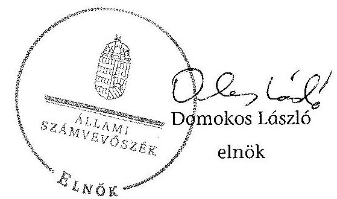
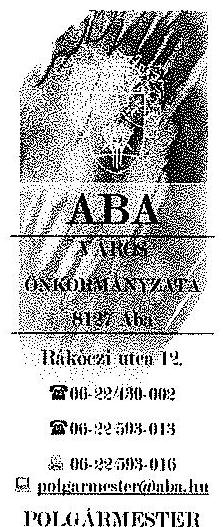
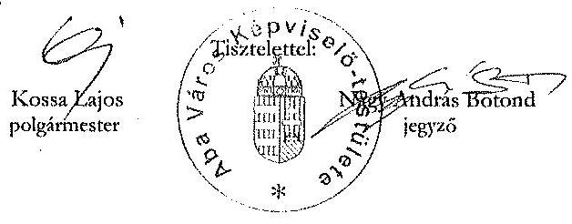
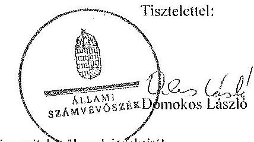
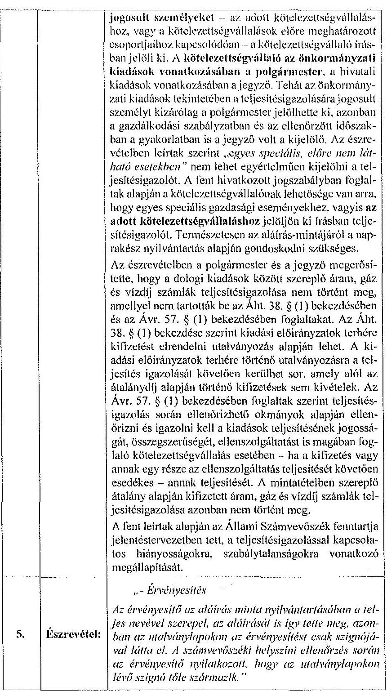
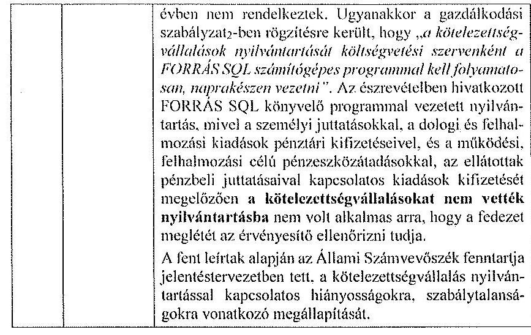
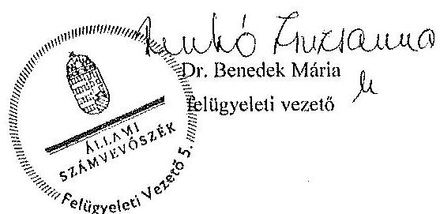

# ÁLLAMI   SZÁMVEVŐSZÉK 

## JELENTÉS

az önkormányzatok belső kontrollrendszere kialakításának, egyes
kontrolltevékenységek és a belső ellenőrzés
múködésének ellenőrzése
Aba
15052
2015. május

---

# Állami Számvevőszék 

Iktatószám: V-0659-044/2015.
Témaszám: 1693
Vizsgálat-azonosító szám: V067701

## Az ellenőrzést felügyelte:

Dr. Benedek Mária
felügyeleti vezető
Az ellenőrzést vezette és az ellenőrzés végrehajtásáért felelős:
Bíró Zsolt
ellenőrzésvezető
A számvevőszéki jelentés összeállításában közremüködött:
Buús Zoltánné Hütter Erzsébet
számvevő tanácsos
Az ellenőrzést végezték:
Buús Zoltánné Hütter Erzsébet
Bretus Zoltán János
számvevő tanácsos
számvevő

---

# TARTALOMJEGYZÉK 

BEVEZETÉS ..... 7
I. ÖSSZEGZŐ MEGÁLLAPÍTÁSOK, KÖVETKEZTETÉSEK, JAVASLATOK ..... 11
II. RÉSZLETES MEGÁLLAPÍTÁSOK ..... 14

1. Az önkormányzat belső kontrollrendszere kialakításának és múködtetésének megfelelősége ..... 14
1.1. A kontrollkörnyezet kialakítása és múködtetése ..... 14
1.2. A kockázatkezelési rendszer kialakítása és múködtetése ..... 15
1.3. A kontrolltevékenységek kialakítása és múködtetése ..... 16
1.4. Az információs és kommunikációs rendszer kialakítása és múködtetése ..... 18
1.5. A monitoring rendszer kialakítása és múködtetése ..... 18
2. A monitoring rendszer részeként a belső ellenőrzés kialakítása és múködtetése ..... 19
3. A pénzügyi folyamatokban kulcsszerepet betöltő belső kontrollok (teljesítésigazolás és érvényesítés) működése ..... 21
4. Az integritás szemlélet érvényesülése ..... 23

## MELLÉKLETEK

1. számú Észrevételt tartalmazó polgármesteri levél
2. számú Észrevételre vonatkozó elnöki válaszlevél

## FÜGGELÉKEK

1. számú Értelmező szótár
2. számú Az integritás érvényesítése érdekében kialakított és működtetett kontrollrendszer

---

.

---

# RÖVIDÍTÉSEK JEGYZÉKE 

## Törvények

Áht.
ÁSZ tv.
Info tv.

Kttv.

Ltv.

Mötv.

Nvtv.

Ötv.
Számv. tv.

Vnytv.

## Rendeletek, határozatok

Áhsz. 1

Áhsz. 2
Ávr.

Bkr.
képviselő-testületi
SZMSZ
vagyongazdálkodási rendelet
2011. évi CXCV. törvény az államháztartásról (hatályos 2012. január 1-jétől)

2011. évi LXVI. törvény az Állami Számvevőszékről
2011. évi CXII. törvény az információs önrendelkezési jogról és az információszabadságról (hatályos 2012. január 1-jétől)

2011. évi CXCIX. törvény a közszolgálati tisztviselők ről (hatályos 2012. március 1-jétől)
1995. évi LXVI. törvény a köziratokról, a közlevéltárakról és a magánlevéltári anyag védelméről (hatályos 1996. január 1-jétől)
2011. évi CLXXXIX. törvény Magyarország helyi önkormányzatairól (hatályos 2012. január 1-jétől)
2011. évi CXCVI. törvény a nemzeti vagyonról (hatályos 2011. december 31-étől)

1990. évi LXV. törvény a helyi önkormányzatokról (hatályos 2014. október 11-ig)
2000. évi C. törvény a számvitelről (hatályos 2001. január 1-jétől)
2007. évi CLII. törvény az egyes vagyonnyilatkozat-tételi kötelezettségekről (hatályos 2007. december 7-étől)

249/2000. (XII. 24.) Korm. rendelet az államháztartás szervezetei beszámolási és könyvvezetési kötelezettségének sajátosságairól (hatályos 2013. december 31-ig)
4/2013. (I. 11.) Korm. rendelet az államháztartás számviteléről (hatályos 2014. január 1-jétől)
368/2011. (XII. 31.) Korm. rendelet az államháztartásról szóló törvény végrehajtásáról (hatályos 2012. január 1jétől)
370/2011. (XII. 31.) Korm. rendelet a költségvetési szervek belső kontrollrendszeréről és belső ellenőrzéséről (hatályos 2012. január 1-jétől)
Aba Nagyközség Önkormányzata Képviselő-testületének 12/2010. (XI.15.) számú önkormányzati rendelete a Szervezeti és Müködési Szabályzatról (hatályos 2010. november 15 -étől)
Aba Nagyközség Önkormányzata Képviselő-testülete 1/2009. (II. 16.) sz. rendelete az Önkormányzati vagyontárgyak értékesítését, hasznosítását célzó eljárások helyi szabályairól (hatályos 2009. március 1-jétől)

---

## Szórövidítések

alapító okirat

ÁSZ
bizonylati rend
belső ellenőrzési kézikönyv
ellenőrzési nyomvonal
értékelési szabályzat
gazdálkodási jogkörök szabályzata ${ }_{1}$
gazdálkodási jogkörök szabályzata ${ }_{2}$
Hivatal
hivatali SZMSZ

INTOSAI
iratkezelési szabályzat

ISSAI
jegyzö
Képviselő-testület
kormányhivatal
közszolgálati szabályzat
leltározási szabályzat
munkavédelmi szabályzat
Önkormányzat
pénzkezelési szabályzat
polgármester
számlarend

Aba Város Önkormányzata Polgármesteri Hivatalának Alapító Okirata (hatályos 2013. július 1-jétől)
Állami Számvevőszék
Aba Nagyközség Önkormányzata és Intézményei bizonylati rend (hatályos 2013. július 1-jétől)
Aba Város Önkormányzata Belső Ellenőrzési Kézikönyve (hatályos 2013. augusztus 1-jétől)
Aba Nagyközség Polgármesteri Hivatalának ellenőrzési nyomvonala (hatályos 2013. július 1-jétől)
Aba Nagyközség Önkormányzata és Intézményei eszközök és források értékelési szabályzata (hatályos 2013. július 1-jétől)
Aba Nagyközség Önkormányzata 2/2007. (X.17.) Polgármesterének és Jegyzőjének közös utasítása a kötelezettségvállalás rendjéről (hatályos 2013. június 30-ig)
Aba Nagyközség Önkormányzata és Intézményei Gazdálkodási Szabályzata (hatályos 2013. július 1-jétől)
Aba Város Önkormányzatának Polgármesteri Hivatala
Aba Nagyközség Polgármesteri Hivatala Szervezeti és Müködési Szabályzata (hatályos 2007. szeptember 1jétől)
International Organization of Supreme Audit Institutions (Legfőbb Ellenőrző Intézmények Nemzetközi Szervezete)
Aba Nagyközség Önkormányzata Polgármesteri Hivatalának Iratkezelési Szabályzata (hatályos 2013. január 1jétől)
International Standards of Supreme Audit Institutions (Legfőbb Ellenőrző Intézmények Nemzetközi Standardjai
Aba Város jegyzője
Aba Város Önkormányzatának Képviselő-testülete
Fejér Megyei Kormányhivatal
Aba Nagyközség Önkormányzata jegyzőjének 1/2006. számú szabályzata Aba Nagyközség Önkormányzata Polgármesteri Hivatala köztisztviselőinek Közszolgálati Szabályzatáról (hatályos 2006. július 1-jétől)
Aba Nagyközség Önkormányzata és Intézményei leltárkészítési és leltározási szabályzat (hatályos 2013. július 1jétől)
Polgármesteri Hivatal Aba Munkavédelmi Szabályzat (hatályos 2012. március 1-jétől)
Aba Város Önkormányzata
Aba Nagyközség Önkormányzata és Intézményei Pénzkezelési szabályzata (hatályos 2013. július 1-jétől)
Aba Város Önkormányzatának polgármestere
Aba Nagyközség Önkormányzata Önkormányzati Számlarend (hatályos 2013. július 1-jétől)

---

számviteli politika
szabálytalanságok kezelésének eljárásrendje
tüzvédelmi szabályzat
ügyrend

Aba Nagyközség Önkormányzata és Intézményei Számviteli politikája (hatályos 2013. július 1-jétől)
2/2012. (XII.10.) számú jegyzői utasítás Aba Nagyközség Önkormányzata szabálytalanságok kezelésének szabályzatáról (hatályos 2012. január 1-jétől)
Abai Polgármesteri Hivatal Tüzvédelmi Szabályzat 2013. (hatályos 2013. június 7-étől)
Ügyrend Aba Nagyközség Önkormányzat Polgármesteri Hivatal gazdasági szervezetének gazdálkodással összefüggő feladataira (hatályos 2013. július 1-jétől)

---

.

---

# JELENTÉS 

## az önkormányzatok belső kontrollrendszere kialakításának, egyes kontrolltevékenységek és a belső ellenőrzés múködésének ellenőrzése Aba

## BEVEZETÉS

Aba város állandó lakosainak száma 2013. január 1-jén 4636 fő volt. A település 2013. július 15 -étől városi címet kapott. Az Önkormányzat hét tagú Képvise-lő-testületének munkáját öt állandó bizottság segítette. Az Önkormányzat az önállóan múködő és gazdálkodó Hivatalon kívül két önállóan múködő intézményt múködtetett, négy többségi tulajdoni hányadú gazdasági társasággal rendelkezett. A polgármester 1990. október 1-je óta tölti be tisztségét. A jegyző 2010. június 4-től látja el feladatait. A Hivatal két szervezeti egységre tagolódott, elkülönített gazdasági szervezettel nem rendelkezett, a foglalkoztatott köztisztviselők száma 2013. január 1-jén 13 fő volt. A Hivatalnál 2013. január 1jétől szervezeti változás nem volt. Az Önkormányzat a 2013. évi költségvetési beszámolója szerint 1644356 ezer Ft tárgyévi bevételt ért el, valamint 1654471 ezer Ft tárgyévi kiadást teljesített. A 2013. december 31-i könyvviteli mérleg szerint 8403291 ezer Ft értékű eszközvagyonnal rendelkezett, a rövid lejáratú kötelezettség állománya 1604479 ezer Ft, hosszú lejáratú kötelezettség állománya 78524 ezer Ft volt.

A demokratikus társadalmakban alapvető igény, hogy a közpénzeket, a közvagyont használók tevékenységükről elszámoljanak, ahhoz egyértelmú és érvényesíthető felelősségi szabályok társuljanak. Ennek a jogos igénynek az érvényesítéséhez meg kell teremteni azokat a folyamatokat, rendszereket, amelyek nélkülözhetetlenek az elszámoltatáshoz. Az elszámoltatás eredményes múködtetéséhez szükség van a megfelelő információs, kontroll, értékelési és beszámolási rendszerek kialakítására.

Magyarországon az uniós csatlakozási tárgyalások idejére nyúlnak vissza a belső kontrollrendszer szabályozásának gyökerei. Az uniós elvárásoknak megfelelő új terminológia szerinti államháztartási belső pénzügyi ellenőrzési (ÄBPE) rendszer területén a jogharmonizáció 2003-ban teljes körűen megvalósult, míg az önkormányzati alrendszerre vonatkozó, Ötv.-ben megjelenített speciális szabályozás 2005-ben lépett hatályba. Az államháztartási belső kontrollrendszer koncepciója 2009-ben továbbfejlődött. A változások irányát mutatja, hogy a költségvetési szervek belső kontrollrendszere már magában foglalja a korszerű felelős szervezetirányítás elemeit (kontrollkörnyezet, kockázatkezelés, kontrolltevékenység, információ és kommunikáció, monitoring) is. E kont-

---

rollrendszer szabályozása háromszintű, a törvényi előírásokat az Áht, és a Mötv, a rendeleti szintű szabályozást az Ávr. és a Bkr. tartalmazza, amelyeket útmutatói szinten az NGM által kiadott standardok és kézikönyvek támogatnak.

A belső kontrollrendszer azt a célt szolgálja, hogy a költségvetési szervek múködésük és gazdálkodásuk során a tevékenységeket szabályszerűen, gazdaságosan, hatékonyan, eredményesen hajtsák végre, teljesítsék elszámolási kötelezettségeiket és megvédjék az erőforrásokat a veszteségektől, a károktól és a nem rendeltetésszerű használattól. A belső kontrollrendszer magában foglalja mindazon szabályokat, eljárásokat, gyakorlati módszereket és szervezeti struktúrákat, kockázatkezelési technikákat, kontrolltevékenységeket, amelyek segítséget nyújtanak a szervezetnek céljai eléréséhez.

Az ÁSZ középtávú stratégiájában hangsúlyos szerepet szánt annak, hogy szilárd szakmai alapon álló, értékteremtő ellenőrzéseivel előmozdítsa a közpénzügyek átláthatóságát, rendezettségét. A számvevőszéki ellenőrzés nemzetközi alapelvei is rögzítik, hogy a megfelelő belső kontrollrendszer minimálisra csökkenti a hibák és szabálytalanságok kockázatát.

Az ellenőrzés célja annak értékelése, hogy

- a jogszabályi előírásoknak megfelelően alakították-e ki és működtették-e a belső kontrollrendszert;
- a gazdálkodás folyamatában kulcsszerepet betöltő teljesítésigazolás és érvényesítés kontrolltevékenységeit megfelelően működtették-e;
- biztosították-e a belső ellenőrzés szabályos működését;
- kialakították-e az erőforrásokkal való szabályszerű és hatékony gazdálkodáshoz szükséges követelményeket, megvalósították-e azok számonkérését, ellenőrzését;
- hasznosították-e az ÁSZ által a 2009-2013. évek között végzett ellenőrzések javaslatait.

A közintézmények integritás alapú kultúrájának kialakítása, megerősítése és múködése szorosan összefügg a belső kontrollrendszer múködésével, ezért az ellenőrzés kitért a gazdálkodáshoz kapcsolódó integritás kontrollok meglétének és múködésének ellenőrzésére is. Az integritási kultúra kialakítása hozzájárul az elszámoltathatóság és átláthatóság érvényesítéséhez, egyben támogatja a szervezet védettségét a korrupciós kitettséggel szemben, valamint annak megelőzése is irányítottabbá válik.

Az ellenőrzés várható hasznosulását négy szinten tervezzük. A törvényalkotás számára összegzett tapasztalatok állnak rendelkezésre a belső kontrollrendszer önkormányzati területen való kialakításáról, múködéséről és hatásairól, a belső ellenőrzés múködéséről. Az ellenőrzés az ellenőrzött számára visszajelzést ad a belső kontrollrendszer kialakításában és múködésében fellépő hiányosságokról, javaslataival hozzájárul azok kiküszöböléséhez, amely csökkentheti a későbbi ellenőrzések gyakoriságát. Az ellenőrzés megállapításait és javaslatait más szervezetek is hasznosíthatják a rendezett gazdálkodási keretek

---

kialakításához. A társadalom számára jelzi, hogy közpénz nem maradhat ellenőrizetlenül, az ÁSZ értékteremtő rend kialakításához és megőrzéséhez hozzájáruló tevékenysége pozitív hatással lesz a szervezetről kialakított összkép formálásában. A szervezeten belül lehetőség nyílik arra, hogy a megállapítások szintetizálásával az ÁSZ a hozzáadott értéket teremtő elemző tevékenységét és tanácsadó szerepét is erősítse.

Az önkormányzatok belső kontrollrendszere kialakításának, egyes kontrolltevékenységek és a belső ellenőrzés működésének ellenőrzéséről szóló jelentés I. fejezetének összegző része az ellenőrzés céljára ad rövid, szintetizáló összefoglalót, és tartalmazza a következtetéseket a II. fejezet részletes megállapításain alapulóan. A jelentés intézkedést igénylő megállapításait és javaslatait az ellenőrzés során feltárt, a jelentés II. fejezetében rögzített részletes megállapítások alapozzák meg.

# Az ellenőrzés típusa: szabályszerűségi ellenőrzés 

Az ellenőrzött időszak: a belső kontrollrendszer kialakítása és működtetése megfelelőségét a 2013. évre vonatkozóan (2013. december 31-i állapotnak megfelelően), a pénzügyi folyamatokban kulcsszerepet betöltő teljesítésigazolás és érvényesítés belső kontrollok müködésének megfelelőségét, és a belső ellenőrzés szabályszerű működését a 2013. január 1. - december 31-e közötti időszakot figyelembe véve értékeltük, míg az ÁSZ javaslatainak utóellenőrzése a 2009-2013. években végzett ellenőrzések nyilvánosságra hozott jelentéseiben tett javaslatok áttekintésére terjedt ki.

## Az ellenőrzött szervezet: az Önkormányzat

Az ellenőrzés jogszabályi alapját az ÁSZ tv. 1. § (3) bekezdése, az 5. § (2) és (6) bekezdései, valamint az Áht. 61. § (2) bekezdése képezik.

Az ellenőrzés szakmai módszertana az ÁSZ hivatalos honlapján (www.asz.hu) közzétett szakmai szabályokon alapult, amely az INTOSAI által kiadott ISSAI figyelembevételével készült.

Az ellenőrzés lefolytatásához az Önkormányzat a kimutatások és a tanúsítvány elektronikus kitöltésével, valamint az ÁSZ által kért dokumentumok elektronikus megküldésével szolgáltatott adatokat. Az így rendelkezésre bocsátott adatok, információk kontrollja és a munkalapok kitöltése a helyszíni ellenőrzés keretében történt. A jelentésben használt fogalmak magyarázatát az 1. számú függelék, az integritás érvényesítése érdekében kialakított és müködtetett intézményi kontrollrendszer értékelését a 2. számú függelék tartalmazza.

A belső kontrollrendszer, valamint a belső ellenőrzés jogszabályi előírások szerinti kialakításának és müködtetésének szabályszerűségét az erre irányuló ellenőrzési kérdésekre adott válaszok összesítése alapján értékeltük. A belső kontrollrendszert kontrollterületenként (kontrollkörnyezet, kockázatkezelési rendszer, kontrolltevékenységek, információs és kommunikációs rendszer, monitoring rendszer) és összesítetten is értékeltük.

A belső kontrollrendszer egyes kontrollterületei és a belső ellenőrzés kialakítása és müködtetése „szabályszerü volt", amennyiben az értékelt területen az elért és

---

elérhető pontok százalékban kifejezett hányadosa elérte a $81 \%$-ot, „részben szabályszerü volt", ha 61-80\% közé esett, és „nem volt szabályszerü", ha nem haladta meg a $60 \%$-ot. A belső kontrollrendszer összesített értékelése megegyezett a kontrollterületenként alkalmazott \%-os értékelésekkel, a következő eltérésekkel. A kontrollrendszer egésze esetében a „szabályszerü" értékelésnek a \%-os értéken felül további feltétele volt, hogy egyik kontrollterület sem kaphatott „nem volt szabályszerű" értékelést, a „részben szabályszerü" értékelés további feltétele volt, hogy legfeljebb egy ellenőrzött kontrollterület lehetett „nem volt szabályszerü" értékelésü. Az összesített értékelés a \%-os értéktől függetlenül „nem volt szabályszerű", ha az ellenőrzött kontrollterületek közül több mint egynek „nem volt szabályszerű" az értékelése.

A gazdálkodás folyamatában kulcsszerepet betöltő két kulcskontroll - teljesítésigazolás, érvényesítés - múködésének megfelelőségét a személyi juttatásokkal, a dologi és felhalmozási kiadásokkal, múködési és felhalmozási célú pénzeszközátadásokkal, ellátottak pénzbeli juttatásaival kapcsolatos kifizetések esetében mintavétellel ellenőriztük. „Megfelelőnek" értékeltük a gazdálkodási jogkörök gyakorlását, amennyiben $95 \%$-os bizonyossággal a teljes sokaságban a hibaarány legfeljebb $10 \%$, „részben megfelelőnek" értékeltük, ha a hibaarány felső határa 10-30\% között volt, „nem megfelelőnek" pedig akkor, ha a mintavételi eredmények alapján a sokaságbeli hibaarány felső határa meghaladta a 30\%ot.

Az integritás szemlélet érvényesülésének értékelése az Önkormányzat önbevallás által kitöltött tanúsítványa alapján történt. A 2009-2013. közötti időszakban egy ÁSZ ellenőrzés volt az Önkormányzatnál (az 1126 számú számvevőszéki jelentés a háziorvosi ellátás múködéséről és pénzügyi feltételrendszeréről). A nyilvánosságra hozott jelentés az Önkormányzat számára konkrét feladatot nem határozott meg, javaslatot nem tett, ezért utóellenőrzésre nem került sor.

A településen a 2009-2013. közötti időszakban nemzetiségi önkormányzat nem múködött.

Az Ász tv. 29. § (1) bekezdése szerint a jelentéstervezetet megküldtük a polgármester részére, aki az ÁSZ tv. 29. § (2) bekezdésében foglalt észrevételezési jogával élt, a jelentéstervezetre észrevételt tett (1. számú melléklet). Az ÁSZ tv. 29. § (3) bekezdésében előírtaknak megfelelően a figyelembe nem vett észrevételeket és annak indokairól szóló tájékoztatást a jelentés tartalmazza (2. számú melléklet).

---

# 1. ÖSSZEGZŐ MEGÁLLAPÍTÁSOK, KÖVETKEZTETÉSEK, JAVASLATOK 

A belső kontrollrendszeren belül 2013-ban a kontrollkörnyezet, a kockázatkezelési rendszer, a kontrolltevékenységek, az információs és kommunikációs rendszer, valamint a monitoring rendszer kialakítását és múködtetését külön-külön és együttesen is értékeltük. A belső kontrollrendszer kialakítása és múködtetése az összesített értékelés alapján nem volt szabályszerű.

A belső kontrollrendszer egyes területei kialakításának és működtetésének minősítése a következő:

| Kontrollterület | Minősítés |
| :-- | :-- |
| Kontrollkörnyezet | részben sza- |
|  | bályszerü |
| Kockázatkezelési rendszer | részben sza- |
|  | bályszerü |
| Kontrolltevékenységek | részben sza- |
|  | bályszerü |
| Információs és kommunikációs | nem sza- |
| rendszer | bályszerü |
| Monitoring rendszer | nem sza- |
|  | bályszerü |

Részben szabályszerúnek értékeltük a kontrollkörnyezet, a kockázatkezelési rendszer és a kontrolltevékenységek kialakítását és múködtetését, mivel a megállapított szabályozásbeli hiányosságok nem veszélyeztették e kontrollterületeken a szabályszerű működést.

Nem volt szabályszerú az információs és kommunikációs rendszer, valamint a monitoring rendszer kialakítása és múködtetése, mivel az ellenőrzésünk során megállapított szabályozásbeli hiányosságok magukban hordozzák a szabálytalan múködés, valamint a korrupció kockázatát.

Az Önkormányzat a belső ellenőrzési feladatokat 2013. július 11-étől külső szolgáltatóval látta el. A 2013. évben a belső ellenőrzés kialakítása és múködtetése nem volt szabályszerü, mivel a számvevőszéki ellenőrzés által megállapított szabályozási és múködési hiányosságok számossága magában hordozza a szabálytalan önkormányzati gazdálkodás és feladatellátás kockázatát.

A 2013. évben a személyi juttatásokkal, a dologi kiadásokkal, a felhalmozási kiadásokkal, a múködési és felhalmozási célú pénzeszközátadásokkal, illetve az ellátottak pénzbeli juttatásaival kapcsolatos kifizetések során a kulcsszerepet betöltő teljesítésigazolás és érvényesítés belső kontrollok múködése nem volt megfelelő, mivel azok nem biztosították a hibák megelőzését, feltárását.

---

A számvevőszéki ellenőrzés az ellenőrzött kifizetésekkel összefüggésben a rendelkezésre bocsátott dokumentumok alapján kár bekövetkeztére utaló adatot, tényt nem állapított meg, azonban a gazdálkodásban kulcsszerepet betöltő kontrollok müködésében feltárt hiányosságok, szabálytalanságok miatt fennáll a hibák bekövetkezésének kockázata. A nem megfelelően működtetett belső kontrollok korrupciós kockázatot hordoznak.

A Képviselő-testület a 2013. évben nem alakította ki az erőforrásokkal való szabályszerű és hatékony gazdálkodáshoz szükséges követelményeket.

Az Önkormányzat intézkedéseket tett az integritási szemlélet fejlesztésére, valamint a korrupciós kockázatok csökkentésére, a 2013. évben a Hivatal önként részt vett az ÁSZ integritási felmérésében.

Az ÁSZ tv. 33. § (1) bekezdésében foglaltak értelmében az ellenőrzött szervezet vezetője köteles a jelentésben foglalt megállapításokhoz kapcsolódó intézkedési tervet összeállítani, és azt a jelentés kézhezvételétől számított 30 napon belül az ÁSZ részére megküldeni. Amennyiben az intézkedési tervet határidőre nem küldi meg a szervezet, vagy az ÁSZ tv. 33. § (2) bekezdésében foglalt póthatáridő elteltével megküldött intézkedési terv továbbra sem elfogadható, az ÁSZ elnöke a hivatkozott törvény 33. § (3) bekezdés a)-b) pontjaiban foglaltakat érvényesítheti.

Az ellenőrzés intézkedést igénylő megállapításai és javaslatai:

# a polgármesternek 

1. Az Önkormányzat kiadási előirányzataira vonatkozóan - az Ávr. 57. § (4) bekezdésében foglaltak ellenére -a teljesítésigazolására jogosult személyt 2013. június 30 -ig a kötelezettségvállaló írásban nem jelölte ki, azt követően 2013. július 1-jétől nem a kötelezettségvállaló jelölte ki.

Javaslat:
Intézkedjen annak érdekében, hogy az Önkormányzat kiadási előirányzataira vonatkozóan a teljesítésigazoló kijelölése az Ávr. 57. § (4) bekezdésében foglaltaknak megfelelően történjen.
2. Az Önkormányzat kiadási előirányzata terhére történt kötelezettségvállalást - az Áht. 37. § (1) bekezdésében foglaltak ellenére - nem foglalták írásba.

Javaslat:
Intézkedjen annak érdekében, hogy az Önkormányzat nevében történő kötelezettségvállalásra az Áht. 37. § (1) bekezdésében foglaltaknak megfelelően - az Ávr. 53. §-ában meghatározott kivételekkel - kizárólag pénzügyi ellenjegyzés után, a pénzügyi teljesítés esedékességét megelőzően, írásban kerüljön sor.
3. A számvevőszéki jelentés ellenőrzési megállapításai alapján az Önkormányzatnál a belső kontrollrendszer kialakítása és működtetése összesített értékelés alapján nem volt szabályszerű, a kulcskontrollok működése nem volt megfelelő.

---

Javaslat:
Kísérje figyelemmel a Mötv. 115. § (1) bekezdésében foglaltak alapján az Önkormányzat gazdálkodásának szabályszerűségét. A Mötv. 67. § f) pontja alapján gondoskodjon a belső kontrollrendszer müködésére vonatkozó jogszabályi rendelkezések be nem tartása, valamint a teljesítésigazolás, illetve az érvényesítés kontrollokkal öszszefüggésben feltárt hiányosságok, szabálytalanságok tekintetében az esetleges munkajogi felelősséggel kapcsolatos körülmények kivizsgálásáról, majd a vizsgálat eredményének függvényében tegye meg a szükséges intézkedéseket.

# a jegyzőnek 

1. A számvevőszéki jelentés ellenőrzési megállapításai alapján az Önkormányzatnál a belső kontrollrendszer kialakítása és müködtetése az összesített értékelés alapján nem volt szabályszerű, a kulcskontrollok müködtetése nem volt megfelelő, valamint a belső ellenőrzés kialakítása és müködtetése nem volt szabályszerű. A számvevőszéki ellenőrzés során feltárt hibákat, hiányosságokat és szabálytalanságokat a számvevőszéki jelentés II. Részletes megállapítások fejezetcím tartalmazza.

Javaslat:
A jogszabályoknak megfelelő belső kontrollrendszer kialakítása és működtetése érdekében - az ellenőrzött időszak óta bekövetkezett esetleges jogszabályi változásokra figyelemmel - intézkedjen a belső kontrollrendszer kialakításában és müködtetésében, a kulcskontrollok, illetve a belső ellenőrzés működtetésében az ellenőrzés által feltárt hibák, hiányosságok, szabálytalanságok kijavítására.

Kezdeményezze, hogy az éves ellenőrzési terv kiterjedjen a kifizetések szabályszerűségi ellenőrzésére, különös tekintettel a személyi juttatásokkal, a dologi kiadásokkal, a felhalmozási kiadásokkal, a müködési és felhalmozási célú pénzeszköz átadásokkal, az ellátottak pénzbeli juttatásaival kapcsolatos kiadási jogcímekből teljesített kifizetésekre.

---

# II. RÉSZLETES MEGÁLLAPÍTÁSOK 

## 1. Az önkORMÁNYZAT BELSŐ KONTROLLRENDSZERE KIALAKÍTÁSÁNAK ÉS MÜKÖDTETÉSÉNEK MEGFELELŐSÉGE

A belső kontrollrendszeren belül 2013-ban a kontrollkörnyezet, a kockázatkezelési rendszer, a kontrolltevékenységek, az információs és kommunikációs rendszer, valamint a monitoring rendszer kialakítását és múködtetését külön-külön és együttesen is értékeltük. A belső kontrollrendszer kialakítása és múködtetése az összesített értékelés alapján nem volt szabályszerű.

### 1.1. A kontrollkörnyezet kialakítása és múködtetése

## A kontrollkörnyezet kialakítása és múködtetése részben szabályszerű volt.

Az alapító okirat a jogszabályi előírásoknak megfelelően tartalmazta az alaptevékenységek felsorolását. Az Önkormányzat Képviselő-testülete megalkotta szervezeti és múködési szabályzatát. A jegyző a jogszabályi előírásoknak megfelelően kialakította a Hivatal számviteli politikáját, bizonylati rendjét, elkészítette a pénzkezelési-, a leltározási-, értékelési szabályzatát, a számlarendet. A munkavédelmi szabályzatban meghatározták az egészséget nem veszélyeztető és biztonságos munkavégzés követelményei megvalósításának módját. Rendelkeztek a jogszabályi előírásoknak megfelelő tűzvédelmi szabályzattal, illetve a szabálytalanságok kezelésének eljárásrendjével.

A gazdasági szervezettel nem rendelkező Hivatalban a jegyző által írásban kijelölt személy az előírt végzettséggel, szakképesítéssel és a könyvviteli szolgáltatás körébe tartozó tevékenység ellátására jogosító engedéllyel rendelkezett. A jegyző elkészítette a Hivatalban dolgozó köztisztviselők munkaköri leírását. A Hivatal rendelkezett ellenőrzési nyomvonallal, amelynek aktualizálásáról a jegyző gondoskodott. A Képviselő-testület a 2013. évi költségvetési rendeletében meghatározta a Hivatal engedélyezett létszámát, a jegyző elkészítette a Hivatalban dolgozó köztisztviselők teljesítményértékelését, meghatározta a köztisztviselők teljesítményértékelésének második félévre vonatkozó kötelező elemeit.

A kontrollkörnyezet kialakítása és múködtetése az alábbi kisebb hiányosságok mellett részben szabályszerű volt:

| Sorszám ${ }^{1}$ | Megállapítás | Megjegyzés |
| :--: | :--: | :--: |
| 3. | A Képviselő-testület az Önkormányzat 20112014. évekre vonatkozó gazdasági program- | A Képviselő-testület a gazdasági programot 2011. |

[^0]
[^0]:    ${ }^{1}$ A megállapítások számozása az Önkormányzat által az adatszolgáltatás során kitöltött kimutatások kérdéseinek sorszámával azonos.

---

|  | ját - az Mötv. 116 § (5) bekezdésében foglalt - határidőn túl fogadta el. | június 7 -én fogadta el, mert a jegyző a Képviselő-testület alakuló ülését követő hat hónapon belül nem készítette elő. |
| :--: | :--: | :--: |
| 4. | A jegyző - az Áht. 9. § (1) bekezdés a) pontjában foglaltak ellenére - nem kezdeményezte a hivatali SZMSZ képviselő-testületi jóváhagyását. |  |
| 13. | A jegyző - a Mötv. 81. § (3) bekezdés c) pontjában előírt feladata ellenére - nem készítette elő a vagyongazdálkodási rendelet módosítását, így az Önkormányzat vagyongazdálkodási rendelete nem felelt meg az Nvtv. 18. § (1) bekezdése előírásának. |  |
| 21. | A jegyző - az Áhsz. ${ }_{1}$ 37. § (7) bekezdésében foglaltak ellenére - a leltározási szabályzatban képviselő-testületi döntés hiányában írta elő a mérlegben kimutatott eszközök kétévenkénti leltározási kötelezettségét. | 2014. január 1-jétől az Áhsz. ${ }_{2}$ 22. §-ában előírtak alapján a leltározásra a Számv. tv. 69. §-ában foglalt rendelkezéseit kell alkalmazni. |
| 37. | A jegyző a munkaköri leírásokban - a Kttv. 75. § (1) bekezdés d) pontjában foglaltak ellenére - nem rögzítette a munkakör betöltésével kapcsolatos követelményeket. |  |
| 40. | A Képviselő-testület - az Áht. 9. § (1) bekezdés f) pontjában foglaltak ellenére - az erőforrásokkal való, szabályszerű és hatékony gazdálkodáshoz szükséges követelményeket nem alakította ki. |  |
| 46. | A jegyző - az Mötv. 81. § (3) bekezdés c) pontjában előírt feladata ellenére - nem dolgozta ki a Kttv. 83. §-ában előírt, a köztisztviselökre vonatkozó hivatásetikai alapelvek részletes tartalmát, valamint az etikai eljárás szabályait. |  |

# 1.2. A kockázatkezelési rendszer kialakítása és müködtetése 

## A kockázatkezelési rendszer kialakítása és müködtetése részben szabályszerű volt.

A jegyző kialakította a Hivatal kockázatkezelési rendszerét, amely tartalmazta a kockázatok azonosításával, elemzésével, csoportosításával, nyomon követésével, illetve a kockázati kitettség csökkentésével kapcsolatos szabályokat, felmérte és megállapította a gazdálkodásában rejlő kockázatokat és meghatározta a kockázatok kezelése érdekében szükséges intézkedések teljesítésének folyamatos nyomon követési módját.

---

A kockázatkezelési rendszer kialakítása és múködtetése az alábbi kisebb hiányosságok mellett részben szabályszerű volt:

| Sor-   szám | Megállapítás | Megjegyzés |
| :--: | :--: | :--: |
| 3. | A jegyző - a Bkr. 7. § (2) bekezdésében foglaltak ellenére - az egyes kockázatokkal kapcsolatban szükséges intézkedéseket nem határozta meg. |  |
| 5. | A jegyző - Vnytv. 4. § a) és d) pontjaiban foglaltak ellenére - a vagyonnyilatkozattételre kötelezett köztisztviselők, továbbá a Képviselő-testület bizottságai nem helyi ön-kormányzati képviselő tagjai vagyonnyilat-kozat-tételi kötelezettségét a hivatali SZMSZben, valamint a képviselő-testületi SZMSZben nem tüntette fel. | A vagyonnyilatkozat-tételre kötelezettek a 2013. évben esedékes vagyonnyilatko-zat-tételi kötelezettségüknek eleget tettek. |

# 1.3. A kontrolltevékenységek kialakítása és múködtetése 

## A kontrolltevékenységek kialakítása és múködtetése részben szabályszerü volt.

A jegyző az ellenőrzési nyomvonalban, ügyrendben előírta a folyamatba épített, előzetes, utólagos és vezetői ellenőrzést a költségvetés tervezése, a beszerzések lebonyolítása, a vagyonhasznosítási tevékenység, a támogatások elszámolása vonatkozásában.

A jegyző és a polgármester a gazdálkodási jogkörök szabályzat ${ }_{2}$-ben meghatározta a kötelezettségvállalás pénzügyi ellenjegyzése, a teljesítésigazolás, az érvényesítés, valamint az utalványozás gyakorlásának módjával, eljárási és dokumentációs részletszabályaival, valamint az ezeket végző személyek kijelölésének rendjével kapcsolatos belső előírásokat, feltételeket.

A jegyző az Informatikai Biztonsági Szabályzatban és az iratkezelési szabályzatban előírta az adatok védelmét, meghatározta az üzemeltetés és az adatbiztonság feladatait, az ehhez kapcsolódó hatásköröket.

Az ügyrendben a jegyző meghatározta az időközi és éves beszámolók elkészítésének feladatait, a beszámolási eljárásokhoz kapcsolódó felelősségi köröket. A költségvetési beszámoló elkészítésével megbízott személy rendelkezett a jogszabályban előírt képesítéssel és a tevékenység ellátására jogosító engedéllyel. A hivatali SZMSZ-ben meghatározta a gazdasági feladatot ellátó vezetők és a gazdasági feladatot ellátó alkalmazottak helyettesítésének rendjét, a közszolgálati szabályzatban szabályozta a közszolgálati jogviszony megszűnése, illetve a munkakör változása esetére a munkakör átadásának rendjét.

---

A kontrolltevékenységek kialakítása és müködtetése az alábbi kisebb hiányosságok mellett részben szabályszerű volt:

| Sorszám | Megállapítás | Megjegyzés |
| :--: | :--: | :--: |
| 6. | A jegyző a gazdálkodási jogkörök szabály-$z a t_{1,2}$-ben lehetővé tette a 100 ezer Ft alatti kifizetések előzetes írásbeli kötelezettségvállalás nélküli teljesítését, azonban - az Ávr. 53. § (2) bekezdésben foglaltak ellenére - belső szabályzatban nem határozta meg az előzetes írásbeli kötelezettségvállalást nem igénylő kifizetések rendjét. |  |
| 7. | A jegyző - az Ávr. 13. § (2) bekezdésének a) pontjában foglaltak ellenére - a gazdálkodási jogkörök szabályzat ${ }_{1}$-ben 2013. június 30 -ig nem határozta meg a teljesítésigazolás gyakorlásának módjával, eljárási és dokumentációs részletszabályaival kapcsolatos belső előírásokat. | A jegyző a gazdálkodási jogkörök szabályzat ${ }_{2}$-ben 2013. július 1-jétől meghatározta a teljesítésigazolás gyakorlásának módjával, eljárási és dokumentációs részletszabályaival kapcsolatos belső előírásokat. |
| 8. | A kötelezettségvállaló - az Ávr. 57. § (4) bekezdésében foglaltak ellenére - 2013. június 30 -ig a teljesítésigazolásra jogosult személyeket írásban nem jelölte ki az Önkormányzat és a Hivatal kiadási előirányzataira vonatkozóan. | Az Önkormányzat kiadási előirányzataira vonatkozóan 2013. július 1-jétől a teljesítésigazolót a jegyző jelölte ki. |
|  | A gazdálkodási jogkörök szabályzat ${ }_{2}$-ben 2013. július 1-jétől az Önkormányzat kiadási előirányzataira vonatkozóan a teljesítésigazolására jogosult személyt - az Ávr. 57. § (4) bekezdésében foglaltak ellenére - nem a kötelezettségvállaló jelölte ki. | Az Önkormányzat kiadási előirányzataira vonatkozóan 2013. július 1-jétől a teljesítésigazolót a jegyző jelölte ki. |
| 15. | A jegyző - a Bkr. 8. § (4) bekezdés b) pontjában foglaltak ellenére - belső szabályzatban nem határozta meg a dokumentumokhoz és információkhoz való hozzáférésre vonatkozóan a felelősségi köröket. |  |
| 21. | A polgármester - az Áht. 87. § (1) bekezdésében foglalt előírás ellenére - a Képviselőtestületet a jogszabályban előírt határidőt túllépve tájékoztatta az Önkormányzat gazdálkodásának első félévi helyzetéről. | A polgármester az Önkormányzat gazdálkodásának első félévi helyzetéről 2013. szeptember 20-án tájékoztatta a Képviselő-testületet.   Az Áht. 87. §. (1) bekezdése 2014. szeptember 30-tól hatályát vesztette. |

---

| 24. | A jegyző - Ávr. 55. § (2) bekezdés f) pontjában foglaltak ellenére - a kötelezettségvállalás pénzügyi ellenjegyzésére írásban nem jelölt ki a Hivatal állományába tartozó köztisztviselőt. |  |
| :--: | :--: | :--: |
| 28. | A jegyző 2013. június 30-ig - az Ávr. 58. § (4) bekezdésében foglaltakat ellenére - írásban nem jelölt ki érvényesítési feladatra a Hivatal állományába tartozó köztisztviselőt. | A jegyző a gazdálkodási jogkörök szabályzat ${ }_{2}$-ben 2013. július 1-jétől kijelölt a Hivatal állományába tartozó köztisztviselőt érvényesítői feladatra, aki rendelkezett a jogszabályban előírt végzettséggel, illetve pénzügyi-számviteli képesítéssel. |

# 1.4. Az információs és kommunikációs rendszer kialakítása és müködtetése 

Az információs és kommunikációs rendszer kialakítása és müködtetése nem volt szabályszerü, mert:

| Sorszám | Megállapítás |
| :--: | :--: |
| $1-3$. | A jegyző a - Bkr. 3. § d) pontjában és a 9. § (1) bekezdésében foglaltak ellenére - nem alakított ki olyan rendszert, amely biztosítja, hogy a megfelelő információk a megfelelő időben eljussanak az illetékes szervezethez, szervezeti egységhez, személyhez. |
| 4. | A jegyző - az Info tv. 24. § (3) bekezdésében foglaltak ellenére - nem készítette el a Hivatal adatvédelmi és adatbiztonsági szabályzatát. |
| 5. | A jegyző - az Info tv. 35. § (3) bekezdésében és az Ávr. 13. § (2) bekezdés h) pontjában foglalt előírás ellenére - a kötelezően közzéteendő adatok nyilvánosságra hozatalának rendjét belső szabályzatban nem határozta meg. |
| 7. | A jegyző - az Info tv. 30. § (6) bekezdésében és az Ávr. 13. § (2) bekezdés h) pontjában foglalt előírások ellenére - nem szabályozta a közérdekú adatok megismerésére irányuló igények teljesítésének rendjét. |
| 8. | A jegyző - az Ltv. 10. § (1) bekezdés c) pontjának előírása ellenére - a Hivatal egyedi iratkezelési szabályzatát nem a Magyar Nemzeti Levéltár és a kormányhivatal egyetértésével adta ki. |

### 1.5. A monitoring rendszer kialakítása és müködtetése

A monitoring rendszer kialakítása és müködtetése nem volt szabályszerű, mert:

| Sorszám | Megállapítás |
| :--: | :--: |
| 1. | A jegyző - a Bkr. 3. § e) pontjában és 10. §-ában foglaltak ellenére - nem alakította ki a Hivatal tevékenységének, a célok megvalósitásának nyomon követését biztosító rendszerét. |

---

A jegyző - a Bkr. 11. § (1) bekezdésében foglalt kötelezettsége ellenére - a Bkr. 1. mellékletében foglalt nyilatkozatban a 2013. évre vonatkozóan nem értékelte a Hivatal belső kontrollrendszerének minőségét.

Az Önkormányzatnál a helyi önkormányzatok törvényességi felügyeletét ellátó kormányhivatal törvényességi felhívással vagy más törvényességi felügyeleti eszközzel 2013-ban nem élt.

# 2. A MONITORING RENDSZER RÉSZEKÉNT A BELSŐ ELLENŐRZÉS KIALAKÍTÁSA ÉS MÜKÖDTETÉSE 

Az Önkormányzatnál a belső ellenőrzési feladatokat - képviselő-testületi döntés alapján - külső szolgáltató látta el. Az Önkormányzatnál a belső ellenőrzés kialakítása és müködése nem volt szabályszerű, mert:

| Sorszám | Megállapítás | Megjegyzés |
| :--: | :--: | :--: |
| 1. | A jegyző a belső ellenőrzés kialakításáról az Áht. 70. § (1) bekezdésében, valamint a Bkr. 15. § (1) és (7) bekezdéseiben előírtak ellenére - 2013. január 1 és július 11 közötti időszakban nem gondoskodott, mivel nem biztosította a belső ellenőrzési tevékenység ellátásának személyi feltételeit. Továbbá Bkr. 15. § (2) bekezdésében előírtak ellenőre nem gondoskodott a belső ellenőrzés jogállásának, feladatainak a hivatali SZMSZ-ben való előírásáról. | A jegyző a Képviselő-testület határozata értelmében a belső ellenőrzés müködését polgári jogi - megbízási - szerződés keretében foglalkoztatott belső ellenőr révén biztosította. A szerződéskötés időpontja: 2013. július 11. |
| 2. | A belső ellenőrök funkcionális függetlenségét - a Bkr. 19. § (1) bekezdés a) pontjában foglaltak ellenére - nem biztosították az éves ellenőrzési terv kidolgozása tekintetében. | A 2013. és a 2014. évi ellenőrzési tervet a jegyző készítette el. |
| $3-4$. | Az Önkormányzat belső ellenőrzési kézikönyvét - a Bkr. 17. § (1) bekezdésében, a 22. § (1) bekezdés a) pontjában foglaltak ellenére - a jegyző készítette el. |  |
| 5. | A belső ellenőrzés külső szolgáltatóval történő ellátása során - a Bkr. 16. § (4) bekezdésében foglalt előírás ellenére - a belső ellenőrzési tevékenység megszervezésére vonatkozó írásbeli megállapodásban nem rendelkeztek a Bkr. 22. § (1)-(2) bekezdéseiben foglalt belső ellenőrzési vezetői feladatok és kötelességek ellátásának módjáról. |  |
| 7. | A belső ellenőrzési vezető stratégiai ellenőrzési tervet - a Bkr. 22. § (1) bekezdés b) pontja, 29. § (1) bekezdésében és a 30. § (1) bekezdésében foglaltak ellenére - nem készített. |  |

---

| 8. a)   b) e)   f) | A 2014. évi ellenőrzési terv - a Bkr. 31. § (4) bekezdés a), b), e), f) pontjaiban foglaltak ellenére - nem tartalmazta az ellenőrzési tervet megalapozó elemzések és a kockázatelemzés eredményének összefoglaló bemutatását, a tervezett ellenőrzések tárgyát, a rendelkezésre álló és a szükséges ellenőrzési kapacitás meghatározását, az ellenőrzések típusát. |  |
| :--: | :--: | :--: |
| 9. | A Képviselö-testület - az Mötv. 119. § (5) bekezdés, és a Bkr. 32. § (4) bekezdéseiben foglaltak ellenére - a 2014. évi ellenőrzési tervet határidőn túl, 2014. május 21 -én hagyta jóvá. | A 2014. évi ellenőrzési tervet a jegyző a jogszabályban előírt határidőn túl terjesztette a Képviselő-testület elé. |
| 11. | A 2014. évi ellenőrzési tervet - a Bkr. 29. § (1) bekezdésében és a 31. § (2) bekezdésében foglaltak ellenére - kockázatelemzés nem alapozta meg. | A 2014. évi ellenőrzési terv megalapozásához kockázatelemzés nem készült. |
| 17. | A 2013. évben végrehajtott egy ellenőrzéshez - a Bkr. 33. § (2) bekezdésében foglalt előirás ellenére - nem készítettek ellenőrzési programot. |  |
| 19. e) | Az elvégzett ellenőrzésről készített jelentés - a Bkr. 39. § (3) bekezdés i) pontjában foglaltak ellenére - nem tartalmazta az alkalmazott ellenőrzési módszereket és eljárásokat. |  |
| 22. | A belső ellenőrzés javaslatainak végrehajtása érdekében - a Bkr. 28. § c) pontjában és a 45. § (1)-(4) bekezdéseiben foglaltak ellenére - az ellenőrzött szervezeti egység vezetője nem készített intézkedési tervet. |  |
| 23.,   24. | A belső ellenőrzési vezető - a Bkr. 22. § (2) bekezdés e) pontjában, a Bkr. 21. § (2) bekezdés d) pontjában, a 47. § (1) bekezdésében és az 50. §-ban foglalt előírás ellenére - az elvégzett ellenőrzésről, valamint a belső ellenőrzési jelentésben tett megállapításokról, javaslatokról, a vonatkozó intézkedési tervekről és annak végrehajtásának nyomon követéséről nyilvántartást nem vezetett. |  |
| 25. | A belső ellenőrzési vezető - a Bkr. 22. § (1) bekezdés g) pontjában, 49. § (1) bekezdésében foglaltak ellenére - a 2012. évre vonatkozó éves (összefoglaló) ellenőrzési jelentést nem készítette el. |  |

---

# 3. A PÉNZÜGYI FOLYAMATOKBAN KULCSSZEREPET BETÖLTŐ BELSŐ KONTROLLOK (TELJESÍTÉSIGAZOLÁS ÉS ÉRVÉNYESÍTÉS) MŰKÖDÉSE 

A 2013. évben a személyi juttatásokkal, dologi kiadásokkal, felhalmozási kiadásokkal, múködési és felhalmozási célú pénzeszközátadásokkal, ellátottak pénzbeli juttatásaival kapcsolatos kifizetések során - összefoglalóan értékelve a pénzügyi folyamatokban kulcsszerepet betöltő teljesítésigazolás és érvényesítés belső kontrollok müködése nem volt megfelelö.

| Kulcskontrollok | Megállapítás | Megjegyzés |
| :--: | :--: | :--: |
| Teljesítésigazolás | A teljesítésigazolást a kifizetéseket megelőzően - az Áht.. 38. § (1) bekezdésében és Ávr. 57. § (1), (3) és (4) bekezdésében foglaltak ellenére - nem, vagy nem szabályszerűen, illetve jogosulatlanul, kijelölés hiányában végezték el. |  |
| Érvényesítés | Az érvényesítést - az Áht. 38. § (1) bekezdésében, az Ávr. 58. § (1), (3) (4) bekezdésében előírtak ellenére - nem, vagy nem szabályszerűen, illetve jogosulatlanul, kijelölés hiányában végezték. | Az Ávr. 56. § (1) bekezdés 2014. január 1-jétől módosult, a kötelezettségvállalások nyilvántartására vonatkozó előírásokat az Áhsz. 2 39. § (1) bekezdés és a 14. számú melléklet II. pontja tartalmazza. |
|  | Az érvényesítő - az Ávr. 58. § (2) bekezdés előírása ellenére - nem jelezte az utalványozónak, hogy a megelőző ügymenetben az Áht, az államháztartási számviteli kormányrendelet, az Ávr. és a belső szabályzatokban foglaltakat nem tartották be. | Az Ávr. 56. § (1) bekezdés 2014. január 1-jétől módosult, a kötelezettségvállalások nyilvántartására vonatkozó előírásokat az Áhsz. 2 39. § (1) bekezdés és a 14. számú melléklet II. pontja tartalmazza. |

A 2013. évben az ellenőrzött kifizetési jogcímek mintatételei alapján a teljesítésigazolás kulcskontroll müködése során az alábbi hiányosságok, szabálytalanságok fordultak elő:

- a teljesítésigazolást - az Áht. 38. § (1) bekezdésében és az Ávr. 57. § (1) bekezdésében foglaltak ellenére - az Önkormányzat és a Hivatal személyi juttatásokkal, dologi és felhalmozási kiadásokkal, müködési és felhalmozási célú pénzeszközátadásokkal, ellátottak pénzbeli juttatásaival kapcsolatos kifizetéseit megelőzően nem végezték el;
- a teljesítésigazolást az Önkormányzat és a Hivatal dologi és felhalmozási kiadásokkal kapcsolatos kifizetéseit megelőzően - az Ávr. 57. § (3)-(4) bekezdésében foglaltak ellenére - jogosulatlanul, kijelölés hiányában végezték;

---

- a teljesítésigazoló az Önkormányzat és a Hivatal dologi kiadásokkal kapcsolatos kifizetéseit megelőzően a kiadások teljesítése jogosságának, összegszerűségének, az ellenszolgáltatás teljesítésének ellenőrzését nem az Ávr. 57. § (3) bekezdésben foglalt előírásnak megfelelően igazolta, mert az utalványon az igazolás dátumát nem tüntette fel.

A 2013. évben az ellenőrzött kifizetési jogcímek mintatételei alapján az érvényesítés kulcskontroll múködése során az alábbi hiányosságok, szabálytalanságok fordultak elő:

- az érvényesítés az ellenőrzött valamennyi jogcímmel kapcsolatos kifizetést megelőzően - az Ávr. 58. § (3) bekezdésében előírtak ellenére - nem volt szabályszerű, mivel az Ávr. 60. § (3) bekezdése szerint vezetett nyilvántartás (aláírás-minta) alapján nem volt megállapítható, hogy a keltezéssel ellátott aláírás az érvényesítésre kijelölt személytől származott;
- az érvényesítést az ellenőrzött valamennyi jogcímmel kapcsolatos kifizetést megelőzően - az Áht. 38. § (1) bekezdésében és az Ávr. 58. § (1) bekezdésében foglaltak ellenére - nem végezték el;
- az érvényesítést az ellenőrzött valamennyi jogcímmel kapcsolatos kifizetést megelőzően - az Ávr. 58. § (4) bekezdésében foglaltak ellenére - jogosulatlanul, kijelölés hiányában végezték;
- az érvényesítő a személyi juttatásokkal, a dologi és felhalmozási kiadások pénztári kifizetéseivel, és a működési, felhalmozási célú pénzeszközátadásokkal, az ellátottak pénzbeli juttatásaival kapcsolatos kiadások kifizetését megelőzően az Ávr. 58. § (1) bekezdésében foglaltak ellenére a fedezetet nem tudta ellenőrizni, mert a kötelezettségvállalásokat az Ávr. 56. § (1) bekezdésében foglaltak ellenére nem vették nyilvántartásba;
- az érvényesítő a dologi és a felhalmozási kiadások banki kifizetéseivel kapcsolatos kötelezettségvállalásokról vezetett nyilvántartás alapján az Ávr. 58. § (1) bekezdésében foglaltak ellenére nem tudta ellenőrizni a fedezet meglétét, mert a kötelezettségvállalás nyilvántartását nem az Ávr. 56. § (1) bekezdése előírásainak megfelelően vezették;
- az ellenőrzött jogcímekkel kapcsolatos kifizetéseket megelőzően az érvényesítő - az Ávr. 58. § (2) bekezdésében foglaltak ellenére - nem jelezte az utalványozónak, hogy a megelőző ügymenetben a teljesítésigazolását nem, vagy nem szabályszerűen, illetve jogosulatlanul kijelölés hiányában végezték. Továbbá - az Áht. 37. § (1) bekezdésében foglaltak ellenére - a dologi kiadásokkal, valamint a működési és felhalmozási célú pénzeszközátadásokkal, ellátottak pénzbeli juttatásaival kapcsolatos kifizetéseket megelőzően nem készítette írásbeli kötelezettségvállalási dokumentumot, illetve az Ávr. 56. § (1) bekezdésében foglaltak ellenére a kötelezettségvállalásokról a nyilvántartást nem, vagy nem a jogszabályban előírt módon vezették;
- az érvényesítő az ellenőrzött jogcímekkel kapcsolatos kifizetéseket megelőzően - az Ávr. 58. § (2) bekezdésében foglaltak ellenére - nem jelezte az utalványozónak, hogy a megelőző ügymenetben nem tartották be az Áht. 37. § (1) bekezdésében és az Ávr. 55 § (1) bekezdésében foglaltakat, mivel kötelezettségvállalásra pénzügyi ellenjegyzés nélkül került sor, továbbá,

---

hogy a személyi juttatásokkal és a dologi kiadásokkal kapcsolatos kötelezettségvállalások esetében a pénzügyi ellenjegyzést jogosulatlanul, kijelölés hiányában végezték.

A számvevőszéki ellenőrzés az ellenőrzött kifizetésekkel összefüggésben a rendelkezésre bocsátott dokumentumok alapján kár bekövetkezésére utaló adatot, tényt nem állapított meg, azonban a gazdálkodásban kulcsszerepet betöltő kontrollok múködésében feltárt hiányosságok, szabálytalanságok miatt fennáll a hibák bekövetkezésének kockázata. A nem megfelelően múködtetett belső kontrollok korrupciós kockázatot hordoznak.

# 4. AZ INTEGRITÁS SZEMLÉLET ÉRVÉNYESÜLÉSE 

Az Önkormányzat intézkedéseket tett az integritási szemlélet fejlesztésére, valamint a korrupciós kockázatok csökkentésére, a 2013. évben a Hivatal önként kitöltötte az ÁSZ integritási kérdőívét. Az ellenőrzés keretében egy rövidített - a kontrollrendszerre összpontosító - kérdőív kitöltésére került sor. Az Önkormányzat kérdőívben előzetesen meghatározott öt szempont alapján értékelte az integritás kontrollok kiépítettségét és müködtetését. Ennek értékelését a 2. számú függelék tartalmazza.

Budapest, 2015. Ol
hónap 2.7. nap

Melléklet $\quad 2 \mathrm{db}$
Függelék: $\quad 2 \mathrm{db}$

---

.

---

Ügyintéző: Nagy András Botond Ügyszám: 900-2/2015.

Tárgy: Észrevételek jelentéstervezetre
Hivatkozási szám: V-0659-041/2015.
Vizsgálat-azonosító szám: V067701

## Domokos László Úr   Elnök részére

## ÁLLAMI SZÁMVEVŐSZÉK

Budapest
Apáczai Csere János utca 10. 1052

## ÁLLAMI SZÁMVEVŐSZÉK 1660/2015

Érkezés: 2015 MARC 05.
Iktarvezés: 0 - 0659 - 042/215
Melléklet: $\qquad$
Tisztelt Elnök Úr!
Alulírott Kossa Lajos, Aba Város Polgármestere és Nagy András Botond Aba Város Jegyzője az Állami Számvevőszékről szóló 2011. évi LXVI. törvény 29. § (2) bekezdése alapján a „Az önkormányzatok belső kontrollrendszere kialakításának, egyes kontrolltevékenységek és a belső ellenőrzés müködésének ellenőrzése- Aba" címủ számvevőszéki jelentéstervezetre az alábbi észrevételeket tesszük.

A jelentéstervezet II. Részletes megállapítások 1.1 4. pontjára vonatkozóan: A hivatali SZMSZ képviselő-testületi jóváhagyása a 2014. év folyamán az Aba Város Önkormányzat Képviselőtestületének 19/2014. (III. 05.) határozatával elfogadásra került.

A jelentéstervezet II. Részletes megállapítások 1.3 8. pontjára vonatkozóan: A kötelezettségvállaló a teljesítésigazolásra jogosult személyeket írásban általános jelleggel kijelölte az Önkormányzat és a Hivatal kisdási előirányzataira vonatkozóan, a 2013. július 1.-előtti gazdálkodási szabályzat szerint.

A jelentéstervezet II. Részletes megállapítások 2. 23., 24. pontjára vonatkozóan: Az elvégzett ellenőrzésekről, valamint a belső ellenőrzési jelentésben tett megállapításokról, a vonatkozó intézkedési tervekről és annak végrehajtásának nyomon követéséről a jegyző vezetett elektronikus nyilvántartást.

Észrevételek a részletes megállapítások 3. pontjában foglaltakhoz:

- Teljesítésigazolás

A teljesítésigazolások tekintetében az egyértelműen meghatározható teljesítést igazolók kijelölése megtörtént. Egyes speciális, előre nem látható esetekben nem lehet egyértelműen kijelölni a teljesítést igazoló személyét, hiszen fő elv szerint annak kell egy adott gazdasági eseményt, tranzakciót, teljesítést igazolnia, aki annak bekövetkezésékor jelen van, szemrevételezi. Ezeknek a személyeknek a pontos meghatározása nem lehetséges. A kifizetést megelőzően valamennyi tétel teljesülése a jegyző és a pénzügyi osztályvezető együttes ellenőrzésével és aláírásával igazolást nyer.
A mintatételekben vizsgált áram, gáz és vízlíj számlák teljesítés igazolása valóban nem történt meg, mivel ezekben az esetekben havi átalánydíjak kerülnek kifizetésre. Az éves leolvasások alakalmával a szolgáltatók által kiállított munkalapok a kijelölt önkormányzati dolgozó által is aláírásra kerülnek, így

---

az aktuális éves óraállás igazolást nyer. Havi szintű teljesítésigazolás a közüzemi díjak „havi diktálós" rendszerénél nyer igazi értelmet.

- Érvényesítés

Az érvényesítő az aláírás minta nyilvántartásában a teljes nevével szerepel, az aláírását is így tette meg, azonban az utalványlapokon az érvényesítést csak a szignójával látta el. A Számvevőszéki helyszíni ellenőrzés során az érvényesítő írásban nyilatkozott, hogy az utalványlapokon lévő szignó tőle származik.
A kötelezettségvállalások nyilvántartása külön nyilvántartásban nem kerül vezetésre, mivel a könyvelés során használt FORRÁS SQL könyvelő program önállóan, a könyvelés során vezeti a kötelezettségvállalások nyilvántartását. A programban a banki teljesítés és azt megelőzően a tételck rögzítése, a kötelezettségvállalás nyilvántartása egymás között átjárható rendszerủ, ezáltal ellenőrizhető, nyomon követhető. Valamennyi tétel esetében az éves költségvetés, valamint a költségvetés évközi módosítása biztosítja a fedezet meglétét, amely a könyvelő programban rögzítésre kerül. A kisdások fedezetét a költségvetés garantálja, azonban ehhez szükséges a bevételek teljesülése.

Kérem, hogy az észrevételeinket szíveskedjen figyelembe venni.

Aba, 2015. március 03.

---

# Kossa Lajos úr 

polgármester
Aba Város Önkormányzata

## Aba

## Tisztelt Polgármester Úr!

Köszönettel megkaptam a 2015. március 5. napján az Állami Számvevőszékhez érkezett, az Aba Város Önkormányzata belső kontrollrendszere kialakításának, egyes kontrolltevékenységek és a belső ellenőrzés müködésének ellenőrzéséről készült jelentéstervezetben foglalt megállapításokra tett észrevételeit.

Tájékoztatom Polgármester urat, hogy a jelentésben - az Állami Számvevőszékről szóló 2011. évi LXVI. törvény 29. § (3) bekezdése alapján - az el nem fogadott észrevételeket szerepeltetjük az elutasítás indokának feltüntetésével együtt.

Az Állami Számvevőszék észrevételekre vonatkozó álláspontjáról a felügyeleti vezető által készített részletes tájékoztatást csatoltan megküldöm.

Budapest, 2015. 03 . hó 23 . nap

Melléklet: Tájékoztatás az el nem fogadott észrevételenőkövetekedésokairól

---

# Tájékoztatás 

az el nem fogadott észrevételekröl, azok indokairól

|  | Észrevétel: | „A jelentéstervezet II. Részletes megállapítások 1.1.4. pontjára vonatkozóan: A hivatali SZMSZ képviselö-testületi jóváhagyása a 2014. év folyaman az Aba Város Önkormányzat Képviselö-testületének 19/2014. (III. 05.) határozatával elfogadásra került." |
| :--: | :--: | :--: |
|  | Válasz: | Az Állami Számvevőszék az észrevételt nem fogadja el. |
| 1. | Indoklás: | Az észrevétel nem megalapozott. Az államháztartásról szóló 2011. évi CXCV. törvény (továbbiakban: Ált.) 2. § (1) bekezdés ia) pontjában foglaltak alapján a helyi önkormányzati költségvetési szerv irányító szerve a képviselö-testület. Az Ált. 9. § (1) bekezdés a) pontjában foglaltak alapján a költségvetési szerv irányítása többek között a szervezeti és müködési szabályzatának jóváhagyása gyakorlásának jogát jelenti. A helyszíni ellenőrzéshez teljességi nyilatkozat keretében az Állami Számvevőszék rendelkezésére bocsátott dokumentumokkal az ellenőrzött részéről nem adtak át és az észrevételhez sem csatoltak olyan dokumentumot, amely azt támasztaná alá, hogy az Aba Város Önkormányzata által alapított költségvetési szerv (Aba Város Önkormányzatának Polgármesteri Hivatala) szervezeti és müködési szabályzatát a Képviselö-testület, mint irányító szerve jóváhagyta. Az észrevételben leírtak szerint is a hivatali SZMSZ-t a Kép-viselö-testület csak 2014. év folyamán fogadta el, így az ellenőrzött időszakot képező 2013. évben azt, a Kép-viselö-testület nem tárgyalta, nem is hagyta jóvá.   A fent leírtak alapján az Állami Számvevőszék fenntartja a jelentéstervezetben tett - „A jegyzö - az Ált. 9. § (1) bekezdés a) pontjában foglaltak ellenére - nem kezdeményezte a hivatali SZMSZ képviselö-testületi jóváhagyását. "-ellenőrzési megállapítását. |
| 2. | Észrevétel: | „A jelentéstervezet II. Részletes megállapítások 1.3.8. pontjára vonatkozóan: A kötelezettségvállaló a teljesitésigazolásra jogosult személyeket írásban általános jelleggel kijelölte az Önkormányzat és a Hivatal kiadási elöirányzataira vonatkozóan, a 2013. július 1. elötti gazdálkodási szabályzat szerint." |

---

|  | Válasz: | Az Állami Számvevőszék az észrevételt nem fogadja el. |
| :--: | :--: | :--: |
|  | Indoklás: | Az észrevétel nem megalapozott. A 368/2011. (XII. 31.) Korm. rendelet az államháztartásról szóló törvény végrehajtásáról (továbbiakban: Ávr.) 57. § (4) belezdésében foglaltak alapján a teljesités igazolására jogosult személyeket - az adott kötelezettségvállaláshoz, vagy a kötelezettségvállalások elöre meghatározott csoportjaihoz kapcsolódóan - a kötelezettségvállaló írásban jelöli ki. A törvény alapján tehát, nem elegendő a teljesitésigazolási feladat ellátását egyes munkakörökhöz általános jelleggel kijelölni. A jogszabályban foglaltaknak megfelelően szükséges a személyre szóló és meghatározott kötelezettségvállaláshoz, vagy a kötelezettségvállalások elöre meghatározott csoportjaihoz kapcsolódó írásbeli kijelölés. Ezt támasztják alá az Ávr. 60. § (3) belezdésében foglaltak is, mely szerint a kötelezettséget vállaló szerv köteles a kötelezettségvállalásra, pénzügyi ellenjegyzésre, teljesités igazolására, érvényesitésre, utalványozásra jogosult személyekröl és aláírás-mintájukról a belső szabályzatában foglaltak szerint naprakész nyilvántartást vezetni. Ezen szabályozás teszi lehetővé annak ellenőrzését, hogy valóban a kijelöléssel rendelkező, arra jogosult személy végezte a teljesitésigazolást. Az Állami Számvevőszék rendelkezésére bocsátott dokumentumokkal az ellenőrzött részéről nem adtak át és az észrevételhez sem csatoltak olyan dokumentumot, amely azt támasztaná alá, hogy a kötelezettségvállaló írásban kijelölte a teljesitésigazolásra jogosult személyeket.   A fent leírtak alapján a jelentéstervezet 1.38 . pontjában szereplő megállapítást, amely szerint „A kötelezettségvállaló - az Ávr. 57. § (4) bekezdésében foglaltak ellenére - 2013. június 30 -ig a teljesitésigazolásra jogosult személyeket írásban nem jelölte ki az Önkormányzat és a Hivatal kiadási elöirányzataira vonatkozódon." az Állami Számvevőszék továbbra is fenntartja. |
| 3. | Észrevétel: | „A jelentéstervezet II. Részletes megállapítások 2. 23., 24. pontjára vonatkozóan: Az elvégzett ellenörzésekröl, valamint a belső ellenörzési jelentésben tett megállapításokról, a vonatkozó intézkedési tervekröl és annak végrehajtásának nyomon követkeéröl a jegyzö vezetett elektronikus nyilvántartást." |
|  | Válasz: | Az Állami Számvevőszék az észrevételt nem fogadja el. |
|  | Indoklás: | Az észrevétel nem megalapozott. A költségvetési szervek belső kontrollrendszeréről és belső ellenőrzéséről |

---

|  |  | szóló 370/2011. (XII. 31.) Korm. rendelet (továbbiakban: Bkr.) 21. § (2) bekezdés d) pontjában foglaltak alapján a belső ellenőrzés bizonyosságot adó tevékenysége körében a belső ellenőrzési jelentések alapján megtett intézkedéseket nyilvántartja és nyomonköveti. Ugyanakkor a belső ellenőrzési vezető az elvégzett belső ellenőrzésekről köteles kialakítani és müködtetni a Bkr. 50. §ban meghatározott tartalmú nyilvántartást. A jogszabály tehát egyértelmüen meghatározza, hogy a tárgyi nyilvántartás vezetéséért felelős személy a belső ellenőrtzési vezető. Az észrevételben leírtak szerint is az elvégzett ellenőrzésekről, valamint a belső ellenőrzési jelentésben tett megállapításokról, javaslatokról, a vonatkozó intézkedési tervekről és annak végrehajtásának nyomon követéséről nyilvántartást a belső ellenőrzési vezető nem vezetett.   A fent leírtak alapján az Állami Számvevőszék fenntartja jelentéstervezetben tett, a belső ellenőrzési vezető feladatkörébe tartozó nyilvántartás vezetésének szabálytalanságára vonatkozó megállapítását. |
| :--: | :--: | :--: |
| 4. | Észrevétel: | „Észrevételek a részletes megállapítások 3. pontjában foglaltakhoz:   - Teljesitésigazolás   A teljesitésigazolások tekintetében az egyértelmüen meghatározható teljesitést igazolók kijelölése megtörtént. Egyes speciális, elöre nem látható esetekben nem lehet egyértelmüen kijelölni a teljesitést igazoló személyét, hiszen fó elv szerint annak kell egy adott gazdasági eseményt, tranzakciót, teljesitést igazolnia, aki annak bekövetkezésekor jelen van, szemrevételezi. Ezeknek a személyeknek a pontos meghatározása nem lehetséges. A kifizetést megelözöen valamennyi tétel teljesülése a jegyző és a pénzügyi osztályvezető együttes ellenőrzésével és aláirásával igazolást nyer. A mintatételekben vizsgált áram, gáz és vżdíj számlák teljesités igazolása valóban nem történt meg, mivel ezekben az esetekben havi átalánydijak kerülnek kifizetésre. Az éves levonások alkalmával a szolgáltatók által kiállitott munkalapok a kijelölt önkormányzati dolgozó által is aláírásra kerülnek, igy az aktuális éves óraállás igazolást nyer. Havi szintü teljesitésigazolás a közizemi díjak „,hovi diktálós" rendszerénél nyer igazi értelmet." |
|  | Válasz: | Az Állami Számvevöszék az észrevételt nem fogadja el. |
|  | Indoklás: | Az észrevétel nem megalapozott, Az Ávr. 57. § (4) belezdésében foglaltak alapján a teljesités igazolására |

---

# 2. SZÁMÚ MELLÉKLET A V-0659-044/2015. SZÁMÚ JELENTÉSHEZ

---

|  | Válasz: | Az Állami Számvevôszék az észrevételt nem fogadja el. |
| :--: | :--: | :--: |
|  | Indoklás: | Az észrevétel nem megalapozott. Az érvényesités esetében az észrevételben is leírtak szerint a gazdálkodási jogkörök szabályzata)-ben a jegyzö által kijelölt személy az 1/D. számú melléklet szerinti nyilvántartásban a teljes nevét kiirta, azonban az érvényesités során szignót használt. Az észrevételben nem közöltek olyan tényt, adatot, amely a jelentéstervezetben rögzitett megállapítások módosítását megalapozná. Az Ávr. 60. § (3) bekezdése szerint a kötelezettséget vállaló szerv a kötelezettségvállalásra, pénzügyi ellenjegyzésre, teljesités igazolására, érvényesitésre, utalványozására jogosult személyekröl és aláírás-mintájukról a belső szabályzatban foglaltak szerint naprakész nyilvántartást vezet. Az ellenőrzött által vezetett nyilvántartás (aláírás-minta) alapján nem volt megállapitható, hogy a keltezéssel ellátott aláírás az érvényesitésre kijelölt személytöl származott.   A fent leírtak alapján a jelentéstervezetben szereplő megállapítást, amely szerint „az érvényesités az ellenôrzött valamennyi jogcimmel kapcsolatos kifizetést megelözöen - az Avr. 58. § (3) bekezdésében elöirtak ellenére - nem volt szabályszerü, mivel az Avr. 60. § (3) bekezdése szerint vezetett nyilvintartás (aláírás-minta) alapján nem volt megállapitható, hogy a keltezéssel ellátott aláírás az érvényesitésre kijelölt személytöl származott" az Állami Számvevőszék továbbra is fenntartja. |
| 6. | Észrevétel: | ,,A kötelezettségvállalások nyilvántartása külön nyilvántartásban nem kerül vezetésre, mivel a könyvelés során használt FORRÁS SQL könyvelö program önállóan, a könyvelés során vezeti a kötelezettségvállalások nyilvántartását. A programban a banki teljesités és azt megelözöen a tételek rögzitése, a kötelezettségvállalás nyilvántartása egymás között átjárható rendszerü, ezáltal ellenörizhetö, nyomon követhetö. Valamennyi tétel esetében az éves költségvetés, valamint a költségvetés évközi módosítása biztositja a fedezet meglétét, amely a könyvelö programban rögzitésre kerül. A kiadások fedezetét a költségvetés garantálja, azonban elhezz szükséges a bevételek teljesülése." |
|  | Válasz: | Az Állami Számvevôszék az észrevételt nem fogadja el. |
|  | Indoklás: | Az észrevétel nem megalapozott. A helyszíni ellenőrzés során a jegyző 2599-28/2014. számú nyilatkozatában rögzítette, hogy a 2013. évben hatályos Ávr. 56. § (1) bekezdésének megfelelő tartalmú kötelezettségvállalási nyilvántartással az ellenőrzött időszakot képezö 2013. |

---

Budapest, 2015. 03 . bő ${ }^{23}$. nap

---

.

---

# ÉRTELMEZŐ SZÓTÁR 

belső ellenőrzés
belső kontrollrendszer
belső kontrollrendszer területei
egyszerú véletlen mintavétel

Hivatal
integritás
kockázat
kockázatkezelési rendszer

Független, tárgyilagos bizonyosságot adó és tanácsadó tevékenység, amelynek célja, hogy az ellenőrzött szervezet múködését fejlessze és eredményességét növelje, az ellenőrzött szervezet céljai elérése érdekében rendszerszemléletű megközelítéssel és módszeresen értékeli, illetve fejleszti az ellenőrzött szervezet irányítási és belső kontrollrendszerének hatékonyságát. (Forrás: Bkr. 2. § b) pontja)
A belső kontrollrendszer a kockázatok kezelése és tárgyilagos bizonyosság megszerzése érdekében kialakított folyamatrendszer, amely azt a célt szolgálja, hogy a múködés és gazdálkodás során a tevékenységeket szabályszerűen, gazdaságosan, hatékonyan, eredményesen hajtsák végre, az elszámolási kötelezettségeket teljesítsék, megvédjék az erőforrásokat a veszteségektől, károktól és nem rendeltetésszerű használattól. (Forrás: Áht. 69. § (1) bekezdése)
A kontrollkörnyezet, a kockázatkezelési rendszer, a kontrolltevékenységek, az információs és kommunikációs rendszer, valamint a nyomon követési (monitoring) rendszer. (Forrás: Bkr. 3. §-a)

Az alapsokaságból egyszerủ véletlen kiválasztással képzett részsokaság. (Forrás: Az ÁSZ ellenőrzési mintavételezés támogatásához készült segédletének 4.1.1. pontja)
A programban (beleértve a mellékleteket is) a polgármesteri hivatal megnevezés alatt értjük a polgármesteri hivatalt, a főpolgármesteri hivatalt, a megyei önkormányzati hivatalt (illetve 2013. január 1-jét követően a közös önkormányzati hivatalt).
Az integritás elvek, értékek, cselekvések, módszerek, intézkedések konzisztenciáját jelenti: olyan magatartásmódot, amely meghatározott értékeknek felel meg. Az integritás a közszféra esetében a társadalom által elvárt nyilvánossági, átláthatósági, illetve jogi/etikai normáknak történő megfelelést jelenti. (Forrás: a http://integritas.asz.hu honlapon közzétett „A 2012. évi integritás felmérés eredményeinek összefoglalója dokumentum 3. oldal 1. bekezdése)
A kockázat annak a valószínűségét jelenti, hogy egy vagy több esemény vagy intézkedés nem kívánt módon befolyásolja a rendszer múködését, céljainak megvalósulását. (Forrás: Javaslatok a korrupciós kockázatok kezelésére - Kockázatkezelési és ellenőrzési módszertan 35. oldal, ÁSZ)
Olyan irányítási eszközök és módszerek összessége, melynek elemei a szervezeti célok elérését veszélyeztető tényezők (kockázatok) azonosítása, elemzése, csoportosítása, nyomon követése, valamint szükség esetén a kockázati kitettség mérséklése. (Forrás: Bkr. 2. § m) pontja)

---

kontrollkörnyezet

A kontrollkörnyezet alakítja ki a szervezet belső kontrollrendszerhez való viszonyát, hozzáállását, befolyásolja az alkalmazottak belső kontrollal kapcsolatos tudatosságát, magatartását. Elemei a személyes és szakmai elkötelezettség és a vezetés, valamint az alkalmazottak által vallott erkölcsi értékek; a szakmai hozzáértés iránti elkötelezettség; a felső vezetés hozzáállása - a vezetés filozófiája és tevékenységének stílusa; a szervezeti struktúra; a humánerőforrás-politika és gazdálkodási gyakorlat.
kontrolltevékenységek A kontrolltevékenységek azok a politikák és eljárások, amelyeket a kockázatok megoldására hoznak létre a szervezet céljainak teljesítése érdekében.
kommunikáció

Az a tevékenység, melynek során információ továbbítása valósul meg. A kommunikációs folyamat résztvevői között tájékoztatás történik, mely során tényeket, ezek magyarázatát közlik. „A szervezetben eredményes kommunikációnak kell áramlania lefelé, horizontálisan és felfelé, a szervezet egészében és annak valamennyi elemében."
korrupció Azok a cselekmények, amelyek során a köz érdekében való eljárással megbízott és döntéshozatali felelősséggel felruházott személy a köz érdeke helyett önös vagy részérdekeket követve, mástól jogtalan vagy etikátlan előnyt elfogadva és őt jogtalan vagy etikátlan előnyhöz juttatva jár el, illetve amikor valaki a köz érdekében való eljárással megbízott és döntéshozatali felelősséggel felruházott személynek jogtalan vagy etikátlan előnyt nyújtva vagy felajánlva jogtalan vagy etikátlan előnyt kér. (Forrás: A Kormány korrupció megelőzési programja 2012-2014.)
kulcskontrollok Az azonosított kockázatok mérséklése érdekében kialakított kontrollok közül azok, amelyek elégtelen múködése esetén a szervezetet jelentős veszteség érheti, vagy a múködésükben bekövetkező hiba/hiányosság más kontrollok eredményességét csökkenti. Ezek ellenőrzése, értékelése elegendő bizonyítékot szolgáltat adott területen a kontrollrendszer értékeléséhez. Az önkormányzatok kontrollrendszere kialakításának ellenőrzése során a pénzügyi folyamatokban kulcsszerepet betöltő belső kontrollok a teljesítésigazolás és az érvényesítés.
lényegesség Egy információ akkor lényeges, ha hiánya vagy téves állítása befolyásolhatja ezen információkat felhasználók döntéseit, véleményét. Az ellenőrzés során a lényegesség három szempontból értelmezhető: érték, jelleg és összefüggés szerint.
monitoring A monitoring a különböző szintű szervezeti célok megvalósításának folyamatát kíséri figyelemmel, melynek során a releváns eseményekről és tevékenységekről (együtt: folyamatokról) rendszeres jelleggel, strukturált, döntéstámogató információkhoz jutnak a szervezet vezetői. (NGM útmutató a költségvetési szervek monitoring rendszeréhez 3. oldal, 2011. november)

---

utóellenőrzés
Az intézkedések nyomon követése érdekében elrendelt ellenőrzés, amelynek célja, hogy a belső ellenőrzés bizonyosságot szerezzen az elfogadott intézkedések végrehajtásáról vagy arról a tényről, hogy ha az ellenőrzött szerv, illetve az ellenőrzött szervezeti egység vezetője nem, vagy nem az elfogadott intézkedésnek megfelelően hajtja végre az intézkedéseket, továbbá meggyőződni arról, hogy a végrehajtott intézkedésekkel a megállapított kockázat ténylegesen megszûnt, vagy a kockázati túréshatár alá csökkent.)

---

.

---

# Az integritás érvényesítése érdekében kialakított és múködtetett intézményi kontrollrendszer 

Az Önkormányzatnál - az öt kockázati területet összességében tekintve - az integritás kontrollrendszer fejlesztendő.

Az összeférhetetlenség és etikai elvárások kontrollja megfelelő volt, mert szabályozták az összeférhetetlenség kérdését, a munkatársak nyilatkoztak gazdasági érdekeltségeikről, meghatározták az összeférhetetlenség fennállása esetén követendő eljárásokat. A humánerőforrás-gazdálkodás kontrollja megfelelő volt, mert az alkalmazottak rendelkeztek munkaköri leírással, új munkatárs kiválasztására szolgáló eljárást minden jelölt esetében alkalmaztak, munkatársak kiválasztása pályázat útján történt, a megfelelő felkészültségű szakember kiválasztásához objektív megítélést biztosító módszert alkalmaztak.

A szervezet vagyonának megvédésére tett intézkedések kontrollja fejlesztendő, mert nem határozták meg a munkáltató tulajdonában lévő eszközök használatának szabályait, nem szabályozták a külső személyekkel történő kapcsolattartást, nem alkalmazták a „négy szem elvét". A nemkívánatos dolgozói magatartással szembeni intézkedések és azok érvényesülése terület kontrollja fejlesztendő, mert nem alkottak szabályzatot a nemkívánatos magatartás kezelésére, nem határozták meg a szervezeten belüli közérdekű bejelentések eljárásrendjét, nem szabályozták a bejelentést tevők megfelelő védelmét, és nem múködtettek a szervezeten kívülről érkező panaszokat és közérdekű bejelentéseket kezelő rendszert. Az integritás erősítése, annak tudatosítása, valamint a kockázatelemzések alkalmazása kontrollok fejlesztendők, ugyanis nem tettek az integritással kapcsolatos intézkedést az elmúlt egy évben, nem hangsúlyozták, tudatosították az alkalmazottakban az integritás fontosságát, a korrupciós szempontból veszélyeztetett beosztásokban dolgozó alkalmazottak figyelmét nem hívták fel a jellemző kockázatokra és a kockázatokat megelőző intézkedésekre, nem végeztek rendszeresen kockázat elemzést a belső ellenőrzési tervek megalapozásához, illetve nem végeztek rendszeres korrupciós kockázatelemzést.