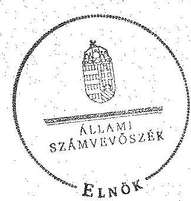
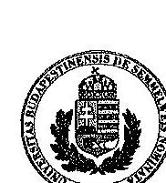
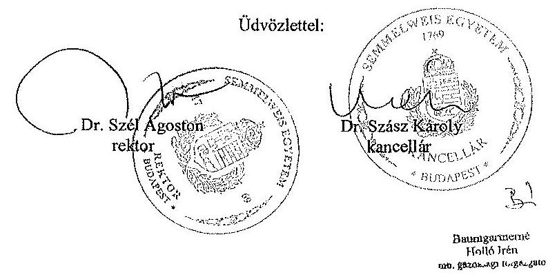
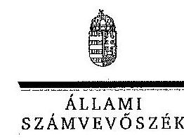

# ÁLLAMI   SZÁMVEVŐSZÉK 

## JELENTÉS

a Semmelweis Egyetem ellenőrzéséről - Az állami felsőoktatási intézmények gazdálkodásának, működésének ellenőrzése

---

# Állami Számvevőszék 

Iktatószám: V-0591-494/2015.
Témaszám: 1625
Vizsgálat-azonosító szám: V068917

## Az ellenőrzést felügyelte:

Makkai Mária
felügyeleti vezető
Az ellenőrzés végrehajtásáért felelős:
Keresztes Tamás
ellenőrzésvezető
A számvevői munkaanyagok feldolgozását és a Jelentés összeállítását végezte:

Keresztes Tamás
ellenőrzésvezető
Farkas László
számvevő tanácsos
Jakab Laura
számvevő

## Az ellenőrzést végezték:

Farkas László
számvevő tanácsos

Kelemen F. Balázs
számvevő tanácsos
Vacsora Erika
számvevő tanácsos

Jakab Laura
számvevő
Molnár-Sipos Judit
számvevő
Velkei András
számvevő

Dr. Kapocsi Nikolett
számvevő főtanácsos

Dr. Nagy Ágnes
számvevő tanácsos
Vlasits Ágnes
számvevő

## A témához kapcsolódó eddig készített számvevőszéki jelentések:

## címe

Jelentés az oktatási és kulturális ágazat irányítási rendszerének, működésének ellenőrzéséről
Jelentés a felsőoktatás oktatási infrastruktúra-fejlesztési programjának ellenőrzéséről
Jelentés az állami felsőoktatási intézmények érdekeltségébe tartozó gazdasági társaságok támogatásának és nyereségük hasznosulásának ellenőrzéséről
Jelentés a Szolnoki Főiskola ellenőrzéséről - Az állami felsőoktatási 14196
intézmények gazdálkodásának, működésének ellenőrzése

---

Jelentés a Pannon Egyetem ellenőrzéséről - Az állami felsőoktatási 14197
intézmények gazdálkodásának, működésének ellenőrzése
Jelentés a Károly Róbert Főiskola ellenőrzéséről - Az állami felsőoktatási 14198
intézmények gazdálkodásának, működésének ellenőrzése
Jelentés a Magyar Képzőművészeti Egyetem ellenőrzéséről - Az állami 14199
felsőoktatási intézmények gazdálkodásának, működésének ellenőrzése
Jelentés a Miskolci Egyetem ellenőrzéséről - Az állami felsőoktatási 14200
intézmények gazdálkodásának, működésének ellenőrzése
Jelentés a Széchenyi István Egyetem ellenőrzéséről - Az állami felsőoktatási 14201
intézmények gazdálkodásának, működésének ellenőrzése
Jelentés az Eszterházy Károly Főiskola ellenőrzéséről - Az állami felsőoktatási 14204
intézmények gazdálkodásának, működésének ellenőrzése
Jelentés a Magyar Táncművészeti Főiskola ellenőrzéséről - Az állami 14205
felsőoktatási intézmények gazdálkodásának, működésének ellenőrzése
Jelentés a Budapesti Műszaki és Gazdaságtudományi Egyetem ellenőrzéséről - Az állami felsőoktatási intézmények gazdálkodásának, működésének ellenőrzése

---

.

---

# TARTALOMJEGYZÉK 

BEVEZETÉS ..... 13
I. ÖSSZEGZŐ MEGÁLLAPÍTÁSOK, KÖVETKEZTETÉSEK, JAVASLATOK ..... 17
II. RÉSZLETES MEGÁLLAPÍTÁSOK ..... 27

1. A felsőoktatásért felelős minisztérium fenntartói és ágazati irányítói tevékenysége ..... 27
2. Az intézmény belső kontrollrendszerének kiépítése és működtetése ..... 28
3. Az intézmény pénzügyi gazdálkodása ..... 32
3.1. A kiadási és bevételi előirányzatok alakulása és a pénzügyi egyensúlyt befolyásoló tényezők ..... 33
3.2. A döntéshozó szervek gazdálkodással kapcsolatos joggyakorlásának szabályszerűsége ..... 38
3.3. A bevételi és kiadási előirányzatok megállapítása, módosítása, elkülönítése, az előirányzat-maradványok kezelése, adatszolgáltatási kötelezettség teljesítése ..... 40
3.4. A kiadási előirányzatok felhasználása ..... 41
3.5. A bevételi előirányzatok beszedése ..... 45
4. Az intézmény vagyongazdálkodása ..... 47
4.1. A vagyon változása ..... 47
4.2. A vagyongazdálkodás szabályozottsága ..... 48
4.3. A vagyonelemek kimutatása ..... 50
4.4. A vagyonelemekkel történő gazdálkodás ..... 56
5. A külső ellenőrzések által tett javaslatok hasznosulása ..... 59
5.1. ÁSZ ellenőrzések által tett javaslatok hasznosulása ..... 59
5.2. Az egyéb külső ellenőrzések javaslatainak hasznosulása ..... 61
MELLÉKLETEK
6. számú A Semmelweis Egyetem kiadási és bevételi előirányzatai, azok teljesítése a 2009-2013. években
7. számú A Semmelweis Egyetem kiadásainak, bevételeinek változása a 2009-2013. években
8. számú Kimutatás a Semmelweis Egyetem bevételeiről és kiadásairól, valamint adósságszolgálatáról a 2009-2013. években
9. számú A Semmelweis Egyetem mérlegadatai a 2009-2013. években
10. számú A Semmelweis Egyetem gazdálkodása szabályszerűségének értékelése a véletlenszerűen kiválasztott mintatételek alapján
11. számú A Semmelweis Egyetem rektorának észrevétele
12. számú A Semmelweis Egyetem rektorának észrevételére adott válasz

---

# FÜGGELÉKEK 

1. számú Az integritás érvényesítése érdekében kialakított és működtetett intézményi kontrollrendszer

---

# RÖVIDÍTÉSEK JEGYZÉKE 

## Törvények

Áht. 1
Áht. 2
ÁSZ tv.
Feot.
Gt.
Kbt. 1
Kbt. 2
Kjt.
Mtv. 1
Mtv. 2
Nftv.
Nvtv.
Sztv.
Vtv.

## Korm. rendeletek

Áhsz.
Új Áhsz.
Ámr. 1
Ámr. 2
Ávr.
Ber.
Bkr.
Vtvr.
51/2007. (III. 26.) Korm. rendelet
49/2008. (III. 14.) Korm. rendelet
50/2008. (III. 14.) Korm. rendelet
1992. évi XXXVIII. törvény az államháztartásról (hatálytalan 2012. január 1-jétől)
2011. évi CXCV. törvény az államháztartásról
2011. évi LXVI. törvény az Állami Számvevőszékről
2005. évi CXXXIX. törvény a felsőoktatásról (hatálytalan 2012. szeptember 1-jétől)
2006. évi IV. törvény a gazdasági társaságokról (hatálytalan 2014. március 15-étől)
2003. évi CXXIX. törvény a közbeszerzésekről (hatálytalan 2012. január 1-jétől)
2011. évi CVIII. törvény a közbeszerzésekről
1992. évi XXXIII. törvény a közalkalmazottak jogállásáról
1992. évi XXII. törvény a Munka Törvénykönyvéről (hatálytalan 2013. január 1-jétől)
2012. évi I. törvény a munka törvénykönyvéről
2011. évi CCIV. törvény a nemzeti felsőoktatásról
2011. évi CXCVI. törvény a nemzeti vagyonról
2000. évi C. törvény a számvitelről
2007. évi CVI. törvény az állami vagyonról
249/2000. (XII. 24.) Korm. rendelet az államháztartás szervezetei beszámolási és könyvvezetési kötelezettségének sajátosságairól (hatálytalan 2014. január 1-jétől)
4/2013. (I. 11.) Korm. rendelet az államháztartás számviteléről
217/1998. (XII. 30.) Korm. rendelet az államháztartás működési rendjéről (hatálytalan 2010. január 1-jétől)
292/2009. (XII. 19.) Korm. rendelet az államháztartás működési rendjéről (hatálytalan 2012. január 1-jétől)
368/2011. (XII. 31.) Korm. rendelet az államháztartásról szóló törvény végrehajtásáról
193/2003. (XI. 26.) Korm. rendelet a költségvetési szervek belső ellenőrzéséről (hatálytalan 2012. január 1-jétől)
370/2011. (XII. 31.) Korm. rendelet a költségvetési szervek belső kontrollrendszeréről és belső ellenőrzéséről
254/2007. (X. 4.) Korm. rendelet az állami vagyonnal való gazdálkodásról
a felsőoktatásban részt vevő hallgatók juttatásairól és az általuk fizetendő egyes térítésekről
a közszféra területén dolgozók 2008. évi illetményemelésének és egyéb személyi célú kifizetéseinek támogatásáról a felsőoktatási intézmények képzési, tudományos célú és fenntartói normatíva alapján történő finanszírozásáról

---

| Határozatok |  |
| :--: | :--: |
| 1132/2010. (VI. 18.) | a 2010. évi költségvetéssel összefüggő egyes feladatokról |
| Korm. határozat |  |
| 1025/2011. (II. 11.) | az államháztartási egyensúly megőrzéséhez szükséges intézkedésekről |
| Korm. határozat |  |
| 1316/2011. (IX. 19.) | a 2011. évi költségvetési egyensúlyt megtartó intézkedésekről |
| Korm. határozat |  |
| 1365/2011. (XI. 8.) | a 2012. évi költségvetési hiánycél tartását biztosító további feladatokról |
| Korm. határozat |  |
| 1657/2012. (XII. 20.) | a kormányzati stratégiai dokumentumok felülvizsgálatával kapcsolatos feladatokról |
| Korm. határozat |  |
| Egyéb rövidítések |  |
| áfa | általános forgalmi adó |
| ÁSZ | Állami Számvevőszék |
| CT | Computed Tomography (radiológiai berendezés) |
| Educatio Kft. | Educatio Társadalmi Szolgáltató Nonprofit Kft. |
| EMMI | Emberi Erőforrások Minisztériuma |
| FIR | Felsőoktatási Információs Rendszer |
| GT | Gazdasági Tanács |
| GYEMSZI | Gyógyszerészeti és Egészségügyi Minőség- és Szervezetfejlesztési Intézet |
| IFT | Intézményfejlesztési Terv |
| INTOSAI | Legfőbb Ellenőrzési Intézmények Nemzetközi Szakmai Szervezete (Intenational Organization of Supreme Audit Institutions) |
| KEHI | Kormányzati Ellenőrzési Hivatal |
| KIM | Közigazgatási és Igazságügyi Minisztérium |
| Kincstár | Magyar Államkincstár |
| MAG Zrt. | Magyar Gazdaságfejlesztési Központ Zrt. |
| MNV Zrt. | Magyar Nemzeti Vagyonkezelő Zrt. |
| MTA | Magyar Tudományos Akadémia |
| NAV | Nemzeti Adó- és Vámhivatal |
| NEFMI | Nemzeti Erőforrás Minisztérium |
| NEPTUN | Tanulmányi hallgatói információs rendszer |
| NGM | Nemzetgazdasági Minisztérium |
| OH | Oktatási Hivatal |
| OKM | Oktatási és Kulturális Minisztérium |
| OTKA | Országos Tudományos Kutatási Alapprogramok |
| PM | Pénzügyminisztérium |
| PPP | Public-Private Partnership (magán és közszféra együttműködése) |
| SAP | Integrált vállalatirányítási rendszer |
| SE, egyetem, intézmény | Semmelweis Egyetem |
| SZMSZ | Szervezeti és Működési Szabályzat |
| TDK | Tudományos DiákKör |
| TJSZ | Térítési és juttatási szabályzat |

---

# ÉRTELMEZŐ SZÓTÁR 

alapító

állami felsőoktatási intézmény saját tulajdona
állami vagyon

A központi költségvetési szerv alapítója az Országgyűlés, a Kormány vagy a miniszter. A felsőoktatási intézmények vonatkozásában az alapítói jogokat a felsőoktatásért felelős minisztérium gyakorolja.
A felsőoktatási intézmény saját bevételének a költségek teljes körű levonása - az adományozás és öröklés kivételével -, a rendelkezésre bocsátott vagyon állagának megóvásáról, pótlásáról való gondoskodás után fennmaradt része terhére szerzett vagyona. (Feot. 123. § (1) bekezdés)
A Vtv. 1. § (2) bekezdése szerint állami vagyonnak minősül:
a) az állami tulajdonban lévő ingó dolog, valamint a dolog módjára hasznosítható természeti erő,
b) az állami tulajdonban lévő termőföldekből álló, külön törvényben szabályozott Nemzeti Földalap,
c) az állami tulajdonban lévő - a b) pont hatálya alá nem tartozó - ingatlan,
d) az állami tulajdonban lévő értékpapír,
e) az államot megillető társasági részesedés és más vagyoni értékű jog;
(hatályos 2010. június 16-ig)
a) az állam tulajdonában lévő dolog, valamint a dolog módjára hasznosítható természeti erő,
b) az a) pont hatálya alá nem tartozó mindazon vagyon, amely vonatkozásában törvény az állam kizárólagos tulajdonjogát nevesíti,
c) az állam tulajdonában lévő tagsági jogviszonyt megtestesítő értékpapír, illetve az államot megillető egyéb társasági részesedés,
d) az államot megillető olyan immateriális, vagyoni értékkel rendelkező jogosultság, amelyet jogszabály vagyoni értékű jogként nevesít.
(hatályos 2010. június 17-től 2012. szeptember 9-ig)
a) az állam tulajdonában lévő dolog, valamint a dolog módjára hasznosítható természeti erő,
b) az a) pont hatálya alá nem tartozó mindazon vagyon, amely vonatkozásában törvény az állam kizárólagos tulajdonjogát nevesíti,
c) az állam tulajdonában lévő tagsági jogviszonyt megtestesítő értékpapír, illetve az államot megillető egyéb társasági részesedés,
d) az államot megillető olyan immateriális, vagyoni értékkel rendelkező jogosultság, amelyet jogszabály vagyoni értékű jogként nevesít,
e) az állam tulajdonában lévő pénzügyi eszközök.
(hatályos: 2012. szeptember 10-től)

---

állami vagyon hasznosítása/ állami vagyon kezelője
állami vagyon haszná-
lója

A Vtv. 23. § (1) bekezdése szerint:
Az állami vagyont az MNV Zrt. maga kezeli, illetve szerződés - így különösen bérlet, haszonbérlet, szerződésen alapuló haszonélvezet, vagyonkezelés, megbízás - alapján központi költségvetési szervnek, természetes vagy jogi személynek, illetőleg jogi személyiséggel nem rendelkező gazdasági társaságnak hasznosításra átengedi.
(hatályos 2010. december 31-ig)
Az állami vagyont az MNV Zrt. maga kezeli, vagy szerződés - így különösen bérlet, haszonbérlet, szerződésen alapuló haszonélvezet, vagyonkezelés, megbízás - alapján központi költségvetési szervnek, természetes vagy jogi személynek, vagy jogi személyiséggel nem rendelkező gazdálkodó szervezetnek hasznosításra átengedi.
(hatályos 2011. január 1-jétől 2011. december 31-ig)
Az állami vagyont az MNV Zrt. maga kezeli, vagy szerződés - így különösen bérlet, haszonbérlet, megbízás - alapján központi költségvetési szervnek, természetes vagy jogi személynek, vagy jogi személyiséggel nem rendelkező gazdálkodó szervezetnek hasznosításra átengedi.
(hatályos 2012. január 1-jétől 2013. június 27-ig)
Az állami vagyonnal a tulajdonosi joggyakorló maga gazdálkodik, vagy szerződés - így különösen bérlet, haszonbérlet, megbízás - alapján hasznosításra átengedi, illetőleg vagyonkezelésbe, haszonélvezetbe adja.
(hatályos: 2013. június 28-tól)
A Vtv. 23. § (2) bekezdése szerint:
Az állami vagyon hasznosítására kötött szerződések elsődleges célja az állami vagyon hatékony működtetése, állagának védelme, értékének megőrzése, illetve gyarapítása, az állami és közfeladatok ellátásának elősegítése.
A Vtvr. 1. § (7) bekezdés a) pontja szerint:
Az a természetes személy, jogi személy, illetve jogi személyiséggel nem rendelkező gazdasági társaság, amely a Magyar Nemzeti Vagyonkezelő Zártkörűen Működő Részvénytársasággal (a továbbiakban: MNV Zrt.) kötött szerződés alapján, bármely jogcímen (bérlet, haszonbérlet, vagyonkezelés, használat stb.) állami vagyont birtokol, használ, hasznosít.
(hatályos 2010. december 31-ig)
Az a természetes személy, jogi személy, illetve jogi személyiséggel nem rendelkező szervezet, amely, illetve aki törvény vagy szerződés alapján, bármely jogcímen (pl. bérlet, haszonbérlet, vagyonkezelési szerződés, használat stb.) állami vagyont birtokol, használ, szedi annak hasznait, hasznosít, ide nem értve a tulajdonosi jogok gyakorlóját. (hatályos 2011. január 1-jétől 2011. december 31-ig)
Az a természetes vagy jogi személy, jogi személyiséggel nem rendelkező szervezet, aki vagy amely törvény vagy szerződés alapján, bármely jogcímen (bérlet, haszonbérlet,

---

| állami vagyon értékesítése | használat stb.) állami vagyont birtokol, használ, szedi annak hasznait, hasznosít, ide nem

 értve a haszonélvezőt, a vagyonkezelőt és a tulajdonosi jogok gyakorlóját. (hatályos 2012. január 1-jétől) |
| :--: | :--: |
| autonómia | Állami vagyon tulajdonjogának bármely jogcímen történő, visszterhes átruházása. (Vtvr. 1. § (7) bekezdés d) pont) |
| belső kontrollrendszer | A felsőoktatási intézmény Feot.-ban, illetve Nftv.-ben szabályozott önrendelkezése, amely biztosítja az intézmény önálló oktatási, kutatási, szervezeti és működési, valamint gazdálkodási tevékenységét. |
|  | A belső kontrollrendszer a kockázatok kezelése és tárgyilagos bizonyosság megszerzése érdekében kialakított folyamatrendszer, amely azt a célt szolgálja, hogy megvalósuljanak a következő célok:   a) a működés és gazdálkodás során a tevékenységeket szabályszerűen, gazdaságosan, hatékonyan, eredményesen hajtsák végre,   b) az elszámolási kötelezettségeket teljesítsék, és   c) megvédjék az erőforrásokat a veszteségektől, károktól és nem rendeltetésszerű használattól.   (NGM Belső Kontroll Kézikönyv) |
| CLF-módszer | A módszer a működési és a felhalmozási költségvetés bevételeinek és kiadásainak, ezek egyenlegeinek elkülönített, majd összevont kimutatását alkalmazza valamely költségvetési intézmény pénzügyi helyzetének megítéléséhez. Kiemelten mutatja be a finanszírozási műveletek egyenlege nélküli és az azt magába foglaló pénzügyi pozíciót, valamint a tőketörlesztéssel, értékpapír-beváltással csökkentett működési jövedelmet.   Az értékelés a pénzügyi kapacitás fogalmát helyezi a középpontba. |
| előirányzat-maradvány | Az államháztartás központi alrendszerébe tartozó költségvetési szerveknél a módosított bevételi és kiadási előirányzatok és azok teljesítésének a Kormány rendeletében meghatározott tételekkel korrigált különbözete az előirányzatmaradvány. (Áht. 2 2. § (1) bekezdés m) pontja) |
| fenntartó | A Feot. 7. § (2) bekezdés és az Nftv. 4. § (2) bekezdése szerint az, aki az alapítói jogot gyakorolja, ellátja a felsőoktatási intézmény fenntartásával kapcsolatos feladatokat. |
| finanszírozási műveletek nélküli pozíció | A CLF-módszer szerint számított működési és felhalmozási tevékenység pénzügyi egyenlegének összevont értéke. Megmutatja, hogy a költségvetési intézmény bevételei fedezetet biztosítottak-e a kiadásokra. A finanszírozási műveletek nélküli pozíció alapján a pénzügyi helyzetet akkor tekintettük megfelelőnek, ha az adott év működési és felhalmozási bevételei fedezetet nyújtottak az adott év működési és felhalmozási kiadásaira. |

---

Gazdasági Tanács

hároméves fenntartói megállapodás
információs és kommunikációs rendszer
intézményfejlesztési terv
integritás
kincstári biztos

A felsőoktatási intézmény javaslattevő, véleményező, a stratégiai döntések előkészítésében részt vevő és a döntések végrehajtásának ellenőrzésében közreműködő szerve.
Az állami felsőoktatási intézmények központi költségvetési támogatására hároméves fenntartói megállapodást kell kötni az állami felsőoktatási intézmény és a fenntartó között. A fenntartói megállapodás tartalmazza a felsőoktatási intézmény által meghatározott hároméves időszakra vállalt teljesítménykövetelményeket, továbbá az állandó jellegű támogatási részeket, valamint a változó jellegű támogatások megállapításának jogcímeit. A változó elemű támogatás évenkénti elszámolási kötelezettséggel kerül meghatározásra. (Feot. 133/A. §)
A költségvetési szerv vezetője köteles olyan rendszereket kialakítani és működtetni, melyek biztosítják, hogy a megfelelő információk a megfelelő időben eljussanak az illetékes szervezethez, szervezeti egységhez, illetve személyhez. (Bkr. 9. § (1) bekezdés)
A szenátus fogadja el az intézményfejlesztési tervet. Az intézményfejlesztési tervben kell meghatározni a fejlesztéssel, a fenntartó által a felsőoktatási intézmény rendelkezésére bocsátott vagyon hasznosításával, megóvásával, elidegenítésével kapcsolatos elképzeléseket, a várható bevételeket és kiadásokat. Az intézményfejlesztési tervet középtávra, legalább négyéves időszakra kell elkészíteni, évenkénti bontásban meghatározva a végrehajtás feladatait. Az intézményfejlesztési terv része a foglalkoztatási terv. A foglalkoztatási tervben kell meghatározni azt a létszámot, amelynek keretei között a felsőoktatási intézmény megoldhatja feladatait. (Feot. 27. § (3) bekezdés)
Az integritás olyasvalakit vagy valamit jelöl, aki vagy ami romlatlan, sértetlen, feddhetetlen. Az integritás elvek, értékek, cselekvések, módszerek, intézkedések konzisztenciáját jelenti: olyan magatartásmódot, amely meghatározott értékeknek megfelel.
Az államháztartásért felelős miniszter kincstári biztost jelöl ki az államháztartás központi alrendszerébe tartozó költségvetési szervhez, ha annak elismert, az esedékességet követő hatvan napon túli tartozásállománya meghaladja az éves eredeti kiadási előirányzatának 3,5%-át vagy az ötvenmillió forintot. A kincstári biztos kijelölését az államháztartásért felelős miniszternél a Kincstár kezdeményezi. A kincstári biztos köteles figyelemmel kísérni megbízatásának időpontjától kezdve a költségvetési szerv tervezését, gazdálkodását, beszámolását, a jogszabályokban előírt feladatainak ellátását, feltárni azokat az okokat, amelyek a tartós fizetésképtelenséghez vezettek, a szükséges intézkedések azonnali végrehajtására irányuló intézkedési tervet készíteni, azonnali intézkedéseket kezdeményezni, és

---

kincstári költségvetés
kockázatkezelési rendszer
kontrollkörnyezet
kontrolltevékenység
költségvetési főfelügyelő, felügyelő
likviditási mutató
maximális hallgatói létszám
írásbeli utasításokat kiadni a tartozásállomány felszámolására, a gazdálkodás egyensúlyának biztosítására, a követelések behajtására. (Áht. 2 71. §, Ávr. 116-117. §)
A központi költségvetésről szóló törvény elfogadását követően a fejezetet irányító szerv az államháztartás központi alrendszerébe tartozó költségvetési szerv és a fejezeti kezelésű előirányzat kiemelt előirányzatait, valamint az elkülönített állami pénzalapok és a társadalombiztosítás pénzügyi alapjai jogszabályi előírás szerinti bevételeit és kiadásait kincstári költségvetés kiadásával állapítja meg. (Áht. 1 24. § (3) bekezdés, Áht. 2 28. § (2) bekezdés, Ávr. 31. § (2) bekezdés)
Irányítási eszközök és módszerek összessége, melynek elemei a szervezeti célok elérését veszélyeztető tényezők (kockázatok) azonosítása, elemzése, csoportosítása, nyomon követése, valamint szükség esetén a kockázati kitettség mérséklése. (NGM Belső Kontroll Kézikönyv)
A kontrollkörnyezet a költségvetési szerv vezetőinek a szervezeti célok elérését segítő kontrollok kialakításával és működtetésével, korszerűsítésével kapcsolatos magatartását, a kontrollpontokról érkező információkra való reagálását jelenti. (NGM Belső Kontroll Kézikönyv)
Azok az elvek, politikák és eljárások, amelyeket a kockázatok meghatározása és a szervezet céljainak elérése érdekében alakítanak ki.
A költségvetési szerv vezetője köteles a szervezeten belül kontrolltevékenységeket kialakítani, amelyek biztosítják a kockázatok kezelését, hozzájárulnak a szervezet céljainak eléréséhez. (Bkr. 8. § (1) bekezdés)
Az államháztartásért felelős miniszter a Kormány irányítása alá tartozó fejezetet irányító szervhez, a Kormány irányítása vagy felügyelete alá tartozó költségvetési szervhez, valamint az elkülönített állami pénzalapok és a társadalombiztosítás pénzügyi alapjai kezelő szerveihez költségvetési főfelügyelőt, felügyelőt rendelhet ki. A költségvetési főfelügyelő, felügyelő a gazdálkodás költségvetés-politikával való összhangja és a takarékos, szabályszerű, eredményes működés érdekében a Kormány rendeletében meghatározott intézkedéseket tehet, így különösen előzetesen véleményezi a kötelezettségvállalásra irányuló eljárásokat, és a nagy összegű kötelezettségvállalások tekintetében kifogással élhet. (Áht. 2 39. § (1)-(2) bekezdés)
A likviditási mutató kifejezi, hogy a rövid lejáratú fizetési kötelezettségek kiegyenlítéséhez a forgóeszközök milyen arányban nyújtanak fedezetet.
Az a felsőoktatási intézmény alapító okiratában, működési engedélyében meghatározott hallgatói létszám, ameddig terjedően a felsőoktatási intézmény - figyelembe véve a hallgatók fogadásához és az oktatói tevékenység

---

minisztérium
monitoring
működési jövedelem
normatív költségvetési támogatás felsőoktatási intézmények működéséhez
normatív támogatások
pénzeszköz likviditási mutató
saját bevétel
szenátus
folytatásához rendelkezésre álló személyi feltételeket, helyiségeket és eszközöket - valamennyi évfolyamára számítva, teljes kihasználtsággal működve hallgatói jogviszonyt létesíthet.
A felsőoktatásért felelős minisztérium, amely 2009-től 2010 májusáig az OKM, 2010 májusától 2012 májusáig a NEFMI, 2012 májusától az EMMI volt.
A különböző szintű szervezeti célok megvalósításához szükséges folyamatok figyelemmel kísérése, melynek során a releváns eseményekről és tevékenységekről (együtt: folyamatokról) rendszeres jelleggel, strukturált, döntéstámogató információkhoz jutnak a szervezet vezetői.
A folyó bevételek és folyó kiadások egyenlege. Azt mutatja, hogy a folyó bevételek fedezetet nyújtanak-e a folyó kiadásokra.
A felsőoktatási intézmények működéséhez biztosított normatív költségvetési támogatás lehet
a) hallgatói juttatásokhoz nyújtott,
b) képzési,
c) tudományos célú,
d) fenntartói,
e) egyes feladatokhoz nyújtott
támogatás. A központi költségvetésből biztosított normatív költségvetési támogatásra - a d) pontban meghatározott normatív költségvetési támogatás kivételével - a felsőoktatási intézmények azonos feltételek alapján válnak jogosulttá. Az a)-e) pontokban meghatározott jogcímek az a) és e) pontban meghatározott jogcímek kivételével nem jelentenek felhasználási kötöttséget. (Feot. 127. § (3) bekezdés)
Az ellenőrzési időszakban hatályos költségvetési törvények 3. számú mellékletében megjelölt közoktatási hozzájárulások, az 5. mellékletében megjelölt központosított előirányzatok, továbbá a 8. mellékletében megjelölt normatív, kötött felhasználású támogatások együttesen.
A pénzeszköz likviditási mutató kifejezi, hogy a pénzeszközök év végi állománya milyen arányban nyújt fedezetet a rövid lejáratú fizetési kötelezettségekre.
Az államháztartáson kívüli források - beleértve minden olyan, az Európai Uniótól származó támogatást, amelyhez nem az állami költségvetésen keresztül jut a felsőoktatási intézmény, továbbá a szakképzési hozzájárulási fizetési kötelezettség teljesítéseként elszámolt forrásokat is, ide nem értve az állami vagyon értékesítésének ellenértékét, valamint a Kutatási és Technológiai Innovációs Alapból származó bevételek. (Feot. 147. § 31. pont)
A felsőoktatási intézmény döntést hozó és a döntés végrehajtását ellenőrző testülete. (Feot. 20. § (1) bekezdés)

---

tárgyévi pénzügyi pozíció
többségi befolyást biztosító részesedés

A működési és felhalmozási bevételek, valamint kiadások egyenlege a finanszírozási műveletek egyenlegének figyelembe vételével.
A Polgári Törvénykönyvről szóló 1959. évi IV. törvény 685/B. § (1) bekezdése szerint többségi befolyás: az olyan kapcsolat, amelynek révén természetes személy, jogi személy vagy jogi személyiség nélküli gazdasági társaság (a továbbiakban együtt: befolyással rendelkező) egy jogi személyben a szavazatok több mint ötven százalékával vagy meghatározó befolyással rendelkezik.

---

.

---

# JELENTÉS 

## a Semmelweis Egyetem ellenőrzéséről Az állami felsőoktatási intézmények gazdálkodásának, működésének ellenőrzése

## BEVEZETÉS

Az ÁSZ Stratégiája ${ }^{1}$ alapértékeinek egyike, hogy az államháztartás komplex folyamatainak átláthatósága érdekében rendszerszemléletű/holisztikus megközelítésű, egymásra épülő, a szinergiahatást kihasználó, összefoglaló értékelésre lehetőséget adó ellenőrzéseket végez. Az államháztartás központi alrendszerébe tartozó felsőoktatási intézmények ellenőrzése során az Állami Számvevőszék értékeli azok pénzügyi-gazdasági helyzetét, feltárja a működésükben rejlő kockázatokat, ezzel előmozdítja a közpénzügyek átláthatóságát, rendezettségét.

Az állami felsőoktatási intézmények gazdálkodását - az Áht. ${ }_{1}$ és az Áht. ${ }_{2}$ előírásai mellett - a felsőoktatásról szóló 2005. évi CXXXIX. törvény (Feot.), valamint a nemzeti felsőoktatásról szóló 2011. évi CCIV. törvény (Nftv.) előírásai határozták meg.

Magyarország Nemzeti Reform Programja keretében, a Széll Kálmán Terv 2020-ig a 30-34 évesek körében a felsőfokú vagy annak megfelelő végzettséggel rendelkezők arányának 30,3%-ra való növelését irányozta elő, amely a 2010. évhez képest 4,6% pontos növekedési célkitűzést jelent. A rendezett gazdasági környezet, az önállósággal élni tudó, felelős, elszámoltatható intézményi gazdálkodói magatartás elengedhetetlen feltétele a kitűzött szakmai célok elérésének.

Az ellenőrzés célja annak megállapítása, hogy szabályos volt-e az állami felsőoktatási intézmény pénzügyi és vagyongazdálkodása, biztosított volt-e a vagyonnal való felelős gazdálkodás követelményének érvényesülése, jogszabályi előírásoknak megfelelően működött-e a belső kontrollrendszer, a fenntartó szerv tevékenysége a jogszabályi előírásoknak megfelelt-e.

Ennek keretében értékeltük a Semmelweis Egyetemnél:

- a fenntartói és az ágazati irányítási jogok gyakorlása előírásoknak való megfelelőségét;
- az intézmény belső kontrollrendszere jogszabályoknak megfelelő kialakítását és működtetését;

[^0]
[^0]:    ${ }^{1}$ Állami Számvevőszék: Stratégia. Az Állami Számvevőszék hivatalos stratégiai dokumentum rendszere 2011-2015. 2012. december. http://www.asz.hu/strategia/asz-strategia/asz-strategia-2011.pdf

---

- az intézmény döntéshozó szerveinek joggyakorlása jogszabályoknak való megfelelőségét; az intézmény oktatási és egyéb (gyakorlati és kutatási) tevékenységei elkülönítését, átláthatóságát, illetve pénzügyi gazdálkodása szabályszerűségét;
- az intézmény vagyongazdálkodása előírásoknak való megfelelőségét;
- az ellenőrzött időszakban végzett külső (ÁSZ, fenntartói, KEHI, kincstári) ellenőrzések által tett javaslatok hasznosulását;
- az intézmény korrupcióval szembeni veszélyeztetettségének csökkentése érdekében az integritási szemlélet érvényesülését a gazdálkodási folyamatokban.

Az ellenőrzés várható hasznosulása: Az ellenőrzés eredményének hasznosulásaként képet kapunk a Semmelweis Egyetemnél kialakult pénzügyi helyzetről; a kormány által kirendelt költségvetési (fő)felügyelői rendszer működésének tapasztalatairól; az oktatási és egyéb tevékenységek és költségelszámolások elhatárolásáról, átláthatóságáról és szabályosságáról. A felsőoktatási intézmények gazdálkodási szabadságának pénzügyi és vagyoni

 helyzetre gyakorolt hatásairól, a vagyonnal való felelős, értékmegőrző gazdálkodás érvényesüléséről, továbbá a belső kontrollrendszer működéséről. Az ellenőrzés az ellenőrzött számára visszajelzést ad a gazdálkodása kereteinek kialakításáról, a működésében fellépő hiányosságokról, javaslataival hozzájárul azok kiküszöböléséhez és a jó kormányzáshoz. A törvényalkotás számára összegzett tapasztalatok állnak rendelkezésre a felsőoktatási intézmények döntéseinek, gazdálkodásának szabályszerűségéről, amelyek alapján - indokolt esetben - jogszabály-módosítás kezdeményezhető. Az integritás kultúra kialakítása hozzájárul az elszámoltathatóság és átláthatóság érvényesítéséhez, egyben támogatja a szervezet védettségét a korrupciós kitettséggel szemben, valamint annak megelőzése is irányítottabbá válik. A társadalom számára jelzi, hogy közpénz nem maradhat ellenőrizetlenül, az ÁSZ értékteremtő rend kialakításához és megőrzéséhez hozzájáruló tevékenysége pozitív hatással lesz a szervezetről kialakított összkép formálásában.

Az ellenőrzés típusa: szabályszerűségi ellenőrzés
Az ellenőrzött időszak: 2009. január 1. - 2013. december 31. (az eredményszemléletű számvitel bevezetésével kapcsolatban az ellenőrzött időszak vége: 2014. április 30.)

Az ellenőrzéssel érintett szervezetek: az Emberi Erőforrások Minisztériuma és a Semmelweis Egyetem

Az ellenőrzés jogszabályi alapját az Állami Számvevőszékről szóló 2011. évi LXVI. törvény 1. § (3) bekezdése, az 5. § (3)-(6) bekezdései, 33. § (7) bekezdése, valamint az államháztartásról szóló 2011. évi CXCV. törvény 61. § (2) bekezdésének előírásai képezik.

Az ellenőrzés az INTOSAI által kiadott nemzetközi standardok figyelembe vételével, az ellenőrzési programban foglalt értékelési szempontok szerint történt.

---

A pénzügyi és vagyongazdálkodás terén az egyes területek szabályszerű működését mintavétellel ellenőriztük, ez alapján a sokaságokban előforduló hibás tételek arányát becsültük. A jogszabályoknak és a belső előírásoknak megfelelőnek, azaz szabályszerűnek tekintettük az adott kiadási előirányzat felhasználását, bevétel beszedését, mérlegtétel értékelését, amennyiben a minta ellenőrzésének eredménye alapján 95%-os bizonyossággal a teljes sokaságban a hibás tételek aránya kisebb volt, mint 10%, nem megfelelőnek értékeltük, ha a hibás tételek aránya a 10%-ot meghaladta. Kockázatot, illetve magas kockázatot jeleztünk, amennyiben egy adott terület vonatkozásában a minta alapján a teljes sokaságban nem volt teljes körűen biztosított a jogszabályoknak és a belső szabályzatoknak megfelelő működés. A mérlegtételek értékelése során kockázati alapon is kiválasztottunk mintatételeket (irányított mintavétel), és az így ellenőrzött tételek kiértékelésének eredményét is figyelembe vettük az adott terület szabályszerűségének megítélése szempontjából. A véletlenszerűen kiválasztott mintatételek kiértékelését az 5. számú melléklet tartalmazza.

A belső kontrollrendszer kialakításának és működtetésének értékelése során a jogszabályi előírások mellett az Ámr. 145/A. § (1) és (3) bekezdése, az Ámr. 155. § (1) és (3) bekezdése, valamint a Bkr. 5. § (1) bekezdése alapján figyelembe vettük az államháztartásért felelős miniszter által közzétett irányelvekben és módszertani útmutatókban² foglaltakat is. A belső kontrollrendszert az értékelés során legalább 85%-os megfelelőség esetén megfelelőnek, legalább a 70%-os megfelelőség esetén részben megfelelőnek, 70%-os megfelelőség alatt pedig nem megfelelőnek minősítettük.

A budapesti székhelyű SE az ország egyik legrégebben alapított intézménye 1769-ig visszanyúló gyökereivel. A 2009-2013. évek között önállóan működő és gazdálkodó központi költségvetési szerv volt. Tevékenysége három pillérre épült: oktatás, kutatás és gyógyítás. Az egyetemen általános orvosi, fogorvosi, gyógyszerészeti, egészségtudományi, valamint testnevelési és sporttudományi képzés zajlott. 2009-ben az SE öt karán (Általános Orvostudományi Kar, Fogorvostudományi Kar, Gyógyszerésztudományi Kar, Testnevelési és Sporttudományi Kar, Egészségtudományi Kar) folyt oktatás, amely 2010-ben az Egészségügyi Közszolgálati Karral bővült.

A rektor megbízása 2012. május 31-én lejárt. Az új rektor 2013. július 1-jétől történő megbízásáig a rektori feladatokat az SZMSZ alapján a rektorhelyettes látta el. Az ellenőrzött időszakban a gazdasági főigazgató személyében egyszer, 2012 decemberében történt változás. Az egyetemnél a vizsgált időszakban költségvetési főfelügyelő kinevezésére került sor a 2012. január 1-jétől 2012. április 30-ig, illetve a 2012. június 15-étől 2013. december 31-ig terjedő időszakban.

Az SE az ellenőrzött időszak elején 9 db - ebből 7 db 100%-os tulajdoni hányadú - annak végén 4 db - ebből 3 db 100%-os tulajdoni hányadú - gazdasági társaságban rendelkezett részesedéssel. A tulajdonosi részesedések könyv szerinti értéke a 2009. év végi 248,0 M Ft-ról 2013. év végére 231,3 M Ft-ra csökkent.

Az SE kiadásai az öt év alatt 18,7%-kal, a bevételei összességében 22,1%-kal nőttek. A bevételeken belül a költségvetési támogatás aránya 17,9% volt átlagosan

[^0]
[^0]:    ² 1/2009. (IX. 11.) PM irányelv, Pénzügyminisztérium Belső Kontroll Kézikönyv 2010.

---

és az ellenőrzött időszakban 6,9%-kal csökkent. A saját és átvett bevételek 22,9%-kal nőttek.

Az SE pénzügyi pozíciója az ellenőrzött időszakban javult, mert az egyetem 2009. évi idegen pénzeszközök nélküli nyitó pénzállománya a 2013. év végére 2905,0 M Ft-tal nőtt.

Az ellenőrzött időszakban a hallgatói létszám 11278 főről 12667 főre (12,3%-kal), az oktatók létszáma pedig 1140 főről 1324 főre (16,1%-kal) növekedett.

Az egyetemet az ellenőrzött időszakban átalakulás nem érintette.
Az SE főbb gazdálkodási, vagyoni és létszám adatait az alábbi táblázat mutatja be:

| Megnevezés | Főbb gazdálkodási és vagyoni adatok (ezer Ft) |  |  |  |  |  |
| :--: | :--: | :--: | :--: | :--: | :--: | :--: |
|  | 2009. | 2010. | 2011. | 2012. | 2013. | $\begin{gathered} 2013 / 2009 \\ (\%) \end{gathered}$ |
| KIADÁSI   FŐÖSSZEG | 57044805 | 60681653 | 59488431 | 66685412 | 67721623 | 118,7 |
| BEVÉTELI   FŐÖSSZEG | 58791052 | 64078226 | 65527041 | 71880951 | 71798751 | 122,1 |
| Költségvetési támogatások | 12330624 | 12022856 | 11196626 | 12007006 | 11480250 | 93,1 |
| Saját és átvett bevételek | 44993107 | 50309124 | 50933841 | 53835335 | 55293962 | 122,9 |
| Előirányzat maradvány felhasználás | 1467321 | 1746246 | 3396574 | 6038610 | 5024539 | 342,4 |
| Támogatások aránya (\%) | 21 | 18,8 | 17,1 | 16,7 | 16 | - |
| Mérlegfőösszeg | 28204189 | 32157008 | 34879786 | 36757627 | 38910950 | 138 |
|  | Jellemző létszámadatok (fő)* |  |  |  |  |  |
| Oktatói létszám (fő) | 1140 | 1168 | 1170 | 1179 | 1324 | 116,1 |
| Hallgatói létszám (fő) | 11278 | 11898 | 12487 | 12679 | 12667 | 112,3 |

*Az oktatói és hallgatói létszámnál az október 15-i statisztikában szereplő adat.
Az ÁSZ a 2011. évi LXVI. törvény 29. §-a szerint a jelentéstervezetet megküldte a Semmelweis Egyetem rektorának és az Emberi Erőforrások Minisztériuma miniszterének egyeztetésre. A Semmelweis Egyetem rektorának észrevételét és az arra adott választ a 6-7. számú melléklet tartalmazza. Az Emberi Erőforrások Minisztériuma minisztere az ÁSZ tv. 29. § (2) bekezdésében foglalt észrevételezési jogával nem élt, a törvényes határidőn belül észrevételt nem tett.

---

# I. ÖSSZEGZŐ MEGÁLLAPÍTÁSOK, KÖVETKEZTETÉSEK, JAVASLATOK 

Az ellenőrzött időszakban a felsőoktatásért felelős miniszter a jogszabályi előírásoknak megfelelően gyakorolta fenntartói feladatait. Ugyanakkor az ágazati irányítási feladatait nem látta el teljes körűen.

Elmaradt az oktatási ágazatra vonatkozóan a nemzetgazdasági miniszter irányításával és az oktatásért felelős miniszter részvételével, a kormányhatározatban előírt szervezeti és feladatellátási felülvizsgálati program kidolgozása. A felsőoktatási törvény rendelkezései ellenére a miniszter nem készíttetett a felsőoktatás rendszere vonatkozásában elfogadott középtávú fejlesztési tervet.

A minisztérium az Oktatási Hivatallal a Felsőoktatási Információs Rendszer (FIR) biztonságos üzemeltetéséhez, az adatok védelméhez szükséges alapvető kontrollokat a 2012. év végéig nem teljes körűen alakította ki. A FIR átfogó megújítása után 2012 szeptemberétől - a nyitott jogviszonnyal rendelkező hallgatók és az oktatók vonatkozásában - rögzített adatok már teljes körűek. A fenntartó a FIR biztonságos üzemeltetéséhez, az adatok védelméhez szükséges kontrollokat a 2012. év végén kialakította, ugyanakkor a 2012. szeptembertől működő FIR-t jogszabályi megfelelőségi, adatbiztonsági, illetve informatikai szempontból nem ellenőrizte.

## Az SE belső kontrollrendszerének kialakítása és működtetése részben

felelt meg a vonatkozó jogszabályi előírásoknak. Ezen belül a kontrollkörnyezet kialakítása és a kockázatkezelés megfelelő, az információs és kommunikációs rendszer és a monitoring rendszer részben megfelelő, a kontrolltevékenység alkalmazása nem megfelelő volt.

A kontrolltevékenységgel kapcsolatos szabályozás kialakítása megfelelő volt, a kontrolltevékenységek alkalmazása azonban nem felelt meg az előírásoknak. Ez a folyamatba épített, illetve a vezetői ellenőrzés nem megfelelő működésére volt visszavezethető. A kontrollok működtetésében a személyi juttatások, a dologi, a felhalmozási kiadások előirányzatainak felhasználása, a működési bevételek beszedése során, továbbá a mérlegtételek besorolásánál és értékelésénél voltak hiányosságok.

Az információs és kommunikációs rendszer kialakítása részben megfelelő volt. Az informatikai és az iratkezelési szabályzatot nem aktualizálták. A 2010-2011. években külön szabályzatban nem szabályozták a kötelezően közzéteendő adatok nyilvánosságra hozatalának, illetve a közérdekű adatok megismerésére irányuló igények teljesítésének rendjét.

Az intézmény nyomonkövetési (monitoring) rendszere részben volt megfelelő. Az egyetem nem rendelkezett valamennyi tevékenységét átfogó nyomonkövetési rendszerrel, azonban több területen kialakítottak és működtettek az oktatási, illetve egyes gazdálkodási tevékenység-csoportokra monitoring részrendszereket. A belső ellenőrzésekkel érintett területek vezetői az esetek több mint negyedében a jogszabályban előírt határidőn túl készítették el a belső ellenőrzés által tett

---

javaslatokra az intézkedési tervet. Öt ellenőrzés esetében csak részben, egy ellenőrzés esetében pedig nem valósultak meg a belső ellenőrzési jelentésekben szereplő javaslatok.

Az egyetem az ellenőrzött időszakban erőfeszítéseket tett az integritási szemlélet fejlesztésére, valamint a korrupciós kockázatok csökkentésére, a 2013. évben önként részt vett az ÁSZ integritási felmérésében.

Az intézmény pénzügyi egyensúlya - a felmerülő likviditási problémák ellenére is - a 2009-2013. években biztosított volt. Az SE likviditási hitelt és támogatási kölcsönt nem vett fel. Kincstári biztost az intézményhez nem rendeltek ki. Az egyetem az ellenőrzött időszakban csak egy alkalommal, a 2013. évben fordult támogatás előrehozási kérelemmel a fenntartó felé, amelyet a fenntartó engedélyezett. Az SE a jogszabályi előírásokkal összhangban minden ellenőrzött évben készített likviditási tervet.

Az SE pénzügyi gazdálkodása nem minden tekintetben volt szabályszerű.
A szenátus a felsőoktatási törvényekben előírt, gazdálkodást érintő feladatait, hatásköreit nem minden esetben gyakorolta szabályszerűen. A szenátus a jogszabályi előírásokkal ellentétben nem fogadott el vagyongazdálkodási tervet. Nem értékelte a rektorok vezetői tevékenységét és nem küldte meg a fenntartónak a költségvetés módosítását, a kötelezettségvállalási tervet, illetve annak végrehajtásának ütemtervét. Nem fogadta el a minőség és teljesítmény alapján differenciáló jövedelemelosztás elveit sem.

A normatív támogatások felhasználására vonatkozó intézményi döntések összhangban voltak a jogszabályokkal, belső szabályzatokkal.

Az intézményi térítési díjak, költségtérítések megállapítása nem felelt meg a jogszabályi és belső előírásoknak. Az SE az ellenőrzött időszakban rendelkezett önköltség-számítási szabályzattal, amely előírta az önköltségszámítás módszerét, illetve dokumentálásának rendjét. Az önköltség-számítási szabályzatot a gyakorlatban azonban nem alkalmazták. Így az ellenőrzött időszakban az SE az oktatási tevékenység közvetlen önköltségét a jogszabályi előírásokkal ellentétben nem határozta meg. Az önköltségszámítás gyakorlati alkalmazása hiányában a megállapított költségtérítés és
 ráfordítás arányára vonatkozó előírások teljesülése nem volt megállapítható.

Az SE a kiadási és bevételi előirányzatok tervezése során a jogszabályokban és a fenntartó által kiadott tervezési irányelvekben foglaltak szerint járt el. Ugyanakkor a bevételi és kiadási előirányzatok módosítása, azok elszámolása nem felelt meg a jogszabályoknak és belső szabályoknak. A rendelkezésre álló dokumentumok alapján nem volt megállapítható, hogy az intézményi hatáskörben végrehajtott előirányzat-módosításokat az arra jogosult rendelte el, illetve nem történt meg a dokumentumok pénzügyi ellenjegyzése sem.

Az intézmény oktatási és egyéb tevékenységeit az előírásoknak megfelelően elkülönítették, átlátható volt az ellátott feladatok rendszere.

Az előirányzat-maradvány megállapítása szabályszerűen történt, a maradvány felhasználása során azonban nem tartották be a vonatkozó jogszabályi

---

előírásokat. Több esetben előfordult, hogy a kötelezettségvállalás dokumentuma nem felelt meg a jogszabályi előírásoknak, illetve elmaradt azok pénzügyi ellenjegyzése.

Az egyetem teljesítette az évközi és éves beszámoláshoz kapcsolódó adatszolgáltatási kötelezettségét, ugyanakkor több esetben a jogszabályokban előírt határidőt követően küldte meg a dokumentumokat a fenntartó részére.

A rendszeres és nem rendszeres személyi juttatások előirányzatainak felhasználása nem felelt meg a jogszabályi előírásoknak, belső szabályzatoknak. Rendszerhiba volt, hogy a kötelezettségvállalás és annak pénzügyi ellenjegyzése nem szabályszerűen történt. A rendszeres személyi juttatások esetében nem állt rendelkezésre a közalkalmazott kinevezése, illetve kinevezés módosítása, így nem volt dokumentáltan alátámasztott a munkáltatói jogkörök gyakorlásának és a kötelezettségvállalásnak a szabályszerűsége. A kinevezés-módosításon egyedi esetben, a 2012. évben a munkáltatói jogkörgyakorló, illetve a közalkalmazott aláírása nem szerepelt. A személyi juttatások kifizetését több esetben nem támasztották alá dokumentumok (jelenléti ív, munkaidő-elszámolás, munkából kieső idők felszámítása), illetve nem történt meg a teljesítésigazolás. Az intézmény több esetben nem tartotta be a Feot. és az Nftv. oktatói tevékenységre, óraszámokra vonatkozó előírásait.

A külső személyi juttatások előirányzatai terhére kötött megbízási szerződésekhez kapcsolódó díjak elszámolása során a gazdálkodási jogkörök gyakorlása nem felelt meg a jogszabályoknak és belső szabályoknak. Több esetben szabálytalan volt a kötelezettségvállalás, illetve azok pénzügyi ellenjegyzése, valamint a teljesítésigazolás. A megbízási szerződésekben egyedi esetekben a feladat meghatározása nem volt egyértelmű, mert nem tartalmazta a jogszabályi előírásoknak megfelelően a szakmai teljesítés mennyiségi és minőségi jellemzőinek meghatározását.

A dologi kiadások előirányzatának felhasználása a pénzügyi elszámolások, valamint a gazdálkodási jogkörök gyakorlása tekintetében nem felelt meg a jogszabályoknak és belső szabályoknak. Rendszerhiba volt, hogy a kiadáshoz kapcsolódóan nem vagy nem a jogszabályi előírásoknak megfelelően történt a kötelezettségvállalás, elmaradt a pénzügyi ellenjegyzés, illetve a beszerzett áru bevételezéséről nem állítottak ki bizonylatot. Az egyetem több alkalommal is megsértette a közbeszerzésekkel kapcsolatos jogszabályi előírásokat. Több esetben nem alkalmazták a jogszabályban előírt egybeszámítási kötelezettséget a közbeszerzési értékhatár megállapítása során, így elmaradt a közbeszerzési eljárás lefolytatása. Rendszerhiba volt, hogy a jogszabályi tiltás ellenére módosították (meghosszabbították, illetve újabb szolgáltatásra, területre kiterjesztették) a közbeszerzési eljárás eredményeként megkötött szerződéseket.

A felhalmozási kiadások előirányzatainak felhasználása a pénzügyi elszámolások, valamint a gazdálkodási jogkörök gyakorlása tekintetében nem felelt meg a jogszabályoknak és belső szabályoknak. Rendszerhiba volt, hogy nem állt rendelkezésre a jogszabályi és belső szabályozási előírásoknak megfelelő kötelezettségvállalási dokumentum. Több esetben előfordult, hogy a kötelezettségvállalás ellenjegyzése nem volt szabályszerű, illetve elmaradt a teljesítésigazolás, érvényesítés és utalványozás.

---

Az ellátotti juttatások megállapítása, kifizetése során nem tartották be teljes körűen a jogszabályokban és belső szabályokban foglaltakat. Ez magas kockázatot jelez az ellenőrzött terület egészének szabályos működése szempontjából. Több esetben előfordult, hogy a kötelezettségvállalás, a pénzügyi ellenjegyzés, a teljesítésigazolás és az érvényesítés nem szabályszerűen történt.

Az intézményi működési bevételek beszedése nem felelt meg a jogszabályoknak és belső szabályoknak. A 2009. évben nem végezték el a bevételek teljesítésigazolását. Szabálytalan volt, hogy az SE nem készített önköltség-kalkulációt a bevétel (költségtérítés) alátámasztásához. Az államháztartási törvény rendelkezéseit megsértve az idegen nyelvű képzésekre vonatkozó, devizában teljesített hallgatói költségtérítéseket nem az egyetem, hanem egy külföldi székhelyű cég szedte be.

Az immateriális javak és tárgyi eszközök bérbeadása, értékesítése a pénzügyi elszámolások, valamint a gazdálkodási jogkörök gyakorlása tekintetében nem felelt meg teljes körűen a jogszabályoknak és belső szabályoknak. Ez magas kockázatot jelez az ellenőrzött terület egészének szabályos működése szempontjából. A 2009. évben nem végezték el a bevételek teljesítésigazolását. Több esetben nem történt meg a kötelezettségvállalás pénzügyi ellenjegyzése. Egy nagy összegű bevétel esetében a szerződés szerinti negyedéves számlázást az egyetem elmulasztotta, és csak három év elteltével bocsátott ki egy számlát a teljes három éves időszakra vonatkozóan ( $6,8 \mathrm{M}$ Ft értékben). Egy esetben egy 25 M Ft bruttó értéket meghaladó CT berendezés értékesítése (egy új berendezés értékébe történő beszámítása) az MNV Zrt. engedélyének hiányában történt meg. Emellett a CT berendezés beszámítási értéke a valós könyv szerinti értéknél 8,7 M Ft-tal alacsonyabb összegben szerepelt a vonatkozó szerződésben.

Az egyes, csak hazai forrásból finanszírozott projektekhez, feladatokhoz pályázati úton vagy egyéb módon nyújtott költségvetési forrással való elszámolás megfelelt a jogszabályoknak.

Az egyetem vagyona a 2009. január 1-jei 28 204,2 M Ft-ról 2013. év végére 38,0%-kal 38 911,0 M Ft-ra nőtt, ami elsősorban a befektetett eszközök 31,8%-os (8133,4 M Ft-os) és a forgóeszközök 97,4%-os (2573,4 M Ft-os) növekedésével függött össze. Az ellenőrzött időszakban végrehajtott jelentős beruházási és felújítási tevékenység eredményeként a befektetett eszközök állományának értéke a 2009. január 1-jei 25 561,6 M Ft-ról a 2013. évre 33 695,0 M Ft-ra növekedett. A forgóeszközök mérlegben kimutatott értéke a 2009. január 1-jei 2642,5 M Ft-ról a 2013. év végére 5215,9 M Ft-ra nőtt. A változás döntő részben a pénzeszközök állományának az időszak egészét tekintve 210,7%-os növekedéséből adódott.

A vagyongazdálkodás szabályozottsága megfelelő volt. Ugyanakkor az intézmény vagyongazdálkodási tervet nem készített.

Az SE a vagyonelemek kimutatása során nem minden tekintetben járt el szabályszerűen. Az egyetem 2009-2011. évekre vonatkozó mérlegeiben az ellenőrzés során feltárt hibák összege meghaladja az új Áhsz. 1. § (1) bekezdésének 3. pontjában meghatározott jelentős összeget.

---

Az egyetem a saját tulajdonban lévő eszközök tőkeváltozását nem megfelelő értékben mutatta ki. A 2009. évi mérlegében nem szerepeltetett egy bt.-ben fennálló $4,9 \mathrm{M}$ Ft könyv szerinti értékű részesedést.

A követelések tartalma, besorolása és értékelése nem minden esetben volt szabályszerű.

Az egyetem a tandíjkövetelések egy részét a vevőkövetelések helyett az adósok mérlegsoron mutatta ki a 2010. és 2011. évben, így az érintett mérlegsorok a valós értéktől a 2010. évben 122,0 M Ft-tal, a 2011. évben 0,2 M Ft-tal eltértek. A rövid lejáratú kölcsönök mérlegsoron a 2010. évben helytelenül mutattak ki 8,0 M Ft összegű tagi kölcsönt. A devizában nyilvántartott követelések év végi értékelése a 2009., 2010. és 2011. években nem történt meg, árfolyam-különbözetet nem számoltak el. A 2013. év végén tévesen, 1,5 M Ft-tal alacsonyabb összegben mutatták ki az angol nyelvű oktatás tandíjhátralékát. A követeléseket az egyetem nem mutatta ki teljes körűen a beszámolójában, illetve a követelései egy részét jogosulatlanul mutatta ki a mérlegében. A 2010. évben 22,9 M Ft-tal, a 2011. évben 0,9 M Ft-tal több értékvesztést könyvelt le, mint amennyit valójában elszámoltak. A 2011. évben a ténylegesen visszaírt értékvesztés helyett 2,8 M Ft-tal kevesebbet, 2012-ben 25,7 M Ft-tal többet rögzítettek a számviteli nyilvántartásokban.

A kötelezettségek esetében a mérlegtételek tartalma, besorolása és értékelése nem felelt meg teljes körűen a jogszabályoknak és belső szabályoknak. Ez kockázatot jelez az ellenőrzött terület egészének szabályos működése szempontjából. Egy nagy értékű eszköz beszerzése miatt keletkezett kötelezettség megbontása hosszú és rövid lejáratúra a 2011-2013. években nem, illetve nem megfelelően történt meg. Az SE a 2010. és 2011. évben a jogszabályi előírásokkal ellentétben a szállítói kötelezettségek között mutatta ki a kötelezettségekhez kapcsolódó 48,2 M Ft, illetve 51,4 M Ft késedelmi kamatot is. A 2012. évben nem megfelelő összegben szerepeltették a mérlegben a támogatási program előlege miatti kötelezettségeket. A devizában nyilvántartott kötelezettségek értékelését a 2009., 2010. és 2011. években nem végezték el, árfolyam-különbözetet nem számoltak el.

Az aktív pénzügyi elszámolások esetében a mérlegtételek tartalma, besorolása és értékelése nem minden esetben volt szabályszerű. Az SE a 2009. és 2012. években az aktív pénzügyi elszámolások tekintetében nem tett eleget a jogszabályban előírt analitikus nyilvántartás vezetési kötelezettségének. Továbbá a 2009. évben az aktív pénzügyi elszámolások soron szerepeltetett több éve rendezetlen tételeket is, amelyeket a megfelelő jogcímen kiadásként nem számolt el.

A passzív pénzügyi elszámolások esetében a mérlegtételek tartalma, besorolása és értékelése nem minden esetben volt szabályszerű. Az egyéb passzív pénzügyi elszámolások 2009. évi összege (168,7 M Ft) az analitikus nyilvántartás hiánya miatt nem a mérlegfordulónapi valós állományi értéket mutatta. A 2009-2012. években a passzív pénzügyi elszámolások összegében 44,8 M Ft összegű, több éve tisztázatlan tétel szerepelt. Rendezését, így a megfelelő jogcímen bevételként történő elszámolását a 2012. évi mérlegkészítés időpontjáig nem hajtották végre.

---

Az SE a jogszabályi előírásoknak megfelelően végrehajtotta az eredményszemléletű számvitel bevezetésével kapcsolatos feladatokat.

Az SE a vagyonelemekkel történő gazdálkodása során a jogszabályokban és a belső szabályozásokban előírtakat részben tartotta be.

Az ellenőrzött időszakban a selejtezések előkészítése, végrehajtása szabályszerű volt. Az immateriális javak és tárgyi eszközök beszerzése során betartotta a jogszabályokat és a belső szabályzatainak előírásait, a döntések és azok dokumentálása szabályszerűen történt. Előfordult azonban, hogy szükséges esetben nem folytattak le közbeszerzési eljárást. Az eszközök bekerülési értékének, besorolásának megállapítása, év végi értékelése, az értékcsökkenés elszámolása szabályos volt. Az állományba vétel, üzembe helyezés dokumentálása megfelelt az előírásoknak.

A vagyon bérbeadásával kapcsolatos döntések csak részben feleltek meg a jogszabályoknak. Egy ingatlan bérbeadásához kapcsolódóan elmaradt a jogszabályban előírt versenyeztetés.

Az egyetem az ellenőrzött időszakban felelősen gazdálkodott részesedéseivel.
Az ÁSZ három korábbi ellenőrzése során a felsőoktatás témakörében kilenc javaslatot fogalmazott meg a felsőoktatásért felelős minisztériumnak (OKM, NEFMI, EMMI). A minisztérium a javaslatokra intézkedési terveket készített, amelyek összesen 10 intézkedést tartalmaztak. Az intézkedések közül hármat (késéssel) megvalósítottak, hét nem valósult meg. A megvalósult intézkedések hozzájárultak a felsőoktatási intézményrendszer jobb működéséhez.

Elvégezték a felsőoktatási intézményrendszer kapacitás-kihasználtságának felmérését. A felsőoktatási intézmények érdekeltségébe tartozó gazdasági társaságok ellenőrzése során feltárt hiányosságok kiküszöbölésére a minisztérium felszólította az intézményeket, amelyek a megtett intézkedésekről tájékoztatták a minisztériumot. A minisztérium tájékoztatást kért az érintett felsőoktatási intézményektől az 50% alatti intézményi részesedéssel működő gazdasági társaságok tevékenységének felülvizsgálatáról, működésük indokoltságáról és eredményességéről, valamint az intézményi részesedés megszüntetéséről és ütemezéséről.

Nem valósult meg a minisztérium felügyelete alá tartozó szervezetek feladatellátásának javítására szolgáló, számszerűsíthető mutatószámokon alapuló kritériumok és középtávú célrendszer kidolgozása. A felsőoktatási ágazat középtávú stratégiáját sem készítették el. Nem intézkedtek az oktatási infrastruktúra-fejlesztési programok előkészítési folyamatának hiányosságai miatti felelősség megállapítására. Nem hasznosították az állami felsőoktatási intézmények kapacitáskihasználtságával kapcsolatos felmérés eredményeit, így nem tettek intézkedést a felsőoktatási
 infrastruktúra közép- és hosszútávon történő hasznosítására. Nem alakítottak ki a PPP projektek támogatásához kapcsolódó követelményrendszert. Nem került sor az oktatási infrastruktúra-fejlesztési programok lebonyolításával kapcsolatos hiányosságok (kedvezőtlen feltételű szerződéskötés és kockázatmegosztás) miatti felelősség megállapítására. Nem dolgoztatták ki az állami felsőoktatási intézményekkel azok gazdasági társaságai szakmai feladatellátásának és gazdasági eredményességének mérését biztosító mutatószámokat és értékelési rendszert.

---

Az ellenőrzött időszakban az egyetemen összesen négy külső ellenőrzés történt, három ellenőrzés a KEHI részéről és egy fenntartói ellenőrzés. A KEHI két ellenőrzése, valamint a fenntartói ellenőrzés állapított meg szabálytalanságokat az intézménynél. A KEHI javaslatai teljes körűen, míg a fenntartói ellenőrzés javaslatai részben hasznosultak. A fenntartói ellenőrzés vonatkozásában a személyi anyagok nyilvántartásának módosítása, illetve a minőségirányítási és -biztosítási rendszer által előírtak betartására és a beszerzési dokumentációk szabályszerű használatára vonatkozó körlevél kiadása nem történt meg.

Az Állami Számvevőszékről szóló 2011. évi LXVI. törvény 33. § (1) bekezdésében foglaltak értelmében a jelentésben foglalt megállapításokhoz kapcsolódó intézkedési tervet köteles az ellenőrzött szervezet vezetője összeállítani, és azt a jelentés kézhezvételétől számított 30 napon belül az ÁSZ részére megküldeni. Amennyiben az intézkedési tervet határidőben nem küldi meg a szervezet, vagy az nem elfogadható, az ÁSZ elnöke a hivatkozott törvény 33. § (3) bekezdés a)-b) pontjaiban foglaltakat érvényesítheti.

Az ellenőrzés intézkedést igénylő megállapításai és javaslatai:

# az emberi erőforrások miniszterének: 

1. Az egyetem belső kontrollrendszerének kialakítása és működtetése részben felelt meg az Áht.1-2, az Ámr.1-2, a Ber. és a Bkr. előírásainak. Azon belül a kontrollkörnyezet kialakítása és a kockázatkezelési rendszer megfelelő, az információs és kommunikációs rendszer és a monitoring rendszer részben megfelelő, a kontrolltevékenység alkalmazása nem megfelelő volt. Az egyetem pénzügyi gazdálkodása nem minden tekintetben felelt meg a jogszabályokban és belső szabályzatokban előírtaknak. A belső kontrollrendszer hiányosságai a vagyongazdálkodása, a vagyonelemek kimutatása területén is szabálytalanságokhoz vezettek. Az egyetem 2009-2011. évekre vonatkozó mérlegeiben az ellenőrzés során feltárt hibák összege meghaladta az új Áhsz. 1. § (1) bekezdésének 3. pontjában meghatározott jelentős összeget. Egy CT berendezés értékesítése - új berendezés értékébe történő beszámítása - során a beszámítás értéke a valós könyv szerinti értéknél alacsonyabb összegben szerepelt a vonatkozó szerződésben.

Javaslat:
Intézkedjen az Nftv. 73. § (3) bekezdés e) pontja által meghatározott munkáltatói jogkörében eljárva a belső kontrollrendszer kialakításával és működtetésével, valamint a pénzügyi és vagyongazdálkodással, vagyonelemek kimutatásával és az értékesítés beszámítási értékével összefüggésben feltárt szabálytalanságok tekintetében a munkajogi felelősséggel kapcsolatos körülmények kivizsgálására irányuló eljárás megindítása iránt, és a vizsgálat eredményének ismeretében tegye meg a szükséges intézkedéseket.
2. Az egyetemnél az idegen nyelvű képzésekre vonatkozó, devizában teljesített hallgatói költségtérítéseket nem a Kincstárnál vezetett számlán kezelték, figyelmen kívül hagyva az Áht. ₁ 18/C. § (5) és az Áht. ₂ 79. § (1) bekezdésének erre vonatkozó előírásait.

---

Javaslat:
Intézkedjen - az Nftv. 73. § (3) bekezdés e) pontjában foglalt jogkörében - a kincstári körön kívüli számlavezetés miatti szabálytalan pénzkezeléshez kapcsolódóan a munkajogi felelősség kivizsgálására irányuló eljárás megindítása iránt, és a vizsgálat eredményének ismeretében tegye meg a szükséges intézkedéseket.

# a Semmelweis Egyetem rektorának ³: 

1. A belső kontrollrendszer kialakítása és működtetése részben felelt meg az irányadó jogszabályi előírásoknak:
a kontrolltevékenységek működtetése nem felelt meg az Ámr. 1 145/A. §-a, az Ámr. 1 145/E. §-a, az Ámr. 2 158. §-a és a Bkr. 8. § (2) bekezdésében foglaltaknak, amely pénzügyi és vagyongazdálkodást érintő szabálytalanságokat eredményezett;
a monitoring rendszer működtetése részben volt megfelelő az egyetem valamennyi tevékenységét átfogó nyomonkövetési rendszer hiányossága és a belső ellenőrzési jelentésekkel kapcsolatos intézkedési tervek késedelmes elkészítése, illetve a javaslatok részbeni megvalósulása miatt, mivel azok nem voltak összhangban a Ber. 29. § (1) bekezdés, a Bkr. 45. § (3) bekezdés, az Ámr. 1 145/G. §-a, az Ámr. 2 160. §-a és a Bkr. 10. §-a előírásaival;
az információs és kommunikációs rendszer részben felelt meg az Ámr. 1 145/F. §-a, az Ámr 2 159. §-a és a Bkr. 9. §-a előírásainak, mivel nem szabályozták a kötelezően közzéteendő adatok nyilvánosságra hozatalának és a közérdekű adatok megismerésére irányuló igények teljesítésének rendjét.

Javaslat:
Intézkedjen a jogszabályoknak megfelelő belső kontrollrendszer kialakítása és működtetése érdekében - az ellenőrzött időszak óta bekövetkezett jogszabályi változásokra figyelemmel - a kontrolltevékenységek, a monitoring rendszer, valamint az információs és kommunikációs rendszer hiányosságainak megszüntetéséről.
2. A pénzügyi gazdálkodás területén nem volt szabályszerű a rendszeres és a nem rendszeres személyi juttatások, a külső személyi juttatások, a dologi és felhalmozási kiadások, az ellátottak juttatásai előirányzatainak felhasználása, valamint az intézményi működési bevételek, és a vagyonhasznosítási bevételek beszedése, mivel a gazdálkodási jogkörök gyakorlása nem felelt meg az Áht. 1 12/A. § (1) bekezdése, az Áht. 37. § (1) bekezdése, az Ámr. 1 134-136. §-ai, az Ámr. 2 72. §-a, a 74. §-a, a 76-78. §-ai, az Ávr. 55. §-ai és az 57-59. §-ai előírásainak.

A térítési díjakat, költségtérítéseket - az Áhsz. 9. sz. melléklet 12. pontjában előírtak ellenére - nem alapozták meg önköltségszámítással.

[^0]
[^0]:    ³ Az Nftv. 2014. július 24-től hatályos módosítását követően a belső kontrollrendszer kialakításáért és működtetéséért, továbbá a pénzügyi és vagyongazdálkodásért felelős, valamint a közbeszerzési szerződést aláíró személy felett munkáltatói jogkört gyakorló személynek.

---

Több esetben megsértették a Kbt. 40. § (2) bekezdésében és a Kbt. 2 18. §-ában, valamint a Kbt. 1 240. §-ában előírt egybeszámításra és közbeszerzési eljárás lefolytatására vonatkozó szabályokat, továbbá a Kbt. 1 303. §-ban és a Kbt. 2 132. §-ban előírtak ellenére a közbeszerzési eljárás eredményeként megkötött szerződéseket módosították.

A rendszeres személyi juttatások esetében nem állt rendelkezésre a közalkalmazott kinevezése, illetve kinevezés módosítása, így nem volt dokumentáltan alátámasztott a munkáltatói jogkörök gyakorlásának és a kötelezettségvállalásnak a szabályszerűsége. A kinevezés-módosításon egyedi esetben, a 2012. évben a munkáltatói jogkörgyakorló, illetve a közalkalmazott aláírása nem szerepelt.

Az egyetemnél az idegen nyelvű képzésekre vonatkozó, devizában teljesített hallgatói költségtérítéseket nem a Kincstárnál vezetett számlán kezelték, figyelmen kívül hagyva az Áht ₁ 18/C. § (5) és az Áht. 2 79. § (1) bekezdésének erre vonatkozó előírásait.

A megbízási szerződésekben egyedi esetekben a feladat meghatározása nem volt egyértelmű, mert nem tartalmazta az Ámr. 2 82. § (1) bekezdésének a) pontjában és az Ávr. 50. § (1) bekezdés a) pontjában foglaltaknak megfelelően a szakmai teljesítés mennyiségi és minőségi jellemzőinek meghatározását.

Javaslat:
a) Intézkedjen a gazdálkodási jogkörök szabályszerű gyakorlásának érvényesítéséről.
b) Intézkedjen a hallgatói költségtérítések önköltségszámítással történő megalapozásáról a hatályos jogszabályoknak megfelelően.
c) Intézkedjen a közbeszerzési és a rendszeres személyi juttatásokhoz kapcsolódó kötelezettségvállalási szabálytalanságok tekintetében a munkajogi felelősség kivizsgálására irányuló eljárás megindítása iránt és a vizsgálat eredményének ismeretében tegye meg a szükséges intézkedéseket.
d) Intézkedjen a hallgatói befizetések jogszabályi előírásoknak megfelelő kezeléséről.
e) Intézkedjen a megbízási szerződések hatályos jogszabályoknak megfelelő megkötéséről.
3. A vagyongazdálkodás szabályszerűségét érintő hiányosság volt, hogy az egyetem a 2009-2013. évek között - a Feot. 27. § (6) bekezdés d.) pontjában, az Nftv. 12. § (3) bekezdés gb) pontjában előírtak ellenére - nem rendelkezett a szenátus által elfogadott vagyongazdálkodási tervvel.

Több vagyonelem helytelen besorolása és értékelése következtében a 2009-2011. évekre vonatkozó mérlegekben az ellenőrzés során feltárt hibák összege meghaladta az új Áhsz. 1. § (1) bekezdésének 3. pontjában meghatározott jelentős összeget.

---

Javaslat:
a) Intézkedjen a vagyongazdálkodási terv jogszabályi előírásoknak megfelelő elkészítéséről, kezdeményezze annak elfogadását és jóváhagyását.
b) Intézkedjen a mérlegtételekkel kapcsolatban feltárt hiányosságok, besorolási és értékelési szabálytalanságok megszüntetéséről.

---

# II. RÉSZLETES MEGÁLLAPÍTÁSOK 

## 1. A FELSŐOKTATÁSÉRT FELELŐS MINISZTÉRIUM FENNTARTÓI ÉS ÁGAZATI IRÁNYÍTÓI TEVÉKENYSÉGE

Az ellenőrzött időszakban az oktatásért felelős miniszter a fenntartói feladatait alapvetően a jogszabályi előírásoknak megfelelően látta el.

Alapítói jogosultságai keretében szabályszerűen adta ki az egyetem jogszabályi és szervezeti változásoknak megfelelően módosított alapító okiratát.

Az egyetem által elkészített SZMSZ módosításokat a fenntartó - egy kivétellel - dokumentáltan nem vizsgálta felül ⁴.

Az SE 27 alkalommal módosította az SZMSZ-ét. A fenntartó kizárólag az SZMSZ 2012. november 29-i módosításával kapcsolatban írt észrevételt az egyetem részére.

A fenntartó közreműködött az SE éves költségvetésének tervezésében, ennek keretében meghatározta az egyetem költségvetésének kereteit, a kiemelt előirányzatok főösszegeit. Az intézmény éves költségvetési, illetve gazdálkodási beszámolóinak ellenőrzését az ellenőrzött időszakban elvégezte. Felülvizsgálta az SE 2012-2016. évre szóló intézményfejlesztési tervét.

A fenntartó a jogszabályoknak megfelelően gyakorolta az egyetem felső vezetőinek kinevezésével, illetve megbízásával kapcsolatos jogosultságait, továbbá a rektor vonatkozásában a munkáltatói jogokat.

Az egyetem és az OKM a 2008-2010. évekre vonatkozóan a Feot. rendelkezéseivel összhangban kötötte meg a hároméves fenntartói megállapodást. A megállapodásban rögzítették a minisztérium által összeállított kritériumcsomagból választott teljesítménymutatókat, meghatározták az évente elvárt célértékeket. A fenntartói megállapodásban foglaltak időarányos teljesítését mind az SE, mind a fenntartó évente értékelte. Az értékelés szerint az SE összességében 96,7%-ra teljesítette a kitűzött teljesítménycélokat. Három mutató esetében történt elmaradás. Ezek a TDK konferenciákon tartott előadások számára, az egyetemen folyó, bevételt eredményező pályázatok számára, és a be- illetve kiutazó oktatók számára vonatkozó mutatószámok voltak.

A felsőoktatásért felelős miniszter az ágazati irányítási feladatait az ellenőrzött időszakban nem látta el teljes körűen.

A miniszter - a vonatkozó jogszabályokban ⁵ foglaltak ellenére - nem készített a felsőoktatás rendszere vonatkozásában elfogadott középtávú fejlesztési tervet.

[^0]
[^0]:    ⁴ Feot. 115. § (8) bekezdés, Nftv. 74. § (4) bekezdés.
    ⁵ Feot. 104. § (1) bekezdés b) pont és az Nftv. 64. § (3) bekezdés a) pont.

---

A Kormány a FIR működéséért felelős szervnek az OH-t jelölte ki. Az elektronikus nyilvántartás működtetéséhez szükséges informatikai hátteret és az adatok feldolgozását az OH az Educatio Kft. bevonásával látta el. A felsőoktatási ágazati információs rendszer oktatásszakmai fejlesztési koncepcióját a fenntartó elkészítette.

A FIR Fejlesztési Stratégia címú dokumentumot 2011. november 15-én írta alá az EMMI Felsőoktatásért és tudománypolitikáért felelős helyettes államtitkára, az OH elnöke és az Educatio Kft. ügyvezetője.

A minisztérium az OH-val a FIR biztonságos üzemeltetéséhez, az adatok védelméhez szükséges alapvető kontrollokat a 2012. év végéig nem teljes körűen alakította ki. A FIR átfogó megújítása után a 2012. szeptemberétől - a nyitott jogviszonnyal rendelkező hallgatók és az oktatók vonatkozásában - rögzített adatok teljesek. A visszamenőleges adatok tisztítása és beküldése az ellenőrzött időszak végén folyamatban volt. A fenntartó a FIR biztonságos üzemeltetéséhez, az adatok védelméhez szükséges kontrollokat 2012. év végén kialakította.

Az OKM Ellenőrzési Főosztálya a FIR kialakításának és működésének jogszabályi megfelelőségét 2010-ben ellenőrizte az OKM-nél, az OH-nál és az Educatio Kft.-nél.

A jelentés megállapította, hogy a FIR kialakítása és működése csak részben felelt meg a jogszabályi előírásoknak, hiányzott a
 szakmai célkitűzések egyértelmű és pontos meghatározása. Ezek hiányában a FIR megfelelősége nem volt mérhető. A fontosabb nyilvántartási funkciók részben voltak működőképesek, az intézmények hiányos adatszolgáltatása veszélyeztette a FIR-től elvárt szolgáltatások teljesülését.

Elmaradt az oktatási ágazatra vonatkozóan az 1365/2011. (XI. 8.) Korm. határozatban - a nemzetgazdasági miniszter irányításával és az ágazatért felelős miniszter részvételével - előírt szervezeti és feladat-ellátási felülvizsgálati program kidolgozása.

A kormányhatározat a minisztérium számára a hatékony felsőoktatási feladatellátás érdekében közreműködési kötelezettséget írt elő a követelmények és feltételek (feladatadók, mennyiségi és minőségi teljesítménymutatók, létszám- és költségnormák) kialakításában, a felsőoktatási intézménystruktúra, illetve az intézményi belső működés korszerűsítési javaslatainak megtételében. A minisztérium tájékoztatása szerint a 2012. február 20-ig határidős feladatot nem végezték el, mert nem rendelkeztek információval a kormányhatározat 1. pontjában megjelölt miniszteri munkabizottság működéséről, valamint az általa kidolgozott módszertani útmutatóról, amely a munkálatokhoz adott volna iránymutatást ${ }^{6}$.

# 2. AZ INTÉZMÉNY BELSŐ KONTROLLRENDSZERÉNEK KIÉPÍTÉSE ÉS MŰKÖDTETÉSE 

Az SE belső kontrollrendszerének kialakítása és működtetése részben felelt meg a vonatkozó jogszabályi előírásoknak. Ezen belül a kontroll-

[^0]
[^0]:    ${ }^{6}$ Az 1365/2011. (XI. 8.) Korm. határozat 1. pontjának felelősei az NGM miniszter, a Miniszterelnökséget vezető államtitkár, valamint a KIM miniszter voltak.

---

környezet kialakítása és a kockázatkezelés megfelelő, az információs és kommunikációs rendszer és a monitoring rendszer részben megfelelő, a kontrolltevékenység alkalmazása nem megfelelő volt. A rektor a 2009-2013. években évente értékelte a belső kontrollok kialakítását és működését, valamint erről nyilatkozatot tett a fenntartó felé, amely nem volt teljes körűen összhangban a kontrollrendszer tényleges működésével.

# Az intézmény kontrollkörnyezetének kialakítása megfelelt a jogszabályi előírásoknak. 

Az SE elkészítette az oktatási, kutatási, szervezeti, működési és gazdálkodási autonómiáját biztosító intézményi SZMSZ-t. Az SZMSZ-ek tartalmazták a szervezet működési rendjét, a szervezeti egységek feladatait, a szervezet felépítését, szervezeti ábráját. Kisebb hiányosság volt, hogy az SZMSZ-ből hiányoztak szervezeti egységek engedélyezett létszámadatai ${ }^{7}$, valamint a költségvetési szervhez rendelt más költségvetési szervek felsorolása ${ }^{8}$.

Az egyetem szabályozta az oktatók tanításra fordítandó idejét, ennek, valamint a kutatásra és az egyéb feladatokra fordított munkaidő megosztását. A szabályozás megfelelt a Feot. és az Nftv. előírásainak.

Az egyetem belső szabályzataiban - kisebb hiányosságoktól eltekintve - a hatályos jogszabályi előírásoknak megfelelően határozta meg a pénz- és vagyongazdálkodással kapcsolatos folyamatokat, feladat- és hatásköröket, felelősségi viszonyokat.

A belső szabályzatok közül a 2009. évi számviteli politika az előírások ${ }^{9}$ ellenére nem tartalmazta a beszerzett immateriális javak és tárgyi eszközök üzembe helyezése dokumentálásának szabályait, 2010-től azonban ezt a hiányosságot megszüntették.

Az egyetem vezetője az egyetem belső szabályozásait néhány esetben nem aktualizálta a jogszabályi változásoknak megfelelően, így azok nem minden tekintetben voltak összhangban a hatályos jogszabályokkal ${ }^{10}$.

Az etikai kódexet 2001., az iratkezelési szabályzatot 2009. óta, az önköltség-számítási szabályzatot 2009-2012., a leltározási és leltárkészítési szabályzatot 2008-2010. között nem aktualizálták.

Az egyetem a 2009-2010. évekre kialakította az erőforrásokkal való szabályszerű és hatékony gazdálkodáshoz szükséges teljesítménykövetelményeket. Ezeket az OKM-mel kötött, 2008-2010. évekre vonatkozó hároméves fenntartói megállapodás tartalmazta. Öt tevékenységi területen (oktatás, kutatás, gazdálkodás, irányítás-szervezeti hatékonyság, nemzetközi-regionális együttműködés) összesen

[^0]
[^0]:    ${ }^{7}$ Ámr. ${ }_{1}$ 13/A. § (3) bekezdés e) pont, Ámr. ${ }_{2}$ 20. § (2) bekezdés e) pont, Ávr. 13. § (1) bekezdés e) pont.
    ${ }^{8}$ Ámr. ${ }_{1}$ 13/A. § (3) bekezdés i) pont, Ámr. ${ }_{2}$ 20. § (2) bekezdés k) pont, illetve az Ávr. 13. § (1) bekezdés i) pont.
    ${ }^{9}$ Áhsz. 8. § (7) bekezdés.
    ${ }^{10}$ Áht. ${ }_{1-2}$, Sztv., Ámr. ${ }_{1-2}$, Áhsz., Ávr.

---

23 mutatót határoztak meg. A követelmények teljesítéséről, a mutatók alakulásáról beszámoltak a fenntartónak.

A kockázatkezelési rendszer kialakítása és működtetése megfelelt a jogszabályi követelményeknek.

Az SE az ellenőrzött időszakban rendelkezett kockázatkezelési szabályzattal és szabálytalanságok kezelésének eljárásrendjével, amelyek összhangban voltak a jogszabályokban előírtakkal. A vizsgált időszakban a különböző szervezetek vezetői felmérték a kockázatokat, azok mértékét és az azzal kapcsolatban megteendő intézkedéseket. Ezek alapján minden évben megtörtént a kockázatok elemzése (azonosítása, értékelése) is.

Az intézmény vezetője a kontrolltevékenységgel kapcsolatos szabályozási kereteket megfelelően kialakította, azonban a kontrolltevékenységek alkalmazása nem volt megfelelő ${ }^{11}$. Ez a folyamatba épített, illetve a vezetői ellenőrzés nem megfelelő működésére voltak visszavezethető.

Az SE szabályozta a kötelezettségvállalás, ellenjegyzés, teljesítésigazolás, érvényesítés és utalványozás rendjét, így a pénzügyi és vagyongazdálkodási folyamatok folyamatba épített, előzetes és utólagos vezetői ellenőrzés szabályait.

A kontrollok működtetésében a személyi juttatások, a dologi, a felhalmozási kiadások előirányzatainak felhasználása, a működési bevételek beszedése során, továbbá a mérlegtételek besorolásánál és értékelésénél tapasztaltunk hiányosságokat.

Az egyetem vezetője az egyetem információs és kommunikációs rendszerét részben megfelelően alakította ki${ }^{12}$.

Az SZMSZ, az informatikai szabályzatok, az adatvédelmi szabályzat és a NEPTUN szabályzat együttesen tartalmazták az információáramlás kereteit. Az SE információs rendszere biztosította, hogy a megfelelő információk a megfelelő időben eljuthassanak az illetékes szervezeti egységekhez, illetve személyekhez.

Hiányosság volt ugyanakkor, hogy az intézmény nem aktualizálta az informatikai és az iratkezelési szabályzatát, így azok nem voltak minden tekintetben összhangban a vonatkozó jogszabályokkal ${ }^{13}$, illetve időközben hatályon kívül helyezett jogszabályokra hivatkoztak.

Az informatikai biztonságpolitika és stratégia 2007. évi elfogadását követően a 2012. évben adtak ki új szabályzatot.

[^0]
[^0]:    ${ }^{11}$ Ámr. ${ }_{1}$ 145/A. §, 145/E. § (1) bekezdés, Ámr. ${ }_{2}$ 158. § (1) bekezdés, Bkr. 8. § (1)-(2) bekezdés.
    ${ }^{12}$ Ámr. ${ }_{1}$ 145/F. §, Ámr. ${ }_{2}$ 159. §, Bkr. 9. §.
    ${ }^{13}$ A köziratokról, a közlevéltárakról és a magánlevéltári anyag védelméről szóló 1995. évi LXVI. törvény, a közfeladatot ellátó szervek iratkezelésének általános követelményeiről szóló 335/2005. (XII. 29.) Korm. rendelet.

---

A 2009-ben kiadott iratkezelési szabályzatot az ellenőrzött időszakban nem módosították.

A jogszabályi előírások alapján az egyetem a honlapján gondoskodott az előírt adatok közzétételéről.

A 2010-2011. években külön szabályzatban azonban nem szabályozták a kötelezően közzéteendő adatok nyilvánosságra hozatalának, illetve a közérdekű adatok megismerésére irányuló igények teljesítésének rendjét, ami nem felelt meg a jogszabályi rendelkezésnek ${ }^{14}$.

Az egyetem szabályszerűen teljesítette a FIR-rel kapcsolatban a számára előírt adatszolgáltatást.

Az intézmény nyomonkövetési (monitoring) rendszere részben volt megfelelő ${ }^{15}$.

Az egyetem valamennyi tevékenységét átfogó nyomonkövetési rendszerrel nem rendelkezett, azonban több területen kialakítottak és működtettek az oktatási, illetve egyes gazdálkodási tevékenység-csoportokra monitoring részrendszereket. A rendszerek alkalmasak voltak a folyamatok mindenkori állapotának bemutatására, értékelésére. Az előírt időszakos, illetve eseti beszámolókhoz szintén ezekből a rendszerekből voltak kinyerhetőek az adatok.

Az oktatás részterületein a NEPTUN rendszerben, a gazdálkodást érintően a közbeszerzések és a belső ellenőrzések nyomon követésére a monitoring rendszer már működött. A Gazdasági Főigazgatóságon a monitoring tevékenység alapvetően az éves - a gazdasági területen negyedéves -, illetve eseti beszámolások rendszerével, a belső ellenőrzés, illetve a Kontrolling Igazgatóság működtetésével valósult meg.

Az intézmény belső ellenőrzései nem minden esetben hasznosultak megfelelően.

Az SE belső ellenőrzési tevékenységét az ellenőrzött időszakban az Ellenőrzési Igazgatóság látta el. Az Ellenőrzési Igazgatóságot közvetlenül a rektor irányította, így biztosították annak függetlenségét. Az igazgatóság feladatait a jogszabályi előírásnak megfelelően az SZMSZ-ben, továbbá a belső ellenőrzési kézikönyvben is szabályozták. A belső ellenőrzésre vonatkozóan elfogadott belső ellenőrzési kézikönyvek tartalmazták a vonatkozó jogszabályokban előírtakat.

Az ellenőrzött időszakban a belső ellenőrzés 92 ellenőrzést végzett. Az ellenőrzések döntő része gazdálkodást érintő rendszer-, illetve szabályszerűségi ellenőrzés volt. Az ellenőrzött időszakban a szabályozást érintően 84, a gazdálkodási gyakorlatot érintően 156 javaslatot tettek. Az elvégzett ellenőrzések esetében a szabályozást érintően az ellenőrzések felénél, míg a gazdálkodási gyakorlatot érintően az ellenőrzések több mint egyharmadánál nem tettek javaslatokat.

[^0]
[^0]:    ${ }^{14}$ Ámr. ${ }_{2}$ 20. § (3) bekezdés i) pont.
    ${ }^{15}$ Ámr. ${ }_{1}$ 145/G. §, Ámr. ${ }_{2}$ 160. §, Bkr. 10. §.

---

Az Ellenőrzési Igazgatóság évenkénti nyilvántartásban rögzítette a lefolytatott belső ellenőrzéseket. Az ellenőrzésekről szerepeltetett adatok köre megfelelt a jogszabályi előírásoknak. A nyilvántartások a fontosabb megállapítások és javaslatok mellett a megtett intézkedéseket is tartalmazták.

A belső ellenőrzésekkel érintett területek vezetői teljes körűen eleget tettek az intézkedési terv-készítési kötelezettségüknek, azonban az esetek 27%-ában a jogszabályban előírt határidőn túl készült el az intézkedési terv ${ }^{16}$. A megküldött intézkedési terveket a belső ellenőrzés vezetője minden esetben felülvizsgálta.

A belső ellenőrzés nyomon követte az intézkedési tervekben előírt feladatok végrehajtását. Öt ellenőrzés esetében csak részben, egy ellenőrzés esetében pedig nem valósultak meg a belső ellenőrzési jelentésekben szereplő javaslatok.

Részben valósultak meg a karbantartási és javítási kiadások, az energetikai költségek, az egyetem által alapított gazdasági társaságok és a klinikákon a betegszámlázás folyamata tárgyában végzett ellenőrzés alapján tett, valamint a Testnevelési és Sporttudományi Karon az ingatlanok hasznosításával kapcsolatban tett javaslatok.

Nem valósult meg az egyetem Hallgatói Önkormányzatánál a 2013. évben a működés vonatkozásában tett három javaslat.

Az ellenőrzött időszakban mindössze két alkalommal került sor utóellenőrzésre.
A 2010. évben „A forgóeszközök könyviteli mérlegben kimutatott értékének ellenőrzése a Semmelweis Egyetem 2007. évi költségvetési beszámolójában" tárgyú ellenőrzés és „A Testnevelési és Sporttudományi Kar gazdasági folyamatai szabályozottságának, szabályosságának, bizonylati és elszámolási rendjének" utóellenőrzését végezték el.

Az egyetem részt vett az ÁSZ 2013-ban zárult Integritás projektjében ${ }^{17}$, továbbá az Integritás Projekt keretében végzett 2014. évi felmérésben.

Az egyetem az ellenőrzött időszakban erőfeszítéseket tett az integritás szemlélet fejlesztésére, valamint a korrupciós kockázatok csökkentésére a 2013. évben önként kitöltötte az ÁSZ integritási kérdőívét. Az ellenőrzés keretében az egyetem részéről egy rövidített - a kontrollrendszerre összpontosító - kérdőív kitöltésére került sor. A kérdőívben előzetesen meghatározott öt szempont alapján értékelte az integritás kontrollok kiépítettségét és működtetését. Ennek értékelését az 1. számú Függelék tartalmazza.

# 3. AZ INTÉZMÉNY PÉNZÜGYI GAZDÁLKODÁSA 

Az SE pénzügyi gazdálkodása nem minden tekintetben volt szabályszerű.

[^0]
[^0]:    ${ }^{16}$ Ber. 29. § (1) bekezdés, Bkr. 45. § (3) bekezdés.
    ${ }^{17}$ "Korrupciós kockázatok feltérképezése - integritás alapú közigazgatási kultúra terjesztése" (kiemelt projekt) Projekt szám: ÁROP-1.2.4-09-2009-0002.

---

# 3.1. A kiadási és bevételi előirányzatok alakulása és a pénzügyi egyensúlyt befolyásoló tényezők 

Az egyetem költségvetési kiadásainak és bevételeinek részletes adatait az 1. számú melléklet tartalmazza.

Az egyetem 2013. évi eredeti kiadási előirányzata a 2009. évi előirányzotthoz viszonyítva 11,2%-kal (6856,0 M Ft-tal) volt magasabb. A kiadási előirányzatok növekményét saját bevételek növelésével fedezték. A saját bevétel eredeti előirányzata az ellenőrzött időszakban 23,2%-kal (9644,0 M Ft-tal) nőtt, míg a támogatások eredeti előirányzata 26,3%-kal (2788,0 M Ft-tal) csökkent.

Az intézmény módosított kiadási előirányzata 2009. évhez képest 2013-ra 22,5%-kal (13 505,1 M
 Ft-tal) nőtt. A saját bevétel módosított előirányzata az ellenőrzött időszakban 30,2%-kal (14 355,4 M Ft-tal) nőtt, míg a támogatások módosított előirányzata 6,9%-kal (850,3 M Ft-tal) csökkent.

Az egyetem előirányzatait országgyűlési, Kormány és irányító szervi hatáskörben is módosították, de a módosítások döntő hányada intézményi hatáskörben történt.

Az államháztartás egyensúlyának megőrzése érdekében országgyűlési hatáskörben az intézménytől a 2011. évben 1207,0 M Ft összeget vontak el a Magyar Köztársaság 2011. évi költségvetésének módosításáról szóló 2011. évi CXIV. törvény 7. §-a alapján. Pedagógusok béremelésére Magyarország 2013. évi központi költségvetéséről szóló 2012. évi CCIV. törvény módosításáról szóló 2013. évi CXLIV. törvény alapján az előirányzatok 11,7 M Ft-tal módosultak.

Kormányzati hatáskörben mind az öt évben módosították az intézmény előirányzatait. A módosítások a zárolásokkal, a bérkompenzációval, illetve egyéb céljelleggel kapott támogatásokkal (finanszírozási problémák kezelésére 2013. évben 37,7 M Ft-ot, a Diószeghy utcai telep költöztetésére 80,0 M Ft-ot kapott az egyetem) voltak összefüggésben.

Irányító szervi hatáskörben az előirányzat-módosítások elsősorban a PPP konstrukcióhoz kapott fenntartói támogatás, az egyetem kutatás-fejlesztési tevékenységével kapcsolatos támogatások, a betegellátáshoz kapcsolódó többlettámogatások voltak.

Az intézményi hatáskörben végrehajtott előirányzat módosításokat a saját bevételek túlteljesülései és az előirányzat maradványok indokolták.

Az SE éves előirányzat-módosításait hatáskörönként az alábbi táblázat mutatja M Ft-ban:

| Megnevezés | 2009. év | 2010. év | 2011. év | 2012. év | 2013. év |
| :-- | --: | --: | --: | --: | --: |
| Országgyúlési hatáskör | 0 | 0 | -1207,0 | 0 | 11,7 |
| Kormányzati hatáskör | 631,6 | 229,5 | 258,3 | 386,1 | 874,1 |
| Fejezeti hatáskör | 1092,5 | 1343,7 | 1270,6 | 2513,9 | 4090,2 |
| Intézményi hatáskör | 6023,8 | 10946,6 | 5079,0 | 9307,2 | 9421,0 |
| Összesen | 7747,9 | 12519,8 | 5400,9 | 12207,2 | 14397,0 |

---

A teljesített kiadások 2009. évi 57 044,8 M Ft-ról a 2013. évre 67 721,6 M Ftra, 18,7%-kal nőttek. A teljesített kiadások az ellenőrzött időszakban - elsősorban takarékossági intézkedések, illetve a beruházások és a felújítások időbeli elhúzódása miatt - nem érték el a módosított előirányzat összegét.

A PPP kiadás dologi kiadáshoz viszonyított aránya 2009. évben 6,3%-ot, a 2010. évben 5,7%-ot, a 2011. évben 5,9%-ot, a 2012. évben 5,5%-ot, a 2013. évben 5,4%-ot tett ki.

A teljesített saját és átvett bevételek az ellenőrzött időszakban 22,9%-kal (10 300,8 M Ft-tal) növekedtek, 44 993,1 M Ft-ról 55 294,0 M Ft-ra. A teljesítés minden ellenőrzött évben kis mértékben elmaradt a módosított előirányzattól. Az alulteljesítés a felhalmozási bevételeknél és a felhalmozási célú pénzeszközátvételnél mutatkozott, mivel a tervezett pénzeszközátadások elmaradtak.

Az SE teljesített kiadásait folyamatosan csökkenő költségvetési támogatás finanszírozta. A költségvetési támogatás összege a 2009. évi 12 330,6 M Ft-ról a 2013. évre 11 480,3 M Ft-ra változott. Ezen belül a hallgatói juttatásokhoz nyújtott támogatások 2009. évről 2013. évre 25,8%-kal (1170,6 M Ft-ról 1473,0 M Ftra) nőttek az államilag támogatott oktatásban résztvevő hallgatók számának a növekedésével összefüggésben.

A bevételek és kiadások teljesítési adatainak részletezését a 2. számú melléklet tartalmazza.

Az év végén kimutatott összes előirányzat-maradvány a 2009. évben 1746,2 M Ft, a 2010. évben 3396,6 M Ft, a 2011. évben 6038,6 M Ft, a 2012. évben 5024,5 M Ft, illetve a 2013. évben 4077,1 M Ft volt.

A bevételi lemaradás összege 2009. évben -1109,6 M Ft, a 2010. évben 1891,7 M Ft, a 2011. évben -1031,8 M Ft, a 2012. évben -231,5 M Ft, a 2013. évben -1607,1 M Ft volt. A kiadási megtakarítás összege a 2009. évben 2855,8 M Ft, a 2010. évben 5288,3 M Ft, a 2011. évben 7070,4 M Ft, a 2012. évben 5256,0 M Ft, a 2013. évben 5684,2 M Ft volt. Az előirányzat maradványok összege a központi költségvetést megillető, elvonandó előirányzat részösszeget egyik évben sem tartalmazott, befizetési kötelezettsége az egyetemnek nem volt.

Az egyetem hallgatói létszáma a 2009. évről 2013. évre 12,3%-kal (11 278 főről 12 667 főre) nőtt a felsőoktatás átlagos 13,6% létszámcsökkenésével szemben. A felvehető maximális hallgatói létszám 14 343 fő volt az alapító okirat szerint, az egyetem a rendelkezésre álló férőhely-kapacitás 88,3%-át tudta kihasználni 2013-ban. Az egyetemnél foglalkoztatottak átlagos statisztikai létszáma a 2009. és 2013. évek között 7279 főről 6513 főre, 10,5%-kal csökkent. Az egyetem oktatói létszáma viszont a 2009. évről 2013. évre 1140 főről 1324 főre, 16,1%-kal nőtt.

Az intézmény pénzügyi egyensúlya - a felmerülő likviditási problémák ellenére is - a 2009-2013. években biztosított volt. Az SE likviditási hitelt és támogatási kölcsönt nem vett fel. Kincstári biztost az intézményhez nem rendeltek ki. Az egyetem az ellenőrzött időszakban csak egy alkalommal, a 2013. évben fordult - a költségvetési támogatások és a kiadások időbeli ütemezésének eltérése miatt - 579,7 M Ft összegű támogatás előrehozási kérelemmel a fenntartó felé,

---

amelyet a fenntartó engedélyezett. Az SE a jogszabályi előírásokkal összhangban minden ellenőrzött évben készített likviditási tervet.

A likviditási mutató értéke a 2009-2013. évek között jelentősen ingadozott $^{18}$. A mutató értéke kizárólag 2011. évben haladta meg az 1-es értéket, tehát kizárólag ebben az évben nyújtott fedezetet a forgóeszközök év végi állománya a rövid lejáratú kötelezettségek teljesítéséhez. A pénzeszköz likviditási mutató értékei $^{19}$ ennél is kedvezőtlenebb képet mutatnak, mivel a pénzeszközök egyik ellenőrzött évben sem biztosították a rövid lejáratú kötelezettségek fedezetét.

Az egyetemnél a vizsgált időszakban kormánydöntés alapján költségvetési főfelügyelő kinevezésére került sor a 2012. január 1-jétől 2012. április 30-ig, illetve a 2012. június 15-től 2013. december 31-ig terjedő időszakban. A főfelügyelő tett intézkedéseket, azonban ezeknek érdemi hatása nem volt az egyetem likviditására.

A költségvetési főfelügyelő figyelemmel kísérte az egyetem pénzügyi-gazdasági (költségvetési, finanszírozási, likviditási) helyzetét, véleményezte a 10 M Ft értékhatár feletti kötelezettségvállalásait, a gazdálkodást érintő új belső szabályzatokat. A főfelügyelő a Testnevelési és Sporttudományi Karon a karbantartással összefüggő egyes kifizetések felfüggesztésével havi 2,3 M Ft összegű megtakarítást ért el, a karon kötelezettségvállalással kapcsolatos hiányosságokat tárt fel. A főfelügyelő javaslatára az egyetemen a közbeszerzési szervezet átalakítása és a folyamat újraszabályozása, illetve az egyetem SZMSZ-ének módosítása történt meg. A főfelügyelői jelentések szerint a 2012-2013. években az egyetem gazdálkodásában, finanszírozásában tartós, egyre növekvő forráshiány volt.

Az egyetem pénzügyi helyzetét a CLF-módszer segítségével is elemeztük (3. számú melléklet). Az SE pénzügyi pozícióját, működési jövedelmét, felhalmozási költségvetési egyenlegét, nettó működési jövedelmét az alábbi táblázat szemlélteti M Ft-ban:

| Megnevezés | 2009. év | 2010. év | 2011. év | 2012. év | 2013. év |
| :-- | --: | --: | --: | --: | --: |
| Folyó bevételek | 56358,3 | 59064,7 | 61233,4 | 63299,8 | 64935,2 |
| Folyó kiadások | 53711,6 | 57982,5 | 56820,6 | 62820,4 | 64347,2 |
| Működési jövedelem | 2646,7 | 1082,2 | 4412,9 | 479,4 | 588,1 |
| Felhalmozási bevételek | 965,4 | 3267,2 | 897,0 | 2542,6 | 1839,0 |
| Felhalmozási kiadások | 3333,2 | 2699,1 | 2667,9 | 4036,1 | 3374,5 |
| Felhalmozási költségvetés egyenlege | -2367,8 | 568,1 | -1770,8 | -1493,5 | -1535,5 |
| Folyó és felhalmozási | 57323,7 | 62332,0 | 62130,5 | 65842,3 | 66774,2 |
| bevételek összesen |  |  |  |  |  |

[^0]
[^0]:    $^{18}$ A mutató értéke 2009. év elején 0,72, 2009. év végén 0,4, 2010-ben 0,66, 2011-ben 1,27, 2012-ben 0,78, 2013-ban 0,78 volt.
    $^{19}$ A mutató értéke 2009. év elején 0,36, 2009. év végén 0,19, 2010-ben 0,32, 2011-ben 0,93, 2012-ben 0,59, 2013-ban 0,61 volt.

---

| Folyó és felhalmozási kiadások összesen | 57044,8 | 60681,7 | 59488,4 | 66856,4 | 67721,6 |
| :--: | :--: | :--: | :--: | :--: | :--: |
| Finanszírozási műveletek nélküli pozíció | 278,9 | 1650,3 | 2642,0 | -1014,1 | -947,4 |
| Finanszírozási műveletek egyenlege | 26,4 | -701,1 | 224,2 | 503,5 | 242,3 |
| Tárgyévi pénzügyi pozíció (pénzeszköz változás) | 305,3 | 949,2 | 2866,2 | -510,6 | -705,1 |
| Hiteltörlesztés, értékpapír beváltás | 0,0 | 0,0 | 0,0 | 0,0 | 0,0 |
| Nettó működési jövedelem | 2646,7 | 1082,2 | 4412,9 | 479,4 | 588,1 |

Az SE pénzügyi pozíciója az ellenőrzött időszakban javult, mert az egyetem 2009. évi idegen pénzeszközök nélküli nyitó pénzállománya a 2013. év végére 2905,0 M Ft-tal nőtt.

Az intézmény működési jövedelme az ellenőrzött időszakban pozitív volt, így összesen 9209,3 M Ft működési jövedelem keletkezett. A működési jövedelem és a nettó működési jövedelem összege megegyezett, mert 2009. és 2013. évek között az egyetemnek nem volt tőketörlesztési és értékpapír-beváltási kötelezettsége.

A folyó bevételek 2009-től 2013-ig folyamatosan növekedtek, aminek az üteme 2,6%-4,8% között alakult az egyes években. A bevétel növekedést elsősorban az Országos Egészségbiztosítási Pénztártól a betegellátás finanszírozására átvett támogatás értékű működési bevételek eredményezték, amelynek az összege a 2009. évi 30 562,5 M Ft-ról a 2013. évre 37 131 M Ft-ra (21,5%-kal nőtt).

A folyó kiadások - a 2011. évet kivéve - folyamatosan növekedtek, amelyet meghatározóan a személyi juttatások, valamint a dologi kiadások változásai okoztak. A 2009. évhez viszonyítva a 2013. évre a személyi juttatások 21,9%-kal, míg a dologi kiadások 23,3%-kal emelkedtek.

A felhalmozási költségvetés egyenlege a 2009. és 2013. évek között összesen 6599,5 M Ft hiányt mutatott, mert a felhalmozási kiadások - 2010. év kivételével - valamennyi vizsgált évben meghaladták a felhalmozási bevételeket. A forráshiányt a felhalmozási bevételek tervezett szinttől való elmaradása, és a felhalmozási bevételek és a felhalmozási kiadások teljesítése közötti ütemkülönbség együttesen okozta.

A felhalmozási bevételek $^{20}$ jelentősen ingadoztak az ellenőrzött időszakban. Az összegük a 2009. évről a 2010. évre 238,4%-kal, 2011. évről 2012. évre 183,4%-kal nőtt. Ezzel ellentétesen alakultak a bevételek 2011. és 2013. évben, mert az előző évhez viszonyítva 72,5%-kal, illetve 27,7%-kal csökkentek. Az ingadozás oka, hogy a 2010. évben az egyetem pénzügyi helyzetének a javítása érdekében

[^0]
[^0]:    $^{20}$ A bevételek tartalmazzák a felhalmozási célra
 kapott költségvetési támogatásokat is.

---

ingatlanokat értékesített, amelyből jelentős ( $2285,0 \mathrm{M}$ Ft) többletbevétel folyt be, illetve a 2012. évben az EMMI 1900,0 M Ft támogatást nyújtott a Korányi projekt megvalósításához. A felhalmozási kiadásoknál a 2012. évi kiugró értéket szintén ezzel a projekttel összefüggő kiadások okozták.

A finanszírozási műveletek nélküli pozíció a 2011. évig kedvezően alakult, majd a 2012-2013. években már negatív volt, mert ezekben az években a kiadásoktól elmaradtak a bevételek. A hiányt - a CLF-számításon kívül eső - előző évi előirányzat-maradvány igénybevételével biztosították. A pozitív jellegű pénzeszközváltozás a 2010. évben ingatlanértékesítésből befolyt bevétel, a 2011. évben a kiadási oldalt korlátozó kormányintézkedések ${ }^{21}$ hatására alakult ki.

A finanszírozási műveletek nettó egyenlegét a függő, átfutó kiadások és bevételek alakulása, illetve az időlegesen szabad pénzeszközök forgatási célú értékpapírokba való befektetése és az értékpapírok beváltása együttesen alakította.

Az ellenőrzött időszakban az egyetemet 2601,8 M Ft összegű zárolás, valamint 1871,5 M Ft összegű maradványtartási kötelezettség érintette, amely a feladatellátást nem veszélyeztette. Az egyetem a pénzügyi egyensúlyát azonban csak kiadáscsökkentő takarékossági intézkedésekkel (létszámleépítés, keretcsökkentések, átszervezések, beruházások elhalasztásával), a lejárt szállítói állomány és a saját intézményi bevételek növelésével tudta fenntartani.

Az SE szállítói tartozás állományának nagysága az ellenőrzött időszakban jelentősen ingadozott, ami az egyetem pénzügyi helyzetével volt összefüggésben.

A szállítók állománya a 2009. és 2011. évek között 6652,5 M Ft-ról 3963,8 M Ft-ra csökkent, majd a 2013. évre 5327,3 M Ft-ra növekedett. A lejárt szállítói állomány hasonló tendenciát mutatott, a 2009. évi 2250,3 M Ft-ról a 2011. évre 11,2 M Ft-ra visszaesett, majd ezt követően már kedvezőtlenül alakult, a 2013. évben a 2009. évi érték fölé, 2523 M Ft-ra emelkedett. Az egyetemnek 180 napon túli lejárt állománya nem volt. Az összes lejárt kötelezettségen belül 30 napon belüli tartozás aránya volt a meghatározó, az ellenőrzött időszakban $65,5 \%$ és $99,2 \%$ között alakult.

A követelések állománya nem gyakorolt érdemi hatást az egyetem likviditására.

A SE követeléseinek összege a 2009. évi 642,4 M Ft-ról 2011. évre 471,0 M Ft-ra (24,6\%) csökkent, majd a 2012. évtől fokozatosan emelkedett, a 2013. év végén 624,8 M Ft-ot tett ki. A 180 napot meghaladó követelések aránya kedvezően alakult, mert a 2009. év 24,2\%-ról a 2013. évre 8,6\%-ra csökkent.

Az MTA Lendület Programmal kapcsolatos 48,1 M Ft összegű hozzájárulás nem okozott az intézménynél likviditási problémát.

[^0]
[^0]:    ${ }^{21}$ Az 1025/2011. (II. 11.) Korm. határozat 1207,0 M Ft zárolását rendelte el, amelyet el is vontak. Az 1316/2011. (IX. 19.) Korm. határozat beszerzési tilalmat rendelt el.

---

Az ellenőrzött időszakban az egyetem kutatóhelyként működött. Az MTA Lendület program pályázati kiírásának megfelelően az egyetem adott befogadó nyilatkozatot, amelyben vállalta a szükséges hozzájárulás teljesítését az MTA Lendület programra - kutatócsoportok által - benyújtott pályázathoz. A sikeres pályázatok száma a 2011. évben 2 db, a 2012. évben 3 db, a 2013. évben 3 db volt.

Az egyetemet csak a 2013. évben érintette feladatátvétel, a Központi Stomatológia Intézet feladatai kerültek át a GYEMSZI-től az intézményhez. A feladatátvételnek költségvetési egyensúlyra, likviditásra kihatása nem volt.

# 3.2. A döntéshozó szervek gazdálkodással kapcsolatos joggyakorlásának szabályszerűsége 

A szenátus a Feot.-ban és Nftv.-ben előírt gazdálkodást érintő feladatait, hatásköreit nem minden tekintetben gyakorolta megfelelően.

Az egyetem a jogszabályi rendelkezéseknek megfelelően elkészítette intézményfejlesztési tervét, amelyet a GT véleményezését követően a szenátus elfogadott. Az intézményfejlesztési terv részét képezte a kutatási fejlesztési stratégia. A szenátus a Feot. és az Nftv. előírásai ${ }^{22}$ ellenére a 2009-2011. években külön vagyongazdálkodási tervet nem fogadott el, illetve arról a 2012-2013. években a fenntartó egyetértésével nem döntött.

Az egyetem szenátusa az előírásoknak megfelelően véleményezte a rektori megbízás elnyerésére beérkezett pályázatokat. Ugyanakkor nem értékelte a rektorok vezetői tevékenységét, megsértve ezzel a Feot. és az Nftv. rendelkezéseit ${ }^{23}$.

Az SE szenátusa az előírásokkal összhangban elfogadta a képzési programját, a szervezeti és működési szabályzatát, a fenntartó által meghatározott keretek között a költségvetését, a számviteli rendelkezések alapján elkészített éves beszámolóját. Döntött fejlesztés és képzés indításáról, képzés megszüntetéséről, továbbá gazdálkodó szervezet alapításáról, gazdálkodó szervezetben részesedés szerzéséről és gazdálkodó szervezettel történő együttműködésről.

A szenátus a vonatkozó előírásoktól eltérően nem fogadta el a minőség és teljesítmény alapján differenciáló jövedelemelosztás elveit ${ }^{24}$.

Az SE szenátusa megküldte a fenntartónak az SZMSZ-ét, IFT-jét, továbbá ezek módosításait. A jogszabályi előírásokkal ellentétesen azonban nem küldte meg a költségvetés módosítását, a kötelezettségvállalási tervét, annak végrehajtásának ütemtervét ${ }^{25}$.

A normatív támogatások felhasználására vonatkozó intézményi döntések összhangban voltak a jogszabályokkal, belső szabályzatokkal.

[^0]
[^0]:    ${ }^{22}$ Feot. 27. § (6) bekezdés d) pont, Nftv. 12. § (3) bekezdés gb) pont.
    ${ }^{23}$ Feot. 27. § (5) bekezdés és Nftv. 12. § (3) bekezdés d) pont.
    ${ }^{24}$ Feot. 27. § (6) bekezdés c) pont, Nftv. 12. § (3) bekezdés ec) pont.
    ${ }^{25}$ Feot. 115. § (7) bekezdés, Nftv. 74. § (3) bekezdés.

---

A szenátus az ellenőrzött időszakban a költségvetés jóváhagyása keretében végezte el a nem kötött felhasználású normatív támogatások központi és decentralizált részre történő felosztását, illetve a decentralizált rész szervezeti egységek közötti megosztását.

Az ellenőrzött időszakban az SE részére folyósított költségvetési támogatásból a képzési, tudományos célú és fenntartói normatív támogatások összege 7876,2 M Ft, 7134,1 M Ft, 7300,6 M Ft, 6725,9 M Ft, illetve 5776,1 M Ft volt.

Kisebb hiányosság volt, hogy a GT 2011-ben nem véleményezte a költségvetést, így a támogatások felosztását sem, megsértve ezzel a Feot. rendelkezéseit ${ }^{26}$.

Az ellenőrzött időszakban a nem kötött felhasználású normatív költségvetési támogatások felhasználásával kapcsolatos döntések megfeleltek a jogszabályi előírásoknak.

Az ellenőrzött időszakban a kötött felhasználású hallgatói támogatások felhasználása a TJSZ-ben leírtak szerint történt. A szabályzat ezen támogatások felhasználására vonatkozó rendelkezései megfeleltek a hatályos jogszabályi követelményeknek. A hallgatói juttatásokat a belső szabályozásnak megfelelően félévente állapították meg és hirdették ki.

A 2009-2013. években az intézmény 2237,0 M Ft, 2281,3 M Ft, 2157,1 M Ft, 1685,0 M Ft, illetve 1774,2 M Ft kötött felhasználású támogatásban részesült a hallgatói juttatások fedezetére, valamint egyéb feladatok ellátására.

Az egyetem a tényleges létszám adatok alapján minden ellenőrzött évben elszámolt a támogatással a fenntartó felé.

A szöveges szakmai beszámolóban bemutatták a jogosult hallgatói előirányzatokat és a hallgatókkal kapcsolatos juttatások felhasználását.

Az ellenőrzött időszakban a kötött felhasználású normatív költségvetési támogatások felhasználásával kapcsolatos döntések megfeleltek a jogszabályi előírásoknak és belső szabályozásnak.

# Az intézményi térítési díjak, költségtérítések megállapítása nem felelt meg a jogszabályi és belső elírásoknak. 

Az SE az ellenőrzött időszakban rendelkezett önköltség-számítási szabályzattal, amely előírta az önköltségszámítás módszerét, a számítás dokumentálásának rendjét.

A szabályzat a belső szolgáltatások és a külső megrendelőknek nyújtott szolgáltatások önköltség-számítási módját tartalmazta. Az önköltség-számítási szabályzat három előírt kalkulációs sémát tartalmazott, a költségtérítéses/önköltséges magyar nyelvű képzést, a kötelező szinten tartott továbbképző tanfolyamot és a közérdekű adatszolgáltatáshoz kapcsolódó költségtérítést.

[^0]
[^0]:    ${ }^{26}$ Feot. 25. § (1) bekezdés (ac) pont.

---

Az egyetem az önköltség-számítási szabályzatot a gyakorlatban azonban nem alkalmazta. Így az ellenőrzött időszakban az SE az oktatási tevékenység közvetlen önköltségét az Áhsz. előírásaival ${ }^{27}$ ellentétben nem határozta meg. Az önköltségszámítás gyakorlati alkalmazása hiányában a megállapított költségtérítés és ráfordítás arányára vonatkozó előírások ${ }^{28}$ teljesülése nem volt megállapítható.

Az SE a jogszabályokban meghatározottakkal ellentétesen ${ }^{29}$ a TJSZ-ben nem határozta meg a költségtérítési díjak megállapításának és módosításának rendjét.

# 3.3. A bevételi és kiadási előirányzatok megállapítása, módosítása, elkülönítése, az előirányzat-maradványok kezelése, adatszolgáltatási kötelezettség teljesítése 

Az SE a kiadási és bevételi előirányzatok tervezése során a jogszabályokban és a fenntartó által kiadott tervezési irányelvekben foglaltak szerint járt el.

Az ellenőrzött időszakban hatályos belső szabályzatokban (SZMSZ, gazdálkodási szabályzat, gazdasági ügyrend) rögzítették a költségvetés tervezésével kapcsolatos feladatokat. Az ellenőrzési nyomvonalak szabályzatának 1. számú melléklete tartalmazta a költségvetés tervezésével kapcsolatos nyomvonalat.

A költségvetési javaslatokat, az elemi költségvetést az ellenőrzött időszakban minden év vonatkozásában a jogszabályi előírásoknak megfelelően elkészítették, mellékszámításokkal megalapozták és megküldték a fenntartónak. Kiemelt előirányzati szinten a fenntartó által véglegezett kincstári költségvetés és az intézmény elemi költségvetései közötti egyezőség biztosított volt.

A bevételi és kiadási előirányzatok módosítása, azok elszámolása nem felelt meg a jogszabályoknak és belső szabályoknak.

Az előirányzat-változtatások számviteli nyilvántartásokon történő átvezetése összhangban volt a jogszabályi előírásokkal. Ugyanakkor a saját hatáskörben végrehajtott előirányzat módosítások engedélyezési gyakorlata nem volt szabályszerű. A rendelkezésre álló dokumentumok alapján nem volt megállapítható, hogy azt az arra jogosult rendelte el, illetve nem történt meg a dokumentumok pénzügyi ellenjegyzése sem ${ }^{30}$.

Az intézmény oktatási és egyéb tevékenységeit az előírásoknak megfelelően elkülönítették, átlátható volt az ellátott feladatok rendszere.

Az intézmény, oktatási és egyéb (gyakorlati és kutatási) tevékenységeinek bevételeit és kiadásait a kialakított témaszámok szerint különítették el, amely biztosította

[^0]
[^0]:    ${ }^{27}$ Áhsz. 8. § (19) bekezdés és a 9. számú melléklet számlaosztályok tartalmára vonatkozó előírásának 12. pontja.
    ${ }^{28}$ Feot. 120. § (7) bekezdés, 126. § (1)-(2) bekezdés, Nftv. 82. § (3) bekezdés, 83. §.
    ${ }^{29}$ Feot. 126. § (1) bekezdés, Nftv. 83. § (2) bekezdés.
    ${ }^{30}$ Ámr. ${ }_{2}$ 60. § (6) bekezdés, Ávr. 44. § (2) bekezdés.

---

a bevételek és kiadások szakfeladatoknak megfelelő megbontását. A főkönyvi könyvelési rendszerben a kiadások és bevételek elszámolására alkalmazott főkönyvi számlákat, és azok alábontásait a számlatükör tartalmazta. Az éves költségvetési beszámolók 21-22. űrlapjai tartalmazták a kiadásokat és bevételeket tevékenységenként.

Az előirányzat-maradvány megállapítása szabályszerűen történt, a maradvány felhasználása során azonban nem tartották be a vonatkozó jogszabályi előírásokat.

Az SE számszaki és szöveges beszámolóiban feltüntetett előirányzat-maradvány értéke megegyezett egymással. Az előirányzat-maradvány levezetése a 2009-2013. években megfelelt a jogszabályi előírásoknak. A mérlegben kimutatott kiadási megtakarítások, bevételi lemaradások és előirányzat-maradványok értékei megegyeztek a 42. űrlapon és a kapcsolódó főkönyvi számlákon bemutatott adatokkal.

Az SE az ellenőrzött időszakban a felhasználható előirányzat-maradvány összegét teljes egészében kötelezettségvállalással terhelt maradványként mutatta ki. A felhasználás során azonban több esetben előfordult, hogy a kötelezettségvállalás dokumentumán a kötelezettségvállaló aláírása hiányzott, illetve nem történt meg azok pénzügyi ellenjegyzése sem ${ }^{31}$.

Az egyetem teljesítette az évközi és éves beszámoláshoz kapcsolódó adatszolgáltatási kötelezettségét, több esetben azonban a jogszabályokban előírt határidőt követően küldte meg a dokumentumokat a fenntartó részére.

Az Áhsz. 10. § (1) bekezdésében meghatározott határidőt a 2009. I. féléves, a 2009. éves, a 2010. I. féléves, a 2012. évi éves, a 2013. évi féléves és éves beszámolók vonatkozásában nem tartották be.
 Nem az Ámr. 2. 206. § (2) bekezdésében, illetve az Ávr. 170. § (2) bekezdésében meghatározott határidőre készültek el a 2010. évi II. negyedévi, 2010. III. negyedévi, a 2010. IV. negyedévi, a 2011. évi II. negyedévi, a 2011. IV. negyedévi, a 2012. I. negyedévi, a 2012. III. negyedévi, a 2012. IV. negyedévi, a 2013. évi mérlegjelentések.

# 3.4. A kiadási előirányzatok felhasználása 

A rendszeres és nem rendszeres személyi juttatások előirányzatainak felhasználása során a pénzügyi elszámolások, valamint a gazdálkodási jogkörök gyakorlása tekintetében nem volt biztosított a jogszabályoknak és belső szabályoknak való megfelelés.

Rendszerhiba volt, hogy a kötelezettségvállalás nem szabályszerűen történt, mivel azokat nem, vagy nem teljes körűen támasztották alá dokumentumok (kine-

[^0]
[^0]:    ${ }^{31}$ Ámr. ${ }_{1}$ 134. § (1), (8) bekezdés, Ámr. ${ }_{2}$ 72. § (1), (3) bekezdés, 74. § (1) bekezdés, Áht. ${ }_{2}$ 37. § (1) bekezdés, Ávr. 50. § (1) bekezdés d) pont, 52. § (1) bekezdés.

---

vezés, kinevezés-módosítás, kötelezettségvállalók felhatalmazása, aláírás mintája), illetve azok nem feleltek meg a hatályos jogszabályoknak ${ }^{32}$, valamint az intézmény belső szabályzataiban ${ }^{33}$ foglaltaknak.

Több esetben nem állt rendelkezésre a közalkalmazott kinevezése, illetve kinevezés módosítása, így nem volt dokumentáltan alátámasztott a munkáltatói jogkörök gyakorlásának és a kötelezettségvállalásnak a szabályszerűsége. A kinevezés-módosításon egyedi esetben, a 2012. évben a munkáltatói jogkörgyakorló, illetve a közalkalmazott aláírása nem szerepelt.

Visszatérő hiba volt, hogy a kötelezettségvállalások pénzügyi ellenjegyzése nem volt szabályszerű ${ }^{34}$.

A pénzügyi ellenjegyzést több esetben hitelt érdemlően nem végezték el, azt nem teljes körűen támasztották alá dokumentumok (pénzügyi ellenjegyzés, pénzügyi ellenjegyző aláírás mintája), illetve az ellenjegyzés a kötelezettségvállalás után történt meg.

A személyi juttatások kifizetését az esetek többségében nem támasztották alá dokumentumok (jelenléti ív, munkaidő-elszámolás, munkából kieső idők felszámítása), illetve nem történt meg a teljesítésigazolás ${ }^{35}$.

Az illetmény számfejtése során a juttatás összegének jogcímenkénti megbontása egyedi esetekben nem felelt meg a kinevezési okiratban foglaltaknak. Ugyanakkor emiatt a kinevezési okirattól eltérő összegű juttatás kifizetése nem történt.

A kinevezési okiraton garantált alapilletmény kiegészítést tüntettek fel, míg a bérszámfejtési íven munkáltatói döntés illetmény rész szerepelt. A kinevezés nem tartalmazta megbontva az illetménytábla szerinti garantált illetmény és a munkáltatói eltérítés összegét, a bérszámfejtési íven azonban a megosztás szerepelt.

Az intézmény több esetben nem tartotta be a Feot. és az Nftv. oktatói tevékenységre, óraszámokra vonatkozó előírásait ${ }^{36}$.

A külső személyi juttatások előirányzatai terhére kötött megbízási szerződésekhez kapcsolódó díjak elszámolása során a gazdálkodási jogkörök gyakorlása nem felelt meg a jogszabályoknak és belső szabályoknak.

Rendszerhiba volt, hogy a kötelezettségvállalás nem szabályszerűen történt, mivel azokat nem, vagy nem teljes körűen támasztották alá dokumentumok, illetve

[^0]
[^0]:    ${ }^{32}$ Kjt. 21. §, Ámr. ${ }_{1}$ 134. § (1) bekezdés, Ámr. ${ }_{2}$ 72. § (1), (3) bekezdés és 80. § (3) bekezdés, Ávr. 52. § (1) bekezdés és 60. § (3) bekezdés.
    ${ }^{33}$ Kötelezettségvállalási szabályzat, SZMSZ, kollektív szerződés.
    ${ }^{34}$ Ámr. ${ }_{1}$ 134. § (8) bekezdés, Ámr. ${ }_{2}$ 74. § (1) bekezdés, 80. § (3) bekezdés, Áht. ${ }_{2}$ 37. § (1) bekezdés, Ávr. 55. § (1) bekezdés, 60. § (3) bekezdés, kötelezettségvállalási szabályzat.
    ${ }^{35}$ Mtv. ${ }_{1}$ 140/A. § (1), (3) bekezdés, Mtv. ${ }_{2}$ 134. § (1)-(3) bekezdés, Ámr. ${ }_{1}$ 135. § (1) bekezdés, Ámr. ${ }_{2}$ 76. § (1) bekezdés, Ávr. 57. § (1) bekezdés.
    ${ }^{36}$ Feot. 84. § (2) bekezdés, 94. § (2) bekezdés, Nftv. 26. § (1) bekezdés, 34. § (2) bekezdés.

---

nem feleltek meg a hatályos jogszabályoknak ${ }^{37}$, valamint az intézmény belső szabályzataiban ${ }^{38}$ foglaltaknak.

Több esetben előfordult, hogy nem állt rendelkezésre a megbízási szerződés, jogosultsággal nem rendelkező személy vállalt kötelezettséget, illetve kijelölés hiányában nem volt megállapítható a kötelezettségvállaló jogosultsága.

A megbízási szerződésekben egyedi esetekben a feladat meghatározása nem volt egyértelmű, mert nem tartalmazta a jogszabályi előírásoknak megfelelően ${ }^{39}$ a szakmai teljesítés mennyiségi és minőségi jellemzőinek meghatározását.

A kötelezettségvállalások pénzügyi ellenjegyzése több esetben nem volt szabályszerű ${ }^{40}$.

A pénzügyi ellenjegyzést több esetben nem végezték el, azt nem teljes körűen támasztották alá dokumentumok (pénzügyi ellenjegyzés, pénzügyi ellenjegyző aláírás mintája). Előfordult, hogy az ellenjegyzést nem az arra jogosult végezte el, illetve hogy az csak a kötelezettségvállalás után történt meg.

Több esetben is előfordult, hogy nem történt meg a teljesítés igazolása, vagy a teljesítést nem az arra jogosult igazolta ${ }^{41}$.

A dologi kiadások előirányzatának felhasználása a pénzügyi elszámolások, valamint a gazdálkodási jogkörök gyakorlása tekintetében nem felelt meg a jogszabályoknak és belső szabályoknak.

Rendszerhiba volt, hogy nem, vagy nem a jogszabályi előírásoknak megfelelően történt a kötelezettségvállalás ${ }^{42}$, elmaradt a pénzügyi ellenjegyzés ${ }^{43}$, illetve a beszerzett áru bevételezéséről nem állítottak ki bizonylatot ${ }^{44}$.

Az egyetem több alkalommal is megsértette a közbeszerzésekkel kapcsolatos jogszabályi előírásokat. Egyedi hiba volt, hogy nem folytattak le közbeszerzési eljárást annak ellenére, hogy a jogszabály alapján kiszámított becsült érték meghaladta a közbeszerzési értékhatárt ${ }^{45}$. Több esetben nem alkalmazták a jogszabályban előírt egybeszámítási kötelezettséget a közbeszerzési értékhatár megállapí-

[^0]
[^0]:    ${ }^{37}$ Ámr. ${ }_{1}$ 2. § 67. pont, 134. § (1) bekezdés, Ámr. ${ }_{2}$ 72. § (1), (3) bekezdés, 80. § (3) bekezdés, 82. § (1) bekezdés, Áht. ${ }_{2}$ 2. § (1) bekezdés o) pont, Ávr. 50. § (1) bekezdés a) pont, 52. § (1) bekezdés, 60. § (3) bekezdés.
    ${ }^{38}$ Kötelezettségvállalási szabályzat.
    ${ }^{39}$ Ámr. 82. § (1) bekezdés a) pontja, Ávr. 50. § (1) bekezdés a) pontja
    ${ }^{40}$ Ámr. ${ }_{1}$ 134. § (8) bekezdés, Ámr. ${ }_{2}$ 74. § (1) bekezdés, 80. § (3) bekezdés, Áht. ${ }_{2}$ 37. § (1) bekezdés, Ávr. 55. § (1) bekezdés, 60. § (3) bekezdés, kötelezettségvállalási szabályzat.
    ${ }^{41}$ Ámr. ${ }_{1}$ 135. § (1)-(2) bekezdés, Ámr. ${ }_{2}$ 76. § (1), (3) bekezdés, Ávr. 57. § (1)-(3) bekezdés.
    ${ }^{42}$ Ámr. ${ }_{1}$ 134. § (1) bekezdés, Ámr. ${ }_{2}$ 72. § (1), (3) bekezdés, Ávr. 52. § (1) bekezdés.
    ${ }^{43}$ Ámr. ${ }_{1}$ 134. § (8) bekezdés, Ámr. ${ }_{2}$ 74. § (1) bekezdés, Áht. ${ }_{2}$ 37. § (1) bekezdés, Ávr. 55. § (1) bekezdés.
    ${ }^{44}$ Bizonylati szabályzat.
    ${ }^{45}$ Kbt. ${ }_{1}$ 36. § (1) bekezdés b) pont, 38. § (1) bekezdés b) pont, 240. § (1) bekezdés, Kbt. ${ }_{2}$ 12. § b) pont, 14. § (1) bekezdés b) pont, 21. § (1) bekezdés.

---

tása során, így ezekben az esetekben elmaradt a közbeszerzési eljárás lefolytatása ${ }^{46}$. Rendszerhiba volt, hogy a jogszabályi tiltás ellenére - egyes szerződéseknél több alkalommal is - módosították a közbeszerzési eljárás eredményeként megkötött szerződéseket ${ }^{47}$. A módosítás során a szerződéseket - újabb közbeszerzési eljárás nélkül - meghosszabbították, illetve újabb szolgáltatásra, területre kiterjesztették. Az Állami Számvevőszék kettő esetben eljárást kezdeményezett a Közbeszerzési Döntőbizottságnál, a többi esetben a jogvesztő határidő miatt erre már nem volt lehetőség.

Egyedi hiba volt 2011-ben, hogy hiányzott az utalványozó aláírása ${ }^{48}$, nem tartották be a szerződéskötési tilalmat ${ }^{49}$, mert állományba nem tartozóval szellemi tevékenység végzésére kötöttek szerződést. Továbbá a megbízási szerződés nem felelt meg az előírásoknak ${ }^{50}$, mert nem tartalmazta a megbízott feladatát, azt, hogy hol és hogyan kell teljesítenie és mit tekintenek teljesítésnek.

A felhalmozási kiadások előirányzatainak felhasználása a pénzügyi elszámolások, valamint a gazdálkodási jogkörök gyakorlása tekintetében nem felelt meg a jogszabályoknak és belső szabályoknak.

Rendszerhiba volt, hogy nem állt rendelkezésre a jogszabályi és belső szabályozási előírásoknak ${ }^{51}$ megfelelő kötelezettségvállalási dokumentum. Több esetben előfordult, hogy a kötelezettségvállalás ellenjegyzése ${ }^{52}$ nem volt szabályszerű, illetve elmaradt a teljesítésigazolás ${ }^{53}$, érvényesítés ${ }^{54}$ és utalványozás ${ }^{55}$. Az egyetem egyedi esetekben megsértette a jogszabályokban meghatározott ${ }^{56}$, az aláírási joggal rendelkezők összeférhetetlenségére vonatkozó előírásokat, mert az érvényesítő megegyezett a teljesítésigazolóval, illetve a kötelezettségvállaló, a pénzügyi ellenjegyző és az utalványozó személye is megegyezett.

Több esetben előfordult a 2011. évben, hogy az egyetem a jogszabályi tiltás ellenére módosította a közbeszerzési eljárás eredményeként megkötött szerződéseket ${ }^{57}$. Az Állami Számvevőszék a jogvesztő határidő letelte miatt már nem tudott a Közbeszerzési Döntőbizottságnál eljárást kezdeményezni.

[^0]
[^0]:    ${ }^{46}$ Kbt. ${ }_{1}$ 40. § (1)-(2) bekezdés, 240. § (1) bekezdés, Kbt. ${ }_{2}$ 18. § (1)-(2) bekezdés.
    ${ }^{47}$ Kbt. ${ }_{1}$ 303. § (1) bekezdés, Kbt. ${ }_{2}$ 132. § (1) bekezdés.
    ${ }^{48}$ Ámr. ${ }_{2}$ 78. § (2) bekezdés.
    ${ }^{49}$ 1132/2010. (VI. 18.) Korm. határozat 3. pont.
    ${ }^{50}$ Ámr. ${ }_{2}$ 82. § (1) bekezdés.
    ${ }^{51}$ Ámr. ${ }_{1}$ 2. § 67. pont, Ámr. ${ }_{2}$ 72. § (1) bekezdés, Áht. ${ }_{2}$ 2. § (1) bekezdés o) pont.
    ${ }^{52}$ Ámr. ${ }_{1}$ 134. § (8) bekezdés, Ámr. ${ }_{2}$ 74. § (1) bekezdés, Áht. ${ }_{2}$ 37. § (1) bekezdés, Ávr. 55. § (1) bekezdés.
    ${ }^{53}$ Ámr. ${ }_{1}$ 135. § (1)-(2) bekezdés, Ámr. ${ }_{2}$ 76. § (1), (3) bekezdés, Ávr. 57. § (1)-(3) bekezdés.
    ${ }^{54}$ Ámr. ${ }_{1}$ 135. § (3), (5) bekezdés, Ámr. ${ }_{2}$ 77. § (1), (3) bekezdés, Ávr. 58. § (1), (3) bekezdés.
    ${ }^{55}$ Ámr. ${ }_{1}$ 136. § (1), (3)-(4) bekezdés, Ámr. ${ }_{2}$ 78. § (1)-(2) bekezdés, Ávr. 59. § (1)-(3) bekezdés.
    ${ }^{56}$ Ámr. ${ }_{1}$ 135. § (6) bekezdés, Ámr. ${ }_{2}$ 80. § (1) bekezdés, Ávr. 60. § (1) bekezdés.
    ${ }^{57}$ Kbt. ${ }_{1}$ 303. § (1) bekezdés.

---

Az ellátotti juttatások megállapítása, kifizetése során nem tartották be teljes körűen a jogszabályokban és belső szabályokban foglaltakat. Ez magas kockázatot jelez az ellenőrzött terület egészének szabályos működése szempontjából.

Több esetben előfordult, hogy a kötelezettségvállalás ${ }^{58}$, a pénzügyi ellenjegyzés ${ }^{59}$, a teljesítésigazolás ${ }^{60}$ és az érvényesítés ${ }^{61}$ nem szabályszerűen történt.

# 3.5. A bevételi előirányzatok beszedése 

Az intézményi működési bevételek
 beszedése a pénzügyi elszámolások, valamint a gazdálkodási jogkörök gyakorlása tekintetében nem felelt meg a jogszabályoknak és belső szabályoknak.

A 2009. évben nem végezték el a bevételek teljesítésigazolását ${ }^{62}$. A hatályos belső szabályzatban és a jogszabályban foglaltakkal ${ }^{63}$ ellentétben az SE nem készített önköltség-kalkulációt a bevétel (költségtérítés) megállapításához.

Az egyetemet megillető, az idegen nyelvű képzésekre vonatkozó, devizában teljesített hallgatói költségtérítéseket - az Áht. ${ }_{1-2}$ rendelkezéseit ${ }^{64}$ megsértve - egy külföldi székhelyű cég szedte be.

A külföldi hallgatók esetében az angol és német nyelvű képzések szervezésére az SE 1993. november 25-én, illetve 2009. december 29-én együttműködési megállapodást kötött egy külföldi székhelyű céggel. A megállapodást a rektor és a gazdasági főigazgató írta alá. A megállapodást többször módosították.

Az együttműködési megállapodás alapján a külföldi székhelyű cég jogosult volt beszedni a hallgatóktól az idegen nyelvű képzésekre vonatkozó oktatási költségeket, illetve köteles volt a tandíjat és az egyetemet megillető regisztrációs díjat és eljárási költségeket az erre vonatkozó egyeztetést követő 3 napon belül a SE Magyar Államkincstárnál vezetett számlájára átutalni. A külföldi székhelyű cég ezen tevékenységéért az egyetemnek díjat nem számított fel, de kamatot sem fizetett a beszedett összegek után (a cég a megállapodás alapján a hallgatóknak számított fel díjat, amely a költségtérítés $8-12 \%$-a).

A külföldi székhelyű cég évente kettő alkalommal utalta át az egyetemnek a beszedett költségtérítéseket, az év elején előleget, majd szeptembertől decemberig

[^0]
[^0]:    ${ }^{58}$ Ámr. ${ }_{1}$ 134. § (1) bekezdés, Ámr. ${ }_{2}$ 72. § (1), (3) bekezdés, Ávr. 52. § (1) bekezdés.
    ${ }^{59}$ Ámr. ${ }_{1}$ 134. § (8) bekezdés, Ámr. ${ }_{2}$ 74. § (1) bekezdés, Áht. ${ }_{2}$ 37. § (1) bekezdés, Ávr. 55. § (1) bekezdés.
    ${ }^{60}$ Ámr. ${ }_{1}$ 135. § (1)-(2) bekezdés, Ámr. ${ }_{2}$ 76. § (1), (3) bekezdés, Ávr. 57. § (1)-(3) bekezdés.
    ${ }^{61}$ Ámr. ${ }_{1}$ 135. § (3), (5) bekezdés, Ámr. ${ }_{2}$ 77. § (1), (3) bekezdés, Ávr. 58. § (1), (3) bekezdés.
    ${ }^{62}$ Ámr. ${ }_{1}$ 135. § (1)-(2) bekezdés, a kötelezettségvállalási szabályzat.
    ${ }^{63}$ Áhsz. 9. számú melléklet számlaosztályok tartalmára vonatkozó előírásainak 12. pontja, önköltség-számítási szabályzat.
    ${ }^{64}$ Áht. ${ }_{1}$ 18/C. § (5) bekezdés, Áht. ${ }_{2}$ 79. § (1) bekezdés.

---

terjedő időszakra az adott tanévre vonatkozóan a cég részére befizetett költségtérítések és az egyetem részére átutalt előleg különbözetét.

Az immateriális javak és tárgyi eszközök bérbeadása, értékesítése a pénzügyi elszámolások, valamint a gazdálkodási jogkörök gyakorlása tekintetében nem felelt meg teljes körűen a jogszabályoknak és belső szabályoknak. Ez magas kockázatot jelez az ellenőrzött terület egészének szabályos működése szempontjából.

A 2009. évben nem végezték el a bevételek teljesítésigazolását ${ }^{65}$. Előfordult, hogy nem történt meg a kötelezettségvállalás pénzügyi ellenjegyzése ${ }^{66}$.

Előfordult, hogy a bevétel beszedését megalapozó szerződés nem állt rendelkezésre, így nem volt megállapítható, hogy a bevétel kiszámlázása a szerződésnek megfelelő összegben történt meg.

Egy 2013. évi nagy összegű bevétel esetében a szerződésben kikötött ütemezés szerinti negyedéves számlázást az egyetem elmulasztotta és csak három év elteltével bocsátott ki egy számlát a teljes három éves, 2010-2013. közötti időszakra vonatkozóan ( $6,8 \mathrm{M}$ Ft értékben). A bevétel teljes összege 2013. évben befolyt.

Egy esetben egy 25 M Ft bruttó értéket meghaladó CT berendezés értékesítése (egy új berendezés értékébe történő beszámítása) az MNV Zrt. engedélyének hiányában történt meg ${ }^{67}$. Emellett a CT berendezés beszámítási értéke a valós könyv szerinti értéknél 8,7 M Ft-tal alacsonyabb összegben szerepelt a vonatkozó szerződésben.

Az egyes, csak hazai forrásból finanszírozott projektekhez, feladatokhoz pályázati úton vagy egyéb módon nyújtott költségvetési forrással való elszámolás megfelelt a jogszabályoknak.

A pályázatok benyújtásának, elszámolásának eljárásrendjét az intézmény a jogszabályokkal összhangban szabályozta. A számviteli nyilvántartásokban a projekttel kapcsolatos bevételeket és kiadásokat elkülönítették, amelyet támogatási szerződésenként megállapított témaszámok alkalmazásával valósítottak meg. A projektekkel kapcsolatban folyamatos pénzügyi kontroll tevékenységet végeztek. A pályázatok elszámolásának személyi feltételei biztosítottak voltak.

Az SE a projektekhez kapcsolódóan minden esetben készített pénzügyi és szakmai beszámolót. Az SE a szakmai beszámolóiról majdnem minden esetben kapott jóváhagyó értesítést a támogatást folyósítótól. A támogatási szerződés felmondására, illetve a támogatást nyújtó részéről szankció alkalmazására nem került sor. A támogatást nyújtó által kifogásolt pénzügyi elszámolásokat az SE utólagosan a hiánypótlások keretében kijavította, módosította. A fel nem használt támogatásokat visszautalták a támogatást folyósító részére.

[^0]
[^0]:    ${ }^{65}$ Ámr. ${ }_{1}$ 135. § (1)-(2) bekezdés, a kötelezettségvállalási szabályzat.
    ${ }^{66}$ Ámr. ${ }_{1}$ 134. § (8) bekezdés, Ámr. ${ }_{2}$ 74. § (1) bekezdés, Áht. ${ }_{2}$ 37. § (1) bekezdés, Ávr. 55. § (1) bekezdés.
    ${ }^{67}$ Vtv. 33. § (2) bekezdés, Vtvr. 25. §.

---

# 4. Az intézmény vagyongazdálkodása 

Az SE vagyongazdálkodása nem minden tekintetben felelt meg a jogszabályi előírásoknak. Az egyetem vagyonkimutatása a 2009-2011. években nem volt szabályszerű, melynek következtében a 2009-2011. évekre vonatkozó mérlegekben feltárt hibák összege meghaladja az új Áhsz. 1. § (1) bekezdése 3. pontjában rögzített jelentős összeget ${ }^{68}$.

### 4.1. A vagyon változása

Az egyetem vagyona a 2009. január 1-jei 28 204,2 M Ft-ról a 2013. év végére 38,0%-kal 38 911,0 M Ft-ra nőtt, ami elsősorban a befektetett eszközök 31,8%-os (8133,4 M Ft-os) és a forgóeszközök 97,4%-os (2573,4 M Ft-os) növekedésével függött össze (a mérlegadatokat a 4. számú melléklet részletezi).

Az ellenőrzött időszakban az SE-nél a vagyon alakulására hatást gyakorló feladatváltozás nem volt, az eszközök értékében és arányában bekövetkezett változást döntően a 2009-2013. évi beruházások, felújítások eredményezték.

Az ellenőrzött időszakban végrehajtott jelentős beruházási és felújítási tevékenység eredményeként a befektetett eszközök állományának értéke a 2009. január 1-jei 25 561,6 M Ft-ról a 2013. évre 33 695,0 M Ft-ra növekedett, ugyanakkor az összes eszközértékhez viszonyított aránya 90,6%-ról 86,6%-ra változott. A befektetett eszközökön belül nettó érték alapján a legmeghatározóbb vagyoni elemek az ingatlanok voltak, amelyeknek állományi értéke a 2009. január 1-jei 19 053,5 M Ft-ról a 2013. év végére 23 469,4 M Ft-ra nőtt. Ugyanezen időszakban a gépek, berendezések és felszerelések eszközállományának nettó értéke 5960,8 M Ft-ról 5,8%-kal 5617,0 M Ft-ra csökkent. Az eszközcsoport amortizálódását az ellenőrzött időszakban a beszerzésekkel nem tudták pótolni.

Az SE az ellenőrzött időszakban összesen 8223,0 M Ft értékű beruházást és 3734,5 M Ft értékű felújítást hajtott végre.

A tárgyi eszközök használhatósági foka ${ }^{69}$ az ellenőrzött időszakban kedvezőtlenül változott, folyamatosan csökkent, a 2009. év elején 50,3%, 2013. év végén 46,8% volt.

A használhatósági fok a 2009. év elején az épületeknél 77,7%, az építményeknél 58,1%, a számítástechnikai eszközöknél 14,3%, az egyéb gépek, berendezések, felszereléseknél 22%, a járműveknél 18,6% volt, amely a megvalósított fejlesztések ellenére a 2013. évre minden eszközcsoport esetében - azonos sorrendben 74,2%-ra, 54,5%-ra, 8,3%-ra, 16,3%-ra és 14,7%-ra - csökkent.

[^0]
[^0]:    ${ }^{68}$ A mérlegfőösszeg 2%-át, vagy - ha a mérlegfőösszeg 2%-a meghaladja a százmillió forintot - a százmillió forintot.
    ${ }^{69}$ Használhatósági fok mutatója a tárgyi eszközök, immateriális javak nettó értékének és a tárgyi eszközök, immateriális javak bruttó értékének hányadosa. A mutató növekedése azt jelzi, hogy az intézmény eszközeinek átlagos elhasználtsága csökken, a használhatóságuk javul.

---

A tárgyi eszközök elhasználódási szintje ${ }^{70}$ a használhatósági fokuk változását követve a 2009. év eleji 49,7%-ról a 2013. év végére 53,2%-ra romlott. Az - elhasználódási szint és az értékcsökkenési leírási kulcs hányadosaként meghatározott - átlagos életkor a beruházások, felújítások ellenére az épületeknél a 2009. évi 11,2 évről a 2013. évben 12,9 évre, az építményeknél 14,0 évről 15,2 évre nőtt. Az egyéb gépek, berendezések felszerelések esetében az átlagos életkor a 2009. évi 5,4 évről a 2013. évben 5,9 évre, a számítástechnikai eszközök esetében ugyanezen időszakban 2,6 évről 2,8 évre nőtt, ami azt jelzi, hogy a beruházások és felújítások nem tudták ellensúlyozni az eszközök amortizációját.

A minisztériummal megkötött hároméves fenntartói megállapodás az SE részére az ingatlanok vonatkozásában nem írt elő állagmegóvási minimumot. Ugyanakkor az ingatlanok előző évi bruttó értékéhez viszonyítva az egyetem által felújításra és karbantartásra fordított kiadások jelentősek voltak, a 2009. évben azok 10,2%-át, 2010. évben 7,2%-át, 2011. évben 4,8%-át, 2012. évben 7,6%-át, 2013. évben 6,1%-át érték el.

A befektetett pénzügyi eszközök értékének aránya a mérlegfőösszegen belül az ellenőrzött időszak egészében csekély - a 2009. év elején 0,9%, 2009. év végén 1,0%, a 2010. évben 1,0%, a 2011. évben 1,0%, 2012. évben 0,8%, majd a 2013. évben 0,7% - volt.

A forgóeszközök mérlegben kimutatott értéke a 2009. január 1-jei 2642,5 M Ft-ról a 2013. év végére 5215,9 M Ft-ra, összes eszközértékhez viszonyított aránya 9,4%-ról 13,4%-ra nőtt. A változás döntő részben a pénzeszközök állományának az időszak egészét tekintve 210,7%-os növekedéséből adódott.

A saját tőke aránya mutató ${ }^{71}$, valamint a kötelezettségek és saját tőke aránya mutató ${ }^{72}$ az ellenőrzött időszakban kedvezőtlen irányban változott. A saját tőke aránya a 2009. évi 81,1%-ról a 2013. évre 71,9%-ra csökkent, míg a kötelezettségek és saját tőke aránya 15%-ról 25%-ra nőtt, amit döntő részben a kötelezettségek állományának növekedésével függött össze.

# 4.2. A vagyongazdálkodás szabályozottsága 

A vagyongazdálkodás szabályozottsága - néhány hiányosság ellenére - megfelelő volt.

Az egyetem az ellenőrzött évek vonatkozásában rendelkezett a szenátus által elfogadott IFT-vel. A 2006-2011. években érvényes IFT az intézményi infrastruktúra fejlesztését és a megvalósításhoz szükséges forrásokat nem éves

[^0]
[^0]:    ${ }^{70}$ Elhasználódási szint a tárgyi eszközök elszámolt értékcsökkenésének és a tárgyi eszközök záró bruttó értékének hányadosa.
    ${ }^{71}$ A saját tőke az összes forráshoz viszonyítva.
    ${ }^{72}$ Kötelezettségek összesen/saját tőke összesen.

---

ütemezésben tartalmazta, illetve abban a feladatok végrehajtásához szükséges létszámkeretet nem határozták meg. Ez nem felelt meg a Feot. előírásainak ${ }^{73}$.

A szenátus a Feot. és az Nftv. előírásai ${ }^{74}$ ellenére a 2009-2011. években külön vagyongazdálkodási tervet nem fogadott el, illetve arról a 2012-2013. években a fenntartó egyetértésével nem döntött.

Az ellenőrzött évek költségvetéseinek előterjesztésében, valamint az IFT-ben kidolgozták az adott költségvetési évben szükséges felújítási, beruházási feladatokat, a várható kiadásokat és a figyelembe vehető forrásokat. Meghatározták továbbá az értékesítésre szánt ingatlanok körét és

 az ingatlanértékesítések várható bevételeit.

Az SE az ellenőrzött időszak szabályzataiban - a vonatkozó jogszabályi előírások figyelembevételével - rögzítette a közbeszerzés alá eső beszerzések eljárási szabályait. Ugyanakkor a közbeszerzés alá nem tartozó beszerzések szabályait a 2010–2013. években nem dolgozták ki, megsértve a vonatkozó jogszabályokat ${ }^{75}$.

Az intézmény a kezelésében, tulajdonában lévő immateriális javak, tárgyi eszközök bérbeadási, értékesítési folyamatát a jogszabályi előírások figyelembe vételével rögzítette.

Kiadták a létesítménygazdálkodási, lakásgazdálkodási, juttatási, versenyeztetési, önköltség-számítási szabályzatot, valamint a kari, tömbi, egyes központi szervezeti egységek helyi szabályzatait. A vezetékes telefonok használatának rendjét az egyetem távközlési szabályzatában határozták meg.

Az egyetem a gazdálkodási szabályzatában rögzítette az állami vagyonnal való gazdálkodás, a meghatározott értékhatár feletti vagyon értékesítésével kapcsolatos szabályokat, továbbá a selejtezési szabályzata rendelkezett a mindenkori költségvetési törvényben meghatározott értékhatár feletti értékesítésekkel kapcsolatban.

Az egyetem a felesleges vagyontárgyak selejtezésének és hasznosításának eljárásrendjét selejtezési szabályzatában rögzítette.

Az SE az ellenőrzött időszakban az SZMSZ-ében és a gazdálkodási szabályzatában határozta meg a vagyongazdálkodással kapcsolatos döntési szinteket, valamint feladat- és hatásköröket. A belső szabályzatokban előírta a vagyonnal történő gazdálkodás - alapfeladat ellátásához rendelkezésére bocsátott vagyon nyilvántartásának, értékelésének és hasznosításának - eljárási szabályait.

[^0]
[^0]:    ${ }^{73}$ Feot. 27. § (3) bekezdés.
    ${ }^{74}$ Feot. 27. § (6) bekezdés d) pont, Nftv. 12. § (3) bekezdés gb) pont.
    ${ }^{75}$ Ámr. ${ }_{3}$ 20. § (3) bekezdés b) pont, Ávr. 13. § (2) bekezdés b) pont.

---

# 4.3. A vagyonelemek kimutatása 

## Az SE a vagyonelemek kimutatása során nem minden tekintetben járt el szabályszerűen.

Az egyetem 2009-2011. évre vonatkozó mérlegeiben az ellenőrzés során feltárt hibák összege meghaladja az új Áhsz. 1. § (1) bekezdése 3. pontjában meghatározott jelentős összeget ${ }^{76}$. Az intézmény 2009-2013. évi könyvviteli mérlegeinek hibáit a következő táblázat mutatja be M Ft-ban:

| Feltárt hiba | 2009 | 2010 | 2011 | 2012 | 2013 |
| :--: | :--: | :--: | :--: | :--: | :--: |
| Részesedések kimutatásának elmaradása | 4,9 |  |  |  |  |
| Követelések hibás besorolása |  | 122,0 | 0,2 |  |  |
| Tagi kölcsön hibás kimutatása |  | 8,0 |  |  |  |
| Angol nyelvű oktatás tandíjhátraléka |  |  |  |  | 1,5 |
| Osztalék kimutatásával kapcsolatos hibák |  |  | 4,2 | 4,2 |  |
| Követelések jogosulatlan kimutatása | 3,9 | 1,5 | 1,5 | 1,7 | 6,0 |
| El nem ismert követelés hibás kivezetése | 1,2 | 22,9 |  |  | 2,2 |
| Tényleges és könyvelt értékvesztés közötti eltérés |  | 22,9 | 0,9 |  |  |
| Tényleges és könyvelt értékvesztés visszaírás közötti eltérés |  |  | 2,8 | 25,7 |  |
| Aktív pénzügyi elszámolás hibái | 437,6 |  |  |  |  |
| Késedelmi kamat szállítói tartozásként történő kimutatása | 14,5 | 48,2 | 51,4 |  |  |
| Támogatási program előleg miatti kötelezettségek hibás kimutatása |  |  |  | 5,1 |  |
| Egyéb passzív pénzügyi elszámolások hibái | 168,7 | 44,8 | 44,8 | 44,8 |  |
| HIBÁK ÖSSZESEN | 630,8 | 270,3 | 105,8 | 81,5 | 9,7 |

Az intézmény az előírásoknak megfelelően alakította ki és vezette a vagyon analitikus nyilvántartásait. Egy esetben informatikai hiba miatt egy eszköz értékét 8,7 M Ft-tal alacsonyabb értékben mutatták ki, amely hibát az észlelést követően javítottak.

[^0]
[^0]:    ${ }^{76}$ A mérlegfőösszeg 2\%-át, vagy - ha a mérlegfőösszeg 2\%-a meghaladja a százmillió forintot - a százmillió forintot.

---

Az SE illetékes egységei az ellenőrzött időszakban az eszköznyilvántartásokat, analitikákat havonta egyeztették a pénzügyi nyilvántartásokkal. 2010. évtől a havi egyeztetéseket jegyzőkönyvekben dokumentálták.

# A mérlegadatok valódiságát minden ellenőrzött évben leltárral támasztották alá. 

Az egyetem eszközeit ${ }^{77}$ minden ellenőrzött évben mennyiségi felvételezéssel leltározták, az év végi mérlegeket alátámasztó leltárakat is elkészítették. A leltározásokat - kisebb adminisztrációs hibáktól, hiányosságoktól eltekintve - a vonatkozó szabályozás figyelembevételével végezték el.

A leltározás irányításáért, végrehajtásáért felelős személyek írásban megbízást kaptak feladataik ellátására. A leltározás irányítása, végrehajtása, ellenőrzése során a szabályzatban előírtakat - esetenként az aláírási jogosultságok gyakorlása kivételével - betartották. A leltározást a nyilvántartó programból nyomtatott leltárkészlet-felvételi lapokon végezték el. A leltárak kiértékelése, az eltérések kimutatása - a leltározási szabályzatuknak megfelelően - megtörtént, a leltárfelelősök a leltáreltéréseket igazoló jelentésekben indokolták.

A főkönyvi és analitikus nyilvántartások leltáreltérésekkel történő helyesbítése, és könyvviteli rendezése a mérlegkészítést megelőzően megtörtént.

Az ellenőrzés részére a Központi raktárak leltáreltéréseinek kivezetését rögzítő bizonylatokat kinyomtatott formában nem tudták bemutatni, ami nem felelt meg az Sztv. bizonylatok megőrzésére vonatkozó előírásainak ${ }^{78}$.

Az ellenőrzött időszakban az intézménynél az alapfeladat ellátásához rendelkezésre bocsátott vagyon és a saját vagyon elkülönített nyilvántartása biztosított volt. Ugyanakkor a saját tulajdonban lévő eszközök tőkeváltozását nem megfelelő értékben mutatták ki.

Az SE a tulajdonában lévő gazdasági társaságaitól a 2010. évben 4,0 M Ft, a 2011. évben 17,7 M Ft osztalékot kapott, amelyet nem a saját tulajdonban lévő eszközök tőkeváltozásával szemben számolt el. Ezzel megsértette az Áhsz. rendelkezéseit ${ }^{79}$.

A részesedések állományának tartalma, besorolása, értékelése a 2009. év tekintetében nem volt szabályszerű. Az SE 2009. évi részesedései között egy bt.-ben - az MNV Zrt.-vel 2008. évben megkötött szerződésben részére átadott vagyonkezelői jog alapján - fennálló 4,9 M Ft könyv szerinti értékű részesedését a mérlegben nem mutatta ki. Ezzel megsértette a teljesség számviteli alapelvét ${ }^{80}$.

[^0]
[^0]:    ${ }^{77}$ Az immateriális javak, kölcsönök, követelések, beruházási előlegek és aktív pénzügyi elszámolások kivételével, amelyeket a jogszabályi előírások szerint egyeztetéssel leltározták.
    ${ }^{78}$ Sztv. 169. §.
    ${ }^{79}$ Áhsz. 9. számú melléklet számlaosztályok tartalmára vonatkozó előírásának 4. pont a) alpont.
    ${ }^{80}$ Sztv. 15. § (2) bekezdés.

---

Az értékpapírok mérlegsor tartalma, besorolása, értékelése az előírásoknak megfelelő volt. Az értékpapír-állományról a jogszabályi előírásoknak megfelelő nyilvántartást vezettek.

A véletlenszerűen kiválasztott mintatételek alapján a követelések tartalma, besorolása és értékelése megfelelt a jogszabályoknak, belső szabályoknak. Ugyanakkor az irányított mintavétellel kivett tételek esetében megállapítottuk, hogy azok tartalma, besorolása és értékelése nem minden esetben volt szabályszerű.

Az egyetem a tandíjkövetelések egy részét a vevőkövetelések helyett az adósokkal szembeni követelés mérlegsoron mutatta ki 2010. és 2011. évben ${ }^{81}$, így az érintett mérlegsorok a valós értéktől a 2010. évben 122,0 M Ft-tal, a 2011. évben 0,2 M Ft-tal eltértek.

Az egyetem a rövid lejáratú kölcsönök mérlegsoron a 2010. évben helytelenül mutatott ki 8,0 M Ft összegű tagi kölcsönt, mert a kölcsön 2010. december 31-én már lejárt. Ezzel megsértették a valódiság számviteli alapelvét ${ }^{82}$.

A külföldi hallgatókkal szemben előírt követelésekről folyamatosan nem vezettek analitikus nyilvántartást, amely nem felelt meg a jogszabályi előírásoknak ${ }^{83}$.

A hallgatói tartozásokról - az oktatási rektor-helyettes irányítása alá tartozó Külföldi Hallgatók Titkársága által - készített kimutatás nem volt alkalmas a mérlegfordulónapi követelésállomány hitelt érdemlő és dokumentált módon történő alátámasztásához.

A devizában nyilvántartott követelések év végi értékelése 2009., 2010. és 2011. években nem történt meg, árfolyam-különbözetet nem számoltak el ${ }^{84}$. A 2013. év végén tévesen, 1,5 M Ft-tal alacsonyabb összegben mutatták ki az angol nyelvű oktatás tandíjhátralékát, ezzel sérült a valódiság számviteli alapelve ${ }^{85}$.

Az SE a követeléseket nem mutatta ki teljes körűen a beszámolójában, amely nem felelt meg a teljesség számviteli alapelvének ${ }^{86}$. A hibák beszámolókra gyakorolt hatása teljes körűen nem számszerűsíthető.

A NEPTUN rendszer adatai alapján kimutatott hallgatói tartozásállomány lényegesen meghaladta az SAP rendszer szerinti követelésállomány értékét, ezért nem volt teljes körű a követelésállomány nyilvántartása.

Az egyetem az egyik, tulajdonában álló kft. esetében az 1/2011. (05. 26.) számú alapítói határozattal előírt 4,2 M Ft osztalék miatti követelést a 2011. évi mérlegben nem mutatta ki.

[^0]
[^0]:    ${ }^{81}$ Áhsz. 22. § (1) bekezdés a) pont.
    ${ }^{82}$ Sztv. 15. § (3) bekezdés.
    ${ }^{83}$ Áhsz. 9. számú melléklet számlaosztályok tartalmára vonatkozó előírásának 2. pont ca) alpont.
    ${ }^{84}$ Áhsz. 33. § (1) bekezdés, 34. § (5) bekezdés.
    ${ }^{85}$ Sztv. 15. § (3) bekezdés.
    ${ }^{86}$ Sztv. 15. § (2) bekezdés.

---

Az egyetem a követelései egy részét jogosulatlanul mutatta ki a mérlegében, amellyel megsértette a valódiság számviteli alapelvét ${ }^{87}$.

Az intézmény a jogszabályi rendelkezésekkel ellentétesen ${ }^{88}$ behajthatatlan követeléseket is szerepeltetett a mérlegében. 2009-ben 3,9 M Ft összegű, 2002-2006. közötti évektől fennálló, már elévült munkabértartozást behajthatatlan követelésnek minősítettek, de kivezetésükre nem került sor. A 2010. december 31-én fennálló 1,5 M Ft követelés 2006-2007. években keletkezett, így már elévült. A 2011. december 31-én meglévő 1,5 M Ft, a 2012-ben kimutatott 1,5 M Ft tartozás a 2008. évtől állt fenn, míg a 2013. december 31-i 0,7 M Ft 2008. és 2009. évektől esedékes és elévült követelés volt.

Egy 228 E Ft összegű követelésből 2012. november 23-án 207 E Ft-ot törlesztettek. Ennek ellenére a 2012. évi mérlegben 207 E Ft követelést szerepeltettek a valójában még fennálló 21 E Ft helyett.

Az egyetem az egyik, tulajdonában álló kft.-vel szemben 2011. évben előírt 4,2 M Ft összegű, osztalékkal kapcsolatos követeléséről a 2012. évi mérlegkészítést megelőzően (2013. február 11-én) lemondott, ennek ellenére szerepeltette azt a 2012. évi mérlegében. A követelésről történő lemondással megsértette az Áht. 297. § (1) bekezdésének előírását is.

2013-ban a tárgyévi különféle követelések között 5,3 M Ft tőkekivonás miatti követelést mutattak ki. Az egyetem követelése a társasággal szemben a mérlegfordulónapon már nem állt fenn.

Az egyetem 2009-ben 1,2 M Ft, 2010-ben 22,9 M Ft, 2013-ban 2,2 M Ft el nem ismert követelést nem vezetett ki a számviteli nyilvántartásokból.

Az SE 2010-ben 22,9 M Ft-tal, 2011-ben 0,9 M Ft-tal több értékvesztést könyvelt le, mint amennyit valójában elszámolt. A 2011. évben a ténylegesen visszaírt értékvesztés helyett 2,8 M Ft-tal kevesebbet, 2012-ben 25,7 M Ft-tal többet rögzítettek a számviteli nyilvántartásokban. Ezzel megsértették a valódiság számviteli alapelvét ${ }^{89}$.

A kötelezettségek esetében a mérlegtételek tartalma, besorolása és értékelése nem felelt meg teljes körűen a jogszabályoknak és belső szabályoknak. Ez kockázatot jelez az ellenőrzött terület egészének szabályos működése szempontjából.

Egy
 nagy értékű eszköz beszerzése miatt keletkezett kötelezettség megbontása hosszú és rövid lejáratúra a 2011-2013. években nem, illetve nem megfelelően történt meg, annak ellenére, hogy a szerződésben 60 hónapos fizetési határidőben állapodtak meg a felek. Ez nincs összhangban a valódiság számviteli alapelvével és az Áhsz. rendelkezéseivel ${ }^{90}$.

[^0]
[^0]:    ${ }^{87}$ Sztv. 15. § (3) bekezdés.
    ${ }^{88}$ Áhsz. 34. § (10) bekezdés.
    ${ }^{89}$ Sztv. 15. § (3) bekezdés.
    ${ }^{90}$ Sztv. 15. § (3) bekezdés, Áhsz. 26. § (5)-(6) bekezdés, 9. számú melléklet számlaosztályok tartalmára vonatkozó előírások 4. pont c) és d) alpont.

---

Egy nagy értékű eszköz beszerzésére az egyetem 2010. szeptember 29-én - nyílt közbeszerzési eljárást követően, 2010. szeptember 29. és 2015. szeptember 28. közötti időszakra - szerződést kötött két kft.-vel. A szerződés ellenértéke bruttó 475,2 M Ft volt. A kötelezettségvállalás nyilvántartásba vétele, a tárgyi eszköz bruttó beszerzési értékének meghatározása és az analitikus nyilvántartásba vétele - a 475,2 M Ft-tal szemben - 440,5 M Ft-ban történt. Ezt a hibás összeget vették figyelembe a 2012-2013. években a kötelezettség rövid és hosszú lejáratúra történő megbontása során. A 2011. évben hosszú lejáratú kötelezettséget a mérlegben nem mutattak ki. A szerződés alapján 418,2 M Ft-ot az egyetem 60 hónap alatt, egyenlő részletekben fizet, illetve fizetett meg.

Az SE a 2010. és 2011. évben a jogszabályi előírásokkal ellentétben ${ }^{91}$ a szállítói kötelezettségek között mutatta ki a kötelezettségekhez kapcsolódó késedelmi kamatot is. Ezek összege a 2010. évben 48,2 M Ft, a 2011. évben 51,4 M Ft volt.

Az egyetem a 2012. évben nem megfelelő összegben mutatta ki az uniós támogatási programok előlege miatti kötelezettségeket, megsértve ezzel a valódiság számviteli alapelvét ${ }^{92}$.

Az egyetemnél lévő programelőlegekről a közreműködő szervezet egyenlegközlőt állított ki. A MAG Zrt. a 2012. évre vonatkozó, végleges egyenlegközlő leveleket csak az egyetem éves beszámolójának elkészítése után küldte meg az SE-nek, ezért az éves beszámoló elkészítésekor az évközi egyenlegközlőkben visszaigazolt tartozást ( $776,8 \mathrm{M} \mathrm{Ft}$ ) vették figyelembe. A végleges egyenlegközlőben ezzel szemben 771,7 M Ft szerepelt. Az egyetem nyilvántartásában és a MAG Zrt. egyenlegközlőjében szereplő érték közötti különbözet okát nem vizsgálták ki, a nyilvántartást nem korrigálták.

Az SE a devizában nyilvántartott kötelezettségek értékelését a 2009., 2010. és 2011. években nem végezte el, árfolyam-különbözetet nem számolt el, megsértve ezzel a jogszabályi rendelkezéseket ${ }^{93}$. Így a devizás kötelezettségállomány nem a valós értéket mutatta, amely ellentétes a valódiság számviteli alapelvével ${ }^{94}$.

A véletlenszerűen kiválasztott mintatételek alapján az aktív pénzügyi elszámolások esetében a mérlegtételek tartalma, besorolása és értékelése megfelelt a jogszabályi követelményeknek. Ugyanakkor az irányított mintavétellel kivett tételek esetében megállapítottuk, hogy azok tartalma, besorolása és értékelése nem minden esetben volt szabályszerű.

Az SE a 2009. és 2012. években az aktív pénzügyi elszámolások tekintetében nem tett eleget a jogszabályban előírt ${ }^{95}$ analitikus nyilvántartás-vezetési kötelezettsé-

[^0]
[^0]:    ${ }^{91}$ Áhsz. 26. § (1) bekezdés, (5) bekezdés c) pont.
    ${ }^{92}$ Sztv. 15. § (3) bekezdés.
    ${ }^{93}$ Áhsz. 33. § (1) bekezdés.
    ${ }^{94}$ Sztv. 15. § (3) bekezdés.
    ${ }^{95}$ Áhsz. 9. számú melléklet számlaosztályok tartalmára vonatkozó előírások 3. pont g) alpont.

---

geknek. Továbbá a 2009. évben az aktív pénzügyi elszámolások soron szerepeltetett több éve rendezetlen tételeket is, amelyeket a megfelelő jogcímen kiadásként nem számolt el, megsértve ezzel a teljesség számviteli alapelvét ${ }^{96}$.

Az egyéb aktív pénzügyi elszámolások 2009. évi mérlegsor 437,6 M Ft összege nem a mérlegfordulónapi valós állományi értéket mutatta, mert a mérlegsorhoz kapcsolódóan nem vezettek analitikus nyilvántartást, továbbá az állományban kimutatott, több éve befizetett összegek rendezése és kiadásként történő elszámolása egy éven túl sem történt meg.

Az egyetem az egyéb aktív pénzügyi elszámolások 2012. december 31-ei 355,2 M Ft mérleg szerinti állományi értéke alátámasztásához nem vezetett analitikus nyilvántartást.

A véletlenszerűen kiválasztott mintatételek alapján a passzív pénzügyi elszámolások esetében a mérlegtételek tartalma, besorolása és értékelése megfelelt a jogszabályi követelményeknek. Ugyanakkor az irányított mintavétellel kivett tételek esetében megállapítottuk, hogy azok tartalma, besorolása és értékelése nem minden esetben volt szabályszerű.

Az egyéb passzív pénzügyi elszámolások 2009. évi összege (168,7 M Ft) az analitikus nyilvántartás hiánya miatt nem a mérlegfordulónapi valós állományi értéket mutatta, ezzel megsértették a teljesség számviteli alapelvét ${ }^{97}$.

A 2009-2012. években a passzív pénzügyi elszámolások összegében 44,8 M Ft összegű, több éve tisztázatlan tétel szerepelt. Rendezését, így a megfelelő jogcímen bevételként történő elszámolását a 2012. évi mérlegkészítés időpontjáig nem hajtották végre, ezáltal nem biztosították a teljesség számviteli alapelvének érvényesülését ${ }^{98}$.

A 2012. évi egyéb passzív pénzügyi elszámolások állományában szereplő 44,8 M Ft költségvetési kiegyenlítő bevétel a 2000. évi integráció során a Haynal Imre Egészségtudományi Egyetemtől átvett tétel volt. Az átvett intézmény analitikus kimutatásában a tétel nem szerepelt, ugyanakkor a főkönyvi kivonatában a bevétel megjelent. A gazdasági eseményt alátámasztó bizonylatot az SE részére nem tudtak bemutatni vagy átadni, a bevételi jogcím nem ismert, ennek hiányában az egyetem a tétel rendezését nem tudta elvégezni.

# Az SE a jogszabályi előírásoknak megfelelően végrehajtotta az eredményszemléletű számvitel bevezetésével kapcsolatos feladatokat. 

A leltározással kapcsolatos, eredményszemléletű számvitelre való áttérés előkészítő feladatait, továbbá a 2014. január 1-jei rendezőmérleg elkészítéséhez szükséges rendező technikai tételek feladását elvégezte és az elvégzett feladatokat dokumentált módon alátámasztotta.

A SE a 2014. január 1-jei fordulónapi rendező mérlegét a kincstári számítógépes adatszolgáltatás rendszerében, az előírt formalapokon elkészítette.

[^0]
[^0]:    ${ }^{96}$ Sztv. 15. § (2) bekezdés.
    ${ }^{97}$ Sztv. 15. § (2) bekezdés, Áhsz. 9. § (2) bekezdés.
    ${ }^{98}$ Sztv. 15. § (2) bekezdés.

---

# 4.4. A vagyonelemekkel történő gazdálkodás 

Az SE a vagyonelemekkel történő gazdálkodása során a jogszabályokban és a belső szabályozásokban előírtakat részben tartotta be.

Az egyetemen az ellenőrzött években selejtezést rendszeresen végeztek. Az ellenőrzött időszakban a selejtezések előkészítése, végrehajtása szabályszerű volt. Az elvégzett selejtezésekről jegyzőkönyveket állítottak ki. A selejtezett vagyontárgyakat a nyilvántartásból kivezették.

A selejtezett tárgyi eszközök nettó értéke 2009-ben 3,9 M Ft, 2010-ben 3,2 M Ft, 2011-ben 1,7 M Ft, 2012-ben 1,5 M Ft, 2013-ban 1,3 M Ft volt.

Az egyetem az immateriális javak és tárgyi eszközök beszerzése során betartotta a jogszabályokat és a belső szabályzatainak előírásait, a döntések és azok dokumentálása szabályszerűen történt. Előfordult azonban, hogy az SE szükséges esetben nem folytatott le közbeszerzési eljárást (részletesen leírva a 3.4. fejezetben).

Az eszközök bekerülési értékének, besorolásának megállapítása, év végi értékelése, valamint az értékcsökkenés elszámolása szabályos volt. Az állományba vétel és az üzembe helyezés dokumentálása megfelelt az előírásoknak. Az ellenőrzött tételek közül nyolc esetben nem tudták az ellenőrzés részére átadni a bekerülési érték megállapításának dokumentumait, ezzel megsértették a bizonylatok megőrzésére vonatkozó előírást ${ }^{99}$.

A meglévő és az újonnan beszerzett eszközök folyamatos üzemeltetéséhez szükséges források biztosításáról az SE gondoskodott.

A vagyon bérbeadásával kapcsolatos döntések, illetve az MNV Zrt. engedélyéhez kötött értékesítések csak részben feleltek meg a jogszabályoknak.

Egyedi hiba volt, hogy a 2009. évben egy ingatlan bérbeadásához kapcsolódóan elmaradt a jogszabályban előírt versenyeztetés ${ }^{100}$, annak ellenére, hogy a versenyeztetés mellőzésére vonatkozó - jogszabályban meghatározott - feltételek nem álltak fenn.

A 2010. évben egy esetben egy 25 M Ft bruttó értéket meghaladó CT berendezés értékesítése az MNV Zrt. engedélyének hiányában történt meg ${ }^{101}$.

Az SE a bérbeadási folyamat során a törvényi előírásnak megfelelően meggyőződött az átláthatóság előírt követelményének érvényesüléséről. Az egyetem gondoskodott az Nvtv. hatálybalépését megelőzően kötött szerződések esetében is az átláthatósági nyilatkozatok bekéréséről.

[^0]
[^0]:    ${ }^{99}$ Sztv. 169. §.
    ${ }^{100}$ Vtv. 24. § (2) bekezdés.
    ${ }^{101}$ Vtv. 33. § (2) bekezdés, Vtvr. 25. §.

---

Az állami vagyonba tartozó ingatlanok értékesítése szabályszerű volt. Az értékesítések az oktatási és kulturális miniszter előzetes egyetértésével, az MNV Zrt. előzetes értesítése mellett és kifogása hiányában történtek. Az értékesítésből befolyt bevételek felhasználása összhangban volt a jogszabályi előírásokkal.

Vagyonelemek térítésmentes átadására az ellenőrzött időszakban nem került sor. A térítésmentes átvételek a 2010-2013. években szabályszerűen történtek. A 2009. évben kettő átvételnél a nyilvántartásba vételi érték dokumentáltan nem egyezett meg a piaci értékkel. Ez nem felelt meg a vonatkozó jogszabályi előírásnak ${ }^{102}$.

Az egyetem Testnevelési és Sporttudományi Kara 2009-ben négy alkalommal, 10,8 M Ft értékben vett át térítésmentesen gépeket, berendezéseket és felszereléseket. Az átvételeknél kettő esetben (interaktív tábla és zoom objektív, valamint vagyonvédelmi rendszer) az állományba vételre az átvétellel kapcsolatos dokumentumon, az átadó magánszemély által feltüntetett, általános forgalmi adóval és amortizációval csökkentett értéken került sor. Nem dokumentálták azonban, hogy ez megegyezik-e a piaci értékkel.

# Az egyetem az ellenőrzött időszakban összességében felelősen gazdálkodott részesedéseivel. 

Az SE-nek az ellenőrzött időszak elején 9 db - ebből 7 db 100%-os tulajdoni hányadú - annak végén 4 db - ebből 3 db 100%-os tulajdoni hányadú - gazdasági társaságban volt részesedése. A tulajdonosi részesedések könyv szerinti értéke a 2009. év végi 248,0 M Ft-ról 2013. év végére 231,3 M Ft-ra csökkent.

Az ellenőrzött időszakban a részesedések megszerzésére a vonatkozó jogszabályi előírásokkal és az IFT-ben foglaltakkal összhangban került sor. Az új részesedések forrása az SE intézményi saját bevételéből származott.

Az SE a 2009. évben egy 100%-os tulajdonában lévő kft.-je törzstőkéjét 1,0 M Ft-tal, valamint - korábbi tagi követeléssel összefüggésben - a tőketartalékát 35,0 M Ft-tal megemelte. A tulajdonos a 2012. évben a kft. törzstőkéjének - tőketartalék terhére történő - 12,0 M Ft-os megemeléséről, majd a 2013. évben a törzstőke 5,3 M Ft-os leszállításáról döntött. Az intézmény a 2011. évben egy másik kft.-ben - korábban fennállt részesedését ezzel 100%-osra kiegészítve - további 15%-os új részesedést vásárolt a kialkudott 3,8 M Ft-os vételáron. Az SE 2013. évben 50%-os részesedés szerzéséről döntött a 11,5 M Ft-os könyv szerinti értékű - Pázmány Péter Katolikus Egyetemmel közösen, biotechnológiai kutatás, fejlesztésre létrehozott - kft.-ben.

Az SE a gazdasági társaságokban meglévő részesedéseit a vonatkozó előírásoknak megfelelően vezette ki a könyveiből.

A tulajdoni részesedések közül - az SE gazdasági társaságok megszüntetéséről hozott döntése alapján - a 2010. évben egy kft., 2012. évben egy másik kft. végelszámolást követő kivezetésére került sor. A 2011. év során az SE egy kft.-ben meglévő 25%-os tulajdoni hányadát a többségi tulajdonos részére a könyv szerinti
 értékkel megegyező 750 E Ft-os eladási áron értékesítette. A 2011. év során az egyik kft. beolvadt egy másik kft.-be, amely a beolvadó társaság jogutódjává vált. A 2012.

[^0]
[^0]:    ${ }^{102}$ Áhsz. 32. § (3) bekezdés.

---

évben az MNV Zrt. átvette az egyetem bt.-ben fennálló tulajdoni részesedését. A 2013. év során kettő kft. - a 2012. évi feladat és intézmény felülvizsgálatot követően hozott döntésnek megfelelően - beolvadt egy harmadik kft.-be, amely a beolvadó társaságok jogutódjává vált. A beolvadó kft.-k feladatai visszaszervezésre kerültek az egyetem feladatellátásába.

Az SE tartós részesedései között kimutatott gazdasági társaságok tulajdonosi szerkezetük alapján átláthatónak minősültek.

A részesedések nyilvántartása egy eset kivételével megfelelt az előírásoknak. Az egyetem a 2009. évi mérlegében nem mutatta ki egy bt.-ben - az MNV Zrt.-vel 2008. évben megkötött szerződésben részére átadott vagyonkezelői jog alapján fennálló $4,9 \mathrm{M}$ Ft könyv szerinti értékű részesedését, amellyel megsértette a teljesség számviteli alapelvét ${ }^{103}$. Ugyanennél a bt.-nél nem történt meg a jogszabályi előírásoknak ${ }^{104}$ megfelelően értékvesztés elszámolása, annak ellenére, hogy a bt. saját tőkéjének összege tartósan - 2009-ben 3,0 M Ft-tal, 2010-ben 2,5 M Ft-tal, 2011-ben 0,8 M Ft-tal - elmaradt a jegyzett tőke 6,6 M Ft-os összegétől.

Az SE a 2009-2012. években a gazdasági társaságok esetleges veszteségeinek kezelésére tartalék, illetve kockázati alapot - a vonatkozó jogszabályi előírások ${ }^{105}$ ellenére - nem hozott létre.

Az egyetem a tulajdonában álló gazdasági társaságok részére szabályszerűen teljesített pénzeszközátadásokat, nyújtott részükre kölcsönt.

Az egyetem az egyik kft. részére az ellenőrzött években működési célra összesen 46,6 M Ft-ot adott át, ami a tankönyv és jegyzettámogatásnak kft.-re eső része volt a vonatkozó előírások alapján ${ }^{106}$. Az SE a 2010. évben egy másik kft. részére 8,0 M Ft összegű rövid lejáratú, kamatmentes tagi kölcsönt utalt át. A tagi kölcsönt a kft. a 2011. év során visszafizette. A 2013. évben egy harmadik kft. részére 6,6 M Ft összegű kamatmentes tagi kölcsönt folyósítottak. A tagi kölcsönt 2013. július 31-én visszafizették az egyetem részére. A tagi kölcsönöket az intézmény saját bevétele terhére folyósították. A felhasználás célját a tagi kölcsön szerződésekhez kapcsolódó alapítói határozatokban rögzítették.

Az SE érdekeltségébe tartozó gazdasági társaságoknál a tulajdonosi jogok és kötelezettségek érvényesülése biztosított volt.

Az ellenőrzött időszakban az SE gazdasági társaságainak alapító okiratában, illetve társasági szerződésében meghatározták az alapító - illetve a taggyúlés - hatáskörébe tartozó feladatokat. A gazdasági társaságok a gazdálkodásukról készített számviteli beszámolót minden évben az SE rendelkezésére bocsátották. A gazdasági társaságoknál a Gt. 33. § (1)-(2) bekezdésében foglaltakat figyelembe véve felügyelő bizottságot működtettek, amelyet a gazdasági társaságok alapító okirat-

[^0]
[^0]:    ${ }^{103}$ Sztv. 15. § (2) bekezdés.
    ${ }^{104}$ Sztv. 54. § (1) bekezdés.
    ${ }^{105}$ Feot. 121. § (5) bekezdés.
    ${ }^{106}$ 51/2007. (III. 26.) Korm. rendelet 9. § (1) bekezdés.

---

ában, illetve társasági szerződésében is rögzítettek. A felügyelő bizottságok gazdasági társaságok gazdálkodásával kapcsolatos feladatainak ellátását igazoló dokumentumokat teljes körűen nem tudták az ellenőrzés rendelkezésére bocsátani.

Az ellenőrzött időszakban a gazdasági társaságok éves működéséről az egyetem rektora a jogszabályi rendelkezésekkel összhangban beszámolót készített a GT részére. Az éves költségvetési beszámolók szöveges részében bemutatták az egyetem gazdasági társaságait. Ugyanakkor a 2010. évben a bemutatás tartalma nem felelt meg az előírásoknak ${ }^{107}$.

Az intézmény tulajdonában álló gazdasági társaságok elért gazdálkodási eredményük után a 2010. évben 4,0 M Ft, a 2011. évben 17,7 M Ft, a 2012. évben 10,7 M Ft, a 2013. évben 13,6 M Ft osztalékot fizettek az egyetemnek. A gazdasági társaságok ellenőrzött időszaki működése összességében eredményes volt, pozitívan befolyásolta az SE gazdálkodását.

# 5. A KÜLSŐ ELLENŐRZÉSEK ÁLTAL TETT JAVASLATOK HASZNOSULÁSA 

### 5.1. ÁSZ ellenőrzések által tett javaslatok hasznosulása

Az ÁSZ a korábbi ellenőrzései során a felsőoktatás témakörében kilenc javaslatot fogalmazott meg a felsőoktatásért felelős minisztériumnak (OKM, NEFMI, EMMI). A minisztérium a javaslatokra intézkedési terveket készített, amelyek összesen 10 intézkedést tartalmaztak. Az intézkedések közül hármat (késéssel) megvalósítottak, hét nem valósult meg.

Az oktatási és kulturális ágazat irányítási rendszerének, működésének ellenőrzéséről szóló, 1106 sz. ÁSZ jelentés javaslataira a NEFMI készített intézkedési tervet. A megfogalmazott öt javaslat közül jelen ellenőrzés keretében kifejezetten a felsőoktatás vonatkozásában releváns két javaslat - a 2. és a 3. sz. - utóellenőrzésére került sor.

Az ÁSZ jelentés 2. sz. javaslatára tervezett intézkedés, a minisztérium felügyelete alá tartozó szervezetek feladatellátásának javítására szolgáló, számszerűsíthető mutatószámokon alapuló kritériumok és középtávú célrendszer kidolgozása nem valósult meg. Az ÁSZ ellenőrzés 3. sz. javaslata, az oktatási ágazat középtávú stratégiájának kidolgozása sem történt meg.

A tervezett intézkedés 2012. december 31-i határideje előtt tíz nappal hozott kormányhatározat ${ }^{108}$ értelmében a felsőoktatásról szóló stratégiát 2013. október 31-ig kellett volna a Kormány elé terjeszteni. A stratégia elkészítése helyett a 2013 januárjában megalakult Felsőoktatási Kerekasztal keretében fogalmaztak meg egyes felsőoktatási stratégiai irányokat tartalmazó dokumentumot ${ }^{109}$.

[^0]
[^0]:    ${ }^{107}$ Áhsz. 40. § (9) bekezdés.
    ${ }^{108}$ 1657/2012. (XII. 20.) Korm. határozat 12. pont.
    ${ }^{109}$ A felsőoktatás átalakításának stratégiai irányai és soron következő lépései, készítette: Emberi Erőforrások Minisztériuma Felsőoktatásért Felelős Államtitkár és Kabinetje (Budapest, 2013. szeptember 26.).

---

Az ellenőrzött EMMI (illetve jogelődje a NEFMI) A felsőoktatás oktatási infrastruktúra-fejlesztési programjának ellenőrzéséről szóló, 1171 sz. ÁSZ jelentésben tett javaslatokra intézkedési tervet készített, illetve tájékoztatást adott az intézkedéseiről. Az ÁSZ elnökének válaszlevelére egy kiegészített, ötpontos intézkedési tervet készített az EMMI 2012. május 30-án. A nemzeti erőforrás miniszternek címezett javaslatokra tervezett három intézkedés közül egy - öthónapos késéssel - megvalósult, kettő nem teljesült.

Nem történt intézkedés az oktatási infrastruktúra-fejlesztési programok előkészítési folyamatának ÁSZ által megállapított hiányosságai miatti felelősség megállapítására. A tervezett 2013. június 30. helyett 2013. november végére felmérték az állami felsőoktatási intézmények kapacitás-kihasználtságát, azonban még nem történtek meg az intézkedések a felmérés eredményeinek és a felsőoktatást érintő ágazati célok figyelembevételével a felsőoktatási infrastruktúra közép- és hosszútávon történő hasznosítására.

Az ÁSZ jelentés két javaslatot közösen a nemzeti erőforrás miniszter és a nemzeti fejlesztési miniszter számára fogalmazott meg, amelyek szintén nem valósultak meg.

A minisztérium tájékoztatása szerint a PPP projektek támogatásához kapcsolódó követelményrendszer kialakításában a nemzeti fejlesztési miniszterrel nem történt együttműködés, mert kormányzati szinten nem terveztek indítani újabb projektet. A feladat határideje „folyamatos" volt. Az NFM-mel közös másik intézkedést sem hajtották végre. Így nem került sor az oktatási infrastruktúra-fejlesztési programok lebonyolításával kapcsolatos, ÁSZ által megállapított hiányosságok (kedvezőtlen szerződéskötés és kockázatmegosztás) miatti felelősség megállapítására. A tervezett intézkedés határideje 2013. december 31. volt.

Az EMMI készített intézkedési tervet Az állami felsőoktatási intézmények érdekeltségébe tartozó gazdasági társaságok támogatásának és nyereségük hasznosulásának ellenőrzése címú, 1290 sz. ÁSZ jelentésben tett javaslatokra. A három tervezett intézkedésből kettő késedelmesen valósult meg, egyet nem hajtottak végre. Az ÁSZ 2. sz. javaslatára tervezett 1. sz. intézkedés nem hasznosult. Így az állami felsőoktatási intézmények gazdasági társaságai szakmai feladatellátásának és gazdasági eredményességének mérését biztosító mutatószámokat és értékelési rendszert a felsőoktatási intézményekkel nem dolgoztatták ki.

Az intézkedési tervben vállalt megvalósítási határideje 2013. január 31. volt, amelyet követően a minisztérium Felsőoktatási Főosztálya, illetve Belső Ellenőrzési Főosztálya a mutatószámrendszer bevezetésére újabb felsőoktatási finanszírozási szabályozásig további halasztást javasolt a minisztériumi felső vezetésnek. A javaslattal kapcsolatos döntésről nincs információ, az intézkedési terv módosítására nem érkezett jelzés az EMMI-től az ÁSZ-hoz.

A 2013. március 31-ei határidőre tervezett 2. sz. intézkedést 2013 végére hajtották végre. Az érintett felsőoktatási intézmények vezetőitől tájékoztató jelentést kért a minisztérium az 50\% alatti intézményi részesedéssel működő gazdasági társaságok tevékenységének felülvizsgálatáról, működésük indokoltságáról és eredményességéről, valamint az intézményi részesedés megszüntetéséről és annak ütemezéséről. Szintén késedelmesen, 2013. január 31. helyett 2013 decemberében hajtották végre a 3. sz. intézkedést, amely alapján az érintett felsőokta-

---

tási intézmények vezetőit felszólította a minisztérium az ÁSZ vizsgálat során feltárt szabálytalanságok és hiányosságok megszüntetésére és az intézkedésekről szóló tájékoztató megküldésére.

# 5.2. Az egyéb külső ellenőrzések javaslatainak hasznosulása 

Az ellenőrzött időszakban az egyetemen összesen négy külső ellenőrzés történt, három ellenőrzés a KEHI részéről és egy fenntartói ellenőrzés. A KEHI két ellenőrzése, valamint a fenntartói ellenőrzés állapított meg szabálytalanságokat az intézménynél. A KEHI javaslatai teljes körűen, míg a fenntartói ellenőrzés javaslatai részben hasznosultak.

Az egyik KEHI ellenőrzés ${ }^{110}$ megállapította, hogy 16 esetben a felmentési idő több mint felére mentesítették a munkavégzés alól a munkavállalókat. A hosszabb mentesítési időre járó átlagkereset és a közalkalmazott havi illetménye közötti különbözetre a vonatkozó kormányrendelet alapján nem számolható el a támogatás, így a jogosulatlanul igénybe vett támogatás visszafizetésére kötelezték az SE-t, amely visszafizetés szabályszerűen megtörtént.

A másik KEHI ellenőrzés ${ }^{111}$ megállapította, hogy a vonatkozó kormányrendelet ${ }^{112}$ rendelkezéseivel ellentétben a statisztikai állományi létszámba nem tartozók illetményemeléséhez is igénybe vette az egyetem a támogatást. Továbbá egyes pótléknövekményeket nem megfelelően számították ki, amely szintén jogosulatlan igénybevételt eredményezett, így az egyetemet visszafizetési kötelezettség terhelte. A jogosulatlanul igénybe vett támogatás visszafizetése szabályszerűen megtörtént.

Az OKM ellenőrzése ${ }^{113}$ hét javaslattal élt. A javaslatokra az SE határidőben intézkedési tervet készített, ezt követően az intézkedési tervben foglaltak végrehajtásáról szintén határidőben megküldte a beszámolót a fenntartó részére.

A javaslatok a beszerzések rendjét meghatározó szabályzat elkészítésére, a hiányos szabályzatok kiegészítésére és pontosítására, a „folyamatos" leltár megszüntetésére, a rövid lejáratú kölcsönökként nyilvántartott összegek megfelelő helyen történő szerepeltetésére, a személyi anyag nyilvántartásnak az intézmény méretének megfelelő rendszerben történő kialakítására, a minőségirányítási és biztosítási rendszer által a beszerzési dokumentációk, valamint a személyi anyagok tekintetében előírtak betartására, a mintavételi eljárás során feltárt rendszerhibák kijavítására, munkaviszony megszűnése esetén a szabadság felmentési idő előtti kiadására vonatkoztak.

[^0]
[^0]:    ${ }^{110}$ A 2008. évi költségvetés céltartaléka terhére a központi költségvetési szervek létszámcsökkentési kiadásai támogatásának ellenőrzése a támogatás jogszerű igénybevétele és a létszámcsökkentés végrehajtása.
    ${ }^{111}$ A 2008. évi illetményemelés és egyéb személyi célú kifizetéseire igénybe vett jogosulatlan támogatás visszarendezésére.
    ${ }^{112}$ 49/2008. (III. 14.) Korm. rendelet.
    ${ }^{113}$ A Semmelweis Egyetem 2008. évről készített költségvetési beszámolójának megbízhatóságáról.

---

A beszámolóban még folyamatban lévőként megjelölt feladatokról végleges készre jelentés nem készült. A személyi anyagok nyilvántartásának módosítására vonatkozóan végső beszámoló, továbbá a minőségirányítási és biztosítási rendszer által előírtak betartására és a beszerzési dokumentációk szabályszerű használatára vonatkozó körlevél nem állt rendelkezésre.

Budapest, 2015. 04. hó 02. nap

Melléklet: $\quad 7
 \mathrm{db}$
Függelék $\quad 1 \mathrm{db}$

Domokos László
elnök

---

1. SZÁMÓVÉLEMÉNY A V-0291-494/2013. SZÁMÚ JELENTÉSRŐL

A Semmelweis Egyetem kiadási és bevételi előirányzatai, azok teljesítése a 2009-2013. években

|  Ssz. | Megnevezés | 2009. év |  |  | 2010. év |  |  | 2011. év |  |  | 2012. év |  |  | 2013. év |  |   |
| --- | --- | --- | --- | --- | --- | --- | --- | --- | --- | --- | --- | --- | --- | --- | --- | --- |
|   |  | Szadati | Módosított | Teljesítés | Szadati | Módosított | Teljesítés | Szadati | Módosított | Teljesítés | Szadati | Módosított | Teljesítés | Szadati | Módosított | Teljesítés  |
|  1 | KIADÁSOK |  | előirányzat |  | előirányzat |  | előirányzat |  | előirányzat |  | előirányzat |  | előirányzat |  | előirányzat |   |
|  2 | Személyi juttatások | 21 820 178 | 21 235 511 | 21 198 805 | 21 820 178 | 22 035 473 | 21 388 783 | 24 666 783 | 23 141 130 | 20 989 772 | 24 349 990 | 24 334 360 | 23 745 882 | 24 344 200 | 26 317 230 | 25 827 912  |
|  3 | Módosított lezáró felújítások | 6 919 342 | 6 377 444 | 6 417 367 | 6 679 342 | 5 869 331 | 5 633 228 | 7 304 865 | 5 689 125 | 5 451 382 | 7 419 890 | 7 060 675 | 6 276 381 | 6 573 200 | 7 447 335 | 6 969 397  |
|  4 | Üzleti kiadások | 20 155 204 | 26 720 161 | 24 606 984 | 20 713 064 | 31 579 649 | 29 163 499 | 22 786 629 | 32 510 648 | 28 779 192 | 22 369 000 | 32 280 247 | 29 630 721 | 22 306 800 | 32 441 267 | 30 337 133  |
|  5 | Egyéb folyó kiadások | 210 000 | 230 000 | 178 461 | 71 800 | 71 800 | 293 892 | 71 800 | 460 036 | 381 706 | 71 800 | 71 800 | 953 031 | 71 800 | 609 800 | 592 062  |
|  6 | Támogatásköltségvetési működtetési kiadások | 0 | 79 800 | 79 209 | 0 | 90 000 | 88 733 | 1 800 000 | 378 019 | 20 037 | 1 800 000 | 18 347 | 18 247 | 1 800 000 | 646 092 | 0  |
|  7 | Támogatásköltségvetési fejlesztési kiadások | 0 | 0 | 0 | 0 | 0 | 0 | 0 | 852 | 852 | 0 | 0 | 0 | 0 | 0 | 0  |
|  8 | Ütőd évi előirányzat kiadás | 0 | 0 | 0 | 0 | 0 | 0 | 0 | 0 | 0 | 0 | 1 157 908 | 1 157 908 | 0 | 0 | 0  |
|  9 | Működési célú pénzeszköz kiadás | 1 100 | 111 800 | 111 800 | 1 100 | 246 100 | 45 943 | 1 100 | 10 438 | 10 438 | 1 100 | 9 154 | 9 154 | 1 100 | 36 442 | 37 342  |
|  10 | Fejlesztési célú pénzeszköz kiadás | 0 | 0 | 0 | 0 | 0 | 0 | 0 | 0 | 0 | 0 | 0 | 0 | 0 | 0 | 0  |
|  11 | Alap- és vállalkozási tevékenység közötti elszámolások | 0 | 0 | 0 | 0 | 0 | 0 | 0 | 0 | 0 | 0 | 0 | 0 | 0 | 0 | 0  |
|  12 | Üzemeltetési pályázati juttatások | 949 446 | 1 125 670 | 1 126 874 | 966 630 | 1 379 640 | 1 253 114 | 1 022 630 | 1 384 647 | 1 330 514 | 1 174 630 | 1 427 167 | 1 359 863 | 1 200 600 | 1 506 393 | 1 408 855  |
|  13 | Egyéb juttatás | 0 | 0 | 43 073 | 0 | 0 | 199 733 | 0 | 21 110 | 21 110 | 0 | 0 | 28 434 | 0 | 0 | 0  |
|  14 | Felújítás | 393 000 | 1 772 729 | 1 719 332 | 1 493 000 | 1 095 144 | 897 305 | 1 594 900 | 773 913 | 185 537 | 1 609 900 | 1 531 013 | 1 068 615 | 1 609 900 | 1 714 900 | 735 203  |
|  15 | Eszközbeszerzési beruházási kiadások ÁFA-val | 1 701 196 | 2 034 079 | 1 610 805 | 1 700 996 | 2 592 610 | 1 780 397 | 1 701 196 | 3 172 938 | 2 432 025 | 1 101 300 | 4 213 851 | 2 638 173 | 1 101 300 | 2 665 899 | 1 772 581  |
|  16 | Központi beruházási kiadások ÁFA-val | 0 | 0 | 0 | 0 | 0 | 0 | 0 | 0 | 0 | 0 | 0 | 0 | 0 | 0 | 0  |
|  17 | Egyéb irányzati fejlesztési kiadás | 0 | 0 | 0 | 0 | 0 | 0 | 0 | 4 832 | 4 831 | 0 | 0 | 0 | 0 | 11 300 | 11 300  |
|  18 | Képzés | 2 200 | 2 200 | 0 | 10 000 | 8 000 | 8 000 | 12 000 | 12 000 | 8 000 | 8 000 | 0 | 0 | 6 566 | 6 566 | 6 566  |
|  19 | Összesen | 52 152 769 | 59 998 694 | 57 044 803 | 53 450 113 | 65 969 955 | 60 681 653 | 61 157 898 | 66 558 874 | 59 488 431 | 59 995 200 | 72 112 422 | 66 856 412 | 59 008 800 | 73 405 839 | 67 721 623  |
|  20 | BEVÉTELEK |  |  |  |  |  |  |  |  |  |  |  |  |  |  |   |
|  21 | Előzősámi bevételek | 0 | 0 | 0 | 0 | 0 | 0 | 0 | 0 | 0 | 0 | 0 | 0 | 0 | 0 | 0  |
|  22 | Üzemeltetési bevételek | 8 146 112 | 8 862 255 | 9 207 585 | 10 104 730 | 10 125 938 | 9 948 045 | 11 904 730 | 11 180 719 | 10 982 451 | 11 904 700 | 11 904 700 | 12 099 731 | 11 904 700 | 12 204 700 | 13 160 546  |
|  23 | Működési célú pénzeszköz átvételek | 1 100 000 | 1 100 000 | 765 021 | 500 000 | 613 515 | 820 193 | 500 000 | 1 363 321 | 1 363 321 | 500 000 | 500 000 | 591 497 | 500 000 | 649 460 | 858 877  |
|  24 | Alap- és vállalkozási tevékenység közötti elszámolások | 0 | 0 | 0 | 0 | 0 | 0 | 0 | 0 | 0 | 0 | 0 | 0 | 0 | 0 | 0  |
|  25 | Fejlesztési bevételek | 1 570 100 | 1 570 100 | 156 624 | 2 470 100 | 4 412 512 | 2 472 736 | 2 570 000 | 1 195 793 | 351 718 | 2 585 000 | 2 585 000 | 2 019 786 | 2 585 000 | 2 599 390 | 771 146  |
|  26 | Támogatásköltségvetési fejlesztési célú pályázatok és igénybevételek | 0 | 6 663 | 6 663 | 0 | 3 500 | 12 500 | 8 000 | 8 000 | 8 000 | 8 000 | 8 000 | 0 | 0 | 0 | 0  |
|  27 | Szakmai szerződésekből származó támogatás | 10 606 557 | 12 350 624 | 12 330 624 | 10 450 000 | 12 022 836 | 12 022 836 | 10 674 658 | 11 196 626 | 11 196 626 | 9 107 000 | 12 007 000 | 12 007 000 | 7 818 600 | 11 480 250 | 11 480 250  |
|  28 | Támogatásköltségvetési működtetési bevétel | 30 930 000 | 34 487 944 | 34 581 427 | 39 924 700 | 36 956 676 | 36 966 931 | 35 300 000 | 37 993 198 | 38 003 698 | 35 800 000 | 37 797 850 | 37

 768 143 | 36 200 000 | 40 447 500 | 40 403 393  |
|  29 | Éves évi maradvány átvételes | 0 | 275 783 | 275 783 | 0 | 88 718 | 88 718 | 0 | 224 643 | 224 643 | 0 | 1 270 776 | 1 356 178 | 0 | 0 | 0  |
|  30 | Üzforrásos maradvány felhasználás | 0 | 1 467 321 | 1 467 321 | 0 | 1 746 247 | 1 746 246 | 0 | 5 396 574 | 3 396 574 | 0 | 6 058 610 | 6 038 610 | 0 | 5 024 539 | 5 024 539  |
|  31 | Összesen | 52 152 769 | 59 998 694 | 58 791 052 | 53 450 113 | 65 969 952 | 64 078 226 | 61 157 898 | 66 558 874 | 65 527 041 | 59 995 200 | 72 112 422 | 71 880 952 | 59 008 800 | 73 405 839 | 71 758 751  |

---

.

---

#### A Semmelweis Egyetem kiadásainak, bevételeinek változása a 2009-2013. években

|   |  |  |  |  |  |  |  |  |  |  |  |  |  |  |  |  |  |  |  |  |  |  |  |  |  |  |  |  |  |  |  |  |  |   |
| --- | --- | --- | --- | --- | --- | --- | --- | --- | --- | --- | --- | --- | --- | --- | --- | --- | --- | --- | --- | --- | --- | --- | --- | --- | --- | --- | --- | --- | --- | --- | --- | --- | --- | --- | --- | --- | --- |
|   |  |  |  |  |  |  |  |  |  |  |  |  |  |  |  |  |  |  |  |  |  |  |  |  |  |  |  |  |  |  |  |  |  |  |  |  |   |
|   |  |  |  |  |  |  |  |  |  |  |  |  |  |  |  |  |  |  |  |  |  |  |  |  |  |  |  |  |  |  |  |  |  |  |  |  |   |
|   |  |  |  |  |  |  |  |  |  |  |  |  |  |  |  |  |  |  |  |  |  |  |  |  |  |  |  |  |  |  |  |  |  |  |  |  |   |
|   |  |  |  |  |  |  |  |  |  |  |  |  |  |  |  |  |  |  |  |  |  |  |  |  |  |  |  |  |  |  |  |  |  |  |  |  |   |
|   |  |  |  |  |  |  |  |  |  |  |  |  |  |  |  |  |  |  |  |  |  |  |  |  |  |  |  |  |  |  |  |  |  |  |  |  |   |
|   |  |  |  |  |  |  |  |  |  |  |  |  |  |  |  |  |  |  |  |  |  |  |  |  |  |  |  |  |  |  |  |  |  |  |  |  |   |
|   |  |  |  |  |  |  |  |  |  |  |  |  |  |  |  |  |  |  |  |  |  |  |  |  |  |  |  |  |  |  |  |  |  |  |  |  |   |
|   |  |  |  |  |  |  |  |  |  |  |  |  |  |  |  |  |  |  |  |  |  |  |  |  |  |  |  |  |  |  |  |  |  |  |  |  |   |
|   |  |  |  |  |  |  |  |  |  |  |  |  |  |  |  |  |  |  |  |  |  |  |  |  |  |  |  |  |  |  |  |  |  |  |  |  |   |
|   |  |  |  |  |  |  |  |  |  |  |  |  |  |  |  |  |  |  |  |  |  |  |  |  |  |  |  |  |  |  |  |  |  |  |  |  |   |
|   |  |  |  |  |  |  |  |  |  |  |  |  |  |  |  |  |  |  |  |  |  |  |  |  |  |  |  |  |  |  |  |  |  |  |  |  |   |
|   |  |  |  |  |  |  |  |  |  |  |  |  |  |  |  |  |  |  |  |  |  |  |  |  |  |  |  |  |  |  |  |  |  |  |  |  |   |
|   |  |  |  |  |  |  |  |  |  |  |  |  |  |  |  |  |  |  |  |  |  |  |  |  |  |  |  |  |  |  |  |  |  |  |  |  |   |
|   |  |  |  |  |  |  |  |  |  |  |  |  |  |  |  |  |  |  |  |  |  |  |  |  |  |  |  |  |  |  |  |  |  |  |  |  |   |
|   |  |  |  |  |  |  |  |  |  |  |  |  |  |  |  |  |  |  |  |  |  |  |  |  |  |  |  |  |  |  |  |  |  |  |  |  |   |
|   |  |  |  |  |  |  |  |  |  |  |  |  |  |  |  |  |  |  |  |  |  |  |  |  |  |  |  |  |  |  |  |  |  |  |  |  |   |
|   |  |  |  |  |  |  |  |  |  |  |  |  |  |  |  |  |  |  |  |  |  |  |  |  |  |  |  |  |  |  |  |  |  |  |  |  |   |

 |  |  |  |  |  |  |  |  |   |
|---|---|---|---|---|---|---|---|---|
|   |  |  |  |  |  |  |  |  |  |  |  |  |  |  |  |  |  |  |  |  |  |  |  |  |  |  |  |  |  |  |  |  |  |  |  |  |  |  |   |
|   |  |  |  |  |  |  |  |  |  |  |  |  |  |  |  |  |  |  |  |  |  |  |  |  |  |  |  |  |  |  |  |  |  |  |  |  |  |  |   |
|   |  |  |  |  |  |  |  |  |  |  |  |  |  |  |  |  |  |  |  |  |  |  |  |  |  |  |  |  |  |  |  |  |  |  |  |  |  |  |   |
|   |  |  |  |  |  |  |  |  |  |  |  |  |  |  |  |  |  |  |  |  |  |  |  |  |  |  |  |  |  |  |  |  |  |  |  |  |  |  |   |
|   |  |  |  |  |  |  |  |  |  |  |  |  |  |  |  |  |  |  |  |  |  |  |  |  |  |  |  |  |  |  |  |  |  |  |  |  |  |  |   |
|   |  |  |  |  |  |  |  |  |  |  |  |  |  |  |  |  |  |  |  |  |  |  |  |  |  |  |  |  |  |  |  |  |  |  |  |  |  |  |   |
|   |  |  |  |  |  |  |  |  |  |  |  |  |  |  |  |  |  |  |  |  |  |  |  |  |  |  |  |  |  |  |  |  |  |  |  |  |  |  |   |
|   |  |  |  |  |  |  |  |  |  |  |  |  |  |  |  |  |  |  |  |  |  |  |  |  |  |  |  |  |  |  |  |  |  |  |  |  |  |  |   |
|   |  |  |  |  |  |  |  |  |  |  |  |  |  |  |  |  |  |  |  |  |  |  |  |  |  |  |  |  |  |  |  |  |  |  |  |  |  |  |   |
|   |  |  |  |  |  |  |  |  |  |  |  |  |  |  |  |  |  |  |  |  |  |  |  |  |  |  |  |  |  |  |  |  |  |  |  |  |  |  |   |
|   |  |  |  |  |  |  |  |  |  |  |  |  |  |  |  |  |  |  |  |  |  |  |  |  |  |  |  |  |  |  |  |  |  |  |  |  |  |  |   |
|   |  |  |  |  |  |  |  |  |  |  |  |  |  |  |  |  |  |  |  |  |  |  |  |  |  |  |  |  |  |  |  |  |  |  |  |  |  |  |   |
|   |  |  |  |  |  |  |  |  |  |  |  |  |  |  |  |  |  |  |  |  |  |  |  |  |  |  |  |  |  |  |  |  |  |  |  |  |  |  |   |
|   |  |  |  |  |  |  |  |  |  |  |  |  |  |  |  |  |  |  |  |  |  |  |  |  |  |  |  |  |  |  |  |  |  |  |  |  |  |  |   |
|   |  |  |  |  |  |  |  |  |  |  |  |  |  |  |  |  |  |  |  |  |  |  |  |  |  |  |  |  |  |  |  |  |  |  |  |  |  |  |   |
|   |  |  |  |  |  |  |  |  |  |  |  |  |  |  |  |  |  |  |  |  |  |  |  |  |  |  |  |  |  |  |  |  |  |  |  |  |  |  |   |
|   |  |  |  |  |  |  |  |  |  |  |  |  |  |  |  |  |  |  |  |  |  |  |  |  |  |  |  |  |  |  |  |  |  |  |  |  |  |  |   |
|   |  |  |  |  |  |  |  |  |  |  |  |  |  |  |  |  |  |  |  |  |  |  |  |  |  |  |  |  |  |  |  |  |  |  |  |  |  |  |   |
|   |  |  |  |  |  |  |  |  |  |  |  |  |  |  |  |  |  |  |  |  |  |  |  |  |  |  |  |  |  |  |  |  |  |  |  |  |  |  |   |
|   |  |  |  |  |  |  |  |  |  |  |

 |  |  |  |  |  |  |  |  |  |  |  |  |  |  |
|---|---|---|---|---|---|---|---|---|---|---|---|---|---|
|   |  |  |  |  |  |  |  |  |  |  |  |  |   |
|   |  |  |  |  |  |  |  |  |  |  |  |  |   |
|   |  |  |  |  |  |  |  |  |  |  |  |  |   |
|  1. |  |  |  |  |  |  |  |  |  |  |  |  |   |
|   |  |  |  |  |  |  |  |  |  |  |  |  |   |
|  2. |  |  |  |  |  |  |  |  |  |  |  |  |   |
|   |  |  |  |  |  |  |  |  |  |  |  |  |   |
|  3. |  |  |  |  |  |  |  |  |  |  |  |  |   |
|   |  |  |  |  |  |  |  |  |  |  |  |  |   |
|  4. |  |  |  |  |  |  |  |  |  |  |  |  |   |
|   |  |  |  |  |  |  |  |  |  |  |  |  |   |
|  5. |  |  |  |  |  |  |  |  |  |  |  |  |   |
|   |  |  |  |  |  |  |  |  |  |  |  |  |   |
|  6. |  |  |  |  |  |  |  |  |  |  |  |  |   |
|   |  |  |  |  |  |  |  |  |  |  |  |  |   |
|  7. |  |  |  |  |  |  |  |  |  |  |  |  |   |
|   |  |  |  |  |  |  |  |  |  |  |  |  |   |
|  8. |  |  |  |  |  |  |  |  |  |  |  |  |   |
|   |  |  |  |  |  |  |  |  |  |  |  |  |   |
|  9. |  |  |  |  |  |  |  |  |  |  |  |  |   |
|   |  |  |  |  |  |  |  |  |  |  |  |  |   |
|  10. |  |  |  |  |  |  |  |  |  |  |  |  |   |

---

.

---

#### Kimutatás a Semmelweis Egyetem bevételeiről és kiadásairól, valamint adósságszolgálatáról a 2009-2013. években

|  Szám |  |  |  |  |  |  |  |  |  |  |  |  |   |
|---|---|---|---|---|---|---|---|---|---|---|---|---|---|
|   |  |  |  |  |  |  |  |  |  |  |  |  |   |
|   |  |  |  |  |  |  |  |  |  |  |  |  |   |
|   |  |  |  |  |  |  |  |  |  |  |  |  |   |
|  1. |  |  |  |  |  |  |  |  |  |  |  |  |   |
|   |  |  |  |  |  |  |  |  |  |  |  |  |   |
|  2. |  |  |  |  |  |  |  |  |  |  |  |  |   |
|   |  |  |  |  |  |  |  |  |  |  |  |  |   |
|  3. |  |  |  |  |  |  |  |  |  |  |  |  |   |
|   |  |  |  |  |  |  |  |  |  |  |  |  |   |
|  4. |  |  |  |  |  |  |  |  |  |  |  |  |   |
|   |  |  |  |  |  |  |  |  |  |  |  |  |   |
|  5. |  |  |  |  |  |  |  |  |  |  |  |  |   |
|   |  |  |  |  |  |  |  |  |  |  |  |  |   |
|  6. |  |  |  |  |  |  |  |  |  |  |  |  |   |
|   |  |  |  |  |  |  |  |  |  |  |  |  |   |
|  7. |  |  |  |  |  |  |  |  |  |  |  |  |   |
|   |  |  |  |  |  |  |  |  |  |  |  |  |   |
|  8. |  |  |  |  |  |  |  |  |  |  |  |  |   |
|   |  |  |  |  |  |  |  |  |  |  |  |  |   |
|  9. |  |  |  |  |  |  |  |  |  |  |  |  |   |
|   |  |  |  |  |  |  |  |  |  |  |  |  |   |
|  10. |  |  |  |  |  |  |  |  |  |  |  |  |   |

  |  |  |  |  |   |
|   |  |  |  |  |  |  |  |  |  |  |  |  |   |
|  11. |  |  |  |  |  |  |  |  |  |  |  |  |   |
|   |  |  |  |  |  |  |  |  |  |  |  |  |   |
|  12. |  |  |  |  |  |  |  |  |  |  |  |  |   |
|  13. |  |  |  |  |  |  |  |  |  |  |  |  |   |
|  14. |  |  |  |  |  |  |  |  |  |  |  |  |   |
|  15. |  |  |  |  |  |  |  |  |  |  |  |  |   |
|  16. |  |  |  |  |  |  |  |  |  |  |  |  |   |
|  17. |  |  |  |  |  |  |  |  |  |  |  |  |   |
|  18. |  |  |  |  |  |  |  |  |  |  |  |  |   |
|  19. |  |  |  |  |  |  |  |  |  |  |  |  |   |
|  20. |  |  |  |  |  |  |  |  |  |  |  |  |   |
|  21. |  |  |  |  |  |  |  |  |  |  |  |  |   |
|  22. |  |  |  |  |  |  |  |  |  |  |  |  |   |
|  23. |  |  |  |  |  |  |  |  |  |  |  |  |   |
|  24. |  |  |  |  |  |  |  |  |  |  |  |  |   |
|  25. |  |  |  |  |  |  |  |  |  |  |  |  |   |
|  26. |  |  |  |  |  |  |  |  |  |  |  |  |   |
|  27. |  |  |  |  |  |  |  |  |  |  |  |  |   |
|  28. |  |  |  |  |  |  |  |  |  |  |  |  |   |
|  29. |  |  |  |  |  |  |  |  |  |  |  |  |   |
|  30. |  |  |  |  |  |  |  |  |  |  |  |  |   |
|  31. |  |  |  |  |  |  |  |  |  |  |  |  |   |
|  32. |  |  |  |  |  |  |  |  |  |  |  |  |   |
|  33. |  |  |  |  |  |  |  |  |  |  |  |  |   |
|  34. |  |  |  |  |  |  |  |  |  |  |  |  |   |
|  35. |  |  |  |  |  |  |  |  |  |  |  |  |   |
|  36. |  |  |  |  |  |  |  |  |  |  |  |  |   |
|  37. |  |  |  |  |  |  |  |  |  |  |  |  |   |
|  38. |  |  |  |  |  |  |  |  |  |  |  |  |   |
|  39. |  |  |  |  |  |  |  |  |  |  |  |  |   |
|  40. |  |  |  |  |  |  |  |  |  |  |  |  |   |
|  41. |  |  |  |  |  |  |  |  |  |  |  |  |   |
|  42. |  |  |  |  |  |  |  |  |  |  |  |  |   |
|  43. |  |  |  |  |  |  |  |  |  |  |  |  |   |
|  44. |  |  |  |  |  |  |  |  |  |  |  |  |   |
|  45. |  |  |  |  |  |  |  |  |  |  |  |  |   |
|  46. |  |  |  |  |  |  |  |  |  |  |  |  |   |
|  47. |  |  |  |  |  |  |  |  |  |  |  |  |   |
|  48. |  |  |  |  |  |  |  |  |  |  |  |  |   |
|  49. |  |  |  |  |  |  |  |  |  |  |  |  |   |
|  50. |  |  |  |  |  |  |  |  |  |  |  |  |   |
|  51. |  |  |  |  |  |  |  |  |  |  |  |  |   |
|  52. |  |  |  |  |  |  |  |  |  |  |  |  |   |
|  53. |  |  |  |  |  |  |  |  |  |  |  |  |   |
|  54. |  |  |  |  |  |  |  |  |  |  |  |  |   |
|  55. |  |  |  |  |  |  |  |  |  |  |  |  |   |
|  56. |  |  |  |  |  |  |  |  |  |  |  |  |   |
|  57. |  |  |  |  |  |  |  |  |  |  |  |  |   |
|  58. |  |  |  |  |  |  |  |  |  |  |  |  |   |
|  59. |  |  |  |  |  |  |  |  |  |  |  |  |   |
|  60. |  |  |  |  |  |  |  |  |  |  |  |  |   |
|  61. |  |  |  |  |  |  |  |  |  |  |  |  |

   |
|  62. |  |  |  |  |  |  |  |  |  |  |  |  |   |
|  63. |  |  |  |  |  |  |  |  |  |  |  |  |   |
|  64. |  |  |  |  |  |  |  |  |  |  |  |  |   |
|  65. |  |  |  |  |  |  |  |  |  |  |  |  |   |
|  66. |  |  |  |  |  |  |  |  |  |  |  |  |   |
|  67. |  |  |  |  |  |  |  |  |  |  |  |  |   |
|  68. |  |  |  |  |  |  |  |  |  |  |  |  |   |
|  69. |  |  |  |  |  |  |  |  |  |  |  |  |   |
|  70. |  |  |  |  |  |  |  |  |  |  |  |  |   |
|  71. |  |  |  |  |  |  |  |  |  |  |  |  |   |
|  72. |  |  |  |  |  |  |  |  |  |  |  |  |   |
|  73. |  |  |  |  |  |  |  |  |  |  |  |  |   |
|  74. |  |  |  |  |  |  |  |  |  |  |  |  |   |
|  75. |  |  |  |  |  |  |  |  |  |  |  |  |   |
|  76. |  |  |  |  |  |  |  |  |  |  |  |  |   |
|  77. |  |  |  |  |  |  |  |  |  |  |  |  |   |
|  78. |  |  |  |  |  |  |  |  |  |  |  |  |   |
|  79. |  |  |  |  |  |  |  |  |  |  |  |  |   |
|  80. |  |  |  |  |  |  |  |  |  |  |  |  |   |
|  81. |  |  |  |  |  |  |  |  |  |  |  |  |   |
|  82. |  |  |  |  |  |  |  |  |  |  |  |  |   |
|  83. |  |  |  |  |  |  |  |  |  |  |  |  |   |
|  84. |  |  |  |  |  |  |  |  |  |  |  |  |   |
|  85. |  |  |  |  |  |  |  |  |  |  |  |  |   |
|  86. |  |  |  |  |  |  |  |  |  |  |  |  |   |
|  87. |  |  |  |  |  |  |  |  |  |  |  |  |   |
|  88. |  |  |  |  |  |  |  |  |  |  |  |  |   |
|  89. |  |  |  |  |  |  |  |  |  |  |  |  |   |
|  90. |  |  |  |  |  |  |  |  |  |  |  |  |   |
|  91. |  |  |  |  |  |  |  |  |  |  |  |  |   |
|  92. |  |  |  |  |  |  |  |  |  |  |  |  |   |
|  93. |  |  |  |  |  |  |  |  |  |  |  |  |   |
|  94. |  |  |  |  |  |  |  |  |  |  |  |  |   |
|  95. |  |  |  |  |  |  |  |  |  |  |  |  |   |
|  96. |  |  |  |  |  |  |  |  |  |  |  |  |   |
|  97. |  |  |  |  |  |  |  |  |  |  |  |  |   |
|  98. |  |  |  |  |  |  |  |  |  |  |  |  |   |
|  99. |  |  |  |  |  |  |  |  |  |  |  |  |   |
|  100. |  |  |  |  |  |  |  |  |  |  |  |  |   |
|  101. |  |  |  |  |  |  |  |  |  |  |  |  |   |
|  102. |  |  |  |  |  |  |  |  |  |  |  |  |   |
|  103. |  |  |  |  |  |  |  |  |  |  |  |  |   |
|  104. |  |  |  |  |  |  |  |  |  |  |  |  |   |
|  105. |  |  |  |  |  |  |  |  |  |  |  |  |   |
|  106. |  |  |  |  |  |  |  |  |  |  |  |  |   |
|  107. |  |  |  |  |  |  |  |  |  |  |  |  |   |
|  108. |  |  |  |  |  |  |  |  |  |  |  |  |   |
|  109. |  |  |  |  |  |  |  |  |  |  |  |  |   |
|  110. |  |  |  |  |  |  |  |  |  |  |  |  |   |
|  111. |  |  |  |  |  |  |  |  |  |  |  |  |   |
|  112. |  |  |  |  |  |  |  |  |  |  |  |  |   |
|  113. |  |  |  |  |  |  |  |  |  |  |  |  |   |
|  114. |  |  |  |  |  |  |  |  |  |  |  |  |   |
|  115. |  |  |

  |  |  |  |  |  |  |  |  |  |   |
|  116. |  |  |  |  |  |  |  |  |  |  |  |  |   |
|  117. |  |  |  |  |  |  |  |  |  |  |  |  |   |
|  118. |  |  |  |  |  |  |  |  |  |  |  |  |   |
|  119. |  |  |  |  |  |  |  |  |  |  |  |  |   |
|  120. |  |  |  |  |  |  |  |  |  |  |  |  |   |
|  111. |  |  |  |  |  |  |  |  |  |  |  |  |   |
|  112. |  |  |  |  |  |  |  |  |  |  |  |  |   |
|  113. |  |  |  |  |  |  |  |  |  |  |  |  |   |
|  114. |  |  |  |  |  |  |  |  |  |  |  |  |   |
|  115. |  |  |  |  |  |  |  |  |  |  |  |  |   |
|  116. |  |  |  |  |  |  |  |  |  |  |  |  |   |
|  117. |  |  |  |  |  |  |  |  |  |  |  |  |   |
|  118. |  |  |  |  |  |  |  |  |  |  |  |  |   |
|  119. |  |  |  |  |  |  |  |  |  |  |  |  |   |
|  121. |  |  |  |  |  |  |  |  |  |  |  |  |   |
|  112. |  |  |  |  |  |  |  |  |  |  |  |  |   |
|  113. |  |  |  |  |  |  |  |  |  |  |  |  |   |
|  114. |  |  |  |  |  |  |  |  |  |  |  |  |   |
|  115. |  |  |  |  |  |  |  |  |  |  |  |  |   |
|  116. |  |  |  |  |  |  |  |  |  |  |  |  |   |
|  117. |  |  |  |  |  |  |  |  |  |  |  |  |   |
|  118. |  |  |  |  |  |  |  |  |  |  |  |  |   |
|  119. |  |  |  |  |  |  |  |  |  |  |  |  |   |
|  112. |  |  |  |  |  |  |  |  |  |  |  |  |   |
|  113. |  |  |  |  |  |  |  |  |  |  |  |  |   |
|  114. |  |  |  |  |  |  |  |  |  |  |  |  |   |
|  115. |  |  |  |  |  |  |  |  |  |  |  |  |   |
|  116. |  |  |  |  |  |  |  |  |  |  |  |  |   |
|  117. |  |  |  |  |  |  |  |  |  |  |  |  |   |
|  118. |  |  |  |  |  |  |  |  |  |  |  |  |   |
|  119. |  |  |  |  |  |  |  |  |  |  |  |  |   |
|  112. |  |  |  |  |  |  |  |  |  |  |  |  |   |
|  113. |  |  |  |  |  |  |  |  |  |  |  |  |   |
|  114. |  |  |  |  |  |  |  |  |  |  |  |  |   |
|  115. |  |  |  |  |  |  |  |  |  |  |  |  |   |
|  116. |  |  |  |  |  |  |  |  |  |  |  |  |   |
|  117. |  |  |  |  |  |  |  |  |  |  |  |  |   |
|  118. |  |  |  |  |  |  |  |  |  |  |  |  |   |
|  119. |  |  |  |  |  |  |  |  |  |  |  |  |   |
|  112. |  |  |  |  |  |  |  |  |  |  |  |  |   |
|  113. |  |  |  |  |  |  |  |  |  |  |  |  |   |
|  114. |  |  |  |  |  |  |  |  |  |  |  |  |   |
|  115. |  |  |  |  |  |  |  |  |  |  |  |  |   |
|  116. |  |  |  |  |  |  |  |  |  |  |  |  |   |
|  117. |  |  |  |  |  |  |  |  |  |  |  |  |   |
|  118. |  |  |  |  |  |  |  |  |  |  |  |  |   |
|  119. |  |  |  |  |  |  |  |  |  |  |  |  |   |
|  112. |  |  |  |  |  |  |  |  |  |  |  |  |   |
|  113. |  |  |  |  |  |  |  |  |  |  |  |  |   |
|  114. |  |  |  |  |  |  |  |  |  |  |  |  |   |
|  115. |  |  |  |  |  |  |  |  |  |  |  |  |   |
|  116. |  |  |  |  |  |  |  |  |  |  |  |  |   |
|  117. |  |  |  |  |  |  |  |

 |  SZ | Megnevezés | 2009. év | 2010. év | 2011. év | 2012. év | 2013. év | Index (2013/2009)  |
| --- | --- | --- | --- | --- | --- | --- | --- |
|  1 | **IMMATERIÁLIS JAVÁK** | 184 263 | 168 774 | 166 873 | 317 552 | 203 240 | 110,3%  |
|  2 | Vagyoni értékű jogok | 122 865 | 129 581 | 115 902 | 242 792 | 241 882 | 196,5%  |
|  3 | Szellemi termékek | 60 296 | 39 595 | 50 971 | 73 224 | 41 326 | 68,6%  |
|  4 | Immateriális javak adott előleg | 0 | 0 | 0 | 0 | 0 | 0  |
|  5 | Immateriális javak értékhelyesítésre | 0 | 0 | 0 | 0 | 0 | 0  |
|  6 | **TÁRGYI ESZKÖZÖK** | 26 687 345 | 26 684 517 | 27 219 959 | 29 816 777 | 33 176 634 | 124,3%  |
|  7 | Ingatlanok és kapcsolódó vagyonértékű jogok | 20 952 084 | 21 210 265 | 21 747 287 | 23 970 207 | 26 286 062 | 125,5%  |

 | 21 074 329 | 21 786 609 | 23 469 441 | 112,0%  |
|  8 | Gépek, kereskedések, felcserélések | 5 702 746 | 5 273 520 | 6 070 843 | 5 896 311 | 5 816 990 | 98,4%  |
|  9 | Jóművek | 23 348 | 29 382 | 19 313 | 17 289 | 22 767 | 97,5%  |
|  10 | Beruházások, felújítások | 6 367 | 171 060 | 53 474 | 2 116 566 | 4 067 436 | 63883,1%  |
|  11 | Beruházások adott előleget | 0 | 0 | 0 | 0 | 0 | 0,0%  |
|  12 | Állami készletek, tartalékok | 0 | 0 | 0 | 0 | 0 | 0  |
|  13 | Tárgyi eszközök értékhelyesítésre | 0 | 0 | 0 | 0 | 0 | 0  |
|  14 | **BEFEKTETETT PÉNZÜGYI ESZKÖZÖK** | 272 216 | 259 422 | 275 052 | 240 142 | 235 137 | 86,4%  |
|  15 | Tartós szellemi eszközök | 248 014 | 249 898 | 252 987 | 230 007 | 231 323 | 95,3%  |
|  16 | Tartós eszközök adott kifizetés | 24 202 | 9 534 | 22 065 | 10 135 | 3 814 | 15,8%  |
|  17 | **ÜZEMSZÜNETES KEZELÉSRE ÁTADOTT VAGYONKEZELÉSRE VETT ESZKÖZÖK** | 0 | 0 | 0 | 0 | 0 | 0  |
|  18 | **BEFEKTETETT ESZKÖZÖK ÖSSZESEN** | 27 144 022 | 27 112 742 | 27 661 584 | 30 374 271 | 33 695 011 | 134,1%  |
|  19 | **KÉSZLETEK** | 626 714 | 773 858 | 584 916 | 729 075 | 486 496 | 77,0%  |
|  20 | Anyagok | 626 579 | 773 735 | 518 669 | 666 633 | 427 165 | 68,2%  |
|  21 | Készletértékek | 0 | 0 | 0 | 0 | 0 | 0,0%  |
|  22 | Áruk, gyártmányok, közvetített szolgáltatások | 152 | 125 | 66 147 | 62 442 | 59 331 | 43948,9%  |
|  23 | Egyéb készletek | 0 | 0 | 0 | 0 | 0 | 0  |
|  24 | **KÖVETELÉSEK** | 643 442 | 693 967 | 471 044 | 501 527 | 624 810 | 97,3%  |
|  25 | Kiválasztások áruszállításból és szolgáltatásból | 428 142 | 450 219 | 429 738 | 473 047 | 358 792 | 137,3%  |
|   | Állások | 198 921 | 225 777 | 203 | 0 | 0 | 0,0%  |
|  26 | Rövid lejáratú adott kifizetésük | 0 | 8 000 | 0 | 10 319 | 8 003 | 176,5%  |
|  27 | Egyéb követelések | 15 378 | 9 871 | 10 805 | 18 161 | 27 133 | 176,5%  |
|  28 | Fejlesztési támogatási program előlegek elszámolásra | 0 | 0 | 0 | 0 | 0 | 0  |
|  29 | Hitelmagolási programok szabálytalan kifizetése | 0 | 0 | 0 | 0 | 0 | 0  |
|  30 | Hitelmagolási programok (grántok és kamatkedvezményből származó kite | 0 | 0 | 0 | 0 | 0 | 0  |
|  31 | Egyéb követelés | 6 371 | 2 811 | 4 528 | 0 | 0 | 0,0%  |
|  32 | **ÉRTÉKPAPÍROK** | 0 | 499 997 | 0 | 0 | 0 | 0,0%  |
|  33 | Forgalomba hozatal célú kifizetésenyt megtestesítő értékpapír bekerítés (kényes eszközök) értéke | 0 | 499 997 | 0 | 0 | 0 | 0,0%  |
|  34 | **PÉNZESZKÖZÖK** | 1 628 017 | 2 434 881 | 5 301 802 | 4 797 512 | 4 104 633 | 252,1%  |
|  35 | Pénztárkészlet, csekk, betétlevelek | 0 | 0 | 0 | 0 | 0 | 0  |
|  36 | Köztegyebbő pénzforgalmi számítók | 0 | 138 860 | 645 015 | 429 162 | 245 910 | 259,9%  |
|  37 | Társaságszámlák | 1 477 365 | 2 287 692 | 4 647 771 | 4 353 066 | 3 831 218 | 259,3%  |
|  38 | Idegen pénzintézetek | 150 652 | 8 328 | 9 076 | 12 285 | 27 505 | 18,3%  |
|  39 | **EGYÉB AKTÍV PÉNZÜGYI ELSZÁMOLÁSOK** | 837 626 | 941 562 | 868 180 | 355 242 | 0 | 0,0%  |
|  40 | **FÖNGÖESZKÖZÖK ÖSSZESEN** | 2 334 799 | 2 044 263 | 7 217 903 | 6 383 356 | 5 212 939 | 156,4%  |
|  41 | **ESZKÖZÖK ÖSSZESEN** | 30 478 821 | 32 157 086 | 34 879 786 | 36 757 627 | 38 910 950 | 127,7%  |
|  42 | **SAJÁT TŐKE** | 20 140 670 | 20 993 160 | 23 024 578 | 23 172 788 | 27 978 305 | 138,9%  |
|  43 | Tartós tőke | 10 323 089 | 10 323 089 | 10 322 089 | 10 322 089 | 10 322 089 | 100,0%  |
|  44 | Tőkeváltozások | 9 818 581 | 10 671 071 | 12 702 409 | 12 835 609 | 17 658 216 | 179,8%  |
|  45 | **TARTALÉKOK** | 1 746 247 | 3 596 574 | 6 038 610 | 5 024 539 | 4 077 128 | 223,5%  |
|  46 | Köztegyebbő tartalékok | 1 746 247 | 3 596 574 | 6 038 610 | 5 024 539 | 4 077 128 | 223,5%  |
|  47 | Vállalkozásvezető tartalékok | 0 | 0 | 0 | 0 | 0 | 0,0%  |
|  48 | **KÖTELEZETTSÉGEK** | 8 591 984 | 7 767 274 | 5 816 598 | 8 560 300 | 6 855 517 | 79,8%  |
|  49 | Hosszú lejáratú kötelezettségek | 0 | 0 | 0 | 289 206 | 174 026 | 75,3%  |
|  50 | Rövid lejáratú kötelezettségek | 8 425 160 | 7 595 736 | 5 702 242 | 8 158 164 | 6 081 491 | 79,3%  |
|  51 | Kötelezettségek áruszállításból (szállítók) | 6 652 503 | 4 851 402 | 3 963 838 | 4 385 867 | 5 327 321 | 80,1%  |
|  52 | Egyéb kötelezettségek | 1 770 627 | 2 744 534 | 1 758 404 | 3 272 277 | 1 324 170 | 76,5%  |
|  53 | **EGYÉB PASSZÍV PÉNZÜGYI ELSZÁMOLÁSOK** | 168 744 | 171 538 | 114 356 | 112 930 | 0 | 0,0%  |
|  54 | **FORRÁSOK ÖSSZESEN** | 30 478 821 | 32 157 086 | 34 879 786 | 36 757 627 | 38 910 950 | 127,7%  |

---

.

---

A 32400/1 MISLÉKLET A V-0281-494/2015. SZÁMÚ JELENTÉSHEZ

|  |   |   |   |   |   |   |   |   |   |   |   |   |   |
| --- | --- | --- | --- | --- | --- | --- | --- | --- | --- | --- | --- | --- | --- |
|  Érintett terület |  |  |  |  |  |  |  |  |  |  |  |  |   |
|   |  |  |  |  |  |  |  |  |  |  |  |  |   |
|   | 0% |  |  |  |  |  |  |  |  |  |  |  |   |
|   | 20% |  |  |  |  |  |  |  |  |  |  |  |   |
|   | 30% |  |  |  |  |  |  |  |  |  |  |  |   |
|   | 40% |  |  |  |  |  |  |  |  |  |  |  |   |
|   | 60% |  |  |  |  |  |  |  |  |  |  |  |   |
|   | 70% |  |  |  |  |  |  |  |  |  |  |  |   |
|   | 80% |  |  |  |  |  |  |  |  |  |  |  |   |
|   | 90% |  |  |  |  |  |  |  |  |  |  |  |   |
|  Pályázatok |  |  |  |  |  |  |  |  |

 |  |  |  |  |   |
|  pozsair elszámolásaink |  |  |  |  |  |  |  |  |  |  |  |  |   |
|  követelés |  |  |  |  |  |  |  |  |  |  |  |  |   |
|  sötét elszámolásaink |  |  |  |  |  |  |  |  |  |  |  |  |   |
|  kötelezettség |  |  |  |  |  |  |  |  |  |  |  |  |   |
|  |   |   |   |   |   |   |   |   |   |   |   |   |   |
|  előterjesztett juttatásának |  |  |  |  |  |  |  |  |  |  |  |  |   |
|  vagyonszámosítási bevétel |  |  |  |  |  |  |  |  |  |  |  |  |   |
|  |   |   |   |   |   |   |   |   |   |   |   |   |   |
|  előirányzat módosítások |  |  |  |  |  |  |  |  |  |  |  |  |   |
|  előirányzat-manuál |  |  |  |  |  |  |  |  |  |  |  |  |   |
|  eljárólok |  |  |  |  |  |  |  |  |  |  |  |  |   |
|  felhalmozott kiadások |  |  |  |  |  |  |  |  |  |  |  |  |   |
|  intézményi működési bevétel |  |  |  |  |  |  |  |  |  |  |  |  |   |
|  térítési kiadások |  |  |  |  |  |  |  |  |  |  |  |  |   |
|  megbízási díjak |  |  |  |  |  |  |  |  |  |  |  |  |   |
|  személyi juttatásának |  |  |  |  |  |  |  |  |  |  |  |  |   |

---

.

---

Domokos László úr
elnök

Állami Számvevőszék

Tisztelt Elnök Úr!

Hivatkozva a V-0591-486/2015. iktatószámú „a Semmelweis Egyetem ellenőrzéséről – Az állami felsőoktatási intézmények gazdálkodásának, működésének ellenőrzése” címmel készített számvevőszéki jelentéstervezetre, mellékelten megküldjük a Semmelweis Egyetem írásos észrevételeit.

Megköszönjük Elnök Úrnak, hogy lehetőséget biztosított határidő után is az Egyetem észrevételeinek figyelembevételére a végleges jelentés elkészítéséhez.

3.4. A kiadási előirányzatok felhasználása

A közbeszerzéseknél az összefoglalónál az Egyetem azon intézkedése nem látszik hangsúlyosnak, hogy észlelve a szabálytalanságokat az új rektori vezetés megszüntette a Semmelweis Beszerzési Kft-t és a Beszerzési Igazgatóság és az új vezetés létrehozásával a közbeszerzési feladatok 2014. évben az Egyetemre visszaszervezésre kerültek, ezzel megvalósítva az átlátható közbeszerzési gyakorlat kialakítását.

Fentiek alapján kérjük átgondolni, hogy indokolt-e azon javaslat megfogalmazása, amely szerint „intézkedjen a közbeszerzési szabálytalanságok tekintetében a munkajogi felelősség kivizsgálására irányuló eljárás megindítása iránt, és a vizsgálat eredményének ismeretében tegye meg a szükséges intézkedéseket”.

3.5. A bevételi előirányzatok beszedése

Az Egyetem nem tartja megalapozottnak a jelentés következő (47. oldal első bekezdés) megállapítását: „Az intézményi működési bevételek beszedése a pénzügyi elszámolások, valamint a gazdálkodási jogkörök gyakorlása tekintetében nem felelt meg a jogszabályoknak és a belső szabályoknak.”

A jelentéstervezet (47. oldal második bekezdés első mondata) „a 2009. évben nem végezték el a bevételek teljesítésigazolását” mondata az Ámr. 135. §. (1)-(2) bekezdésre hivatkozik, amely a következőket tartalmazza:

1065 Budapest, ÖSS út. 26. Tel.: (06-1) 317-2400 Fax: (06-1) 317-2220
E-mail: ttkarsag.rektor@semmelweis-univ.hu

---

„135. § (1) A kiadás teljesítésének és a bevétel beszedésének elrendelése előtt okmányok alapján - az Egészségbiztosítási Alapból finanszírozott természetbeni ellátások esetében a külön jogszabály szerint - ellenőrizni, szakmailag igazolni kell azok jogosultságát, összegszerűségét, a szerződés, megrendelés, megállapodás teljesítését, illetve végrehajthatóságát.
(2) A szakmai teljesítés igazolásának az (1) bekezdésben foglaltak szerinti módjáról és az azt végző személyek kijelöléséről a költségvetési szerv vezetője - települési és területi kisebbségi önkormányzat esetében (az Áht. 66. § szerinti megállapodása alapján) a helyi önkormányzat jegyzője, országos kisebbségi önkormányzat esetében az országos kisebbségi önkormányzat hivatalának vezetője - belső szabályzatban köteles rendelkezni. A szakmai teljesítést az igazolás dátumának és az (1) bekezdésben meghatározott igazolási kötelezettség végrehajtásának megjelölésével, az arra jogosult személy aláírásával kell igazolni."

De a jelentés nem hivatkozik az Ámr. 136. § (6) bekezdésére, amely szerint:
„Nem kell külön utalványozni a termékértékesítésből, szolgáltatásból - számla, egyszerűsített számla, számlát helyettesítő okirat, átutalási postautalvány alapján - befolyó bevétel beszedését." Ebből következik, hogy teljesítés igazolást sem szükséges kiállítani.

A jelentés 47. oldal második bekezdés, második mondata nagyon elmarasztaló és általános, a részletező megállapításokban nem történt nevezésre, hogy mely tételre vonatkozik: „A hatályos belső szabályzatokban és a jogszabályban foglaltakkal ellentétben az SE nem készített önköltség-kalkulációt a bevétel (költségtérítés) megállapításához." Az átadott dokumentumok szerint az Egyetem minden vizsgált évben rendelkezett önköltség számítási szabályzattal. A felügyeleti szerv annak tartalmát vizsgálta, de az felsőoktatásra vonatkozó kalkulációs sémát nem fogalmazott meg. Az egyértelmű iránymutatás, azaz a konkrét végrehajtási szabályok hiányában a jogszabályok megfelelő szintű alkalmazása nehezen megvalósítható.

A jelentés összegzésének azon megállapítása, hogy az idegen nyelvű képzés hallgatóinak költségtérítését nem a Kincstárnál vezetett számlán kezelte az Egyetem és ezzel szándékosan figyelmen kívül hagyta a vonatkozó jogszabályokat, nem felel meg az átadott dokumentumoknak, ezért ezen rész soron kívüli javítását kérjük a megküldött nyilatkozatok és bizonylatok figyelembevételével.

A 48. oldal 2-3. bekezdésében a jelentés jól írja le a következőket:
„A külföldi hallgatók esetében az angol és német nyelvű képzések szervezésére a SE 1993. november 25-én, illetve 2009. december 29-én együttműködési megállapodást kötött egy külföldi székhelyű céggel."
„Az együttműködési megállapodás alapján a külföldi székhelyű cég jogosult volt beszedni a hallgatóktól az idegen nyelvű képzésre vonatkozó oktatási költségeket, illetve köteles volt a tandíjat és az Egyetemet megillető regisztrációs díjat és eljárási költségeket az erre vonatkozó egyeztetés követő 3 napon belül a SE Magyar Államkincstárnál vezetett számlájára átutalni."

A szerződéskötés előtt az Egyetem a főig-13119/2009. iktatószámú levélben állásfoglalást kért a felügyelettől az Ftv. 126. § (4) bekezdéséről. Az Oktatási és Kulturális Minisztérium 27152-1/2009. iktatószámú levelében állást foglalt, hogy a hivatkozott jogszabályi hely nem zárja ki, hogy a költségtérítéses külföldi hallgatók képzése esetében, külföldi szervezet rendelje meg a képzési kapacitást az Egyetemtől a hallgatók helyett, és a megrendelő fél teljesítse a költségtérítést, illetőleg a térítési díjfizetési kötelezettséget. Akkor a felügyelet az Egyetem által javasolt eljárást jogszerűnek ítélte meg és azzal egyetértett.

---

A fenti összefoglalóban megtalálható megjegyzés azért is hibás, mivel az ÁSZ megállapította, hogy az Egyetem rendezőmérlege megfelel a jogszabályi előírásoknak, azaz a dolgozói számlán kívül más számlát nem vezet az OTP-ben, de ez megengedett.

# 48. oldal 7. bekezdés első mondatát javaslom törölni: 

Nem helytálló a Jelentéstervezet megállapítása, hogy a „belső szabályzatban foglaltakkal ellentétben selejtezési eljárás lefolytatása nélkül értékesítettek két nullára leírt eszközt".

Az állami vagyont értékesíteni kizárólag a Vtv, és a 254/2007. (X. 4.) Korm. rendelet, illetve a vagyonkezelési szerződésben foglaltak alapján lehetséges. Az értékesítés előkészítését a vonatkozó jogszabályok, a Létesítménygazdálkodási Szabályzat, illetve a Selejtezési Szabályzat szerint kell végezni. Az eszközök értékesítése a fenti jogszabály, illetve szabályzatok figyelembevételével történt. Nem írja elő jogszabály, hogy csak selejtezett eszközök értékesíthetők.

### 4.2. A vagyongazdálkodás szabályozottsága

Nem értünk egyet a Jelentéstervezet azon megállapításával, miszerint az Egyetem vagyongazdálkodási tervet nem készített.

A felsőoktatásról szóló 2005. évi CXXXIX. törvény 27. § (6) bekezdés d) és a nemzeti felsőoktatásról szóló 2011. évi CCIV. törvény 12. § (3) bekezdése ga) pontja a Szenátus feladatait határozza meg a vagyongazdálkodási terv vonatkozásában. Nem tartalmaz előírást a vagyongazdálkodási terv alaki követelményei vonatkozásában. A 12. § (4) bekezdése határozottan nevesíti a felsőoktatási intézmények intézményfejlesztési terv készítésére irányuló kötelezettségét, az alábbiak szerint:
„(4) Az intézményfejlesztési tervben kell meghatározni a fejlesztéssel, a fenntartó által a felsőoktatási intézmény rendelkezésére bocsátott vagyon hasznosításával, megóvásával, elidegenítésével kapcsolatos elképzeléseket, a várható bevételeket és kiadásokat."

Az Egyetem vagyongazdálkodására vonatkozó tervét az intézményfejlesztési terv jogszabályban meghatározott tartalma szerinti összefüggések alapján az intézményfejlesztési tervbe integrálta.

### 4.3. A vagyonelemek kimutatása

A jelentés tervezet 4.3. pontjában összegzésre került a vagyonelemeket érintő hibák hatása. Ennek alapján az ellenőrzés megállapította, hogy „Az egyetem a 2009-2011. évre vonatkozó mérlegeiben az ellenőrzés során feltárt hibák összege meghaladja az új Áhsz. 1. § (1) bekezdés 3. pontjában meghatározott összeget."

A feltárás évére vonatkozó hivatkozott jogszabályhely az alábbiak szerint rendelkezik: „jelentős összegű hiba: ha a hiba megállapításának évében, az ellenőrzések során ugyanazon költségvetési évet érintően megállapított hibák, hibahatások együttes (előjeltől független) összege eléri, vagy meghaladja a költségvetési év mérlegfőösszegének 2\%-át, vagy - ha a mérlegfőösszeg 2\%-a meghaladja a százmillió forintot - a százmillió forintot"

---

Szeretnénk az ellenőrzés szíves figyelmébe ajánlani, hogy a jogi szabályozásból, az intézményünk méretéhez mérten alacsony százmillió forintos korlát alkalmazásából következően az érintettek az Egyetem szabályos működésével kapcsolatban téves következtetéseket vonhatnak le.

A nagyobb méretű, magas mérlegfőösszeggel rendelkező intézmények számára az Áhsz. jelentős összegű hibára vonatkozó, 100 millió forintos alsó korlátja ugyanis lényegesen kevesebb, mint az általános szabály szerint, a mérlegfőösszeg 2 százalékából számított összeg. Tekintettel arra, hogy a 100 millió forintos korlát konstans, minél nagyobb a mérlegfőösszeg,
 annál alacsonyabb mértékű hiba százalék minősül jelentős hibahatárnak.

Ezt bizonyítja az alábbi számításunk:

| Évek | Mérleg-   főösszeg   M Ft | Jelentős   hiba   korlátja   M Ft | Hibakorlát/   Mérlegfőösszeg   % |
| :--: | :--: | :--: | :--: |
| 2009. | 30479 | 100 | 0,33 |
| 2010. | 32157 | 100 | 0,31 |
| 2011. | 34880 | 100 | 0,29 |
| 2012. | 36758 | 100 | 0,27 |
| 2013. | 38911 | 100 | 0,26 |

Szakmai szempontból az Áhsz. előírása irreális szabályszerűségi követelményeket állít minden 5000 M Ft-os, vagy azt meghaladó mérlegfőösszeggel rendelkező intézménnyel szemben, beleértve a három oszlopos beszámoló készítésének követelményét is. Emellett a szabályszerűség értékelése során ezek az intézmények jelentősen hátrányos helyzetbe kerülnek.

Felkérjük az Állami Számvevőszéket, hogy a szabályszerűség értékelésénél az egyes évek hibáinak minősítésénél szíveskedjenek figyelembe venni a hatályos szabályozással kapcsolatos anomáliákat, és a reális értékelés érdekében az ellenőrzés során feltárt számszerű hibákat a tényleges adatok és mértékek alapján minősítsék.

A szabályszerű működésre vonatkozó, illetve a jelentős hiba értékeléséhez bemutatjuk a mérlegfőösszeghez viszonyított megállapítások tényleges mértékét, amely jelzi a javulás tendenciáját is:

Adatok: millió forintban és %-ban

| Évek | Mérleg-   főösszeg | Mérleg   főösszeg 2   %-a | Megállapított   hibák   ellenőrzés | Megállapított   hibák   egyetem | Tényleges   hiba %-a   ellenőrzés | Tényleges   hiba %-a   egyetem |
| :--: | :--: | :--: | :--: | :--: | :--: | :--: |
| 2009. | 30479 | 610 | 630,8 | 630,8 | 2,07 | 2,07 |
| 2010. | 32157 | 643 | 270,3 | 225,5 | 0,84 | 0,70 |
| 2011. | 34880 | 698 | 105,8 | 61,0 | 0,30 | 0,17 |
| 2012. | 36758 | 735 | 81,5 | 36,7 | 0,22 | 0,10 |
| 2013. | 38911 | 778 | 9,7 | 9,7 | 0,03 | 0,03 |

Az ellenőrzés az egyéb passzív pénzügyi elszámolások hibái között a 2009-2012. években egyaránt szerepelteti a $44,8 \mathrm{M}$ Ft-os hibát, holott ezt a hibát már a 2009. év vizsgálata során feltárásra kerülhetett. A hiba azért jelent meg a további években, mert az Egyetem részére

---

nem állt rendelkezésre a 2000. évi integráció során a Haynal Imre Egészségtudományi Egyetemtől átvett tétel bizonylata.

Ezt a tényt az ellenőrzés is megállapította és a következőket rögzítette: „A gazdasági eseményt alátámasztó bizonylatot az SE részére nem tudtak bemutatni, vagy átadni, a bevételi jogcím nem ismert ennek hiányában az egyetem a tétel rendezését nem tudta elvégezni."
A rendezésre 2013. évben a Kincstár véleményének figyelembe vételével tudtunk intézkedni, tekintettel az új Áhsz-re is.

Szeretnénk szíves figyelmükbe ajánlani, hogy - ellenőrizhető számításunk szerint - az időszak ellenőrzése során feltárt hibák csupán a 2009-es költségvetési évben és akkor sem jelentős összeggel ( $20,8 \mathrm{M}$ Ft-tal) és nem jelentős ( $0,07 \%$-os) mértékkel haladták meg a mérleg főösszeg $2 \%$-át.

2010-2013. években az évenkénti feltárások nem érték el a mindenkori mérleg-főösszeg $1 \%$-át sem, ezért reális értékelés mellett nem minősülhetnek jelentős hibának. A tényleges számszerűsített hibák összege emellett csökkenő tendenciát mutat, amely az elszámolási fegyelem javulását mutatja.

Fenti észrevételünk alapján kérjük szíveskedjenek:

- felülvizsgálni az ellenőrzés során feltárt hibák táblázatos összegzésében a $44,8 \mathrm{M}$ Ft-os azonos hiba évenkénti figyelembe vételét, tekintettel az ellenőrzés fentiekben idézett megállapítására is,
- mérlegelni, hogy a hibák összegének a mérlegfőösszeghez való, illetve a 100 millió forintos összeghez való viszonyítása jelentősen eltérő értékelést és minősítést eredményez. A nagyobb mérlegfőösszeggel rendelkező Egyetemünk szabályszerűségének értékelését akkor tartjuk reálisnak és megalapozottnak, ha az Áhsz. vagylagos szabályozása alapján, az értékelés a mérlegfőösszeg $2 \%$-ához történik. Ellenkező esetben az értékelés és megítélés a ténylegesnél jelentősen hátrányosabb, nem valós képet mutat.

Kérjük, hogy a jelentés tervezet vonatkozó szövegrészeit „Az egyetem 2009-2011. évre vonatkozó mérlegeiben az ellenőrzés során feltárt hibák összege meghaladja az új Áhsz. 1. § (1) bekezdés 3. pontjában meghatározott jelentős összeget" az alábbiakra módosítani szíveskedjenek:

Az egyetem 2009-2013. évre vonatkozó mérlegeiben az ellenőrzés során feltárt hibák összege 2009. évben meghaladta a hiba feltárásának évében hatályos Áhsz. 1. § (1) bekezdés 3. pontjában meghatározott jelentős összeget, és a mérlegfőösszeg 2%-át meghaladóan 2,07%-ra alakult. A 2010-2013. években a hibák nem minősülnek jelentőseknek, nem érik el az adott év mérlegfőösszegének 1%-át, emellett jelentősen csökkenő tendenciát mutatnak.

# 4.4 A vagyonelemekkel történő gazdálkodás 

A jelentéstervezet megemlíti (59. oldal), hogy egy ingatlan bérbeadásával kapcsolatos versenyeztetés elmaradt, de a megállapítások nem tartalmazzák annak pontos megnevezését, ezért nem állapítható meg, hogy a versenyeztetés elmaradásának nem volt-e oka valamely jogszabályi kivétel alkalmazása.

---

Az összefoglalóban javasoljuk kiemelni a következőket: „Az SE a bérbeadási folyamat során a törvényi előírásoknak megfelelően meggyőződött az átláthatóság előírt követelményének érvényesüléséről." „Az állami vagyonba tartozó ingatlanok értékesítése szabályszerű volt." „A térítésmentes átvételek a 2010-2013. években szabályszerűen történtek."

Megköszönjük Elnök úrnak és munkatársainak, hogy vizsgálatukkal rámutattak az esetleges hiányosságokra.

Budapest, 2015. február 25

---

ELNÖK

Ikt.szám: V-0591-492/2015.

Dr. Szél Ágoston úr
rektor
Semmelweis Egyetem

Budapest

Tisztelt Rektor Úr!

A „Jelentéstervezet a Semmelweis Egyetem ellenőrzéséről - Az állami felsőoktatási
intézmények gazdálkodásának, működésének ellenőrzése" címmel készített számvevőszéki
jelentéstervezetre tett észrevételeit köszönettel megkaptam.

Az Állami Számvevőszék észrevételekre vonatkozó álláspontjáról a felügyeleti vezető által
készített részletes tájékoztatást csatoltan megküldöm.

Tájékoztatom Rektor urat, hogy a számvevőszéki jelentés szövegezése az elfogadott észrevétel
figyelembe vételével készül.

Budapest, 2015. 03. hó 23-nap

Tisztelettel:

Melléklet: Tájékoztatás az észrevételekre adott válaszokról

Melléklet: Tájékoztatás az észrevételekre adott válaszokról

1052 BUDAPEST, APÁCÓN CSÉK JÁROS UTCA 10. 1264 Budapest 4. Pf. 54 telefon: 484 9101 fax: 484 8201

---

# Tájékoztatás   az elfogadott és az el nem fogadott észrevételekről 

A „Jelentéstervezet a Semmelweis Egyetem ellenőrzéséről - Az állami felsőoktatási intézmények gazdálkodásának, működésének ellenőrzése." című jelentéstervezetre 2015. február 26-án érkezett észrevételeit áttekintettük, azok kezelésével kapcsolatban a következő tájékoztatást adom.

### 3.4. A kiadási előirányzatok felhasználására tett észrevétel

1. A Jelentéstervezet összegző megállapítások 21. oldal 5. bekezdésére, valamint a részletes megállapítások 46. oldal első bekezdésére tett észrevételükben a megállapítások helytállóságát nem kérdőjelezték meg. Kiegészítő információt nyújtottak arról, hogy a szabálytalanságokat észlelve az új rektori vezetés megszüntette a Semmelweis Beszerzési Kft-t és a közbeszerzéssel kapcsolatos feladatokat 2014. évben visszaszervezték az Egyetemre. A tájékoztatást köszönjük, de az nem indokolja a jelentéstervezet módosítását, mivel a javaslat az észrevételben nem vitatott közbeszerzési szabálytalansággal kapcsolatos munkajogi felelősség kivizsgálására vonatkozik.

### 3.5. A bevételi előirányzatok beszedésével kapcsolatos észrevételek

2. A Jelentéstervezet részletes megállapítások 47. oldal első bekezdésére tett észrevételt nem fogadjuk el, mivel a megállapítást, mint fő megállapítást a 3.5. pontban a hivatkozott bekezdést követően leírtak részleteiben is teljes mértékben megalapozzák.
3. A Jelentéstervezet 47. oldal második bekezdés első mondatára tett észrevétel - amely a 2009. évben az intézményi működési bevételek beszedésére vonatkozik - nem indokolja a megállapítás módosítását. Az Ámr. 135. § (1) bekezdése előírta, hogy „a bevétel beszedésének elrendelése előtt okmányok alapján ellenőrizni, szakmailag igazolni kell azok jogosultságát, összegszerűségét, a szerződés, megrendelés, megállapodás teljesítését, illetve végrehajthatóságát." Az észrevételben hivatkozott Ámr. 136. § (6) bekezdése az utalványozásra vonatkozik, az ÁSZ ellenőrzés azonban a 2009. évben nem az utalványozás, hanem a bevételek teljesítés igazolásának elmaradását állapította meg. Mindezek alapján a megállapítás helytálló, módosítása nem szükséges.

---

4. A Jelentéstervezet összegző megállapítások 20. oldal 7. bekezdésére, valamint a részletes megállapítások 47. oldal 3.5. pont 2. bekezdés 2. mondatára tett észrevétel - amely a belső szabályzatokban és a jogszabályban előírt önköltség-kalkulációra vonatkozott - megerősíti a megállapítás helytállóságát. Az ÁSZ ellenőrzés nem az önköltségi szabályzat hiányát állapította meg, hanem azt, hogy az abban foglaltakat a gyakorlatban nem alkalmazták. Az észrevételben leírtak alapján a megállapítás módosítása nem indokolt, mivel a költségtérítések megalapozottságát alátámasztó önköltség-kalkulációk hiányoztak.
5. A Jelentéstervezet összegző megállapítások 22. oldal 3. bekezdésére, valamint a részletes megállapítások 48. oldal 1., 2. és 3. bekezdésekre tett észrevételt - amely a külföldi hallgatók devizában teljesített költségtérítéseire vonatkozott - az észrevételükben hivatkozott OKM felügyeleti állásfoglalás ellenére nem fogadjuk el. Az egyetemet megillető és egy külföldi székhelyű cég által történt hallgatói költségtérítések beszedése során tény, hogy megsértették az Áht. 18/C. § (5) bekezdésben és az Áht. 79. § (1) bekezdésben előírtakat, mi szerint a kincstári körbe tartozóknak, így az egyetemnek is, kötelező a számláit a Magyar Államkincstárnál vezetni. Az észrevételben hivatkozott régi Ftv. 126. § (4) bekezdése a számlavezetéssel kapcsolatban előírást nem tartalmaz. Mindezek alapján a jelentéstervezet megállapítása helytálló, módosítása nem indokolt.
6. A Jelentéstervezet összegző megállapítások 24. oldal 5. bekezdésére, valamint a részletes megállapítások 48. oldal 7. bekezdésére tett észrevételük alapján - amely a selejtezési eljárás lefolytatása nélkül nullára leírt tárgyi eszköz értékesítésére vonatkozott - az ellenőrzés rendelkezésére álló dokumentumokat ismételten áttekintettük. Ennek eredményeképpen az észrevételben jelzett mondatrészt a jelentéstervezetből - a 24. és a 48. oldalon - töröljük.

# 4.2. A vagyongazdálkodás szabályozottságára tett észrevétel 

7. A Jelentéstervezet összegző megállapítások 20. oldal 5. bekezdésére, valamint a részletes megállapítások 51. oldal 4.2. pont 3. bekezdésére tett észrevételt - amely a szenátus által el nem fogadott vagyongazdálkodási tervre vonatkozott - a Feot. 27. § (6) bekezdés d) és az Nftv. 12. § (3) bekezdés gb) pontjai alapján nem fogadjuk el, mivel azok a vagyongazdálkodási terv elkészítését és elfogadását írták elő. Az észrevétel is megerősíti, hogy vagyongazdálkodási terv nem készült.

### 4.3. A vagyonelemek kimutatására tett észrevétel

8. A Jelentéstervezet részletes megállapítások 52. oldal 4.3. pont 2. bekezdésére tett észrevételük alapján - amely a 2009-2011. évek mérlegében az ellenőrzés során feltárt hibák jelentős összegére vonatkozott - a megállapításhoz kapcsolódó dokumentumokat ismételten áttekintettük. A jogalkotó a jelentős összegű hiba fogalmát a 4/2013. (I. 11.) Korm. rendelet Értelmező rendelkezések részben az 1. § (1) bekezdés 3. pontjában (új Áhsz.) egyértelműen meghatározta. Az ellenőrzött években (2009-2013. közötti időszak) az Egyetem mérlegfőösszegének 2%-a meghaladta a százmillió forintot, ezért

---

a jogalkotó szándéka szerint jelentős összegű hibának a százmillió forint, vagy azt meghaladó megállapított hibák, hibahatások minősülnek. Az észrevételükben leírtak is alátámasztják, hogy az egyéb passzív elszámolásokkal kapcsolatos $44,8 \mathrm{M}$ Ft összegű hiba már 2009. évtől fennállt, amelynek rendezése 2013. évben történt meg, ezért a hibát a 2009-2012. években ki kell mutatni. Mindezek alapján az ellenőrzés során feltárt és a 2009-2011. évekre jelentős összegű hibának minősített megállapítás helytálló, annak és a megállapított hiba összegének módosítása nem indokolt.

# 4.4. A vagyonelemekkel történő gazdálkodással kapcsolatos észrevétel 

9.
 A Jelentéstervezet 59. oldal 5. bekezdésére (összegző megállapítások 24. oldal 5. bekezdése) tett észrevételük alapján - amely egy ingatlan bérbeadása során a versenyeztetés elmaradására vonatkozott - a kapcsolódó dokumentumokat ismételten áttekintettük. Azok alapján nem álltak fenn a versenyeztetés mellőzésének jogszabályi feltételei. Erre tekintettel a megállapítást fenntartjuk, de az egyértelműség érdekében a következőképpen pontosítjuk: „...a 2009. évben egy ingatlan bérbeadásához kapcsolódóan elmaradt a jogszabályban előírt versenyeztetés ${ }^{1}$, annak ellenére, hogy a versenyeztetés mellőzésére vonatkozó - jogszabályban meghatározott - feltételek nem álltak fenn."
10. A javasolt kiemeléseket a jelentéstervezet részletes megállapítások vagyonelemekkel való gazdálkodás része tartalmazza. Az összegző megállapítások között azokat jelenítjük meg, amelyek azt támasztják alá, hogy „Az SE a vagyonelemekkel történő gazdálkodása során a jogszabályokban és a belső szabályozásokban előírtakat részben tartotta be."
Tájékoztatom Rektor urat, hogy a számvevőszéki jelentés mellékleteként szerepeltetjük a jelentéstervezethez tett észrevételeit, valamint az azokra adott válaszunkat.

Budapest, 2015. 03. hó 25. nap

$$
\underset{\substack{\text { Makka } \\ \text { Mária }}}{\operatorname{sim}} \text { tó } h
$$

felügyeleti vezető

[^0]
[^0]:    ${ }^{1}$ Vtv. 24. § (2) bekezdés.

---

# Az integritás érvényesítése érdekében kialakított és működtetett intézményi kontrollrendszer 

A szervezeti feddhetetlenséget biztosító integritás kontrollok minősítése összességében kiváló volt.

Az SE eredendő veszélyeztetettségi szintje, a kockázatokat növelő tényező szintje és a szervezetnél kiépült, kockázatok kezelésére hivatott kontrollok szintje is közepes. A kockázatok és a kontrollok szintje alapján megállapítható, hogy a szervezetnél jelenlévő eredendő korrupciós kockázatok, valamint a kockázatokat növelő tényezők szintje nem haladja meg az azok kezelésére kiépült kontrollok szintjét. Így a kiépült kontrollok megfelelő szinten képesek kezelni a kockázatokat, illetve kellő mértékben hozzá tudnak járulni a szervezet feladatellátásához.
