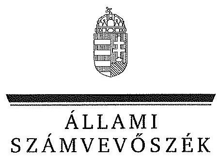
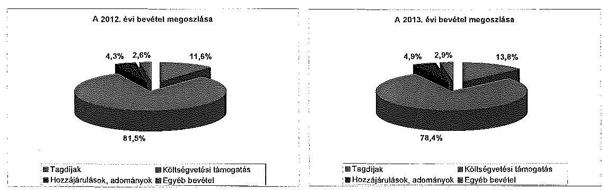
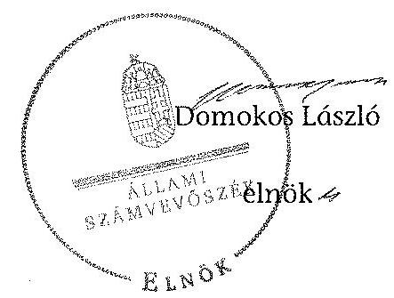

# JELENTÉS 

a költségvetési támogatásban részesülő pártok 2012-2013. évi gazdálkodása törvényességének ellenőrzéséről FIDESZ - Magyar Polgári Szövetség

---

# Állami Számvevőszék 

Iktatószám: V-0712-163/2015
Témaszám: 1746
Vizsgálat-azonosító szám: V070001

## Az ellenőrzést felügyelte:

Dr. Benedek Mária
felügyeleti vezető
Az ellenőrzést vezette és a végrehajtásáért felelős:
Bialkó Zsolt
ellenőrzésvezető
A számvevőszéki jelentés összeállításában közreműködött:
Krupánszki Dóra
számvevő főtanácsos
Az ellenőrzést végezték:
Dr. Faragóné Tóth Mária
Koczor László
számvevő
számvevő tanácsos

## Krupánszki Dóra

számvevő főtanácsos

A témához kapcsolódó korábban készített számvevőszéki jelentés:
címe
sorszáma
Jelentés a FIDESZ - Magyar Polgári Szövetség 2010-2011. évi gaz-
13018
dálkodása törvényességének ellenőrzéséről

---

# TARTALOMJEGYZÉK 

BEVEZETÉS ..... 5
I. ÖSSZEGZŐ MEGÁLLAPÍTÁSOK, KÖVETKEZTETÉSEK ..... 7
II. RÉSZLETES MEGÁLLAPÍTÁSOK ..... 10

1. A Párt által készített éves beszámolók ..... 10
1.1. A Párt által készített, a Hivatalos Értesítőben és a Párt internetes honlapján közzétett éves beszámolók törvényi előírásoknak való megfelelősége ..... 10
1.2. A Párt által készített éves beszámolók adatainak a könyvvezetéssel és valósággal való egyezősége ..... 10
2. A Párt könyvvezetése és gazdálkodása ..... 12
2.1. A Párt számviteli rendszerének szabályozottsága ..... 12
2.2. A Párt könyvvezetésének szabályszerűsége ..... 13
2.3. A gazdálkodással összefüggő (foglalkoztatás, személyi jellegű kifizetések, adózás, társadalombiztosítás), egyéb jogszabályokban meghatározott előírások betartása ..... 15
2.4. A Párt ellenőrzési rendszerének szabályozottsága és a szabályzatok szerinti működése ..... 17
2.5. A Párt pénzügyi-számviteli informatikai rendszerének szabályozottsága és a belső kontrollok működése ..... 19
3. A Párt forrásfelhasználása, gazdálkodó tevékenysége ..... 20
3.1. A Párt gazdálkodó tevékenységének szabályozottsága és a Párt tv.-ben megfogalmazott előírásoknak való megfelelősége ..... 20
3.2. A Párt működéséhez a forrásfelhasználás szabályszerűsége, kiemelten a Párt tv.-ben engedélyezett forrásból nyújtott támogatásokra és vagyoni hozzájárulásokra ..... 21
3.3. A Párt hitelfelvételének szabályszerűsége ..... 21
4. A korábbi ÁSZ ellenőrzés javaslatainak hasznosulása ..... 22
MELLÉKLETEK
5. számú A FIDESZ - Magyar Polgári Szövetség 2012. évi beszámolója
6. számú A FIDESZ - Magyar Polgári Szövetség 2013. évi beszámolója

---

.

---

# RÖVIDÍTÉSEK JEGYZÉKE 

## Törvények

Áfa tv.
Art.

ÁSZ tv.

Civil tv.

Megváltozott munkaképességűekről szóló tv.

Munka tv. 1

Munka tv. 2

Párt tv.

Számv. tv.
Szja tv.

Tbj.

Vagyon tv.
2012. évi költségvetési tv.
2013. évi költségvetési tv.
2012. évi zárszámadási tv.
2013. évi zárszámadási tv.

## SZÓRÖVIDÍTÉSEK

Alapszabály ${ }_{1}$

Alapszabály ${ }_{2}$
az általános forgalmi adóról szóló 2007. évi CXXVII. törvény
az adózás rendjéről szóló 2003. évi XCII. törvény
az Állami Számvevőszékről szóló 2011. évi LXVI. törvény
az egyesülési jogról, a közhasznú jogállásról, valamint a civil szervezetek működéséről és támogatásáról szóló 2011. évi CLXXV. törvény
a megváltozott munkaképességű személyek ellátásairól és egyes törvények módosításáról szóló 2011. évi CXCI. törvény
a Munka Törvénykönyvéről szóló 1992. évi XXII. törvény
a Munka Törvénykönyvéről szóló 2012. évi I. törvény
a pártok működéséről és gazdálkodásáról szóló 1989. évi XXXIII. törvény
a számvitelről szóló 2000. évi C. törvény
a személyi jövedelemadóról szóló 1995. évi CXVII. törvény
a társadalombiztosítás ellátásaira és a magánnyugdíjra jogosultakról, valamint e szolgáltatások fedezetéről szóló 1997. évi LXXX. törvény
az állami vagyonról szóló 2007. évi CVI. törvény
Magyarország 2012. évi központi költségvetéséről szóló 2011. évi CLXXXVIII. törvény
Magyarország 2013. évi központi költségvetéséről szóló 2012. évi CCIV. törvény
Magyarország 2012. évi központi költségvetéséről szóló 2011. évi CLXXXVIII. törvény végrehajtásáról szóló 2013. évi CXCIII. törvény
Magyarország 2013. évi központi költségvetéséről szóló 2012. évi CCIV. törvény végrehajtásáról szóló 2014. évi LXII. törvény

A Fidesz-Magyar Polgári Szövetség Alapszabálya (hatályos: 2006. november 25-től 2013. szeptember 27-ig)
A Fidesz-Magyar Polgári Szövetség Alapszabálya (hatályos: 2013. szeptember 28-tól)

---

ÁSZ
Cafeteria szabályzat
Értékelési szabályzat

Gépkocsi üzemeltetési és használati szabályzat

Informatikai szabályzat

Központi Hivatal
Költségvetési gazdálkodási szabályzat

Leltározási szabályzat
MFB Zrt.
NAV
Országos Elnökség
Országos Választmány
Párt
Pénzügyi szabályzat ${ }_{1}$

Pénzügyi szabályzat ${ }_{2}$
Számlarend $_{1}$

Számlarend $_{2}$

Számviteli politika
Számvizsgáló Bizottság
Tagdijszabályzat
választókerületi iroda

Állami Számvevőszék
A Fidesz-Magyar Polgári Szövetség Cafeteria szabályzata (hatályos: 2012. január 1-től)
A Fidesz-Magyar Polgári Szövetség Értékelési szabályzata (hatályos: 2011. január 1-től)

A Fidesz-Magyar Polgári Szövetség Gépkocsi üzemeltetési és használati szabályzata (hatályos: 2011. január 1-től)
A Fidesz-Magyar Polgári Szövetség Informatikai szabályzata (hatályos 2008. január 1-jétől)
A Fidesz-Magyar Polgári Szövetség Központi Hivatala
A Fidesz-Magyar Polgári Szövetség Költségvetési gazdálkodási szabályzata (hatályos: 2012. január 1-től)

A Fidesz-Magyar Polgári Szövetség Leltározási szabályzata (hatályos: 2012. január 1-től)
Magyar Fejlesztési Bank Zrt.
Nemzeti Adó- és Vámhivatal
A Fidesz-Magyar Polgári Szövetség Országos Elnöksége
A Fidesz-Magyar Polgári Szövetség Országos Választmánya
Fidesz-Magyar Polgári Szövetség
A Fidesz-Magyar Polgári Szövetség Pénzügyi Szabályzata (hatályos: 2012. január 1-től 2012. december 31-ig)
A Fidesz-Magyar Polgári Szövetség Pénzügyi Szabályzata (hatályos: 2013. január 1-től)
A Fidesz-Magyar Polgári Szövetség Számlarendje (hatályos: 2012. január 1-től 2012. december 31-ig)
A Fidesz-Magyar Polgári Szövetség Számlarendje (hatályos: 2013. január 1-től 2013. december 31-ig)
A Fidesz-Magyar Polgári Szövetség Számviteli politikája (hatályos: 2012. január 1-től 2013. december 31-ig)
Fidesz-Magyar Polgári Szövetség Számvizsgáló Bizottsága
A Fidesz-Magyar Polgári Szövetség Tagdijszabályzata (hatályos: 2004. január 1-től)
A Fidesz-Magyar Polgári Szövetség választókerületi irodája

---

# JELENTÉS 

## a költségvetési támogatásban részesülő pártok 2012-2013. évi gazdálkodása törvényességének ellenőrzéséről

## FIDESZ - Magyar Polgári Szövetség

## BEVEZETÉS

Az Állami Számvevőszékről szóló 2011. évi LXVI. törvény 5. § (11) bekezdése a) pontja, valamint a pártok működéséről és gazdálkodásáról szóló 1989. évi XXXIII. törvény (Párt tv.) 10. § (1) bekezdése alapján a pártok gazdálkodása törvényességének ellenőrzésére az ÁSZ jogosult. Az ÁSZ a rendszeres költségvetési támogatásban részesülő pártok gazdálkodását a Párt tv. 10. § (3) bekezdésében előírtak szerint kétévenként ellenőrzi. Az ÁSZ legutóbb 2012-ben ellenőrizte a Párt 2010-2011. évi gazdálkodása törvényességét.

A Párt a törvényi előírásoknak megfelelően az ellenőrzött időszak mindkét évében 1055,0 M Ft központi költségvetésből juttatott támogatásban részesült.

Az ellenőrzés célja annak értékelése volt, hogy a közzétett éves beszámolók a törvényi előírásoknak megfeleltek-e, a könyvvezetés és gazdálkodás során betartották-e a vonatkozó jogszabályi és belső előírásokat; a Párt a működéséhez szabályszerűen igénybe vehető forrásokat használt-e fel; az előző ÁSZ ellenőrzés során tett felhívásokat végrehajtotta-e.

Az ellenőrzés várható hasznosulásaként a gazdálkodás szabályszerűségének, a felhasznált közpénzek nagyságának bemutatásával a társadalom objektív képet alkothat a pártok működéséről. Az ellenőrzés megállapításai elősegíthetik, hogy a törvényalkotók konkrét lépéseket tegyenek a pártok finanszírozására vonatkozó szabályozások megváltoztatása, átláthatóbbá, ellenőrizhetőbbé tétele irányába. A gazdálkodás megfelelőségének bemutatásával az ellenőrzés értékteremtő módon járul hozzá a „jó kormányzás" megvalósításához. Az ellenőrzés rámutat a Párt gazdálkodásával, valamint az állami költségvetésből származó források felhasználásával kapcsolatos jó gyakorlatokra és szabálytalanságokra. A hiányosságok, szabálytalanságok feltárása, az ennek kapcsán megfogalmazott megállapítások elősegíthetik a törvényi rendelkezések megsértésének szankcionálását. Ugyancsak az ellenőrzés hozadékát képezi az előző ÁSZ ellenőrzés felhívásai hasznosulásának értékelése.

Az ellenőrzést a pénzügyi-szabályszerűségi ellenőrzés szabályai szerint, a Legfőbb Ellenőrző Intézmények Nemzetközi Szervezete (INTOSAI) által kiadott nemzetközi standardok (ISSAI) figyelembevételével végezte az ÁSZ.

---

Az ellenőrzés során figyelembe kellett venni azt, hogy

- a Párt tv. 1. számú melléklete szerinti beszámoló mintához magyarázatot, útmutatót nem készítettek a jogalkotók, így ennek kitöltése pártonként - a kialakított számviteli politikájuknak megfelelően - eltérő lehet;
- a beszámoló minta a számviteli törvény rendelkezéseivel nem harmonizál, nem felel meg sem a mérleg, sem az eredmény kimutatás követelményeinek.

Az ellenőrzött időszak: 2012. január 1. - 2013. december 31.
Az ellenőrzés jogszabályi alapját az ÁSZ tv. 5. § (11) bekezdés a) pontja, valamint a Párt tv. 10. § (1) és (3) bekezdései képezték.

Az ÁSZ tv. 29. § (1) bekezdésében foglaltak alapján a jelentéstervezetet megküldtük a FIDESZ elnöke részére, aki az ÁSZ tv. 29. § (2) bekezdésében foglalt észrevételezési jogával nem élt, a jelentéstervezetre észrevételt nem tett.

---

# 1. ÖSSZEGZŐ MEGÁLLAPÍTÁSOK, KÖVETKEZTETÉSEK 

A Párt a 2012. és a 2013. évről szóló beszámolóit a Párt tv.-ben előírt formában és tartalommal, határidőre közzétette a Magyar Közlöny mellékletét képező Hivatalos Értesítőben, valamint saját honlapján. A beszámolókat az Alapszabály ${ }_{1,2}$ előírásainak megfelelően az Országos Választmány elfogadta. A beszámolók összeállítása során érvényesültek a Számv. tv.-ben megfogalmazott alapelvek, hibák, hiányosságok az ellenőrzött évek egyikében sem fordultak elő. A közzétett gazdálkodásról szóló beszámolók - a Párt tv.-ben foglalt sajátosságokat figyelembe véve - megfeleltek a törvényi előírásoknak, a beszámoló sorok értékeit a főkönyvi kivonatok adatai alátámasztották.

A beszámolók valamennyi adatsora megegyezett a főkönyvi számlák és az analitikus nyilvántartások adataival, azokban csak a hozzá tartozó jogcímeken könyvelt összegek szerepeltek. A beszámolók sorait alátámasztó főkönyvi számlákon könyvelt gazdasági események a Számv. tv.-ben előírtak szerinti bizonylatok alapján kerültek elszámolásra.

A Párt a 2012. évről szóló beszámolójában 1294282 ezer Ft, a 2013. évről szóló beszámolójában 1345081 ezer Ft bevételt mutatott ki a következő összetételben:

A Párt a Tagdijszabályzatban rögzítette a tagdíjfizetés összegét és feltételeit. A beszámolók a tagdíjak között csak tagdíjnak minősülő bevételeket tartalmaztak. A központi költségvetésből származó támogatásként évenként kimutatott összeg megegyezett a 2012. évi, illetve 2013. évi költségvetési tv.-ben támogatásként meghatározott összeggel, valamint a 2012. évi és a 2013. évi zárszámadási tv.-ben szereplő összeggel. A Pártnak a 2012-2013. években képviselőcsoportnak nyújtott állami támogatás jogcímen nem keletkezett bevétele, ezért a 2012-2013. évi beszámolókban ezen a jogcímen nem szerepeltetett értéket. A 2012-2013. évi beszámolók a Párt tv.-ben előírt részletezettséggel tartalmazták az egyéb hozzájárulásokból, adományokból származó befizetéseket. A Párt a 2012-2013. évi beszámolókban a Párt tv.-ben meghatározott összeghatáron felüli befizetéseket az előírásoknak megfelelően nevesítette. A beszámolók tartalmazták a Párt tv. szerinti nem pénzben nyújtott hozzájárulások összegét. A 2012-2013. években a Párt által alapított vállalat és korlátolt felelősségű társaság nyereségéből származó bevételek jogcímen nem szerepeltettek értéket, mert a Párt gazdasági társaságot nem alapított, ilyen bevétele nem ke-

---

létkezett. A 2012-2013. évi beszámolók egyéb bevételei között csak az e jogcímen könyvelt összegek szerepeltek.

A Pártnak támogatás a Párt országgyűlési csoportja számára jogcímen az ellenőrzött időszakban nem merült fel kiadása, ezért a 2012-2013. évi beszámolókban ezen a jogcímen nem szerepeltetett értéket. A támogatás egyéb szervezeteknek jogcímű kiadások között két bírósági nyilvántartásban szereplő szervezetnek nyújtott támogatást szabályszerűen számolták el. A működési kiadások között szabályszerűen szerepeltették az ingatlanokra vonatkozó kedvezményes bérleti díjak összegét. Az eszközbeszerzés, a politikai tevékenység kiadásai és az egyéb kiadások jogcímeken feltüntetett összegek megegyeztek a vonatkozó főkönyvi számlák összesített értékeivel, az analitikus nyilvántartások adataival.

A Párt a Számv. tv.-ben előírt Számviteli politikával és a kapcsolódó szabályzatokkal rendelkezett. A szabályzatokat a Párt belső előírásai szerint arra jogosult léptette hatályba. A számviteli szabályzatok megfeleltek a Párt tv. szerinti gazdálkodással és a beszámoló készítésével összefüggő sajátos szabályoknak, valamint a Számv. tv. vonatkozó előírásainak.

A 2012-2013. években a Párt könyvvezetését külső szolgáltató könyvelő szervezet végezte a Számv. tv.-ben meghatározott kettős könyvvitel rendszerében. A gazdálkodás során betartották a Számv. tv. és a Párt tv. előírásait. Az ellenőrzött gazdasági események bizonylati alátámasztottsága, időrendisége, a kiállított vegyes bizonylatok megalapozottsága érvényesült, a számviteli alapelveket betartották. Gondoskodtak a főkönyvi könyvelés, az analitikus nyilvántartások és a bizonylatok adatai közötti egyeztetésről, az ellenőrzés logikailag zárt rendszerben történő biztosításáról. A szigorú számadású bizonylatok nyilvántartását a Számv. tv.-nek megfelelően vezették, gondoskodtak a bizonylatok szabályszerű megőrzéséről. Az analitikus nyilvántartások és a főkönyvi könyvelés között az értékadatok számszerű egyeztetése a Számv. tv.-ben előírtakkal összhangban megtörtént. Az éves beszámolókat alátámasztó főkönyvi kivonatokat elkészítették. Az ellenőrzött
 években eleget tettek a Számv. tv.-ben előírt leltározási kötelezettségüknek. A leltározás eredményét összevetették a nyilvántartásokkal, a kiértékelést elvégezték. A könyvviteli zárlatot a Számv. tv.-ben meghatározott módon végrehajtották. A könyvvezetés és a gazdálkodás során betartották a vonatkozó jogszabályi és belső előírásokat.

A munkaerő-foglalkoztatás az ellenőrzött időszakban a Munka tv. ${ }_{1,2}$-ben szabályozott tartalmú munkaszerződések alapján történt. A Párt a foglalkoztatottakat a törvényi előírásoknak megfelelően bejelentette az illetékes állami adóhatóságnál. A munkabérek számfejtése, kifizetése megfelelt a vonatkozó jogszabályoknak. A munkavállalókat megillető juttatásokat szabályozták. A Pártnál a 2013. évben természetbeni juttatás és költségtérítés kifizetése nem történt.

Az adózási és társadalombiztosítási jogszabályok munkaviszonnyal összefüggő előírásait, a havi és az éves adatszolgáltatási, bevallási és befizetési kötelezettségét a Párt teljesítette, a kötelező nyilvántartásokat vezette. A Párt a cégautó adófizetési kötelezettségét teljesítette. A tulajdonába került személygépkocsik után a vagyonszerzési illetéket megfizette. Az ellenőrzött időszakban el-

---

számolt reprezentációs költségek nem haladták meg az Szja tv.-ben meghatározott adómentes határt, a Megváltozott munkaképességűekről szóló tv. szerinti rehabilitációs hozzájárulás fizetési kötelezettsége nem keletkezett.

A Párt a gazdálkodásának ellenőrzési rendszerét az Alapszabály ${ }_{1,2}$-ban és gazdálkodási szabályzataiban határozta meg. A Számvizsgáló Bizottság az előírásokkal összhangban folytatta le ellenőrzéseit, arról a Kongresszusnak beszámolt. A vezetői és a munkafolyamatba épített ellenőrzési feladat- és hatásköröket a Költségvetési gazdálkodási szabályzatban, a Pénzügyi szabályzatban és a munkaköri leírásokban rögzítették. A kötelezettségvállalási, utalványozási, ellenjegyzési jogkört a szabályoknak megfelelően gyakorolták, rendszeres pénztárellenőrzést végeztek. A Párt elnöke meghatalmazást adott a főkönyvelőnek a gazdálkodással kapcsolatos ellenőri, ellenjegyzési feladatok folyamatos ellátására. Az ellenőrzési rendszer kialakítása és működtetése biztosította a Párt szabályszerű gazdálkodását, a könyvvezetés és beszámoló készítés törvényességét.

Az Informatikai szabályzatban előírtaknak megfelelően biztosították az elmentett pénzügyi-számviteli adatállományokból a megőrzési időn belül az adatok teljes körű előállíthatóságát. A mentéseket rögzítették, azok naplózható módon nyomon követhetőek voltak. Az adathordozók környezeti ártalmaktól és illetéktelen hozzáféréstől való védelme biztosított volt. A bérszámfejtéshez és a könyveléshez használt szoftverek verzió változásairól a szoftverfejlesztők tájékoztatták a könyvelő szervezetet. A programokon a frissítéseket végrehajtották, gondoskodtak az alkalmazott pénzügyi-számviteli szoftvereknek a Számv. tv. előírásainak való folyamatos megfeleltetéséről.

A Párt bevételeinek, gazdálkodó tevékenységeinek jogcímeit a Párt tv. előírásainak megfelelően az Alapszabály ${ }_{1,2}$-ban szabályozták. A szabályozás összhangban volt a Párt tv.-ben előírt korlátozásokkal. A Párt az Alapszabály ${ }_{1,2}$-ban meghatározott gazdálkodási tevékenységet folytatott, a Párt tv. alapján a tulajdonában álló ingatlanát 2012-ben és 2013-ban díj ellenében hasznosította. A Párt tv.-ben előírt korlátozásokat betartották.

A Párt vagyonának elemei a Párt tv.-ben meghatározott forrásokból képződtek. A Párt csak a Párt tv.-ben engedélyezett forrásból származó költségvetési támogatást fogadott el, tiltott szervezettől, más államtól vagyoni hozzájárulást, illetve névtelen adományt nem fogadott el. A nyilvántartásában elkülönítetten kezelte az 500,0 ezer Ft-ot meghaladó hozzájárulásokat, illetve a 100,0 ezer Ft-nak megfelelő értéket meghaladó, külföldről származó hozzájárulást. A Párt az ellenőrzött időszakban gondoskodott a nem pénzben nyújtott vagyoni hozzájárulások értékének megállapításáról. A 2012-2013. években a Párt kizárólag a Párt tv.-ben engedélyezett gazdálkodó tevékenységet folytatott, gazdálkodási bevétele a Párt tv.-ben előírtak szerinti ingatlan hasznosításból származott. A megszerzett ingatlanokat a jogszabályokban meghatározott rendeltetési célnak megfelelően használták. A gazdálkodó tevékenységre vonatkozó dokumentumok rendelkezésre álltak. A Párt a működéséhez szabályszerűen igénybe vehető forrásokat használt fel.

Az ÁSZ a 2012. évi ellenőrzése során nem tett intézkedést igénylő megállapítást, nem fogalmazott meg felhívást.

---

# II. RÉSZLETES MEGÁLLAPÍTÁSOK 

## 1. A PÁRT ÁLTAL KÉSZÍTETT ÉVES BESZÁMOLÓK

### 1.1. A Párt által készített, a Hivatalos Értesítőben és a Párt internetes honlapján közzétett éves beszámolók törvényi előírásoknak való megfelelősége

A Párt a 2012. és a 2013. évi gazdálkodásáról szóló beszámolóit a Párt tv. 9. § (1) bekezdésében előírt határidőben¹, 2013. április 24-én és 2014. március 21-én közzétette a Magyar Közlöny mellékletét képező Hivatalos Értesítőben², valamint saját internetes honlapján ${ }^{3}$

A Párt a 2012. és a 2013. évi beszámolókat a Párt tv. 1. számú mellékletében meghatározott minta szerinti formában és tartalommal jelentette meg.

A 2012. és a 2013. évek beszámolóit az Alapszabály ${ }_{1,2}$ 52. § (1) bekezdés k) pontjában előírtak alapján az Országos Választmány határozattal ${ }^{4}$ elfogadta.

A 2012. és a 2013. évi költségvetések végrehajtásáról szóló beszámolók elfogadására a Számvizsgáló Bizottság - Alapszabály ${ }_{1,2}$ 82. § a) pontja előírása szerinti véleményezését követően került sor.

Az ellenőrzött időszak beszámolóinak összeállítása során érvényesültek a Számv. tv. 15-16. §-aiban előírt alapelvek.

A Párt 2012. és 2013. évi beszámolóiban nem fordultak elő hibák, hiányosságok.

### 1.2. A Párt által készített éves beszámolók adatainak a könyvvezetéssel és valósággal való egyezősége

A 2012. és a 2013. évi beszámolók bevételi és kiadási adatai a kapcsolódó főkönyvi kivonatokból, a főkönyvi számlák adataiból egyértelműen levezethetőek voltak. A beszámolók sorait alátámasztó főkönyvi számlákon könyvelt gazdasági események a Számv. tv.-ben előírtak szerinti bizonylatok alapján kerül-

[^0]
[^0]:    ${ }^{1}$ A pártok a Párt tv. 9. § (1) bekezdésének 2014. május 5-éig hatályos előírása alapján kötelesek voltak minden év április 30-áig az előző évi gazdálkodásukról szóló beszámolót (zárszámadást) a Magyar Közlönyben, valamint saját honlappal rendelkező pártok a honlapjukon is közzétenni. 2014. május 6-ától a pártok a hatályos törvényi rendelkezésnek megfelelően a pénzügyi kimutatásuk közzétételére kötelezettek.
    ${ }^{2}$ a 2013. évi 17. számában, valamint a 2014. évi 17. számában
    ${ }^{3}$ www.fidesz.hu
    ${ }^{4}$ a 7/2013. 02. 05. számú és a 1/2014. 02. 08. számú határozatával

---

tek elszámolásra. A beszámolók soraiban csak a megfelelő jogcímeken könyvelt összegek szerepeltek. A beszámolókban bemutatott összegek megegyeztek a kapcsolódó főkönyvi számlák és az analitikus nyilvántartások adataival.

A Párt a 2012. évről szóló beszámolójában 1294282 ezer Ft, a 2013. évről szóló beszámolójában 1345081 ezer Ft bevételt mutatott ki az 1. és a 2. számú mellékletben részletezett összetételben.

A Párt a Tagdíjszabályzatban rögzítette a tagdíjfizetés összegét és feltételeit. A beszámolókban a tagdíjak jogcímen csak tagdíjnak minősülő bevételeket mutattak ki, amelyeket a Számv. tv. 166-167 §-ai előírásai szerinti szabályszerű bizonylatok támasztották alá. A 2012. évi és 2013. évi beszámolókban kimutatott 150,4 millió Ft, illetve 184,7 millió Ft tagdíjbevétel mindkét ellenőrzött évben megegyezett a kapcsolódó főkönyvi számlákon kimutatott összeggel.

A költségvetésből származó támogatásként évenként kimutatott 1055,0 millió Ft összeg megegyezett a 2012. évi, illetve 2013. évi költségvetési tv.-ben támogatásként meghatározott összeggel, valamint a 2012. évi, illetve a 2013. évi zárszámadási tv.-ben szereplő összeggel.

A Pártnak a 2012-2013. években képviselőcsoportnak nyújtott állami támogatás jogcímen nem keletkezett bevétele, ezért a beszámolók ezen soron az ellenőrzött időszakban nem szerepeltettek értéket.

A Párt az ellenőrzött időszakban nem végzett közösen feladatot pártalapítványnyal, ezért a Párt tv.-ben előírt szabályozásnak megfelelően vagyoni hozzájárulást nem fogadott el pártalapítványtól.

A 2012-2013. évi beszámolók a Párt tv.-ben előírt részletezettséggel tartalmazták az egyéb hozzájárulásokból, adományokból származó befizetéseket. A Párt a beszámolóiban az ellenőrzött időszakban kizárólag jogi- és magánszemélyektől származó bevételt mutatott ki 55,9 millió Ft, illetve 66,2 millió Ft összegben. A Párt a 2012-2013. évi beszámolókban a Párt tv. 9. § (2) bekezdésében előírtaknak megfelelően külön feltüntette az adott naptári év alatt a Párt részére adott, 500,0 ezer Ft-ot meghaladó és a külföldről származó (csak a 2013. évben volt külföldről származó hozzájárulás, összesen 186,0 ezer Ft), százezer Ft-ot meghaladó hozzájárulásokat. A beszámolók adatait alátámasztották a főkönyvi számlákhoz vezetett analitikus nyilvántartások és a Számv. tv. szerinti bizonylatok. A beszámolókban csak az egyes sorokhoz tartozó jogcímeken könyvelt összegek szerepeltek. Az egy adományozótól származó befizetéseket dokumentálták. A beszámolók tartalmazták a Párt tv.-ben előírtak és az Értékelési szabályzatban foglaltak szerint értékelt nem pénzben nyújtott hozzájárulások értékét.

A Párt nem alapított gazdasági társaságot, így a Párt által alapított vállalat és korlátolt felelősségű társaság nyereségéből származó bevételek között nem szerepeltettek értéket.

A Párt a 2012-2013. évi beszámolóinak egyéb bevételei között a Számviteli politikában előírtaknak megfelelően a Számlarend ${ }_{1,2}$ alapján könyvelt tétele-

---

ken kívül az adott évi hitelfelvételeket, valamint az egyéb követelések és kötelezettségek állományának a változását mutatta ki 32,9 millió Ft, illetve 39,2 millió Ft összegben. A beszámolók adatai megegyeztek az adott főkönyvi számlák összevont adataival, a főkönyvi számlákhoz analitikus nyilvántartások és a Számv. tv. szerinti bizonylatok kapcsolódtak. Az egyéb bevételek között csak az e bevételekhez tartozó jogcímeken könyvelt összegeket szerepeltették.

A beszámolók támogatás a Párt országgyűlési csoportja számára kiadási soron az ellenőrzött időszakban nem számoltak el kiadást.

A támogatás egyéb szervezeteknek jogcímen közölt 2012. évi 2,1 millió Ft, illetve 2013. évi 1,0 millió Ft megegyezett a vonatkozó főkönyvi számlák egyenlegével. A beszámolósort alátámasztó adatok szerint a Párt két olyan szervezetnek ${ }^{5}$ nyújtott támogatást, amelyek a Civil tv. 13. §-ában meghatározottak alapján bírósági nyilvántartásban szerepeltek.

A Párt a működési kiadások között a Számlarend ${ }_{1,2}$ szerint e jogcímen teljesíthető kiadásokat mutatta ki, amelynek összege 2012-ben 217,6 millió Ft, 2013-ban 332,7 millió Ft volt. A működési kiadások között szabályszerűen szerepeltették az ingatlanokra vonatkozó kedvezményes bérleti díjak összegét. Az ingatlanok között nem volt állami tulajdonban lévő ingatlan, így a Pártnak a Vagyon tv. 67. § (3)-(6) bekezdéseinek bejelentési kötelezettsége nem keletkezett.

Az eszközbeszerzésekre teljesített kiadások között a 2012. évben 23,7 millió Ft, a 2013. évben 147,1 millió Ft összegeket mutattak ki a beszámolókban. A közzétett adatok az ellenőrzött években megegyeztek a kapcsolódó főkönyvi számlák összesített egyenlegével.

A 2012-2013. évi beszámolókban a politikai tevékenység kiadásai jogcímen a Számlarend ${ }_{1,2}$-ben rögzítetteknek megfelelő kiadási jogcímen teljesített kiadásokat szerepeltették 52,5 millió Ft, illetve 228,8 millió Ft összegben, amelyek megegyeztek az érintett főkönyvi számlák egyenlegével.

A Párt az egyéb kiadások között mutatta ki a Számlarend ${ }_{1,2}$ alapján könyvelt tételeket, valamint a Számviteli politikában előírtaknak megfelelően az adott évben visszafizetett hiteltörlesztés, kölcsön visszafizetés, részletfizetés, faktorálásból származó visszafizetés összegeit. A 2012-2013. években a beszámolókban feltüntetett 912,6 millió Ft, illetve 450,9 millió Ft megegyezett a vonatkozó főkönyvi számlák összesített értékével.

# 2. A PÁRT KÖNYVVEZETÉSE ÉS GAZDÁLKODÁSA 

### 2.1. A Párt számviteli rendszerének szabályozottsága

A Párt az ellenőrzött időszakban rendelkezett a Számv. tv. 14. §-ában előírt számviteli szabályzatokkal, amelyeket a 14. § (12) és a 161. § (4) bekezdése

[^0]
[^0]:    ${ }^{5}$ Gyerekekért SOS 90 Alapítvány, illetve Fidelitas

---

előírásával, valamint az Alapszabály ${ }_{1,2}$-vel összhangban a Párt képviseletére jogosultak - a gazdasági vezető és a könyvelő szervezet főkönyvelője - léptettek hatályba ${ }^{6}$.

A Számv. tv.-ben előírtakon túl a Párt rendelkezett az ellenőrzött időszakban hatályos Ingatlanhasználati szabályzattal, Selejtezési szabályzattal, Költségvetési gazdálkodási szabályzattal, Cafeteria
 szabályzattal, Gépkocsi üzemeltetési és használati szabályzattal, Informatikai szabályzattal, Tagdíjszabályzattal, Értesítő a 2011-től érvényes új tagdíj-nyilvántartási rendszerről elnevezésű intézkedéssel, Gazdasági vezetői utasítás a Párt mobiltelefon és mobil-internet szolgáltatás használati rendjéről elnevezésű utasítással, a Párt gazdasági vezetői utasítása az alkalmazottak belföldi kiküldetéséről elnevezésű utasítással.
2012. január 1-jétől a Számv. tv. 14. § (3) bekezdése előírásának megfelelő Számviteli politikát léptettek hatályba, amelynek keretében az (5) és a (6) bekezdések figyelembe vételével elkészítették a Leltározási szabályzatot és a Pénzügyi szabályzat$_{1,2}$-t. Az Értékelési szabályzat 2011. január 1-jétől volt hatályos.

A Számviteli politikát a Párt a szervezeti sajátosságaihoz igazodóan készítette el, a hatályos jogszabályi előírásoknak megfelelő tartalommal.

A hatályos Leltározási szabályzat tartalmában megfelelt a jogszabályi előírásoknak. A leltározás ütemezését a szabályzatban meghatározottakkal összhangban, leltározást elrendelő utasításban határozták meg.

A hatályos Értékelési szabályzat megfelelt a Számv. tv. 57-68. §-ában és a Számviteli politikában foglalt követelményeknek.

A Pénzügyi szabályzat$_{1,2}$ - amely tartalmazta a Párt pénzkezelésére vonatkozó szabályokat - megfelelt a Számv. tv. 14. § (8) bekezdésében előírt tartalmi követelményeknek.

A Számviteli politikához aktualizált Számlarend$_{1,2}$ kapcsolódott, amely - figyelembe véve a Párt működési sajátosságait - a Számv. tv. 161. § (2) bekezdésében előírtaknak megfelelő tartalommal készült.

A Számviteli politikában és az ahhoz kapcsolódó számviteli szabályzatokban meghatározták a Számv. tv. 161. § (3) bekezdésében előírt egyeztetési lehetőség biztosítását az analitikus nyilvántartások és a főkönyvi könyvelés között, valamint a bizonylati rendet.

# 2.2. A Párt könyvvezetésének szabályszerűsége 

A könyvvezetést külső szolgáltató könyvelő szervezet végezte megbízási szerződés alapján a Számv. tv. 159. §-ában meghatározott kettős könyvvitel

[^0]
[^0]:    $^6$ Az Alapszabály$_{1,2}$ szerint a képviseleti, illetve aláírási jogkör a Párttal munkaviszonyban, illetve munkavégzésre irányuló egyéb jogviszonyban álló személyekre oly módon ruházható át, hogy a meghatalmazottak ketten együtt járhatnak el, illetve képviselhetik a Pártot.

---

rendszerében a Párt székhelyén. A könyvelő szervezet vezetője rendelkezett a Számv. tv. 151. § (1) bekezdésében meghatározott szakképesítéssel, a Magyar Könyvvizsgálói Kamara nyilvántartásában szerepelt. A könyvelési feladatokat a 2012-2013. években azonos integrált számviteli rendszerrel végezték. A Párt könyvvezetése összhangban állt a jogszabályokban és a belső szabályzatokban előírtakkal. A gazdálkodás során betartották a Számv. tv. és a Párt tv. előírásait. A nem pénzben nyújtott vagyoni hozzájárulás értékét a Párt tv. 4. § (5) bekezdése és az Értékelési szabályzat előírásai szerint határozták meg.

A Számv. tv.-ben rögzített számviteli alapelveket betartották. A számlakijelölés (kontírozás) gyakorlata megfelelt a Számv. tv. 160. §-ában és a Számlarend$_{1,2}$-ben rögzítetteknek, az ellenőrzött tételeket a megfelelő főkönyvi számlákon szerepeltették. Az ÁSZ által mintavétel alapján ellenőrzött kiadási és bevételi tételek bizonylati alátámasztottsága, időrendisége, a kiállított vegyes bizonylatok megalapozottsága a Számv. tv. 165. § (1)-(3) bekezdései előírásának megfelelően érvényesült.

A Számv. tv. 165. § (4) bekezdésének előírása alapján gondoskodtak a főkönyvi könyvelés, az analitikus nyilvántartások és a bizonylatok adatai közötti egyeztetés és az ellenőrzés logikailag zárt rendszerben történő biztosításának lehetőségéről.

A könyvviteli elszámolást közvetlenül alátámasztó számviteli bizonylatok megfeleltek a Számv. tv. 166. § (2) bekezdésében meghatározottaknak és a 167. §-ában előírt alaki és tartalmi követelményeknek.

A szigorú számadású bizonylatok nyilvántartását a 2012-2013. évekre vonatkozóan a Számv. tv. 168. §-a rendelkezéseinek megfelelően vezették.

A Számv. tv. 169. §-ában és a Költségvetési gazdálkodási szabályzat 38. §-ában előírtaknak megfelelően gondoskodtak a bizonylatok szabályszerű megőrzéséről.

A Párt a Számv. tv. 161. § (2) bekezdés c) pontban foglaltakkal összhangban rendelkezett a főkönyvi számlákhoz rendelt analitikus nyilvántartások köréről. Az analitikus nyilvántartások és a főkönyvi könyvelés között az értékadatok számszerű egyeztetése a szabályozásnak megfelelően megtörtént.

Az immateriális javak és tárgyi eszközök nyilvántartásában a bekerülési értéket a Számv. tv. 47-51. §-ai szerint határozták meg, az értékcsökkenés elszámolása megfelelt a Számv. tv. 52-53. §-aiban foglaltaknak. A szállítókról és a vevőkről, a tagdíjakról, egyes hitelekről, a bankszámlák forgalmáról, az elszámolásra kiadott összegekről analitikus nyilvántartást vezettek.

Az ellenőrzött években eleget tettek a Számv. tv. 69. §-ában előírt leltározási kötelezettségüknek, melyet dokumentáltan hajtottak végre a Leltározási szabályzat alapján. A leltározás eredményét összevetették a nyilvántartásokkal, a kiértékelést elvégezték. A selejtezésekről jegyzőkönyvet vettek fel.

A könyvviteli zárlatot a Számv. tv. 164. § (1)-(2) bekezdéseiben meghatározott módon végrehajtották. Az éves beszámolókat alátámasztó főkönyvi ki-

---

vonatokat elkészítették. Mindkét ellenőrzött év végén a kiegészítő, helyesbítő, egyeztető, összesítő könyvelési munkálatok és a számlák technikai lezárása megtörtént.

A Számv. tv. 14. § (8) bekezdése és a Pénzügyi szabályzat$_{1,2}$ előírásai szerint biztosították a pénzkezelés szabályszerűségét.

Helyi, kerületi szervek megszűnésére nem került sor 2012-ben és 2013-ban. Az ellenőrzött időszakban a választókerületi szervezetek átszervezése történt meg, a korábbi 176 helyett, átcsoportosítással 106 választókerületi szervezetet hoztak létre. A szervezeti átcsoportosítással összefüggésben az eszközök átadás-átvételéről jegyzőkönyvet készítettek.

Az ellenőrzött időszakban könyvviteli szolgáltató váltására nem került sor, 2006. január 1-je óta határozatlan idejű megbízási szerződés alapján ugyanaz a szervezet végezte a tevékenységet.

# 2.3. A gazdálkodással összefüggő (foglalkoztatás, személyi jellegű kifizetések, adózás, társadalombiztosítás), egyéb jogszabályokban meghatározott előírások betartása 

A Pártnál a munkaerő foglalkoztatása munkaviszony keretében szabályozott tartalmú munkaszerződések szerint történt, amelyek megfeleltek a Munka tv.$_{1}$ 76. §-ában, illetve a Munka tv.$_{2}$ 42-47. §-aiban foglalt előírásoknak.

A munkaszerződéseket a munkáltatói jogokat gyakorló írta alá. Az Alapszabály$_{1,2}$ 60. § r) pontjának és a 63. §-ának előírása értelmében az Országos Elnökség és a Párt Elnöke gyakorolja a munkáltatói jogokat a pártigazgatóval és a gazdasági igazgatóval szemben. A gazdasági vezető átruházott hatáskörben a gazdasági osztály alkalmazottai vonatkozásában gyakorolta a munkáltatói jogokat. A Költségvetési gazdálkodási szabályzat 4. § (1) bekezdése előírásának megfelelően a gazdasági vezető a munkaszerződésekkel egyidőben kiadta a munkaköri leírásokat, amelyekben rögzítették a gazdálkodási feladatokat és jogköröket, a helyettesítés rendjét.

A munkabérek számfejtése, kifizetése a hatályos Tbj., az Szja tv. és a vonatkozó kormányrendeletek előírásaival összhangban történt. Az egyéni bér- és járulék nyilvántartásokat vezették, amelyek megegyeztek a főkönyvi könyveléssel és a bevallásokkal.

A Párt a munkavállalókat megillető juttatásokat, költségtérítéseket a személyi kifizetésekre vonatkozó jogszabályok előírásaival összhangban lévő szabályzataiban határozta meg.

A Párt a Cafetéria szabályzatban meghatározta a béren kívüli juttatásokra jogosultak körét, a választható juttatásokat, a jogosultság feltételeit. A Pártnál 2012. évben Széchenyi pihenőkártyát, Erzsébet étkezési utalványt és egy fő részére helyi utazási bérletet biztosítottak. A természetbeni juttatások átvételét a munkavállalók átvételi elismervényen aláírásukkal igazolták. Az elszámolások és kifizetések megfeleltek az Szja tv. és a munkába járással kapcsolatos utazási

---

költségtérítésről szóló 39/2010. (II. 26.) Korm. rendelet előírásainak. A Pártnál a 2013. évben természetbeni juttatás és költségtérítés kifizetésére nem került sor.

A belföldi hivatalos kiküldetést teljesítő munkavállaló élelmezési költségtérítéséről szóló 278/2005. (XII. 20.) Korm. rendelet szerinti költségtérítést nem számoltak el. Külföldi kiküldetés költségtérítését az ellenőrzött időszakban nem fizettek.

A Párt tulajdonában lévő gépkocsik használatát, a dolgozók magántulajdonában lévő gépkocsik hivatalos célra történő használatának feltételeit és a cégautó adó megfizetésének szabályait a Gépkocsi üzemeltetési és használati szabályzatban rögzítették. A szabályozás a hivatalos utazások elszámolásánál előírta a magántulajdonú gépjármű használati jogának igazolását, az Szja tv. 3. § 83. pontjában előírt tartalmú kiküldetési rendelvény kötelező használatát és azt, hogy csak az Szja tv. 7. § (1) bekezdésének r) pontjában meghatározott adómentes mértékű költség számolható el.

A Pártnál a 2012-2013. években a saját tulajdonú gépjármű hivatalos célú használatát szabályozták, azonban ezen a címen kifizetés nem történt.

A Párt az ellenőrzött időszakban eleget tett a bejelentési, adó- és járulék nyilvántartási, levonási, bevallási, befizetési, adatszolgáltatási kötelezettségeknek. A magánszemélyeknek teljesített kifizetésekből levont személyi jövedelemadót, a munkáltatót és munkavállalókat terhelő járulékokat, valamint a magánnyugdíjpénztári befizetési kötelezettséget az Art.-ben előírtak szerint havonta megállapította, adó- és járulék bevallását határidőben benyújtotta, a levont adót és járulékot havi rendszerességgel határidőben megfizette.

A Párt a Tbj. 44. § (3) bekezdése szerint a biztosítási jogviszonnyal kapcsolatos bejelentési kötelezettségét az Art. 16. §-ában foglaltaknak megfelelően az illetékes állami adóhatóságnak teljesítette. Az adók és járulékok bevallása és befizetése a főkönyvi nyilvántartás adataival megegyezett. A Pártnak a 2012-2013. években adóhátralékai nem voltak, amely tényt a NAV folyószámla kivonata alátámasztotta.

A Gépkocsi üzemeltetési és használati szabályzatban a Párt tulajdonában lévő gépkocsik használatát és cégautó adó megfizetését szabályozták.

A Párt tulajdonában lévő gépkocsik használatát csak menetlevél vezetésével engedélyezték. A Párt a szabályzatában rögzítette, hogy a leadott üzemanyag számla összege akkor fizethető ki, ha a menetlevélen feltüntetett kilométer, valamint a NAV által meghatározott üzemanyagár alapján kiszámított fogyasztási norma nem lépi túl az egyszerüsített alapnormát. A Pártnál a gépkocsik használata során mindkét ellenőrzött évben a szabályozás szerint jártak el. A szabályozás IV. pontja szerint a Párt tulajdonában lévő gépjárműveket magánhasználatra nem igényelhették.

A Párt a tulajdonában álló gépkocsik után a gépjárműadóról szóló 1991. évi LXXXII. törvény 17/A.-17/G. §-ai előírásainak megfelelően az ellenőrzött időszakra vonatkozóan a cégautó adót önadózással megállapította, negyedévenkénti adóbevallási, adófizetési kötelezettségét teljesítette.

---

A Párt az adásvétellel tulajdonába került személygépkocsik után az illetékekről szóló 1990. évi XCIII. tv. 24 § (1) bekezdése szerinti gépjármű vagyonszerzési illetéket megfizette.

A Párt a reprezentációs költségek elkülönített nyilvántartásáról gondoskodott. A reprezentációs költségek nagysága nem haladta meg a 2012-2013. években az Szja. tv. 70. § (2a) bekezdésében meghatározott adómentes értékhatárt, ezért a Pártnak személyi jövedelemadó és járulékfizetési kötelezettsége nem keletkezett. A Pártnál üzleti ajándék kifizetés az ellenőrzött időszakban nem volt.

A Párt a mobiltelefon és mobil-internet szolgáltatás használati rendjét 2008. január 1-jétől hatályos gazdasági vezetői utasításban és a Pénzügyi szabályzat$_{1,2}$-ben határozta meg. A Párt a mobil-internet használattal kapcsolatosan az Szja tv. 69. §-a szerinti adófizetési kötelezettségét mindkét ellenőrzött évben teljesítette.

A Pártnál az ellenőrzött időszakban az irodahelyiségek bérleménye címén magánszemélynek fizetett bérleti díj utáni, az Art. 25. § (3) bekezdése szerinti adóelőleg levonási kötelezettségét az Szja. tv. 31. §-a alapján teljesítette, erről az igazolást az Art. 46. § (1) bekezdésének megfelelően kiadta a bérbeadónak. A levont adóelőleget az Art. előírásaiban foglaltaknak megfelelően határidőben befizette.

A Pártnak gazdálkodó tevékenységével összefüggésben az Áfa tv. hatálya alá tartozó bevallási, befizetési kötelezettsége nem keletkezett.

A Pártnak a Megváltozott munkaképességűekről szóló tv. 22-24. §-ai előírásai szerinti rehabilitációs hozzájárulás fizetési kötelezettsége nem keletkezett, mivel az általa foglalkoztatottak száma a 25 főt nem haladta meg.

A Párt a 2012. évben egy gépkocsi cégautó adójával és az ingatlan bérbeadásokkal kapcsolatban kezdeményezett önellenőrzést az adóhatóság felé és az ezzel kapcsolatos önellenőrzési pótlékot megfizette.

A Pártnál 2012-2013. évet érintő társadalombiztosítási ellenőrzésre nem került sor, a NAV az adózási szabályok betartását nem vizsgálta.

# 2.4. A Párt ellenőrzési rendszerének szabályozottsága és a szabályzatok szerinti működése 

Az
 Alapszabály ${ }_{1,2}$-ben rögzítették a Párt döntéshozó, irányító szerveinek feladat- és hatáskörét, a gazdálkodás szabályait. A Párt döntéshozó és irányító testületei az Országos Választmány, az Országos Elnökség és a Kongresszus, amelyek az Alapszabály ${ }_{1,2}$-ban meghatározottak szerint gyakorolták feladat- és hatáskörüket. Az Országos Választmány a Párt információs, egyeztető és döntéshozó fóruma, az Országos Elnökség a Párt irányító, döntéshozó szerve, a Kongresszus a Párt legfelsőbb tanácskozó és döntéshozó szerve.

A Párt gazdálkodásának ellenőrzési rendszere szabályozott volt, azt az Alapszabály ${ }_{1,2}$-ben és gazdálkodási szabályzataiban határozta meg.

---

Az Alapszabály ${ }_{1,2}$ XIII. fejezete tartalmazta a Számvizsgáló Bizottság választására, feladataira vonatkozó előírásokat. A Számvizsgáló Bizottság feladata a Párt vagyonkezelésének és pénzügyeinek folyamatos ellenőrzése volt.

A Számvizsgáló Bizottság feladatkörébe tartozott az Országos Választmány elé terjesztett költségvetés és a költségvetés végrehajtásáról szóló beszámoló vizsgálata és írásbeli véleményezése. Jogosult volt a Párt pénzügyeivel, gazdálkodásával, vagyonkezelésével kapcsolatos okmányokba betekinteni, elnöke jogosult volt az Országos Elnökségtől, az Országos Választmány Elnökségétől, a hivatal vezetőjétől, illetve a hivatal vezetőjén keresztül a Párt pénzügyeivel, gazdálkodásával, vagyonkezelésével megbízott személyektől a tevékenységükre vonatkozó tájékoztatást kérni. Feladataként rögzítették, hogy munkájáról tájékoztatja az Országos Elnökséget, az Országos Választmányt és beszámol a Kongresszusnak, ellenőrzi a tagdíjak, tagdíj-kiegészítések befizetését és felhasználásának módját.

A 2011. szeptember-2013. június közötti időszakra vonatkozó ellenőrzési terv elfogadására és a Számvizsgáló Bizottság tagjainak megválasztására tisztújító kongresszuson került sor. A Számvizsgáló Bizottság az ellenőrzési tervben foglalt feladatokat elvégezte, valamint az Országos Választmány Elnöke kérésére további ellenőrzéseket végzett.

A Számvizsgáló Bizottság 2011-2013. évi munkájáról a Párt XXV. Kongresszusán beszámolt.

A vezetői és a munkafolyamatba épített ellenőrzési feladat- és hatásköröket a Költségvetési gazdálkodási szabályzatban és a Pénzügyi szabályzat ${ }_{1,2}$-ben rögzítették.

A Költségvetési gazdálkodási szabályzat 39-45. §-aiban határozták meg a gazdálkodás ellenőrzési kérdéseit. A 4. és a 41. §-ok előírása szerint a gazdasági vezető felelős a gazdasági-pénzügyi ellenőrzések megszervezéséért, folyamatos működéséért és irányításáért. Az ellenőrzés elemeiként a vezetői ellenőrzést (pl.: aláírási jog gyakorlásának feltételei), a munkafolyamatba épített ellenőrzést (pl.: pénztár ellenőrzés) és a célellenőrzést (pl.: Számvizsgáló Bizottság ellenőrzése, korábbi hiányosságok utóellenőrzése) határozták meg. Az elvégzett ellenőrzések egy eset kivételével szabálytalanságot nem tártak fel. Az elszámolásra kiadott előlegek ellenőrzése során megállapították, hogy egy esetben nem határidőben történt meg a visszafizetés.

A Költségvetési gazdálkodási szabályzat 16-28. §-aiban rögzítették az utalványozásra és a kötelezettségvállalásra vonatkozó előírásokat. A Pénzügyi szabályzat ${ }_{1,2}$-ben meghatározták az aláírási jogok gyakorlásának feltételeit, 2. számú mellékletében kijelölték az utalványozásra, az érvényesítésre, az ellenjegyzésre és az ellenőrzésre, pénztárellenőrzésre jogosultak körét. A bizonylatok kezelése során a Számv. tv. 167. § (1) bekezdés c) pontja előírásának eleget tettek. A munkafolyamatba épített egyeztetési, engedélyezési, ellenőrzési feladatokat a munkaköri leírásokban is rögzítették.

A Pénzügyi szabályzat ${ }_{1,2}$ III. c) pontjában folyamatos pénztárellenőrzést írtak elő. Napi pénztárjelentést vezettek a főpénztárra és a választókerületi irodákra

---

vonatkozóan, melynek során rendszeres, minden pénztári forgalommal érintett napra vonatkozóan pénztárellenőrzést végeztek.

Az ÁSZ által ellenőrzött 2012. január és 2013. január hónapok esetén a pénztárellenőr aláírása minden esetben szerepelt.

A pénztáros és helyettese anyagi felelősségvállalási nyilatkozatot tett. A pénztáros és a pénztárellenőr feladatait a munkaköri leírásukban meghatározták.

A könyvelési és adminisztratív feladatokat ellátó szervezettel kötött megbízási szerződésekben ${ }^{7}$ ellenőrzési feladatokat nem rögzítettek, azonban a Párt elnöke 2003. május 17-én meghatalmazta a főkönyvelőt a gazdálkodással kapcsolatos ellenőri, ellenjegyzési feladatok folyamatos ellátásával. A főkönyvelő e feladatait dokumentáltan elvégezte.

A választókerületi irodáktól beérkezett alapbizonylatokat a könyvelésre történő feladást megelőzően felülvizsgálták. A könyvelő szervezet folyamatba építetten végzett ellenőrzési, egyeztetési tevékenységet.

A Párt nem élt független könyvvizsgáló megbízásának lehetőségével az éves beszámolók auditálására vagy egyéb ellenőrzési tevékenységre vonatkozóan.

Az ellenőrzési rendszer kialakítása és működtetése biztosította a Párt szabályszerű gazdálkodását, a könyvvezetés és beszámoló készítés törvényességét.

# 2.5. A Párt pénzügyi-számviteli informatikai rendszerének szabályozottsága és a belső kontrollok működése 

Az ellenőrzött időszakban Informatikai szabályzatban biztosították a Párt pénzügyi-számviteli informatikai rendszerének szabályozását, meghatározták az informatikai rendszer biztonsági irányelveit, az adattárolási szabályokat, az adatmentési protokollt. Az Informatikai szabályzatban rögzítették a könyvelést végző szervezet felelősségét a könyvelési adatok mentésére vonatkozóan. Az Informatikai szabályzat tartalmát a Párt és a könyvelő szervezet munkavállalói dokumentáltan megismerték.

A bérszámfejtési feladatok ellátására integrált ügyviteli rendszert, a könyvelésre integrált számviteli rendszert ${ }^{8}$ használtak ${ }^{9}$.

[^0]
[^0]:    ${ }^{7}$ 2006. január 1-jén és 2012. november 1-jén
    ${ }^{8}$ A szolgáltató nyilatkozata szerint a program kihagyás vagy ismétlés nélkül biztosítja a sorszámozást és a másolatok alapján a hiánytalan elszámolást, figyelembe veszi a törvényi előírásokat.
    ${ }^{9}$ A könyvelő szervezet a bérszámfejtési program és a könyvelési program felhasználására egy-egy gazdasági társasággal kötött szerződést (2006. január 20-án, majd módosították 2013. március 11-én).

---

A bérszámfejtési programot a könyvelő szervezet szerverére telepítették és ott végezték. A könyvelés a Párt székhelyén történt a könyvelő szervezet tulajdonát képező programmal.

Mindkét programot a könyvelő szervezet alkalmazottai használták. A hozzáférési jogosultságokat modulonként dokumentálták. A programok használata jelszóval védett. A jelszavakat legalább évente megváltoztatták.

Az Informatikai szabályzatnak megfelelően biztosították az elmentett pénzügyi-számviteli adatállományokból a megőrzési időn belül az adatok teljes körű előállíthatóságát. A mentéseket rögzítették, azok naplózható módon nyomon követhetőek voltak. Az adathordozók környezeti ártalmaktól és illetéktelen hozzáféréstől való védelme biztosított volt.

A bérszámfejtéshez és a könyveléshez használt szoftverek verzió változásairól a szoftverfejlesztők automatikusan, elektronikus levelükben tájékoztatták a könyvelő szervezetet. A frissítések a szoftverfejlesztők honlapjáról kerültek letöltésre. A könyvelő szervezet székhelyén és a Párthoz kihelyezett programon a frissítéseket végrehajtották, gondoskodtak az alkalmazott pénzügyiszámviteli szoftverek Számv. tv. előírásainak való folyamatos megfeleltetéséről. A frissítések egymásra épültek, ezáltal biztosították, hogy mindig a legfrissebb verzió legyen használatban. A Párthoz kihelyezett könyvelő program esetén további kontrollt jelentett, hogy a mentések a könyvelő szervezet szerverére csak a frissítést követően kerülhettek letöltésre.

# 3. A PÁRT FORRÁSFELHASZNÁLÁSA, GAZDÁLKODÓ TEVÉKENYSÉGE 

### 3.1. A Párt gazdálkodó tevékenységének szabályozottsága és a Párt tv.-ben megfogalmazott előírásoknak való megfelelősége

A Párt bevételeinek, gazdálkodó tevékenységeinek jogcímeit az Alapszabály ${ }_{1,2}$ XIV. fejezetében szabályozták a Párt tv. előírásainak megfelelően. A szabályozás összhangban állt a Párt tv.-ben előírt korlátozásokkal.

A Párt a Párt tv. előírásának megfelelő gazdálkodási tevékenységet folytatott. A Párt tv. 6. § (1) bekezdése b) pontjában meghatározottak alapján a tulajdonában álló egyik ingatlanát 2012-ben és 2013-ban díj ellenében hasznosította.

A Párt vállalatot nem hozott létre, egyszemélyes korlátolt felelősségű társaságot nem alapított. A Párt tv. 6. § (3) bekezdése előírásának megfelelően más gazdasági társaságban részesedést nem szerzett.

A Párt értékpapírral nem rendelkezett, a Párt tv. 6. § (4) bekezdésében foglaltaknak megfelelően részvényt nem vásárolt.

---

# 3.2. A Párt működéséhez a forrásfelhasználás szabályszerűsége, kiemelten a Párt tv.-ben engedélyezett forrásból nyújtott támogatásokra és vagyoni hozzájárulásokra 

A Párt bevételei a Párt tv. 4. §-ában előírtak szerinti engedélyezett forrásokból származtak. Az évenként jóváírt 1055,0 millió Ft költségvetési támogatás a Párt bevételeinek 81,5%-át, illetve 78,4%-át tette ki 2012-ben és 2013-ban.

A Párt a Párt tv. 4. § (2)-(3) bekezdéseiben előírtaknak megfelelve tiltott szervezettől, más államtól vagyoni hozzájárulást, illetve névtelen adományt nem fogadott el.

A 2012-2013. években a Párt az analitikus nyilvántartásában elkülönítetten kezelte az 500,0 ezer Ft-ot meghaladó hozzájárulásokat, illetve a 100,0 ezer Ft-nak megfelelő értéket meghaladó külföldről származó hozzájárulást.

A Párt az ellenőrzött időszakban használt ingatlanokhoz kapcsolódóan a Párt tv. 4. § (5) bekezdése és az Értékelési Szabályzat előírásának megfelelően megállapította a piaci árat. A kedvezményes díjtétel és a tényleges piaci ár közötti különbözetet - melyet nem pénzben nyújtott vagyoni hozzájárulásként könyveltek - a 2012. évben 6562,2 ezer Ft-ban, a 2013. évben 4338,7 ezer Ft-ban határozták meg.

A 2012-2013. években a Párt gazdálkodási bevétele a Párt tv. 6. § (1) bekezdés b) pontjában rögzítettek szerint a tulajdonában álló ingatlan hasznosításából származott. A megszerzett ingatlanokat a jogszabályokban meghatározott rendeltetési célnak megfelelően használták. A gazdálkodó tevékenységre vonatkozó, annak jogszerűségét igazoló szerződések, egyéb dokumentumok rendelkezésre álltak.

### 3.3. A Párt hitelfelvételének szabályszerűsége

Az ellenőrzött időszakban a Párt négy hitelszerződést kötött. A Párt elnöke és gazdasági vezetője 2013. december 3-án középlejáratú forgóeszköz finanszírozó hitelszerződést írt alá. A rendelkezésre álló hitelkeretből az ellenőrzött időszakban nem történt igénybevétel.

A 2012. évben egy, a 2013. évben két gépjármű vásárlására hitelszerződést kötöttek. A hitelszerződéseket a Pénzügyi szabályzat ${ }_{1,2}$-ben foglalt előírás alapján a Párt igazgatója és gazdasági vezetője írta alá.

Az ellenőrzött időszakban a hitelszerződésekhez kapcsolódó tőke- és kamatfizetési kötelezettségnek a szerződésekben foglaltaknak megfelelően eleget tettek.

---

# 4. A korábbi ÁSZ ellenőrzés javaslatainak hasznosulása 

Az ÁSZ 2012. évi ellenőrzése során nem tett intézkedést igénylő megállapítást, így felhívással sem élt, ezért a Pártnak az ÁSZ tv.-ben előírtak szerinti intézkedési terv készítési kötelezettsége nem keletkezett.

Budapest, 2015. 05. hónap 14. nap

Melléklet: $\quad 2 \mathrm{db}$

---

| A FIDESZ - Magyar Polgári Szövetség 2012. évi beszámolója |  |  |  |  |  |
| :--: | :--: | :--: | :--: | :--: | :--: |
| Bevételek |  |  |  |  | Ezer forintban |
| 1. |  | Tagdíjak |  |  | 150440 |
| 2. |  | Állami költségvetésből származó támogatás |  |  | 1055000 |
| 3. |  | Képviselőcsoportnak nyújtott állami támogatás |  |  | 0 |
| 4. |  | Egyéb hozzájárulások, adományok |  |  | 55928 |
|  | 4_1 | Jogi személyektől |  | 10877 |  |
|  |  | 4.1.1. a Belföldiektől (500 e Ft alatt)* | 4005 |  |  |
|  |  | 4.1.1.b Belföldiektől (500 e Ft felett)* | 6872 |  |  |
|  |  | Fény utcai Piac Kft. (Bp. II.) |  | 566 |  |
|  |  | Bp. XIII. ker. Polgármesteri Hivatal |  | 559 |  |
|  |  | Bp. XIX. ker. Önkormányzat Polgármesteri Hivatal |  | 887 |  |
|  |  | Palota Holding Zrt. (Bp. XV.) |  | 640 |  |
|  |  | Belváros - Lipótváros Önkormányzata |  | 1255 |  |
|  |  | Bp. XVIII.ker. Polgármesteri Hivatal |  | 565 |  |
|  |  | Patent Holding Kft. |  | 2400 |  |
|  |  | 4.1.2. a Külföldiektől (100 eFt alatt) |  |  |  |

 | 0 |  |  |
|  | 4_2 | Jogi személyiséggel nem rendelkezőktől |  |  | 0 |
|  |  | 4.2.1.a Belföldiektől (500 eFt alatt) | 0 |  |  |
|  | 4_3 | Magánszemélyektől |  |  | 45051 |
|  |  | 4.3.1.a Belföldiektől (500 eFt alatt) | 39748 |  |  |
|  |  | 4.3.1.b Belföldiektől (500 eFt felett) | 5303 |  |  |
|  |  | Járóka Uma |  | 823 |  |
|  |  | Jelen Tamás |  | 1540 |  |
|  |  | Kósa Ádám |  | 540 |  |
|  |  | Kukoda Nándor |  | 600 |  |
|  |  | Nyitrai Zsolt |  | 1000 |  |
|  |  | Stalay Péter |  | 800 |  |
|  |  | 4.3.2.a Külföldiektől (100 eFt alatt) | 0 |  |  |
|  |  | 4.3.2.b Külföldiektől (100 eFt felett) | 0 |  |  |
| 5. | A párt által alapított vállalat és korlátolt felelősségű társaság nyereségéből származó bevétel |  |  |  | 0 |
| 6. | Egyéb bevételek |  |  |  | 32914 |
| Összes bevétel a gazdasági évben |  |  |  |  | 1294282 |
| Kiadások |  |  |  |  |  |
| 1. | Támogatás a párt országgyűlési csoportja számára |  |  |  | 0 |
| 2. | Támogatás egyéb szervezeteknek |  |  |  | 2100 |
| 3. | Vállalkozások alapítására fordított összeg |  |  |  | 0 |
| 4. | Működési kiadások |  |  |  | 217596 |
| 5. | Eszközbeszerzés |  |  |  | 23700 |
| 6. | Politikai tevékenység kiadásai |  |  |  | 52503 |
| 7. | Egyéb kiadások* |  |  |  | 912628 |
| Összes kiadás a gazdasági évben |  |  |  |  | 1208527 |

Megjegyzés: A Párt beszámolójának *-gal jelzett sorai számított adatot is tartalmaznak, 2.090 eFt (4.1.1a sorból), 4.472 eFt (4.1.1b sorból) és 6562 eFt (7. sorból) összegben.

---

|  A FIDESZ - Magyar Polgári Szövetség 2013. évi beszámolója |  |  |  |  |  |   |
| --- | --- | --- | --- | --- | --- | --- |
|  Bevételek |  |  |  |  |  | Ezer forintban  |
|  1. |  | Tagdíjak |  |  |  | 184690  |
|  2. |  | Központi költségvetésből származó támogatás |  |  |  | 1055000  |
|  3. |  | Képviselőcsoportnak nyújtott állami támogatás |  |  |  | 0  |
|  4. |  | Egyéb hozzájárulások, adományok |  |  |  | 66219  |
|   | 4_1 | Jogi személyektől |  |  | 6944 |   |
|   |  | 4.1.1.a Belföldiektől (500 e Ft alatt) | 1986 |  |  |   |
|   |  | 4.1.1.b Belföldiektől (500 e Ft felett) | 4958 |  |  |   |
|   |  | Belváros - Lipótváros Önkormányzata |  | 1299 |  |   |
|   |  | Palota Holding Zrt. |  | 662 |  |   |
|   |  | Bp. XVII.ker. Polgármesteri Hivatal |  | 597 |  |   |
|   |  | Patent Holding Kft. |  | 2400 |  |   |
|   |  | 4.1.2.a Külföldiektől (100 eFt alatt) | 0 |  |  |   |
|   | 4_2 | Jogi személynek nem minősülő gazdasági társaságtól |  |  | 0 |   |
|   |  | 4.2.1.a Belföldiektől (500 eFt alatt) | 0 |  |  |   |
|   | 4_3 | Magánszemélyektől |  |  | 59275 |   |
|   |  | 4.3.1.a Belföldiektől (500 eFt alatt) | 53311 |  |  |   |
|   |  | 4.3.1.b Belföldiektől (500 eFt felett) | 5778 |  |  |   |
|   |  | Járóka Lívia |  | 870 |  |   |
|   |  | Kukoda Nándor |  | 1200 |  |   |
|   |  | Nyitrai Zsolt |  | 1000 |  |   |
|   |  | Papcsák Ferenc |  | 1000 |  |   |
|   |  | Schöpflin György András |  | 558 |  |   |
|   |  | Szabó Sándor |  | 1150 |  |   |
|   |  | 4.3.2.a Külföldiektől (100 eFt alatt) | 62 |  |  |   |
|   |  | 4.3.2.b Külföldiektől (100 eFt felett) | 124 |  |  |   |
|   |  | Parczen Zsófia |  | 124 |  |   |
|  5. |  | A párt által alapított vállalat és korlátolt felelősségű társaság nyereségéből származó bevétel |  |  |  | 0  |
|  6. |  | Egyéb bevétel |  |  |  | 39172  |
|  Összes bevétel a gazdasági évben |  |  |  |  |  | 1345081  |
|  Kiadások |  |  |  |  |  |   |
|  1. |  | Támogatás a párt országgyűlési csoportja számára |  |  |  | 0  |
|  2. |  | Támogatás egyéb szervezeteknek |  |  |  | 1010  |
|  3. |  | Vállalkozások alapítására fordított összeg |  |  |  | 0  |
|  4. |  | Működési kiadások |  |  |  | 332681  |
|  5. |  | Eszközbeszerzés |  |  |  | 147091  |
|  6. |  | Politikai tevékenység kiadásai |  |  |  | 228783  |
|  7. |  | Egyéb kiadások |  |  |  | 450915  |
|  Összes kiadás a gazdasági évben |  |  |  |  |  | 1160480  |

