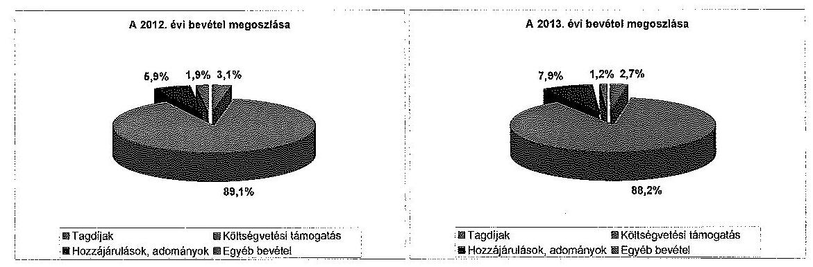
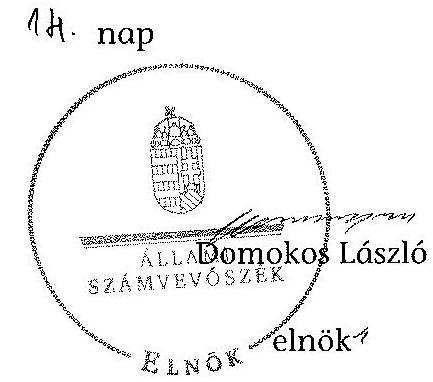

# ÁLLAMI   SZÁMVEVŐSZÉK 

## JELENTÉS

a költségvetési támogatásban részesülő pártok 2012-2013. évi gazdálkodása törvényességének ellenőrzéséről

Kereszténydemokrata Néppárt

---

# Állami Számvevőszék 

Iktatószám: V-0713-124/2015.
Témaszám: 1747
Vizsgálat-azonosító szám: V07002

## Az ellenőrzést felügyelte:

Dr. Benedek Mária
felügyeleti vezető
Az ellenőrzés végrehajtásáért felelős:
Bialkó Zsolt
ellenőrzésvezető
A számvevőszéki jelentés összeállításában közreműködött:
Bialkó Zsolt
ellenőrzésvezető
Boros Attila
számvevő tanácsos
Az ellenőrzést végezték:
Boros Attila
Igar Tamás
számvevő tanácsos
számvevő főtanácsos

## Szabó Zsuzsanna

számvevő

## A témához kapcsolódó korábban készített számvevőszéki jelentés:

## címe

sorszáma
Jelentés a Kereszténydemokrata Néppárt 2010-2011. évi gazdálkodása törvényességének ellenőrzéséről 13023

---

# TARTALOMJEGYZÉK 

BEVEZETÉS ..... 5
I. ÖSSZEGZŐ MEGÁLLAPÍTÁSOK, KÖVETKEZTETÉSEK, JAVASLATOK ..... 7
II. RÉSZLETES MEGÁLLAPÍTÁSOK ..... 13

1. A párt által készített éves beszámolók ..... 13
1.1. A Párt által készített, a Hivatalos Értesítőben és a Párt internetes honlapján közzétett éves beszámolók törvényi előírásoknak való megfelelősége ..... 13
1.2. A Párt által készített éves beszámolók adatainak a könyvvezetéssel és valósággal való egyezősége ..... 14
2. A párt könyvvezetése és gazdálkodása ..... 16
2.1. A Párt számviteli rendszerének szabályozottsága ..... 16
2.2. A Párt könyvvezetésének szabályszerűsége ..... 17
2.3. A gazdálkodással összefüggő (foglalkoztatás, személyi jellegű kifizetések, adózás, társadalombiztosítás, pártalapítvánnyal közösen végzett feladatok), egyéb jogszabályokban meghatározott előírások betartása ..... 19
2.4. A Párt ellenőrzési rendszerének szabályozottsága és a szabályzatok szerinti működése ..... 21
2.5. A Párt pénzügyi-számviteli informatikai rendszerének szabályozottsága, a belső kontrollok működése ..... 23
3. A párt forrásfelhasználása, gazdálkodó tevékenysége ..... 23
3.1. A Párt gazdálkodó tevékenységének szabályozottsága és a párttörvényben megfogalmazott előírásoknak való megfelelősége ..... 23
3.2. A Párt működéséhez használt forrásfelhasználás szabályszerűsége, kiemelten a párttörvényben engedélyezett forrásból nyújtott támogatásokra és vagyoni hozzájárulásokra ..... 24
3.3. A Párt hitelfelvételének szabályszerűsége ..... 24
4. A korábbi ÁSZ ellenőrzés javaslatainak hasznosulása ..... 24
4.1. Az ÁSZ korábbi ellenőrzése során tett, intézkedést igénylő megállapításaihoz készített intézkedési tervben megfogalmazott feladatok végrehajtása, az intézkedési tervben előírt határidő betartása ..... 24
4.2. Az intézkedések hatása ..... 25

---

# MELLÉKLETEK 

1. számú A Kereszténydemokrata Néppárt 2012. évi pénzügyi beszámolója
2. számú A Kereszténydemokrata Néppárt 2013. évi pénzügyi beszámolója

---

# RÖVIDÍTÉSEK JEGYZÉKE 

## Törvények

Art.
Áfa tv.

ÁSZ tv.

Civil tv.

Munka $\mathrm{tv}_{1}$

Munka $\mathrm{tv}_{2}$

Párt tv.

Számv. tv.
Szja tv.

Tbj.

Vagyon tv.
2012. évi költségvetési tv.
2013. évi költségvetési tv.
2012. évi zárszámadási tv.
2013. évi zárszámadási tv.

## Kormányrendeletek

külföldi kiküldetésekhez kapcsolódó Korm. rendelet

## Szórövidítések

Alapszabály
ÁSZ
Cafetéria szabályzat ${ }_{1}$
Cafetéria szabályzat ${ }_{2}$
az adózás rendjéről szóló 2003. évi XCII. törvény
az általános forgalmi adóról szóló 2007. évi CXXVII. törvény
az Állami Számvevőszékről szóló 2011. évi LXVI. törvény
az egyesülési jogról, a közhasznú jogállásról, valamint a civil szervezetek működéséről és támogatásáról szóló 2011. évi CLXXV. törvény
a munka törvénykönyvéről szóló 1992. évi XXII. törvény (hatálytalan 2012. július 1-től)
a munka törvénykönyvéről szóló 2012. évi I. törvény (hatályos 2012. július 1-től)
a pártok működéséről és gazdálkodásáról szóló 1989. évi XXXIII. törvény
a számvitelről szóló 2000. évi C. törvény
a személyi jövedelemadóról szóló 1995. évi CXVII. törvény
a társadalombiztosítás ellátásaira és a magánnyugdíjra jogosultakról, valamint e szolgáltatások fedezetéről szóló 1997. évi LXXX. törvény
az állami vagyonról szóló 2007. évi CVI. törvény
Magyarország 2012. évi központi költségvetéséről szóló 2011. évi CLXXXVIII. törvény
Magyarország 2013. évi központi költségvetéséről szóló 2012. évi CCIV. törvény
Magyarország 2012. évi költségvetésének végrehajtásáról szóló 2013. évi CXCIII. törvény
Magyarország 2013. évi központi költségvetéséről szóló 2013. évi CXCIII. törvény
a külföldi kiküldetéshez kapcsolódó elismert költségekről szóló 285/2011 (XII. 22.) Korm. rendelet
a Kereszténydemokrata Néppárt Alapszabálya
Állami Számvevőszék
a Kereszténydemokrata Néppárt 2012. évi Cafetéria Szabályzata
a Kereszténydemokrata Néppárt 2013. évi Cafetéria Szabályzata

---

eszközök és források értékelési szabályzata
gazdálkodási szabályzat
kft.
leltározási és leltárkészítési szabályzat
MPEB

NAV
OPEB

Országos Elnökség
Országos Választmány

Párt
pénzkezelési szabályzat
számlarend
számviteli politika
SzMSz
ügyvezető főtitkár
a Kereszténydemokrata Néppárt eszközeinek és forrásainak értékelési szabályzata
a Kereszténydemokrata Néppárt gazdálkodási szabályzata
korlátolt felelősségű társaság
a Kereszténydemokrata Néppárt leltározási és leltárkészítési szabályzata
a Kereszténydemokrata Néppárt megyei pénzügyi ellenőrző bizottságai
Nemzeti Adó- és Vámhivatal
a Kereszténydemokrata Néppárt Országos Pénzügyi Ellenőrző Bizottsága
a Kereszténydemokrata Néppárt Országos Elnöksége
a Kereszténydemokrata Néppárt Országos Választmánya
Kereszténydemokrata Néppárt
a Kereszténydemokrata Néppárt pénzkezelési szabályzata
a Kereszténydemokrata Néppárt számlarendje
a Kereszténydemokrata Néppárt számviteli politikája
a Kereszténydemokrata Néppárt Szervezeti és Működési Szabályzata
a Kereszténydemokrata Néppárt ügyvezető főtitkára

---

# JELENTÉS 

## a költségvetési támogatásban részesülő pártok 2012-2013. évi gazdálkodása törvényességének ellenőrzéséről   Kereszténydemokrata Néppárt

## BEVEZETÉS

Az Állami Számvevőszékről szóló 2011. évi LXVI. törvény 5. § (11) bekezdése a) pontja, valamint a pártok működéséről és gazdálkodásáról szóló 1989. évi XXXIII. törvény (Párt tv.) 10. § (1) bekezdése alapján a pártok gazdálkodása törvényességének ellenőrzésére az ÁSZ jogosult. Az ÁSZ a rendszeres költségvetési támogatásban részesülő pártok gazdálkodását a Párt tv. 10. § (3) bekezdésében előírtak szerint kétévenként ellenőrzi. Az ÁSZ legutóbb 2012-ben ellenőrizte a Párt 2010-2011. évi gazdálkodása törvényességét.

A Párt a törvényi előírásoknak megfelelően az ellenőrzött időszak mindkét évében 232,6 M Ft központi költségvetésből juttatott támogatásban részesült.

Az ellenőrzés célja annak értékelése volt, hogy a közzétett éves beszámolók a törvényi előírásoknak megfeleltek-e, a könyvvezetés és gazdálkodás során betartották-e a vonatkozó jogszabályi és belső előírásokat; a Párt a működéséhez szabályszerűen igénybe vehető forrásokat használt-e fel; az előző ÁSZ ellenőrzés során tett felhívásokat végrehajtotta-e.

Az ellenőrzés várható hasznosulásaként a gazdálkodás szabályszerűségének, a felhasznált közpénzek nagyságának bemutatásával a társadalom objektív képet alkothat a pártok működéséről. Az ellenőrzés megállapításai elősegíthetik, hogy a törvényalkotók konkrét lépéseket tegyenek a pártok finanszírozására vonatkozó szabályozások megváltoztatása, átláthatóbbá, ellenőrizhetőbbé tétele irányába. A gazdálkodás megfelelőségének bemutatásával az ellenőrzés értékteremtő módon járul hozzá a „jó kormányzás" megvalósításához. Az ellenőrzés rámutat a Párt gazdálkodásával, valamint az állami költségvetésből származó források felhasználásával kapcsolatos jó gyakorlatokra és szabálytalanságokra. A hiányosságok, szabálytalanságok feltárása, az ennek kapcsán megfogalmazott megállapítások elősegíthetik a törvényi rendelkezések megsértésének szankcionálását. Ugyancsak az ellenőrzés hozadékát képezi az előző ÁSZ ellenőrzés felhívásai hasznosulásának értékelése.

Az ellenőrzést a pénzügy-szabályszerűségi ellenőrzés szabályai szerint, a Legfőbb Ellenőrző Intézmények Nemzetközi Szervezete (INTOSAI) által kiadott nemzetközi standardok (ISSAI) figyelembevételével végezte az ÁSZ.

---

Az ellenőrzés során figyelembe kellett venni, hogy

- a Párt tv. 1. számú melléklete szerinti beszámoló mintához magyarázatot, útmutatót nem készítettek a jogalkotók, így ennek kitöltése pártonként - a kialakított számviteli politikájuknak megfelelően - eltérő lehet;
- a beszámoló minta a számviteli törvény rendelkezéseivel nem harmonizál, nem felel meg sem a mérleg, sem az eredmény kimutatás követelményeinek.

Az ellenőrzött időszak: 2012. január 1. - 2013. december 31.
Az ellenőrzés jogszabályi alapját az ÁSZ tv. 5. § (11) bekezdés a) pontja, valamint a Párt tv. 10. § (1) és (3) bekezdései képezték.

Az ÁSZ tv. 29. § (1) bekezdésében foglaltak alapján a jelentéstervezetet megküldtük a KDNP elnöke részére, aki az ÁSZ tv. 29. § (2) bekezdésében foglalt észrevételezési jogával nem élt, a jelentéstervezetre észrevételt nem tett.

---

# I. ÖSSZEGZŐ MEGÁLLAPÍTÁSOK, KÖVETKEZTETÉSEK, JAVASLATOK 

A Párt 2012-2013 évi gazdálkodásáról szóló beszámolóit a Párt tv-ben előírt határidőben és tartalommal közzétette a Magyar Közlöny mellékletét képező Hivatalos Értesítőben és internetes honlapján. A beszámolók összeállítása során - két, (a lényegességi küszöb értékét meg nem haladó) könyvelési hiba kivételével - érvényesültek a Számv. tv-ben megfogalmazott alapelvek, mindkét ellenőrzött évre jellemző hibák, hiányosságok nem fordultak elő. A közzétett gazdálkodásról szóló beszámolók - a Párt tv-ben foglalt sajátosságok figyelembevételével - megfeleltek a törvényi előírásoknak, a beszámoló sorok értékét a főkönyvi kivonat és az analitikus nyilvántartások adatai egy kivétellel alátámasztották.

A Párt a könyvvezetés és gazdálkodás során - kisebb hiányosságok ellenére - betartotta a vonatkozó jogszabályi és belső előírásokat.

A gazdálkodási szabályzatot és számviteli szabályzatok módosításait az Alapszabályban foglaltak ellenére nem az arra jogosult írta alá.

Az ellenőrzött időszakban a hatályos számviteli politika, a számlarend valamint a leltározási és leltárkészítési szabályzat a vonatkozó jogszabályok által támasztott tartalmi követelményeknek megfelelt.

A 2012. és a 2013. évben a Párt rendelkezett hatályos eszközök és források értékelési szabályzatával, azonban az a Számv. tv-ben foglalt követelmények ellenére az értékpapírok (befektetési jegyek) esetében nem tartalmazta, hogy a befektetési jegyek mérlegben kimutatott értékelésére milyen eljárási módot alkalmaznak, azonban a gyakorlatban az elsőként beérkezett készlet először történő felhasználásának (FIFO) módszerét alkalmazták. Továbbá nem tartalmazta a nem pénzbeli vagyoni hozzájárulásokkal kapcsolatban a bérleti díjak piaci értéke meghatározásának módját, aktualizálásának szükségességét.

A pénzkezelési szabályzatot elkészítették és aktualizálták, tartalma azonban nem felelt meg teljes körűen a Számv. tv-ben foglaltaknak, mert nem tartalmazott előírásokat a forgatási célú értékpapírok (befektetési jegy) kezelésével, nyilvántartásával kapcsolatban.

A Párt a Számv. tv. rendelkezései és a számviteli politika előírásával összhangban kettős könyvvitelt vezetett és a gazdasági eseményeket a könyveiben idősorosan rögzítette. A bevételi- és kiadási tételek számviteli nyilvántartásokban való rögzítése esetenként a Számv. tv. és a számviteli politika által rögzített határidőt követően, késedelemmel valósult meg.

A Számv. tv-ben előírt kötelezettség ellenére az egyeztetés zárt rendszerét nem biztosították teljes körűen, amelynek következtében egy esetben a főkönyvi könyvelésben és az analitikus nyilvántartásban szereplő adatok nem egyeztek meg.

---

A 2012. és 2013. évek gazdálkodása során a Párt a Számv. tv-ben előírt bizonylati elv és bizonylati fegyelem követelményét - az ellenőrzött kiadási tételek 1,8 %-a kivételével - betartotta. A belföldi kiküldetések rendje szabályozása elmulasztása következtében két belföldi kiküldetés esetében a könyvelési tétel alátámasztására - belföldi kiküldetési rendelvény kitöltése nélkül - kizárólag a vasúti menetjegyet csatolták be, így az elszámolt utak Szja tv-ben meghatározott üzleti út jellege nem volt egyértelműen megállapítható.

A Párt gazdálkodási szabályzata a Párt tv-ben előírtakkal összhangban tartalmazott korlátozásokat, tilalmakat. A Párt az ellenőrzött időszakban a Párt tv-ben engedélyezett gazdasági-vállalkozási tevékenységet nem végzett, egyszemélyes kft-t, vállalatot nem hozott létre, továbbá a Párt tv-ben tiltott gazdasági társaságot nem alapított, részvényt nem vásárolt.

A 2012. és a 2013. évben a Párt a működéséhez szabályszerűen igénybe vehető forrásokat használt fel.

A Párt bevételei a Párt tv-ben engedélyezett forrásból, szabályozott tagdíjfizetésből, költségvetési támogatásból, egyéb hozzájárulásokból és adományokból, valamint kamatbevételekből származtak. A Párt külföldi hozzájárulást az ellenőrzött időszakban nem kapott, nyilvántartásában elkülönítetten kezelte az 500,0 ezer Ft-ot meghaladó hozzájárulásokat.

A Párt a 2012. évi beszámolójában 260900 ezer Ft, a 2013. évi beszámolójában 263629 ezer Ft bevételt mutatott ki az alábbi összetételben:

A Párt vagyonának elemei a Párt tv-ben meghatározott forrásból képződtek. Ingatlanjaikat teljes körűen a jogszabályokban meghatározott rendeltetési célnak megfelelően használták.

A Párt az ellenőrzött időszakban a helyi/települési önkormányzatoktól ingatlan használati jogot kapott. Az ingyenesen, vagy kedvezményes összegű bérleti díj fizetése mellett használt önkormányzati ingatlanokhoz kapcsolódóan - a Párt tv. előírásának megfelelően - megállapították az ingyenes, illetve a kedvezményes díjtétel és a tényleges piaci ár közötti különbözetet.

Az ellenőrzött időszakban hitel felvételére nem került sor.
A Pártnál munkaviszony keretében való foglalkoztatás kizárólag a Munka $\mathrm{tv}_{1,2}$ előírásainak megfelelő tartalmú munkaszerződés szerint történt, azonban az ellenőrzött időszakot érintő munkaszerződések 47,4 %-át - az Alapszabály-

---

ban foglaltak ellenére - nem a munkáltatói jogokat gyakorló írta alá. A munkavállalók részletes feladatait munkaköri leírásban rögzítették, azonban az ügyvezető főtitkár a Munka tv ${ }_{2}$-ben foglalt előírások ellenére nem rendelkezett munkaköri leírással. A munkavállalók bejelentése az Art.
 előírása alapján az illetékes adóhatóság részére megtörtént, a munkabérek számfejtése, kifizetése a munkaszerződésekkel és a hatályos Tbj, Szja és vonatkozó kormányrendeletekben foglalt előírásokkal összhangban volt.

A Párt a munkavállalókat megillető juttatásokat, költségtérítéseket belső szabályzatokban határozta meg. A Cafetéria szabályzat ${ }_{1,2}$-t és a saját gépkocsi hivatalos célra történő használata szabályzatot az Alapszabályban előírtak ellenére nem az arra jogosult fogadta el. A munkavállalókat megillető juttatások és költségtérítések elszámolásai és kifizetései a jogszabályokban foglalt előírásoknak megfeleltek. A Pártnál a külföldi kiküldetés elszámolása az érvényes Szja tv. és a külföldi kiküldetéshez kapcsolódó Korm. rendelet előírásaival összhangban történt, azonban a belső szabályzatban foglaltakkal ellentétben a kiutazásokat a Párt elnöke helyett az ügyvezető főtitkár engedélyezte.

A Párt az adók és járulékok, előlegek bevallását és befizetését az Art-ban előírt gyakorisággal és határidőben teljesítette. A bevallott és befizetett adók és járulékok adatai a főkönyvi nyilvántartással megegyeztek.

A Párt döntéshozó és irányító testületei ellátták a szabályzatokban előírt feladataikat. Az MPEB-okat Alapszabályban előírtak ellenére három megyében nem hozták létre, a 16 megalakult MPEB-ok ellenőrzési feladatot az ellenőrzött időszakban nem végeztek. A vezetői és munkafolyamatba épített ellenőrzés szabályozására olyan eljárásrendet alakítottak ki, amely biztosította a Számv. tv.-ben foglalt előírások érvényesítését.

A kötelezettségvállalás és utalványozás rendjét szabályozták, a gazdálkodási feladatok ellátására jogosult személyeket kijelölték, a megyei és helyi szervezetek vezetőinek kötelezettségvállalási jogosultságát meghatározták. A pénztárak ellenőrzése az ellenőrzött időszakban nem a pénzkezelési szabályzatban előírtaknak megfelelően történt. A megyei szervezetek pénztárainál a pénzkezelési szabályzat előírásai ellenére 2012-ben és 2013-ban nem történt meg negyedévenként a pénztárellenőrzés, az ellenőrzött időszakban az előírt negyedéves pénztárellenőrzés helyett csak három alkalommal, összesen három helyszínen végeztek pénztárellenőrzést.

Az ÁSZ a 13023. számú jelentésében intézkedést igénylő megállapításai alapján négy pontban hívta fel a Párt elnökét a törvényes állapot helyreállítására. Az előző ÁSZ ellenőrzés során tett négy felhívás közül hármat a Párt végrehajtott. Az ellenőrzött időszakban a 13023. számú ÁSZ ellenőrzés negyedik felhívása, illetve a Párt által az intézkedési tervben vállalt kötelezettsége ellenére a MPEB tagjainak megválasztására csak 16 megyében került sor, a Párt helyi szervezetei, a megyei/fővárosi szervezetei és a központi szervezet nem rendelkezett szervezeti és működési szabályzattal, illetve a Párt gazdálkodási szabályzata az Országos Választmány által nem került elfogadásra.

Az ÁSZ tv. 33. § (1) bekezdésében foglaltak értelmében az ellenőrzött szervezet vezetője köteles a jelentésben foglalt megállapításokhoz kapcsolódó intézkedési

---

tervet összeállítani, és azt a jelentés kézhezvételétől számított 30 napon belül az ÁSZ részére megküldeni. Amennyiben az intézkedési tervet határidőre nem küldi meg a szervezet, vagy az ÁSZ tv. 33. § (2) bekezdésében foglalt póthatáridő elteltével megküldött intézkedési terv továbbra sem elfogadható, az ÁSZ elnöke a hivatkozott törvény 33. § (3) bekezdés a)-b) pontjaiban foglaltakat érvényesítheti.

Az ellenőrzés intézkedést igénylő megállapításai és javaslatai:

# a Párt elnökének 

1. A Párt az immateriális javak értékcsökkenése főkönyvi nyilvántartásokban való elszámolásának elmulasztása miatt a 2013. évi mérlegben az eszközöket a valóságosnál 207,0 ezer Ft-tal magasabb, a kiadásokat pedig a beszámolóban alacsonyabb összegben mutatta ki, amely miatt nem érvényesült a Számv. tv. 15. § (3) bekezdésében előírt, a mérleg valódiságra vonatkozó számviteli alapelv. A Számv. tv. 14. § (4) bekezdésében foglalt előírások ellenére - figyelemmel a Számv. tv. 46. § (3) bekezdésében foglalt előírásokra - nem rögzítették (értékelési szabályzatban) a forgatási célú értékpapírok mérlegértékének megállapítása esetén választott értékelési eljárást, továbbá a Párt tv. 4. § (5) bekezdése szerinti nem pénzbeli vagyoni hozzájárulások piaci értéke meghatározásának módját és aktualizálásának szükségességét. A pénzkezelési szabályzat a Számv. tv. 14. § (8) bekezdésében foglaltak ellenére nem tartalmazott előírásokat az értékpapírok (befektetési jegy) kezelésével, nyilvántartásával kapcsolatban. A Párt bevételeinek és kiadásainak számviteli nyilvántartásokban való rögzítése esetenként a Számv. tv. 165. § (3) bekezdésében és a számviteli politika II/8. pontjában előírt határidőt követően, késedelemmel valósult meg. Az analitikus és a főkönyvi nyilvántartások egyeztetésének és ellenőrzésének lehetőségét - a Számv. tv. 165. § (4) bekezdésében előírt kötelezettség ellenére - logikailag zárt rendszerrel nem biztosították maradéktalanul, ennek következtében egy esetben a főkönyvi könyvelésben és az analitikus nyilvántartásban szereplő adatok nem egyeztek meg. Az ellenőrzött kiadási tételek közül két esetben a számviteli nyilvántartásba a Számv. tv. 165. § (2) bekezdésében foglaltak ellenére nem szabályszerűen kiállított bizonylat alapján jegyeztek be adatokat, mivel a belföldi kiküldetés gazdasági eseményhez rendelkezésre álló vasúti menetjegy (bizonylat) önmagában nem tartalmazta a valóságnak megfelelően, hiánytalanul az Szja tv. 3. § (10) bekezdésében foglaltak szerinti, az utazás hivatali jellegére utaló adatokat.

Javaslat:
Intézkedjen a Számv. tv.-ben és a belső szabályzatokban a mérlegvalódiságra vonatkozó számviteli alapelvekre, a forgatási célú értékpapírok (befektetési jegyek) mérlegértékének megállapítása esetében alkalmazott értékelési eljárás szabályozási kötelezettségére, a nem pénzbeli vagyoni hozzájárulás piaci értéke meghatározására, a pénzkezelési szabályzat tartalmára, a bevételek és kiadások határidőben megtörténő rögzítésére, az analitikus és a főkönyvi nyilvántartások egyeztetése és ellenőrzése lehetőségének biztosítására, továbbá a bizonylati elv és bizonylati fegyelemre vonatkozó előírások betartásáról.
2. A számviteli politika, a pénzkezelési szabályzat, a számlarend, és a leltározási és leltárkészítési szabályzat kiegészítéseit, valamint a saját gépkocsi hivatalos célra történő

---

használata szabályzatot az Alapszabályban foglaltak ellenére az Országos Választmány helyett a Párt elnöke, a Cafeteria szabályzat ${ }_{1,2}$-t az Országos Választmány helyett az ügyvezető főtitkár hagyta jóvá.

Javaslat:
Intézkedjen, hogy a Párt belső szabályzatainak jóváhagyása az Alapszabályban meghatározott eljárásrend szerint történjen.
3. Az ügyvezető főtitkár a Munka tv. 2. 46. § (1) bekezdés d) pontjában foglalt előírások ellenére nem rendelkezett az ellenőrzött időszakban munkaköri leírással. Az ellenőrzött időszakban megkötött, vagy módosított munkaszerződéseket az Alapszabály 63-64. §-aiban foglaltak ellenére - nem a munkáltatói jogokat gyakorló írta alá.

Javaslat:
Gondoskodjon arról, hogy a Munka tv.-ben foglalt előírások alapján - az ügyvezető főtitkár rendelkezzen munkaköri leírással továbbá arról, hogy a munkaszerződéseket, illetve azok módosításait az Alapszabály rendelkezéseiben foglalt előírások alapján a munkáltatói jogokat gyakorló írja alá.
4. A Párt megyei és helyi szervezeteinél a pénztárellenőrzés gyakorisága nem felelt meg a pénzkezelési szabályzatban foglaltaknak, mivel az ellenőrzött időszakban az előírt negyedéves pénztárellenőrzés helyett csak három alkalommal, összesen három helyszínen végeztek pénztárellenőrzést.

Javaslat:
Intézkedjen, hogy a pénzkezelési szabályzatban foglalt előírásoknak megfelelő gyakorisággal a Párt a megyei és helyi szervezeteinél végezzenek pénztárellenőrzést.
5. A MPEB-ok az Alapszabály 81. §-ában előírtak ellenére három megyében nem alakultak meg. A 16 megyében létrehozott MPEB-ok az ellenőrzött időszakban ellenőrzést nem végeztek.

Javaslat:
Gondoskodjon arról, hogy az Alapszabályban foglalt rendelkezéseknek megfelelően a MPEB-ok minden megyében megalakuljanak és az Alapszabályban meghatározott ellenőrzési feladatukat elvégezzék.
6. Az ellenőrzött időszakban a 13023. számú ÁSZ ellenőrzés felhívása és az Alapszabály 91. §-ának előírása ellenére a Párt helyi szervezetei, a megyei/fővárosi szervezetei és a központi szervezet nem rendelkeztek szervezeti és működési szabályzattal, valamint a Párt gazdálkodási szabályzata az Országos Választmány által nem került elfogadásra.

Javaslat:
Intézkedjen arról, hogy az Alapszabály szerint a Párt helyi szervezetei, a megyei/fővárosi szervezetei és a központi szervezet rendelkezzenek szervezeti és műkö-

---

dési szabályzattal, valamint arról, hogy a Párt gazdálkodási szabályzata az Országos Választmány által elfogadásra kerüljön.

---

# II. RÉSZLETES MEGÁLLAPÍTÁSOK 

## 1. A PÁRT ÁLTAL KÉSZÍTETT ÉVES BESZÁMOLÓK

### 1.1. A Párt által készített, a Hivatalos Értesítőben és a Párt internetes honlapján közzétett éves beszámolók törvényi előírásoknak való megfelelősége

A Párt 2012-2013. évi gazdálkodásáról szóló beszámolóit az Országos Elnökség elfogadta ${ }^{1}$.

A Párt a 2012. és 2013. évi gazdálkodásáról szóló beszámolóit a Párt tv. 9. § (1) bekezdésében előírt határidőben², 2013. április 5-én és 2014. március 31-én tette közzé a Magyar Közlöny mellékletét képező Hivatalos Értesítőkben ${ }^{3}$ (1-2. melléklet). A 2012. és 2013. évi gazdálkodásról szóló beszámolókat a Párt tv. 9. § (1) bekezdésében foglalt előírások alapján a Párt közzétette internetes honlapján ${ }^{4}$.

A 2012. évi és a 2013. évi gazdálkodásról szóló beszámolókat a Párt tv. 9. § (1) bekezdésében meghatározott követelmények - a Párt. tv. 1. számú mellékletében meghatározott minta - szerint tették közzé. A gazdálkodásról szóló beszámolók adatai a Párt helyi, megyei és kerületi szervezetei, valamint az országos központjának számviteli bizonylatai alapján összeállított főkönyvi kivonatokon alapultak, a gazdálkodásról szóló beszámolók sorait a főkönyvi kivonatok adatai és az analitikus nyilvántartások egy kivétellel alátámasztották.

A 2013. évben 1122-es főkönyvi számlán nyilvántartott immateriális javak (a Párt internetes honlapja) értékét 207,0 ezer Ft-tal a mérlegben magasabb, ezzel összefüggésben a kiadásokat a beszámolóban alacsonyabb összeggel szerepeltették az értékcsökkenés főkönyvi könyvelésben való kimutatásának elmulasztása miatt, ezért a Számv. tv. 15. § (3) bekezdésében előírt valódiság elve nem érvényesült teljes körűen.

Az Alapszabály értelmében a Párt helyi szervezetei önállóan gazdálkodtak, a bevételeiket saját döntésük szerint használhatták fel. A 2012-2013. években a Párt helyi, megyei és kerületi szervezeteinek bevételeit és kiadásait mindkét évi

[^0]
[^0]:    ${ }^{1}$ Az Országos Elnökség 2/2013. (IV. 13.) OE számú határozata valamint az Országos Elnökség 2/2014. (IV. 12.) OE számú határozata
    ${ }^{2}$ A pártok a Párt tv. 9. § (1) bekezdésének 2014. május 5-éig hatályos előírása alapján kötelesek voltak minden év április 30 -áig az előző évi gazdálkodásukról szóló beszámolót (zárszámadást) a Magyar Közlönyben, valamint saját honlappal rendelkező pártok a honlapjukon is közzétenni. 2014. május 6 -ától a pártok a hatályos törvényi rendelkezésnek megfelelően a pénzügyi kimutatásuk közzétételére kötelezettek.
    ${ }^{3}$ Hivatalos értesítő: 2013. évi 17. szám, 2014. évi 22. szám
    ${ }^{4}$ www.kdnp.hu

---

főkönyvi könyvelés, analitikus nyilvántartás és gazdálkodásról szóló beszámoló tartalmazta.

A Párt 2012. és 2013. évi beszámolóit egyaránt jellemző hibákat, hiányosságokat az ÁSZ nem tárt fel.

# 1.2. A Párt által készített éves beszámolók adatainak a könyvvezetéssel és valósággal való egyezősége 

A Párt az Alapszabály 11. §-ában rögzítette a tagdíjfizetési kötelezettség összegét és feltételeit. A gazdálkodásról szóló beszámolóban kimutatott tagdíjbevétel mindkét ellenőrzött évben megegyezett a kapcsolódó főkönyvi számlán és analitikus nyilvántartásokban kimutatott összeggel. A tagdíjbevételeket szabályszerű bizonylatok támasztották alá. A gazdálkodásról szóló beszámoló tagdíjak jogcímen mindkét ellenőrzött évben csak tagdíjaknak minősülő bevételeket tartalmazott.

A költségvetésből származó támogatásként évenként kimutatott 232,6 millió Ft összeg megegyezett a 2012. évi, illetve 2013. évi költségvetési tv.-ben támogatásként meghatározott összeggel, valamint 2012. évi, illetve 2013. évi zárszámadási tv.-ben szereplő összeggel.

A Párt az ellenőrzött időszakban nem végzett közösen feladatot pártalapítványnyal, a Párt tv.-ben foglalt előírásokat betartva pártalapítványtól sem közvetlen, sem közvetett formában vagyoni hozzájárulást nem fogadtak el.

Az egyéb hozzájárulások, adományok között - a Párt tv. 9. § (2) bekezdésében és az 1. számú mellékletében előírtaknak megfelelően tovább részletezve -
 a Párt a 2012-2013. években kizárólag belföldi jogi- és magánszemélyektől származó bevételt mutatott ki. Az ellenőrzött időszak gazdálkodásáról szóló beszámolói alapjául szolgáló számviteli kimutatásokat és az egyéb hozzájárulások, adományok jogcímen a beszámolókban kimutatott adatokat a Számv. tv. rendelkezésének megfelelő bizonylatokkal, analitikus nyilvántartással és főkönyvi számlákkal támasztották alá. A gazdálkodásról szóló beszámolókban szereplő egyéb hozzájárulások, adományok bevételei mindkét ellenőrzött évben megegyeztek a kapcsolódó főkönyvi számlán könyvelt bevételekkel.

A Számv. tv. 15. § (3) bekezdésében foglaltak ellenére a Párt a 2012. évi beszámolójában egy nevesített belföldi jogi személy adományai között tévesen tüntetett fel egy másik jogi személy által adományozott 10,0 ezer Ft-os összeget. Ugyanakkor a 2012. évi beszámoló 4.1.1. a Belföldiektől (500 eFt alatt) beszámoló sor összegét tévesen - az előző hibából következôen - 10,0 ezer Ft-tal alacsonyabb összegben mutatták ki a ténylegesen adományozott összeghez képest. A két összefüggő hiba az összesítő - 4.1 jogi személyektől - beszámoló sor értékét nem befolyásolta, mivel az azonos összegű, ellentétes irányú téves könyvelés a jogi személyiségű adományozóktól származó összes bevétel összegét nem érintette. A 10,0 ezer Ft összegű hiba, a bevételi főösszegre vetítve (0,004%) nem haladta meg az ÁSZ által alkalmazott 2%-os átfogó lényegességi küszöböt.

Az egyéb hozzájárulások, adományok belföldi jogi személyektől, valamint magánszemélyektől származó bevételek között a Párt tv. 9. § (2) bekezdésében előírtaknak megfelelően nevesítették az egy adományozótól származó,

---

500,0 ezer Ft-ot meghaladó adományokat. A mindkét év gazdálkodásáról szóló beszámolók egyéb hozzájárulások, adományok sorai tartalmazták az önkormányzatoktól kedvezményes díjtételű - piaci ár alatt bérbe adott - ingatlanhasználat formájában kapott nem pénzbeli vagyoni hozzájárulás - 2012-ben 5330 ezer Ft-ot, 2013. évben 4800 ezer Ft-ot kitevő - összegét.

Az egyéb bevételek között kamatbevételeket és a tőkevédett befektetési jegyek eladásából származó árfolyamnyereséget mutattak ki. Az ellenőrzött időszakban az egyéb bevételek beszámolókban kimutatott adatai megegyeztek a kapcsolódó főkönyvi számlák összevont adataival valamint az analitikus nyilvántartásokban szereplő összegekkel.

A támogatás a párt országgyűlési csoportja számára jogcímen az ellenőrzött időszakban nem számoltak el kiadást.

A beszámolókban a támogatás egyéb szervezeteknek jogcímen szerepeltetett adatokat a főkönyvi kivonatok, a főkönyvi számlák és analitikus nyilvántartások adatai mindkét ellenőrzött évben alátámasztották. A beszámolósort alátámasztó adatok szerint csak a Civil tv. 13. §-ában meghatározottak alapján bírósági nyilvántartásban szereplő szervezeteknek nyújtottak támogatást.

A működési és a politikai tevékenység kiadásait a Párt a 6-os számlaosztályban másodlagosan könyvelte annak érdekében, hogy a Párt tv-ben foglalt működési és politikai kiadások tartalmi megkülönböztetésének előírása érvényesüljön. A működési és a politikai tevékenységhez kapcsolódó kiadások beszámolókban szerepeltetett adatait mindkét ellenőrzött évben korrekciós számítással mutatták ki. A korrekciós számítás alapján a gazdálkodásról szóló beszámolók 2012-ben és 2013-ban is a tényleges működési és politikai tevékenységre vonatkozó kiadások értékét tartalmazták. A működési kiadások között kimutatták a helyi/települési önkormányzatok által a Párt rendelkezésére bocsátott ingatlanok használatáért fizetett kedvezményes bérleti díjat.

A Párt az ellenőrzött időszakban kizárólag saját tulajdonú és a helyi/települési önkormányzatoktól kedvezményes díjtétellel bérbe vett ingatlanokat használt, ezért a Vagyon tv. 67. § (3)-(6) bekezdéseiben előírt Magyar Nemzeti Vagyonkezelő Zrt. felé állami ingatlan használatára vonatkozó bejelentési kötelezettsége nem keletkezett.

Az eszközbeszerzés jogcímen közzétett adatok az ellenőrzött években megegyeztek a kapcsolódó főkönyvi számlák egyenlegeivel és az analitikus nyilvántartásokban szereplő adatokkal.

Az egyéb kiadások körét a Számv. tv. 14. § (4) bekezdésében előírtak alapján jóváhagyott számviteli politikájában határozta meg a Párt. Az egyéb kiadások között bankköltséget, bírságot, késedelmi kamatot, valamint a hitelre vásárolt ingatlanok esetében az adott évi hiteltörlesztéseket mutatták ki. Mindkét ellenőrzött évi beszámoló egyéb kiadások sorában kimutatott adat tartalmazta a helyi/települési önkormányzatoktól ingyenes vagy kedvezményes díjtételű ingatlanhasználat formájában kapott, nem pénzbeli vagyoni hozzájárulás értékéhez kapcsolódó pénzforgalom nélküli ráfordításként elszámolt összegét.

---

# 2. A PÁRT KÖNYVVEZETÉSE ÉS GAZDÁLKODÁSA 

### 2.1. A Párt számviteli rendszerének szabályozottsága

A gazdálkodási szabályzatot és a számviteli szabályzatok kiegészítéseit az Alapszabály 57. §-ában foglaltak ellenére az Országos Választmány helyett a Párt elnöke hagyta jóvá. Az Alapszabály 57. § 6. pontjában foglaltakra tekintettel a gazdálkodási szabályzatok és azok módosításai az Országos Választmány általi elfogadásával tekinthetők érvényesnek.

A Párt az ellenőrzött időszakban rendelkezett a Számv. tv. 14. §-ában előírt számviteli politikával és számviteli szabályzatokkal. A számviteli politikát az Alapszabály 57. §-ában foglalt előírásoknak megfelelően az Országos Választmány 2008. március 5-én fogadta el. Az aktualizált számviteli politika a Számv. tv. által támasztott tartalmi követelményeknek megfelelt.

A Párt az ellenőrzött időszakban érvényes leltározási és leltárkészítési szabályzatát az Országos Választmány 2008. március 5-én fogadta el. Az aktualizált leltározási és leltárkészítési szabályzat a vonatkozó jogszabályi előírásoknak megfelelt.

Az eszközök és források értékelési szabályzatát az Országos Választmány 2007. november 24-én fogadta el, melyet 2012. január 1-jén aktualizáltak. A hatályos értékelési szabályzat a jogszabályi követelményeknek nem felelt meg teljes körűen, mivel a Számv. tv. 14. § (4) bekezdésében foglaltak ellenére nem rögzítették, hogy az értékpapírok (befektetési jegyek) mérlegértékének megállapítása során a 46. § (3) bekezdésében rögzített értékelési módszerek közül milyen értékelési eljárást választanak. A szabályozási hiányosságok megléte mellett a gazdálkodási gyakorlatban a FIFO (First in First out, az elsőként beérkezett készlet kerül először felhasználásra) módszert alkalmazták. Továbbá a Számv. tv. 14. § (4) bekezdésében előírt, a számviteli politika keretében elkészített értékelési szabályzatban a Párt tv. 4. § (5) bekezdésében meghatározott értékelési követelményeknek való megfelelés érdekében a nem pénzben nyújtott vagyoni hozzájárulásokkal kapcsolatban nem tértek ki a bérleti díjak piaci értéke meghatározásának módjára és aktualizálásának szükségességére.

A pénzkezelési szabályzatot az Országos Választmány 2008. március 5-én fogadta el, amelyet a 13023. számú ÁSZ ellenőrzés során tett figyelemfelhívásokra és a jogszabályváltozásokra tekintettel aktualizáltak. A pénzkezelési szabályzat hiányossága volt, hogy abban a Számv. tv. 14. § (8) bekezdésében foglaltak ellenére a pénzforgalom lebonyolítási rendjének, az azzal kapcsolatos nyilvántartási szabályok meghatározása keretében nem rendelkeztek az átmenetileg szabad pénzeszközök lekötésére vásárolt - értékpapír számlán nyilvántartott - értékpapírok (befektetési jegyek) kezelésével, nyilvántartásával kapcsolatban. E hiányosság kivételével a pénzkezelési szabályzat a jogszabályban előírt követelményeket tartalmazta.

A számlarendet az Országos Választmány 2008. március 5-én fogadta el. A szabályzathoz két kiegészítést fogadtak el, amelyek egyike lépett hatályba az ellenőrzött időszakban. A 2012. január 1-jén kelt kiegészítés a nem pénzbeli

---

vagyoni hozzájárulások könyvelésének módját változtatta meg. Az aktualizált szabályzat megfelelt a Számv. tv.-ben előírt követelményeknek.

A számlarend kitért az analitikus nyilvántartások és főkönyvi könyvelés értékadatainak számszerű egyeztetésére, valamint kijelölték az egyes bevételek és kiadások kapcsolódó főkönyvi számláit.

# 2.2. A Párt könyvvezetésének szabályszerűsége 

A Párt a számviteli politika szabályozásával összhangban a Számv. tv. 159. §-ában előírt kettős könyvvitelt vezetett. A gazdasági és számviteli feladatokat munkaviszonyban foglalkoztatott, a gazdasági vezető irányítása alatt álló gazdasági csoport végezte, amelynek munkáját megbízási szerződés alapján egy gazdasági társaság segítette.

A gazdasági társaság megbízási szerződés alapján 2012. évben munkaügyi, bérelszámolási és főkönyvi könyvelési feladatokat végzett, majd 2013. január 1-től a megbízási szerződés módosítása következtében már csak ez utóbbira terjedt ki a tevékenysége. Átadás-átvételre a könyvviteli szolgáltató tevékenységi körének szűkülése miatt azért nem került sor, mivel a munkaügyi és bérszámfejtési feladatokat helyileg korábban is a Párt központjában - a gazdasági társaság támogatásával - ellátó munkatárs a változással párhuzamosan a Párt munkavállalójaként folytatta tovább a főkönyvi könyvelési feladatok végzését.

A gazdasági eseményeket a könyvvezetésben - a Számv. tv. előírásainak megfelelve - idősorosan rögzítették. A bevételi- és kiadási tételek számviteli nyilvántartásokban való rögzítése esetenként a Számv. tv. 165. § (3) bekezdésében és a számviteli politika II/8. pontjában előírt határidőt követően, késedelemmel valósult meg, mivel a helyi szervezetek késedelmesen küldték meg a bizonylatokat és pénztárjelentéseket a gazdasági csoporthoz.

A számlarend szerinti analitikus nyilvántartást vezettek az immateriális javakról, tárgyi eszközökről, hitelekről, pénztárakról és a szigorú számadású bizonylatokról. A reprezentációról, kis értékű tárgyi eszközökről, készpénzadományokról és szállítói kötelezettségekről számítógépes analitikát vezettek. Az analitikus nyilvántartások és a főkönyvi nyilvántartások egyeztetését minden évben elvégezték, azonban a Számv. tv. 165. § (4) bekezdésében előírt kötelezettség ellenére az egyeztetés és ellenőrzés lehetőségét logikailag zárt rendszerrel nem biztosították maradéktalanul, ennek következtében egy esetben a főkönyvi könyvelésben és az analitikus nyilvántartásban szereplő adatok nem egyeztek meg.

A 2013. évben a 1122-es főkönyvi számlához (a Párt internetes honlapja) kapcsolódóan a Párt öt eszközt tartott nyilván, ezek után az eszköz kartonokon (analitikus nyilvántartás) számvitelileg helyesen értékcsökkenési leírást számolt el, és helyesen tüntetett fel. A 1122-es főkönyvi számlához tartozó eszköz kartonok értékcsökkenési leírásának főkönyvi feladása során a Párt hibásan összegezte az analitikus nyilvántartásból a 2013. évre kimutatott értékcsökkenés összegét, ezért a főkönyvi számlán a valós értéktől 207,0 ezer Ft-tal magasabb összeget mutatott ki, amely miatt nem érvényesült teljes körűen a Számv. tv. 15. § (3) bekezdésében előírt valódiság elve.

A Számv. tv. előírása alapján készített leltározási és leltárkészítési szabályzat előírásait betartva mindkét ellenőrzött évben eleget tettek a Számv. tv. 69. §-

---

ában előírt leltározási kötelezettségüknek, melyet dokumentáltan hajtottak végre. A leltározás eredményét összevetették a nyilvántartásokkal, a kiértékelést elvégezték, ennek eredményeként leltárhiányt vagy leltártöbbletet nem tártak fel.

A kedvezményesen kapott bérleményeknél a nem pénzbeli vagyoni hozzájárulás értékét a Párt tv. 4. § (5) bekezdés előírása szerint meghatározták.

Összességében a fenti hiányosságoktól eltekintve a könyvvezetés összhangban volt a jogszabályokban és a belső szabályzatokban foglalt előírásokkal.

A 2012. és 2013. évek gazdálkodása során a Párt a Számv. tv. 165. §-ában előírt bizonylati elv és bizonylati fegyelem követelményét - az ellenőrzött kiadási tételek 1,8%-a kivételével - betartotta. Az ellenőrzött kiadási tételek közül két esetben a számviteli nyilvántartásokba a Számv. tv. 165. § (2) bekezdésében foglaltak ellenére nem szabályszerűen kiállított bizonylat alapján jegyeztek be adatokat, mivel a belföldi kiküldetés gazdasági eseményhez rendelkezésre álló vasúti menetjegy önmagában nem tartalmazta a valóságnak megfelelően, hiánytalanul az utazásnak az Szja tv. 3. § (10) bekezdésében foglaltak szerinti hivatali jellegére utaló adatokat.

A Párt 2012-2013. évi kiadásainak ÁSZ ellenőrzés során a feltárt hibák mértéke a bevételi főösszegre vetítve nem haladta meg az ÁSZ által elfogadott 2%-os átfogó lényegességi küszöböt.

A gazdasági eseményeket - a fenti esetek kivételével - alátámasztotta a Számv. tv. 166. § (2) bekezdésében és 167. §-ában előírt alaki és tartalmi előírásainak megfelelő számviteli bizonylat.

A Párt pénzkezelési szabályzatában meghatározták a pénztár ellenőrzésére vonatkozó előírásokat, a pénztárellenőrzési feladatokat munkaköri leírásba építették be.

A szigorú számadási kötelezettség alá vont nyomtatványok köréről és szabályairól a pénzkezelési szabályzat III/7. pontja rendelkezett. A nyomtatványok előírt köréről megfelelő kézi nyilvántartást vezettek és a pénzkezelési szabályzatnak megfelelően jártak
 el. A bizonylatok megőrzéséről a Számv. tv. 169. §-a előírásainak megfelelően gondoskodtak.

Összességében - a fenti hiányosságok mellett - a bizonylati rend és bizonylati fegyelem érvényesült a Párt könyvvezetése során.

A Pártnál az ellenőrzött időszak alatt szervezeti változásra, helyi vagy kerületi szervezetek megszűnésére nem került sor, így kapcsolódó vagyonelszámolás vagy bizonylatátadás sem volt indokolt.

---

# 2.3. A gazdálkodással összefüggő (foglalkoztatás, személyi jellegű kifizetések, adózás, társadalombiztosítás, pártalapítvánnyal közösen végzett feladatok), egyéb jogszabályokban meghatározott előírások betartása 

A Párt teljes, illetve részmunkaidőben foglalkoztatottjainak száma 2012. december 31-én 42 fő, 2013. december 31-én 44 fő volt. A Párt munkaviszony keretében kizárólag a Munka tv ¹76. §-ában ⁵ szabályozott tartalmú munkaszerződéssel foglalkoztatta munkavállalóit. A munkaviszonyra vonatkozó adatokat a munkaszerződések tartalmazták. Az ellenőrzött időszakban megkötött vagy módosított munkaszerződések 47,4 %-át - az Alapszabály 63-64. §-aiban foglaltaktól eltérően - nem a munkáltatói jogokat gyakorló kiadmányozta. A Munka tv ¹74. § (2) bekezdésének és a Munka tv ²20. § (3) bekezdésének előírása alapján a nem a munkáltatói jogokat gyakorló által kiadmányozott munkaszerződések mindaddig érvényesnek tekinthetők, amíg azt valamelyik fél meg nem támadja.

Ezekben az esetekben a munkaviszony létesítését, megszüntetését, munkabér módosítását nem a Párt elnöke, hanem az ügyvezető főtitkár írta alá. Az Alapszabály 63. §-a szerint a munkáltatói jogokat az Ügyvezető Elnökség gyakorolja. A Párt elnöke egyben az Ügyvezető Elnökség elnöke is. Az Alapszabály 64. § (3) bekezdésének rendelkezése alapján a Párt elnöke írásbeli megbízást adott az ügyvezető főtitkár részére, hogy munkaügyekben a nevében eljárjon és intézkedjen. Az ügyvezető főtitkár megbízása azonban nem terjedt ki a munkaviszony létesítésére, megszüntetésére, munkabér megállapítására, ennek ellenére az ellenőrzött időszakban a 76 db munkaszerződés közül 36 db-ot aláírt.

A munkavállalók részletes feladatait munkaköri leírásban rögzítették, azonban az ügyvezető főtitkár a Munka tv ²46. § (1) bekezdés d) pontjában foglalt előírások ellenére nem rendelkezett az ellenőrzött időszakban munkaköri leírással.

A Párt a munkavállalóival kapcsolatosan az illetékes állami adóhatóság részére történő bejelentési kötelezettségének az Art. 16. § (4) bekezdése előírásának megfelelően eleget tett. A munkabérek számfejtése, kifizetése a munkaszerződésekkel és a hatályos Tbj, Szja és a vonatkozó kormányrendeletekkel összhangban történt.

A Párt belső szabályzatokban határozta meg a munkavállalókat megillető juttatásokat, költségtérítéseket. A Párt mindkét ellenőrzött évre vonatkozóan rendelkezett hatályos Cafetéria szabályzattal¹,² ideiglenes külföldi kiküldetésről és saját gépkocsi hivatalos célra történő használatáról szóló szabályzattal.

A Cafetéria szabályzat¹,² - az Alapszabály 57. §-ában foglaltak ellenére az Országos Választmány helyett az ügyvezető főtitkár hagyta jóvá. A Párt a Cafetéria szabályzat¹,² -ben meghatározta a béren kívüli juttatásokra jogosultak körét, a juttatások típusait és annak éves keretösszegét. Az éves keretösszegek alapján az elszámolások, kifizetések az Szja-ban foglalt előírásoknak megfeleltek.

[^0]
[^0]:    ⁵ 2012. július 1-től a Munka tv ²45. §-a

---

Az ideiglenes külföldi kiküldetés szabályzatot az Országos Választmány 2007. november 24-én fogadta el. A Párt az ideiglenes külföldi kiküldetés szabályzatban meghatározta a külföldi kiküldetés eljárásrendjét, az elszámolható költségeket, az elrendelés, elszámolás módját. A szabályzat szerint az éves kiküldetési tervet az ügyvezető főtitkár előterjesztése alapján a Párt elnöke hagyta jóvá. A tervben szereplő, illetve a tervben nem szereplő utazások elrendelése a Párt elnöke hatáskörébe tartozott. Éves kiküldetési terv a szabályzatban foglaltakkal ellentétben nem készült, a kiutazásokat az ügyvezető főtitkár engedélyezte és igazolta a teljesítéseket. A Pártnál a külföldi kiküldetés elszámolása az érvényes Szja tv. és a külföldi kiküldetéshez kapcsolódó elismert költségekről szóló 285/2011. (XII. 22.) Korm. rendelet előírásaival és a belső szabályzatban foglaltakkal összhangban szabályosan történt.

A saját gépkocsi hivatalos célra történő használata szabályzatot az Alapszabály 57. §-ában foglaltak ellenére az Országos Választmány helyett a Párt elnöke hagyta jóvá, mely 2009. január 1-jétől volt hatályos. A saját gépkocsi hivatalos célra történő használata szabályzatban rögzítették a magántulajdonú gépjármű hivatali célú használatának szabályait, az elrendelés módját, a hivatalos célú használat teljesítésének igazolását, az alkalmazandó - kiküldetési rendelvény - nyomtatványt.

A belföldi hivatalos kiküldetést teljesítő munkavállaló élelmezési költségtérítéséről szóló 278/2005. (XII. 20.) Korm. rendelet szerinti költségtérítést nem számoltak el.

A külföldi kiküldetésekhez kapcsolódó költségtérítéseket az Szja tv. szerint számolták el, a pénztári kifizetéseknél használták az elrendelt szigorú számadású kiküldetési rendelvényt. A költségelszámolás megfelelt az Szja tv. 3. számú mellékletének II. 7. pontjában foglalt követelményeknek.

A Párt a belföldi- és külföldi kiküldetésekhez kapcsolódó költségtérítéseken kívül munkavállalói számára egyéb költségtérítést nem biztosított. A Párt munkába járással összefüggő költségtérítést nem térített.

A Párt elkészítette a munkavállalókat megillető juttatások, költségtérítések szabályzatait, azok összhangban voltak a személyi kifizetésekre vonatkozó jogszabályi előírásokkal.

A Párt az adók és járulékok, előlegek bevallását és befizetését az Art. 1. számú és 2. számú mellékletében előírt gyakorisággal, határidőben teljesítette. A bevallott és befizetett adók és járulékok adatai a főkönyvi nyilvántartással megegyeztek. A Párt az Art. 46. § (1) bekezdésében, valamint a Tbj. 47. § (3) bekezdésében előírt tartalmú igazolásokat a munkavállalók részére határidőben kiadta. A Párt a foglalkoztatási jogviszonyban történt változások bejelentését a Tbj. 44. § (3) bekezdésében foglaltaknak megfelelően határidőben teljesítette, egy munkavállaló esetében a bejelentés az előírt határidőt követően történt.

A Pártnak a tulajdonában álló személygépkocsi után az ellenőrzött időszakban cégautó-adó fizetési kötelezettsége nem keletkezett.

A Párt megbízási szerződést kötött 2012. január 1-jén egy gazdasági társasággal munkaügyi, valamint főkönyvi könyvelési feladatok elvégzésére, amelynek

---

alapján a gazdasági társaság végezte a munkabérek számfejtését, teljesítette az adó- és társadalombiztosítási jogszabályokban előírt levonási, bevallási, adatszolgáltatási kötelezettséget, valamint részt vett az egyeztetésekben, az év végi zárlati teendőkben. 2013. január 1-től a munkaügyi, bérszámfejtési szolgáltatás megszűnt, ekkortól a Párt alkalmazottja látta el a feladatot.

A Párt az elszámolt reprezentációs költségek elkülönített nyilvántartásáról gondoskodott. A Pártnál az elszámolt reprezentáció együttes értéke nem haladta meg a Szja tv. 70. § (2a) bekezdésben meghatározott adómentes értékhatárt.

A Párt a tulajdonában álló telefonok magáncélú használatából eredő költségeinek tételes elkülönítését nem alkalmazta, mivel a hivatali telefont használó munkavállalók által meg nem térített magáncélú használatra az Szja tv. 69. § és a 70. § (5) bekezdés c) pontja szerinti adófizetési kötelezettséget a Párt mindkét ellenőrzött évben teljesítette.

A Pártnak a gazdálkodó tevékenységgel összefüggésben az Áfa tv. hatálya alá tartozó adófizetési kötelezettsége nem keletkezett. A Pártnál az adózási szabályok betartását a NAV a 2012. és 2013. években nem vizsgálta, társadalombiztosítási szerv ellenőrzést nem végzett.

A Párt a megváltozott munkaképességű személyek ellátásairól és egyes törvények módosításáról szóló 2011. évi CXCI. törvény 22-24. §-ainak előírása szerinti rehabilitációs hozzájárulás fizetésére nem volt kötelezett az ellenőrzött időszakban, mivel bár a 2012. és a 2013. években a Párt által foglalkoztatottak létszáma meghaladta a 25 főt, azonban a megváltozott munkaképességű dolgozók száma elérte a létszám 5%-át. A Párt a 2012. és a 2013. években átlagosan kettő-kettő fő megváltozott munkaképességű személyt foglalkoztatott.

# 2.4. A Párt ellenőrzési rendszerének szabályozottsága és a szabályzatok szerinti működése 

Az Alapszabály 91. §-a szerint a Párt helyi szervezetei és meghatározott szervei szervezeti és működési szabályzatot kötelesek készíteni. Az ellenőrzött időszakban az Alapszabály vonatkozó előírása, valamint a 13023. számú ÁSZ ellenőrzés felhívása ellenére a Párt helyi szervezetei, a megyei/fővárosi szervezetei és a központi szervezet nem rendelkezett szervezeti és működési szabályzattal.

Az Alapszabály alapján a helyi szervezetek, mint a Párt szervezeti alapegységei, a Párt nevében jogokat szerezhetnek, és kötelezettségeket vállalhatnak, bevételeikkel és a juttatásokkal önállóan gazdálkodnak, a kiadásokkal elszámolni kötelesek. A megyei szervezetek a Párt szervezeti egységei, költségvetésük alapján önállóan gazdálkodnak. A megyei szervek és tisztségviselők illetékessége a megyére, a központi testületek és tisztségviselők illetékessége az ország egész területére terjedt ki.

A Párt döntéshozó és irányító testületei ellátták a belső szabályzatokban előírt feladataikat. Az Alapszabály 21. §-a szerint a Párt gazdálkodásának szabályszerűségi ellenőrzése, a költségvetési egyensúly biztosítása a pénzügyi ellenőrző bizottságok feladata volt. Az Alapszabály kétszintű - OPEB, MPEB -

---

pénzügyi ellenőrző bizottság létrehozását és működését írta elő. A pénzügyi ellenőrző bizottságoknak az Alapszabály 82. § (3) és 85. § (3) bekezdése szerinti ellenőrzéseik során a jogszabályok, az Alapszabály és a Párt gazdálkodási szabályzatai szerint kellett eljárniuk. A 2012. és 2013. évi gazdálkodásról szóló beszámolókat az OPEB ellenőrizte, az Országos Választmány megtárgyalta és határozatban jóváhagyta. A MPEB-ok 16 megyében megalakultak, azonban ellenőrzést nem végeztek, nem látták el az Alapszabály 82. §-ában előírt feladatukat 2012-ben és 2013-ban.

Az Országos Választmány 31/2010. (XII. 18.) határozata rögzítette az OPEB tagjainak négy éves időtartamra szóló megválasztását. Az OPEB jegyzőkönyvet készített a 2012. és a 2013. évről megjelentetett beszámolók és mellékleteinek szúrópróbaszerű ellenőrzéséről, felülvizsgálatáról. A MPEB-ok 16 megyében tisztújításkor megalakultak, azonban ellenőrzést nem végeztek.

A vezetői és a munkafolyamatba épített ellenőrzési feladat- és hatásköröket - a Számv. tv. 167. § (1) bekezdés c) pontjában előírtak betartásának biztosítása érdekében - a gazdálkodási szabályzatban, a pénzügyi szabályzatban és a munkaköri leírásokban rögzítették. A vezetői ellenőrzés a könyvvezetés során érvényesült, a bizonylatok jogszabályoknak való megfelelését a gazdasági vezető ellenőrizte. A vezetői és munkafolyamatba épített ellenőrzés szabályozására olyan eljárásrendet alakítottak ki, amely biztosította a Számv. tv.-ben foglalt előírások érvényesítését.

A kötelezettségvállalás és utalványozás rendjét a gazdálkodási szabályzatban előírták a gazdálkodási feladatok ellátására jogosult személyeket kijelölték, a megyei- és helyi szervezetek vezetőinek kötelezettségvállalási jogosultságát meghatározták. A Párt a pénzeszközeit - a készpénzben történő kifizetések kivételével - bankszámlákon helyezte el, mely számlák megnyitását a Párt elnöke engedélyezte. Az utalványozást a számlavezető banknál bejelentett, első helyen aláíró ügyvezető főtitkár vagy gazdasági vezető és második helyen aláíró pénzügyi ügyintéző közösen jelszavas belépéssel, elektronikus aláírással végezték.

A pénzkezelési szabályzat szerint a Párt központi pénztárában a pénzkezelés, nyilvántartás ellenőrzésére havonta, a megyei és helyi szervezetek pénztárai esetében negyedévente kerül sor. A pénzkezelési szabályzat szerint a pénztárellenőr bizonylatok alapján ellenőrzi a pénzkészlet záró állományát. A pénzkezelési szabályzat szerint a pénztárellenőri feladatok ellátását a Párt elnöke által megbízott személy végzi, megyei pénztárak esetében a főpénztáros. A könyvelő adatrögzítő munkaköri leírása szerinti feladata a pénztárak ellenőrzése a központi és helyi pénztárak esetében. A pénzkezelés, nyilvántartás, pénztárak ellenőrzése a 2012-2013. években nem a pénzkezelési szabályzatban előírtaknak megfelelően történt meg.

A központi pénztárban a pénzeszközök és értékcikkek leltár felvételére az előírt december 31-ei határidőt betartva 2012. december 28-án és 2013. december 28-án sor került.

A központi pénztárban az ellenőrzött időszakban a pénzkezelési szabályzatban foglaltak szerint havonta elvégezték a pénztárellenőrzést, eltérést nem állapítottak meg. A megyei és helyi szervezeteknél a
 pénztárellenőrzés nem felelt meg a

---

pénzkezelési szabályzatban foglaltaknak, mivel az előírt negyedéves pénztárellenőrzés helyett az ellenőrzött időszakban összesen csak három alkalommal Székesfehérváron (2013. január 1. - 2013. június 30.), Békéscsabán (2013. január 1. - 2013. március 31.) és Nyíregyházán (2013. január 1. - 2013. március 31.) végeztek pénztárellenőrzést. Az ellenőrzések során eltérést nem állapítottak meg.

A munkaköri leírásokban meghatározott pénztárellenőrzési feladatok elvégzésének megtörténtét a gazdasági vezető - a munkaköri leírásában foglaltak ellenére - nem kérte számon, erről az alkalmazottakat nem számoltatta be. A könyvelési szolgáltatóval kötött megbízási szerződésben ellenőrzési feladatot nem rögzítettek.

# 2.5. A Párt pénzügyi-számviteli informatikai rendszerének szabályozottsága, a belső kontrollok működése 

A Pártnál az informatikai feladatokat - rendszerfelügyeleti szerződés keretében - külső vállalkozás látta el. A külső megbízott feladata volt a rendszerfelügyelet, karbantartás, segítségnyújtás. A Párt elektronikus adatainak kezelése, tárolása saját szerverén, illetve szervezetén belül történt.

A Számv. tv. 169. §-ában foglalt előírásoknak megfelelően a pénzügyi, számviteli adatállományok előállíthatósága és ellenőrizhetősége az ellenőrzött időszakban biztosított volt. Az informatikai szolgáltató havonta a Párt székhelyén rendszerellenőrzés keretében ellenőrizte a Párt informatikai eszközeinek állapotát, a felhasználói szoftverek, a hálózati elérések beállításait, a munkaállomások eseménynaplóit és a mentési adatok meglétét. A külső megbízott ezen felül fájl/rendszer ellenőrzéseket, töredezettség-mentesítést és vírusellenőrzéseket is végzett.

A Párt gondoskodott az alkalmazott pénzügyi, számviteli szoftverek Számv. tv-ben foglalt előírásoknak való folyamatos megfeleltetéséről.

## 3. A PÁRT FORRÁSFELHASZNÁLÁSA, GAZDÁLKODÓ TEVÉKENYSÉGE

### 3.1. A Párt gazdálkodó tevékenységének szabályozottsága és a párttörvényben megfogalmazott előírásoknak való megfelelősége

A 2010. november 8-ától hatályos gazdálkodási szabályzatban rögzítették a Párt bevételeinek és gazdálkodó tevékenységének jogcímeit, valamint a Párt tv. 4. és 6. §-aiban előírtakkal összhangban korlátozásokat, tilalmakat.

Az ellenőrzött időszakban a Párt bevételei a gazdálkodási szabályzatban előírt bevételi jogcímeknek megfelelően tagdíjból, vagyoni hozzájárulásokból (adomány), állami támogatásból és kamatbevételekből származtak. Az ellenőrzött időszakban a Párt a Párt tv-ben részére engedélyezett gazdasági-vállalkozási tevékenységet nem végzett, egyszemélyes Kft-t, vállalatot nem hozott létre, tiltott gazdasági társaságot nem alapított, részvényt nem vásárolt.

A Párt bankszámláján rendelkezésre álló, átmenetileg szabad pénzeszközeit banki betétben vagy tőkevédett befektetési jegyben tartotta.

---

# 3.2. A Párt működéséhez használt forrásfelhasználás szabályszerűsége, kiemelten a párttörvényben engedélyezett forrásból nyújtott támogatásokra és vagyoni hozzájárulásokra 

A Párt bevételei a Párt tv. 4. §-ában előírtak szerinti forrásokból: szabályozott tagdíjfizetésből, központi költségvetési támogatásból, egyéb hozzájárulásokból és adományokból, valamint kamatbevételekből származtak 2012-ben és 2013-ban. A Párt bevételeinek közel 90,0 %-át mindkét ellenőrzött évben a költségvetési támogatás biztosította. A Párt nyilvántartásában elkülönítetten kezelte az 500,0 ezer Ft-ot meghaladó hozzájárulásokat, továbbá külföldről hozzájárulást az ellenőrzött időszakban nem kapott.

A Párt vagyonának elemei a Párt tv.-ben meghatározott forrásból képződtek. Ingatlanjait teljes körűen a jogszabályokban meghatározott rendeltetési célnak megfelelően használta.

A Párt az ellenőrzött időszakban a Párt tv. 4. § (2)-(3) bekezdéseiben meghatározott, meg nem engedett forrásból származó vagyoni hozzájárulást nem fogadott el.

A Párt az ellenőrzött időszakban a helyi/települési önkormányzattól ingatlan használati jogot kapott. A Párt az ingyen vagy kedvezményes bérleti díj fizetése mellett használt önkormányzati ingatlanokhoz kapcsolódóan 2012-ben 14 db, 2013-ban 12 db ingatlan esetében - a Párt tv. 4. § (5) bekezdése előírásának megfelelően - állapította meg az ingyenes, illetve a kedvezményes díjtétel és a tényleges piaci ár közötti különbözetet.

### 3.3. A Párt hitelfelvételének szabályszerűsége

A 2012-2013. években hitelfelvételre nem került sor.
A Párt az ellenőrzött időszakot megelőzően a Vagyon tv. 68. §-ában foglalt előírások alapján vett fel hitelt ingatlanvásárlás céljából. A hitelt az ellenőrzött időszakban a hitelszerződésben foglaltak szerint folyamatosan törlesztették, évenként 18497 ezer Ft-ot.

## 4. A KORÁBBI ÁSZ ELLENŐRZÉS JAVASLATAINAK HASZNOSULÁSA

### 4.1. Az ÁSZ korábbi ellenőrzése során tett, intézkedést igénylő megállapításaihoz készített intézkedési tervben megfogalmazott feladatok végrehajtása, az intézkedési tervben előírt határidő betartása

A 13023. számú ÁSZ jelentés négy pontban hívta fel a Párt elnökét a törvényes állapot helyreállítására. A Párt a figyelemfelhívásokat részben hajtotta végre.

Az ÁSZ figyelemfelhívásai alapján készített intézkedési tervet az ÁSZ tv. 33. § (1) bekezdésében foglalt határidőn belül megküldte a Párt elnöke

---

az ÁSZ részére. Az ÁSZ az intézkedési terv kiegészítését kérte. A kiegészített intézkedési tervet az ÁSZ elnöke 2013. július 16-án elfogadta. Az OPEB a 13023. számú ÁSZ jelentést és a Párt intézkedési tervét 2013. október 18-án megismerte. A Párt az ÁSZ által tett négy figyelemfelhívásból az 1., 2., 3. számú felhívásokban szereplő javaslatokra az intézkedéseket határidőben végrehajtotta.

Az ÁSZ által tett egy felhívás részben teljesült, mert az Alapszabály és az ÁSZ felhívása ellenére a MPEB tagjainak megválasztására csak 16 megyében került sor, a gazdálkodási szabályzatot az Országos Választmány nem hagyta jóvá és a gazdálkodási jogkörrel rendelkező szervezetek szervezeti és működési szabályzatai elkészítéséről és hatályba léptetéséről nem gondoskodtak.

# 4.2. Az intézkedések hatása 

Az ÁSZ által tett figyelemfelhívásban szereplő javaslatok közül a Párt hármat végrehajtott, melyek hasznosultak, a megtett intézkedések hatására a hibák, hiányosságok megszűntek.

A végrehajtott ÁSZ javaslatok és hasznosulásuk:

- A Párt a 2010. évi gazdálkodásáról szóló módosított beszámolóját a Párt tv. 9. § (2) bekezdésében előírtak szerint az 500,0 ezer forintot meghaladó hozzájárulást adó személyek megnevezésének és a támogatás összegének feltüntetésével a 2013/10. számú Hivatalos Értesítőben 2013. február 28-án közzétette.
- A Párt elnöke 2013. január 1-től szabályozta a kötelezettségvállalási jogkört az Alapszabály 48. §-ában foglaltak szerint. A pénzkezelési szabályzat VII. számú kiegészítésében meghatározásra került a kötelezettségvállalás fogalma, gyakorlásának feltételei és formái.
- A Párt elnöke módosította a számviteli politikát és a számlarendet a Számv. tv. 14. § (3) bekezdésében, valamint a 161. § (2) bekezdésében előírtak figyelembevételével, a könyvvezetés és a Párt tv. 1. számú melléklete szerinti beszámoló sorok összhangjának biztosítása érdekében.

Budapest, 2015.

Melléklet: $\quad 2 \mathrm{db}$

---

.

---

|  A Kereszténydemokrata Néppárt 2012. évi pénzügyi beszámolója |  |  |  |  |  |   |
| --- | --- | --- | --- | --- | --- | --- |
|  Bevételek |  |  |  |  |  | Ezer forintban  |
|  1. |  | Tagdíjak |  |  |  | 8048  |
|  2. |  | Állami költségvetésből származó támogatás |  |  |  | 232600  |
|  3. |  | Képviselő csoportnak nyújtott támogatás |  |  |  |   |
|  4. |  | Egyéb hozzájárulások, adományok |  |  |  | 15399  |
|   | 4_1 | Jogi személyektől |  |  | 6898 |   |
|   |  | 4.1.1. a Belföldiektől (500 eft alatt) | 2486 |  |  |   |
|   |  | 4.1.1.b Belföldiektől (500 eft felett) | 4412 |  |  |   |
|   |  | Éghajlat Könyvkiadó |  | 1015 |  |   |
|   |  | Budapest IV. ker. Önkormányzat |  | 544 |  |   |
|   |  | Budapest V. ker. Önkormányzat |  | 1185 |  |   |
|   |  | Budapest XV.ker. Önkormányzat |  | 898 |  |   |
|   |  | Budapest XII.ker. Önkormányzat |  | 770 |  |   |
|   |  | 4.1.2. a Külföldiektől (100 e Ft alatt) |  | 0 |  |   |
|   | 4_2 | Jogi személyiséggel nem rendelkezőktől |  | 0 |  |   |
|   | 4_3 | Magánszemélyektől |  |  | 8500 |   |
|   |  | 4.3.1.a Belföldiektől (500 eft alatt) | 7162 |  |  |   |
|   |  | 4.3.1.b Belföldiektől (500 eft felett) | 1338 |  |  |   |
|   |  | Dr Surján László |  | 708 |  |   |
|   |  | Nagy Sándor |  | 630 |  |   |
|   |  | 4.3.2.a Külföldiektől (100 eft alatt) | 0 |  |  |   |
|  5. | A párt által alapított vállalat és korlátolt felelősségű |  |  |  |  |   |
|   | társaság nyereségéből származó bevétel |  | 0 |  |  |   |
|  6. | Egyéb bevétel |  |  |  |  | 4853  |
|   | 6_1 | ebből felvett hitel |  |  | 0 | 0  |
|  Összes bevétel a gazdasági évben |  |  |  |  |  | 260900  |
|  Kiadások |  |  |  |  |  | Ezer forintban  |
|  1. | Támogatás a párt országgyűlési csoportja számára |  |  |  |  | 0  |
|  2. | Támogatás egyéb szervezeteknek |  |  |  |  | 2226  |
|  3. | Vállalkozások alapítására fordított összeg |  |  |  |  | 0  |
|  4. | Működési kiadások |  |  |  |  | 134572  |
|  5. | Eszközbeszerzés |  |  |  |  | 26010  |
|  6. | Politikai tevékenység kiadásai |  |  |  |  | 45115  |
|  7. | Egyéb kiadások |  |  |  |  | 23827  |
|   | ebből hitel-visszafizetés |  |  |  | 18497 | 0  |
|  Összes kiadás a gazdasági évben |  |  |  |  |  | 231750  |

---

|  A Kereszténydemokrata Néppárt 2013. évi pénzügyi beszámolója |  |  |  |  |  |   |
| --- | --- | --- | --- | --- | --- | --- |
| 

 Bevételek |  |  |  |  | Ezer forintban |   |
|  1. |  | Tagdíjak |  |  |  | 7144  |
|  2. |  | Állami költségvetésből származó támogatás |  |  |  | 232600  |
|  3. |  | Képviselőcsoportnak nyújtott támogatás |  |  |  | 0  |
|  4. |  | Egyéb hozzájárulások, adományok |  |  |  | 20763  |
|   | 4_1 | Jogi személyektől |  |  | 6986 | 0  |
|   |  | 4.1.1.a Belföldiektől (500 eft alatt) | 1699 |  |  | 0  |
|   |  | 4.1.1.b Belföldiektől (500 eft felett) | 5287 |  |  | 0  |
|   |  | Éghajlat Könyvkiadó |  | 1890 |  | 0  |
|   |  | Budapest IV. ker. Önkormányzat |  | 544 |  | 0  |
|   |  | Budapest V. ker. Önkormányzat |  | 1185 |  | 0  |
|   |  | Budapest XV. ker. Önkormányzat |  | 898 |  | 0  |
|   |  | Budapest XII. ker. Önkormányzat |  | 770 |  | 0  |
|   |  | 4.1.2.a Külföldiektől (100 eft alatt) |  | 0 |  | 0  |
|   | 4_2 | Jogi személyiséggel nem rendelkezőktől |  | 0 |  | 0  |
|   | 4_3 | Magánszemélyektől |  |  | 13681 | 0  |
|   |  | 4.3.1.a Belföldiektől (500 eft alatt) | 8021 |  |  | 0  |
|   |  | 4.3.1.b Belföldiektől (500 eft felett) | 5660 |  |  | 0  |
|   |  | Laufer Tamás |  | 2500 |  | 0  |
|   |  | Nagy Sándor |  | 660 |  | 0  |
|   |  | Strommer Pál |  | 2500 |  | 0  |
|   |  | 4.3.2.a Külföldiektől (100 eft alatt) | 0 |  |  | 0  |
|  5. | A párt által alapított vállalat és korlátolt felelősségű |  |  |  |  | 0  |
|   | társaság nyereségéből származó bevétel |  | 0 |  |  | 0  |
|  6. | Egyéb bevétel |  |  |  |  | 3122  |
|   | 6_1 | ebből felvett hitel |  |  | 0 | 0  |
|  Összes bevétel a gazdasági évben |  |  |  |  |  | 263629  |
|  Kiadások |  |  |  |  |  | Ezer forintban  |
|  1. | Támogatás a párt országgyűlési csoportja számára |  |  |  |  | 0  |
|  2. | Támogatás egyéb szervezeteknek |  |  |  |  | 2162  |
|  3. | Vállalkozások alapítására fordított összeg |  |  |  |  | 0  |
|  4. | Működési kiadások |  |  |  |  | 156664  |
|  5. | Eszközbeszerzés |  |  |  |  | 85390  |
|  6. | Politikai tevékenység kiadásai |  |  |  |  | 54809  |
|  7. | Egyéb kiadások |  |  |  |  | 23298  |
|   | ebből hitel-visszafizetés |  |  |  | 18497 | 0  |
|  Összes kiadás a gazdasági évben |  |  |  |  |  | 322323  |
