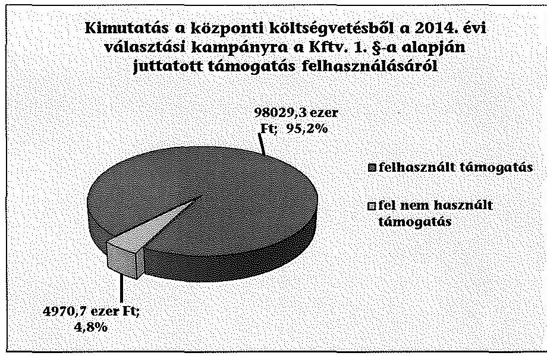
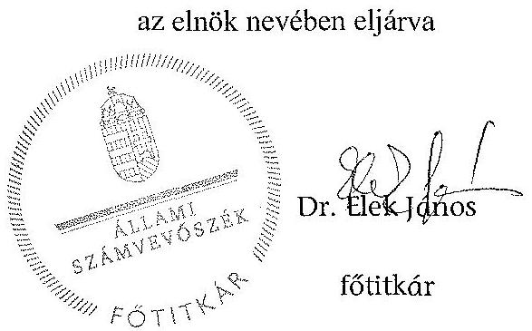
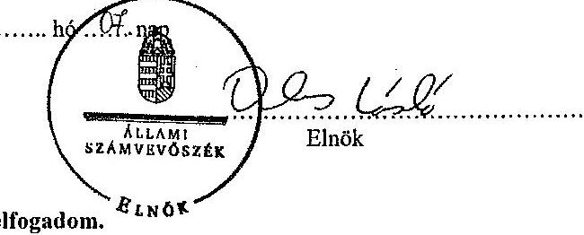
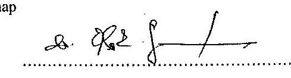

# ÁLLAMI   SZÁMVEVŐSZÉK 

## JELENTÉS

Kampánypénzek ellenőrzése - A 2014. évi országgyúlési képviselő-választási kampányokra fordított pénzeszközök elszámolásának ellenőrzése
a képviselethez jutott jelölteknél

---

# Állami Számvevőszék 

Iktatószám: V-0459-1645/2015
Témaszám: 1493
Vizsgálat-azonosító szám: V0675

## Az ellenőrzést felügyelte:

Dr. Benedek Mária
felügyeleti vezető
Az ellenőrzést vezette és az ellenőrzés végrehajtásáért felelős:
Bialkó Zsolt Gyula
ellenőrzésvezető
A számvevőszéki jelentés összeállításában közremüködtek:
Belovai Sándorné
számvevő főtanácsos
Krupánszki Dóra
számvevő főtanácsos
Koczor László
számvevő tanácsos
Az ellenőrzést végezték:

| Belovai Sándorné | Bertalan Rudolf Gyula | Koczor László |
| :-- | :-- | :-- |
| számvevő főtanácsos | számvevő | számvevő tanácsos |
| Krupánszki Dóra | Dr. Lőrincz Zoltán | Novák Márta |
| számvevő főtanácsos | számvevő főtanácsos | számvevő |
| Szeibel Gáborné | Vida Katalin |  |
| számvevő tanácsos | számvevő |  |

A témához kapcsolódó eddig készített számvevőszéki jelentés:
címe
sorszáma
Jelentés a 2010. évi országgyűlési választásra fordított pénzeszközök elszámolásának ellenőrzéséről a jelölő szervezeteknél és a független jelöltnél

---

# TARTALOMJEGYZÉK 

BEVEZETÉS ..... 9
I. ÖSSZEGZŐ MEGÁLLAPÍTÁSOK, KÖVETKEZTETÉSEK ..... 11
II. RÉSZLETES MEGÁLLAPÍTÁSOK ..... 13

1. Ágh Péter egyéni képviselőjelölt ..... 14
2. B. Nagy László egyéni képviselőjelölt ..... 15
3. Balla Mihály Tibor egyéni képviselőjelölt ..... 16
4. Becsó Zsolt egyéni képviselőjelölt ..... 17
5. Bencsik János egyéni képviselőjelölt ..... 18
6. Boldog István egyéni képviselőjelölt ..... 19
7. Bóna Zoltán egyéni képviselőjelölt ..... 20
8. Burány Sándor egyéni képviselőjelölt ..... 21
9. Czerván György egyéni képviselőjelölt ..... 22
10. Czunyiné Dr. Bertalan Judit egyéni képviselőjelölt ..... 23
11. Csenger-Zalán Zsolt egyéni képviselőjelölt ..... 24
12. Cseresnyés Péter egyéni képviselőjelölt ..... 25
13. Csizi Péter egyéni képviselőjelölt ..... 26
14. Csöbör Katalin egyéni képviselőjelölt ..... 27
15. Dankó Béla egyéni képviselőjelölt ..... 28
16. Demeter Zoltán egyéni képviselőjelölt ..... 29
17. Dr. Aradszky András egyéni képviselőjelölt ..... 30
18. Dr. Bene Ildikó egyéni képviselőjelölt részére ..... 31
19. Dr. Fónagy János Vilmos egyéni képviselőjelölt ..... 32
20. Dr. Hargitai János György egyéni képviselőjelölt ..... 33
21. Dr. Hende Csaba Károly egyéni képviselőjelölt ..... 34
22. Dr. Hiller István egyéni képviselőjelölt ..... 35
23. Dr. Hörcsik Richárd egyéni képviselőjelölt ..... 36
24. Dr. Kovács József Dezső egyéni képviselőjelölt ..... 37
25. Dr. Kovács Zoltán egyéni képviselőjelölt ..... 38

---

26. Dr. Lázár János egyéni képviselőjelölt ..... 39
27. Dr. Mengyi Roland egyéni képviselőjelölt ..... 40
28. Dr. Nagy István egyéni képviselőjelölt ..... 41
29. Dr. Navracsics Tibor egyéni képviselőjelölt ..... 42
30. Dr. Nyitrai Zsolt Péter egyéni képviselőjelölt ..... 43
31. Dr. Pósán László egyéni képviselőjelölt ..... 44
32. Dr. Salacz László egyéni képviselőjelölt ..... 45
33. Dr. Seszták Miklós István egyéni képviselőjelölt ..... 46
34. Dr. Simicskó István egyéni képviselőjelölt ..... 47
35. Dr. Szücs Lajos egyéni képviselőjelölt ..... 48
36. Dr. Tiba István Csaba egyéni képviselőjelölt ..... 49
37. Dr. Tilki Attila egyéni képviselőjelölt ..... 50
38. Dr. Tuzson Bence Balázs egyéni képviselőjelölt ..... 51
39. Dr. Varga László egyéni képviselőjelölt ..... 52
40. Dr. Vas Imre egyéni képviselőjelölt ..... 53
41. Dr. Vinnai Győző egyéni képviselőjelölt ..... 54
42. Dr. Völner Pál egyéni képviselőjelölt ..... 55
43. Dr. Zombor Gábor Zoltán egyéni képviselőjelölt ..... 56
44. Dunai Mónika egyéni képviselőjelölt ..... 57
45. Firtl Mátyás egyéni képviselőjelölt ..... 58
46. Gelencsér Attila egyéni képviselőjelölt ..... 59
47. Gyopáros Alpár Ádám egyéni képviselőjelölt ..... 60
48. Hadházy Sándor egyéni képviselőjelölt ..... 61
49. Harrach Péter Pál egyéni képviselőjelölt ..... 62
50. Hirt Ferenc egyéni képviselőjelölt ..... 63
51. Hiszékeny Dezső egyéni képviselőjelölt ..... 64
52. Horváth István egyéni képviselőjelölt ..... 65
53. Horváth László Dezső egyéni képviselőjelölt ..... 66
54. Kiss Péter egyéni képviselőjelölt ..... 67
55. Kósa Lajos egyéni képviselőjelölt ..... 68
56. Kovács Sándor egyéni képviselőjelölt ..... 69
57. Lasztovicza Jenő egyéni képviselőjelölt ..... 70

---

58. Lezsák Sándor István egyéni képviselőjelölt ..... 71
59. Manninger Jenő Vilmos egyéni képviselőjelölt ..... 72
60. Móring József Attila egyéni képviselőjelölt ..... 73
61. Pánczél Károly egyéni képviselőjelölt ..... 74
62. Petneházy Szabolcs Attila egyéni képviselőjelölt ..... 75
63. Pogácsás Tibor János egyéni képviselőjelölt ..... 76
64. Potápi Árpád János egyéni képviselőjelölt ..... 77
65. Riz Gábor egyéni képviselőjelölt ..... 78
66. Rogán Antal egyéni képviselőjelölt ..... 79
67. Simon Róbert Balázs egyéni képviselőjelölt ..... 80
68. Simonka György egyéni képviselőjelölt ..... 81
69. Szabó Sándor egyéni képviselőjelölt ..... 82
70. Szabó Zsolt egyéni képviselőjelölt ..... 83
71. Szabolcs Attila egyéni képviselőjelölt ..... 84
72. Szászfalvi László egyéni képviselőjelölt ..... 85
73. Szatmáry Kristóf egyéni képviselőjelölt ..... 86
74. Tállai András László egyéni képviselőjelölt ..... 87
75. Tasó László egyéni képviselőjelölt ..... 88
76. Tessely Zoltán Károly egyéni képviselőjelölt ..... 89
77. Tiffán Zsolt egyéni képviselőjelölt ..... 90
78. Tóth Csaba János egyéni képviselőjelölt ..... 91
79. Törő Gábor egyéni képviselőjelölt ..... 92
80. Vantara Gyula egyéni képviselőjelölt ..... 93
81. Varga Mihály egyéni képviselőjelölt ..... 94
82. Vargha Tamás János egyéni képviselőjelölt ..... 95
83. Vécsey László József egyéni képviselőjelölt ..... 96
84. Witzmann Mihály egyéni képviselőjelölt ..... 97
85. Zsigó Róbert Vilmos egyéni képviselőjelölt ..... 98
86. Dr. Oláh Lajos egyéni képviselőjelölt ..... 99
87. Dr. Szabó Szabolcs egyéni képviselőjelölt ..... 99
88. Kiss László egyéni képviselőjelölt ..... 99
89. Bodó Sándor egyéni képviselőjelölt ..... 99

---

90. Dr. Simon Miklós egyéni képviselőjelölt ..... 101
91. Kucsák László egyéni képviselőjelölt ..... 102
92. László Tamás egyéni képviselőjelölt ..... 103
93. Dr. Galambos Dénes egyéni képviselőjelölt ..... 105
94. Dr. Hoppál Péter Tamás egyéni képviselőjelölt ..... 106
95. Dr. Kontrát Károly egyéni képviselőjelölt ..... 107
96. Font Sándor egyéni képviselőjelölt ..... 108
97. Kara Ákos egyéni képviselőjelölt ..... 109
98. Pócs János egyéni képviselőjelölt ..... 110
99.V. Németh Zsolt egyéni képviselőjelölt ..... 111
100. Vigh László egyéni képviselőjelölt ..... 112
101. Varga Gábor egyéni képviselőjelölt ..... 113
102. Bányai Gábor Elemér egyéni képviselőjelölt ..... 114
103. Dr. Fazekas Sándor egyéni képviselőjelölt ..... 115
104. Dr. Vitányi István József egyéni képviselőjelölt ..... 116
105. Farkas Sándor egyéni képviselőjelölt ..... 117
106. Földi László egyéni képviselőjelölt ..... 118

# MELLÉKLETEK 

1. számú Elnöki hatáskör átruházása

---

# RÖVIDÍTÉSEK JEGYZÉKE 

## Törvények

Áfa tv.
2007. évi CXXVII. törvény az általános forgalmi adóról
ÁSZ tv.
2011. évi LXVI. törvény az Állami Számvevôszékröl
Kftv.
2013. évi LXXXVII. törvény az országgyúlési képviselők választása kampányköltségeinek átláthatóvá tételéról
Mttv.
2010. évi CLXXXV. törvény a médiaszolgáltatásokról és a tömegkommunikációról
Okv.
2011. évi CCIII. törvény az országgyúlési képviselők választásáról
Számv. tv.
2000. évi C. törvény a számvitelről
Ve.
2013. évi XXXVI. törvény a választási eljárásról

## Rendeletek

Áhsz.
4/2013. (I. 11.) Korm. rendelet az államháztartás számviteléról
KIM rendelet
3/2014. (I. 20.) KIM rendelet a 2014. április 6. napjára kitűzött országgyűlési képviselő-választás eljárási határidőinek és határnapjának megállapításáról
NGM rendelet
69/2013. (XII. 29.) NGM rendelet az országgyűlési képviselők választása kampányköltségeinek támogatásáról

## SZÓRÖVIDÍTÉSEK

ÁSZ
Állami Számvevőszék
jelölt
az országgyűlési képviselők általános és időközi választásán minden egyéni választókerületi képviselőjelölt
Kincstár
Magyar Államkincstár

---

.

---

# ÉRTELMEZŐ SZÓTÁR 

dologi kiadás
jelölő szervezet
jelölt
kampányeszköz
kampányidőszak
kampánytevékenység
plakát
politikai hirdetés

Az Áhsz. 15. melléklet (I. Egységes rovatrend a költségvetési és finanszírozási bevételekhez, kiadásokhoz) K3. pontja szerinti kiadások (forrás: Áhsz. 15. melléklet K3. Dologi kiadások rovat)
Az országgyűlési képviselők választásán a választás kitűzésekor a civil szervezetek bírósági nyilvántartásában jogerősen szereplő párt, továbbá az országos nemzetiségi önkormányzat, ha a választási bizottság a jelölő szervezetek nyilvántartásába felvette (forrás: Ve. 3. § 3. pontja).
Az országgyűlési választáson az egyéni választókerületben független jelöltként vagy párt jelöltjeként illetve két vagy több párt közös jelöltjeként induló személy (forrás: Okv. 5. §-a).
Kampányeszköznek minősül minden olyan eszköz, amely alkalmas a választói akarat befolyásolására vagy annak megkísérlésére, így különösen
a) plakát,
b) jelölő szervezet vagy jelölt által történő közvetlen megkeresés,
c) politikai reklám és politikai hirdetés,
d) választási gyülés. (forrás: Ve. 140. §-a).

A szavazás napját megelőző 50. naptól a szavazás napján a szavazás befejezéséig, azaz 2014. február 15-től 2014. április 6-án 19 óráig tartó időszak (forrás: Ve. 139. $\S-a$, KIM rendelet 28. §-a).
Kampánytevékenység a kampányeszközök kampányidőszakban történő felhasználása és minden egyéb kampányidőszakban folytatott tevékenység a választói akarat befolyásolása vagy ennek megkísérlése céljából (forrás: Ve. 141. §-a).
A választási falragasz, felirat, szórólap, vetített kép, embléma mérettől és hordozóanyagtól függetlenül (forrás: Ve. 144. § (1) bekezdés).
Az ellenérték fejében közzétett, valamely jelölő szervezet vagy független jelölt népszerüsítését szolgáló, vagy támogatásra ösztönző, illetve azok nevét, célját, tevékenységét, emblémáját népszerüsítő sajtótermékben közzétett médiatartalom vagy filmszínházban közzétett audiovizuális tartalom (forrás: Ve. 146. § b) pont).

---

politikai reklám
sajtótermék
választási gyülés

Valamely párt, politikai mozgalom vagy a kormány népszerüsítését szolgáló vagy támogatására ösztönző, illetve azok nevét, célját, tevékenységét, jelszavát, emblémáját népszerüsítő, a reklámhoz hasonló módon megjelenő, illetve közzétett műsorszám, a Ve. Tv. 146. § a) pontjában foglalt azon eltéréssel, hogy a párt, politikai mozgalom és a kormány alatt jelölő szervezetet és független jelöltet kell érteni (forrás: A médiaszolgáltatásokról és a tömegkommunikációról szóló 2010. évi CLXXXV. tv. (továbbiakban Mttv. ) 203. § 55. pontja).
A napilap és más időszaki lap egyes számai, valamint az internetes újság vagy hírportál, amelyet gazdasági szolgáltatásként nyújtanak, amelynek tartalmáért valamely természetes vagy jogi személy, illetve jogi személyiséggel nem rendelkező gazdasági társaság szerkesztői felelősséget visel, és amelynek elsődleges célja szövegből, illetve képekből álló tartalmaknak a nyilvánossághoz való eljuttatása tájékoztatás, szórakoztatás vagy oktatás céljából, nyomtatott formátumban vagy valamely elektronikus hírközlő hálózaton keresztül. Az „illetve jogi személyiséggel nem rendelkező gazdasági társaság" szövegrész 2014. március 15 -étől hatályát vesztette (forrás: Mttv. 203. §60. pontja).
Választási gyülést kampányidőszakban lehet tartani. A szavazás napján választási gyűlés nem tartható. A választási gyúlések nyilvánosak. A rend fenntartásáról a gyúlés szervezője gondoskodik. A választási kampány céljára az állami és önkormányzati költségvetési szervek a jelöltek, jelölő szervezetek számára azonos feltételekkel bocsáthatnak rendelkezésre helyiséget és egyéb szükséges berendezést. Állami vagy önkormányzati hatóság elhelyezésére szolgáló épületben választási kampánytevékenységet folytatni, választási gyülést tartani tilos, kivéve az ötszáznál kevesebb lakosú településen, feltéve, hogy más közösségi célú épület nem áll rendelkezésre (forrás: Ve. 145. §).

---

# JELENTÉS 

## Kampánypénzek ellenőrzése - A 2014. évi országgyúlési képviselő-választási kampányokra fordított pénzeszközök elszámolásának ellenőrzése a képviselethez jutott jelölteknél

## BEVEZETÉS

A 2014. évi országgyűlési választás a korábbiakhoz képest új lebonyolítási és finanszírozási rendszerben került megtartásra. Az Országgyűlés a 2013. évben új törvényt alkotott a választási eljárásról (Ve.), valamint az országgyűlési képviselők választása kampányköltségeinek átláthatóvá tételéről (Kftv.).
Az Állami Számvevőszék a Kftv. 8/B. § (1) bekezdése alapján a választást követő egy éven belül hivatalból ellenőrzi az országgyűlési képviselethez jutott egyéni választókerületi képviselőjelöltek tekintetében a Kftv. 1. §-a szerinti egymillió forint központi költségvetési támogatás felhasználását. A korábbiakhoz képest fontos változás, hogy az új törvényi szabályozás (Kftv.) szerint az egyéni jelölteknek, illetve az egyéni jelöltek lemondásai alapján a jelölő szervezeteknek folyósított támogatással való elszámolás ellenőrzését a Kincstár végzi azt megelőzően, hogy az ÁSZ hivatalból ellenőrzi a kampányköltségekre fordított pénzeszközök felhasználását.
Az Okv. az országgyűlési képviselők számát 199 főben határozza meg, akik közül 106 országgyűlési képviselőt egyéni választókerületben választanak. Jelen számvevőszéki jelentés az egyéni választókerületben képviselethez jutott 106 jelölt ellenőrzéséről készült.
Az ellenőrzés célja annak megállapítása volt, hogy az országgyűlési választáson képviselethez jutott egyéni jelöltek betartották-e a Kftv. előírásait, ennek keretében ellenőriztük, hogy az országgyűlési választáson képviselethez jutott egyéni jelöltek a Kftv. 1. §-ában foglaltak szerinti egymillió Ft összegű, központi költségvetésből juttatott támogatást a választási kampányidőszakban, a választási kampánytevékenységgel összefüggő dologi kiadások finanszírozására fordí-tották-e.

## Az ellenőrzés várható hasznosulása

Az ellenőrzéssel az ÁSZ választ ad arra, hogy a 2014. évi országgyűlési képviselőválasztási kampányra fordított központi költségvetési támogatásokat az országgyűlési választásokon képviselethez jutott jelöltek a vonatkozó jogszabályokban foglalt előírások szerint a törvényben meghatározott kampányidőszak alatt és kampánytevékenységre használták-e fel. Így ezen a területen is érvényesülni tud, hogy az ellenőrzés által feltárt szabálytalan közpénz felhasználás nem marad következmény nélkül.
Az ellenőrzés típusa: szabályszerűségi ellenőrzés.

---

A szabályszerűségi ellenőrzés előírásait az ÁSZ hivatalos honlapján (www.asz.hu) közzétett „Ellenőrzési elvek, standardok" módszertani dokumentum I. fejezet 3.1. és az „Útmutató a standardok alkalmazásához" módszertani dokumentum I. fejezet 1. pontjai tartalmazzák.
Az ÁSZ a Kftv. 1. §-ában meghatározott egymillió Ft összegű támogatást igénybe vevő országgyűlési képviselethez jutott jelöltek kincstári elszámolásához benyújtott bizonylatait tételesen ellenőrizte.
Az ellenőrzött időszak: az országgyűlési képviselőválasztás Ve. 139. §-ában rögzített - a szavazás napját megelőző 50. naptól a szavazás befejezésének időpontjáig tartó - választási kampányidőszak és az azt követő elszámolási időszak volt.

Az ellenőrzöttek köre: az országgyűlési választáson képviselethez jutott jelöltek.

Az ellenőrzésre a 2014. évi országgyűlési választáson képviselethez jutott jelöltek tekintetében az egymillió Ft költségvetési támogatásra vonatkozóan a Kincstárnál került sor.
Az ellenőrzéshez adatszolgáltatásra kértük fel a Kincstárt és a Nemzeti Választási Irodát.
Az ellenőrzés jogszabályi alapja: a Kftv. 8/B. § (1) és a 9. § (2) bekezdése.
Az ÁSZ tv. 29. § (1) bekezdése szerint az ellenőrzési megállapításokat megküldtük a jelöltek részére, akik közül egy jelölt az ÁSZ tv. 29. § (2) bekezdésében foglalt észrevételezési jogával élt. A tett észrevétel szakmai tartalmánál fogva az ellenőrzési megállapításokat nem érintette.

---

# I. ÖSSZEGZŐ MEGÁLLAPÍTÁSOK, KÖVETKEZTETÉSEK 

A 2014. évi országgyúlési képviselő-választáson képviselethez jutott 106 jelölt közül három jelölt a Kftv.-ben előírt határidőt betartva írásban nyilatkozott a Kincstárnak arról, hogy a Kftv.-ben rögzítettek szerint a központi költségvetésből juttatott egymillió Ft összegű támogatás igénybevételéről lemond, és azt az őt jelölő párt rendelkezésére bocsátja.
A Kincstár az egymillió Ft összegű támogatást igénybevevő 103 országgyűlési képviselethez jutott jelölttel - a támogatás folyósítása céljából - a Kftv.-ben előírt, az NGM rendeletben meghatározott tartalmú megállapodást megkötötte, részükre a támogatást a kincstári kártyafedezeti számlán jóváírtta. A 103 jelölt a rendelkezésére bocsátott 103000,0 ezer Ft-ból összesen 98029,3 ezer Ft-tal számolt el a Kincsár felé, a jelöltek által fel nem használt támogatás összege 4970,7 ezer Ft volt. A 103 jelölt kincstári kártyafedezeti számla és kártya használata minden esetben megfelelt a Kftv. előírásainak.

A 103 jelölt a Kftv.-ben előírt határidőn belül a támogatás felhasználásáról szóló elszámolását benyújtotta a Kincstárhoz.
A 103 jelölt az elszámoláson szereplő minden kiadási tételhez részletes szöveges indokolást adott az egyes tételek felhasználási céljáról, valamint nyilatkoztak a támogatás szabályszerű felhasználásáról. Az elszámolást alátámasztó számlák, számviteli bizonylatok a Kftv.-ben és a Számv. tv.-ben előírtaknak megfelelően hitelesek voltak, azok az NGM rendelet előírásainak megfeleltek, kampánytevékenységgel összefüggő dologi kiadásokat tartalmaztak.
A 103 jelölt a támogatást - egy bizonylattal alá nem támasztott 10,0 ezer Ft öszszegű kiadás kivételével - a választási kampányidőszakban választási kampánytevékenységgel összefüggő dologi kiadások finanszírozására fordította.
A 103 jelölt közül 99 jelölt esetében a Kincstárhoz benyújtott elszámolás és az elszámoláshoz csatolt bizonylatok alapján a támogatás felhasználása a Kftv.-ben foglalt előírásoknak megfelelt.

---

Az ÁSZ a 103 jelöltből négy jelöltnél tárt fel a támogatás felhasználására vonatkozó szabálytalanságot. A támogatás felhasználására vonatkozó előírásokat maradéktalanul be nem tartó négy jelölt közül egy jelölt - a Kftv.-ben foglaltak ellenére - 10,0 ezer Ft összegű kifizetését bizonylattal nem támasztott alá. További három jelölt elszámolásához csatolt - jelöltenként egy-egy - bizonylat nem felelt meg meg teljes körűen a Kftv. előírásainak, mivel a bizonylatokon rögzített szolgáltatás igénybevételére nem a Ve.-ben, valamint a KIM rendeletben mehgatározott kampányidőszakban került sor.
A Kincstár ellenőrzési megállapításai megegyeztek az ÁSZ megállapításaival. A Kincstár a 103 jelölt esetében határozatot hozott a támogatás felhasználásáról benyújtott elszámolásról. A Kftv., valamint az NGM rendelet rendelkezései alapján a négy jelölt által szabálytalanul felhasznált, összesen 99,9 ezer Ft kétszeresének visszafizetésére vonatkozóan a Kincstár határozatban intézkedett. Az ÁSZ megállapításai alapján további visszafizetési kötelezettség nem keletkezett. A kincstári határozatokban foglalt visszafizetési kötelezettséget valamennyi érintett jelölt maradéktalanul teljesítette.
A politikai hirdetésekre vonatkozó számlák és az ÁSZ részére a Ve. alapján megküldött árjegyzékek és tájékoztatók körében az ellenőrzés a következőket tapasztalta. A politikai hirdetések számláinak adatai 16 esetben nem egyeztek meg az árjegyzékben és/vagy a tájékoztatóban foglalt adatokkal, amely eltérésekért a számlakibocsátók (sajtótermékek kiadói) a felelősek. Az eltérések nem befolyásolták a választási kampányra fordított pénzeszközök felhasználásának minősítését.

---

# II. RÉSZLETES MEGÁLLAPÍTÁSOK 

A Kftv. 1. §-ában foglaltak szerinti egymillió Ft összegü ${ }^{1}$ központi költségvetésből juttatott támogatást az országgyűlési képviselethez jutott egyéni jelöltek közül 103 jelölt a Kincstárral kötött megállapodás alapján felhasználta, a felhasználásról a Kftv. 8. § (1) bekezdésében előírtaknak megfelelően elszámolt. Három jelölt élt a Kftv. 2/A. § (1) bekezdésében biztosított lehetőséggel, a Kincstárnak írásban nyilatkozott arról, hogy „az 1. § szerinti támogatás igénybevételéről lemond, és azt az ôt jelölő párt rendelkezésére bocsátja".
A 106 jelölt központi költségvetésből juttatott támogatása felhasználása szabályszerűségéről szóló megállapítások jelöltenként a következők.

[^0]
[^0]:    ${ }^{1}$ A Kftv. 1. § (2) bekezdésének rendelkezése alapján „a támogatás összegét az országgyűlési képviselők e törvény hatálybalépését követő általános választását követő évtől kezdődően a Központi Statisztikai Hivatal által a tárgyévet megelőző évre megállapított fogyasztói árindexszel évente növelni kell."

---

# 1. ÁGH PÉTER EGYÉNI KÉPVISELŐJELÖLT 

A Kincstár a Kftv. 2. § (1)-(2) bekezdéseinek és az NGM rendelet 2. § (1) bekezdésében előírtaknak megfelelően a támogatás folyósítása céljából a jelölttel megállapodást kötött, kincstári kártyafedezeti számlát nyitott és kincstári kártya kibocsátásáról intézkedett. A Kftv. 1. §-ában foglaltak szerinti, a központi költségvetésből nyújtott egymillió Ft támogatási összeget bocsátott a jelölt rendelkezésére a kincstári kártyafedezeti számlán.
A kincstári kártyafedezeti számla és a kincstári kártya használata a jelöltnél szabályszerű volt, megfelelt a Kftv. 2. § (4)-(5) bekezdéseiben meghatározott előírásoknak. A kampánytevékenységekkel összefüggő kiadásokra teljesített kifizetések a kincstári kártyafedezeti számláról minden esetben kincstári kártyával vagy átutalással történtek.
A jelölt a választási kampányidőszak alatt a választási kampánytevékenységgel összefüggő kiadások elszámolását a Kftv. 8. § (1) bekezdésében foglaltaknak megfelelően az összes kifizetést igazoló bizonylat másolatának benyújtásával teljesítette.
A Kftv. 8. § (1) bekezdése rendelkezésének megfelelve a jelölt az elszámolását az NGM rendelet 7. § (1) és (3) bekezdéseiben rögzítettek alapján számlaösszesítő adatlapokon nyújtotta be a Kincstárhoz. A jelölt a kiadási tételekhez részletes, szöveges indokolást adott azok felhasználási céljáról, valamint nyilatkozott a támogatás szabályszerű felhasználásáról.
A támogatás felhasználását igazoló számlák, számviteli bizonylatok a Kftv. 2. § (6) bekezdésében foglaltaknak megfelelően a jelölt nevére szóltak, és azokon feltüntették az egyéni választókerület megjelölését. A bizonylatok a Számv. tv.-ben előírtaknak megfelelően hitelesek voltak, azok alaki és tartalmi kellékei megfeleltek az Áfa tv.-ben előírt követelményeknek. A támogatás felhasználását igazoló bizonylatok Kincstárhoz benyújtott másolatait a jelölt az NGM rendelet 7. § (2) bekezdésében foglaltaknak megfelelően aláírásával hitelesítette és a másolatokon „Az eredetivel mindenben megegyező" szöveget feltüntette.
A támogatás felhasználását igazoló bizonylatok a Ve. 140. §-a szerinti kampányeszközök - plakát, politikai reklám és politikai hirdetés, választási gyűlés - igénybevételét támasztották alá, amelyek alkalmasak voltak a Ve. 141. §-a alapján a választói akarat befolyásolására vagy annak megkísérlésére. A bizonylatok megfeleltek az NGM rendelet 2. § (4) bekezdés a) pontjának 6. alpontjában (a Kincstár és a jelölt között megkötött megállapodásban is rögzített) foglalt előírásoknak, azok az Áhsz. 15. melléklet K3 Dologi kiadások rovatba tartozó, a kampánytevékenységgel összefüggésben elszámolható költségeket tartalmaztak.
A politikai hirdetésekre vonatkozó számlák és az ÁSZ részére a Ve. 148. § (2) és (4) bekezdése alapján megküldött árjegyzékek és tájékoztatók körében az ellenőrzés a következőket tapasztalta.
A politikai hirdetések számláinak adatai megegyeztek az árjegyzékben és tájékoztatóban foglalt adatokkal.

---

# 2. B. NAGY LÁSZLÓ EGYÉNI KÉPVISELŐJELÖLT 

A Kincstár a Kftv. 2. § (1)-(2) bekezdéseinek és az NGM rendelet 2. § (1) bekezdésében előírtaknak megfelelően a támogatás folyósítása céljából a jelölttel megállapodást kötött, kincstári kártyafedezeti számlát nyitott és kincstári kártya kibocsátásáról intézkedett. A Kftv. 1. §-ában foglaltak szerinti, a központi költségvetésből nyújtott egymillió Ft támogatási összeget bocsátott a jelölt rendelkezésére a kincstári kártyafedezeti számlán.
A kincstári kártyafedezeti számla és a kincstári kártya használata a jelöltnél szabályszerű volt, megfelelt a Kftv. 2. § (4)-(5) bekezdéseiben meghatározott előírásoknak. A kampánytevékenységekkel összefüggő kiadásokra teljesített kifizetések a kincstári kártyafedezeti számláról minden esetben kincstári kártyával vagy átutalással történtek.
A jelölt a választási kampányidőszak alatt a választási kampánytevékenységgel összefüggő kiadások elszámolását a Kftv. 8. § (1) bekezdésében foglaltaknak megfelelően az összes kifizetést igazoló bizonylat másolatának benyújtásával teljesítette.
A Kftv. 8. § (1) bekezdése rendelkezésének megfelelve a jelölt az elszámolását az NGM rendelet 7. § (1) és (3) bekezdéseiben rögzítettek alapján számlaösszesítő adatlapokon nyújtotta be a Kincstárhoz. A jelölt a kiadási tételekhez részletes, szöveges indokolást adott azok felhasználási céljáról, valamint nyilatkozott a támogatás szabályszerű felhasználásáról.
A támogatás felhasználását igazoló számlák, számviteli bizonylatok a Kftv. 2. § (6) bekezdésében foglaltaknak megfelelően a jelölt nevére szóltak, és azokon feltüntették az egyéni választókerület megjelölését. A bizonylatok a Számv. tv.-ben előírtaknak megfelelően hitelesek voltak, azok alaki és tartalmi kellékei megfeleltek az Áfa tv.-ben előírt követelményeknek. A támogatás felhasználását igazoló bizonylatok Kincstárhoz benyújtott másolatait a jelölt az NGM rendelet 7. § (2) bekezdésében foglaltaknak megfelelően aláírásával hitelesítette és a másolatokon „Az eredetivel mindenben megegyező" szöveget feltüntette.
A támogatás felhasználását igazoló bizonylatok a Ve. 140. §-a szerinti kampányeszközök - plakát, politikai reklám és politikai hirdetés, választási gyúlés - igénybevételét támasztották alá, amelyek alkalmasak voltak a Ve. 141. §-a alapján a választói akarat befolyásolására vagy annak megkísérlésére. A bizonylatok megfeleltek az NGM rendelet 2. § (4) bekezdés a) pontjának 6. alpontjában (a Kincstár és a jelölt között megkötött megállapodásban is rögzített) foglalt előírásoknak, azok az Áhsz. 15. melléklet K3 Dologi kiadások rovatba tartozó, a kampánytevékenységgel összefüggésben elszámolható költségeket tartalmaztak.
A politikai hirdetésekre vonatkozó számlák és az ÁSZ részére a Ve. 148. § (2) és (4) bekezdése alapján megküldött árjegyzékek és tájékoztatók körében az ellenőrzés a következőket tapasztalta.
A jelölt nem rendelt meg sajtóterméktől politikai hirdetést.

---

# 3. Balla Mihály Tibor egVéni KÉPVISELŐJELÖLT 

A Kincstár a Kftv. 2. § (1)-(2) bekezdéseinek és az NGM rendelet 2. § (1) bekezdésében előírtaknak megfelelően a támogatás folyósítása céljából a jelölttel megállapodást kötött, kincstári kártyafedezeti számlát nyitott és kincstári kártya kibocsátásáról intézkedett. A Kftv. 1. §-ában foglaltak szerinti, a központi költségvetésből nyújtott egymillió Ft támogatási összeget bocsátott a jelölt rendelkezésére a kincstári kártyafedezeti számlán.
A kincstári kártyafedezeti számla és a kincstári kártya használata a jelöltnél szabályszerű volt, megfelelt a Kftv. 2. § (4)-(5) bekezdéseiben meghatározott előírásoknak. A kampánytevékenységekkel összefüggő kiadásokra teljesített kifizetések a kincstári kártyafedezeti számláról minden esetben kincstári kártyával vagy átutalással történtek.
A jelölt a választási kampányidőszak alatt a választási kampánytevékenységgel összefüggő kiadások elszámolását a Kftv. 8. § (1) bekezdésében foglaltaknak megfelelően az összes kifizetést igazoló bizonylat másolatának benyújtásával teljesítette.
A Kftv. 8. § (1) bekezdése rendelkezésének megfelelve a jelölt az elszámolását az NGM rendelet 7. § (1) és (3) bekezdéseiben rögzítettek alapján számlaösszesítő adatlapokon nyújtotta be a Kincstárhoz. A jelölt a kiadási tételekhez részletes, szöveges indokolást adott azok felhasználási céljáról, valamint nyilatkozott a támogatás szabályszerű felhasználásáról.
A támogatás felhasználását igazoló számlák, számviteli bizonylatok a Kftv. 2. § (6) bekezdésében foglaltaknak megfelelően a jelölt nevére szóltak, és azokon feltüntették az egyéni választókerület megjelölését. A bizonylatok a Számv. tv.-ben előírtaknak megfelelően hitelesek voltak, azok alaki és tartalmi kellékei megfeleltek az Áfa tv.-ben előírt követelményeknek. A támogatás felhasználását igazoló bizonylatok Kincstárhoz benyújtott másolatait a jelölt az NGM rendelet 7. § (2) bekezdésében foglaltaknak megfelelően aláírásával hitelesítette és a másolatokon „Az eredetivel mindenben megegyezö" szöveget feltüntette.
A támogatás felhasználását igazoló bizonylatok a Ve. 140. §-a szerinti kampányeszközök - plakát, politikai reklám és politikai hirdetés, választási gyűlés - igénybevételét támasztották alá, amelyek alkalmasak voltak a Ve. 141. §-a alapján a választói akarat befolyásolására vagy annak megkísérlésére. A bizonylatok megfeleltek az NGM rendelet 2. § (4) bekezdés a) pontjának 6. alpontjában (a Kincstár és a jelölt között megkötött megállapodásban is rögzített) foglalt előírásoknak, azok az Áhsz. 15. melléklet K3 Dologi kiadások rovatba tartozó, a kampánytevékenységgel összefüggésben elszámolható költségeket tartalmaztak.
A politikai hirdetésekre vonatkozó számlák és az ÁSZ részére a Ve. 148. § (2) és (4) bekezdése alapján megküldött árjegyzékek és tájékoztatók körében az ellenőrzés a következőket tapasztalta.
A jelölt nem rendelt meg sajtóterméktől politikai hirdetés közzétételt.

---

# 4. BECSÓ ZSOLT EGYÉNI KÉPVISELŐJELÖLT 

A Kincstár a Kftv. 2. § (1)-(2) bekezdéseinek és az NGM rendelet 2. § (1) bekezdésében előírtaknak megfelelően a támogatás folyósítása céljából a jelölttel megállapodást kötött, kincstári kártyafedezeti számlát nyitott és kincstári kártya kibocsátásáról intézkedett. A Kftv. 1. §-ában foglaltak szerinti, a központi költségvetésből nyújtott egymillió Ft támogatási összeget bocsátott a jelölt rendelkezésére a kincstári kártyafedezeti számlán.
A kincstári kártyafedezeti számla és a kincstári kártya használata a jelöltnél szabályszerű volt, megfelelt a Kftv. 2. § (4)-(5) bekezdéseiben meghatározott előírásoknak. A kampánytevékenységekkel összefüggő kiadásokra teljesített kifizetések a kincstári kártyafedezeti számláról minden esetben kincstári kártyával vagy átutalással történtek.
A jelölt a választási kampányidőszak alatt a választási kampánytevékenységgel összefüggő kiadások elszámolását a Kftv. 8. § (1) bekezdésében foglaltaknak megfelelően az összes kifizetést igazoló bizonylat másolatának benyújtásával teljesítette.
A Kftv. 8. § (1) bekezdése rendelkezésének megfelelve a jelölt az elszámolását az NGM rendelet 7. § (1) és (3) bekezdéseiben rögzítettek alapján számlaösszesítő adatlapokon nyújtotta be a Kincstárhoz. A jelölt a kiadási tételekhez részletes, szöveges indokolást adott azok felhasználási céljáról, valamint nyilatkozott a támogatás szabályszerű felhasználásáról.
A támogatás felhasználását igazoló számlák, számviteli bizonylatok a Kftv. 2. § (6) bekezdésében foglaltaknak megfelelően a jelölt nevére szóltak, és azokon feltüntették az egyéni választókerület megjelölését. A bizonylatok a Számv. tv.-ben előírtaknak megfelelően hitelesek voltak, azok alaki és tartalmi kellékei megfeleltek az Áfa tv.-ben előírt követelményeknek. A támogatás felhasználását igazoló bizonylatok Kincstárhoz benyújtott másolatait a jelölt az NGM rendelet 7. § (2) bekezdésében foglaltaknak megfelelően aláírásával hitelesítette és a másolatokon „Az eredetivel mindenben megegyező" szöveget feltüntette.
A támogatás felhasználását igazoló bizonylatok a Ve. 140. §-a szerinti kampányeszközök - plakát, politikai reklám és politikai hirdetés, választási gyűlés - igénybevételét támasztották alá, amelyek alkalmasak voltak a Ve. 141. §-a alapján a választói akarat befolyásolására vagy annak megkísérlésére. A bizonylatok megfeleltek az NGM rendelet 2. § (4) bekezdés a) pontjának 6. alpontjában (a Kincstár és a jelölt között megkötött megállapodásban is rögzített) foglalt előírásoknak, azok az Áhsz. 15. melléklet K3 Dologi kiadások rovatba tartozó, a kampánytevékenységgel összefüggésben elszámolható költségeket tartalmaztak.
A politikai hirdetésekre vonatkozó számlák és az ÁSZ részére a Ve. 148. § (2) és (4) bekezdése alapján megküldött árjegyzékek és tájékoztatók körében az ellenőrzés a következőket tapasztalta.
A jelölt nem rendelt meg sajtóterméktől politikai hirdetést.

---

# 5. BENCSIK JÁNOS EGYÉNI KÉPVISELŐJELÖLT 

A Kincstár a Kftv. 2. § (1)-(2) bekezdéseinek és az NGM rendelet 2. § (1) bekezdésében előírtaknak megfelelően a támogatás folyósítása céljából a jelölttel megállapodást kötött, kincstári kártyafedezeti számlát nyitott és kincstári kártya kibocsátásáról intézkedett. A Kftv. 1. §-ában foglaltak szerinti, a központi költségvetésből nyújtott egymillió Ft támogatási összeget bocsátott a jelölt rendelkezésére a kincstári kártyafedezeti számlán.
A kincstári kártyafedezeti számla és a kincstári kártya használata a jelöltnél szabályszerű volt, megfelelt a Kftv. 2. § (4)-(5) bekezdéseiben meghatározott előírásoknak. A kampánytevékenységekkel összefüggő kiadásokra teljesített kifizetések a kincstári kártyafedezeti számláról minden esetben kincstári kártyával vagy átutalással történtek.
A jelölt a választási kampányidőszak alatt a választási kampánytevékenységgel összefüggő kiadások elszámolását a Kftv. 8. § (1) bekezdésében foglaltaknak megfelelően az összes kifizetést igazoló bizonylat másolatának benyújtásával teljesítette.
A Kftv. 8. § (1) bekezdése rendelkezésének megfelelve a jelölt az elszámolását az NGM rendelet 7. § (1) és (3) bekezdéseiben rögzítettek alapján számlaösszesítő adatlapokon nyújtotta be a Kincstárhoz. A jelölt a kiadási tételekhez részletes, szöveges indokolást adott azok felhasználási céljáról, valamint nyilatkozott a támogatás szabályszerű felhasználásáról.
A támogatás felhasználását igazoló számlák, számviteli bizonylatok a Kftv. 2. § (6) bekezdésében foglaltaknak megfelelően a jelölt nevére szóltak, és azokon feltüntették az egyéni választókerület megjelölését. A bizonylatok a Számv. tv.-ben elôírtaknak megfelelően hitelesek voltak, azok alaki és tartalmi kellékei megfeleltek az Áfa tv.-ben előírt követelményeknek. A támogatás felhasználását igazoló bizonylatok Kincstárhoz benyújtott másolatait a jelölt az NGM rendelet 7. § (2) bekezdésében foglaltaknak megfelelően aláírásával hitelesítette és a másolatokon „Az eredetivel mindenben megegyező" szöveget feltüntette.
A támogatás felhasználását igazoló bizonylatok a Ve. 140. §-a szerinti kampányeszközök - plakát, politikai reklám és politikai hirdetés, választási gyűlés - igénybevételét támasztották alá, amelyek alkalmasak voltak a Ve. 141. §-a alapján a választói akarat befolyásolására vagy annak megkísérlésére. A bizonylatok megfeleltek az NGM rendelet 2. § (4) bekezdés a) pontjának 6. alpontjában (a Kincstár és a jelölt között megkötött megállapodásban is rögzített) foglalt előírásoknak, azok az Áhsz. 15. melléklet K3 Dologi kiadások rovatba tartozó, a kampánytevékenységgel összefüggésben elszámolható költségeket tartalmaztak.
A politikai hirdetésekre vonatkozó számlák és az ÁSZ részére a Ve. 148. § (2) és (4) bekezdése alapján megküldött árjegyzékek és tájékoztatók körében az ellenőrzés a következőket tapasztalta.
A jelölt nem rendelt meg sajtóterméktől politikai hirdetést.

---

# 6. BOLDOG ISTVÁN EGYÉNI KÉPVISELŐJELÖLT 

A Kincstár a Kftv. 2. § (1)-(2) bekezdéseinek és az NGM rendelet 2. § (1) bekezdésében előírtaknak megfelelően a támogatás folyósítása céljából a jelölttel megállapodást kötött, kincstári kártyafedezeti számlát nyitott és kincstári kártya kibocsátásáról intézkedett. A Kftv. 1. §-ában foglaltak szerinti, a központi költségvetésből nyújtott egymillió Ft támogatási összeget bocsátott a jelölt rendelkezésére a kincstári kártyafedezeti számlán.
A kincstári kártyafedezeti számla és a kincstári kártya használata a jelöltnél szabályszerű volt, megfelelt a Kftv. 2. § (4)-(5) bekezdéseiben meghatározott előírásoknak. A kampánytevékenységekkel összefüggő kiadásokra teljesített kifizetések a kincstári kártyafedezeti számláról minden esetben kincstári kártyával vagy átutalással történtek.
A jelölt a választási kampányidőszak alatt a választási kampánytevékenységgel összefüggő kiadások elszámolását a Kftv. 8. § (1) bekezdésében foglaltaknak megfelelően az összes kifizetést igazoló bizonylat másolatának benyújtásával teljesítette.
A Kftv. 8. § (1) bekezdése rendelkezésének megfelelve a jelölt az elszámolását az NGM rendelet 7. § (1) és (3) bekezdéseiben rögzítettek alapján számlaösszesítő adatlapokon nyújtotta be a Kincstárhoz. A jelölt a kiadási tételekhez részletes, szöveges indokolást adott azok felhasználási céljáról, valamint nyilatkozott a támogatás szabályszerű felhasználásáról.
A támogatás felhasználását igazoló számlák, számviteli bizonylatok a Kftv. 2. § (6) bekezdésében foglaltaknak megfelelően a jelölt nevére szóltak, és azokon feltüntették az egyéni választókerület megjelölését. A bizonylatok a Számv. tv.-ben előírtaknak megfelelően hitelesek voltak, azok alaki és tartalmi kellékei megfeleltek az Áfa tv.-ben előírt követelményeknek. A támogatás felhasználását igazoló bizonylatok Kincstárhoz benyújtott másolatait a jelölt az NGM rendelet 7. § (2) bekezdésében foglaltaknak megfelelően aláírásával hitelesítette és a másolatokon „Az eredetivel mindenben megegyező" szöveget feltüntette.
A támogatás felhasználását igazoló bizonylatok a Ve. 140. §-a szerinti kampányeszközök - plakát, politikai reklám és politikai hirdetés, választási gyűlés - igénybevételét támasztották alá, amelyek alkalmasak voltak a Ve. 141. §-a alapján a választói akarat befolyásolására vagy annak megkísérlésére. A bizonylatok megfeleltek az NGM rendelet 2. § (4) bekezdés a) pontjának 6. alpontjában (a Kincstár és a jelölt között megkötött megállapodásban is rögzített) foglalt előírásoknak, azok az Áhsz. 15. melléklet K3 Dologi kiadások rovatba tartozó, a kampánytevékenységgel összefüggésben elszámolható költségeket tartalmaztak.
A politikai hirdetésekre vonatkozó számlák és az ÁSZ részére a Ve. 148. § (2) és (4) bekezdése alapján megküldött árjegyzékek és tájékoztatók körében az ellenőrzés a következőket tapasztalta.
A jelölt nem rendelt meg sajtóterméktől politikai hirdetést.

---

# 7. BÓNA ZOLTÁN EGYÉNI KÉPVISELŐJELÖLT 

A Kincstár a Kftv. 2. § (1)-(2) bekezdéseinek és az NGM rendelet 2. § (1) bekezdésében előírtaknak megfelelően a támogatás folyósítása céljából a jelölttel megállapodást kötött, kincstári kártyafedezeti számlát nyitott és kincstári kártya kibocsátásáról intézkedett. A Kftv. 1. §-ában foglaltak szerinti, a központi költségvetésből nyújtott egymillió Ft támogatási összeget bocsátott a jelölt rendelkezésére a kincstári kártyafedezeti számlán.
A kincstári kártyafedezeti számla és a kincstári kártya használata a jelöltnél szabályszerű volt, megfelelt a Kftv. 2. § (4)-(5) bekezdéseiben meghatározott előírásoknak. A kampánytevékenységekkel összefüggő kiadásokra teljesített kifizetések a kincstári kártyafedezeti számláról minden esetben kincstári kártyával vagy átutalással történtek.
A jelölt a választási kampányidőszak alatt a választási kampánytevékenységgel összefüggő kiadások elszámolását a Kftv. 8. § (1) bekezdésében foglaltaknak megfelelően az összes kifizetést igazoló bizonylat másolatának benyújtásával teljesítette.
A Kftv. 8. § (1) bekezdése rendelkezésének megfelelve a jelölt az elszámolását az NGM rendelet 7. § (1) és (3) bekezdéseiben rögzítettek alapján számlaösszesítő adatlapokon nyújtotta be a Kincstárhoz. A jelölt a kiadási tételekhez részletes, szöveges indokolást adott azok felhasználási céljáról, valamint nyilatkozott a támogatás szabályszerű felhasználásáról.
A támogatás felhasználását igazoló számlák, számviteli bizonylatok a Kftv. 2. § (6) bekezdésében foglaltaknak megfelelően a jelölt nevére szóltak, és azokon feltüntették az egyéni választókerület megjelölését. A bizonylatok a Számv. tv.-ben előírtaknak megfelelően hitelesek voltak, azok alaki és tartalmi kellékei megfeleltek az Áfa tv.-ben előírt követelményeknek. A támogatás felhasználását igazoló bizonylatok Kincstárhoz benyújtott másolatait a jelölt az NGM rendelet 7. § (2) bekezdésében foglaltaknak megfelelően aláírásával hitelesítette és a másolatokon „Az eredetivel mindenben megegyezö" szöveget feltüntette.
A támogatás felhasználását igazoló bizonylatok a Ve. 140. §-a szerinti kampányeszközök - plakát, politikai reklám és politikai hirdetés, választási gyúlés - igénybevételét támasztották alá, amelyek alkalmasak voltak a Ve. 141. §-a alapján a választói akarat befolyásolására vagy annak megkísérlésére. A bizonylatok megfeleltek az NGM rendelet 2. § (4) bekezdés a) pontjának 6. alpontjában (a Kincstár és a jelölt között megkötött megállapodásban is rögzített) foglalt előírásoknak, azok az Áhsz. 15. melléklet K3 Dologi kiadások rovatba tartozó, a kampánytevékenységgel összefüggésben elszámolható költségeket tartalmaztak.
A politikai hirdetésekre vonatkozó számlák és az ÁSZ részére a Ve. 148. § (2) és (4) bekezdése alapján megküldött árjegyzékek és tájékoztatók körében az ellenőrzés a következőket tapasztalta.
A jelölt nem rendelt meg sajtóterméktől politikai hirdetést.

---

# 8. BURÁNY SÁNDOR EGYÉNI KÉPVISELŐJELÖLT 

A Kincstár a Kftv. 2. § (1)-(2) bekezdéseinek és az NGM rendelet 2. § (1) bekezdésében előírtaknak megfelelően a támogatás folyósítása céljából a jelölttel megállapodást kötött, kincstári kártyafedezeti számlát nyitott és kincstári kártya kibocsátásáról intézkedett. A Kftv. 1. §-ában foglaltak szerinti, a központi költségvetésből nyújtott egymillió Ft támogatási összeget bocsátott a jelölt rendelkezésére a kincstári kártyafedezeti számlán.
A kincstári kártyafedezeti számla és a kincstári kártya használata a jelöltnél szabályszerű volt, megfelelt a Kftv. 2. § (4)-(5) bekezdéseiben meghatározott előírásoknak. A kampánytevékenységekkel összefüggő kiadásokra teljesített kifizetések a kincstári kártyafedezeti számláról minden esetben kincstári kártyával vagy átutalással történtek.
A jelölt a választási kampányidőszak alatt a választási kampánytevékenységgel összefüggő kiadások elszámolását a Kftv. 8. § (1) bekezdésében foglaltaknak megfelelően az összes kifizetést igazoló bizonylat másolatának benyújtásával teljesítette.
A Kftv. 8. § (1) bekezdése rendelkezésének megfelelve a jelölt az elszámolását az NGM rendelet 7. § (1) és (3) bekezdéseiben rögzítettek alapján számlaösszesítő adatlapokon nyújtotta be a Kincstárhoz. A jelölt a kiadási tételekhez részletes, szöveges indokolást adott azok felhasználási céljáról, valamint nyilatkozott a támogatás szabályszerű felhasználásáról.
A támogatás felhasználását igazoló számlák, számviteli bizonylatok a Kftv. 2. § (6) bekezdésében foglaltaknak megfelelően a jelölt nevére szóltak, és azokon feltüntették az egyéni választókerület megjelölését. A bizonylatok a Számv. tv.-ben előírtaknak megfelelően hitelesek voltak, azok alaki és tartalmi kellékei megfeleltek az Áfa tv.-ben előírt követelményeknek. A támogatás felhasználását igazoló bizonylatok Kincstárhoz benyújtott másolatait a jelölt az NGM rendelet 7. § (2) bekezdésében foglaltaknak megfelelően aláírásával hitelesítette és a másolatokon „Az eredetivel mindenben megegyező" szöveget feltüntette.
A támogatás felhasználását igazoló bizonylatok a Ve. 140. §-a szerinti kampányeszközök - plakát, politikai reklám és politikai hirdetés, választási gyülés - igénybevételét támasztották alá, amelyek alkalmasak voltak a Ve. 141. §-a alapján a választói akarat befolyásolására vagy annak megkísérlésére. A bizonylatok megfeleltek az NGM rendelet 2. § (4) bekezdés a) pontjának 6. alpontjában (a Kincstár és a jelölt között megkötött megállapodásban is rögzített) foglalt előírásoknak, azok az Áhsz. 15. melléklet K3 Dologi kiadások rovatba tartozó, a kampánytevékenységgel összefüggésben elszámolható költségeket tartalmaztak.
A politikai hirdetésekre vonatkozó számlák és az ÁSZ részére a Ve. 148. § (2) és (4) bekezdése alapján megküldött árjegyzékek és tájékoztatók körében az ellenőrzés a következőket tapasztalta.
A politikai hirdetések számláinak adatai megegyeztek az árjegyzékben és tájékoztatóban foglalt adatokkal.

---

# 9. CZERVÁN GYÖRGY EGYÉNI KÉPVISELŐJELÖLT 

A Kincstár a Kftv. 2. § (1)-(2) bekezdéseinek és az NGM rendelet 2. § (1) bekezdésében előírtaknak megfelelően a támogatás folyósítása céljából a jelölttel megállapodást kötött, kincstári kártyafedezeti számlát nyitott és kincstári kártya kibocsátásáról intézkedett. A Kftv. 1. §-ában foglaltak szerinti, a központi költségvetésből nyújtott egymillió Ft támogatási összeget bocsátott a jelölt rendelkezésére a kincstári kártyafedezeti számlán.
A kincstári kártyafedezeti számla és a kincstári kártya használata a jelöltnél szabályszerű volt, megfelelt a Kftv. 2. § (4)-(5) bekezdéseiben meghatározott előírásoknak. A kampánytevékenységekkel összefüggő kiadásokra teljesített kifizetések a kincstári kártyafedezeti számláról minden esetben kincstári kártyával vagy átutalással történtek.
A jelölt a választási kampányidőszak alatt a választási kampánytevékenységgel összefüggő kiadások elszámolását a Kftv. 8. § (1) bekezdésében foglaltaknak megfelelően az összes kifizetést igazoló bizonylat másolatának benyújtásával teljesítette.
A Kftv. 8. § (1) bekezdése rendelkezésének megfelelve a jelölt az elszámolását az NGM rendelet 7. § (1) és (3) bekezdéseiben rögzítettek alapján számlaösszesítő adatlapokon nyújtotta be a Kincstárhoz. A jelölt a kiadási tételekhez részletes, szöveges indokolást adott azok felhasználási céljáról, valamint nyilatkozott a támogatás szabályszerű felhasználásáról.
A támogatás felhasználását igazoló számlák, számviteli bizonylatok a Kftv. 2. § (6) bekezdésében foglaltaknak megfelelően a jelölt nevére szóltak, és azokon feltüntették az egyéni választókerület megjelölését. A bizonylatok a Számv. tv.-ben előírtaknak megfelelően hitelesek voltak, azok alaki és tartalmi kellékei megfeleltek az Áfa tv.-ben előírt követelményeknek. A támogatás felhasználását igazoló bizonylatok Kincstárhoz benyújtott másolatait a jelölt az NGM rendelet 7. § (2) bekezdésében foglaltaknak megfelelően aláírásával hitelesítette és a másolatokon „Az eredetivel mindenben megegyezö" szöveget feltüntette.
A támogatás felhasználását igazoló bizonylatok a Ve. 140. §-a szerinti kampányeszközök - plakát, politikai reklám és politikai hirdetés, választási gyűlés - igénybevételét támasztották alá, amelyek alkalmasak voltak a Ve. 141. §-a alapján a választói akarat befolyásolására vagy annak megkísérlésére. A bizonylatok megfeleltek az NGM rendelet 2. § (4) bekezdés a) pontjának 6. alpontjában (a Kincstár és a jelölt között megkötött megállapodásban is rögzített) foglalt előírásoknak, azok az Áhsz. 15. melléklet K3 Dologi kiadások rovatba tartozó, a kampánytevékenységgel összefüggésben elszámolható költségeket tartalmaztak.
A politikai hirdetésekre vonatkozó számlák és az ÁSZ részére a Ve. 148. § (2) és (4) bekezdése alapján megküldött árjegyzékek és tájékoztatók körében az ellenőrzés a következőket tapasztalta.
A jelölt nem rendelt meg sajtóterméktől politikai hirdetést.

---

# 10. CZUNYINÉ Dr. BERTALAN JUDIT EGYÉNI KÉPVISELŐJELÖLT 

A Kincstár a Kftv. 2. § (1)-(2) bekezdéseinek és az NGM rendelet 2. § (1) bekezdésében előírtaknak megfelelően a támogatás folyósítása céljából a jelölttel megállapodást kötött, kincstári kártyafedezeti számlát nyitott és kincstári kártya kibocsátásáról intézkedett. A Kftv. 1. §-ában foglaltak szerinti, a központi költségvetésből nyújtott egymillió Ft támogatási összeget bocsátott a jelölt rendelkezésére a kincstári kártyafedezeti számlán.
A kincstári kártyafedezeti számla és a kincstári kártya használata a jelöltnél szabályszerű volt, megfelelt a Kftv. 2. § (4)-(5) bekezdéseiben meghatározott előírásoknak. A kampánytevékenységekkel összefüggő kiadásokra teljesített kifizetések a kincstári kártyafedezeti számláról minden esetben kincstári kártyával vagy átutalással történtek.
A jelölt a választási kampányidőszak alatt a választási kampánytevékenységgel összefüggő kiadások elszámolását a Kftv. 8. § (1) bekezdésében foglaltaknak megfelelően az összes kifizetést igazoló bizonylat másolatának benyújtásával teljesítette.
A Kftv. 8. § (1) bekezdése rendelkezésének megfelelve a jelölt az elszámolását az NGM rendelet 7. § (1) és (3) bekezdéseiben rögzítettek alapján számlaösszesítő adatlapokon nyújtotta be a Kincstárhoz. A jelölt a kiadási tételekhez részletes, szöveges indokolást adott azok felhasználási céljáról, valamint nyilatkozott a támogatás szabályszerű felhasználásáról.
A támogatás felhasználását igazoló számlák, számviteli bizonylatok a Kftv. 2. § (6) bekezdésében foglaltaknak megfelelően a jelölt nevére szóltak, és azokon feltüntették az egyéni választókerület megjelölését. A bizonylatok a Számv. tv.-ben előírtaknak megfelelően hitelesek voltak, azok alaki és tartalmi kellékei megfeleltek az Áfa tv.-ben előírt követelményeknek. A támogatás felhasználását igazoló bizonylatok Kincstárhoz benyújtott másolatait a jelölt az NGM rendelet 7. § (2) bekezdésében foglaltaknak megfelelően aláírásával hitelesítette és a másolatokon „Az eredetivel mindenben megegyező" szöveget feltüntette.
A támogatás felhasználását igazoló bizonylatok a Ve. 140. §-a szerinti kampányeszközök - plakát, politikai reklám és politikai hirdetés, választási gyúlés - igénybevételét támasztották alá, amelyek alkalmasak voltak a Ve. 141. §-a alapján a választói akarat befolyásolására vagy annak megkísérlésére. A bizonylatok megfeleltek az NGM rendelet 2. § (4) bekezdés a) pontjának 6. alpontjában (a Kincstár és a jelölt között megkötött megállapodásban is rögzített) foglalt előírásoknak, azok az Áhsz. 15. melléklet K3 Dologi kiadások rovatba tartozó, a kampánytevékenységgel összefüggésben elszámolható költségeket tartalmaztak.
A politikai hirdetésekre vonatkozó számlák és az ÁSZ részére a Ve. 148. § (2) és (4) bekezdése alapján megküldött árjegyzékek és tájékoztatók körében az ellenőrzés a következőket tapasztalta.
A jelölt nem rendelt meg sajtóterméktől politikai hirdetést.

---

# 11. CSENGER-ZALÁn ZSOLT EGYÉNI KÉPVISELŐJELÖLT 

A Kincstár a Kftv. 2. § (1)-(2) bekezdéseinek és az NGM rendelet 2. § (1) bekezdésében előírtaknak megfelelően a támogatás folyósítása céljából a jelölttel megállapodást kötött, kincstári kártyafedezeti számlát nyitott és kincstári kártya kibocsátásáról intézkedett. A Kftv. 1. §-ában foglaltak szerinti, a központi költségvetésből nyújtott egymillió Ft támogatási összeget bocsátott a jelölt rendelkezésére a kincstári kártyafedezeti számlán.
A kincstári kártyafedezeti számla és a kincstári kártya használata a jelöltnél szabályszerű volt, megfelelt a Kftv. 2. § (4)-(5) bekezdéseiben meghatározott előírásoknak. A kampánytevékenységekkel összefüggő kiadásokra teljesített kifizetések a kincstári kártyafedezeti számláról minden esetben kincstári kártyával vagy átutalással történtek.
A jelölt a választási kampányidőszak alatt a választási kampánytevékenységgel összefüggő kiadások elszámolását a Kftv. 8. § (1) bekezdésében foglaltaknak megfelelően az összes kifizetést igazoló bizonylat másolatának benyújtásával teljesítette.
A Kftv. 8. § (1) bekezdése rendelkezésének megfelelve a jelölt az elszámolását az NGM rendelet 7. § (1) és (3) bekezdéseiben rögzítettek alapján számlaösszesítő adatlapokon nyújtotta be a Kincstárhoz. A jelölt a kiadási tételekhez részletes, szöveges indokolást adott azok felhasználási céljáról, valamint nyilatkozott a támogatás szabályszerű felhasználásáról.
A támogatás felhasználását igazoló számlák, számviteli bizonylatok a Kftv. 2. § (6) bekezdésében foglaltaknak megfelelően a jelölt nevére szóltak, és azokon feltüntették az egyéni választókerület megjelölését. A bizonylatok a Számv. tv.-ben előírtaknak megfelelően hitelesek voltak, azok alaki és tartalmi kellékei megfeleltek az Áfa tv.-ben előírt követelményeknek. A támogatás felhasználását igazoló bizonylatok Kincstárhoz benyújtott másolatait a jelölt az NGM rendelet 7. § (2) bekezdésében foglaltaknak megfelelően aláírásával hitelesítette és a másolatokon „Az eredetivel mindenben megegyező" szöveget feltüntette.
A támogatás felhasználását igazoló bizonylatok a Ve. 140. §-a szerinti kampányeszközök - plakát, politikai reklám és politikai hirdetés, választási gyűlés - igénybevételét támasztották alá, amelyek alkalmasak voltak a Ve. 141. §-a alapján a választói akarat befolyásolására vagy annak megkísérlésére. A bizonylatok megfeleltek az NGM rendelet 2. § (4) bekezdés a) pontjának 6. alpontjában (a Kincstár és a jelölt között megkötött megállapodásban is rögzített) foglalt előírásoknak, azok az Áhsz. 15. melléklet K3 Dologi kiadások rovatba tartozó, a kampánytevékenységgel összefüggésben elszámolható költségeket tartalmaztak.
A politikai hirdetésekre vonatkozó számlák és az ÁSZ részére a Ve. 148. § (2) és (4) bekezdése alapján megküldött árjegyzékek és tájékoztatók körében az ellenőrzés a következőket tapasztalta.
A jelölt nem rendelt meg sajtóterméktől politikai hirdetést.

---

# 12. CSERESNYÉS PÉTER EGYÉNI KÉPVISELŐJELÖLT 

A Kincstár a Kftv. 2. § (1)-(2) bekezdéseinek és az NGM rendelet 2. § (1) bekezdésében előírtaknak megfelelően a támogatás folyósítása céljából a jelölttel megállapodást kötött, kincstári kártyafedezeti számlát nyitott és kincstári kártya kibocsátásáról intézkedett. A Kftv. 1. §-ában foglaltak szerinti, a központi költségvetésből nyújtott egymillió Ft támogatási összeget bocsátott a jelölt rendelkezésére a kincstári kártyafedezeti számlán.
A kincstári kártyafedezeti számla és a kincstári kártya használata a jelöltnél szabályszerű volt, megfelelt a Kftv. 2. § (4)-(5) bekezdéseiben meghatározott előírásoknak. A kampánytevékenységekkel összefüggő kiadásokra teljesített kifizetések a kincstári kártyafedezeti számláról minden esetben kincstári kártyával vagy átutalással történtek.
A jelölt a választási kampányidőszak alatt a választási kampánytevékenységgel összefüggő kiadások elszámolását a Kftv. 8. § (1) bekezdésében foglaltaknak megfelelően az összes kifizetést igazoló bizonylat másolatának benyújtásával teljesítette.
A Kftv. 8. § (1) bekezdése rendelkezésének megfelelve a jelölt az elszámolását az NGM rendelet 7. § (1) és (3) bekezdéseiben rögzítettek alapján számlaösszesítő adatlapokon nyújtotta be a Kincstárhoz. A jelölt a kiadási tételekhez részletes, szöveges indokolást adott azok felhasználási céljáról, valamint nyilatkozott a támogatás szabályszerű felhasználásáról.
A támogatás felhasználását igazoló számlák, számviteli bizonylatok a Kftv. 2. § (6) bekezdésében foglaltaknak megfelelően a jelölt nevére szóltak, és azokon feltüntették az egyéni választókerület megjelölését. A bizonylatok a Számv. tv.-ben előírtaknak megfelelően hitelesek voltak, azok alaki és tartalmi kellékei megfeleltek az Áfa tv.-ben előírt követelményeknek. A támogatás felhasználását igazoló bizonylatok Kincstárhoz benyújtott másolatait a jelölt az NGM rendelet 7. § (2) bekezdésében foglaltaknak megfelelően aláírásával hitelesítette és a másolatokon „Az eredetivel mindenben megegyező" szöveget feltüntette.
A támogatás felhasználását igazoló bizonylatok a Ve. 140. §-a szerinti kampányeszközök - plakát, politikai reklám és politikai hirdetés, választási gyűlés - igénybevételét támasztották alá, amelyek alkalmasak voltak a Ve. 141. §-a alapján a választói akarat befolyásolására vagy annak megkísérlésére. A bizonylatok megfeleltek az NGM rendelet 2. § (4) bekezdés a) pontjának 6. alpontjában (a Kincstár és a jelölt között megkötött megállapodásban is rögzített) foglalt előírásoknak, azok az Áhsz. 15. melléklet K3 Dologi kiadások rovatba tartozó, a kampánytevékenységgel összefüggésben elszámolható költségeket tartalmaztak.
A politikai hirdetésekre vonatkozó számlák és az ÁSZ részére a Ve. 148. § (2) és (4) bekezdése alapján megküldött árjegyzékek és tájékoztatók körében az ellenőrzés a következőket tapasztalta.
A politikai hirdetések számláinak adatai megegyeztek az árjegyzékben és tájékoztatóban foglalt adatokkal.

---

# 13. CSIZI PÉTER EGYÉNI KÉPVISELŐJELÖLT 

A Kincstár a Kftv. 2. § (1)-(2) bekezdéseinek és az NGM rendelet 2. § (1) bekezdésében előírtaknak megfelelően a támogatás folyósítása céljából a jelölttel megállapodást kötött, kincstári kártyafedezeti számlát nyitott és kincstári kártya kibocsátásáról intézkedett. A Kftv. 1. §-ában foglaltak szerinti, a központi költségvetésből nyújtott egymillió Ft támogatási összeget bocsátott a jelölt rendelkezésére a kincstári kártyafedezeti számlán.
A kincstári kártyafedezeti számla és a kincstári kártya használata a jelöltnél szabályszerű volt, megfelelt a Kftv. 2. § (4)-(5) bekezdéseiben meghatározott előírásoknak. A kampánytevékenységekkel összefüggő kiadásokra teljesített kifizetések a kincstári kártyafedezeti számláról minden esetben kincstári kártyával vagy átutalással történtek.
A jelölt a választási kampányidőszak alatt a választási kampánytevékenységgel összefüggő kiadások elszámolását a Kftv. 8. § (1) bekezdésében foglaltaknak megfelelően az összes kifizetést igazoló bizonylat másolatának benyújtásával teljesítette.
A Kftv. 8. § (1) bekezdése rendelkezésének megfelelve a jelölt az elszámolását az NGM rendelet 7. § (1) és (3) bekezdéseiben rögzítettek alapján számlaösszesítő adatlapokon nyújtotta be a Kincstárhoz. A jelölt a kiadási tételekhez részletes, szöveges indokolást adott azok felhasználási céljáról, valamint nyilatkozott a támogatás szabályszerű felhasználásáról.
A támogatás felhasználását igazoló számlák, számviteli bizonylatok a Kftv. 2. § (6) bekezdésében foglaltaknak megfelelően a jelölt nevére szóltak, és azokon feltüntették az egyéni választókerület megjelölését. A bizonylatok a Számv. tv.-ben előírtaknak megfelelően hitelesek voltak, azok alaki és tartalmi kellékei megfeleltek az Áfa tv.-ben előírt követelményeknek. A támogatás felhasználását igazoló bizonylatok Kincstárhoz benyújtott másolatait a jelölt az NGM rendelet 7. § (2) bekezdésében foglaltaknak megfelelően aláírásával hitelesítette és a másolatokon „Az eredetivel mindenben megegyezö" szöveget feltüntette.
A támogatás felhasználását igazoló bizonylatok a Ve. 140. §-a szerinti kampányeszközök - plakát, politikai reklám és politikai hirdetés, választási gyűlés - igénybevételét támasztották alá, amelyek alkalmasak voltak a Ve. 141. §-a alapján a választói akarat befolyásolására vagy annak megkísérlésére. A bizonylatok megfeleltek az NGM rendelet 2. § (4) bekezdés a) pontjának 6. alpontjában (a Kincstár és a jelölt között megkötött megállapodásban is rögzített) foglalt előírásoknak, azok az Áhsz. 15. melléklet K3 Dologi kiadások rovatba tartozó, a kampánytevékenységgel összefüggésben elszámolható költségeket tartalmaztak.
A politikai hirdetésekre vonatkozó számlák és az ÁSZ részére a Ve. 148. § (2) és (4) bekezdése alapján megküldött árjegyzékek és tájékoztatók körében az ellenőrzés a következőket tapasztalta.
A jelölt nem rendelt meg sajtóterméktől politikai hirdetést.

---

# 14. CSÖBÖR KATALIN EGYÉNI KÉPVISELŐJELÖLT 

A Kincstár a Kftv. 2. § (1)-(2) bekezdéseinek és az NGM rendelet 2. § (1) bekezdésében előírtaknak megfelelően a támogatás folyósítása céljából a jelölttel megállapodást kötött, kincstári kártyafedezeti számlát nyitott és kincstári kártya kibocsátásáról intézkedett. A Kftv. 1. §-ában foglaltak szerinti, a központi költségvetésből nyújtott egymillió Ft támogatási összeget bocsátott a jelölt rendelkezésére a kincstári kártyafedezeti számlán.
A kincstári kártyafedezeti számla és a kincstári kártya használata a jelöltnél szabályszerű volt, megfelelt a Kftv. 2. § (4)-(5) bekezdéseiben meghatározott előírásoknak. A kampánytevékenységekkel összefüggő kiadásokra teljesített kifizetések a kincstári kártyafedezeti számláról minden esetben kincstári kártyával vagy átutalással történtek.
A jelölt a választási kampányidőszak alatt a választási kampánytevékenységgel összefüggő kiadások elszámolását a Kftv. 8. § (1) bekezdésében foglaltaknak megfelelően az összes kifizetést igazoló bizonylat másolatának benyújtásával teljesítette.
A Kftv. 8. § (1) bekezdése rendelkezésének megfelelve a jelölt az elszámolását az NGM rendelet 7. § (1) és (3) bekezdéseiben rögzítettek alapján számlaösszesítő adatlapokon nyújtotta be a Kincstárhoz. A jelölt a kiadási tételekhez részletes, szöveges indokolást adott azok felhasználási céljáról, valamint nyilatkozott a támogatás szabályszerű felhasználásáról.
A támogatás felhasználását igazoló számlák, számviteli bizonylatok a Kftv. 2. § (6) bekezdésében foglaltaknak megfelelően a jelölt nevére szóltak, és azokon feltüntették az egyéni választókerület megjelölését. A bizonylatok a Számv. tv.-ben előírtaknak megfelelően hitelesek voltak, azok alaki és tartalmi kellékei megfeleltek az Áfa tv.-ben előírt követelményeknek. A támogatás felhasználását igazoló bizonylatok Kincstárhoz benyújtott másolatait a jelölt az NGM rendelet 7. § (2) bekezdésében foglaltaknak megfelelően aláírásával hitelesítette és a másolatokon „Az eredetivel mindenben megegyező" szöveget feltüntette.
A támogatás felhasználását igazoló bizonylatok a Ve. 140. §-a szerinti kampányeszközök - plakát, politikai reklám és politikai hirdetés, választási gyűlés - igénybevételét támasztották alá, amelyek alkalmasak voltak a Ve. 141. §-a alapján a választói akarat befolyásolására vagy annak megkísérlésére. A bizonylatok megfeleltek az NGM rendelet 2. § (4) bekezdés a) pontjának 6. alpontjában (a Kincstár és a jelölt között megkötött megállapodásban is rögzített) foglalt előírásoknak, azok az Áhsz. 15. melléklet K3 Dologi kiadások rovatba tartozó, a kampánytevékenységgel összefüggésben elszámolható költségeket tartalmaztak.
A politikai hirdetésekre vonatkozó számlák és az ÁSZ részére a Ve. 148. § (2) és (4) bekezdése alapján megküldött árjegyzékek és tájékoztatók körében az ellenőrzés a következőket tapasztalta.
A jelölt nem rendelt meg sajtóterméktől politikai hirdetést.

---

# 15. DANKÓ BÉLA EGYÉNI KÉPVISELŐJELÓLT 

A Kincstár a Kftv. 2. § (1)-(2) bekezdéseinek és az NGM rendelet 2. § (1) bekezdésében előírtaknak megfelelően a támogatás folyósítása céljából a jelölttel megállapodást kötött, kincstári kártyafedezeti számlát nyitott és kincstári kártya kibocsátásáról intézkedett. A Kftv. 1. §-ában foglaltak szerinti, a központi költségvetésből nyújtott egymillió Ft támogatási összeget bocsátott a jelölt rendelkezésére a kincstári kártyafedezeti számlán.
A kincstári kártyafedezeti számla és a kincstári kártya használata a jelöltnél szabályszerű volt, megfelelt a Kftv. 2. § (4)-(5) bekezdéseiben meghatározott előírásoknak. A kampánytevékenységekkel összefüggő kiadásokra teljesített kifizetések a kincstári kártyafedezeti számláról minden esetben kincstári kártyával vagy átutalással történtek.
A jelölt a választási kampányidőszak alatt a választási kampánytevékenységgel összefüggő kiadások elszámolását a Kftv. 8. § (1) bekezdésében foglaltaknak megfelelően az összes kifizetést igazoló bizonylat másolatának benyújtásával teljesítette.
A Kftv. 8. § (1) bekezdése rendelkezésének megfelelve a jelölt az elszámolását az NGM rendelet 7. § (1) és (3) bekezdéseiben rögzítettek alapján számlaösszesítő adatlapokon nyújtotta be a Kincstárhoz. A jelölt a kiadási tételekhez részletes, szöveges indokolást adott azok felhasználási céljáról, valamint nyilatkozott a támogatás szabályszerű felhasználásáról.
A támogatás felhasználását igazoló számlák, számviteli bizonylatok a Kftv. 2. § (6) bekezdésében foglaltaknak megfelelően a jelölt nevére szóltak, és azokon feltüntették az egyéni választókerület megjelölését. A bizonylatok a Számv. tv.-ben előírtaknak megfelelően hitelesek voltak, azok alaki és tartalmi kellékei megfeleltek az Áfa tv.-ben előírt követelményeknek. A támogatás felhasználását igazoló bizonylatok Kincstárhoz benyújtott másolatait a jelölt az NGM rendelet 7. § (2) bekezdésében foglaltaknak megfelelően aláírásával hitelesítette és a másolatokon „Az eredetivel mindenben megegyező" szöveget feltüntette.
A támogatás felhasználását igazoló bizonylatok a Ve. 140. §-a szerinti kampányeszközök - plakát, politikai reklám és politikai hirdetés, választási gyülés - igénybevételét támasztották alá, amelyek alkalmasak voltak a Ve. 141. §-a alapján a választói akarat befolyásolására vagy annak megkísérlésére. A bizonylatok megfeleltek az NGM rendelet 2. § (4) bekezdés a) pontjának 6. alpontjában (a Kincstár és a jelölt között megkötött megállapodásban is rögzített) foglalt előírásoknak, azok az Áhsz. 15. melléklet K3 Dologi kiadások rovatba tartozó, a kampánytevékenységgel összefüggésben elszámolható költségeket tartalmaztak.
A politikai hirdetésekre vonatkozó számlák és az ÁSZ részére a Ve. 148. § (2) és (4) bekezdése alapján megküldött árjegyzékek és tájékoztatók körében az ellenőrzés a következőket tapasztalta.
A jelölt nem rendelt meg sajtóterméktől politikai hirdetést.

---

# 16. DEMETER ZOLTÁN EGYÉNI KÉPVISELŐJELÖLT 

A Kincstár a Kftv. 2. § (1)-(2) bekezdéseinek és az NGM rendelet 2. § (1) bekezdésében előírtaknak megfelelően a támogatás folyósítása céljából a jelölttel megállapodást kötött, kincstári kártyafedezeti számlát nyitott és kincstári kártya kibocsátásáról intézkedett. A Kftv. 1. §-ában foglaltak szerinti, a központi költségvetésből nyújtott egymillió Ft támogatási összeget bocsátott a jelölt rendelkezésére a kincstári kártyafedezeti számlán.
A kincstári kártyafedezeti számla és a kincstári kártya használata a jelöltnél szabályszerű volt, megfelelt a Kftv. 2. § (4)-(5) bekezdéseiben meghatározott előírásoknak. A kampánytevékenységekkel összefüggő kiadásokra teljesített kifizetések a kincstári kártyafedezeti számláról minden esetben kincstári kártyával vagy átutalással történtek.
A jelölt a választási kampányidőszak alatt a választási kampánytevékenységgel összefüggő kiadások elszámolását a Kftv. 8. § (1) bekezdésében foglaltaknak megfelelően az összes kifizetést igazoló bizonylat másolatának benyújtásával teljesítette.
A Kftv. 8. § (1) bekezdése rendelkezésének megfelelve a jelölt az elszámolását az NGM rendelet 7. § (1) és (3) bekezdéseiben rögzítettek alapján számlaösszesítő adatlapokon nyújtotta be a Kincstárhoz. A jelölt a kiadási tételekhez részletes, szöveges indokolást adott azok felhasználási céljáról, valamint nyilatkozott a támogatás szabályszerű felhasználásáról.
A támogatás felhasználását igazoló számlák, számviteli bizonylatok a Kftv. 2. § (6) bekezdésében foglaltaknak megfelelően a jelölt nevére szóltak, és azokon feltüntették az egyéni választókerület megjelölését. A bizonylatok a Számv. tv.-ben előírtaknak megfelelően hitelesek voltak, azok alaki és tartalmi kellékei megfeleltek az Áfa tv.-ben előírt követelményeknek. A támogatás felhasználását igazoló bizonylatok Kincstárhoz benyújtott másolatait a jelölt az NGM rendelet 7. § (2) bekezdésében foglaltaknak megfelelően aláírásával hitelesítette és a másolatokon „Az eredetivel mindenben megegyező" szöveget feltüntette.
A támogatás felhasználását igazoló bizonylatok a Ve. 140. §-a szerinti kampányeszközök - plakát, politikai reklám és politikai hirdetés, választási gyűlés - igénybevételét támasztották alá, amelyek alkalmasak voltak a Ve. 141. §-a alapján a választói akarat befolyásolására vagy annak megkísérlésére. A bizonylatok megfeleltek az NGM rendelet 2. § (4) bekezdés a) pontjának 6. alpontjában (a Kincstár és a jelölt között megkötött megállapodásban is rögzített) foglalt előírásoknak, azok az Áhsz. 15. melléklet K3 Dologi kiadások rovatba tartozó, a kampánytevékenységgel összefüggésben elszámolható költségeket tartalmaztak.
A politikai hirdetésekre vonatkozó számlák és az ÁSZ részére a Ve. 148. § (2) és (4) bekezdése alapján megküldött árjegyzékek és tájékoztatók körében az ellenőrzés a következőket tapasztalta.
A politikai hirdetések számláinak adatai megegyeztek az árjegyzékben és tájékoztatóban foglalt adatokkal.

---

# 17. Dr. AradsZky AndRÁs eGyÉni KÉPVISELŐJELÖLT 

A Kincstár a Kftv. 2. § (1)-(2) bekezdéseinek és az NGM rendelet 2. § (1) bekezdésében előírtaknak megfelelően a támogatás folyósítása céljából a jelölttel megállapodást kötött, kincstári kártyafedezeti számlát nyitott és kincstári kártya kibocsátásáról intézkedett. A Kftv. 1. §-ában foglaltak szerinti, a központi költségvetésből nyújtott egymillió Ft támogatási összeget bocsátott a jelölt rendelkezésére a kincstári kártyafedezeti számlán.
A kincstári kártyafedezeti számla és a kincstári kártya használata a jelöltnél szabályszerű volt, megfelelt a Kftv. 2. § (4)-(5) bekezdéseiben meghatározott előírásoknak. A kampánytevékenységekkel összefüggő kiadásokra teljesített kifizetések a kincstári kártyafedezeti számláról minden esetben kincstári kártyával vagy átutalással történtek.
A jelölt a választási kampányidőszak alatt a választási kampánytevékenységgel összefüggő kiadások elszámolását a Kftv. 8. § (1) bekezdésében foglaltaknak megfelelően az összes kifizetést igazoló bizonylat másolatának benyújtásával teljesítette.
A Kftv. 8. § (1) bekezdése rendelkezésének megfelelve a jelölt az elszámolását az NGM rendelet 7. § (1) és (3) bekezdéseiben rögzítettek alapján számlaösszesítő adatlapokon nyújtotta be a Kincstárhoz. A jelölt a kiadási tételekhez részletes, szöveges indokolást adott azok felhasználási céljáról, valamint nyilatkozott a támogatás szabályszerű felhasználásáról.
A támogatás felhasználását igazoló számlák, számviteli bizonylatok a Kftv. 2. § (6) bekezdésében foglaltaknak megfelelően a jelölt nevére száltak, és azokon feltüntették az egyéni választókerület megjelölését. A bizonylatok a Számv. tv.-ben előírtaknak megfelelően hitelesek voltak, azok alaki és tartalmi kellékei megfeleltek az Áfa tv.-ben előírt követelményeknek. A támogatás felhasználását igazoló bizonylatok Kincstárhoz benyújtott másolatait a jelölt az NGM rendelet 7. § (2) bekezdésében foglaltaknak megfelelően aláírásával hitelesítette és a másolatokon „Az eredetivel mindenben megegyező" szöveget feltüntette.
A támogatás felhasználását igazoló bizonylatok a Ve. 140. §-a szerinti kampányeszközök - plakát, politikai reklám és politikai hirdetés, választási gyűlés - igénybevételét támasztották alá, amelyek alkalmasak voltak a Ve. 141. §-a alapján a választói akarat befolyásolására vagy annak megkísérlésére. A bizonylatok megfeleltek az NGM rendelet 2. § (4) bekezdés a) pontjának 6. alpontjában (a Kincstár és a jelölt között megkötött megállapodásban is rögzített) foglalt előírásoknak, azok az Áhsz. 15. melléklet K3 Dologi kiadások rovatba tartozó, a kampánytevékenységgel összefüggésben elszámolható költségeket tartalmaztak.
A politikai hirdetésekre vonatkozó számlák és az ÁSZ részére a Ve. 148. § (2) és (4) bekezdése alapján megküldött árjegyzékek és tájékoztatók körében az ellenőrzés a következőket tapasztalta.
A politikai hirdetések számláinak adatai megegyeztek az árjegyzékben és tájékoztatóban foglalt adatokkal.

---

# 18. Dr. BENE ILDIKÓ EGYÉNI KÉPVISELŐJELÖLT RÉSZÉRE 

A Kincstár a Kftv. 2. § (1)-(2) bekezdéseinek és az NGM rendelet 2. § (1) bekezdésében előírtaknak megfelelően a támogatás folyósítása céljából a jelölttel megállapodást kötött, kincstári kártyafedezeti számlát nyitott és kincstári kártya kibocsátásáról intézkedett. A Kftv. 1. §-ában foglaltak szerinti, a központi költségvetésből nyújtott egymillió Ft támogatási összeget bocsátott a jelölt rendelkezésére a kincstári kártyafedezeti számlán.
A kincstári kártyafedezeti számla és a kincstári kártya használata a jelöltnél szabályszerű volt, megfelelt a Kftv. 2. § (4)-(5) bekezdéseiben meghatározott előírásoknak. A kampánytevékenységekkel összefüggő kiadásokra teljesített kifizetések a kincstári kártyafedezeti számláról minden esetben kincstári kártyával vagy átutalással történtek.
A jelölt a választási kampányidőszak alatt a választási kampánytevékenységgel összefüggő kiadások elszámolását a Kftv. 8. § (1) bekezdésében foglaltaknak megfelelően az összes kifizetést igazoló bizonylat másolatának benyújtásával teljesítette.
A Kftv. 8. § (1) bekezdése rendelkezésének megfelelve a jelölt az elszámolását az NGM rendelet 7. § (1) és (3) bekezdéseiben rögzítettek alapján számlaösszesítő adatlapokon nyújtotta be a Kincstárhoz. A jelölt a kiadási tételekhez részletes, szöveges indokolást adott azok felhasználási céljáról, valamint nyilatkozott a támogatás szabályszerű felhasználásáról.
A támogatás felhasználását igazoló számlák, számviteli bizonylatok a Kftv. 2. § (6) bekezdésében foglaltaknak megfelelően a jelölt nevére szóltak, és azokon feltüntették az egyéni választókerület megjelölését. A bizonylatok a Számv. tv.-ben előírtaknak megfelelően hitelesek voltak, azok alaki és tartalmi kellékei megfeleltek az Áfa tv.-ben előírt követelményeknek. A támogatás felhasználását igazoló bizonylatok Kincstárhoz benyújtott másolatait a jelölt az NGM rendelet 7. § (2) bekezdésében foglaltaknak megfelelően aláírásával hitelesítette és a másolatokon „Az eredetivel mindenben megegyező" szöveget feltüntette.
A támogatás felhasználását igazoló bizonylatok a Ve. 140. §-a szerinti kampányeszközök - plakát, politikai reklám és politikai hirdetés, választási gyúlés - igénybevételét támasztották alá, amelyek alkalmasak voltak a Ve. 141. §-a alapján a választói akarat befolyásolására vagy annak megkísérlésére. A bizonylatok megfeleltek az NGM rendelet 2. § (4) bekezdés a) pontjának 6. alpontjában (a Kincstár és a jelölt között megkötött megállapodásban is rögzített) foglalt előírásoknak, azok az Áhsz. 15. melléklet K3 Dologi kiadások rovatba tartozó, a kampánytevékenységgel összefüggésben elszámolható költségeket tartalmaztak.
A politikai hirdetésekre vonatkozó számlák és az ÁSZ részére a Ve. 148. § (2) és (4) bekezdése alapján megküldött árjegyzékek és tájékoztatók körében az ellenőrzés a következőket tapasztalta.
A jelölt nem rendelt meg sajtóterméktől politikai hirdetést.

---

# 19. Dr. Fónagy János Vilmos egyéni KÉpVISELŐJElÖlt 

A Kincstár a Kftv. 2. § (1)-(2) bekezdéseinek és az NGM rendelet 2. § (1) bekezdésében előírtaknak megfelelően a támogatás folyósítása céljából a jelölttel megállapodást kötött, kincstári kártyafedezeti számlát nyitott és kincstári kártya kibocsátásáról intézkedett. A Kftv. 1. §-ában foglaltak szerinti, a központi költségvetésből nyújtott egymillió Ft támogatási összeget bocsátott a jelölt rendelkezésére a kincstári kártyafedezeti számlán.
A kincstári kártyafedezeti számla és a kincstári kártya használata a jelöltnél szabályszerű volt, megfelelt a Kftv. 2. § (4)-(5) bekezdéseiben meghatározott előírásoknak. A kampánytevékenységekkel összefüggő kiadásokra teljesített kifizetések a kincstári kártyafedezeti számláról minden esetben kincstári kártyával vagy átutalással történtek.
A jelölt a választási kampányidőszak alatt a választási kampánytevékenységgel összefüggő kiadások elszámolását a Kftv. 8. § (1) bekezdésében foglaltaknak megfelelően az összes kifizetést igazoló bizonylat másolatának benyújtásával teljesítette.
A Kftv. 8. § (1) bekezdése rendelkezésének megfelelve a jelölt az elszámolását az NGM rendelet 7. § (1) és (3) bekezdéseiben rögzítettek alapján számlaösszesítő adatlapokon nyújtotta be a Kincstárhoz. A jelölt a kiadási tételekhez részletes, szöveges indokolást adott azok felhasználási céljáról, valamint nyilatkozott a támogatás szabályszerű felhasználásáról.
A támogatás felhasználását igazoló számlák, számviteli bizonylatok a Kftv. 2. § (6) bekezdésében foglaltaknak megfelelően a jelölt nevére szóltak, és azokon feltüntették az egyéni választókerület megjelölését. A bizonylatok a Számv. tv.-ben előírtaknak megfelelően hitelesek voltak, azok alaki és tartalmi kellékei megfeleltek az Áfa tv.-ben előírt követelményeknek. A támogatás felhasználását igazoló bizonylatok Kincstárhoz benyújtott másolatait a jelölt az NGM rendelet 7. § (2) bekezdésében foglaltaknak megfelelően aláírásával hitelesítette és a másolatokon „Az eredetivel mindenben megegyező" szöveget feltüntette.
A támogatás felhasználását igazoló bizonylatok a Ve. 140. §-a szerinti kampányeszközök - plakát, politikai reklám és politikai hirdetés, választási gyűlés - igénybevételét támasztották alá, amelyek alkalmasak voltak a Ve. 141. §-a alapján a választói akarat befolyásolására vagy annak megkísérlésére. A bizonylatok megfeleltek az NGM rendelet 2. § (4) bekezdés a) pontjának 6. alpontjában (a Kincstár és a jelölt között megkötött megállapodásban is rögzített) foglalt előírásoknak, azok az Áhsz. 15. melléklet K3 Dologi kiadások rovatba tartozó, a kampánytevékenységgel összefüggésben elszámolható költségeket tartalmaztak.
A politikai hirdetésekre vonatkozó számlák és az ÁSZ részére a Ve. 148. § (2) és (4) bekezdése alapján megküldött árjegyzékek és tájékoztatók körében az ellenőrzés a következőket tapasztalta.
A jelölt nem rendelt meg sajtóterméktől politikai hirdetést.

---

# 20. Dr. Hargitai János György egyéni KÉpVISELŐJElölt 

A Kincstár a Kftv. 2. § (1)-(2) bekezdéseinek és az NGM rendelet 2. § (1) bekezdésében előírtaknak megfelelően a támogatás folyósítása céljából a jelölttel megállapodást kötött, kincstári kártyafedezeti számlát nyitott és kincstári kártya kibocsátásáról intézkedett. A Kftv. 1. §-ában foglaltak szerinti, a központi költségvetésből nyújtott egymillió Ft támogatási összeget bocsátott a jelölt rendelkezésére a kincstári kártyafedezeti számlán.
A kincstári kártyafedezeti számla és a kincstári kártya használata a jelöltnél szabályszerű volt, megfelelt a Kftv. 2. § (4)-(5) bekezdéseiben meghatározott előírásoknak. A kampánytevékenységekkel összefüggő kiadásokra teljesített kifizetések a kincstári kártyafedezeti számláról minden esetben kincstári kártyával vagy átutalással történtek.
A jelölt a választási kampányidőszak alatt a választási kampánytevékenységgel összefüggő kiadások elszámolását a Kftv. 8. § (1) bekezdésében foglaltaknak megfelelően az összes kifizetést igazoló bizonylat másolatának benyújtásával teljesítette.
A Kftv. 8. § (1) bekezdése rendelkezésének megfelelve a jelölt az elszámolását az NGM rendelet 7. § (1) és (3) bekezdéseiben rögzítettek alapján számlaösszesítő adatlapokon nyújtotta be a Kincstárhoz. A jelölt a kiadási tételekhez részletes, szöveges indokolást adott azok felhasználási céljáról, valamint nyilatkozott a támogatás szabályszerű felhasználásáról.
A támogatás felhasználását igazoló számlák, számviteli bizonylatok a Kftv. 2. § (6) bekezdésében foglaltaknak megfelelően a jelölt nevére szóltak, és azokon feltüntették az egyéni választókerület megjelölését. A bizonylatok a Számv. tv.-ben előírtaknak megfelelően hitelesek voltak, azok alaki és tartalmi kellékei megfeleltek az Áfa tv.-ben előírt követelményeknek azok alaki és tartalmi kellékei mefeleltek az Áfa tv-ben előírt követelményeknek. A támogatás felhasználását igazoló bizonylatok Kincstárhoz benyújtott másolatait a jelölt az NGM rendelet 7. § (2) bekezdésében foglaltaknak megfelelően aláírásával hitelesítette és a másolatokon „Az eredetivel mindenben megegyező" szöveget feltüntette.
A támogatás felhasználását igazoló bizonylatok a Ve. 140. §-a szerinti kampányeszközök - plakát, politikai reklám és politikai hirdetés, választási gyűlés - igénybevételét támasztották alá, amelyek alkalmasak voltak a Ve. 141. §-a alapján a választói akarat befolyásolására vagy annak megkísérlésére. A bizonylatok megfeleltek az NGM rendelet 2. § (4) bekezdés a) pontjának 6. alpontjában (a Kincstár és a jelölt között megkötött megállapodásban is rögzített) foglalt előírásoknak, azok az Áhsz. 15. melléklet K3 Dologi kiadások rovatba tartozó, a kampánytevékenységgel összefüggésben elszámolható költségeket tartalmaztak.
A politikai hirdetésekre vonatkozó számlák és az ÁSZ részére a Ve. 148. § (2) és (4) bekezdése alapján megküldött árjegyzékek és tájékoztatók körében az ellenőrzés a következőket tapasztalta.
A jelölt nem rendelt meg sajtóterméktől politikai hirdetést.

---

# 21. Dr. Hende Csaba KÁroly egYéni KÉPVISELŐJELÖlt 

A Kincstár a Kftv. 2. § (1)-(2) bekezdéseinek és az NGM rendelet 2. § (1) bekezdésében előírtaknak megfelelően a támogatás folyósítása céljából a jelölttel megállapodást kötött, kincstári kártyafedezeti számlát nyitott és kincstári kártya kibocsátásáról intézkedett. A Kftv. 1. §-ában foglaltak szerinti, a központi költségvetésből nyújtott egymillió Ft támogatási összeget bocsátott a jelölt rendelkezésére a kincstári kártyafedezeti számlán.
A kincstári kártyafedezeti számla és a kincstári kártya használata a jelöltnél szabályszerű volt, megfelelt a Kftv. 2. § (4)-(5) bekezdéseiben meghatározott előírásoknak. A kampánytevékenységekkel összefüggő kiadásokra teljesített kifizetések a kincstári kártyafedezeti számláról minden esetben kincstári kártyával vagy átutalással történtek.
A jelölt a választási kampányidőszak alatt a választási kampánytevékenységgel összefüggő kiadások elszámolását a Kftv. 8. § (1) bekezdésében foglaltaknak megfelelően az összes kifizetést igazoló bizonylat másolatának benyújtásával teljesítette.
A Kftv. 8. § (1) bekezdése rendelkezésének megfelelve a jelölt az elszámolását az NGM rendelet 7. § (1) és (3) bekezdéseiben rögzítettek alapján számlaösszesítő adatlapokon nyújtotta be a Kincstárhoz. A jelölt a kiadási tételekhez részletes, szöveges indokolást adott azok felhasználási céljáról, valamint nyilatkozott a támogatás szabályszerű felhasználásáról.
A támogatás felhasználását igazoló számlák, számviteli bizonylatok a Kftv. 2. § (6) bekezdésében foglaltaknak megfelelően a jelölt nevére szóltak, és azokon feltüntették az egyéni választókerület megjelölését. A bizonylatok a Számv. tv.-ben előírtaknak megfelelően hitelesek voltak, azok alaki és tartalmi kellékei megfeleltek az Áfa tv.-ben előírt követelményeknek. A támogatás felhasználását igazoló bizonylatok Kincstárhoz benyújtott másolatait a jelölt az NGM rendelet 7. § (2) bekezdésében foglaltaknak megfelelően aláírásával hitelesítette és a másolatokon „Az eredetivel mindenben megegyezö" szöveget feltüntette.
A támogatás felhasználását igazoló bizonylatok a Ve. 140. §-a szerinti kampány-eszközök-plakát, politikai reklám és politikai hirdetés, választási gyűlés-igénybevételét támasztották alá, amelyek alkalmasak voltak a Ve. 141. §-a alapján a választói akarat befolyásolására vagy annak megkísérlésére. A bizonylatok megfeleltek az NGM rendelet 2. § (4) bekezdés a) pontjának 6. alpontjában (a Kincstár és a jelölt között megkötött megállapodásban is rögzített) foglalt előírásoknak, azok az Áhsz. 15. melléklet K3 Dologi kiadások rovatba tartozó, a kampánytevékenységgel összefüggésben elszámolható költségeket tartalmaztak.
A politikai hirdetésekre vonatkozó számlák és az ÁSZ részére a Ve. 148. § (2) és (4) bekezdése alapján megküldött árjegyzékek és tájékoztatók körében az ellenőrzés a következőket tapasztalta.
A jelölt nem rendelt meg sajtóterméktől politikai hirdetést.

---

# 22. Dr. Hiller IstVÁn EGYÉNI KÉPVISELŐJELÖLT 

A Kincstár a Kftv. 2. § (1)-(2) bekezdéseinek és az NGM rendelet 2. § (1) bekezdésében előírtaknak megfelelően a támogatás folyósítása céljából a jelölttel megállapodást kötött, kincstári kártyafedezeti számlát nyitott és kincstári kártya kibocsátásáról intézkedett. A Kftv. 1. §-ában foglaltak szerinti, a központi költségvetésből nyújtott egymillió Ft támogatási összeget bocsátott a jelölt rendelkezésére a kincstári kártyafedezeti számlán.
A kincstári kártyafedezeti számla és a kincstári kártya használata a jelöltnél szabályszerű volt, megfelelt a Kftv. 2. § (4)-(5) bekezdéseiben meghatározott előírásoknak. A kampánytevékenységekkel összefüggő kiadásokra teljesített kifizetések a kincstári kártyafedezeti számláról minden esetben kincstári kártyával vagy átutalással történtek.
A jelölt a választási kampányidőszak alatt a választási kampánytevékenységgel összefüggő kiadások elszámolását a Kftv. 8. § (1) bekezdésében foglaltaknak megfelelően az összes kifizetést igazoló bizonylat másolatának benyújtásával teljesítette.
A Kftv. 8. § (1) bekezdése rendelkezésének megfelelve a jelölt az elszámolását az NGM rendelet 7. § (1) és (3) bekezdéseiben rögzítettek alapján számlaösszesítő adatlapokon nyújtotta be a Kincstárhoz. A jelölt a kiadási tételekhez részletes, szöveges indokolást adott azok felhasználási céljáról, valamint nyilatkozott a támogatás szabályszerű felhasználásáról.
A támogatás felhasználását igazoló számlák, számviteli bizonylatok a Kftv. 2. § (6) bekezdésében foglaltaknak megfelelően a jelölt nevére szóltak, és azokon feltüntették az egyéni választókerület megjelölését. A bizonylatok a Számv. tv.-ben előírtaknak megfelelően hitelesek voltak, azok alaki és tartalmi kellékei megfeleltek az Áfa tv.-ben előírt követelményeknek. A támogatás felhasználását igazoló bizonylatok Kincstárhoz benyújtott másolatait a jelölt az NGM rendelet 7. § (2) bekezdésében foglaltaknak megfelelően aláírásával hitelesítette és a másolatokon „Az eredetivel mindenben megegyező" szöveget feltüntette.
A támogatás felhasználását igazoló bizonylatok a Ve. 140. §-a szerinti kampányeszközök - plakát, politikai reklám és politikai hirdetés, választási gyúlés - igénybevételét támasztották alá, amelyek alkalmasak voltak a Ve. 141. §-a alapján a választói akarat befolyásolására vagy annak megkísérlésére. A bizonylatok megfeleltek az NGM rendelet 2. § (4) bekezdés a) pontjának 6. alpontjában (a Kincstár és a jelölt között megkötött megállapodásban is rögzített) foglalt előírásoknak, azok az Áhsz. 15. melléklet K3 Dologi kiadások rovatba tartozó, a kampánytevékenységgel összefüggésben elszámolható költségeket tartalmaztak.
A politikai hirdetésekre vonatkozó számlák és az ÁSZ részére a Ve. 148. § (2) és (4) bekezdése alapján megküldött árjegyzékek és tájékoztatók körében az ellenőrzés a következőket tapasztalta.
A jelölt nem rendelt meg sajtóterméktől politikai hirdetést.

---

# 23. Dr. HÖrcsiK RichÁrd eGyéni KÉPVISELŐJELÖlt 

A Kincstár a Kftv. 2. § (1)-(2) bekezdéseinek és az NGM rendelet 2. § (1) bekezdésében előírtaknak megfelelően a támogatás folyósítása céljából a jelölttel megállapodást kötött, kincstári kártyafedezeti számlát nyitott és kincstári kártya kibocsátásáról intézkedett. A Kftv. 1. §-ában foglaltak szerinti, a központi költségvetésből nyújtott egymillió Ft támogatási összeget bocsátott a jelölt rendelkezésére a kincstári kártyafedezeti számlán.
A kincstári kártyafedezeti számla és a kincstári kártya használata a jelöltnél szabályszerű volt, megfelelt a Kftv. 2. § (4)-(5) bekezdéseiben meghatározott előírásoknak. A kampánytevékenységekkel összefüggő kiadásokra teljesített kifizetések a kincstári kártyafedezeti számláról minden esetben kincstári kártyával vagy átutalással történtek.
A jelölt a választási kampányidőszak alatt a választási kampánytevékenységgel összefüggő kiadások elszámolását a Kftv. 8. § (1) bekezdésében foglaltaknak megfelelően az összes kifizetést igazoló bizonylat másolatának benyújtásával teljesítette.
A Kftv. 8. § (1) bekezdése rendelkezésének megfelelve a jelölt az elszámolását az NGM rendelet 7. § (1) és (3) bekezdéseiben rögzítettek alapján számlaösszesítő adatlapokon nyújtotta be a Kincstárhoz. A jelölt a kiadási tételekhez részletes, szöveges indokolást adott azok felhasználási céljáról, valamint nyilatkozott a támogatás szabályszerű felhasználásáról.
A támogatás felhasználását igazoló számlák, számviteli bizonylatok a Kftv. 2. § (6) bekezdésében foglaltaknak megfelelően a jelölt nevére szóltak, és azokon feltüntették az egyéni választókerület megjelölését. A bizonylatok a Számv. tv.-ben előírtaknak megfelelően hitelesek voltak, azok alaki és tartalmi kellékei megfeleltek az Áfa tv.-ben előírt követelményeknek. A támogatás felhasználását igazoló bizonylatok Kincstárhoz benyújtott másolatait a jelölt az NGM rendelet 7. § (2) bekezdésében foglaltaknak megfelelően aláírásával hitelesítette és a másolatokon „Az eredetivel mindenben megegyező" szöveget feltüntette.
A támogatás felhasználását igazoló bizonylatok a Ve. 140. §-a szerinti kampányeszközök - plakát, politikai reklám és politikai hirdetés, választási gyűlés - igénybevételét támasztották alá, amelyek alkalmasak voltak a Ve. 141. §-a alapján a választói akarat befolyásolására vagy annak megkísérlésére. A bizonylatok megfeleltek az NGM rendelet 2. § (4) bekezdés a) pontjának 6. alpontjában (a Kincstár és a jelölt között megkötött megállapodásban is rögzített) foglalt előírásoknak, azok az Áhsz. 15. melléklet K3 Dologi kiadások rovatba tartozó, a kampánytevékenységgel összefüggésben elszámolható költségeket tartalmaztak.
A politikai hirdetésekre vonatkozó számlák és az ÁSZ részére a Ve. 148. § (2) és (4) bekezdése alapján megküldött árjegyzékek és tájékoztatók körében az ellenőrzés a következőket tapasztalta.
A jelölt nem rendelt meg sajtóterméktől politikai hirdetést.

---

# 24. Dr. Kovács JÓzSEF Dezső EgYéni KÉPVISELŐJELÖLT 

A Kincstár a Kftv. 2. § (1)-(2) bekezdéseinek és az NGM rendelet 2. § (1) bekezdésében előírtaknak megfelelően a támogatás folyósítása céljából a jelölttel megállapodást kötött, kincstári kártyafedezeti számlát nyitott és kincstári kártya kibocsátásáról intézkedett. A Kftv. 1. §-ában foglaltak szerinti, a központi költségvetésből nyújtott egymillió Ft támogatási összeget bocsátott a jelölt rendelkezésére a kincstári kártyafedezeti számlán.
A kincstári kártyafedezeti számla és a kincstári kártya használata a jelöltnél szabályszerű volt, megfelelt a Kftv. 2. § (4)-(5) bekezdéseiben meghatározott előírásoknak. A kampánytevékenységekkel összefüggő kiadásokra teljesített kifizetések a kincstári kártyafedezeti számláról minden esetben kincstári kártyával vagy átutalással történtek.
A jelölt a választási kampányidőszak alatt a választási kampánytevékenységgel összefüggő kiadások elszámolását a Kftv. 8. § (1) bekezdésében foglaltaknak megfelelően az összes kifizetést igazoló bizonylat másolatának benyújtásával teljesítette.
A Kftv. 8. § (1) bekezdése rendelkezésének megfelelve a jelölt az elszámolását az NGM rendelet 7. § (1) és (3) bekezdéseiben rögzítettek alapján számlaösszesítő adatlapokon nyújtotta be a Kincstárhoz. A jelölt a kiadási tételekhez részletes, szöveges indokolást adott azok felhasználási céljáról, valamint nyilatkozott a támogatás szabályszerű felhasználásáról.
A támogatás felhasználását igazoló számlák, számviteli bizonylatok a Kftv. 2. § (6) bekezdésében foglaltaknak megfelelően a jelölt nevére szóltak, és azokon feltüntették az egyéni választókerület megjelölését. A bizonylatok a Számv. tv.-ben előírtaknak megfelelően hitelesek voltak, azok alaki és tartalmi kellékei megfeleltek az Áfa tv.-ben előírt követelményeknek. A támogatás felhasználását igazoló bizonylatok Kincstárhoz benyújtott másolatait a jelölt az NGM rendelet 7. § (2) bekezdésében foglaltaknak megfelelően aláírásával hitelesítette és a másolatokon „Az eredetivel mindenben megegyező" szöveget feltüntette.
A támogatás felhasználását igazoló bizonylatok a Ve. 140. §-a szerinti kampányeszközök - plakát, politikai reklám és politikai hirdetés, választási gyúlés - igénybevételét támasztották alá, amelyek alkalmasak voltak a Ve. 141. §-a alapján a választói akarat befolyásolására vagy annak megkísérlésére. A bizonylatok megfeleltek az NGM rendelet 2. § (4) bekezdés a) pontjának 6. alpontjában (a Kincstár és a jelölt között megkötött megállapodásban is rögzített) foglalt előirrásoknak, azok az Áhsz. 15. melléklet K3 Dologi kiadások rovatba tartozó, a kampánytevékenységgel összefüggésben elszámolható költségeket tartalmaztak.
A politikai hirdetésekre vonatkozó számlák és az ÁSZ részére a Ve. 148. § (2) és (4) bekezdése alapján megküldött árjegyzékek és tájékoztatók körében az ellenőrzés a következőket tapasztalta.
A jelölt nem rendelt meg sajtóterméktől politikai hirdetést.

---

# 25. Dr. Kovács ZOLTÁN EGYÉNI KÉPVISELŐJELÖLT 

A Kincstár a Kftv. 2. § (1)-(2) bekezdéseinek és az NGM rendelet 2. § (1) bekezdésében előírtaknak megfelelően a támogatás folyósítása céljából a jelölttel megállapodást kötött, kincstári kártyafedezeti számlát nyitott és kincstári kártya kibocsátásáról intézkedett. A Kftv. 1. §-ában foglaltak szerinti, a központi költségvetésből nyújtott egymillió Ft támogatási összeget bocsátott a jelölt rendelkezésére a kincstári kártyafedezeti számlán.
A kincstári kártyafedezeti számla és a kincstári kártya használata a jelöltnél szabályszerű volt, megfelelt a Kftv. 2. § (4)-(5) bekezdéseiben meghatározott előírásoknak. A kampánytevékenységekkel összefüggő kiadásokra teljesített kifizetések a kincstári kártyafedezeti számláról minden esetben kincstári kártyával vagy átutalással történtek.
A jelölt a választási kampányidőszak alatt a választási kampánytevékenységgel összefüggő kiadások elszámolását a Kftv. 8. § (1) bekezdésében foglaltaknak megfelelően az összes kifizetést igazoló bizonylat másolatának benyújtásával teljesítette.
A Kftv. 8. § (1) bekezdése rendelkezésének megfelelve a jelölt az elszámolását az NGM rendelet 7. § (1) és (3) bekezdéseiben rögzítettek alapján számlaösszesítő adatlapokon nyújtotta be a Kincstárhoz. A jelölt a kiadási tételekhez részletes, szöveges indokolást adott azok felhasználási céljáról, valamint nyilatkozott a támogatás szabályszerű felhasználásáról.
A támogatás felhasználását igazoló számlák, számviteli bizonylatok a Kftv. 2. § (6) bekezdésében foglaltaknak megfelelően a jelölt nevére szóltak, és azokon feltüntették az egyéni választókerület megjelölését. A bizonylatok a Számv. tv.-ben előírtaknak megfelelően hitelesek voltak, azok alaki és tartalmi kellékei megfeleltek az Áfa tv.-ben előírt követelményeknek. A támogatás felhasználását igazoló bizonylatok Kincstárhoz benyújtott másolatait a jelölt az NGM rendelet 7. § (2) bekezdésében foglaltaknak megfelelően aláírásával hitelesítette és a másolatokon „Az eredetivel mindenben megegyező" szöveget feltüntette.
A támogatás felhasználását igazoló bizonylatok a Ve. 140. §-a szerinti kampányeszközök - plakát, politikai reklám és politikai hirdetés, választási gyűlés - igénybevételét támasztották alá, amelyek alkalmasak voltak a Ve. 141. §-a alapján a választói akarat befolyásolására vagy annak megkísérlésére. A bizonylatok megfeleltek az NGM rendelet 2. § (4) bekezdés a) pontjának 6. alpontjában (a Kincstár és a jelölt között megkötött megállapodásban is rögzített) foglalt előírásoknak, azok az Áhsz. 15. melléklet K3 Dologi kiadások rovatba tartozó, a kampánytevékenységgel összefüggésben elszámolható költségeket tartalmaztak.
A politikai hirdetésekre vonatkozó számlák és az ÁSZ részére a Ve. 148. § (2) és (4) bekezdése alapján megküldött árjegyzékek és tájékoztatók körében az ellenőrzés a következőket tapasztalta.
A politikai hirdetések számláinak adatai megegyeztek az árjegyzékben és tájékoztatóban foglalt adatokkal.

---

# 26. Dr. LÁzÁr JÁnOS EGYÉNI KÉPVISELŐJELÖLT 

A Kincstár a Kftv. 2. § (1)-(2) bekezdéseinek és az NGM rendelet 2. § (1) bekezdésében előírtaknak megfelelően a támogatás folyósítása céljából a jelölttel megállapodást kötött, kincstári kártyafedezeti számlát nyitott és kincstári kártya kibocsátásáról intézkedett. A Kftv. 1. §-ában foglaltak szerinti, a központi költségvetésből nyújtott egymillió Ft támogatási összeget bocsátott a jelölt rendelkezésére a kincstári kártyafedezeti számlán.
A kincstári kártyafedezeti számla és a kincstári kártya használata a jelöltnél szabályszerű volt, megfelelt a Kftv. 2. § (4)-(5) bekezdéseiben meghatározott előírásoknak. A kampánytevékenységekkel összefüggő kiadásokra teljesített kifizetések a kincstári kártyafedezeti számláról minden esetben kincstári kártyával vagy átutalással történtek.
A jelölt a választási kampányidőszak alatt a választási kampánytevékenységgel összefüggő kiadások elszámolását a Kftv. 8. § (1) bekezdésében foglaltaknak megfelelően az összes kifizetést igazoló bizonylat másolatának benyújtásával teljesítette.
A Kftv. 8. § (1) bekezdése rendelkezésének megfelelve a jelölt az elszámolását az NGM rendelet 7. § (1) és (3) bekezdéseiben rögzítettek alapján számlaösszesítő adatlapokon nyújtotta be a Kincstárhoz. A jelölt a kiadási tételekhez részletes, szöveges indokolást adott azok felhasználási céljáról, valamint nyilatkozott a támogatás szabályszerű felhasználásáról.
A támogatás felhasználását igazoló számlák, számviteli bizonylatok a Kftv. 2. § (6) bekezdésében foglaltaknak megfelelően a jelölt nevére szóltak, és azokon feltüntették az egyéni választókerület megjelölését. A bizonylatok a Számv. tv.-ben előírtaknak megfelelően hitelesek voltak, azok alaki és tartalmi kellékei megfeleltek az Áfa tv.-ben előírt követelményeknek. A támogatás felhasználását igazoló bizonylatok Kincstárhoz benyújtott másolatait a jelölt az NGM rendelet 7. § (2) bekezdésében foglaltaknak megfelelően aláírásával hitelesítette és a másolatokon „Az eredetivel mindenben megegyező" szöveget feltüntette.
A támogatás felhasználását igazoló bizonylatok a Ve. 140. §-a szerinti kampányeszközök - plakát, politikai reklám és politikai hirdetés, választási gyűlés - igénybevételét támasztották alá, amelyek alkalmasak voltak a Ve. 141. §-a alapján a választói akarat befolyásolására vagy annak megkísérlésére. A bizonylatok megfeleltek az NGM rendelet 2. § (4) bekezdés a) pontjának 6. alpontjában (a Kincstár és a jelölt között megkötött megállapodásban is rögzített) foglalt előírásoknak, azok az Áhsz. 15. melléklet K3 Dologi kiadások rovatba tartozó, a kampánytevékenységgel összefüggésben elszámolható költségeket tartalmaztak.
A politikai hirdetésekre vonatkozó számlák és az ÁSZ részére a Ve. 148. § (2) és (4) bekezdése alapján megküldött árjegyzékek és tájékoztatók körében az ellenőrzés a következőket tapasztalta.
A politikai hirdetések számláinak adatai megegyeztek az árjegyzékben és tájékoztatóban foglalt adatokkal.

---

# 27. Dr. Mengyi Roland EGYÉni KÉPVISELŐJELÖLT 

A Kincstár a Kftv. 2. § (1)-(2) bekezdéseinek és az NGM rendelet 2. § (1) bekezdésében előírtaknak megfelelően a támogatás folyósítása céljából a jelölttel megállapodást kötött, kincstári kártyafedezeti számlát nyitott és kincstári kártya kibocsátásáról intézkedett. A Kftv. 1. §-ában foglaltak szerinti, a központi költségvetésből nyújtott egymillió Ft támogatási összeget bocsátott a jelölt rendelkezésére a kincstári kártyafedezeti számlán.
A kincstári kártyafedezeti számla és a kincstári kártya használata a jelöltnél szabályszerű volt, megfelelt a Kftv. 2. § (4)-(5) bekezdéseiben meghatározott előírásoknak. A kampánytevékenységekkel összefüggő kiadásokra teljesített kifizetések a kincstári kártyafedezeti számláról minden esetben kincstári kártyával vagy átutalással történtek.
A jelölt a választási kampányidőszak alatt a választási kampánytevékenységgel összefüggő kiadások elszámolását a Kftv. 8. § (1) bekezdésében foglaltaknak megfelelően az összes kifizetést igazoló bizonylat másolatának benyújtásával teljesítette.
A Kftv. 8. § (1) bekezdése rendelkezésének megfelelve a jelölt az elszámolását az NGM rendelet 7. § (1) és (3) bekezdéseiben rögzítettek alapján számlaösszesítő adatlapokon nyújtotta be a Kincstárhoz. A jelölt a kiadási tételekhez részletes, szöveges indokolást adott azok felhasználási céljáról, valamint nyilatkozott a támogatás szabályszerű felhasználásáról.
A támogatás felhasználását igazoló számlák, számviteli bizonylatok a Kftv. 2. § (6) bekezdésében foglaltaknak megfelelően a jelölt nevére szóltak, és azokon feltüntették az egyéni választókerület megjelölését. A bizonylatok a Számv. tv.-ben előírtaknak megfelelően hitelesek voltak, azok alaki és tartalmi kellékei megfeleltek az Áfa tv.-ben előírt követelményeknek. A támogatás felhasználását igazoló bizonylatok Kincstárhoz benyújtott másolatait a jelölt az NGM rendelet 7. § (2) bekezdésében foglaltaknak megfelelően aláírásával hitelesítette és a másolatokon „Az eredetivel mindenben megegyező" szöveget feltüntette.
A támogatás felhasználását igazoló bizonylatok a Ve. 140. §-a szerinti kampányeszközök - plakát, politikai reklám és politikai hirdetés, választási gyűlés - igénybevételét támasztották alá, amelyek alkalmasak voltak a Ve. 141. §-a alapján a választói akarat befolyásolására vagy annak megkísérlésére. A bizonylatok megfeleltek az NGM rendelet 2. § (4) bekezdés a) pontjának 6. alpontjában (a Kincstár és a jelölt között megkötött megállapodásban is rögzített) foglalt előírásoknak, azok az Áhsz. 15. melléklet K3 Dologi kiadások rovatba tartozó, a kampánytevékenységgel összefüggésben elszámolható költségeket tartalmaztak.
A politikai hirdetésekre vonatkozó számlák és az ÁSZ részére a Ve. 148. § (2) és (4) bekezdése alapján megküldött árjegyzékek és tájékoztatók körében az ellenőrzés a következőket tapasztalta.
A politikai hirdetések számláinak adatai megegyeztek az árjegyzékben és tájékoztatóban foglalt adatokkal.

---

# 28. Dr. NAGY ISTVÁn EGYÉNI KÉPVISELŐJELÖLT 

A Kincstár a Kftv. 2. § (1)-(2) bekezdéseinek és az NGM rendelet 2. § (1) bekezdésében előírtaknak megfelelően a támogatás folyósítása céljából a jelölttel megállapodást kötött, kincstári kártyafedezeti számlát nyitott és kincstári kártya kibocsátásáról intézkedett. A Kftv. 1. §-ában foglaltak szerinti, a központi költségvetésből nyújtott egymillió Ft támogatási összeget bocsátott a jelölt rendelkezésére a kincstári kártyafedezeti számlán.
A kincstári kártyafedezeti számla és a kincstári kártya használata a jelöltnél szabályszerű volt, megfelelt a Kftv. 2. § (4)-(5) bekezdéseiben meghatározott előírásoknak. A kampánytevékenységekkel összefüggő kiadásokra teljesített kifizetések a kincstári kártyafedezeti számláról minden esetben kincstári kártyával vagy átutalással történtek.
A jelölt a választási kampányidőszak alatt a választási kampánytevékenységgel összefüggő kiadások elszámolását a Kftv. 8. § (1) bekezdésében foglaltaknak megfelelően az összes kifizetést igazoló bizonylat másolatának benyújtásával teljesítette.
A Kftv. 8. § (1) bekezdése rendelkezésének megfelelve a jelölt az elszámolását az NGM rendelet 7. § (1) és (3) bekezdéseiben rögzítettek alapján számlaösszesítő adatlapokon nyújtotta be a Kincstárhoz. A jelölt a kiadási tételekhez részletes, szöveges indokolást adott azok felhasználási céljáról, valamint nyilatkozott a támogatás szabályszerű felhasználásáról.
A támogatás felhasználását igazoló számlák, számviteli bizonylatok a Kftv. 2. § (6) bekezdésében foglaltaknak megfelelően a jelölt nevére szóltak, és azokon feltüntették az egyéni választókerület megjelölését. A bizonylatok a Számv. tv.-ben előírtaknak megfelelően hitelesek voltak, azok alaki és tartalmi kellékei megfeleltek az Áfa tv.-ben előírt követelményeknek. A támogatás felhasználását igazoló bizonylatok Kincstárhoz benyújtott másolatait a jelölt az NGM rendelet 7. § (2) bekezdésében foglaltaknak megfelelően aláírásával hitelesítette és a másolatokon „Az eredetivel mindenben megegyező" szöveget feltüntette.
A támogatás felhasználását igazoló bizonylatok a Ve. 140. §-a szerinti kampányeszközök - plakát, politikai reklám és politikai hirdetés, választási gyűlés - igénybevételét támasztották alá, amelyek alkalmasak voltak a Ve. 141. §-a alapján a választói akarat befolyásolására vagy annak megkísérlésére. A bizonylatok megfeleltek az NGM rendelet 2. § (4) bekezdés a) pontjának 6. alpontjában (a Kincstár és a jelölt között megkötött megállapodásban is rögzített) foglalt előírásoknak, azok az Áhsz. 15. melléklet K3 Dologi kiadások rovatba tartozó, a kampánytevékenységgel összefüggésben elszámolható költségeket tartalmaztak.
A politikai hirdetésekre vonatkozó számlák és az ÁSZ részére a Ve. 148. § (2) és (4) bekezdése alapján megküldött árjegyzékek és tájékoztatók körében az ellenőrzés a következőket tapasztalta.
A jelölt nem rendelt meg sajtóterméktől politikai hirdetés közzétételt.

---

# 29. Dr. Navracsics Tibor eGyéni KÉPVISELŐJELÖLT 

A Kincstár a Kftv. 2. § (1)-(2) bekezdéseinek és az NGM rendelet 2. § (1) bekezdésében előírtaknak megfelelően a támogatás folyósítása céljából a jelölttel megállapodást kötött, kincstári kártyafedezeti számlát nyitott és kincstári kártya kibocsátásáról intézkedett. A Kftv. 1. §-ában foglaltak szerinti, a központi költségvetésből nyújtott egymillió Ft támogatási összeget bocsátott a jelölt rendelkezésére a kincstári kártyafedezeti számlán.
A kincstári kártyafedezeti számla és a kincstári kártya használata a jelöltnél szabályszerű volt, megfelelt a Kftv. 2. § (4)-(5) bekezdéseiben meghatározott előírásoknak. A kampánytevékenységekkel összefüggő kiadásokra teljesített kifizetések a kincstári kártyafedezeti számláról minden esetben kincstári kártyával vagy átutalással történtek.
A jelölt a választási kampányidőszak alatt a választási kampánytevékenységgel összefüggő kiadások elszámolását a Kftv. 8. § (1) bekezdésében foglaltaknak megfelelően az összes kifizetést igazoló bizonylat másolatának benyújtásával teljesítette.
A Kftv. 8. § (1) bekezdése rendelkezésének megfelelve a jelölt az elszámolását az NGM rendelet 7. § (1) és (3) bekezdéseiben rögzítettek alapján számlaösszesítő adatlapokon nyújtotta be a Kincstárhoz. A jelölt a kiadási tételekhez részletes, szöveges indokolást adott azok felhasználási céljáról, valamint nyilatkozott a támogatás szabályszerű felhasználásáról.
A támogatás felhasználását igazoló számlák, számviteli bizonylatok a Kftv. 2. § (6) bekezdésében foglaltaknak megfelelően a jelölt nevére szóltak, és azokon feltüntették az egyéni választókerület megjelölését. A bizonylatok a Számv. tv.-ben előírtaknak megfelelően hitelesek voltak, azok alaki és tartalmi kellékei megfeleltek az Áfa tv.-ben előírt követelményeknek. A támogatás felhasználását igazoló bizonylatok Kincstárhoz benyújtott másolatait a jelölt az NGM rendelet 7. § (2) bekezdésében foglaltaknak megfelelően aláírásával hitelesítette és a másolatokon „Az eredetivel mindenben megegyező" szöveget feltüntette.
A támogatás felhasználását igazoló bizonylatok a Ve. 140. §-a szerinti kampányeszközök - plakát, politikai reklám és politikai hirdetés, választási gyűlés - igénybevételét támasztották alá, amelyek alkalmasak voltak a Ve. 141. §-a alapján a választói akarat befolyásolására vagy annak megkísérlésére. A bizonylatok megfeleltek az NGM rendelet 2. § (4) bekezdés a) pontjának 6. alpontjában (a Kincstár és a jelölt között megkötött megállapodásban is rögzített) foglalt előírásoknak, azok az Áhsz. 15. melléklet K3 Dologi kiadások rovatba tartozó, a kampánytevékenységgel összefüggésben elszámolható költségeket tartalmaztak.
A politikai hirdetésekre vonatkozó számlák és az ÁSZ részére a Ve. 148. § (2) és (4) bekezdése alapján megküldött árjegyzékek és tájékoztatók körében az ellenőrzés a következőket tapasztalta.
A politikai hirdetések számláinak adatai megegyeztek az árjegyzékben és tájékoztatóban foglalt adatokkal.

---

# 30. Dr. Nyitrai Zsolt Péter egyéni KÉpviselőjelölt 

A Kincstár a Kftv. 2. § (1)-(2) bekezdéseinek és az NGM rendelet 2. § (1) bekezdésében előírtaknak megfelelően a támogatás folyósítása céljából a jelölttel megállapodást kötött, kincstári kártyafedezeti számlát nyitott és kincstári kártya kibocsátásáról intézkedett. A Kftv. 1. §-ában foglaltak szerinti, a központi költségvetésből nyújtott egymillió Ft támogatási összeget bocsátott a jelölt rendelkezésére a kincstári kártyafedezeti számlán.
A kincstári kártyafedezeti számla és a kincstári kártya használata a jelöltnél szabályszerű volt, megfelelt a Kftv. 2. § (4)-(5) bekezdéseiben meghatározott előírásoknak. A kampánytevékenységekkel összefüggő kiadásokra teljesített kifizetések a kincstári kártyafedezeti számláról minden esetben kincstári kártyával vagy átutalással történtek.
A jelölt a választási kampányidőszak alatt a választási kampánytevékenységgel összefüggő kiadások elszámolását a Kftv. 8. § (1) bekezdésében foglaltaknak megfelelően az összes kifizetést igazoló bizonylat másolatának benyújtásával teljesítette.
A Kftv. 8. § (1) bekezdése rendelkezésének megfelelve a jelölt az elszámolását az NGM rendelet 7. § (1) és (3) bekezdéseiben rögzítettek alapján számlaösszesítő adatlapokon nyújtotta be a Kincstárhoz. A jelölt a kiadási tételekhez részletes, szöveges indokolást adott azok felhasználási céljáról, valamint nyilatkozott a támogatás szabályszerű felhasználásáról.
A támogatás felhasználását igazoló számlák, számviteli bizonylatok a Kftv. 2. § (6) bekezdésében foglaltaknak megfelelően a jelölt nevére szóltak, és azokon feltüntették az egyéni választókerület megjelölését. A bizonylatok a Számv. tv.-ben előírtaknak megfelelően hitelesek voltak, azok alaki és tartalmi kellékei megfeleltek az Áfa tv.-ben előírt követelményeknek. A támogatás felhasználását igazoló bizonylatok Kincstárhoz benyújtott másolatait a jelölt az NGM rendelet 7. § (2) bekezdésében foglaltaknak megfelelően aláírásával hitelesítette és a másolatokon „Az eredetivel mindenben megegyező" szöveget feltüntette.
A támogatás felhasználását igazoló bizonylatok a Ve. 140. §-a szerinti kampányeszközök - plakát, politikai reklám és politikai hirdetés, választási gyűlés - igénybevételét támasztották alá, amelyek alkalmasak voltak a Ve. 141. §-a alapján a választói akarat befolyásolására vagy annak megkísérlésére. A bizonylatok megfeleltek az NGM rendelet 2. § (4) bekezdés a) pontjának 6. alpontjában (a Kincstár és a jelölt között megkötött megállapodásban is rögzített) foglalt előírásoknak, azok az Áhsz. 15. melléklet K3 Dologi kiadások rovatba tartozó, a kampánytevékenységgel összefüggésben elszámolható költségeket tartalmaztak.
A politikai hirdetésekre vonatkozó számlák és az ÁSZ részére a Ve. 148. § (2) és (4) bekezdése alapján megküldött árjegyzékek és tájékoztatók körében az ellenőrzés a következőket tapasztalta.
A politikai hirdetések számláinak adatai megegyeztek az árjegyzékben és tájékoztatóban foglalt adatokkal.

---

# 31. Dr. Pósán LÁszló eGyéni KÉPVISELÓJELÖlt 

A Kincstár a Kftv. 2. § (1)-(2) bekezdéseinek és az NGM rendelet 2. § (1) bekezdésében előírtaknak megfelelően a támogatás folyósítása céljából a jelölttel megállapodást kötött, kincstári kártyafedezeti számlát nyitott és kincstári kártya kibocsátásáról intézkedett. A Kftv. 1. §-ában foglaltak szerinti, a központi költségvetésből nyújtott egymillió Ft támogatási összeget bocsátott a jelölt rendelkezésére a kincstári kártyafedezeti számlán.
A kincstári kártyafedezeti számla és a kincstári kártya használata a jelöltnél szabályszerű volt, megfelelt a Kftv. 2. § (4)-(5) bekezdéseiben meghatározott előírásoknak. A kampánytevékenységekkel összefüggő kiadásokra teljesített kifizetések a kincstári kártyafedezeti számláról minden esetben kincstári kártyával vagy átutalással történtek.
A jelölt a választási kampányidőszak alatt a választási kampánytevékenységgel összefüggő kiadások elszámolását a Kftv. 8. § (1) bekezdésében foglaltaknak megfelelően az összes kifizetést igazoló bizonylat másolatának benyújtásával teljesítette.
A Kftv. 8. § (1) bekezdése rendelkezésének megfelelve a jelölt az elszámolását az NGM rendelet 7. § (1) és (3) bekezdéseiben rögzítettek alapján számlaösszesítő adatlapokon nyújtotta be a Kincstárhoz. A jelölt a kiadási tételekhez részletes, szöveges indokolást adott azok felhasználási céljáról, valamint nyilatkozott a támogatás szabályszerű felhasználásáról.
A támogatás felhasználását igazoló számlák, számviteli bizonylatok a Kftv. 2. § (6) bekezdésében foglaltaknak megfelelően a jelölt nevére száltak, és azokon feltüntették az egyéni választókerület megjelölését. A bizonylatok a Számv. tv.-ben előírtaknak megfelelően hitelesek voltak, azok alaki és tartalmi kellékei megfeleltek az Áfa tv.-ben előírt követelményeknek azok alaki és tartalmi kellékei mefeleltek az Áfa tv-ben előírt követelményeknek. A támogatás felhasználását igazoló bizonylatok Kincstárhoz benyújtott másolatait a jelölt az NGM rendelet 7. § (2) bekezdésében foglaltaknak megfelelően aláírásával hitelesítette és a másolatokon „Az eredetivel mindenben megegyező" szöveget feltüntette.
A támogatás felhasználását igazoló bizonylatok a Ve. 140. §-a szerinti kampányeszközök - plakát, politikai reklám és politikai hirdetés, választási gyűlés - igénybevételét támasztották alá, amelyek alkalmasak voltak a Ve. 141. §-a alapján a választói akarat befolyásolására vagy annak megkísérlésére. A bizonylatok megfeleltek az NGM rendelet 2. § (4) bekezdés a) pontjának 6. alpontjában (a Kincstár és a jelölt között megkötött megállapodásban is rögzített) foglalt előírásoknak, azok az Áhsz. 15. melléklet K3 Dologi kiadások rovatba tartozó, a kampánytevékenységgel összefüggésben elszámolható költségeket tartalmaztak.
A politikai hirdetésekre vonatkozó számlák és az ÁSZ részére a Ve. 148. § (2) és (4) bekezdése alapján megküldött árjegyzékek és tájékoztatók körében az ellenőrzés a következőket tapasztalta.
A politikai hirdetések számláinak adatai megegyeztek az árjegyzékben és tájékoztatóban foglalt adatokkal.

---

# 32. Dr. SALACZ LÁszLÓ EGYÉNI KÉPVISELŐJELÖLT 

A Kincstár a Kftv. 2. § (1)-(2) bekezdéseinek és az NGM rendelet 2. § (1) bekezdésében előírtaknak megfelelően a támogatás folyósitása céljából a jelölttel megállapodást kötött, kincstári kártyafedezeti számlát nyitott és kincstári kártya kibocsátásáról intézkedett. A Kftv. 1. §-ában foglaltak szerinti, a központi költségvetésből nyújtott egymillió Ft támogatási összeget bocsátott a jelölt rendelkezésére a kincstári kártyafedezeti számlán.
A kincstári kártyafedezeti számla és a kincstári kártya használata a jelöltnél szabályszerú volt, megfelelt a Kftv. 2. § (4)-(5) bekezdéseiben meghatározott előírásoknak. A kampánytevékenységekkel összefüggő kiadásokra teljesített kifizetések a kincstári kártyafedezeti számláról minden esetben kincstári kártyával vagy átutalással történtek.
A jelölt a választási kampányidőszak alatt a választási kampánytevékenységgel összefüggő kiadások elszámolását a Kftv. 8. § (1) bekezdésében foglaltaknak megfelelően az összes kifizetést igazoló bizonylat másolatának benyújtásával teljesítette.
A Kftv. 8. § (1) bekezdése rendelkezésének megfelelve a jelölt az elszámolását az NGM rendelet 7. § (1) és (3) bekezdéseiben rögzítettek alapján számlaösszesítő adatlapokon nyújtotta be a Kincstárhoz. A jelölt a kiadási tételekhez részletes, szöveges indokolást adott azok felhasználási céljáról, valamint nyilatkozott a támogatás szabályszerú felhasználásáról.
A támogatás felhasználását igazoló számlák, számviteli bizonylatok a Kftv. 2. § (6) bekezdésében foglaltaknak megfelelően a jelölt nevére szóltak, és azokon feltüntették az egyéni választókerület megjelölését. A bizonylatok a Számv. tv.-ben előírtaknak megfelelően hitelesek voltak, azok alaki és tartalmi kellékei megfeleltek az Áfa tv.-ben előírt követelményeknek. A támogatás felhasználását igazoló bizonylatok Kincstárhoz benyújtott másolatait a jelölt az NGM rendelet 7. § (2) bekezdésében foglaltaknak megfelelően aláírásával hitelesítette és a másolatokon „Az eredetivel mindenben megegyező" szöveget feltüntette.
A támogatás felhasználását igazoló bizonylatok a Ve. 140. §-a szerinti kampány-eszközök - plakát, politikai reklám és politikai hirdetés, választási gyúlés - igénybevételét támasztották alá, amelyek alkalmasak voltak a Ve. 141. §-a alapján a választói akarat befolyásolására vagy annak megkísérlésére. A bizonylatok megfeleltek az NGM rendelet 2. § (4) bekezdés a) pontjának 6. alpontjában (a Kincstár és a jelölt között megkötött megállapodásban is rögzített) foglalt előírásoknak, azok az Áhsz. 15. melléklet K3 Dologi kiadások rovatba tartozó, a kampánytevékenységgel összefüggésben elszámolható költségeket tartalmaztak.
A politikai hirdetésekre vonatkozó számlák és az ÁSZ részére a Ve. 148. § (2) és (4) bekezdése alapján megküldött árjegyzékek és tájékoztatók körében az ellenőrzés a következőket tapasztalta.
A jelölt nem rendelt meg sajtóterméktől politikai hirdetést.

---

# 33. Dr. Seszták Miklós IstVÁn eGyéni KÉPVISELŐJElölt 

A Kincstár a Kftv. 2. § (1)-(2) bekezdéseinek és az NGM rendelet 2. § (1) bekezdésében előírtaknak megfelelően a támogatás folyósítása céljából a jelölttel megállapodást kötött, kincstári kártyafedezeti számlát nyitott és kincstári kártya kibocsátásáról intézkedett. A Kftv. 1. §-ában foglaltak szerinti, a központi költségvetésből nyújtott egymillió Ft támogatási összeget bocsátott a jelölt rendelkezésére a kincstári kártyafedezeti számlán.
A kincstári kártyafedezeti számla és a kincstári kártya használata a jelöltnél szabályszerű volt, megfelelt a Kftv. 2. § (4)-(5) bekezdéseiben meghatározott előírásoknak. A kampánytevékenységekkel összefüggő kiadásokra teljesített kifizetések a kincstári kártyafedezeti számláról minden esetben kincstári kártyával vagy átutalással történtek.
A jelölt a választási kampányidőszak alatt a választási kampánytevékenységgel összefüggő kiadások elszámolását a Kftv. 8. § (1) bekezdésében foglaltaknak megfelelően az összes kifizetést igazoló bizonylat másolatának benyújtásával teljesítette.
A Kftv. 8. § (1) bekezdése rendelkezésének megfelelve a jelölt az elszámolását az NGM rendelet 7. § (1) és (3) bekezdéseiben rögzítettek alapján számlaösszesítő adatlapokon nyújtotta be a Kincstárhoz. A jelölt a kiadási tételekhez részletes, szöveges indokolást adott azok felhasználási céljáról, valamint nyilatkozott a támogatás szabályszerű felhasználásáról.
A támogatás felhasználását igazoló számlák, számviteli bizonylatok a Kftv. 2. § (6) bekezdésében foglaltaknak megfelelően a jelölt nevére szóltak, és azokon feltüntették az egyéni választókerület megjelölését. A bizonylatok a Számv. tv.-ben előírtaknak megfelelően hitelesek voltak, azok alaki és tartalmi kellékei megfeleltek az Áfa tv.-ben előírt követelményeknek. A támogatás felhasználását igazoló bizonylatok Kincstárhoz benyújtott másolatait a jelölt az NGM rendelet 7. § (2) bekezdésében foglaltaknak megfelelően aláírásával hitelesítette és a másolatokon „Az eredetivel mindenben megegyező" szöveget feltüntette.
A támogatás felhasználását igazoló bizonylatok a Ve. 140. §-a szerinti kampányeszközök - plakát, politikai reklám és politikai hirdetés, választási gyűlés - igénybevételét támasztották alá, amelyek alkalmasak voltak a Ve. 141. §-a alapján a választói akarat befolyásolására vagy annak megkísérlésére. A bizonylatok megfeleltek az NGM rendelet 2. § (4) bekezdés a) pontjának 6. alpontjában (a Kincstár és a jelölt között megkötött megállapodásban is rögzített) foglalt előírásoknak, azok az Áhsz. 15. melléklet K3 Dologi kiadások rovatba tartozó, a kampánytevékenységgel összefüggésben elszámolható költségeket tartalmaztak.
A politikai hirdetésekre vonatkozó számlák és az ÁSZ részére a Ve. 148. § (2) és (4) bekezdése alapján megküldött árjegyzékek és tájékoztatók körében az ellenőrzés a következőket tapasztalta.
A jelölt nem rendelt meg sajtóterméktől politikai hirdetést.

---

# 34. Dr. SimicsKó ISTVÁn EGYÉNI KÉPVISELŐJELÖLT 

A Kincstár a Kftv. 2. § (1)-(2) bekezdéseinek és az NGM rendelet 2. § (1) bekezdésében előírtaknak megfelelően a támogatás folyósítása céljából a jelölttel megállapodást kötött, kincstári kártyafedezeti számlát nyitott és kincstári kártya kibocsátásáról intézkedett. A Kftv. 1. §-ában foglaltak szerinti, a központi költségvetésből nyújtott egymillió Ft támogatási összeget bocsátott a jelölt rendelkezésére a kincstári kártyafedezeti számlán.
A kincstári kártyafedezeti számla és a kincstári kártya használata a jelöltnél szabályszerű volt, megfelelt a Kftv. 2. § (4)-(5) bekezdéseiben meghatározott előírásoknak. A kampánytevékenységekkel összefüggő kiadásokra teljesített kifizetések a kincstári kártyafedezeti számláról minden esetben kincstári kártyával vagy átutalással történtek.
A jelölt a választási kampányidőszak alatt a választási kampánytevékenységgel összefüggő kiadások elszámolását a Kftv. 8. § (1) bekezdésében foglaltaknak megfelelően az összes kifizetést igazoló bizonylat másolatának benyújtásával teljesítette.
A Kftv. 8. § (1) bekezdése rendelkezésének megfelelve a jelölt az elszámolását az NGM rendelet 7. § (1) és (3) bekezdéseiben rögzítettek alapján számlaösszesítő adatlapokon nyújtotta be a Kincstárhoz. A jelölt a kiadási tételekhez részletes, szöveges indokolást adott azok felhasználási céljáról, valamint nyilatkozott a támogatás szabályszerű felhasználásáról.
A támogatás felhasználását igazoló számlák, számviteli bizonylatok a Kftv. 2. § (6) bekezdésében foglaltaknak megfelelően a jelölt nevére szóltak, és azokon feltüntették az egyéni választókerület megjelölését. A bizonylatok a Számv. tv.-ben előírtaknak megfelelően hitelesek voltak, azok alaki és tartalmi kellékei megfeleltek az Áfa tv.-ben előírt követelményeknek. A támogatás felhasználását igazoló bizonylatok Kincstárhoz benyújtott másolatait a jelölt az NGM rendelet 7. § (2) bekezdésében foglaltaknak megfelelően aláírásával hitelesítette és a másolatokon „Az eredetivel mindenben megegyező" szöveget feltüntette.
A támogatás felhasználását igazoló bizonylatok a Ve. 140. §-a szerinti kampányeszközök - plakát, politikai reklám és politikai hirdetés, választási gyűlés - igénybevételét támasztották alá, amelyek alkalmasak voltak a Ve. 141. §-a alapján a választói akarat befolyásolására vagy annak megkísérlésére. A bizonylatok megfeleltek az NGM rendelet 2. § (4) bekezdés a) pontjának 6. alpontjában (a Kincstár és a jelölt között megkötött megállapodásban is rögzített) foglalt előírásoknak, azok az Áhsz. 15. melléklet K3 Dologi kiadások rovatba tartozó, a kampánytevékenységgel összefüggésben elszámolható költségeket tartalmaztak.
A politikai hirdetésekre vonatkozó számlák és az ÁSZ részére a Ve. 148. § (2) és (4) bekezdése alapján megküldött árjegyzékek és tájékoztatók körében az ellenőrzés a következőket tapasztalta.
A jelölt nem rendelt meg sajtóterméktől politikai hirdetést.

---

# 35. Dr. SzüCS LAJOS EGYÉNI KÉPVISELŐJELÖLT 

A Kincstár a Kftv. 2. § (1)-(2) bekezdéseinek és az NGM rendelet 2. § (1) bekezdésében előírtaknak megfelelően a támogatás folyósítása céljából a jelölttel megállapodást kötött, kincstári kártyafedezeti számlát nyitott és kincstári kártya kibocsátásáról intézkedett. A Kftv. 1. §-ában foglaltak szerinti, a központi költségvetésből nyújtott egymillió Ft támogatási összeget bocsátott a jelölt rendelkezésére a kincstári kártyafedezeti számlán.
A kincstári kártyafedezeti számla és a kincstári kártya használata a jelöltnél szabályszerű volt, megfelelt a Kftv. 2. § (4)-(5) bekezdéseiben meghatározott előírásoknak. A kampánytevékenységekkel összefüggő kiadásokra teljesített kifizetések a kincstári kártyafedezeti számláról minden esetben kincstári kártyával vagy átutalással történtek.
A jelölt a választási kampányidőszak alatt a választási kampánytevékenységgel összefüggő kiadások elszámolását a Kftv. 8. § (1) bekezdésében foglaltaknak megfelelően az összes kifizetést igazoló bizonylat másolatának benyújtásával teljesítette.
A Kftv. 8. § (1) bekezdése rendelkezésének megfelelve a jelölt az elszámolását az NGM rendelet 7. § (1) és (3) bekezdéseiben rögzítettek alapján számlaösszesítő adatlapokon nyújtotta be a Kincstárhoz. A jelölt a kiadási tételekhez részletes, szöveges indokolást adott azok felhasználási céljáról, valamint nyilatkozott a támogatás szabályszerű felhasználásáról.
A támogatás felhasználását igazoló számlák, számviteli bizonylatok a Kftv. 2. § (6) bekezdésében foglaltaknak megfelelően a jelölt nevére szóltak, és azokon feltüntették az egyéni választókerület megjelölését. A bizonylatok a Számv. tv.-ben előírtaknak megfelelően hitelesek voltak, azok alaki és tartalmi kellékei megfeleltek az Áfa tv.-ben előírt követelményeknek. A támogatás felhasználását igazoló bizonylatok Kincstárhoz benyújtott másolatait a jelölt az NGM rendelet 7. § (2) bekezdésében foglaltaknak megfelelően aláírásával hitelesítette és a másolatokon „Az eredetivel mindenben megegyező" szöveget feltüntette.
A támogatás felhasználását igazoló bizonylatok a Ve. 140. §-a szerinti kampányeszközök - plakát, politikai reklám és politikai hirdetés, választási gyúlés - igénybevételét támasztották alá, amelyek alkalmasak voltak a Ve. 141. §-a alapján a választói akarat befolyásolására vagy annak megkísérlésére. A bizonylatok megfeleltek az NGM rendelet 2. § (4) bekezdés a) pontjának 6. alpontjában (a Kincstár és a jelölt között megkötött megállapodásban is rögzített) foglalt előírásoknak, azok az Áhsz. 15. melléklet K3 Dologi kiadások rovatba tartozó, a kampánytevékenységgel összefüggésben elszámolható költségeket tartalmaztak.
A politikai hirdetésekre vonatkozó számlák és az ÁSZ részére a Ve. 148. § (2) és (4) bekezdése alapján megküldött árjegyzékek és tájékoztatók körében az ellenőrzés a következőket tapasztalta.
A jelölt nem rendelt meg sajtóterméktől politikai hirdetést.

---

# 36. Dr. Tiba IstVÁn Csaba eGyéni KÉPVISELŐJELÖlt 

A Kincstár a Kftv. 2. § (1)-(2) bekezdéseinek és az NGM rendelet 2. § (1) bekezdésében előírtaknak megfelelően a támogatás folyósítása céljából a jelölttel megállapodást kötött, kincstári kártyafedezeti számlát nyitott és kincstári kártya kibocsátásáról intézkedett. A Kftv. 1. §-ában foglaltak szerinti, a központi költségvetésből nyújtott egymillió Ft támogatási összeget bocsátott a jelölt rendelkezésére a kincstári kártyafedezeti számlán.
A kincstári kártyafedezeti számla és a kincstári kártya használata a jelöltnél szabályszerű volt, megfelelt a Kftv. 2. § (4)-(5) bekezdéseiben meghatározott előírásoknak. A kampánytevékenységekkel összefüggő kiadásokra teljesített kifizetések a kincstári kártyafedezeti számláról minden esetben kincstári kártyával vagy átutalással történtek.
A jelölt a választási kampányidőszak alatt a választási kampánytevékenységgel összefüggő kiadások elszámolását a Kftv. 8. § (1) bekezdésében foglaltaknak megfelelően az összes kifizetést igazoló bizonylat másolatának benyújtásával teljesítette.
A Kftv. 8. § (1) bekezdése rendelkezésének megfelelve a jelölt az elszámolását az NGM rendelet 7. § (1) és (3) bekezdéseiben rögzítettek alapján számlaösszesítő adatlapokon nyújtotta be a Kincstárhoz. A jelölt a kiadási tételekhez részletes, szöveges indokolást adott azok felhasználási céljáról, valamint nyilatkozott a támogatás szabályszerű felhasználásáról.
A támogatás felhasználását igazoló számlák, számviteli bizonylatok a Kftv. 2. § (6) bekezdésében foglaltaknak megfelelően a jelölt nevére szóltak, és azokon feltüntették az egyéni választókerület megjelölését. A bizonylatok a Számv. tv.-ben előírtaknak megfelelően hitelesek voltak, azok alaki és tartalmi kellékei megfeleltek az Áfa tv.-ben előírt követelményeknek. A támogatás felhasználását igazoló bizonylatok Kincstárhoz benyújtott másolatait a jelölt az NGM rendelet 7. § (2) bekezdésében foglaltaknak megfelelően aláírásával hitelesítette és a másolatokon „Az eredetivel mindenben megegyező" szöveget feltüntette.
A támogatás felhasználását igazoló bizonylatok a Ve. 140. §-a szerinti kampányeszközök - plakát, politikai reklám és politikai hirdetés, választási gyűlés - igénybevételét támasztották alá, amelyek alkalmasak voltak a Ve. 141. §-a alapján a választói akarat befolyásolására vagy annak megkísérlésére. A bizonylatok megfeleltek az NGM rendelet 2. § (4) bekezdés a) pontjának 6. alpontjában (a Kincstár és a jelölt között megkötött megállapodásban is rögzített) foglalt előírásoknak, azok az Áhsz. 15. melléklet K3 Dologi kiadások rovatba tartozó, a kampánytevékenységgel összefüggésben elszámolható költségeket tartalmaztak.
A politikai hirdetésekre vonatkozó számlák és az ÁSZ részére a Ve. tv. 148. § (2) és (4) bekezdése alapján megküldött árjegyzékek és tájékoztatók körében az ellenőrzés a következőket tapasztalta.
A jelölt nem rendelt meg sajtóterméktől politikai hirdetést.

---

# 37. Dr. Tilki Attila Egyéni KÉPVISELŐJELÖlt 

A Kincstár a Kftv. 2. § (1)-(2) bekezdéseinek és az NGM rendelet 2. § (1) bekezdésében előírtaknak megfelelően a támogatás folyósítása céljából a jelölttel megállapodást kötött, kincstári kártyafedezeti számlát nyitott és kincstári kártya kibocsátásáról intézkedett. A Kftv. 1. §-ában foglaltak szerinti, a központi költségvetésből nyújtott egymillió Ft támogatási összeget bocsátott a jelölt rendelkezésére a kincstári kártyafedezeti számlán.
A kincstári kártyafedezeti számla és a kincstári kártya használata a jelöltnél szabályszerű volt, megfelelt a Kftv. 2. § (4)-(5) bekezdéseiben meghatározott előírásoknak. A kampánytevékenységekkel összefüggő kiadásokra teljesített kifizetések a kincstári kártyafedezeti számláról minden esetben kincstári kártyával vagy átutalással történtek.
A jelölt a választási kampányidőszak alatt a választási kampánytevékenységgel összefüggő kiadások elszámolását a Kftv. 8. § (1) bekezdésében foglaltaknak megfelelően az összes kifizetést igazoló bizonylat másolatának benyújtásával teljesítette.
A Kftv. 8. § (1) bekezdése rendelkezésének megfelelve a jelölt az elszámolását az NGM rendelet 7. § (1) és (3) bekezdéseiben rögzítettek alapján számlaösszesítő adatlapokon nyújtotta be a Kincstárhoz. A jelölt a kiadási tételekhez részletes, szöveges indokolást adott azok felhasználási céljáról, valamint nyilatkozott a támogatás szabályszerű felhasználásáról.
A támogatás felhasználását igazoló számlák, számviteli bizonylatok a Kftv. 2. § (6) bekezdésében foglaltaknak megfelelően a jelölt nevére szóltak, és azokon feltüntették az egyéni választókerület megjelölését. A bizonylatok a Számv. tv.-ben előírtaknak megfelelően hitelesek voltak, azok alaki és tartalmi kellékei megfeleltek az Áfa tv.-ben előírt követelményeknek. A támogatás felhasználását igazoló bizonylatok Kincstárhoz benyújtott másolatait a jelölt az NGM rendelet 7. § (2) bekezdésében foglaltaknak megfelelően aláírásával hitelesítette és a másolatokon „Az eredetivel mindenben megegyező" szöveget feltüntette.
A támogatás felhasználását igazoló bizonylatok a Ve. 140. §-a szerinti kampányeszközök - plakát, politikai reklám és politikai hirdetés, választási gyűlés - igénybevételét támasztották alá, amelyek alkalmasak voltak a Ve. 141. §-a alapján a választói akarat befolyásolására vagy annak megkísérlésére. A bizonylatok megfeleltek az NGM rendelet 2. § (4) bekezdés a) pontjának 6. alpontjában (a Kincstár és a jelölt között megkötött megállapodásban is rögzített) foglalt előírásoknak, azok az Áhsz. 15. melléklet K3 Dologi kiadások rovatba tartozó, a kampánytevékenységgel összefüggésben elszámolható költségeket tartalmaztak.
A politikai hirdetésekre vonatkozó számlák és az ÁSZ részére a Ve. 148. § (2) és (4) bekezdése alapján megküldött árjegyzékek és tájékoztatók körében az ellenőrzés a következőket tapasztalta.
A jelölt nem rendelt meg sajtóterméktől politikai hirdetést.

---

# 38. Dr. Tuzson Bence Balázs eGyéni KÉPVISELÓJELÖLT 

A Kincstár a Kftv. 2. § (1)-(2) bekezdéseinek és az NGM rendelet 2. § (1) bekezdésében előírtaknak megfelelően a támogatás folyósítása céljából a jelölttel megállapodást kötött, kincstári kártyafedezeti számlát nyitott és kincstári kártya kibocsátásáról intézkedett. A Kftv. 1. §-ában foglaltak szerinti, a központi költségvetésből nyújtott egymillió Ft támogatási összeget bocsátott a jelölt rendelkezésére a kincstári kártyafedezeti számlán.
A kincstári kártyafedezeti számla és a kincstári kártya használata a jelöltnél szabályszerű volt, megfelelt a Kftv. 2. § (4)-(5) bekezdéseiben meghatározott előírásoknak. A kampánytevékenységekkel összefüggő kiadásokra teljesített kifizetések a kincstári kártyafedezeti számláról minden esetben kincstári kártyával vagy átutalással történtek.
A jelölt a választási kampányidőszak alatt a választási kampánytevékenységgel összefüggő kiadások elszámolását a Kftv. 8. § (1) bekezdésében foglaltaknak megfelelően az összes kifizetést igazoló bizonylat másolatának benyújtásával teljesítette.
A Kftv. 8. § (1) bekezdése rendelkezésének megfelelve a jelölt az elszámolását az NGM rendelet 7. § (1) és (3) bekezdéseiben rögzítettek alapján számlaösszesítő adatlapokon nyújtotta be a Kincstárhoz. A jelölt a kiadási tételekhez részletes, szöveges indokolást adott azok felhasználási céljáról, valamint nyilatkozott a támogatás szabályszerű felhasználásáról.
A támogatás felhasználását igazoló számlák, számviteli bizonylatok a Kftv. 2. § (6) bekezdésében foglaltaknak megfelelően a jelölt nevére szóltak, és azokon feltüntették az egyéni választókerület megjelölését. A bizonylatok a Számv. tv.-ben előírtaknak megfelelően hitelesek voltak, azok alaki és tartalmi kellékei megfeleltek az Áfa tv.-ben előírt követelményeknek. A támogatás felhasználását igazoló bizonylatok Kincstárhoz benyújtott másolatait a jelölt az NGM rendelet 7. § (2) bekezdésében foglaltaknak megfelelően aláírásával hitelesítette és a másolatokon „Az eredetivel mindenben megegyező" szöveget feltüntette.
A támogatás felhasználását igazoló bizonylatok a Ve. 140. §-a szerinti kampányeszközök - plakát, politikai reklám és politikai hirdetés, választási gyúlés - igénybevételét támasztották alá, amelyek alkalmasak voltak a Ve. 141. §-a alapján a választói akarat befolyásolására vagy annak megkísérlésére. A bizonylatok megfeleltek az NGM rendelet 2. § (4) bekezdés a) pontjának 6. alpontjában (a Kincstár és a jelölt között megkötött megállapodásban is rögzített) foglalt előírásoknak, azok az Áhsz. 15. melléklet K3 Dologi kiadások rovatba tartozó, a kampánytevékenységgel összefüggésben elszámolható költségeket tartalmaztak.
A politikai hirdetésekre vonatkozó számlák és az ÁSZ részére a Ve. 148. § (2) és (4) bekezdése alapján megküldött árjegyzékek és tájékoztatók körében az ellenőrzés a következőket tapasztalta.
A politikai hirdetések számláinak adatai megegyeztek az árjegyzékben és tájékoztatóban foglalt adatokkal.

---

# 39. Dr. VARGA LÁszLÓ EGYÉNI KÉPVISELŐJELÖLT 

A Kincstár a Kftv. 2. § (1)-(2) bekezdéseinek és az NGM rendelet 2. § (1) bekezdésében előírtaknak megfelelően a támogatás folyósítása céljából a jelölttel megállapodást kötött, kincstári kártyafedezeti számlát nyitott és kincstári kártya kibocsátásáról intézkedett. A Kftv. 1. §-ában foglaltak szerinti, a központi költségvetésből nyújtott egymillió Ft támogatási összeget bocsátott a jelölt rendelkezésére a kincstári kártyafedezeti számlán.
A kincstári kártyafedezeti számla és a kincstári kártya használata a jelöltnél szabályszerű volt, megfelelt a Kftv. 2. § (4)-(5) bekezdéseiben meghatározott előírásoknak. A kampánytevékenységekkel összefüggő kiadásokra teljesített kifizetések a kincstári kártyafedezeti számláról minden esetben kincstári kártyával vagy átutalással történtek.
A jelölt a választási kampányidőszak alatt a választási kampánytevékenységgel összefüggő kiadások elszámolását a Kftv. 8. § (1) bekezdésében foglaltaknak megfelelően az összes kifizetést igazoló bizonylat másolatának benyújtásával teljesítette.
A Kftv. 8. § (1) bekezdése rendelkezésének megfelelve a jelölt az elszámolását az NGM rendelet 7. § (1) és (3) bekezdéseiben rögzítettek alapján számlaösszesítő adatlapokon nyújtotta be a Kincstárhoz. A jelölt a kiadási tételekhez részletes, szöveges indokolást adott azok felhasználási céljáról, valamint nyilatkozott a támogatás szabályszerű felhasználásáról.
A támogatás felhasználását igazoló számlák, számviteli bizonylatok a Kftv. 2. § (6) bekezdésében foglaltaknak megfelelően a jelölt nevére szóltak, és azokon feltüntették az egyéni választókerület megjelölését. A bizonylatok a Számv. tv.-ben előírtaknak megfelelően hitelesek voltak, azok alaki és tartalmi kellékei megfeleltek az Áfa tv.-ben előírt követelményeknek. A támogatás felhasználását igazoló bizonylatok Kincstárhoz benyújtott másolatait a jelölt az NGM rendelet 7. § (2) bekezdésében foglaltaknak megfelelően aláírásával hitelesítette és a másolatokon „Az eredetivel mindenben megegyezö" szöveget feltüntette.
A támogatás felhasználását igazoló bizonylatok a Ve. 140. §-a szerinti kampányeszközök - plakát, politikai reklám és politikai hirdetés, választási gyúlés - igénybevételét támasztották alá, amelyek alkalmasak voltak a Ve. 141. §-a alapján a választói akarat befolyásolására vagy annak megkísérlésére. A bizonylatok megfeleltek az NGM rendelet 2. § (4) bekezdés a) pontjának 6. alpontjában (a Kincstár és a jelölt között megkötött megállapodásban is rögzített) foglalt előírásoknak, azok az Áhsz. 15. melléklet K3 Dologi kiadások rovatba tartozó, a kampánytevékenységgel összefüggésben elszámolható költségeket tartalmaztak.
A politikai hirdetésekre vonatkozó számlák és az ÁSZ részére a Ve. 148. § (2) és (4) bekezdése alapján megküldött árjegyzékek és tájékoztatók körében az ellenőrzés a következőket tapasztalta.
A jelölt nem rendelt meg sajtóterméktől politikai hirdetést.

---

# 40. Dr. VAS ImRE EGYÉNI KÉPVISELŐJELÖLT 

A Kincstár a Kftv. 2. § (1)-(2) bekezdéseinek és az NGM rendelet 2. § (1) bekezdésében előírtaknak megfelelően a támogatás folyósítása céljából a jelölttel megállapodást kötött, kincstári kártyafedezeti számlát nyitott és kincstári kártya kibocsátásáról intézkedett. A Kftv. 1. §-ában foglaltak szerinti, a központi költségvetésből nyújtott egymillió Ft támogatási összeget bocsátott a jelölt rendelkezésére a kincstári kártyafedezeti számlán.
A kincstári kártyafedezeti számla és a kincstári kártya használata a jelöltnél szabályszerű volt, megfelelt a Kftv. 2. § (4)-(5) bekezdéseiben meghatározott előírásoknak. A kampánytevékenységekkel összefüggő kiadásokra teljesített kifizetések a kincstári kártyafedezeti számláról minden esetben kincstári kártyával vagy átutalással történtek.
A jelölt a választási kampányidőszak alatt a választási kampánytevékenységgel összefüggő kiadások elszámolását a Kftv. 8. § (1) bekezdésében foglaltaknak megfelelően az összes kifizetést igazoló bizonylat másolatának benyújtásával teljesítette.
A Kftv. 8. § (1) bekezdése rendelkezésének megfelelve a jelölt az elszámolását az NGM rendelet 7. § (1) és (3) bekezdéseiben rögzítettek alapján számlaösszesítő adatlapokon nyújtotta be a Kincstárhoz. A jelölt a kiadási tételekhez részletes, szöveges indokolást adott azok felhasználási céljáról, valamint nyilatkozott a támogatás szabályszerű felhasználásáról.
A támogatás felhasználását igazoló számlák, számviteli bizonylatok a Kftv. 2. § (6) bekezdésében foglaltaknak megfelelően a jelölt nevére szóltak, és azokon feltüntették az egyéni választókerület megjelölését. A bizonylatok a Számv. tv.-ben előírtaknak megfelelően hitelesek voltak, azok alaki és tartalmi kellékei megfeleltek az Áfa tv.-ben előírt követelményeknek. A támogatás felhasználását igazoló bizonylatok Kincstárhoz benyújtott másolatait a jelölt az NGM rendelet 7. § (2) bekezdésében foglaltaknak megfelelően aláírásával hitelesítette és a másolatokon „Az eredetivel mindenben megegyező" szöveget feltüntette.
A támogatás felhasználását igazoló bizonylatok a Ve. 140. §-a szerinti kampányeszközök - plakát, politikai reklám és politikai hirdetés, választási gyűlés - igénybevételét támasztották alá, amelyek alkalmasak voltak a Ve. 141. §-a alapján a választói akarat befolyásolására vagy annak megkísérlésére. A bizonylatok megfeleltek az NGM rendelet 2. § (4) bekezdés a) pontjának 6. alpontjában (a Kincstár és a jelölt között megkötött megállapodásban is rögzített) foglalt előírásoknak, azok az Áhsz. 15. melléklet K3 Dologi kiadások rovatba tartozó, a kampánytevékenységgel összefüggésben elszámolható költségeket tartalmaztak.
A politikai hirdetésekre vonatkozó számlák és az ÁSZ részére a Ve. 148. § (2) és (4) bekezdése alapján megküldött árjegyzékek és tájékoztatók körében az ellenőrzés a következőket tapasztalta.
A jelölt nem rendelt meg sajtóterméktől politikai hirdetést.

---

# 41. Dr. Vinnai Győző egyéni KÉPVISELŐJELÖlt 

A Kincstár a Kftv. 2. § (1)-(2) bekezdéseinek és az NGM rendelet 2. § (1) bekezdésében előírtaknak megfelelően a támogatás folyósítása céljából a jelölttel megállapodást kötött, kincstári kártyafedezeti számlát nyitott és kincstári kártya kibocsátásáról intézkedett. A Kftv. 1. §-ában foglaltak szerinti, a központi költségvetésből nyújtott egymillió Ft támogatási összeget bocsátott a jelölt rendelkezésére a kincstári kártyafedezeti számlán.
A kincstári kártyafedezeti számla és a kincstári kártya használata a jelöltnél szabályszerű volt, megfelelt a Kftv. 2. § (4)-(5) bekezdéseiben meghatározott előírásoknak. A kampánytevékenységekkel összefüggő kiadásokra teljesített kifizetések a kincstári kártyafedezeti számláról minden esetben kincstári kártyával vagy átutalással történtek.
A jelölt a választási kampányidőszak alatt a választási kampánytevékenységgel összefüggő kiadások elszámolását a Kftv. 8. § (1) bekezdésében foglaltaknak megfelelően az összes kifizetést igazoló bizonylat másolatának benyújtásával teljesítette.
A Kftv. 8. § (1) bekezdése rendelkezésének megfelelve a jelölt az elszámolását az NGM rendelet 7. § (1) és (3) bekezdéseiben rögzítettek alapján számlaösszesítő adatlapokon nyújtotta be a Kincstárhoz. A jelölt a kiadási tételekhez részletes, szöveges indokolást adott azok felhasználási céljáról, valamint nyilatkozott a támogatás szabályszerű felhasználásáról.
A támogatás felhasználását igazoló számlák, számviteli bizonylatok a Kftv. 2. § (6) bekezdésében foglaltaknak megfelelően a jelölt nevére szóltak, és azokon feltüntették az egyéni választókerület megjelölését. A bizonylatok a Számv. tv.-ben előírtaknak megfelelően hitelesek voltak, azok alaki és tartalmi kellékei - egy számla kivételével - megfeleltek az Áfa tv.-ben előírt követelményeknek. A támogatás felhasználását igazoló bizonylatok Kincstárhoz benyújtott másolatait a jelölt az NGM rendelet 7. § (2) bekezdésében foglaltaknak megfelelően aláírásával hitelesítette és a másolatokon „Az eredetivel mindenben megegyezö" szöveget feltüntette.

Az ellenőrzött számlák közül egy esetben a számlakibocsátó az Áfa tv. 169. § f) és i) pontjai előírása ellenére a számlán nem tüntette fel a mennyiséget és az egységárat. Ezen hiányosságok nem befolyásolták a kampányfinanszírozásra fordított pénzeszközök szabályszerű felhasználásának minősitését.
A támogatás felhasználását igazoló bizonylatok a Ve. 140. §-a szerinti kampányeszközök - plakát, politikai reklám és politikai hirdetés, választási gyúlés - igénybevételét támasztották alá, amelyek alkalmasak voltak a Ve. 141. §-a alapján a választói akarat befolyásolására vagy annak megkísérlésére. A bizonylatok megfeleltek az NGM rendelet 2. § (4) bekezdés a) pontjának 6. alpontjában (a Kincstár és a jelölt között megkötött megállapodásban is rögzített) foglalt előírásoknak, azok az Áhsz. 15. melléklet K3 Dologi kiadások rovatba tartozó, a kampánytevékenységgel összefüggésben elszámolható költségeket tartalmaztak.
A politikai hirdetésekre vonatkozó számlák és az ÁSZ részére a Ve. 148. § (2) és (4) bekezdése alapján megküldött árjegyzékek és tájékoztatók körében az ellenőrzés a következőket tapasztalta.

---

A jelölt nem rendelt meg sajtóterméktől politikai hirdetést.

# 42. Dr. VÖLNER Pál Egyéni KÉpyisElőjelölt 

A Kincstár a Kftv. 2. § (1)-(2) bekezdéseinek és az NGM rendelet 2. § (1) bekezdésében előírtaknak megfelelően a támogatás folyósítása céljából a jelölttel megállapodást kötött, kincstári kártyafedezeti számlát nyitott és kincstári kártya kibocsátásáról intézkedett. A Kftv. 1. §-ában foglaltak szerinti, a központi költségvetésből nyújtott egymillió Ft támogatási összeget bocsátott a jelölt rendelkezésére a kincstári kártyafedezeti számlán.
A kincstári kártyafedezeti számla és a kincstári kártya használata a jelöltnél szabályszerű volt, megfelelt a Kftv. 2. § (4)-(5) bekezdéseiben meghatározott előírásoknak. A kampánytevékenységekkel összefüggő kiadásokra teljesített kifizetések a kincstári kártyafedezeti számláról minden esetben kincstári kártyával vagy átutalással történtek.
A jelölt a választási kampányidőszak alatt a választási kampánytevékenységgel összefüggő kiadások elszámolását a Kftv. 8. § (1) bekezdésében foglaltaknak megfelelően az összes kifizetést igazoló bizonylat másolatának benyújtásával teljesítette.
A Kftv. 8. § (1) bekezdése rendelkezésének megfelelve a jelölt az elszámolását az NGM rendelet 7. § (1) és (3) bekezdéseiben rögzítettek alapján számlaösszesítő adatlapokon nyújtotta be a Kincstárhoz. A jelölt a kiadási tételekhez részletes, szöveges indokolást adott azok felhasználási céljáról, valamint nyilatkozott a támogatás szabályszerű felhasználásáról.
A támogatás felhasználását igazoló számlák, számviteli bizonylatok a Kftv. 2. § (6) bekezdésében foglaltaknak megfelelően a jelölt nevére szóltak, és azokon feltüntették az egyéni választókerület megjelölését. A bizonylatok a Számv. tv.-ben előírtaknak megfelelően hitelesek voltak, azok alaki és tartalmi kellékei megfeleltek az Áfa tv.-ben előírt követelményeknek. A támogatás felhasználását igazoló bizonylatok Kincstárhoz benyújtott másolatait a jelölt az NGM rendelet 7. § (2) bekezdésében foglaltaknak megfelelően aláírásával hitelesítette és a másolatokon „Az eredetivel mindenben megegyező" szöveget feltüntette.
A támogatás felhasználását igazoló bizonylatok a Ve. 140. §-a szerinti kampányeszközök - plakát, politikai reklám és politikai hirdetés, választási gyűlés - igénybevételét támasztották alá, amelyek alkalmasak voltak a Ve. 141. §-a alapján a választói akarat befolyásolására vagy annak megkísérlésére. A bizonylatok megfeleltek az NGM rendelet 2. § (4) bekezdés a) pontjának 6. alpontjában (a Kincstár és a jelölt között megkötött megállapodásban is rögzített) foglalt előírásoknak, azok az Áhsz. 15. melléklet K3 Dologi kiadások rovatba tartozó, a kampánytevékenységgel összefüggésben elszámolható költségeket tartalmaztak.
A politikai hirdetésekre vonatkozó számlák és az ÁSZ részére a Ve. 148. § (2) és (4) bekezdése alapján megküldött árjegyzékek és tájékoztatók körében az ellenőrzés a következőket tapasztalta.
A jelölt nem rendelt meg sajtóterméktől politikai hirdetést.

---

# 43. Dr. ZOMBOR GÁbor ZOLTÁN EGYÉNI KÉPVISELŐJELÖLT 

A Kincstár a Kftv. 2. § (1)-(2) bekezdéseinek és az NGM rendelet 2. § (1) bekezdésében előírtaknak megfelelően a támogatás folyósítása céljából a jelölttel megállapodást kötött, kincstári kártyafedezeti számlát nyitott és kincstári kártya kibocsátásáról intézkedett. A Kftv. 1. §-ában foglaltak szerinti, a központi költségvetésből nyújtott egymillió Ft támogatási összeget bocsátott a jelölt rendelkezésére a kincstári kártyafedezeti számlán.
A kincstári kártyafedezeti számla és a kincstári kártya használata a jelöltnél szabályszerú volt, megfelelt a Kftv. 2. § (4)-(5) bekezdéseiben meghatározott előírásoknak. A kampánytevékenységekkel összefüggő kiadásokra teljesített kifizetések a kincstári kártyafedezeti számláról minden esetben kincstári kártyával vagy átutalással történtek.
A jelölt a választási kampányidőszak alatt a választási kampánytevékenységgel összefüggő kiadások elszámolását a Kftv. 8. § (1) bekezdésében foglaltaknak megfelelően az összes kifizetést igazoló bizonylat másolatának benyújtásával teljesítette.
A Kftv. 8. § (1) bekezdése rendelkezésének megfelelve a jelölt az elszámolását az NGM rendelet 7. § (1) és (3) bekezdéseiben rögzítettek alapján számlaösszesítő adatlapokon nyújtotta be a Kincstárhoz. A jelölt a kiadási tételekhez részletes, szöveges indokolást adott azok felhasználási céljáról, valamint nyilatkozott a támogatás szabályszerú felhasználásáról.
A támogatás felhasználását igazoló számlák, számviteli bizonylatok a Kftv. 2. § (6) bekezdésében foglaltaknak megfelelően a jelölt nevére szóltak, és azokon feltüntették az egyéni választókerület megjelölését. A bizonylatok a Számv. tv.-ben előírtaknak megfelelően hitelesek voltak, azok alaki és tartalmi kellékei megfeleltek az Áfa tv.-ben előírt követelményeknek. A támogatás felhasználását igazoló bizonylatok Kincstárhoz benyújtott másolatait a jelölt az NGM rendelet 7. § (2) bekezdésében foglaltaknak megfelelően aláírásával hitelesítette és a másolatokon „Az eredetivel mindenben megegyező" szöveget feltüntette.
A támogatás felhasználását igazoló bizonylatok a Ve. 140. §-a szerinti kampányeszközök - plakát, politikai reklám és politikai hirdetés, választási gyűlés - igénybevételét támasztották alá, amelyek alkalmasak voltak a Ve. 141. §-a alapján a választói akarat befolyásolására vagy annak megkísérlésére. A bizonylatok megfeleltek az NGM rendelet 2. § (4) bekezdés a) pontjának 6. alpontjában (a Kincstár és a jelölt között megkötött megállapodásban is rögzített) foglalt előírásoknak, azok az Áhsz. 15. melléklet K3 Dologi kiadások rovatba tartozó, a kampánytevékenységgel összefüggésben elszámolható költségeket tartalmaztak.
A politikai hirdetésekre vonatkozó számlák és az ÁSZ részére a Ve. 148. § (2) és (4) bekezdése alapján megküldött árjegyzékek és tájékoztatók körében az ellenőrzés a következőket tapasztalta.
A jelölt nem rendelt meg sajtóterméktől politikai hirdetés közzétételt.

---

# 44. DUNAI MÓNIKA EGYÉNI KÉPVISELŐJELÖLT 

A Kincstár a Kftv. 2. § (1)-(2) bekezdéseinek és az NGM rendelet 2. § (1) bekezdésében előírtaknak megfelelően a támogatás folyósítása céljából a jelölttel megállapodást kötött, kincstári kártyafedezeti számlát nyitott és kincstári kártya kibocsátásáról intézkedett. A Kftv. 1. §-ában foglaltak szerinti, a központi költségvetésből nyújtott egymillió Ft támogatási összeget bocsátott a jelölt rendelkezésére a kincstári kártyafedezeti számlán.
A kincstári kártyafedezeti számla és a kincstári kártya használata a jelöltnél szabályszerű volt, megfelelt a Kftv. 2. § (4)-(5) bekezdéseiben meghatározott előírásoknak. A kampánytevékenységekkel összefüggő kiadásokra teljesített kifizetések a kincstári kártyafedezeti számláról minden esetben kincstári kártyával vagy átutalással történtek.
A jelölt a választási kampányidőszak alatt a választási kampánytevékenységgel összefüggő kiadások elszámolását a Kftv. 8. § (1) bekezdésében foglaltaknak megfelelően az összes kifizetést igazoló bizonylat másolatának benyújtásával teljesítette.
A Kftv. 8. § (1) bekezdése rendelkezésének megfelelve a jelölt az elszámolását az NGM rendelet 7. § (1) és (3) bekezdéseiben rögzítettek alapján számlaösszesítő adatlapokon nyújtotta be a Kincstárhoz. A jelölt a kiadási tételekhez részletes, szöveges indokolást adott azok felhasználási céljáról, valamint nyilatkozott a támogatás szabályszerű felhasználásáról.
A támogatás felhasználását igazoló számlák, számviteli bizonylatok a Kftv. 2. § (6) bekezdésében foglaltaknak megfelelően a jelölt nevére szóltak, és azokon feltüntették az egyéni választókerület megjelölését. A bizonylatok a Számv. tv.-ben előírtaknak megfelelően hitelesek voltak, azok alaki és tartalmi kellékei megfeleltek az Áfa tv.-ben előírt követelményeknek. A támogatás felhasználását igazoló bizonylatok Kincstárhoz benyújtott másolatait a jelölt az NGM rendelet 7. § (2) bekezdésében foglaltaknak megfelelően aláírásával hitelesítette és a másolatokon „Az eredetivel mindenben megegyező" szöveget feltüntette.
A támogatás felhasználását igazoló bizonylatok a Ve. 140. §-a szerinti kampányeszközök - plakát, politikai reklám és politikai hirdetés, választási gyűlés - igénybevételét támasztották alá, amelyek alkalmasak voltak a Ve. 141. §-a alapján a választói akarat befolyásolására vagy annak megkísérlésére. A bizonylatok megfeleltek az NGM rendelet 2. § (4) bekezdés a) pontjának 6. alpontjában (a Kincstár és a jelölt között megkötött megállapodásban is rögzített) foglalt előírásoknak, azok az Áhsz. 15. melléklet K3 Dologi kiadások rovatba tartozó, a kampánytevékenységgel összefüggésben elszámolható költségeket tartalmaztak.
A politikai hirdetésekre vonatkozó számlák és az ÁSZ részére a Ve. 148. § (2) és (4) bekezdése alapján megküldött árjegyzékek és tájékoztatók körében az ellenőrzés a következőket tapasztalta.
A politikai hirdetések számláinak adatai megegyeztek az árjegyzékben és tájékoztatóban foglalt adatokkal.

---

# 45. FIRTL MÁTYÁS EGYÉNI KÉPVISELŐJELÖLT 

A Kincstár a Kftv. 2. § (1)-(2) bekezdéseinek és az NGM rendelet 2. § (1) bekezdésében előírtaknak megfelelően a támogatás folyósítása céljából a jelölttel megállapodást kötött, kincstári kártyafedezeti számlát nyitott és kincstári kártya kibocsátásáról intézkedett. A Kftv. 1. §-ában foglaltak szerinti, a központi költségvetésből nyújtott egymillió Ft támogatási összeget bocsátott a jelölt rendelkezésére a kincstári kártyafedezeti számlán.
A kincstári kártyafedezeti számla és a kincstári kártya használata a jelöltnél szabályszerű volt, megfelelt a Kftv. 2. § (4)-(5) bekezdéseiben meghatározott előírásoknak. A kampánytevékenységekkel összefüggő kiadásokra teljesített kifizetések a kincstári kártyafedezeti számláról minden esetben kincstári kártyával vagy átutalással történtek.
A jelölt a választási kampányidőszak alatt a választási kampánytevékenységgel összefüggő kiadások elszámolását a Kftv. 8. § (1) bekezdésében foglaltaknak megfelelően az összes kifizetést igazoló bizonylat másolatának benyújtásával teljesítette.
A Kftv. 8. § (1) bekezdése rendelkezésének megfelelve a jelölt az elszámolását az NGM rendelet 7. § (1) és (3) bekezdéseiben rögzítettek alapján számlaösszesítő adatlapokon nyújtotta be a Kincstárhoz. A jelölt a kiadási tételekhez részletes, szöveges indokolást adott azok felhasználási céljáról, valamint nyilatkozott a támogatás szabályszerű felhasználásáról.
A támogatás felhasználását igazoló számlák, számviteli bizonylatok a Kftv. 2. § (6) bekezdésében foglaltaknak megfelelően a jelölt nevére szóltak, és azokon feltüntették az egyéni választókerület megjelölését. A bizonylatok a Számv. tv.-ben előírtaknak megfelelően hitelesek voltak, azok alaki és tartalmi kellékei - négy számla kivételével - megfeleltek az Áfa tv.-ben előírt követelmények. A támogatás felhasználását igazoló bizonylatok Kincstárhoz benyújtott másolatait a jelölt az NGM rendelet 7. § (2) bekezdésében foglaltaknak megfelelően aláírásával hitelesítette és a másolatokon „Az eredetivel mindenben megegyező" szöveget feltüntette.

Az ellenőrzött számlák közül négy esetben a számlakibocsátó az Áfa tv. 159. § (2) bekezdés a) pontja előírása ellenére nem állított ki előlegszámlát a teljesítést megelőző pénzügyi teljesítésről. Ezen hiányosságok nem befolyásolták a kampányfinanszírozásra fordított pénzeszközök szabályszerű felhasználásának minősítését.
A támogatás felhasználását igazoló bizonylatok a Ve. 140. §-a szerinti kampányeszközök - plakát, politikai reklám és politikai hirdetés, választási gyűlés - igénybevételét támasztották alá, amelyek alkalmasak voltak a Ve. 141. §-a alapján a választói akarat befolyásolására vagy annak megkísérlésére. A bizonylatok megfeleltek az NGM rendelet 2. § (4) bekezdés a) pontjának 6. alpontjában (a Kincstár és a jelölt között megkötött megállapodásban is rögzített) foglalt előírásoknak, azok az Áhsz. 15. melléklet K3 Dologi kiadások rovatba tartozó, a kampánytevékenységgel összefüggésben elszámolható költségeket tartalmaztak.
A politikai hirdetésekre vonatkozó számlák és az ÁSZ részére a Ve. 148. § (2) és (4) bekezdése alapján megküldött árjegyzékek és tájékoztatók körében az ellenőrzés a következőket tapasztalta.

---

A politikai hirdetések számláinak adatai megegyeztek az árjegyzékben és tájékoztatóban foglalt adatokkal.

# 46. GELENCSÉr ÁTTILA EGYÉNI KÉPVISELŐJELÖLT 

A Kincstár a Kftv. 2. § (1)-(2) bekezdéseinek és az NGM rendelet 2. § (1) bekezdésében előírtaknak megfelelően a támogatás folyósítása céljából a jelölttel megállapodást kötött, kincstári kártyafedezeti számlát nyitott és kincstári kártya kibocsátásáról intézkedett. A Kftv. 1. §-ában foglaltak szerinti, a központi költségvetésből nyújtott egymillió Ft támogatási összeget bocsátott a jelölt rendelkezésére a kincstári kártyafedezeti számlán.
A kincstári kártyafedezeti számla és a kincstári kártya használata a jelöltnél szabályszerű volt, megfelelt a Kftv. 2. § (4)-(5) bekezdéseiben meghatározott előírásoknak. A kampánytevékenységekkel összefüggő kiadásokra teljesített kifizetések a kincstári kártyafedezeti számláról minden esetben kincstári kártyával vagy átutalással történtek.
A jelölt a választási kampányidőszak alatt a választási kampánytevékenységgel összefüggő kiadások elszámolását a Kftv. 8. § (1) bekezdésében foglaltaknak megfelelően az összes kifizetést igazoló bizonylat másolatának benyújtásával teljesítette.
A Kftv. 8. § (1) bekezdése rendelkezésének megfelelve a jelölt az elszámolását az NGM rendelet 7. § (1) és (3) bekezdéseiben rögzítettek alapján számlaösszesítő adatlapokon nyújtotta be a Kincstárhoz. A jelölt a kiadási tételekhez részletes, szöveges indokolást adott azok felhasználási céljáról, valamint nyilatkozott a támogatás szabályszerű felhasználásáról.
A támogatás felhasználását igazoló számlák, számviteli bizonylatok a Kftv. 2. § (6) bekezdésében foglaltaknak megfelelően a jelölt nevére szóltak, és azokon feltüntették az egyéni választókerület megjelölését. A bizonylatok a Számv. tv.-ben előírtaknak megfelelően hitelesek voltak, azok alaki és tartalmi kellékei megfeleltek az Áfa tv.-ben előírt követelményeknek. A támogatás felhasználását igazoló bizonylatok Kincstárhoz benyújtott másolatait a jelölt az NGM rendelet 7. § (2) bekezdésében foglaltaknak megfelelően aláírásával hitelesítette és a másolatokon „Az eredetivel mindenben megegyező" szöveget feltüntette.
A támogatás felhasználását igazoló bizonylatok a Ve. 140. §-a szerinti kampányeszközök - plakát, politikai reklám és politikai hirdetés, választási gyűlés - igénybevételét támasztották alá, amelyek alkalmasak voltak a Ve. 141. §-a alapján a választói akarat befolyásolására vagy annak megkísérlésére. A bizonylatok megfeleltek az NGM rendelet 2. § (4) bekezdés a) pontjának 6. alpontjában (a Kincstár és a jelölt között megkötött megállapodásban is rögzített) foglalt előírásoknak, azok az Áhsz. 15. melléklet K3 Dologi kiadások rovatba tartozó, a kampánytevékenységgel összefüggésben elszámolható költségeket tartalmaztak.
A politikai hirdetésekre vonatkozó számlák és az ÁSZ részére a Ve. 148. § (2) és (4) bekezdése alapján megküldött árjegyzékek és tájékoztatók körében az ellenőrzés a következőket tapasztalta.
A jelölt nem rendelt meg sajtóterméktől politikai hirdetést.

---

# 47. GyopÁros AlPÁr ÁdÁm EGYÉni KÉPVISELŐJELÖLT 

A Kincstár a Kftv. 2. § (1)-(2) bekezdéseinek és az NGM rendelet 2. § (1) bekezdésében előírtaknak megfelelően a támogatás folyósítása céljából a jelölttel megállapodást kötött, kincstári kártyafedezeti számlát nyitott és kincstári kártya kibocsátásáról intézkedett. A Kftv. 1. §-ában foglaltak szerinti, a központi költségvetésből nyújtott egymillió Ft támogatási összeget bocsátott a jelölt rendelkezésére a kincstári kártyafedezeti számlán.
A kincstári kártyafedezeti számla és a kincstári kártya használata a jelöltnél szabályszerű volt, megfelelt a Kftv. 2. § (4)-(5) bekezdéseiben meghatározott előírásoknak. A kampánytevékenységekkel összefüggő kiadásokra teljesített kifizetések a kincstári kártyafedezeti számláról minden esetben kincstári kártyával vagy átutalással történtek.
A jelölt a választási kampányidőszak alatt a választási kampánytevékenységgel összefüggő kiadások elszámolását a Kftv. 8. § (1) bekezdésében foglaltaknak megfelelően az összes kifizetést igazoló bizonylat másolatának benyújtásával teljesítette.
A Kftv. 8. § (1) bekezdése rendelkezésének megfelelve a jelölt az elszámolását az NGM rendelet 7. § (1) és (3) bekezdéseiben rögzítettek alapján számlaösszesítő adatlapokon nyújtotta be a Kincstárhoz. A jelölt a kiadási tételekhez részletes, szöveges indokolást adott azok felhasználási céljáról, valamint nyilatkozott a támogatás szabályszerű felhasználásáról.
A támogatás felhasználását igazoló számlák, számviteli bizonylatok a Kftv. 2. § (6) bekezdésében foglaltaknak megfelelően a jelölt nevére szóltak, és azokon feltüntették az egyéni választókerület megjelölését. A bizonylatok a Számv. tv.-ben előírtaknak megfelelően hitelesek voltak, azok alaki és tartalmi kellékei megfeleltek az Áfa tv.-ben előírt követelményeknek. A támogatás felhasználását igazoló bizonylatok Kincstárhoz benyújtott másolatait a jelölt az NGM rendelet 7. § (2) bekezdésében foglaltaknak megfelelően aláírásával hitelesítette és a másolatokon „Az eredetivel mindenben megegyezö" szöveget feltüntette.
A támogatás felhasználását igazoló bizonylatok a Ve. 140. §-a szerinti kampányeszközök - plakát, politikai reklám és politikai hirdetés, választási gyúlés - igénybevételét támasztották alá, amelyek alkalmasak voltak a Ve. 141. §-a alapján a választói akarat befolyásolására vagy annak megkísérlésére. A bizonylatok megfeleltek az NGM rendelet 2. § (4) bekezdés a) pontjának 6. alpontjában (a Kincstár és a jelölt között megkötött megállapodásban is rögzített) foglalt előírásoknak, azok az Áhsz. 15. melléklet K3 Dologi kiadások rovatba tartozó, a kampánytevékenységgel összefüggésben elszámolható költségeket tartalmaztak.
A politikai hirdetésekre vonatkozó számlák és az ÁSZ részére a Ve. 148. § (2) és (4) bekezdése alapján megküldött árjegyzékek és tájékoztatók körében az ellenőrzés a következőket tapasztalta.
A politikai hirdetések számláinak adatai megegyeztek az árjegyzékben és tájékoztatóban foglalt adatokkal.

---

# 48. HADHÁZY SÁNDOR EGYÉNI KÉPVISELŐJELÖLT 

A Kincstár a Kftv. 2. § (1)-(2) bekezdéseinek és az NGM rendelet 2. § (1) bekezdésében előírtaknak megfelelően a támogatás folyósitása céljából a jelölttel megállapodást kötött, kincstári kártyafedezeti számlát nyitott és kincstári kártya kibocsátásáról intézkedett. A Kftv. 1. §-ában foglaltak szerinti, a központi költségvetésből nyújtott egymillió Ft támogatási összeget bocsátott a jelölt rendelkezésére a kincstári kártyafedezeti számlán.
A kincstári kártyafedezeti számla és a kincstári kártya használata a jelöltnél szabályszerű volt, megfelelt a Kftv. 2. § (4)-(5) bekezdéseiben meghatározott előírásoknak. A kampánytevékenységekkel összefüggő kiadásokra teljesített kifizetések a kincstári kártyafedezeti számláról minden esetben kincstári kártyával vagy átutalással történtek.
A jelölt a választási kampányidőszak alatt a választási kampánytevékenységgel összefüggő kiadások elszámolását a Kftv. 8. § (1) bekezdésében foglaltaknak megfelelően az összes kifizetést igazoló bizonylat másolatának benyújtásával teljesítette.
A Kftv. 8. § (1) bekezdése rendelkezésének megfelelve a jelölt az elszámolását az NGM rendelet 7. § (1) és (3) bekezdéseiben rögzítettek alapján számlaösszesítő adatlapokon nyújtotta be a Kincstárhoz. A jelölt a kiadási tételekhez részletes, szöveges indokolást adott azok felhasználási céljáról, valamint nyilatkozott a támogatás szabályszerű felhasználásáról.
A támogatás felhasználását igazoló számlák, számviteli bizonylatok a Kftv. 2. § (6) bekezdésében foglaltaknak megfelelően a jelölt nevére szóltak, és azokon feltüntették az egyéni választókerület megjelölését. A bizonylatok a Számv. tv.-ben előírtaknak megfelelően hitelesek voltak, azok alaki és tartalmi kellékei megfeleltek az Áfa tv.-ben előírt követelményeknek. A támogatás felhasználását igazoló bizonylatok Kincstárhoz benyújtott másolatait a jelölt az NGM rendelet 7. § (2) bekezdésében foglaltaknak megfelelően aláírásával hitelesítette és a másolatokon „Az eredetivel mindenben megegyező" szöveget feltüntette.
A támogatás felhasználását igazoló bizonylatok a Ve. 140. §-a szerinti kampányeszközök - plakát, politikai reklám és politikai hirdetés, választási gyúlés - igénybevételét támasztották alá, amelyek alkalmasak voltak a Ve. 141. §-a alapján a választói akarat befolyásolására vagy annak megkísérlésére. A bizonylatok megfeleltek az NGM rendelet 2. § (4) bekezdés a) pontjának 6. alpontjában (a Kincstár és a jelölt között megkötött megállapodásban is rögzített) foglalt előírásoknak, azok az Áhsz. 15. melléklet K3 Dologi kiadások rovatba tartozó, a kampánytevékenységgel összefüggésben elszámolható költségeket tartalmaztak.
A politikai hirdetésekre vonatkozó számlák és az ÁSZ részére a Ve. 148. § (2) és (4) bekezdése alapján megküldött árjegyzékek és tájékoztatók körében az ellenőrzés a következőket tapasztalta.
A jelölt nem rendelt meg sajtóterméktől politikai hirdetést.

---

# 49. HARRACH PÉTER PÁL EGYÉNI KÉPVISELŐJELÖLT 

A Kincstár a Kftv. 2. § (1)-(2) bekezdéseinek és az NGM rendelet 2. § (1) bekezdésében előírtaknak megfelelően a támogatás folyósítása céljából a jelölttel megállapodást kötött, kincstári kártyafedezeti számlát nyitott és kincstári kártya kibocsátásáról intézkedett. A Kftv. 1. §-ában foglaltak szerinti, a központi költségvetésből nyújtott egymillió Ft támogatási összeget bocsátott a jelölt rendelkezésére a kincstári kártyafedezeti számlán.
A kincstári kártyafedezeti számla és a kincstári kártya használata a jelöltnél szabályszerű volt, megfelelt a Kftv. 2. § (4)-(5) bekezdéseiben meghatározott előírásoknak. A kampánytevékenységekkel összefüggő kiadásokra teljesített kifizetések a kincstári kártyafedezeti számláról minden esetben kincstári kártyával vagy átutalással történtek.
A jelölt a választási kampányidőszak alatt a választási kampánytevékenységgel összefüggő kiadások elszámolását a Kftv. 8. § (1) bekezdésében foglaltaknak megfelelően az összes kifizetést igazoló bizonylat másolatának benyújtásával teljesítette.
A Kftv. 8. § (1) bekezdése rendelkezésének megfelelve a jelölt az elszámolását az NGM rendelet 7. § (1) és (3) bekezdéseiben rögzítettek alapján számlaösszesítő adatlapokon nyújtotta be a Kincstárhoz. A jelölt a kiadási tételekhez részletes, szöveges indokolást adott azok felhasználási céljáról, valamint nyilatkozott a támogatás szabályszerű felhasználásáról.
A támogatás felhasználását igazoló számlák, számviteli bizonylatok a Kftv. 2. § (6) bekezdésében foglaltaknak megfelelően a jelölt nevére szóltak, és azokon feltüntették az egyéni választókerület megjelölését. A bizonylatok a Számv. tv.-ben előírtaknak megfelelően hitelesek voltak, azok alaki és tartalmi kellékei megfeleltek az Áfa tv.-ben előírt követelményeknek. A támogatás felhasználását igazoló bizonylatok Kincstárhoz benyújtott másolatait a jelölt az NGM rendelet 7. § (2) bekezdésében foglaltaknak megfelelően aláírásával hitelesítette és a másolatokon „Az eredetivel mindenben megegyező" szöveget feltüntette.
A támogatás felhasználását igazoló bizonylatok a Ve. 140. §-a szerinti kampányeszközök - plakát, politikai reklám és politikai hirdetés, választási gyúlés - igénybevételét támasztották alá, amelyek alkalmasak voltak a Ve. 141. §-a alapján a választói akarat befolyásolására vagy annak megkísérlésére. A bizonylatok megfeleltek az NGM rendelet 2. § (4) bekezdés a) pontjának 6. alpontjában (a Kincstár és a jelölt között megkötött megállapodásban is rögzített) foglalt előírásoknak, azok az Áhsz. 15. melléklet K3 Dologi kiadások rovatba tartozó, a kampánytevékenységgel összefüggésben elszámolható költségeket tartalmaztak.
A politikai hirdetésekre vonatkozó számlák és az ÁSZ részére a Ve. 148. § (2) és (4) bekezdése alapján megküldött árjegyzékek és tájékoztatók körében az ellenőrzés a következőket tapasztalta.
A politikai hirdetések számláinak adatai megegyeztek az árjegyzékben és tájékoztatóban foglalt adatokkal.

---

# 50. HIRT FERENC EGYÉNI KÉPVISELŐJELÖLT 

A Kincstár a Kftv. 2. § (1)-(2) bekezdéseinek és az NGM rendelet 2. § (1) bekezdésében előírtaknak megfelelően a támogatás folyósítása céljából a jelölttel megállapodást kötött, kincstári kártyafedezeti számlát nyitott és kincstári kártya kibocsátásáról intézkedett. A Kftv. 1. §-ában foglaltak szerinti, a központi költségvetésből nyújtott egymillió Ft támogatási összeget bocsátott a jelölt rendelkezésére a kincstári kártyafedezeti számlán.
A kincstári kártyafedezeti számla és a kincstári kártya használata a jelöltnél szabályszerű volt, megfelelt a Kftv. 2. § (4)-(5) bekezdéseiben meghatározott előírásoknak. A kampánytevékenységekkel összefüggő kiadásokra teljesített kifizetések a kincstári kártyafedezeti számláról minden esetben kincstári kártyával vagy átutalással történtek.
A jelölt a választási kampányidőszak alatt a választási kampánytevékenységgel összefüggő kiadások elszámolását a Kftv. 8. § (1) bekezdésében foglaltaknak megfelelően az összes kifizetést igazoló bizonylat másolatának benyújtásával teljesítette.
A Kftv. 8. § (1) bekezdése rendelkezésének megfelelve a jelölt az elszámolását az NGM rendelet 7. § (1) és (3) bekezdéseiben rögzítettek alapján számlaösszesítő adatlapokon nyújtotta be a Kincstárhoz. A jelölt a kiadási tételekhez részletes, szöveges indokolást adott azok felhasználási céljáról, valamint nyilatkozott a támogatás szabályszerű felhasználásáról.
A támogatás felhasználását igazoló számlák, számviteli bizonylatok a Kftv. 2. § (6) bekezdésében foglaltaknak megfelelően a jelölt nevére szóltak, és azokon feltüntették az egyéni választókerület megjelölését. A bizonylatok a Számv. tv.-ben előírtaknak megfelelően hitelesek voltak, azok alaki és tartalmi kellékei megfeleltek az Áfa tv.-ben előírt követelményeknek. A támogatás felhasználását igazoló bizonylatok Kincstárhoz benyújtott másolatait a jelölt az NGM rendelet 7. § (2) bekezdésében foglaltaknak megfelelően aláírásával hitelesítette és a másolatokon „Az eredetivel mindenben megegyező" szöveget feltüntette.
A támogatás felhasználását igazoló bizonylatok a Ve. 140. §-a szerinti kampányeszközök - plakát, politikai reklám és politikai hirdetés, választási gyűlés - igénybevételét támasztották alá, amelyek alkalmasak voltak a Ve. 141. §-a alapján a választói akarat befolyásolására vagy annak megkísérlésére. A bizonylatok megfeleltek az NGM rendelet 2. § (4) bekezdés a) pontjának 6. alpontjában (a Kincstár és a jelölt között megkötött megállapodásban is rögzített) foglalt előírásoknak, azok az Áhsz. 15. melléklet K3 Dologi kiadások rovatba tartozó, a kampánytevékenységgel összefüggésben elszámolható költségeket tartalmaztak.
A politikai hirdetésekre vonatkozó számlák és az ÁSZ részére a Ve. 148. § (2) és (4) bekezdése alapján megküldött árjegyzékek és tájékoztatók körében az ellenőrzés a következőket tapasztalta.
A jelölt nem rendelt meg sajtóterméktől politikai hirdetést.

---

# 51. Hiszékeny Dezső Egyéni KÉPVISELŐJELÖLT 

A Kincstár a Kftv. 2. § (1)-(2) bekezdéseinek és az NGM rendelet 2. § (1) bekezdésében előírtaknak megfelelően a támogatás folyósítása céljából a jelölttel megállapodást kötött, kincstári kártyafedezeti számlát nyitott és kincstári kártya kibocsátásáról intézkedett. A Kftv. 1. §-ában foglaltak szerinti, a központi költségvetésből nyújtott egymillió Ft támogatási összeget bocsátott a jelölt rendelkezésére a kincstári kártyafedezeti számlán.
A kincstári kártyafedezeti számla és a kincstári kártya használata a jelöltnél szabályszerű volt, megfelelt a Kftv. 2. § (4)-(5) bekezdéseiben meghatározott előírásoknak. A kampánytevékenységekkel összefüggő kiadásokra teljesített kifizetések a kincstári kártyafedezeti számláról minden esetben kincstári kártyával vagy átutalással történtek.
A jelölt a választási kampányidőszak alatt a választási kampánytevékenységgel összefüggő kiadások elszámolását a Kftv. 8. § (1) bekezdésében foglaltaknak megfelelően az összes kifizetést igazoló bizonylat másolatának benyújtásával teljesítette.
A Kftv. 8. § (1) bekezdése rendelkezésének megfelelve a jelölt az elszámolását az NGM rendelet 7. § (1) és (3) bekezdéseiben rögzítettek alapján számlaösszesítő adatlapokon nyújtotta be a Kincstárhoz. A jelölt a kiadási tételekhez részletes, szöveges indokolást adott azok felhasználási céljáról, valamint nyilatkozott a támogatás szabályszerú felhasználásáról.
A támogatás felhasználását igazoló számlák, számviteli bizonylatok a Kftv. 2. § (6) bekezdésében foglaltaknak megfelelően a jelölt nevére szóltak, és azokon feltüntették az egyéni választókerület megjelölését. A bizonylatok a Számv. tv.-ben előírtaknak megfelelően hitelesek voltak, azok alaki és tartalmi kellékei megfeleltek az Áfa tv.-ben előírt követelményeknek. A támogatás felhasználását igazoló bizonylatok Kincstárhoz benyújtott másolatait a jelölt az NGM rendelet 7. § (2) bekezdésében foglaltaknak megfelelően aláírásával hitelesítette és a másolatokon „Az eredetivel mindenben megegyezö" szöveget feltüntette.
A támogatás felhasználását igazoló bizonylatok a Ve. 140. §-a szerinti kampány-eszközök-plakát, politikai reklám és politikai hirdetés, választási gyúlés - igénybevételét támasztották alá, amelyek alkalmasak voltak a Ve. 141. §-a alapján a választói akarat befolyásolására vagy annak megkísérlésére. A bizonylatok megfeleltek az NGM rendelet 2. § (4) bekezdés a) pontjának 6. alpontjában (a Kincstár és a jelölt között megkötött megállapodásban is rögzített) foglalt előírásoknak, azok az Áhsz. 15. melléklet K3 Dologi kiadások rovatba tartozó, a kampánytevékenységgel összefüggésben elszámolható költségeket tartalmaztak.
A politikai hirdetésekre vonatkozó számlák és az ÁSZ részére a Ve. 148. § (2) és (4) bekezdése alapján megküldött árjegyzékek és tájékoztatók körében az ellenőrzés a következőket tapasztalta.
A jelölt nem rendelt meg sajtóterméktől politikai hirdetést.

---

# 52. HORVÁTH ISTVÁN EGYÉNI KÉPVISELŐJELÖLT 

A Kincstár a Kftv. 2. § (1)-(2) bekezdéseinek és az NGM rendelet 2. § (1) bekezdésében előírtaknak megfelelően a támogatás folyósítása céljából a jelölttel megállapodást kötött, kincstári kártyafedezeti számlát nyitott és kincstári kártya kibocsátásáról intézkedett. A Kftv. 1. §-ában foglaltak szerinti, a központi költségvetésből nyújtott egymillió Ft támogatási összeget bocsátott a jelölt rendelkezésére a kincstári kártyafedezeti számlán.
A kincstári kártyafedezeti számla és a kincstári kártya használata a jelöltnél szabályszerű volt, megfelelt a Kftv. 2. § (4)-(5) bekezdéseiben meghatározott előírásoknak. A kampánytevékenységekkel összefüggő kiadásokra teljesített kifizetések a kincstári kártyafedezeti számláról minden esetben kincstári kártyával vagy átutalással történtek.
A jelölt a választási kampányidőszak alatt a választási kampánytevékenységgel összefüggő kiadások elszámolását a Kftv. 8. § (1) bekezdésében foglaltaknak megfelelően az összes kifizetést igazoló bizonylat másolatának benyújtásával teljesítette.
A Kftv. 8. § (1) bekezdése rendelkezésének megfelelve a jelölt az elszámolását az NGM rendelet 7. § (1) és (3) bekezdéseiben rögzítettek alapján számlaösszesítő adatlapokon nyújtotta be a Kincstárhoz. A jelölt a kiadási tételekhez részletes, szöveges indokolást adott azok felhasználási céljáról, valamint nyilatkozott a támogatás szabályszerű felhasználásáról.
A támogatás felhasználását igazoló számlák, számviteli bizonylatok a Kftv. 2. § (6) bekezdésében foglaltaknak megfelelően a jelölt nevére szóltak, és azokon feltüntették az egyéni választókerület megjelölését. A bizonylatok a Számv. tv.-ben előírtaknak megfelelően hitelesek voltak, azok alaki és tartalmi kellékei megfeleltek az Áfa tv.-ben előírt követelményeknek. A támogatás felhasználását igazoló bizonylatok Kincstárhoz benyújtott másolatait a jelölt az NGM rendelet 7. § (2) bekezdésében foglaltaknak megfelelően aláírásával hitelesítette és a másolatokon „Az eredetivel mindenben megegyező" szöveget feltüntette.
A támogatás felhasználását igazoló bizonylatok a Ve. 140. §-a szerinti kampányeszközök - plakát, politikai reklám és politikai hirdetés, választási gyűlés - igénybevételét támasztották alá, amelyek alkalmasak voltak a Ve. 141. §-a alapján a választói akarat befolyásolására vagy annak megkísérlésére. A bizonylatok megfeleltek az NGM rendelet 2. § (4) bekezdés a) pontjának 6. alpontjában (a Kincstár és a jelölt között megkötött megállapodásban is rögzített) foglalt előírásoknak, azok az Áhsz. 15. melléklet K3 Dologi kiadások rovatba tartozó, a kampánytevékenységgel összefüggésben elszámolható költségeket tartalmaztak.
A politikai hirdetésekre vonatkozó számlák és az ÁSZ részére a Ve. 148. § (2) és (4) bekezdése alapján megküldött árjegyzékek és tájékoztatók körében az ellenőrzés a következőket tapasztalta.
A jelölt nem rendelt meg sajtóterméktől politikai hirdetést.

---

# 53. Horváth LÁszló Dezső EgYéni KÉPVISELŐJELÖLT 

A Kincstár a Kftv. 2. § (1)-(2) bekezdéseinek és az NGM rendelet 2. § (1) bekezdésében előírtaknak megfelelően a támogatás folyósítása céljából a jelölttel megállapodást kötött, kincstári kártyafedezeti számlát nyitott és kincstári kártya kibocsátásáról intézkedett. A Kftv. 1. §-ában foglaltak szerinti, a központi költségvetésből nyújtott egymillió Ft támogatási összeget bocsátott a jelölt rendelkezésére a kincstári kártyafedezeti számlán.
A kincstári kártyafedezeti számla és a kincstári kártya használata a jelöltnél szabályszerú volt, megfelelt a Kftv. 2. § (4)-(5) bekezdéseiben meghatározott előírásoknak. A kampánytevékenységekkel összefüggő kiadásokra teljesített kifizetések a kincstári kártyafedezeti számláról minden esetben kincstári kártyával vagy átutalással történtek.
A jelölt a választási kampányidőszak alatt a választási kampánytevékenységgel összefüggő kiadások elszámolását a Kftv. 8. § (1) bekezdésében foglaltaknak megfelelően az összes kifizetést igazoló bizonylat másolatának benyújtásával teljesítette.
A Kftv. 8. § (1) bekezdése rendelkezésének megfelelve a jelölt az elszámolását az NGM rendelet 7. § (1) és (3) bekezdéseiben rögzítettek alapján számlaösszesítő adatlapokon nyújtotta be a Kincstárhoz. A jelölt a kiadási tételekhez részletes, szöveges indokolást adott azok felhasználási céljáról, valamint nyilatkozott a támogatás szabályszerú felhasználásáról.
A támogatás felhasználását igazoló számlák, számviteli bizonylatok a Kftv. 2. § (6) bekezdésében foglaltaknak megfelelően a jelölt nevére szóltak, és azokon feltüntették az egyéni választókerület megjelölését. A bizonylatok a Számv. tv.-ben előírtaknak megfelelően hitelesek voltak, azok alaki és tartalmi kellékei megfeleltek az Áfa tv.-ben előírt követelményeknek. A támogatás felhasználását igazoló bizonylatok Kincstárhoz benyújtott másolatait a jelölt az NGM rendelet 7. § (2) bekezdésében foglaltaknak megfelelően aláírásával hitelesítette és a másolatokon „Az eredetivel mindenben megegyező" szöveget feltüntette.
A támogatás felhasználását igazoló bizonylatok a Ve. 140. §-a szerinti kampányeszközök - plakát, politikai reklám és politikai hirdetés, választási gyúlés - igénybevételét támasztották alá, amelyek alkalmasak voltak a Ve. 141. §-a alapján a választói akarat befolyásolására vagy annak megkísérlésére. A bizonylatok megfeleltek az NGM rendelet 2. § (4) bekezdés a) pontjának 6. alpontjában (a Kincstár és a jelölt között megkötött megállapodásban is rögzített) foglalt előírásoknak, azok az Áhsz. 15. melléklet K3 Dologi kiadások rovatba tartozó, a kampánytevékenységgel összefüggésben elszámolható költségeket tartalmaztak.
A politikai hirdetésekre vonatkozó számlák és az ÁSZ részére a Ve. 148. § (2) és (4) bekezdése alapján megküldött árjegyzékek és tájékoztatók körében az ellenőrzés a következőket tapasztalta.
A jelölt nem rendelt meg sajtóterméktől politikai hirdetést.

---

# 54. KISS PÉTER EGYÉNI KÉPVISELŐJELÖLT 

A Kincstár a Kftv. 2. § (1)-(2) bekezdéseinek és az NGM rendelet 2. § (1) bekezdésében előírtaknak megfelelően a támogatás folyósítása céljából a jelölttel megállapodást kötött, kincstári kártyafedezeti számlát nyitott és kincstári kártya kibocsátásáról intézkedett. A Kftv. 1. §-ában foglaltak szerinti, a központi költségvetésből nyújtott egymillió Ft támogatási összeget bocsátott a jelölt rendelkezésére a kincstári kártyafedezeti számlán.
A kincstári kártyafedezeti számla és a kincstári kártya használata a jelöltnél szabályszerű volt, megfelelt a Kftv. 2. § (4)-(5) bekezdéseiben meghatározott előírásoknak. A kampánytevékenységekkel összefüggő kiadásokra teljesített kifizetések a kincstári kártyafedezeti számláról minden esetben kincstári kártyával vagy átutalással történtek.
A jelölt a választási kampányidőszak alatt a választási kampánytevékenységgel összefüggő kiadások elszámolását a Kftv. 8. § (1) bekezdésében foglaltaknak megfelelően az összes kifizetést igazoló bizonylat másolatának benyújtásával teljesítette.
A Kftv. 8. § (1) bekezdése rendelkezésének megfelelve a jelölt az elszámolását az NGM rendelet 7. § (1) és (3) bekezdéseiben rögzítettek alapján számlaösszesítő adatlapokon nyújtotta be a Kincstárhoz. A jelölt a kiadási tételekhez részletes, szöveges indokolást adott azok felhasználási céljáról, valamint nyilatkozott a támogatás szabályszerű felhasználásáról.
A támogatás felhasználását igazoló számlák, számviteli bizonylatok a Kftv. 2. § (6) bekezdésében foglaltaknak megfelelően a jelölt nevére szóltak, és azokon feltüntették az egyéni választókerület megjelölését. A bizonylatok a Számv. tv.-ben előírtaknak megfelelően hitelesek voltak, azok alaki és tartalmi kellékei megfeleltek az Áfa tv.-ben előírt követelményeknek. A támogatás felhasználását igazoló bizonylatok Kincstárhoz benyújtott másolatait a jelölt az NGM rendelet 7. § (2) bekezdésében foglaltaknak megfelelően aláírásával hitelesítette és a másolatokon „Az eredetivel mindenben megegyező" szöveget feltüntette.
A támogatás felhasználását igazoló bizonylatok a Ve. 140. §-a szerinti kampányeszközök - plakát, politikai reklám és politikai hirdetés, választási gyűlés - igénybevételét támasztották alá, amelyek alkalmasak voltak a Ve. 141. §-a alapján a választói akarat befolyásolására vagy annak megkísérlésére. A bizonylatok megfeleltek az NGM rendelet 2. § (4) bekezdés a) pontjának 6. alpontjában (a Kincstár és a jelölt között megkötött megállapodásban is rögzített) foglalt előírásoknak, azok az Áhsz. 15. melléklet K3 Dologi kiadások rovatba tartozó, a kampánytevékenységgel összefüggésben elszámolható költségeket tartalmaztak.
A politikai hirdetésekre vonatkozó számlák és az ÁSZ részére a Ve. 148. § (2) és (4) bekezdése alapján megküldött árjegyzékek és tájékoztatók körében az ellenőrzés a következőket tapasztalta.
A jelölt nem rendelt meg sajtóterméktől politikai hirdetést.

---

# 55. KÓSA LAJOS EGYÉNI KÉPVISELŐJELÖLT 

A Kincstár a Kftv. 2. § (1)-(2) bekezdéseinek és az NGM rendelet 2. § (1) bekezdésében előírtaknak megfelelően a támogatás folyósítása céljából a jelölttel megállapodást kötött, kincstári kártyafedezeti számlát nyitott és kincstári kártya kibocsátásáról intézkedett. A Kftv. 1. §-ában foglaltak szerinti, a központi költségvetésből nyújtott egymillió Ft támogatási összeget bocsátott a jelölt rendelkezésére a kincstári kártyafedezeti számlán.
A kincstári kártyafedezeti számla és a kincstári kártya használata a jelöltnél szabályszerű volt, megfelelt a Kftv. 2. § (4)-(5) bekezdéseiben meghatározott előírásoknak. A kampánytevékenységekkel összefüggő kiadásokra teljesített kifizetések a kincstári kártyafedezeti számláról minden esetben kincstári kártyával vagy átutalással történtek.
A jelölt a választási kampányidőszak alatt a választási kampánytevékenységgel összefüggő kiadások elszámolását a Kftv. 8. § (1) bekezdésében foglaltaknak megfelelően az összes kifizetést igazoló bizonylat másolatának benyújtásával teljesítette.
A Kftv. 8. § (1) bekezdése rendelkezésének megfelelve a jelölt az elszámolását az NGM rendelet 7. § (1) és (3) bekezdéseiben rögzítettek alapján számlaösszesítő adatlapokon nyújtotta be a Kincstárhoz. A jelölt a kiadási tételekhez részletes, szöveges indokolást adott azok felhasználási céljáról, valamint nyilatkozott a támogatás szabályszerű felhasználásáról.
A támogatás felhasználását igazoló számlák, számviteli bizonylatok a Kftv. 2. § (6) bekezdésében foglaltaknak megfelelően a jelölt nevére szóltak, és azokon feltüntették az egyéni választókerület megjelölését. A bizonylatok a Számv. tv.-ben előírtaknak megfelelően hitelesek voltak, azok alaki és tartalmi kellékei megfeleltek az Áfa tv.-ben előírt követelményeknek. A támogatás felhasználását igazoló bizonylatok Kincstárhoz benyújtott másolatait a jelölt az NGM rendelet 7. § (2) bekezdésében foglaltaknak megfelelően aláírásával hitelesítette és a másolatokon „Az eredetivel mindenben megegyezö" szöveget feltüntette.
A támogatás felhasználását igazoló bizonylatok a Ve. 140. §-a szerinti kampányeszközök - plakát, politikai reklám és politikai hirdetés, választási gyűlés - igénybevételét támasztották alá, amelyek alkalmasak voltak a Ve. 141. §-a alapján a választói akarat befolyásolására vagy annak megkísérlésére. A bizonylatok megfeleltek az NGM rendelet 2. § (4) bekezdés a) pontjának 6. alpontjában (a Kincstár és a jelölt között megkötött megállapodásban is rögzített) foglalt előírásoknak, azok az Áhsz. 15. melléklet K3 Dologi kiadások rovatba tartozó, a kampánytevékenységgel összefüggésben elszámolható költségeket tartalmaztak.
A politikai hirdetésekre vonatkozó számlák és az ÁSZ részére a Ve. 148. § (2) és (4) bekezdése alapján megküldött árjegyzékek és tájékoztatók körében az ellenőrzés a következőket tapasztalta.
A politikai hirdetések számláinak adatai megegyeztek az árjegyzékben és tájékoztatóban foglalt adatokkal.

---

# 56. KOVÁCS SÁNDOR EGYÉNI KÉPVISELŐJELÖLT 

A Kincstár a Kftv. 2. § (1)-(2) bekezdéseinek és az NGM rendelet 2. § (1) bekezdésében előírtaknak megfelelően a támogatás folyósítása céljából a jelölttel megállapodást kötött, kincstári kártyafedezeti számlát nyitott és kincstári kártya kibocsátásáról intézkedett. A Kftv. 1. §-ában foglaltak szerinti, a központi költségvetésből nyújtott egymillió Ft támogatási összeget bocsátott a jelölt rendelkezésére a kincstári kártyafedezeti számlán.
A kincstári kártyafedezeti számla és a kincstári kártya használata a jelöltnél szabályszerű volt, megfelelt a Kftv. 2. § (4)-(5) bekezdéseiben meghatározott előírásoknak. A kampánytevékenységekkel összefüggő kiadásokra teljesített kifizetések a kincstári kártyafedezeti számláról minden esetben kincstári kártyával vagy átutalással történtek.
A jelölt a választási kampányidőszak alatt a választási kampánytevékenységgel összefüggő kiadások elszámolását a Kftv. 8. § (1) bekezdésében foglaltaknak megfelelően az összes kifizetést igazoló bizonylat másolatának benyújtásával teljesítette.
A Kftv. 8. § (1) bekezdése rendelkezésének megfelelve a jelölt az elszámolását az NGM rendelet 7. § (1) és (3) bekezdéseiben rögzítettek alapján számlaösszesítő adatlapokon nyújtotta be a Kincstárhoz. A jelölt a kiadási tételekhez részletes, szöveges indokolást adott azok felhasználási céljáról, valamint nyilatkozott a támogatás szabályszerű felhasználásáról.
A támogatás felhasználását igazoló számlák, számviteli bizonylatok a Kftv. 2. § (6) bekezdésében foglaltaknak megfelelően a jelölt nevére szóltak, és azokon feltüntették az egyéni választókerület megjelölését. A bizonylatok a Számv. tv.-ben előírtaknak megfelelően hitelesek voltak, azok alaki és tartalmi kellékei megfeleltek az Áfa tv.-ben előírt követelményeknek. A támogatás felhasználását igazoló bizonylatok Kincstárhoz benyújtott másolatait a jelölt az NGM rendelet 7. § (2) bekezdésében foglaltaknak megfelelően aláírásával hitelesítette és a másolatokon „Az eredetivel mindenben megegyező" szöveget feltüntette.
A támogatás felhasználását igazoló bizonylatok a Ve. 140. §-a szerinti kampányeszközök - plakát, politikai reklám és politikai hirdetés, választási gyűlés - igénybevételét támasztották alá, amelyek alkalmasak voltak a Ve. 141. §-a alapján a választói akarat befolyásolására vagy annak megkísérlésére. A bizonylatok megfeleltek az NGM rendelet 2. § (4) bekezdés a) pontjának 6. alpontjában (a Kincstár és a jelölt között megkötött megállapodásban is rögzített) foglalt előírásoknak, azok az Áhsz. 15. melléklet K3 Dologi kiadások rovatba tartozó, a kampánytevékenységgel összefüggésben elszámolható költségeket tartalmaztak.
A politikai hirdetésekre vonatkozó számlák és az ÁSZ részére a Ve. 148. § (2) és (4) bekezdése alapján megküldött árjegyzékek és tájékoztatók körében az ellenőrzés a következőket tapasztalta.
A politikai hirdetések számláinak adatai megegyeztek az árjegyzékben és tájékoztatóban foglalt adatokkal.

---

# 57. LASZTOVICZA JENŐ EGYÉNI KÉPVISELŐJELÖLT 

A Kincstár a Kftv. 2. § (1)-(2) bekezdéseinek és az NGM rendelet 2. § (1) bekezdésében előírtaknak megfelelően a támogatás folyósítása céljából a jelölttel megállapodást kötött, kincstári kártyafedezeti számlát nyitott és kincstári kártya kibocsátásáról intézkedett. A Kftv. 1. §-ában foglaltak szerinti, a központi költségvetésből nyújtott egymillió Ft támogatási összeget bocsátott a jelölt rendelkezésére a kincstári kártyafedezeti számlán.
A kincstári kártyafedezeti számla és a kincstári kártya használata a jelöltnél szabályszerű volt, megfelelt a Kftv. 2. § (4)-(5) bekezdéseiben meghatározott előírásoknak. A kampánytevékenységekkel összefüggő kiadásokra teljesített kifizetések a kincstári kártyafedezeti számláról minden esetben kincstári kártyával vagy átutalással történtek.
A jelölt a választási kampányidőszak alatt a választási kampánytevékenységgel összefüggő kiadások elszámolását a Kftv. 8. § (1) bekezdésében foglaltaknak megfelelően az összes kifizetést igazoló bizonylat másolatának benyújtásával teljesítette.
A Kftv. 8. § (1) bekezdése rendelkezésének megfelelve a jelölt az elszámolását az NGM rendelet 7. § (1) és (3) bekezdéseiben rögzítettek alapján számlaösszesítő adatlapokon nyújtotta be a Kincstárhoz. A jelölt a kiadási tételekhez részletes, szöveges indokolást adott azok felhasználási céljáról, valamint nyilatkozott a támogatás szabályszerű felhasználásáról.
A támogatás felhasználását igazoló számlák, számviteli bizonylatok a Kftv. 2. § (6) bekezdésében foglaltaknak megfelelően a jelölt nevére szóltak, és azokon feltüntették az egyéni választókerület megjelölését. A bizonylatok a Számv. tv.-ben előírtaknak megfelelően hitelesek voltak, azok alaki és tartalmi kellékei megfeleltek az Áfa tv.-ben előírt követelményeknek. A támogatás felhasználását igazoló bizonylatok Kincstárhoz benyújtott másolatait a jelölt az NGM rendelet 7. § (2) bekezdésében foglaltaknak megfelelően aláírásával hitelesítette és a másolatokon „Az eredetivel mindenben megegyezö" szöveget feltüntette.
A támogatás felhasználását igazoló bizonylatok a Ve. 140. §-a szerinti kampányeszközök - plakát, politikai reklám és politikai hirdetés, választási gyűlés - igénybevételét támasztották alá, amelyek alkalmasak voltak a Ve. 141. §-a alapján a választói akarat befolyásolására vagy annak megkísérlésére. A bizonylatok megfeleltek az NGM rendelet 2. § (4) bekezdés a) pontjának 6. alpontjában (a Kincstár és a jelölt között megkötött megállapodásban is rögzített) foglalt előírásoknak, azok az Áhsz. 15. melléklet K3 Dologi kiadások rovatba tartozó, a kampánytevékenységgel összefüggésben elszámolható költségeket tartalmaztak.
A politikai hirdetésekre vonatkozó számlák és az ÁSZ részére a Ve. 148. § (2) és (4) bekezdése alapján megküldött árjegyzékek és tájékoztatók körében az ellenőrzés a következőket tapasztalta.
A politikai hirdetések számláinak adatai megegyeztek az árjegyzékben és tájékoztatóban foglalt adatokkal.

---

# 58. LeZSÁk SÁndOR ISTVÁN EGYÉNI KÉPVISELŐJELÖLT 

A Kincstár a Kftv. 2. § (1)-(2) bekezdéseinek és az NGM rendelet 2. § (1) bekezdésében előírtaknak megfelelően a támogatás folyósítása céljából a jelölttel megállapodást kötött, kincstári kártyafedezeti számlát nyitott és kincstári kártya kibocsátásáról intézkedett. A Kftv. 1. §-ában foglaltak szerinti, a központi költségvetésből nyújtott egymillió Ft támogatási összeget bocsátott a jelölt rendelkezésére a kincstári kártyafedezeti számlán.
A kincstári kártyafedezeti számla és a kincstári kártya használata a jelöltnél szabályszerű volt, megfelelt a Kftv. 2. § (4)-(5) bekezdéseiben meghatározott előírásoknak. A kampánytevékenységekkel összefüggő kiadásokra teljesített kifizetések a kincstári kártyafedezeti számláról minden esetben kincstári kártyával vagy átutalással történtek.
A jelölt a választási kampányidőszak alatt a választási kampánytevékenységgel összefüggő kiadások elszámolását a Kftv. 8. § (1) bekezdésében foglaltaknak megfelelően az összes kifizetést igazoló bizonylat másolatának benyújtásával teljesítette.
A Kftv. 8. § (1) bekezdése rendelkezésének megfelelve a jelölt az elszámolását az NGM rendelet 7. § (1) és (3) bekezdéseiben rögzítettek alapján számlaösszesítő adatlapokon nyújtotta be a Kincstárhoz. A jelölt a kiadási tételekhez részletes, szöveges indokolást adott azok felhasználási céljáról, valamint nyilatkozott a támogatás szabályszerű felhasználásáról.
A támogatás felhasználását igazoló számlák, számviteli bizonylatok a Kftv. 2. § (6) bekezdésében foglaltaknak megfelelően a jelölt nevére szóltak, és azokon feltüntették az egyéni választókerület megjelölését. A bizonylatok a Számv. tv.-ben előírtaknak megfelelően hitelesek voltak, azok alaki és tartalmi kellékei megfeleltek az Áfa tv.-ben előírt követelményeknek. A támogatás felhasználását igazoló bizonylatok Kincstárhoz benyújtott másolatait a jelölt az NGM rendelet 7. § (2) bekezdésében foglaltaknak megfelelően aláírásával hitelesítette és a másolatokon „Az eredetivel mindenben megegyező" szöveget feltüntette.
A támogatás felhasználását igazoló bizonylatok a Ve. 140. §-a szerinti kampányeszközök - plakát, politikai reklám és politikai hirdetés, választási gyűlés - igénybevételét támasztották alá, amelyek alkalmasak voltak a Ve. 141. §-a alapján a választói akarat befolyásolására vagy annak megkísérlésére. A bizonylatok megfeleltek az NGM rendelet 2. § (4) bekezdés a) pontjának 6. alpontjában (a Kincstár és a jelölt között megkötött megállapodásban is rögzített) foglalt előírásoknak, azok az Áhsz. 15. melléklet K3 Dologi kiadások rovatba tartozó, a kampánytevékenységgel összefüggésben elszámolható költségeket tartalmaztak.
A politikai hirdetésekre vonatkozó számlák és az ÁSZ részére a Ve. 148. § (2) és (4) bekezdése alapján megküldött árjegyzékek és tájékoztatók körében az ellenőrzés a következőket tapasztalta.
A politikai hirdetések számláinak adatai megegyeztek az árjegyzékben és tájékoztatóban foglalt adatokkal.

---

# 59. MANNINGER JENŐ VILMOS EGYÉNI KÉPVISELŐJELÖLT 

A Kincstár a Kftv. 2. § (1)-(2) bekezdéseinek és az NGM rendelet 2. § (1) bekezdésében előírtaknak megfelelően a támogatás folyósítása céljából a jelölttel megállapodást kötött, kincstári kártyafedezeti számlát nyitott és kincstári kártya kibocsátásáról intézkedett. A Kftv. 1. §-ában foglaltak szerinti, a központi költségvetésből nyújtott egymillió Ft támogatási összeget bocsátott a jelölt rendelkezésére a kincstári kártyafedezeti számlán.
A kincstári kártyafedezeti számla és a kincstári kártya használata a jelöltnél szabályszerú volt, megfelelt a Kftv. 2. § (4)-(5) bekezdéseiben meghatározott előírásoknak. A kampánytevékenységekkel összefüggő kiadásokra teljesített kifizetések a kincstári kártyafedezeti számláról minden esetben kincstári kártyával vagy átutalással történtek.
A jelölt a választási kampányidőszak alatt a választási kampánytevékenységgel összefüggő kiadások elszámolását a Kftv. 8. § (1) bekezdésében foglaltaknak megfelelően az összes kifizetést igazoló bizonylat másolatának benyújtásával teljesítette.
A Kftv. 8. § (1) bekezdése rendelkezésének megfelelve a jelölt az elszámolását az NGM rendelet 7. § (1) és (3) bekezdéseiben rögzítettek alapján számlaösszesítő adatlapokon nyújtotta be a Kincstárhoz. A jelölt a kiadási tételekhez részletes, szöveges indokolást adott azok felhasználási céljáról, valamint nyilatkozott a támogatás szabályszerú felhasználásáról.
A támogatás felhasználását igazoló számlák, számviteli bizonylatok a Kftv. 2. § (6) bekezdésében foglaltaknak megfelelően a jelölt nevére szóltak, és azokon feltüntették az egyéni választókerület megjelölését. A bizonylatok a Számv. tv.-ben előírtaknak megfelelően hitelesek voltak, azok alaki és tartalmi kellékei megfeleltek az Áfa tv.-ben előírt követelményeknek. A támogatás felhasználását igazoló bizonylatok Kincstárhoz benyújtott másolatait a jelölt az NGM rendelet 7. § (2) bekezdésében foglaltaknak megfelelően aláírásával hitelesítette és a másolatokon „Az eredetivel mindenben megegyező" szöveget feltüntette.
A támogatás felhasználását igazoló bizonylatok a Ve. 140. §-a szerinti kampányeszközök - plakát, politikai reklám és politikai hirdetés, választási gyúlés - igénybevételét támasztották alá, amelyek alkalmasak voltak a Ve. 141. §-a alapján a választói akarat befolyásolására vagy annak megkísérlésére. A bizonylatok megfeleltek az NGM rendelet 2. § (4) bekezdés a) pontjának 6. alpontjában (a Kincstár és a jelölt között megkötött megállapodásban is rögzített) foglalt előírásoknak, azok az Áhsz. 15. melléklet K3 Dologi kiadások rovatba tartozó, a kampánytevékenységgel összefüggésben elszámolható költségeket tartalmaztak.
A politikai hirdetésekre vonatkozó számlák és az ÁSZ részére a Ve. 148. § (2) és (4) bekezdése alapján megküldött árjegyzékek és tájékoztatók körében az ellenőrzés a következőket tapasztalta.
A jelölt nem rendelt meg sajtóterméktől politikai hirdetést.

---

# 60. MÓRING JÓZSEF ATTILA EGYÉNI KÉPVISELŐJELÖLT 

A Kincstár a Kftv. 2. § (1)-(2) bekezdéseinek és az NGM rendelet 2. § (1) bekezdésében előírtaknak megfelelően a támogatás folyósítása céljából a jelölttel megállapodást kötött, kincstári kártyafedezeti számlát nyitott és kincstári kártya kibocsátásáról intézkedett. A Kftv. 1. §-ában foglaltak szerinti, a központi költségvetésből nyújtott egymillió Ft támogatási összeget bocsátott a jelölt rendelkezésére a kincstári kártyafedezeti számlán.
A kincstári kártyafedezeti számla és a kincstári kártya használata a jelöltnél szabályszerű volt, megfelelt a Kftv. 2. § (4)-(5) bekezdéseiben meghatározott előírásoknak. A kampánytevékenységekkel összefüggő kiadásokra teljesített kifizetések a kincstári kártyafedezeti számláról minden esetben kincstári kártyával vagy átutalással történtek.
A jelölt a választási kampányidőszak alatt a választási kampánytevékenységgel összefüggő kiadások elszámolását a Kftv. 8. § (1) bekezdésében foglaltaknak megfelelően az összes kifizetést igazoló bizonylat másolatának benyújtásával teljesítette.
A Kftv. 8. § (1) bekezdése rendelkezésének megfelelve a jelölt az elszámolását az NGM rendelet 7. § (1) és (3) bekezdéseiben rögzítettek alapján számlaösszesítő adatlapokon nyújtotta be a Kincstárhoz. A jelölt a kiadási tételekhez részletes, szöveges indokolást adott azok felhasználási céljáról, valamint nyilatkozott a támogatás szabályszerű felhasználásáról.
A támogatás felhasználását igazoló számlák, számviteli bizonylatok a Kftv. 2. § (6) bekezdésében foglaltaknak megfelelően a jelölt nevére szóltak, és azokon feltüntették az egyéni választókerület megjelölését. A bizonylatok a Számv. tv.-ben előírtaknak megfelelően hitelesek voltak, azok alaki és tartalmi kellékei megfeleltek az Áfa tv.-ben előírt követelményeknek. A támogatás felhasználását igazoló bizonylatok Kincstárhoz benyújtott másolatait a jelölt az NGM rendelet 7. § (2) bekezdésében foglaltaknak megfelelően aláírásával hitelesítette és a másolatokon „Az eredetivel mindenben megegyező" szöveget feltüntette.
A támogatás felhasználását igazoló bizonylatok a Ve. 140. §-a szerinti kampányeszközök - plakát, politikai reklám és politikai hirdetés, választási gyűlés - igénybevételét támasztották alá, amelyek alkalmasak voltak a Ve. 141. §-a alapján a választói akarat befolyásolására vagy annak megkísérlésére. A bizonylatok megfeleltek az NGM rendelet 2. § (4) bekezdés a) pontjának 6. alpontjában (a Kincstár és a jelölt között megkötött megállapodásban is rögzített) foglalt előírásoknak, azok az Áhsz. 15. melléklet K3 Dologi kiadások rovatba tartozó, a kampánytevékenységgel összefüggésben elszámolható költségeket tartalmaztak.
A politikai hirdetésekre vonatkozó számlák és az ÁSZ részére a Ve. 148. § (2) és (4) bekezdése alapján megküldött árjegyzékek és tájékoztatók körében az ellenőrzés a következőket tapasztalta.
A jelölt nem rendelt meg sajtóterméktől politikai hirdetést.

---

# 61. PÁNCZÉL KÁROLY EGYÉNI KÉPVISELŐJELÖLT 

A Kincstár a Kftv. 2. § (1)-(2) bekezdéseinek és az NGM rendelet 2. § (1) bekezdésében előírtaknak megfelelően a támogatás folyósítása céljából a jelölttel megállapodást kötött, kincstári kártyafedezeti számlát nyitott és kincstári kártya kibocsátásáról intézkedett. A Kftv. 1. §-ában foglaltak szerinti, a központi költségvetésből nyújtott egymillió Ft támogatási összeget bocsátott a jelölt rendelkezésére a kincstári kártyafedezeti számlán.
A kincstári kártyafedezeti számla és a kincstári kártya használata a jelöltnél szabályszerű volt, megfelelt a Kftv. 2. § (4)-(5) bekezdéseiben meghatározott előírásoknak. A kampánytevékenységekkel összefüggő kiadásokra teljesített kifizetések a kincstári kártyafedezeti számláról minden esetben kincstári kártyával vagy átutalással történtek.
A jelölt a választási kampányídőszak alatt a választási kampánytevékenységgel összefüggő kiadások elszámolását a Kftv. 8. § (1) bekezdésében foglaltaknak megfelelően az összes kifizetést igazoló bizonylat másolatának benyújtásával teljesítette.
A Kftv. 8. § (1) bekezdése rendelkezésének megfelelve a jelölt az elszámolását az NGM rendelet 7. § (1) és (3) bekezdéseiben rögzítettek alapján számlaösszesítő adatlapokon nyújtotta be a Kincstárhoz. A jelölt a kiadási tételekhez részletes, szöveges indokolást adott azok felhasználási céljáról, valamint nyilatkozott a támogatás szabályszerű felhasználásáról.
A támogatás felhasználását igazoló számlák, számviteli bizonylatok a Kftv. 2. § (6) bekezdésében foglaltaknak megfelelően a jelölt nevére szóltak, és azokon feltüntették az egyéni választókerület megjelölését. A bizonylatok a Számv. tv.-ben előírtaknak megfelelően hitelesek voltak, azok alaki és tartalmi kellékei megfeleltek az Áfa tv.-ben előírt követelményeknek. A támogatás felhasználását igazoló bizonylatok Kincstárhoz benyújtott másolatait a jelölt az NGM rendelet 7. § (2) bekezdésében foglaltaknak megfelelően aláírásával hitelesítette és a másolatokon „Az eredetivel mindenben megegyezö" szöveget feltüntette.
A támogatás felhasználását igazoló bizonylatok a Ve. 140. §-a szerinti kampányeszközök - plakát, politikai reklám és politikai hirdetés, választási gyúlés - igénybevételét támasztották alá, amelyek alkalmasak voltak a Ve. 141. §-a alapján a választói akarat befolyásolására vagy annak megkísérlésére. A bizonylatok megfeleltek az NGM rendelet 2. § (4) bekezdés a) pontjának 6. alpontjában (a Kincstár és a jelölt között megkötött megállapodásban is rögzített) foglalt előírásoknak, azok az Áhsz. 15. melléklet K3 Dologi kiadások rovatba tartozó, a kampánytevékenységgel összefüggésben elszámolható költségeket tartalmaztak.
A politikai hirdetésekre vonatkozó számlák és az ÁSZ részére a Ve. 148. § (2) és (4) bekezdése alapján megküldött árjegyzékek és tájékoztatók körében az ellenőrzés a következőket tapasztalta.
A jelölt nem rendelt meg sajtóterméktől politikai hirdetést.

---

# 62. Petneházy Szabolcs Attila Egyéni KÉpVISELŐJElőlt 

A Kincstár a Kftv. 2. § (1)-(2) bekezdéseinek és az NGM rendelet 2. § (1) bekezdésében előírtaknak megfelelően a támogatás folyósítása céljából a jelölttel megállapodást kötött, kincstári kártyafedezeti számlát nyitott és kincstári kártya kibocsátásáról intézkedett. A Kftv. 1. §-ában foglaltak szerinti, a központi költségvetésből nyújtott egymillió Ft támogatási összeget bocsátott a jelölt rendelkezésére a kincstári kártyafedezeti számlán.
A kincstári kártyafedezeti számla és a kincstári kártya használata a jelöltnél szabályszerű volt, megfelelt a Kftv. 2. § (4)-(5) bekezdéseiben meghatározott előírásoknak. A kampánytevékenységekkel összefüggő kiadásokra teljesített kifizetések a kincstári kártyafedezeti számláról minden esetben kincstári kártyával vagy átutalással történtek.
A jelölt a választási kampányidőszak alatt a választási kampánytevékenységgel összefüggő kiadások elszámolását a Kftv. 8. § (1) bekezdésében foglaltaknak megfelelően az összes kifizetést igazoló bizonylat másolatának benyújtásával teljesítette.
A Kftv. 8. § (1) bekezdése rendelkezésének megfelelve a jelölt az elszámolását az NGM rendelet 7. § (1) és (3) bekezdéseiben rögzítettek alapján számlaösszesítő adatlapokon nyújtotta be a Kincstárhoz. A jelölt a kiadási tételekhez részletes, szöveges indokolást adott azok felhasználási céljáról, valamint nyilatkozott a támogatás szabályszerű felhasználásáról.
A támogatás felhasználását igazoló számlák, számviteli bizonylatok a Kftv. 2. § (6) bekezdésében foglaltaknak megfelelően a jelölt nevére szóltak, és azokon feltüntették az egyéni választókerület megjelölését. A bizonylatok a Számv. tv.-ben előírtaknak megfelelően hitelesek voltak, azok alaki és tartalmi kellékei megfeleltek az Áfa tv.-ben előírt követelményeknek. A támogatás felhasználását igazoló bizonylatok Kincstárhoz benyújtott másolatait a jelölt az NGM rendelet 7. § (2) bekezdésében foglaltaknak megfelelően aláírásával hitelesítette és a másolatokon „Az eredetivel mindenben megegyező" szöveget feltüntette.
A támogatás felhasználását igazoló bizonylatok a Ve. 140. §-a szerinti kampányeszközök - plakát, politikai reklám és politikai hirdetés, választási gyűlés - igénybevételét támasztották alá, amelyek alkalmasak voltak a Ve. 141. §-a alapján a választói akarat befolyásolására vagy annak megkísérlésére. A bizonylatok megfeleltek az NGM rendelet 2. § (4) bekezdés a) pontjának 6. alpontjában (a Kincstár és a jelölt között megkötött megállapodásban is rögzített) foglalt előírásoknak, azok az Áhsz. 15. melléklet K3 Dologi kiadások rovatba tartozó, a kampánytevékenységgel összefüggésben elszámolható költségeket tartalmaztak.
A politikai hirdetésekre vonatkozó számlák és az ÁSZ részére a Ve. 148. § (2) és (4) bekezdése alapján megküldött árjegyzékek és tájékoztatók körében az ellenőrzés a következőket tapasztalta.
A jelölt nem rendelt meg sajtóterméktől politikai hirdetést.

---

# 63. POGÁCSÁs Tibor JÁnOS EGYÉNI KÉPVISELŐJELÖLT 

A Kincstár a Kftv. 2. § (1)-(2) bekezdéseinek és az NGM rendelet 2. § (1) bekezdésében előírtaknak megfelelően a támogatás folyósítása céljából a jelölttel megállapodást kötött, kincstári kártyafedezeti számlát nyitott és kincstári kártya kibocsátásáról intézkedett. A Kftv. 1. §-ában foglaltak szerinti, a központi költségvetésből nyújtott egymillió Ft támogatási összeget bocsátott a jelölt rendelkezésére a kincstári kártyafedezeti számlán.
A kincstári kártyafedezeti számla és a kincstári kártya használata a jelöltnél szabályszerű volt, megfelelt a Kftv. 2. § (4)-(5) bekezdéseiben meghatározott előírásoknak. A kampánytevékenységekkel összefüggő kiadásokra teljesített kifizetések a kincstári kártyafedezeti számláról minden esetben kincstári kártyával vagy átutalással történtek.
A jelölt a választási kampányidőszak alatt a választási kampánytevékenységgel összefüggő kiadások elszámolását a Kftv. 8. § (1) bekezdésében foglaltaknak megfelelően az összes kifizetést igazoló bizonylat másolatának benyújtásával teljesítette.
A Kftv. 8. § (1) bekezdése rendelkezésének megfelelve a jelölt az elszámolását az NGM rendelet 7. § (1) és (3) bekezdéseiben rögzítettek alapján számlaösszesítő adatlapokon nyújtotta be a Kincstárhoz. A jelölt a kiadási tételekhez részletes, szöveges indokolást adott azok felhasználási céljáról, valamint nyilatkozott a támogatás szabályszerű felhasználásáról.
A támogatás felhasználását igazoló számlák, számviteli bizonylatok a Kftv. 2. § (6) bekezdésében foglaltaknak megfelelően a jelölt nevére szóltak, és azokon feltüntették az egyéni választókerület megjelölését. A bizonylatok a Számv. tv.-ben előírtaknak megfelelően hitelesek voltak, azok alaki és tartalmi kellékei megfeleltek az Áfa tv.-ben előírt követelményeknek. A támogatás felhasználását igazoló bizonylatok Kincstárhoz benyújtott másolatait a jelölt az NGM rendelet 7. § (2) bekezdésében foglaltaknak megfelelően aláírásával hitelesítette és a másolatokon „Az eredetivel mindenben megegyező" szöveget feltüntette.
A támogatás felhasználását igazoló bizonylatok a Ve. 140. §-a szerinti kampányeszközök - plakát, politikai reklám és politikai hirdetés, választási gyűlés - igénybevételét támasztották alá, amelyek alkalmasak voltak a Ve. 141. §-a alapján a választói akarat befolyásolására vagy annak megkísérlésére. A bizonylatok megfeleltek az NGM rendelet 2. § (4) bekezdés a) pontjának 6. alpontjában (a Kincstár és a jelölt között megkötött megállapodásban is rögzített) foglalt előírásoknak, azok az Áhsz. 15. melléklet K3 Dologi kiadások rovatba tartozó, a kampánytevékenységgel összefüggésben elszámolható költségeket tartalmaztak.
A politikai hirdetésekre vonatkozó számlák és az ÁSZ részére a Ve. 148. § (2) és (4) bekezdése alapján megküldött árjegyzékek és tájékoztatók körében az ellenőrzés a következőket tapasztalta.
A jelölt nem rendelt meg sajtóterméktől politikai hirdetést.

---

# 64. POTÁPI ÁRPÁD JÁNOS EGYÉNI KÉPVISELŐJELÖLT 

A Kincstár a Kftv. 2. § (1)-(2) bekezdéseinek és az NGM rendelet 2. § (1) bekezdésében előírtaknak megfelelően a támogatás folyósítása céljából a jelölttel megállapodást kötött, kincstári kártyafedezeti számlát nyitott és kincstári kártya kibocsátásáról intézkedett. A Kftv. 1. §-ában foglaltak szerinti, a központi költségvetésből nyújtott egymillió Ft támogatási összeget bocsátott a jelölt rendelkezésére a kincstári kártyafedezeti számlán.
A kincstári kártyafedezeti számla és a kincstári kártya használata a jelöltnél szabályszerű volt, megfelelt a Kftv. 2. § (4)-(5) bekezdéseiben meghatározott előírásoknak. A kampánytevékenységekkel összefüggő kiadásokra teljesített kifizetések a kincstári kártyafedezeti számláról minden esetben kincstári kártyával vagy átutalással történtek.
A jelölt a választási kampányidőszak alatt a választási kampánytevékenységgel összefüggő kiadások elszámolását a Kftv. 8. § (1) bekezdésében foglaltaknak megfelelően az összes kifizetést igazoló bizonylat másolatának benyújtásával teljesítette.
A Kftv. 8. § (1) bekezdése rendelkezésének megfelelve a jelölt az elszámolását az NGM rendelet 7. § (1) és (3) bekezdéseiben rögzítettek alapján számlaösszesítő adatlapokon nyújtotta be a Kincstárhoz. A jelölt a kiadási tételekhez részletes, szöveges indokolást adott azok felhasználási céljáról, valamint nyilatkozott a támogatás szabályszerű felhasználásáról.
A támogatás felhasználását igazoló számlák, számviteli bizonylatok a Kftv. 2. § (6) bekezdésében foglaltaknak megfelelően a jelölt nevére szóltak, és azokon feltüntették az egyéni választókerület megjelölését. A bizonylatok a Számv. tv.ben előírtaknak megfelelően hitelesek voltak, azok alaki és tartalmi kellékei - hat számla kivételével - megfeleltek az Áfa tv.-ben előírt követelményeknek. A támogatás felhasználását igazoló bizonylatok Kincstárhoz benyújtott másolatait a jelölt az NGM rendelet 7. § (2) bekezdésében foglaltaknak megfelelően aláírásával hitelesítette és a másolatokon „Az eredetivel mindenben megegyezö" szöveget feltüntette.

Az ellenőrzött számlák közül hat esetben a számlakibocsátó az Áfa tv. 169. § e) pontja előírása ellenére a számlán nem tüntette fel a vevő címét. Ezen hiányosságok nem befolyásolták a kampányfinanszírozásra fordított pénzeszközök szabályszerű felhasználásának minősítését.
A támogatás felhasználását igazoló bizonylatok a Ve. 140. §-a szerinti kampányeszközök - plakát, politikai reklám és politikai hirdetés, választási gyűlés - igénybevételét támasztották alá, amelyek alkalmasak voltak a Ve. 141. §-a alapján a választói akarat befolyásolására vagy annak megkísérlésére. A bizonylatok megfeleltek az NGM rendelet 2. § (4) bekezdés a) pontjának 6. alpontjában (a Kincstár és a jelölt között megkötött megállapodásban is rögzített) foglalt előírásoknak, azok az Áhsz. 15. melléklet K3 Dologi kiadások rovatba tartozó, a kampánytevékenységgel összefüggésben elszámolható költségeket tartalmaztak.
A politikai hirdetésekre vonatkozó számlák és az ÁSZ részére a Ve. 148. § (2) és (4) bekezdése alapján megküldött árjegyzékek és tájékoztatók körében az ellenőrzés a következőket tapasztalta.

---

A politikai hirdetések számláinak adatai megegyeztek az árjegyzékben és tájékoztatóban foglalt adatokkal.

# 65. RIZ GÁBOR EGYÉNI KÉPVISELŐJELÖLT 

A Kincstár a Kftv. 2. § (1)-(2) bekezdéseinek és az NGM rendelet 2. § (1) bekezdésében előírtaknak megfelelően a támogatás folyósítása céljából a jelölttel megállapodást kötött, kincstári kártyafedezeti számlát nyitott és kincstári kártya kibocsátásáról intézkedett. A Kftv. 1. §-ában foglaltak szerinti, a központi költségvetésből nyújtott egymillió Ft támogatási összeget bocsátott a jelölt rendelkezésére a kincstári kártyafedezeti számlán.
A kincstári kártyafedezeti számla és a kincstári kártya használata a jelöltnél szabályszerű volt, megfelelt a Kftv. 2. § (4)-(5) bekezdéseiben meghatározott előírásoknak. A kampánytevékenységekkel összefüggő kiadásokra teljesített kifizetések a kincstári kártyafedezeti számláról minden esetben kincstári kártyával vagy átutalással történtek.
A jelölt a választási kampányidőszak alatt a választási kampánytevékenységgel összefüggő kiadások elszámolását a Kftv. 8. § (1) bekezdésében foglaltaknak megfelelően az összes kifizetést igazoló bizonylat másolatának benyújtásával teljesítette.
A Kftv. 8. § (1) bekezdése rendelkezésének megfelelve a jelölt az elszámolását az NGM rendelet 7. § (1) és (3) bekezdéseiben rögzítettek alapján számlaösszesítő adatlapokon nyújtotta be a Kincstárhoz. A jelölt a kiadási tételekhez részletes, szöveges indokolást adott azok felhasználási céljáról, valamint nyilatkozott a támogatás szabályszerű felhasználásáról.
A támogatás felhasználását igazoló számlák, számviteli bizonylatok a Kftv. 2. § (6) bekezdésében foglaltaknak megfelelően a jelölt nevére szóltak, és azokon feltüntették az egyéni választókerület megjelölését. A bizonylatok a Számv. tv.-ben előírtaknak megfelelően hitelesek voltak, azok alaki és tartalmi kellékei megfeleltek az Áfa tv.-ben előírt követelményeknek. A támogatás felhasználását igazoló bizonylatok Kincstárhoz benyújtott másolatait a jelölt az NGM rendelet 7. § (2) bekezdésében foglaltaknak megfelelően aláírásával hitelesítette és a másolatokon „Az eredetivel mindenben megegyező" szöveget feltüntette.
A támogatás felhasználását igazoló bizonylatok a Ve. 140. §-a szerinti kampányeszközök - plakát, politikai reklám és politikai hirdetés, választási gyűlés - igénybevételét támasztották alá, amelyek alkalmasak voltak a Ve. 141. §-a alapján a választói akarat befolyásolására vagy annak megkísérlésére. A bizonylatok megfeleltek az NGM rendelet 2. § (4) bekezdés a) pontjának 6. alpontjában (a Kincstár és a jelölt között megkötött megállapodásban is rögzített) foglalt előírásoknak, azok az Áhsz. 15. melléklet K3 Dologi kiadások rovatba tartozó, a kampánytevékenységgel összefüggésben elszámolható költségeket tartalmaztak.
A politikai hirdetésekre vonatkozó számlák és az ÁSZ részére a Ve. 148. § (2) és (4) bekezdése alapján megküldött árjegyzékek és tájékoztatók körében az ellenőrzés a következőket tapasztalta.
A politikai hirdetések számláinak adatai megegyeztek az árjegyzékben és tájékoztatóban foglalt adatokkal.

---

# 66. ROGÁN ANTAL EGYÉNI KÉPVISELŐJELÖLT 

A Kincstár a Kftv. 2. § (1)-(2) bekezdéseinek és az NGM rendelet 2. § (1) bekezdésében előírtaknak megfelelően a támogatás folyósítása céljából a jelölttel megállapodást kötött, kincstári kártyafedezeti számlát nyitott és kincstári kártya kibocsátásáról intézkedett. A Kftv. 1. §-ában foglaltak szerinti, a központi költségvetésből nyújtott egymillió Ft támogatási összeget bocsátott a jelölt rendelkezésére a kincstári kártyafedezeti számlán.
A kincstári kártyafedezeti számla és a kincstári kártya használata a jelöltnél szabályszerű volt, megfelelt a Kftv. 2. § (4)-(5) bekezdéseiben meghatározott előírásoknak. A kampánytevékenységekkel összefüggő kiadásokra teljesített kifizetések a kincstári kártyafedezeti számláról minden esetben kincstári kártyával vagy átutalással történtek.
A jelölt a választási kampányidőszak alatt a választási kampánytevékenységgel összefüggő kiadások elszámolását a Kftv. 8. § (1) bekezdésében foglaltaknak megfelelően az összes kifizetést igazoló bizonylat másolatának benyújtásával teljesítette.
A Kftv. 8. § (1) bekezdése rendelkezésének megfelelve a jelölt az elszámolását az NGM rendelet 7. § (1) és (3) bekezdéseiben rögzítettek alapján számlaösszesítő adatlapokon nyújtotta be a Kincstárhoz. A jelölt a kiadási tételekhez részletes, szöveges indokolást adott azok felhasználási céljáról, valamint nyilatkozott a támogatás szabályszerű felhasználásáról.
A támogatás felhasználását igazoló számlák, számviteli bizonylatok a Kftv. 2. § (6) bekezdésében foglaltaknak megfelelően a jelölt nevére szóltak, és azokon feltüntették az egyéni választókerület megjelölését. A bizonylatok a Számv. tv.-ben előírtaknak megfelelően hitelesek voltak, azok alaki és tartalmi kellékei megfeleltek az Áfa tv.-ben előírt követelményeknek. A támogatás felhasználását igazoló bizonylatok Kincstárhoz benyújtott másolatait a jelölt az NGM rendelet 7. § (2) bekezdésében foglaltaknak megfelelően aláírásával hitelesítette és a másolatokon „Az eredetivel mindenben megegyező" szöveget feltüntette.
A támogatás felhasználását igazoló bizonylatok a Ve. 140. §-a szerinti kampányeszközök - plakát, politikai reklám és politikai hirdetés, választási gyűlés - igénybevételét támasztották alá, amelyek alkalmasak voltak a Ve. 141. §-a alapján a választói akarat befolyásolására vagy annak megkísérlésére. A bizonylatok megfeleltek az NGM rendelet 2. § (4) bekezdés a) pontjának 6. alpontjában (a Kincstár és a jelölt között megkötött megállapodásban is rögzített) foglalt előírásoknak, azok az Áhsz. 15. melléklet K3 Dologi kiadások rovatba tartozó, a kampánytevékenységgel összefüggésben elszámolható költségeket tartalmaztak.
A politikai hirdetésekre vonatkozó számlák és az ÁSZ részére a Ve. 148. § (2) és (4) bekezdése alapján megküldött árjegyzékek és tájékoztatók körében az ellenőrzés a következőket tapasztalta.
A jelölt nem rendelt meg sajtóterméktől politikai hirdetést.

---

# 67. SIMON RÓBERT BALÁZS EGYÉNI KÉPVISELŐJELÖLT 

A Kincstár a Kftv. 2. § (1)-(2) bekezdéseinek és az NGM rendelet 2. § (1) bekezdésében előírtaknak megfelelően a támogatás folyósítása céljából a jelölttel megállapodást kötött, kincstári kártyafedezeti számlát nyitott és kincstári kártya kibocsátásáról intézkedett. A Kftv. 1. §-ában foglaltak szerinti, a központi költségvetésből nyújtott egymillió Ft támogatási összeget bocsátott a jelölt rendelkezésére a kincstári kártyafedezeti számlán.
A kincstári kártyafedezeti számla és a kincstári kártya használata a jelöltnél szabályszerű volt, megfelelt a Kftv. 2. § (4)-(5) bekezdéseiben meghatározott előírásoknak. A kampánytevékenységekkel összefüggő kiadásokra teljesített kifizetések a kincstári kártyafedezeti számláról minden esetben kincstári kártyával vagy átutalással történtek.
A jelölt a választási kampányidőszak alatt a választási kampánytevékenységgel összefüggő kiadások elszámolását a Kftv. 8. § (1) bekezdésében foglaltaknak megfelelően az összes kifizetést igazoló bizonylat másolatának benyújtásával teljesítette.
A Kftv. 8. § (1) bekezdése rendelkezésének megfelelve a jelölt az elszámolását az NGM rendelet 7. § (1) és (3) bekezdéseiben rögzítettek alapján számlaösszesítő adatlapokon nyújtotta be a Kincstárhoz. A jelölt a kiadási tételekhez részletes, szöveges indokolást adott azok felhasználási céljáról, valamint nyilatkozott a támogatás szabályszerű felhasználásáról.
A támogatás felhasználását igazoló számlák, számviteli bizonylatok a Kftv. 2. § (6) bekezdésében foglaltaknak megfelelően a jelölt nevére szóltak, és azokon feltüntették az egyéni választókerület megjelölését. A bizonylatok a Számv. tv.-ben előírtaknak megfelelően hitelesek voltak, azok alaki és tartalmi kellékei megfeleltek az Áfa tv.-ben előírt követelményeknek. A támogatás felhasználását igazoló bizonylatok Kincstárhoz benyújtott másolatait a jelölt az NGM rendelet 7. § (2) bekezdésében foglaltaknak megfelelően aláírásával hitelesítette és a másolatokon „Az eredetivel mindenben megegyező" szöveget feltüntette.
A támogatás felhasználását igazoló bizonylatok a Ve. 140. §-a szerinti kampányeszközök - plakát, politikai reklám és politikai hirdetés, választási gyűlés - igénybevételét támasztották alá, amelyek alkalmasak voltak a Ve. 141. §-a alapján a választói akarat befolyásolására vagy annak megkísérlésére. A bizonylatok megfeleltek az NGM rendelet 2. § (4) bekezdés a) pontjának 6. alpontjában (a Kincstár és a jelölt között megkötött megállapodásban is rögzített) foglalt előírásoknak, azok az Áhsz. 15. melléklet K3 Dologi kiadások rovatba tartozó, a kampánytevékenységgel összefüggésben elszámolható költségeket tartalmaztak.
A politikai hirdetésekre vonatkozó számlák és az ÁSZ részére a Ve. 148. § (2) és (4) bekezdése alapján megküldött árjegyzékek és tájékoztatók körében az ellenőrzés a következőket tapasztalta.
A politikai hirdetések számláinak adatai megegyeztek az árjegyzékben és tájékoztatóban foglalt adatokkal.

---

# 68. SIMONKA GYÖRGY EGYÉNI KÉPVISELŐJELÖLT 

A Kincstár a Kftv. 2. § (1)-(2) bekezdéseinek és az NGM rendelet 2. § (1) bekezdésében előírtaknak megfelelően a támogatás folyósítása céljából a jelölttel megállapodást kötött, kincstári kártyafedezeti számlát nyitott és kincstári kártya kibocsátásáról intézkedett. A Kftv. 1. §-ában foglaltak szerinti, a központi költségvetésből nyújtott egymillió Ft támogatási összeget bocsátott a jelölt rendelkezésére a kincstári kártyafedezeti számlán.
A kincstári kártyafedezeti számla és a kincstári kártya használata a jelöltnél szabályszerű volt, megfelelt a Kftv. 2. § (4)-(5) bekezdéseiben meghatározott előírásoknak. A kampánytevékenységekkel összefüggő kiadásokra teljesített kifizetések a kincstári kártyafedezeti számláról minden esetben kincstári kártyával vagy átutalással történtek.
A jelölt a választási kampányidőszak alatt a választási kampánytevékenységgel összefüggő kiadások elszámolását a Kftv. 8. § (1) bekezdésében foglaltaknak megfelelően az összes kifizetést igazoló bizonylat másolatának benyújtásával teljesítette.
A Kftv. 8. § (1) bekezdése rendelkezésének megfelelve a jelölt az elszámolását az NGM rendelet 7. § (1) és (3) bekezdéseiben rögzítettek alapján számlaösszesítő adatlapokon nyújtotta be a Kincstárhoz. A jelölt a kiadási tételekhez részletes, szöveges indokolást adott azok felhasználási céljáról, valamint nyilatkozott a támogatás szabályszerű felhasználásáról.
A támogatás felhasználását igazoló számlák, számviteli bizonylatok a Kftv. 2. § (6) bekezdésében foglaltaknak megfelelően a jelölt nevére szóltak, és azokon feltüntették az egyéni választókerület megjelölését. A bizonylatok a Számv. tv.-ben előírtaknak megfelelően hitelesek voltak, azok alaki és tartalmi kellékei megfeleltek az Áfa tv.-ben előírt követelményeknek. A támogatás felhasználását igazoló bizonylatok Kincstárhoz benyújtott másolatait a jelölt az NGM rendelet 7. § (2) bekezdésében foglaltaknak megfelelően aláírásával hitelesítette és a másolatokon „Az eredetivel mindenben megegyező" szöveget feltüntette.
A támogatás felhasználását igazoló bizonylatok a Ve. 140. §-a szerinti kampányeszközök - plakát, politikai reklám és politikai hirdetés, választási gyúlés - igénybevételét támasztották alá, amelyek alkalmasak voltak a Ve. 141. §-a alapján a választói akarat befolyásolására vagy annak megkísérlésére. A bizonylatok megfeleltek az NGM rendelet 2. § (4) bekezdés a) pontjának 6. alpontjában (a Kincstár és a jelölt között megkötött megállapodásban is rögzített) foglalt előírásoknak, azok az Áhsz. 15. melléklet K3 Dologi kiadások rovatba tartozó, a kampánytevékenységgel összefüggésben elszámolható költségeket tartalmaztak.
A politikai hirdetésekre vonatkozó számlák és az ÁSZ részére a Ve. 148. § (2) és (4) bekezdése alapján megküldött árjegyzékek és tájékoztatók körében az ellenőrzés a következőket tapasztalta.
A jelölt nem rendelt meg sajtóterméktől politikai hirdetést.

---

# 69. Szabó SÁndOR EGYÉNI KÉPVISELŐJELÖLT 

A Kincstár a Kftv. 2. § (1)-(2) bekezdéseinek és az NGM rendelet 2. § (1) bekezdésében előírtaknak megfelelően a támogatás folyósítása céljából a jelölttel megállapodást kötött, kincstári kártyafedezeti számlát nyitott és kincstári kártya kibocsátásáról intézkedett. A Kftv. 1. §-ában foglaltak szerinti, a központi költségvetésből nyújtott egymillió Ft támogatási összeget bocsátott a jelölt rendelkezésére a kincstári kártyafedezeti számlán.
A kincstári kártyafedezeti számla és a kincstári kártya használata a jelöltnél szabályszerű volt, megfelelt a Kftv. 2. § (4)-(5) bekezdéseiben meghatározott előírásoknak. A kampánytevékenységekkel összefüggő kiadásokra teljesített kifizetések a kincstári kártyafedezeti számláról minden esetben kincstári kártyával vagy átutalással történtek.
A jelölt a választási kampányidőszak alatt a választási kampánytevékenységgel összefüggő kiadások elszámolását a Kftv. 8. § (1) bekezdésében foglaltaknak megfelelően az összes kifizetést igazoló bizonylat másolatának benyújtásával teljesítette.
A Kftv. 8. § (1) bekezdése rendelkezésének megfelelve a jelölt az elszámolását az NGM rendelet 7. § (1) és (3) bekezdéseiben rögzítettek alapján számlaösszesítő adatlapokon nyújtotta be a Kincstárhoz. A jelölt a kiadási tételekhez részletes, szöveges indokolást adott azok felhasználási céljáról, valamint nyilatkozott a támogatás szabályszerű felhasználásáról.
A támogatás felhasználását igazoló számlák, számviteli bizonylatok a Kftv. 2. § (6) bekezdésében foglaltaknak megfelelően a jelölt nevére szóltak, és azokon feltüntették az egyéni választókerület megjelölését. A bizonylatok a Számv. tv.-ben előírtaknak megfelelően hitelesek voltak, azok alaki és tartalmi kellékei megfeleltek az Áfa tv.-ben előírt követelményeknek. A támogatás felhasználását igazoló bizonylatok Kincstárhoz benyújtott másolatait a jelölt az NGM rendelet 7. § (2) bekezdésében foglaltaknak megfelelően aláírásával hitelesítette és a másolatokon „Az eredetivel mindenben megegyező" szöveget feltüntette.
A támogatás felhasználását igazoló bizonylatok a Ve. 140. §-a szerinti kampányeszközök - plakát, politikai reklám és politikai hirdetés, választási gyűlés - igénybevételét támasztották alá, amelyek alkalmasak voltak a Ve. 141. §-a alapján a választói akarat befolyásolására vagy annak megkísérlésére. A bizonylatok megfeleltek az NGM rendelet 2. § (4) bekezdés a) pontjának 6. alpontjában (a Kincstár és a jelölt között megkötött megállapodásban is rögzített) foglalt előírásoknak, azok az Áhsz. 15. melléklet K3 Dologi kiadások rovatba tartozó, a kampánytevékenységgel összefüggésben elszámolható költségeket tartalmaztak.
A politikai hirdetésekre vonatkozó számlák és az ÁSZ részére a Ve. 148. § (2) és (4) bekezdése alapján megküldött árjegyzékek és tájékoztatók körében az ellenőrzés a következőket tapasztalta.
A jelölt nem rendelt meg sajtóterméktől politikai hirdetést.

---

# 70. Szabó Zsolt Egyéni KÉpVISELŐJELÖlt 

A Kincstár a Kftv. 2. § (1)-(2) bekezdéseinek és az NGM rendelet 2. § (1) bekezdésében előírtaknak megfelelően a támogatás folyósítása céljából a jelölttel megállapodást kötött, kincstári kártyafedezeti számlát nyitott és kincstári kártya kibocsátásáról intézkedett. A Kftv. 1. §-ában foglaltak szerinti, a központi költségvetésből nyújtott egymillió Ft támogatási összeget bocsátott a jelölt rendelkezésére a kincstári kártyafedezeti számlán.
A kincstári kártyafedezeti számla és a kincstári kártya használata a jelöltnél szabályszerű volt, megfelelt a Kftv. 2. § (4)-(5) bekezdéseiben meghatározott előírásoknak. A kampánytevékenységekkel összefüggő kiadásokra teljesített kifizetések a kincstári kártyafedezeti számláról minden esetben kincstári kártyával vagy átutalással történtek.
A jelölt a választási kampányidőszak alatt a választási kampánytevékenységgel összefüggő kiadások elszámolását a Kftv. 8. § (1) bekezdésében foglaltaknak megfelelően az összes kifizetést igazoló bizonylat másolatának benyújtásával teljesítette.
A Kftv. 8. § (1) bekezdése rendelkezésének megfelelve a jelölt az elszámolását az NGM rendelet 7. § (1) és (3) bekezdéseiben rögzítettek alapján számlaösszesítő adatlapokon nyújtotta be a Kincstárhoz. A jelölt a kiadási tételekhez részletes, szöveges indokolást adott azok felhasználási céljáról, valamint nyilatkozott a támogatás szabályszerű felhasználásáról.
A támogatás felhasználását igazoló számlák, számviteli bizonylatok a Kftv. 2. § (6) bekezdésében foglaltaknak megfelelően a jelölt nevére szóltak, és azokon feltüntették az egyéni választókerület megjelölését. A bizonylatok a Számv. tv.-ben előírtaknak megfelelően hitelesek voltak, azok alaki és tartalmi kellékei megfeleltek az Áfa tv.-ben előírt követelményeknek. A támogatás felhasználását igazoló bizonylatok Kincstárhoz benyújtott másolatait a jelölt az NGM rendelet 7. § (2) bekezdésében foglaltaknak megfelelően aláírásával hitelesítette és a másolatokon „Az eredetivel mindenben megegyező" szöveget feltüntette.
A támogatás felhasználását igazoló bizonylatok a Ve. 140. §-a szerinti kampányeszközök - plakát, politikai reklám és politikai hirdetés, választási gyűlés - igénybevételét támasztották alá, amelyek alkalmasak voltak a Ve. 141. §-a alapján a választói akarat befolyásolására vagy annak megkísérlésére. A bizonylatok megfeleltek az NGM rendelet 2. § (4) bekezdés a) pontjának 6. alpontjában (a Kincstár és a jelölt között megkötött megállapodásban is rögzített) foglalt előírásoknak, azok az Áhsz. 15. melléklet K3 Dologi kiadások rovatba tartozó, a kampánytevékenységgel összefüggésben elszámolható költségeket tartalmaztak.
A politikai hirdetésekre vonatkozó számlák és az ÁSZ részére a Ve. 148. § (2) és (4) bekezdése alapján megküldött árjegyzékek és tájékoztatók körében az ellenőrzés a következőket tapasztalta.
A jelölt nem rendelt meg sajtóterméktől politikai hirdetést.

---

# 71. Szabolcs Attila Egyéni KÉPVISELŐJELÖlt 

A Kincstár a Kftv. 2. § (1)-(2) bekezdéseinek és az NGM rendelet 2. § (1) bekezdésében előírtaknak megfelelően a támogatás folyósítása céljából a jelölttel megállapodást kötött, kincstári kártyafedezeti számlát nyitott és kincstári kártya kibocsátásáról intézkedett. A Kftv. 1. §-ában foglaltak szerinti, a központi költségvetésből nyújtott egymillió Ft támogatási összeget bocsátott a jelölt rendelkezésére a kincstári kártyafedezeti számlán.
A kincstári kártyafedezeti számla és a kincstári kártya használata a jelöltnél szabályszerű volt, megfelelt a Kftv. 2. § (4)-(5) bekezdéseiben meghatározott előírásoknak. A kampánytevékenységekkel összefüggő kiadásokra teljesített kifizetések a kincstári kártyafedezeti számláról minden esetben kincstári kártyával vagy átutalással történtek.
A jelölt a választási kampányidőszak alatt a választási kampánytevékenységgel összefüggő kiadások elszámolását a Kftv. 8. § (1) bekezdésében foglaltaknak megfelelően az összes kifizetést igazoló bizonylat másolatának benyújtásával teljesítette.
A Kftv. 8. § (1) bekezdése rendelkezésének megfelelve a jelölt az elszámolását az NGM rendelet 7. § (1) és (3) bekezdéseiben rögzítettek alapján számlaösszesítő adatlapokon nyújtotta be a Kincstárhoz. A jelölt a kiadási tételekhez részletes, szöveges indokolást adott azok felhasználási céljáról, valamint nyilatkozott a támogatás szabályszerű felhasználásáról.
A támogatás felhasználását igazoló számlák, számviteli bizonylatok a Kftv. 2. § (6) bekezdésében foglaltaknak megfelelően a jelölt nevére szóltak, és azokon feltüntették az egyéni választókerület megjelölését. A bizonylatok a Számv. tv.-ben előírtaknak megfelelően hitelesek voltak, azok alaki és tartalmi kellékei megfeleltek az Áfa tv.-ben előírt követelményeknek. A támogatás felhasználását igazoló bizonylatok Kincstárhoz benyújtott másolatait a jelölt az NGM rendelet 7. § (2) bekezdésében foglaltaknak megfelelően aláírásával hitelesítette és a másolatokon „Az eredetivel mindenben megegyezö" szöveget feltüntette.
A támogatás felhasználását igazoló bizonylatok a Ve. 140. §-a szerinti kampányeszközök - plakát, politikai reklám és politikai hirdetés, választási gyúlés - igénybevételét támasztották alá, amelyek alkalmasak voltak a Ve. 141. §-a alapján a választói akarat befolyásolására vagy annak megkísérlésére. A bizonylatok megfeleltek az NGM rendelet 2. § (4) bekezdés a) pontjának 6. alpontjában (a Kincstár és a jelölt között megkötött megállapodásban is rögzített) foglalt előírásoknak, azok az Áhsz. 15. melléklet K3 Dologi kiadások rovatba tartozó, a kampánytevékenységgel összefüggésben elszámolható költségeket tartalmaztak.
A politikai hirdetésekre vonatkozó számlák és az ÁSZ részére a Ve. 148. § (2) és (4) bekezdése alapján megküldött árjegyzékek és tájékoztatók körében az ellenőrzés a következőket tapasztalta.
A jelölt nem rendelt meg sajtóterméktől politikai hirdetést.

---

# 72. SZÁSZFALVI LÁSZLÓ EGYÉNI KÉPVISELŐJELÖLT 

A Kincstár a Kftv. 2. § (1)-(2) bekezdéseinek és az NGM rendelet 2. § (1) bekezdésében előírtaknak megfelelően a támogatás folyósítása céljából a jelölttel megállapodást kötött, kincstári kártyafedezeti számlát nyitott és kincstári kártya kibocsátásáról intézkedett. A Kftv. 1. §-ában foglaltak szerinti, a központi költségvetésből nyújtott egymillió Ft támogatási összeget bocsátott a jelölt rendelkezésére a kincstári kártyafedezeti számlán.
A kincstári kártyafedezeti számla és a kincstári kártya használata a jelöltnél szabályszerű volt, megfelelt a Kftv. 2. § (4)-(5) bekezdéseiben meghatározott előírásoknak. A kampánytevékenységekkel összefüggő kiadásokra teljesített kifizetések a kincstári kártyafedezeti számláról minden esetben kincstári kártyával vagy átutalással történtek.
A jelölt a választási kampányidőszak alatt a választási kampánytevékenységgel összefüggő kiadások elszámolását a Kftv. 8. § (1) bekezdésében foglaltaknak megfelelően az összes kifizetést igazoló bizonylat másolatának benyújtásával teljesítette.
A Kftv. 8. § (1) bekezdése rendelkezésének megfelelve a jelölt az elszámolását az NGM rendelet 7. § (1) és (3) bekezdéseiben rögzítettek alapján számlaösszesítő adatlapokon nyújtotta be a Kincstárhoz. A jelölt a kiadási tételekhez részletes, szöveges indokolást adott azok felhasználási céljáról, valamint nyilatkozott a támogatás szabályszerű felhasználásáról.
A támogatás felhasználását igazoló számlák, számviteli bizonylatok a Kftv. 2. § (6) bekezdésében foglaltaknak megfelelően a jelölt nevére szóltak, és azokon feltüntették az egyéni választókerület megjelölését. A bizonylatok a Számv. tv.-ben előírtaknak megfelelően hitelesek voltak, azok alaki és tartalmi kellékei megfeleltek az Áfa tv.-ben előírt követelményeknek. A támogatás felhasználását igazoló bizonylatok Kincstárhoz benyújtott másolatait a jelölt az NGM rendelet 7. § (2) bekezdésében foglaltaknak megfelelően aláírásával hitelesítette és a másolatokon „Az eredetivel mindenben megegyező" szöveget feltüntette.
A támogatás felhasználását igazoló bizonylatok a Ve. 140. §-a szerinti kampányeszközök - plakát, politikai reklám és politikai hirdetés, választási gyúlés - igénybevételét támasztották alá, amelyek alkalmasak voltak a Ve. 141. §-a alapján a választói akarat befolyásolására vagy annak megkísérlésére. A bizonylatok megfeleltek az NGM rendelet 2. § (4) bekezdés a) pontjának 6. alpontjában (a Kincstár és a jelölt között megkötött megállapodásban is rögzített) foglalt előírásoknak, azok az Áhsz. 15. melléklet K3 Dologi kiadások rovatba tartozó, a kampánytevékenységgel összefüggésben elszámolható költségeket tartalmaztak.
A politikai hirdetésekre vonatkozó számlák és az ÁSZ részére a Ve. 148. § (2) és (4) bekezdése alapján megküldött árjegyzékek és tájékoztatók körében az ellenőrzés a következőket tapasztalta.
A jelölt nem rendelt meg sajtóterméktől politikai hirdetést.

---

# 73. SZATMÁRY KRISTÓF EGYÉNI KÉPVISELŐJELÖLT 

A Kincstár a Kftv. 2. § (1)-(2) bekezdéseinek és az NGM rendelet 2. § (1) bekezdésében előírtaknak megfelelően a támogatás folyósítása céljából a jelölttel megállapodást kötött, kincstári kártyafedezeti számlát nyitott és kincstári kártya kibocsátásáról intézkedett. A Kftv. 1. §-ában foglaltak szerinti, a központi költségvetésből nyújtott egymillió Ft támogatási összeget bocsátott a jelölt rendelkezésére a kincstári kártyafedezeti számlán.
A kincstári kártyafedezeti számla és a kincstári kártya használata a jelöltnél szabályszerű volt, megfelelt a Kftv. 2. § (4)-(5) bekezdéseiben meghatározott előírásoknak. A kampánytevékenységekkel összefüggő kiadásokra teljesített kifizetések a kincstári kártyafedezeti számláról minden esetben kincstári kártyával vagy átutalással történtek.
A jelölt a választási kampányidőszak alatt a választási kampánytevékenységgel összefüggő kiadások elszámolását a Kftv. 8. § (1) bekezdésében foglaltaknak megfelelően az összes kifizetést igazoló bizonylat másolatának benyújtásával teljesítette.
A Kftv. 8. § (1) bekezdése rendelkezésének megfelelve a jelölt az elszámolását az NGM rendelet 7. § (1) és (3) bekezdéseiben rögzítettek alapján számlaösszesítő adatlapokon nyújtotta be a Kincstárhoz. A jelölt a kiadási tételekhez részletes, szöveges indokolást adott azok felhasználási céljáról, valamint nyilatkozott a támogatás szabályszerű felhasználásáról.
A támogatás felhasználását igazoló számlák, számviteli bizonylatok a Kftv. 2. § (6) bekezdésében foglaltaknak megfelelően a jelölt nevére szóltak, és azokon feltüntették az egyéni választókerület megjelölését. A bizonylatok a Számv. tv.-ben előírtaknak megfelelően hitelesek voltak, azok alaki és tartalmi kellékei megfeleltek az Áfa tv.-ben előírt követelményeknek. A támogatás felhasználását igazoló bizonylatok Kincstárhoz benyújtott másolatait a jelölt az NGM rendelet 7. § (2) bekezdésében foglaltaknak megfelelően aláírásával hitelesítette és a másolatokon „Az eredetivel mindenben megegyezö" szöveget feltüntette.
A támogatás felhasználását igazoló bizonylatok a Ve. 140. §-a szerinti kampányeszközök - plakát, politikai reklám és politikai hirdetés, választási gyűlés - igénybevételét támasztották alá, amelyek alkalmasak voltak a Ve. 141. §-a alapján a választói akarat befolyásolására vagy annak megkísérlésére. A bizonylatok megfeleltek az NGM rendelet 2. § (4) bekezdés a) pontjának 6. alpontjában (a Kincstár és a jelölt között megkötött megállapodásban is rögzített) foglalt előírásoknak, azok az Áhsz. 15. melléklet K3 Dologi kiadások rovatba tartozó, a kampánytevékenységgel összefüggésben elszámolható költségeket tartalmaztak.
A politikai hirdetésekre vonatkozó számlák és az ÁSZ részére a Ve. 148. § (2) és (4) bekezdése alapján megküldött árjegyzékek és tájékoztatók körében az ellenőrzés a következőket tapasztalta.
A jelölt nem rendelt meg sajtóterméktől politikai hirdetést.

---

# 74. TÁllaI ANDRÁs LÁszló EGYÉNI KÉPVISELŐJELÖLT 

A Kincstár a Kftv. 2. § (1)-(2) bekezdéseinek és az NGM rendelet 2. § (1) bekezdésében előírtaknak megfelelően a támogatás folyósítása céljából a jelölttel megállapodást kötött, kincstári kártyafedezeti számlát nyitott és kincstári kártya kibocsátásáról intézkedett. A Kftv. 1. §-ában foglaltak szerinti, a központi költségvetésből nyújtott egymillió Ft támogatási összeget bocsátott a jelölt rendelkezésére a kincstári kártyafedezeti számlán.
A kincstári kártyafedezeti számla és a kincstári kártya használata a jelöltnél szabályszerű volt, megfelelt a Kftv. 2. § (4)-(5) bekezdéseiben meghatározott előírásoknak. A kampánytevékenységekkel összefüggő kiadásokra teljesített kifizetések a kincstári kártyafedezeti számláról minden esetben kincstári kártyával vagy átutalással történtek.
A jelölt a választási kampányidőszak alatt a választási kampánytevékenységgel összefüggő kiadások elszámolását a Kftv. 8. § (1) bekezdésében foglaltaknak megfelelően az összes kifizetést igazoló bizonylat másolatának benyújtásával teljesítette.
A Kftv. 8. § (1) bekezdése rendelkezésének megfelelve a jelölt az elszámolását az NGM rendelet 7. § (1) és (3) bekezdéseiben rögzítettek alapján számlaösszesítő adatlapokon nyújtotta be a Kincstárhoz. A jelölt a kiadási tételekhez részletes, szöveges indokolást adott azok felhasználási céljáról, valamint nyilatkozott a támogatás szabályszerű felhasználásáról.
A támogatás felhasználását igazoló számlák, számviteli bizonylatok a Kftv. 2. § (6) bekezdésében foglaltaknak megfelelően a jelölt nevére szóltak, és azokon feltüntették az egyéni választókerület megjelölését. A bizonylatok a Számv. tv.-ben előírtaknak megfelelően hitelesek voltak, azok alaki és tartalmi kellékei megfeleltek az Áfa tv.-ben előírt követelményeknek. A támogatás felhasználását igazoló bizonylatok Kincstárhoz benyújtott másolatait a jelölt az NGM rendelet 7. § (2) bekezdésében foglaltaknak megfelelően aláírásával hitelesítette és a másolatokon „Az eredetivel mindenben megegyező" szöveget feltüntette.
A támogatás felhasználását igazoló bizonylatok a Ve. 140. §-a szerinti kampányeszközök - plakát, politikai reklám és politikai hirdetés, választási gyűlés - igénybevételét támasztották alá, amelyek alkalmasak voltak a Ve. 141. §-a alapján a választói akarat befolyásolására vagy annak megkísérlésére. A bizonylatok megfeleltek az NGM rendelet 2. § (4) bekezdés a) pontjának 6. alpontjában (a Kincstár és a jelölt között megkötött megállapodásban is rögzített) foglalt előírásoknak, azok az Áhsz. 15. melléklet K3 Dologi kiadások rovatba tartozó, a kampánytevékenységgel összefüggésben elszámolható költségeket tartalmaztak.
A politikai hirdetésekre vonatkozó számlák és az ÁSZ részére a Ve. 148. § (2) és (4) bekezdése alapján megküldött árjegyzékek és tájékoztatók körében az ellenőrzés a következőket tapasztalta.
A jelölt nem rendelt meg sajtóterméktől politikai hirdetést.

---

# 75. TASÓ LÁSZLÓ EGYÉNI KÉPVISELŐJELÖLT 

A Kincstár a Kftv. 2. § (1)-(2) bekezdéseinek és az NGM rendelet 2. § (1) bekezdésében előírtaknak megfelelően a támogatás folyósítása céljából a jelölttel megállapodást kötött, kincstári kártyafedezeti számlát nyitott és kincstári kártya kibocsátásáról intézkedett. A Kftv. 1. §-ában foglaltak szerinti, a központi költségvetésből nyújtott egymillió Ft támogatási összeget bocsátott a jelölt rendelkezésére a kincstári kártyafedezeti számlán.
A kincstári kártyafedezeti számla és a kincstári kártya használata a jelöltnél szabályszerű volt, megfelelt a Kftv. 2. § (4)-(5) bekezdéseiben meghatározott előírásoknak. A kampánytevékenységekkel összefüggő kiadásokra teljesített kifizetések a kincstári kártyafedezeti számláról minden esetben kincstári kártyával vagy átutalással történtek.
A jelölt a választási kampányidőszak alatt a választási kampánytevékenységgel összefüggő kiadások elszámolását a Kftv. 8. § (1) bekezdésében foglaltaknak megfelelően az összes kifizetést igazoló bizonylat másolatának benyújtásával teljesítette.
A Kftv. 8. § (1) bekezdése rendelkezésének megfelelve a jelölt az elszámolását az NGM rendelet 7. § (1) és (3) bekezdéseiben rögzítettek alapján számlaösszesítő adatlapokon nyújtotta be a Kincstárhoz. A jelölt a kiadási tételekhez részletes, szöveges indokolást adott azok felhasználási céljáról, valamint nyilatkozott a támogatás szabályszerű felhasználásáról.
A támogatás felhasználását igazoló számlák, számviteli bizonylatok a Kftv. 2. § (6) bekezdésében foglaltaknak megfelelően a jelölt nevére szóltak, és azokon feltüntették az egyéni választókerület megjelölését. A bizonylatok a Számv. tv.-ben előírtaknak megfelelően hitelesek voltak, azok alaki és tartalmi kellékei megfeleltek az Áfa tv.-ben előírt követelményeknek. A támogatás felhasználását igazoló bizonylatok Kincstárhoz benyújtott másolatait a jelölt az NGM rendelet 7. § (2) bekezdésében foglaltaknak megfelelően aláírásával hitelesítette és a másolatokon „Az eredetivel mindenben megegyező" szöveget feltüntette.
A támogatás felhasználását igazoló bizonylatok a Ve. 140. §-a szerinti kampányeszközök - plakát, politikai reklám és politikai hirdetés, választási gyűlés - igénybevételét támasztották alá, amelyek alkalmasak voltak a Ve. 141. §-a alapján a választói akarat befolyásolására vagy annak megkísérlésére. A bizonylatok megfeleltek az NGM rendelet 2. § (4) bekezdés a) pontjának 6. alpontjában (a Kincstár és a jelölt között megkötött megállapodásban is rögzített) foglalt előírásoknak, azok az Áhsz. 15. melléklet K3 Dologi kiadások rovatba tartozó, a kampánytevékenységgel összefüggésben elszámolható költségeket tartalmaztak.
A politikai hirdetésekre vonatkozó számlák és az ÁSZ részére a Ve. 148. § (2) és (4) bekezdése alapján megküldött árjegyzékek és tájékoztatók körében az ellenőrzés a következőket tapasztalta.
A jelölt nem rendelt meg sajtóterméktől politikai hirdetést.

---

# 76. TESSELY ZOLTÁN KÁROLY EGYÉNI KÉPVISELŐJELÖLT 

A Kincstár a Kftv. 2. § (1)-(2) bekezdéseinek és az NGM rendelet 2. § (1) bekezdésében előírtaknak megfelelően a támogatás folyósítása céljából a jelölttel megállapodást kötött, kincstári kártyafedezeti számlát nyitott és kincstári kártya kibocsátásáról intézkedett. A Kftv. 1. §-ában foglaltak szerinti, a központi költségvetésből nyújtott egymillió Ft támogatási összeget bocsátott a jelölt rendelkezésére a kincstári kártyafedezeti számlán.
A kincstári kártyafedezeti számla és a kincstári kártya használata a jelöltnél szabályszerű volt, megfelelt a Kftv. 2. § (4)-(5) bekezdéseiben meghatározott előírásoknak. A kampánytevékenységekkel összefüggő kiadásokra teljesített kifizetések a kincstári kártyafedezeti számláról minden esetben kincstári kártyával vagy átutalással történtek.
A jelölt a választási kampányidőszak alatt a választási kampánytevékenységgel összefüggő kiadások elszámolását a Kftv. 8. § (1) bekezdésében foglaltaknak megfelelően az összes kifizetést igazoló bizonylat másolatának benyújtásával teljesítette.
A Kftv. 8. § (1) bekezdése rendelkezésének megfelelve a jelölt az elszámolását az NGM rendelet 7. § (1) és (3) bekezdéseiben rögzítettek alapján számlaösszesítő adatlapokon nyújtotta be a Kincstárhoz. A jelölt a kiadási tételekhez részletes, szöveges indokolást adott azok felhasználási céljáról, valamint nyilatkozott a támogatás szabályszerű felhasználásáról.
A támogatás felhasználását igazoló számlák, számviteli bizonylatok a Kftv. 2. § (6) bekezdésében foglaltaknak megfelelően a jelölt nevére szóltak, és azokon feltüntették az egyéni választókerület megjelölését. A bizonylatok a Számv. tv.-ben előírtaknak megfelelően hitelesek voltak, azok alaki és tartalmi kellékei megfeleltek az Áfa tv.-ben előírt követelményeknek. A támogatás felhasználását igazoló bizonylatok Kincstárhoz benyújtott másolatait a jelölt az NGM rendelet 7. § (2) bekezdésében foglaltaknak megfelelően aláírásával hitelesítette és a másolatokon „Az eredetivel mindenben megegyező" szöveget feltüntette.
A támogatás felhasználását igazoló bizonylatok a Ve. 140. §-a szerinti kampányeszközök - plakát, politikai reklám és politikai hirdetés, választási gyúlés - igénybevételét támasztották alá, amelyek alkalmasak voltak a Ve. 141. §-a alapján a választói akarat befolyásolására vagy annak megkísérlésére. A bizonylatok megfeleltek az NGM rendelet 2. § (4) bekezdés a) pontjának 6. alpontjában (a Kincstár és a jelölt között megkötött megállapodásban is rögzített) foglalt előírásoknak, azok az Áhsz. 15. melléklet K3 Dologi kiadások rovatba tartozó, a kampánytevékenységgel összefüggésben elszámolható költségeket tartalmaztak.
A politikai hirdetésekre vonatkozó számlák és az ÁSZ részére a Ve. 148. § (2) és (4) bekezdése alapján megküldött árjegyzékek és tájékoztatók körében az ellenőrzés a következőket tapasztalta.
A jelölt nem rendelt meg sajtóterméktől politikai hirdetést.

---

# 77. Tiffán ZSOLt EGYÉni KÉPVISELŐJELÖLT 

A Kincstár a Kftv. 2. § (1)-(2) bekezdéseinek és az NGM rendelet 2. § (1) bekezdésében előírtaknak megfelelően a támogatás folyósítása céljából a jelölttel megállapodást kötött, kincstári kártyafedezeti számlát nyitott és kincstári kártya kibocsátásáról intézkedett. A Kftv. 1. §-ában foglaltak szerinti, a központi költségvetésből nyújtott egymillió Ft támogatási összeget bocsátott a jelölt rendelkezésére a kincstári kártyafedezeti számlán.
A kincstári kártyafedezeti számla és a kincstári kártya használata a jelöltnél szabályszerú volt, megfelelt a Kftv. 2. § (4)-(5) bekezdéseiben meghatározott előírásoknak. A kampánytevékenységekkel összefüggő kiadásokra teljesített kifizetések a kincstári kártyafedezeti számláról minden esetben kincstári kártyával vagy átutalással történtek.
A jelölt a választási kampányidőszak alatt a választási kampánytevékenységgel összefüggő kiadások elszámolását a Kftv. 8. § (1) bekezdésében foglaltaknak megfelelően az összes kifizetést igazoló bizonylat másolatának benyújtásával teljesítette.
A Kftv. 8. § (1) bekezdése rendelkezésének megfelelve a jelölt az elszámolását az NGM rendelet 7. § (1) és (3) bekezdéseiben rögzítettek alapján számlaösszesítő adatlapokon nyújtotta be a Kincstárhoz. A jelölt a kiadási tételekhez részletes, szöveges indokolást adott azok felhasználási céljáról, valamint nyilatkozott a támogatás szabályszerú felhasználásáról.
A támogatás felhasználását igazoló számlák, számviteli bizonylatok a Kftv. 2. § (6) bekezdésében foglaltaknak megfelelően a jelölt nevére szóltak, és azokon feltüntették az egyéni választókerület megjelölését. A bizonylatok a Számv. tv.-ben előírtaknak megfelelően hitelesek voltak, azok alaki és tartalmi kellékei megfeleltek az Áfa tv.-ben előírt követelményeknek. A támogatás felhasználását igazoló bizonylatok Kincstárhoz benyújtott másolatait a jelölt az NGM rendelet 7. § (2) bekezdésében foglaltaknak megfelelően aláírásával hitelesítette és a másolatokon „Az eredetivel mindenben megegyezö" szöveget feltüntette.
A támogatás felhasználását igazoló bizonylatok a Ve. 140. §-a szerinti kampányeszközök - plakát, politikai reklám és politikai hirdetés, választási gyülés - igénybevételét támasztották alá, amelyek alkalmasak voltak a Ve. 141. §-a alapján a választói akarat befolyásolására vagy annak megkísérlésére. A bizonylatok megfeleltek az NGM rendelet 2. § (4) bekezdés a) pontjának 6. alpontjában (a Kincstár és a jelölt között megkötött megállapodásban is rögzített) foglalt előírásoknak, azok az Áhsz. 15. melléklet K3 Dologi kiadások rovatba tartozó, a kampánytevékenységgel összefüggésben elszámolható költségeket tartalmaztak.
A politikai hirdetésekre vonatkozó számlák és az ÁSZ részére a Ve. tv. 148. § (2) és (4) bekezdése alapján megküldött árjegyzékek és tájékoztatók körében az ellenőrzés a következőket tapasztalta.
A jelölt nem rendelt meg sajtóterméktől politikai hirdetést.

---

# 78. TÓTH CSABA JÁNOS EGYÉNI KÉPVISELŐJELÖLT 

A Kincstár a Kftv. 2. § (1)-(2) bekezdéseinek és az NGM rendelet 2. § (1) bekezdésében előírtaknak megfelelően a támogatás folyósítása céljából a jelölttel megállapodást kötött, kincstári kártyafedezeti számlát nyitott és kincstári kártya kibocsátásáról intézkedett. A Kftv. 1. §-ában foglaltak szerinti, a központi költségvetésből nyújtott egymillió Ft támogatási összeget bocsátott a jelölt rendelkezésére a kincstári kártyafedezeti számlán.
A kincstári kártyafedezeti számla és a kincstári kártya használata a jelöltnél szabályszerű volt, megfelelt a Kftv. 2. § (4)-(5) bekezdéseiben meghatározott előírásoknak. A kampánytevékenységekkel összefüggő kiadásokra teljesített kifizetések a kincstári kártyafedezeti számláról minden esetben kincstári kártyával vagy átutalással történtek.
A jelölt a választási kampányidőszak alatt a választási kampánytevékenységgel összefüggő kiadások elszámolását a Kftv. 8. § (1) bekezdésében foglaltaknak megfelelően az összes kifizetést igazoló bizonylat másolatának benyújtásával teljesítette.
A Kftv. 8. § (1) bekezdése rendelkezésének megfelelve a jelölt az elszámolását az NGM rendelet 7. § (1) és (3) bekezdéseiben rögzítettek alapján számlaösszesítő adatlapokon nyújtotta be a Kincstárhoz. A jelölt a kiadási tételekhez részletes, szöveges indokolást adott azok felhasználási céljáról, valamint nyilatkozott a támogatás szabályszerű felhasználásáról.
A támogatás felhasználását igazoló számlák, számviteli bizonylatok a Kftv. 2. § (6) bekezdésében foglaltaknak megfelelően a jelölt nevére szóltak, és azokon feltüntették az egyéni választókerület megjelölését. A bizonylatok a Számv. tv.-ben előírtaknak megfelelően hitelesek voltak, azok alaki és tartalmi kellékei megfeleltek az Áfa tv.-ben előírt követelményeknek. A támogatás felhasználását igazoló bizonylatok Kincstárhoz benyújtott másolatait a jelölt az NGM rendelet 7. § (2) bekezdésében foglaltaknak megfelelően aláírásával hitelesítette és a másolatokon „Az eredetivel mindenben megegyező" szöveget feltüntette.
A támogatás felhasználását igazoló bizonylatok a Ve. 140. §-a szerinti kampányeszközök - plakát, politikai reklám és politikai hirdetés, választási gyűlés - igénybevételét támasztották alá, amelyek alkalmasak voltak a Ve. 141. §-a alapján a választói akarat befolyásolására vagy annak megkísérlésére. A bizonylatok megfeleltek az NGM rendelet 2. § (4) bekezdés a) pontjának 6. alpontjában (a Kincstár és a jelölt között megkötött megállapodásban is rögzített) foglalt előírásoknak, azok az Áhsz. 15. melléklet K3 Dologi kiadások rovatba tartozó, a kampánytevékenységgel összefüggésben elszámolható költségeket tartalmaztak.
A politikai hirdetésekre vonatkozó számlák és az ÁSZ részére a Ve. 148. § (2) és (4) bekezdése alapján megküldött árjegyzékek és tájékoztatók körében az ellenőrzés a következőket tapasztalta.
A jelölt nem rendelt meg sajtóterméktől politikai hirdetést.

---

# 79. TÖRŐ GÁBOR EGYÉNI KÉPVISELŐJELÖLT 

A Kincstár a Kftv. 2. § (1)-(2) bekezdéseinek és az NGM rendelet 2. § (1) bekezdésében előírtaknak megfelelően a támogatás folyósítása céljából a jelölttel megállapodást kötött, kincstári kártyafedezeti számlát nyitott és kincstári kártya kibocsátásáról intézkedett. A Kftv. 1. §-ában foglaltak szerinti, a központi költségvetésből nyújtott egymillió Ft támogatási összeget bocsátott a jelölt rendelkezésére a kincstári kártyafedezeti számlán.
A kincstári kártyafedezeti számla és a kincstári kártya használata a jelöltnél szabályszerű volt, megfelelt a Kftv. 2. § (4)-(5) bekezdéseiben meghatározott előírásoknak. A kampánytevékenységekkel összefüggő kiadásokra teljesített kifizetések a kincstári kártyafedezeti számláról minden esetben kincstári kártyával vagy átutalással történtek.
A jelölt a választási kampányidőszak alatt a választási kampánytevékenységgel összefüggő kiadások elszámolását a Kftv. 8. § (1) bekezdésében foglaltaknak megfelelően az összes kifizetést igazoló bizonylat másolatának benyújtásával teljesítette.
A Kftv. 8. § (1) bekezdése rendelkezésének megfelelve a jelölt az elszámolását az NGM rendelet 7. § (1) és (3) bekezdéseiben rögzítettek alapján számlaösszesítő adatlapokon nyújtotta be a Kincstárhoz. A jelölt a kiadási tételekhez részletes, szöveges indokolást adott azok felhasználási céljáról, valamint nyilatkozott a támogatás szabályszerű felhasználásáról.
A támogatás felhasználását igazoló számlák, számviteli bizonylatok a Kftv. 2. § (6) bekezdésében foglaltaknak megfelelően a jelölt nevére szóltak, és azokon feltüntették az egyéni választókerület megjelölését. A bizonylatok a Számv. tv.-ben előírtaknak megfelelően hitelesek voltak, azok alaki és tartalmi kellékei megfeleltek az Áfa tv.-ben előírt követelményeknek. A támogatás felhasználását igazoló bizonylatok Kincstárhoz benyújtott másolatait a jelölt az NGM rendelet 7. § (2) bekezdésében foglaltaknak megfelelően aláírásával hitelesítette és a másolatokon „Az eredetivel mindenben megegyező" szöveget feltüntette.
A támogatás felhasználását igazoló bizonylatok a Ve. 140. §-a szerinti kampányeszközök - plakát, politikai reklám és politikai hirdetés, választási gyúlés - igénybevételét támasztották alá, amelyek alkalmasak voltak a Ve. 141. §-a alapján a választói akarat befolyásolására vagy annak megkísérlésére. A bizonylatok megfeleltek az NGM rendelet 2. § (4) bekezdés a) pontjának 6. alpontjában (a Kincstár és a jelölt között megkötött megállapodásban is rögzített) foglalt előírásoknak, azok az Áhsz. 15. melléklet K3 Dologi kiadások rovatba tartozó, a kampánytevékenységgel összefüggésben elszámolható költségeket tartalmaztak.
A politikai hirdetésekre vonatkozó számlák és az ÁSZ részére a Ve. 148. § (2) és (4) bekezdése alapján megküldött árjegyzékek és tájékoztatók körében az ellenőrzés a következőket tapasztalta.
A jelölt nem rendelt meg sajtóterméktől politikai hirdetést.

---

# 80. VANTARA GYULA EGYÉNI KÉPVISELŐJELÖLT 

A Kincstár a Kftv. 2. § (1)-(2) bekezdéseinek és az NGM rendelet 2. § (1) bekezdésében előírtaknak megfelelően a támogatás folyósítása céljából a jelölttel megállapodást kötött, kincstári kártyafedezeti számlát nyitott és kincstári kártya kibocsátásáról intézkedett. A Kftv. 1. §-ában foglaltak szerinti, a központi költségvetésből nyújtott egymillió Ft támogatási összeget bocsátott a jelölt rendelkezésére a kincstári kártyafedezeti számlán.
A kincstári kártyafedezeti számla és a kincstári kártya használata a jelöltnél szabályszerű volt, megfelelt a Kftv. 2. § (4)-(5) bekezdéseiben meghatározott előírásoknak. A kampánytevékenységekkel összefüggő kiadásokra teljesített kifizetések a kincstári kártyafedezeti számláról minden esetben kincstári kártyával vagy átutalással történtek.
A jelölt a választási kampányidőszak alatt a választási kampánytevékenységgel összefüggő kiadások elszámolását a Kftv. 8. § (1) bekezdésében foglaltaknak megfelelően az összes kifizetést igazoló bizonylat másolatának benyújtásával teljesítette.
A Kftv. 8. § (1) bekezdése rendelkezésének megfelelve a jelölt az elszámolását az NGM rendelet 7. § (1) és (3) bekezdéseiben rögzítettek alapján számlaösszesítő adatlapokon nyújtotta be a Kincstárhoz. A jelölt a kiadási tételekhez részletes, szöveges indokolást adott azok felhasználási céljáról, valamint nyilatkozott a támogatás szabályszerű felhasználásáról.
A támogatás felhasználását igazoló számlák, számviteli bizonylatok a Kftv. 2. § (6) bekezdésében foglaltaknak megfelelően a jelölt nevére szóltak, és azokon feltüntették az egyéni választókerület megjelölését. A bizonylatok a Számv. tv.-ben előírtaknak megfelelően hitelesek voltak, azok alaki és tartalmi kellékei megfeleltek az Áfa tv.-ben előírt követelményeknek. A támogatás felhasználását igazoló bizonylatok Kincstárhoz benyújtott másolatait a jelölt az NGM rendelet 7. § (2) bekezdésében foglaltaknak megfelelően aláírásával hitelesítette és a másolatokon „Az eredetivel mindenben megegyező" szöveget feltüntette.
A támogatás felhasználását igazoló bizonylatok a Ve. 140. §-a szerinti kampányeszközök - plakát, politikai reklám és politikai hirdetés, választási gyűlés - igénybevételét támasztották alá, amelyek alkalmasak voltak a Ve. 141. §-a alapján a választói akarat befolyásolására vagy annak megkísérlésére. A bizonylatok megfeleltek az NGM rendelet 2. § (4) bekezdés a) pontjának 6. alpontjában (a Kincstár és a jelölt között megkötött megállapodásban is rögzített) foglalt előírásoknak, azok az Áhsz. 15. melléklet K3 Dologi kiadások rovatba tartozó, a kampánytevékenységgel összefüggésben elszámolható költségeket tartalmaztak.
A politikai hirdetésekre vonatkozó számlák és az ÁSZ részére a Ve. 148. § (2) és (4) bekezdése alapján megküldött árjegyzékek és tájékoztatók körében az ellenőrzés a következőket tapasztalta.
A jelölt nem rendelt meg sajtóterméktől politikai hirdetést.

---

# 81. VARGA MiHÁLY EGYÉNI KÉPVISELŐJELÖLT 

A Kincstár a Kftv. 2. § (1)-(2) bekezdéseinek és az NGM rendelet 2. § (1) bekezdésében előírtaknak megfelelően a támogatás folyósítása céljából a jelölttel megállapodást kötött, kincstári kártyafedezeti számlát nyitott és kincstári kártya kibocsátásáról intézkedett. A Kftv. 1. §-ában foglaltak szerinti, a központi költségvetésből nyújtott egymillió Ft támogatási összeget bocsátott a jelölt rendelkezésére a kincstári kártyafedezeti számlán.
A kincstári kártyafedezeti számla és a kincstári kártya használata a jelöltnél szabályszerű volt, megfelelt a Kftv. 2. § (4)-(5) bekezdéseiben meghatározott előírásoknak. A kampánytevékenységekkel összefüggő kiadásokra teljesített kifizetések a kincstári kártyafedezeti számláról minden esetben kincstári kártyával vagy átutalással történtek.
A jelölt a választási kampányidőszak alatt a választási kampánytevékenységgel összefüggő kiadások elszámolását a Kftv. 8. § (1) bekezdésében foglaltaknak megfelelően az összes kifizetést igazoló bizonylat másolatának benyújtásával teljesítette.
A Kftv. 8. § (1) bekezdése rendelkezésének megfelelve a jelölt az elszámolását az NGM rendelet 7. § (1) és (3) bekezdéseiben rögzítettek alapján számlaösszesítő adatlapokon nyújtotta be a Kincstárhoz. A jelölt a kiadási tételekhez részletes, szöveges indokolást adott azok felhasználási céljáról, valamint nyilatkozott a támogatás szabályszerű felhasználásáról.
A támogatás felhasználását igazoló számlák, számviteli bizonylatok a Kftv. 2. § (6) bekezdésében foglaltaknak megfelelően a jelölt nevére szóltak, és azokon feltüntették az egyéni választókerület megjelölését. A bizonylatok a Számv. tv.-ben előírtaknak megfelelően hitelesek voltak, azok alaki és tartalmi kellékei megfeleltek az Áfa tv.-ben előírt követelményeknek. A támogatás felhasználását igazoló bizonylatok Kincstárhoz benyújtott másolatait a jelölt az NGM rendelet 7. § (2) bekezdésében foglaltaknak megfelelően aláírásával hitelesítette és a másolatokon „Az eredetivel mindenben megegyezö" szöveget feltüntette.
A támogatás felhasználását igazoló bizonylatok a Ve. 140. §-a szerinti kampányeszközök - plakát, politikai reklám és politikai hirdetés, választási gyúlés - igénybevételét támasztották alá, amelyek alkalmasak voltak a Ve. 141. §-a alapján a választói akarat befolyásolására vagy annak megkísérlésére. A bizonylatok megfeleltek az NGM rendelet 2. § (4) bekezdés a) pontjának 6. alpontjában (a Kincstár és a jelölt között megkötött megállapodásban is rögzített) foglalt előírásoknak, azok az Áhsz. 15. melléklet K3 Dologi kiadások rovatba tartozó, a kampánytevékenységgel összefüggésben elszámolható költségeket tartalmaztak.
A politikai hirdetésekre vonatkozó számlák és az ÁSZ részére a Ve. 148. § (2) és (4) bekezdése alapján megküldött árjegyzékek és tájékoztatók körében az ellenőrzés a következőket tapasztalta.
A jelölt nem rendelt meg sajtóterméktől politikai hirdetést.

---

# 82. VARGHA TAMÁs JÁNOS EGYÉNI KÉPVISELŐJELÖLT 

A Kincstár a Kftv. 2. § (1)-(2) bekezdéseinek és az NGM rendelet 2. § (1) bekezdésében előírtaknak megfelelően a támogatás folyósítása céljából a jelölttel megállapodást kötött, kincstári kártyafedezeti számlát nyitott és kincstári kártya kibocsátásáról intézkedett. A Kftv. 1. §-ában foglaltak szerinti, a központi költségvetésből nyújtott egymillió Ft támogatási összeget bocsátott a jelölt rendelkezésére a kincstári kártyafedezeti számlán.
A kincstári kártyafedezeti számla és a kincstári kártya használata a jelöltnél szabályszerű volt, megfelelt a Kftv. 2. § (4)-(5) bekezdéseiben meghatározott előírásoknak. A kampánytevékenységekkel összefüggő kiadásokra teljesített kifizetések a kincstári kártyafedezeti számláról minden esetben kincstári kártyával vagy átutalással történtek.
A jelölt a választási kampányidőszak alatt a választási kampánytevékenységgel összefüggő kiadások elszámolását a Kftv. 8. § (1) bekezdésében foglaltaknak megfelelően az összes kifizetést igazoló bizonylat másolatának benyújtásával teljesítette.
A Kftv. 8. § (1) bekezdése rendelkezésének megfelelve a jelölt az elszámolását az NGM rendelet 7. § (1) és (3) bekezdéseiben rögzítettek alapján számlaösszesítő adatlapokon nyújtotta be a Kincstárhoz. A jelölt a kiadási tételekhez részletes, szöveges indokolást adott azok felhasználási céljáról, valamint nyilatkozott a támogatás szabályszerű felhasználásáról.
A támogatás felhasználását igazoló számlák, számviteli bizonylatok a Kftv. 2. § (6) bekezdésében foglaltaknak megfelelően a jelölt nevére szóltak, és azokon feltüntették az egyéni választókerület megjelölését. A bizonylatok a Számv. tv.-ben előírtaknak megfelelően hitelesek voltak, azok alaki és tartalmi kellékei megfeleltek az Áfa tv.-ben előírt követelményeknek. A támogatás felhasználását igazoló bizonylatok Kincstárhoz benyújtott másolatait a jelölt az NGM rendelet 7. § (2) bekezdésében foglaltaknak megfelelően aláírásával hitelesítette és a másolatokon „Az eredetivel mindenben megegyező" szöveget feltüntette.
A támogatás felhasználását igazoló bizonylatok a Ve. 140. §-a szerinti kampányeszközök - plakát, politikai reklám és politikai hirdetés, választási gyúlés - igénybevételét támasztották alá, amelyek alkalmasak voltak a Ve. 141. §-a alapján a választói akarat befolyásolására vagy annak megkísérlésére. A bizonylatok megfeleltek az NGM rendelet 2. § (4) bekezdés a) pontjának 6. alpontjában (a Kincstár és a jelölt között megkötött megállapodásban is rögzített) foglalt előírásoknak, azok az Áhsz. 15. melléklet K3 Dologi kiadások rovatba tartozó, a kampánytevékenységgel összefüggésben elszámolható költségeket tartalmaztak.
A politikai hirdetésekre vonatkozó számlák és az ÁSZ részére a Ve. 148. § (2) és (4) bekezdése alapján megküldött árjegyzékek és tájékoztatók körében az ellenőrzés a következőket tapasztalta.
A politikai hirdetések számláinak adatai megegyeztek az árjegyzékben és tájékoztatóban foglalt adatokkal.

---

# 83. VÉCSEY LÁSZLÓ JÓZSEF EGYÉNI KÉPVISELŐJELÖLT 

A Kincstár a Kftv. 2. § (1)-(2) bekezdéseinek és az NGM rendelet 2. § (1) bekezdésében előírtaknak megfelelően a támogatás folyósítása céljából a jelölttel megállapodást kötött, kincstári kártyafedezeti számlát nyitott és kincstári kártya kibocsátásáról intézkedett. A Kftv. 1. §-ában foglaltak szerinti, a központi költségvetésből nyújtott egymillió Ft támogatási összeget bocsátott a jelölt rendelkezésére a kincstári kártyafedezeti számlán.
A kincstári kártyafedezeti számla és a kincstári kártya használata a jelöltnél szabályszerú volt, megfelelt a Kftv. 2. § (4)-(5) bekezdéseiben meghatározott előírásoknak. A kampánytevékenységekkel összefüggő kiadásokra teljesített kifizetések a kincstári kártyafedezeti számláról minden esetben kincstári kártyával vagy átutalással történtek.
A jelölt a választási kampányidőszak alatt a választási kampánytevékenységgel összefüggő kiadások elszámolását a Kftv. 8. § (1) bekezdésében foglaltaknak megfelelően az összes kifizetést igazoló bizonylat másolatának benyújtásával teljesítette.
A Kftv. 8. § (1) bekezdése rendelkezésének megfelelve a jelölt az elszámolását az NGM rendelet 7. § (1) és (3) bekezdéseiben rögzítettek alapján számlaösszesítő adatlapokon nyújtotta be a Kincstárhoz. A jelölt a kiadási tételekhez részletes, szöveges indokolást adott azok felhasználási céljáról, valamint nyilatkozott a támogatás szabályszerú felhasználásáról.
A támogatás felhasználását igazoló számlák, számviteli bizonylatok a Kftv. 2. § (6) bekezdésében foglaltaknak megfelelően a jelölt nevére szóltak, és azokon feltüntették az egyéni választókerület megjelölését. A bizonylatok a Számv. tv.-ben előírtaknak megfelelően hitelesek voltak, azok alaki és tartalmi kellékei megfeleltek az Áfa tv.-ben előírt követelményeknek. A támogatás felhasználását igazoló bizonylatok Kincstárhoz benyújtott másolatait a jelölt az NGM rendelet 7. § (2) bekezdésében foglaltaknak megfelelően aláírásával hitelesítette és a másolatokon „Az eredetivel mindenben megegyező" szöveget feltüntette.
A támogatás felhasználását igazoló bizonylatok a Ve. 140. §-a szerinti kampányeszközök - plakát, politikai reklám és politikai hirdetés, választási gyúlés - igénybevételét támasztották alá, amelyek alkalmasak voltak a Ve. 141. §-a alapján a választói akarat befolyásolására vagy annak megkísérlésére. A bizonylatok megfeleltek az NGM rendelet 2. § (4) bekezdés a) pontjának 6. alpontjában (a Kincstár és a jelölt között megkötött megállapodásban is rögzített) foglalt előírásoknak, azok az Áhsz. 15. melléklet K3 Dologi kiadások rovatba tartozó, a kampánytevékenységgel összefüggésben elszámolható költségeket tartalmaztak.
A politikai hirdetésekre vonatkozó számlák és az ÁSZ részére a Ve. 148. § (2) és (4) bekezdése alapján megküldött árjegyzékek és tájékoztatók körében az ellenőrzés a következőket tapasztalta.
A politikai hirdetések számláinak adatai megegyeztek az árjegyzékben és tájékoztatóban foglalt adatokkal.

---

# 84. WitZMANN MiHÁly eGyÉni KÉPVISELŐJELÖLT 

A Kincstár a Kftv. 2. § (1)-(2) bekezdéseinek és az NGM rendelet 2. § (1) bekezdésében előírtaknak megfelelően a támogatás folyósítása céljából a jelölttel megállapodást kötött, kincstári kártyafedezeti számlát nyitott és kincstári kártya kibocsátásáról intézkedett. A Kftv. 1. §-ában foglaltak szerinti, a központi költségvetésből nyújtott egymillió Ft támogatási összeget bocsátott a jelölt rendelkezésére a kincstári kártyafedezeti számlán.
A kincstári kártyafedezeti számla és a kincstári kártya használata a jelöltnél szabályszerű volt, megfelelt a Kftv. 2. § (4)-(5) bekezdéseiben meghatározott előírásoknak. A kampánytevékenységekkel összefüggő kiadásokra teljesített kifizetések a kincstári kártyafedezeti számláról minden esetben kincstári kártyával vagy átutalással történtek.
A jelölt a választási kampányidőszak alatt a választási kampánytevékenységgel összefüggő kiadások elszámolását a Kftv. 8. § (1) bekezdésében foglaltaknak megfelelően az összes kifizetést igazoló bizonylat másolatának benyújtásával teljesítette.
A Kftv. 8. § (1) bekezdése rendelkezésének megfelelve a jelölt az elszámolását az NGM rendelet 7. § (1) és (3) bekezdéseiben rögzítettek alapján számlaösszesítő adatlapokon nyújtotta be a Kincstárhoz. A jelölt a kiadási tételekhez részletes, szöveges indokolást adott azok felhasználási céljáról, valamint nyilatkozott a támogatás szabályszerű felhasználásáról.
A támogatás felhasználását igazoló számlák, számviteli bizonylatok a Kftv. 2. § (6) bekezdésében foglaltaknak megfelelően a jelölt nevére szóltak, és azokon feltüntették az egyéni választókerület megjelölését. A bizonylatok a Számv. tv.-ben előírtaknak megfelelően hitelesek voltak, azok alaki és tartalmi kellékei megfeleltek az Áfa tv.-ben előírt követelményeknek. A támogatás felhasználását igazoló bizonylatok Kincstárhoz benyújtott másolatait a jelölt az NGM rendelet 7. § (2) bekezdésében foglaltaknak megfelelően aláírásával hitelesítette és a másolatokon „Az eredetivel mindenben megegyező" szöveget feltüntette.
A támogatás felhasználását igazoló bizonylatok a Ve. 140. §-a szerinti kampányeszközök - plakát, politikai reklám és politikai hirdetés, választási gyûlés - igénybevételét támasztották alá, amelyek alkalmasak voltak a Ve. 141. §-a alapján a választói akarat befolyásolására vagy annak megkísérlésére. A bizonylatok megfeleltek az NGM rendelet 2. § (4) bekezdés a) pontjának 6. alpontjában (a Kincstár és a jelölt között megkötött megállapodásban is rögzített) foglalt előírásoknak, azok az Áhsz. 15. melléklet K3 Dologi kiadások rovatba tartozó, a kampánytevékenységgel összefüggésben elszámolható költségeket tartalmaztak.
A politikai hirdetésekre vonatkozó számlák és az ÁSZ részére a Ve. 148. § (2) és (4) bekezdése alapján megküldött árjegyzékek és tájékoztatók körében az ellenőrzés a következőket tapasztalta.
A jelölt nem rendelt meg sajtóterméktől politikai hirdetést.

---

# 85. ZSIGÓ RÓBERT VILMOS EGYÉNI KÉPVISELŐJELÖLT 

A Kincstár a Kftv. 2. § (1)-(2) bekezdéseinek és az NGM rendelet 2. § (1) bekezdésében előírtaknak megfelelően a támogatás folyósítása céljából a jelölttel megállapodást kötött, kincstári kártyafedezeti számlát nyitott és kincstári kártya kibocsátásáról intézkedett. A Kftv. 1. §-ában foglaltak szerinti, a központi költségvetésből nyújtott egymillió Ft támogatási összeget bocsátott a jelölt rendelkezésére a kincstári kártyafedezeti számlán.
A kincstári kártyafedezeti számla és a kincstári kártya használata a jelöltnél szabályszerű volt, megfelelt a Kftv. 2. § (4)-(5) bekezdéseiben meghatározott előírásoknak. A kampánytevékenységekkel összefüggő kiadásokra teljesített kifizetések a kincstári kártyafedezeti számláról minden esetben kincstári kártyával vagy átutalással történtek.
A jelölt a választási kampányidőszak alatt a választási kampánytevékenységgel összefüggő kiadások elszámolását a Kftv. 8. § (1) bekezdésében foglaltaknak megfelelően az összes kifizetést igazoló bizonylat másolatának benyújtásával teljesítette.
A Kftv. 8. § (1) bekezdése rendelkezésének megfelelve a jelölt az elszámolását az NGM rendelet 7. § (1) és (3) bekezdéseiben rögzítettek alapján számlaösszesítő adatlapokon nyújtotta be a Kincstárhoz. A jelölt a kiadási tételekhez részletes, szöveges indokolást adott azok felhasználási céljáról, valamint nyilatkozott a támogatás szabályszerű felhasználásáról.
A támogatás felhasználását igazoló számlák, számviteli bizonylatok a Kftv. 2. § (6) bekezdésében foglaltaknak megfelelően a jelölt nevére szóltak, és azokon feltüntették az egyéni választókerület megjelölését. A bizonylatok a Számv. tv.-ben előírtaknak megfelelően hitelesek voltak, azok alaki és tartalmi kellékei megfeleltek az Áfa tv.-ben előírt követelményeknek. A támogatás felhasználását igazoló bizonylatok Kincstárhoz benyújtott másolatait a jelölt az NGM rendelet 7. § (2) bekezdésében foglaltaknak megfelelően aláírásával hitelesítette és a másolatokon „Az eredetivel mindenben megegyező" szöveget feltüntette.
A támogatás felhasználását igazoló bizonylatok a Ve. 140. §-a szerinti kampányeszközök - plakát, politikai reklám és politikai hirdetés, választási gyűlés - igénybevételét támasztották alá, amelyek alkalmasak voltak a Ve. 141. §-a alapján a választói akarat befolyásolására vagy annak megkísérlésére. A bizonylatok megfeleltek az NGM rendelet 2. § (4) bekezdés a) pontjának 6. alpontjában (a Kincstár és a jelölt között megkötött megállapodásban is rögzített) foglalt előírásoknak, azok az Áhsz. 15. melléklet K3 Dologi kiadások rovatba tartozó, a kampánytevékenységgel összefüggésben elszámolható költségeket tartalmaztak.
A politikai hirdetésekre vonatkozó számlák és az ÁSZ részére a Ve. 148. § (2) és (4) bekezdése alapján megküldött árjegyzékek és tájékoztatók körében az ellenőrzés a következőket tapasztalta.
A politikai hirdetések számláinak adatai megegyeztek az árjegyzékben és tájékoztatóban foglalt adatokkal.

---

# 86. Dr. Oláh Lajos Egyéni KÉpVISELŐJElőlt 

A jelölt a Kftv. 2/A. § (1) bekezdésében előírt határidőt betartva, a jelöltként való nyilvántartásba vételének jogerőre emelkedését követő napot megelőzően írásban nyilatkozott a Kincstárnak arról, hogy a Kftv.-ben rögzítettek szerint a részére a központi költségvetésből juttatott egymillió Ft összegű támogatás igénybevételéről lemond, és azt az őt jelölő párt (Demokratikus Koalíció) rendelkezésére bocsátja.
A jelöltnek a támogatás igénybevételéről a jelölő szervezet javára történő lemondása miatt a központi költségvetésből a jelöltet megillető egymillió forint összegű támogatás felhasználásának szabályszerűségét az ÁSZ a jelöltet jelölő Összefogás választási szövetség jelölő szervezet pártjánál (Demokratikus Koalíció) ellenőrizte.

## 87. Dr. Szabó Szabolcs Egyéni KÉpVISELŐJElőlt

A jelölt a Kftv. 2/A. § (1) bekezdésében előírt határidőt betartva, a jelöltként való nyilvántartásba vételének jogerőre emelkedését követő napot megelőzően írásban nyilatkozott a Kincstárnak arról, hogy a Kftv.-ben rögzítettek szerint a részére a központi költségvetésből juttatott egymillió Ft összegű támogatás igénybevételéről lemond, és azt az őt jelölő párt (Együtt - a Korszakváltók Pártja) rendelkezésére bocsátja.
A jelöltnek a támogatás igénybevételéről a jelölő szervezet javára történő lemondása miatt a központi költségvetésből a jelöltet megillető egymillió forint összegű támogatás felhasználásának szabályszerűségét az ÁSZ a jelöltet jelölő Összefogás választási szövetség jelölő szervezet pártjánál (Együtt - a Korszakváltók Pártja) ellenőrizte.

## 88. KISS LÁSZLÓ EGYÉNI KÉPVISELŐJELÖLT

A jelölt a Kftv. 2/A. § (1) bekezdésében előírt határidőt betartva, a jelöltként való nyilvántartásba vételének jogerőre emelkedését követő napot megelőzően írásban nyilatkozott a Kincstárnak arról, hogy a Kftv.-ben rögzítettek szerint a részére a központi költségvetésből juttatott egymillió Ft összegű támogatás igénybevételéről lemond, és azt az őt jelölő párt (Magyar Szocialista Párt) rendelkezésére bocsátja.
A jelöltnek a támogatás igénybevételéről a jelölő szervezet javára történő lemondása miatt a központi költségvetésből a jelöltet megillető egymillió forint összegű támogatás felhasználásának szabályszerűségét az ÁSZ a jelöltet jelölő Összefogás választási szövetség jelölő szervezet pártjánál (Magyar Szocialista Párt) ellenőrizte.

## 89. BODÓ SÁNDOR EGYÉNI KÉPVISELŐJELÖLT

A Kincstár a Kftv. 2. § (1)-(2) bekezdéseinek és az NGM rendelet 2. § (1) bekezdésében előírtaknak megfelelően a támogatás folyósítása céljából a jelölttel megállapodást kötött, kincstári kártyafedezeti számlát nyitott és kincstári kártya kibocsátásáról intézkedett. A Kftv. 1. §-ában foglaltak szerinti, a központi költségvetésből nyújtott egymillió Ft támogatási összeget bocsátott a jelölt rendelkezésére a kincstári kártyafedezeti számlán.

---

A kincstári kártyafedezeti számla és a kincstári kártya használata a jelöltnél szabályszerű volt, megfelelt a Kftv. 2. § (4)-(5) bekezdéseiben meghatározott előírásoknak. A kampánytevékenységekkel összefüggő kiadásokra teljesített kifizetések a kincstári kártyafedezeti számláról minden esetben kincstári kártyával vagy átutalással történtek.
A jelölt a választási kampányidőszak alatt a választási kampánytevékenységgel összefüggő kiadások elszámolását a Kftv. 8. § (1) bekezdésében foglaltaknak megfelelően az összes kifizetést igazoló bizonylat másolatának benyújtásával teljesítette.
A jelölt kampányidőszak alatt teljesített kampánykiadásaihoz kapcsolódó számlái közül egy nem felelt meg a Kftv. 1. § (3) bekezdésében, a Ve. 139. §-ában, valamint a KIM rendelet 28. §-ában foglaltaknak, mert a teljesített szolgáltatás igénybevétele a kampányidőszakon kívül esett, így az igénybevett támogatás visszafizetése vált indokolttá.

A jelölt az általa benyújtott, a politikai hirdetésről szóló (44245 számú) 12,7 ezer Ft összegű számla szerint igénybevett politikai hirdetést a Ve. 139. §-ában és a KIM rendeletben foglaltak ellenére nem a kampányidőszakban, hanem a kampányidőszak kezdetét megelőző napon (2014. február 14-én) jelentette meg, így a szolgáltatás igénybevétel nem felelt meg a jogszabályi előírásoknak.
Az ÁSZ által feltárt szabálytalanságot a Kincstár az elszámolások ellenőrzése során megállapította és a szabálytalanul felhasznált központi költségvetésből juttatott támogatás kétszeresének visszafizetésére vonatkozóan határozatban intézkedett. A jelölt a Kincstár határozatában megállapított összeget viszszafizette 2014. június 10-én.
A Kftv. 8. § (1) bekezdése rendelkezésének megfelelően a jelölt az elszámolását az NGM rendelet 7. § (1) és (3) bekezdéseiben rögzítettek alapján számlaösszesítő adatlapokon nyújtotta be a Kincstárhoz. A jelölt a kiadási tételekhez részletes, szöveges indokolást adott azok felhasználási céljáról, valamint nyilatkozott a támogatás szabályszerű felhasználásáról.
A támogatás felhasználását igazoló számlák, számviteli bizonylatok a Kftv. 2. § (6) bekezdésében foglaltaknak megfelelően a jelölt nevére szóltak, és azokon feltüntették az egyéni választókerület megjelölését. A bizonylatok a Számv. tv.-ben előírtaknak megfelelően hitelesek voltak, azok alaki és tartalmi kellékei megfeleltek az Áfa tv.-ben előírt követelményeknek. A támogatás felhasználását igazoló bizonylatok Kincstárhoz benyújtott másolatait a jelölt az NGM rendelet 7. § (2) bekezdésében foglaltaknak megfelelően aláírásával hitelesítette és a másolatokon „Az eredetivel mindenben megegyező" szöveget feltüntette.
A támogatás felhasználását igazoló bizonylatok a Ve. 140. §-a szerinti kampányeszközök - plakát, politikai reklám és politikai hirdetés, választási gyűlés - igénybevételét támasztották alá, amelyek alkalmasak voltak a Ve. 141. §-a alapján a választói akarat befolyásolására vagy annak megkísérlésére. A bizonylatok megfeleltek az NGM rendelet 2. § (4) bekezdés a) pontjának 6. alpontjában (a Kincstár és a jelölt között megkötött megállapodásban is rögzített) foglalt előírásoknak, azok az Áhsz. 15. melléklet K3 Dologi kiadások rovatba tartozó, a kampánytevékenységgel összefüggésben elszámolható költségeket tartalmaztak.

---

A politikai hirdetésekre vonatkozó számlák és az ÁSZ részére a Ve. 148. § (2) és (4) bekezdése alapján megküldött árjegyzékek és tájékoztatók körében az ellenőrzés a következőket tapasztalta.
A politikai hirdetések számláinak adatai megegyeztek az árjegyzékben és tájékoztatóban foglalt adatokkal.

# 90. Dr. Simon Miklós eGYéni KÉPVISELŐJElÖlt 

A Kincstár a Kftv. 2. § (1)-(2) bekezdéseinek és az NGM rendelet 2. § (1) bekezdésében foglaltaknak megfelelően a támogatás folyósítása céljából a jelölttel megállapodást kötött, kincstári kártyafedezeti számlát nyitott és kincstári kártya kibocsátásáról intézkedett. A Kftv. 1. §-ában foglaltak szerinti, a központi költségvetésből nyújtott egymillió Ft támogatási összeget bocsátott a jelölt rendelkezésére a kincstári kártyafedezeti számlán.
A kincstári kártyafedezeti számla és a kincstári kártya használata a jelöltnél szabályszerű volt, megfelelt a Kftv. 2. § (4)-(5) bekezdéseiben meghatározott előírásoknak. A kampánytevékenységekkel összefüggő kiadásokra teljesített kifizetések a kincstári kártyafedezeti számláról minden esetben kincstári kártyával vagy átutalással történtek.
A jelölt a választási kampányidőszak alatt a választási kampánytevékenységgel összefüggő kiadások elszámolását a Kftv. 8. § (1) bekezdésében foglaltaknak megfelelően az összes kifizetést igazoló bizonylat másolatának benyújtásával teljesítette.
A jelölt kampányidőszak alatt teljesített kampánykiadásaihoz kapcsolódó számlái közül egy nem felelt meg a Kftv. 1. § (3) bekezdésében, a Ve. 139. §-ában, valamint a KIM rendelet 28. §-ában foglaltaknak, mert a teljesített szolgáltatás igénybevétele részben a kampányidőszakon kívül esett, így az igénybevett támogatás visszafizetése vált indokolttá.

A jelölt által benyújtott, a reklámtábla bérletről (D122014/00007 számú), valamint a terembérletről (CC3SA0076291 számú) szóló számlákban feltüntetett - öszszesen 54,8 ezer Ft összegből 32,5 ezer Ft ellenértékű - szolgáltatás teljesítése a Ve. 139. §-ában és a KIM rendeletben foglaltak ellenére nem a kampányidőszakban, hanem a kampányidőszakot követő időszakban ${ }^{2}$ történt.
Az ÁSZ által feltárt szabálytalanságot a Kincstár az elszámolások ellenőrzése során megállapította és a szabálytalanul felhasznált központi költségvetésből juttatott támogatás kétszeresének visszafizetésére vonatkozóan határozatban intézkedett. A jelölt a Kincstár határozatában megállapított összeget viszszafizette 2014. június 20 -án.
A Kftv. 8. § (1) bekezdése rendelkezésének megfelelően a jelölt az elszámolását az NGM rendelet 7. § (1) és (3) bekezdéseiben rögzítettek alapján számlaösszesítő adatlapokon nyújtotta be a Kincstárhoz. A jelölt a kiadási tételekhez részletes, szöveges indokolást adott azok felhasználási céljáról, valamint nyilatkozott a támogatás szabályszerű felhasználásáról.

[^0]
[^0]:    ${ }^{2}$ A terembérlet esetében 2014. április 7-étől 2014. április 30 -áig, a reklámtábla bérlet esetében 2014. április 7-étől 2014. április 15 -élig került sor a szolgáltatás igénybevételére.

---

A támogatás felhasználását igazoló számlák, számviteli bizonylatok a Kftv. 2. § (6) bekezdésében foglaltaknak megfelelően a jelölt nevére szóltak, és azokon feltüntették az egyéni választókerület megjelölését. A bizonylatok a Számv. tv.-ben előírtaknak megfelelően hitelesek voltak, azok alaki és tartalmi kellékei megfeleltek az Áfa tv.-ben előírt követelményeknek. A támogatás felhasználását igazoló bizonylatok Kincstárhoz benyújtott másolatait a jelölt az NGM rendelet 7. § (2) bekezdésében foglaltaknak megfelelően aláírásával hitelesítette és a másolatokon „Az eredetivel mindenben megegyező" szöveget feltüntette.

A támogatás felhasználását igazoló bizonylatok a Ve. 140. §-a szerinti kampányeszközök - plakát, politikai reklám és politikai hirdetés, választási gyülés - igénybevételét támasztották alá, amelyek alkalmasak voltak a Ve. 141. §-a alapján a választói akarat befolyásolására vagy annak megkísérlésére. A bizonylatok megfeleltek az NGM rendelet 2. § (4) bekezdés a) pontjának 6. alpontjában (a Kincstár és a jelölt között megkötött megállapodásban is rögzített) foglalt előírásoknak, azok az Áhsz. 15. melléklet K3 Dologi kiadások rovatba tartozó, a kampánytevékenységgel összefüggésben elszámolható költségeket tartalmaztak.

A politikai hirdetésekre vonatkozó számlák és az ÁSZ részére a Ve. 148. § (2) és (4) bekezdése alapján megküldött árjegyzékek és tájékoztatók körében az ellenőrzés a következőket tapasztalta.
A jelölt nem rendelt meg sajtóterméktől politikai hirdetést.

# 91. Kucsák LÁszló eGyéni KÉPVISELŐJELÖLT 

A Kincstár a Kftv. 2. § (1)-(2) bekezdéseinek és az NGM rendelet 2. § (1) bekezdésében foglaltaknak megfelelően a támogatás folyósítása céljából a jelölttel megállapodást kötött, kincstári kártyafedezeti számlát nyitott és kincstári kártya kibocsátásáról intézkedett. A Kftv. 1. §-ában foglaltak szerinti, a központi költségvetésből nyújtott egymillió Ft támogatási összeget bocsátott a jelölt rendelkezésére a kincstári kártyafedezeti számlán.
A kincstári kártyafedezeti számla és a kincstári kártya használata a jelöltnél szabályszerű volt, megfelelt a Kftv. 2. § (4)-(5) bekezdéseiben meghatározott előírásoknak. A kampánytevékenységekkel összefüggő kiadásokra teljesített kifizetések a kincstári kártyafedezeti számláról minden esetben kincstári kártyával vagy átutalással történtek.
A jelölt a választási kampányidőszak alatt a választási kampánytevékenységgel összefüggő kiadások elszámolását a Kftv. 8. § (1) bekezdésében foglaltaknak megfelelően az összes kifizetést igazoló bizonylat másolatának benyújtásával teljesítette.
A jelölt kampányidőszak alatt teljesített kampánykiadásaihoz kapcsolódó számlái közül egy nem felelt meg a Kftv. 1. § (3) bekezdésében, a Ve. 139. §-ában, valamint a KIM rendelet 28. §-ában foglaltaknak, mert a teljesített szolgáltatás igénybevétele a kampányidőszakon kívül esett, így az igénybevett támogatás visszafizetése vált indokolttá.

---

A jelölt által benyújtott, az óriásplakát megjelentetéséről szóló (31141872 számú) számlákban feltüntetett - 228,6 ezer Ft összegből 44,7 ezer Ft ellenértékű - szolgáltatás teljesítése a Ve. 139. §-ában és a KIM rendeletben foglaltak ellenére nem a kampányidőszakban, hanem a kampányidőszakot követő időszakban ${ }^{3}$ történt.
Az ÁSZ által feltárt szabálytalanságot a Kincstár az elszámolások ellenőrzése során megállapította és a szabálytalanul felhasznált központi költségvetésből juttatott támogatás kétszeresének visszafizetésére vonatkozóan határozatban intézkedett. A jelölt a Kincstár határozatában megállapított összeget viszszafizette 2014. július 3-án.
A Kftv. 8. § (1) bekezdése rendelkezésének megfelelően a jelölt az elszámolását az NGM rendelet 7. § (1) és (3) bekezdéseiben rögzítettek alapján számlaösszesítő adatlapokon nyújtotta be a Kincstárhoz. A jelölt a kiadási tételekhez részletes, szöveges indokolást adott azok felhasználási céljáról, valamint nyilatkozott a támogatás szabályszerű felhasználásáról.
A támogatás felhasználását igazoló számlák, számviteli bizonylatok a Kftv. 2. § (6) bekezdésében foglaltaknak megfelelően a jelölt nevére szóltak, és azokon feltüntették az egyéni választókerület megjelölését. A bizonylatok a Számv. tv.-ben előírtaknak megfelelően hitelesek voltak, azok alaki és tartalmi kellékei megfeleltek az Áfa tv.-ben előírt követelményeknek. A támogatás felhasználását igazoló bizonylatok Kincstárhoz benyújtott másolatait a jelölt az NGM rendelet 7. § (2) bekezdésében foglaltaknak megfelelően aláírásával hitelesítette és a másolatokon „Az eredetivel mindenben megegyező" szöveget feltüntette.
A támogatás felhasználását igazoló bizonylatok a Ve. 140. §-a szerinti kampányeszközök - plakát, politikai reklám és politikai hirdetés, választási gyűlés - igénybevételét támasztották alá, amelyek alkalmasak voltak a Ve. 141. §-a alapján a választói akarat befolyásolására vagy annak megkísérlésére. A bizonylatok megfeleltek az NGM rendelet 2. § (4) bekezdés a) pontjának 6. alpontjában (a Kincstár és a jelölt között megkötött megállapodásban is rögzített) foglalt előírásoknak, azok az Áhsz. 15. melléklet K3 Dologi kiadások rovatba tartozó, a kampánytevékenységgel összefüggésben elszámolható költségeket tartalmaztak.
A politikai hirdetésekre vonatkozó számlák és az ÁSZ részére a Ve. 148. § (2) és (4) bekezdése alapján megküldött árjegyzékek és tájékoztatók körében az ellenőrzés a következőket tapasztalta.
A politikai hirdetések számláinak adatai megegyeztek az árjegyzékben és tájékoztatóban foglalt adatokkal.

# 92. LÁSZLÓ TAMÁS EGYÉNI KÉPVISELŐJELÖLT 

A Kincstár a Kftv. 2. § (1)-(2) bekezdéseinek és az NGM rendelet 2. § (1) bekezdésében foglaltaknak megfelelően a támogatás folyósítása céljából a jelölttel megállapodást kötött, kincstári kártyafedezeti számlát nyitott és kincstári kártya kibocsátásáról intézkedett. A Kftv. 1. §-ában foglaltak szerinti, a központi

[^0]
[^0]:    ${ }^{3}$ 2014. április 7-étől 2014. április 15-éig

---

költségvetésből nyújtott egymillió Ft támogatási összeget bocsátott a jelölt rendelkezésére a kincstári kártyafedezeti számlán.
A kincstári kártyafedezeti számla és a kincstári kártya használata a jelöltnél szabályszerű volt, megfelelt a Kftv. 2. § (4)-(5) bekezdéseiben meghatározott előírásoknak. A kampánytevékenységekkel összefüggő kiadásokra teljesített kifizetések a kincstári kártyafedezeti számláról minden esetben kincstári kártyával vagy átutalással történtek.
A jelölt a Kftv. 8. § (1) bekezdésében foglaltak ellenére, az összes kifizetést igazoló bizonylat másolatának benyújtására vonatkozó kötelezettségének nem tett teljes körűen eleget. Egy, a kincstári kártyafedezeti számláról kifizetett 10,0 ezer Ft öszszeget bizonylattal nem támasztotta alá, továbbá a kiadást igazoló bizonylatot az ellenőrzés során sem bocsátotta az ÁSZ rendelkezésére.
Az ÁSZ által feltárt szabálytalanságot a Kincstár az elszámolások ellenőrzése során megállapította és a szabálytalanul felhasznált központi költségvetésből juttatott támogatás kétszeresének visszafizetésére vonatkozóan határozatban intézkedett. A jelölt a Kincstár határozatában megállapított összeget viszszafizette 2014. május 29-én.
A Kftv. 8. § (1) bekezdése rendelkezésének megfelelően a jelölt az elszámolását az NGM rendelet 7. § (1) és (3) bekezdéseiben rögzítettek alapján számlaösszesítő adatlapokon nyújtotta be a Kincstárhoz. A jelölt a kiadási tételekhez részletes, szöveges indokolást adott azok felhasználási céljáról, valamint nyilatkozott a támogatás szabályszerű felhasználásáról.
A támogatás felhasználását igazoló számlák, számviteli bizonylatok a Kftv. 2. § (6) bekezdésében foglaltaknak megfelelően a jelölt nevére szóltak, és azokon feltüntették az egyéni választókerület megjelölését. A bizonylatok a Számv. tv.-ben előírtaknak megfelelően hitelesek voltak, azok alaki és tartalmi kellékei megfeleltek az Áfa tv.-ben előírt követelményeknek. A támogatás felhasználását igazoló bizonylatok Kincstárhoz benyújtott másolatait a jelölt az NGM rendelet 7. § (2) bekezdésében foglaltaknak megfelelően aláírásával hitelesítette és a másolatokon „Az eredetivel mindenben megegyező" szöveget feltüntette.
A támogatás felhasználását igazoló bizonylatok a Ve. 140. §-a szerinti kampányeszközök - plakát, politikai reklám és politikai hirdetés, választási gyúlés - igénybevételét támasztották alá, amelyek alkalmasak voltak a Ve. 141. §-a alapján a választói akarat befolyásolására vagy annak megkísérlésére. A bizonylatok megfeleltek az NGM rendelet 2. § (4) bekezdés a) pontjának 6. alpontjában (a Kincstár és a jelölt között megkötött megállapodásban is rögzített) foglalt előírásoknak, azok az Áhsz. 15. melléklet K3 Dologi kiadások rovatba tartozó, a kampánytevékenységgel összefüggésben elszámolható költségeket tartalmaztak.
A politikai hirdetésekre vonatkozó számlák és az ÁSZ részére a Ve. 148. § (2) és (4) bekezdése alapján megküldött árjegyzékek és tájékoztatók körében az ellenőrzés a következőket tapasztalta.
A jelölt nem rendelt meg sajtóterméktől politikai hirdetést.

---

# 93. Dr. Galambos DÉnes eGyÉni KÉPVISELŐJElőlt 

A Kincstár a Kftv. 2. § (1)-(2) bekezdéseinek és az NGM rendelet 2. § (1) bekezdésében foglaltaknak megfelelően a támogatás folyósítása céljából a jelölttel megállapodást kötött, kincstári kártyafedezeti számlát nyitott és kincstári kártya kibocsátásáról intézkedett. A Kftv. 1. §-ában foglaltak szerinti, a központi költségvetésből nyújtott egymillió Ft támogatási összeget bocsátott a jelölt rendelkezésére a kincstári kártyafedezeti számlán.
A kincstári kártyafedezeti számla és a kincstári kártya használata a jelöltnél szabályszerű volt, megfelelt a Kftv. 2. § (4)-(5) bekezdéseiben meghatározott előírásoknak. A kampánytevékenységekkel összefüggő kiadásokra teljesített kifizetések a kincstári kártyafedezeti számláról minden esetben kincstári kártyával vagy átutalással történtek.
A jelölt a választási kampányidőszak alatt a választási kampánytevékenységgel összefüggő kiadások elszámolását a Kftv. 8. § (1) bekezdésében foglaltaknak megfelelően az összes kifizetést igazoló bizonylat másolatának benyújtásával teljesítette.
A Kftv. 8. § (1) bekezdése rendelkezésének megfelelve a jelölt az elszámolását az NGM rendelet 7. § (1) és (3) bekezdéseiben rögzítettek alapján számlaösszesítő adatlapokon nyújtotta be a Kincstárhoz. A jelölt a kiadási tételekhez részletes, szöveges indokolást adott azok felhasználási céljáról, valamint nyilatkozott a támogatás szabályszerű felhasználásáról.
A támogatás felhasználását igazoló számlák, számviteli bizonylatok a Kftv. 2. § (6) bekezdésében foglaltaknak megfelelően a jelölt nevére szóltak, és azokon feltüntették az egyéni választókerület megjelölését. A bizonylatok a Számv. tv.-ben előírtaknak megfelelően hitelesek voltak, azok alaki és tartalmi kellékei - egy számla kivételével - megfeleltek az Áfa tv.-ben előírt követelményeknek. A támogatás felhasználását igazoló bizonylatok Kincstárhoz benyújtott másolatait a jelölt az NGM rendelet 7. § (2) bekezdésében foglaltaknak megfelelően aláírásával hitelesítette és a másolatokon „Az eredetivel mindenben megegyező" szöveget feltüntette.

Az ellenőrzött számlák közül egy esetben a számlakibocsátó az Áfa tv. 169. § f) pontja előirása ellenére a számlán nem tüntette fel a mennyiséget. Ezen hiányosság nem befolyásolta a kampányfinanszírozásra fordított pénzeszközök szabályszerű felhasználásának minősítését.
A támogatás felhasználását igazoló bizonylatok a Ve. 140. §-a szerinti kampányeszközök - plakát, politikai reklám és politikai hirdetés, választási gyűlés - igénybevételét támasztották alá, amelyek alkalmasak voltak a Ve. 141. §-a alapján a választói akarat befolyásolására vagy annak megkísérlésére. A bizonylatok megfeleltek az NGM rendelet 2. § (4) bekezdés a) pontjának 6. alpontjában (a Kincstár és a jelölt között megkötött megállapodásban is rögzített) foglalt előírásoknak, azok az Áhsz. 15. melléklet K3 Dologi kiadások rovatba tartozó, a kampánytevékenységgel összefüggésben elszámolható költségeket tartalmaztak.
A politikai hirdetésekre vonatkozó számlák és az ÁSZ részére a Ve. 148. § (2) és (4) bekezdése alapján megküldött árjegyzékek és tájékoztatók körében az ellenőrzés a következőket tapasztalta.

---

Egy politikai hirdetésről szóló számla adatai nem voltak azonosak az árjegyzék adataival, amely eltérésekért a számlakibocsátó (sajtótermék kiadója) a felelős. Az eltérések nem befolyásolták a választási kampányra fordított pénzeszközök felhasználásának minősítését.

# 94. Dr. HOPPÁl PÉTER TAMÁs EGYÉNI KÉPVISELŐJELÖLT 

Az egymillió Ft költségvetési támogatás felhasználása szabályszerűségének ellenőrzésére a 2014. évi országgyűlési választásokon képviselethez jutott egyéni jelöltek tekintetében a Kincstárnál került sor.
A Kincstár a Kftv. 2. § (1)-(2) bekezdéseinek és az NGM rendelet 2. § (1) bekezdésében foglaltaknak megfelelően a támogatás folyósítása céljából a jelölttel megállapodást kötött, kincstári kártyafedezeti számlát nyitott és kincstári kártya kibocsátásáról intézkedett. A Kftv. 1. §-ában foglaltak szerinti, a központi költségvetésből nyújtott egymillió Ft támogatási összeget bocsátott a jelölt rendelkezésére a kincstári kártyafedezeti számlán.
A kincstári kártyafedezeti számla és a kincstári kártya használata a jelöltnél szabályszerú volt, megfelelt a Kftv. 2. § (4)-(5) bekezdéseiben meghatározott előírásoknak. A kampánytevékenységekkel összefüggő kiadásokra teljesített kifizetések a kincstári kártyafedezeti számláról minden esetben kincstári kártyával vagy átutalással történtek.
A jelölt a választási kampányidőszak alatt a választási kampánytevékenységgel összefüggő kiadások elszámolását a Kftv. 8. § (1) bekezdésében foglaltaknak megfelelően az összes kifizetést igazoló bizonylat másolatának benyújtásával teljesítette.
A Kftv. 8. § (1) bekezdése rendelkezésének megfelelve a jelölt az elszámolását az NGM rendelet 7. § (1) és (3) bekezdéseiben rögzítettek alapján számlaösszesítő adatlapokon nyújtotta be a Kincstárhoz. A jelölt a kiadási tételekhez részletes, szöveges indokolást adott azok felhasználási céljáról, valamint nyilatkozott a támogatás szabályszerű felhasználásáról.
A támogatás felhasználását igazoló számlák, számviteli bizonylatok a Kftv. 2. § (6) bekezdésében foglaltaknak megfelelően a jelölt nevére szóltak, és azokon feltüntették az egyéni választókerület megjelölését. A bizonylatok a Számv. tv.-ben előírtaknak megfelelően hitelesek voltak, azok alaki és tartalmi kellékei megfeleltek az Áfa tv.-ben előírt követelményeknek. A támogatás felhasználását igazoló bizonylatok Kincstárhoz benyújtott másolatait a jelölt az NGM rendelet 7. § (2) bekezdésében foglaltaknak megfelelően aláírásával hitelesítette és a másolatokon „Az eredetivel mindenben megegyező" szöveget feltüntette.
A támogatás felhasználását igazoló bizonylatok a Ve. 140. §-a szerinti kampányeszközök - plakát, politikai reklám és politikai hirdetés, választási gyűlés - igénybevételét támasztották alá, amelyek alkalmasak voltak a Ve. 141. §-a alapján a választói akarat befolyásolására vagy annak megkísérlésére. A bizonylatok megfeleltek az NGM rendelet 2. § (4) bekezdés a) pontjának 6. alpontjában (a Kincstár és a jelölt között megkötött megállapodásban is rögzített) foglalt előírásoknak, azok az Áhsz. 15. melléklet K3 Dologi kiadások rovatba tartozó, a kampánytevékenységgel összefüggésben elszámolható költségeket tartalmaztak.

---

A politikai hirdetésekre vonatkozó számlák és az ÁSZ részére a Ve. 148. § (2) és (4) bekezdése alapján megküldött árjegyzékek és tájékoztatók körében az ellenőrzés a következőket tapasztalta.
Egy politikai hirdetésről szóló számla adatai nem voltak azonosak az árjegyzék adataival, amely eltérésekért a számlakibocsátó (sajtótermék kiadója) a felelős. Az eltérések nem befolyásolták a választási kampányra fordított pénzeszközök felhasználásának minősítését.

# 95. Dr. Kontrát Károly eGyéni KÉPVISELŐJELÖlt 

A Kincstár a Kftv. 2. § (1)-(2) bekezdéseinek és az NGM rendelet 2. § (1) bekezdésében foglaltaknak megfelelően a támogatás folyósítása céljából a jelölttel megállapodást kötött, kincstári kártyafedezeti számlát nyitott és kincstári kártya kibocsátásáról intézkedett. A Kftv. 1. §-ában foglaltak szerinti, a központi költségvetésből nyújtott egymillió Ft támogatási összeget bocsátott a jelölt rendelkezésére a kincstári kártyafedezeti számlán.
A kincstári kártyafedezeti számla és a kincstári kártya használata a jelöltnél szabályszerű volt, megfelelt a Kftv. 2. § (4)-(5) bekezdéseiben meghatározott előírásoknak. A kampánytevékenységekkel összefüggő kiadásokra teljesített kifizetések a kincstári kártyafedezeti számláról minden esetben kincstári kártyával vagy átutalással történtek.
A jelölt a választási kampányidőszak alatt a választási kampánytevékenységgel összefüggő kiadások elszámolását a Kftv. 8. § (1) bekezdésében foglaltaknak megfelelően az összes kifizetést igazoló bizonylat másolatának benyújtásával teljesítette.
A Kftv. 8. § (1) bekezdése rendelkezésének megfelelve a jelölt az elszámolását az NGM rendelet 7. § (1) és (3) bekezdéseiben rögzítettek alapján számlaösszesítő adatlapokon nyújtotta be a Kincstárhoz. A jelölt a kiadási tételekhez részletes, szöveges indokolást adott azok felhasználási céljáról, valamint nyilatkozott a támogatás szabályszerű felhasználásáról.
A támogatás felhasználását igazoló számlák, számviteli bizonylatok a Kftv. 2. § (6) bekezdésében foglaltaknak megfelelően a jelölt nevére szóltak, és azokon feltüntették az egyéni választókerület megjelölését. A bizonylatok a Számv. tv.-ben előírtaknak megfelelően hitelesek voltak, azok alaki és tartalmi kellékei megfeleltek az Áfa tv.-ben előírt követelményeknek. A támogatás felhasználását igazoló bizonylatok Kincstárhoz benyújtott másolatait a jelölt az NGM rendelet 7. § (2) bekezdésében foglaltaknak megfelelően aláírásával hitelesítette és a másolatokon „Az eredetivel mindenben megegyező" szöveget feltüntette.
A támogatás felhasználását igazoló bizonylatok a Ve. 140. §-a szerinti kampányeszközök - plakát, politikai reklám és politikai hirdetés, választási gyűlés - igénybevételét támasztották alá, amelyek alkalmasak voltak a Ve. 141. §-a alapján a választói akarat befolyásolására vagy annak megkísérlésére. A bizonylatok megfeleltek az NGM rendelet 2. § (4) bekezdés a) pontjának 6. alpontjában (a Kincstár és a jelölt között megkötött megállapodásban is rögzített) foglalt előírásoknak, azok az Áhsz. 15. melléklet K3 Dologi kiadások rovatba tartozó, a kampánytevékenységgel összefüggésben elszámolható költségeket tartalmaztak.

---

A politikai hirdetésekre vonatkozó számlák és az ÁSZ részére a Ve. 148. § (2) és (4) bekezdése alapján megküldött árjegyzékek és tájékoztatók körében az ellenőrzés a következőket tapasztalta.
Egy politikai hirdetésről szóló számla adatai nem voltak azonosak az árjegyzék adataival, amely eltérésekért a számlakibocsátó (sajtótermék kiadója) a felelős. Az eltérések nem befolyásolták a választási kampányra fordított pénzeszközök felhasználásának minősítését.

# 96. FONT SÁNDOR EGYÉNI KÉPVISELŐJELÖLT 

A Kincstár a Kftv. 2. § (1)-(2) bekezdéseinek és az NGM rendelet 2. § (1) bekezdésében foglaltaknak megfelelően a támogatás folyósítása céljából a jelölttel megállapodást kötött, kincstári kártyafedezeti számlát nyitott és kincstári kártya kibocsátásáról intézkedett. A Kftv. 1. §-ában foglaltak szerinti, a központi költségvetésből nyújtott egymillió Ft támogatási összeget bocsátott a jelölt rendelkezésére a kincstári kártyafedezeti számlán.
A kincstári kártyafedezeti számla és a kincstári kártya használata a jelöltnél szabályszerű volt, megfelelt a Kftv. 2. § (4)-(5) bekezdéseiben meghatározott előírásoknak. A kampánytevékenységekkel összefüggő kiadásokra teljesített kifizetések a kincstári kártyafedezeti számláról minden esetben kincstári kártyával vagy átutalással történtek.
A jelölt a választási kampányidőszak alatt a választási kampánytevékenységgel összefüggő kiadások elszámolását a Kftv. 8. § (1) bekezdésében foglaltaknak megfelelően az összes kifizetést igazoló bizonylat másolatának benyújtásával teljesítette.
A Kftv. 8. § (1) bekezdése rendelkezésének megfelelve a jelölt az elszámolását az NGM rendelet 7. § (1) és (3) bekezdéseiben rögzítettek alapján számlaösszesítő adatlapokon nyújtotta be a Kincstárhoz. A jelölt a kiadási tételekhez részletes, szöveges indokolást adott azok felhasználási céljáról, valamint nyilatkozott a támogatás szabályszerű felhasználásáról.
A támogatás felhasználását igazoló számlák, számviteli bizonylatok a Kftv. 2. § (6) bekezdésében foglaltaknak megfelelően a jelölt nevére szóltak, és azokon feltüntették az egyéni választókerület megjelölését. A bizonylatok a Számv. tv.-ben előírtaknak megfelelően hitelesek voltak, azok alaki és tartalmi kellékei megfeleltek az Áfa tv.-ben előírt követelményeknek. A támogatás felhasználását igazoló bizonylatok Kincstárhoz benyújtott másolatait a jelölt az NGM rendelet 7. § (2) bekezdésében foglaltaknak megfelelően aláírásával hitelesítette és a másolatokon „Az eredetivel mindenben megegyező" szöveget feltüntette.
A támogatás felhasználását igazoló bizonylatok a Ve. 140. §-a szerinti kampányeszközök - plakát, politikai reklám és politikai hirdetés, választási gyúlés - igénybevételét támasztották alá, amelyek alkalmasak voltak a Ve. 141. §-a alapján a választói akarat befolyásolására vagy annak megkísérlésére. A bizonylatok megfeleltek az NGM rendelet 2. § (4) bekezdés a) pontjának 6. alpontjában (a Kincstár és a jelölt között megkötött megállapodásban is rögzített) foglalt előírásoknak, azok az Áhsz. 15. melléklet K3 Dologi kiadások rovatba tartozó, a kampánytevékenységgel összefüggésben elszámolható költségeket tartalmaztak.

---

A politikai hirdetésekre vonatkozó számlák és az ÁSZ részére a Ve. 148. § (2) és (4) bekezdése alapján megküldött árjegyzékek és tájékoztatók körében az ellenőrzés a következőket tapasztalta.
Egy politikai hirdetésről szóló számla adatai nem voltak azonosak az árjegyzék adataival, amely eltérésekért a számlakibocsátó (sajtótermék kiadója) a felelős. Az eltérések nem befolyásolták a választási kampányra fordított pénzeszközök felhasználásának minősítését.

# 97. KARA ÂKOS EGYÉNI KÉPVISELŐJELÖLT 

A Kincstár a Kftv. 2. § (1)-(2) bekezdéseinek és az NGM rendelet 2. § (1) bekezdésében foglaltaknak megfelelően a támogatás folyósítása céljából a jelölttel megállapodást kötött, kincstári kártyafedezeti számlát nyitott és kincstári kártya kibocsátásáról intézkedett. A Kftv. 1. §-ában foglaltak szerinti, a központi költségvetésből nyújtott egymillió Ft támogatási összeget bocsátott a jelölt rendelkezésére a kincstári kártyafedezeti számlán.
A kincstári kártyafedezeti számla és a kincstári kártya használata a jelöltnél szabályszerű volt, megfelelt a Kftv. 2. § (4)-(5) bekezdéseiben meghatározott előírásoknak. A kampánytevékenységekkel összefüggő kiadásokra teljesített kifizetések a kincstári kártyafedezeti számláról minden esetben kincstári kártyával vagy átutalással történtek.
A jelölt a választási kampányidőszak alatt a választási kampánytevékenységgel összefüggő kiadások elszámolását a Kftv. 8. § (1) bekezdésében foglaltaknak megfelelően az összes kifizetést igazoló bizonylat másolatának benyújtásával teljesítette.
A Kftv. 8. § (1) bekezdése rendelkezésének megfelelve a jelölt az elszámolását az NGM rendelet 7. § (1) és (3) bekezdéseiben rögzítettek alapján számlaösszesítő adatlapokon nyújtotta be a Kincstárhoz. A jelölt a kiadási tételekhez részletes, szöveges indokolást adott azok felhasználási céljáról, valamint nyilatkozott a támogatás szabályszerű felhasználásáról.
A támogatás felhasználását igazoló számlák, számviteli bizonylatok a Kftv. 2. § (6) bekezdésében foglaltaknak megfelelően a jelölt nevére szóltak, és azokon feltüntették az egyéni választókerület megjelölését. A bizonylatok a Számv. tv.-ben előírtaknak megfelelően hitelesek voltak, azok alaki és tartalmi kellékei megfeleltek az Áfa tv.-ben előírt követelményeknek. A támogatás felhasználását igazoló bizonylatok Kincstárhoz benyújtott másolatait a jelölt az NGM rendelet 7. § (2) bekezdésében foglaltaknak megfelelően aláírásával hitelesítette és a másolatokon „Az eredetivel mindenben megegyező" szöveget feltüntette.
A támogatás felhasználását igazoló bizonylatok a Ve. 140. §-a szerinti kampányeszközök - plakát, politikai reklám és politikai hirdetés, választási gyúlés - igénybevételét támasztották alá, amelyek alkalmasak voltak a Ve. 141. §-a alapján a választói akarat befolyásolására vagy annak megkísérlésére. A bizonylatok megfeleltek az NGM rendelet 2. § (4) bekezdés a) pontjának 6. alpontjában (a Kincstár és a jelölt között megkötött megállapodásban is rögzített) foglalt előírásoknak, azok az Áhsz. 15. melléklet K3 Dologi kiadások rovatba tartozó, a kampánytevékenységgel összefüggésben elszámolható költségeket tartalmaztak.

---

A politikai hirdetésekre vonatkozó számlák és az ÁSZ részére a Ve. 148. § (2) és (4) bekezdése alapján megküldött árjegyzékek és tájékoztatók körében az ellenőrzés a következőket tapasztalta.
Egy politikai hirdetésről szóló számla adatai nem voltak azonosak az árjegyzék adataival, amely eltérésekért a számlakibocsátó (sajtótermék kiadója) a felelős. Az eltérések nem befolyásolták a választási kampányra fordított pénzeszközök felhasználásának minősítését.

# 98. PÓCS JÁNOS EGYÉNI KÉPVISELŐJELÖLT 

A Kincstár a Kftv. 2. § (1)-(2) bekezdéseinek és az NGM rendelet 2. § (1) bekezdésében foglaltaknak megfelelően a támogatás folyósítása céljából a jelölttel megállapodást kötött, kincstári kártyafedezeti számlát nyitott és kincstári kártya kibocsátásáról intézkedett. A Kftv. 1. §-ában foglaltak szerinti, a központi költségvetésből nyújtott egymillió Ft támogatási összeget bocsátott a jelölt rendelkezésére a kincstári kártyafedezeti számlán.
A kincstári kártyafedezeti számla és a kincstári kártya használata a jelöltnél szabályszerú volt, megfelelt a Kftv. 2. § (4)-(5) bekezdéseiben meghatározott előírásoknak. A kampánytevékenységekkel összefüggő kiadásokra teljesített kifizetések a kincstári kártyafedezeti számláról minden esetben kincstári kártyával vagy átutalással történtek.
A jelölt a választási kampányidőszak alatt a választási kampánytevékenységgel összefüggő kiadások elszámolását a Kftv. 8. § (1) bekezdésében foglaltaknak megfelelően az összes kifizetést igazoló bizonylat másolatának benyújtásával teljesítette.
A Kftv. 8. § (1) bekezdése rendelkezésének megfelelve a jelölt az elszámolását az NGM rendelet 7. § (1) és (3) bekezdéseiben rögzítettek alapján számlaösszesítő adatlapokon nyújtotta be a Kincstárhoz. A jelölt a kiadási tételekhez részletes, szöveges indokolást adott azok felhasználási céljáról, valamint nyilatkozott a támogatás szabályszerű felhasználásáról.
A támogatás felhasználását igazoló számlák, számviteli bizonylatok a Kftv. 2. § (6) bekezdésében foglaltaknak megfelelően a jelölt nevére szóltak, és azokon feltüntették az egyéni választókerület megjelölését. A bizonylatok a Számv. tv.-ben előírtaknak megfelelően hitelesek voltak, azok alaki és tartalmi kellékei megfeleltek az Áfa tv.-ben előírt követelményeknek. A támogatás felhasználását igazoló bizonylatok Kincstárhoz benyújtott másolatait a jelölt az NGM rendelet 7. § (2) bekezdésében foglaltaknak megfelelően aláírásával hitelesítette és a másolatokon „Az eredetivel mindenben megegyező" szöveget feltüntette.
A támogatás felhasználását igazoló bizonylatok a Ve. 140. §-a szerinti kampányeszközök - plakát, politikai reklám és politikai hirdetés, választási gyűlés - igénybevételét támasztották alá, amelyek alkalmasak voltak a Ve. 141. §-a alapján a választói akarat befolyásolására vagy annak megkísérlésére. A bizonylatok megfeleltek az NGM rendelet 2. § (4) bekezdés a) pontjának 6. alpontjában (a Kincstár és a jelölt között megkötött megállapodásban is rögzített) foglalt előírásoknak, azok az Áhsz. 15. melléklet K3 Dologi kiadások rovatba tartozó, a kampánytevékenységgel összefüggésben elszámolható költségeket tartalmaztak.

---

A politikai hirdetésekre vonatkozó számlák és az ÁSZ részére a Ve. 148. § (2) és (4) bekezdése alapján megküldött árjegyzékek és tájékoztatók körében az ellenőrzés a következőket tapasztalta.
Egy politikai hirdetésről szóló számla adatai nem voltak azonosak az árjegyzék és a tájékoztató adataival, amely eltérésekért a számlakibocsátó (sajtótermék kiadója) a felelős. Az eltérések nem befolyásolták a választási kampányra fordított pénzeszközök felhasználásának minősítését.

# 99. V. NÉMETH ZSOLT EGYÉNI KÉPVISELŐJELÖLT 

A Kincstár a Kftv. 2. § (1)-(2) bekezdéseinek és az NGM rendelet 2. § (1) bekezdésében foglaltaknak megfelelően a támogatás folyósítása céljából a jelölttel megállapodást kötött, kincstári kártyafedezeti számlát nyitott és kincstári kártya kibocsátásáról intézkedett. A Kftv. 1. §-ában foglaltak szerinti, a központi költségvetésből nyújtott egymillió Ft támogatási összeget bocsátott a jelölt rendelkezésére a kincstári kártyafedezeti számlán.
A kincstári kártyafedezeti számla és a kincstári kártya használata a jelöltnél szabályszerű volt, megfelelt a Kftv. 2. § (4)-(5) bekezdéseiben meghatározott előírásoknak. A kampánytevékenységekkel összefüggő kiadásokra teljesített kifizetések a kincstári kártyafedezeti számláról minden esetben kincstári kártyával vagy átutalással történtek.
A jelölt a választási kampányidőszak alatt a választási kampánytevékenységgel összefüggő kiadások elszámolását a Kftv. 8. § (1) bekezdésében foglaltaknak megfelelően az összes kifizetést igazoló bizonylat másolatának benyújtásával teljesítette.
A Kftv. 8. § (1) bekezdése rendelkezésének megfelelve a jelölt az elszámolását az NGM rendelet 7. § (1) és (3) bekezdéseiben rögzítettek alapján számlaösszesítő adatlapokon nyújtotta be a Kincstárhoz. A jelölt a kiadási tételekhez részletes, szöveges indokolást adott azok felhasználási céljáról, valamint nyilatkozott a támogatás szabályszerű felhasználásáról.
A támogatás felhasználását igazoló számlák, számviteli bizonylatok a Kftv. 2. § (6) bekezdésében foglaltaknak megfelelően a jelölt nevére szóltak, és azokon feltüntették az egyéni választókerület megjelölését. A bizonylatok a Számv. tv.-ben előírtaknak megfelelően hitelesek voltak, azok alaki és tartalmi kellékei - egy számla kivételével - megfeleltek az Áfa tv.-ben előírt követelményeknek. A támogatás felhasználását igazoló bizonylatok Kincstárhoz benyújtott másolatait a jelölt az NGM rendelet 7. § (2) bekezdésében foglaltaknak megfelelően aláírásával hitelesítette és a másolatokon „Az eredetivel mindenben megegyező" szöveget feltüntette.

Az ellenőrzött számlák közül egy esetben a számlakibocsátó az Áfa tv. 169. § i) pontja előírása ellenére a számlán nem tüntette fel az egységárat. Ezen hiányosság nem befolyásolta a kampányfinanszírozásra fordított pénzeszközök szabályszerű felhasználásának minősítését.
A támogatás felhasználását igazoló bizonylatok a Ve. 140. §-a szerinti kampányeszközök - plakát, politikai reklám és politikai hirdetés, választási gyűlés - igénybevételét támasztották alá, amelyek alkalmasak voltak a Ve. 141. §-a alapján a választói akarat befolyásolására vagy annak megkísérlésére. A bizonylatok megfeleltek az NGM rendelet 2. § (4) bekezdés a) pontjának 6 . alpontjában (a

---

Kincstár és a jelölt között megkötött megállapodásban is rögzített) foglalt előírásoknak, azok az Áhsz. 15. melléklet K3 Dologi kiadások rovatba tartozó, a kampánytevékenységgel összefüggésben elszámolható költségeket tartalmaztak.
A politikai hirdetésekre vonatkozó számlák és az ÁSZ részére a Ve. 148. § (2) és (4) bekezdése alapján megküldött árjegyzékek és tájékoztatók körében az ellenőrzés a következőket tapasztalta.
Egy politikai hirdetésről szóló számla adatai nem voltak azonosak az árjegyzék és a tájékoztató adataival, amely eltérésekért a számlakibocsátó (sajtótermék kiadója) a felelős. Az eltérések nem befolyásolták a választási kampányra fordított pénzeszközök felhasználásának minősítését.

# 100. VIGH LÁSZLÓ EGYÉNI KÉPVISELŐJELÖLT 

A Kincstár a Kftv. 2. § (1)-(2) bekezdéseinek és az NGM rendelet 2. § (1) bekezdésében foglaltaknak megfelelően a támogatás folyósítása céljából a jelölttel megállapodást kötött, kincstári kártyafedezeti számlát nyitott és kincstári kártya kibocsátásáról intézkedett. A Kftv. 1. §-ában foglaltak szerinti, a központi költségvetésből nyújtott egymillió Ft támogatási összeget bocsátott a jelölt rendelkezésére a kincstári kártyafedezeti számlán.
A kincstári kártyafedezeti számla és a kincstári kártya használata a jelöltnél szabályszerú volt, megfelelt a Kftv. 2. § (4)-(5) bekezdéseiben meghatározott előírásoknak. A kampánytevékenységekkel összefüggő kiadásokra teljesített kifizetések a kincstári kártyafedezeti számláról minden esetben kincstári kártyával vagy átutalással történtek.
A jelölt a választási kampányidőszak alatt a választási kampánytevékenységgel összefüggő kiadások elszámolását a Kftv. 8. § (1) bekezdésében foglaltaknak megfelelően az összes kifizetést igazoló bizonylat másolatának benyújtásával teljesítette.
A Kftv. 8. § (1) bekezdése rendelkezésének megfelelve a jelölt az elszámolását az NGM rendelet 7. § (1) és (3) bekezdéseiben rögzítettek alapján számlaösszesítő adatlapokon nyújtotta be a Kincstárhoz. A jelölt a kiadási tételekhez részletes, szöveges indokolást adott azok felhasználási céljáról, valamint nyilatkozott a támogatás szabályszerú felhasználásáról.
A támogatás felhasználását igazoló számlák, számviteli bizonylatok a Kftv. 2. § (6) bekezdésében foglaltaknak megfelelően a jelölt nevére szóltak, és azokon feltüntették az egyéni választókerület megjelölését. A bizonylatok a Számv. tv.-ben előírtaknak megfelelően hitelesek voltak, azok alaki és tartalmi kellékei - egy számla kivételével - megfeleltek az Áfa tv.-ben előírt követelményeknek. A támogatás felhasználását igazoló bizonylatok Kincstárhoz benyújtott másolatait a jelölt az NGM rendelet 7. § (2) bekezdésében foglaltaknak megfelelően aláírásával hitelesítette és a másolatokon „Az eredetivel mindenben megegyezö" szöveget feltüntette.

Az ellenőrzött számlák közül egy esetben a számlakibocsátó az Áfa tv. 169. § f), i) pontjai előírása ellenére a számlán nem tüntette fel a mennyiséget és az egységárat. Ezen hiányosság nem befolyásolta a kampányfinanszírozásra fordított pénzeszközök szabályszerű felhasználásának minősítését.

---

A támogatás felhasználását igazoló bizonylatok a Ve. 140. §-a szerinti kampányeszközök - plakát, politikai reklám és politikai hirdetés, választási gyülés - igénybevételét támasztották alá, amelyek alkalmasak voltak a Ve. 141. §-a alapján a választói akarat befolyásolására vagy annak megkísérlésére. A bizonylatok megfeleltek az NGM rendelet 2. § (4) bekezdés a) pontjának 6. alpontjában (a Kincstár és a jelölt között megkötött megállapodásban is rögzített) foglalt előírásoknak, azok az Áhsz. 15. melléklet K3 Dologi kiadások rovatba tartozó, a kampánytevékenységgel összefüggésben elszámolható költségeket tartalmaztak.
A politikai hirdetésekre vonatkozó számlák és az ÁSZ részére a Ve. 148. § (2) és (4) bekezdése alapján megküldött árjegyzékek és tájékoztatók körében az ellenőrzés a következőket tapasztalta.
Egy politikai hirdetésről szóló számla adatai nem voltak azonosak az árjegyzék adataival, amely eltérésekért a számlakibocsátó (sajtótermék kiadója) a felelős. Az eltérések nem befolyásolták a választási kampányra fordított pénzeszközök felhasználásának minősítését.

# 101. VARGA GÁbor EGYÉNI KÉPVISELŐJELÖLT 

A Kincstár a Kftv. 2. § (1)-(2) bekezdéseinek és az NGM rendelet 2. § (1) bekezdésében foglaltaknak megfelelően a támogatás folyósítása céljából a jelölttel megállapodást kötött, kincstári kártyafedezeti számlát nyitott és kincstári kártya kibocsátásáról intézkedett. A Kftv. 1. §-ában foglaltak szerinti, a központi költségvetésből nyújtott egymillió Ft támogatási összeget bocsátott a jelölt rendelkezésére a kincstári kártyafedezeti számlán.
A kincstári kártyafedezeti számla és a kincstári kártya használata a jelöltnél szabályszerű volt, megfelelt a Kftv. 2. § (4)-(5) bekezdéseiben meghatározott előírásoknak. A kampánytevékenységekkel összefüggő kiadásokra teljesített kifizetések a kincstári kártyafedezeti számláról minden esetben kincstári kártyával vagy átutalással történtek.
A jelölt a választási kampányidőszak alatt a választási kampánytevékenységgel összefüggő kiadások elszámolását a Kftv. 8. § (1) bekezdésében foglaltaknak megfelelően az összes kifizetést igazoló bizonylat másolatának benyújtásával teljesítette.
A Kftv. 8. § (1) bekezdése rendelkezésének megfelelve a jelölt az elszámolását az NGM rendelet 7. § (1) és (3) bekezdéseiben rögzítettek alapján számlaösszesítő adatlapokon nyújtotta be a Kincstárhoz. A jelölt a kiadási tételekhez részletes, szöveges indokolást adott azok felhasználási céljáról, valamint nyilatkozott a támogatás szabályszerű felhasználásáról.
A támogatás felhasználását igazoló számlák, számviteli bizonylatok a Kftv. 2. § (6) bekezdésében foglaltaknak megfelelően a jelölt nevére szóltak, és azokon feltüntették az egyéni választókerület megjelölését. A bizonylatok a Számv. tv.-ben előírtaknak megfelelően hitelesek voltak, azok alaki és tartalmi kellékei megfeleltek az Áfa tv.-ben előírt követelményeknek. A támogatás felhasználását igazoló bizonylatok Kincstárhoz benyújtott másolatait a jelölt az NGM rendelet 7. § (2) bekezdésében foglaltaknak megfelelően aláírásával hitelesítette és a másolatokon „Az eredetivel mindenben megegyező" szöveget feltüntette.

---

A támogatás felhasználását igazoló bizonylatok a Ve. 140. §-a szerinti kampányeszközök - plakát, politikai reklám és politikai hirdetés, választási gyülés - igénybevételét támasztották alá, amelyek alkalmasak voltak a Ve. 141. §-a alapján a választói akarat befolyásolására vagy annak megkísérlésére. A bizonylatok megfeleltek az NGM rendelet 2. § (4) bekezdés a) pontjának 6. alpontjában (a Kincstár és a jelölt között megkötött megállapodásban is rögzített) foglalt előírásoknak, azok az Áhsz. 15. melléklet K3 Dologi kiadások rovatba tartozó, a kampánytevékenységgel összefüggésben elszámolható költségeket tartalmaztak.
A politikai hirdetésekre vonatkozó számlák és az ÁSZ részére a Ve. 148. § (2) és (4) bekezdése alapján megküldött árjegyzékek és tájékoztatók körében az ellenőrzés a következőket tapasztalta.
Egy politikai hirdetésről szóló számla adatai nem voltak azonosak az árjegyzék adataival, amely eltérésekért a számlakibocsátó (sajtótermék kiadója) a felelős. Az eltérések nem befolyásolták a választási kampányra fordított pénzeszközök felhasználásának minősítését.

# 102. BÁNYAI GÁbor ELEMÉr EGYÉNI KÉPVISELŐJELÖLT 

Kincstár a Kftv. 2. § (1)-(2) bekezdéseinek és az NGM rendelet 2. § (1) bekezdésében foglaltaknak megfelelően a támogatás folyósítása céljából a jelölttel megállapodást kötött, kincstári kártyafedezeti számlát nyitott és kincstári kártya kibocsátásáról intézkedett. A Kftv. 1. §-ában foglaltak szerinti, a központi költségvetésből nyújtott egymillió Ft támogatási összeget bocsátott a jelölt rendelkezésére a kincstári kártyafedezeti számlán.
A kincstári kártyafedezeti számla és a kincstári kártya használata a jelöltnél szabályszerű volt, megfelelt a Kftv. 2. § (4)-(5) bekezdéseiben meghatározott előírásoknak. A kampánytevékenységekkel összefüggő kiadásokra teljesített kifizetések a kincstári kártyafedezeti számláról minden esetben kincstári kártyával vagy átutalással történt.
A választási kampányidőszak alatt a választási kampánytevékenységgel összefüggő kiadások elszámolása a Kftv. 8. § (1) bekezdésében foglaltaknak megfelelően az összes kifizetést igazoló bizonylat másolatának benyújtásával megtörténtek.
A Kftv. 8. § (1) bekezdése rendelkezésének megfelelve a jelölt az elszámolását az NGM rendelet 7. § (1) és (3) bekezdéseiben rögzítettek alapján számlaösszesítő adatlapokon nyújtotta be a Kincstárhoz. A jelölt a kiadási tételekhez részletes, szöveges indokolást adott azok felhasználási céljáról, valamint nyilatkozott a támogatás szabályszerű felhasználásáról.
A támogatás felhasználását igazoló számlák, számviteli bizonylatok a Kftv. 2. § (6) bekezdésében foglaltaknak megfelelően a jelölt nevére szóltak, és azokon feltüntették az egyéni választókerület megjelölését. A bizonylatok a Számv. tv.-ben előírtaknak megfelelően hitelesek voltak, azok alaki és tartalmi kellékei megfeleltek az Áfa tv.-ben előírt követelményeknek. A támogatás felhasználását igazoló bizonylatok Kincstárhoz benyújtott másolatait a jelölt az NGM rendelet 7. § (2) bekezdésében foglaltaknak megfelelően aláírásával hitelesítette és a másolatokon „Az eredetivel mindenben megegyező" szöveget feltüntette.

---

A támogatás felhasználását igazoló bizonylatok a Ve. 140. §-a szerinti kampányeszközök - plakát, politikai reklám és politikai hirdetés, választási gyülés - igénybevételét támasztották alá, amelyek alkalmasak voltak a Ve. 141. §-a alapján a választói akarat befolyásolására vagy annak megkísérlésére. A bizonylatok megfeleltek az NGM rendelet 2. § (4) bekezdés a) pontjának 6. alpontjában (a Kincstár és a jelölt között megkötött megállapodásban is rögzített) foglalt előírásoknak, azok az Áhsz. 15. melléklet K3 Dologi kiadások rovatba tartozó, a kampánytevékenységgel összefüggésben elszámolható költségeket tartalmaztak.
A politikai hirdetésekre vonatkozó számlák és az ÁSZ részére a Ve. 148. § (2) és (4) bekezdése alapján megküldött árjegyzékek és tájékoztatók körében az ellenőrzés a következőket tapasztalta.
Egy politikai hirdetésről szóló számla adatai nem voltak azonosak a tájékoztató adataival, amely eltérésekért a számlakibocsátó (sajtótermék kiadója) a felelős. Az eltérések nem befolyásolták a választási kampányra fordított pénzeszközök felhasználásának minősítését.

# 103. Dr. FAZEKAS SÁNDOR EGYÉNI KÉPVISELŐJELÖLT 

Kincstár a Kftv. 2. § (1)-(2) bekezdéseinek és az NGM rendelet 2. § (1) bekezdésében foglaltaknak megfelelően a támogatás folyósítása céljából a jelölttel megállapodást kötött, kincstári kártyafedezeti számlát nyitott és kincstári kártya kibocsátásáról intézkedett. A Kftv. 1. §-ában foglaltak szerinti, a központi költségvetésből nyújtott egymillió Ft támogatási összeget bocsátott a jelölt rendelkezésére a kincstári kártyafedezeti számlán.
A kincstári kártyafedezeti számla és a kincstári kártya használata a jelöltnél szabályszerű volt, megfelelt a Kftv. 2. § (4)-(5) bekezdéseiben meghatározott előírásoknak. A kampánytevékenységekkel összefüggő kiadásokra teljesített kifizetések a kincstári kártyafedezeti számláról minden esetben kincstári kártyával vagy átutalással történt.
A választási kampányidőszak alatt a választási kampánytevékenységgel összefüggő kiadások elszámolása a Kftv. 8. § (1) bekezdésében foglaltaknak megfelelően az összes kifizetést igazoló bizonylat másolatának benyújtásával megtörténtek.
A Kftv. 8. § (1) bekezdése rendelkezésének megfelelve a jelölt az elszámolását az NGM rendelet 7. § (1) és (3) bekezdéseiben rögzítettek alapján számlaösszesítő adatlapokon nyújtotta be a Kincstárhoz. A jelölt a kiadási tételekhez részletes, szöveges indokolást adott azok felhasználási céljáról, valamint nyilatkozott a támogatás szabályszerű felhasználásáról.
A támogatás felhasználását igazoló számlák, számviteli bizonylatok a Kftv. 2. § (6) bekezdésében foglaltaknak megfelelően a jelölt nevére szóltak, és azokon feltüntették az egyéni választókerület megjelölését. A bizonylatok a Számv. tv.-ben előírtaknak megfelelően hitelesek voltak, azok alaki és tartalmi kellékei megfeleltek az Áfa tv.-ben előírt követelményeknek. A támogatás felhasználását igazoló bizonylatok Kincstárhoz benyújtott másolatait a jelölt az NGM rendelet 7. § (2) bekezdésében foglaltaknak megfelelően aláírásával hitelesítette és a másolatokon „Az eredetivel mindenben megegyező" szöveget feltüntette.

---

A támogatás felhasználását igazoló bizonylatok a Ve. 140. §-a szerinti kampányeszközök - plakát, politikai reklám és politikai hirdetés, választási gyülés - igénybevételét támasztották alá, amelyek alkalmasak voltak a Ve. 141. §-a alapján a választói akarat befolyásolására vagy annak megkísérlésére. A bizonylatok megfeleltek az NGM rendelet 2. § (4) bekezdés a) pontjának 6. alpontjában (a Kincstár és a jelölt között megkötött megállapodásban is rögzített) foglalt előírásoknak, azok az Áhsz. 15. melléklet K3 Dologi kiadások rovatba tartozó, a kampánytevékenységgel összefüggésben elszámolható költségeket tartalmaztak.
A politikai hirdetésekre vonatkozó számlák és az ÁSZ részére a Ve. 148. § (2) és (4) bekezdése alapján megküldött árjegyzékek és tájékoztatók körében az ellenőrzés a következőket tapasztalta.
Egy politikai hirdetésről szóló számla adatai nem voltak azonosak a tájékoztató adataival, amely eltérésekért a számlakibocsátó (sajtótermék kiadója) a felelős. Az eltérések nem befolyásolták a választási kampányra fordított pénzeszközök felhasználásának minősítését.

# 104. Dr. Vitányi IstVÁn JÓzSEF EGYÉNI KÉPVISELŐJELÖLT 

Kincstár a Kftv. 2. § (1)-(2) bekezdéseinek és az NGM rendelet 2. § (1) bekezdésében foglaltaknak megfelelően a támogatás folyósítása céljából a jelölttel megállapodást kötött, kincstári kártyafedezeti számlát nyitott és kincstári kártya kibocsátásáról intézkedett. A Kftv. 1. §-ában foglaltak szerinti, a központi költségvetésből nyújtott egymillió Ft támogatási összeget bocsátott a jelölt rendelkezésére a kincstári kártyafedezeti számlán.
A kincstári kártyafedezeti számla és a kincstári kártya használata a jelöltnél szabályszerű volt, megfelelt a Kftv. 2. § (4)-(5) bekezdéseiben meghatározott előírásoknak. A kampánytevékenységekkel összefüggő kiadásokra teljesített kifizetések a kincstári kártyafedezeti számláról minden esetben kincstári kártyával vagy átutalással történt.
A választási kampányidőszak alatt a választási kampánytevékenységgel összefüggő kiadások elszámolása a Kftv. 8. § (1) bekezdésében foglaltaknak megfelelően az összes kifizetést igazoló bizonylat másolatának benyújtásával megtörténtek.
A Kftv. 8. § (1) bekezdése rendelkezésének megfelelve a jelölt az elszámolását az NGM rendelet 7. § (1) és (3) bekezdéseiben rögzítettek alapján számlaösszesítő adatlapokon nyújtotta be a Kincstárhoz. A jelölt a kiadási tételekhez részletes, szöveges indokolást adott azok felhasználási céljáról, valamint nyilatkozott a támogatás szabályszerű felhasználásáról.
A támogatás felhasználását igazoló számlák, számviteli bizonylatok a Kftv. 2. § (6) bekezdésében foglaltaknak megfelelően a jelölt nevére szóltak, és azokon feltüntették az egyéni választókerület megjelölését. A bizonylatok a Számv. tv.-ben előírtaknak megfelelően hitelesek voltak, azok alaki és tartalmi kellékei megfeleltek az Áfa tv.-ben előírt követelményeknek. A támogatás felhasználását igazoló bizonylatok Kincstárhoz benyújtott másolatait a jelölt az NGM rendelet 7. § (2) bekezdésében foglaltaknak megfelelően aláírásával hitelesítette és a másolatokon „Az eredetivel mindenben megegyező" szöveget feltüntette.

---

A támogatás felhasználását igazoló bizonylatok a Ve. 140. §-a szerinti kampányeszközök - plakát, politikai reklám és politikai hirdetés, választási gyülés - igénybevételét támasztották alá, amelyek alkalmasak voltak a Ve. 141. §-a alapján a választói akarat befolyásolására vagy annak megkísérlésére. A bizonylatok megfeleltek az NGM rendelet 2. § (4) bekezdés a) pontjának 6. alpontjában (a Kincstár és a jelölt között megkötött megállapodásban is rögzített) foglalt előírásoknak, azok az Áhsz. 15. melléklet K3 Dologi kiadások rovatba tartozó, a kampánytevékenységgel összefüggésben elszámolható költségeket tartalmaztak.
A politikai hirdetésekre vonatkozó számlák és az ÁSZ részére a Ve. 148. § (2) és (4) bekezdése alapján megküldött árjegyzékek és tájékoztatók körében az ellenőrzés a következőket tapasztalta.
Kettő politikai hirdetésről szóló számla adatai nem voltak azonosak a tájékoztató adataival, amely eltérésekért a számlakibocsátók (sajtótermékek kiadói) a felelősek. Az eltérések nem befolyásolták a választási kampányra fordított pénzeszközök felhasználásának minősítését.

# 105. FARKAS SÁNDOR EGYÉNI KÉPVISELŐJELÖLT 

Kincstár a Kftv. 2. § (1)-(2) bekezdéseinek és az NGM rendelet 2. § (1) bekezdésében foglaltaknak megfelelően a támogatás folyósítása céljából a jelölttel megállapodást kötött, kincstári kártyafedezeti számlát nyitott és kincstári kártya kibocsátásáról intézkedett. A Kftv. 1. §-ában foglaltak szerinti, a központi költségvetésből nyújtott egymillió Ft támogatási összeget bocsátott a jelölt rendelkezésére a kincstári kártyafedezeti számlán.
A kincstári kártyafedezeti számla és a kincstári kártya használata a jelöltnél szabályszerű volt, megfelelt a Kftv. 2. § (4)-(5) bekezdéseiben meghatározott előírásoknak. A kampánytevékenységekkel összefüggő kiadásokra teljesített kifizetések a kincstári kártyafedezeti számláról minden esetben kincstári kártyával vagy átutalással történt.
A választási kampányidőszak alatt a választási kampánytevékenységgel összefüggő kiadások elszámolása a Kftv. 8. § (1) bekezdésében foglaltaknak megfelelően az összes kifizetést igazoló bizonylat másolatának benyújtásával megtörténtek.
A Kftv. 8. § (1) bekezdése rendelkezésének megfelelve a jelölt az elszámolását az NGM rendelet 7. § (1) és (3) bekezdéseiben rögzítettek alapján számlaösszesítő adatlapokon nyújtotta be a Kincstárhoz. A jelölt a kiadási tételekhez részletes, szöveges indokolást adott azok felhasználási céljáról, valamint nyilatkozott a támogatás szabályszerű felhasználásáról.
A támogatás felhasználását igazoló számlák, számviteli bizonylatok a Kftv. 2. § (6) bekezdésében foglaltaknak megfelelően a jelölt nevére szóltak, és azokon feltüntették az egyéni választókerület megjelölését. A bizonylatok a Számv. tv.-ben előírtaknak megfelelően hitelesek voltak, azok alaki és tartalmi kellékei megfeleltek az Áfa tv.-ben előírt követelményeknek. A támogatás felhasználását igazoló bizonylatok Kincstárhoz benyújtott másolatait a jelölt az NGM rendelet 7. § (2) bekezdésében foglaltaknak megfelelően aláírásával hitelesítette és a másolatokon „Az eredetivel mindenben megegyező" szöveget feltüntette.

---

A támogatás felhasználását igazoló bizonylatok a Ve. 140. §-a szerinti kampányeszközök - plakát, politikai reklám és politikai hirdetés, választási gyülés - igénybevételét támasztották alá, amelyek alkalmasak voltak a Ve. 141. §-a alapján a választói akarat befolyásolására vagy annak megkísérlésére. A bizonylatok megfeleltek az NGM rendelet 2. § (4) bekezdés a) pontjának 6. alpontjában (a Kincstár és a jelölt között megkötött megállapodásban is rögzített) foglalt előírásoknak, azok az Áhsz. 15. melléklet K3 Dologi kiadások rovatba tartozó, a kampánytevékenységgel összefüggésben elszámolható költségeket tartalmaztak.
A politikai hirdetésekre vonatkozó számlák és az ÁSZ részére a Ve. 148. § (2) és (4) bekezdése alapján megküldött árjegyzékek és tájékoztatók körében az ellenőrzés a következőket tapasztalta.
Egy politikai hirdetésről szóló számla adatai nem voltak azonosak a tájékoztató adataival, amely eltérésekért a számlakibocsátó (sajtótermék kiadója) a felelős. Az eltérések nem befolyásolták a választási kampányra fordított pénzeszközök felhasználásának minősítését.

# 106. FÖLDI LÁSZLÓ EGYÉNI KÉPVISELŐJELÖLT 

Kincstár a Kftv. 2. § (1)-(2) bekezdéseinek és az NGM rendelet 2. § (1) bekezdésében foglaltaknak megfelelően a támogatás folyósítása céljából a jelölttel megállapodást kötött, kincstári kártyafedezeti számlát nyitott és kincstári kártya kibocsátásáról intézkedett. A Kftv. 1. §-ában foglaltak szerinti, a központi költségvetésből nyújtott egymillió Ft támogatási összeget bocsátott a jelölt rendelkezésére a kincstári kártyafedezeti számlán.
A kincstári kártyafedezeti számla és a kincstári kártya használata a jelöltnél szabályszerű volt, megfelelt a Kftv. 2. § (4)-(5) bekezdéseiben meghatározott előírásoknak. A kampánytevékenységekkel összefüggő kiadásokra teljesített kifizetések a kincstári kártyafedezeti számláról minden esetben kincstári kártyával vagy átutalással történt.
A választási kampányidőszak alatt a választási kampánytevékenységgel összefüggő kiadások elszámolása a Kftv. 8. § (1) bekezdésében foglaltaknak megfelelően az összes kifizetést igazoló bizonylat másolatának benyújtásával megtörténtek.
A Kftv. 8. § (1) bekezdése rendelkezésének megfelelve a jelölt az elszámolását az NGM rendelet 7. § (1) és (3) bekezdéseiben rögzítettek alapján számlaösszesítő adatlapokon nyújtotta be a Kincstárhoz. A jelölt a kiadási tételekhez részletes, szöveges indokolást adott azok felhasználási céljáról, valamint nyilatkozott a támogatás szabályszerú felhasználásáról.
A támogatás felhasználását igazoló számlák, számviteli bizonylatok a Kftv. 2. § (6) bekezdésében foglaltaknak megfelelően a jelölt nevére szóltak, és azokon feltüntették az egyéni választókerület megjelölését. A bizonylatok a Számv. tv.-ben előírtaknak megfelelően hitelesek voltak, azok alaki és tartalmi kellékei megfeleltek az Áfa tv.-ben előírt követelményeknek. A támogatás felhasználását igazoló bizonylatok Kincstárhoz benyújtott másolatait a jelölt az NGM rendelet 7. § (2) bekezdésében foglaltaknak megfelelően aláírásával hitelesítette és a másolatokon „Az eredetivel mindenben megegyező" szöveget feltüntette.

---

A támogatás felhasználását igazoló bizonylatok a Ve. 140. §-a szerinti kampányeszközök - plakát, politikai reklám és politikai hirdetés, választási gyülés - igénybevételét támasztották alá, amelyek alkalmasak voltak a Ve. 141. §-a alapján a választói akarat befolyásolására vagy annak megkísérlésére. A bizonylatok megfeleltek az NGM rendelet 2. § (4) bekezdés a) pontjának 6. alpontjában (a Kincstár és a jelölt között megkötött megállapodásban is rögzített) foglalt előírásoknak, azok az Áhsz. 15. melléklet K3 Dologi kiadások rovatba tartozó, a kampánytevékenységgel összefüggésben elszámolható költségeket tartalmaztak.
A politikai hirdetésekre vonatkozó számlák és az ÁSZ részére a Ve. 148. § (2) és (4) bekezdése alapján megküldött árjegyzékek és tájékoztatók körében az ellenőrzés a következőket tapasztalta.
Kettő politikai hirdetésről szóló számla adatai nem voltak azonosak a tájékoztató adataival, amely eltérésekért a számlakibocsátók (sajtótermékek kiadói) a felelősek. Az eltérések nem befolyásolták a választási kampányra fordított pénzeszközök felhasználásának minősítését.

Budapest, 2015. 03 hónap 26 . nap

---

.

---

# ÁLLAMI SZÁMVEVŐSZÉK 

Iktatószám: ETIO-0147-001/2014.

## MEGHATALMAZÁS

Az Állami Számvevőszékről szóló 2011. évi LXVI. törvény 32. § (2) bekezdése, valamint az Állami Számvevőszék Szervezeti és Müködési Szabályzatáról szóló 1/2013. (XII. 31.) ÁSZ utasítás 33. § (7) bekezdésében és (8) bekezdés a) pontjában foglaltak alapján visszavonásig a

- 35. témasorszámú (Kampánypénzek ellenörzése - A 2014. évi országgyűlési képviselőválasztási kampányokra fordított pénzeszközök elszámolásának ellenőrzése a Magyar Államkincstárnál, a jelölő szervezeteknél és az egyéni jelölteknéi) ellenőrzés és
- a választással kapcsolatos nyilvántartási feladatok ellátása tekintetében

Dr. Elek János, főtitkárt az Elnőköt megillető feladat- és hatáskörök teljes jogkörü gyakorlására feljogosítom.

Budapest, 2014. év ....... 02........ hó 17. nap

A teljes jogkörü feljogosítást elfogadom.
Budapest, 2014. év ...... 10. i.... hó .. 7. nap

Főtitkár