# ÁLLAMI   SZÁMVEVŐSZÉK 

## JELENTÉS

Kampánypénzek ellenőrzése - A 2014. évi országgyúlési
képviselő-választási kampányokra fordított pénzeszközök
elszámolásának ellenőrzése
a képviselethez jutott jelölő szervezeteknél

---

# Állami Számvevőszék 

Iktatószám: V-0683-037/2015
Témaszám: 1717-1720
Vizsgálat-azonosító szám: V067515-V067518

## Az ellenőrzést felügyelte:

Dr. Benedek Mária
felügyeleti vezető
Az ellenőrzést vezette és a végrehajtásáért felelős:
Bialkó Zsolt Gyula
ellenőrzésvezető
A számvevőszéki jelentés összeállításában közremüködtek:
Bocsi Sándor
számvevő tanácsos
Koczor László
számvevő tanácsos
Liziczai Imréné
számvevő főtanácsos
Ujvári Józsefné
számvevő tanácsos
Az ellenőrzést végezték:

| Molnár Istvánné | Koczor László | Krupánszki Dóra |
| :-- | :-- | :-- |
| számvevő főtanácsos | számvevő tanácsos | számvevő főtanácsos |
| Novák Márta | Ujvári Józsefné | Belovai Sándorné |
| számvevő főtanácsos | számvevő tanácsos | számvevő főtanácsos |
| Dr. Faragóné Tóth Mária | Liziczai Imréné | Bocsi Sándor |
| számvevő | számvevő főtanácsos | számvevő tanácsos |

A témához kapcsolódó eddig készített számvevőszéki jelentés:
címe
sorszáma
Jelentés a 2010. évi országgyưlési választásra fordított pénzeszközök elszámolásának ellenőrzéséről a jelölő szervezeteknél és a független jelöltnél

---

# TARTALOMJEGYZÉK 

BEVEZETÉS ..... 7
I. ÖSSZEGZŐ MEGÁLLAPÍTÁSOK, KÖVETKEZTETÉSEK ..... 9
II. RÉSZLETES MEGÁLLAPÍTÁSOK ..... 11

1. A FIDESZ-KDNP jelölő szervezet ellenőrzési megállapításai ..... 11
1.1. Az egyéni jelöltek választási kampányra fordított pénzeszközei felhasználásának szabályszerűsége ..... 11
1.2. Az egyéni jelöltek lemondásából származó költségvetési támogatás felhasználásának szabályszerűsége ..... 11
1.3. A pártlista alapján biztosított költségvetési támogatás felhasználásának szabályszerűsége ..... 11
1.4. A választási kampány kiadásaira vonatkozó korlátozás betartásának szabályszerűsége ..... 12
1.5. A Párt tv.-ben meghatározott korlátozások betartása ..... 13
2. A Jobbik jelölő́ szervezet ellenőrzési megállapításai ..... 14
2.1. Az egyéni jelöltek választási kampányra fordított pénzeszközei felhasználásának szabályszerűsége ..... 14
2.2. Az egyéni jelöltek lemondásából származó költségvetési támogatás felhasználásának szabályszerűsége ..... 14
2.3. A pártlista alapján biztosított költségvetési támogatás felhasználásának szabályszerűsége ..... 14
2.4. A választási kampány kiadásaira vonatkozó korlátozás betartásának szabályszerűsége ..... 15
2.5. A Párt tv.-ben meghatározott korlátozások betartása ..... 17
3. Az LMP jelölő́ szervezet ellenőrzési megállapításai ..... 18
3.1. Az egyéni jelöltek választási kampányra fordított pénzeszközei felhasználásának szabályszerűsége ..... 18
3.2. Az egyéni jelöltek lemondásából származó költségvetési támogatás felhasználásának szabályszerűsége ..... 18
3.3. A pártlista alapján biztosított költségvetési támogatás felhasználásának szabályszerűsége ..... 19
3.4. A választási kampány kiadásaira vonatkozó korlátozás betartásának szabályszerűsége ..... 19
3.5. A Párt tv.-ben meghatározott korlátozások betartása ..... 20
4. Az Összefogás jelölő́ szervezet ellenőrzési megállapításai ..... 21
4.1. Az egyéni jelöltek választási kampányra fordított pénzeszközei felhasználásának szabályszerűsége ..... 21

---

4.2. Az egyéni jelöltek lemondásából származó költségvetési támogatás felhasználásának szabályszerűsége ..... 21
4.3. A pártlista alapján biztosított költségvetési támogatás felhasználásának szabályszerűsége ..... 23
4.4. A választási kampány kiadásaira vonatkozó korlátozás betartásának szabályszerűsége ..... 24
4.5. A Párt tv.-ben meghatározott korlátozások betartása ..... 26
MELLÉKLETEK

1. számú Elnöki hatáskör átruházása

---

# RÖVIDÍTÉSEK JEGYZÉKE 

## Törvények

Áfa tv.
ÁSZ tv.

Kftv.

Mttv.

Okv.
Párt tv.
Számv. tv.
Ve.

## Rendeletek

Áhsz.
KIM rendelet

NGM rendelet

## Szórövidítések

ÁSZ
DK
Együtt
FIDESZ
FIDESZ-KDNP jelölő szervezet

Jobbik
Jobbik jelölő szervezet
KDNP
Kincstár
LMP
LMP jelölő szervezet
MLP
MSZP
2007. évi CXXVII. törvény az általános forgalmi adóról
2011. évi LXVI. törvény az Állami Számvevőszékről
2013. évi LXXXVII. törvény az országgyúlési képviselők választása kampányköltségeinek átláthatóvá tételéről
2010. évi CLXXXV. törvény a médiaszolgáltatásokról és a tömegkommunikációról
2011. évi CCIII. törvény az országgyűlési képviselők választásáról
1989. évi XXXIII. törvény a pártok múködéséről és gazdálkodásáról
2000. évi C. törvény a számvitelről
2013. évi XXXVI. törvény a választási eljárásról

4/2013. (I. 11.) Korm. rendelet az államháztartás számviteléről
3/2014. (I. 20.) KIM rendelet a 2014. április 6. napjára kitűzött országgyűlési képviselő-választás eljárási határidőinek és határnapjának megállapításáról
69/2013. (XII. 29.) NGM rendelet az országgyűlési képviselők választása kampányköltségeinek támogatásáról

Állami Számvevőszék
Demokratikus Koalíció
Együtt- a Korszakváltók Pártja
FIDESZ-Magyar Polgári Szövetség
a FIDESZ-Magyar Polgári Szövetség és a Kereszténydemokrata Néppárt megállapodása alapján létrejött jelölő szervezet
Jobbik Magyarországért Mozgalom
Jobbik Magyarországért Mozgalom jelölő szervezet
Kereszténydemokrata Néppárt
Magyar Államkincstár
Lehet Más a Politika
Lehet Más a Politika jelölő szervezet
Magyar Liberális Párt
Magyar Szocialista Párt

---

| Összefogás jelölő szervezet | Összefogás választási szövetség - a DK, az   Együtt, az MLP, az MSZP és a PM megállapo-   dása alapján létrejött jelölő szervezet |
| :-- | :-- |
| PM | Párbeszéd Magyarországért Párt |

---

# ÉRTELMEZŐ SZÓTÁR 

dologi kiadás
jelölő szervezet
jelölt
kampányeszköz
kampányidőszak
kampánytevékenység
politikai hirdetés

Az Áhsz. 15. melléklet (I. Egységes rovatrend a költségvetési és finanszírozási bevételekhez, kiadásokhoz) K3. pontja szerinti kiadások (forrás: Áhsz. 15. melléklet K3. Dologi kiadások rovat)
Az országgyűlési képviselők választásán a választás kitűzésekor a civil szervezetek bírósági nyilvántartásában jogerősen szereplő párt, továbbá az országos nemzetiségi önkormányzat, ha a választási bizottság a jelölő szervezetek nyilvántartásába felvette (forrás: Ve. 3. § 3. pontja).
Az országgyűlési választáson az egyéni választókerületben független jelöltként vagy párt jelöltjeként illetve két vagy több párt közös jelöltjeként induló személy (forrás: Okv. 5. §-a).
Kampányeszköznek minősül minden olyan eszköz, amely alkalmas a választói akarat befolyásolására vagy annak megkísérlésére, így különösen
a) plakát,
b) jelölő szervezet vagy jelölt által történő közvetlen megkeresés,
c) politikai reklám és politikai hirdetés,
d) választási gyűlés. (forrás: Ve. 140. §-a).

A szavazás napját megelőző 50. naptól a szavazás napján a szavazás befejezéséig, azaz 2014. február 15-től 2014. április 6-án 19 óráig tartó időszak (forrás: Ve. 139. $\S-a$, KIM rendelet $28 . \S-a$ ).
Kampánytevékenység a kampányeszközök kampányidőszakban történő felhasználása és minden egyéb kampányidőszakban folytatott tevékenység a választói akarat befolyásolása vagy ennek megkísérlése céljából (forrás: Ve. 141. §-a).
Az ellenérték fejében közzétett, valamely jelölő szervezet vagy független jelölt népszerűsítését szolgáló, vagy támogatásra ösztönző, illetve azok nevét, célját, tevékenységét, emblémáját népszerűsítő sajtótermékben közzétett médiatartalom vagy filmszínházban közzétett audiovizuális tartalom (forrás: Ve. 146. § b) pont).

---

sajtótermék

A napilap és más időszaki lap egyes számai, valamint az internetes újság vagy hírportál, amelyet gazdasági szolgáltatásként nyújtanak, amelynek tartalmáért valamely természetes vagy jogi személy, illetve jogi személyiséggel nem rendelkező gazdasági társaság szerkesztői felelősséget visel, és amelynek elsődleges célja szövegből, illetve képekből álló tartalmaknak a nyilvánossághoz való eljuttatása tájékoztatás, szórakoztatás vagy oktatás céljából, nyomtatott formátumban vagy valamely elektronikus hírközlő hálózaton keresztül. Az „illetve jogi személyiséggel nem rendelkező gazdasági társaság" szövegrész 2014. március 15 -étől hatályát vesztette (forrás: Mttv. 203. §60. pontja).

---

# JELENTÉS 

## Kampánypénzek ellenőrzése - A 2014. évi országgyúlési képviselő-választási kampányokra fordított pénzeszközök elszámolásának ellenőrzése a képviselethez jutott jelölő szervezeteknél

## BEVEZETÉS

A 2014. évi országgyűlési választás a korábbiakhoz képest új lebonyolítási és finanszírozási rendszerben került megtartásra. Az Országgyűlés a 2013. évben új törvényt alkotott a választási eljárásról (Ve.), valamint az országgyűlési képviselők választása kampányköltségeinek átláthatóvá tételéről (Kftv.).
Az ÁSZ a Kftv. 8/B. § (1) bekezdése alapján a választást követő egy éven belül hivatalból ellenőrzi az országgyűlési képviselethez jutott egyéni választókerületi képviselőjelöltek tekintetében a Kftv. 1. § (1) bekezdése szerinti egymillió forint központi költségvetési támogatás felhasználását, valamint a Kftv. 9. § (2) bekezdése alapján az országgyűlési képviselethez jutott jelöltek és jelölő szervezetek tekintetében a választásra fordított állami és a Párt tv.-ben meghatározott más pénzeszközök felhasználását. A korábbiakhoz képest fontos változás, hogy az új törvényi szabályozás (Kftv.) szerint az egyéni jelölteknek, illetve az egyéni jelöltek lemondásai alapján a jelölő szervezeteknek folyósított támogatással való elszámolás ellenőrzését a Kincstár végzi azt megelőzően, hogy az ÁSZ hivatalból ellenőrzi a kampányköltségekre fordított pénzeszközök felhasználását.
Az Okv. az országgyűlési képviselők számát 199 főben határozza meg, akik közül 106 országgyűlési képviselőt egyéni választókerületben választanak. A 2014. évi országgyűlési választáson négy jelölő szervezet, a FIDESZ-KDNP jelölő szervezet, a Jobbik jelölő szervezet, az LMP jelölő szervezet és az Összefogás jelölő szervezet jutott képviselethez. Jelen számvevőszéki jelentés a felsorolt négy jelölő szervezet ellenőrzéséről készült.
Az ellenőrzés célja annak megállapítása volt, hogy az országgyűlési választáson képviselethez jutott jelölő szervezetek betartották-e a Kftv. előírásait. Ennek keretében ellenőrizte az ÁSZ, hogy:

- a jelölő szervezetek a Kftv. 2/A. § (1) bekezdése szerinti, az egyéni jelöltek lemondásaiból származó egymillió forint összegű, központi költségvetésből juttatott támogatásokat a választási kampányidőszakban, a választási kampánytevékenységgel összefüggő dologi kiadások finanszírozására fordítottáke;
- a jelölő szervezetek a Kftv. 3. § szerinti, központi költségvetésből juttatott támogatást a választási kampányidőszak alatt, a választási kampánytevékenységgel összefüggő kiadások finanszírozására fordították-e;
- a jelölő szervezetek és jelöltjeik együttesen betartották-e a Kftv. 7. § (1) bekezdés b) pontjában meghatározott, jelöltenkénti ötmillió forint összeghatárt;

---

- a jelölő szervezetek pártjai a Párt tv. 4. §-ában meghatározott forrásokat vet-ték-e igénybe a választási kampányidőszak alatt, a választási kampánytevékenységgel összefüggő kiadások finanszírozására.

# Az ellenőrzés várható hasznosulása 

Az ellenőrzéssel az ÁSZ választ ad arra, hogy a 2014. évi országgyűlési képviselőválasztási kampányra fordított központi költségvetési támogatásokat az országgyűlési választásokon képviselethez jutott jelöltek és a jelölő szervezetük a vonatkozó jogszabályokban foglalt előírások szerint a törvényben meghatározott kampányidőszak alatt és kampánytevékenységre használták-e fel. Így ezen a területen is érvényesülni tud, hogy az ellenőrzés által feltárt szabálytalan közpénz felhasználás nem marad következmény nélkül.
Az ellenőrzés típusa: szabályszerűségi ellenőrzés.
A szabályszerűségi ellenőrzés előírásait az ÁSZ hivatalos honlapján (www.asz.hu) közzétett „Ellenőrzési elvek, standardok" módszertani dokumentum I. fejezet 3.1. és az „Útmutató a standardok alkalmazásához" módszertani dokumentum I. fejezet 1. pontjai tartalmazzák.
A képviselethez jutott jelölő szervezetek által kampánycélra fordított összegek felhasználásának szabályszerűségét egyszerű véletlen mintavétellel kiválasztott gazdasági események és azokat alátámasztó dokumentumok alapján ellenőrizte az ÁSZ. A fentieken túl mintavétellel ellenőrizte az ÁSZ a jelölő szervezetek által kampányfinanszírozásra felhasznált források szabályszerűségét. A minta kiválasztása elemszámmal arányos rétegzett mintavétellel történt, a rétegeket a jelölő szervezet számára központi költségvetésből juttatott támogatások és az egyéb források jelentették. A politikai hirdetéseket teljes körőrúen ellenőrizte az ÁSZ.
Az ellenőrzött időszak: az országgyűlési képviselőválasztás Ve. 139. §-ában rögzített - a szavazás napját megelőző 50. naptól a szavazás befejezésének időpontjáig tartó - választási kampányidőszak és az azt követő elszámolási időszak volt.
Az ellenőrzöttek köre: az országgyűlési választáson képviselethez jutott jelölő szervezetek.
Az ellenőrzés jogszabályi alapja: a Kftv. 8/B. § (1) és a 9. § (2) bekezdése.
Az ÁSZ tv. 29. § (1) bekezdése szerint az ellenőrzési megállapításokat megküldtük a jelölő szervezetek vezetői részére, akik az ÁSZ tv. 29. § (2) bekezdésében foglalt észrevételezési jogukkal nem éltek, az ellenőrzési megállapításokra észrevételt nem tettek.

---

# I. ÖSSZEGZŐ MEGÁLLAPÍTÁSOK, KÖVETKEZTETÉSEK 

A 2014. évi országgyúlési képviselő-választáson képviselethez jutott 106 egyéni választókerületi jelölt közül 96 jelölt a FIDESZ-KDNP jelölő szervezet, 10 jelölt az Összefogás jelölő szervezet jelöltje volt, akiknek a Kftv. előirása alapján biztosított támogatása felhasználását jelöltenként a Kincstárnál ellenőrizte az ÁSZ. A 106 képviselethez jutott jelölt támogatás felhasználásának szabályszerűségére vonatkozóan önálló számvevőszéki jelentés készült.
A FIDESZ-KDNP és a Jobbik jelölő szervezetek mindegyik jelöltje a Kftv.-ben foglaltak szerinti központi költségvetésből részükre juttatott, jelöltenkénti egymillió Ft összegű támogatást igénybe vette. Az LMP jelölő szervezet 95 jelöltje és az Öszszefogás jelölő szervezet három pártjának összesen 56 jelöltje élt a Kftv.-ben biztosított lehetőséggel és lemondtak a részükre biztosított támogatás igénybevételéről, amelyet az őket jelölő pártok rendelkezésére bocsátották. A Kincstár által nyitott fedezeti számlák és kincstári kártyák használata megfelelit a jogszabályi előírásoknak. Az LMP jelölő szervezet és az Összefogás jelölő szervezet három pártja a Kftv. előírásait betartva elszámolt a folyósított támogatással és nyilatkozott a támogatás felhasználásának szabályszerűségéről. A bizonylatokon szereplő gazdasági események az NGM rendeletben rögzítettek szerint elszámolható, kampánytevékenységgel összefüggő dologi kiadásokra vonatkoztak, azok a választói akarat befolyásolására, vagy annak megkísérlésére alkalmas kampányeszközök kampánytevékenységre való felhasználását támasztották alá. A DK-nál három esetben, összesen 115,3 ezer Ft összegben a kampánytevékenység teljesítése - a Kftv. előírásai ellenére - kampányidőszak kezdetét megelőzően történt, amellyel kapcsolatban a Kincstár az elszámolás ellenőrzése során nem tett megállapítást.
A négy képviselethez jutott pártlistát állító jelölő szervezet mindegyike minden egyéni választókerületben állított jelöltet a 2014. évi országgyúlési képviselők általános választásán, ezért a Kftv.-ben előírtak alapján 597 millió Ft támogatásra voltak jogosultak. A négy jelölő szervezetnél a támogatás kampánycélú, kampányidőszaki felhasználását alátámasztó dokumentumok rendelkezésre álltak. A Számv tv. előírásai szerinti hiteles bizonylatok a jelölő szervezetek pártjai nevére szóltak. Az ellenőrzött bizonylatok alapján a jelölő szervezetek a részükre a Kftv. szerinti központi költségvetésből juttatott támogatást a választási kampányidőszak alatt, a választási kampánytevékenységgel összefüggő kiadások finanszírozására fordították.
A négy jelölő szervezet pártjai a Kftv.-ben előírtak alapján nyilvánosságra hozták a választásra fordított állami támogatások összegét, forrásait és felhasználásának módját.
A négy jelölő szervezet mindegyike állított a 106 egyéni választókerületben jelöltet, így az országos listán megszerezhető 93 mandátummal együtt a Kftv.-ben foglalt rendelkezések alapján a jelölő szervezetek és jelöltjeik kampányidőszakban kampánytevékenységre fordítható kiadásainak értékhatára 995 millió Ft volt. A nyilvánosságra hozott adatok és a négy jelölő szervezet pártjai által az ÁSZ részére rendelkezésre bocsátott dokumentumok biztosították a Kftv.-ben meghatározott kampánycélú kiadások értékhatára betartásának ellenőrzését.

---

A jelölő szervezetek összes kiadását és a kiadások forrásösszetételét a következő ábra szemlélteti:

A jelölő szervezetek és jelöltjeik kampánytevékenységgel összefüggő összes kiadása és annak forrásösszetétele
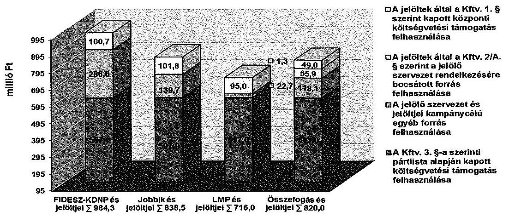

A képviselethez jutott négy jelölő szervezet és jelöltjeik kampánytevékenységre fordított összes kiadásai a Kftv.-ben rögzítetteknek megfelelve nem haladták meg a Kftv.ben rögzített értékhatárt.
A négy jelölő szervezet pártjai a Párt tv.-ben meghatározott forrásokat vették igénybe a választási kampányidőszak alatt, a választási kampánytevékenységgel összefüggő kiadásaik finanszírozására. A jelölő szervezetek pártjai az ellenőrzés során rendelkezésre álló adatok alapján - a Párt tv. előírásainak megfelelően jogi személytől, jogi személyiséggel nem rendelkező szervezettől, más államtól, külföldi szervezettől és nem magyar állampolgár természetes személytől vagyoni hozzájárulást, illetve névtelen adományt nem fogadtak el.
A politikai hirdetésekre vonatkozó számlák és az ÁSZ részére a Ve. alapján megküldött árjegyzékek és tájékoztatók körében az ellenőrzés a következőket tapasztalta. A politikai hirdetések számláinak adatai 102 esetben nem egyeztek meg az árjegyzékben és/vagy a tájékoztatóban foglalt adatokkal, 53 esetben a sajtótermék vagy médiatartalom szolgáltató nem küldött tájékoztatót, vagy az adatok nem egyeztek meg a tájékoztató adataival, továbbá 10 politikai hirdetést közzétevő sajtótermék nem szerepelt a médiahatóság nyilvántartásában. Ezen eltérésekért a számlakibocsátók (sajtótermékek kiadói) a felelősek. Az eltérések nem befolyásolták a választási kampányra fordított pénzeszközök felhasználásának minősítését.

---

# II. RÉSZLETES MEGÁLLAPÍTÁSOK 

## 1. A FIDESZ-KDNP JELÖLŐ SZERVEZET ELLENŐRZÉSI MEGÁLLAPÍTÁSAI

### 1.1. Az egyéni jelöltek választási kampányra fordított pénzeszközei felhasználásának szabályszerűsége

A FIDESZ-KDNP jelölő szervezet a 2014. évi országgyűlési választáson mind a 106 országos egyéni választókerületben indított jelölteket, akik közül 96 jelölt jutott képviselethez. A jelöltek részére a központi költségvetésből a Kftv. 1. §-a alapján jutatott egymillió Ft összegü ${ }^{1}$ támogatás felhasználását az ÁSZ jelöltenként a Kincstárnál ellenőrizte, mely ellenőrzésekről önálló számvevőszéki jelentés készült.

### 1.2. Az egyéni jelöltek lemondásából származó költségvetési támogatás felhasználásának szabályszerűsége

A FIDESZ-KDNP jelölő szervezet jelöltjei a Kftv. 2/A. § (1) bekezdésében biztosított nyilatkozattételi lehetőséggel nem éltek, nem mondtak le a pártjaik javára a központi költségvetésből juttatott jelöltenként egymillió Ft összegű támogatásról.

### 1.3. A pártlista alapján biztosított költségvetési támogatás felhasználásának szabályszerűsége

A FIDESZ és a KDNP 2014 februárjában megállapodást kötött közös országos lista állításáról és valamennyi egyéni választókerületben közös jelölt indításáról, amelynek értelmében a Kftv. 3. §-ában meghatározott, a jelölő szervezeteknek járó költségvetési támogatás igénybevételére való jogosultság vonatkozásában egy jelölő szervezetnek minősültek. A KDNP a megállapodás aláírásával hozzájárult ahhoz, hogy a Kincstár a FIDESZ számára folyósítsa a FIDESZ-KDNP jelölő szervezetet megillető támogatás összegét.
A FIDESZ-KDNP jelölő szervezet az országgyűlési képviselők általános választásán minden egyéni választókerületben állított jelöltet, ezért a Kftv. 3. § (1) bekezdés d) pontja alapján 597,0 millió Ft költségvetési támogatásra volt jogosult, mely összeget a Kincstár 2014. február 27 -én átutalta a FIDESZ részére.
A központi költségvetésből a Kftv. 3. §-a szerinti támogatás felhasználását alátámasztó eredeti dokumentumok a FIDESZ-nél a helyszíni ellenőrzés során rendelkezésre álltak. A hiteles bizonylatokat (számlákat) a FIDESZ nevére állították ki.

[^0]
[^0]:    ${ }^{1}$ A Kftv. 1. § (2) bekezdésének rendelkezése alapján „a támogatás összegét az országgyűlési képviselők a törvény hatálybalépését követő általános választását követő évtől kezdődően a Központi Statisztikai Hivatal által a tárgyévet megelőző évre megállapított fogyasztói árindexszel évente növelni kell."

---

Az ellenőrzött számlák közül a számlakibocsátó az Áfa tv. 169. § f), i) pontjai előírása ellenére három esetben nem tüntette fel a mennyiséget és az egységárat. Ezen hiányosságok nem befolyásolták a kampányfinanszírozásra fordított pénzeszközök szabályszerű felhasználásának minősítését.
A kampánycélú kiadások megfizetését alátámasztó számlák a Ve. 141. §-ában meghatározott kampánytevékenység kiadásainak finanszírozására irányultak. A dokumentumok a kampánytevékenység kampányidőszak alatt történő folytatását támasztották alá.

# 1.4. A választási kampány kiadásaira vonatkozó korlátozás betartásának szabályszerűsége 

A FIDESZ-KDNP jelölő szervezet a Kftv.-ben foglalt előírás alapján a választásra fordított állami és más pénzeszközök, anyagi támogatások összegét, forrását és a felhasználás módját nyilvánosságra hozta.
A közzétett adatok és a FIDESZ-KDNP jelölő szervezet által az ÁSZ részére a választási kampánytevékenységgel összefüggő kiadásokról rendelkezésre bocsátott dokumentumok biztosították az értékhatár betartásának ellenőrizhetőségét.
A FIDESZ-KDNP jelölő szervezet Kincstárnál ellenőrzött 96 országgyűlési képviselethez jutott jelöltje és a 10 országgyűlési képviselethez nem jutott jelöltje a Kftv. 1. §-ának rendelkezése alapján a központi költségvetésből juttatott egymillió Ft összegű támogatáson felül - az ellenőrzött dokumentumok tanúsága és a FIDESZ-KDNP jelölő szervezet adatszolgáltatása szerint - nem költött kampánycélra.
A FIDESZ-KDNP jelölő szervezet és annak jelöltjei választási kampánytevékenységgel összefüggő kiadásainak összege összesen 984,3 millió Ft volt.
A FIDESZ-KDNP jelölő szervezet kiadásainak bizonylatai kampánytevékenység kiadásainak kampányidőszak alatti finanszírozását támasztották alá.

A FIDESZ-KDNP jelölő szervezet és jelöltjei választásra fordított összes kampánykiadásainak összege a Kftv. 7. § (1) bekezdés b) pontjában előírtaknak megfelelően nem haladta meg a FIDESZ-KDNP jelölő szervezet és annak jelöltjei együttesen jelöltenként számított ötmillió Ft-os értékhatá-$\left.\left.\mathrm{rat}^{2}{ }^{2}\right.\right.$

[^0]
[^0]:    ${ }^{2}$ A Kftv. 7. § (1) bekezdés b) pontjában előírtaknak megfelelő értékhatár a négy képviselethez jutott jelölő szervezet esetében a Kftv. 7. § (4) bekezdés a)-b) pontjai szerint a jelölő szervezetenkénti 106 egyéni jelöltjei számának és az országos listán megszerezhető 93 mandátum összegének az ötmillió Ft-os értékhatár szorzatával számított összege, amely 995,0 millió Ft volt.

---

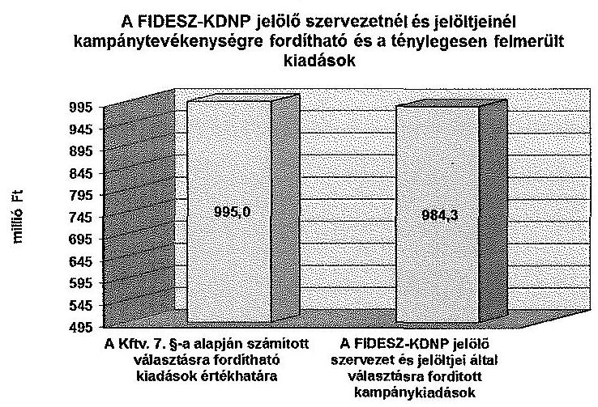

# 1.5. A Párt tv.-ben meghatározott korlátozások betartása 

A központi költségvetési támogatás igénybevétele mellett kampányfinanszírozásra fordított forrásoknál betartották a Párt tv. 4. § (2)-(3) bekezdéseiben foglalt korlátozást. A FIDESZ-KDNP jelölő szervezet jogi személytől, jogi személyiséggel nem rendelkező szervezettől, más államtól, külföldi szervezettől és nem magyar állampolgár természetes személytől vagyoni hozzájárulást és névtelen adományt nem fogadott el.
A FIDESZ-KDNP jelölő szervezet és jelöltjei által a választási kampányidőszak alatt, a választási kampánytevékenységgel összefüggő kiadások finanszírozására fordított 984,3 millió Ft forrása 100,7 millió Ft összegű, a jelöltek által a Kftv. 1. §-a szerinti, a központi költségvetésből juttatott támogatásból felhasznált összegből, a pártlista alapján a Kftv. 3. §-a szerint a FIDESZ-KDNP jelölő szervezetet megillető 597,0 millió Ft összegű központi költségvetési támogatásból, illetve 200,0 millió Ft összegben hitelből és 86,6 millió Ft összegben - a Párt tv. 4. § (1) bekezdésében foglalt előírásoknak megfelelő - vagyoni hozzájárulásból, adományból tevődött össze.
A jelöltek által igénybevett, összesen 100,7 millió Ft Kftv. 1. §-a szerinti központi támogatásból 91,3 millió Ft-ot a képviselethez jutott, 9,4 millió Ft-ot a képviselethez nem jutott jelöltek használtak fel.

A Fidesz-KDNP jelölő szervezet és jelöltjel kampánycélú kiadásai finanszirozási forrásainak összetétele
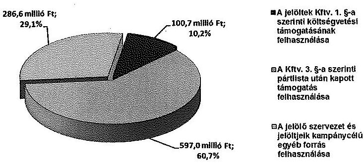

A FIDESZ-KDNP jelölő szervezet kampányfinanszírozásra nem használt fel 2013. évi maradványt.

---

A politikai hirdetésekre vonatkozó számlák és az ÁSZ részére a Ve. 148. § (2) és (4) bekezdése alapján megküldött árjegyzékek és tájékoztatók körében az ellenőrzés a következőket tapasztalta.
A politikai hirdetések számláinak adatai megegyeztek az árjegyzékben és a tájékoztatóban foglalt adatokkal.

# 2. A JOBBIK JELÖLŐ SZERVEZET ELLENŐRZÉSI MEGÁLLAPÍTÁSAI 

### 2.1. Az egyéni jelöltek választási kampányra fordított pénzeszközei felhasználásának szabályszerűsége

A Jobbik jelölő szervezet a 2014. évi országgyűlési választáson mind a 106 országos egyéni választókerületben indított jelölteket, akik képviseleti jogosultságot nem szereztek. A Jobbik jelölő szervezet - országos pártilistája alapján - 23 országgyűlési képviseleti mandátumot szerzett.

### 2.2. Az egyéni jelöltek lemondásából származó költségvetési támogatás felhasználásának szabályszerűsége

A Jobbik jelölő szervezet jelöltjei a részükre a Kftv. 1. §-ában meghatározottak alapján a központi költségvetésből juttatott egymillió Ft összegű támogatást felhasználták, az országgyűlési képviselő választást megelőzően nem éltek a Kftv. 2/A. § (1) bekezdésében biztosított lehetőséggel, nem mondtak le pártjuk javára a támogatásról.

### 2.3. A pártlista alapján biztosított költségvetési támogatás felhasználásának szabályszerűsége

A Jobbik jelölő szervezet az országgyűlési képviselők általános választásán minden egyéni választókerületben állított jelöltet, ezért a Kftv. 3. § (1) bekezdés d) pontja alapján 597,0 millió Ft költségvetési támogatásra volt jogosult. A Kincstár a költségvetési támogatást 2014. március 7 -én utalta át a Jobbik jelölő szervezet részére.
A Jobbik jelölő szervezet rendelkezett a Kftv. 3. §-a szerinti költségvetési támogatás felhasználását alátámasztó dokumentumokkal. A költségvetési támogatásból finanszírozott kiadások bizonylatai hitelesek volt, azokat a Jobbik nevére állították ki. A támogatás felhasználását alátámasztó bizonylatok a Számv. tv.-ben rögzítetteknek megfelelőek, hitelesek voltak.

Az ellenőrzött számlák közül a számlakibocsátó az Áfa tv. 169. § c) pontja előirása ellenére kettő esetben nem tüntette fel a számiakibocsátó adószámát, egy számla esetében az Áfa tv. 169. § i) és f) pontjaiban foglaltak ellenére a számla nem tartalmazta az egységárat, további három számla nem rögzítette a számlázott szolgáltatás, mennyiségét és egységárát. Ezen hiányosságok nem befolyásolták a kampányfinanszirozásra fordított pénzeszközök szabályszerű felhasználásának minősítését.
A költségvetési támogatás felhasználását alátámasztó számlák a választói akarat befolyásolására alkalmas kampánytevékenység kiadásainak megfizetésére vonatkoztak. A költségvetési támogatásból teljesített kampánycélú kifi-

---

zetések a kampányidőszakban felhasznált kampánytevékenység kiadásainak finanszírozására irányultak ${ }^{3}$. A kampányidőszaki pénzügyi teljesítés ellenére egy ellenőrzött esetben a kampánytevékenység már a kampányidőszakot megelőző időszakban megkezdődött.

Az ellenőrzött kiadások közül egy, a Jobbik jelölő szervezetet népszerűsítő hirdetést a 2014. január és február havi sajtótermékben a kampányidőszakot megelőzően közölte a kiadó, ezért nem felelt meg maradéktalanul a Ve. 139. §-ában ${ }^{4}$ meghatározott követelménynek. A számlakibocsátó BL-000220/14 számú számláján számlázott 14,2 ezer Ft-os ellenérték kampányidőszakot megelőző időszakhoz is kapcsolódott, annak ellenére, hogy a számla kelte és teljesítésnek időpontja 2014. március 7-e volt.

A Jobbik jelölő szervezet a Kftv. 3. §-a alapján kapott költségvetési támogatást meghaladó összeget fordított kampányidőszakban, kampánytevékenységgel összefüggő kiadások finanszírozására, figyelembe véve a saját forrás terhére való kifizetéseket.

# 2.4. A választási kampány kiadásaira vonatkozó korlátozás betartásának szabályszerűsége 

A Jobbik jelölő szervezet a Kftv.-ben foglalt előírás alapján a választásra fordított állami és más pénzeszközök, anyagi támogatások összegét, forrását és a felhasználásának módját nyilvánosságra hozta.
A nyilvánosságra hozott adatok és a Jobbik jelölő szervezet által az ÁSZ részére rendelkezésre bocsátott dokumentumok biztosították a Kftv.-ben meghatározott kampánycélú kiadások értékhatára betartásának ellenőrzését.
A Jobbik jelölő szervezet és jelöltjei a 2014. évben választási kampányidőszak alatt, a választási kampánytevékenységgel összefüggő kiadások finanszírozására együttesen összesen 838,5 millió Ft-ot fordítottak. A Jobbik jelölő szervezet egyéni jelöltjeinek kampánytevékenységgel összefüggő kiadása 103,2 millió Ft, míg a Jobbik jelölő szervezet kampánykiadásainak összege 735,3 millió Ft volt.

A 2014. évi országgyűlési képviselő-választáson a Jobbik jelölő szervezet és a jelöltjei adatszolgáltatása szerint 89 jelölt kizárólag a Kftv. 1. §-a szerinti egymillió Ft összegű támogatásból finanszírozott kampánytevékenységet, míg 17 jelölt az egymillió Ft összegű központi költségvetésből juttatott támogatás igénybevétele mellett egyéb forrásból is költött a választási kampányidőszak alatt, a választási kampánytevékenységgel összefüggő kiadások finanszírozására.
Az ÁSZ rendelkezésére bocsátott adatszolgáltatás szerint az egyéb forrás terhére kiadást teljesítő 17 jelölt kampánycélra 2,1 millió Ft egyéb forrást használt fel, amelyből az ÁSZ összesen 1,4 millió forint összegű Ve. szerinti kampánytevékenység finanszírozására irányuló kiadást állapított meg a következő - 15 jelölt adatszolgáltatását érintő - eltérések miatt:

[^0]
[^0]:    ${ }^{3}$ A Jobbik jelölő szervezet a választási kampányidőszak alatt, a választási kampánytevékenységgel összefüggő kiadások finanszírozására a Kftv. 3. §-a szerinti 597,0 millió Ft összegű támogatást meghaladva összesen 735,3 millió Ft-ot fordított.
    ${ }^{4}$ A kampányidőszak: a szavazás napját megelőző 50. naptól a szavazás napján a szavazás befejezéséig, azaz 2014. február 15-től 2014. április 6-ig tartó időszak.

---

Két jelölt támogatás felhasználásáról tett korábbi megállapítását a Kincstár viszszavonta, új határozatot hozott, melyben a jelöltek érintett kiadásait, összesen 114,1 ezer Ft összegben elfogadta költségvetési támogatásból finanszírozható kiadásnak, ezért a jelöltek adatszolgáltatása szerinti egyéb forrás felhasználás ezzel az összeggel csökkent.
Nyolc jelölt által egyéb források között kimutatott, a Kincstárnak megfizetett 392,1 ezer Ft szankció ${ }^{5}$ összege, amely a Ve. 141. § előírása alapján nem kampánytevékenység finanszírozását szolgálta.
Egy jelölt adatszolgáltatásában 139,3 ezer Ft-ot egyéb forrásból finanszírozottként mutatott ki. Ugyanakkor a Jobbik nyilatkozata és az ellenőrzési dokumentumok alapján a Jobbik jelölő szervezet által - a Jobbik nevére szóló számla alapján teljesített kiadás volt. További eltérést okozott, hogy a jelölt egy számla 101,2 ezer Ft ellenértékét tévesen 103,0 ezer Ft összegben mutatta ki az adatszolgáltatásban egyéb forrás igénybevételeként.
Egy jelölt 18,2 ezer Ft összegű hirdetésről szóló kifizetésről szolgáltatott adatot egyéb forrás felhasználásaként, azt azonban bizonylattal nem tudta alátámasztani.
Egy jelölt éves autópálya használati dijának 43,0 ezer Ft-os ellenértékéből 40,3 ezer Ft-ról egyéb forrásból teljesített kampánycélú kiadásként szolgáltatott adatot, annak ellenére, hogy a kiadás kampányidőszakon túli szolgáltatás ellenértéke volt, így az nem alapozta meg a kampányidőszakban történő felhasználást.
Egy jelölt 19,2 ezer Ft értékben beszerzett üzemanyagról szóló számlája a kampányidőszakot követően, 2014. április 24 -én került kiállításra, ezért a kiadás nem a kampányidőszakban történő felhasználást alapozott meg.
Egy jelölt 6,0 ezer Ft - szabálytalan támogatás felhasználás miatti - visszafizetési kötelezettsége postai utalásának diját az egyéb kiadások között mutatta ki, ami nem minősül kampánytevékenység finanszírozásának.
A Jobbik jelölő szervezet kiadásainak bizonylatai kampánytevékenység kiadásainak kampányidőszak alatti finanszírozását támasztották alá.

Az ellenőrzött számlák közül a számlakibocsátó az Áfa tv. 169. § f), i) pontjai előírása ellenére hat esetben nem tüntette fel az egységárat, kettő számla esetében a mennyiséget és az egységárat. Egy számla kibocsátásakor a számlán nem rögzítették az Áfa tv. 169. § m) pontjában foglalt, adómentességet alátámasztó jogszabályi hivatkozást. Ez a hiányosság nem befolyásolta a kiadások kampánycélú felhasználásának minősítését.
A kampányidőszakban a Jobbik jelölő szervezet és az egyéni jelöltek kampánytevékenységre fordított együttes kiadása nem haladta meg a Kftv. 7. § (1) bekezdése b) pontja szerinti kampánytevékenységgel összefüggő kiadások finanszírozására fordítható összeget.
A Jobbik jelölő szervezet kiadásainak bizonylatai kampánytevékenység kiadásainak kampányidőszak alatti finanszírozását támasztották alá.

[^0]
[^0]:    ${ }^{5}$ A Kftv. 8. § (3) bekezdés b) pontjában foglaltak szerint az a jelölt, akinek az elszámolását a Kincstár részben, vagy egészben nem fogadja el, a nem megfelelően elszámolt Kftv. 1. §-a szerinti támogatás kétszeresét köteles a Kincstár által meghatározott számlára visszafizetni.

---

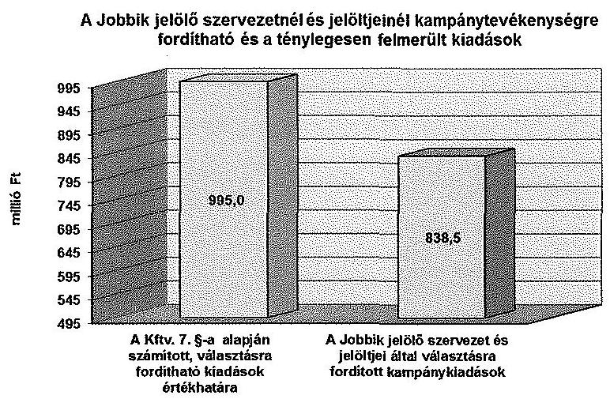

# 2.5. A Párt tv.-ben meghatározott korlátozások betartása 

A központi költségvetési támogatáson kívüli kampányfinanszírozásra fordított forrásoknál betartották a Párt tv. 4. § (2)-(3) bekezdéseiben foglalt korlátozást. A Jobbik jelölő szervezet jogi személytől, jogi személyiséggel nem rendelkező szervezettől, más államtól, külföldi szervezettől és nem magyar állampolgár természetes személytől vagyoni hozzájárulást és névtelen adományt nem fogadott el. A kampánycélra felhasznált 2013. évi maradvány a Párt tv. 4. § (2)-(3) bekezdésében foglalt tiltott forrásból származó bevételt nem tartalmazott.
A Jobbik jelölő szervezet és jelöltjei által a 2014. évi kampányfinanszírozásra fordított 838,5 millió Ft forrása 101,8 millió Ft értékben a jelöltek által felhasznált Kftv. 1. §-a szerinti, valamint 597,0 millió Ft értékben a Kftv. 3. §-a szerint pártlista alapján járó központi költségvetési támogatás felhasznált összegéből, illetve 1,4 millió Ft értékben az egyéni jelöltek egyéb forrás igénybevételéből, 112,0 millió Ft összegű - a Párt tv. 4. § (1) bekezdésében meghatározottak szerint a Jobbik részére a 2014. évben juttatott - költségvetési támogatásból, 0,1 millió Ft értékben - a Párt tv. 4. § (1) bekezdésében foglalt előírásoknak megfelelő - adományból és 26,2 millió Ft értékben 2013. évi maradványból tevődött össze.
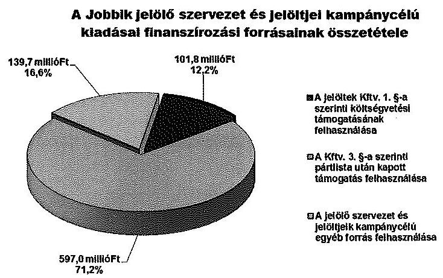

A politikai hirdetésekre vonatkozó számlák és az ÁSZ részére a Ve. 148. § (2) és (4) bekezdése alapján megküldött árjegyzékek és tájékoztatók körében az ellenőrzés a következőket tapasztalta.

---

A politikai hirdetések számláinak adatai 50 esetben nem egyeztek meg az árjegyzékben és/vagy a tájékoztatóban foglalt adatokkal, 37 sajtótermék nem küldött tájékoztatót vagy az adatok nem egyeztek meg a tájékoztató adataival, továbbá négy politikai hirdetést közzétevő sajtótermék nem szerepelt a médiahatóság nyilvántartásában. Ezen eltérésekért a számlakibocsátók (sajtótermékek kiadói) a felelősek. Az eltérések nem befolyásolták a választási kampányra fordított pénzeszközök felhasználásának minősítését.

# 3. Az LMP JELÖLŐ SZERVEZET ELLENŐRZÉSI MEGÁLLAPÍTÁSAI 

### 3.1. Az egyéni jelöltek választási kampányra fordított pénzeszközei felhasználásának szabályszerűsége

Az LMP jelölő szervezet a 2014. évi országgyűlési választáson mind a 106 országos egyéni választókerületben indított jelölteket, akik képviseleti jogosultságot nem szereztek. Az LMP jelölő szervezet - országos pártlistája alapján - öt országgyűlési képviselői mandátumhoz jutott.

### 3.2. Az egyéni jelöltek lemondásából származó költségvetési támogatás felhasználásának szabályszerűsége

Az LMP jelölő szervezet 106 jelöltjéből 95 jelölt élt a Kftv. 2/A. § (1) bekezdésében biztosított lehetőséggel, lemondott a párt javára a Kftv. 1. §-a szerinti központi költségvetésből juttatott, jelöltenként egymillió Ft összegű támogatásról. Kilenc jelölt nem kötött megállapodást a Kincstárral az egymillió Ft-os támogatás igénybevételére és pártja javára sem mondott le arról. Az egyéni jelöltek lemondó nyilatkozata, valamint az LMP jelölő szervezet és a Kincstár közötti megállapodás alapján a Kincstár a 95,0 millió Ft támogatás folyósításáról intézkedett az LMP jelölő szervezet részére. A támogatást LMP jelölő szervezet 95,0 millió Ft összegben felhasználta a kampánykiadások finanszírozására. A kincstári kártyafedezeti számla és a kincstári kártya használata szabályszerű volt, megfelelt a Kftv. 2. § (4)-(5) bekezdéseiben meghatározott előírásoknak. A kampánytevékenységekkel összefüggő kiadásokra teljesített kifizetések a kincstári kártyafedezeti számláról minden esetben kincstári kártyával vagy átutalással történtek.
Az LMP jelölő szervezet a választási kampányidőszak alatt a választási kampánytevékenységgel összefüggő kiadások elszámolását a Kftv. 8/A. § (1) bekezdésében foglaltaknak megfelelően az összes kifizetést igazoló bizonylat másolatának benyújtásával teljesítette.
A támogatás felhasználását igazoló számlák, egyéb számviteli bizonylatok a Kftv. 2/A. § (5) bekezdésében foglaltaknak megfelelően az LMP nevére szóltak. A bizonylatok alaki és tartalmi kellékei megfeleltek a Számv. tv. és az Áfa tv. előírásainak.
Az LMP jelölő szervezet az NGM rendelet 7. § (1) bekezdésében előírt számlaöszszesítő adatlapot a helyszíni ellenőrzés során bemutatott eredeti bizonylatok alapján állította össze. A bizonylatokon szereplő gazdasági események az NGM rendelet 2. § (4) a) bekezdés 6. pontjában rögzítettek szerint az Áhsz. 15. mellékletében megjelölt K3 Dologi kiadások rovatba tartozó kampánytevékenységgel összefüggésben elszámolható kiadásokra vonatkoztak.

---

# 3.3. A pártlista alapján biztosított költségvetési támogatás felhasználásának szabályszerűsége 

Az LMP jelölő szervezet az országgyűlési képviselők általános választásán minden egyéni választókerületben állított jelöltet, ezért a Kftv. 3. § (1) bekezdés d) pontja alapján 597,0 millió Ft költségvetési támogatásra volt jogosult, amelyet a Kincstár 2014. március 11 -én átutalt az LMP jelölő szervezet részére.
Az LMP jelölő szervezet rendelkezett a Kftv. 3. § -ában foglaltak szerinti költségvetési támogatás felhasználását alátámasztó dokumentumokkal. Valamennyi támogatásból finanszírozott kiadás bizonylata a Számv. tv.-ben előírtaknak megfelelően hiteles volt, azokat a LMP nevére állították ki.

Az ellenőrzött számlák közül a számlakibocsátó az Áfa tv. 169. § c) pontja előírása ellenére három esetben a kibocsátó adószámát nem tüntette fel. Ezen hiányosságok nem befolyásolták a kampányfinanszírozásra fordított pénzeszközök szabályszerű felhasználásának minősítését.
Az LMP jelölő szervezet kiadásainak felhasználását alátámasztó számlákon megjelenített gazdasági események a Ve. 141. §-aiban foglaltak szerinti kampánytevékenység kiadásainak megfizetésére irányultak. A támogatás felhasználása a Kftv. 6. § (1) bekezdésében foglalt előírásoknak megfelelően történt, az ÁSZ rendelkezésére bocsátott dokumentumok a választási kampányidőszak alatti, a választási kampánytevékenységgel összefüggő kiadások finanszírozására történő támogatás felhasználását támasztották alá.

### 3.4. A választási kampány kiadásaira vonatkozó korlátozás betartásának szabályszerűsége

Az LMP jelölő szervezet a Kftv.-ben foglalt előírás alapján a választásra fordított állami és más pénzeszközök, anyagi támogatások összegét, forrását és a felhasználásának módját nyilvánosságra hozta.
Az LMP jelölő szervezet választási kampánytevékenységgel összefüggő kiadásainak összege 714,6 millió Ft volt. A Kftv. 1. §-a szerinti költségvetési támogatást igénybevevő kettő jelölt összesen 1,4 millió Ft-ot használt fel kampánytevékenység finanszírozására, amelyből egy jelölt vett igénybe 101,3 ezer Ft értékben egyéb forrást költése finanszírozására. Az LMP jelölő szervezet és a két egyéni választókerületi jelöltje kampánytevékenységgel összefüggő kiadása öszszesen 716,0 millió Ft volt.
Az LMP jelölő szervezet által a választási kampányidőszak alatt választási kampánytevékenységgel összefüggő kiadásokról közzétett adatai és az ÁSZ részére rendelkezésre bocsátott dokumentumok az értékhatár betartásának ellenőrzését biztosították.
Az LMP jelölő szervezet és az egyéni választókerületi jelöltek által választásra fordított összes kampánykiadásainak összege a Kftv. 7. § (1) bekezdés b) pontjában előírtaknak megfelelően nem haladta meg az LMP jelölő szervezet és annak jelöltjei együttesen jelöltenként számított ötmillió Ft-os értékhatárát.

---

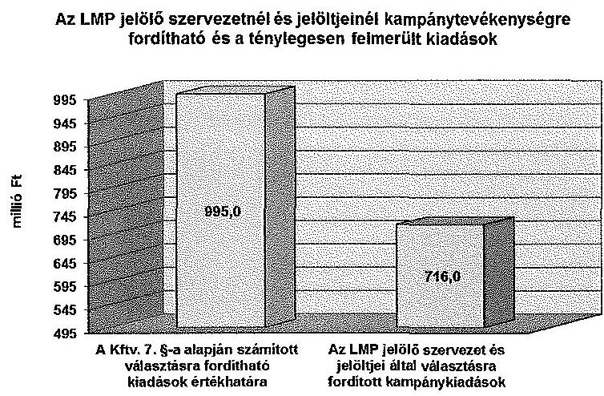

# 3.5. A Párt tv.-ben meghatározott korlátozások betartása 

A kampányfinanszírozásra fordított forrásoknál betartották a Párt tv. 4. § (2)(3) bekezdésében foglalt korlátozást. Az LMP jelölő szervezet jogi személytől, jogi személyiséggel nem rendelkező szervezettől, más államtól, külföldi szervezettől és nem magyar állampolgár természetes személytől vagyoni hozzájárulást és névtelen adományt nem fogadott el.
Az LMP jelölő szervezet és egyéni választókerületi jelöltjei által a 2014. évi kampányfinanszírozásra fordított 716,0 millió Ft kiadás forrása 1,3 millió Ft összegben a jelöltek által felhasznált, a Kftv. 1. §-a szerinti, a központi költségvetésből juttatott támogatásból, 95,0 millió Ft a jelöltek által a Kftv. 2/A. § (1) bekezdésének előírása alapján az LMP jelölő szervezet rendelkezésére bocsátott forrásból, továbbá 597,0 millió Ft értékben a pártlista alapján - a Kftv. 3. §-ának előírása szerint - járó központi költségvetési támogatásból, illetve 22,7 millió Ft egyéb forrásból származott. Az egyéb forrás az LMP jelölő szervezet 21,6 millió Ft öszszegű - a Párt tv. 4. § (1) bekezdésében meghatározottak szerint az LMP részére 2014. évben juttatott - költségvetési támogatásból, 1,0 millió Ft - a Párt tv. 4. § (1) bekezdésében foglalt előírásoknak megfelelő adományból, illetve egy jelölt 0,1 millió Ft egyéb forrásából tevődött össze.
A kampányfinanszírozásra nem használtak fel 2013. évi maradványt.
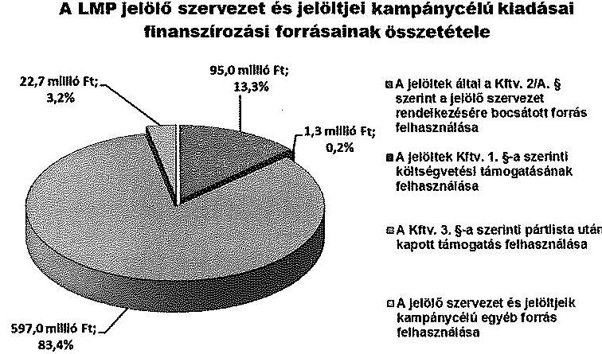

---

A politikai hirdetésekre vonatkozó számlák és az ÁSZ részére a Ve. 148. § (2) és (4) bekezdése alapján megküldött árjegyzékek és tájékoztatók körében az ellenőrzés a következőket tapasztalta.
A politikai hirdetések számláinak adatai 26 esetben nem egyeztek meg az árjegyzékben és/vagy a tájékoztatóban foglalt adatokkal, három sajtótermék nem küldött tájékoztatót, további hat politikai hirdetést közzétevő sajtótermék nem szerepelt a médiahatóság nyilvántartásában. Ezen eltérésekért a számlakibocsátók (sajtótermékek kiadói) a felelősek. Az eltérések nem befolyásolták a választási kampányra_fordított pénzeszközök felhasználásának minősítését.

# 4. Az Összefogás jelölő SZERVEZET ELLENŐRZÉSI MEGÁLLAPÍTÁSAI 

### 4.1. Az egyéni jelöltek választási kampányra fordított pénzeszközei felhasználásának szabályszerűsége

Az MSZP, az Együtt, a DK, a PM és az MLP 2014. február 12-én megállapodást kötött az Összefogás jelölő szervezet létrehozásáról és arról, hogy közös országos listát és a 106 egyéni választókerületben közös jelöltet indítanak. Az Összefogás jelölő szervezet a 2014. évi országgyűlési választáson mind a 106 országos egyéni választókerületben indított jelölteket, akik közül az MSZP nyolc, a DK és az Együtt egy-egy jelöltje jutott képviselethez.
A képviselethez jutott 10 jelölt részére a központi költségvetésből a Kftv. 1. §-a alapján jutatott egymillió Ft összegű támogatás felhasználását az ÁSZ jelöltenként a Kincstárnál ellenőrizte, az ellenőrzésekről önálló számvevőszéki jelentés készült.

### 4.2. Az egyéni jelöltek lemondásából származó költségvetési támogatás felhasználásának szabályszerűsége

Az egyéni választókerületben indított jelöltek közül a Kftv. 2/A. § (1) bekezdésében biztosított nyilatkozattételi lehetőséggel élve a DK és az Együtt összes jelöltje ( 13 és 22 jelölt), és az MSZP jelöltjei közül 21 mondott le pártja javára a Kftv. 1. §-a szerinti központi költségvetésből juttatott egymillió Ft összegű támogatás igénybevételéről. A PM nyolc jelöltje az Összefogás jelölő szervezet pártjai között létrejött megállapodás 7. pontja alapján ${ }^{6}$ a Kftv. 1. §-a szerinti támogatást az Együtt rendelkezésére bocsátotta.
A Kincstár a Kftv. 2/A. § (2) bekezdése alapján az Összefogás jelölő szervezet pártjai közül hárommal - az Együtt-tel, a DK-val és az MSZP-vel, - a jelöltenkénti egymillió forintos támogatás ( 22,0 millió Ft, 13,0 millió Ft, 21,0 millió Ft) folyósítása céljából megállapodást kötött, kincstári kártyafedezeti számlát nyitott és kincstári kártya kibocsátásáról intézkedett. A kincstári fedezeti számla és kártya használata megfelelt a jogszabályi előírásoknak, a kifizetést

[^0]
[^0]:    ${ }^{6}$ A megállapodás 7. pontja szerint: „A Felek tudomásul veszik, hogy az Együtt - a Korszakváltók Pártja és a Párbeszéd Magyarországért Párt által megnevezett jelöltek a támogatást e két jelölő szervezet bármelyikének rendelkezésére bocsáthatják".

---

MSZP kártyával, a DK és az Együtt a Kincstár honlapján elérhető, a kártyakibocsátó internetes felületén kezdeményezett átutalással teljesítette.
Mind a három párt elszámolt a folyósított támogatással a Kftv. 8/A. § (1) bekezdésében foglaltak szerinti számlaösszesítő adatlapon, a kiadási tételek felhasználási céljáról szöveges indokolást adott, továbbá nyilatkozott a támogatás felhasználásának szabályszerűségéről. A Kincstár a támogatás felhasználását a számlaösszesítő adatlapok, a csatolt bizonylatok alapján felülvizsgálta és határozataiban döntött ${ }^{7}$ annak elfogadásáról.
Az elszámolást alátámasztó hitelesített számlák az Összefogás jelölő szervezet pártjai nevére szóltak.
A bizonylatok - a DK számláinál feltárt hiányosságok kivételével - megfeleltek a Számv. tv. és az Áfa tv. előírásainak.

Az ellenőrzött számlák közül a számlakibocsátó az Áfa tv. 169. § f), i) pontjai előírása ellenére öt esetben nem tüntette fel a mennyiséget és az egységárat, további egy számláról hiányzott az egységár. A számlakibocsátó egy számlán az Áfa tv. 169. § c) pontjában előírt kibocsátó adószámát és további egy számlán a 169. § g) pontja által előírt teljesítés időpontját nem tüntette fel, valamint a számlákon meghatározott teljesítési időpont az Áfa tv. 169. § g) pontjában előírtak ellenére kettő számlán eltért a számlát alátámasztó dokumentumokban rögzített időponttól. Ezen hiányosságok nem befolyásolták a kampányfinanszírozásra fordított pénzeszközök szabályszerű felhasználásának minősítését.
A bizonylatokon szereplő gazdasági események az Áhsz. 15. melléklet K3. Dologi kiadások rovatba tartozó, a kampánytevékenységgel összefüggő dologi kiadások finanszírozását támasztották alá. A számlák a választói akarat befolyásolására, vagy annak megkísérlésére alkalmas kampánytevékenység folytatását támasztották alá.
A DK-nál a Kftv. 2/A. §-a alapján kapott költségvetési támogatásból finanszírozott kiadások közül három esetben a kampánytevékenységre a Ve. 139. §-ában meghatározott kampányidőszak kezdetét megelőzően került sor. A bizonylatokon szereplő, a Ve. 139. §-ában rögzített kampányidőszakot megelőző felhasználások együttes összege 115,3 ezer Ft.

Egy szolgáltató 2014. február 19-én kibocsátott N14-000006/14 számú számlájában ablakdekoráció és molinó felszerelésének 43910 Ft összegű díját számlázta. A számla teljesítés és a teljesítésigazolás dátuma a kampányidőszakot megelőző, 2014. február 13-a volt.
Egy szolgáltató a XX2SA1529852 számlában a kampányidőszak kezdetét megelőző napon megjelent hirdetés bruttó 25718 Ft-os díját számlázta. A hirdetést megjelentető példány 2014. február 14-én jelent meg. A számla kelte és a teljesítés időpontja 2014. február 17-e volt.
Egy szolgáltató SZA00007/2014 számú számlán kettő hirdetés díját számlázta. Az újságban az egyik politikai hirdetés 2014. február 6-án, a másik 2014. február 20án jelent meg. A kampányidőszakot megelőzően közölt hirdetés díja bruttó 45720 Ft volt.
Az ÁSZ megállapításától eltérően a Kincstár a DK részére folyósított támogatás felhasználásának Kftv. 8/A. § (2) bekezdés szerinti - az összesített elszámolásra

[^0]
[^0]:    ${ }^{7}$ Együtt esetében hiánypótlást követően.

---

vonatkozó - ellenőrzése során szabályszerűnek minősítette az előzőekben felsorolt, összesen 115,3 ezer Ft kiadás finanszírozására fordított támogatás igénybevételét.

# 4.3. A pártlista alapján biztosított költségvetési támogatás felhasználásának szabályszerűsége 

Az Összefogás jelölő szervezet pártjai közt létrejött megállapodásban meghatározták a költségvetési támogatás pártok közti megosztásának arányait. A Nemzeti Választási Iroda részére 2014. február 21-én bejelentett országos lista alapján a központi költségvetési támogatás 55,27\%-ára az MSZP, 29,91\%-ára az Együtt, $13,31 \%$-ára a DK, $1,5 \%$-ára az MLP volt jogosult, a PM nem részesült támogatásban.

A Kftv. 3. §-ának előírásai alapján az Összefogás jelölő́ szervezetet a költségvetési támogatás vonatkozásában egy jelölő́ szervezetnek kellett tekinteni, amely alapján összesen 597,0 millió Ft támogatásban részesült. A Kincstár az Összefogás jelölő szervezet pártjai között létrejött megállapodás 8. pontjában rögzítetteknek megfelelően 2014. március 7-én az egyéni választókerületben indított közös jelöltek arányában az MSZP-nek 330,0 millió Ft-ot, az Együtt részére 178,6 millió Ft-ot, a DK-nak 79,5 millió Ft-ot, az MLP-nek 9,0 millió Ft-ot utalt át.

A támogatás felhasználását alátámasztó eredeti dokumentumok rendelkezésre álltak. Valamennyi bizonylat hiteles volt, azokat az egyes pártok - MSZP, Együtt, DK és MLP - nevére állították ki.

Az ellenőrzött számlák közül a számlakibocsátó az Áfa tv. 169. § 1), i) pontjai előírásai ellenére a PM egy és a DK hat számlája esetében nem tüntette fel a mennyiséget, vagy az egységárat, továbbá a Számv. tv. 165. § (2) bekezdésében előírtak ellenére nem előírásszerűen javították az Együtt két számláján a mennyiséget és a számla keltét, illetve a vevő címét. Ezen hiányosságok nem befolyásolták a kampányfinanszírozásra fordított pénzeszközök szabályszerű felhasználásának minősítését.

Az Összefogás jelölő́ szervezet költségvetési támogatásból teljesített kiadásainak bizonylatai kampánytevékenység kiadásainak finanszírozását támasztották alá. A dokumentumok - egy bizonylat kivételével - a kampánytevékenység kampányidőszak alatti kiadásainak forrásfelhasználását igazolták. A Ve. 141. §-ában előírtak ellenére egy esetben a kampánytevékenységre a kampányidőszakot követően is sor került.

Egy szolgáltató 532039869 számú számláján szereplő 2014. március 26 - 2014. április 25. közötti időszak kiegészítő havi előfizetési díj ( 3175 Ft ) teljes összegét kampányidőszak alatti kiadásként számolta el az MSZP, melyből 1946 Ft kampányidőszakot követő - 2014. április 7-április 25. közötti - időszakra vonatkozott.
Az Összefogás jelölő́ szervezet a Kftv. 3. §-a alapján kapott költségvetési támogatást meghaladó összeget fordított kampányidőszakban, kampánytevékenységgel összefüggő kiadásainak finanszírozására, figyelembe véve az egyéb forrás terhére való kifizetéseket is.

---

# 4.4. A választási kampány kiadásaira vonatkozó korlátozás betartásának szabályszerűsége 

Az Összefogás jelölő szervezet pártjai a Kftv.-ben foglalt előírások alapján a választásra fordított állami és más pénzeszközök, anyagi támogatások összegét, forrását és a felhasználás módját nyilvánosságra hozták.
Az Összefogás jelölő szervezet 10 jelöltje jutott egyéni választókerületi képviselethez ${ }^{8}$. Közülük három képviselethez jutott jelölt a Kftv. 2/A. § (1) bekezdése alapján lemondott pártja javára a Kftv. 1. §-a szerinti központi költségvetésből juttatott egymillió forint összegű támogatás igénybevételéről, és egyéb forrásból sem költött választási kampánycélra.
A 10 képviselethez jutott jelölt közül hét jelölt vett igénybe összesen 6697,4 ezer Ft Kftv. 1. §-a szerinti központi költségvetésből juttatott támogatást, közülük egy képviselethez jutott jelölt a támogatáson felül egyéb forrásból további 307,5 ezer Ft-ot fordított kampánytevékenységre.
A 106 jelöltből 15 jelölt adatszolgáltatása alapján összesen 6157,2 ezer Ft egyéb - nem központi költségvetésből juttatott - forrásból finanszírozott választási kampányidőszak alatti, a választási kampánytevékenységgel összefüggő kiadásról nyilatkozott.

A 15 jelöltből kettő jelölt adatszolgáltatásában 2165,4 ezer Ft-ot egyéb forrásból finanszírozott kiadásként mutatott ki. Ugyanakkor az Összefogás jelölő szervezet egyik pártjának, az MSZP-nek a nyilatkozata és az ellenőrzési dokumentumok alapján az az MSZP által - az MSZP nevére szóló számla alapján - teljesített kiadás volt.
Az MSZP-nek egy képviselethez jutott és kilenc képviselethez nem jutott jelöltje a Kftv. 1. §-a szerinti, a központi költségvetésből juttatott egymillió Ft összegű támogatás mellett 2316,6 ezer Ft-ot költött kampánycélra. Három képviselethez nem jutott, a Kftv. 1. §-a szerinti állami támogatásról az MSZP javára lemondó jelölt 1675,2 ezer Ft egyéb forrást használt fel kampánytevékenységre.
A fentiekben ismertetett tények figyelembevételével a 3991,8 ezer Ft egyéb forrást ténylegesen is költő 13 jelölt - bizonylattal alátámasztott - kiadásai kampánytevékenység folytatására irányultak, azonban ezek közül négy esetben összesen 80,2 ezer Ft összegben a beszerzés nem a Ve. 139. §-ában meghatározott kampányidőszakban történt.

Egy jelölt (MSZP) üzemanyag vásárlásról szóló (812000108/0518/00063 számú) bruttó 20,8 ezer Ft összegű számlájának kiegyenlítése a kampányidőszakon kívül, 2014. április 16-án történt.

Egy jelölt (MSZP) fénymásolópapír vásárlásról szóló (A03101285/0018/00001 számú) számlája és élelmiszervásárlásról szóló (ÉLELM-80245-2014 számú) pénztárbizonylata szerint összesen bruttó 10,2 ezer Ft összegben vett igénybe szolgáltatásokat, melyek ellenértékének kiegyenlítése a kampányidőszakon kívül, 2014. február 2-án és 2014. május 13-án történt meg.
Egy jelölt (MSZP) internetes közösségi oldalon jelentetett meg hirdetést, mely szolgáltatás az egyik esetben 2014. április 6. 00,0 órától 2014. április 7-én 00.0 óráig szólt (FBADS-533-100033801 számú számla), míg egy másik esetben a szolgáltatás

[^0]
[^0]:    ${ }^{8}$ Az egyéni választókerületben képviselethez jutott 10 jelöltet ellenőrizte az ÁSZ, melyről külön jelentés készült.

---

igénybevételére 2014. április 7 -én került sor (FBADS-533-100034546 számú számla). A saját forrás felhasználása ezen a kiadásoknál összesen 2,5 ezer Ft öszszegben kampányidőszakot követően történt meg.
Egy jelölt (MSZP) a részére 2014. április 4-én kiállított 14-275000161-01221-1 számú, 47997 Ft értékủ gázolaj vásárlásról szóló készpénzfizetési számlájához részletes indoklást adott. Az útnyilvántartás figyelembevételével számított üzemanyag felhasználás alapján a számlából 258 Ft összeg minősül kampánycélú kifizetésnek. A számla összegéből fennmaradó 46739 Ft a Ve. 141. §-a előírásai alapján nem szolgálhatott kampánytevékenységet, mert a jelölt az útnyilvántartásában az üzemanyag vásárlásától a kampányidőszak végéig nem szerepeltetett megtett utat, amely az üzemanyag Ve. 139. §-ában rögzített kampányidőszak alatti felhasználását alátámasztotta volna.
Az Összefogás jelölő szervezet kiadásainak bizonylatai kampánytevékenység kiadásainak kampányidőszak alatti finanszírozását támasztották alá.

Az ellenőrzött számlák közül a számlakibocsátó az Áfa tv. 169. § f) pontja előírása ellenére egy esetben nem tüntette fel a mennyiséget. Ez a hiányosság nem befolyásolta a kiadások kampánycélú felhasználásának minősítését.
A 2014. évi országgyúlési választás kampánytevékenységére az Összefogás jelölő szervezet összesen 767,2 millió Ft-ot (az MSZP 463,2 millió Ft, az Együtt 201,4 millió Ft, a DK 92,5 millió Ft, az MLP 9,1 millió Ft és a PM 1,0 millió Ft) fordított.
Az Összefogás jelölő szervezetnél a jelöltek a Kftv. 1. § szerinti költségvetési támogatásból 49,0 millió Ft-ot, saját forrásból 3,9 millió Ft-ot (összesen 52,9 millió Ft-ot) használtak fel kampánytevékenység finanszírozására.
Az Összefogás jelölő szervezet és jelöltjei választási kampánytevékenységgel összefüggő kiadásainak összege összesen 820,0 millió Ft volt ${ }^{9}$, amely a Kftv. 7. § (1) bekezdés b) pontjában előírtak szerint nem haladta meg jelöltenként számított ötmillió Ft-os értékhatárt.
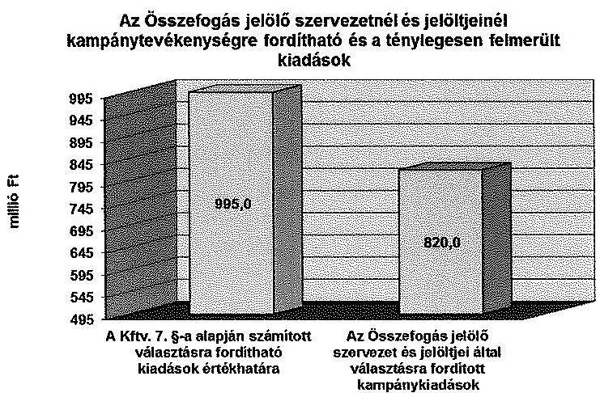

[^0]
[^0]:    ${ }^{9}$ Az Összefogás jelölő szervezet a választási kampányköltségeinek korlátozása tekintetében a Kftv. 7. § (5) bekezdése alapján egy pártnak minősül, így a Kftv. 7. § (1) bekezdés b) pontjának előírásai alapján a jelölő szervezet szintjén kell teljesülnie.

---

# 4.5. A Párt tv.-ben meghatározott korlátozások betartása 

Az Összefogás jelölő szervezet a központi költségvetési támogatáson kívüli kampányfinanszírozásra fordított forrásoknál betartotta a Párt tv. 4. § (2)-(3) bekezdéseiben foglalt korlátozást. Jogi személytől, jogi személyiséggel nem rendelkező szervezettől, más államtól, külföldi szervezettől és nem magyar állampolgár természetes személytől vagyoni hozzájárulást és névtelen adományt nem fogadott el.
Az Összefogás jelölő szervezet és jelöltjei által a 2014. évi kampányfinanszírozásra fordított 820,0 millió Ft forrása 49,0 millió Ft értékben a jelöltek által felhasznált Kftv. 1. §-a szerinti, illetve egyéb forrásukból kampánycélokra fordított 3,9 millió Ft, a Kftv. 2/A. § (1) bekezdése alapján az MSZP, DK, Együtt rendelkezésére bocsátott 55,9 millió Ft, valamint 597,0 millió Ft értékben a Kftv. 3 §-a szerint pártilista alapján járó központi költségvetési támogatás felhasznált összege, illetve 114,2 millió Ft értékben az Összefogás jelölő̉ szervezet egyéb forrása volt. Az MSZP 112,2 millió Ft, a PM 1,1 millió Ft, az Együtt 0,8 millió Ft és az MLP 0,1 millió Ft egyéb forrása költségvetési alaptámogatásukból, egyéb bevételből, tagdijból, adományból tevődött össze. Az MSZP az előző évi maradványát - 0,3 millió Ft-ot - is felhasználta kampánycélokra. A kampánycélra felhasznált 2013. évi maradvány a Párt tv. 4. § (2)-(3) bekezdésében foglalt tiltott forrásból származó bevételt nem tartalmazott.
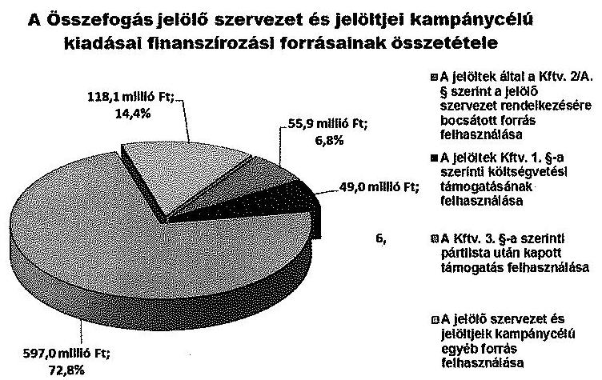

---

A politikai hirdetésekre vonatkozó számlák és az ÁSZ részére a Ve. 148. § (2) és (4) bekezdése alapján megküldött árjegyzékek és tájékoztatók körében az ellenőrzés a következőket tapasztalta.
A politikai hirdetések számláinak adatai 17 esetben nem egyeztek meg az árjegyzékben, kilenc esetben a tájékoztatóban foglalt adatokkal, 13 esetben a sajtótermék, vagy médiatartalom szolgáltató nem küldött tájékoztatót. Ezen eltérésekért a számlakibocsátók (sajtótermékek kiadói) a felelősek. Az eltérések nem befolyásolták a választási kampányra fordított pénzeszközök felhasználásának minősítését.

Budapest, 2015.
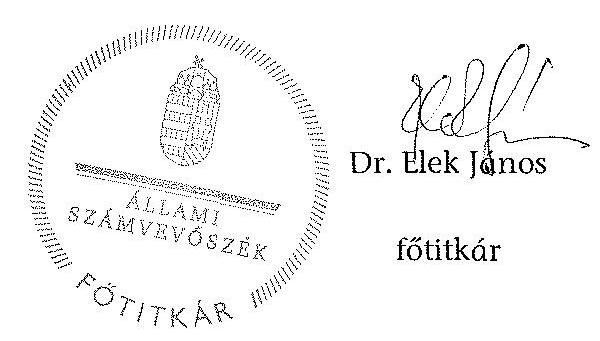

---

.

---

# ÁLLAMI SZÁMVEVŐSZÉK 

Iktatószám: ETIO-0147-001/2014.

## MEGHATALMAZÁS

Az Állami Számvevőszékről szóló 2011. évi LXVI. törvény 32. § (2) bekezdése, valamint az Állami Számvevőszék Szervezeti és Müködési Szabályzatáról szóló 1/2013. (XII. 31.) ÁSZ utasítás 33. § (7) bekezdésében és (8) bekezdés a) pontjában foglaltak alapján visszavonásig a

- 35. témasorszámú (Kampánypénzek ellenőrzése - A 2014. évi országgyűlési képviselőválasztási kampányokra fordított pénzeszközök elszámolásának ellenőrzése a Magyar Államkincstárnál, a jelölő szervezeteknél és az egyéni jelölteknél) ellenőrzés és
- a választással kapcsolatos nyilvántartási feladatok ellátása tekintetében

Dr. Elek János, főtitkárt az Elnőköt megillető feladat- és hatáskörök teljes jogkörü gyakorlására feljogosítom.

Budapest, 2014. év $\qquad$ 02.......... hó .. 4. nap
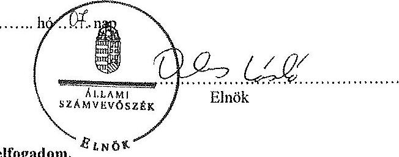

A teljes jogkörü feljogosítást elfogadom.
Budapest, 2014. év $\qquad$ 02........ hó .. 4.. nap
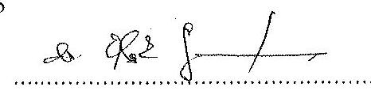

Főtitkár