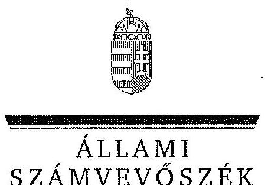

ÁLLAMI
SZÁMVEVŐSZÉK

# JELENTÉS 

Az önkormányzatok gazdasági társaságai - Az önkormányzatok többségi tulajdonában lévő gazdasági társaságok közfeladat-ellátását érintő gazdálkodási tevékenysége szabályszerűségének ellenőrzése PÉTÁV Pécsi Távfűtő Korlátolt Felelősségű Társaság

---

# Állami Számvevőszék 

Iktatószám: V-0477-219/2015.
Témaszám: 1511
Vizsgálat-azonosító szám: V067110

## Az ellenőrzést felügyelte:

Dr. Horváth Margit
felügyeleti vezető
Az ellenőrzést vezette és a végrehajtásáért felelős:
Valastyánné dr. Vízhányó Júlia
ellenőrzésvezető
Az összefoglaló jelentést készítette:
Dr. Nagy Ágnes
számvevő tanácsos
Szarka Péterné
számvevő vezető főtanácsos
Az ellenőrzést végezték:

| Várady Zoltán | Zelenákné Poór Erzsébet | Pretzl Gábor |
| :-- | :-- | :-- |
| okleveles könyvvizsgáló | okleveles könyvvizsgáló | okleveles könyvvizsgáló |
| külső szakértő | külső szakértő | külső szakértő |

A témához kapcsolódó eddig készített számvevőszéki jelentések:
címe
sorszáma
A légszennyezés ellen és a klímapolitika terén tett intézkedések 1119
hatásának ellenőrzéséről

---

# TARTALOMJEGYZÉK 

BEVEZETÉS ..... 7
I. ÖSSZEGZŐ MEGÁLLAPÍTÁSOK, KÖVETKEZTETÉSEK, JAVASLATOK ..... 11
II. RÉSZLETES MEGÁLLAPÍTÁSOK ..... 18

1. Az Önkormányzat közfeladat-ellátásának szabályszerűsége ..... 18
1.1. A közfeladat-ellátás megszervezése és a feladatellátás feltételrendszerének kialakítása ..... 18
1.2. A közfeladat-ellátás felügyelete és a tulajdonosi jogok érvényesítése ..... 21
2. A PÉTÁV Kft. közfeladat-ellátással kapcsolatos tevékenysége ..... 24
2.1. A PÉTÁV Kft. gazdálkodásának szabályozottsága ..... 24
2.2. A PÉTÁV Kft. vagyongazdálkodása ..... 25
2.3. A beszámolási kötelezettség teljesítése ..... 28
3. A távhőszolgáltatás közfeladata bevételei és ráfordításai elszámolásának és önköltségszámításának szabályszerűsége ..... 29
3.1. A távhőszolgáltatás közfeladat bevételeinek és ráfordításainak szabályszerűsége ..... 29
3.2. Az önköltségszámítás szabályszerűsége ..... 31
4. Az ÁSZ korábbi, az önkormányzatok többségi tulajdonában lévő gazdasági társaságok közfeladat-ellátását, gazdálkodását, pénzügyi helyzetét érintő javaslataira tett intézkedések ..... 32
MELLÉKLETEK
5. számú A PÉTÁV Kft. tevékenységének főbb adatai
6. számú A PÉTÁV Kft. működésének főbb jellemzői
7. számú A PÉTÁV Kft. által biztosított közszolgáltatás díjai a 2008-2012. évekre vonatkozóan
8. számú Beérkezett észrevételek és az azokra adott válaszok
FÜGGELÉKEK
9. számú Értelmező szótár
10. számú Mintavételi eljárások ellenőrzési területenként

---

.

---

# RÖVIDÍTÉSEK JEGYZÉKE 

## Törvények

Ámt.
ÁSZ tv.
Gt.
Info tv.

Mötv.

Nvtv.

Számv. tv.
Tszt.

## Rendeletek

157/2005. (VIII. 15.)
Korm. rendelet
50/2011. (IX. 30.) NFM rendelet
az árak megállapításáról szóló 1990. évi LXXXVII. törvény (hatályos: 1991. január 1-jétől)
az Állami Számvevőszékről szóló 2011. évi LXVI. törvény (hatályos: 2011. július 1-jétől)
a gazdasági társaságokról szóló 2006. évi IV. törvény (hatálytalan: 2014. március 15-étől)
az információs önrendelkezési jogról és az információszabadságról szóló 2011. évi CXII. törvény (hatályos: 2011. július 27-étől kivéve a 1-37. §, a 38. § (1)-(3) bekezdése, a 38. § (4) bekezdés a)-f) pontja, a 38. § (5) bekezdése, a 39. §, a 41-68. §, a 70-72. §, a 75-77. § és a 79-88. §, valamint az 1. melléklet, ami 2012. január 1-jén lépett hatályba és a 38. § (4) bekezdés g) és h) pontja, valamint a 69. §, ami 2013. január 1-jén lépett hatályba)

Magyarország helyi önkormányzatairól szóló 2011. évi CLXXXIX. törvény (hatályos: 2012. január 1-jétől, kivéve a 144. § (2) bekezdésben meghatározott paragrafusok, amelyek 2012. április 15-én, a (3) bekezdésben meghatározott paragrafusok, amelyek 2013. január 1-jén léptek hatályba, a (4) bekezdésben meghatározott paragrafusok a 2014. évi általános önkormányzati választások napján léptek hatályba)
a nemzeti vagyonról szóló 2011. évi CXCVI. törvény (hatályos: 2011. december 31-étől, kivéve a 20. § (2) bekezdésben meghatározott paragrafusok, amelyek 2012. január 1-jétől, a (3) bekezdésben meghatározott paragrafusok 2013. január 1-jétől, a (4) bekezdésben meghatározott paragrafus 2012. március 2-ától léptek hatályba)
a helyi önkormányzatokról szóló 1990. évi LXV. törvény (hatálytalan: a 2014. évi általános önkormányzati választások napjától)
a számvitelről szóló 2000. évi C. törvény (hatályos: 2001. január 1-jétől)
a távhőszolgáltatásról szóló 2005. évi XVIII. törvény (hatályos: 2005. július 1-jétől)
a távhőszolgáltatásról szóló 2005. évi XVIII. törvény végrehajtásáról (hatályos: 2005. szeptember 29-étől)
a távhőszolgáltatónak értékesített távhő árának, valamint a lakossági felhasználónak és a külön kezelt intézménynek nyújtott távhőszolgáltatás díjának megállapításáról (hatályos: 2011. október 1-jétől)

---

vagyongazdálkodási rendelet $_{1}$

vagyongazdálkodási rendelet $_{2}$
távhőszolgáltatási rendelet

## Szórövidítések

adatvédelmi szabályzat ${ }_{1} \quad$ PÉtÁV Kft. Adatvédelmi szabályzata (SZ-24-2) (hatályos: 2005. április 1-jétől 2010. szeptember 14-éig)
adatvédelmi szabályzat ${ }_{2} \quad$ PÉTÁV Kft. Adatvédelmi szabályzata (SZ-24-3) (hatályos: 2010. szeptember 15-étől 2012. június 30-áig)
adatvédelmi szabályzat ${ }_{3} \quad$ PÉTÁV Kft. Adatvédelmi szabályzata (SZ-24-4) (hatályos: 2012. július 1-jétől 2012. november 25-éig)
adatvédelmi szabályzat ${ }_{4} \quad$ PÉTÁV Kft. Adatvédelmi szabályzata (SZ-24-5) (hatályos: 2012. november 26-ától)
Alapító Okirat
ÁSZ
Bérleti és üzemeltetési szerződés
értékelési szabályzat

## FB

HTM
javadalmazási szabályzat$_{1}$
javadalmazási szabályzat$_{2}$

Pécs Megyei Jogú Város Önkormányzatának többször módosított 40/2008. (XI. 26.) számú rendelete az Önkormányzat vagyonával kapcsolatos tulajdonosi jogok gyakorlásának szabályairól (hatályos: 2008. november 30-ától 2012. március 1-jéig)
Pécs Megyei Jogú Város Önkormányzatának 11/2012. (II. 24.) rendelete az Önkormányzat vagyonával kapcsolatos tulajdonosi jogok gyakorlásának szabályairól (hatályos: 2012. március 1-jétől)
Pécs Megyei Jogú Város Önkormányzatának többször módosított 49/2005. (XII. 20.) számú rendelete a távhőszolgáltatásról (hatályos: 2005. december 20-ától)

PÉTÁV Kft. Adatvédelmi szabályzata (SZ-24-2) (hatályos: 2005. április 1-jétől 2010. szeptember 14-éig)
PÉTÁV Kft. Adatvédelmi szabályzata (SZ-24-3) (hatályos: 2010. szeptember 15-étől 2012. június 30-áig)
PÉTÁV Kft. Adatvédelmi szabályzata (SZ-24-4) (hatályos: 2012. július 1-jétől 2012. november 25-éig)
PÉTÁV Kft. Adatvédelmi szabályzata (SZ-24-5) (hatályos: 2012. november 26-ától)

PÉTÁV Kft. Alapító Okirata
Állami Számvevőszék
PÉTÁV Kft. és a Pécsi Városüzemelési és Vagyonkezelő Zrt. (jogutódja a Pécs Holding Városi Vagyonkezelő Zrt.) között 2002. július 5-én létrejött Bérleti és üzemeltetési szerződés
PÉTÁV Kft. Eszközök és források értékelési szabályzata (SZ-18-3) (hatályos: 2006. január 1-jétől)
PÉTÁV Kft. Felügyelőbizottsága
A Szindikátusi Szerződés 2. számú mellékletét képező Hosszútávú Kapacitáslekötési és Együttműködési Megállapodás, mely a Pécsi Távfűtő Kft. és a Pécsi Erőmú Rt. között jött létre. (A Szindikátusi Szerződés 2008. november 24-ei módosításával a PÉTÁV Kft. és a Pannon Hőerőmű Energiatermelő, Kereskedelmi és Szolgáltató Zrt. között új megállapodás jött létre, amit 2010. július 1-jei hatállyal módosítottak az ellenőrzött időszakban.)
a PÉTÁV Kft. vezető tisztségviselői, felügyelőbizottságának tagjai és más vezető állású munkavállalói javadalmazásának szabályozási elveiről (SZ-22-1) (hatályos: 2004. április 2-ától 2011. május 27-éig)
a PÉTÁV Kft. vezető tisztségviselői, felügyelőbizottságának tagjai és más vezető állású munkavállalói javadalmazásának szabályozási elveiről (SZ-22-2) (hatályos: 2011. május 28-ától)

---

jegyzék1
jegyzék2
jegyzék3
Kinnlévőség kezelés$_{1}$

Kinnlévőség kezelés$_{2}$

Közgyűlés
KSH
MEH
leltározási szabályzat$_{1}$
leltározási szabályzat$_{2}$
Megállapodás

Önkormányzat
önkormányzati SZMSZ
önköltségszámítási szabályzat$_{1}$
önköltségszámítási szabályzat$_{3}$
pénzkezelési szabályzat$_{1}$
pénzkezelési szabályzat$_{2}$
pénzkezelési szabályzat$_{3}$
pénzkezelési szabályzat$_{3}$

Pécs Megyei Jogú Város Önkormányzatának 1998. július 3-ától 2011. február 17-éig hivatalban lévő címzetes főjegyzője
Pécs Megyei Jogú Város Önkormányzatának 2011. február 18-ától 2011. április 30-áig hivatalban lévő aljegyzője, aki jegyzői feladatokat látott el
Pécs Megyei Jogú Város Önkormányzatának 2011. május 1-jétől hivatalban lévő jegyzője
PÉTÁV Kft. Eljárási szabályok a kinnlévőség kezelésével és behajtásával kapcsolatos feladatok és tevékenységek végzéséhez (EMU-10-4) (hatályos: 2006. február 1-jétől 2011. november 30-áig)
PÉTÁV Kft. Eljárási szabályok a kinnlévőség kezelésével és behajtásával kapcsolatos feladatok és tevékenységek végzéséhez (EMU-10-5) (hatályos: 2011. december 1-jétől)
Pécs Megyei Jogú Város Önkormányzatának Közgyűlése
Központi Statisztikai Hivatal
Magyar Energia Hivatal és annak jogutódja a Magyar Energetikai és Közműszabályozási Hivatal
PÉTÁV Kft. Leltározási szabályzata (SZ-17-3) (hatályos: 2006. október 1-jétől 2010. szeptember 30-áig)

PÉTÁV Kft. Leltározási szabályzata (SZ-17-4) (hatályos: 2010. október 1-jétől)

A Szindikátusi Szerződés 1. számú mellékletét képező Megállapodás, mely Pécs Megyei Jogú Város Önkormányzata és a Pécsi Távfűtő Kft. között jött létre a forró víz bázisú távhőellátás fogyasztói árának képzésére vonatkozóan.
Pécs Megyei Jogú Város Önkormányzata
Pécs Megyei Jogú Város Önkormányzata Közgyűlésének többször módosított 17/2007. (IV. 30.) önkormányzati rendelete a Szervezeti és Működési Szabályzatról (hatályos: 2007. április 30-ától)
PÉTÁV Kft. Önköltségszámítási és árképzési szabályzata (SZ-16-7) (hatályos: 2006. január 1-jétől 2010. december 31-éig)
PÉTÁV Kft. Önköltségszámítási és árképzési szabályzata (SZ-16-8) (hatályos: 2011. január 1-jétől 2011. december 31-éig)
PÉTÁV Kft. Önköltségszámítási szabályzata (SZ-16-9) (hatályos: 2012. január 1-jétől)
PÉTÁV Kft. Pénzkezelési szabályzata (SZ-13-6) (hatályos: 2008. március 1-jétől 2010. szeptember 14-éig)
PÉTÁV Kft. Pénzkezelési szabályzata (SZ-13-7) (hatályos: 2010. szeptember 15-étől 2010. október 31-éig)
PÉTÁV Kft. Pénzkezelési szabályzata (SZ-13-8) (hatályos: 2010. november 1-jétől)

Pannon Hőerőmű Zrt.
Pannon Hőerőmű Energiatermelő, Kereskedelmi és Szolgáltató Zrt.
Pécsi Erőmú Rt.
PÉCS HOLDING Zrt.
PÉTÁV Kft.
PÉTÁV Kft. SZMSZ$_{1}$

PÉTÁV Kft. SZMSZ$_{2}$

PÉTÁV Kft. SZMSZ$_{3}$
polgármester
Polgármesteri Hivatal
rendészeti szabályzat
selejtezési szabályzat
számlarend$_{1}$
számlarend$_{2}$
számviteli politika
Szindikátusi Szerződés

Taggyűlés
tárgyi eszközök elhatárolásának szabályzata

Társasági szerződés
Tgyh.
Üzletszabályzat

PE Rt.
Pécs Holding Városi Vagyonkezelő Zrt.
PÉTÁV Pécsi Távfűtő Korlátolt Felelősségű Társaság
a PÉTÁV Kft. 6/2005. (V. 4.) számú taggyűlési határozattal jóváhagyott Szervezeti és Működési Szabályzata (SZ-12-2) (hatályos: 2005. május 5-étől 2008. június 24-éig)
a PÉTÁV Kft. 7/2008. (VI. 24.) számú taggyűlési határozattal jóváhagyott Szervezeti és Működési Szabályzata (SZ-12-3) (hatályos: 2008. június 25-étől 2011. szeptember 30-áig)
a PÉTÁV Kft. 15/2011. (X. 8.) számú taggyűlési határozattal jóváhagyott Szervezeti és Működési Szabályzata (SZ-12-4) (hatályos: 2011. október 1-jétől)
Pécs Megyei Jogú Város Önkormányzatának polgármestere
Pécs Megyei Jogú Város Önkormányzatának Polgármesteri Hivatala
PÉTÁV Kft. Rendészeti szabályzata (SZ-25-1) (hatályos: 2012. augusztus 1-jétől)

PÉTÁV Kft. Felesleges vagyontárgyak hasznosításának és selejtezésének szabályzata (SZ-4-3) (hatályos: 2007. január 1-jétől)
PÉTÁV Kft. Számlarendje (hatályos: 2008. január 1-jétől 2011. december 31-éig)
PÉTÁV Kft. Számlarendje (hatályos: 2012. január 1-jétől)
PÉTÁV Kft. Számviteli politikája (hatályos: 2006. január 1-jétől)
Szindikátusi Szerződés, mely Pécs Megyei Jogú Város Önkormányzata és a Pécsi Erőmú Rt. között 2000. február 24-én jött létre. (A szerződést Pécs Megyei Jogú Város Önkormányzata és a Pannon Hőerőmű Energiatermelő, Kereskedelmi és Szolgáltató Zrt. 2008. november 24-én, 2008. október 1-jei hatállyal módosította az ellenőrzött időszakban.)
PÉTÁV Kft. Taggyűlése
PÉTÁV Kft. Tárgyi eszközökkel kapcsolatos tevékenységek elhatárolásának szabályzata (SZ-1-2) (hatályos: 2007. január 1-jétől)
PÉTÁV Kft. Társasági szerződése
PÉTÁV Kft. Taggyűlésének határozata
PÉTÁV Kft. Üzletszabályzata

---

# JELENTÉS 

## Az önkormányzatok gazdasági társaságai Az önkormányzatok többségi tulajdonában lévő gazdasági társaságok közfeladat-ellátását érintő gazdálkodási tevékenysége szabályszerűségének ellenőrzése

## PÉTÁV Pécsi Távfűtő Kft.

## BEVEZETÉS

Az Állami Számvevőszék középtávra szóló stratégiájában megfogalmazta, hogy a helyi önkormányzatok gazdálkodásában rejlő pénzügyi kockázatok feltárásával, az államháztartáson kívülre nyújtott költségvetési támogatások és ingyenes vagyonjuttatások, valamint az államháztartáson kívül működő közfeladat-ellátó rendszerek ellenőrzéseivel hozzájárul ahhoz, hogy a közpénzeket az államháztartáson kívül működő szervezetek is átlátható, rendezett módon használják fel a közfeladatok szerződésben vállalt ellátása érdekében.

Az önkormányzatok szervezetalakítási szabadságának következménye, hogy a korábban is vállalati formában működő (nagyvárosi tömegközlekedés, víz-, szennyvízcsatorna, köztisztasági, ingatlankezelés stb.) közszolgáltatások mellett, mind a kötelező, mind az önként vállalt feladatok ellátásában a gazdasági társaságok kiemelt fontosságú szerephez jutottak.

Pécs Megyei Jogú Város Önkormányzata a PÉTÁV Kft.-t az ellenőrzött időszakot megelőzően, az 1996. évben 100%-os tulajdonában lévő gazdasági társaságként hozta létre 730,8 M Ft jegyzett tőkével. Az Önkormányzat és a PE Rt. között 2000. február 24-én létrejött Szindikátusi Szerződés$^1$ alapján a PÉTÁV Kft. törzstőkéje az önkormányzati tulajdonban lévő 610,0 M Ft távhő vagyon PÉTÁV Kft.-be történt apportálásával emelkedett. A Szindikátusi Szerződés alapján az addig kizárólagos önkormányzati tulajdonú PÉTÁV Kft.-ben, a PE Rt. 700,0 M Ft tőkeemelés, illetve 300,0 M Ft névértékű üzletrész megvétele útján 49%-os tulajdonrészhez jutott. A PÉTÁV Kft. 2040,8 M Ft törzstőkéjéből az Önkormányzat 51%-os tulajdonrészt képviselt. Az ellenőrzött időszakban az Ön-

[^1]:
[^1]: $^1$ Az Önkormányzat Közgyűlése

 az 56/2000. (II. 17.) számú határozatával fogadta el.

---

kormányzat 51%-os, a Pannon Hőerőmű Zrt. 49%-os tulajdoni hányaddal rendelkezett a PÉTÁV Kft.-ben².

A távhőszolgáltatáshoz szükséges eszközök részben a PÉTÁV Kft., részben az Önkormányzat kizárólagos tulajdonában lévő PÉCS HOLDING Zrt. tulajdonában voltak. A PÉTÁV Kft. tulajdonát - a primer vezetékek és a kapcsolódó közművek kivételével - a távfűtéshez szükséges egyéb létesítmények és berendezések képezték, míg a PÉCS HOLDING Zrt. tulajdonát képező vezetékek és eszközök üzemeltetésére és bérletére hosszú távú és éves szerződéseket kötött a PÉTÁV Kft. a tulajdonos PÉCS HOLDING Zrt.-vel a távhőszolgáltatás közfeladat ellátása érdekében.

A PÉTÁV Kft. főtevékenysége gőzellátás, légkondicionálás volt, egyéb feladatként a Pécs Holding Zrt. által megrendelt munkákat is elvégezte. Az ellenőrzött időszakban a PÉTÁV Kft. létszáma a 2008. évi 245 főről 2012. évre 44 fővel csökkent.

A PÉTÁV Kft. az ellenőrzött időszakban közel 130 km nyomvonal hosszúságú primer és szekunder vezetékhálózaton 634 primer hőközponton és közel 700 szekunder hőfogadó állomáson keresztül több mint 30 ezer távfűtött lakásban élő családnak és mintegy 450 közintézménynek fűtést és melegvizet szolgáltatott, a közel 157 ezer lakosságszámú Pécs Megyei Jogú Városban. A hőszolgáltatás primer energiaforrását a PE Zrt. biztosította, ezen felül egy százalék arányban a PÉTÁV Kft. tíz db saját földgáztüzelésű kazánházzal is állított elő hőt.

A PÉTÁV Kft. az ellenőrzött időszakban nyereségesen gazdálkodott, nettó árbevétele a 2008. évi 7228,7 M Ft-ról a 2012. évben 7637,1 M Ft-ra emelkedett, az adózott eredménye a 2008-2011. évek között 9,2 M Ft-ról 159,8 M Ft-ra nőtt, a 2012. évben 121,7 M Ft volt. A PÉTÁV Kft. a 2011. évben 100,0 M Ft, a 2012. évben 110,0 M Ft osztalékot fizetett a tulajdonosoknak.

Az ellenőrzött időszakban a polgármester 2008. január 1-jétől 2009. január 27-éig, ezt követően az alpolgármester az időközi választásig látta el a feladatait. A jegyző személye két alkalommal változott. 1998. július 3-ától 2011. február 17-éig címzetes főjegyző, 2011. február 18-ától 2011. április 30-áig aljegyző látta el a jegyzői feladatokat. A helyszíni ellenőrzés időszakában a munkakört betöltő jegyző 2011. május 1-jétől végzi feladatait. Az ügyvezető személye egy alkalommal, 2011. április 1-jén változott, a gazdasági igazgató személye nem változott.

Az önkormányzati tulajdonú gazdasági társaságok teljes körű ellenőrzésének lehetőségét az Állami Számvevőszékről szóló 1989. évi XXXVIII. törvény 2011. január 1-jétől hatályos módosítása teremtette meg.

Az ellenőrzés célja annak értékelése volt, hogy

[^0]
[^0]:    ${ }^{2}$ Forrás: A PÉTÁV Kft. 2008. április 14-én, módosításokkal egységes szerkezetben kiadott Társasági szerződésének „Preambulum" fejezete.

---

- az önkormányzat a jogszabályi előírások figyelembevételével döntött-e az ellenőrzésre kerülő közfeladat megszervezéséről; az önkormányzat szabályszerűen gyakorolta-e a tulajdonosi jogokat;
- a gazdasági társaság közfeladat-ellátása bevételeinek, ráfordításainak elszámolása, és vagyongazdálkodási tevékenysége megfelelt-e a jogszabályi, illetve a közszolgáltatási szerződésben foglalt tulajdonosi előírásoknak, azok végrehajtása szabályszerű volt-e;
- a közfeladatok átláthatósága és elszámoltathatósága érdekében biztosítva volt-e a közszolgáltatás dijának megalapozottsága szabályszerű önköltségszámítással.

# Az ellenőrzés kiterjedt Pécs Megyei Jogú Város Önkormányzatára és a PÉTÁV Kft.-re. 

Az ellenőrzés várható hasznosulása: A törvényalkotás számára - az észlelt problémák, szabálytalanságok, vagy egyéb nem kívánatos jelenségek felszínre kerülésével - az ellenőrzés megállapításai segítséget nyújthatnak az államháztartáson kívüli közfeladat-ellátás értékeléséhez, jogszabályi keretei pontosításához, átláthatóságot biztosító szabályozásához. Meghatározhatóvá válnak a közfeladat ellátásában részt vevő államháztartáson kívüli szervezeteknek - az önkormányzat költségvetését, pénzügyi helyzetét is befolyásoló - kockázatai, lehetővé válik ezen kockázatok csökkentése. Értékelhetővé válik, hogy a feladatot ellátó gazdasági társaság a közszolgáltatási szerződésben foglaltak betartásával, a közvagyon használatával biztosította-e a szolgáltatás folytatásának feltételeit. Ezzel az ellenőrzöttek és a helyi döntéshozók számára az ÁSZ visszajelzést ad feladatszervezési, feladat-ellátási kockázataikról, alapot ad a meglévő hibák megszüntetéséhez, a jobb közfeladat-ellátás biztosításához. Fokozza a fegyelmet, igazolja, hogy lejárt a következmények nélküli ellenőrzések időszaka. Az ÁSZ értékteremtő rend kialakításához és megőrzéséhez hozzájáruló tevékenysége pozitív hatással van a szervezetről kialakított összkép formálására is.

A bevételek és ráfordítások elszámolása, valamint a vagyonnyilvántartás terén az egyes területek szabályszerű működését mintavétellel ellenőriztük, ez alapján a sokaságokban előforduló hibás tételek arányát becsültük. A jogszabályoknak és a belső előírásoknak megfelelőnek, azaz szabályszerűnek tekintettük az adott bevételek és ráfordítások elszámolását, a vagyonnyilvántartást, amennyiben a minta ellenőrzésének eredménye alapján 95%-os bizonyossággal a teljes sokaságban a hibás tételek aránya kisebb volt, mint 10%, nem megfelelőnek értékeltük, ha a hibás tételek aránya a 10%-ot meghaladta. Kockázatot, illetve magas kockázatot jeleztünk, amennyiben egy adott terület vonatkozásában a minta alapján a teljes sokaságban nem volt teljes körűen biztosított a jogszabályoknak és a belső szabályzatoknak megfelelő működés.

Az ellenőrzést a számvevőszéki ellenőrzés szakmai szabályai szerint, szabályszerűségi ellenőrzés módszerével, a nemzetközi standardok figyelembevételével végeztük. Az ellenőrzés a 2008-2012. évekre terjedt ki.

Az ellenőrzés végrehajtásának jogszabályi alapját az Állami Számvevőszékről szóló 2011. évi LXVI. törvény 5. § (3)-(5) bekezdései képezték.

---

Az ÁSZ az Állami Számvevőszékről szóló 2011. évi LXVI. törvény 29. §-a alapján a jelentéstervezetet észrevételezésre megküldte a polgármesternek és a gazdasági társaság ügyvezetőjének. A beérkezett észrevételeket a jelentés véglegesítése során hasznosítottuk. Az észrevételeket és az azokra adott válaszokat a jelentés 4. számú melléklete tartalmazza.

---

# I. ÖSSZEGZŐ MEGÁLLAPÍTÁSOK, KÖVETKEZTETÉSEK, JAVASLATOK 

Pécs Megyei Jogú Város Önkormányzata a 2008-2012. években többségi tulajdonában lévő gazdasági társasága, a PÉTÁV Kft. útján gondoskodott a távhőszolgáltatás biztosításáról. Az ellenőrzött időszakban a PÉTÁV Kft. 2040,8 M Ft összegű törzstőkéjéből a Pannon Hőerőmű Zrt. 49%-os tulajdonrésszel rendelkezett.

A Közgyűlés a távhőszolgáltatás közfeladatának megszervezése során betartotta a jogszabályi előírásokat. Az Önkormányzat nevében a Közgyűlés, a bizottságok és a polgármester szabályszerűen gyakorolták a tulajdonosi jogokat. Az ellenőrzött időszakban hatályos önkormányzati SZMSZ tartalmazta az energiaszolgáltatásban való közreműködési kötelezettséget, azonban - a Tszt. előírásait figyelmen kívül hagyva - kötelező önkormányzati feladatként nem rögzítette a távhőszolgáltatást.

Az Önkormányzat a 2007-2010. és a 2011-2014. évekre szóló gazdasági programja, illetve a 2009. évben elfogadott területfejlesztési koncepciója a távhőszolgáltatás működtetésével, fejlesztésével kapcsolatban konkrét feladatokat, célokat nem fogalmazott meg.

Az Önkormányzat a távhőszolgáltatásra vonatkozóan a Tszt. szerinti rendeletalkotási kötelezettségének eleget tett, a távhőszolgáltatási rendeletet a vonatkozó jogszabályi előírások figyelembevételével alkotta meg. Az Önkormányzat vagyongazdálkodási rendelete 1,2 meghatározta az Önkormányzat teljes vagyonának kezelésére, hasznosítására, fejlesztésére és gyarapítására vonatkozó döntési jogköröket.

A távhőszolgáltatás szerződéses rendszeren alapult, melynek alapjait a Társasági szerződés, a Szindikátusi Szerződés, valamint a távhőszolgáltató rendszer üzemeltetésére kötött Bérleti és üzemeltetési szerződés képezte. Az ellenőrzött időszakban a fennálló szerződéses rendszer konstrukciója nem változott. Az Önkormányzat a távhőszolgáltatással kapcsolatosan a Tszt.-ben előírt rendeletet, valamint a gazdasági társaságok feletti tulajdonosi jogok gyakorlására vonatkozóan vagyongazdálkodási rendelet1,2-et alkotott.

A távfűtési szolgáltatásra vonatkozó árképzési szabályokat az Önkormányzat távhőszolgáltatási rendelete írta elő. A távhőszolgáltatási rendeletben rögzítették, hogy az Önkormányzat az árakat a szolgáltató - a távhőszolgáltatási rendelet 3. számú mellékletét képező „Árkalkulációs Előírás" szerinti - árkalkulációja alapján állapítja meg. Az árak a távhőszolgáltatás indokolt ráfordításain kívül 10%-os eszközarányos nyereséget tartalmazhatnak. A távhőszolgáltatás díja alapdíjból és hődíjból áll. A rendeletben előírták továbbá a díjalkalmazás és a díjfizetés általános szabályait.

---

A PÉTÁV Kft. Hosszú távú Kapacitáslekötési és Együttműködési Megállapodást (HTM) kötött a PE Rt.-vel, amely a Szindikátusi Szerződés 2. számú mellékletét képezte. Az HTM-ben a felek megállapodtak abban, hogy a hőtermelő a hőszolgáltató részére hőenergiát biztosít, forró víz hőhordozó útján, éves ütemezési nyilatkozatban és a díj nyilatkozatban meghatározott feltételek és műszaki paraméterek mellett.

A PÉTÁV Kft. és az önkormányzat 100%-os tulajdonában lévő vagyonkezelő társaság, a PÉCS HOLDING Zrt. már az ellenőrzött időszakot megelőzően Bérleti és üzemeltetési szerződést³ kötött, melynek célja volt, hogy a két társaság tulajdonában lévő, műszakilag egységes, de tulajdonjogilag megosztott távhő ellátó rendszer üzemeltetésével a PÉTÁV Kft. részére Pécs Megyei Jogú Város közigazgatási területén kizárólagos távhőellátási jogot biztosítson. A PÉTÁV Kft. által üzemeltetésre és bérbe vett eszközöket a szerződés melléklete tartalmazta. A szerződésben foglaltak alapján az éves bérleti díj összegét, a bérleti díj terhére a bérelt távhő közműveken a PÉTÁV Kft. által végzett karbantartási, beruházási és felújítási munkákat, az elszámolások rendjét a felek külön megállapodásban rögzítették.

Az Önkormányzat eleget tett tulajdonosi kötelezettségeinek, elvégezte a közfeladatot ellátó PÉTÁV Kft. feladatellátásának, működésének felügyeletét és érvényre juttatta a tulajdonosi jogait a PÉTÁV Kft. Taggyűlésein képviselt többségi tulajdonosi jogain keresztül. Az Önkormányzat szabályszerűen járt el a közfeladat ellátásának felügyelete szempontjából, betartotta a Gt.-ben és a Számv. tv.-ben előírtakat, azonban a jegyző1,2,3 a Tszt. előírása ellenére nem ellenőrizte, hogy a távhőszolgáltató a tevékenységének végzése során betartja-e az Üzletszabályzatában foglaltakat.

Az ellenőrzéssel érintett teljes időszak alatt jogszabály állapította meg a távhőcsatlakozási és a távhőszolgáltatási díjat. 2011. április 14-ig ez a jogszabály az önkormányzat rendelete volt. A rendelet a Tszt. előírásainak megfelelt, szabályszerű volt. 2011. április 15-ei hatállyal a Tszt. előírása alapján miniszteri hatáskörbe került az ármegállapítás. Az önkormányzati ármegállapításhoz a távhőszolgáltatási rendelet előírásainak megfelelően a PÉTÁV Kft. és az Önkormányzat között létrejött Megállapodás határozza meg a távhőszolgáltatásra vonatkozó árképzés kalkulációs rendjét.

Az adatszolgáltatás és az adatok közzététele az ellenőrzött időszakban a törvényi előírások betartásával, szabályszerűen történt.

Az Önkormányzat belső ellenőrzése a távhőszolgáltatás, mint közfeladat ellátás szabályszerű teljesítéséhez, az önkormányzati vagyon megóvásához nem járult hozzá, mert az ellenőrzött időszakban a PÉTÁV Kft. közfeladat ellátási tevékenységével kapcsolatban ellenőrzést nem végzett. Az Önkormányzat a PÉTÁV Kft. éves beszámolói alapján, a Taggyűléseken, az FB üléseken szerzett tudomást a PÉTÁV Kft.-nél lefolytatott külső ellenőrzésekről, melyeket képviselőin keresztül figyelemmel kísért.

[^0]
[^0]:    ${ }^{3}$ A Taggyűlés a 17/2002. (VII. 5.) számú határozatával hagyta jóvá.

---

A PÉTÁV Kft. az ellenőrzött időszakban a jogszabályi előírásoknak megfelelően rendelkezett mindazokkal a működési engedélyekkel, belső szabályzatokkal, üzleti tervekkel, amelyek a távhőszolgáltatási közfeladat megfelelő ellátásához szükségesek voltak.

A PÉTÁV Kft. a 2009., a 2011. és a 2012. években rendelkezett a Taggyűlése által elfogadott üzleti tervvel. Az üzleti tervek azokat a fejlesztési irányokat, célokat és elvárásokat tartalmazták, amelyeket az évközi rendszeres koordináció során az Önkormányzatot képviselő polgármester, a hőt termelő PE Zrt., a PÉCS HOLDING Zrt., valamint a PÉTÁV Kft., mint hőszolgáltató együttesen meghatározott.

A PÉTÁV Kft. rendelkezett számviteli politikával és a kapcsolódó szabályzatokkal. A PÉTÁV Kft. a Számv. tv. rendelkezéseinek megfelelően, a számviteli politika keretében készítette el a leltározási szabályzatát, az értékelési szabályzatát, a pénzkezelési és az önköltségszámítási szabályzatot, továbbá a számlarend1,2-et.

A PÉTÁV Kft. számviteli politikája VI. fejezetében tartalmazta a kiegészítő melléklet tartalmi követelményeit, nem tartalmazza azonban a Tszt. 18/A. § (3) pontjában meghatározott követelményeket teljes körűen. A PÉTÁV Kft.
 számlarendje (6. és 7. számlaosztály) kellő részletezettséget biztosított a költségek elkülönített nyilvántartásának megalapozásához, viszont olyan részletezettséget nem, amely a Számv. tv. 161/A. §-ának megfelelően a kiegészítő melléklet adatainak közvetlen alátámasztására is alkalmas lett volna.

A számviteli politika keretében elkészített szabályzatokat - az értékelési szabályzat kivételével - a Számv. tv. előírásaival összhangban készítették el. A szabályzatokat aktualizálták, a módosított szabályzatokat egységes szerkezetben az ügyvezető igazgató jóváhagyásával adták ki.

Az értékelési szabályzat az értékvesztések elszámolására, a behajthatatlan követelések egyedi értékelésére vonatkozóan nem tartalmazott konkrét előírásokat, így az nem felelt meg a Számv. tv. előírásainak.

Az önköltségszámítási szabályzat$_{1,2,3}$ tartalmazta a költségkalkulációhoz szükséges felosztási lépéseket és a tevékenységek szűkített önköltségének meghatározását. Az önköltségszámítási séma megalapozta az árképzéshez szükséges előkalkulációt, biztosította az elszámoltathatóságot. Az önköltségszámítási szabályzat$_{1,2,3}$ a Számv. tv.-ben és a Tszt.-ben foglaltaknak megfelelően előírta a közvetlen és közvetett költségek elkülönítésére vonatkozó szabályokat, továbbá meghatározta a felosztandó költségek vetítési alapjait.

A PÉTÁV Kft. vagyongazdálkodási tevékenysége - beleértve a vagyon kezelését, gyarapítását, hasznosítását - összességében megfelelt a jogszabályi előírásoknak és a tulajdonos Önkormányzat által meghatározott követelményeknek.

A PÉTÁV Kft. az ellenőrzött időszakban nem rendelkezett Önkormányzattól átvett vagyonnal. Az alapításkor az Önkormányzat a közszolgáltatáshoz szükséges vagyont apportként a PÉTÁV Kft. rendelkezésére bocsátotta. A Hosszútávú

---

Kapacitáslekötési és Együttműködési Megállapodás alapján a PÉTÁV Kft. a távhőszolgáltatást saját tulajdonú eszközeiként kimutatott ingatlanokkal és berendezésekkel végezte. A távhőszolgáltatáshoz kapcsolódó további vagyoni elemek az önkormányzat 100%-os tulajdonában lévő PÉCS HOLDING Zrt. tulajdonában vagy vagyonkezelésében voltak, melyekre vonatkozóan a Bérleti és üzemeltetési szerződés és a kapcsolódó éves megállapodások voltak érvényben a PÉCS HOLDING Zrt. és a PÉTÁV Kft. között. A PÉTÁV Kft. kizárólag a saját tulajdonú vagyonelemeit tartotta nyilván. A nyilvántartás rendjére és az eszközök értékcsökkenésének elszámolására vonatkozó szabályozás a Számv. tv.-ben foglaltak betartásával készült.

A PÉTÁV Kft. a saját vagyon elkülönítésére, annak változására, a közfeladat ellátásával való kapcsolatára vonatkozó rendelkezéseket betartotta. A PÉTÁV Kft. rendelkezett a saját vagyontárgyaira vonatkozó naprakész vagyonnyilvántartással. A közfeladat ellátását biztosító vagyon a számlarend$_{1,2}$-ben rögzített előírások szerint a nyilvántartáson belül elkülönült. A vagyonnyilvántartásban a vagyonváltozás kimutatása folyamatos volt, betartva a Számv. tv. előírásait.

Az ellenőrzött időszakban az eszközökre elszámolt értékcsökkenés megfelelt az előírásoknak, az eszközök értékének változását és az elszámolt értékcsökkenést az éves beszámolók kiegészítő mellékleteiben részletesen bemutatták. A 2008-2012. években a PÉTÁV Kft.-nél a nullára leírt eszközök magas aránya miatt az elszámolt értékcsökkenés alacsony mértékű volt. A hőközpontok, elosztó vezetékek elhasználódottak voltak. Az eszközök elhasználódási foka az ellenőrzött időszakban 59-66% között mozgott. Az ellenőrzött időszakban a PÉTÁV Kft. az elszámolt értékcsökkenés mértékében gondoskodott az eszközök pótlásáról.

A PÉTÁV Kft.-nél a vevőtartozások mértéke az ellenőrzött időszakban 793,1 M Ft-ról 1282,9 M Ft-ra emelkedett. Az ellenőrzött időszakban az éves beszámoló kiegészítő mellékletében részletesen kimutatták a lejárt határidejű vevők állományát, amely 774,8 M Ft-ról 1007,2 M Ft-ra nőtt. Az üzleti jelentésekben célként jelölték meg az állomány csökkentését és elkészítették a Kinnlévőség kezelése$_{1,2}$ szabályzatot, módszereket határoztak meg a fennálló követelések behajtására vonatkozóan. Az ellenőrzött időszakban az intézkedések nem vezettek érdemi eredményre. A lakossági vevőállomány tartozás növekedési ütemének csökkenését az elszámolt értékvesztés okozta, melynek mértéke az ellenőrzött időszakban összesen 397,5 M Ft volt.

A PÉTÁV Kft. az ellenőrzött időszakban a Számv. tv. előírásainak megfelelő éves beszámolót és üzleti jelentést készített. Az ellenőrzött években a legfőbb döntést hozó szerv az FB írásbeli jelentése, illetve a könyvvizsgálói jelentés ismeretében, az előírt határidőig jóváhagyta az éves beszámolókat, a közzététel határidőben megtörtént.

A könyvvizsgáló az ellenőrzött időszak vonatkozásában minden évben minősítés nélküli hitelesítő záradékkal ellátott jelentést bocsátott ki a PÉTÁV Kft. Számv. tv. szerinti éves beszámolójáról. A 2012. évi könyvvizsgálói jelentés tartalmazta a Tszt.-ben előírt igazolást arról, hogy a vállalkozás által kidolgozott és alkalmazott számviteli szétválasztási szabályok, valamint az egyes tevékeny-

---

ségek közötti tranzakciók árazása biztosítják a vállalkozás tevékenységei közötti keresztfinanszírozás-mentességet.

A PÉTÁV Kft. osztalékot a 2011. és a 2012. évben fizetett a tulajdonosoknak az ellenőrzési időszakban, melynek jóváhagyott összege 100,0 M Ft, illetve 110,0 M Ft volt. Az Önkormányzat részére a tulajdoni hányadnak megfelelően a 2011. évben 51,0 M Ft, a 2012. évben 56,1 M Ft került kifizetésre. A PÉTÁV Kft. mérleg szerinti eredménye a 2008. évben 9,2 M Ft, a 2009. évben 22,3 M Ft, a 2010. évben 34,2 M Ft, a 2011. évben 59,8 M Ft, a 2012. évben 11,7 M Ft volt.

A PÉTÁV Kft. a távhőszolgáltatási támogatásról szóló 50/2011. (IX. 30.) NFM rendelet alapján a 2011. évben 263,0 M Ft, a 2012. évben 847,4 M Ft támogatást kapott.

Az Önkormányzat az ellenőrzött időszakban a PÉTÁV Kft. részére működési és felhalmozási célú pénzeszközt nem adott át, kölcsönt nem nyújtott, veszteség rendezésével kapcsolatosan pótbefizetési kötelezettsége nem keletkezett. Az Önkormányzat a PÉTÁV Kft. kötelezettségvállalásaival kapcsolatban garanciát, kezességet nem vállalt.

A PÉTÁV Kft. a távhőszolgáltatási közfeladat árbevételeinek és anyagjellegű ráfordításainak elszámolása során szabályszerűen járt el. A Számv. tv. előírásaival összhangban az éves beszámolóval egyidejűleg elvégezték az önköltségszámítást.

Az önköltségszámítás megalapozta az árképzéshez szükséges előkalkulációt és biztosította annak elszámolhatóságát. A PÉTÁV Kft.-nél a hatósági árak megállapítása nem közvetlenül az önköltségszámításon alapult.

A fentiekben leírtak összegzéseként az alábbi megállapításokat tesszük:
A konstrukcióból eredő sajátosság az volt, hogy a távhőszolgáltatás szerződéses rendszeren alapult, melynek alapjait a Társasági szerződés, a Szindikátusi Szerződés, a távhőellátás fogyasztói árának képzésére vonatkozó Megállapodás, a Hosszútávú Kapacitáslekötési és Együttműködési Megállapodás, valamint a távhőszolgáltató rendszer üzemeltetésére kötött Bérleti és üzemeltetési szerződés képezte. Az ellenőrzött időszakban a fennálló szerződéses rendszer konstrukcióját nem módosították. Az alapításkor az Önkormányzat a közszolgáltatáshoz szükséges vagyont apportként a PÉTÁV Kft. rendelkezésére bocsátotta.

A működés kockázata alacsony volt, azonban a PÉTÁV Kft. számviteli rendszerének szabályozottsága hiányosságokat mutatott. A jegyző$_{1,2}$ a PÉTÁV Kft. távhőszolgáltató tevékenységét az üzletszabályzatban foglaltak betartása szempontjából nem ellenőrizte. Az Önkormányzat belső ellenőrzése a távhőszolgáltatás, mint közfeladat ellátás szabályszerű teljesítéséhez, az önkormányzati vagyon megóvásához nem járult hozzá.

Az Állami Számvevőszékről szóló 2011. évi LXVI. törvény 33. § (1) bekezdésében foglaltak értelmében a jelentésben foglalt megállapításokhoz kapcsolódó

---

intézkedési tervet köteles az ellenőrzött szervezet vezetője összeállítani, és azt a jelentés kézhezvételétől számított 30 napon belül az ÁSZ részére megküldeni. Amennyiben az intézkedési tervet határidőben nem küldi meg a szervezet, vagy az nem elfogadható, az ÁSZ elnöke a hivatkozott törvény 33. § (3) bekezdés a)-b) pontjaiban foglaltakat érvényesítheti.

Az ellenőrzés intézkedést igénylő megállapításai és javaslatai:
Javaslataink célja a Kft. gazdálkodása szabályszerűségének helyreállítása annak érdekében, hogy a szabályozási környezet megfelelően tudja támogatni az átlátható működést.

# Javasoljuk a PÉTÁV Pécsi Távfűtő Kft. ügyvezető igazgatójának: 

A PÉTÁV Kft. számviteli politikája VI. fejezetében tartalmazza a kiegészítő melléklet tartalmi követelményeit, nem tartalmazza azonban a távhőszolgáltatásról szóló 2005. évi XVIII. törvény 18/A. § (3) pontjában meghatározott követelményeket teljes körűen. A PÉTÁV Kft. számlarendje (6. és 7. számlaosztály) kellő részletezettséget biztosít a költségek elkülönített nyilvántartásának megalapozásához, viszont olyan részletezettséget nem, amely a számvitelről szóló 2000. évi C. tv. 161/A. §-ának megfelelően a kiegészítő melléklet adatainak közvetlen alátámasztására is alkalmas.

A PÉTÁV Kft. számviteli politikája IV. 2. pontjában általánosan tartalmazza a követelések értékvesztése és visszaírása elveit. Az említett pontban hivatkozik a vevő, adós minősítésére, a minősítés elveit azonban a számvitelről szóló 2000. évi C. tv. 55. §-ának megfelelően nem határozza meg, illetve azok értékelését PÉTÁV Kft. értékelési szabályzata nem részletezi. A társaság értékelési szabályzata a Számv. tv. 14. § (4) bekezdésében foglaltakkal szemben általánosan sorolta fel a főbb értékelési módokat. Az értékvesztések elszámolására, a behajthatatlan követelések egyedi értékelésére vonatkozóan nem tartalmazott konkrét előírásokat, nem szabályozta az értékvesztés szempontjából lényegesnek, jelentősnek minősülő tételeket.

Javaslat:

## Gondoskodjon a szabályozási hiányosságok megszüntetésére, ezen belül:

a) intézkedjen a számviteli szabályozás kiegészítéséről annak érdekében, hogy a főkönyvi és analitikus nyilvántartások teljes körűen biztosítani tudják a társaság tevékenységenkénti elkülönített adatainak kimutatását, a Számv. tv.-ben előírt részletezésben (kiegészítő melléklet);
b) dolgozza ki az értékelési szabályzatában a vevő és az adós minősítésére vonatkozó eljárási rendet az értékvesztések elszámolására, továbbá az értékvesztés visszaírására vonatkozóan.

---

Javaslataink célja az önkormányzat szabályszerű működésének elősegítése, továbbá az önkormányzati tulajdonosi joggyakorlás kontrolljainak erősítése.

Javasoljuk Pécs Megyei Jogú Város Önkormányzata Polgármesterének:

1. Az Önkormányzat az ellenőrzött időszakban nem rendelkezett az Nvtv. 9. § (1) bekezdése szerinti közép- és hosszú távú vagyongazdálkodási tervvel.

Javaslat:
Intézkedjen a jogszabályi előírások szerinti gyakorlat és a szabályos működés biztosítására, ezen belül:

Kezdeményezze, hogy a Közgyűlés gondoskodjon az Nvtv. előírásaival összhangban álló közép- és hosszú távú vagyongazdálkodási terv összeállításáról és elfogadásáról.

# Javasoljuk Pécs Megyei Jogú Város Önkormányzata Jegyzöjének: 

1. A jegyző$_{1,2,3}$ a Tszt. 7. § (1) bekezdés c) pontjában előírtak ellenére nem ellenőrizte, hogy a távhőszolgáltató a tevékenységének végzése során betartja-e az Üzletszabályzatában foglaltakat.

Az Önkormányzat belső ellenőrzése az ellenőrzéseivel a távhőszolgáltatás, mint közfeladat-ellátás szabályszerű teljesítéséhez, valamint az önkormányzati vagyon megóvásához ellenőrzéseivel nem járult hozzá. Az ellenőrzött időszakban a társaság gazdálkodásával és működésével kapcsolatban ellenőrzést nem folytatott le.

Javaslat:
Intézkedjen a jogszabályi előírások szerinti gyakorlat és a szabályos működés biztosítására, ezen belül:
a) gondoskodjon annak ellenőrzéséről, hogy a társaság a tevékenysége során betartja-e az Üzletszabályzatban foglalt előírásokat;
b) fordítson kiemelt figyelmet arra, hogy az önkormányzat belső ellenőrzése az ellenőrzéseivel a távhőszolgáltatás, mint közfeladat-ellátás szabályszerű teljesítéséhez, valamint az önkormányzati vagyon megóvásához ellenőrzéseivel járuljon hozzá.

---

# II. RÉSZLETES MEGÁLLAPÍTÁSOK 

## 1. Az ÖNKORMÁNYZAT KÖZFELADAT-ELLÁTÁSÁNAK SZABÁLYSZERÜSÉGE

### 1.1. A közfeladat-ellátás megszervezése és a feladatellátás feltételrendszerének kialakítása

Az Önkormányzat a „Gazdasági Program 2007-2010. évekre" és „A változás évei" elnevezésű, valamint a 2011-2014. évekre vonatkozó gazdasági programjában mutatta be a közfeladatok ellátási rendszerének helyzetét és határozta meg a fejlesztés irányait. A 2007-2010. évekre vonatkozó gazdasági programban a városgazdálkodási intézményrendszer korszerűsítését, a közszolgáltatásban résztvevő cégek összehangolt működését elősegítő struktúrába szervezését és a közüzemi társaságok gazdaságosabb működését jelölték meg főbb célkitűzésként. A 2011-2014. évekre vonatkozó gazdasági programban a központi támogatások abszolút és reálértékű folyamatos csökkenése és a feladatok ezzel ellentétes irányú mozgására tekintettel feladat-ellátási és gazdálkodási szigorítást tartottak szükségesnek. A célkitűzések között szerepelt a közszolgáltatási díjak felülvizsgálata is.

Az Önkormányzat a gazdasági programjaiban a távhőszolgáltatásra, mint a PÉTÁV Kft. által elvégzendő közfeladatra vonatkozó konkrét feladatokat és célokat nem fogalmazott meg.

Az Önkormányzat a 2009. évben fogadta el „Pécs Város Településfejlesztési Koncepcióját", amely célul tűzte ki a vagyongazdálkodás hatékonyságának növelését, a közszolgáltatási feladatok folyamatos értékelésének és javításának szükségességére tekintettel a kontrolling rendszer kiépítését, azonban a távhőszolgáltatás nevesítésére és konkrét célkitűzések meghatározására nem
 került sor.

A 2011. december 31-én hatályba lépett Nvtv. 9. § (1) bekezdésében meghatározott közép- és hosszú távú vagyongazdálkodási tervvel az Önkormányzat 2012. január 1. és 2012. december 31. között nem rendelkezett.

A távhőszolgáltatással ellátott létesítmények távhőellátásának távhőszolgáltatásra engedéllyel rendelkezők útján történő biztosítása a Tszt. 6. § (1) bekezdése értelmében a területileg illetékes települési önkormányzat kötelező feladata.

Az ellenőrzött időszakban hatályos önkormányzati SZMSZ tartalmazta az energiaszolgáltatásban való közreműködési kötelezettséget, azonban - a Tszt. 6. § (1) bekezdés előírásait figyelmen kívül hagyva - kötelező önkormányzati feladatként nem rögzítette a távhőszolgáltatást. Az Önkormányzat a távhőszolgáltatásra vonatkozóan a Tszt. 6. § (2) bekezdése szerinti rendeletalkotási

---

kötelezettségének eleget tett. Az Önkormányzat a vonatkozó jogszabályi előírások figyelembevételével alkotta meg a távhőszolgáltatási rendeletet. A rendelet a Tszt. előírásainak megfelelt.

A Közgyűlés a távhőszolgáltatási rendeletében meghatározta a távhőszolgáltató és a felhasználó közötti jogviszony részletes szabályait, a felhasználóra vonatkozó jogokat és kötelezettségeket, valamint a távhő díj mértékének alapját és a kiszámítási szabályait. A rendeletben szabályozták továbbá a Közgyűlésnek és a jegyzőnek a távhőszolgáltatási tevékenységgel kapcsolatos feladatait. A távhőszolgáltatási rendelet mellékletében jelenítették meg az árképzési előírásokat és a távhőszolgáltatási díjakat.

A vagyongazdálkodási rendelet$_{1,2}$-ben meghatározták az Önkormányzathoz tartozó forgalomképes és forgalomképtelen vagyoni elemeket, és az Önkormányzat vagyonának kezelésére, hasznosítására, fejlesztésére és gyarapítására vonatkozó döntési jogköröket.

A vagyongazdálkodási rendelet$_{1,2}$-ben előírták, hogy gazdasági társaság alapítására, üzletrész vagy részvény vételére, értékesítésére, elővásárlási jog gyakorlására, önkormányzati vagyontárgy gazdasági társaságba vitelére kizárólag a Közgyűlés jogosult. A vagyongazdálkodási rendelet$_{1}$-ben azt is előírták, hogy a közfeladatot ellátó gazdasági társaság ugyanolyan tevékenységet ellátó gazdálkodó szervezetet nem alapíthat, és gazdálkodó szervezetben részesedést nem szerezhet.

Az Önkormányzat az ellenőrzött időszakban az Ötv. $^{4}$, a Gt. és a Tszt. által meghatározott kereteknek megfelelően hozott döntéseket a távhőszolgáltatás biztosításáról. Az ellenőrzött időszakban a Közgyűlés a többségi tulajdonában álló gazdasági társasága, a PÉTÁV Kft. útján gondoskodott a távhőszolgáltatás biztosításáról. A Közgyűlés a távhőszolgáltatás közfeladatának megszervezése során betartotta a jogszabályi előírásokat.

A PÉTÁV Kft.-t a Közgyűlés $^{5}$ az Alapító Okirat elfogadásával hozta létre egyszemélyes gazdasági társaságként 730,8 M Ft jegyzett tőkével. Az alapításkor az Önkormányzat a közszolgáltatáshoz szükséges vagyont a PÉTÁV Kft. rendelkezésére bocsátotta, melynek közmű apport értéke 720,8 M Ft volt.

A Közgyűlés hozzájárulásával $^{6}$ az Önkormányzat és a Pannon Hőerőmű Zrt. 2008. november 24-én a Szindikátusi Szerződést módosította és annak 2. számú mellékleteként új HTM született 2008. október 1-jei hatállyal, 2030. december 31-ei lejárattal.

A Szindikátusi Szerződést a távhőszolgáltató rendszer egészének egységes, összehangolt szakmai irányítása és hatékonyabb működtetése érdekében kötötték. A felek a szerződésben meghatározták, hogy a PÉTÁV Kft. törzstőkéjének felemelése során az Önkormányzat többségi részesedését minden körülmények között fenntartják. Rögzítették, hogy a távhőtermelés és hőszolgáltatás, mint egységes rendszer működtetése a PE Zrt. szakmai felelősségi körébe tartozik, meghatározták a távhőellátás és a távhőszolgáltatás feltételeit és körülményeit. A szerződés és an-

[^0]
[^0]:    $^{4}$ 2012. január 1-jétől a Mötv.
    $^{5}$ A 348/1995. (XII. 7.) számú határozatával.
    $^{6}$ Az Önkormányzat Közgyűlésének 545/2008. (11. 20.) számú határozata.

---

nak mellékletei, továbbá a kapcsolódó megállapodások a távhőszolgáltatás hosszútávú, versenyképes fenntartásának, a távhőellátás költségei csökkentésének, a műszaki színvonal korszerűsítésének, az üzembiztonság és a hőtermelés környezeti hatásai javításának, az árak megállapításának és a fogyasztók jobb kiszolgálásának érdekében tartalmaztak előírásokat. Az Önkormányzat vállalta, hogy mint helyi árhatóság a fogyasztói árak megállapításánál figyelembe veszi a távhőellátás szereplőinek az érdekeit.

# A PÉTÁV Kft. Hosszú távú Kapacitáslekötési és Együttműködési Megállapodást (HTM) kötött a PE Rt.-vel, amely a Szindikátusi Szerződés 2. számú mellékletét képezte. Az HTM-ben a felek megállapodtak abban, hogy a hőtermelő a hőszolgáltató részére hőenergiát biztosít, forró víz hőhordozó útján, éves ütemezési nyilatkozatban és a díj nyilatkozatban meghatározott feltételek és műszaki paraméterek mellett, amelyek megfeleltek a szerződés megkötésekor hatályos, a termelői árak kialakítására vonatkozó jogszabályoknak. A HTM tartalmazta a szolgáltatásra, a termelői árak meghatározására, az árképzésre vonatkozó rendelkezéseket, a távhőszolgáltatás versenyképességének kialakítása és megtartása érdekében teendő intézkedéseket, a forróvíz bázisú távhőszolgáltatással kapcsolatos fejlesztések összehangolását a kölcsönös előnyök szerzése céljából, a hőenergia termelés és felhasználás hatékonyságának növelése érdekében szükséges feladatokat, a környezetvédelemmel kapcsolatos teendőket.

A távfűtési szolgáltatásra vonatkozó árképzési szabályokat az Önkormányzat távhőszolgáltatási rendelete írta elő. A távhőszolgáltatási rendeletben rögzítették, hogy az Önkormányzat az árakat a szolgáltató - a távhőszolgáltatási rendelet 3. számú mellékletét képező „Árképzési Előírás" szerinti - árkalkulációja alapján állapítja meg. Az árak a távhőszolgáltatás indokolt ráfordításain kívül 10%-os eszközarányos nyereséget tartalmazhatnak. A távhőszolgáltatás díja alapdíjból és hődíjból áll. A rendeletben előírták továbbá a díjalkalmazás és a díjfizetés általános szabályait.

A PÉTÁV Kft. és a PÉCS HOLDING Zrt. között az ellenőrzött időszakot megelőzően Bérleti és üzemeltetési szerződés$^{7}$ jött létre, melynek célja volt, hogy a két társaság tulajdonában lévő, műszakilag egységes, de tulajdonjogilag megosztott távhő ellátó rendszer üzemeltetésével a PÉTÁV Kft. részére Pécs Megyei Jogú Város közigazgatási területén kizárólagos távhőellátási jogot biztosítson. A PÉTÁV Kft. által üzemeltetésre és bérbe vett eszközöket a szerződés 1. számú melléklete tartalmazta. A szerződésben foglaltak alapján az éves bérleti díj összegét, a bérleti díj terhére a bérelt távhő közműveken a PÉTÁV Kft. által végzett karbantartási, beruházási és felújítási munkákat, az elszámolások rendjét a felek külön megállapodásban rögzítették.

A Bérleti és üzemeltetési szerződés rendelkezése értelmében a PÉTÁV Kft. és a PÉCS HOLDING Zrt. évente megállapodást kötöttek. A PÉCS HOLDING Zrt. által jóváhagyott fenntartási, felújítási munkákat a megállapodás melléklete tartalmazta. A felek megállapodtak abban, hogy a bérleti díjat a PÉCS HOLDING Zrt. havonta időarányosan számlában érvényesíti, a PÉTÁV ezzel egy időben jogosult a bérleti díj terhére végzett munkákat kiszámlázni.

$^{7}$ A Taggyűlés a 17/2002. (VII. 5.) számú határozatával hagyta jóvá.

---

Az ellenőrzött időszakban az Önkormányzat távhőellátással kapcsolatos feladatait és a távhőszolgáltató gazdasági társaság - PÉTÁV Kft. - jogait és kötelezettségeit a Tszt., az annak végrehajtására kiadott 157/2005. (VIII. 15.) Korm. rendelet, továbbá a Tszt. felhatalmazása alapján elfogadott távhőszolgáltatási rendelet, valamint a távhőszolgáltató esetében a jegyző, illetve a MEH által kiadott működési engedélyek $^{8}$ határozták meg.

# 1.2. A közfeladat-ellátás felügyelete és a tulajdonosi jogok érvényesítése 

Az ellenőrzött időszakban a Szindikátusi Szerződésben - összhangban a vonatkozó jogszabályi előírásokkal - több garanciális előírás szabályozta a tulajdonosi jogok gyakorlásának rendjét a többségi tulajdonos Önkormányzat érdekeinek megfelelően.

Az Önkormányzat eleget tett tulajdonosi kötelezettségeinek, elvégezte a közfeladatot ellátó PÉTÁV Kft. feladatellátásának, működésének felügyeletét és érvényre juttatta a tulajdonosi jogait a PÉTÁV Kft. Taggyűlésein képviselt többségi tulajdonosi jogain keresztül.

Az Önkormányzat a vagyongazdálkodási rendelet$_{1}$ 27. §-ában és a vagyongazdálkodási rendelet$_{2}$ 32. §-ában szabályozta a gazdasági társaságok feletti tulajdonosi jogok gyakorlását, illetve a tulajdonosi jogok gyakorlásának átadását. Az Önkormányzat a vagyongazdálkodási rendelet$_{2}$-ben az általa alapított gazdasági társaságok esetében a tulajdonosi jogok gyakorlásának szabályait az Nvtv. előírásainak betartásával határozta meg.

Az ügyvezető igazgató munkaszerződése rögzítette a vezetői prémium mértékét. A 2008-2010. közötti időszakban az éves bruttó bérre vetítve 30%, 2011. évben 100%, 2012. évben 70% lehetett a maximálisan kifizethető prémium mértéke. A prémium feltételeket az FB javaslata alapján a PÉTÁV Kft. Taggyűlése hagyta jóvá az éves számviteli beszámoló elfogadásával egyidejűleg. Az előző évi prémiumfeladatok teljesítésének értékelése is ilyen módon történt.

Az Önkormányzat eleget tett tulajdonosi kötelezettségeinek, elvégezte a közfeladatot ellátó PÉTÁV Kft. feladatellátásának, működésének felügyeletét és érvényre juttatta a tulajdonosi jogait a PÉTÁV Kft. Taggyűlésein képviselt többségi tulajdonosi jogain keresztül.

Az Önkormányzat szabályszerűen járt el a közfeladat ellátásának felügyelete szempontjából, betartotta a Gt.-ben, a Számv. tv.-ben és a Tszt.-ben előírtakat,

[^0]
[^0]:    $^{8}$ A PÉTÁV a távhőszolgáltatást az Önkormányzat jegyzője által kiadott, a 8-267/2000.5. számú határozattal módosított III.66.900/1999. számú Távhő termelő és szolgáltató tevékenységre vonatkozó működési engedély alapján végezte Pécsen az ellenőrzött időszakon belül 2008. és 2012. február 24. között. Ezt követően a társaság a távhőszolgáltatási tevékenységét a MEH által kiadott távhőszolgáltatói működési engedély (száma: 123/2012., amely 716/2012. számú határozattal módosult) alapján végezte, míg a távhőtermelést a 717/2012. számú határozattal módosított 118/2012. számú határozattal engedélyezte a MEH.

---

azonban a jegyző$_{1}$ a Tszt. 7. § (1) bekezdés e) pontjában, a jegyző$_{2,3}$ a Tszt. 7. § (1) bekezdés c) pontjában előírtak ellenére nem ellenőrizte, hogy a távhőszolgáltató a tevékenységének végzése során betartja-e az Üzletszabályzatában foglaltakat.

A PÉTÁV Kft. az ellenőrzött időszak minden évében készített üzleti tervet, melyekben meghatározta a műszaki-szolgáltatási és a gazdálkodásra vonatkozó éves terveket. Az Alapító Okirat és a Társasági szerződés a PÉTÁV Kft. üzleti terveinek a jóváhagyását a Taggyűlés hatáskörébe utalta. $^{9}$ A PÉTÁV Kft. a 2009., a 2011. és a 2012. években rendelkezett a Taggyűlése által elfogadott üzleti tervvel$^{10}$. A 2008. és a 2010. években az Önkormányzat, mint többségi tulajdonos megszavazta az elfogadásra javasolt terveket, de a kisebbségi tulajdonos nem, ezért a PÉTÁV Kft. Taggyűlése a Társasági szerződésben foglaltakkal összhangban nem hozott elfogadó határozatot$^{11}$.

A PÉTÁV Kft. 2008. évi üzleti tervét az FB és az Önkormányzat Gazdasági Bizottsága megtárgyalta és elfogadásra javasolta a Taggyűlés felé. A kisebbségi tulajdonos Pannon Hőerőmű Zrt. képviselője nem fogadta el azt a PÉTÁV Kft. kintlévőségeinek magas szintje miatt, valamint abból az okból, hogy a termelői árakat a Pannon Hőerőmű Zrt. nem emelhette.

A PÉTÁV Kft. 2010. évi üzleti tervét a kisebbségi tulajdonos Pannon Hőerőmű Zrt. képviselője nem fogadta el a hőár peremfeltételeinek jelentős változása miatt, valamint elfogadhatatlannak tartotta a 18%-kal növekvő költségemelkedést, a kintlévőség növekedését és a cash flow javító intézkedések hiányát.

Az ellenőrzött időszakban a PÉTÁV Kft. minden évben elkészítette a javasolt távhőszolgáltatási alapdíj és hődíj kalkulációját. A lakossági távhőszolgáltatás díjait 2011. április 14-ig a Közgyűlés a távhőszolgáltatási rendeletben foglalt előírások alapján határozta meg. Az Önkormányzat a hatályos távhőszolgáltatási díjak közzétételéről a módosításokkal egységes szerkezetbe foglalt távhőszolgáltatási rendeletének kiadásával gondoskodott.

Az Önkormányzat részére a PÉTÁV Kft. a távhőszolgáltatási tevékenységének alakulásáról, a közszolgáltatási feladatainak ellátásáról minden ellenőrzött évben a Gt. és Számv. tv. előírásai alapján összeállított éves beszámolójának megtárgyalása és elfogadása tárgyában tartott Taggyűlésen beszámolt. Minden ellenőrzött évben a beszámolóval egyidejűleg terjesztették be az üzleti tervet is, így azok elfogadása a beszámolókkal egyidejűleg megtörtént.

[^0]
[^0]:    $^{9}$ Az Alapító Okirat IX. fejezet 2. 1/ pontjának, valamint a Társasági szerződés X. fejezet 30. pontjának előírásai.
    $^{

 }^{10}$ A PÉTÁV Taggyűlése az üzleti terveket a 9/2009 (V. 4) Tgyh., az 5/2011. (V. 13.) Tgyh. és a 10/2012. (V. 23.) Tgyh. határozatával fogadta el.
    ${ }^{11}$ A PÉTÁV Taggyűlése a 2008. évi üzleti tervet a 2008. május 7-én megtartott ülésén, a 2010. évi üzleti tervet a 2010. május 18-án megtartott ülésén tárgyalta. A Társasági szerződés X. fejezet C. pontjában foglaltak szerint az üzletpolitikai célkitűzések meghatározásához a Taggyűlés legalább háromnegyedes szótöbbséggel hozott határozata szükséges.

---

Az FB a távhő-vagyon helyzetét, annak nagyságát és értékét, a PÉTÁV Kft. közszolgáltatási tevékenységét az éves számviteli beszámolók elfogadása előtt ellenőrizte, arról az FB az éves jelentéseiben a tulajdonosokat tájékoztatta.

Az ellenőrzött időszakban a Számv. tv. előírásai alapján készült éves beszámolókat a PÉTÁV Kft. Taggyűlése minden évben elfogadta ${ }^{12}$. A jegyzett tőkét megtestesítő, a társaság induláskor kapott és a működése alatt szerzett távhővagyon nagyságát, annak gyarapodását, a vagyon után elszámolt értékcsökkenést a PÉTÁV Kft. éves beszámolóihoz tartozó kiegészítő mellékletek tartalmazták.

Az ellenőrzött időszakban a PÉTÁV Kft. közfeladat-ellátási tevékenységének szabályszerűségével kapcsolatban a Közgyűlés megbízásából ellenőrzést a Polgármesteri Hivatal Ellenőrzési Osztálya nem végzett, ezáltal az Önkormányzat belső ellenőrzése a távhőszolgáltatás, mint közfeladat-ellátás szabályszerű teljesítéséhez, az önkormányzati vagyon megóvásához nem járult hozzá.

Külső ellenőrzést a PÉTÁV Kft.-nél a távhőszolgáltatással kapcsolatban a Magyar Államkincstár Dél-dunántúli Regionális Igazgatósága folytatott le a 231/2006. (XI. 22.) ${ }^{13}$, a 289/2007. (X. 31.) ${ }^{14}$ és a 286/2008. (XI. 28.) ${ }^{15}$ Korm. rendeletekben meghatározott, a távhőtámogatási rendszer elszámolásának betartásával kapcsolatban. Az ellenőrzés hiányosságot nem tárt fel.

A MEH 2012. október 1-jén TAFO-267/2012 ügyszámon végzett ellenőrzést a PÉTÁV Kft. számviteli szabályzatainak a törvényi megfelelősége tárgyában. Az ellenőrzés szabálytalanságot nem állapított meg, de felhívta a PÉTÁV Kft. ügyvezetőjének figyelmét, hogy a számviteli szabályzatokat folyamatosan aktualizálják és a távhőszolgáltatás költségeinek szétválasztásáról szóló szabályozással egészítsék ki.

A PÉTÁV Kft. osztalékot a 2011. és a 2012. évben fizetett a tulajdonosoknak az ellenőrzési időszakban, melynek jóváhagyott összege 100,0 M Ft, illetve 110,0 M Ft volt. Az Önkormányzat részére a tulajdoni hányadnak megfelelően a 2011. évben 51,0 M Ft, a 2012. évben 56,1 M Ft került kifizetésre. Az ellenőrzött időszakban az évenként keletkezett mérleg szerinti eredmény eredménytartalékba helyezését a PÉTÁV Kft. éves számviteli beszámolóját elfogadó Taggyűlésein határozattal elfogadták.

[^0]
[^0]:    ${ }^{12}$ Az éves beszámolók elfogadásának határozatai: 2008. évi 9/2009. (V. 4.) Tgyh., 2009. évi 7/2010. (V. 18.) Tgyh., 2010. évi 9/2011. (V. 27.) Tgyh., 2011. évi 8/2012. (V. 23.) Tgyh., 2012. évi 7/2013. (V. 23.) Tgyh.
    ${ }^{13}$ A lakosság energiafelhasználásának szociális támogatásáról szóló 231/2006. (XI. 22.) Korm. rendelet.
    ${ }^{14}$ A lakossági vezetékes gázfogyasztás és távhőfelhasználás szociális támogatásáról szóló 289/2007. (X. 31.) Korm. rendelet.
    ${ }^{15}$ A lakossági vezetékes gázfogyasztás és távhőfelhasználás szociális támogatásáról szóló 289/2007. (X. 31.) Korm. rendelet módosításáról szóló 286/2008. (XI. 28.) Korm. rendelet.

---

Az Önkormányzat az ellenőrzött időszakban a PÉTÁV Kft. részére működési és felhalmozási célú pénzeszközt nem adott át, kölcsönt nem nyújtott, veszteség rendezésével kapcsolatosan pótbefizetési kötelezettsége nem keletkezett. Az Önkormányzat a PÉTÁV Kft. kötelezettségvállalásaival kapcsolatban garanciát, kezességet nem vállalt.

# 2. A PÉTÁV Kft. KÖZFELADAT-ELLÁTÁSSAL KAPCSOLATOS TEVÉKENYSÉGE 

### 2.1. A PÉTÁV Kft. gazdálkodásának szabályozottsága

A PÉTÁV Kft. szabályszerű működésének alapdokumentumai az Alapító Okirat, a Társasági szerződés, a PÉTÁV Kft. SZMSZ ${ }_{1-3}$, valamint a Számv. tv. 14. § (5) bekezdése alapján elkészítendő gazdálkodási szabályzatok voltak.

A PÉTÁV Kft. az ellenőrzött időszakban az üzleti terveit az Önkormányzat 2007-2010. illetve 2011-2014. évekre szóló gazdasági programjainak a közszolgáltatások és az infrastruktúra fejlesztésére vonatkozó általános célkitűzéseivel, valamint a Szindikátusi Szerződésben és a Bérleti és üzemeltetési szerződésben rögzített, a távhőszolgáltatásra vonatkozó kötelezettségeivel összhangban készítette el. A PÉTÁV Kft. az üzleti tervekben - a piaci igények és a gazdálkodás feltételrendszerének figyelembevételével - meghatározta a műszakiszolgáltatási és a gazdálkodásra vonatkozó terveket (bevételek-, ráfordítások-, eredmény-, pénzügyi- és a vagyoni helyzet alakulása, a humánerőforrás-, illetve a beruházások és műszaki fejlesztések tervei), bemutatta továbbá a kockázati tényezőket és azok kezelésének lehetőségét, valamint az érzékenységi vizsgálatokat. A tervekben meghatározott gazdasági elképzeléseket a PÉTÁV Kft. éves beszámolóihoz készült üzleti jelentéseiben értékelte.

A PÉTÁV Kft. az ellenőrzött időszakban rendelkezett hatályos számviteli politikával, a Számv. tv. 14. § (5) és (7) bekezdései előírásának megfelelően leltározási ${ }_{1,2}$, értékelési, önköltségszámítási ${ }_{1,2,3}$, valamint pénzkezelési ${ }_{1,2}$ szabályzattal. A számviteli politika keretében elkészített szabályzatokat, illetve a Számv. tv. 161. § (1)-(2) bekezdéseiben előírt számlarend ${ }_{1,2}$-et önálló szabályzatként, az ügyvezető jóváhagyásával adták ki.

A PÉTÁV Kft. számviteli politikája VI. fejezetében tartalmazta a kiegészítő melléklet tartalmi követelményeit, nem tartalmazza azonban a Tszt. 18/A. § (3) pontjában meghatározott követelményeket teljes körűen. A PÉTÁV Kft. számlarendje (6. és 7. számlaosztály) kellő részletezettséget biztosított a költségek elkülönített nyilvántartásának megalapozásához, viszont olyan részletezettséget nem, amely a Számv. tv. 161/A. §-ának megfelelően a kiegészítő melléklet adatainak közvetlen alátámasztására is alkalmas lett volna.

A számlarend ${ }_{1,2}$ tartalmazta az alkalmazott számlákat (számlatükör), a számlaösszefüggéseket, a számviteli bizonylati rendet, amelyből az ellátott közfeladat bevételei és ráfordításai elkülönítetten meghatározhatóak voltak. A 2012. január 1-től alkalmazott számlarend ${ }_{2}$-ben megjelent a főtevékenység és az egyéb tevékenység elkülönítése, a főkönyvi számok meghatározása és azok alábontása a közfeladat-ellátás bevételeinek és ráfordításainak átláthatóbb és

---

részletesebb elkülönített bemutatását tette lehetővé ${ }^{16}$. A PÉTÁV Kft. a saját vagyontárgyaira vonatkozó nyilvántartási rendet és a bérbe és üzemeltetésre átvett vagyoni elemek nyilvántartási kötelezettségét a Számv. tv. előírásai szerint szabályozta.

A számviteli politika keretében elkészített szabályzatokat - az értékelési szabályzat kivételével - a Számv. tv. előírásaival összhangban készítették el. A szabályzatokat aktualizálták, a módosított szabályzatokat egységes szerkezetben (új verziószámmal) az ügyvezető igazgató jóváhagyásával adták ki.

Az értékelési szabályzat a Számv. tv. 14. § (4) bekezdésében foglaltakkal szemben általánosan sorolta fel a főbb értékelési módokat, az értékvesztések elszámolására, a behajthatatlan követelések egyedi értékelésére vonatkozóan nem tartalmazott konkrét előírásokat, nem szabályozta az értékvesztés szempontjából lényegesnek, jelentősnek minősülő tételeket.

A PÉTÁV Kft. a leltározási szabályzat ${ }_{1,2}$-ban meghatározta a leltározás módját és időpontját, a leltározás előkészítésének, végrehajtásának, kiértékelésének, valamint a leltáreltérések rendezésének szabályait, a leltárellenőrzés kötelezettségét. A PÉTÁV Kft. önálló selejtezési szabályzatot adott ki.

Az önköltségszámítási szabályzat ${ }_{1,2,3}$-ban rögzítették a tevékenységek önköltségének utókalkulációval történő meghatározását, a közvetlen és közvetett költségek elkülönítésére vonatkozó szabályokat, a felosztandó költségek vetítési alapjait. A szabályzat tartalmazta a tevékenységek szűkített önköltségének osztókalkulációját és az alkalmazandó költségfelosztási módszerek részletes eljárási szabályait, az önköltség-számítási kalkuláció időszakait és az adatok szolgáltatásáért, ellenőrzésért felelős szervezetek és felelősök kijelölését, a könyvviteli rendszerrel való egyeztetés módját és a számlarend ${ }_{1,2}$-ben meghatározott számlaszámokra való hivatkozást.

A pénzkezelési szabályzat ${ }_{1,2,3}$-ban meghatározták a pénzforgalom (készpénzben, illetve bankszámlán történő) lebonyolításának rendjét, a pénzkezelés személyi és tárgyi feltételeit, felelősségi szabályait, bizonylati rendjét és a nyilvántartási szabályokat.

A PÉTÁV Kft. a javadalmazási szabályzat ${ }_{1,2}$-ában rendelkezett az ügyvezető, az FB tagok és a vezető állású munkavállalók javadalmazásáról, jogviszony megszűnése esetén biztosított juttatásokról, a juttatás módjának, mértékének főbb elveiről.

# 2.2. A PÉTÁV Kft. vagyongazdálkodása 

A PÉTÁV Kft. az ellenőrzött időszakban nem rendelkezett az Önkormányzattól vagyonkezelésbe vett vagyonnal. Kizárólag a saját vagyonelemeit tartotta nyilván.

[^0]
[^0]:    ${ }^{16}$ A könyvviteli nyilvántartás vezetésének módszere az elsődleges költséghely, költségviselő-, másodlagos költségnem elszámolás volt.

---

A Szindikátusi Szerződés 2. számú mellékletét képező HTM alapján a PÉTÁV Kft. a távhőszolgáltatást saját tulajdonú eszközeiként kimutatott ingatlanokkal és berendezésekkel végezte. A távhőszolgáltatáshoz kapcsolódó további vagyoni elemek az Önkormányzat 100%-os tulajdonában lévő PÉCS HOLDING Zrt. tulajdonában vagy vagyonkezelésében voltak, melyekre vonatkozóan Bérleti és üzemeltetési szerződés volt érvényben a PÉCS HOLDING Zrt. és a PÉTÁV Kft. között.

A PÉTÁV Kft. vagyongazdálkodási tevékenysége - beleértve a vagyon kezelését, gyarapítását, hasznosítását - összességében megfelelt a jogszabályi előírásoknak és a tulajdonos Önkormányzat által meghatározott követelményeknek. A PÉTÁV Kft. a tulajdonában lévő ingatlanokról, épületekről, épületrészekről, vezetékekről, építményekről, műszaki berendezésekről és járművekről a Számv. tv.-ben és a számlarend ${ }_{1,2}$ II. fejezetében foglalt előírásoknak megfelelő, átlátható, folyamatosan vezetett nyilvántartással rendelkezett. A közfeladatellátását biztosító vagyon a számlarend ${ }_{1,2}$-ben rögzített előírásoknak megfelelően a nyilvántartáson belül elkülönült.

Az éves beszámolóban és a számviteli nyilvántartásokban lévő saját tulajdonú vagyontárgyak állományát a leltározási szabályzatban foglaltak alapján szabályszerűen végrehajtott és dokumentált leltárral alátámasztották az ellenőrzött időszakban. A PÉTÁV Kft. a PÉCS HOLDING Zrt.-től bérbevett vagyont mérlegében - a Számv. tv. 23. § (1) bekezdés előírásának megfelelően - nem mutatott ki. ${ }^{17}$

Az ellenőrzött időszakban az Önkormányzat nem írt elő a PÉTÁV Kft. részére a vagyongazdálkodási döntések megalapozására vonatkozó előterjesztés készítési kötelezettséget, és a PÉTÁV Kft. nem hozott olyan vagyongazdálkodási döntést, amelyhez az Önkormányzat hozzájárulását kellett volna kérnie. ${ }^{18}$

A Bérleti és üzemeltetési szerződés alapján a PÉCS HOLDING Zrt.-vel évente megkötött megállapodás és annak melléklete rendelkezett a távfütési tevékenység végzéséhez szükséges fejlesztési és fenntartási tervekről. Évente az üzleti terveket ezek alapján állították össze és fogadta el a Taggyűlés az FB előzetes véleménye figyelembevételével. A PÉTÁV Kft. szabályszerűen járt el a saját tulajdonában álló eszközfejlesztések döntéshozatalakor és az üzleti tervek Taggyűlés által történő jóváhagyásakor. Minden évben értékelték az üzleti tervben meghatározott fejlesztések megvalósulását és az FB véleményezését követően a Taggyűlés azt elfogadta.

A PÉTÁV Kft. vagyoni helyzetét jellemző, főbb könyvviteli mérleg szerinti adatok a 2008-2012. évek között az alábbiak voltak:

[^0]
[^0]:    ${ }^{17}$ A PÉCS HOLDING Zrt.-től bérbevett eszközök földterületek, vezetékek, épületek (kazánházak), kiszolgáló utak, gőzvezeték kiszolgáló utak, járható alagutak, belvárosi alagutak, távhő közmű vezetékek, elosztó és bekötő vezetékek, kazánház vezetékek, gerincvezetékek, műszaki berendezések, kazánház berendezések, a Belvárosi alagút felügyeleti rendszere voltak.
    ${ }^{18}$ Az Önkormányzat vagyongazdálkodási rendelet ${ }_{2}$-ének 11. § (2) bekezdése szabályozza a vagyongazdálkodási döntések megalapozására vonatkozó tulajdonosi jogok érvényesítését, a 13. § (11) bekezdése a nyilvántartására vonatkozó előírásokat.

---

| adatok ezer Ft-ban |  |  |  |  |  |  |
| :--: | :--: | :--: | :--: | :--: | :--: | :--: |
| Megnevezés | 2008.01.01 | 2008.12.31 | 2009.12.31 | 2010.12.31 | 2011.12.31 | 2012.12.31 |
| A. Befektetett eszközök | 2524552 | 2356927 | 2258163 | 2186224 | 2122736 | 2122847 |
| ebből: tárgyi eszközök | 2505368 | 2359122 | 2241177 | 2167882 | 2107773 |

 2033955 |
| B. Forgóeszközök | 1596698 | 1798576 | 2030210 | 2114925 | 2755522 | 2423479 |
| ebből: követelések | 1164029 | 1039874 | 1133075 | 1414422 | 1775328 | 1798346 |
| C. Aktív időbeli elhatárolások | 390328 | 353627 | 282828 | 341524 | 275228 | 97048 |
| ESZKÖZÖK |  |  |  |  |  |  |
| ÖSSZESEN | 4511578 | 4509130 | 4561201 | 4642673 | 5131286 | 4643374 |
| D. Saját tőke | 2800474 | 2809669 | 2831954 | 2866109 | 2925864 | 2937549 |
| ebből: jegyzett tőke | 2040800 | 2040800 | 2040800 | 2040800 | 2040800 | 2040800 |
| ebből: mérleg szerinti eredmény | 10402 | 9195 | 22285 | 34155 | 59755 | 11685 |
| E. Céltartalékok | 100000 | 100000 | 141522 | 142195 | 323376 | 136723 |
| F. Kötelezettségek | 1105955 | 1038774 | 920323 | 999956 | 1254829 | 815880 |
| G. Passzív időbeli elhatárolások | 505149 | 560687 | 667402 | 634413 | 627217 | 753222 |
| FORRÁSOK |  |  |  |  |  |  |
| ÖSSZESEN | 4511578 | 4509130 | 4561201 | 4642673 | 5131286 | 4643374 |

A PÉTÁV Kft. vagyona 2008. január 1-je és 2012. december 31-e között 2,9%-kal (4511,6 M Ft-ról 4643,4 M Ft-ra) növekedett, ezen belül a tárgyi eszköz állománya a 2008-2012. évek viszonylatában 18,8%-os csökkenést (2505,4 M Ft-ról 2034,0 M Ft-ra), a forgóeszközök állománya 51,8%-os növekedést (1596,7 M Ft-ról 2423,5 M Ft-ra) mutatott, melyet a követelések állományának növekedése okozott.

A PÉTÁV Kft. követelésállománya 2008. január 1-je és 2012. december 31-e között 54,5%-kal (1164,0 M Ft-ról 1798,3 M Ft-ra) növekedett, a kötelezettségállománya 26,2%-kal (1106,0 M Ft-ról 815,9 M Ft-ra) csökkent.

A PÉTÁV Kft. saját tőke/jegyzett tőke aránya a 2008-2012. évek között folyamatosan nőtt, a 2008. évben 137,7%, a 2009. évben 138,8%, a 2010. évben 140,4%, a 2011. évben 143,4% a 2012. évben 143,9% volt.

A PÉTÁV Kft. nettó árbevétele a 2008. évi 7228,7 M Ft-ról a 2012. évben 7637,1 M Ft-ra emelkedett. A PÉTÁV a távhőszolgáltatási támogatásról szóló 51/2011. (IX. 30.) NFM rendelet alapján 2011. évben 1643 Ft/GJ, a 2012. évben 1371 Ft/GJ támogatást kapott, amely egyéb bevételként a 2011. évben 263,0 M Ft-tal, a 2012. évben 847,4 M Ft-tal növelte meg a PÉTÁV tárgyévi üzemi eredményét.

A PÉTÁV Kft. mérleg szerinti eredménye a 2008. évben 9,2 M Ft, a 2009. évben 22,3 M Ft, a 2010. évben 34,2 M Ft, a 2011. évben 59,8 M Ft, 2012. évben 11,7 M Ft volt.

Az ellenőrzött időszakban a vevőtartozások csökkentésére tett intézkedések nem vezettek eredményre. A 2008-2012. években a vevőtartozás 61,8%-kal, 793,1 M Ft-ról 1282,9 M Ft-ra emelkedett. Ebből a 30 napon belüli lejárt tartozás növekedése 47%-os volt (276,2 M Ft-ról 405,0 M Ft-ra emelkedett), míg a 30 napon túli tartozásállomány 20%-os növekedést mutatott (498,7 M Ft-ról 602,2 M Ft-ra nőtt). Az intézkedések ellenére a 30 napon túli tartozások állományának növekedési üteme a 2008-2010. évek között emelkedett, a 2011-2012. években a növekedés üteme ugyan csökkent, de azt a szabályzatokban előírtak szerint elszámolt értékvesztés okozta.

A lejárt határidejű vevőtartozások eredményesebb behajtása érdekében kidolgozták a Kinnlévőség kezelése 1,2 szabályzatot. A szabályzatban nyilvántartási kötelezettséget írtak elő a követelésekről és a lejárt tartozások fizetési határidőn túl eltelt napok szerinti összesítéséről, valamint módszereket határoztak meg a fennálló követelések behajtására vonatkozóan. A követeléseken belül a lakossági vevőállomány a 2008-2012. években jelentősen, 31%-kal növekedett, ugyanakkor az önkormányzati bérlakásokban élők tartozása 29%-os csökkenést mutatott. A PÉTÁV Kft. minden évben értékvesztést számolt el a követelések után, melynek mértéke a 2008. évben 32,1 M Ft, a 2009. évben 29,8 M Ft, a 2010. évben 70,4 M Ft, a 2011. évben 176,4 M Ft, a 2012. évben 88,7 M Ft volt.

# 2.3. A beszámolási kötelezettség teljesítése 

A PÉTÁV Kft. Önkormányzat felé történő adatszolgáltatásának rendjét szabályozásban nem rögzítették, azonban a társaság ennek hiányában is rendszeres adatszolgáltatást teljesített az Önkormányzat részére az ellenőrzött időszakban. Az Önkormányzathoz évente megküldték az éves számviteli beszámolót és az üzleti jelentést, valamint az üzleti tervet. Negyedéves adatszolgáltatás történt a mérleg és eredmény kimutatás adatairól, a fennálló hitelekről és kölcsönökről, továbbá havonta adatot szolgáltattak a likviditási terv, a szállítói- és adótartozások, a lejárt szállítók állománya, a vevőállomány, a kintlévőség, a létszámadatok és személyi jellegű kifizetések helyzetéről. Az Önkormányzat által eseti jelleggel kért adatokat az előírt határidőben megküldték.

A PÉTÁV Kft. a Számv. tv. előírásainak megfelelően a 2008-2012. évekre vonatkozóan elkészítette a Számv. tv. szerinti éves beszámolóját és üzleti jelentését, melyeket a Gt.-ben előírtaknak megfelelően az FB írásbeli jelentésének birtokában és a könyvvizsgáló írásbeli véleményének ismeretében a PÉTÁV Kft. Taggyűlése megtárgyalt és az előírt határidőig jóváhagyott¹⁹. Az éves beszámoló letétbe helyezése az ellenőrzött időszak minden évében a Számv. tv. 153. § (1) bekezdésében előírt határidőben megtörtént, valamint a Számv. tv. 154. § (1) bekezdésében előírtaknak megfelelően közzétételre került.

A könyvvizsgáló az ellenőrzött időszak minden évében minősítés nélküli, hitelesítő záradékkal látta el a PÉTÁV Kft. éves beszámolóját. A 2012. évi könyvvizsgálói jelentés tartalmazta a Tszt. 18/B. § (1) pontjában előírt igazolást arról, hogy a vállalkozás által kidolgozott és alkalmazott számviteli szétválasztási szabályok, valamint az egyes tevékenységek közötti tranzakciók árazása biztosítják a vállalkozás tevékenységei közötti keresztfinanszírozás-mentességet. Az ellenőrzött időszakban a könyvvizsgáló személye nem változott. A könyvvizs-

[^0]
[^0]: ¹⁹ Az éves beszámolók elfogadásának Taggyűlési határozatai: 2008. évi 9/2009. (V. 4.) Tgyh., 2009. évi 7/2010. (V. 18.) Tgyh., 2010. évi: 9/2011. (V. 27.) Tgyh., 2011. évi. 8/2012. (V. 23.) Tgyh., 2012. évi: 7/2013. (V. 23.) Tgyh.

---

gáló az ellenőrzött időszak minden évében részt vett az éves beszámolót tárgyaló Taggyűlésen a Gt. 44. § (1) bekezdése előírásának megfelelően.

A könyvvizsgáló és az FB sem kezdeményezte a PÉTÁV Kft.-nél rendkívüli Taggyűlés összehívását az ellenőrzött időszakban, mivel vagyoncsökkenés nem történt és az ügyvezetés tevékenysége jogszabályba, a társasági szerződésbe, illetve a gazdasági társaság legfőbb szervének határozataiba nem ütközött, és nem sértette a gazdasági társaság, illetve a tagok érdekeit.

A PÉTÁV Kft. és a PÉCS HOLDING Zrt. között fennálló Bérleti és üzemeltetési szerződésben foglaltak betartását az éves beszámolók áttekintésével ellenőrizte az Önkormányzatot képviselő polgármester, az FB és a könyvvizsgáló.

A PÉTÁV Kft. és a PÉCS HOLDING Zrt. delegált képviselői Koordinációs munkacsoportot hoztak létre, ami negyedévente, illetve szükség szerint tartotta gyűléseit, helyszíni bejárással győződtek meg a közfeladat ellátás szakszerűségéről és folyamatosságáról. A koordinációs értekezleteken elhangzottakat írásban rögzítették és a következő értekezleten beszámoltak a két értekezlet között elvégzett feladatokról.

A PÉTÁV Kft.-nél az Info tv.-ben foglalt előírásokkal összhangban, az adatvédelmi szabályzat¹³,³⁴-ban foglaltaknak megfelelően biztosították a különböző nyilvántartásokban elektronikusan kezelt adatállományok információ biztonsági védelmét.

A PÉTÁV Kft. a közzétételre vonatkozó kötelezettségét a jogszabályi előírásoknak megfelelően teljesítette.²⁰ A honlapján²¹ megtalálhatóak a közérdekű adatok között a szervezetére, a tevékenységre és a gazdálkodásra vonatkozó adatok. Közzétette az Üzletszabályzatát és nyilvánosságra hozta a műszaki adatokat, a közbeszerzésre vonatkozó adatokat, a felhasználói panaszok intézésével kapcsolatos információkat, a távhőszolgáltatással kapcsolatos támogatások feltételeit, a pályázatok adatait és a rezsicsökkentésről szóló kötelező információkat. Honlapjáról elérhetőek voltak a fogyasztóvédelmi szervek és felhasználói érdekképviseletek.

# 3. A TÁVHŐSZOLGÁLTATÁS KÖZFELADATA BEVÉTELEI ÉS RÁFORDÍTÁSAI ELSZÁMOLÁSÁNAK ÉS ÖNKÖLTSÉGSZÁMÍTÁSÁNAK SZABÁLYSZERŰSÉGE 

### 3.1. A távhőszolgáltatás közfeladat bevételeinek és ráfordításainak szabályszerűsége

A PÉTÁV Kft.-nél - mivel a távhőszolgáltatási közfeladat mellett egyéb tevékenységet is ellátott az ellenőrzött időszakban - a közfeladat átláthatósága és a keresztfinanszírozás elkerülése érdekében fennállt a bevételek és ráfordítások elkülönítésének kötelezettsége.

[^0]
[^0]: ²⁰ Az Info tv. 1. melléklet szerinti és a Tszt. 57/C. § (1) bekezdésben előírt adatok.
²¹ http://www.petav.hu/

---

A PÉTÁV Kft. a számlarend¹²,² -ben és az értékelési szabályzatában írta elő az ellenőrzött közfeladat bevételeinek és ráfordításainak elkülönítését. A társaság a számviteli rendszerét úgy alakította ki, hogy a költség/ráfordítás, illetve árbevétel/bevétel közvetlen elszámolással kerüljön az alaptevékenységekre, valamint ahhoz közvetlenül kapcsolódó kiegészítő tevékenységekre. Az egyes tevékenységeiből származó bevételeit, ráfordításait tevékenységenként elkülönítetten tartotta nyilván. Annak érdekében, hogy a közfeladat ellátás alaptevékenység, valamint a kiegészítő tevékenység önköltsége megállapítható legyen a PÉTÁV Kft. a 2008-2012. években a költségeit elsődlegesen - azok költségnemenkénti elszámolása mellett - költséghelyek és költségviselők szerint számolta el.

A Tszt. 18/A. § (2)-(4) bekezdései 2012. január 1-től meghatározták a távhőtermelésre és -szolgáltatásra vonatkozó számviteli nyilvántartások szétválasztásra vonatkozó előírásokat. A PÉTÁV Kft. a távhőtermelésre és -szolgáltatásra vonatkozó szétválasztási szabályok figyelembe vételével - nyilvántartása alapján - telephelyenkénti megbontásban készítette el a 2012. évi éves beszámolóját, a távhőszolgáltatás és távhőtermelés közfeladat-ellátás bevételeit és ráfordításait elkülönítetten mutatta be az éves beszámoló kiegészítő mellékletében.

A távhőszolgáltatási közfeladat bevételeinek elszámolása során a PÉTÁV Kft. szabályszerűen járt el. A bevételek előírása és kiszámlázása a belső szabályozásnak megfelelően történt, a bevételeket a megfelelő számlacsoportban számolták el. Az alkalmazott szolgáltatási díjak megfeleltek a belső szabályozásnak és a tulajdonosi követelményeknek.

A távhőszolgáltatási közfeladat anyagjellegű ráfordításainak elszámolása során a PÉTÁV Kft. szabályszerűen járt el. A költségelszámolást megalapozó kötelezettségvállalás, a költségek elszámolása a jogszabályi előírásoknak és a belső szabályozásnak megfelelően történt. A költségelszámolást megalapozó dokumentumok rendelkezésre álltak. A költségeket a megfelelő költségnemre, közfeladatra számolták el.

A PÉTÁV Kft. az alaptevékenységhez tartozó közvetlen költség számláin a távhőszolgáltatáshoz szükséges szolgáltatói eszközökre - távhőszolgáltatáshoz felhasznált energiahordozók szerinti bontásban - közvetlenül elszámolható költségeket, valamint a távhőszolgáltatás céljára igénybevett, felhasznált energia (hő-, gáz-, villamos) költségeit könyvelte. A kiegészítő tevékenységek közvetlen költségei számlák a saját vállalkozásban végzett munkák, valamint a vállalkozási munkák közvetlen költségeit tartalmazta. A PÉTÁV Kft. integrált ügyviteli rendszert alkalmazott, ahol a költséghelyek és költségviselők elkülönítésére munkaszámokat (kódokat) alkalmaztak. Az alaptevékenységek és kiegészítő tevékenységek esetében valamennyi távhőszolgáltatás és eszköz, valamint szervezeti egység kóddal azonosítható volt.

A PÉTÁV Kft. a beruházásainak, felújításainak elszámolása során szabályszerűen járt el. Az immateriális-, és tárgyi eszközök állománynövekedésének, valamint értékcsökkenésének elszámolása megfelelt a vonatkozó szabályozásnak. A beszerzett eszközök állományba vétele, üzembe helyezése megtörtént. A bekerülési érték meghatározása, az eszközök besorolása és nyilvántartása, valamint az értékcsökkenés elszámolása szabályos volt.

Az értékelési szabályzat a Számv. tv. előírásaival összhangban tartalmazta az eszközök nyilvántartására és az ágazati sajátosságú eszközök értékcsökkenési
 leírásának módjára vonatkozó előírásokat. Az eszközök pótlásának, felújításának és karbantartásának és az értékcsökkenésnek az elszámolása megfelelt a jogszabályokban és a belső szabályzatokban foglalt előírásoknak.

Az ellenőrzött időszakban az immateriális javak és a tárgyi eszközök bruttó értéke 5793,5 M Ft-ról 6273,1 M Ft-ra növekedett, azonban az elszámolt értékcsökkenés összege a 2008. évi 350,7 M Ft-ról a 2012. évben 218,4 M Ft-ra csökkent. A csökkenés oka, hogy a nullára leírt eszközök állománya magas, a meglévő eszközök (hőközpontok, elosztó vezetékek) elhasználódottak voltak. Az eszközök elhasználódási foka az ellenőrzött időszakban 59-66% között mozgott. Az eszközök pótlására a PÉTÁV Kft. nem tudott elegendő forrást biztosítani, azonban a saját tulajdonú tárgyi eszközök pótlása a terv szerinti értékcsökkenés mértékében megvalósult. A közfeladat ellátására legjellemzőbb eszközcsoport esetében - a hőfogadó kazánok, a forróvíz vezetékek és a gőzvezetékek - az eszközök pótlása a szinten tartás mértékében történt. A tárgyévi tervszerinti értékcsökkenés elszámolásából képzett forrásokhoz viszonyított eszközpótlás aránya az ellenőrzött időszakban 71%-126% között változott.

# 3.2. Az önköltségszámítás szabályszerűsége 

A PÉTÁV Kft. a Számv. tv.-ben előírtaknak megfelelően elkészítette az önköltségszámítási szabályzatát ${ }_{1,2,3}$. A szabályzatban megjelenítették a közfeladatokra vonatkozó ágazati előírásokat, megfelelően részletezték és elkülönítették a közvetlen önköltség tételeit, a számítási séma átlátható volt. A kalkulációs séma elemei a közvetlen önköltség szintjén tartalmazták a megrendeléses tevékenységek szűkített önköltségének osztókalkulációját, továbbá az alkalmazandó költségfelosztási módszerek részletes eljárási szabályait. A szabályzat tartalmazta az önköltségszámítási kalkuláció időszakaiért és az adatok szolgáltatásáért, ellenőrzésért felelős szervezetek és felelősök kijelölését. Az önköltségszámítás megalapozta az árképzéshez szükséges előkalkulációt és biztosította annak elszámolhatóságát.

A lakossági felhasználókra vonatkozóan 2008. január 1-je és 2011. április 14-e között az Önkormányzat Közgyűlése rendeletben határozta meg az alkalmazott díjakat. A távhőszolgáltatás ármegállapítása esetében nem a közszolgáltatásra meghatározott önköltség-számítási adatok alapozták meg az árképzést. A PÉTÁV Kft. a távhőszolgáltatási rendelet 3. számú mellékletében foglalt árképzési szabályok, illetve számítási képlet alapján elkészítette árkalkulációját a javasolt távhőszolgáltatási alapdíjra és hődíjra vonatkozóan. Az Önkormányzat ellenőrizte a kalkuláció helyességét. A lakossági távhőszolgáltatási díjak 2011. áprilisig az önkormányzati rendeletekben meghatározott árképlet alapján módosultak. A díjak a bázisadatokra épülve az infláció és a vásárolt hő árának megfelelően változtak.

A Tszt. módosításával 2011. április 15. napjával az Önkormányzat hatósági ármegállapítás joga, az Ámt. 7. § (5) bekezdésének 2011. április 15-től hatályos módosítására való tekintettel megszűnt. A csatlakozási díj meghatározása továbbra is a Képviselő-testület hatáskörében maradt. A távhőszolgáltató 2011. októbertől a jogszabályban előírt távhőszolgáltatási díjat alkalmazta, 2012. január 1-jétől az 50/2011. (IX. 30.) NFM rendelet 2012. január 1-jétől hatályos 4. $\S$-ában foglaltak szerinti 4,2%-os díjemelést érvényesítette. Az ellenőrzött időszakban az alapdíjak és a hődíjak alakulását a jelentés 3. számú melléklete tartalmazza.

# 4. Az ÁSZ korábbi, az önkormányzatok többségi tulajdonában lévő gazdasági társaságok közfeladat-ellátását, gazdálkodását, pénzügyi helyzetét érintő javaslataira tett intézkedések 

Az ÁSZ a légszennyezés ellen és a klímapolitika terén tett intézkedések hatásának ellenőrzése keretében ${ }^{22}$ vizsgálta a PÉTÁV Kft.-t 2010-2011. évben. Az ellenőrzés tárgya a Környezetvédelem és Infrastruktúra Operatív Program (Környezetvédelmi prioritás) keretében az Energiagazdálkodás Környezetbarát Fejlesztése érdekében "Pécsi távfütő rendszer, hőközpontok primer oldali változó tömegáramúsítása" címen benyújtott KIOP-1.7.0.-2004-05-0011/3. számú pályázatának megvalósítása volt. Az ÁSZ jelentésében a társasággal kapcsolatban javaslat nem szerepelt.

Budapest, 2015. Nudys hó Ol nap
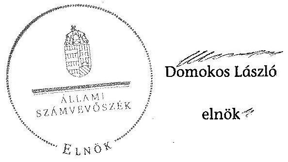

Melléklet: 4 db
Függelék: 2 db

[^0]
[^0]:    ${ }^{22}$ V0517 számú Jelentés a légszennyezés ellen és a klímapolitika terén tett intézkedések hatásának ellenőrzéséről (Témaszám: 0989; Iktatószám: V-2009-118/2010-2011.)

---

# A PÉTÁV Pécsi Távfütő Kft. tevékenységének főbb adatai

|  Sorszám | Megnevezés | 2008. | 2009. | 2010. | 2011. | 2012.  |
| --- | --- | --- | --- | --- | --- | --- |
|  1. | A gazdasági társaság székhelye | 7623 Pécs Tüzér u. 18-20. |  |  |  |   |
|  2. | adószáma | 11362018-2-02 |  |  |  |   |
|  3. | alapításának éve | 1995. |  |  |  |   |
|  4. | A gazdasági társaság többségi tulajdonú leányvállalatainak száma (db) | 0 | 0 | 0 | 0 | 0  |
|  5. | A gazdasági társaság ............(név) leányvállalataiban való részesedésének mértéke (%) |  |  |  |  |   |
|  6. | Az önkormányzat számára (megbízásából, koncessziós, közszolgáltatási, vagy egyéb szerződéses jogviszony alapján) ellátott közfeladatok szakági besorolása: |  |  |  |  |   |
|  7. | Egészségügy |  |  |  |  |   |
|  8. | Kultúra és sport |  |  |  |  |   |
|  9. | Település üzemeltetés, ezen belül: |  |  |  |  |   |
|  10. | köztemető üzemeltetés |  |  |  |  |   |
|  11. | kéményseprés |  |  |  |  |   |
|  12. | helyi közutak fejlesztése, fenntartása és üzemeltetése |  |  |  |  |   |
|  13. | parkok és egyéb közterület fenntartás |  |  |  |  |   |
|  14. | közterületi parkolás |  |  |  |  |   |
|  15. | Lakás és helyiséggazdálkodás |  |  |  |  |   |
|  16. | Víz és csatorna közmú-szolgáltatás |  |  |  |  |   |
|  17. | Hulladékkezelés- szállítás |  |  |  |  |   |
|  18. | Távhő- és energiaszolgáltatás | X | X | X | X | X  |
|  19. | Helyi közösségi közlekedés |  |  |  |  |   |
|  20. | Vagyongazdálkodás |  |  |  |  |   |
|  21. | Pénzügyi gazdasági szolgáltatás |  |  |  |  |   |
|  22. | Egyéb: piaci alapon végzett megrendeléses munka | X | X | X | X | X  |
|  23. | A közfeladatellátására a gazdasági társaságnál alkalmazottak éves átlagos statisztikai létszáma | 245 | 234 | 225 | 221 | 201  |

---

.

---

# A PÉTÁV Pécsi Távfütő Kft. működésének főbb jellemzői

|  Sorszám | Megnevezés |  | 2008. | 2009. | 2010. | 2011. | 2012.  |
| --- | --- | --- | --- | --- | --- | --- | --- |
|  1. | A gazdasági társaság cégformája |  | Kft. |  |  |  |   |
|  2. | A gazdasági társaság tulajdonosi összetétele: |  |  |  |  |  |   |
|   | Önkormányzat megnevezése: |  | Pécs Megyei Jogú Város Önkormányzata |  |  |  |   |
|  3. | Önkormányzat tulajdoni részesedésének arány | $\%$ | 51,0 | 51,0 | 51,0 | 51,0 | 51,0  |
|  4. | Önkormányzat tulajdoni részesedésének összege | ezer Ft | 1040 800,0 | 1040 800,0 | 1040 800,0 | 1040 800,0 | 1040 800,0  |
|   | Más önkormányzatok, többcélú társulás megnevezése: |  |  |  |  |  |   |
|  5. | Más önkormányzatok, többcélú társulások tulajdoni részesedésének arány | $\%$ |  |  |  |  |   |
|  6. | Más önkormányzatok, többcélú társulások tulajdoni részesedésének összege | ezer Ft |  |  |  |  |   |
|   | Gazdasági társaság megnevezése: |  | Pannon Hőerőmű Zrt. |  |  |  |   |
|  7. | Gazdasági társaságok tulajdoni részesedés arány | $\%$ | 49,0 | 49,0 | 49,0 | 49,0 | 49,0  |
|  8. | Gazdasági társaságok tulajdoni részesedés összege | ezer Ft | 1000 000,0 | 1000 000,0 | 1000 000,0 | 1000 000,0 | 1000 000,0  |
|   | Egyéb tulajdonos megnevezése: |  |  |  |  |  |   |
|  9. | Egyéb tulajdonosok tulajdoni részesedés arány | $\%$ |  |  |  |  |   |
|  10. | Egyéb tulajdonosok tulajdoni részesedés összege | ezer Ft |  |  |  |  |   |
|  12. | A tárgyévben a gazdasági társaság vagyonkezelésben lévő önkormányzati vagyon után elszámolt értékcsökkenés összege (ezer Ft) |  |  |  |  |  |   |
|  13. | A tárgyévben az önkormányzati tulajdonú, gazdasági társaság által kezelt eszközök pótlására (karbantartás, felújítás, beruházás) elszámolt kiadás (ezer Ft) |  |  |  |  |  |   |
|  14. | A tárgyévben a gazdasági társaság saját vagyona után elszámolt értékcsökkenés összege (ezer Ft) |  | 350743,0 | 307068,0 | 260783,0 | 246348,0 | 218394,0  |
|  15. | A tárgyévben a saját tulajdonú eszközök pótlására (karbantartás, felújítás, beruházás) elszámolt kiadás (ezer Ft) |  | 249493,0 | 277114,0 | 271639,0 | 239399,0 | 275616,0  |

---

.

---

# A PÉTÁV Pécsi Távfütő Kft. által biztosított közszolgáltatás díjai a 2008-2012. évekre vonatkozóan*

|  A köszolgáltatás díjainak megnevezése | $\begin{aligned} & 2007.01 .01 \text {-től } \ & 2008.12 .31 \text {-ig } \end{aligned}$ | $\begin{aligned} & 2009.01 .01 \text {-től } \ & 2009.03 .31 \text {-ig } \end{aligned}$ | $\begin{aligned} & 2009.04 .01 \text {-től } \ & 2009.06 .30 \text {-ig } \end{aligned}$ | $\begin{aligned} & 2009.07 .01 \text {-től } \ & 2009.09 .30 \text {-ig } \end{aligned}$ | $\begin{aligned} & 2009.10 .01 \text {-től }
 \ & 2010.01.21-ig \end{aligned}$ | $\begin{aligned} & 2010.01.22-től \\ & 2011.01.27-ig \end{aligned}$ | $\begin{aligned} & 2011.01.28-től \\ & 2011.12.31-ig \end{aligned}$ | $\begin{aligned} & 2012.01.01-től \\ & 2012.12.31-ig \end{aligned}$  |
| --- | --- | --- | --- | --- | --- | --- | --- | --- |
|  Alap díj Épület | $\begin{gathered} 8689,84 \ \mathrm{Ft} / \mathrm{kW} / \mathrm{év} \end{gathered}$ | $\begin{gathered} 9698,17 \ \mathrm{Ft} / \mathrm{kW} / \mathrm{év} \end{gathered}$ | $\begin{gathered} 9664,94 \ \mathrm{Ft} / \mathrm{kW} / \mathrm{év} \end{gathered}$ | $\begin{gathered} 9977,14 \ \mathrm{Ft} / \mathrm{kW} / \mathrm{év} \end{gathered}$ | $\begin{gathered} 8391,72 \ \mathrm{Ft} / \mathrm{kW} / \mathrm{év} \end{gathered}$ | $\begin{gathered} 8335,44 \ \mathrm{Ft} / \mathrm{kW} / \mathrm{év} \end{gathered}$ | $\begin{gathered} 8909,64 \ \mathrm{Ft} / \mathrm{kW} / \mathrm{év} \end{gathered}$ | $\begin{gathered} 9283,84 \ \mathrm{Ft} / \mathrm{kW} / \mathrm{év} \end{gathered}$  |
|  Alap díj Épületrész | $\begin{gathered} 9298,13 \ \mathrm{Ft} / \mathrm{kW} / \mathrm{év} \end{gathered}$ | $\begin{gathered} 10367,41 \ \mathrm{Ft} / \mathrm{kW} / \mathrm{év} \end{gathered}$ | $\begin{gathered} 10341,49 \ \mathrm{Ft} / \mathrm{kW} / \mathrm{év} \end{gathered}$ | $\begin{gathered} 10675,51 \ \mathrm{Ft} / \mathrm{kW} / \mathrm{év} \end{gathered}$ | $\begin{gathered} 8979,12 \ \mathrm{Ft} / \mathrm{kW} / \mathrm{év} \end{gathered}$ | $\begin{gathered} 8918,86 \ \mathrm{Ft} / \mathrm{kW} / \mathrm{év} \end{gathered}$ | $\begin{gathered} 9533,28 \ \mathrm{Ft} / \mathrm{kW} / \mathrm{év} \end{gathered}$ | $\begin{gathered} 9933,67 \ \mathrm{Ft} / \mathrm{kW} / \mathrm{év} \end{gathered}$  |
|  Hődíj Épület | 3714,60 Ft/GJ | 4238,36 Ft/GJ | 3792,49 Ft/GJ | 3389,17 Ft/GJ | 2840,29 Ft/GJ | 3115,51 Ft/GJ | 3167,85 Ft/GJ | 3300,89 Ft/GJ  |
|  Hődíj Épületrész | 3974,77 Ft/GJ | 4535,22 Ft/GJ | 4058,11 Ft/GJ | 3626,54 Ft/GJ | 3039,22 Ft/GJ | 3333,72 Ft/GJ | 3389,73 Ft/GJ | 3532,09 Ft/GJ  |
|  Vízmelegítési díj | 1286,20 Ft/m3 | 1458,00 Ft/m3 | 1341,62 Ft/m3 | 1248,77 Ft/m3 | 1047,65 Ft/m3 | 1116,84 Ft/m3 | 1151,75 Ft/m3 | 1200,12 Ft/m3  |

- A közszolgáltatás díjai 2007. január 1. és 2009. szeptember 30. között bruttó, az azt követő időszakokban nettó egységárak.

---

.

---

# Beérkezett észrevételek és az azokra adott válaszok

---

.

---

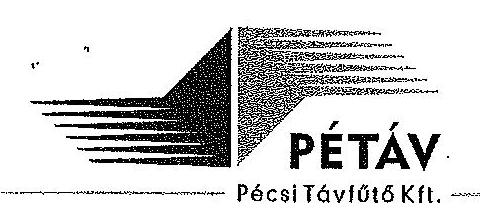

Állami Számvevőszék
Budapest
Apáczai Cs. J. u. 10. 1052

Domokos László Úr
elnök

Tisztelt Elnök Úr!
Köszönettel vettük kézhez az Önkormányzatok gazdasági társaságai - az Önkormányzatok többségi tulajdonában lévő gazdasági társaságok közfeladat-ellátását érintő gazdálkodási tevékenysége PÉTÁV Pécsi Távfütő Kft.-nél végzett számvevőszéki szabályszerűségi vizsgálatról készített jelentéstervezetüket.

Az Állami Számvevőszékről szóló I.XVI. tv. 29. § (2) bekezdésének rendelkezése szerint biztosított 15 napos határidőn belül a mellékletként csatolt észrevételeket tesszük.

Ezúton szeretném megköszönni a vizsgálatban résztvevő számvevőszéki munkatársak és megbízottak a PÉTÁV Kft. ellenőrzése során tanúsított konstruktív együttműködését.

Tisztelettel kérem Elnök Urat, hogy a mellékletként csatolt anyagban kifejtett észrevételeinket a jelentéstervezet véglegesítése során figyelembe venni és a javaslatokat mellőzni szíveskedjen.

Melléklet: 1 pl.

Pécs, 2015. február 16.

Tisztelettel,
PÉTÁV Pécsi Távfütő Kft.
10.
Vida János
ügyvezető igazgató
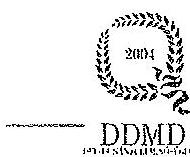

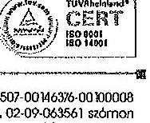

---

# ÉSZREVÉTELEK 

A PÉTÁV Kft. számvevőszéki ellenőrzéséről készült V-0477-206/2015. iktatószámú jelentéstervezetének megállapításaira

A jelentéstervezet 12. oldalán a negyedik bekezdés azt a megállapítást teszi, hogy
„a PÉTÁV Kft. a számviteli politikát az ellenőrzött időpontban nem aktualizálta, nem vezette át a törvénymódosítások miatti változásokat. A 2012. év vonatkozásában a PÉTÁV Kft. a számviteli politikában a Tszt.-ben előírt számviteli szétválasztási szabályokra vonatkozó előírásokat nem jelenítette meg, azonban a számlarend számlatösszefüggéseiből az ellátott közfeladat bevételei és ráfordításai elkülönítetten meghatározhatóak voltak."

A PÉTÁV Kft. a vizsgált időszakban a számvitelről szóló 2000. évi C. tv. (a továbbiakban: Szt.) 14. § (3)-(5) pontjaiban foglaltaknak megfelelően rendelkezett számviteli politikával és a számviteli politika keretében elkészítendő leltározási, értékelési, önköltségszámítási és pénzkezelési szabályzatokkal. A számviteli politika keretébe tartozó szabályzatokban folyamatosan megtörtént a törvényi módosítások követése, mivel a benyújtott szabályzatok tanúsága szerint a vizsgálattal érintett időszakban a leltározási szabályzat és a számlarend egyszer, az önköltségszámítási szabályzat és a pénzkezelési szabályzat pedig kétszer módosult.
A Tszt. 18/A. §-a alapján az engedélyes köteles számviteli szétválasztási szabályokat kidolgozni, de azt nem határozza meg ezen törvény, hogy ezt melyik belső szabályzatában köteles megtenni.

A PÉTÁV Kft. a Tszt. 2012. január 1-től hatályba lépett 18/A-18/C. § rendelkezéseit betartotta, így többek között a számviteli szétválasztásra vonatkozó szabályokat a számviteli politikájának részét képező, bár külön szabályzatban, a számlarendben (vizsgálati anyag részeként benyújtva), valamint a SZ 16 azonosítójelű önköltségszámítási szabályzatban (vizsgálat során csatolva) már korábban is meghatározta. A PÉTÁV Kft. a számviteli rendszerét úgy alakította ki, hogy a lehető legtöbb költség/ráfordítás illetve árbevétel/bevétel közvetlen elszámolással kerüljön az engedélyköteles alaptevékenységre, valamint az ahhoz közvetlenül kapcsolódó kiegészítő tevékenységre. Az egyes tevékenységeiből származó bevételeit, ráfordításait, tárgyi eszközeit és a vevőket tevékenységenként elkülönülten tartja nyilván. Ezt támasztja alá a jelentéstervezet 29. oldalán lévő 3.1. pontjának második, harmadik, negyedik és ötödik bekezdésében, valamint a 30. oldalon található 3.2. pontjának első bekezdésében tett megállapítások.
Kérjük észrevételünk alapján pontosítani a fenti bekezdést, összhangba hozva a jelentés 29. oldalán leírtakkal.

A jelentéstervezet 12. oldalának hatodik bekezdésében és 24. oldalának harmadik bekezdésében megfogalmazottakkal kapcsolatosan észrevételezzük, hogy
a PÉTÁV Kft. az Szt. 54-55-56. §-ainak rendelkezései figyelembevételével állapította meg számviteli politikájának IV./2. pontjában a követelések értékvesztése elszámolására, II./10.2 pontjában pedig a követelések minősítésére vonatkozó konkrét előírásait, a behajthatatlan

---

követelések értékelésének szabályait az SZ 18 azonosítójelű eszközök és források értékelési szabályzat (3.változat) III/3. pontja szabályozza, így megfelel a számviteli törvény rendelkezéseinek, ezért kérjük törölni a bekezdés utolsó mondatrészét.

A jelentéstervezet 13. oldalán a negyedik bekezdésben az ellenőrzött időszakban elszámolt értékvesztés összege, számszerűen a 65,1 MFt tévesen szerepel, helyette 397,5 MFt a helyes érték.

A jelentéstervezet 14. oldalán második bekezdésében és a 26. oldal hatodik bekezdésében elírás történt, a távhőszolgáltatási támogatásról szóló rendelet száma helyesen 51/2011. (IX.30.) NFM rendelet.

A jelentéstervezet 14. oldalán a 8. bekezdés első mondata, miszerint a „PÉTÁV számviteli rendszerének szabályozottsága hiányosságokat mutat" az előbb említettek miatt nem helytálló, kérjük törlését.

A jelentéstervezet 15. oldalán az 1. pont első bekezdésében írott javaslattal kapcsolatosan, visszautalva a 12. oldal negyedik bekezdésénél tett észrevételünkre, a PÉTÁV Kft. számviteli politikája és annak keretében az Szt. alapján kötelezően elkészített szabályzatok nem tartalmaznak jogszabályba ütköző belső szabályozást. A számviteli szétválasztási szabályokat a társaság a Tszt. rendelkezéseinek is eleget téve, a számviteli politika keretébe tartozó számlarendben és önköltségszámítási szabályzatban határozza meg. Így a PÉTÁV Kft. nem sértette meg az Szt. 14. § (3)-(4) és (11) bekezdésében és 161/A. §-ában foglaltakat, továbbá a Tszt. 18/A. § (2) bekezdésének rendelkezéseit sem, ezért kérjük a javaslat 1. pontjának, valamint a) és b) pontjának mellőzését.
Ehhez kapcsolódóan szeretném arról tájékoztatni, hogy a Magyar Energia Hivatal 2012. októberében lefolytatott ellenőrzése azt a célt szolgálta, hogy több engedélyes távhőszolgáltató számviteli politikáját, számlarendjét, önköltségszámítási szabályzatát elemezve ajánlást adjon a számviteli szétválasztási szabályok alkalmazásához. Ezen ajánlás 2013. február 22-én, tehát a Tisztelt Számvevőszék által vizsgált időszakon kívül került kiadásra, a Tszt 18/A-18/C. §-aiban előírt kötelezettségek megfelelő és egységes teljesíthetősége érdekében.

A jelentéstervezet 15. oldalán az 1. pontban foglalt javaslat második bekezdésében tett megállapítás, ahogy azt a tervezet 12. oldalának hatodik bekezdéséhez tett észrevételünkben már kifejtettük, konkrétan határozta meg előírásait, az Szt. szabályaival összhangban, ezért a megállapítás nem megalapozott, kérjük törölni.

A jelentéstervezet 23. oldal alulról a második bekezdésében az a megállapítás szerepel, hogy
„a PÉTÁV Kft. az ellenőrzött időszakban a számviteli politikáját nem aktualizálta, nem vezette át a törvénymódosítások miatti változásokat, megsértve ezzel a Számv. tv. 14. § (11) bekezdésében foglalt előírásokat. A számviteli politika a Számv. tv. 15-16. §-aiban foglalt alapelvek figyelembevételével, általános megfogalmazással készült. A Számv. tv. 14. § (4) bekezdésében és a Tszt. 18/A. § (2) bekezdésében foglaltakat figyelmen kívül hagyva a PÉTÁV Kft. számviteli politikája nem tér ki a specifikus jellemzőkre, nem jelenítette meg azt, hogy a törvényben biztosított választási, minősítési lehetőségek közül melyeket, milyen feltételek fennállása esetén alkalmaz, illetve az alkalmazott gyakorlatot milyen okok miatt kellett megváltoztatni.".

---

A tervezet 12. oldal negyedik bekezdéséhez és a 15. oldalán az 1. pont első bekezdéséhez tett észrevételünkben részletezettek alapján a megállapítás nem helytálló, mivel a PÉTÁV Kft. a számviteli politikáját és a számviteli politikájának Szt. által meghatározott körébe tartozó szabályzatait a Tszt. és az Szt. rendelkezéseinek megfelelően módosította. A szabályzatok azokban az esetekben, ahol a törvény választási lehetőséget enged, a társaság által alkalmazni választott lehetőséget tartalmazza, ezáltal eleget tesz a törvényi előírásoknak, így a szóban forgó bekezdés utolsó mondata sem helytálló, kérjük törölni.

A jelentéstervezet 27. oldalán a második bekezdésben a lakossági vevőállomány 2008-2012. években tévesen szerepel, mert a 66% helyett valójában 31%-kal növekedett. Ugyanezen bekezdésben az értékvesztés összegei hibásak, az éves beszámolók alapján, a helyes összegeket az alábbi táblázat tartalmazza.

|   | Jelentésben | Helyes összegek  |
| --- | --- | --- |
|  2008. év | 6,9 MFt | 32,143 MFt  |
|  2009. év | 10 MFt | 29,757 MFt  |
|  2010. év | 7,4 MFt | 70,423 MFt  |
|  2011. év | 28,7 MFt | 176,434 MFt  |
|  2012. év | 12,1 MFt | 88,707 MFt  |

A jelentéstervezet 30. oldalán a harmadik bekezdésben téves az elszámolt értékesítéskénés összege, a társaság beszámolói és a vizsgálat során benyújtott 3. számú tanúvallomás szerinti helyes értéket a következő sorok tartalmazzák:

|   | Jelentésben | Helyes összegek  |
| --- | --- | --- |
|  2008. év | 416,1 MFt | 350,7 MFt  |
|  2012. év | 268,6 MFt | 218,4 MFt  |

Az itt észrevételezett bekezdés utolsó mondatában az eszközpótlás aránya az előbb írtak következtében, vélhetően változhat.

A jelentéstervezet 3. számú mellékletében a közszolgáltatási árakat tartalmazó táblázatból hiányzik a megjegyzés rovat, mely szerint 2007. január 1. és 2009. szeptember 30. közötti időszakban bruttó, az ezt követő időszakban pedig nettó egységárakat tartalmaz a táblázat.

Pécs, 2015. február 13.

---

# 4. SZÁMÚ MELLÉKLET A V-0477-219/2015. SZÁMÚ JELENTÉSHEZ 

Ikt.szám: V-0477-217/2015.

## Vida János úr

ügyvezető igazgató
PÉTÁV Pécsi Távfütő Kft.

## Pécs

Tisztelt Ügyvezető Igazgató Úr!

Köszönettel vettem a PÉTÁV Pécsi Távfütő Kft. ellenőrzéséről készített számvevőszéki jelentéstervezetre tett észrevételeit.

Az Állami Számvevőszék észrevételekre vonatkozó álláspontjáról a felügyeleti vezető által készített részletes tájékoztatásban kap választ, amelyet levelemhez mellékeltem.

Tájékoztatom Ügyvezető Igazgató urat, hogy a számvevőszéki jelentés véglegesítése az elfogadott észrevételek figyelembevételével történik.

Budapest, 2015. 09. 05.
dr.

 Hordódy dongol

Tisztelettel:

Domokos László

Melléklet: Tájékoztatás az észrevételek kezeléséről

---

# Tájékoztatás az észrevételek kezeléséről 

A PÉTÁV Pécsi Távfütő Kft. ellenőrzéséről készített jelentéstervezetre Ügyvezető Igazgató úr észrevételeit megköszönöm. Az észrevételek összefüggéseikben a jelentéstervezet két megállapítását vitatják.

Az első esetben a PÉTÁV Pécsi Távfütő Kft. számviteli politikájával kapcsolatban a számviteli szétválasztás hiányosságaira vonatkozó megállapításainkat az alábbiak szerint pontosítjuk:
„A PÉTÁV Kft. számviteli politikája VI. fejezetében tartalmazza a kiegészítő melléklet tartalmi követelményeit, nem tartalmazza azonban a távhőszolgáltatásról szóló 2005. évi XVIII. törvény 18/A. § (3) pontjában meghatározott követelményeket teljes körűen. A PÉTÁV Kft. számlarendje (6. és 7. számlaosztály) kellő részletezettséget biztosít a költségek elkülönített nyilvántartásának megalapozásához, viszont olyan részletezettséget nem, amely a számvitelről szóló 2000. évi C. tv. 161/A. §-ának megfelelően a kiegészítő melléklet adatainak közvetlen alátámasztására is alkalmas."

## „Javaslat:

Gondoskodjon a szabályozási hiányosságok megszüntetésére, ezen belül:
a) intézkedjen a számviteli szabályozás kiegészítéséről annak érdekében, hogy a főkönyvi és analitikus nyilvántartások teljes körűen biztosítani tudják a társaság tevékenységenkénti elkülönített adatainak kimutatását, a Számv. tv.-ben előírt részletezésben (kiegészítő melléklet);

A második esetben a PÉTÁV Pécsi Távfütő Kft. számviteli politikájával kapcsolatban a követelések minősítésének elmaradására vonatkozó megállapításainkat fenntartjuk, egyúttal a megfogalmazást pontosítjuk:
„A PÉTÁV Kft. számviteli politikája IV. 2. pontjában általánosan tartalmazza a követelések értékvesztése és visszaírása elveit. Az említett pontban hivatkozik a vevő, adós minősítésére, a minősítés elveit azonban a számvitelről szóló 2000. évi C. tv. 35. §-ának megfelelően nem határozza meg, illetve azok értékelését PÉTÁV Kft. értékelési szabályzata nem részletezi. A társaság értékelési szabályzata a Számv. tv. 14. § (4) bekezdésében foglaltakkal szemben általánosan sorolta fel a főbb értékelési módokat. Az értékvesztések elszámolására, a behajthatatlan követelések egyedi értékelésére vonatkozóan nem tartalmazott konkrét előírásokat, nem szabályozta az értékvesztés szempontjából lényegesnek, jelentősnek minősülő tételeket."
„Javaslat:
Gondoskodjon a szabályozási hiányosságok megszüntetésére, ezen belül:
b) dolgozza ki az értékelési szabályzatában a vevő és az adós minősítésére vonatkozó eljárási rendet az értékvesztések elszámolására, továbbá az érték-vesztés visszaírására vonatkozóan."

---

A jelentéstervezet 14. oldalának 8. bekezdéséhez, a 12. oldal 4. bekezdéséhez, valamint a 15. oldal 1. pontjához kapcsolódó észrevételét a már bemutatott hiányosságok miatt figyelembe venni nem tudjuk, álláspontunkat továbbra is fenntartjuk.

A jelentéstervezet 13., 14., 27. és 30. oldalán található számszaki eltérésekre vonatkozó pontosításait megköszönöm, azokat átvezettük.

Budapest, 2015. a' $y^{\prime \prime} \mathrm{II}$ hó $\%$ nap

$$
d^{2} / 0 \sqrt{1 / 4}
$$

Dr. Horváth Margit
felügyeleti vezető

---

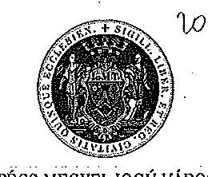

PÉCS MEGYEI JOGÚ VÁROS POLGÁRMESTERE

Szám: 03-3/77-5/2015.

Domokos László
elnök
Állami Számvevőszék

# Tisztelt Elnök Úr! 

Köszönettel vettem kézhez 2015. február 3-án V-0477-205/2015. iktatási számú, a PÉTÁV Pécsi Távhő Kft. ellenőrzéséről készült számvevőszéki jelentés tervezetüket.

Az önkormányzat szabályszerű működésének elősegítése, továbbá az önkormányzati tulajdonosi joggyakorlás kontrolljainak erősítése érdekében az Állami Számvevőszék javaslatokat fogalmazott meg Pécs Megyei Jogú Város Önkormányzata számára.

Az Állami Számvevőszékről szóló 2011. évi LXVI. tv. 29. § (2) bekezdésben deklarált joggal élve az ellenőrzés megállapításaira Pécs Megyei Jogú Város Önkormányzatának Jegyzőjével közösen az alábbi észrevételeket teszem:

## „Javasoljuk Pécs Város Önkormányzata Polgármesterének:

Intézkedjen a jogszabályi előírások szerinti gyakorlat és a szabályos működés biztosítására, ezen belül:

Kezdeményezze, hogy a Képviselő-testület gondoskodjon az Nvtv előírásaival összhangban álló közép- és hosszú távú vagyongazdálkodási terv összeállításáról."
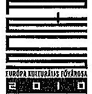

H-7621 PÉCS - Széchenyi tér 1. - Postacím: H-7602 Pécs - Pf. 58.
Telefon: +36 [72] 533-800*, 533-807 - Fax: +36 [72] 212-049

---

# Pécs Megyei Jogú Város Önkormányzatának észrevétele a javaslatra: 

A nemzeti vagyonról szóló 2011. évi CXCVL törvény (Nvtv.) 2011. 12. 30-án került kihirdetésre. A jogszabály 9.§ (1) bekezdése rendelkezik a közép- és hosszú távú vagyongazdálkodási terv készítésének kötelezettségéről, mely rendelkezés 2012. 01. 01-jén lépett hatályba, azonban a törvény a terv elkészítésére vonatkozó határidő megállapításáról nem rendelkezett. Ebből adódóan Önkormányzatunk röviddel a rendelkezés hatálybalépését követően jogi állásfoglalást kért a Baranya Megyei Kormányhivataltól a jogszabályi feladat időbeli teljesítésével kapcsolatban, annak egyértelműsítése végett, hogy milyen határidőben kell a Testületnek a vagyongazdálkodási tervet elfogadnia. A beérkezett állásfoglalás alapján megkezdődött a vagyongazdálkodási terv kidolgozása és döntésre előkészítése, mely lévén hogy stratégiai, szakmailag komplex, összetett anyagról van szó, melynek készítéséhez részben külső szakértői segítséget is igénybe kellett vennünk, időigényes folyamat egy Pécs nagyságrendű városban. Az elkészült tervezetet első ízben 2012. év őszén tárgyalta a Közgyűlés, melynek során bizonyos módosításokat javasolt. Az átdolgozott anyag alapján végül a 9/2013. (02.07.) számú határozatával elfogadta a Vagyongazdálkodási rendszer átalakításáról, valamint a közép és hosszú távú vagyongazdálkodási terv és irányelvei elfogadásáról szóló előterjesztést.

Ezen időponttól kezdődően tehát Pécs Megyei Jogú Város Önkormányzata már rendelkezik az Nvtv. előírásaival összhangban álló hatályos közép és hosszú távú vagyongazdálkodási tervvel.

Álláspontunk szerint tehát Önkormányzatunk a törvénynek megfelelően járt el. Megfelelően, hiszen a jogszabályi rendelkezés nem írt elő konkrét határidőt a terv elfogadására, továbbá megfelelően, hiszen Önkormányzatunk igazolható módon a körülmények által lehetővé tett határidőben megkezdte annak kidolgozását és az elkészült anyag tervezete alapján elindította az elfogadási folyamatot is. Hosszú távú stratégiai dokumentum lévén azonban a kidolgozásnak és jóváhagyásnak - értelemszerűen hónapokban mérhető - időigénye van. A jogszabályi szempontoknak tehát Önkormányzatunk a gondos előkészítő munka fontosságára kiemelt figyelmet fordítva megfelelt.

## „Javasoljuk Pécs Város Önkormányzata Jegyzőjének:

Intézkedjen a jogszabályi előírások szerinti gyakorlat és a szabályos működés biztosítására, ezen belül:
a) gondoskodjon annak ellenőrzéséről, hogy a társaság a tevékenysége során betartja-e az Üzletszabályzatban foglalt előírásokat;
b) fordítson kiemelt figyelmet arra, hogy az önkormányzat belső ellenőrzése az ellenőrzéseivel a távhőszolgáltatás, mint közfeladat-ellátás szabályszerű teljesítéséhez, valamint az önkormányzati vagyon megóvásához ellenőrzéseivel járuljon hozzá."

---

# Pécs Megyei Jogú Város Önkormányzatának észrevétele a javaslatra: 

a)

A távhőszolgáltatásról szóló 2005. évi XVIII. törvény (Tszt.) 7. §-ában megállapított jegyzői feladatok meghatározásával kapcsolatosan sem a törvény, sem annak végrehajtási rendelete (a távhőszolgáltatásról szóló 2005. évi XVIII. törvény végrehajtásáról szóló 157/2005. (VIII.15.) Korm. rendelet) nem határozza meg, hogy milyen módon köteles ezt a feladatot a jegyző ellátni, ezért az ellenőrzés általános fogalma alapján vehető számba ez a tevékenység.

Álláspontunk szerint a vizsgálat ezen megállapítása nem helytálló, figyelemmel arra, hogy az engedélyes távhőszolgáltató (a Társaság) és a 2012. februárjáig egyúttal engedélyező hatósági feladatokat is ellátó jegyző folyamatosan együttműködött, amely együttműködésbe a szóbeli beszámoltatás, tájékoztatás, további feladatok megvitatása is beletartozott a Társaság ügyvezetésével és jogi- és igazgatási osztályával.

A rutinszerű napi együttműködésen túl a jegyzői ellenőrzés megvalósult többek között:

- a Társaság éves beszámolóinak, jelentéseinek, taggyűlés elé kerülő ügyeinek az Önkormányzat részére történő megküldése során, azon tény alapján, hogy a testület (bizottság, közgyűlés) elé kerülő előterjesztéseket valamennyi esetben a jegyző törvényességi ellenőrzése előzte meg,
- a jegyző az Üzletszabályzat jóváhagyása során előzetesen ellenőrizte az üzletszabályzat tervezet jogszabályszerűségét és megfelelőségét,
- a jegyző vizsgálta és ellenőrizte a távhőszolgáltatás biztosításához kapcsolódó leglényegesebb szerződéseket, így a termelő és a szolgáltató közötti Hosszútávú Kapacitáslekötési Hőenergiaszolgáltatási és Együttműködési Megállapodást,
- a jegyzői megkeresésre évente benyújtott közgyűlési munkaterv javaslatok során a szolgáltató előzetes vizsgálata,
- a távhőszolgáltatási rendszer üzemzavarairól szóló eseti jelentés jegyzői tudomásul vétele
- a jegyzőhöz beérkező felhasználói/díjfizetői panaszok kivizsgálása során a szolgáltató tevékenységének ellenőrzése,
- a hatósági ár megállapítás miniszteri hatáskörbe kerülését követően a jegyző és a Társaság kölcsönös egyeztetése a távhőszolgáltatási áremelésekről, valamint a jogszabályváltozásokból adódó feladatok, hatáskörök változásáról
- a távhőszolgáltatásból kizárt felhasználók/díjfizetők folyamatos jegyzői nyomonkövetése azon keresztül, hogy a Tszt. 51. § (8) bekezdése alapján, a feladat Járási Hivatalhoz kerüléséig (2012. évi XCIII. tv. 61. §) a jegyző ellátta a

---

távhőszolgáltató felhasználási helyre történő bejutásának a törvényben meghatározott esetekben történő elrendelését.

A fenti állításaink természetesen dokumentumokkal igazolhatóak. Ennek alátámasztására csatoljuk a jegyző és a Társaság ügyvezetője által kiállított közös nyilatkozatot az ellenőrzések megtörténtéről.(melléklet)
b)

A PÉTÁV Pécsi Távfütő Kft. Pécs Megyei Jogú Város Önkormányzatának több tekintetben is legjobban, leggazdaságosabban működő társasága, figyelembe véve a lakossági igényeket, a gazdaságossági és hatékonysági követelményeket, a folyamatosan fejlődő alapszolgáltatást.

Az Önkormányzat a Jelentéstervezet által sem vitatottan, előírás szerűen meghozott minden olyan döntést, melyek a Társaság feladatellátását és működését érintették. Az SzMSz-ben és a helyi vagyonrendeletben részletesen és széleskörűen szabályozott tulajdonosi joggyakorlási szabályoknak megfelelően beterjesztett és meghatározott, Közgyűlés és bizottságok előtti üzleti tervek, beszámolók, mérlegek, vezetői célkitűzések, stb. egy jól, összefogottan működő szolgáltatóról adtak az Önkormányzat számára rendszeres és folyamatos visszajelzést. A Társaság eredményei révén, osztalék befizetésével is segítette az Önkormányzat gazdasági tevékenységét, saját működéséhez, fejlesztéséhez pénzügyi támogatást nem kért. A rábízott vagyont alaptevékenységének megfelelő célra használta, azt minőségileg folyamatosan fejlesztette, értékét gyarapította, a működésével kapcsolatos lakossági, fogyasztói panaszok száma pedig az ügyfélkör volumenéhez képest egészen elenyésző. Összességében tehát jól, problémamentesen működő, stabilan gazdálkodó cégről van szó.

Az ellenőrzési jelentés azon megállapításával kapcsolatban, mely szerint a PÉTÁV Pécsi Távfütő Kft. működése a 2008-2012. évek közötti időszakban nem került a belső ellenőrzés által ellenőrzésre, megjegyezni szükséges, hogy egyfelől a tulajdonosi kontrollnak számos, a belső ellenőrzésen kívüli jogszabályban nevesített formája létezik, melyeket Önkormányzatunk rendszeresen, folyamatosan és igazolható módon gyakorolt, mind a társaság, mind saját döntéshozó, ellenőrző funkciót ellátó szervei által. Tehát részben saját maga önállóan, részben a társasági tagtársával a Pécsi Hőerőmű Zrt-vel közösen. Ezek önmagukban és összességükben megfelelő tulajdonosi rálátást biztosítottak a vizsgált időszak során is, másrészt a Belső Ellenőrzési Osztály a vonatkozó jogszabályokra alapozottan, kockázatelemzés alapján felállított prioritások és a rendelkezésre álló erőforrások figyelembe vételével készítette elő a mindenkori éves ellenőrzési munkatervi javaslatot, melyet a Közgyűlés minden évben - előzetes bizottsági tárgyalást követően - jóváhagyott. Sem a rendelkezésre álló dokumentumok, illetve semmilyen ismert tény nem tette indokolttá a PÉTÁV Pécsi Távfütő Kft-nél a 2008-2012. években célzott vizsgálat lefolytatását. Amennyiben a Jelentéstervezetben foglaltak szerint a Belső Ellenőrzési Osztály a jogszabályoknak megfelelő rendben készített kockázati prioritási listától eltérve - anélkül, hogy azt ténylegesen felmerült körülmények indokolták volna - a PÉTÁV Kft. vizsgálatát kezdeményezi, az az ellenőrzési kapacitások végesége okán értelemszerűen olyan más önkormányzati társaság, illetve intézmény ellenőrzésének halasztását, vagy elmaradását vonta

---

volna maga után, amelyek esetében a szakmai körülmények a vizsgálatot egyébként indokolttá tették. E körben csak összehasonlító adatként jegyezzük meg, hogy Pécs Megyei Jogú Város Önkormányzata közvetlenül, vagy közvetetten, többségi vagy kisebbségi részesedéssel több tucat gazdasági társaságban bír tagi szereppel, így a tulajdonosi ellenőrzés különböző formáinak alkalmazása során kiemelt figyelmet kell fordítania az ellenőrzések indokoltságára és időszerűségére.

A fentiek alapján tehát a PÉTÁV Kft. működésének a 2008-2012. évek közötti időszakban a belső ellenőrzés általi külön vizsgálatának elmaradásával kapcsolatos megállapításokkal nem tudunk egyetérteni, annak konkrét elrendelése ugyanis a Jelentéstervezetben leírtak szerinti módon, tehát az egyébként folyamatosan és rendszeresen gyakorolt tulajdonosi ellenőrzési tevékenysége mellett - jogszabályilag igazolhatóan - nem volt indokolt.
(Megjegyzés: Azon vagyoni elemek használatát, melyek a távhőszolgáltatás
 céljait szolgálják, de az Önkormányzat 100%-os tulajdonában lévő Pécs HOLDING Zrt. (illetve jogelődje) tulajdonában és vagyonkezelésében vannak, a Polgármesteri Hivatal Ellenőrzési Osztálya ezen társaság gazdasági tevékenységének ellenőrzése keretében áttekintette a 2008. évben.

Pécs, 2015. február 13.

Tisztelettel:
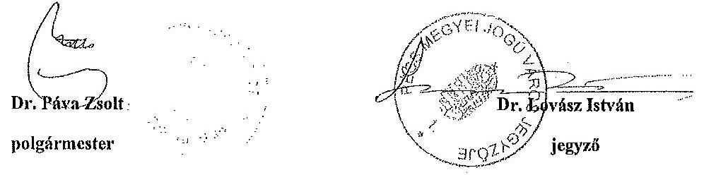

---

# Nyilatkozat 

Alulírottak, dr. Lovász István, Pécs Megyei Jogú Város Önkormányzatának Jegyzöje és Vida János, a PÉTÁV Pécsi Távfütő Kft. ügyvezető igazgatója a V-0477-205/2015 és V-0477-206/2015. számú számvevőszöki jelentéstervezetekben foglalt, Pécs Megyei Jogú Város Önkormányzatának Jegyzöje számára tett, a PÉTÁV Pécsi Távfütő Kft. Üzletszabályzata betartásának ellenőrzésére irányuló javaslatra reagálva az alábbi közös nyilatkozatot tesszük, különös tekintettel azon tényre, hogy a távhőszolgáltatásról szóló 2005. évi XVIII. törvény 7. §-ában megállapított jegyzői feladatok meghatározásával kapcsolatosan sem ezen törvény, sem a távhőszolgáltatásról szóló 2005. évi XVIII. törvény végrehajtásáról szóló 157/2005. (VIII.15.) Korm. rendelet sem határozza meg, hogy milyen módon köteles ezt a feladatot a jegyző ellátni:

Pécs Megyei Jogú Város Önkormányzatának jegyzője a PÉTÁV Pécsi Távfütő Kft. ügyvezető igazgatójával együttműködve, illetve utasítása alapján Pécs Megyei Jogú Város Polgármesteri Hivatalának illetékes szervezeti egysége a Társaság jogi- és igazgatási osztályával kapcsolatot tartva a Társaság Üzletszabályzatának folyamatos ellenőrzését ellátta úgy az Állami Számvevőszék által vizsgált időszakban, mint az azt megelőző és azt követő időintervallumokban is.

Ezen gyakorlati ellenőrzési tevékenység folyamatos kapcsolattartásban, tájékoztatás és információkérésben, szóbeli beszámoltatásban, feladat egyeztetésben és kijelölésben, számonkérésben, napi együttműködésben nyilvánult meg.

Fentiek alapján tisztelettel kérjük Elnök Urat a számvevőszéki jelentéstervezetben foglalt vonatkozó megállapítás módosítására.

Pécs, 2015. február 13.
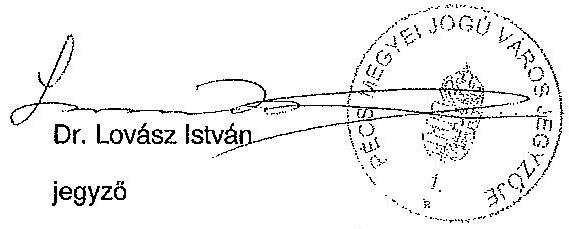

Pécs Megyei Jogú Város Önkormányzata
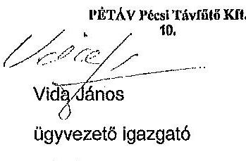

PÉTÁV Pécsi Távfütő Kft. 48.

---

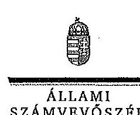

ELKÖK

Ikt.szám: V-0477-216/2015.

Dr. Páva Zsolt úr
polgármester

Pécs Megyei Jogú Város Önkormányzata

Pécs

Tisztelt Polgármester Úr!

Köszönettel vettem a PÉTÁV Pécsi Távfűtő Kft. ellenőrzéséről készített számvevőszéki jelentéstervezetre tett észrevételeit.

Az Állami Számvevőszék észrevételekre vonatkozó álláspontjától a felügyeleti vezető által készített részletes tájékoztatásban kap választ, amelyet levelemhez mellékeltem.

Tájékoztatom Polgármester urat, hogy a számvevőszéki jelentés véglegesítése az elfogadott észrevételek figyelembevételével történik.

Budapest, 2015.

*dr. Horváth M. H. H. H.*

Tisztelettel:

Dümokos László

Melléklet: Tájékoztatás az észrevételek kezeléséről

1052 BUDAPEST, AFRICAN COURT. SÁNDOR UTCA 10. 1264 Budapest 4. Pl. 54 telefon: 484 9191 fax: 484 9291

---

# Tájékoztatás az észrevételek kezeléséről 

A PÉTÁV Pécsi Távfütő Kft. ellenőrzéséről készített jelentéstervezetre Polgármester úr és Jegyző úr észrevételeit megköszönöm. Az észrevételek a jelentéstervezet három megállapítását vitatják.

Az első esetben a nemzeti vagyonról szóló 2011. évi CXCVI. tv. 9. § (1) bekezdése vonatkozásában tájékoztatást adnak a Pécs Megyei Jogú Város Önkormányzata által a közép- és hosszú távú vagyongazdálkodási terv elkészítése érdekében elvégzett feladatokról. A kapott tájékoztatás szerint 2013. februárjában - azaz az ellenőrzött időszakot (2008-2012.) követően - fogadta el Pécs Megyei Jogú Város Közgyűlése a Vagyongazdálkodási rendszer átalakításáról, valamint a közép- és hosszú távú vagyongazdálkodási terv és irányelvei elfogadásáról szóló határozatot.

## Polgármester úr észrevételei alapján a jelentés tervezetét az alábbiak szerint pontosítjuk:

A jelentéstervezet részletes megállapításainak vonatkozó része a következőképpen módosul: „A 2011. december 31-én hatályba lépett Nvtv. 9. § (1) bekezdésében meghatározott közép- és hosszú távú, a Közgyűlés által elfogadott vagyongazdálkodási tervvel az Önkormányzat 2012. január 1. és 2012. december 31. között nem rendelkezett”.

Ez egyúttal azt jelenti, hogy az ellenőrzött időszakot tekintve indokolt a polgármesternek címzett javaslatok közül az 1. javaslat megtartása.

## „Javasoljuk Pécs Megyei Jogú Város Önkormányzata Polgármesterének:

1. Az Önkormányzat az ellenőrzött időszakban nem rendelkezett az Nvtv. 9. § (1) bekezdése szerinti közép- és hosszú távú vagyongazdálkodási tervvel.

Javaslat:
Intézkedjen a jogszabályi előírások szerinti gyakorlat és a szabályos működés biztosítására, ezen belül:

Kezdeményezze, hogy a Közgyűlés gondoskodjon az Nvtv. előírásaival összhangban álló közép- és hosszú távú vagyongazdálkodási terv összeállításáról és elfogadásáról.”

A második esetben a távhőszolgáltatásról szóló 2005. évi XVIII. tv. 7. § (1) e) pontjában előírt jegyzői feladatok ellátásáról számolnak be. Álláspontjukat elfogadni azonban nem tudjuk, mert a távhőszolgáltató tevékenységének ellenőrzése az üzletszabályzatában foglaltak betartása szempontjából dokumentált formában nem valósult meg. Megállapításunkat és a Pécs Megyei Jogú Város Önkormányzata jegyzőjének tett javaslatunkat ezért továbbra is indokoltnak tartjuk.

---

# „Javasoljuk Pécs Megyei Jogú Város Önkormányzata Jegyzőjének: 

2. A jegyző a Tszt. 7. § (1) bekezdés c) pontjában előírtak ellenére nem ellenőrizte, hogy a távhőszolgáltató a tevékenységének végzése során betartja-e az Üzletszabályzatában foglaltakat.
javaslat:
Intézkedjen a jogszabály előírások szerinti gyakorlat és a szabályos működés biztosítására, ezen belül:
a) Gondoskodjon annak dokumentált ellenőrzéséről, hogy a társaság a tevékenysége során betartja-e az Üzletszabályzatban foglalt előírásokat;”

A harmadik esetben Pécs Megyei Jogú Város Önkormányzata jegyzőjének megfogalmazott „b) fordítson kiemelt figyelmet arra, hogy az önkormányzat belső ellenőrzése az ellenőrzéseivel a távhőszolgáltatás, mint közfeladat-ellátás szabályszerű teljesítéséhez, valamint az önkormányzati vagyon megóvásához ellenőrzéseivel járuljon hozzá” javaslatunk kapcsán tájékoztatást adnak arról, hogy a belső ellenőrzések tervezését kockázatelemzés alapján, a rendelkezésre álló erőforrások figyelembevételével végezték el. Tájékoztatásukat az ellenőrzött időszakra vonatkozóan tudomásul vesszük, ugyanakkor a jövőre vonatkozóan fontosnak tartjuk, hogy az Önkormányzat a belső ellenőrzéseivel járuljon hozzá a társaság szabályszerű működéséhez és az önkormányzati vagyon megóvásához. Ennek megfelelően a Pécs Megyei Jogú Város Önkormányzata jegyzőjének tett javaslatunkat fenntartjuk.

## Javasoljuk Pécs Megyei Jogú Város Önkormányzata Jegyzőjének:

1. Az Önkormányzat belső ellenőrzése az ellenőrzéseivel a távhőszolgáltatás, mint közfeladat-ellátás szabályszerű teljesítéséhez, valamint az önkormányzati vagyon megóvásához ellenőrzéseivel nem járult hozzá. Az ellenőrzött időszakban a társaság gazdálkodásával és működésével kapcsolatban ellenőrzést nem folytatott le.

Javaslat:
Intézkedjen a jogszabály előírások szerinti gyakorlat és a szabályos működés biztosítására, ezen belül:
b) Fordítson kiemelt figyelmet arra, hogy az önkormányzat belső ellenőrzése az ellenőrzéseivel a távhőszolgáltatás, mint közfeladat-ellátás szabályszerű teljesítéséhez, valamint az önkormányzati vagyon megóvásához ellenőrzéseivel járuljon hozzá.

Budapest, 2015. 04. 05.

Dr. Horváth Margit
felügyeleti vezető

---

# ÉRTELMEZŐ SZÓTÁR 

garancia

A garancia olyan önálló, az önkormányzat nevében vállalt kötelezettség, amely alapján az önkormányzat az önkormányzati költségvetés terhére szerződésben meghatározott feltételek szerint, a kötelezett nem teljesítése esetén a jogosultnak fizetést teljesít az előzetesen rögzített összeghatárig.
gazdasági társaság
gazdálkodó szervezet
keresztfinanszírozás tilalma
kezesség
közfeladat

A Gt. 3. § (1) bekezdése szerint „gazdasági társaságot üzletszerű közös gazdasági tevékenység folytatására külföldi és belföldi természetes és jogi személyek, valamint jogi személyiség nélküli gazdasági társaságok alapíthatnak, működő társaságba tagként beléphetnek, társasági részesedést (részvényt) szerezhetnek.”
A Ptk. 685. § c) pontja szerint gazdálkodó szervezet: „az állami vállalat, az egyéb állami gazdálkodó szerv, a szövetkezet, a lakásszövetkezet, az európai szövetkezet, a gazdasági társaság, az európai részvénytársaság, az egyesülés, az európai gazdasági egyesülés, az európai területi együttműködési csoportosulás, az egyes jogi személyek vállalata, a leányvállalat, a vízgazdálkodási társulat, az erdő birtokossági társulat, a végrehajtói iroda, az egyéni cég, továbbá az egyéni vállalkozó.”
A közszolgáltatás díját úgy kell megállapítani, hogy az maradéktalanul fedezetet nyújtson a közszolgáltatás indokolt költségeire és ráfordításaira, valamint a közszolgáltató e tevékenységével kapcsolatos ésszerű nyereségére; az ésszerű nyereség nem tartalmazhatja a közszolgáltatáson kívül eső egyéb gazdasági tevékenységei költségeinek, ráfordításainak fedezetét.
A kezességre vonatkozó előírásokat a Ptk. 272-276. §-ai tartalmazzák. A kezesség a polgári jogban a szerződést biztosító járulékos mellékkötelezettség, amely egy másik kötelem teljesítését biztosítja azáltal, hogy a kezes a főadós nem teljesítése esetére kötelezettséget vállal a főadósi kötelem teljesítésére. A kezes tehát a főadóshoz képest járulékos adós. A kezesség kiterjed az elvállalása utáni mellékszolgáltatásokra, ha a kezes ezek kikötéséről tudott.
A Ptk. szerint kezességet csak írásban lehet vállalni. Lényeges, hogy a kezesség mindig az alapügylet hitelezője és a kezes közötti ingyenes szerződéssel jön létre. A kezesség a különböző hitelfelvételekhez kapcsolódóan a hitel visszafizetésének biztosítékaként jöhet szóba. Az adós helyett nemfizetés esetén a kezes felel, ő tartozik fizetni. Az egyszerű kezesség esetén előbb az adóson kell behajtani a tartozást, s ha ez sikertelen, akkor lehet a kezestől követelni a fizetést. Készfizető kezesség esetében a fizetést elmulasztó adós helyett rögtön a kezestől követelhetik a tartozást. Ha bank vállalja a kezességet, akkor az minden esetben készfizetői kezesség.
Jogszabályban meghatározott állami vagy önkormányzati feladat, amit az arra kötelezett közérdekből, jogszabályban meghatározott követelményeknek és feltételeknek megfelelve

---

# közszolgáltatás 

nemzeti vagyon
végz, ideértve a lakosság közszolgáltatásokkal való ellátását, továbbá az állam nemzetközi szerződésekben vállalt kötelezettségeiből adódó közérdekű feladatokat, valamint e feladatok ellátásához szükséges infrastruktúra biztosítását is (Nvtv. 3. § (1) bekezdés 7. pont).

A közszolgáltatás: „közcélú, illetőleg közérdekű szolgáltatást jelent, amely egy nagyobb közösség (állam, település) minden tagjára nézve megközelítőleg azonos feltételek mellett vehető igénybe, ezért valamilyen mértékig közösségi megszervezést, illetve szabályozást, ellenőrzést igényel.” Az Ebktv. 3. § d) pontja a következőképpen határozza meg a közszolgáltatást: „szerződéskötési kötelezettség alapján a lakosság alapvető szükségleteinek ellátására irányuló szolgáltatás, így különösen a villamos energia-, gáz-, hő-, víz-, szennyvíz- és hulladékkezelési, köztisztasági, postai és távközlési szolgáltatás, továbbá a menetrend alapján közlekedő járművekkel végzett közforgalmú személyszállítás”
Az Nvtv. 1. § (2) bekezdése szerint:
„az állam vagy a helyi önkormányzat kizárólagos tulajdonában álló dolgok,
az a) pont hatálya alá nem tartozó, állam vagy a helyi önkormányzat tulajdonában lévő dolog,
az állam vagy a helyi önkormányzat tulajdonában lévő pénzügyi eszközök, továbbá az államot vagy a helyi önkormányzatot megillető társasági részesedések,
az államot vagy a helyi önkormányzatot megillető bármely vagyoni értékkel rendelkező jogosultság, amelyet jogszabály vagyoni értékű jogként nevesít,
Magyarország határa által körbezárt terület feletti légtér,
az üvegházhatású gázok kibocsátási egységeinek kereskedelméről szóló törvény szerint kibocsátási egység és légiközlekedési kibocsátási egység, valamint az ENSZ Éghajlatváltozási Keretegyezménye és annak Kiotói Jegyzőkönyve végrehajtási keretrendszeréről szóló törvény szerinti kiotói egység,
állami vagy helyi önkormányzati fenntartású közgyűjtemény (muzeális intézmény, levéltár, közgyűjteményként működő kép- és hangarchivum, valamint könyvtár) saját gyűjteményében nyilvántartott kulturális javak körébe tartozó dolog,
a régészeti lelet,
a nemzeti adatvagyon körébe tartozó állami nyilvántartások fokozottabb védelméről szóló törvény szerinti nemzeti adatvagyon.” (hatályos 2012. január 1-jétől, a g) pont módosult 2012. június 30-ától)
tulajdonosi joggyakorló

Aki a nemzeti vagyon felett az államot vagy a helyi önkormányzatot megillető tulajdonosi jogok és kötelezettségek összességének gyakorlására jogosult (Nvtv. 3. § (1) bekezdés 17. pont).

---

2. SZÁMÚ FÜGGELÉK A V-0477-219/2015. SZÁMÚ JELENTÉSHEZ

**Mintavételi eljárások ellenőrzési területenként**

|  Ssz. | Mintavétellel ellenőrzendő területek | Főbb kérdés | Ellenőrzési kérdések | Adatbázisok | Alapsokaság | Munka lap | Mintavételi eljárás | A minta elemszáma |
| --- | --- | --- | --- | --- | --- | --- | --- | --- |
|   | 1. | 2. | 3. | 4. | 5. | 6. | 7. | 8.  |
|  1. | Az ellátott közfeladat ráfordításainak elkülönített, szabályszerű elszámolása területén |  |  |  |  |  |  |   |
|  2. | Anyagjellegű ráfordítások | Az anyagjellegű ráfordítások elszámolása során betartották-e a belső szabályzatokban és a jogszabályokban foglaltakat és azokat a

 közfeladat-ellátással kapcsolatosan elkülönítették-e? | - a számvitelre vonatkozó anyagjellegű ráfordítások kötelező szerződésnél betartották-e a Számv. tv. előírását, a kifizetés megelőzően a kötelezettségvállalás megfelelte-e az előírásoknak?
- a beszerzett anyagok nyilvántartásba vétele megtörtént-e, azokat a közfeladat-ellátással kapcsolatosan elkülönítették-e a szabályozásnak megfelelően?
- a készletek bekerülési értékét a Számv. tv., a számviteli politika, illetve az értékelési szabályzat előírásai szerint vették-e számításba, azokat a közfeladat-ellátással kapcsolatosan elkülönítették-e?
- az anyagjellegű ráfordításokat a megfelelő költségnemre, illetve közfeladatra számolták-e el? | Az anyagjellegű ráfordítások közül az 51-53. főkönyvi számítasoportokból vett minták esetében
- a költségelszámolást megalapozó dokumentumok (szerződések, megrendelések, stb.),
költségelszámoláshoz benyújtott számlák, teljesítés megtörténtét, a kifizetést előtámasztó egyéb dokumentumok,
- analitikus nyilvántartások, anyagok nyilvántartásba vételét igazoló dokumentumok, ha a számviteli politika szerint nyilvántartásba kell venni azokat. | Évente a főkönyvi adatbázisból
- külön részsokaságot képeznek az 51-53.
Anyagjellegű ráfordítások
számítasoportoba tartozó ráfordítások, kivéve az ELABÉ és az eladott közvetített szolgáltatások értéke. | 6.A. számú munkalap | A mintavétel megelőzően a sokaságból ki kell emelni - tételek ellenőrzése - évente a 3-3 legnagyobb összegű tételt mindkét csoportból. Egyszerű véletlen mintavétel évenként és csoportonként, elemszámmal arányos | 50  |
|  3. | Beruházások, felújítások aktiválása és értékcsökkenési leírás | A feladat ellátásához az önkormányzattól kezelésre átvett közvagyon állományba vételi, nyilvántartási és elszámolási kötelezettségének teljesítése kapcsán a felújítások, beruházások kiadásainak aktiválása és az értékcsökkenési leírás elszámolása megfelelte az előírásoknak? | - a kifizetés megelőzően a kötelezettségvállalás megfelelte az előírásoknak, továbbá be lett szerezve a tulajdonosi jogok gyakorlójának előzetes, írásbeli engedélye - amennyiben előírták - az önkormányzati tulajdonban lévő eszközön elszámolt beruházáshoz/felújításhoz?
- a beruházások, felújítások állományba vétele, besorolása, a bekerülési érték meghatározása, az üzembehelyezések (aktiválások) dokumentálása megfelelte az Östv., a számviteli politika, illetve az értékelési szabályzat előírásainak?
- az ellenőrzésre kiválasztott leltárba vett javak és tárgyi eszközök szerepelnek a mérleg alátámasztó feltárban?
- az értékcsökkenés elszámolása a jogszabályban és a számviteli politikában meghatározott szabályozásnak megfelelte? | A kiválasztott beruházásra vagy felújításra: szerződések, számlák, a befejezetlen beruházások, felújítások analitikus nyilvántartása, immateriális javak, tárgyi eszközök analitikus nyilvántartása, a beszerzett eszköz üzembehelyezési okmánya, állományba vételi bizonylata, egyedi eszköznyilvántartó kartonja - az értékcsökkenés elszámolása az egyedi eszköznyilvántartó kartonja, illetve analitikus nyilvántartása | Évente a főkönyvi adatbázisból a 11-14. számítasoportok állományváltozás tételei, ehhez kapcsolódóan az értékcsökkenés elszámolásának tételei | 6.A. számú munkalap | A mintavétel megelőzően a sokaságból ki kell emelni - tételek ellenőrzése - évente a 3-3 legnagyobb összegű tételt. Egyszerű véletlen mintavétel évenként, elemszámmal arányos rétegezéssel. Kiválasztott tételek eszközkartonjának tételeinek ellenőrzése.  |
|  4. | Az ellátott közfeladat bevételeinek elkülönített, szabályszerű elszámolása területén |  |  |  |  |  |  |   |
|  5. | Értékesítés nettó árbevétel | Az értékesítés nettó árbevételének beszedése, elszámolása során betartották-e a belső szabályzatokban és a jogszabályokban foglaltakat és azokat a közfeladat-ellátással kapcsolatosan elkülönítették-e? | - a bevétel elszámolása a belső szabályozásnak megfelelően történt-e?
- a bevételi előírás és a befolyt bevétel nyilvántartásba vétele (analitikus, főkönyvi) megtörtént-e, azokat a közfeladat-ellátással kapcsolatosan elkülönítették-e?
- a bevételek beszedése, elszámolása során betartották-e a szabályozásban foglaltakat és a megfelelő számítasoportoba számolták el a bevételeket?
- a tulajdonosi követelményeknek, belső szabályozásnak megfelelő árat alkalmazták-e? | A kiválasztott értékesítés nettó árbevétel jogcímen befolyt bevételre:
- az egyes bevételek díjmegszabása,
- a kibocsátott számla, befolyt bevétel analitikus nyilvántartása, behajtásra tett intézkedések dokumentumai,
- kapcsolódó főkönyvi számla tételeinek forgalma,
- bevétel beérkezését igazoló banki kivonat másolata. | Évente a főkönyvi adatbázisból a 91-94. számítasoportok bevételei | 6.B. számú munkalap | Egyszerű véletlen mintavétel évenként, elemszámmal arányos rétegezéssel. | 50  |
