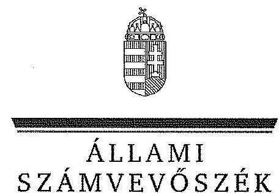
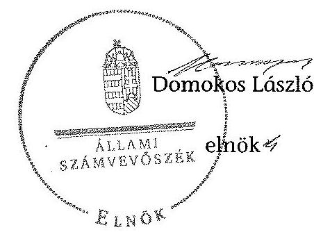
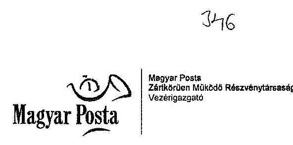
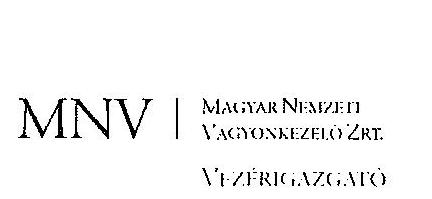

ÁLLAMI
SZÁMVEVŐSZÉK

# JELENTÉS 

a Magyar Posta Zrt. gazdálkodásának ellenőrzéséről szóló
jelentés javaslatai hasznosulásának utóellenőrzéséről

---

# Állami Számvevőszék 

Iktatószám: V-0574-096/2015.
Témaszám: 1608
Vizsgálat-azonosító szám: V0698

## Az ellenőrzést felügyelte:

## Renkó Zsuzsanna

felügyeleti vezető
Az ellenőrzést vezette és az ellenőrzés végrehajtásáért felelős:
Páncsics Judit
ellenőrzésvezető
A jelentés összeállításában közreműködtek:
Baksa Anikó
számvevő főtanácsos
Dr. Mezei Imréné
számvevő főtanácsos
Az ellenőrzést végezték:

| Deák Tamásné | Dr. Dorogi Zsolt Pál | Mandzákné |
| :-- | :-- | :-- |
| számvevő tanácsos | számvevő | Tarnavölgyi Judit |
|  |  | számvevő |

A témához kapcsolódó eddig készített számvevőszéki jelentések:
címe
sorszáma
Jelentés a Magyar Posta Zrt. gazdálkodásának ellenőrzéséről 1124

---

# TARTALOMJEGYZÉK 

BEVEZETÉS ..... 3
I. ÖSSZEGZŐ MEGÁLLAPÍTÁSOK, KÖVETKEZTETÉSEK ..... 7
II. RÉSZLETES MEGÁLLAPÍTÁSOK ..... 8

1. Az intézkedési tervek megküldésének szabályossága ..... 8
2. Az intézkedési tervek teljesítése ..... 9
2.1. A nemzeti fejlesztési miniszter intézkedései ..... 9
2.1.1. A postapiaci liberalizációs stratégiát megfelelően tükröző jogi szabályozás kialakítása ..... 9
2.1.2. Az NFM utasítása az MNV Zrt. felé a Magyar Posta Zrt. vagyonhasznosítási és postapiaci stratégiájának összehangolására, a középtávú üzleti tervek, az eredmények és a beruházások felülvizsgálatára ..... 9
2.2. Az MNV Zrt. intézkedései ..... 10
2.2.1. Az MNV Zrt. kontrolling és előrejelző rendszere információ forrásainak bővítése ..... 10
2.3. A Magyar Posta Zrt. intézkedései ..... 10
2.3.1. A konkurenciához távozó munkavállalókkal kapcsolatos humánpolitikai kockázatok kezelése ..... 11
2.3.2. Az ingatlan- és raktárgazdálkodás stratégiájának kidolgozása ..... 11
2.3.3. A Posta Oktatási Központ új irodaházba költözésével kapcsolatos intézkedések ..... 11
2.3.4. A raktárkapacitások optimalizálására tett intézkedések ..... 12
2.3.5. A POS terminálok beszerzésére és telepítésére kötött szerződések felülvizsgálatával kapcsolatos intézkedések ..... 12

---

# MELLÉKLETEK 

1. számú A Magyar Posta Zrt. vagyonának alakulása a 2011-2013. években
2. számú A Magyar Posta Zrt. vagyoni, pénzügyi és jövedelmezőségi helyzetének alakulása a 2011-2013. évek között
3. számú A nemzeti fejlesztési miniszter intézkedései a postapiaci liberalizációs stratégiát megfelelően tükröző jogi szabályozás kialakítására
4. számú Az MNV Zrt. intézkedési a Magyar Posta Zrt. vagyonhasznosítási és a postapiaci stratégiája összehangolására, középtávú üzleti terveinek, eredményeinek és beruházásainak felülvizsgálatára
5. számú Az MNV Zrt. kontrolling és előrejelző rendszere információ forrásainak bővítésére tett intézkedések
6. számú A Magyar Posta Zrt.-nél a konkurenciához távozó munkavállalókkal kapcsolatos humánpolitikai kockázatok kezelése
7. számú A Magyar Posta Zrt. ingatlan- és raktárgazdálkodási stratégiájának kidolgozása
8. számú A Posta Oktatási Központ új irodaházba költözésével kapcsolatos intézkedések
9. számú A Magyar Posta Zrt. intézkedései a raktárkapacitások optimalizálására
10. számú A Magyar Posta Zrt. intézkedései a POS terminálok beszerzésével és telepítésével kapcsolatos szerződések felülvizsgálatára
11. számú A Magyar Posta Zrt. vezérigazgatójának nemleges észrevétele
12. számú A Magyar Nemzeti Vagyonkezelő Zrt. vezérigazgatójának nemleges észrevétele

## FÜGGELÉKEK

1. számú Értelmező szótár
2. számú Rövidítések jegyzéke

---

# JELENTÉS 

## a Magyar Posta Zrt. gazdálkodásának ellenőrzéséről szóló jelentés javaslatai hasznosulásának utóellenőrzéséről

## BEVEZETÉS

Az Állami Számvevőszék stratégiájában ${ }^{1}$ célként tűzte ki, hogy a számvevőszéki munka eredménye jobban hasznosuljon, nagyobb hatást érjen el. Ennek megvalósításához az ellenőrzések hatásának mérésével és értékelésével, a javaslatok megvalósításával és nyomon követésével, valamint az utóellenőrzések rendszerének célzottabbá tételével kíván hozzájárulni.

Az ÁSZ a Magyar Posta Zrt. gazdálkodásának 2011. évi ellenőrzése keretében értékelte a postaplac liberalizációjának és szabályozási környezetének előkészítettségét, a postai szolgáltatások EU konform korszerűsítését, a tulajdonosi joggyakorló és a menedzsment tevékenységét, a Társaság beruházási és beszerzési kontrolljait, a vagyongazdálkodást, a vagyon megőrzésével és hasznosításával kapcsolatos tevékenységet. Az ellenőrzött időszak a 2008-2010. évekre terjedt ki.

Az ÁSZ a 2011. évben a Magyar Posta Zrt. gazdálkodásának ellenőrzéséről szóló jelentésében a hiányosságok megszüntetése és a jogszabályoknak megfelelő gyakorlat megvalósítása érdekében a számvevőszéki jelentés intézkedést igénylő megállapításai alapján javaslatokat fogalmazott meg a nemzeti fejlesztési miniszternek, valamint az MNV Zrt. és a Magyar Posta Zrt. vezérigazgatóinak. A jelentésben foglalt javaslatok végrehajtására az ÁSZ tv.-ben foglalt kötelezettségüknek megfelelve az érintettek intézkedési tervet nyújtottak be, amelyet az ÁSZ - az NFM hiánypótlását követően - elfogadott. Az intézkedési tervek elfogadásáról szóló válaszlevelekben az ÁSZ tájékoztatta az érintetteket arról, hogy az ÁSZ tv. 33. § (7) bekezdése szerint az intézkedési tervben foglaltak megvalósítását az ÁSZ utóellenőrzés keretében ellenőrizheti. Jelen ellenőrzés az intézkedési tervekben foglaltak megvalósításának utóellenőrzésére irányult.

Az ellenőrzés célja annak megállapítása volt, hogy a Magyar Posta Zrt. gazdálkodásának ellenőrzéséről szóló jelentésben tett javaslatokra kidolgozott és az ÁSZ által elfogadott intézkedési tervekben megfogalmazott feladatokat az ellenőrzéssel érintett szervezetek végrehajtották-e. Ennek keretében ellenőriztük, hogy az ellenőrzött szervezetek vezetői az elfogadott (kiegészített) intézkedési tervekben foglaltak szerint, az abban előírt határidők betartásával intézkedtek-e a részükre meghatározott feladatok végrehajtásáról, illetve, amennyiben

[^0]
[^0]:    ${ }^{1}$ Az ÁSZ Hivatalos Stratégiai Dokumentum Rendszere 2011-2015.

---

elmulasztották a jóváhagyott intézkedési tervekben foglalt feladatok végrehajtását, azt indokolták-e, továbbá a tulajdonosi joggyakorló által előírt feladatok elmulasztása esetén rendelkeztek-e arra vonatkozóan felhatalmazással a tulajdonosi joggyakorló részéről.

Az utóellenőrzés megállapításait a rendelkezésre álló és az ellenőrzött szervezetektől bekért dokumentumok alapozták meg. Az utóellenőrzés kizárólag a korábbi ellenőrzés intézkedést igénylő megállapításaival összefüggésben tett javaslatok hasznosulására, a korábban ellenőrzött területekkel összefüggésben tett intézkedésekre, a jóváhagyott intézkedési tervekben előírt feladatok végrehajtására, az előírt határidők betartására, a feladatok végrehajtásának nyomon követésére, a feladatok végrehajtásának elmaradása esetén annak okaira, dokumentáltságára irányult az ellenőrzési cél megválaszolása érdekében.

Az ellenőrzés várható hasznosulását az alábbi szinteken tervezi az ÁSZ: a jogalkotók számára az ellenőrzés megállapításai visszajelzést adnak a törvényi változás értékeléséhez, segítséget nyújthatnak további intézkedések megtételéhez. A megállapítások az ellenőrzöttek és a döntéshozók, vagyis a tulajdonosi joggyakorlók felé visszajelzést adnak az intézkedések megfelelőségéről és hatásairól. Az utóellenőrzés választ ad arra, hogy az intézkedések megtörténtek-e, illetve az e területen érzékelhető mulasztások feltárásával hozzájárulhat az intézkedési tervekben foglalt feladatok maradéktalan végrehajtásához.

Az ÁSZ intézményén belül lehetőség nyílik arra, hogy az utóellenőrzés megállapításainak visszacsatolása segítse és erősítse az ÁSZ hozzáadott értéket teremtő elemző tevékenységét és tanácsadó szerepét.

Az ellenőrzés típusa: utóellenőrzés keretében végrehajtott szabályszerűségi ellenőrzés.

Az ellenőrzött időszak: az intézkedési tervek elfogadásától az utóellenőrzés megkezdésének napjáig (2014. november 17-ig) tartó időszak.

Az ellenőrzéssel érintett szervezetek: az NFM, az MNV Zrt. és a Magyar Posta Zrt.

Az ellenőrzés jogszabályi alapját az ÁSZ tv. 1. § (3) bekezdése, az 5. § (2), (4) és (6) bekezdései, a 33. § (7) bekezdése, valamint az Áht. 61. § (2) bekezdésének előírásai képezik.

Az ellenőrzés módszertana az ÁSZ hivatalos honlapján (www.asz.hu) közzétett szakmai szabályokon alapul, amely a Legfőbb Ellenőrző Intézmények Nemzetközi Szervezete (INTOSAI) által kiadott nemzetközi standardok (ISSAI) figyelembevételével készült.

Az ellenőrzést az ÁSZ hatályos szervezeti szabályai és az ellenőrzési programban foglalt értékelési szempontok szerint folytattuk le. Megállapításainkat az ellenőrzött szervezetektől bekért dokumentumokra, a kitöltött tanúsítványok elemzésére, az adott időszakban hatályos jogszabályok és belső szabályzatok előírásaira alapoztuk. Az egyes fogalmak magyarázatát és az alkalmazott rövidítéseket az 1-2. számú függelékek tartalmazzák.

---

Az Európai Parlament és a Tanács 2008/6/EK irányelve alapján a magyar postapiacon 2012. december 31-ig kellett az egyetemes postai szolgáltató számára fenntartott kizárólagos szolgáltatási jogokat megszüntetni, és a piacon a versenyt lehetővé tenni. Az irányelv szerint az egyetemes szolgáltatás elvben garantálja, hogy minden munkanapon egy alkalommal megtörténjen a postai küldemények begyűjtése és minden természetes vagy jogi személy otthonába vagy telephelyére való kézbesítése, még a távol eső vagy ritkán lakott területeken is.

Magyarország területén az egyetemes postai szolgáltatások biztosítása - a postai szolgáltatásokat 2013. január 1-jétől szabályozó Postatv. 14. § (1) bekezdése szerint - állami feladat. A Postatv. 18. § (1) bekezdésében az egyetemes postai szolgáltatások ellátására 2020. december 31-ig a Magyar Posta Zrt.-t jelölték ki.

A Postatv. 19. § (1) bekezdése alapján az állam nevében a postaügyekért felelős miniszter az államháztartásért felelős miniszter egyetértésével 2013. április 30-án közszolgáltatási szerződésben állapodott meg az egyetemes postai szolgáltatás és az egyetemes postai szolgáltató egyéb kötelezettségei ellátásának részletes szabályairól.

A Kormány megtárgyalta és jóváhagyta ${ }^{2}$ a Magyar Posta Zrt. 2012. évi tevékenységéről szóló beszámolót, valamint értékelte a 2013. évben megtett intézkedéseket és ezek alapján támogatta a bemutatott stratégiai lépések véghezvitelét. A Kormány tudomásul vette ${ }^{3}$ a Társaság vezetésének a 2013. év első háromnegyed évi tevékenységéről szóló beszámolóját, valamint a végrehajtott stratégiai lépéseket.

A postaügyek a nemzeti fejlesztési miniszter feladat- és hatásköréből 2014. július 18-tól a Miniszterelnökséget vezető miniszter feladat- és hatáskörébe kerültek át a Kormány tagjainak feladat- és hatásköréről szóló 152/2014. (VI. 6.) Korm. rendelet módosításával. A 152/2014. (VI. 6.) Korm. rendelet 136. §-a szerint a más miniszterhez átkerülő feladat- és hatáskör esetében a jogutódlás időpontjának 2014. augusztus 1-jét kell tekinteni.

A Magyar Posta Zrt. 2013 decemberéig 100%-os állami tulajdonban volt. Az Nvtv. 2. számú melléklete I. pontjának rendelkezése alapján 2012. január 1-jétől a Társaság részvényeiből 75%+1 db részvény nemzetgazdasági szempontból kiemelt jelentőségű nemzeti vagyonnak minősül, amelynek állami tulajdonban történő megőrzése hosszú távon indokolt. A Kormány elfogadta ${ }^{4}$ az MNV Zrt. előterjesztését a Magyar Posta Zrt.-ben fennálló, 25%-ot el nem érő (25%-1 szavazatnyi tulajdoni hányadának) kisebbségi részesedésének a Szövetkezeti Hitelintézetek Integrációs Szervezete számára történő értékesítésére. A határozat 3. pontja megállapította, hogy fontos társadalompolitikai célok érhetőek el közvetve az által, ha a kisebbségi részesedést a magyar állam a Szövetkezeti Hitelintézetek Integrációs Szervezete számára, és közvetve ezen keresztül a szövetkezeti hitelintézetek számára értékesíti.

[^0]
[^0]:    ${ }^{2}$ az 1364/2013. (VI. 24.) Korm. határozat tartalmazza
    ${ }^{3}$ az 1749/2013. (X. 24.) Korm. határozat 1. pontjában
    ${ }^{4}$ az 1749/2013. (X. 24.) Korm. határozat 2. pontjában

---

A Magyar Posta Zrt. 2014-2018. évekre szóló új stratégiai terve meghatározó szerepvállalást vetít előre - a Társaság tulajdonosi szerkezetében bekövetkezett változásokkal összhangban - a közvetített pénzügyi szolgáltatások piacán. A hagyományos postai szolgáltatások védelme mellett tervezik a tevékenység diverzifikációját, a belépést a határterületekre és a fokozódó jelenlétet az e-szolgáltatások piacán. Az internetes kereskedelem bővülése a csomag küldemények mennyiségi növekedésével megköveteli a logisztikai szolgáltatások fejlesztését, az alternatív csomagkézbesítési lehetőségeket. A versenyképesség megőrzése, a szolgáltatások minőségének javítása szükségessé teszi a postahelyek informatikai infrastruktúrájának, informatikai hálózatának folyamatos fejlesztését. A stratégiai terv egyik meghatározó pillére, hogy a Magyar Posta Zrt.-nél, mint nyereségesen működő vállalkozásnál a működés racionalizálásával rugalmasabb költséggazdálkodás kerüljön kialakításra.

A Magyar Posta Zrt. könyvviteli mérleg szerinti vagyona a 2011. év végi 145999,1 millió Ft-ról a 2013. év végére 156589,9 millió Ft-ra, 7,3%-kal növekedett.

A Magyar Posta Zrt. a 2013. évi éves beszámolója szerint 189 172,3 millió Ft nettó árbevételt ért el, ami a 2011. évi 194051,1 millió Ft-os nettó árbevételhez képest 2,5%-os csökkenést jelentett. A mérleg szerinti eredmény 2013-ban 1325,6 millió Ft volt, ami 36,4%-kal volt kisebb, mint a 2011.
 évi 2085,0 millió Ft-os eredmény. A Társaság 2012-ben veszteségesen gazdálkodott, a veszteség 3369,5 millió Ft volt. Tulajdonosi döntés alapján a 2011-2013. években osztalékfizetésre nem került sor.

A Magyar Posta Zrt. átlagos statisztikai állományi létszáma a 2011. évi 33996 főről a 2013. évben 32336 főre, 4,9%-kal csökkent.

A Magyar Posta Zrt.-nek a 2013. év végén hat 100%-os tulajdonú, egy 99,99%-os többségi tulajdonában lévő, valamint hat kisebbségi tulajdonában lévő gazdasági társaságban volt közvetlen részesedése. Egy 100%-os tulajdonú Zrt.-jének volt egy 100%-os tulajdonú Kft.-je is.

A Magyar Posta Zrt. vagyonának főbb adatait az 1. számú, a vagyoni, pénzügyi és jövedelmezőségi adatait a 2. számú melléklet mutatja be.

Az ÁSZ tv. 29. § (1) bekezdése szerint a jelentéstervezetet megküldtük a Miniszterelnökséget vezető miniszternek, a Magyar Posta Zrt. és a Magyar Nemzeti Vagyonkezelő Zrt. vezérigazgatóinak, akik az ÁSZ tv. 29. § (2) bekezdésében foglalt észrevételezési jogukkal nem éltek, a jelentéstervezetre észrevételt nem tettek.

---

# I. ÖSSZEGZŐ MEGÁLLAPÍTÁSOK, KÖVETKEZTETÉSEK 

Az ÁSZ utóellenőrzés keretében értékelte a Magyar Posta Zrt. gazdálkodásának ellenőrzéséről szóló jelentés javaslatainak hasznosítására elfogadott intézkedési tervek végrehajtását. Az utóellenőrzés megállapításai alapján az ellenőrzött szervezetek az időszerűvé vált feladatokat maradéktalanul végrehajtották.

A nemzeti fejlesztési miniszter, az MNV Zrt. vezérigazgatója és a Magyar Posta Zrt. vezérigazgatója az ÁSZ 2011. évi jelentésében tett intézkedést igénylő megállapításokra az intézkedési terveket az előírt határidőn belül megküldte. Az ÁSZ az intézkedési terveket felülvizsgálta, az NFM intézkedési tervének formai hiányossága, illetve az egyik feladat határideje miatt észrevételt tett. A nemzeti fejlesztési miniszter határidőn belül pótolta az intézkedési terv formai hiányosságát, a kifogásolt feladat határidejét azonban indoklással fenntartotta. Az ÁSZ az NFM, az MNV Zrt. és a Magyar Posta Zrt. intézkedési tervét elfogadta. Az intézkedési tervekben előírt 11 feladatból az ellenőrzött szervezetek az utóellenőrzés megkezdéséig tízet végrehajtottak, egy feladat pedig okafogyottá vált.

A nemzeti fejlesztési miniszter intézkedési tervében meghatározott három feladat - a postapiac liberalizációjához szükséges törvényjavaslat tervezet Országgyűlésnek történő benyújtása, illetve a Kormány- és miniszteri rendeletek kihirdetése, valamint az MNV Zrt. utasítása a Magyar Posta Zrt. vagyonhasznosítási és postapiaci stratégiája összehangolására, középtávú üzleti tervének, eredményeinek és beruházásainak felülvizsgálatára - az utóellenőrzéssel érintett időszakban teljesült.

Az MNV Zrt. intézkedési tervében rögzített két feladat közül az állami tulajdonú társaságokra vonatkozó kontrolling és előrejelző rendszer információ forrásainak bővítése már 2011-ben, az intézkedési terv megküldését megelőzően megvalósult, a korai riasztási rendszer területeinek és riasztási fokozatainak felülvizsgálata az intézkedési tervben foglaltak szerint teljesült.

A Magyar Posta Zrt. intézkedési tervében meghatározott hat feladatból öt valósult meg, egy feladat okafogyottá vált. Intézkedtek a konkurenciához távozó munkavállalókkal kapcsolatos humánpolitikai kockázatok kezelése lehetőségének vizsgálata, valamint a kockázatok mérséklése érdekében. Az ingatlan- és raktárgazdálkodási stratégia kidolgozása, a raktárkapacitások optimalizálásához az időszakos és az eseti raktárkapacitás-kihasználtság vizsgálata és értékelése, a POS terminálok beruházása során a vállalkozóval szemben érvényesített kötbér és kárigény felülvizsgálata és a felelősségi kör meghatározása szintén teljesült.

A Magyar Posta Zrt. a POK új irodaházba költöztetésével kapcsolatban kimutatott 72 millió Ft többletköltséggel összefüggésben bűncselekmény gyanúja miatt 2011-ben feljelentést tett. A nyomozást a BRFK folytatta le, melyet bűncselekmény hiányában, 2013. áprilisában megszüntetett. Az ügyben - tekintettel a nyomozati eljárás eredményére - a felelősség megállapítása és további intézkedések megtétele okafogyottá vált.

---

# II. RÉSZLETES MEGÁLLAPÍTÁSOK 

## 1. AZ INTÉZKEDÉSI TERVEK MEGKÜLDÉSÉNEK SZABÁLYOSSÁGA

Az ÁSZ a Magyar Posta Zrt. gazdálkodásának ellenőrzéséről szóló 1124 számú számvevőszéki jelentést és az intézkedési terv készítésére felhívó elnöki levelet 2011. december 2-án postázta az NFM-nek, az MNV Zrt.-nek és a Magyar Posta Zrt.-nek.

Az ÁSZ a nemzeti fejlesztési miniszter intézkedési tervét - a miniszter személyében bekövetkezett változást figyelembe véve - határidőn belül teljesítettnek minősítette.

Az NFM esetében az intézkedési terv megküldésére vonatkozó - ÁSZ tv.-ben előírt - határidő számításánál figyelembe kellett venni azt a tényt, hogy a nemzeti fejlesztési miniszter személyében 2011. decemberében változás történt, a miniszter jogviszonya december 14-ével megszűnt, az új miniszter pedig csak december 23-ával lépett hivatalba.

Az ÁSZ a nemzeti fejlesztési miniszter által megküldött intézkedési tervet felülvizsgálta és megállapította az intézkedési terv formai hiányosságát. Az ÁSZ kérte az intézkedési terv 1. b) pontjában megjelölt kormányrendeletek és miniszteri rendeletek kihirdetésére megadott, 2012. október 30-i határidő felülvizsgálatát is. A nemzeti fejlesztési miniszter a kiegészített intézkedési tervet határidőben megküldte, a jogszabályok kihirdetésére megjelölt határidőt azonban részletes indoklás mellett fenntartotta. Az ÁSZ az intézkedési tervet 2012. április 4-én elfogadta.

Az MNV Zrt. vezérigazgatója által határidőben megküldött - a 2/2012. (I. 4.) Vig. számú határozattal kiadott - intézkedési tervet az ÁSZ 2012. február 14-én elfogadta.

A Magyar Posta Zrt. vezérigazgatója az intézkedési tervet határidőben küldte meg az ÁSZ részére. Az intézkedési tervet az ÁSZ 2012. február 14-én elfogadta azzal a megjegyzéssel, hogy amennyiben nem jelölnek ki az egyes feladatokhoz felelősöket, úgy az ÁSZ a Magyar Posta Zrt. vezérigazgatóját tekinti a feladatok végrehajtásáért felelősnek. Válaszként megküldték a felelősökre vonatkozó kiegészítő információkat, amelyet az ÁSZ 2012. április 4-én elfogadott.

---

# 2. Az intézkedési tervek teljesítése 

### 2.1. A nemzeti fejlesztési miniszter intézkedései

### 2.1.1. A postapiaci liberalizációs stratégiát megfelelően tükröző jogi szabályozás kialakítása

Az intézkedési terv előírta, hogy kerüljön kialakításra a liberalizációs stratégiát megfelelően tükröző törvényi, és amennyiben szükséges Kormány, illetve miniszteri rendeleti szintű szabályozás az uniós határidőnek megfelelően, figyelembe véve az érintett állami és piaci szereplők felkészüléséhez szükséges időt.

A nemzeti fejlesztési miniszter 2012. szeptember 21-én benyújtotta az Országgyűlésnek a postai szolgáltatásokról szóló törvényjavaslat tervezetét. Az NFM-ben a jogalkotási folyamatot dokumentálták, a folyamat nyomon követhetőségéről gondoskodtak. A liberalizációs stratégiát tükröző törvényi szabályozás az uniós előírásoknak megfelelt.

Az NFM jogszabály előkészítő, illetve ahhoz kapcsolódó államigazgatási egyeztetést koordináló tevékenysége eredményeként a kormányrendeletek, illetve a nemzeti fejlesztési miniszter által kiadott rendeletek kihirdetése 2012. decemberében valósult meg.

Az intézkedési terv 1. a) és 1. b) pontjainak végrehajtását a 3. számú melléklet mutatja be.

### 2.1.2. Az NFM utasítása az MNV Zrt. felé a Magyar Posta Zrt. vagyonhasznosítási és postapiaci stratégiájának összehangolására, a középtávú üzleti tervek, az eredmények és a beruházások felülvizsgálatára

A nemzeti fejlesztési miniszter az intézkedési tervének 2. pontjában előírta, hogy kerüljön feladatként meghatározásra az MNV Zrt. felé a Magyar Posta Zrt. vagyonhasznosítási és a postapiaci stratégiájának összehangolása, a jövőképének meghatározása, a liberalizációs felkészülés nyomon követése, a középtávú üzleti tervek, az eredmények és a beruházások felülvizsgálata.

Az NFM helyettes államtitkára a fenti feladat végrehajtására 2012. november 27-én kelt levelében intézkedett, az MNV. Zrt. részére előírt feladat végrehajtására 30 napot állapított meg.

Az MNV Zrt. vezérigazgatója - az NFM utasítására - gondoskodott a Magyar Posta Zrt. vagyonhasznosítási és postapiaci stratégiája összehangolásáról, stratégiai jövőképének meghatározásáról, a liberalizációs felkészülés nyomon követéséről és a középtávú üzleti terveinek, eredményeinek és beruházásainak felülvizsgálatáról.

Az MNV. Zrt. által végrehajtott intézkedéseket részletesen a 4. számú melléklet tartalmazza.

---

# 2.2. Az MNV Zrt. intézkedései 

### 2.2.1. Az MNV Zrt. kontrolling és előrejelző rendszere információ forrásainak bővítése

Az MNV Zrt. elfogadott intézkedési terve két feladatot határozott meg az ÁSZ javaslatának hasznosítására. Az intézkedési terv 1. pontja szerint az MNV Zrt. kontrolling és előrejelző rendszere információ forrásainak felülvizsgálatára már 2011. évben sor került. Ennek eredményeként a társaságoktól bekért adatok köre a gazdálkodási kockázatok megfigyelésére kibővült, ezért az MNV Zrt. a javaslatra újabb intézkedést nem tartott szükségesnek. Az MNV Zrt. az intézkedési terve megküldésekor részletesen dokumentálta a már 2011-ben megtett intézkedéseket. Az ÁSZ az intézkedési terv 1. pontját a feladat teljesítésére tekintettel elfogadta.

Az ÁSZ utóellenőrzése megállapította, hogy 2011. júniusától az MNV Zrt. kontrolling és előrejelző rendszerében az alkalmazott adatok körének bővülését az adat-kategóriák számának növekedése alátámasztotta. A kontrolling és előrejelző rendszerben a társasági portfólióba tartozó gazdasági társaságok esetében az alkalmazott adatkategóriák száma a korábbi 4-ről 6-ra emelkedett.

Az MNV Zrt. vezérigazgatója az intézkedési terv 2. pontjában a tulajdonosi beavatkozás hatékonyságának növelése érdekében - 2012. március 31-i határidővel és a felelősök megjelölésével - elrendelte, hogy az MNV Zrt.-nél működő korai előrejelző rendszer riasztási területei és riasztási fokozatai felülvizsgálatra kerüljenek. A felülvizsgált rendszer éles üzeme 2012. március 31-ével megkezdődött.

Az átalakított, kibővített kontrolling és előrejelző rendszerben - a társasági portfólióba tartozó kiemelt gazdasági társaságként kezelt - Magyar Posta Zrt. gazdálkodási kockázatainak jelzéséhez a rendszeresen kért adatok száma a korábbi 4-ről 8-ra emelkedett. Az egyes adatkategóriákat az eredménykimutatás, az eredménykimutatás eltérés magyarázata, a mérlegadatok, a vevő-szállítók korosítása, a befejezetlen beruházások, az éves beruházási kerettadatok, a kereseti adatok és a részesedések képezték, amelyek elegendő és hasznos információkat nyújtanak.

A megtett intézkedéseket részletesen az 5. számú melléklet tartalmazza.

### 2.3. A Magyar Posta Zrt. intézkedései

Az ÁSZ által elfogadott intézkedési tervben rögzített hat feladat határidejét a Társaságnál figyelemmel kísérték, a felelősök határidő módosítást kezdeményeztek, amelyet a vezérigazgató 2012. júliusában jóváhagyott. A Magyar Posta Zrt. a határidők módosításáról és az intézkedési terv teljesítéséről 2012. októberében beszámolt az ÁSZ-nak. Az ÁSZ az utóellenőrzés során a feladatok teljesítését az általa jóváhagyott intézkedési tervben foglaltak szerint értékelte, az ellenőrzött utólagos határidő módosítását nem vette figyelembe.

---

# 2.3.1. A konkurenciához távozó munkavállalókkal kapcsolatos humánpolitikai kockázatok kezelése 

Az intézkedési tervben 2012. február 15-i határidővel határozták meg a konkurenciához távozó munkavállalókkal kapcsolatos humánpolitikai kockázatok kezelése lehetőségének vizsgálatát. A kockázatok mérséklésére kidolgozott módszerek, eszközök bevezetését 2012. február 28-i határidővel tervezték.

A Magyar Posta Zrt.-nél az intézkedési tervben meghatározott feladatok végrehajtása az utóellenőrzés megkezdéséig megvalósult. A humánpolitikai kockázatok kezelése lehetőségének vizsgálatát 2012. március 23-ával végezték el egy kockázatkezelésre, mérséklésre vonatkozó javaslat összeállításával. A kockázatok mérséklése érdekében végrehajtandó feladatokra a részletes belső intézkedési tervet 2012. március 23-án hagyták jóvá.

A kockázatok mérséklésére, kezelésére szabályozott kereteket biztosítottak a Kulcsember Program kidolgozásával és megvalósításával, a Foglalkoztatási Szabályzatban előírt exit interjúk alkalmazásával, valamint az Integrált Vállalati Kockázatkezelési folyamat működéséről szóló vezérigazgatói utasításban meghatározott kockázati jelentések készítésével. A megtett intézkedéseket részletesen a 6. számú melléklet tartalmazza.

### 2.3.2. Az ingatlan- és raktárgazdálkodás stratégiájának kidolgozása

A Magyar Posta Zrt. intézkedési tervében 2012. június 30-i határidővel előírta az ingatlanértékesítési, illetve raktárbérleti veszteségek elkerülése érdekében az ingatlan- és raktárgazdálkodás stratégiájának kidolgozását. A feladat 2012. október 17-vel teljesült, amikor a 2012-2022. évekre vonatkozó stratégia függelékeként elfogadták az Ingatlan funkcionális részstratégiát.

Az Ingatlan funkcionális részstratégia tartalmazta az ingatlangazdálkodás alapvető célkitűzéseit és alapelveit, az ingatlanállomány bemutatását, az ingatlanok hasznosítási alternatíváit. Rögzítették benne a teljes mértékben kihasználatlan ingatlanok MNV Zrt. részére történő átadása egyeztetésének megkezdésére irányuló javaslatot. A kialakított elvek hozzájárultak az ingatlan értékesítésekből eredő veszteségek elkerüléséhez. Az ingatlan
 stratégia a raktárgazdálkodással kapcsolatban tartalmazta a szabad raktárkapacitások felmérésének szükségességét, a raktározási feladatok optimalizálását és ebből adódóan a feleslegessé váló raktárbérlet felmondását.

Az ingatlan- és raktárgazdálkodás stratégiájának kidolgozását, valamint az ingatlanértékesítésekkel és a raktárkapacitások optimalizálásával kapcsolatos intézkedéseket részletesen a 7. számú melléklet tartalmazza.

### 2.3.3. A Posta Oktatási Központ új irodaházba költözésével kapcsolatos intézkedések

Az intézkedési terv 2012. június 30-i határidővel írta elő a POK új irodaházba költözésével kapcsolatban kimutatott 72 millió Ft többletköltséggel összefüggésben a szükséges eljárás lefolytatását és a felelősség megállapítását.

---

A Magyar Posta Zrt. vezérigazgatója 2011. július 7-én a POK költözésével kapcsolatban feljelentést tett különösen nagy vagyoni hátrányt okozó hűtlen kezelés bűntett gyanúja miatt. A BRFK Gazdaságvédelmi Főosztálya a 2013. április 22-én kelt határozatával a nyomozást bűncselekmény hiányában megszüntette. Az ügyben - tekintettel a nyomozati eljárás eredményére - a felelősség megállapítása és további intézkedések megtétele okafogyottá vált.

A részletes információkat a 8. számú melléklet tartalmazza.

# 2.3.4. A raktárkapacitások optimalizálására tett intézkedések 

A Magyar Posta Zrt. intézkedési terve a raktárkapacitások optimalizálása érdekében időszakos és eseti raktárkapacitás-kihasználtsági vizsgálatot és értékelést rögzített 2012. június 30-i határidő megjelölésével.

A feladat teljesítéseként a 2012. októberében jóváhagyott Ingatlan funkcionális részstratégia tartalmazta a szabad raktárkapacitások felmérésének szükségességét, a raktározási feladatok optimalizálását és ebből adódóan a feleslegessé váló raktárbérlet felmondását. A Magyar Posta Zrt. 2011-2012. évi szervezetfejlesztési programjáról szóló tájékoztató, valamint a raktár racionalizálás ütemterve 2012. augusztusában elkészült, amelyek alapján a szervezeten belül központosításra került a raktár- és készletgazdálkodás. A raktárak kihasználtságának folyamatos figyelemmel kísérése informatikai rendszerekkel (SAP, WBS) támogatott, a raktárkapacitások kihasználtságának változását havi kimutatások alapján értékelik.

Az intézkedéseket részletesen a 9. számú melléklet tartalmazza.

### 2.3.5. A POS terminálok beszerzésére és telepítésére kötött szerződések felülvizsgálatával kapcsolatos intézkedések

A Magyar Posta Zrt. intézkedési terve a POS terminálok beruházásával összefüggésben korábban lefolytatott vizsgálatnak a további részletekre irányuló felülvizsgálatát, a tapasztalatok elemzését, a felelősségi körök behatárolását, a kötbér és kárigény érvényesíthetőségének vizsgálatát, megalapozott feltételek tükrében a jogi eljárás megindítását írta elő.

A belső ellenőrzés az intézkedési tervben meghatározott határidőt megelőzően megkezdte a POS terminálok beruházása során a vállalkozóval szemben érvényesített kötbér és kárigény, valamint a felelősség megállapításának a felülvizsgálatát. Az ellenőrzést három hónapos megszakítással 2012. szeptemberében fejezték be.

---

A Magyar Posta Zrt. - a Jogi Igazgatóságának véleménye alapján - személyes felelősségre vonást a POS terminálok telepítésével összefüggésben nem alkalmazott, mivel a belső ellenőrzési jelentés nem tárt fel olyan adatot, amely azt megalapozta volna. A belső ellenőri jelentést a vezérigazgató elfogadta.

Az intézkedéseket részletesen a 10. számú melléklet tartalmazza.
Budapest, 2015. 04. hónap 17. nap

Melléklet: $\quad 12 \mathrm{db}$
Függelék: $\quad 2 \mathrm{db}$

---

.

---

A Magyar Posta Zrt. vagyonának alakulása a 2011-2013. években

|  Megnevezés | 2011. év
(millió Ft) | 2012. év
(millió Ft) | 2013. év
(millió Ft) | Változás %-ban
2013. év/2011. év  |
| --- | --- | --- | --- | --- |
|  Immateriális javak | 4129,4 | 5824,2 | 6491,9 | 157,2  |
|  Tárgyi eszközök | 78446,3 | 79744,5 | 80639,8 | 102,8  |
|  Ebből: ingatlanok és a kapcsolódó vagyonértékű jogok | 37117,3 | 37561,9 | 37816,1 | 101,9  |
|  tárgyi eszközök értékhelyesbítése | 26101,7 | 26938,8 | 28412,0 | 108,9  |
|  Befektetett pénzügyi eszközök | 6625,7 | 7993,2 | 16626,8 | 250,9  |
|  Befektetett eszközök összesen | 89201,4 | 93561,9 | 103758,5 | 116,3  |
|  Forgóeszközök | 55105,5 | 64316,5 | 51598,1 | 93,6  |
|  Aktív időbeli elhatárolások | 1692,2 | 1356,8 | 1233,3 | 72,9  |
|  Eszközök összesen | 145999,1 | 159235,2 | 156589,9 | 107,3  |
|  Saját tőke | 76478,2 | 73945,8 | 76713,3 | 100,3  |
|  Céltartalékok | 7581,6 | 14209,7 | 15341,7 | 202,3  |
|  Kötelezettségek | 52698,2 | 59842,4 | 50649,5 | 96,1  |
|  Ebből: hosszú lejáratú kötelezettség | 391,3 | 356,9 | 308,8 | 78,9  |
|  Passzív időbeli elhatárolások | 9241,1 | 11237,3 | 13885,4 | 150,3  |
|  Források összesen | 145999,1 | 159235,2 | 156589,9 | 107,3  |

Forrás: Magyar Posta Zrt. 2011-2013. évi éves beszámolója

---

# A Magyar Posta Zrt. vagyoni, pénzügyi és jövedelmezőségi helyzetének alakulása a 2011-2013. évek között

|  Mutató megnevezése | Mutató számítási módja | 2011. év (\%-ban) | 2012. év (\%-ban) | 2013. év (\%-ban) | Változás
\%-ban
2013. év
/2011. év  |
| --- | --- | --- | --- | --- | --- |
|  Saját tőke részaránya | Saját tőke/mérleg főösszeg | 52,38 | 46,44 | 48,99 | 93,53  |
|  Befektetett eszközök fedezettsége | Saját tőke/befektetett eszközök | 85,74 | 79,03 | 73,93 | 86,23  |
|  Eladósodottság | Kötelezettségek/saját tőke | 68,91 | 80,93 | 66,02 | 95,80  |
|  Likviditási ráta | Forgóeszközök/rövid lejáratú kötelezettségek | 105,35 | 108,12 | 102,50 | 97,29  |
|  Likviditási gyorsráta I. | Pénzállomány+vevők/rövid lejáratú kötelezettségek | 94,33 | 96,06 | 69,60 | 73,78  |
|  Likviditási gyorsráta II. | Pénzállomány+követelések /rövid lejáratú kötelezettségek | 99,91 | 102,71 | 91,11 | 91,19  |
|  Bevétel arányos üzleti eredmény | Üzleti eredmény/nettó árbevétel+egyéb bevétel | 1,40 | -1,22 | 0,21 | 15,00  |
|  Saját tőke arányos mérleg szerinti eredmény | Mérleg szerinti eredmény/átlagos saját tőke | 2,79 | -4,48 | 1,76 | 63,08  |
|  Eszköz arányos árbevétel | Nettó árbevétel/átlagos eszközállomány | 142,83 | 126,43 | 119,8 | 83,88  |
|  Eszköz arányos adózás előtti eredmény | Adózás előtti eredmény/átlagos eszközállomány | 2,70 | -1,19 | 1,22 | 45,19  |

Forrás: Magyar Posta Zrt. 2011-2013. évi éves beszámolója

---

# A nemzeti fejlesztési miniszter intézkedései a postapiaci liberalizációs stratégiát megfelelően tükröző jogi szabályozás kialakítására 

A 2011. évi ÁSZ jelentés megállapítása szerint a 2013. január 1-jei teljes postapiaci liberalizáció előtt még nem állt rendelkezésre a postapiaci stratégia és annak érvényesítését biztosító, a versenykorlátozást kizáró szabályozási rendszer, ami hátráltathatja az érintett szereplők hatékony felkészülését a szabad versenyre.

| Az NFM intézkedési tervében meghatározott 1. a) és 1. b) számú feladatok: |  |  |
| :-- | :-- | :-- |
| feladat | A liberalizációs stratégiát megfelelően tükröző törvényi szabályozás álljon rendelkezésre az uniós határidőnek megfelelően és egyúttal figyelembe véve az érintett állami és piaci szereplők felkészüléséhez szükséges időt. | Amennyiben szükség van Kormány, illetve miniszteri rendelet szintű szabályozásra is, a vonatkozó rendeletek kihirdetésére 2012. október 30-ig kerüljön sor. |
| felelős | helyettes államtitkár | helyettes államtitkár |
| határidő | 2012. június 30. | 2012. október 30. |

A nemzeti fejlesztési miniszter az intézkedési terve 1. a) pontjában rögzített 2012. június 30-ai határidő helyett 2012. szeptember 21-én nyújtotta be az Országgyűlés részére a postai szolgáltatásokról szóló törvényjavaslat tervezetét T/8483 iromány számon.

A jogalkotási folyamat a következők szerint teljesült:
Az NFM által elkészített Postatv. tervezetet - az Országgyűlés részére történő benyújtást megelőzően - a Közigazgatási Államtitkári Értekezlet a 2012. szeptember 13-ai ülésén tárgyalta. A Kormány a törvénytervezet szövegét a 2012. szeptember 19-i ülésén fogadta el, majd a nemzeti fejlesztési miniszter az Országgyűlés elé terjesztette. Az Országgyűlés illetékes bizottságai a törvényjavaslatot megtárgyalták. A Postatv. 2012. október 29-én került elfogadásra, melyet 2012. november 9-én hirdettek ki.

A Postatv. 76. § (2)-(3) bekezdéseiben meghatározott kivételekkel a törvény 2013. január 1-jén lépett hatályba. A Postatv. 76. § (2) bekezdése szerint a 21. § (2)-(4) bekezdései, a 22. §, a 23. § és a 29. § (2) bekezdése az Európai Bizottság jóváhagyó határozatának meghozatalát követő 15. napon lép hatályba. A hivatkozott paragrafusok az egyetemes postai szolgáltatás nyújtásával összefüggő, méltánytalan többletterhek meghatározására és annak költségvetési finanszírozására vonatkoznak. A rendelkezések 2015. januárjában még nem hatályosak.

A nemzeti fejlesztési miniszter a liberalizációs stratégiát tükröző törvényi szabályozásról az uniós előírásoknak megfelelően gondoskodott.

---

Az NFM jogszabály előkészítő, illetve ahhoz kapcsolódó államigazgatási egyeztetést koordináló feladatellátása eredményeként a kormányrendeletek, illetve a nemzeti fejlesztési miniszter által kiadott rendeletek kihirdetésére 2012. decemberében sor került. Az intézkedési terv 1. b) pontjában szereplő feladat végrehajtási határideje 2012. október 30. volt.

- A Kormány a Postatv. 78. § (1) bekezdés a), b) és c) pontjaiban kapott felhatalmazás alapján, a 335/2012. (XII. 4.) számú Korm. rendeletben szabályozta a postai szolgáltatások nyújtásának és a hivatalos iratokkal kapcsolatos szolgáltatás részletes szabályait; a postai szolgáltatók általános szerződési feltételeinek kötelező tartalmi elemeit és a postai szolgáltatásból kizárt, vagy feltételesen szállítható küldemények körét. A Kormány a Postatv. 78. § (1) bekezdés d) pontjában kapott felhatalmazás alapján a 336/2012. (XII. 4.) számú rendelettel szabályozta az Egyetemes Postai Szolgáltatást Támogató Számla működtetésének részletes szabályait és bevételeinek számítási módját. (A 336/2012. (XII. 4.) számú Korm. rendelet a Postatv. 22. §, 23. § és 29. §-ai hatálybalépésekor lép hatályba.)

Az NFM Hírközlés Koordinációs és Postapiac Fejlesztési Osztály vezetője 2012. szeptember 24-én küldte meg belső egyeztetésre a kormányrendeletek tervezetét 2012. október 1-jei észrevételezési határidővel. Az NFM Infokommunikációs Szervezési Főosztály vezetője az NFM Jogi Főosztály vezetőjénél írásban kezdeményezte az előterjesztés-tervezetek megküldését a KIM-hez előzetes szakmai egyeztetésre. Az észrevételezésre 2012. október 26-i határidőt állapítottak meg. A KIM a saját észrevételei megtétele mellett a kormányrendelet-tervezeteket közigazgatási egyeztetésre bocsáthatónak minősítette. Az NFM Jogi Főosztálya 2012. október 31-én küldte meg a kormányelőterjesztés-tervezetet közigazgatási egyeztetésre. Az NFM Infokommunikációs Szervezési Főosztálya az észrevételek átvezetését követően, 2012. november 16-án kezdeményezte a rendelettervezetek Közigazgatási Államtitkári Értekezletre történő benyújtását.

A Kormány a Postatv. 78. § (1) bekezdés e) pontjában kapott felhatalmazás alapján a postai szolgáltatások különleges jogrend időszaki felkészítésének rendszerét, feladatait, működési feltételeit a 103/2014. (III. 25.) Korm. rendelettel szabályozta.

- A nemzeti fejlesztési miniszter a Postatv. 78. § (2) bekezdés b) és c) pontjaiban kapott felhatalmazás alapján a 69/2012. (XII. 19.) NFM rendeletben állapította meg a postai szolgáltatások számviteli nyilvántartásai elkülönített vezetésének részletes szabályait és az egyetemes postai szolgáltatások költségszámítására és az egyetemes postai szolgáltatási kötelezettség nettó költsége számítására vonatkozó elveket és szabályokat. (A rendelet 6-9. §-a és a 6. számú melléklete a Postatv. 22. § és 23. §-ai hatálybalépésekor lép hatályba.) A Postatv. 78. § (2)
 bekezdés d) pontjában kapott felhatalmazás alapján a 68/2012. (XII. 19.) NFM rendeletben határozták meg az engedélyköteles szolgáltatások nyújtására vonatkozó szolgáltatási engedély megadásához szükséges vagyoni biztosíték mértékét és szabályait.
- A nemzeti fejlesztési miniszter a Postatv. 78. § (3) bekezdés a) pontjában foglaltaknak megfelelően a nemzetgazdasági miniszterrel egyetértésben a 67/2012. (XII. 15.) NFM rendeletben szabályozta az egyetemes postai szolgáltatás keretében küldeményenkénti díjszabás szerint feladott, 50 grammot

meg nem haladó tömegű, belföldi levélküldemények, valamint a hivatalos iratokra vonatkozó belföldi postai szolgáltatás díjának meghatározási módszerét.

Az NFM Infokommunikációs Szervezési Főosztálya a Jogi Főosztályon keresztül 2012. november 14-én kezdeményezte a három miniszteri rendelettervezet közigazgatási egyeztetését. A rendelettervezetek közigazgatási és társadalmi egyeztetése 2012. december 7-én zárult le. Az NFM-nél a rendeletek kihirdetéséhez szükséges KIM engedély megkérését, illetve a 67/2012. (XII. 15.) NFM rendelettervezet esetében a nemzetgazdasági miniszterrel történő egyeztetést 2012. december 10-én kezdeményezték. A nemzetgazdasági miniszter 2012. december 12-én, a KIM 2012. december 13-án adta ki a rendelettervezetek szövegére az egyetértő nyilatkozatát. Az NFM Jogi Főosztálya 2012. december 14-én küldte meg az NFM Infokommunikációs Szervezeti Főosztálya részére a nemzeti fejlesztési miniszter által aláirt rendeleteket kihirdetés céljából.

# Az MNV Zrt. intézkedései a Magyar Posta Zrt. vagyonhasznosítási és a postapiaci stratégiája összehangolására, középtávú üzleti terveinek, eredményeinek és beruházásainak felülvizsgálatára 

A 2011. évi ÁSZ jelentés megállapítása szerint a Magyar Posta Zrt.-nél nem volt biztosított a vagyonhasznosítási koncepció és a postapiaci stratégia összehangolása, a stratégiai jövőkép meghatározása, a liberalizációs felkészülés nyomon követése és mindezek alapján a Magyar Posta Zrt. középtávú üzleti terveinek, eredményeinek és beruházásainak felülvizsgálata.

| Az NFM intézkedési tervében meghatározott 2. számú feladat: |  |
| :--: | :--: |
| feladat | Az MNV Zrt., mint a Magyar Posta Zrt. feletti tulajdonosi jogokat gyakorló szervezet részére feladatként kerüljön meghatározásra az ÁSZ által az NFM minisztere részére megfogalmazott következő javaslat végrehajtása: „Intézkedjen a vagyonhasznosítási és a postapiaci stratégia összehangolásáról, a Magyar Posta Zrt. stratégiai jövőképének meghatározásáról, liberalizációs felkészülésének nyomon követéséről és mindezek alapján a Magyar Posta Zrt. középtávú üzleti terveinek, eredményeinek és beruházásainak felülvizsgálatáról.", melynek határidejeként a Postatv. kihirdetését követő 30 napot szükséges meghatározni. |
| felelős | vagyongazdálkodásért felelős helyettes államtitkár |
| határidő | Postatv. tervezetének az Országgyűléshez történő benyújtását követően, azonnal |

Az NFM vagyongazdálkodásért felelős helyettes államtitkára 2012. november 27-én kérte az MNV Zrt. vezérigazgatójától a Magyar Posta Zrt. vagyonhasznosítási és postapiaci stratégiájának összehangolását, a Társaság stratégiai jövőképének meghatározását, a liberalizációs felkészülések nyomon követését, valamint a középtávú üzleti terveinek, eredményeinek és beruházásainak a felülvizsgálatát.

Az NFM Infokommunikációs Szervezési Főosztály vezetője 2012. november 22-én tájékoztatta a Vagyongazdálkodási Főosztályt az intézkedési terv tartalmáról és a Postatv. 2012. november 9-i kihirdetéséről, amely alapján az NFM vagyongazdálkodásért felelős helyettes államtitkára az intézkedést megtette.

Az NFM helyettes államtitkára az utasításában 30 napon belüli intézkedési, továbbá beszámolási kötelezettséget írt elő az MNV Zrt.-nek a feladatok végrehajtására.

Az MNV Zrt. 2012. december 7-én tájékoztatta az NFM vagyongazdálkodásért felelős helyettes államtitkárát arról, hogy a vagyonhasznosítási és a postapiaci stratégia összehangolása érdekében a Postatv. kidolgozásával párhuzamosan

felülvizsgálták a Magyar Posta Zrt. stratégiai keretrendszerét ${ }^{1}$, meghatározták a Társaság küldetését és jövőképét, valamint kidolgozták az egyes területekre szóló részstratégiákat is. Az MNV Zrt. Igazgatósága a 615/2012. (XI. 26.) IG. számú határozattal, majd a 462/2012. (XI. 26.) számú alapító határozatával elfogadta.

Az MNV Zrt. Igazgatósága a Magyar Posta Zrt. 2012-2022. évekre szóló, felülvizsgált stratégiai tervének végrehajtásáról szóló tájékoztatót az 537/2013. (X. 21.) számú határozattal elfogadta. Az MNV Zrt. Igazgatósága a 776/2013. (X. 21.) számú alapítói határozatának V. pontjában a Magyar Posta Zrt. stratégiai tervének felülvizsgálatáról és átdolgozásáról döntött 2013. december 31-i határidő és felelős (a Társaság menedzsmentjének) megjelölésével, melyhez egyidejűleg meghatározta a kritériumokat is.

A Társaságnak a meglévő 2012-2022. évekre szóló stratégiai tervét a külső piaci környezet változásai miatt korrigálnia, valamint 1-3-5 éves periódusokra kellett bontania. Az MNV Zrt. az egyes stratégiai részterületek részletesebb kidolgozását is kérte.

A liberalizációs felkészülés nyomon követése érdekében az MNV Zrt. Igazgatósága az 50/2011. (II. 21.) IG. számú határozattal előírta a Magyar Posta Zrt. menedzsmentjének a féléves gyakorisággal történő tájékoztatási kötelezettséget a liberalizációs felkészülés aktuális helyzetéről és a stratégiai programokhoz kötődő fejlesztési akcióterv megvalósulásáról, a kiemelt jelentőségű projektek előrehaladásáról.

Az MNV Zrt. Igazgatósága a 30/2012. (II. 6.) számú és a 348/2012. (VIII. 27.) számú alapítói határozataiban tudomásul vette a Társaság liberalizációs felkészülésének aktuális helyzetéről és a stratégiai programhoz kötődő fejlesztési akcióterv megvalósulásáról adott tájékoztatását.

Az MNV Zrt. Igazgatósága rendszeresen megtárgyalta és elfogadta a Magyar Posta Zrt. üzleti terveit, valamint az éves konszolidált és az éves egyedi beszámolóit.

Az MNV Zrt. Igazgatósága a 959/2013. (XII. 16.) IG. számú határozattal, majd a Közgyűlés a 7/2013. (XII. 20.) számú határozattal elfogadta a Magyar Posta Zrt. Alapszabályának módosítását.

A Közgyűlés módosította a Társaság Alapszabályának 8.11. pontját, amellyel a Felügyelő Bizottság hatásköre a lényeges üzletpolitikai kérdésekre és a Magyar Posta Zrt. éves beszámolójának vizsgálatára szűkült. A Magyar Posta Zrt. Felügyelő Bizottsága a 2014. január 20-i ülésén a 2014. évi üzleti tervet, a 2014. február 10-i ülésén a 2014-2018. évekre vonatkozó stratégiai tervet tárgyalta és a Közgyűlésnek jóváhagyásra javasolta.

[^0]
[^0]:    ${ }^{1}$ Az MNV Zrt. Igazgatósága a 36/2011. (II. 21.) számú alapítói határozatában hagyta jóvá a Magyar Posta Zrt. 2011-2015. évekre szóló stratégiai keretrendszerét.

A Közgyűlés a 2014-2018. évekre vonatkozó stratégiai terv benyújtási határidejét ${ }^{2}$ 2014. január 31-én határozta meg. Az MNV Zrt. Igazgatósága ${ }^{3}$ a 2014-2018. évekre szóló stratégiai tervet elfogadásra javasolta. A Közgyűlés a 9/2014. (IV. 17.) számú közgyűlési határozattal elfogadta és előírta, hogy a Magyar Posta Zrt. Igazgatósága a stratégiai tervben foglaltak megvalósításáról, a Társaság ügyvezetéséről, a vagyoni helyzetről és az üzletpolitikáról évente számoljon be.

[^0]
[^0]:    ${ }^{2}$ 7/2013. (XII. 20.) számú közgyűlési határozat
    ${ }^{3}$ 197/2014. (IV. 16.) IG. számú határozatban

# Az MNV Zrt. kontrolling és előrejelző rendszere információ forrásainak bővítésére tett intézkedések 

A 2011. évi ÁSZ jelentés megállapítása szerint az MNV Zrt. kontrolling rendszere nem rendelkezett elegendő és hasznosítható információval a Magyar Posta Zrt. gazdálkodási kockázatainak előrejelzéséhez, ami nem tette lehetővé a kedvezőtlen gazdasági folyamatok észlelését és az azok elkerülését célzó, időben történő tulajdonosi beavatkozást. Az ÁSZ javasolta az állami tulajdonú társaságokra vonatkozó kontrolling és előrejelző rendszer információ forrásainak bővítését annak érdekében, hogy a Magyar Posta Zrt. gazdálkodási kockázatait a megfelelő időben lehessen feltárni.

| Az MNV Zrt. intézkedési tervében meghatározott 1. és 2. számú feladat: |  |  |
| :--: | :--: | :--: |
| feladat | Az MNV Zrt. kontrolling és előrejelző rendszer információ forrásainak felülvizsgálatára a 2011. évben sor került. Ennek eredményeként a társaságoktól bekért adatok köre a gazdálkodási kockázatok megfigyelésére jelentősen kibővült, ezért az MNV Zrt. a javaslatra újabb intézkedést nem tartott szükségesnek. | A tulajdonosi beavatkozás hatékonyságának növelése érdekében 2012. március 31-i határidő és felelősök megjelölésével - a vezérigazgató elrendelte, hogy az MNV Zrt.-nél működő korai előrejelző rendszer riasztási területei és riasztási fokozatai kerüljenek felülvizsgálatra a társaságoktól bekért adatok körének bővítése alapján. |
| felelős | ------- | gazdasági főigazgató / kontrolling, vagyonértékelő és könyvszakértő igazgató |
| határidő | ------- | 2012. március 31. |

Az MNV Zrt.-nél a kontrolling rendszer továbbfejlesztése a 2011. évben, még az intézkedési terv megküldését megelőzően megtörtént. Az MNV Zrt. 2011. júniusától kezdődően a vagyonkezelésében lévő többségi állami tulajdonú társaságok esetében bővített adattartalmon alapuló tulajdonosi kontrollt valósított meg, ezáltal az érintett társaságok gazdálkodási folyamatai, várható gazdálkodási adatai az MNV Zrt. részére ismertté váltak.

A 2010-től működtetett monitoring-rendszer 2011. évi bővítésével az MNV Zrt. a társaságoknak előírta a havi bontású tervezési séma és a részletesebb eredménykimutatási struktúra alkalmazását. A rendszerbe beépítették az eltérés-elemzést, a beruházások, a szállítói és a vevő állományok monitoringját. A kialakított rendszernek - az MNV Zrt. üzletpolitikai céljainak megfelelően - alkalmasnak kellett lennie a társaságok felé kitűzött hosszú távú és éves elvárások megjelenítésére, a teljesítmények értékelésére és a várható folyamatok előrejelzésére. A monitoring rendszernek jeleznie kellett az egyes társaságok pénzügyi helyzetének esetleges kedvezőtlen változását, valamint támogatnia kellett a kockázatok azonosítását és megítélését.

Az MNV Zrt.-nél a kontrolling adatszolgáltatási rendszer 2011-ben történt felülvizsgálatának eredményeként a társasági portfólióba tartozó gazdasági társaságoktól bekért adatok köre 4-ről 6-ra bővült. A továbbfejlesztett monitoring rendszerben előírták:

- az eredménykimutatás adatainak a Számv. tv.-ben előírtnál részletesebb tagolását és monitorozását;
- az éves szintű üzleti terv havi bontását és teljesülésének monitorozását, az eltérések magyarázatát;
- az eredménykimutatás soraira az évi kétszeri várható értékek megadását;
- a beruházási tervek havonta történő nyomon követését, az éves beruházási keret felhasználásának figyelését;
- a befejezetlen beruházás állomány havi alakulásának követését;
- a vevő-szállítói tartozásállomány korosított, fizetési határidő lejárta szerinti figyelését.

Az MNV Zrt. a társaságok meghatározott körére (a saját vagyonkezelésében lévőkre, a 10\%-nál nagyobb részesedésű, de más vagyonkezelésében lévőkre, valamint a 10\% alatti részesedésekre) meghatározta az adatszolgáltatások gyakoriságát. Az első csoportba tartozóknak havonként kötelező, a második csoportnak negyedéves, a harmadik csoportnak éves adatszolgáltatást írt elő.

Az MNV Zrt. 2011-től kezdődően a társasági portfólióba tartozó gazdasági társaságok közül a 10 kiemelt társaságra/társaság csoportra - ide tartozik a Magyar Posta Zrt. is - a gazdasági súlyukra tekintettel menedzsment jelentés készítését is előírta.

Az MNV Zrt. kontrolling rendszerének részét képező korai riasztási rendszer felülvizsgálata és átalakítása 2011-ben kezdődött meg. Az intézkedési tervben előírt határidőre a korai riasztási rendszer tesztelése megtörtént, a rendszert 2012. március 31-étől alkalmazzák a társaságok működésének kedvezőtlen irányú változásainak előrejelzésére. Az új korai riasztási rendszer a kontrolling adatok alapján vizsgálja a likviditási helyzetet, a keresetfejlesztés engedélyezett mértékét, a piacvesztés és az árbevétel időarányos teljesítését, az eladósodottság mértékét, a negatív adózás előtti eredményt és az adózás előtti eredmény időarányos teljesítését, a saját tőke jegyzett tőke alá csökkenését. Ha az elemzés során a program az elfogadható tartományon kívül eső értéket talál, jelzést küld a kontrolling munkatársaknak.

A korai riasztási rendszer a monitoring rendszerhez kapcsolódva havi, negyedéves és éves jelentéseket/riportokat készít. Az új korai riasztási rendszerben a terv és a tény adatok figyelése, nyomon követése váltotta fel a korábban alkalmazott bázisadatok értékelését.

A havi jelentés pénzügyi mutatói a társaságok eladósodottságára, a bevétel és az eredmény tervezetthez képesti időarányos teljesülésére és a
 likviditási helyzetre vonatkoznak. A negyedéves jelentés a havi jelentés kiegészítésére szolgál,

---

amelyben a várható bevétel és a várható adózás előtti eredmény tervezetthez képesti elmaradását, a beruházási keret alacsony felhasználási szintjét, valamint a várható adatok alapján az esetleges tőkepótlás szükségességét vizsgálják. Az éves jelentés a vagyonvesztés (a saját tőke jegyzett tőke alá csökkenése) prognosztizálására szolgál, illetve az év végi várható bevétel és eredmény tervezettől való jelentős elmaradását jelzi.

Az átalakított, kibővített kontrolling és előrejelző rendszerben - mint a társasági portfólióba tartozó gazdasági társaságok közül a 10 kiemelt társaságba/társaságcsoportba tartozó cégnek - a Magyar Posta Zrt. gazdálkodási kockázatainak jelzéséhez rendszeresen bekért adatok száma a korábbi 4-ről 8-ra emelkedett. A Társaság esetében az egyes adatkategóriákat az eredménykimutatás, az eredménykimutatás eltérés magyarázata, a mérlegadatok, a vevő-szállítók korosítása, a befejezetlen beruházások, az éves beruházási keretadatok mellett a kereseti adatok és a részesedések képezték, amelyek elegendő és hasznos információkat nyújtanak.

Az MNV Zrt. Felügyelő Bizottsága 2012. június 27-i ülésén tárgyalta az Ellenőrzési Igazgatóság jelentését a kontrolling tevékenység rendszerszerű áttekintéséről. A Felügyelő Bizottság a 44/2012. (VI. 27.) számú határozatában felkérte az MNV Zrt. vezetését, hogy 2012. november 30-ig számoljon be a szűkített kontrolling adatlapok és az új adatszolgáltatási táblák összehangolásának megvalósulásáról és a 2012. évben bevezetett új korai riasztási rendszer működésének tapasztalatairól, melynek eleget tettek.

---

.

---

# A Magyar Posta Zrt.-nél a konkurenciához távozó munkavállalókkal kapcsolatos humánpolitikai kockázatok kezelése 

A 2011. évi ÁSZ jelentés megállapítása szerint a piaci verseny éleződése ellenére a Magyar Posta Zrt.-től a konkurenciához távozó munkavállalókkal kapcsolatos humánpolitikai kockázatok kezelésére évek óta nem születtek konkrét intézkedések.

| A Magyar Posta Zrt. intézkedési tervében meghatározott 1. a) és 1. b) számú feladatok: |  |  |
| :--: | :--: | :--: |
| feladat | A konkurenciához távozó munkavállalókkal kapcsolatos humánpolitikai kockázatok kezelése lehetőségének vizsgálata, és intézkedés a kockázatok mérséklésére. |  |
|  | a) A kockázatok mérséklésére alkalmazandó eszközök, technikák, módszerek, kidolgozása, integráció kezelése az érintett HR rendszerekkel, megoldásokkal. A működés feltételeinek felmérése. | b) Az alkalmazás, bevezetés feltételeinek biztosítása. Bevezetés. |
| felelős | Humánerőforrás igazgató | Humánerőforrás igazgató |
| határidő | 2012. február 15. | 2012. február 28. |

Az intézkedési tervben 2012. február 15-i határidővel határozták meg a konkurenciához távozó munkavállalókkal kapcsolatos humánpolitikai kockázatok kezelése lehetőségének vizsgálatát, és 2012. február 28-ával a kockázatok mérséklésére vonatkozó intézkedések bevezetését.
A Magyar Posta Zrt.-nél az intézkedési tervben meghatározott feladatok végrehajtása megvalósult, a humánpolitikai kockázatok kezelése lehetőségének vizsgálatát 2012. március 23-ával végezték el egy kockázatkezelésre, mérséklésre vonatkozó, részletes belső intézkedési tervet tartalmazó javaslat összeállításával.

A Humánerőforrás igazgató 2012. júniusában az Ellenőrzési igazgatón keresztül kezdeményezte a konkurenciához távozó munkavállalókkal kapcsolatos kockázatkezelési feladatok határidejének 2012. március 23-ára történő módosítását, amelyet a vezérigazgató elfogadott.
A kockázatok kezelése lehetőségeinek vizsgálatával és azok mérséklésével kapcsolatban a Humánerőforrás igazgató javaslata alapján a Társaság vezérigazgató-helyettese 2012. március 23-án egy részletes belső intézkedési tervet hagyott jóvá.

---

A részletes belső intézkedési tervben a humánpolitikai kockázatok mérséklése érdekében az alábbi feladatok kerültek meghatározásra:

- állandó munkacsoport létrehozása az érintett szakterületek képviselőiből;

A HR Kockázati munkacsoport az érintett szakterületek képviselőiből 2012. januárjában alakult meg.

- a külső konkurencia szakterületenkénti felmérése;

Szakterületenként összeállításra kerültek azok a konkurens szervezetek, amelyek elszívó erőt jelentenek a postai dolgozók esetében. A kimutatás tartalmazta az elvándorlás valószínűségét, továbbá a várható hatás mértékét is, melynek aktualizálásáról folyamatosan gondoskodtak.

- postai szakterületenként a konkurenciához távozó munkavállalók miatti üzleti kockázat meghatározása és értékelése kockázati sablon alkalmazásával.

A Társaság kockázatkezeléséről szóló utasítása ${ }^{1}$ 1.2.5 pontja rögzítette, hogy a kockázati katalógusban kell bemutatni azokat a kockázati tényezőket, amelyek a stratégiai időszakban a bevétel és költség elvárásokra közvetlen befolyást gyakorolnak. A kockázati katalógus olyan egyedi lista, amelyben a felsorolt kockázati események a vállalati szintű kockázati területek szerint kerülnek csoportosításra. Előírták, hogy a kockázati katalógust a mindenkori kockázati helyzetnek megfelelően évente felül kell vizsgálni, szükség esetén módosítani, kiegészíteni. A Magyar Posta Zrt.-nél elkészítették a HR szakterület kockázati katalógusát és a kockázati sablonját. A kockázati sablon tartalmazta a kockázat leírását, a hatásokat, a bekövetkezés valószínűségét, a várható hatás mértékét, a kockázat értékelését, a kezelés módját és felelősét. A Társaság kockázatkezeléséről szóló utasításának 1.2.13. pontja előírta, hogy a központi kockázatmenedzsment legalább féléves rendszerességgel éves és féléves kockázati jelentés formájában számoljon be a Magyar Posta Zrt. aktuális helyzetéről.

- a HR kockázatmenedzsment kiegészítése a konkurenciához távozás kezelésével.

A HR feladatokra vonatkozó kockázati katalógust kiegészítették a konkurenciához távozás kezelésével.

- a társasági szintű programok, fejlesztések (pl. bérfelzárkóztatási program, Kulcsember Program, társasági jövőképalkotás folyamata) kidolgozásánál és megvalósításánál a konkurenciához távozás kockázatának kiemelt figyelembe vétele.
A Magyar Posta Zrt.-nél a bérfelzárkóztatási elvek tekintetében minden évben eleget tettek a kormányzati elvárásoknak és ezzel törekedtek megelőzni a konkurenciához való elvándorlást. A teljes munkaidőre vetített átlagkereset nagysága 2012-ben 4,3%-kal, 2013-ban 0,9%-kal emelkedett.
A 2013-as postapiaci liberalizációval összefüggésben a versenytársak részéről fennálló munkaerő-elszívó hatás veszélye miatt 2011. szeptemberében Munkaerő Megtartási Program került kialakításra. A program célja az volt, hogy csökkentse a sokoldalú, széles szakmai tudással és tapasztalattal rendelkező munkatársak versenytársakhoz való elvándorlási kockázatát. Ez a program képezte az alapját

[^0]
[^0]:    ${ }^{1}$ A Magyar Posta Zrt. vezérigazgatójának 35/2011. számú utasítása a Magyar Posta Zrt. Integrált Vállalati Kockázatkezelési folyamatának működéséről

---

a 2013-ban elindított 2 éves Kulcsember Programnak². A Kulcsember Program célja a programba bekerült munkavállalók megtartása és csoportos tudásmegosztó képzésben történő fejlesztésük, mely képessé teszi őket mentorálási feladatok ellátására. A program első évében a résztvevők megismerték a tudásmenedzsment alapjait, valamint a tudásmegosztás modern eszközeit, továbbá a mentorálás folyamatát. A második évben az elsajátított ismereteket felhasználva mentorálták a kulcsember és/vagy annak utasítási jogkörgyakorlója által felkért, és a felkérést elvállalt személyt/személyeket, ezen túlmenően pedig saját maguk által választott egyéni képzésen vettek részt. A programban résztvevők a program ideje alatt meghatározott mértékű havi többlet cafetéria-juttatásban is részesültek. A program 2 éves folyamata a 2014. év végén zárult, kiértékelésére, az eredmények mérésére ezt követően kerül sor.

- az Mt. szerinti versenytilalmi megállapodás ${ }^{3}$ meghatározott munkavállalói körben történő alkalmazásának mérlegelése;
A Magyar Posta Zrt. megvizsgálta a versenytilalmi megállapodás alkalmazásának lehetőségét, de az - tekintettel a magánszemélyek egyes jövedelmeit terhelő különadó ${ }^{4}$ mértékére - a munkavállalók részére nem volt elég ösztönző, ezért a Munkaerő Megtartási Programnak nem képezte a részét.
- az exit interjúk rendszerbe állítása;

A 2013. január 1-jétől hatályos Foglalkoztatási Szabályzatban ${ }^{5}$ meghatározott exit interjúk célja, hogy a munkáltató megismerje a munkaviszony megszüntetésének okait, az azokból nyert információk alapján visszajelzést kapjon a távozást motiváló tényezőkről, amelyek elemzése segítséget nyújthat a munkatársak megtartásában (elemzés évente 2 alkalommal készül a Biztonsági Főigazgatóság és a vezérigazgató-helyettesek tájékoztatására).

- a Humánerőforrás igazgató által - a HR Kockázati munkacsoport közreműködésével - az intézkedési tervben foglaltak szakmai monitorozása.
A Magyar Posta Zrt.-nél a humánpolitikai kockázatok mérséklésére, kezelésére szabályozott kereteket biztosítottak, és az intézkedési terv 1. b) pontjának megfelelően a kockázatok mérsékléséről a Kulcsember Program megvalósításával, a Foglalkoztatási Szabályzatban előírt exit interjúk alkalmazásával, valamint az Integrált Vállalati Kockázatkezelési folyamat működéséről szóló vezérigazgatói utasításban meghatározott kockázati jelentések készítésével gondoskodtak.

[^0]
[^0]:    ${ }^{2}$ 21/2013. számú vezérigazgatói utasítás a Magyar Posta Zrt. Kulcsember Programjáról (hatályos 2013. május 28-tól 2014. február 19-ig), valamint a 14/2014. számú vezérigazgatói utasítás a Magyar Posta Zrt. Kulcsember Programjáról (hatályos 2014. február 19-től)
    ${ }^{3}$ szabályozza az Mt. 228. §-a
    ${ }^{4}$ szabályozza az egyes gazdasági és pénzügyi tárgyú törvények megalkotásáról, illetve módosításáról szóló 2010. évi XC. törvény 8-10. §-a
    ${ }^{5}$ a Foglalkoztatási Szabályzat a 22/2012. számú gazdasági vezérigazgató-helyettesi rendelkezés 1. sz. mellékleteként került közzétételre 2013. január 1-jétől

---

.

---

# A Magyar Posta Zrt. ingatlan- és raktárgazdálkodási stratégiájának kidolgozása 

A 2011. évi ÁSZ jelentés megállapítása szerint a Magyar Posta Zrt.-nél az ingatlan- és raktárgazdálkodást stratégiai, illetve részletes vagyongazdálkodási tervek nélkül folytatták.

| A Magyar Posta Zrt. intézkedési tervében meghatározott 2. számú feladat: |  |
| :-- | :-- |
| feladat | Az ingatlan- és raktárgazdálkodási stratégia kidolgozása az ingatlanértékesítési, illetve raktárbérleti veszteségek elkerülése érdekében. |
| felelős | eszközgazdálkodási igazgató |
| határidő | 2012. június 30. |

A Magyar Posta Zrt. Igazgatósága - a 87/2012. (X. 17.) számú igazgatósági határozattal - elfogadta a 2012-2022. évekre szóló stratégiát és annak mellékleteit, amelyet a Magyar Posta Zrt. Felügyelő Bizottsága - a 34/2012. (X. 25.) számú határozattal - jóváhagyott és az MNV Zrt. Igazgatóságának elfogadásra javasolt.

Az MNV Zrt. Igazgatósága a Magyar Posta Zrt. 2012-2022. évekre szóló stratégiáját a 615/2012. (XI. 26.) számú határozattal hagyta jóvá.
A 2012-2022. évekre szóló stratégia kidolgozását megelőzően a Magyar Posta Zrt. intézkedéseket tett az ingatlanértékesítési és raktárbérleti veszteségek elkerülésére. Ennek keretében felmérették a Magyar Posta Zrt. ingatlanállományát, ezen belül az üzleti stratégiai feladatokat nem támogató, kihasználatlan ingatlanokat, valamint a raktárgazdálkodás racionalizálása érdekében a raktározási szükségleteket.
Az Ingatlan funkcionális részstratégia ${ }^{1}$ tartalmazta az ingatlangazdálkodás alapvető célkitűzéseit és alapelveit, az ingatlanállomány bemutatását, az ingatlanok hasznosítási alternatíváit. Rögzítették benne a teljes mértékben kihasználatlan ingatlanok MNV Zrt. részére történő átadása egyeztetésének megkezdésére irányuló javaslatot. A kialakított elvek hozzájárultak az ingatlan értékesítésekből eredő veszteségek elkerüléséhez. Az ingatlan stratégia a raktárgazdálkodással kapcsolatban tartalmazta a szabad raktárkapacitások felmérésének szükségességét, a raktározási feladatok optimalizálását és ebből adódóan a feleslegessé váló raktárbérlet felmondását.
A Magyar Posta Zrt. Igazgatósága a 80/2012. (IX. 12.) számú igazgatósági határozatával elfogadta a kihasználatlan postai ingatlanok hasznosítási alternatíváiról szóló tájékoztatást, és felkérte a gazdasági vezérigazgató-helyettest, hogy a teljes mértékben kihasználatlan ingatlanok tulajdonjogának az MNV Zrt. részére piaci értéken történő átruházása érdekében az egyeztető tárgyalásokat folytassa le. Az előterjesztés szerint a Magyar Posta Zrt. tulajdonában lé-

[^0]
[^0]:    ${ }^{1}$ a 2012-2022. évekre szóló stratégia 16. számú függeléke

---

vő mintegy 60 milliárd forint értékű ingatlanállománnyal történő gazdálkodási tevékenység részét képezi a felesleges, használaton kívüli ingatlanterületek kezelése. A használaton kívüli területekkel rendelkező ingatlanok döntő része az épület méretéhez képest kisebb arányban kihasználatlan, míg a kisebbik része teljes mértékben kihasználatlan ingatlanokból áll.
A részben kihasznált ingatlanok esetében hasznosítási lehetőségként az előterjesztésben az alábbi alternatívákat vázolták:

- a tevékenységek átcsoportosításával a kihasználatlan területek használatba vétele (postai használat);
- bérbeadás (külső partner általi használat);
- ingatlan értékesítése a jövőben is használni kívánt területek visszabérlése mellett (amennyiben az ingatlan jelentős mértékben kihasználatlan,

 és a visszabérlés feltételei a Magyar Posta Zrt. számára előnyösebb);
- belső átszervezés útján a tevékenység átcsoportosítása következtében az ingatlan teljes kiürítése, majd az ingatlan értékesítése vagy bérbeadása.
Az igazgatósági határozat alapján az MNV Zrt.-vel 35 db teljesen kihasználatlan ingatlan átruházásáról folytattak egyeztetéseket. Az MNV Zrt. 3 ingatlant tartott érdemesnek megtekinteni helyszíni szemle lefolytatásával. Ezt követően, 2014. márciusában tájékoztatták a Magyar Posta Zrt.-t arról, hogy egyik ingatlant sem kívánják megvásárolni.
A Magyar Posta Zrt. az utóellenőrzés során adatot szolgáltatott a 2012-2013. években értékesített ingatlanokról. Az értékesített ingatlanok esetében a vagyonértékelést meghaladó, könyvszerinti értéknél magasabb eladási árat érvényesítettek, amely hozzájárult a kijelölt cél (veszteségek csökkentése) eléréséhez.

A Magyar Posta Zrt. által a 2012. évben értékesített Megyaszó és Edelény településeken lévő telekrészek eladási ára (számla szerinti nettó értéke) 73,9%-kal, illetve 2,5%-kal haladta meg a vagyonértékelés szerinti értéket. A 2013. évben értékesített Újhartyánban lévő telekrész eladási ára (számla szerinti nettó értéke) közel háromszorosa volt a vagyonértékelés során megállapított értéknek. Ugyanebben az évben a Kállósemjénben lévő telekrész eladási áraként a vagyonértékelés 2,5-szeresét realizálták.
A raktári kapacitások optimalizálása keretében végrehajtott intézkedések eredményeként a Csepel-szabadkikötő raktár igénybevételét a 2013. évben ütemezetten megszüntették, amellyel a raktár bérleti díjak 2010-hez képest mintegy 100 millió Ft-tal csökkentek a 2013. év végére. A PEK itt tárolt pénzügyi bizonylatait a saját tulajdonú Gyáli úti ingatlanba telepítették át.
A stratégia a jóváhagyott intézkedési terv 2012. június 30-i határidejét követően 2012. szeptemberében elkészült. A jóváhagyott intézkedési terv szerint az Ingatlan funkcionális részstratégia elkészítéséért kijelölt felelős kérésére a Magyar Posta Zrt. vezérigazgatója 2012. július 17-én engedélyezte a határidő módosítását 2012. szeptember 30-ra.

---

# A Posta Oktatási Központ új irodaházba költözésével kapcsolatos intézkedések 

A 2011. évi ÁSZ jelentés megállapítása szerint a POK-nak a saját tulajdonú ingatlanból az új irodaházba történt átköltöztetése a 2009. évben 72 millió Ft többletköltséget okozott, amelynek felelősségi viszonyait a Magyar Posta Zrt. belső ellenőrzése nem vizsgálta.

| A Magyar Posta Zrt. intézkedési tervében meghatározott 3. számú feladat: |  |
| :-- | :-- |
| feladat | A POK új irodaházba költözésének körülményei kapcsán kimutatott   72 millió Ft többletköltséggel összefüggésben a felelősség megállapítása,   továbbá a szükséges eljárások lefolytatása. |
| felelős | eszközgazdálkodási igazgató |
| határidő | 2012. június 30. |

A POK új irodaházba költözésével kapcsolatban kimutatott 72 millió Ft többletköltség miatt a Magyar Posta Zrt. vezérigazgatója 2011. július 7-én feljelentést tett a Fővárosi Főügyészségen különösen nagy vagyoni hátrányt okozó hűtlen kezelés gyanújával.
A BRFK 2013. április 22-én a 01000-8233/2011. bü. számú határozatában a nyomozást bűncselekmény hiányában megszüntette. Az eljárás során megállapítást nyert, hogy a POK áthelyezése egy fontos stratégiai döntés volt. A Magyar Postának szüksége volt egy korszerű, nagy kapacitású, jól felszerelt Oktatási Központra, tekintettel arra, hogy évente mintegy 10000 fő oktatását folytatja. A hivatkozott határozat rögzítette, hogy a rendelkezésre álló adatok szerint szándékos vagyonkezelői kötelezettségszegés nem történt, a cselekménnyel ok-okozati összefüggésben vagyoni hátrány nem keletkezett, valamint a nyomozás során olyan konkrét adat, információ nem merült fel, amely a bűncselekmény elkövetését megalapozná. A nyomozást megszüntető határozat indokolása alapján a további intézkedések megtétele a Magyar Posta Zrt. részéről okafogyottá vált. A Társaságnál a nyomozati eljárás eredményére tekintettel felelősségre vonás kezdeményezésére nem került sor.
Az ÁSZ által jóváhagyott intézkedési tervben megjelölt határidő (2012. június 30.) lejártát megelőzően a Magyar Posta Zrt. vezérigazgatója engedélyezte a határidő módosítását 2012. szeptember 30-ra.

---

.

---

# A Magyar Posta Zrt. intézkedései a raktárkapacitások optimalizálására 

A 2011. évi ÁSZ jelentés megállapítása szerint a postai raktárak időszakos és eseti kapacitás-kihasználtságáról nem készültek megbízható kimutatások és elemzések, amelyek hiánya kihasználatlan raktári kapacitásokhoz vezetett.

| A Magyar Posta Zrt. intézkedési tervében meghatározott 4. számú feladat: |  |
| :-- | :-- |
| feladat | A raktárgazdálkodással összefüggésben az időszakos és eseti raktár-   kihasználtság vizsgálata és értékelése a raktárkapacitások optimalizálá-   sa érdekében. |
| felelős | eszközgazdálkodási igazgató |
| határidő | 2012. június 30. |

A feladat teljesítéseként a 2012. októberében jóváhagyott Ingatlan funkcionális részstratégia tartalmazta a szabad raktárkapacitások felmérésének szükségességét, a raktározási feladatok optimalizálását és ebből adódóan a feleslegessé váló raktárbérlet felmondását.
A Magyar Posta Zrt. 2011-2012. évi szervezetfejlesztési programjáról szóló tájékoztató, valamint a raktár-racionalizálás ütemterve 2012. augusztusában készült el, amelyek alapján a szervezeten belül központosításra került a raktár- és készletgazdálkodás. A raktárak kihasználtságának folyamatos figyelemmel kísérése informatikai rendszerekkel (SAP, WBS) támogatott, a raktárkapacitások kihasználtságának változását havi kimutatások alapján értékelik.
A Magyar Posta Zrt. raktárgazdálkodás optimalizálása érdekében több intézkedést tett a 2012-2014. években:

- A Csepel-szabadkikötő Gyapjútárház és az F2 raktár épületeiben történt a PEK pénzforgalmi bizonylatainak tárolása, egy 2000. évben kötött szerződés alapján. A Magyar Posta Zrt. adatszolgáltatása szerint a 2012-2013. években a raktárkapacitások megfelelő kihasználtságot mutattak. A raktárkapacitások optimalizálása keretében a Csepel-szabadkikötőben történő raktározás megszüntetéséről döntöttek a bérleti díjak csökkentése érdekében. A PEK itt tárolt pénzforgalmi bizonylatait a saját tulajdonú, IX. kerületi Gyáli úti ingatlanba helyezték át. A Csepel-szabadkikötőben lévő bérlemény egyes szintjeinek felmondását ütemezetten hajtották végre. A VI. emelet (2011. november 30-ával), az V. emelet (2012. január 5-ével), a IV. emelet (2012. április 30-ával) került felmondásra. A szerződésben lévő többi szint bérletének felmondása 2013. július 31-ével megtörtént a bérleti szerződés 2014. szeptember 30-i lejárta előtt.
- A Magyar Posta Zrt. a fóti raktárbázis területén két bérelt raktárral rendelkezik, amelyek a központi eszközök (anyagok, kezelési kisgépek, bútorok, páncélszekrények, kerékpárok, árubemutató eszközök stb.) és a kereskedelmi áruk raktározására szolgált. A raktárkapacitás kihasználtságáról készült havonkénti kimutatásuk szerint az alapterület, a tárhely-foglaltság és a polc-hely-foglaltság a 2012-2013. években egyaránt csökkent. A 2014-ben végrehajtott raktár-racionalizálási folyamatok hatásaként a fóti kereskedelmi áruraktárat 2014. május 31-ével megszüntették. A raktár készleteit más, postai tulajdonú ingatlanban üzemelő raktárakban helyezték el. A raktár a komplex logisztikai szakterület (KLSZÜ) részére került átadásra. A volt kereskedelmi raktár területét un. cross-docking tevékenység céljára hasznosították.

- A fóti raktárbázis területén a KLSZÜ üzleti szerződések alapján a csomaglogisztikai operációs folyamatokhoz és az üzleti raktár-logisztikához kapcsolódóan lát el feladatokat. A Magyar Posta Zrt. számára több üzleti raktárlogisztikai pályázat kedvezőtlenül zárult, miközben a cross-docking forgalom növekedett. Az üzleti forgalom strukturális átalakulásához a 2013-2014. években a raklapos tárhelyek csökkentése mellett a 2014. évben a polchelyes kapacitás csökkentésével alkalmazkodtak.
Az ÁSZ által jóváhagyott intézkedési tervben a raktárkapacitás kihasználtságának vizsgálatára és a raktárkapacitások optimalizálására megjelölt határidő (2012. június 30.) módosítását a Magyar Posta Zrt. vezérigazgatója engedélyezte.

---

# A Magyar Posta Zrt. intézkedései a POS terminálok beszerzésével és telepítésével kapcsolatos szerződések felülvizsgálatára 

A 2011. évi ÁSZ jelentés megállapítása szerint a POS terminálok beruházása során a vállalkozóval szemben a Magyar Posta Zrt. nem megalapozott összegben érvényesítette kötbér- és kárigényét. A körülmények kivizsgálását csak részlegesen, a felelősség megállapítását egyáltalán nem végezték el.

| A Magyar Posta Zrt. intézkedési tervében meghatározott 5. számú feladat: |  |
| :-- | :-- |
| feladat | A POS terminálok beruházásával összefüggésben korábban lefolytatott   vizsgálatnak a további részletekre irányuló felülvizsgálata, a tapasztalatok elemzése, felelősségi körök behatárolása, a kötbér- és kárigény érvé-   nyesíthetőségének vizsgálata, megalapozott feltételek tükrében a jogi   eljárás megindítása. |
| felelős | eszközgazdálkodási igazgató |
| határidő | 2012. április 15. |

Az intézkedési tervben foglaltaknak megfelelően a belső ellenőrzés elindította az előírt felülvizsgálatot 2012. III-IV. hónapokban, amelyet 2012. VIII-IX. hónapokban folytatott. A belső ellenőrzési jelentés 2012. szeptemberében készült el. Az ellenőrzési jelentés szerint a dokumentumok csak hiányosan álltak rendelkezésre, a beruházás időszakában érvényben lévő Beszerzési Szabályzat a KSZF keretszerződés terhére megvalósult beszerzésekre iratmegőrzési kötelezettséget nem határozott meg, amely a számon kérhetőséget akadályozta. A vállalkozási szerződés hiányosságai az érvényesíthető kötbérigény egyértelmű megállapítását nem tették lehetővé.
A Magyar Posta Zrt. és a vállalkozó között létrejött két egyezségi megállapodás tartalmazta a kötbér érvényesítésével kapcsolatos eljárást. Az 1. sz. egyezség (kelt: 2007. május 4.) az 1. fizetési ütemre megállapított kötbérkövetelés (10,9 M Ft) beszámítását tartalmazta, mivel a vállalkozó 700 darab POS terminál telepítési helyszínre történő ismételt kiszállításával a Magyar Posta Zrt. a kötbérkövetelést kiegyenlítettnek tekintette. A 2008. december 17-én kelt 2. sz. Egyezségi megállapodás alapján 70 millió Ft kötbér vállalkozói díjba való beszámításával történt a teljesítés. A szerződés rögzítette, hogy a felek a megállapodást értékarányosnak tekintik, lemondanak a szerződés bíróság előtti megtámadásáról. Így az egyezségi megállapodásokban rögzített kötbér beszámításon túl az ellenőrzés során felszínre kerülő esetleges további kötbérigény polgári peres úton már nem érvényesíthető.
A Magyar Posta Zrt. személyes felelősségre vonást a POS terminálok telepítésével összefüggésben nem kezdeményezett, mivel a belső ellenőrzés a jelentésben - a Jogi Igazgatósággal folytatott előzetes egyeztetés alapján - nem tárt fel olyan adatot, amely a felelősségre vonást megalapozta volna. A Jogi Igazgatóság véleménye szerint munkajogi szempontból sem álltak fenn a jogszerű felelősségre vonáshoz a feltételek az Mt.-ben meghatározott három éves elévülési határidő eltelte miatt. A belső ellenőri jelentést a vezérigazgató elfogadta.

A POS terminál beruházással kapcsolatos kötbér és kárigény érvényesítés vizsgálatát az Ellenőrzési Igazgatóság kapacitás hiány miatt az intézkedési tervben meghatározott határidőre (2012. április 15.) nem tudta befejezni. Az intézkedési tervben megjelölt felelős, az Ellenőrzési Igazgató a vezérigazgatóhoz fordult a határidő módosítás (2012. szeptember 30.) érdekében, amelyet a vezérigazgató jóváhagyott.
A Magyar Posta Zrt. a 2012. szeptember hónapban elkészült belső ellenőrzési jelentésében - a jövőbeni kötbérkövetelések megfelelő érvényesíthetősége érdekében - az informatikai beruházások szerződéseiben alkalmazandó legfontosabb szabályok meghatározására új szerződéskötési szabályozás szükségességét javasolta. A szerződéskötési szabályzat elkészült, 2013. január 1-jei hatállyal adta ki a Magyar Posta Zrt. vezérigazgatója (106/2012. Vig. ut.).
A Magyar Posta Zrt. előírta a belső ellenőrzés számára a POS terminálok 2010-2012. évi karbantartási költsége alakulásának, valamint a lefolytatott beszerzési eljárás, illetve a tárgyban született szerződés és szerződéses teljesítés vizsgálatát, amelyet a 2013. évi belső ellenőrzés munkaterve tartalmazott. A feladatot a 2013. év II. negyedévében hajtották végre. A belső ellenőrzés megállapításai szerint a javítási, karbantartási költségek a 2010. évben ugrásszerűen nettó 202,3 millió Ft-ra növekedtek, majd a 2011. évtől már csökkenő tendenciát mutattak. A belső ellenőrzési jelentés szerint javítási, karbantartási költségek 2010. évi növekedése több okra vezethető vissza. Ezek a következők:

- a POS terminálok telepítési garanciájának 2009. évi lejárta;
- a több mint 5000 db-os terminál szám;
- a 2010. májúsától karbantartási szerződés hiányában fizetett magas eseti javítási, karbantartási díjtételek;
- az informatikai szakterületen történt többszöri vezetőváltás miatti eltérő, ellentmondásos döntések meghozatala

 és végrehajtása.
A hivatkozott belső ellenőri jelentés szerint az, hogy a garancia hiánya mekkora többletköltséget generált a 2010. évi karbantartási, javítási költségekre nem számszerűsíthető, összegszerűen nem kimutatható.
A 2013. évi belső ellenőrzési jelentésben megállapították továbbá, hogy a Magyar Posta Zrt. a POS terminálok hardver hibáinak javítása tárgyában csak 2011. augusztus 29-én kötötte meg közbeszerzési pályázat lebonyolításával a határozatlan idejű karbantartási szerződést. Az üzletmenet folytonosságának biztosítása érdekében 2010. májusa és a szerződés megkötése közötti átmeneti időszakban – vezérigazgatói engedéllyel – eseti megrendelések alapján történt a POS terminálok javítása, karbantartása. A Magyar Posta Zrt. ezzel a gyakorlattal megsértette a Kbt. 240. § (1) bekezdésében előírt – nemzeti értékhatárt elérő beszerzések esetén kötelező – közbeszerzési kötelezettséget. A Kbt. 327. § (2) bekezdése alapján a jogsértés megállapítására vonatkozó objektív jogvesztő határidő a szerződéskötéstől számított három éven belül, 2014. augusztusáig állt fenn.

---

# Magyar Posta

**Domokos László út**

**ELNÖK**

**Állami Számvevőszék**

**Budapest, 2015. március 23.**

Hiv. szám: V-0574-088/2015
Ikt. szám: 140421 / 2015

---

**BUDAPEST**

**Apáczai Csere János utca 10**

**1052**

---

**ER**

**2015. MÁRCIUS 23.**

**FÜZ.**

1138 Budapest, Dunaivás u. 2-6.
Postabus 1540 Budapest
Telefon: 06-11767-6250
VEVŐSZÉK
Fax: 06-11288-1049
Fax: 06-11288/2015
E-mail: 2015.mare23@yahoo.com
Telefon: 06-11767-6250

---

**BUDAPEST**

**Apáczai Csere János utca 10**

**1052**

---

**ER**

**2015. MÁRCIUS 23.**

**FÜZ.**

1138 Budapest, Dunaivás u. 2-6.
Postabus 1540 Budapest
Telefon: 06-11767-6250
VEVŐSZÉK
Fax: 06-11288-1049
E-mail: 2015.mare23@yahoo.com
Telefon: 06-11767-6250

---

**Tárgy:** Jelentéstervezet a "Magyar Posta Zrt. gazdálkodásának ellenőrzéséről szóló jelentés javaslatai hasznosulásának utóellenőrzéséről"

---

**Tisztelt Elnök úr!**

A Magyar Posta Zrt. az Állami Számvevőszék által a "Magyar Posta Zrt. gazdálkodásának ellenőrzéséről szóló jelentés javaslatai hasznosulásának utóellenőrzéséről" tárgyban készült jelentéstervezetét 2015. március 11-i keltezéssel észrevételezés céljából megkapta.

Megköszönve a lehetőséget a jelentéstervezet észrevételezésére, azt áttanulmányozva a Magyar Posta Zrt. tartalmi észrevételt nem kíván tenni.

Kérem tájékoztatásom szíves tudomásul vételét.

Tisztelettel:

**Szárka Zsolt**
Vezérigazgató
**Magyar Posta**
**Zsolt**
**Zsolt**

---

**1**

---

Állami Számvevőszék

Domokos László
elnök

1052 Budapest
Apáczai Cs. J. u. 10.

Ikt. sz.: MNV/01/17501/ 1 /2015.
Hiv. sz.: V-0574-088/2015.

Tisztelt Elnök Úr!

Szeretném tájékoztatni, hogy a 2015. március 12. napján „A Magyar Posta Zrt. gazdálkodásának ellenőrzéséről szóló jelentés javaslatai hasznosulásának utóellenőrzése" tárgyában kézhez vett, V-0574-088/2015. ikt. sz. jelentéstervezetre nem kívánunk észrevételt tenni.

Budapest, 2015. március 23.

Üdvözlettel:

Dr. Szivek Norbert
vezérigazgató

Cím: 1139 Budapest, Pósvérgörcs u.
Posta: 1399 Budapest, Pf. 708.
Telefon: +36 1 237-4001 Fax: +36 1 237-4000 Web: www.sz-1139-hudszegedve

---

# ÉRTELMEZŐ SZÓTÁR 

cross-docking
egyetemes postai szolgáltatás
exit interjú
szabályszerűségi ellenőrzés
szolgáltatások liberalizációja
tulajdonosi joggyakorló
utóellenőrzés

Közvetlen átrakás: a termékek előkészítése komissiózásra úgy, hogy közvetlenül alkalmas legyen a kiskereskedelem számára történő szállításra, csökkentve ezzel a raktározási igényt (Forrás: http://trade-marketing.hu).
Az egyetemes postai szolgáltatás a postai szolgáltatások azon alapvető felhasználói igényeknek és a műszaki, gazdasági és társadalmi adottságoknak megfelelő, társadalmi közszükségletet kielégítő, általános gazdasági érdekű szolgáltatásnak minősülő köre, amelyet az egyetemes postai szolgáltató meghatározott minőségben és megfizethető ár ellenében, földrajzi elhelyezkedéstől függetlenül minden felhasználó számára köteles nyújtani az ország egész területén (Forrás: http://nmhh.hu).
Az exit interjú többek között a konkurenciához távozásban rejlő kockázatok kezelésének közvetett eszköze, mely a munkavállaló részéről történő munkaviszony megszüntetés okait vizsgálja. Az ebből nyert szakmai információk alapján a munkáltató visszajelzést kaphat a távozást motiváló tényezőkről, melynek elemzése segítséget nyújt a maradó munkatársak megtartásában. A kilépő interjúval egyfajta diagnózis állítható fel, többek között a szervezetről, annak működéséről, a szervezeti kultúráról, a vezetésről, a közvetlen felettesről, a feladatkörről (Forrás: 22/2012. számú gazdasági vezérigazgató-helyettesi rendelkezés a Foglalkoztatási Szabályzat közzétételéről 1. sz. melléklet 7.2.1.).
A szabályszerűségi ellenőrzés az egyes kritériumok – jogszabályi előírások, egyéb szabályok és megállapodások – teljesülésének ellenőrzését foglalja magában (Forrás: A megfelelőségi ellenőrzés alapelvei. 2014. ÁSZ.).
A gazdasági korlátok megszüntetése. Az Európai Unió a szolgáltatáspiac liberalizációjával mindenki számára lehetővé, elérhető közelségbe kívánja hozni a szolgáltatások belső piacának létrejöttét. Az egységes szolgáltatási piac lökést adna az Európai Unión belüli versenynek, illetve az uniós versenyképességnek (Forrás: http://www.eco.u-szeged.hu).
Aki a nemzeti vagyon felett az államot vagy a helyi önkormányzatot megillető tulajdonosi jogok és kötelezettségek összességének gyakorlására jogosult (Forrás: Nvtv. 3. § (1) bekezdés 17. pontja).
A korábbi ellenőrzések javaslatai hasznosulásának ellenőrzése. A számvevőszéki utóellenőrzés keretében megvalósuló nyomon követés hozzájárul a hibák és hiányosságok megelőzéséhez, illetve megszüntetéséhez, a tevékenységek jobbításához, hatásfokuk növeléséhez, és hasznos visszajelzésül szolgál az ellenőrzött szervezet számára (Forrás: A megfelelőségi ellenőrzés alapelvei. 2014. ÁSZ).
A versenytilalmi megállapodás megkötésével a munkáltató a munkaviszony megszűnését követően, a megállapodásban meghatározott ideig, az ott leírt tevékenységi körben korlátozni tudja a munkavállalót abban, hogy a konkurenciához menjen dolgozni, vagy olyan saját céget alapítson, amely a munkáltató versenytársa (Forrás: az Mt. 228. §-a).

---

# RÖVIDÍTÉSEK JEGYZÉKE 

## Törvények

| Áht. | az államháztartásról szóló 2011. évi CXCV. törvény |
| :--: | :--: |
| ÁSZ tv. | az Állami Számvevőszékről szóló 2011. évi LXVI. törvény |
| Kbt. | a közbeszerzésekről szóló 2003. évi CXXIX. törvény (hatálytalan 2012. január 1-jétől) |
| Mt. | a munka törvénykönyvéről szóló 2012. évi I. törvény (hatályos 2012. július 1-jétől) |
| Nvtv. | a nemzeti vagyonról szóló 2011. évi CXCVI. törvény |
| Postatv. | a postai szolgáltatásokról szóló 2012. évi CLIX. törvény (hatályos 2013. január 1-jétől) |
| Számv. tv. | a számvitelről szóló 2000. évi C. törvény |

## Rendeletek, határozatok
152/2014. (VI. 6.) Korm. rendelet

336/2012. (XII. 04.) Korm. rendelet

67/2012. (XII. 15.) NFM rendelet

1364/2013. (VI. 24.) Korm. határozat

1749/2013. (X. 24.) Korm. határozat

## Szórövidítések

ÁSZ
BRFK

[^0]
[^0]: a Kormány tagjainak feladat- és hatásköréről szóló 152/2014. (VI. 6.) Korm. rendelet
    az Egyetemes Postai Szolgáltatást Támogató Számla működésének részletes szabályairól szóló 336/2012. (XII. 04.) Korm. rendelet
    az egyetemes postai szolgáltatás keretében küldeményenkénti díjszabás szerint feladott, 50 grammot meg nem haladó tömegű, belföldi levélküldemények, valamint a hivatalos iratokra vonatkozó belföldi postai szolgáltatás díjának meghatározási módszeréről szóló 67/2012. (XII. 15.) NFM rendelet
    a Magyar Posta Zrt. 2012. évi tevékenységéről és átszervezésének stratégiai irányairól szóló Korm. határozat
    a Magyar Posta Zrt. tevékenységének áttekintéséről és kisebbségi részesedés értékesítésének előkészítéséről szóló Korm. határozat

---

| HR | Human Resource (humán erőforrás) |
| :--: | :--: |
| KIM | Közigazgatási és Igazságügyi Minisztérium (a megnevezés 2014. június 6-ig hatályos) |
| KLSZÜ | Magyar Posta Zrt. Komplex Logisztikai Szolgáltatások Üzeme |
| KSZF | Központi Szolgáltatási Főigazgatóság |
| Magyar Posta Zrt. / Társaság | Magyar Posta Zártkörűen Működő Részvénytársaság |
| MNV Zrt. | Magyar Nemzeti Vagyonkezelő Zártkörűen Működő Részvénytársaság |
| NFM | Nemzeti Fejlesztési Minisztérium |
| PEK | Posta Elszámoló Központ |
| POK | Posta Oktatási Központ |
| POS terminál | a bankkártyás fizetések bonyolítására alkalmas telepített eszköz |

