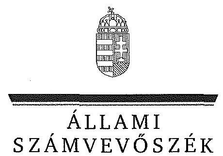
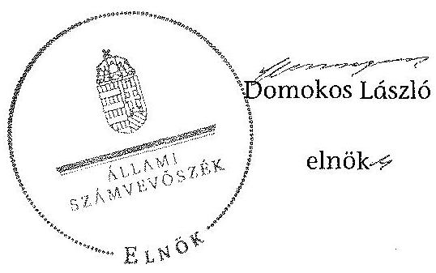

ÁLLAMI
SZÁMVEVŐSZÉK

# JELENTÉS 

Az önkormányzatok belső kontrollrendszere kialakításának, egyes kontrolltevékenységek és a belső ellenőrzés működésének ellenőrzése Dunaföldvár

---

# Állami Számvevőszék 

Iktatószám: V-0665-070/2015.
Témaszám: 1699
Vizsgálat-azonosító szám: V067707
Az ellenőrzést felügyelte:
Dr. Benedek Mária
felügyeleti vezető
Az ellenőrzést vezette és az ellenőrzés végrehajtásáért felelős:
Dr. Győri Gabriella
ellenőrzésvezető
A számvevőszéki jelentéstervezet összeállításában közreműködött:
Balázsné Antoni Erika
számvevő
Az ellenőrzést végezték:
Balázsné Antoni Erika
Számvevő

Dr. Halmné Harsányi Zsuzsanna számvevő tanácsos

---

# TARTALOMJEGYZÉK 

BEVEZETÉS ..... 5
I. ÖSSZEGZŐ MEGÁLLAPÍTÁSOK, KÖVETKEZTETÉSEK, JAVASLATOK ..... 9
II. RÉSZLETES MEGÁLLAPÍTÁSOK ..... 12

1. Az önkormányzat belső kontrollrendszere kialakításának és működtetésének megfelelősége ..... 12
1.1. A kontrollkörnyezet kialakítása és működtetése ..... 12
1.2. A kockázatkezelési rendszer kialakítása és működtetése ..... 13
1.3. A kontrolltevékenységek kialakítása és működtetése ..... 13
1.4. Az információs és kommunikációs rendszer kialakítása és működtetése ..... 14
1.5. A monitoring rendszer kialakítása és működtetése ..... 15
2. A monitoring rendszer részeként a belső ellenőrzés kialakítása és működtetése ..... 16
3. A pénzügyi folyamatokban kulcsszerepet betöltő belső kontrollok (teljesítésigazolás és érvényesítés) működése ..... 17
4. Az integritás szemlélet érvényesülése ..... 19

## FÜGGELÉKEK

1. számú Értelmező szótár
2. számú Az integritás érvényesítése érdekében kialakított és működtetett kontrollrendszer

---

.

---

# RÖVIDÍTÉSEK JEGYZÉKE 

## Törvények

Áht.
ÁSZ tv.
Info tv.

Kttv.

Mötv.

Ötv.

## Rendeletek, határozatok

Ávr.
Bkr.
önkormányzati SZMSZ

## Szórövidítések

adatvédelmi szabályzat
alapító okirat
ÁSZ
belső ellenőrzési kézikönyv
bizonylati szabályzat
értékelési szabályzat
gazdasági program

Hivatal
Hivatal gazdálkodási szabályzata
hivatali ügyrend
2011. évi CXCV. törvény az államháztartásról
2011. évi LXVI. törvény az Állami Számvevőszékről
2011. évi CXII. törvény az információs önrendelkezési jogról és az információszabadságról
2011. évi CXCIX. tv. a közszolgálati tisztviselők ről
2011. évi CLXXXIX. törvény Magyarország helyi önkormányzatairól
1990. évi LXV. törvény a helyi önkormányzatokról
368/2011. (XII. 31.) Korm. rendelet az államháztartásról szóló törvény végrehajtásáról
370/2011. (XII. 31.) Korm. rendelet a költségvetési szervek belső kontrollrendszeréről és belső ellenőrzéséről
Dunaföldvár Város Önkormányzata Képviselőtestületének 6/2011. (III. 16.) önkormányzati rendelete a Képviselő-testület és Szervei Szervezeti és Működési Szabályzatáról (hatályos: 2011. március 16-tól)

Dunaföldvár Város Önkormányzata Polgármesteri Hivatalának Adatvédelmi szabályzata (hatályos: 2003. július 15-től)
Dunaföldvári Polgármesteri Hivatal Alapító okirata (hatályos: 1992. július 1-jétől)
Állami Számvevőszék
2/2009. (II.12.) Ktth. sz. határozattal elfogadott Belső ellenőrzési kézikönyv
Dunaföldvári Polgármesteri Hivatal Bizonylati szabályzat (hatályos: 2013. január 1-jétől)
Dunaföldvári Polgármesteri Hivatal Eszközök és források értékelési szabályzata (hatályos: 2013. január 1-jétől)
Dunaföldvár Város Önkormányzat Képviselő-testületének 35/2011. (III.08.) KT. határozatával elfogadott Gazdasági programja
Dunaföldvár Város Önkormányzat Polgármesteri Hivatala
Dunaföldvár Polgármesteri Hivatal Gazdálkodási szabályzat (hatályos: 2013. január 1-től)
A Polgármesteri Hivatal gazdasági szervezetének ügyrendje (az SZMSZ 16. számú függeléke) (hatályos: 2011. március 16-tól)

---

INTOSAI
iratkezelési szabályzat

ISSAI
jegyző
Képviselő-testület
kormányhivatal
Önkormányzat
polgármester
számlarend

Társulás
tűzvédelmi szabályzat

International Organization of Supreme Audit Institutions (Legfőbb Ellenőrző Intézmények Nemzetközi Szervezete)
Dunaföldvár Polgármesteri Hivatalának Iratkezelési szabályzata (hatályos: 2012. január 1-jétől)
International Standards of Supreme Audit Institutions (Legfőbb Ellenőrző Intézmények Nemzetközi Standardjai)
Dunaföldvár Város Önkormányzatának jegyzője
Dunaföldvár Város Önkormányzatának Képviselőtestülete
Tolna Megyei Kormányhivatal
Dunaföldvár Város Önkormányzata
Dunaföldvár Város Önkormányzat polgármestere
Dunaföldvár Polgármesteri Hivatal Számlarend (hatályos: 2013. január 1-jétől)

Paks Többcélú Kistérségi Társulás
Dunaföldvár Város Címzetes Főjegyzőjének utasítása a Tűzvédelmi szabályzat kiadásáról (hatályos: 2003. október 27-től)

---

# JELENTÉS 

## az önkormányzatok belső kontrollrendszere kialakításának, egyes kontrolltevékenységek és a belső ellenőrzés működésének ellenőrzése Dunaföldvár

## BEVEZETÉS

Dunaföldvár város állandó lakosainak száma 2013. január 1-jén 8812 fő volt. Az Önkormányzat kilenctagú Képviselő-testületének munkáját öt állandó bizottság segítette. Az Önkormányzat az önállóan működő és gazdálkodó Hivatalon kívül két önállóan működő és gazdálkodó, két önállóan működő intézményt működtetett, két többségi tulajdoni hányadú gazdasági társasággal rendelkezett. A polgármester 2012. október 12. óta tölti be tisztségét. A jegyző 1999. július 1-től látja el feladatait. A Hivatal négy szervezeti egységre tagolódott, a foglalkoztatott köztisztviselők száma 2013. január 1-jén 26 fő volt. A Hivatalnál 2013. január 1-jétől szervezeti változás történt, a Paksi járási Hivatal megalakulása miatt a szakmai létszám 11 fővel csökkent. Az Önkormányzat a 2013. évi költségvetési beszámolója szerint 2279919 ezer Ft tárgyévi bevételt ért el, valamint 1795780 ezer Ft tárgyévi kiadást teljesített. A 2013. december 31-i könyvviteli mérleg szerint 6275059 ezer Ft értékű eszközvagyonnal rendelkezett, a rövid lejáratú kötelezettségállománya 287156 ezer Ft, hosszú lejáratú kötelezettség állománya 4677 ezer Ft volt.

A demokratikus társadalmakban alapvető igény, hogy a közpénzeket, a közvagyont használók valamennyi tevékenységükhöz kapcsolódó pénzfelhasználásról elszámoljanak, ahhoz egyértelmű és érvényesíthető felelősségi szabályok társuljanak. Ennek a jogos igénynek az érvényesítéséhez meg kell teremteni azokat a folyamatokat, rendszereket, amelyek nélkülözhetetlenek az elszámoltatáshoz. Az elszámoltatás eredményes működtetéséhez szükség van a megfelelő információs, kontroll, értékelési és beszámolási rendszerek kialakítására.

Magyarországon az uniós csatlakozási tárgyalások idejére nyúlnak vissza a belső kontrollrendszer szabályozásának gyökerei. Az uniós elvárásoknak megfelelő új terminológia szerinti államháztartási belső pénzügyi ellenőrzési (ÁBPE) rendszer területén a jogharmonizáció 2003-ban teljes körűen megvalósult, míg az önkormányzati alrendszerre vonatkozó, Ötv.-ben megjelenített speciális szabályozás 2005-ben lépett hatályba. Az államháztartási belső kontrollrendszer koncepciója 2009-ben továbbfejlődött. A változások irányát mutatja, hogy a költségvetési szervek belső kontrollrendszere már magában foglalja a korszerű felelős szervezetirányítás elemeit (kontrollkörnyezet, kockázatkezelés, kontrolltevékenység, információ és kommunikáció, monitoring) is. E kont-

---

rollrendszer szabályozása háromszintű, a törvényi előírásokat az Áht, és a Mötv, a rendeleti szintű szabályozást az Ávr. és a Bkr. tartalmazza, amelyeket útmutatói szinten az NGM által kiadott standardok és kézikönyvek támogatnak.

A belső kontrollrendszer azt a célt szolgálja, hogy a költségvetési szervek működésük és gazdálkodásuk során a tevékenységeket szabályszerűen, gazdaságosan, hatékonyan, eredményesen hajtsák végre, teljesítsék elszámolási kötelezettségeiket és megvédjék az erőforrásokat a veszteségektől, a károktól és a nem rendeltetésszerű használattól. A belső kontrollrendszer magában foglalja mindazon szabályokat, eljárásokat, gyakorlati módszereket és szervezeti struktúrákat, kockázatkezelési technikákat, kontrolltevékenységeket, amelyek segítséget nyújtanak a szervezetnek céljai eléréséhez.

Az ÁSZ a középtávú stratégiájában hangsúlyos szerepet szánt annak, hogy szilárd szakmai alapon álló, értékteremtő ellenőrzéseivel előmozdítsa a közpénzügyek átláthatóságát, rendezettségét. A számvevőszéki ellenőrzés nemzetközi alapelvei is rögzítik, hogy a megfelelő belső kontrollrendszer minimálisra csökkenti a hibák és szabálytalanságok kockázatát.

Az ellenőrzés célja annak értékelése, hogy

- a jogszabályi előírásoknak megfelelően alakították-e ki és működtették-e a belső kontrollrendszert;
- a gazdálkodás folyamatában kulcsszerepet betöltő teljesítésigazolás és érvényesítés kontrolltevékenységeit megfelelően működtették-e;
- biztosították-e a belső ellenőrzés szabályos működését;
- kialakították-e az erőforrásokkal való szabályszerű és hatékony gazdálkodáshoz szükséges követelményeket, megvalósították-e azok számonkérését, ellenőrzését;
- hasznosították-e az ÁSZ által a 2009-2013. évek között végzett ellenőrzések javaslatait.

A közintézmények integritás alapú kultúrájának kialakítása, megerősítése és működése szorosan összefügg a belső kontrollrendszer működésével, ezért az ellenőrzés kitért a gazdálkodáshoz kapcsolódó integritás kontrollok meglétének és működésének ellenőrzésére is. Az integritási kultúra kialakítása hozzájárul az elszámoltathatóság és átláthatóság érvényesítéséhez, egyben támogatja a szervezet védettségét a korrupciós kitettséggel szemben, valamint annak megelőzése is irányítottabbá válik.

Az ellenőrzés várható hasznosulását négy szinten tervezzük. A törvényalkotás számára összegzett tapasztalatok állnak rendelkezésre a belső kontrollrendszer önkormányzati területen való kialakításáról, működéséről és hatásairól, a belső ellenőrzés működéséről. Az ellenőrzés az ellenőrzött számára visszajelzést ad a belső kontrollrendszer kialakításában és működésében fellépő hiányosságokról, javaslataival hozzájárul azok kiküszöböléséhez, amely csökkentheti a későbbi ellenőrzések gyakoriságát. Az ellenőrzés megállapításai és javaslatait más szervezetek is hasznosíthatják a rendezett gazdálkodási keretek ki-

---

alakításához. A társadalom számára jelzi, hogy közpénz nem maradhat ellenőrizetlenül, az ÁSZ értékteremtő rend kialakításához és megőrzéséhez hozzájáruló tevékenysége pozitív hatással lesz a szervezetről kialakított összkép formálásában. A szervezeten belül lehetőség nyílik arra, hogy a megállapítások szintetizálásával az ÁSZ a hozzáadott értéket teremtő elemző tevékenységét és tanácsadó szerepét is erősítse.

Az önkormányzatok belső kontrollrendszere kialakításának, egyes kontrolltevékenységek és a belső ellenőrzés működésének ellenőrzéséről szóló jelentés I. fejezetének összegző része az ellenőrzés céljára ad rövid, szintetizáló összefoglalót, és tartalmazza a következtetéseket a II. fejezet részletes megállapításain alapulóan. A jelentés intézkedést igénylő megállapításait és javaslatait az ellenőrzés során feltárt, a jelentés II. fejezetében rögzített részletes megállapítások alapozzák meg.

# Az ellenőrzés típusa: szabályszerűségi ellenőrzés 

Az ellenőrzött időszak: a belső kontrollrendszer kialakítása és működtetésének megfelelőségét a 2013. évre vonatkozóan (2013. december 31-i állapotnak megfelelően), a pénzügyi folyamatokban kulcsszerepet betöltő teljesítésigazolás és érvényesítés belső kontrollok működésének megfelelőségét, és a belső ellenőrzés szabályszerű működését a 2013. január 1. - december 31-e közötti időszakot figyelembe véve értékeltük, míg az ÁSZ javaslatainak utóellenőrzése a 2009-2013. években végzett ellenőrzések nyilvánosságra hozott jelentéseiben tett javaslatok áttekintésére terjedt ki.

## Az ellenőrzött szervezet: az Önkormányzat

Az ellenőrzés jogszabályi alapját az ÁSZ tv. 1. § (3) bekezdése, az 5. § (2) és (6) bekezdései, valamint az Áht. 61. § (2) bekezdése képezik.

Az ellenőrzés szakmai módszertana az ÁSZ hivatalos honlapján (www.asz.hu) közzétett szakmai szabályokon alapult, amely az INTOSAI által kiadott ISSAI figyelembevételével készült.

Az ellenőrzés lefolytatásához az Önkormányzat a kimutatások és a tanúsítvány elektronikus kitöltésével, valamint az ÁSZ által kért dokumentumok elektronikus megküldésével szolgáltatott adatokat. Az így rendelkezésre bocsátott adatok, információk kontrollja és a munkalapok kitöltése a helyszíni ellenőrzés keretében történt. A jelentésben használt fogalmak magyarázatát az 1. számú függelék, az integritás érvényesítése érdekében kialakított és működtetett intézményi kontrollrendszer értékelését a 2. számú függelék tartalmazza.

A belső kontrollrendszer, valamint a belső ellenőrzés jogszabályi előírások szerinti kialakításának és működtetésének szabályszerűségét az erre irányuló ellenőrzési kérdésekre adott válaszok összesítése alapján értékeltük. A belső kontrollrendszert kontrollterületenként (kontrollkörnyezet, kockázatkezelési rendszer, kontrolltevékenységek, információs és kommunikációs rendszer, monitoring rendszer) és összesítetten is értékeltük.

A belső kontrollrendszer egyes kontrollterületei és a belső ellenőrzés kialakítása és működtetése „szabályszerű volt", amennyiben az értékelt területen az elért és

---

elérhető pontok százalékban kifejezett hányadosa elérte a 81%-ot, „részben szabályszerű volt", ha 61-80% közé esett, és „nem volt szabályszerű", ha nem haladta meg a 60%-ot. A belső kontrollrendszer összesített értékelése megegyezett a kontrollterületenként alkalmazott %-os értékelésekkel, a következő eltérésekkel. A kontrollrendszer egésze esetében a „szabályszerű" értékelésnek a %-os értéken felül további feltétele volt, hogy egyik kontrollterület sem kaphatott „nem volt szabályszerű" értékelést, a „részben szabályszerű" értékelés további feltétele volt, hogy legfeljebb egy ellenőrzött kontrollterület lehetett „nem volt szabályszerű" értékelésű. Az összesített értékelés a %-os értéktől függetlenül „nem volt szabályszerű", ha az ellenőrzött kontrollterületek közül több mint egynek „nem volt szabályszerű" az értékelése.

A gazdálkodás folyamatában kulcsszerepet betöltő két kulcskontroll - teljesítésigazolás, érvényesítés - működésének megfelelőségét a személyi juttatásokkal, a dologi és felhalmozási kiadásokkal, működési és felhalmozási célú pénzeszköz átadásokkal, ellátottak pénzbeli juttatásaival kapcsolatos kifizetések esetében mintavétellel ellenőriztük. „Megfelelőnek" értékeltük a gazdálkodási jogkörök gyakorlását, amennyiben 95%-os bizonyossággal a teljes sokaságban a hibaarány legfeljebb 10%, „részben megfelelőnek" értékeltük, ha a hibaarány felső határa 10-30% között volt, „nem megfelelőnek" pedig akkor, ha a mintavételi eredmények alapján a sokaságbeli hibaarány felső határa meghaladta a 30%-ot.

Értékeltük az Önkormányzatnál a belső ellenőrzés kialakításának és működésének szabályosságát. Minősítettük a gazdálkodáshoz kapcsolódó integritás kontrollok meglétét és működését Az integritás szemlélet érvényesülésének értékelése az Önkormányzat önbevallás által kitöltött tanúsítványa alapján történt.

Utóellenőrzésre nem került sor, mivel az ÁSZ az Önkormányzatnál a 2009-2013. évek között nem végzett ellenőrzést.

Az ÁSZ tv. 29. § (1) bekezdése
 szerint a jelentéstervezetet megküldtük a polgármester részére, aki az ÁSZ tv. 29. § (2) bekezdésében foglalt észrevételezési jogával nem élt, a jelentéstervezetre észrevételt nem tett.

---

# I. ÖSSZEGZŐ MEGÁLLAPÍTÁSOK, KÖVETKEZTETÉSEK, JAVASLATOK 

A belső kontrollrendszeren belül 2013-ban a kontrollkörnyezet, a kockázatkezelési rendszer, a kontrolltevékenységek, az információs és kommunikációs rendszer, valamint a monitoring rendszer kialakítását és működtetését külön-külön és együttesen is értékeltük. A belső kontrollrendszer kialakítása és működtetése az összesített értékelés alapján szabályszerű volt.

A belső kontrollrendszer egyes területei kialakításának és működtetésének a minősítése a következő:

| Kontrollterület | Minősítés |
| :-- | :-- |
| Kontrollkörnyezet | szabályszerű |
| Kockázatkezelési rendszer | szabályszerű |
| Kontrolltevékenységek | szabályszerű |
| Információs és kommunikációs rendszer | szabályszerű |
| Monitoring rendszer | részben szabályszerű |

Szabályszerű volt a kontrollkörnyezet, a kockázatkezelési rendszer, a kontrolltevékenységek, valamint az információs és kommunikációs rendszer kialakítása és működtetése, mivel a jogszabályi előírásokban foglaltakat figyelembe véve a jegyző a megállapított kisebb hiányosságok mellett is megteremtette a kontrollterületeken a szabályszerű működés lehetőségét.

Részben szabályszerű volt a monitoring rendszer kialakítása és működtetése, mivel a megállapított szabályozásbeli hiányosságok nem veszélyeztették e kontrollterületen a szabályszerű működést.

A 2013. évben a személyi juttatások, dologi kiadások, felhalmozási kiadások, működési és felhalmozási célú pénzeszköz átadásokkal, ellátottak pénzbeli juttatásaival kapcsolatos kifizetések során - összefoglalóan értékelve - a pénzügyi folyamatokban kulcsszerepet betöltő teljesítésigazolás és érvényesítés belső kontrollok működése részben volt megfelelő.

A számvevőszéki ellenőrzés az ellenőrzött kifizetésekkel összefüggésben, a rendelkezésre bocsátott dokumentumok alapján kár bekövetkeztére utaló adatot, tényt nem állapított meg, azonban a gazdálkodásban kulcsszerepet betöltő kontrollok működésében feltárt hiányosságok miatt fennáll a hibák, szabálytalanságok bekövetkezésének kockázata. A részben megfelelően működtetett belső kontrollok korrupciós kockázatot hordoznak.

---

Az Önkormányzat a belső ellenőrzési feladatokat a Társulás útján látta el. A 2013. évben a belső ellenőrzés kialakítása és működtetése szabályszerű volt.

A Képviselő-testület kialakította az erőforrásokkal való, szabályszerű és hatékony gazdálkodáshoz szükséges követelményeket és ellenőrizte azok betartását.

Az integritás szemlélet érvényesülésének ellenőrzéséhez az Önkormányzat önbevallás útján szolgáltatott adatokat. A kockázatok és a kontrollok szintje alapján megállapítható, hogy a szervezetnél jelenlévő kockázatokat növelő tényező szintje meghaladja az azok kezelésére kiépült kontrollok szintjét. Így a kontrollok a jelenlegi szinten nem képesek megfelelően kezelni a kockázatokat, illetve nem tudnak kellő mértékben hozzájárulni a szervezet feladatellátásához. A szervezet integritása fejlesztendő.

Az ÁSZ tv. 33. § (1) bekezdésében foglaltak értelmében az ellenőrzött szervezet vezetője köteles a jelentésben foglalt megállapításokhoz kapcsolódó intézkedési tervet összeállítani, és azt a jelentés kézhezvételétől számított 30 napon belül az ÁSZ részére megküldeni. Amennyiben az intézkedési tervet határidőre nem küldi meg a szervezet, vagy az ÁSZ tv. 33. § (2) bekezdésében foglalt póthatáridő elteltével megküldött intézkedési terv továbbra sem elfogadható, az ÁSZ elnöke a hivatkozott törvény 33. § (3) bekezdés a)-b) pontjaiban foglaltakat érvényesítheti.

Az ellenőrzés intézkedést igénylő megállapításai és javaslatai:

# a polgármesternek 

Az Önkormányzat kiadási előirányzata terhére történt kötelezettségvállalásra - az Áht. 37. § (1) és az Ávr. 55. § (1) bekezdésében foglaltak ellenére - pénzügyi ellenjegyzés nélkül került sor, valamint a kötelezettségvállalás dokumentumán nem tüntették fel a pénzügyi ellenjegyzés dátumát.

Javaslat:
Intézkedjen annak érdekében, hogy az Önkormányzat nevében történő kötelezettségvállalásra az Áht. 37. § (1) bekezdésében és az Ávr. 55. § (1) bekezdésében foglaltaknak megfelelően - az Ávr. 53. §-ában meghatározott kivételekkel - kizárólag pénzügyi ellenjegyzés után kerüljön sor, továbbá a kötelezettségvállalás dokumentumán tüntessék fel a pénzügyi ellenjegyzés dátumát.

## a jegyzőnek

A számvevőszéki jelentés ellenőrzési megállapításai alapján az Önkormányzatnál a belső kontrollrendszer kialakítása és működtetése összesített értékelés alapján - kisebb súlyú hiányosságok mellett - szabályszerű, a kulcskontrollok működése részben volt megfelelő, valamint a belső ellenőrzés kialakítása és működtetése szabályszerű volt. A számvevőszéki ellenőrzés során feltárt hibákat, hiányosságokat és szabálytalanságokat a számvevőszéki jelentés II. Részletes megállapítások fejezetcím tartalmazza.

Javaslat:
A jogszabályoknak megfelelő belső kontrollrendszer kialakítása és működtetése érdekében - az ellenőrzött időszak óta bekövetkezett esetleges jogszabályi változásokra figyelemmel - intézkedjen a belső kontrollrendszer kialakításában és működtetésében, a kulcskontrollok működésében, illetve a belső ellenőrzés kialakításában és működtetésében az ellenőrzés által feltárt hibák, hiányosságok, szabálytalanságok kijavítására.

Kezdeményezze, hogy az éves ellenőrzési terv kiterjedjen a kifizetések szabályszerűségi ellenőrzésére, különös tekintettel a személyi juttatásokkal, a dologi kiadásokkal, a felhalmozási kiadásokkal, a működési és felhalmozási célú pénzeszköz átadásokkal, az ellátottak pénzbeli juttatásaival kapcsolatos kiadási jogcímekből teljesített kifizetésekre.

---

# II. RÉSZLETES MEGÁLLAPÍTÁSOK 

## 1. Az önkormányzat belső kontrollrendszere kialakításának és működtetésének megfelelősége

A belső kontrollrendszeren belül 2013-ban a kontrollkörnyezet, a kockázatkezelési rendszer, a kontrolltevékenységek, az információs és kommunikációs rendszer, valamint a monitoring rendszer kialakítását és működtetését külön-külön és együttesen is értékeltük. A belső kontrollrendszer kialakítása és működtetése az összesített értékelés alapján szabályszerű volt.

### 1.1. A kontrollkörnyezet kialakítása és működtetése

## A kontrollkörnyezet kialakítása és működtetése szabályszerű volt.

A Hivatal rendelkezett a Képviselő-testület által elfogadott alapító okirattal, amely tartalmazta az alaptevékenységeket. Az Önkormányzat rendelkezett a 2011-2014. évekre vonatkozó gazdasági programmal és önkormányzati SZMSZ-szel. A Képviselő-testület önkormányzati rendeletben határozta meg a vagyongazdálkodás szabályait.

A jegyző a jogszabályi előírásoknak megfelelően elkészítette a Hivatal számviteli politikáját, a pénzkezelési-, a leltározási-, az értékelési- és a bizonylati szabályzatot, továbbá a számlarendet. Ezen szabályzatok hatálya a Roma Nemzetiségi Önkormányzatra is kiterjedt. A jegyző a jogszabályi előírások alapján elkészítette a szabálytalanságok kezelésének eljárásrendjét. Gondoskodott az ellenőrzési nyomvonal rendszeres felülvizsgálatáról és aktualizálásáról. A Hivatalban meghatározták az egészséget nem veszélyeztető és biztonságos munkavégzés követelményei megvalósításának módját. A Hivatal a jogszabályi előírásoknak megfelelően rendelkezett tűzvédelmi szabályzattal.

A Hivatal rendelkezett gazdasági szervezettel, amelynek ügyrendjét a jegyző elkészítette.

A Képviselő-testület kialakította az erőforrásokkal való, szabályszerű és hatékony gazdálkodáshoz szükséges követelményeket és ellenőrizte azok betartását. A 2013. évi költségvetési rendeletben meghatározták a Hivatal engedélyezett létszámát. A jegyző az előírt formában, tartalommal, határidőben készítette el a Hivatalban dolgozó köztisztviselők teljesítmény-értékelését és meghatározta a köztisztviselők teljesítmény-értékelésének a második félévre vonatkozó kötelező elemeit. A Képviselő-testület megállapította a köztisztviselőkre vonatkozó hivatásetikai alapelvek részletes tartalmát és az etikai eljárás szabályait.

---

A kontrollkörnyezet kialakítása és működtetése - az alábbi kisebb súlyú hiányosságok mellett - szabályszerű volt:

| Sorszám $^{1}$ | Megállapítás |
| :--: | :--: |
| 37. | A munkaköri leírásokban - a Kttv. 75. § (1) bekezdés d) pontjában foglaltak ellenére - nem rögzítették a munkakör betöltésével kapcsolatos követelményeket (végzettség, szakképzettség, szakképesítés, tapasztalat, képességei). |

# 1.2. A kockázatkezelési rendszer kialakítása és működtetése 

## A kockázatkezelési rendszer kialakítása és működtetése szabályszerű volt.

A jegyző kialakította a Hivatal kockázatkezelési rendszerét, amely tartalmazta a kockázatok azonosításával, elemzésével, csoportosításával, és nyomon követésével kapcsolatos szabályokat. A jegyző felmérte és megállapította a Hivatal tevékenységében és gazdálkodásában rejlő kockázatokat. A vagyonnyilatkozattételre kötelezettek körét rögzítették az SZMSZ-ben. A vagyonnyilatkozat-tételre kötelezettek a 2013. évben eleget tettek esedékes vagyonnyilatkozat-tételi kötelezettségüknek.

A kockázatkezelési rendszer kialakítása és működtetése -az alábbi kisebb súlyú hiányosságok mellett - szabályszerű volt:

| Sorszám | Megállapítás |
| :--: | :-- |
| 3-4. | A jegyző - a Bkr. 7. § (2) bekezdésében foglaltak ellenére - nem határozta meg az egyes kockázatokkal kapcsolatban szükséges intézkedéseket, valamint azok teljesítésének folyamatos nyomon követési módját. |

### 1.3. A kontrolltevékenységek kialakítása és működtetése

## A kontrolltevékenységek kialakítása és működtetése szabályszerű volt.

A jegyző belső szabályozásban előírta a folyamatba épített, előzetes, utólagos és vezetői ellenőrzést a költségvetés tervezése, a beszerzések lebonyolítása, a vagyonhasznosítási tevékenység, valamint a támogatások elszámolása vonatkozásában.

A polgármester az Önkormányzat gazdálkodási szabályzatában, valamint a jegyző a Hivatal gazdálkodási szabályzatában meghatározta a kötelezettségvállalás pénzügyi ellenjegyzése, a teljesítésigazolás, az érvényesítés, az utalványozás gyakorlásának módjával, eljárási és dokumentációs részletszabályaival,

[^0]
[^0]:    ${ }^{1}$ A témacsoportos ellenőrzés miatt a megállapítás számozása az Önkormányzat által kitöltött kimutatások - adatszolgáltatások - kérdéseinek sorszámával azonos

---

az ezeket végző személyek kijelölésének rendjével kapcsolatos belső előírásokat, valamint az előzetes írásbeli kötelezettségvállalást nem igénylő kifizetések rendjét. A polgármester az Önkormányzat, a jegyző pedig a Hivatal vonatkozásában kijelölte a teljesítés igazolására jogosult személyeket.

A jegyző a jogszabályi előírásoknak megfelelően gondoskodott az iratkezelési szoftver által kezelt adatok biztonságáról, kialakította az üzembiztonsági, adatvédelmi szabályok érvényre juttatásához szükséges eljárási szabályokat, szabályozta az üzemeltetés és az adatbiztonság feladatait, meghatározta a felelősöket. A jegyző az informatikai rendszer szabályozása során megtette azokat a technikai és szervezési intézkedéseket és kialakította azokat az eljárási szabályokat, amelyek biztosítják az adatok biztonságát és védelmét. A felelősségi körök meghatározásával az adatvédelmi szabályzatban rögzítette a dokumentumokhoz és információkhoz való hozzáférést. A hivatali ügyrendben, valamint az SZMSZ-ben meghatározták a beszámolási feladatok (időközi és éves beszámolók) teljesítésével kapcsolatos belső előírásokat, feltételeket, a beszámolási eljárásokhoz kapcsolódó felelősségi köröket, valamint a gazdasági feladatot ellátó vezetők és a gazdasági feladatot ellátó alkalmazottak helyettesítésének rendjét. A költségvetési beszámoló elkészítésével megbízott személy rendelkezett a jogszabályban előírt képesítéssel és a tevékenység ellátására jogosító engedéllyel. A polgármester a jogszabályi előírásoknak megfelelően az Önkormányzat gazdálkodásának első félévi, valamint háromnegyed éves helyzetéről a Képviselő-testületet határidőben tájékoztatta. A Hivatalban a pénzügyi ellenjegyzésre és az érvényesítési feladatok ellátására kijelölt személy rendelkezett a jogszabályban előírt végzettséggel, illetve pénzügyi-számviteli képesítéssel. A jegyző szabályozta a közszolgálati jogviszony megszűnése, illetve a munkakör változása esetére a munkakör átadásának rendjét.

A kontrolltevékenységek kialakítása és működtetése - az alábbi kisebb súlyú hiányosság mellett - szabályszerű volt:

| Sorszám | Megállapítás |
| :--: | :--: |
| 25. | Az Önkormányzatnál a pénzügyi ellenjegyző - az Ávr. 55. § (3) bekezdésében előírtak ellenére - nem rendelkezett az előírt végzettséggel, illetve pénzügyi-számviteli képesítéssel. |
| 27. | Érvényesítési feladatra - az Ávr. 58. §. (4) bekezdésében foglaltak ellenére az önkormányzati kiadási előirányzatok esetében nem a jegyző jelölte ki a Hivatal állományába tartozó köztisztviselőt. |
| 32. | A jegyző - a Kttv. 74. § (1) bekezdésében foglaltak ellenére - 2013-ban a pénzügyi-számviteli területen dolgozók jogviszonya megszűnésekor nem gondoskodott a munkakör dokumentált átadásáról. |

# 1.4. Az információs és kommunikációs rendszer kialakítása és működtetése 

Az információs és kommunikációs rendszer kialakítása és működtetése szabályszerű volt.

---

A Hivatal rendelkezett az Info tv. előírásainak megfelelő adatvédelmi és adatbiztonsági szabályzattal. A jegyző kialakította a kötelezően közzéteendő adatok nyilvánosságra hozatalának- és a közérdekű adatok megismerésére irányuló igények teljesítésének rendjét. Az Önkormányzat a 2013. évi elektronikus közzétételi kötelezettségének eleget tett. A Hivatal rendelkezett a Magyar Nemzeti Levéltár és a kormányhivatal egyetértésével kiadott, a jogszabályi előírásoknak megfelelő tartalmú iratkezelési szabályzattal. A jegyző az iratok iktatásával, az iratforgalom dokumentálásával biztosította az ügyintézés folyamatosságának, az iratok szervezeten belüli útjának pontos követhetőségét és ellenőrizhetőségét, az iratok hollétének naprakész megállapíthatóságát.

Az információs
 és kommunikációs rendszer kialakítása és működtetése - az alábbi kisebb súlyú hiányosság mellett - szabályszerű volt:

| Sorszám | Megállapítás |
| :--: | :--: |
| 3. | A jegyző - a Bkr. 9. § (2) bekezdésében foglaltak ellenére - nem határozta meg a beszámolási szinteket, határidőket és módokat. |

# 1.5. A monitoring rendszer kialakítása és működtetése 

## A monitoring rendszer kialakítása és működtetése részben volt szabályszerű.

A jegyző kialakította a Hivatal tevékenységének, a célok megvalósításának nyomon követését biztosító rendszert.

A monitoring rendszer kialakítása és működtetése részben volt szabályszerű, mert:

| Sorszám | Megállapítás |
| :--: | :--: |
| 2. | A jegyző - a Bkr. 11. § (1) bekezdésében foglaltak ellenére - nem értékelte a Bkr. 1. mellékletében foglaltak szerinti nyilatkozatban a Hivatal belső kontrollrendszerének minőségét a 2012. évre vonatkozóan. |
| 9. | A jegyző -a Mötv. 133-135 §-ában foglalt előírás ellenére - nem tette meg a szükséges intézkedéseket, hogy a 2013. évben az Önkormányzatnál és intézményeinél végzett hatósági ellenőrzés által feltárt hiányosságok a jövőben ne merüljenek fel. |

A helyi önkormányzatok törvényességi felügyeletét ellátó kormányhivatal öt alkalommal élt törvényességi felhívással 2013-ban.

Egy esetben a közép- és hosszú távú vagyongazdálkodási terv elkészítésének elmulasztása, egy esetben a Képviselő-testület rendeleteinek elektronikus rendszeren történő továbbításának elmulasztása miatt kapott felhívást az Önkormányzat. Az önkormányzati rendeletek jogszabályokkal való összhangba hozására két esetben, rendelet hatályon kívül helyezésére egy alkalommal kötelezték az Önkormányzatot.

---

# 2. A MONITORING RENDSZER RÉSZEKÉNT A BELSŐ ELLENŐRZÉS KIALAKÍTÁSA ÉS MŰKÖDTETÉSE 

A 2013. évben a belső ellenőrzés kialakítása és működtetése - kisebb súlyú hiányosság mellett - szabályszerű volt.

A jegyző a belső ellenőrzés kialakításáról Társulás útján gondoskodott. A belső ellenőrök szervezeti és funkcionális függetlenségét biztosították. A belső ellenőrzési feladatok és kötelességek ellátásának módjáról a jogszabályi előírásoknak megfelelően a belső ellenőrzési tevékenység megszervezésére vonatkozó, írásbeli megállapodásban rendelkeztek.

A kijelölt belső ellenőrzési vezető megfelelt a jogszabályban előírt szakirányú szakképzettségi és szakmai gyakorlati követelményeknek, a belső ellenőr rendelkezett a jogszabályban előírt szakirányú képzettséggel és szakmai gyakorlattal.

Az Önkormányzat rendelkezett az ellenőrzések megtervezését megalapozó, a jogszabályi előírásoknak megfelelő tartalmú stratégiai ellenőrzési tervvel.

A belső ellenőrzési vezető az előírt tartalommal és a jegyző írásos véleményének figyelembe vételével elkészítette az Önkormányzat 2014. évi ellenőrzési tervét, amelyet a Képviselő-testület a Bkr-ben előírt határidőig jóváhagyott. A 2014. évi ellenőrzési terv a stratégiai ellenőrzési tervben és a kockázatelemzés alapján felállított prioritásokon alapult. Az Önkormányzatra vonatkozó éves ellenőrzési tervben foglalt, összesen négy ellenőrzést végrehajtották, terven felüli ellenőrzést nem indítottak, ezért az éves ellenőrzési terv módosítására nem volt szükség. Ellenőrzés megszakítására, felfüggesztésére nem került sor az ellenőrzött időszakban.

Az elvégzett ellenőrzésekről a jogszabályban előírt tartalmú jelentéseket készítettek. A belső ellenőrzést végzők az ellenőrzések során büntető-, szabálysértési, kártérítési, vagy fegyelmi eljárás megindítására okot adó cselekményt nem tártak fel. A belső ellenőrzés javaslatainak végrehajtása érdekében az ellenőrzött szervek vezetői határidőn belül és megfelelő tartalommal elkészítették az intézkedési terveket. A belső ellenőrzési vezető az elvégzett ellenőrzésekről nyilvántartást vezetett, amellyel nyomon követte a jelentésekben tett megállapításokat, javaslatokat, a vonatkozó intézkedési terveket és azok végrehajtását.

A belső ellenőrzési vezető összeállította a 2013. évre vonatkozó éves összefoglaló ellenőrzési jelentést és a Bkr-ben foglalt határidőig megküldte a jegyzőnek. Az összefoglaló jelentés - az ellenőrzési tapasztalatok alapján - tartalmazta a belső kontrollrendszer szabályszerűségének, gazdaságosságának, hatékonyságának és eredményességének növelése, javítása érdekében tett fontosabb javaslatokat, valamint a belső kontrollrendszer öt elemének értékelését.

---

A belső ellenőrzési rendszer kialakítása és működtetése - az alábbi kisebb súlyú hiányosság mellett - szabályszerű volt.

| Sorszám | Megállapítás | Megjegyzés |
| :--: | :--: | :--: |
| 3-4. | A belső ellenőrzési vezető - a Bkr. 17. § (4) bekezdésében foglaltak ellenére - a belső ellenőrzési kézikönyv rendszeres, de legalább kétévenkénti felülvizsgálati kötelezettségének nem tett eleget. | A belső ellenőrzési kézikönyvet 2009. február 12-ét követően nem aktualizálták. |
| 17. | A végrehajtott ellenőrzésekhez - a Bkr. 33. § (2) bekezdésében foglalt előírás ellenére - három esetben nem készítettek ellenőrzési programot. |  |

# 3. A PÉNZÜGYI FOLYAMATOKBAN KULCSSZEREPET BETÖLTŐ BELSŐ KONTROLLOK (TELJESÍTÉSIGAZOLÁS ÉS ÉRVÉNYESÍTÉS) MŰKÖDÉSE 

A 2013. évben a személyi juttatásokkal, a dologi kiadásokkal, a felhalmozási kiadásokkal, a működési és felhalmozási célú pénzeszköz átadásokkal, illetve az ellátottak pénzbeli juttatásaival kapcsolatos kifizetések során - összefoglalóan értékelve - a pénzügyi folyamatokban kulcsszerepet betöltő teljesítésigazolás és érvényesítés belső kontrollok részben megfelelően működtek, mert:

| Kulcskontrollok | Megállapítás |
| :--: | :--: |
| Teljesítésigazolás | A teljesítésigazolást a kifizetéseket megelőzően - az Áht. 38. § (1) bekezdésében, az Ávr. 57. § (1) bekezdésében foglaltak ellenére nem minden esetben végezték el. |
| Érvényesítés | Az érvényesítést a kifizetést megelőzően - az Ávr. 58. § (1) és (4) bekezdésében foglaltak ellenére - nem szabályszerűen, vagy jogszerű kijelölés hiányában nem az arra jogosult személy végezte. |
|  | Az érvényesítő - az Ávr. 58. § (2) bekezdésében foglaltak ellenére nem jelezte az utalványozónak, hogy a megelőző ügymenetben az Áht., az államháztartási számviteli kormányrendelet, az Ávr. előírásait és a belső szabályzatokban foglaltakat nem tartották be. |

A 2013. évben az ellenőrzött kifizetési jogcímek mintatételei alapján a teljesítésigazolás kulcskontroll működése során az alábbi hiányosságok, szabálytalanságok fordultak elő:

- a személyi juttatásokkal, illetve a dologi kiadásokkal kapcsolatos kifizetéseket megelőzően a teljesítésigazolást - az Áht. 38. § (1) bekezdésében és az Ávr. 57. § (1) bekezdésében foglaltak ellenére - nem minden esetben végezték el;
- a dologi kiadásokkal kapcsolatos kifizetéseket megelőzően a teljesítésigazoló nem volt beazonosítható, mert - az Ávr. 60. § (3) bekezdésében foglaltak el-

---

lenére - a teljesítés igazolására jogosult személyekről és aláírás-mintájukról naprakész nyilvántartást nem vezettek.

A 2013. évben az ellenőrzött kifizetési jogcímek mintatételei alapján az érvényesítés kulcskontroll működése során az alábbi hiányosságok, szabálytalanságok fordultak elő:

- a személyi juttatásokkal, a dologi kiadásokkal, a felhalmozási kiadásokkal, valamint a működési és felhalmozási célú pénzeszközátadásokkal, illetve az ellátottak pénzbeli juttatásaival kapcsolatos, az Önkormányzat kiadási előirányzatai terhére történt kötelezettségvállalások esetében a kifizetéseket megelőzően az érvényesítés nem volt szabályszerű, mert - az Ávr. 58. § (4) bekezdésében foglaltak ellenére - nem az arra jogosult személy végezte;
- a dologi kiadásokkal és a felhalmozási kiadásokkal kapcsolatos kifizetéseket megelőzően az érvényesítés nem volt szabályszerű, mert - az Ávr. 58. § (3) bekezdésében foglaltak ellenére - nem tartalmazta az érvényesítés keltezését;
- a személyi juttatásokkal, a dologi kiadásokkal, valamint a felhalmozási kiadásokkal kapcsolatos kifizetéseket megelőzően önkormányzati és hivatali kiadások esetében az érvényesítő - az Ávr. 58. § (2) bekezdésében foglaltak ellenére - nem jelezte az utalványozónak, hogy a megelőző ügymenetben a teljesítésigazolást nem végezték el;
- a személyi juttatásokkal, a dologi kiadásokkal, valamint a felhalmozási kiadásokkal kapcsolatos kifizetéseket megelőzően önkormányzati és hivatali kiadások esetében az érvényesítő - az Ávr. 58. § (2) bekezdésében foglaltak ellenére - nem jelezte az utalványozónak, hogy nem tartották be az Áht. 37. § (1) bekezdésében és az Ávr. 55. § (1) bekezdésében foglaltakat, mivel a kötelezettségvállalásra pénzügyi ellenjegyzés nélkül került sor, továbbá a kötelezettségvállalás dokumentumán nem rögzítették a pénzügyi ellenjegyzés dátumát;
- a felhalmozási kiadásokkal, valamint a működési és felhalmozási célú pénzeszközátadásokkal, illetve az ellátottak pénzbeli juttatásaival kapcsolatos, az Önkormányzat kiadási előirányzatai terhére történt kötelezettségvállalások esetében a kifizetéseket megelőzően az érvényesítő - az Ávr. 58. § (2) bekezdésében foglaltak ellenére - nem jelezte az utalványozónak, hogy a pénzügyi ellenjegyző - az Ávr. 55. § (3) bekezdésében foglaltak ellenére nem rendelkezett az előírt képesítéssel;
- a dologi kiadásokkal kapcsolatos kifizetéseket megelőzően az érvényesítő az Ávr. 58. § (2) bekezdésében foglaltak ellenére - nem jelezte az utalványozónak, hogy a kötelezettségvállaló, illetve a teljesítésigazoló nem volt beazonosítható, mert a kötelezettségvállalásra és a teljesítés igazolására jogosult személyekről és aláírás-mintájukról - az Ávr. 60. § (3) bekezdésében foglaltak ellenére - naprakész nyilvántartást nem vezettek.

# A kulcskontrollok ellenőrzése során feltárt egyéb hiányosság 

Az utalványokon és a kiadási pénztárbizonylatokon nem tüntették fel a személyi juttatások és a dologi kiadások kifizetését megelőzően - az Ávr. 59. § (3) be-

---

kezdés f) pontjában foglaltak ellenére - a kötelezettségvállalás nyilvántartási számát.

# 4. AZ INTEGRITÁS SZEMLÉLET ÉRVÉNYESÜLÉSE 

Az integritás szemlélet érvényesülésének ellenőrzéséhez az Önkormányzat önbevallás útján szolgáltatott adatokat. Ezen adatok értékelése alapján az eredendő veszélyeztetettségi szint közepes, míg a kockázatokat növelő tényező szintje magas. Emellett a szervezetnél kiépült, kockázatok kezelésére hivatott kontrollok szintje is közepes. A kockázatok és a kontrollok szintje alapján megállapítható, hogy a szervezetnél jelenlévő kockázatokat növelő tényező szintje meghaladja az azok kezelésére kiépült kontrollok szintjét. Így a kontrollok a jelenlegi szinten nem képesek megfelelően kezelni a kockázatokat, ezért a szervezet integritása fejlesztendő. Az adatok részletes kiértékelését a 2. számú függelék tartalmazza.

Budapest, 2015. O C. hó $M$. nap

Függelék: $\quad 2 \mathrm{db}$

---

.

---

# ÉRTELMEZŐ SZÓTÁR 

belső ellenőrzés
belső kontrollrendszer
belső kontrollrendszer
területei
egyszerű véletlen mintavétel

Hivatal
integritás
kockázat
kockázatkezelési rendszer

Független, tárgyilagos bizonyosságot adó és tanácsadó tevékenység, amelynek célja, hogy az ellenőrzött szervezet működését fejlessze és eredményességét növelje, az ellenőrzött szervezet céljai elérése érdekében rendszerszemléletű megközelítéssel és módszeresen értékeli, illetve fejleszti az ellenőrzött szervezet irányítási és belső kontrollrendszerének hatékonyságát. (Forrás: Bkr. 2. § b) pontja)
A belső kontrollrendszer a kockázatok kezelése és tárgyilagos bizonyosság megszerzése érdekében kialakított folyamatrendszer, amely azt a célt szolgálja, hogy a működés és gazdálkodás során a tevékenységeket szabályszerűen, gazdaságosan, hatékonyan, eredményesen hajtsák végre, az elszámolási kötelezettségeket teljesítsék, megvédjék az erőforrásokat a veszteségektől, károktól és nem rendeltetésszerű használattól. (Forrás: Áht. 69. § (1) bekezdése)
A kontrollkörnyezet, a kockázatkezelési rendszer, a kontrolltevékenységek, az információs és kommunikációs rendszer, valamint a nyomon követési (monitoring) rendszer. (Forrás: Bkr. 3. §-a)
Az alapsokaságból egyszerű véletlen kiválasztással képzett részsokaság. (Forrás: Az ÁSZ ellenőrzési mintavételezés támogatásához készült segédletének 4.1.1. pontja)
A programban (beleértve a mellékleteket is) a Hivatal megnevezés alatt értjük a polgármesteri hivatalt, a főpolgármesteri hivatalt, a megyei önkormányzati hivatalt (illetve 2013. január 1-jét követően a közös önkormányzati hivatalt).
Az integritás elvek, értékek, cselekvések, módszerek, intézkedések konzisztenciáját jelenti: olyan magatartásmódot, amely meghatározott értékeknek felel meg. Az integritás a közszféra esetében a társadalom által elvárt nyilvánossági, átláthatósági, illetve jogi/etikai normáknak történő megfelelést jelenti.
(Forrás: a http://integritas.asz.hu honlapon közzétett „A 2012. évi integritás felmérés eredményeinek összefoglalója dokumentum 3. oldal 1. bekezdése)
A kockázat annak a valószínűségét jelenti, hogy egy vagy több esemény vagy intézkedés nem kívánt módon befolyásolja a rendszer működését, céljainak megvalósulását. (Forrás: Javaslatok a korrupciós kockázatok kezelésére - Kockázatkezelési és ellenőrzési módszertan 35. oldal, ÁSZ)
Olyan irányítási eszközök
 és módszerek összessége, melynek elemei a szervezeti célok elérését veszélyeztető tényezők (kockázatok) azonosítása, elemzése, csoportosítása, nyomon követése, valamint szükség esetén a kockázati kitettség mérséklése. (Forrás: Bkr. 2. § m) pontja)

---

kontrollkörnyezet rendszer
kontrolltevékenységek
kommunikáció
korrupció
kulcskontrollok
lényegesség
monitoring

A kontrollkörnyezet alakítja ki a szervezet belső kontrollrendszerhez való viszonyát, hozzáállását, befolyásolja az alkalmazottak belső kontrollal kapcsolatos tudatosságát, magatartását. Elemei a személyes és szakmai elkötelezettség és a vezetés, valamint az alkalmazottak által vallott erkölcsi értékek; a szakmai hozzáértés iránti elkötelezettség; a felső vezetés hozzáállása - a vezetés filozófiája és tevékenységének stílusa; a szervezeti struktúra; a humánerőforrás-politika és gazdálkodási gyakorlat.
A kontrolltevékenységek azok a politikák és eljárások, amelyeket a kockázatok megoldására hoznak létre a szervezet céljainak teljesítése érdekében.
Az a tevékenység, melynek során információtovábbítás valósul meg. A kommunikációs folyamat résztvevői között tájékoztatás történik, mely során tényeket, ezek magyarázatát közlik. „A szervezetben eredményes kommunikációnak kell áramlania lefelé, horizontálisan és felfelé, a szervezet egészében és annak valamennyi elemében.”
Azok a cselekmények, amelyek során a köz érdekében való eljárással megbízott és döntéshozatali felelősséggel felruházott személy a köz érdeke helyett önös vagy részérdekeket követve, mástól jogtalan vagy etikátlan előnyt elfogadva és őt jogtalan vagy etikátlan előnyhöz juttatva jár el, illetve amikor valaki a köz érdekében való eljárással megbízott és döntéshozatali felelősséggel felruházott személynek jogtalan vagy etikátlan előnyt nyújtva vagy felajánlva jogtalan vagy etikátlan előnyt kér. (Forrás: A Kormány korrupció megelőzési programja 2012-2014.)
Az azonosított kockázatok mérséklése érdekében kialakított kontrollok közül azok, amelyek elégtelen működése esetén a szervezetet jelentős veszteség érheti, vagy a működésükben bekövetkező hiba/hiányosság más kontrollok eredményességét csökkenti. Ezek ellenőrzése, értékelése elegendő bizonyítékot szolgáltat adott területen a kontrollrendszer értékeléséhez. Az önkormányzatok kontrollrendszere kialakításának ellenőrzése során a pénzügyi folyamatokban kulcsszerepet betöltő belső kontrollok a teljesítésigazolás és az érvényesítés.
Egy információ akkor lényeges, ha hiánya vagy téves állítása befolyásolhatja ezen információkat felhasználók döntéseit, véleményét. Az ellenőrzés során a lényegesség három szempontból értelmezhető: érték, jelleg és összefüggés szerint.
A monitoring a különböző szintű szervezeti célok megvalósításának folyamatát kíséri figyelemmel, melynek során a releváns eseményekről és tevékenységekről (együtt: folyamatokról) rendszeres jelleggel, strukturált, döntéstámogató információkhoz jutnak a szervezet vezetői. (NGM útmutató a költségvetési szervek monitoring rendszeréhez 3. oldal, 2011. november)

---

utóellenőrzés

Az intézkedések nyomon követése érdekében elrendelt ellenőrzés, amelynek célja, hogy a belső ellenőrzés bizonyosságot szerezzen az elfogadott intézkedések végrehajtásáról vagy arról a tényről, hogy ha az ellenőrzött szerv, illetve az ellenőrzött szervezeti egység vezetője nem, vagy nem az elfogadott intézkedésnek megfelelően hajtja végre az intézkedéseket, továbbá meggyőződni arról, hogy a végrehajtott intézkedésekkel a megállapított kockázat ténylegesen megszűnt, vagy a kockázati túréshatár alá csökkent.

---

.

---

# Az integritás érvényesítése érdekében kialakított és működtetett intézményi kontrollrendszer 

Az Önkormányzatnál - a kockázati területeket összességében tekintve - az integritás kontrollrendszer fejlesztendő.

Az integritás szemlélet érvényesülésének ellenőrzéséhez az Önkormányzat tanúsítványon szolgáltatott adatokat. Ezen adatok értékelése alapján az eredendő veszélyeztetettségi szint közepes, míg a kockázatokat növelő tényező szintje magas. Emellett a szervezetnél kiépült, kockázatok kezelésére hivatott kontrollok szintje is közepes.

A kockázatok és a kontrollok szintje alapján megállapítható, hogy a szervezetnél jelenlévő kockázatokat növelő tényező szintje meghaladja az azok kezelésére kiépült kontrollok szintjét.

Az Önkormányzat jelen ellenőrzésig nem vett részt az önkéntes integritáskérdőív kitöltésével teljesíthető felmérésben. A jelen ellenőrzés során önbevallás útján szolgáltatott adatok alapján az alábbiak miatt szükséges az integritás fejlesztése:

- az Önkormányzat az elmúlt három évben részt vett közbeszerzési eljárás előkészítésében és lebonyolításában, ezek egyike sem érte el az európai uniós értékhatárt, rendszerszerűen nem vizsgálta a közbeszerzések útján beszerzett áruk vagy szolgáltatások teljesítésének megfelelőségét;
- az Önkormányzatnak van nyilvánosan közzétett stratégiája, de ebben a szervezeti kultúra javítása, integritás erősítése, korrupció elleni fellépés témaköre nem szerepel;
- az Önkormányzatnál a belső ellenőrzési feladatok megtervezésén túlmenően is alkalmaznak rendszerszerű kockázatelemzést, de a kockázatelemzés során azonosított kockázati tényezők adatbázisban nem kerülnek rögzítésre, a kockázatelemzés eredményét nem értékelik, az eredmények alapján nem folytatnak kockázatkezelési tevékenységet;
- az Önkormányzatnál nincs külön szabályozás a külső szakértők alkalmazásának feltételeiről;
az Önkormányzat nem rendelkezett hatályos beszerzési szabályzattal a közbeszerzési értékhatárt el nem érő beszerzések lebonyolítására.
